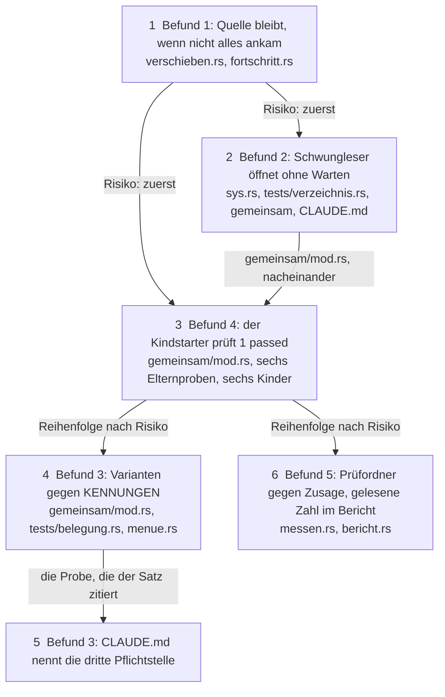

# Implementation Plan: die fünf schweren Befunde der Vollbaum-Durchsicht vom 260826

**Date:** 2026-08-26
**Status:** Complete
**Spec:** none — planned from raw request (Directive des Nutzers: „Wir beginnen mit den fünf schweren, dann müssen alle anderen gefixt werden.")
**Decidability:** Je Befund eine Antwort. **Befund 1:** Die tragende Frage lautet „Ist alles angekommen, was in der Quelle stand?", und sie ist aus den Eingaben von `ueber_datentraeger` entscheidbar, weil jeder Weg in `kopieren.rs`, auf dem ein Eintrag nicht ankommt, `Steuerung::ueberspringen` ruft (gelesen an `kopieren.rs:115-118`, `:132-133`, `:138-140`, `:181-183` und an `ziel_klaeren`, `mod.rs:435-450`); der Zählstand der übersprungenen Einträge vor und nach dem Kopieren ist damit ein vollständiger Zeuge, und ein Blick ins Zieldateisystem wäre es nicht. **Befund 2:** „Hängt das Öffnen an einer Röhre?" ist nicht am Pfad entscheidbar und am Deskriptor gegenstandslos; der Mechanismus ist im Baum (`ohne_warten_oeffnen`) und wird nur übernommen. **Befund 3:** „Steht jede Variante in `KENNUNGEN`?" ist aus der Liste allein unentscheidbar, weil die Liste der Gegenstand ist; entscheidbar wird sie aus einer zweiten Quelle, dem Quelltext der Aufzählung, und der Plan wechselt den Mechanismus dorthin. **Befund 4:** „Ist die Kindprobe gelaufen?" ist aus dem Rückgabewert von `libtest` unentscheidbar (0 bei Treffer, bei Nichttreffer und bei verlorenem `#[ignore]`, nachgemessen im Datensatz); entscheidbar ist sie aus der Ausgabe `1 passed`, und der Plan wechselt den Mechanismus dorthin. **Befund 5:** „Misst die Strecke auf dem zugesagten Bestand?" ist aus Steckbrief und gelesener Zahl entscheidbar; heute wird sie nicht gestellt.

## Directive

Die fünf schweren Befunde der Vollbaum-Durchsicht (ein kritischer, vier hohe) werden behoben, jeder mit einer Probe, die vor der Behebung rot und danach grün ist. Die 116 übrigen Befunde folgen in einem zweiten Plan, in dieser oder der nächsten Sitzung. Kein aktiver Circle; alles nach der Herkunftsregel unter `fusion-workbench/shared/`.

Die fünf Datensätze, alle unter `shared/issues/`:

1. `260826-1221_*_ein-gescheitertes-kopieren-ueber-die-datentraegergrenze-loescht-die-quelle-trotzdem.md` (kritisch, Datenverlust)
2. `260826-1221_*_der-schwungleser-oeffnet-mit-file-open-und-haengt-an-einer-benannten-roehre-fuer-immer.md`
3. `260826-1223_*_kennungen-ist-die-programmweite-kommandoliste-und-nichts-haelt-sie-vollstaendig.md`
4. `260826-1302_*_sechs-elternproben-am-gemeinsamen-kindstarter-bleiben-gruen-wenn-der-kindname-nicht-trifft.md` (mit dem Nachtrag von R5: der dritte stille Weg)
5. `260826-1301_*_kein-pruefordner-ausser-dem-l6-unterordner-wird-gegen-seine-zugesagte-eintragszahl-gehalten.md`

## Current State

Am HEAD `26e8039` gelesen, nicht am laufenden Gerät nachgestellt.

**Befund 1.** `ueber_datentraeger` (`crates/krk-core/src/operation/verschieben.rs:111-129`) ruft `kopieren::kopieren_nach` und löscht die Quelle mit `loeschen::baum_entfernen`, sobald der Rückgabewert nicht `Ablauf::Abgebrochen` ist. `Ablauf` (`operation/mod.rs:124-129`) kennt nur `Weiter` und `Abgebrochen`; ein gescheitertes Kopieren verbucht den Grund über `steuerung.ueberspringen` und liefert `Weiter`. `baum_entfernen` (`loeschen.rs:101-110`) löscht einen Ordner rekursiv, der Kommentar an der Stelle („scheitert daran") beschreibt ein `rmdir`, das es nicht gibt. `Steuerung` (`fortschritt.rs:273-281`) hält die übersprungenen Einträge in einem privaten `Vec<Uebersprungen>` und bietet keinen Lesezugriff darauf an. Keine Probe im Baum erreicht `EXDEV`; `ueber_datentraeger` ist privat, `Steuerung::neu` ist `pub(crate)`. Die Unit-Proben in `src/` (etwa `sys.rs:1291` und `:1378`) bauen ihren Prüfpfad direkt unter `std::env::temp_dir()` mit Prozesskennung, weil die Prüfordner-Fassung des Kerns in `tests/gemeinsam/` für sie unerreichbar ist.

**Befund 2.** `Schwungleser::oeffnen` (`crates/krk-core/src/verzeichnis/sys.rs:230-236`) ruft `File::open(pfad)` und prüft danach `metadata()?.is_dir()` am Deskriptor. Sechshundert Zeilen tiefer steht `ohne_warten_oeffnen` (`sys.rs:889-896`), das mit `O_NONBLOCK` öffnet und das Kennzeichen über `blockierend_stellen` sofort wieder abnimmt. Vier Rufer: `umfang.rs:254` (Hauptfaden), `durchlauf.rs:512`, `leser.rs:235` und `:281`. Die Probenform für eine Röhre steht in `tests/text.rs`: `Pruefordner::roehre` (`gemeinsam/mod.rs:151-159`, über `mkfifo`) und `mit_zeitschranke` (`text.rs:562-574`, privat in jener Datei; ihr Kopf nennt sich „die eine Fassung für alle drei Hüllen").

**Befund 3.** `Kommando` (`crates/krk-core/src/tasten/belegung.rs:344`, 79 datenlose Varianten, `#[derive(Debug, …)]`), `KENNUNGEN` (`:697`, `[(Kommando, &'static str); 79]`), `kennung` (`:1133`, schon eine `const fn`, endet auf `panic!`), `aus_kennung` (`:805`). Beide Proben in `tests/belegung.rs:1696-1722` laufen über `KENNUNGEN`. Der Doc-Kommentar von `tag_des_kommandos` (`crates/krk-ui/src/appkit/menue.rs:437-440`) zitiert die Eindeutigkeitsprobe als Vollständigkeitsbeleg. `tests/belegung.rs` bindet `mod gemeinsam` schon ein (`:19`); `gemeinsam::quelldateien()` (`:272-287`) liefert jede `.rs`-Datei unter `crates/`. `CLAUDE.md` nennt unter „Was man nicht sieht" zwei Pflichtstellen je neuem Kommando.

**Befund 4.** `kind_mit_deskriptorgrenze` (`crates/krk-core/tests/gemeinsam/mod.rs:334-351`) startet die Testdatei über `/bin/sh -c 'ulimit -n … && exec "$0" --exact --ignored --nocapture --test-threads 1 "$1"'`, setzt die Umgebungsvariable `auftrag` und liefert `Output`. Sechs Rufer prüfen allein `status.success()`. Sechs Kindproben beginnen mit `let Some(ordner) = std::env::var_os(AUFTRAG_…) else { return; }`. Die Auftragsnamen sind je Datei eigene Konstanten (`umfang.rs:230,234`, `verzeichnis.rs:2543,2726,2843`, `leseprofil.rs:3447`). Drei stille Wege zu Grün: Name trifft nicht, Variable fehlt, `#[ignore]` verloren. `zeit.rs:68` hat einen zweiten Starter derselben Klasse (`260825-2127_*_die-kindproben-in-tests-zeit-rs-…`), der nicht Gegenstand dieses Plans ist.

**Befund 5.** `Gesamtlauf::fahren` (`crates/krk-bench/src/messen.rs:1018-1026`) prüft an den drei Prüfordnern allein `is_dir()`. `unterordner_sicherstellen` (`:1485-1509`) hält den L6-Unterordner in beide Richtungen gegen `EINTRAEGE_L6`. `Messreihe::fahren` (`:143-200`) prüft, dass alle Läufe dieselbe Zahl lesen, und führt sie als `eintraege`; `eine_gesamtrunde` (`:1201-1220`) lässt sie fallen; `Gesamtergebnis` (`:992-1005`) hat kein Feld dafür; der Berichtskopf schreibt über `ordner_beschreiben` (`:2088-2101`) allein den Steckbrief aus. Die Zahlen 10.000 und 100.000 stehen nur in Doc-Kommentaren (`:959-963`). Die Proben von `messen.rs` fahren `Messreihe::fahren` auf `Wegwerfordner` mit `fixture::erzeugen(…, 3_000, 1)` (`:2609-2613`); `erzeugen` schreibt den Steckbrief mit `eintraege = plaene.len()` daneben.

## Approach

Ein Griff je Befund, jeder in der Bauform, die der Baum an einer Nachbarstelle schon fährt. Kein neuer Rückgabetyp bei Befund 1: der Zählstand der Steuerung ist der Zeuge, der schon da ist. Bei 2 der Austausch des Öffners, wie ihn drei Datensätze vor diesem getan haben. Bei 3 die Quelltextprobe aus `baum.rs`, weil stabiles Rust die Varianten nicht zählt (Entscheidungsdatensatz dazu, siehe „Open Questions"). Bei 4 das Gate an der einen Stelle, dem Starter, und ein Auftragsname statt sechs. Bei 5 die Prüfung aus `unterordner_sicherstellen`, auf alle Prüfordner gezogen, und die gelesene Zahl in den Bericht.

Reihenfolge nach Risiko: Befund 1 zuerst; 2 und 4 unabhängig davon; 3 und 5 danach.

Die drei Kanten aus Schritt 1 und aus Schritt 3 sind Ordnung nach Risiko und keine technische Abhängigkeit; die Kante 2 → 3 ist eine Dateiabhängigkeit (beide schreiben `tests/gemeinsam/mod.rs`); die Kante 4 → 5 ist inhaltlich (der Satz in `CLAUDE.md` zitiert die Probe, die es dann gibt).

## Implementation Steps

1. [DONE] **Befund 1: ein gescheitertes Kopieren lässt die Quelle stehen**
   - Executor: `coder`
   - Files: `crates/krk-core/src/operation/verschieben.rs`, `crates/krk-core/src/operation/fortschritt.rs`
   - Changes:
     - `Steuerung` bekommt `#[must_use] pub(crate) fn uebersprungen_stand(&self) -> usize` (die Länge der Liste) und `pub(crate) fn uebersprungen_seit(&self, stand: usize) -> &[Uebersprungen]`. Beides sind reine Antworten; die Liste bleibt privat.
     - `ueber_datentraeger` merkt den Stand vor `kopieren_nach`, gibt bei `Abgebrochen` wie heute zurück, und löscht die Quelle **nur**, wenn `uebersprungen_seit(stand)` leer ist. Ist sie es nicht, bleibt die Quelle stehen; steht der Pfad der Quelle selbst noch nicht unter den seither übersprungenen Einträgen (der Fall Ordner mit gescheitertem Kind oder mit gescheiterten Ordnerangaben), bekommt sie eine eigene Zeile in der Form von `verschmelzen`: „nicht vollständig kopiert, in der Quelle geblieben". Steht sie schon darin (der Fall Datei, Verknüpfung, `create_dir`), kommt keine zweite Zeile dazu; der Grund steht schon da. Der falsche Kommentar wird durch die Begründung ersetzt: der Zählstand ist der Zeuge, weil jeder Weg ohne Ankunft in `kopieren.rs` und `ziel_klaeren` überspringt.
     - Eine Probe in einem `#[cfg(test)]`-Modul von `verschieben.rs`, die `ueber_datentraeger` **direkt** ruft und damit `EXDEV` nicht braucht: Prüfpfad unter `std::env::temp_dir()` mit Prozesskennung, wie `sys.rs:1291` es tut, und mit Abräumen am Ende. Fall a: eine Datei, das Ziel unter einem Ordner, den es nicht gibt (`grund` übersetzt das als „Ziel verschwunden"); Erwartung: `Ablauf::Weiter`, die Quelle existiert noch, der Bericht (`steuerung.bericht(Abschluss::Fertig)`) führt genau einen übersprungenen Eintrag mit dem Pfad der Quelle. Fall b: ein Ordner mit zwei Dateien, das Ziel ein Ordner, in dem eine der beiden Dateien schon als **Ordner** gleichen Namens steht und die Konfliktregel „überspringen" gilt; Erwartung: der Quellordner steht mit beiden Dateien noch da, der Bericht führt das Kind und den Ordner. Fall c, die Gegenprobe: Ziel erreichbar, nichts übersprungen; Erwartung: Quelle weg, Ziel da, kein übersprungener Eintrag. Der Baum ohne Behebung ist an a und b rot (die Quelle ist weg), an c grün.
   - Acceptance: Fälle a und b rot vor der Behebung (im Sitzungseintrag festgehalten), alle drei grün danach; `make check` grün; die Aussage in `operation/mod.rs:50-54` („eine gescheiterte Einzelposition sammelt Eintrag und Grund") stimmt wieder für jeden Weg der Maschine.
   - Dependencies: none
   - Source: Datensatz 1; `critical-stance.md` §2 (der Zeuge ist schon da, kein dritter `Ablauf`-Wert).

2. [DONE] **Befund 2: `Schwungleser::oeffnen` nimmt die Hülle `ohne_warten_oeffnen`**
   - Executor: `coder`
   - Files: `crates/krk-core/src/verzeichnis/sys.rs`, `crates/krk-core/tests/gemeinsam/mod.rs`, `crates/krk-core/tests/text.rs`, `crates/krk-core/tests/verzeichnis.rs`, `CLAUDE.md`
   - Changes:
     - `Schwungleser::oeffnen`: `File::open(pfad)?` wird `ohne_warten_oeffnen(pfad)?`. Die Typprüfung `metadata()?.is_dir()` bleibt unverändert; sie ist die Antwort, die die Hülle vom Aufrufer verlangt. Ein Satz im Doc-Kommentar von `oeffnen` sagt, warum.
     - Der Doc-Kommentar von `ohne_warten_oeffnen` (Abschnitt „Mehrere Aufrufer") nennt den Verzeichnisleser als weiteren Aufrufer und seine Antwort („kein Verzeichnis", `ErrorKind::NotADirectory`, ohne Betriebssystemnummer, wie die Probe `nur_emfile_und_enfile_gelten_als_deskriptormangel` es schon festhält).
     - `mit_zeitschranke` zieht aus `tests/text.rs` nach `tests/gemeinsam/mod.rs` (`pub fn`), die drei Rufer in `text.rs` bleiben, die Begründung „die eine Fassung" zieht mit und wird um den vierten Rufer erweitert.
     - Neue Probe in `tests/verzeichnis.rs`: `eine_benannte_roehre_ohne_schreiber_haelt_den_schwungleser_nicht_an`. `Pruefordner::roehre`, `Schwungleser::oeffnen` unter `mit_zeitschranke` mit 5 s; Erwartung: `Err` mit `ErrorKind::NotADirectory`, keine Zeitüberschreitung. Ohne Behebung endet die Probe nach 5 s in der Panik der Schranke; der hängende Faden stirbt mit dem Prozess.
     - `CLAUDE.md`, Absatz „Die Prüfung dessen, was da geöffnet wurde, steht am Deskriptor": der Satz „Sie liegen auch nicht mehr alle in `krk-core/src/text/datei.rs`" bekommt den Verzeichnisleser als dritten Ort (`verzeichnis/sys.rs` selbst, `Schwungleser::oeffnen`, Antwort „kein Verzeichnis" am Deskriptor). Keine Zahl; das Zählkommando steht dort schon.
   - Acceptance: die neue Probe rot (Zeitüberschreitung) vor, grün nach der Behebung; alle bestehenden Proben des Lesers, des Durchlaufs und des Umfangs grün, damit belegt ist, dass `O_NONBLOCK` an einem Verzeichnisdeskriptor `getattrlistbulk(2)` nicht erreicht (die Hülle nimmt es vor der Rückgabe ab); `make check` grün; der Abschnitt „Ab welchem macOS …" bleibt, wo er steht (die Datei ist `sys.rs` in `krk-core`, sie trägt keinen; nichts zu tun).
   - Dependencies: none
   - Source: Datensatz 2; die drei Vorgänger `260809-1652`, `260810-1247`, `260825-0942`.

3. [DONE] **Befund 4: der Kindstarter beweist, dass das Kind gelaufen ist**
   - Executor: `coder`
   - Files: `crates/krk-core/tests/gemeinsam/mod.rs`, `crates/krk-core/tests/umfang.rs`, `crates/krk-core/tests/verzeichnis.rs`, `crates/krk-core/tests/leseprofil.rs`
   - Changes:
     - Ein Auftragsname statt sechs: `pub const KINDAUFTRAG: &str = "KRK_KINDPROBE_AUFTRAG"` in `gemeinsam`, und `pub fn kindauftrag() -> Option<PathBuf>` als der eine Leser. `kind_mit_deskriptorgrenze` verliert den Parameter `auftrag` und setzt `KINDAUFTRAG`. Die sechs Konstanten `AUFTRAG_MANGEL`, `AUFTRAG_KETTE`, `AUFTRAG_INHALTSMANGEL`, `AUFTRAG_DESKRIPTOREN` (zweimal), `AUFTRAG_MANGEL` (verzeichnis) fallen; die sechs Kinder beginnen mit `let Some(ordner) = kindauftrag() else { return; }`. Der zweite stille Weg ist damit strukturell zu, nicht geprüft: es gibt nur noch einen Namen. (Die Konstanten `AUFTRAG_ABBRUCH` und `AUFTRAG_SPERRE` in `ablage.rs` und `AUFTRAG_ZONE` in `zeit.rs` gehören zu anderen Startern und bleiben.)
     - Der Starter hält nach `output()` selbst: `status.success()` **und** `stdout` enthält `test result: ok. 1 passed;`. Scheitert eines, Panik mit Name, stdout und stderr, wie die sechs Rufer es heute je einzeln tun. Damit sind der erste und der dritte stille Weg zu (Nichttreffer und verlorenes `#[ignore]` enden beide auf `0 passed`). Der Starter liefert weiter `Output`, damit die Rufer ihre eigene Meldung behalten können; ihre sechs `assert!` bleiben als die fachliche Zeile stehen.
     - Der Modulkopf des Starters (`:34-42`) schreibt die drei Wege und das Gate aus.
     - Rot-vor-grün: eine bewusste Mutation, im Sitzungseintrag festgehalten. Erstens den Kindnamen eines Rufers um ein Zeichen ändern (heute grün, danach rot am Gate); zweitens einem Kind das `#[ignore]` nehmen (heute grün, danach rot). Beides zurücknehmen.
   - Acceptance: beide Mutationen rot mit der neuen Meldung, der unveränderte Baum grün; die sechs Kindproben laufen weiter unter `ulimit -n 24` beziehungsweise `64` und messen, was `CLAUDE.md` als gemessen führt; `make check` grün.
   - Dependencies: Schritt 2 (beide schreiben `tests/gemeinsam/mod.rs`; nacheinander, nicht gleichzeitig).
   - Source: Datensatz 4 samt Nachtrag R5.

4. [DONE] **Befund 3: jede Variante von `Kommando` steht in `KENNUNGEN`**
   - Executor: `coder`
   - Files: `crates/krk-core/tests/gemeinsam/mod.rs`, `crates/krk-core/tests/belegung.rs`, `crates/krk-ui/src/appkit/menue.rs`
   - Changes:
     - Helfer `pub fn varianten_der_aufzaehlung(datei: &str, name: &str) -> Vec<String>` in `gemeinsam`: nimmt die Datei aus `quelldateien()`, schneidet den Block von `pub enum <name> {` bis zur schließenden Klammer in Spalte 0 (dieselbe Lesart wie das Zählkommando in `CLAUDE.md`), lässt Doc-Kommentare, Attribute und Leerzeilen aus und liefert die Bezeichner vor dem Komma. Er hält `assert!(!varianten.is_empty())`, damit ein verschobener Block die Probe nicht still leer laufen lässt (die Gegenprobe, die `baum.rs` und `belegung.rs:786` schon fahren).
     - Neue Probe in `tests/belegung.rs`: `jede_variante_von_kommando_steht_genau_einmal_in_kennungen`. Die Menge der Varianten aus dem Quelltext gegen die Menge `format!("{:?}", kommando)` über `KENNUNGEN`; beide Richtungen, mit den fehlenden Namen in der Meldung. Die bestehende Probe `jedes_kommando_traegt_genau_einen_wirkungsbereich` bleibt; ihr Doc-Kommentar sagt künftig, dass sie die Eindeutigkeit hält und die neue Probe die Vollständigkeit.
     - `menue.rs:437-440`: der Doc-Kommentar von `tag_des_kommandos` zitiert für „jedes Kommando genau einmal" beide Proben mit Namen.
     - Rot-vor-grün: Mutation, im Sitzungseintrag festgehalten: `KENNUNGEN` auf `; 78]` setzen und eine Zeile entfernen; die neue Probe wird rot und nennt die Variante. Zurücknehmen.
   - Acceptance: die Mutation rot mit dem Namen der fehlenden Variante, der unveränderte Baum grün; `make check` grün; der Helfer trägt keinen Namen einer bestimmten Aufzählung, damit der zweite Plan ihn an `Wirkungsbereich` (`260826-1302_*_ein-achter-wirkungsbereich-…`) wiederverwenden kann.
   - Dependencies: Schritt 3 (Reihenfolge nach Risiko; dieselbe Datei `gemeinsam/mod.rs`).
   - Source: Datensatz 3; Entscheidungsdatensatz `shared/decisions/260826-1811_*_wie-wird-die-vollstaendigkeit-einer-alle-liste-neben-einer-aufzaehlung-gehalten.md` (Möglichkeit 1, die mit Möglichkeit 2 verträglich bleibt).

5. [DONE] **Befund 3: `CLAUDE.md` nennt die dritte Pflichtstelle**
   - Executor: `coder`
   - Files: `CLAUDE.md`
   - Changes: Im Absatz „Etliche Fallunterscheidungen sind vollständig und haben keinen Auffangzweig" steht heute: „Jedes neue Kommando braucht eine Zeile in `Kommando::wirkungsbereich` … und in `bereich_des_kommandos`". Der Satz bekommt die dritte Stelle, `Kommando::KENNUNGEN` in derselben Datei wie `wirkungsbereich`, und den Unterschied: die ersten zwei hält der Übersetzer, die dritte hält die Probe `jede_variante_von_kommando_steht_genau_einmal_in_kennungen` in `crates/krk-core/tests/belegung.rs`, und ohne die Zeile dort übersetzt das Kommando, steht in keiner Belegung und bringt `kennung()` und `tag_des_kommandos` zum Absturz. Keine Zahl im Satz.
   - Acceptance: der Satz zitiert eine Probe, die es gibt (Schritt 4 gelandet); `git diff CLAUDE.md` zeigt eine Änderung an genau diesem Absatz.
   - Dependencies: Schritt 4.
   - Source: Datensatz 3; Auftrag des Nutzers im Dispatch.

6. [DONE] **Befund 5: jeder Prüfordner wird gegen seine zugesagte Eintragszahl gehalten, und die gelesene Zahl erreicht den Bericht**
   - Executor: `coder`
   - Files: `crates/krk-bench/src/messen.rs`, `crates/krk-bench/src/bericht.rs`
   - Changes:
     - Zwei Konstanten neben `EINTRAEGE_L6`: `EINTRAEGE_A = 10_000` (gilt für A und B) und `EINTRAEGE_GROSS = 100_000`, mit den Zusagen L3 und L10 als Begründung. Die Doc-Kommentare an `Gesamtlauf` (`:959-963`) verweisen darauf statt die Zahl zu wiederholen.
     - `fn pruefordner_pruefen(ordner: &Path, erwartet: usize) -> io::Result<()>`: die zwei Regeln aus `unterordner_sicherstellen` (Steckbrief mit anderer Zahl: Fehler mit beiden Zahlen; Ordner ohne Steckbrief: Fehler „auf unbekanntem Bestand misst … nicht"), als eine Funktion. `unterordner_sicherstellen` ruft sie und behält allein das Anlegen; `Gesamtlauf::fahren` ruft sie für A, B und 100k neben `is_dir()`.
     - `Messreihe::fahren`: nach der Gleichheitsprüfung der Läufe wird die gelesene Zahl gegen den Steckbrief gehalten, **wenn** einer daliegt; Abweichung ist `Err` mit beiden Zahlen. Ohne Steckbrief bleibt die Reihe zulässig (die kopflose Strecke darf auf einen beliebigen Ordner zeigen, `steckbrief_lesen` sagt das in seinem Kopf). Die Zahl kommt aus `Ordnermodell::eintraege()` (`messen.rs:258`), und die führt „alle gelesenen Einträge, auch die ausgeblendeten" (`modell.rs:547-550`); ein hineingerutschter `.DS_Store` fällt damit ebenso auf wie ein gelöschter Eintrag und ein falscher Ordner.
     - `Gesamtergebnis` bekommt `eintraege_a: usize` und `eintraege_gross: usize` aus `reihe_a.eintraege` und `reihe_gross.eintraege`; `eine_gesamtrunde` reicht sie hoch (über `Gesamtrohrunde`, in jeder Runde dieselbe Zahl, sonst `Err`). `gesamt_verfassen` (`bericht.rs`) schreibt im Bedingungskopf neben „Prüfordner A" und „Prüfordner 100k" die gelesene Zahl in der Form, die `verfassen` der kopflosen Strecke schon nimmt: „{gelesen} (laut Steckbrief: {brief})".
     - Proben in `messen.rs`, alle auf `Wegwerfordner`: (a) `eine_messreihe_verwirft_einen_ordner_der_seinem_steckbrief_widerspricht`: `erzeugen(…, 10, 1)`, dann eine elfte Datei in den Ordner legen, `Messreihe::fahren` liefert `Err` mit beiden Zahlen; ohne Behebung `Ok`, also rot vor der Behebung. (b) `pruefordner_pruefen` gegen einen Ordner mit Steckbrief 3.000 und Erwartung 10.000: `Err`; ohne Steckbrief: `Err`; passend: `Ok`. (c) die bestehende Probe `eine_messreihe_liefert_je_messgroesse_einen_wert_pro_lauf` bleibt grün (Steckbrief 3.000, gelesen 3.000).
     - Kein Messlauf: der verlangt KRK im Vordergrund und ist Nutzerarbeit. Der nächste Abnahmelauf des Nutzers zeigt die neue Kopfzeile.
   - Acceptance: Probe (a) rot vor, grün nach der Behebung; (b) grün; `make check` grün; `cargo run -p krk-bench -- messen --kopflos` auf einem Ordner ohne Steckbrief läuft weiter durch (die Toleranz bleibt); `Gesamtlauf::fahren` weist einen Prüfordner A mit 3.000 Einträgen vor der ersten Runde ab. Bekannt und kein Hindernis: `cargo test` räumt über `plan_schreiben` den Messplan eines gleichzeitig laufenden Messlaufs ab.
   - Dependencies: Schritt 3 (Reihenfolge nach Risiko; keine Dateiabhängigkeit).
   - Source: Datensatz 5; der Gegenmaßstab `unterordner_sicherstellen`.

**Prüfregeln, die jeder Schritt einhält:** `make check` (Bau, Proben, Clippy, Format) grün; `#[must_use]` an jeder neuen reinen Antwort (`uebersprungen_stand`, `pruefordner_pruefen` liefert `io::Result`, das die Marke schon trägt); kein `libc`; `#![deny(unsafe_code)]` mit der einen Ausnahme in `sys.rs`, kein neues `unsafe`; Prüfordner nur über die drei Fassungen je Kiste, in `src/`-Unit-Proben der ad-hoc-Pfad unter `temp_dir()` mit Prozesskennung wie an `sys.rs:1291`; der Untergrenzen-Abschnitt bleibt, wo er steht (kein Schritt berührt `krk-ui/src/appkit/` außer dem Doc-Kommentar in `menue.rs`); Prosa deutsch, Bezeichner englisch; jeder Schritt landet in einem eigenen Commit mit dem Datensatz im Text, und der Datensatz bekommt `Resolved:` und `_c_`.

## Where this Circle stops

Kein Circle ist aktiv; das ist die Grenze dieses Plans.

- Jeder der fünf Datensätze trägt `Resolved:` mit dem Commit und steht auf `_c_`.
- Je Befund ist die neue Probe vor der Behebung rot gewesen und danach grün, und der Sitzungseintrag des Coders hält die rote Ausgabe fest (bei Befund 3 und 4 die bewusste Mutation, bei 1, 2 und 5 den unveränderten Baum).
- `make check` ist am letzten Commit grün.
- `CLAUDE.md` nennt die dritte Pflichtstelle für ein neues Kommando (Schritt 5) und den Verzeichnisleser als Aufrufer der Hülle (Schritt 2).
- Der zweite Plan über die 116 übrigen Befunde ist in dieser oder der nächsten Sitzung geschrieben; er nimmt den Helfer aus Schritt 4 für `Wirkungsbereich` und das Gate aus Schritt 3 für `zeit.rs::kindprobe_in_zone` wieder auf.
- Kein Abnahmelauf gegen die zehn Zusagen ist Bedingung: er ist Nutzerarbeit, und keine Behebung dieses Plans berührt eine der zehn Messstrecken selbst; Schritt 6 ändert, was die Strecke vor dem Messen prüft und was der Bericht ausweist.

## Data Structures

- `Steuerung::uebersprungen_stand(&self) -> usize`, `Steuerung::uebersprungen_seit(&self, usize) -> &[Uebersprungen]` (Schritt 1).
- `gemeinsam::KINDAUFTRAG`, `gemeinsam::kindauftrag() -> Option<PathBuf>`, `gemeinsam::mit_zeitschranke`, `gemeinsam::varianten_der_aufzaehlung` (Schritte 2 bis 4).
- `Gesamtergebnis { eintraege_a, eintraege_gross }`, `Gesamtrohrunde` entsprechend; `EINTRAEGE_A`, `EINTRAEGE_GROSS`; `pruefordner_pruefen` (Schritt 6).

Kein neuer Rückgabetyp, kein dritter Wert an `Ablauf`.

## API Changes

Keine öffentliche Schnittstelle von `krk-core` ändert sich. `kind_mit_deskriptorgrenze` verliert einen Parameter (Prüfcode). `Gesamtergebnis` wächst um zwei Felder (`krk-bench`, `pub`, ein Rufer in `bericht.rs`).

## Testing Strategy

Je Befund eine Probe, die die Behebung ohne Vorführgerät misst: Befund 1 ohne zweiten Datenträger (direkter Aufruf der privaten Funktion, Ziel unter fehlendem Ordner), Befund 2 mit `mkfifo` und Zeitschranke, Befund 3 mit der Quelltextprobe und einer Mutation, Befund 4 mit zwei Mutationen, Befund 5 mit einem Steckbrief, dem der Ordner widerspricht. Die Mutationen sind keine Proben im Baum; sie sind der Beleg für „rot vorher", und der Sitzungseintrag hält ihre Ausgabe fest.

Was dieser Plan **nicht** misst und ehrlich benennt: der `EXDEV`-Abzweig in `eintrag_verschieben` (`verschieben.rs:49-61`) bleibt allein gelesen; ein Verschieben auf einen zweiten Datenträger mit gescheitertem Kopieren kann der Nutzer mit einem USB-Stick und einem vollen oder schreibgeschützten Ziel nachstellen, das ist keine Bedingung des Plans.

## Risks & Mitigations

| Risk | Mitigation |
|------|------------|
| Der Zählstand als Zeuge übersieht einen Weg, auf dem `kopieren.rs` künftig ohne `ueberspringen` scheitert. | Der neue Kommentar in `ueber_datentraeger` benennt die Invariante mit Zeilen; Probe b hält den Kindfall. Ein vierter Wert in `Zielentscheid` oder ein neuer Fehlerzweig ohne `ueberspringen` bricht die Invariante still; das ist der Preis gegenüber einem dritten `Ablauf`-Wert, und er ist kleiner als die 50 Stellen in sieben Dateien umzubauen, an denen `Ablauf::` steht (`grep -rn 'Ablauf::' crates/krk-core/src/operation/`). |
| Ein übersprungener Eintrag an den **Ordnerangaben** (Rechte, Datum) hält die Quelle, obwohl der Inhalt ankam. | Gewollt konservativ: nichts geht verloren, der Ordner steht dann an beiden Orten und der Bericht sagt es. Kein Sonderfall im Code. |
| `O_NONBLOCK` an einem Verzeichnisdeskriptor beeinflusst `getattrlistbulk(2)`. | Die Hülle nimmt das Kennzeichen vor der Rückgabe ab (`blockierend_stellen`); die bestehenden Leserproben sind die Messung. |
| Die Zeile `test result: ok. 1 passed;` ändert ihre Form mit einer Rust-Version. | `rust-toolchain.toml` hält 1.97.1 fest; bricht die Form, wird das Gate rot und nicht still grün, also die richtige Richtung. |
| Die Quelltextnadel für `pub enum Kommando` greift daneben (Varianten mit Daten, umgebrochene Zeilen). | `Kommando` ist datenlos, eine Variante je Zeile; der Helfer hält `!is_empty()` und die Probe vergleicht beide Richtungen, ein Übergriff liefert Namen, die in `KENNUNGEN` fehlen, also rot statt still. Die Blindheiten stehen im Doc-Kommentar des Helfers, wie `baum.rs:17-29` es vorführt. |
| Der Steckbriefvergleich in `Messreihe::fahren` macht die kopflose Strecke auf einem selbst erzeugten Ordner streng: ein einziger fremder Eintrag beendet die Reihe. | Das ist der Zweck; die Meldung nennt beide Zahlen und den Weg (Ordner samt Steckbrief löschen, neu erzeugen), wie `unterordner_sicherstellen` es schon formuliert. |
| Zwei Schritte schreiben `tests/gemeinsam/mod.rs`. | Schritte 2, 3 und 4 laufen nacheinander, je ein Commit. |

## Open Questions

- [ ] Quelltextprobe oder Ableitungsmakro für alle elf `ALLE`-Listen: `shared/decisions/260826-1811_*_wie-wird-die-vollstaendigkeit-einer-alle-liste-neben-einer-aufzaehlung-gehalten.md`. Schritt 4 fährt Möglichkeit 1 und hält keinen Planschritt auf; die Antwort bindet den zweiten Plan.
- [ ] Ob die kopflose Strecke (`messen --kopflos`) einen Ordner **ohne** Steckbrief weiter zulassen soll (Schritt 6 sagt ja, wie der Kopf von `steckbrief_lesen`) oder ihn wie `unterordner_sicherstellen` abweisen soll. Nur dieser Plan braucht die Antwort; bis dahin gilt ja.

---

## Reconciliation Log

### 260826-2205 — Abgleich zum Sitzungsende, Bereich `26e8039..bc5991d`

Gelesen wurde gegen den Baum und nicht gegen die Berichte, die die Erledigung behaupten.
Grundlage: `fusion-workbench/agentstate.yaml` (sechs Aufgaben `done`), der Ereignisstrom
`orchestrator-events.jsonl` und die sieben Commits selbst.

Selbst gefahren am 260826-2158: `make check` über `bc5991d`, Ausstiegscode 0, „alle vier
gruen". Selbst gefahren: `bin/fusion-review-coverage` über den Sitzungsbereich.

**Alle sechs Schritte halten.** Je Schritt die Stelle, an der der Baum die Behauptung trägt:

| Schritt | Commit | Beleg im Baum |
|---|---|---|
| 1 Quelle bleibt stehen | `36e54b4` | `operation/fortschritt.rs:355` `uebersprungen_stand` und `:363` `uebersprungen_seit`, beide `#[must_use]`, beide `pub(crate)`; `operation/verschieben.rs:127` merkt den Stand, `:132-146` löscht nur bei leerer Liste und trägt die zweite Zeile nach; drei Proben `:198`, `:233`, `:277` |
| 2 Schwungleser über die Hülle | `9c02863` | `verzeichnis/sys.rs:240` `ohne_warten_oeffnen(pfad)?`, Typprüfung `:241-246` unverändert am Deskriptor; `tests/gemeinsam/mod.rs:291` `mit_zeitschranke`; `tests/verzeichnis.rs:3525` die Röhrenprobe |
| 3 Kindstarter mit Gate | `17e5e4e` | `tests/gemeinsam/mod.rs:471` `KINDAUFTRAG`, `:480` `kindauftrag`, `:513` der Starter ohne Auftragsparameter, `:527-537` das Gate über `status.success()` **und** `EIN_KIND_GELAUFEN` in `stdout` |
| 4 Varianten gegen `KENNUNGEN` | `9a4e495` | `tests/gemeinsam/mod.rs:411` `varianten_der_aufzaehlung` ohne Aufzählungsnamen im Rumpf; `tests/belegung.rs:1760` die Probe, beide Richtungen; `krk-ui/src/appkit/menue.rs:443` zitiert beide Proben |
| 5 dritte Pflichtstelle in `CLAUDE.md` | `fc829c8` | `CLAUDE.md:133`, ein Satzpaar hinter „Diese Stellen hält der Übersetzer"; keine Zahl darin |
| 6 Prüfordner gegen die Zusage | `960900d` | `krk-bench/src/messen.rs:974` `EINTRAEGE_A`, `:980` `EINTRAEGE_GROSS`, `:1587` `pruefordner_pruefen`, `:1063-1077` der Ruf für A, B und 100k, `:1266-1268` die gelesene Zahl, `bericht.rs:259` und `:266` der Berichtskopf; Proben `:2797` und `:2815` |

**Ein Schlusskriterium ist verfehlt und trägt einen Datensatz.** „Where this Circle stops"
verlangt: „Jeder der fünf Datensätze trägt `Resolved:` mit dem Commit." Keiner der fünf tut
es; vier tragen einen Sitzungsstempel, einer einen Dateipfad. Der Befund steht als
`shared/issues/260826-1933_*_die-zwei-resolved-zeilen-der-schritte-1-und-2-tragen-den-sitzungsstempel-statt-des-commits.md`
und ist dort mit `Also seen:` auf fünf von fünf erweitert. Der Abgleich hat die fünf Commits
je Datensatz als eigene `Reconciled:`-Zeile nachgetragen und die `Resolved:`-Zeilen
unangetastet gelassen: welche der zwei Abhilfen gilt — Hash nachtragen oder das
Schlusskriterium abschwächen —, ist eine Nutzerfrage und mit dem Nachtrag nicht entschieden.

**Ein zweites Schlusskriterium steht offen, planmäßig.** Der zweite Plan über die 116 übrigen
Befunde ist nicht geschrieben; der Plan lässt dafür ausdrücklich „in dieser oder der nächsten
Sitzung" zu.

**Keine Abweichung zwischen Entwurf und Bau.** Jede Datenstruktur des Abschnitts „Data
Structures" steht mit dem geplanten Namen im Baum; `Ablauf` hat weiter zwei Werte
(`operation/mod.rs`), kein neuer Rückgabetyp ist entstanden.

`Status: Complete` und der Marker `_c_` bleiben: die sechs Schritte sind gebaut und einzeln
gegen den Baum gelesen. Die zwei offenen Schlusskriterien stehen oben.
