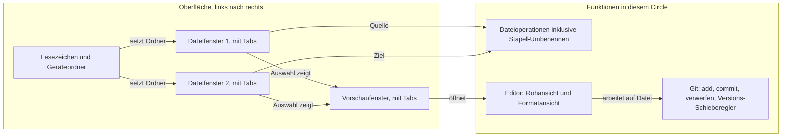

# KRK: nativer Mac-Dateimanager mit eingebautem Editor und Git

---
**Domain:** code
**Status:** bounded
**Filed by:** shaper (anticipated-circle mode)
**Active spec/plan:** circles/260802-0842-krk-mac-dateimanager-editor-git/planning/260802-1036_*_spec-navigator-geruest.md (Abnahmekriterien) und circles/260802-0842-krk-mac-dateimanager-editor-git/planning/260802-1428_*_plan-navigator-geruest-runde-1.md (Ausführungsstand); beide seit dem 260807-1035 auf `_c_`
**Active session history:** circles/260802-0842-krk-mac-dateimanager-editor-git/history/260806-2257-orchestrator-session.md

---

## Directive

KRK ist eine native macOS-Anwendung, mit der lokale Dateien vollständig über die Tastatur navigiert, bearbeitet und versioniert werden. Die Oberfläche besteht aus einer Lesezeichen- und Geräteleiste links, zwei Dateifenstern mit je mehreren Tabs in der Mitte und einem Vorschaufenster mit eigenen Tabs rechts. Dateien und Ordner lassen sich anlegen, kopieren, verschieben, löschen und im Stapel umbenennen, auch über mehrere ausgewählte Einträge hinweg. Der eingebaute Editor öffnet Text, Code und Markdown in einer Rohansicht und einer Formatansicht, springt zu einer Zeilennummer, sucht und ersetzt innerhalb der geöffneten Datei und speichert Marken auf Textstellen und Textbereiche als Lesezeichen im Home-Verzeichnis des Nutzers. Git ist eingebaut: hinzufügen, committen, Änderungen verwerfen sowie ältere Versionen über einen Schieberegler ansehen und auschecken. Jede Tastenbelegung ist frei konfigurierbar; ausgeliefert wird eine Mac-typische Vorbelegung, die jede Funktion der Norton-Reihe auf zwei Wegen erreichbar macht, über die Funktionstasten F3 bis F8 und über ein Cmd-Kürzel. Die Taste Delete und Cmd+Delete räumen in den Papierkorb, F8 und Cmd+Opt+Delete löschen endgültig und fragen dabei einmal je Vorgang nach.

Zusatz: alle Fenster sind variable in der Größe und können per Tastenbefehl ein- und ausgeblendet werden.

## Grounding snapshot

### Ausgangslage

Das Projekt ist ein leeres Repository. Außer `idea.txt` und dem frisch eingerichteten `fusion-workbench/` existiert kein Code, kein `CLAUDE.md` und keine Vorentscheidung. Es gibt daher weder ein bestehendes Muster zu erben noch eine Abstraktion wiederzuverwenden. Jede technische Festlegung, von der Sprache über das UI-Toolkit bis zur Git-Anbindung, ist offen und gehört in den Plan, nicht in diese Directive.

**Stand 260802-1735.** Der Absatz oben beschreibt den 260802-0842 und bleibt als Ausgangspunkt stehen. Zwei seiner Aussagen sind überholt: `CLAUDE.md` gibt es seit dem 260802-1014, und die Wahl von Sprache und UI-Werkzeugkasten ist seit dem 260802-1150 getroffen. KRK entsteht in Rust mit AppKit über `objc2`, außerhalb der App-Sandbox, mit macOS 15 als Mindest-Zielsystem und Unterstützung bis macOS 26. Der Datensatz dazu ist `circles/260802-0842-krk-mac-dateimanager-editor-git/decisions/260802-1134_*_sprache-und-ui-werkzeugkasten.md`, die zugrunde liegende Untersuchung `circles/260802-0842-krk-mac-dateimanager-editor-git/analyses/260802-1134-sprache-und-ui-werkzeugkasten.md`.

Quelle der Directive ist `idea.txt` im Projektwurzelverzeichnis. Vorbilder sind laut Entwurf ForkLift und Norton Commander. Die Maximen des Entwurfs lauten superschnell, supersimpel, Steuerung über die Tastatur bei zusätzlicher Maus- und Trackpad-Unterstützung.

### Oberfläche und Datenfluss

Das Vorschaufenster hält seinen Inhalt pro Tab fest. Eine Auswahl im Dateifenster ersetzt den Inhalt des gerade aktiven Vorschau-Tabs; wechselt der Nutzer den Tab, bleibt der vorherige Inhalt dort stehen, bis er selbst überschrieben wird. Bei Dateien, die sich nicht darstellen lassen, zeigt die Vorschau die Metadaten.

### Beantwortete Fragen aus der Klärungsrunde

**Umfang.** Der Nutzer hat Navigator, Editor und Git gemeinsam gewählt. Alle drei bilden diesen einen Circle, weil sie zusammen erst die durchgehende Arbeitsschleife ergeben: navigieren, öffnen, ändern, committen. Ein Navigator ohne Editor wäre ein halbes Werkzeug, ein Editor ohne Git-Anbindung ebenso.

**Bedienmodell.** Jede Taste ist konfigurierbar, das ist die Grundhaltung. Die ausgelieferte Vorbelegung ist Mac-typisch, also Cmd-Kürzel und Pfeiltasten, und trägt zusätzlich die Norton-Belegung auf F3 bis F8. Löschen ist ausdrücklich auf Shift+Delete vorbelegt. Damit ist Löschen ab Werk auf zwei Wegen erreichbar, über F8 aus der Norton-Reihe und über Shift+Delete; beides ist gewollt und kein Konflikt.

*Später überholt, Stand 260802-1735:* Shift+Delete ist ab Werk unbelegt. Die Antwort des Nutzers vom 260802-1105 hat das Löschen anders geteilt, und die Klärungsrunde oben liegt davor. Ausgeliefert wird: Delete und Cmd+Delete räumen in den Papierkorb, F8 und Cmd+Opt+Delete löschen endgültig und fragen einmal je Vorgang nach. Shift+Delete kann der Nutzer frei belegen, KRK liefert die Kombination nicht vorbelegt aus. Maßgeblich ist C3 des Specs `circles/260802-0842-krk-mac-dateimanager-editor-git/planning/260802-1036_*_spec-navigator-geruest.md`; der Datensatz dazu ist `shared/decisions/260802-0842_*_loeschen-papierkorb-oder-endgueltig.md`.

**Laufwerke.** Nur lokal: interne Platten, externe Medien und alles, was der Finder bereits eingehängt hat. Ein vom Finder gemountetes Netzlaufwerk erscheint damit als gewöhnlicher Pfad und ist eingeschlossen. Eigene Server-Protokolle sind es nicht.

**Code-SDK.** Offen, siehe Entscheidungsdatensatz unten.

### Vom Shaper getroffene Abgrenzungsentscheidungen

Der Nutzer hat die Einordnung zweier Punkte an den Shaper delegiert. Beide bleiben draußen:

**Datei- und Ordnervergleich** wird ein eigenes Vorhaben. Der Vergleich braucht eine eigene Differenzberechnung für Dateiinhalte und eine zweite für Ordnerbäume, dazu eine eigene Darstellung im Vorschaufenster. Die Arbeitsschleife aus Navigieren, Bearbeiten und Committen funktioniert ohne ihn. Eine Überschneidung ist vorgemerkt: der Versions-Schieberegler zeigt ältere Fassungen einer Datei und braucht dafür bereits eine Form von Versionsdarstellung. Der spätere Vergleichs-Circle setzt darauf auf, statt einen zweiten Mechanismus danebenzustellen.

**Suchen und Ersetzen über mehrere Dateien** wird ebenfalls ein eigenes Vorhaben. Es braucht einen Scan über Verzeichnisbäume, eine Trefferliste, eine Vorschau der geplanten Ersetzungen und einen Rückweg, wenn eine Stapelersetzung danebengeht. Suchen und Ersetzen **innerhalb der geöffneten Datei** bleibt dagegen in diesem Circle, weil der Entwurf es als Editor-Funktion führt.

### Offene Entscheidungen

Stand 260802-1735. Drei der ursprünglich fünf Fragen im geteilten Speicher sind noch offen, zwei sind beantwortet. Alle Pfade tragen seit dem 260810 die Sternform `_*_` und nennen den Marker nicht mehr aus; welchen eine Datei heute trägt, steht an der Datei.

Noch offen, keine davon bindet die Runde 1:

- `shared/decisions/260802-0842_*_git-verwerfen-bedeutung.md` — was "revert" aus dem Entwurf konkret meint. Gehört zur Git-Runde.
- `shared/decisions/260802-0842_*_editor-formatansicht-je-dateityp.md` — was die Formatansicht je Dateityp zeigt. Gehört zur Editor-Runde.
- `shared/decisions/260802-0842_*_code-sdk-fuer-ki-integration.md` — welches Code-SDK die spätere KI-Anbindung tragen soll. Der Datensatz hält seine eigene Nichtbindung ausdrücklich fest.

Beantwortet am 260802-1105, eingearbeitet in den Spec:

- `shared/decisions/260802-0842_*_f-tasten-unter-macos-systembelegung.md` — die Antwort des Nutzers vom 260802-1105 lautete: ausgeliefert wird ausschließlich die Fn-Kombination, Fn+F3 bis Fn+F8, die nackten Funktionstasten bleiben frei. Der Nachtrag vom 260802-1409 hält den Stand nach der Messung fest und ersetzt die Formulierung, nicht die Wahl. KRK belegt das Tastenereignis der Funktionstaste und kann Fn+F3 von einem nackten F3 nicht unterscheiden; die ausgelieferte Belegung heißt darum F3 bis F8, und die Zusage der freien nackten Funktionstasten beschreibt keinen erreichbaren Zustand. Seit demselben Tag trägt jede Funktion der Norton-Reihe ab Werk zusätzlich ein Cmd-Kürzel. Die Einzelheiten stehen in C3 des Specs.
- `shared/decisions/260802-0842_*_loeschen-papierkorb-oder-endgueltig.md` — die Taste Delete räumt in den Papierkorb, F8 löscht endgültig. Seit dem 260802-1409 trägt jeder der beiden Wege zusätzlich ein Cmd-Kürzel: Cmd+Delete für den Papierkorb und Cmd+Opt+Delete für das endgültige Löschen. Die Schreibweise "Fn+F8" aus der ursprünglichen Fassung ist mit der Messung vom 260802-1409 entfallen, weil KRK Fn+F8 und ein nacktes F8 nicht unterscheiden kann.

Im Circle selbst liegen fünf Datensätze, vier davon beantwortet:

- `circles/260802-0842-krk-mac-dateimanager-editor-git/decisions/260802-1036_*_umbenennen-im-stapel-umfang.md` — Umbenennen im Stapel mit Musterregeln und Vorschau.
- `circles/260802-0842-krk-mac-dateimanager-editor-git/decisions/260802-1036_*_leistungszusagen-navigator.md` — die zehn Zeitzusagen und das Referenzgerät, ein MacBook Pro 15 Zoll von 2018 mit Intel Core i9 und 60-Hz-Bildschirm.
- `circles/260802-0842-krk-mac-dateimanager-editor-git/decisions/260802-1134_*_sprache-und-ui-werkzeugkasten.md` — Rust mit AppKit über `objc2`, Auslieferung außerhalb der App-Sandbox, Mindest-Zielsystem macOS 15 mit Unterstützung bis macOS 26. Entschieden am 260802-1150 gegen die Empfehlung der Untersuchung, begründet mit Editor und Git-Anbindung als späteren Runden desselben Circles.
- `circles/260802-0842-krk-mac-dateimanager-editor-git/decisions/260802-1428_*_was-l4-mit-wiederhergestellten-tabs-meint.md` — der Kaltstart aus L4 zählt die bedienbare Oberfläche mit der ersten Bildschirmseite jedes sichtbaren Tabs, nicht die vollständig gelesenen Ordner; dieselbe Lesart gilt für den Tabwechsel aus L5. Entschieden am 260802-1735, eingearbeitet in C8 des Specs.
- `circles/260802-0842-krk-mac-dateimanager-editor-git/decisions/260802-1428_*_verfuegbarkeitspruefung-fuer-macos-26-schnittstellen-in-objc2.md` — **offen.** Wie KRK aus Rust eine Schnittstelle anspricht, die es erst ab macOS 26 gibt. Die Frage bindet die Runde 1 nicht, muss aber beantwortet sein, bevor eine spätere Runde die erste neuere Schnittstelle anspricht.

### Was der Aktivierungs-Spec zusätzlich festlegen muss

Die Maxime "superschnell" trägt in dieser Form keine Abnahmekriterien. Der Spec muss sie in messbare Zusagen übersetzen, etwa wie lange ein Verzeichnis mit zehntausend Einträgen bis zur Anzeige braucht und ab welcher Dateigröße der Editor eine andere Ladestrategie fährt. Ohne solche Zahlen lässt sich später nicht prüfen, ob die Maxime eingehalten wurde.

**Erledigt, Stand 260802-1735.** Der Abschnitt C8 des Specs `circles/260802-0842-krk-mac-dateimanager-editor-git/planning/260802-1036_*_spec-navigator-geruest.md` führt zehn Zeitzusagen samt Referenzgerät, Prüfordnern, Prüfsitzung und zwanzig Wiederholungen je Messung. Der Nutzer hat die zehn Zahlen am 260802-1105 bestätigt und am 260802-1735 festgelegt, was der Kaltstart aus L4 und der Tabwechsel aus L5 als abgeschlossen zählen. Was der Editor ab welcher Dateigröße anders lädt, bleibt der Editor-Runde vorbehalten und ist in Runde 1 nicht zugesagt.

### Ausdrücklich außerhalb dieses Circles

- Integrierter Browser zum Navigieren von Websites.
- KI-Anbindung jeder Art, einschließlich Tool Use, Coding-Unterstützung, Analyse und Textverfassung.
- KRK als Kommandozentrale für Fusion.
- Datei- und Ordnervergleich (eigenes Vorhaben, siehe oben).
- Suchen und Ersetzen über mehrere Dateien (eigenes Vorhaben, siehe oben).
- Zugriff über Server-Protokolle wie SFTP, S3, WebDAV oder SMB.
- Git jenseits von hinzufügen, committen, verwerfen und Versionen ansehen oder auschecken. Branches, Merges, Remotes, Push und Pull bleiben draußen.

## Dependencies

(keine)

## Turn log

- **Vorlauf** (kein Turn; Sitzung 260802-1014): commits c0682ff..f865fca (sechs Stück); Kohärenzurteil: keines, weil kein Turn abgeschlossen wurde; Sitzungshistorie: `circles/260802-0842-krk-mac-dateimanager-editor-git/history/260802-1014-orchestrator-session.md`. Inhalt: CLAUDE.md mit Sprachdeklaration (c0682ff), Aufräumen der mitverfolgten Sitzungsdateien (ede2645), der Spec für Runde 1 (f427e97), Technologievergleich und Korrektur der Directive-Zeile (19c9597), Technologiewahl und das Prüfprogramm für die F-Tasten (6b7b725), Berichtigung seiner Auswertung samt Fortschreibung von C3 (f865fca). Diese Arbeit lag vor dem ersten eigentlichen Turn: sie hat den Spec erstellt und die Eingangsfragen geklärt, aber keine Aufgabenliste abgearbeitet und keine Kohärenzprüfung durchlaufen.

- **Turn 25 und 26** (Sitzung 260806-2257): commits `f9a0462`..`bd74613` (17 Stück); Kohärenzurteil `review-needed`; Sitzungshistorie: `circles/260802-0842-krk-mac-dateimanager-editor-git/history/260806-2257-orchestrator-session.md`. Turn 25 hat acht Defektaufgaben abgearbeitet, davon sieben behoben und eine zurückgestellt, und mit zwei Durchsichten geendet, die acht Befunde filten — darunter einen schweren Rückfall aus der eigenen Arbeit desselben Turns. Turn 26 hat den Rückfall behoben, fünf Nutzerentscheide eingeholt und verankert, die Zeitzusage L9 neu gefasst, den dritten Fokusbefehl gebaut und `CLAUDE.md` revidiert.

## Closure note

**Beschränkter Abschluss (`_b_`), entschieden vom Nutzer am 260807-1035.**

**Was die Runde erreicht hat.** Alle 38 Schritte des Plans tragen `[DONE]`, und der Abgleich vom 260807-1022 hat sie am Code belegt statt am Marker. KRK trägt das Navigator-Gerüst der ersten Runde: Lesezeichen- und Geräteleiste, zwei Dateifenster mit Tabs, Vorschaufenster, Dateioperationen mit Fortschritt und Abbruch, Terminalaufruf im angezeigten Ordner, Belegungsansicht und einen Messmodus, der die zehn Zeitzusagen aus C8 am laufenden Bündel abnimmt. Alle drei Bereiche sind seit dem 260807 über die Tastatur erreichbar.

**Warum beschränkt und nicht kohärent.** Der Grund ist der Beleg, nicht die Arbeit. Sieben der zehn Zeitzusagen — L1, L4, L5, L6, L7, L8 und der Zeichenanteil von L2 — stehen unverändert auf der Abnahmereihe `messungen/260805-2207-MacBookPro15-1-abnahme.txt` vom 260805-2207. Nach jener Messung haben drei Commits Wege berührt, die genau diese Zusagen messen: `880cb70` setzt `CFBundleDevelopmentRegion`, wodurch der Größenformatierer je sichtbarer Zeile auf Deutsch wechselt; `5d7e299` zieht die Auswahl nach `Tabliste::auswahl_auf_namen`; `9a47c4a` erweitert die Kommando-Aufzählung, durch die jeder Tastendruck läuft. Frisch gemessen sind L3 und L10 sowie der Kernanteil von L2; für L9 sind die alten Einzelwerte unter der neuen Regel nachgerechnet.

**Was daraus gelernt ist, und das ist der Artefakt dieser Beschränkung.** Eine Messreihe altert an jedem Commit, der einen gemessenen Pfad berührt, und sie sagt es nicht selbst. Die Runde hat ihre Zusagen einmal gemessen und danach weiter am Code gearbeitet, ohne dass ein Mechanismus die Alterung angezeigt hätte; sichtbar wurde sie erst, weil ein Abgleich am Ende ausdrücklich danach gefragt hat. Eine spätere Runde, die Zeitzusagen führt, braucht dafür eine Regel statt einer Nachfrage.

**Was die nächste Runde übernimmt.** Ein Abnahmelauf am gebauten Bündel schließt die Lücke; er verlangt KRK im Vordergrund und damit den Nutzer (`make fixture`, dann `make alle RUNDEN=5` aus einem Terminalfenster im Vordergrund). Dazu sechs offene Entscheidungen und die offenen Defekte unter `issues/`; verbindlich ist der Dateibestand.

**Aufzeichnungen.** Sitzungshistorie `history/260806-2257-orchestrator-session.md`, Abgleich `history/260807-1022-reconciliation.md`, Durchsichten `reviews/260807-0757-ontorev-turn-25-buendelsprache-und-pfadzitate.md` und `reviews/260807-0800-coderev-turn-25-lesestelle-messstrecke-grenzpruefung.md`.

## Activation proposal

**Vorgeschlagen am:** 260802-0853
**Playmaker-Lauf:** 260802-0853-playmaker-direct-dispatch
**Domain-Gewichtung:** code

Dieser Circle ist der empfohlene nächste Kandidat für die Aktivierung, allerdings ohne Vergleichswert: er ist der einzige anticipated Circle im Portfolio, und eine Rangfolge mit einem Element trägt keine Information über relative Reife. Die Empfehlung stützt sich deshalb auf die absoluten Signale. Der Abschnitt `## Dependencies` nennt keine Vorgänger, es gibt also keinen Circle, dessen Abschluss abzuwarten wäre. Der Grounding-Abschnitt zitiert fünf offene Entscheidungsdatensätze, von denen vier diesen Circle binden: `shared/decisions/260802-0842_*_f-tasten-unter-macos-systembelegung.md`, `shared/decisions/260802-0842_*_loeschen-papierkorb-oder-endgueltig.md`, `shared/decisions/260802-0842_*_git-verwerfen-bedeutung.md` und `shared/decisions/260802-0842_*_editor-formatansicht-je-dateityp.md`. Der fünfte, `shared/decisions/260802-0842_*_code-sdk-fuer-ki-integration.md`, hält seine eigene Nichtbindung ausdrücklich fest und zählt für die Bewertung nicht mit.

Vier offene Entscheidungen sind für die Domain-Gewichtung `code` ein hoher Wert, weil diese Gewichtung Circles mit wenigen unbeantworteten Entscheidungen bevorzugt. Der Circle selbst schreibt in `## Grounding snapshot` unter "Offene Entscheidungen", der Aktivierungs-Spec müsse sie aufgreifen. Die Aktivierung ist damit nicht blockiert, aber die erste Aufgabe nach dem Übergang zu aktiv steht bereits fest: der Shaper im portfolio-activation-Modus muss die vier Fragen mit dem Nutzer klären, bevor ein Plan entsteht. Hinzu kommt die im Grounding vermerkte Lücke bei der Maxime "superschnell", die noch keine messbaren Abnahmekriterien trägt.

Der Playmaker benennt Kandidaten, er aktiviert sie nicht. Die Umbenennung des Datensatzes von `_a_circle.md` auf `_t_circle.md` und das Schreiben von `.active-circle` bleiben beim Nutzer über `/fusion:next` oder beim Orchestrator.
