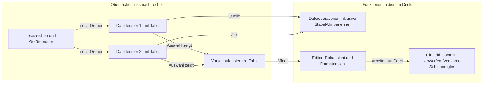

# KRK: nativer Mac-Dateimanager mit eingebautem Editor und Git

---
**Domain:** code
**Status:** active
**Filed by:** shaper (anticipated-circle mode)
**Active spec/plan:** circles/260802-0842-krk-mac-dateimanager-editor-git/planning/260802-1036_o_spec-navigator-geruest.md
**Active session history:** circles/260802-0842-krk-mac-dateimanager-editor-git/history/260802-1014-orchestrator-session.md

---

## Directive

KRK ist eine native macOS-Anwendung, mit der lokale Dateien vollständig über die Tastatur navigiert, bearbeitet und versioniert werden. Die Oberfläche besteht aus einer Lesezeichen- und Geräteleiste links, zwei Dateifenstern mit je mehreren Tabs in der Mitte und einem Vorschaufenster mit eigenen Tabs rechts. Dateien und Ordner lassen sich anlegen, kopieren, verschieben, löschen und im Stapel umbenennen, auch über mehrere ausgewählte Einträge hinweg. Der eingebaute Editor öffnet Text, Code und Markdown in einer Rohansicht und einer Formatansicht, springt zu einer Zeilennummer, sucht und ersetzt innerhalb der geöffneten Datei und speichert Marken auf Textstellen und Textbereiche als Lesezeichen im Home-Verzeichnis des Nutzers. Git ist eingebaut: hinzufügen, committen, Änderungen verwerfen sowie ältere Versionen über einen Schieberegler ansehen und auschecken. Jede Tastenbelegung ist frei konfigurierbar; ausgeliefert wird eine Mac-typische Vorbelegung, die jede Funktion der Norton-Reihe auf zwei Wegen erreichbar macht, über die Funktionstasten F3 bis F8 und über ein Cmd-Kürzel. Die Taste Delete räumt in den Papierkorb, Fn+F8 löscht endgültig und fragt dabei einmal je Vorgang nach.

Zusatz: alle Fenster sind variable in der Größe und können per Tastenbefehl ein- und ausgeblendet werden.

## Grounding snapshot

### Ausgangslage

Das Projekt ist ein leeres Repository. Außer `idea.txt` und dem frisch eingerichteten `fusion-workbench/` existiert kein Code, kein `CLAUDE.md` und keine Vorentscheidung. Es gibt daher weder ein bestehendes Muster zu erben noch eine Abstraktion wiederzuverwenden. Jede technische Festlegung, von der Sprache über das UI-Toolkit bis zur Git-Anbindung, ist offen und gehört in den Plan, nicht in diese Directive.

Quelle der Directive ist `idea.txt` im Projektwurzelverzeichnis. Vorbilder sind laut Entwurf ForkLift und Norton Commander. Die Maximen des Entwurfs lauten superschnell, supersimpel, Steuerung über die Tastatur bei zusätzlicher Maus- und Trackpad-Unterstützung.

### Oberfläche und Datenfluss

Das Vorschaufenster hält seinen Inhalt pro Tab fest. Eine Auswahl im Dateifenster ersetzt den Inhalt des gerade aktiven Vorschau-Tabs; wechselt der Nutzer den Tab, bleibt der vorherige Inhalt dort stehen, bis er selbst überschrieben wird. Bei Dateien, die sich nicht darstellen lassen, zeigt die Vorschau die Metadaten.

### Beantwortete Fragen aus der Klärungsrunde

**Umfang.** Der Nutzer hat Navigator, Editor und Git gemeinsam gewählt. Alle drei bilden diesen einen Circle, weil sie zusammen erst die durchgehende Arbeitsschleife ergeben: navigieren, öffnen, ändern, committen. Ein Navigator ohne Editor wäre ein halbes Werkzeug, ein Editor ohne Git-Anbindung ebenso.

**Bedienmodell.** Jede Taste ist konfigurierbar, das ist die Grundhaltung. Die ausgelieferte Vorbelegung ist Mac-typisch, also Cmd-Kürzel und Pfeiltasten, und trägt zusätzlich die Norton-Belegung auf F3 bis F8. Löschen ist ausdrücklich auf Shift+Delete vorbelegt. Damit ist Löschen ab Werk auf zwei Wegen erreichbar, über F8 aus der Norton-Reihe und über Shift+Delete; beides ist gewollt und kein Konflikt.

**Laufwerke.** Nur lokal: interne Platten, externe Medien und alles, was der Finder bereits eingehängt hat. Ein vom Finder gemountetes Netzlaufwerk erscheint damit als gewöhnlicher Pfad und ist eingeschlossen. Eigene Server-Protokolle sind es nicht.

**Code-SDK.** Offen, siehe Entscheidungsdatensatz unten.

### Vom Shaper getroffene Abgrenzungsentscheidungen

Der Nutzer hat die Einordnung zweier Punkte an den Shaper delegiert. Beide bleiben draußen:

**Datei- und Ordnervergleich** wird ein eigenes Vorhaben. Der Vergleich braucht eine eigene Differenzberechnung für Dateiinhalte und eine zweite für Ordnerbäume, dazu eine eigene Darstellung im Vorschaufenster. Die Arbeitsschleife aus Navigieren, Bearbeiten und Committen funktioniert ohne ihn. Eine Überschneidung ist vorgemerkt: der Versions-Schieberegler zeigt ältere Fassungen einer Datei und braucht dafür bereits eine Form von Versionsdarstellung. Der spätere Vergleichs-Circle setzt darauf auf, statt einen zweiten Mechanismus danebenzustellen.

**Suchen und Ersetzen über mehrere Dateien** wird ebenfalls ein eigenes Vorhaben. Es braucht einen Scan über Verzeichnisbäume, eine Trefferliste, eine Vorschau der geplanten Ersetzungen und einen Rückweg, wenn eine Stapelersetzung danebengeht. Suchen und Ersetzen **innerhalb der geöffneten Datei** bleibt dagegen in diesem Circle, weil der Entwurf es als Editor-Funktion führt.

### Offene Entscheidungen

Stand 260802-1127. Drei der ursprünglich fünf Fragen im geteilten Speicher sind noch offen, zwei sind beantwortet. Alle Pfade sind auf den Marker gezogen, den die Datei heute trägt.

Noch offen, keine davon bindet die Runde 1:

- `shared/decisions/260802-0842_o_git-verwerfen-bedeutung.md` — was "revert" aus dem Entwurf konkret meint. Gehört zur Git-Runde.
- `shared/decisions/260802-0842_o_editor-formatansicht-je-dateityp.md` — was die Formatansicht je Dateityp zeigt. Gehört zur Editor-Runde.
- `shared/decisions/260802-0842_o_code-sdk-fuer-ki-integration.md` — welches Code-SDK die spätere KI-Anbindung tragen soll. Der Datensatz hält seine eigene Nichtbindung ausdrücklich fest.

Beantwortet am 260802-1105, eingearbeitet in den Spec:

- `shared/decisions/260802-0842_a_f-tasten-unter-macos-systembelegung.md` — ausgeliefert wird ausschließlich die Fn-Kombination, Fn+F3 bis Fn+F8. Die nackten Funktionstasten bleiben frei.
- `shared/decisions/260802-0842_a_loeschen-papierkorb-oder-endgueltig.md` — die Taste Delete räumt in den Papierkorb, Fn+F8 löscht endgültig.

Im Circle selbst liegen zwei weitere Datensätze, beide beantwortet:

- `circles/260802-0842-krk-mac-dateimanager-editor-git/decisions/260802-1036_a_umbenennen-im-stapel-umfang.md` — Umbenennen im Stapel mit Musterregeln und Vorschau.
- `circles/260802-0842-krk-mac-dateimanager-editor-git/decisions/260802-1036_a_leistungszusagen-navigator.md` — die zehn Zeitzusagen und das Referenzgerät, ein MacBook Pro 15 Zoll von 2018 mit Intel Core i9 und 60-Hz-Bildschirm.

### Was der Aktivierungs-Spec zusätzlich festlegen muss

Die Maxime "superschnell" trägt in dieser Form keine Abnahmekriterien. Der Spec muss sie in messbare Zusagen übersetzen, etwa wie lange ein Verzeichnis mit zehntausend Einträgen bis zur Anzeige braucht und ab welcher Dateigröße der Editor eine andere Ladestrategie fährt. Ohne solche Zahlen lässt sich später nicht prüfen, ob die Maxime eingehalten wurde.

### Ausdrücklich außerhalb dieses Circles

- Integrierter Browser zum Navigieren von Websites.
- KI-Anbindung jeder Art, einschließlich Tool Use, Coding-Unterstützung, Analyse und Textverfassung.
- KRK als Kommandozentrale für Fusion.
- Datei- und Ordnervergleich (eigenes Vorhaben, siehe oben).
- Suchen und Ersetzen über mehrere Dateien (eigenes Vorhaben, siehe oben).
- Zugriff über Server-Protokolle wie SFTP, S3, WebDAV oder SMB.
- Git jenseits von hinzufügen, committen, verwerfen und Versionen ansehen oder auschecken. Branches, Merges, Remotes, Push und Pull bleiben draußen.

## Dependencies

(keine)

## Turn log

- **Vorlauf** (kein Turn; Sitzung 260802-1014): commits c0682ff..f865fca (sechs Stück); Kohärenzurteil: keines, weil kein Turn abgeschlossen wurde; Sitzungshistorie: `circles/260802-0842-krk-mac-dateimanager-editor-git/history/260802-1014-orchestrator-session.md`. Inhalt: CLAUDE.md mit Sprachdeklaration (c0682ff), Aufräumen der mitverfolgten Sitzungsdateien (ede2645), der Spec für Runde 1 (f427e97), Technologievergleich und Korrektur der Directive-Zeile (19c9597), Technologiewahl und das Prüfprogramm für die F-Tasten (6b7b725), Berichtigung seiner Auswertung samt Fortschreibung von C3 (f865fca). Diese Arbeit lag vor dem ersten eigentlichen Turn: sie hat den Spec erstellt und die Eingangsfragen geklärt, aber keine Aufgabenliste abgearbeitet und keine Kohärenzprüfung durchlaufen.

## Activation proposal

**Vorgeschlagen am:** 260802-0853
**Playmaker-Lauf:** 260802-0853-playmaker-direct-dispatch
**Domain-Gewichtung:** code

Dieser Circle ist der empfohlene nächste Kandidat für die Aktivierung, allerdings ohne Vergleichswert: er ist der einzige anticipated Circle im Portfolio, und eine Rangfolge mit einem Element trägt keine Information über relative Reife. Die Empfehlung stützt sich deshalb auf die absoluten Signale. Der Abschnitt `## Dependencies` nennt keine Vorgänger, es gibt also keinen Circle, dessen Abschluss abzuwarten wäre. Der Grounding-Abschnitt zitiert fünf offene Entscheidungsdatensätze, von denen vier diesen Circle binden: `shared/decisions/260802-0842_o_f-tasten-unter-macos-systembelegung.md`, `shared/decisions/260802-0842_o_loeschen-papierkorb-oder-endgueltig.md`, `shared/decisions/260802-0842_o_git-verwerfen-bedeutung.md` und `shared/decisions/260802-0842_o_editor-formatansicht-je-dateityp.md`. Der fünfte, `shared/decisions/260802-0842_o_code-sdk-fuer-ki-integration.md`, hält seine eigene Nichtbindung ausdrücklich fest und zählt für die Bewertung nicht mit.

Vier offene Entscheidungen sind für die Domain-Gewichtung `code` ein hoher Wert, weil diese Gewichtung Circles mit wenigen unbeantworteten Entscheidungen bevorzugt. Der Circle selbst schreibt in `## Grounding snapshot` unter "Offene Entscheidungen", der Aktivierungs-Spec müsse sie aufgreifen. Die Aktivierung ist damit nicht blockiert, aber die erste Aufgabe nach dem Übergang zu aktiv steht bereits fest: der Shaper im portfolio-activation-Modus muss die vier Fragen mit dem Nutzer klären, bevor ein Plan entsteht. Hinzu kommt die im Grounding vermerkte Lücke bei der Maxime "superschnell", die noch keine messbaren Abnahmekriterien trägt.

Der Playmaker benennt Kandidaten, er aktiviert sie nicht. Die Umbenennung des Datensatzes von `_a_circle.md` auf `_t_circle.md` und das Schreiben von `.active-circle` bleiben beim Nutzer über `/fusion:next` oder beim Orchestrator.
