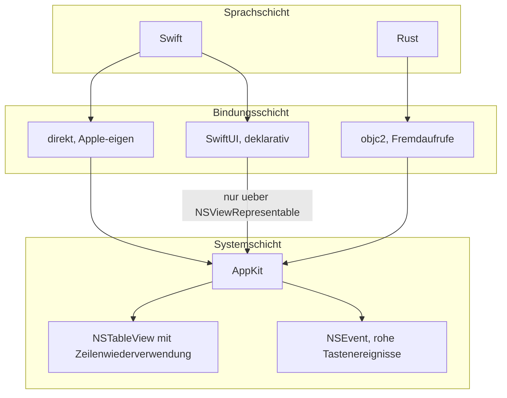

# Analyse: Programmiersprache und UI-Werkzeugkasten für KRK

**Datum:** 2026-08-02 11:34
**Typ:** Vergleichende Analyse
**Status:** Complete
**Angefordert von:** Nutzer (über den Orchestrator)
**Circle:** `circles/260802-0842-krk-mac-dateimanager-editor-git`

---

## Frage

Welche Kombination aus Programmiersprache und UI-Werkzeugkasten trägt die Zusagen des Specs `260802-1036_o_spec-navigator-geruest.md`, insbesondere die zehn Zeitzusagen aus Abschnitt C8 und die freie Tastenbelegung aus C3, auf dem vom Nutzer benannten Referenzgerät? Das Referenzgerät ist ein MacBook Pro von 2018 mit Intel-Prozessor, nicht der Apple-Silicon-Arbeitsrechner. Die Analyse liefert die Grundlage für die Entscheidung; sie trifft sie nicht.

## Umfang

**Geprüft wurden drei Kandidaten:**

1. Swift mit AppKit
2. Swift mit SwiftUI, einschließlich der Mischform aus SwiftUI mit eingebetteten AppKit-Ansichten
3. Rust mit AppKit über die Bindungsbibliothek `objc2`

**Ausgeschlossen wurden mit Begründung:** Electron, Tauri, Qt, Flutter, Objective-C und GPUI (das Rust-Oberflächenwerkzeug aus dem Editor Zed).

**Referenzgerät, vom Nutzer am 260802 festgelegt:** MacBook Pro, Modellkennung `MacBookPro15,1`, 15 Zoll, 2018. Acht Kerne Intel Core i9 mit 2,3 GHz und Hyper-Threading, 16 GB Arbeitsspeicher, Intel UHD Graphics 630 und Radeon Pro 560X, Bildschirm 2880×1800 bei 60 Hz, macOS 15.7.7.

**Nicht Gegenstand dieser Analyse:** die Git-Bibliothek im Einzelnen, das Format der Konfigurationsdateien, die Teststrategie. Diese Punkte gehören in den Plan.

**Kennzeichnung der Aussagen.** Belegte Aussagen tragen eine Quelle. Erschlossene Aussagen tragen den Vermerk `inference:`. Vermutungen tragen `speculation:`. Zu keiner der zehn Zeitzusagen existiert eine Messung an KRK, weil KRK noch nicht existiert; jede Aussage über Einhaltbarkeit ist deshalb eine Schlussfolgerung aus Mechanismen, nicht ein Messergebnis.

---

## Befunde

### Vorbemerkung: der Befund, der die Empfehlung trägt

**Die Wahl entscheidet sich an einer einzigen Zusage, und die heißt L3.** Ein Ordner mit 10.000 Einträgen muss im warmen Zustand in 400 ms vollständig dargestellt sein, und L10 schreibt dieselbe Anforderung für 100.000 Einträge auf 4 s fort. Alle anderen Achsen trennen die drei Kandidaten weniger scharf. Die Belege zu dieser einen Zusage sind eindeutig genug, um SwiftUI als Träger der Dateiliste auszuschließen.

### 1. Große Listen: SwiftUI trägt L2, L3 und L10 nicht

SwiftUIs `List` erzeugt auf macOS die Ansicht jeder Zeile, auch der nie sichtbaren. Ein Entwickler hat das mit einem Minimalbeispiel von 101 Zeilen gezeigt und im Apple-Entwicklerforum dokumentiert; sowohl `init()` als auch `body` werden für alle Zeilen aufgerufen, während dieselbe Anwendung auf iOS nur die sichtbaren erzeugt ([Apple Developer Forums, Thread 704778](https://developer.apple.com/forums/thread/704778)). Der Grund liegt in der Bildlaufleiste: macOS muss die Gesamthöhe kennen, und SwiftUI versucht die selbstbemessende Zeilenhöhe auf `NSTableView` aufzusetzen ([kean.blog, "…But Not NSTableView"](https://kean.blog/post/not-list)).

Die Größenordnung der Folgen ist dokumentiert. Bei 10.000 Zeilen in einer Seitenleiste stand die Prozessorlast über 50 Sekunden bei 100 Prozent, bevor die Liste erschien; nach Einbau eines `.equatable()`-Modifikators sank die Erzeugung derselben 10.000 Ansichten auf unter 0,1 Sekunden ([TrozWare, "SwiftUI Lists", 2024](https://troz.net/post/2024/swiftui_lists/)). Derselbe Autor hält fest, dass die Listen mit macOS Sequoia besser geworden sind, "aber immer noch nicht gut".

Für KRK ist nicht `List` die passende Struktur, sondern `Table`, weil C2 die Sortierung nach Name, Größe, Änderungsdatum und Typ verlangt, also Spalten. Zu `Table` liegt ein Bericht über rund 1.000 Zeilen auf einem Mac Studio mit M2 Max vor: ein Klick auf einen Eintrag hängte die Oberfläche 13 Sekunden lang, weil die `ForEach`-Schleife bei jeder Auswahländerung über alle Zeilen lief ([Apple Developer Forums, Thread 739849](https://developer.apple.com/forums/thread/739849)). Ein Apple-Ingenieur antwortete in diesem Faden mit dem Hinweis auf das Instruments-Werkzeug, ohne das Problem zu lösen; die Abhilfe des Melders bestand darin, die Bedingung aus der Schleife herauszuziehen.

Der Vergleichsmaßstab macht diesen Befund hart. Der Mac Studio mit M2 Max ist erheblich schneller als das Referenzgerät von 2018, und die dort gemessene Zahl liegt bei einem Zehntel der von KRK zugesagten Einträge um mehr als das Dreißigfache über der Zusage L3.

`NSTableView` verhält sich strukturell anders. Es verwendet Zeilenansichten wieder, und seit macOS 13 schätzt es Zeilenhöhen: gemessen werden nur die Zeilen im oder nahe am sichtbaren Bereich, für die übrigen wird aus den bereits gemessenen geschätzt, was laut Apple die Ladezeiten sehr großer Tabellen erheblich verbessert ([AppKit Release Notes for macOS Ventura 13](https://developer.apple.com/documentation/macos-release-notes/appkit-release-notes-for-macos-13)). Für KRK entfällt diese Schätzung sogar: eine Dateiliste hat gleich hohe Zeilen, sodass eine feste `rowHeight` gesetzt werden kann und die Höhenberechnung konstant statt linear wird.

`inference:` Damit skaliert die Anzeigearbeit bei `NSTableView` mit der Zahl der sichtbaren Zeilen, bei SwiftUI mit der Zahl der vorhandenen. Bei einer Bildschirmseite von etwa 50 Zeilen und 100.000 Einträgen unterscheiden sich die beiden um drei Größenordnungen. Genau diese Trennung entscheidet L2 gegen L3 und L10.

Der zweite Beleg für dieselbe Richtung stammt aus der Praxis: der Autor von kean.blog hat eine Anwendung mit 150.000 Einträgen von `List` auf `NSTableView` umgestellt und beschreibt das Ergebnis als "blazing fast" gegenüber vorherigem Ruckeln beim Bildlauf und langsamen Neuladen ([kean.blog](https://kean.blog/post/not-list)).

### 2. Tastaturbehandlung: C3 verlangt einen Mechanismus, den nur AppKit direkt anbietet

C3 stellt zwei Anforderungen, die zusammen die Wahl einschränken. Erstens muss jede Kombination zur Laufzeit umbelegbar sein. Zweitens müssen Tasten erreicht werden, die das System ab Werk selbst belegt.

**Zur ersten Anforderung.** AppKit stellt drei Eintrittspunkte für Tastenereignisse bereit, die alle vor der Menüauswertung greifen können: `keyDown(with:)` an einem `NSResponder`, `performKeyEquivalent(with:)` an `NSView` und `NSWindow`, sowie `NSEvent.addLocalMonitorForEvents(matching: .keyDown)` als anwendungsweiter Abgriff. Aus jedem dieser Punkte lässt sich das rohe Ereignis mit `keyCode` und `modifierFlags` gegen eine zur Laufzeit geladene Tabelle nachschlagen. Das ist genau ein Mechanismus für alle Funktionen aus C1 bis C7.

SwiftUI bietet zwei Wege, und keiner davon trägt C3 vollständig. Der Modifikator `.keyboardShortcut(_:modifiers:)` bindet ein Kürzel an eine Ansicht oder einen Menübefehl; er ist eine statische Deklaration im Ansichtsbaum, keine Nachschlagetabelle. `.onKeyPress(...)` verlangt, dass die Ansicht den Eingabefokus hält, und arbeitet mit dem Typ `KeyEquivalent`, der Buchstaben, Interpunktion und Funktionstasten abdeckt ([Create with Swift, "Controlling keyboard events with keys and phases"](https://www.createwithswift.com/controlling-keyboard-events-with-keys-and-phases/)). Mehrere unabhängige Anleitungen kommen zum selben Schluss: für rohe Tastenereignisse auf macOS führt der Weg über AppKit, entweder über `NSEvent`-Abgriffe oder über eine in `NSViewRepresentable` eingepackte `NSView` ([tutorialpedia](https://www.tutorialpedia.org/blog/how-to-detect-keyboard-events-in-swiftui-on-macos/), [Swiftjective-C](https://swiftjectivec.com/Handling-Keyboard-Presses-in-SwiftUI-for-macOS/)).

**Zur zweiten Anforderung, den Funktionstasten.** Das Modifikatorbit `NSEventModifierFlagFunction` mit dem Wert 8388608 wird gesetzt, sobald eine Funktionstaste gedrückt ist. Es unterscheidet also nicht, ob der Nutzer die Fn-Taste gehalten hat. Der Spec hat das in C3 bereits richtig festgeschrieben: KRK unterscheidet die beiden Wege nicht und braucht dafür keine zweite Belegung. Diese Eigenschaft gilt für jeden Kandidaten gleich, der rohe `NSEvent`-Ereignisse sieht, und ist damit kein Unterscheidungsmerkmal.

`inference:` Ein Restrisiko bleibt und gehört in den Plan. Auf einem unveränderten Mac erzeugt die nackte F3-Taste ein systemdefiniertes Ereignis für Mission Control, das der Fenster-Server vor der Zustellung an die Anwendung abfängt; Fn+F3 erzeugt dagegen ein gewöhnliches `keyDown` mit dem Tastencode 99. Eine belastbare Quelle für die genaue Abfangstelle habe ich nicht gefunden; die Suchtreffer bestätigen nur, dass Systemfunktionen wie Mission Control Tastenereignisse vor der Anwendung verbrauchen können. Der Plan sollte diese Annahme vor der ersten Implementierung an einem Zehnzeiler prüfen, weil C3 mit ihr steht und fällt. Der Punkt ist werkzeugunabhängig.

### 3. Reaktionszeit bei Tastendruck: L1 mit 16 ms

Zu L1 existiert für keinen Kandidaten eine veröffentlichte Messung. Die folgende Aussage ist Mechanik, keine Messung.

`inference:` 16 ms bei 60 Hz bedeuten, dass die Verarbeitung des Tastendrucks und das Anfordern der Neuzeichnung innerhalb eines Bildes abgeschlossen sein müssen. Bei AppKit besteht die Arbeit aus einem Tabellennachschlag, einer Änderung des Auswahlindex und einem `scrollRowToVisible`; `NSTableView` zeichnet daraufhin die betroffenen Zeilen neu, nicht die Liste. Bei SwiftUI besteht die Arbeit aus einem Abgleich des Ansichtsbaums, und die belegte Eigenschaft aus Befund 1 ist, dass dieser Abgleich auf macOS alle Zeilen berührt. Der Bericht aus Faden 739849 nennt für genau diesen Fall, die Auswahländerung bei rund 1.000 Zeilen, mehrere Sekunden auf einem M2 Max.

Der Weg, den wir als tragfähig ansehen, sieht so aus:

Die Kette hat sechs Knoten und fünf Kanten, keinen Zyklus und keinen Knoten mit hohem Ausgangsgrad. Ihre Länge ist der eigentliche Befund: zwischen Tastendruck und Neuzeichnung liegt ein einziger Nachschlag. Jede Lösung, die an dieser Stelle eine Grenze zwischen zwei Werkzeugkästen oder zwischen zwei Prozessen einzieht, verlängert die Kette innerhalb desselben 16-ms-Budgets.

### 4. Kaltstart: L4 mit 1000 ms

Auch hier fehlt eine belastbare Messung für Swift mit AppKit gegen Swift mit SwiftUI auf einem Intel-Mac. Ich habe keine gefunden und stelle das ausdrücklich fest.

`inference:` Eine SwiftUI-Anwendung lädt beim Start zusätzlich zu AppKit auch `SwiftUI.framework` und dessen Abhängigkeiten. Der Aufwand ist einmalig und wird durch den gemeinsam genutzten Bibliotheks-Cache des Systems gedämpft. `speculation:` Auf dem Referenzgerät liegt der Unterschied vermutlich in der Größenordnung einiger zehn Millisekunden und ist damit gegenüber dem 1000-ms-Budget nicht entscheidend. Entscheidend ist an L4 die Wiederherstellung der Sitzung aus C1, also das Lesen der gespeicherten Tabs und ihrer Ordner. Das ist eine Frage der Ladestrategie und gehört in den Plan, nicht in den Werkzeugvergleich.

Für die ausgeschlossenen Kandidaten liegen dagegen Zahlen vor, die das gesamte Budget betreffen; sie stehen in Abschnitt 8.

### 5. Dateisystem, geschützte Ordner, Signierung

**Dieser Befund unterscheidet die Kandidaten nicht.** Das ist selbst das Ergebnis.

Seit macOS 10.14 Mojave schützt das System Schreibtisch, Dokumente, Downloads und Wechselmedien über den Mechanismus für Transparenz, Zustimmung und Kontrolle, kurz TCC. Seit macOS Catalina gilt das auch für Anwendungen außerhalb der Sandbox: jede Anwendung muss um Zugriff auf diese Orte bitten ([The Eclectic Light Company, "Explainer: Permissions, privacy and TCC"](https://eclecticlight.co/2025/11/08/explainer-permissions-privacy-and-tcc/)). Der Mechanismus greift am Anwendungsbündel und seiner Signatur an, nicht an der Sprache oder am Werkzeugkasten. Die Beschreibungstexte im `Info.plist`, etwa `NSDocumentsFolderUsageDescription` und `NSDownloadsFolderUsageDescription`, sowie die Signierung und Beglaubigung über `codesign` und `notarytool` funktionieren für jedes Bündel, gleich womit es gebaut wurde.

Eine Festlegung folgt daraus trotzdem, und sie ist keine Werkzeugwahl: KRK muss außerhalb der App-Sandbox ausgeliefert werden. C9 verlangt Zugriff auf jeden Pfad, den das lokale Dateisystem sichtbar macht, einschließlich `/Volumes`. In der Sandbox gibt es für den Schreibtisch keine passende Berechtigung; der vorgesehene Weg führt über ein `NSOpenPanel` und ein sicherheitsbereichsbezogenes Lesezeichen ([Apple Developer Forums, Thread 749714](https://developer.apple.com/forums/thread/749714)). Für einen Dateimanager wäre das ein Dialog vor jedem neuen Ort, was der Maxime "supersimpel" widerspricht. Die Auslieferung erfolgt daher direkt und nicht über den App Store. Das deckt sich mit den Vorbildern: ForkLift und Marta werden beide direkt vertrieben.

### 6. Beide Architekturen: Intel und Apple Silicon

Der Nutzer hat ausdrücklich nach diesem Punkt gefragt. Der Befund hat zwei Hälften, und die zweite ist die unangenehmere.

**Das Bauen für beide Architekturen ist unproblematisch, auch mittelfristig.** Xcode 26 baut universelle Binärdateien weiterhin standardmäßig. Erst in Xcode 27 fällt `x86_64` aus `ARCHS_STANDARD` heraus, und auch dort nur, wenn das minimale Zielsystem auf macOS 27.0 gesetzt ist; die Architektur lässt sich der Einstellung `ARCHS` weiterhin von Hand hinzufügen, und das macOS-27-SDK unterstützt universelle Anwendungen mit Rückwärtsziel bis macOS 12 ([Blake Crosley, "Xcode 27 Drops Intel"](https://blakecrosley.com/blog/xcode-27-drops-intel), der Apple wörtlich zitiert). Für Rust gilt Vergleichbares: `x86_64-apple-darwin` ist ein Ziel der Stufe 2 mit Mindestsystem macOS 10.12, `aarch64-apple-darwin` eines der Stufe 1; einen Hinweis auf eine Abkündigung enthält die Plattformübersicht nicht ([Rust, Platform Support: apple-darwin](https://doc.rust-lang.org/stable/rustc/platform-support/apple-darwin.html)).

**Das Betriebssystem des Referenzgeräts ist dagegen am Ende.** macOS 26 Tahoe ist die letzte Version, die Intel-Macs unterstützt, und sie unterstützt nur noch vier Modelle: Mac Pro 2019, MacBook Pro 16 Zoll 2019, MacBook Pro 13 Zoll 2020 mit vier Thunderbolt-3-Anschlüssen und iMac 27 Zoll 2020 ([iClarified, "macOS Tahoe Supported Devices"](https://www.iclarified.com/97613/macos-tahoe-supported-devices-the-full-list-of-compatible-macs)). Das `MacBookPro15,1` von 2018 steht nicht darunter. Für das Referenzgerät ist macOS 15.7.7 damit dauerhaft die Obergrenze.

Daraus folgt eine harte Randbedingung: **solange dieses Gerät das Abnahmegerät ist, liegt das minimale Zielsystem von KRK bei macOS 15 oder darunter.** Jede Programmierschnittstelle, die Apple ab macOS 26 einführt, ist für KRK nicht verfügbar.

Diese Randbedingung trifft die Kandidaten ungleich. Sie ist für AppKit nahezu folgenlos, weil `NSTableView` seit Jahrzehnten stabil ist und die für KRK entscheidende Verbesserung, die Schätzung der Zeilenhöhen, bereits mit macOS 13 kam. Für SwiftUI ist sie schwerwiegend: die dokumentierte Schwäche der Listen bessert sich mit neuen Systemversionen, wie der Hinweis auf Sequoia zeigt, und genau diese Versionen wird das Referenzgerät nie erhalten.

`inference:` Wer auf SwiftUI setzt, wettet damit auf Verbesserungen, die auf dem Abnahmegerät per Konstruktion nicht ankommen können.

Ein praktischer Nebenpunkt: Xcode 27 setzt einen Mac mit Apple Silicon und macOS 26.4 voraus ([Blake Crosley, ebenda](https://blakecrosley.com/blog/xcode-27-drops-intel)). Der M2-Max-Arbeitsrechner des Nutzers erfüllt das, das Intel-Gerät nicht. Das Intel-Gerät ist also Messgerät, nicht Entwicklungsgerät. Das ist mit der Rollenverteilung des Nutzers ohnehin verträglich.

### 7. Die drei Kandidaten im Überblick

| Achse | Swift + AppKit | Swift + SwiftUI (und Mischform) | Rust + AppKit über objc2 |
|---|---|---|---|
| Große Listen (L2, L3, L10) | `NSTableView` mit Wiederverwendung, Arbeit skaliert mit sichtbaren Zeilen | trägt nicht; belegte Hänger bei 1.000 Zeilen auf schnellerer Hardware. Mischform bedeutet: dieselbe `NSTableView`, plus Grenze | dieselbe `NSTableView` wie Kandidat 1 |
| Tastendruck (L1) | ein Nachschlag zwischen Ereignis und Neuzeichnung | Abgleich berührt alle Zeilen; Mischform braucht AppKit-Abgriff | wie Kandidat 1, über unsichere Fremdaufrufe |
| Tastenbelegung (C3) | `NSEvent`-Abgriff plus Laufzeittabelle, ein Mechanismus | `.keyboardShortcut` ist statisch, `.onKeyPress` fokusgebunden; braucht AppKit | wie Kandidat 1 |
| Kaltstart (L4) | keine Messung; kleinste Ladelast | keine Messung; zusätzliches Rahmenwerk | keine Messung; keine Laufzeitumgebung |
| Dateisystem und TCC | werkzeugunabhängig | werkzeugunabhängig | werkzeugunabhängig, Bündelbau von Hand |
| Beide Architekturen | universelle Binärdatei ab Werk | dito, aber Systemobergrenze trifft die Schwäche | Stufe-2-Ziel, kein Abkündigungsvermerk |
| "Supersimpel" | ein Mechanismus je Aufgabe | Sondermodifikator `.equatable()`, Fokus-Sonderfälle, AppKit-Rückfallweg | dauerhafte Bindungsschicht, kein Oberflächenbau, `define_class!` je Protokoll |
| Langlebigkeit | `NSTextView` mit TextKit 2, libgit2 über C-Aufrufe | Editor bräuchte ohnehin `NSTextView` | tree-sitter und `git2-rs` nativ |

**Zur Mischform ausdrücklich.** SwiftUI mit eingebetteter `NSTableView` über `NSViewRepresentable` ist kein billiger Mittelweg. Die beiden schwierigsten Teile der Runde 1, die Dateiliste und die Tastenbehandlung, landen dabei ohnehin in AppKit. Was hinzukommt, ist eine Grenze: der Ersthelfer-Status und der Eingabefokus müssen über sie hinweg abgestimmt werden, die Auswahl muss in beide Richtungen gebunden werden, und die Lebensdauer des Koordinators muss verwaltet werden. Gemessen an der Maxime "supersimpel" ist das eine Sonderregel mit eigener Ausnahme und eigenem Rückfallweg, eingekauft für den Gewinn, die Lesezeichenleiste deklarativ schreiben zu dürfen.

**Warum Rust mit objc2 als dritter Kandidat aufgenommen ist.** Die Bibliothek ist real und gepflegt, nicht experimentell: Version 0.6.4 vom 26. Februar 2026, 35,1 Millionen Bezüge in der jüngeren Zählung und 89,3 Millionen insgesamt ([crates.io API, objc2](https://crates.io/api/v1/crates/objc2)). Die Bindungen werden aus den SDKs von Xcode 16.4 erzeugt und folgen neuen Xcode-Versionen üblicherweise binnen einer Woche ([lib.rs, objc2-app-kit](https://lib.rs/crates/objc2-app-kit)). Der Kandidat ist deshalb aufgenommen, weil er als einziger nicht-Apple-Weg dieselbe `NSTableView` benutzt und damit an der entscheidenden Achse gleichzieht, während er für die späteren Runden das Rust-Ökosystem öffnet: tree-sitter für die Syntaxhervorhebung und `git2-rs` für die Git-Anbindung.

Der Preis ist an anderer Stelle fällig. Es gibt keinen Oberflächenbau, jede Ansicht entsteht im Code. Jedes Objective-C-Protokoll, das KRK erfüllen muss, also mindestens `NSTableViewDataSource`, `NSTableViewDelegate`, `NSApplicationDelegate` und die Fensterdelegierten, muss über das Makro `define_class!` von Hand deklariert werden. Jeder AppKit-Aufruf ist ein unsicherer Fremdaufruf. Gegenüber Swift mit AppKit steht diesem dauerhaften Aufwand kein Gewinn an Reaktionszeit gegenüber, weil beide dieselbe Tabelle bedienen.

Die Schichtung der Kandidaten:

Der Graph hat neun Knoten und acht Kanten. Die Kante von `SwiftUI` nach `AppKit` ist als einzige beschriftet, weil sie als einzige einen Umweg beschreibt: SwiftUI erreicht `NSTableView` und rohe Tastenereignisse nicht selbst, sondern nur über eine Einbettung. Genau diese eine Kante ist der Kern des Vergleichs.

### 8. Die ausgeschlossenen Kandidaten, mit Begründung

**Electron: ausgeschlossen am Zeitbudget.** Der Entwickler Takuya Matsuyama beschreibt für seine eigene Anwendung eine Verbesserung der Zeit bis zur Bedienbarkeit von vier auf drei Sekunden auf macOS; das Atom-Team gewann etwa 500 ms über V8-Momentaufnahmen ([devas.life, "How to make your Electron app launch 1,000ms faster"](https://www.devas.life/how-to-make-your-electron-app-launch-1000ms-faster/)). Diese Zahlen sind Einzelfälle, aber die Größenordnung ist eindeutig: das gesamte Kaltstartbudget von KRK beträgt 1000 ms, und die berichteten Werte liegen um das Drei- bis Vierfache darüber. Hinzu kommt, dass die Zusagen auf einem Intel-Gerät von 2018 gelten sollen, nicht auf dem Rechner des jeweiligen Berichterstatters. Ein Sonderfall an der Zugänglichkeit kommt hinzu: der Zugriff auf geschützte Ordner und das Abfangen von Fn-Kombinationen sind über eine Prozess- und eine Renderer-Grenze zu führen, wo AppKit einen Eintrittspunkt hat.

**Tauri: ausgeschlossen an der Beweislage und an der Maxime.** Tauri ist Electron in jeder Ressourcenmessung überlegen. Ein veröffentlichter Vergleich nennt 8,6 MiB Bündelgröße gegen 244 MiB und rund 172 MB gegen rund 409 MB Arbeitsspeicher bei sechs offenen Fenstern ([gethopp.app, "Tauri vs. Electron"](https://www.gethopp.app/blog/tauri-vs-electron)). Der Autor kennzeichnet seinen Test ausdrücklich als Einzellauf auf seinem MacBook Pro und schreibt zur Startzeit, ein Unterschied von "weniger als 1500 ms" sei für die meisten Anwendungen kein Entscheidungskriterium. Für KRK ist er genau das, weil 1500 ms über dem gesamten Budget liegen. Entscheidender ist die zweite Hälfte: Tauri benutzt auf macOS `WKWebView`, und für eine virtualisierte Liste mit 10.000 Einträgen bei 16 ms Eingabebudget auf einer Intel-Grafikeinheit von 2018 habe ich weder einen bestätigenden noch einen widerlegenden Beleg gefunden. Ich schließe Tauri deshalb nicht mit einer Messung aus, sondern mit zwei Argumenten. Erstens ist unbelegt, was das Kernrisiko wäre. Zweitens verlangt jeder Tastendruck einen Weg von der Webansicht über die Prozessgrenze in den Rust-Teil und zurück, also drei Mechanismen dort, wo AppKit einen hat. Das ist die Maxime "supersimpel" als Ausschlussgrund, angewandt wie im Spec vorgesehen.

**Qt: ausgeschlossen an der Nativität und an der Lizenz, nicht an der Leistung.** Zur Leistung großer Modelle gibt es Angaben, die von einem Modell mit einer Million Einträgen in rund 70 ms sprechen; die Quelle ist eine Foren- und Dokumentationszusammenfassung, keine kontrollierte Messung, und die Zahl ist entsprechend zu behandeln. `inference:` Qt würde die Listenzusagen vermutlich halten, weil sein Modell-Ansicht-Muster genau für diesen Fall gebaut ist. Der Ausschluss folgt aus zwei anderen Gründen. Erstens die Nativität: Qt stellt einzelne Widgets nicht als eingepackte native Bedienelemente dar, auch wenn es AppKit für das Erscheinungsbild nutzt; visuelle Feinheiten können von der aktuellen macOS-Version abweichen ([Qt for macOS, Specific Issues](https://doc.qt.io/qt-6/macos-issues.html), sowie [Qt Quick Controls, macOS Style](https://doc.qt.io/qt-6/qtquickcontrols-macos.html), wo mehrere Bedienelemente noch fehlen und auf den Fusion-Stil zurückfallen). Für ein Werkzeug, dessen Versprechen "native Mac-Anwendung" lautet, ist das ein dauerhafter Bruch. Zweitens die Lizenz: unter der LGPL-3 muss der Nutzer über die verwendeten Module unterrichtet werden und die Möglichkeit erhalten, sie auszutauschen; andernfalls ist eine kommerzielle Lizenz nötig ([Qt Wiki, QtWhitepaper](https://wiki.qt.io/QtWhitepaper)). Beides ist lösbar, aber beides ist ein eigener Sonderweg neben einer Anwendung, die sonst keinen braucht.

**Flutter: ausgeschlossen an der Nativität.** Eine Flutter-Anwendung benutzt keine AppKit-Ansichten, sondern zeichnet alles selbst in eine Metal-Oberfläche. Der Impeller-Renderer für die Schreibtischplattformen, macOS eingeschlossen, war im Laufe des Jahres 2026 noch in Arbeit; das Team arbeitet an einem Metal-Rückende für macOS ([Flutter-Fahrplan 2026, zusammengefasst bei WebArt Design](https://webartdesign.com.au/blog/flutters-2026-roadmap-just-dropped-and-its-all-about-finishing-the-job/)). Die Listenleistung selbst wäre wohl kein Problem, weil Flutters Wiederverwendung ausgereift ist. Der Ausschlussgrund ist derselbe wie bei Qt, nur schärfer: nichts an der Oberfläche ist ein macOS-Bedienelement, was für einen Dateimanager mit Tastaturbedienung, Systemmenüs und Papierkorb-Anbindung fortlaufend Nacharbeit bedeutet.

**Objective-C: ausgeschlossen mangels Vorteil.** Objective-C erreicht dieselbe AppKit-Fläche wie Swift und würde die Zusagen genauso tragen. Für ein Vorhaben ohne bestehenden Bestand gibt es keinen Grund dafür, und Swift ist die Sprache, in der Apple neue Schnittstellen zuerst anbietet. Erwähnt, weil der Nutzer eine Stellungnahme verlangt hat.

**GPUI: ausgeschlossen an der Reife.** GPUI, das Oberflächenwerkzeug hinter dem Editor Zed, ist inzwischen eigenständig verwendbar, unterstützt auf macOS Metal und läuft nach Angabe der Entwickler auf Intel wie auf Apple Silicon nativ ohne Rosetta. Es ist jedoch weiterhin vor Version 1.0, und die Entwickler weisen darauf hin, dass es zwischen Versionen häufig brechende Änderungen gibt ([zed/crates/gpui/README.md](https://github.com/zed-industries/zed/blob/main/crates/gpui/README.md)). Wie Flutter zeichnet es seine Bedienelemente selbst. Für eine Anwendung, deren Wert im nativen Verhalten liegt, wäre das der Nachteil von Flutter ohne dessen Reife.

### 9. Langlebigkeit: Editor, Git, KI

**Editor mit Syntaxhervorhebung.** AppKit bringt `NSTextView` mit TextKit 2 mit, also die Textmaschine, auf der auch Apples eigene Editoren aufsetzen. Swift kann tree-sitter über die C-Schnittstelle aufrufen; Rust hat eine eigene Anbindung. SwiftUIs `TextEditor` ist keine Grundlage für einen Code-Editor und würde ohnehin in eine eingebettete `NSTextView` münden. Der Befund verschiebt die Wahl nicht, aber er bestätigt sie: die spätere Runde landet bei denselben AppKit-Bausteinen wie die erste.

**Git-Anbindung.** Die vier verlangten Operationen, also hinzufügen, committen, verwerfen sowie Versionen ansehen und auschecken, sind über libgit2 abbildbar. Swift ruft libgit2 direkt über die C-Schnittstelle auf, Rust über `git2-rs`. Ein dritter Weg, der Aufruf von `/usr/bin/git` als Unterprozess, steht beiden offen. Kein Kandidat ist hier im Nachteil.

**KI-Anbindung, ausdrücklich außerhalb dieses Circles.** Ein Befund verdient trotzdem Erwähnung, weil er den offenen Entscheidungsdatensatz `shared/decisions/260802-0842_o_code-sdk-fuer-ki-integration.md` betrifft. Offizielle Anthropic-SDKs existieren für Python, TypeScript, Java, Go, Ruby, C# und PHP. **Für Swift gibt es keines, und für Rust ebenfalls nicht.** Beide Sprachen sprechen die Programmierschnittstelle über rohes HTTP an, was dokumentiert und unproblematisch ist. Das Claude Agent SDK, also die als Bibliothek verpackte Fassung von Claude Code, gibt es nur als `claude-agent-sdk` für Python und `@anthropic-ai/claude-agent-sdk` für TypeScript. `inference:` Sollte die spätere Runde genau dieses Agent-SDK meinen und nicht nur die Messages-Schnittstelle, dann braucht die native Anwendung entweder eine mitgelieferte Node- oder Python-Laufzeitumgebung oder muss das SDK als Unterprozess ansteuern. Das gilt für Swift und Rust gleichermaßen und verschiebt die Wahl deshalb nicht. Es ist aber ein Punkt, den der KI-Entscheidungsdatensatz aufnehmen sollte.

---

## Folgerungen

**Die Zeitzusagen aus C8 sind mit Swift und AppKit erreichbar, und die Belege dafür sind Mechanismen, nicht Messungen.** Die einzige Zusage, an der ein Kandidat nachweislich scheitert, ist die Darstellung großer Listen, und der Nachweis stammt aus mehreren unabhängigen Quellen, darunter zwei Fäden im Apple-Entwicklerforum.

**Der Spec braucht keine Änderung.** Der Vergleich hat keine der zehn Zahlen als unerreichbar erwiesen. Der Vorbehalt aus C8, wonach eine Zahl über einen neuen Entscheidungsdatensatz abgelöst würde, falls sie keinen tragfähigen Kandidaten übrig lässt, greift nicht.

**Zwei Randbedingungen sind neu und binden den Plan.** Erstens muss KRK außerhalb der App-Sandbox ausgeliefert werden, weil C9 sonst nicht erfüllbar ist. Zweitens liegt das minimale Zielsystem bei macOS 15, solange das Gerät von 2018 das Abnahmegerät ist, weil es macOS 26 nicht mehr erhält.

**Eine Annahme aus C3 ist ungeprüft und trägt Gewicht.** Dass Fn+F3 bis Fn+F8 als gewöhnliche Tastenereignisse bei der Anwendung ankommen, während die nackten Tasten vom System verbraucht werden, habe ich nicht belegen können. Die Prüfung kostet wenig und muss vor der ersten Implementierung stehen.

---

## Empfehlung

**Wir empfehlen Swift mit AppKit für Runde 1, sofern der Nutzer das Gerät von 2018 als Abnahmegerät beibehält.** Die Empfehlung stützt sich auf drei Punkte, die keiner der Alternativen zugleich gelingen.

Erstens hält `NSTableView` die Listenzusagen strukturell, weil die Anzeigearbeit mit der Zahl der sichtbaren Zeilen skaliert und nicht mit der Zahl der vorhandenen. Zweitens erfüllt ein einzelner `NSEvent`-Abgriff mit einer Laufzeittabelle die Anforderung aus C3 vollständig, ohne eine zweite Belegungsart, einen Sonderfall für Funktionstasten oder einen Rückfallweg. Drittens trifft die Systemobergrenze des Referenzgeräts AppKit nicht: die für KRK entscheidende Verbesserung, die Schätzung der Zeilenhöhen, liegt seit macOS 13 vor, während SwiftUIs Listenschwäche sich nach Aussage der Praxis erst mit Systemversionen bessert, die das Abnahmegerät nie erhalten wird.

**Wir empfehlen SwiftUI nicht, auch nicht in der Mischform.** Die Mischform verlagert die beiden schwierigsten Teile der Runde 1 ohnehin nach AppKit und zahlt darüber hinaus eine Grenze zwischen den Werkzeugkästen. Gemessen an der Maxime "supersimpel" ist das der schlechtere Handel.

**Wir empfehlen Rust mit objc2 nicht für Runde 1, halten es aber für tragfähig.** Der Kandidat erreicht dieselben Zusagen über dieselbe Tabelle. Sein Aufwand ist dauerhaft und fällt an einer Stelle an, an der er nichts zurückgibt. Er würde sich lohnen, wenn der Nutzer aus anderen Gründen einen Rust-Kern will; für den Navigator allein tut er das nicht.

**Was diese Empfehlung kippen würde.** Zwei Bedingungen, beide benennbar. Erstens: wenn der Nutzer das Referenzgerät auf einen Mac umstellt, der macOS 26 und spätere Versionen erhält, verliert das Argument aus Befund 6 seine Schärfe. Die Listenschwäche von SwiftUI bliebe dennoch bestehen, denn sie ist zum Zeitpunkt dieser Analyse dokumentiert und nicht behoben. Zweitens: wenn eine spätere Runde einen Rust-Kern aus einem eigenen Grund verlangt, etwa für die Suche über mehrere Dateien aus einem späteren Circle, dann verschiebt sich die Rechnung zugunsten von Kandidat 3, und der Wechsel wäre nach Runde 1 teuer.

---

## Angelegte Entscheidungsdatensätze

- `circles/260802-0842-krk-mac-dateimanager-editor-git/decisions/260802-1134_o_sprache-und-ui-werkzeugkasten.md` — Welche Sprache und welcher UI-Werkzeugkasten tragen KRK? Drei Möglichkeiten, mit Empfehlung.

## Angelegte Defekte

Keine. Die Analyse hat keine Fehler in bestehenden Dokumenten gefunden. Die beiden neuen Randbedingungen (keine Sandbox, minimales Zielsystem macOS 15) und die ungeprüfte Fn-Annahme sind im Entscheidungsdatensatz unter `## Constraints` festgehalten und gehören von dort in den Plan.

---

## Quellen

**Projektdokumente:**
- `circles/260802-0842-krk-mac-dateimanager-editor-git/planning/260802-1036_o_spec-navigator-geruest.md`, Abschnitte C2, C3, C4, C8, C9 sowie `## Offen für den Planner`
- `circles/260802-0842-krk-mac-dateimanager-editor-git/_t_circle.md`, Abschnitt `## Directive`
- `circles/260802-0842-krk-mac-dateimanager-editor-git/decisions/260802-1036_o_leistungszusagen-navigator.md`
- `shared/decisions/260802-0842_a_f-tasten-unter-macos-systembelegung.md`
- `shared/decisions/260802-0842_o_code-sdk-fuer-ki-integration.md`
- `CLAUDE.md`, Abschnitte `## Maximen` und `## Technologiewahl`
- `idea.txt`

**SwiftUI-Listenleistung auf macOS:**
- Apple Developer Forums, Thread 704778, "SwiftUI List on macOS prematurely loads every row": https://developer.apple.com/forums/thread/704778
- Apple Developer Forums, Thread 739849, "macOS SwiftUI Table Performance Issue": https://developer.apple.com/forums/thread/739849
- kean.blog, "…But Not NSTableView": https://kean.blog/post/not-list
- TrozWare, "SwiftUI Lists" (2024): https://troz.net/post/2024/swiftui_lists/

**AppKit:**
- AppKit Release Notes for macOS Ventura 13 (Schätzung der Zeilenhöhen): https://developer.apple.com/documentation/macos-release-notes/appkit-release-notes-for-macos-13

**SwiftUI-Tastaturbehandlung:**
- Create with Swift, "Controlling keyboard events with keys and phases": https://www.createwithswift.com/controlling-keyboard-events-with-keys-and-phases/
- tutorialpedia, "How to Detect Keyboard Events in SwiftUI on macOS": https://www.tutorialpedia.org/blog/how-to-detect-keyboard-events-in-swiftui-on-macos/
- Swiftjective-C, "Handle Keyboard Presses Using SwiftUI in macOS": https://swiftjectivec.com/Handling-Keyboard-Presses-in-SwiftUI-for-macOS/

**Architektur und Systemversionen:**
- Blake Crosley, "Xcode 27 Drops Intel: What Stops and What Still Ships": https://blakecrosley.com/blog/xcode-27-drops-intel
- Apple, Xcode System Requirements: https://developer.apple.com/xcode/system-requirements
- iClarified, "macOS Tahoe Supported Devices": https://www.iclarified.com/97613/macos-tahoe-supported-devices-the-full-list-of-compatible-macs
- Rust, Platform Support: apple-darwin: https://doc.rust-lang.org/stable/rustc/platform-support/apple-darwin.html

**Dateisystem und Berechtigungen:**
- The Eclectic Light Company, "Explainer: Permissions, privacy and TCC": https://eclecticlight.co/2025/11/08/explainer-permissions-privacy-and-tcc/
- Apple Developer Forums, Thread 749714, "Access Desktop folder from appstore macOS application (sandboxed)": https://developer.apple.com/forums/thread/749714

**Rust-Kandidat:**
- crates.io API, objc2 (Version 0.6.4, Stand 26.02.2026): https://crates.io/api/v1/crates/objc2
- lib.rs, objc2-app-kit: https://lib.rs/crates/objc2-app-kit
- GitHub, madsmtm/objc2: https://github.com/madsmtm/objc2
- GitHub, zed-industries/zed, crates/gpui/README.md: https://github.com/zed-industries/zed/blob/main/crates/gpui/README.md

**Ausgeschlossene Kandidaten:**
- devas.life, "How to make your Electron app launch 1,000ms faster": https://www.devas.life/how-to-make-your-electron-app-launch-1000ms-faster/
- gethopp.app, "Tauri vs. Electron: performance, bundle size, and the real trade-offs": https://www.gethopp.app/blog/tauri-vs-electron
- Qt for macOS, Specific Issues: https://doc.qt.io/qt-6/macos-issues.html
- Qt Quick Controls, macOS Style: https://doc.qt.io/qt-6/qtquickcontrols-macos.html
- Qt Wiki, QtWhitepaper (Lizenzmodell): https://wiki.qt.io/QtWhitepaper
- WebArt Design, "Flutter's 2026 Roadmap": https://webartdesign.com.au/blog/flutters-2026-roadmap-just-dropped-and-its-all-about-finishing-the-job/

**Vorbilder aus derselben Werkzeugkategorie:**
- Marta File Manager, Herstellerangabe "written entirely in Swift": https://marta.sh/
- Wikipedia, ForkLift (file manager), Angabe "written in Swift": https://en.wikipedia.org/wiki/ForkLift_(file_manager)

**KI-Anbindung (SDK-Verfügbarkeit nach Sprache):**
- Anthropic `claude-api`-Skill, Abschnitte `## Language Detection` und `### Building an Agent: Four Approaches`, geladen am 260802

---

## Offene Fragen

- [ ] **Die Fn-Annahme aus C3 ist ungeprüft.** Kommen Fn+F3 bis Fn+F8 auf einem unveränderten Mac als gewöhnliche `keyDown`-Ereignisse bei der Anwendung an? Eine belegende Quelle habe ich nicht gefunden. Der Plan sollte das an einem Zehnzeiler prüfen, bevor die Belegungstabelle entsteht. Werkzeugunabhängig.
- [ ] **Für L1 und L4 existiert keine veröffentlichte Vergleichsmessung** zwischen AppKit und SwiftUI auf einem Intel-Mac. Die Aussagen dieser Analyse sind Schlussfolgerungen aus Mechanismen. Die erste Messreihe aus C8 sollte L1 und L4 früh abdecken, damit die Annahme nicht bis zur Abnahme unbestätigt bleibt.
- [ ] **Das Referenzgerät erhält macOS 26 nicht.** Der Nutzer sollte wissen, dass er damit das minimale Zielsystem von KRK dauerhaft auf macOS 15 festlegt, solange dieses Gerät die Abnahme trägt. Ob er das will, ist eine Entscheidung, keine Feststellung.
