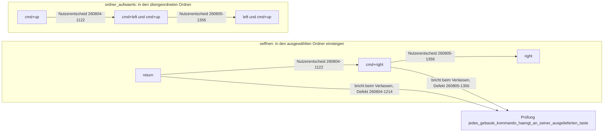

# Liegt die Ordnernavigation auf den Pfeiltasten mit oder ohne Zusatztaste?

---
**Domain:** data
**Status:** implemented
**Filed by:** planner
**Cross-references:** `planning/260802-1036_*_spec-navigator-geruest.md` (C2, C3), `planning/260802-1428_*_plan-navigator-geruest-runde-1.md` (S11b, S11c, S13, S18), `issues/260804-1214_*_die-belegungspruefung-bindet-return-noch-an-das-oeffnen.md`, `issues/260805-1356_*_die-belegungspruefung-bindet-cmd-right-noch-an-das-oeffnen.md`, `issues/260804-1122_*_der-fokusvorbehalt-fuer-tastenbefehle-steht-nur-fuer-die-loeschtasten.md`, `decisions/260804-1122_*_wandern-die-bereichsbreiten-auf-die-links-und-rechts-pfeile.md`, `decisions/260803-2300_*_auslieferungsbelegung-der-39-frei-gewaehlten-kombinationen.md`, `history/260805-1356-ordnernavigation-auf-die-nackten-pfeiltasten.md`

---

## Frage

Auf welchen Tasten liegen der Einstieg in einen Ordner und der Aufstieg in den übergeordneten Ordner, und tragen diese Tasten eine Zusatztaste? Der Nutzer hat die Frage zweimal beantwortet, am 260804-1122 und am 260805-1356, und die zweite Antwort hebt die erste teilweise auf. Dieser Datensatz trägt beide, weil es dieselbe Frage ist und ein Leser den Weg braucht und nicht nur den Endstand.

Der Datensatz entsteht nachträglich. Beide Umbelegungen sind Nutzerentscheidungen über die Bedienung, beide haben Code und Daten bewegt, und für keine von beiden war bisher ein Entscheidungsdatensatz angelegt. Festgehalten waren sie allein im Spec, im Plan und in den Historiendateien der ausführenden Agenten.

## Möglichkeiten

1. **Die Eingabetaste für den Einstieg, Cmd+Auf für den Aufstieg.** Der Auslieferungsstand bis zum 260804-1122.
   - Pro: die Eingabetaste ist in Dateimanagern die vertrauteste Taste für den Einstieg. Cmd+Auf ist die Finder-Gewohnheit für den Aufstieg.
   - Contra: Einstieg und Aufstieg liegen auf zwei unverwandten Tasten, und der Nutzer sieht der Belegung nicht an, dass sie ein Gegensatzpaar sind.

2. **Cmd+Rechts für den Einstieg, Cmd+Links neben Cmd+Auf für den Aufstieg.** Der Stand vom 260804-1122 bis zum 260805-1356.
   - Pro: die Seitwärtspfeile zeigen die Richtung, in der die Ordner nebeneinander liegen. Einstieg und Aufstieg werden ein sichtbares Paar. Die Zusatztaste hält die nackten Pfeile für die Bewegung der Auswahl frei.
   - Contra: jeder Ordnerwechsel kostet zwei Tasten statt einer, und die Kombinationsschreibweise musste dafür erst um die Seitwärtspfeile wachsen.

3. **Der Rechts-Pfeil für den Einstieg, der Links-Pfeil neben Cmd+Auf für den Aufstieg, beide Seitwärtspfeile ohne Zusatztaste.** Der Stand seit dem 260805-1356.
   - Pro: eine Ordnernavigation ohne Zusatztaste ist schneller als eine mit, und die Richtungslogik aus Möglichkeit 2 bleibt dabei unverändert bestehen. Die Bewegung im Verzeichnisbaum kostet damit so wenig wie die Bewegung in der Liste.
   - Contra: die nackten Seitwärtspfeile sind in jedem Textfeld die Bewegung der Schreibmarke um ein Zeichen. Der Fokusvorbehalt aus C2 muss deshalb tragen, und er trägt seit S13.

## Randbedingungen

Der Auf- und der Ab-Pfeil bleiben bei der Bewegung der Auswahl in der Liste. Der Nutzer nennt sie in seinem Auftrag mit, meint aber die vorhandene Bewegung und keine neue Funktion.

Cmd+Auf bleibt als zweiter Weg des Aufstiegs stehen. Der Nutzer hat es am 260804 ausdrücklich als Finder-Gewohnheit gewollt, es ist eine andere Taste als die beiden Seitwärtspfeile, und keine der beiden Antworten berührt es.

Die Ein-Zeilen-Regel aus C3 führt beide Wege des Aufstiegs in derselben Zeile der Belegungsansicht. Zwei Kombinationen auf einer Funktion sind kein Konflikt.

Die Kombinationsschreibweise muss die Seitwärtspfeile kennen. Sie kennt sie seit S11b, der `left`, `right`, `f1`, `f2` und `f9` bis `f12` in die Tastentabelle des Parsers nachgetragen hat.

## Der Weg der Belegung

`oeffnen` ist innerhalb von zwei Tagen dreimal gewandert, von der Eingabetaste über Cmd+Rechts auf den nackten Rechts-Pfeil. Jede dieser Wanderungen hat dieselbe Prüfung gebrochen.

Die Prüfung `jedes_gebaute_kommando_haengt_an_seiner_ausgelieferten_taste` in `crates/krk-core/tests/belegung.rs` führt eine Liste von Paaren aus hingeschriebener Kombination und Kommando. Ihre Zusage lautet nur, dass ein gebautes Kommando überhaupt an der Taste hängt, die die Auslieferungsbelegung ihm gibt. Weil sie diese Taste wiederholt, statt sie aus der Belegung zu lesen, bricht sie bei jeder Umbelegung von `oeffnen`. Zweimal geschehen, zweimal als Defekt gemeldet, zweimal dieselbe Zeile.

**Hier findet ein späterer Leser den Grund, warum die Belegungsprüfungen so gebaut sind, wie sie gebaut sind.** Der `coder` hat den Fall am 260805-1420 an der Wurzel behoben, also am Aufbau der Prüfung und nicht am Wert des Beispiels: `jedes_gebaute_kommando_haengt_an_seiner_ausgelieferten_taste` schreibt keine Kombination mehr hin, sondern liest ihre Paare aus `Kommando::KENNUNGEN` und der Auslieferungsbelegung. Die Zusage lautet seither ausbuchstabiert, dass es zu jedem gebauten Kommando eine ausgelieferte Kombination gibt und der Nachschlag auf jede davon dieses Kommando trifft; welche Kombination es ist, sagt allein `resources/default-keymap.toml`. Gemessen wird an allen 42 gebauten Kommandos statt an fünf, und eine dritte Umbelegung von `oeffnen` bricht die Prüfung nicht mehr. Beleg: `issues/260805-1356_*_die-belegungspruefung-bindet-cmd-right-noch-an-das-oeffnen.md` und `history/260805-1420-belegungspruefungen-lesen-ihre-beispiele-aus-der-belegung.md`.

## Was die dritte Antwort trägt

Der tragende Grund für die nackten Pfeile ist die Geschwindigkeit und damit die erste Maxime des Projekts. Eine Ordnernavigation ohne Zusatztaste braucht einen Tastendruck statt zweier, und "superschnell" steht in `idea.txt` an erster Stelle.

Der Grund für die zweite Antwort war ein anderer, und er trägt die dritte nicht. Cmd+Links und Cmd+Rechts waren mit einem Vorbild begründet: die Seitwärtspfeile zeigen die Richtung, in der die Ordner nebeneinander liegen, und ForkLift wie die Norton-Reihe legen den Auf- und Abstieg dorthin. Diese Begründung ist eine Aussage über die **Richtung** und nicht über die Zusatztaste. Sie bleibt deshalb als zweites Argument bestehen, unverändert gültig und für die heutige Wahl nicht ausschlaggebend. Wer sie als Hauptgrund stehen ließe, begründete die nackten Pfeile mit einem Argument, das für die Kombination mit Cmd genauso getragen hätte.

Die Zusatztaste fällt ersatzlos weg. Cmd+Links und Cmd+Rechts stehen in keiner Tastenliste mehr und sind nicht durch eine andere Kombination ersetzt.

## Was die Umbelegung berührt und was nicht

Der Fokusvorbehalt aus C2 wird von einer Feinheit zum Alltagsfall. Solange die Ordnernavigation eine Zusatztaste trug, konnte ein Leser den Vorbehalt für einen Randfall halten. Eine nackte Pfeiltaste in einem Eingabefeld ist der alltäglichste Fall überhaupt: wer in der Pfadeingabe einen Pfad tippt und den Links-Pfeil drückt, will die Schreibmarke bewegen und nicht den Ordner wechseln. Der Vorbehalt trägt das, weil der Ereignisabgriff den Fokus **vor** dem Nachschlag klärt und die Kombination dabei nicht ansieht. Gebaut ist er in S13, belegt am laufenden Bündel am 260804-1309, damals allerdings mit einer Zusatztaste. Für die nackte Taste ist er abgeleitet und nicht gemessen.

Die Sprungmarke aus C2 ist berührt und nicht zu ändern. Vor der Umbelegung fielen `left` und `right` als unbelegte Tasten ohne Zusatztaste auf sie durch, seither treffen sie eine Funktion und erreichen sie gar nicht mehr. Folgenlos ist das, weil die Sprungmarke nur Zeichen aufnimmt, die ein Dateiname tragen kann.

Die Bereichsbreiten aus C7 sind nicht berührt. Sie liegen seit dem 260804 auf Ctrl+Rechts und Ctrl+Links, und `decisions/260804-1122_*_wandern-die-bereichsbreiten-auf-die-links-und-rechts-pfeile.md` bleibt gültig: dieselben Tasten, eine andere Zusatztaste. Das Verhältnis, das jener Datensatz beschreibt, besteht unverändert, es hat nur seine eine Seite gewechselt.

Der Wirkungsbereich aus S18 bekommt mit den nackten Pfeilen einen alltäglicheren Fall und keinen neuen Mechanismus. `oeffnen` und `ordner_aufwaerts` tragen den Wirkungsbereich `Dateifenster`; steht der Fokus in der Lesezeichenleiste, verwirft die Zuleitung das Kommando und reicht den Tastendruck weiter. Die Frage, was ein nackter Seitwärtspfeil in der Leiste tut, beantwortet damit die vorhandene Regel und keine zusätzliche.

## Empfehlung

Keine. Beide Antworten liegen vor und sind umgesetzt; dieser Datensatz holt ihre Aufzeichnung nach.

---
Answered: Nutzerentscheid 260805-1356 im Wortlaut, festgehalten in `history/260805-1356-ordnernavigation-auf-die-nackten-pfeiltasten.md` Zeile 6 — **Möglichkeit 3.** `oeffnen` liegt auf `right`, `ordner_aufwaerts` auf `left` neben dem unveränderten `cmd+up`; `cmd+left` und `cmd+right` stehen in keiner Tastenliste mehr. Die zweite Antwort vom 260804-1122 (Möglichkeit 2) ist damit in ihrem Seitwärtsteil aufgehoben und in ihrem Richtungsargument bestätigt; sie ist im Spec in C2 und C3 und im Plan in S11c festgehalten. Die erste Antwort (Möglichkeit 1) ist seit dem 260804-1122 überholt; die Eingabetaste bleibt ab Werk frei.

**Warum dieser Datensatz `_a_` trägt und nicht `_i_`.** Die Daten stehen: `resources/default-keymap.toml` führt seit dem 260805-1356 `tasten = ["right"]` bei `oeffnen` und `tasten = ["left", "cmd+up"]` bei `ordner_aufwaerts`, und `include_str!` hat die Änderung nachweislich in das gebaute Bündel gezogen. Die maschinelle Abnahme ist seit dem 260805-1420 grün, `cargo test -p krk-core --test belegung` meldet 32 von 32.

Eines fehlt trotzdem, und `_i_` verlangt nach `rules/fusion-workbench-conventions.md` die realisierte **und belegte** Umsetzung: **der Bedienversuch am laufenden Bündel steht aus.** Ob die nackten Pfeile ein- und aussteigen und ob der Links-Pfeil in der Pfadeingabe die Schreibmarke bewegt, statt den Ordner zu wechseln, verlangt Tastendrücke in einem sichtbaren Fenster und ist von keinem Agenten dieser Sitzung geprüft worden. Genau dort kann die Umbelegung schiefgehen, denn der Fokusvorbehalt aus S13 ist für die nackte Taste abgeleitet und nicht gemessen; belegt ist er am 260804-1309 mit `cmd+left`, also mit einer Zusatztaste. `_i_` ist terminal und lässt sich nicht zurücknehmen; ihn zu setzen, bevor die Bedienung einmal gesehen wurde, nähme dem Marker seine Aussage. Der Datensatz wandert auf `_i_`, sobald der Bedienversuch vorliegt.
Implemented: 13f9463 — `resources/default-keymap.toml` führt `oeffnen` auf `right` und `ordner_aufwaerts` auf `left` und `cmd+up`; Spec und Plan sind an 24 Stellen nachgezogen, und die Belegungsprüfungen lesen ihre Beispiele seither aus der Belegung statt sie zu wiederholen. **Der Bedienversuch, der bis dahin fehlte, ist erbracht:** der Nutzer hat am 260805 bestätigt, dass die nackten Pfeiltasten navigieren. Ungeprüft bleibt allein der Sonderfall, ob der Linkspfeil in der Pfadeingabe die Schreibmarke bewegt statt den Ordner zu wechseln; der Fokusvorbehalt trägt ihn nach demselben Weg wie für `cmd+left`, gemessen ist er für die nackte Taste nicht.
Deferred:
Superseded by:
