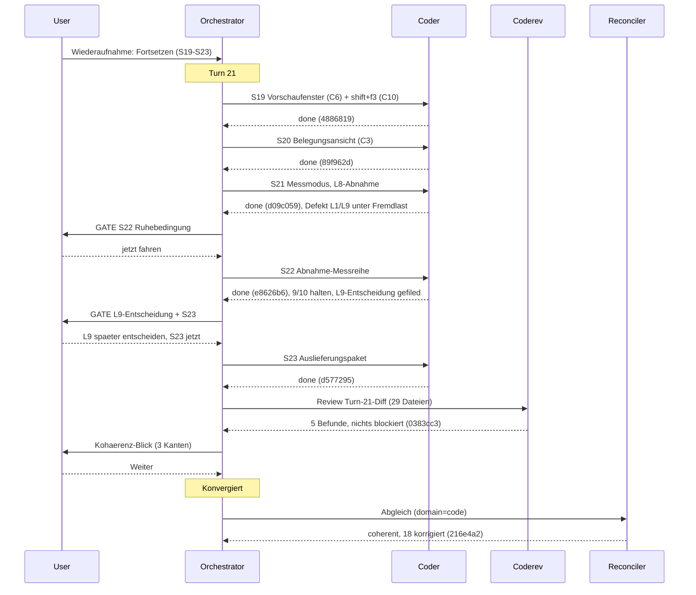

# Orchestrator Session — 260805-2128

**Directive:** KRK: native macOS-Anwendung, lokale Dateien vollständig über die Tastatur navigieren, bearbeiten und versionieren. Erste Runde: lauffähiges Navigator-Gerüst.
**Mode:** custom (Fortsetzung der unterbrochenen Sitzung 260803-1038, Warteschlange S19–S23)
**Status:** Complete

## Setup-Snapshot (260805-2128)

- Arbeitsverzeichnis: `/Users/k1/Projects/productive/krk`
- Git HEAD: `7aa8f3f`
- Aktiver Circle: `circles/260802-0842-krk-mac-dateimanager-editor-git` (`_t_`); dazu 1 anticipated Circle. Hinweis auf `/fusion:next` wurde ausgegeben.
- Offene Defekte: 13 im Circle (`_o_`/`_p_`), 0 in `shared/issues/`
- Offene Planungsdateien: Spec `260802-1036_o_spec-navigator-geruest.md`, Plan `260802-1428_o_plan-navigator-geruest-runde-1.md` (30 von 36 Schritten `[DONE]`)
- Offene Entscheidungen (`_o_`): 4 im Circle, 3 in `shared/decisions/` = 7
- Guard: kein Halt aktiv (`haltActive: false`); 1 zurückliegender Block in dieser Sitzung (Stilprofil-Kopierschleife mit dynamischem Pfad, mit literalen Pfaden wiederholt und durchgelaufen). Keine Datei mit hohem Thrashing-Score.
- Erkannte Domäne: **code** (68 Workbench-Commits, 1 Analyse, 7 offene Entscheidungen < 13 offene Defekte, Rust-Codebasis; Fallback-Regel greift). Deckt sich mit `domain: code` im gespeicherten Sitzungszustand.

## Wiederaufnahme

`agentstate.yaml` der Sitzung 260803-1038 vorgefunden (Schema aktuell, Turn 20/30, 51/51 Aufgaben committet, sauber unterbrochen bei HEAD 63cade1). Dem Nutzer vorgelegt; Wahl: **Fortsetzen**. Die gespeicherte Warteschlange S19–S23 (alle `coder`) wird übernommen; nächste Aufgabe ist S19, das Vorschaufenster mit eigenen Tabs.

## Setup-Notizen

- Monitor-Binary aus dem Plugin aufgefrischt.
- Sitzungsmarker: vorheriger Marker war stale (Heartbeat 2583 s alt), neuer Marker für diese Sitzung geschrieben.
- Stilprofile und Plane-Vorlage waren vorhanden; `fusion-guard.json` vorhanden.

## Budget

| Metrik | Zahl |
|--------|------|
| Turns | 1 (Turn 21 der fortgesetzten Sitzung) |
| Aufgaben gelöst | 5 (S19–S23) |
| Aufgaben übersprungen/zurückgestellt | 0 |
| Defekte angelegt | 8 (1 aus S21, 1 aus S22, 5 aus dem Coderev, 1 aus dem Abgleich) |
| Defekte geschlossen | 3 (Metadaten-Rechte 260803-2007, L4-Streuung 260803-1845, L1/L9-Fremdlast 260805-2335) |
| Entscheidungen beantwortet (`_o_`→`_a_`) | 0 |
| Entscheidungen umgesetzt (`_a_`→`_i_`) | 16 (Abgleich 260806-0904) |
| Neue offene Entscheidungen | 3 (Tastenweg Vorschau-Fokus, Entfernen einzelner Kombination, L9-Zusage) |
| Commits | 10 |
| Agentenfehler | 1 (S22-Hintergrundlauf überlebte das Zugende nicht; per Fortsetzungs-Dispatch behoben, ohne Datenverlust) |
| Nutzer-Gates | 4 (Wiederaufnahme, S22-Ruhebedingung, L9+S23, Kohärenz-Blick) |

## Per-Turn Log

### Turn 21
- Aufgaben: S19 Vorschaufenster (4886819, 02cb328), S20 Belegungsansicht (89f962d), S21 Messmodus mit L8-Abnahme (d09c059), S22 Abnahme-Messreihe (e8626b6, 11afe60), S23 Auslieferungspaket (d577295)
- Review: Coderev über 29 Dateien, 5 Befunde (2 mittel, 3 klein), keiner blockiert (0383cc3)
- Abgleich: 18 Abweichungen korrigiert, 16 Entscheidungen auf `_i_` (216e4a2)
- Circuit breaker: OK
- Coherence: ok (per-Turn-Gate, Nutzerwahl „Weiter")
- Besonderheiten: Abnahmereihe hält 9 von 10 Zusagen; L4-Streuung als Fremdlast belegt; L9 verfehlt auch ruhig und bleibt auf Nutzerwunsch als offene Entscheidung stehen — Runde 1 gilt bis zur Klärung nicht als abgeschlossen. S19 erweiterte den Wirkungsbereich um den Wert `Tabbereich` (im Review bestätigt, keine Nebenwirkung).

## Remaining Work

- S6b (NSAlert beim fehlgeschlagenen Tastenabgriff) — letzter offener Planschritt
- Offene Entscheidung L9 (`decisions/260806-0014_o_l9-...`) — hält die Rundenschließung
- 17 offene Defekte, keiner blockierend (u. a. 2 mittlere aus dem Coderev: Bildvorschau ohne Größengrenze, `make alle` überschreibt die Nutzer-`session.toml`)
- 2 weitere offene Entscheidungen aus diesem Turn, 4 ältere offene Fragen (siehe Entscheidungsspeicher)
- CLAUDE.md-Revision (Defekt 260806-0904) fürs Sitzungsende vorgemerkt

## Commits

| Hash | Nachricht | Aufgabe |
|------|-----------|---------|
| 4886819 | feat(ui): S19 Vorschaufenster mit eigenen Tabs, und shift+f3 aus C10 | S19 |
| 02cb328 | chore(workbench): Marker-Umbenennung des Rechte-Defekts vervollstaendigt | S19 |
| 89f962d | feat(ui): S20 Belegungsansicht, F1 bekommt seine Wirkung | S20 |
| d09c059 | feat(bench): S21 Messmodus in der Anwendung, L8 abgenommen | S21 |
| e8626b6 | feat(bench): S22 Abnahme-Messreihe, neun von zehn Zusagen halten | S22 |
| 11afe60 | chore(workbench): zwei Messreihen-Defekte nach dem S22-Befund geschlossen | S22 |
| d577295 | feat(build): S23 Auslieferungspaket, cargo xtask release | S23 |
| 0383cc3 | chore(workbench): Coderev Turn 21, fuenf Befunde gefiled | Review |
| 216e4a2 | chore(workbench): Abgleich Turn 21, sechzehn Entscheidungen auf umgesetzt | Abgleich |

## Session Flow

## Coherence
<!-- RECONCILER-OWNED -->

**Verdict:** coherent

**Edges:**
- Artifact↔Grounding: 35 von 36 Planschritten und die 3 Turn-Schließungen gegen Code und Commits verifiziert, 0 Abweichungen im Code; 17 offene Defekte (davon 5 aus dem Coderev `reviews/260806-0834-coderev-turn-21-s19-bis-s23.md`), die Tracking-Drift (16 Entscheidungsmarker `_a_`→`_i_`, Plan-Statuszeile) ist im Abgleich 260806-0904 korrigiert.
- Artifact↔Directive: die Commits der Sitzung (`4886819` S19/C6, `89f962d` S20/C3, `d09c059` S21, `e8626b6` S22/C8, `d577295` S23 samt drei chore-Commits) bewegen sich sämtlich auf die Directive zu — das lauffähige Navigator-Gerüst der Runde 1 ist damit bis auf S6b gebaut, gemessen und paketierbar.
- Grounding↔Directive: 24 umgesetzte oder beantwortete Entscheidungen konsistent mit der Directive, 0 im Widerspruch; die offene Frage `decisions/260806-0014_*_l9-verfehlt-den-anteil-auch-auf-dem-ruhigen-geraet.md` hält die Rundenschließung, ist dokumentiert und vom Nutzer am 260806 bewusst offen gehalten — kein unbemerktes Abdriften.

**Rebalance recommendation:** none
