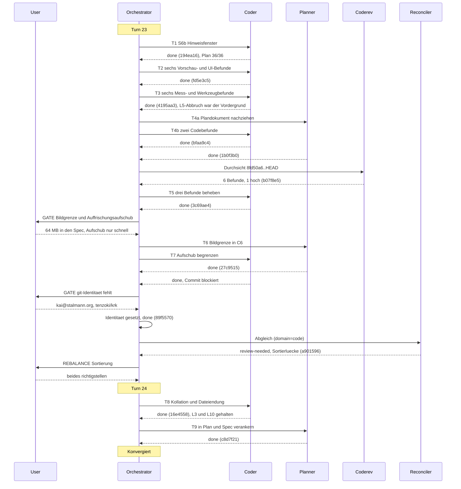

# Orchestrator Session — 260806-1140

**Directive:** KRK: native macOS-Anwendung, lokale Dateien vollständig über die Tastatur navigieren, bearbeiten und versionieren. Erste Runde: lauffähiges Navigator-Gerüst.
**Mode:** all (Rest der Runde: letzter Planschritt und die offenen Defekte)
**Status:** Complete

## Setup-Snapshot (260806-1140)

- Git HEAD: `8fd50a6`
- Aktiver Circle: `circles/260802-0842-krk-mac-dateimanager-editor-git` (`_t_`)
- Plan: 35 von 36 Schritten `[DONE]`, offen allein S6b
- Offene Defekte: 20 im Circle, 0 in `shared/issues/`
- Offene Entscheidungen: L9 (`260806-0014`), Tastenweg Vorschau-Fokus (`260805-2216`), Entfernen einzelner Kombination (`260805-2252`), dazu die vier älteren aus der Anfangszeit des Circles
- Domäne: code (unverändert)

## Warteschlange

| ID | Inhalt | Ausführender |
|----|--------|--------------|
| T1 | S6b Hinweisfenster beim fehlenden Tastenabgriff | coder |
| T2 | Vorschau- und UI-Befunde (6 Defekte) | coder |
| T3 | Mess- und Werkzeugbefunde (5 Defekte) | coder |
| T4 | Doku- und Tracking-Befunde (4 Defekte) | coder |

Nicht aufgenommen: der tote Netzpfad (`260805-0000`) und die Veralterung der Lesezeichen-Gültigkeit (`260805-1730`). Beide hängen an ungeklärten Fragen und werden nicht nebenbei entschieden.

Die Warteschlange ist unterwegs um fünf Aufgaben gewachsen: T4 zerfiel in einen Plan- und einen Code-Teil (T4a, T4b), aus der Durchsicht kam T5 (drei Befunde, darunter der schwere Strg+C-Verlust), aus zwei Nutzerentscheiden kamen T6 und T7, und der Abgleich löste mit T8 und T9 den Turn 24 aus.

## Budget

| Metrik | Zahl |
|--------|------|
| Turns | 2 (23 und 24) |
| Aufgaben gelöst | 9 |
| Aufgaben übersprungen/zurückgestellt | 0 |
| Defekte geschlossen | 22 |
| Defekte angelegt | 12 |
| Entscheidungen beantwortet (`_o_`→`_a_`) | 1 (Sortierung) |
| Entscheidungen umgesetzt (`_a_`→`_i_`) | 3 (Fehleranzeige, Bildgrenze, Sortierung) |
| Neue offene Entscheidungen | 2 (Vordergrund im Abnahmelauf, Sprache der Sortierordnung) |
| Commits | 14 |
| Agentenfehler | 0 |
| Nutzer-Gates | 5 (Koh√§renz 23, Bildgrenze + Aufschub, git-Identität, Koh√§renz-Rebalance, Sortierentscheid) |

## Per-Turn Log

### Turn 23
- T1 S6b Hinweisfenster (`194ea16`) — der letzte Planschritt, Plan damit 36/36. Es waren zwei `None`-Zweige des Tastenabgriffs, nicht einer.
- T2 sechs Vorschau- und Oberflächenbefunde (`fd5e3c5`) — Speicher beim Durchblättern von 438 MB auf 54 MB
- T3 sechs Mess- und Werkzeugbefunde (`4195aa3`) — der L5-Abbruch war der fehlende Vordergrund, kein Commit
- T4b zwei Codebefunde (`bfaa9c4`) — totes Cargo-Merkmal, 62 Markerzitate in 32 Dateien
- T4a sechs überholte Planstellen (`1b0f3b0`)
- Durchsicht: sechs Befunde (1 hoch, 3 mittel, 2 niedrig), Urteil annehmbar (`b07f8e5`)
- T5 drei davon sofort behoben (`3c69ae4`) — die Sitzungssicherung überlebt jetzt Strg+C
- T6 Bildgrenze als Zusage in C6 (`27c9515`), T7 Auffrischungsaufschub nur für schnelle Vorgänge (`89f5570`)
- Abgleich: `review-needed` wegen der Sortierlücke (`a901596`)
- Coherence: ok im per-Turn-Gate, `review-needed` im Abgleich → Rebalance

### Turn 24 (aus dem Rebalance)
- Grundlage überarbeitet: der Nutzer beantwortet den Sortierdatensatz `260802-1810` (Möglichkeit 1, beides richtigstellen)
- T8 Umsetzung (`16e4558`) — sprachsensitive Kollation über `icu_collator`, Dateiendung als Feld in `Eintrag` und Schlüssel der Typsortierung; L3 41,5 ms gegen 400 ms, L10 463,8 ms gegen 4000 ms, beide in allen fünf Runden gehalten
- T9 Verankerung in Plan und Spec (`c8d7f21`)
- Circuit breaker: OK

## Remaining Work

- **Elf offene Entscheidungen**, darunter die L9-Zusage (`260806-0014`), die die Rundenschließung hält, und zwei neue aus dieser Sitzung
- **Zehn offene Defekte**, keiner blockierend
- CLAUDE.md-Revision (`260806-0904`) steht weiter aus
- Fünf Entscheidungen sind in Plan und Spec nicht auffindbar (`260806-1735`) — dieselbe Form wie die geschlossene Sortierlücke, eine Stufe schwächer

## Commits

| Hash | Nachricht |
|------|-----------|
| `194ea16` | S6b Abbruch mit Hinweisfenster beim fehlenden Tastenabgriff |
| `fd5e3c5` | sechs Vorschau- und Oberflächenbefunde |
| `4195aa3` | sechs Befunde an Messstrecke und Bauwerkzeug |
| `bfaa9c4` | totes Cargo-Merkmal, 62 Markerzitate |
| `1b0f3b0` | sechs überholte Abnahmekriterien und Dateilisten |
| `b07f8e5` | Coderev Turn 23, sechs Befunde |
| `3c69ae4` | die Sitzungssicherung überlebt Strg+C |
| `27c9515` | die Bildgrenze von 64 MB wird eine Zusage in C6 |
| `89f5570` | der Auffrischungsaufschub gilt nur für schnelle Vorgänge |
| `a901596` | Abgleich Turn 23 |
| `16e4558` | sprachsensitive Sortierung und die Dateiendung als Typschlüssel |
| `c8d7f21` | die Sortierung in Plan und Spec verankert |

## Session Flow

## Coherence

<!-- RECONCILER-OWNED -->

**Verdict:** review-needed

**Edges:**

- Artefakt↔Grundlage: 24 Defektschließungen und 36 von 36 Schrittmarkern gegen `git diff 8fd50a6..HEAD` und den Code am Stand `89f5570` nachgesehen, alle gedeckt (`crates/krk-ui/src/vorschaumodell.rs:95`, `crates/krk-ui/src/auffrischung.rs:179`, `crates/krk-bench/src/messen.rs:1150-1300`, `xtask/src/release.rs:185`, `xtask/src/bundle.rs:68-86`, `Makefile:118`); vier Statusnachzüge korrigiert; **eine sachliche Lücke**: die Sortierung ordnet ohne sprachsensitive Kollation (`crates/krk-core/src/verzeichnis/eintrag.rs:80-86`), obwohl der Datensatz, der das entscheiden sollte, unbeantwortet ist — gemeldet als `issues/260806-1647_*_die-sortierfrage-bindet-s12-und-steht-in-keiner-planstelle.md`. 8 Defekte offen, davon 1 aus dem laufenden Coderev (`260806-1333`). `cargo test --workspace` grün, 474 Prüfungen.
- Artefakt↔Directive: die zwölf Commits `194ea16` bis `89f5570` laufen ausnahmslos auf die Directive zu — `194ea16` schließt mit S6b den letzten Schritt des Navigator-Gerüsts, `fd5e3c5`, `3c69ae4` und `89f5570` beheben Vorschau-, Auffrischungs- und Messstreckenbefehle des Gerüsts, `4195aa3` und `bfaa9c4` räumen Bauwerkzeug und Zitate auf, `27c9515` und `1b0f3b0` ziehen Spec und Plan nach. Kein Commit ist orthogonal, keiner läuft weg.
- Grundlage↔Directive: 25 Entscheidungen umgesetzt (`_i_`), 11 offen (`_o_`), keine auf `_a_`. Zehn der elf sind mit der Directive vereinbar und bewusst offen — die drei projektweiten (Editor, Git-Verwerfen, KI-SDK) gehören späteren Runden, die L9-Frage (`260806-0014`) hält die Rundenschließung auf Nutzerwunsch. **Eine steht im Widerspruch zum ausgelieferten Stand:** `decisions/260802-1810_*_sortierung-ohne-sprachsensitive-kollation.md` erklärt sich für S12 bindend, S12 ist seit dem 260804-1040 abgenommen, und der Datensatz wird in keiner Stelle von Plan und Spec genannt (Suche über den ganzen Projektbaum, einziger Treffer `CLAUDE.md:79`).

**Rebalance-Empfehlung:** Grundlage überarbeiten

Die L9-Frage ist kein Grund für dieses Verdikt; sie ist dokumentiert, vom Nutzer bewusst offen gehalten und in der Statuszeile des Plans begründet. Ausschlaggebend ist allein die Sortierfrage: eine Entscheidung, die sich selbst für einen Schritt bindend erklärt, ist nie in die Planung gelangt, und ihre unbestätigte Vorbelegung ist in einer Anwendung mit deutschsprachiger Oberfläche im Alltag sichtbar. Die Bedingung, unter der die Empfehlung des Datensatzes wartete (erst nach dem Messgate S8 entscheiden), ist seit dem 260803-1755 erfüllt.

Das Artefakt überarbeiten wäre die falsche Reihenfolge: welche Sortierung richtig ist, entscheidet der Nutzer, und ohne diesen Entscheid ändert man Code auf Verdacht. Die Directive ist unberührt. Der höherwertige Eingriff ist deshalb die Grundlage — die Frage beantworten und den Datensatz in Plan und Spec verankern, bevor Runde 1 schließt.
