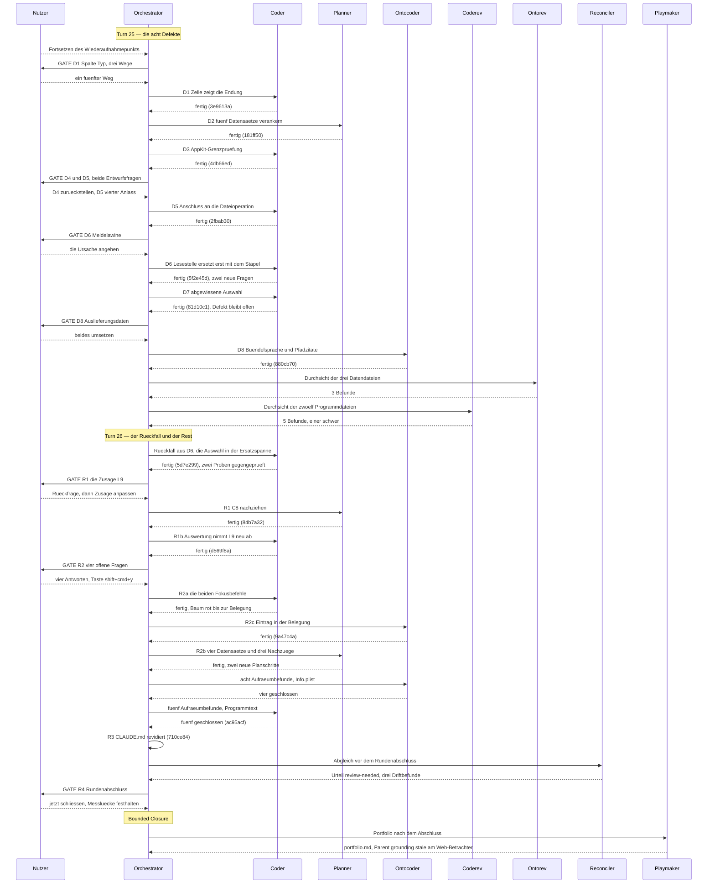

# Orchestrator Session — 260806-2257

**Directive:** KRK: native macOS-Anwendung, lokale Dateien vollständig über die Tastatur navigieren, bearbeiten und versionieren. Erste Runde: lauffähiges Navigator-Gerüst.
**Mode:** all (aus dem Wiederaufnahmepunkt übernommen)
**Status:** Bounded Closure — sieben der zehn Zeitzusagen stehen auf einer Messreihe von vor den Änderungen dieser Sitzung; der Nutzer hat die Runde 1 in Kenntnis dieser Lücke geschlossen.

## Wiederaufnahme

Setup hat `agentstate.yaml` vom 260806-1745 gefunden. Der Nutzer hat **Fortsetzen** gewählt: die gespeicherte Warteschlange wird übernommen, Reihenfolge unverändert (erst die Defekte D1 bis D8, dann R1 bis R4). Keine der zwölf Aufgaben war erledigt, es beginnt bei D1.

Schema-Prüfung: der Datensatz trägt `turn:` und `directive:`, also das aktuelle Format ab v2.9.0. Kein Bruch, kein Neustart nötig.

## Ausgangsaufnahme

| Größe | Stand |
|---|---|
| Git HEAD | f9a0462 |
| Arbeitsverzeichnis | sauber bis auf Setup-Artefakte (`.fusion-setup`, `monitor`, `orchestrator-live.md`, `.guard-state/events.jsonl`) |
| Offene Defekte | 10, alle im aktiven Circle, keiner in `shared/` |
| Offene Entscheidungen | 11 (8 im Circle, 3 projektweit) |
| Beantwortete, nicht umgesetzte Entscheidungen | 0 |
| Offene Pläne | 2 (Spec und Plan der Runde 1, beide `_o_`) |
| Analysen | 1 |
| Circles | 1 aktiv, 1 vorgesehen |
| Aktiver Circle | `260802-0842-krk-mac-dateimanager-editor-git` |
| Plane-Konfiguration | vorhanden |
| Warteschlangendatei | keine (`tasklist.md` fehlt) |

**Guard:** kein Halt aktiv (`haltActive: false`, `consecutiveBlocks: 0`). Die zehn zuletzt aufgezeichneten Blockaden stammen aus der Sitzung 260806-1140 und sind abgearbeitet; neun davon fielen auf Pfade, die erst zur Laufzeit entstanden, eine auf einen `git worktree add`. Kein Eintrag in `churn.json` trägt einen nennenswerten Thrashing-Wert.

**Domäne:** `code`, aus dem Wiederaufnahmepunkt übernommen. Die Erkennungsheuristik meldet für sich genommen `strategic` (11 offene Entscheidungen gegen 10 offene Defekte, damit greift die erste Regel), zählt aber nur fünf Codedateien, weil sie höchstens eine Unterverzeichnisebene tief sieht und die Rust-Quellen unter `crates/*/src/` liegen. Der Zählfehler entwertet das Ergebnis, deshalb bleibt es bei `code`.

**Circle-Hinweis:** ein vorgesehener Circle liegt bereit. Hinweis auf `/fusion:next` wurde ausgegeben.

## Warteschlange

Zwölf Aufgaben, Reihenfolge nach Nutzerwunsch. Drei tragen ein Nutzer-Gate.

| ID | Kurz | Ausführer | Gate |
|---|---|---|---|
| D1 | Spalte Typ zeigt die Eintragsart, sortiert nach der Endung | coder | ja |
| D2 | Fünf offene Entscheidungen ohne Planstelle | planner | — |
| D3 | AppKit-Grenzprüfung sieht nur `use`-Zeilen und eine von drei Kisten | coder | — |
| D4 | Toter Netzpfad lässt den Lesefaden hängen | coder | — |
| D5 | Lesezeichen-Gültigkeit veraltet zwischen zwei Anlässen | coder | — |
| D6 | Schnelles Verschieben, mögliche Meldelawine | coder | — |
| D7 | Sitzungslauf blieb einmal von drei Malen bei L6 stehen | coder | — |
| D8 | Zwei Datenbefunde in `resources/` | ontocoder | ja |
| R1 | L9 verfehlt den Anteil, hält die Rundenschließung | coder | ja |
| R2 | Vier weitere offene Fragen des Circles beantworten | orchestrator | ja |
| R3 | CLAUDE.md-Revision | coder | — |
| R4 | Rundenabschluss | orchestrator | — |

## Budget

| Größe | Zahl |
|---|---|
| Turns | 2 (25 und 26) |
| Aufgaben erledigt | 12 von 12 der Warteschlange, dazu 11 Befunde aus den Durchsichten |
| Aufgaben zurückgestellt | 1 (D4, toter Netzpfad) |
| Defekte gefiled | 14 |
| Defekte geschlossen | 16 |
| Entscheidungen beantwortet (`_o_`→`_a_`) | 5 |
| Entscheidungen umgesetzt (`_a_`→`_i_`) | 5 |
| Commits | 19 |
| Agentenfehler | 0 |
| Nutzer-Gates | 7 |

## Turn-Protokoll

### Turn 25

Die acht Defektaufgaben aus dem Wiederaufnahmepunkt, in der vom Nutzer gesetzten Reihenfolge.

- **Erledigt:** D1 (Spalte Typ zeigt die Endung), D2 (fünf Datensätze an ihrem Planschritt verankert), D3 (AppKit-Grenzprüfung), D5 (vierter Anlass für die Lesezeichenmarke), D6 (die Lesestelle ersetzt erst mit dem ersten Stapel), D7 (abgewiesene Auswahl bricht die Messstrecke ab), D8 (Bündelsprache und Pfadzitate).
- **Zurückgestellt:** D4, der tote Netzpfad, mit benanntem Auslöser.
- **Commits:** `b96bd89`, `3e9613a`, `181ff50`, `4db66ed`, `2fbab30`, `5f2e45d`, `81d10c1`, `880cb70`.
- **Durchsichten:** `ontorev` drei Befunde, `coderev` fünf, davon einer schwer.
- **Kohärenz:** nicht ausgewertet, der Turn endete in die Durchsichten und Turn 26 nahm ihren schweren Befund unmittelbar auf.

**Der Turn hat einen Rückfall erzeugt und die Durchsicht hat ihn gefunden.** D6 stellte die Lesestelle um, sodass das Ordnermodell den alten Bestand länger behält. Drei Leser dieses Modells kannten den neuen Zustand nicht, und einer davon setzte die Auswahl deterministisch auf eine Zeile, die gleich darauf wegfiel. Ohne die Durchsicht wäre das in den Rundenabschluss gelaufen.

### Turn 26

Der Rückfall, die vier Restpunkte und die Aufräumbefunde.

- **Erledigt:** der Rückfall aus D6 (Auswahl hängt am Namen, an einer Stelle statt an dreien), R1 (L9 neu gefasst) samt R1b (Auswertung nimmt die neue Fassung ab), R2 (vier Nutzerentscheide, davon zwei gebaut), R3 (`CLAUDE.md` revidiert), acht Aufräumbefunde aus beiden Durchsichten, R4 (Rundenabschluss).
- **Commits:** `82735bc`, `79f8933`, `5d7e299`, `84b7a32`, `d569f8a`, `7e63a9b`, `9a47c4a`, `ac95acf`, `710ce84`, `bd74613`, `490869e`.
- **Kohärenz:** `review-needed` (Abgleich `history/260807-1022-reconciliation.md`).
- **Rebalance:** der Nutzer hat **beschränkten Abschluss** gewählt.

## Nutzer-Gates

Sieben, alle vom Nutzer beantwortet.

| Gate | Antwort |
|---|---|
| D1, Spalte Typ | ein fünfter Weg, den der Defekt nicht führte: Überschrift bleibt „Typ", die Zelle zeigt die Endung |
| D4, toter Netzpfad | zurückstellen mit benanntem Auslöser |
| D5, Lesezeichenmarke | der billigere Weg, ein vierter Anlass nach jeder Dateioperation |
| D6, Meldelawine | die Ursache angehen statt den Vorbehalt zu messen |
| D8, Auslieferungsdaten | beides umsetzen |
| R1, L9 | die Zusage anpassen, nach einer Rückfrage nach der Bedeutung von „nächstes Bild" |
| R2, vier Fragen | Fokusbefehl auf `shift+cmd+y`; Entfernen-Befehl so lassen; Leiste einblenden und fokussieren; `settings.toml` bleibt beim einmaligen Laden |
| R4, Rundenabschluss | jetzt schließen, die Messlücke festhalten |

**Zweimal hat der Nutzer gegen die Empfehlung des jeweiligen Datensatzes entschieden**, bei R1 und bei der `settings.toml`-Frage. Beides steht in den Datensätzen ausgeschrieben, samt der Empfehlung, gegen die es ging.

## Coherence

<!-- RECONCILER-OWNED -->

**Verdict:** review-needed

**Edges:**
- Artifact↔Grounding: 38 von 38 Planschritten am Code belegt und S19b/S19c an ihren Abnahmekriterien einzeln nachgeprüft (`crates/krk-core/src/tasten/belegung.rs:295,363,429`, `resources/default-keymap.toml:347`, `cargo test --workspace` grün am Stand `710ce84`); dagegen 3 Driftbefunde neu gemeldet und 6 Statuskopfzeilen richtiggestellt. Der schwerste Driftbefund: der Plan sagt an zwei Stellen, die Auswertung könne die neue Fassung der Zusage L9 nicht abnehmen, was seit `d569f8a` falsch ist. Offene Defekte: 3 offen, 1 zurückgestellt, keiner davon aus einer Durchsicht dieser Sitzung unerledigt.
- Artifact↔Directive: die 16 Commits von `f9a0462` bis `710ce84` bewegen sich auf die Directive zu. Sie stärken durchweg die Tastatursteuerung und die Verlässlichkeit der Dateiliste: `9a47c4a` gibt dem Vorschaufenster den dritten Fokusbefehl und macht damit alle drei Bereiche über die Tastatur erreichbar, `5d7e299` und `5f2e45d` reparieren Auswahl und Lesestelle, `3e9613a` bringt die Spalte Typ mit ihrer Sortierordnung in Übereinstimmung, `880cb70` gibt dem Bündel seine Sprache. Kein Commit ist quer zur Directive.
- Grounding↔Directive: 31 umgesetzte und 8 offene Entscheidungen, keine im Widerspruch zur Directive. Eine Spannung ist benannt statt übergangen: die Absenkung der Zusage L9 am 260807 gibt im Kopierfall dauerhaft eine Bildlänge gegen die Maxime "superschnell" ab; der Nutzer hat sie in Kenntnis des Preises gewählt, und `decisions/260806-0014_*_l9-verfehlt-den-anteil-auch-auf-dem-ruhigen-geraet.md` schreibt ihn aus.

**Rebalance recommendation:** revise Artifact

Die Empfehlung meint nicht, die Arbeit sei falsch. Die Directive stimmt, die Grounding stimmt, und die 38 Schritte stehen. Was fehlt, ist der Beleg: sieben der zehn Zeitzusagen — L1, L4, L5, L6, L7, L8 und der Zeichenanteil von L2 — stehen unverändert auf der Abnahmereihe vom 260805-2207, und nach jener Messung haben `880cb70`, `5d7e299` und `9a47c4a` Wege berührt, die genau diese Zusagen messen. Frisch gemessen sind allein L3, L10 und der Kernanteil von L2 (`messungen/260807-0002-…`); für L9 sind die alten Einzelwerte unter der neuen Regel nachgerechnet (`crates/krk-bench/src/messen.rs:2179-2232`). Ein Abnahmelauf am gebauten Bündel schließt die Lücke; er verlangt KRK im Vordergrund und damit den Nutzer.

## Verbleibende Arbeit

**Für den Nutzer, und nur für ihn:** der Abnahmelauf am gebauten Bündel. Aus einem Terminalfenster im Vordergrund `make fixture`, dann `make alle RUNDEN=5`. Er schließt die Belegslücke, die diese Runde beschränkt hält.

**Fünf offene Defekte:**

| Defekt | Warum offen |
|---|---|
| `260806-1304_o_der-sitzungslauf-blieb-einmal-von-drei-malen-bei-l6-stehen` | Welcher der beiden Fälle es war, sagt erst ein Lauf im Vordergrund. Das Werkzeug dafür ist mit `81d10c1` gebaut. |
| `260807-0219_o_drei-aufrufer-von-eintrag-waehlen-werfen-den-auswahlversuch-weg` | Zwei der drei Stellen sind durch `5d7e299` gegenstandslos geworden; die dritte verlangt einen Nutzerentscheid über eine sichtbare Meldung. |
| `260807-0930_o_die-meldung-zur-buendelkennung-sagt-nicht-dass-settings-toml-erst-beim-start-gelesen-wird` | Der Preis des Entscheids zur `settings.toml`; ein Vorschlag liegt vor, entschieden ist er nicht. |
| `260807-1022_o_der-plan-fuehrt-den-messstrecken-defekt-an-zwei-stellen-noch-als-offen` | Dokumentendrift, 16 Minuten lang richtig gewesen. |
| `260807-1022_o_zweiundzwanzig-verweise-in-lebenden-dokumenten-tragen-einen-ueberholten-zustandsmarker` | Durch den Rundenabschluss gewachsen: drei Zitate zeigen jetzt ins Leere. |

**Acht offene Entscheidungen**, keine davon hält einen Planschritt auf. Zwei sind in dieser Sitzung neu entstanden und hängen an der Umstellung der Lesestelle: ob der Auffrischungsaufschub entfallen kann, und ob die Markierung eine Auffrischung überleben soll.

**Das Portfolio** führt einen vorgesehenen Circle, den eingebauten Web-Betrachter im Vorschaufenster. Sein Datensatz trägt seit dem 260807 einen Abschnitt `## Parent grounding stale`: seine dritte offene Frage leitet eine mögliche elfte Zeitzusage aus den zehn bestehenden ab, und die beiden naheliegenden Bezugsgrößen L5 und L7 gehören zu den sieben, deren Beleg gealtert ist.

## Commits

| Hash | Was | Aufgabe |
|---|---|---|
| `b96bd89` | Sitzungsstart, Wiederaufnahme der Warteschlange | Setup |
| `3e9613a` | Die Spalte Typ zeigt die Endung, nach der sie ordnet | D1 |
| `181ff50` | Fünf offene Datensätze stehen jetzt an ihrem Schritt | D2 |
| `4db66ed` | Die AppKit-Grenzprüfung sieht beide Formen und drei Wurzeln | D3 |
| `2fbab30` | Ein vierter Anlass zieht die Lesezeichenmarke nach | D4, D5 |
| `5f2e45d` | Die Lesestelle ersetzt erst mit dem ersten Stapel | D6 |
| `81d10c1` | Eine abgewiesene Auswahl bricht die Messstrecke ab | D7 |
| `880cb70` | Das Bündel nennt seine Sprachen, die Zitate ihren Marker nicht | D8 |
| `82735bc` | Ontorev Turn 25, drei Befunde gefiled | Durchsicht |
| `79f8933` | Coderev Turn 25, fünf Befunde gefiled, einer schwer | Durchsicht |
| `5d7e299` | Die Auswahl hängt am Namen, an einer Stelle statt an drei | Rückfall |
| `84b7a32` | L9 sagt zu, was gemessen ist, und nennt den Preis | R1 |
| `d569f8a` | Die Auswertung nimmt L9 in der neuen zweiteiligen Fassung ab | R1b |
| `7e63a9b` | Der L9-Datensatz steht auf umgesetzt | R1 |
| `9a47c4a` | Der dritte Fokusbefehl, und ein Fokusbefehl holt seinen Bereich hervor | R2 |
| `ac95acf` | Vier Antworten verankert, acht Aufräumbefunde, alle 38 Schritte abgenommen | R2, Aufräumen |
| `710ce84` | Der Projektstand stimmt wieder, und die Fallenliste ist neu | R3 |
| `bd74613` | Abgleich vor dem Rundenabschluss, Urteil review-needed | R4 |
| `490869e` | Beschränkter Abschluss, Portfolio aufgefrischt | R4 |

## Session Flow

