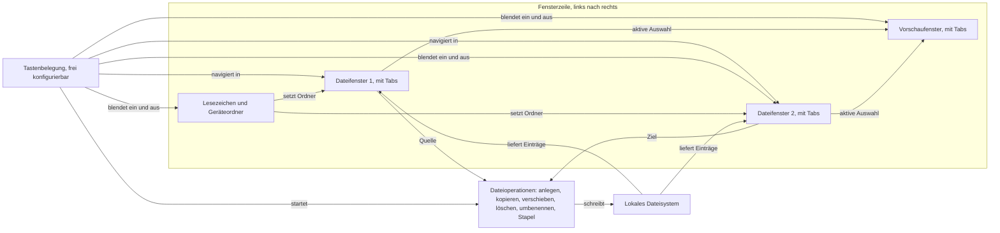
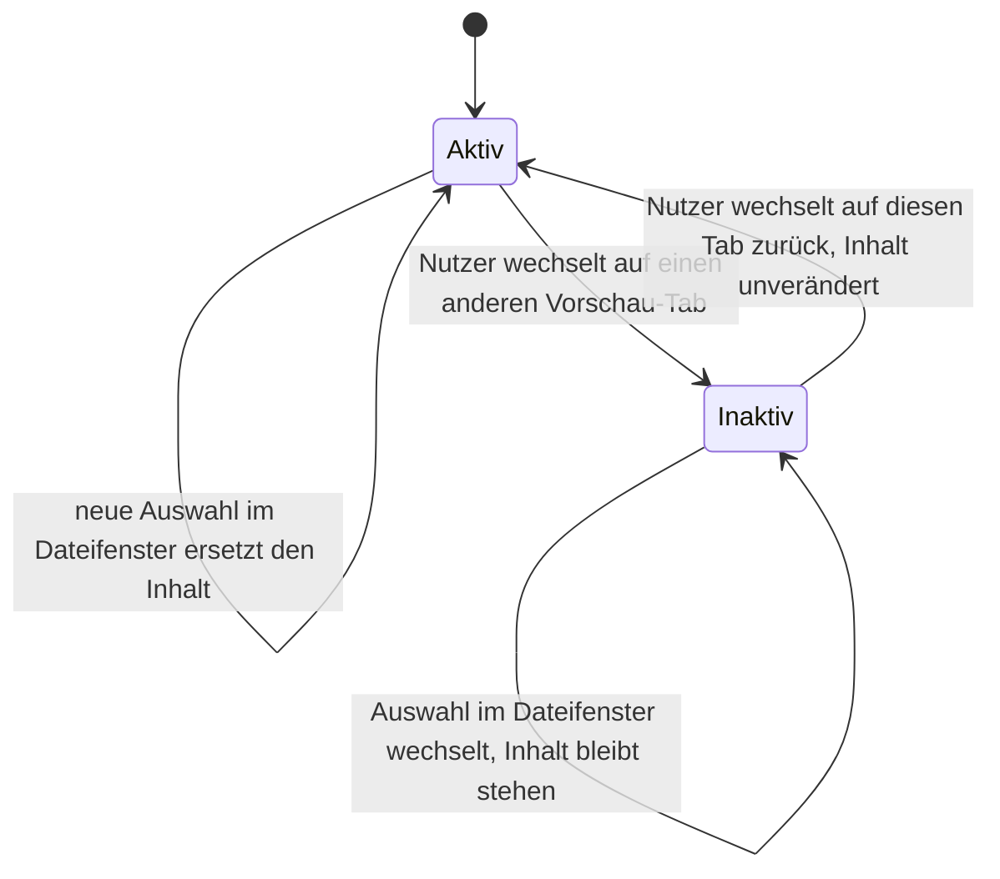

# Spec: KRK Navigator-Gerüst (Runde 1)

**Datum:** 2026-08-02, überarbeitet 260802-1127
**Status:** Entwurf, alle Nutzerantworten eingearbeitet, keine Frage dieser Runde offen
**Circle:** `circles/260802-0842-krk-mac-dateimanager-editor-git`
**Quelle:** Circle-Directive im Datensatz `_t_circle.md`, zugeschnitten auf die erste Runde durch den Nutzer in der Phase-0-Klärung.

> **Gatehinweis für den Planner:** Dieser Spec ist noch nicht abgenommen, trägt aber keine offene Nutzerfrage mehr. Die vier Fragen A bis D hat der Nutzer am 260802-1105 beantwortet, das Referenzgerät für die Zeitzusagen aus C8 am 260802-1127 benannt; die Antworten stehen als verbindliche Abnahmekriterien in C3, C4 und C8. Die frühere Abweichung zwischen der Löschantwort und der Circle-Directive ist behoben: der Nutzer hat die Directive-Zeile korrigieren lassen, siehe `## Abgleich mit der Circle-Directive`.

## Directive dieser Runde

Nach dieser Runde navigiert der Nutzer lokale Dateien und Ordner vollständig über die Tastatur, in zwei Dateifenstern mit je mehreren Tabs, flankiert von einer Lesezeichen- und Geräteleiste links und einem Vorschaufenster rechts. Er legt Dateien und Ordner an, kopiert, verschiebt, löscht und benennt sie um, auch über mehrere ausgewählte Einträge in einem Zug. Jede Fensterbreite ist verstellbar, jedes Fenster per Tastenbefehl ein- und ausblendbar, und die Anwendung hält dabei die in Abschnitt C8 festgeschriebenen Zeitzusagen ein.

Der eingebaute Editor und die Git-Anbindung sind Teil des Circles, aber nicht dieser Runde. Sie folgen in späteren Runden desselben Circles.

## Aufbau und Datenfluss dieser Runde

Die Bezeichner C1 bis C8 verweisen auf die Fähigkeiten weiter unten. Sie sind bewusst nicht mit F nummeriert, weil F3 bis F8 in diesem Dokument die Funktionstasten der Norton-Belegung bezeichnen.

Zwei Eigenschaften des Graphen sind gewollt und keine Nachlässigkeit. Der Knoten `Tastenbelegung` zeigt auf fünf andere Knoten, weil die Tastatur in KRK die einzige vollständige Bedienoberfläche ist; jede Funktion muss von dort erreichbar sein. Auf das zweite Dateifenster zeigt er zweimal, weil die Tastatur dort zwei verschiedene Dinge tut: sie navigiert darin, und sie blendet es aus und wieder ein. C7 sagt das Ausblenden für drei Bereiche zu, für die Lesezeichenleiste, das zweite Dateifenster und das Vorschaufenster, und alle drei tragen die Kante. Die zweite gewollte Eigenschaft sind die beiden Zyklen über `Lokales Dateisystem`, je einer pro Dateifenster. Sie bilden die Arbeitsschleife ab: lesen, auswählen, schreiben, erneut lesen. Eine Operation, die den Ordnerinhalt ändert, muss die betroffenen Fenster ohne Zutun des Nutzers auffrischen.

Das Halteverhalten der Vorschau-Tabs, das der Circle-Datensatz beschreibt, ist ein Zustandsverhalten pro Tab:

## Fähigkeiten

### C1: Zwei Dateifenster mit je mehreren Tabs

**Beschreibung:** Der Nutzer sieht zwei gleichrangige Dateifenster nebeneinander. Jedes hält beliebig viele Tabs, jeder Tab zeigt genau einen Ordner. Genau ein Fenster ist zu jedem Zeitpunkt das aktive, erkennbar ohne Hinsehen auf die Maus. Bei Dateioperationen ist das aktive Fenster die Quelle und das andere das Ziel, so wie es Norton Commander und ForkLift handhaben.

**Abnahmekriterien:**
- [ ] Beim Start zeigt KRK zwei Dateifenster nebeneinander, jedes mit mindestens einem Tab.
- [ ] Ein Tastenbefehl öffnet einen neuen Tab im aktiven Fenster, ein zweiter schließt den aktiven Tab, ein dritter wechselt zum nächsten und ein vierter zum vorigen Tab.
- [ ] Ein Tastenbefehl wechselt das aktive Fenster. Das aktive Fenster ist optisch eindeutig markiert, auch wenn beide Fenster denselben Ordner zeigen.
- [ ] Beim Schließen des letzten Tabs eines Fensters bleibt das Fenster bestehen und zeigt einen Standardordner, statt zu verschwinden.
- [ ] Nach Beenden und erneutem Start zeigen beide Fenster wieder dieselben Tabs mit denselben Ordnern und derselben Auswahl wie vorher.
- [ ] Beide Fenster können denselben Ordner zeigen, ohne dass sich ihre Auswahl oder ihre Bildlaufposition gegenseitig beeinflusst.

**Getroffene Festlegungen:**
- Sitzung wird wiederhergestellt: ja (Vorbelegung, weil ein Dateimanager ohne Wiederherstellung bei jedem Start denselben Navigationsweg erzwingt).
- Quelle und Ziel: aktives Fenster ist Quelle, das andere ist Ziel (Vorbelegung, folgt dem Vorbild Norton Commander und dem Diagramm im Circle-Datensatz).

### C2: Navigation über die Tastatur

**Beschreibung:** Der Nutzer erreicht jeden Ordner und jede Datei ohne Maus. Die Auswahl bewegt sich mit den Pfeiltasten, springt seitenweise, an den Anfang und an das Ende der Liste. Er steigt in Ordner hinein und wieder heraus, springt über eine Pfadeingabe direkt an einen Ort und findet einen Eintrag durch Tippen der ersten Buchstaben. Maus und Trackpad funktionieren zusätzlich, ersetzen aber nie einen Tastenweg.

**Abnahmekriterien:**
- [ ] Jede Funktion aus C1 bis C7 ist über mindestens einen Tastenbefehl erreichbar. Keine Funktion ist ausschließlich per Maus bedienbar.
- [ ] Pfeiltasten bewegen die Auswahl um einen Eintrag, Bild auf und Bild ab um eine Bildschirmseite, und je ein Befehl springt an den Anfang und an das Ende der Liste.
- [ ] Ein Tastenbefehl steigt in den ausgewählten Ordner ein, ein zweiter in den übergeordneten Ordner. Beim Aufstieg steht die Auswahl auf dem Ordner, aus dem der Nutzer gerade kam.
- [ ] Ein Tastenbefehl öffnet eine Pfadeingabe. Der Nutzer tippt oder fügt einen absoluten Pfad ein und landet im Zielordner, oder erhält eine Meldung, wenn der Pfad nicht existiert oder nicht lesbar ist.
- [ ] Tippt der Nutzer Buchstaben ohne Zusatztaste, springt die Auswahl auf den ersten Eintrag, dessen Name so beginnt. Nach einer Pause beginnt die Eingabe von vorn.
- [ ] Mehrfachauswahl über die Tastatur: ein Befehl markiert den Eintrag unter der Auswahl und rückt weiter, ein zweiter markiert alle Einträge, ein dritter hebt jede Markierung auf, ein vierter kehrt die Markierung um.
- [ ] Die Sortierung der Liste lässt sich per Tastenbefehl zwischen Name, Größe, Änderungsdatum und Typ umschalten, jeweils auf- und absteigend.
- [ ] Ein Tastenbefehl blendet versteckte Dateien ein und wieder aus.

**Getroffene Festlegungen:**
- Versteckte Dateien sind beim ersten Start ausgeblendet (Vorbelegung, entspricht dem Verhalten des Finders und von ForkLift).
- Standardsortierung ist Name aufsteigend, Ordner vor Dateien (Vorbelegung, entspricht beiden Vorbildern).

### C3: Tastenbelegung, frei konfigurierbar mit ausgelieferter Vorbelegung

**Beschreibung:** Jede Taste und jede Tastenkombination ist frei belegbar; das ist die Grundhaltung der Anwendung und keine Zusatzfunktion. Ausgeliefert wird eine Vorbelegung, die sich auf einem Mac vertraut anfühlt, also Cmd-Kürzel und Pfeiltasten, ergänzt um die Norton-Reihe auf Fn+F3 bis Fn+F8 und die Taste Delete zum Räumen in den Papierkorb. Die Fn-Kombination ist gewählt, weil sie auf jedem Mac ankommt, ohne dass der Nutzer eine Systemeinstellung ändert. Der Nutzer sieht seine Belegung in einer eigenen Ansicht, ändert sie dort und stellt die Auslieferungsbelegung jederzeit wieder her.

**Abnahmekriterien:**
- [ ] Eine Ansicht listet jede Funktion mit ihrer aktuellen Belegung. Der Nutzer weist einer Funktion eine neue Kombination zu, indem er sie drückt.
- [ ] Belegt der Nutzer eine Kombination, die bereits vergeben ist, meldet KRK den Konflikt und nennt die andere Funktion, statt die Belegung stillschweigend zu überschreiben.
- [ ] Ein Befehl setzt die gesamte Belegung auf den Auslieferungszustand zurück.
- [ ] Die geänderte Belegung überlebt Beenden und Neustart.
- [ ] Die Norton-Zuordnung der Auslieferungsbelegung lautet: Fn+F3 Vorschau anzeigen, Fn+F5 Kopieren, Fn+F6 Verschieben und Umbenennen, Fn+F7 Ordner anlegen, Fn+F8 endgültig löschen.
- [ ] Auf einem unveränderten Mac lösen Fn+F3 bis Fn+F8 die genannten Funktionen aus, ohne dass der Nutzer die Systemeinstellung "F1, F2 usw. als Standard-Funktionstasten verwenden" aktiviert hat.
- [ ] Die Belegungsansicht führt je Funktion genau eine Zeile. Eine zweite Zeile für die nackte Funktionstaste gibt es nicht.
- [ ] Hat der Nutzer die genannte Systemeinstellung von sich aus aktiviert, lösen die nackten Tasten F3 bis F8 dieselben Funktionen aus, weil in diesem Systemzustand die nackte Taste dasselbe Tastenereignis erzeugt wie sonst die Fn-Kombination. KRK unterscheidet die beiden Wege nicht und braucht dafür keine zweite Belegung.
- [ ] Fn+F4 ist in dieser Runde unbelegt und in der Belegungsansicht als für den Editor reserviert gekennzeichnet.
- [ ] Die Taste Delete ist ab Werk mit dem Räumen in den Papierkorb belegt, Fn+F8 mit dem endgültigen Löschen. Beide sind verschiedene Funktionen und stehen als zwei Zeilen in der Belegungsansicht. Das Verhalten beider steht in C4.
- [ ] Shift+Delete ist ab Werk unbelegt. Der Nutzer kann die Kombination frei belegen, KRK liefert sie nicht vorbelegt aus.

**Getroffene Festlegungen:**
- Ausgeliefert wird ausschließlich die Fn-Kombination (Antwort des Nutzers auf Frage A, Möglichkeit 1 des Datensatzes `shared/decisions/260802-0842_a_f-tasten-unter-macos-systembelegung.md`). Die nackten F-Tasten bleiben frei, damit die Belegungsansicht je Funktion eine Zeile trägt statt zweier.
- Fn+F4 bleibt in Runde 1 unbelegt, weil die Norton-Bedeutung "Bearbeiten" auf den Editor zeigt und der Editor erst in einer späteren Runde entsteht. Eine Belegung mit dem Systemeditor wäre ein Behelf, den die spätere Runde wieder entfernen müsste.
- Fn+F3 zeigt in dieser Runde die Vorschau, was der Norton-Bedeutung "Ansehen" entspricht und ohne den Editor auskommt.
- Mit "Delete" ist die Taste gemeint, die auf jeder Mac-Tastatur mit "delete" beschriftet ist, also die Rückschritt-Taste über der Return-Taste. Die Vorwärts-Löschtaste heißt auf dem Mac ebenfalls delete, ist aber auf tragbaren Geräten nur über Fn+delete erreichbar und deshalb nicht gemeint.

**Anforderung an die Technologiewahl (Eingabe für den analyst, keine Festlegung):** Die Anwendung muss Tastenereignisse so früh entgegennehmen, dass sie systemseitig vorbelegte Tasten erreicht und dass jede Kombination zur Laufzeit umbelegbar ist. Eine Umgebung, die nur eine feste Menge von Tastenkürzeln zulässt, trägt C3 nicht.

### C4: Dateioperationen, einzeln und im Stapel

**Beschreibung:** Der Nutzer legt Ordner und Dateien an, kopiert und verschiebt zwischen den beiden Dateifenstern, löscht und benennt um. Jede dieser Operationen wirkt auch auf eine Mehrfachauswahl, also auf viele Einträge in einem Zug, und schließt Ordner mit Inhalt ein. Während eine länger laufende Operation arbeitet, bleibt die Oberfläche bedienbar, zeigt den Fortschritt und lässt sich abbrechen.

**Abnahmekriterien:**
- [ ] Anlegen: ein Tastenbefehl legt einen Ordner an, ein zweiter eine leere Datei, jeweils im Ordner des aktiven Fensters. Nach dem Anlegen steht die Auswahl auf dem neuen Eintrag.
- [ ] Kopieren und Verschieben: ein Tastenbefehl kopiert die Auswahl des aktiven Fensters in den Ordner des anderen Fensters, ein zweiter verschiebt sie. Beide wirken auf eine Mehrfachauswahl und auf Ordner mit Inhalt.
- [ ] Umbenennen: ein Tastenbefehl benennt den ausgewählten Eintrag um, direkt in der Liste.
- [ ] Bei einem Namenskonflikt fragt KRK einmal nach, mit den Möglichkeiten Überschreiben, Überspringen, Umbenennen und Abbrechen, und einer Option "für alle weiteren übernehmen".
- [ ] Eine Operation über mehr als 100 Einträge oder mehr als 100 MB zeigt einen Fortschritt und lässt sich mit einem Tastenbefehl abbrechen. Nach einem Abbruch nennt KRK, wie viele Einträge bereits übertragen wurden.
- [ ] Scheitert eine Operation an einem einzelnen Eintrag, etwa wegen fehlender Rechte, läuft sie mit den übrigen weiter und meldet am Ende eine Liste der übersprungenen Einträge mit Grund.
- [ ] Nach jeder Operation zeigen beide Dateifenster den neuen Stand, ohne dass der Nutzer auffrischen muss.
- [ ] Beim ersten Zugriff auf einen von macOS geschützten Ordner, etwa Schreibtisch, Dokumente oder Downloads, fordert KRK die Systemfreigabe an und erklärt in einem Satz, wozu.
- [ ] Löschen in den Papierkorb: die Taste Delete verschiebt die Auswahl des aktiven Fensters in den Papierkorb des Systems, sofort und ohne Rückfrage. Sie wirkt auf eine Mehrfachauswahl und auf Ordner mit Inhalt.
- [ ] Delete löst nur dann eine Löschung aus, wenn der Eingabefokus in einem Dateifenster steht. In der Pfadeingabe, im Umbenennen-Feld und in jedem anderen Textfeld bleibt sie die Rückschritt-Taste.
- [ ] Endgültiges Löschen: Fn+F8 löscht die Auswahl ohne Umweg über den Papierkorb. Auch diese Funktion wirkt auf eine Mehrfachauswahl und auf Ordner mit Inhalt.
- [ ] Vor dem endgültigen Löschen fragt KRK genau einmal je Vorgang nach, unabhängig von der Zahl der betroffenen Einträge. Die Rückfrage nennt die Zahl der Einträge und, falls Ordner darunter sind, deren Zahl gesondert.
- [ ] Die Rückfrage ist vollständig über die Tastatur zu beantworten. Vorbelegt ist Abbrechen, sodass ein reflexhaftes Bestätigen mit der Return-Taste nichts löscht.
- [ ] Zu einer über Delete gelöschten Auswahl gibt es einen Rückweg über den Papierkorb des Systems. Einen eigenen Rückgängig-Speicher führt KRK nicht.
- [ ] Umbenennen im Stapel: ein Tastenbefehl öffnet für eine Mehrfachauswahl ein Umbenennen mit Musterregeln. Die Regeln umfassen Suchen und Ersetzen im Namen sowie eine fortlaufende Nummerierung mit wählbarer Stellenzahl und wählbarem Startwert.
- [ ] Das Umbenennen im Stapel zeigt vor der Ausführung eine Vorschau, die je markiertem Eintrag den alten und den neuen Namen gegenüberstellt. Erst ein zweiter, ausdrücklicher Befehl führt die Umbenennung aus.
- [ ] Die Vorschau markiert jeden Eintrag, dessen neuer Name mit einem bestehenden Eintrag oder mit einem anderen neuen Namen aus derselben Regel kollidiert, und nennt den Grund. Sie markiert ebenso jeden Eintrag, dessen neuer Name leer wäre.
- [ ] Das Umbenennen im Stapel wirkt auf Ordner wie auf Dateien und ist vollständig über die Tastatur bedienbar, einschließlich der Eingabe der Regeln, des Blätterns durch die Vorschau und des Abbruchs.

**Getroffene Festlegungen:**
- Namenskonflikt fragt einmal nach, mit einer Option für alle weiteren Fälle (Vorbelegung, entspricht ForkLift; stilles Überschreiben wäre Datenverlust, stilles Überspringen wäre unbemerkter Datenverlust am Ziel).
- Eine gescheiterte Einzelposition bricht den Stapel nicht ab (Vorbelegung; der Abbruch bei Eintrag 3 von 2.000 wäre in der Praxis die häufigere Enttäuschung).
- Löschen ist zweigeteilt: Delete räumt in den Papierkorb, Fn+F8 löscht endgültig. Das ist die wörtliche Antwort des Nutzers auf Frage B, festgehalten in `shared/decisions/260802-0842_a_loeschen-papierkorb-oder-endgueltig.md`.
- Das endgültige Löschen fragt einmal nach. Diese Festlegung hat der Shaper getroffen, weil der Nutzer zur Rückfrage nichts gesagt hat. Die Begründung: der Nutzer hat den schnellen Alltagsweg und den unwiderruflichen Weg auf zwei verschiedene Tasten gelegt, und nur der zweite hat keinen Rückweg. Ein eigener Rückgängig-Speicher scheidet aus, weil er ein zweiter Papierkorb wäre und damit gegen die Maxime "supersimpel" liefe. Bleibt als Sicherung allein die Rückfrage. Sie kostet einen Tastendruck je Vorgang, nicht je Eintrag, und bremst die Tastaturarbeit nicht, weil das alltägliche Löschen über Delete ohne jede Rückfrage läuft.
- Das Umbenennen im Stapel kommt mit Musterregeln und Vorschau (Antwort des Nutzers auf Frage D, Möglichkeit 2 des Datensatzes `circles/260802-0842-krk-mac-dateimanager-editor-git/decisions/260802-1036_a_umbenennen-im-stapel-umfang.md`). Groß- und Kleinschreibung als eigene Regel hat der Nutzer nicht genannt und ist deshalb nicht Teil der Zusage; eine Umschaltung der Schreibweise lässt sich über Suchen und Ersetzen nicht ausdrücken und bleibt einer späteren Runde vorbehalten.

### C5: Lesezeichen- und Geräteleiste

**Beschreibung:** Links neben den Dateifenstern steht eine Leiste mit zwei Bereichen. Der obere hält die Lesezeichen des Nutzers, also frei benannte Verweise auf Ordner. Der untere zeigt die Geräte und Standardorte, die das System kennt: das Benutzerverzeichnis, die internen Datenträger und alles, was gerade eingehängt ist. Ein Eintrag setzt auf Auswahl den Ordner des aktiven Dateifensters.

**Abnahmekriterien:**
- [ ] Die Leiste steht links von den Dateifenstern und trennt Lesezeichen sichtbar von Geräten und Standardorten.
- [ ] Ein Tastenbefehl legt den Ordner des aktiven Fensters als Lesezeichen an. Der Nutzer vergibt dabei einen Namen.
- [ ] Lesezeichen lassen sich umbenennen, löschen und in ihrer Reihenfolge verschieben, jeweils über die Tastatur.
- [ ] Ein Tastenbefehl setzt den Eingabefokus in die Leiste, ein weiterer zurück in das Dateifenster. Innerhalb der Leiste bewegen die Pfeiltasten die Auswahl.
- [ ] Die Auswahl eines Eintrags setzt den Ordner des aktiven Dateifensters, ohne den Tab zu wechseln.
- [ ] Wird ein Datenträger eingehängt oder ausgeworfen, erscheint oder verschwindet er in der Leiste, ohne dass der Nutzer neu startet.
- [ ] Zeigt ein Lesezeichen auf einen Ordner, der nicht mehr existiert, ist es als ungültig markiert und die Auswahl meldet den Grund, statt kommentarlos nichts zu tun.
- [ ] Die Lesezeichen überleben Beenden und Neustart.

### C6: Vorschaufenster mit eigenen Tabs

**Beschreibung:** Rechts neben den Dateifenstern steht ein Vorschaufenster mit eigenen Tabs. Die Auswahl im Dateifenster füllt den gerade aktiven Vorschau-Tab. Wechselt der Nutzer auf einen anderen Tab, bleibt der Inhalt im vorigen stehen, bis er dort selbst überschrieben wird. Was sich nicht darstellen lässt, erscheint als Metadaten.

**Abnahmekriterien:**
- [ ] Das Vorschaufenster steht rechts von den Dateifenstern und hält beliebig viele Tabs, mit denselben Befehlen zum Öffnen, Schließen und Wechseln wie in C1.
- [ ] Eine neue Auswahl im Dateifenster ersetzt den Inhalt des aktiven Vorschau-Tabs.
- [ ] Wechselt der Nutzer den Vorschau-Tab und ändert danach die Auswahl im Dateifenster, bleibt der Inhalt des zuvor aktiven Tabs unverändert stehen.
- [ ] Kehrt der Nutzer auf einen Tab zurück, zeigt dieser genau den Inhalt, den er beim Verlassen hatte.
- [ ] Textdateien, Markdown-Dateien und die gängigen Bildformate erscheinen mit ihrem Inhalt.
- [ ] Alles andere, einschließlich Ordner und Dateien ohne darstellbaren Inhalt, erscheint als Metadaten: Name, vollständiger Pfad, Größe, Änderungsdatum, Rechte und Typ.
- [ ] Ein Tastenbefehl blendet das Vorschaufenster aus und wieder ein (siehe C7).

**Getroffene Festlegungen:**
- Die Vorschau von Text und Markdown ist in dieser Runde eine reine Anzeige des Inhalts ohne Formatierung. Die Formatansicht ist Teil des Editors und damit einer späteren Runde. Die dazu offene Entscheidung `shared/decisions/260802-0842_o_editor-formatansicht-je-dateityp.md` bindet diese Runde nicht.

### C7: Fenstergrößen und Sichtbarkeit

**Beschreibung:** Alle vier Bereiche der Fensterzeile sind in der Breite verstellbar, und jeder lässt sich per Tastenbefehl ein- und ausblenden. Der Nutzer arbeitet damit wahlweise mit dem vollen Aufbau, mit zwei Dateifenstern ohne Beiwerk oder mit einem einzigen Dateifenster über die volle Breite.

**Abnahmekriterien:**
- [ ] Die Trennlinien zwischen Lesezeichenleiste, den beiden Dateifenstern und der Vorschau lassen sich mit der Maus verschieben und über einen Tastenbefehl schrittweise verbreitern und verschmälern.
- [ ] Je ein Tastenbefehl blendet die Lesezeichenleiste, das zweite Dateifenster und die Vorschau aus und wieder ein.
- [ ] Die verbleibenden Bereiche nutzen den frei gewordenen Platz. Beim Wiedereinblenden stellt KRK die vorherige Breite wieder her.
- [ ] Mindestens ein Dateifenster bleibt immer sichtbar. Ein Befehl, der das letzte ausblenden würde, wird ohne Fehlermeldung ignoriert.
- [ ] Breiten und Sichtbarkeit überleben Beenden und Neustart.

### C8: Messbare Geschwindigkeit

**Beschreibung:** Die Maxime "superschnell" wird hier in Zahlen überführt, weil sie sonst nicht prüfbar ist. Die folgenden Zusagen sind die Abnahmekriterien der Maxime. Sie gelten für die Runde 1 und schränken die Technologiewahl faktisch ein, was beabsichtigt ist: sie sind die Eingabe für den Vergleich, den der analyst als nächstes anstellt.

**Messbedingungen:**
- Referenzgerät ist ein MacBook Pro 15 Zoll von 2018 mit interner SSD, Modellkennung `MacBookPro15,1`: 8-Core Intel Core i9 mit 2,3 GHz und aktivem Hyper-Threading, 16 GB Arbeitsspeicher, Intel UHD Graphics 630 und Radeon Pro 560X, Bildschirm 2880×1800 Retina mit 60 Hz, macOS 15.7.7 zum Zeitpunkt der Festlegung. Der Nutzer hat das Gerät am 260802-1127 benannt; die Angaben sind mit `system_profiler` auf ebendiesem Gerät ausgelesen. Datensatz: `circles/260802-0842-krk-mac-dateimanager-editor-git/decisions/260802-1036_a_leistungszusagen-navigator.md`.
- Die Wahl ist bewusst die strengere. Als eigentlichen Arbeitsrechner nennt der Nutzer einen Apple-Silicon-Mac, seiner Angabe nach ein "M2 Pro Max"; die Bezeichnung ist mehrdeutig und vermutlich als M2 Max oder M2 Pro zu lesen. Geprüft ist diese Angabe nicht, und sie muss es auch nicht sein: gemessen und abgenommen wird auf dem Intel-Gerät von 2018. Was dort die zehn Zahlen hält, hält sie auf dem neueren Gerät erst recht.
- "Kalt" heißt: erster Zugriff nach dem Leeren des Dateisystem-Caches. "Warm" heißt: jeder weitere Zugriff auf denselben Ordner.
- Prüfordner ist ein eigens erzeugter, flacher Ordner mit 10.000 Einträgen aus gemischten Dateitypen und Größen.
- Jede Messung wird zwanzigmal wiederholt. Die Zusage gilt für das 95. Perzentil, nicht für den Mittelwert.

**Abnahmekriterien:** Alle zehn Zahlen sind vom Nutzer am 260802-1105 unverändert bestätigt und damit verbindlich. Die Herleitungsspalte nennt, worauf der jeweilige Wert beruht.

| Nr. | Vorgang | Zusage | Herleitung |
|---|---|---|---|
| L1 | Tastendruck bis die Auswahl im Dateifenster sichtbar umspringt | 16 ms | ein Bild bei 60 Hz Bildwiederholrate |
| L2 | Ordner mit 10.000 Einträgen: erste Bildschirmseite sichtbar und bedienbar | 100 ms | Nielsens Schwelle, unterhalb derer eine Reaktion als unmittelbar empfunden wird |
| L3 | derselbe Ordner: vollständig gelesen, Sortierung steht, Bildlaufleiste stimmt | 400 ms warm, 1000 ms kalt | Nielsens Ein-Sekunden-Schwelle, unterhalb derer der Gedankenfluss nicht abreißt |
| L4 | Kaltstart bis zur bedienbaren Oberfläche mit wiederhergestellten Tabs | 1000 ms | wie L3 |
| L5 | Wechsel des Tabs oder des aktiven Dateifensters | 50 ms | drei Bilder bei 60 Hz |
| L6 | Einstieg in einen Unterordner mit bis zu 1.000 Einträgen, vollständig sichtbar | 100 ms | wie L2 |
| L7 | Vorschau einer Textdatei bis 1 MB sichtbar, sonst die Metadaten | 100 ms | wie L2 |
| L8 | Kopier- oder Verschiebevorgang: Fortschritt sichtbar | 200 ms nach Start | zwei Bildschirmaktualisierungen über der Unmittelbarkeitsschwelle |
| L9 | Tastatur während einer laufenden Stapeloperation | keine Eingabe wartet länger als 16 ms | wie L1 |
| L10 | Ordner mit 100.000 Einträgen | erste Bildschirmseite wie L2, vollständig 4 s warm | lineare Fortschreibung von L3 |

Die Werte L1, L2, L5, L6 und L7 stammen aus zwei etablierten Größen: der Bildwiederholrate eines Bildschirms und den Reaktionszeitschwellen aus der Mensch-Maschine-Forschung, die auf Miller 1968 zurückgehen und von Nielsen 1993 in der heute gebräuchlichen Form zusammengefasst wurden. L3, L4, L8 und L10 sind daraus abgeleitet oder linear fortgeschrieben. Keiner der Werte ist an KRK gemessen, weil KRK noch nicht existiert. Der Nutzer hat sie in dieser Kenntnis bestätigt; sie gelten als Zusage, nicht als Messergebnis.

Zeigt der Vergleich der Technologiekandidaten durch den analyst, dass eine dieser Zahlen keinen tragfähigen Kandidaten übrig lässt, wird sie über einen neuen Entscheidungsdatensatz abgelöst und nicht stillschweigend gelockert.

Das benannte Referenzgerät hat 60 Hz, womit die Herleitung von L1 und L9 dort wörtlich zutrifft: 16 ms sind genau ein Einzelbild. Auf einem Gerät mit 120 Hz halbiert sich das Einzelbildbudget auf 8 ms; L1 und L9 bleiben trotzdem bei 16 ms, weil die Zusage auf jedem Mac gelten soll.

### C9: Nur lokale Laufwerke

**Beschreibung:** KRK arbeitet auf dem, was das lokale Dateisystem hergibt: interne Datenträger, angeschlossene externe Medien und jedes Volume, das der Finder bereits eingehängt hat. Ein vom Finder verbundenes Netzlaufwerk erscheint damit als gewöhnlicher Pfad und ist eingeschlossen. Eigene Verbindungen über Serverprotokolle baut KRK nicht auf.

**Abnahmekriterien:**
- [ ] Jeder Pfad, den das lokale Dateisystem sichtbar macht, ist in beiden Dateifenstern erreichbar, einschließlich der vom Finder eingehängten Volumes unter `/Volumes`.
- [ ] KRK bietet keine Oberfläche zum Aufbau einer Serververbindung an, weder für SFTP noch für S3, WebDAV oder SMB.
- [ ] Wird ein eingehängtes Volume während der Arbeit ausgeworfen, meldet das betroffene Dateifenster den Verlust und wechselt auf einen erreichbaren Ordner, statt zu blockieren.

## Randbedingungen

Die Vorbelegung der Tasten ist eine Vorbelegung und keine Festschreibung. Jede Aussage über Fn+F3 bis Fn+F8 oder über die Taste Delete beschreibt den Auslieferungszustand; die Freiheit des Nutzers, jede Taste umzubelegen, bleibt unberührt und ist selbst eine Abnahmebedingung (C3).

Sprache, UI-Werkzeugkasten und alle weiteren technischen Mittel sind offen. Kein Agent trifft eine solche Wahl nebenbei im Zuge einer anderen Aufgabe. Die Festlegung erfolgt über einen eigenen Entscheidungsdatensatz, sobald der analyst die Kandidaten verglichen hat. Die in C3 und C8 genannten Anforderungen sind die Eingabe für diesen Vergleich, nicht seine Vorwegnahme.

Prosa in diesem Projekt ist deutsch. Bezeichner im Code, Commit-Nachrichten und maschinenlesbare Artefakte folgen den üblichen englischen Konventionen, wie in `CLAUDE.md` festgelegt.

Die Maxime "supersimpel" wird in dieser Runde nicht in Zahlen überführt. Sie wirkt als Ausschlussgrund: eine Lösung, die eine Fähigkeit mit einer eigenen Sonderregel, einer eigenen Ausnahme und einem eigenen Rückfallweg erkauft, verfehlt sie.

## Nicht in dieser Runde, aber im Circle

Der eingebaute Editor bleibt draußen. Dazu zählen die Rohansicht und die Formatansicht, der Sprung zu einer Zeilennummer, das Suchen und Ersetzen innerhalb der geöffneten Datei sowie das Speichern von Textmarken auf Stellen und Bereiche als Lesezeichen im Benutzerverzeichnis. Fn+F4 bleibt deshalb unbelegt und für den Editor reserviert.

Das Umschalten der Groß- und Kleinschreibung als eigene Regel beim Umbenennen im Stapel bleibt draußen. Der Nutzer hat in seiner Antwort auf Frage D Suchen und Ersetzen sowie die fortlaufende Nummerierung genannt, die Schreibweise nicht.

Die Git-Anbindung bleibt ebenfalls draußen: hinzufügen, committen, Änderungen verwerfen und der Schieberegler für ältere Versionen. Beide Themen folgen in späteren Runden desselben Circles.

Drei Entscheidungsdatensätze im geteilten Speicher bleiben offen und werden hier nicht angefasst. Zwei gehören zu späteren Runden dieses Circles: `shared/decisions/260802-0842_o_git-verwerfen-bedeutung.md` und `shared/decisions/260802-0842_o_editor-formatansicht-je-dateityp.md`. Der dritte, `shared/decisions/260802-0842_o_code-sdk-fuer-ki-integration.md`, hält seine eigene Nichtbindung ausdrücklich fest.

## Außerhalb des gesamten Circles

- Integrierter Browser zum Navigieren von Websites.
- KI-Anbindung jeder Art, einschließlich Tool Use, Coding-Unterstützung, Analyse und Textverfassung.
- KRK als Kommandozentrale für Fusion.
- Datei- und Ordnervergleich. Ein späterer Circle setzt auf der Versionsdarstellung des Git-Schiebereglers auf, statt einen zweiten Mechanismus danebenzustellen.
- Suchen und Ersetzen über mehrere Dateien.
- Zugriff über Serverprotokolle wie SFTP, S3, WebDAV oder SMB.
- Git jenseits von hinzufügen, committen, verwerfen und Versionen ansehen oder auschecken. Branches, Merges, Remotes, Push und Pull bleiben draußen.

## Offen für den Planner

Die folgenden Punkte sind technische Entscheidungen und gehören in den Plan, nicht in diesen Spec.

- Programmiersprache und UI-Werkzeugkasten. Der analyst vergleicht die Kandidaten gegen C3 und C8, bevor der Plan entsteht.
- Wie ein Verzeichnis gelesen, im Speicher gehalten und dargestellt wird, damit L2 und L10 zugleich erreichbar sind.
- Wie KRK auf Änderungen im Dateisystem reagiert, die eine andere Anwendung verursacht hat.
- In welchem Format und an welchem Ort die Tastenbelegung, die Lesezeichen und der Sitzungszustand gespeichert werden.
- Wie die Messungen aus C8 automatisiert und wiederholbar gemacht werden, einschließlich der Erzeugung des Prüfordners.
- Wie lange laufende Dateioperationen nebenläufig ausgeführt und abgebrochen werden, ohne die Zusagen L1 und L9 zu verletzen.
- Welche Signierung und welche Systemfreigaben die Anwendung braucht, um die von macOS geschützten Ordner zu erreichen.

## Abgleich mit der Circle-Directive

Der Spec und die Circle-Directive stimmen seit dem 260802-1127 überein. Bis dahin schloss der Abschnitt `## Directive` in `circles/260802-0842-krk-mac-dateimanager-editor-git/_t_circle.md` mit dem Satz "Jede Tastenbelegung ist frei konfigurierbar, ausgeliefert wird eine Mac-typische Vorbelegung, ergänzt um F3 bis F8 im Norton-Stil und Shift+Delete zum Löschen." Zwei Angaben darin waren überholt: die nackten Tasten F3 bis F8 und Shift+Delete als Löschtaste.

Der Nutzer hat am Spec-Gate die Korrektur der Directive-Zeile gewählt, nicht die Rücknahme der Antworten. Der Satz lautet jetzt: "Jede Tastenbelegung ist frei konfigurierbar; ausgeliefert wird eine Mac-typische Vorbelegung, die die Norton-Reihe auf Fn+F3 bis Fn+F8 legt und die nackten Funktionstasten frei lässt. Die Taste Delete räumt in den Papierkorb, Fn+F8 löscht endgültig und fragt dabei einmal je Vorgang nach." C3 und C4 dieses Specs bleiben damit unverändert gültig.

Der Defekt `circles/260802-0842-krk-mac-dateimanager-editor-git/issues/260802-1105_c_directive-zeile-widerspricht-loeschantwort.md` ist geschlossen.

## Offene Nutzerentscheidungen

Keine. Die vier Fragen A bis D sind beantwortet und eingearbeitet, und das Referenzgerät für die Zeitzusagen aus C8 ist seit dem 260802-1127 benannt. Der zugehörige Datensatz `circles/260802-0842-krk-mac-dateimanager-editor-git/decisions/260802-1036_a_leistungszusagen-navigator.md` trägt den Marker "beantwortet" und nennt Gerät und Begründung vollständig.

Offen bleiben allein drei Entscheidungsdatensätze im geteilten Speicher, die spätere Runden betreffen und diese Runde nicht binden; sie stehen im Abschnitt `## Nicht in dieser Runde, aber im Circle`.

---

**Diagramm-Selbstprüfung:** Das erste Diagramm hat 7 Knoten und 15 Kanten, Verhältnis 2,14. Der Knoten `Tastenbelegung` hat den Ausgangsgrad 6 auf 5 verschiedene Ziele; dieser Wert und die beiden Zyklen über `Lokales Dateisystem` sind im Fließtext unter dem Diagramm begründet. Kein Knoten ist verwaist, jede Kante trägt ein Label. Das zweite Diagramm hat 2 Zustände und 4 Übergänge und zeigt nur das Halteverhalten eines Vorschau-Tabs, nicht dessen Lebensdauer; ein Endzustand fehlt deshalb bewusst.
