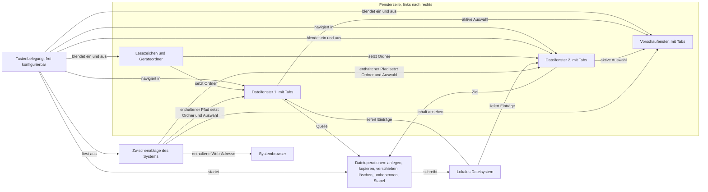
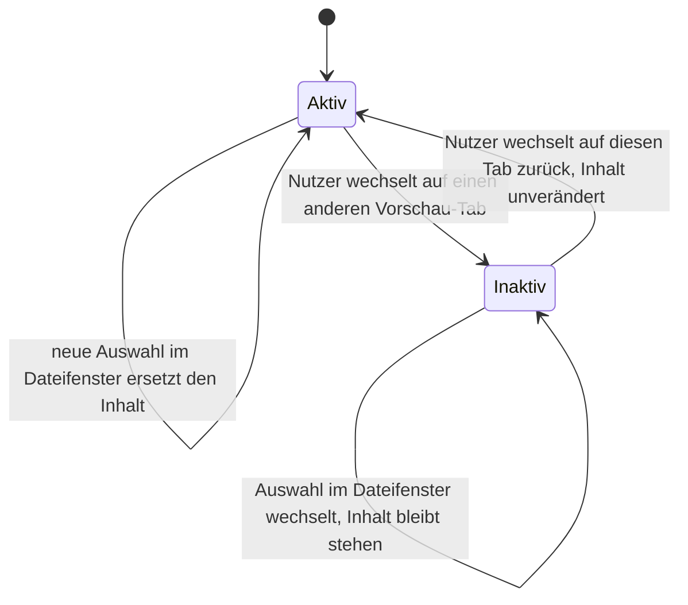

# Spec: KRK Navigator-Gerüst (Runde 1)

**Datum:** 2026-08-02, überarbeitet 260802-1735, 260803-1819, 260803-2300, 260804-0830, 260804-1122, 260804-1832, 260805-0000 und 260805-1411
**Status:** Entwurf. Alle Nutzerantworten bis 260805-1411 sind eingearbeitet. Eine offene Nutzerfrage trägt dieser Spec nicht mehr.
**Circle:** `circles/260802-0842-krk-mac-dateimanager-editor-git`
**Quelle:** Circle-Directive im Datensatz `*_circle.md`, zugeschnitten auf die erste Runde durch den Nutzer in der Phase-0-Klärung.

> **Gatehinweis für den Planner:** Dieser Spec ist noch nicht abgenommen, trägt aber keine offene Nutzerfrage mehr. Die vier Fragen A bis D hat der Nutzer am 260802-1105 beantwortet, das Referenzgerät für die Zeitzusagen aus C8 am 260802-1127 benannt; die Antworten stehen als verbindliche Abnahmekriterien in C3, C4 und C8. Die frühere Abweichung zwischen der Löschantwort und der Circle-Directive ist behoben: der Nutzer hat die Directive-Zeile korrigieren lassen, siehe `## Abgleich mit der Circle-Directive`.
>
> **Stand 260805-1411: die Ordnernavigation verliert ihre Zusatztaste.** Der Nutzer hat den Einstieg in einen Ordner auf den nackten Rechts-Pfeil und den Aufstieg auf den nackten Links-Pfeil gelegt. Cmd+Links und Cmd+Rechts fallen ersatzlos weg; Cmd+Auf bleibt als zweiter Weg des Aufstiegs stehen, weil der Nutzer es am 260804 ausdrücklich als Finder-Gewohnheit gewollt hat. Der Auf- und der Ab-Pfeil bewegen unverändert die Auswahl in der Liste. **Der tragende Grund ist ein anderer als am 260804:** eine Ordnernavigation ohne Zusatztaste ist schneller als eine mit, und das trifft die erste Maxime des Projekts. Das Richtungsargument der Seitwärtspfeile bleibt als zweites Argument bestehen, weil es von der Zusatztaste unabhängig ist. Berührt sind C2 und C3; keine der zehn Zahlen aus C8 ist berührt, und der Umfang der Runde wächst nicht. Der Datensatz ist `decisions/260805-1411_*_ordnernavigation-mit-oder-ohne-zusatztaste.md`; er trägt beide Umbelegungen dieser Frage, die vom 260804 und die von heute.
>
> **Stand 260805-0000: sechs Antworten des Nutzers auf offene Punkte aus den Umsetzungen.** Keine davon ändert eine der zehn Zahlen aus C8, und der Umfang der Runde wächst an zwei Stellen. Erstens ziehen die Kürzel des Hauptmenüs in die Konflikterkennung aus C3 ein; sie stehen künftig als Einträge in `resources/default-keymap.toml`, und KRK bekommt das Menü "Bearbeiten", ohne das heute in kein Textfeld eingefügt werden kann. Zweitens bekommt die Markierung aus C2 ein zweites Kennzeichen neben der Farbe, und die Statuszeile aus C1 trägt künftig Zahl und Gesamtgröße der markierten Einträge in einem fünften Rang. Dazu vier Klarstellungen ohne neue Arbeit an der Oberfläche: die beiden Befehle aus C10 wirken nur bei Fokus im Dateifenster, das vierte Abnahmekriterium von C7 wird am Modell nachgewiesen statt am laufenden Bündel, C9 sagt die selbsttätige Auffrischung nur noch für lokale Dateisysteme zu, und C4 schreibt aus, dass die gemeldete Eintragszahl die angefassten Einträge zählt. Die Datensätze dazu stehen unter `decisions/` mit dem Datum 260805-0000.
>
> **Stand 260804-1832: der Fortschritt einer Dateioperation verlässt das Blatt und geht in die Statuszeile.** Die Umsetzung von S16 zeigte ihn als Blatt am Fenster, und die Abnahme förderte zwei Befunde zutage: ein Blatt sperrt genau die Oberfläche, die C4 während einer laufenden Operation bedienbar zusagt, und es braucht auf dem Referenzgerät 354 bis 403 ms zum Aufgehen, während L8 200 ms zusagt. Der Nutzer hat die Statuszeile aus C1 gewählt. Berührt sind C1 mit einem neuen Abnahmekriterium zur Rangfolge der drei Quellen, die dieselbe Zeile schreiben, sowie C4 mit einem neuen Kriterium zur Bedienbarkeit und zwei nachgezogenen Kriterien; **keine der zehn Zahlen aus C8 ändert sich, L8 eingeschlossen**. Die Konfliktfrage, die Rückfrage vor dem endgültigen Löschen und die Liste der übersprungenen Einträge bleiben Blätter. Der Plan setzt den Umbau in einem eigenen Schritt S16b um und lässt S16 abgenommen stehen. Dazu bekommen zwei Abnahmekriterien aus C4, das Anlegen und das einzelne Umbenennen, erstmals einen bauenden Schritt; sie waren zugesagt, im Kern fertig und ohne Oberfläche.
>
> **Stand 260804-1122: die Ordnernavigation ist neu belegt, und die Belegungsansicht hat eine Taste.** Der Nutzer hat drei Belegungen bestimmt. Der Aufstieg in den übergeordneten Ordner liegt auf Cmd+Links neben dem vorhandenen Cmd+Auf, zwei Wege in einer Zeile der Belegungsansicht. Der Einstieg in einen Ordner liegt allein auf Cmd+Rechts; **die Return-Taste verliert diese Belegung und ist ab Werk frei**, ausdrücklich gewählt gegen den Hinweis, dass sie in Dateimanagern die vertrauteste Taste dafür ist. F1 zeigt die Tastaturbelegung, und die Taste ist belegt, bevor die Ansicht dahinter existiert. Berührt sind C2 und C3; keine der zehn Zahlen aus C8 ist berührt, und der Umfang der Runde wächst nicht. Der Plan trägt die Erweiterung der Kombinationsschreibweise, die zwei der drei Belegungen überhaupt erst schreibbar macht, in den Schritten S11b und S11c. **Die beiden Seitwärtsbelegungen dieses Standes gelten seit dem 260805-1411 nicht mehr**, siehe den Stand ganz oben; die Zusatztaste ist weggefallen, die Richtung ist geblieben. F1 und die freie Return-Taste sind unberührt.
>
> **Stand 260804-0830: der Umfang dieser Runde ist an drei Stellen gewachsen, und das ist die erste Erweiterung seit dem Zuschnitt.** Zwei der drei hat der Nutzer als Funktionen beauftragt, die dritte folgt aus einer beantworteten Entscheidung. Erstens die neue Fähigkeit **C10, die Zwischenablage als Quelle**: der Nutzer sieht ihren Inhalt in der Vorschau an (Shift+F3) und springt zu dem Pfad oder der Adresse darin (Opt+Cmd+G). Zweitens die **Statuszeile am Fuß des Dateifensters** als neues Abnahmekriterium in C1; sie trägt die Fehler, die KRK dem Nutzer zeigen muss, und ist die Antwort auf `decisions/260803-2025_*_wie-zeigt-krk-dem-nutzer-fehler.md`. Drittens die Zusage in **C7**, dass KRK nach dem Schließen des Fensters bedienbar bleibt, aus `decisions/260803-2007_*_was-krk-tut-wenn-das-letzte-fenster-geschlossen-wird.md`. Keine der zehn Zahlen aus C8 ist berührt, und eine elfte entsteht nicht; die Begründung steht in C10 unter `Verhältnis zu C8`.
>
> **Stand 260802-1409:** C3 ist auf die Messung der Fn-Tasten-Annahme fortgeschrieben. Drei Punkte sind neu und binden den Plan: die Tastencode-Sicht statt der Schreibweise "Fn+F3", ein zweiter Weg ab Werk über Cmd-Kürzel, und die Beschriftungsregel für die Belegungsansicht. Die Directive-Zeile im Circle-Datensatz ist am 260802-1423 darauf gezogen worden und stimmt seither mit C3 überein, siehe `## Abgleich mit der Circle-Directive`.
>
> **Stand 260803-2110:** C3 nennt für F6 nur noch das Verschieben. Das Umbenennen ist eine eigene Funktion aus C4 und liegt ab Werk auf Shift+F6 und Cmd+Shift+U; die Zusammenlegung beider auf F6, die Norton Commander kennt, gilt für KRK nicht. Dazu hält C3 jetzt fest, dass der Spec sieben der 46 ausgelieferten Belegungen selbst festlegt und der Nutzer die übrigen 39 aus `resources/default-keymap.toml` für diese Runde angenommen hat.
>
> **Stand 260802-1735:** Die Frage, was L4 mit "wiederhergestellten Tabs" meint, ist beantwortet, und der Widerspruch zwischen L4 und L10 besteht nicht mehr. Der Nutzer hat die mildere Lesart gewählt und sie in einem Zug auch für den Tabwechsel aus L5 festgelegt. Neu in C8 sind vier Stellen, die der Plan aufnehmen muss: die Zeilen L4 und L5 in der Tabelle, der Absatz "Was L4 und L5 als abgeschlossen zählt", die Sitzungslage unter den Messbedingungen und der zweite Prüfordner mit 10.000 Einträgen, den diese Sitzungslage braucht. Keine der zehn Zahlen ändert sich.

## Directive dieser Runde

Nach dieser Runde navigiert der Nutzer lokale Dateien und Ordner vollständig über die Tastatur, in zwei Dateifenstern mit je mehreren Tabs, flankiert von einer Lesezeichen- und Geräteleiste links und einem Vorschaufenster rechts. Er legt Dateien und Ordner an, kopiert, verschiebt, löscht und benennt sie um, auch über mehrere ausgewählte Einträge in einem Zug. Jede Fensterbreite ist verstellbar, jedes Fenster per Tastenbefehl ein- und ausblendbar, und die Anwendung hält dabei die in Abschnitt C8 festgeschriebenen Zeitzusagen ein.

Seit dem 260804-0830 kommt dazu, was in der Zwischenablage des Systems steht: der Nutzer sieht es in der Vorschau an und springt zu dem Pfad oder der Web-Adresse darin (C10).

Der eingebaute Editor und die Git-Anbindung sind Teil des Circles, aber nicht dieser Runde. Sie folgen in späteren Runden desselben Circles.

## Aufbau und Datenfluss dieser Runde

Die Bezeichner C1 bis C10 verweisen auf die Fähigkeiten weiter unten. Sie sind bewusst nicht mit F nummeriert, weil F3 bis F8 in diesem Dokument die Funktionstasten der Norton-Belegung bezeichnen.

Zwei Eigenschaften des Graphen sind gewollt und keine Nachlässigkeit. Der Knoten `Tastenbelegung` zeigt auf sechs andere Knoten, weil die Tastatur in KRK die einzige vollständige Bedienoberfläche ist; jede Funktion muss von dort erreichbar sein. Auf das zweite Dateifenster zeigt er zweimal, weil die Tastatur dort zwei verschiedene Dinge tut: sie navigiert darin, und sie blendet es aus und wieder ein. C7 sagt das Ausblenden für drei Bereiche zu, für die Lesezeichenleiste, das zweite Dateifenster und das Vorschaufenster, und alle drei tragen die Kante. Die zweite gewollte Eigenschaft sind die beiden Zyklen über `Lokales Dateisystem`, je einer pro Dateifenster. Sie bilden die Arbeitsschleife ab: lesen, auswählen, schreiben, erneut lesen. Eine Operation, die den Ordnerinhalt ändert, muss die betroffenen Fenster ohne Zutun des Nutzers auffrischen.

Die beiden Knoten `Zwischenablage des Systems` und `Systembrowser` sind seit dem 260804-0830 dabei und tragen die neue Fähigkeit C10. Die Zwischenablage steht außerhalb der Fensterzeile, weil sie keine Fläche in KRK ist, sondern eine Quelle: KRK liest sie auf Tastenbefehl und schreibt sie nie. Ihre vier ausgehenden Kanten sind die drei Ausgänge derselben einen Auswertung und keine drei Mechanismen; welcher greift, hängt allein daran, was in der Zwischenablage steht. Vier Kanten für drei Ausgänge, weil der Sprung beide Dateifenster als mögliches Ziel hat, so wie die Tastenbelegung darüber auch. Der `Systembrowser` ist ein Blatt des Graphen und liegt außerhalb von KRK, was ihn von einem eingebauten Browser unterscheidet: KRK übergibt die Adresse und zeigt selbst keinen Web-Inhalt.

Das Halteverhalten der Vorschau-Tabs, das der Circle-Datensatz beschreibt, ist ein Zustandsverhalten pro Tab:

## Fähigkeiten

### C1: Zwei Dateifenster mit je mehreren Tabs

**Beschreibung:** Der Nutzer sieht zwei gleichrangige Dateifenster nebeneinander. Jedes hält beliebig viele Tabs, jeder Tab zeigt genau einen Ordner. Genau ein Fenster ist zu jedem Zeitpunkt das aktive, erkennbar ohne Hinsehen auf die Maus. Bei Dateioperationen ist das aktive Fenster die Quelle und das andere das Ziel, so wie es Norton Commander und ForkLift handhaben.

**Abnahmekriterien:**
- [ ] Beim Start zeigt KRK zwei Dateifenster nebeneinander, jedes mit mindestens einem Tab.
- [ ] Ein Tastenbefehl öffnet einen neuen Tab im aktiven Fenster, ein zweiter schließt den aktiven Tab, ein dritter wechselt zum nächsten und ein vierter zum vorigen Tab.
- [ ] Ein Tastenbefehl wechselt das aktive Fenster. Das aktive Fenster ist optisch eindeutig markiert, auch wenn beide Fenster denselben Ordner zeigen.
- [ ] Beim Schließen des letzten Tabs eines Fensters bleibt das Fenster bestehen und zeigt einen Standardordner, statt zu verschwinden.
- [ ] Nach Beenden und erneutem Start zeigen beide Fenster wieder dieselben Tabs mit denselben Ordnern und derselben Auswahl wie vorher.
- [ ] Beide Fenster können denselben Ordner zeigen, ohne dass sich ihre Auswahl oder ihre Bildlaufposition gegenseitig beeinflusst.
- [ ] Jedes Dateifenster trägt am Fuß eine Statuszeile. Sie zeigt jede Meldung, die KRK dem Nutzer über den Zustand dieses Fensters zu sagen hat, namentlich einen Ordner, der sich nicht oder nicht vollständig lesen ließ, samt Grund. Ein Ordner ohne Leserecht ist dadurch von einem leeren Ordner unterscheidbar.
- [ ] Dieselbe Zeile trägt den Fortschritt einer laufenden Dateioperation aus C4. Wollen mehrere Quellen zugleich in die Zeile schreiben, gilt eine feste Rangfolge nach dem Alter der Aussage, von der neuesten zur ältesten: die Antwort auf den zuletzt gegebenen Tastenbefehl, der Fortschritt einer laufenden Operation, eine Meldung, die das ganze Fenster betrifft, eine Meldung zum Ordner des sichtbaren Tabs, und zuletzt der Markierungsstand aus dem nächsten Kriterium. Keine der fünf Aussagen geht dabei verloren; eine verdrängte erscheint, sobald alles über ihr gefallen ist.
- [ ] Sind im sichtbaren Tab Einträge markiert und hat keine höherrangige Quelle etwas zu sagen, nennt die Zeile die Zahl der markierten Einträge, davon gesondert die Zahl der Ordner, und die Gesamtgröße der markierten Dateien. Ist nichts markiert, bleibt die Zeile leer. Die Gesamtgröße zählt allein Dateien: die Größe eines Ordners zu ermitteln hieße, ihn zu durchlaufen, und diesen Vorabdurchlauf schließt der Plan aus.
- [ ] KRK gibt keine Meldung an den Nutzer über die Standardfehlerausgabe. Eine über den Finder gestartete Anwendung hat keine, und eine Meldung, die dorthin geht, gilt als nicht gezeigt.

**Getroffene Festlegungen:**
- Sitzung wird wiederhergestellt: ja (Vorbelegung, weil ein Dateimanager ohne Wiederherstellung bei jedem Start denselben Navigationsweg erzwingt).
- Quelle und Ziel: aktives Fenster ist Quelle, das andere ist Ziel (Vorbelegung, folgt dem Vorbild Norton Commander und dem Diagramm im Circle-Datensatz).
- **Die Statuszeile ist seit dem 260804-0830 zugesagt und war es vorher nicht.** Sie erweitert den Umfang dieser Runde und präzisiert keine frühere Zusage: bis zu diesem Datum nannte kein Abschnitt dieses Specs eine Statuszeile. Zwei Datensätze hatten das Gegenteil angenommen und "C1 verlangt die Statuszeile ohnehin" voneinander abgeschrieben, `issues/260803-1536_*_zwei-fehlermeldungen-erreichen-im-buendel-niemanden.md` und `decisions/260803-2025_*_wie-zeigt-krk-dem-nutzer-fehler.md`; der zweite hält den Irrtum jetzt fest. Mit der Wahl des Nutzers vom 260804-0830 für Möglichkeit 1 jenes Datensatzes ist die Zusage echt. Beauftragt ist in dieser Runde allein die Meldung. Den Lesefortschritt und die Zahl der Einträge, die dieselbe Zeile später tragen soll, sagt dieser Spec nicht zu; sie kommen in einer späteren Runde in dieselbe Zeile und nicht in eine zweite daneben.
- **Der fehlende Tastenabgriff geht nicht über die Statuszeile.** Er ist ein Startfehler, nach dem KRK ohne Tastatursteuerung liefe, also ohne seine erste Maxime. KRK bricht in diesem Fall mit einem Hinweisfenster ab, statt ein Fenster ohne Tastatur zu zeigen. Beides ist dieselbe Wahl aus demselben Datensatz: der eine Fehler betrifft ein Ziel, das der Nutzer gerade nicht erreicht, der andere die Anwendung als ganze.
- **Der Fortschritt kommt seit dem 260804-1832 in dieselbe Zeile, und der Lesefortschritt bleibt weiter draußen.** Die beiden sind zu unterscheiden. Der **Lesefortschritt** ist die Anzeige, wie weit KRK einen großen Ordner eingelesen hat, samt der Zahl seiner Einträge; er ist in dieser Runde nicht zugesagt und kommt in einer späteren in dieselbe Zeile. Der **Fortschritt einer Dateioperation** aus C4 ist etwas anderes, nämlich die Anzeige eines laufenden Kopierens, Verschiebens oder Löschens, und der ist seit der Nutzerentscheidung vom 260804-1832 zugesagt. Vorher zeigte ihn ein Blatt am Fenster. Ein Blatt sperrt genau die Oberfläche, die C4 während einer laufenden Operation bedienbar zusagt, und braucht auf dem Referenzgerät 354 bis 403 ms zum Aufgehen, während L8 200 ms zusagt. Der Datensatz mit den gemessenen Zahlen und den verworfenen Möglichkeiten ist `circles/260802-0842-krk-mac-dateimanager-editor-git/decisions/260804-1832_*_traegt-der-fortschritt-ein-blatt-oder-die-statuszeile.md`.
- **Die Rangfolge ist eine Ordnung und keine Fallunterscheidung.** Sie ordnet nach dem Alter der Aussage: die Antwort auf einen eben gedrückten Tastenbefehl ist neuer als eine laufende Operation, eine laufende Operation ist neuer als ein Ereignis am Fenster, ein Ereignis ist neuer als der Zustand eines Ordners, und der Markierungsstand ist der Ruhezustand der Zeile. Jede Quelle löscht sich selbst: die Vorgangsanzeige mit dem Ende der Operation, die Fenstermeldung mit dem nächsten echten Ordner- oder Tabwechsel, die Befehlsantwort mit dem nächsten Tastenbefehl. Die Regel für die beiden untersten Ränge steht seit der Umsetzung von S14 und ist am 260804 aus einem Fehler entstanden: die Meldung über einen ausgeworfenen Datenträger wurde von einer Auffrischung im Hintergrund weggeräumt.
- **Dieses Abnahmekriterium stand bis zum 260805-0000 auf drei Rängen, gebaut sind seit dem 260804-1940 vier.** Die Befehlsantwort fehlte darin. Sie ist am 260804-1940 aus zwei Defekten der Umsetzung von S16b entstanden, im Plan bei jenem Schritt ausgeschrieben und in `crates/krk-ui/src/appkit/statuszeile.rs` gebaut; der Spec hat den Nachzug nicht mitgemacht. Mit dem Markierungsstand sind es fünf. Beide Nachträge stehen in demselben Kriterium, damit die Zahl nicht ein drittes Mal auseinanderläuft.
- **Der Markierungsstand ist der fünfte Rang und nicht der vierte, und er ist die einzige Quelle, die keinen eigenen Speicher hat.** Der Nutzer hat ihn am 260805-0000 zugesagt; die Herleitung steht in `decisions/260805-0000_*_zweites-kennzeichen-der-markierung-und-ihr-platz-in-der-statuszeile.md`. Ein eigener Rang ist nötig, weil der vierte, die Tabmeldung, eine andere Lebensdauer hat: sie trägt einen Ordner, der sich nicht lesen ließ, und muss stehen bleiben, während der Nutzer markiert und die Markierung wieder aufhebt. Beide in ein Feld zu legen gäbe diesem Feld zwei Löschregeln, und genau das ist der Sonderfall, den die Maxime "supersimpel" ausschließt. Unter der Tabmeldung steht der Markierungsstand, weil ein nicht lesbarer Ordner ein Fehler ist und eine Markierungszahl keiner. Einen Speicher braucht er nicht: die vier übrigen Quellen halten je einen Text, den jemand setzt und eine Regel löscht, während der Markierungsstand aus dem Ordnermodell des sichtbaren Tabs errechnet wird, sooft die Zeile neu geschrieben wird. Ein Feld dafür hätte viele Schreiber, das Markieren, das Auffrischen, den Tabwechsel und den Sortierwechsel, und damit viele Gelegenheiten, veraltet zu sein.
- **Der Markierungsstand ist nicht die Eintragszahl des Ordners.** Die beiden sind zu unterscheiden, so wie schon der Fortschritt einer Dateioperation und der Lesefortschritt. Wie viele Einträge ein Ordner überhaupt hat und wie weit KRK ihn gelesen hat, sagt dieser Spec weiterhin nicht zu; beides kommt in einer späteren Runde in dieselbe Zeile. Zugesagt ist allein, was der Nutzer selbst markiert hat, und dafür ist der Grund ein anderer: die Dateioperationen aus C4 wirken auf die Markierung, und wer nicht sieht, worauf sie wirken, arbeitet im Blindflug.

### C2: Navigation über die Tastatur

**Beschreibung:** Der Nutzer erreicht jeden Ordner und jede Datei ohne Maus. Die Auswahl bewegt sich mit dem Auf- und dem Ab-Pfeil, springt seitenweise, an den Anfang und an das Ende der Liste. Er steigt mit dem Rechts-Pfeil in Ordner hinein und mit dem Links-Pfeil wieder heraus, springt über eine Pfadeingabe direkt an einen Ort und findet einen Eintrag durch Tippen der ersten Buchstaben. Die vier Pfeiltasten teilen sich damit zwei Aufgaben: senkrecht bewegen sie die Auswahl in der Liste, waagerecht bewegen sie den Nutzer im Verzeichnisbaum. Maus und Trackpad funktionieren zusätzlich, ersetzen aber nie einen Tastenweg.

**Abnahmekriterien:**
- [ ] Jede Funktion aus C1 bis C7 und aus C10 ist über mindestens einen Tastenbefehl erreichbar. Keine Funktion ist ausschließlich per Maus bedienbar.
- [ ] Der Auf- und der Ab-Pfeil bewegen die Auswahl um einen Eintrag, Bild auf und Bild ab um eine Bildschirmseite, und je ein Befehl springt an den Anfang und an das Ende der Liste. Der Links- und der Rechts-Pfeil bewegen die Auswahl nicht; sie tragen den Auf- und Abstieg aus dem Kriterium darunter.
- [ ] Ein Tastenbefehl steigt in den ausgewählten Ordner ein, ein zweiter in den übergeordneten Ordner. Beim Aufstieg steht die Auswahl auf dem Ordner, aus dem der Nutzer gerade kam. Ab Werk liegt der Einstieg auf dem Rechts-Pfeil und der Aufstieg auf dem Links-Pfeil und auf Cmd+Auf; die beiden Seitwärtspfeile tragen dabei keine Zusatztaste.
- [ ] Ein Tastenbefehl wirkt dann und nur dann, wenn der Eingabefokus in einem Dateifenster oder in der Lesezeichenleiste steht. In der Pfadeingabe, im Umbenennen-Feld und in jedem anderen Textfeld behalten alle Tasten ihre gewohnte Mac-Bedeutung: Return bestätigt, und der Links- und der Rechts-Pfeil bewegen die Schreibmarke um ein Zeichen, statt den Ordner zu wechseln.
- [ ] Ein Tastenbefehl öffnet eine Pfadeingabe. Der Nutzer tippt oder fügt einen absoluten Pfad ein und landet im Zielordner, oder erhält eine Meldung, wenn der Pfad nicht existiert oder nicht lesbar ist.
- [ ] Tippt der Nutzer Buchstaben ohne Zusatztaste, springt die Auswahl auf den ersten Eintrag, dessen Name so beginnt. Nach einer Pause beginnt die Eingabe von vorn.
- [ ] Mehrfachauswahl über die Tastatur: ein Befehl markiert den Eintrag unter der Auswahl und rückt weiter, ein zweiter markiert alle Einträge, ein dritter hebt jede Markierung auf, ein vierter kehrt die Markierung um.
- [ ] Ein markierter Eintrag ist an zwei Kennzeichen erkennbar, und mindestens eines davon ist keine Farbe. Ein Nutzer, der Farben nicht oder nur eingeschränkt unterscheidet, sieht damit ebenso, worauf die Dateioperationen aus C4 wirken. Das zweite Kennzeichen kommt ohne eine fünfte Spalte aus; die vier Spalten aus C1 bleiben, wie sie sind.
- [ ] Die Sortierung der Liste lässt sich per Tastenbefehl zwischen Name, Größe, Änderungsdatum und Typ umschalten, jeweils auf- und absteigend.
- [ ] Ein Tastenbefehl blendet versteckte Dateien ein und wieder aus.

**Getroffene Festlegungen:**
- Versteckte Dateien sind beim ersten Start ausgeblendet (Vorbelegung, entspricht dem Verhalten des Finders und von ForkLift).
- Standardsortierung ist Name aufsteigend, Ordner vor Dateien (Vorbelegung, entspricht beiden Vorbildern).
- **Der Auf- und Abstieg liegt auf den nackten Links- und Rechts-Pfeilen, und Return ist ab Werk frei.** Der Nutzer hat den Auf- und Abstieg zweimal bestimmt, am 260804-1122 auf Cmd+Links und Cmd+Rechts und am 260805-1411 auf dieselben Tasten ohne Zusatztaste. Es gilt die zweite Antwort. Der Einstieg trägt allein den Rechts-Pfeil. Der Aufstieg trägt zwei Wege, den Links-Pfeil und das unveränderte Cmd+Auf; die Ein-Zeilen-Regel aus C3 führt beide in derselben Zeile der Belegungsansicht. **Der tragende Grund für die nackten Pfeile ist die Geschwindigkeit:** ein Ordnerwechsel kostet damit einen Tastendruck statt zweier, und "superschnell" ist die erste Maxime dieses Vorhabens. Die Richtung der Seitwärtspfeile bleibt daneben ein Argument und war es schon am 260804, sie trägt die Wahl aber nicht allein; die Begründung dazu steht in C3. Return war bis zum 260804-1122 der Einstieg, ist gebaut und geprüft, und der Nutzer hat die erste Umbelegung gegen den Hinweis gewählt, dass Return in Dateimanagern die vertrauteste Taste dafür ist. Frei heißt: KRK liefert für Return keine Vorbelegung aus und der Nutzer kann sie wie jede andere Taste selbst vergeben. Beide Antworten stehen in `decisions/260805-1411_*_ordnernavigation-mit-oder-ohne-zusatztaste.md`.
- **Eine freie Taste ohne Zusatztaste fällt im Dateifenster auf die Sprungmarke durch, und die nimmt nur druckbare Zeichen auf.** Das Tippen der Anfangsbuchstaben ist der Rückfall für jede Taste ohne Zusatztaste, die keiner Funktion zugeordnet ist. Return trägt kein Zeichen, das ein Dateiname tragen kann, und läuft deshalb ins Leere, ohne die begonnene Eingabe zu stören. Dieselbe Regel deckt jede unbelegte Funktionstaste ab; sie ist keine Sonderregel für Return. Der Links- und der Rechts-Pfeil fielen bis zum 260805-1411 ebenfalls hier hinein und tun es seither nicht mehr, weil sie eine Funktion tragen; an der Regel ändert das nichts.
- **Das zweite Kennzeichen der Markierung ist die fette Schrift, und es ist keine Spalte.** Der Nutzer hat das zweite Kennzeichen am 260805-0000 zugesagt und die Form dem Planner überlassen; sie steht in `decisions/260805-0000_*_zweites-kennzeichen-der-markierung-und-ihr-platz-in-der-statuszeile.md` samt den beiden verworfenen Möglichkeiten. Ein markierter Eintrag wird in allen vier Spalten fett gesetzt und bleibt daneben orange. Die Wahl fällt auf die Schriftstärke aus drei Gründen. Sie ist eine Form und keine Farbe, wirkt also bei jeder Farbfehlsichtigkeit. Sie sprengt die vier Spalten aus C1 nicht, weil sie keine Fläche braucht. Und sie geht denselben Weg wie die Farbe, die dieselbe Stelle im Programm ohnehin bei jedem Zeichendurchgang setzt; es kommt eine Eigenschaft dazu und kein Mechanismus. Verworfen ist eine fünfte Spalte mit einem Markierungszeichen, weil sie die vier Spalten sprengt, und verworfen ist ein Zeichen vor dem Namen, weil es den angezeigten Namen vom wirklichen unterscheidbar machte und die Namen in einer Proportionalschrift gegeneinander verschöbe.
- **Der Sprung zu einem Pfad aus der Zwischenablage steht in C10 und nicht hier.** Er benutzt dieselbe Prüfung und dieselbe Navigation wie die Pfadeingabe oben, nur mit einem Wert aus der Zwischenablage statt aus einem Eingabefeld. Beschrieben ist er einmal, in C10, weil dort auch steht, wie KRK den Inhalt der Zwischenablage deutet; ein zweiter Navigationsweg entsteht nicht.

### C3: Tastenbelegung, frei konfigurierbar mit ausgelieferter Vorbelegung

**Beschreibung:** Jede Taste und jede Tastenkombination ist frei belegbar; das ist die Grundhaltung der Anwendung und keine Zusatzfunktion. Ausgeliefert wird eine Vorbelegung, die jede Funktion der Norton-Reihe auf zwei Wegen erreichbar macht: über die Funktionstaste F3 bis F8 und über ein Mac-typisches Cmd-Kürzel. Beide Wege zeigen auf dieselbe Funktion und stehen in derselben Zeile der Belegungsansicht. Der zweite Weg entstand aus einem gemessenen Befund: das Abnahmegerät trägt einen Touch Bar statt einer Funktionstastenreihe, und ein Kopierbefehl, der dort den Blick auf ein Glasfeld verlangt, verfehlt die Maxime der Tastatursteuerung. Die Taste Delete räumt in den Papierkorb. Der Nutzer sieht seine Belegung in einer eigenen Ansicht, ändert sie dort und stellt die Auslieferungsbelegung jederzeit wieder her.

**Was KRK technisch belegt.** KRK belegt das Tastenereignis der Funktionstaste, nicht eine Fingerhaltung. Die Messung vom 2026-08-02 auf dem Abnahmegerät (`MacBookPro15,1`, macOS 15.7.7, Systemeinstellung "F1, F2 usw." aus) zeigt: Fn+F3, Fn+F5 und Fn+F8 kommen in einer gewöhnlichen Anwendung im Vordergrund als gewöhnliche `keyDown`-Ereignisse an, mit den Tastencodes 99, 96 und 100, den Zeichen U+F706, U+F708 und U+F70B und gesetztem Modifikator `function` (0x800000). Beleg: `spikes/fn-tasten/messung-A.txt`, Ereignisse #03 bis #05. Die fn-Taste selbst liefert kein `keyDown`, sondern nur einen Zustandswechsel mit Tastencode 63 (Ereignisse #14 und #15; die Kontrollprobe mit Shift belegt, dass der Abgriff arbeitet).

Der Modifikator `function` weist dabei keine körperlich gedrückte fn-Taste nach. AppKit setzt ihn bei jeder Taste aus dem Funktionstasten-Zeichenbereich, also auch bei den Pfeiltasten (dokumentiert, in dieser Messung nicht eigens geprüft). KRK kann Fn+F3 und ein nacktes F3 deshalb nicht unterscheiden, weil beide dasselbe Ereignis erzeugen. Die ausgelieferte Belegung heißt darum F3 und nicht Fn+F3. Diese Lesart stützt die frühere Festlegung, dass eine Belegung je Funktion genügt, und macht zugleich die Beschriftung "Fn+F3" für Nutzer mit echter Funktionstastenreihe falsch.

**Für F1 gilt dasselbe, ohne dass es dafür eine zweite Messung braucht.** F1 ist wie F3 bis F8 ab Werk systembelegt, dort mit der Verringerung der Bildschirmhelligkeit. Der Befund vom 260802 trägt die Taste mit: KRK belegt den Tastencode und nicht die Fingerhaltung, also erzeugen Fn+F1 und ein nacktes F1 dasselbe Ereignis, und die Beschriftungsregel weiter unten gilt für F1 wie für F3. Verschieden ist allein die Belegkette. Der Tastencode von F1 ist `kVK_F1` und damit 122; er steht in diesem Projekt als **dokumentiert** und nicht als gemessen, in derselben Kennzeichnung, die F4, F6 und F7 tragen. Gemessen sind unverändert genau drei Funktionstasten, F3, F5 und F8. Was für sie unter `Was ungemessen bleibt` steht, gilt für F1 unverändert: das Ergebnis einer Nachmessung änderte kein Verhalten und kein Abnahmekriterium, weil KRK die Wege nicht unterscheiden kann.

**Wie die Messung zu lesen ist.** Die Selbstauswertung in `spikes/fn-tasten/messung-A.txt` meldet unter "Frage 2 — Kommen die nackten F3 bis F8 an?" ein "JA" und ist an dieser Stelle falsch. Im rohen Ereignisprotokoll steht bei Ereignis #08 ein `flagsChanged geändert=+function` unmittelbar vor den drei Tastendrücken des zweiten Abschnitts und bei #12 das zugehörige `-function`. Der Nutzer musste fn halten, weil sein Gerät ohne fn keine F3 erzeugt; Abschnitt 2 hat damit Abschnitt 1 wiederholt. Ob die nackten Funktionstasten auf einem Gerät mit echter Tastenreihe ankommen, bleibt ungemessen. Die Auswertungslogik des Prüfprogramms prüft nur, ob ein Tastendruck ankam, nicht ob fn dabei gedrückt war. Der Programmfehler ist gesondert behoben; die korrigierte Auswertung derselben Rohdaten steht in `spikes/fn-tasten/messung-A-neuauswertung.txt` und deckt sich mit der Lesart hier. Die Rohdaten in `messung-A.txt` sind vom Fehler nicht berührt.

**Abnahmekriterien:**
- [ ] Eine Ansicht listet jede Funktion mit ihrer aktuellen Belegung. Der Nutzer weist einer Funktion eine neue Kombination zu, indem er sie drückt.
- [ ] Die Belegungsansicht führt je Funktion genau eine Zeile. Trägt eine Funktion mehrere Kombinationen, stehen alle in dieser einen Zeile. Eine zweite Zeile für einen zweiten Weg gibt es nicht.
- [ ] Belegt der Nutzer eine Kombination, die bereits einer anderen im selben Fokuszustand erreichbaren Funktion gehört, meldet KRK den Konflikt und nennt die andere Funktion, statt die Belegung stillschweigend zu überschreiben. Mehrere Kombinationen auf derselben Funktion sind kein Konflikt, und zwei Funktionen mit verschiedenen Zustellern ebenfalls nicht; die Festlegung unten schreibt aus, was ein Zusteller ist.
- [ ] Ein Befehl setzt die gesamte Belegung auf den Auslieferungszustand zurück.
- [ ] Die geänderte Belegung überlebt Beenden und Neustart.
- [ ] Die Auslieferungsbelegung ist in sich konfliktfrei: keine Kombination ist zwei verschiedenen Funktionen zugewiesen, die im selben Fokuszustand erreichbar sind. Genau eine Kombination steht bei zwei Funktionen, Cmd+A, und die beiden tragen verschiedene Zusteller.
- [ ] Die Norton-Zuordnung der Auslieferungsbelegung lautet: F3 Vorschau anzeigen, F5 Kopieren, F6 Verschieben, F7 Ordner anlegen, F8 endgültig löschen. Gemeint ist jeweils das Tastenereignis der Funktionstaste, gleich ob der Nutzer es mit gehaltener fn-Taste erzeugt oder ohne.
- [ ] Das Umbenennen liegt nicht auf F6. Es ist eine eigene Funktion aus C4, trägt eine eigene Zeile in der Belegungsansicht und ist ab Werk auf Shift+F6 und Cmd+Shift+U erreichbar.
- [ ] Auf dem Abnahmegerät lösen F3, F5 und F8 die genannten Funktionen aus, ohne dass der Nutzer die Systemeinstellung "F1, F2 usw. als Standard-Funktionstasten verwenden" aktiviert. Für diese drei Tasten ist die Zustellung des Ereignisses gemessen (`spikes/fn-tasten/messung-A.txt`); für F6 und F7 ist sie nicht gemessen und wird bei der Abnahme mitgeprüft.
- [ ] Jede Funktion der Norton-Reihe trägt ab Werk zusätzlich das Cmd-Kürzel aus der Tabelle unten. Beide Wege lösen dieselbe Funktion aus und sind an keine Tastaturbauart gebunden.
- [ ] Die Belegungsansicht beschriftet Funktionstasten als F1 bis F12. Sie schreibt an keiner Stelle "Fn+" vor eine Kombination.
- [ ] Der Nutzer kann fn nicht als Zusatztaste einer Belegung verwenden. KRK bietet keine Belegung an, die sich von einer anderen allein durch gedrücktes fn unterscheidet.
- [ ] F4 ist in dieser Runde unbelegt und in der Belegungsansicht als für den Editor reserviert gekennzeichnet. Ein Cmd-Kürzel trägt diese Funktion in dieser Runde ebenfalls nicht.
- [ ] Die Taste Delete ist ab Werk mit dem Räumen in den Papierkorb belegt, zusätzlich Cmd+Delete. F8 und Cmd+Opt+Delete lösen das endgültige Löschen aus. Papierkorb und endgültiges Löschen sind zwei verschiedene Funktionen und stehen als zwei Zeilen in der Belegungsansicht. Das Verhalten beider steht in C4.
- [ ] Shift+Delete ist ab Werk unbelegt. Der Nutzer kann die Kombination frei belegen, KRK liefert sie nicht vorbelegt aus.
- [ ] Jede Tastenkombination, die in KRK etwas auslöst, steht in der Belegung, auch wenn ein Menüeintrag sie trägt. Das Hauptmenü nimmt seine Kürzel aus der Belegung und legt keine eigenen fest. Es gibt damit keine Kombination, die die Konflikterkennung nicht sieht und die der Nutzer nicht umbelegen kann.
- [ ] Das Hauptmenü der laufenden Anwendung trägt genau die Kombinationen, die die Belegung für seine Einträge führt, und keine weitere. Kürzel, die macOS von sich aus zu einem Menüeintrag hinzustellt, sind entweder unterdrückt oder stehen als eigener Eintrag in der Belegung.
- [ ] Cmd+X, Cmd+C und Cmd+V tragen ab Werk allein die Textbefehle des Menüs "Bearbeiten" und keine Funktion des Dateifensters. Cmd+A trägt beides: im Textfeld wählt es den Text aus, im Dateifenster markiert es alle Einträge. Alle vier stehen als eigene Einträge in der Belegung und sind wie jede andere Kombination umbelegbar. Für die Dateizwischenablage einer späteren Runde bleiben Cmd+C und Cmd+V damit frei: ein Textbefehl und eine Funktion des Dateifensters begegnen sich nicht, weil der Fokusvorbehalt aus C2 sie trennt.
- [ ] Cmd+A löst im Dateifenster "Alle Einträge markieren" aus und im Textfeld "Alles auswählen". Die beiden stehen als zwei Zeilen in der Belegungsansicht, die eine mit Cmd+A als Kombination des Dateifensters, die andere mit Cmd+A als Kürzel des Menüs. Ein Konflikt ist das nicht, und der Grund steht in der Festlegung unten.
- [ ] Drei Funktionen sind seit dem 260804-0830 dazugekommen und tragen ab Werk je eine Kombination: das Einblenden des Fensters auf Cmd+N (C7), das Ansehen der Zwischenablage auf Shift+F3 und der Sprung zu ihrem Inhalt auf Opt+Cmd+G (beide C10). Jede der drei ist wie jede andere frei umbelegbar.
- [ ] Seit dem 260805-1411 gilt für die Ordnernavigation aus C2: der Einstieg in einen Ordner liegt ab Werk auf dem Rechts-Pfeil, der Aufstieg auf dem Links-Pfeil und auf Cmd+Auf. Beide Seitwärtspfeile tragen keine Zusatztaste, und Cmd+Links wie Cmd+Rechts stehen in keiner Tastenliste. Beide Wege des Aufstiegs stehen in derselben Zeile der Belegungsansicht.
- [ ] Die Return-Taste ist ab Werk unbelegt, so wie Shift+Delete. Der Nutzer kann sie frei belegen, KRK liefert sie nicht vorbelegt aus.
- [ ] F1 zeigt die Belegungsansicht. Die Taste ist ab Werk belegt, auch solange die Ansicht dahinter noch nicht gebaut ist; sie löst dann nichts aus und nimmt dem System das Ereignis nicht weg.

**Die ausgelieferten Cmd-Kürzel:**

| Funktion | Norton-Taste | Cmd-Kürzel | Woher das Kürzel stammt |
|---|---|---|---|
| Vorschau anzeigen | F3 | Cmd+Y | Finder: Übersicht (Quick Look), dieselbe Funktion |
| Kopieren in das andere Fenster | F5 | Cmd+Shift+K | eigene Form, K wie Kopieren |
| Verschieben in das andere Fenster | F6 | Cmd+Shift+V | eigene Form, V wie Verschieben |
| Ordner anlegen | F7 | Cmd+Shift+N | Finder: Neuer Ordner, dieselbe Funktion |
| Endgültig löschen | F8 | Cmd+Opt+Delete | Finder: sofort löschen, dieselbe Funktion |
| In den Papierkorb räumen | Delete | Cmd+Delete | Finder: In den Papierkorb legen, dieselbe Funktion |

**Getroffene Festlegungen:**
- F6 trägt allein das Verschieben. Norton Commander legt Verschieben und Umbenennen zusammen auf F6, und die Abnahmekriterien oben haben diese Zusammenlegung bis zum 260803-2110 wiederholt, während die Kürzel-Tabelle darunter für F6 schon immer nur das Verschieben führte. Aufgelöst ist der Widerspruch zugunsten der Tabelle, entschieden vom Nutzer am 260803-2110. Der Grund ist zwingend: C4 verlangt das Umbenennen als eigene Operation, und das Abnahmekriterium der Konfliktfreiheit oben schließt zwei Funktionen auf einer Kombination aus. Ausgeliefert wird das Umbenennen deshalb auf Shift+F6 und Cmd+Shift+U. Die Umschalttaste vor F6 ist die Norton- und Total-Commander-Form für das Umbenennen; sie hält die Nähe zur Nachbarfunktion, ohne deren Kombination zu teilen. Meldung `issues/260803-2045_*_c3-nennt-f6-verschieben-und-umbenennen-die-belegungstabelle-nur-verschieben.md`.
- Die vollständige Auslieferungsbelegung steht als Datendatei unter `resources/default-keymap.toml` und nicht in diesem Spec. Der Spec legt achtzehn ihrer 55 Belegungen selbst fest: die sechs Zeilen der Kürzel-Tabelle oben, F4 als unbelegt, die drei Kombinationen vom 260804-0830, die drei vom 260804-1122 sowie die fünf Menükürzel vom 260805-0000, nämlich Shift+Cmd+W für das Schließen des Fensters und die vier Textbefehle des Menüs "Bearbeiten", alle in den Kriterien darüber. Die übrigen 39 hat der `ontocoder` beim Schreiben der Datei gewählt; der Nutzer hat sie am 260803-2110 durchgesehen und für diese Runde angenommen. Was genau angenommen wurde, mit welcher Begründung und mit welcher Reichweite, steht in `decisions/260803-2300_*_auslieferungsbelegung-der-39-frei-gewaehlten-kombinationen.md`. Jener Datensatz ist umgesetzt und damit endgültig; er beschreibt den Stand von 46 Funktionen mit 52 Kombinationen, den der Nutzer angesehen hat. Die drei Einträge vom 260804-0830 und die drei Belegungen vom 260804-1122 fallen nicht unter seine Annahme, sondern unter diesen Spec. Zwei der letzten drei ändern eine Belegung, die der Nutzer damals angenommen hatte, den Aufstieg auf Cmd+Auf und den Einstieg auf Return; beide hat er am 260804-1122 selbst neu bestimmt, und die Annahme galt ausdrücklich für diese Runde und nicht auf Dauer. **Dieselben zwei hat er am 260805-1411 ein zweites Mal bestimmt**, diesmal ohne Zusatztaste; die Zahl der Belegungen ändert das nicht, weil beide Tastenlisten je eine Kombination gegen eine andere tauschen. Die Zahlen hier ein zweites Mal aufzuführen hieße, die Datendatei im Spec zu verdoppeln; verbindlich ist die Datei.
- **Die drei neuen Kombinationen sind gewählt und nicht geerbt, und jede folgt der Nachbarschaft ihrer Funktion.** Shift+F3 zeigt die Vorschau von etwas anderem als der Auswahl: F3 zeigt die Vorschau, die Umschalttaste davor wechselt die Quelle. Dieselbe Systematik trägt die Belegung bereits bei F6 gegen Shift+F6, wo das Verschieben und das Umbenennen nebeneinanderliegen. Opt+Cmd+G steht neben Shift+Cmd+G, der Pfadeingabe von Hand, und ist dieselbe Handlung mit vorausgefülltem Wert. Cmd+N ist die Mac-Form für ein neues Fenster und in der Auslieferungsbelegung frei; belegt sind daneben Shift+Cmd+N für einen neuen Ordner und Ctrl+Cmd+N für eine neue Datei, beide vom 260803. Geprüft am 260804 gegen alle 52 ausgelieferten Kombinationen: keine der drei kollidiert.
- **Die Ordnernavigation liegt seit dem 260805-1411 aus einem anderen Grund auf den Seitwärtspfeilen als am 260804-1122, und der Unterschied ist die Zusatztaste.** Am 260804 trug ein Vorbild die Wahl: die Seitwärtspfeile sind die Richtung, in der die Ordner nebeneinanderliegen, und ForkLift wie die Norton-Reihe legen den Auf- und Abstieg dorthin. Diese Aussage betrifft die **Richtung** und sagt über die Zusatztaste nichts; sie hätte Cmd+Links so gut getragen wie den nackten Links-Pfeil. Der tragende Grund für die heutige Belegung ist deshalb ein anderer und einfacherer: **eine Ordnernavigation ohne Zusatztaste ist schneller als eine mit**, und "superschnell" steht als erste Maxime des Vorhabens in `idea.txt`. Ein Ordnerwechsel kostet damit einen Tastendruck statt zweier, so wenig wie die Bewegung der Auswahl in der Liste. Das Richtungsargument bleibt daneben bestehen und ist unverändert gültig, es entscheidet die Frage nur nicht. Cmd+Auf bleibt als zweiter Weg des Aufstiegs stehen, weil der Finder ihn dort führt und die Belegung ihn seit dem 260803 trägt. F1 trägt in der Norton-Reihe die Hilfe, und für eine Anwendung, deren erste Maxime die Tastatursteuerung ist, ist die Belegungsansicht genau das. Auf dem Mac ist F1 keine Hilfetaste, sondern die Verringerung der Bildschirmhelligkeit; das Vorbild ist hier also Norton und nicht der Mac, anders als bei den sechs Cmd-Kürzeln der Tabelle oben. Geprüft am 260805-1411 gegen alle 63 ausgelieferten Kombinationen aus 56 Funktionen, verglichen am vollständigen Eintrag und nicht an der Teilzeichenkette: der nackte Links- und der nackte Rechts-Pfeil kommen dort je genau einmal vor, bei `ordner_aufwaerts` und `oeffnen`, Cmd+Links und Cmd+Rechts in keiner Tastenliste mehr, und die einzige Kombination bei zwei Funktionen ist unverändert Cmd+A mit zwei verschiedenen Zustellern. Ctrl+Links und Ctrl+Rechts bleiben bei den Bereichsbreiten aus C7 und sind andere Einträge, obwohl sie dieselbe Taste tragen. Auf der Menüseite belegt sind Cmd+W und Shift+Cmd+W; keine der Ordnerbelegungen berührt sie.
- **Die Belegungsansicht liegt auf F1 und bekommt kein Menükürzel.** Der Mac-übliche Ort für eine solche Ansicht ist der Einstellungen-Eintrag im Anwendungsmenü mit Cmd+Komma. F1 erreicht die Ansicht bereits, ein zweiter Weg brächte nichts dazu, und die Kombinationsschreibweise kennt das Komma nicht (S11b des Plans begründet, warum die Satzzeichen draußen bleiben). Die frühere Begründung, Menükürzel lägen ohnehin außerhalb der Konflikterkennung, ist seit dem 260805-0000 überholt und war nie der tragende Grund.
- **Menükürzel stehen seit dem 260805-0000 in der Belegung, und das schließt die letzte Lücke der Konflikterkennung.** Der Nutzer hat es am 260805-0000 so entschieden; der Datensatz ist `decisions/260805-0000_*_menuekuerzel-in-die-konflikterkennung-oder-daneben.md`. Vorher hatte KRK zwei Kombinationen, die eine Funktion auslösten, ohne in der Belegung zu stehen: Shift+Cmd+W für den Menüeintrag "Fenster schließen" und Opt+Shift+Cmd+W für ein "Close All", das AppKit von sich aus dazustellt und das niemand im Vorhaben bestellt hatte. Mit dem Menü "Bearbeiten" kämen vier weitere dazu. Sechs Kombinationen außerhalb der Konflikterkennung wären ein blinder Fleck, der mit jedem Menüeintrag wächst, und die Grundhaltung dieses Abschnitts, dass jede Taste frei belegbar ist, gälte für sie nicht.
- **Die Auflösung braucht keinen neuen Mechanismus, weil KRK ihn seit S12 fährt.** Cmd+N steht als `fenster_einblenden` in der Belegung **und** am Menüeintrag "Fenster einblenden"; beides zugleich ist kein Widerspruch, weil der Ereignisabgriff jeden Tastendruck vor der Menübehandlung sieht. Der Alltag läuft über die Belegung, der Menüeintrag zeigt das Kürzel an, und eine Umbelegung ändert beides. Genau diese Form bekommen die übrigen Menükürzel: eine Quelle, zwei sichtbare Wege.
- **Ein Menükürzel und eine Belegung sind zwei Zusteller derselben Taste, und der Fokus entscheidet.** Das ist der Punkt, an dem Cmd+C und Cmd+V nebeneinander bestehen können. Der Ereignisabgriff fragt vor jedem Nachschlag, ob die Schreibmarke in einem Textfeld steht; steht sie dort, reicht er den Tastendruck unverändert an AppKit weiter, und erst dort wirkt das Menü. Steht sie im Dateifenster, schlägt er nach. Eine Kombination kann deshalb im Textfeld den Textbefehl des Menüs tragen und im Dateifenster eine Funktion von KRK, ohne dass die beiden sich je begegnen. **Dieselbe Trennung trägt seit dem 260805-1411 der nackte Links-Pfeil**, der im Textfeld die Schreibmarke um ein Zeichen bewegt und im Dateifenster in den übergeordneten Ordner aufsteigt. Bis dahin belegte Cmd+Links diesen Punkt. Der Wechsel auf die nackte Taste ändert am Mechanismus nichts, weil der Abgriff den Fokus vor dem Nachschlag klärt und die Kombination dabei nicht ansieht; er macht den Vorbehalt aber vom Randfall zum Alltagsfall, denn eine Pfeiltaste in einem Eingabefeld drückt jeder Nutzer täglich.
- **Die spätere Dateizwischenablage braucht deshalb keine zweite Belegung auf Cmd+C.** Ein `copy:` aus dem Menü "Bearbeiten" geht die Antwortkette hinunter und landet bei dem, was gerade den Fokus hat: im Textfeld beim Feldeditor, im Dateifenster bei der Dateiliste. Die Runde, die das Ablegen und Einsetzen von Dateien baut, beantwortet `copy:` und `paste:` am Dateifenster und ist damit fertig; der Menüeintrag bleibt derselbe, die Belegung bekommt keine zweite Zeile, und die Konflikterkennung hat nichts zu melden. **Die Reservierung aus dieser Runde ist damit nicht aufgehoben, sondern eingelöst.** Ihr Zweck war nach ihrer eigenen Begründung, die vertraute Mac-Bedeutung nicht zu überschreiben; das Menü "Bearbeiten" überschreibt sie nicht, es stellt sie überhaupt erst her. Ohne dieses Menü erreicht Cmd+V kein Textfeld, gemessen am 260804-1309 am laufenden Bündel.
- Ausgeliefert werden zwei Wege je Funktion: die Norton-Reihe und ein Cmd-Kürzel (Antwort des Nutzers vom 260802-1409). Damit ist die frühere Wahl, ausschließlich die Funktionstasten zu belegen, erweitert, nicht aufgehoben; der Datensatz `shared/decisions/260802-0842_*_f-tasten-unter-macos-systembelegung.md` trägt den Nachtrag.
- Die Cmd-Kürzel folgen zwei Regeln. Wo der Mac für genau dieselbe Funktion bereits ein Kürzel kennt, übernimmt KRK es unverändert: Cmd+Y für die Übersicht, Cmd+Shift+N für den neuen Ordner, Cmd+Opt+Delete für das sofortige Löschen und Cmd+Delete für den Papierkorb. Für die beiden Übertragungen zwischen den Dateifenstern gibt es kein Mac-Vorbild, weil der Finder nur den Zweischritt über die Zwischenablage kennt; sie erhalten deshalb eine eigene, einheitliche Form mit dem Anfangsbuchstaben des deutschen Verbs, Cmd+Shift+K und Cmd+Shift+V.
- Cmd+C und Cmd+V tragen keine Funktion des Dateifensters. Das Kopieren in KRK ist ein Einschrittvorgang von einem Fenster ins andere und nicht das Ablegen in der Zwischenablage; die beiden Tasten mit der KRK-Bedeutung zu besetzen, würde eine vertraute Mac-Bedeutung überschreiben und eine spätere Zwischenablage-Runde blockieren. **Bis zum 260805-0000 hieß das "ab Werk unbelegt", und das war zu weit gefasst:** es hielt die beiden auch von der vertrauten Mac-Bedeutung frei, die zu schützen der Zweck der Reservierung ist. Seit dem Menü "Bearbeiten" tragen sie diese Bedeutung und sonst nichts. Cmd+Shift+V liegt einen Tastendruck neben Cmd+V; dieses Risiko ist gesehen und in Kauf genommen.
- Die Prüfung der Kürzel gegen die Systemkürzel von macOS beruht auf der dokumentierten Kürzelliste, nicht auf einer Messung. Keines der sechs Kürzel ist dort belegt. Zeigt sich bei der Umsetzung eine Kollision, gilt der gemessene Befund und das betroffene Kürzel wird über einen Entscheidungsdatensatz ersetzt.
- "Vorschau anzeigen" aus der Norton-Reihe und das Ein- und Ausblenden des Vorschaufensters aus C7 sind dieselbe Funktion und tragen eine Zeile in der Belegungsansicht. Zwei getrennte Funktionen mit fast gleicher Wirkung wären eine Sonderregel ohne Gegenwert. Diese Festlegung hat der Shaper getroffen; sie ist der Punkt in dieser Runde, den der Nutzer am ehesten anders sehen könnte.
- F4 bleibt in Runde 1 unbelegt, weil die Norton-Bedeutung "Bearbeiten" auf den Editor zeigt und der Editor erst in einer späteren Runde entsteht. Eine Belegung mit dem Systemeditor wäre ein Behelf, den die spätere Runde wieder entfernen müsste.
- F3 zeigt in dieser Runde die Vorschau, was der Norton-Bedeutung "Ansehen" entspricht und ohne den Editor auskommt.
- Mit "Delete" ist die Taste gemeint, die auf jeder Mac-Tastatur mit "delete" beschriftet ist, also die Rückschritt-Taste über der Return-Taste. Die Vorwärts-Löschtaste heißt auf dem Mac ebenfalls delete, ist aber auf tragbaren Geräten nur über fn+delete erreichbar und deshalb nicht gemeint.
- KRK erkennt die Tastaturbauart nicht und liefert keine je nach Gerät verschiedene Vorbelegung aus. Eine Erkennung wäre die Sonderregel mit eigenem Rückfallweg, die die Maxime "supersimpel" ausschließt.

**Prüfung gegen die Maxime "supersimpel".** Die zweite Vorbelegung besteht. Sie fügt keinen Mechanismus hinzu: die Belegung bildet ohnehin Kombination auf Funktion ab, und mehrere Kombinationen auf einer Funktion sind in einer frei konfigurierbaren Belegung der Normalfall, den der Nutzer sich sonst selbst einrichten würde. Es entsteht keine Ausnahme, keine Fallunterscheidung und kein Rückfallweg. Der einzige Preis liegt in der Belegungsansicht, und er ist mit der Ein-Zeilen-Regel bezahlt: die Zeile gehört der Funktion, die Kombinationen stehen darin, und das Umbelegen bleibt ein Vorgang an einer Stelle. Die Maxime wäre erst verletzt, wenn KRK die beiden Wege verschieden behandelte, etwa durch Geräteerkennung, durch einen Umschaltmodus oder durch zwei getrennte Belegungstabellen. Alle drei sind hiermit ausgeschlossen.

**Was ungemessen bleibt, und was es nicht bindet.** Zwei der vier Fragen des Prüfprogramms sind offen: ob die nackten Funktionstasten auf einem Gerät mit echter Tastenreihe ankommen (Frage 2) und wie sich die Systemeinstellung "F1, F2 usw. als Standard-Funktionstasten verwenden" auswirkt (Frage 3). Beide binden den Plan nicht, und der Grund ist derselbe: KRK belegt den Tastencode und kann die Wege nicht unterscheiden, also hängt kein Verhalten und kein Abnahmekriterium am Ergebnis. Die Systemeinstellung verschiebt allenfalls, welche Fingerhaltung den Tastencode erzeugt. Für den Nutzer, der sie einschaltet, bleibt die Beschriftung "F3" richtig, und das Cmd-Kürzel steht ohnehin daneben. Die Messung wird nachgeholt, sobald eine der beiden Bedingungen eintritt: ein Abnahmekriterium einer späteren Runde sagt ein bestimmtes Verhalten bei eingeschalteter Systemeinstellung zu, oder ein Nutzer meldet, dass eine Funktionstaste bei ihm nicht auslöst. Die Anleitung dazu steht in `spikes/fn-tasten/README.md` als Durchgang B und C.

**Anforderung an die Technologiewahl (Eingabe für den analyst, keine Festlegung):** Die Anwendung muss Tastenereignisse so früh entgegennehmen, dass sie systemseitig vorbelegte Tasten erreicht und dass jede Kombination zur Laufzeit umbelegbar ist. Eine Umgebung, die nur eine feste Menge von Tastenkürzeln zulässt, trägt C3 nicht. Die Messung belegt, dass ein lokaler Ereignisabgriff einer gewöhnlichen Anwendung im Vordergrund für die Funktionstasten ausreicht; eine Freigabe für Bedienungshilfen war dafür nicht nötig.

### C4: Dateioperationen, einzeln und im Stapel

**Beschreibung:** Der Nutzer legt Ordner und Dateien an, kopiert und verschiebt zwischen den beiden Dateifenstern, löscht und benennt um. Jede dieser Operationen wirkt auch auf eine Mehrfachauswahl, also auf viele Einträge in einem Zug, und schließt Ordner mit Inhalt ein. Während eine länger laufende Operation arbeitet, bleibt die Oberfläche bedienbar, zeigt den Fortschritt und lässt sich abbrechen.

**Abnahmekriterien:**
- [ ] Anlegen: ein Tastenbefehl legt einen Ordner an, ein zweiter eine leere Datei, jeweils im Ordner des aktiven Fensters. Nach dem Anlegen steht die Auswahl auf dem neuen Eintrag.
- [ ] Kopieren und Verschieben: ein Tastenbefehl kopiert die Auswahl des aktiven Fensters in den Ordner des anderen Fensters, ein zweiter verschiebt sie. Beide wirken auf eine Mehrfachauswahl und auf Ordner mit Inhalt.
- [ ] Umbenennen: ein Tastenbefehl benennt den ausgewählten Eintrag um, direkt in der Liste.
- [ ] Bei einem Namenskonflikt fragt KRK einmal nach, mit den Möglichkeiten Überschreiben, Überspringen, Umbenennen und Abbrechen, und einer Option "für alle weiteren übernehmen".
- [ ] Eine Operation, die länger als 150 ms läuft, zeigt einen Fortschritt und lässt sich mit einem Tastenbefehl abbrechen. Eine Operation, die vorher fertig ist, zeigt keinen und braucht keinen. Nach einem Abbruch nennt KRK, wie viele Einträge die Operation bis dahin angefasst hat. Der Fortschritt steht in der Statuszeile aus C1, und zwar in der des Dateifensters, das die Operation begonnen hat, nicht in der des gerade aktiven. Die Zeile nennt den Tastenbefehl für den Abbruch, damit er ohne Schaltfläche zu finden ist.
- [ ] Während eine Operation läuft, ist das Fenster bedienbar: Navigation, Markierung, Tabwechsel und Fensterwechsel wirken wie sonst, und kein Blatt steht im Weg. Ein zweiter Operationsbefehl startet währenddessen nichts und sagt in derselben Zeile, dass bereits eine Operation läuft.
- [ ] Scheitert eine Operation an einem einzelnen Eintrag, etwa wegen fehlender Rechte, läuft sie mit den übrigen weiter und meldet am Ende eine Liste der übersprungenen Einträge mit Grund.
- [ ] Nach jeder Operation zeigen beide Dateifenster den neuen Stand, ohne dass der Nutzer auffrischen muss.
- [ ] Beim ersten Zugriff auf einen von macOS geschützten Ordner, etwa Schreibtisch, Dokumente oder Downloads, fordert KRK die Systemfreigabe an und erklärt in einem Satz, wozu.
- [ ] Löschen in den Papierkorb: die Taste Delete, ebenso Cmd+Delete, verschiebt die Auswahl des aktiven Fensters in den Papierkorb des Systems, sofort und ohne Rückfrage. Beide wirken auf eine Mehrfachauswahl und auf Ordner mit Inhalt.
- [ ] Die Löschtasten lösen nur dann eine Löschung aus, wenn der Eingabefokus in einem Dateifenster steht. In der Pfadeingabe, im Umbenennen-Feld und in jedem anderen Textfeld bleiben Delete und Cmd+Delete die gewohnten Textbefehle. Eine laufende Operation ist dabei kein Vorbehalt: steht der Fokus im Dateifenster und läuft eine Kopie, löschen die Tasten wie sonst. Ein stehendes Blatt ist einer, weil sein Ersthelfer nicht im Dateifenster liegt.
- [ ] Endgültiges Löschen: F8, ebenso Cmd+Opt+Delete, löscht die Auswahl ohne Umweg über den Papierkorb. Auch diese Funktion wirkt auf eine Mehrfachauswahl und auf Ordner mit Inhalt.
- [ ] Vor dem endgültigen Löschen fragt KRK genau einmal je Vorgang nach, unabhängig von der Zahl der betroffenen Einträge. Die Rückfrage nennt die Zahl der Einträge und, falls Ordner darunter sind, deren Zahl gesondert.
- [ ] Die Rückfrage ist vollständig über die Tastatur zu beantworten. Vorbelegt ist Abbrechen, sodass ein reflexhaftes Bestätigen mit der Return-Taste nichts löscht.
- [ ] Zu einer über Delete gelöschten Auswahl gibt es einen Rückweg über den Papierkorb des Systems. Einen eigenen Rückgängig-Speicher führt KRK nicht.
- [ ] Umbenennen im Stapel: ein Tastenbefehl öffnet für eine Mehrfachauswahl ein Umbenennen mit Musterregeln. Die Regeln umfassen Suchen und Ersetzen im Namen sowie eine fortlaufende Nummerierung mit wählbarer Stellenzahl und wählbarem Startwert.
- [ ] Das Umbenennen im Stapel zeigt vor der Ausführung eine Vorschau, die je markiertem Eintrag den alten und den neuen Namen gegenüberstellt. Erst ein zweiter, ausdrücklicher Befehl führt die Umbenennung aus.
- [ ] Die Vorschau markiert jeden Eintrag, dessen neuer Name mit einem bestehenden Eintrag oder mit einem anderen neuen Namen aus derselben Regel kollidiert, und nennt den Grund. Sie markiert ebenso jeden Eintrag, dessen neuer Name leer wäre.
- [ ] Das Umbenennen im Stapel wirkt auf Ordner wie auf Dateien und ist vollständig über die Tastatur bedienbar, einschließlich der Eingabe der Regeln, des Blätterns durch die Vorschau und des Abbruchs.

**Getroffene Festlegungen:**
- Namenskonflikt fragt einmal nach, mit einer Option für alle weiteren Fälle (Vorbelegung, entspricht ForkLift; stilles Überschreiben wäre Datenverlust, stilles Überspringen wäre unbemerkter Datenverlust am Ziel).
- Eine gescheiterte Einzelposition bricht den Stapel nicht ab (Vorbelegung; der Abbruch bei Eintrag 3 von 2.000 wäre in der Praxis die häufigere Enttäuschung).
- Löschen ist zweigeteilt: Delete räumt in den Papierkorb, F8 löscht endgültig. Das ist die wörtliche Antwort des Nutzers auf Frage B, festgehalten in `shared/decisions/260802-0842_*_loeschen-papierkorb-oder-endgueltig.md`. Die Zweiteilung bleibt unberührt davon, dass seit dem 260802-1409 beide Funktionen zusätzlich ein Cmd-Kürzel tragen (C3).
- Das endgültige Löschen fragt einmal nach. Diese Festlegung hat der Shaper getroffen, weil der Nutzer zur Rückfrage nichts gesagt hat. Die Begründung: der Nutzer hat den schnellen Alltagsweg und den unwiderruflichen Weg auf zwei verschiedene Tasten gelegt, und nur der zweite hat keinen Rückweg. Ein eigener Rückgängig-Speicher scheidet aus, weil er ein zweiter Papierkorb wäre und damit gegen die Maxime "supersimpel" liefe. Bleibt als Sicherung allein die Rückfrage. Sie kostet einen Tastendruck je Vorgang, nicht je Eintrag, und bremst die Tastaturarbeit nicht, weil das alltägliche Löschen über Delete ohne jede Rückfrage läuft.
- Das Umbenennen im Stapel kommt mit Musterregeln und Vorschau (Antwort des Nutzers auf Frage D, Möglichkeit 2 des Datensatzes `circles/260802-0842-krk-mac-dateimanager-editor-git/decisions/260802-1036_*_umbenennen-im-stapel-umfang.md`). Groß- und Kleinschreibung als eigene Regel hat der Nutzer nicht genannt und ist deshalb nicht Teil der Zusage; eine Umschaltung der Schreibweise lässt sich über Suchen und Ersetzen nicht ausdrücken und bleibt einer späteren Runde vorbehalten.
- **"Bedienbar" heißt seit dem 260804-1832: der Nutzer arbeitet weiter, nicht nur die Anwendung friert nicht ein.** Die Beschreibung oben sagt, die Oberfläche bleibe während einer länger laufenden Operation bedienbar. Der Satz stand immer da; die erste Umsetzung hielt ihn nur in der schwächeren Lesart ein, weil sie den Fortschritt als Blatt zeigte, und ein Blatt sperrt das Fenster, an dem es hängt. Der Nutzer hat die stärkere Lesart gewählt. Beschreibung und Zusage ändern sich damit nicht, wohl aber ihre Umsetzung: der Fortschritt geht in die Statuszeile, die Tastensperre gilt nur noch für ein stehendes Blatt, und zwei Abnahmekriterien oben sagen ausdrücklich, was aus der Bedienbarkeit folgt. Datensatz: `circles/260802-0842-krk-mac-dateimanager-editor-git/decisions/260804-1832_*_traegt-der-fortschritt-ein-blatt-oder-die-statuszeile.md`.
- **Die Schwelle für Fortschritt und Abbruch ist seit dem 260804-2318 eine Zeit und keine Menge.** Sie lautete "mehr als 100 Einträge oder mehr als 100 MB". Zwei Messungen haben gezeigt, dass die Menge das Gemeinte nicht trifft, und zwar in beide Richtungen. Nach oben: 5.000 `rename(2)`-Aufrufe brauchen gemessen 525 ms, und das ist eine Wartezeit, die der Nutzer merkt; nach der Eintragsschwelle hätte schon der hundertste Eintrag einen Fortschritt verlangt, obwohl 100 Umbenennungen nach rund 10 ms durch sind und niemand sie sieht. Nach unten: eine Kopie von 500 MB innerhalb eines APFS-Datenträgers ist als `COPYFILE_CLONE` nach 0,42 ms fertig, gemessen am 260804-1649, und `copyfile(3)` ruft den Statusrückruf beim Klonen gar nicht auf. Die Mengenschwelle hätte dort einen Fortschritt für eine Operation verlangt, die vorbei ist, bevor sie beginnen konnte, und einen Abbruchbefehl ohne Gegenstand.

  Was der Nutzer merkt, ist eine Wartezeit und keine Eintragszahl. Die neue Schwelle sagt das unmittelbar, und sie ist keine neue Erfindung: die 150 ms sind die Regel, nach der der Fortschritt ohnehin schon erscheint (`### Frage 6` des Plans), jetzt auch als die Bedingung, unter der er zugesagt ist. **Eine Schwelle für alle fünf Operationsarten ersetzt damit eine Eintragszahl, eine Datenmenge und die Ausnahme, die der Klonweg sonst gebraucht hätte.** Der Preis ist benannt: eine langsame Operation über wenige große Dateien auf ein Netzlaufwerk fällt jetzt unter die Zusage, was richtig ist, und eine schnelle Operation über tausend winzige Dateien fällt heraus, was ebenfalls richtig ist. Datensatz: `decisions/260804-2318_*_fortschrittsschwelle-nach-zeit-statt-nach-menge.md`.
- **Die gemeldete Eintragszahl zählt die angefassten Einträge, und das ist seit dem 260805-0000 ausgeschrieben.** Der Nutzer hat die Lesart bestätigt, die die Umsetzung von S15 gewählt hat; Datensatz `decisions/260805-0000_*_was-die-gemeldete-eintragszahl-zaehlt.md`. Ein Ordner mit 500 Einträgen meldet beim Kopieren 501 und beim Verschieben innerhalb eines Datenträgers 1, und beide Zahlen sind richtig: das Kopieren steigt in den Baum ab und fasst jeden Eintrag an, das Verschieben ist ein einziger `rename(2)`, der den Inhalt nie berührt. Genau das ist der Grund, aus dem es schnell ist. Die andere Lesart, "erledigte Positionen der Auswahl mal ihre Inhalte", wäre über alle Fälle hinweg gleich, verlangte aber den Vorabdurchlauf über den Ordnerbaum, den `### Frage 6` des Plans ausschließt, und sagte bei einem einzigen großen Ordner nichts aus. Der Preis der gewählten Lesart ist benannt: dieselbe Handlung liefert je nach Datenträger eine andere Zahl, weil ein Verschieben über eine Datenträgergrenze absteigen muss.
- **Drei Rückfragen bleiben Blätter, und das ist kein Widerspruch zur Bedienbarkeit.** Die Frage bei einem Namenskonflikt und die Rückfrage vor dem endgültigen Löschen **sollen** sperren: die Operation kommt ohne die Antwort nicht weiter, und die Vorbelegung auf Abbrechen setzt eine Schaltfläche voraus. Die Liste der übersprungenen Einträge am Ende bleibt ein Blatt, weil sie mehrere Einträge mit Grund führt und in keine einzeilige Statuszeile passt, und weil sie erst erscheint, wenn nichts mehr läuft.

### C5: Lesezeichen- und Geräteleiste

**Beschreibung:** Links neben den Dateifenstern steht eine Leiste mit zwei Bereichen. Der obere hält die Lesezeichen des Nutzers, also frei benannte Verweise auf Ordner. Der untere zeigt die Geräte und Standardorte, die das System kennt: das Benutzerverzeichnis, die internen Datenträger und alles, was gerade eingehängt ist. Ein Eintrag setzt auf Auswahl den Ordner des aktiven Dateifensters.

**Abnahmekriterien:**
- [ ] Die Leiste steht links von den Dateifenstern und trennt Lesezeichen sichtbar von Geräten und Standardorten.
- [ ] Ein Tastenbefehl legt den Ordner des aktiven Fensters als Lesezeichen an. Der Nutzer vergibt dabei einen Namen.
- [ ] Lesezeichen lassen sich umbenennen, löschen und in ihrer Reihenfolge verschieben, jeweils über die Tastatur.
- [ ] Ein Tastenbefehl setzt den Eingabefokus in die Leiste, ein weiterer zurück in das Dateifenster. Innerhalb der Leiste bewegen der Auf- und der Ab-Pfeil die Auswahl. Der Links- und der Rechts-Pfeil wechseln bei Fokus in der Leiste keinen Ordner im Dateifenster; die Ordnernavigation aus C2 trägt den Wirkungsbereich "Dateifenster", und der Fokusvorbehalt aus C2 verwirft sie hier.
- [ ] Die Auswahl eines Eintrags setzt den Ordner des aktiven Dateifensters, ohne den Tab zu wechseln.
- [ ] Wird ein Datenträger eingehängt oder ausgeworfen, erscheint oder verschwindet er in der Leiste, ohne dass der Nutzer neu startet.
- [ ] Zeigt ein Lesezeichen auf einen Ordner, der nicht mehr existiert, ist es als ungültig markiert und die Auswahl meldet den Grund, statt kommentarlos nichts zu tun.
- [ ] Die Lesezeichen überleben Beenden und Neustart.

### C6: Vorschaufenster mit eigenen Tabs

**Beschreibung:** Rechts neben den Dateifenstern steht ein Vorschaufenster mit eigenen Tabs. Die Auswahl im Dateifenster füllt den gerade aktiven Vorschau-Tab. Wechselt der Nutzer auf einen anderen Tab, bleibt der Inhalt im vorigen stehen, bis er dort selbst überschrieben wird. Was sich nicht darstellen lässt, erscheint als Metadaten.

**Abnahmekriterien:**
- [ ] Das Vorschaufenster steht rechts von den Dateifenstern und hält beliebig viele Tabs, mit denselben Befehlen zum Öffnen, Schließen und Wechseln wie in C1.
- [ ] Eine neue Auswahl im Dateifenster ersetzt den Inhalt des aktiven Vorschau-Tabs.
- [ ] Wechselt der Nutzer den Vorschau-Tab und ändert danach die Auswahl im Dateifenster, bleibt der Inhalt des zuvor aktiven Tabs unverändert stehen.
- [ ] Kehrt der Nutzer auf einen Tab zurück, zeigt dieser genau den Inhalt, den er beim Verlassen hatte.
- [ ] Textdateien, Markdown-Dateien und die gängigen Bildformate erscheinen mit ihrem Inhalt.
- [ ] Alles andere, einschließlich Ordner und Dateien ohne darstellbaren Inhalt, erscheint als Metadaten: Name, vollständiger Pfad, Größe, Änderungsdatum, Rechte und Typ.
- [ ] Ein Tastenbefehl blendet das Vorschaufenster aus und wieder ein (siehe C7).

**Getroffene Festlegungen:**
- Die Vorschau von Text und Markdown ist in dieser Runde eine reine Anzeige des Inhalts ohne Formatierung. Die Formatansicht ist Teil des Editors und damit einer späteren Runde. Die dazu offene Entscheidung `shared/decisions/260802-0842_*_editor-formatansicht-je-dateityp.md` bindet diese Runde nicht.
- **Das Vorschaufenster hat seit dem 260804-0830 eine zweite Quelle, und sie steht in C10.** Die Auswahl im Dateifenster ist die eine, die Zwischenablage die andere. Beide füllen dieselbe Fläche und denselben aktiven Tab, und das Halteverhalten des Zustandsdiagramms oben gilt unverändert für beide. Eine zweite Anzeigefläche für die Zwischenablage entsteht nicht.

### C7: Fenstergrößen und Sichtbarkeit

**Beschreibung:** Alle vier Bereiche der Fensterzeile sind in der Breite verstellbar, und jeder lässt sich per Tastenbefehl ein- und ausblenden. Der Nutzer arbeitet damit wahlweise mit dem vollen Aufbau, mit zwei Dateifenstern ohne Beiwerk oder mit einem einzigen Dateifenster über die volle Breite.

**Abnahmekriterien:**
- [ ] Die Trennlinien zwischen Lesezeichenleiste, den beiden Dateifenstern und der Vorschau lassen sich mit der Maus verschieben und über einen Tastenbefehl schrittweise verbreitern und verschmälern.
- [ ] Je ein Tastenbefehl blendet die Lesezeichenleiste, das zweite Dateifenster und die Vorschau aus und wieder ein. Für die Vorschau ist das dieselbe Funktion, die C3 als "Vorschau anzeigen" führt und ab Werk auf F3 und Cmd+Y legt; sie trägt eine Zeile in der Belegungsansicht.
- [ ] Die verbleibenden Bereiche nutzen den frei gewordenen Platz. Beim Wiedereinblenden stellt KRK die vorherige Breite wieder her.
- [ ] Mindestens ein Dateifenster bleibt immer sichtbar. Ein Befehl, der das letzte ausblenden würde, wird ohne Fehlermeldung verworfen. **Dieser zweite Satz wird am Modell nachgewiesen und nicht am laufenden Bündel**, weil die ausgelieferte Belegung keinen Tastenbefehl kennt, der die Lage herbeiführte; die Begründung steht unten unter den Festlegungen.
- [ ] Breiten und Sichtbarkeit überleben Beenden und Neustart.
- [ ] Nach dem Schließen des Anwendungsfensters bleibt KRK bedienbar: ein Tastenbefehl und ein Klick auf das Dock-Symbol holen das Fenster zurück. Ein laufendes KRK ohne Fenster und ohne Rückweg ist ausgeschlossen.
- [ ] Der Menüeintrag, der das Fenster schließt, trägt Shift+Cmd+W. Cmd+W schließt den aktiven Tab aus C1 und nicht das Fenster. Beide Kombinationen stehen in der Belegung und sind umbelegbar; das Menü nimmt sein Kürzel von dort (C3).

**Getroffene Festlegungen:**
- **KRK hält in dieser Runde genau ein Anwendungsfenster.** Die beiden Dateifenster aus C1 sind Bereiche darin und keine zwei Fenster des Systems. Der Rückweg oben legt deshalb kein zweites Fenster an, sondern holt dieses eine wieder nach vorn; er heißt in der Belegungsansicht "Fenster einblenden" und liegt ab Werk auf Cmd+N. Die Runde, die mehrere Fenster einführt, benennt ihn in "Neues Fenster" um und behält das Kürzel.
- **Zwei Fragen bleiben damit ungestellt, und das ist gewollt.** Ob zwei Fenster sich eine Sitzung teilen und was "das aktive Dateifenster" aus C1 bei zwei Fenstern mit je zwei Dateifenstern bedeutet, tritt ohne ein zweites Fenster nicht auf. Beide wären in dieser Runde zu beantworten, obwohl keine Fähigkeit sie stellt, und die Prüfsitzung aus C8 wäre mehrdeutig: L4 endet bei der bedienbaren Oberfläche, und bei zwei Fenstern wäre unklar, welches sie beendet.
- **Der verworfene Ausblendbefehl wird am Modell nachgewiesen, und das ist seit dem 260805-0000 die Wahl des Nutzers.** Ausblenden lässt sich in dieser Runde allein das rechte Dateifenster, und das linke bleibt dabei stehen; ein Befehl, der das letzte sichtbare ausblenden würde, kommt über die ausgelieferte Belegung also nicht zustande. Die Abweisung selbst gibt es und ist geprüft: `Fenstermodell::umschalten(Bereich::Links)` liefert `false` und ändert nichts, gedeckt von der Prüfung `das_letzte_dateifenster_laesst_sich_nicht_ausblenden`. Sie steht mit Absicht im Modell und nicht in der Belegungsdatei, damit eine spätere Belegung keinen ungeprüften Weg dorthin öffnet. Die andere Möglichkeit wäre gewesen, den Befehl auf das **aktive** Dateifenster zu richten statt immer auf das rechte; sie ist verworfen, weil sie eine Taste für einen Fehlerfall verbraucht und die Bedeutung des Befehls ändert, dessen Name dann nicht mehr passt. Datensatz: `decisions/260805-0000_*_nachweis-des-verworfenen-ausblendbefehls.md`.
- Der Nutzer hat die Wahl am 260804-0830 getroffen, Möglichkeit 2 aus `decisions/260803-2007_*_was-krk-tut-wenn-das-letzte-fenster-geschlossen-wird.md`, gegen die Empfehlung jenes Datensatzes. Der Grund für die Verschiebung des Menüeintrags auf Shift+Cmd+W steht dort: Cmd+W behält seine Bedeutung "Tab schließen" aus der Auslieferungsbelegung, und zwei Funktionen auf einer Kombination schließt C3 aus. Der Defekt dazu, `issues/260803-2045_*_cmd-w-liegt-in-der-belegung-auf-tab-schliessen-und-im-menue-auf-fenster-schliessen.md`, ist mit der Umsetzung von S12 geschlossen.

### C8: Messbare Geschwindigkeit

**Beschreibung:** Die Maxime "superschnell" wird hier in Zahlen überführt, weil sie sonst nicht prüfbar ist. Die folgenden Zusagen sind die Abnahmekriterien der Maxime. Sie gelten für die Runde 1 und schränken die Technologiewahl faktisch ein, was beabsichtigt ist: sie sind die Eingabe für den Vergleich, den der analyst als nächstes anstellt.

**Messbedingungen:**
- Referenzgerät ist ein MacBook Pro 15 Zoll von 2018 mit interner SSD, Modellkennung `MacBookPro15,1`: 8-Core Intel Core i9 mit 2,3 GHz und aktivem Hyper-Threading, 16 GB Arbeitsspeicher, Intel UHD Graphics 630 und Radeon Pro 560X, Bildschirm 2880×1800 Retina mit 60 Hz, macOS 15.7.7 zum Zeitpunkt der Festlegung. Der Nutzer hat das Gerät am 260802-1127 benannt; die Angaben sind mit `system_profiler` auf ebendiesem Gerät ausgelesen. Datensatz: `circles/260802-0842-krk-mac-dateimanager-editor-git/decisions/260802-1036_*_leistungszusagen-navigator.md`.
- Die Wahl ist bewusst die strengere. Als eigentlichen Arbeitsrechner nennt der Nutzer einen Apple-Silicon-Mac, seiner Angabe nach ein "M2 Pro Max"; die Bezeichnung ist mehrdeutig und vermutlich als M2 Max oder M2 Pro zu lesen. Geprüft ist diese Angabe nicht, und sie muss es auch nicht sein: gemessen und abgenommen wird auf dem Intel-Gerät von 2018. Was dort die zehn Zahlen hält, hält sie auf dem neueren Gerät erst recht.
- "Kalt" heißt: erster Zugriff nach dem Leeren des Dateisystem-Caches. "Warm" heißt: jeder weitere Zugriff auf denselben Ordner.
- Prüfordner sind drei eigens erzeugte, flache Ordner aus gemischten Dateitypen und Größen: zwei mit je 10.000 Einträgen an verschiedenen Pfaden, hier A und B genannt, und einer mit 100.000 Einträgen für L10. L2 und L3 messen auf Ordner A, L4 und L5 auf A und B zusammen. Alle drei entstehen nach demselben Verfahren, das bei gleicher Eingabe dieselbe Zusammensetzung liefert. Ohne diese Reproduzierbarkeit messen zwei Läufe zwei verschiedene Ordner, und die zwanzig Wiederholungen unten tragen nichts. Der zweite 10.000er-Ordner steht wegen der Sitzungslage im nächsten Punkt: zeigten beide Dateifenster auf denselben Ordner, läge er beim zweiten Lesevorgang schon im Cache des Systems, und der Kaltstart aus L4 wäre zur Hälfte warm gemessen.
- **Sitzungslage für L4 und L5.** Gemessen wird auf einer festgelegten Prüfsitzung, weil L4 als einzige der zehn Zusagen an dem hängt, was ein vorheriger Lauf hinterlassen hat. Die Prüfsitzung besteht aus zwei Dateifenstern mit je zwei Tabs. Im ersten Fenster ist der Tab auf Ordner A sichtbar und der auf Ordner B im Hintergrund, im zweiten Fenster umgekehrt. Die Auswahl steht in beiden sichtbaren Tabs auf dem ersten Eintrag. Lesezeichenleiste und Vorschaufenster sind eingeblendet, die Fensterbreiten stehen auf dem Auslieferungszustand. L5 wird in derselben Sitzung gemessen, einmal für den Wechsel auf den Tab im Hintergrund und einmal für den Wechsel des aktiven Dateifensters.
- Jede Messung wird zwanzigmal wiederholt. Für acht der zehn Zusagen gilt die Zahl dem 95. Perzentil dieser zwanzig Werte und nicht dem Mittelwert. **L1 und L9 nehmen seit dem 260803-1810 anders ab: dort zählt der Anteil der Eingaben, die im nächsten Bild erscheinen.** Die Vorschrift dazu und ihre Begründung stehen unten unter `Warum L1 und L9 den Anteil zählen und nicht die Spanne`.

**Abnahmekriterien:** Alle zehn Zahlen sind vom Nutzer am 260802-1105 unverändert bestätigt und damit verbindlich. Die Herleitungsspalte nennt, worauf der jeweilige Wert beruht. Zwei Änderungen sind seither erfolgt, und **keine von beiden ändert eine Zahl**. L1 und L9 nehmen seit dem 260803-1810 über den Anteil der Eingaben ab, die ihr nächstes Bild erreichen, und nicht mehr über 16 ms für das 95. Perzentil. L8 nennt seit dem 260804-1832 die Statuszeile als den Ort, an dem der Fortschritt sichtbar wird, weil der Nutzer ihn aus dem Blatt dorthin verlegt hat; die 200 ms bleiben, und die Begründung steht unten unter `L8 bleibt bei 200 ms`.

| Nr. | Vorgang | Zusage | Herleitung |
|---|---|---|---|
| L1 | Tastendruck bis die Auswahl im Dateifenster sichtbar umspringt | mindestens 95 % der Tastendrücke erscheinen im nächsten Bild | ein Bild bei der Bildwiederholrate des Bildschirms |
| L2 | Ordner mit 10.000 Einträgen: erste Bildschirmseite sichtbar und bedienbar | 100 ms | Nielsens Schwelle, unterhalb derer eine Reaktion als unmittelbar empfunden wird |
| L3 | derselbe Ordner: vollständig gelesen, Sortierung steht, Bildlaufleiste stimmt | 400 ms warm, 1000 ms kalt | Nielsens Ein-Sekunden-Schwelle, unterhalb derer der Gedankenfluss nicht abreißt |
| L4 | Kaltstart bis zur bedienbaren Oberfläche: Fenster, Tabs und Leisten stehen, jeder sichtbare Tab zeigt seine erste Bildschirmseite, die Tastatur reagiert | 1000 ms | wie L3 |
| L5 | Wechsel des Tabs oder des aktiven Dateifensters bis zur bedienbaren ersten Bildschirmseite des Ziels | 50 ms | drei Bilder bei 60 Hz |
| L6 | Einstieg in einen Unterordner mit bis zu 1.000 Einträgen, vollständig sichtbar | 100 ms | wie L2 |
| L7 | Vorschau einer Textdatei bis 1 MB sichtbar, sonst die Metadaten | 100 ms | wie L2 |
| L8 | Kopier- oder Verschiebevorgang: Fortschritt in der Statuszeile sichtbar | 200 ms nach Start | zwei Bildschirmaktualisierungen über der Unmittelbarkeitsschwelle |
| L9 | Tastatur während einer laufenden Stapeloperation | mindestens 95 % der Eingaben erscheinen im nächsten Bild | wie L1 |
| L10 | Ordner mit 100.000 Einträgen | erste Bildschirmseite wie L2, vollständig 4 s warm | lineare Fortschreibung von L3 |

**Was L4 und L5 als abgeschlossen zählt.** Beide Zusagen enden bei der bedienbaren ersten Bildschirmseite und nicht beim vollständig gelesenen Ordner. Der Kaltstart ist abgeschlossen, wenn Fenster, Tabs und Leisten stehen, jeder sichtbare Tab seine erste Bildschirmseite zeigt und die Tastatur reagiert. Der Tabwechsel ist abgeschlossen, sobald dasselbe für den Zieltab gilt. Das vollständige Lesen läuft danach weiter und fällt unter L3 für den Ordner mit 10.000 Einträgen und unter L10 für den mit 100.000. Der Nutzer hat diese Lesart am 260802-1735 entschieden, ausdrücklich als eine Regel für beide Fälle; die Herleitung steht im Datensatz `circles/260802-0842-krk-mac-dateimanager-editor-git/decisions/260802-1428_*_was-l4-mit-wiederhergestellten-tabs-meint.md`. Keine der zehn Zahlen ändert sich dadurch.

Die Trennung ist dieselbe, die L2 und L3 für einen einzelnen Ordner ziehen, angewandt auf den Start und auf den Tabwechsel. Sie beantwortet mit, welche Zusage greift, wenn der Nutzer auf einen Tab wechselt, dessen Ordner KRK noch nicht gelesen hat: L5 sagt den Wechsel selbst zu, die erste Bildschirmseite des Zielordners folgt dann unter L2 mit 100 ms und das vollständige Lesen unter L3 beziehungsweise L10. Dieser Fall bleibt der Ausnahmefall, weil KRK nach dem Erreichen der bedienbaren Oberfläche weiterliest und ein Tab im Hintergrund damit in aller Regel bereitsteht, bevor der Nutzer ihn ansteuert.

Die Werte L1, L2, L5, L6 und L7 stammen aus zwei etablierten Größen: der Bildwiederholrate eines Bildschirms und den Reaktionszeitschwellen aus der Mensch-Maschine-Forschung, die auf Miller 1968 zurückgehen und von Nielsen 1993 in der heute gebräuchlichen Form zusammengefasst wurden. L3, L4, L8 und L10 sind daraus abgeleitet oder linear fortgeschrieben. Keiner der Werte ist aus einer Messung an KRK entstanden; beim Aufstellen der Zusagen gab es KRK noch nicht. Der Nutzer hat sie in dieser Kenntnis bestätigt; sie gelten als Zusage, nicht als Messergebnis.

Zeigt der Vergleich der Technologiekandidaten durch den analyst, dass eine dieser Zahlen keinen tragfähigen Kandidaten übrig lässt, wird sie über einen neuen Entscheidungsdatensatz abgelöst und nicht stillschweigend gelockert.

**Warum L1 und L9 den Anteil zählen und nicht die Spanne.** Die zehn Zusagen sind nicht von einer Art, und das Abnahmemaß folgt der Art und nicht der Gewohnheit. Acht von ihnen sagen eine Dauer zu, die der Nutzer abwartet: ein Ordner ist gelesen, ein Fenster steht, eine Vorschau erscheint. Dort ist das 95. Perzentil der gemessenen Spanne das richtige Maß, weil die Spanne selbst das Erlebnis ist; zwischen 45 ms und 100 ms liegt ein Unterschied, den der Nutzer bemerkt.

L1 und L9 sagen etwas anderes zu, nämlich dass die Reaktion im nächsten Bild erscheint. Oberhalb dieser Grenze kann die Maschine nicht besser werden, unterhalb kann der Mensch nicht unterscheiden. Ein Tastendruck, der nach 3 ms fertig ist, und einer, der nach 15 ms fertig ist, erzeugen dasselbe Bild zum selben Zeitpunkt. Das Perzentil einer solchen Spanne misst, an welcher Stelle des Bildes der Tastendruck eintraf, und nicht, wie schnell KRK ist.

**Die Vorschrift, prüfbar formuliert.** Ein Bild ist der Kehrwert der Bildwiederholrate des Bildschirms, auf dem das gemessene Fenster steht, gelesen aus `NSScreen.maximumFramesPerSecond`. Am Referenzgerät sind das 60 Hz und damit 16,667 ms. Gemessen wird je Eingabe die Spanne vom Zeitstempel des Tastenereignisses bis zum Ende des Zeichendurchgangs, der die Änderung trägt. **Eine Eingabe erscheint im nächsten Bild, wenn diese Spanne höchstens eine Bildlänge beträgt**; ist sie größer, hat sie ihr Bild verpasst und wird erst mit dem übernächsten sichtbar. Über die zwanzig Wiederholungen einer Runde gilt die Zusage als gehalten, wenn mindestens 95 Prozent der Eingaben ihr nächstes Bild erreichen. Bei zwanzig Wiederholungen heißt das: höchstens eine darf ihr Bild verpassen. Fährt ein Bericht mehrere Runden, wird jede Runde einzeln beurteilt, und die Zusage gilt nur, wenn sie in jeder Runde hält; diese Runden-Regel gilt für alle zehn Zusagen gleich und ist von der Änderung nicht berührt.

**Woher die Änderung kommt.** Bis zum 260803-1810 sagten L1 und L9 je 16 ms für das 95. Perzentil der Spanne zu. Die Frühmessung aus Schritt 8 des Plans hat gezeigt, dass diese Zahl nicht abnehmbar ist. Zwei Gründe tragen die Änderung, und sie sind verschieden.

Der erste ist messtechnisch und stammt aus dem Entscheidungsdatensatz. Die 16 ms sind eine gerundete Bildlänge, und das 95. Perzentil der Wartezeit auf die nächste Bildgrenze liegt selbst für eine Anwendung ohne jede Verarbeitungszeit bei rund 15,8 ms. Die Zusage lag damit innerhalb der Streuung ihres eigenen Messverfahrens: acht von achtzehn gefahrenen Runden verfehlten sie, zehn hielten sie, bei unverändertem Programm. Ein Urteil, das von Runde zu Runde wechselt, ist keines.

Der zweite Grund stammt vom Nutzer und geht weiter. Eine Spanne dieser Größe ist für einen Menschen nicht unterscheidbar, und eine Zahl, die keine unterscheidbare Eigenschaft beschreibt, taugt nicht als Abnahmekriterium. Der Nutzer hat die Änderung am 260803-1810 damit begründet, dass niemand 16 ms wahrnimmt, es hier also kein reales Problem gibt. Der Anteil der Tastendrücke, die ihr Bild erreichen, ist die Aussage, die der Nutzer tatsächlich merkt. Der Datensatz `circles/260802-0842-krk-mac-dateimanager-editor-git/decisions/260803-1755_*_l1-verfehlt-die-16-ms-zusage-am-bildrand.md` trägt die Frage, die vier Möglichkeiten, die Zahlen und beide Begründungen.

**Der Einwand gegen diese Wahl, und warum er sie nicht kippt.** Vor dieser Änderung nahm C8 alle zehn Zusagen einheitlich über das 95. Perzentil einer Zeitspanne ab. Für L1 und L9 steht jetzt ein zweites Abnahmemaß daneben, mit eigener Auswertung, und das arbeitet gegen die Maxime "supersimpel". Der Einwand steht so im Entscheidungsdatensatz unter Möglichkeit 2 und wird hier nicht kleingeredet.

Er trägt aus zwei Gründen nicht. Die Maxime wirkt als Ausschlussgrund gegen eine Lösung, die eine Fähigkeit mit einer eigenen Sonderregel, einer eigenen Ausnahme und einem eigenen Rückfallweg erkauft. Das neue Maß hat weder Ausnahme noch Rückfallweg: es ist eine Vorschrift von drei Sätzen, sie gilt für beide Zusagen mit derselben Herleitung, und sie kennt keinen zweiten Fall. Dazu kommt, dass die aufgegebene Einheitlichkeit keine war. Zwei Zusagen, die eine Schwelle beschreiben, unter ein Dauermaß zu zwingen, hat die Abnahme nicht vereinfacht, sondern ein Urteil erzeugt, das mit dem Zufall der Messphase wechselte. Ein Maß je Art der Zusage sind zwei Maße und nicht zehn.

**L8 bleibt bei 200 ms, und was sich am 260804-1832 geändert hat, ist der Ort der Anzeige.** Die Umsetzung von S16 zeigte den Fortschritt als Blatt am Fenster und verfehlte die Zusage an der Oberfläche: KRK legt das Blatt 152 bis 154 ms nach dem Start an, aber macOS braucht weitere 354 bis 403 ms, bis es angehängt ist, gleich was darin steht. Der Nutzer hat entschieden, den Fortschritt in die Statuszeile aus C1 zu stellen. Eine Zeile erscheint ohne Einblendung mit dem nächsten Zeichendurchgang, also rund 17 ms nach dem Setzen bei 60 Hz; die Zusage liegt damit bei rund 170 ms und hält mit Abstand. **Eine andere Zahl war deshalb nicht nötig, und die neun übrigen Zusagen sind unberührt.** Gemessen wird L8 ab dieser Änderung auf demselben Weg wie L1, L5, L6 und L7, nämlich vom Ereigniszeitstempel bis zum Ende des Zeichendurchgangs, der die Änderung trägt. Das ist zugleich der eigentliche Gewinn für die Abnahme: bei einem Blatt war der Zeitpunkt, an dem sein erster Bildpunkt erscheint, mit den Mitteln dieses Projekts nicht messbar, und die Zusage hing an einer Auslegung des Wortes "sichtbar". Bei einer Zeile hängt sie an derselben Messvorschrift wie vier andere Zusagen. Datensätze: `circles/260802-0842-krk-mac-dateimanager-editor-git/decisions/260804-1832_*_traegt-der-fortschritt-ein-blatt-oder-die-statuszeile.md`, dazu die beiden Defekte vom 260804-1814.

**Das Referenzgerät hat 60 Hz, und die Zusage wandert seit dieser Änderung mit dem Bildschirm.** Ein Bild sind dort 16,667 ms. Auf einem Gerät mit 120 Hz ist ein Bild 8,3 ms lang, und L1 und L9 verlangen dort entsprechend mehr von KRK. Die frühere Festlegung, beide Zusagen blieben auf jedem Mac bei 16 ms, damit die Zahl nicht mit dem Bildschirm wandert, ist damit zurückgenommen: sie hing an einer festen Zahl, die es nicht mehr gibt. Abgenommen wird auf dem Referenzgerät, wie die Messbedingungen es festlegen, und dort sagt die neue Fassung dasselbe wie die alte sagen wollte. `inference:` Auf einem 120-Hz-Gerät wäre die Zusage mit dem heute gemessenen Eigenanteil von 3 bis 8 ms nicht sicher zu halten; das ist ein Befund für eine spätere Messung und keine Lücke in der Formulierung.

### C9: Nur lokale Laufwerke

**Beschreibung:** KRK arbeitet auf dem, was das lokale Dateisystem hergibt: interne Datenträger, angeschlossene externe Medien und jedes Volume, das der Finder bereits eingehängt hat. Ein vom Finder verbundenes Netzlaufwerk erscheint damit als gewöhnlicher Pfad und ist erreichbar. Eigene Verbindungen über Serverprotokolle baut KRK nicht auf. **Selbsttätig auffrischen tut KRK allein auf lokalen Dateisystemen**; auf einem Netzpfad bringt der Nutzer den Ordner selbst auf den neuesten Stand.

**Abnahmekriterien:**
- [ ] Jeder Pfad, den das lokale Dateisystem sichtbar macht, ist in beiden Dateifenstern erreichbar, einschließlich der vom Finder eingehängten Volumes unter `/Volumes`. Lesen, Navigieren und die Dateioperationen aus C4 wirken dort wie auf einem lokalen Pfad.
- [ ] KRK bietet keine Oberfläche zum Aufbau einer Serververbindung an, weder für SFTP noch für S3, WebDAV oder SMB.
- [ ] Wird ein eingehängtes Volume während der Arbeit ausgeworfen, meldet das betroffene Dateifenster den Verlust und wechselt auf einen erreichbaren Ordner, statt zu blockieren.
- [ ] Ändert eine andere Anwendung etwas in einem angezeigten Ordner, zeigt KRK den neuen Stand ohne Zutun des Nutzers. **Diese Zusage gilt für lokale Dateisysteme.** Auf einem eingehängten Netzpfad gilt sie nicht: dort sieht der Nutzer eine fremde Änderung erst, wenn er den Ordner verlässt und wieder betritt. Eigene Änderungen erscheinen auch dort ohne Zutun, weil eine abgeschlossene Dateioperation aus C4 die Auffrischung selbst anstößt.

**Getroffene Festlegungen:**
- **Die selbsttätige Auffrischung ist seit dem 260805-0000 auf lokale Dateisysteme eingeengt, und einen zweiten Weg gibt es nicht.** Der Nutzer hat so entschieden; Datensatz `decisions/260805-0000_*_auffrischung-auf-netzlaufwerken.md`. Der Grund liegt im Mechanismus: KRK beobachtet Ordner über FSEvents, und FSEvents deckt Netzdateisysteme nicht ab. Ein Abfragetakt daneben wäre der zweite Auffrischungsweg, den der Plan an vier Stellen ausschließt, und ohne einen eigens aufgesetzten Server ließe er sich nicht einmal nachprüfen. Was der Nutzer auf einem Netzpfad stattdessen erlebt, steht im Kriterium oben, damit es keine stille Lücke bleibt: er arbeitet wie gewohnt, sieht seine eigenen Änderungen sofort und holt eine fremde Änderung durch Verlassen und Wiederbetreten des Ordners herein. Ein eigener Auffrischungsbefehl entsteht in dieser Runde nicht; die ausgelieferte Belegung kennt keinen.

### C10: Die Zwischenablage als Quelle

**Beschreibung:** KRK liest auf Tastenbefehl, was in der Zwischenablage des Systems steht, und tut damit eines von zwei Dingen. Der eine Befehl zeigt den Inhalt im Vorschaufenster an, so wie C6 den Inhalt der ausgewählten Datei anzeigt. Der andere deutet ihn als Ziel: enthält die Zwischenablage einen lokalen Pfad, springt KRK dorthin; enthält sie eine Web-Adresse, übergibt KRK sie dem Systembrowser. Beide Befehle lesen und schreiben nie.

Der Nutzer hat die Fähigkeit am 260804-0830 beauftragt. Sie ist eine Erweiterung des Umfangs dieser Runde, nicht eine Präzisierung von C2 oder C6, und steht deshalb als eigene Fähigkeit. Der Grund für den eigenen Abschnitt ist die geteilte Mitte: beide Befehle hängen an derselben Auswertung dessen, was in der Zwischenablage steht, und diese Auswertung an zwei Stellen zu beschreiben hieße, zwei Wahrheiten darüber zu führen, was KRK für einen Pfad und was für eine Adresse hält.

**Abnahmekriterien:**
- [ ] Ein Tastenbefehl füllt den aktiven Vorschau-Tab mit dem Inhalt der Zwischenablage. Ist das Vorschaufenster ausgeblendet, blendet derselbe Befehl es ein. Ausblenden tut er nie; dafür bleibt der Befehl aus C7.
- [ ] Für die Anzeige gilt dieselbe Dreiteilung wie in C6: Text erscheint als Text, ein Bild erscheint als Bild, und alles andere erscheint als Beschreibung dessen, was in der Zwischenablage liegt. Eine leere Zwischenablage sagt das ausdrücklich, statt eine leere Fläche zu zeigen.
- [ ] Ein zweiter Tastenbefehl deutet den Inhalt der Zwischenablage als Ziel und hat genau drei Ausgänge: ein lokaler Pfad, eine Web-Adresse, oder nichts Verwertbares.
- [ ] Enthält die Zwischenablage einen absoluten lokalen Pfad und zeigt dieser auf einen Ordner, wechselt das aktive Dateifenster in diesen Ordner.
- [ ] Zeigt der Pfad auf eine Datei, wechselt das aktive Dateifenster in deren Ordner und stellt die Auswahl auf den Eintrag. Liegt die Datei bereits im angezeigten Ordner, wechselt KRK den Ordner nicht, sondern setzt allein die Auswahl und blättert den Eintrag ins Bild.
- [ ] Existiert der Pfad nicht oder ist er nicht lesbar, meldet die Statuszeile aus C1 den Grund, mit derselben Meldung, die die Pfadeingabe aus C2 dafür kennt.
- [ ] Enthält die Zwischenablage eine Web-Adresse, übergibt KRK sie dem Systembrowser. KRK zeigt selbst keinen Web-Inhalt an.
- [ ] Enthält die Zwischenablage nichts von beidem, meldet die Statuszeile das und KRK tut sonst nichts. Ein Sprung ins Leere und ein wortloses Nichtstun sind beide ausgeschlossen.
- [ ] Beide Befehle sind über die Tastatur erreichbar und ab Werk belegt, das Ansehen auf Shift+F3, der Sprung auf Opt+Cmd+G. Beide sind wie jede Belegung frei änderbar (C3).
- [ ] Beide Befehle wirken dann und nur dann, wenn der Eingabefokus in einem Dateifenster steht. Liegt er in der Lesezeichen- und Geräteleiste oder im Vorschaufenster, lösen sie nichts aus. Das ist dieselbe Bedingung, die C4 für die Löschtasten stellt, und keine eigene Regel für C10.
- [ ] KRK schreibt in keinem Fall in die Zwischenablage.

**Getroffene Festlegungen:**
- **Beide Befehle brauchen den Fokus im Dateifenster, und das ist keine Sonderregel für C10.** Der Nutzer hat es am 260805-0000 so entschieden; Datensatz `decisions/260805-0000_*_welcher-bereich-den-fokus-fuer-die-zwischenablage-befehle-haben-muss.md`. Der Sprung ändert das aktive Dateifenster, also braucht er dessen Fokus. Für das Ansehen wäre die Frage für sich genommen gegenstandslos, weil der Befehl den aktiven Vorschau-Tab füllt, gleich wo der Fokus steht; beide Befehle derselben Bedingung zu unterwerfen ist trotzdem die einfachere Antwort, denn eine Ausnahme für einen von zweien wäre eine Regel mehr ohne Gegenwert. Der Vorbehalt ist damit derselbe, den C4 für die Löschtasten stellt, und er gehört zur Funktion und nicht zum Bereich: dass eine Funktion im Dateifenster wirkt, in der Leiste dagegen nicht, ist eine Eigenschaft dieser Funktion, und der Plan führt sie ab S18 an einer Stelle für alle Funktionen.
- **Eine Auswertung, drei Ausgänge.** Was in der Zwischenablage steht, deutet KRK an genau einer Stelle, und die Ausgänge sind kein Rückfallweg voneinander: sie schließen sich aus. Ein `file:`-Verweis zählt dabei als Pfad und nicht als Adresse, weil er dasselbe benennt und nur anders geschrieben ist; ihn auszunehmen wäre der Sonderfall, nicht ihn einzuschließen.
- **Zum Systembrowser gehen allein `http:` und `https:`.** Jedes andere Schema meldet die Statuszeile als nicht verwertbar. Der Grund ist C9: gäbe KRK ein `smb:` oder `ftp:` an das System weiter, baute es über einen Umweg genau die Serververbindung auf, die C9 ausschließt. Zwei Schemata sind eine Aufzählung und keine Fallunterscheidung; die Regel kennt keinen zweiten Zweig.
- **Der Pfad muss absolut sein, und diese Regel ist geerbt.** C2 verlangt sie schon für die Pfadeingabe von Hand, und der Sprung aus der Zwischenablage ist dieselbe Prüfung mit einem Wert aus einer anderen Quelle. Ein relativer Pfad oder ein bloßer Dateiname ist damit "nichts Verwertbares".
- **Die Zwischenablage füllt den aktiven Vorschau-Tab und bekommt keinen eigenen.** Das Halteverhalten aus C6 gilt danach unverändert: die nächste Auswahl im Dateifenster ersetzt den Inhalt wieder, und wer ihn behalten will, wechselt auf einen anderen Tab, wo der vorige stehen bleibt. Das ist genau der Zweck, den das Halteverhalten schon hat, und es entsteht keine Tab-Sorte mit eigener Regel. **Dies ist der Punkt dieser Fähigkeit, den der Nutzer am ehesten anders sehen könnte:** wer erwartet, dass die Zwischenablage-Ansicht stehen bleibt, erlebt sie als flüchtig.
- **Die Zwischenablage aus C10 ist nicht die Zwischenablage der späteren Runde.** C3 hält Cmd+C und Cmd+V von jeder Funktion des Dateifensters frei, weil das Ablegen und Einsetzen von Dateien einer späteren Runde gehört. C10 berührt das nicht: es liest, was schon dort steht, und legt nichts ab. Die beiden Kombinationen tragen seit dem 260805-0000 allein die Textbefehle des Menüs "Bearbeiten", und genau das hält sie für die spätere Runde frei; C3 schreibt aus, warum.
- **Der Systembrowser ist kein eingebauter Browser, und die Grenze des Circles hält.** Der Circle-Datensatz schließt unter `## Außerhalb des gesamten Circles` einen "integrierten Browser zum Navigieren von Websites" aus, und `CLAUDE.md` wiederholt es. KRK übergibt die Adresse an das System und zeigt selbst keinen Web-Inhalt, hält keinen Navigationsverlauf und trägt keine Ansicht dafür; damit bleibt es innerhalb der Grenze. Der Nutzer hat am 260804-0830 dazugesagt, er wolle "bei URL zur Zeit Systembrowser, später eigener". Ein eigener Browser wäre eine Erweiterung des Circles und keine spätere Runde darin, weil die Abgrenzung ihn ausdrücklich ausschließt; ob und wie er festgehalten wird, entscheidet der Nutzer.
- **Die Auswertung liest den Text und den Dateiverweis.** Die Zwischenablage des Mac hält ihren Inhalt in mehreren Sorten zugleich. Der Nutzer hat am 260804 entschieden, dass KRK neben dem Text auch den Dateiverweis liest, den der Finder beim Kopieren ablegt; der Datensatz ist `decisions/260804-0830_*_was-die-zwischenablage-auswertung-liest.md`. Der Grund: Cmd+C im Finder ist der naheliegendste Weg, einen Pfad in die Zwischenablage zu bringen, und genau dieser Weg legt keinen Text-Pfad ab. Die Antwort ändert keines der Abnahmekriterien oben, sondern nur, welche Eingaben unter "nichts Verwertbares" fallen.

**Verhältnis zu C8.** Keine der zehn Zahlen ist berührt, und eine elfte entsteht nicht. L7 sagt 100 ms für die Vorschau einer **Textdatei** zu und misst genau das; die Zwischenablage liegt im Arbeitsspeicher, ist keine Datei und trägt in dieser Runde keine eigene Zeitzusage. Der Sprung aus der Zwischenablage liest einen Ordner, und dafür gelten unverändert L2, L3, L6 und L10, weil diese vier den Lesevorgang zusagen und nicht den Weg, auf dem er ausgelöst wurde.

## Randbedingungen

Die Vorbelegung der Tasten ist eine Vorbelegung und keine Festschreibung. Jede Aussage über die Funktionstasten, über die Cmd-Kürzel aus C3, über die Ordnernavigation aus C2 oder über die Taste Delete beschreibt den Auslieferungszustand; die Freiheit des Nutzers, jede Taste umzubelegen, bleibt unberührt und ist selbst eine Abnahmebedingung (C3).

Der Name einer Funktionstaste bezeichnet in diesem Dokument durchgehend das Tastenereignis dieser Taste, nicht eine bestimmte Fingerhaltung. Ob der Nutzer die Taste mit gehaltener fn-Taste erzeugt oder ohne, ist für KRK nicht unterscheidbar; die Messung in `spikes/fn-tasten/messung-A.txt` belegt das für F3, F5 und F8, und C3 begründet, warum es für F1 mitgilt, obwohl diese Taste nicht gemessen ist. Die frühere Schreibweise "Fn+F3 bis Fn+F8" ist damit im ganzen Dokument ersetzt.

Sprache, UI-Werkzeugkasten und alle weiteren technischen Mittel sind offen. Kein Agent trifft eine solche Wahl nebenbei im Zuge einer anderen Aufgabe. Die Festlegung erfolgt über einen eigenen Entscheidungsdatensatz, sobald der analyst die Kandidaten verglichen hat. Die in C3 und C8 genannten Anforderungen sind die Eingabe für diesen Vergleich, nicht seine Vorwegnahme.

Prosa in diesem Projekt ist deutsch. Bezeichner im Code, Commit-Nachrichten und maschinenlesbare Artefakte folgen den üblichen englischen Konventionen, wie in `CLAUDE.md` festgelegt.

Die Maxime "supersimpel" wird in dieser Runde nicht in Zahlen überführt. Sie wirkt als Ausschlussgrund: eine Lösung, die eine Fähigkeit mit einer eigenen Sonderregel, einer eigenen Ausnahme und einem eigenen Rückfallweg erkauft, verfehlt sie.

## Nicht in dieser Runde, aber im Circle

Der eingebaute Editor bleibt draußen. Dazu zählen die Rohansicht und die Formatansicht, der Sprung zu einer Zeilennummer, das Suchen und Ersetzen innerhalb der geöffneten Datei sowie das Speichern von Textmarken auf Stellen und Bereiche als Lesezeichen im Benutzerverzeichnis. F4 bleibt deshalb unbelegt und für den Editor reserviert, und erhält in dieser Runde auch kein Cmd-Kürzel.

Das Umschalten der Groß- und Kleinschreibung als eigene Regel beim Umbenennen im Stapel bleibt draußen. Der Nutzer hat in seiner Antwort auf Frage D Suchen und Ersetzen sowie die fortlaufende Nummerierung genannt, die Schreibweise nicht.

Die Git-Anbindung bleibt ebenfalls draußen: hinzufügen, committen, Änderungen verwerfen und der Schieberegler für ältere Versionen. Beide Themen folgen in späteren Runden desselben Circles.

Drei Entscheidungsdatensätze im geteilten Speicher bleiben offen und werden hier nicht angefasst. Zwei gehören zu späteren Runden dieses Circles: `shared/decisions/260802-0842_*_git-verwerfen-bedeutung.md` und `shared/decisions/260802-0842_*_editor-formatansicht-je-dateityp.md`. Der dritte, `shared/decisions/260802-0842_*_code-sdk-fuer-ki-integration.md`, hält seine eigene Nichtbindung ausdrücklich fest.

## Außerhalb des gesamten Circles

- Integrierter Browser zum Navigieren von Websites. **Das Übergeben einer Web-Adresse an den Systembrowser aus C10 fällt nicht darunter** und ist seit dem 260804-0830 Teil dieser Runde: KRK zeigt dabei keinen Web-Inhalt, hält keinen Verlauf und trägt keine Ansicht dafür. Der Nutzer hat einen eigenen Browser für später angekündigt. Der wäre eine Erweiterung dieses Ausschlusses und damit ein eigener Circle, keine spätere Runde dieses Circles; festgelegt ist dazu nichts.
- KI-Anbindung jeder Art, einschließlich Tool Use, Coding-Unterstützung, Analyse und Textverfassung.
- KRK als Kommandozentrale für Fusion.
- Datei- und Ordnervergleich. Ein späterer Circle setzt auf der Versionsdarstellung des Git-Schiebereglers auf, statt einen zweiten Mechanismus danebenzustellen.
- Suchen und Ersetzen über mehrere Dateien.
- Zugriff über Serverprotokolle wie SFTP, S3, WebDAV oder SMB.
- Git jenseits von hinzufügen, committen, verwerfen und Versionen ansehen oder auschecken. Branches, Merges, Remotes, Push und Pull bleiben draußen.

## Offen für den Planner

Die folgenden Punkte sind technische Entscheidungen und gehören in den Plan, nicht in diesen Spec.

- Programmiersprache und UI-Werkzeugkasten. Der analyst vergleicht die Kandidaten gegen C3 und C8, bevor der Plan entsteht.
- Wie ein Verzeichnis gelesen, im Speicher gehalten und dargestellt wird, damit L2 und L10 zugleich erreichbar sind.
- Wie KRK auf Änderungen im Dateisystem reagiert, die eine andere Anwendung verursacht hat.
- In welchem Format und an welchem Ort die Tastenbelegung, die Lesezeichen und der Sitzungszustand gespeichert werden.
- Wie die Messungen aus C8 automatisiert und wiederholbar gemacht werden, einschließlich der Erzeugung der drei Prüfordner und der Herstellung der Prüfsitzung, auf der L4 und L5 gemessen werden.
- Wie lange laufende Dateioperationen nebenläufig ausgeführt und abgebrochen werden, ohne die Zusagen L1 und L9 zu verletzen.
- Welche Signierung und welche Systemfreigaben die Anwendung braucht, um die von macOS geschützten Ordner zu erreichen.

## Abgleich mit der Circle-Directive

Dieser Abschnitt führt die Geschichte des Abgleichs zwischen diesem Spec und der Directive im Circle-Datensatz. Der aktuelle Stand steht am Ende.

Die erste Angleichung erfolgte am 260802-1127. Bis dahin schloss der Abschnitt `## Directive` in `circles/260802-0842-krk-mac-dateimanager-editor-git/*_circle.md` mit dem Satz "Jede Tastenbelegung ist frei konfigurierbar, ausgeliefert wird eine Mac-typische Vorbelegung, ergänzt um F3 bis F8 im Norton-Stil und Shift+Delete zum Löschen." Zwei Angaben darin waren überholt: die nackten Tasten F3 bis F8 und Shift+Delete als Löschtaste.

Der Nutzer hat am Spec-Gate die Korrektur der Directive-Zeile gewählt, nicht die Rücknahme der Antworten. Der Satz lautete danach: "Jede Tastenbelegung ist frei konfigurierbar; ausgeliefert wird eine Mac-typische Vorbelegung, die die Norton-Reihe auf Fn+F3 bis Fn+F8 legt und die nackten Funktionstasten frei lässt. Die Taste Delete räumt in den Papierkorb, Fn+F8 löscht endgültig und fragt dabei einmal je Vorgang nach." C3 und C4 dieses Specs blieben damit unverändert gültig.

Der Defekt `circles/260802-0842-krk-mac-dateimanager-editor-git/issues/260802-1105_*_directive-zeile-widerspricht-loeschantwort.md` ist geschlossen.

**Am 260802-1409 wich die Zeile erneut ab, aus einem neuen Grund, und ist am 260802-1423 nachgezogen worden.** Die alte Fassung sagte zu, dass die Vorbelegung "die nackten Funktionstasten frei lässt". Die Messung zeigt, dass KRK genau das nicht leisten kann: die nackte F3 und Fn+F3 erzeugen dasselbe Tastenereignis, und wer das eine belegt, belegt das andere mit. Die Zusage war nicht falsch formuliert, sondern technisch unerfüllbar. Zweitens nannte die Zeile den zweiten Weg über die Cmd-Kürzel nicht, den der Nutzer am 260802-1409 zusätzlich bestellt hat.

Der Nutzer hat am 260802-1423 die Freigabe für den Circle-Datensatz erteilt und die Korrektur gewählt. Die Zeile lautet jetzt: "Jede Tastenbelegung ist frei konfigurierbar; ausgeliefert wird eine Mac-typische Vorbelegung, die jede Funktion der Norton-Reihe auf zwei Wegen erreichbar macht, über die Funktionstasten F3 bis F8 und über ein Cmd-Kürzel." Der Defekt `circles/260802-0842-krk-mac-dateimanager-editor-git/issues/260802-1417_*_directive-zeile-sagt-freie-funktionstasten-zu.md` ist geschlossen.

**Stand 260802-1445: die Directive-Zeile stimmt, der Grounding snapshot noch nicht ganz.** Der Folgesatz der Directive zum Löschen und die Zusammenfassung des F-Tasten-Entscheids im Abschnitt `## Grounding snapshot` trugen die überholte Schreibweise "Fn+F8" noch weiter; beide sind am 260802-1445 auf den Stand von C3 gezogen worden. Der Defekt dazu, `circles/260802-0842-krk-mac-dateimanager-editor-git/issues/260802-1425_*_circle-datensatz-wiederholt-die-ueberholte-fn-zusage-an-zwei-stellen.md`, ist geschlossen. Zwischen diesem Spec und dem Abschnitt `## Directive` des Circle-Datensatzes ist derzeit keine Abweichung bekannt.

**Stand 260802-1735: der Grounding snapshot ist nachgezogen.** Die beiden Stellen zur Löschbelegung, die der Absatz "Bedienmodell" mit Shift+Delete und die Zusammenfassung des Löschentscheids mit "Fn+F8" trugen, stehen jetzt auf dem Stand von C3; der Defekt `circles/260802-0842-krk-mac-dateimanager-editor-git/issues/260802-1445_*_grounding-snapshot-traegt-den-loeschstand-an-zwei-stellen-ueberholt.md` ist geschlossen. In derselben Bearbeitung sind drei weitere Stellen desselben Abschnitts nachgezogen worden, die der Defekt nicht nannte: die Ausgangslage, die Sprache und UI-Werkzeugkasten noch als offen führte, die Liste der Entscheidungsdatensätze im Circle, die nur zwei von fünf nannte, und die Forderung an den Aktivierungs-Spec, die Maxime "superschnell" in messbare Zusagen zu überführen, die C8 inzwischen erfüllt. Zwischen diesem Spec und dem Circle-Datensatz ist derzeit keine Abweichung bekannt.

## Offene Nutzerentscheidungen

**Am 260805-1411 hat der Nutzer die Ordnernavigation ein zweites Mal bestimmt, und dieser Spec hat die Antwort eingearbeitet.** Der Einstieg liegt auf dem nackten Rechts-Pfeil, der Aufstieg auf dem nackten Links-Pfeil neben dem unveränderten Cmd+Auf. Berührt sind C2 mit drei Abnahmekriterien und zwei Festlegungen sowie C3 mit einem Abnahmekriterium und drei Festlegungen. Keine Frage bleibt offen, und keine der zehn Zahlen aus C8 ist berührt. Der Datensatz `decisions/260805-1411_*_ordnernavigation-mit-oder-ohne-zusatztaste.md` trägt beide Antworten auf diese Frage, die vom 260804 und die von heute, dazu den Weg der Belegung von der Eingabetaste über Cmd+Rechts auf den nackten Rechts-Pfeil. Er war bis dahin nicht angelegt; beide Umbelegungen standen allein im Spec, im Plan und in den Historiendateien.

**Am 260805-0000 hat der Nutzer sechs Punkte beantwortet, die aus den Umsetzungen zurückkamen.** Alle sechs sind eingearbeitet, keiner ändert eine der zehn Zahlen aus C8, und keiner lässt eine Frage offen. Erstens ziehen die Menükürzel in die Konflikterkennung ein, `decisions/260805-0000_*_menuekuerzel-in-die-konflikterkennung-oder-daneben.md`, eingearbeitet in C3 und C7. Zweitens bekommt die Markierung ein zweites Kennzeichen und die Statuszeile einen fünften Rang, `decisions/260805-0000_*_zweites-kennzeichen-der-markierung-und-ihr-platz-in-der-statuszeile.md`, eingearbeitet in C1 und C2. Drittens wirken die beiden Befehle aus C10 nur bei Fokus im Dateifenster, `decisions/260805-0000_*_welcher-bereich-den-fokus-fuer-die-zwischenablage-befehle-haben-muss.md`. Viertens wird das vierte Abnahmekriterium von C7 am Modell nachgewiesen, `decisions/260805-0000_*_nachweis-des-verworfenen-ausblendbefehls.md`. Fünftens gilt die selbsttätige Auffrischung allein für lokale Dateisysteme, `decisions/260805-0000_*_auffrischung-auf-netzlaufwerken.md`, eingearbeitet in C9. Sechstens zählt die gemeldete Eintragszahl die angefassten Einträge, `decisions/260805-0000_*_was-die-gemeldete-eintragszahl-zaehlt.md`, eingearbeitet in C4.

**Keine offene Frage an den Nutzer. Die letzten drei davor sind am 260804-0830 beantwortet.** Erstens, was KRK tut, wenn das letzte Fenster geschlossen wird: der Nutzer hat Möglichkeit 2 gewählt, einen Rückweg zum Fenster, `decisions/260803-2007_*_was-krk-tut-wenn-das-letzte-fenster-geschlossen-wird.md`. Eingearbeitet ist die Antwort in C7 und in C3. Zweitens, wie KRK dem Nutzer Fehler zeigt: Möglichkeit 1, eine Statuszeile am Fuß des Dateifensters und ein Abbruch mit Hinweisfenster allein beim fehlenden Tastenabgriff, `decisions/260803-2025_*_wie-zeigt-krk-dem-nutzer-fehler.md`. Eingearbeitet in C1. Drittens der Defekt zu Cmd+Y auf einer deutschen Tastatur: der Nutzer lässt die Belegung, wie sie ist, weil F3 der erste Weg zur Vorschau ist und jede Belegung änderbar bleibt, `issues/260803-2317_*_cmd-y-liegt-auf-einer-deutschen-tastatur-unter-der-taste-z.md`. C3 ändert sich dadurch nicht.

Im selben Zug hat der Nutzer zwei Funktionen beauftragt, die als C10 in diesem Spec stehen. Die Folgefrage daraus ist am 260804 beantwortet und hat kein Abnahmekriterium geändert: `decisions/260804-0830_*_was-die-zwischenablage-auswertung-liest.md` fragte, ob die Auswertung neben dem Text auch den Dateiverweis des Finders liest, und die Antwort lautet: beides.

**Am 260804-1122 hat der Nutzer die Ordnernavigation neu belegt, und daraus ist eine Folgefrage entstanden, die nichts bindet.** Die drei Belegungen jenes Tages stehen in C2 und C3; die beiden Seitwärtsbelegungen davon hat er am 260805-1411 ein zweites Mal bestimmt, siehe den Absatz ganz oben. Weil die Kombinationsschreibweise am 260804 um die Links- und Rechts-Pfeile wächst, entfällt der Grund, aus dem die Bereichsbreiten aus C7 auf den Behelfsbelegungen Ctrl+B und Ctrl+S liegen. Ob sie auf Ctrl+Links und Ctrl+Rechts wandern, war eine Frage an den Nutzer, weil beide zu den 39 Kombinationen gehören, die er am 260803-2110 angenommen hat: `decisions/260804-1122_*_wandern-die-bereichsbreiten-auf-die-links-und-rechts-pfeile.md`. Er hat sie am 260804 bejaht, und `resources/default-keymap.toml` führt die beiden Breitenbefehle seither auf Ctrl+Rechts und Ctrl+Links. Kein Abnahmekriterium dieses Specs hing an der Antwort. **Die Umbelegung vom 260805-1411 lässt jene Antwort unberührt:** die Bereichsbreiten liegen weiter auf Ctrl+Rechts und Ctrl+Links, und ein Eintrag mit Ctrl davor ist ein anderer als der nackte Pfeil, auch wenn beide dieselbe Taste tragen. Was sich ändert, ist allein die Nachbarschaft, die jener Datensatz beschreibt: dieselben Tasten trugen damals Cmd für den Verzeichnisbaum und Ctrl für die Trennlinie, heute tragen sie gar nichts für den Verzeichnisbaum und Ctrl für die Trennlinie.

**Die vorletzte Frage ist am 260803-1810 beantwortet: wie L1 und L9 abgenommen werden, nachdem die Frühmessung die 16 ms verfehlt hat.** Der Nutzer hat Möglichkeit 2 aus `circles/260802-0842-krk-mac-dateimanager-editor-git/decisions/260803-1755_*_l1-verfehlt-die-16-ms-zusage-am-bildrand.md` gewählt: nicht das 95. Perzentil der Spanne, sondern der Anteil der Eingaben, die ihr nächstes Bild erreichen. Den Technologieentscheid aufzumachen hat er ausdrücklich abgelehnt; Rust mit `objc2` bleibt. Eingearbeitet ist die Antwort in C8, in den Zeilen L1 und L9 der Zusagentabelle, im Punkt zu den zwanzig Wiederholungen unter den Messbedingungen und in den vier Absätzen ab `Warum L1 und L9 den Anteil zählen und nicht die Spanne`, die auch den Einwand aus der Maxime "supersimpel" ausschreiben. Die acht übrigen Zahlen sind unverändert.

**Die Frage davor ist am 260802-1735 beantwortet: was L4 in C8 mit "wiederhergestellten Tabs" meint.** Der Planner hatte beim Beantworten der fünften Frage aus `## Offen für den Planner` einen Widerspruch zwischen zwei Zusagen dieses Specs gemeldet: L4 sagte 1000 ms bis zur bedienbaren Oberfläche mit wiederhergestellten Tabs zu, während L10 für einen Ordner mit 100.000 Einträgen 4 s bis zum vollständigen Lesen veranschlagt und C1 zusagt, dass nach einem Neustart dieselben Tabs mit denselben Ordnern wieder erscheinen. Der Nutzer hat die erste der drei Möglichkeiten gewählt: L4 zählt die bedienbare Oberfläche mit der ersten Bildschirmseite jedes sichtbaren Tabs, nicht die vollständig gelesenen Ordner, und dieselbe Lesart gilt für den Tabwechsel aus L5. Der Widerspruch ist damit aufgelöst, ohne dass sich eine der zehn Zahlen ändert. Eingearbeitet ist die Antwort in C8, in den Zeilen L4 und L5, im Absatz "Was L4 und L5 als abgeschlossen zählt" und in den Messbedingungen, die jetzt die Prüfsitzung nennen, auf der L4 und L5 gemessen werden. Der Datensatz `circles/260802-0842-krk-mac-dateimanager-editor-git/decisions/260802-1428_*_was-l4-mit-wiederhergestellten-tabs-meint.md` trägt die Frage, die drei Möglichkeiten und die Antwort.

Die übrigen Fragen sind beantwortet. Die vier Fragen A bis D sind eingearbeitet, das Referenzgerät für die Zeitzusagen aus C8 ist seit dem 260802-1127 benannt, und die drei Folgefragen zur Tastenbelegung hat der Nutzer am 260802-1409 beantwortet. Der Datensatz `circles/260802-0842-krk-mac-dateimanager-editor-git/decisions/260802-1036_*_leistungszusagen-navigator.md` trägt den Marker "beantwortet" und nennt Gerät und Begründung vollständig.

Zwei Punkte aus dieser Runde hat der Shaper selbst entschieden, weil der Nutzer sie ihm ausdrücklich überlassen oder nicht angesprochen hat. Beide stehen als Festlegung in C3 und sind dort begründet: die konkreten Cmd-Kürzel samt der Regel, nach der sie gewählt wurden, und die Gleichsetzung von "Vorschau anzeigen" mit dem Ein- und Ausblenden des Vorschaufensters aus C7. Der zweite Punkt ist der, den der Nutzer am ehesten anders sehen könnte.

Offen bleiben drei Entscheidungsdatensätze im geteilten Speicher, die spätere Runden betreffen und diese Runde nicht binden; sie stehen im Abschnitt `## Nicht in dieser Runde, aber im Circle`. Ungemessen bleiben zwei der vier Fragen des Fn-Tasten-Prüfprogramms. Warum sie den Plan nicht binden und wann die Messung nachzuholen ist, steht in C3 unter `Was ungemessen bleibt, und was es nicht bindet`.

---

**Die sechs Antworten vom 260805-0000 berühren beide Diagramme nicht**, und die Zahlen unten stimmen weiter. Das Menü "Bearbeiten" ist ein zweiter Zusteller für Tastendrücke und kein neuer Knoten: der Knoten `Tastenbelegung` trägt seine Kürzel bereits, und wer sie zustellt, ist eine Frage des Ablaufs und nicht des Datenflusses. Das zweite Kennzeichen der Markierung und der Markierungsstand in der Statuszeile spielen sich innerhalb der beiden Dateifenster ab, die der Graph als je einen Knoten führt. Die Einengung von C9 nimmt keine Kante weg: die Rückrichtung `Lokales Dateisystem` nach `Dateifenster 1` und `Dateifenster 2` bleibt, sie gilt nur nicht mehr für jeden Pfad, den diese Knoten anzeigen können.

**Diagramm-Selbstprüfung**, nachgerechnet am 260804-0830 nach der Aufnahme von C10. Das erste Diagramm hat 9 Knoten und 20 Kanten, Verhältnis 2,22 nach 2,14 vorher. Der Knoten `Tastenbelegung` hat den Ausgangsgrad 7 auf 6 verschiedene Ziele und bleibt damit der Knoten mit dem höchsten Ausgangsgrad; dieser Wert, die beiden Zyklen über `Lokales Dateisystem` und der Ausgangsgrad 4 des neuen Knotens `Zwischenablage des Systems` sind im Fließtext unter dem Diagramm begründet. Neue Zyklen sind nicht entstanden: die Zwischenablage hat keine eingehende Kante außer der von der Tastenbelegung, und der `Systembrowser` ist ein Blatt. Kein Knoten ist verwaist, jede Kante trägt ein Label. Das zweite Diagramm hat 2 Zustände und 4 Übergänge und ist unverändert; es zeigt nur das Halteverhalten eines Vorschau-Tabs, nicht dessen Lebensdauer, und ein Endzustand fehlt deshalb bewusst. Das Halteverhalten gilt seit dem 260804-0830 auch für einen Tab, den C10 mit dem Inhalt der Zwischenablage gefüllt hat; das Diagramm braucht dafür keinen zusätzlichen Zustand, weil die Quelle des Inhalts sein Verhalten nicht ändert.
