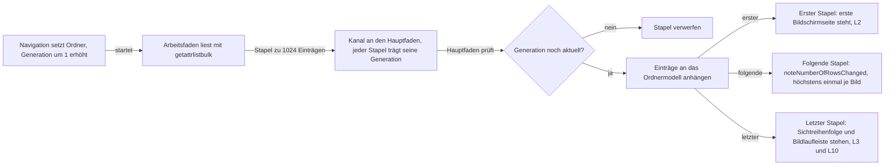
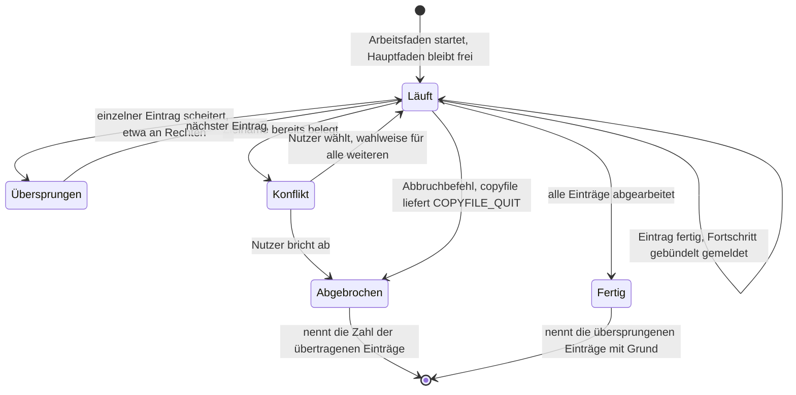
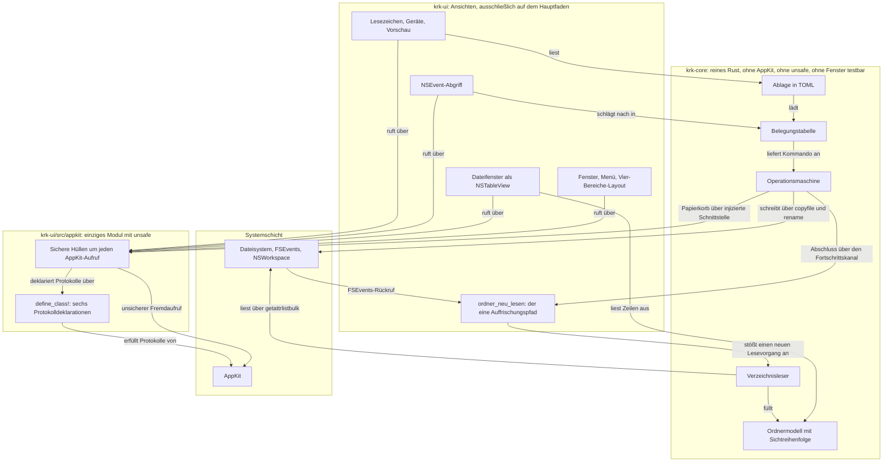
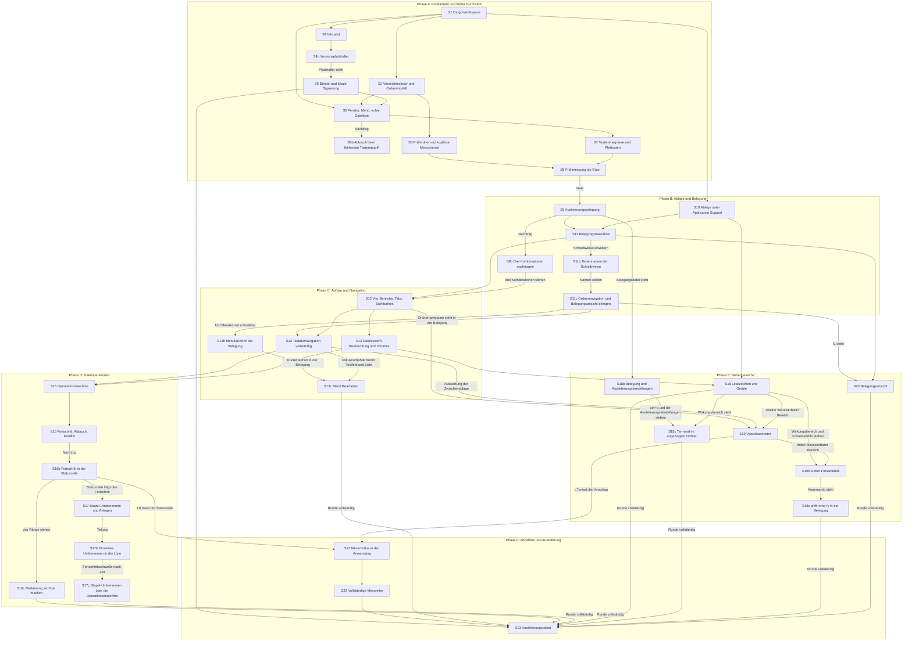
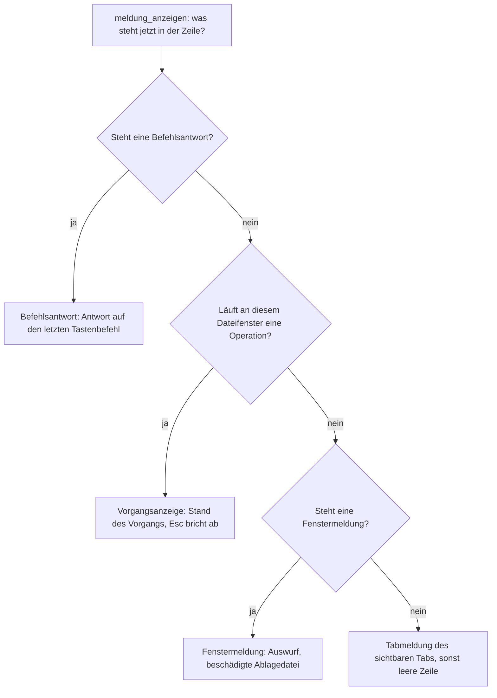
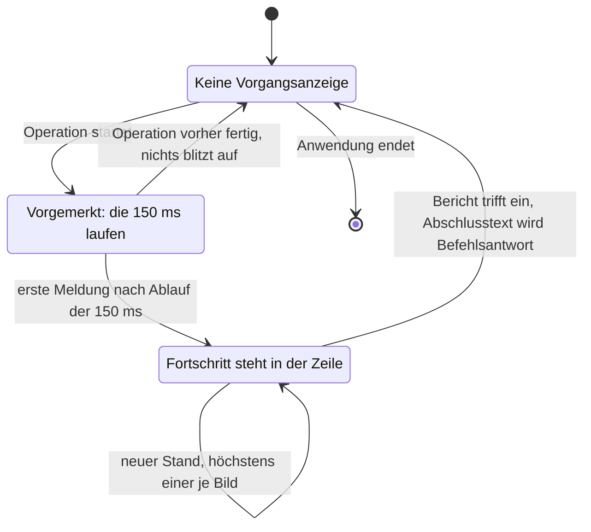

# Implementierungsplan: KRK Navigator-Gerüst (Runde 1)

**Datum:** 2026-08-02, 14:28; nachgezogen 2026-08-02, 15:01, 17:46 und 18:59, dann 2026-08-03, 12:00, 12:08, 15:30, 18:19 und 20:07, dann 2026-08-03, 23:00, dann 2026-08-04, 08:30, 11:22, 18:32 und 23:18, dann 2026-08-05, 00:00, 08:38, 14:11 und 16:23, dann 2026-08-06, 13:13, 14:12, 17:28 und 23:27, zuletzt 2026-08-07, 08:32
**Status:** In Arbeit — **alle 38 Schritte tragen `[DONE]`**; S19b und S19c sind am 260807-1015 mit Commit `9a47c4a` abgenommen worden, S6b seit dem 260806-1150. Die Frage, die die Runde offen hielt, ist seit dem 260807 beantwortet: der Nutzer hat die Zusage L9 gesenkt, `decisions/260806-0014_*_l9-verfehlt-den-anteil-auch-auf-dem-ruhigen-geraet.md`, und die Auswertung nimmt die neue Fassung seit `d569f8a` ab. Offen bleibt allein ein Abnahmelauf am laufenden Bündel, der KRK im Vordergrund verlangt und damit den Nutzer. Der Marker bleibt `_o_`, bis der Abschluss der Runde entschieden ist; über ihn befindet der Nutzer und nicht dieser Plan.
**Nachzug 15:01:** Die Konzeptprüfung `reviews/260802-1447-conceptrev-plan-navigator-geruest-runde-1.md` (Verdikt "acceptable") ist eingearbeitet: vier Kanten im Abhängigkeitsgraphen dazu, zwei Rückwege im Schichtungsgraphen dazu, S10 und S11 getauscht, Selbstprüfung nachgerechnet. Der Entwurf selbst ist unverändert. Dazu sind drei überholte Verweise auf den heutigen Stand gezogen, gemeldet in `issues/260802-1445_*_plan-nennt-die-c8-luecke-und-zwei-defekte-noch-als-offen.md`.
**Nachzug 17:46:** Zwei Auslassungen sind nachgetragen, der Entwurf bleibt auch hier unverändert. Erstens ist die Frage zu L4 seit dem 260802-1735 beantwortet, `decisions/260802-1428_*_was-l4-mit-wiederhergestellten-tabs-meint.md`: der Nutzer hat Möglichkeit 1 gewählt, sie gilt ausdrücklich auch für den Tabwechsel aus L5, und die Prüfsitzung aus zwei Dateifenstern mit je zwei Tabs steht als Messbedingung in C8. Die fünf Stellen, die den Punkt noch als offen führten, sind auf diesen Stand gezogen, und S3 erzeugt jetzt zwei Prüfordner zu je 10.000 Einträgen statt einen. Zweitens nennt S1 den Abschnitt `[alias]` der `.cargo/config.toml`, den er bisher überging, Defekt `issues/260802-1755_*_plan-legt-den-cargo-xtask-alias-in-keinem-schritt-an.md`.
**Nachzug 18:59:** Vier Befunde aus den Umsetzungen der Schritte 2 bis 4 sind eingearbeitet, der Entwurf bleibt unverändert. Erstens sind die Dateilisten aller Schritte einmal unter der Regel durchgegangen, dass ein Schritt auch die Datei anfassen muss, die sein neues Modul oder seine neue Abhängigkeit einbindet; 35 einbindende Dateien sind in S5 bis S23 ergänzt und die zwei bereits umgesetzten Nachträge in S2 und S3 eingetragen, Defekt `issues/260802-1900_*_dateilisten-der-planschritte-lassen-wiederholt-die-cargo-toml-aus.md`. Zweitens liest der Bedingungskopf die Bildwiederholrate jetzt in S21 aus `NSScreen` statt aus `system_profiler`, und die Kopfangaben von S3 sind auf die acht aus `### Frage 5` angeglichen, Defekt `issues/260802-1900_*_bildwiederholrate-am-referenzgeraet-nicht-per-system-profiler-erhebbar.md`. Drittens steht in `### Frage 5` und in S22, worauf L8 und L9 gemessen werden; die Datenmenge ist aus der Fortschrittsregel dieses Plans abgeleitet und brauchte keine Nutzerentscheidung, Defekt `issues/260802-1900_*_pruefordner-sind-duennbesetzt-und-taugen-nicht-fuer-die-kopiermessung.md`. Viertens führt die `Cargo.toml` die Version allein, der neue Schritt S4b setzt einen Platzhalter in die `Info.plist` und S5 ersetzt ihn beim Bündeln, Defekt `issues/260802-1835_*_versionsnummer-steht-an-zwei-stellen-ohne-abgleich.md`.
**Nachzug 260803-1200:** Zwei Meldungen aus den Umsetzungen der Schritte 2 und 5 sind eingearbeitet, der Entwurf bleibt unverändert. Erstens sagte `### Frage 7` zu, S5 **erzeuge** eine selbstsignierte Identität im Schlüsselbund, während die `Änderungen` desselben Schritts sie **suchen** und sonst abbrechen. Umgesetzt ist die zweite Lesart, inzwischen als dreistufige Suche über `KRK_SIGN_IDENTITY`, den Namen `KRK Entwicklung` und die genau eine gültige Identität; `### Frage 7` steht jetzt auf diesem Stand, und das Abnahmekriterium von S5 verlangt `codesign -dvv` statt `-dv`, weil erst zwei `v` die Zeile `Authority=` ausgeben. Defekt `issues/260802-1935_*_frage-7-und-schritt-5-widersprechen-sich-bei-der-signaturidentitaet.md`. Zweitens konnten die Abnahmekriterien von S2 und S15 nicht aufgehen: sie verlangten, `grep -rln 'unsafe' crates/krk-core/src` nenne genau eine Datei, aber die `lib.rs` trägt selbst die Zeile `#![deny(unsafe_code)]` und enthält damit die gesuchte Zeichenkette. Beide Kriterien prüfen jetzt auf das Attribut `#[allow(unsafe_code)]` am Zeilenanfang, also auf die eine Stelle, an der die Sperre geöffnet ist; die Freiheit des übrigen Kerns von `unsafe` erzwingt `deny(unsafe_code)` ohnehin maschinell über den Bau. Defekt `issues/260802-1810_*_abnahmekriterium-mit-grep-unsafe-kann-nicht-aufgehen.md`.
**Nachzug 260803-1208:** `krk-ui` trägt künftig `#![deny(unsafe_code)]` statt `#![warn(unsafe_code)]`, Nutzerentscheidung vom 260803, festgehalten in `decisions/260803-1208_*_unsafe-grenze-in-krk-ui-erzwungen-oder-beobachtet.md`. Eine Warnung bricht den Bau nicht ab; die Grenze zum Modul `appkit` wäre damit nur beobachtbar. Unter `deny` ist sie maschinell erzwungen, und die Zusage der Risikotabelle, `unsafe` sei "durchgesetzt über zwei Übersetzerregeln", stimmt für beide Kisten statt nur für `krk-core`. Nachgezogen sind der Absatz über die zwei Übersetzerregeln in `## Aufbau`, jetzt mit der Begründung der Wahl, die dort bisher fehlte, die Zeile zu `krk-ui` in der Verzeichnisstruktur, S1, S6 und die Risikotabelle. Das Abnahmekriterium von S6 prüft nun wie das von S2 und S15 auf das Attribut `#[allow(unsafe_code)]` am Zeilenanfang, womit auch der dritte Fund derselben unhaltbaren `grep`-Vorschrift behoben ist, Defekt `issues/260803-1200_*_abnahmekriterium-von-schritt-6-traegt-denselben-grep-fehler.md`. Der Codewechsel selbst steht aus und gehört zur Umsetzung von S6.
**Nachzug 260803-1530:** Sechs Schritte siedelten AppKit-Code außerhalb von `crates/krk-ui/src/appkit/` an: S8, S13, S15, S16, S17 und S21. Alle sechs sind jetzt entlang der Grenze geteilt, die Ansicht nach `appkit/`, der Ablauf davor; Schrittnummern, Abhängigkeiten und Abnahmekriterien bleiben unberührt, ebenso die fünf Zahlen des Gates S8. Die Regel steht im Kopf von `## Implementierungsschritte`, damit die Dateiliste die Grenze künftig selbst trägt. Defekt `issues/260803-1345_*_dateiliste-von-s8-legt-objc2-code-ausserhalb-von-appkit-ab.md`. Die Durchsicht förderte dabei zutage, dass `#![deny(unsafe_code)]` die Grenze nur zur Hälfte erzwingt: viele `objc2`-Bindungen sind als sicher deklariert und übersetzen außerhalb von `appkit/` anstandslos. `## Aufbau` und die Risikotabelle stehen jetzt auf diesem Stand, die fehlende maschinelle Prüfung meldete `issues/260803-1530_*_appkit-grenze-ist-nur-zur-haelfte-maschinell-erzwungen.md`; sie hängt seit dem 260805-0000 am Abnahmekriterium von S23.
**Nachzug 260803-2007:** Vier Meldungen sind eingearbeitet und eine fünfte im Plan verankert, der Entwurf bleibt unverändert. Erstens sind die Dateilisten von S9 bis S23 unter der erweiterten Regel durchgegangen: zwölf der fünfzehn Schritte haben eine vorhandene Datei ergänzt bekommen, aus der sie lesen oder über die sie auslösen, drei standen sauber, Defekt `issues/260803-1819_*_dateilisten-von-s9-bis-s23-noch-nicht-unter-der-erweiterten-regel-durchgegangen.md`. Zweitens trägt die Dateiliste von S7 die sechs Einträge nach, die seine Umsetzung gebraucht hat, Defekt `issues/260803-1309_*_dateiliste-von-schritt-7-nennt-fuenf-noetige-dateien-nicht.md`. Drittens wählen sieben Abnahmekriterien das Testprogramm jetzt über `--test` statt über einen Namensfilter, der die benannten Prüfungen nicht ausführte; betroffen waren S7, S10, S11, S12, S13, S15 und S17, Defekt `issues/260803-1309_*_abnahmekommando-von-schritt-7-filtert-nach-testnamen-statt-nach-datei.md`. Viertens startet S7 das Bündel für das Tastenprotokoll unmittelbar statt über `open`, weil eine über `open` gestartete Anwendung keine Standardausgabe hat, Defekt `issues/260803-1309_*_tastenprotokoll-ueber-open-ist-nicht-lesbar.md`. Fünftens nimmt S12 die Sackgasse nach Cmd+W auf; welche der beiden Antworten gilt, entscheidet der Nutzer über `decisions/260803-2007_*_was-krk-tut-wenn-das-letzte-fenster-geschlossen-wird.md`.
**Nachzug 260803-2300:** Zwei Meldungen aus der Umsetzung von Schritt 9 sind eingearbeitet, dazu eine dritte, die dabei auffiel, und eine Nutzerentscheidung. Erstens nennt das Abnahmekriterium von S9 die vier Kürzel jetzt in der Kombinationsschreibweise desselben Schrittes, also `shift+cmd+k`, `shift+cmd+v`, `shift+cmd+n` und `opt+cmd+delete` statt der Mac-Prosaform; die Schreibweise gewinnt, weil der Parser aus S11 sie liest und ihre Reihenfolge sein Vertrag ist. Die Prosaform bleibt in C3 des Specs und im Kriterium von S7 stehen, wo keine Zeichenkette wörtlich geprüft wird. Defekt `issues/260803-2045_*_abnahmekriterium-von-schritt-9-schreibt-die-kuerzel-in-einer-anderen-reihenfolge-als-die-schreibweise-erlaubt.md`. Zweitens trägt F6 allein das Verschieben, und das Umbenennen ist eine eigene Funktion aus C4 auf `shift+f6` und `shift+cmd+u`; Nutzerentscheidung vom 260803-2110, im Spec in C3 nachgezogen, Defekt `issues/260803-2045_*_c3-nennt-f6-verschieben-und-umbenennen-die-belegungstabelle-nur-verschieben.md`. Drittens nennt die Aufzählung in S9 jetzt auch C4, dessen vier Funktionen ohne Norton-Taste sie überging, Defekt `issues/260803-2300_*_die-aenderungen-von-schritt-9-lassen-c4-aus-der-aufzaehlung-aus.md`. Viertens hat der Nutzer die vollständige Auslieferungsbelegung am 260803-2110 durchgesehen und für diese Runde angenommen, `decisions/260803-2300_*_auslieferungsbelegung-der-39-frei-gewaehlten-kombinationen.md`. Der Entwurf bleibt in allen vier Punkten unverändert, `resources/default-keymap.toml` ebenso.
**Nachzug 260804-0830:** Drei Nutzerantworten und ein Auftrag über zwei zusätzliche Funktionen sind eingearbeitet. **Der Entwurf bleibt unverändert; der Umfang der Runde wächst.** Erstens hat der Nutzer für das letzte geschlossene Fenster Möglichkeit 2 gewählt, `decisions/260803-2007_*_was-krk-tut-wenn-das-letzte-fenster-geschlossen-wird.md`: einen Menüeintrag mit Kürzel und `applicationShouldHandleReopen:`. S12 setzt sie um und schreibt aus, dass Runde 1 weiterhin genau ein Fenster kennt; die beiden Folgefragen zu zwei Fenstern binden sie deshalb nicht. Zweitens hat er für die Fehleranzeige Möglichkeit 1 gewählt, `decisions/260803-2025_*_wie-zeigt-krk-dem-nutzer-fehler.md`: die Statuszeile baut S12, der `NSAlert` beim fehlenden Tastenabgriff bekommt mit **S6b** einen eigenen kleinen Schritt. Dabei ist ein Irrtum aufgefallen und richtiggestellt: **C1 verlangte die Statuszeile nicht**, sie ist eine Erweiterung des Umfangs und steht erst seit dem 260804-0830 im Spec. Drittens bleibt `cmd+y` unverändert belegt, `issues/260803-2317_*_cmd-y-liegt-auf-einer-deutschen-tastatur-unter-der-taste-z.md` ist geschlossen, und S20 bekommt dadurch keine Umrechnung. Viertens trägt der Spec die neue Fähigkeit **C10, die Zwischenablage als Quelle**; sie wächst in S13 und S19 hinein, und **S9b** trägt die drei neuen Kombinationen `cmd+n`, `shift+f3` und `opt+cmd+g` in `resources/default-keymap.toml` ein. Keine der zehn Zahlen aus C8 ist berührt.
**Nachzug 260804-1122:** Der Nutzer hat die Ordnernavigation neu belegt und eine Taste für die Belegungsansicht bestimmt. **Der Entwurf bleibt unverändert; die Kombinationsschreibweise wächst.** Der Aufstieg in den übergeordneten Ordner liegt jetzt auf `cmd+left` neben dem vorhandenen `cmd+up`, der Einstieg allein auf `cmd+right`, und `f1` zeigt die Tastaturbelegung. `return` verliert seine Belegung und wird frei; der Nutzer hat das ausdrücklich gewählt, gegen den Hinweis, dass es in Dateimanagern die vertrauteste Taste dafür ist und in S12 bereits gebaut und geprüft war. Zwei der drei Kombinationen ließen sich vorher nicht einmal hinschreiben, weil die Schreibweise aus S9 die Links- und Rechts-Pfeile und `f1` nicht kennt. Zwei neue Schritte lösen das: **S11b** trägt acht Tastennamen in die Tabelle des Parsers nach, `left`, `right`, `f1`, `f2` und `f9` bis `f12`, und **S11c** trägt danach die drei Belegungen in `resources/default-keymap.toml` ein. Berührt sind außerdem S9, S13 und S20, im Spec C2 und C3. Der Defekt `issues/260803-2045_*_die-kombinationsschreibweise-kennt-die-links-und-rechts-pfeile-nicht.md` ist damit geschlossen; zwei neue Datensätze sind entstanden, die Frage nach den Bereichsbreiten auf den Pfeiltasten und der fehlende Fokusvorbehalt für Tastenbefehle. Keine der zehn Zahlen aus C8 ist berührt. **Die beiden Seitwärtsbelegungen dieses Nachzugs gelten seit dem Nachzug 260805-1411 nicht mehr**, siehe dort; `f1` und die freie `return`-Taste sind unberührt.
**Nachzug 260804-1832:** Zwei Nutzerentscheidungen aus der Abnahme von S16 sind eingearbeitet. **Der Entwurf bleibt unverändert; zwei Schritte kommen dazu, und ein abgenommener bekommt eine Abweichungsnotiz.** Erstens verlässt der Fortschritt das Blatt und zieht in die Statuszeile am Fuß des Dateifensters, `decisions/260804-1832_*_traegt-der-fortschritt-ein-blatt-oder-die-statuszeile.md`. Ein Blatt sperrt das Fenster, das C4 bedienbar zusagt, und braucht auf dem Referenzgerät 354 bis 403 ms zum Aufgehen, während L8 200 ms zusagt; KRKs eigener Anteil liegt bei 152 bis 154 ms und passt in die Statuszeile hinein. Umgebaut wird das in **S16b**, nicht in S16: der Schritt ist abgenommen und bleibt stehen, mit einer Notiz, die die Abweichung benennt, wie schon bei der `unsafe`-Vorschrift aus S1 und beim Abnahmemaß aus C8. Konfliktblatt, Löschbestätigung und Abschlussliste bleiben Blätter. Die Statuszeile bekommt dafür eine dritte Quelle mit eigenem Rang und eigener Lebensdauer; die Vorrangregel aus S14 trug den Fortschritt nicht und ist erweitert. **L8 bleibt bei 200 ms**, und die übrigen neun Zahlen aus C8 sind unberührt. Im Spec berührt die Entscheidung C1 um ein Abnahmekriterium, die Beschreibung von C4 und zwei seiner Kriterien. Zweitens nimmt S17 das Anlegen von Ordner und Datei mit; das einzelne Umbenennen "direkt in der Liste" ist kein Blatt und bekommt mit **S17b** einen eigenen Schritt, weil S17 sonst drei unabhängige Oberflächenmechanismen getragen hätte. Defekte `issues/260804-1814_*_ein-modales-blatt-widerspricht-der-zusage-dass-die-oberflaeche-bedienbar-bleibt.md`, `issues/260804-1814_*_ein-blatt-braucht-360-ms-bis-es-steht-und-l8-sagt-200-ms-zu.md` und `issues/260804-1815_*_anlegen-und-einzelnes-umbenennen-aus-c4-baut-kein-schritt-des-plans.md`.
**Nachzug 260805-0000:** Sechs Nutzerantworten auf Punkte aus den Umsetzungen sind eingearbeitet. **Der Entwurf bleibt unverändert; drei Schritte kommen dazu.** Erstens ziehen die Kürzel des Hauptmenüs in die Konflikterkennung aus C3 ein, `decisions/260805-0000_*_menuekuerzel-in-die-konflikterkennung-oder-daneben.md`; **S13b** trägt sie als Einträge in `resources/default-keymap.toml` nach, **S13c** baut das Menü "Bearbeiten", ohne das heute kein Textfeld etwas eingefügt bekommt, und lässt das Hauptmenü seine Kürzel aus der Belegung nehmen. Zweitens bekommt die Markierung ein zweites Kennzeichen neben der Farbe und die Statuszeile einen fünften Rang mit Zahl und Gesamtgröße der markierten Einträge, `decisions/260805-0000_*_zweites-kennzeichen-der-markierung-und-ihr-platz-in-der-statuszeile.md`; das baut **S16c**. Drittens wirken die beiden Befehle aus C10 nur bei Fokus im Dateifenster, was S18 als Eigenschaft je Kommando anlegt und S19 für die beiden setzt. Viertens wird das vierte Abnahmekriterium von C7 am Modell nachgewiesen; S12 bleibt abgenommen und bekommt eine Notiz. Fünftens gilt die selbsttätige Auffrischung allein für lokale Dateisysteme, nachgezogen in `### Frage 3`. Sechstens zählt die gemeldete Eintragszahl die angefassten Einträge, nachgezogen im Spec. Dazu nimmt das Abnahmekriterium von S23 eine maschinelle Prüfung der AppKit-Grenze auf, und zwei Stellen verlieren die Zahl der C4-Kriterien als Literal. **Keine der zehn Zahlen aus C8 ist berührt.**
**Nachzug 260805-1411:** Der Nutzer hat die Ordnernavigation ein zweites Mal umbelegt, und die Zusatztaste fällt weg. **Der Entwurf bleibt unverändert; kein Schritt kommt dazu.** `oeffnen` liegt auf `right` statt auf `cmd+right`, `ordner_aufwaerts` auf `left` neben dem unveränderten `cmd+up` statt auf `cmd+left`; `cmd+left` und `cmd+right` stehen in keiner Tastenliste mehr. `up` und `down` bleiben bei der Bewegung der Auswahl in der Liste. **Der tragende Grund ist ein anderer als am 260804-1122:** eine Ordnernavigation ohne Zusatztaste ist schneller als eine mit, und "superschnell" ist die erste Maxime des Vorhabens. Das Richtungsargument der Seitwärtspfeile, das am 260804 die Wahl trug, bleibt als zweites Argument bestehen; es sagt über die Zusatztaste nichts und hätte beide Fassungen getragen. Der Nutzerentscheid steht seit heute als `decisions/260805-1411_*_ordnernavigation-mit-oder-ohne-zusatztaste.md`, der beide Umbelegungen dieser Frage trägt und bis dahin fehlte. **Wie dieser Nachzug mit den abgenommenen Schritten umgeht:** S11c hat die Belegung vom 260804 geschrieben und behält seine Vorher-Nachher-Tabelle, seinen Wortlaut und sein Abnahmekriterium als Aufzeichnung jenes Schrittes; eine Abweichungsnotiz benennt den neuen Stand, so wie bei S1, S12 und S16. Die vorausschauenden Stellen dagegen sind auf den heutigen Stand gezogen: die Diagrammkante `S11c → S13` und ihre Erläuterung, die drei Absätze und das Abnahmekriterium von S13 sowie die beiden Stellen in S18. Im Spec berührt sind C2 und C3, dazu ein Kriterium in C5. Der neue Defekt `issues/260805-1356_*_die-belegungspruefung-bindet-cmd-right-noch-an-das-oeffnen.md` hält die Prüfung auf, die die Umbelegung zum zweiten Mal gebrochen hat. Keine der zehn Zahlen aus C8 ist berührt.
**Nachzug 260805-1623:** Der Nutzer hat eine Funktion nachbeauftragt, eine Taste für das Terminal im angezeigten Ordner. **Der Entwurf bleibt unverändert; zwei Schritte kommen dazu, S18b und S18c.** Die Funktion steht als eigene Fähigkeit C11 im Spec, weil keine der zehn vorhandenen sie trägt; die Begründung steht dort. Der Plan beantwortet drei technische Fragen dazu, alle drei in `### Frage 4`: die Einstellung geht in eine vierte Ablagedatei `settings.toml`, die Anwendung wird über ihre Bündelkennung benannt, und gerufen wird sie über `NSWorkspace.openURLs:withApplicationAtURL:configuration:completionHandler:` und nicht über einen Unterprozess. Der Wirkungsbereich aus S18 trägt den Fokusvorbehalt ohne Zusatz, und die Fehlmeldungen gehen als Befehlsantwort in den ersten Rang der Statuszeile aus S16b. Datensatz: `decisions/260805-1623_*_taste-und-einstellbarkeit-des-terminal-befehls.md`.
**Nachzug 260806-1313:** Sechs Stellen beschrieben einen Bestand, den spätere Schritte verlassen haben, und sind auf den heutigen gezogen. **Kein Schritt kommt dazu, keine Zusage ändert sich, und keine der zehn Zahlen aus C8 ist berührt**; was sich ändert, ist, woran eine Zusage nachgewiesen wird und wie eine Datei heißt. Erstens prüft das Abnahmekriterium von S6b das `eprintln!` in den beiden Funktionen des Tastenabgriffs statt in der ganzen `anwendung.rs`, deren sechs verbliebene Vorkommen dem Messmodus aus S8 und S21 gehören, und es verlangt für `hinweis.rs` den einzigen **anwendungsmodalen** `NSAlert` statt den einzigen überhaupt, weil die Blätterhülle aus S13 ebenfalls einen anlegt; Defekt `issues/260806-1150_*_abnahmekriterium-von-s6b-ist-an-zwei-stellen-ueberholt.md`. Zweitens zählt S18c den Verzicht auf einen Unterprozess über `Command::new` und `process::Command` statt über `std::process`, das jedes `exit` und jedes `id` mittraf; Defekt `issues/260805-1845_*_das-abnahmekriterium-von-s18c-sucht-std-process-und-findet-sechs-treffer.md`. Drittens trägt die Dateiliste von S18c `kommandos/fokus.rs` und `kommandos/mod.rs` nach, beide zwingende Folge dessen, was der Schritt vorschreibt; Defekt `issues/260805-1845_*_die-dateiliste-von-s18c-nennt-zwei-noetige-dateien-nicht.md`. Viertens ist die beschädigte Einstellungsdatei in S18c eine Startmeldung auf Rang 3 und keine Befehlsantwort auf Rang 1, während die beiden übrigen Fehler aus C11 Rang 1 behalten; Defekt `issues/260805-1845_*_s18c-nennt-die-beschaedigte-einstellungsdatei-eine-befehlsantwort.md`. Fünftens nennt S17 das Kernmodul unter seinem heutigen Namen `stapelumbenennen`, in Verzeichnis, Einbindung und Abnahmedatei; Defekt `issues/260805-0947_*_die-dateiliste-von-s17-nennt-den-alten-modulpfad-umbenennen.md`. Sechstens beschreibt das Abnahmekriterium von S23 die Grenzprüfung so, wie `ist_objc2_use` sie seit Commit `4195aa3` fährt, also mit Sichtbarkeitspräfix und führendem `::`; S18c führt denselben Ausdruck und ist mitgezogen, Defekt `issues/260806-0834_*_die-appkit-grenzpruefung-uebersieht-pub-use-und-use-mit-fuehrendem-doppelpunkt.md`. **Der Spec ist an keiner der sechs Stellen berührt**, und der Plan bleibt `_o_`: Runde 1 schließt erst nach der Klärung der L9-Frage.
**Nachzug 260806-1412:** Die Größengrenze der Bildvorschau steht jetzt im Spec und in S19. **Kein Schritt kommt dazu, keine Zusage ändert sich, und keine der zehn Zahlen aus C8 ist berührt.** S19 nannte in seinen `Änderungen` die Textgrenze von 1 MB und ließ die Bildgrenze aus, obwohl die Umsetzung sie seit dem 260806-1240 führt; der Spec sagte den gängigen Bildformaten ihren Inhalt ohne Vorbehalt zu. Nachgezogen sind die `Änderungen` und das Abnahmekriterium von S19 sowie eine Notiz am Schritt, im Spec C6 mit einem Kriterium und einer Festlegung und C10 mit einem Halbsatz. Defekt `issues/260806-1329_*_die-bildgrenze-von-64-mb-steht-in-keinem-spec-und-in-keinem-datensatz.md`, Nutzerentscheid `decisions/260806-1412_*_bildgrenze-der-vorschau.md`.
**Nachzug 260806-1728:** Die Sortierung steht jetzt auf dem Datensatz, der sie bindet, in diesem Plan und im Spec. **Kein Schritt kommt dazu, kein Schritt verliert sein `[DONE]`, und keine der zehn Zahlen aus C8 ist berührt.** Der Datensatz `decisions/260802-1810_*_sortierung-ohne-sprachsensitive-kollation.md` erklärt sich seit dem 260802-1810 für S12 bindend und war weder hier noch im Spec an einer einzigen Stelle genannt; eine Suche über den ganzen Projektbaum fand einen Treffer, und der stand in `CLAUDE.md`. Die Frage konnte deshalb liegen bleiben, bis der Abgleich vom 260806-1647 sie fand, und S12 trug zu diesem Zeitpunkt seit dem 260804-1040 `[DONE]`. **Die Lehre reicht über den Einzelfall hinaus: eine Entscheidung, die sich für einen Schritt bindend erklärt, muss in diesem Schritt auffindbar sein, sonst hält sie niemanden auf.** Nachgezogen sind S2, wo die Sortierung entsteht, S12, wo sie sichtbar wird, der Absatz zum Sortierschlüssel in `### Frage 2`, der Abschnitt `## Datenstrukturen` um die beiden neuen Felder in `Eintrag` und die Aufstellung `## Angelegte Defekte und Entscheidungen`. Im Spec berührt sind C2 mit einem Abnahmekriterium und einer Festlegung und C8 mit einem Absatz zu L3 und L10. Der Nutzerentscheid vom 260806 lautet Möglichkeit 1, beides richtigstellen; Commit `16e4558` hat ihn umgesetzt. Defekt `issues/260806-1647_*_die-sortierfrage-bindet-s12-und-steht-in-keiner-planstelle.md`.
**Nachzug 260806-2327:** Fünf offene Datensätze stehen jetzt an dem Schritt, auf den sie zeigen. **Kein Schritt kommt dazu, kein Schritt verliert sein `[DONE]`, keine Zusage ändert sich, und keine der zehn Zahlen aus C8 ist berührt.** Die Durchsicht, die den Sortierfall nachzog, fand fünf weitere Datensätze derselben Form: sie nennen einen Planschritt oder eine Fähigkeit, wurden dort aber nicht genannt. Betroffen sind S18 mit der Frage, was der Fokusbefehl bei ausgeblendeter Leiste tut, S18c mit dem Ladezeitpunkt der `settings.toml`, S19 mit dem fehlenden Tastenweg in das Vorschaufenster, S20 mit dem fehlenden Entfernen-Befehl der Belegungsansicht sowie S21 und S22 mit der Bedingung, dass KRK für den Abnahmelauf vorn stehen muss. **Die Asymmetrie ist eine Stufe schwächer als beim Sortierfall:** alle fünf sind nach der Abnahme ihres Schrittes entstanden, keiner behauptet eine Bindung, und keiner hält etwas auf, was ohne ihn liefe. Der Wert des Nachzugs liegt in der Auffindbarkeit, denn wer den Schritt liest, erfuhr bis heute nicht, dass zu ihm eine offene Frage steht. Nachgezogen sind die sechs Schritte und die Aufstellung `## Angelegte Defekte und Entscheidungen`; im Spec berührt sind C3, C5, C6, C7, C8, C10 und C11 mit je einer Festlegung. Berichtigt sind daneben zwei Verweisfehler derselben Durchsicht: der Sortierdatensatz nannte in seinen Cross-references den Spec-Abschnitt C1 statt C2, und vier der fünf Datensätze schrieben dort den Zustandsmarker aus statt der Sternform, zwei davon auf einen Stand, den ihre Ziele längst verlassen hatten. Defekt `issues/260806-1735_*_fuenf-offene-entscheidungen-zeigen-auf-einen-planschritt-ohne-dort-genannt-zu-sein.md`.
**Nachzug 260807-0832:** Die Zusage L9 ist gesenkt, und **das ist die erste der zehn Zahlen aus C8, die sich in dieser Runde ändert**. Kein Schritt kommt dazu, und kein Schritt verliert sein `[DONE]`. Die Abnahmereihe aus S22 hielt L9 auf dem ruhigen Referenzgerät in einer von fünf Runden, mit Anteilen von 90, 85, 90, 100 und 85 Prozent, während L1 in jeder Runde hielt; Fremdlast scheidet aus, und alle zehn verpassten Eingaben liegen zwischen 17,2 und 23,4 ms, also im zweiten Bild. Der Nutzer hat am 260807 Möglichkeit 2 aus `decisions/260806-0014_*_l9-verfehlt-den-anteil-auch-auf-dem-ruhigen-geraet.md` gewählt, gegen die Empfehlung jenes Datensatzes: die Zusage folgt der Messung, statt dass die Ursache im Hauptfaden behoben wird. Sie lautet jetzt, dass während einer laufenden Kopie jede Eingabe spätestens das zweite Bild erreicht und mindestens 85 Prozent das erste. Nachgezogen sind `### Frage 5` mit der Auswertungsregel, `### Frage 6` mit dem überholten Wortlaut der Zusage, S21 mit dem Absatz zur Kopplung an L1 und S22 mit einer Notiz zur Abnahme; beide Schritte bleiben abgenommen, denn sie haben gemessen, was zu messen war, und der Entscheid ändert das Maß und nicht ihre Arbeit. Im Spec berührt ist allein C8, dort erstmals mit einem Abschnitt `Getroffene Festlegungen`. **Was der Entscheid kostet, steht dort ausgeschrieben:** L9 teilt sein Maß nicht mehr mit L1, und die Maxime "superschnell" gibt im Kopierfall dauerhaft eine Bildlänge ab. Offen bleibt daraus ein Defekt an der Messstrecke, `issues/260807-0832_*_die-messstrecke-kann-die-neue-zweiteilige-fassung-von-l9-nicht-abnehmen.md`.
**Nachzug 260807-0930:** Vier Antworten des Nutzers auf Fragen aus den Umsetzungen sind eingearbeitet, und ein Abnahmekriterium des Specs ist berichtigt. **Zwei Schritte kommen dazu, S19b und S19c; kein vorhandener Schritt verliert sein `[DONE]`, und keine der zehn Zahlen aus C8 ist berührt.** Erstens bekommt das Vorschaufenster einen eigenen Fokusbefehl auf `shift+cmd+y`, Möglichkeit 1 aus `decisions/260805-2216_*_tastenweg-des-fokus-in-das-vorschaufenster.md`; die Taste hat der Nutzer selbst bestimmt, und der Buchstabe erbt das `y` aus `cmd+y`. Zweitens holt `fokus_leiste` eine ausgeblendete Leiste hervor, bevor der Befehl den Fokus setzt, Möglichkeit 2 aus `decisions/260805-1730_*_holt-der-fokusbefehl-eine-ausgeblendete-leiste-hervor.md`. Beide bauen S19b und S19c. Drittens schließt Runde 1 ohne einen Entfernen-Befehl in der Belegungsansicht, Möglichkeit 1 aus `decisions/260805-2252_*_entfernen-einer-einzelnen-kombination-in-der-belegungsansicht.md`; S20 bleibt unverändert. Viertens bleibt es beim einmaligen Laden der `settings.toml`, Möglichkeit 1 aus `decisions/260805-1845_*_wann-eine-von-hand-geaenderte-settings-toml-wirkt.md` und gegen die Empfehlung jenes Datensatzes; S18c bleibt unverändert, und der Preis der Wahl liegt als `issues/260807-0930_*_die-meldung-zur-buendelkennung-sagt-nicht-dass-settings-toml-erst-beim-start-gelesen-wird.md`. Im Spec berührt sind C2 mit einem **berichtigten** Abnahmekriterium und zwei Festlegungen, C3 mit einem Kriterium und drei Festlegungen, C5 mit einem Kriterium und einer Festlegung, C6 mit einem Kriterium und zwei Festlegungen, C7 mit einer Festlegung sowie C10 und C11 mit je einer. **Der Umfang der Runde wächst um einen Tastenbefehl**, die 58. Funktion der Auslieferungsbelegung.
**Spec:** `circles/260802-0842-krk-mac-dateimanager-editor-git/planning/260802-1036_*_spec-navigator-geruest.md`
**Bindende Entscheidung zur Technologie:** `circles/260802-0842-krk-mac-dateimanager-editor-git/decisions/260802-1134_*_sprache-und-ui-werkzeugkasten.md`
**Ausführende Agenten:** `coder` und `ontocoder`

---

## Wie dieser Plan auf Datensätze verweist

Diese Regel gilt für jeden Verweis in diesem Plan und im Spec. Sie steht hier, weil dreimal dasselbe passiert ist: ein Datensatz wandert von `_o_` auf `_a_`, `_i_` oder `_c_`, und die Verweise auf ihn bleiben stehen und zeigen ins Leere. Am 260805-0838 waren es 24 Verweise auf 14 Datensätze; die Meldung vom 260805-0000 hatte zehn gezählt, und in den acht Stunden dazwischen sind vier weitere Datensätze weitergewandert.

**Ein Verweis trägt den Marker nicht.** Er nennt Speicher, Zeitstempel und Thema und lässt die Markerstelle offen:

```
issues/260803-2007_*_s14-bindet-fsevents-ohne-das-framework-coreservices-zu-verlinken.md
```

Zeitstempel und Thema behält ein Datensatz über jeden Markerwechsel; der Marker ist der einzige Teil des Namens, der sich ändert, und er ändert sich planmäßig. Ein Verweis, der ihn ausschreibt, bindet sich an einen Zustand, den der Datensatz gerade verlässt. Die Sternform ist keine neue Schreibweise, sondern die, mit der die Workbench den Marker ohnehin liest (`circles/*/*_circle.md`); dafür ist das Trennzeichen ein Unterstrich und kein Klammerpaar. Ein `ls` löst den Verweis in einem Kommando auf, und ein Editor findet die Datei über den Thementeil.

Der Zeitstempel allein genügt nicht. In diesem Circle tragen vier Zeitstempel je zwei Datensätze, unter ihnen `260803-2007` und `260805-0637`. Der Thementeil ist deshalb Teil des Verweises und nicht Zierde.

Dieselbe Form gilt für den Circle-Datensatz, `*_circle.md`. Historien-, Prüf- und Analysedateien tragen von Haus aus keinen Marker und werden geschrieben, wie sie heißen.

**Ein Verweis nennt den Stand nicht mit.** Was bleibt, ist die Bindung, also welchen Schritt ein Datensatz aufhält; was wandert, ist der Stand. "Bindet S16" gilt weiter, auch nachdem der Defekt geschlossen ist, denn der Satz sagt, worauf der Datensatz zeigt, und nicht, ob er noch offen ist. "Offen, bindet S16" wird mit der Schließung falsch. Aus demselben Grund steht in einer Schrittbeschreibung nicht mehr, ein Datensatz sei offen: der Marker auf der Platte sagt es genauer und ohne Nachziehen.

Den Stand führt genau eine Stelle, `## Angelegte Defekte und Entscheidungen`, und sie nennt oben das Datum ihrer Erhebung. Verbindlich ist auch dort der Dateibestand.

---

## Directive

Dieser Plan setzt die Fähigkeiten C1 bis C11 des Specs in 38 einzeln abnehmbare Schritte um (S1 bis S23, dazu S4b zwischen S4 und S5, S6b zwischen S6 und S7, S9b zwischen S9 und S10, S11b und S11c zwischen S11 und S12, S13b und S13c zwischen S13 und S14, S16b und S16c zwischen S16 und S17, S17b und S17c zwischen S17 und S18, S18b und S18c zwischen S18 und S19 sowie S19b und S19c zwischen S19 und S20). Er beantwortet die sieben technischen Fragen aus `## Offen für den Planner` und legt damit erstmals eine Verzeichnisstruktur, ein Bauverfahren und eine Teststrategie für KRK fest.

**Die Buchstabenschritte sind Nachträge und keine Unterschritte.** S4b, S6b, S9b, S11b, S11c, S13b, S13c, S16b, S16c und S17c sind entstanden, nachdem ihr Nachbar schon abgenommen war, und jeder trägt genau eine Sache: den Versionsplatzhalter, den Abbruch beim fehlenden Tastenabgriff, drei Einträge in der Auslieferungsbelegung, acht Tastennamen in der Schreibweise, die drei Belegungen der neuen Ordnernavigation, die fünf Menükürzel in derselben Datei, das Menü "Bearbeiten", den Umzug des Fortschritts aus dem Blatt in die Statuszeile, die Sichtbarkeit der Markierung und das Stapel-Umbenennen über die Operationsmaschine. S17b ist etwas anderes, nämlich die Teilung eines noch nicht ausgeführten Schrittes, der mit dem Anlegen und dem einzelnen Umbenennen drei voneinander unabhängige Oberflächenmechanismen getragen hätte; die Begründung steht bei S17b selbst. Die Nummer sagt in beiden Fällen, hinter welchem Schritt sie in der Ausführungsreihenfolge stehen, nicht dass sie zu ihm gehören.

**S19b und S19c vom 260807-0930 sind wieder Nachträge der ersten Sorte**, und sie tragen zusammen eine Sache: den dritten Fokusbefehl und das Hervorholen eines ausgeblendeten Randbereichs durch einen Fokusbefehl. Zwei Schritte sind es, weil die Belegungsdatei dem `ontocoder` gehört und der Rust-Anteil dem `coder`, dieselbe Trennung wie bei S9b, S11c, S13b und S18b. Neu ist an ihnen die **Reihenfolge**: hier steht der Code vor den Daten, während S18b die Daten vor den Code stellte. Der Grund steht bei S19b.

**S18b und S18c sind der dritte Fall, und bei ihnen sagt der Buchstabe allein die Stelle in der Reihenfolge.** Beide tragen die Fähigkeit C11, das Terminal im angezeigten Ordner, und keiner von beiden ist ein Nachtrag zum Gegenstand von S18, den Lesezeichen und Geräten. Sie stehen dort, weil S18c die Eigenschaft `Wirkungsbereich` braucht, die S18 anlegt, und damit unmittelbar nach S18 der früheste Platz ist, an dem er baubar wird. S18b, der Datenschritt, hängt allein an S9 und ließe sich jederzeit vorziehen; er steht neben S18c, weil er dessen unmittelbare Voraussetzung ist und die beiden zusammen eine Sache sind. Dass ein Buchstabenschritt die Stelle und nicht die Zugehörigkeit nennt, hält der Absatz darüber schon fest; hier ist es zum ersten Mal der einzige Sinn des Buchstabens.

Editor und Git-Anbindung bleiben draußen, ebenso alles unter `## Außerhalb des gesamten Circles`. Die Abgrenzung des Specs gilt unverändert.

## Ausgangslage

Das Projekt hat keinen Produktcode. Es gibt keine `Cargo.toml`, kein Bauskript, keine Tests und kein Bündel. Wiederzuverwenden ist nichts. Der Prüfcode unter `spikes/fn-tasten/` ist ausdrücklich Wegwerf-Code; aus ihm übernimmt der Plan ausschließlich die gemessenen Tastencodes 99 für F3, 96 für F5 und 100 für F8.

**Geprüfter Stand der Werkzeugkette** (Kommandos am 260802-1428 auf dem Referenzgerät ausgeführt):

| Werkzeug | Stand | Wie geprüft |
|---|---|---|
| Rust | rustc und cargo 1.97.1 | `~/.cargo/bin/rustc --version` |
| Ziele | `x86_64-apple-darwin`, `aarch64-apple-darwin` | `rustup target list --installed` |
| Pfad | über `. "$HOME/.cargo/env"` in `~/.zshrc`, Zeile 37 | `grep -n cargo ~/.zshrc` |
| Swift, clang | 6.1.2, clang 17 | `swift --version` |
| Xcode | **nicht installiert**, nur Command Line Tools | `xcode-select -p` liefert `/Library/Developer/CommandLineTools` |
| Betriebssystem | macOS 15.7.7, Build 24G720 | `sw_vers` |

Zwei Folgerungen daraus binden den Bauzuschnitt. Der Bau der Anwendung kommt vollständig ohne Xcode aus: `cargo`, `codesign`, `plutil` und `vtool` liegen alle in den Command Line Tools. Die Auslieferung kommt nicht ohne aus; welcher Schritt davon abhängt, steht in S23.

Der Rechner, auf dem diese Sitzung läuft, ist zugleich das Referenzgerät aus C8. Was hier gemessen wird, gilt unmittelbar für die Abnahme.

## Zwei Defekte am Circle-Datensatz, inzwischen geschlossen

`issues/260802-1417_*_directive-zeile-sagt-freie-funktionstasten-zu.md` und `issues/260802-1417_*_circle-datensatz-status-widerspricht-dem-marker.md` betrafen beide den Circle-Datensatz, nicht den Spec. Beide sind seit dem 260802-1423 geschlossen. Für die Tastenbelegung gilt unverändert C3 des Specs, weil C3 die Messung kennt und die Directive-Zeile sie nicht kannte.

---

## Antworten auf die sieben Fragen aus dem Spec

Der Abschnitt `## Offen für den Planner` stellt sieben Fragen. Sie sind der Kern dieses Plans, und die Schritte weiter unten sind ihre Umsetzung.

### Frage 1: Programmiersprache und UI-Werkzeugkasten

**Beantwortet, nicht von uns.** Der Nutzer hat am 260802-1150 Möglichkeit 3 gewählt: **Rust mit AppKit über `objc2`**, gegen die Empfehlung des Analysten und begründet damit, dass Editor und Git in diesem Circle als spätere Runden feststehen und der Rust-Vorteil damit innerhalb des Circles anfällt. Der Datensatz `decisions/260802-1134_*_sprache-und-ui-werkzeugkasten.md` ist bindend, dieser Plan setzt ihn um und stellt ihn nicht zur Diskussion.

Sechs Randbedingungen aus dem Abschnitt `## Constraints` desselben Datensatzes binden den Plan zusätzlich. Wo sie zuschlagen, ist hier vermerkt:

| Randbedingung | Wo sie im Plan zuschlägt |
|---|---|
| Die zehn Zeitzusagen gelten unverändert auf dem Gerät von 2018 | S3, S8, S12, S21, S22 |
| C3 verlangt Laufzeit-Umbelegung und Zugriff auf systemseitig belegte Tasten | S7, S9, S11, S20 |
| "supersimpel" wirkt als Ausschlussgrund | durchgängig, siehe `## Wie dieser Plan die Maxime "supersimpel" einlöst` |
| KRK wird außerhalb der App-Sandbox ausgeliefert | S4, S5, S23 |
| Mindest-Zielsystem macOS 15 | S1 (`MACOSX_DEPLOYMENT_TARGET`), S5 (Prüfung am Binärformat) |
| Die Fn-Annahme aus C3 ist vor der Implementierung zu prüfen | **erledigt**, siehe unten |

Die Fn-Annahme ist seit dem 260802-1137 gemessen. `spikes/fn-tasten/messung-A.txt` mit der korrigierten Auswertung in `messung-A-neuauswertung.txt` belegt für Fragen 1 und 4 des Prüfprogramms ein klares Ergebnis. Der Plan setzt darauf auf und misst nichts nach.

### Frage 2: Wie ein Verzeichnis gelesen, im Speicher gehalten und dargestellt wird, damit L2 und L10 zugleich halten

Diese Frage trägt die Runde, weil an ihr fünf der zehn Zusagen hängen. Die Antwort hat drei Teile.

**Gelesen wird mit `getattrlistbulk(2)`, nicht mit `readdir` plus `stat` je Eintrag.** Der Unterschied ist der Grund, aus dem L3 überhaupt erreichbar ist. Ein Verzeichniseintrag braucht Name, Größe, Änderungsdatum, Typ und die Kennzeichnung als versteckt; `readdir` liefert davon nur Name und einen groben Typ, jeder weitere Wert kostet einen eigenen Systemaufruf. Bei 100.000 Einträgen wären das 100.000 zusätzliche Aufrufe. `getattrlistbulk` liefert alle Attribute gebündelt für viele Einträge je Aufruf und ist seit macOS 10.10 verfügbar, also weit unter dem Mindest-Zielsystem.

`inference:` Wir erwarten den warmen Lesevorgang eines Ordners mit 10.000 Einträgen damit im niedrigen zweistelligen Millisekundenbereich und halten die 400 ms aus L3 für komfortabel erreichbar. Eine Messung an KRK gibt es nicht, weil KRK nicht existiert; genau deshalb steht die Messung als S8 früh im Plan und nicht am Ende.

**Gehalten wird in zwei getrennten Strukturen: den Einträgen und der Sichtreihenfolge.** Ein `Vec<Eintrag>` hält die gelesenen Daten in Lesereihenfolge und ändert sich nach dem Lesen nicht mehr. Daneben steht ein `Vec<u32>` mit Indizes, der die aktuelle Sortierung abbildet. Umsortieren heißt: die Indexliste neu ordnen, nicht die Einträge verschieben. Das hat zwei Wirkungen, die beide auf Zusagen zahlen. Das Umschalten der Sortierung aus C2 bewegt keine Nutzdaten, und die Auswahl des Nutzers bleibt über einen Sortierwechsel hinweg stabil, weil sie am Eintragsindex hängt und nicht an der Zeilennummer.

Der Sortierschlüssel für den Namen wird beim Lesen einmal je Eintrag berechnet und mitgeführt. Ein sprachsensitiver Vergleich bei jedem Sortierschritt wäre bei 100.000 Einträgen der teuerste Einzelposten der ganzen Zusage.

**Seit dem 260806 ist dieser Schlüssel ein Kollationsschlüssel, und der sprachsensitive Vergleich ist damit kein Argument gegen die Vorberechnung mehr, sondern ihr Nutznießer.** `icu_collator` schreibt den Vergleich als Bytefolge aus: zwei so gebaute Schlüssel bytweise verglichen ergeben dieselbe Reihenfolge wie der sprachsensitive Vergleich der Namen. Die Kollation läuft dadurch einmal je Eintrag statt rund siebzehnmal, denn ein Sortierlauf über 100.000 Einträge ruft eine Vergleichsfunktion rund 1,7 Millionen Mal. Der Zuschnitt dieses Absatzes bleibt unverändert, das Sortieren vergleicht weiter nur Bytes. Dieser Absatz stand bis zum 260806 als einzige Stelle des Plans, die den Sortierschlüssel überhaupt berührte, und nannte die offene Frage dahinter nicht; sie liegt als `decisions/260802-1810_*_sortierung-ohne-sprachsensitive-kollation.md`, die Aufzeichnung der Umsetzung steht bei S2.

**Dargestellt wird gestückelt, mit einer Generationsnummer gegen veraltete Ergebnisse.** Der Lesevorgang läuft auf einem Arbeitsfaden und schickt Stapel zu je 1.024 Einträgen an den Hauptfaden. Der erste Stapel füllt die `NSTableView` und erfüllt L2, die weiteren hängen an. Die vollständige Sortierung und die endgültige Höhe der Bildlaufleiste stehen erst am Ende, was L3 genau so formuliert: L2 verlangt "erste Bildschirmseite sichtbar und bedienbar", L3 verlangt "vollständig gelesen, Sortierung steht". Der Spec modelliert das Zweistufige bereits, der Plan setzt es um.



**Der Abbruch veralteter Lesevorgänge hängt nicht an der Generationsnummer, sondern am Fallenlassen des Empfängers.** Dieser Absatz sagte bis zum 260804-2318 das Gegenteil: der Hauptfaden verwerfe jeden Stapel, dessen Generation nicht mehr die aktuelle ist. Die Umsetzung hält nie mehr als einen Lesevorgang und liest allein aus dessen Kanal; die Prüfung je Stapel war deshalb wirkungslos und hat, solange es sie gab, keinen einzigen Stapel verworfen. Sie ist am 260803-2025 aus `crates/krk-ui/src/appkit/tabelle.rs` entfernt, Defekt `issues/260803-1536_*_die-generationspruefung-kann-nicht-greifen-und-verdeckt-den-wirksamen-mechanismus.md`.

Wirksam ist stattdessen die Eigentümerschaft am Kanal, und sie kostet keine Zeile Sonderbehandlung. `ordner_lesen` lässt den alten `Lesevorgang` fallen, damit fällt sein Empfänger, `Lesevorgang::drop` setzt das Abbruchkennzeichen, und spätestens das nächste `send` scheitert am verschwundenen Empfänger. Der Lesefaden prüft das Kennzeichen vor jedem Systemaufruf und zwischen zwei Stapeln, der Abbruch greift also innerhalb von zwei Stapeln. Der alte Lauf wird damit beendet und nicht bloß ignoriert, was der besser Weg ist: ein ignorierter Lauf liest weiter und kostet Rechenzeit, die der neue braucht.

Die Generationsnummer bleibt und trägt weiterhin zwei Aufgaben. Sie benennt den Lesefaden, und sie sagt dem Ordnermodell beim Leeren, zu welchem Lauf sein Inhalt gehört. Der Knoten `Generation noch aktuell?` im Diagramm oben zeichnet damit die Zuordnung des Inhalts zu seinem Lauf, nicht mehr eine Prüfung je Stapel auf dem Hauptfaden.

Die `NSTableView` bekommt eine feste `rowHeight`. Eine Dateiliste hat gleich hohe Zeilen, damit entfällt die Höhenschätzung aus macOS 13 vollständig und die Höhenberechnung wird konstant statt linear.

### Frage 3: Wie KRK auf Änderungen reagiert, die eine andere Anwendung verursacht hat

**Über FSEvents, mit einem einzigen Auffrischungspfad für fremde und eigene Änderungen.** Ein `FSEventStream` beobachtet die Ordner, die gerade in einem der beiden Dateifenster sichtbar sind, mit einer Sammelverzögerung von 300 ms und ohne `kFSEventStreamCreateFlagFileEvents`: die Auflösung auf Verzeichnisebene genügt, weil KRK ohnehin den ganzen Ordner neu liest. Der Strom wird bei jeder Navigation neu aufgesetzt, es sind nie mehr als zwei Pfade zu beobachten.

Der Punkt, an dem dieser Entwurf gegen die naheliegende Alternative gewinnt: **das Auffrischen nach einer eigenen Dateioperation läuft über denselben Eintrittspunkt.** C4 verlangt "Nach jeder Operation zeigen beide Dateifenster den neuen Stand, ohne dass der Nutzer auffrischen muss". Der gemeldete Abschluss einer Dateioperation läuft in dieselbe Funktion `ordner_neu_lesen(pfad)`, die auch der FSEvents-Rückruf aufruft. Eine Funktion, zwei Auslöser. Beide Auslöser liegen in `krk-ui`: die Operationsmaschine in `krk-core` ruft nicht nach oben, sie meldet ihren Abschluss über denselben Fortschrittskanal, über den sie auch den Fortschritt meldet. Ein zweiter Auffrischungsweg für eigene Änderungen wäre die Sonderregel mit eigenem Rückfallweg, die die Maxime "supersimpel" ausschließt.

**FSEvents deckt Netzdateisysteme nicht ab, und C9 sagt die selbsttätige Auffrischung seit dem 260805-0000 nur für lokale Dateisysteme zu.** Ein Dateifenster auf einem eingehängten SMB- oder NFS-Pfad bekommt keine Ereignisse; eine fremde Änderung erscheint dort erst, wenn der Nutzer den Ordner verlässt und wieder betritt. `inference:` Gemessen ist das nicht, weil dafür ein eigens aufgesetzter Server nötig wäre. Der Nutzer hat am 260805-0000 gegen einen zweiten Auffrischungsweg entschieden, `decisions/260805-0000_*_auffrischung-auf-netzlaufwerken.md`: ein Abfragetakt neben FSEvents wäre genau die Sonderregel mit eigenem Rückfallweg, die dieser Plan an vier Stellen vermeidet, und nachprüfbar wäre er ohne Server ohnehin nicht. Unberührt bleibt der Zugriff selbst: Lesen, Navigieren und die Dateioperationen aus C4 laufen auf einem Netzpfad über gewöhnliche Systemaufrufe. Unberührt bleibt auch die Auffrischung nach einer **eigenen** Änderung, denn die läuft über den gemeldeten Abschluss der Operation und nicht über FSEvents. Was der Nutzer stattdessen erlebt, steht als Abnahmekriterium in C9 und nicht nur hier, damit die Einengung keine stille Lücke bleibt.

Eingehängte und ausgeworfene Datenträger sind ein anderer Mechanismus und bekommen einen eigenen: `NSWorkspace.notificationCenter` mit `didMountNotification`, `willUnmountNotification` und `didUnmountNotification`. Das bedient C5 (Datenträger erscheint und verschwindet in der Leiste) und C9 (ein Dateifenster auf einem ausgeworfenen Volume meldet den Verlust und wechselt auf einen erreichbaren Ordner). FSEvents beobachtet Ordnerinhalte, `NSWorkspace` beobachtet Datenträger; die beiden überschneiden sich nicht.

### Frage 4: Format und Ort für Tastenbelegung, Lesezeichen und Sitzungszustand

**Vier TOML-Dateien unter `~/Library/Application Support/KRK/`.** Drei davon legt S10 an; die vierte kommt mit S18c dazu, und die Herleitung steht weiter unten unter `Wohin die Terminal-Einstellung geht`.

| Datei | Inhalt | Schreibmuster |
|---|---|---|
| `keymap.toml` | die vollständige Belegung des Nutzers, nicht nur seine Abweichungen vom Auslieferungszustand | beim Verlassen der Belegungsansicht |
| `bookmarks.toml` | Lesezeichen mit Name, Pfad und Reihenfolge | bei jeder Änderung |
| `session.toml` | Tabs je Fenster mit Ordner und Auswahl, Breiten, Sichtbarkeit, Sortierung | gebündelt, höchstens alle 2 s |
| `settings.toml` | von Hand gepflegte Einstellungen ohne Oberfläche; in dieser Runde die Terminal-Anwendung aus C11 | einmal beim ersten Start, danach nie wieder |

Jede Datei wird atomar geschrieben: in eine Nachbardatei schreiben, dann `rename`. Ein Absturz während des Schreibens hinterlässt damit die alte Datei, nicht eine halbe neue.

**Eine beschädigte Datei kostet den geladenen Zustand und nicht die Datei.** S10 schreibt vor, beschädigte oder nicht lesbare Dateien würden benannt und "durch den Auslieferungszustand ersetzt". Das Wort ließ zwei Lesarten zu, und sie unterscheiden sich in dem, was der Nutzer verliert: KRK arbeitet mit dem Auslieferungszustand weiter und lässt die Datei liegen, oder KRK schreibt den Auslieferungszustand sofort über sie. Seit dem 260804-2318 sagt der Plan die erste, und die Umsetzung von S10 vom 260803-2051 folgt ihr bereits. Der Grund liegt in diesem Abschnitt selbst: TOML ist gewählt, weil der Nutzer `keymap.toml` lesen und von Hand ändern können muss, und eine von Hand geänderte Datei mit einem Tippfehler ist der Alltagsfall dieses Pfades, nicht der Ausnahmefall. Unter der zweiten Lesart kostete ein vergessenes Anführungszeichen die ganze Belegung des Nutzers, ohne Rückweg, weil die Ablage keine Sicherung anlegt. Unter der ersten kostet es den Start mit dem Auslieferungszustand und einer Meldung, und die Datei liegt zum Reparieren noch da. Überschrieben wird sie erst beim nächsten gewöhnlichen Schreibvorgang. Für `session.toml` ist der Unterschied belanglos, weil KRK sie ohnehin alle zwei Sekunden überschreibt; für `keymap.toml` ist er der ganze Punkt. Festgehalten ist die Lesart im Modulkopf von `crates/krk-core/src/ablage/mod.rs` und in der Prüfung `eine_kaputte_datei_fuehrt_zum_auslieferungszustand_und_zu_einer_meldung`, die ausdrücklich nachsieht, dass die kaputte Datei unverändert liegen bleibt. Defekt `issues/260803-2051_*_ersetzt-in-frage-4-und-s10-laesst-offen-ob-die-kaputte-datei-ueberschrieben-wird.md`.

**Warum TOML und nicht `NSUserDefaults` oder eine Property-Liste.** Die Belegung muss der Nutzer lesen und von Hand ändern können, und `NSUserDefaults` legt sie in einer binären Property-Liste ab, die weder lesbar noch kommentierbar ist. TOML trägt Kommentare, was die Auslieferungsbelegung selbsterklärend macht, und `serde` mit `toml` liegt im Rust-Ökosystem ohne Umweg über eine C-Schnittstelle bereit. Ein Format für alle drei Dateien statt eines je Zweck ist der einfachere Zuschnitt.

**Die Auslieferungsbelegung liegt als eigene Datei vor und wird ins Binärprogramm eingebettet.** `resources/default-keymap.toml` wird über `include_str!` einkompiliert. Das macht das Abnahmekriterium "Ein Befehl setzt die gesamte Belegung auf den Auslieferungszustand zurück" zu einem einzigen Parse-Vorgang, und es macht die Belegung zu einem Datenartefakt, das der `ontocoder` schreibt und prüft, statt zu einer Liste im Programmtext.

#### Wohin die Terminal-Einstellung geht

**In eine vierte Datei `settings.toml`, und keine der drei vorhandenen trägt sie.** Der Nutzer hat am 260805 entschieden, dass die gerufene Terminal-Anwendung schon in dieser Runde einstellbar ist, von Hand in einer Datei und ohne Oberfläche. Eine vierte Datei für einen einzigen Wert ist viel, und deshalb steht hier zuerst, warum die drei vorhandenen ausscheiden. Jede scheidet aus einem eigenen Grund aus, und keiner der drei Gründe ist Geschmack.

`keymap.toml` scheidet an zwei Stellen aus. Erstens ist die Datei die vollständige Belegung des Nutzers und nicht eine Ansammlung von Einstellungen; ein Eintrag darin, der keine Kombination auf eine Funktion abbildet, wäre ein Fremdkörper, den die Belegungsmaschine beim Einlesen überspringen müsste. Zweitens, und das entscheidet: C3 verlangt einen Befehl, der **die gesamte Belegung** auf den Auslieferungszustand zurücksetzt, und S11 löst ihn als einen einzigen Parse-Vorgang über die eingebettete Datei. Läge die Terminal-Anwendung darin, setzte dieser Befehl sie mit zurück. Der Nutzer, der eine Taste umbelegt hat und sie rückgängig machen will, verlöre dabei seine Terminal-Wahl, ohne dass irgendetwas darauf hindeutet.

`session.toml` scheidet daran aus, dass KRK sie höchstens alle zwei Sekunden überschreibt. Eine von Hand gepflegte Einstellung in einer Datei, die das Programm im Sekundentakt neu schreibt, ist keine von Hand gepflegte Einstellung: Kommentare überleben den ersten Schreibvorgang nicht, weil die Serialisierung sie nicht kennt, und der Nutzer, der die Datei bei laufendem KRK ändert, verliert seine Änderung mit dem nächsten Takt.

`bookmarks.toml` scheidet sachlich aus. Sie hält eine Liste benannter Ordnerverweise, und eine Terminal-Anwendung ist keiner. Die Datei wird zudem bei jeder Änderung geschrieben, also aus demselben Grund wie `session.toml` kein Ort für Handarbeit.

**Was `settings.toml` aufnimmt und was nicht.** Die Datei bekommt eine Aufnahmeregel, damit sie nicht zur Ablage für alles wird, was in keine andere passt. Aufgenommen wird ein Wert, der drei Bedingungen zugleich erfüllt: er ist keine Tastenbelegung, KRK schreibt ihn nicht selbst im Betrieb, und er hat in dieser Runde keine Oberfläche. Der Nutzer pflegt ihn von Hand, und die Datei trägt ihre Erklärung in Kommentaren, so wie `resources/default-keymap.toml` es tut. Nicht aufgenommen wird, was KRK selbst fortschreibt: eine Fensterbreite, eine Sortierung, eine zuletzt besuchte Stelle gehören nach `session.toml`, weil sie sich beim Arbeiten ändern und nicht beim Einrichten. Ebenso wenig aufgenommen wird ein Wert, sobald eine Ansicht ihn ändern kann; mit der Ansicht käme ein Schreibpfad, und ein Schreibpfad löscht die Kommentare, die den Sinn dieser Datei ausmachen. Eine spätere Runde, die Einstellungen über eine Oberfläche anbietet, beantwortet diese Frage neu; bis dahin gilt die Regel wie geschrieben.

**Die Datei entsteht einmal beim ersten Start und wird danach nie wieder geschrieben.** Sie ist der einzige Fall dieser Art unter den vieren, und der Grund liegt in der Aufnahmeregel selbst. `keymap.toml` bekommt der Nutzer über die Belegungsansicht aus S20 zu Gesicht, die sie schreibt; `settings.toml` hat keine Ansicht, die sie schriebe, und eine Datei, die nie entsteht, kann niemand von Hand pflegen. KRK schreibt sie deshalb beim ersten Start aus der eingebetteten Auslieferungsfassung, mitsamt deren Kommentaren, und rührt sie danach nicht mehr an. Das ist kein neuer Mechanismus, sondern derselbe, den `Ablageort::anlegen` eine Ebene höher schon fährt: anlegen, falls nicht vorhanden, und ein vorhandener Bestand ist kein Fehler.

**Die Auslieferungsfassung liegt als `resources/default-settings.toml` neben `default-keymap.toml` und wird eingebettet.** Derselbe Weg, dieselbe Begründung: die Datei ist ein Datenartefakt, das der `ontocoder` schreibt und prüft, und `include_str!` macht sie zu einer Zeichenkette im Binärprogramm, die ohne Zugriff auf die Platte auskommt. Die Kommentare darin sind nicht Zierde, sondern die Antwort auf den einzigen ernsthaften Einwand gegen die Bündelkennung weiter unten.

**Ein Feld, das die Nutzerdatei nicht nennt, kommt aus der Auslieferungsfassung, und das ist die eine Abweichung von `keymap.toml`.** Dort ersetzt die Nutzerdatei die Auslieferungsbelegung vollständig, weil der Nutzer eine Taste sonst nicht loswerden könnte: eine Belegung, die er löscht, käme aus der Auslieferungsfassung zurück. Für eine Einstellung gibt es dieses Bedürfnis nicht; eine Terminal-Anwendung lässt sich nicht abwählen, ohne die Funktion abzuschalten. Die Abweichung kostet keine Verzweigung, weil `serde` sie über `#[serde(default)]` je Feld ohnehin liefert, und sie ist hier ausgeschrieben, damit sie nicht als Versehen gelesen wird.

#### Wie eine Anwendung benannt wird

**Über ihre Bündelkennung, etwa `com.apple.Terminal`, und ein Pfad ist keine zulässige zweite Form.** Drei Gründe tragen die Wahl, und der erste ist der, der sie entscheidet.

Erstens folgt sie der Systemschnittstelle. AppKit kennt genau einen nicht abgekündigten Weg, aus einem Namen eine installierte Anwendung zu machen, und das ist `NSWorkspace.URLForApplicationWithBundleIdentifier:`. Die beiden Wege über den Namen und über den Pfad, `fullPathForApplication:` und `absolutePathForAppBundleWithIdentifier:`, tragen in `objc2-app-kit` 0.3.2 beide das Attribut `#[deprecated]` mit demselben Verweis: "Use -[NSWorkspace URLForApplicationWithBundleIdentifier:] instead" (`objc2-app-kit-0.3.2/src/generated/NSWorkspace.rs:935` und `:941`, nachgesehen am 260805-1623). Ein Pfad in der Einstellungsdatei hieße, entweder eine abgekündigte Schnittstelle zu benutzen oder die Auflösung selbst zu bauen, die das System bereits hat.

Zweitens überlebt eine Bündelkennung, was ein Pfad nicht überlebt. Verschiebt der Nutzer die Anwendung, benennt er sie um oder ersetzt der Hersteller sie durch eine neuere, findet LaunchServices sie über die Kennung weiter. Der Fall ist kein gedachter: Terminal.app liegt heute unter `/System/Applications/Utilities/Terminal.app` und lag bis macOS Catalina unter `/Applications/Utilities/`. Eine Vorbelegung mit dem alten Pfad wäre auf keinem heutigen Gerät richtig, die Vorbelegung mit `com.apple.Terminal` ist es auf jedem.

Drittens wären zwei Formen zwei Wege, die derselbe Wert nehmen kann, und der zweite wäre der, den keine Prüfung ansieht. Eine Zeichenkette, die mal ein Pfad und mal eine Kennung ist, verlangt eine Unterscheidung beim Einlesen, einen Fehlerweg je Form und eine Prüfung je Form. Genau das schließt die Maxime "supersimpel" aus.

**Der Einwand gegen die Bündelkennung besteht und wird in der Datei beantwortet, nicht in einer zweiten Form.** Eine Kennung ist für einen Nutzer, der die Datei von Hand pflegt, schwerer herauszufinden als ein Pfad. `resources/default-settings.toml` beantwortet das mit zwei Kommentarzeilen: dem Kommando, das die Kennung jeder installierten Anwendung ausliest, und den geprüften Kennungen der beiden Anwendungen, an denen dieser Plan die Funktion nachweist. Das Kommando ist `mdls -name kMDItemCFBundleIdentifier -raw /Applications/<Name>.app`; es arbeitet an jedem Bündel und setzt nicht voraus, dass die Anwendung sich steuern lässt. Am 260805-1623 ausgeführt, liefert es `com.apple.Terminal` für Terminal.app und `com.mitchellh.ghostty` für Ghostty. **Weitere Kennungen schreibt die Auslieferungsfassung nicht hin**, weil sie auf diesem Gerät nicht nachgesehen werden konnten und eine geratene Kennung in einer Kommentarzeile schlimmer ist als keine: sie sieht geprüft aus.

#### Wie KRK das Terminal ruft

**Über `NSWorkspace`, mit demselben Zuschnitt wie die Übergabe der Web-Adresse aus C10, und nicht über einen Unterprozess.** Der Aufruf besteht aus zwei Schritten. `URLForApplicationWithBundleIdentifier:` macht aus der eingestellten Kennung den Ort der Anwendung und liefert `None`, wenn keine installiert ist. `openURLs:withApplicationAtURL:configuration:completionHandler:` übergibt den Ordner an ebendiese Anwendung. Beide Methoden sind in `objc2-app-kit` 0.3.2 als sicher deklariert und liegen hinter Merkmalen, die die Kiste standardmäßig führt; die Abhängigkeiten des Workspace ändern sich damit nicht.

`open -a Terminal <pfad>` wäre der Kommandozeilenweg, und er scheidet aus drei Gründen aus. Der erste ist die Namensform: `open -a` löst über den **Namen** auf, also über genau den Weg, den der Abschnitt darüber als abgekündigt verwirft. Der zweite ist die Meldung: `open` gibt seinen Fehler auf der Standardfehlerausgabe aus und über einen Rückgabewert, und C1 sagt ausdrücklich zu, dass KRK dem Nutzer nichts über diesen Kanal sagt; KRK müsste den Unterprozess also abwarten und seine Ausgabe deuten. Der dritte ist das Gewicht: ein Unterprozess wäre der erste in diesem Vorhaben und brächte die Fragen mit, wer ihn abholt und was der Hauptfaden solange tut. `open(1)` ruft seinerseits LaunchServices, also dasselbe, was `NSWorkspace` unmittelbar erreicht. Ein Umweg mit drei neuen Fragen um eine Schnittstelle herum, die das Programm bereits benutzt, ist kein Weg.

**Der Aufruf liegt in `crates/krk-ui/src/appkit/terminal.rs`.** Die Grenze aus `## Aufbau` verlangt es: was AppKit berührt, liegt unter `src/appkit/`, und die maschinelle Prüfung von S23 sucht die `use`-Zeile aus einer `objc2`-Kiste außerhalb dieses Verzeichnisses. Ein eigenes Modul und nicht ein Zusatz zu `appkit/zwischenablage.rs`: jenes Modul beantwortet nach seinem eigenen Kopf die eine Frage "was steht in der Zwischenablage, und wohin geht KRK damit", und ein Terminal-Aufruf, der die Zwischenablage nicht anfasst, gäbe ihm eine zweite. Der Zuschnitt ist derselbe, den `appkit/volumes.rs` und `appkit/papierkorb.rs` schon ziehen: ein Modul je Frage, eine sichere Hülle je Aufruf, und was die Hülle verlässt, ist ein gewöhnlicher Rust-Wert.

**Der Rückrufparameter bleibt leer, und was das nicht abdeckt, steht hier.** `openURLs:withApplicationAtURL:configuration:completionHandler:` arbeitet asynchron und meldet den Erfolg über einen Block auf einer beliebigen Schlange. Die beiden Fehler, die der Nutzer beheben kann, stellt KRK vorher fest und synchron: eine Kennung ohne installierte Anwendung an der `None`-Antwort der Auflösung, und einen nicht mehr erreichbaren Ordner an einer Prüfung vor dem Aufruf. Was danach noch scheitern kann, ist der Start eines aufgelösten Bündels selbst, und dafür bleibt der Rückruf leer. `inference:` macOS zeigt bei einem gescheiterten Start üblicherweise selbst einen Hinweis; nachgemessen ist das in diesem Vorhaben nicht. Der Preis ist benannt und die Lücke klein; ein Block mit einem Sprung auf den Hauptfaden wäre der zweite asynchrone Weg neben dem Vermittlerfaden aus S16, und der trägt dort einen laufenden Vorgang und nicht eine einzelne Meldung.

**Zur Belegungsmaschine gehört eine Normalisierung, die aus der Messung folgt.** Vor jedem Nachschlag maskiert KRK die Modifikatoren auf `command`, `control`, `option` und `shift` und löscht dabei `function` und den Zehnerblock-Bits. Die Messung hat gezeigt, dass AppKit `function` bei jeder Taste aus dem Funktionstasten-Zeichenbereich setzt, auch bei den Pfeiltasten, und dass Fn+F3 und ein nacktes F3 dasselbe Ereignis erzeugen. Die Maskierung ist damit nicht eine Vorsichtsmaßnahme, sondern die unmittelbare Umsetzung des C3-Kriteriums "Der Nutzer kann fn nicht als Zusatztaste einer Belegung verwenden".

### Frage 5: Wie die Messungen aus C8 automatisiert und wiederholbar werden

**Zwei Messstrecken, weil die zehn Zusagen zwei verschiedene Dinge messen.** Fünf von ihnen sind reine Modellzeiten und brauchen kein Fenster; fünf hängen an der Oberfläche und brauchen die laufende Anwendung.

| Zusage | Was gemessen wird | Strecke | Schritt |
|---|---|---|---|
| L2, L3, L10 | Lesen und Sortieren im Ordnermodell | kopflos | S3 |
| L1, L6, L8, L9 | Tastendruck bis sichtbare Reaktion | in der Anwendung | S21 |
| L7 | Tastendruck bis die Vorschau steht | in der Anwendung, setzt das Vorschaufenster aus S19 voraus | S21, nach S19 |
| L5 | Tab- und Fensterwechsel bis zur bedienbaren ersten Bildschirmseite des Ziels | in der Anwendung, auf der Prüfsitzung aus C8 | S21 |
| L4 | Prozessstart bis zur bedienbaren Oberfläche, deren sichtbare Tabs ihre erste Bildschirmseite zeigen | in der Anwendung, von außen gestartet, auf der Prüfsitzung aus C8 | S21 |

**Die Prüfordner werden erzeugt, nicht gesammelt, und es sind drei.** `cargo run -p krk-bench -- fixture --eintraege 10000 --seed 1 --out <pfad>` legt einen flachen Ordner mit gemischten Dateitypen und Größen an. Der feste Startwert des Zufallsgenerators macht den Ordner reproduzierbar: derselbe Startwert erzeugt dieselbe Liste, auf jedem Gerät. C8 verlangt seit dem 260802-1735 drei solche Ordner: **A und B mit je 10.000 Einträgen an verschiedenen Pfaden** und einen mit 100.000 Einträgen für L10. Alle drei entstehen nach demselben Verfahren, A mit Startwert 1, B mit Startwert 2 und der große mit Startwert 3.

Der zweite 10.000er-Ordner ist keine Doppelung, sondern die Bedingung, unter der L4 überhaupt kalt gemessen wird. Die Prüfsitzung für L4 und L5 hat zwei Dateifenster, und zeigten beide auf denselben Ordner, läge dieser beim zweiten Lesevorgang bereits im Cache des Systems: der Kaltstart wäre zur Hälfte warm gemessen. Zwei verschiedene Pfade schließen das aus, und die verschiedenen Startwerte machen die beiden Ordner im Bericht unterscheidbar. L2 und L3 messen auf A, L4 und L5 auf A und B zusammen, L10 auf dem großen Ordner.

**Kalt heißt `purge`.** Den Dateisystem-Cache leert unter macOS allein `sudo purge`; einen Weg, ihn für ein einzelnes Verzeichnis zu leeren, gibt es nicht. Die Messstrecke ruft `purge` bei `--kalt` selbst auf und **bricht mit einer Meldung ab**, wenn sie die Rechte nicht hat, statt eine warme Zahl als kalte auszugeben.

**Jeder Bericht trägt seine Bedingungen.** Kopf jeder Messdatei, acht Angaben: Zeitpunkt, `sysctl -n hw.model`, `sw_vers`, Bildwiederholrate, Cache-Zustand, Zahl der Wiederholungen sowie Pfad und Startwert jedes verwendeten Prüfordners. Ausgewiesen wird das 95. Perzentil über zwanzig Wiederholungen, wie C8 es verlangt, und daneben Minimum und Median, damit ein Ausreißer erkennbar bleibt. Für L1 und L9 kommt eine weitere Spalte dazu, der Anteil der Eingaben im nächsten Bild; sie trägt dort seit dem 260803-1810 das Urteil, siehe den Absatz zur Auswertung unten. Diese Disziplin übernimmt der Plan von der Fn-Messung, wo genau sie den Auswertungsfehler sichtbar gemacht hat.

**Die Bildwiederholrate kommt aus der laufenden Anwendung, nicht aus `system_profiler`.** Am Referenzgerät nennt `system_profiler SPDisplaysDataType` zum eingebauten Bildschirm des `MacBookPro15,1` keine Zeile `Refresh Rate`; der `coder` hat das bei der Umsetzung von S3 festgestellt, Defekt `issues/260802-1900_*_bildwiederholrate-am-referenzgeraet-nicht-per-system-profiler-erhebbar.md`. Ohne die Rate ist L1 nicht gegen seine eigene Herleitung prüfbar: 16 ms sind ein Bild bei 60 Hz und zwei bei 120 Hz. AppKit liefert die Zahl über `NSScreen.maximumFramesPerSecond`, erreichbar über `objc2-app-kit`, das der Workspace seit S1 führt. Erhoben wird sie deshalb dort, wo KRK läuft, also in S21. Seit dem 260803-1810 ist die Rate nicht mehr nur Prüfgrundlage, sondern Bestandteil der Auswertung: die Bildlänge ist der Kehrwert der Rate, und an ihr entscheidet sich je Einzelwert, ob eine Eingabe ihr nächstes Bild erreicht hat.

Für die kopflose Strecke aus S3 bleibt es bei der ausgeschriebenen Lücke, und das ist die richtige Antwort statt eines nachgereichten Ersatzwegs: ohne Fenster gibt es keinen Bildschirm, dem eine Rate zuzuordnen wäre, und die kopflose Strecke misst mit L2, L3 und L10 ohnehin keine bildbezogene Zusage. Ein Kopf ohne Rate ist damit vollständig, solange er die Lücke benennt.

**Worauf L8 und L9 gemessen werden, und warum das ohne einen dichten Prüfordner geht.** Der Prüfordner-Erzeuger aus S3 legt dünnbesetzte Dateien an: nur die ersten 512 Byte je Datei sind echt geschrieben, der Rest ist ein Loch. Der Ordner mit 100.000 Einträgen nennt deshalb 197 GB Größe und belegt 342 MB Platte. Ob das die Kopiermessung entwertet, hängt daran, was L8 überhaupt zusagt, und C8 sagt es wörtlich: "Kopier- oder Verschiebevorgang: Fortschritt sichtbar, 200 ms nach Start". L8 ist eine Sichtbarkeitszusage und keine Durchsatzzusage. Ausgelöst wird die Sichtbarkeit nach der Regel aus `### Frage 6` von einem Zeitgeber nach 150 ms, nicht von einer übertragenen Datenmenge. Der Prüfbestand muss deshalb genau eine Eigenschaft haben: die Operation muss nach 150 ms noch laufen.

Das leisten die vorhandenen Prüfordner mit großem Abstand, und die Zahl dazu ist gemessen und nicht geschätzt. Auf dem Referenzgerät am 260802-1859 gemessen, mit 10.000 dünnbesetzten Einträgen als Quelle und dem Ziel auf demselben APFS-Datenträger: `cp -Rc` (derselbe Klonweg, den `copyfile` mit `COPYFILE_CLONE` nimmt) braucht 1,83 bis 1,95 s, `cp -R` ohne Klonen 4,44 bis 4,51 s. Beide Wege liegen mehr als das Zehnfache über der Auslöseschwelle von 150 ms, weil die Laufzeit an der Zahl der Einträge hängt und nicht an den Bytes. `inference:` KRKs eigener Weg mit `COPYFILE_ALL` kopiert zusätzlich erweiterte Attribute und liegt damit eher darüber als darunter; die gemessenen Zahlen sind eine Untergrenze. **L8 und L9 messen deshalb auf Prüfordner A, kopiert in ein Ziel auf demselben Datenträger, und es entsteht kein zweiter Prüfordner-Erzeuger mit einem Schalter für dichte Dateien.**

Die Löcher sind an einer anderen Stelle gefährlich, und dort schreibt der Plan eine Bedingung vor. Ein Ziel auf einem Datenträger, der keine Löcher hält, etwa ein exFAT-formatierter USB-Stick, zwingt `copyfile` dazu, die Löcher als Nullen auszuschreiben: aus 342 MB würden 197 GB. **Die Messstrecke nimmt für L8 und L9 deshalb nur ein Ziel auf demselben APFS-Datenträger wie die Quelle an und bricht sonst mit einer Meldung ab**, dieselbe Regel wie bei `--kalt` ohne Rechte. Der Bericht schreibt aus, dass L8 auf dem Klonweg gemessen ist; das ist zugleich der Alltagsfall eines Dateimanagers auf einem Mac mit einer internen SSD, und eine Messung über eine Datenträgergrenze hinweg würde die Geschwindigkeit des fremden Mediums ausweisen und nicht die von KRK.

**Zur Ehrlichkeit der L1-Messung.** Aus dem eigenen Prozess heraus lässt sich nicht messen, wann ein Bild auf dem Bildschirm steht. Gemessen wird deshalb die Spanne vom Zeitstempel des `NSEvent` bis zum Ende des Zeichendurchgangs, der die geänderten Zeilen enthält, festgestellt über einen `CADisplayLink`. Das ist die erreichbare Näherung an L1s Formulierung "bis die Auswahl sichtbar umspringt", und der Bericht schreibt sie als solche aus, statt eine Photonenmessung zu behaupten.

**Wie L1 und L9 ausgewertet werden, seit dem 260803-1810.** Die Rohmessung bleibt genau die eben beschriebene; geändert hat sich, was der Bericht daraus rechnet. C8 nimmt L1 und L9 nicht mehr über 16 ms für das 95. Perzentil ab, sondern über den Anteil der Eingaben, die ihr nächstes Bild erreichen. Die Auswertung braucht dafür drei Zutaten, die alle schon vorliegen: die Einzelwerte der Runde, die Bildwiederholrate aus `NSScreen` und die Bildlänge als deren Kehrwert, am Referenzgerät 16,667 ms.

Die Regel je Runde: **ein Einzelwert von höchstens einer Bildlänge zählt als im nächsten Bild erschienen**, ein größerer als verpasst. Erreichen mindestens 95 Prozent der zwanzig Wiederholungen ihr Bild, hält L1 in dieser Runde; bei zwanzig Wiederholungen darf also höchstens eine verpassen. Über mehrere Runden gilt unverändert, was auch für die übrigen acht Zusagen gilt: gehalten heißt in jeder Runde gehalten. Der Bericht weist den Anteil je Runde aus und daneben weiter Perzentil, Median, Minimum und Maximum, jetzt aber als Kennzahlen ohne eigenes Urteil.

**L9 teilt diese Regel seit dem 260807-0832 nur noch zur Hälfte, und der Bericht braucht dafür ein zweites Urteil.** Der Nutzer hat die Zusage nach der Abnahmereihe aus S22 gesenkt, `decisions/260806-0014_*_l9-verfehlt-den-anteil-auch-auf-dem-ruhigen-geraet.md`, Herleitung und Preis in C8 unter den Festlegungen. L9 hält in einer Runde, wenn zwei Bedingungen zusammen erfüllt sind: mindestens 85 Prozent der zwanzig Wiederholungen erreichen das erste Bild, womit höchstens drei verpassen dürfen, **und** kein Einzelwert liegt über zwei Bildlängen, am Referenzgerät über 33,333 ms. Die Rohmessung ist dieselbe wie bei L1 geblieben, und ein zweiter Messweg entsteht nicht; verschieden sind allein die Schwellen und die zweite Bedingung. Die Auswertung in `crates/krk-bench/src/messen.rs` bildet beides heute nicht ab, weil `Abnahmemass::AnteilImBild` allein die Bildlänge trägt und den geforderten Anteil aus der Konstanten `ANTEIL_IM_BILD_PROZENT` für L1 und L9 gemeinsam nimmt; der Defekt dazu ist `issues/260807-0832_*_die-messstrecke-kann-die-neue-zweiteilige-fassung-von-l9-nicht-abnehmen.md`.

Zwei Punkte, die diese Auswertung nicht antastet. Die Schwellentabelle der acht übrigen Zusagen bleibt, wie sie ist; L1 und L9 sind die einzigen, die eine Schwelle statt einer Dauer zusagen. Und die Bildwiederholrate muss vorliegen: fehlt sie, kann die Auswertung keine Bildlänge bilden und **bricht ab, statt 16,667 ms zu unterstellen**. Das ist dieselbe Haltung wie bei `--kalt` ohne Rechte und bei einem Fenster ohne Bildschirm. Warum die Zusage geändert wurde und mit welchen zwei Begründungen, steht in C8 unter `Warum L1 und L9 den Anteil zählen und nicht die Spanne` sowie im Datensatz `decisions/260803-1755_*_l1-verfehlt-die-16-ms-zusage-am-bildrand.md`.

### Frage 6: Nebenläufige, abbrechbare Dateioperationen ohne Verletzung von L1 und L9

**Der Hauptfaden führt keine Dateisystem-Arbeit aus. Kein Sonderfall, keine Ausnahme.** Jede Operation läuft auf einem eigenen Arbeitsfaden, der über einen Kanal gebündelte Fortschrittsmeldungen an den Hauptfaden schickt, höchstens eine je Bild. Damit hält L9 strukturell und nicht durch Sorgfalt. **Der Wortlaut der Zusage in diesem Absatz war zweimal überholt und steht seit dem 260807-0832 auf dem heutigen Stand:** L9 sagte bis zum 260803-1810 die 16 ms auf das 95. Perzentil zu, danach den Anteil im nächsten Bild, und seit dem 260807 das zweite Bild als Obergrenze bei mindestens 85 Prozent im ersten. Was die Nebenläufigkeit zu leisten hat, bleibt in allen drei Fassungen dasselbe, nämlich den Hauptfaden freizuhalten; die Abnahmereihe aus S22 hat gezeigt, dass die gebündelten Fortschrittsmeldungen ihn nicht ganz freihalten.

**Kopieren, Fortschritt und Abbruch sind ein Mechanismus, nicht drei.** `copyfile(3)` mit `COPYFILE_ALL | COPYFILE_CLONE` und einem Statusrückruf über `copyfile_state_t` liefert alle vier Eigenschaften, die C4 braucht: es überträgt Metadaten und erweiterte Attribute, es klont auf APFS innerhalb desselben Datenträgers statt zu kopieren, es meldet den Fortschritt auch innerhalb einer einzelnen großen Datei, und sein Rückruf kann `COPYFILE_QUIT` zurückgeben, was den Abbruch mitten in einer großen Datei möglich macht. Ein selbstgebauter Kopierweg mit eigener Blockschleife müsste alle vier Eigenschaften nachbauen.

Verschieben innerhalb desselben Datenträgers ist `rename(2)` und damit sofort fertig. Über Datenträgergrenzen hinweg fällt es auf Kopieren mit anschließendem Löschen zurück, was kein Rückfallweg im Sinne der Maxime ist, sondern die einzige Art, wie ein Verschieben zwischen Datenträgern überhaupt geht.

Der Papierkorb ist `NSFileManager.trashItemAtURL:resultingItemURL:error:`. Damit erfüllt sich das C4-Kriterium "Zu einer über Delete gelöschten Auswahl gibt es einen Rückweg über den Papierkorb des Systems. Einen eigenen Rückgängig-Speicher führt KRK nicht" ohne eigenen Code.

**Zur Fortschrittsanzeige: eine Regel statt zweier.** L8 verlangt den Fortschritt 200 ms nach Start sichtbar. Den Umfang eines Ordnerbaums vorher zu bestimmen kostet einen eigenen Durchlauf, der die 200 ms selbst aufbrauchen kann. Der Plan setzt deshalb eine Regel: **der Fortschritt erscheint, sobald die Operation 150 ms gelaufen ist.** Eine kleine Kopie ist vorher fertig und lässt nichts aufblitzen, eine lange Operation ist nach 150 ms noch nicht fertig, und L8 hält mit 50 ms Reserve.

**Seit dem 260804-2318 ist diese Regel auch die Schwelle in C4 selbst, und damit steht nur noch eine Zahl an einer Stelle.** C4 verlangte den Fortschritt "ab 100 Einträgen oder 100 MB", und dieser Absatz hielt bis dahin fest, jene Schwellenwerte blieben die richtige Beschreibung für den Nutzer und seien nur nicht die Bedingung im Code. Zwei Messungen haben das widerlegt. 5.000 `rename(2)`-Aufrufe brauchen 525 ms und stehen damit deutlich über der Wahrnehmungsgrenze, während schon 100 Umbenennungen nach rund 10 ms durch sind; eine 500-MB-Kopie innerhalb eines APFS-Datenträgers ist als Klon nach 0,42 ms fertig, und `copyfile(3)` ruft dort den Statusrückruf überhaupt nicht. Die Mengenschwelle beschreibt in beiden Fällen etwas anderes als das, was der Nutzer merkt, nämlich eine Wartezeit. C4 sagt Fortschritt und Abbruch jetzt für jede Operation zu, die länger als 150 ms läuft, für alle fünf Arten gleich und ohne Ausnahme für den Klonweg. Datensatz: `decisions/260804-2318_*_fortschrittsschwelle-nach-zeit-statt-nach-menge.md`.

**Wo der Fortschritt erscheint, hat der Nutzer am 260804-1832 geändert, und die 150-ms-Regel bleibt davon unberührt.** Bis dahin sagte dieser Absatz "Fortschrittsfenster" und meinte ein Blatt am Dateifenster. S16 hat es so gebaut, und die Messung zeigte zwei Befunde: ein Blatt sperrt genau die Oberfläche, die C4 bedienbar zusagt, und macOS braucht 354 bis 403 ms, bis es angehängt ist, gleich was darin steht. Der Fortschritt steht seit S16b deshalb in der Statuszeile am Fuß des Dateifensters, das die Operation begonnen hat. Die Regel selbst ändert sich nicht: dieselben 150 ms, dieselbe Bündelung auf höchstens eine Anzeige je Bild, derselbe Abbruch auf `esc`. Was sich ändert, ist die Zeit zwischen dem Auftrag und der Sichtbarkeit: eine Zeile erscheint mit dem nächsten Zeichendurchgang, also rund 17 ms nach dem Setzen bei 60 Hz, statt nach einer Einblendung von rund 360 ms. Damit liegt L8 bei rund 170 ms und wird auf demselben Weg gemessen wie L1, L5, L6 und L7, nämlich vom Ereigniszeitstempel bis zum Ende des Zeichendurchgangs. Der Datensatz dazu ist `decisions/260804-1832_*_traegt-der-fortschritt-ein-blatt-oder-die-statuszeile.md`; das Zustandsdiagramm unten bleibt gültig, weil es die Operation beschreibt und nicht ihre Anzeige.



Der Zustand `Uebersprungen` bildet die C4-Festlegung ab, dass eine gescheiterte Einzelposition den Stapel nicht abbricht. Er sammelt Eintrag und Grund und gibt beides am Ende aus.

### Frage 7: Signierung und Systemfreigaben

**KRK läuft außerhalb der App-Sandbox, wird als Bündel von Hand gebaut und lokal signiert.**

Der Zugriff auf die von macOS geschützten Ordner läuft über TCC, den Systemmechanismus für Transparenz, Zustimmung und Kontrolle. TCC greift am signierten Anwendungsbündel an, und daraus folgen drei Dinge, die den Plan binden.

Erstens: **ein nacktes Binärprogramm aus dem Terminal taugt nicht zur Abnahme.** Es erbt die Freigaben des Terminals und löst keine eigene Rückfrage aus. Jedes Abnahmekriterium, das an einem TCC-Dialog hängt, wird am Bündel geprüft. Deshalb steht der Bündelbau als S5 vor dem ersten Fenster und nicht am Ende.

Zweitens: **die Signaturidentität muss über Bauläufe stabil sein.** Eine Ad-hoc-Signatur mit `codesign -s -` ändert ihren Hash bei jedem Bau, und TCC hält jeden Bau für eine andere Anwendung. Der Nutzer bekäme bei jedem Lauf dieselbe Rückfrage erneut. Für die Entwicklung verwendet S5 deshalb eine lokale, selbstsignierte Code-Signing-Identität, und zwar durchgängig dieselbe.

**S5 erzeugt diese Identität nicht, sondern sucht sie in drei Stufen.** Zuerst zählt die Umgebungsvariable `KRK_SIGN_IDENTITY`, sofern sie einen nichtleeren Wert trägt. Greift sie nicht, sucht der Bau eine Identität namens `KRK Entwicklung` im Schlüsselbund, abgefragt über `security find-identity -p codesigning` ohne `-v`: eine selbstsignierte Identität ohne gesetzte Vertrauenseinstellung gilt als nicht vertrauenswürdig, `-v` würde sie aussortieren, und signieren kann sie trotzdem. Bleibt auch das ohne Treffer, nimmt der Bau die einzige gültige Identität aus `security find-identity -v -p codesigning`, und nur dann, wenn es genau eine gibt. Bei null und bei mehr als einer wäre die Wahl geraten. Greift keine der drei Stufen, **bricht `cargo xtask bundle` mit einer Anleitung ab und baut kein Bündel**; ein stillschweigendes Ausweichen auf die Ad-hoc-Signatur gibt es nicht.

Dass der Bau sucht statt anzulegen, ist eine Zuständigkeitsgrenze und keine Auslassung. Ein Bauwerkzeug, das ungefragt Schlüsselmaterial in den Anmeldeschlüsselbund schreibt, geht über seine Aufgabe hinaus, und der Nutzer soll wissen, dass auf seinem Gerät ein Signierschlüssel entsteht. Die Anleitung dazu steht in `README.md`, Abschnitt "Entwicklungsidentität anlegen", mit einem Weg über den Zertifikatsassistenten der Schlüsselbundverwaltung und einem über die Kommandozeile. Für die Auslieferung braucht es eine Developer-ID-Identität, siehe S23.

Drittens: **die Rückfragetexte stehen im `Info.plist` und sind Datenartefakte.** Fünf Schlüssel deckt KRK ab: `NSDesktopFolderUsageDescription`, `NSDocumentsFolderUsageDescription`, `NSDownloadsFolderUsageDescription`, `NSRemovableVolumesUsageDescription` und `NSNetworkVolumesUsageDescription`. Der letzte ist nötig, weil C9 die vom Finder eingehängten Volumes unter `/Volumes` einschließt. C4 verlangt, dass KRK "in einem Satz erklärt, wozu" die Freigabe gebraucht wird; genau das sind diese fünf Texte, und sie sind deutsch.

Eine Freigabe für Bedienungshilfen braucht KRK **nicht**. Die Fn-Messung hat belegt, dass ein lokaler Ereignisabgriff einer gewöhnlichen Anwendung im Vordergrund für die Funktionstasten ausreicht. Ein Vollzugriff auf die Festplatte ist ebenfalls nicht nötig; die Rückfragen je Ordner genügen.

---

## Aufbau



**Zwei Kanten laufen gegen die Schichtung, und beide sind gewollt.** Der Graph zeichnet Aufrufe, und drei Viertel davon laufen von oben nach unten. Genau zwei tun es nicht, und sie sind die einzigen Stellen, an denen der Entwurf die Grenze in die andere Richtung überschreitet.

Die erste ist der Auffrischungspfad aus Frage 3. Der Knoten `ordner_neu_lesen` hat zwei Auslöser, den FSEvents-Rückruf und den gemeldeten Abschluss einer Dateioperation, und stößt seinerseits einen neuen Lesevorgang an. Damit trägt der Graph einen Zyklus: `Verzeichnisleser` liest über das Dateisystem, das Dateisystem meldet die Änderung an `ordner_neu_lesen`, und der liest neu. Dieser Zyklus ist die Sache selbst und kein Entwurfsfehler; ein Dateimanager, der fremde Änderungen anzeigt, hat notwendig eine Rückrichtung aus dem Dateisystem. Der Spec zeichnet dieselbe Schleife und hat sie in der Prüfung vom 260802-1118 als gewollt bestätigt bekommen. Von einer Modulkopplung im Sinne von `HYG-NO-CYCLES` unterscheidet ihn, dass er über das Betriebssystem läuft und nicht über eine gegenseitige Kistenabhängigkeit: `krk-core` kennt `krk-ui` nicht, weder im Zyklus noch außerhalb.

Die zweite ist die Papierkorb-Schnittstelle aus S15. `NSFileManager.trashItemAtURL:` liegt in `krk-ui/src/appkit/`, weil es ein AppKit-Aufruf ist; die Operationsmaschine in `krk-core` ruft es über eine Schnittstelle, die ihr injiziert wird. Der Aufruf läuft damit von unten nach oben, die Übersetzungsabhängigkeit weiterhin von oben nach unten. Das ist die einzige Abhängigkeitsumkehr des Entwurfs, und sie steht im Graphen, statt hinter der Zeichenrichtung zu verschwinden. Sie erzeugt keinen Zyklus, weil `Sichere Hüllen um jeden AppKit-Aufruf` keinen Weg zurück in den Kern hat.

Der hohe Eingangsgrad des Knotens `Sichere Hüllen um jeden AppKit-Aufruf` ist die eigentliche Aussage des Graphen und keine Nachlässigkeit. Der Technologieentscheid bringt drei dauerhafte Kosten mit, die die Analyse benennt: es gibt keinen Oberflächenbau, jedes Objective-C-Protokoll ist von Hand zu deklarieren, und jeder AppKit-Aufruf ist ein unsicherer Fremdaufruf. Die dritte dieser Kosten wird an genau einer Stelle bezahlt: `krk-core` kennt AppKit nicht, damit ist der ganze Kern ohne Fenster testbar, und `unsafe` an AppKit steht ausschließlich unter `crates/krk-ui/src/appkit/`. Dort steht auch, was kein AppKit ist, aber denselben unsicheren Fremdaufruf braucht: die FSEvents-Bindung aus S14 ist eine C-Schnittstelle aus CoreServices und liegt aus diesem Grund in `appkit/fsevents.rs` und nicht daneben. Das Modul ist die Brücke zu AppKit **und** die einzige Stelle mit `unsafe` in dieser Kiste; wo die beiden Aufgaben auseinanderfallen, gilt die zweite.

Durchgesetzt wird die Grenze über zwei Übersetzerregeln, und beide lauten `deny`, nicht `warn` und nicht `forbid`. `krk-ui` trägt `#![deny(unsafe_code)]`, und allein das Modul `appkit` trägt `#[allow(unsafe_code)]`; weil Lint-Regeln in die eingebetteten Module durchschlagen, deckt die eine Ausnahme am Kopf von `appkit/mod.rs` den ganzen Teilbaum ab, und keine der Dateien darunter braucht sie ein zweites Mal. `krk-core` trägt dieselbe Regel, und allein das Modul `verzeichnis::sys` trägt die Ausnahme.

Beide Wahlen sind entschieden, nicht gesetzt. `deny` statt `warn` in `krk-ui`, entschieden am 260803, `decisions/260803-1208_*_unsafe-grenze-in-krk-ui-erzwungen-oder-beobachtet.md`: eine Warnung bricht den Bau nicht ab, sie meldet nur, und ob die Meldung jemanden erreicht, hängt daran, ob jemand das Bauprotokoll liest. Unter `deny` scheitert der Bau, sobald ein `unsafe`-Block außerhalb von `src/appkit/` entsteht, und die Zusage der Risikotabelle weiter unten hat einen maschinellen Träger statt eines beobachtenden. Der Preis ist ein abgebrochener Bau an dem Tag, an dem ein AppKit-Aufruf außerhalb des Moduls gebraucht wird; genau dieser Widerstand ist gewollt.

`deny` statt `forbid` in beiden Kisten: die Regel muss sich öffnen lassen. In `krk-ui` an `appkit`, in `krk-core` an zwei Systemaufrufen, die es in Rust nur als Fremdaufruf gibt, `getattrlistbulk` für das Lesen und `copyfile` für das Kopieren. `forbid` ließe sich an diesen Stellen nicht öffnen, das ist gerade sein Zweck, und die Regel wäre dann entweder falsch oder der unsichere Anteil müsste in eine eigene Kiste ausgelagert werden. Eine zusätzliche Kiste für einen Anteil, der ohnehin schon in einem eigenen Modul liegt, wäre die teurere Antwort auf dieselbe Frage, und zwar in beiden Fällen. `krk-core` ist damit AppKit-frei und trägt genau ein Modul mit `unsafe`, nicht null.

**Die Übersetzerregel trägt die Grenze allerdings nur zur Hälfte, und das ist am 260803-1530 nachgeprüft.** `deny(unsafe_code)` greift dort, wo `objc2` selbst `unsafe` verlangt: bei `define_class!`, bei `unsafe impl`, bei `msg_send!` und bei jeder Methode, die die Kiste als `pub unsafe fn` führt. Zu diesen gehören `NSView.displayLinkWithTarget:selector:` (`objc2-app-kit-0.3.2/src/generated/NSView.rs:1714`) und `NSControl.setAction:` (ebenda, `NSControl.rs:113`). Ein großer Teil der erzeugten Bindungen ist dagegen als sicher deklariert und übersetzt außerhalb von `src/appkit/` anstandslos: `NSScreen.maximumFramesPerSecond`, `NSWindow.screen`, `NSWindow.beginSheet:completionHandler:`, `NSEvent.keyEventWithType:…`, `NSFileManager.trashItemAtURL:` und `NSFileManager.mountedVolumeURLs…` sind alle `pub fn`.

**Für diese zweite Hälfte gibt es seit dem 260805-0000 einen maschinellen Träger, und er hängt am Abnahmekriterium von S23 statt an dem eines abgenommenen Schrittes.** Der Nutzer hat so entschieden. Die Prüfung ist ein verankerter `grep` nach der `use`-Zeile: eine `objc2`-Bindung kommt ohne sie nicht zustande, gleich ob die Kiste sie als sicher oder als unsicher führt, und der `grep` fängt damit beide Hälften der Grenze. Er steht bei S23, weil er dort für **alle** Schritte gilt und nicht für einen; ihn nachträglich an S6 zu hängen, hätte das Kriterium eines bereits abgenommenen Schrittes verschärft und die andere Hälfte der Schritte weiter ungeprüft gelassen. Bis dahin trug die Grenze allein die Dateiliste des jeweiligen Schrittes, und die Zusage "sichere Hüllen um jeden AppKit-Aufruf" war eine Planzusage und keine Übersetzerzusage. Der Defekt `issues/260803-1530_*_appkit-grenze-ist-nur-zur-haelfte-maschinell-erzwungen.md` ist damit geschlossen.

**Verzeichnisstruktur**, von S1 angelegt:

```
krk/
├── Cargo.toml                    # Workspace
├── rust-toolchain.toml           # 1.97.1 festgeschrieben
├── .cargo/config.toml            # MACOSX_DEPLOYMENT_TARGET=15.0
├── crates/
│   ├── krk-core/                 # deny(unsafe_code), kein AppKit; unsafe nur in verzeichnis::sys
│   ├── krk-ui/                   # deny(unsafe_code), Binaerziel; src/appkit/ ist das einzige unsafe
│   └── krk-bench/                # Prüfordner-Erzeuger und kopflose Messstrecke
├── xtask/                        # bundle, sign, messen, release
├── resources/
│   ├── Info.plist                # ontocoder
│   └── default-keymap.toml       # ontocoder
└── messungen/                    # Messberichte, versioniert
```

### Wo die Kosten des Technologieentscheids anfallen

Sechs Objective-C-Protokolle sind über `define_class!` von Hand zu deklarieren. Der Plan zieht fünf davon in die Phase A, damit sie sichtbar werden, bevor viel darauf gebaut ist:

| Protokoll | Wofür | Schritt |
|---|---|---|
| `NSApplicationDelegate` | Start, Beenden, Fensterverwaltung | S6 |
| `NSWindowDelegate` | Schließen, Größenänderung | S6 |
| `NSTableViewDataSource` | Zeilenzahl und Zellinhalt der Dateifenster | S6 |
| `NSTableViewDelegate` | Auswahl, Zeilenansicht, feste Zeilenhöhe | S6 |
| `NSSplitViewDelegate` | Mindestbreiten der vier Bereiche | S12 |
| Eigene `NSView` mit `keyDown` | Tastenereignisse im Dateifenster | S7 |

Die Schritte S6 und S7 sind zusammen der **frühe Durchstich**: nach ihnen ist bewiesen, dass `define_class!` für einen Delegierten und für eine Datenquelle trägt, dass die Übergabe an den Hauptfaden über `MainThreadMarker` funktioniert und dass der `NSEvent`-Abgriff die gemessenen Tastencodes liefert. Vier von fünf offenen Fragen zur Machbarkeit sind damit beantwortet, bevor die restlichen sechzehn Schritte darauf aufsetzen. Die fünfte, ob die Zeitzusagen halten, beantwortet S8.

`inference:` Die `define_class!`-Deklarationen folgen dem Muster aus dem Beispiel `examples/app/hello_world_app.rs` im objc2-Projekt, mit `#[unsafe(super = NSObject)]` und `#[thread_kind = MainThreadOnly]`. Der `ontocoder` ist an dieser Stelle nicht beteiligt; das sind Rust-Quellen.

---

## Implementierungsschritte

Jeder Schritt nennt seine Dateien und ein Abnahmekriterium, das an einem Diff oder an einem Kommando prüfbar ist.

**Die Dateiliste nennt auch die einbindende Datei, nicht nur die neu entstehende.** Ein Schritt, der ein neues Modul oder eine neue Abhängigkeit in Betrieb nimmt, muss die Datei anfassen, die es einbindet: die `lib.rs` oder `main.rs` für ein Modul der obersten Ebene, die `mod.rs` für ein Untermodul, die `Cargo.toml` des Mitglieds für eine Abhängigkeit, dazu die `Cargo.toml` des Workspace, weil dieses Projekt die Versionsangaben in `[workspace.dependencies]` führt und das Mitglied nur `workspace = true` nennt. Drei aufeinanderfolgende Umsetzungen haben denselben Mangel gemeldet, jedes Mal mit genau einer möglichen Auflösung; der Defekt `issues/260802-1900_*_dateilisten-der-planschritte-lassen-wiederholt-die-cargo-toml-aus.md` hält das Muster fest. Die Listen unten sind am 260802-1859 einmal vollständig unter dieser Regel durchgegangen, und die einbindenden Einträge tragen den Vermerk `(einbindend)` samt der Zeile, um die es geht. Der Vermerk steht dort für den nächsten Leser: er trennt die Datei, die neu entsteht, von der, die sie sichtbar macht.

**Die Dateiliste nennt auch die Datei, aus der ein Schritt liest oder über die er auslöst.** Die einbindende Datei ist nur der eine Fall. Der andere ist die vorhandene Datei, an der ein neues Modul ablesen muss, was in einem alten steht, oder über die es etwas anstößt. S8 hat beide Formen getroffen: `appkit/tabelle.rs` für die drei nur lesenden Zugriffe, an denen der Bildtakt das Ende jeder Spanne feststellt, `appkit/ereignisse.rs` für das synthetische Tastenereignis, `krk-bench/src/bericht.rs` für die geteilten Kopfangaben und `krk-bench/src/main.rs` für den neuen Unterbefehl. Keine davon bindet etwas ein, jede ist Voraussetzung dafür, dass der Schritt überhaupt eine Zahl liefert. Dazu tritt die `Cargo.lock`, die jede neue Abhängigkeit mechanisch mitzieht und versioniert ist. Der Vermerk dafür heißt `(lesend)` oder `(erweitert)`, je nachdem, ob der Schritt die Datei nur liest oder ihr etwas hinzufügt. Defekt `issues/260803-1755_*_dateiliste-von-schritt-8-nennt-fuenf-noetige-dateien-nicht.md`.

Die Listen von S7 und von S9 bis S23 sind am 260803-2007 unter dieser erweiterten Regel durchgegangen, Defekte `issues/260803-1309_*_dateiliste-von-schritt-7-nennt-fuenf-noetige-dateien-nicht.md` und `issues/260803-1819_*_dateilisten-von-s9-bis-s23-noch-nicht-unter-der-erweiterten-regel-durchgegangen.md`. Drei der fünfzehn nachgesehenen Schritte standen sauber und sind unverändert: S9 legt eine Datentabelle an und liest nirgends ab, S10 baut die Ablage auf einer Kiste auf, deren Abhängigkeiten seit S1 stehen, und S22 fährt eine Messreihe und schreibt zwei Dokumente. Die übrigen zwölf haben je einen bis vier Einträge dazubekommen. Die Durchsicht hat dabei zwei wiederkehrende Formen gefunden, die eine Dateiliste am ehesten übersieht: die Datei, in der ein Schritt einen vorhandenen Mechanismus **ablöst** statt einen neuen danebenzustellen, und die Datei, in der ein späterer Schritt einen von einem früheren angelegten **Einhängepunkt** endlich benutzt. Beide sind unten an der jeweiligen Stelle begründet.

**Was die Durchsicht nicht leisten kann.** Sie sieht die Abhängigkeiten, die der Plantext benennt, nicht die, die erst der Übersetzer zeigt. S7 und S8 haben je eine Kiste gebraucht, die keine Zeile des Plans vorhergesagt hatte, `block2` und `objc2-quartz-core`. Die Listen unten tragen deshalb keinen Anspruch auf Vollständigkeit, sondern den Stand des Wissens vor der Umsetzung; ein Nachtrag aus der Umsetzung ist kein Versäumnis der Durchsicht, sondern ihr erwarteter Rest.

**Was eine Dateiliste zusagt, und was nicht.** Bis zum 260804-2318 stand dieser Satz über die fehlende Vollständigkeit neben der Behandlung jeder Abweichung als Defekt, und beides zugleich geht nicht auf. Vier Umsetzungen hintereinander, S12, S14, S16 und S17, haben je eine nötige Datei gefunden, die ihre Liste nicht führte, und jede hat einen eigenen Defekt erzeugt. Geschlossen wurden alle vier durch Ergänzen der Liste, und keine dieser Ergänzungen hat die nächste verhindert; sie konnte es nicht, weil der nächste Schritt eine andere Datei findet. Die Wiederkehr ist damit nicht das Versagen der Durchsicht, sondern die Folge einer Zusage, die keine Liste einlösen kann. Ab hier gilt deshalb:

- **Die Liste ist eine Leseliste und eine Begründungsliste, keine Vollständigkeitszusage.** Jede genannte Datei kommt mit dem Vermerk, warum der Schritt sie braucht (`(einbindend)`, `(lesend)`, `(erweitert)`). Der Wert liegt in diesen Begründungen: sie ersparen dem Umsetzenden die Suche und sagen ihm, welchen vorhandenen Mechanismus er benutzen soll, statt einen zweiten danebenzustellen.
- **Eine bei der Umsetzung gefundene zusätzliche Datei ist kein Defekt und bekommt keinen Datensatz.** Sie gehört in den Sitzungsbericht des Schrittes, und wer als Nächstes den Plan anfasst, trägt sie mit ihrer Begründung nach. Das ist der erwartete Rest aus dem Absatz darüber, jetzt auch in seiner Behandlung.
- **Bindend bleibt die Verbotsseite.** Nennt ein Schritt eine Kiste oder ein Verzeichnis, das er nicht anfassen darf, ist das Überschreiten dieser Grenze sehr wohl ein Defekt mit eigenem Datensatz, weil es eine Entwurfsentscheidung berührt und nicht eine Suchhilfe. S16 hat genau das getan, fünf additive Zeilen in `crates/krk-core/`, und der Datensatz dazu ist richtig angelegt.

**Zwei Herleitungsregeln fangen die beiden Formen, die vier Umsetzungen hintereinander übersehen haben.** Sie ersetzen die Vollständigkeitszusage nicht, sie verbilligen sie: beide sind aus dem Abnahmekriterium eines Schrittes ableitbar und brauchen keine Vorahnung.

1. **Die Kommando-Regel.** Nennt das Abnahmekriterium eines Schrittes einen Tastendruck am laufenden Bündel, dann führt seine Dateiliste `crates/krk-core/src/tasten/belegung.rs` als erweitert. Dort steht seit S11 die Aufzählung `Kommando` mit ihrer Tabelle `KENNUNGEN`, und sie ist die eine Brücke zwischen der Belegungsdatei und dem, was das Programm ausführt: `Kommando::aus_kennung` liefert für eine Kennung ohne Eintrag `None`, der Abgriff reicht den Tastendruck dann weiter, und der Schritt liefert nichts Abnehmbares. Die Regel hätte S12 und S16 gefangen.
2. **Die Naht-Regel.** Benutzt ein Schritt einen vorhandenen Mechanismus wieder, dann nennt seine Dateiliste die Datei, in der der **Zustand** dieses Mechanismus wohnt, und nicht nur die, die ihn nach außen sichtbar macht. Ist der Zustand dort privat, wächst genau eine öffentliche Naht dazu, und die Liste sagt welche. Die Regel hätte S14 und S17 gefangen: beide Male lag der Zustand in `crates/krk-ui/src/tabs.rs` (Bildlaufposition, `wunschauswahl`), während die Liste allein `crates/krk-ui/src/appkit/tabelle.rs` nannte, das ihn über AppKit setzt. Eine Naht mehr ist der billige Ausgang; ein eigenes Feld in `tabelle.rs` wäre der zweite Wiederherstellungsweg neben dem der Sitzungswiederherstellung und damit der Sonderfall, den die Maxime "supersimpel" ausschließt.

**Die Dateiliste trägt auch die Grenze zum Modul `appkit`.** Jeder Schritt, der AppKit, `objc2` oder Objective-C berührt, nennt dafür eine Datei unter `crates/krk-ui/src/appkit/`; was außerhalb davon liegt, hält den Ablauf und das Modell und nennt keine `objc2`-Kiste. Der Zuschnitt folgt dem, was AppKit als eigenständiges Objekt führt, so wie ihn die fünf vorhandenen Module ziehen: ein Modul je Objekt, eine sichere Hülle je Aufruf, und was die Hülle verlässt, ist ein gewöhnlicher Rust-Wert. `appkit/ereignisse.rs` ist das Muster: der `NSEvent`-Abgriff liegt drinnen, die Normalisierung der Modifikatoren als reine Funktion in `krk-core`, und über die Grenze geht ein `Kommando`.

Die Grenze hält in **beide** Richtungen. Eine Datei unter `src/appkit/`, die weder AppKit noch einen unsicheren Fremdaufruf berührt, gehört nach draußen, sonst wächst das Modul mit der Ausnahme zu. Die Durchsicht vom 260803-1530 hat in dieser Richtung nichts gefunden: jede der zwölf Dateien, die vor diesem Nachzug neben der `mod.rs` unter `src/appkit/` standen, trägt ein AppKit-Objekt oder eine C-Bindung. In der anderen Richtung fand sie sechs Verstöße, Defekt `issues/260803-1345_*_dateiliste-von-s8-legt-objc2-code-ausserhalb-von-appkit-ab.md`.



**Die Nummernfolge ist eine gültige Ausführungsreihenfolge.** Jede der 60 Kanten läuft von der kleineren zur größeren Nummer, wobei S4b zwischen S4 und S5, S6b zwischen S6 und S7, S9b zwischen S9 und S10, S11b vor S11c zwischen S11 und S12, S13b vor S13c zwischen S13 und S14, S16b vor S16c zwischen S16 und S17, S17b vor S17c zwischen S17 und S18, S18b vor S18c zwischen S18 und S19 und S19b vor S19c zwischen S19 und S20 einsortieren. Wer die 38 Schritte der Reihe nach abarbeitet, trifft keinen Schritt vor seiner Voraussetzung. Dafür stehen die Ablage unter Application Support und die Belegungsmaschine in dieser Reihenfolge in Phase B: die Belegungsmaschine liest die Nutzerbelegung über die Ablage, also kommt die Ablage zuerst.

**Vier Kanten sind vom 260807-0930 und tragen den dritten Fokusbefehl.** Sie gehören zu zwei neuen Knoten, und keine ersetzt eine vorhandene. `S18 → S19b` und `S19 → S19b` sind beide echte Voraussetzungen und keine Verdopplung: S18 legt die Eigenschaft `Wirkungsbereich` und die beiden ersten Fokusbefehle an, S19 den Bereich, in den der dritte führt. Ohne S19 gäbe es kein Vorschaufenster, in das ein Fokus zu setzen wäre; ohne S18 keine Stelle, an der ein Fokusbefehl steht. `S19b → S19c` sagt, dass das Kommando vor seiner Kennung in der Belegungsdatei steht. **Die Reihenfolge lautet hier Code vor Daten und damit umgekehrt wie bei S18b und S18c**, und der Grund liegt an der Bindung: `resources/default-settings.toml` wird über `include_str!` einkompiliert, weshalb S18b vorangehen musste, während eine Kennung ohne Kommando dahinter eine Funktion ergäbe, die in der Belegungsansicht steht und nichts tut. Zwischen S19b und S19c schlägt `jede_kennung_der_kommandos_steht_in_der_auslieferungsbelegung` fehl, und zwar genau diese eine Zusage; das ist der Preis der Trennung nach Dateibesitz. `S19c → S23` ist eine Vollständigkeitskante wie die sechs vorhandenen. Sie ist nicht über S21 doppelt, denn anders als S19 liegt S19c auf keinem Weg in die Phase F: der Messmodus misst die Vorschau und nicht den Weg des Fokus dorthin.

**Vier Kanten sind vom 260805-1623 und tragen die nachbeauftragte Fähigkeit C11.** Sie gehören zu zwei neuen Knoten, und keine ersetzt eine vorhandene. `S9 → S18b` sagt, dass die Auslieferungsbelegung stehen muss, bevor ein Eintrag hineinkommt; es ist dieselbe Aussage, die `S9 → S9b` schon trägt. Eine Kante von S11b auf S18b fehlt mit Absicht, und der Unterschied zum 260804-1122 ist der Grund: damals ließen sich zwei der drei neuen Kombinationen in der Schreibweise aus S9 nicht einmal hinschreiben, weshalb S11b acht Tastennamen nachtragen musste. `ctrl+o` braucht das nicht, weil `ctrl` eine der vier Zusatztasten der Schreibweise ist und `o` ein gewöhnlicher Buchstabe; die Datei führt mit `ctrl+u` und `ctrl+cmd+u` bereits zwei Kombinationen derselben Bauart. `S18b → S18c` sagt, dass der Kommandoschritt beide Datenartefakte vorfindet: den Eintrag in der Belegungsdatei, ohne den `Kommando::aus_kennung` weiter `None` liefert, und `resources/default-settings.toml`, die er über `include_str!` einbettet und ohne die er nicht übersetzt. `S18 → S18c` ist die eine technische Voraussetzung: der Fokusvorbehalt aus C11 läuft über die Eigenschaft `Wirkungsbereich`, und die legt S18 an. `S18c → S23` ist eine Vollständigkeitskante wie die fünf vorhandenen; ein Auslieferungspaket entsteht erst, wenn auch C11 steht. **Warum die Reihenfolge Daten vor Code lautet und nicht umgekehrt:** S11 prüft mit `jede_kennung_der_kommandos_steht_in_der_auslieferungsbelegung`, dass jedes `Kommando` seine Kennung in der Belegungsdatei hat. Käme der Kommandoschritt zuerst, bräche diese Prüfung, bis der Datenschritt nachzieht. Der umgekehrte Weg ist unbedenklich, weil eine Kennung ohne `Kommando` erlaubt ist und vierzehn davon zeitweise nebeneinander standen.

**Sieben Kanten sind vom 260805-0000, und keine ersetzt eine vorhandene.** Sie gehören zu drei neuen Knoten und zu einer Voraussetzung, die vorher nicht bestand. `S11c → S13b` sagt, dass die fünf Menükürzel erst hinschreibbar sind, seit S11b die Tastennamen und S11c die letzte Datenänderung an der Belegungsdatei getragen hat; `S13b → S13c` und `S13 → S13c` sagen, dass das Menü "Bearbeiten" seine Kürzel aus der Belegung nimmt und dass es ohne den Fokusvorbehalt aus S13 mit jeder Belegung um dieselben Tasten stritte. `S16b → S16c` sagt, dass der fünfte Rang der Statuszeile die vier aus S16b voraussetzt. `S18 → S19` ist neu und eine echte Voraussetzung des Abnahmekriteriums: dass die beiden Befehle aus C10 nur bei Fokus im Dateifenster wirken, lässt sich erst zeigen, wenn es einen zweiten Bereich gibt, der den Fokus nehmen kann, und den baut S18. Die beiden Kanten `S13c → S23` und `S16c → S23` sind Vollständigkeitskanten wie die drei vorhandenen von S17c, S18 und S20: ein Auslieferungspaket entsteht erst, wenn das Einfügen aus C2 und die Sichtbarkeit der Markierung aus C2 stehen. Eine Kante `S13c → S17b` fehlt mit Absicht, obwohl das Umbenennen-Feld aus S17b vom Menü "Bearbeiten" profitiert: S17b baut auch ohne es, und die Nummernfolge stellt S13c ohnehin davor.

**Fünf Kanten sind vom 260804-1832 und tragen die beiden Nutzerentscheidungen dieses Tages.** Drei vorhandene Kanten sind dabei weggefallen, weil ihr Weg jetzt über einen neuen Knoten läuft: `S16 → S17` ist `S16 → S16b → S17` geworden, `S16 → S21` ist `S16b → S21` geworden, und `S17 → S23` ist `S17b → S23` geworden. Die Kante auf S21 wandert, weil L8 ab S16b nicht mehr ein Blatt misst, sondern die Statuszeile; die Kante auf S23 wandert, weil die Vollständigkeit der Runde für C4 jetzt auch das einzelne Umbenennen einschließt. Zusätzliche Kanten `S16 → S21` oder `S17 → S23` wären über die neuen Knoten doppelt, dieselbe Überlegung wie bei der weggelassenen Kante von S19 auf S23.

**Vier Kanten sind vom 260804-1122 und tragen die neue Ordnernavigation.** Der Nutzer hat den Auf- und Abstieg im Verzeichnisbaum neu belegt und die Belegungsansicht auf F1 gelegt; zwei der drei Kombinationen lassen sich in der Kombinationsschreibweise aus S9 heute nicht einmal hinschreiben. `S11 → S11b` erweitert deshalb die Tastentabelle des Parsers, `S11b → S11c` trägt danach die Belegungen nach, und die beiden ausgehenden Kanten von S11c sagen, wo die neuen Kombinationen zum ersten Mal gebraucht werden: die Ordnernavigation im Abstieg und Aufstieg von S13, `f1` in der Belegungsansicht von S20. Eine Kante `S11c → S12` fehlt mit Absicht, weil S12 keine der drei Kombinationen nachschlägt; eine Kante `S11b → S13` wäre über S11c doppelt. **Die Kante `S11c → S13` trug bis zum 260805-1411 das Etikett `cmd+left und cmd+right stehen`** und nennt die Kombinationen seither nicht mehr, weil sie sich zweimal geändert haben und die Kante von ihnen nicht abhängt: was S13 voraussetzt, ist eine Ordnernavigation in der Belegungsdatei, nicht eine bestimmte Taste darin.

**Zwei der Kanten sind vom 260804-0830 und ersetzen keine vorhandene.** `S9b → S12` sagt, dass die drei neuen Kombinationen in `resources/default-keymap.toml` stehen müssen, bevor S12 die erste davon nachschlägt. Die entsprechenden Kanten auf S13 und S19 fehlen absichtlich: beide liegen über S12 ohnehin hinter S9b und stünden nur doppelt im Graphen, dieselbe Überlegung wie bei der weggelassenen Kante von S19 auf S23. `S13 → S19` ist eine technische Voraussetzung: S13 baut die Auswertung dessen, was in der Zwischenablage steht, und S19 zeigt deren Ergebnis in der Vorschau an. **S6b hat keine ausgehende Kante**, und das ist richtig: der Schritt ändert allein den Fehlerpfad eines fehlgeschlagenen Tastenabgriffs, und kein späterer Schritt baut darauf.

**Neun Nachträge stehen vor bereits abgenommenen Schritten, und das entwertet die Aussage oben nicht.** S6b, S9b, S11b und S11c sind am 260804 entstanden, S13b, S13c und S16c am 260805, S19b und S19c am 260807, während S7 bis S23 schon `[DONE]` tragen. Die Reihenfolge bleibt gültig, weil sie eine Aussage über Voraussetzungen ist und nicht über Bearbeitungsdaten: S6b setzt allein S6 voraus, S9b allein S9, S11b allein S11, S11c allein S11b, S13b allein S11c, S13c die beiden S13b und S13, S16c allein S16b, S19b die beiden S18 und S19, und S19c allein S19b. Alle Voraussetzungen sind erfüllt. Wer die Liste heute von oben durchgeht, trifft sie als nächste unausgeführte Schritte, und jeder ist sofort lauffähig.

**Acht Kanten führen die Phase F an die Runde heran, und sie tun zwei verschiedene Dinge.** Die Kante von S19 auf S21 ist eine technische Voraussetzung: S21 misst L7, die Vorschau-Zusage, und die Vorschau baut S19. Ohne diese Kante ließe sich der Messmodus abnehmen, während eine der sechs gemessenen Zusagen an einer Ansicht hängt, die es noch nicht gibt. Die sieben Kanten von S13c, S16c, S17c, S18, S18c, S19c und S20 auf S23 sind etwas anderes: keine dieser sieben Fähigkeiten wird gemessen, aber alle sieben gehören zum Umfang der Runde. Sie sagen, dass ein Auslieferungspaket erst entsteht, wenn das Einfügen in ein Textfeld aus C2, die Sichtbarkeit der Markierung aus C2, das Stapel-Umbenennen aus C4, die Lesezeichen- und Geräteleiste aus C5, das Terminal im angezeigten Ordner aus C11, der Tastenweg in das Vorschaufenster aus C6 und die Belegungsansicht aus C3 stehen. **Der Eingangsgrad 9 von S23 ist damit die Aussage des Knotens und kein Entwurfsfehler:** S23 ist der Endpunkt der Runde, und was auf ihn zeigt, ist die Liste dessen, was die Runde vollständig macht. Eine Kante von S19 auf S23 wäre überflüssig, weil S19 über S21 und S22 ohnehin vor S23 liegt; sie stünde nur doppelt im Graphen.

---

### Phase A: Fundament und früher Durchstich

#### 1. [DONE] **Cargo-Workspace und Bauzuschnitt**

- Ausführender: `coder`
- Dateien: `Cargo.toml`, `rust-toolchain.toml`, `.cargo/config.toml`, `.gitignore`, `rustfmt.toml`, `crates/krk-core/{Cargo.toml,src/lib.rs}`, `crates/krk-ui/{Cargo.toml,src/main.rs}`, `crates/krk-bench/{Cargo.toml,src/main.rs}`, `xtask/{Cargo.toml,src/main.rs}`
- Änderungen: Workspace mit vier Mitgliedern anlegen. `rust-toolchain.toml` schreibt 1.97.1 fest. `.cargo/config.toml` trägt zwei Abschnitte: `[env]` setzt `MACOSX_DEPLOYMENT_TARGET = "15.0"`, und `[alias]` setzt `xtask = "run --package xtask --"`. Der Alias macht das Bauwerkzeug unter dem Namen erreichbar, mit dem S5, S21 und S23 abnehmen; `cargo xtask` ist kein eingebautes Cargo-Kommando, sondern genau dieser Eintrag. `krk-core/src/lib.rs` beginnt mit `#![deny(unsafe_code)]`, nicht mit `forbid`, weil das spätere Modul `verzeichnis::sys` die beiden Systemaufrufe `getattrlistbulk` und `copyfile` binden muss und dafür `#[allow(unsafe_code)]` trägt. `krk-ui/src/main.rs` beginnt mit derselben Regel `#![deny(unsafe_code)]`; das spätere Modul `appkit` trägt `#[allow(unsafe_code)]`. **Zum Stand der `krk-ui`-Regel:** umgesetzt wurde S1 mit `#![warn(unsafe_code)]`. Der Nutzer hat am 260803 auf `deny` entschieden, `decisions/260803-1208_*_unsafe-grenze-in-krk-ui-erzwungen-oder-beobachtet.md`, und die Umstellung der einen Zeile gehört zur Umsetzung von S6, weil `deny` ohne das Modul `appkit` mit seiner Ausnahme nichts zu erlauben hat. Der Plantext steht deshalb auf dem entschiedenen Stand und der Commit zu S1 auf dem vorherigen; die Abweichung ist gewollt und kein Fehler. Abhängigkeiten: `objc2`, `objc2-app-kit`, `objc2-foundation` in `krk-ui`; `serde` und `toml` in `krk-core`. `krk-ui` und `krk-bench` sind zunächst leere Rümpfe.
- Abhängigkeiten: keine
- Abnahmekriterium: `cargo build --workspace`, `cargo build --workspace --target x86_64-apple-darwin`, `cargo build --workspace --target aarch64-apple-darwin` und `cargo test --workspace` beenden jeweils mit Rückgabewert 0. Der Diff zeigt `#![deny(unsafe_code)]` in `krk-core/src/lib.rs` und in `krk-ui/src/main.rs` sowie `MACOSX_DEPLOYMENT_TARGET = "15.0"` und den Alias `xtask` in `.cargo/config.toml`. Die Zeile in `krk-ui/src/main.rs` stand beim Abnehmen von S1 noch auf `#![warn(unsafe_code)]` und kommt mit S6 auf `deny`, aus dem Grund, den die `Änderungen` oben nennen. `cargo xtask` beendet mit Rückgabewert 0 und ruft das Bauwerkzeug auf, nicht den Cargo-Fehler über ein unbekanntes Kommando.

#### 2. [DONE] **Verzeichnisleser und Ordnermodell**

- Ausführender: `coder`
- Dateien: `crates/krk-core/src/verzeichnis/{mod.rs,sys.rs,leser.rs,eintrag.rs,modell.rs,sortierung.rs}`, `crates/krk-core/tests/verzeichnis.rs`, `crates/krk-core/src/lib.rs` (einbindend: `pub mod verzeichnis;`)
- Änderungen: `Eintrag` mit Name, Sortierschlüssel, Größe, Änderungsdatum, Typ und den Kennzeichen Ordner, versteckt, symbolische Verknüpfung. Leser auf Basis von `getattrlistbulk(2)`, der Stapel zu 1.024 Einträgen über einen `std::sync::mpsc`-Kanal liefert, eine Generationsnummer mitführt und über ein `AtomicBool` abbrechbar ist. `Ordnermodell` hält `Vec<Eintrag>` plus `Vec<u32>` als Sichtreihenfolge. Sortierung nach Name, Größe, Änderungsdatum und Typ, jeweils auf- und absteigend, Ordner vor Dateien, Vorbelegung Name aufsteigend. Filter für versteckte Dateien.
- Abhängigkeiten: S1
- Abnahmekriterium: `cargo test -p krk-core` beendet mit 0 und deckt ab: der Leser eines erzeugten Ordners mit 5.000 Einträgen liefert 5.000 Einträge in mindestens 5 Stapeln; alle acht Sortierungen liefern die erwartete Reihenfolge; Ordner stehen vor Dateien; der Filter blendet Namen mit führendem Punkt aus; ein mitten im Lauf abgebrochener Leser liefert einen Teilbestand und meldet den Abbruch. `grep -rEln '^[[:space:]]*#!?\[allow\(unsafe_code\)\]' crates/krk-core/src` nennt genau eine Datei, `verzeichnis/sys.rs`. Zusammen mit dem erfolgreichen `cargo build -p krk-core` ist die Zusage damit vollständig belegt: `#![deny(unsafe_code)]` aus S1 lässt den Bau scheitern, sobald `unsafe` außerhalb einer Datei mit dieser Ausnahme steht, und der grep zeigt, dass es die Ausnahme genau einmal gibt.
- **Der Schritt bleibt abgenommen; die Sortierung, die er anlegt, steht seit dem 260806 auf einem anderen Stand.** Zwei Ordnungen ließ dieser Schritt unbestimmt, und der `coder` hat sie bei der Umsetzung begründet vorbelegt, statt eigenmächtig zu entscheiden: die Namenssortierung ordnete ohne sprachsensitive Kollation, stellte also `Äpfel` hinter `Zebra`, und die Sortierung nach Typ ordnete nach der Aufzählung Ordner, Datei, Verknüpfung. Beide Vorbelegungen liegen seit dem 260802-1810 als `decisions/260802-1810_*_sortierung-ohne-sprachsensitive-kollation.md` zur Bestätigung, und der Datensatz band nach seinem eigenen Wortlaut S12. Der Nutzer hat am 260806 Möglichkeit 1 gewählt, beides richtigstellen, und Commit `16e4558` hat sie umgesetzt: `crates/krk-core/src/verzeichnis/kollation.rs` baut den Sortierschlüssel über `icu_collator` als Bytefolge, `Eintrag` trägt dafür die beiden neuen Felder `endungsschluessel` und `endung_ab`, und `sortierung.rs` ordnet die Typsortierung nach der Dateiendung. **Der Zuschnitt dieses Schrittes bleibt dabei unangetastet**, denn beide Schlüssel entstehen weiter einmal beim Lesen und das Sortieren vergleicht nur Bytes; `## Datenstrukturen` führt die gewachsene Struktur. Die Auflage des Datensatzes, beide betroffenen Zusagen nachzumessen, ist erfüllt (`messungen/260806-1716-MacBookPro15-1-kollation-l3-l10.txt`): L3 liegt bei 41,5 ms gegen 400 ms zugesagt und L10 bei 463,8 ms gegen 4000 ms, beide gehalten in allen fünf Runden. Nicht mitentschieden ist, welche Sprache die Ordnung bestimmt; die Folgefrage steht als `decisions/260806-1730_*_welche-sprache-bestimmt-die-sortierordnung.md`.

#### 3. [DONE] **Prüfordner-Erzeuger und kopflose Messstrecke**

- Ausführender: `coder`
- Dateien: `crates/krk-bench/src/{main.rs,fixture.rs,messen.rs,bericht.rs}`, `messungen/.gitkeep`, `crates/krk-bench/Cargo.toml` (einbindend: `krk-core = { path = "../krk-core" }`)
- Änderungen: Unterbefehl `fixture --eintraege N --seed S --out PFAD` erzeugt einen flachen Ordner mit gemischten Dateitypen und Größen, deterministisch aus dem Startwert. **Die Abnahme braucht drei solche Ordner, nicht einen:** A und B mit je 10.000 Einträgen an verschiedenen Pfaden für L2, L3, L4 und L5, dazu einen mit 100.000 Einträgen für L10. Der Unterbefehl erzeugt einen Ordner je Aufruf, der Startwert unterscheidet sie (A mit 1, B mit 2, der große mit 3); ein eigener Mehrfachmodus entsteht nicht. Die Messbedingungen in C8 verlangen die beiden 10.000er-Ordner seit dem 260802-1735, weil die Prüfsitzung für L4 zwei Dateifenster hat und ein gemeinsamer Ordner beim zweiten Lesevorgang aus dem Cache des Systems käme. Unterbefehl `messen --kopflos --ordner PFAD [--kalt]` misst zwanzigmal das Lesen bis zum ersten Stapel (Anteil an L2), das vollständige Lesen samt Sortierung (L3, L10) und schreibt einen Bericht mit 95. Perzentil, Median und Minimum. `--kalt` ruft `purge` und bricht mit einer Meldung ab, wenn der Aufruf nicht gelingt. Der Berichtskopf trägt die acht Angaben aus `### Frage 5`: Zeitpunkt, `hw.model`, `sw_vers`, Bildwiederholrate, Cache-Zustand, Wiederholungszahl, Pfad und Startwert des Prüfordners. Die Bildwiederholrate kann diese Strecke nicht erheben, weil sie ohne Fenster läuft und `system_profiler` sie am Referenzgerät nicht meldet; der Kopf schreibt die Lücke als solche aus und erfindet keine Zahl. Erhoben wird die Rate in S21 aus `NSScreen`.
- Abhängigkeiten: S2
- Abnahmekriterium: zweimaliger Aufruf von `fixture --eintraege 10000 --seed 1` in zwei verschiedene Zielordner liefert identische Namens- und Größenlisten, prüfbar über `ls -la <ordner> | shasum`. Dasselbe mit `--eintraege 100000`. Ein Aufruf mit `--seed 2` liefert bei gleicher Eintragszahl eine andere Liste als der mit `--seed 1`, womit die Prüfordner A und B unterscheidbar sind. `messen --kopflos` schreibt eine Datei unter `messungen/`, deren Kopf die acht genannten Angaben trägt, die Bildwiederholrate darunter als ausgeschriebene Lücke, und deren Zahlenteil je Messgröße das 95. Perzentil über zwanzig Läufe nennt. `messen --kalt` ohne Rechte bricht mit Rückgabewert ungleich 0 ab und gibt keine Zahl aus.

#### 4. [DONE] **Bündelbeschreibung `Info.plist`**

- Ausführender: `ontocoder`
- Dateien: `resources/Info.plist`
- Änderungen: Property-Liste im XML-Format mit `CFBundleIdentifier` (`org.stalmann.krk`), `CFBundleName`, `CFBundleExecutable`, `CFBundlePackageType` (`APPL`), `CFBundleShortVersionString`, `CFBundleVersion`, `LSMinimumSystemVersion` (`15.0`), `NSHighResolutionCapable` (`true`), `NSPrincipalClass` (`NSApplication`), `LSApplicationCategoryType` (`public.app-category.utilities`). Dazu die fünf TCC-Rückfragetexte auf Deutsch: `NSDesktopFolderUsageDescription`, `NSDocumentsFolderUsageDescription`, `NSDownloadsFolderUsageDescription`, `NSRemovableVolumesUsageDescription`, `NSNetworkVolumesUsageDescription`. Jeder Text ist ein Satz und nennt den Zweck, wie C4 es verlangt.
- Abhängigkeiten: S1
- Abnahmekriterium: `plutil -lint resources/Info.plist` beendet mit 0. `plutil -extract NSDesktopFolderUsageDescription raw resources/Info.plist` und die vier weiteren Schlüssel liefern je einen nichtleeren deutschen Satz. `plutil -extract LSMinimumSystemVersion raw resources/Info.plist` liefert `15.0`.

#### 4b. [DONE] **Versionsplatzhalter in der `Info.plist`**

- Ausführender: `ontocoder`
- Dateien: `resources/Info.plist`
- Änderungen: den Wert von `CFBundleShortVersionString` von `0.1.0` auf den Platzhalter `__KRK_VERSION__` setzen und den Kommentar an dieser Stelle ersetzen: die Version wohnt ab jetzt allein in `[workspace.package]` der `Cargo.toml`, und `cargo xtask bundle` setzt sie beim Kopieren ein. `CFBundleVersion` bleibt unberührt bei `1`; es ist die Baunummer, steht nirgends ein zweites Mal und gehört damit nicht zu dieser Doppelung. Kein weiterer Schlüssel ändert sich.
- Abhängigkeiten: S4
- Abnahmekriterium: `plutil -lint resources/Info.plist` beendet mit 0. `plutil -extract CFBundleShortVersionString raw resources/Info.plist` liefert `__KRK_VERSION__`. `grep -q '0\.1\.0' resources/Info.plist` findet nichts mehr, weder im Wert noch im Kommentar; damit steht keine Versionsnummer mehr in der Datei. Die fünf TCC-Texte und die übrigen Schlüssel sind im Diff unverändert.
- **Warum das ein eigener Schritt ist.** Der Defekt `issues/260802-1835_*_versionsnummer-steht-an-zwei-stellen-ohne-abgleich.md` wird an zwei Dateien behoben, einer Datendatei und einem Bauwerkzeug. Die Zuschnittregel dieses Plans erlaubt keinen Schritt mit zwei Ausführenden, also steht die Datenänderung hier und die Ersetzung in S5. Die Reihenfolge ist bindend: ein S5, das vor S4b läuft, findet keinen Platzhalter und bricht ab, wie es soll.

#### 5. [DONE] **Bündelbau, Versionsersetzung und lokale Signierung**

- Ausführender: `coder`
- Dateien: `xtask/src/{bundle.rs,sign.rs}`, `xtask/src/main.rs` (einbindend: `mod bundle; mod sign;` und die Unterbefehlsauswahl), `README.md`
- Änderungen: `cargo xtask bundle` legt `target/KRK.app/Contents/{MacOS,Resources}` an, kopiert das Binärprogramm, kopiert `resources/Info.plist` mit eingesetzter Version (siehe unten), schreibt `PkgInfo`, und ruft `codesign` mit der Identität aus der dreistufigen Suche, die `### Frage 7` beschreibt: die Umgebungsvariable `KRK_SIGN_IDENTITY`, sonst der Name `KRK Entwicklung` im Schlüsselbund, sonst die genau eine gültige Identität aus `security find-identity -v -p codesigning`. Greift keine der drei, bricht der Schritt mit einer Anleitung zur Erzeugung ab und legt selbst nichts im Schlüsselbund an. Kein stillschweigendes Ausweichen auf eine Ad-hoc-Signatur, weil TCC den Nutzer sonst bei jedem Bau erneut fragt. `README.md` beschreibt Bau, Signierung, Versionspflege und die Erzeugung der Entwicklungsidentität.
- **Die `Info.plist` wird nicht mehr unverändert kopiert.** Beim Kopieren ersetzt `bundle.rs` den Platzhalter `__KRK_VERSION__` aus S4b durch `env!("CARGO_PKG_VERSION")`. Der Wert stimmt, weil `xtask/Cargo.toml` `version.workspace = true` trägt und damit dieselbe Zahl erbt, die `[workspace.package]` der `Cargo.toml` führt; diese Erbschaft ist Voraussetzung der Ersetzung und darf nicht durch eine eigene Version für `xtask` ersetzt werden. Findet die Ersetzung den Platzhalter nicht, **bricht `bundle` mit einer benennenden Meldung ab** und baut kein Bündel. Damit kann weder eine veraltete Zahl noch ein versionsloses Bündel stillschweigend entstehen. Die Ersetzung wirkt allein auf die Kopie im Bündel; `resources/Info.plist` bleibt unverändert.
- Abhängigkeiten: S4b
- Abnahmekriterium: `cargo xtask bundle` erzeugt `target/KRK.app` mit der genannten Struktur. `codesign --verify --strict target/KRK.app` beendet mit 0. `codesign -dvv target/KRK.app` nennt in der Zeile `Authority=` die verwendete Identität und meldet `flags=0x0(none)`, also keine Ad-hoc-Signatur. Zwei `v` sind nötig: `-dv` gibt die Zeile `Authority=` nicht aus und benennt die Identität damit nicht. `vtool -show-build-version target/KRK.app/Contents/MacOS/krk` meldet `minos 15.0`. `plutil -extract CFBundleShortVersionString raw target/KRK.app/Contents/Info.plist` liefert genau die Zeichenkette, die `[workspace.package]` in `Cargo.toml` als `version` führt, geprüft im Vergleich gegen die `Cargo.toml` und nicht gegen ein Literal im Testbefehl. `grep -q '__KRK_VERSION__' target/KRK.app/Contents/Info.plist` findet nichts, der Platzhalter steht also in keinem ausgelieferten Bündel. Ein Lauf gegen eine `Info.plist` ohne Platzhalter bricht mit Rückgabewert ungleich 0 ab und hinterlässt kein Bündel. Ohne setzbare Identität bricht der Aufruf mit Rückgabewert ungleich 0 und einer Anleitung ab.

#### 6. [DONE] **Fenster, Menü und echte Dateiliste, erster Teil des Durchstichs**

- Ausführender: `coder`
- Dateien: `crates/krk-ui/src/main.rs` (einbindend: `mod appkit;`, und tragend: die Umstellung der Regel auf `#![deny(unsafe_code)]`, siehe unten), `crates/krk-ui/src/appkit/{mod.rs,anwendung.rs,fenster.rs,tabelle.rs,menue.rs}`, `crates/krk-ui/Cargo.toml` (einbindend: `krk-core = { path = "../krk-core" }`, weil S6 das Ordnermodell aus S2 anbindet und `krk-ui` den Kern bisher nicht führt)
- Änderungen: `NSApplication` starten, Hauptmenü mit Beenden und Fenster schließen von Hand aufbauen, ein Fenster öffnen. `define_class!` für `AppDelegate` (`NSApplicationDelegate`), `FensterDelegierter` (`NSWindowDelegate`), `DateifensterQuelle` (`NSTableViewDataSource`) und `DateifensterDelegierter` (`NSTableViewDelegate`), alle mit `#[thread_kind = MainThreadOnly]`. Eine `NSTableView` in einer `NSScrollView` mit vier Spalten (Name, Größe, Änderungsdatum, Typ) und fester `rowHeight`. Anbindung an das Ordnermodell aus S2 einschließlich der gestückelten Übergabe an den Hauptfaden und der Generationsprüfung. Beim Start zeigt das Fenster das Benutzerverzeichnis.
- **Die `unsafe`-Regel von `krk-ui` kommt in diesem Schritt auf `deny`, und zwar hier und nicht früher.** `crates/krk-ui/src/main.rs` trägt heute `#![warn(unsafe_code)]`; S6 ersetzt die Zeile durch `#![deny(unsafe_code)]` und zieht den Modulkommentar darunter mit, der bisher sagt, außerhalb des Moduls `appkit` warne der Übersetzer. Der neue Kopf von `crates/krk-ui/src/appkit/mod.rs` trägt `#![allow(unsafe_code)]` als einzige Ausnahme der Kiste; die übrigen Dateien unter `src/appkit/` brauchen sie nicht, weil Lint-Regeln in die eingebetteten Module durchschlagen. Beides gehört zusammen in einen Commit: `deny` ohne das Modul mit seiner Ausnahme hat nichts zu erlauben und ließe den Bau der Kiste scheitern, sobald der erste AppKit-Aufruf entsteht. Entschieden am 260803, `decisions/260803-1208_*_unsafe-grenze-in-krk-ui-erzwungen-oder-beobachtet.md`; die Begründung steht im Abschnitt `## Aufbau`.
- Abhängigkeiten: S1, S2, S5
- Abnahmekriterium: `cargo xtask bundle && open target/KRK.app` öffnet ein Fenster mit den echten Einträgen von `$HOME` in vier Spalten mit korrekten Größen und Daten. Cmd+Q beendet, Cmd+W schließt das Fenster. Ein mit S3 erzeugter Ordner mit 100.000 Einträgen lässt sich flüssig durchblättern. `grep -rEln '^[[:space:]]*#!?\[allow\(unsafe_code\)\]' crates/krk-ui/src` nennt genau eine Datei, `appkit/mod.rs`. Zusammen mit dem erfolgreichen `cargo build -p krk-ui` ist die Zusage damit vollständig belegt: `#![deny(unsafe_code)]` lässt den Bau scheitern, sobald `unsafe` außerhalb von `src/appkit/` steht, und der grep zeigt, dass es die Ausnahme genau einmal gibt. Die Verankerung am Zeilenanfang ist nötig und nicht Zierde: der Modulkommentar von `main.rs` nennt das Attribut im Fließtext, und ein `grep` ohne Anker findet ihn mit (nachgeprüft am 260803-1208, `grep -rn 'allow(unsafe_code)' crates/krk-ui/src` liefert heute genau diese Kommentarzeile). Es ist dieselbe Prüfvorschrift wie in S2 und S15, auf `krk-ui` umgeschrieben.

#### 6b. [DONE] **Abbruch mit Hinweisfenster beim fehlenden Tastenabgriff**

- Ausführender: `coder`
- Dateien: `crates/krk-ui/src/appkit/hinweis.rs`, `crates/krk-ui/src/appkit/mod.rs` (einbindend: `mod hinweis;`), `crates/krk-ui/src/appkit/anwendung.rs` (erweitert: der `None`-Zweig des Tastenabgriffs zeigt den Hinweis und beendet, statt auf die Standardfehlerausgabe zu schreiben)
- Änderungen: eine sichere Hülle um `NSAlert` in `appkit/hinweis.rs`, die einen Titel und einen Satz nimmt, das Fenster modal zeigt und zurückkehrt, sobald der Nutzer bestätigt hat. Der `None`-Zweig in `anwendung.rs` ruft sie und beendet danach die Anwendung, statt mit einem Fenster ohne Tastatursteuerung weiterzulaufen. Das `eprintln!` an dieser Stelle entfällt.
- **Warum ein eigener Schritt und warum jetzt.** Der Nutzer hat am 260804-0830 Möglichkeit 1 aus `decisions/260803-2025_*_wie-zeigt-krk-dem-nutzer-fehler.md` gewählt, und jener Datensatz ordnet den Abbruch ausdrücklich "einem eigenen kleinen Schritt neben S6" zu. Der Grund ist der Zuschnitt: die Änderung betrifft allein den `None`-Zweig in `anwendung.rs` und braucht kein Bauteil aus S12. Sie in S12 mitzunehmen hieße, einen Schritt, der ohnehin die vier Bereiche, die Tabs, die Sichtbarkeit, das Fenstermodell und die Statuszeile trägt, um eine sechste Sache zu erweitern, die mit keiner davon zu tun hat. S6 selbst bleibt abgenommen und unverändert; sein Abnahmekriterium ist nicht berührt, weil es über den Tastenabgriff nichts sagt.
- **Das Hinweisfenster ist nicht dasselbe wie die Blätter aus S13, S16 und S17.** Ein Blatt hängt an einem Fenster, ist nicht modal für die Anwendung und liefert eine Antwort, mit der die Arbeit weitergeht; der Hinweis hier ist die letzte Ausgabe vor dem Beenden. Die gemeinsame Hülle der Blätter entsteht ohnehin erst in S13, und S6b darf nicht darauf warten. Braucht ein späterer Schritt ein zweites modales Hinweisfenster, nimmt er `hinweis.rs` und stellt keines daneben.
- Abhängigkeiten: S6
- Abnahmekriterium: in `tastenabgriff_einrichten` und `tastenabgriff_nachziehen` von `crates/krk-ui/src/appkit/anwendung.rs` steht kein `eprintln!`; der fehlende Abgriff meldet sich allein über `hinweis.rs`. Der Diff zeigt, dass der `None`-Zweig `hinweis.rs` ruft und die Anwendung danach beendet. `grep -rn 'NSAlert::new' crates/krk-ui/src` nennt genau zwei Stellen, `appkit/hinweis.rs` und die Blätterhülle `appkit/blaetter/mod.rs`, und von beiden zeigt allein `hinweis.rs` ihren `NSAlert` über `runModal` anwendungsmodal; die Hülle hängt ihren über `beginSheetModalForWindow:` an ein Fenster. **Der Fall selbst ist nicht per Kommando auslösbar**, weil er einen fehlgeschlagenen `NSEvent`-Abgriff voraussetzt, den KRK nicht herbeiführen kann; er fällt damit unter die Sichtprüfung am laufenden Bündel, die die Teststrategie für die Oberfläche ohnehin vorsieht. Eine Befehlszeilenmarke, die den Fehlschlag vortäuscht, entsteht nicht: sie wäre ausgelieferter Code für einen Prüfzweck.
- **Zwei Vorschriften dieses Kriteriums sind am 260806-1313 berichtigt, und beide beschrieben einen Bestand, den spätere Schritte verlassen haben.** Erstens verlangte das Kriterium, `grep -n 'eprintln!' crates/krk-ui/src/appkit/anwendung.rs` finde nichts. Gemeint war der eine `None`-Zweig, geprüft wurde die ganze Datei. Darin stehen heute sechs `eprintln!` aus dem Messmodus von S8 und S21, und dort sind sie der richtige Kanal: der Messmodus wird ausschließlich unmittelbar aus dem Terminal gestartet, hat also eine Standardfehlerausgabe, und auf jede der sechs Meldungen folgt ein `std::process::exit`, weil es dann keine Zahl mehr gibt. Ein Messlauf, der auf eine Bestätigung im Hinweisfenster wartet, misst nichts. Das Kriterium nennt deshalb die beiden Funktionen, die den Abgriff einrichten und nachziehen, statt der Datei. Zweitens verlangte es, `hinweis.rs` sei die einzige Datei mit einem `NSAlert`. Das galt bei der Niederschrift von S6b, und der Absatz darüber sagt selbst, warum es nicht bleiben konnte: die gemeinsame Hülle der Blätter entsteht erst in S13, und S6b durfte nicht darauf warten. Seit S13 legt `appkit/blaetter/mod.rs` ebenfalls einen `NSAlert` an. Der Unterschied, den das Kriterium meint, ist die Modalität und nicht die Zahl der Dateien, und genau darauf prüft es jetzt. Defekt `issues/260806-1150_*_abnahmekriterium-von-s6b-ist-an-zwei-stellen-ueberholt.md`.

#### 7. [DONE] **Tastenereignisse und Pfeiltasten, zweiter Teil des Durchstichs**

**Offen bleibt die Abnahme am signierten Bündel.** Umgesetzt und belegt ist der ganze Weg vom Ereignis bis in das Ordnermodell, geprüft am 260803-1309 mit synthetischen Tastenereignissen im laufenden Programm; ungeprüft bleiben die drei Punkte, die eine körperlich gedrückte Taste am gebauten Bündel brauchen: dass die Pfeiltasten die Auswahl bewegen, dass Bild auf und Bild ab um eine Bildschirmseite springen und dass `--tasten-protokoll` bei F3, F5 und F8 die Codes 99, 96 und 100 nennt. Ein Bündel entstand in dieser Sitzung nicht, weil ein offener Schlüsselbund-Dialog `codesign` blockierte. Die Einzelheiten stehen in `history/260803-1309-tastenereignisse-und-pfeiltasten.md`, dazu vier Meldungen, alle vier inzwischen geschlossen: `issues/260803-1309_*_dateiliste-von-schritt-7-nennt-fuenf-noetige-dateien-nicht.md`, `issues/260803-1309_*_abnahmekommando-von-schritt-7-filtert-nach-testnamen-statt-nach-datei.md`, `issues/260803-1309_*_tastenprotokoll-ueber-open-ist-nicht-lesbar.md` und `issues/260803-1309_*_entscheidung-zur-unsafe-grenze-steht-noch-auf-beantwortet.md`. Die drei erstgenannten sind mit dem Nachzug vom 260803-2007 in diesen Schritt eingearbeitet.

- Ausführender: `coder`
- Dateien: `crates/krk-ui/src/appkit/ereignisse.rs`, `crates/krk-ui/src/appkit/mod.rs` (einbindend: `mod ereignisse;`), `crates/krk-core/src/tasten/{mod.rs,normalisierung.rs}`, `crates/krk-core/src/lib.rs` (einbindend: `pub mod tasten;`), `crates/krk-core/tests/tasten.rs`, `Cargo.toml` des Workspace und `crates/krk-ui/Cargo.toml` (einbindend: `NSEvent.addLocalMonitorForEventsMatchingMask:handler:` nimmt seinen Rückruf als Objective-C-Block, wofür die Kiste `block2` nötig ist; die Versionsangabe steht nach der Regel aus S1 in `[workspace.dependencies]`, das Mitglied nennt nur `workspace = true`), `Cargo.lock` (mechanisch, durch die neue Abhängigkeit; die Datei ist versioniert), `crates/krk-ui/src/main.rs` (erweitert: `--tasten-protokoll` ist eine Befehlszeilenmarke und wird dort ausgewertet und weitergereicht), `crates/krk-ui/src/appkit/anwendung.rs` (erweitert: der Abgriff wird nach dem Aufbau der Oberfläche eingerichtet und festgehalten; ohne einen Halter meldet er sich beim Fallenlassen sofort wieder ab), `crates/krk-ui/src/appkit/tabelle.rs` (erweitert: die Kommandos werden dort ausgeführt, weil Auswahl bewegen, Seitenhöhe erfragen und in einen Ordner einsteigen Sache der Tabelle und ihrer Datenquelle sind; dazu ein Feld für den angezeigten Ordner, weil ein Eintrag nur seinen Namen trägt und ohne den Ordner daneben kein Ziel für `Oeffnen` entsteht)
- Änderungen: ein lokaler Ereignisabgriff über `NSEvent.addLocalMonitorForEvents(matching: .keyDown)` als einziger Eintrittspunkt. Normalisierung der Modifikatoren auf `command`, `control`, `option`, `shift` unter Löschung von `function`, Feststelltaste und Zehnerblock-Bits, als reine Funktion in `krk-core` und damit ohne Fenster testbar. Eine noch fest verdrahtete Zuordnung von etwa fünf Tasten (Pfeil hoch, Pfeil runter, Bild auf, Bild ab, Return) auf Kommandos des Ordnermodells. Ein Protokollmodus `--tasten-protokoll` schreibt jeden empfangenen Tastencode samt normalisierter Maske auf die Standardausgabe.
- Abhängigkeiten: S6
- Abnahmekriterium: die Pfeiltasten bewegen die Auswahl im laufenden Bündel, Bild auf und Bild ab um eine Bildschirmseite. `cargo test -p krk-core --test tasten` prüft die Normalisierung: Tastencode 99 mit gesetztem `function` und Tastencode 99 ohne ergeben dieselbe Nachschlagemaske; `cmd+shift+k` behält beide Bits. `target/KRK.app/Contents/MacOS/krk --tasten-protokoll` und Drücken von F3, F5 und F8 auf dem Referenzgerät protokolliert die Codes 99, 96 und 100, was die Messung aus `spikes/fn-tasten/messung-A.txt` gegen den Produktcode bestätigt.
- **Zwei Vorschriften dieses Kriteriums sind am 260803-2007 berichtigt, und beide berührten die Deckung der Zusage.** Erstens wählte `cargo test -p krk-core tasten` das Testprogramm nicht aus, sondern filterte über die Prüfungsnamen; von den acht Prüfungen in `crates/krk-core/tests/tasten.rs` lief unter dem alten Kommando genau eine, und die beiden, die dieser Text namentlich verlangt, liefen nicht mit. `--test` wählt das Programm, womit die Datei vollständig läuft; gemessen am 260803-1309, Defekt `issues/260803-1309_*_abnahmekommando-von-schritt-7-filtert-nach-testnamen-statt-nach-datei.md`. Wer daneben die Einheitenprüfungen des Moduls sehen will, ruft `cargo test -p krk-core tasten` zusätzlich auf. Zweitens hat eine über `open` gestartete Anwendung keine Standardausgabe: LaunchServices hängt sie ins Leere, und der Protokollmodus schriebe für niemanden. Der unmittelbare Start des Binärprogramms im Bündel behält das Terminal als Ausgabe. Die Abnahme wird dadurch nicht schwächer, weil gemessen wird, welchen Tastencode AppKit liefert, und daran ändert der Startweg nichts; der einzige Unterschied ist, dass der Prozess die TCC-Freigaben des Terminals erbt, was für eine Messung ohne geschützten Ordner folgenlos bleibt. Defekt `issues/260803-1309_*_tastenprotokoll-ueber-open-ist-nicht-lesbar.md`.

#### 8. [DONE] **Frühmessung als Gate**

- Ausführender: `coder`
- Dateien: `crates/krk-ui/src/appkit/bildtakt.rs`, `crates/krk-ui/src/appkit/mod.rs` (einbindend: `mod bildtakt;` und die Ausfuhr der beiden Hüllen), `crates/krk-ui/src/appkit/anwendung.rs` (erweitert: der Messmodus wird beim Aufbau der Oberfläche eingerichtet, an derselben Stelle wie der Tastenabgriff aus S7), `crates/krk-ui/src/appkit/tabelle.rs` (lesend: die drei nur lesenden Zugriffe `zeilen()`, `liest_noch()` und `auswahlzeile()`, an denen der Bildtakt das Ende jeder Spanne feststellt), `crates/krk-ui/src/appkit/ereignisse.rs` (erweitert: `pfeil_ab_senden`, das synthetische Tastenereignis für L1; der Plan weist die synthetischen Ereignisse in S21 diesem Modul zu, gebraucht werden sie schon hier), `crates/krk-ui/src/messmodus.rs`, `crates/krk-ui/src/main.rs` (einbindend: `mod messmodus;` und die Behandlung der Befehlszeilenmarke), `crates/krk-bench/src/messen.rs`, `crates/krk-bench/src/bericht.rs` (erweitert: `befehl_ausgabe`, `betriebssystem` und `bauart` kommen von privat auf sichtbar, damit der neue Bericht den Bedingungskopf aus S3 mitbenutzt statt ihn nachzubauen), `crates/krk-bench/src/main.rs` (einbindend: der Unterbefehl `durchstich`), `crates/krk-ui/Cargo.toml` und `Cargo.toml` des Workspace (einbindend: `CADisplayLink` liegt hinter dem Merkmal `objc2-quartz-core` von `objc2-app-kit`, das Mitglied schaltet es über `features = ["objc2-quartz-core"]`; braucht `bildtakt.rs` den Typnamen `CADisplayLink`, kommt die Versionsangabe von `objc2-quartz-core` nach `[workspace.dependencies]` und das Mitglied nennt nur `workspace = true`, wie S1 es für die drei vorhandenen objc2-Kisten hält), `Cargo.lock` (mechanisch, durch die neue Abhängigkeit; die Datei ist versioniert), `messungen/<datum>-durchstich.txt`
- Änderungen: die kopflose Strecke aus S3 um eine erste Messung am laufenden Durchstich ergänzen. Gemessen werden L1 (Tastendruck bis Ende des Zeichendurchgangs, über `CADisplayLink`), L2 und L3 auf Prüfordner A, L4 (Prozessstart bis bedienbares Fenster, von außen gestartet und über einen Zeitstempel der Anwendung abgeschlossen) und L10 auf dem 100.000er-Prüfordner. Zwanzig Wiederholungen, 95. Perzentil. Weil diese Messung als erste in der Anwendung läuft, erhebt sie auch als erste die Bildwiederholrate über `NSScreen.maximumFramesPerSecond` und trägt sie in den Bedingungskopf; damit ist L1 hier schon gegen seine eigene Herleitung prüfbar, statt erst in S21. Die Regel dazu steht in S21 ausgeschrieben.
- **Der Schritt läuft beiderseits der Grenze zum Modul `appkit`, und die Dateiliste zieht sie mit.** `crates/krk-ui/src/appkit/bildtakt.rs` hält beide Berührungen mit AppKit hinter je einer sicheren Hülle, geschnitten wie die fünf vorhandenen Module: nach dem, was AppKit als eigenständiges Objekt führt. Erstens `Zeichenende`, die Hülle um den `CADisplayLink` auf der Inhaltsansicht, mit dem `define_class!`-Ziel, das den Rückruf entgegennimmt. Sie nimmt beim Einrichten eine gewöhnliche Rust-Senke und gibt beim Fallenlassen den Takt wieder frei, dieselbe Form wie `Tastenabgriff` aus S7, der sich in seinem `Drop` bei AppKit abmeldet. Zweitens `bildwiederholrate`, der Nachschlag über `NSWindow.screen()` auf `maximumFramesPerSecond`; sie liefert `None`, wenn das Fenster auf keinem Bildschirm steht, damit der Aufrufer nach der Regel aus S21 abbrechen kann, statt auf den Hauptbildschirm auszuweichen. `crates/krk-ui/src/messmodus.rs` behält, was kein AppKit berührt: den Ablauf der Messung, die zwanzig Wiederholungen und die Ausgabe der Einzelwerte. Über die Grenze gehen zwei gewöhnliche Rust-Werte, die Rate als Zahl und die Zeitpunkte der Zeichenenden; **in `messmodus.rs` steht keine `use objc2`-Zeile.**

**Die Auswertung und der Bericht liegen dagegen in `crates/krk-bench/`, nicht in `messmodus.rs`.** Der Grund steht in diesem Schritt selbst: L4 misst der äußere Aufrufer, und zwanzig Wiederholungen von L4 sind zwanzig Prozessstarts. Die Spanne beginnt damit in einem anderen Prozess als dem, der sie beendet, und ein Bericht über alle fünf Zusagen kann nur dort entstehen, wo beide Hälften zusammenkommen. Dazu erhebt `crates/krk-bench/src/bericht.rs` den Bedingungskopf seit S3; dieselbe Erhebung in `krk-ui` ein zweites Mal aufzubauen wäre eine zweite Wahrheit über das Berichtsformat, und die beiden liefen beim ersten Nachzug auseinander. Das 95. Perzentil, der Anteil im nächsten Bild und der Bericht liegen deshalb in `crates/krk-bench/src/messen.rs`, das die Perzentilfunktion seit S3 führt. Defekt `issues/260803-1755_*_schritt-8-legt-perzentil-und-bericht-in-eine-datei-die-nur-eine-haelfte-kennt.md`; derselbe Schnitt gilt in S21, wo der äußere Aufrufer L4 ebenfalls misst.
- **Warum das keine Notlösung ist.** Ohne die Teilung übersetzt der Schritt nicht. `crates/krk-ui/src/main.rs` trägt seit S6 `#![deny(unsafe_code)]`, und `NSView.displayLinkWithTarget:selector:` ist in `objc2-app-kit` 0.3.2 als `pub unsafe fn` geführt (`src/generated/NSView.rs:1714`), das `define_class!`-Ziel dazu braucht `#[unsafe(method(...))]`. Der Nachschlag auf `NSScreen` bricht den Bau dagegen **nicht**: `NSWindow.screen` und `maximumFramesPerSecond` sind beide `pub fn`. Er steht trotzdem in `bildtakt.rs`, weil die Grenze aus `## Aufbau` an jedem AppKit-Aufruf hängt und nicht an der Übersetzerregel, die nur die eine Hälfte trägt. Defekt `issues/260803-1345_*_dateiliste-von-s8-legt-objc2-code-ausserhalb-von-appkit-ab.md`.
- Abhängigkeiten: S3, S7
- Abnahmekriterium: `messungen/<datum>-durchstich.txt` liegt vor, trägt den vollständigen Bedingungskopf mit allen acht Angaben einschließlich einer aus `NSScreen` gelesenen Bildwiederholrate, und nennt für L1, L2, L3, L4 und L10 je einen Wert für das 95. Perzentil, für L1 zusätzlich den Anteil der Tastendrücke im nächsten Bild. **Der Schritt gilt als bestanden, wenn mindestens 95 % der Tastendrücke aus L1 ihr nächstes Bild erreichen und L2 ≤ 100 ms, L3 ≤ 400 ms warm, L4 ≤ 1000 ms sowie die erste Bildschirmseite bei 100.000 Einträgen ≤ 100 ms liegen.** Die L1-Zeile trug bis zum 260803-1810 die Schwelle 16 ms für das 95. Perzentil; der Nutzer hat das Abnahmemaß geändert, siehe den Absatz zum Stand unten. Verfehlt eine der fünf Zusagen ihre Zahl, endet der Schritt mit einem angelegten Entscheidungsdatensatz und **ohne** Reparaturversuch: dann steht der Technologieentscheid zur Debatte, und das ist eine Frage an den Nutzer, keine an den `coder`.
- **Die Lesart von L4 ist entschieden, an S8 ändert sie nichts.** Der Nutzer hat am 260802-1735 Möglichkeit 1 gewählt, festgehalten in `decisions/260802-1428_*_was-l4-mit-wiederhergestellten-tabs-meint.md` und ausgeschrieben in C8: L4 endet bei der bedienbaren Oberfläche, deren sichtbare Tabs ihre erste Bildschirmseite zeigen, und das vollständige Lesen fällt danach unter L3 beziehungsweise L10. Genau diese Spanne misst S8 bereits. Die Prüfsitzung aus zwei Dateifenstern mit je zwei Tabs, die C8 für die Abnahme vorschreibt, ist am Durchstich nicht herstellbar, weil die Tabs erst mit S12 entstehen. S8 misst L4 deshalb am Start des Bündels auf dem Prüfordner A, mit einem Fenster und ohne wiederhergestellte Sitzung, und schreibt diese Bedingung im Berichtskopf aus. Die Abnahme gegen die Prüfsitzung leistet S22.

**Stand 260803-1810: gemessen, das Abnahmemaß von L1 ist geändert, der Vermerk bleibt bis zur Nachmessung offen.** Die Messstrecke steht und ist gefahren, der Bericht liegt unter `messungen/260803-1554-durchstich.txt`. Vier der fünf abgenommenen Zusagen halten in jeder Runde mit dem Faktor zwei bis drei Abstand: L2 mit 45,1 ms gegen 100 ms, L3 mit 160,4 ms gegen 400 ms, L4 mit 303,5 ms gegen 1000 ms und die erste Bildschirmseite bei 100.000 Einträgen mit 53,1 ms gegen 100 ms, jeweils das schlechteste 95. Perzentil aus fünf Runden.

**L1 verfehlte die damalige Zusage von 16 ms**, und zwar nicht stabil, sondern in acht von achtzehn am 260803 gefahrenen Runden; die Werte lagen zwischen 13,678 und 16,617 ms. Die Untersuchung steht im Entscheidungsdatensatz `decisions/260803-1755_*_l1-verfehlt-die-16-ms-zusage-am-bildrand.md`. Die Ursache liegt nicht bei KRK. Kein einziger der 200 Tastendrücke der beiden Gate-Läufe hat sein nächstes Bild verpasst, der Anteil von KRK an der Spanne liegt bei 3 bis 8 ms, und der Rest ist Warten auf die Bildgrenze. Die 16 ms sind eine gerundete Bildlänge, denn ein Bild bei 60 Hz sind 16,667 ms, und das 95. Perzentil einer Wartezeit auf die nächste Bildgrenze liegt selbst bei einer Anwendung ohne jede Verarbeitungszeit bei rund 15,8 ms. Die Zusage lag damit innerhalb der Streuung ihres eigenen Messverfahrens. Ein Reparaturversuch hat nicht stattgefunden, wie das Abnahmekriterium es vorschreibt.

**Der Nutzer hat am 260803-1810 Möglichkeit 2 gewählt: das Abnahmemaß ändern.** L1 und L9 nehmen seither über den Anteil der Eingaben ab, die ihr nächstes Bild erreichen, und nicht mehr über das 95. Perzentil der Spanne. Seine Begründung geht über die des Datensatzes hinaus: eine Spanne dieser Größe nimmt kein Mensch wahr, die Zahl beschreibt also keine erlebbare Eigenschaft. Möglichkeit 4, den Technologieentscheid aufzumachen, hat er ausdrücklich abgelehnt; Rust mit `objc2` bleibt. Die neue Vorschrift steht in C8 des Specs unter `Warum L1 und L9 den Anteil zählen und nicht die Spanne`, die Auswertung dazu in `### Frage 5` dieses Plans.

**Was der `coder` daraufhin umzustellen hat.** Die Rohmessung bleibt unverändert; geändert wird allein, was der Bericht aus den Einzelwerten rechnet.

1. `crates/krk-bench/src/messen.rs`: die Struktur `Zusage` trägt heute mit `schwelle: Option<Duration>` genau ein Abnahmemaß, und `gehalten_in` sowie `immer_gehalten` prüfen das Perzentil je Runde dagegen. L1 und L9 brauchen daneben das zweite Maß: die Bildlänge als Grenze je Einzelwert und einen Mindestanteil von 95 Prozent je Runde. Die acht übrigen Zusagen bleiben unberührt, `Durchstichergebnis::bestanden` fragt für L1 künftig den Anteil ab.
2. Die Bildlänge ist der Kehrwert von `Durchstichergebnis::bildwiederholrate`, am Referenzgerät 16,667 ms. **Fehlt die Rate, bricht die Auswertung ab**, statt 60 Hz zu unterstellen; dieselbe Haltung wie bei `--kalt` ohne Rechte.
3. `crates/krk-bench/src/messen.rs` schreibt den Bericht: die Zahlentabelle bekommt eine Spalte für den Anteil im nächsten Bild, und die Spalte `Zusage` nennt für L1 nicht mehr `16 ms`. Perzentil, Median, Minimum und Maximum bleiben für L1 im Bericht, jetzt als Kennzahlen ohne eigenes Urteil.
4. Eine neue Messung gegen das neue Maß fahren, mit demselben Kommando und mindestens fünf Runden, und den Bericht unter `messungen/` versionieren.

**Stand 260803-1845: umgestellt, nachgemessen, Gate bestanden.** Die Auswertung in `crates/krk-bench/src/messen.rs` trägt das Abnahmemaß jetzt als eigenen Typ `Abnahmemass` mit den drei Fällen `Perzentil`, `AnteilImBild` und `Keine`; die Bildlänge steht im Fall `AnteilImBild`, sodass eine Zusage ihr Maß vollständig trägt und `gehalten_in` ohne zweites Argument auskommt. Fehlt die Bildwiederholrate, bricht die Auswertung ab, statt 60 Hz zu unterstellen. Der neue Bericht liegt unter `messungen/260803-1641-durchstich.txt`.

**L1 hält das neue Maß deutlich: 100 von 100 Tastendrücken haben ihr nächstes Bild erreicht, in jeder der fünf Runden 20 von 20.** Die Bildlänge ist 16,667 ms aus der gelesenen Rate von 60 Hz. Perzentil, Median, Minimum und Maximum stehen weiter im Bericht, jetzt als Kennzahlen ohne eigenes Urteil; das 95. Perzentil lag zwischen 14,912 und 16,633 ms, hätte die alte Zusage von 16 ms also in vier von fünf Runden verfehlt. Genau diese Wechselhaftigkeit war der Grund für die Änderung.

Die vier übrigen Zusagen halten weiter in jeder Runde. **Eine von ihnen hat sich dabei verschoben, und das ist ein Befund und kein Rundungsfehler:** L4 lag in Runde 2 bei einem 95. Perzentil von 715,185 ms gegen 294,555 bis 303,540 ms in der ersten Messung. Betroffen ist die ganze Runde und nicht ein einzelner Start. Die Codeänderung scheidet als Ursache aus, weil sie allein die Rechnung über vorliegende Werte betrifft und weder `krk-ui` noch `krk-core` anfasst. Gemeldet als `issues/260803-1845_*_l4-streut-zwischen-den-runden-viel-staerker-als-die-erste-messung-zeigte.md`, zu klären vor S22, weil S22 L4 kalt und auf der Prüfsitzung abnimmt und beide Verschärfungen von demselben Abstand zehren.

Das Abnahmekriterium ist damit in beiden Teilen erfüllt, und `decisions/260803-1755_*_l1-verfehlt-die-16-ms-zusage-am-bildrand.md` steht auf "umgesetzt". S21 erbt dieselbe Auswertung und misst L9 auf demselben Weg; ein zweites Verfahren entsteht dort nicht.

Zwei Defekte am Schritt selbst sind bei der Umsetzung aufgefallen und mit diesem Nachzug behoben: `issues/260803-1755_*_dateiliste-von-schritt-8-nennt-fuenf-noetige-dateien-nicht.md` (die fünf Dateien stehen jetzt in der Liste oben) und `issues/260803-1755_*_schritt-8-legt-perzentil-und-bericht-in-eine-datei-die-nur-eine-haelfte-kennt.md` (der Absatz zur Grenze weist Auswertung und Bericht jetzt `krk-bench` zu, in S8 wie in S21).

---

### Phase B: Ablage und Belegung

#### 9. [DONE] **Auslieferungsbelegung als Datentabelle**

- Ausführender: `ontocoder`
- Dateien: `resources/default-keymap.toml`
- Änderungen: die vollständige Auslieferungsbelegung aus C3, eine Tabelle je Funktion mit allen ihren Kombinationen in einem Feld. Aufbau je Eintrag: `id` (maschinenlesbarer Bezeichner), `name` (deutsche Beschriftung für die Belegungsansicht), `tasten` (Liste von Kombinationen), optional `reserviert_fuer`. Die Kombinationsschreibweise ist `[ctrl+][opt+][shift+][cmd+]<taste>` in dieser festen Reihenfolge, mit `f3` bis `f8`, `delete`, `up`, `down`, `pageup`, `pagedown`, `home`, `end`, `return`, `tab`, `esc`, `space` sowie Buchstaben und Ziffern. **Diese Namensliste ist der Stand von S9 und seit S11b nicht mehr der vollständige.** S11b nimmt acht Namen dazu: die beiden fehlenden Pfeile `left` und `right` sowie `f1`, `f2` und `f9` bis `f12`. Die Liste hier bleibt als der Bestand stehen, gegen den S9 abgenommen wurde; maßgeblich für jeden späteren Schritt ist die Tabelle `TASTEN` in `crates/krk-core/src/tasten/parser.rs`. Enthalten: die sechs Norton-Funktionen mit je zwei Wegen aus der Tabelle in C3, die Papierkorb-Funktion auf `delete` und `cmd+delete`, F4 als Eintrag mit leerer Tastenliste und `reserviert_fuer = "editor"`, sowie alle Funktionen aus C1, C2, C4, C5, C6 und C7. `shift+delete`, `cmd+c` und `cmd+v` kommen nicht vor.
- **C4 gehört in die Aufzählung, und das Umbenennen ist der Grund, aus dem es auffiel.** Die Vorgängerfassung nannte C1, C2, C5, C6 und C7 und ließ C4 aus, obwohl vier Funktionen dieser Fähigkeit eine Kombination brauchen, die keine Norton-Taste trägt: eine leere Datei anlegen, umbenennen, im Stapel umbenennen und eine laufende Operation abbrechen. Das erste Abnahmekriterium von C2 verlangt für jede Funktion aus C1 bis C7 mindestens einen Tastenbefehl, und ohne Eintrag hier müssten S15 oder S17 sich einen ausdenken, womit die Belegung zwei Quellen hätte. Defekt `issues/260803-2300_*_die-aenderungen-von-schritt-9-lassen-c4-aus-der-aufzaehlung-aus.md`.
- **F6 trägt allein das Verschieben; das Umbenennen ist eine eigene Funktion mit eigener Kombination.** Norton Commander führt beides auf F6 zusammen, und das Abnahmekriterium in C3 hat diese Zusammenlegung bis zum 260803-2300 wiederholt. KRK trennt sie, weil C4 das Umbenennen als eigene Operation verlangt und C3 zwei Funktionen auf einer Kombination ausschließt. Ausgeliefert wird das Umbenennen auf `shift+f6` und `shift+cmd+u`: die Umschalttaste vor F6 ist die Norton- und Total-Commander-Form und hält die Nähe zur Nachbarfunktion, ohne die Kombination mit ihr zu teilen. Nutzerentscheidung vom 260803-2110, Defekt `issues/260803-2045_*_c3-nennt-f6-verschieben-und-umbenennen-die-belegungstabelle-nur-verschieben.md`; im Spec steht sie in C3.
- Abhängigkeiten: S8
- Abnahmekriterium: die Datei ist gültiges TOML. Der Diff zeigt: keine Kombination erscheint bei zwei verschiedenen Funktionen; jede Funktion außer dem F4-Eintrag trägt mindestens eine Kombination; die sechs Zeilen der C3-Tabelle stehen mit genau den dort genannten Zuordnungen, geschrieben in der Kombinationsschreibweise dieses Schrittes (`f3`+`cmd+y`, `f5`+`shift+cmd+k`, `f6`+`shift+cmd+v`, `f7`+`shift+cmd+n`, `f8`+`opt+cmd+delete`, `delete`+`cmd+delete`); die Kombinationen `shift+delete`, `cmd+c` und `cmd+v` kommen in keiner Tastenliste vor, geprüft am vollständigen Eintrag mit `grep -F '"cmd+v"'` und nicht als Teilzeichenkette, weil `shift+cmd+v` das vom Spec vorgeschriebene Kürzel für das Verschieben ist und die Zeichenfolge `cmd+v` enthält; die Schreibweise `fn+` kommt nirgends vor.
- **Die vier Kürzel dieses Kriteriums standen bis zum 260803-2300 in einer Reihenfolge, die derselbe Schritt verbietet.** Verlangt waren `cmd+shift+k`, `cmd+shift+v`, `cmd+shift+n` und `cmd+opt+delete`, während die Kombinationsschreibweise oben `[ctrl+][opt+][shift+][cmd+]<taste>` in genau dieser Reihenfolge vorschreibt und damit `shift+cmd+k`, `shift+cmd+v`, `shift+cmd+n` und `opt+cmd+delete`. Beide Vorschriften zugleich waren nicht erfüllbar. **Aufgelöst ist der Widerspruch zugunsten der Schreibweise**, und der Grund liegt in ihrem Zweck: der Parser aus S11 liest diese Datei, die Reihenfolge der Zusatztasten ist sein Vertrag, und eine Kombination in anderer Reihenfolge wäre für ihn eine andere Kombination. Zwei Reihenfolgen nebeneinander verlangten ihm eine Sonderregel ab, die keine Fähigkeit dieser Runde braucht. Welche Funktion auf welcher Taste liegt, ist unverändert die Zuordnung der C3-Tabelle; verschieden ist allein die Schreibweise. Defekt `issues/260803-2045_*_abnahmekriterium-von-schritt-9-schreibt-die-kuerzel-in-einer-anderen-reihenfolge-als-die-schreibweise-erlaubt.md`.
- **Die Mac-Prosaform bleibt dort stehen, wo sie richtig ist.** C3 des Specs nennt die Kürzel als "Cmd+Shift+K", weil das die Form ist, in der macOS sie einem Leser vorstellt; das Abnahmekriterium von S7 nennt `cmd+shift+k`, wenn es die Prüfung `cmd_shift_k_behaelt_beide_bits` aus `crates/krk-core/tests/tasten.rs` benennt. Keine der beiden Stellen gleicht eine Zeichenkette gegen eine Datei ab, die der Parser liest, und keine ist deshalb geändert. Übersetzt wird die Prosaform allein dort, wo ein Kriterium sie wörtlich prüft; das war einzig hier der Fall.

**Stand 260803-2110: die ausgelieferte Datei ist vom Nutzer durchgesehen und angenommen.** Sie liegt mit 46 Funktionen und 52 Kombinationen unter `resources/default-keymap.toml`, festgeschrieben im Commit `d1a8ab1`. Sieben der 46 Belegungen schreibt der Spec fest, die sechs Zeilen der C3-Tabelle und F4 als unbelegt; die übrigen 39 hat der `ontocoder` nach drei Regeln gewählt, und der Nutzer hat sie als Ganzes angenommen. Die Annahme gilt für diese Runde und ist keine Festschreibung auf Dauer. Sie steht als eigener Datensatz: `decisions/260803-2300_*_auslieferungsbelegung-der-39-frei-gewaehlten-kombinationen.md`.

#### 9b. [DONE] **Drei Kombinationen in der Auslieferungsbelegung nachtragen**

- Ausführender: `ontocoder`
- Dateien: `resources/default-keymap.toml`
- Änderungen: drei neue Einträge nach dem Aufbau und in der Schreibweise, die S9 festgelegt hat. Die Datei wächst damit von 46 auf 49 Funktionen und von 52 auf 55 Kombinationen; kein vorhandener Eintrag wird angefasst.

  | `id` | `name` | `tasten` | Woher |
  |---|---|---|---|
  | `fenster_einblenden` | Fenster einblenden | `["cmd+n"]` | C7, Rückweg nach dem Schließen des Fensters |
  | `zwischenablage_ansehen` | Zwischenablage ansehen | `["shift+f3"]` | C10, erste Funktion |
  | `zwischenablage_springen` | Zum Inhalt der Zwischenablage springen | `["opt+cmd+g"]` | C10, zweite Funktion |

- **Warum ein eigener Schritt und kein Nachtrag in S12, S13 und S19.** Die Datei gehört dem `ontocoder`, die drei Schritte, die die Funktionen bauen, gehören dem `coder`. Ein Schritt trägt genau einen Ausführenden; die Datenänderung und die Codeänderung sind deshalb zu trennen. Drei getrennte Datenänderungen an derselben Datei wären dieselbe Arbeit dreimal geöffnet, mit drei Gelegenheiten, die Konfliktfreiheit zu verletzen. S9b macht sie einmal und vor dem ersten Schritt, der eine der drei Kombinationen nachschlägt.
- **Die drei Kombinationen sind gegen die 52 ausgelieferten geprüft, nicht angenommen.** Nachgesehen am 260804 in `resources/default-keymap.toml`: `cmd+n`, `shift+f3` und `opt+cmd+g` kommen dort in keiner Tastenliste vor. Nah daran und belegt sind `shift+cmd+n` (Ordner anlegen), `ctrl+cmd+n` (Datei anlegen), `f3` (Vorschau umschalten), `shift+f6` (Umbenennen) und `shift+cmd+g` (Pfadeingabe). Die Wahl jeder der drei begründet C3 des Specs.
- **Die drei Kennungen dürfen vor ihren Kommandos landen, und in einer Richtung ist das maschinell geprüft.** `crates/krk-core/src/tasten/belegung.rs` führt die Aufzählung `Kommando` ausdrücklich als die Teilmenge der Funktionen, "zu denen es in dieser Runde schon eine Ausführung gibt"; `Kommando::aus_kennung` liefert für jede andere Kennung `None`, was "noch nicht gebaut" heißt und kein Fehler ist. Die Prüfung `jede_kennung_der_kommandos_steht_in_der_auslieferungsbelegung` bindet allein die Richtung Kommando nach Kennung. Sie ist von drei zusätzlichen Kennungen ohne Kommando nicht berührt, und in dieser Richtung bricht S9b nichts.
- **Quer dazu lagen die Zählprüfungen, und sie sind mit S9b umgefallen.** Sie hingen an der Größe der Datei und nicht an den Kennungen: drei fest verdrahtete Zahlen im Code brachen mit den neuen Einträgen. Die Vorgängerfassung des Absatzes darüber schloss aus der einen geprüften Richtung auf eine Zusage in beide und behauptete damit mehr, als sie belegt hatte. Der Rust-Teil ist am 260804-1015 erledigt, die Zählprüfungen kommen ohne Literale aus, Defekt `issues/260804-0907_*_drei-fest-verdrahtete-zahlen-im-code-brechen-mit-den-neuen-eintraegen-aus-s9b.md` und Sitzungsbericht `history/260804-1015-zaehlpruefungen-ohne-literale.md`. Die Aussage, die hier trägt: S9b bricht den Bau nicht, und die eine Prüfung, die die Kennungen bindet, läuft durch; jede Prüfung, die an einer Anzahl hängt statt an einem Namen, ist von einem Nachtrag in dieser Datei betroffen und gehört ohne Literal geschrieben.
- Abhängigkeiten: S9
- Abnahmekriterium: die Datei ist gültiges TOML. Der Diff zeigt genau drei neue `[[funktion]]`-Blöcke mit den Kennungen und Kombinationen der Tabelle oben und keine Änderung an einem vorhandenen Block. `grep -c '^\[\[funktion\]\]' resources/default-keymap.toml` liefert 49. Keine Kombination erscheint bei zwei verschiedenen Funktionen, geprüft am vollständigen Eintrag und nicht als Teilzeichenkette. `cargo test -p krk-core --test belegung` beendet mit 0; die Prüfung, dass die eingebettete Auslieferungsbelegung konfliktfrei ist, deckt die drei neuen Einträge maschinell mit ab, weil `include_str!` die Datei einkompiliert.

#### 10. [DONE] **Ablage unter Application Support**

- Ausführender: `coder`
- Dateien: `crates/krk-core/src/ablage/{mod.rs,pfade.rs,atomar.rs,sitzung.rs,lesezeichen.rs}`, `crates/krk-core/src/lib.rs` (einbindend: `pub mod ablage;`), `crates/krk-core/tests/ablage.rs`
- Änderungen: Auflösung von `~/Library/Application Support/KRK/` samt Anlage beim ersten Start. Atomares Schreiben über Nachbardatei plus `rename`. Serialisierung der drei Dateien über `serde`. Gebündeltes Schreiben des Sitzungszustands, höchstens alle 2 s und einmal beim Beenden. Beschädigte oder nicht lesbare Dateien werden benannt, und KRK arbeitet mit dem Auslieferungs**zustand** weiter, statt den Start scheitern zu lassen; die **Datei** auf der Platte bleibt dabei unverändert liegen und wird erst beim nächsten gewöhnlichen Schreibvorgang überschrieben. Die Herleitung dieser Lesart steht in `### Frage 4`. Die Ersetzung wird auf der Standardfehlerausgabe gemeldet.
- Abhängigkeiten: S1
- Abnahmekriterium: `cargo test -p krk-core --test ablage` beendet mit 0 und deckt ab: Schreiben und Wiedereinlesen aller drei Dateien in einem temporären Verzeichnis ergibt denselben Inhalt; ein Abbruch zwischen Schreiben und Umbenennen lässt die alte Datei unverändert; eine syntaktisch kaputte Datei führt zum Auslieferungszustand und zu einer Meldung, nicht zu einem Abbruch.

#### 11. [DONE] **Belegungsmaschine**

- Ausführender: `coder`
- Dateien: `crates/krk-core/src/tasten/{belegung.rs,parser.rs,konflikt.rs}`, `crates/krk-core/src/tasten/mod.rs` (einbindend: die drei neuen Module, aus S7 vorhanden; **erweitert:** die fest verdrahtete Tabelle aus S7 wird abgelöst, siehe unten), `crates/krk-core/tests/belegung.rs`, `resources/default-keymap.toml` (lesend, aus S9: über `include_str!` einkompiliert, siehe `Änderungen`), `crates/krk-core/src/tasten/normalisierung.rs` (lesend, aus S7: der Nachschlag geht über die normalisierte Maske, nicht über die rohen Flaggen), `crates/krk-core/src/ablage/{pfade.rs,atomar.rs}` (lesend, aus S10: die Nutzerbelegung `keymap.toml` wird über die Pfadauflösung gefunden und über das atomare Schreiben gesichert; ein zweiter Ablageweg neben dem aus S10 entsteht nicht), `crates/krk-ui/src/appkit/ereignisse.rs` (erweitert: der Abgriff schlägt ab hier in der Belegung nach statt in der verdrahteten Tabelle, siehe unten)
- **Die verdrahtete Tabelle aus S7 wird abgelöst und nicht ergänzt.** S7 hat fünf Tasten fest verdrahtet, damit der Durchstich eine Auswahl bewegen kann; die Tabelle steht als `VERDRAHTET` in `crates/krk-core/src/tasten/mod.rs`, und `crates/krk-ui/src/appkit/ereignisse.rs` fragt sie über `tasten::kommando` ab. S11 ersetzt beides: die Tabelle weicht der Belegung aus `default-keymap.toml`, und der Abgriff fragt die Belegungsmaschine. Der Grund ist die Maxime "supersimpel": zwei Nachschlagewege nebeneinander wären zwei Wahrheiten darüber, welche Taste welches Kommando auslöst, und die erste Abweichung zwischen ihnen wäre ein Fehler, den keine Prüfung sieht. Die Ablösung gehört in diesen Schritt und nicht in einen späteren, weil ab hier die Belegung vollständig vorliegt und jeder Schritt danach seine Kommandos aus ihr bezieht; S12 verlangt mit den Tabbefehlen aus C1 bereits Kommandos, die die verdrahtete Tabelle nicht kennt.
- Änderungen: Einlesen der Auslieferungsbelegung über `include_str!("../../../../resources/default-keymap.toml")` mit vier Ebenen, weil das Makro relativ zum Verzeichnis der einbindenden Datei auflöst und von `crates/krk-core/src/tasten/` vier Schritte bis zur Projektwurzel führen. Einlesen der Nutzerbelegung aus `keymap.toml`, wobei die Nutzerdatei die Auslieferungsbelegung vollständig ersetzt und nicht ergänzt. Übersetzung der Kombinationsschreibweise in Tastencode plus normalisierte Maske über eine Tabelle, die die gemessenen Codes 99, 96 und 100 für F3, F5 und F8 sowie die dokumentierten 118, 97 und 98 für F4, F6 und F7 führt. Nachschlag von (Tastencode, Maske) auf Kommando. Konflikterkennung, die bei einer doppelt vergebenen Kombination die andere Funktion benennt. Zurücksetzen auf den Auslieferungszustand. Rückfall auf die Sprungmarke aus C2, wenn eine Taste ohne Zusatztaste keiner Funktion zugeordnet ist.
- Abhängigkeiten: S9, S10
- Abnahmekriterium: `cargo test -p krk-core --test belegung` beendet mit 0 und deckt ab: die Auslieferungsbelegung ist konfliktfrei; ein Nachschlag auf Tastencode 99 trifft dieselbe Funktion, gleich ob `function` im Rohereignis gesetzt war; die Zuweisung einer bereits vergebenen Kombination liefert einen Konflikt mit dem Namen der anderen Funktion; die Zuweisung einer zweiten Kombination an dieselbe Funktion liefert keinen Konflikt; Zurücksetzen stellt die eingebettete Tabelle wieder her; ein unbelegter Buchstabe ohne Zusatztaste fällt auf die Sprungmarke durch. Der Diff zeigt, dass die Codes für F4, F6 und F7 als dokumentiert und nicht als gemessen gekennzeichnet sind.

#### 11b. [DONE] **Acht Tastennamen in der Schreibweise nachtragen**

- Ausführender: `coder`
- Dateien: `crates/krk-core/src/tasten/parser.rs` (erweitert, aus S11: die Tabelle `TASTEN`, ihre Längenangabe, der Modulkopf mit der Namensliste und die Prüfung `die_tabelle_deckt_die_ganze_schreibweise_ab`), `crates/krk-core/tests/belegung.rs` (erweitert, aus S11: die Gegenprobe `die_tastencodes_stimmen_mit_der_carbon_tabelle_ueberein` nimmt die acht neuen Zahlen auf)
- Änderungen: die Tabelle `TASTEN` wächst von 53 auf 61 Einträge. Neu sind die beiden fehlenden Pfeile und die sechs fehlenden Funktionstasten der Reihe:

  | Name | Tastencode | Carbon-Name | Herkunft |
  |---|---|---|---|
  | `left` | 123 | `kVK_LeftArrow` | dokumentiert |
  | `right` | 124 | `kVK_RightArrow` | dokumentiert |
  | `f1` | 122 | `kVK_F1` | dokumentiert |
  | `f2` | 120 | `kVK_F2` | dokumentiert |
  | `f9` | 101 | `kVK_F9` | dokumentiert |
  | `f10` | 109 | `kVK_F10` | dokumentiert |
  | `f11` | 103 | `kVK_F11` | dokumentiert |
  | `f12` | 111 | `kVK_F12` | dokumentiert |

  Alle acht Zahlen sind am 260804-1122 aus `kVK_*` in `HIToolbox.framework/Headers/Events.h` des macOS-SDK gelesen, in derselben Datei, aus der S11 die vorhandenen Codes bezogen hat. **Alle acht tragen `Herkunft::Dokumentiert`**, so wie F4, F6 und F7: gedrückt hat sie in diesem Projekt niemand. Gemessen bleiben genau drei Funktionstasten, F3, F5 und F8; die Prüfung `genau_die_drei_funktionstasten_der_messung_sind_gemessen` bleibt deshalb unverändert und ist die Sicherung gegen ein versehentliches Aufwerten.
- **Der Umfang folgt einer Regel und keiner Bedarfsliste: die Schreibweise wächst um ganze Tastengruppen, nie um einzelne Tasten.** Gebraucht sind heute drei Namen, `left`, `right` und `f1`. Aufgenommen werden acht, weil zwei Gruppen betroffen sind und beide geschlossen werden. Die erste ist der Pfeilblock: `up` und `down` stehen seit S11 in der Tabelle, `left` und `right` vervollständigen ihn. Die zweite ist die Funktionstastenreihe F1 bis F12, die jede Mac-Tastatur trägt; F3 bis F8 stehen darin, F1 kommt jetzt dazu, und F2 sowie F9 bis F12 schließen die Reihe.
- **Was eine halbe Gruppe kostet, hat dieses Projekt bereits bezahlt.** Genau der Zustand "Pfeile hoch und runter ja, links und rechts nein" hat die Bereichsbreiten aus C7 auf die Behelfsbelegungen `ctrl+b` und `ctrl+s` gedrängt und den Defekt `issues/260803-2045_*_die-kombinationsschreibweise-kennt-die-links-und-rechts-pfeile-nicht.md` erzeugt. Denselben Zustand mit F1 ja und F2 nein herzustellen, hieße, dieselbe Erweiterung bei der nächsten Funktion ein zweites Mal zu öffnen.
- **Was ein Name kostet, und was er einbringt.** Ein Eintrag ist eine Zeile in einer konstanten Tabelle und je ein Eintrag in zwei Prüfungen. Er ist **keine Belegung**: die Auslieferungsbelegung bleibt von S11b unberührt, und eine Taste, die in keiner Tastenliste steht, löst nichts aus. Eingebracht wird die Grundhaltung aus C3, dass jede Taste frei belegbar ist. Die Belegungsansicht aus S20 weist eine Kombination zu, indem der Nutzer sie drückt, und `Kombination::aus_tastendruck` liefert für eine Taste ohne Namen `None`; die Ansicht muss den Tastendruck dann abweisen. Jede Lücke in der Tabelle ist damit eine Taste, die der Nutzer nicht belegen kann, und nicht bloß eine fehlende Vorbelegung. F9 heute abzuweisen hätte für den Nutzer keinen sichtbaren Grund.
- **Die Satzzeichen bleiben draußen, und das ist eine Wahl mit Grund.** Der Defekt oben nennt neben den Pfeilen zwei Satzzeichen: den Punkt für die Finder-Form `shift+cmd+.` der versteckten Dateien und das Komma für den Mac-üblichen Ort der Einstellungen. Sie sind keine Gruppe mit tragfähigen Namen. Ein virtueller Tastencode benennt eine **Stelle** auf der Tastatur, und bei den Satzzeichen läuft die Beschriftung dieser Stelle je nach Tastaturbelegung weiter auseinander als bei den Buchstaben: die Stelle `kVK_ANSI_LeftBracket` trägt auf einer deutschen Tastatur ein `ü`, `kVK_ANSI_Quote` ein `ä` und `kVK_ANSI_Slash` ein `-`. Ein Name `bracketleft` in der Belegungsdatei bezeichnete für einen deutschen Nutzer eine Taste, die er nicht findet. Dieselbe Abweichung hat das Projekt für die Buchstaben einmal sehenden Auges hingenommen, bei `cmd+y` unter der Taste Z, und ausdrücklich nur deshalb, weil mit F3 ein zweiter Weg danebenliegt (`issues/260803-2317_*_cmd-y-liegt-auf-einer-deutschen-tastatur-unter-der-taste-z.md`). Für elf Satzzeichen ohne zweiten Weg trägt dieses Argument nicht. Beide Stellen, an denen ein Satzzeichen naheläge, haben ausgelieferte Antworten: die versteckten Dateien auf `shift+cmd+h`, die Belegungsansicht seit S11c auf `f1`.
- **Die Reihe endet bei F12 und nicht bei F19.** F1 bis F12 ist die Reihe, die jede Mac-Tastatur trägt, auch der Touch Bar des Abnahmegeräts. F13 aufwärts gibt es allein auf der Tastatur mit Zehnerblock. Sie aufzunehmen hieße, Namen für Tasten zu führen, die auf dem Gerät der Abnahme nicht vorkommen; das ist der Fall, gegen den die Regel oben sich richtet, und die Gruppe "Funktionstastenreihe" endet ohne sie.
- **Eine vorhandene Prüfung ändert ihr Beispiel.** `eine_fehlende_oder_unbekannte_taste_ist_ein_fehler` in `parser.rs` belegt heute mit `cmd+left`, dass ein unbekannter Tastenname abgewiesen wird (`crates/krk-core/src/tasten/parser.rs:496-498`). Nach diesem Schritt ist `left` ein bekannter Name, und die Prüfung braucht ein anderes Beispiel. Die Aussage der Prüfung bleibt, das Beispiel wechselt.
- Abhängigkeiten: S11
- Abnahmekriterium: `cargo test -p krk-core` beendet mit 0. Der Diff zeigt `pub const TASTEN: [Taste; 61]` und die acht neuen Einträge, jeden als `dokumentiert(...)` mit dem Tastencode und dem `kVK_`-Namen aus der Tabelle oben. `genau_die_drei_funktionstasten_der_messung_sind_gemessen` steht unverändert und liefert weiter `["f3", "f5", "f8"]`. `die_tastencodes_stimmen_mit_der_carbon_tabelle_ueberein` nennt die acht neuen Zahlen. `jeder_name_und_jeder_code_steht_genau_einmal` deckt maschinell ab, dass keiner der acht Codes schon vergeben war. Kein Satzzeichen und kein Name aus dem Zehnerblock steht in der Tabelle. `resources/default-keymap.toml` ist in diesem Schritt unverändert.

#### 11c. [DONE] **Ordnernavigation und Belegungsansicht in der Auslieferungsbelegung belegen**

- Ausführender: `ontocoder`
- Dateien: `resources/default-keymap.toml`
- Änderungen: zwei vorhandene Einträge ändern sich, einer kommt dazu. Die Datei wächst von 49 auf 50 Funktionen und von 55 auf 57 Kombinationen.

  | `id` | `name` | `tasten` vorher | `tasten` nachher | Woher |
  |---|---|---|---|---|
  | `ordner_aufwaerts` | In den übergeordneten Ordner | `["cmd+up"]` | `["cmd+left", "cmd+up"]` | Nutzerentscheid 260804 |
  | `oeffnen` | In den ausgewählten Ordner einsteigen | `["return"]` | `["cmd+right"]` | Nutzerentscheid 260804 |
  | `belegung_ansehen` | Tastaturbelegung anzeigen | (neu) | `["f1"]` | Nutzerentscheid 260804, C3 |

  Die Reihenfolge innerhalb von `ordner_aufwaerts` folgt der Kombinationsschreibweise nicht und muss es nicht: die Liste `tasten` ist eine Menge von Wegen zu einer Funktion, und ihre Reihenfolge ist die, in der die Belegungsansicht sie zeigt. `cmd+left` steht vorn, weil der Nutzer es als den Hauptweg genannt hat.
- **Der Nutzerentscheid im Wortlaut seiner Wirkung.** Der Aufstieg in den übergeordneten Ordner ist ab jetzt über zwei Wege erreichbar, `cmd+left` und das vorhandene `cmd+up`; beide stehen nach der Ein-Zeilen-Regel aus C3 in derselben Zeile der Belegungsansicht. Der Einstieg in einen Ordner liegt allein auf `cmd+right`. **`return` verliert damit seine Belegung und wird frei.** Der Nutzer hat das am 260804 ausdrücklich so gewählt, gegen den Hinweis, dass `return` in Dateimanagern die vertrauteste Taste dafür ist und in S12 bereits gebaut und geprüft war.
- **Was mit dem frei gewordenen `return` geschieht.** Es fällt im Dateifenster auf die Sprungmarke aus C2 durch und bleibt dort wirkungslos. Der Weg ist mechanisch: `Belegung::nachschlag` findet keine Funktion, die Maske ist leer, also antwortet `Nachschlag::Sprungmarke` (`crates/krk-core/src/tasten/belegung.rs:267-282`), und `behandeln` in `crates/krk-ui/src/appkit/ereignisse.rs:193-199` gibt den Tastendruck weiter, statt ihn zu schlucken. Wirkungslos ist er, weil die Sprungmarke nur druckbare Zeichen aufnimmt; die Vorschrift dazu steht in S13, wo die Sprungmarke gebaut wird. Ein eigener Eintrag `return` mit leerer Tastenliste entsteht **nicht**: das Feld `reserviert_fuer` ist für benannte Funktionen ohne Taste gedacht, wie F4 für den Editor, und nicht für eine Taste ohne Funktion. Freie Tasten führt die Datei nicht auf, so wie sie `shift+delete`, `cmd+c` und `cmd+v` nicht aufführt.
- **`f1` ist belegt und tut vorerst nichts.** Die Ansicht dahinter ist S20 und steht in Phase E. Der Nutzer hat entschieden, S20 nicht vorzuziehen. Folgenlos ist das unter der Regel aus S11: `Kommando::aus_kennung("belegung_ansehen")` liefert `None`, weil es das Kommando in dieser Runde noch nicht gibt, und `behandeln` gibt den Tastendruck dann weiter, statt ihn zu schlucken (`crates/krk-ui/src/appkit/ereignisse.rs:200-205`). Dieselbe Lage hatten die drei Einträge aus S9b. Die Prüfung `jede_kennung_der_kommandos_steht_in_der_auslieferungsbelegung` bindet nur die Richtung Kommando nach Datei und ist von einem Eintrag ohne Kommando nicht berührt.
- **Die drei Kombinationen sind gegen die 55 ausgelieferten geprüft, nicht angenommen.** Nachgesehen am 260804-1122 in `resources/default-keymap.toml`: die Datei führt 55 Kombinationen, keine davon doppelt, und `cmd+left`, `cmd+right` und `f1` kommen in keiner Tastenliste vor. Nah daran und belegt sind `cmd+up` (derselbe Aufstieg, deshalb dieselbe Zeile), `opt+up` und `opt+down` (Lesezeichen verschieben), `f3` (Vorschau) und `shift+f3` (Zwischenablage ansehen). Auf der Menüseite belegt sind `cmd+w` und `shift+cmd+w`; keine der drei berührt sie.
- **Die Belegungsansicht steht ab jetzt in der Datei, und das kehrt eine frühere Überlegung um.** Der Defekt `issues/260803-2045_*_die-kombinationsschreibweise-kennt-die-links-und-rechts-pfeile-nicht.md` hielt fest, die Ansicht gehöre als Einstellungen-Eintrag ins Anwendungsmenü, wo `cmd+,` als Menükürzel erreichbar ist, ohne dass die Schreibweise das Komma ausdrücken muss. Mit `f1` hat sie einen Weg innerhalb der Belegung und damit innerhalb der Konflikterkennung aus C3. Ein zusätzliches Menükürzel `cmd+,` trägt dieser Schritt **nicht** nach, und der Grund hat sich seither geändert. Damals lautete er, Menükürzel lägen außerhalb der Konflikterkennung; seit dem 260805-0000 liegen sie darin, `issues/260804-0907_*_fenster-schliessen-bleibt-als-einzige-belegung-ausserhalb-der-konflikterkennung.md` ist geschlossen und S13b trägt sie ein. Was bleibt, ist der einfachere Grund: `f1` erreicht die Ansicht, ein zweiter Weg brächte nichts dazu, und die Kombinationsschreibweise kennt das Komma nicht, weil S11b die Satzzeichen mit Begründung draußen lässt.
- **Vier Stellen im Kopfkommentar der Datei werden falsch und ziehen mit.** Erstens die Namensliste in Zeile 29 und 30, die `f3` bis `f8` und die Pfeile hoch und runter nennt; sie steht nach S11b auf `f1` bis `f12`, `left`, `right` und den übrigen. Zweitens die Aufzählung der ab Werk freien Kombinationen in Zeile 37 bis 39, die heute drei nennt und ab jetzt `return` als vierte führt. Drittens der Kommentar an `ordner_aufwaerts` in Zeile 160, der allein den Finder als Vorbild nennt; `cmd+left` kommt aus der Norton-Reihe und braucht seinen eigenen Satz. Viertens der Kommentar an `bereich_verschmaelern` in Zeile 322 bis 324, der behauptet, die Schreibweise kenne die Links- und Rechts-Pfeile nicht; das stimmt nach S11b nicht mehr. **Die Belegung selbst bleibt dort, wo sie ist:** `ctrl+b` und `ctrl+s` sind Teil der 39 vom Nutzer angenommenen Kombinationen, und ob sie auf `ctrl+left` und `ctrl+right` wandern, ist eine Frage an ihn und steht als `decisions/260804-1122_*_wandern-die-bereichsbreiten-auf-die-links-und-rechts-pfeile.md`. Der Kommentar sagt bis dahin, warum die Behelfsbelegung bleibt, statt eine Lücke zu behaupten, die es nicht mehr gibt.
- **Zwei weitere Defekte betreffen denselben Kopfkommentar.** `issues/260803-2317_*_der-kopf-der-belegungsdatei-nennt-eine-annahme-als-gemessen.md` und `issues/260804-0907_*_kopfkommentar-der-auslieferungsbelegung-nennt-c10-nicht.md` sind nicht Gegenstand dieses Schrittes, liegen aber im selben Textblock. Wer S11c ausführt, sieht beide vor sich; sie in einem Zug mitzunehmen spart einen zweiten Durchgang durch dieselben vierzig Zeilen, ist aber nicht verlangt.
- Abhängigkeiten: S11b
- Abnahmekriterium: die Datei ist gültiges TOML. `grep -c '^\[\[funktion\]\]' resources/default-keymap.toml` liefert 50. Der Diff zeigt genau einen neuen `[[funktion]]`-Block mit `id = "belegung_ansehen"` und `tasten = ["f1"]`, die geänderten Tastenlisten von `ordner_aufwaerts` und `oeffnen` und sonst keine Änderung an einer Tastenliste. `grep -F '"return"' resources/default-keymap.toml` findet nichts mehr. Keine Kombination erscheint bei zwei verschiedenen Funktionen, geprüft am vollständigen Eintrag und nicht als Teilzeichenkette. `cargo test -p krk-core --test belegung` beendet mit 0; die Konfliktfreiheit der eingebetteten Auslieferungsbelegung deckt die drei Änderungen maschinell mit ab, weil `include_str!` die Datei einkompiliert. Im gebauten Bündel steigt `cmd+right` in den ausgewählten Ordner ein, `ctrl+left` und `ctrl+right` ändern die Breite des aktiven Bereichs, und `return` löst nichts aus. `cmd+left` und `cmd+up` sind belegt und folgenlos, bis S13 das Kommando für den Aufstieg baut: die Aufzählung `Kommando` in `crates/krk-core/src/tasten/belegung.rs` kennt die Kennung `ordner_aufwaerts` in dieser Runde noch nicht, `Kommando::aus_kennung` liefert `None`, und `behandeln` reicht den Tastendruck weiter. Das ist dieselbe Regel, die derselbe Schritt für `f1` festhält. Die Vorgängerfassung dieses Kriteriums verlangte den Aufstieg am gebauten Bündel und prüfte damit etwas ab, das erst zwei Schritte später entsteht, Defekt `issues/260804-1214_*_das-abnahmekriterium-von-s11c-verlangt-einen-aufstieg-den-es-nicht-gibt.md`.
- **Der Schritt bleibt abgenommen; zwei seiner drei Belegungen tragen seit dem 260805-1411 andere Kombinationen.** Die Tabelle oben, der Wortlaut des Nutzerentscheids und das Abnahmekriterium beschreiben, was dieser Schritt am 260804-1214 geschrieben hat, und bleiben als Aufzeichnung stehen; sie gegen den heutigen Stand zu tauschen nähme dem Plan die Spur, auf der `oeffnen` gewandert ist. **Der heutige Stand lautet:** `oeffnen` trägt `["right"]` und `ordner_aufwaerts` trägt `["left", "cmd+up"]`, geschrieben am 260805-1356 auf denselben Nutzerentscheid hin, den `decisions/260805-1411_*_ordnernavigation-mit-oder-ohne-zusatztaste.md` festhält. Die Zusatztaste fällt dabei ersatzlos weg, und der Grund für die Seitwärtspfeile wechselt: nicht mehr das Vorbild aus der Norton-Reihe, das die Richtung begründet und über die Zusatztaste nichts sagt, sondern die Geschwindigkeit einer Navigation ohne Zusatztaste. `f1` und die freie `return`-Taste sind von der zweiten Umbelegung nicht berührt, ebenso wenig die Zahlen 50 Funktionen und 57 Kombinationen, die dieser Schritt hinterließ. **Dieselbe Prüfung ist dabei zum zweiten Mal gebrochen.** `jedes_gebaute_kommando_haengt_an_seiner_ausgelieferten_taste` in `crates/krk-core/tests/belegung.rs` führt die Kombination als hingeschriebenes Beispiel; sie fiel am 260804-1214 mit `return` und am 260805-1356 mit `cmd+right`. Defekte `issues/260804-1214_*_die-belegungspruefung-bindet-return-noch-an-das-oeffnen.md` und `issues/260805-1356_*_die-belegungspruefung-bindet-cmd-right-noch-an-das-oeffnen.md`. Beim zweiten Mal ist die Ursache behoben statt der Zeile: die Prüfung liest ihre Paare seit dem 260805-1420 aus `Kommando::KENNUNGEN` und der Auslieferungsbelegung, statt eine Kombination hinzuschreiben, und überlebt damit jede weitere Umbelegung.

---

### Phase C: Aufbau und Navigation

#### 12. [DONE] **Vier Bereiche, Tabs, aktives Fenster und Sichtbarkeit (C1, C7)**

- Ausführender: `coder`
- Dateien: `crates/krk-ui/src/appkit/{aufteilung.rs,tableiste.rs}`, `crates/krk-ui/src/appkit/mod.rs` (einbindend), `crates/krk-ui/src/appkit/tabelle.rs` (erweitert: Auswahl und Bildlaufposition je Tab setzen und lesen, siehe unten), `crates/krk-ui/src/{fenstermodell.rs,tabs.rs}`, `crates/krk-ui/src/main.rs` (einbindend: `mod fenstermodell; mod tabs;`), `crates/krk-core/src/ablage/sitzung.rs` (erweitert um das Fenster- und Tabmodell), `crates/krk-core/tests/ablage.rs` (erweitert um dessen Serialisierung), `crates/krk-ui/src/appkit/fenster.rs` (erweitert: die Inhaltsansicht des Fensters ist ab hier die `NSSplitView` mit vier Bereichen und nicht mehr die eine Tabelle aus S6), `crates/krk-ui/src/appkit/anwendung.rs` (erweitert: der Aufbau der Oberfläche legt vier Bereiche statt eines Dateifensters an, stellt die Sitzung aus S10 wieder her und hält das Fenstermodell; er hält heute genau ein `Dateifenster` und muss ab hier zwei halten; dazu `applicationShouldHandleReopen:` am Anwendungsdelegierten, siehe unten), `resources/default-keymap.toml` (lesend, aus S9 und S9b: die vier Tabbefehle und der Fensterwechsel aus C1, die drei Sichtbarkeitsbefehle aus C7 und das Einblenden des Fensters auf `cmd+n` stehen dort und werden hier nicht ein zweites Mal festgelegt), `crates/krk-ui/src/appkit/statuszeile.rs` (neu: die Statuszeile am Fuß jedes Dateifensters, siehe unten), `crates/krk-ui/src/appkit/menue.rs` (erweitert, aus S6: der Eintrag "Fenster einblenden" kommt dazu, und der Eintrag "Fenster schließen" wandert von `w` auf `W` mit Umschalttaste), `crates/krk-core/src/ablage/mod.rs` (erweitert, aus S10: `melden` liefert den Meldungstext, statt ihn zu schreiben, siehe unten), `crates/krk-core/src/tasten/belegung.rs` (erweitert, aus S11, nachgetragen am 260804-2318 nach der Kommando-Regel: die Aufzählung `Kommando` und die Tabelle `KENNUNGEN` wachsen um die elf Funktionen aus C1 und C7, die dieser Schritt ausführbar macht, `tab_neu`, `tab_schliessen`, `tab_naechster`, `tab_voriger`, `fenster_wechseln`, `leiste_umschalten`, `zweites_fenster_umschalten`, `vorschau_umschalten`, `fenster_einblenden`, `bereich_verbreitern` und `bereich_verschmaelern`; alle elf Kennungen stehen seit S9 beziehungsweise S9b in `resources/default-keymap.toml`, und ohne Eintrag hier liefert `Kommando::aus_kennung` weiter `None`), `crates/krk-ui/src/appkit/ereignisse.rs` (erweitert, aus S7 und S11, nachgetragen am 260804-2318: der Abgriff nahm bis S11 die eine Datenquelle des einen Dateifensters entgegen; mit zwei Dateifenstern und Kommandos, die keinem von beiden gehören, nimmt er eine Senke entgegen statt eines Ziels)
- **Wo die Grenze zum Modul `appkit` in diesem Schritt läuft.** `aufteilung.rs` hält die `NSSplitView` samt ihrem Delegierten und das Ein- und Ausblenden der Bereiche, `tableiste.rs` die Tableiste als Ansicht, `statuszeile.rs` die Textzeile am Fuß, und `tabelle.rs` wächst um das Setzen und Lesen von Auswahl und Bildlaufposition, weil beides AppKit-Aufrufe an `NSTableView` und `NSScrollView` sind. `fenstermodell.rs` und `tabs.rs` halten allein das Modell: welche Tabs es gibt, welcher sichtbar ist, welcher Ordner und welche Auswahl an ihnen hängen, in welcher Reihenfolge beim Start gelesen wird. Keine der beiden nennt eine `objc2`-Kiste.
- **Das Fenster- und Tabmodell wächst in `ablage/sitzung.rs` aus S10 hinein und bekommt keine zweite Datei.** Die Vorgängerfassung nannte hier `crates/krk-core/src/sitzung.rs`, womit zwei Dateien namens `sitzung.rs` in derselben Kiste gestanden hätten: eine für den Sitzungszustand auf der Platte, eine für dasselbe Modell im Speicher. Das ist eine Sache, und C7 verlangt ausdrücklich, dass Tabs, Ordner, Auswahl, Breiten, Sichtbarkeit und Sortierung Beenden und Neustart überleben; das serialisierte Modell und das gehaltene Modell sind derselbe Datenbestand.
- Änderungen: `NSSplitView` mit vier Bereichen und `define_class!` für den `NSSplitViewDelegate` mit Mindestbreiten. Tabmodell je Dateifenster: Tab öffnen, schließen, vor und zurück; beim Schließen des letzten Tabs bleibt das Fenster stehen und zeigt das Benutzerverzeichnis. Kennzeichnung des aktiven Fensters, sichtbar auch bei gleichem Ordner in beiden Fenstern. Ein- und Ausblenden der Lesezeichenleiste, des zweiten Dateifensters und der Vorschau, mit Wiederherstellung der vorherigen Breite; der Befehl, der das letzte sichtbare Dateifenster ausblenden würde, wird ohne Meldung verworfen. Sitzungswiederherstellung über S10: Tabs, Ordner, Auswahl, Breiten, Sichtbarkeit, Sortierung. Beide Fenster halten getrennte Auswahl und Bildlaufposition, auch bei gleichem Ordner. **Lesereihenfolge beim Start: zuerst der sichtbare Tab jedes Fensters, danach die verdeckten.** Ein Tab im Hintergrund wird also nach dem Erreichen der bedienbaren Oberfläche gelesen und nicht erst beim Hinwechseln. Die Reihenfolge folgt unmittelbar aus C8: L4 endet, sobald die sichtbaren Tabs ihre erste Bildschirmseite zeigen, und L5 sagt für den Tabwechsel 50 ms zu, was ein noch ungelesener Zielordner nicht halten kann. Trifft der Wechsel doch einen ungelesenen Tab, gilt die Staffelung aus C8: L5 deckt den Wechsel, die erste Bildschirmseite fällt unter L2 mit 100 ms, das vollständige Lesen unter L3 beziehungsweise L10. Dazu die drei Änderungen am Fenster und die Statuszeile aus den Absätzen unten: Menüeintrag "Fenster einblenden" auf Cmd+N, `applicationShouldHandleReopen:`, die Verschiebung von "Fenster schließen" auf Shift+Cmd+W, und je Dateifenster eine Textzeile am Fuß, die die Meldungen des Kerns und des Lesevorgangs trägt.
- **Nach Cmd+W bleibt KRK heute ohne Fenster und ohne Rückweg, und dieser Schritt schließt die Lücke.** Der Menüeintrag "Fenster schließen" aus S6 schließt das einzige Fenster, das KRK kennt (`crates/krk-ui/src/appkit/menue.rs:33-42`). Die Anwendung läuft danach weiter, mit Menüleiste im Bildschirmkopf und ohne Weg zurück: der Anwendungsdelegierte implementiert allein `applicationDidFinishLaunching:`, es gibt weder `applicationShouldTerminateAfterLastWindowClosed:` noch `applicationShouldHandleReopen:` noch einen Eintrag "Neues Fenster". Das Fenster selbst überlebt und ist nur unsichtbar, weil `setReleasedWhenClosed(false)` gesetzt ist und der Delegierte es weiter hält. Für eine Anwendung, deren erste Maxime die Tastatursteuerung ist, liegt damit ein Kürzel in Reichweite, das sie unbedienbar macht, und keines, das sie zurückholt. Das Abnahmekriterium von S6 ist trotzdem wörtlich erfüllt, weil es nur prüft, dass Cmd+W schließt. Gemeldet als `issues/260803-1536_*_nach-cmd-w-bleibt-krk-ohne-fenster-und-ohne-rueckweg.md`, gefunden bei der Prüfung `reviews/260803-1536-coderev-appkit-durchstich-schritt-6-und-7.md`.
- **Die Antwort liegt seit dem 260804-0830 vor: ein Weg zurück zum Fenster.** Der Nutzer hat Möglichkeit 2 aus `decisions/260803-2007_*_was-krk-tut-wenn-das-letzte-fenster-geschlossen-wird.md` gewählt, gegen die Empfehlung jenes Datensatzes. Drei Änderungen setzen sie um, alle in diesem Schritt:
  1. Ein Menüeintrag **"Fenster einblenden"** im Menü "Fenster" von `crates/krk-ui/src/appkit/menue.rs`, mit dem Kürzel Cmd+N, das S9b in `resources/default-keymap.toml` als `fenster_einblenden` einträgt.
  2. **`applicationShouldHandleReopen:`** am Anwendungsdelegierten in `crates/krk-ui/src/appkit/anwendung.rs`, damit der Klick auf das Dock-Symbol dasselbe tut.
  3. Der vorhandene Eintrag **"Fenster schließen" wandert von Cmd+W auf Shift+Cmd+W**. Cmd+W gehört dem Schließen des Tabs, wie `resources/default-keymap.toml` es seit S9 führt und wie der Nutzer es am 260804 ausdrücklich bestätigt hat. Damit ist auch `issues/260803-2045_*_cmd-w-liegt-in-der-belegung-auf-tab-schliessen-und-im-menue-auf-fenster-schliessen.md` aufgelöst; die Belegungsdatei bleibt dafür unverändert.
- **Beide Einträge legen kein zweites Fenster an, und Runde 1 kennt weiterhin genau eines.** Das Fenster überlebt sein Schließen bereits: `setReleasedWhenClosed(false)` ist gesetzt, und der Anwendungsdelegierte hält es weiter. "Fenster einblenden" und der Dock-Klick holen dieses eine Fenster nach vorn, statt eines zu erzeugen. Die Beschriftung folgt dem, was der Eintrag tut; die Runde, die mehrere Fenster einführt, benennt ihn in "Neues Fenster" um und behält das Kürzel.
- **Die beiden Folgefragen aus Möglichkeit 2 binden Runde 1 deshalb nicht.** Jener Datensatz nennt sie: ob zwei Fenster sich eine Sitzung teilen, und was "das aktive Dateifenster" aus C1 bei zwei Fenstern mit je zwei Dateifenstern bedeutet. Ohne ein zweites Fenster tritt keine der beiden auf. Die Annahme, unter der dieser Schritt arbeitet, steht damit ausgeschrieben: **KRK hält in Runde 1 genau ein Anwendungsfenster, `session.toml` beschreibt genau eines, und der neue Menüeintrag löst allein die Sackgasse auf.** Zwei Fenster machten zusätzlich die Prüfsitzung aus C8 mehrdeutig, weil L4 bei der bedienbaren Oberfläche endet und unklar wäre, welches Fenster sie beendet. Im Spec steht die Zusage in C7.
- **Die Statuszeile am Fuß jedes Dateifensters gehört ebenfalls in diesen Schritt.** Der Nutzer hat am 260804-0830 Möglichkeit 1 aus `decisions/260803-2025_*_wie-zeigt-krk-dem-nutzer-fehler.md` gewählt, und jener Datensatz ließ die Zuordnung offen. Sie fällt auf S12, weil dieser Schritt die vier Bereiche und die beiden Dateifenster anlegt: `aufteilung.rs` baut jedes Dateifenster ab hier als Tabelle mit einer Zeile darunter. Ein eigener Schritt daneben hätte für das Layout desselben Bereichs eine zweite Partei geschaffen.
- **Dabei hört `krk-core` auf, selbst auszugeben.** `crates/krk-core/src/ablage/mod.rs` bündelt den Ausgabeweg schon heute in `ablage::melden`, der einzigen Stelle im Kern mit `eprintln!`; der Modulkopf dort nennt die Entscheidung und sagt zu, ihre Antwort koste eine Zeile. S12 löst das ein: `melden` gibt den Meldungstext zurück, statt ihn zu schreiben, und der Aufrufer in `krk-ui` setzt ihn in die Statuszeile. **Die Aufrufrichtung bleibt dabei von oben nach unten**; eine zweite Abhängigkeitsumkehr neben der Papierkorb-Schnittstelle aus `## Aufbau` entsteht nicht, und der Schichtungsgraph ändert sich nicht. Denselben Weg nimmt der unvollständig gelesene Ordner: der `eprintln!` im Zweig `Meldung::Fertig` von `crates/krk-ui/src/appkit/tabelle.rs` weicht der Statuszeile. Nach diesem Schritt schreibt KRK keine Meldung mehr auf die Standardfehlerausgabe, wie C1 es seit dem 260804-0830 verlangt. Der Protokollmodus `--tasten-protokoll` aus S7 und die Messberichte sind davon nicht berührt: sie sind Werkzeugausgaben für ein Terminal und keine Meldungen an den Nutzer.
- Abhängigkeiten: S11, S9b
- Abnahmekriterium: im laufenden Bündel erfüllen sich die Abnahmekriterien aus C1 und aus C7 einzeln nachprüfbar, mit der einen Ausnahme, die der Absatz unter diesem Kriterium benennt. Prüfbar per Kommando: nach Beenden und Neustart zeigt `plutil -p` beziehungsweise ein Blick in `~/Library/Application Support/KRK/session.toml` dieselben Tabs, Ordner und Breiten wie vor dem Beenden, und die Oberfläche stimmt damit überein. Nach einem Neustart mit zwei Tabs je Fenster steht der verdeckte Tab bereit, bevor der Nutzer ihn ansteuert: der Wechsel auf ihn stößt keinen neuen Lesevorgang an, prüfbar am Protokoll des Lesers. `cargo test -p krk-core --test ablage` prüft die Serialisierung des Fenster- und Tabmodells; die Prüfungen dazu wachsen nach der Dateiliste oben in `crates/krk-core/tests/ablage.rs` hinein, und `--test` wählt dieses Testprogramm, statt über die Prüfungsnamen zu filtern. **Nach dem Schließen des Fensters ist KRK weiter bedienbar**: Cmd+N und der Klick auf das Dock-Symbol holen es zurück. Ein laufendes KRK ohne Fenster und ohne Rückweg besteht diesen Schritt nicht. Der Menüeintrag "Fenster schließen" trägt Shift+Cmd+W, und Cmd+W schließt im Dateifenster den Tab; beides ist am laufenden Bündel nachweisbar, die Kürzel zusätzlich am Diff von `crates/krk-ui/src/appkit/menue.rs`. **Zur Statuszeile:** ein Ordner ohne Leserecht zeigt in der Zeile am Fuß seines Dateifensters den Grund, statt eine leere Liste ohne Hinweis; prüfbar mit einem eigens auf `chmod 000` gesetzten Ordner. `grep -rn 'eprintln!' crates/krk-core/src crates/krk-ui/src/appkit/tabelle.rs` findet nichts mehr, und der Diff zeigt, dass `ablage::melden` einen Text zurückgibt statt ihn zu schreiben.
- **Der Schritt bleibt abgenommen; ein Kriterium aus C7 wird seit dem 260805-0000 am Modell nachgewiesen und nicht am laufenden Bündel.** Es ist das vierte, "ein Befehl, der das letzte Dateifenster ausblenden würde, wird ohne Fehlermeldung verworfen". Die ausgelieferte Belegung kennt keinen Tastendruck, der die Lage herbeiführte: ausblendbar ist allein das rechte Dateifenster, und das linke bleibt dabei stehen. Nachgewiesen ist die Abweisung in `crates/krk-ui/src/fenstermodell.rs` mit der Prüfung `das_letzte_dateifenster_laesst_sich_nicht_ausblenden`, die es seit der Umsetzung gibt; sie steht mit Absicht im Modell, damit eine spätere Belegung keinen ungeprüften Weg dorthin öffnet. Der Nutzer hat diese Auflösung am 260805-0000 gewählt, gegen die andere, den Befehl auf das aktive statt immer auf das rechte Dateifenster zu richten: sie verbrauchte eine Taste für einen Fehlerfall. Datensatz `decisions/260805-0000_*_nachweis-des-verworfenen-ausblendbefehls.md`, Defekt `issues/260804-1040_*_der-verworfene-ausblendbefehl-aus-c7-hat-keinen-ausloeser.md`.
- **Die Sortierung wird in diesem Schritt zum ersten Mal sichtbar, und der Datensatz, der sie bindet, stand bis zum 260806 in keiner Stelle dieses Plans.** `decisions/260802-1810_*_sortierung-ohne-sprachsensitive-kollation.md` schreibt seit dem 260802-1810: "Die Frage muss vor Schritt 12 beantwortet sein, weil die Sortierung dort in der Oberfläche sichtbar wird und Nutzererwartungen weckt." Genannt hat ihn weder dieser Schritt noch S2 noch die Aufstellung der Datensätze, und der Schritt ist am 260804-1040 abgenommen worden, ohne dass die Frage jemandem auffiel. Gefunden hat sie der Abgleich vom 260806-1647, `issues/260806-1647_*_die-sortierfrage-bindet-s12-und-steht-in-keiner-planstelle.md`. **Der Schritt bleibt abgenommen**, weil die Frage nicht an dem hing, was er baut: er zeigt die Reihenfolge, die S2 herstellt, und der Nutzerentscheid vom 260806 hat allein den Kern geändert. Was der Schritt zeigt, ist seither eine andere Reihenfolge, nämlich eine sprachsensitiv geordnete Namensspalte und eine Sortierung nach Typ, die nach der Dateiendung ordnet. Die Aufzeichnung der Umsetzung steht bei S2.
- **Die Zahlen der C1- und C7-Kriterien stehen seit dem 260805-0000 nicht mehr in diesem Kriterium.** Sie lauteten "acht" und "sieben"; C1 führte schon vor dem 260805 neun Zeilen der Form `- [ ]` und führt seither zehn. Es ist dieselbe Sorte Prüfung, die bei C4 zweimal danebenlag, und sie ist aus demselben Grund entfallen: eine Zahl, die etwas in einer anderen Datei zählt, geht mit jeder Änderung dort schief.

#### 13. [DONE] **Tastaturnavigation vollständig (C2)**

- Ausführender: `coder`
- Dateien: `crates/krk-ui/src/appkit/blaetter/{mod.rs,pfadeingabe.rs}`, `crates/krk-ui/src/appkit/mod.rs` (einbindend: `mod blaetter;`), `crates/krk-ui/src/appkit/tabelle.rs` (erweitert: die neuen Kommandos aus C2 kommen an dieselbe Hülle wie die fünf aus S7), `crates/krk-ui/src/kommandos/{mod.rs,navigation.rs,auswahl.rs,pfadeingabe.rs}`, `crates/krk-ui/src/main.rs` (einbindend: `mod kommandos;`), `crates/krk-core/src/verzeichnis/sprungmarke.rs`, `crates/krk-core/src/verzeichnis/mod.rs` (einbindend: `pub mod sprungmarke;`), `crates/krk-core/tests/navigation.rs`, `crates/krk-ui/src/appkit/ereignisse.rs` (erweitert: der Abgriff reicht ab hier auch die Kommandos aus C2 weiter; er ist seit S7 der eine Eintrittspunkt für Tastendrücke und bleibt es, ein zweiter Weg für die neuen Befehle entsteht nicht), `crates/krk-core/src/verzeichnis/modell.rs` (erweitert: die Markierung je Eintrag; die vier Markierungsbefehle aus C2 sind Zustand des Ordnermodells und nicht der Ansicht, und das Abnahmekriterium prüft sie mit `cargo test -p krk-core` genau dort), `crates/krk-core/src/verzeichnis/sortierung.rs` (lesend, aus S2: das Umschalten über alle acht Kombinationen ruft die vorhandene Sortierung; eine zweite entsteht nicht), `resources/default-keymap.toml` (lesend, aus S9 und S9b: das Abnahmekriterium prüft die Kommandoliste gegen diese Datei, und `zwischenablage_springen` steht dort seit S9b), `crates/krk-ui/src/appkit/zwischenablage.rs` (neu: der Zugriff auf `NSPasteboard` und die Übergabe einer Web-Adresse an den Systembrowser, siehe unten), `crates/krk-core/src/zwischenablage.rs` (neu: die Deutung des gelesenen Textes, reines Rust), `crates/krk-core/src/lib.rs` (einbindend: `pub mod zwischenablage;`; die Zeile `pub mod verzeichnis;` steht dort seit S2), `crates/krk-core/tests/zwischenablage.rs` (neu), `crates/krk-core/src/tasten/belegung.rs` (erweitert: die neuen Kommandos aus C2 und C10 kommen in die Aufzählung `Kommando`, die seit S11 dort steht und nicht in `tasten/mod.rs`, wohin die Vorgängerfassung dieser Liste zeigte, Defekt `issues/260804-0830_*_s13-nennt-fuer-die-kommando-aufzaehlung-die-falsche-datei.md`), `crates/krk-ui/src/appkit/statuszeile.rs` (lesend, aus S12: die drei Meldungen aus C10 gehen in die Zeile am Fuß und nicht auf die Standardfehlerausgabe)
- **Das Blatt der Pfadeingabe ist eine Ansicht und liegt in `appkit/`, das Kommando davor nicht.** `appkit/blaetter/mod.rs` legt die eine gemeinsame Hülle für alle Blätter dieser Runde an: ein Blatt an einem Fenster zeigen, es beenden, die Antwort als gewöhnlichen Rust-Wert zurückgeben. `appkit/blaetter/pfadeingabe.rs` baut das Eingabeblatt darauf. `kommandos/pfadeingabe.rs` behält, was kein AppKit berührt: den eingegebenen Pfad prüfen, bei Erfolg navigieren, sonst den Grund melden. Fünf weitere Blätter kommen mit S16 und S17 in dasselbe Verzeichnis; eine zweite Blattmaschinerie daneben entsteht nicht.
- **Der Sprung zum Inhalt der Zwischenablage aus C10 gehört in diesen Schritt und bekommt keinen eigenen.** Der Nutzer hat die Funktion am 260804-0830 beauftragt; sie liegt ab Werk auf Opt+Cmd+G. Der Grund für die Zuordnung ist, dass sie **dieselbe Prüfung und dieselbe Navigation** benutzt wie die Pfadeingabe von Hand, die dieser Schritt ohnehin baut: `kommandos/pfadeingabe.rs` prüft einen Pfad und navigiert bei Erfolg, sonst meldet es den Grund. Der Unterschied ist allein, woher der Wert kommt, aus dem Eingabeblatt oder aus der Zwischenablage. Ein eigener Schritt daneben hätte einen zweiten Navigationsweg gebaut, und die erste Abweichung zwischen beiden wäre ein Fehler ohne Prüfung. Dieselbe Form hat der Plan schon bei `ordner_neu_lesen` gewählt: eine Funktion, zwei Auslöser.
- **Wo die Grenze zum Modul `appkit` bei C10 läuft.** `appkit/zwischenablage.rs` hält beide Berührungen mit dem System: das Lesen von `NSPasteboard` und die Übergabe einer Web-Adresse über `NSWorkspace.openURL:`. Beide in ein Modul zu legen folgt dem Zuschnitt, den `appkit/volumes.rs` schon zieht, wo die `NSWorkspace`-Beobachtung aus S14 und die Aufzählung über `NSFileManager` aus S18 zusammen die eine Frage "welche Datenträger gibt es gerade" beantworten. Hier ist es die eine Frage "was steht in der Zwischenablage, und wohin geht KRK damit". `crates/krk-core/src/zwischenablage.rs` behält die Deutung: aus einer Zeichenkette wird ein lokaler Pfad, eine Web-Adresse oder nichts Verwertbares. Sie ist reines Rust, ohne Fenster prüfbar und nennt keine `objc2`-Kiste.
- **Die drei Ausgänge der Deutung sind eine Auswertung und keine Fallunterscheidung mit Rückfallweg.** Ein absoluter lokaler Pfad, gleich ob gewöhnlich oder als `file:`-Verweis geschrieben, führt zum Sprung. Eine Adresse mit `http:` oder `https:` geht an den Systembrowser. Alles andere meldet die Statuszeile. Dass allein diese beiden Schemata weitergereicht werden, folgt aus C9: gäbe KRK ein `smb:` oder `ftp:` an das System, baute es über einen Umweg die Serververbindung auf, die C9 ausschließt. Die Regel "absoluter Pfad" ist von C2 geerbt und keine eigene: die Pfadeingabe verlangt sie schon.
- **Was die Auswertung liest, hat der Nutzer am 260804 entschieden: Text und Dateiverweis.** `decisions/260804-0830_*_was-die-zwischenablage-auswertung-liest.md` fragte, ob neben dem Text auch der Dateiverweis gelesen wird, den der Finder beim Kopieren ablegt. Gelesen werden beide, weil Cmd+C im Finder der naheliegendste Weg ist, einen Pfad in die Zwischenablage zu bringen, und genau dieser Weg keinen Text-Pfad ablegt. Die Antwort ändert eine Abfrage in `appkit/zwischenablage.rs` und sonst nichts; sie war vor der Umsetzung dieses Schrittes zu klären, weil sie sonst in S19 ein zweites Mal aufschlägt.
- **Der Auf- und Abstieg liegt seit S11c auf den Links- und Rechts-Pfeilen, seit dem 260805-1411 ohne Zusatztaste.** `right` steigt in den ausgewählten Ordner ein, `left` und `cmd+up` steigen in den übergeordneten auf. Die Kommandos dafür gibt es seit S7 und S11 (`Kommando::Oeffnen` und der Aufstieg); dieser Schritt baut an ihnen allein das Abnahmekriterium aus C2 fertig, dass beim Aufstieg die Auswahl auf dem verlassenen Ordner steht. **Die Kombinationen selbst legt dieser Schritt nicht fest, sie stehen in `resources/default-keymap.toml`**, und genau deshalb sind die Tastennamen in diesem Absatz und im Abnahmekriterium unten auf den heutigen Stand gezogen worden, statt eine Notiz zu bekommen: sie geben die Belegungsdatei wieder und tragen keine eigene Festlegung. Bis zum 260805-1411 standen hier `cmd+right` und `cmd+left`.
- **Die Sprungmarke nimmt nur druckbare Zeichen auf, und das ist die Vorschrift, an der `return` hängt.** `Nachschlag::Sprungmarke` antwortet auf **jede** Taste ohne Zusatztaste, die keiner Funktion gehört, nicht nur auf Buchstaben; der Kern kennt allein den Tastencode und weiß nicht, welches Zeichen darauf liegt (`crates/krk-core/src/tasten/belegung.rs:38-42`). In `crates/krk-core/src/verzeichnis/sprungmarke.rs` kommt deshalb genau eine Regel: aufgenommen wird ein Zeichen, das ein Dateiname tragen kann. Steuerzeichen und die Zeichen aus dem Funktionstastenbereich, die AppKit für Pfeile und Funktionstasten meldet, fallen weg, ohne den Puffer zu berühren und ohne die Pause aus C2 neu zu starten. Ohne diese Regel schöbe das seit S11c freie `return` ein Wagenrücklaufzeichen in den Puffer, und die nächste getippte Suche liefe ins Leere. Dieselbe Regel deckt jede unbelegte Funktionstaste ab; sie ist keine Sonderregel für `return`. `left` und `right` fielen bis zum 260805-1411 ebenfalls in diesen Rückfall und erreichen ihn seither nicht mehr, weil sie eine Funktion tragen; folgenlos ist der Wechsel, weil die Regel sie ohnehin herausfilterte.
- **Tastenbefehle wirken im Dateifenster, Textfelder und Blätter behalten ihre AppKit-Bedeutung.** Der Ereignisabgriff aus S7 sieht jeden Tastendruck der Anwendung, gleich wo der Eingabefokus steht. C4 schreibt den Vorbehalt bisher nur für die Löschtasten aus, gebraucht wird er für jede Belegung: `left` und `right` bewegen in einem Textfeld die Schreibmarke um ein Zeichen, `return` bestätigt ein Blatt, und die Pfadeingabe, die dieser Schritt als erstes Blatt baut, wäre ohne den Vorbehalt nicht bedienbar. Der Abgriff fragt deshalb vor dem Nachschlag, ob der Ersthelfer des Fensters ein Textfeld ist, und reicht den Tastendruck in diesem Fall unverändert weiter. **Seit dem 260805-1411 ist der Vorbehalt kein Randfall mehr, sondern der Alltagsfall.** Solange die Ordnernavigation auf `cmd+left` und `cmd+right` lag, traf er eine Kombination, die ein Nutzer selten drückt; auf den nackten Pfeilen trifft er die Taste, die jeder beim Bearbeiten eines Pfades benutzt. Am Mechanismus ändert das nichts, weil der Abgriff den Fokus vor dem Nachschlag klärt und die Kombination dabei nicht ansieht. Belegt ist der Vorbehalt am laufenden Bündel am 260804-1309, damals mit `cmd+left`; für die nackte Taste ist er abgeleitet und nicht gemessen. Die fünf Blätter aus S16 und S17 erben den Vorbehalt, weil er im Abgriff sitzt und nicht je Blatt geschrieben wird. Gemeldet als `issues/260804-1122_*_der-fokusvorbehalt-fuer-tastenbefehle-steht-nur-fuer-die-loeschtasten.md`.
- **Der Schritt bleibt abgenommen, und zwei seiner Zusagen erfüllt erst ein späterer Schritt.** Erstens ist das fünfte Abnahmekriterium aus C2, "der Nutzer tippt **oder fügt** einen absoluten Pfad **ein**", zur Hälfte nicht erfüllt: ohne ein Menü "Bearbeiten" erreicht Cmd+V kein Textfeld, gemessen am 260804-1309 am laufenden Bündel. Das Menü baut **S13c**, und die vier Kürzel dafür trägt **S13b** in die Belegungsdatei ein. Zweitens ist die Markierung aus dem siebten Kriterium allein an der Farbe erkennbar; ein zweites Kennzeichen und der Markierungsstand in der Statuszeile kommen mit **S16c**. Beide Nachträge stehen als eigene Schritte, weil beide Dateien anfassen, die dieser Schritt nicht nennt, und weil beide eine Nutzerentscheidung voraussetzten. Defekte `issues/260804-1309_*_ohne-menue-bearbeiten-laesst-sich-in-kein-textfeld-einfuegen.md` und `issues/260804-1309_*_die-markierung-ist-allein-an-der-farbe-erkennbar.md`.
- Änderungen: die acht Abnahmekriterien aus C2 als Kommandos hinter der Belegungsmaschine. Auf- und Abstieg im Verzeichnisbaum, wobei beim Aufstieg die Auswahl auf dem verlassenen Ordner steht. Pfadeingabe als Blatt am Fenster mit Meldung bei nicht vorhandenem oder nicht lesbarem Pfad. Sprungmarke durch Tippen mit Rücksetzen nach einer Pause von 1 s. Mehrfachauswahl: markieren und weiterrücken, alles markieren, Markierung aufheben, Markierung umkehren. Umschalten der Sortierung über alle acht Kombinationen. Ein- und Ausblenden versteckter Dateien. Dazu die zweite Funktion aus C10: der Sprung zu dem, was in der Zwischenablage steht. Zeigt der Pfad auf einen Ordner, wechselt das aktive Dateifenster hinein; zeigt er auf eine Datei, wechselt es in deren Ordner und stellt die Auswahl auf den Eintrag; liegt die Datei im gerade angezeigten Ordner, entfällt der Ordnerwechsel und es bleibt beim Setzen der Auswahl samt Blättern.
- Abhängigkeiten: S12, S11c
- Abnahmekriterium: die acht Abnahmekriterien aus C2 sind im laufenden Bündel einzeln nachweisbar. `cargo test -p krk-core --test navigation` deckt die reine Logik ab: Sprungmarke mit Zeitablauf, Aufstiegsauswahl, die vier Markierungsbefehle auf einem Ordnermodell mit 1.000 Einträgen. Dazu zwei Prüfungen zur Sprungmarke, die an der neuen Ordnernavigation hängen: ein Wagenrücklaufzeichen und ein Zeichen aus dem Funktionstastenbereich lassen den Puffer unverändert und starten die Pause nicht neu. Im laufenden Bündel gilt seit dem 260805-1411: `right` steigt ein, `left` und `cmd+up` steigen auf, `return` löst im Dateifenster nichts aus und bestätigt in der Pfadeingabe das Blatt, und `left` bewegt in der Pfadeingabe die Schreibmarke um ein Zeichen, statt den Ordner zu wechseln. Die Vorgängerfassung verlangte dasselbe von `cmd+right` und `cmd+left`; der Nachweis am laufenden Bündel steht für die nackten Pfeile aus. Keine Funktion aus C1 bis C7 und aus C10 ist ausschließlich mit der Maus bedienbar, prüfbar an der Vollständigkeit von `resources/default-keymap.toml` gegen die Kommandoliste im Diff. **Zu C10:** `cargo test -p krk-core --test zwischenablage` beendet mit 0 und deckt die Deutung ab, je ein Fall für einen Ordnerpfad, einen Dateipfad, einen `file:`-Verweis, eine `https:`-Adresse, eine `smb:`-Adresse, einen relativen Pfad und eine leere Zeichenkette; die letzten drei enden bei "nichts Verwertbares". Im laufenden Bündel sind die sechs Abnahmekriterien aus C10 zum Sprung einzeln nachweisbar, einschließlich des Falls, dass die Datei bereits im angezeigten Ordner liegt und KRK den Ordner nicht wechselt. Der Diff zeigt genau eine Stelle, die einen Pfad prüft und navigiert, und keinen zweiten Weg neben der Pfadeingabe.

#### 13b. [DONE] **Fünf Menükürzel in die Auslieferungsbelegung nachtragen**

- Ausführender: `ontocoder`
- Dateien: `resources/default-keymap.toml`, `resources/Info.plist`
- Änderungen: fünf neue Einträge nach dem Aufbau und in der Schreibweise, die S9 festgelegt hat, dazu ein neues optionales Feld. Die Datei wächst von 50 auf 55 Funktionen und von 57 auf 62 Kombinationen; kein vorhandener Eintrag ändert seine Tastenliste.

  | `id` | `name` | `tasten` | `gehalten_von` | Woher |
  |---|---|---|---|---|
  | `fenster_schliessen` | Fenster schließen | `["shift+cmd+w"]` | — | C7, Menüeintrag seit S12 |
  | `text_ausschneiden` | Ausschneiden | `["cmd+x"]` | `menue` | C2, Menü "Bearbeiten" |
  | `text_kopieren` | Kopieren | `["cmd+c"]` | `menue` | C2, Menü "Bearbeiten" |
  | `text_einfuegen` | Einfügen | `["cmd+v"]` | `menue` | C2, Menü "Bearbeiten" |
  | `text_alles_auswaehlen` | Alles auswählen | `["cmd+a"]` | `menue` | C2, Menü "Bearbeiten" |

- **Das neue Feld `gehalten_von` sagt, wer den Tastendruck zustellt, und nicht, was er tut.** Es steht neben dem vorhandenen `reserviert_fuer` und ist optional. Der Wert `menue` heißt: diese Kombination führt der Ereignisabgriff nicht aus, sondern ein `NSMenuItem` trägt sie als Kürzel, und die Antwortkette entscheidet, wer sie beantwortet. Ohne das Feld wäre eine solche Zeile von einer Zeile ohne Kommando nicht zu unterscheiden, und die gibt es aus einem anderen Grund: `belegung_ansehen` hat heute kein Kommando, weil S20 es erst baut, und bekommt eines. Die vier Textbefehle bekommen nie eines. Das Feld hält beide Fälle auseinander.
- **`fenster_schliessen` bekommt das Feld nicht, und das ist kein Versehen.** Es ist eine gewöhnliche Funktion mit einem Kommando, das S13c an den Anwendungsdelegierten hängt; das Menü zeigt ihr Kürzel an, ausgelöst wird sie im Alltag über den Abgriff. Genau diese Form trägt `fenster_einblenden` auf `cmd+n` seit S9b und S12, und sie ist das Vorbild dieses Schrittes.
- **Vier der fünf Kombinationen sind frei, die fünfte ist belegt und bleibt es.** Nachgesehen am 260805-0637 in `resources/default-keymap.toml`, am vollständigen Eintrag und nicht als Teilzeichenkette, über alle 50 Funktionen und 57 Kombinationen: `shift+cmd+w`, `cmd+x`, `cmd+c` und `cmd+v` kommen dort in keiner Tastenliste vor. **`cmd+a` kommt vor**: es trägt seit dem Anlegen der Datei in S9, Commit `d1a8ab1`, die Funktion `alle_markieren` (`resources/default-keymap.toml:207-209`). Nah daran und belegt sind `cmd+w` (Tab schließen), `shift+cmd+v` (Verschieben) und `cmd+y` (Vorschau); `ctrl+a` ist frei und trägt nichts.
- **`cmd+a` steht danach bei zwei Funktionen, und das ist kein Konflikt.** Der Nutzer hat am 260805 entschieden, dass `cmd+a` in der Liste alle Einträge markiert und im Eingabefeld den Text auswählt, wie auf dem Mac üblich; `alle_markieren` behält deshalb `cmd+a`, und `text_alles_auswaehlen` bekommt es zusätzlich. Getragen wird das von einer Regel, die S13c in die Konflikterkennung einbaut: **zwei Funktionen sind genau dann ein Konflikt, wenn sie dieselbe Kombination tragen und denselben Zusteller haben.** Der Zusteller steht in `gehalten_von`, der Fokusvorbehalt aus S13 teilt jeden Tastendruck genau einem der beiden zu, und zwei Funktionen mit verschiedenen Zustellern begegnen einander nie. Ausgeschrieben steht die Regel in `decisions/260805-0713_*_ist-eine-kombination-bei-zwei-zustellern-ein-konflikt.md`; Defekt `issues/260805-0637_*_cmd-a-liegt-schon-auf-alle-markieren-und-s13b-vergibt-es-ein-zweites-mal.md`.
- **Die Vorgängerfassung dieses Absatzes war für `cmd+a` in beiden Hälften falsch**, und der Fehler ist lehrreich genug, um hier stehen zu bleiben: sie schrieb, `cmd+a` komme in keiner Tastenliste vor, und nannte `alle_markieren` auf `ctrl+a`. Derselbe Absatz warnte richtig vor der Teilzeichenketten-Nähe und führte `cmd+y` und `shift+cmd+v` als "nah daran" auf. Die Prüfung war damit auf die schwierige Falle eingestellt und hat den einen Fall verfehlt, in dem eine Kombination **vollständig** übereinstimmte.
- **Der fünfte Eintrag ist beim ersten Anlauf offengeblieben und wird jetzt geschrieben.** Der `ontocoder` hat am 260805-0637 vier der fünf Blöcke geschrieben und an der Stelle des fünften einen Kommentar hinterlassen, der auf den Defekt verweist. Er ersetzt diesen Kommentar durch den Block `text_alles_auswaehlen` aus der Tabelle oben und trägt am selben Zug drei Sätze nach: im Kopfkommentar der Datei, dass eine Kombination bei zwei Funktionen stehen darf, sofern verschiedene Zusteller sie tragen, mit `cmd+a` als dem einen ausgelieferten Fall; über dem neuen Block, dass `alle_markieren` weiter oben dieselbe Kombination trägt und warum das keiner ist; und dass die Datei damit 55 Funktionen und 62 Kombinationen zählt. Keine vorhandene Tastenliste ändert sich, `alle_markieren` bleibt unangetastet.
- **Vier Stellen im Kopfkommentar der Datei werden falsch und ziehen mit.** Erstens der Aufbau je Eintrag, der `gehalten_von` noch nicht kennt. Zweitens der Absatz über die vier ab Werk freien Kombinationen: `cmd+c` und `cmd+v` fallen dort heraus, `shift+delete` und `return` bleiben, und der Absatz sagt künftig zwei statt vier. Drittens braucht er einen Satz darüber, dass eine Kombination im Textfeld etwas anderes bedeuten kann als im Dateifenster, weil der Fokusvorbehalt sie trennt. Viertens gehört ein Abschnitt für die neuen Einträge in die Gliederung, so wie die Datei sie nach Fähigkeiten führt.
- **Die `Info.plist` bekommt zwei Schlüssel, damit macOS dem Menü nichts dazustellt.** `NSDisabledCharacterPaletteMenuItem` und `NSDisabledDictationMenuItem`, beide `true`. `inference:` macOS hängt an ein Menü "Bearbeiten" von sich aus die Einträge "Emoji & Symbole" und "Diktat starten", und der erste trägt mit Ctrl+Cmd+Leertaste ein Kürzel; nachgemessen ist das in diesem Vorhaben nicht. Gemessen ist der gleichgelagerte Fall am Fenstermenü, wo AppKit ein "Close All" auf Opt+Shift+Cmd+W dazugestellt hat, das niemand bestellt hatte (`issues/260804-1040_*_macos-legt-selbst-einen-zweiten-fensterschliessen-eintrag-mit-kuerzel-an.md`). Ob die beiden Schlüssel greifen, prüft nicht dieser Schritt, sondern das Abnahmekriterium von S13c, das das gebaute Menü ausliest und gegen diese Datei hält.
- **Warum ein eigener Schritt.** Die Belegungsdatei und die `Info.plist` gehören dem `ontocoder`, das Menü gehört dem `coder`. Ein Schritt trägt genau einen Ausführenden. Dieselbe Teilung tragen S9b und S11c, und derselbe Grund gilt: die Datenänderung einmal und vor dem Schritt, der sie liest.
- Abhängigkeiten: S11c
- Abnahmekriterium: die Datei ist gültiges TOML. `grep -c '^\[\[funktion\]\]' resources/default-keymap.toml` liefert 55. Der Diff gegen HEAD zeigt genau fünf neue `[[funktion]]`-Blöcke mit den Kennungen und Kombinationen der Tabelle oben, vier davon mit `gehalten_von = "menue"`, und keine Änderung an der Tastenliste eines vorhandenen Blocks; `alle_markieren` trägt unverändert `cmd+a` als einzige Kombination. Eine Kombination erscheint bei zwei verschiedenen Funktionen nur dort, wo verschiedene Zusteller sie tragen, geprüft am vollständigen Eintrag und nicht als Teilzeichenkette: genau einmal, nämlich `cmd+a` bei `alle_markieren` ohne `gehalten_von` und bei `text_alles_auswaehlen` mit `gehalten_von = "menue"`. Jede andere Kombination steht bei höchstens einer Funktion. `grep -F '"return"' resources/default-keymap.toml` und `grep -F '"shift+delete"' resources/default-keymap.toml` finden weiterhin nichts. `plutil -lint resources/Info.plist` beendet mit 0, und `plutil -extract NSDisabledCharacterPaletteMenuItem raw resources/Info.plist` liefert `true`.
- **Dieser Schritt bekommt `cargo test -p krk-core --test belegung` nicht grün, und das ist die angekündigte Folge seines Zuschnitts.** Die Vorgängerfassung des Kriteriums verlangte den grünen Lauf. Das kann nicht aufgehen: `Eintrag` in `crates/krk-core/src/tasten/belegung.rs:662-670` trägt `#[serde(deny_unknown_fields)]` und kennt `gehalten_von` nicht, und `AUSLIEFERUNG` liest die Datei über `include_str!` mit einem `expect` daneben, sodass ein Lesefehler jede Prüfung und jeden Programmstart abstürzen lässt. Das Feld beizubringen ist Code und gehört S13c, das es ohnehin in seinem eigenen Abnahmekriterium führt. Der rote Zustand hält von der Abnahme dieses Schrittes bis zur Abnahme von S13c; wer S13b nach der alten Vorschrift abnähme, müsste ihn für gescheitert erklären, obwohl die Daten stimmen. Dieselbe Form trug bereits `issues/260804-1649_*_das-appkit-abnahmekriterium-von-s15-ist-so-nicht-erfuellbar.md`. Defekt `issues/260805-0637_*_das-abnahmekriterium-von-s13b-verlangt-einen-gruenen-test-den-erst-s13c-gruen-macht.md`.

#### 13c. [DONE] **Das Menü "Bearbeiten" und die Kürzel des Hauptmenüs aus der Belegung (C2, C3, C7)**

- Ausführender: `coder`
- Dateien: `crates/krk-ui/src/appkit/menue.rs` (erweitert, aus S6 und S12: das Menü "Bearbeiten" kommt dazu, die drei vorhandenen Einträge nehmen ihr Kürzel ab hier aus der Belegung, und "Fenster schließen" wechselt den Selektor), `crates/krk-ui/src/appkit/anwendung.rs` (erweitert, aus S12: der Anwendungsdelegierte bekommt den Selektor `fensterSchliessen:` neben dem vorhandenen `fensterEinblenden:`, und der Aufbau des Menüs bekommt die Belegung gereicht), `crates/krk-core/src/tasten/belegung.rs` (erweitert, aus S11 nach der Kommando-Regel: die Kennung `fenster_schliessen` kommt in die Aufzählung `Kommando` und in die Tabelle `KENNUNGEN`; die vier Textbefehle bekommen keines, sie tragen `gehalten_von = "menue"`), `crates/krk-core/src/tasten/parser.rs` (lesend, aus S11 und S11b: die Beschriftung einer Kombination für das Menü geht über dieselbe Tastentabelle, eine zweite Übersetzung von `shift+cmd+w` nach dem AppKit-Paar aus Zeichen und Modifikatormaske entsteht nicht), `resources/default-keymap.toml` (lesend, aus S13b: die fünf Kürzel stehen dort und werden hier nicht ein zweites Mal festgelegt), `crates/krk-core/tests/belegung.rs` (erweitert, aus S11: `gehalten_von` wird gelesen und die Prüfung `jede_kennung_der_kommandos_steht_in_der_auslieferungsbelegung` bleibt gültig), `crates/krk-ui/src/appkit/ereignisse.rs` (lesend, aus S7 und S13: der Fokusvorbehalt ist die Trennlinie zwischen Menü und Belegung und wird nicht angefasst)
- **Warum der Schritt der dringendste der offenen ist.** C2 sagt für die Pfadeingabe zu, der Nutzer "tippt **oder fügt** einen absoluten Pfad **ein**", und das ist heute nicht erfüllbar. Auf dem Mac liegen Cmd+X, Cmd+C, Cmd+V und Cmd+A für Textfelder nicht im Textsystem, sondern als Menükürzel im Menü "Bearbeiten"; ohne dieses Menü erreicht kein Tastendruck die Aktionen `cut:`, `copy:`, `paste:` und `selectAll:`. Am 260804-1309 am laufenden Bündel gemessen: ein Pfad in der Zwischenablage, `shift+cmd+g` gedrückt, `cmd+v` gesendet, und das Feld trug danach unverändert seinen Startwert. Betroffen ist nicht nur die Pfadeingabe: das Umbenennen-Feld aus S17b und die vier Blätter aus S16 erben dieselbe Lücke, weil sie dieselbe Hülle benutzen. Defekt `issues/260804-1309_*_ohne-menue-bearbeiten-laesst-sich-in-kein-textfeld-einfuegen.md`.
- **Warum die Menükürzel im selben Schritt in die Konflikterkennung ziehen.** Ein Menü "Bearbeiten" bringt vier weitere Kombinationen mit, die niemand umbelegen kann und die die Konflikterkennung aus C3 nicht sieht; zwei solche gibt es schon. Die beiden Fragen einzeln zu beantworten hieße, den blinden Fleck erst zu verdreifachen und dann zu schließen. Der Nutzer hat am 260805-0000 entschieden, ihn zu schließen, `decisions/260805-0000_*_menuekuerzel-in-die-konflikterkennung-oder-daneben.md`. Defekte `issues/260804-0907_*_fenster-schliessen-bleibt-als-einzige-belegung-ausserhalb-der-konflikterkennung.md` und `issues/260804-1040_*_macos-legt-selbst-einen-zweiten-fensterschliessen-eintrag-mit-kuerzel-an.md`.
- **Eine Quelle, zwei sichtbare Wege, und der Mechanismus steht seit S12.** `hauptmenue` bekommt die Belegung gereicht und setzt das Kürzel jedes Eintrags aus ihr, statt es im Programmtext festzulegen. Damit ist `resources/default-keymap.toml` auch für das Menü die alleinige Quelle, die Konflikterkennung sieht jede Kombination, und eine Umbelegung wirkt auf beide Wege. Genau so verhält sich Cmd+N seit S12 bereits, nur dass der Menüeintrag die Kombination dort noch als Zeichenkette im Programmtext trägt; der Modulkopf von `menue.rs` schreibt die Doppelung heute aus und wird hier gegenstandslos.
- **Wer den Tastendruck ausführt, entscheidet der Fokus, und die Reihenfolge steht fest.** Der Ereignisabgriff aus S7 sieht jeden Tastendruck vor der Menübehandlung von `NSApplication`. Steht die Schreibmarke in einem Textfeld, kehrt er sofort zurück und reicht weiter; dann wirkt das Menü. Steht sie im Dateifenster, schlägt er nach: findet er eine Funktion mit Kommando, führt er sie aus und schluckt das Ereignis, findet er eine ohne, reicht er weiter. Die vier Textbefehle haben kein Kommando, laufen also auch im Dateifenster ins Menü und von dort die Antwortkette hinunter, wo heute niemand `paste:` beantwortet und der Eintrag folglich grau ist. **Das ist zugleich der Einhängepunkt für die spätere Dateizwischenablage**: sie beantwortet `copy:` und `paste:` am Dateifenster und braucht dafür weder einen zweiten Menüeintrag noch eine zweite Belegung. Kein Zweig dieser Beschreibung ist neu; alle drei stehen seit S11 in `behandeln`.
- **"Close All" verschwindet, statt einen Eintrag zu bekommen.** AppKit stellt den Eintrag von sich aus als Zweitform zu einem Menüeintrag mit `performClose:` dazu, mit englischer Beschriftung und dem Kürzel Opt+Shift+Cmd+W; gemessen am 260804-1040 im signierten Bündel. Eine Kombination, die AppKit wählt, lässt sich weder aus der Belegung setzen noch umbelegen, und ein Eintrag dafür wäre die Ausnahme, die dieser Schritt gerade beseitigt. "Fenster schließen" bekommt deshalb den eigenen Selektor `fensterSchliessen:` am Anwendungsdelegierten, so wie "Fenster einblenden" ihn seit S12 hat; ohne `performClose:` im Menü stellt AppKit keine Zweitform dazu. Der Delegierte ruft darauf `performClose:` am Fenster selbst, sodass sich am Verhalten nichts ändert. `inference:` Dass die Zweitform allein an `performClose:` hängt, ist aus dem gemessenen Befund geschlossen und nicht eigens geprüft; das Abnahmekriterium unten misst es nach.
- **Die Konflikterkennung lernt den Zusteller, und das ist eine Regel und keine Ausnahme für `cmd+a`.** Seit S13b trägt die Belegung Funktionen, die nicht der Ereignisabgriff ausführt, sondern das Hauptmenü zustellt. Die Prüfung fragt bisher allein, ob zwei Funktionen dieselbe Kombination tragen, und ist damit zu grob. Sie bekommt hier ihre vollständige Fassung: **zwei Funktionen sind genau dann ein Konflikt, wenn sie dieselbe Kombination tragen und denselben Zusteller haben.** Der Zusteller steht in `gehalten_von`: ohne das Feld stellt der Abgriff zu, mit dem Wert `menue` das Hauptmenü. Der Fokusvorbehalt aus dem Absatz darüber teilt jeden Tastendruck genau einem der beiden zu, eine Funktion ist deshalb in genau einem Fokuszustand erreichbar, und zwei Funktionen können einander nur begegnen, wenn ihr Zusteller derselbe ist. Zwei vom Menü gehaltene Funktionen auf einer Kombination bleiben damit ein Konflikt, zwei Funktionen des Dateifensters erst recht; das ist jeder Fall, den die Prüfung bisher gesehen hat, und an ihm ändert sich nichts. Nutzerentscheid vom 260805, `decisions/260805-0713_*_ist-eine-kombination-bei-zwei-zustellern-ein-konflikt.md`.
- **Die Regel greift an drei Stellen in `belegung.rs`, und die dritte ist die, ohne die sie nicht trägt.** `Funktion` bekommt das Feld `gehalten_von: Option<String>` mit einem Leser daneben, so wie `reserviert_fuer` einen hat. Erstens vergleicht `Belegung::konflikte` (heute `belegung.rs:405-421`) neben der Kombination auch den Zusteller; über diesen Aufruf läuft `Belegung::bauen` und damit jedes Einlesen. Zweitens tut `Belegung::zuweisen` (heute `belegung.rs:362-391`) dasselbe für die Umbelegung durch den Nutzer, sonst meldete die Belegungsansicht aus S20 einen Konflikt, den das Einlesen nicht kennt. Drittens überspringt `Belegung::nachschlag` (heute `belegung.rs:339-354`) jede Funktion mit `gehalten_von`. Diese dritte Stelle ist keine Zutat: der Nachschlag liefert den ersten Treffer, der Abgriff läuft nur außerhalb eines Textfeldes, und ohne das Überspringen hinge das Verhalten an der Reihenfolge der Einträge. Stünde `text_alles_auswaehlen` in der Datei des Nutzers vor `alle_markieren`, fände der Abgriff eine Funktion ohne Kommando, reichte den Tastendruck weiter, und das Markieren aller Einträge wäre still tot. Nach dem Überspringen meint `nachschlag`, was sein Aufrufer braucht: was dieser Tastendruck außerhalb eines Textfeldes auslöst.
- **Der Rückweg über `Belegungsdatei` muss das Feld mittragen, sonst zerstört KRK die Belegung des Nutzers beim Sichern.** `impl From<&Belegung> for Belegungsdatei` (heute `belegung.rs:640-659`) baut jeden Eintrag neu und führt heute `id`, `name`, `tasten` und `reserviert_fuer`. Fehlte `gehalten_von` dort, schriebe `Belegung::sichern` eine `keymap.toml`, in der `text_alles_auswaehlen` keinen Zusteller mehr trägt; beim nächsten Start stünde `cmd+a` bei zwei Funktionen mit demselben Zusteller, das Einlesen meldete einen Konflikt, und der Nutzer hätte eine Datei, die KRK nicht mehr annimmt. `Eintrag` bekommt das Feld deshalb mit `#[serde(default, skip_serializing_if = "Option::is_none")]` wie `reserviert_fuer`, und `From` reicht es durch. Das ist zugleich die Antwort auf `deny_unknown_fields`, an dem S13b heute scheitert.
- **Die Prüfung liest das gebaute Menü aus und vergleicht, statt die heute bekannten Zusätze aufzuzählen.** Eine Aufzählung veraltet mit der nächsten macOS-Version, und genau diesen Fall hat das Vorhaben mit "Close All" schon einmal erlebt. Der Schritt bekommt deshalb eine Befehlszeilenmarke `--menue-protokoll`, die nach dem Aufbau jeden Eintrag des Hauptmenüs mit Beschriftung, Kürzel, Zusatztasten und Selektor auf die Standardausgabe schreibt und beendet. Sie ist derselbe Zuschnitt wie `--tasten-protokoll` aus S7 und liegt an derselben Stelle in `main.rs`; ein zweiter Weg, die Anwendung für einen Prüfzweck zu befragen, entsteht nicht.
- Änderungen: ein Menü "Bearbeiten" mit den vier Standardeinträgen Ausschneiden, Kopieren, Einfügen und Alles auswählen, jeweils mit Ziel `nil`, sodass die Antwortkette den Empfänger bestimmt. Das Hauptmenü nimmt die Kürzel aller seiner Einträge aus der Belegung. "Fenster schließen" wechselt von `performClose:` auf den eigenen Selektor `fensterSchliessen:` am Anwendungsdelegierten, der `performClose:` am Fenster ruft. Die Kennung `fenster_schliessen` kommt in die Aufzählung `Kommando`. Der Parser liest das neue Feld `gehalten_von` und reicht es über `Funktion` und über `Belegungsdatei` in beide Richtungen durch; eine Funktion mit dem Wert `menue` bekommt kein Kommando und wird von der Prüfung, dass jede Kennung eines Kommandos in der Belegung steht, nicht berührt. Die Konflikterkennung vergleicht in `konflikte` und in `zuweisen` neben der Kombination den Zusteller, und `nachschlag` überspringt jede vom Menü gehaltene Funktion. Die Befehlszeilenmarke `--menue-protokoll`.
- Abhängigkeiten: S13b, S13
- Abnahmekriterium: im laufenden Bündel nimmt die Pfadeingabe aus C2 einen mit Cmd+V eingefügten Pfad an und navigiert dorthin; Cmd+X, Cmd+C und Cmd+A wirken darin wie in jedem Mac-Textfeld. Im Dateifenster löst Cmd+V nichts aus, und der Menüeintrag "Einfügen" ist dort grau. `KRK.app/Contents/MacOS/krk --menue-protokoll` schreibt jeden Eintrag des Hauptmenüs mit seinem Kürzel; **die Menge der dort genannten Kombinationen ist genau die Menge der Kombinationen, die `resources/default-keymap.toml` für diese Einträge führt**, insbesondere kommt Opt+Shift+Cmd+W nicht mehr vor und Ctrl+Cmd+Leertaste kommt nicht vor. Der Diff zeigt, dass `menue.rs` keine Kombination mehr als Zeichenkette festlegt, sondern jede aus der Belegung nimmt, und dass `performClose:` dort nicht mehr steht. `cargo test -p krk-core --test belegung` beendet mit 0. Der Lauf ist ab hier zum ersten Mal seit S13b wieder grün, weil erst dieser Schritt dem Parser `gehalten_von` beibringt; er deckt zusätzlich fünf Zusagen ab.
  1. **Der Fall, der keiner ist:** `Belegung::auslieferung()` baut ohne Fehler, obwohl `cmd+a` bei `alle_markieren` und bei `text_alles_auswaehlen` steht, und `konflikte()` liefert für sie eine leere Liste.
  2. **Der Fall, der einer bleibt, unter beiden Zustellern:** eine Belegungsdatei mit zwei Funktionen ohne `gehalten_von` auf derselben Kombination wird abgewiesen, und ebenso eine mit zwei Funktionen, die beide `gehalten_von = "menue"` tragen. Der gemeldete `Konflikt` nennt in beiden Fällen die Namen beider Funktionen.
  3. **Dieselbe Regel bei der Umbelegung:** `zuweisen` gibt `cmd+a` an `text_alles_auswaehlen`, ohne einen Konflikt zu melden, und meldet einen, sobald die Kombination einer zweiten Funktion desselben Zustellers zugewiesen werden soll.
  4. **Der Nachschlag hängt nicht an der Reihenfolge:** `nachschlag` liefert für `cmd+a` die Funktion `alle_markieren`, auch wenn die gelesene Datei `text_alles_auswaehlen` vor sie stellt; für `cmd+x`, `cmd+c` und `cmd+v` liefert er `Unbelegt`. Eine Funktion mit `gehalten_von = "menue"` liefert kein Kommando.
  5. **Der Rückweg trägt das Feld:** eine Belegung, die über `Belegungsdatei::from` und zurück durch `Belegung::vom_nutzer` läuft, ist gleich der Ausgangsbelegung und wird nicht als Konflikt abgewiesen.
- **Zwei vorhandene Prüfungen in `crates/krk-core/tests/belegung.rs` ziehen dabei mit.** `die_ab_werk_freien_kombinationen_kommen_nicht_vor` führt `cmd+c` und `cmd+v` als ab Werk frei; seit S13b tragen beide die Textbefehle des Menüs. Sie verlieren ihren Platz in dieser Liste, weil deren Zusage "steht in keiner Tastenliste" lautet und für sie nicht mehr stimmt; `shift+delete` und `return` bleiben, und der Kommentar der Prüfung zieht auf den Entscheid vom 260805-0000 nach. Was `cmd+c` und `cmd+v` heute zusagen, nämlich im Dateifenster nichts auszulösen, prüft Zusage 4 oben, und dort steht es unter seinem richtigen Grund. `die_auslieferungsbelegung_ist_konfliktfrei` bleibt wörtlich stehen und wird durch die neue Regel schärfer, statt schwächer zu werden: sie ruft `konflikte()`, und das ist genau der Aufruf, der den Zusteller ab hier mitliest.

#### 14. [DONE] **Dateisystem-Beobachtung und Datenträgerwechsel (C9)**

- Ausführender: `coder`
- Dateien: `crates/krk-ui/src/appkit/{fsevents.rs,volumes.rs}`, `crates/krk-ui/src/appkit/mod.rs` (einbindend), `crates/krk-ui/src/auffrischung.rs`, `crates/krk-ui/src/main.rs` (einbindend: `mod auffrischung;`), `crates/krk-ui/Cargo.toml` und `Cargo.toml` des Workspace (einbindend: FSEvents ist eine C-Schnittstelle aus CoreServices und wird wie `getattrlistbulk` von Hand als `unsafe extern "C"` gebunden, aber seine Parametertypen `CFArrayRef`, `CFStringRef` und `CFRunLoopRef` kommen aus `objc2-core-foundation`), `Cargo.lock` (mechanisch, durch die neue Abhängigkeit; die Datei ist versioniert), `crates/krk-ui/src/fenstermodell.rs` (lesend, aus S12: welche höchstens zwei Ordner gerade sichtbar sind, weiß allein das Fenstermodell, und der Strom wird bei jeder Navigation danach neu aufgesetzt), `crates/krk-ui/src/appkit/tabelle.rs` (erweitert: Auswahl und Bildlaufposition überleben eine Auffrischung, soweit die Einträge noch existieren; gesetzt und gelesen werden beide über die Hülle, die S12 dort anlegt), `crates/krk-ui/src/tabs.rs` (erweitert, aus S12, nachgetragen am 260804-2318 nach der Naht-Regel: die Bildlaufposition und der Name des ausgewählten Eintrags wohnen dort, nicht in `tabelle.rs`, und `bildlauf_offen` ist privat. Eine Auffrischung über `Tabliste::ordner_setzen` baute den Tab aus einem frischen `Tabzustand::auf(ordner)` neu auf und verlöre beides. Hinzu kommt deshalb genau eine öffentliche Naht, `Tabliste::aktiven_neu_lesen`: sie liest den Tab über `Tabinhalt::zustand()` in derselben Form aus, in der er auch in `session.toml` stünde, und baut ihn daraus neu auf. `wunschauswahl` und `bildlauf_offen` tragen die Auffrischung damit über dieselben zwei Felder wie die Sitzungswiederherstellung; ein zweiter Wiederherstellungsweg entsteht nicht), `crates/krk-ui/src/appkit/anwendung.rs` (erweitert: Dateisystem-Beobachtung und `NSWorkspace`-Beobachtung werden beim Aufbau der Oberfläche eingerichtet und festgehalten, an derselben Stelle und aus demselben Grund wie der Tastenabgriff aus S7: ohne Halter meldet sich ein Beobachter beim Fallenlassen sofort wieder ab)
- Änderungen: `FSEventStream` über die gerade sichtbaren Ordner mit 300 ms Sammelverzögerung, neu aufgesetzt bei jeder Navigation. Eine Funktion `ordner_neu_lesen(pfad)` als einziger Auffrischungspfad, aufgerufen vom FSEvents-Rückruf und später vom gemeldeten Abschluss einer Dateioperation aus S16. Beide Auslöser liegen in `krk-ui`; `krk-core` ruft die Funktion nicht. Wiederverwendung des gestückelten Lesevorgangs aus S2 samt Generationszähler, sodass eine Auffrischung eines 100.000er-Ordners die Eingabe nicht blockiert. Auswahl und Bildlaufposition überleben eine Auffrischung, soweit die Einträge noch existieren. `NSWorkspace`-Beobachtung für `didMount`, `willUnmount` und `didUnmount`; ein Dateifenster auf einem ausgeworfenen Volume meldet den Verlust und wechselt auf das Benutzerverzeichnis.
- Abhängigkeiten: S12
- Abnahmekriterium: eine im Terminal mit `touch` angelegte Datei erscheint im offenen Dateifenster innerhalb von 1 s ohne Zutun. Eine mit `rm` entfernte verschwindet ebenso. Das Auswerfen eines eingehängten Datenträgers, auf den ein Dateifenster zeigt, führt zu einer Meldung und zum Wechsel auf das Benutzerverzeichnis, nicht zum Blockieren. Der Diff zeigt genau eine Definition von `ordner_neu_lesen` und keinen zweiten Auffrischungspfad.

---

### Phase D: Dateioperationen

#### 15. [DONE] **Operationsmaschine (C4, Kern)**

- Ausführender: `coder`
- Dateien: `crates/krk-core/src/operation/{mod.rs,auftrag.rs,kopieren.rs,verschieben.rs,loeschen.rs,anlegen.rs,umbenennen.rs,fortschritt.rs}`, `crates/krk-core/src/lib.rs` (einbindend: `pub mod operation;`), `crates/krk-core/src/verzeichnis/sys.rs` (erweitert: die Bindungen an `copyfile(3)` und `rename(2)` kommen in dieses vorhandene Modul, siehe Änderungen), `crates/krk-core/tests/operation.rs`, `crates/krk-ui/src/appkit/papierkorb.rs`, `crates/krk-ui/src/appkit/mod.rs` (einbindend: `mod papierkorb;`), `crates/krk-core/src/verzeichnis/leser.rs` (lesend, aus S2: das rekursive Kopieren, Verschieben und Löschen läuft über den vorhandenen Leser, der einen Ordner mit `getattrlistbulk` gestückelt ausliest; ein zweiter Verzeichnisdurchlauf daneben wäre die zweite Wahrheit darüber, was in einem Ordner steht), `crates/krk-core/src/verzeichnis/eintrag.rs` (lesend, aus S2: `Typ` unterscheidet Ordner, Datei und Verknüpfung und entscheidet damit, ob ein Eintrag abgestiegen oder kopiert wird)
- **Der Papierkorb-Aufruf hatte bisher gar keine Datei.** Die `Änderungen` sagten seit jeher, `NSFileManager.trashItemAtURL:` liege "in `krk-ui/src/appkit/`", aber keine Dateiliste eines Schrittes nannte diese Datei, und die injizierte Schnittstelle hätte damit keine Implementierung bekommen. `appkit/papierkorb.rs` hält sie: die Hülle nimmt einen Pfad und liefert einen gewöhnlichen Rust-Wert zurück. Die Schnittstelle selbst, die `krk-core` injiziert bekommt, steht in `operation/loeschen.rs` und kennt AppKit nicht — das ist die eine Abhängigkeitsumkehr des Entwurfs, die `## Aufbau` beschreibt.
- Änderungen: ein `Auftrag` beschreibt Quelle, Ziel, Art und Konfliktregel. Ausführung auf einem Arbeitsfaden mit `AtomicBool` für den Abbruch und einem Kanal für Fortschritt und übersprungene Einträge. Die Bindung an `copyfile(3)` und `rename(2)` kommt in das bestehende Modul `verzeichnis::sys` aus S2, das schon `getattrlistbulk` hält; ein zweites Modul mit `#[allow(unsafe_code)]` entsteht nicht. Kopieren über `copyfile(3)` mit `COPYFILE_ALL | COPYFILE_CLONE` und Statusrückruf, der Fortschritt meldet und bei gesetztem Abbruchkennzeichen `COPYFILE_QUIT` zurückgibt. Verschieben über `rename(2)` innerhalb eines Datenträgers, sonst Kopieren mit anschließendem Löschen. Papierkorb über `NSFileManager.trashItemAtURL:` (der Aufruf liegt in `krk-ui/src/appkit/` und wird über eine Schnittstelle injiziert, damit `krk-core` AppKit-frei bleibt). Endgültiges Löschen rekursiv. Ordner und Datei anlegen, einzelnes Umbenennen. Gescheiterte Einzelpositionen sammeln Eintrag und Grund und brechen den Stapel nicht ab.
- Abhängigkeiten: S13, S14
- Abnahmekriterium: `cargo test -p krk-core --test operation` beendet mit 0 und deckt ab: Kopieren eines Baums mit 500 Einträgen einschließlich verschachtelter Ordner; Verschieben innerhalb desselben Datenträgers ändert die Anzahl der Systemaufrufe nicht mit der Dateigröße (prüfbar über die Laufzeit einer 200-MB-Datei, die unter 50 ms bleiben muss); Abbruch mitten in einer 500-MB-Datei kehrt binnen 100 ms zurück und meldet die bis dahin übertragene Zahl; ein Eintrag ohne Leserecht wird übersprungen und mit Grund gemeldet, die übrigen laufen durch. `grep -rn 'AppKit\|objc2' crates/krk-core/src | grep -v '///' | grep -v '//!'` liefert keinen Treffer, und `grep -rEln '^[[:space:]]*#!?\[allow\(unsafe_code\)\]' crates/krk-core/src` nennt unverändert nur `verzeichnis/sys.rs`. Die Bindungen an `copyfile(3)` und `rename(2)` sind damit in dem einen Modul geblieben, das die Ausnahme trägt; ein erfolgreicher `cargo build -p krk-core` belegt über `#![deny(unsafe_code)]`, dass daneben kein zweites entstanden ist.
- **Die `grep`-Vorschrift schließt seit dem 260804-2318 die Doku aus, und der Grund ist nicht Bequemlichkeit.** Die Vorgängerfassung suchte `AppKit` und `objc2` über die ganzen Quellen und meldete am Stand `e43316d`, also vor der Umsetzung dieses Schrittes, 18 Treffer in sieben Dateien. Jeder einzelne stand in einem Dokumentationskommentar, die meisten in Sätzen der Form "der Kern kennt AppKit nicht". Das Kriterium war damit rückwirkend auch für S2, S7, S9 und S13 unerfüllbar. Die Prosa umzuschreiben wäre der andere Weg gewesen und der schlechtere: er nähme genau die Erklärungen weg, die einem späteren Leser sagen, warum die Grenze so verläuft, und in `operation/loeschen.rs` die Begründung der einen Abhängigkeitsumkehr des Entwurfs. Im Code hält die Zusage ohnehin, und sie hängt nicht allein am `grep`: `crates/krk-core/Cargo.toml` nennt als Abhängigkeiten allein `serde` und `toml`, eine `objc2`-Kiste könnte der Kern also gar nicht einbinden, ohne dass der Bau abbricht. Defekt `issues/260804-1649_*_das-appkit-abnahmekriterium-von-s15-ist-so-nicht-erfuellbar.md`.
- **Der Abbruch mitten in einer 500-MB-Datei wird mit `Uebertragungsart::ImmerBytes` geprüft, und das ist kein Behelf.** Innerhalb eines APFS-Datenträgers gibt es kein "mitten in einer Datei": `COPYFILE_CLONE` ist nach 0,42 ms fertig, gemessen am 260804-1649 an einer 500-MB-Datei, und `copyfile(3)` ruft den Statusrückruf beim Klonen überhaupt nicht ("if cloning is successful, progress callbacks will not be invoked"). Ein Abbruch, der nach 0,42 ms ankommt, kommt nie an. `crates/krk-core/src/verzeichnis/sys.rs` führt deshalb `Uebertragungsart` mit `KlonenWennMoeglich` als Vorgabe und `ImmerBytes` für die Messung, und die Abnahme prüft beide Wege: `der_abbruch_mitten_in_einer_500_mb_datei_kehrt_binnen_100_ms_zurueck` mit `ImmerBytes` kehrt nach 2,0 ms zurück und meldet 32 MiB von 500 MB, `dieselben_500_mb_sind_als_klon_lange_vor_der_frist_fertig` mit der Vorgabe ist nach 0,42 ms vollständig. Zutreffend ist der Abbruchfall für das Kopieren über eine Datenträgergrenze, auf ein Netzlaufwerk und auf einen Datenträger ohne Klonunterstützung; dort ist eine 500-MB-Kopie auch wirklich langsam. Die 100 ms bleiben unverändert. Defekt `issues/260804-1649_*_innerhalb-eines-apfs-datentraegers-gibt-es-kein-mitten-in-einer-datei.md`.

#### 16. [DONE] **Fortschritt, Abbruch, Konflikt und Rückfrage (C4, Oberfläche)**

- Ausführender: `coder`
- Dateien: `crates/krk-ui/src/appkit/blaetter/{fortschritt.rs,konflikt.rs,loeschbestaetigung.rs,uebersprungen.rs}`, `crates/krk-ui/src/appkit/blaetter/mod.rs` (einbindend: die vier neuen Blätter, die gemeinsame Hülle steht seit S13), `crates/krk-ui/src/kommandos/operationen.rs`, `crates/krk-ui/src/kommandos/mod.rs` (einbindend: `mod operationen;`, aus S13 vorhanden), `crates/krk-ui/src/auffrischung.rs` (erweitert, aus S14: der gemeldete Abschluss einer Dateioperation ist der zweite Auslöser von `ordner_neu_lesen`, siehe unten), `crates/krk-ui/src/appkit/papierkorb.rs` (lesend, aus S15: die Hülle um `NSFileManager.trashItemAtURL:` wird hier in die Operationsmaschine injiziert; bis dahin hat die Schnittstelle aus `operation/loeschen.rs` im laufenden Programm keine Implementierung), `crates/krk-ui/src/appkit/tabelle.rs` (erweitert, aus S13: die markierten Einträge des aktiven Dateifensters sind die Quelle eines Auftrags, und ob der Eingabefokus in einem Dateifenster steht, entscheidet, ob die Löschtasten überhaupt wirken. Die Markierung wohnt im Tabmodell, und nur die Datenquelle darf sie ausleihen; dafür kommt die Methode `betroffene_eintraege` dazu), `resources/default-keymap.toml` (lesend, aus S9: der Abbruchbefehl und die beiden Löschbefehle stehen dort und werden hier nicht ein zweites Mal festgelegt), `crates/krk-core/src/tasten/belegung.rs` (erweitert, aus S11, nachgetragen am 260804-2318 nach der Kommando-Regel: fünf Varianten von `Kommando` und fünf Zeilen in `KENNUNGEN` für `kopieren`, `verschieben`, `in_papierkorb`, `endgueltig_loeschen` und `abbrechen`. Die fünf Kennungen stehen seit S9 in `resources/default-keymap.toml`, hatten aber kein Kommando; F5, F6, Delete, F8 und Esc liefen deshalb ins Leere, und kein Abnahmekriterium dieses Schrittes wäre nachweisbar gewesen. Der Eingriff ist rein additiv, und `jede_kennung_der_kommandos_steht_in_der_auslieferungsbelegung` deckt ihn maschinell ab. **Er durchbricht die sonst geltende Grenze "kein Eingriff in `crates/krk-core/`" für diesen Schritt, und der Plan sagt es hier, statt es dem Umsetzenden zu überlassen**, Defekt `issues/260804-1813_*_die-dateiliste-von-s16-nennt-drei-dateien-nicht-ohne-die-der-schritt-nicht-laeuft.md`), `crates/krk-ui/src/appkit/anwendung.rs` (erweitert, aus S12, nachgetragen am 260804-2318: der Anwendungsdelegierte ist die einzige Stelle, die beide Dateifenster hält, und damit die einzige, die "Ordner des anderen Fensters" beantworten kann. Dort liegen die Zuleitung der fünf Befehle, der Vermittlerfaden und der Aufruf von `ordner_neu_lesen`), `crates/krk-ui/Cargo.toml` und `Cargo.toml` des Workspace (einbindend, nachgetragen am 260804-2318: `dispatch2` als unmittelbare Abhängigkeit, für den Weckruf des Vermittlerfadens auf die Hauptschlange; die Kiste lag ohnehin im Baum, weil `objc2-foundation` sie führt), `Cargo.lock` (mechanisch, durch die neue Abhängigkeit; die Datei ist versioniert)
- **S14 hat den Einhängepunkt angelegt, S16 hängt ein.** `crates/krk-ui/src/auffrischung.rs` entsteht in S14 mit der Zusage aus `### Frage 3`, dass fremde und eigene Änderungen über dieselbe Funktion auffrischen, und benennt dort den zweiten Auslöser schon als "später aus S16". Genau das ist hier fällig: der über den Fortschrittskanal gemeldete Abschluss ruft `ordner_neu_lesen`. Ein zweiter Auffrischungsweg für eigene Änderungen ist ausdrücklich ausgeschlossen, und das Abnahmekriterium von S14 prüft es am Diff.
- **Die vier Blätter sind Ansichten und liegen in `appkit/`; der Ablauf bleibt in `kommandos/operationen.rs`.** Die Vorgängerfassung nannte sie unter `crates/krk-ui/src/blaetter/`, also außerhalb des Moduls, und der Schritt hätte in dieser Form nicht übersetzt: ein Knopf mit Wirkung braucht `NSControl.setAction:`, in `objc2-app-kit` 0.3.2 als `pub unsafe fn` geführt (`src/generated/NSControl.rs:113`), und `#![deny(unsafe_code)]` lässt den Bau daran scheitern. Ein Verzeichnis `crates/krk-ui/src/blaetter/` entsteht deshalb nicht. Draußen bleibt, was kein AppKit berührt und den Schritt trägt: die 150-ms-Regel, die Bündelung der Fortschrittsmeldungen auf höchstens eine je Bild, der Zustand "für alle weiteren übernehmen" und die Bedingung, dass die Löschtasten nur bei Eingabefokus in einem Dateifenster wirken.
- Änderungen: Fortschrittsblatt, das 150 ms nach Beginn erscheint und den Fortschritt gebündelt anzeigt, höchstens einmal je Bild. Abbruch über einen Tastenbefehl mit Nennung der bereits übertragenen Zahl. Konfliktblatt mit Überschreiben, Überspringen, Umbenennen, Abbrechen und der Wahl "für alle weiteren übernehmen". Bestätigung vor dem endgültigen Löschen, genau einmal je Vorgang, mit Nennung der Zahl der Einträge und gesondert der Zahl der Ordner, vollständig über die Tastatur bedienbar und mit Abbrechen vorbelegt. Abschlussliste der übersprungenen Einträge mit Grund. Die Löschtasten wirken nur, wenn der Eingabefokus in einem Dateifenster steht.
- Abhängigkeiten: S15
- Abnahmekriterium: die Abnahmekriterien aus C4, soweit sie an der Oberfläche hängen, sind im laufenden Bündel einzeln nachweisbar. Namentlich prüfbar: eine Kopie von 5.000 Einträgen zeigt binnen 200 ms einen Fortschritt und lässt sich abbrechen; eine Kopie von 3 kleinen Dateien zeigt kein Fortschrittsblatt; die Rückfrage vor dem endgültigen Löschen antwortet auf Return mit Abbrechen; Delete in der Pfadeingabe löscht Text und keine Datei.
- **Der Schritt bleibt abgenommen, und eines seiner vier Blätter ist überholt.** Die Nutzerentscheidung vom 260804-1832 nimmt den Fortschritt aus dem Blatt und stellt ihn in die Statuszeile, `decisions/260804-1832_*_traegt-der-fortschritt-ein-blatt-oder-die-statuszeile.md`. Umgebaut wird das nicht hier, sondern in **S16b**; dieser Schritt steht, wie er abgenommen wurde. Zwei Sätze seiner Beschreibung gelten damit nur noch für die drei übrigen Blätter: "Fortschrittsblatt, das 150 ms nach Beginn erscheint" und der namentlich prüfbare Punkt "eine Kopie von 3 kleinen Dateien zeigt kein Fortschrittsblatt". Beide Aussagen wandern mit S16b in die Statuszeile, ohne dass sich ändert, was sie zusagen. Denselben Weg hat der Plan zweimal genommen: die `unsafe`-Prüfvorschrift aus S1 hat S6 umgestellt, und das Abnahmemaß aus C8 hat S8 nachgemessen, jeweils in einem späteren Schritt und ohne den abgenommenen anzurühren. **Die Zahl der C4-Kriterien steht seit dem 260805-0000 nicht mehr in diesem Kriterium, und das ist die Auflösung eines zweimal verfehlten Nachzugs.** Sie stand bis zum 260804-1832 auf "sechzehn", wurde dort auf "achtzehn" gezogen und lag damit wieder daneben: C4 führt neunzehn Zeilen der Form `- [ ]`, gezählt am 260804-2318 und ebenso gegen den Stand `e43316d`, also schon vor jenem Nachzug. Eine Abnahmezahl, die etwas zählt, das in einer anderen Datei steht und sich dort ändert, ist dieselbe Sorte Prüfung wie die drei fest verdrahteten Zahlen, die mit S9b umgefallen sind. Sie ist deshalb entfallen statt ein drittes Mal nachgezogen zu werden; "die Abnahmekriterien aus C4, soweit sie an der Oberfläche hängen" sagt dasselbe ohne Literal. Defekte `issues/260804-1832_*_die-zahl-der-c4-abnahmekriterien-steht-im-plan-auf-sechzehn-und-im-spec-auf-achtzehn.md` und `issues/260804-2318_*_c4-fuehrt-neunzehn-abnahmekriterien-der-plan-sagt-achtzehn.md`.

#### 16b. [DONE] **Fortschritt in der Statuszeile statt im Blatt (C4, L8)**

- Ausführender: `coder`
- Dateien: `crates/krk-ui/src/appkit/statuszeile.rs` (erweitert: die Zeile unterscheidet ab hier eine laufende Anzeige von einer Fehlermeldung, siehe unten), `crates/krk-ui/src/appkit/tabelle.rs` (erweitert: die neuen Quellen der Statuszeile und ihre Vorrangregel wohnen in `DateifensterQuelle`, wo `meldung_anzeigen` seit S12 und S14 schon zwei Quellen zusammenführt; nach der Umsetzung sind es vier, siehe den Absatz unten), `crates/krk-ui/src/kommandos/operationen.rs` (erweitert: `waehrend_blatt_erlaubt` gilt ab hier nur noch für ein stehendes Blatt, dazu der Text der laufenden Anzeige), `crates/krk-ui/src/appkit/anwendung.rs` (erweitert: `fortschritt_zeigen` schreibt in die Statuszeile des Fensters, das den Vorgang begonnen hat, statt ein Blatt anzulegen; der Fensterbezug kommt in `Vorgang`), `crates/krk-ui/src/appkit/blaetter/fortschritt.rs` (**entfällt**), `crates/krk-ui/src/appkit/blaetter/mod.rs` (erweitert: die Zeile `mod fortschritt;` fällt weg; die Hülle selbst bleibt unangetastet, weil `zeigen_mit_wahl` und `beigabe_setzen` die drei übrigen Blätter tragen), `resources/default-keymap.toml` (lesend, aus S9: `abbrechen` steht dort auf `esc` und wird hier nicht ein zweites Mal festgelegt)
- **Warum ein eigener Schritt und warum vor S17.** Der Umbau nimmt eine Ansicht weg und stellt eine Regel um; S17 baut eine Ansicht auf und kennt die Regel nicht. Beide fassen `crates/krk-ui/src/kommandos/operationen.rs` an, was eine Reihenfolge verlangt und keine Zusammenlegung. Dazu wächst S17 mit der Entscheidung vom 260804-1832 ohnehin um das Anlegen; ein dritter Gegenstand hätte ihn endgültig unzuschneidbar gemacht.
- **Die Statuszeile bekommt zwei weitere Quellen, keine zweite Zeile.** `DateifensterQuelle::meldung_anzeigen` führte seit S12 und S14 zwei Quellen zusammen: die Fenstermeldung, die ein Ereignis beschreibt und beim nächsten echten Ordner- oder Tabwechsel fällt, und die Tabmeldung, die einen Zustand des sichtbaren Ordners beschreibt. **Dieser Absatz nannte bis zum 260804-2318 eine dritte Quelle; gebaut sind vier**, und die vierte ist am 260804-1940 aus zwei Defekten dieses Schrittes entstanden. Beide wohnten darin, dass das Feld `fenstermeldung` zwei verschiedene Sorten von Aussage trug: ein Ereignis, das niemand angefordert hat (der ausgeworfene Datenträger, die beschädigte Belegungsdatei), und die Antwort auf einen Tastenbefehl, den der Nutzer eben gegeben hat ("es läuft bereits eine Operation", "es ist nichts ausgewählt", der Abschlusstext eines Vorgangs). Die beiden haben verschiedene Lebensdauern und verschiedene Dringlichkeit und ließen sich in einem Feld mit einem Rang nicht beide halten. Defekte `issues/260804-1915_*_der-abschlusstext-ueberschreibt-die-verdraengte-fenstermeldung.md` und `issues/260804-1915_*_der-zweite-operationsbefehl-meldet-sich-im-fenster-des-vorgangs-unsichtbar.md`.

  Die vier Ränge und ihre Löschregeln:

  | Rang | Quelle | Was sie trägt | Wann sie fällt |
  |---|---|---|---|
  | 1 | Befehlsantwort | was KRK auf einen Tastenbefehl zu sagen hat | mit dem nächsten Tastenbefehl |
  | 2 | Vorgangsanzeige | der Stand einer laufenden Operation | mit dem Bericht |
  | 3 | Fenstermeldung | ein Ereignis am Fenster, das niemand angefordert hat | beim nächsten Ordner- oder Tabwechsel |
  | 4 | Tabmeldung | der Zustand des sichtbaren Ordners | mit dem Tab |

  **Ein fünfter Rang kommt mit S16c dazu, der Markierungsstand.** Er steht unter der Tabmeldung und ist die einzige Quelle ohne eigenes Feld; die Herleitung steht dort. Diese Tabelle bleibt die Beschreibung dessen, was S16b baut.

  Jede der vier bekommt **ein eigenes Feld**, und der Grund ist derselbe für beide Trennungen: entgegengesetzte Lebensdauern. Eine Fenstermeldung soll beim Ordnerwechsel verschwinden, eine laufende Anzeige muss ihn überleben, weil die Operation weiterläuft und der Nutzer ab diesem Schritt navigieren darf; eine Befehlsantwort soll mit dem nächsten Befehl fallen, eine Fenstermeldung nicht. Ein Feld mit zwei Löschregeln wäre genau der Sonderfall, den die Maxime "supersimpel" ausschließt. Die Regel steht in `crates/krk-ui/src/appkit/statuszeile.rs` als Funktion `zeile` und ist dort mit sechs Prüfungen belegt.



- **Die Reihenfolge folgt der Begründung, die schon dasteht, einen Schritt weitergeführt.** S14 ordnet die Fenstermeldung über die Tabmeldung, weil ein Ereignis neuer ist als ein Zustand. Eine laufende Operation ist noch neuer, sie ist die einzige Quelle, auf die der Nutzer gerade wartet, und die einzige, die einen Griff trägt: den Abbruch. Die Antwort auf einen eben gedrückten Tastenbefehl ist neuer als beides, denn der Nutzer hat sie unmittelbar angefordert. Verdrängt wird nichts endgültig. Eine Auswurfmeldung, die während einer Kopie eintrifft, steht in ihrem Feld und erscheint, **sobald alles über ihr gefallen ist**; verzögert um die Laufzeit der Operation und um den nächsten Tastenbefehl, verloren nicht. Am 260804-1940 am laufenden Bündel gemessen: in dem Augenblick, in dem die Vorgangsanzeige endet, steht der Abschlusstext als Befehlsantwort in der Zeile, und die Auswurfmeldung erscheint einen Tastenbefehl später.
- **Die Vorgangsanzeige löscht sich selbst und hängt an keinem Ordnerwechsel.** Sie entsteht mit dem Beginn der Operation, wird sichtbar nach der 150-ms-Regel aus `### Frage 6` und endet mit dem Bericht. Der Abschlusstext, den `operationen::abschlusstext` schon heute liefert, geht danach als **Befehlsantwort** in dieselbe Zeile und nicht als Fenstermeldung; was der Nutzer sieht, ändert sich dadurch nicht, wohl aber der Rang, mit dem es dort steht.



- **Die Anzeige gehört dem Dateifenster, das den Vorgang begonnen hat, und nicht dem gerade aktiven.** Das ist eine Folge der Entscheidung und kein Beiwerk: sobald der Nutzer während einer Operation das aktive Dateifenster wechseln darf, sagt "das aktive Fenster" nichts mehr darüber aus, wohin der Fortschritt gehört. `Vorgang` bekommt deshalb die Fensterseite als Feld, gesetzt beim Start. Der Abschlusstext geht denselben Weg; heute liest ihn `vorgang_beenden` aus `modell.aktiv()`, und das wäre ab hier die falsche Zeile.
- **Der Tastensperre fällt ihre halbe Begründung weg, und die andere Hälfte bleibt.** `kommando_ausfuehren` lässt heute nur den Abbruch durch, wenn ein Blatt steht **oder** ein Vorgang läuft (`crates/krk-ui/src/appkit/anwendung.rs:628`). Die zweite Bedingung entfällt: ohne Blatt gibt es nichts zu sperren, und die Bedienbarkeit während der Operation ist genau die Zusage aus C4, um die es geht. Die erste bleibt unverändert, weil Konfliktblatt, Löschbestätigung und Abschlussliste weiter stehen und ihre eigene Tastaturbedienung brauchen. `waehrend_blatt_erlaubt` behält seinen Namen und trägt ihn ab hier zu Recht.
- **Esc erreicht den Abbruch ab hier auf dem gewöhnlichen Weg.** Solange kein Blatt steht, schlägt der Ereignisabgriff `abbrechen` wie jeden anderen Befehl nach; der Griff, den das Blatt als Schaltfläche trug, ist die Taste selbst. Damit der Nutzer ihn findet, nennt die Vorgangsanzeige ihn in ihrem eigenen Text ("Esc bricht ab"). Das ist zugleich die Antwort auf den Einwand aus dem Defekt, eine graue Zeile am Fuß sei leichter zu übersehen als ein Blatt: die Zeile sagt, was zu tun ist, statt sich allein auf ihre Farbe zu verlassen, wie es `issues/260804-1309_*_die-markierung-ist-allein-an-der-farbe-erkennbar.md` für die Markierung bemängelte. Jener Defekt ist seit dem 260805-0000 mit S16c beantwortet.
- **Die Zeile unterscheidet ab hier zwei Arten und nicht mehr Text gegen leer.** `Statuszeile::zeigen` färbt heute jede Meldung rot, weil jede ein Fehler war. Ein Fortschritt ist keiner. Die Signatur nimmt deshalb die Art mit auf, zwei Werte, eine Funktion; zwei Funktionen nebeneinander wären zwei Wahrheiten darüber, was gerade in der Zeile steht.
- **Ein zweiter Vorgang startet nicht, solange einer läuft, und sagt das.** `anwendung.rs` hält genau ein `Vorgang`-Feld; bis hierher konnte kein zweiter Befehl es erreichen, weil die Tastensperre alles außer dem Abbruch abfing. Ohne sie kann der Nutzer F5 ein zweites Mal drücken. Die vier Operationsbefehle prüfen deshalb, ob schon einer läuft, und melden es in derselben Zeile, statt den ersten Vorgang stillschweigend zu überschreiben. Eine Warteschlange wäre die andere Antwort; sie baut einen Zustand mehr, den keine Zusage verlangt.
- Änderungen: das Fortschrittsblatt entfällt ersatzlos. Der Fortschritt steht stattdessen in der Statuszeile des Dateifensters, das den Vorgang begonnen hat, sichtbar nach derselben 150-ms-Regel und gebündelt nach derselben Regel wie bisher, höchstens einmal je Bild. Die Statuszeile bekommt die Vorgangsanzeige mit einer eigenen, an die Operation gebundenen Lebensdauer, und darüber die Befehlsantwort; zusammen mit Fenstermeldung und Tabmeldung sind das vier Quellen mit vier Rängen. Der Abbruch liegt weiter auf `esc` und wird im Text der Zeile genannt. Die Tastensperre gilt nur noch, solange ein Blatt steht. Konfliktblatt, Löschbestätigung und Abschlussliste bleiben Blätter und sind unberührt.
- **Warum die drei übrigen Blätter bleiben.** Konfliktfrage und Rückfrage vor dem endgültigen Löschen **sollen** sperren: sie warten auf eine Antwort, ohne die die Operation nicht weiterläuft, und C4 verlangt für die zweite ausdrücklich die Vorbelegung auf Abbrechen, was eine Schaltfläche voraussetzt. Die Abschlussliste der übersprungenen Einträge wartet auf keine Antwort, bleibt aber trotzdem ein Blatt, aus zwei Gründen: sie führt bis zu zwölf Einträge mit Grund und passt in keine einzeilige Zeile, und sie erscheint erst, wenn nichts mehr läuft, sodass ihre Modalität nichts kostet. Die 360 ms, die ein Blatt braucht, sind bei allen dreien folgenlos, weil keine der zehn Zusagen aus C8 sie misst.
- Abhängigkeiten: S16
- Abnahmekriterium: im laufenden Bündel steht während einer Kopie von 5.000 Einträgen kein Blatt, und die Statuszeile des Quellfensters zeigt den Fortschritt. Während sie läuft, sind Navigation, Markierung und Tabwechsel bedienbar, und `esc` bricht ab. Eine Kopie von 3 kleinen Dateien lässt keine Zeile aufblitzen. Nach dem Ende steht der Abschlusstext in derselben Zeile und überlebt die Auffrischung, die auf ihn folgt. Wird während einer laufenden Kopie ein Datenträger ausgeworfen, erscheint die Auswurfmeldung, sobald alles über ihr gefallen ist: die Vorgangsanzeige endet mit dem Bericht, in demselben Augenblick steht der Abschlusstext als Befehlsantwort in der Zeile, und die Auswurfmeldung erscheint einen Tastenbefehl später, wenn der Abschlusstext nach seiner eigenen Löschregel fällt. Verloren ist sie nicht. Ein zweiter Operationsbefehl während eines laufenden Vorgangs meldet sich **sichtbar** in der Zeile und startet nichts; das Wort steht hier ausdrücklich, weil genau seine Abwesenheit den Defekt `issues/260804-1915_*_der-zweite-operationsbefehl-meldet-sich-im-fenster-des-vorgangs-unsichtbar.md` durch das Kriterium hat laufen lassen. `grep -rn 'fortschritt' crates/krk-ui/src/appkit/blaetter/` liefert keinen Treffer, und der Diff zeigt genau eine Stelle, die entscheidet, was in der Statuszeile steht.
- **L8 misst dieser Schritt nicht, S21 misst es.** Die Vorgängerfassung dieses Kriteriums verlangte `cargo xtask messen` und wies L8 damit einem Unterbefehl zu, den es nicht gibt: `xtask` kennt allein `bundle`, die kopflose Strecke `krk-bench messen` misst das Lesen eines Ordners, und die Frühmessung `krk-bench durchstich` deckt L1, L2, L3, L4 und L10 ab, nicht L8. Der Weg, den L8 seit dem 260804-1832 gehen soll, ist derselbe wie bei L1, vom Ereigniszeitstempel bis zum Ende des Zeichendurchgangs, und dafür braucht es den Messmodus in der Anwendung. Der entsteht in S21, und `krk-bench` ist bei S16b ausdrücklich nicht anzufassen. Ein dritter Weg, ein Unterbefehl `xtask messen`, der `krk-bench` ruft, wäre eine zweite Benennung für dieselbe Sache und widerspräche der Maxime "supersimpel". **Die Zusage von 200 ms hält:** eine vorübergehende Sonde in `crates/krk-ui/src/appkit/anwendung.rs` hat am 260804-1915 über 20 Läufe am laufenden Bündel ein 95. Perzentil von 168,9 ms gemessen, kleinster Wert 154,5 ms, Median 164,7 ms, größter Wert 169,0 ms, Prüfordner mit 5.000 Einträgen unter `/tmp` und Kopie auf denselben APFS-Datenträger. Die Sonde ist zurückgenommen; wiederholbar wird die Zahl mit S21. Defekt `issues/260804-1915_*_das-abnahmekriterium-von-s16b-nennt-cargo-xtask-messen-das-es-nicht-gibt.md`.

#### 16c. [DONE] **Die Markierung sichtbar machen: zweites Kennzeichen und Markierungsstand (C1, C2)**

- Ausführender: `coder`
- Dateien: `crates/krk-ui/src/appkit/tabelle.rs` (erweitert, aus S13 und S16b: `zellenansicht` setzt neben der Farbe die Schriftstärke, und `meldung_anzeigen` reicht den fünften Rang durch), `crates/krk-ui/src/appkit/statuszeile.rs` (erweitert, aus S16b: die Funktion `zeile` bekommt einen fünften Parameter und der Modulkopf seine Rangtabelle), `crates/krk-core/src/verzeichnis/modell.rs` (erweitert, aus S2 und S13: `markierungszahl` wächst zu `markierungsstand`, siehe unten), `crates/krk-core/tests/navigation.rs` (erweitert, aus S13: die neun Stellen, die `markierungszahl` prüfen, gehen auf `markierungsstand`, und die Größensumme bekommt eigene Prüfungen), `crates/krk-ui/src/tabs.rs` (lesend, aus S12: welches Ordnermodell zum sichtbaren Tab gehört, weiß die Tabliste; ein zweiter Weg zum Modell des sichtbaren Tabs entsteht nicht)
- **Warum ein eigener Schritt.** Beide Änderungen machen dasselbe sichtbar, die Markierung aus C2, und beide fassen `crates/krk-ui/src/appkit/tabelle.rs` an. S13 hat die Markierung gebaut und trägt `[DONE]`; S16b hat die vier Ränge gebaut und trägt `[DONE]`. Der fünfte Rang setzt die vier voraus, das zweite Kennzeichen setzt die Markierung voraus, und beide zusammen sind eine Sache: ein Nutzer, der die Markierung nicht sieht, kopiert und löscht im Blindflug.
- **Das zweite Kennzeichen ist die fette Schrift und keine fünfte Spalte.** Der Nutzer hat am 260805-0000 ein zweites Kennzeichen zugesagt und die Form dem Planner überlassen, mit der Auflage, die vier Spalten aus C1 nicht zu sprengen; `decisions/260805-0000_*_zweites-kennzeichen-der-markierung-und-ihr-platz-in-der-statuszeile.md` hält die verworfenen Möglichkeiten fest. Der Eingriff ist eine Zeile neben der vorhandenen: `zellenansicht` setzt heute in **jedem** Durchgang die Textfarbe, weil die Zellenansichten wiederverwendet werden und eine ungesetzte Eigenschaft die des vorigen Eintrags bliebe; die Schriftstärke geht denselben Weg und aus demselben Grund. Es kommt eine Eigenschaft dazu und kein Mechanismus.
- **`markierungszahl` wächst zu `markierungsstand`, statt zwei weitere Zähler danebenzustellen.** Gebraucht sind drei Werte: die Zahl der markierten Einträge, davon die Zahl der Ordner, und die Summe der Größen der markierten Dateien. Drei Methoden wären drei Durchläufe über dieselbe Liste und drei Gelegenheiten, unterschiedlich zu filtern. `Ordnermodell::markierungsstand` liefert die drei in einem Durchlauf als kleine Struktur. Die Größensumme zählt **allein Dateien**: `Eintrag.groesse` ist für einen Ordner ohne Aussage, und sie zu ermitteln hieße, ihn zu durchlaufen; genau diesen Vorabdurchlauf schließt `### Frage 6` aus, und aus demselben Grund zeigt die Größenspalte bei einem Ordner heute `--`.
- **Der Markierungsstand ist der fünfte Rang und hat als einzige Quelle kein Feld.** Die vier vorhandenen Quellen halten je einen Text, den jemand setzt und eine Regel löscht. Der Markierungsstand wird stattdessen bei jedem Aufruf von `meldung_anzeigen` aus dem Ordnermodell des sichtbaren Tabs errechnet. Ein Feld hätte vier Schreiber, die vier Markierungsbefehle, die Auffrischung, den Tabwechsel und den Sortierwechsel, und damit vier Gelegenheiten, veraltet zu sein; eine Rechnung über eine Liste, die ohnehin im Speicher steht, hat keine. Die Funktion `zeile` bleibt eine reine Funktion und bekommt den fertigen Text als fünften Parameter, damit sie prüfbar bleibt.
- **Er steht unter der Tabmeldung und nicht neben ihr.** Beide beschreiben einen Zustand des sichtbaren Tabs, aber mit verschiedenen Lebensdauern: die Tabmeldung trägt einen Ordner, der sich nicht lesen ließ, und muss stehen bleiben, während der Nutzer markiert und die Markierung wieder aufhebt. Beide in ein Feld zu legen gäbe diesem Feld zwei Löschregeln, und das ist der Sonderfall, den S16b für die Trennung von Befehlsantwort und Fenstermeldung schon einmal ausgeschlossen hat. Unter der Tabmeldung steht er, weil ein nicht lesbarer Ordner ein Fehler ist und eine Markierungszahl keiner; die Art `Art::Fehler` gilt für ihn deshalb nicht, er bekommt `Art::Vorgang` und damit die gewöhnliche Textfarbe.
- Änderungen: ein markierter Eintrag wird in allen vier Spalten fett gesetzt und bleibt orange. `Ordnermodell::markierungsstand` liefert Zahl, Ordnerzahl und Größensumme der markierten Einträge in einem Durchlauf. Die Statuszeile bekommt als fünften und untersten Rang den Markierungsstand des sichtbaren Tabs, in der Form "12 markiert, davon 3 Ordner, 4,2 MB"; ist nichts markiert, bleibt der Rang stumm und die Zeile leer. Die Größe formatiert derselbe `NSByteCountFormatter`, der die Größenspalte beschriftet.
- Abhängigkeiten: S16b
- Abnahmekriterium: `cargo test -p krk-core --test navigation` beendet mit 0 und deckt für `markierungsstand` ab: ein Ordnermodell mit 1.000 Einträgen liefert nach `alle_markieren` die Zahl 1.000, die richtige Ordnerzahl und eine Größensumme, die genau die Dateien zählt; ein markierter Ordner erhöht die Ordnerzahl und die Größensumme nicht; ohne Markierung sind alle drei Werte null. `cargo test -p krk-ui` beendet mit 0 und deckt für `zeile` ab, dass der Markierungsstand hinter der Tabmeldung steht und dass er nicht als Fehler gilt. Im laufenden Bündel: nach dem Markieren von drei Einträgen stehen deren Zeilen fett und orange, die übrigen weder noch, und die Statuszeile nennt Zahl, Ordnerzahl und Größe. Ein Ordner ohne Leserecht zeigt weiter seine Meldung, auch wenn im selben Tab etwas markiert ist. Ein Bildschirmfoto in Graustufen zeigt den Unterschied zwischen markiert und unmarkiert; das ist die Prüfung, die das zweite Kennzeichen von der Farbe unabhängig macht.

#### 17. [DONE] **Umbenennen im Stapel, Anlegen und die Namenseingabe (C4)**

- Ausführender: `coder`
- Dateien: `crates/krk-core/src/stapelumbenennen/{mod.rs,regel.rs,vorschau.rs,kollision.rs}`, `crates/krk-core/src/lib.rs` (einbindend: `pub mod stapelumbenennen;`), `crates/krk-ui/src/appkit/blaetter/{stapelumbenennen.rs,namenseingabe.rs}`, `crates/krk-ui/src/appkit/blaetter/mod.rs` (einbindend, aus S13 und S16 vorhanden), `crates/krk-core/tests/stapelumbenennen.rs`, `crates/krk-core/src/operation/umbenennen.rs` (lesend, aus S15: das einzelne Umbenennen steht dort, und der Stapel führt es je Eintrag aus; ein zweiter Umbenennungsweg neben dem der Operationsmaschine entsteht nicht; `name_pruefen` prüft auch den Namen aus der Namenseingabe), `crates/krk-core/src/operation/anlegen.rs` (lesend, aus S15: `ordner_anlegen` und `datei_anlegen` stehen dort seit S15 fertig und bekommen hier erstmals einen Aufrufer), `crates/krk-core/src/verzeichnis/modell.rs` (lesend, aus S13: die markierten Einträge sind der Eingang der Regel, und die Kollisionsprüfung vergleicht die neuen Namen gegen die übrigen Einträge desselben Ordners), `crates/krk-ui/src/kommandos/operationen.rs` (erweitert, aus S16 und S16b: der Befehl, der das Blatt öffnet, der zweite, ausdrückliche Befehl, der die Ausführung auslöst, und die beiden Anlegebefehle), `crates/krk-core/src/tasten/belegung.rs` (erweitert, aus S11 und S16: die drei Kennungen `ordner_anlegen`, `datei_anlegen` und `umbenennen_stapel` kommen in die Aufzählung `Kommando` und in die Tabelle `KENNUNGEN`; ohne sie liefert `Kommando::aus_kennung` weiter `None` und die Tasten laufen ins Leere), `crates/krk-ui/src/appkit/tabelle.rs` (erweitert, aus S12 und S13: nach dem Anlegen steht die Auswahl auf dem neuen Eintrag, und der Weg dorthin ist der vorhandene Sprung auf einen Namen aus C10), `crates/krk-ui/src/auffrischung.rs` (lesend, aus S14: der angelegte Eintrag erscheint über `ordner_neu_lesen` und nicht über einen zweiten Weg), `resources/default-keymap.toml` (lesend, aus S9 und S9b: `ordner_anlegen` auf `f7` und `shift+cmd+n`, `datei_anlegen` auf `ctrl+cmd+n` und `umbenennen_stapel` auf `ctrl+cmd+u` stehen dort und werden hier nicht ein zweites Mal festgelegt), `crates/krk-ui/src/appkit/anwendung.rs` (erweitert, aus S12 und S16, nachgetragen am 260804-2318: die drei neuen Befehle liegen in `Anwendungsdelegierter::kommando_ausfuehren`, wo schon Kopieren, Verschieben, Löschen und Abbrechen liegen. Der Grund ist eine Zusage dieses Schrittes selbst: der angelegte Eintrag erscheint über `auffrischung::ordner_neu_lesen` aus S14 und nicht über einen zweiten Auffrischungsweg. `ordner_neu_lesen` nimmt eine `Dateifenstersicht` entgegen, und die setzt allein der Anwendungsdelegierte um; aus `appkit/tabelle.rs` wäre nur `DateifensterQuelle::neu_lesen` erreichbar, und das frischt das andere Dateifenster nicht mit auf), `crates/krk-ui/src/tabs.rs` (erweitert, aus S12, nachgetragen am 260804-2318 nach der Naht-Regel: der Lesevorgang aus `ordner_neu_lesen` ist gestückelt und läuft noch, wenn der Befehl zurückkehrt; der neue Eintrag steht zu diesem Zeitpunkt in keinem Modell. Getragen wird sein Name deshalb von der `wunschauswahl` des Tabs, demselben privaten Feld, das die Sitzungswiederherstellung, der Aufstieg aus C2, der Sprung aus der Zwischenablage aus C10 und die Auffrischung aus C9 schon benutzen. Hinzu kommt genau eine öffentliche Naht, `Tabliste::wunschauswahl_setzen`; ein zweiter Weg, eine Zeile anhand ihres Namens auszuwählen, entsteht nicht)
- **Auch dieses Blatt liegt in `appkit/`, aus demselben Grund wie die vier aus S16.** Die Vorschau, die je markiertem Eintrag den alten und den neuen Namen gegenüberstellt, ist eine `NSTableView` mit eigener Datenquelle, und eine Datenquelle entsteht nur über `define_class!` mit `#[unsafe(method(...))]`. Außerhalb des Moduls übersetzt das nicht. Das Regelmodell, die Vorschauberechnung und die Kollisionsprüfung liegen ohnehin in `krk-core` und bleiben dort; das Blatt zeigt nur, was der Kern ausgerechnet hat.
- **Das Anlegen kommt am 260804-1832 dazu, und es ist dieselbe Form.** Ordner anlegen auf `f7` und `shift+cmd+n`, leere Datei anlegen auf `ctrl+cmd+n`: beide Kriterien stehen seit jeher in C4, die Kernfunktionen stehen seit S15 in `operation/anlegen.rs`, und die Kombinationen stehen seit S9 in der Auslieferungsbelegung. Gefehlt hat allein die Oberfläche, gemeldet als `issues/260804-1815_*_anlegen-und-einzelnes-umbenennen-aus-c4-baut-kein-schritt-des-plans.md`. Der Nutzer hat sie diesem Schritt zugeordnet, weil er ohnehin ein Eingabeblatt baut und die Hülle aus S13 kennt. `appkit/blaetter/namenseingabe.rs` ist **ein** Blatt für beide Befehle: es fragt einen Namen, prüft ihn über `name_pruefen` aus S15 und gibt ihn als gewöhnlichen Rust-Wert zurück. Was mit dem Namen geschieht, entscheidet der Befehl, nicht das Blatt; zwei Blätter für dieselbe Frage wären zwei Wahrheiten über die Namensprüfung.
- **Nach dem Anlegen steht die Auswahl auf dem neuen Eintrag, und der Weg dorthin steht schon.** Der Befehl legt an, ruft `ordner_neu_lesen` aus S14 und setzt danach die Auswahl über denselben Sprung auf einen Namen, den `appkit/tabelle.rs` für den Dateipfad aus der Zwischenablage seit S13 führt. Ein zweiter Weg, eine Zeile anhand ihres Namens auszuwählen, entsteht nicht.
- **Die Durchsicht der Belegungsdatei hat genau drei Fälle dieser Art gefunden.** Von den 50 Kennungen in `resources/default-keymap.toml` haben vierzehn noch kein `Kommando`. Elf davon hat ein Schritt: `belegung_ansehen` gehört S20, `zwischenablage_ansehen` gehört S19, die sieben Lesezeichen- und Fokusbefehle gehören S18, und `umbenennen_stapel` gehört diesem Schritt. Übrig bleiben `ordner_anlegen`, `datei_anlegen` und `umbenennen`. Die ersten beiden baut dieser Schritt, das einzelne Umbenennen baut S17b. `bearbeiten` ist kein Fall derselben Art: die Kennung trägt `tasten = []` und `reserviert_fuer = "editor"`, hat also ausdrücklich keine Belegung, weil der Editor einer späteren Runde gehört.
- Änderungen: Regelmodell mit Suchen und Ersetzen im Namen sowie fortlaufender Nummerierung mit wählbarer Stellenzahl und wählbarem Startwert. Groß- und Kleinschreibung ist **nicht** enthalten, entsprechend der Festlegung im Datensatz `decisions/260802-1036_*_umbenennen-im-stapel-umfang.md`. Vorschau, die je markiertem Eintrag den alten und den neuen Namen gegenüberstellt. Markierung jedes Eintrags, dessen neuer Name mit einem bestehenden Eintrag oder mit einem anderen neuen Namen aus derselben Regel kollidiert, mit Nennung des Grundes; ebenso jedes leeren neuen Namens. Ausführung erst auf einen zweiten, ausdrücklichen Befehl. Vollständige Bedienung über die Tastatur, einschließlich Regeleingabe, Blättern durch die Vorschau und Abbruch. Wirkt auf Ordner wie auf Dateien. Dazu das Anlegen aus C4: ein Eingabeblatt für den Namen, zwei Befehle darauf, Ordner und leere Datei, jeweils im Ordner des aktiven Fensters, mit der Auswahl auf dem neuen Eintrag und einer Meldung in der Statuszeile, wenn der Name schon vergeben oder unzulässig ist.
- **Das Modul des Kerns heißt seit dem 260805 `stapelumbenennen`, und die Dateiliste oben trägt seit dem 260806-1313 den neuen Namen.** Bei der Niederschrift dieses Schrittes hieß es `umbenennen` und stand damit unter demselben Namen wie `crates/krk-core/src/operation/umbenennen.rs`, das die Ausführung je Eintrag trägt; zwei Module des Kerns mit einem Namen sind ein Weg zur Verwechslung, `issues/260804-2040_*_zwei-module-des-kerns-heissen-umbenennen.md`. Der Aufräumdurchgang jenes Tages war ausdrücklich auf `crates/` begrenzt und ließ die Plandatei aus, weshalb die alten Pfade hier stehen blieben. Umbenannt sind das Verzeichnis, die Einbindung in `lib.rs` und die Abnahmedatei; `operation/umbenennen.rs` behält seinen Namen. Defekt `issues/260805-0947_*_die-dateiliste-von-s17-nennt-den-alten-modulpfad-umbenennen.md`.
- Abhängigkeiten: S16b
- Abnahmekriterium: `cargo test -p krk-core --test stapelumbenennen` beendet mit 0 und deckt ab: Suchen und Ersetzen über 50 Namen; Nummerierung mit drei Stellen ab 7; Kollision mit einem bestehenden Eintrag; Kollision zweier neuer Namen untereinander; leerer neuer Name. Im laufenden Bündel sind die vier Abnahmekriterien aus C4 zum Stapel-Umbenennen nachweisbar, einschließlich der Bedienung ohne Maus. **Zum Anlegen:** `f7` und `shift+cmd+n` legen einen Ordner an, `ctrl+cmd+n` eine leere Datei, jeweils im Ordner des aktiven Fensters, und die Auswahl steht danach auf dem neuen Eintrag; ein bereits vergebener Name legt nichts an und meldet den Grund in der Statuszeile. Der Diff zeigt die drei Kennungen `ordner_anlegen`, `datei_anlegen` und `umbenennen_stapel` in der Aufzählung `Kommando`, und die vorhandene Prüfung `jede_kennung_der_kommandos_steht_in_der_auslieferungsbelegung` läuft weiter durch.

#### 17b. [DONE] **Umbenennen eines einzelnen Eintrags in der Liste (C4)**

- Ausführender: `coder`
- Dateien: `crates/krk-ui/src/appkit/tabelle.rs` (erweitert: die bearbeitbare Namenszelle, ihr Feldeditor und der Abschluss der Eingabe), `crates/krk-ui/src/kommandos/operationen.rs` (erweitert: der Befehl, der die Bearbeitung startet, und die Auswertung des eingegebenen Namens), `crates/krk-core/src/tasten/belegung.rs` (erweitert, aus S11: die Kennung `umbenennen` kommt in die Aufzählung `Kommando` und in die Tabelle `KENNUNGEN`), `crates/krk-core/src/operation/umbenennen.rs` (lesend, aus S15: `umbenennen` und `name_pruefen` stehen dort und werden nicht ein zweites Mal geschrieben), `crates/krk-ui/src/appkit/ereignisse.rs` (lesend, aus S7 und S13: der Fokusvorbehalt für Textfelder muss den Feldeditor der Zelle erfassen, sonst löscht Delete während der Umbenennung im Ordner dahinter), `crates/krk-ui/src/auffrischung.rs` (lesend, aus S14: der neue Name erscheint über `ordner_neu_lesen`), `crates/krk-ui/src/appkit/statuszeile.rs` (lesend, aus S12: ein abgelehnter Name meldet sich dort und nicht in einem eigenen Blatt), `resources/default-keymap.toml` (lesend, aus S9: `umbenennen` steht dort auf `shift+f6` und `shift+cmd+u`)
- **Warum das nicht in S17 passt, obwohl es dieselbe C4-Lücke schließt.** Der Nutzer hat beide Funktionen S17 zugeordnet, mit der Begründung, ein Eingabeblatt für den Ordnernamen und eines für das einzelne Umbenennen seien dieselbe Form wie das Blatt des Stapel-Umbenennens. Für das Anlegen trifft das zu, und dort steht es. Für das einzelne Umbenennen trifft es nicht zu, und der Spec sagt selbst, warum: C4 verlangt es "direkt in der Liste". Das ist kein Blatt, sondern eine bearbeitbare Zelle der `NSTableView`, also `editColumn:row:withEvent:select:`, ein `NSTextField` mit `isEditable`, ein Feldeditor als Ersthelfer und ein Delegierter, der das Ende der Eingabe meldet. Ein eigener Mechanismus in der größten Datei der Oberfläche, `crates/krk-ui/src/appkit/tabelle.rs` mit 1.454 Zeilen. Mit ihm hätte S17 drei voneinander unabhängige Oberflächenmechanismen getragen: das Regelblatt mit eingebetteter Vorschautabelle, das Namenseingabeblatt und die bearbeitbare Zelle. Der Zuschnitt trennt den dritten ab und lässt die Zuordnung des Nutzers ansonsten stehen.
- **Der Fokusvorbehalt aus S13 bekommt hier seine dritte und letzte Prüfung.** C4 nennt das Umbenennen-Feld namentlich: "In der Pfadeingabe, im Umbenennen-Feld und in jedem anderen Textfeld bleiben Delete und Cmd+Delete die gewohnten Textbefehle." Bis zu diesem Schritt gibt es kein Umbenennen-Feld, und das Kriterium ist an dieser Stelle nicht nachweisbar. Der Vorbehalt selbst sitzt seit S13 im Ereignisabgriff und fragt, ob der Ersthelfer des Fensters ein Textfeld ist; der Feldeditor einer Tabellenzelle ist eines, und genau das prüft das Abnahmekriterium unten. Eine zweite Regel je Zelle entsteht nicht. Offener Punkt dazu: `issues/260804-1122_*_der-fokusvorbehalt-fuer-tastenbefehle-steht-nur-fuer-die-loeschtasten.md`.
- Änderungen: `shift+f6` und `shift+cmd+u` schalten die Namenszelle des ausgewählten Eintrags in den Bearbeitungszustand. Return übernimmt, Escape verwirft. Ein unzulässiger oder bereits vergebener Name benennt nichts um und meldet den Grund in der Statuszeile; die Zelle geht dabei in den unveränderten Zustand zurück, statt einen halben Namen stehen zu lassen. Nach dem Umbenennen frischt der Ordner über `ordner_neu_lesen` auf, und die Auswahl steht auf dem umbenannten Eintrag. Die Umbenennung selbst läuft über `operation::umbenennen` aus S15 und nicht über einen zweiten Weg.
- Abhängigkeiten: S17
- Abnahmekriterium: im laufenden Bündel sind die beiden bisher ungebauten Abnahmekriterien aus C4 nachweisbar, das Umbenennen eines einzelnen Eintrags direkt in der Liste und der Fokusvorbehalt im Umbenennen-Feld: `shift+f6` öffnet die Zelle, Delete löscht darin Text und keine Datei, Return übernimmt den neuen Namen, Escape verwirft ihn. Ein Name, der im Ordner schon vergeben ist, benennt nichts um und meldet den Grund in der Statuszeile. Der Diff zeigt die Kennung `umbenennen` in der Aufzählung `Kommando` und genau einen Aufruf von `krk_core::operation::umbenennen` aus der Oberfläche.

#### 17c. [DONE] **Das Stapel-Umbenennen läuft über die Operationsmaschine (C4)**

- Ausführender: `coder`
- Dateien: `crates/krk-core/src/operation/auftrag.rs` (erweitert, aus S15: `Art` bekommt einen Wert für das Umbenennen im Stapel, und der `Auftrag` trägt die fertig gerechnete Liste aus Paaren von altem und neuem Namen), `crates/krk-core/src/operation/umbenennen.rs` (erweitert, aus S15: die Ausführung je Eintrag steht dort und wird nicht ein zweites Mal geschrieben; dazu kommt der Durchlauf über die Liste, der zwischen zwei Einträgen das Abbruchkennzeichen prüft und je Eintrag eine Fortschrittsmeldung schickt, genau wie die drei vorhandenen Arten), `crates/krk-core/src/operation/mod.rs` (erweitert, aus S15: die neue `Art` in der Auswahl der Ausführung), `crates/krk-core/tests/operation.rs` (erweitert, aus S15: die Prüfungen zu Abbruch und übersprungenen Einträgen nehmen die neue Art auf), `crates/krk-ui/src/kommandos/operationen.rs` (erweitert, aus S16b und S17: der zweite, ausdrückliche Befehl aus S17 gibt ab hier einen `Auftrag` an die Operationsmaschine, statt die Schleife auf dem Hauptfaden zu fahren), `crates/krk-ui/src/appkit/anwendung.rs` (erweitert, aus S16 und S17: `stapel_ausfuehren` entfällt, der Vorgang läuft über denselben Weg wie Kopieren, Verschieben und Löschen, einschließlich Fensterbezug und Vermittlerfaden), `crates/krk-ui/src/appkit/blaetter/stapelumbenennen.rs` (erweitert, aus S17: das Blatt schließt sich mit dem Ausführungsbefehl, statt bis zum Ende der Schleife zu stehen), `crates/krk-core/src/tasten/belegung.rs` (lesend, aus S11 und S17: `umbenennen_stapel` und `abbrechen` stehen dort seit S17 beziehungsweise S16 und werden hier nicht ein zweites Mal eingetragen)
- **Warum dieser Schritt entsteht.** S17 führt das Stapel-Umbenennen als gewöhnliche Schleife auf dem Hauptfaden aus: je Zeile ohne Hinweis ein `krk_core::operation::umbenennen`, ohne Arbeitsfaden, ohne Fortschritt und ohne Abbruch. Über wenige Dutzend Einträge ist das richtig, und die Begründung in `stapel_ausfuehren` ("`rename(2)` fasst keinen Inhalt an") trägt für den Alltagsfall. Sie trägt nicht für den gemessenen: **5.000 `rename(2)`-Aufrufe nacheinander brauchen 525 ms**, gemessen am 260804-2040 auf demselben APFS-Datenträger mit dem Prüfordner unter `/tmp`, und so lange steht der Hauptfaden. Das verfehlt zwei Zusagen aus C4, die Bedienbarkeit des Fensters während einer laufenden Operation und den Fortschritt mit Abbruch, und es verfehlt L9 aus C8, die Tastatur während einer laufenden Stapeloperation. Defekt `issues/260804-2040_*_das-stapel-umbenennen-laeuft-ohne-fortschritt-und-ohne-abbruch-auf-dem-hauptfaden.md`.
- **Der Weg ist Wiederverwendung und kein Neubau.** Die Operationsmaschine aus S15 bringt alles mit, was hier fehlt: den Arbeitsfaden, das Abbruchkennzeichen als `AtomicBool`, den Kanal für Fortschritt und übersprungene Einträge und die Regel, dass eine gescheiterte Einzelposition den Stapel nicht abbricht. Die Arbeit je Eintrag ist ohnehin schon `operation::umbenennen`. Was dazukommt, ist ein Wert in der Aufzählung `Art` und ein Durchlauf über eine Liste. Die andere Antwort wäre gewesen, C4 das Stapel-Umbenennen ausdrücklich von den Operationen mit Fortschritt auszunehmen; sie ist verworfen, weil eine Ausnahme für eine von fünf Arten genau die Sonderregel wäre, die die Maxime "supersimpel" ausschließt, und weil 525 ms stehende Oberfläche für den Nutzer kein Sonderfall sind, sondern ein Hänger.
- **Der Schritt hängt an der neuen Schwelle und nicht an einer Eintragszahl.** C4 sagt seit dem 260804-2318 Fortschritt und Abbruch für jede Operation zu, die länger als 150 ms läuft. Ein Stapel über 50 Namen ist nach rund 5 ms durch und zeigt weiterhin nichts; einer über 5.000 überschreitet die Schwelle und zeigt den Fortschritt in derselben Statuszeile, in der ihn Kopieren und Verschieben zeigen. Ein zweiter Anzeigeweg entsteht nicht. Datensatz: `decisions/260804-2318_*_fortschrittsschwelle-nach-zeit-statt-nach-menge.md`.
- **Warum nach S17b und nicht in S17.** S17 ist mit dem Regelmodell, der Vorschau und dem Anlegen bereits an der Grenze dessen, was ein Schritt trägt, und S17b fasst `crates/krk-ui/src/kommandos/operationen.rs` ohnehin an. Drei Parteien an derselben Datei verlangen eine Reihenfolge und keine Zusammenlegung, dieselbe Überlegung, die S16b vor S17 gestellt hat.
- Änderungen: `Art::UmbenennenImStapel` mit der Liste aus Paaren von altem und neuem Namen als Auftrag. Ausführung auf dem Arbeitsfaden der Operationsmaschine, Abbruchprüfung zwischen zwei Einträgen, eine Fortschrittsmeldung je Eintrag, gebündelt auf höchstens eine je Bild wie bei den übrigen Arten. Ein Eintrag, dessen Umbenennung scheitert, wird übersprungen und mit Grund gesammelt; die Abschlussliste ist dieselbe wie bei den vier vorhandenen Operationen. Die Schleife auf dem Hauptfaden entfällt ersatzlos.
- Abhängigkeiten: S17b
- Abnahmekriterium: `cargo test -p krk-core --test operation` beendet mit 0 und deckt für die neue Art ab: ein Stapel über 5.000 Namen läuft durch; ein Abbruch nach dem tausendsten Eintrag kehrt binnen 100 ms zurück und meldet die Zahl der bereits umbenannten Einträge; ein Eintrag ohne Schreibrecht im Ordner wird übersprungen und mit Grund gemeldet, die übrigen laufen durch. Im laufenden Bündel: ein Stapel über 5.000 Einträge zeigt den Fortschritt in der Statuszeile des Dateifensters, das ihn begonnen hat, `esc` bricht ab, und Navigation, Markierung und Tabwechsel bleiben währenddessen bedienbar. Ein Stapel über 50 Einträge lässt keine Zeile aufblitzen. Der Diff zeigt, dass `stapel_ausfuehren` aus `crates/krk-ui/src/appkit/anwendung.rs` verschwunden ist und genau ein Weg eine Umbenennung ausführt.

---

### Phase E: Nebenbereiche

#### 18. [DONE] **Lesezeichen- und Geräteleiste (C5)**

- Ausführender: `coder`
- Dateien: `crates/krk-ui/src/appkit/leiste.rs`, `crates/krk-ui/src/appkit/mod.rs` (einbindend), `crates/krk-ui/src/appkit/volumes.rs` (erweitert: die Aufzählung über `NSFileManager.mountedVolumeURLs…` kommt neben die `NSWorkspace`-Beobachtung aus S14, siehe unten), `crates/krk-ui/src/leistenmodell.rs`, `crates/krk-ui/src/main.rs` (einbindend: `mod leistenmodell;`), `crates/krk-core/src/ablage/lesezeichen.rs` (erweitert, aus S10), `crates/krk-ui/src/appkit/aufteilung.rs` (erweitert, aus S12: die Leiste ist der linke der vier Bereiche, und S12 legt die `NSSplitView` mit einem noch leeren Bereich an; hier bekommt er seinen Inhalt), `crates/krk-ui/src/fenstermodell.rs` (erweitert, aus S12: die Auswahl eines Lesezeichens setzt den Ordner des aktiven Dateifensters, ohne den Tab zu wechseln, und der Fokus wandert in die Leiste und zurück; beides ist Zustand des Fenstermodells), `crates/krk-core/tests/ablage.rs` (erweitert, aus S10: Anlegen, Umbenennen, Löschen und Reihenfolge der Lesezeichen überleben Schreiben und Wiedereinlesen), `crates/krk-core/src/tasten/belegung.rs` (erweitert, aus S11 und S16: die Aufzählung `Kommando` wächst um die sieben Lesezeichen- und Fokusbefehle und um die Eigenschaft `Wirkungsbereich`, siehe unten), `crates/krk-ui/src/appkit/anwendung.rs` (erweitert, aus S12 und S16: die Zuleitung der Kommandos fragt ab hier vor dem Ausführen einmal nach dem Wirkungsbereich, und die einzelne Abfrage der Löschtasten aus S16 geht darin auf), `crates/krk-core/tests/belegung.rs` (erweitert, aus S11: jedes Kommando trägt genau einen Wirkungsbereich)
- **Die Aufzählung der Datenträger gehört zu ihrer Beobachtung, nicht zum Leistenmodell.** `NSFileManager.mountedVolumeURLs…` ist ein Objective-C-Aufruf und liegt deshalb in `appkit/`; er kommt in `volumes.rs` aus S14, weil dort schon steht, wann ein Datenträger kommt und geht. Ein Modul beantwortet damit die ganze Frage "welche Datenträger gibt es gerade", statt sie auf zwei zu verteilen. `leistenmodell.rs` hält die Liste, ihre Reihenfolge und die Gültigkeitsprüfung der Lesezeichen und nennt keine `objc2`-Kiste.
- **Dieser Schritt legt an einer Stelle fest, welche Kommandos welchen Fokus brauchen, und ersetzt damit die bisher einzelne Abfrage.** Bis hierher gibt es genau einen fokussierbaren Bereich, das Dateifenster, und genau eine Funktion, die danach fragt: S16 lässt die Löschtasten nur wirken, wenn der Eingabefokus in einem Dateifenster steht, und fragt das an ihrer Aufrufstelle ab. Mit der Leiste entsteht ein zweiter Bereich, und die Frage wird für **jedes** Kommando fällig: `delete` darf in der Leiste keine Datei löschen, `right` darf dort nicht in einen Ordner des Dateifensters einsteigen, und `lesezeichen_loeschen` darf umgekehrt nicht wirken, solange der Fokus im Dateifenster steht. Seit der Umbelegung vom 260805-1411 ist der zweite Fall der alltäglichste der drei, weil `right` und `left` nackte Tasten sind und in der Leiste unter der Hand des Nutzers liegen; **einen zusätzlichen Mechanismus braucht er nicht**, die Eigenschaft unten trägt ihn wie jeden anderen. Vier oder fünf handgeschriebene Abfragen an vier oder fünf Aufrufstellen wären genau der Dickicht aus Sonderregeln, den die Maxime "supersimpel" ausschließt. Stattdessen bekommt `Kommando` in `crates/krk-core/src/tasten/belegung.rs` eine Eigenschaft `Wirkungsbereich` mit drei Werten, `Dateifenster`, `Leiste` und `Ueberall`, und die Zuleitung in `crates/krk-ui/src/appkit/anwendung.rs` fragt sie **einmal**, bevor sie ein Kommando ausführt. Die Abfrage aus S16 löst dieser Schritt damit ab und stellt keine zweite daneben.
- **Der Wirkungsbereich gehört in den Kern, die Antwort in die Oberfläche.** Dass das endgültige Löschen das Dateifenster braucht, ist eine Aussage über den Befehl und kein AppKit-Wissen; sie steht deshalb als Tabelle neben `Kommando`, ohne Fenster prüfbar. Welcher Bereich den Fokus gerade hat, weiß allein `krk-ui` und liest es dort, wo es den Fokus ohnehin verwaltet. Die Aufrufrichtung bleibt von oben nach unten, und eine zweite Abhängigkeitsumkehr neben der Papierkorb-Schnittstelle entsteht nicht.
- **Die Lesezeichen wachsen in `ablage/lesezeichen.rs` aus S10 hinein und bekommen keine zweite Datei.** Die Vorgängerfassung nannte hier `crates/krk-core/src/lesezeichen.rs` und hätte damit denselben Doppelnamen erzeugt wie S12 bei der Sitzung. S10 legt die Serialisierung von `bookmarks.toml` bereits an; S18 ergänzt Anlegen, Umbenennen, Löschen, Reihenfolge und die Gültigkeitsprüfung an derselben Stelle.
- Änderungen: die Leiste links mit zwei sichtbar getrennten Bereichen. Oben die Lesezeichen aus `bookmarks.toml`, unten das Benutzerverzeichnis, die internen Datenträger und alles gerade Eingehängte, gespeist aus `NSFileManager.mountedVolumeURLs` und aktualisiert über die `NSWorkspace`-Beobachtung aus S14. Anlegen des aktuellen Ordners als Lesezeichen mit Namensvergabe, Umbenennen, Löschen, Reihenfolge ändern, alles über die Tastatur. Fokuswechsel in die Leiste und zurück. Auswahl setzt den Ordner des aktiven Dateifensters, ohne den Tab zu wechseln. Lesezeichen auf nicht mehr vorhandene Ordner sind als ungültig markiert und melden bei Auswahl den Grund.
- Abhängigkeiten: S10, S14
- Abnahmekriterium: die acht Abnahmekriterien aus C5 sind im laufenden Bündel einzeln nachweisbar. Prüfbar per Kommando: nach dem Anlegen eines Lesezeichens enthält `~/Library/Application Support/KRK/bookmarks.toml` den Eintrag, und nach Neustart erscheint er wieder. Das Einhängen eines Abbilds über `hdiutil attach` lässt den Datenträger ohne Neustart in der Leiste erscheinen. **Zum Wirkungsbereich:** `cargo test -p krk-core` beendet mit 0 und deckt ab, dass jedes Kommando genau einen Wirkungsbereich trägt. Im laufenden Bündel löscht `delete` bei Fokus in der Leiste keine Datei im Dateifenster, `right` steigt dort in keinen Ordner ein und bewegt allein die Auswahl der Leiste nicht, und `lesezeichen_loeschen` wirkt bei Fokus im Dateifenster nicht. Der Diff zeigt genau eine Stelle, die vor dem Ausführen eines Kommandos nach dem Fokus fragt, und die aus S16 ist darin aufgegangen statt danebenzustehen.
- **Die Frage zu diesem Schritt ist am 260807 beantwortet: der Fokusbefehl holt die ausgeblendete Leiste hervor.** `decisions/260805-1730_*_holt-der-fokusbefehl-eine-ausgeblendete-leiste-hervor.md` hielt sie seit dem 260805-1730 fest. C5 sagt den Fokusbefehl zu, C7 erlaubt zugleich das Ausblenden, und keine der beiden Fähigkeiten sagte, was gilt, wenn beides zusammentrifft. Die Umsetzung dieses Schrittes hatte sich für die stumme Abweisung entschieden, weil der Fokus nicht in einen Bereich gehört, den niemand sieht; der Nutzer, der die Leiste vergessen hatte, bekam damit aber keine Rückmeldung und konnte den Befehl für kaputt halten. Der Nutzer hat Möglichkeit 2 gewählt, der Empfehlung des Datensatzes folgend: `shift+cmd+l` blendet die Leiste ein und setzt danach den Fokus, ausblenden tut der Befehl nie. **Der Schritt bleibt abgenommen und bleibt unverändert stehen**, denn der Datensatz ist nach seiner Abnahme entstanden und behauptet keine Bindung; gebaut wird die Antwort in **S19c**, zusammen mit dem dritten Fokusbefehl, weil beide dieselbe Zeile in `crates/krk-ui/src/kommandos/fokus.rs` betreffen. Im Spec steht der Punkt bei C5 und C7.

#### 18b. [DONE] **`ctrl+o` in der Auslieferungsbelegung und die Auslieferungseinstellungen (C11, C3)**

- Ausführender: `ontocoder`
- Dateien: `resources/default-keymap.toml` (erweitert, aus S9, S9b, S11c und S13b: ein 57. Eintrag `terminal_oeffnen`, dazu die Zählangabe im Kopfkommentar), `resources/default-settings.toml` (neu)
- **Warum ein eigener Schritt und warum vor S18c.** Beide Dateien sind Datenartefakte und gehören dem `ontocoder`; der Schritt, der sie benutzt, ist Rust und gehört dem `coder`. Dieselbe Trennung tragen S9b, S11c und S13b. Die Reihenfolge Daten vor Code ist hier zwingend und nicht Gewohnheit: S11 prüft mit `jede_kennung_der_kommandos_steht_in_der_auslieferungsbelegung`, dass jedes `Kommando` seine Kennung in der Belegungsdatei findet, und `crates/krk-core/src/ablage/einstellungen.rs` aus S18c bettet `resources/default-settings.toml` über `include_str!` ein. Ohne diesen Schritt bricht dort die Prüfung und hier die Übersetzung.
- **Der Eintrag in der Belegungsdatei.** `id = "terminal_oeffnen"`, `name = "Ordner im Terminal öffnen"`, `tasten = ["ctrl+o"]`. Eine Kombination und kein Cmd-Kürzel daneben: die Zwei-Wege-Regel aus C3 gilt für die sechs Funktionen der Norton-Reihe, und die vier Funktionen vom 260804-0830 und 260804-1122 tragen aus demselben Grund schon heute je eine. Der Kopfkommentar der Datei nennt die Zahlen "56 Funktionen mit zusammen 63 Kombinationen" und geht auf 57 und 64.
- **Die Auslieferungseinstellungen.** `resources/default-settings.toml` trägt einen Wert, `terminal = "com.apple.Terminal"`, und darüber die Kommentare, die den Wert erklären. Die Aufnahmeregel für diese Datei steht in `### Frage 4` und gehört in den Kopfkommentar: aufgenommen wird ein Wert, der keine Tastenbelegung ist, den KRK im Betrieb nicht selbst schreibt und der in dieser Runde keine Oberfläche hat.
- **Die Kommentare sind die Antwort auf den Einwand gegen die Bündelkennung und keine Zierde.** Sie sagen dreierlei. Erstens, dass der Wert eine Bündelkennung ist und kein Pfad, samt dem Grund in einem Satz. Zweitens, wie der Nutzer die Kennung seiner eigenen Anwendung findet: `mdls -name kMDItemCFBundleIdentifier -raw /Applications/<Name>.app`. Drittens, dass die eingestellte Anwendung Ordner annehmen muss, erkennbar an `public.directory` in ihren Dokumenttypen.
- **Nur geprüfte Kennungen stehen in den Kommentaren.** Am 260805-1623 auf dem Gerät des Nutzers nachgesehen sind genau zwei: `com.apple.Terminal` für `/System/Applications/Utilities/Terminal.app` und `com.mitchellh.ghostty` für `/Applications/Ghostty.app`. Weitere Terminals waren dort nicht installiert. **Der Schritt schreibt keine Kennung hin, die er nicht selbst ausgelesen hat**, auch keine für iTerm, WezTerm, Alacritty oder kitty: eine geratene Kennung in einer Kommentarzeile sieht geprüft aus und schickt den Nutzer in die Irre, während das Kommando darüber ihn in einem Zug zur richtigen führt.
- Änderungen: der 57. Funktionseintrag in der Auslieferungsbelegung und die neue Auslieferungsfassung der Einstellungen, beide mit Kommentaren nach dem Muster der vorhandenen Datei.
- Abhängigkeiten: S9
- Abnahmekriterium: `cargo test -p krk-core --test belegung` beendet mit 0 und die vorhandene Prüfung auf Konfliktfreiheit der Auslieferungsbelegung läuft weiter durch. Der Diff zeigt genau einen neuen `[[funktion]]`-Eintrag mit `tasten = ["ctrl+o"]` und die auf 57 und 64 gezogenen Zahlen im Kopfkommentar. `grep -c '^tasten = .*ctrl+o' resources/default-keymap.toml` liefert 1; der Anker am Zeilenanfang ist nötig, weil der Kopfkommentar die Kombination ebenfalls nennt und ein ungeankerter Zähler sie mitzählte. Es ist dieselbe Falle, die S23 bei der `use`-Zeile schon einmal getroffen hat. `resources/default-settings.toml` ist gültiges TOML, trägt genau einen Wert und nennt in seinen Kommentaren das `mdls`-Kommando sowie höchstens die beiden am 260805-1623 geprüften Kennungen.

#### 18c. [DONE] **Das Terminal im angezeigten Ordner (C11)**

- Ausführender: `coder`
- Dateien: `crates/krk-ui/src/appkit/terminal.rs` (neu: die Auflösung der Bündelkennung und die Übergabe des Ordners), `crates/krk-ui/src/appkit/mod.rs` (einbindend: `mod terminal;`), `crates/krk-core/src/ablage/einstellungen.rs` (neu: die Struktur `Einstellungen`, die eingebettete Auslieferungsfassung und die Anlage der Datei beim ersten Start), `crates/krk-core/src/ablage/mod.rs` (einbindend: `pub mod einstellungen;`, dazu die Wiederausfuhr neben `Lesezeichen` und `Sitzung`), `crates/krk-core/src/ablage/pfade.rs` (erweitert, aus S10: die Aufzählung `Datei` bekommt einen vierten Wert `Einstellungen` mit dem Namen `settings.toml`, und `Datei::ALLE` wächst von drei auf vier; ein zweiter Weg zu einer Ablagedatei entsteht nicht), `crates/krk-core/src/ablage/atomar.rs` (lesend, aus S10: die einmalige Anlage beim ersten Start geht über dasselbe atomare Schreiben wie die drei vorhandenen Dateien), `crates/krk-core/src/tasten/belegung.rs` (erweitert, aus S11, S17 und S18: die Kennung `terminal_oeffnen` kommt in die Aufzählung `Kommando` und in die Tabelle `KENNUNGEN`, und das neue Kommando bekommt wie jedes andere seinen `Wirkungsbereich`, hier `Dateifenster`), `resources/default-settings.toml` (lesend, aus S18b: über `include_str!` einkompiliert, mit derselben Pfadtiefe wie `default-keymap.toml` in S11), `resources/default-keymap.toml` (lesend, aus S18b: `terminal_oeffnen` steht dort auf `ctrl+o` und wird hier nicht ein zweites Mal festgelegt), `crates/krk-ui/src/kommandos/operationen.rs` (erweitert, aus S16b und S17: der Befehl liegt bei den übrigen Befehlen, die auf den sichtbaren Tab wirken und ihre Antwort in die Statuszeile schreiben), `crates/krk-ui/src/kommandos/fokus.rs` (erweitert, aus S18, nachgetragen am 260806-1313: die Prüfung des Wirkungsbereichs trug seit S18 im Kopf den Satz, ein Kommando für C11 gebe es noch nicht, es falle aber unter dieselbe Zeile, sobald es eines gibt. Mit diesem Schritt gibt es eines; die Prüfung nennt `Kommando::TerminalOeffnen` beim Namen und heißt `der_terminal_befehl_wird_in_der_leiste_stumm_abgewiesen`. Ohne die Änderung bliebe im Programmtext ein Verweis auf einen Zustand stehen, den es nicht mehr gibt), `crates/krk-ui/src/kommandos/mod.rs` (erweitert, aus S18, nachgetragen am 260806-1313: der Modulkopf listet die fünf Module mit ihrer Zuständigkeit, und `operationen` bekommt hier eine zweite, C11 neben C4), `crates/krk-ui/src/appkit/anwendung.rs` (erweitert, aus S12, S16 und S18: der Befehl liegt in `Anwendungsdelegierter::kommando_ausfuehren`, und die geladenen Einstellungen werden dort festgehalten, wo schon die Belegung und die Sitzung hängen), `crates/krk-ui/src/tabs.rs` (lesend, aus S12: welcher Ordner im sichtbaren Tab des aktiven Dateifensters steht, weiß die Tabliste; ein zweiter Weg zum Ordner des sichtbaren Tabs entsteht nicht), `crates/krk-ui/src/appkit/statuszeile.rs` (lesend, aus S16b: die drei Fehlmeldungen gehen als Befehlsantwort in den ersten Rang und nicht in ein eigenes Blatt), `crates/krk-core/tests/ablage.rs` (erweitert, aus S10 und S18: die vierte Datei bekommt dieselben Prüfungen wie die drei vorhandenen), `crates/krk-core/tests/belegung.rs` (erweitert, aus S11 und S18: die vorhandene Prüfung, dass jedes Kommando genau einen Wirkungsbereich trägt, deckt das neue mit ab)
- **Der Ordner ist der des sichtbaren Tabs im aktiven Dateifenster, und der Fokusvorbehalt trägt sich selbst.** `Kommando::TerminalOeffnen` bekommt den `Wirkungsbereich::Dateifenster`, den S18 für jedes Kommando an einer Stelle einführt, und damit ist der Vorbehalt aus C11 vollständig beantwortet. Bei Fokus in der Leiste verwirft die Zuleitung den Befehl, bevor er läuft, genau wie sie dort `delete` und `right` verwirft. **Eine Meldung dazu gibt es nicht**, und das ist Absicht: der Wirkungsbereich ist stumm, seine drei Abnahmekriterien in S18 verlangen von `delete`, `right` und `lesezeichen_loeschen` ausdrücklich nur, dass sie nichts tun. Eine Meldung allein für C11 wäre die Sonderregel, die die Maxime "supersimpel" ausschließt.
- **Warum der Befehl in der Leiste nicht den Ordner des ausgewählten Eintrags nimmt.** Die Möglichkeit besteht und ist verworfen. Sie gäbe demselben Befehl zwei Quellen für seinen Ordner, gewählt nach dem Fokus, und ein Lesezeichen kann nach C5 auf einen nicht mehr vorhandenen Ordner zeigen, was einen zweiten Fehlerweg neben dem unten verlangte. Der Weg über zwei Tastendrücke steht ohnehin offen und ist einer, den der Nutzer kennt: die Auswahl in der Leiste setzt nach C5 den Ordner des aktiven Dateifensters, danach trägt der Fokuswechsel zurück den Befehl. Der Punkt steht als offene Frage am Fuß dieses Plans, weil er die Wahl des Planners ist und nicht die des Nutzers.
- **Drei Fehler, zwei Ränge, keine eigene Ansicht.** Nennt die Einstellung eine Bündelkennung, zu der keine Anwendung installiert ist, liefert `URLForApplicationWithBundleIdentifier:` nichts, und die Statuszeile nennt die eingestellte Kennung, damit der Nutzer die Datei berichtigen kann; sie weicht nicht auf die Vorbelegung aus. Ist der Ordner nicht mehr erreichbar, etwa nach dem Auswerfen seines Datenträgers, meldet die Zeile das und es wird nichts gerufen. Diese beiden sind **Befehlsantworten** und damit Rang 1 der fünf Ränge aus S16b und S16c: der Nutzer hat sie mit einem Tastendruck unmittelbar angefordert. Ist die Einstellungsdatei beschädigt, gilt die Vorbelegung und die Ersetzung meldet sich über denselben Weg, den `ablage::melden` seit S10 für die drei vorhandenen Dateien geht; das ist eine **Startmeldung** und damit Rang 3, die Fenstermeldung. Ein eigenes Blatt entsteht für keinen der drei.
- **Warum der dritte Fehler nicht Rang 1 trägt, obwohl der Absatz darüber ihn bis zum 260806-1313 dorthin stellte.** Der Widerspruch war zeitlich und nicht sprachlich. Derselbe Absatz schickte die beschädigte Einstellungsdatei einerseits über den Weg der drei vorhandenen Ablagedateien und stellte sie andererseits in den Rang der Befehlsantwort; beides zugleich geht nicht, weil im Augenblick des Ladens kein Befehl vorliegt, dessen Antwort die Meldung sein könnte. Sie fällt in `sitzung_laden` an, lange vor dem ersten Tastendruck, und geht mit den übrigen Startmeldungen am Ende von `oberflaeche_aufbauen` über `meldung_zeigen` in die Fenstermeldung. Die zweite Lesart wäre nur einzulösen, indem KRK die Meldung bis zum ersten `ctrl+o` aufhebt und sie dann als Befehlsantwort setzt, also mit einer Sonderregel samt eigenem Zustand, und genau die schließt derselbe Absatz für die Meldung des Wirkungsbereichs aus. Umgesetzt und am laufenden Bündel geprüft ist der Weg der Startmeldung: eine syntaktisch kaputte `settings.toml` bringt den Satz über die Ersetzung unmittelbar nach dem Aufbau der Oberfläche in die Statuszeile, ohne Zutun des Nutzers, und er fällt wie jede Fenstermeldung mit dem nächsten Ordnerwechsel. Der Spec ist davon nicht berührt: C11 sagt für die beschädigte Datei allein zu, dass die Vorbelegung gilt und eine Meldung erscheint, "genau wie bei den drei vorhandenen Ablagedateien". Defekt `issues/260805-1845_*_s18c-nennt-die-beschaedigte-einstellungsdatei-eine-befehlsantwort.md`.
- **Die Einstellungsdatei entsteht einmal und wird danach nicht mehr geschrieben.** `Einstellungen::laden` legt sie beim ersten Start aus der eingebetteten Auslieferungsfassung an, samt deren Kommentaren, und rührt sie danach nicht an. Ohne diese Anlage hätte der Nutzer nichts zu pflegen, weil in dieser Runde keine Ansicht die Datei schreibt. Der Mechanismus ist der aus S10 und kein zweiter: dasselbe atomare Schreiben, derselbe Ablageort, dieselbe Behandlung einer beschädigten Datei.
- **Der Aufruf liegt in einem eigenen Modul unter `appkit/`, und der Zuschnitt ist begründet.** `### Frage 4` schreibt beides aus: warum `NSWorkspace` und nicht `open -a`, und warum ein eigenes Modul und nicht ein Zusatz zu `appkit/zwischenablage.rs`. Der Rückrufparameter von `openURLs:withApplicationAtURL:configuration:completionHandler:` bleibt leer; die beiden behebbaren Fehler stellt der Schritt vorher und synchron fest.
- Änderungen: `ctrl+o` öffnet die eingestellte Terminal-Anwendung mit dem Ordner des sichtbaren Tabs im aktiven Dateifenster. Die Einstellung steht als `terminal` in `~/Library/Application Support/KRK/settings.toml` und trägt eine Bündelkennung; ab Werk `com.apple.Terminal`. Die Datei entsteht beim ersten Start aus der eingebetteten Auslieferungsfassung. Die Aufzählung `Datei` wächst um `Einstellungen`, `Kommando` um `TerminalOeffnen` mit dem Wirkungsbereich `Dateifenster`. Drei Fehlerfälle melden sich als Befehlsantwort in der Statuszeile. KRK zeigt keine Terminal-Ausgabe und liest nichts von der gerufenen Anwendung zurück.
- Abhängigkeiten: S18b, S18
- Abnahmekriterium: `cargo test -p krk-core` beendet mit 0 und deckt ab: Schreiben und Wiedereinlesen von `settings.toml` in einem temporären Verzeichnis ergibt denselben Wert; eine fehlende Datei liefert die Vorbelegung `com.apple.Terminal` ohne Meldung und legt die Datei an; eine syntaktisch kaputte Datei liefert die Vorbelegung mit einer Meldung und bleibt auf der Platte unverändert liegen; eine Datei ohne den Eintrag `terminal` liefert die Vorbelegung. Die vorhandenen Prüfungen `jede_kennung_der_kommandos_steht_in_der_auslieferungsbelegung` und die auf genau einen Wirkungsbereich je Kommando laufen weiter durch. Im laufenden Bündel: `ctrl+o` öffnet Terminal.app im Ordner des sichtbaren Tabs des aktiven Dateifensters, und ein zweiter Lauf mit `terminal = "com.mitchellh.ghostty"` in `settings.toml` öffnet stattdessen Ghostty in demselben Ordner. Bei Fokus in der Leiste löst `ctrl+o` nichts aus und die Statuszeile bleibt unverändert. Eine Kennung ohne installierte Anwendung, etwa `com.example.gibtesnicht`, ruft nichts und nennt die Kennung in der Statuszeile. Der Diff zeigt die Kennung `terminal_oeffnen` in der Aufzählung `Kommando`, den Wert `Einstellungen` in der Aufzählung `Datei` mit `ALLE` auf vier gewachsen, und genau eine Stelle, die eine Bündelkennung in einen Anwendungsort auflöst. Die Grenzprüfung aus S23, `grep -rEln '^[[:space:]]*(pub(\([^)]*\))?[[:space:]]+)?use([[:space:]]+(::[[:space:]]*)?|::[[:space:]]*)objc2' crates/krk-ui/src --include='*.rs' | grep -v '^crates/krk-ui/src/appkit/'`, gibt weiter keine Zeile aus, und `grep -rn 'Command::new\|process::Command' crates/krk-ui/src crates/krk-core/src` liefert keinen Treffer.
- **Der Zähler für den Unterprozess-Verzicht ist am 260806-1313 berichtigt.** Das Kriterium verlangte, `grep -rn 'Command::new\|std::process' crates/krk-ui/src crates/krk-core/src` liefere keinen Treffer. Das konnte nicht aufgehen: der zweite Teilausdruck trifft jedes `std::process::exit` und jedes `std::process::id`, und beide stehen seit S7, S8 und S21 im Programm, ohne dass irgendwo ein Unterprozess entsteht. Am 260805-1845 waren es sechs Treffer, alle älter als dieser Schritt. Gemeint ist die Zusage aus `### Frage 4`, dass KRK das Terminal über `NSWorkspace` ruft und nicht über einen Unterprozess; sie hängt an `Command::new` und `process::Command`, und dieser Zähler liefert null. Es ist dieselbe Falle wie bei den drei `grep unsafe`-Vorschriften aus S2, S6 und S15, ein Suchmuster, das die Zusage nur ungefähr trifft und deshalb an Stellen anschlägt, die sie nicht meint. Defekt `issues/260805-1845_*_das-abnahmekriterium-von-s18c-sucht-std-process-und-findet-sechs-treffer.md`. Der Ausdruck der Grenzprüfung ist mit demselben Nachzug auf die Fassung aus S23 gezogen, siehe dort.
- **Die Frage zu diesem Schritt ist am 260807 beantwortet: es bleibt beim einmaligen Laden der `settings.toml`.** `decisions/260805-1845_*_wann-eine-von-hand-geaenderte-settings-toml-wirkt.md` hielt sie seit dem 260805-1845 fest. Der Schritt lädt die Datei einmal beim Start und hält den Wert am Anwendungsdelegierten, dort, wo auch die Belegung und die Sitzung hängen; daraus folgt eine Eigenschaft, die der Plan bis dahin nirgends aussprach, nämlich dass eine Änderung bei laufendem KRK erst nach einem Neustart greift. Für `keymap.toml` stellt sich die Frage nicht, weil die Belegungsansicht aus C3 sie in der laufenden Anwendung schreibt; für `settings.toml` ist das Bearbeiten von Hand in dieser Runde der einzige Weg. Der Nutzer hat Möglichkeit 1 gewählt, **gegen die Empfehlung des Datensatzes**, die auf das frische Lesen bei jedem `ctrl+o` lautete. Für die Wahl spricht der Zuschnitt: ein Zustand, ein Ladezeitpunkt, kein zweiter Lesepfad. Ihr Preis ist die Fehlmeldung über eine nicht installierte Bündelkennung, die auch nach der Berichtigung noch einmal erscheint; ein Vorschlag dazu liegt als `issues/260807-0930_*_die-meldung-zur-buendelkennung-sagt-nicht-dass-settings-toml-erst-beim-start-gelesen-wird.md` und ist nicht entschieden. **Der Schritt bleibt abgenommen und ändert sich nicht**, denn die Antwort bestätigt, was er gebaut hat. Im Spec steht der Punkt bei C3 und bei C11.

#### 19. [DONE] **Vorschaufenster mit eigenen Tabs (C6)**

- Ausführender: `coder`
- Dateien: `crates/krk-ui/src/appkit/vorschau.rs`, `crates/krk-ui/src/appkit/mod.rs` (einbindend), `crates/krk-ui/src/vorschaumodell.rs`, `crates/krk-ui/src/main.rs` (einbindend: `mod vorschaumodell;`), `crates/krk-ui/src/appkit/aufteilung.rs` (erweitert, aus S12: das Vorschaufenster ist der rechte der vier Bereiche, den S12 anlegt und hier füllt; dazu blendet der Befehl aus C10 den Bereich ein, wenn er ausgeblendet ist), `crates/krk-ui/src/appkit/tableiste.rs` (erweitert, aus S12: C6 verlangt für die Vorschau ausdrücklich "dieselben Befehle zum Öffnen, Schließen und Wechseln wie in C1", also dieselbe Tableiste ein zweites Mal statt einer zweiten Tableiste daneben), `crates/krk-ui/src/appkit/tabelle.rs` (lesend, aus S12: eine neue Auswahl im Dateifenster stößt die Vorschau an, und die Auswahländerung meldet der `NSTableViewDelegate`, der dort seit S6 steht), `crates/krk-core/src/verzeichnis/eintrag.rs` (lesend, aus S2: Name, Größe, Änderungsdatum und Typ der Metadatenanzeige stehen dort; die von C6 zusätzlich verlangten Rechte trägt `Eintrag` nicht, gemeldet als `issues/260803-2007_*_die-metadatenvorschau-aus-c6-verlangt-rechte-die-der-eintrag-nicht-traegt.md`), `crates/krk-ui/src/appkit/zwischenablage.rs` (lesend, aus S13: die Vorschau der Zwischenablage aus C10 liest über dieselbe Hülle; eine zweite Hülle um `NSPasteboard` entsteht nicht), `crates/krk-core/src/zwischenablage.rs` (lesend, aus S13: die Deutung sagt, ob der Inhalt Text, Bild oder nichts Darstellbares ist), `resources/default-keymap.toml` (lesend, aus S9b: `zwischenablage_ansehen` steht dort auf `shift+f3`), `crates/krk-core/src/tasten/belegung.rs` (erweitert, aus S11 und S13: das Kommando für die Vorschau der Zwischenablage kommt in die Aufzählung `Kommando`)
- **Wo die Grenze zum Modul `appkit` in diesem Schritt läuft.** `appkit/vorschau.rs` hält die Ansicht und die Aufrufe an AppKit, namentlich `NSImage` für die Bilder und die Textanzeige. `vorschaumodell.rs` hält das Tabmodell und das Halteverhalten je Tab; das Lesen der Vorschaudatei auf dem Arbeitsfaden ist gewöhnliches Rust und braucht AppKit erst, wenn aus den gelesenen Bytes ein Bild wird. `vorschaumodell.rs` nennt keine `objc2`-Kiste.
- **Das Vorschaufenster bekommt in diesem Schritt eine zweite Quelle, die Zwischenablage aus C10.** Der Nutzer hat die Funktion am 260804-0830 beauftragt; sie liegt ab Werk auf Shift+F3. Der Grund für die Zuordnung zu S19 statt zu einem eigenen Schritt ist, dass sie **dieselbe Fläche und dasselbe Tabmodell** benutzt, die dieser Schritt ohnehin baut: es ist eine zweite Quelle für den aktiven Vorschau-Tab und keine zweite Anzeigefläche. Die Anzeige folgt derselben Dreiteilung, die C6 für eine Datei kennt: Text als Text, Bild über `NSImage`, alles andere als Beschreibung dessen, was vorliegt. Eine neue Regel entsteht nicht.
- **Das Halteverhalten gilt unverändert, und daraus folgt eine Eigenschaft, die der Nutzer bemerken wird.** Shift+F3 füllt den **aktiven** Tab. Die nächste Auswahl im Dateifenster ersetzt den Inhalt wieder, weil das Zustandsdiagramm des Specs genau das für den aktiven Tab sagt. Wer die Ansicht behalten will, wechselt auf einen anderen Tab; dort bleibt sie stehen. Das ist der Zweck, den das Halteverhalten schon hat, und der Preis dafür, dass keine Tab-Sorte mit eigener Regel entsteht. Der Spec nennt es in C10 als den Punkt, den der Nutzer am ehesten anders sehen könnte.
- **Beide Befehle aus C10 wirken nur bei Fokus im Dateifenster, und dieser Schritt setzt nur den Wert.** Der Nutzer hat es am 260805-0000 entschieden, `decisions/260805-0000_*_welcher-bereich-den-fokus-fuer-die-zwischenablage-befehle-haben-muss.md`. Der Sprung ändert das aktive Dateifenster, also braucht er dessen Fokus; für das Ansehen wäre die Frage für sich genommen gegenstandslos, und beide derselben Bedingung zu unterwerfen ist die Antwort mit einer Regel weniger. Umgesetzt ist das kein eigener Mechanismus: `zwischenablage_ansehen` und `zwischenablage_springen` bekommen den Wirkungsbereich `Dateifenster`, den S18 als Eigenschaft je Kommando anlegt. Dieser Schritt trägt zwei Werte in eine Tabelle ein und schreibt keine Abfrage. Defekt `issues/260804-0907_*_c10-sagt-nicht-welcher-bereich-den-fokus-haben-muss.md`.
- **Shift+F3 blendet das Vorschaufenster ein, blendet es aber nie aus.** Zum Ausblenden bleibt der Befehl aus C7, den F3 trägt. Zwei Befehle, die beide umschalten, wären zwei Wahrheiten über den Zustand desselben Bereichs.
- **Die Bildgrenze von 64 MB ist am 260806-1412 nachgetragen.** Die `Änderungen` dieses Schrittes nannten die Textgrenze von 1 MB und ließen die zweite Grenze aus, obwohl die Umsetzung sie führt: `crates/krk-ui/src/vorschaumodell.rs` prüft die Größe **vor** dem Lesen und weist jede Bilddatei über 64 MB auf die Metadaten zurück, `appkit/zwischenablage.rs` tut seit dem Nachzug dasselbe für ein kopiertes Bild. Ohne die Grenze liest die Vorschau jede ausgewählte Bilddatei vollständig in den Arbeitsspeicher; zwanzig Tastendrücke Pfeil-ab über 40 Bilddateien zu je 65 MB kosteten am 260806 gemessene 438 MB und mit der Grenze noch 54 MB, Defekt `issues/260806-0834_*_die-vorschau-liest-bilddateien-ohne-groessengrenze-vollstaendig-in-den-speicher.md`. Die Zahl selbst war damit sachlich begründet, aber nicht abgenommen: sie stand weder im Spec noch in einem Datensatz, gemeldet als `issues/260806-1329_*_die-bildgrenze-von-64-mb-steht-in-keinem-spec-und-in-keinem-datensatz.md`. Der Nutzer hat sie am 260806 bestätigt, `decisions/260806-1412_*_bildgrenze-der-vorschau.md`; C6 trägt sie seither neben der Textgrenze und in derselben Form, C10 verweist für die Zwischenablage darauf. **Der Schritt bleibt abgenommen**, denn die Umsetzung ändert sich nicht; nachgezogen ist allein, was der Plan über sie sagt.
- Änderungen: das Vorschaufenster rechts mit eigenen Tabs und denselben Befehlen zum Öffnen, Schließen und Wechseln wie in C1. Das Halteverhalten je Tab nach dem Zustandsdiagramm des Specs: eine neue Auswahl ersetzt den Inhalt des aktiven Tabs, ein inaktiver Tab behält seinen Inhalt. Textdateien bis 1 MB und Markdown-Dateien als reine Inhaltsanzeige ohne Formatierung, Bilder bis 64 MB über `NSImage`. Alles andere, einschließlich Ordner und der beiden Dateisorten oberhalb ihrer Grenze, als Metadaten mit Name, vollständigem Pfad, Größe, Änderungsdatum, Rechten und Typ. Das Lesen der Vorschaudatei läuft auf einem Arbeitsfaden, damit L7 nicht auf Kosten von L1 geht. Dazu die erste Funktion aus C10: Shift+F3 füllt den aktiven Vorschau-Tab mit dem Inhalt der Zwischenablage und blendet das Vorschaufenster ein, falls es ausgeblendet war.
- Abhängigkeiten: S12, S13, S18. S13 steht dabei, weil es die Hülle um `NSPasteboard` und die Deutung des Inhalts baut; ohne beide hat dieser Schritt nichts anzuzeigen. S18 steht dabei aus zwei Gründen: es legt die Eigenschaft `Wirkungsbereich` an, die dieser Schritt für die beiden C10-Befehle setzt, und es baut mit der Lesezeichenleiste den zweiten Bereich, der den Fokus nehmen kann. Ohne einen solchen Bereich ließe sich das Abnahmekriterium unten nicht zeigen.
- Abnahmekriterium: die sieben Abnahmekriterien aus C6 sind im laufenden Bündel einzeln nachweisbar, namentlich das Halteverhalten: Tab wechseln, im Dateifenster die Auswahl ändern, auf den ersten Tab zurückwechseln, und dort steht unverändert der alte Inhalt. Eine Textdatei von 5 MB zeigt die ersten 1 MB oder die Metadaten und blockiert die Oberfläche nicht. Eine Bilddatei über 64 MB zeigt die Metadaten und wird gar nicht erst gelesen. **Zu C10:** die zwei Abnahmekriterien zur Vorschau der Zwischenablage sind im laufenden Bündel nachweisbar, mit je einem Durchgang für kopierten Text, ein kopiertes Bild und eine leere Zwischenablage; die leere Zwischenablage sagt das ausdrücklich und zeigt keine leere Fläche. Bei ausgeblendetem Vorschaufenster blendet Shift+F3 es ein; ein zweites Shift+F3 blendet es nicht aus. Steht der Eingabefokus in der Lesezeichenleiste, löst weder Shift+F3 noch Opt+Cmd+G etwas aus. Der Diff zeigt genau eine Hülle um `NSPasteboard`, die aus S13, und für die beiden C10-Befehle den Wirkungsbereich `Dateifenster` in der Tabelle aus S18 statt einer eigenen Abfrage.
- **Die Frage zu diesem Schritt ist am 260807 beantwortet: das Vorschaufenster bekommt einen eigenen Fokusbefehl.** `decisions/260805-2216_*_tastenweg-des-fokus-in-das-vorschaufenster.md` hielt sie seit dem 260805-2216 fest. Mit diesem Schritt ist die Vorschau der dritte fokussierbare Bereich: C10 setzt voraus, dass der Fokus dort stehen kann, und die vier Tabbefehle aus C1 wirken nach C6 auch auf die Vorschau-Tabs. Gebaut war allein der Mausweg, ein Klick in die Inhaltsfläche; ein Gegenstück zu `fokus_leiste` und `fokus_dateifenster` aus S18 fehlte, weshalb die Vorschau-Tabs über die Tastatur nur erreichbar waren, solange der Fokus schon per Maus dort stand. Der Nutzer hat Möglichkeit 1 gewählt, der Empfehlung des Datensatzes folgend, und die Taste selbst bestimmt: `shift+cmd+y`. Gebaut wird die Antwort in **S19b und S19c**. Der Datensatz nannte daneben eine zweite Spannung im Spec selbst, das vierte Abnahmekriterium von C2; sie ist am 260807 behoben, und der Nachzug im Kopf dieses Plans schreibt aus, warum der alte Wortlaut falsch und nicht bloß unvollständig war. **Der Schritt bleibt abgenommen und bleibt unverändert stehen**, denn der Datensatz ist nach seiner Abnahme entstanden und behauptet keine Bindung. Im Spec steht der Punkt bei C6 und C10.

#### 19b. [DONE] **Der dritte Fokusbefehl im Kern und in der Oberfläche (C6, C5, C7)**

- Ausführender: `coder`
- Dateien: `crates/krk-core/src/tasten/belegung.rs` (erweitert, aus S11, S18 und S19: die Aufzählung `Kommando` wächst um `FokusVorschau`, die Tabelle `KENNUNGEN` um `fokus_vorschau`, und das neue Kommando bekommt wie jedes andere seinen `Wirkungsbereich`, hier `Ueberall`, weil ein Fokusbefehl dem Fenster als ganzem gehört und keinem Bereich darin), `crates/krk-ui/src/kommandos/fokus.rs` (erweitert, aus S18: die Funktion, die sagt, welchen Bereich ein Fokusbefehl vor dem Fokussetzen hervorholt), `crates/krk-ui/src/fenstermodell.rs` (erweitert, aus S12: das Einblenden ohne Gegenstück steht dort als die eine Stelle der Asymmetrie, an der seit S19 schon `shift+f3` hängt), `crates/krk-ui/src/appkit/anwendung.rs` (erweitert, aus S12, S18 und S19: die drei Fokusbefehle gehen ab hier über dieselbe Stelle, die erst hervorholt und dann den Fokus setzt), `crates/krk-ui/src/belegungsmodell.rs` (erweitert, aus S20: der neue Befehl bekommt seinen Funktionsbereich in der Belegungsansicht), `crates/krk-core/tests/belegung.rs` (erweitert, aus S11 und S18: die vorhandenen Prüfungen auf genau einen Wirkungsbereich je Kommando und auf die Kennung in der Auslieferungsbelegung decken das neue Kommando mit ab)
- **Warum der Code vor den Daten steht, anders als bei S18b.** Bei S18b musste die Datendatei zuerst stehen, weil `include_str!` sie einkompiliert. Hier ist die Bindung umgekehrt: eine Kennung in der Belegungsdatei ohne Kommando dahinter wäre eine Funktion, die in der Belegungsansicht steht und nichts tut, und `Kommando::aus_kennung` lieferte für sie `None`. Zwischen den beiden Schritten ist der Baum rot, weil `jede_kennung_der_kommandos_steht_in_der_auslieferungsbelegung` die Brücke zwischen beiden Beständen prüft und genau hier anschlägt. Das ist der Preis der Trennung nach Dateibesitz und kein Defekt.
- **Der Wirkungsbereich eines Fokusbefehls ist `Ueberall`, und das ist keine Ausnahme.** Ein Befehl, der den Fokus setzt, stellt nicht die Frage "darf ich hier wirken", sondern "wohin führe ich". Die drei Fokusbefehle aus C5 und C6 tragen deshalb denselben Wert wie das Beenden, das Schließen des Fensters und das Ein- und Ausblenden eines Bereichs: sie gehören dem Fenster und keinem Bereich darin.
- **Das Hervorholen steht an einer Stelle und gilt für alle drei Fokusbefehle.** Der Nutzer ist am 260807 nur zur Leiste gefragt worden. Seine Antwort ist aber eine Aussage über den Befehlstyp und nicht über eine Taste: wer den Fokus in einen Bereich verlangt, verlangt ihn zu sehen. Für die Vorschau davon abzuweichen hieße, `shift+cmd+y` stumm abzuweisen, während `shift+f3` dasselbe Fenster hervorholt und `shift+cmd+l` seine Leiste, also drei Befehle auf denselben Randbereichen mit zwei Antworten. Genau das ist der Sonderfall, den die Maxime "supersimpel" ausschließt. Für das Dateifenster ist nichts hervorzuholen: das linke lässt C7 gar nicht ausblenden, und mit dem rechten wandert die Aktivität auf das linke.
- **Die Sperre gegen den Fokus in einem ausgeblendeten Bereich bleibt stehen.** Sie gilt für jeden Aufrufer und nicht nur für den einen, der vorbaut; ein Fokusbefehl blendet ein und setzt danach, statt die Sperre zu ersetzen.
- Änderungen: `Kommando::FokusVorschau` mit der Kennung `fokus_vorschau` und dem Wirkungsbereich `Ueberall`. Die drei Fokusbefehle holen ihren Bereich hervor, bevor sie den Fokus setzen; ausblenden tut keiner. Das Einblenden ohne Gegenstück bleibt die eine Stelle, an der auch `shift+f3` aus C10 hängt.
- Abhängigkeiten: S18, S19
- Abnahmekriterium: `cargo test --workspace` beendet mit 0, sobald S19c gelaufen ist; bis dahin schlägt allein `jede_kennung_der_kommandos_steht_in_der_auslieferungsbelegung` fehl und keine weitere Zusage. Der Diff zeigt die Kennung `fokus_vorschau` in der Aufzählung `Kommando`, genau eine Stelle, die einem Fokusbefehl seinen Bereich hervorholt, und genau eine Stelle, die einen Bereich einblendet, ohne je einen auszublenden. Im laufenden Bündel: `shift+cmd+y` setzt den Fokus in die Vorschau, und die vier Tabbefehle aus C1 bedienen danach die Vorschau-Tabs, ohne dass die Maus die Vorschau berührt hat. Bei ausgeblendeter Leiste blendet `shift+cmd+l` sie ein und setzt den Fokus hinein; bei ausgeblendeter Vorschau tut `shift+cmd+y` dasselbe. Ein zweiter Druck blendet in beiden Fällen nichts aus.

#### 19c. [DONE] **`shift+cmd+y` in der Auslieferungsbelegung (C6, C3)**

- Ausführender: `ontocoder`
- Dateien: `resources/default-keymap.toml` (erweitert, aus S9, S9b, S11c, S13b und S18b: ein 58. Eintrag `fokus_vorschau`, dazu die Zählangabe im Kopfkommentar)
- **Der Eintrag.** `id = "fokus_vorschau"`, `name = "Fokus in das Vorschaufenster"`, `tasten = ["shift+cmd+y"]`, hinter `fokus_dateifenster` in der C5-Gruppe der Datei. Er steht dort und nicht bei C7, weil dieser Block die Fokusbefehle führt und nicht die Vorschau; das Ein- und Ausblenden der Vorschau bleibt bei `vorschau_umschalten`. Der Kopfkommentar geht von 57 Funktionen mit 64 Kombinationen auf 58 mit 65.
- **Die Kombination ist die Wahl des Nutzers vom 260807, und der Buchstabe ist nicht frei gewählt.** Die Vorschau trägt in dieser Belegung schon das `y`, denn `cmd+y` blendet sie ein und aus; der Fokusbefehl erbt ihn, wie `l` und `d` es für die Leiste und das Dateifenster tun. `shift+cmd+v` wäre der naheliegende Buchstabe gewesen und liegt seit S9 beim Verschieben aus C4.
- Änderungen: der 58. Funktionseintrag in der Auslieferungsbelegung, mit Kommentaren nach dem Muster der vorhandenen Datei.
- Abhängigkeiten: S19b
- Abnahmekriterium: `cargo test --workspace` beendet mit 0, und die vorhandene Prüfung auf Konfliktfreiheit der Auslieferungsbelegung läuft weiter durch; `shift+cmd+y` ist in der ausgelieferten Belegung sonst nirgends vergeben. Der Diff zeigt genau einen neuen `[[funktion]]`-Eintrag mit `tasten = ["shift+cmd+y"]` und die auf 58 und 65 gezogenen Zahlen im Kopfkommentar. `grep -c '^tasten = .*shift+cmd+y' resources/default-keymap.toml` liefert 1; der Anker am Zeilenanfang ist nötig, weil der Kommentar die Kombination ebenfalls nennt, dieselbe Falle wie bei S18b.

#### 20. [DONE] **Belegungsansicht (C3)**

- Ausführender: `coder`
- Dateien: `crates/krk-ui/src/appkit/belegungsansicht.rs`, `crates/krk-ui/src/appkit/mod.rs` (einbindend), `crates/krk-ui/src/belegungsmodell.rs`, `crates/krk-ui/src/main.rs` (einbindend: `mod belegungsmodell;`), `crates/krk-core/src/tasten/belegung.rs` (erweitert, aus S11: die Ansicht listet, was die Belegungsmaschine hält, weist ihr Änderungen zu und ruft ihr Zurücksetzen und ihr Speichern nach `keymap.toml`; die Ansicht führt keine eigene Tabelle. Erweitert wird die Aufzählung `Kommando` um die Kennung `belegung_ansehen`, die S11c in die Belegungsdatei einträgt), `crates/krk-core/src/tasten/konflikt.rs` (lesend, aus S11: die Konfliktmeldung mit dem Namen der anderen Funktion kommt von dort und wird hier nur angezeigt), `resources/default-keymap.toml` (lesend, aus S9 und S11c: das Abnahmekriterium vergleicht die zurückgesetzte Belegung gegen diese Datei, und `belegung_ansehen` steht dort seit S11c auf `f1`), `crates/krk-core/src/tasten/parser.rs` (lesend, aus S11 und S11b: die Beschriftung einer Kombination und die Zuweisung durch Drücken gehen über die Tastentabelle; die Ansicht führt keine zweite Namensliste)
- **Die Ansicht öffnet sich seit S11c über F1, und bis hierher tut die Taste nichts.** Der Nutzer hat die Belegung am 260804 gewählt und ausdrücklich entschieden, diesen Schritt dafür **nicht** vorzuziehen. Der Eintrag `belegung_ansehen` steht seit S11c in `resources/default-keymap.toml`, das zugehörige Kommando entsteht hier. In diesem Schritt kommt es in die Aufzählung `Kommando` in `crates/krk-core/src/tasten/belegung.rs`, und erst damit hört `Kommando::aus_kennung("belegung_ansehen")` auf, `None` zu liefern.
- **Eine Taste, die die Ansicht abweisen muss, gibt es nach S11b nicht mehr für die Funktionstastenreihe und den Pfeilblock.** Die Zuweisung durch Drücken geht über `Kombination::aus_tastendruck`, das für eine Taste ohne Namen in der Schreibweise `None` liefert; die Ansicht sagt das dem Nutzer, statt eine Zeile zu schreiben, die niemand wieder einlesen kann. Für Satzzeichen und den Zehnerblock bleibt dieser Fall bestehen, und S11b begründet, warum.
- Änderungen: eine Ansicht, die jede Funktion mit ihrer aktuellen Belegung listet, **genau eine Zeile je Funktion**, mit allen Kombinationen dieser Funktion in dieser einen Zeile. Zuweisung durch Drücken der gewünschten Kombination. Konfliktmeldung mit Nennung der anderen Funktion. Befehl zum Zurücksetzen auf den Auslieferungszustand. Speicherung nach `keymap.toml` beim Verlassen. Beschriftung der Funktionstasten als F1 bis F12, ohne "Fn+" an irgendeiner Stelle. Der F4-Eintrag erscheint als für den Editor reserviert. Papierkorb und endgültiges Löschen erscheinen als zwei Zeilen. Kombinationen, die sich allein durch gedrücktes fn unterscheiden, sind nicht anlegbar, was sich aus der Normalisierung aus S7 von selbst ergibt.
- Abhängigkeiten: S11, S11c
- Abnahmekriterium: die sechs Abnahmekriterien aus C3 zur Belegungsansicht sind im laufenden Bündel einzeln nachweisbar. Prüfbar per Kommando: die geänderte Belegung steht nach dem Verlassen der Ansicht in `~/Library/Application Support/KRK/keymap.toml` und überlebt einen Neustart; nach dem Zurücksetzen stimmt sie mit `resources/default-keymap.toml` überein. Eine Textsuche über die Ansichtstexte im Diff findet keine Zeichenfolge `Fn+`. **F1 öffnet die Ansicht im laufenden Bündel**, und der Diff zeigt die Kennung `belegung_ansehen` in der Aufzählung `Kommando`.
- **Die Frage zu diesem Schritt ist am 260807 beantwortet: die Ansicht bekommt in dieser Runde keinen Entfernen-Befehl.** `decisions/260805-2252_*_entfernen-einer-einzelnen-kombination-in-der-belegungsansicht.md` hielt sie seit dem 260805-2252 fest. Die Ansicht weist einer Funktion eine Kombination zu, setzt die ganze Belegung auf den Auslieferungszustand zurück und speichert beim Verlassen; eine einzelne Kombination entfernen kann sie nicht. Der Schritt nennt den Fall nicht, und C3 verlangt ihn nicht ausdrücklich. Der Nutzer hat Möglichkeit 1 gewählt, der Empfehlung des Datensatzes folgend, und die Frage kommt bei der nächsten Rundenplanung erneut auf den Tisch. **Der Preis ist benannt und wird getragen:** wer eine von mehreren Kombinationen loswerden will, setzt alles zurück und verliert dabei jede übrige Anpassung, oder er bearbeitet `~/Library/Application Support/KRK/keymap.toml` von Hand. Dagegen stünden in der Abnahmephase eine neue Bedienfrage, nämlich welche Taste den Befehl trägt und welche Kombination er bei mehreren in einer Zeile wählt, und ein neuer Prüfumfang. **Der Schritt bleibt abgenommen und ändert sich nicht.** Im Spec steht der Punkt bei C3.

---

### Phase F: Abnahme und Auslieferung

#### 21. [DONE] **Messmodus in der Anwendung**

- Ausführender: `coder`
- Dateien: `crates/krk-ui/src/appkit/ereignisse.rs` (erweitert: die synthetischen Tastenereignisse, siehe unten), `crates/krk-ui/src/appkit/bildtakt.rs` (erweitert, aus S8: der `CADisplayLink` und die Bildwiederholrate stehen dort seit dem Gate), `crates/krk-ui/src/messmodus.rs`, `crates/krk-bench/src/messen.rs`, `crates/krk-bench/src/bericht.rs` (erweitert: der Bedingungskopf nimmt die aus der Anwendung gemeldete Bildwiederholrate auf, und seit dem 260804-2318 als neunte Angabe die Systemlast vor und nach dem Lauf, damit die Streuung von L4 aus S22 gegen sie prüfbar wird; die Herleitung steht bei S22), `xtask/src/messen.rs`, `xtask/src/main.rs` (einbindend: `mod messen;` und die Unterbefehlsauswahl), `crates/krk-ui/src/main.rs` (erweitert: `--messmodus <plan.toml>` ist eine Befehlszeilenmarke mit Wert und wird dort ausgewertet, an derselben Stelle wie `--tasten-protokoll` aus S7 und die Marke des Durchstichs aus S8), `crates/krk-bench/src/main.rs` (erweitert: der Unterbefehl für den vollständigen Lauf, neben `fixture`, `messen` und `durchstich`; `cargo xtask messen` erreicht die Strecke über ihn), `crates/krk-core/src/ablage/sitzung.rs` (lesend, aus S10 und S12: die Prüfsitzung aus C8 wird vor dem Lauf über `session.toml` hergestellt, und zwar mit derselben Serialisierung, die die Anwendung beim Beenden schreibt; ein zweites Format für dieselbe Datei entsteht nicht), `crates/krk-ui/src/appkit/anwendung.rs` (erweitert: der Bildtakt und der Auslösetakt des Messlaufs hängen dort seit S8, und der Zeitstempel für das Ende von L4 wird geschrieben, sobald Fenster, Tabs und Leisten stehen)
- **Die synthetischen Ereignisse gehören zum Ereignisabgriff, der Messplan nicht.** `NSEvent.keyEventWithType:…` und `NSApplication.postEvent:atStart:` sind Objective-C-Aufrufe und liegen deshalb in `appkit/ereignisse.rs`, bei dem Modul also, das seit S7 ohnehin der eine Eintrittspunkt für Tastendrücke ist: dasselbe Objekt, dasselbe Modul. Beide Bindungen sind in `objc2-app-kit` 0.3.2 als sicher deklariert und würden außerhalb übersetzen; die Grenze aus `## Aufbau` hängt aber am AppKit-Aufruf und nicht an der Übersetzerregel. `messmodus.rs` behält das Einlesen des Messplans, das Herstellen der Prüfsitzung, die zwanzig Wiederholungen und die Ausgabe der Einzelwerte, und nennt keine `objc2`-Kiste. Die Auswertung liegt wie in S8 in `crates/krk-bench/`: das 95. Perzentil, der Anteil im nächsten Bild für L1 und L9 und die Zusammenführung mit dem kopflosen Bericht aus S3. Der Grund ist derselbe wie dort, nämlich dass L4 in einem anderen Prozess beginnt als dem, der es beendet; Defekt `issues/260803-1755_*_schritt-8-legt-perzentil-und-bericht-in-eine-datei-die-nur-eine-haelfte-kennt.md`.
- Änderungen: `KRK.app --messmodus <plan.toml>` spielt eine beschriebene Folge synthetischer `NSEvent`s in die eigene Ereignisschlange und misst die Spanne vom Ereigniszeitstempel bis zum Ende des Zeichendurchgangs über `CADisplayLink`. Abgedeckt werden L1, L5, L6, L7, L8 und L9; L4 misst der äußere Aufrufer über den Zeitstempel, den die Anwendung schreibt, sobald Fenster, Tabs und Leisten stehen, jeder sichtbare Tab seine erste Bildschirmseite zeigt und die Tastatur reagiert. Der Messplan `plan.toml` beschreibt die Prüfsitzung aus C8 mit und stellt sie vor dem Lauf her. Zwanzig Wiederholungen, 95. Perzentil, Zusammenführung mit dem kopflosen Bericht aus S3 zu einem Bericht über alle zehn Zusagen. `cargo xtask messen` ist der eine Einstiegspunkt für beide Strecken.
- Abhängigkeiten: S16, S19. S19 steht dabei, weil L7 die Vorschau misst und S19 sie baut; ohne das Vorschaufenster ist eine der sechs Zusagen dieser Strecke nicht messbar.
- **Die Bildwiederholrate liest der Messmodus aus `NSScreen`, und zwar von dem Bildschirm, auf dem das gemessene Fenster steht.** `system_profiler SPDisplaysDataType` meldet zum eingebauten Bildschirm des Referenzgeräts keine Zeile `Refresh Rate`, festgestellt bei der Umsetzung von S3 und festgehalten in `issues/260802-1900_*_bildwiederholrate-am-referenzgeraet-nicht-per-system-profiler-erhebbar.md`. Ohne die Rate ist L1 nicht gegen seine Herleitung prüfbar, denn 16 ms sind ein Bild bei 60 Hz und zwei bei 120 Hz. Gelesen wird `NSWindow.screen()` und darauf `maximumFramesPerSecond`; die Methode liegt in `objc2-app-kit` und ist seit macOS 12 verfügbar, also unter dem Zielsystem. Hat das Fenster keinen Bildschirm, **bricht der Messlauf mit einer Meldung ab**, statt auf den Hauptbildschirm auszuweichen: eine Messung ohne sichtbares Fenster misst L1 nicht, und ein Ersatzweg wäre genau die Sonderregel, die die Maxime "supersimpel" ausschließt. Dieselbe Haltung wie bei `--kalt` ohne Rechte.
- **L8 und L9 messen auf Prüfordner A, kopiert auf denselben APFS-Datenträger.** Die Herleitung steht in `### Frage 5`: L8 sagt Sichtbarkeit des Fortschritts nach 200 ms zu, ausgelöst wird sie von der 150-ms-Regel aus `### Frage 6`, und der Prüfbestand muss deshalb nur eines leisten, nämlich nach 150 ms noch laufen. 10.000 Einträge leisten das auf dem Referenzgerät mit 1,8 bis 4,5 s gemessener Laufzeit. Ein Ziel auf einem anderen Datenträger nimmt die Messstrecke nicht an, weil die dünnbesetzten Prüfdateien dort als Nullen ausgeschrieben würden.
- **L9 nimmt über den Anteil ab, L1 in S8 ebenso, und L5 ist die Zusage, die als nächste an dieselbe Grenze stoßen könnte.** Für L9 galt vom 260803-1810 bis zum 260807-0832 dasselbe Maß wie für L1, ausgeschrieben in C8 und in `### Frage 5`; ein zweites Verfahren ist in S21 nicht entstanden. **Die Kopplung ist seit dem 260807-0832 gelöst, und der Messweg ist davon nicht berührt.** Der Nutzer hat L9 nach der Abnahmereihe aus S22 auf mindestens 85 Prozent im ersten Bild und jede Eingabe spätestens im zweiten gesenkt, `decisions/260806-0014_*_l9-verfehlt-den-anteil-auch-auf-dem-ruhigen-geraet.md`; gemessen wird weiter dieselbe Spanne wie bei L1, verschieden sind allein die Schwellen. **Der Schritt bleibt abgenommen**, denn er hat die Spannen erhoben, die C8 verlangt, und der Entscheid ändert das Urteil über die Zahlen und nicht ihre Erhebung. Was die Auswertung dafür noch nicht kann, steht in `### Frage 5` und als `issues/260807-0832_*_die-messstrecke-kann-die-neue-zweiteilige-fassung-von-l9-nicht-abnehmen.md`. Bei L5 lohnt beim Messen ein zweiter Blick, und zwar aus derselben Rechnung. L5 sagt 50 ms zu, hergeleitet als drei Bilder bei 60 Hz, und wird wie L1 an einer Bildgrenze beendet. Von den 50 ms verbraucht das Warten auf diese Grenze im 95. Perzentil rund 15,8 ms, also fast ein Drittel des Budgets, bevor KRK überhaupt gearbeitet hat. `inference:` Bei 34 ms verbleibender Arbeitszeit dürfte L5 halten, gemessen ist es nicht. Verfehlt es die Zahl, ist die Ursache zuerst an dieser Stelle zu suchen und nicht bei der Geschwindigkeit des Tabwechsels; die Regel des Plans bleibt unverändert, dass eine verfehlte Zusage zu einem Entscheidungsdatensatz führt und nicht zu einer stillschweigenden Lockerung. L6, L7 und L8 tragen dieselbe Quantisierung, aber mit 100 bis 200 ms Budget fällt ein Bild dort deutlich weniger ins Gewicht.
- **Die Messvorschrift für L4 und L5 steht seit dem 260802-1735.** Der Nutzer hat Möglichkeit 1 aus `decisions/260802-1428_*_was-l4-mit-wiederhergestellten-tabs-meint.md` gewählt, ausdrücklich als eine Regel für beide Fälle. L5 misst damit die Spanne bis zur bedienbaren ersten Bildschirmseite des Zieltabs, nicht bis zum vollständig gelesenen Ordner. Gemessen wird auf der Prüfsitzung, die C8 vorschreibt: zwei Dateifenster mit je zwei Tabs, im ersten Fenster der Tab auf Prüfordner A sichtbar und der auf B im Hintergrund, im zweiten Fenster umgekehrt, die Auswahl jeweils auf dem ersten Eintrag, Lesezeichenleiste und Vorschau eingeblendet, die Breiten im Auslieferungszustand. L5 wird in dieser Sitzung zweimal gemessen, einmal für den Wechsel auf den verdeckten Tab und einmal für den Wechsel des aktiven Dateifensters. Trifft der Wechsel einen Tab, dessen Ordner noch nicht gelesen ist, deckt L5 den Wechsel selbst, die erste Bildschirmseite fällt unter L2 und das vollständige Lesen unter L3 beziehungsweise L10; der Bericht weist aus, welcher der beiden Fälle gemessen wurde.
- Abnahmekriterium: `cargo xtask messen --alle --ordner-a <pfad> --ordner-b <pfad> --ordner100k <pfad> --kopierziel <pfad>` erzeugt einen Bericht, der alle zehn Zusagen L1 bis L10 mit 95. Perzentil, Median und Minimum ausweist und den vollständigen Bedingungskopf trägt. Der Kopf nennt die drei Prüfordner mit Pfad und Startwert, das Kopierziel für L8 und L9, und beschreibt die Prüfsitzung, auf der L4 und L5 gemessen wurden. Die Bildwiederholrate im Kopf ist eine Zahl aus `NSScreen` und keine Lücke; am Referenzgerät steht dort 60. Ein Kopierziel auf einem anderen Datenträger als Prüfordner A führt zu einem Abbruch mit Rückgabewert ungleich 0 und zu keiner Zahl. Der Bericht kennzeichnet die L1-Messung ausdrücklich als Spanne bis zum Ende des Zeichendurchgangs und nicht als Bildschirmmessung. **Die Abnahme von L8 liegt seit dem 260804-2318 hier und nicht mehr bei S16b**, weil S16b einen Unterbefehl nannte, den es nicht gibt, und der Messmodus erst in diesem Schritt entsteht; der Bericht weist L8 mit dem 95. Perzentil unter 200 ms aus, gemessen wie L1, L5, L6 und L7.
- **Zu diesem Schritt steht eine offene Frage: wie KRK für den Abnahmelauf in den Vordergrund kommt.** `decisions/260806-1303_*_wie-kommt-krk-fuer-den-abnahmelauf-in-den-vordergrund.md` hält sie seit dem 260806-1303 fest. Die Sitzungsstrecke dieses Schrittes misst nur, solange KRK die vorderste Anwendung ist: sonst hat das Fenster keinen Tastaturfokus, `Anwendungsdelegierter::kommando_ausfuehren` weist jeden Befehl mit einem Wirkungsbereich ab, und die synthetischen Tastendrücke lösen nichts mehr aus. Gemessen am 260806-1250 kam der Lauf bis zur Tabmessung für L5, weil allein `auswahl_runter` den Wirkungsbereich `Ueberall` trägt und L1 und L7 damit trotzdem messen. Ob KRK nach vorn kommt, entscheidet nicht KRK: macOS 15 lässt eine aus einem Hintergrundprozess gestartete Anwendung nicht nach vorn, und weder `NSApplication::activate()` noch `activateIgnoringOtherApps(true)` änderten in der Messung etwas. Der Datensatz trägt drei Möglichkeiten, den Abbruch mit der Bedingung in der Messvorschrift, den Start über `open` samt einem zweiten Ausgabeweg für die Messzeilen, und einen Lauf, der auf den Bediener wartet. Gebaut ist seit dem 260806 der Abbruch mit `messmodus::NICHT_IM_VORDERGRUND`; er macht die Bedingung sichtbar, ohne sie zu halten. **Der Schritt bleibt abgenommen**, denn der Datensatz ist nach seiner Abnahme entstanden und behauptet keine Bindung. S22 hängt an derselben Frage, und im Spec steht der Punkt bei C8.

#### 22. [DONE] **Vollständige Messreihe auf dem Referenzgerät**

- Ausführender: `coder`
- Dateien: `messungen/<datum>-MacBookPro15-1-abnahme.txt`, `CLAUDE.md`
- Änderungen: die vollständige Messreihe auf dem `MacBookPro15,1` fahren, warm und kalt, mit den drei Prüfordnern aus S3: A und B mit je 10.000 Einträgen an verschiedenen Pfaden und der Ordner mit 100.000 Einträgen. Für L8 und L9 kommt ein Kopierziel dazu, das auf demselben APFS-Datenträger liegt wie Prüfordner A; ein weiterer Prüfordner entsteht nicht, die Herleitung steht in `### Frage 5`. Ergebnis versionieren. `CLAUDE.md` um die nun vorhandenen Bau-, Test- und Messkommandos ergänzen, die der Abschnitt `## Projektstand` bisher ausdrücklich als noch nicht vorhanden führt.
- Abhängigkeiten: S21
- **Die Antwort liegt vor, und sie schreibt S22 eine Sitzungslage vor.** `decisions/260802-1428_*_was-l4-mit-wiederhergestellten-tabs-meint.md` hält die Nutzerentscheidung vom 260802-1735 fest, C8 schreibt sie aus. Vor dem Lauf stellt der Schritt die Prüfsitzung her: zwei Dateifenster mit je zwei Tabs, im ersten Fenster der Tab auf Prüfordner A sichtbar und der auf B im Hintergrund, im zweiten Fenster umgekehrt, die Auswahl jeweils auf dem ersten Eintrag, Lesezeichenleiste und Vorschau eingeblendet, die Breiten im Auslieferungszustand. Diese Lage wird über `session.toml` gesetzt und vor jedem Kaltlauf zurückgeschrieben, weil ein Lauf sie sonst verändert und der zwanzigste etwas anderes misst als der erste. L4 und L5 nehmen gegen die entschiedene Lesart ab: Ende bei der bedienbaren ersten Bildschirmseite, das vollständige Lesen fällt unter L3 beziehungsweise L10.
- **Die Messreihe läuft unter einer erklärten Lastbedingung, und der Bericht weist sie aus.** L4 hat in der Nachmessung vom 260803-1641 in einer von fünf Runden ein 95. Perzentil von 715,185 ms erreicht, bei einem größten Einzelwert von 916,460 ms, während die Runden 3 bis 5 durchgehend zwischen 263,147 und 348,856 ms blieben. Die Zusage von 1000 ms hält in jeder Runde, und **die Zahl wird deshalb nicht angetastet**. Was fehlt, ist die Erklärung der Streuung: es war kein einzelner Ausreißer, sondern eine ganze Runde, und die Codeänderung jenes Schrittes scheidet als Ursache aus, weil allein die Auswertung in `crates/krk-bench/src/messen.rs` angefasst wurde. `inference:` Naheliegend ist Fremdlast auf dem Gerät während der Startphase jener Runde; beweisen lässt sich das aus dem Bericht nicht, weil er die Systemlast unter seinen acht Kopfangaben nicht führt. Für S22 folgt daraus zweierlei. Erstens läuft die Reihe auf einem Gerät ohne konkurrierende Arbeit, und der Bedingungskopf sagt das aus, mit der Lastkennzahl vor und nach dem Lauf als neunter Kopfangabe. Zweitens wird die Reihe zweimal gefahren, einmal ruhig und einmal unter bekannter Last, und die beiden Berichte werden verglichen. Zeigt der Vergleich, dass die Streuung von außen kommt, ist der Punkt erledigt; zeigt er es nicht, liegt die Ursache im Startpfad von KRK und bekommt einen eigenen Defekt mit eigener Untersuchung. Eine Reparatur auf Verdacht am Startpfad findet nicht statt. Defekt `issues/260803-1845_*_l4-streut-zwischen-den-runden-viel-staerker-als-die-erste-messung-zeigte.md`.
- Abnahmekriterium: die Berichtsdatei liegt vor, trägt `MacBookPro15,1` und 60 als Bildwiederholrate im Kopf und nennt für jede der zehn Zusagen einen gemessenen Wert und ein Urteil gehalten oder verfehlt. Der Kopf trägt die Lastbedingung des Laufs, und es liegen zwei Berichte vor, einer vom ruhigen Gerät und einer unter bekannter Last; der Vergleich der beiden L4-Spannen steht im Begleittext. Der Kopf weist für L8 aus, dass auf dem Klonweg innerhalb eines APFS-Datenträgers gemessen wurde, damit die Zahl später nicht als Durchsatzangabe gelesen wird. Jede verfehlte Zusage führt zu einem angelegten Entscheidungsdatensatz, nicht zu einer stillschweigenden Lockerung, wie C8 es ausdrücklich verlangt. Der Diff an `CLAUDE.md` ersetzt den Satz über das fehlende Bau- und Testkommando durch die tatsächlichen Kommandos.
- **Die Reihe hat eine Zusage verfehlt, und der Nutzer hat sie am 260807 gesenkt statt sie halten zu lassen.** L9 hielt auf dem ruhigen Referenzgerät in einer von fünf Runden, mit Anteilen von 90, 85, 90, 100 und 85 Prozent gegen zugesagte 95; L1 hielt in derselben Reihe in jeder Runde, und der Lastlauf daneben schließt Fremdlast als Erklärung aus. Wie C8 es verlangt, hat der Schritt daraus einen Entscheidungsdatensatz gemacht und nicht eine stillschweigende Lockerung: `decisions/260806-0014_*_l9-verfehlt-den-anteil-auch-auf-dem-ruhigen-geraet.md`. Der Nutzer hat dessen Möglichkeit 2 gewählt, gegen die Empfehlung des Datensatzes, und L9 sagt seither zu, dass jede Eingabe spätestens das zweite Bild erreicht und mindestens 85 Prozent das erste. Beide Hälften sind durch die vorliegende Reihe gedeckt, nachgerechnet an den Einzelwerten aller fünf Runden: der kleinste Anteil ist 85 Prozent, der größte Einzelwert 23,429 ms bei zwei Bildlängen von 33,333 ms. **Der Schritt bleibt abgenommen**, denn die Reihe ist die Grundlage des Entscheids und nicht sein Gegenstand; die Berichtsdatei bleibt, wie sie gefahren wurde, und trägt das Urteil des damaligen Maßes.
- **Zu diesem Schritt steht eine offene Frage: die Reihe misst nur aus einer Anwendung im Vordergrund heraus, und weder er noch C8 nennt die Bedingung.** `decisions/260806-1303_*_wie-kommt-krk-fuer-den-abnahmelauf-in-den-vordergrund.md` hält sie seit dem 260806-1303 fest. Der Bediener hat sie bisher zufällig erfüllt: aus einem Terminalfenster im Vordergrund gestartet lieferte derselbe Bau alle sieben Reihen mit je zwanzig Werten, aus einem Hintergrundprozess gestartet blieb er bei der Tabmessung für L5 stehen und brach ohne Zahl ab. Die Herleitung und die drei Möglichkeiten stehen bei S21. Die Empfehlung des Datensatzes ist, die Bedingung in der Messvorschrift auszuschreiben und den Start über `open` erst dann zu bauen, wenn die Reihe unbeaufsichtigt laufen soll; über den Betriebsweg entscheidet der Nutzer. **Der Schritt bleibt abgenommen**, denn die vorliegende Reihe ist unter erfüllter Bedingung gefahren und der Datensatz danach entstanden.

#### 23. [DONE] **Auslieferungspaket**

- Ausführender: `coder`
- Dateien: `xtask/src/release.rs`, `xtask/src/main.rs` (einbindend: `mod release;` und die Unterbefehlsauswahl), `README.md`, `xtask/src/bundle.rs` (lesend, aus S5: `release` baut dasselbe Bündel wie `bundle`, nur über eine universelle Binärdatei, und erbt damit auch die Ersetzung des Versionsplatzhalters aus S4b; ein zweiter Bündelbauer daneben wäre die zweite Wahrheit über die Struktur von `KRK.app`), `xtask/src/sign.rs` (lesend, aus S5: die Identitätssuche steht dort in drei Stufen, und `release` verwendet sie mit einer Developer-ID-Identität und `--options runtime` statt mit der Entwicklungsidentität; die Suche selbst wird nicht ein zweites Mal geschrieben)
- Änderungen: `cargo xtask release` baut eine universelle Binärdatei über beide Ziele und `lipo`, signiert mit einer Developer-ID-Identität und aktivierter gehärteter Laufzeitumgebung (`codesign --options runtime`), reicht das Bündel über `xcrun notarytool submit --wait` zur Beglaubigung ein und heftet das Ergebnis mit `xcrun stapler staple` an. Fehlt eine der Voraussetzungen, bricht der Schritt mit einer benennenden Meldung ab.
- Abhängigkeiten: S5, S13c, S16c, S17c, S18, S18c, S20, S22. Die sechs mittleren sind keine technische Voraussetzung des Bauvorgangs, sondern die Vollständigkeit der Runde: ein Auslieferungspaket entsteht erst, wenn das Einfügen in ein Textfeld aus C2, die Sichtbarkeit der Markierung aus C2, C4 mit dem Stapel-Umbenennen samt Fortschritt und Abbruch, die Lesezeichen- und Geräteleiste aus C5, das Terminal im angezeigten Ordner aus C11 und die Belegungsansicht aus C3 stehen. S13b liegt über S13c davor, S17 und S17b über S17c, S18b über S18c, und S19 (Vorschaufenster, C6) über S21 und S22; keiner der vier braucht eine eigene Kante.
- **Dieser Schritt trägt die maschinelle Prüfung der AppKit-Grenze, und zwar für alle Schritte statt für einen.** `#![deny(unsafe_code)]` erzwingt die Grenze nur zur Hälfte: ein großer Teil der `objc2`-Bindungen ist als sicher deklariert und übersetzt außerhalb von `crates/krk-ui/src/appkit/` anstandslos, nachgeprüft am 260803-1530 an den Quellen von `objc2-app-kit` 0.3.2. Der Nutzer hat am 260805-0000 entschieden, die fehlende Prüfung hier anzuhängen und nicht nachträglich an das Abnahmekriterium des bereits abgenommenen S6. Der Grund ist der Geltungsbereich: ein `grep` an S6 prüfte den Stand nach S6, einer an S23 prüft den Stand der ganzen Runde, und die drei Verstöße von 260803, die den Bau nicht abgebrochen hätten, lagen in S13, S18 und S21. Defekt `issues/260803-1530_*_appkit-grenze-ist-nur-zur-haelfte-maschinell-erzwungen.md`.
- **Die Prüfung sucht die `use`-Zeile und ist am Zeilenanfang verankert.** Sie fängt beide Hälften der Grenze, gleich ob die Kiste die Bindung als `pub fn` oder als `pub unsafe fn` führt — aber nur die Nennungen, die überhaupt eine `use`-Zeile brauchen; die zweite Form steht im Absatz vom 260806-1333 weiter unten. Die Verankerung ist nötig und nicht Zierde, und das ist gemessen: `grep -rn 'use objc2' crates/krk-ui/src` ohne Anker liefert am Stand vom 260805-0000 sechs Treffer außerhalb von `src/appkit/`, und alle sechs sind Modulkommentare der Form "In dieser Datei steht keine `use objc2`-Zeile" (`fenstermodell.rs`, `tabs.rs`, `auffrischung.rs`, `messmodus.rs`, `kommandos/mod.rs`, `kommandos/operationen.rs`). Verankert liefert derselbe Aufruf nichts. Es ist dieselbe Falle, die dieses Vorhaben bei der `unsafe`-Vorschrift schon zweimal getroffen hat, bei S2 und bei S6, und dieselbe Auflösung.
- **Der Anker allein reicht nicht: zwischen Zeilenanfang und `objc2` dürfen zwei Dinge stehen, und das Kriterium liest sie seit dem 260806-1313 mit.** Die erste Fassung verlangte `use` unmittelbar nach der Einrückung und `objc2` unmittelbar nach dem Zwischenraum. Zwei gültige Rust-Schreibweisen kamen damit durch: `pub use objc2_app_kit::NSView;` beginnt mit `pub` und nicht mit `use`, und `use ::objc2::rc::Retained;` schiebt ein `::` dazwischen. Die erste wiegt schwerer, weil ein Modul außerhalb von `appkit/` auf diesem Weg einen AppKit-Typ reexportieren könnte und jeder weitere Verbraucher danach ohne eigene `use objc2`-Zeile auskäme. Einen Verstoß gab es zu keiner Zeit, geprüft am 260806; die Lücke war latent und ist es nicht mehr. Das Kriterium unten liest jetzt ein mitgeschriebenes Sichtbarkeitspräfix (`pub`, `pub(crate)`, `pub(super)`, `pub(in …)`) und ein führendes `::` mit und beschreibt damit dieselbe Vorschrift wie `ist_objc2_use` in `xtask/src/release.rs`, das seit dem Commit `4195aa3` beides kennt. Der Modulkommentar fällt weiter durch, weil er nach der Einrückung mit `//` beginnt. Defekt `issues/260806-0834_*_die-appkit-grenzpruefung-uebersieht-pub-use-und-use-mit-fuehrendem-doppelpunkt.md`.
- **Die `use`-Zeile ist nicht die einzige Nennung, und die Prüfung begeht seit dem 260806-1333 alle drei Quellwurzeln statt einer.** `objc2::rc::Weak::from_retained(&x)` ist gültiges Rust ohne jede `use`-Zeile und steht heute mehrfach in `appkit/anwendung.rs`; außerhalb von `appkit/` wäre es ein Verstoß, den die bisherige Suche nicht gesehen hätte. Die zweite Suche liest deshalb den ausgeschriebenen Pfad: einen Bezeichner, der mit `objc2` beginnt und auf den unmittelbar `::` folgt. Sie liest ihn nur auf Zeilen, deren erstes nicht-leeres Zeichen kein `/` ist, und das ist die ganze Kommentarbehandlung — kein Zustandsautomat für `/* */`. Der Grund ist gemessen: die zwölf Zeilen des Baums, die `objc2` außerhalb von `appkit/` nennen, sind sämtlich Modulkommentare der Form `//!` in Spalte 1, und in `crates/` steht am 260806 kein einziger Blockkommentar. Die verbleibende Lücke, ein nachgestellter Kommentar hinter Code, fällt zur sicheren Seite: sie meldete einen Verstoß zu viel, nicht einen zu wenig. Begangen werden `crates/krk-ui/src` (ausgenommen `appkit/`), `crates/krk-core/src` und `crates/krk-bench/src`; für `krk-core` trug bisher allein das Abnahmekriterium von S15 über die Abhängigkeiten der Kiste, für `krk-bench` gab es gar keine Zusage. Einen Verstoß gab es zu keiner Zeit, geprüft am 260806. Defekt `issues/260806-1333_*_die-appkit-grenzpruefung-sieht-nur-use-zeilen-und-nur-eine-von-drei-kisten.md`.
- Abnahmekriterium: `lipo -archs` auf der gebauten Binärdatei meldet `x86_64 arm64`. `codesign -dv --verbose=4` meldet die gehärtete Laufzeitumgebung. **Zur AppKit-Grenze:** keiner der beiden folgenden Aufrufe gibt eine Zeile aus, beide über dieselben drei Quellwurzeln `crates/krk-ui/src crates/krk-core/src crates/krk-bench/src` mit `--include='*.rs'` und nachgeschaltetem `| grep -v '^crates/krk-ui/src/appkit/'` — die `use`-Zeile über `grep -rEln '^[[:space:]]*(pub(\([^)]*\))?[[:space:]]+)?use([[:space:]]+(::[[:space:]]*)?|::[[:space:]]*)objc2'`, der ausgeschriebene Pfad über `grep -rEln '^[[:space:]]*[^/[:space:]].*[^[:alnum:]_]objc2[[:alnum:]_]*::'`. Dieselbe Vorschrift trägt `xtask/src/release.rs`, und `cargo test -p xtask` beendet mit 0 und lässt sie dabei am echten Baum laufen. Das Abnahmekriterium von S15 belegt für `krk-core` dasselbe ein zweites Mal über die Abhängigkeiten der Kiste; die Zusage aus `## Aufbau` ist damit maschinell getragen und nicht mehr allein über die Dateilisten geführt. **Dieser Schritt hat eine benannte äußere Abhängigkeit:** `xcrun notarytool` und `xcrun stapler` setzen das vollständige Xcode voraus, und die Beglaubigung setzt ein Apple-Entwicklerkonto mit einer Developer-ID-Identität voraus. Solange eines von beidem fehlt, gilt der Schritt als abgenommen, wenn Bau, `lipo` und die Signierung mit gehärteter Laufzeitumgebung durchlaufen und der Beglaubigungsteil mit der benennenden Meldung abbricht. Der Bau selbst bleibt in allen Schritten davor ohne Xcode lauffähig; nur dieser eine Schritt braucht es.

---

## Datenstrukturen

Die drei Strukturen, an denen die Zusagen hängen:

```rust
// krk-core: ein Verzeichniseintrag, beim Lesen einmal gefuellt, danach unveraendert
struct Eintrag {
    name: String,
    sortierschluessel: Box<[u8]>,   // Kollationsschluessel des Namens, einmal berechnet
    endungsschluessel: Box<[u8]>,   // derselbe Aufbau ueber der Endung, Schluessel der Typsortierung
    groesse: u64,
    geaendert: SystemTime,
    endung_ab: u32,                 // wo im Namen die Endung beginnt, hinter ihrem Punkt
    typ: Typ,                       // Ordner, Datei, Verknuepfung
    versteckt: bool,
}

// krk-core: das Ordnermodell haelt Daten und Sicht getrennt
struct Ordnermodell {
    eintraege: Vec<Eintrag>,        // Lesereihenfolge, nach dem Lesen unveraendert
    sichtreihenfolge: Vec<u32>,     // Indizes; Sortieren ordnet nur diese Liste
    sortierung: Sortierung,
    verstecke_ausblenden: bool,
    generation: u64,                // verwirft veraltete Stapel
}

// krk-core: eine Belegung, wie sie aus default-keymap.toml entsteht
struct Belegung {
    nach_kombination: HashMap<(u16, ModMaske), FunktionsId>,  // der Nachschlag
    nach_funktion: HashMap<FunktionsId, Funktion>,            // die Anzeigezeile
}
```

Dazu kommt seit dem 260805-1623 eine vierte, die kleinste des Plans:

```rust
// krk-core: die von Hand gepflegten Einstellungen aus settings.toml (C11)
struct Einstellungen {
    terminal: String,               // Buendelkennung, etwa "com.apple.Terminal"
}
```

Ein Feld und kein zweites: die Aufnahmeregel aus `### Frage 4` lässt in dieser Runde genau einen Wert zu. Die Struktur trägt eine Zeichenkette und keinen eigenen Typ für die Bündelkennung, weil KRK sie nicht deutet, sondern unverändert an `NSWorkspace.URLForApplicationWithBundleIdentifier:` weiterreicht; ob sie eine installierte Anwendung benennt, weiß allein das System.

`nach_kombination` und `nach_funktion` sind zwei Sichten auf dieselbe Tabelle, nicht zwei Tabellen. Die eine bedient den Nachschlag bei jedem Tastendruck, die andere die Ein-Zeile-je-Funktion-Regel der Belegungsansicht aus C3.

**`Eintrag` trägt seit dem 260806 zwei Felder mehr, und beide gehören der Sortierung.** `sortierschluessel` ist seither ein Kollationsschlüssel und kein Vergleich nach Unicode-Position mehr, weshalb `Äpfel` jetzt vor `Bäume` steht statt hinter `Zebra`. `endungsschluessel` ist derselbe Aufbau über der Dateiendung und der Schlüssel, nach dem die Sortierung nach Typ ordnet; er ist leer, wo es keine Endung gibt, und der leere Schlüssel steht vor jedem anderen. `endung_ab` sagt, wo im Namen die Endung beginnt, und spart die zweite Zeichenkette: ein `u32` kommt in der Lücke unter, die die Ausrichtung der Struktur ohnehin lässt. Die Struktur wächst dadurch von 72 auf 88 Bytes; auf der Halde belegt ein Eintrag seither 44,4 statt 56,9 Bytes, weil ein Kollationsschlüssel kürzer ausfällt als der vorherige Schlüssel über dem kleingeschriebenen Namen. **Der Zuschnitt aus `### Frage 2` bleibt unberührt**, denn beide Schlüssel entstehen einmal beim Lesen und das Sortieren vergleicht nur Bytes. Der Nutzerentscheid dazu ist `decisions/260802-1810_*_sortierung-ohne-sprachsensitive-kollation.md`, umgesetzt mit Commit `16e4558`; die Aufzeichnung steht bei S2.

## Teststrategie

Der Zuschnitt folgt der Trennung, die der Aufbau ohnehin zieht.

**`krk-core` wird mit gewöhnlichen Rust-Tests geprüft, ohne Fenster und ohne AppKit.** Das ist der Grund, aus dem der Kern AppKit nicht kennt. Abgedeckt werden Lesen, Sortieren, Filtern, die Belegungstabelle samt Normalisierung, die Ablage, die Operationsmaschine und die Umbenennungsregeln. Die Tests laufen unter `cargo test --workspace` und sind das Rückgrat jeder Abnahme, weil sie ohne Sichtprüfung auskommen.

**Die Oberfläche wird an den Abnahmekriterien des Specs geprüft, im gebündelten Programm.** Ein automatisierter Oberflächentest ist in dieser Runde nicht vorgesehen: die Kriterien aus C1 bis C7 sind so formuliert, dass sie an der laufenden Anwendung geprüft werden, und ein Testrahmen für AppKit aus Rust wäre ein eigenes Vorhaben mit eigener Bindungsschicht. Das ist eine bewusste Lücke, keine Auslassung.

**Die Zeitzusagen werden gemessen, nicht getestet.** Die Messstrecke aus S3 und S21 ist der Beleg, und ihre Berichte werden versioniert. Ein Bericht ohne seinen Bedingungskopf gilt als nicht vorhanden.

## Risiken und Gegenmaßnahmen

| Risiko | Gegenmaßnahme |
|---|---|
| Die Zeitzusagen halten mit `objc2` nicht, und der Technologieentscheid trägt nicht. Die Analyse hält für L1 und L4 ausdrücklich fest, dass es für keinen Kandidaten eine Vergleichsmessung auf einem Intel-Mac gibt. | S8 misst L1, L2, L3, L4 und L10 nach neun Schritten und ist ein Gate: eine verfehlte Zusage führt zu einem Entscheidungsdatensatz und nicht zu einem Reparaturversuch. Der Umbau nach S8 kostet die Phase A, nicht den ganzen Plan. |
| Die sechs `define_class!`-Deklarationen tragen nicht oder verhalten sich anders als erwartet. Die Analyse nennt sie als dauerhaften Aufwand des Entscheids. | Fünf der sechs liegen in Phase A, vier davon in S6. Nach S6 und S7 ist das Muster für Delegierten, Datenquelle, Hauptfadenübergabe und Ereignisabgriff bewiesen. |
| Jeder AppKit-Aufruf ist ein unsicherer Fremdaufruf, und Fehler darin äußern sich als Abstürze ohne Rückverfolgung. | `unsafe` liegt in genau zwei Modulen: `crates/krk-ui/src/appkit/` für AppKit und `krk-core/src/verzeichnis/sys.rs` für die beiden Systemaufrufe. Durchgesetzt über `#![deny(unsafe_code)]` in beiden Kisten, jeweils mit `#[allow(unsafe_code)]` an der einen zugelassenen Stelle. Ein Bau, der die Grenze mit einem `unsafe`-Block überschreitet, scheitert; in `krk-ui` gilt das seit der Entscheidung vom 260803, umgesetzt mit S6. Ein Absturz hat damit einen begrenzten Suchraum. Die sicher deklarierten `objc2`-Bindungen fängt die Übersetzerregel nicht; sie fängt seit dem 260805-0000 das Abnahmekriterium von S23 mit einem verankerten `grep` nach der `use`-Zeile, und zwar für die ganze Runde statt für einen Schritt. |
| Es gibt keinen Oberflächenbau; jede Ansicht entsteht im Code, und die Vier-Bereiche-Aufteilung mit Tabs ist der teuerste Einzelposten. | S12 ist ein eigener Schritt und kommt erst nach dem bestandenen Gate S8. Vor S12 steht kein Layout-Code, der bei einem Technologiewechsel verloren ginge. |
| TCC fragt bei jedem Bau erneut, weil die Signaturidentität wechselt, und die Freigaben werden unprüfbar. | S5 verbietet die Ad-hoc-Signatur und verlangt eine über Bauläufe stabile lokale Identität. |
| Die Codes für F6 und F7 sind dokumentiert, nicht gemessen. Der Spec hält das ausdrücklich fest und verschiebt die Prüfung auf die Abnahme. | S11 kennzeichnet die drei ungemessenen Codes im Quelltext als solche. S7 liefert mit `--tasten-protokoll` das Werkzeug, sie bei der Abnahme in einem Zug nachzuprüfen. |
| Ein Kopierlauf für L8 oder L9 trifft ein Ziel, das keine Löcher hält, etwa einen exFAT-formatierten Stick. Die dünnbesetzten Prüfdateien würden dort als Nullen ausgeschrieben: aus 342 MB Plattenbelegung würden 197 GB. | Die Messstrecke nimmt für L8 und L9 nur ein Ziel auf demselben APFS-Datenträger wie die Quelle an und bricht sonst mit einer Meldung ab, S21 und S22. Der Modulkopf des Prüfordner-Erzeugers trägt den Hinweis bereits seit S3. |
| Die eingestellte Terminal-Anwendung nimmt keine Ordner an. Sie startet dann auf `ctrl+o` hin, wechselt aber nicht in den Ordner, und KRK kann den Unterschied nicht feststellen: das System meldet den Start als erfolgreich. | Die Bedingung ist benannt und prüfbar: eine Anwendung nimmt einen Ordner an, wenn sie `public.directory` in ihren Dokumenttypen führt. `resources/default-settings.toml` sagt das in einem Kommentar und nennt den Weg, es nachzusehen. Für die beiden Anwendungen, an denen S18c abnimmt, ist es geprüft: Terminal.app und Ghostty führen den Typ, nachgesehen am 260805-1623 in ihren Bündelbeschreibungen. Ein Rückfallweg für den Fall entsteht nicht, weil KRK ihn nicht erkennen kann und ein geratener Rückfall die Sonderregel wäre, die die Maxime "supersimpel" ausschließt. |
| Der Start der aufgelösten Terminal-Anwendung scheitert, und KRK sagt nichts. Der Rückruf von `openURLs:withApplicationAtURL:configuration:completionHandler:` bleibt nach `### Frage 4` leer, also erreicht die Fehlermeldung des Systems KRK nicht. | Die beiden Fehler, die der Nutzer beheben kann, stellt S18c vorher und synchron fest: eine Kennung ohne installierte Anwendung und ein nicht erreichbarer Ordner. Was bleibt, ist der Start eines aufgelösten Bündels, also ein beschädigtes oder blockiertes Bündel. `inference:` macOS zeigt dafür üblicherweise selbst einen Hinweis; nachgemessen ist das nicht. Der Preis ist ausgeschrieben und klein gehalten; ein Block mit einem Sprung auf den Hauptfaden wäre der zweite asynchrone Weg neben dem Vermittlerfaden aus S16. |
| Eine restaurierte Sitzung zeigt auf einen Ordner mit 100.000 Einträgen, und L4 mit 1000 ms kollidiert mit L10 mit 4 s. | Entschieden am 260802-1735, `decisions/260802-1428_*_was-l4-mit-wiederhergestellten-tabs-meint.md`: L4 endet bei der bedienbaren Oberfläche mit der ersten Bildschirmseite jedes sichtbaren Tabs, dieselbe Lesart gilt für den Tabwechsel aus L5, und das vollständige Lesen fällt unter L3 beziehungsweise L10. C8 nennt dazu die Sitzungslage, auf der gemessen wird, womit die Zusage nicht mehr davon abhängt, worauf der letzte Lauf zufällig stand. Der Entwurf bleibt unberührt: der gestückelte Lesevorgang ist ohnehin nach dem ersten Stapel bedienbar. S22 nimmt gegen diese Lesart ab. |

## Wie dieser Plan die Maxime "supersimpel" einlöst

Der Spec setzt "supersimpel" als Ausschlussgrund ein: eine Lösung, die eine Fähigkeit mit einer eigenen Sonderregel, einer eigenen Ausnahme und einem eigenen Rückfallweg erkauft, verfehlt sie. Vier Stellen des Plans wären die naheliegenden Kandidaten für genau das, und an allen vieren steht ein Mechanismus statt zweier:

Das Auffrischen nach einer fremden und nach einer eigenen Änderung läuft über dieselbe Funktion mit zwei Aufrufern. Der Abbruch veralteter Lesevorgänge fällt aus der Eigentümerschaft am Kanal heraus und braucht keine Abbruchbehandlung je Vorgang: der neue Lesevorgang lässt den alten fallen, und `Lesevorgang::drop` erledigt den Rest. Fortschritt, Abbruch, Metadatenübernahme und APFS-Klonen liefert ein einziger `copyfile`-Aufruf mit Statusrückruf. Und der Fortschritt erscheint nach einer Zeitregel statt nach zwei Umfangsschwellen, die einen eigenen Vorablauf über den Ordnerbaum verlangt hätten. **Dieselbe Zeitregel ist seit dem 260804-2318 auch die Schwelle in C4 selbst**, siehe den Absatz zu S17c weiter unten: eine Schwelle für alle fünf Operationsarten statt einer Eintragszahl, einer Datenmenge und der Ausnahme für den Klonweg.

Die Sprungmarke aus C2 und die freie Belegung aus C3 sind der einzige Punkt, an dem zwei Anforderungen um dieselbe Taste streiten. Aufgelöst wird er durch eine Reihenfolge, nicht durch eine Ausnahme: die Belegung wird zuerst befragt, ein unbelegter druckbarer Buchstabe ohne Zusatztaste fällt auf die Sprungmarke durch.

## Angelegte Defekte und Entscheidungen

Jeder Punkt, der beim Planen, beim Nachziehen oder aus einer Umsetzung zurückkam, liegt als eigene Datei und nicht in diesem Plan vergraben. **Dies ist die einzige Stelle im Plan, die den Stand eines Datensatzes nennt**, und die Aufstellung unten gibt ihn zum 260805-0838 wieder, ergänzt am 260805-1411 um die beiden Datensätze der zweiten Umbelegung der Ordnernavigation, am 260805-1623 um den Datensatz der nachbeauftragten Fähigkeit C11, am 260806-1728 um die beiden Datensätze der Sortierung, am 260806-2327 um die fünf Datensätze, die auf einen Schritt zeigen, ohne ihn aufzuhalten, und am 260807-0930 um die Antworten auf vier dieser fünf. Überall sonst nennt ein Verweis nur die Bindung, aus dem Grund, den `## Wie dieser Plan auf Datensätze verweist` ausschreibt. **Verbindlich ist auch hier der Dateibestand unter `issues/` und `decisions/`, nicht diese Aufstellung**; den Stand trägt der Marker im Dateinamen.

### Die nachbeauftragte Fähigkeit vom 260805-1623

Ein Datensatz kommt an diesem Tag dazu, `decisions/260805-1623_*_taste-und-einstellbarkeit-des-terminal-befehls.md`, und er ist beantwortet und noch nicht umgesetzt. Er hält zwei Antworten des Nutzers fest: `ctrl+o` als Kombination nach dem Vorbild von Total Commander, gegen die verworfenen Möglichkeiten `shift+cmd+t` und `f9`, und die sofortige Einstellbarkeit der gerufenen Anwendung, gewählt gegen den kleineren Schnitt einer späteren Runde. Umgesetzt wird er von S18b und S18c; erst danach geht er auf `_i_`.

Ein Defekt entsteht daraus nicht. Die drei technischen Folgefragen, die der Nutzer dem Planner überlassen hat, sind in `### Frage 4` beantwortet und nicht als eigene Datensätze abgelegt: der Ort der Einstellung, die Namensform der Anwendung und der Aufrufweg sind Entwurfsentscheidungen dieses Plans und keine Wahlpunkte, die auf eine Antwort warten. Ein Punkt bleibt offen und steht unter `## Offene Fragen`, nämlich dass `ctrl+o` bei Fokus in der Leiste stumm nichts tut; er ist die Wahl des Planners und die Stelle, an der der Nutzer die Fähigkeit am ehesten anders sehen könnte.

### Die sechs Nutzerantworten vom 260805-0000

Neun Defekte sind an diesem Tag geschlossen worden, acht davon durch eine Antwort des Nutzers und einer durch das Entfernen eines Literals. Kein Code ist angefasst. Die Zusammenfassung steht hier, damit sie nicht auf neun Einträge verteilt ist.

**Zwei Antworten lassen den Umfang der Runde wachsen und bringen drei Schritte.** Die Kürzel des Hauptmenüs ziehen in die Konflikterkennung aus C3 ein: **S13b** trägt fünf davon in `resources/default-keymap.toml` ein und legt dafür das Feld `gehalten_von` an, **S13c** baut das Menü "Bearbeiten" und lässt das Hauptmenü seine Kürzel aus der Belegung nehmen. Damit sind zwei Dinge zugleich erledigt, die aneinanderhängen: das dringendste offene Codeproblem, dass ohne dieses Menü in kein Textfeld eingefügt werden kann, und der blinde Fleck der Konflikterkennung, den dasselbe Menü sonst von zwei auf sechs Kombinationen vergrößert hätte. Die Markierung aus C2 bekommt mit **S16c** ein zweites Kennzeichen neben der Farbe und einen fünften Rang in der Statuszeile mit Zahl und Gesamtgröße der markierten Einträge. Geschlossen: `260803-1530`, `260804-0907` (zweimal), `260804-1040` (Close All) und `260804-1309` (Markierung).

**Vier Antworten kosten keinen neuen Schritt.** Die beiden Befehle aus C10 wirken nur bei Fokus im Dateifenster; umgesetzt ist das als Wert in der Eigenschaft `Wirkungsbereich`, die S18 ohnehin anlegen muss, sobald es einen zweiten fokussierbaren Bereich gibt. Das vierte Abnahmekriterium von C7 wird am Modell nachgewiesen, weil die ausgelieferte Belegung die Lage nicht herstellt und ein Kürzel dafür eine Taste an einen Fehlerfall verschwendete; S12 bleibt abgenommen und bekommt eine Notiz. C9 sagt die selbsttätige Auffrischung nur noch für lokale Dateisysteme zu, und was der Nutzer auf einem Netzpfad stattdessen erlebt, steht als Abnahmekriterium dort. C4 schreibt aus, dass die gemeldete Eintragszahl die angefassten Einträge zählt. Geschlossen: `260804-0907` (C10-Fokus), `260804-1040` (Ausblendbefehl), `260804-1451` (Netzlaufwerk) und `260804-1649` (Eintragszahl).

**Eine Prüfvorschrift ist dazugekommen und ein Literal verschwunden.** Die AppKit-Grenze hat mit dem Abnahmekriterium von S23 einen maschinellen Träger bekommen, einen verankerten `grep` nach der `use`-Zeile, der für die ganze Runde gilt statt für einen abgenommenen Schritt. Und die Zahl der C4-Abnahmekriterien steht nicht mehr im Abnahmekriterium von S16: sie war zweimal nachgezogen und beim zweiten Mal wieder danebengelegen, weil sie etwas in einer anderen Datei zählt. Dieselbe Änderung hat das Kriterium von S12 erfahren, wo "acht" und "sieben" für C1 und C7 standen und C1 schon vorher neun Zeilen führte. Geschlossen: `260804-2318`.

**Ein neuer Defekt entsteht dabei.** Der Datensatz zum Netzlaufwerk trug eine zweite, ungemessene Beobachtung, die die Einengung von C9 nicht auflöst: ein Netzpfad, dessen Server verschwindet, lässt Systemaufrufe hängen statt scheitern, und das Abbruchkennzeichen des Lesevorgangs prüft der Arbeitsfaden zwischen zwei Aufrufen. Je Versuch bliebe ein Faden liegen. Sie steht jetzt als eigener Datensatz, statt mit dem beantworteten Defekt zu verschwinden.

### Der Aufräumdurchgang vom 260804-2318

Fünfzehn Defekte sind an diesem Tag geschlossen worden, alle durch eine Änderung an Plan oder Spec und keiner durch eine Änderung am Code. Sie zerfallen in drei Gruppen, und die Zusammenfassung steht hier statt fünfzehnmal verstreut.

**Vier unvollständige Dateilisten, S12, S14, S16 und S17.** Nachgetragen sind sie alle. Wichtiger als die vier Nachträge ist die Ursache: die Listen trugen zwei Zusagen zugleich, die nicht beide gelten können, nämlich "kein Anspruch auf Vollständigkeit" und "bindend". Jede Abweichung wurde deshalb zum Defekt, jeder Defekt durch Ergänzen geschlossen, und keine Ergänzung hat die nächste verhindert. Der Kopf von `## Implementierungsschritte` sagt seither, was eine Dateiliste zusagt und was nicht, und trägt zwei Herleitungsregeln, die alle vier Fälle mechanisch gefangen hätten: die Kommando-Regel für `crates/krk-core/src/tasten/belegung.rs` und die Naht-Regel für die Datei, in der der Zustand eines wiederverwendeten Mechanismus wohnt.

**Fünf Abnahmekriterien und Planabsätze, die nicht mehr trafen.** S11c verlangte einen Aufstieg, den es erst ab S13 gibt. S16b nannte einen Unterbefehl `cargo xtask messen`, den es nicht gibt; die Abnahme von L8 liegt jetzt bei S21. S15 suchte `AppKit` und `objc2` auch in der eigenen Dokumentation. Der Absatz zu 9b schloss aus einer Prüfung in eine Richtung auf eine Zusage in beide. Und S16b beschrieb die Statuszeile mit drei Rängen, während vier gebaut sind.

**Drei Beschreibungen, die dem Code hinterherhingen.** `### Frage 2` nannte die Generationsprüfung als den wirksamen Abbruchmechanismus; wirksam ist das Fallenlassen des Empfängers. Die `keymap.toml`-Zeile in `### Frage 4` war grammatisch defekt und beim ersten Lesen umgekehrt zu verstehen. Und "ersetzt" in `### Frage 4` und S10 ließ offen, ob KRK die beschädigte Datei überschreibt; der Plan schreibt jetzt aus, dass sie liegen bleibt.

**Zwei Zusagen sind mit der Wirklichkeit abgeglichen, und eine Schwelle hat sich bewegt.** C4 hängt seine Fortschrittszusage seit diesem Tag an einer Laufzeit von 150 ms statt an 100 Einträgen oder 100 MB, `decisions/260804-2318_*_fortschrittsschwelle-nach-zeit-statt-nach-menge.md`. Damit fällt der Klonweg von selbst heraus, das Stapel-Umbenennen mit gemessenen 525 ms fällt hinein, und der neue Schritt S17c setzt es auf die Operationsmaschine. **Keine der zehn Zahlen aus C8 ist geändert.** L8 bleibt bei 200 ms, weil die Sondenmessung 168,9 ms im 95. Perzentil ausweist; L4 bleibt bei 1000 ms, weil die Zusage in jeder gefahrenen Runde hält und allein ihre Streuung unerklärt ist. Für L4 bekommt S22 eine Lastbedingung und einen zweiten Vergleichslauf, und der Defekt bleibt bis dahin offen.

### Die Meldungen aus den Umsetzungen

Zuerst die Meldungen aus den Umsetzungen:

- `issues/260802-1900_*_dateilisten-der-planschritte-lassen-wiederholt-die-cargo-toml-aus.md` — **geschlossen.** Die Dateilisten aller Schritte sind unter der Einbindungsregel durchgegangen, 35 einbindende Dateien in S5 bis S23 ergänzt, die zwei bereits umgesetzten Nachträge in S2 und S3 eingetragen. Die Regel selbst steht jetzt im Kopf des Abschnitts `## Implementierungsschritte`, damit sie nicht wieder verloren geht. Nebenbei sind zwei Doppelnamen aufgefallen und aufgelöst: S12 und S18 hätten je eine zweite Datei `sitzung.rs` und `lesezeichen.rs` neben denen aus S10 angelegt; beide wachsen jetzt in die vorhandene Datei hinein.
- `issues/260802-1900_*_bildwiederholrate-am-referenzgeraet-nicht-per-system-profiler-erhebbar.md` — **geschlossen.** Die Rate kommt aus `NSScreen.maximumFramesPerSecond`, erhoben ab S8 und in S21 ausgeschrieben. Die kopflose Strecke aus S3 behält die ausgeschriebene Lücke. Die Kopfangaben von S3 stehen jetzt auf acht statt auf sechs und stimmen mit `### Frage 5` überein.
- `issues/260802-1900_*_pruefordner-sind-duennbesetzt-und-taugen-nicht-fuer-die-kopiermessung.md` — **geschlossen ohne Nutzerentscheidung.** Die Datenmenge für L8 ist ableitbar, weil L8 Sichtbarkeit zusagt und nicht Durchsatz: der Prüfbestand muss nur nach 150 ms noch laufen, und Prüfordner A tut das mit gemessenen 1,8 bis 4,5 s. Ein dichter Prüfordner entsteht nicht. Was der Plan stattdessen vorschreibt, ist die Bedingung, unter der die Löcher unschädlich bleiben: Quelle und Ziel auf demselben APFS-Datenträger.
- `issues/260802-1835_*_versionsnummer-steht-an-zwei-stellen-ohne-abgleich.md` — **geschlossen.** Die Version wohnt allein in `[workspace.package]` der `Cargo.toml`. Der neue Schritt S4b setzt einen Platzhalter in die `Info.plist`, S5 ersetzt ihn beim Bündeln und bricht ab, wenn er fehlt.
- `issues/260802-1810_*_abnahmekriterium-mit-grep-unsafe-kann-nicht-aufgehen.md` — **geschlossen.** Die Prüfvorschrift in S2 und S15 traf den gemeinten Sachverhalt nicht: sie suchte das Wort `unsafe` und fand deshalb immer auch die `lib.rs`, die `#![deny(unsafe_code)]` trägt. Geprüft wird jetzt das Attribut `#[allow(unsafe_code)]` am Zeilenanfang, also die eine geöffnete Stelle; der Rest der Zusage hängt am Bau, den `deny(unsafe_code)` scheitern lässt.
- `decisions/260802-1810_*_sortierung-ohne-sprachsensitive-kollation.md` — **beantwortet am 260806, umgesetzt mit Commit `16e4558`.** Zwei Vorbelegungen aus der Umsetzung von S2 lagen dort zur Bestätigung: die Namenssortierung ohne sprachsensitive Kollation und die Sortierung nach Typ nach der Aufzählung Ordner, Datei, Verknüpfung. Der Nutzer hat Möglichkeit 1 gewählt, beides richtigstellen. Die Auflage des Datensatzes, L3 und L10 nachzumessen, ist erfüllt: 41,5 ms gegen 400 ms zugesagt und 463,8 ms gegen 4000 ms, in allen fünf Runden gehalten (`messungen/260806-1716-MacBookPro15-1-kollation-l3-l10.txt`). **Der Datensatz band nach seinem eigenen Wortlaut S12 und stand bis zum 260806 in keiner Stelle von Plan und Spec**; deshalb ist die Frage bis lange nach der Abnahme von S12 unbeantwortet liegen geblieben, gemeldet als `issues/260806-1647_*_die-sortierfrage-bindet-s12-und-steht-in-keiner-planstelle.md` und nachgezogen mit dem Nachzug 260806-1728.
- `decisions/260806-1730_*_welche-sprache-bestimmt-die-sortierordnung.md` — **bindet keinen Schritt dieser Runde.** Die Kollation ordnet nach der Wurzelordnung von CLDR und nicht nach der Systemsprache; für Deutsch sind die beiden identisch, im Schwedischen nicht. Der Datensatz ist bei der Umsetzung des Datensatzes darüber entstanden, weil die Festlegung bis dahin allein ein Modulkommentar war. Seine Empfehlung lautet, für Runde 1 bei der Wurzelordnung zu bleiben.
- `issues/260802-1935_*_frage-7-und-schritt-5-widersprechen-sich-bei-der-signaturidentitaet.md` — **geschlossen.** `### Frage 7` sagte zu, S5 erzeuge die Signaturidentität; umgesetzt ist die Suche in drei Stufen mit Abbruch und Anleitung. Der Abschnitt steht jetzt auf diesem Stand, und das Abnahmekriterium von S5 verlangt `codesign -dvv`, weil `-dv` die Zeile `Authority=` nicht ausgibt.
- `issues/260803-1755_*_dateiliste-von-schritt-8-nennt-fuenf-noetige-dateien-nicht.md` — **geschlossen.** S8 nannte neun Dateien, gebraucht wurden vierzehn. Die fünf fehlenden binden nichts ein: an vier von ihnen liest der Schritt etwas ab oder löst etwas aus, die fünfte ist die `Cargo.lock`. Die Liste von S8 trägt sie jetzt mit dem Vermerk `(lesend)` beziehungsweise `(erweitert)`, und die Regel im Kopf von `## Implementierungsschritte` ist auf diesen zweiten Fall erweitert. Der Nachzug über S9 bis S23 ist am 260803-2007 gefolgt, `issues/260803-1819_*_dateilisten-von-s9-bis-s23-noch-nicht-unter-der-erweiterten-regel-durchgegangen.md`.
- `issues/260803-1755_*_schritt-8-legt-perzentil-und-bericht-in-eine-datei-die-nur-eine-haelfte-kennt.md` — **geschlossen.** Der Absatz zur Grenze wies `messmodus.rs` das 95. Perzentil und den Bericht zu; beides kann dort nicht entstehen, weil L4 in einem anderen Prozess beginnt als dem, der es beendet. Auswertung und Bericht liegen jetzt im Plan wie im Code bei `crates/krk-bench/`, in S8 und in S21.
- `issues/260803-1845_*_l4-streut-zwischen-den-runden-viel-staerker-als-die-erste-messung-zeigte.md` — **bindet S22.** Aus der Nachmessung vom 260803-1641: L4 lag in einer von fünf Runden bei einem 95. Perzentil von 715,185 ms statt der 294 bis 304 ms der ersten Messung. Die Zusage von 1000 ms hält in jeder Runde, aber der Abstand schrumpft in dieser Runde auf den Faktor 1,4. Betroffen ist die ganze Runde und nicht ein einzelner Start. Zu klären vor S22, weil S22 L4 kalt und auf der Prüfsitzung abnimmt und beide Verschärfungen von demselben Abstand zehren.

- `issues/260803-1309_*_dateiliste-von-schritt-7-nennt-fuenf-noetige-dateien-nicht.md` — **geschlossen.** S7 nannte fünf Dateien, gebraucht wurden zehn. Die Liste trägt sie jetzt, dazu die `Cargo.lock`, die die neue Abhängigkeit `block2` mitzieht.
- `issues/260803-1309_*_abnahmekommando-von-schritt-7-filtert-nach-testnamen-statt-nach-datei.md` — **geschlossen, und der Fund reichte weiter als die Meldung annahm.** `cargo test -p krk-core tasten` filtert über die Prüfungsnamen und ließ sieben von acht Prüfungen aus, darunter beide, die das Kriterium wörtlich verlangt. Richtig ist `--test`, das das Testprogramm wählt. Der Datensatz vermutete, S2 und S15 trügen dasselbe Muster, seien aber ungefiltert; für S15 stimmte das nicht. Nachgezogen sind sieben Kriterien: S7, S10, S11, S12, S13, S15 und S17. S12 war der schwerste Fall, weil es ein Testprogramm namens `sitzung` verlangte, das es nach seiner eigenen Dateiliste nie geben wird; die Prüfungen wachsen in `tests/ablage.rs` hinein, und das Kriterium steht jetzt auf `--test ablage`.
- `issues/260803-1309_*_tastenprotokoll-ueber-open-ist-nicht-lesbar.md` — **geschlossen.** Eine über `open` gestartete Anwendung hat keine Standardausgabe; LaunchServices hängt sie ins Leere. S7 startet das Binärprogramm im Bündel jetzt unmittelbar. Die Abnahme wird dadurch nicht schwächer, weil der Startweg nichts daran ändert, welchen Tastencode AppKit liefert. Die Prüfung von S6 verwendet `open` weiter und zu Recht: sie sieht ein Fenster an und liest keine Ausgabe.
- `issues/260803-1536_*_nach-cmd-w-bleibt-krk-ohne-fenster-und-ohne-rueckweg.md` — **geschlossen, mit einer Frage an den Nutzer als Ausgang.** Cmd+W schließt das einzige Fenster, und danach führt kein Weg zurück. Kein Schritt nahm den Punkt auf. Welche der beiden Antworten gilt, ist eine Festlegung über das Verhalten der Anwendung; sie liegt als `decisions/260803-2007_*_was-krk-tut-wenn-das-letzte-fenster-geschlossen-wird.md`. Die Lücke im Plan schließt S12, das das Fenstermodell ohnehin anlegt.
- `issues/260803-1819_*_dateilisten-von-s9-bis-s23-noch-nicht-unter-der-erweiterten-regel-durchgegangen.md` — **geschlossen.** Zwölf der fünfzehn Schritte haben eine vorhandene Datei ergänzt bekommen, drei standen sauber. Alle fünf Schritte, die der Datensatz als wahrscheinlichste Treffer nannte, hatten einen Fund. Drei Befunde gingen über das Ergänzen einer Dateiliste hinaus und liegen als eigene Meldungen, siehe die drei nächsten Punkte.
- `issues/260803-2007_*_s16-nennt-keinen-mechanismus-fuer-die-buendelung-der-fortschrittsmeldungen.md` — **geschlossen.** S16 sagte zu, den Fortschritt höchstens einmal je Bild anzuzeigen, und nannte keinen Takt dafür. Gewählt und umgesetzt ist der Weg ohne Takt: `crates/krk-ui/src/kommandos/operationen.rs` hält die `Buendelung`, der Arbeitsfaden meldet jeden Fortschritt, der Vermittlerfaden setzt einen Weckruf über die Hauptschlange ab, und `Buendelung::melden` verwirft ihn, solange der vorige nicht gezeichnet ist. Der `CADisplayLink` aus S8 in `crates/krk-ui/src/appkit/bildtakt.rs` ist unberührt, und ein dauerhaft laufender Zeitgeber ist nirgends entstanden.
- `issues/260803-2007_*_die-metadatenvorschau-aus-c6-verlangt-rechte-die-der-eintrag-nicht-traegt.md` — **bindet S19.** C6 verlangt in der Metadatenanzeige die Rechte, und `Eintrag` führt kein Rechtefeld. Entweder wächst die abgenommene Datenstruktur aus S2, oder S19 erhebt die Rechte für den einen angezeigten Eintrag mit einem eigenen Systemaufruf.
- `issues/260803-2045_*_abnahmekriterium-von-schritt-9-schreibt-die-kuerzel-in-einer-anderen-reihenfolge-als-die-schreibweise-erlaubt.md` — **geschlossen.** Das Abnahmekriterium von S9 verlangte `cmd+shift+k`, `cmd+shift+v`, `cmd+shift+n` und `cmd+opt+delete`, während die Kombinationsschreibweise desselben Schrittes die umgekehrte Reihenfolge der Zusatztasten vorschreibt. Die Schreibweise gewinnt, weil der Parser aus S11 die Datei liest und ihre Reihenfolge sein Vertrag ist. Die Durchsicht auf dieselbe Verwechslung fand zwei weitere Stellen und ließ beide stehen: C3 des Specs und das Kriterium von S7 nennen die Mac-Prosaform, gleichen aber keine Zeichenkette gegen eine vom Parser gelesene Datei ab.
- `issues/260803-2045_*_c3-nennt-f6-verschieben-und-umbenennen-die-belegungstabelle-nur-verschieben.md` — **geschlossen durch Nutzerentscheidung vom 260803-2110.** F6 verschiebt; das Umbenennen ist eine eigene Funktion aus C4 auf `shift+f6` und `shift+cmd+u`. Die Zusammenlegung beider auf F6 ist die Norton-Form und stand als Formulierung im Abnahmekriterium von C3, während die Kürzel-Tabelle desselben Abschnitts für F6 nur das Verschieben führte. Getragen wird die Wahl davon, dass C4 das Umbenennen als eigene Operation verlangt und C3 zwei Funktionen auf einer Kombination ausschließt.
- `issues/260803-2300_*_die-aenderungen-von-schritt-9-lassen-c4-aus-der-aufzaehlung-aus.md` — **geschlossen.** Die Aufzählung in S9 nannte C1, C2, C5, C6 und C7 und überging C4, dessen vier Funktionen ohne Norton-Taste sonst keine Kombination bekämen. Aufgefallen beim Nachzug der beiden Meldungen darüber. Die Umsetzung war nicht betroffen; der `ontocoder` hat die vier Einträge geschrieben und die Abweichung in seinem Sitzungsdatensatz offengelegt.
- `issues/260803-2045_*_cmd-w-liegt-in-der-belegung-auf-tab-schliessen-und-im-menue-auf-fenster-schliessen.md` — **geschlossen mit der Umsetzung von S12.** Cmd+W hat zwei Parteien: in `resources/default-keymap.toml` das Schließen des Tabs, im Menü aus S6 das Schließen des Fensters. Die Konflikterkennung aus C3 sieht die zweite nicht, weil sie im Menü und nicht in der Belegung steht. Die Antwort des Nutzers vom 260804-0830 löst den Streit auf: Cmd+W gehört dem Tab, der Menüeintrag wandert auf Shift+Cmd+W, die Belegungsdatei bleibt unverändert. Geschlossen wird der Defekt mit der Umsetzung von S12.
- `issues/260803-2045_*_die-kombinationsschreibweise-kennt-die-links-und-rechts-pfeile-nicht.md` — **geschlossen am 260804-1122.** Die Tastennamen aus S9 deckten die Links- und Rechts-Pfeile nicht ab, weshalb `ctrl+b` und `ctrl+s` für die Bereichsbreiten stehen. Der Nutzer nahm die Lücke zunächst in Kauf; mit der neuen Ordnernavigation vom 260804 sind zwei der drei gewünschten Kombinationen nicht einmal hinschreibbar, und die Lücke bindet. Der Defekt stellte die Frage, "ob die Schreibweise um `left`, `right` und einige Satzzeichen wächst"; sie ist jetzt entschieden und steht als S11b im Plan: acht Namen kommen dazu, die Satzzeichen bleiben draußen, und beides folgt der Regel, dass die Schreibweise um ganze Tastengruppen wächst. Die Behelfsbelegungen `ctrl+b` und `ctrl+s` bleiben unangetastet, weil sie zu den 39 vom Nutzer angenommenen Kombinationen gehören; ob sie wandern, steht als eigener Entscheidungsdatensatz.
- `decisions/260804-1122_*_wandern-die-bereichsbreiten-auf-die-links-und-rechts-pfeile.md` — **beantwortet am 260804 und mit S11c umgesetzt.** Seit S11b kennt die Schreibweise `left` und `right`, und der Grund für die Behelfsbelegung der Bereichsbreiten aus C7 auf `ctrl+b` und `ctrl+s` war damit weg. Der Nutzer hat die Umbelegung bejaht. In `resources/default-keymap.toml` liegt `bereich_verbreitern` seit Commit 06dc48b auf `ctrl+right` und `bereich_verschmaelern` auf `ctrl+left`; `ctrl+b` und `ctrl+s` stehen in keiner Tastenliste mehr. Zwei Tastenlisten haben sich geändert und sonst nichts. Die Umsetzung lief in S11c mit, ohne dass der Schritttext sie nennt.
- `issues/260804-1122_*_der-fokusvorbehalt-fuer-tastenbefehle-steht-nur-fuer-die-loeschtasten.md` — **bindet S13.** C4 schreibt aus, dass die Löschtasten nur im Dateifenster löschen und in jedem Textfeld die gewohnten Textbefehle bleiben. Derselbe Vorbehalt fehlt für jede andere Belegung, obwohl der Ereignisabgriff aus S7 jeden Tastendruck der Anwendung sieht. Mit der Ordnernavigation vom 260804 wurde die Lücke akut, weil `cmd+left` und `cmd+right` in einem Textfeld die Schreibmarke bewegen und `return` ein Blatt bestätigt. Mit der Umbelegung vom 260805-1411 wiegt sie schwerer: die nackten `left` und `right` sind in jedem Eingabefeld die alltäglichste Taste überhaupt. Für S13 ist die Antwort ausgeschrieben, ein Vorbehalt im Abgriff statt einer Regel je Blatt; die Durchsicht der Blätter aus S16 und S17 und des Umbenennen-Feldes steht aus.
- `issues/260804-1814_*_ein-modales-blatt-widerspricht-der-zusage-dass-die-oberflaeche-bedienbar-bleibt.md` — **geschlossen mit der Umsetzung von S16b am 260804-1915.** Ein Blatt ist fenstermodal und sperrte genau die Oberfläche, die C4 während einer laufenden Operation bedienbar zusagt. Der Nutzer hat am 260804-1832 entschieden, den Fortschritt in die Statuszeile zu stellen; damit gilt die zweite der beiden Lesarten aus dem Datensatz, der Nutzer arbeitet weiter. S16b hat das Fortschrittsblatt ersatzlos weggenommen und die Tastensperre `waehrend_blatt_erlaubt` auf ein stehendes Blatt eingeschränkt. Nachgewiesen am laufenden Bündel während einer Kopie von 30.000 Einträgen, dreimal gleich: Auswahl, Markierung, Tabwechsel und Fensterwechsel wirken wie sonst.
- `issues/260804-1814_*_ein-blatt-braucht-360-ms-bis-es-steht-und-l8-sagt-200-ms-zu.md` — **geschlossen mit der Umsetzung von S16b am 260804-1915.** Dieselbe Entscheidung löst ihn mit, und zwar über Weg 3 des Datensatzes. KRKs eigener Anteil von 152 bis 154 ms bleibt, die rund 360 ms für das Anhängen des Blattes fallen weg, und eine Zeile erscheint mit dem nächsten Zeichendurchgang. Gemessen über 20 Läufe am laufenden Bündel liegt L8 im 95. Perzentil bei 168,9 ms. **L8 bleibt bei 200 ms**; eine Änderung der Zahl war nicht nötig und ist nicht erfolgt.
- `issues/260804-1815_*_anlegen-und-einzelnes-umbenennen-aus-c4-baut-kein-schritt-des-plans.md` — **geschlossen.** Zwei Abnahmekriterien aus C4 hatten Kern und Belegung, aber keinen Schritt, der ihre Oberfläche baut. Der Nutzer hat sie am 260804-1832 S17 zugeordnet. Das Anlegen von Ordner und Datei steht dort, mit einem gemeinsamen Namenseingabeblatt; das einzelne Umbenennen "direkt in der Liste" hat mit S17b einen eigenen Schritt bekommen, weil es kein Blatt ist, sondern eine bearbeitbare Zelle der `NSTableView`, und S17 sonst drei unabhängige Oberflächenmechanismen getragen hätte. Die Durchsicht der Belegungsdatei, die der Datensatz verlangte, hat genau diese drei Fälle gefunden und keinen vierten; `bearbeiten` trägt ausdrücklich keine Belegung und gehört dem Editor einer späteren Runde.
- `issues/260804-1832_*_die-zahl-der-c4-abnahmekriterien-steht-im-plan-auf-sechzehn-und-im-spec-auf-achtzehn.md` — **geschlossen, und der Nachzug hat um eins verfehlt.** Das Kriterium von S16 und zwei Defektmeldungen sprachen von sechzehn C4-Kriterien; nachgezogen wurde auf achtzehn, gezählt sind neunzehn. Der Folgedefekt `issues/260804-2318_*_c4-fuehrt-neunzehn-abnahmekriterien-der-plan-sagt-achtzehn.md` hat das am 260804-2318 aufgedeckt; seit dem 260805-0000 steht die Zahl gar nicht mehr im Kriterium.
- `decisions/260804-1832_*_traegt-der-fortschritt-ein-blatt-oder-die-statuszeile.md` — **beantwortet am 260804-1832, umgesetzt wird sie in S16b.** Der Nutzer hat die Statuszeile gewählt. Der Datensatz hält die drei Möglichkeiten, die gemessenen Zahlen und den Haken fest, den die Wahl mitbringt: die Zeile trägt jetzt Fortschritt und Fehlermeldungen, und die Vorrangregel aus S14 kannte nur zwei Quellen. Die Erweiterung auf drei steht in S16b ausgeschrieben.
- `decisions/260805-1411_*_ordnernavigation-mit-oder-ohne-zusatztaste.md` — **beantwortet am 260805-1356, in der Belegungsdatei umgesetzt und in Plan und Spec nachgezogen.** Der Datensatz ist am 260805-1411 nachträglich angelegt worden und trägt beide Antworten des Nutzers auf dieselbe Frage: am 260804-1122 die Ordnernavigation auf `cmd+right` und `cmd+left`, am 260805-1356 dieselben Tasten ohne Zusatztaste. Für keine der beiden gab es bis dahin einen Entscheidungsdatensatz; sie standen allein im Spec, in diesem Plan und in den Historiendateien der ausführenden Agenten. Der tragende Grund der zweiten Antwort ist die Geschwindigkeit einer Navigation ohne Zusatztaste und nicht mehr das Vorbild, das die Richtung begründet. Der Datensatz hält außerdem den Weg fest, den `oeffnen` in zwei Tagen genommen hat, von `return` über `cmd+right` auf `right`, und dass dieselbe Belegungsprüfung dabei zweimal gebrochen ist. Er steht auf `_a_` und nicht auf `_i_`, weil der Bedienversuch am laufenden Bündel aussteht; die Begründung steht im Datensatz selbst.
- `issues/260805-1356_*_die-belegungspruefung-bindet-cmd-right-noch-an-das-oeffnen.md` — **band die Abnahme der Umbelegung, an der Wurzel behoben am 260805-1420.** `jedes_gebaute_kommando_haengt_an_seiner_ausgelieferten_taste` führte in `crates/krk-core/tests/belegung.rs` eine Tabelle hingeschriebener Paare aus Kombination und Kommando und brach bei jeder Umbelegung von `oeffnen`, am 260804-1214 mit `return` und am 260805-1356 mit `cmd+right`. Der `coder` hat nicht die Zeile gezogen, sondern den Aufbau der Prüfung: sie liest ihre Paare jetzt aus `Kommando::KENNUNGEN` und der Auslieferungsbelegung. Welche Kombination eine Funktion trägt, sagt damit allein `resources/default-keymap.toml`, gemessen wird an allen 42 gebauten Kommandos statt an fünf, und eine dritte Umbelegung bricht die Prüfung nicht mehr. Die Vorgängerauflage ist `issues/260804-1214_*_die-belegungspruefung-bindet-return-noch-an-das-oeffnen.md`, dieselbe Prüfung und dieselbe Zeile, eine Umbelegung früher.
- `issues/260803-2007_*_s14-bindet-fsevents-ohne-das-framework-coreservices-zu-verlinken.md` — **geschlossen.** `FSEventStreamCreate` liegt in `CoreServices` und nicht in `libSystem` oder `CoreFoundation`, am 260803-2007 gegen die Symboltabellen des SDK geprüft. Von den beiden Wegen ist der erste umgesetzt: `crates/krk-ui/src/appkit/fsevents.rs` trägt `#[link(name = "CoreServices", kind = "framework")]` am `extern`-Block, und ein Bauskript ist nicht entstanden.
- `decisions/260805-1730_*_holt-der-fokusbefehl-eine-ausgeblendete-leiste-hervor.md` — **beantwortet am 260807, umgesetzt wird die Antwort in S19b.** Was `shift+cmd+l` tun soll, während `opt+cmd+l` die Leiste ausgeblendet hat, sagte keine der beiden Fähigkeiten; umgesetzt war die stumme Abweisung. Der Nutzer hat Möglichkeit 2 gewählt, der Empfehlung des Datensatzes folgend: der Befehl blendet die Leiste ein und setzt danach den Fokus, ausblenden tut er nie. S18 bleibt abgenommen und unverändert. Im Spec berührt die Antwort C5 und C7, wobei C7 daraus erstmals die Regel führt, dass ein Befehl von außerhalb einen Bereich einblenden, aber nie ausblenden kann.
- `decisions/260805-1845_*_wann-eine-von-hand-geaenderte-settings-toml-wirkt.md` — **beantwortet am 260807, gegen die Empfehlung des Datensatzes, und ohne Änderung an S18c.** S18c lädt `settings.toml` einmal beim Start, sodass eine Änderung bei laufendem KRK erst nach einem Neustart greift. Der Datensatz empfahl, die Datei bei jedem `ctrl+o` frisch zu lesen; der Nutzer hat Möglichkeit 1 gewählt und damit den heutigen Zustand bestätigt. Der Preis ist die Fehlmeldung über eine nicht installierte Bündelkennung, die auch nach der Berichtigung noch einmal erscheint. Ein Vorschlag, wie sich das ohne zweiten Lesepfad mildern ließe, liegt als `issues/260807-0930_*_die-meldung-zur-buendelkennung-sagt-nicht-dass-settings-toml-erst-beim-start-gelesen-wird.md`.
- `decisions/260805-2216_*_tastenweg-des-fokus-in-das-vorschaufenster.md` — **beantwortet am 260807, umgesetzt wird die Antwort in S19b und S19c.** Seit S19 ist die Vorschau der dritte fokussierbare Bereich, war aber nur mit der Maus erreichbar. Der Nutzer hat Möglichkeit 1 gewählt, der Empfehlung des Datensatzes folgend, und die Taste selbst bestimmt: `shift+cmd+y`. S19 bleibt abgenommen und unverändert. Der Datensatz nannte daneben, dass das vierte Abnahmekriterium von C2 den dritten Bereich nicht kannte; die Stelle ist am 260807 berichtigt, und der Nachzug im Kopf dieses Plans schreibt aus, warum sie falsch und nicht bloß unvollständig war.
- `decisions/260805-2252_*_entfernen-einer-einzelnen-kombination-in-der-belegungsansicht.md` — **beantwortet am 260807, ohne Änderung an S20.** Die Belegungsansicht kann zuweisen und alles zurücksetzen, eine einzelne Kombination entfernen kann sie nicht. Der Nutzer hat Möglichkeit 1 gewählt, der Empfehlung des Datensatzes folgend: Runde 1 schließt ohne den Befehl, und die Frage kommt bei der nächsten Rundenplanung erneut auf den Tisch. Der Preis ist, dass beim Zurücksetzen jede übrige Anpassung mitfällt.
- `decisions/260806-0014_*_l9-verfehlt-den-anteil-auch-auf-dem-ruhigen-geraet.md` — **beantwortet am 260807, und als einzige Antwort dieser Runde senkt sie eine Zahl aus C8.** Die Abnahmereihe aus S22 hat L9 auf dem ruhigen Referenzgerät in einer von fünf Runden gehalten, mit Anteilen von 90, 85, 90, 100 und 85 Prozent gegen zugesagte 95; L1 hielt in jeder Runde, Fremdlast scheidet aus, und alle zehn verpassten Eingaben liegen zwischen 17,2 und 23,4 ms. Der Nutzer hat Möglichkeit 2 gewählt, gegen die Empfehlung des Datensatzes: L9 sagt seither zu, dass jede Eingabe spätestens das zweite Bild erreicht und mindestens 85 Prozent das erste. Im Spec berührt die Antwort C8 an vier Stellen, im Plan `### Frage 5`, `### Frage 6`, S21 und S22; beide Schritte bleiben abgenommen. Der Preis steht in C8 unter den Festlegungen: L9 teilt sein Maß nicht mehr mit L1, und die Maxime "superschnell" gibt im Kopierfall dauerhaft eine Bildlänge ab. Nicht umgesetzt ist die Antwort in der Messstrecke, `issues/260807-0832_*_die-messstrecke-kann-die-neue-zweiteilige-fassung-von-l9-nicht-abnehmen.md`.
- `decisions/260806-1303_*_wie-kommt-krk-fuer-den-abnahmelauf-in-den-vordergrund.md` — **zeigt auf S21, S22 und C8, ohne einen Schritt aufzuhalten.** Die Sitzungsstrecke misst nur, solange KRK die vorderste Anwendung ist, und weder der Plan noch die Messvorschrift aus C8 nannte diese Bedingung. Gebaut ist der Abbruch mit `messmodus::NICHT_IM_VORDERGRUND`, der sie sichtbar macht, ohne sie zu halten; der Datensatz empfiehlt, sie in der Messvorschrift auszuschreiben. Er ist nach der Abnahme beider Schritte entstanden und behauptet keine Bindung.

Die Punkte aus der Planung und dem Nachziehen selbst:

- `issues/260802-1428_*_messbedingungen-c8-nennen-keinen-pruefordner-fuer-l10.md` — **erledigt.** Die Messbedingungen in C8 definierten nur den Ordner mit 10.000 Einträgen, L10 misst aber auf 100.000. Der Shaper hat den Satz am 260802-1445 auf beide Größen gezogen und die Reproduzierbarkeit als Abnahmebedingung formuliert. S3 setzt sie um.
- `decisions/260802-1428_*_was-l4-mit-wiederhergestellten-tabs-meint.md` — **beantwortet am 260802-1735.** Der Nutzer hat Möglichkeit 1 gewählt: L4 endet bei der bedienbaren Oberfläche, deren sichtbare Tabs ihre erste Bildschirmseite zeigen, und dieselbe Lesart gilt ausdrücklich für den Tabwechsel aus L5. Der Shaper hat C8 an vier Stellen nachgezogen, darunter die Sitzungslage für beide Zusagen: zwei Dateifenster mit je zwei Tabs auf den Prüfordnern A und B. Keine der zehn Zahlen ändert sich. Im Plan berührt die Antwort S3 (zwei 10.000er-Prüfordner statt eines), S8, S12 (Lesereihenfolge der Tabs), S21 und S22.
- `decisions/260802-1428_*_verfuegbarkeitspruefung-fuer-macos-26-schnittstellen-in-objc2.md` — **bindet keinen Schritt dieser Runde.** Wie KRK eine Schnittstelle ansteuert, die es erst ab macOS 26 gibt, nachdem der Technologiedatensatz Rückwärtskompatibilität bis macOS 15 mit Laufzeitabfrage und Ersatzweg zusagt. Bindet Runde 1 nicht, siehe unten.
- `issues/260803-1200_*_abnahmekriterium-von-schritt-6-traegt-denselben-grep-fehler.md` — **geschlossen.** Die unhaltbare `grep`-Vorschrift stand ein drittes Mal in S6, dort für `crates/krk-ui/src`. Sie ist durch die verankerte Attributprüfung ersetzt, dieselbe Form wie in S2 und S15. Aufgefallen bei der Behebung der beiden Meldungen zu S2, S5 und S15 und dort bewusst nicht mitverändert, weil die Auflösung eine Nutzerentscheidung brauchte.
- `issues/260803-1345_*_dateiliste-von-s8-legt-objc2-code-ausserhalb-von-appkit-ab.md` — **geschlossen.** S8 legte den `CADisplayLink` und den Nachschlag auf `NSScreen` in `crates/krk-ui/src/messmodus.rs`, also außerhalb des Moduls `appkit`, und hätte in dieser Form nicht übersetzt. Der Schritt ist entlang der Grenze geteilt: `appkit/bildtakt.rs` hält beide Berührungen hinter je einer sicheren Hülle, `messmodus.rs` den Ablauf. Die Durchsicht aller Dateilisten hat fünf weitere Schritte gefunden, S13, S15, S16, S17 und S21; alle fünf sind mitgezogen. In der Gegenrichtung fand sie nichts: keine Datei unter `src/appkit/` gehört dort nicht hin.
- `issues/260803-1530_*_appkit-grenze-ist-nur-zur-haelfte-maschinell-erzwungen.md` — **geschlossen am 260805-0000 durch Nutzerentscheidung.** Aus derselben Durchsicht: `#![deny(unsafe_code)]` fängt nur die Schritte, deren AppKit-Aufruf zufällig auf der unsicheren Seite von `objc2` liegt. Drei der sechs Verstöße hätten den Bau nicht abgebrochen. Der Datensatz schlug die Prüfvorschrift für S6 vor; der Nutzer hat sie stattdessen an das Abnahmekriterium von S23 gehängt, weil ein `grep` dort die ganze Grenze trägt statt der Hälfte und für alle Schritte gilt statt für einen abgenommenen. Die Vorschrift ist am Zeilenanfang verankert, weil sechs Modulkommentare die Zeichenfolge `use objc2` im Fließtext führen und eine unverankerte Suche sie mitfände; nachgemessen am 260805-0000.
- `decisions/260803-1755_*_l1-verfehlt-die-16-ms-zusage-am-bildrand.md` — **umgesetzt am 260803-1845.** Die Frühmessung aus S8 zeigte, dass L1 seine 16 ms nur in zehn von achtzehn Runden hält, ohne dass sich am Programm etwas ändert. Der Nutzer hat Möglichkeit 2 gewählt: L1 und L9 nehmen über den Anteil der Eingaben ab, die ihr nächstes Bild erreichen, und nicht mehr über das 95. Perzentil der Spanne. Möglichkeit 4, den Technologieentscheid aufzumachen, hat er abgelehnt. Im Spec berührt die Antwort C8 an vier Stellen, im Plan `### Frage 5`, S8 und S21. Umgesetzt ist sie seit dem 260803-1845: `crates/krk-bench/src/messen.rs` trägt das Abnahmemaß als eigenen Typ, und die Nachmessung `messungen/260803-1641-durchstich.txt` weist für L1 in jeder der fünf Runden 20 von 20 erreichten Bildern aus.
- `decisions/260803-2007_*_was-krk-tut-wenn-das-letzte-fenster-geschlossen-wird.md` — **beantwortet am 260804-0830, umgesetzt wird sie in S12.** Cmd+W schloss das einzige Fenster und ließ KRK ohne Rückweg laufen. Der Nutzer hat Möglichkeit 2 gewählt, gegen die Empfehlung des Datensatzes: einen Menüeintrag mit Kürzel und `applicationShouldHandleReopen:`. Die beiden Folgefragen, die Möglichkeit 2 aufwirft, binden Runde 1 nicht, weil der Eintrag kein zweites Fenster anlegt, sondern das eine vorhandene zurückholt; die Annahme steht in S12 und in C7 ausgeschrieben. Im Plan berührt die Antwort S12 und S9b, im Spec C7 und C3.
- `decisions/260803-2025_*_wie-zeigt-krk-dem-nutzer-fehler.md` — **beantwortet am 260804-0830, umgesetzt wird sie in S12 und S6b.** Zwei Fehlerpfade meldeten sich allein über `eprintln!` und erreichten im Bündel niemanden. Der Nutzer hat Möglichkeit 1 gewählt: eine Statuszeile am Fuß des Dateifensters für den laufenden Fehler, ein Abbruch mit Hinweisfenster für den fehlenden Tastenabgriff. Die Zuordnung, die der Datensatz offenließ, ist damit getroffen: die Statuszeile in S12, der Abbruch in S6b. **Beim Einarbeiten ist ein Irrtum aufgefallen**, den der Datensatz von `issues/260803-1536_*_zwei-fehlermeldungen-erreichen-im-buendel-niemanden.md` übernommen hatte: C1 verlangte die Statuszeile nicht, kein Abschnitt des Specs nannte sie. Sie ist eine Erweiterung des Umfangs und steht seit dem 260804-0830 als eigenes Abnahmekriterium in C1.
- `decisions/260804-0830_*_was-die-zwischenablage-auswertung-liest.md` — **beantwortet am 260804 und mit S13 umgesetzt.** Die Frage war, ob die Auswertung aus C10 nur den Text der Zwischenablage liest oder auch den Dateiverweis, den der Finder beim Kopieren ablegt. Der Nutzer hat beides gewählt, der Empfehlung des Datensatzes folgend: Cmd+C im Finder ist der naheliegendste Weg, einen Pfad in die Zwischenablage zu bringen, und genau er legt keinen Text-Pfad ab. `crates/krk-ui/src/appkit/zwischenablage.rs` fragt in `lesen` zuerst `NSPasteboardTypeFileURL` und danach `NSPasteboardTypeString` ab; die erste Sorte mit nichtleerem Inhalt gewinnt. Ein zweiter Zweig in der Deutung ist nicht entstanden, weil der Dateiverweis als `file:`-Zeichenkette ankommt.
- `issues/260803-2317_*_cmd-y-liegt-auf-einer-deutschen-tastatur-unter-der-taste-z.md` — **geschlossen am 260804-0830 durch Nutzerentscheidung.** Der Tastencode 16 trägt auf einer amerikanischen Tastatur ein Y und auf einer deutschen ein Z; das ausgelieferte `cmd+y` für die Vorschau löst auf einer deutschen Tastatur deshalb unter der Taste Z aus. Der Nutzer lässt es so: F3 ist der ausgelieferte Hauptweg zur Vorschau und von der Tastaturbauart nicht berührt, das Cmd-Kürzel ist der zweite Weg, und jede Belegung ist ab Werk änderbar. **S20 bekommt dadurch keine Umrechnung**, die Weg 1 des Datensatzes als Preis genannt hatte: die Belegungsansicht beschriftet weiter nach der Kombinationsschreibweise aus S9. `resources/default-keymap.toml` bleibt unverändert.
- `issues/260804-0830_*_s13-nennt-fuer-die-kommando-aufzaehlung-die-falsche-datei.md` — **geschlossen am 260804-2318.** Die Dateiliste von S13 wies die Aufzählung `Kommando` `crates/krk-core/src/tasten/mod.rs` zu; sie steht seit S11 in `crates/krk-core/src/tasten/belegung.rs`. Der falsche Eintrag ist entfernt. Die Durchsicht der übrigen Schritte auf dieselbe Verwechslung ist mitgelaufen: S12 und S16 haben `belegung.rs` nachgetragen bekommen, S17 und S17b führten sie schon richtig, und die Kommando-Regel im Kopf von `## Implementierungsschritte` macht die Zuordnung ab jetzt ableitbar statt suchbar.
- `decisions/260803-2300_*_auslieferungsbelegung-der-39-frei-gewaehlten-kombinationen.md` — **angenommen am 260803-2110.** `resources/default-keymap.toml` führt 46 Funktionen mit 52 Kombinationen. Sieben dieser Belegungen schreibt der Spec fest, die sechs Zeilen der Kürzel-Tabelle in C3 und F4 als unbelegt; die übrigen 39 hat der `ontocoder` beim Schreiben der Datei gewählt. Der Nutzer hat alle 46 durchgesehen und für diese Runde angenommen, ausdrücklich als Annahme und nicht als Festschreibung auf Dauer. Angenommen ist der Dateibestand im Stand des Commits `d1a8ab1`. Der Datensatz hält daneben die drei Wahlregeln fest, die künftige Ergänzungen der Datei binden, und nennt die zwei Punkte an derselben Datei, die die Annahme nicht abdeckt.
- `decisions/260803-1208_*_unsafe-grenze-in-krk-ui-erzwungen-oder-beobachtet.md` — **beantwortet am 260803.** Die Auflösung des Defekts zu S6 hing daran, ob `krk-ui` die `unsafe`-Grenze mit `deny` erzwingt oder mit `warn` nur beobachtet. Der Nutzer hat `deny` gewählt. Der Plan hatte die `warn`-Wahl nie begründet, während er die Wahl von `deny` gegen `forbid` für `krk-core` ausführlich herleitet; die Begründung steht jetzt im Abschnitt `## Aufbau` und deckt beide Kisten ab. Der Codewechsel gehört zu S6.

## Offene Fragen

- [ ] **Die Annahme, dass Runde 1 keine macOS-26-Schnittstelle braucht, hält.** Wir haben die Schnittstellen durchgesehen, die dieser Plan benutzt, und keine liegt über macOS 15: `NSTableView`, `NSSplitView`, `NSEvent`-Abgriffe, `NSMenu` und `NSWindow` stammen aus macOS 10.x; `getattrlistbulk` kam mit 10.10, `NSFileManager.trashItemAtURL:` mit 10.8, `copyfile` mit `COPYFILE_CLONE` mit 10.12, FSEvents mit 10.5; die höchste Untergrenze trägt `CADisplayLink` an einer `NSView` mit macOS 14.0, also eine Version unter dem Zielsystem. `inference:` Die Aufstellung stützt sich auf die dokumentierten Verfügbarkeitsangaben, nicht auf einen Übersetzungslauf gegen ein SDK; die Prüfung durch das Bauen selbst steht in S1 und S5 (`MACOSX_DEPLOYMENT_TARGET=15.0`, Nachweis über `vtool -show-build-version`). **Ein eigener Prüfschritt ist deshalb nicht eingeplant.**
- [ ] **Der Mechanismus für spätere Runden bleibt offen, und der Grund ist belegt.** `objc2` bietet kein Gegenstück zu Swifts `if #available`. Das Vorhaben führt die Frage seit Längerem als offenes Thema (`madsmtm/objc2` Ausgabe 266, am 260802 geprüft und offen), mit einer Umsetzung in Arbeit. Wer heute eine neuere Schnittstelle ansprechen will, kombiniert `NSProcessInfo.isOperatingSystemAtLeastVersion` mit `respondsToSelector:` oder `NSClassFromString` für Objective-C-Teile und mit schwachem Binden über `-weak_framework` oder `dlsym` für C-Funktionen. Der Entscheidungsdatensatz oben hält das fest; er ist zu beantworten, bevor eine spätere Runde eine macOS-26-Schnittstelle braucht, nicht vorher.
- [ ] **Ein automatisierter Oberflächentest fehlt in dieser Runde.** Die Abnahme der Kriterien aus C1 bis C7 ist eine Sichtprüfung am laufenden Bündel. Ob das auf Dauer trägt, ist eine Frage für eine spätere Runde und keine für diese.
- [ ] **Die Gleichsetzung von "Vorschau anzeigen" mit dem Ein- und Ausblenden des Vorschaufensters** hat der Shaper selbst getroffen und im Spec als der Punkt bezeichnet, den der Nutzer am ehesten anders sehen könnte. Der Plan setzt sie in S9 und S20 um. Sieht der Nutzer sie anders, ändert sich `resources/default-keymap.toml` und eine Zeile in der Belegungsansicht, sonst nichts.
- [ ] **Die Vorschau der Zwischenablage aus C10 ist flüchtig, und das ist eine Wahl und kein Versehen.** Shift+F3 füllt den aktiven Vorschau-Tab, und die nächste Auswahl im Dateifenster ersetzt den Inhalt wieder, weil das Halteverhalten aus C6 unverändert gilt. Wer die Ansicht behalten will, wechselt vorher den Tab. Die Alternative wäre eine Tab-Sorte, die die Auswahl nicht überschreibt, also ein neuer Zustand je Tab und eine Regel, die C6 heute nicht kennt. Der Plan hat sich für die vorhandene Regel entschieden; sieht der Nutzer es anders, wächst `crates/krk-ui/src/vorschaumodell.rs` in S19 um ein Feld und das Zustandsdiagramm des Specs um einen Übergang.
- [ ] **Bei Fokus in der Lesezeichenleiste tut `ctrl+o` nichts, und das ist die Wahl des Planners.** Der Wirkungsbereich aus S18 verwirft den Befehl dort stumm, so wie er `delete` und den Rechts-Pfeil verwirft. Die Alternative wäre gewesen, das Terminal im Ordner des ausgewählten Leisteneintrags zu öffnen; sie ist verworfen, weil derselbe Befehl dann zwei Quellen für seinen Ordner hätte, gewählt nach dem Fokus, und weil ein ungültiges Lesezeichen aus C5 einen zweiten Fehlerweg verlangte. Sieht der Nutzer es anders, bekommt `Kommando::TerminalOeffnen` den Wirkungsbereich `Ueberall` und `crates/krk-ui/src/kommandos/operationen.rs` eine Fallunterscheidung über den Fokus; die Ablage, die Namensform und der Aufrufweg bleiben davon unberührt.
- [ ] **Die Einstellungsdatei hat in dieser Runde keine Oberfläche, und das ist die Entscheidung des Nutzers vom 260805.** Wer die Terminal-Anwendung wechseln will, öffnet `~/Library/Application Support/KRK/settings.toml` in einem Editor. Eine spätere Runde, die Einstellungen über eine Ansicht anbietet, muss die Aufnahmeregel aus `### Frage 4` neu beantworten: mit einer Ansicht kommt ein Schreibpfad, und ein Schreibpfad löscht die Kommentare, die den Sinn der Datei ausmachen. Der Punkt ist hier festgehalten, damit die spätere Runde ihn nicht übersieht.
- [ ] **Der eigene Browser, den der Nutzer für später angekündigt hat, ist nirgends festgehalten.** C10 übergibt eine Web-Adresse an den Systembrowser, und das bleibt innerhalb der Circle-Grenze. Ein eigener Browser läge außerhalb, weil `*_circle.md` einen integrierten Browser ausdrücklich ausschließt; er wäre ein eigener Circle und keine spätere Runde dieses Circles. Ob dieser Circle als anticipated angelegt wird, entscheidet der Nutzer, nicht der Planner.

---

**Diagramm-Selbstprüfung.** Stand nach der Konzeptprüfung vom 260802-1447 und dem Nachzug, der ihre vier Befunde umsetzt.

Der **Schichtungsgraph** hat 14 Knoten und 19 Kanten, Verhältnis 1,36. Der Eingangsgrad 5 am Knoten `Sichere Hüllen um jeden AppKit-Aufruf` ist der höchste des Graphen und im Fließtext darunter begründet: die unsichere Grenze wird an genau einer Stelle bezahlt. Der Graph trägt **genau einen Zyklus**, `Verzeichnisleser` → `Dateisystem` → `ordner_neu_lesen` → `Verzeichnisleser`. Er ist gewollt und im Abschnitt "Zwei Kanten laufen gegen die Schichtung" begründet: ein Dateimanager, der fremde Änderungen anzeigt, hat notwendig eine Rückrichtung aus dem Dateisystem, und sie läuft über das Betriebssystem, nicht über eine gegenseitige Kistenabhängigkeit. Zwei Kanten laufen gegen die gezeichnete Schichtung, der Auffrischungspfad und die injizierte Papierkorb-Schnittstelle; beide stehen jetzt im Graphen, statt hinter der Zeichenrichtung zu verschwinden. Alle 19 Kanten tragen ein Label.

Der **Ladepfad** hat 9 Knoten und 8 Kanten mit einer Verzweigung am Generationsprüfer, ohne Zyklus. Alle 8 Kanten tragen ein Label.

**Der Schichtungsgraph und der Ladepfad sind auch von der Erweiterung vom 260805-1623 nicht berührt.** Das neue Modul `appkit/terminal.rs` aus S18c fällt unter den vorhandenen Knoten `Sichere Hüllen um jeden AppKit-Aufruf`, so wie die Hülle um `NSPasteboard` es tut, und `settings.toml` fällt unter `Ablage in TOML`. Die Aufrufrichtung bleibt von oben nach unten: die Oberfläche liest die Einstellung aus dem Kern und ruft damit das System, und der Kern ruft niemanden an. Eine zweite Abhängigkeitsumkehr neben der Papierkorb-Schnittstelle entsteht nicht.

**Der Schichtungsgraph und der Ladepfad sind von der Erweiterung vom 260804-0830 nicht berührt**, und ihre Zahlen oben stimmen weiter. Die neue Hülle um `NSPasteboard` aus S13 fällt unter den vorhandenen Knoten `Sichere Hüllen um jeden AppKit-Aufruf`, und die Statuszeile aus S12 ändert die Aufrufrichtung nicht, weil `ablage::melden` den Meldungstext zurückgibt, statt nach oben zu rufen. Eine zweite Abhängigkeitsumkehr neben der Papierkorb-Schnittstelle entsteht damit nicht.

Der **Zustandsgraph der Dateioperation** hat 5 benannte Zustände, dazu den Pseudo-Zustand `[*]` als Start und Ende, und 11 Übergänge. Er trägt drei Schleifen: `Läuft` auf sich selbst, `Läuft` über `Übersprungen` und `Läuft` über `Konflikt`. Alle drei bilden Festlegungen aus C4 ab; die Schleife über `Übersprungen` namentlich die, dass eine gescheiterte Einzelposition den Stapel nicht abbricht. In einem Lebenszyklus sind Schleifen die Normalform; beide Endzustände erreichen `[*]`.

**Am 260807-0930 sind zwei Knoten und vier Kanten dazugekommen, und keine vorhandene ist weggefallen.** Neu sind S19b und S19c für den dritten Fokusbefehl. Die vier Kanten sind `S18 → S19b`, `S19 → S19b`, `S19b → S19c` und die Vollständigkeitskante `S19c → S23`. Nachgerechnet: **38 Knoten, 60 Kanten**, Verhältnis 1,58 nach 1,56 am 260805-1623, zyklenfrei, kein Knoten ohne Kante, und jede Kante läuft weiterhin von der kleineren zur größeren Schrittnummer, mit S19b vor S19c zwischen S19 und S20. Der höchste Ausgangsgrad bleibt 4 und wird jetzt von zwei Knoten getragen: S18 steigt von 3 auf 4 und liegt damit gleichauf mit S1. Sechs Knoten tragen 3, nämlich S9, S11, S11c, S12, S13 und S16b, und S19 steigt von 1 auf 2. Der höchste Eingangsgrad steigt von 8 auf **9 bei S23**, und das ist unverändert die Aussage dieses Knotens: was auf ihn zeigt, zählt auf, was die Runde vollständig macht. Ohne ausgehende Kante sind weiterhin allein S23 und S6b. Ein neuer Ast entsteht nicht; S19b und S19c liegen in der Kette der Phase E.

**Der Schichtungsgraph und der Ladepfad sind von der Erweiterung vom 260807-0930 nicht berührt.** Der dritte Fokusbefehl kommt ohne neues Modul aus: die Eigenschaft `Wirkungsbereich` steht seit S18 im Kern, das Hervorholen im Fenstermodell und das Setzen des Fokus in der vorhandenen Hülle unter `appkit/`. Die Aufrufrichtung bleibt von oben nach unten, und eine zweite Abhängigkeitsumkehr neben der Papierkorb-Schnittstelle entsteht nicht.

**Am 260805-1623 sind zwei Knoten und vier Kanten dazugekommen, und keine vorhandene ist weggefallen.** Neu sind S18b und S18c für die Fähigkeit C11, das Terminal im angezeigten Ordner. Die vier Kanten sind `S9 → S18b`, `S18b → S18c`, `S18 → S18c` und die Vollständigkeitskante `S18c → S23`; alle vier sind unter dem Diagramm begründet. Nachgerechnet: **36 Knoten, 56 Kanten**, Verhältnis 1,56 nach 1,53 am 260805-0000, zyklenfrei, kein Knoten ohne Kante, und jede Kante läuft von der kleineren zur größeren Schrittnummer. Der höchste Ausgangsgrad bleibt mit 4 bei S1; sieben Knoten tragen 3, nämlich S9, S11, S11c, S12, S13, S16b und S18. Der höchste Eingangsgrad steigt von 7 auf **8 bei S23**. Ohne ausgehende Kante sind weiterhin allein S23 und S6b. Neu ist ein kurzer Ast in Phase E, S18b vor S18c, der bei S9 in Phase B abzweigt und bei S23 wieder auf den Hauptweg trifft. Die Kante `S9 → S18b` überspringt zwei Phasen, weil S18b reine Datenarbeit ist und außer der Belegungsdatei aus S9 nichts voraussetzt; sie ist damit die dritte Kante dieser Länge nach `S11c → S20` und `S5 → S23`, und die weiteste Spanne bleibt bei S5 nach S23.

**Am 260805-0000 sind drei Knoten und sieben Kanten dazugekommen, und keine vorhandene ist weggefallen.** Neu sind S13b und S13c für die Menükürzel und das Menü "Bearbeiten" sowie S16c für die Sichtbarkeit der Markierung. Die sieben Kanten sind `S11c → S13b`, `S13b → S13c`, `S13 → S13c`, `S16b → S16c`, `S18 → S19` sowie die beiden Vollständigkeitskanten `S13c → S23` und `S16c → S23`; alle sieben sind unter dem Diagramm begründet. Nachgerechnet war der Stand damals **34 Knoten, 52 Kanten**, Verhältnis 1,53 nach 1,45 am 260804-2318, zyklenfrei, kein Knoten ohne Kante, und jede Kante läuft von der kleineren zur größeren Schrittnummer. Der höchste Ausgangsgrad blieb mit 4 bei S1; fünf Knoten trugen 3, nämlich S11, S11c, S12, S13 und S16b. Der höchste Eingangsgrad stieg von 5 auf 7 bei S23, und das ist die Aussage dieses Knotens: er ist der Endpunkt der Runde, und was auf ihn zeigt, zählt auf, was die Runde vollständig macht. Ohne ausgehende Kante waren allein S23 und S6b. Neu war ein zweiter kurzer Ast in Phase C, S13b vor S13c, der bei S11c abzweigt und bei S23 wieder auf den Hauptweg trifft, und ein Blatt in Phase D, S16c, das bei S16b abzweigt und ebenfalls bei S23 mündet.

Der **Abhängigkeitsgraph der Schritte** hatte nach dem Nachzug vom 260804-2318 **31 Knoten und 45 Kanten**, Verhältnis 1,45 nach 1,47 am 260804-1832, 1,50 am 260804-1122, 1,46 am 260804-0830 und 1,42 am 260802-1859, ist zyklenfrei und unverändert in sechs Phasen geschichtet. Dazugekommen sind seither acht Buchstabenschritte: S4b, der Versionsplatzhalter in der `Info.plist`, der die Kante S4 → S5 durch S4 → S4b → S5 ersetzt und damit auf demselben Weg liegt wie die Vorgängerfassung; S6b, der Abbruch beim fehlenden Tastenabgriff; S9b, die drei Kombinationen in der Auslieferungsbelegung; S11b und S11c, die Tastennamen der Schreibweise und die drei Belegungen der neuen Ordnernavigation; sowie S16b, S17b und S17c, der Umzug des Fortschritts in die Statuszeile, das einzelne Umbenennen in der Liste und das Stapel-Umbenennen über die Operationsmaschine. S11b und S11c liegen hintereinander auf einem eigenen Ast, der bei S11 abzweigt und bei S13 und S20 wieder auf den Hauptweg trifft; ein zweiter Weg zu einem dieser beiden Schritte entsteht dadurch nicht, weil S13 über S12 und S20 über S11 ohnehin schon angebunden waren. S16b, S17b und S17c zweigen nicht ab, sondern liegen in der Kette der Phase D und haben vier Kanten von S16, S17 und S17b übernommen. Die Nummernfolge war und bleibt eine gültige Ausführungsreihenfolge: **jede Kante läuft von der kleineren zur größeren Schrittnummer**, mit S4b zwischen S4 und S5, S6b zwischen S6 und S7, S9b zwischen S9 und S10, S11b vor S11c zwischen S11 und S12, S16b zwischen S16 und S17 und S17b vor S17c zwischen S17 und S18, und damit auch in Phasenreihenfolge vorwärts. Die Fassung vor dem 260802-1859 verletzte das an einer Stelle, `S11 → S10`; der Tausch von Ablage und Belegungsmaschine hat sie behoben. An der Abhängigkeit selbst ändert das nichts: die Belegungsmaschine liest die Nutzerbelegung über die Ablage, vorher wie nachher. Der höchste Ausgangsgrad lag damals mit 4 bei S1, der höchste Eingangsgrad mit 5 bei S23; die heutigen Werte stehen im Absatz darüber. Die weiteste Spanne überbrückt S5 nach S23, weil das Auslieferungspaket auf dem Bündelbau der Phase A aufsetzt. **Zwei Knoten haben keine ausgehende Kante**, S23 und S6b: bei S23 ist das der Endpunkt der Runde, bei S6b eine abgeschlossene Reparatur, auf der kein Schritt aufbaut.

Vier Kanten kamen am 260802-1501 gegenüber der geprüften Fassung dazu: S19 → S21, weil S21 die Vorschau-Zusage L7 misst, sowie S17 → S23, S18 → S23 und S20 → S23, weil ein Auslieferungspaket die Vollständigkeit der Runde voraussetzt. Vier weitere kamen am 260804-0830 dazu und sind unter dem Diagramm begründet: S6 → S6b, S9 → S9b, S9b → S12 und S13 → S19. Vier kamen am 260804-1122 dazu, ebenfalls unter dem Diagramm begründet: S11 → S11b, S11b → S11c, S11c → S13 und S11c → S20.

**Am 260804-2318 ist ein Knoten und eine Kante dazugekommen, und eine Kante hat ihren Ausgangspunkt gewechselt.** Neu ist S17c, das Stapel-Umbenennen über die Operationsmaschine, mit der Kante S17b → S17c; die Kante auf S23 läuft jetzt von S17c statt von S17b, weil die Vollständigkeit der Runde für C4 die Fortschrittszusage des Stapel-Umbenennens einschließt. Nachgerechnet: **31 Knoten, 45 Kanten**, Verhältnis 1,45 nach 1,47 am 260804-1832, zyklenfrei, kein Knoten ohne Kante. Der höchste Ausgangsgrad bleibt mit 4 bei S1, der höchste Eingangsgrad mit 5 bei S23, dessen fünfter Vorgänger jetzt S17c statt S17b ist. Ohne ausgehende Kante sind weiterhin allein S23 und S6b. Die Phase D wächst damit auf sechs Schritte in einer Kette, S15 → S16 → S16b → S17 → S17b → S17c, und jede der fünf Kanten ist eine Reihenfolge an derselben Datei `crates/krk-ui/src/kommandos/operationen.rs` und keine Abzweigung.

Am 260804-1832 sind zwei Knoten und fünf Kanten dazugekommen und drei Kanten weggefallen. Neu sind S16b und S17b sowie S16 → S16b, S16b → S17, S16b → S21, S17 → S17b und S17b → S23; weggefallen sind S16 → S17, S16 → S21 und S17 → S23, weil ihr Weg jetzt über die neuen Knoten läuft. **Der Ausgangsgrad von S16 sinkt damit von 2 auf 1**, S16b und S17 haben je 2 beziehungsweise 1, und S17b hat 1. Der höchste Ausgangsgrad bleibt mit 4 bei S1, der höchste Eingangsgrad mit 5 bei S23, dessen fünfter Vorgänger jetzt S17b statt S17 ist. Nachgerechnet am 260804-1832: **30 Knoten, 44 Kanten**, Verhältnis 1,47, zyklenfrei, kein Knoten ohne Kante, und ohne ausgehende Kante weiterhin allein S23 und S6b.

**Zwei Diagramme stehen bei S16b und tragen nicht den Abhängigkeitsgraphen.** Das erste ist ein `flowchart`, ein Entscheidungsbaum ohne Zyklus, der sagt, welche Quelle gerade in der Statuszeile steht. Er ist am 260804-2318 von 6 Knoten und 5 Kanten auf **8 Knoten und 7 Kanten** gewachsen, weil die Statuszeile seit dem 260804-1940 vier Quellen hat und nicht drei: die Befehlsantwort ist als vierter Rang über die Vorgangsanzeige getreten, und der Baum bekommt eine Verzweigung mehr an der Wurzel. Verhältnis 0,88, weiterhin drei Verzweigungen mit je zwei Ausgängen und vier Blättern, kein Zyklus, kein Knoten ohne Kante. Das zweite ist ein `stateDiagram-v2` mit 3 benannten Zuständen, dem Pseudo-Zustand `[*]` und 6 Übergängen; es trägt eine Schleife, `Steht` auf sich selbst für den nächsten Zwischenstand, und die bildet die Bündelungsregel aus `### Frage 6` ab. Seine Zahlen sind unverändert; allein die Beschriftung eines Übergangs ist von "Abschlusstext wird Fenstermeldung" auf "Abschlusstext wird Befehlsantwort" gezogen. Beide Diagramme beschreiben je eine Sache, die Auswahl und die Lebensdauer, und sind deshalb zwei statt eines. Defekt `issues/260804-1940_*_s16b-beschreibt-die-statuszeile-mit-drei-raengen-gebaut-sind-vier.md`.

---

## Reconciliation Log

**260806-0904, Abgleich nach Turn 21 (Sitzung 260805-2128).** Geprüft wurden alle 36 Schrittmarker gegen Code und Git-Historie.

- S19 bis S23 tragen `[DONE]` zu Recht: S19 `4886819` (`crates/krk-ui/src/appkit/vorschau.rs`, `crates/krk-ui/src/vorschaumodell.rs`), S20 `89f962d` (`crates/krk-ui/src/appkit/belegungsansicht.rs`, `crates/krk-ui/src/belegungsmodell.rs`), S21 `d09c059` (`crates/krk-ui/src/messmodus.rs`, `xtask/src/messen.rs`), S22 `e8626b6` (`messungen/260805-2207-MacBookPro15-1-abnahme.txt` samt Begleittext und Lastlauf, `CLAUDE.md`-Kommandos), S23 `d577295` (`xtask/src/release.rs`; Beglaubigungsteil bricht wie vom Abnahmekriterium erlaubt mit benennender Meldung ab).
- Offen bleibt allein S6b, der Abbruch mit Hinweisfenster beim fehlenden Tastenabgriff; kein Schritt baut darauf.
- Die Statuszeile oben trug bis heute "Entwurf, zur Abnahme" und ist auf den Ausführungsstand gezogen. Der Plan bleibt `_o_`: Runde 1 gilt bis zur Klärung von `decisions/260806-0014_*_l9-verfehlt-den-anteil-auch-auf-dem-ruhigen-geraet.md` nicht als abgeschlossen (Nutzerentscheid 260806).
- 16 Entscheidungsdatensätze standen auf `_a_`, obwohl ihre Umsetzung längst im Code liegt; alle 16 sind mit Implemented-Zeile und Commit-Beleg auf `_i_` gezogen (14 im Circle, 2 in `shared/decisions/`). `decisions/260803-2025_*_wie-zeigt-krk-dem-nutzer-fehler.md` bleibt `_a_`, weil seine zweite Hälfte, der `NSAlert` aus S6b, noch aussteht.
- Die drei in diesem Turn geschlossenen Defekte (`issues/260803-2007_*_die-metadatenvorschau-aus-c6-verlangt-rechte-die-der-eintrag-nicht-traegt.md`, `issues/260803-1845_*_l4-streut-zwischen-den-runden-viel-staerker-als-die-erste-messung-zeigte.md`, `issues/260805-2335_*_l1-und-l9-verfehlen-den-anteil-im-ersten-gesamtlauf-unter-fremdlast.md`) tragen Resolved-Notizen, die mit den Commits und den Messberichten übereinstimmen.
- Keiner der elf vor dem Turn offenen Defekte ist durch S19 bis S23 beiläufig behoben worden; die Turn-Commits berühren weder `menue.rs` noch `auffrischung.rs` noch den Größenformatierer, und das Merkmal `CFRunLoop` steht weiter in `Cargo.toml:36`. Alle bleiben `_o_`.
- Die Dateiliste von S17 nennt weiter den alten Modulpfad `crates/krk-core/src/umbenennen/` (Zeile 1002); der offene Defekt `issues/260805-0947_*_die-dateiliste-von-s17-nennt-den-alten-modulpfad-umbenennen.md` gilt unverändert. **Dieser Punkt ist mit dem Nachzug 260806-1313 erledigt**, siehe dort; der Absatz bleibt als Aufzeichnung des Abgleichs vom 260806-0904 stehen.

---

**260806-1647, Abgleich nach Turn 23 (Sitzung 260806-1140).** Geprüft wurden die 36 Schrittmarker, die Statuszeile, die 24 Defektschließungen dieses Turns und die 31 Entscheidungsdatensätze des Circles gegen den Code am Stand `89f5570` und gegen `git diff 8fd50a6..HEAD`.

- **Alle 36 Schritte tragen `[DONE]` zu Recht.** S6b, der letzte offene, ist mit `194ea16` umgesetzt: `crates/krk-ui/src/appkit/hinweis.rs` ist neu und trägt den einzigen anwendungsmodalen `NSAlert`, beide `None`-Zweige des Tastenabgriffs in `crates/krk-ui/src/appkit/anwendung.rs` rufen ihn und beenden danach. Die Statuszeile oben stimmt damit überein.
- **Der Marker bleibt `_o_` und die Statuszeile "In Arbeit", und das ist kein Rückstand.** Die Konvention setzt bei 36 von 36 `[DONE]` sonst `**Status:** Complete` und `_c_`; hier hält der Nutzerentscheid vom 260806 die Runde ausdrücklich offen, bis `decisions/260806-0014_*_l9-verfehlt-den-anteil-auch-auf-dem-ruhigen-geraet.md` geklärt ist. Die Abweichung ist gewollt, dokumentiert und bleibt.
- **Die 24 Defektschließungen dieses Turns sind durch die Commits gedeckt.** Siebzehn Umbenennungen `_o_`→`_c_` an vorher offenen Einträgen, dazu sieben Einträge, die im selben Bereich angelegt und geschlossen wurden. Stichproben am Code gegen die `Resolved:`-Notizen: `BILDGRENZE = 64 * 1024 * 1024` in `crates/krk-ui/src/vorschaumodell.rs:95` samt `const _: () = assert!(BILDGRENZE > TEXTGRENZE);` in `:100`; `schiebt_auffrischung_auf` in `crates/krk-ui/src/auffrischung.rs:179`; `Sitzungssicherung` mit `Drop` in `crates/krk-bench/src/messen.rs:1150-1300`; `ist_objc2_use` mit `sichtbarkeit_abstreifen` in `xtask/src/release.rs:185-206`; `Gebaut { buendel, binaer }` in `xtask/src/bundle.rs:68-86`; `MESSPLATZ := $(HOME)/Library/Caches/krk-messplatz` in `Makefile:118`; `NSAutoFillSystemInsertMenuEnabled` in `crates/krk-ui/src/appkit/menue.rs:168`. Keine Notiz behauptet mehr, als der Code trägt.
- **Eine Schließung trägt eine Einschränkung, die den Marker nicht verletzt, aber genannt sein will.** `issues/260805-1130_*_der-groessenformatierer-schreibt-zero-kb-auf-englisch.md` steht auf `_c_`, ohne dass das Verhalten behoben wäre; der Eintrag ist in `issues/260806-1215_*_der-groessenformatierer-schreibt-nicht-nur-null-sondern-jede-byte-angabe-auf-englisch.md` (`_o_`) übergegangen. Die Sache verschwindet nicht, die Schlusszeile heißt aber `Übergeben:` statt `Resolved:`.
- **Kein Entscheidungsdatensatz steht mehr auf `_a_`.** 23 im Circle und 2 in `shared/` tragen `_i_`, 8 im Circle und 3 in `shared/` tragen `_o_`. `decisions/260803-2025_*_wie-zeigt-krk-dem-nutzer-fehler.md` ist mit S6b zu Recht auf `_i_` gezogen; seine `Implemented:`-Zeile sagte "dieser Commit", der Hash `194ea16` ist nachgetragen. `decisions/260806-1412_*_bildgrenze-der-vorschau.md` trägt `_i_` mit beiden Commits (`fd5e3c5`, `3c69ae4`) und ist am Code nachgesehen.
- **Keiner der acht offenen Defekte ist beiläufig erledigt worden.** Nachgesehen für die drei mechanisch prüfbaren: `xtask/src/release.rs:102-105` prüft weiter allein `crates/krk-ui/src` und lässt drei Kisten aus (`260806-1333`); `resources/default-keymap.toml` und `resources/default-settings.toml` tragen zusammen 13 Zeilen mit ausgeschriebenem Zustandsmarker (`260806-1320`); `CLAUDE.md` führt in `## Bindende Grundlage` unverändert den Stand vom 260803-1321 (`260806-0904`). Alle acht bleiben `_o_`.
- **Ein Befund ist neu und betrifft diesen Plan.** `decisions/260802-1810_*_sortierung-ohne-sprachsensitive-kollation.md` schreibt sich selbst zu, vor S12 beantwortet sein zu müssen; S12 trägt seit dem 260804-1040 `[DONE]`, die Frage ist unbeantwortet, und der Datensatz steht in keiner Stelle dieses Plans und keiner des Specs — gesucht über den ganzen Projektbaum, getroffen allein `CLAUDE.md:79`. Ausgeliefert wird damit die ungeprüfte Vorbelegung aus S2: `crates/krk-core/src/verzeichnis/eintrag.rs:80-86` sortiert ohne Kollation, `Eintrag` trägt kein Feld für die Endung. Gemeldet als `issues/260806-1647_*_die-sortierfrage-bindet-s12-und-steht-in-keiner-planstelle.md`.
- **Der Bau ist grün.** `cargo test --workspace` am Stand `89f5570`: 13 Testprogramme, 474 Prüfungen, 0 Fehlschläge, 1 übersprungene.

---

**260807-1022, Abgleich nach den Turns 25 und 26 (Sitzung 260806-2257), vor der Entscheidung über den Rundenabschluss.** Geprüft wurden die 38 Schrittmarker, die beiden am 260807 entstandenen Schritte gegen ihre Abnahmekriterien, die fünf Entscheidungen, die in dieser Sitzung auf `_i_` gewandert sind, die drei offenen und der eine zurückgestellte Defekt, der Wortlaut der Zusage L9 an allen vier Stellen sowie die Zahlen in `CLAUDE.md`. Stand `710ce84`.

- **Alle 38 Schritte tragen `[DONE]`, ausgezählt an den Überschriften.** S1 bis S23 mit den fünfzehn Nachträgen S4b, S6b, S9b, S11b, S11c, S13b, S13c, S16b, S16c, S17b, S17c, S18b, S18c, S19b und S19c. Kein Schritt trägt `[IN PROGRESS]`, keiner ist unmarkiert.
- **S19b und S19c erfüllen ihre Abnahmekriterien, nicht nur ihren Marker.** Für S19b: `Kommando::FokusVorschau` steht in `crates/krk-core/src/tasten/belegung.rs:295`, die Kennung `fokus_vorschau` in der Tabelle `KENNUNGEN` ebd.:363, der Wirkungsbereich `Ueberall` ebd.:429 bei den beiden anderen Fokusbefehlen; die eine Stelle, die einem Fokusbefehl seinen Bereich hervorholt, ist `crates/krk-ui/src/kommandos/fokus.rs`, die Weiche `crates/krk-ui/src/appkit/anwendung.rs:1510`, der Funktionsbereich `crates/krk-ui/src/belegungsmodell.rs:198`. Für S19c: `resources/default-keymap.toml:347` trägt `id = "fokus_vorschau"`, `grep -c '^tasten = .*shift+cmd+y'` liefert 1 wie vorgeschrieben, die Datei führt 58 `[[funktion]]`-Einträge, und der Kopfkommentar nennt in Zeile 30 "58 Funktionen mit zusammen 65 Kombinationen". `cargo test --workspace` am Stand `710ce84` beendet mit 0; damit ist auch das gemeinsame Kriterium beider Schritte erfüllt, das S19b ausdrücklich erst nach S19c erwartet.
- **Der Marker bleibt `_o_` und die Statuszeile "In Arbeit".** Die Bedingung hat gewechselt, nicht die Lage: die L9-Frage, die die Runde bis zum 260807 offen hielt, ist beantwortet und umgesetzt; offen ist der Abnahmelauf am gebauten Bündel, der KRK im Vordergrund verlangt und damit den Nutzer. Über den Abschluss befindet der Nutzer.
- **Die fünf Entscheidungen dieser Sitzung tragen ihren `_i_`-Marker zu Recht, drei davon mit Commit-Beleg.** `260805-1730` und `260805-2216` weisen auf `9a47c4a` und sind an den oben genannten Codestellen nachgeprüft; `260806-0014` weist auf `d569f8a`, und die Auswertung führt L9 dort tatsächlich zweiteilig. `260805-1845` und `260805-2252` lauten "so lassen" und belegen mit einem Pfad statt einem Commit — das ist konventionskonform, denn `_i_` verlangt, dass Code oder Daten die Entscheidung tragen, und nicht, dass eine Änderung dafür nötig war. Nachgeprüft: `crates/krk-ui/src/appkit/belegungsansicht.rs` kennt keinen Entfernen-Befehl, und `crates/krk-core/src/ablage/einstellungen.rs` hat genau einen Lesepfad. Beide `Implemented:`-Zeilen nennen den Pfad ohne Zeilennummer, was die Konvention so nicht vorsieht; die Aussage stimmt trotzdem.
- **Sechs Entscheidungsdatensätze trugen im Kopf ein anderes `**Status:**` als im Dateinamen und sind richtiggestellt.** Die fünf oben genannten standen auf `answered` bei Marker `_i_`; `260802-1810_*_sortierung-ohne-sprachsensitive-kollation.md` stand seit dem 260806 sogar auf `open` bei Marker `_i_` mit Commit-Beleg `16e4558`. Alle sechs stehen jetzt auf `implemented`. Der Dateibestand insgesamt: 31 `_i_`, 8 `_o_`, kein `_a_`.
- **Die drei offenen und der eine zurückgestellte Defekt stehen zu Recht so.** `260806-1304` bleibt offen, weil die Frage, welcher der beiden Fälle den Abbruch vom 260806 verursachte, erst der nächste vollständige Sitzungslauf beantwortet; der Fehlschlag bricht seit `81d10c1` ab, statt verworfen zu werden. `260807-0219` bleibt offen, weil `5d7e299` zwei der drei Stellen ausgeräumt hat und die dritte eine Nutzerentscheidung verlangt. `260807-0930` bleibt offen als der ausgeschriebene Preis der Antwort auf `260805-1845`. `260805-0000` steht auf `_d_` mit benanntem Auslöser. Von den in dieser Sitzung geschlossenen Defekten hält keiner eine Sache offen: nachgesehen für die vier mechanisch prüfbaren, `resources/Info.plist:82` trägt `CFBundleDevelopmentRegion = de` (`260807-0745`), `resources/` enthält keinen ausgeschriebenen Zustandsmarker mehr (`260807-0755`), `crates/krk-ui/src/appkit/belegungsansicht.rs:78-86` nennt die Zahl der Funktionen nicht mehr (`260807-1015`), und `resources/default-keymap.toml:347` trägt den Eintrag `fokus_vorschau` (`260807-0922`).
- **Der Wortlaut der Zusage L9 ist an allen vier Stellen derselbe.** Vorspann der Abnahmekriterien von C8 (`260802-1036_*_spec-navigator-geruest.md`:355), Zusagentabelle (ebd.:367), Messvorschrift (ebd.:382) und Auswertung (`crates/krk-bench/src/messen.rs:1117-1129`, `mindestanteil_prozent: 85`, `obergrenze_bilder: Some(2)`) sagen übereinstimmend: mindestens 85 Prozent der Eingaben im ersten Bild, keine über zwei Bildlängen. Auch die Ganzzahl-Regel deckt sich, "höchstens drei von zwanzig dürfen verpassen" im Spec gegen `erreicht * 100 >= werte.len() * mindestanteil_prozent` in `Zusage::gehalten_in` (ebd.:600).
- **Zwei Stellen dieses Plans sagen aber, die Auswertung könne die neue Fassung nicht abnehmen, und das ist seit `d569f8a` falsch.** Der Nachzug 260807-0832 im Kopf schließt mit "Offen bleibt daraus ein Defekt an der Messstrecke", und `### Frage 5` nennt die Konstante `ANTEIL_IM_BILD_PROZENT` als heutigen Zustand. Die Konstante gibt es im Projektbaum nicht mehr, und der Defekt trägt `_c_`. Gemeldet als `issues/260807-1022_*_der-plan-fuehrt-den-messstrecken-defekt-an-zwei-stellen-noch-als-offen.md`.
- **Der Abnahmestand der zehn Zusagen ist ungleich.** Frisch gemessen nach der Umstellung der Lesestelle sind L3 und L10 vollständig und L2 zu seinem Kernanteil (`messungen/260807-0002-MacBookPro15-1-ersatz-beim-ersten-stapel-l2-l3-l10.txt`, gefahren am Stand `2fbab30` gegen die Umstellung). Für L9 sind die 100 Einzelwerte der Reihe vom 260805-2207 unter der neuen Regel nachgerechnet, belegt als Prüfung in `crates/krk-bench/src/messen.rs:2179-2232`. Die übrigen sieben Zusagen L1, L4, L5, L6, L7, L8 und der Zeichenanteil von L2 stehen unverändert auf der Reihe vom 260805-2207, die vor allen Änderungen dieser Sitzung entstanden ist. Nach jener Messung haben drei Commits Wege berührt, die diese Zusagen messen: `880cb70` stellt über `CFBundleDevelopmentRegion` den `NSByteCountFormatter` der Größenspalte auf Deutsch um, `5d7e299` zieht die Auswahl am Namen in `Tabliste::auswahl_auf_namen`, und `9a47c4a` erweitert die Kommando-Aufzählung, durch die jeder Tastendruck läuft. Keine der drei ist nachgemessen.
- **Der Bau ist grün.** `cargo test --workspace` am Stand `710ce84`: 0 Fehlschläge.
- **Zwei neue Befunde außerhalb dieses Plans.** `issues/260807-1022_*_zweiundzwanzig-verweise-in-lebenden-dokumenten-tragen-einen-ueberholten-zustandsmarker.md` (Plan und Spec sind sauber, der Circle-Datensatz und `CLAUDE.md` nicht) und `issues/260807-1022_*_claude-md-zaehlt-die-bindenden-offenen-fragen-zu-niedrig-und-nennt-eine-pruefzeit-die-noch-nicht-war.md`.
