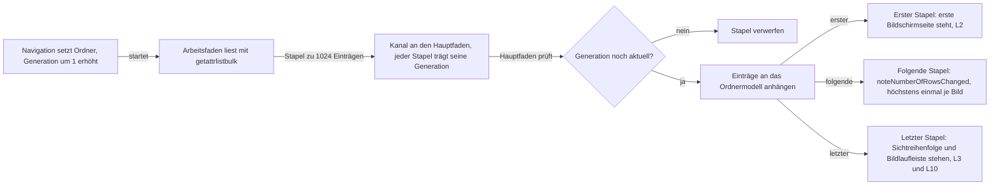
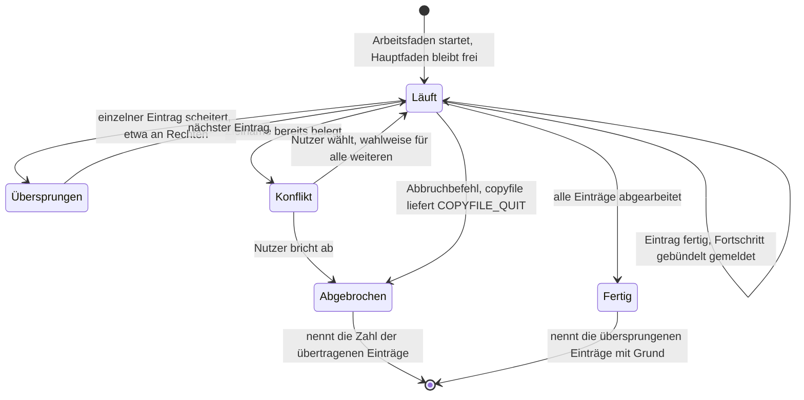
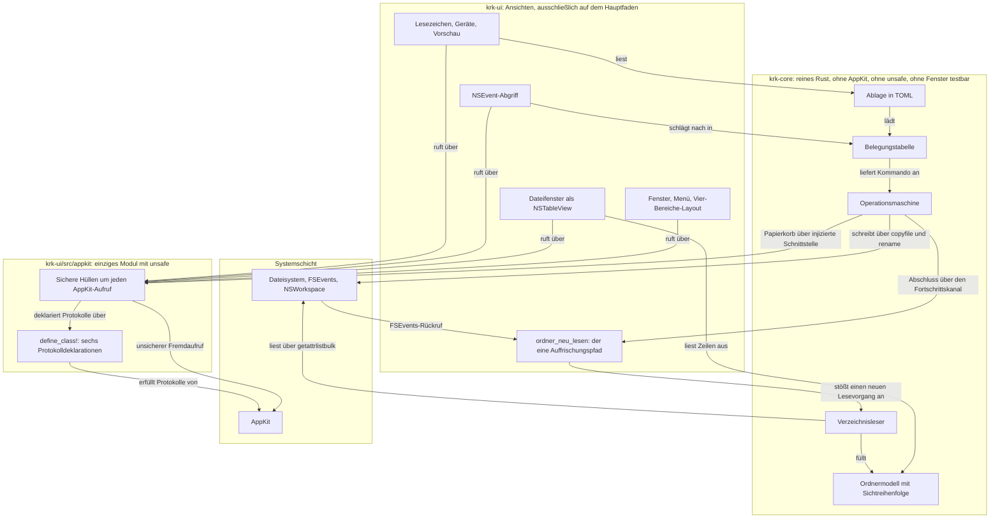
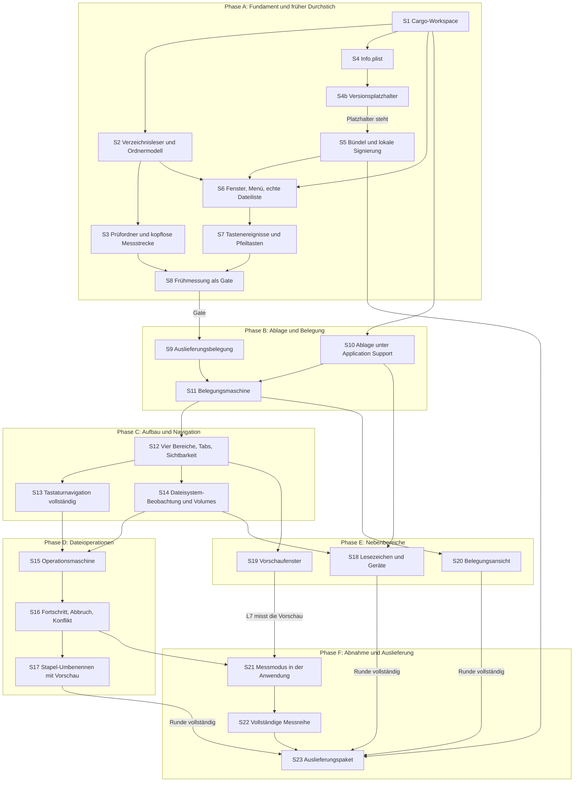

# Implementierungsplan: KRK Navigator-Gerüst (Runde 1)

**Datum:** 2026-08-02, 14:28; nachgezogen 2026-08-02, 15:01, 17:46 und 18:59, dann 2026-08-03, 12:00, zuletzt 2026-08-03, 12:08
**Status:** Entwurf, zur Abnahme
**Nachzug 15:01:** Die Konzeptprüfung `reviews/260802-1447-conceptrev-plan-navigator-geruest-runde-1.md` (Verdikt "acceptable") ist eingearbeitet: vier Kanten im Abhängigkeitsgraphen dazu, zwei Rückwege im Schichtungsgraphen dazu, S10 und S11 getauscht, Selbstprüfung nachgerechnet. Der Entwurf selbst ist unverändert. Dazu sind drei überholte Verweise auf den heutigen Stand gezogen, gemeldet in `issues/260802-1445_c_plan-nennt-die-c8-luecke-und-zwei-defekte-noch-als-offen.md`.
**Nachzug 17:46:** Zwei Auslassungen sind nachgetragen, der Entwurf bleibt auch hier unverändert. Erstens ist die Frage zu L4 seit dem 260802-1735 beantwortet, `decisions/260802-1428_a_was-l4-mit-wiederhergestellten-tabs-meint.md`: der Nutzer hat Möglichkeit 1 gewählt, sie gilt ausdrücklich auch für den Tabwechsel aus L5, und die Prüfsitzung aus zwei Dateifenstern mit je zwei Tabs steht als Messbedingung in C8. Die fünf Stellen, die den Punkt noch als offen führten, sind auf diesen Stand gezogen, und S3 erzeugt jetzt zwei Prüfordner zu je 10.000 Einträgen statt einen. Zweitens nennt S1 den Abschnitt `[alias]` der `.cargo/config.toml`, den er bisher überging, Defekt `issues/260802-1755_c_plan-legt-den-cargo-xtask-alias-in-keinem-schritt-an.md`.
**Nachzug 18:59:** Vier Befunde aus den Umsetzungen der Schritte 2 bis 4 sind eingearbeitet, der Entwurf bleibt unverändert. Erstens sind die Dateilisten aller Schritte einmal unter der Regel durchgegangen, dass ein Schritt auch die Datei anfassen muss, die sein neues Modul oder seine neue Abhängigkeit einbindet; 35 einbindende Dateien sind in S5 bis S23 ergänzt und die zwei bereits umgesetzten Nachträge in S2 und S3 eingetragen, Defekt `issues/260802-1900_c_dateilisten-der-planschritte-lassen-wiederholt-die-cargo-toml-aus.md`. Zweitens liest der Bedingungskopf die Bildwiederholrate jetzt in S21 aus `NSScreen` statt aus `system_profiler`, und die Kopfangaben von S3 sind auf die acht aus `### Frage 5` angeglichen, Defekt `issues/260802-1900_c_bildwiederholrate-am-referenzgeraet-nicht-per-system-profiler-erhebbar.md`. Drittens steht in `### Frage 5` und in S22, worauf L8 und L9 gemessen werden; die Datenmenge ist aus der Fortschrittsregel dieses Plans abgeleitet und brauchte keine Nutzerentscheidung, Defekt `issues/260802-1900_c_pruefordner-sind-duennbesetzt-und-taugen-nicht-fuer-die-kopiermessung.md`. Viertens führt die `Cargo.toml` die Version allein, der neue Schritt S4b setzt einen Platzhalter in die `Info.plist` und S5 ersetzt ihn beim Bündeln, Defekt `issues/260802-1835_c_versionsnummer-steht-an-zwei-stellen-ohne-abgleich.md`.
**Nachzug 260803-1200:** Zwei Meldungen aus den Umsetzungen der Schritte 2 und 5 sind eingearbeitet, der Entwurf bleibt unverändert. Erstens sagte `### Frage 7` zu, S5 **erzeuge** eine selbstsignierte Identität im Schlüsselbund, während die `Änderungen` desselben Schritts sie **suchen** und sonst abbrechen. Umgesetzt ist die zweite Lesart, inzwischen als dreistufige Suche über `KRK_SIGN_IDENTITY`, den Namen `KRK Entwicklung` und die genau eine gültige Identität; `### Frage 7` steht jetzt auf diesem Stand, und das Abnahmekriterium von S5 verlangt `codesign -dvv` statt `-dv`, weil erst zwei `v` die Zeile `Authority=` ausgeben. Defekt `issues/260802-1935_c_frage-7-und-schritt-5-widersprechen-sich-bei-der-signaturidentitaet.md`. Zweitens konnten die Abnahmekriterien von S2 und S15 nicht aufgehen: sie verlangten, `grep -rln 'unsafe' crates/krk-core/src` nenne genau eine Datei, aber die `lib.rs` trägt selbst die Zeile `#![deny(unsafe_code)]` und enthält damit die gesuchte Zeichenkette. Beide Kriterien prüfen jetzt auf das Attribut `#[allow(unsafe_code)]` am Zeilenanfang, also auf die eine Stelle, an der die Sperre geöffnet ist; die Freiheit des übrigen Kerns von `unsafe` erzwingt `deny(unsafe_code)` ohnehin maschinell über den Bau. Defekt `issues/260802-1810_c_abnahmekriterium-mit-grep-unsafe-kann-nicht-aufgehen.md`.
**Nachzug 260803-1208:** `krk-ui` trägt künftig `#![deny(unsafe_code)]` statt `#![warn(unsafe_code)]`, Nutzerentscheidung vom 260803, festgehalten in `decisions/260803-1208_a_unsafe-grenze-in-krk-ui-erzwungen-oder-beobachtet.md`. Eine Warnung bricht den Bau nicht ab; die Grenze zum Modul `appkit` wäre damit nur beobachtbar. Unter `deny` ist sie maschinell erzwungen, und die Zusage der Risikotabelle, `unsafe` sei "durchgesetzt über zwei Übersetzerregeln", stimmt für beide Kisten statt nur für `krk-core`. Nachgezogen sind der Absatz über die zwei Übersetzerregeln in `## Aufbau`, jetzt mit der Begründung der Wahl, die dort bisher fehlte, die Zeile zu `krk-ui` in der Verzeichnisstruktur, S1, S6 und die Risikotabelle. Das Abnahmekriterium von S6 prüft nun wie das von S2 und S15 auf das Attribut `#[allow(unsafe_code)]` am Zeilenanfang, womit auch der dritte Fund derselben unhaltbaren `grep`-Vorschrift behoben ist, Defekt `issues/260803-1200_c_abnahmekriterium-von-schritt-6-traegt-denselben-grep-fehler.md`. Der Codewechsel selbst steht aus und gehört zur Umsetzung von S6.
**Spec:** `circles/260802-0842-krk-mac-dateimanager-editor-git/planning/260802-1036_o_spec-navigator-geruest.md`
**Bindende Entscheidung zur Technologie:** `circles/260802-0842-krk-mac-dateimanager-editor-git/decisions/260802-1134_a_sprache-und-ui-werkzeugkasten.md`
**Ausführende Agenten:** `coder` und `ontocoder`

---

## Directive

Dieser Plan setzt die Fähigkeiten C1 bis C9 des Specs in 24 einzeln abnehmbare Schritte um (S1 bis S23, dazu S4b zwischen S4 und S5). Er beantwortet die sieben technischen Fragen aus `## Offen für den Planner` und legt damit erstmals eine Verzeichnisstruktur, ein Bauverfahren und eine Teststrategie für KRK fest.

Editor und Git-Anbindung bleiben draußen, ebenso alles unter `## Außerhalb des gesamten Circles`. Die Abgrenzung des Specs gilt unverändert.

## Ausgangslage

Das Projekt hat keinen Produktcode. Es gibt keine `Cargo.toml`, kein Bauskript, keine Tests und kein Bündel. Wiederzuverwenden ist nichts. Der Prüfcode unter `spikes/fn-tasten/` ist ausdrücklich Wegwerf-Code; aus ihm übernimmt der Plan ausschließlich die gemessenen Tastencodes 99 für F3, 96 für F5 und 100 für F8.

**Geprüfter Stand der Werkzeugkette** (Kommandos am 260802-1428 auf dem Referenzgerät ausgeführt):

| Werkzeug | Stand | Wie geprüft |
|---|---|---|
| Rust | rustc und cargo 1.97.1 | `~/.cargo/bin/rustc --version` |
| Ziele | `x86_64-apple-darwin`, `aarch64-apple-darwin` | `rustup target list --installed` |
| Pfad | über `. "$HOME/.cargo/env"` in `~/.zshrc`, Zeile 37 | `grep -n cargo ~/.zshrc` |
| Swift, clang | 6.1.2, clang 17 | `swift --version` |
| Xcode | **nicht installiert**, nur Command Line Tools | `xcode-select -p` liefert `/Library/Developer/CommandLineTools` |
| Betriebssystem | macOS 15.7.7, Build 24G720 | `sw_vers` |

Zwei Folgerungen daraus binden den Bauzuschnitt. Der Bau der Anwendung kommt vollständig ohne Xcode aus: `cargo`, `codesign`, `plutil` und `vtool` liegen alle in den Command Line Tools. Die Auslieferung kommt nicht ohne aus; welcher Schritt davon abhängt, steht in S23.

Der Rechner, auf dem diese Sitzung läuft, ist zugleich das Referenzgerät aus C8. Was hier gemessen wird, gilt unmittelbar für die Abnahme.

## Zwei Defekte am Circle-Datensatz, inzwischen geschlossen

`issues/260802-1417_c_directive-zeile-sagt-freie-funktionstasten-zu.md` und `issues/260802-1417_c_circle-datensatz-status-widerspricht-dem-marker.md` betrafen beide den Circle-Datensatz, nicht den Spec. Beide sind seit dem 260802-1423 geschlossen. Für die Tastenbelegung gilt unverändert C3 des Specs, weil C3 die Messung kennt und die Directive-Zeile sie nicht kannte.

---

## Antworten auf die sieben Fragen aus dem Spec

Der Abschnitt `## Offen für den Planner` stellt sieben Fragen. Sie sind der Kern dieses Plans, und die Schritte weiter unten sind ihre Umsetzung.

### Frage 1: Programmiersprache und UI-Werkzeugkasten

**Beantwortet, nicht von uns.** Der Nutzer hat am 260802-1150 Möglichkeit 3 gewählt: **Rust mit AppKit über `objc2`**, gegen die Empfehlung des Analysten und begründet damit, dass Editor und Git in diesem Circle als spätere Runden feststehen und der Rust-Vorteil damit innerhalb des Circles anfällt. Der Datensatz `260802-1134_a_sprache-und-ui-werkzeugkasten.md` ist bindend, dieser Plan setzt ihn um und stellt ihn nicht zur Diskussion.

Sechs Randbedingungen aus dem Abschnitt `## Constraints` desselben Datensatzes binden den Plan zusätzlich. Wo sie zuschlagen, ist hier vermerkt:

| Randbedingung | Wo sie im Plan zuschlägt |
|---|---|
| Die zehn Zeitzusagen gelten unverändert auf dem Gerät von 2018 | S3, S8, S12, S21, S22 |
| C3 verlangt Laufzeit-Umbelegung und Zugriff auf systemseitig belegte Tasten | S7, S9, S11, S20 |
| "supersimpel" wirkt als Ausschlussgrund | durchgängig, siehe `## Wie dieser Plan die Maxime "supersimpel" einlöst` |
| KRK wird außerhalb der App-Sandbox ausgeliefert | S4, S5, S23 |
| Mindest-Zielsystem macOS 15 | S1 (`MACOSX_DEPLOYMENT_TARGET`), S5 (Prüfung am Binärformat) |
| Die Fn-Annahme aus C3 ist vor der Implementierung zu prüfen | **erledigt**, siehe unten |

Die Fn-Annahme ist seit dem 260802-1137 gemessen. `spikes/fn-tasten/messung-A.txt` mit der korrigierten Auswertung in `messung-A-neuauswertung.txt` belegt für Fragen 1 und 4 des Prüfprogramms ein klares Ergebnis. Der Plan setzt darauf auf und misst nichts nach.

### Frage 2: Wie ein Verzeichnis gelesen, im Speicher gehalten und dargestellt wird, damit L2 und L10 zugleich halten

Diese Frage trägt die Runde, weil an ihr fünf der zehn Zusagen hängen. Die Antwort hat drei Teile.

**Gelesen wird mit `getattrlistbulk(2)`, nicht mit `readdir` plus `stat` je Eintrag.** Der Unterschied ist der Grund, aus dem L3 überhaupt erreichbar ist. Ein Verzeichniseintrag braucht Name, Größe, Änderungsdatum, Typ und die Kennzeichnung als versteckt; `readdir` liefert davon nur Name und einen groben Typ, jeder weitere Wert kostet einen eigenen Systemaufruf. Bei 100.000 Einträgen wären das 100.000 zusätzliche Aufrufe. `getattrlistbulk` liefert alle Attribute gebündelt für viele Einträge je Aufruf und ist seit macOS 10.10 verfügbar, also weit unter dem Mindest-Zielsystem.

`inference:` Wir erwarten den warmen Lesevorgang eines Ordners mit 10.000 Einträgen damit im niedrigen zweistelligen Millisekundenbereich und halten die 400 ms aus L3 für komfortabel erreichbar. Eine Messung an KRK gibt es nicht, weil KRK nicht existiert; genau deshalb steht die Messung als S8 früh im Plan und nicht am Ende.

**Gehalten wird in zwei getrennten Strukturen: den Einträgen und der Sichtreihenfolge.** Ein `Vec<Eintrag>` hält die gelesenen Daten in Lesereihenfolge und ändert sich nach dem Lesen nicht mehr. Daneben steht ein `Vec<u32>` mit Indizes, der die aktuelle Sortierung abbildet. Umsortieren heißt: die Indexliste neu ordnen, nicht die Einträge verschieben. Das hat zwei Wirkungen, die beide auf Zusagen zahlen. Das Umschalten der Sortierung aus C2 bewegt keine Nutzdaten, und die Auswahl des Nutzers bleibt über einen Sortierwechsel hinweg stabil, weil sie am Eintragsindex hängt und nicht an der Zeilennummer.

Der Sortierschlüssel für den Namen wird beim Lesen einmal je Eintrag berechnet und mitgeführt. Ein sprachsensitiver Vergleich bei jedem Sortierschritt wäre bei 100.000 Einträgen der teuerste Einzelposten der ganzen Zusage.

**Dargestellt wird gestückelt, mit einer Generationsnummer gegen veraltete Ergebnisse.** Der Lesevorgang läuft auf einem Arbeitsfaden und schickt Stapel zu je 1.024 Einträgen an den Hauptfaden. Der erste Stapel füllt die `NSTableView` und erfüllt L2, die weiteren hängen an. Die vollständige Sortierung und die endgültige Höhe der Bildlaufleiste stehen erst am Ende, was L3 genau so formuliert: L2 verlangt "erste Bildschirmseite sichtbar und bedienbar", L3 verlangt "vollständig gelesen, Sortierung steht". Der Spec modelliert das Zweistufige bereits, der Plan setzt es um.



Die Generationsnummer ist der Punkt, an dem dieser Entwurf eine ganze Klasse von Sonderfällen vermeidet. Wer schnell durch Ordner navigiert, hat mehrere Lesevorgänge gleichzeitig unterwegs. Ohne die Nummer bräuchte jeder davon eine eigene Abbruchbehandlung; mit ihr verwirft der Hauptfaden jeden Stapel, dessen Generation nicht mehr die aktuelle ist, und das ist eine Zeile.

Die `NSTableView` bekommt eine feste `rowHeight`. Eine Dateiliste hat gleich hohe Zeilen, damit entfällt die Höhenschätzung aus macOS 13 vollständig und die Höhenberechnung wird konstant statt linear.

### Frage 3: Wie KRK auf Änderungen reagiert, die eine andere Anwendung verursacht hat

**Über FSEvents, mit einem einzigen Auffrischungspfad für fremde und eigene Änderungen.** Ein `FSEventStream` beobachtet die Ordner, die gerade in einem der beiden Dateifenster sichtbar sind, mit einer Sammelverzögerung von 300 ms und ohne `kFSEventStreamCreateFlagFileEvents`: die Auflösung auf Verzeichnisebene genügt, weil KRK ohnehin den ganzen Ordner neu liest. Der Strom wird bei jeder Navigation neu aufgesetzt, es sind nie mehr als zwei Pfade zu beobachten.

Der Punkt, an dem dieser Entwurf gegen die naheliegende Alternative gewinnt: **das Auffrischen nach einer eigenen Dateioperation läuft über denselben Eintrittspunkt.** C4 verlangt "Nach jeder Operation zeigen beide Dateifenster den neuen Stand, ohne dass der Nutzer auffrischen muss". Der gemeldete Abschluss einer Dateioperation läuft in dieselbe Funktion `ordner_neu_lesen(pfad)`, die auch der FSEvents-Rückruf aufruft. Eine Funktion, zwei Auslöser. Beide Auslöser liegen in `krk-ui`: die Operationsmaschine in `krk-core` ruft nicht nach oben, sie meldet ihren Abschluss über denselben Fortschrittskanal, über den sie auch den Fortschritt meldet. Ein zweiter Auffrischungsweg für eigene Änderungen wäre die Sonderregel mit eigenem Rückfallweg, die die Maxime "supersimpel" ausschließt.

Eingehängte und ausgeworfene Datenträger sind ein anderer Mechanismus und bekommen einen eigenen: `NSWorkspace.notificationCenter` mit `didMountNotification`, `willUnmountNotification` und `didUnmountNotification`. Das bedient C5 (Datenträger erscheint und verschwindet in der Leiste) und C9 (ein Dateifenster auf einem ausgeworfenen Volume meldet den Verlust und wechselt auf einen erreichbaren Ordner). FSEvents beobachtet Ordnerinhalte, `NSWorkspace` beobachtet Datenträger; die beiden überschneiden sich nicht.

### Frage 4: Format und Ort für Tastenbelegung, Lesezeichen und Sitzungszustand

**Drei TOML-Dateien unter `~/Library/Application Support/KRK/`.**

| Datei | Inhalt | Schreibmuster |
|---|---|---|
| `keymap.toml` | die Belegung des Nutzers, nur die Abweichungen vom Auslieferungszustand nicht, sondern die vollständige Tabelle | beim Verlassen der Belegungsansicht |
| `bookmarks.toml` | Lesezeichen mit Name, Pfad und Reihenfolge | bei jeder Änderung |
| `session.toml` | Tabs je Fenster mit Ordner und Auswahl, Breiten, Sichtbarkeit, Sortierung | gebündelt, höchstens alle 2 s |

Jede Datei wird atomar geschrieben: in eine Nachbardatei schreiben, dann `rename`. Ein Absturz während des Schreibens hinterlässt damit die alte Datei, nicht eine halbe neue.

**Warum TOML und nicht `NSUserDefaults` oder eine Property-Liste.** Die Belegung muss der Nutzer lesen und von Hand ändern können, und `NSUserDefaults` legt sie in einer binären Property-Liste ab, die weder lesbar noch kommentierbar ist. TOML trägt Kommentare, was die Auslieferungsbelegung selbsterklärend macht, und `serde` mit `toml` liegt im Rust-Ökosystem ohne Umweg über eine C-Schnittstelle bereit. Ein Format für alle drei Dateien statt eines je Zweck ist der einfachere Zuschnitt.

**Die Auslieferungsbelegung liegt als eigene Datei vor und wird ins Binärprogramm eingebettet.** `resources/default-keymap.toml` wird über `include_str!` einkompiliert. Das macht das Abnahmekriterium "Ein Befehl setzt die gesamte Belegung auf den Auslieferungszustand zurück" zu einem einzigen Parse-Vorgang, und es macht die Belegung zu einem Datenartefakt, das der `ontocoder` schreibt und prüft, statt zu einer Liste im Programmtext.

**Zur Belegungsmaschine gehört eine Normalisierung, die aus der Messung folgt.** Vor jedem Nachschlag maskiert KRK die Modifikatoren auf `command`, `control`, `option` und `shift` und löscht dabei `function` und den Zehnerblock-Bits. Die Messung hat gezeigt, dass AppKit `function` bei jeder Taste aus dem Funktionstasten-Zeichenbereich setzt, auch bei den Pfeiltasten, und dass Fn+F3 und ein nacktes F3 dasselbe Ereignis erzeugen. Die Maskierung ist damit nicht eine Vorsichtsmaßnahme, sondern die unmittelbare Umsetzung des C3-Kriteriums "Der Nutzer kann fn nicht als Zusatztaste einer Belegung verwenden".

### Frage 5: Wie die Messungen aus C8 automatisiert und wiederholbar werden

**Zwei Messstrecken, weil die zehn Zusagen zwei verschiedene Dinge messen.** Fünf von ihnen sind reine Modellzeiten und brauchen kein Fenster; fünf hängen an der Oberfläche und brauchen die laufende Anwendung.

| Zusage | Was gemessen wird | Strecke | Schritt |
|---|---|---|---|
| L2, L3, L10 | Lesen und Sortieren im Ordnermodell | kopflos | S3 |
| L1, L6, L8, L9 | Tastendruck bis sichtbare Reaktion | in der Anwendung | S21 |
| L7 | Tastendruck bis die Vorschau steht | in der Anwendung, setzt das Vorschaufenster aus S19 voraus | S21, nach S19 |
| L5 | Tab- und Fensterwechsel bis zur bedienbaren ersten Bildschirmseite des Ziels | in der Anwendung, auf der Prüfsitzung aus C8 | S21 |
| L4 | Prozessstart bis zur bedienbaren Oberfläche, deren sichtbare Tabs ihre erste Bildschirmseite zeigen | in der Anwendung, von außen gestartet, auf der Prüfsitzung aus C8 | S21 |

**Die Prüfordner werden erzeugt, nicht gesammelt, und es sind drei.** `cargo run -p krk-bench -- fixture --eintraege 10000 --seed 1 --out <pfad>` legt einen flachen Ordner mit gemischten Dateitypen und Größen an. Der feste Startwert des Zufallsgenerators macht den Ordner reproduzierbar: derselbe Startwert erzeugt dieselbe Liste, auf jedem Gerät. C8 verlangt seit dem 260802-1735 drei solche Ordner: **A und B mit je 10.000 Einträgen an verschiedenen Pfaden** und einen mit 100.000 Einträgen für L10. Alle drei entstehen nach demselben Verfahren, A mit Startwert 1, B mit Startwert 2 und der große mit Startwert 3.

Der zweite 10.000er-Ordner ist keine Doppelung, sondern die Bedingung, unter der L4 überhaupt kalt gemessen wird. Die Prüfsitzung für L4 und L5 hat zwei Dateifenster, und zeigten beide auf denselben Ordner, läge dieser beim zweiten Lesevorgang bereits im Cache des Systems: der Kaltstart wäre zur Hälfte warm gemessen. Zwei verschiedene Pfade schließen das aus, und die verschiedenen Startwerte machen die beiden Ordner im Bericht unterscheidbar. L2 und L3 messen auf A, L4 und L5 auf A und B zusammen, L10 auf dem großen Ordner.

**Kalt heißt `purge`.** Den Dateisystem-Cache leert unter macOS allein `sudo purge`; einen Weg, ihn für ein einzelnes Verzeichnis zu leeren, gibt es nicht. Die Messstrecke ruft `purge` bei `--kalt` selbst auf und **bricht mit einer Meldung ab**, wenn sie die Rechte nicht hat, statt eine warme Zahl als kalte auszugeben.

**Jeder Bericht trägt seine Bedingungen.** Kopf jeder Messdatei, acht Angaben: Zeitpunkt, `sysctl -n hw.model`, `sw_vers`, Bildwiederholrate, Cache-Zustand, Zahl der Wiederholungen sowie Pfad und Startwert jedes verwendeten Prüfordners. Ausgewiesen wird das 95. Perzentil über zwanzig Wiederholungen, wie C8 es verlangt, und daneben Minimum und Median, damit ein Ausreißer erkennbar bleibt. Diese Disziplin übernimmt der Plan von der Fn-Messung, wo genau sie den Auswertungsfehler sichtbar gemacht hat.

**Die Bildwiederholrate kommt aus der laufenden Anwendung, nicht aus `system_profiler`.** Am Referenzgerät nennt `system_profiler SPDisplaysDataType` zum eingebauten Bildschirm des `MacBookPro15,1` keine Zeile `Refresh Rate`; der `coder` hat das bei der Umsetzung von S3 festgestellt, Defekt `issues/260802-1900_c_bildwiederholrate-am-referenzgeraet-nicht-per-system-profiler-erhebbar.md`. Ohne die Rate ist L1 nicht gegen seine eigene Herleitung prüfbar: 16 ms sind ein Bild bei 60 Hz und zwei bei 120 Hz. AppKit liefert die Zahl über `NSScreen.maximumFramesPerSecond`, erreichbar über `objc2-app-kit`, das der Workspace seit S1 führt. Erhoben wird sie deshalb dort, wo KRK läuft, also in S21.

Für die kopflose Strecke aus S3 bleibt es bei der ausgeschriebenen Lücke, und das ist die richtige Antwort statt eines nachgereichten Ersatzwegs: ohne Fenster gibt es keinen Bildschirm, dem eine Rate zuzuordnen wäre, und die kopflose Strecke misst mit L2, L3 und L10 ohnehin keine bildbezogene Zusage. Ein Kopf ohne Rate ist damit vollständig, solange er die Lücke benennt.

**Worauf L8 und L9 gemessen werden, und warum das ohne einen dichten Prüfordner geht.** Der Prüfordner-Erzeuger aus S3 legt dünnbesetzte Dateien an: nur die ersten 512 Byte je Datei sind echt geschrieben, der Rest ist ein Loch. Der Ordner mit 100.000 Einträgen nennt deshalb 197 GB Größe und belegt 342 MB Platte. Ob das die Kopiermessung entwertet, hängt daran, was L8 überhaupt zusagt, und C8 sagt es wörtlich: "Kopier- oder Verschiebevorgang: Fortschritt sichtbar, 200 ms nach Start". L8 ist eine Sichtbarkeitszusage und keine Durchsatzzusage. Ausgelöst wird die Sichtbarkeit nach der Regel aus `### Frage 6` von einem Zeitgeber nach 150 ms, nicht von einer übertragenen Datenmenge. Der Prüfbestand muss deshalb genau eine Eigenschaft haben: die Operation muss nach 150 ms noch laufen.

Das leisten die vorhandenen Prüfordner mit großem Abstand, und die Zahl dazu ist gemessen und nicht geschätzt. Auf dem Referenzgerät am 260802-1859 gemessen, mit 10.000 dünnbesetzten Einträgen als Quelle und dem Ziel auf demselben APFS-Datenträger: `cp -Rc` (derselbe Klonweg, den `copyfile` mit `COPYFILE_CLONE` nimmt) braucht 1,83 bis 1,95 s, `cp -R` ohne Klonen 4,44 bis 4,51 s. Beide Wege liegen mehr als das Zehnfache über der Auslöseschwelle von 150 ms, weil die Laufzeit an der Zahl der Einträge hängt und nicht an den Bytes. `inference:` KRKs eigener Weg mit `COPYFILE_ALL` kopiert zusätzlich erweiterte Attribute und liegt damit eher darüber als darunter; die gemessenen Zahlen sind eine Untergrenze. **L8 und L9 messen deshalb auf Prüfordner A, kopiert in ein Ziel auf demselben Datenträger, und es entsteht kein zweiter Prüfordner-Erzeuger mit einem Schalter für dichte Dateien.**

Die Löcher sind an einer anderen Stelle gefährlich, und dort schreibt der Plan eine Bedingung vor. Ein Ziel auf einem Datenträger, der keine Löcher hält, etwa ein exFAT-formatierter USB-Stick, zwingt `copyfile` dazu, die Löcher als Nullen auszuschreiben: aus 342 MB würden 197 GB. **Die Messstrecke nimmt für L8 und L9 deshalb nur ein Ziel auf demselben APFS-Datenträger wie die Quelle an und bricht sonst mit einer Meldung ab**, dieselbe Regel wie bei `--kalt` ohne Rechte. Der Bericht schreibt aus, dass L8 auf dem Klonweg gemessen ist; das ist zugleich der Alltagsfall eines Dateimanagers auf einem Mac mit einer internen SSD, und eine Messung über eine Datenträgergrenze hinweg würde die Geschwindigkeit des fremden Mediums ausweisen und nicht die von KRK.

**Zur Ehrlichkeit der L1-Messung.** Aus dem eigenen Prozess heraus lässt sich nicht messen, wann ein Bild auf dem Bildschirm steht. Gemessen wird deshalb die Spanne vom Zeitstempel des `NSEvent` bis zum Ende des Zeichendurchgangs, der die geänderten Zeilen enthält, festgestellt über einen `CADisplayLink`. Das ist die erreichbare Näherung an L1s Formulierung "bis die Auswahl sichtbar umspringt", und der Bericht schreibt sie als solche aus, statt eine Photonenmessung zu behaupten.

### Frage 6: Nebenläufige, abbrechbare Dateioperationen ohne Verletzung von L1 und L9

**Der Hauptfaden führt keine Dateisystem-Arbeit aus. Kein Sonderfall, keine Ausnahme.** Jede Operation läuft auf einem eigenen Arbeitsfaden, der über einen Kanal gebündelte Fortschrittsmeldungen an den Hauptfaden schickt, höchstens eine je Bild. Damit hält L9 ("keine Eingabe wartet länger als 16 ms während einer Stapeloperation") strukturell und nicht durch Sorgfalt.

**Kopieren, Fortschritt und Abbruch sind ein Mechanismus, nicht drei.** `copyfile(3)` mit `COPYFILE_ALL | COPYFILE_CLONE` und einem Statusrückruf über `copyfile_state_t` liefert alle vier Eigenschaften, die C4 braucht: es überträgt Metadaten und erweiterte Attribute, es klont auf APFS innerhalb desselben Datenträgers statt zu kopieren, es meldet den Fortschritt auch innerhalb einer einzelnen großen Datei, und sein Rückruf kann `COPYFILE_QUIT` zurückgeben, was den Abbruch mitten in einer großen Datei möglich macht. Ein selbstgebauter Kopierweg mit eigener Blockschleife müsste alle vier Eigenschaften nachbauen.

Verschieben innerhalb desselben Datenträgers ist `rename(2)` und damit sofort fertig. Über Datenträgergrenzen hinweg fällt es auf Kopieren mit anschließendem Löschen zurück, was kein Rückfallweg im Sinne der Maxime ist, sondern die einzige Art, wie ein Verschieben zwischen Datenträgern überhaupt geht.

Der Papierkorb ist `NSFileManager.trashItemAtURL:resultingItemURL:error:`. Damit erfüllt sich das C4-Kriterium "Zu einer über Delete gelöschten Auswahl gibt es einen Rückweg über den Papierkorb des Systems. Einen eigenen Rückgängig-Speicher führt KRK nicht" ohne eigenen Code.

**Zum Fortschrittsfenster: eine Regel statt zweier.** C4 verlangt einen Fortschritt ab 100 Einträgen oder 100 MB, L8 verlangt ihn 200 ms nach Start sichtbar. Den Umfang eines Ordnerbaums vorher zu bestimmen kostet einen eigenen Durchlauf, der die 200 ms selbst aufbrauchen kann. Der Plan setzt deshalb eine Regel: **das Fortschrittsfenster erscheint, sobald die Operation 150 ms gelaufen ist.** Eine kleine Kopie ist vorher fertig und lässt kein Fenster aufblitzen, eine Operation über 100 Einträge oder 100 MB ist nach 150 ms nachweislich noch nicht fertig, und L8 hält mit 50 ms Reserve. Die Schwellenwerte aus C4 bleiben die richtige Beschreibung für den Nutzer; sie sind nur nicht die Bedingung im Code.



Der Zustand `Uebersprungen` bildet die C4-Festlegung ab, dass eine gescheiterte Einzelposition den Stapel nicht abbricht. Er sammelt Eintrag und Grund und gibt beides am Ende aus.

### Frage 7: Signierung und Systemfreigaben

**KRK läuft außerhalb der App-Sandbox, wird als Bündel von Hand gebaut und lokal signiert.**

Der Zugriff auf die von macOS geschützten Ordner läuft über TCC, den Systemmechanismus für Transparenz, Zustimmung und Kontrolle. TCC greift am signierten Anwendungsbündel an, und daraus folgen drei Dinge, die den Plan binden.

Erstens: **ein nacktes Binärprogramm aus dem Terminal taugt nicht zur Abnahme.** Es erbt die Freigaben des Terminals und löst keine eigene Rückfrage aus. Jedes Abnahmekriterium, das an einem TCC-Dialog hängt, wird am Bündel geprüft. Deshalb steht der Bündelbau als S5 vor dem ersten Fenster und nicht am Ende.

Zweitens: **die Signaturidentität muss über Bauläufe stabil sein.** Eine Ad-hoc-Signatur mit `codesign -s -` ändert ihren Hash bei jedem Bau, und TCC hält jeden Bau für eine andere Anwendung. Der Nutzer bekäme bei jedem Lauf dieselbe Rückfrage erneut. Für die Entwicklung verwendet S5 deshalb eine lokale, selbstsignierte Code-Signing-Identität, und zwar durchgängig dieselbe.

**S5 erzeugt diese Identität nicht, sondern sucht sie in drei Stufen.** Zuerst zählt die Umgebungsvariable `KRK_SIGN_IDENTITY`, sofern sie einen nichtleeren Wert trägt. Greift sie nicht, sucht der Bau eine Identität namens `KRK Entwicklung` im Schlüsselbund, abgefragt über `security find-identity -p codesigning` ohne `-v`: eine selbstsignierte Identität ohne gesetzte Vertrauenseinstellung gilt als nicht vertrauenswürdig, `-v` würde sie aussortieren, und signieren kann sie trotzdem. Bleibt auch das ohne Treffer, nimmt der Bau die einzige gültige Identität aus `security find-identity -v -p codesigning`, und nur dann, wenn es genau eine gibt. Bei null und bei mehr als einer wäre die Wahl geraten. Greift keine der drei Stufen, **bricht `cargo xtask bundle` mit einer Anleitung ab und baut kein Bündel**; ein stillschweigendes Ausweichen auf die Ad-hoc-Signatur gibt es nicht.

Dass der Bau sucht statt anzulegen, ist eine Zuständigkeitsgrenze und keine Auslassung. Ein Bauwerkzeug, das ungefragt Schlüsselmaterial in den Anmeldeschlüsselbund schreibt, geht über seine Aufgabe hinaus, und der Nutzer soll wissen, dass auf seinem Gerät ein Signierschlüssel entsteht. Die Anleitung dazu steht in `README.md`, Abschnitt "Entwicklungsidentität anlegen", mit einem Weg über den Zertifikatsassistenten der Schlüsselbundverwaltung und einem über die Kommandozeile. Für die Auslieferung braucht es eine Developer-ID-Identität, siehe S23.

Drittens: **die Rückfragetexte stehen im `Info.plist` und sind Datenartefakte.** Fünf Schlüssel deckt KRK ab: `NSDesktopFolderUsageDescription`, `NSDocumentsFolderUsageDescription`, `NSDownloadsFolderUsageDescription`, `NSRemovableVolumesUsageDescription` und `NSNetworkVolumesUsageDescription`. Der letzte ist nötig, weil C9 die vom Finder eingehängten Volumes unter `/Volumes` einschließt. C4 verlangt, dass KRK "in einem Satz erklärt, wozu" die Freigabe gebraucht wird; genau das sind diese fünf Texte, und sie sind deutsch.

Eine Freigabe für Bedienungshilfen braucht KRK **nicht**. Die Fn-Messung hat belegt, dass ein lokaler Ereignisabgriff einer gewöhnlichen Anwendung im Vordergrund für die Funktionstasten ausreicht. Ein Vollzugriff auf die Festplatte ist ebenfalls nicht nötig; die Rückfragen je Ordner genügen.

---

## Aufbau



**Zwei Kanten laufen gegen die Schichtung, und beide sind gewollt.** Der Graph zeichnet Aufrufe, und drei Viertel davon laufen von oben nach unten. Genau zwei tun es nicht, und sie sind die einzigen Stellen, an denen der Entwurf die Grenze in die andere Richtung überschreitet.

Die erste ist der Auffrischungspfad aus Frage 3. Der Knoten `ordner_neu_lesen` hat zwei Auslöser, den FSEvents-Rückruf und den gemeldeten Abschluss einer Dateioperation, und stößt seinerseits einen neuen Lesevorgang an. Damit trägt der Graph einen Zyklus: `Verzeichnisleser` liest über das Dateisystem, das Dateisystem meldet die Änderung an `ordner_neu_lesen`, und der liest neu. Dieser Zyklus ist die Sache selbst und kein Entwurfsfehler; ein Dateimanager, der fremde Änderungen anzeigt, hat notwendig eine Rückrichtung aus dem Dateisystem. Der Spec zeichnet dieselbe Schleife und hat sie in der Prüfung vom 260802-1118 als gewollt bestätigt bekommen. Von einer Modulkopplung im Sinne von `HYG-NO-CYCLES` unterscheidet ihn, dass er über das Betriebssystem läuft und nicht über eine gegenseitige Kistenabhängigkeit: `krk-core` kennt `krk-ui` nicht, weder im Zyklus noch außerhalb.

Die zweite ist die Papierkorb-Schnittstelle aus S15. `NSFileManager.trashItemAtURL:` liegt in `krk-ui/src/appkit/`, weil es ein AppKit-Aufruf ist; die Operationsmaschine in `krk-core` ruft es über eine Schnittstelle, die ihr injiziert wird. Der Aufruf läuft damit von unten nach oben, die Übersetzungsabhängigkeit weiterhin von oben nach unten. Das ist die einzige Abhängigkeitsumkehr des Entwurfs, und sie steht im Graphen, statt hinter der Zeichenrichtung zu verschwinden. Sie erzeugt keinen Zyklus, weil `Sichere Hüllen um jeden AppKit-Aufruf` keinen Weg zurück in den Kern hat.

Der hohe Eingangsgrad des Knotens `Sichere Hüllen um jeden AppKit-Aufruf` ist die eigentliche Aussage des Graphen und keine Nachlässigkeit. Der Technologieentscheid bringt drei dauerhafte Kosten mit, die die Analyse benennt: es gibt keinen Oberflächenbau, jedes Objective-C-Protokoll ist von Hand zu deklarieren, und jeder AppKit-Aufruf ist ein unsicherer Fremdaufruf. Die dritte dieser Kosten wird an genau einer Stelle bezahlt: `krk-core` kennt AppKit nicht, damit ist der ganze Kern ohne Fenster testbar, und `unsafe` an AppKit steht ausschließlich unter `crates/krk-ui/src/appkit/`.

Durchgesetzt wird die Grenze über zwei Übersetzerregeln, und beide lauten `deny`, nicht `warn` und nicht `forbid`. `krk-ui` trägt `#![deny(unsafe_code)]`, und allein das Modul `appkit` trägt `#[allow(unsafe_code)]`; weil Lint-Regeln in die eingebetteten Module durchschlagen, deckt die eine Ausnahme am Kopf von `appkit/mod.rs` den ganzen Teilbaum ab, und keine der Dateien darunter braucht sie ein zweites Mal. `krk-core` trägt dieselbe Regel, und allein das Modul `verzeichnis::sys` trägt die Ausnahme.

Beide Wahlen sind entschieden, nicht gesetzt. `deny` statt `warn` in `krk-ui`, entschieden am 260803, `decisions/260803-1208_a_unsafe-grenze-in-krk-ui-erzwungen-oder-beobachtet.md`: eine Warnung bricht den Bau nicht ab, sie meldet nur, und ob die Meldung jemanden erreicht, hängt daran, ob jemand das Bauprotokoll liest. Unter `deny` scheitert der Bau, sobald ein `unsafe`-Block außerhalb von `src/appkit/` entsteht, und die Zusage der Risikotabelle weiter unten hat einen maschinellen Träger statt eines beobachtenden. Der Preis ist ein abgebrochener Bau an dem Tag, an dem ein AppKit-Aufruf außerhalb des Moduls gebraucht wird; genau dieser Widerstand ist gewollt.

`deny` statt `forbid` in beiden Kisten: die Regel muss sich öffnen lassen. In `krk-ui` an `appkit`, in `krk-core` an zwei Systemaufrufen, die es in Rust nur als Fremdaufruf gibt, `getattrlistbulk` für das Lesen und `copyfile` für das Kopieren. `forbid` ließe sich an diesen Stellen nicht öffnen, das ist gerade sein Zweck, und die Regel wäre dann entweder falsch oder der unsichere Anteil müsste in eine eigene Kiste ausgelagert werden. Eine zusätzliche Kiste für einen Anteil, der ohnehin schon in einem eigenen Modul liegt, wäre die teurere Antwort auf dieselbe Frage, und zwar in beiden Fällen. `krk-core` ist damit AppKit-frei und trägt genau ein Modul mit `unsafe`, nicht null.

**Verzeichnisstruktur**, von S1 angelegt:

```
krk/
├── Cargo.toml                    # Workspace
├── rust-toolchain.toml           # 1.97.1 festgeschrieben
├── .cargo/config.toml            # MACOSX_DEPLOYMENT_TARGET=15.0
├── crates/
│   ├── krk-core/                 # deny(unsafe_code), kein AppKit; unsafe nur in verzeichnis::sys
│   ├── krk-ui/                   # deny(unsafe_code), Binaerziel; src/appkit/ ist das einzige unsafe
│   └── krk-bench/                # Prüfordner-Erzeuger und kopflose Messstrecke
├── xtask/                        # bundle, sign, messen, release
├── resources/
│   ├── Info.plist                # ontocoder
│   └── default-keymap.toml       # ontocoder
└── messungen/                    # Messberichte, versioniert
```

### Wo die Kosten des Technologieentscheids anfallen

Sechs Objective-C-Protokolle sind über `define_class!` von Hand zu deklarieren. Der Plan zieht fünf davon in die Phase A, damit sie sichtbar werden, bevor viel darauf gebaut ist:

| Protokoll | Wofür | Schritt |
|---|---|---|
| `NSApplicationDelegate` | Start, Beenden, Fensterverwaltung | S6 |
| `NSWindowDelegate` | Schließen, Größenänderung | S6 |
| `NSTableViewDataSource` | Zeilenzahl und Zellinhalt der Dateifenster | S6 |
| `NSTableViewDelegate` | Auswahl, Zeilenansicht, feste Zeilenhöhe | S6 |
| `NSSplitViewDelegate` | Mindestbreiten der vier Bereiche | S12 |
| Eigene `NSView` mit `keyDown` | Tastenereignisse im Dateifenster | S7 |

Die Schritte S6 und S7 sind zusammen der **frühe Durchstich**: nach ihnen ist bewiesen, dass `define_class!` für einen Delegierten und für eine Datenquelle trägt, dass die Übergabe an den Hauptfaden über `MainThreadMarker` funktioniert und dass der `NSEvent`-Abgriff die gemessenen Tastencodes liefert. Vier von fünf offenen Fragen zur Machbarkeit sind damit beantwortet, bevor die restlichen sechzehn Schritte darauf aufsetzen. Die fünfte, ob die Zeitzusagen halten, beantwortet S8.

`inference:` Die `define_class!`-Deklarationen folgen dem Muster aus dem Beispiel `examples/app/hello_world_app.rs` im objc2-Projekt, mit `#[unsafe(super = NSObject)]` und `#[thread_kind = MainThreadOnly]`. Der `ontocoder` ist an dieser Stelle nicht beteiligt; das sind Rust-Quellen.

---

## Implementierungsschritte

Jeder Schritt nennt seine Dateien und ein Abnahmekriterium, das an einem Diff oder an einem Kommando prüfbar ist.

**Die Dateiliste nennt auch die einbindende Datei, nicht nur die neu entstehende.** Ein Schritt, der ein neues Modul oder eine neue Abhängigkeit in Betrieb nimmt, muss die Datei anfassen, die es einbindet: die `lib.rs` oder `main.rs` für ein Modul der obersten Ebene, die `mod.rs` für ein Untermodul, die `Cargo.toml` des Mitglieds für eine Abhängigkeit, dazu die `Cargo.toml` des Workspace, weil dieses Projekt die Versionsangaben in `[workspace.dependencies]` führt und das Mitglied nur `workspace = true` nennt. Drei aufeinanderfolgende Umsetzungen haben denselben Mangel gemeldet, jedes Mal mit genau einer möglichen Auflösung; der Defekt `issues/260802-1900_c_dateilisten-der-planschritte-lassen-wiederholt-die-cargo-toml-aus.md` hält das Muster fest. Die Listen unten sind am 260802-1859 einmal vollständig unter dieser Regel durchgegangen, und die einbindenden Einträge tragen den Vermerk `(einbindend)` samt der Zeile, um die es geht. Der Vermerk steht dort für den nächsten Leser: er trennt die Datei, die neu entsteht, von der, die sie sichtbar macht.



**Die Nummernfolge ist eine gültige Ausführungsreihenfolge.** Jede der 34 Kanten läuft von der kleineren zur größeren Nummer, wobei S4b zwischen S4 und S5 einsortiert. Wer die 24 Schritte der Reihe nach abarbeitet, trifft keinen Schritt vor seiner Voraussetzung. Dafür stehen die Ablage unter Application Support und die Belegungsmaschine in dieser Reihenfolge in Phase B: die Belegungsmaschine liest die Nutzerbelegung über die Ablage, also kommt die Ablage zuerst.

**Vier Kanten führen die Phase F an die Runde heran, und sie tun zwei verschiedene Dinge.** Die Kante von S19 auf S21 ist eine technische Voraussetzung: S21 misst L7, die Vorschau-Zusage, und die Vorschau baut S19. Ohne diese Kante ließe sich der Messmodus abnehmen, während eine der sechs gemessenen Zusagen an einer Ansicht hängt, die es noch nicht gibt. Die drei Kanten von S17, S18 und S20 auf S23 sind etwas anderes: keine dieser drei Fähigkeiten wird gemessen, aber alle drei gehören zum Umfang der Runde. Die Kanten sagen, dass ein Auslieferungspaket erst entsteht, wenn C4 mit dem Stapel-Umbenennen, C5 mit der Lesezeichen- und Geräteleiste und die Belegungsansicht aus C3 fertig sind. Eine vierte Kante von S19 auf S23 wäre überflüssig, weil S19 über S21 und S22 ohnehin vor S23 liegt; sie stünde nur doppelt im Graphen.

---

### Phase A: Fundament und früher Durchstich

#### 1. [DONE] **Cargo-Workspace und Bauzuschnitt**

- Ausführender: `coder`
- Dateien: `Cargo.toml`, `rust-toolchain.toml`, `.cargo/config.toml`, `.gitignore`, `rustfmt.toml`, `crates/krk-core/{Cargo.toml,src/lib.rs}`, `crates/krk-ui/{Cargo.toml,src/main.rs}`, `crates/krk-bench/{Cargo.toml,src/main.rs}`, `xtask/{Cargo.toml,src/main.rs}`
- Änderungen: Workspace mit vier Mitgliedern anlegen. `rust-toolchain.toml` schreibt 1.97.1 fest. `.cargo/config.toml` trägt zwei Abschnitte: `[env]` setzt `MACOSX_DEPLOYMENT_TARGET = "15.0"`, und `[alias]` setzt `xtask = "run --package xtask --"`. Der Alias macht das Bauwerkzeug unter dem Namen erreichbar, mit dem S5, S21 und S23 abnehmen; `cargo xtask` ist kein eingebautes Cargo-Kommando, sondern genau dieser Eintrag. `krk-core/src/lib.rs` beginnt mit `#![deny(unsafe_code)]`, nicht mit `forbid`, weil das spätere Modul `verzeichnis::sys` die beiden Systemaufrufe `getattrlistbulk` und `copyfile` binden muss und dafür `#[allow(unsafe_code)]` trägt. `krk-ui/src/main.rs` beginnt mit derselben Regel `#![deny(unsafe_code)]`; das spätere Modul `appkit` trägt `#[allow(unsafe_code)]`. **Zum Stand der `krk-ui`-Regel:** umgesetzt wurde S1 mit `#![warn(unsafe_code)]`. Der Nutzer hat am 260803 auf `deny` entschieden, `decisions/260803-1208_a_unsafe-grenze-in-krk-ui-erzwungen-oder-beobachtet.md`, und die Umstellung der einen Zeile gehört zur Umsetzung von S6, weil `deny` ohne das Modul `appkit` mit seiner Ausnahme nichts zu erlauben hat. Der Plantext steht deshalb auf dem entschiedenen Stand und der Commit zu S1 auf dem vorherigen; die Abweichung ist gewollt und kein Fehler. Abhängigkeiten: `objc2`, `objc2-app-kit`, `objc2-foundation` in `krk-ui`; `serde` und `toml` in `krk-core`. `krk-ui` und `krk-bench` sind zunächst leere Rümpfe.
- Abhängigkeiten: keine
- Abnahmekriterium: `cargo build --workspace`, `cargo build --workspace --target x86_64-apple-darwin`, `cargo build --workspace --target aarch64-apple-darwin` und `cargo test --workspace` beenden jeweils mit Rückgabewert 0. Der Diff zeigt `#![deny(unsafe_code)]` in `krk-core/src/lib.rs` und in `krk-ui/src/main.rs` sowie `MACOSX_DEPLOYMENT_TARGET = "15.0"` und den Alias `xtask` in `.cargo/config.toml`. Die Zeile in `krk-ui/src/main.rs` stand beim Abnehmen von S1 noch auf `#![warn(unsafe_code)]` und kommt mit S6 auf `deny`, aus dem Grund, den die `Änderungen` oben nennen. `cargo xtask` beendet mit Rückgabewert 0 und ruft das Bauwerkzeug auf, nicht den Cargo-Fehler über ein unbekanntes Kommando.

#### 2. [DONE] **Verzeichnisleser und Ordnermodell**

- Ausführender: `coder`
- Dateien: `crates/krk-core/src/verzeichnis/{mod.rs,sys.rs,leser.rs,eintrag.rs,modell.rs,sortierung.rs}`, `crates/krk-core/tests/verzeichnis.rs`, `crates/krk-core/src/lib.rs` (einbindend: `pub mod verzeichnis;`)
- Änderungen: `Eintrag` mit Name, Sortierschlüssel, Größe, Änderungsdatum, Typ und den Kennzeichen Ordner, versteckt, symbolische Verknüpfung. Leser auf Basis von `getattrlistbulk(2)`, der Stapel zu 1.024 Einträgen über einen `std::sync::mpsc`-Kanal liefert, eine Generationsnummer mitführt und über ein `AtomicBool` abbrechbar ist. `Ordnermodell` hält `Vec<Eintrag>` plus `Vec<u32>` als Sichtreihenfolge. Sortierung nach Name, Größe, Änderungsdatum und Typ, jeweils auf- und absteigend, Ordner vor Dateien, Vorbelegung Name aufsteigend. Filter für versteckte Dateien.
- Abhängigkeiten: S1
- Abnahmekriterium: `cargo test -p krk-core` beendet mit 0 und deckt ab: der Leser eines erzeugten Ordners mit 5.000 Einträgen liefert 5.000 Einträge in mindestens 5 Stapeln; alle acht Sortierungen liefern die erwartete Reihenfolge; Ordner stehen vor Dateien; der Filter blendet Namen mit führendem Punkt aus; ein mitten im Lauf abgebrochener Leser liefert einen Teilbestand und meldet den Abbruch. `grep -rEln '^[[:space:]]*#!?\[allow\(unsafe_code\)\]' crates/krk-core/src` nennt genau eine Datei, `verzeichnis/sys.rs`. Zusammen mit dem erfolgreichen `cargo build -p krk-core` ist die Zusage damit vollständig belegt: `#![deny(unsafe_code)]` aus S1 lässt den Bau scheitern, sobald `unsafe` außerhalb einer Datei mit dieser Ausnahme steht, und der grep zeigt, dass es die Ausnahme genau einmal gibt.

#### 3. [DONE] **Prüfordner-Erzeuger und kopflose Messstrecke**

- Ausführender: `coder`
- Dateien: `crates/krk-bench/src/{main.rs,fixture.rs,messen.rs,bericht.rs}`, `messungen/.gitkeep`, `crates/krk-bench/Cargo.toml` (einbindend: `krk-core = { path = "../krk-core" }`)
- Änderungen: Unterbefehl `fixture --eintraege N --seed S --out PFAD` erzeugt einen flachen Ordner mit gemischten Dateitypen und Größen, deterministisch aus dem Startwert. **Die Abnahme braucht drei solche Ordner, nicht einen:** A und B mit je 10.000 Einträgen an verschiedenen Pfaden für L2, L3, L4 und L5, dazu einen mit 100.000 Einträgen für L10. Der Unterbefehl erzeugt einen Ordner je Aufruf, der Startwert unterscheidet sie (A mit 1, B mit 2, der große mit 3); ein eigener Mehrfachmodus entsteht nicht. Die Messbedingungen in C8 verlangen die beiden 10.000er-Ordner seit dem 260802-1735, weil die Prüfsitzung für L4 zwei Dateifenster hat und ein gemeinsamer Ordner beim zweiten Lesevorgang aus dem Cache des Systems käme. Unterbefehl `messen --kopflos --ordner PFAD [--kalt]` misst zwanzigmal das Lesen bis zum ersten Stapel (Anteil an L2), das vollständige Lesen samt Sortierung (L3, L10) und schreibt einen Bericht mit 95. Perzentil, Median und Minimum. `--kalt` ruft `purge` und bricht mit einer Meldung ab, wenn der Aufruf nicht gelingt. Der Berichtskopf trägt die acht Angaben aus `### Frage 5`: Zeitpunkt, `hw.model`, `sw_vers`, Bildwiederholrate, Cache-Zustand, Wiederholungszahl, Pfad und Startwert des Prüfordners. Die Bildwiederholrate kann diese Strecke nicht erheben, weil sie ohne Fenster läuft und `system_profiler` sie am Referenzgerät nicht meldet; der Kopf schreibt die Lücke als solche aus und erfindet keine Zahl. Erhoben wird die Rate in S21 aus `NSScreen`.
- Abhängigkeiten: S2
- Abnahmekriterium: zweimaliger Aufruf von `fixture --eintraege 10000 --seed 1` in zwei verschiedene Zielordner liefert identische Namens- und Größenlisten, prüfbar über `ls -la <ordner> | shasum`. Dasselbe mit `--eintraege 100000`. Ein Aufruf mit `--seed 2` liefert bei gleicher Eintragszahl eine andere Liste als der mit `--seed 1`, womit die Prüfordner A und B unterscheidbar sind. `messen --kopflos` schreibt eine Datei unter `messungen/`, deren Kopf die acht genannten Angaben trägt, die Bildwiederholrate darunter als ausgeschriebene Lücke, und deren Zahlenteil je Messgröße das 95. Perzentil über zwanzig Läufe nennt. `messen --kalt` ohne Rechte bricht mit Rückgabewert ungleich 0 ab und gibt keine Zahl aus.

#### 4. [DONE] **Bündelbeschreibung `Info.plist`**

- Ausführender: `ontocoder`
- Dateien: `resources/Info.plist`
- Änderungen: Property-Liste im XML-Format mit `CFBundleIdentifier` (`org.stalmann.krk`), `CFBundleName`, `CFBundleExecutable`, `CFBundlePackageType` (`APPL`), `CFBundleShortVersionString`, `CFBundleVersion`, `LSMinimumSystemVersion` (`15.0`), `NSHighResolutionCapable` (`true`), `NSPrincipalClass` (`NSApplication`), `LSApplicationCategoryType` (`public.app-category.utilities`). Dazu die fünf TCC-Rückfragetexte auf Deutsch: `NSDesktopFolderUsageDescription`, `NSDocumentsFolderUsageDescription`, `NSDownloadsFolderUsageDescription`, `NSRemovableVolumesUsageDescription`, `NSNetworkVolumesUsageDescription`. Jeder Text ist ein Satz und nennt den Zweck, wie C4 es verlangt.
- Abhängigkeiten: S1
- Abnahmekriterium: `plutil -lint resources/Info.plist` beendet mit 0. `plutil -extract NSDesktopFolderUsageDescription raw resources/Info.plist` und die vier weiteren Schlüssel liefern je einen nichtleeren deutschen Satz. `plutil -extract LSMinimumSystemVersion raw resources/Info.plist` liefert `15.0`.

#### 4b. [DONE] **Versionsplatzhalter in der `Info.plist`**

- Ausführender: `ontocoder`
- Dateien: `resources/Info.plist`
- Änderungen: den Wert von `CFBundleShortVersionString` von `0.1.0` auf den Platzhalter `__KRK_VERSION__` setzen und den Kommentar an dieser Stelle ersetzen: die Version wohnt ab jetzt allein in `[workspace.package]` der `Cargo.toml`, und `cargo xtask bundle` setzt sie beim Kopieren ein. `CFBundleVersion` bleibt unberührt bei `1`; es ist die Baunummer, steht nirgends ein zweites Mal und gehört damit nicht zu dieser Doppelung. Kein weiterer Schlüssel ändert sich.
- Abhängigkeiten: S4
- Abnahmekriterium: `plutil -lint resources/Info.plist` beendet mit 0. `plutil -extract CFBundleShortVersionString raw resources/Info.plist` liefert `__KRK_VERSION__`. `grep -q '0\.1\.0' resources/Info.plist` findet nichts mehr, weder im Wert noch im Kommentar; damit steht keine Versionsnummer mehr in der Datei. Die fünf TCC-Texte und die übrigen Schlüssel sind im Diff unverändert.
- **Warum das ein eigener Schritt ist.** Der Defekt `issues/260802-1835_c_versionsnummer-steht-an-zwei-stellen-ohne-abgleich.md` wird an zwei Dateien behoben, einer Datendatei und einem Bauwerkzeug. Die Zuschnittregel dieses Plans erlaubt keinen Schritt mit zwei Ausführenden, also steht die Datenänderung hier und die Ersetzung in S5. Die Reihenfolge ist bindend: ein S5, das vor S4b läuft, findet keinen Platzhalter und bricht ab, wie es soll.

#### 5. [DONE] **Bündelbau, Versionsersetzung und lokale Signierung**

- Ausführender: `coder`
- Dateien: `xtask/src/{bundle.rs,sign.rs}`, `xtask/src/main.rs` (einbindend: `mod bundle; mod sign;` und die Unterbefehlsauswahl), `README.md`
- Änderungen: `cargo xtask bundle` legt `target/KRK.app/Contents/{MacOS,Resources}` an, kopiert das Binärprogramm, kopiert `resources/Info.plist` mit eingesetzter Version (siehe unten), schreibt `PkgInfo`, und ruft `codesign` mit der Identität aus der dreistufigen Suche, die `### Frage 7` beschreibt: die Umgebungsvariable `KRK_SIGN_IDENTITY`, sonst der Name `KRK Entwicklung` im Schlüsselbund, sonst die genau eine gültige Identität aus `security find-identity -v -p codesigning`. Greift keine der drei, bricht der Schritt mit einer Anleitung zur Erzeugung ab und legt selbst nichts im Schlüsselbund an. Kein stillschweigendes Ausweichen auf eine Ad-hoc-Signatur, weil TCC den Nutzer sonst bei jedem Bau erneut fragt. `README.md` beschreibt Bau, Signierung, Versionspflege und die Erzeugung der Entwicklungsidentität.
- **Die `Info.plist` wird nicht mehr unverändert kopiert.** Beim Kopieren ersetzt `bundle.rs` den Platzhalter `__KRK_VERSION__` aus S4b durch `env!("CARGO_PKG_VERSION")`. Der Wert stimmt, weil `xtask/Cargo.toml` `version.workspace = true` trägt und damit dieselbe Zahl erbt, die `[workspace.package]` der `Cargo.toml` führt; diese Erbschaft ist Voraussetzung der Ersetzung und darf nicht durch eine eigene Version für `xtask` ersetzt werden. Findet die Ersetzung den Platzhalter nicht, **bricht `bundle` mit einer benennenden Meldung ab** und baut kein Bündel. Damit kann weder eine veraltete Zahl noch ein versionsloses Bündel stillschweigend entstehen. Die Ersetzung wirkt allein auf die Kopie im Bündel; `resources/Info.plist` bleibt unverändert.
- Abhängigkeiten: S4b
- Abnahmekriterium: `cargo xtask bundle` erzeugt `target/KRK.app` mit der genannten Struktur. `codesign --verify --strict target/KRK.app` beendet mit 0. `codesign -dvv target/KRK.app` nennt in der Zeile `Authority=` die verwendete Identität und meldet `flags=0x0(none)`, also keine Ad-hoc-Signatur. Zwei `v` sind nötig: `-dv` gibt die Zeile `Authority=` nicht aus und benennt die Identität damit nicht. `vtool -show-build-version target/KRK.app/Contents/MacOS/krk` meldet `minos 15.0`. `plutil -extract CFBundleShortVersionString raw target/KRK.app/Contents/Info.plist` liefert genau die Zeichenkette, die `[workspace.package]` in `Cargo.toml` als `version` führt, geprüft im Vergleich gegen die `Cargo.toml` und nicht gegen ein Literal im Testbefehl. `grep -q '__KRK_VERSION__' target/KRK.app/Contents/Info.plist` findet nichts, der Platzhalter steht also in keinem ausgelieferten Bündel. Ein Lauf gegen eine `Info.plist` ohne Platzhalter bricht mit Rückgabewert ungleich 0 ab und hinterlässt kein Bündel. Ohne setzbare Identität bricht der Aufruf mit Rückgabewert ungleich 0 und einer Anleitung ab.

#### 6. [DONE] **Fenster, Menü und echte Dateiliste, erster Teil des Durchstichs**

- Ausführender: `coder`
- Dateien: `crates/krk-ui/src/main.rs` (einbindend: `mod appkit;`, und tragend: die Umstellung der Regel auf `#![deny(unsafe_code)]`, siehe unten), `crates/krk-ui/src/appkit/{mod.rs,anwendung.rs,fenster.rs,tabelle.rs,menue.rs}`, `crates/krk-ui/Cargo.toml` (einbindend: `krk-core = { path = "../krk-core" }`, weil S6 das Ordnermodell aus S2 anbindet und `krk-ui` den Kern bisher nicht führt)
- Änderungen: `NSApplication` starten, Hauptmenü mit Beenden und Fenster schließen von Hand aufbauen, ein Fenster öffnen. `define_class!` für `AppDelegate` (`NSApplicationDelegate`), `FensterDelegierter` (`NSWindowDelegate`), `DateifensterQuelle` (`NSTableViewDataSource`) und `DateifensterDelegierter` (`NSTableViewDelegate`), alle mit `#[thread_kind = MainThreadOnly]`. Eine `NSTableView` in einer `NSScrollView` mit vier Spalten (Name, Größe, Änderungsdatum, Typ) und fester `rowHeight`. Anbindung an das Ordnermodell aus S2 einschließlich der gestückelten Übergabe an den Hauptfaden und der Generationsprüfung. Beim Start zeigt das Fenster das Benutzerverzeichnis.
- **Die `unsafe`-Regel von `krk-ui` kommt in diesem Schritt auf `deny`, und zwar hier und nicht früher.** `crates/krk-ui/src/main.rs` trägt heute `#![warn(unsafe_code)]`; S6 ersetzt die Zeile durch `#![deny(unsafe_code)]` und zieht den Modulkommentar darunter mit, der bisher sagt, außerhalb des Moduls `appkit` warne der Übersetzer. Der neue Kopf von `crates/krk-ui/src/appkit/mod.rs` trägt `#![allow(unsafe_code)]` als einzige Ausnahme der Kiste; die übrigen Dateien unter `src/appkit/` brauchen sie nicht, weil Lint-Regeln in die eingebetteten Module durchschlagen. Beides gehört zusammen in einen Commit: `deny` ohne das Modul mit seiner Ausnahme hat nichts zu erlauben und ließe den Bau der Kiste scheitern, sobald der erste AppKit-Aufruf entsteht. Entschieden am 260803, `decisions/260803-1208_a_unsafe-grenze-in-krk-ui-erzwungen-oder-beobachtet.md`; die Begründung steht im Abschnitt `## Aufbau`.
- Abhängigkeiten: S1, S2, S5
- Abnahmekriterium: `cargo xtask bundle && open target/KRK.app` öffnet ein Fenster mit den echten Einträgen von `$HOME` in vier Spalten mit korrekten Größen und Daten. Cmd+Q beendet, Cmd+W schließt das Fenster. Ein mit S3 erzeugter Ordner mit 100.000 Einträgen lässt sich flüssig durchblättern. `grep -rEln '^[[:space:]]*#!?\[allow\(unsafe_code\)\]' crates/krk-ui/src` nennt genau eine Datei, `appkit/mod.rs`. Zusammen mit dem erfolgreichen `cargo build -p krk-ui` ist die Zusage damit vollständig belegt: `#![deny(unsafe_code)]` lässt den Bau scheitern, sobald `unsafe` außerhalb von `src/appkit/` steht, und der grep zeigt, dass es die Ausnahme genau einmal gibt. Die Verankerung am Zeilenanfang ist nötig und nicht Zierde: der Modulkommentar von `main.rs` nennt das Attribut im Fließtext, und ein `grep` ohne Anker findet ihn mit (nachgeprüft am 260803-1208, `grep -rn 'allow(unsafe_code)' crates/krk-ui/src` liefert heute genau diese Kommentarzeile). Es ist dieselbe Prüfvorschrift wie in S2 und S15, auf `krk-ui` umgeschrieben.

#### 7. [DONE] **Tastenereignisse und Pfeiltasten, zweiter Teil des Durchstichs**

**Offen bleibt die Abnahme am signierten Bündel.** Umgesetzt und belegt ist der ganze Weg vom Ereignis bis in das Ordnermodell, geprüft am 260803-1309 mit synthetischen Tastenereignissen im laufenden Programm; ungeprüft bleiben die drei Punkte, die eine körperlich gedrückte Taste am gebauten Bündel brauchen: dass die Pfeiltasten die Auswahl bewegen, dass Bild auf und Bild ab um eine Bildschirmseite springen und dass `--tasten-protokoll` bei F3, F5 und F8 die Codes 99, 96 und 100 nennt. Ein Bündel entstand in dieser Sitzung nicht, weil ein offener Schlüsselbund-Dialog `codesign` blockierte. Die Einzelheiten stehen in `history/260803-1309-tastenereignisse-und-pfeiltasten.md`, dazu vier Meldungen: `issues/260803-1309_o_dateiliste-von-schritt-7-nennt-fuenf-noetige-dateien-nicht.md`, `issues/260803-1309_o_abnahmekommando-von-schritt-7-filtert-nach-testnamen-statt-nach-datei.md`, `issues/260803-1309_o_tastenprotokoll-ueber-open-ist-nicht-lesbar.md` und `issues/260803-1309_o_entscheidung-zur-unsafe-grenze-steht-noch-auf-beantwortet.md`.

- Ausführender: `coder`
- Dateien: `crates/krk-ui/src/appkit/ereignisse.rs`, `crates/krk-ui/src/appkit/mod.rs` (einbindend: `mod ereignisse;`), `crates/krk-core/src/tasten/{mod.rs,normalisierung.rs}`, `crates/krk-core/src/lib.rs` (einbindend: `pub mod tasten;`), `crates/krk-core/tests/tasten.rs`
- Änderungen: ein lokaler Ereignisabgriff über `NSEvent.addLocalMonitorForEvents(matching: .keyDown)` als einziger Eintrittspunkt. Normalisierung der Modifikatoren auf `command`, `control`, `option`, `shift` unter Löschung von `function`, Feststelltaste und Zehnerblock-Bits, als reine Funktion in `krk-core` und damit ohne Fenster testbar. Eine noch fest verdrahtete Zuordnung von etwa fünf Tasten (Pfeil hoch, Pfeil runter, Bild auf, Bild ab, Return) auf Kommandos des Ordnermodells. Ein Protokollmodus `--tasten-protokoll` schreibt jeden empfangenen Tastencode samt normalisierter Maske auf die Standardausgabe.
- Abhängigkeiten: S6
- Abnahmekriterium: die Pfeiltasten bewegen die Auswahl im laufenden Bündel, Bild auf und Bild ab um eine Bildschirmseite. `cargo test -p krk-core tasten` prüft die Normalisierung: Tastencode 99 mit gesetztem `function` und Tastencode 99 ohne ergeben dieselbe Nachschlagemaske; `cmd+shift+k` behält beide Bits. `open target/KRK.app --args --tasten-protokoll` und Drücken von F3, F5 und F8 auf dem Referenzgerät protokolliert die Codes 99, 96 und 100, was die Messung aus `spikes/fn-tasten/messung-A.txt` gegen den Produktcode bestätigt.

#### 8. **Frühmessung als Gate**

- Ausführender: `coder`
- Dateien: `crates/krk-bench/src/messen.rs`, `crates/krk-ui/src/messmodus.rs`, `crates/krk-ui/src/main.rs` (einbindend: `mod messmodus;` und die Behandlung der Befehlszeilenmarke), `crates/krk-ui/Cargo.toml` und `Cargo.toml` des Workspace (einbindend: `CADisplayLink` liegt hinter dem Merkmal `objc2-quartz-core` von `objc2-app-kit`; die Versionsangabe gehört nach `[workspace.dependencies]`, das Mitglied nennt nur `workspace = true`, wie S1 es für die drei vorhandenen objc2-Kisten hält), `messungen/<datum>-durchstich.txt`
- Änderungen: die kopflose Strecke aus S3 um eine erste Messung am laufenden Durchstich ergänzen. Gemessen werden L1 (Tastendruck bis Ende des Zeichendurchgangs, über `CADisplayLink`), L2 und L3 auf Prüfordner A, L4 (Prozessstart bis bedienbares Fenster, von außen gestartet und über einen Zeitstempel der Anwendung abgeschlossen) und L10 auf dem 100.000er-Prüfordner. Zwanzig Wiederholungen, 95. Perzentil. Weil diese Messung als erste in der Anwendung läuft, erhebt sie auch als erste die Bildwiederholrate über `NSScreen.maximumFramesPerSecond` und trägt sie in den Bedingungskopf; damit ist L1 hier schon gegen seine eigene Herleitung prüfbar, statt erst in S21. Die Regel dazu steht in S21 ausgeschrieben.
- Abhängigkeiten: S3, S7
- Abnahmekriterium: `messungen/<datum>-durchstich.txt` liegt vor, trägt den vollständigen Bedingungskopf mit allen acht Angaben einschließlich einer aus `NSScreen` gelesenen Bildwiederholrate, und nennt für L1, L2, L3, L4 und L10 je einen Wert für das 95. Perzentil. **Der Schritt gilt als bestanden, wenn L1 ≤ 16 ms, L2 ≤ 100 ms, L3 ≤ 400 ms warm, L4 ≤ 1000 ms und die erste Bildschirmseite bei 100.000 Einträgen ≤ 100 ms liegen.** Verfehlt einer der fünf Werte die Zusage, endet der Schritt mit einem angelegten Entscheidungsdatensatz und **ohne** Reparaturversuch: dann steht der Technologieentscheid zur Debatte, und das ist eine Frage an den Nutzer, keine an den `coder`.
- **Die Lesart von L4 ist entschieden, an S8 ändert sie nichts.** Der Nutzer hat am 260802-1735 Möglichkeit 1 gewählt, festgehalten in `decisions/260802-1428_a_was-l4-mit-wiederhergestellten-tabs-meint.md` und ausgeschrieben in C8: L4 endet bei der bedienbaren Oberfläche, deren sichtbare Tabs ihre erste Bildschirmseite zeigen, und das vollständige Lesen fällt danach unter L3 beziehungsweise L10. Genau diese Spanne misst S8 bereits. Die Prüfsitzung aus zwei Dateifenstern mit je zwei Tabs, die C8 für die Abnahme vorschreibt, ist am Durchstich nicht herstellbar, weil die Tabs erst mit S12 entstehen. S8 misst L4 deshalb am Start des Bündels auf dem Prüfordner A, mit einem Fenster und ohne wiederhergestellte Sitzung, und schreibt diese Bedingung im Berichtskopf aus. Die Abnahme gegen die Prüfsitzung leistet S22.

---

### Phase B: Ablage und Belegung

#### 9. **Auslieferungsbelegung als Datentabelle**

- Ausführender: `ontocoder`
- Dateien: `resources/default-keymap.toml`
- Änderungen: die vollständige Auslieferungsbelegung aus C3, eine Tabelle je Funktion mit allen ihren Kombinationen in einem Feld. Aufbau je Eintrag: `id` (maschinenlesbarer Bezeichner), `name` (deutsche Beschriftung für die Belegungsansicht), `tasten` (Liste von Kombinationen), optional `reserviert_fuer`. Die Kombinationsschreibweise ist `[ctrl+][opt+][shift+][cmd+]<taste>` in dieser festen Reihenfolge, mit `f3` bis `f8`, `delete`, `up`, `down`, `pageup`, `pagedown`, `home`, `end`, `return`, `tab`, `esc`, `space` sowie Buchstaben und Ziffern. Enthalten: die sechs Norton-Funktionen mit je zwei Wegen aus der Tabelle in C3, die Papierkorb-Funktion auf `delete` und `cmd+delete`, F4 als Eintrag mit leerer Tastenliste und `reserviert_fuer = "editor"`, sowie alle Funktionen aus C1, C2, C5, C6 und C7. `shift+delete`, `cmd+c` und `cmd+v` kommen nicht vor.
- Abhängigkeiten: S8
- Abnahmekriterium: die Datei ist gültiges TOML. Der Diff zeigt: keine Kombination erscheint bei zwei verschiedenen Funktionen; jede Funktion außer dem F4-Eintrag trägt mindestens eine Kombination; die sechs Zeilen der C3-Tabelle stehen mit genau den dort genannten Kürzeln (`f3`+`cmd+y`, `f5`+`cmd+shift+k`, `f6`+`cmd+shift+v`, `f7`+`cmd+shift+n`, `f8`+`cmd+opt+delete`, `delete`+`cmd+delete`); die Zeichenketten `shift+delete`, `cmd+c` und `cmd+v` kommen in keiner Tastenliste vor; die Schreibweise `fn+` kommt nirgends vor.

#### 10. **Ablage unter Application Support**

- Ausführender: `coder`
- Dateien: `crates/krk-core/src/ablage/{mod.rs,pfade.rs,atomar.rs,sitzung.rs,lesezeichen.rs}`, `crates/krk-core/src/lib.rs` (einbindend: `pub mod ablage;`), `crates/krk-core/tests/ablage.rs`
- Änderungen: Auflösung von `~/Library/Application Support/KRK/` samt Anlage beim ersten Start. Atomares Schreiben über Nachbardatei plus `rename`. Serialisierung der drei Dateien über `serde`. Gebündeltes Schreiben des Sitzungszustands, höchstens alle 2 s und einmal beim Beenden. Beschädigte oder nicht lesbare Dateien werden benannt und durch den Auslieferungszustand ersetzt, statt den Start scheitern zu lassen; die Ersetzung wird auf der Standardfehlerausgabe gemeldet.
- Abhängigkeiten: S1
- Abnahmekriterium: `cargo test -p krk-core ablage` beendet mit 0 und deckt ab: Schreiben und Wiedereinlesen aller drei Dateien in einem temporären Verzeichnis ergibt denselben Inhalt; ein Abbruch zwischen Schreiben und Umbenennen lässt die alte Datei unverändert; eine syntaktisch kaputte Datei führt zum Auslieferungszustand und zu einer Meldung, nicht zu einem Abbruch.

#### 11. **Belegungsmaschine**

- Ausführender: `coder`
- Dateien: `crates/krk-core/src/tasten/{belegung.rs,parser.rs,konflikt.rs}`, `crates/krk-core/src/tasten/mod.rs` (einbindend: die drei neuen Module, aus S7 vorhanden), `crates/krk-core/tests/belegung.rs`
- Änderungen: Einlesen der Auslieferungsbelegung über `include_str!("../../../resources/default-keymap.toml")`, Einlesen der Nutzerbelegung aus `keymap.toml`, wobei die Nutzerdatei die Auslieferungsbelegung vollständig ersetzt und nicht ergänzt. Übersetzung der Kombinationsschreibweise in Tastencode plus normalisierte Maske über eine Tabelle, die die gemessenen Codes 99, 96 und 100 für F3, F5 und F8 sowie die dokumentierten 118, 97 und 98 für F4, F6 und F7 führt. Nachschlag von (Tastencode, Maske) auf Kommando. Konflikterkennung, die bei einer doppelt vergebenen Kombination die andere Funktion benennt. Zurücksetzen auf den Auslieferungszustand. Rückfall auf die Sprungmarke aus C2, wenn eine Taste ohne Zusatztaste keiner Funktion zugeordnet ist.
- Abhängigkeiten: S9, S10
- Abnahmekriterium: `cargo test -p krk-core belegung` beendet mit 0 und deckt ab: die Auslieferungsbelegung ist konfliktfrei; ein Nachschlag auf Tastencode 99 trifft dieselbe Funktion, gleich ob `function` im Rohereignis gesetzt war; die Zuweisung einer bereits vergebenen Kombination liefert einen Konflikt mit dem Namen der anderen Funktion; die Zuweisung einer zweiten Kombination an dieselbe Funktion liefert keinen Konflikt; Zurücksetzen stellt die eingebettete Tabelle wieder her; ein unbelegter Buchstabe ohne Zusatztaste fällt auf die Sprungmarke durch. Der Diff zeigt, dass die Codes für F4, F6 und F7 als dokumentiert und nicht als gemessen gekennzeichnet sind.

---

### Phase C: Aufbau und Navigation

#### 12. **Vier Bereiche, Tabs, aktives Fenster und Sichtbarkeit (C1, C7)**

- Ausführender: `coder`
- Dateien: `crates/krk-ui/src/appkit/{aufteilung.rs,tableiste.rs}`, `crates/krk-ui/src/appkit/mod.rs` (einbindend), `crates/krk-ui/src/{fenstermodell.rs,tabs.rs}`, `crates/krk-ui/src/main.rs` (einbindend: `mod fenstermodell; mod tabs;`), `crates/krk-core/src/ablage/sitzung.rs` (erweitert um das Fenster- und Tabmodell), `crates/krk-core/tests/ablage.rs` (erweitert um dessen Serialisierung)
- **Das Fenster- und Tabmodell wächst in `ablage/sitzung.rs` aus S10 hinein und bekommt keine zweite Datei.** Die Vorgängerfassung nannte hier `crates/krk-core/src/sitzung.rs`, womit zwei Dateien namens `sitzung.rs` in derselben Kiste gestanden hätten: eine für den Sitzungszustand auf der Platte, eine für dasselbe Modell im Speicher. Das ist eine Sache, und C7 verlangt ausdrücklich, dass Tabs, Ordner, Auswahl, Breiten, Sichtbarkeit und Sortierung Beenden und Neustart überleben; das serialisierte Modell und das gehaltene Modell sind derselbe Datenbestand.
- Änderungen: `NSSplitView` mit vier Bereichen und `define_class!` für den `NSSplitViewDelegate` mit Mindestbreiten. Tabmodell je Dateifenster: Tab öffnen, schließen, vor und zurück; beim Schließen des letzten Tabs bleibt das Fenster stehen und zeigt das Benutzerverzeichnis. Kennzeichnung des aktiven Fensters, sichtbar auch bei gleichem Ordner in beiden Fenstern. Ein- und Ausblenden der Lesezeichenleiste, des zweiten Dateifensters und der Vorschau, mit Wiederherstellung der vorherigen Breite; der Befehl, der das letzte sichtbare Dateifenster ausblenden würde, wird ohne Meldung verworfen. Sitzungswiederherstellung über S10: Tabs, Ordner, Auswahl, Breiten, Sichtbarkeit, Sortierung. Beide Fenster halten getrennte Auswahl und Bildlaufposition, auch bei gleichem Ordner. **Lesereihenfolge beim Start: zuerst der sichtbare Tab jedes Fensters, danach die verdeckten.** Ein Tab im Hintergrund wird also nach dem Erreichen der bedienbaren Oberfläche gelesen und nicht erst beim Hinwechseln. Die Reihenfolge folgt unmittelbar aus C8: L4 endet, sobald die sichtbaren Tabs ihre erste Bildschirmseite zeigen, und L5 sagt für den Tabwechsel 50 ms zu, was ein noch ungelesener Zielordner nicht halten kann. Trifft der Wechsel doch einen ungelesenen Tab, gilt die Staffelung aus C8: L5 deckt den Wechsel, die erste Bildschirmseite fällt unter L2 mit 100 ms, das vollständige Lesen unter L3 beziehungsweise L10.
- Abhängigkeiten: S11
- Abnahmekriterium: im laufenden Bündel erfüllen sich die sechs Abnahmekriterien aus C1 und die fünf aus C7 einzeln nachprüfbar. Prüfbar per Kommando: nach Beenden und Neustart zeigt `plutil -p` beziehungsweise ein Blick in `~/Library/Application Support/KRK/session.toml` dieselben Tabs, Ordner und Breiten wie vor dem Beenden, und die Oberfläche stimmt damit überein. Nach einem Neustart mit zwei Tabs je Fenster steht der verdeckte Tab bereit, bevor der Nutzer ihn ansteuert: der Wechsel auf ihn stößt keinen neuen Lesevorgang an, prüfbar am Protokoll des Lesers. `cargo test -p krk-core sitzung` prüft die Serialisierung des Fenster- und Tabmodells.

#### 13. **Tastaturnavigation vollständig (C2)**

- Ausführender: `coder`
- Dateien: `crates/krk-ui/src/kommandos/{mod.rs,navigation.rs,auswahl.rs,pfadeingabe.rs}`, `crates/krk-ui/src/main.rs` (einbindend: `mod kommandos;`), `crates/krk-core/src/verzeichnis/sprungmarke.rs`, `crates/krk-core/src/verzeichnis/mod.rs` (einbindend: `pub mod sprungmarke;`), `crates/krk-core/tests/navigation.rs`
- Änderungen: die acht Abnahmekriterien aus C2 als Kommandos hinter der Belegungsmaschine. Auf- und Abstieg im Verzeichnisbaum, wobei beim Aufstieg die Auswahl auf dem verlassenen Ordner steht. Pfadeingabe als Blatt am Fenster mit Meldung bei nicht vorhandenem oder nicht lesbarem Pfad. Sprungmarke durch Tippen mit Rücksetzen nach einer Pause von 1 s. Mehrfachauswahl: markieren und weiterrücken, alles markieren, Markierung aufheben, Markierung umkehren. Umschalten der Sortierung über alle acht Kombinationen. Ein- und Ausblenden versteckter Dateien.
- Abhängigkeiten: S12
- Abnahmekriterium: die acht Abnahmekriterien aus C2 sind im laufenden Bündel einzeln nachweisbar. `cargo test -p krk-core navigation` deckt die reine Logik ab: Sprungmarke mit Zeitablauf, Aufstiegsauswahl, die vier Markierungsbefehle auf einem Ordnermodell mit 1.000 Einträgen. Keine Funktion aus C1 bis C7 ist ausschließlich mit der Maus bedienbar, prüfbar an der Vollständigkeit von `resources/default-keymap.toml` gegen die Kommandoliste im Diff.

#### 14. **Dateisystem-Beobachtung und Datenträgerwechsel (C9)**

- Ausführender: `coder`
- Dateien: `crates/krk-ui/src/appkit/{fsevents.rs,volumes.rs}`, `crates/krk-ui/src/appkit/mod.rs` (einbindend), `crates/krk-ui/src/auffrischung.rs`, `crates/krk-ui/src/main.rs` (einbindend: `mod auffrischung;`), `crates/krk-ui/Cargo.toml` und `Cargo.toml` des Workspace (einbindend: FSEvents ist eine C-Schnittstelle aus CoreServices und wird wie `getattrlistbulk` von Hand als `unsafe extern "C"` gebunden, aber seine Parametertypen `CFArrayRef`, `CFStringRef` und `CFRunLoopRef` kommen aus `objc2-core-foundation`)
- Änderungen: `FSEventStream` über die gerade sichtbaren Ordner mit 300 ms Sammelverzögerung, neu aufgesetzt bei jeder Navigation. Eine Funktion `ordner_neu_lesen(pfad)` als einziger Auffrischungspfad, aufgerufen vom FSEvents-Rückruf und später vom gemeldeten Abschluss einer Dateioperation aus S16. Beide Auslöser liegen in `krk-ui`; `krk-core` ruft die Funktion nicht. Wiederverwendung des gestückelten Lesevorgangs aus S2 samt Generationszähler, sodass eine Auffrischung eines 100.000er-Ordners die Eingabe nicht blockiert. Auswahl und Bildlaufposition überleben eine Auffrischung, soweit die Einträge noch existieren. `NSWorkspace`-Beobachtung für `didMount`, `willUnmount` und `didUnmount`; ein Dateifenster auf einem ausgeworfenen Volume meldet den Verlust und wechselt auf das Benutzerverzeichnis.
- Abhängigkeiten: S12
- Abnahmekriterium: eine im Terminal mit `touch` angelegte Datei erscheint im offenen Dateifenster innerhalb von 1 s ohne Zutun. Eine mit `rm` entfernte verschwindet ebenso. Das Auswerfen eines eingehängten Datenträgers, auf den ein Dateifenster zeigt, führt zu einer Meldung und zum Wechsel auf das Benutzerverzeichnis, nicht zum Blockieren. Der Diff zeigt genau eine Definition von `ordner_neu_lesen` und keinen zweiten Auffrischungspfad.

---

### Phase D: Dateioperationen

#### 15. **Operationsmaschine (C4, Kern)**

- Ausführender: `coder`
- Dateien: `crates/krk-core/src/operation/{mod.rs,auftrag.rs,kopieren.rs,verschieben.rs,loeschen.rs,anlegen.rs,umbenennen.rs,fortschritt.rs}`, `crates/krk-core/src/lib.rs` (einbindend: `pub mod operation;`), `crates/krk-core/src/verzeichnis/sys.rs` (erweitert: die Bindungen an `copyfile(3)` und `rename(2)` kommen in dieses vorhandene Modul, siehe Änderungen), `crates/krk-core/tests/operation.rs`
- Änderungen: ein `Auftrag` beschreibt Quelle, Ziel, Art und Konfliktregel. Ausführung auf einem Arbeitsfaden mit `AtomicBool` für den Abbruch und einem Kanal für Fortschritt und übersprungene Einträge. Die Bindung an `copyfile(3)` und `rename(2)` kommt in das bestehende Modul `verzeichnis::sys` aus S2, das schon `getattrlistbulk` hält; ein zweites Modul mit `#[allow(unsafe_code)]` entsteht nicht. Kopieren über `copyfile(3)` mit `COPYFILE_ALL | COPYFILE_CLONE` und Statusrückruf, der Fortschritt meldet und bei gesetztem Abbruchkennzeichen `COPYFILE_QUIT` zurückgibt. Verschieben über `rename(2)` innerhalb eines Datenträgers, sonst Kopieren mit anschließendem Löschen. Papierkorb über `NSFileManager.trashItemAtURL:` (der Aufruf liegt in `krk-ui/src/appkit/` und wird über eine Schnittstelle injiziert, damit `krk-core` AppKit-frei bleibt). Endgültiges Löschen rekursiv. Ordner und Datei anlegen, einzelnes Umbenennen. Gescheiterte Einzelpositionen sammeln Eintrag und Grund und brechen den Stapel nicht ab.
- Abhängigkeiten: S13, S14
- Abnahmekriterium: `cargo test -p krk-core operation` beendet mit 0 und deckt ab: Kopieren eines Baums mit 500 Einträgen einschließlich verschachtelter Ordner; Verschieben innerhalb desselben Datenträgers ändert die Anzahl der Systemaufrufe nicht mit der Dateigröße (prüfbar über die Laufzeit einer 200-MB-Datei, die unter 50 ms bleiben muss); Abbruch mitten in einer 500-MB-Datei kehrt binnen 100 ms zurück und meldet die bis dahin übertragene Zahl; ein Eintrag ohne Leserecht wird übersprungen und mit Grund gemeldet, die übrigen laufen durch. `grep -rn 'AppKit\|objc2' crates/krk-core/src` liefert keinen Treffer, und `grep -rEln '^[[:space:]]*#!?\[allow\(unsafe_code\)\]' crates/krk-core/src` nennt unverändert nur `verzeichnis/sys.rs`. Die Bindungen an `copyfile(3)` und `rename(2)` sind damit in dem einen Modul geblieben, das die Ausnahme trägt; ein erfolgreicher `cargo build -p krk-core` belegt über `#![deny(unsafe_code)]`, dass daneben kein zweites entstanden ist.

#### 16. **Fortschritt, Abbruch, Konflikt und Rückfrage (C4, Oberfläche)**

- Ausführender: `coder`
- Dateien: `crates/krk-ui/src/blaetter/{mod.rs,fortschritt.rs,konflikt.rs,loeschbestaetigung.rs,uebersprungen.rs}`, `crates/krk-ui/src/main.rs` (einbindend: `mod blaetter;`), `crates/krk-ui/src/kommandos/operationen.rs`, `crates/krk-ui/src/kommandos/mod.rs` (einbindend: `mod operationen;`, aus S13 vorhanden)
- Änderungen: Fortschrittsblatt, das 150 ms nach Beginn erscheint und den Fortschritt gebündelt anzeigt, höchstens einmal je Bild. Abbruch über einen Tastenbefehl mit Nennung der bereits übertragenen Zahl. Konfliktblatt mit Überschreiben, Überspringen, Umbenennen, Abbrechen und der Wahl "für alle weiteren übernehmen". Bestätigung vor dem endgültigen Löschen, genau einmal je Vorgang, mit Nennung der Zahl der Einträge und gesondert der Zahl der Ordner, vollständig über die Tastatur bedienbar und mit Abbrechen vorbelegt. Abschlussliste der übersprungenen Einträge mit Grund. Die Löschtasten wirken nur, wenn der Eingabefokus in einem Dateifenster steht.
- Abhängigkeiten: S15
- Abnahmekriterium: die sechzehn Abnahmekriterien aus C4, soweit sie an der Oberfläche hängen, sind im laufenden Bündel einzeln nachweisbar. Namentlich prüfbar: eine Kopie von 5.000 Einträgen zeigt binnen 200 ms einen Fortschritt und lässt sich abbrechen; eine Kopie von 3 kleinen Dateien zeigt kein Fortschrittsblatt; die Rückfrage vor dem endgültigen Löschen antwortet auf Return mit Abbrechen; Delete in der Pfadeingabe löscht Text und keine Datei.

#### 17. **Umbenennen im Stapel mit Musterregeln und Vorschau (C4)**

- Ausführender: `coder`
- Dateien: `crates/krk-core/src/umbenennen/{mod.rs,regel.rs,vorschau.rs,kollision.rs}`, `crates/krk-core/src/lib.rs` (einbindend: `pub mod umbenennen;`), `crates/krk-ui/src/blaetter/stapelumbenennen.rs`, `crates/krk-ui/src/blaetter/mod.rs` (einbindend, aus S16 vorhanden), `crates/krk-core/tests/umbenennen.rs`
- Änderungen: Regelmodell mit Suchen und Ersetzen im Namen sowie fortlaufender Nummerierung mit wählbarer Stellenzahl und wählbarem Startwert. Groß- und Kleinschreibung ist **nicht** enthalten, entsprechend der Festlegung im Datensatz `260802-1036_a_umbenennen-im-stapel-umfang.md`. Vorschau, die je markiertem Eintrag den alten und den neuen Namen gegenüberstellt. Markierung jedes Eintrags, dessen neuer Name mit einem bestehenden Eintrag oder mit einem anderen neuen Namen aus derselben Regel kollidiert, mit Nennung des Grundes; ebenso jedes leeren neuen Namens. Ausführung erst auf einen zweiten, ausdrücklichen Befehl. Vollständige Bedienung über die Tastatur, einschließlich Regeleingabe, Blättern durch die Vorschau und Abbruch. Wirkt auf Ordner wie auf Dateien.
- Abhängigkeiten: S16
- Abnahmekriterium: `cargo test -p krk-core umbenennen` beendet mit 0 und deckt ab: Suchen und Ersetzen über 50 Namen; Nummerierung mit drei Stellen ab 7; Kollision mit einem bestehenden Eintrag; Kollision zweier neuer Namen untereinander; leerer neuer Name. Im laufenden Bündel sind die vier Abnahmekriterien aus C4 zum Stapel-Umbenennen nachweisbar, einschließlich der Bedienung ohne Maus.

---

### Phase E: Nebenbereiche

#### 18. **Lesezeichen- und Geräteleiste (C5)**

- Ausführender: `coder`
- Dateien: `crates/krk-ui/src/appkit/leiste.rs`, `crates/krk-ui/src/appkit/mod.rs` (einbindend), `crates/krk-ui/src/leistenmodell.rs`, `crates/krk-ui/src/main.rs` (einbindend: `mod leistenmodell;`), `crates/krk-core/src/ablage/lesezeichen.rs` (erweitert, aus S10)
- **Die Lesezeichen wachsen in `ablage/lesezeichen.rs` aus S10 hinein und bekommen keine zweite Datei.** Die Vorgängerfassung nannte hier `crates/krk-core/src/lesezeichen.rs` und hätte damit denselben Doppelnamen erzeugt wie S12 bei der Sitzung. S10 legt die Serialisierung von `bookmarks.toml` bereits an; S18 ergänzt Anlegen, Umbenennen, Löschen, Reihenfolge und die Gültigkeitsprüfung an derselben Stelle.
- Änderungen: die Leiste links mit zwei sichtbar getrennten Bereichen. Oben die Lesezeichen aus `bookmarks.toml`, unten das Benutzerverzeichnis, die internen Datenträger und alles gerade Eingehängte, gespeist aus `NSFileManager.mountedVolumeURLs` und aktualisiert über die `NSWorkspace`-Beobachtung aus S14. Anlegen des aktuellen Ordners als Lesezeichen mit Namensvergabe, Umbenennen, Löschen, Reihenfolge ändern, alles über die Tastatur. Fokuswechsel in die Leiste und zurück. Auswahl setzt den Ordner des aktiven Dateifensters, ohne den Tab zu wechseln. Lesezeichen auf nicht mehr vorhandene Ordner sind als ungültig markiert und melden bei Auswahl den Grund.
- Abhängigkeiten: S10, S14
- Abnahmekriterium: die acht Abnahmekriterien aus C5 sind im laufenden Bündel einzeln nachweisbar. Prüfbar per Kommando: nach dem Anlegen eines Lesezeichens enthält `~/Library/Application Support/KRK/bookmarks.toml` den Eintrag, und nach Neustart erscheint er wieder. Das Einhängen eines Abbilds über `hdiutil attach` lässt den Datenträger ohne Neustart in der Leiste erscheinen.

#### 19. **Vorschaufenster mit eigenen Tabs (C6)**

- Ausführender: `coder`
- Dateien: `crates/krk-ui/src/appkit/vorschau.rs`, `crates/krk-ui/src/appkit/mod.rs` (einbindend), `crates/krk-ui/src/vorschaumodell.rs`, `crates/krk-ui/src/main.rs` (einbindend: `mod vorschaumodell;`)
- Änderungen: das Vorschaufenster rechts mit eigenen Tabs und denselben Befehlen zum Öffnen, Schließen und Wechseln wie in C1. Das Halteverhalten je Tab nach dem Zustandsdiagramm des Specs: eine neue Auswahl ersetzt den Inhalt des aktiven Tabs, ein inaktiver Tab behält seinen Inhalt. Textdateien bis 1 MB und Markdown-Dateien als reine Inhaltsanzeige ohne Formatierung, Bilder über `NSImage`. Alles andere, einschließlich Ordner, als Metadaten mit Name, vollständigem Pfad, Größe, Änderungsdatum, Rechten und Typ. Das Lesen der Vorschaudatei läuft auf einem Arbeitsfaden, damit L7 nicht auf Kosten von L1 geht.
- Abhängigkeiten: S12
- Abnahmekriterium: die sieben Abnahmekriterien aus C6 sind im laufenden Bündel einzeln nachweisbar, namentlich das Halteverhalten: Tab wechseln, im Dateifenster die Auswahl ändern, auf den ersten Tab zurückwechseln, und dort steht unverändert der alte Inhalt. Eine Textdatei von 5 MB zeigt die ersten 1 MB oder die Metadaten und blockiert die Oberfläche nicht.

#### 20. **Belegungsansicht (C3)**

- Ausführender: `coder`
- Dateien: `crates/krk-ui/src/appkit/belegungsansicht.rs`, `crates/krk-ui/src/appkit/mod.rs` (einbindend), `crates/krk-ui/src/belegungsmodell.rs`, `crates/krk-ui/src/main.rs` (einbindend: `mod belegungsmodell;`)
- Änderungen: eine Ansicht, die jede Funktion mit ihrer aktuellen Belegung listet, **genau eine Zeile je Funktion**, mit allen Kombinationen dieser Funktion in dieser einen Zeile. Zuweisung durch Drücken der gewünschten Kombination. Konfliktmeldung mit Nennung der anderen Funktion. Befehl zum Zurücksetzen auf den Auslieferungszustand. Speicherung nach `keymap.toml` beim Verlassen. Beschriftung der Funktionstasten als F3 bis F8, ohne "Fn+" an irgendeiner Stelle. Der F4-Eintrag erscheint als für den Editor reserviert. Papierkorb und endgültiges Löschen erscheinen als zwei Zeilen. Kombinationen, die sich allein durch gedrücktes fn unterscheiden, sind nicht anlegbar, was sich aus der Normalisierung aus S7 von selbst ergibt.
- Abhängigkeiten: S11
- Abnahmekriterium: die sechs Abnahmekriterien aus C3 zur Belegungsansicht sind im laufenden Bündel einzeln nachweisbar. Prüfbar per Kommando: die geänderte Belegung steht nach dem Verlassen der Ansicht in `~/Library/Application Support/KRK/keymap.toml` und überlebt einen Neustart; nach dem Zurücksetzen stimmt sie mit `resources/default-keymap.toml` überein. Eine Textsuche über die Ansichtstexte im Diff findet keine Zeichenfolge `Fn+`.

---

### Phase F: Abnahme und Auslieferung

#### 21. **Messmodus in der Anwendung**

- Ausführender: `coder`
- Dateien: `crates/krk-ui/src/messmodus.rs`, `crates/krk-bench/src/messen.rs`, `crates/krk-bench/src/bericht.rs` (erweitert: der Bedingungskopf nimmt die aus der Anwendung gemeldete Bildwiederholrate auf), `xtask/src/messen.rs`, `xtask/src/main.rs` (einbindend: `mod messen;` und die Unterbefehlsauswahl)
- Änderungen: `KRK.app --messmodus <plan.toml>` spielt eine beschriebene Folge synthetischer `NSEvent`s in die eigene Ereignisschlange und misst die Spanne vom Ereigniszeitstempel bis zum Ende des Zeichendurchgangs über `CADisplayLink`. Abgedeckt werden L1, L5, L6, L7, L8 und L9; L4 misst der äußere Aufrufer über den Zeitstempel, den die Anwendung schreibt, sobald Fenster, Tabs und Leisten stehen, jeder sichtbare Tab seine erste Bildschirmseite zeigt und die Tastatur reagiert. Der Messplan `plan.toml` beschreibt die Prüfsitzung aus C8 mit und stellt sie vor dem Lauf her. Zwanzig Wiederholungen, 95. Perzentil, Zusammenführung mit dem kopflosen Bericht aus S3 zu einem Bericht über alle zehn Zusagen. `cargo xtask messen` ist der eine Einstiegspunkt für beide Strecken.
- Abhängigkeiten: S16, S19. S19 steht dabei, weil L7 die Vorschau misst und S19 sie baut; ohne das Vorschaufenster ist eine der sechs Zusagen dieser Strecke nicht messbar.
- **Die Bildwiederholrate liest der Messmodus aus `NSScreen`, und zwar von dem Bildschirm, auf dem das gemessene Fenster steht.** `system_profiler SPDisplaysDataType` meldet zum eingebauten Bildschirm des Referenzgeräts keine Zeile `Refresh Rate`, festgestellt bei der Umsetzung von S3 und festgehalten in `issues/260802-1900_c_bildwiederholrate-am-referenzgeraet-nicht-per-system-profiler-erhebbar.md`. Ohne die Rate ist L1 nicht gegen seine Herleitung prüfbar, denn 16 ms sind ein Bild bei 60 Hz und zwei bei 120 Hz. Gelesen wird `NSWindow.screen()` und darauf `maximumFramesPerSecond`; die Methode liegt in `objc2-app-kit` und ist seit macOS 12 verfügbar, also unter dem Zielsystem. Hat das Fenster keinen Bildschirm, **bricht der Messlauf mit einer Meldung ab**, statt auf den Hauptbildschirm auszuweichen: eine Messung ohne sichtbares Fenster misst L1 nicht, und ein Ersatzweg wäre genau die Sonderregel, die die Maxime "supersimpel" ausschließt. Dieselbe Haltung wie bei `--kalt` ohne Rechte.
- **L8 und L9 messen auf Prüfordner A, kopiert auf denselben APFS-Datenträger.** Die Herleitung steht in `### Frage 5`: L8 sagt Sichtbarkeit des Fortschritts nach 200 ms zu, ausgelöst wird sie von der 150-ms-Regel aus `### Frage 6`, und der Prüfbestand muss deshalb nur eines leisten, nämlich nach 150 ms noch laufen. 10.000 Einträge leisten das auf dem Referenzgerät mit 1,8 bis 4,5 s gemessener Laufzeit. Ein Ziel auf einem anderen Datenträger nimmt die Messstrecke nicht an, weil die dünnbesetzten Prüfdateien dort als Nullen ausgeschrieben würden.
- **Die Messvorschrift für L4 und L5 steht seit dem 260802-1735.** Der Nutzer hat Möglichkeit 1 aus `decisions/260802-1428_a_was-l4-mit-wiederhergestellten-tabs-meint.md` gewählt, ausdrücklich als eine Regel für beide Fälle. L5 misst damit die Spanne bis zur bedienbaren ersten Bildschirmseite des Zieltabs, nicht bis zum vollständig gelesenen Ordner. Gemessen wird auf der Prüfsitzung, die C8 vorschreibt: zwei Dateifenster mit je zwei Tabs, im ersten Fenster der Tab auf Prüfordner A sichtbar und der auf B im Hintergrund, im zweiten Fenster umgekehrt, die Auswahl jeweils auf dem ersten Eintrag, Lesezeichenleiste und Vorschau eingeblendet, die Breiten im Auslieferungszustand. L5 wird in dieser Sitzung zweimal gemessen, einmal für den Wechsel auf den verdeckten Tab und einmal für den Wechsel des aktiven Dateifensters. Trifft der Wechsel einen Tab, dessen Ordner noch nicht gelesen ist, deckt L5 den Wechsel selbst, die erste Bildschirmseite fällt unter L2 und das vollständige Lesen unter L3 beziehungsweise L10; der Bericht weist aus, welcher der beiden Fälle gemessen wurde.
- Abnahmekriterium: `cargo xtask messen --alle --ordner-a <pfad> --ordner-b <pfad> --ordner100k <pfad> --kopierziel <pfad>` erzeugt einen Bericht, der alle zehn Zusagen L1 bis L10 mit 95. Perzentil, Median und Minimum ausweist und den vollständigen Bedingungskopf trägt. Der Kopf nennt die drei Prüfordner mit Pfad und Startwert, das Kopierziel für L8 und L9, und beschreibt die Prüfsitzung, auf der L4 und L5 gemessen wurden. Die Bildwiederholrate im Kopf ist eine Zahl aus `NSScreen` und keine Lücke; am Referenzgerät steht dort 60. Ein Kopierziel auf einem anderen Datenträger als Prüfordner A führt zu einem Abbruch mit Rückgabewert ungleich 0 und zu keiner Zahl. Der Bericht kennzeichnet die L1-Messung ausdrücklich als Spanne bis zum Ende des Zeichendurchgangs und nicht als Bildschirmmessung.

#### 22. **Vollständige Messreihe auf dem Referenzgerät**

- Ausführender: `coder`
- Dateien: `messungen/<datum>-MacBookPro15-1-abnahme.txt`, `CLAUDE.md`
- Änderungen: die vollständige Messreihe auf dem `MacBookPro15,1` fahren, warm und kalt, mit den drei Prüfordnern aus S3: A und B mit je 10.000 Einträgen an verschiedenen Pfaden und der Ordner mit 100.000 Einträgen. Für L8 und L9 kommt ein Kopierziel dazu, das auf demselben APFS-Datenträger liegt wie Prüfordner A; ein weiterer Prüfordner entsteht nicht, die Herleitung steht in `### Frage 5`. Ergebnis versionieren. `CLAUDE.md` um die nun vorhandenen Bau-, Test- und Messkommandos ergänzen, die der Abschnitt `## Projektstand` bisher ausdrücklich als noch nicht vorhanden führt.
- Abhängigkeiten: S21
- **Die Antwort liegt vor, und sie schreibt S22 eine Sitzungslage vor.** `decisions/260802-1428_a_was-l4-mit-wiederhergestellten-tabs-meint.md` hält die Nutzerentscheidung vom 260802-1735 fest, C8 schreibt sie aus. Vor dem Lauf stellt der Schritt die Prüfsitzung her: zwei Dateifenster mit je zwei Tabs, im ersten Fenster der Tab auf Prüfordner A sichtbar und der auf B im Hintergrund, im zweiten Fenster umgekehrt, die Auswahl jeweils auf dem ersten Eintrag, Lesezeichenleiste und Vorschau eingeblendet, die Breiten im Auslieferungszustand. Diese Lage wird über `session.toml` gesetzt und vor jedem Kaltlauf zurückgeschrieben, weil ein Lauf sie sonst verändert und der zwanzigste etwas anderes misst als der erste. L4 und L5 nehmen gegen die entschiedene Lesart ab: Ende bei der bedienbaren ersten Bildschirmseite, das vollständige Lesen fällt unter L3 beziehungsweise L10.
- Abnahmekriterium: die Berichtsdatei liegt vor, trägt `MacBookPro15,1` und 60 als Bildwiederholrate im Kopf und nennt für jede der zehn Zusagen einen gemessenen Wert und ein Urteil gehalten oder verfehlt. Der Kopf weist für L8 aus, dass auf dem Klonweg innerhalb eines APFS-Datenträgers gemessen wurde, damit die Zahl später nicht als Durchsatzangabe gelesen wird. Jede verfehlte Zusage führt zu einem angelegten Entscheidungsdatensatz, nicht zu einer stillschweigenden Lockerung, wie C8 es ausdrücklich verlangt. Der Diff an `CLAUDE.md` ersetzt den Satz über das fehlende Bau- und Testkommando durch die tatsächlichen Kommandos.

#### 23. **Auslieferungspaket**

- Ausführender: `coder`
- Dateien: `xtask/src/release.rs`, `xtask/src/main.rs` (einbindend: `mod release;` und die Unterbefehlsauswahl), `README.md`
- Änderungen: `cargo xtask release` baut eine universelle Binärdatei über beide Ziele und `lipo`, signiert mit einer Developer-ID-Identität und aktivierter gehärteter Laufzeitumgebung (`codesign --options runtime`), reicht das Bündel über `xcrun notarytool submit --wait` zur Beglaubigung ein und heftet das Ergebnis mit `xcrun stapler staple` an. Fehlt eine der Voraussetzungen, bricht der Schritt mit einer benennenden Meldung ab.
- Abhängigkeiten: S5, S17, S18, S20, S22. S17, S18 und S20 sind keine technische Voraussetzung des Bauvorgangs, sondern die Vollständigkeit der Runde: ein Auslieferungspaket entsteht erst, wenn das Stapel-Umbenennen aus C4, die Lesezeichen- und Geräteleiste aus C5 und die Belegungsansicht aus C3 stehen. S19 (Vorschaufenster, C6) liegt über S21 und S22 ohnehin davor und braucht keine eigene Kante.
- Abnahmekriterium: `lipo -archs` auf der gebauten Binärdatei meldet `x86_64 arm64`. `codesign -dv --verbose=4` meldet die gehärtete Laufzeitumgebung. **Dieser Schritt hat eine benannte äußere Abhängigkeit:** `xcrun notarytool` und `xcrun stapler` setzen das vollständige Xcode voraus, und die Beglaubigung setzt ein Apple-Entwicklerkonto mit einer Developer-ID-Identität voraus. Solange eines von beidem fehlt, gilt der Schritt als abgenommen, wenn Bau, `lipo` und die Signierung mit gehärteter Laufzeitumgebung durchlaufen und der Beglaubigungsteil mit der benennenden Meldung abbricht. Der Bau selbst bleibt in allen Schritten davor ohne Xcode lauffähig; nur dieser eine Schritt braucht es.

---

## Datenstrukturen

Die drei Strukturen, an denen die Zusagen hängen:

```rust
// krk-core: ein Verzeichniseintrag, beim Lesen einmal gefuellt, danach unveraendert
struct Eintrag {
    name: String,
    sortierschluessel: Box<[u8]>,   // einmal berechnet, nicht bei jedem Sortieren
    groesse: u64,
    geaendert: SystemTime,
    typ: Typ,                       // Ordner, Datei, Verknuepfung
    versteckt: bool,
}

// krk-core: das Ordnermodell haelt Daten und Sicht getrennt
struct Ordnermodell {
    eintraege: Vec<Eintrag>,        // Lesereihenfolge, nach dem Lesen unveraendert
    sichtreihenfolge: Vec<u32>,     // Indizes; Sortieren ordnet nur diese Liste
    sortierung: Sortierung,
    verstecke_ausblenden: bool,
    generation: u64,                // verwirft veraltete Stapel
}

// krk-core: eine Belegung, wie sie aus default-keymap.toml entsteht
struct Belegung {
    nach_kombination: HashMap<(u16, ModMaske), FunktionsId>,  // der Nachschlag
    nach_funktion: HashMap<FunktionsId, Funktion>,            // die Anzeigezeile
}
```

`nach_kombination` und `nach_funktion` sind zwei Sichten auf dieselbe Tabelle, nicht zwei Tabellen. Die eine bedient den Nachschlag bei jedem Tastendruck, die andere die Ein-Zeile-je-Funktion-Regel der Belegungsansicht aus C3.

## Teststrategie

Der Zuschnitt folgt der Trennung, die der Aufbau ohnehin zieht.

**`krk-core` wird mit gewöhnlichen Rust-Tests geprüft, ohne Fenster und ohne AppKit.** Das ist der Grund, aus dem der Kern AppKit nicht kennt. Abgedeckt werden Lesen, Sortieren, Filtern, die Belegungstabelle samt Normalisierung, die Ablage, die Operationsmaschine und die Umbenennungsregeln. Die Tests laufen unter `cargo test --workspace` und sind das Rückgrat jeder Abnahme, weil sie ohne Sichtprüfung auskommen.

**Die Oberfläche wird an den Abnahmekriterien des Specs geprüft, im gebündelten Programm.** Ein automatisierter Oberflächentest ist in dieser Runde nicht vorgesehen: die Kriterien aus C1 bis C7 sind so formuliert, dass sie an der laufenden Anwendung geprüft werden, und ein Testrahmen für AppKit aus Rust wäre ein eigenes Vorhaben mit eigener Bindungsschicht. Das ist eine bewusste Lücke, keine Auslassung.

**Die Zeitzusagen werden gemessen, nicht getestet.** Die Messstrecke aus S3 und S21 ist der Beleg, und ihre Berichte werden versioniert. Ein Bericht ohne seinen Bedingungskopf gilt als nicht vorhanden.

## Risiken und Gegenmaßnahmen

| Risiko | Gegenmaßnahme |
|---|---|
| Die Zeitzusagen halten mit `objc2` nicht, und der Technologieentscheid trägt nicht. Die Analyse hält für L1 und L4 ausdrücklich fest, dass es für keinen Kandidaten eine Vergleichsmessung auf einem Intel-Mac gibt. | S8 misst L1, L2, L3, L4 und L10 nach neun Schritten und ist ein Gate: eine verfehlte Zusage führt zu einem Entscheidungsdatensatz und nicht zu einem Reparaturversuch. Der Umbau nach S8 kostet die Phase A, nicht den ganzen Plan. |
| Die sechs `define_class!`-Deklarationen tragen nicht oder verhalten sich anders als erwartet. Die Analyse nennt sie als dauerhaften Aufwand des Entscheids. | Fünf der sechs liegen in Phase A, vier davon in S6. Nach S6 und S7 ist das Muster für Delegierten, Datenquelle, Hauptfadenübergabe und Ereignisabgriff bewiesen. |
| Jeder AppKit-Aufruf ist ein unsicherer Fremdaufruf, und Fehler darin äußern sich als Abstürze ohne Rückverfolgung. | `unsafe` liegt in genau zwei Modulen: `crates/krk-ui/src/appkit/` für AppKit und `krk-core/src/verzeichnis/sys.rs` für die beiden Systemaufrufe. Durchgesetzt über `#![deny(unsafe_code)]` in beiden Kisten, jeweils mit `#[allow(unsafe_code)]` an der einen zugelassenen Stelle. Ein Bau, der die Grenze überschreitet, scheitert; in `krk-ui` gilt das seit der Entscheidung vom 260803, umgesetzt mit S6. Ein Absturz hat damit einen begrenzten Suchraum. |
| Es gibt keinen Oberflächenbau; jede Ansicht entsteht im Code, und die Vier-Bereiche-Aufteilung mit Tabs ist der teuerste Einzelposten. | S12 ist ein eigener Schritt und kommt erst nach dem bestandenen Gate S8. Vor S12 steht kein Layout-Code, der bei einem Technologiewechsel verloren ginge. |
| TCC fragt bei jedem Bau erneut, weil die Signaturidentität wechselt, und die Freigaben werden unprüfbar. | S5 verbietet die Ad-hoc-Signatur und verlangt eine über Bauläufe stabile lokale Identität. |
| Die Codes für F6 und F7 sind dokumentiert, nicht gemessen. Der Spec hält das ausdrücklich fest und verschiebt die Prüfung auf die Abnahme. | S11 kennzeichnet die drei ungemessenen Codes im Quelltext als solche. S7 liefert mit `--tasten-protokoll` das Werkzeug, sie bei der Abnahme in einem Zug nachzuprüfen. |
| Ein Kopierlauf für L8 oder L9 trifft ein Ziel, das keine Löcher hält, etwa einen exFAT-formatierten Stick. Die dünnbesetzten Prüfdateien würden dort als Nullen ausgeschrieben: aus 342 MB Plattenbelegung würden 197 GB. | Die Messstrecke nimmt für L8 und L9 nur ein Ziel auf demselben APFS-Datenträger wie die Quelle an und bricht sonst mit einer Meldung ab, S21 und S22. Der Modulkopf des Prüfordner-Erzeugers trägt den Hinweis bereits seit S3. |
| Eine restaurierte Sitzung zeigt auf einen Ordner mit 100.000 Einträgen, und L4 mit 1000 ms kollidiert mit L10 mit 4 s. | Entschieden am 260802-1735, `decisions/260802-1428_a_was-l4-mit-wiederhergestellten-tabs-meint.md`: L4 endet bei der bedienbaren Oberfläche mit der ersten Bildschirmseite jedes sichtbaren Tabs, dieselbe Lesart gilt für den Tabwechsel aus L5, und das vollständige Lesen fällt unter L3 beziehungsweise L10. C8 nennt dazu die Sitzungslage, auf der gemessen wird, womit die Zusage nicht mehr davon abhängt, worauf der letzte Lauf zufällig stand. Der Entwurf bleibt unberührt: der gestückelte Lesevorgang ist ohnehin nach dem ersten Stapel bedienbar. S22 nimmt gegen diese Lesart ab. |

## Wie dieser Plan die Maxime "supersimpel" einlöst

Der Spec setzt "supersimpel" als Ausschlussgrund ein: eine Lösung, die eine Fähigkeit mit einer eigenen Sonderregel, einer eigenen Ausnahme und einem eigenen Rückfallweg erkauft, verfehlt sie. Vier Stellen des Plans wären die naheliegenden Kandidaten für genau das, und an allen vieren steht ein Mechanismus statt zweier:

Das Auffrischen nach einer fremden und nach einer eigenen Änderung läuft über dieselbe Funktion mit zwei Aufrufern. Der Abbruch veralteter Lesevorgänge läuft über eine Generationsnummer statt über eine Abbruchbehandlung je Vorgang. Fortschritt, Abbruch, Metadatenübernahme und APFS-Klonen liefert ein einziger `copyfile`-Aufruf mit Statusrückruf. Und das Fortschrittsfenster erscheint nach einer Zeitregel statt nach zwei Umfangsschwellen, die einen eigenen Vorablauf über den Ordnerbaum verlangt hätten.

Die Sprungmarke aus C2 und die freie Belegung aus C3 sind der einzige Punkt, an dem zwei Anforderungen um dieselbe Taste streiten. Aufgelöst wird er durch eine Reihenfolge, nicht durch eine Ausnahme: die Belegung wird zuerst befragt, ein unbelegter druckbarer Buchstabe ohne Zusatztaste fällt auf die Sprungmarke durch.

## Angelegte Defekte und Entscheidungen

Fünf Punkte sind beim Planen und beim Nachziehen aufgefallen und liegen als eigene Dateien, nicht in diesem Plan vergraben. Sechs weitere kamen aus den Umsetzungen der Schritte 2 bis 5 zurück; vier davon sind mit dem Nachzug vom 260802-1859 geschlossen, zwei mit dem vom 260803-1200:

- `issues/260802-1900_c_dateilisten-der-planschritte-lassen-wiederholt-die-cargo-toml-aus.md` — **geschlossen.** Die Dateilisten aller Schritte sind unter der Einbindungsregel durchgegangen, 35 einbindende Dateien in S5 bis S23 ergänzt, die zwei bereits umgesetzten Nachträge in S2 und S3 eingetragen. Die Regel selbst steht jetzt im Kopf des Abschnitts `## Implementierungsschritte`, damit sie nicht wieder verloren geht. Nebenbei sind zwei Doppelnamen aufgefallen und aufgelöst: S12 und S18 hätten je eine zweite Datei `sitzung.rs` und `lesezeichen.rs` neben denen aus S10 angelegt; beide wachsen jetzt in die vorhandene Datei hinein.
- `issues/260802-1900_c_bildwiederholrate-am-referenzgeraet-nicht-per-system-profiler-erhebbar.md` — **geschlossen.** Die Rate kommt aus `NSScreen.maximumFramesPerSecond`, erhoben ab S8 und in S21 ausgeschrieben. Die kopflose Strecke aus S3 behält die ausgeschriebene Lücke. Die Kopfangaben von S3 stehen jetzt auf acht statt auf sechs und stimmen mit `### Frage 5` überein.
- `issues/260802-1900_c_pruefordner-sind-duennbesetzt-und-taugen-nicht-fuer-die-kopiermessung.md` — **geschlossen ohne Nutzerentscheidung.** Die Datenmenge für L8 ist ableitbar, weil L8 Sichtbarkeit zusagt und nicht Durchsatz: der Prüfbestand muss nur nach 150 ms noch laufen, und Prüfordner A tut das mit gemessenen 1,8 bis 4,5 s. Ein dichter Prüfordner entsteht nicht. Was der Plan stattdessen vorschreibt, ist die Bedingung, unter der die Löcher unschädlich bleiben: Quelle und Ziel auf demselben APFS-Datenträger.
- `issues/260802-1835_c_versionsnummer-steht-an-zwei-stellen-ohne-abgleich.md` — **geschlossen.** Die Version wohnt allein in `[workspace.package]` der `Cargo.toml`. Der neue Schritt S4b setzt einen Platzhalter in die `Info.plist`, S5 ersetzt ihn beim Bündeln und bricht ab, wenn er fehlt.
- `issues/260802-1810_c_abnahmekriterium-mit-grep-unsafe-kann-nicht-aufgehen.md` — **geschlossen.** Die Prüfvorschrift in S2 und S15 traf den gemeinten Sachverhalt nicht: sie suchte das Wort `unsafe` und fand deshalb immer auch die `lib.rs`, die `#![deny(unsafe_code)]` trägt. Geprüft wird jetzt das Attribut `#[allow(unsafe_code)]` am Zeilenanfang, also die eine geöffnete Stelle; der Rest der Zusage hängt am Bau, den `deny(unsafe_code)` scheitern lässt.
- `issues/260802-1935_c_frage-7-und-schritt-5-widersprechen-sich-bei-der-signaturidentitaet.md` — **geschlossen.** `### Frage 7` sagte zu, S5 erzeuge die Signaturidentität; umgesetzt ist die Suche in drei Stufen mit Abbruch und Anleitung. Der Abschnitt steht jetzt auf diesem Stand, und das Abnahmekriterium von S5 verlangt `codesign -dvv`, weil `-dv` die Zeile `Authority=` nicht ausgibt.

Die fünf Punkte aus der Planung und dem Nachziehen selbst:

- `issues/260802-1428_c_messbedingungen-c8-nennen-keinen-pruefordner-fuer-l10.md` — **erledigt.** Die Messbedingungen in C8 definierten nur den Ordner mit 10.000 Einträgen, L10 misst aber auf 100.000. Der Shaper hat den Satz am 260802-1445 auf beide Größen gezogen und die Reproduzierbarkeit als Abnahmebedingung formuliert. S3 setzt sie um.
- `decisions/260802-1428_a_was-l4-mit-wiederhergestellten-tabs-meint.md` — **beantwortet am 260802-1735.** Der Nutzer hat Möglichkeit 1 gewählt: L4 endet bei der bedienbaren Oberfläche, deren sichtbare Tabs ihre erste Bildschirmseite zeigen, und dieselbe Lesart gilt ausdrücklich für den Tabwechsel aus L5. Der Shaper hat C8 an vier Stellen nachgezogen, darunter die Sitzungslage für beide Zusagen: zwei Dateifenster mit je zwei Tabs auf den Prüfordnern A und B. Keine der zehn Zahlen ändert sich. Im Plan berührt die Antwort S3 (zwei 10.000er-Prüfordner statt eines), S8, S12 (Lesereihenfolge der Tabs), S21 und S22.
- `decisions/260802-1428_o_verfuegbarkeitspruefung-fuer-macos-26-schnittstellen-in-objc2.md` — **offen.** Wie KRK eine Schnittstelle ansteuert, die es erst ab macOS 26 gibt, nachdem der Technologiedatensatz Rückwärtskompatibilität bis macOS 15 mit Laufzeitabfrage und Ersatzweg zusagt. Bindet Runde 1 nicht, siehe unten.
- `issues/260803-1200_c_abnahmekriterium-von-schritt-6-traegt-denselben-grep-fehler.md` — **geschlossen.** Die unhaltbare `grep`-Vorschrift stand ein drittes Mal in S6, dort für `crates/krk-ui/src`. Sie ist durch die verankerte Attributprüfung ersetzt, dieselbe Form wie in S2 und S15. Aufgefallen bei der Behebung der beiden Meldungen zu S2, S5 und S15 und dort bewusst nicht mitverändert, weil die Auflösung eine Nutzerentscheidung brauchte.
- `decisions/260803-1208_a_unsafe-grenze-in-krk-ui-erzwungen-oder-beobachtet.md` — **beantwortet am 260803.** Die Auflösung des Defekts zu S6 hing daran, ob `krk-ui` die `unsafe`-Grenze mit `deny` erzwingt oder mit `warn` nur beobachtet. Der Nutzer hat `deny` gewählt. Der Plan hatte die `warn`-Wahl nie begründet, während er die Wahl von `deny` gegen `forbid` für `krk-core` ausführlich herleitet; die Begründung steht jetzt im Abschnitt `## Aufbau` und deckt beide Kisten ab. Der Codewechsel gehört zu S6.

## Offene Fragen

- [ ] **Die Annahme, dass Runde 1 keine macOS-26-Schnittstelle braucht, hält.** Wir haben die Schnittstellen durchgesehen, die dieser Plan benutzt, und keine liegt über macOS 15: `NSTableView`, `NSSplitView`, `NSEvent`-Abgriffe, `NSMenu` und `NSWindow` stammen aus macOS 10.x; `getattrlistbulk` kam mit 10.10, `NSFileManager.trashItemAtURL:` mit 10.8, `copyfile` mit `COPYFILE_CLONE` mit 10.12, FSEvents mit 10.5; die höchste Untergrenze trägt `CADisplayLink` an einer `NSView` mit macOS 14.0, also eine Version unter dem Zielsystem. `inference:` Die Aufstellung stützt sich auf die dokumentierten Verfügbarkeitsangaben, nicht auf einen Übersetzungslauf gegen ein SDK; die Prüfung durch das Bauen selbst steht in S1 und S5 (`MACOSX_DEPLOYMENT_TARGET=15.0`, Nachweis über `vtool -show-build-version`). **Ein eigener Prüfschritt ist deshalb nicht eingeplant.**
- [ ] **Der Mechanismus für spätere Runden bleibt offen, und der Grund ist belegt.** `objc2` bietet kein Gegenstück zu Swifts `if #available`. Das Vorhaben führt die Frage seit Längerem als offenes Thema (`madsmtm/objc2` Ausgabe 266, am 260802 geprüft und offen), mit einer Umsetzung in Arbeit. Wer heute eine neuere Schnittstelle ansprechen will, kombiniert `NSProcessInfo.isOperatingSystemAtLeastVersion` mit `respondsToSelector:` oder `NSClassFromString` für Objective-C-Teile und mit schwachem Binden über `-weak_framework` oder `dlsym` für C-Funktionen. Der Entscheidungsdatensatz oben hält das fest; er ist zu beantworten, bevor eine spätere Runde eine macOS-26-Schnittstelle braucht, nicht vorher.
- [ ] **Ein automatisierter Oberflächentest fehlt in dieser Runde.** Die Abnahme der Kriterien aus C1 bis C7 ist eine Sichtprüfung am laufenden Bündel. Ob das auf Dauer trägt, ist eine Frage für eine spätere Runde und keine für diese.
- [ ] **Die Gleichsetzung von "Vorschau anzeigen" mit dem Ein- und Ausblenden des Vorschaufensters** hat der Shaper selbst getroffen und im Spec als der Punkt bezeichnet, den der Nutzer am ehesten anders sehen könnte. Der Plan setzt sie in S9 und S20 um. Sieht der Nutzer sie anders, ändert sich `resources/default-keymap.toml` und eine Zeile in der Belegungsansicht, sonst nichts.

---

**Diagramm-Selbstprüfung.** Stand nach der Konzeptprüfung vom 260802-1447 und dem Nachzug, der ihre vier Befunde umsetzt.

Der **Schichtungsgraph** hat 14 Knoten und 19 Kanten, Verhältnis 1,36. Der Eingangsgrad 5 am Knoten `Sichere Hüllen um jeden AppKit-Aufruf` ist der höchste des Graphen und im Fließtext darunter begründet: die unsichere Grenze wird an genau einer Stelle bezahlt. Der Graph trägt **genau einen Zyklus**, `Verzeichnisleser` → `Dateisystem` → `ordner_neu_lesen` → `Verzeichnisleser`. Er ist gewollt und im Abschnitt "Zwei Kanten laufen gegen die Schichtung" begründet: ein Dateimanager, der fremde Änderungen anzeigt, hat notwendig eine Rückrichtung aus dem Dateisystem, und sie läuft über das Betriebssystem, nicht über eine gegenseitige Kistenabhängigkeit. Zwei Kanten laufen gegen die gezeichnete Schichtung, der Auffrischungspfad und die injizierte Papierkorb-Schnittstelle; beide stehen jetzt im Graphen, statt hinter der Zeichenrichtung zu verschwinden. Alle 19 Kanten tragen ein Label.

Der **Ladepfad** hat 9 Knoten und 8 Kanten mit einer Verzweigung am Generationsprüfer, ohne Zyklus. Alle 8 Kanten tragen ein Label.

Der **Zustandsgraph der Dateioperation** hat 5 benannte Zustände, dazu den Pseudo-Zustand `[*]` als Start und Ende, und 11 Übergänge. Er trägt drei Schleifen: `Läuft` auf sich selbst, `Läuft` über `Übersprungen` und `Läuft` über `Konflikt`. Alle drei bilden Festlegungen aus C4 ab; die Schleife über `Übersprungen` namentlich die, dass eine gescheiterte Einzelposition den Stapel nicht abbricht. In einem Lebenszyklus sind Schleifen die Normalform; beide Endzustände erreichen `[*]`.

Der **Abhängigkeitsgraph der Schritte** hat nach dem Nachzug vom 260802-1859 **24 Knoten und 34 Kanten**, Verhältnis 1,42, ist zyklenfrei und unverändert in sechs Phasen geschichtet. Dazugekommen ist S4b, der Versionsplatzhalter in der `Info.plist`; er ersetzt die Kante S4 → S5 durch S4 → S4b → S5 und liegt damit auf demselben Weg, den die Vorgängerfassung schon hatte. Die Nummernfolge ist eine gültige Ausführungsreihenfolge: **jede der 34 Kanten läuft von der kleineren zur größeren Schrittnummer**, mit S4b zwischen S4 und S5, und damit auch in Phasenreihenfolge vorwärts. Die Vorgängerfassung verletzte das an einer Stelle, `S11 → S10`; der Tausch von Ablage und Belegungsmaschine hat sie behoben. An der Abhängigkeit selbst ändert das nichts: die Belegungsmaschine liest die Nutzerbelegung über die Ablage, vorher wie nachher. Der höchste Ausgangsgrad liegt mit 4 bei S1, der höchste Eingangsgrad mit 5 bei S23. Die weiteste Spanne überbrückt S5 nach S23, weil das Auslieferungspaket auf dem Bündelbau der Phase A aufsetzt. Vier Kanten sind gegenüber der geprüften Fassung dazugekommen: S19 → S21, weil S21 die Vorschau-Zusage L7 misst, sowie S17 → S23, S18 → S23 und S20 → S23, weil ein Auslieferungspaket die Vollständigkeit der Runde voraussetzt.
