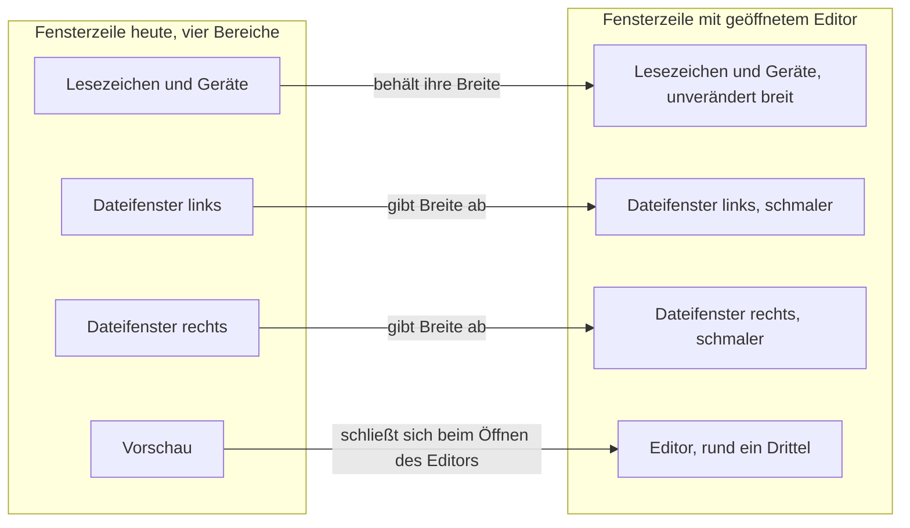
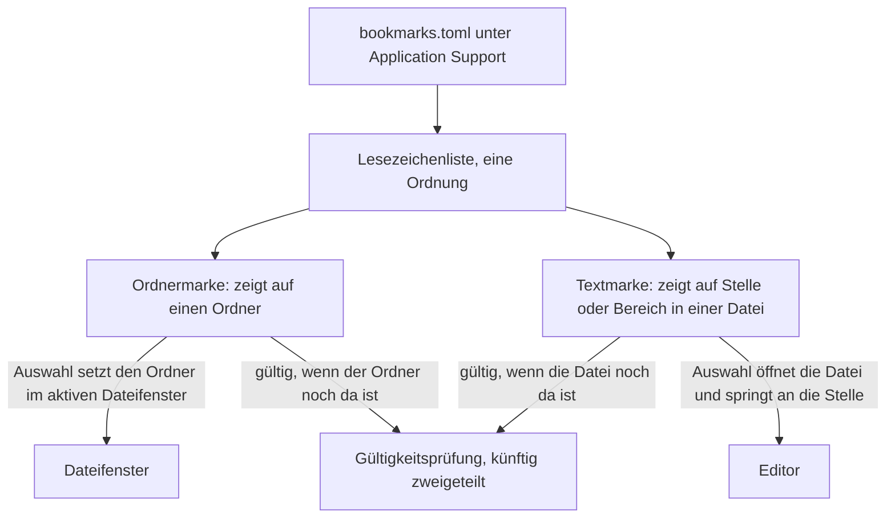

# Der eingebaute Editor mit Roh- und Formatansicht und Textmarken

---
**Domain:** code
**Status:** anticipated
**Filed by:** shaper (anticipated-circle mode)
**Active spec/plan:** (none yet)
**Active session history:** (none yet)

---

## Directive

KRK öffnet Text, Code und Markdown in einem eingebauten Editor, der als vierter Fokusbereich neben der Lesezeichenleiste, den beiden Dateifenstern und dem Vorschaufenster steht und über die dafür freigehaltene Taste F4 erreichbar ist. Der Editor trägt eine Rohansicht und eine Formatansicht, springt zu einer Zeilennummer, sucht und ersetzt innerhalb der geöffneten Datei und setzt Marken auf Textstellen und Textbereiche. Diese Marken stehen als Lesezeichen in derselben Leiste und in derselben Datei wie die Ordner-Lesezeichen, also in `bookmarks.toml` unter `~/Library/Application Support/KRK/`. Er teilt sich die Fläche mit dem Vorschaufenster zeitlich statt räumlich: wird der Editor geöffnet, schließt sich die Vorschau. Er nimmt rund ein Drittel der Fensterbreite; ist die Lesezeichenleiste geöffnet, rücken die beiden Dateifenster zusammen, damit diese Breite entsteht, und die Leiste weicht nicht. Suchen und Ersetzen über mehrere Dateien gehört nicht dazu.

## Grounding snapshot

Vorläufig. Ein vorgesehener Circle trägt noch keine erhobene Grundlage; dieser Abschnitt hält fest, was bei der Klärung am 260807-2116 aus dem Dateibestand sichtbar war, und wird bei der Aktivierung ersetzt.

### Woher das Vorhaben kommt

Die Formulierung stammt aus der Directive der Runde 1 und ist dort ausdrücklich ausgeklammert. Der Circle `260802-0842-krk-mac-dateimanager-editor-git` hat den Navigator gebaut, trägt seit dem 260807-1035 den beschränkten Abschluss (`_b_`) und nimmt als terminaler Circle keine Arbeit mehr auf. Die Übergabe `shared/history/260807-1930-uebergabe-an-die-editor-runde.md` hält den Stand fest und benennt den neuen Circle als den vorgesehenen Weg.

Zwei Abweichungen vom Entwurfstext sind gewollt und vom Nutzer am 260807 festgelegt. Der Entwurf sagte "im Home-Verzeichnis des Nutzers"; abgelegt wird stattdessen unter `~/Library/Application Support/KRK/`, wo die vier Ablagedateien von KRK bereits stehen. Und die Textmarken bekommen keine eigene Liste, sondern stehen neben den Ordner-Lesezeichen.

### Die vier Festlegungen dieser Klärungsrunde

**1. Der Editor ist ein vierter Fokusbereich, kein Bewohner des Vorschaufensters.** Die Übergabe hatte die Frage offen gelassen, ob der Editor in der Vorschaufläche wohnt oder daneben. Er wohnt daneben, teilt sich die Fläche aber zeitlich: mit dem Öffnen des Editors schließt sich die Vorschau. Seine Breite ist rund ein Drittel des Fensters. Bei geöffneter Lesezeichenleiste rücken die beiden Dateifenster zusammen; die Leiste behält ihre Breite.

**2. Textmarken und Ordner-Lesezeichen teilen sich Liste, Leiste und Datei.** Ein Lesezeichen zeigt künftig entweder auf einen Ordner oder auf eine Stelle in einer Datei, und beide Sorten stehen nebeneinander in derselben Leiste. Der Nutzer hat den Preis dafür angenommen: die Gültigkeitsprüfung und die Auswahl in der Leiste bekommen eine Fallunterscheidung, wo sie heute mit einem Fall auskommen.

**3. Der Ablageort ist `~/Library/Application Support/KRK/`.** Die Marken stehen in `bookmarks.toml`, neben `session.toml`, `settings.toml` und `keymap.toml`. Die Entwurfsformulierung "im Home-Verzeichnis" ist damit überholt.

**4. Die Restarbeit der Runde 1 bleibt vollständig draußen.** Wörtlich vom Nutzer: "Die Messreihen interessieren mich gerade nicht, komplett auf später verlagern." Weder der ausstehende Abnahmelauf noch eine Regel gegen das Altern von Messreihen noch der L9-Befund kommen in diesen Circle. Der Preis steht unten unter `### Was die Ausklammerung der Messreihen kostet`.

### Was die Runde 1 dem Editor hinterlässt

Sechs Bauteile aus der Runde 1 liegen auf der Platte und sind am Code geprüft. Der Editor erbt sie, statt daneben ein zweites aufzubauen.

**F4 ist für ihn freigehalten.** `resources/default-keymap.toml:131-137` führt die Funktion `bearbeiten` mit leerer Tastenliste und dem Feld `reserviert_fuer = "editor"`. Der Kommentar dort begründet es: die Norton-Bedeutung von F4 ist "Bearbeiten", und eine Zwischenbelegung mit dem Systemeditor hätte die spätere Runde wieder entfernen müssen.

**Der Fokus kennt vier benannte Bereiche, nicht drei.** `crates/krk-ui/src/fenstermodell.rs:50-68` führt `Bereich` mit den Varianten Lesezeichen, Links, Rechts und Vorschau samt der Konstanten `ALLE: [Bereich; 4]`. Logisch sind es die drei Flächen der Übergabe, im Code sind es vier Werte, und der Editor macht daraus fünf. Dazu kommt `Wirkungsbereich` in `crates/krk-core/src/tasten/belegung.rs:143-167`. `CLAUDE.md` nennt beide Aufzählungen als vollständig und ohne Auffangzweig: eine neue Variante hält den Bau an und erzwingt eine bewusste Einordnung jedes Befehls.

**Die Fokusbefehle folgen einer Regel, nicht einer Abfrage je Aufrufstelle.** `crates/krk-ui/src/kommandos/fokus.rs` trägt den einen Fokusvorbehalt und die Funktion `holt_hervor`, die für alle drei Fokusbefehle mit derselben Zeile entscheidet, ob der Zielbereich hervorgeholt wird. Ein vierter Bereich fügt sich in dieses Muster ein.

**Die Fensterzeile ist eine `NSSplitView` mit vier Bereichen** (`crates/krk-ui/src/appkit/aufteilung.rs`), und die Breitenregel steht einmal, in `crate::fenstermodell::bereichsbreiten`, als reines Rust ohne AppKit. Die vom Nutzer beschlossene Aufteilung (Editor rund ein Drittel, Dateifenster rücken zusammen, Leiste weicht nicht) gehört in diese eine Regel und nicht in eine zweite daneben.

**Die Lesezeichen sind bereits eine Liste mit einer Ordnung und einer Gültigkeitsregel.** `crates/krk-core/src/ablage/lesezeichen.rs` führt `Lesezeichen { name, ordner }` und die Regel `gueltig()`, die auf `ordner.is_dir()` prüft. Der Modulkopf hält fest, dass die Reihenfolge der Liste die Reihenfolge in der Leiste ist, "weil zwei Ordnungen zwei Wahrheiten wären". Genau diese Struktur nimmt die zweite Sorte auf.

**Die Ablage kennt vier Dateien und eine Aufzählung darüber.** `crates/krk-core/src/ablage/pfade.rs:17-59` führt `Datei` mit `keymap.toml`, `bookmarks.toml`, `session.toml` und `settings.toml` unter `~/Library/Application Support/KRK/`. Der Kommentar nennt den Grund für die Aufzählung: "wer alle anfassen muss, läuft über `Datei::ALLE` und kann keine vergessen."

Dazu zwei Zusagen aus der Übergabe, die den Zuschnitt binden. Die Statuszeile trägt fünf Ränge nach dem Alter der Aussage; ein Editor, der etwas zu melden hat, reiht sich dort ein und baut keine zweite Zeile. Und das Vorschaufenster zeigt heute Text und Markdown bis 1 MB roh, Bilder bis 64 MB, alles andere als Metadaten. Die Anzeige steht damit, die Bearbeitung fehlt.

### Wie sich die Flächen teilen

Die Textmarke ist die zweite Sorte in einer Leiste, die heute eine kennt:

### Was den Editor bindet

**Eine offene Frage gehört ihm direkt und gehört vor den ersten Planschritt, nicht vor diesen Circle.**

`shared/decisions/260802-0842_o_editor-formatansicht-je-dateityp.md` fragt, was die Formatansicht bei Text, bei Code und bei Markdown zeigt. Der Datensatz führt drei Möglichkeiten und empfiehlt die dritte, die Formatansicht als schreibgeschützte Leseansicht für alle drei Dateitypen. Die Frage entscheidet den Zuschnitt: ob eine Formatansicht je Dateityp entsteht oder eine gemeinsame, und ob Markdown gerendert oder nur hervorgehoben wird. Ohne sie plant der Planner ins Ungefähre. Sie wird bei der Aktivierung geklärt, nicht jetzt.

**Eine zweite ist zu prüfen und nicht anzunehmen.**

`circles/260802-0842-krk-mac-dateimanager-editor-git/decisions/260802-1428_o_verfuegbarkeitspruefung-fuer-macos-26-schnittstellen-in-objc2.md` fragt, wie KRK aus Rust eine Schnittstelle anspricht, die es erst ab macOS 26 gibt. `inference:` Ein Texteditor über `NSTextView` kommt vermutlich ohne solche Schnittstelle aus, denn `NSTextView` ist seit Langem verfügbar. Geprüft ist das nicht, und die Prüfung gehört in den Aktivierungs-Spec.

**Ein offener Defekt trifft den Weg, über den der Editor erreicht wird.**

`shared/issues/260807-2112_o_cmd-y-und-shift-cmd-y-loesen-nichts-aus-f3-schon.md`: am laufenden Bündel wirken `cmd+y` und `shift+cmd+y` nicht, `f3` wirkt. `shift+cmd+y` ist laut Übergabe der einzige Tastenweg in das Vorschaufenster, und der Editor fügt sich in dasselbe Fokusmuster ein. Der Defekt betrifft damit nicht nur die Vorschau: ein Fokusbefehl für den Editor, der eine Zusatztaste trägt, träfe denselben Weg vom Tastendruck zum Nachschlagen. Der Defekt nennt zwei ungeprüfte Verdächtige, den Abgriff des Menüs vor der Belegung und die Normalisierung der Zusatztasten in `crates/krk-core/src/tasten/normalisierung.rs`.

**Zwei Fragen der Runde 1 hängen an der Lesestelle** und sollten laut Übergabe vor größeren Eingriffen beantwortet sein: `circles/260802-0842-krk-mac-dateimanager-editor-git/decisions/260807-0010_o_kann-der-auffrischungsaufschub-entfallen-nachdem-die-lesestelle-nicht-mehr-vorab-leert.md` und `.../260807-0020_o_soll-die-markierung-eine-auffrischung-ueberleben.md`. `inference:` Beide betreffen das Dateifenster und nicht den Editor; ob sie ihn binden, hängt daran, ob der Editor die Lesestelle anfasst, und das entscheidet erst der Zuschnitt.

### Was die Ausklammerung der Messreihen kostet

Der Nutzer hat die Restarbeit der Runde 1 vollständig ausgeklammert, und der Preis ist benennbar. Die Runde 1 ist als beschränkter Abschluss geschlossen, weil sieben ihrer zehn Zeitzusagen (L1, L4, L5, L6, L7, L8 und der Zeichenanteil von L2) unverändert auf der Abnahmereihe vom 260805-2207 stehen, während drei spätere Commits genau die gemessenen Wege berührt haben. Ein Abnahmelauf am gebauten Bündel würde die Lücke schließen, verlangt aber KRK im Vordergrund und damit Nutzerarbeit.

Daraus folgt: **eigene Zeitzusagen des Editors würden auf einem Sockel gemessen, dessen sieben Zusagen unbelegt sind.** Wer für den Editor eine elfte Zahl setzen will, etwa wie schnell eine große Datei bis zur bedienbaren ersten Bildschirmseite steht, hätte keinen belegten Ausgangswert, gegen den er sie setzt. Der Artefakt des beschränkten Abschlusses sagt dasselbe von der anderen Seite: "Eine Messreihe altert an jedem Commit, der einen gemessenen Pfad berührt, und sie sagt es nicht selbst."

Der L9-Befund ist nicht Teil dieses Preises. Er ist am 260807 geschlossen (`shared/issues/260807-1748_c_l9-ist-seit-dem-260805-messbar-schlechter-geworden.md`); der Nutzer hat die Einbuße angenommen und die Zusage auf 65 Prozent im ersten Bild bei höchstens zwei Bildlängen gesenkt.

### Offene Fragen für die Klärungsrunde bei der Aktivierung

Ein vorgesehener Circle darf offene Fragen tragen. Die vier unten sind Eingabe für die Aktivierung und je einzeln so gestellt, dass sie den Zuschnitt bestimmen.

**1. Was zeigt die Formatansicht bei Text, bei Code und bei Markdown?** Der Datensatz `shared/decisions/260802-0842_o_editor-formatansicht-je-dateityp.md` führt die Frage samt drei Möglichkeiten. Sie gehört vor den ersten Planschritt.

**2. Woher bekommt der Editor seine Datei?** Aus der Auswahl im Dateifenster über F4 ist der naheliegende Weg. Ob auch die Vorschau einen Übergang in den Editor bekommt, und was mit einer Datei geschieht, die weder Text noch Code noch Markdown ist, ist offen.

**3. Was geschieht mit ungespeicherten Änderungen?** Der Editor ist der erste Bereich in KRK, der einen Zustand hält, den ein Schließen verlieren kann. Betroffen sind mindestens drei Anlässe: das Schließen des Editors, das Beenden der Anwendung und die Sitzungssicherung in `session.toml`.

**4. Welche Sprünge trägt eine Textmarke?** Der Entwurf nennt Stellen und Bereiche. Ob eine Marke an eine Zeilennummer gebunden ist oder an einen Textinhalt, entscheidet, ob sie eine Änderung der Datei außerhalb von KRK überlebt. Die Gültigkeitsprüfung aus Festlegung 2 hängt daran.

### Was dieser Circle nicht festlegt

Womit KRK Text darstellt und bearbeitet, ist offen. Der Circle legt kein Mittel fest, weder eine Systemschnittstelle noch eine Kiste. Fest steht allein die Technologiewahl der Runde 1: Rust mit AppKit über `objc2`, außerhalb der App-Sandbox, Mindest-Zielsystem macOS 15 bei Unterstützung bis macOS 26 (`circles/260802-0842-krk-mac-dateimanager-editor-git/decisions/260802-1134_i_sprache-und-ui-werkzeugkasten.md`).

Ebenfalls nicht festgelegt: ob der Editor eine eigene Zeitzusage bekommt. Die Frage ist ohne den ausgeklammerten Abnahmelauf nicht sinnvoll zu beantworten, und der Nutzer hat den Lauf ausdrücklich auf später verlagert.

Ausgeschlossen bleibt Suchen und Ersetzen über mehrere Dateien. Der Shaper hat es am 260802 als eigenes Vorhaben abgegrenzt, mit der Begründung, dass es einen Scan über Verzeichnisbäume, eine Trefferliste, eine Vorschau der geplanten Ersetzungen und einen Rückweg für eine misslungene Stapelersetzung braucht. Innerhalb der geöffneten Datei bleibt es beim Editor.

## Dependencies

Dieser Circle hängt an `260802-0842-krk-mac-dateimanager-editor-git`, dem beschränkt abgeschlossenen Vorgänger (`_b_`, geschlossen am 260807-1035). Er ist die spätere Runde, die dessen Directive für den Editor zugesagt hat; weil ein terminaler Circle keine Arbeit mehr aufnimmt, steht sie hier statt dort.

Die Bindung ist inhaltlich und nicht nur formal. Sechs Bauteile des Vorgängers erbt dieser Circle (F4-Reservierung, Fokusmodell, Aufteilung mit ihrer einen Breitenregel, Lesezeichenliste, Ablage, Statuszeile), und die Beschränkung des Vorgängers reicht über die Zeitzusagen in ihn hinein. Beides steht oben im Grounding.

Der zweite vorgesehene Circle, `260804-0933-eingebauter-web-betrachter-im-vorschaufenster`, ist keine Abhängigkeit. Beide setzen auf denselben Bauteilen auf, und beide berühren die Fläche des Vorschaufensters: der Web-Betrachter wohnt in einem seiner Tabs, der Editor verdrängt es zeitlich. `inference:` Eine Reihenfolge zwischen beiden ist damit nicht erzwungen, aber die zweite Runde wird die Fläche des Vorschaufensters so vorfinden, wie die erste sie hinterlässt.

## Turn log

(noch keiner)

## Activation proposal

**Vorgeschlagen am:** 260807-2125
**Playmaker-Lauf:** 260807-2125-playmaker-direct-dispatch
**Domain-Gewichtung:** code

Dieser Circle ist der empfohlene nächste Kandidat, und die Empfehlung steht auf einer festgehaltenen Wahl des Nutzers, nicht auf der Rangheuristik. Die Übergabe `shared/history/260807-1930-uebergabe-an-die-editor-runde.md` schreibt in ihrer Anlasszeile: der Nutzer hat die Runde 1 abgeschlossen und als nächste Runde den Editor gewählt. Dasselbe Dokument sagt vom zweiten vorgesehenen Circle, dem Web-Betrachter, ausdrücklich, er sei "nicht der gewählte nächste Schritt". Der Nutzer hat die Wahl anschließend ausgeführt, indem er diesen Circle am 260807-2116 über `/fusion:direct` anlegen ließ.

**Die Heuristik der Gewichtung `code` sagt das Gegenteil, und der Playmaker unterschlägt es nicht.** Sie bevorzugt vorgesehene Circles mit wenigen unbeantworteten Fragen. Dieser Circle zitiert in seinem `## Grounding snapshot` vier offene Entscheidungsdatensätze, der Web-Betrachter einen. Die vier sind `shared/decisions/260802-0842_o_editor-formatansicht-je-dateityp.md`, `circles/260802-0842-krk-mac-dateimanager-editor-git/decisions/260802-1428_o_verfuegbarkeitspruefung-fuer-macos-26-schnittstellen-in-objc2.md`, `.../260807-0010_o_kann-der-auffrischungsaufschub-entfallen-nachdem-die-lesestelle-nicht-mehr-vorab-leert.md` und `.../260807-0020_o_soll-die-markierung-eine-auffrischung-ueberleben.md`. Alle vier tragen den Marker `_o_` auf der Platte, geprüft am 260807-2125. Nur die erste bindet nach dem Grounding dieses Circles vor dem ersten Planschritt; die übrigen drei ordnet der Circle selbst als zu prüfen und nicht als angenommen ein.

Eine festgehaltene Nutzerwahl wiegt schwerer als ein Zählwert über Entscheidungsdatensätze. Der Zählwert ist ein Stellvertreter für die Frage, welcher Circle reif ist; die Wahl beantwortet die Frage, welcher Circle gewollt ist. Wo beide auseinandergehen, benennt der Playmaker den Unterschied und folgt der Wahl.

**Die geerbten Bauteile liegen auf der Platte, geprüft und nicht angenommen.** Die F4-Reservierung steht in `resources/default-keymap.toml:130-137` als Funktion `bearbeiten` mit leerer Tastenliste und dem Feld `reserviert_fuer = "editor"`. Die Aufzählung `Bereich` mit ihren vier Varianten und der Konstanten `ALLE: [Bereich; 4]` steht in `crates/krk-ui/src/fenstermodell.rs:48-70`. Die Lesezeichenliste liegt in `crates/krk-core/src/ablage/lesezeichen.rs`, die Ablagepfade in `crates/krk-core/src/ablage/pfade.rs`, die Aufteilung der Fensterzeile in `crates/krk-ui/src/appkit/aufteilung.rs` und die Statuszeile in `crates/krk-ui/src/appkit/statuszeile.rs`. Sechs von sechs im Grounding genannten Bauteilen sind damit belegt.

**Was gegen eine sofortige Aktivierung spricht, in absteigender Schärfe.**

Der offene Defekt `shared/issues/260807-2112_o_cmd-y-und-shift-cmd-y-loesen-nichts-aus-f3-schon.md` trifft den Weg, über den dieser Circle seinen Editor erreichbar machen will. Am laufenden Bündel wirken `cmd+y` und `shift+cmd+y` nicht, `f3` wirkt. Der Defekt hält fest, dass Befehl und Empfänger belegt in Ordnung sind und der Fehlschlag auf dem Weg vom Tastendruck zum Nachschlagen liegt, und zwar nur für die Formen mit Zusatztaste. Ein Fokusbefehl für den Editor mit Zusatztaste träfe denselben Weg. Der Defekt nennt zwei ungeprüfte Verdächtige und ist nicht gemessen.

Die einzige Abhängigkeit, `260802-0842-krk-mac-dateimanager-editor-git`, ist beschränkt abgeschlossen (`_b_`) und nicht kohärent (`_c_`). Nach der Rangheuristik zählt allein `_c_` als erfüllte Vorbedingung. Inhaltlich trägt das Kennzeichen hier weniger weit als beim Web-Betrachter, weil dieser Circle die Restarbeit der Runde 1 auf Weisung des Nutzers vollständig ausklammert und den Preis dafür selbst benennt, im Abschnitt `### Was die Ausklammerung der Messreihen kostet`.

Die erste offene Frage, was die Formatansicht bei Text, bei Code und bei Markdown zeigt, gehört nach dem Grounding vor den ersten Planschritt. Der Datensatz führt drei Möglichkeiten und empfiehlt die dritte, die Formatansicht als schreibgeschützte Leseansicht für alle drei Dateitypen. Die vier offenen Fragen des Grounding-Abschnitts bleiben die erste Arbeit nach dem Übergang auf aktiv; der Shaper im portfolio-activation-Modus klärt sie mit dem Nutzer, bevor ein Plan entsteht.

Der Playmaker benennt Kandidaten, er aktiviert sie nicht. Die Umbenennung des Datensatzes von `_a_circle.md` auf `_t_circle.md` und das Schreiben von `.active-circle` bleiben beim Nutzer über `/fusion:next` oder beim Orchestrator.
