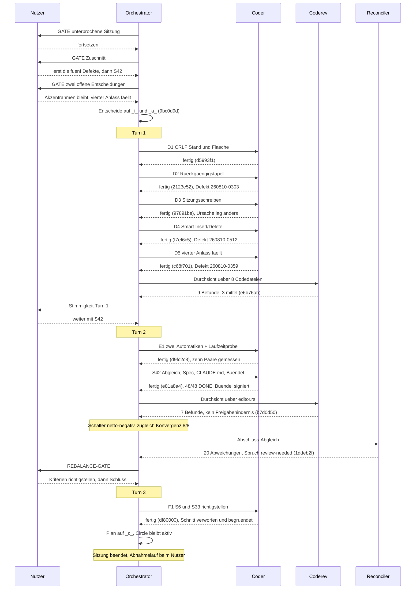

# Orchestrator Session — 260810-0244

**Directive:** Der eingebaute Editor mit Roh- und Formatansicht und Textmarken — vierter Fokusbereich, F4, Zeilensprung, Suchen und Ersetzen in der offenen Datei, Textmarken in der gemeinsamen Lesezeichenleiste
**Mode:** plan (fortgesetzt)
**Status:** Abgeschlossen. Der Circle bleibt aktiv; der Abnahmelauf steht aus und ist Nutzerarbeit.
**Fortsetzung von:** `circles/260807-2116-eingebauter-editor-mit-textmarken/history/260807-2139-orchestrator-session.md`

## Fortsetzung einer unterbrochenen Sitzung

`agentstate.yaml` lag vor und trug den Stand vom 260809-1640: Turn 2, 18 von 42 Aufgaben, 17 Commits. Der Dateibestand war zu diesem Zeitpunkt deutlich weiter, nämlich 47 von 48 Planschritten auf `[DONE]` und 34 weitere Commits seit dem vermerkten Turn-Anfang `8ffdffd`. Die Zustandsdatei wurde in den letzten Sitzungen nicht mitgeschrieben; die Zahlen darin sind entsprechend zu verwerfen.

Der Nutzer hat **Fortsetzen** gewählt. Die Warteschlange wird aus dem Dateibestand neu aufgebaut.

## Aufnahme bei Sitzungsbeginn

Geprüft am 260810-0244, Arbeitsverzeichnis `/Users/k1/Projects/productive/krk`.

| Größe | Wert |
|---|---|
| git HEAD | `bdecff6` |
| Aktiver Circle | `260807-2116-eingebauter-editor-mit-textmarken` (`_t_`) |
| Circles gesamt | 2 vorgesehen (`_a_`), 1 aktiv (`_t_`), 1 beschränkt geschlossen (`_b_`) |
| Planschritte | 47 von 48 auf `[DONE]`; offen nur S42 |
| Offene Defekte | 22 im Circle, 2 im gemeinsamen Speicher; keiner in Arbeit (`_p_`) |
| Offene Pläne | 2 im Circle (Spec und Plan, beide `_o_`), 0 im gemeinsamen Speicher |
| Entscheidungen offen (`_o_`) | 2 im Circle, 2 im gemeinsamen Speicher |
| Entscheidungen beantwortet (`_a_`) | 4 im Circle, 1 im gemeinsamen Speicher |
| Analysen | 0 in beiden Speichern |
| Compliance Guard | `haltActive: false`, 0 aufeinanderfolgende Blockaden; letzte Blockade 260807-0828 |

**Erkannte Domäne: `code`.** Eingangsgrößen: 168 Commits am Workbench, 0 Analysen, 24 offene Defekte, 4 offene Entscheidungen, 106 Codedateien (`.rs`), 0 Datendateien. Keine der Vorbedingungen für `strategic`, `knowledge` oder `data` greift, also der Rückfall `code`. Deckt sich mit dem in `agentstate.yaml` vermerkten Wert.

**Circle-Hinweis ausgegeben:** 2 vorgesehene und 1 aktiver Circle, Verweis auf `/fusion:next` zur Portfolio-Durchsicht.

## Stilprofile

`chat-voice-de.yaml` und `default-voice-de.yaml` geladen. `CLAUDE.md` erklärt `**Language:** de` und keine abweichende Artefaktsprache, also gilt Deutsch für beide Flächen.

## Verlauf

Die Sitzung hat drei Turns gefahren und dreizehn Commits gelandet. Sie beginnt mit einer Nutzerwahl über den Zuschnitt und endet mit einer zweiten über den Abschluss; dazwischen liegen zwei Durchsichten, die zusammen sechzehn Befunde gebracht haben.

### Phase 0: Zuschnitt und zwei Entscheidungen

Der Nutzer hat aus drei Zuschnitten den mittleren gewählt: erst die fünf Defekte schließen, die er beim Abnahmelauf sicher träfe, dann den Abschlussschritt S42. Der Orchestrator hatte zunächst sechs Defekte vorgeschlagen und einen davon zurückgenommen. `260810-0054`, die Geschwindigkeit der Einfärbung, verlangt eine Messung mit KRK im Vordergrund und ist damit Nutzerarbeit; `260809-2322` hängt an derselben Messung. Beide sind in die Abnahmeliste gewandert statt in die Warteschlange.

Zwei offene Entscheidungen des Circles waren vorher zu beantworten, und beide sind vorgelegt worden mit dem, was jede Antwort kostet. Der **Akzentrahmen** (`260809-2043`) bleibt bei der Abstufung mit drei Zuständen; die Antwort war die Vorbelegung des Specs und seit S44 in `442a539` gebaut, der Datensatz ist deshalb unmittelbar auf umgesetzt gegangen. Der **vierte Anlass der Nachfrage** (`260810-0021`) fällt: die eingeblendete Vorschau verdrängt den Editor, verliert seinen Stand aber nicht, und eine Nachfrage, deren Verwerfen nichts verwirft, lehrt den Nutzer, Blätter wegzuklicken.

### Turn 1: fünf Defekte und ein Entscheid

`d5993f1` bis `154ad67`. Die Ursache des CRLF-Befunds lag in `bearbeiten`, das den Stand durch `in_gehaltene_form` führte, ohne das Ergebnis zurückzuschreiben. Die Behebung vergleicht das Ergebnis, statt einen Eingangsfilter zu bauen: ein Filter müsste die Wandlungsregeln ein zweites Mal tragen, und ein Löschen, das eine Bytefolgenmarke an den Anfang rückt, ginge daran vorbei.

Beim Rückgängigstapel hat sich gezeigt, dass Dateiwechsel und Ersetzen an derselben Schreibstelle entgegengesetzte Behandlungen verlangen; der mildere Rest ist als `260810-0303` abgelegt statt stillschweigend mitgenommen. Beim Sitzungsschreiben lag die Ursache anders, als der Datensatz sie kannte: ein Anlass stand an allen drei Öffnungswegen, nur zu früh, während der Arbeitsfaden noch las.

Die Durchsicht hat neun Befunde gebracht, keinen kritisch oder hoch. Der schwerste betraf dieselbe Zusage, die D4 gerade zur Hälfte eingelöst hatte.

### Turn 2: die zweite Hälfte einer Zusage, dann S42

`d9fc2c8` bis `b7d0d50`. Der Ausführende hat vor dem Bauen gemessen, was die dreizehn Einstellungen der Form `set…Type:` zueinander sind, und gefunden, dass zehn von ihnen derselbe Speicher sind wie ein `set…Enabled:` daneben. Es waren zwei Zeilen und nicht zwölf. Die zweite Durchsicht hat diese Messung nachgefahren, mit eigenem Programm über alle zehn Paare in beiden Richtungen, und sie hält.

S42 hat Spec, Plan und `CLAUDE.md` auf den gebauten Stand gezogen, `make check` grün gefahren und `target/KRK.app` gebaut und signiert. Aus den vier geplanten Spec-Nachträgen wurden sechs. Der wichtigste ist ein Fund: die Zusage „keine Automatik ändert den getippten Text" stand nirgends im Spec. Sie lebte im Plan, im Modulkopf von `editor.rs` und in den Datensätzen, und der Satz dort zitierte C4 als Quelle, die es nicht sagte. Sie steht jetzt als elftes Kriterium von C4.

### Phase 3 und Turn 3: der Abgleich und was er anhielt

Der Abgleich hat zwanzig Abweichungen gefunden, sieben davon selbst behoben, und den Spruch `review-needed` gefällt. Zwei Planschritte trugen `[DONE]` über einem Abnahmekriterium, das der Code nicht einlöst. In beiden Fällen war das Kriterium falsch und nicht der Code, und der Nutzer hat sie richtigstellen lassen.

Bemerkenswert am Ergebnis ist, dass der Ausführende den im Defekt vorgeschlagenen Schnitt **verworfen** hat, an drei Stellen geprüft: seine Voraussetzung war schon beim Schreiben falsch, die gemeinte Menge ist am heutigen Code für jede denkbare Belegung leer, und die Grenze `gehalten_von` trennt an dieser Frage nichts mehr. Die Einschränkung auf `y` und `z` entfällt damit ersatzlos, und die Probe, die sie maß, ist gefallen statt umgebaut.

Der Markdown-Entscheid stand auf umgesetzt und ist deshalb nicht zurückgedreht, sondern durch `260810-0822` abgelöst worden. Seine Begründung behauptete eine Eigenschaft von AppKit, die der Kopf von `NSLayoutManager.h` widerlegt.

## Coherence

<!-- RECONCILER-OWNED -->

**Verdict:** review-needed

**Edges:**
- Artifact↔Grounding: 48 von 48 Planschritten am Code belegt, aber zwei (S6, S33) tragen `[DONE]` über einem Abnahmekriterium, das der Code nicht einlöst (`resources/default-keymap.toml:663`/`:672` gegen das y-und-z-Verbot; `crates/krk-ui/src/appkit/editor.rs:1876` `addAttributes_range` statt `setTemporaryAttributes`), je mit offenem Defekt (`issues/260809-1527_*_...`, `issues/260810-0053_*_...`). Sechs Marker im Abgleich nachgezogen: fünf Entscheidungen `_a_`→`_i_`, ein Defekt `_o_`→`_c_`. 38 offene Defekte über vier Speicher, davon null kritisch und null hoch. `make check` = 0, 721 Proben, Bündel signiert.
- Artifact↔Directive: Elf Commits in `bdecff6..HEAD` bewegen sich auf die Directive zu, keiner quer und keiner von ihr weg. Sechs fassen Code an (`d5993f1`, `2123e52`, `97891be`, `f7ef6c5`, `c68f701`, `d9fc2c8`) und liegen sämtlich auf dem Editor; fünf führen die Werkstatt nach (`9bc0d9d`, `154ad67`, `e6b76ab`, `e81a8a4`, `b7d0d50`).
- Grounding↔Directive: Zehn aktive Entscheidungen im Circle, nach dem Abgleich alle auf `_i_`, keine offen und keine unerledigt beantwortet. Zwölf offene liegen sämtlich außerhalb dieses Circles (fünf Runde 1, fünf Tastenbelegung, zwei gemeinsam), keine widerspricht der Directive. Eine bindet den weiteren Weg: `circles/260802-0842-krk-mac-dateimanager-editor-git/decisions/260806-1303_o_wie-kommt-krk-fuer-den-abnahmelauf-in-den-vordergrund.md`.

**Rebalance recommendation:** revise Artifact

**Zwei Beurteilungen, die der Auftrag ausdrücklich verlangt hat:**

**Der Netto-negativ-Schalter zeigt die erwartete Ausbeute zweier Durchsichten und keine Divergenz.** Netto dreizehn Defekte mehr, aber keiner der neunzehn neuen ist kritisch oder hoch; acht sind mittel, elf niedrig oder ohne Schwerefeld. Die Durchsicht des zweiten Turns sagt von ihren sieben ausdrücklich „keiner am ausgeführten Code". Divergenz sähe anders aus: neue Defekte in der Schwere der geschlossenen, im selben Code, bei nicht konvergierender Warteschlange. Die Warteschlange ist auf 8 von 8 gelaufen. Nicht wegzureden bleibt der Rückstand: 31 offene Defekte im aktiven Circle, drei davon an derselben ausstehenden Nutzerentscheidung hängend.

**Der ausstehende Abnahmelauf ist eine benannte Grenze und verbietet dennoch den kohärenten Abschluss.** Die Sitzung selbst war stimmig. Die Runde ist es nur als „gebaut": 110 von 110 Abnahmekriterien stehen unabgehakt, und der Lauf verlangt KRK im Vordergrund. Wer den Circle jetzt schließt, schließt ihn beschränkt (`_b_`) wie Runde 1 und nicht kohärent (`_c_`). Es ist dieselbe Grenze zum zweiten Mal: die Frage nach dem Vordergrund steht seit dem 260806 offen, und eine dritte Runde endete ohne sie ebenso.

**Belege im Einzelnen:** `history/260810-0810-reconciliation.md`.

## Rebalance-Entscheid des Nutzers

Nach dem Spruch `review-needed` sind ihm drei Wege vorgelegt worden: die beiden Kriterien richtigstellen und dann enden, sofort enden und die Kriterien offen lassen, oder den Circle beschränkt schließen. Er hat den ersten gewählt. Turn 3 ist daraufhin gefahren; der Circle bleibt aktiv, weil der Abnahmelauf noch aussteht.

## Budget

| Größe | Zahl |
|---|---|
| Turns | 3 |
| Aufgaben erledigt | 9 |
| Aufgaben zurückgestellt | 0 |
| Defekte geschlossen | 12 |
| Defekte neu abgelegt | 20 |
| Entscheidungen beantwortet (`_o_`→`_a_`) | 2 |
| Entscheidungen eingelöst (`_a_`/`_o_`→`_i_`) | 8 |
| Entscheidungen abgelöst (`_i_`→`_s_`) | 1 |
| Commits | 13 |
| Agentenfehler | 0 |
| Nutzergates | 4 |

## Per-Turn-Log

**Turn 1** — Aufgaben D1 bis D5. Commits `d5993f1`, `2123e52`, `97891be`, `f7ef6c5`, `c68f701`, `154ad67`. Durchsicht: neun Befunde, drei mittel. Schalter: in Ordnung. Coherence: `ok`.

**Turn 2** — Aufgaben E1 und S42. Commits `d9fc2c8`, `e81a8a4`, `b7d0d50`. Durchsicht: sieben Befunde, fünf mittel, keiner am ausgeführten Code. Schalter: netto-negativ zum zweiten Mal in Folge, zugleich Konvergenz der Warteschlange bei 8 von 8. Coherence: `ok`.

**Turn 3** — Aufgabe F1, ausgelöst durch den Rebalance-Entscheid. Commit `df80000`. Keine eigene Durchsicht, weil der Turn nur Text und eine gefallene Probe berührt.

## Verbleibende Arbeit

**Nutzerarbeit, von keinem Agenten fahrbar.** Der Abnahmelauf über 110 Kriterien am laufenden Bündel, mit KRK im Vordergrund. Die Reihenfolge, die Wege spart, steht im Bericht `260810-0714-coder-s42-abgleich-und-spec-nachtraege.md`: C8 zuerst, dann C2 und C1, dann C7, danach C3 bis C6 in beliebiger Folge; C9, C10 und C11 laufen nebenher mit. Dazu die Messung, an der `260810-0054` und `260809-2322` gemeinsam hängen: eine Rust-Datei von einigen hundert Kilobyte öffnen, in die Formatansicht wechseln und tippen.

**Eine Nutzerfrage.** `260810-0512`, ob die Schreibwerkzeuge aus macOS 15 unter die Zusage von C4 fallen. Sie greifen auf ausdrücklichen Aufruf aus dem Kontextmenü und nicht ohne Zutun; die Einordnung hängt an der Lesart von C4.

**28 offene Defekte im Circle**, sieben weitere in den übrigen Speichern. Keiner kritisch, keiner hoch. Die schwersten sind die fünf mittleren aus der zweiten Durchsicht, die zusammen einen Querschnitt bilden: viermal in dieser Runde ist eine Aufzählung an einer Namensform stehengeblieben, und die nächste Einstellung derselben Wirkung trug eine andere. Die Antwort darauf ist der Protokollschnitt über `NSTextInputTraits` zusätzlich zu den Namensformen, und die zweite Durchsicht hat belegt, dass er erreichbar ist.

**Eine Grenze zum zweiten Mal.** Die Frage, wie KRK für den Abnahmelauf in den Vordergrund kommt, steht seit dem 260806 offen (`circles/260802-0842-krk-mac-dateimanager-editor-git/decisions/260806-1303_o_wie-kommt-krk-fuer-den-abnahmelauf-in-den-vordergrund.md`). Solange sie offen ist, endet jede Runde als „gebaut" und keine als „abgenommen".

**`portfolio.md` kennt den aktiven Circle nicht.** Der Playmaker läuft erst beim Schließen eines Circles; wer die Übersicht früher braucht, ruft `/fusion:next`.

## Commits

| Hash | Was | Aufgabe |
|---|---|---|
| `9bc0d9d` | zwei offene Entscheidungen beantwortet | Gate Phase 0 |
| `d5993f1` | Stand und Textfläche nach einem CRLF wieder zusammen | D1 |
| `2123e52` | Rückgängigstapel überlebt kein Ersetzen des Flächentextes | D2 |
| `97891be` | Vormerken der Sitzung wartet auf den eingezogenen Editorausgang | D3 |
| `f7ef6c5` | fünfte textverändernde Automatik abgewählt | D4 |
| `c68f701` | aus vier Anlässen der Nachfrage werden drei | D5 |
| `154ad67` | der Entscheid dazu ist in Code eingelöst | D5 |
| `e6b76ab` | Durchsicht Turn 1, neun Befunde | Durchsicht |
| `d9fc2c8` | zwei Türen zu einer Einstellung | E1 |
| `e81a8a4` | S42, alle 48 Schritte tragen DONE | S42 |
| `b7d0d50` | Durchsicht Turn 2, sieben Befunde | Durchsicht |
| `1ddeb2f` | Abschluss-Abgleich, Spruch review-needed | Phase 3 |
| `df80000` | S6 und S33 tragen ein einlösbares Kriterium | F1 |

## Session Flow

