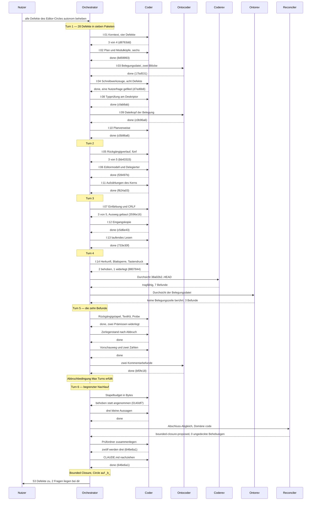

# Orchestrator Session — 260810-0845

**Directive:** Alle offenen Defekte des Editor-Circles autonom beheben, neu erkannte mit, dann Abgleich und Circle schließen. Der gesamte Lauf ohne Gate.
**Mode:** issues (Umfang: der aktive Circle)
**Status:** Bounded Closure: der Abnahmelauf über 110 Kriterien verlangt KRK im Vordergrund, und zwei Restdefekte hängen an der offenen Frage nach einem Bibliotheksziel für `krk-ui`. Beides liegt beim Nutzer.

## Budget

| Größe | Zahl |
|---|---|
| Turns | 6 (5 nach Vorgabe, ein begrenzter Nachlauf — siehe unten) |
| Defekte geschlossen | 53 |
| davon beim Start offen | 28 von 28 |
| im Lauf neu gefunden | 33, davon 10 aus zwei Durchsichten |
| Defekte offen am Ende | 5 im Circle, 3 im gemeinsamen Speicher |
| Entscheidungen neu angelegt | 2, beide offen und beide Nutzerfragen |
| Commits | 18 (`38a02b2..646e6a1`) |
| Agentenfehler | 0 |
| Menschliche Gates | 0 (der Nutzer hat den Lauf ausdrücklich autonom beauftragt) |
| Ausführende Agenten | coder (13 Läufe), ontocoder (3), coderev, ontorev, reconciler |

**Kein Agent hat eine Behebung behauptet, die im Code nicht steht.** Der
Abschluss-Abgleich hat alle 52 Behauptungen des Laufs einzeln gegen den Baum
gelesen: 45 vollständig gedeckt, 7 mit einer abgewanderten Nebenangabe, 0 ohne
Deckung.

## Die Abweichung von der Turn-Vorgabe

Nach Turn 5 war die Abbruchbedingung „Max Turns erreicht" erfüllt. Die anderen
fünf waren es nicht: 48 geschlossene gegen 6 offene Defekte, kein Turn ohne
Fortschritt, kein Agentenfehler, keine Blockade, der Wachhund frei. Weil der
Auftrag ausdrücklich lautete, auch neu gefundene Defekte zu beheben, ist ein
**begrenzter sechster Durchgang** gefahren worden, für die vier kleinen
Restdefekte. Er hat alle vier geschlossen. Die Abweichung ist als
`circuit_breaker`-Ereignis im Protokoll festgehalten, mit dieser Begründung.

## Per-Turn Log

### Turn 1 — 10 Defekte, drei Pakete parallel, dann vier
- Erledigt: I:01 Kerntext (3 von 4), I:02 Plan und Modulköpfe (6), I:03 Belegungsdatei (1), I:04 Schreibwerkzeuge (8), I:08 Typprüfung am Deskriptor, I:09 Dateikopf der Belegung, I:10 Planverweise
- Commits: `d8763dd`, `8d59993`, `17bd531`, `d7ed6b8`, `cfab8ab`, `c0b96a6`, `35e12cb`
- Geschlossen: 21 · neu: 4 Defekte, 1 Entscheidung
- Coherence: ok

### Turn 2 — die Rückgängig- und Modellseite
- Erledigt: I:05 Rückgängigverlauf (3 von 5), I:06 Editormodell und Delegierter (3), I:11 Aufzählungen des Kerns (2)
- Commits: `bb43315`, `f28497b`, `f624a03`
- Geschlossen: 8 · neu: 5 Defekte, 1 Entscheidung
- Coherence: ok

### Turn 3 — die beiden gemessenen Preise
- Erledigt: I:07 Einfärbung und CRLF (3 von 5), I:12 Eingangskopie und Modulkopf (2), I:13 laufendes Lesen (1)
- Commits: `3596e16`, `c5d6e43`, `733e30f`
- Geschlossen: 6 · neu: 2
- Coherence: ok

### Turn 4 — Öffnungsherkunft, dann die Durchsichten
- Erledigt: I:14 Herkunft, Blattsperre, Preis je Tastendruck (3), Durchsicht durch `coderev` und `ontorev`
- Commits: `8807844`, `1472846`
- Geschlossen: 3 · neu: 10 aus den Durchsichten, einer davon Schwere Hoch
- Coherence: ok

### Turn 5 — die zehn Befunde der Durchsichten
- Erledigt: vier Pakete parallel gegen alle zehn Befunde
- Commit: `bf0fe18`
- Geschlossen: 10 · neu: 4
- Coherence: ok · Abbruchbedingung „Max Turns" erfüllt, begrenzter Nachlauf beschlossen

### Turn 6 — begrenzter Nachlauf und Abschluss
- Erledigt: Stapelbudget in Bytes, drei kleine Aussagen nachgezogen, Prüfordner zusammengelegt, `CLAUDE.md` nachgezogen, Abschluss-Abgleich
- Commits: `0140df7`, `646e6a1`
- Geschlossen: 5 · neu: 4
- Coherence: `bounded-closure-proposed` (siehe unten)

## Was offen bleibt, und warum

| Datensatz | Wartet auf |
|---|---|
| `260810-1001` Hauptfaden der vier Instanzproben | Entscheidung `260810-1044`: Bibliotheksziel für `krk-ui` |
| `260810-1341` Freigabe des Rückgängig-Blocks | dieselbe Entscheidung, weil die Messung eine fünfte Instanzprobe braucht |
| `260810-1207` Spanne zwischen Blattschluss und Antwort | eine Messung mit KRK im Vordergrund |
| `260810-1404` 14 Datensätze zeigen auf verschobene Zeilen | Buchführung, kein Code; drei der sechs falschen Angaben sind schon berichtigt |
| `260810-1430` `Planordner` als dreizehnte Fassung | nichts; im nächsten Lauf erledigt |
| `260810-1440` zwei falsche Zahlen in `260810-1001` und im Abgleich | nichts; sie verschieben aber den Umfang, den die Entscheidung `260810-1044` abwägt |

Dazu im gemeinsamen Speicher: `260810-0805` (ein Verweis nennt den falschen
Circle), `260810-1330` und `260810-1430` (beide über den liegenbleibenden
Messplan von `krk-bench`, das nicht zu dieser Runde gehört).

**Die zwei offenen Entscheidungen sind Nutzerfragen und wurden bewusst nicht
beantwortet.** `260810-0959` fragt, ob die Zusage C4 die Schreibwerkzeuge aus
macOS 15 ausschließt — eine Auslegung der eigenen Zusage, die kein Messwert
schließt. `260810-1044` fragt, ob `krk-ui` ein Bibliotheksziel bekommt, und das
berührt jede Datei der Kiste.

## Aufnahme beim Start (260810-0845)

**Arbeitsplatz:** `/Users/k1/Projects/productive/krk`
**Plugin-Version:** 7.0.0
**git HEAD:** `38a02b2` — chore(workbench): Sitzungszustand geraeumt, Dashboard und Ereignisprotokoll nachgezogen
**Aktiver Circle:** `circles/260807-2116-eingebauter-editor-mit-textmarken` (Zustand aktiv)

### Zählungen im Suchbereich des Auflösers

| Gegenstand | Zahl | Anmerkung |
|---|---|---|
| Offene Defekte (`_o_`/`_p_`) | 30 | 28 im aktiven Circle, 2 im gemeinsamen Speicher |
| Offene Plan-/Spec-Dateien | 1 | Spec der Runde 2 steht auf `_o_`; der Plan trägt `_c_` mit 48 Schritten `[DONE]` |
| Offene Entscheidungen (`_o_`) | 2 | beide im gemeinsamen Speicher: KI-Anbindung, Bedeutung von "Git verwerfen" |
| Offene Entscheidungen außerhalb des Suchbereichs | 5 | im Circle der Runde 1; binden laut CLAUDE.md weiter |
| Analysen im Suchbereich | 0 | die Analysen der Runde 1 liegen in deren Circle |
| Circles | 2 vorgesehen, 1 aktiv, 1 beschränkt geschlossen | — |
| Commits auf `fusion-workbench/` | 183 | — |

### Wachhund (Compliance Guard)

`haltActive: false`, `consecutiveBlocks: 0`. Der letzte Block liegt am 2026-08-07; alle zehn
festgehaltenen Ereignisse stammen aus der alten, textlesenden Richtlinie und sind erledigt.
Kein Eintrag mit auffälligem Thrashing-Wert in `churn.json`.

### Erkannte Domäne: `code`

Grundlage: `bin/fusion-count-sources` zählt über `git ls-files` 108 Quelldateien und 11
Datendateien (`counted_by=git-ls-files`). Damit greift der Zweig `code_files > 0` und die
Datenmenge liegt weit unter dem doppelten Umfang der Quellen. Diese Domäne geht als
Vorgabewert an `taskplanner`, `reconciler` und `playmaker`.

### Arbeitswarteschlange

`fusion-workbench/tasklist.md` ist nicht vorhanden. Nichts Veraltetes zu räumen; Phase 1
baut die Warteschlange neu, sobald ein Arbeitsauftrag vorliegt.

### Unterbrochene Sitzung

Keine. `agentstate.yaml` war nicht vorhanden, die vorige Sitzung hat regulär abgeschlossen
(Commit `38a02b2`).

### Stilprofile

`chat-voice-de.yaml` und `default-voice-de.yaml` sind vorhanden und geladen. Projektsprache
laut `CLAUDE.md`: `de`, ohne eigene Artefaktsprache, also Deutsch für beide Flächen.

## Verlauf

- 260810-0845 — Setup abgeschlossen, Sitzungsmarke geschrieben, Monitor aus Plugin 7.0.0 erneuert.

## Coherence

<!-- RECONCILER-OWNED -->

**Verdict:** bounded-closure-proposed

**Edges:**

- Artifact↔Grounding: 52 Behebungsbehauptungen einzeln gegen den Baum gelesen, **45 vollständig gedeckt, 7 mit einer abgewanderten Nebenangabe, 0 ohne Deckung**; ein Marker im gemeinsamen Speicher war nicht nachgezogen und ist es jetzt (`shared/issues/260809-1106` auf `_c_`), ein `Implemented:`-Platzhalter aus dem 260805 ist mit `58465bf` gefüllt, 26 Buchhaltungsabweichungen sind als `issues/260810-1404_o_vierzehn-geschlossene-datensaetze-…` erfasst, und über alle sechs Durchsichten des Circles gibt es keinen offenen Befund; Baum selbst gefahren: 16 Prüfziele, 753 Proben, 0 Fehlschläge, Clippy und `fmt` still.
- Artifact↔Directive: Die Directive des Circles (`_t_circle.md`, `## Directive`) beschreibt einen **gebauten** Editor, und die 17 Commits `38a02b2..0140df7` bewegen sich auf sie zu und nie an ihr vorbei — alle 48 Planschritte tragen `[DONE]`, unangetastet in dieser Sitzung, und die Abnahme der 110 Kriterien am laufenden Bündel ist keine Lücke der Arbeit, sondern die vom Circle selbst benannte Nutzerarbeit; die Directive **dieser Sitzung** („alle offenen Defekte beheben, dann Abgleich und Abschluss") ist zu 52 von 56 erreicht, und von den vier Resten wartet keiner auf eine Einsicht, die fehlt: zwei auf die Nutzerfrage `decisions/260810-1044` (`260810-1001`, `260810-1341`), einer auf eine Messung mit KRK im Vordergrund (`260810-1207`, gebunden an `circles/260802-0842-…/decisions/260806-1303`), einer auf gar nichts (`260810-1330`, ein Zusammenlegen von zwölf Prüfordner-Fassungen, das ein `coder` heute erledigen könnte).
- Grounding↔Directive: 12 offene Entscheidungen über vier Speicher, **null mit dem Marker `_a_`** und damit keine beantwortete, die auf ihre Einlösung wartet; 42 `_i_`-Datensätze tragen nach dem Nachtrag von `58465bf` alle einen auflösbaren Beleg; **keine widerspricht einer der beiden Directives** — die zwei des Circles (`260810-0959` Schreibwerkzeuge, `260810-1044` Bibliotheksziel für `krk-ui`) begrenzen die Restarbeit, statt ihr entgegenzustehen, und die zwei des gemeinsamen Speichers (Bedeutung von „Git verwerfen", SDK für die KI-Anbindung) liegen außerhalb der Grenze, die der Circle-Datensatz selbst zieht.

**Rebalance recommendation:** accept Bounded Closure

### Warum beschränkter Abschluss und nicht `coherent`

Keine der drei Kanten trägt einen Widerspruch. Was bleibt, ist ein **benannter und bezifferter Rest**, den kein Agent bewegen kann: der Abnahmelauf über 110 Kriterien verlangt KRK im Vordergrund, zwei Defekte hängen an einer Frage, deren Antwort einen Umbau der ganzen Kiste `krk-ui` bedeutet, und einer an einer Messung am laufenden Bündel. Genau diese Form hat die Runde 1 am 260807-1035 als `_b_` geschlossen, mit derselben Begründung und demselben Vorbild im Spec: `circles/260802-0842-krk-mac-dateimanager-editor-git/planning/260802-1036_c_spec-navigator-geruest.md` trägt 110 nicht abgehakte Kästchen und `**Status:** Complete`.

**Der Spruch ist kein Urteil über die Arbeit.** Die Arbeit ist gedeckt, und der Fund, nach dem der Abgleich ausdrücklich gesucht hat — eine Behebung, die im Code nicht steht —, ist nicht vorhanden.

### Was der Nutzer stattdessen wählen kann

Eine Kante lässt sich ohne ihn bewegen, und deshalb steht sie hier: `issues/260810-1330_o_derselbe-selbstabraeumende-pruefordner-steht-zwoelfmal-im-baum.md` hängt an keiner offenen Frage. Ein Turn schließt es, und der Circle ginge danach mit drei statt vier offenen Defekten zu, alle drei nachweislich beim Nutzer. Ob das den Turn wert ist, ist seine Wahl; am Spruch ändert es nichts, weil die anderen drei bleiben.

Zwei Stellen gehören dem Orchestrator und nicht dem `reconciler`, und sie sind vor dem Abschluss nachzuziehen: `_t_circle.md` nennt unter `**Active session history:**` noch die Sitzung `260810-0244` und führt im `## Turn log` die sechs Turns dieser Sitzung nicht, und die Zeile `**Directive:**` oben in dieser Datei trägt „(noch nicht gesetzt)", obwohl `agentstate.yaml` sie führt.

Berechnet vom `reconciler` am 260810-1404, Domäne `code`. Belege im Einzelnen: `history/260810-1404-reconciliation.md`.

## Commits

| Hash | Was er tat | Turn |
|---|---|---|
| `d8763dd` | Umlaufregel an einer Stelle, zwei Modulköpfe sagen die Wahrheit | 1 |
| `8d59993` | sechs Behauptungen des Plans über den eigenen Bau richtiggestellt | 1 |
| `17bd531` | zwei Kommentarblöcke der Belegung sagen, was der Nachschlag tut | 1 |
| `d7ed6b8` | Aufstellung der Automatiken auf zwei Quellen, von Proben gehalten | 1 |
| `cfab8ab` | der Name wird einmal aufgelöst, die Prüfung steht am Deskriptor | 1 |
| `c0b96a6` | Dateikopf der Belegung und drei Planverweise eindeutig | 1 |
| `35e12cb` | abgelöste Dateinamen der geschlossenen Defekte entfernt | 1 |
| `bb43315` | der Umbau des Textes wird selbst eine rücknehmbare Handlung | 2 |
| `f28497b` | ein Öffnen nennt seine Herkunft, vier Stücke ohne Aufrufer fort | 2 |
| `f624a03` | vier Schnittstellen und acht gebundene Funktionen statt drei | 2 |
| `3596e16` | die Einfärbung rechnet den vorigen Durchgang fort | 3 |
| `c5d6e43` | die Eingangskopie der Wandlung ist weg, und sie ist gemessen | 3 |
| `733e30f` | die Abkürzung gibt das laufende Lesen auf | 3 |
| `8807844` | Öffnungsherkunft am Editorbereich erzwungen | 4 |
| `1472846` | zwei Durchsichten über den Sitzungsdiff, zehn Befunde | 4 |
| `bf0fe18` | ein Umkehrpunkt trägt den geänderten Bereich, nicht den Stand | 5 |
| `0140df7` | der Rückgängigstapel trägt ein Budget in Bytes | 6 |
| `646e6a1` | zwölf Fassungen des Prüfordners werden drei, `CLAUDE.md` nachgezogen | 6 |

## Session Flow

## Portfolio update

Nach dem Übergang `_t_` → `_b_` ist `playmaker` gelaufen und hat
`fusion-workbench/portfolio.md` neu erzeugt. Sein Bericht:
`shared/history/260810-1439-playmaker-direct-dispatch.md`.

Zwei Ergebnisse gehören hierher. Erstens hält die Nutzerwahl vom 260807-1930
nicht mehr: sie stellte den Editor gegen den Web-Betrachter, ihr Sieger ist
geschlossen, und die Belegungsausgabe stand damals gar nicht zur Wahl. Die
Empfehlung steht deshalb auf dem Dateibestand und lautet
`260809-2040-tastenbelegung-als-markdown-in-downloads`. Zweitens stehen jetzt
**beide** geschlossenen Runden dieses Projekts auf `_b_`, und beide aus demselben
Kern: der Abnahmelauf verlangt KRK im Vordergrund. Solange
`circles/260802-0842-krk-mac-dateimanager-editor-git/decisions/260806-1303_o_wie-kommt-krk-fuer-den-abnahmelauf-in-den-vordergrund.md`
offen ist, endet jede Runde mit Abnahmekriterien am laufenden Bündel wieder
beschränkt.

## Plane

Nicht gedrückt, und es war nichts zu drücken: `fusion-workbench/plane.config.yaml`
ist die unangetastete Vorlage (`base_url`, `workspace_slug` und `project_id`
tragen ihre Platzhalter), `$PLANE_API_KEY` ist nicht gesetzt, und
`fusion-plane doctor` meldet `NOT OK`. Ein Prüfausdruck beim Abschluss hat die
Vorlage zunächst für ausgefüllt gehalten, weil er nur auf das Vorhandensein der
Zeile `project_id:` sah und nicht auf ihren Wert. Der Zeiger `.active-circle` war
zu diesem Zeitpunkt schon geräumt; da kein Push fällig war, ist nichts verloren.
Für den nächsten Abschluss gilt die Reihenfolge des Prompts: Push vor dem Räumen,
und die Prüfung auf den Platzhalterwert, nicht auf die Zeile.
