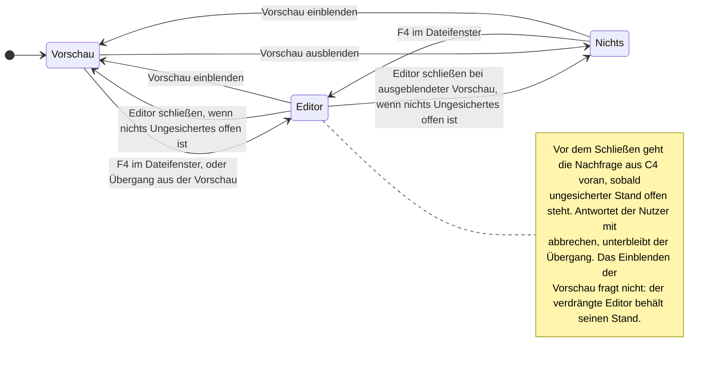
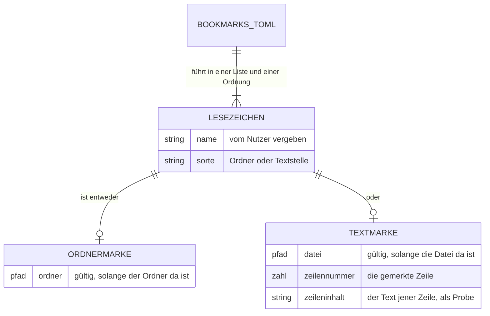
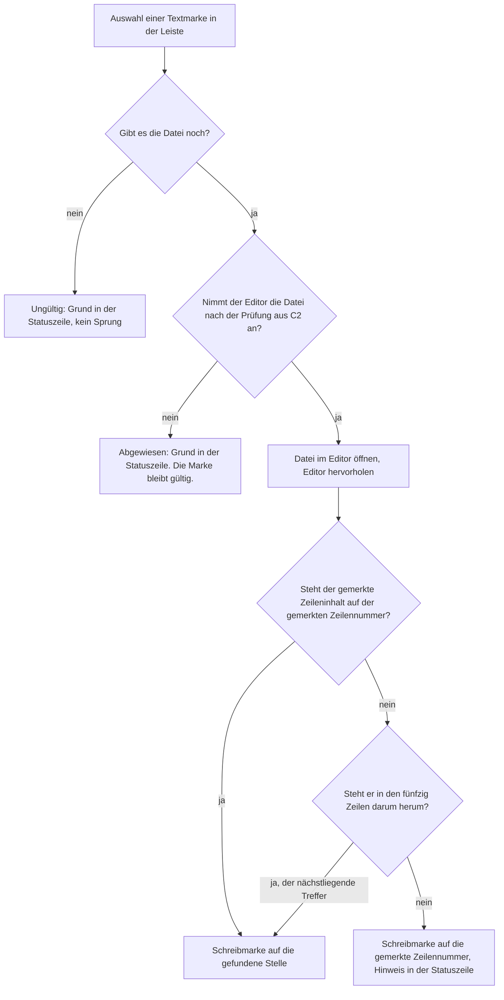
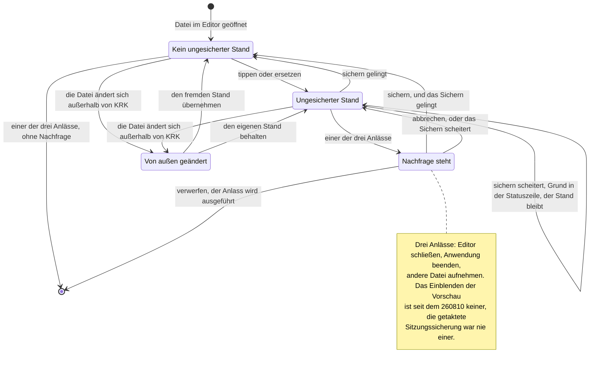
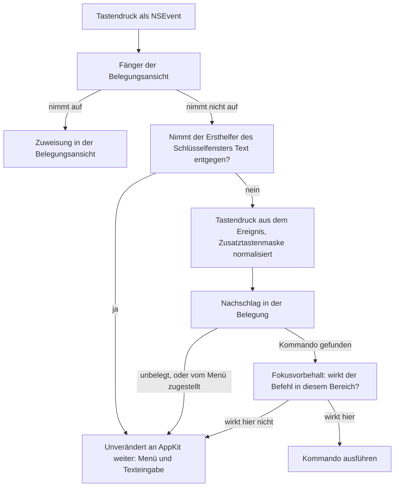
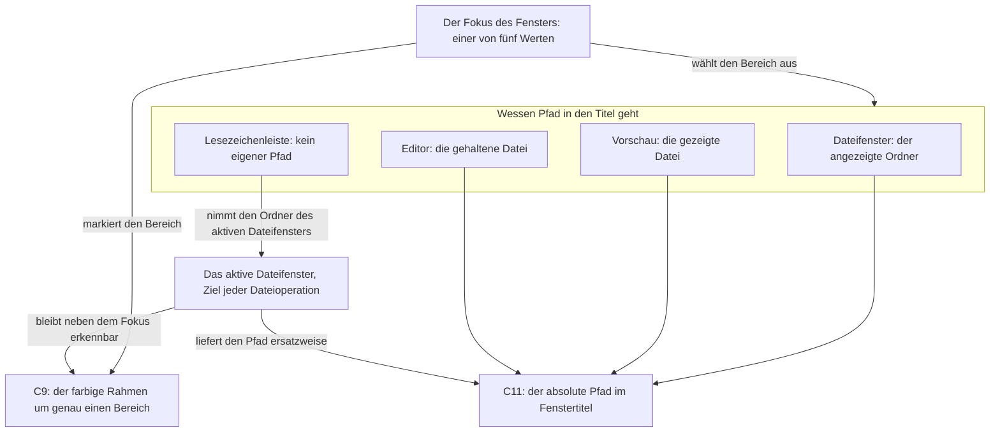

# Spec: Der eingebaute Editor mit Roh- und Formatansicht und Textmarken (Runde 2)

**Datum:** 2026-08-08, erweitert am 2026-08-09
**Status:** Fertig zur Abnahme
**Circle:** `circles/260807-2116-eingebauter-editor-mit-textmarken`
**Quelle:** Circle-Directive im Datensatz `_t_circle.md`, Abschnitt `## Directive`, dazu die vier Festlegungen der Aktivierungsrunde vom 260807-2139 und die sechs Festlegungen der Spec-Runde vom 260808-0017, beide in `history/260807-2139-orchestrator-session.md`. Die Fähigkeiten C9 bis C11 sind am 260809-2035 auf Wunsch des Nutzers hinzugekommen, mitten in der Umsetzung; der Abschnitt `## Die vier später hinzugekommenen Fähigkeiten` hält fest, warum sie nicht im ursprünglichen Zuschnitt standen.

> **Der Umfang ist am 260809-2035 gewachsen.** Der Nutzer hat vier Anzeigefähigkeiten nachgetragen: eine sichtbare Fokusanzeige für alle fünf Bereiche (C9), Zeilennummern im Editor und in der Vorschau (C10, zwei der vier) und den vollen Pfad im Fenstertitel (C11). Sie stehen unten neben C1 bis C8 und binden dieselbe Runde. Eine neue offene Frage kommt mit ihnen, und sie hält keinen Planschritt auf: was der Akzentrahmen künftig bedeutet, den Fokus oder das aktive Dateifenster (`decisions/260809-2043_o_bedeutet-der-akzentrahmen-kuenftig-den-fokus-oder-das-aktive-dateifenster.md`).

> **Gatehinweis für den Nutzer.** Die fünf Fragen, die die erste Fassung dieses Specs offen führte, sind beantwortet. Ihre Datensätze unter `decisions/` tragen den Marker `_a_` und je eine `Answered:`-Zeile. Zwei Antworten haben den Zuschnitt der Runde verändert: die einklappbaren Blöcke entfallen, und die Textmarke trägt eine Stelle statt eines Bereichs.
>
> **Drei Punkte gehen mit der Abnahme mit.** Erstens eine Ableitung des Shapers, die der Nutzer umstoßen kann: der gegenseitige Ausschluss von Editor und Vorschau gilt in beide Richtungen (C1). Zweitens eine Frage, die aus der Größen- und Typgrenze entstanden ist und den Plan bindet, aber keinen Planschritt aufhält: was der Editor beim Sichern über den unveränderten Teil der Datei zusagt (`decisions/260808-0021_o_was-sagt-der-editor-beim-sichern-ueber-den-unveraenderten-teil-der-datei-zu.md`). Drittens eine zweite Ableitung aus der Erweiterung vom 260809: der Fenstertitel folgt dem Fokus und nicht dem aktiven Dateifenster (C11). Alle drei stehen unten unter `## Was die Abnahme mitentscheidet`.
>
> **Ein Befund aus der Codedurchsicht ändert den Zuschnitt und steht deshalb hier oben.** Der Ereignisabgriff von KRK reicht jeden Tastendruck unverändert an AppKit weiter, sobald der Ersthelfer des Schlüsselfensters eine `NSTextView` ist (`crates/krk-ui/src/appkit/ereignisse.rs:386-395`). Ein Editor auf Grundlage von `NSTextView` fiele damit unter dieselbe Regel: mit dem Fokus im Editor würde **kein** Tastenbefehl von KRK mehr wirken, weder der Weg zurück in ein Dateifenster noch die Befehle des Editors selbst. Das ist in einer Anwendung, deren erste Maxime die Tastatursteuerung ist, kein Randfall, sondern die tragende Frage dieser Runde. Sie steht als eigene Fähigkeit C7.

## Directive dieser Runde

Nach dieser Runde öffnet der Nutzer eine Textdatei aus dem Dateifenster mit F4 im eingebauten Editor, bearbeitet sie in einer Rohansicht oder einer Formatansicht, springt zu einer Zeilennummer, sucht und ersetzt innerhalb der geöffneten Datei und setzt Marken auf Textstellen, die in derselben Leiste und derselben Ablagedatei stehen wie seine Ordner-Lesezeichen. Der Editor ist der vierte Fokusbereich neben der Lesezeichenleiste, den beiden Dateifenstern und dem Vorschaufenster; er teilt sich die Fläche mit der Vorschau zeitlich, nicht räumlich.

Er sieht dabei, wo er ist und woran er arbeitet: alle fünf Bereiche zeigen an, welcher von ihnen die Tasten annimmt, neben dem Text stehen im Editor wie in der Vorschau die Zeilennummern der Datei, und im Fenstertitel steht der volle Pfad dessen, was der Bereich mit dem Fokus hält.

Suchen und Ersetzen über mehrere Dateien gehört nicht dazu. Die Git-Anbindung und die KI-Anbindung ebenfalls nicht.

## Aufbau dieser Runde

Die Bezeichner C1 bis C11 verweisen auf die Fähigkeiten weiter unten. Sie zählen für diese Runde neu von eins an; wo dieser Spec eine Fähigkeit der Runde 1 meint, schreibt er das aus, etwa "C5 der Runde 1". C1 bis C8 tragen den Zuschnitt vom 260808, C9 bis C11 die Erweiterung vom 260809.

### Wie sich Vorschau und Editor die eine Fläche teilen

Der Circle-Datensatz zeigt die Fensterzeile vorher und nachher. Was er offen lässt, ist der Zustandswechsel zwischen beiden, und genau der trägt die Abnahmekriterien von C1:

Der Zustand `Nichts` ist die dritte Möglichkeit und keine Auslassung: C7 der Runde 1 sagt zu, dass sich jeder Randbereich ausblenden lässt, und die beiden Dateifenster nehmen den frei werdenden Platz.

Die beiden Kanten, die den Editor schließen, tragen einen Vorbehalt, die übrigen sechs nicht. Der Grund ist, dass allein sie einen Stand verlieren können; die vollständige Regel dazu steht unten im Zustandsbild von C4. Das Einblenden der Vorschau steht seit dem 260810 als eigene Kante ohne Vorbehalt daneben, weil es den Editor zwar von der Fläche nimmt, seinen Stand aber nicht anfasst (`decisions/260810-0021_a_was-verwirft-verwerfen-wenn-die-vorschau-den-editor-nur-verdraengt.md`).

### Die eine Lesezeichenliste mit zwei Sorten

Zwei Bilder statt eines, weil zwei Gegenstände gemeint sind. Das erste ist die Ablageform, das zweite das Verfahren beim Sprung. Die Ablageform:

Genau eine der beiden Sorten liegt je Lesezeichen vor, nie beide und nie keine. Die Gültigkeitsprüfung fragt in beiden Fällen dasselbe, nämlich ob der Pfad noch da ist; verschieden ist allein, ob ein Ordner oder eine Datei erwartet wird. Der gemerkte Zeileninhalt geht in diese Prüfung **nicht** ein, und das ist der tragende Teil der Antwort vom 260808-0017: die Prüfung wird bei jedem Neuaufbau der Leiste gestellt und bleibt damit eine Frage an das Dateisystem statt eines Lesevorgangs je Marke.

Das Verfahren beim Sprung:

Zwei Ausgänge tragen verschiedene Namen für verschiedene Sachen. `Ungültig` heißt allein, dass die Datei fehlt, und wird in der Leiste angezeigt. `Abgewiesen` heißt, dass die Datei da ist, der Editor sie aber nach C2 nicht annimmt, etwa weil sie inzwischen über die Größengrenze gewachsen ist; die Marke bleibt dabei gültig, weil sich an ihr nichts geändert hat.

### Der ungesicherte Stand und die drei Anlässe der Nachfrage

Der Editor ist der einzige Bereich in KRK, der einen Zustand hält, den ein Schließen verlieren kann. C4 trägt dafür neun Abnahmekriterien; dieses Bild zeigt, wie sie zusammenhängen, und macht prüfbar, ob die Fallunterscheidung vollständig ist:

Drei Eigenschaften dieses Bildes sind Zusagen und keine Zeichnung. Aus `Frage` führen genau drei Kanten heraus, so viele wie das Blatt Wahlmöglichkeiten anbietet. Ein gescheitertes Sichern landet an beiden Stellen im Zustand `Offen` und nicht im Nichts: der Stand des Editors wird nirgends weggeworfen. Und `Fremd` hat zwei Ausgänge, weil die von außen geänderte Datei eine Wahl verlangt und nicht stillschweigend gewinnt.

### Der Weg vom Tastendruck zum Kommando

Dieses Diagramm trägt die beiden Fähigkeiten, die von der Codedurchsicht kommen. Es bildet den gebauten Weg ab, nicht einen gewünschten:

Zwei Knoten dieses Graphen sind der Gegenstand von C7 und C8. Bei `Nimmt der Ersthelfer Text entgegen?` scheitert heute jede Tastenbedienung eines Editors, der auf `NSTextView` steht. Bei `Zusatztastenmaske normalisiert` liegt der zweite der beiden Verdächtigen des offenen Defekts `shared/issues/260807-2112_o_cmd-y-und-shift-cmd-y-loesen-nichts-aus-f3-schon.md`; der erste Verdächtige liegt vor dem Graphen, beim Abgriff des Menüs.

### Eine Quelle, zwei Anzeigen: der Fokus im Rahmen und im Titel

C9 und C11 hängen an derselben Angabe und sind deshalb hier zusammen gezeichnet. Der Rahmen sagt, **wo** der Nutzer arbeitet, der Titel sagt, **woran**; beide lesen denselben Fokus, und keiner führt einen zweiten Begriff daneben:

Der Knoten `Das aktive Dateifenster` steht mit zwei Kanten darin, und beide sind Zusagen. Er zeigt in den Rahmen, weil der Nutzer auch mit dem Fokus im Editor sehen muss, aus welchem Dateifenster F5 kopiert. Und er zeigt in den Titel, weil er die Antwort für die beiden Bereiche liefert, die selbst keinen Pfad halten: die Lesezeichenleiste, deren Auswahl genau jenes Fenster setzt, und ein Editor oder eine Vorschau ohne Datei.

## Fähigkeiten

### C1: Der Editor als vierter Fokusbereich

**Beschreibung:** Der Editor steht in der Fensterzeile an der Stelle, an der sonst das Vorschaufenster steht, und beide sind nie zugleich zu sehen. Er nimmt beim ersten Öffnen rund ein Drittel der Fensterbreite; die beiden Dateifenster rücken dafür zusammen, die Lesezeichenleiste behält ihre Breite. Danach verhält sich seine Breite wie die jedes anderen Bereichs: sie lässt sich verstellen, überlebt das Ausblenden und den Neustart.

**Abnahmekriterien:**
- [ ] Der Editor erscheint an der Stelle des Vorschaufensters. Öffnet der Nutzer ihn, während die Vorschau sichtbar ist, verschwindet die Vorschau; blendet er die Vorschau ein, während der Editor offen ist, verschwindet der Editor. Beide zugleich sichtbar zu haben ist über keinen Weg erreichbar.
- [ ] Beim ersten Öffnen nimmt der Editor rund ein Drittel der Fensterbreite. Die Lesezeichenleiste behält dabei ihre Breite, und die beiden Dateifenster geben zusammen ab, was der Editor bekommt.
- [ ] Die beiden Breitenbefehle aus C7 der Runde 1 verstellen die Breite des Editors, solange er den Fokus hat, so wie sie es für die Lesezeichenleiste und die Vorschau tun.
- [ ] Der Editor lässt sich nicht schmaler ziehen, als eine Zeile Text noch lesbar ist. Die beiden Dateifenster fallen dabei nicht unter ihre Mindestbreite.
- [ ] Eine verstellte Breite des Editors überlebt Beenden und Neustart, so wie C7 der Runde 1 es für die vier bestehenden Bereiche zusagt.
- [ ] Ein Tastenbefehl setzt den Eingabefokus in den Editor. Ist der Editor ausgeblendet und hält keine Datei, tut der Befehl nichts; hält er eine Datei und ist nur ausgeblendet, holt der Befehl ihn hervor und setzt danach den Fokus hinein, wie es die drei Fokusbefehle der Runde 1 für ihre Bereiche tun.
- [ ] Ein Tastenbefehl setzt den Fokus aus dem Editor zurück in das aktive Dateifenster. Der bestehende Befehl aus C5 der Runde 1 tut das und braucht dafür keinen zweiten daneben.

**Getroffene Festlegungen:**
- **Der gegenseitige Ausschluss gilt in beide Richtungen, und das ist eine Ableitung und keine gesonderte Antwort des Nutzers.** Die Directive sagt, Editor und Vorschau teilten sich die Fläche zeitlich statt räumlich, und nennt ausdrücklich nur die eine Richtung: der Editor schließt die Vorschau. Die andere Richtung folgt zwingend, denn ohne sie gäbe es einen Weg, auf dem beide dieselbe Fläche beanspruchen. Der Nutzer kann diese Ableitung am Gate umstoßen; sie steht deshalb auch unten unter `## Was die Abnahme mitentscheidet`.
- **Aus dem Ausschluss folgt, dass die Breitenregel unverändert bleibt.** `crate::fenstermodell::bereichsbreiten` verteilt heute den Platz, indem die beiden Randbereiche ihre gespeicherte Breite bekommen und die Dateifenster den Rest im Verhältnis teilen. Weil Vorschau und Editor nie zugleich sichtbar sind, sind auch künftig höchstens zwei Randbereiche zu bedienen. Die Regel bekommt einen fünften Platz in ihren Feldern und keinen zweiten Rechenweg daneben. Das ist die Wiederverwendung, die der Circle-Datensatz mit "die Breitenregel steht einmal" meint.
- **"Rund ein Drittel" ist die Anfangsbreite und nicht eine dauerhafte Bindung.** Alle vier bestehenden Bereiche tragen eine Anfangsbreite, die beim allerersten Start gilt, und danach die Breite, die der Nutzer gesetzt hat. Der Editor fügt sich ein. Ob das Drittel als Anteil gerechnet oder als Punktzahl gesetzt wird, entscheidet der Planner.
- **Der Editor bekommt keine eigene Meldezeile.** Was er dem Nutzer zu sagen hat, geht in die Statuszeile aus C1 der Runde 1 und reiht sich in deren fünf Ränge ein. Die Übergabe an die Editor-Runde sagt das ausdrücklich zu.

### C2: Die beiden Einstiege in den Editor und die eine Prüfung davor

**Beschreibung:** Der Nutzer kommt auf zwei Wegen in den Editor. Aus dem Dateifenster öffnet F4 den ausgewählten Eintrag, so wie es die Norton-Bedeutung dieser Taste verlangt. Aus der Vorschau führt ein Übergang in den Editor, und er nimmt die angezeigte Datei mit, weil sich die Vorschau beim Öffnen des Editors schließt. Vor beiden Wegen steht dieselbe Prüfung: der Editor nimmt Textdateien bis rund 16 MB an und weist alles übrige mit einem Grund in der Statuszeile ab.

**Abnahmekriterien:**
- [ ] F4 im Dateifenster öffnet den ausgewählten Eintrag im Editor. Die Taste ist dafür seit der Runde 1 freigehalten: `resources/default-keymap.toml:130-137` führt die Funktion `bearbeiten` mit leerer Tastenliste und dem Feld `reserviert_fuer = "editor"`.
- [ ] Nach dem Öffnen steht der Eingabefokus im Editor, ohne dass der Nutzer einen zweiten Befehl braucht.
- [ ] Ein Tastenbefehl mit Fokus in der Vorschau öffnet die dort angezeigte Datei im Editor. Die Vorschau schließt sich dabei, und der Editor zeigt dieselbe Datei; sie geht auf diesem Weg nicht verloren.
- [ ] Der Übergang aus der Vorschau wirkt nur, wenn die Vorschau eine Datei zeigt. Zeigt sie den Inhalt der Zwischenablage aus C10 der Runde 1 oder ist sie leer, tut der Befehl nichts und meldet den Grund in der Statuszeile.
- [ ] Der Editor öffnet eine Datei nur, wenn sie höchstens rund 16 MB groß ist und sich vollständig als Text lesen lässt. Beides wird geprüft, bevor der Editor sie annimmt.
- [ ] Die Größe wird geprüft, **bevor** die Datei gelesen wird, so wie es die Vorschau in `crates/krk-ui/src/vorschaumodell.rs` für ihre beiden Grenzen tut. Eine Datei über der Grenze steht zu keinem Zeitpunkt vollständig im Arbeitsspeicher.
- [ ] Eine Datei, die keine gültige Textdatei ist, wird abgewiesen und nicht mit Ersatzzeichen geöffnet. Der Editor hält nie einen Stand, der beim Sichern Bytes der Datei ersetzen würde.
- [ ] Ein Ordner wird immer abgewiesen. Eine Verknüpfung wird nach dem behandelt, worauf sie zeigt.
- [ ] Beide Einstiege legen dieselbe Prüfung an. Ein Eintrag, den F4 abweist, wird auch über den Übergang aus der Vorschau abgewiesen, mit demselben Grund; dasselbe gilt für den Sprung auf eine Textmarke aus C6.
- [ ] Jede Abweisung nennt ihren Grund in der Statuszeile und unterscheidet dabei zu groß von nicht als Text lesbar. Kommentarlos nichts zu tun ist in keinem Fall zulässig.
- [ ] Ist der Editor schon offen und hält eine andere Datei, gilt vor dem Wechsel die Nachfrage aus C4, falls die gehaltene Datei ungesicherte Änderungen trägt. Die Prüfung der neuen Datei steht dabei vor der Nachfrage: eine Datei, die der Editor ohnehin abweist, kostet den Nutzer keine Rückfrage.

**Getroffene Festlegungen:**
- **Zwei Einstiegswege statt einem, festgelegt vom Nutzer am 260807-2139.** Der Übergang aus der Vorschau muss die Datei aktiv mitnehmen; ein Übergang, der sie nur stehen ließe, verlöre sie mit dem Schließen der Vorschau.
- **Die Quelle für den Übergang liegt bereit.** `Vorschaumodell::aktiver_pfad` (`crates/krk-ui/src/vorschaumodell.rs:387`) liefert den Pfad des aktiven Vorschau-Tabs. Der Übergang braucht dafür keinen zweiten Weg neben dem gebauten. Geprüft am Code, nicht angenommen.
- **Der Nutzer hat am 260808-0017 die eigene, höhere Grenze gewählt: rund 16 MB, nur Text** (`decisions/260807-2147_a_welche-dateien-oeffnet-der-editor-ueberhaupt.md`). Damit stehen zwei Zahlen für dieselbe Frage in zwei Flächen: die Vorschau nimmt Text bis 1 MB (`TEXTGRENZE` in `crates/krk-ui/src/vorschaumodell.rs:83`), der Editor bis rund 16 MB. Beide tragen dieselbe Regel, nämlich eine Obergrenze für das vollständige Einlesen in den Arbeitsspeicher; verschieden ist allein, wie viel die jeweilige Handlung rechtfertigt. `speculation:` Die 16 MB sind ein Vorschlag und keine gemessene Größe.
- **Was "als Text lesbar" heißt, ist am gebauten Code abgelesen und nicht neu erfunden.** Die Vorschau liest die Bytes und wandelt sie über `String::from_utf8` (`crates/krk-ui/src/vorschaumodell.rs:522-527`); scheitert die Wandlung, gilt die Datei nicht als Text. Der Editor legt dieselbe Regel an. Das ist die Wiederverwendung einer bestehenden Antwort statt einer zweiten Definition daneben, und es macht die bindende Zusage der nächsten Festlegung prüfbar.
- **Bindend, unabhängig von der Zahl: kein Weg darf eine Datei beim Sichern verändern, die der Editor nicht vollständig und verlustfrei als Text gelesen hat.** Der Schaden, den diese Zusage abwendet, ist konkret: ein Editor, der eine Binärdatei als Text einliest, ersetzt beim Sichern jede ungültige Bytefolge durch ein Ersatzzeichen, und die Datei ist danach zerstört, ohne dass der Nutzer mehr getan hätte als F4 zu drücken.
- **Was diese Zusage über den unveränderten Teil der Datei noch nicht sagt, ist eine neue offene Frage.** Sie betrifft Zeilenenden, den abschließenden Zeilenumbruch und eine Bytefolgenmarke am Dateianfang und steht in `decisions/260808-0021_o_was-sagt-der-editor-beim-sichern-ueber-den-unveraenderten-teil-der-datei-zu.md`. Sie hält keinen Planschritt auf und bindet den Schritt, der das Sichern baut.

### C3: Rohansicht und Formatansicht, je Dateityp eigens besetzt

**Beschreibung:** Der Editor trägt zwei Ansichten derselben Datei. Die Rohansicht zeigt bei jedem Dateityp die Zeichen so, wie sie in der Datei stehen. Die Formatansicht ist je Dateityp verschieden besetzt: Markdown erscheint gerendert, Code mit Syntaxhervorhebung, einfacher Text mit Umbruch am Fensterrand und in lesbarer Schriftgröße. In beiden Ansichten lässt sich bearbeiten.

**Abnahmekriterien:**
- [ ] Ein Tastenbefehl schaltet zwischen Rohansicht und Formatansicht um. Der Umschalter ist bei jedem Dateityp vorhanden und tut bei jedem etwas Sichtbares.
- [ ] Die Rohansicht zeigt die Zeichen der Datei ohne Umbruch, ohne Einfärbung und ohne Ausblendung.
- [ ] Bei einer Markdown-Datei zeigt die Formatansicht das gerenderte Dokument mit Überschriften, Listen und Links.
- [ ] Bei einer Codedatei zeigt die Formatansicht Syntaxhervorhebung: Schlüsselwörter, Zeichenketten, Zahlen und Kommentare sind gegeneinander abgesetzt.
- [ ] Die Hervorhebung trägt mindestens die Sprachen, die der Nutzer in KRK selbst bearbeitet, also Rust, TOML, Markdown und Shell, und darüber hinaus die gängigen Sprachen, die die eingebundene Kiste mitbringt.
- [ ] Eine Datei in einer Sprache, die die Kiste nicht kennt, fällt in der Formatansicht auf die Textdarstellung mit Umbruch zurück und meldet keinen Fehler.
- [ ] Die Einfärbung folgt dem Erscheinungsbild des Systems. In Hell wie in Dunkel ist jeder eingefärbte Textteil lesbar.
- [ ] Bei einer Datei aus einfachem Text zeigt die Formatansicht Umbruch am Fensterrand und eine gegenüber der Rohansicht lesbarere Schriftgröße.
- [ ] In beiden Ansichten lässt sich bearbeiten. Eine in der Formatansicht getippte Änderung steht nach dem Umschalten in der Rohansicht und umgekehrt.
- [ ] Der Wechsel zwischen den Ansichten verliert keine ungesicherte Änderung. Beide Ansichten arbeiten auf demselben Stand und nicht auf zwei Kopien.
- [ ] Die Schreibmarke steht nach dem Umschalten an derselben Textstelle wie vorher, soweit die Stelle in der Zielansicht sichtbar ist.
- [ ] Die eingebundene Kiste trägt in `Cargo.toml` eine geschriebene Begründung, so wie die vier bestehenden fremden Kisten mit Wirkung auf die Anwendung. Die Begründung nennt, was die Kiste leistet, warum keine bestehende Abhängigkeit es leistet, und welche Merkmale abgeschaltet sind.

**Getroffene Festlegungen:**
- **Der Nutzer hat am 260807-2139 die erste Möglichkeit aus `shared/decisions/260802-0842_a_editor-formatansicht-je-dateityp.md` gewählt und ist der Empfehlung jenes Datensatzes nicht gefolgt.** Empfohlen war die dritte, eine durchweg schreibgeschützte Leseansicht. Der dort benannte Preis der ersten gilt damit: bei einfachem Text ist der Unterschied zwischen den beiden Ansichten schwach. Der Gegenwert ist, dass in der gerenderten Markdown-Ansicht geschrieben werden kann.
- **Die Syntaxhervorhebung kommt aus einer fertigen Rust-Kiste, gewählt vom Nutzer am 260808-0017** (`decisions/260807-2147_a_fuer-welche-sprachen-hebt-die-formatansicht-syntax-hervor.md`). Das Projekt schreibt keine Sprachregel selbst. Die Kiste wird die **fünfte fremde Kiste mit Wirkung auf die Anwendung** und fügt sich in ein bestehendes Muster ein: die vier bestehenden tragen in `Cargo.toml` je eine geschriebene Begründung, die sagt, was die Kiste leistet und warum keine Alternative sie ersetzt. Welche Kiste es wird, entscheidet der Planner.
- **Ein Preis ist angenommen und benannt.** `speculation:` Ob eine solche Kiste die Maxime "superschnell" auf dem Referenzgerät von 2018 hält, ist ungemessen, und der Abnahmelauf, an dem man es messen würde, ist aus dieser Runde ausgeklammert. Diese Runde kann die Frage deshalb nicht schließen; sie fällt an die spätere Messrunde und steht dort neben den drei berührten Zeitzusagen unten.
- **Die einklappbaren Blöcke entfallen in dieser Runde.** Hervorhebung braucht Wortarten, Einklappen braucht Blockgrenzen; das sind zwei Kenntnisse und nicht eine, und die gewählte Kiste liefert die erste. Die Festlegung vom 260807-2139 lautete "Syntaxhervorhebung mit einklappbaren Blöcken" und ist damit zur Hälfte zurückgenommen. Der Datensatz `shared/decisions/260802-0842_a_editor-formatansicht-je-dateityp.md` trägt den Nachtrag vom 260808-0017. Die Blöcke stehen unten unter `## Ausdrücklich außerhalb dieser Runde`.
- **Die Ansichtswahl ist eine Eigenschaft der geöffneten Datei und nicht der Anwendung.** Wer eine Markdown-Datei gerendert liest und danach eine Codedatei öffnet, bekommt deren Formatansicht und nicht die Rohansicht. Vorbelegung, weil sie dem Halteverhalten der Vorschau-Tabs aus C6 der Runde 1 entspricht: jede Quelle schreibt in den aktiven Bereich, und die Wahl bleibt stehen, bis jemand sie ändert.
- **Dass die Einfärbung dem Erscheinungsbild des Systems folgt, ist eine Ableitung aus zwei bestehenden Entscheidungen und keine neue Frage.** `crates/krk-ui/src/appkit/leiste.rs:441` und der Modulkopf von `tableiste.rs` begründen beide, warum KRK das Erscheinungsbild von Hell und Dunkel nicht selbst nachbaut. Eine Kiste bringt ihre Farbtafeln als feste Paletten mit; welche davon KRK nimmt und wie sie an die Systemfarben gebunden wird, entscheidet der Planner. Zugesagt ist allein das Ergebnis: lesbar in beiden Erscheinungsbildern.

### C4: Bearbeiten, Sichern und die Nachfrage bei ungesicherten Änderungen

**Beschreibung:** Der Editor ist der erste Bereich in KRK, der einen Zustand hält, den ein Schließen verlieren kann. Ein Befehl sichert die Datei. Steht ungesicherter Stand offen, fragt KRK an drei Anlässen nach und lässt die Wahl zwischen sichern, verwerfen und abbrechen.

**Abnahmekriterien:**
- [ ] Ein Tastenbefehl schreibt den Stand des Editors in die Datei. Danach meldet der Editor keine ungesicherten Änderungen mehr.
- [ ] Der Editor zeigt an, dass er ungesicherte Änderungen hält, und zwar so, dass der Nutzer es ohne Hinsehen auf die Statuszeile bemerkt.
- [ ] Wird der Editor mit ungesicherten Änderungen geschlossen, erscheint eine Nachfrage mit drei Wahlmöglichkeiten: sichern, verwerfen, abbrechen. "Abbrechen" lässt den Editor offen und die Änderungen stehen.
- [ ] Dieselbe Nachfrage erscheint, wenn die Anwendung mit ungesicherten Änderungen beendet wird. "Abbrechen" hält das Beenden an, und KRK läuft weiter.
- [ ] Dieselbe Nachfrage erscheint, wenn der Editor über einen der beiden Einstiege aus C2 eine andere Datei aufnehmen soll.
- [ ] Die getaktete Sitzungssicherung fragt nichts und hält die Anwendung nicht an. Sie schreibt weiterhin höchstens einmal je zwei Sekunden und trägt den ungesicherten Stand des Editors nicht mit.
- [ ] Die Sitzung hält fest, welche Datei der Editor offen hat, und stellt sie beim nächsten Start wieder her, so wie C7 der Runde 1 es für die Tabs der Dateifenster zusagt. Der ungesicherte Stand gehört nicht dazu.
- [ ] Wird die geöffnete Datei außerhalb von KRK geändert, während der Editor sie hält, meldet KRK das und überschreibt die fremde Änderung nicht ohne Zutun des Nutzers.
- [ ] Eine gescheiterte Sicherung, etwa wegen fehlenden Schreibrechts, meldet den Grund in der Statuszeile und wirft den Stand des Editors nicht weg. Das gilt auch, wenn die Sicherung aus der Nachfrage heraus angestoßen wurde: der Anlass unterbleibt dann, statt den Stand mitzunehmen.

**Getroffene Festlegungen:**
- **Der Nutzer hat am 260807-2139 die Nachfrage gewählt und drei Anlässe genannt:** das Schließen des Editors, das Beenden der Anwendung und die Sitzungssicherung in `session.toml`.
- **Der dritte Anlass fällt am 260808-0017 mit dem zweiten zusammen** (`decisions/260807-2147_a_wie-greift-die-nachfrage-bei-der-sitzungssicherung.md`). Die Sitzung wird beim Beenden ein letztes Mal geschrieben, und dort steht die Nachfrage ohnehin. Die getakteten Zwischenschreibvorgänge von höchstens einem je zwei Sekunden (`SITZUNGSTAKT` in `crates/krk-core/src/ablage/sitzung.rs:33`) fragen nichts; sie halten allein fest, welche Datei offen ist. Aus drei genannten Anlässen werden damit zwei, und mit dem einen abgeleiteten unten sind es drei.
- **Der Preis dieser Antwort ist angenommen und benannt.** Bei einem Absturz oder einem erzwungenen Beenden ist der ungesicherte Stand verloren, ohne dass jemand gefragt hätte. Eine Absturzsicherung, die den Pufferinhalt mitsichert, steht unten unter `## Ausdrücklich außerhalb dieser Runde`.
- **Ein Anlass ist hinzugekommen, den der Nutzer nicht genannt hat, und er folgt aus seiner eigenen Festlegung.** Der Wechsel auf eine andere Datei folgt daraus, dass der Editor eine Datei hält. Er verliert denselben Stand wie das Schließen und trägt deshalb dieselbe Nachfrage. Ein Fall daneben mit eigener Regel entstünde nur, wenn man ihn ausließe.
- **Ein zweiter abgeleiteter Anlass stand hier bis zum 260810 und ist gefallen.** Das sechste Abnahmekriterium verlangte die Nachfrage auch vor dem Einblenden der Vorschau, mit der Begründung, das Verdrängen durch die Vorschau verliere denselben Stand wie das Schließen. Am gebauten Code stimmt diese Begründung nicht: ein Wechsel der Sichtbarkeit setzt `hidden` an den Ansichten und fasst das Editormodell nicht an. Der verdrängte Editor hält seinen Stand weiter, und "Verwerfen" verwarf an dieser einen Stelle nichts. Der Nutzer hat den Anlass am 260810-0250 fallen lassen; der Datensatz mit den drei geprüften Möglichkeiten ist `decisions/260810-0021_a_was-verwirft-verwerfen-wenn-die-vorschau-den-editor-nur-verdraengt.md`. Das sechste Abnahmekriterium ist mit ihm gestrichen, und die Nachfrage steht seither genau dort, wo etwas auf dem Spiel steht.
- **Die Nummern der Abnahmekriterien haben sich dabei um eins verschoben.** C4 trägt seit dem 260810 neun statt zehn. Wer in einem Dokument von vor diesem Tag das siebte bis zehnte Abnahmekriterium von C4 zitiert findet, liest es hier als das sechste bis neunte. Der Code ist nachgezogen.
- **Das Beenden hat heute keinen Ort für eine Nachfrage.** `crates/krk-ui/src/appkit/anwendung.rs:1162` hält fest, dass es kein `applicationShouldTerminate:` gibt und die Aufrufer von `beenden` nicht mit einer Rückkehr rechnen. Dass die Nachfrage beim Beenden greift, ist damit kein Nachziehen an einer bestehenden Stelle, sondern eine neue. Geprüft am Code, nicht angenommen. Weil die Antwort vom 260808-0017 den Anlass Sitzungssicherung in das Beenden hineinzieht, wird diese Stelle zur einzigen, an der ungesicherter Stand vor einem Programmende überhaupt bemerkt wird.
- **Die Nachfrage ist ein Blatt am Fenster und keine Meldung in der Statuszeile.** Die Runde 1 führt fünf Blätter für Rückfragen, darunter die vor dem endgültigen Löschen, und die Statuszeile trägt Meldungen, auf die niemand antwortet. Vorbelegung nach der bestehenden Ordnung; ein Blatt ist der Ort, an dem KRK auf eine Antwort wartet.

### C5: Zeilensprung, Suchen und Ersetzen innerhalb der geöffneten Datei

**Beschreibung:** Der Nutzer springt im Editor zu einer Zeilennummer, sucht eine Zeichenfolge und ersetzt sie, einzeln oder in einem Zug. Alles davon wirkt allein in der geöffneten Datei.

**Abnahmekriterien:**
- [ ] Ein Tastenbefehl fragt nach einer Zeilennummer und setzt die Schreibmarke an den Anfang dieser Zeile. Die Zeile ist danach sichtbar.
- [ ] Eine Zeilennummer über der Zeilenzahl der Datei springt an das Dateiende und meldet den Grund, statt kommentarlos nichts zu tun.
- [ ] Ein Tastenbefehl fragt nach einer Zeichenfolge und stellt die Schreibmarke auf den nächsten Treffer. Ein weiterer Befehl geht zum darauffolgenden Treffer, ein dritter zum vorigen.
- [ ] Die Suche sagt, wie viele Treffer die Datei enthält und der wievielte gerade angesteuert ist.
- [ ] Ohne Treffer meldet die Suche das und lässt die Schreibmarke stehen.
- [ ] Ein Tastenbefehl ersetzt den angesteuerten Treffer und geht zum nächsten. Ein weiterer ersetzt alle Treffer in einem Zug und nennt danach, wie viele es waren.
- [ ] Suchen und Ersetzen wirken in beiden Ansichten aus C3 und beziehen sich auf den Text der Datei, nicht auf seine Darstellung.
- [ ] Ein Ersetzen ist eine ungesicherte Änderung im Sinne von C4 und schreibt nicht von sich aus in die Datei.
- [ ] Die Suche geht über den gehaltenen Stand des Editors und nicht über die Datei auf der Platte. Was der Nutzer eben getippt und noch nicht gesichert hat, wird gefunden.

**Getroffene Festlegungen:**
- **Suchen und Ersetzen über mehrere Dateien bleibt draußen.** Der Shaper hat es am 260802 als eigenes Vorhaben abgegrenzt, mit der Begründung, dass es einen Scan über Verzeichnisbäume, eine Trefferliste, eine Vorschau der geplanten Ersetzungen und einen Rückweg für eine misslungene Stapelersetzung braucht. Die Directive dieses Circles nimmt die Abgrenzung wörtlich auf.
- **Die Eingabe von Zeilennummer und Suchtext geht über ein Blatt mit Textfeld**, wie die Pfadeingabe aus C2 der Runde 1. Vorbelegung nach der bestehenden Ordnung. Sie hat eine Folge, die C7 betrifft: solange ein solches Blatt offen steht, gilt der Fokusvorbehalt des Ereignisabgriffs unverändert, und das ist richtig so.
- **Groß- und Kleinschreibung, reguläre Ausdrücke und die Suchrichtung sind nicht festgelegt.** Der Spec sagt zu, dass gesucht und ersetzt wird, und nicht, mit welchen Schaltern. Wer sie will, bekommt sie in einer späteren Runde; wer sie in dieser Runde will, muss es sagen, denn jeder Schalter ist ein Bedienelement und ein Abnahmekriterium mehr.
- **Die Regel für eine zu große Zeilennummer wird von C6 mitbenutzt.** Eine Textmarke, deren gemerkte Zeile in einer inzwischen gekürzten Datei nicht mehr existiert, landet über dieselbe Regel am Dateiende. Ein zweiter Weg daneben entsteht nicht.

### C6: Textmarken in derselben Leiste und derselben Datei wie die Ordner-Lesezeichen

**Beschreibung:** Der Nutzer setzt im Editor eine Marke auf eine Textstelle, also auf eine Zeile. Sie erscheint als Lesezeichen in der Leiste, neben seinen Ordner-Lesezeichen, in derselben Liste und derselben Ordnung. Ihre Auswahl öffnet die Datei im Editor und springt an die gemerkte Stelle. Eine Marke hängt an einer Zeilennummer und am Textinhalt jener Zeile als Probe.

**Abnahmekriterien:**
- [ ] Ein Tastenbefehl im Editor legt eine Marke auf die Zeile der Schreibmarke an. Der Nutzer vergibt dabei einen Namen, wie beim Anlegen eines Ordner-Lesezeichens.
- [ ] Eine Marke bezeichnet genau eine Zeile. Ein Textbereich über mehrere Zeilen entsteht nicht, auch dann nicht, wenn beim Anlegen ein mehrzeiliger Text ausgewählt ist; in diesem Fall gilt die Zeile, in der die Schreibmarke steht.
- [ ] Die Marke erscheint in der Lesezeichenleiste, in derselben Liste wie die Ordner-Lesezeichen, und ist von einer Ordnermarke optisch zu unterscheiden.
- [ ] Die vier Befehle aus C5 der Runde 1, also umbenennen, löschen, nach oben und nach unten verschieben, wirken auf eine Textmarke wie auf eine Ordnermarke.
- [ ] Die Auswahl einer Textmarke öffnet ihre Datei im Editor und setzt die Schreibmarke auf die gemerkte Stelle. War der Editor ausgeblendet, kommt er dabei hervor.
- [ ] Steht der gemerkte Zeileninhalt noch auf der gemerkten Zeilennummer, trifft der Sprung sofort.
- [ ] Steht er nicht dort, sucht KRK ihn in einem festen Fenster von rund fünfzig Zeilen in beide Richtungen um die gemerkte Zeile. Wird er dort gefunden, trifft der Sprung die verschobene Stelle; kommt er im Fenster mehrfach vor, gilt der Treffer, der der gemerkten Zeilennummer am nächsten liegt.
- [ ] Wird er im Fenster nicht gefunden, springt die Marke trotzdem an die gemerkte Zeilennummer und meldet in der Statuszeile, dass die Stelle sich geändert hat. Ein Sprung, der kommentarlos nichts tut, entsteht nicht.
- [ ] Ungültig heißt allein, dass die Datei fehlt. Eine Marke, deren Zeileninhalt sich geändert hat oder gar nicht mehr auffindbar ist, bleibt gültig und bleibt in der Leiste ohne Kennzeichnung.
- [ ] Zeigt eine Textmarke auf eine Datei, die nicht mehr existiert, ist sie in der Leiste als ungültig markiert und die Auswahl meldet den Grund, so wie C5 der Runde 1 es für eine Ordnermarke zusagt.
- [ ] Die Gültigkeitsprüfung der Leiste stellt je Marke genau eine Frage an das Dateisystem und liest keine Datei. Sie kostet damit bei einer Textmarke nicht mehr als bei einer Ordnermarke.
- [ ] Beide Sorten stehen in `bookmarks.toml` unter `~/Library/Application Support/KRK/`, in einer Datei und einer Liste. Eine zweite Ablagedatei entsteht nicht.
- [ ] Eine `bookmarks.toml`, die vor dieser Runde entstanden ist und allein Ordner-Lesezeichen führt, wird unverändert eingelesen. Der Nutzer verliert seine Lesezeichen nicht.
- [ ] Textmarken überleben Beenden und Neustart, wie die Ordner-Lesezeichen.

**Getroffene Festlegungen:**
- **Der Nutzer hat am 260807-2139 Zeilennummer plus Textinhalt als Probe gewählt.** Damit trifft eine unveränderte Datei sofort, und eine von außen verschobene Stelle wird wiedergefunden.
- **Eine Marke trägt eine Stelle und keinen Bereich, festgelegt am 260808-0017** (`decisions/260807-2147_a_traegt-eine-textmarke-auch-einen-bereich-oder-nur-eine-stelle.md`). Der tragende Grund ist nicht der Aufwand, sondern eine unbeantwortete Folgefrage: ein Bereich hat zwei Anker, und was gilt, wenn nach einer Änderung von außen nur einer wiedergefunden wird, ist zu entscheiden und nicht abzuleiten. Die Formulierung "und Textbereiche" in der Directive des Circles gilt damit als überholt; der Abgleich unten nennt die Stelle.
- **Die Suche in der Nähe reicht rund fünfzig Zeilen in beide Richtungen, und ihr Fehlschlag springt trotzdem** (`decisions/260807-2147_a_wie-weit-reicht-die-suche-in-der-naehe-einer-textmarke.md`). Der tragende Grund für die Trennung von Sprung und Gültigkeit ist die gemeinsame Prüfung der Leiste: sie wird bei jedem Neuaufbau der Liste gestellt, und diese Trennung hält sie bei einer Frage an das Dateisystem statt bei einem Lesevorgang je Marke. `inference:` Fünfzig Zeilen ist ein Vorschlag, keine gemessene Größe. Wer sie ändert, ändert eine Konstante und keine Regel.
- **Welcher Treffer im Fenster gilt, ist eine Ableitung und keine gesonderte Antwort.** Der nächstliegende gewinnt, weil der Zweck der Suche das Wiederfinden einer verschobenen Stelle ist und eine Verschiebung klein ist. Eine andere Wahl bräuchte einen Grund, den niemand genannt hat.
- **Der gemerkte Zeileninhalt ist keine eindeutige Kennung, und der Spec verdeckt das nicht.** Eine Marke auf einer Zeile, die in der Datei mehrfach steht, etwa auf einer schließenden Klammer oder einer Leerzeile, kann nach einer Änderung von außen nicht zuverlässig wiedergefunden werden. Das ist eine Grenze der gewählten Regel und keine Lücke der Umsetzung. Sie ist auch der Grund, warum der Fehlschlag meldet statt stillzuschweigen: der Nutzer muss erkennen können, dass er an einer ungeprüften Stelle gelandet ist.
- **Eine Änderung im Editor selbst zieht keine Textmarke nach.** Die Prüfung beim Sprung leistet dasselbe und leistet es auch für Änderungen von außen; eine zweite Nachführung daneben wäre ein zweiter Mechanismus für dieselbe Aufgabe.
- **Der Nutzer hat den Preis der gemeinsamen Liste am 260807-2116 angenommen.** Die Gültigkeitsprüfung und die Auswahl in der Leiste bekommen eine Fallunterscheidung, wo sie heute mit einem Fall auskommen. `Lesezeichen { name, ordner }` und `Lesezeichen::gueltig` in `crates/krk-core/src/ablage/lesezeichen.rs` sind die beiden Stellen, an denen sie ankommt.
- **Die Reihenfolge der Liste bleibt die Reihenfolge in der Leiste.** Der Modulkopf von `lesezeichen.rs` begründet es damit, dass zwei Ordnungen zwei Wahrheiten wären. Eine getrennte Ordnung für Textmarken entsteht nicht, und eine Sortierung nach Sorte ebenfalls nicht.

### C7: Die Tastatur im Editor

**Beschreibung:** Mit dem Fokus im Editor tippt der Nutzer Text, und zugleich wirken die Tastenbefehle von KRK: der Weg zurück in ein Dateifenster, das Umschalten der Ansicht, der Zeilensprung, das Suchen, das Sichern, das Setzen einer Marke. Beides zugleich ist die eigentliche Zusage dieser Fähigkeit.

**Abnahmekriterien:**
- [ ] Mit dem Fokus im Editor fügt eine Zeichentaste ihr Zeichen in den Text ein, und die Pfeiltasten bewegen die Schreibmarke, wie auf dem Mac üblich.
- [ ] Mit dem Fokus im Editor wirkt jeder Befehl des Editors aus C3, C4, C5 und C6.
- [ ] Mit dem Fokus im Editor wirken die Fokusbefehle aus C5 der Runde 1 und der neue aus C1, also der Weg in jeden anderen Bereich.
- [ ] Mit dem Fokus im Editor wirken die Befehle, die dem Fenster als ganzem gehören: Beenden, Fenster schließen, Bereiche ein- und ausblenden, Breiten verstellen, Belegungsansicht.
- [ ] Mit dem Fokus im Editor wirkt kein Befehl, der ein Dateifenster braucht. Die Dateioperationen aus C4 der Runde 1, die Ordnernavigation aus C2 und die beiden Zwischenablage-Befehle aus C10 lösen dort nichts aus und melden nichts, wie es der Fokusvorbehalt für jeden anderen Bereich schon hält.
- [ ] Die vier Textbefehle des Menüs "Bearbeiten", also ausschneiden, kopieren, einfügen und alles auswählen, wirken im Editor auf den Text.
- [ ] Steht ein Blatt mit Textfeld offen, etwa die Suche aus C5 oder die Pfadeingabe aus C2 der Runde 1, behält dieses Textfeld seine gewohnte Mac-Bedeutung, und die Befehle des Editors wirken dort nicht.
- [ ] Jeder neue Befehl dieser Runde steht in `resources/default-keymap.toml`, ist in der Belegungsansicht aus C3 der Runde 1 aufgeführt und lässt sich umbelegen. Ein Befehl, den nur der Programmtext kennt, entsteht nicht.

**Getroffene Festlegungen:**
- **Der gebaute Fokusvorbehalt weist heute jeden Tastendruck ab, sobald der Ersthelfer eine `NSTextView` ist.** `ersthelfer_nimmt_text` in `crates/krk-ui/src/appkit/ereignisse.rs:386-395` prüft auf `NSTextView`, `NSTextField` und `NSText` und reicht den Tastendruck in allen drei Fällen unverändert an AppKit weiter. Der Grund dafür ist gut und bleibt gültig: ein `NSTextField` gibt seinen Ersthelferrang beim Bearbeiten an den Feldeditor ab, und der ist eine `NSTextView`. Ein Editor auf derselben Klasse ist damit von der bestehenden Regel nicht zu unterscheiden. Geprüft am Code, nicht angenommen.
- **Die Fallunterscheidung, die diese Runde braucht, muss trennscharf und vollständig sein.** Sie hat zwei Seiten: der Feldeditor eines Textfeldes und die Textfläche eines Blattes behalten ihre AppKit-Bedeutung, die Textfläche des Editors nicht. Kein Ersthelfer darf in beide Fälle fallen, und keiner in keinen. Ob der Zuschnitt über die Ansicht, über den Bereich oder über eine andere Größe geht, entscheidet der Planner; dass er trennscharf und vollständig ist, ist ein Abnahmekriterium.
- **Der Editor muss nicht auf `NSTextView` stehen, und der Spec schreibt keine Klasse vor.** Der Circle-Datensatz hält ausdrücklich fest, dass das Mittel offen ist. Was der Spec zusagt, ist das Verhalten aus den Abnahmekriterien oben; welches Werkzeug es trägt, gehört zum Plan.
- **Der Fokusvorbehalt aus C5 der Runde 1 bleibt eine Regel und wird keine Abfrage je Aufrufstelle.** `kommandos/fokus.rs` trägt ihn heute in einer Funktion, und der Editor fügt sich als fünfter Wert von `Fokus` ein. Ein zweiter Vorbehalt daneben wäre das Dickicht aus Sonderregeln, das die Maxime "supersimpel" ausschließt.

### C8: Der Weg vom Tastendruck zum Nachschlag trägt Kombinationen mit Zusatztaste

**Beschreibung:** Ein Tastenbefehl mit `cmd` wirkt so zuverlässig wie einer ohne. Heute tut er das nicht: am laufenden Bündel lösen `cmd+y` und `shift+cmd+y` nichts aus, `f3` schon.

**Abnahmekriterien:**
- [ ] `cmd+y` blendet das Vorschaufenster ein und aus, so wie `f3` es tut. Beide Kombinationen lösen denselben Befehl aus, und beide wirken.
- [ ] `shift+cmd+y` setzt den Eingabefokus in das Vorschaufenster.
- [ ] Der Fokusbefehl in den Editor aus C1 wirkt, auch wenn er eine Zusatztaste trägt.
- [ ] Die Ursache ist benannt und nicht nur behoben: der Datensatz oder die Abschlussnotiz des Defekts sagt, welcher der beiden Verdächtigen zutraf, und woran das gemessen wurde.
- [ ] Die Behebung trifft die Regel und nicht die einzelne Kombination. Nach ihr wirkt jede Kombination mit Zusatztaste, die in der Belegung steht, und nicht nur die drei oben genannten.

**Getroffene Festlegungen:**
- **Der Defekt gehört in diese Runde, und die Begründung steht hier, weil sie den Zuschnitt trägt.** Vier Gründe, in absteigender Schärfe. Erstens: der Editor ist der vierte Fokusbereich, und jeder Fokusbereich hat nach der Ordnung der Runde 1 einen Fokusbefehl, der aus jedem anderen Bereich erreichbar ist. Alle drei bestehenden tragen `shift+cmd+<Buchstabe>`, und ein vierter täte es auch; er liefe damit in genau den Fehler, den dieser Defekt beschreibt. Zweitens: der Übergang aus der Vorschau in den Editor aus C2 braucht ebenfalls eine Belegung, und die freien Kombinationen sind fast alle solche mit Zusatztaste. Drittens: der Editor verdrängt die Vorschau, und `shift+cmd+y` ist laut Übergabe der einzige Tastenweg zurück in sie; ein Nutzer, der den Editor schließt und die Vorschau sucht, braucht beide betroffenen Kürzel. Viertens: die Behebung ist eng begrenzt, denn der Defekt nennt zwei Verdächtige, jeder in einer Datei, und die Prüfung des ersten kostet einen Aufruf von `make menue`.
- **Der Einwand dagegen ist benannt und trägt nicht.** Der Defekt stammt aus der Runde 1 und liegt im gemeinsamen Speicher, und diese Runde klammert die Restarbeit der Runde 1 aus. Die Ausklammerung des Nutzers vom 260807-2116 gilt aber ausdrücklich den Messreihen, wörtlich: "Die Messreihen interessieren mich gerade nicht, komplett auf später verlagern." Der Defekt ist keine Messreihe. Die Sitzungshistorie der Aktivierungsrunde ordnet ihn bereits dieser Runde zu, mit dem Satz "Er gehört in den Plan."
- **Der Defekt ist eine Vorbedingung und keine Nebenarbeit.** F4 allein trägt den Editor nicht: F4 öffnet ihn aus dem Dateifenster, und alles Übrige, nämlich der Weg zurück hinein, der Übergang aus der Vorschau und die Befehle des Editors, braucht Kombinationen. Der Plan sollte ihn deshalb vor die Befehle des Editors setzen.
- **Was gemessen ist und was nicht.** Gemessen ist, dass `cmd+y` und `shift+cmd+y` am laufenden Bündel nichts auslösen und `f3` schon, festgestellt vom Nutzer am 260807-2112. Nicht gemessen ist die Ursache; die beiden Verdächtigen des Datensatzes sind nach Prüfaufwand geordnet und nicht nach Wahrscheinlichkeit.

### C9: Der Fokus ist in allen fünf Bereichen zu sehen

**Beschreibung:** Der Nutzer erkennt ohne Probieren, welcher der fünf Bereiche seine Tasten annimmt. Die Anzeige ist für alle fünf dieselbe, und sie ist der farbige Rahmen, den die Runde 1 bereits um das aktive Dateifenster zieht. Neben ihm bleibt sichtbar, welches der beiden Dateifenster das aktive ist, denn davon hängt jede Dateioperation ab.

**Abnahmekriterien:**
- [ ] Jeder der fünf Bereiche, also Lesezeichenleiste, linkes Dateifenster, rechtes Dateifenster, Vorschau und Editor, zeigt an, dass der Eingabefokus in ihm steht. Die Anzeige trägt bei allen fünf dieselbe Form und dieselbe Farbe.
- [ ] Genau ein Bereich trägt die Anzeige. Zwei zugleich oder gar keiner ist über keinen Weg erreichbar, solange das Fenster im Vordergrund steht und kein Blatt offen ist.
- [ ] Die Anzeige folgt dem Fokus, gleich auf welchem Weg er dorthin kam: über einen der vier Fokusbefehle, über F4 aus dem Dateifenster, über den Übergang aus der Vorschau, über den Sprung auf eine Textmarke oder über einen Mausklick in die Fläche.
- [ ] Ein Klick in eine Unteransicht eines Randbereichs, etwa in die Bildlaufleiste der Vorschau oder der Lesezeichenleiste, zeigt den Bereich an, in den geklickt wurde, und nicht ein Dateifenster.
- [ ] Das aktive Dateifenster bleibt erkennbar, während der Fokus in der Leiste, in der Vorschau oder im Editor steht. Der Nutzer sieht vor dem Drücken von F5, aus welchem Dateifenster kopiert wird.
- [ ] Der Editor trägt die Anzeige, während der Nutzer im Text tippt. Die blinkende Schreibmarke ist der zweite Hinweis und nicht der einzige.
- [ ] Steht ein Blatt am Fenster, etwa die Rückfrage vor dem endgültigen Löschen oder die Suche aus C5, bleibt die Anzeige stehen, wie sie davor stand. Ein Blatt nimmt keinem Bereich seine Anzeige.
- [ ] Geht das Fenster in den Hintergrund, tritt die Anzeige zurück, wie es macOS für jede Auswahl tut, und steht beim Zurückkommen unverändert wieder da.

**Getroffene Festlegungen:**
- **Der Nutzer hat die Fähigkeit am 260809-2035 verlangt, nachdem der fünfte Bereich gebaut war.** Die Lücke betrifft alle fünf und ist nicht durch den Editor entstanden; er hat sie sichtbar gemacht. Der Vermerk über die Nachträglichkeit steht unten unter `## Die vier später hinzugekommenen Fähigkeiten`.
- **Die Form ist gebaut und wird nicht erfunden.** `Aufteilung::aktives_markieren` in `crates/krk-ui/src/appkit/aufteilung.rs:229-238` setzt heute die Rahmenfarbe eines `NSBox` je Dateifenster: `NSColor::controlAccentColor()` für das aktive, `NSColor::separatorColor()` für das andere, bei einer Rahmenbreite von zwei Punkten. Geprüft am Code, nicht angenommen. Diese Anzeige bekommt drei weitere Bereiche und einen anderen Auslöser; eine zweite Anzeige daneben entsteht nicht.
- **Warum der Rahmen und nicht die Auswahlfarbe.** macOS führt zwei Gewohnheiten: die hervorgehobene gegen die zurückgetretene Auswahlfarbe einer Liste, und den Rahmen um die tonangebende Fläche. Die erste trägt hier nicht, weil zwei der fünf Bereiche keine Auswahl haben: die Textanzeige der Vorschau lehnt sie ausdrücklich ab (`setSelectable(false)` in `crates/krk-ui/src/appkit/vorschau.rs:513`), und die Textfläche des Editors hat eine Schreibmarke statt einer ausgewählten Zeile. Eine Anzeige, die drei Bereiche bedient und zwei nicht, wäre keine Anzeige für alle fünf.
- **Der Akzentrahmen bekommt eine zweite Bedeutung, und das ist die offene Frage dieser Fähigkeit.** Heute heißt er "dieses Dateifenster ist das aktive", künftig soll er "hier stehen deine Tasten" heißen. Beide Aussagen sind zu treffen, und der Vorschlag des Shapers sind drei Zustände statt zwei: der Bereich mit dem Fokus trägt die Akzentfarbe, das aktive Dateifenster ohne Fokus eine zurückgetretene Form davon, alles übrige die Trennfarbe wie bisher. Der Datensatz `decisions/260809-2043_o_bedeutet-der-akzentrahmen-kuenftig-den-fokus-oder-das-aktive-dateifenster.md` führt die Frage samt zweier Gegenvorschläge. Er hält keinen Planschritt auf, weil der Vorschlag als Vorbelegung im Spec steht; wer ihn umstößt, ändert das vierte und das fünfte Abnahmekriterium oben.
- **Die Anzeige macht einen bestehenden Defekt sichtbar, statt ihn zu erben.** `issues/260809-1738_o_der-rueckfall-in-fokus-antwortet-dateifenster-fuer-jede-unteransicht-eines-randbereichs.md` hält fest, dass `Anwendungsdelegierter::fokus` für jeden Ersthelfer, der zu keiner der fünf genannten Ansichten gehört, `Fokus::Dateifenster` antwortet. Bisher zeigt sich das nur darin, dass der falsche Befehl wirkt. Mit einer Fokusanzeige zeigt sich derselbe Fehler als falsch gesetzter Rahmen, und das vierte Abnahmekriterium oben verlangt die richtige Antwort. Der Defekt gehört damit vor den Schritt, der C9 baut.
- **Kein neuer Tastenbefehl.** C9 fügt der Belegung nichts hinzu; die vier Fokusbefehle stehen bereits und die Anzeige hängt an ihrem Ergebnis. `Kommando::wirkungsbereich` und `bereich_des_kommandos` bleiben von dieser Fähigkeit unberührt.

### C10: Zeilennummern neben dem Text, im Editor und in der Vorschau

**Beschreibung:** Links neben dem Text stehen die Zeilennummern der Datei, im Editor und im Vorschaufenster. Der Zeilensprung aus C5 bekommt damit ein sichtbares Ziel und eine Textmarke aus C6 eine sichtbare Stelle. Beide Flächen teilen sich eine Anzeige, weil beide dieselbe Bauart tragen.

**Abnahmekriterien:**
- [ ] Der Editor zeigt links neben dem Text die Zeilennummern der Datei. Die erste Zeile trägt die 1.
- [ ] Die Vorschau zeigt dieselben Nummern, wenn sie den rohen Inhalt einer Textdatei zeigt.
- [ ] Zeigt die Vorschau ein Bild, Metadaten, den Inhalt der Zwischenablage aus C10 der Runde 1 oder einen Hinweis, stehen keine Nummern daneben.
- [ ] Läuft eine Zeile der Datei über mehrere Bildschirmzeilen um, trägt sie genau eine Nummer, und die steht neben ihrer ersten Bildschirmzeile. Die Fortsetzungen bekommen keine eigene.
- [ ] Die Nummern gelten in beiden Ansichten aus C3. Eine Markdown-Datei zeigt in der Formatansicht dieselben Nummern wie in der Rohansicht.
- [ ] Wer tippt, sieht die Nummern mitwachsen. Eine neue Zeile bekommt ihre Nummer, ohne dass der Nutzer etwas anstößt, und eine gelöschte nimmt ihre mit.
- [ ] Wer blättert, sieht neben jeder sichtbaren Zeile ihre Nummer. Die Spalte läuft mit dem Text und bleibt dabei stehen, wo sie steht.
- [ ] Ein Zeilensprung aus C5 landet sichtbar auf der Zeile mit der eingegebenen Nummer.
- [ ] Der Sprung auf eine Textmarke aus C6 landet sichtbar auf der Zeile mit der gemerkten Nummer. Ist die Stelle gewandert und wird sie im Fenster aus C6 wiedergefunden, zeigt die Spalte die Nummer der wiedergefundenen Zeile.
- [ ] Die Spalte wächst mit der Zeilenzahl der Datei, so dass auch eine sechsstellige Nummer vollständig steht und den Text nicht überdeckt.
- [ ] Die Nummern sind vom Text abgesetzt und in beiden Erscheinungsbildern des Systems lesbar, in Hell wie in Dunkel.
- [ ] Die Nummern gehören nicht zum Text: sie lassen sich nicht mit ihm auswählen, sie werden beim Kopieren nicht mitgenommen, und ein Sichern schreibt sie nicht in die Datei.

**Getroffene Festlegungen:**
- **Der Nutzer hat die Fähigkeit am 260809-2035 verlangt, mit der Begründung, dass der Sprung aus C5 ohne sichtbare Nummern ein Blindflug ist.** Die Vorschau hat er ausdrücklich mit hereingenommen, obwohl sie C6 der abgeschlossenen Runde 1 berührt.
- **Die Zählung ist gebaut und wird nicht zweimal geschrieben.** `krk_core::text::zeilen::Zeilenindex` (`crates/krk-core/src/text/zeilen.rs`) hält den Anfangsversatz jeder Zeile und beantwortet die Fragen `zeilenzahl`, `anfang_der_zeile`, `inhalt_der_zeile` und `zeile_am_versatz`. Sein Modulkopf hält bereits fest, dass Zeilennummern ab 1 zählen und dass ein Text, der auf einem Umbruch endet, eine leere letzte Zeile hat. Die Anzeige nimmt diese Zählung; eine zweite entsteht nicht.
- **Was der Zeilenindex nicht liefert, ist die Stelle auf dem Schirm.** Er rechnet von der Zeilennummer auf den Byteversatz; wo dieser Versatz gezeichnet wird, weiß allein der Layoutverwalter der Textfläche, und beim Umlauf am Fensterrand ist das die einzige Stelle, die es weiß. `inference:` Die Anzeige fragt deshalb die Nummer beim Zeilenindex und die Höhe beim Layoutverwalter. Das ist keine zweite Rechnung, sondern zwei Fragen an die beiden, die je eine Hälfte kennen.
- **Editor und Vorschau tragen dieselbe Bauart, und deshalb ist eine gemeinsame Anzeige möglich.** Geprüft am Code: beide setzen eine `NSTextView` in eine `NSScrollView` (`crates/krk-ui/src/appkit/editor.rs:344-382` und `crates/krk-ui/src/appkit/vorschau.rs:501-525`), beide mit `setHorizontallyResizable(false)`, also mit Umlauf an der Behälterbreite. Die Unterschiede zwischen beiden liegen woanders: die Vorschau lehnt Bearbeiten und Auswahl ab, der Editor nimmt beides an. Für eine Nummernspalte ist das ohne Belang. Wie die eine Anzeige gebaut wird, entscheidet der Planner; dass es eine ist und nicht zwei, sagt dieser Spec zu.
- **Der Umlauf ist der Grund, warum das vierte Abnahmekriterium eigens dasteht.** Eine Bildschirmzeile ist in beiden Flächen nicht dasselbe wie eine Dateizeile, und eine Spalte, die je Bildschirmzeile zählte, gäbe für jede umgelaufene Zeile eine falsche Nummer aus. Der Zeilensprung aus C5 und die Textmarke aus C6 rechnen beide in Dateizeilen, und die Anzeige muss dieselbe Zählung zeigen wie sie.
- **Bei Markdown decken sich Ansicht und Datei zeilenweise, und das ist entschieden und nicht angenommen.** Die Antwort vom 260808-0155 (`decisions/260808-0140_a_was-heisst-gerendert-bei-markdown-wenn-zugleich-bearbeitet-wird.md`) lautet, dass die Auszeichnungszeichen stehen bleiben und allein ihre Wirkung gezeigt wird. Damit steht in der Formatansicht Zeichen für Zeichen der Stand der Datei, und die Nummern gelten dort unverändert. Wäre die Gegenmöglichkeit gewählt worden, also eine Darstellung wie im Browser, trüge die Formatansicht keine Dateizeilen mehr und C10 hätte für sie keine Zusage.
- **Die Nummern sind immer da, wo sie gelten, und lassen sich nicht abschalten.** Eine Umschaltung wäre ein Tastenbefehl, ein Eintrag in `resources/default-keymap.toml`, ein Feld in `session.toml` und ein Abnahmekriterium mehr, und niemand hat sie verlangt. Wer sie will, bekommt sie in einer späteren Runde.

### C11: Der volle Pfad im Fenstertitel

**Beschreibung:** Der Fenstertitel zeigt den absoluten Pfad dessen, was der Bereich mit dem Fokus gerade hält. Damit sagt der Rahmen aus C9, **wo** der Nutzer arbeitet, und der Titel, **woran**. Steht der Fokus im Editor, steht dessen Datei im Titel, auch wenn das aktive Dateifenster einen anderen Ordner zeigt.

**Abnahmekriterien:**
- [ ] Der Fenstertitel trägt einen absoluten Pfad und nicht mehr allein den Namen der Anwendung.
- [ ] Steht der Fokus in einem der beiden Dateifenster, zeigt der Titel den Pfad des dort angezeigten Ordners.
- [ ] Steht der Fokus im Editor und hält der Editor eine Datei, zeigt der Titel deren vollen Pfad, auch dann, wenn das aktive Dateifenster einen anderen Ordner zeigt.
- [ ] Steht der Fokus in der Vorschau und zeigt sie eine Datei, steht deren voller Pfad im Titel.
- [ ] Steht der Fokus in der Lesezeichenleiste, zeigt der Titel den Ordner des aktiven Dateifensters.
- [ ] Hält der Bereich mit dem Fokus nichts, was einen Pfad hat, zeigt der Titel den Ordner des aktiven Dateifensters. Betroffen sind ein Editor ohne Datei und eine Vorschau, die den Inhalt der Zwischenablage oder nichts zeigt.
- [ ] Ist der Editor nicht offen, kommt seine zuletzt gehaltene Datei im Titel nicht vor.
- [ ] Steht ein Blatt am Fenster, bleibt der Titel stehen, wie er davor stand.
- [ ] Der Pfad steht ungekürzt. KRK kürzt den Benutzerordner nicht auf eine Tilde und lässt keine Zwischenordner aus; was der Titelbalken nicht fasst, kürzt macOS selbst.
- [ ] Der Titel zieht nach, sobald sich der genannte Pfad ändert: bei einem Ordnerwechsel, einem Tabwechsel, einem Dateiwechsel im Editor und einem Fokuswechsel. Eine Bewegung der Auswahl innerhalb eines Ordners ändert ihn nicht.
- [ ] Zeigt ein Dateifenster einen Ordner, den es nicht mehr gibt, steht dieser Pfad weiter im Titel. Der Titel gibt wieder, was auf dem Schirm steht, und prüft nicht nach.

**Getroffene Festlegungen:**
- **Der Nutzer hat die Fähigkeit am 260809-2035 verlangt und die Regel dazu ausdrücklich offen gelassen.** Er hat zwei Fragen gestellt: welchen Pfad der Titel zeigt, wenn der Editor eine andere Datei hält als das aktive Dateifenster anzeigt, und was dort steht, wenn kein Editor offen ist. Der Shaper hat beide entschieden, statt sie in einen Datensatz zu legen; die Begründung steht in den nächsten drei Punkten.
- **Der Fokus entscheidet, und das ist eine Regel und keine Fallsammlung.** KRK führt genau einen Fokus, und C9 macht ihn im selben Zug sichtbar. Ein Titel, der ihm folgt, braucht keinen zweiten Begriff neben dem, den die Anwendung ohnehin hat, und er beantwortet die Frage des Nutzers ohne Sonderregel: der Editor kommt in den Titel, wenn der Nutzer im Editor arbeitet, und das Dateifenster, wenn er dort arbeitet. Die Gegenmöglichkeit, den Titel an das aktive Dateifenster zu binden und den Editor nur dann zu nennen, wenn er offen ist, bräuchte zwei Begriffe und beantwortete die erste Frage des Nutzers falsch: sie zeigte den Ordner des Dateifensters, während der Nutzer im Editor tippt.
- **Die Fallunterscheidung ist über die fünf Fokuswerte gestellt und trägt keinen Auffangzweig.** `Fokus` in `crates/krk-ui/src/kommandos/fokus.rs:55-90` führt fünf Werte, und jeder bekommt oben eine eigene Antwort: Dateifenster den angezeigten Ordner, Editor seine Datei, Vorschau ihre Datei, Leiste den Ordner des aktiven Dateifensters, und ein Blatt lässt den Titel stehen. Die beiden letzten sind Antworten mit einem Grund und kein Auffangen: die Auswahl in der Leiste setzt den Ordner des aktiven Dateifensters, ihr Zusammenhang ist also genau jenes Fenster, und ein Blatt ist vorübergehend und gehört dem Bereich dahinter.
- **Warum die Auswahl den Titel nicht ändert.** Ein Titel, der dem ausgewählten Eintrag folgte, schriebe bei jedem Druck auf eine Pfeiltaste neu, und der Weg vom Tastendruck bis zum Bild im Dateifenster ist der Weg, den L1 aus C8 der Runde 1 misst. Der Ordner ist außerdem die Angabe, die der Nutzer sucht, wenn er in einem Fenster mit zwei Dateilisten wissen will, wo er ist.
- **Der Titel steht heute einmal und wird nie nachgezogen.** `crates/krk-ui/src/appkit/fenster.rs:112` setzt ihn beim Aufbau auf "KRK". Es gibt damit keine bestehende Stelle, an der ein Pfad nachgezogen würde; C11 legt sie an. Geprüft am Code, nicht angenommen.
- **Ungekürzt, weil der Zweck das Lesen und Weiterreichen des Pfades ist.** Eine Abkürzung des Benutzerordners auf eine Tilde wäre eine zweite Schreibweise neben der, die KRK sonst zeigt, und der Nutzer hat den absoluten Pfad verlangt.
- **Ob der Titelbalken zusätzlich das Stellvertretersymbol der Datei trägt, entscheidet der Planner.** macOS bietet dafür `setTitleWithRepresentedFilename:`; die Methode setzt den Titel allerdings auf den letzten Pfadbestandteil und wäre damit allein keine Erfüllung der Kriterien oben. Ein Symbol neben dem vollen Pfad ist zulässig, ein Symbol statt seiner nicht.
- **Der ungesicherte Stand aus C4 bekommt hier keine neue Zusage.** C4 verlangt, dass der Editor ungesicherte Änderungen erkennbar meldet, und lässt die Form offen. Setzt der Planner die übliche Mac-Form dafür ein, also den Punkt im Schließknopf über `setDocumentEdited:`, ist jenes Kriterium dort erfüllt. C11 verlangt es nicht und verbietet es nicht.

## Verhältnis zu den zehn Zeitzusagen aus C8 der Runde 1

**Diese Runde setzt keine eigene Zeitzusage. Eine elfte Zahl entsteht nicht.** Die Entscheidung ist hier getroffen und nicht offen gelassen, und sie steht auf drei Gründen.

Der erste ist der stärkste. Eine Zeitzusage ist nur dann eine Zusage, wenn sie abgenommen wird, und die Abnahme ist aus dieser Runde ausgeklammert. Der Nutzer hat am 260807-2116 die Restarbeit der Runde 1 vollständig auf später verlagert, den ausstehenden Abnahmelauf eingeschlossen. Eine Zahl, die diese Runde nicht messen kann, ist kein Abnahmekriterium, sondern ein Wunsch, und der Spec der Runde 1 hat für genau diesen Fall die Regel aufgestellt, dass eine Zusage über einen Entscheidungsdatensatz abgelöst und nicht stillschweigend gelockert wird.

Der zweite steht im Circle-Datensatz und ist dort beziffert. Sieben der zehn bestehenden Zusagen stehen unverändert auf der Abnahmereihe vom 260805-2207, während drei spätere Commits die gemessenen Wege berührt haben. Eine elfte Zahl wäre gegen einen Sockel gesetzt, dessen sieben Zusagen unbelegt sind, und sie erbte diese Unsicherheit, ohne sie benennen zu können.

Der dritte ist praktischer Art. Der Abnahmelauf verlangt KRK im Vordergrund und ist damit Nutzerarbeit; kein Agent kann ihn fahren. Eine Zusage, deren Abnahme an einer Handlung hängt, die diese Runde ausdrücklich nicht vorsieht, hielte den Abschluss der Runde auf, ohne dafür etwas zu leisten.

**Was an die Stelle einer Zahl tritt, sind zwei Kriterien, die ohne die Messstrecke prüfbar sind.** Sie sind Teil der Abnahme dieser Runde:

- [ ] Während der Editor eine große Datei einliest, bleiben die beiden Dateifenster und die Lesezeichenleiste bedienbar. Die Auswahl bewegt sich, ein Tabwechsel geschieht, und die Anwendung hält nicht an. Das ist dieselbe Zusage, die die Vorschau aus C6 der Runde 1 über ihren Arbeitsfaden hält, angewandt auf den Editor.
- [ ] Keine der zehn Zahlen aus C8 der Runde 1 wird durch diese Runde geändert, gelockert oder umgedeutet.

**Wo diese Runde einen gemessenen Weg berührt, sagt der Spec es, damit eine spätere Messrunde weiß, wo sie hinsehen muss.** Drei Zusagen sind betroffen. **L1** misst die Spanne vom Tastendruck bis zum Zeichendurchgang im Dateifenster; die Fensterzeile bekommt einen fünften Bereich, und der Weg vom Tastendruck zum Nachschlag wird an zwei Stellen angefasst, in C7 und in C8. **L4** misst den Kaltstart bis zur bedienbaren Oberfläche; die Sitzung stellt künftig auch den Editor wieder her. **L7** misst die Vorschau einer Textdatei; die Vorschau bleibt unverändert, verschwindet aber künftig, sobald der Editor aufgeht.

**Ein vierter Gegenstand kommt für dieselbe Messrunde hinzu und ist keine der zehn Zusagen.** Die Syntaxhervorhebung aus C3 kommt aus einer fremden Kiste, deren Geschwindigkeit auf dem Referenzgerät ungemessen ist. Wer den ausgeklammerten Abnahmelauf wieder aufnimmt, misst sie mit; welche Zahl dabei herauskommen soll, sagt diese Runde nicht zu.

**Die drei Fähigkeiten vom 260809 berühren dieselben gemessenen Wege noch einmal, und zwar stärker als der Rest der Runde.** Sie stehen hier, damit die spätere Messrunde sie nicht suchen muss. **L7** misst die Vorschau einer Textdatei, und C10 hängt eine Nummernspalte in genau diese Fläche; die Zusage wird damit nicht nur berührt, sondern auf einem Weg belastet, den sie misst. **L1** misst die Spanne vom Tastendruck bis zum Zeichendurchgang im Dateifenster, und C11 schreibt bei einem Ordnerwechsel den Fenstertitel neu; das zehnte Abnahmekriterium von C11 hält deshalb ausdrücklich fest, dass eine Bewegung der Auswahl den Titel nicht anfasst. **L4** misst den Kaltstart bis zur bedienbaren Oberfläche, und C9 und C11 setzen beim Aufbau je eine Anzeige. Keine der drei bekommt eine eigene Zahl; die Begründung dafür steht unverändert oben.

## Die drei vollständigen Fallunterscheidungen, und welche diese Runde berührt

`CLAUDE.md` nennt drei Fallunterscheidungen ohne Auffangzweig. Sie sind mit Absicht so gebaut: eine neue Variante hält den Bau an und erzwingt eine bewusste Einordnung. Diese Runde berührt zwei von ihnen und die dritte nicht.

**`Kommando::wirkungsbereich` in `crates/krk-core/src/tasten/belegung.rs:401` ist berührt.** Jedes neue Kommando dieser Runde braucht dort eine Zeile, und es sind viele: der Einstieg über F4, der Übergang aus der Vorschau, der Fokusbefehl in den Editor, das Umschalten der Ansicht, das Sichern, das Schließen des Editors, der Zeilensprung, die drei Suchbefehle, die beiden Ersetzenbefehle und das Anlegen einer Textmarke. Berührt ist daneben die Aufzählung `Wirkungsbereich` selbst: sie trägt heute vier Werte, und ihr Modulkopf begründet ausdrücklich, warum kein eigener Vorschau-Wert entstanden ist, nämlich weil kein Befehl allein im Vorschaufenster wirkt. Für den Editor gilt das Gegenteil: die Befehle aus C3, C5 und C6 wirken allein dort. Ein fünfter Wert ist damit sachlich begründet, und mit ihm ist `wirkt` in `crates/krk-ui/src/kommandos/fokus.rs:137` zu erweitern.

**`bereich_des_kommandos` in `crates/krk-ui/src/belegungsmodell.rs:144` ist berührt, und zwar auf zwei Weisen.** Erstens braucht jedes neue Kommando dort seinen Funktionsbereich. Zweitens, und das ist der wichtigere Teil: `Funktionsbereich::Editor` **gibt es bereits**, und die Funktion `bereich` in derselben Datei ordnet die Kennung `"bearbeiten"` heute über ihren **Namen** zu, in Zeile 131, weil es zu ihr noch kein Kommando gibt. Sobald `bearbeiten` ein Kommando bekommt, greift der Zweig darüber, und die Zeile mit dem Namen wird toter Text, der eine zweite Wahrheit behauptet. Sie gehört in derselben Änderung entfernt. Der Kommentar über der Funktion sagt es selbst: dort stehen "genau die, die nie eines bekommen".

**`schiebt_auffrischung_auf` in `crates/krk-ui/src/auffrischung.rs` ist nicht berührt.** Die Fallunterscheidung geht über `krk_core::operation::Art`, und diese Aufzählung führt fünf Werte, die alle Aufträge der Operationsmaschine aus C4 der Runde 1 sind: kopieren, verschieben, in den Papierkorb, endgültig löschen, im Stapel umbenennen. Das Sichern einer Datei aus dem Editor ist keiner davon. Es ist ein Schreibvorgang auf eine einzelne Datei und gehört nicht in eine Maschine, die für Stapel gebaut ist; ein sechster Wert entstünde nur, wenn der Planner das Sichern durch sie hindurchführte, und dafür gibt es keinen Grund. Die Auffrischung des Dateifensters, das den Ordner der gesicherten Datei zeigt, geschieht über den bestehenden FSEvents-Weg und braucht nichts Neues.

**Die drei Fähigkeiten vom 260809 berühren keine der drei.** C9, C10 und C11 bringen keinen einzigen neuen Tastenbefehl mit: die Fokusanzeige hängt am Ergebnis der vier bestehenden Fokusbefehle, die Zeilennummern sind ohne Umschaltung immer da, wo sie gelten, und der Fenstertitel wird geschrieben und nicht bedient. Damit bleiben `Kommando::wirkungsbereich` und `bereich_des_kommandos` von ihnen unberührt, und `resources/default-keymap.toml` wächst durch sie nicht. Das ist der Grund, aus dem drei zusätzliche Fähigkeiten die Belegung nicht belasten, und es ist keine Nebensache: die Konflikterkennung aus C3 der Runde 1 hat schon für die Befehle aus C1 bis C6 gegen 58 bestehende Funktionen zu prüfen.

**Eine vierte Fallunterscheidung ist berührt, die `CLAUDE.md` nicht nennt.** `Bereich` in `crates/krk-ui/src/fenstermodell.rs:50-68` führt vier Varianten und die Konstante `ALLE: [Bereich; 4]`. Der Editor macht daraus fünf, und damit wachsen `index`, `mindestbreite`, `anfangsbreite`, `ist_beweglich`, `sichtbar`, `umschalten`, `breite` und `breite_setzen` sowie die Felder `Breiten` und `Sichtbarkeit` in `crates/krk-core/src/ablage/sitzung.rs` und die Rückgabe von `bereichsbreiten`, die heute `[f64; 4]` ist. Der Übersetzer erzwingt alle diese Stellen; das ist der Zweck der Bauart und nicht ihr Preis. Erwähnt ist es hier, weil ein Leser von `CLAUDE.md` sonst drei Stellen erwartet und fünf vorfindet.

## Randbedingungen

- **Die Technologiewahl der Runde 1 bindet:** Rust mit AppKit über `objc2`, außerhalb der App-Sandbox, Mindest-Zielsystem macOS 15 bei Unterstützung bis macOS 26 (`circles/260802-0842-krk-mac-dateimanager-editor-git/decisions/260802-1134_i_sprache-und-ui-werkzeugkasten.md`).
- **Der Editor braucht keine Schnittstelle, die es erst ab macOS 26 gibt.** Geprüft am 260807-2147 gegen den Dateibestand und die eingebundene Bibliothek: `objc2-app-kit 0.3.2` führt `NSTextView`, `NSTextStorage`, `NSLayoutManager`, `NSTextContentManager` und `NSTextLayoutManager` als Merkmale, `objc2-foundation 0.3` führt die Markdown-Auswertung von `NSAttributedString` samt `NSAttributedStringMarkdownParsingOptions`, und der Bau setzt `MACOSX_DEPLOYMENT_TARGET = 15.0` (`.cargo/config.toml`). Der offene Datensatz `circles/260802-0842-krk-mac-dateimanager-editor-git/decisions/260802-1428_o_verfuegbarkeitspruefung-fuer-macos-26-schnittstellen-in-objc2.md` **bindet diese Runde damit nicht**, und seine eigene Randbedingung sagt es voraus: er hält fest, dass die Frage erst beantwortet sein muss, bevor eine Runde die erste neuere Schnittstelle anspricht.
- **Was an dieser Aussage geprüft ist und was nicht.** Geprüft ist, dass die genannten Symbole in den eingebundenen Bibliotheken vorhanden sind und dass der Bau auf macOS 15 zielt. Geprüft ist auch, dass `objc2-app-kit` **keinerlei** Verfügbarkeitsangaben mit sich führt: die erzeugten Dateien tragen keine, und der Datensatz begründet das damit, dass `objc2` kein Übersetzer ist. `inference:` Daraus folgt, dass die Einhaltung der Untergrenze nicht vom Übersetzer erzwungen wird, sondern von demjenigen, der die Methode schreibt. Wer in dieser Runde eine Methode anspricht, die nach macOS 15 hinzugekommen ist, bekommt keine Warnung, sondern einen Absturz auf dem Referenzgerät. Der Plan sollte deshalb für jede von ihm angesprochene Textklasse die Untergrenze nennen, so wie der Plan der Runde 1 es getan hat.
- **Die fünfte fremde Kiste fügt sich in ein bestehendes Muster ein.** `Cargo.toml` führt heute vier Kisten mit Wirkung auf die Anwendung, jede mit einer geschriebenen Begründung, die sagt, was sie leistet, warum keine Alternative sie ersetzt und welche Vorgabemerkmale abgeschaltet sind. Die Kiste für die Syntaxhervorhebung bekommt dieselbe Begründung an derselben Stelle. Eine Abhängigkeit ohne geschriebenen Grund entsteht nicht.
- **Text heißt gültiges UTF-8, wie in der Vorschau.** Der Editor bekommt keine zweite Definition daneben. Was sich nicht als UTF-8 lesen lässt, wird abgewiesen, nicht mit Ersatzzeichen geöffnet.
- **Die Statuszeile bleibt die eine Meldefläche.** Sie trägt fünf Ränge nach dem Alter der Aussage; was der Editor zu melden hat, reiht sich ein.
- **`bookmarks.toml`, `session.toml`, `settings.toml` und `keymap.toml` bleiben von Hand lesbar und änderbar**, wie C7 und C11 der Runde 1 es zusagen.
- **`krk-core` und `krk-ui` tragen `#![deny(unsafe_code)]`.** Die Ausnahme steht in zwei Dateien und soll nicht wachsen; ein Editor gehört in `krk-ui/src/appkit/`, sein Modell ohne AppKit daneben, wie es Fenstermodell, Vorschaumodell und Tabs vormachen.
- **Jede neue Belegung geht über `resources/default-keymap.toml`.** Es gibt genau einen Weg von einem Tastendruck zu einer Funktion, und das Hauptmenü holt seine Kürzel aus derselben Quelle. Ein Kürzel als Zeichenkette im Programmtext entsteht nicht.
- **Die Konflikterkennung aus C3 der Runde 1 gilt für die neuen Belegungen.** Zwei Funktionen sind genau dann ein Konflikt, wenn sie dieselbe Kombination tragen und denselben Zusteller haben. Der Editor bringt Befehle mit, die naheliegenderweise auf Mac-übliche Kürzel fallen; der Plan hat sie gegen die 58 bestehenden Funktionen zu prüfen.
- **Der Abnahmelauf der Runde 1 bleibt ausgeklammert**, samt der Frage, wie KRK dafür in den Vordergrund kommt.
- **Die Fokusanzeige aus C9 gilt für alle fünf Bereiche und entsteht an einer Stelle.** Vier davon gehören der Runde 1; diese Runde fasst sie an, weil eine Anzeige für einen Bereich keine Anzeige wäre. Eine zweite Anzeige daneben, die nur für den Editor gilt, entsteht nicht, und ein sechster Bereich einer späteren Runde bekommt sie über dieselbe Stelle.
- **Die Zeilennummern aus C10 entstehen ebenfalls an einer Stelle für beide Flächen.** Editor und Vorschau tragen dieselbe Bauart; zwei Nummernspalten wären zwei Zählungen für dieselbe Frage.

## Ausdrücklich außerhalb dieser Runde

- **Einklappbare Blöcke in der Formatansicht.** Die Festlegung vom 260807-2139 nannte sie, die Antwort vom 260808-0017 nimmt sie zurück. Der Grund ist sachlich: Hervorhebung braucht Wortarten, Einklappen braucht Blockgrenzen, und die gewählte Kiste liefert allein die erste. Ein Block ist in Rust etwas anderes als in Python, wo die Einrückung ihn bildet, und wieder etwas anderes in Markdown, wo eine Überschrift ihren Abschnitt aufspannt. Das ist ein eigenes Vorhaben mit eigener Kenntnisquelle.
- **Die Textmarke auf einem Bereich statt einer Stelle.** Sie hätte zwei Anker mit zwei Proben, und die Frage, was gilt, wenn nach einer Änderung von außen nur einer wiedergefunden wird, ist zu entscheiden und nicht abzuleiten. Wer sie will, bekommt sie mit einer Antwort auf jene Frage.
- **Suchen und Ersetzen über mehrere Dateien.** Es braucht einen Scan über Verzeichnisbäume, eine Trefferliste, eine Vorschau der geplanten Ersetzungen und einen Rückweg für eine misslungene Stapelersetzung. Es ist ein eigenes Vorhaben und war es schon am 260802.
- **Die Git-Anbindung.** Sie gehört nach der Directive des Projekts in eine spätere Runde und berührt den Editor nur insoweit, als eine geänderte Datei später einen Zustand in der Ansicht trägt.
- **Eine eigene Zeitzusage des Editors.** Die Begründung steht oben unter `## Verhältnis zu den zehn Zeitzusagen`. Sie kommt zurück, sobald der ausgeklammerte Abnahmelauf wieder aufgenommen wird und die sieben unbelegten Zusagen einen gemessenen Sockel haben.
- **Die Absturzsicherung des ungesicherten Standes.** Ein Editor, der seinen Puffer über einen Absturz rettet, braucht eine eigene Ablage, eine eigene Wiederherstellung und eine eigene Regel für die von außen geänderte Datei. Der Entscheidungsdatensatz zur Sitzungssicherung führt sie als eigene Möglichkeit und empfiehlt, sie als eigenes Vorhaben zu führen. Mit der Antwort vom 260808-0017 ist der Preis dafür ausdrücklich angenommen: bei einem Absturz ist der ungesicherte Stand verloren.
- **Mehrere Dateien zugleich im Editor.** Der Editor bekommt in dieser Runde keine Tabs. Die Vorschau hat welche, die Dateifenster haben welche, und der Editor könnte später welche bekommen; zugesagt ist es nicht, und keine Festlegung des Nutzers verlangt es.
- **Rückgängig über die Sitzungsgrenze hinaus.** Was ein Editor an Rückgängig innerhalb einer Sitzung mitbringt, ist Sache des gewählten Werkzeugs; ein über den Neustart hinweg erhaltener Änderungsverlauf ist nicht zugesagt.
- **Der eingebaute Web-Betrachter.** Er ist ein eigener vorgesehener Circle (`260804-0933-eingebauter-web-betrachter-im-vorschaufenster`) und keine Abhängigkeit dieser Runde. Beide berühren die Fläche des Vorschaufensters, und die spätere Runde wird sie so vorfinden, wie diese sie hinterlässt.
- **Die Ursache der L9-Verschlechterung.** Sie liegt im gemeinsamen Speicher und hält diese Runde nicht auf.
- **Eine Umschaltung der Zeilennummern.** Sie wäre ein Tastenbefehl, ein Eintrag in `resources/default-keymap.toml`, ein Feld in `session.toml` und ein Abnahmekriterium mehr, und niemand hat sie verlangt. Die Nummern stehen dort, wo C10 sie zusagt, und sonst nirgends.
- **Ein Sprung über die Nummernspalte.** Ein Klick auf eine Nummer, der die Schreibmarke dorthin setzt, ein Aufziehen über mehrere Nummern, das Zeilen auswählt: das sind Bedienelemente mit eigenen Abnahmekriterien. C10 sagt eine Anzeige zu und keine Bedienfläche.
- **Ein Änderungsstreifen neben den Zeilennummern.** Was Git über geänderte Zeilen weiß, gehört in die Runde mit der Git-Anbindung. Die Spalte aus C10 trägt Nummern und sonst nichts.
- **Der Titel als zweite Meldefläche.** C11 schreibt einen Pfad und keine Meldungen. Was KRK dem Nutzer zu sagen hat, geht unverändert in die Statuszeile aus C1 der Runde 1, auf einen ihrer fünf Ränge.
- **Die beiden Fragen der Runde 1, die an der Lesestelle hängen.** `260807-0010_o_kann-der-auffrischungsaufschub-entfallen...` und `260807-0020_o_soll-die-markierung-eine-auffrischung-ueberleben...` betreffen das Dateifenster. Diese Runde fasst die Lesestelle nicht an: der Editor liest eine einzelne Datei und kein Verzeichnis, und die Auffrischung nach einer Sicherung geht über den bestehenden FSEvents-Weg. Sie binden diese Runde damit nicht.

## Offen für den Planner

Diese Punkte entscheidet der Planner beim Entwurf; der Spec sagt zu ihnen nichts zu.

- Womit KRK Text darstellt und bearbeitet. Der Circle legt kein Mittel fest, weder eine Systemklasse noch eine fremde Kiste.
- Welche Rust-Kiste die Syntaxhervorhebung trägt. Der Nutzer hat den Weg gewählt, nicht die Kiste. Der Planner nennt seine Wahl mit Grund, prüft sie gegen `#![deny(unsafe_code)]` und gegen die Größe des Bündels und schreibt die Begründung nach `Cargo.toml`.
- Wie die Formatansicht die Farben der Kiste an das Erscheinungsbild des Systems bindet. Zugesagt ist allein, dass der Text in Hell und in Dunkel lesbar bleibt.
- Wie die Fallunterscheidung aus C7 zugeschnitten wird, also woran KRK die Textfläche des Editors von einem Feldeditor unterscheidet. Der Spec verlangt allein, dass der Schnitt trennscharf und vollständig ist.
- Wie die Nachfrage beim Beenden an die Anwendung kommt, nachdem `crates/krk-ui/src/appkit/anwendung.rs:1162` festhält, dass es heute kein `applicationShouldTerminate:` gibt und die Aufrufer von `beenden` nicht mit einer Rückkehr rechnen.
- Ob das Drittel aus C1 als Anteil gerechnet oder als Punktzahl gesetzt wird, und welche Mindestbreite der Editor bekommt.
- Wie die Formatansicht und die Rohansicht auf demselben Stand arbeiten, ohne ihn zweimal zu halten.
- Wie der Editor eine große Datei einliest, ohne die übrige Oberfläche anzuhalten. Die Vorschau löst dieselbe Aufgabe über einen Arbeitsfaden je Anfrage; ob der Editor dieses Muster übernimmt, entscheidet der Planner.
- Wo die Größen- und Typprüfung aus C2 wohnt, damit beide Einstiege und der Sprung aus C6 dieselbe anlegen. Zugesagt ist die eine Prüfung, nicht ihr Ort.
- Wie `bookmarks.toml` die zweite Sorte aufnimmt, ohne eine bestehende Datei ungültig zu machen.
- Welche Kombinationen die neuen Funktionen ab Werk tragen. Der Spec legt allein F4 fest, weil die Runde 1 die Taste dafür freigehalten hat. Für alles übrige gilt das Verfahren der Runde 1: der Planner schlägt vor, der Nutzer nimmt an oder belegt um.
- Die Reihenfolge der Schritte, insbesondere ob C8 vor die Befehle des Editors gehört. Der Spec nennt den sachlichen Grund dafür in C8 und schreibt keine Reihenfolge vor.
- Woher die Fokusanzeige aus C9 erfährt, dass sich der Ersthelfer geändert hat. Über einen Fokusbefehl geht KRK selbst durch `Anwendungsdelegierter::fokus_setzen`; ein Mausklick in eine Fläche ändert den Ersthelfer dagegen an KRK vorbei, und `Anwendungsdelegierter::fokus` ist eine Abfrage und keine Benachrichtigung. Der Fensterdelegierte trägt heute allein `windowWillClose:` (`crates/krk-ui/src/appkit/fenster.rs:66`). Zugesagt ist das Ergebnis aus dem dritten Abnahmekriterium von C9, nicht der Weg dorthin.
- Wie die Anzeige aus C9 an die drei Bereiche kommt, die heute keinen Kasten tragen. `Aufteilung` hält zwei `NSBox` für die beiden Dateifenster (`crates/krk-ui/src/appkit/aufteilung.rs:134`); Lesezeichenleiste, Vorschau und Editor hängen ohne Kasten in der Aufteilung. Ob sie einen bekommen oder die Anzeige anders entsteht, entscheidet der Planner.
- Wie die zurückgetretene Form des Rahmens aussieht, mit der das aktive Dateifenster ohne Fokus erkennbar bleibt. Zugesagt ist, dass er erkennbar bleibt, und nicht, in welcher Farbe.
- Womit die Nummernspalte aus C10 gebaut wird und wie sie an beide Textflächen kommt. Der Spec sagt zu, dass es eine Anzeige für beide ist und dass sie die Zählung aus `Zeilenindex` nimmt; welches Mittel sie trägt, gehört zum Plan.
- Wann die Nummernspalte neu gezeichnet wird, während der Nutzer tippt, ohne bei jedem Anschlag den ganzen Text zu zählen. `Zeilenindex::neu` läuft über den ganzen Text, und sein Doc-Kommentar hält fest, dass ein Index sich nicht selbst nachführt.
- An welcher Stelle der Fenstertitel aus C11 geschrieben wird. Er steht heute einmal beim Aufbau (`crates/krk-ui/src/appkit/fenster.rs:112`), und es gibt keine bestehende Stelle, die ihn nachzieht.

## Beantwortete Nutzerentscheidungen

Die fünf Fragen, die die erste Fassung dieses Specs vor den ersten Planschritt gestellt hat, sind am 260808-0017 beantwortet. Eine sechste ergab sich aus der Antwort auf die erste. Jeder Datensatz unter `circles/260807-2116-eingebauter-editor-mit-textmarken/decisions/` trägt den Marker `_a_` und eine `Answered:`-Zeile mit der Fundstelle.

| Frage | Antwort | Wirkt auf |
|---|---|---|
| Welche Dateien öffnet der Editor überhaupt? | Textdateien bis rund 16 MB; alles Nichttextliche und alles Größere wird mit Grund abgewiesen. | C2, C6 |
| Für welche Sprachen hebt die Formatansicht Syntax hervor? | Eine fertige Rust-Kiste übernimmt Erkennung und Einfärbung. Sie wird die fünfte fremde Kiste und braucht eine Begründung in `Cargo.toml`. | C3 |
| Was ist ein einklappbarer Block? | Die Frage entfällt: die Blöcke sind aus dieser Runde herausgenommen. | C3 |
| Wie greift die Nachfrage bei der Sitzungssicherung? | Sie fällt mit dem Beenden zusammen. Die getakteten Zwischenschreibvorgänge fragen nichts. | C4 |
| Wie weit reicht die Suche in der Nähe einer Textmarke? | Ein festes Fenster von rund fünfzig Zeilen. Der Fehlschlag springt trotzdem an die gemerkte Zeilennummer und meldet es. Ungültig heißt allein, dass die Datei fehlt. | C6 |
| Trägt eine Textmarke auch einen Textbereich? | Nein, nur eine Stelle. | C6 |

## Die vier später hinzugekommenen Fähigkeiten

**Vier Anzeigefähigkeiten sind am 260809-2035 auf Wunsch des Nutzers dazugekommen, mitten in der Umsetzung.** Zu diesem Zeitpunkt trugen 24 der 42 Planschritte das Kennzeichen erledigt, der Editor war über F4 erreichbar und zeigte eine Datei. Dieser Abschnitt hält fest, warum sie nicht im ursprünglichen Zuschnitt standen, damit später niemand darüber rätselt.

Sie stehen in diesem Spec als C9, C10 und C11. Aus vier Wünschen sind drei Fähigkeiten geworden, weil die Zeilennummern im Editor und die Zeilennummern in der Vorschau eine Anzeige sind und nicht zwei; die Begründung dafür steht in C10 und ist am Code geprüft.

**Warum sie nicht früher dastanden, in vier Fällen aus vier verschiedenen Gründen.**

Die Fokusanzeige aus C9 fehlte, solange der Fokus drei Bereiche kannte, kaum jemandem: die Lesezeichenleiste und die beiden Dateifenster sind an ihrem Inhalt zu unterscheiden, und das aktive Dateifenster trug seinen Rahmen schon. Der fünfte Bereich hat die Lücke aufgedeckt, aber nicht verursacht. Der Nutzer hat das ausdrücklich gesagt, und der Spec nimmt es auf: C9 gilt für alle fünf und nicht für den Editor.

Die Zeilennummern im Editor fehlten, weil C5 den Sprung zu einer Zeilennummer als Befehl beschreibt und nicht als Anzeige. Ein Sprung ohne sichtbare Nummern trifft trotzdem, und deshalb hielt der Zuschnitt der Prüfung stand; er blieb aber ein Blindflug, und das sieht man erst an der gebauten Fläche.

Die Zeilennummern in der Vorschau fehlten, weil die Vorschau zur Runde 1 gehört und diese Runde deren Restarbeit ausklammert. Der Nutzer hat sie mit einer ausdrücklichen Weisung hereingeholt. Die Ausklammerung vom 260807-2116 gilt damit unverändert für die Messreihen und nicht für jede Berührung der Runde 1.

Der Fenstertitel fehlte, weil kein Bestandteil der Directive ihn verlangt. Er ist der einzige der vier, der aus keiner der acht bestehenden Fähigkeiten folgt; er kommt aus der Bedienung und nicht aus dem Zuschnitt.

**Was die Erweiterung den Zuschnitt kostet, ist benannt und nicht klein.** Zu acht Fähigkeiten mit fünfundsiebzig Abnahmekriterien kommen drei Fähigkeiten mit einunddreißig hinzu: acht für die Fokusanzeige, zwölf für die Zeilennummern, elf für den Fenstertitel. Zwei der drei fassen Flächen an, die seit der Runde 1 stehen. Der Gegenwert ist, dass die Runde nicht mit einer Anwendung endet, in der der Nutzer raten muss, wo seine Tasten ankommen.

## Was die Abnahme mitentscheidet

Drei Punkte gehören zur Abnahme dieses Specs und sind keine der sechs Antworten oben.

**Eine Ableitung des Shapers, die der Nutzer umstoßen kann.** Der gegenseitige Ausschluss von Editor und Vorschau gilt in beide Richtungen (C1). Der Nutzer hat nur die eine Richtung festgelegt, nämlich dass der Editor die Vorschau schließt. Die andere folgt daraus, dass beide sich eine Fläche teilen; ohne sie gäbe es einen Weg, auf dem beide zugleich sichtbar wären. Aus der Ableitung folgt außerdem, dass die Breitenregel unverändert bleibt. Die Nachfrage aus C4 folgt nicht mit: sie stand bis zum 260810 auch vor dem Einblenden der Vorschau und ist dort gefallen, weil ein verdrängter Editor seinen Stand behält (siehe die Festlegungen von C4). Wer die Ableitung umstößt, ändert C1 und das erste Diagramm.

**Eine neue offene Frage, die den Plan bindet und keinen Planschritt aufhält.** `decisions/260808-0021_o_was-sagt-der-editor-beim-sichern-ueber-den-unveraenderten-teil-der-datei-zu.md` fragt, was beim Sichern mit Zeilenenden, dem abschließenden Zeilenumbruch und einer Bytefolgenmarke am Dateianfang geschieht. Sie entsteht aus der bindenden Zusage der Antwort vom 260808-0017: jene Zusage regelt das **Lesen** vollständig, und über das **Zurückschreiben** des Teils, den der Nutzer gar nicht angefasst hat, sagt sie nichts. Der Schaden, den die Frage abwendet, ist sichtbar: wer eine Zeile in einer Datei mit Windows-Zeilenenden ändert und ein normalisierendes Sichern bekommt, hat danach eine Änderung in jeder Zeile der Datei. Sie ist vor dem Schritt zu beantworten, der das Sichern baut.

**Eine zweite Ableitung des Shapers, aus der Erweiterung vom 260809.** Der Fenstertitel folgt dem Fokus und nicht dem aktiven Dateifenster (C11). Der Nutzer hat die Regel ausdrücklich offen gelassen und zwei Fragen dazu gestellt; der Shaper hat beide entschieden, statt einen Datensatz anzulegen. Die Begründung steht in den Festlegungen von C11 und lautet in einem Satz: KRK führt genau einen Fokus, C9 macht ihn sichtbar, und ein Titel, der ihm folgt, braucht keinen zweiten Begriff daneben. Wer sie umstößt, ändert das zweite bis sechste Abnahmekriterium von C11 und das Diagramm unter `### Eine Quelle, zwei Anzeigen`.

## Abgleich mit der Circle-Directive

Die Directive nennt seit dem 260809-2035 zwölf Bestandteile, und jeder ist in diesem Spec einer Fähigkeit zugeordnet: der Editor als vierter Fokusbereich (C1), F4 als Einstieg (C2), Rohansicht und Formatansicht (C3), der Sprung zu einer Zeilennummer sowie Suchen und Ersetzen innerhalb der Datei (C5), Marken auf Textstellen (C6), ihre Ablage in `bookmarks.toml` neben den Ordner-Lesezeichen (C6), das zeitliche Teilen der Fläche mit der Vorschau (C1), die Breite von rund einem Drittel bei zusammenrückenden Dateifenstern (C1), die Fokusanzeige in allen fünf Bereichen (C9), die Zeilennummern im Editor und in der Vorschau (C10), der absolute Pfad im Fenstertitel (C11) und der Ausschluss von Suchen und Ersetzen über mehrere Dateien (`## Ausdrücklich außerhalb dieser Runde`).

**Der zehnte Bestandteil war überholt und ist nachgezogen.** Die Directive sagte bis zum 260808 "und setzt Marken auf Textstellen und Textbereiche"; der Nutzer hat an jenem Tag entschieden, dass eine Marke eine Stelle trägt und keinen Bereich, und die drei Wörter " und Textbereiche" stehen nicht mehr im Datensatz. Geprüft am 260809-2043 gegen den Dateibestand.

Zwei Stellen im Abschnitt `## Grounding snapshot` desselben Datensatzes sagen weiterhin das Überholte, und zwar bewusst: der Knoten `T["Textmarke: zeigt auf Stelle oder Bereich in einer Datei"]` im zweiten Diagramm und der Satz "Der Entwurf nennt Stellen und Bereiche." unter der vierten offenen Frage. Der Abschnitt hält den Kenntnisstand vom 260807-2116 fest und trägt oben einen Vermerk, der beide Stellen als überholt benennt. Sie bleiben stehen.

**Drei Bestandteile sind am 260809-2035 hinzugekommen und stehen seither in der Directive.** Der eingefügte Satz lautet: "Dazu sieht der Nutzer, wo er ist und woran er arbeitet: jeder der fünf Bereiche zeigt an, wenn er den Fokus hält, neben dem Text stehen im Editor wie im Vorschaufenster die Zeilennummern der Datei, und der Fenstertitel trägt den absoluten Pfad dessen, was der Bereich mit dem Fokus hält." Jeder der drei Teile ist einer Fähigkeit zugeordnet: die Fokusanzeige C9, die Zeilennummern in beiden Flächen C10, der Fenstertitel C11. Sie sind in der Aufzählung oben mitgezählt.

**Der Shaper hat die Directive diesmal selbst geändert, und das ist eine Abweichung von seinem sonstigen Zuschnitt.** Beim Nachtrag vom 260808 hat er den zu streichenden Wortlaut genannt und die Änderung dem Orchestrator überlassen, mit der Begründung, die Directive eines aktiven Circles gehöre dem Nutzer. Der Auftrag vom 260809-2035 nennt den Datensatz und den Abschnitt ausdrücklich als Ziel. Der eingefügte Satz steht oben im Wortlaut, damit der Nutzer ihn prüfen kann; kein anderer Abschnitt des Datensatzes ist angefasst.
