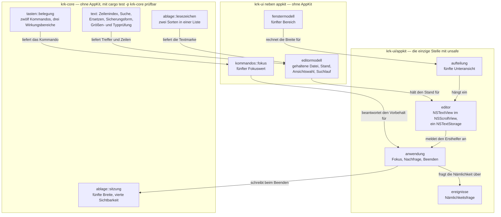
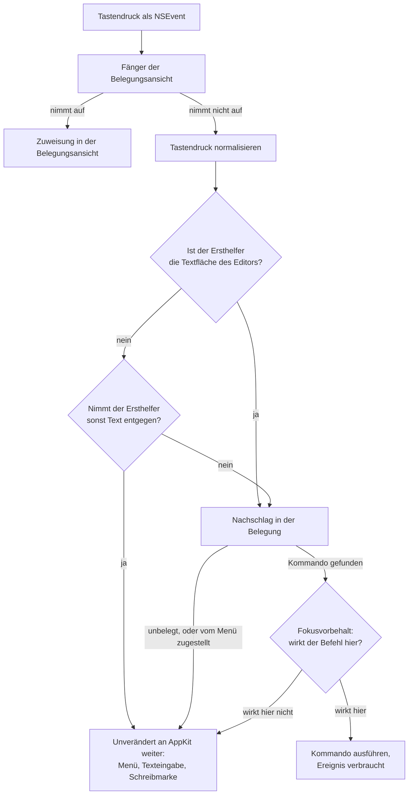
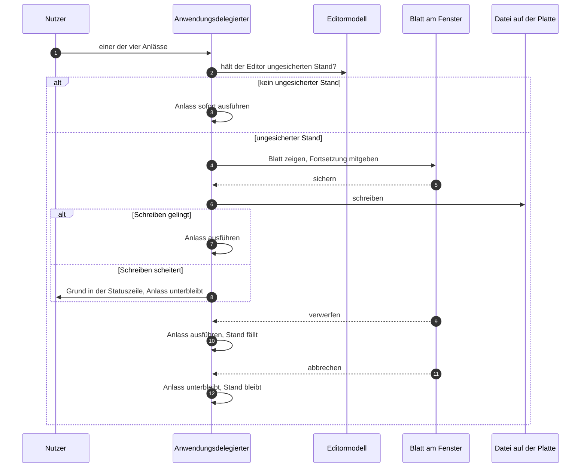
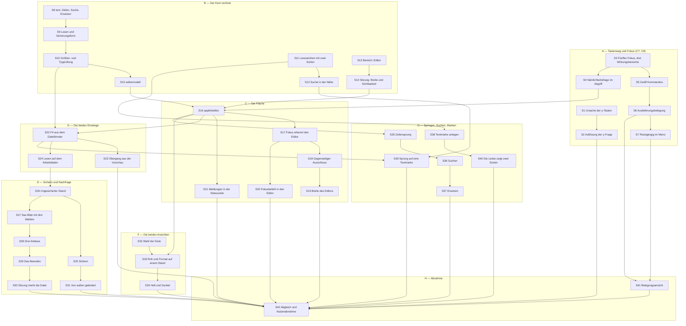
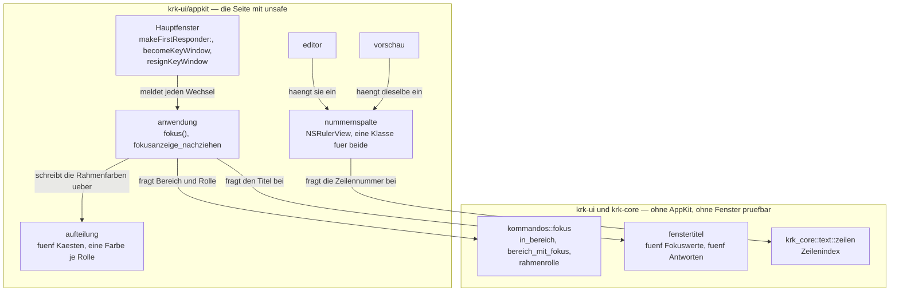
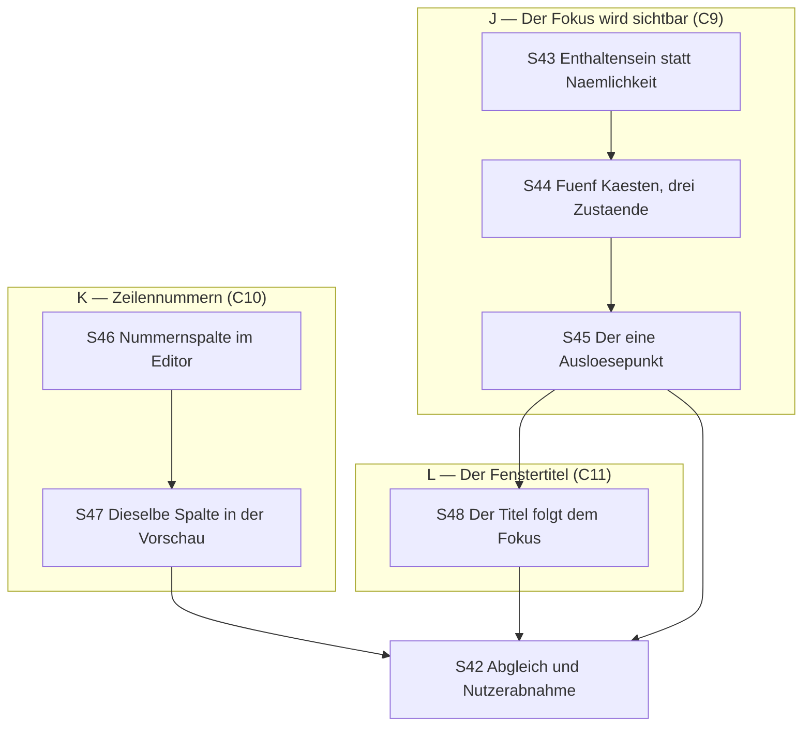

# Implementierungsplan: Der eingebaute Editor mit Roh- und Formatansicht und Textmarken (Runde 2)

**Datum:** 2026-08-08, 01:40
**Status:** Entwurf, zur Abnahme
**Spec:** `circles/260807-2116-eingebauter-editor-mit-textmarken/planning/260807-2147_*_spec-eingebauter-editor-mit-textmarken.md`, 79 Abnahmekriterien in acht Fähigkeiten C1 bis C8, vom Nutzer am 260808-0043 abgenommen; dazu seit dem 260809-2043 die drei Anzeigefähigkeiten C9, C10 und C11 mit einunddreißig weiteren Abnahmekriterien, die der Abschnitt `## Nachtrag vom 260809` unten baut
**Bindende Entscheidungsdatensätze:** die sechs `_a_`-Datensätze unter `circles/260807-2116-eingebauter-editor-mit-textmarken/decisions/`, dazu `shared/decisions/260802-0842_*_editor-formatansicht-je-dateityp.md` und `circles/260802-0842-krk-mac-dateimanager-editor-git/decisions/260802-1134_*_sprache-und-ui-werkzeugkasten.md`
**Ausführender Agent:** `coder`, für jeden Schritt

**Entscheidbarkeit:** Die tragende Frage dieser Runde lautet: **woran unterscheidet KRK die Textfläche des Editors von einem Feldeditor, dessen Tasten AppKit gehören?** Sie ist aus den Eingaben entscheidbar, die der Ereignisabgriff hat, und zwar ohne Näherung. Er fragt heute `ersthelfer.isKindOfClass(NSTextView::class())` und stellt damit eine Frage nach der **Art** des Ersthelfers, die zwei Objekte derselben Art nicht trennen kann. Er kann stattdessen nach der **Nämlichkeit** fragen: ist dieser Ersthelfer dasselbe Objekt wie die Textfläche des Editors? Dieselbe Frage stellt `Anwendungsdelegierter::fokus` seit der Runde 1 zweimal, für die Liste der Leiste und für die Inhaltsfläche der Vorschau (`crates/krk-ui/src/appkit/anwendung.rs:2072-2100`). Eine Frage nach der Nämlichkeit ist trennscharf, weil ein Objekt mit genau einem anderen identisch ist, und vollständig, weil jeder Ersthelfer entweder jenes Objekt ist oder nicht. Damit ist der Mechanismus unverändert und die Frage schärfer gestellt; eine Näherung über Klassennamen, Ansichtsbäume oder Kennzeichen an der Ansicht ist nicht nötig.

**Eine zweite Frage ist nicht entscheidbar und wird deshalb an den Nutzer zurückgegeben.** Die Fähigkeit C8 setzt voraus, dass `cmd+y` heute wegen eines Fehlers im Programm nichts auslöst. Diese Voraussetzung ist falsch: beide im Defekt genannten Verdächtigen sind am Code widerlegt, und die Ursache liegt in der Tastaturbelegung des Geräts, die KRK nach seiner eigenen Festlegung aus C3 der Runde 1 bewusst nicht ausliest. Kein Programmteil kann aus einem Tastencode ableiten, welcher Buchstabe auf der Taste steht; der Mechanismus müsste sich ändern, nicht die Rechnung. Der Datensatz `decisions/260808-0140_o_die-y-tasten-liegen-auf-einer-deutschen-tastatur-unter-anderen-buchstaben.md` legt die Wahl vor. Sie hält keinen Schritt dieses Plans auf.

---

## Wie dieser Plan auf Datensätze verweist

Dieselbe Regel wie im Plan der Runde 1: ein Verweis trägt den Zustandsmarker nicht, sondern eine Sternstelle. `decisions/260807-2147_*_welche-dateien-oeffnet-der-editor-ueberhaupt.md` bleibt richtig, wenn der Datensatz von `_a_` nach `_i_` wandert. Ausgenommen sind die Verweise im Kopf oben, wo der Marker eine Aussage über den Stand ist.

## Directive

Nach dieser Runde öffnet der Nutzer eine Textdatei aus dem Dateifenster mit F4 im eingebauten Editor, bearbeitet sie in einer Rohansicht oder einer Formatansicht, springt zu einer Zeilennummer, sucht und ersetzt innerhalb der geöffneten Datei und setzt Marken auf Textstellen, die in derselben Leiste und derselben Ablagedatei stehen wie seine Ordner-Lesezeichen. Der Wortlaut steht im Circle-Datensatz `_t_circle.md`, Abschnitt `## Directive`; der Spec zerlegt ihn in acht Fähigkeiten. Dieser Plan wiederholt ihn nicht, sondern baut ihn.

## Ausgangslage

Die Runde 1 hat den Navigator gebaut und ist am 260807-1035 als beschränkter Abschluss geschlossen. Was der Editor davon erbt, ist im Circle-Datensatz aufgezählt und im Spec belegt. Dieser Plan hat den Bestand vor dem Entwurf noch einmal am Code aufgenommen; sechs Befunde daraus ändern den Zuschnitt gegenüber dem, was der Spec annehmen konnte, und stehen deshalb hier oben statt verstreut in den Schritten.

### Befund 1: Der Fokusvorbehalt ist eine Frage nach der Art und muss eine nach der Nämlichkeit werden

`ersthelfer_nimmt_text` (`crates/krk-ui/src/appkit/ereignisse.rs:374-395`) holt sich über `NSApplication::sharedApplication(mtm).keyWindow().firstResponder()` den Ersthelfer des Schlüsselfensters und prüft ihn gegen drei Klassen, `NSTextView`, `NSTextField` und `NSText`. Trifft eine, kehrt `behandeln` sofort zurück und reicht den Tastendruck unverändert an AppKit weiter. Ein Editor auf `NSTextView` fiele darunter und hätte mit dem Fokus in sich selbst keinen einzigen Tastenbefehl von KRK.

Der Grund der bestehenden Regel bleibt gültig und wird nicht angetastet: ein `NSTextField` gibt beim Bearbeiten seinen Ersthelferrang an den Feldeditor ab, und der ist eine `NSTextView`. Die Regel bekommt deshalb keine zweite Regel daneben, sondern eine Ausnahme mit einem Namen: **der Ersthelfer behält seine AppKit-Bedeutung, außer er ist dasselbe Objekt wie die Textfläche des Editors.**

### Befund 2: Danach fällt alles Übrige von selbst an die richtige Stelle

Der Weg vom Tastendruck zum Kommando ist so gebaut, dass ein nicht ausgeführtes Kommando das Ereignis **nicht verbraucht**: `kommando_ausfuehren` gibt `false` zurück, wenn der Fokusvorbehalt nicht greift (`anwendung.rs:1473-1475`), `behandeln` reicht daraufhin denselben Ereigniszeiger weiter (`ereignisse.rs:169-176`), und AppKit stellt ihn der Textfläche zu. Daraus folgt ohne einen einzigen Sonderfall:

- Die Pfeiltasten (`auswahl_hoch`, `oeffnen`, `ordner_aufwaerts`), die Leertaste (`markierung_umschalten`) und die Entfernen-Taste (`in_papierkorb`) tragen den Wirkungsbereich `Dateifenster`, wirken im Editor nicht und bewegen dort die Schreibmarke beziehungsweise fügen ein Zeichen ein.
- `cmd+a`, `cmd+c`, `cmd+v` und `cmd+x` sind vom Menü zugestellt, kommen im Nachschlag gar nicht vor (`crates/krk-core/src/tasten/belegung.rs:620-622`) und wirken im Editor auf den Text.
- `ctrl+left` und `ctrl+right` tragen `Ueberall` und verstellen die Breite des Bereichs mit dem Fokus, also die des Editors. Damit ist das dritte Abnahmekriterium von C1 ohne eigenen Bau eingelöst.

Drei Befehle laufen dabei in die falsche Richtung, und Befund 3 sagt, was mit ihnen geschieht.

### Befund 3: `Wirkungsbereich::Ueberall` ist für drei Befehle zu grob

`Wirkungsbereich` führt heute vier Werte, und ihr Modulkopf begründet ausdrücklich, warum kein eigener Vorschau-Wert entstanden ist: "weil kein Befehl allein im Vorschaufenster wirkt" (`belegung.rs:126-134`). Diese Runde bricht die Voraussetzung an zwei Stellen, und beide Male ist der neue Wert sachlich begründet und nicht bequem:

- **`Wirkungsbereich::Editor`**, weil die Befehle aus C3, C4, C5 und C6 allein im Editor wirken. Der Spec sagt diesen Wert voraus.
- **`Wirkungsbereich::Vorschau`**, weil der Übergang aus der Vorschau in den Editor (C2) allein mit Fokus in der Vorschau wirkt. Der Spec sagt diesen Wert **nicht** voraus; er folgt aus dem zweiten Einstiegsweg, den der Nutzer am 260807-2139 festgelegt hat.
- **`Wirkungsbereich::Navigator`**, weil drei Befehle heute `Ueberall` tragen, deren Taste im Editor der Textfläche gehört: `fenster_wechseln` auf `tab`, `auswahl_hoch` auf `up` und `auswahl_runter` auf `down`. Sie wirken in den vier Bereichen des Navigators aus der Runde 1 und nicht im Editor. Ohne diesen Wert bewegte `up` im Editor die Auswahl im Dateifenster statt der Schreibmarke, und das erste Abnahmekriterium von C7 wäre gebrochen.

`Wirkungsbereich` wächst damit von vier auf sieben Werte. Das ist der Preis dafür, dass der Fokusvorbehalt eine Regel bleibt und keine Abfrage je Aufrufstelle wird; der Spec verlangt genau das (C7, letzte Festlegung).

**Die Zuordnung der Tab-Taste ist eine Ableitung des Planners und keine Antwort des Nutzers.** C7 sagt zu, dass eine Zeichentaste im Editor ihr Zeichen einfügt, und zählt unter den Befehlen des Fensters, die dort wirken müssen, `fenster_wechseln` nicht auf. Aus beidem folgt, dass `tab` im Editor einen Tabulator schreibt. Wer stattdessen von dort aus das Dateifenster wechseln will, stößt die Ableitung am Gate um; es ist eine Zeile in `Kommando::wirkungsbereich`.

### Befund 4: Der Defekt an den y-Tasten ist kein Defekt im Programm

Beide Verdächtigen, die `shared/issues/260807-2112_*_cmd-y-und-shift-cmd-y-loesen-nichts-aus-f3-schon.md` nennt, sind am Code widerlegt.

Der erste Verdächtige, das Hauptmenü greife `cmd+y` ab, scheidet doppelt aus. Das Hauptmenü trägt sieben Einträge, ihre Kürzel sind `cmd+q`, `cmd+x`, `cmd+c`, `cmd+v`, `cmd+a`, `cmd+n` und `shift+cmd+w`, und keiner davon trägt ein `y` (`crates/krk-ui/src/appkit/menue.rs:184-252`, Kürzel aus der Belegung). Und die Reihenfolge stimmt ohnehin: der lokale Ereignisabgriff sieht den Tastendruck vor `NSApplication::sendEvent:` und damit vor jedem Menükürzel (`menue.rs:31-42`).

Der zweite Verdächtige, die Normalisierung der Zusatztasten, scheidet an einem Prüfstein aus. `normalisieren` liest genau vier Bits und wirft Feststelltaste, Zehnerblock, Hilfe und Funktionstastenbit weg (`crates/krk-core/src/tasten/normalisierung.rs:181-196`); auf der anderen Seite des Vergleichs steht dieselbe Maskenform aus `Kombination::lesen` (`crates/krk-core/src/tasten/parser.rs:369-410`), also `u8` gegen `u8`. Eine rohe AppKit-Maske kommt im Vergleich nicht vor. Der Prüfstein: `f3` trägt am Referenzgerät das Funktionstastenbit (`spikes/fn-tasten/messung-A.txt`, `roh=0x00800100`) und wirkt trotzdem. Ein roher Maskenvergleich ließe `f3` ebenso scheitern.

**Die Ursache liegt in der Tastaturbelegung, und sie ist im Projekt bereits einmal gefunden und beschlossen worden.** KRK belegt den virtuellen Tastencode und nicht das gemeldete Zeichen; das ist die Festlegung aus C3 der Runde 1, und für die Funktionstasten ist sie richtig. Der Tastencode benennt eine **Stelle** auf der Tastatur (`parser.rs:105-107`). Die Stelle `kVK_ANSI_Y` trägt den Code 16 (`parser.rs:209`), und auf einer deutschen Tastatur steht dort ein **Z**. Wer die Taste mit der Aufschrift Y drückt, erzeugt Code 6, und dieser Code steht in der ganzen Auslieferungsbelegung in keiner Tastenliste. Der Defekt `circles/260802-0842-krk-mac-dateimanager-editor-git/issues/260803-2317_c_cmd-y-liegt-auf-einer-deutschen-tastatur-unter-der-taste-z.md` beschreibt genau das; der Nutzer hat ihn am 260804-0830 geschlossen, mit dem tragenden Grund, `f3` sei der Hauptweg und `cmd+y` nur der zweite.

**Dieser Grund trägt seit dem 260807 nicht mehr.** Die Funktion `fokus_vorschau` ist an jenem Tag hinzugekommen und trägt genau eine Kombination, `shift+cmd+y` (`resources/default-keymap.toml:349`). Sie hat keinen zweiten Weg. Der einzige Tastenweg in das Vorschaufenster liegt damit auf einer deutschen Tastatur nicht dort, wo er beschriftet ist, und der Nutzerentscheid `circles/260802-0842-krk-mac-dateimanager-editor-git/decisions/260805-2216_*_tastenweg-des-fokus-in-das-vorschaufenster.md` ist der Sache nach nicht eingelöst.

**Die drei Fähigkeiten vom 260809 stellen eine zweite tragende Frage, und auch sie ist ohne Näherung entscheidbar.** Sie lautet: **woher erfährt KRK, dass sich der Ersthelfer geändert hat?** Über einen Fokusbefehl weiß es KRK selbst, weil es ihn setzt; ein Mausklick in eine Fläche ändert ihn dagegen an KRK vorbei, und `Anwendungsdelegierter::fokus` ist eine Abfrage und keine Benachrichtigung. Eine Vorhersage aus dem Ereignisstrom wäre eine Näherung derselben Art wie die widerlegte Frage nach der Klasse des Ersthelfers, denn AppKit vergibt den Rang an Stellen, die der lokale Tastenabgriff gar nicht sieht. Der Mechanismus muss deshalb nicht raten, sondern hinsehen, und AppKit hält dafür genau einen Durchgang bereit: **jeder Wechsel des Ersthelfers geht durch `NSWindow::makeFirstResponder:`**, der programmatische aus `fokus_setzen` ebenso wie der, den AppKit beim Mausklick selbst auslöst. Eine Unterklasse des Fensters, die diese eine Methode überschreibt, beobachtet damit eine entschiedene Größe statt einer vorhergesagten. Dieselbe Unterklasse trägt mit `becomeKeyWindow` und `resignKeyWindow` den Vorder- und Hintergrundwechsel, den das achte Abnahmekriterium von C9 verlangt. Der Abschnitt `## Nachtrag vom 260809` führt es aus.

Damit sind die Abnahmekriterien von C8 in ihrer heutigen Fassung nicht zu erfüllen: `cmd+y` blendet die Vorschau ein und aus, aber nur auf der Taste mit der Aufschrift Z, und kein Programmteil ändert daran etwas, ohne die Festlegung aus C3 anzufassen. **Die Wahl gehört dem Nutzer** und liegt als `decisions/260808-0140_o_die-y-tasten-liegen-auf-einer-deutschen-tastatur-unter-anderen-buchstaben.md` vor. Ein Punkt daraus gehört hierher, weil er den dritten Weg billiger macht, als der Datensatz von 260803 ihn eingeschätzt hat: **das Hauptmenü schlägt bereits heute über das Zeichen nach.** `NSMenuItem.keyEquivalent` nimmt eine Zeichenkette entgegen (`menue.rs:322-342`), und genau deshalb wirken `cmd+c` und `cmd+v` auf jeder Tastaturbelegung an der beschrifteten Stelle. Eine zeichenbasierte Nachschlagart wäre also keine fremde Mechanik, sondern die, die vier Funktionen dieses Projekts schon tragen.

**Kein neuer Tastenbefehl dieser Runde liegt auf `y` oder `z`.** Deutsch und Amerikanisch unterscheiden sich in der Buchstabenreihe allein im Tausch dieser beiden; alle vorgeschlagenen Kombinationen unten benutzen `e`, `s`, `f`, `g`, `j` und `r` und sind davon nicht berührt. Der Editor ist deshalb prüfbar, gleich wie die Frage ausgeht, und das ist der Grund, aus dem sie keinen Schritt aufhält.

### Befund 5: Die Vorschau kann ihre Textanzeige dem Editor nicht vererben

`crates/krk-ui/src/appkit/vorschau.rs:514` setzt `setSelectable(false)`, und der Modulkopf begründet es (`:31-38`): eine auswählbare Textanzeige nähme den Fokus als Textsystem, und der Ereignisabgriff reichte jede Taste an AppKit weiter, statt die Tabbefehle auszuführen. Das ist derselbe Satz wie Befund 1, aus der anderen Richtung. Der Editor löst ihn über die Nämlichkeitsfrage, die Vorschau bleibt unverändert.

Vier weitere Stücke der Vorschau erbt der Editor ebenfalls nicht: die Textgrenze von 1 MB (der Nutzer hat für den Editor 16 MB gewählt), `String::from_utf8` mit Wegwurf der Bytes (`vorschaumodell.rs:522-527`, ohne Behandlung von Zeilenenden und Bytefolgenmarke), `setString:` als vollständiges Ersetzen ohne Textspeicher, und die fehlende Statuszeile: die beiden vorhandenen sitzen in den Rahmen der Dateifenster (`aufteilung.rs:255-260`), und die Randbereiche melden über die des aktiven Dateifensters (`anwendung.rs:1630-1631`). Der Editor tut dasselbe, und C1 sagt es zu.

### Befund 6: Zwei Stellen nehmen einen fünften Bereich still an

Der Übersetzer erzwingt die meisten Anpassungen, und das ist der Zweck der Bauart. Zwei Stellen erzwingt er nicht, und beide führen zu einem falschen Bild statt zu einem Fehler:

- `Bereich::ist_beweglich` (`crates/krk-ui/src/fenstermodell.rs:109-114`) ist ein `matches!` und kein `match`. Ein fünfter Wert gilt still als unbeweglich. Für den Editor ist das die richtige Antwort, aber nicht aus dem richtigen Grund. **S13 macht daraus eine vollständige Fallunterscheidung.**
- `bereichsbreiten` zählt die festen Randbereiche ein zweites Mal auf, als Literalliste `[Bereich::Lesezeichen, Bereich::Vorschau]` (`fenstermodell.rs:413`). Ein fünfter fester Bereich, der dort fehlt, bekäme dauerhaft die Breite 0. **S13 ersetzt die Literalliste durch den Filter über `ist_beweglich`**, womit die zweite Aufzählung ganz verschwindet.

Dazu die dritte Stelle, die der Übersetzer ebenfalls nicht erzwingt: `Anwendungsdelegierter::fokus` (`anwendung.rs:2072-2100`) ist eine Kette von `if` mit dem Rückfall `Fokus::Dateifenster`. Ein vergessener Zweig machte den Editor stillschweigend zum Dateifenster, und jeder Dateibefehl wirkte darin. **S17 baut den Zweig, und sein Abnahmekriterium prüft ihn ausdrücklich.**

## Antworten auf die elf Punkte, die der Spec dem Planner überlässt

Der Spec zählt unter `## Offen für den Planner` elf Punkte auf. Hier stehen die Antworten; die Schritte setzen sie um.

### Frage 1: Womit KRK Text darstellt und bearbeitet

**Eine `NSTextView` in einer `NSScrollView`, mit einem `NSTextStorage` als einzigem Stand.** Beide Klassen stehen seit macOS 10.0 zur Verfügung, das Bündel zielt auf 15.0 (`.cargo/config.toml`), und `objc2-app-kit 0.3.2` führt sie. Keine der von diesem Plan angesprochenen Textklassen ist nach macOS 15 hinzugekommen; die Randbedingung des Specs, für jede angesprochene Textklasse die Untergrenze zu nennen, ist damit erfüllt und steht in S16.

Das Modul liegt unter `crates/krk-ui/src/appkit/editor.rs`, weil eine `NSTextView` mit Delegierten nur über `define_class!` entsteht. Alles, was rechnet, liegt daneben: `crates/krk-ui/src/editormodell.rs` hält den Zustand des Editors ohne AppKit, `crates/krk-core/src/text/` die reine Textrechnung. Das ist derselbe Schnitt, den `vorschaumodell` neben `appkit/vorschau` und `tabs` neben `appkit/tabelle` ziehen, und er ist der Grund, aus dem `cargo test -p krk-core` die Suche, das Ersetzen, den Zeilenindex und die Sicherungsform ohne Fenster abnehmen kann.

### Frage 2: Welche Kiste die Syntaxhervorhebung trägt

**`syntect` in seiner reinen Rust-Fassung, und `two-face` daneben, falls die Messung in S32 zeigt, dass `syntect` TOML nicht mitbringt.** Die Wahl ist ein eigener Schritt mit Kriterien (S32), weil zwei ihrer vier Kriterien am Bündel zu messen sind und nicht am Papier zu entscheiden.

Warum `syntect`: es ist die einzige verbreitete Rust-Kiste, die Erkennung **und** Einfärbung mitbringt, ohne eine C-Werkzeugkette zu verlangen. Ihr Merkmalssatz `regex-fancy` tauscht die C-Bibliothek Oniguruma gegen `fancy-regex` in reinem Rust; der Bauzusammenhang steht in ihrer eigenen `Cargo.toml` (Fassung 5.3.0). Die Merkmale, die KRK nennt, sind `parsing`, `default-syntaxes`, `default-themes`, `dump-load` und `regex-fancy`; abgeschaltet bleiben `html`, `plist-load`, `yaml-load`, `dump-create` und `metadata`, weil KRK die Einfärbung selbst in Textmerkmale umsetzt und keine HTML-Ausgabe braucht.

**Was gemessen werden muss und deshalb in den Schritt gehört.** `syntect` bündelt die Sprachdefinitionen von Sublime Text, und `inference:` deren Vorgabesatz führt Rust, Markdown und Shell, aber kein TOML. Der Spec verlangt TOML ausdrücklich. `two-face` (Fassung 0.5.2+bat-0.26.1) trägt den erweiterten Satz von `bat` nach und schließt die Lücke; es ist der übliche Begleiter von `syntect` und hängt selbst an ihm. Ob es gebraucht wird, entscheidet die Messung in S32 und nicht dieser Absatz.

**Damit werden es womöglich zwei Kisten und nicht eine.** Der Spec spricht von "der fünften fremden Kiste"; das ist die Formulierung der Nutzerantwort und keine Zusage über die Zahl. Beide bekommen dieselbe geschriebene Begründung in `Cargo.toml` wie die vier bestehenden, und die Begründung nennt, was sie leisten, warum keine bestehende Abhängigkeit es leistet und welche Merkmale abgeschaltet sind.

**Der angenommene Preis bleibt angenommen.** `speculation:` Ob die Kiste die Maxime "superschnell" auf dem Referenzgerät von 2018 hält, ist ungemessen. Diese Runde misst es nicht, weil der Abnahmelauf ausgeklammert ist; S32 nimmt stattdessen die beiden Größen ab, die ohne Messstrecke prüfbar sind, nämlich das Wachstum des Bündels und die Fortdauer von `#![deny(unsafe_code)]`.

### Frage 3: Wie die Farben an das Erscheinungsbild des Systems gebunden werden

**Über zwei Farbtafeln der Kiste und `NSAppearance`, ohne eine eigene Farbtabelle.** `syntect` bringt seine Farbtafeln als feste Paletten mit; KRK nimmt zwei davon, eine helle und eine dunkle, und wählt beim Zeichnen die zur wirksamen Erscheinung passende. Der Wechsel wird über `NSView::viewDidChangeEffectiveAppearance` bemerkt, die eine Stelle, die AppKit dafür vorsieht.

Das ist die erste Farbtabelle des Projekts, und der Plan sagt, warum sie hier unvermeidlich ist. `crates/krk-ui/src/appkit/leiste.rs:439-442` und der Modulkopf von `tableiste.rs:10-15` begründen beide, warum KRK das Erscheinungsbild nicht selbst nachbaut: man nimmt das Systemsteuerelement, und es folgt dem System von selbst. Für Syntaxhervorhebung gibt es kein Systemsteuerelement. KRK baut deshalb nicht das Erscheinungsbild nach, sondern wählt zwischen zwei fertigen Tafeln der Kiste; die Zuordnung, welche wann gilt, ist eine Zeile und keine Tafel.

Zugesagt ist allein das Ergebnis: in Hell wie in Dunkel ist jeder eingefärbte Textteil lesbar. Das Abnahmekriterium von S34 prüft es an beiden Erscheinungsbildern.

### Frage 4: Wie die Fallunterscheidung aus C7 zugeschnitten wird

**Über die Nämlichkeit des Ersthelfers**, siehe die Zeile `**Entscheidbarkeit:**` im Kopf und Befund 1. `ersthelfer_nimmt_text` heißt danach `ersthelfer_gehoert_appkit` und beantwortet die Frage in dieser Reihenfolge: ist der Ersthelfer dasselbe Objekt wie die Textfläche des Editors, gehört er nicht AppKit; sonst gilt die bestehende Prüfung auf die drei Klassen unverändert.

Der Abgriff bekommt dafür einen dritten Abschluss neben `faenger` und `senke`, in derselben Form wie diese beiden. Er darf die Textfläche nicht selbst halten, denn `appkit/ereignisse.rs` kennt den Editor nicht und soll ihn nicht kennenlernen; die Nämlichkeitsprüfung wohnt beim Anwendungsdelegierten, der die Textfläche ohnehin hält.

**Trennscharf und vollständig**, wie C7 es als Abnahmekriterium verlangt: kein Ersthelfer fällt in beide Fälle, weil ein Objekt mit genau einem anderen identisch ist; keiner fällt in keinen, weil die Frage für jedes Objekt eine Antwort hat. Der Feldeditor eines Textfeldes und die Textfläche eines Blattes sind andere Objekte und behalten ihre AppKit-Bedeutung, auch dann, wenn sie zufällig ebenfalls `NSTextView` sind. Damit ist das siebte Abnahmekriterium von C7 nicht nur erfüllt, sondern erfüllt, ohne dass irgendwo eine Liste von Ausnahmen entsteht.

### Frage 5: Wie die Nachfrage beim Beenden an die Anwendung kommt

**Über `applicationShouldTerminate:` mit der Antwort `NSApplicationTerminateReply::TerminateLater`, und die endgültige Antwort später über `replyToApplicationShouldTerminate:`.** Das ist der Weg, den AppKit für genau diesen Fall vorsieht: ein Blatt kehrt sofort zurück, `terminate:` darf also nicht auf eine Rückgabe warten.

`crates/krk-ui/src/appkit/anwendung.rs:1156-1164` hält heute fest, es gebe kein `applicationShouldTerminate:` und die Aufrufer von `beenden` rechneten nicht mit einer Rückkehr. Der Satz wird mit diesem Schritt falsch und **gehört im selben Commit umgeschrieben**; S29 nennt ihn in seiner Dateiliste.

**Ein Aufrufer muss an der Nachfrage vorbei.** `ohne_tastenabgriff_beenden` (`anwendung.rs:1165-1174`) beendet, wenn sich der Tastenabgriff nicht einrichten lässt; dort steht bereits ein anwendungsmodaler Hinweis, und ein Blatt mit Rückfrage wäre weder bedienbar noch sinnvoll. Der Weg daran vorbei ist ein Kennzeichen in den Ivars, das dieser eine Aufrufer setzt und `applicationShouldTerminate:` als einziges liest. Ein Feld, ein Schreiber, ein Leser.

### Frage 6: Das Drittel aus C1 und die Mindestbreite

**Als Punktzahl gesetzt, nicht als Anteil gerechnet.** Alle vier bestehenden Bereiche tragen eine Anfangsbreite als Zahl (`fenstermodell.rs:100-107`: 180, 420, 420, 260), und `bereichsbreiten` rechnet mit gespeicherten Zahlen. Ein Anteil an dieser Stelle wäre ein zweiter Rechenweg neben dem einen, den der Circle-Datensatz mit "die Breitenregel steht einmal" meint.

**Anfangsbreite 460,0 Punkte.** Die Zahl folgt aus den bestehenden: die vier Anfangsbreiten summieren sich zu 1280, ein Drittel davon sind rund 427, und mit ausgeblendeter Vorschau bleiben für die beiden Dateifenster 1280 minus 180 minus 460 gleich 640, also 320 je Fenster gegen ihre Mindestbreite von 240. 460 liegt damit über dem Drittel des Fensters, in dem der Editor allein neben Leiste und Dateifenstern steht, und lässt beiden Dateifenstern Luft. `inference:` Die Zahl ist gerechnet und nicht gemessen; sie gilt nur beim allerersten Start und danach nie wieder, weil dann die Breite des Nutzers gilt.

**Mindestbreite 320,0 Punkte.** Sie folgt aus dem vierten Abnahmekriterium von C1, "nicht schmaler, als eine Zeile Text noch lesbar ist". Bei der festen Schrift der Rohansicht in Systemgröße trägt diese Breite rund 40 Zeichen. Die Vorschau steht bei 160, weil sie Metadaten zeigt; der Editor braucht mehr, weil er Zeilen zeigt.

### Frage 7: Wie Roh- und Formatansicht auf demselben Stand arbeiten

**Ein `NSTextStorage`, zwei Darstellungen, und die Einfärbung als vorübergehende Merkmale des Layoutverwalters.**

Der tragende Kniff ist `NSLayoutManager::setTemporaryAttributes:forCharacterRange:`. Vorübergehende Merkmale liegen im Layoutverwalter und **nicht im Textspeicher**. Damit gilt dreierlei zugleich: die Einfärbung ist niemals Teil des Dokuments und kann beim Sichern nicht in die Datei geraten; das Umschalten der Ansicht ist ein Entfernen und Neusetzen dieser Merkmale und kein Umbau des Standes; und es gibt keine zweite Kopie, die auseinanderlaufen könnte. Das ist die Antwort auf das zehnte Abnahmekriterium von C3, "beide Ansichten arbeiten auf demselben Stand und nicht auf zwei Kopien", und sie ist eine Eigenschaft der Bauart und keine Zusage der Sorgfalt.

Was sich beim Umschalten sonst noch ändert, sind drei Einstellungen an derselben `NSTextView`: die Schrift (fest gegen proportional bei einfachem Text), der Umbruch (`setWidthTracksTextView` aus gegen ein) und eben die vorübergehenden Merkmale. Die Schreibmarke bleibt, wo sie ist, weil der Textspeicher unverändert bleibt; das elfte Abnahmekriterium von C3 fällt damit ohne eigenen Bau an.

**Die drei Formatansichten sind eine Mechanik und nicht drei.** Einfacher Text bekommt Umbruch und eine lesbarere Schriftgröße; Code bekommt die Einfärbung der Kiste; Markdown bekommt dieselbe Einfärbung, weil die Kiste Markdown als Sprache führt, dazu eine Schriftvergrößerung für die als Überschrift erkannten Stellen. Ein Dateityp, den die Kiste nicht kennt, fällt auf die erste Form zurück und meldet keinen Fehler, wie das sechste Abnahmekriterium von C3 es verlangt. Drei Fälle, ein Weg, keine drei Sonderregeln.

**Was "gerendert" dabei heißt, ist eine Auslegung und gehört dem Nutzer.** Das dritte Abnahmekriterium von C3 verlangt bei Markdown "das gerenderte Dokument mit Überschriften, Listen und Links", und das zehnte verlangt zugleich, dass beide Ansichten auf demselben Stand arbeiten und in beiden bearbeitet werden kann. Ein Rendern, das die Auszeichnungszeichen ersetzt, hielte das zehnte nicht ein. Der Plan legt das dritte deshalb so aus, dass Überschriften größer und fett erscheinen, Listen eingerückt und ihre Aufzählungszeichen abgesetzt, Links unterstrichen und eingefärbt, während die Quelltextzeichen stehen bleiben. Das ist die Form, die moderne Markdown-Editoren tragen, und sie ist die einzige, die mit dem zehnten Kriterium zusammengeht. Die Wahl liegt als `decisions/260808-0140_o_was-heisst-gerendert-bei-markdown-wenn-zugleich-bearbeitet-wird.md` vor und hält keinen Schritt auf; S33 baut die hier beschriebene Auslegung.

### Frage 8: Wie der Editor eine große Datei liest, ohne die Oberfläche anzuhalten

**Ein Arbeitsfaden je Anfrage und ein Zeitgeber auf dem Hauptfaden, genau wie die Vorschau.** `Ladevorgang::starten` (`crates/krk-ui/src/vorschaumodell.rs:188-212`) legt je Anfrage einen benannten Faden an, der genau eine Meldung über einen `sync_channel(1)` schickt und endet; der Hauptfaden holt sie mit einem `NSTimer` im Takt von 1/60 s ab und beendet den Takt, sobald nichts mehr lädt (`appkit/vorschau.rs:462-491`).

Eine Anfragenummer braucht es nicht, und der Grund steht schon geschrieben (`vorschaumodell.rs:63-72`): eine neue Anfrage lässt den alten Empfänger fallen, das `send` des überholten Fadens scheitert still. Der Editor hält höchstens eine Datei, also höchstens einen Ladevorgang; der Fall ist noch einfacher als bei der Vorschau mit ihren Tabs.

Damit ist das erste der beiden Kriterien erfüllt, die an die Stelle einer Zeitzusage treten: während der Editor eine große Datei einliest, bleiben Dateifenster und Leiste bedienbar, weil der Hauptfaden nichts tut als alle 16 ms in einen leeren Kanal zu schauen.

### Frage 9: Wo die Größen- und Typprüfung wohnt

**In `krk-core/src/text/`, als eine Funktion, die einen Pfad annimmt oder mit einem benannten Grund abweist.** Beide Einstiege aus C2 und der Sprung aus C6 rufen dieselbe Funktion; ein zweiter Prüfweg entsteht nicht. Das ist derselbe Zuschnitt wie `kommandos::pfadeingabe`, die eine Stelle, die einen Pfad prüft, und deren Modulkopf den Grund nennt: "die erste Abweichung zwischen beiden wäre ein Fehler ohne Prüfung" (`crates/krk-ui/src/kommandos/mod.rs`).

Die Prüfung fragt in dieser Reihenfolge: Ordner werden immer abgewiesen; eine Verknüpfung wird nach dem behandelt, worauf sie zeigt; die Größe wird **vor** dem Lesen gegen 16 MB geprüft, so wie die Vorschau es für ihre beiden Grenzen tut (`vorschaumodell.rs:501-521`); erst danach werden die Bytes gelesen und über `String::from_utf8` gewandelt. Scheitert die Wandlung, wird die Datei abgewiesen und nicht mit Ersatzzeichen geöffnet. Jede Abweisung trägt einen Grund, und die Gründe "zu groß" und "nicht als Text lesbar" sind verschieden, wie C2 es verlangt.

### Frage 10: Wie `bookmarks.toml` die zweite Sorte aufnimmt

**Als unmarkierte Auswahl über ein eingebettetes Zielfeld**, in Rust:

```rust
#[derive(Debug, Clone, PartialEq, Eq, Serialize, Deserialize)]
pub struct Lesezeichen {
    pub name: String,
    #[serde(flatten)]
    pub ziel: Ziel,
}

#[derive(Debug, Clone, PartialEq, Eq, Serialize, Deserialize)]
#[serde(untagged)]
pub enum Ziel {
    Ordner { ordner: PathBuf },
    Textstelle { datei: PathBuf, zeile: u32, zeileninhalt: String },
}
```

Die geschriebene Datei sieht danach so aus:

```toml
[[eintraege]]
name = "Projekte"
ordner = "/Users/k1/Projekte"

[[eintraege]]
name = "Die Lesestelle"
datei = "/Users/k1/Projects/productive/krk/crates/krk-core/src/verzeichnis/leser.rs"
zeile = 118
zeileninhalt = "        let mut puffer = vec![0u8; PUFFERGROESSE];"
```

Drei Eigenschaften machen diese Form zur richtigen:

**Eine bestehende Datei bleibt gültig.** Ein Eintrag mit `name` und `ordner` trifft die erste Variante und wird unverändert gelesen. Das ist die Zusage aus dem dreizehnten Abnahmekriterium von C6, und sie ist prüfbar: S11 nimmt eine `bookmarks.toml` in der alten Form ab.

**Die Sorte ist eine Eigenschaft des Typs und keine Prüfung zur Laufzeit.** Der Spec sagt zu, dass genau eine der beiden Sorten je Lesezeichen vorliegt, nie beide und nie keine. Mit zwei wahlfreien Feldnestern daneben wäre das eine Regel, an die sich jemand halten müsste; mit einer Auswahl ist es eine Eigenschaft, die kein Schreibweg brechen kann.

**Die Datei bleibt von Hand lesbar**, wie C7 und C11 der Runde 1 es für alle vier Ablagedateien zusagen. Es gibt keine Sortenkennung, kein `typ = "textstelle"`, keine geschachtelte Tabelle.

**Ein gemessener Vorbehalt und der Ausweg dazu.** `#[serde(flatten)]` zwingt den Deserialisierer über einen zwischenspeichernden Weg, und ob `toml` in seiner Fassung 1 die Verbindung aus `flatten` und `untagged` trägt, ist am Papier nicht zu entscheiden. Das Abnahmekriterium von S11 ist deshalb eine Rundreise durch beide Formen. Scheitert sie, ist der Ausweg benannt und nicht zu suchen: `Lesezeichen` wird selbst zur unmarkierten Auswahl mit zwei Strukturvarianten, die beide ein Feld `name` tragen, und `flatten` entfällt. Der Preis dafür ist, dass `name` von einem Feld zu einer Methode wird und die Leserstellen mitziehen.

**`Lesezeichen` bekommt in diesem Zug `#[serde(default)]` auf `Ziel::Ordner`, und das schließt eine Lücke.** `Lesezeichen` ist heute die einzige serde-Struktur der Ablage ohne Vorgabe (`crates/krk-core/src/ablage/lesezeichen.rs:29-35`), während `sitzung.rs:9-11` für die Nachbardatei ausdrücklich begründet, warum jede ihrer Strukturen eine trägt: "ein Feld, das Schritt 12 hinzufügt, macht eine ältere `session.toml` nicht ungültig". Für `bookmarks.toml` fehlte diese Vorsorge.

### Frage 11: Welche Kombinationen die neuen Funktionen ab Werk tragen

Dreizehn neue Einträge in `resources/default-keymap.toml`, dazu die Tastenliste des bestehenden Eintrags `bearbeiten`. Die Auslieferungsbelegung wächst von 58 auf 71 Funktionen. Jede Kombination unten ist gegen alle 58 bestehenden geprüft; die Konflikterkennung aus C3 nimmt es in S6 noch einmal maschinell ab.

| Kennung | Kombination | Warum diese |
|---|---|---|
| `bearbeiten` | `f4` | Die Runde 1 hält sie frei, mit `reserviert_fuer = "editor"`. Die Norton-Bedeutung von F4 ist "Bearbeiten". Ein Cmd-Kürzel daneben trägt sie nicht: die Zwei-Wege-Regel aus C3 gilt den sechs Funktionen der Norton-Reihe, und `bearbeiten` gehört zu den vier späteren, die je eine tragen. |
| `editor_aus_vorschau` | `cmd+e` | `e` wie Editor. Die blanke Cmd-Ebene trägt die Handlung selbst, so wie `cmd+y` die Vorschau ein- und ausblendet und `cmd+d` ein Lesezeichen anlegt. |
| `fokus_editor` | `shift+cmd+e` | Die Fokusfamilie steht seit der Runde 1 auf `shift+cmd+<Buchstabe>`: `shift+cmd+l` für die Leiste, `shift+cmd+d` für das Dateifenster, `shift+cmd+y` für die Vorschau. Der vierte fügt sich ein. |
| `editor_schliessen` | `opt+cmd+e` | Die Umschaltfamilie steht auf `opt+cmd+<Buchstabe>`: `opt+cmd+l` für die Leiste, `opt+cmd+d` für das zweite Dateifenster. Das Schließen des Editors ist die Ausblendhälfte dieser Familie; die Einblendhälfte trägt F4 und der Übergang aus der Vorschau. |
| `editor_ansicht_umschalten` | `ctrl+cmd+e` | Die vierte Ebene derselben `e`-Familie. `ctrl+cmd` trägt in dieser Belegung schon die Zweitform einer Handlung (`ctrl+cmd+u` neben `shift+cmd+u`, `ctrl+cmd+n` neben `shift+cmd+n`). |
| `editor_sichern` | `cmd+s` | Der Mac-Standard, und ab Werk frei. |
| `editor_zeile_springen` | `cmd+j` | BBEdit legt "Gehe zu Zeile" auf dieselbe Kombination. `cmd+l` wäre der nähere Buchstabe und bleibt frei, weil die `l`-Familie in dieser Belegung der Lesezeichenleiste gehört. |
| `editor_suchen` | `cmd+f` | Der Mac-Standard. |
| `editor_weitersuchen` | `cmd+g` | Der Mac-Standard. |
| `editor_rueckwaerts_suchen` | `ctrl+cmd+g` | Der Mac-Standard wäre `shift+cmd+g`, und der trägt seit der Runde 1 die Pfadeingabe, weil der Finder "Gehe zum Ordner" dorthin legt. Zwei Funktionen auf einer Kombination bei demselben Zusteller schließt C3 aus. `ctrl+cmd+g` steht bei `opt+cmd+g`, dem Sprung zum Inhalt der Zwischenablage. |
| `editor_ersetzen` | `shift+cmd+r` | `cmd+r` trägt die Sortierrichtung. `r` wie Ersetzen im Sinne von "replace"; die Belegung nimmt an vier Stellen den englischen Anfangsbuchstaben, wo der deutsche belegt ist. |
| `editor_alle_ersetzen` | `ctrl+cmd+r` | Dieselbe Systematik wie `umbenennen` gegen `umbenennen_stapel`: die Einzelform auf `shift+cmd`, die Stapelform auf `ctrl+cmd`. |
| `text_rueckgaengig` | `cmd+z`, `gehalten_von = "menue"` | Siehe die Ableitung unten. |
| `text_wiederholen` | `shift+cmd+z`, `gehalten_von = "menue"` | Siehe die Ableitung unten. |

**Kein Anlegen einer Textmarke steht in dieser Tabelle, und das ist Absicht.** Der Spec zählt es unter den neuen Kommandos auf; der Plan legt es stattdessen auf den bestehenden Befehl `lesezeichen_anlegen` (`cmd+d`, Wirkungsbereich `Ueberall`). Mit Fokus im Dateifenster merkt er den Ordner, mit Fokus im Editor die Zeile der Schreibmarke. Eine Funktion, eine Kombination, ein Kommando, ein Eintrag in der Belegungsansicht. Das entspricht der einen Liste mit zwei Sorten, die C6 zusagt, und ein zweiter Anlegebefehl daneben wäre der zweite Mechanismus für dieselbe Aufgabe. Die Beschriftung des Eintrags wechselt dafür von "Ordner als Lesezeichen anlegen" auf "Lesezeichen anlegen".

**Rückgängig und Wiederholen sind eine Ableitung des Planners und stehen in keinem Abnahmekriterium des Specs.** Der Spec nimmt "Rückgängig über die Sitzungsgrenze hinaus" ausdrücklich heraus und sagt dazu: "Was ein Editor an Rückgängig innerhalb einer Sitzung mitbringt, ist Sache des gewählten Werkzeugs." Das gewählte Werkzeug, `NSTextView`, bringt es mit, aber es ist ohne Menüeintrag **nicht erreichbar**: auf dem Mac liegen `undo:` und `redo:` nicht im Textsystem, sondern als Menükürzel, und genau das begründet die Auslieferungsbelegung für die vier bestehenden Textbefehle bereits im Wortlaut (`resources/default-keymap.toml`, Abschnitt "die Textbefehle des Menüs Bearbeiten"). Ohne die beiden Einträge hätte der Editor kein Rückgängig, und das wäre ein Editor, den niemand benutzt. S7 baut sie nach demselben Muster wie die vier bestehenden; die Konflikterkennung sieht sie, und sie sind umbelegbar, wie C3 es für jede Kombination zusagt, die in KRK etwas auslöst.

---

## Aufbau

### Wo der Editor im Programm wohnt



Der Schnitt ist der bestehende und kein neuer: was rechnet, liegt im Kern oder neben `appkit`; was AppKit anfasst, liegt darin. Der Editor fügt drei Knoten hinzu und keinen neuen Pfeil zwischen bestehenden.

### Der Weg vom Tastendruck zum Kommando, nach dieser Runde



Gegenüber dem Bild im Spec ist genau ein Knoten hinzugekommen, die Nämlichkeitsfrage, und die Reihenfolge von Normalisierung und Vorbehalt steht jetzt so, wie der Code sie fährt (`ereignisse.rs:334` vor `:345`; das ASCII-Schaubild im Modulkopf dort zeigt sie umgekehrt und ist in S4 mitzuziehen).

**Der zweite Ausgang von `I` bei "ja" ist der ganze Gewinn.** Ein Kommando, das im Editor nicht wirkt, verbraucht das Ereignis nicht und landet über `W` doch noch bei der Textfläche. Deshalb tippt der Editor Zeichen, bewegt Pfeile die Schreibmarke und wirken die vier Textbefehle des Menüs, ohne dass eine einzige Zeile dafür geschrieben wird.

### Die Nachfrage vor den vier Anlässen



Die Fortsetzung reist in der Schließung mit, so wie bei jedem Blatt der Runde 1 (`anwendung.rs:1822-1852` ist das reinste Beispiel). Ein Feld, das eine noch nicht ausgeführte Absicht über den Rückruf hinaus hält, entsteht nicht; es wäre die zweite Wahrheit, vor der jeder Modulkopf dieses Projekts warnt. Vier Anlässe heißen vier Aufrufstellen mit je eigener Schließung und einer gemeinsamen Blattfunktion.

### Die Abhängigkeit der Schritte



**Eine Kante ist am 260809-2322 umgedreht worden: S26 steht vor S25 und nicht dahinter.** Der Defekt `issues/260809-2148_c_...` hat gezeigt, dass die Kante `S25 → S26` keine Bauabhängigkeit war, sondern eine Abnahme („nach einem Sichern verschwindet das Kennzeichen"). In der ursprünglichen Richtung hätte S25 den unveränderten Plattenstand zurückgeschrieben und dabei eine gelungene Sicherung gemeldet, weil `Editormodell::bearbeiten` bis S26 keinen Aufrufer hatte. Alles, was hinter S26 hängt, hängt weiterhin dort; S25 ist von der Kette in einen Zweig daneben gerückt.

**Was diese Ordnung trägt.** Der Kopf ist Phase A: ohne den fünften Fokuswert und die Nämlichkeitsfrage lässt sich kein Befehl des Editors prüfen. Phase B ist danach ohne Fenster abnehmbar und kann in einem Zug laufen. Erst S16 bringt beides zusammen, und ab dort verzweigt der Plan in vier Stränge, die einander nicht brauchen: die Einstiege, das Sichern, die Ansichten und die Marken. S42 zieht sie zusammen.

**Die y-Frage steht vorn und hält doch nichts auf.** S1 misst und benennt, S2 setzt die Antwort um; keine der dreizehn neuen Kombinationen liegt auf `y` oder `z`, deshalb führt von S2 kein Pfeil in einen Editor-Schritt, sondern nur in die Abnahme.

**Zwei Stellen des Graphen sehen nach einem Befund aus und sind keiner.** S16 hat fünf ausgehende Kanten, und S42 hat zwölf eingehende. Die erste ist der Punkt, an dem die Textfläche zum ersten Mal steht; alles, was danach kommt, braucht sie, und eine Aufteilung auf zwei Schritte trennte den Bau einer Ansicht von ihrem Einhängen, was zwei Zwischenstände mit rotem Bau ergäbe. Die zweite ist eine Senke: S42 nimmt ab, und eine Abnahme hängt an allem, was fertig zu sein hat. Beide Zahlen beschreiben den Zuschnitt richtig und nicht zu grob.

### Warum jeder Schritt `coder` trägt

Alle 42 Schritte gehen an `coder`, auch die, die allein `.toml`-Dateien anfassen. Der Grund steht einmal hier und wird nicht je Schritt wiederholt.

`resources/default-keymap.toml` ist keine Ontologie und kein Datenbestand, sondern **Programmtext in einer anderen Schreibweise**: `krk-core` bindet sie über `include_str!` ein, `Belegungsdatei` liest sie mit `deny_unknown_fields`, und der Test `jede_kennung_der_kommandos_steht_in_der_auslieferungsbelegung` (`crates/krk-core/src/tasten/belegung.rs:992-1003`) macht sie zur Hälfte einer Zusicherung, deren andere Hälfte die Aufzählung `Kommando` ist. Wer die eine ohne die andere ändert, macht den Bau rot. Dasselbe gilt für `Cargo.toml`, das die Abhängigkeiten und die Merkmalssätze trägt, und für `session.toml` und `bookmarks.toml`, deren Form von serde-Ableitungen in Rust erzeugt wird und nicht umgekehrt.

Ein `ontocoder` an diesen Dateien hätte zwei Wirkungen, und beide sind unerwünscht: er müsste die Rust-Seite lesen, um überhaupt zu wissen, was er schreiben darf, und der Plan müsste jede Änderung in zwei Schritte teilen, zwischen denen der Bau rot steht. Die Runde 1 hat `resources/Info.plist` und die Versionsersetzung getrennt und dafür eine Reihenfolge festschreiben müssen, die man beim Umsetzen brechen kann; dieser Plan vermeidet den Fall, indem er ihn nicht erzeugt.

**Eine Reihenfolge bleibt trotzdem bindend, und zwar aus derselben Zusicherung heraus.** S6 schreibt die Belegungseinträge, S5 die Kommandos, und S6 muss **vor** S5 abgeschlossen sein oder mit ihm im selben Commit landen: eine Kennung ohne Eintrag lässt den genannten Test scheitern, ein Eintrag ohne Kennung nicht. So ist heute `bearbeiten` gebaut. Der Abhängigkeitsgraph oben zeichnet `S5 --> S6`, weil S6 die Namen aus S5 braucht; wer sie in einem Commit zusammenlegt, hat dieselbe Zusicherung erfüllt.

### Was die Dateiliste eines Schrittes zusagt

Dieselbe Regel wie im Plan der Runde 1, und aus demselben Grund: **die Liste ist eine Lese- und Begründungsliste, keine Vollständigkeitszusage.** Jeder Eintrag trägt einen Vermerk, warum der Schritt die Datei braucht: `(einbindend)`, `(lesend)`, `(erweitert)`. Eine bei der Umsetzung gefundene zusätzliche Datei ist kein Defekt und bekommt keinen Datensatz; sie gehört in den Sitzungsbericht des Schrittes. Bindend bleibt die Verbotsseite: nennt ein Schritt eine Grenze, die er nicht überschreiten darf, ist das Überschreiten ein Defekt mit eigenem Datensatz.

Zwei Herleitungsregeln aus der Runde 1 gelten weiter und fangen die beiden Formen, die dort vier Umsetzungen hintereinander übersehen haben. **Die Kommando-Regel:** nennt ein Abnahmekriterium einen Tastendruck am laufenden Bündel, führt die Dateiliste `crates/krk-core/src/tasten/belegung.rs` als erweitert. **Die Naht-Regel:** benutzt ein Schritt einen vorhandenen Mechanismus wieder, nennt seine Liste die Datei, in der der **Zustand** dieses Mechanismus wohnt, und nicht nur die, die ihn nach außen sichtbar macht.

Dazu die Grenze zum Modul `appkit`: jeder Schritt, der AppKit, `objc2` oder Objective-C berührt, nennt dafür eine Datei unter `crates/krk-ui/src/appkit/`; was außerhalb liegt, hält Modell und Rechnung und nennt keine `objc2`-Kiste. Die Grenze hält in beide Richtungen.

---

## Implementierungsschritte

Jeder Schritt nennt seinen Ausführer, seine Dateien, seine Änderungen, seine Abhängigkeiten und ein Abnahmekriterium, das an einem Diff oder an einem Kommando prüfbar ist. **Schritte, deren Abnahme zwingend am laufenden Bündel hängt, tragen den Vermerk `Nutzerarbeit`**; kein Agent kann sie abnehmen, weil KRK dafür im Vordergrund stehen muss (`CLAUDE.md`, Abschnitt "Was man nicht sieht, wenn man es nicht weiß").

### Phase A: Der Weg vom Tastendruck zum Kommando (C7, C8)

#### 1. [DONE] **Die Ursache der y-Tasten benennen und belegen**

- Ausführender: `coder`
- Dateien: `crates/krk-core/tests/belegung.rs` (erweitert: die neue Probe), `fusion-workbench/shared/issues/260807-2112_*_cmd-y-und-shift-cmd-y-loesen-nichts-aus-f3-schon.md` (erweitert: die Abschlussnotiz), `crates/krk-core/src/tasten/parser.rs` (lesend: die Tastentabelle), `crates/krk-ui/src/appkit/menue.rs` (lesend: der Menüaufbau)
- Änderungen: **Kein Programmteil wird geändert.** Der Schritt belegt die Ursache und schließt den Defekt. Er trägt eine Probe in `crates/krk-core/tests/belegung.rs` nach, die zwei Aussagen festhält: erstens, dass `Kombination::lesen("cmd+y")` den Tastencode 16 liefert und damit die Stelle `kVK_ANSI_Y`; zweitens, dass die Auslieferungsbelegung für den Tastencode 6, also die Stelle `kVK_ANSI_Z`, keine Funktion führt. Aus beidem zusammen folgt, was der Nutzer am laufenden Bündel sieht: ⌘ und die Taste mit der Aufschrift Y erzeugen auf einer deutschen Tastatur den Code 6, den nichts belegt.
  Die Abschlussnotiz des Defekts hält fest, welcher der beiden Verdächtigen zutraf, nämlich keiner, und woran das gemessen wurde: das Hauptmenü trägt sieben Einträge und keinen mit `y` (`menue.rs:184-252`); die Normalisierung liest vier Bits und vergleicht `u8` gegen `u8` (`normalisierung.rs:181-196`, `parser.rs:369-410`), und `f3` trägt das Funktionstastenbit und wirkt trotzdem, was einen rohen Maskenvergleich ausschließt. Sie nennt die tatsächliche Ursache und verweist auf den Datensatz aus S2 sowie auf den Vorgängerdefekt `circles/260802-0842-krk-mac-dateimanager-editor-git/issues/260803-2317_*_cmd-y-liegt-auf-einer-deutschen-tastatur-unter-der-taste-z.md`.
- Abhängigkeiten: keine
- Abnahmekriterium: `cargo test -p krk-core` beendet mit 0 und deckt die beiden Aussagen ab. Der Defekt trägt den Marker `_c_` und eine Abschlussnotiz, die beide Verdächtigen mit Datei und Zeile widerlegt und die Ursache benennt. Damit ist das vierte Abnahmekriterium von C8 eingelöst, und zwar in der einzigen Form, in der es einlösbar ist: die Ursache ist benannt und gemessen, und die Messung besagt, dass sie nicht im Programm liegt.
- **Zusatz, ausdrücklich `Nutzerarbeit` und für die Abnahme nicht nötig:** ⌘ und die Taste mit der Aufschrift **Z** drücken. Blendet die Vorschau ein und aus, ist die Erklärung am laufenden Bündel bestätigt. Das dauert eine Minute und hängt an keinem Schritt.

#### 2. [DONE] **Die gewählte Auflösung der y-Frage umsetzen**

- Ausführender: `coder`
- Dateien: je nach Antwort; bei Weg 2 `resources/default-keymap.toml` (erweitert: zwei Tastenlisten), bei Weg 3 zusätzlich `crates/krk-core/src/tasten/parser.rs`, `crates/krk-core/src/tasten/belegung.rs`, `crates/krk-ui/src/appkit/ereignisse.rs`; bei Weg 1 keine Datei am Programm, sondern `circles/260807-2116-eingebauter-editor-mit-textmarken/planning/260807-2147_*_spec-eingebauter-editor-mit-textmarken.md` (erweitert: die beiden ersten Abnahmekriterien von C8)
- Änderungen: **Der Inhalt dieses Schrittes hängt an der Antwort auf `decisions/260808-0140_*_die-y-tasten-liegen-auf-einer-deutschen-tastatur-unter-anderen-buchstaben.md`.** Der Datensatz führt drei Wege, und alle drei stehen schon im Vorgängerdatensatz von 260803.
  **Weg 1, so lassen:** kein Programmteil ändert sich, und die beiden ersten Abnahmekriterien von C8 sind in ihrer heutigen Fassung nicht erfüllbar. Sie werden auf das umgeschrieben, was gilt: `cmd+y` und `shift+cmd+y` wirken auf der Taste, die auf einer amerikanischen Tastatur `y` trägt, und der Nutzer belegt sie um, wenn er sie woanders will.
  **Weg 2, die beiden Kombinationen tauschen:** `vorschau_umschalten` bekommt `cmd+z` statt `cmd+y`, `fokus_vorschau` bekommt `shift+cmd+z`. Zwei Zeilen. Auf einer deutschen Tastatur liegen sie danach unter der Aufschrift Y; auf einer amerikanischen sind sie falsch.
  **Weg 3, Buchstaben und Ziffern über das gemeldete Zeichen nachschlagen, Funktionstasten weiter über den Tastencode:** die sachlich vollständige Auflösung und die einzige, die auf jeder Tastaturbelegung stimmt. Sie ist billiger, als der Datensatz von 260803 sie einschätzte, weil das Hauptmenü genau diesen Nachschlag bereits fährt (`NSMenuItem.keyEquivalent` nimmt ein Zeichen, `menue.rs:322-342`). Sie bleibt der größte der drei Wege und braucht eine zweite Nachschlagart in `Belegung::nachschlag`.
- Abhängigkeiten: S1
- Abnahmekriterium: bei Weg 1 trägt C8 zwei umgeschriebene Kriterien und der Diff zeigt keine Programmänderung. Bei Weg 2 zeigt `cargo test -p krk-core` grün und `resources/default-keymap.toml` die beiden getauschten Kombinationen; die Konflikterkennung meldet keinen Konflikt, weil `z` in keiner anderen Tastenliste steht. Bei Weg 3 deckt `cargo test -p krk-core` ab, dass ein Tastendruck mit gemeldetem Zeichen `y` die Funktion `vorschau_umschalten` findet und ein Funktionstastendruck weiterhin über den Code gefunden wird. In jedem Fall gilt zusätzlich: **`Nutzerarbeit`** — die Wirkung am laufenden Bündel prüft der Nutzer, weil die Tastaturbelegung des Geräts eingeht und keine Probe sie nachstellt.

#### 3. [DONE] **Der fünfte Fokusbereich und die drei neuen Wirkungsbereiche**

- Ausführender: `coder`
- Dateien: `crates/krk-core/src/tasten/belegung.rs` (erweitert: `Wirkungsbereich` und sein Modulkopf), `crates/krk-ui/src/kommandos/fokus.rs` (erweitert: `Fokus`, `wirkt`, `holt_hervor`, `JEDER_FOKUS`), `crates/krk-core/tests/belegung.rs` (erweitert)
- Änderungen: `Wirkungsbereich` bekommt drei Werte und wächst von vier auf sieben: `Vorschau`, `Editor` und `Navigator`. Der Modulkopf begründet jeden einzeln; die Begründungen stehen oben unter Befund 3 und gehören in den Code, nicht in den Plan allein. Der Satz "Ein eigener Vorschau-Wert daneben entsteht nicht, weil kein Befehl allein im Vorschaufenster wirkt" wird dabei falsch und ist zu ersetzen: mit dem Übergang aus der Vorschau in den Editor gibt es einen solchen Befehl.
  `Fokus` bekommt den fünften Wert `Editor`. `holt_hervor` bekommt den Zweig `Fokus::Editor => Some(Bereich::Editor)`, denn C1 sagt zu, dass der Fokusbefehl einen ausgeblendeten Editor hervorholt, sofern er eine Datei hält; die Bedingung "sofern er eine Datei hält" steht nicht hier, sondern beim Aufrufer, weil `holt_hervor` eine reine Zuordnung ist und keinen Zustand kennt.
  `wirkt` bekommt drei Zweige und bleibt eine erschöpfende Fallunterscheidung: `Vorschau => fokus == Fokus::Vorschau`, `Editor => fokus == Fokus::Editor`, `Navigator => matches!(fokus, Dateifenster | Leiste | Vorschau)`. `Navigator` ist positiv formuliert und nicht als Verneinung von `Editor`; der Unterschied zählt, weil `Fokus::Anderswo`, also ein stehendes Blatt, damit richtig ausgeschlossen bleibt.
  `JEDER_FOKUS` in den Proben wächst von vier auf fünf.
- Abhängigkeiten: keine
- Abnahmekriterium: `cargo test --workspace` beendet mit 0. `cargo build --workspace` übersetzt, was belegt, dass die drei erschöpfenden Fallunterscheidungen über `Wirkungsbereich` und `Fokus` vollständig sind. Eine Probe deckt für jeden der sieben Wirkungsbereiche und jeden der fünf Fokuswerte ab, was `wirkt` antwortet; 35 Paare, in einer Tabelle geprüft. Eine zweite Probe hält fest, dass `wirkt(Wirkungsbereich::Navigator, Fokus::Editor)` falsch ist und `wirkt(Wirkungsbereich::Ueberall, Fokus::Editor)` wahr.

#### 4. [DONE] **Der Ersthelfer des Editors bricht den Fokusvorbehalt**

- Ausführender: `coder`
- Dateien: `crates/krk-ui/src/appkit/ereignisse.rs` (erweitert: `ersthelfer_nimmt_text` wird `ersthelfer_gehoert_appkit`, `Tastenabgriff::einrichten` und `behandeln` bekommen den dritten Abschluss, das ASCII-Schaubild im Modulkopf wird auf die tatsächliche Reihenfolge gezogen), `crates/krk-ui/src/appkit/anwendung.rs` (erweitert: der Abschluss wird beim Einrichten mitgegeben)
- Änderungen: Die Funktion beantwortet künftig die Frage "behält dieser Ersthelfer seine AppKit-Bedeutung?" statt "nimmt dieser Ersthelfer Text entgegen?". Sie fragt zuerst über den neuen Abschluss, ob der Ersthelfer **dasselbe Objekt** wie die Textfläche des Editors ist; trifft das zu, antwortet sie mit `false`, und der Tastendruck läuft weiter in den Nachschlag. Sonst gilt die bestehende Prüfung auf `NSTextView`, `NSTextField` und `NSText` unverändert, samt ihrer Begründung zum Feldeditor.
  Der Abschluss kommt von derselben Stelle wie `faenger` und `senke`, also vom Anwendungsdelegierten, und hat dieselbe Form. `appkit/ereignisse.rs` kennt den Editor damit nicht und soll ihn nicht kennenlernen; es kennt nur eine Frage, die jemand anders beantwortet. Solange kein Editor gebaut ist, antwortet der Abschluss immer mit `false` und das Verhalten bleibt das heutige.
  Der Vergleich läuft über die Objektgleichheit von Objective-C-Zeigern und nicht über einen Klassennamen, ein Kennzeichen an der Ansicht oder einen Gang durch den Ansichtsbaum. Der Modulkopf schreibt aus, warum: eine Frage nach der Art kann zwei Objekte derselben Art nicht trennen, und der Feldeditor eines Textfeldes ist dieselbe Art wie die Textfläche des Editors.
- Abhängigkeiten: S3
- Abnahmekriterium: `cargo build --workspace` und `cargo test --workspace` beenden mit 0. Der Diff zeigt, dass `ersthelfer_gehoert_appkit` die Nämlichkeitsfrage **vor** der Klassenprüfung stellt und dass die Klassenprüfung samt ihrer Begründung unverändert steht. `grep -c 'isKindOfClass' crates/krk-ui/src/appkit/ereignisse.rs` liefert dieselbe Zahl wie vorher; es ist keine vierte Klasse hinzugekommen. Das Schaubild im Modulkopf zeigt die Normalisierung vor dem Vorbehalt, so wie der Code sie fährt.

#### 5. [DONE] **Die zwölf Kommandos des Editors**

- Ausführender: `coder`
- Dateien: `crates/krk-core/src/tasten/belegung.rs` (erweitert: `Kommando`, `KENNUNGEN` samt Feldbreite, `Kommando::wirkungsbereich`), `crates/krk-ui/src/belegungsmodell.rs` (erweitert: `bereich_des_kommandos`, und die Namenszeile für `"bearbeiten"` in `bereich` entfällt), `crates/krk-core/tests/belegung.rs` (erweitert)
- Änderungen: Zwölf neue Varianten in `Kommando`: `Bearbeiten`, `EditorAusVorschau`, `FokusEditor`, `EditorSchliessen`, `EditorAnsichtUmschalten`, `EditorSichern`, `EditorZeileSpringen`, `EditorSuchen`, `EditorWeitersuchen`, `EditorRueckwaertsSuchen`, `EditorErsetzen`, `EditorAlleErsetzen`. `KENNUNGEN` wächst von 53 auf 65 Einträge, **samt der Feldbreite in der Typangabe** — sie ist heute `[(Kommando, &'static str); 53]`, und ein vergessenes Hochzählen hält den Bau an, was hier ausdrücklich erwünscht ist.
  `Kommando::wirkungsbereich` bekommt die zwölf Zweige: `Bearbeiten` trägt `Dateifenster`, weil F4 den ausgewählten Eintrag des Dateifensters öffnet; `EditorAusVorschau` trägt `Vorschau`; `FokusEditor` trägt `Ueberall`, aus demselben Grund, den die drei bestehenden Fokusbefehle dort schon tragen ("ein Befehl, der den Fokus holt, kann nicht voraussetzen, wo er gerade steht"); die übrigen acht tragen `Editor`.
  Drei bestehende Zweige ziehen um: `FensterWechseln`, `AuswahlHoch` und `AuswahlRunter` gehen von `Ueberall` nach `Navigator`, mit der Begründung aus Befund 3 im Code.
  `bereich_des_kommandos` bekommt die zwölf Zweige, alle mit `Funktionsbereich::Editor` außer `Bearbeiten`, das ebenfalls dorthin gehört, weil der Nutzer den Befehl unter "Editor" sucht und nicht unter "Dateioperationen".
  **Die Namenszeile `"bearbeiten" => Some(Funktionsbereich::Editor)` in `bereich` (`belegungsmodell.rs:131`) entfällt in derselben Änderung.** Sobald `bearbeiten` ein Kommando hat, greift der Zweig darüber, und die Zeile behauptete eine zweite Wahrheit. Der Kommentar über der Funktion sagt es selbst: dort stehen "genau die, die nie eines bekommen". Die Probe `der_f4_eintrag_ist_als_reserviert_gekennzeichnet_und_steht_im_bereich_editor` (`belegungsmodell.rs:684-701`) zieht mit: `reserviert_fuer` fällt in S6 weg, und die Probe hält danach fest, dass `bearbeiten` ein Kommando trägt und im Bereich Editor steht.
- Abhängigkeiten: S3, und S6 muss vor oder mit diesem Schritt landen (siehe `## Aufbau`, Abschnitt zum Ausführer)
- Abnahmekriterium: `cargo build --workspace` übersetzt, was belegt, dass beide erschöpfenden Fallunterscheidungen vollständig sind. `cargo test -p krk-core` beendet mit 0, einschließlich `jede_kennung_der_kommandos_steht_in_der_auslieferungsbelegung`; diese Probe ist die Zusicherung, dass Aufzählung und Belegungsdatei zusammenpassen, und sie ist zugleich der Grund für die Reihenfolge zu S6. `grep -n '"bearbeiten"' crates/krk-ui/src/belegungsmodell.rs` findet die Kennung nur noch in Proben und nicht mehr in `bereich`.

#### 6. [DONE] **Die Auslieferungsbelegung um dreizehn Funktionen erweitern**

- Ausführender: `coder`
- Dateien: `resources/default-keymap.toml` (erweitert: dreizehn neue `[[funktion]]`-Blöcke, die Tastenliste von `bearbeiten`, die Beschriftung von `lesezeichen_anlegen`, die Kopfzeile mit den Zahlen), `crates/krk-core/tests/belegung.rs` (erweitert: die Zahlen in den Proben)
- Änderungen: Die elf Editor-Funktionen und die zwei Menüfunktionen aus der Tabelle in `### Frage 11` eintragen, jede mit dem Grund für ihre Kombination als Kommentar, so wie es die Datei durchgehend hält. `bearbeiten` bekommt `tasten = ["f4"]` und verliert `reserviert_fuer = "editor"`; der Kommentar darüber, F4 trage in dieser Runde weder Funktionstaste noch Cmd-Kürzel, wird durch die Begründung ersetzt, warum es bei der einen Taste bleibt.
  `lesezeichen_anlegen` bekommt die Beschriftung "Lesezeichen anlegen" statt "Ordner als Lesezeichen anlegen" und einen Kommentar, der die beiden Sorten nennt; die Kombination `cmd+d` bleibt.
  Die Kopfzeile der Datei nennt heute "58 Funktionen mit zusammen 65 Kombinationen" und wird auf die neuen Zahlen gezogen: 71 Funktionen. Die Zahl der Kombinationen zählt der Umsetzende aus, statt sie zu rechnen.
  `text_rueckgaengig` und `text_wiederholen` stehen im Abschnitt der vom Menü zugestellten Textbefehle und tragen `gehalten_von = "menue"`, wie die vier bestehenden. Der Abschnittskommentar dort wird um den Grund erweitert: ohne diese beiden Einträge hat der Editor kein Rückgängig, weil `undo:` auf dem Mac nicht im Textsystem liegt, sondern als Menükürzel.
- Abhängigkeiten: S5 (die Kennungen müssen zusammenpassen; siehe die Reihenfolgeanmerkung dort)
- Abnahmekriterium: `cargo test -p krk-core` beendet mit 0. Die Konflikterkennung aus C3 meldet keinen Konflikt: `Belegung::bauen` macht den ersten Fund zum Fehler (`belegung.rs:789-794`), und ein grüner Bau der Belegung ist damit der Nachweis, dass keine der dreizehn Kombinationen eine bestehende bei demselben Zusteller doppelt. Eine Probe hält fest, dass die Datei 71 Funktionen führt und dass keine Tastenliste die Taste `y` oder `z` neu belegt.

#### 7. [DONE] **Rückgängig und Wiederholen im Menü "Bearbeiten"**

- Ausführender: `coder`
- Dateien: `crates/krk-ui/src/appkit/menue.rs` (erweitert: zwei Einträge und ein Trenner im Untermenü "Bearbeiten")
- Änderungen: Zwei Einträge nach demselben Muster wie die vier bestehenden, über `befehl(mtm, belegung, titel, sel, kennung)`: "Rückgängig" auf `sel!(undo:)` mit der Kennung `text_rueckgaengig`, "Wiederholen" auf `sel!(redo:)` mit `text_wiederholen`. Sie stehen an der Mac-üblichen Stelle, also ganz oben im Untermenü, getrennt durch einen Trenner von den vier Textbefehlen. Kein Ziel wird gesetzt; die Antwortkette entscheidet, wer sie beantwortet, und im Editor ist das der Rückgängigverwalter der `NSTextView`. Kein Kürzel steht als Zeichenkette im Programmtext; beide kommen aus der Belegung, wie `menue.rs:17-23` es für jeden Eintrag festhält.
- Abhängigkeiten: S6
- Abnahmekriterium: `make menue` gibt zwei Zeilen mehr aus, `eintrag="Rückgängig"` mit `kombination=cmd+z` und `selektor=undo:` sowie `eintrag="Wiederholen"` mit `kombination=shift+cmd+z` und `selektor=redo:`. Der Aufruf braucht ein gebautes Bündel, aber kein Fenster und keinen Vordergrund; er ist damit von einem Agenten abnehmbar. Dass Rückgängig im Editor **wirkt**, prüft S42 und ist `Nutzerarbeit`.
- **Umsetzung am 260809:** Beide Einträge stehen ganz oben im Untermenü, `NSMenuItem::separatorItem` trennt sie von den vier Zwischenablage-Befehlen. `make menue` gibt beide geforderten Zeilen aus, samt der Trennerzeile dazwischen. Zwei Stellen daneben sind mitgewandert: der Modulkopf nennt jetzt sechs statt vier Textbefehle und begründet die beiden neuen Einträge damit, dass `undo:` und `redo:` auf dem Mac so wenig im Textsystem liegen wie `paste:`; die Probe `jede_kennung_des_hauptmenues_steht_in_der_auslieferungsbelegung` deckt die beiden neuen Kennungen mit ab. Bericht: `history/260809-1601-coder-s7-rueckgaengig-und-wiederholen-im-menue-bearbeiten.md`.

### Phase B: Der Kern rechnet, ohne Fenster

#### 8. [DONE] **`krk-core::text`: Zeilenindex, Suche und Ersetzen**

- Ausführender: `coder`
- Dateien: `crates/krk-core/src/text/mod.rs`, `crates/krk-core/src/text/zeilen.rs`, `crates/krk-core/src/text/suche.rs`, `crates/krk-core/src/lib.rs` (einbindend: `pub mod text;`), `crates/krk-core/tests/text.rs`
- Änderungen: Ein neues Kernmodul für die Textrechnung, ohne AppKit und ohne Fenster prüfbar. Der Modulkopf begründet den Ort so, wie `kommandos/mod.rs` es für die Markierung tut: das ist Rechnung, und `cargo test -p krk-core` erreicht sie hier.
  `zeilen`: aus einem Text den Anfangsversatz jeder Zeile bilden, aus einem Versatz die Zeilennummer und umgekehrt. Eine Zeilennummer über der Zeilenzahl liefert das Dateiende samt einem Kennzeichen, dass sie über der Zahl lag; das ist die eine Regel, die C5 und C6 sich teilen, und der Spec sagt ausdrücklich, dass daneben kein zweiter Weg entsteht.
  `suche`: alle Treffer einer Zeichenfolge in einem Text als Versatzbereiche, dazu die Auswahl des nächsten, vorigen und des ersten Treffers ab einem Versatz. Groß- und Kleinschreibung, reguläre Ausdrücke und die Suchrichtung sind nach dem Spec **nicht** festgelegt und kommen nicht hinzu; gesucht wird buchstäblich und über den ganzen Text.
  Ersetzen: den angesteuerten Treffer ersetzen und den nächsten liefern, sowie alle Treffer in einem Zug ersetzen und ihre Zahl liefern. Beides arbeitet auf einer Zeichenkette und schreibt nichts.
  **Die Versätze sind Byteversätze in gültigem UTF-8**, und jede Grenze liegt auf einer Zeichengrenze. Der Modulkopf sagt es, weil ein Versatz mitten in einer Mehrbytefolge beim Übertragen in die `NSTextView` zu einer falschen Stelle führte.
- Abhängigkeiten: keine
- Abnahmekriterium: `cargo test -p krk-core` beendet mit 0 und deckt ab: der Zeilenindex einer Datei mit 10.000 Zeilen liefert für jede Zeile denselben Versatz wie ein Durchlauf von Hand; eine Zeilennummer 0 und eine über der Zeilenzahl liefern je das erwartete Ergebnis samt Kennzeichen; eine Suche in einem Text mit Umlauten und Emojis liefert Treffer auf Zeichengrenzen; ein Ersetzen über alle Treffer, bei dem der Ersatztext den Suchtext enthält, endet und liefert die richtige Zahl; ein Ersetzen mit leerem Suchtext liefert null Treffer und ändert nichts.

#### 9. [DONE] **Das Einlesen und die Sicherungsform**

- Ausführender: `coder`
- Dateien: `crates/krk-core/src/text/datei.rs`, `crates/krk-core/src/text/mod.rs` (einbindend), `crates/krk-core/tests/text.rs` (erweitert)
- Änderungen: Die beiden Enden der Datei, an einer Stelle und mit einer Zusage dazwischen. **Der gehaltene Stand des Editors ist gültiges UTF-8 ohne Bytefolgenmarke und mit `\n` als einzigem Zeilenende.** Diese Zusage ist eine Eigenschaft, die das Einlesen herstellt, und deshalb muss das Sichern sie nicht mehr herstellen.
  Beim Einlesen: die Bytes über `String::from_utf8` wandeln, wie die Vorschau es tut (`crates/krk-ui/src/vorschaumodell.rs:522-527`), eine führende Bytefolgenmarke `U+FEFF` abschneiden, und `\r\n` sowie einzelne `\r` zu `\n` machen.
  Beim Sichern: den Stand schreiben, einen abschließenden `\n` anhängen, falls der letzte Zeichenblock keinen trägt, und keine Bytefolgenmarke schreiben. Geschrieben wird über `crate::ablage::atomar`, denselben Weg, den die vier Ablagedateien nehmen; ein zweiter Schreibweg entsteht nicht.
  **Das ist die Umsetzung von `decisions/260808-0021_*_was-sagt-der-editor-beim-sichern-ueber-den-unveraenderten-teil-der-datei-zu.md`, und der Nutzer ist dort der Empfehlung nicht gefolgt.** Der Preis steht im Datensatz und gehört als Kommentar in den Code: das Sichern ändert Zeilen, die der Nutzer nicht angefasst hat, und eine fremde Datei aus einem Windows-Projekt kommt verändert zurück.
  **Der Spec trägt dafür kein Abnahmekriterium, weil die Antwort nach seiner Überarbeitung fiel.** Der Plan leitet es ab und führt es hier:
  - [ ] Beim Sichern schreibt der Editor ausschließlich `\n` als Zeilenende, hängt genau einen abschließenden `\n` an, wenn der Stand keinen trägt, und schreibt keine Bytefolgenmarke an den Dateianfang, unabhängig von der Form, die die geöffnete Datei mitbrachte.
  Das Kriterium gehört in C4 des Specs und ist dort nachzutragen; S42 nennt den Nachtrag.
  **Eine Folge, die der Rohansicht gilt und benannt sein muss:** weil die Wandlung beim Einlesen geschieht, zeigt auch die Rohansicht keine Wagenrücklaufzeichen mehr. Das dritte Abnahmekriterium von C3 sagt "die Zeichen der Datei ohne Umbruch, ohne Einfärbung und ohne Ausblendung"; nach der Wahl des Nutzers ist die Form der Datei für das Sichern ohne Belang, und ein sichtbares `\r` in der Rohansicht wäre ein Zeichen, das beim Sichern ohnehin verschwindet. Die Wandlung an einer Stelle beim Lesen ist die einzige Form, in der Zeilennummern, Suche, Marken und Sicherung dieselbe Zeichenkette meinen.
- Abhängigkeiten: S8
- Abnahmekriterium: `cargo test -p krk-core` beendet mit 0 und deckt an einer Prüfdatei ab, die zugleich CRLF, keinen abschließenden Umbruch und eine Bytefolgenmarke trägt: nach dem Einlesen enthält der Stand kein `\r` und beginnt nicht mit `U+FEFF`; nach dem Sichern ohne jede Änderung enthält die Datei kein Byte `0x0D`, endet auf genau einem `0x0A` und beginnt nicht mit `EF BB BF`. Eine zweite Probe deckt ab, dass eine Datei, die bereits die Zielform hat, nach einer Rundreise byteweise unverändert ist.

#### 10. [DONE] **Die eine Größen- und Typprüfung vor dem Öffnen**

- Ausführender: `coder`
- Dateien: `crates/krk-core/src/text/datei.rs` (erweitert), `crates/krk-core/tests/text.rs` (erweitert)
- Änderungen: Eine Funktion, die einen Pfad annimmt und entweder den eingelesenen Stand oder einen benannten Abweisungsgrund liefert. Sie ist die eine Stelle, die C2 mit "beide Einstiege legen dieselbe Prüfung an" meint, und der Sprung auf eine Textmarke aus C6 ruft sie ebenfalls.
  Die Reihenfolge ist bindend und steht als Kommentar dabei: Ordner werden immer abgewiesen; eine Verknüpfung wird nach dem behandelt, worauf sie zeigt, also über `metadata` statt `symlink_metadata`; die Größe wird **vor** dem Lesen gegen die Grenze geprüft, so wie die Vorschau es tut (`vorschaumodell.rs:501-521`); erst danach werden die Bytes gelesen und gewandelt. Eine Datei über der Grenze steht damit zu keinem Zeitpunkt vollständig im Arbeitsspeicher, wie das sechste Abnahmekriterium von C2 es verlangt.
  Die Grenze ist eine benannte Konstante `EDITORGRENZE: u64 = 16 * 1024 * 1024` mit einem Kommentar, der drei Sachen sagt: dass der Nutzer sie am 260808-0017 gewählt hat, dass sie eine zweite Zahl neben `TEXTGRENZE` der Vorschau ist und beide dieselbe Regel tragen, nämlich eine Obergrenze für das vollständige Einlesen, und dass sie `speculation:` ein Vorschlag und keine gemessene Größe ist. Dazu eine Zusicherung zur Übersetzungszeit `const _: () = assert!(EDITORGRENZE > vorschau-TEXTGRENZE)` in derselben Form wie `vorschaumodell.rs:97-100` — sie hält fest, dass der Editor mehr annimmt als die Vorschau, was der Grund für die zweite Zahl war.
  Der Abweisungsgrund ist eine Aufzählung mit drei Werten und ohne Auffangzweig: zu groß mit der Größe, nicht als Text lesbar, kein gültiges Ziel. Jeder trägt seinen Meldetext, und die drei sind verschieden, weil das neunte Abnahmekriterium von C2 verlangt, "zu groß" von "nicht als Text lesbar" zu unterscheiden.
- Abhängigkeiten: S9
- Abnahmekriterium: `cargo test -p krk-core` beendet mit 0 und deckt ab: ein Ordner wird abgewiesen; eine Verknüpfung auf eine Textdatei wird angenommen, eine auf einen Ordner abgewiesen; eine Datei von `EDITORGRENZE + 1` Bytes wird abgewiesen, und die Probe belegt über die Laufzeit oder über eine Zählung der Lesevorgänge, dass sie nicht gelesen wurde; eine Datei mit ungültiger UTF-8-Folge wird abgewiesen und nicht mit Ersatzzeichen geliefert; die drei Abweisungsgründe liefern drei verschiedene Meldetexte.
- **Umsetzung am 260809:** `text::datei::oeffnen` mit `EDITORGRENZE`, `Abweisung` und `Abweisung::meldung`. `crates/krk-core/tests/text.rs` trägt sieben neue Proben, die fünf geforderten Fälle darunter; `cargo test -p krk-core --test text` läuft mit 20 Proben durch. Drei Abweichungen von der Schrittbeschreibung:
  - **Der Nachweis „nicht gelesen" steht an den Rechten und nicht an der Laufzeit.** Zwei gleich angelegte Löcher, beide auf Rechte `000` gesetzt, um genau ein Byte verschieden: das über der Grenze liefert `ZuGross`, das auf der Grenze einen Lesefehler. Käme die Größenprüfung nach dem Lesen, müssten beide denselben Lesefehler melden. Gegengeprüft am 260809 durch Verschieben der Prüfung hinter das Lesen: genau diese Probe fällt dann und keine andere. Eine zweite Probe weist ein Loch von zwei Gigabyte in Mikrosekunden ab.
  - **Die Zusicherung zur Übersetzungszeit steht nur halb.** `TEXTGRENZE` liegt in `krk-ui`, und `krk-core` kennt `krk-ui` nicht; in `datei.rs` steht deshalb `assert!(EDITORGRENZE > 1024 * 1024)` mit der Zahl statt dem Bezug. Sie fängt ein Absenken der Editorgrenze, nicht ein Anheben der Vorschaugrenze. Die vollständige gehört nach S23; festgehalten in `issues/260809-1610_o_die-zusicherung-editorgrenze-groesser-textgrenze-laesst-sich-in-krk-core-nur-halb-schreiben.md`.
  - **Die Grenze wird eingehalten und nicht nur vorhergesagt.** Zwischen `stat` und `read` kann eine Datei wachsen, und eine wachsende Protokolldatei ist genau der Fall, für den man den Editor aufmacht. Gelesen werden deshalb höchstens `EDITORGRENZE + 1` Bytes über `Read::take`; kommt das eine Byte zuviel an, wird abgewiesen. Ohne diese Schranke wäre „die Datei steht nie vollständig im Speicher" eine Vorhersage aus einer alten Auskunft.
  - `crates/krk-core/src/text/mod.rs` ist um die eine Zeile `pub use datei::Abweisung;` erweitert, rein additiv und der dort festgehaltenen Regel folgend, dass die Typen im Wiederausfuhrblock stehen und die Funktionen nicht.

#### 11. [DONE] **`Lesezeichen` trägt zwei Sorten**

- Ausführender: `coder`
- Dateien: `crates/krk-core/src/ablage/lesezeichen.rs` (erweitert: `Lesezeichen`, `Ziel`, `gueltig`, der Modulkopf), `crates/krk-core/tests/ablage.rs` (erweitert)
- Änderungen: Die Ablageform aus `### Frage 10`. `Lesezeichen` behält `name` und bekommt ein eingebettetes Feld `ziel`, das die unmarkierte Auswahl `Ziel` mit den Varianten `Ordner` und `Textstelle` trägt. `gueltig()` bekommt eine erschöpfende Fallunterscheidung über `Ziel`: der Ordner fragt `is_dir()`, die Textstelle fragt `is_file()`. Beide sind eine Frage an das Dateisystem und lesen keine Datei; das elfte Abnahmekriterium von C6 verlangt genau das, und der tragende Grund steht im Datensatz zur Suche in der Nähe.
  Der Modulkopf wird um den Abschnitt erweitert, warum es eine Liste mit zwei Sorten ist und keine zweite Liste: dieselbe Begründung, die dort schon für die Ordnung steht ("zwei Ordnungen wären zwei Wahrheiten"), gilt für den Bestand.
  Die vier Listenänderungen `anlegen`, `umbenennen`, `loeschen` und `verschieben` bleiben sortenblind und werden nicht angefasst; sie schieben Einträge in einem `Vec`. Damit ist das vierte Abnahmekriterium von C6 ohne eigenen Bau erfüllt.
  **Der Vorbehalt zu `flatten` und der Ausweg stehen in `### Frage 10`** und gehören als Kommentar an die Struktur, damit der nächste Leser nicht sucht.
- Abhängigkeiten: keine
- Abnahmekriterium: `cargo test -p krk-core` beendet mit 0 und deckt ab: eine `bookmarks.toml` **in der Form vor dieser Runde**, also mit `name` und `ordner` und ohne jedes weitere Feld, wird eingelesen und liefert drei Ordnermarken; eine Rundreise über beide Sorten liefert byteweise dieselbe Datei; eine geschriebene Datei ist von Hand lesbar, was die Probe daran festmacht, dass sie keine geschachtelte Tabelle und keine Sortenkennung enthält; ein Lesezeichen kann nicht beide Sorten zugleich tragen, was der Typ erzwingt und die Probe am fehlenden Konstruktor festhält; `gueltig()` einer Textmarke auf eine bestehende Datei ist wahr, auf einen bestehenden Ordner falsch.

#### 12. [DONE] **Die Suche in der Nähe einer Textmarke**

- Ausführender: `coder`
- Dateien: `crates/krk-core/src/text/marke.rs`, `crates/krk-core/src/text/mod.rs` (einbindend), `crates/krk-core/tests/text.rs` (erweitert)
- Änderungen: Die Regel aus `decisions/260807-2147_*_wie-weit-reicht-die-suche-in-der-naehe-einer-textmarke.md`, als reine Funktion. Sie nimmt den Stand, die gemerkte Zeilennummer und den gemerkten Zeileninhalt und liefert die Zeile, auf die die Schreibmarke gehört, samt einem Kennzeichen, ob sie getroffen, verschoben wiedergefunden oder nicht gefunden wurde.
  Steht der gemerkte Inhalt auf der gemerkten Nummer, trifft sie sofort. Sonst sucht sie in einem festen Fenster von `NAHFENSTER: u32 = 50` Zeilen in beide Richtungen; kommt der Inhalt darin mehrfach vor, gewinnt der Treffer, der der gemerkten Nummer am nächsten liegt. Wird er nicht gefunden, liefert sie die gemerkte Nummer und das Kennzeichen "nicht gefunden"; der Aufrufer meldet daraufhin. Liegt die gemerkte Nummer über der Zeilenzahl der Datei, gilt die Regel aus S8 und die Marke landet am Dateiende — der Spec sagt ausdrücklich, dass daneben kein zweiter Weg entsteht.
  `NAHFENSTER` trägt einen Kommentar mit `inference:`, dass fünfzig ein Vorschlag und keine gemessene Größe ist, und mit dem Satz, den der Datensatz als Grenze der Fähigkeit festhält: der gemerkte Zeileninhalt ist keine eindeutige Kennung, und eine Marke auf einer mehrfach vorkommenden Zeile ist nach einer Änderung von außen nicht zuverlässig wiederzufinden.
- Abhängigkeiten: S8, S11
- Abnahmekriterium: `cargo test -p krk-core` beendet mit 0 und deckt fünf Fälle ab: unveränderte Datei trifft sofort; um zehn Zeilen nach unten verschobene Stelle wird gefunden; um sechzig Zeilen verschobene Stelle wird nicht gefunden und liefert die gemerkte Nummer mit Kennzeichen; ein Zeileninhalt, der im Fenster zweimal vorkommt, liefert den der gemerkten Nummer nächstliegenden; eine gemerkte Nummer über der Zeilenzahl liefert das Dateiende über dieselbe Funktion wie der Zeilensprung aus C5, was die Probe daran festmacht, dass sie beide Wege gegeneinander prüft.
- **Umsetzung am 260809:** `text::marke::wiederfinden` mit `NAHFENSTER`, `Fund` und `Markensprung`. Vier Abweichungen von der Schrittbeschreibung, alle drei ersten aus der Reservierung paralleler Schritte:
  - Die Proben stehen als `#[cfg(test)] mod tests` **in `marke.rs`** und nicht in `crates/krk-core/tests/text.rs`; die Datei war für S9 reserviert. Zehn Proben, die fünf geforderten Fälle darunter.
  - `crates/krk-core/src/text/mod.rs` war ebenfalls reserviert, wird aber zwingend gebraucht: ohne `pub mod marke;` übersetzt die neue Datei gar nicht mit und keine Probe liefe. Zwei rein additive Zeilen (`pub mod marke;`, `pub use marke::{Fund, Markensprung};`); der ASCII-Überblick und der Modulkopf dort sind **nicht** nachgezogen und bleiben für S9 zu ergänzen.
  - `Zeilenindex::inhalt_der_zeile` ist in `crates/krk-core/src/text/zeilen.rs` hinzugekommen, samt zwei Proben. Die Marke vergleicht ganze Zeilen und braucht dafür den Inhalt einer Zeilennummer; ihn in `marke.rs` über `str::lines` zu bilden wäre die zweite Meinung darüber, was eine Zeile beendet, und `str::lines` kennt die leere letzte Zeile nach einem abschließenden `\n` nicht.
  - Die Regel für gleich weit entfernte Treffer stand im Schritt nicht: bei gleichem Abstand nach oben und nach unten gewinnt die **kleinere** Nummer. Die Wahl ist willkürlich und allein deshalb festgelegt, damit sie wiederholbar ist; sie ist an der Funktion begründet und mit einer eigenen Probe festgehalten.
  Dazu die Probe `die_gueltigkeitspruefung_kommt_ohne_lesen_der_datei_aus` in `crates/krk-core/tests/ablage.rs`: sie entzieht der gemerkten Datei jedes Leserecht und belegt, dass `Lesezeichen::gueltig` sie trotzdem als gültig meldet. Das ist der tragende Grund der Antwort vom 260808-0017 und war bis dahin nur zugesagt, nicht geprüft.

#### 13. [DONE] **`Bereich::Editor` im Fenstermodell**

- Ausführender: `coder`
- Dateien: `crates/krk-ui/src/fenstermodell.rs` (erweitert: `Bereich`, `ALLE`, `index`, `mindestbreite`, `anfangsbreite`, `ist_beweglich`, `sichtbar`, `umschalten`, `breite`, `breite_setzen`, `breiten_uebernehmen`, `bereichsbreiten`)
- Änderungen: `Bereich` bekommt den fünften Wert `Editor`, und `ALLE` wächst auf `[Bereich; 5]`. Er steht **hinter** `Vorschau`, also ganz rechts, weil er ihre Stelle in der Fensterzeile einnimmt und beide nach C1 nie zugleich sichtbar sind. `index()` liefert 4.
  `mindestbreite()` liefert 320,0 und `anfangsbreite()` 460,0; die Herleitung beider Zahlen steht in `### Frage 6` und gehört als Kommentar an die Stelle.
  `sichtbar()` und `umschalten()` bekommen ihre Zweige. `umschalten(Bereich::Editor)` verhält sich wie `Bereich::Vorschau`, mit einem Unterschied, den S18 trägt: das Einblenden des einen blendet das andere aus.
  **`ist_beweglich` wird von `matches!` zu einer erschöpfenden Fallunterscheidung.** Für den Editor lautet die Antwort "nicht beweglich", und heute käme sie von selbst heraus; aber sie käme, weil niemand hingesehen hat, und genau das schließt die Bauart der übrigen Fallunterscheidungen aus. Befund 6 nennt den Grund.
  **Die Literalliste `[Bereich::Lesezeichen, Bereich::Vorschau]` in `bereichsbreiten` entfällt** und wird durch den Filter `Bereich::ALLE.into_iter().filter(|b| !b.ist_beweglich() && modell.sichtbar(*b))` ersetzt. Damit gibt es die Aufzählung "welche Bereiche sind fest" nur noch einmal, nämlich in `ist_beweglich`, und ein sechster fester Bereich einer späteren Runde kann nicht mehr stillschweigend die Breite 0 bekommen. Das ist keine Zutat des Editors, sondern die Beseitigung der zweiten Wahrheit, die er sonst geerbt hätte.
  `breiten_uebernehmen` und der Rückgabetyp von `bereichsbreiten` gehen von `[f64; 4]` auf `[f64; 5]`.
- Abhängigkeiten: keine
- Abnahmekriterium: `cargo test -p krk-core` und `cargo test -p krk-ui` beenden mit 0. `cargo build --workspace` übersetzt, was belegt, dass alle acht erschöpfenden Fallunterscheidungen über `Bereich` vollständig sind. `grep -n 'Bereich::Lesezeichen, Bereich::Vorschau' crates/krk-ui/src/fenstermodell.rs` findet nichts mehr. Eine Probe deckt ab: bei sichtbarem Editor und ausgeblendeter Vorschau bekommt der Editor seine gespeicherte Breite und die beiden Dateifenster den Rest im Verhältnis; ist das Fenster zu schmal, gewinnt die Mindestbreite der Dateifenster gegen die Wunschbreite des Editors; ein ausgeblendeter Editor bekommt 0 und behält seine gespeicherte Breite.
- **Umsetzung am 260808:** in zwei Teilen gelandet. Der Teil ohne den fünften Bereich, also die Beseitigung der zweiten Wahrheit aus Befund 6, steht als `fe022e7`; `Bereich::Editor` selbst kam mit S14 und dem vorgezogenen Anteil von S19 als ein Übersetzungsstand nach, weil S13 allein nicht übersetzt (`issues/260808-0931_c_...`). Die Fallunterscheidungen über `Bereich` sind **neun** und nicht acht: die neunte ist `sichtbar_im` in `crates/krk-ui/src/appkit/aufteilung.rs` und trug bis dahin keinen Schritt; sie ist mit diesem Schritt bedient. Der `grep` findet noch zwei Treffer, beide keine zweite Wahrheit: einen Kommentar, der die entfernte Literalliste benennt, und eine Liste in einer Probe über die beim Start sichtbaren Bereiche.

#### 14. [DONE] **Die Sitzung merkt sich Breite und Sichtbarkeit des Editors**

- Ausführender: `coder`
- Dateien: `crates/krk-core/src/ablage/sitzung.rs` (erweitert: `Breiten`, `Sichtbarkeit`), `crates/krk-core/tests/ablage.rs` (erweitert)
- Änderungen: `Breiten` bekommt das fünfte Feld `editor: Option<f64>` mit `skip_serializing_if`, `Sichtbarkeit` das vierte Feld `editor: bool`. Beide Strukturen tragen bereits `#[serde(default)]`, deshalb macht das neue Feld keine bestehende `session.toml` ungültig; `sitzung.rs:9-11` hat diese Vorsorge genau für diesen Fall getroffen, und die Probe dazu steht seit der Runde 1 (`tests/ablage.rs:405-443`).
  Die Vorgabe für `Sichtbarkeit::editor` ist **`false`** und nicht `true` wie bei den drei bestehenden Feldern. Der Grund gehört als Kommentar dazu: der Editor ist beim allerersten Start ausgeblendet, weil er keine Datei hält, und ein sichtbarer leerer Editor nähme den Dateifenstern Platz für nichts.
  Welche Datei der Editor offen hat, kommt in S30 und nicht hier; dieser Schritt trägt allein die Fensterzeile.
- Abhängigkeiten: S13
- Abnahmekriterium: `cargo test -p krk-core` beendet mit 0 und deckt ab: eine `session.toml` in der Form vor dieser Runde wird eingelesen, und `sichtbar.editor` ist danach `false`; eine Rundreise mit gesetzter Editorbreite liefert byteweise dieselbe Datei; eine nicht gesetzte Editorbreite steht gar nicht in der geschriebenen Datei.
- **Umsetzung am 260808:** zusammen mit S13 und dem vorgezogenen Anteil von S19 als ein Übersetzungsstand. Die Abhängigkeit auf S13 lief im Kreis, weil S13 ohne die Speicherstelle hier nicht übersetzt; der Befund steht als `issues/260808-0931_c_...`. Die drei Proben heißen `eine_sitzung_ohne_die_editorfelder_bleibt_lesbar`, `die_editorbreite_ueberlebt_den_rundlauf_byteweise` und `eine_nicht_gesetzte_editorbreite_steht_nicht_in_der_datei`.

#### 15. [DONE] **`editormodell`: der Stand des Editors ohne AppKit**

- Ausführender: `coder`
- Dateien: `crates/krk-ui/src/editormodell.rs`, `crates/krk-ui/src/main.rs` (einbindend: `mod editormodell;` und der Modulkommentar, der heute acht Module neben `appkit` aufzählt)
- Änderungen: Das Modell hält, was der Editor über die geöffnete Datei weiß, und rechnet nichts, was `krk-core::text` schon rechnet. Es trägt: den Pfad der gehaltenen Datei, den Stand als Zeichenkette, ob er von der Datei abweicht, die gewählte Ansicht (roh oder Format), den erkannten Dateityp, den laufenden Suchlauf mit Suchtext, Trefferliste und angesteuertem Treffer, und den bei Öffnen oder Sichern gemerkten Stempel der Datei aus Änderungszeit und Größe.
  **Keine Zeile AppKit**, wie bei den acht bestehenden Modulen daneben, und der Modulkopf sagt es in derselben Form, damit es nachprüfbar bleibt.
  Der Ladevorgang wohnt hier und nicht in der Ansicht, wie `Ladevorgang` in `vorschaumodell.rs:188-212`: ein Faden je Anfrage, ein `sync_channel(1)`, und die überholte Antwort verfällt still, weil ihr Empfänger fällt. Der Editor hält höchstens eine Datei, also höchstens einen Ladevorgang.
  Der Modulkommentar in `main.rs` zählt heute acht Module auf, die neben `appkit` liegen; er wird auf neun gezogen und beschreibt, was `editormodell` hält.
- Abhängigkeiten: S10
- Abnahmekriterium: `cargo test -p krk-ui` beendet mit 0 und deckt ab: ein frisch geöffneter Stand meldet keine Abweichung; nach einer Änderung meldet er eine; nach einem Sichern wieder keine; ein zweiter Ladevorgang lässt den ersten verfallen, ohne dass die Meldung des ersten den Stand überschreibt. `grep -c 'objc2' crates/krk-ui/src/editormodell.rs` liefert 0.
- **Umsetzung am 260809-1547:** `crates/krk-ui/src/editormodell.rs` mit `Editormodell`, `Ansicht`, `Dateityp`, `Stempel`, `Suchlauf`, `Ladevorgang`, `Ladeausgang` und `Sicherungsausgang`; neunzehn Proben stehen als `#[cfg(test)] mod tests` in der Datei. Die vier Abnahmekommandos laufen durch, `grep -c 'objc2'` auf die Datei liefert 0. Sechs Abweichungen von der Schrittbeschreibung:
  - **`Dateityp` trägt zwei Werte und nicht die drei aus C3.** Die Grenze zwischen "Code" und "einfacher Text" ist aus dem Pfad allein nicht zu ziehen: nach dem sechsten Abnahmekriterium von C3 heißt "Code" genau "die eingebundene Kiste kennt eine Sprache dafür", und eine Datei in einer unbekannten Sprache fällt auf die Textdarstellung zurück. Wer die Frage im Modell beantwortete, führte die Sprachliste der Kiste ein zweites Mal und wäre ab der ersten Fassung falsch, die eine Sprache nachreicht. Gestellt wird deshalb allein die aus dem Pfad entscheidbare Frage, `Markdown` gegen `Sonstiges`; über Code gegen einfachen Text entscheidet S33 beim Darstellen, indem es die Kiste nach dem Pfad fragt. Die Begründung steht am Typ.
  - **Der Modulkopf sagt "Keine Zeile AppKit" ohne den Namen der Bindungskiste.** Die vier Nachbarmodelle schreiben denselben Satz mit dem Namen darin und lieferten für `grep -c 'objc2'` deshalb je 1. Das Abnahmekriterium dieses Schrittes und das von S16 zählen den Namen in genau dieser Datei und erwarten 0; ein Satz, der ihn nennt, um seine Abwesenheit zu behaupten, fällt durch dieselbe Messung wie eine Verwendung. Der Grund steht im Modulkopf, damit der nächste Leser die Abweichung von der Hausform nicht für ein Versehen hält.
  - **Der Modulkopf trägt `#![allow(dead_code)]`.** Zwischen S15 und S16 hat das Modul keinen Aufrufer im Programm, und `make lint` fährt `cargo clippy -- -D warnings`; ohne die Zeile stünde der Arbeitsbereich zwischen den beiden Schritten rot. Der Kommentar nennt S16 als ablösenden Schritt, wie `issues/260808-1413_o_vier-platzhalter-nennen-ihren-abloesenden-schritt-nicht...` es für Platzhalter verlangt. Tot ist nichts: die Proben fassen jedes öffentliche Stück an.
  - **Der ungesicherte Stand ist eine Marke und kein Vergleich mit dem Dateiinhalt.** Die Frage hängt an der Anzeige aus dem zweiten Abnahmekriterium von C4 und wird damit bei jedem Tastendruck gestellt; ein Vergleich hätte bei einer Datei an der 16-MB-Grenze je Tastendruck 16 MB zu lesen. Der angenommene Preis steht im Modulkopf: wer eine Änderung tippt und zurücknimmt, bekommt an den vier Anlässen trotzdem die Nachfrage. Der Zustandsübergang des Specs lautet "tippen oder ersetzen" und nicht "der Stand weicht ab".
  - **Vier Methoden greifen Schritten vor, deren Kommandos später kommen:** `sichern` (S25), `fremd_geaendert` (S31), `treffer_ersetzen` und `alle_treffer_ersetzen` (S37). Sie stehen hier, weil sie den Zustand halten, den dieser Schritt trägt: das Abnahmekriterium verlangt ausdrücklich "nach einem Sichern wieder keine [Abweichung]", und die Trefferliste eines Suchlaufs gehört zu dem Stand, aus dem sie gebildet wurde — ein Ersetzen, das sie nicht neu bildet, hinterlässt Versätze, die in Rust nicht falsch rechnen, sondern in Panik enden. Die Kommandos, Blätter und Statuszeilen dazu bleiben bei S25, S31 und S37. `bearbeiten` beendet einen laufenden Suchlauf aus demselben Grund.
  - **`crates/krk-ui/src/main.rs` ist über die Einbindungszeile hinaus an zwei Stellen mitgezogen:** der Modulkommentar sagte "Sichtbarkeit der vier Bereiche" und war seit S13 überholt (jetzt fünf), und er beschrieb sieben der acht Module namentlich, `leistenmodell` fehlte. Beides ist mit dem Zug von acht auf neun Module berichtigt; ein eigener Schritt löst es nicht ab, weil es dieselbe Aufzählung ist, die dieser Schritt ohnehin anfasst.

### Phase C: Die Fläche

#### 16. [DONE] **`appkit/editor`: die Textfläche als fünfter Bereich**

- Ausführender: `coder`
- Dateien: `crates/krk-ui/src/appkit/editor.rs`, `crates/krk-ui/src/appkit/mod.rs` (einbindend: `mod editor;` und der Modulkopf, der heute neunzehn Module aufzählt), `crates/krk-ui/src/appkit/aufteilung.rs` (erweitert: fünfte Unteransicht, `bauen` nimmt sie entgegen), `crates/krk-ui/src/appkit/anwendung.rs` (erweitert: `oberflaeche_aufbauen` erzeugt den Editor, `AnwendungsIvars` hält ihn in einem `OnceCell`)
- Änderungen: Eine `NSTextView` in einer `NSScrollView`, editierbar, mit einem `NSTextStorage` als einzigem Stand. Gebaut nach dem Muster von `appkit/vorschau.rs`: ein `define_class!` mit `#[ivars = ...]` und `#[thread_kind = MainThreadOnly]`, das Modell in einem `RefCell`, und die Ausleihe des Modells endet, bevor der erste Objective-C-Aufruf fällt.
  **Die Untergrenzen der angesprochenen Klassen stehen im Modulkopf**, wie der Plan der Runde 1 es für jede angesprochene Klasse getan hat: `NSTextView`, `NSTextStorage`, `NSLayoutManager` und `NSTextContainer` stehen seit macOS 10.0 zur Verfügung, `NSScrollView` ebenso; das Bündel zielt auf 15.0. Keine davon ist nach macOS 15 hinzugekommen, und deshalb bindet `circles/260802-0842-krk-mac-dateimanager-editor-git/decisions/260802-1428_*_verfuegbarkeitspruefung-fuer-macos-26-schnittstellen-in-objc2.md` diese Runde nicht — die Prüfung steht im Spec unter `## Randbedingungen` und ist hier am Modul festgemacht.
  In `aufteilung.rs` kommt der fünfte `addSubview`-Aufruf hinzu, **hinter dem der Vorschau**, weil die Reihenfolge der Unteransichten die von `Bereich::ALLE` ist und nur in dieser Reihenfolge die Breitenrechnung ihre Bereiche wiederfindet; der Kommentar dort sagt es und bleibt richtig. `Aufteilung::bauen` nimmt den Editor als weiteren fertigen `&NSView` entgegen, so wie Leiste und Vorschau; gebaut wird er nicht dort.
  Die beiden Strukturliterale in `aufteilung.rs` für `Breiten` und `Sichtbarkeit` bekommen ihr fünftes beziehungsweise viertes Feld.
  Die `NSTextView` meldet ihre Nämlichkeit nach außen über eine Zugriffsfunktion, die der Anwendungsdelegierte für den Abschluss aus S4 braucht.
- Abhängigkeiten: S4, S14, S15
- Abnahmekriterium: `cargo build --workspace` und `cargo test --workspace` beenden mit 0. `cargo xtask bundle` baut und signiert. Der Diff zeigt fünf `addSubview`-Aufrufe in der Reihenfolge von `Bereich::ALLE`. `grep -rEln '^[[:space:]]*#!?\[allow\(unsafe_code\)\]' crates/krk-ui/src` nennt weiterhin genau eine Datei, `appkit/mod.rs`; die Grenze ist nicht gewachsen. `grep -c 'objc2' crates/krk-ui/src/editormodell.rs` liefert weiterhin 0, die Grenze hält in beide Richtungen.
- **Umsetzung am 260809-1603:** `crates/krk-ui/src/appkit/editor.rs` mit `Editorbereich` und `EditorIvars`, eingebunden in `appkit/mod.rs`; `Aufteilung::bauen` nimmt den fünften `&NSView` entgegen; `AnwendungsIvars` hält den Editor in einem `OnceCell`, und `ist_editorflaeche` vergleicht seit diesem Schritt den Ersthelfer über `isEqual` mit `Editorbereich::textflaeche`. Die vier Abnahmekommandos laufen durch, `cargo xtask bundle` baut und signiert, die drei `grep` des Abnahmekriteriums liefern eine Datei, fünf Aufrufe und 0. Vier Vermerke:
  - **`auslegen` ist unverändert geblieben, wie der Kommentar dort es vorausgesagt hat.** Der Codeanteil des Diffs in `aufteilung.rs` sind genau zwei Zeilen, der neue Parameter und `teiler.addSubview(editor)`; `steht_im`, `gemessene_breiten`, `gemessene_sichtbarkeit`, `auslegen`, `grenze_links` und `grenze_rechts` tragen keine geänderte Zeile. Der Editor steht damit ab sofort in Zähler und Zuteilung, sobald er nicht ausgeblendet ist. Die drei Kommentare in `aufteilung.rs`, die den fehlenden fünften Bereich beschrieben, sind auf den neuen Stand gezogen.
  - **Das `#![allow(dead_code)]` in `editormodell.rs` ist nicht gefallen, und die Ankündigung aus S15 war falsch.** Gemessen: mit entfernter Zeile meldet `cargo clippy --workspace --all-targets` **vierzehn** Fundstellen toten Werts in dieser Datei. Die Fläche dieses Schrittes leiht sich zwei Stücke, `Editormodell::neu` und `Editormodell::stand`; jedes andere hängt an einem Befehl, der mit seinem eigenen Schritt kommt (S24 Laden, S25 Sichern, S33 die beiden Ansichten, S36 Suchen, S37 Ersetzen). Der Kommentar an der Zeile nennt jetzt **S37** als ablösenden Schritt und die Messung dazu.
  - **Die Textfläche ist keine eigene Klasse, sondern eine gewöhnliche `NSTextView`.** Ein `define_class!` für sie brächte nichts: sie nimmt den Ersthelferrang als editierbare Textansicht von selbst, und die Nämlichkeitsfrage vergleicht Objekte und nicht Klassen. `Editorbereich` selbst ist das `define_class!` aus der Schrittbeschreibung und hält Bildlaufansicht, Textfläche und Modell.
  - **Vier Ersetzungen von AppKit sind abgeschaltet**, `setRichText(false)` dazu: automatische Anführungszeichen, Bindestriche, Textersetzung und Rechtschreibkorrektur änderten Programmtext still, und C4 sagt zu, dass der gesicherte Stand der getippte ist. Der Grund steht im Modulkopf.

#### 17. [DONE] **Der Fokus erkennt den Editor**

- Ausführender: `coder`
- Dateien: `crates/krk-ui/src/appkit/anwendung.rs` (erweitert: `fokus`, `fokus_setzen`, `bereichskommando`), `crates/krk-ui/src/appkit/editor.rs` (erweitert: die Fokusansicht)
- Änderungen: `Anwendungsdelegierter::fokus` (`anwendung.rs:2072-2100`) bekommt den Zweig für den Editor, in derselben Form wie die beiden bestehenden: der Ersthelfer wird mit der Textfläche des Editors verglichen, nicht mit einer Klasse. `fokus_setzen` bekommt den Zweig, der den Ersthelfer auf die Textfläche setzt. `bereichskommando` (`anwendung.rs:1546-1558`) fährt eine erschöpfende Fallunterscheidung über `Fokus` und bekommt den fünften Zweig; der Übersetzer erzwingt ihn.
  **`Anwendungsdelegierter::fokus` erzwingt der Übersetzer nicht**, denn es ist eine Kette von `if` mit dem Rückfall `Fokus::Dateifenster`. Ein vergessener Zweig machte den Editor stillschweigend zum Dateifenster, und jeder Dateibefehl wirkte darin, einschließlich der beiden Löschbefehle. Das Abnahmekriterium unten prüft es deshalb ausdrücklich.
  Dazu die eine Zeile, die aus derselben Frage folgt: `eingabe_ausfuehren` (`anwendung.rs:1410-1428`) gibt ein getipptes Zeichen heute unbesehen an die Sprungmarke des aktiven Dateifensters. Mit Fokus im Editor gehört es der Textfläche. Der Zweig `Eingabe::Zeichen` fragt deshalb zuerst den Fokus und gibt `false` zurück, wenn er nicht im Dateifenster steht; der Doc-Kommentar darüber ("ein getipptes Zeichen gehört immer dem aktiven Dateifenster") wird um den Grund ergänzt. Das ist keine Sonderregel für den Editor, sondern derselbe Vorbehalt, den jedes Kommando schon durchläuft.
- Abhängigkeiten: S16
- Abnahmekriterium: `cargo build --workspace` übersetzt, was für `bereichskommando` die Vollständigkeit belegt. Eine Probe in `crates/krk-ui` deckt für `fokus::wirkt` und `Fokus::Editor` ab, dass die Dateioperationen aus C4, die Ordnernavigation aus C2 und die beiden Zwischenablage-Befehle aus C10 nicht wirken, und dass die Befehle des Fensters wirken. **`Nutzerarbeit`** für den Teil, den keine Probe erreicht: mit `--tasten-protokoll` am laufenden Bündel zeigt ein Druck auf `up` bei Fokus im Editor, dass kein Kommando ausgeführt wird und die Schreibmarke sich bewegt.
- **Umsetzung am 260809-1738:** Die vier Abnahmekommandos laufen durch. Geschlossen sind damit `issues/260809-1640_c_der-fokus-kennt-den-editor-nicht-obwohl-der-abgriff-ihn-seit-s4-durchlaesst.md` und `issues/260809-1648_c_die-sprungmarke-geht-ohne-fokuspruefung-in-das-aktive-dateifenster.md`. Vier Vermerke:
  - **Gebaut ist nicht der vierte `if`, sondern die Ursache darunter.** `Anwendungsdelegierter::fokusansicht` ordnet jedem Fokuswert die Ansicht zu, die seinen Ersthelferrang trägt — eine erschöpfende Fallunterscheidung ohne Auffangzweig, die der Übersetzer erzwingt und die **beide Richtungen** bedient: `fokus()` läuft `Fokus::ALLE` durch und hält den Ersthelfer gegen jede dieser Ansichten, `fokus_setzen()` geht dieselbe Zuordnung rückwärts. Der Schritt löst damit ein, was dieser Plan an drei Stellen als Risiko führt: die Fokusabfrage ist keine Kette von `if` mehr, in der ein vergessener Zweig still auf `Dateifenster` fällt. Aus derselben Zusammenlegung fallen die drei handgeschriebenen Sichtbarkeitsabfragen in `fokus_setzen` weg; die eine Regel dahinter steht in `fokus::holt_hervor`, das die Zuordnung von Fokuswert auf Bereich schon trug.
  - **Der Rückfall auf `Fokus::Dateifenster` bleibt, und der Grund ist gemessen und nicht behauptet.** Er trägt jetzt nur noch den Fall "Ersthelfer gehört zu keinem der fünf Werte". `Anderswo` an seiner Stelle hieße, dass dann kein Befehl des Dateifensters mehr wirkt — genau der Zustand des Defekts vom 260805-1845. Was er weiterhin falsch beantwortet, nämlich eine Unteransicht innerhalb eines Randbereichs, führt `issues/260809-1738_o_der-rueckfall-in-fokus-antwortet-dateifenster-fuer-jede-unteransicht-eines-randbereichs.md` samt dem anderen Schnitt (Enthaltensein statt Nämlichkeit) und seiner Gegenrechnung.
  - **`bereichskommando` bekommt keinen Zweig in den Editor, und dieser Schritt korrigiert die Änderungszeile darüber.** Die neun Befehle mit `Wirkungsbereich::Editor` holen sich jeweils einen eigenen Zweig in `kommando_ausfuehren` (S20, S22, S23, S25, S32, S34 und die folgenden), so wie die Fokusbefehle es tun; über `bereichskommando` läuft keiner von ihnen. Der Zweig `Fokus::Editor => false` ist seit diesem Schritt **erreichbar** — das war er vorher nicht — und `false` ist die Antwort, die bleibt: ein Tastendruck, den niemand ausführt, läuft unverändert an AppKit weiter und wird in der Textfläche zu einem Zeichen. Der Kommentar sagt das jetzt, statt einen ablösenden Schritt zu nennen, der nie kommt.
  - **Der Zeichenzweig endet für vier von fünf Fokuswerten.** Allein `Fokus::Dateifenster` geht an die Sprungmarke, wie die Änderungszeile es vorschreibt. Damit beantwortet der Schritt die offene Frage am Ende des Befundes 260809-1648 mit: die Leiste und die Vorschau haben bis heute stillschweigend die Sprungmarke des Dateifensters bedient, und das endet mit derselben Zeile. `crates/krk-ui/src/appkit/editor.rs` ist unberührt geblieben; die Fokusansicht, die die Dateizeile dieses Schrittes dort vorsah, hat S16 als `Editorbereich::textflaeche` bereits gebaut.

#### 18. [DONE] **Editor und Vorschau schließen einander aus**

- Ausführender: `coder`
- Dateien: `crates/krk-ui/src/fenstermodell.rs` (erweitert: `umschalten` und `einblenden`), `crates/krk-ui/src/appkit/anwendung.rs` (erweitert: `nach_dem_sichtbarkeitswechsel`)
- Änderungen: Die eine Regel für beide Richtungen: wird der Editor sichtbar, wird die Vorschau unsichtbar, und umgekehrt. Sie wohnt in `Fenstermodell` und nicht in der Ansicht, weil sie eine Aussage über die Sichtbarkeit ist und ohne Fenster prüfbar sein muss.
  **Der gegenseitige Ausschluss gilt in beide Richtungen, und das ist eine Ableitung des Shapers, die der Nutzer am Gate umstoßen kann.** Der Spec führt sie unter `## Was die Abnahme mitentscheidet`. Die Directive nennt ausdrücklich nur die eine Richtung; die andere folgt daraus, dass beide sich eine Fläche teilen, denn sonst gäbe es einen Weg, auf dem beide dieselbe Fläche beanspruchen. Der Kommentar an der Regel sagt das.
  Aus dem Ausschluss folgt, dass die Breitenregel unverändert bleibt: höchstens zwei feste Randbereiche sind zugleich zu bedienen, wie bisher. Der Editor bekommt einen fünften Platz in den Feldern und keinen zweiten Rechenweg daneben.
  Die Nachfrage vor dem Verdrängen des Editors durch die Vorschau kommt in S28 und nicht hier; dieser Schritt baut die Sichtbarkeit.
- Abhängigkeiten: S17
- Abnahmekriterium: `cargo test -p krk-ui` beendet mit 0 und deckt ab: nach `einblenden(Editor)` ist `sichtbar(Vorschau)` falsch; nach `einblenden(Vorschau)` ist `sichtbar(Editor)` falsch; es gibt keine Folge von Aufrufen an `umschalten` und `einblenden`, nach der beide sichtbar sind, was die Probe über alle Paare aus zwei Aufrufen abdeckt. Damit ist das erste Abnahmekriterium von C1 belegt, einschließlich seines dritten Satzes ("Beide zugleich sichtbar zu haben ist über keinen Weg erreichbar").
- **Umsetzung am 260809-1921**, zusammen mit S19, S20 und S22 als ein Übersetzungsstand: alle vier erweitern `anwendung.rs`, und einzeln gefahren überschrieben sie sich gegenseitig. Die vier Abnahmekommandos laufen durch, `cargo xtask bundle` baut und signiert. Vier Vermerke:
  - **Die Regel steht als Zuordnung und nicht als zwei Zweige.** `Bereich::teilt_flaeche_mit` nennt das Paar Vorschau/Editor einmal, vollständig und ohne Auffangzweig; `Fenstermodell::umschalten` blendet danach das Gegenüber aus, sobald ein Bereich sichtbar geworden ist. Beide Richtungen fallen damit aus **einer** Zeile an, und `einblenden` erbt sie, weil es durch `umschalten` geht. Die Probe `der_ausschluss_ist_gegenseitig` hält fest, dass die Zuordnung symmetrisch bleibt: ein einseitiger Eintrag verlöre sonst eine Richtung stumm.
  - **Dazu ist eine Schreibstelle entstanden, die es vorher nicht gab.** `Fenstermodell::sichtbar_setzen` ist seither die einzige Stelle, die ein Feld von `Sichtbarkeit` schreibt, und `sichtbar_in` die einzige, die eines liest; `Fenstermodell::sichtbar` fragt dort nach. Ohne diese Bündelung stünde der Ausschluss neben den vier Zuweisungen statt in ihnen.
  - **Der dritte Satz des Abnahmekriteriums schließt auch `session.toml` ein, und deshalb prüft `aus_sitzung` mit.** `vorschau = true` neben `editor = true` liest `serde` anstandslos ein, und "über keinen Weg erreichbar" wäre sonst falsch. Weichen muss der Editor, aus demselben Grund, aus dem `Sichtbarkeit::default` ihn ausblendet: er hält beim Start keine Datei. Dieselbe Bauform, die `aus_sitzung` seit der Runde 1 für das ausgeblendete aktive Dateifenster trägt.
  - **Der Nachzug in der Ansicht hängt seither an der gemessenen Änderung und nicht am genannten Bereich.** Ein Aufruf bewegt seit diesem Schritt zwei Bereiche, und `nach_dem_sichtbarkeitswechsel` allein für den genannten zu fahren, ließe den Fokus in einer Vorschau stehen, die niemand mehr sieht. `Anwendungsdelegierter::sichtbarkeit_aendern` vergleicht deshalb die Sichtbarkeit vorher gegen die nachher und zieht für jeden geänderten Bereich nach; der Ausschluss bleibt vollständig im Fenstermodell. Aus demselben Zug fällt die Literalliste `[Lesezeichen, Vorschau]` im Fokusnachzug weg: sie fragt jetzt `Bereich::seite`, und der Editor wäre darin sonst stumm gefehlt.

#### 19. [DONE] **Die Breite des Editors**

- Ausführender: `coder`
- Dateien: `crates/krk-ui/src/appkit/aufteilung.rs` (erweitert: `gemessene_breiten`, `gemessene_sichtbarkeit`, `grenze_links`, `grenze_rechts`), `crates/krk-ui/src/appkit/anwendung.rs` (erweitert: `breite_aendern`, `sitzung_bauen`)
- Änderungen: `gemessene_breiten` geht von `[f64; 4]` auf `[f64; 5]`. Die beiden Zugbegrenzungen laufen bereits über `Bereich::ALLE` und `mindestbreite()` und sind damit generisch; sie brauchen keine Änderung, und das Abnahmekriterium prüft es.
  `breite_aendern` liest vor jedem Tastenbefehl die gemessenen Breiten, damit ein Schritt nicht auf eine überholte Zahl aufsetzt; das gilt für den Editor wie für die vier bestehenden Bereiche, und weil `bereich_verbreitern` und `bereich_verschmaelern` den Wirkungsbereich `Ueberall` tragen und auf den Bereich mit dem Fokus wirken, ist das dritte Abnahmekriterium von C1 damit erfüllt, ohne dass ein Befehl hinzukommt.
- **Der `aufteilung.rs`-Anteil ist am 260808 vorgezogen und erledigt**, zusammen mit S13 und S14 als ein Übersetzungsstand: `Aufteilung::gemessene_breiten` steht auf `[f64; 5]`, die Strukturliterale in `gemessene_breiten(teiler)` und `gemessene_sichtbarkeit` tragen ihr Editorfeld, und `grenze_links` und `grenze_rechts` sind dabei unverändert geblieben, wie das Abnahmekriterium es verlangt. **Offen bleibt der `anwendung.rs`-Anteil**: `breite_aendern` und `sitzung_bauen`, dazu die Probe über die Editorbreite in `session.toml`.
- Abhängigkeiten: S18
- Abnahmekriterium: `cargo test -p krk-ui` beendet mit 0. Der Diff zeigt, dass `grenze_links` und `grenze_rechts` unverändert sind; ihre Verallgemeinerung über `ALLE` ist damit belegt und nicht behauptet. **`Nutzerarbeit`** für drei der fünf Kriterien von C1: dass der Editor beim ersten Öffnen rund ein Drittel nimmt, dass er sich nicht unter die Lesbarkeit einer Zeile ziehen lässt und dass eine verstellte Breite Beenden und Neustart überlebt, prüft der Nutzer am laufenden Bündel. Die Sitzungsseite davon ist von einem Agenten prüfbar: eine Probe deckt ab, dass eine verstellte Editorbreite in `session.toml` landet und beim Einlesen wieder herauskommt.
- **Der Schritt ist am 260809-1921 vollständig**; der `aufteilung.rs`-Anteil stand seit dem 260808, der `anwendung.rs`-Anteil kam mit S18, S20 und S22 als ein Übersetzungsstand dazu. `aufteilung.rs` trägt dabei keine geänderte Zeile, `auslegen`, `grenze_links` und `grenze_rechts` eingeschlossen. Drei Vermerke:
  - **`breite_aendern` wirkt seit diesem Schritt auf den Bereich mit dem Fokus und nicht mehr fest auf das aktive Dateifenster.** Die Änderungszeile oben behauptete, das sei schon so; gemessen war es nicht so: die Funktion las `Bereich::von_seite(modell.aktiv())`, und das dritte Abnahmekriterium von C1 ("verstellen die Breite des Editors, solange er den Fokus hat") wäre unerfüllt geblieben. Richtig bleibt der Schluss daraus: ein Befehl kommt nicht dazu, weil `bereich_verbreitern` und `bereich_verschmaelern` `Wirkungsbereich::Ueberall` tragen.
  - **Welcher Bereich zu einem Fokuswert gehört, sagt `fokus::holt_hervor`** und keine zweite Zuordnung daneben — dieselbe, die `fokus_setzen` schon liest. `Fokus::Dateifenster` und `Fokus::Anderswo` liefern dort `None` und fallen auf das aktive Dateifenster; das zweite aus demselben Grund wie in `bereichskommando`. Damit verstellt derselbe Befehl jetzt auch die Breite der Lesezeichenleiste und der Vorschau, wenn der Fokus dort steht. Das ist die Verallgemeinerung, die C1 verlangt, und keine Ausnahme für den Editor.
  - **`sitzung_bauen` trug keine Zeile bei.** Es ruft `breiten_uebernehmen(aufteilung.gemessene_breiten())`, und beides steht seit dem 260808 auf `[f64; 5]`; die Editorbreite lief damit schon durch. Die Probe `eine_verstellte_editorbreite_ueberlebt_die_sitzung` fährt sie über `toml::to_string` und `toml::from_str`, also über dieselbe Zeichenkette, die auf die Platte geht, und prüft zugleich, dass der Ausschluss aus S18 die Sitzung übersteht.

#### 20. [DONE] **Der Fokusbefehl in den Editor**

- Ausführender: `coder`
- Dateien: `crates/krk-ui/src/appkit/anwendung.rs` (erweitert: der Zweig für `Kommando::FokusEditor` in `kommando_ausfuehren`), `crates/krk-ui/src/kommandos/fokus.rs` (lesend: `holt_hervor`)
- Änderungen: Der vierte Fokusbefehl, gebaut wie die drei bestehenden: er läuft über `holt_hervor`, das für den Editor `Some(Bereich::Editor)` liefert, blendet den Bereich also ein, bevor er den Fokus setzt. Die eine Zusatzbedingung aus dem sechsten Abnahmekriterium von C1 steht beim Aufrufer und nicht in `holt_hervor`: hält der Editor keine Datei und ist er ausgeblendet, tut der Befehl nichts. Hält er eine Datei und ist nur ausgeblendet, holt der Befehl ihn hervor und setzt danach den Fokus hinein.
  Ein zweiter Befehl für den Weg aus dem Editor heraus entsteht nicht: der bestehende `fokus_dateifenster` auf `shift+cmd+d` trägt `Wirkungsbereich::Ueberall` und wirkt im Editor. Das siebte Abnahmekriterium von C1 sagt es ausdrücklich.
- Abhängigkeiten: S17
- Abnahmekriterium: `cargo build --workspace` beendet mit 0. Eine Probe deckt ab, dass `holt_hervor(Fokus::Editor)` den Bereich Editor liefert. **`Nutzerarbeit`:** am laufenden Bündel setzt `shift+cmd+e` den Fokus in den Editor, wenn er eine Datei hält, und tut nichts, wenn er keine hält; `shift+cmd+d` führt zurück.
- **Umsetzung am 260809-1921**, zusammen mit S18, S19 und S22. Die Probe zu `holt_hervor(Fokus::Editor)` stand schon: `crates/krk-ui/src/kommandos/fokus.rs` prüft die Zuordnung seit S3 für alle fünf Werte, und dieser Schritt fügt ihr nichts hinzu. Zwei Vermerke:
  - **Die Zusatzbedingung steht in einem eigenen Zweig und nicht im Fokusweg.** `Anwendungsdelegierter::fokus_editor_holen` weist den Befehl ab, wenn der Editor ausgeblendet ist **und** keine Datei hält, und ruft sonst `fokus_holen(Fokus::Editor)` wie die drei bestehenden Fokusbefehle. In `holt_hervor` gehört sie nicht: das ist eine reine Zuordnung ohne Zustand, und ein Vorbehalt darin träfe die drei übrigen Fokusbefehle mit.
  - **Ein sichtbarer Editor ohne Datei nimmt den Fokus.** Die Bedingung ist ein Und und kein Oder, weil C1 sie so schreibt ("Ist der Editor ausgeblendet und hält keine Datei"). Steht die Fläche auf dem Schirm, soll der Nutzer erfahren, wo seine Tasten ankommen; abzuweisen, was er sieht, wäre der Befehl, den er für kaputt hält.

#### 21. [DONE] **Die Meldungen des Editors in der Statuszeile**

- Ausführender: `coder`
- Dateien: `crates/krk-ui/src/appkit/anwendung.rs` (erweitert: der Weg vom Editor in die Statuszeile), `crates/krk-ui/src/appkit/editor.rs` (erweitert: die Meldeschnittstelle)
- Änderungen: Der Editor bekommt **keine eigene Meldezeile**; die Übergabe an die Editor-Runde sagt das zu, und C1 wiederholt es. Was er zu melden hat, geht als Befehlsantwort auf Rang 1 in die Statuszeile des aktiven Dateifensters, über `Anwendungsdelegierter::antwort_zeigen` (`anwendung.rs:2456-2460`) — denselben Weg, den Leiste und Vorschau seit der Runde 1 nehmen (`anwendung.rs:1630-1631`).
  Rang 1 ist der richtige, weil jede Meldung des Editors die Antwort auf einen Tastenbefehl ist: eine Abweisung beim Öffnen, ein gescheitertes Sichern, eine Zeilennummer über der Zeilenzahl, eine Suche ohne Treffer, die Zahl der ersetzten Treffer, eine Textmarke, deren Stelle sich geändert hat. Die Vorrangregel bleibt unangetastet, und eine sechste Quelle entsteht nicht.
- Abhängigkeiten: S16
- Abnahmekriterium: `cargo build --workspace` beendet mit 0. `grep -c 'Statuszeile' crates/krk-ui/src/appkit/editor.rs` liefert 0: der Editor kennt die Statuszeile nicht, sondern meldet nach oben. Der Diff zeigt keine sechste Quelle in `statuszeile::zeile`.
- **Umsetzung am 260809-1631:** `Editormeldung` in `crates/krk-ui/src/appkit/editor.rs` benennt, was der Editor zu sagen hat; `Anwendungsdelegierter::editormeldung_zeigen` in `anwendung.rs` stellt es über `antwort_zeigen` auf Rang 1 der Statuszeile des **aktiven** Dateifensters. Die vier Abnahmekommandos laufen durch, `grep -c 'Statuszeile'` auf `editor.rs` liefert 0, und `statuszeile.rs` trägt keine geänderte Zeile: `zeile` hat weiterhin fünf Parameter und fünf Ränge. Drei Vermerke:
  - **Gebaut sind zwei der sechs Meldungen, und beide haben eine schon gebaute Quelle.** `Editormeldung::Abgewiesen` reicht die drei unterschiedenen Gründe aus `krk_core::text::datei::oeffnen` (S10) über `Abweisung::meldung` durch und formuliert sie nicht neu; `Editormeldung::MarkenstelleGeaendert` trägt den Fall `Fund::NichtGefunden` aus `krk_core::text::marke` (S12). Die vier übrigen aus der Rangbegründung dieses Schrittes haben heute keinen Auslöser und kommen mit S25, S35, S36 und S37; die Aufzählung im Doc-Kommentar führt sie namentlich mit ihrem Schritt.
  - **Der Meldeweg steht ohne Auslöser da und trägt deshalb zwei `#[allow(dead_code)]`.** Gemessen am 260809 mit entfernten Zeilen: `cargo clippy --workspace --all-targets` meldet drei Fundstellen toten Werts, und der Arbeitsbereich stünde rot, weil `make lint` mit `-D warnings` fährt. Ablösender Schritt ist **S22**, der erste Auslöser; beide Kommentare nennen ihn. Tot ist nichts: zwei Proben in `editor.rs` fassen jeden Zweig von `Editormeldung::text` und `Editormeldung::markenstelle` an.
  - **Ein Markensprung kann zwei Meldungen zugleich haben, und die Zeile trägt eine.** `Markensprung` führt Fund und Zeilenlage als zwei verschiedene Auskünfte, und `marke.rs` verlangt vom Aufrufer beides zu melden. Dieser Schritt baut die erste; die zweite gehört zum Zeilensprung aus C5 und kommt mit S35. Wie die beiden sich einen Rang teilen, wenn sie zusammentreffen, ist in `issues/260809-1631_o_ein-markensprung-kann-zwei-meldungen-zugleich-haben-und-die-zeile-traegt-eine.md` festgehalten und bei **S39** zu entscheiden.

### Phase D: Die beiden Einstiege

#### 22. [DONE] **F4 öffnet den ausgewählten Eintrag im Editor**

- Ausführender: `coder`
- Dateien: `crates/krk-ui/src/appkit/anwendung.rs` (erweitert: der Zweig für `Kommando::Bearbeiten`), `crates/krk-ui/src/appkit/tabelle.rs` (lesend: der ausgewählte Eintrag), `crates/krk-ui/src/editormodell.rs` (erweitert: die Datei aufnehmen)
- Änderungen: F4 nimmt den ausgewählten Eintrag des aktiven Dateifensters, legt ihm die eine Prüfung aus S10 an und öffnet ihn im Editor. Wird er abgewiesen, meldet die Statuszeile den Grund und unterscheidet dabei zu groß von nicht als Text lesbar; kommentarlos nichts zu tun ist in keinem Fall zulässig.
  Der Editor wird dabei eingeblendet, die Vorschau verschwindet nach S18, und der Eingabefokus steht danach im Editor, ohne dass der Nutzer einen zweiten Befehl braucht.
  **Die Prüfung der neuen Datei steht vor der Nachfrage aus C4**, wie das elfte Abnahmekriterium von C2 es verlangt: eine Datei, die der Editor ohnehin abweist, kostet den Nutzer keine Rückfrage. Die Nachfrage selbst kommt in S28; bis dahin nimmt der Editor die neue Datei ohne Rückfrage auf, und der Schritt vermerkt das als Zwischenstand.
- Abhängigkeiten: S10, S16
- Abnahmekriterium: `cargo build --workspace` und `cargo test --workspace` beenden mit 0. Eine Probe in `crates/krk-ui` deckt die Reihenfolge ab: bei einer Datei über der Grenze wird die Prüfung gestellt und der Editor nimmt sie nicht auf. **`Nutzerarbeit`:** am laufenden Bündel öffnet F4 auf einer Textdatei den Editor mit Fokus darin; F4 auf einem Ordner, auf einem Bild und auf einer Datei über 16 MB meldet je einen eigenen Grund in der Statuszeile.
- **Umsetzung am 260809-1921**, zusammen mit S18, S19 und S20. `Anwendungsdelegierter::im_editor_oeffnen` nimmt den ausgewählten Eintrag, legt ihm die Prüfung aus S10 an und holt bei Erfolg den Editor mit `fokus_holen(Fokus::Editor)` hervor; die Vorschau verschwindet dabei über S18, ohne dass diese Funktion sie nennt. Fünf Vermerke:
  - **Die Dateizeile oben ist unvollständig: `crates/krk-ui/src/appkit/editor.rs` ist mitgezogen, und es geht nicht ohne.** `Editorbereich` hält das Modell, und ohne einen Weg dorthin käme keine Datei in den Editor; ein zweites `Editormodell` beim Anwendungsdelegierten wäre der zweite Stand, den der Modulkopf von `editormodell.rs` ausschließt. Dazugekommen sind genau zwei Zugriffsfunktionen, `haelt_datei` für S20 und `datei_oeffnen` für diesen Schritt.
  - **Der Übergang in den gehaltenen Stand steht seither an einer Stelle.** `Editormodell::uebernehmen` ist sie, und beide Lesewege gehen hindurch: `einziehen` vom Arbeitsfaden und das neue `jetzt_oeffnen` vom rufenden. Der Umstieg auf den Arbeitsfaden wechselt damit nur den Aufrufer und nicht das Ergebnis; die Probe `der_sofortige_weg_und_der_arbeitsfaden_hinterlassen_denselben_stand` hält es fest.
  - **Gelesen wird bis auf weiteres auf dem Hauptfaden, und das ist ein benannter Zwischenstand.** Der Arbeitsfaden aus S15 steht gebaut da, aber der Takt, der seine Antwort abholt, entsteht erst mit dem Schritt, der das Lesen auf den Arbeitsfaden legt; bis dahin fände `einziehen` niemanden, der ihn ruft. Der Preis steht am Doc-Kommentar von `jetzt_oeffnen`: solange der Editor eine große Datei einliest, hält der Hauptfaden an. Der zweite Zwischenstand ist die fehlende Nachfrage aus C4 beim Wechsel auf eine andere Datei.
  - **Zwei der drei `#[allow(dead_code)]` aus S21 sind gefallen, das dritte war falsch angekündigt.** `Editormeldung` selbst und `editormeldung_zeigen` haben mit F4 ihren Auslöser bekommen. `Editormeldung::markenstelle` und die Variante `MarkenstelleGeaendert` haben ihn nicht: ihr Auslöser ist der Sprung auf eine Textmarke und nicht F4. Beide tragen die Zeile weiter, jetzt einzeln statt am ganzen Rumpf und mit dem richtigen ablösenden Schritt im Kommentar. S21 zählte drei Zeilen als zwei, weil es die Zeile am Rumpf mit der am Wert zusammenzog.
  - **F4 auf leerer Auswahl meldet und verbraucht den Tastendruck.** Der Satz ist derselbe, den `endgueltig_loeschen` seit der Runde 1 dafür führt, und der Weg ist `antwort_zeigen` und nicht `Editormeldung`: eine leere Auswahl ist keine Abweisung einer Datei, sondern gar keine Datei. Eine siebte Variante in `Editormeldung` entsteht dafür nicht.

#### 23. **Der Übergang aus der Vorschau in den Editor**

- Ausführender: `coder`
- Dateien: `crates/krk-ui/src/appkit/anwendung.rs` (erweitert: der Zweig für `Kommando::EditorAusVorschau`), `crates/krk-ui/src/appkit/vorschau.rs` (lesend: `angezeigter_pfad`), `crates/krk-ui/src/vorschaumodell.rs` (lesend: `aktiver_pfad`)
- Änderungen: Mit Fokus in der Vorschau nimmt `cmd+e` die dort angezeigte Datei und öffnet sie im Editor, über dieselbe Prüfung aus S10 wie F4. Die Vorschau schließt sich dabei nach S18, und die Datei geht auf diesem Weg nicht verloren, weil der Übergang sie **aktiv mitnimmt**; ein Übergang, der sie nur stehen ließe, verlöre sie mit dem Schließen der Vorschau. Das ist die Festlegung des Nutzers vom 260807-2139.
  Die Quelle liegt bereit und braucht keinen zweiten Weg: `Vorschaumodell::aktiver_pfad` (`vorschaumodell.rs:384-389`) liefert den Pfad des aktiven Vorschau-Tabs und ist über `Vorschaufenster::angezeigter_pfad` (`appkit/vorschau.rs:277-279`) erreichbar. Der Spec hat das am Code geprüft.
  Zeigt die Vorschau den Inhalt der Zwischenablage aus C10 der Runde 1 oder ist sie leer, liefert `aktiver_pfad` `None`; der Befehl tut dann nichts und meldet den Grund in der Statuszeile. Dass er außerhalb der Vorschau gar nicht erst wirkt, trägt der Wirkungsbereich `Vorschau` aus S3 und nicht eine Abfrage hier.
- Abhängigkeiten: S22
- **Eine Änderung aus S24, die dieser Schritt vorfindet:** `Editorbereich::datei_oeffnen` liefert keinen `Ladeausgang` mehr zurück, sondern stößt das Lesen auf dem Arbeitsfaden an. Der Übergang aus der Vorschau ruft sie und ist damit fertig; was auf das Öffnen folgt — Einblenden, Fokus, Titel, Abweisungsmeldung — steht in `Anwendungsdelegierter::editorausgang_behandeln` und ist für beide Einstiege dieselbe Stelle.
- **Eine Änderung aus S28, die dieser Schritt ebenfalls vorfindet:** die Nachfrage aus C4 beim Wechsel auf eine andere Datei steht seit dem 260810 im `Editormodell` und nicht bei den Einstiegen. Dieser Schritt erbt sie, ohne eine Zeile dafür zu schreiben, und **darf keine zweite Abfrage danebenstellen** — sie stünde vor der Prüfung und verletzte damit das elfte Abnahmekriterium von C2.
- Abnahmekriterium: `cargo build --workspace` beendet mit 0. Der Diff zeigt, dass der Übergang dieselbe Prüffunktion aus `krk-core::text` ruft wie F4; `grep -c` auf den Funktionsnamen findet in `anwendung.rs` genau die erwarteten Aufrufstellen, und eine zweite Prüfregel entsteht nicht. **`Nutzerarbeit`:** mit Fokus in der Vorschau auf einer Textdatei öffnet `cmd+e` sie im Editor und die Vorschau verschwindet; bei Zwischenablage-Inhalt meldet die Statuszeile den Grund.

#### 24. [DONE] **Das Lesen auf dem Arbeitsfaden**

- Ausführender: `coder`
- Dateien: `crates/krk-ui/src/editormodell.rs` (erweitert: der Ladevorgang), `crates/krk-ui/src/appkit/editor.rs` (erweitert: der Einzugstakt)
- Änderungen: Der Ladevorgang aus S15 wird in Betrieb genommen, nach dem Muster der Vorschau: ein benannter Faden je Anfrage, ein `sync_channel(1)`, und ein `NSTimer` auf dem Hauptfaden im Takt von 1/60 s, der die Antwort abholt und sich beendet, sobald nichts mehr lädt. Der Zeitgeber wird über `invalidate` aufgelöst, damit kein Haltering zwischen Objekt und Zeitgeber bleibt; `appkit/vorschau.rs:142-144` zeigt die Form.
  Eine Anfragenummer braucht es nicht, und der Grund gehört als Kommentar dazu: eine neue Anfrage lässt den alten Empfänger fallen, das `send` des überholten Fadens scheitert still. Der Editor hält höchstens eine Datei; der Fall ist einfacher als bei der Vorschau mit ihren Tabs.
  **Damit ist das erste der beiden Kriterien erfüllt, die an die Stelle einer Zeitzusage treten:** während der Editor eine große Datei einliest, bleiben die beiden Dateifenster und die Lesezeichenleiste bedienbar, weil der Hauptfaden nichts tut, als alle 16 ms in einen Kanal zu schauen. Der Spec führt es unter `## Verhältnis zu den zehn Zeitzusagen`, und **dieser Plan setzt keine Zahl daneben.**
- Abhängigkeiten: S22
- Abnahmekriterium: `cargo test -p krk-ui` beendet mit 0 und deckt ab, dass eine zweite Anfrage die erste verfallen lässt, ohne dass deren Antwort den Stand überschreibt. **`Nutzerarbeit`** für das eigentliche Kriterium: mit einer Textdatei nahe 16 MB bleibt die Auswahl im Dateifenster während des Ladens beweglich, ein Tabwechsel geschieht, und die Anwendung hält nicht an.
- **Umsetzung am 260809-2322, zusammen mit S26.** Der Grund für die Zusammenlegung steht am Defekt `issues/260809-2148_c_...`: beide Schritte fassen dieselben zwei Dateien an, und S25 dazwischen hätte den Plattenstand zurückgeschrieben und eine gelungene Sicherung gemeldet. Vier Vermerke:
  - **Die Dateizeile oben ist unvollständig: `crates/krk-ui/src/appkit/anwendung.rs` ist mitgezogen, und es geht nicht ohne.** Der Ausgang eines Öffnens steht nach dem Umstieg nicht mehr fest, wenn der Befehl zurückkehrt; er kann deshalb keine Rückgabe von `Editorbereich::datei_oeffnen` mehr sein. `im_editor_oeffnen` stößt nur noch an, und die Behandlung steht in der neuen `editorausgang_behandeln`, die über den Melder aus `Editorbereich::melder_setzen` gerufen wird. Der Rückruf hält den Anwendungsdelegierten schwach, wie die vier bestehenden Melder.
  - **Jeder Ausgang geht durch dieselbe Senke, auch der sofort feststehende.** `Ladeausgang::SchonOffen` entscheidet sich ohne Faden und könnte als Rückgabe stehen; dann gäbe es zwei Behandlungen desselben Wertes. Er geht deshalb sofort durch den Melder, und `editorausgang_behandeln` ist die eine Fallunterscheidung über die drei Ausgänge.
  - **`Editormodell::jetzt_oeffnen` ist gefallen, und die Abkürzung ist nach `oeffnen` gewandert**, wie sein eigener Doc-Kommentar es verlangte. `oeffnen` liefert jetzt `Option<Ladeausgang>`: `Some(SchonOffen)`, wenn der Editor die Datei schon hält, sonst `None` und ein laufender Faden. Damit trägt der Weg auf dem Arbeitsfaden die Behebung vom 260809-2029 unverändert weiter; die Probe `ein_zweites_oeffnen_derselben_datei_wirft_den_bearbeiteten_stand_nicht_weg` steht auf dem neuen Weg. Die Probe `der_sofortige_weg_und_der_arbeitsfaden_hinterlassen_denselben_stand` ist mit dem zweiten Leseweg entfallen: sie verglich zwei Wege, von denen es nur noch einen gibt.
  - **Die Reihenfolge aus dem elften Abnahmekriterium von C2 hält.** Weil auch die Prüfung auf dem Arbeitsfaden läuft, blendet F4 den Editor erst ein, wenn die Datei gelesen ist; eine abgewiesene Datei bekommt die Fläche nie zu sehen. Der Preis ist sichtbar und benannt: bei einer großen Datei vergeht zwischen F4 und dem Erscheinen des Editors die Lesezeit, und in dieser Spanne bleiben die Dateifenster bedienbar — das ist das Kriterium dieses Schrittes.

### Phase E: Sichern, ungesicherter Stand und die Nachfrage

#### 25. [DONE] **Sichern**

- Ausführender: `coder`
- Dateien: `crates/krk-ui/src/appkit/anwendung.rs` (erweitert: der Zweig für `Kommando::EditorSichern`), `crates/krk-ui/src/editormodell.rs` (erweitert), `crates/krk-ui/src/appkit/editor.rs` (erweitert: den Stand abholen)
- Änderungen: `cmd+s` schreibt den Stand des Editors über die Funktion aus S9 in die Datei, also in der entschiedenen Form: nur `\n`, ein abschließender Umbruch, keine Bytefolgenmarke. Danach meldet der Editor keine ungesicherten Änderungen mehr, und der gemerkte Stempel aus Änderungszeit und Größe wird neu gesetzt.
  **Vor dem Schreiben wird der Stempel geprüft**, und wenn die Datei sich seit dem Öffnen oder dem letzten Sichern von außen geändert hat, unterbleibt das Schreiben und die Statuszeile meldet es. Das ist die eine Hälfte des neunten Abnahmekriteriums von C4, die zuverlässig ist; die andere Hälfte, das Melden im laufenden Betrieb, baut S31.
  **Eine gescheiterte Sicherung wirft den Stand nicht weg.** Der Grund geht in die Statuszeile, der Editor behält seine Änderungen, und wenn die Sicherung aus einer Nachfrage heraus angestoßen wurde, unterbleibt der Anlass, statt den Stand mitzunehmen. Das ist das zehnte Abnahmekriterium von C4 und der Grund, aus dem das Zustandsbild des Specs an beiden Stellen im Zustand "ungesichert" landet und nicht im Nichts.
- Abhängigkeiten: S24 **und S26**. Die zweite ist am 260809-2148 dazugekommen und am 260809-2322 erfüllt: ohne die Rückschreibung schriebe dieser Schritt den Plattenstand zurück und meldete eine gelungene Sicherung. Beide stehen; der Weg ist frei.
- **Eine Zeile, die dieser Schritt mitzunehmen hat:** nach einem gelungenen Sichern ruft er `Editorbereich::kopf_nachziehen`, sonst trägt der Kopf das Abweichungszeichen weiter, obwohl das Modell keine Abweichung mehr meldet. Die Funktion steht seit S26 und ist die eine Stelle, die den Kopf beschreibt.
- Abnahmekriterium: `cargo test -p krk-core` deckt die Sicherungsform ab (aus S9). Eine Probe in `crates/krk-ui` deckt ab, dass ein gescheitertes Schreiben den Stand des Modells unverändert lässt und die Abweichung weiterhin gemeldet wird. **`Nutzerarbeit`:** an einer Datei ohne Schreibrecht meldet `cmd+s` den Grund und der Editor behält seine Änderungen.
- **Umsetzung am 260809-2358.** Fünf Vermerke:
  - **Das Sichern selbst stand seit S15; gebaut wurden der Befehl, die Stempelprüfung und die beiden Meldungen.** `Editormodell::sichern` rief `krk_core::text::datei::sichern` schon, hatte aber keinen Aufrufer. Dazugekommen sind der Zweig `Kommando::EditorSichern` in `kommando_ausfuehren`, `Anwendungsdelegierter::editor_sichern` mit der Fallunterscheidung über die drei Ausgänge und `Editorbereich::sichern`, das den Kopf nachzieht. Ein zweiter Schreibweg ist nicht entstanden; `grep -c 'ablage::atomar' crates/krk-ui/src` liefert 0.
  - **Die Stempelprüfung fragt über `fremd_geaendert` und nicht mit einer zweiten, enger geschnittenen Frage.** S31 sagt dieselbe Frage an zwei Momenten zu, und dies ist der zweite. Daraus folgt, was am Doc-Kommentar von `Editormodell::sichern` als Preis benannt steht: eine **verschwundene** Datei gilt ebenfalls als von außen geändert und wird nicht neu geschrieben, solange die Wahl aus dem Zustandsbild des Specs (`Fremd` mit seinen zwei Ausgängen) nicht gebaut ist. Der Stand des Editors bleibt dabei vollständig stehen. Eine Frage, die das Verschwinden vom Ändern trennte, wäre ein Sonderfall mit eigener Regel an einer Stelle, die genau eine Frage zu stellen hat.
  - **`Sicherungsausgang::Gesichert` trägt seither den Pfad.** Die Meldung an den Nutzer nennt ihn, wie jede andere Meldung des Editors, und der Aufrufer müsste ihn sonst an einem Modell erfragen, das die Frage eben beantwortet hat, als es schrieb — mit einem `Option`, das an dieser Stelle nie leer ist, weil ein leeres `NichtsGehalten` heißt. Drei Proben sind mitgezogen.
  - **Zwei Meldungen statt einer.** Neben dem gescheiterten Sichern, das der Schritt vorsah, meldet auch das gelungene. Beide sagen Verschiedenes: der Kopf trägt den Zustand („nichts weicht mehr ab"), die Statuszeile die Antwort auf den Tastendruck („eben geschrieben"). Wer `cmd+s` an einer unveränderten Datei drückt, sieht am Kopf nichts geschehen und bekäme sonst kommentarlos nichts. `Sicherungsausgang::NichtsGehalten` geht **nicht** über `Editormeldung`, sondern über `antwort_zeigen`, nach dem Satz, den S22 für F4 auf leerer Auswahl führt: eine Meldung des Editors handelt von der gehaltenen Datei, und hier hält er keine.
  - **Die `Nutzerarbeit` oben trifft den Fall nicht ganz, und das ist eine Eigenschaft des atomaren Schreibwegs.** `krk_core::ablage::atomar` schreibt eine Nachbardatei und benennt sie um; ein `rename` gelingt auch auf eine schreibgeschützte **Datei**, solange der **Ordner** darum beschreibbar ist. Die Probe erzeugt den Fehlschlag deshalb am Ordner, und die Prüfliste an den Nutzer fragt danach. Wer eine einzelne Datei sperren will, nimmt im Finder „Geschützt" (das Kennzeichen `uchg`); dann scheitert auch das Umbenennen.

#### 26. [DONE] **Der ungesicherte Stand und seine Anzeige**

- Ausführender: `coder`
- Dateien: `crates/krk-ui/src/appkit/editor.rs` (erweitert: die Anzeige), `crates/krk-ui/src/editormodell.rs` (erweitert: die Meldung der Abweichung)
- Änderungen: Der Editor zeigt an, dass er ungesicherte Änderungen hält, **und zwar so, dass der Nutzer es ohne Hinsehen auf die Statuszeile bemerkt**; das zweite Abnahmekriterium von C4 verlangt es ausdrücklich in dieser Form. Der Weg ist der auf dem Mac übliche und keine eigene Erfindung: der Dateiname am Kopf des Editorbereichs trägt einen Punkt oder ein Sternchen, solange der Stand abweicht. Zwei Kennzeichen sind hier nicht nötig, weil es keine Farbe ist, deren Bedeutung bei Farbfehlsichtigkeit verlorenginge; die Überlegung, die C2 und C5 zu zwei Kennzeichen geführt hat, greift nicht.
  Die Textfläche meldet ihre Änderungen über den Delegierten `textDidChange:`, die eine Stelle, die AppKit dafür vorsieht.
- Abhängigkeiten: ~~S25~~ **S24** — der Defekt `issues/260809-2148_c_...` hat gezeigt, dass die Abhängigkeit auf S25 keine Bauabhängigkeit war, sondern eine Abnahme („nach einem Sichern verschwindet das Kennzeichen"). In der geplanten Reihenfolge hätte S25 den Plattenstand zurückgeschrieben und Erfolg gemeldet. Umgesetzt wurde deshalb Weg 2 des Datensatzes: S26 steht vor S25.
- Abnahmekriterium: `cargo build --workspace` beendet mit 0. Eine Probe deckt ab, dass das Modell nach einer Änderung eine Abweichung meldet und nach einem Sichern nicht mehr. **`Nutzerarbeit`:** ein getipptes Zeichen macht das Kennzeichen sichtbar, `cmd+s` lässt es verschwinden.
- **Umsetzung am 260809-2322, zusammen mit S24.** Vier Vermerke:
  - **Der Rückweg ist das Stück, an dem die Kette S25 bis S29 hängt.** `Editorbereich::text_zurueckschreiben` nimmt bei `textDidChange:` den ganzen Text aus der `NSTextView` und gibt ihn an `Editormodell::bearbeiten`, das ihn durch `krk_core::text::datei::in_gehaltene_form` führt. Eine zweite Normalisierung ist nicht entstanden. `hat_ungesicherten_stand` kann damit wahr werden; bis hierher war es immer `false`.
  - **`setString:` löst den Rückweg nicht aus**, und darauf ruht, dass eine frisch geöffnete Datei nicht sofort als geändert gilt. Eine `NSTextView` meldet ihrem Delegierten allein die Änderungen des Nutzers. Bräche die Annahme, wäre es sofort zu sehen: als Abweichungszeichen am Kopf einer eben geöffneten Datei. Der Modulkopf hält es fest, und die Prüfliste des Nutzers fragt danach.
  - **Der Kopf ist neu gebaut, weil es keinen gab.** `Editorbereich::sicht` liefert seit diesem Schritt einen Bereich aus Kopf und Bildlaufansicht statt der Bildlaufansicht allein; der Kopf ist eine einzeilige Beschriftung mit dem Dateinamen, davor ein `•`, solange der Stand abweicht. Höhe und Einzug sind die der Statuszeile aus der Runde 1 und keine zweiten Zahlen daneben. Das Zeichen steht **vor** dem Namen, weil ein schmaler Editor von rechts kürzt und ein Zeichen am Ende mitginge. Der volle Pfad bleibt beim Fenstertitel aus C11; der Kopf nennt den Namen.
  - **Der Kopf wird nur beim Übergang nachgezogen**, nicht bei jedem Anschlag: die Abweichungsmarke geht einmal von falsch nach wahr und bleibt es bis zum Sichern. Was im Kopf steht, entscheidet die reine Funktion `kopfzeile`, und drei Proben in `crates/krk-ui` nehmen sie ohne Fenster ab.
  - **Der ungemessene Preis der Bauart steht als eigener Datensatz da:** `issues/260809-2322_o_der-ganze-stand-geht-je-tastendruck-durch-bearbeiten.md`. Bei einer Datei nahe 16 MB kostet jeder Anschlag eine vollständige Kopie und einen Durchlauf. Der Ausweg ist benannt und nicht zu suchen; gebaut wird er nicht auf Verdacht.

#### 27. [DONE] **Das Blatt mit drei Wahlmöglichkeiten**

- Ausführender: `coder`
- Dateien: `crates/krk-ui/src/appkit/blaetter/ungesichert.rs`, `crates/krk-ui/src/appkit/blaetter/mod.rs` (einbindend: `pub mod ungesichert;` und der Modulkopf, der heute sechs Blätter aufzählt)
- Änderungen: Ein Blatt über die bestehende Hülle `Blatt::mit_schaltflaechen` (`blaetter/mod.rs:336-364`), mit drei Schaltflächen: "Sichern" auf der Eingabetaste, "Verwerfen" auf `Cmd+Eingabe`, "Abbrechen" auf `Esc`. Es liefert einen `Blattgriff`, damit `esc` es von außen schließen kann, und seinen Abschlussrückruf als `impl Fn(Antwort) + 'static` mit einer dreiwertigen Aufzählung statt eines `usize`.
  Das Blatt rechnet nichts und kennt keinen der vier Anlässe; es fragt und antwortet. Welche Handlung folgt, trägt die Schließung, die der Aufrufer mitgibt — das Muster, das jeder Blattaufrufer der Runde 1 fährt und das `anwendung.rs:1822-1852` am reinsten zeigt. Ein Feld, das eine noch nicht ausgeführte Absicht über den Rückruf hinaus hält, entsteht nicht.
  Der Text nennt die betroffene Datei beim Namen, weil ein Blatt ohne Namen den Nutzer suchen lässt; die Erläuterung nennt die drei Tastenwege, wie das Konfliktblatt es tut.
  **Die Nachfrage ist ein Blatt und keine Meldung in der Statuszeile.** Die Runde 1 führt sechs Blätter für Rückfragen, und die Statuszeile trägt Meldungen, auf die niemand antwortet. Ein Blatt ist der Ort, an dem KRK auf eine Antwort wartet.
- Abhängigkeiten: S26
- Abnahmekriterium: `cargo build --workspace` beendet mit 0. Der Diff zeigt, dass das Blatt `Blatt::mit_schaltflaechen` benutzt und keine eigene `NSAlert` baut; `grep -c 'NSAlert' crates/krk-ui/src/appkit/blaetter/ungesichert.rs` liefert 0. Der Modulkopf von `blaetter/mod.rs` zählt sieben Blätter.
- **Umsetzung am 260810-0021, zusammen mit S28 und S29** als ein Übersetzungsstand; der Grund steht bei S28. `crates/krk-ui/src/appkit/blaetter/ungesichert.rs` mit `Antwort` und `zeigen`, eingebunden in `blaetter/mod.rs`. Die vier Abnahmekommandos laufen durch, `grep -c 'NSAlert'` liefert 0, und der Modulkopf zählt sieben Blätter. Zwei Vermerke:
  - **Die Eingabetaste liegt auf „Sichern", und das ist die umgekehrte Wahl wie bei der Rückfrage vor dem endgültigen Löschen.** Dort belegt C4 ausdrücklich „Abbrechen" vor, damit ein reflexhaftes Bestätigen nichts löscht. Hier ist die bewahrende Antwort zugleich die erste: wer die Eingabetaste drückt, schreibt die Datei und verliert nichts. Verwerfen kostet deshalb `Cmd+Return`, und die Erläuterung nennt alle drei Wege, wie das Konfliktblatt es tut.
  - **Der dreiwertige Rückruf ist keine Verzierung.** Ein `usize` zwänge jeden Aufrufer, die Reihenfolge der Schaltflächen ein zweites Mal zu kennen. Die Zuordnung von Stelle auf `Antwort` steht einmal, im Blatt, und der unbekannte Rückgabewert fällt auf „Abbrechen" — dieselbe Regel wie im Konfliktblatt.

#### 28. [DONE] **Drei der vier Anlässe: schließen, andere Datei, Vorschau einblenden**

- Ausführender: `coder`
- Dateien: `crates/krk-ui/src/appkit/anwendung.rs` (erweitert: die drei Aufrufstellen, `offenes_blatt`)
- Änderungen: Drei Aufrufstellen, je mit eigener Fortsetzungsschließung, alle über das eine Blatt aus S27:
  **Editor schließen** (`opt+cmd+e`): die Fortsetzung blendet den Editor aus und gibt seine Datei frei.
  **Eine andere Datei aufnehmen** (F4 oder der Übergang aus der Vorschau): die Fortsetzung nimmt die neue Datei auf. Die Prüfung der neuen Datei steht **vor** der Nachfrage, wie S22 es vermerkt hat.
  **Die Vorschau einblenden** (`f3` oder `cmd+y`), wodurch der Editor nach C1 verschwindet: die Fortsetzung blendet die Vorschau ein.
  Jede der drei Schließungen hält den Anwendungsdelegierten **schwach** über `objc2::rc::Weak::from_retained`, wie alle elf bestehenden Blattaufrufer; der Ring Delegierter → Blatt → Rückruf → Delegierter schlösse sich sonst. Jede setzt den `Blattgriff` nach `ivars.offenes_blatt` und leert ihn im Rückruf als erstes.
  **Antwortet der Nutzer mit "abbrechen", unterbleibt der Übergang**, und der Stand bleibt. Das ist die Bedingung, die der Spec an die beiden Kanten aus dem Zustand `Editor` hängt, und die `conceptrev` am 260807-2202 als fehlend im ersten Diagramm angemerkt hat.
  **Die getaktete Sitzungssicherung ist keiner der Anlässe.** Sie fragt nichts und hält die Anwendung nicht an; sie schreibt weiterhin höchstens einmal je zwei Sekunden und trägt den ungesicherten Stand nicht mit. Der dritte vom Nutzer am 260807-2139 genannte Anlass ist am 260808-0017 mit dem Beenden zusammengefallen, und der Preis dafür ist angenommen: bei einem Absturz ist der ungesicherte Stand verloren.
- Abhängigkeiten: S27
- Abnahmekriterium: `cargo build --workspace` beendet mit 0. Der Diff zeigt drei Aufrufstellen, jede mit `Weak::from_retained` und mit `offenes_blatt`; `grep -c 'ungesichert::zeigen' crates/krk-ui/src/appkit/anwendung.rs` liefert vier, drei aus diesem Schritt und eine aus S29. Kein Feld hält einen Anlass über den Rückruf hinaus. **`Nutzerarbeit`:** an einer geänderten Datei erscheint bei allen drei Anlässen dieselbe Nachfrage, und "Abbrechen" lässt den Editor offen und die Änderungen stehen.
- **Umsetzung am 260810-0021, zusammen mit S27 und S29.** Die drei fassen dieselben Dateien an, S28 hängt an S27 und S29 an S28; einzeln gefahren hätten sie sich überschrieben. Die vier Abnahmekommandos laufen durch. **Zwei Zusagen dieses Schrittes sind eingelöst, das gezählte Abnahmekriterium ist es nicht**, und der Grund steht im ersten Vermerk. Fünf Vermerke:
  - **Der Bau hat eine Aufrufstelle des Blattes und nicht vier, und das ist eine bewusste Abweichung vom Schnitt oben.** Die vier Anlässe teilen sich mehr als das Blatt: den schwachen Griff auf den Delegierten, das Setzen und Leeren von `offenes_blatt`, die dreiwertige Antwort und — das Entscheidende — die Behandlung des gescheiterten Sicherns aus dem zehnten Abnahmekriterium von C4. Viermal aufgeschrieben wären das vier Stellen, an denen diese Zusage zu halten oder zu brechen ist. Gebaut ist deshalb `Anwendungsdelegierter::nachfrage_zeigen` als die eine Aufrufstelle, dazu die Aufzählung `Anlass` mit ihren zwei vollständigen Fallunterscheidungen `anlass_ausfuehren` und `anlass_unterbleibt`. **Die Absicht des Abnahmekriteriums hält damit strenger als seine Zahl:** kein Feld hält einen Anlass über den Rückruf hinaus — der Wert wird in die Schließung hineinkopiert und fällt mit ihr —, und ein fünfter Anlass hält an beiden Fallunterscheidungen den Bau an, statt still den Zweig des Nachbarn zu bekommen. `grep -c 'ungesichert::zeigen'` liefert deshalb **1** und nicht 4.
  - **Die Nachfrage beim Wechsel auf eine andere Datei steht im Modell und nicht an der Aufrufstelle, und dazu zwingt S24.** Der Schritt oben setzt voraus, dass die Aufrufstelle vor `datei_oeffnen` fragt. Seit S24 läuft die **Prüfung** aber auf dem Arbeitsfaden, und wer vor dem Ruf fragte, fragte vor der Prüfung — der Nutzer bekäme die Nachfrage auch für einen Ordner, den der Editor ohnehin abweist. Genau das verbietet das elfte Abnahmekriterium von C2 („Die Prüfung der neuen Datei steht dabei vor der Nachfrage"). Gebaut ist deshalb ein vierter `Ladeausgang::Zurueckgehalten`: hat der Editor ungesicherten Stand, hält `Editormodell` die gelesene Datei zurück, statt sie aufzunehmen, und der gehaltene Stand steht vollständig da, bis die Antwort kommt. Zwei Ausgänge verbrauchen sie, `zurueckgehaltenes_uebernehmen` und `zurueckgehaltenes_fallenlassen`. Ein zweiter Stand des Editors entsteht damit nicht: was er hält, sagt weiterhin `Editormodell::stand` allein. Die Dateizeile oben ist entsprechend unvollständig — `editormodell.rs` und `appkit/editor.rs` sind mitgezogen.
  - **Die Regel im Modell hat einen Gewinn, den drei Abfragen bei drei Aufrufern nicht hätten:** F4, der Übergang aus der Vorschau (S23) und der Sprung auf eine Textmarke aus C6 erben sie, ohne sie zu kennen. Das ist zugleich die Zusage aus dem fünften Abnahmekriterium von C4 („über einen der beiden Einstiege aus C2") und die aus dem neunten von C2 („Beide Einstiege legen dieselbe Prüfung an"). S23 hat dafür nichts zu tun.
  - **Der Anlass „Vorschau einblenden" trägt zwei Befehle und nicht einen.** Neben `f3` und `cmd+y` holt seit dem Nutzerentscheid vom 260807 auch der Fokusbefehl `shift+cmd+y` einen ausgeblendeten Bereich hervor, und ein hervorgeholtes Vorschaufenster verdrängt den Editor genauso. Ihn auszulassen hieße, denselben Verlust auf dem einen Weg abzufragen und auf dem anderen nicht. Die Vorbedingung steht als eine Frage an die Sichtbarkeit (`vorschau_verdraengt_den_editor`) und nicht als zwei Abfragen bei zwei Befehlen.
  - **Der Anlass „Editor schließen" hat den Befehl `Kommando::EditorSchliessen` mitgebracht**, der bis hierher keinen Zweig hatte und über `bereichskommando` still bei `Fokus::Editor => false` endete. Er blendet aus **und** gibt die Datei frei; ein ausgeblendeter Editor, der seine Datei behielte, gäbe dem Fokusbefehl aus C1 einen Bereich zum Hervorholen, den der Nutzer eben geschlossen hat. Die Sichtbarkeit wird nur geändert, wenn der Editor sie hat, weil `Fenstermodell::umschalten` einen ausgeblendeten Bereich sonst einblendet.
  - **Was „Verwerfen" beim dritten Anlass verwirft, ist nichts, und das ist eine offene Frage.** Ein Ausblenden des Editors fällt seinen Stand nicht — der Defekt vom 260809-2029 hat das an anderer Stelle belegt —, während der Spec unter C4 annimmt, das Verdrängen durch die Vorschau verliere „denselben Stand wie das Schließen". Die Fortsetzung tut hier deshalb genau das, was der Schritt oben vorschreibt: sie blendet die Vorschau ein, und der Stand bleibt. Der Datensatz `decisions/260810-0021_o_was-verwirft-verwerfen-wenn-die-vorschau-den-editor-nur-verdraengt.md` führt die Frage; sie hält keinen Schritt auf.

#### 29. [DONE] **Der vierte Anlass: das Beenden**

- Ausführender: `coder`
- Dateien: `crates/krk-ui/src/appkit/anwendung.rs` (erweitert: `applicationShouldTerminate:` im Protokollblock, `ohne_tastenabgriff_beenden`, der Doc-Kommentar bei Zeile 1156-1164, ein Kennzeichen in `AnwendungsIvars`)
- Änderungen: Ein `applicationShouldTerminate:` im Protokollblock des Anwendungsdelegierten, wo heute drei Methoden stehen. Hält der Editor keinen ungesicherten Stand, antwortet es `TerminateNow`. Hält er einen, zeigt es das Blatt aus S27 und antwortet `TerminateLater`; die endgültige Antwort geht aus dem Rückruf über `replyToApplicationShouldTerminate:`. Der Weg ist der, den AppKit für genau diesen Fall vorsieht, denn ein Blatt kehrt sofort zurück und `terminate:` darf nicht auf eine Rückgabe warten.
  **`crates/krk-ui/src/appkit/anwendung.rs:1156-1164` wird falsch und gehört in denselben Commit.** Der Kommentar sagt heute, `terminate:` kehre nicht zurück, "solange kein `applicationShouldTerminate:` widerspricht, und ein solches gibt es nicht". Ab hier gibt es eines, und der Kommentar sagt stattdessen, unter welcher Bedingung `terminate:` zurückkehrt und was die drei Aufrufer davon zu halten haben.
  **`ohne_tastenabgriff_beenden` muss an der Nachfrage vorbei.** Dort ist der Tastenabgriff kaputt, es steht bereits ein anwendungsmodaler Hinweis, und ein Blatt mit Rückfrage wäre weder bedienbar noch sinnvoll. Der Weg daran vorbei ist ein `bool` in den Ivars, das dieser eine Aufrufer setzt und `applicationShouldTerminate:` als einziges liest. Ein Feld, ein Schreiber, ein Leser, und der Kommentar nennt beide.
  `applicationWillTerminate:` bleibt unverändert und schreibt weiterhin den letzten Sitzungsstand; es läuft nach der Zustimmung und nicht vor ihr.
- Abhängigkeiten: S28
- Abnahmekriterium: `cargo build --workspace` und `cargo test --workspace` beenden mit 0. Der Diff zeigt `applicationShouldTerminate:` im Protokollblock, den umgeschriebenen Kommentar bei Zeile 1156-1164 und genau einen Schreiber und einen Leser des neuen Kennzeichens. **`Nutzerarbeit`:** mit ungesicherten Änderungen hält `cmd+q` an und zeigt die Nachfrage; "Abbrechen" hält das Beenden an, und KRK läuft weiter; "Sichern" schreibt und beendet; ein gescheitertes Sichern hält das Beenden an und meldet den Grund.
- **Umsetzung am 260810-0021, zusammen mit S27 und S28.** `applicationShouldTerminate:` steht im Protokollblock, wo bis hierher drei Methoden standen; die Entscheidung selbst trägt `Anwendungsdelegierter::beenden_erlauben`, die Antwort `beenden_beantworten`. Das Kennzeichen `beenden_ohne_nachfrage` hat genau einen Schreiber (`ohne_tastenabgriff_beenden`) und genau einen Leser (`beenden_erlauben`). Vier Vermerke:
  - **Der Kommentar bei `ohne_tastenabgriff_beenden` sagt jetzt, unter welcher Bedingung `terminate:` zurückkehrt.** Er sagte bis hierher, es gebe kein `applicationShouldTerminate:`. Ab jetzt gibt es eines, und die Rückkehr hat zwei Fälle: das Blatt steht und die Antwort kommt aus seinem Rückruf, oder der Nutzer hat das Beenden angehalten. **Die drei Aufrufer rechnen weiterhin nicht mit einer Rückkehr, und sie müssen es nicht:** sie tun danach schlicht nichts mehr, und das bleibt in beiden Fällen richtig.
  - **Das Beenden nutzt denselben Weg wie die drei anderen Anlässe und stellt keine zweite Fehlerbehandlung daneben.** Es geht als `Anlass::Beenden` durch dieselbe Nachfrage; `anlass_ausfuehren` antwortet `replyToApplicationShouldTerminate(true)`, `anlass_unterbleibt` mit `false`. Ein gescheitertes Sichern erreicht den zweiten Weg von selbst, weil `editor_stand_sichern` den Ausgang von `Sicherungsausgang` liest — die Stelle, die S25 dafür gebaut hat.
  - **Ein vierter `TerminateNow`-Weg ist dazugekommen und ein `TerminateCancel`.** Der vierte: lässt sich kein Blatt zeigen, weil Fenster oder Editor fehlen, gäbe es niemanden, der die Frage beantworten könnte. Das `TerminateCancel` greift, wenn schon ein Blatt steht: der Menüeintrag "KRK beenden" kommt über die Antwortkette auch dann hierher, wenn der Ereignisabgriff `cmd+q` wegen des stehenden Blattes abweist, und zwei Fragen zugleich zu stellen hieße, die erste unbeantwortet abzuräumen.
  - **`applicationWillTerminate:` ist unverändert geblieben, und das ist die Zusage.** Es läuft nach der Zustimmung und nicht vor ihr; ein abgebrochenes Beenden erreicht es nie, und die getaktete Sitzungssicherung trägt den ungesicherten Stand weiterhin nicht mit (siebtes Abnahmekriterium von C4, Datensatz `260807-2147_a_wie-greift-die-nachfrage-bei-der-sitzungssicherung.md`).

#### 30. **Die Sitzung merkt sich die geöffnete Datei**

- Ausführender: `coder`
- Dateien: `crates/krk-core/src/ablage/sitzung.rs` (erweitert: ein Feld `editor`), `crates/krk-ui/src/appkit/anwendung.rs` (erweitert: `sitzung_bauen`, `oberflaeche_aufbauen`), `crates/krk-core/tests/ablage.rs` (erweitert)
- Änderungen: `Sitzung` bekommt ein Feld `editor: Option<PathBuf>` mit `skip_serializing_if`, das den Pfad der geöffneten Datei hält. Beim nächsten Start wird sie wieder geöffnet, über dieselbe Prüfung aus S10; ist sie inzwischen verschwunden oder zu groß geworden, bleibt der Editor leer und ausgeblendet, und die Statuszeile meldet es beim Start als Fenstermeldung auf Rang 3.
  **Der ungesicherte Stand gehört nicht dazu.** Das achte Abnahmekriterium von C4 sagt es, und der Datensatz zur Sitzungssicherung nennt den Preis: bei einem Absturz ist er verloren. Eine Absturzsicherung, die den Pufferinhalt mitsichert, ist ein eigenes späteres Vorhaben und steht im Spec unter `## Ausdrücklich außerhalb dieser Runde`.
  Auch das ungesicherte Kennzeichen wandert nicht in die Sitzung; die Datei kommt beim Start so herein, wie sie auf der Platte steht.
- Abhängigkeiten: S29
- Abnahmekriterium: `cargo test -p krk-core` beendet mit 0 und deckt ab: eine Rundreise mit gesetztem Editorpfad liefert byteweise dieselbe Datei; eine `session.toml` ohne das Feld wird eingelesen und liefert `None`; ein gesetzter Pfad steht in der Datei, ein nicht gesetzter nicht. **`Nutzerarbeit`:** nach Beenden und Neustart steht dieselbe Datei im Editor.

#### 31. **Die von außen geänderte Datei**

- Ausführender: `coder`
- Dateien: `crates/krk-ui/src/auffrischung.rs` (erweitert: `sichtbare_ordner` und die Zustellung), `crates/krk-ui/src/appkit/anwendung.rs` (erweitert: `dateisystemwache_nachziehen`, der Empfänger), `crates/krk-ui/src/editormodell.rs` (erweitert: der Stempelvergleich)
- Änderungen: **Die bestehende Dateisystembeobachtung wird erweitert; ein zweiter Strom daneben entsteht nicht.** `auffrischung::sichtbare_ordner` liefert heute höchstens zwei Ordner, die der sichtbaren Tabs der sichtbaren Dateifenster; es liefert künftig höchstens drei, mit dem Ordner der vom Editor gehaltenen Datei als drittem. `dateisystemwache_nachziehen` wird zusätzlich beim Öffnen und Schließen im Editor angestoßen, so wie es heute bei jeder Navigation und beim Ein- und Ausblenden des zweiten Dateifensters läuft; ein `FSEventStream` ändert seine Pfadliste nach dem Anlegen nicht.
  Der Grund für die Erweiterung statt eines zweiten Stroms steht schon im Programmtext, an der Stelle, an der die Lesezeichen sich anders entschieden haben (`anwendung.rs:2411-2420`): dort gab es einen billigeren Anlass, hier gibt es keinen. Der Kommentar an der erweiterten Stelle nennt beide Fälle, damit der nächste Leser nicht denselben Weg zweimal geht.
  **Die Meldung sagt nur, dass sich im Ordner etwas geändert hat.** `kFSEventStreamCreateFlagFileEvents` ist nicht gesetzt, und es bleibt ungesetzt; der Grund steht in `fsevents.rs:41-44` und gilt weiter. Der Editor vergleicht deshalb seinen gemerkten Stempel aus Änderungszeit und Größe und meldet nur, wenn seine eigene Datei betroffen ist.
  **Zwei Momente, ein Stempel.** Der Vergleich läuft beim gemeldeten Ordnerereignis und noch einmal unmittelbar vor jedem Sichern (S25). Das ist kein zweiter Mechanismus, sondern dieselbe Frage an zwei Stellen; der erste Moment meldet, der zweite verhindert das Überschreiben. Das neunte Abnahmekriterium von C4 verlangt beides.
  **`schiebt_auffrischung_auf` bleibt unberührt.** Die Fallunterscheidung geht über `krk_core::operation::Art`, und das Sichern einer einzelnen Datei ist kein Auftrag der Operationsmaschine. Der Spec begründet es, und dieser Plan führt das Sichern nicht durch sie hindurch.
- Abhängigkeiten: S25
- Abnahmekriterium: `cargo test -p krk-ui` beendet mit 0 und deckt ab: `sichtbare_ordner` liefert drei Ordner, wenn der Editor eine Datei außerhalb beider Dateifenster hält, und zwei ohne Editor; ein gemeldeter Ordner, in dem die Editordatei nicht liegt, löst keinen Stempelvergleich aus. `grep -c 'FSEventStreamCreate' crates/krk-ui/src/appkit/fsevents.rs` liefert weiterhin genau eine Stelle: es gibt einen Strom und nicht zwei. `grep -n 'FileEvents' crates/krk-ui/src/appkit/fsevents.rs` zeigt das Kennzeichen weiterhin als nicht gesetzt. **`Nutzerarbeit`:** eine im Terminal geänderte Datei, die der Editor hält, wird innerhalb einer Sekunde gemeldet; ein `cmd+s` danach überschreibt sie nicht ohne Zutun.

### Phase F: Die beiden Ansichten

#### 32. [DONE] **Die Wahl der Kiste für die Syntaxhervorhebung**

- Ausführender: `coder`
- Dateien: `Cargo.toml` (erweitert: `[workspace.dependencies]` mit der geschriebenen Begründung), `crates/krk-ui/Cargo.toml` (erweitert: die Abhängigkeit), `Cargo.lock` (zieht mechanisch mit), `README.md` (erweitert: die Zeile über die fremden Kisten, falls dort eine steht)
- Änderungen: **Dieser Schritt entscheidet die Kiste an vier Kriterien und trägt die Begründung ein.** Der Nutzer hat am 260808-0017 den Weg gewählt, eine fertige Kiste einzubinden, und nicht die Kiste; der Spec überlässt die Wahl dem Planner, und der Planner überlässt zwei ihrer vier Kriterien der Messung, weil sie am Papier nicht zu entscheiden sind.
  **Die vier Kriterien, in dieser Reihenfolge:**
  1. Die Kiste deckt mindestens Rust, TOML, Markdown und Shell ab. Das fordert das fünfte Abnahmekriterium von C3, weil es die Sprachen sind, die der Nutzer in KRK selbst bearbeitet. **Zu messen**, indem der Umsetzende die geladenen Sprachdefinitionen aufzählt und nach den vier Namen sucht.
  2. Sie kommt ohne C-Werkzeugkette aus und lässt `#![deny(unsafe_code)]` in `krk-core` und `krk-ui` unberührt. Eine Kiste, die eine Grammatikbibliothek in C mitbringt, ändert die Bauvoraussetzungen des Projekts und ist damit ausgeschlossen.
  3. Sie bringt mindestens eine helle und eine dunkle Farbtafel mit, weil S34 zwischen ihnen wählt und KRK keine eigene Tafel schreibt.
  4. Das Bündel wächst durch sie um weniger als 10 MB. **Zu messen** als Größe von `target/KRK.app` vor und nach der Einbindung.
  **Der Vorschlag des Planners ist `syntect` in der Fassung 5.3.0**, mit `default-features = false` und den Merkmalen `parsing`, `default-syntaxes`, `default-themes`, `dump-load` und `regex-fancy`. `regex-fancy` tauscht die C-Bibliothek Oniguruma gegen `fancy-regex` in reinem Rust und erfüllt damit Kriterium 2. Abgeschaltet bleiben `html`, `plist-load`, `yaml-load`, `dump-create` und `metadata`, weil KRK die Einfärbung selbst in Textmerkmale umsetzt und keine HTML-Ausgabe braucht.
  **`inference:` `syntect` bündelt die Sprachdefinitionen von Sublime Text, und deren Vorgabesatz führt kein TOML.** Trifft das zu, verfehlt `syntect` allein Kriterium 1, und `two-face` in der Fassung 0.5.2 tritt daneben: es trägt den erweiterten Satz von `bat` nach, hängt selbst an `syntect` und ist dessen üblicher Begleiter. **Ob es gebraucht wird, entscheidet die Messung und nicht dieser Absatz.**
  **Damit werden es womöglich zwei Kisten und nicht eine.** Der Spec spricht von "der fünften fremden Kiste"; das ist die Formulierung der Nutzerantwort und keine Zusage über die Zahl. Beide bekommen dieselbe geschriebene Begründung in `Cargo.toml` wie die vier bestehenden: was sie leistet, warum keine bestehende Abhängigkeit es leistet, und welche Vorgabemerkmale abgeschaltet sind. Der zweite Teil ist bei dieser Kiste kurz und ehrlich: keine der vier bestehenden Abhängigkeiten kennt eine Programmiersprache, und `objc2-foundation` bringt zwar eine Markdown-Auswertung mit, aber keine Syntaxerkennung für Code.
  **Der angenommene Preis wird als Kommentar mitgeschrieben und nicht verschwiegen.** `speculation:` Ob die Kiste die Maxime "superschnell" auf dem Referenzgerät von 2018 hält, ist ungemessen; der Abnahmelauf, an dem man es messen würde, ist aus dieser Runde ausgeklammert, und der Nutzer hat den Preis am 260808-0017 angenommen. Der Kommentar nennt den Spec-Abschnitt, der die Kiste der späteren Messrunde als vierten Gegenstand neben den drei berührten Zeitzusagen übergibt.
- Abhängigkeiten: keine
- Abnahmekriterium: `cargo build --workspace` beendet mit 0. Ein kurzer Prüflauf zählt die geladenen Sprachdefinitionen auf und findet Rust, TOML, Markdown und Shell; er zählt die geladenen Farbtafeln auf und findet mindestens eine helle und eine dunkle. `grep -rEln '^[[:space:]]*#!?\[allow\(unsafe_code\)\]' crates/krk-core/src crates/krk-ui/src` nennt weiterhin genau zwei Dateien. `cargo xtask bundle` läuft durch, und die Größe von `target/KRK.app` wächst um weniger als 10 MB gegenüber dem Stand vor diesem Schritt; die beiden Zahlen stehen im Sitzungsbericht. `Cargo.toml` trägt für jede neue Kiste eine Begründung mit den drei geforderten Angaben.

#### 33. **Rohansicht und Formatansicht auf einem Stand**

- Ausführender: `coder`
- Dateien: `crates/krk-ui/src/appkit/editor.rs` (erweitert: die beiden Darstellungen), `crates/krk-ui/src/editormodell.rs` (erweitert: die Ansichtswahl und der Dateityp), `crates/krk-ui/src/appkit/anwendung.rs` (erweitert: der Zweig für `Kommando::EditorAnsichtUmschalten`)
- Änderungen: Ein `NSTextStorage`, zwei Darstellungen. Die Begründung steht in `### Frage 7` und gehört in den Modulkopf: **die Einfärbung liegt als vorübergehende Merkmale im Layoutverwalter und nicht im Textspeicher.** `NSLayoutManager::setTemporaryAttributes:forCharacterRange:` ist die Stelle. Daraus folgt dreierlei ohne weitere Vorkehrung: die Einfärbung kann beim Sichern nicht in die Datei geraten, das Umschalten ist ein Entfernen und Neusetzen statt eines Umbaus, und es gibt keine zweite Kopie, die auseinanderlaufen könnte. Das zehnte Abnahmekriterium von C3 ist damit eine Eigenschaft der Bauart und keine Zusage der Sorgfalt, und das elfte, die Schreibmarke stehe nach dem Umschalten an derselben Stelle, fällt ohne eigenen Bau an, weil der Textspeicher unverändert bleibt.
  **Die Rohansicht** zeigt die Zeichen ohne Umbruch, ohne Einfärbung und ohne Ausblendung: feste Schrift in Systemgröße, `setWidthTracksTextView(false)` und ein sehr breiter Textbehälter, keine vorübergehenden Merkmale.
  **Die Formatansicht** ist eine Mechanik für alle drei Dateitypen und nicht drei. Einfacher Text bekommt Umbruch am Fensterrand über `setWidthTracksTextView(true)` und eine gegenüber der Rohansicht lesbarere Schriftgröße. Code bekommt zusätzlich die Einfärbung der Kiste. Markdown bekommt dieselbe Einfärbung, weil die Kiste Markdown als Sprache führt, dazu eine Schriftvergrößerung für die als Überschrift erkannten Stellen und einen Einzug für Listen. Eine Sprache, die die Kiste nicht kennt, fällt auf die erste Form zurück und meldet keinen Fehler, wie das sechste Abnahmekriterium von C3 es verlangt.
  **Was "gerendert" bei Markdown heißt, ist eine Auslegung des Planners** und liegt als `decisions/260808-0140_*_was-heisst-gerendert-bei-markdown-wenn-zugleich-bearbeitet-wird.md` vor. Sie hält diesen Schritt nicht auf; der Schritt baut die Auslegung, die mit dem zehnten Abnahmekriterium zusammengeht, also Überschriften größer und fett, Listen eingerückt, Links unterstrichen und eingefärbt, bei stehenbleibenden Auszeichnungszeichen.
  **Die Ansichtswahl ist eine Eigenschaft der geöffneten Datei und nicht der Anwendung.** Wer eine Markdown-Datei gerendert liest und danach eine Codedatei öffnet, bekommt deren Formatansicht und nicht die Rohansicht. Das entspricht dem Halteverhalten der Vorschau-Tabs aus C6 der Runde 1.
  **In beiden Ansichten lässt sich bearbeiten.** Das ist die Wahl des Nutzers vom 260807-2139 gegen die Empfehlung des Datensatzes, und der dort benannte Preis gilt: bei einfachem Text ist der Unterschied zwischen den beiden Ansichten schwach.
  **Nachtrag vom 260809, aus S46:** das Umschalten ändert Umbruch und Schrift und damit die Zeilenkästen des Layoutverwalters, ohne dass der Textspeicher eine Meldung verschickt. Der Umschaltweg ruft deshalb am Ende `Nummernspalte::neu_zeichnen`; ohne diese Zeile zeigte die Formatansicht die Nummern des zuletzt gezeichneten Umbruchs, und das fünfte Abnahmekriterium von C10 wäre gebrochen.
- Abhängigkeiten: S16, S32; und S46, falls es vorher gelaufen ist (die Zeile aus dem Nachtrag entfällt sonst)
- Abnahmekriterium: `cargo build --workspace` beendet mit 0. Der Diff zeigt genau einen `NSTextStorage` und keinen zweiten Textbestand; `grep -c 'setString' crates/krk-ui/src/appkit/editor.rs` liefert genau die Stelle, die eine neue Datei einsetzt, und keine im Umschaltweg. Der Diff zeigt, dass die Einfärbung über `setTemporaryAttributes` und nicht über `addAttributes` läuft; das ist der Unterschied zwischen Layoutverwalter und Textspeicher und damit zwischen einer Einfärbung, die beim Sichern nicht mitgeht, und einer, die es könnte. **`Nutzerarbeit`** für sechs der zwölf Kriterien von C3: dass der Umschalter bei jedem Dateityp etwas Sichtbares tut, dass Markdown Überschriften, Listen und Links zeigt, dass Code seine vier Wortarten gegeneinander absetzt, dass eine unbekannte Sprache auf Text zurückfällt, dass eine in der Formatansicht getippte Änderung nach dem Umschalten in der Rohansicht steht, und dass die Schreibmarke ihre Stelle behält.

#### 34. **Die Farbtafeln an Hell und Dunkel binden**

- Ausführender: `coder`
- Dateien: `crates/krk-ui/src/appkit/editor.rs` (erweitert: die Wahl der Tafel und der Wechsel)
- Änderungen: Zwei Farbtafeln der Kiste, eine helle und eine dunkle, und eine Zeile, die zwischen ihnen wählt. Der Wechsel wird über `NSView::viewDidChangeEffectiveAppearance` bemerkt, die eine Stelle, die AppKit dafür vorsieht; danach werden die vorübergehenden Merkmale neu gesetzt.
  **Das ist die erste Farbtafel des Projekts, und der Kommentar sagt, warum sie hier unvermeidlich ist.** `crates/krk-ui/src/appkit/leiste.rs:439-442` und der Modulkopf von `tableiste.rs:10-15` begründen beide, warum KRK das Erscheinungsbild von Hell und Dunkel nicht selbst nachbaut: man nimmt das Systemsteuerelement, und es folgt dem System von selbst. Für Syntaxhervorhebung gibt es kein Systemsteuerelement. KRK baut deshalb nicht das Erscheinungsbild nach, sondern **wählt zwischen zwei fertigen Tafeln der Kiste**; die Zuordnung, welche wann gilt, ist eine Zeile und keine Tafel. Der Unterschied zählt: eine eigene Tafel müsste bei jeder Systemänderung nachgezogen werden, eine Wahl zwischen zweien nicht.
  Der Grund der Grundfarbe der Textfläche bleibt die Systemfarbe; nur die Vordergrundfarben der Wortarten kommen aus der Tafel. Damit stimmt der Grund in beiden Erscheinungsbildern ohne Zutun, und die Tafel muss nur ihre eigenen Farben liefern.
- Abhängigkeiten: S33
- Abnahmekriterium: `cargo build --workspace` beendet mit 0. Der Diff zeigt genau zwei benannte Tafeln und eine Stelle, die zwischen ihnen wählt; keine Farbe steht als Zahlenwert im Programmtext. `grep -c 'setBackgroundColor' crates/krk-ui/src/appkit/editor.rs` liefert 0: der Grund bleibt die Systemfarbe. **`Nutzerarbeit`** für das zugesagte Ergebnis, nämlich das siebte Abnahmekriterium von C3: in Hell wie in Dunkel ist jeder eingefärbte Textteil lesbar. Zu prüfen an einer Rust-Datei, indem das Erscheinungsbild des Systems im laufenden Betrieb umgeschaltet wird.

### Phase G: Springen, Suchen, Ersetzen und die Marken

#### 35. **Der Zeilensprung**

- Ausführender: `coder`
- Dateien: `crates/krk-ui/src/appkit/blaetter/zeilennummer.rs`, `crates/krk-ui/src/appkit/blaetter/mod.rs` (einbindend), `crates/krk-ui/src/appkit/anwendung.rs` (erweitert: der Zweig für `Kommando::EditorZeileSpringen`)
- Änderungen: Ein Blatt mit Textfeld, gebaut wie die Pfadeingabe aus C2 der Runde 1 (`blaetter/pfadeingabe.rs:34-62`, achtundzwanzig Zeilen über der bestehenden Hülle). Es fragt nach einer Zeilennummer und setzt die Schreibmarke an den Anfang jener Zeile; die Zeile ist danach sichtbar, was über `scrollRangeToVisible:` geschieht.
  Eine Zeilennummer über der Zeilenzahl springt an das Dateiende und meldet den Grund in der Statuszeile, statt kommentarlos nichts zu tun; die Regel dafür steht in `krk-core::text::zeilen` aus S8 und wird von der Textmarke aus S39 mitbenutzt. Ein zweiter Weg daneben entsteht nicht.
  **Solange das Blatt steht, gilt der Fokusvorbehalt des Ereignisabgriffs unverändert**, und das ist richtig so: der Ersthelfer ist dann der Feldeditor des Textfeldes und nicht die Textfläche des Editors, die Nämlichkeitsfrage aus S4 antwortet mit `false`, und die Befehle des Editors wirken dort nicht. Das ist das siebte Abnahmekriterium von C7, und es fällt ohne eigenen Bau an.
- Abhängigkeiten: S16
- Abnahmekriterium: `cargo test -p krk-core` deckt die Zeilenrechnung ab (aus S8). Der Diff zeigt, dass das Blatt `Blatt::textfeld_setzen` benutzt und keine eigene Tastaturbehandlung baut. **`Nutzerarbeit`:** `cmd+j` fragt nach einer Zeilennummer, die Schreibmarke landet dort und die Zeile ist sichtbar; eine zu große Zahl landet am Dateiende und meldet den Grund.

#### 36. **Suchen**

- Ausführender: `coder`
- Dateien: `crates/krk-ui/src/appkit/blaetter/suche.rs`, `crates/krk-ui/src/appkit/blaetter/mod.rs` (einbindend), `crates/krk-ui/src/appkit/anwendung.rs` (erweitert: drei Zweige), `crates/krk-ui/src/editormodell.rs` (erweitert: der Suchlauf)
- Änderungen: Ein Blatt mit Textfeld fragt nach einer Zeichenfolge; `cmd+g` geht zum nächsten Treffer, `ctrl+cmd+g` zum vorigen. Die Suche sagt in der Statuszeile, wie viele Treffer die Datei enthält und der wievielte gerade angesteuert ist. Ohne Treffer meldet sie das und lässt die Schreibmarke stehen.
  **Die Suche geht über den gehaltenen Stand des Editors und nicht über die Datei auf der Platte.** Was der Nutzer eben getippt und noch nicht gesichert hat, wird gefunden; das neunte Abnahmekriterium von C5 verlangt es, und es fällt von selbst an, weil `krk-core::text::suche` eine Zeichenkette bekommt und keinen Pfad.
  **Sie bezieht sich auf den Text der Datei und nicht auf seine Darstellung**, und wirkt deshalb in beiden Ansichten aus C3 gleich. Auch das fällt von selbst an, weil die Einfärbung nach S33 im Layoutverwalter liegt und den Textspeicher nicht anfasst.
  Groß- und Kleinschreibung, reguläre Ausdrücke und die Suchrichtung sind nicht festgelegt und kommen nicht hinzu; der Spec sagt zu, dass gesucht wird, und nicht, mit welchen Schaltern. Jeder Schalter wäre ein Bedienelement und ein Abnahmekriterium mehr.
- Abhängigkeiten: S35
- Abnahmekriterium: `cargo test -p krk-core` deckt die Trefferrechnung ab (aus S8). Eine Probe in `crates/krk-ui` deckt ab, dass der Suchlauf nach einer Änderung des Standes neu gerechnet wird und keinen überholten Treffer ansteuert. **`Nutzerarbeit`:** `cmd+f` fragt, `cmd+g` und `ctrl+cmd+g` gehen vor und zurück, die Statuszeile nennt Trefferzahl und Stelle, und eine erfolglose Suche meldet es.

#### 37. **Ersetzen**

- Ausführender: `coder`
- Dateien: `crates/krk-ui/src/appkit/blaetter/suche.rs` (erweitert: das zweite Feld), `crates/krk-ui/src/appkit/anwendung.rs` (erweitert: zwei Zweige), `crates/krk-ui/src/editormodell.rs` (erweitert)
- Änderungen: `shift+cmd+r` ersetzt den angesteuerten Treffer und geht zum nächsten; `ctrl+cmd+r` ersetzt alle Treffer in einem Zug und nennt danach in der Statuszeile, wie viele es waren. Das Blatt aus S36 bekommt ein zweites Textfeld für den Ersatztext; ein Blatt hält genau einen Eingabewächter, auch bei zwei Feldern, wie `blaetter/mod.rs:69-76` es festhält und das Stapel-Umbenennen mit vier Feldern vormacht.
  **Ein Ersetzen ist eine ungesicherte Änderung im Sinne von C4 und schreibt nicht von sich aus in die Datei.** Das achte Abnahmekriterium von C5 verlangt es.
  **Der Ersatztext kann einen Zeilenumbruch enthalten**, und der Datensatz zur Sicherungsform bindet diesen Schritt deshalb mit: was der Nutzer einfügt, wird beim Sichern nach der entschiedenen Form geschrieben, also mit `\n`. Der Stand des Editors trägt nach S9 ohnehin nur `\n`, weshalb hier nichts Eigenes zu tun ist als es nicht zu brechen; das Abnahmekriterium prüft es.
- Abhängigkeiten: S36
- Abnahmekriterium: `cargo test -p krk-core` deckt das Ersetzen ab (aus S8), einschließlich eines Ersatztextes mit `\r\n`, der als `\n` im Stand ankommt. **`Nutzerarbeit`:** `shift+cmd+r` ersetzt einen Treffer und rückt vor, `ctrl+cmd+r` ersetzt alle und nennt die Zahl, und der Editor meldet danach ungesicherte Änderungen.

#### 38. **Eine Textmarke anlegen**

- Ausführender: `coder`
- Dateien: `crates/krk-ui/src/appkit/anwendung.rs` (erweitert: `lesezeichen_anlegen`), `crates/krk-ui/src/leistenmodell.rs` (erweitert: die zweite Sorte), `crates/krk-ui/src/appkit/editor.rs` (lesend: die Zeile der Schreibmarke)
- Änderungen: Der bestehende Befehl `lesezeichen_anlegen` auf `cmd+d` wird sortenbewusst. Mit Fokus im Dateifenster merkt er den Ordner, wie bisher; mit Fokus im Editor merkt er die Zeile der Schreibmarke, ihre Nummer und ihren Inhalt. Der Nutzer vergibt in beiden Fällen einen Namen über dasselbe Eingabeblatt.
  **Ein zweiter Anlegebefehl daneben entsteht nicht.** Der Spec zählt das Anlegen einer Textmarke unter den neuen Kommandos auf; der Plan legt es auf den bestehenden Befehl, weil es dieselbe Handlung an derselben Liste ist. Eine Funktion, eine Kombination, ein Kommando, ein Eintrag in der Belegungsansicht. Ein zweiter Befehl wäre der zweite Mechanismus für dieselbe Aufgabe, und die eine Liste mit zwei Sorten, die C6 zusagt, hätte zwei Türen.
  **Eine Marke bezeichnet genau eine Zeile.** Ist beim Anlegen ein mehrzeiliger Text ausgewählt, gilt die Zeile, in der die Schreibmarke steht; ein Textbereich entsteht nicht. Das ist die Antwort des Nutzers vom 260808-0017, und ihr tragender Grund war nicht der Aufwand, sondern eine unbeantwortete Folgefrage: ein Bereich hat zwei Anker, und was gilt, wenn nach einer Änderung von außen nur einer wiedergefunden wird, ist zu entscheiden und nicht abzuleiten.
  **Eine Änderung im Editor selbst zieht keine Textmarke nach.** Die Prüfung beim Sprung aus S39 leistet dasselbe und leistet es auch für Änderungen von außen; eine zweite Nachführung daneben wäre ein zweiter Mechanismus für dieselbe Aufgabe.
- Abhängigkeiten: S11
- Abnahmekriterium: `cargo test -p krk-ui` beendet mit 0 und deckt ab: bei mehrzeiliger Auswahl entsteht eine Marke auf der Zeile der Schreibmarke. Der Diff zeigt genau einen Anlegebefehl. **`Nutzerarbeit`:** `cmd+d` im Editor fragt nach einem Namen und legt die Marke an; `cmd+d` im Dateifenster legt weiterhin eine Ordnermarke an.

#### 39. **Der Sprung auf eine Textmarke**

- Ausführender: `coder`
- Dateien: `crates/krk-ui/src/appkit/anwendung.rs` (erweitert: `leistenauswahl_ausfuehren`), `crates/krk-ui/src/leistenmodell.rs` (erweitert: `Auswahl` trägt die Sorte)
- Änderungen: `leistenauswahl_ausfuehren` (`anwendung.rs:868-892`) teilt sich heute in zwei Zweige, ungültig und gültig. Es teilt sich künftig zusätzlich nach der Sorte: eine Ordnermarke setzt den Ordner des aktiven Dateifensters wie bisher, eine Textmarke öffnet ihre Datei im Editor und springt an die gemerkte Stelle. War der Editor ausgeblendet, kommt er dabei hervor.
  Das Verfahren folgt dem Flussbild des Specs, und jede seiner Verzweigungen ist schon gebaut: die Datei fehlt heißt ungültig und wird in der Leiste angezeigt (S40); die Datei ist da, aber der Editor nimmt sie nach der Prüfung aus S10 nicht an, heißt abgewiesen mit Grund in der Statuszeile, und **die Marke bleibt dabei gültig**, weil sich an ihr nichts geändert hat; nimmt der Editor sie an, entscheidet `krk-core::text::marke` aus S12, wohin die Schreibmarke geht.
  Der Sprung meldet, wenn er die gemerkte Stelle nicht wiedergefunden hat. **Ein Sprung, der kommentarlos nichts tut, entsteht nicht**; das achte Abnahmekriterium von C6 verlangt es, und der Grund steht im Datensatz: der Nutzer muss erkennen können, dass er an einer ungeprüften Stelle gelandet ist.
- Abhängigkeiten: S12, S22
- Abnahmekriterium: `cargo test -p krk-ui` beendet mit 0 und deckt die drei Ausgänge ab: fehlende Datei meldet und springt nicht; vorhandene, aber abgewiesene Datei meldet, springt nicht, und die Marke bleibt gültig; angenommene Datei springt. **`Nutzerarbeit`:** die Auswahl einer Textmarke bei ausgeblendetem Editor holt ihn hervor und setzt die Schreibmarke; eine von außen um zehn Zeilen verschobene Stelle wird getroffen; eine um hundert Zeilen verschobene landet an der gemerkten Nummer und meldet es.

#### 40. **Die Leiste zeigt beide Sorten**

- Ausführender: `coder`
- Dateien: `crates/krk-ui/src/leistenmodell.rs` (erweitert: `beschriftung`, `ungueltig`, `gewaehlt`), `crates/krk-ui/src/appkit/leiste.rs` (erweitert: `zellenansicht`)
- Änderungen: Beide Sorten stehen in derselben Liste und derselben Ordnung; eine getrennte Ordnung für Textmarken entsteht nicht, und eine Sortierung nach Sorte ebenfalls nicht. Der Modulkopf von `lesezeichen.rs` begründet es damit, dass zwei Ordnungen zwei Wahrheiten wären.
  Eine Textmarke ist von einer Ordnermarke **optisch zu unterscheiden**. Das Mittel ist ein Sinnbild vor der Beschriftung, ein Ordner gegen ein Dokument, über `NSImage` mit einem Systemnamen; eine Farbe allein wäre bei Farbfehlsichtigkeit kein Kennzeichen, und die Überlegung ist dieselbe, die C2 und C5 zu zwei Kennzeichen geführt hat.
  **Die Gültigkeitsprüfung bleibt eine Frage an das Dateisystem je Marke und wird kein Lesevorgang.** Sie läuft weiter an den vier Anlässen, die `leistenmodell.rs:217-242` aufzählt, und über die eine Zeile `Gemerkt::nachpruefen`, die seit dem 260807 die einzige ist, die `Lesezeichen::gueltig` ruft. Das elfte Abnahmekriterium von C6 sagt zu, dass eine Textmarke dabei nicht mehr kostet als eine Ordnermarke, und die Bauart hält es ein, weil `gueltig()` nach S11 in beiden Fällen genau eine Frage stellt.
  **Ungültig heißt allein, dass die Datei fehlt.** Eine Marke, deren Zeileninhalt sich geändert hat oder gar nicht mehr auffindbar ist, bleibt gültig und bleibt ohne Kennzeichnung in der Leiste. Das ist der tragende Teil der Antwort vom 260808-0017, und es ist der Grund, aus dem die Prüfung eine Frage an das Dateisystem bleibt.
- Abhängigkeiten: S38
- Abnahmekriterium: `cargo test -p krk-ui` beendet mit 0 und deckt ab: eine gemischte Liste behält ihre Reihenfolge; eine Textmarke auf eine fehlende Datei trägt den Zusatz "(fehlt)"; eine Textmarke, deren Zeileninhalt sich geändert hat, trägt ihn nicht; die vier Lesezeichenbefehle wirken auf eine Textmarke wie auf eine Ordnermarke. Eine Zählprobe deckt ab, dass die Gültigkeitsprüfung einer Liste aus zehn Textmarken zehn Fragen an das Dateisystem stellt und keine Datei öffnet. **`Nutzerarbeit`:** beide Sorten stehen sichtbar unterscheidbar in einer Leiste, und Textmarken überleben Beenden und Neustart.

### Phase H: Abnahme

#### 41. [DONE] **Die Belegungsansicht führt die neuen Befehle**

- Ausführender: `coder`
- Dateien: `crates/krk-ui/src/belegungsmodell.rs` (lesend: `gliederung`), `crates/krk-ui/src/appkit/belegungsansicht.rs` (lesend), `crates/krk-core/tests/belegung.rs` (erweitert)
- Änderungen: **Vermutlich keine.** `Funktionsbereich::Editor` gibt es bereits, die Anzeigereihenfolge in `ALLE` führt ihn, und `name()` hat seine Überschrift. Alle zwölf neuen Kommandos haben in S5 ihren Funktionsbereich bekommen, alle dreizehn neuen Funktionen in S6 ihren Eintrag. Der Schritt ist eine Abnahme und kein Bau; er steht als eigener Schritt, weil das achte Abnahmekriterium von C7 eine Zusage über die Belegungsansicht macht und niemand sie sonst prüft.
  Was tatsächlich zu tun ist, zeigt der Lauf: die Probe `jede_kennung_hat_einen_funktionsbereich` (`belegungsmodell.rs:559-568`) fängt eine Kennung ohne Bereich, bevor sie eine Ansicht erreicht, und `gliederung` bricht sonst erst am laufenden Blatt ab. Fällt sie, ist der fehlende Zweig nachzutragen.
- Abhängigkeiten: S6
- Abnahmekriterium: `cargo test --workspace` beendet mit 0, einschließlich `jede_kennung_hat_einen_funktionsbereich`. Eine Probe deckt ab, dass die Gliederung unter der Überschrift "Editor" zwölf Funktionen führt und dass jede der dreizehn neuen Kennungen umbelegbar ist, also über `Belegung::zuweisen` erreichbar. **`Nutzerarbeit`:** `f1` zeigt die Belegungsansicht, und der Abschnitt "Editor" führt die neuen Befehle mit ihren Kombinationen.
- **Ausgeführt am 260810-0011. Die Vermutung des Schrittes hat gehalten: kein Programmteil war zu ändern.** Vier Proben sind hinzugekommen, alle vier grün im ersten Lauf, und sie stehen in `crates/krk-ui/src/belegungsmodell.rs` statt in `crates/krk-core/tests/belegung.rs` — die Zusage gilt der **Ansicht**, und allein `Belegungsmodell::zuweisen` bildet eine Zeilennummer der Ansicht auf ihre Funktion ab. Eine Probe im Kern prüfte `Belegung::zuweisen` und ließe die Gliederung ungeprüft.
  Die vier: `der_bereich_editor_fuehrt_die_zwoelf_befehle_der_runde` (die zwölf Kennungen ausgeschrieben, jede mit mindestens einer Kombination, und keine dreizehnte im Abschnitt), `die_beiden_neuen_textbefehle_stehen_unter_textbefehle` (Rückgängig und Wiederholen gehören dem Menü und nicht dem Editor; der Abschnitt führt danach sechs), `jede_neue_kennung_der_editor_runde_ist_umbelegbar` (dreizehn Kennungen, je ein frisches Modell, F9), `die_beschriftung_nennt_die_taste_auf_einer_deutschen_tastatur` (die Folge von S2, unten).
  **Die zweite Hälfte des Schrittes lag nicht in ihm, sondern in S2.** Bis S2 zeigte die Zeile `Cmd+Y` und wirkte auf einer deutschen Tastatur unter der Aufschrift Z; die Ansicht schrieb den Namen der Taste auf, und der Name benannte eine Stelle. Seit S2 benennt er das Zeichen, und dieselbe Zeile ist ohne einen Zweig in diesem Modul wahr geworden. Der Modulkopf hält es fest, die vierte Probe misst es in beiden Richtungen: der Druck auf `kVK_ANSI_Z` mit gemeldetem `y` ergibt `Cmd+Y`, der auf `kVK_ANSI_Y` mit gemeldetem `z` ergibt `Cmd+Z`.
  **Ein Defekt ist gefiled und gehört `ontocoder`:** `issues/260810-0011_o_zwei-kommentarbloecke-der-belegungsdatei-behaupten-den-nachschlag-ueber-den-tastencode.md`. `resources/default-keymap.toml` begründet an zwei Stellen das Meiden von `y` und `z` mit dem Nachschlag über den Tastencode, den S2 abgelöst hat.

#### 42. **Abgleich, Spec-Nachträge und Abnahme am laufenden Bündel**

- Ausführender: `coder`
- Dateien: `circles/260807-2116-eingebauter-editor-mit-textmarken/planning/260807-2147_*_spec-eingebauter-editor-mit-textmarken.md` (erweitert: die Nachträge unten), `CLAUDE.md` (erweitert), `README.md` (erweitert, falls die fremden Kisten dort stehen), dieser Plan (erweitert: die Zustandsmarker der Schritte)
- Änderungen: Der Schritt zieht die Dokumente auf den gebauten Stand und legt dem Nutzer die Abnahme vor.
  **Vier Nachträge am Spec**, alle in diesem Plan begründet: erstens das abgeleitete Abnahmekriterium zur Sicherungsform in C4 (aus S9); zweitens die beiden ersten Abnahmekriterien von C8, falls Weg 1 aus S2 gewählt wurde; drittens die Anmerkung in C6, dass das Anlegen einer Textmarke auf dem bestehenden Befehl `lesezeichen_anlegen` liegt und kein eigenes Kommando bekommt; viertens die Anmerkung in C7, dass `Wirkungsbereich` auf sieben Werte gewachsen ist und `fenster_wechseln`, `auswahl_hoch` und `auswahl_runter` mit umgezogen sind.
  **`CLAUDE.md`** bekommt den neuen Projektstand, den fünften Bereich, das Modul `krk-core::text`, die neuen fremden Kisten und den Hinweis, dass die Aufzählung `Wirkungsbereich` und die Aufzählung `Bereich` nun sieben beziehungsweise fünf Werte tragen. Der Abschnitt "Was man nicht sieht, wenn man es nicht weiß" bekommt einen sechsten Eintrag: **der Ereignisabgriff fragt nach der Nämlichkeit des Ersthelfers und nicht nach seiner Klasse**, und wer eine zweite Textfläche baut, muss sie dort anmelden, sonst gehört sie AppKit.
  **Die Zusagen aus C8 der Runde 1 bleiben unberührt.** Keine der zehn Zahlen wird geändert, gelockert oder umgedeutet, und diese Runde setzt keine eigene. Der Schritt hält es ausdrücklich fest, weil es das zweite der beiden Kriterien ist, die an die Stelle einer Zeitzusage treten. Die drei berührten Zusagen L1, L4 und L7 und die ungemessene Kiste aus C3 gehen als vier Gegenstände an die spätere Messrunde; der Spec führt sie, und dieser Plan erfindet keine Zahl dazu.
  **Drei Nachträge kommen aus dem Abschnitt `## Nachtrag vom 260809` hinzu.** Erstens die Lesart des zweiten Abnahmekriteriums von C9: "die Anzeige" meint die volle Akzentfarbe, und unter der Vorbelegung des Shapers trägt das aktive Dateifenster ohne Fokus daneben eine zurückgetretene Markierung; die Begründung steht in `### Frage 14`. Zweitens bekommt der Abschnitt "Was man nicht sieht, wenn man es nicht weiß" in `CLAUDE.md` einen siebten Eintrag: **jeder Wechsel des Ersthelfers geht durch die Überschreibung von `makeFirstResponder:` in `appkit/fenster.rs`**, und wer eine Anzeige an den Fokus hängt, hängt sie dort an und baut keinen zweiten Beobachter. Drittens nennt `CLAUDE.md` die beiden neuen Module `appkit/nummernspalte` und `fenstertitel` sowie die fünf Kästen der Aufteilung.
  **Vier Abnahmekriterien der drei Anzeigefähigkeiten sind erst hier zu prüfen**, weil ihr Anlass aus späteren Schritten kommt; die Tabelle dazu steht unter `### Die Reihenfolge gegen die achtzehn offenen Schritte`.
- Abhängigkeiten: S2, S19, S20, S21, S23, S30, S31, S34, S37, S39, S40, S41 sowie S45, S47 und S48 — also jeder Schritt, der kein Nachfolger eines anderen ist
- Abnahmekriterium: `make check` läuft durch, also `cargo build --workspace`, `cargo test --workspace`, `cargo clippy --workspace --all-targets` und `cargo fmt --all --check`, jeweils mit Rückgabewert 0. `cargo xtask bundle` baut und signiert. Alle 48 Schritte tragen `[DONE]`. **`Nutzerarbeit` für die eigentliche Abnahme:** der Nutzer geht die 79 Abnahmekriterien der Fähigkeiten C1 bis C8, das eine abgeleitete aus S9 und die einunddreißig der Fähigkeiten C9, C10 und C11 am laufenden Bündel durch, mit KRK im Vordergrund. Kein Agent kann das, und dieser Plan behauptet es nicht.

---

## Nachtrag vom 260809: die drei Anzeigefähigkeiten C9, C10 und C11

Der Spec trägt seit dem 260809-2043 drei Fähigkeiten mehr, und dieser Abschnitt baut sie an den bestehenden Plan an, statt einen zweiten danebenzustellen. Die Nummern S1 bis S42 bleiben unverändert, vierundzwanzig davon erledigt; die sechs neuen Schritte zählen ab S43. Die Abnahme bleibt S42, und seine Abhängigkeitszeile ist um die drei Senken der neuen Bündel erweitert.

**Keiner der sechs neuen Schritte wartet auf einen offenen Schritt der ursprünglichen Runde.** Alles, was sie brauchen, steht: der fünfte Bereich (S13, S16), der fünfte Fokuswert samt der erschöpfenden Fokusansicht (S3, S17), die Textfläche des Editors (S16) und der Zeilenindex im Kern (S8). Der Abschnitt `### Die Reihenfolge gegen die achtzehn offenen Schritte` unten sagt, welche Abnahmekriterien trotzdem erst später zu prüfen sind und warum das keine Abhängigkeit ist.

### Befund 7: Der Wechsel des Ersthelfers hat genau einen Durchgang

Der Spec fragt unter `## Offen für den Planner`, woher die Fokusanzeige erfährt, dass sich der Ersthelfer geändert hat. Die Antwort steht in der Zeile `**Entscheidbarkeit:**` im Kopf und ist am Code aufgenommen: `Anwendungsdelegierter::fokus_setzen` (`anwendung.rs:1199-1216`) ruft `makeFirstResponder`, und AppKit ruft dieselbe Methode beim Mausklick in eine Fläche, die den Rang annimmt. Es gibt keine zweite Tür.

Drei naheliegende Wege scheiden aus, und zwar aus Gründen und nicht aus Geschmack. Eine Benachrichtigung über den Ersthelfer gibt es nicht: `NSWindow` verschickt keine, und die Beobachtung der Eigenschaft `firstResponder` über Schlüsselwertbeobachtung ist von Apple nicht zugesagt. Ein Takt, der die Frage sechzigmal je Sekunde stellt, wäre die Vorhersage, die der Kopf ausschließt, und er kostete Strom für eine Frage, die sich fast nie ändert. Und die fünf fokustragenden Ansichten einzeln melden zu lassen hieße fünf Unterklassen statt einer, von denen drei heute gar keine sind.

Die Fensterunterklasse ist damit **eine** Stelle, und sie trägt zugleich den Vorder- und Hintergrundwechsel. Sie kostet eine Änderung an einer öffentlichen Form: `hauptfenster` liefert danach die Unterklasse statt `NSWindow`. Der einzige Aufrufer ist `oberflaeche_aufbauen`, und die Ivars des Anwendungsdelegierten halten das Fenster weiter als `Retained<NSWindow>`.

### Befund 8: Die Enthaltensfrage kostet an der Stelle nichts, an der der Defekt sie teuer nennt

Das vierte Abnahmekriterium von C9 verlangt, dass ein Klick in die Bildlaufleiste der Vorschau die Vorschau anzeigt und nicht ein Dateifenster. Der Defekt `issues/260809-1738_*_der-rueckfall-in-fokus-antwortet-dateifenster-fuer-jede-unteransicht-eines-randbereichs.md` beschreibt genau diesen Fall und nennt den anderen Schnitt: nicht "**ist** der Ersthelfer diese Ansicht", sondern "**liegt** er in dieser Ansicht". Er hält den Schnitt für nicht umsonst zu haben und führt zwei Gegenrechnungen. Die erste ist am Code widerlegt.

Sie lautet, der Feldeditor eines Textfeldes im Dateifenster sei eine Unteransicht des Dateifensters und bekäme mit der Enthaltensfrage jeden Dateibefehl ab. Nachgerechnet: **heute bekommt er sie ebenfalls.** `fokus()` hält den Ersthelfer gegen fünf genannte Ansichten, der Feldeditor ist keine davon, und der Rückfall antwortet `Fokus::Dateifenster` (`anwendung.rs:2325-2348`). Vorher wie nachher lautet die Antwort `Dateifenster`, und die Enthaltensfrage ändert an dieser Stelle keine einzige Antwort. Was sie ändert, ist ausschließlich der Fall, den der Defekt beschreibt: ein Ersthelfer innerhalb der Leiste, der Vorschau oder des Editors, der nicht deren genannte Ansicht ist, wandert von `Dateifenster` auf seinen eigenen Bereich.

Die zweite Gegenrechnung bleibt gültig und wird bezahlt: die Wurzelansicht jedes Bereichs muss nach außen gereicht werden. Sie liegt bereits vor, und zwar an einer Stelle, die die Aufzählung schon führt: die fünf Unteransichten der Aufteilung, in der Reihenfolge von `Bereich::ALLE`. `Aufteilung` bekommt dafür eine Zugriffsfunktion neben der bestehenden privaten `bereichsansicht`; eine zweite Aufzählung entsteht nicht.

**Der Defekt schlägt vor, erst zu messen und dann zu schneiden. Dieser Plan schneidet ohne die Messung, und der Grund ist der Spec.** C9 verlangt die richtige Antwort als Abnahmekriterium, nicht als Verbesserung, wenn der Fall eintritt. Eine Anzeige, die den falschen Bereich einrahmt, ist zudem der Beleg dafür, dass er eintritt; ohne sie war er nicht zu sehen, und genau das hält der Defekt fest.

### Befund 9: AppKit hält den Platz für die Nummernspalte schon frei

Der Spec sagt zu, dass Editor und Vorschau **eine** Anzeige teilen, und überlässt dem Planner, womit sie gebaut wird. Am Code aufgenommen: beide setzen eine `NSTextView` in eine `NSScrollView` mit `setHorizontallyResizable(false)` (`appkit/editor.rs:344-382`, `appkit/vorschau.rs:501-525`), und `NSScrollView` hält für genau diesen Zweck eine senkrechte Linealansicht bereit, `setHasVerticalRuler`, `setVerticalRulerView` und `setRulersVisible`. `NSRulerView` steht seit macOS 10.0 zur Verfügung und ist in `objc2-app-kit 0.3.2` samt `drawHashMarksAndLabelsInRect:`, `setClientView:` und `setRuleThickness:` geführt; geprüft am Bibliotheksbestand und nicht angenommen.

Daraus folgt dreierlei ohne weitere Vorkehrung, und alle drei sind Abnahmekriterien von C10. Die Spalte gehört nicht zum Text, weil sie eine Schwesteransicht des Textbehälters ist und nicht sein Inhalt; sie lässt sich nicht mitauswählen, geht beim Kopieren nicht mit und kann beim Sichern nicht in die Datei geraten. Sie läuft beim Blättern mit, weil die Bildlaufansicht sie zusammen mit ihrem Inhalt versetzt. Und sie ist dieselbe Klasse an beiden Flächen, weil beide dieselbe Bauart tragen.

**Eine Eigenschaft von TextKit ist zu benennen, und sie ist keine neue.** Seit macOS 12 legt eine `NSTextView` ihren Textfluss über `NSTextLayoutManager` an; wer `layoutManager` anspricht, lässt AppKit auf den älteren `NSLayoutManager` zurückfallen. Die Nummernspalte braucht ihn, weil allein er die Zeilenkästen des Umbruchs kennt. Dieser Plan hat den Rückfall bereits in `### Frage 7` eingekauft: die Einfärbung aus S33 liegt als vorübergehende Merkmale in genau demselben Verwalter. Beide Schritte sprechen denselben an, der Rückfall geschieht einmal, und ein zweiter Textfluss entsteht nicht.

### Antworten auf die sechs Punkte, die der Spec dem Planner neu überlässt

Der Spec zählt unter `## Offen für den Planner` seit dem 260809 sechs Punkte mehr. Hier stehen die Antworten; die Schritte setzen sie um.

#### Frage 12: Wie die Anzeige aus C9 an die drei Bereiche kommt, die heute keinen Kasten tragen

**Alle fünf Bereiche bekommen einen Kasten, und die Sonderbehandlung der beiden Dateifenster entfällt.** `Aufteilung` hält heute zwei `NSBox`, einen je Dateifenster (`aufteilung.rs:134`); sie hält künftig fünf, in der Reihenfolge von `Bereich::ALLE`. `gerahmtes_dateifenster` wird zu einer Funktion, die eine fertige Ansicht in einen Kasten setzt, und die drei Randbereiche gehen denselben Weg wie die beiden Dateifenster.

Der Gewinn ist nicht die Ersparnis, sondern der Wegfall einer Fallunterscheidung: die Frage "trägt dieser Bereich einen Rahmen?" hat danach für alle fünf dieselbe Antwort, und die Farbe entscheidet allein die Regel aus Frage 14. `Aufteilung::bauen` behält dabei ihre Aufrufform, weil sie Leiste, Vorschau und Editor schon heute als fertige `&NSView` entgegennimmt und das Einrahmen im Modul geschieht.

**Der Preis ist benannt und klein:** ein Rahmen von zwei Punkten nimmt jedem der drei Randbereiche vier Punkte Inhaltsbreite. Die Mindestbreiten aus `Bereich::mindestbreite` sind an der Fläche gerechnet und nicht am Inhalt; die Zahlen bleiben, wo sie stehen.

#### Frage 13: Woher die Anzeige erfährt, dass sich der Ersthelfer geändert hat

**Über eine Unterklasse von `NSWindow`, die `makeFirstResponder:` überschreibt.** Siehe Befund 7 und die Zeile `**Entscheidbarkeit:**` im Kopf. Die Überschreibung ruft zuerst die Fassung der Oberklasse, meldet danach nur bei Erfolg, und die Meldung geht an den Anwendungsdelegierten, den die Unterklasse **schwach** hält, wie jeder Rückruf dieses Projekts.

Zwei Nachbarmethoden derselben Unterklasse tragen den achten Punkt von C9: `becomeKeyWindow` und `resignKeyWindow`. Damit steht der Vorder- und Hintergrundwechsel an derselben Stelle wie der Ersthelferwechsel, und die Anzeige hat einen Auslöser und nicht drei verstreute.

**Der Nachzug fasst die Sichtbarkeit nicht an, und das ist keine Sparsamkeit, sondern die Vermeidung eines Rings.** `aufteilung_nachziehen` ruft `anwenden`, und das setzt `setHidden`; eine ausgeblendete Ansicht, die den Ersthelfer hält, lässt AppKit den Rang neu vergeben, also `makeFirstResponder:` erneut aufrufen. Der Fokusnachzug ist deshalb eine eigene, kürzere Funktion, die ausschließlich Rahmenfarben und Fenstertitel schreibt.

#### Frage 14: Wie die zurückgetretene Form aussieht, mit der das aktive Dateifenster ohne Fokus erkennbar bleibt

**Als dieselbe Systemfarbe mit verringerter Deckkraft, und die Zuordnung steht als reine Funktion außerhalb von `appkit`.**

```rust
pub enum Rahmenrolle {
    /// Hier kommen die Tasten an.
    Fokussiert,
    /// Aus diesem Dateifenster kopiert F5, aber die Tasten kommen woanders an.
    AktivOhneFokus,
    /// Weder noch.
    Ruhig,
}

pub const fn rahmenrolle(bereich: Bereich, fokus: Fokus, aktiv: Fensterseite) -> Rahmenrolle
```

Die Farbe je Rolle entsteht daneben, in `aufteilung.rs`, und nimmt drei Systemfarben und keine eigene Tafel: `controlAccentColor` für `Fokussiert`, dieselbe Farbe über `colorWithAlphaComponent` für `AktivOhneFokus`, `separatorColor` für `Ruhig`. Steht das Fenster im Hintergrund, bekommt auch `Fokussiert` die zurückgetretene Fassung; damit tritt die Anzeige zurück, statt zu verschwinden, wie das achte Abnahmekriterium von C9 es verlangt.

**Der Datensatz `decisions/260809-2043_*_bedeutet-der-akzentrahmen-kuenftig-den-fokus-oder-das-aktive-dateifenster.md` hält S44 nicht auf, und der Zuschnitt sorgt dafür.** Der Spec trägt die erste Möglichkeit als Vorbelegung, und S44 baut sie. Was eine andere Antwort kostet, ist hier ausgerechnet und nicht geschätzt:

| Antwort | Was sich ändert |
|---|---|
| Möglichkeit 1, die Vorbelegung | nichts; S44 baut sie |
| Möglichkeit 3, der Rahmen bedeutet allein den Fokus | ein Zweig in `rahmenrolle`: `AktivOhneFokus` entfällt und wird `Ruhig`. Dazu ein Schritt für die Nennung des aktiven Dateifensters in der Statuszeile oder der Tableiste |
| Möglichkeit 2, zwei Kanäle | derselbe Zweig, und ein Schritt für die zweite Anzeige. `Rahmenrolle` trägt danach zwei Werte |

In allen drei Fällen bleiben die fünf Kästen, der Auslösepunkt und die Zuordnung von Fokuswert auf Bereich unberührt. **Die Antwort ändert einen Funktionsrumpf und keinen Aufbau.**

**Sie entscheidet zugleich, wie das zweite Abnahmekriterium von C9 zu lesen ist**, und der Datensatz sagt das nicht. Jenes Kriterium verlangt, dass genau ein Bereich "die Anzeige" trägt. Unter der Vorbelegung tragen zwei Bereiche eine Markierung, und "die Anzeige" meint dann die volle Akzentfarbe; unter Möglichkeit 3 trägt sie buchstäblich nur einer. Der Plan liest sie als die volle Akzentfarbe, weil das die einzige Lesart ist, die mit der Vorbelegung zusammengeht, und S42 trägt die Lesart in den Spec nach.

#### Frage 15: Womit die Nummernspalte gebaut wird und wie sie an beide Textflächen kommt

**Als eine `NSRulerView`-Unterklasse in der senkrechten Linealstelle der Bildlaufansicht**, siehe Befund 9. Ein neues Modul `crates/krk-ui/src/appkit/nummernspalte.rs` trägt sie, und beide Flächen hängen dieselbe Klasse ein: `textflaeche_bauen` in `appkit/editor.rs` und `textanzeige` in `appkit/vorschau.rs`.

Gezeichnet wird über `drawHashMarksAndLabelsInRect:`. Die Spalte fragt den Layoutverwalter nach den Zeilenkästen im sichtbaren Bereich, nimmt zu jedem den Zeichenversatz seines Anfangs und fragt damit `Zeilenindex::zeile_am_versatz` nach der Dateizeile. Ein Zeilenkasten, dessen Anfang nicht zugleich ein Zeilenanfang der Datei ist, bekommt keine Nummer; das ist das vierte Abnahmekriterium von C10, und es fällt aus dem Vergleich zweier Zahlen an und nicht aus einer Sonderregel für den Umbruch.

**Die Zählung kommt aus dem Kern, und eine zweite entsteht nicht.** Die Spalte rechnet keine Zeile selbst; sie hält einen `Zeilenindex` und stellt ihm Fragen. Das Abnahmekriterium von S46 misst es, indem es die Datei auf einen eigenen Durchlauf über Zeilenenden absucht und keinen findet.

Die Breite folgt der Stellenzahl der größten Nummer über `setRuleThickness`, gerechnet aus `Zeilenindex::zeilenzahl`; damit steht auch eine sechsstellige Nummer vollständig da. Die Farbe ist `secondaryLabelColor`, eine Systemfarbe, die in Hell und in Dunkel lesbar ist und dem Erscheinungsbild ohne Zutun folgt.

#### Frage 16: Wann die Nummernspalte neu gezeichnet wird, während der Nutzer tippt

**Der Index wird als überholt markiert, wenn sich der Text ändert, und beim nächsten Zeichnen neu gebaut.** Damit fällt je gezeichnetem Bild höchstens ein Neuaufbau an und nicht je Anschlag; zwanzig Tastendrücke innerhalb eines Bildes kosten einen Durchlauf und nicht zwanzig.

Die beiden Anlässe sind benannte Meldungen von AppKit und keine Erfindung: `NSTextStorageDidProcessEditingNotification` für die Änderung des Textes und `NSViewBoundsDidChangeNotification` an der Klemmansicht der Bildlaufansicht für das Blättern. Die zweite verlangt `setPostsBoundsChangedNotifications(true)`; `appkit/volumes.rs:249` zeigt die Form, in der dieses Projekt einen Beobachter anmeldet.

**Der Meldeweg über den Textspeicher und nicht über den Delegierten ist Absicht.** S26 gibt der Textfläche einen Delegierten für `textDidChange:`, und die Spalte darf ihm nicht im Weg stehen; eine `NSTextView` hat einen Delegierten, aber ihr Textspeicher hat beliebig viele Beobachter. Dieselbe Meldung trägt außerdem die Vorschau, die gar keinen Delegierten hat.

**Der angenommene Preis steht am Code und wird nicht verschwiegen.** `speculation:` Ein Neuaufbau über eine Datei nahe der Grenze von 16 MB liest den Text aus der Textfläche und läuft einmal darüber; wie lange das auf dem Referenzgerät von 2018 dauert, ist ungemessen, und diese Runde misst es nicht, weil der Abnahmelauf ausgeklammert ist. Der Ausweg ist benannt und nicht zu suchen: `NSTextStorage` meldet mit jeder Änderung den geänderten Bereich und die Längenänderung mit, und ein Index, der sich daran fortschreibt statt neu zu entstehen, kostet die geänderte Stelle und eine Addition je Zeile dahinter. Er wäre in `krk-core` zu bauen und ohne Fenster abzunehmen. Die Risikotabelle führt ihn.

#### Frage 17: An welcher Stelle der Fenstertitel geschrieben wird

**In einer reinen Funktion ohne AppKit, gerufen an vier Stellen, von denen drei bereits stehen.**

```rust
pub fn titel(
    fokus: Fokus,
    aktiver_ordner: &Path,
    editordatei: Option<&Path>,
    vorschaudatei: Option<&Path>,
) -> Option<String>
```

Eine erschöpfende Fallunterscheidung über die fünf Fokuswerte, ohne Auffangzweig, in `crates/krk-ui/src/fenstertitel.rs`. `None` heißt "den Titel stehen lassen" und ist die Antwort für `Fokus::Anderswo`, also für ein stehendes Blatt; das achte Abnahmekriterium von C11 verlangt genau das. Editor und Vorschau ohne Pfad fallen auf den Ordner des aktiven Dateifensters, und das ist eine benannte Antwort mit einem Grund und kein Auffangen: der Nutzer arbeitet dann in einem Bereich, der nichts hält, und der Ordner ist die Angabe, die seine nächste Handlung entscheidet.

Die vier Aufrufstellen und warum es genau diese sind:

| Anlass | Wo er schon steht |
|---|---|
| Ordnerwechsel und Tabwechsel eines Dateifensters | `Dateifenster::ordnerwechsel_melden` (`appkit/tabelle.rs:511-516`), heute mit einem Empfänger, der die Dateisystemwache nachzieht |
| Dateiwechsel im Editor | `Anwendungsdelegierter::im_editor_oeffnen` aus S22 und das Schließen aus S28 |
| Tabwechsel der Vorschau | der Zweig, der `Vorschaufenster::kommando_ausfuehren` ruft |
| Fokuswechsel | der Auslösepunkt aus Frage 13 |

**Die Bewegung der Auswahl steht nicht darunter, und das ist eine Zusage und kein Vergessen.** Das zehnte Abnahmekriterium von C11 verlangt es, und der Grund ist L1 aus C8 der Runde 1: jene Zusage misst die Spanne vom Tastendruck bis zum Zeichendurchgang im Dateifenster, und ein Fenstertitel, der bei jedem Druck auf eine Pfeiltaste neu geschrieben würde, läge in genau dieser Spanne.

**Kein Stellvertretersymbol.** Der Spec stellt es frei und verbietet allein, es an die Stelle des Pfades zu setzen. `setTitleWithRepresentedFilename:` setzt den Titel auf den letzten Pfadbestandteil und schiede damit ohnehin aus; ein Symbol daneben über `setRepresentedFilename:` wäre erlaubt, bringt aber eine zweite Stelle mit, die bei jedem Wechsel nachzuziehen wäre. Eine Anzeige, ein Schreiber.

### Aufbau: eine Quelle, zwei Anzeigen



Der Schnitt ist der bestehende: was rechnet, liegt im Kern oder neben `appkit`; was AppKit anfasst, liegt darin. Drei Knoten kommen hinzu, und keiner von ihnen ist ein zweiter Weg zu etwas, das es schon gibt.

### Die Abhängigkeit der neuen Schritte



Zwei Ketten und eine Senke. Das Bündel K hängt an keinem Schritt der Bündel J und L; wer will, fährt es zuerst. Innerhalb von J ist die Reihenfolge bindend, weil jeder Schritt den vorigen benutzt und nicht nur ergänzt.

### Wie diese sechs Schritte geschnitten sind

Die Runde hat eine Lehre hinterlassen, und sie steht in drei Defekten: fünf Schritte mussten Stellen außerhalb ihres Umfangs mitziehen, weil der Plan nach Sachthema schnitt statt nach Übersetzbarkeit (`issues/260808-0931_c_...`, `issues/260809-1640_c_...`, `issues/260808-1413_o_...`). **Die sechs neuen Schritte sind deshalb nach Übersetzbarkeit geschnitten:** jeder von ihnen übersetzt für sich, jeder lässt `make check` grün, und keiner hinterlässt eine Zeile, die auf ihren Ablöser wartet.

Zwei Stellen, an denen das den Zuschnitt sichtbar geformt hat. **S48 baut die reine Regel und ihre Aufrufstellen in einem Zug**, statt beides zu trennen; eine Titelregel ohne Aufrufer wäre toter Wert und brächte dasselbe `#[allow(dead_code)]` mit, das S15 und S21 sich eingehandelt haben. **S44 und S45 sind dagegen getrennt**, obwohl beide zur Fokusanzeige gehören: S44 zeigt den Fokus schon für jeden Wechsel, den KRK selbst auslöst, heute also für die vier Fokusbefehle und für F4, später ohne eigenes Zutun auch für den Übergang aus der Vorschau (S23) und den Sprung auf eine Textmarke (S39), weil beide durch `fokus_setzen` gehen; S45 nimmt den Mausklick und den Fensterwechsel dazu und **entfernt** dabei die Zeile, die S44 in `fokus_setzen` gesetzt hat. Der zweite Schritt legt keinen zweiten Weg neben den ersten, sondern zieht ihn in den einen Durchgang zusammen.

### Wo diese Schritte eine öffentliche Form ändern

Die Liste ist vollständig und steht hier statt verstreut in den Schritten, weil ihr Überschreiten der Defekt ist, den die Lehre oben meint.

| Schritt | Form | Wer sie sonst noch benutzt |
|---|---|---|
| S43 | `Anwendungsdelegierter::fokus` antwortet für Unteransichten der drei Randbereiche anders als bisher | jeder Leser des Fokus: der Fokusvorbehalt in `kommando_ausfuehren`, `breite_aendern`, der Zeichenzweig in `eingabe_ausfuehren`, ab S48 der Fenstertitel |
| S43 | `Aufteilung` bekommt `bereichssicht` als öffentliche Zugriffsfunktion | neu, nur `anwendung.rs` |
| S44 | `Aufteilung::aktives_markieren` entfällt und wird `rahmen_setzen(fokus, aktiv, im_vordergrund)` | ein Aufrufer, `aufteilung_nachziehen` |
| S44 | `Aufteilung.rahmen` geht von zwei auf fünf Kästen | modulintern |
| S45 | `hauptfenster` liefert `Retained<Hauptfenster>` statt `Retained<NSWindow>` | ein Aufrufer, `oberflaeche_aufbauen`; die Ivars halten weiter `Retained<NSWindow>` |
| S47 | `Vorschaumodell` bekommt `zeigt_dateitext` | neu, nur `appkit/vorschau.rs`; die Vorschau stammt aus der Runde 1 und wird hier zum ersten Mal seit ihrem Abschluss erweitert |

Nicht geändert werden: `Aufteilung::bauen`, `Fokus`, `Bereich`, `Wirkungsbereich`, `Kommando`, `resources/default-keymap.toml`, `session.toml` und `bookmarks.toml`. **Die drei Fähigkeiten bringen keinen Tastenbefehl und keine Ablageform mit**, und der Spec sagt es unter `## Die drei vollständigen Fallunterscheidungen` voraus.

### Phase J: Der Fokus wird sichtbar (C9)

#### 43. [DONE] **Die Fokusabfrage fragt nach Enthaltensein statt nach Nämlichkeit**

- Ausführender: `coder`
- Dateien: `crates/krk-ui/src/appkit/anwendung.rs` (erweitert: `fokus`), `crates/krk-ui/src/appkit/aufteilung.rs` (erweitert: `bereichssicht`), `crates/krk-ui/src/kommandos/fokus.rs` (erweitert: `in_bereich`), `circles/260807-2116-eingebauter-editor-mit-textmarken/issues/260809-1738_*_der-rueckfall-in-fokus-antwortet-dateifenster-fuer-jede-unteransicht-eines-randbereichs.md` (erweitert: die Abschlussnotiz)
- Änderungen: `Anwendungsdelegierter::fokus` hält den Ersthelfer künftig nicht mehr gegen fünf genannte Ansichten, sondern fragt, in welcher der fünf Bereichsansichten er **liegt**. Die beiden Vorabfragen bleiben unverändert: kein Schlüsselfenster oder ein anderes als das Hauptfenster heißt weiterhin `Fokus::Anderswo`, und damit bleibt die Zusage stehen, dass vor einem Blatt kein Dateibefehl wirkt.
  Der Durchgang läuft über `Bereich::ALLE`, holt zu jedem Wert die Unteransicht der Aufteilung und fragt `NSView::isDescendantOf`. Die fünf Teilbäume sind zueinander fremd, weil es die fünf Unteransichten einer `NSSplitView` sind; ein Ersthelfer liegt deshalb in höchstens einem. Von `Bereich` auf `Fokus` kommt die neue erschöpfende Zuordnung `fokus::in_bereich`: Lesezeichen auf Leiste, beide Dateifenster auf Dateifenster, Vorschau auf Vorschau, Editor auf Editor.
  **Der Rückfall auf `Fokus::Dateifenster` bleibt, und er trägt danach genau einen Fall:** einen Ersthelfer, der in keiner der fünf Unteransichten liegt, also das Fenster selbst, die Aufteilung oder den Titelbalken. `Fokus::Anderswo` an dieser Stelle hieße, dass dann kein Befehl des Dateifensters wirkt, und genau diesen Zustand hat der Defekt vom 260805-1845 schon einmal hergestellt. Der bestehende Kommentar dazu bleibt richtig und wird auf den neuen Schnitt gezogen.
  **`fokusansicht` bleibt und behält seine Aufgabe.** Es beantwortet die andere Frage: welche Ansicht den Ersthelferrang **annehmen** soll, wenn KRK den Fokus setzt. Der Rang gehört genau einer Ansicht, das Enthaltensein gilt für einen ganzen Teilbaum, und beide Fragen brauchen ihre eigene Antwort. Der Doc-Kommentar sagt es, damit der nächste Leser die beiden nicht für eine Verdopplung hält.
  **Was sich am Verhalten ändert, ist ausschließlich der Fall des Defekts.** Befund 8 rechnet es vor: für den Feldeditor eines Textfeldes im Dateifenster lautet die Antwort vorher wie nachher `Dateifenster`. Die Abschlussnotiz des Defekts hält die Rechnung fest und nennt den Grund, aus dem ohne die vorgeschlagene Messung geschnitten wird, nämlich das vierte Abnahmekriterium von C9.
- Abhängigkeiten: keine
- Abnahmekriterium: `cargo build --workspace` und `cargo test --workspace` beenden mit 0; der Übersetzer belegt dabei, dass `in_bereich` vollständig ist. Eine Probe in `crates/krk-ui` hält fest, dass `in_bereich` und `holt_hervor` einander umkehren: für jeden der drei Randbereiche liefert `in_bereich(holt_hervor(f).unwrap())` wieder `f`, und beide Dateifensterbereiche liefern `Fokus::Dateifenster`. Der Diff zeigt, dass `fokus()` nicht mehr `fokusansicht` ruft und dass `fokusansicht` unverändert steht. Der Defekt trägt den Marker `_c_`. **`Nutzerarbeit`:** am laufenden Bündel in die Bildlaufleiste der Vorschau klicken und `up` drücken; die Auswahl im Dateifenster bewegt sich danach nicht mehr.

#### 44. [DONE] **Fünf Kästen, eine Regel, drei Zustände**

- Ausführender: `coder`
- Dateien: `crates/krk-ui/src/appkit/aufteilung.rs` (erweitert: `rahmen` auf fünf, `gerahmt` löst `gerahmtes_dateifenster` ab, `rahmen_setzen` löst `aktives_markieren` ab, der Modulkopf), `crates/krk-ui/src/kommandos/fokus.rs` (erweitert: `bereich_mit_fokus`, `Rahmenrolle`, `rahmenrolle`), `crates/krk-ui/src/appkit/anwendung.rs` (erweitert: `aufteilung_nachziehen`, `fokus_setzen`, `breite_aendern`)
- Änderungen: Die Antworten aus den Fragen 12 und 14, in dieser Reihenfolge gebaut.
  `Aufteilung` hält fünf Kästen statt zwei, in der Reihenfolge von `Bereich::ALLE`. `gerahmtes_dateifenster` verliert seine Sonderstellung: der Teil, der Tableiste, Liste und Statuszeile übereinanderlegt, bleibt, und das Einrahmen wird eine eigene Funktion, die eine beliebige fertige Ansicht in einen `NSBox` setzt. Die drei Randbereiche gehen durch dieselbe Funktion.
  `rahmenrolle` ist die eine Stelle, die entscheidet, welcher Bereich welche Rolle trägt, und sie ist eine reine Funktion außerhalb von `appkit`. Sie stützt sich auf `bereich_mit_fokus`, die neue gemeinsame Zuordnung von einem Fokuswert auf seinen Bereich: die drei Randbereiche über `holt_hervor`, `Fokus::Dateifenster` auf das aktive Dateifenster, `Fokus::Anderswo` auf `None`.
  **`breite_aendern` zieht auf dieselbe Zuordnung um.** Es rechnet heute `holt_hervor(self.fokus()).unwrap_or_else(|| Bereich::von_seite(aktiv))` (`anwendung.rs:1939-1941`), und das ist dieselbe Rechnung ein zweites Mal. Nach diesem Schritt steht sie einmal, und die Anzeige und die Breitenänderung meinen denselben Bereich. Der Unterschied bleibt beim Aufrufer: `breite_aendern` fällt bei `None` auf das aktive Dateifenster, die Anzeige lässt bei `None` alles stehen, weil `Anderswo` ein Blatt bedeutet und das siebte Abnahmekriterium von C9 verlangt, dass ein Blatt keinem Bereich seine Anzeige nimmt.
  `aufteilung_nachziehen` ruft statt `aktives_markieren` künftig `rahmen_setzen`, mit dem Fokus, dem aktiven Dateifenster und der Auskunft `isKeyWindow`. Die Ausleihe des Fenstermodells endet dabei vor dem ersten Objective-C-Aufruf, wie schon heute.
  `fokus_setzen` zieht die Anzeige nach, sobald `makeFirstResponder` erfolgreich war. **Diese Zeile ist ein benannter Zwischenstand und fällt in S45 wieder weg**, sobald der eine Auslösepunkt jeden Wechsel meldet; der Kommentar an ihr nennt S45 als ablösenden Schritt.
- Abhängigkeiten: S43
- Abnahmekriterium: `cargo build --workspace` und `cargo test --workspace` beenden mit 0. Eine Probe deckt `rahmenrolle` über alle fünfzig Paare ab, also fünf Bereiche mal fünf Fokuswerte mal zwei aktive Seiten, und hält dabei drei Zusagen fest: bei jedem Fokuswert außer `Anderswo` trägt genau ein Bereich `Fokussiert`; das aktive Dateifenster trägt `Fokussiert` oder `AktivOhneFokus` und nie `Ruhig`; bei `Anderswo` trägt kein Bereich `Fokussiert`. `grep -rn 'aktives_markieren' crates/krk-ui/src` findet nichts mehr, und `grep -c 'holt_hervor' crates/krk-ui/src/appkit/anwendung.rs` liefert 0: die Zuordnung läuft über `bereich_mit_fokus`. `grep -c 'controlAccentColor' crates/krk-ui/src/appkit/aufteilung.rs` liefert 2, die volle und die zurückgetretene Fassung, und keine Farbe steht als Zahlenwert im Programmtext. **`Nutzerarbeit`:** am laufenden Bündel wandert der Rahmen mit den vier Fokusbefehlen durch alle fünf Bereiche, F4 setzt ihn auf den Editor, und das aktive Dateifenster bleibt dabei erkennbar.

#### 45. [DONE] **Der eine Auslösepunkt für jeden Wechsel des Ersthelfers**

- Ausführender: `coder`
- Dateien: `crates/krk-ui/src/appkit/fenster.rs` (erweitert: `Hauptfenster` als Unterklasse von `NSWindow`, `hauptfenster` liefert sie, der Modulkopf), `crates/krk-ui/src/appkit/anwendung.rs` (erweitert: `oberflaeche_aufbauen` meldet sich an, `fokusanzeige_nachziehen`, die Zeile aus S44 in `fokus_setzen` entfällt)
- Änderungen: Die Antwort aus Frage 13. Ein `define_class!` über `NSWindow` mit drei Überschreibungen und einem Ivar, einem schwachen Griff auf den Anwendungsdelegierten.
  `makeFirstResponder:` ruft zuerst die Fassung der Oberklasse und meldet danach nur, wenn sie Erfolg gemeldet hat. `becomeKeyWindow` und `resignKeyWindow` melden nach demselben Muster; sie tragen das achte Abnahmekriterium von C9.
  **Der Griff ist schwach, aus demselben Grund wie bei allen elf Blattaufrufern:** der Ring Delegierter → Fenster → Rückruf → Delegierter schlösse sich sonst, und das Fenster lebt über sein Schließen hinaus, weil `setReleasedWhenClosed(false)` gesetzt ist.
  `Anwendungsdelegierter::fokusanzeige_nachziehen` ist der Empfänger und schreibt **nur** Rahmenfarben, ab S48 dazu den Fenstertitel. **Es ruft weder `anwenden` noch `setHidden`**, und der Grund gehört als Kommentar dazu: eine ausgeblendete Ansicht, die den Ersthelfer hält, lässt AppKit den Rang neu vergeben und diese Meldung ein zweites Mal auslösen. `aufteilung_nachziehen` bleibt daneben stehen und ruft dieselbe Funktion; es gibt einen Schreiber der Rahmenfarben und zwei Anlässe.
  `hauptfenster` liefert danach `Retained<Hauptfenster>`. `oberflaeche_aufbauen` setzt den Melder, bevor es das Fenster als `Retained<NSWindow>` in die Ivars legt; damit bleibt jede der übrigen Fensterberührungen unverändert, weil sie ohnehin nur `NSWindow`-Methoden ruft.
  Die Zeile aus S44 in `fokus_setzen` entfällt in diesem Schritt. Sie war der Zwischenstand, und ihr Ablöser ist da.
- Abhängigkeiten: S44
- Abnahmekriterium: `cargo build --workspace` und `cargo test --workspace` beenden mit 0, `cargo xtask bundle` baut und signiert. Der Diff zeigt genau eine Überschreibung von `makeFirstResponder:`, dass sie die Oberklasse zuerst ruft, und dass sie ihr Ergebnis unverändert zurückgibt. `grep -c 'fokusanzeige_nachziehen' crates/krk-ui/src/appkit/anwendung.rs` zeigt einen Rumpf und zwei Aufrufstellen, und der Diff belegt, dass die Zeile in `fokus_setzen` verschwunden ist. `grep -rEln '^[[:space:]]*#!?\[allow\(unsafe_code\)\]' crates/krk-ui/src` nennt weiterhin genau eine Datei. **`Nutzerarbeit`** für fünf der acht Kriterien von C9: ein Mausklick in jeden der fünf Bereiche setzt den Rahmen dorthin; ein Klick in die Bildlaufleiste der Vorschau ebenso; ein anderes Fenster in den Vordergrund zu holen lässt den Rahmen zurücktreten und die Rückkehr stellt ihn unverändert her; ein stehendes Blatt lässt ihn stehen, wo er stand.

### Phase K: Die Zeilennummern (C10)

#### 46. [DONE] **`appkit/nummernspalte`: die eine Spalte, im Editor eingehängt**

- Ausführender: `coder`
- Dateien: `crates/krk-ui/src/appkit/nummernspalte.rs`, `crates/krk-ui/src/appkit/mod.rs` (einbindend: `mod nummernspalte;` und der Modulkopf, der heute zwanzig Module aufzählt), `crates/krk-ui/src/appkit/editor.rs` (erweitert: `textflaeche_bauen` hängt die Spalte ein)
- Änderungen: Die Antworten aus den Fragen 15 und 16. Ein `define_class!` über `NSRulerView` mit `#[thread_kind = MainThreadOnly]`, einem `RefCell<Zeilenindex>` und einem Kennzeichen "überholt".
  **Die Untergrenzen der angesprochenen Klassen stehen im Modulkopf**, wie bei jedem AppKit-Modul dieses Projekts: `NSRulerView` steht seit macOS 10.0 zur Verfügung, ebenso `NSLayoutManager`, `NSTextContainer` und `NSClipView`; das Bündel zielt auf 15.0. Keine ist nach macOS 15 hinzugekommen.
  Eingehängt wird über `setHasVerticalRuler(true)`, `setVerticalRulerView` und `setRulersVisible(true)` an der Bildlaufansicht, dazu `setClientView` auf die Textfläche.
  Gezeichnet wird in `drawHashMarksAndLabelsInRect:`: den sichtbaren Bereich der Klemmansicht in Zeichenkästen des Layoutverwalters übersetzen, zu jedem Kasten den Zeichenversatz seines Anfangs nehmen und über `Zeilenindex::zeile_am_versatz` die Dateizeile fragen. Gezeichnet wird eine Nummer nur, wenn der Versatz zugleich ein Zeilenanfang der Datei ist; damit trägt eine umgelaufene Zeile genau eine Nummer neben ihrer ersten Bildschirmzeile.
  **Der Index wird beim Zeichnen neu gebaut, wenn er überholt ist, und sonst nicht.** Zwei Beobachter setzen das Kennzeichen: `NSTextStorageDidProcessEditingNotification` am Textspeicher der Fläche und `NSViewBoundsDidChangeNotification` an der Klemmansicht, letztere nach `setPostsBoundsChangedNotifications(true)`. Der zweite setzt kein Kennzeichen, sondern fordert allein ein neues Bild an; der Text hat sich beim Blättern nicht geändert. Die Anmeldung folgt der Form aus `appkit/volumes.rs:249`, und der Beobachter wird beim Fallen der Spalte wieder abgemeldet.
  Die Breite folgt der Stellenzahl von `Zeilenindex::zeilenzahl` über `setRuleThickness`, die Farbe ist `secondaryLabelColor`, die Schrift die feste Schreibmaschinenschrift in der kleinen Systemgröße.
  **Eine öffentliche Zeile für die Nachbarschritte:** `Nummernspalte::neu_zeichnen` fordert ein Bild an, ohne den Index für überholt zu erklären. Wer Umbruch oder Schrift der Fläche ändert, ruft sie; S33 tut das beim Umschalten der Ansicht, und die dortige Änderungszeile nennt es seit diesem Schritt.
  **`grep -c 'objc2'` bleibt für `editormodell.rs` bei 0.** Die Spalte liegt in `appkit`, das Modell nicht, und die Grenze hält in beide Richtungen.
- Abhängigkeiten: keine (S8 und S16 stehen)
- Abnahmekriterium: `cargo build --workspace` und `cargo test --workspace` beenden mit 0, `cargo xtask bundle` baut und signiert. `grep -rEn "lines\(\)|match_indices|split\('\\\\n'\)" crates/krk-ui/src/appkit/nummernspalte.rs` findet nichts: die Zählung kommt aus `krk_core::text::zeilen` und entsteht hier nicht ein zweites Mal. `grep -c 'Zeilenindex' crates/krk-ui/src/appkit/nummernspalte.rs` liefert mindestens 1. Der Diff zeigt zwei angemeldete Beobachter und zwei Abmeldungen. `grep -rEln '^[[:space:]]*#!?\[allow\(unsafe_code\)\]' crates/krk-ui/src` nennt weiterhin genau eine Datei, und keine Zeile trägt `#[allow(dead_code)]`. **`Nutzerarbeit`** für sieben der zwölf Kriterien von C10: die erste Zeile trägt die 1; eine umgelaufene Zeile trägt eine Nummer und ihre Fortsetzungen keine; getippte Zeilen bekommen ihre Nummer ohne Zutun und gelöschte nehmen sie mit; beim Blättern steht neben jeder sichtbaren Zeile ihre Nummer; eine sechsstellige Nummer steht vollständig da; die Nummern sind in Hell und in Dunkel lesbar; eine Auswahl über den ganzen Text nimmt sie nicht mit.

#### 47. [DONE] **Dieselbe Spalte in der Vorschau, und die Regel, wann sie steht**

- Ausführender: `coder`
- Dateien: `crates/krk-ui/src/appkit/vorschau.rs` (erweitert: `textanzeige` hängt die Spalte ein, das Ein- und Ausblenden je Inhalt), `crates/krk-ui/src/vorschaumodell.rs` (erweitert: `zeigt_dateitext`)
- Änderungen: Die Vorschau hängt **dieselbe Klasse** ein wie der Editor. Eine zweite Spalte entsteht nicht, und das ist die Zusage, die C10 in seiner Beschreibung macht.
  Ob sie steht, entscheidet `Vorschaumodell::zeigt_dateitext`: eine erschöpfende Fallunterscheidung über die fünf Werte von `Inhalt`, ohne Auffangzweig. Wahr allein für `Inhalt::Text`, **und auch dort nur, wenn der aktive Tab einen Pfad hat**; `Inhalt::Text` trägt nach seinem eigenen Doc-Kommentar auch den Text aus der Zwischenablage, und das dritte Abnahmekriterium von C10 nimmt ihn ausdrücklich aus. Die Frage nach dem Pfad ist schon gebaut: `Vorschaumodell::aktiver_pfad` (`vorschaumodell.rs:387-392`).
  `Vorschaufenster::anzeigen` (`appkit/vorschau.rs:359-420`) schaltet die Spalte über `setRulersVisible` ein und aus, an derselben Stelle, an der es heute Textrolle und Bildansicht gegeneinander verbirgt. Ein zweiter Umschaltweg entsteht nicht.
  **Die Vorschau stammt aus der Runde 1 und wird hier zum ersten Mal seit ihrem Abschluss erweitert.** Der Nutzer hat sie am 260809-2035 ausdrücklich hereingeholt; die Ausklammerung der Restarbeit vom 260807-2116 gilt den Messreihen und nicht jeder Berührung. Der Modulkopf hält es fest, damit der nächste Leser die Erweiterung nicht für einen Übergriff hält.
  **Der Spec nennt die Belastung, und dieser Schritt wiederholt sie im Code:** L7 aus C8 der Runde 1 misst die Vorschau einer Textdatei, und die Spalte hängt in genau dieser Fläche. Eine Zahl setzt dieser Plan dazu nicht; der Kommentar verweist auf den Spec-Abschnitt, der L7 an die spätere Messrunde übergibt.
- Abhängigkeiten: S46
- Abnahmekriterium: `cargo build --workspace` und `cargo test --workspace` beenden mit 0; der Übersetzer belegt, dass die Fallunterscheidung über `Inhalt` vollständig ist. Eine Probe in `crates/krk-ui` deckt alle fünf Werte von `Inhalt` ab und zusätzlich den Fall `Text` ohne Pfad: nur `Text` mit Pfad liefert wahr. Der Diff zeigt, dass `appkit/vorschau.rs` die Klasse aus `appkit/nummernspalte.rs` benutzt und keine eigene baut. **`Nutzerarbeit`:** eine Textdatei in der Vorschau zeigt die Nummern, ein Bild, ein Ordner und der Inhalt der Zwischenablage zeigen keine.

### Phase L: Der Fenstertitel (C11)

#### 48. [DONE] **Der Fenstertitel folgt dem Fokus**

- Ausführender: `coder`
- Dateien: `crates/krk-ui/src/fenstertitel.rs`, `crates/krk-ui/src/main.rs` (einbindend: `mod fenstertitel;` und der Modulkommentar, der seit S15 neun Module neben `appkit` aufzählt), `crates/krk-ui/src/appkit/anwendung.rs` (erweitert: `titel_nachziehen` und die vier Aufrufstellen aus Frage 17), `crates/krk-ui/src/appkit/tabelle.rs` (lesend: `angezeigter_ordner`), `crates/krk-ui/src/appkit/vorschau.rs` (lesend: `angezeigter_pfad`), `crates/krk-ui/src/appkit/editor.rs` (lesend: der Pfad der gehaltenen Datei)
- Änderungen: Die Antwort aus Frage 17, Regel und Aufrufstellen in einem Zug. Der Zuschnitt ist bewusst: eine Regel ohne Aufrufer wäre toter Wert, und der Abschnitt `### Wie diese sechs Schritte geschnitten sind` sagt, warum dieser Plan das nicht noch einmal baut.
  `fenstertitel::titel` ist eine reine Funktion ohne AppKit, mit einer erschöpfenden Fallunterscheidung über die fünf Fokuswerte und ohne Auffangzweig. `Fokus::Anderswo` liefert `None`, und `None` heißt "den Titel stehen lassen"; damit fällt das achte Abnahmekriterium von C11 ohne eigenen Bau an, weil ein Blatt bereits `Anderswo` ergibt.
  Editor und Vorschau ohne Pfad fallen auf den Ordner des aktiven Dateifensters. Das ist eine benannte Antwort mit einem Grund und kein Auffangen, und der Grund gehört an die Funktion: der Nutzer arbeitet dann in einem Bereich, der nichts hält, und der Ordner entscheidet seine nächste Handlung.
  **Der Pfad steht ungekürzt.** Kein Ersetzen des Benutzerordners durch eine Tilde, kein Auslassen von Zwischenordnern; was der Titelbalken nicht fasst, kürzt macOS selbst. Der Kommentar nennt den Zweck, aus dem das folgt: der Titel ist zum Lesen und Weiterreichen da.
  **Der Titel prüft nicht nach.** Zeigt ein Dateifenster einen Ordner, den es nicht mehr gibt, steht dieser Pfad weiter im Titel; die Funktion bekommt Pfade und fragt kein Dateisystem. Das elfte Abnahmekriterium von C11 verlangt es, und es fällt daraus an, dass die Funktion rein ist.
  `Anwendungsdelegierter::titel_nachziehen` sammelt die drei Pfade und den Fokus, ruft die Funktion und schreibt bei `Some` über `NSWindow::setTitle`. Gerufen wird es an den vier Stellen aus Frage 17; `fokusanzeige_nachziehen` aus S45 ist eine davon und ruft es mit.
  **Die Bewegung der Auswahl ruft es nicht**, und der Kommentar nennt L1 als Grund. Der Vorschau-Tab wechselt seinen Inhalt auch beim Wandern der Auswahl im Dateifenster; dann steht der Fokus aber im Dateifenster, und der Titel zeigt dessen Ordner, der sich nicht geändert hat. Ein Nachzug an dieser Stelle wäre Arbeit ohne Wirkung, mitten in der Spanne, die L1 misst.
  `appkit/fenster.rs` bleibt unberührt: es setzt den Titel weiterhin einmal beim Aufbau, und `oberflaeche_aufbauen` ruft `titel_nachziehen` als letzte Handlung, nachdem `fokus::BEIM_START` gesetzt ist.
- Abhängigkeiten: S45
- Abnahmekriterium: `cargo build --workspace` und `cargo test --workspace` beenden mit 0; der Übersetzer belegt die Vollständigkeit der Fallunterscheidung. Eine Probe in `crates/krk-ui` deckt alle fünf Fokuswerte ab, dazu die beiden Rückfälle bei Editor und Vorschau ohne Pfad und die Antwort `None` für `Anderswo`, und hält fest, dass ein Pfad unter dem Benutzerordner ungekürzt zurückkommt. `grep -c 'objc2' crates/krk-ui/src/fenstertitel.rs` liefert 0. `grep -rn 'setTitle' crates/krk-ui/src` zeigt zwei Stellen, den Aufbau und `titel_nachziehen`, und keine dritte. **`Nutzerarbeit`** für neun der elf Kriterien von C11: der Titel folgt dem Fokus durch alle fünf Bereiche; er zeigt die Editordatei, während das aktive Dateifenster einen anderen Ordner zeigt; er zieht bei Ordner-, Tab- und Dateiwechsel nach; eine Pfeiltaste im Dateifenster ändert ihn nicht; ein Blatt lässt ihn stehen; ein geschlossener Editor kommt darin nicht vor.

### Die Reihenfolge gegen die achtzehn offenen Schritte

**Sechs von sechs können sofort laufen.** Kein neuer Schritt hängt an einem offenen Schritt der ursprünglichen Runde; die Abhängigkeiten laufen ausschließlich untereinander und auf erledigte Schritte. Wer die Runde in der Reihenfolge des ursprünglichen Plans weiterfährt, kann die Bündel J, K und L an jeder Stelle dazwischenschieben.

**Vier Abnahmekriterien lassen sich trotzdem erst später prüfen, und das ist keine Abhängigkeit, sondern eine Prüfreihenfolge.** Der Unterschied zählt: der Schritt ist fertig, und was fehlt, ist der Anlass, unter dem sich sein Ergebnis zeigt.

| Kriterium | Wartet auf | Warum |
|---|---|---|
| C10, fünftes: dieselben Nummern in Roh- und Formatansicht | S33 | vor S33 gibt es nur eine Ansicht |
| C10, achtes: der Zeilensprung landet sichtbar | S35 | der Sprungbefehl kommt mit S35 |
| C10, neuntes: der Sprung auf eine Textmarke landet sichtbar | S39 | dasselbe für die Marke |
| C9, drittes, in zwei seiner fünf Wege: der Übergang aus der Vorschau und der Sprung auf eine Textmarke | S23, S39 | die beiden Wege sind noch nicht gebaut |

Alle vier stehen in der Abnahmeliste von S42 und nicht als Vorbehalt an den neuen Schritten.

**Eine Verpflichtung läuft in die Gegenrichtung, und sie steht bei S33.** Wer die Umbruchbreite oder die Schrift der Textfläche ändert, ändert die Zeilenkästen, ohne dass der Textspeicher eine Meldung verschickt. S33 ruft deshalb `Nummernspalte::neu_zeichnen`, und seine Änderungszeile nennt es. Ohne diese eine Zeile zeigte die Formatansicht die Nummern des zuletzt gezeichneten Umbruchs.

### Was diese sechs Schritte an bestehenden Schritten ändern

Zwei Schritte bekommen einen Zusatz, und beide sind hier genannt, weil eine stillschweigende Änderung an einem bestehenden Schritt genau der Defekt wäre, den die Lehre dieser Runde meint.

**S33** bekommt eine Zeile in seinen Änderungen: der Aufruf von `Nummernspalte::neu_zeichnen` nach dem Umschalten der Ansicht.

**S42** bekommt drei neue Abhängigkeiten, S45, S47 und S48, und drei weitere Nachträge am Spec und an `CLAUDE.md`. Die Zeilen stehen bei S42 selbst.


| Struktur | Ort | Was neu ist |
|---|---|---|
| `Wirkungsbereich` | `krk-core/src/tasten/belegung.rs` | drei Werte mehr: `Vorschau`, `Editor`, `Navigator`; vier bestehende unverändert |
| `Kommando` | `krk-core/src/tasten/belegung.rs` | zwölf Varianten mehr, 53 → 65; `KENNUNGEN` samt Feldbreite |
| `Ziel` | `krk-core/src/ablage/lesezeichen.rs` | neu: unmarkierte Auswahl mit `Ordner` und `Textstelle` |
| `Lesezeichen` | `krk-core/src/ablage/lesezeichen.rs` | `ordner` weicht dem eingebetteten `ziel` |
| `Breiten` | `krk-core/src/ablage/sitzung.rs` | fünftes Feld `editor: Option<f64>` |
| `Sichtbarkeit` | `krk-core/src/ablage/sitzung.rs` | viertes Feld `editor: bool`, Vorgabe `false` |
| `Sitzung` | `krk-core/src/ablage/sitzung.rs` | Feld `editor: Option<PathBuf>` für die geöffnete Datei |
| `Zeilenindex`, `Treffer`, `Abweisung`, `Markensprung` | `krk-core/src/text/` | neu, die Rechnung ohne Fenster |
| `Fokus` | `krk-ui/src/kommandos/fokus.rs` | fünfter Wert `Editor` |
| `Bereich` | `krk-ui/src/fenstermodell.rs` | fünfter Wert `Editor`, `ALLE: [Bereich; 5]` |
| `Editormodell` | `krk-ui/src/editormodell.rs` | neu: Pfad, Stand, Abweichung, Ansichtswahl, Suchlauf, Stempel |
| `Zeile` | `krk-ui/src/leistenmodell.rs` | die Variante `Lesezeichen(usize)` trägt künftig beide Sorten |
| `Rahmenrolle` | `krk-ui/src/kommandos/fokus.rs` | neu (S44): drei Werte für die Fokusanzeige, dazu `rahmenrolle` und `bereich_mit_fokus` |
| `Hauptfenster` | `krk-ui/src/appkit/fenster.rs` | neu (S45): Unterklasse von `NSWindow`, der eine Auslösepunkt für jeden Wechsel des Ersthelfers |
| `Nummernspalte` | `krk-ui/src/appkit/nummernspalte.rs` | neu (S46): Unterklasse von `NSRulerView`, eine Klasse für Editor und Vorschau |
| `fenstertitel::titel` | `krk-ui/src/fenstertitel.rs` | neu (S48): eine reine Funktion, fünf Fokuswerte, `None` heißt stehen lassen |

## Teststrategie

**Der Kern trägt die Last, und das ist der Zweck des Schnitts.** Zeilenrechnung, Suche, Ersetzen, Sicherungsform, Größen- und Typprüfung, die Suche in der Nähe einer Textmarke und die Ablageform der beiden Sorten sind reine Rechnung und liegen in `krk-core`; `cargo test -p krk-core` nimmt sie ohne Fenster ab. Sieben Schritte haben dort ihr vollständiges Abnahmekriterium: S1, S8, S9, S10, S11, S12 und S14.

**Die Modelle neben `appkit` tragen die zweite Last.** Fenstermodell, Editormodell und Leistenmodell sind ohne AppKit prüfbar, und `cargo test -p krk-ui` erreicht sie. Die Sichtbarkeitsregel aus S18 wird dort über alle Aufrufpaare geprüft, nicht an einem Beispiel.

**Der Übersetzer trägt die dritte.** Sieben erschöpfende Fallunterscheidungen ohne Auffangzweig halten den Bau an, wenn ein Wert fehlt: `Kommando::wirkungsbereich`, `bereich_des_kommandos`, `fokus::wirkt`, `holt_hervor`, `bereichskommando`, `Bereich::index` samt seinen sieben Geschwistern und die neue über `Ziel` in `Lesezeichen::gueltig`. S13 macht aus `ist_beweglich` eine achte. Ein grüner `cargo build --workspace` ist damit selbst ein Abnahmekriterium und wird an neun Stellen als solches genannt.

**Drei Stellen erzwingt der Übersetzer nicht, und ihre Abnahmekriterien sagen es.** `Anwendungsdelegierter::fokus` fällt still auf `Dateifenster` zurück (S17); die Reihenfolge der fünf `addSubview`-Aufrufe muss zu `Bereich::index` passen (S16); und der Ausführungszweig eines Kommandos fällt ohne eigenen Zweig still auf `_ => return false` (S22, S23, S25 und die übrigen Befehlsschritte).

**Was keine Probe erreicht, ist ausdrücklich benannt.** Neunzehn der 42 Schritte sind vollständig von einem Agenten abnehmbar: S1, S3 bis S16, S18, S21, S27 und S32. Die übrigen 23 tragen den Vermerk `Nutzerarbeit` für einen Teil ihres Abnahmekriteriums oder für das ganze, weil sie KRK im Vordergrund verlangen. `CLAUDE.md` hält fest, dass kein Agent das fahren kann, und die Frage, wie KRK dafür in den Vordergrund kommt, ist offen und bleibt aus dieser Runde ausgeklammert.

Bei S1 und S7 steht die Nutzerarbeit ausdrücklich **neben** dem Abnahmekriterium und nicht darin: S1 lässt sich am Kern abnehmen, und die Bestätigung am laufenden Bündel kostet eine Minute; S7 lässt sich mit `make menue` abnehmen, das ein Bündel, aber keinen Vordergrund braucht.

**Die sechs Schritte vom 260809 folgen demselben Schnitt, und vier von ihnen sind vollständig von einem Agenten abnehmbar.** S46 und S47 nehmen ihre Bauart am Diff und an vier `grep` ab, S43 und S48 zusätzlich an Proben in `crates/krk-ui`, die ohne Fenster laufen: die Umkehrbarkeit von `in_bereich` und `holt_hervor`, die fünfzig Paare von `rahmenrolle`, die fünf Werte von `Inhalt` und die fünf Fokuswerte des Fenstertitels. Was ein Agent nicht erreicht, ist bei allen sechs dasselbe und ausdrücklich benannt: ob der Rahmen, die Nummern und der Titel auf dem Schirm stehen, sieht nur der Nutzer. **Damit steigt die Zahl der vollständig von einem Agenten abnehmbaren Schritte nicht**, weil jeder der sechs für einen Teil seines Abnahmekriteriums `Nutzerarbeit` trägt.

**Kein Schritt setzt eine Zeitzusage.** Der Abnahmelauf ist aus dieser Runde ausgeklammert, und der Spec begründet auf drei Wegen, warum eine elfte Zahl ohne ihn kein Abnahmekriterium wäre, sondern ein Wunsch. An ihre Stelle treten zwei ohne Messstrecke prüfbare Kriterien, und beide stehen an Schritten: die Bedienbarkeit während des Ladens an S24, die Unberührtheit der zehn Zahlen an S42.

## Risiken und Gegenmaßnahmen

| Risiko | Gegenmaßnahme |
|---|---|
| `#[serde(flatten)]` und `#[serde(untagged)]` tragen in `toml` 1 nicht zusammen, und `bookmarks.toml` lässt sich nicht schreiben oder nicht lesen. | Das Abnahmekriterium von S11 ist eine Rundreise durch beide Formen und beide Richtungen. Der Ausweg ist benannt und nicht zu suchen: `Lesezeichen` wird selbst zur unmarkierten Auswahl, `flatten` entfällt, und `name` wird von einem Feld zu einer Methode. |
| Die Kiste aus S32 deckt TOML nicht ab, und das fünfte Abnahmekriterium von C3 fällt. | S32 misst es als erstes seiner vier Kriterien, bevor die Einbindung steht. `two-face` ist als Antwort benannt und geprüft verfügbar. |
| Die Kiste macht das Bündel unvertretbar groß oder zwingt `unsafe` in `krk-ui`. | Zwei der vier Kriterien von S32 messen genau das, an `target/KRK.app` und an `grep` über die `allow`-Ausnahmen. Fällt eines, ist die Kiste die falsche, und die Wahl wird im selben Schritt wiederholt. |
| Die Nämlichkeitsfrage aus S4 trifft daneben, weil die `NSTextView` des Editors ihren Ersthelferrang an ein anderes Objekt abgibt. | Eine editierbare `NSTextView` ist selbst der Ersthelfer und gibt ihn nicht ab; nur ein `NSTextField` tut das, an seinen Feldeditor. Das Abnahmekriterium von S17 prüft es am laufenden Bündel über `--tasten-protokoll`, und dieser Prüfweg ist der Grund, aus dem S17 den Vermerk `Nutzerarbeit` trägt. |
| Ein vergessener Zweig in `Anwendungsdelegierter::fokus` macht den Editor still zum Dateifenster, und Löschbefehle wirken darin. | Die Stelle ist in Befund 6 und in S17 benannt, und das Abnahmekriterium von S17 prüft sie ausdrücklich statt sich auf den Übersetzer zu verlassen. |
| `applicationShouldTerminate:` hält das Beenden an, wenn der Rückruf nie kommt, und KRK lässt sich nicht mehr beenden. | `replyToApplicationShouldTerminate:` steht in derselben Schließung wie die drei Antworten des Blattes; jeder Ausgang des Blattes ruft es. Das Abnahmekriterium von S29 prüft alle drei Ausgänge am laufenden Bündel, einschließlich des gescheiterten Sicherns. |
| Der Editor wächst zum zweiten Ort, an dem eine Auffrischung entsteht, und `auffrischung.rs` trägt danach zwei Wege. | S31 erweitert die Pfadliste und die Zustellung des einen Weges und legt keinen zweiten daneben; das Abnahmekriterium zählt die Ströme. |
| Die Zahl der Schritte und die Breite der Änderung führen zu einem Zwischenstand, in dem der Bau tagelang rot steht. | Die Phasen A und B sind ohne Fenster abnehmbar und lassen den Bau nach jedem Schritt grün. Die einzige bindende Reihenfolge, die den Bau rot machen kann, steht in `## Aufbau` benannt: S6 vor oder mit S5. |
| Die Auslegung von "gerendert" aus S33 trifft nicht, was der Nutzer meint, und C3 liefert weniger, als er erwartet. | Der Datensatz liegt vor dem Gate vor, und S33 baut die Auslegung, die mit dem zehnten Abnahmekriterium zusammengeht. Eine andere Auslegung änderte S33 und keinen anderen Schritt. |
| Der Nutzer wählt in der y-Frage Weg 3, und der Umfang der Runde wächst um eine zweite Nachschlagart. | S2 ist der einzige Schritt, der davon berührt ist, und keiner der 41 übrigen hängt an ihm, weil keine neue Kombination auf `y` oder `z` liegt. Wer den Umfang halten will, wählt Weg 1 oder 2 und behält Weg 3 für eine spätere Runde. |
| Der Neuaufbau des Zeilenindex kostet bei einer Datei nahe 16 MB je gezeichnetem Bild spürbar Zeit, und das Tippen stockt. | `speculation:` ungemessen, und diese Runde misst es nicht. Der Ausweg ist benannt und nicht zu suchen: `NSTextStorage` meldet den geänderten Bereich und die Längenänderung mit, und ein Index, der sich daran fortschreibt, kostet die geänderte Stelle und eine Addition je Zeile dahinter. Er gehört nach `krk-core` und ist ohne Fenster abzunehmen. S46 baut ihn nicht auf Verdacht. |
| Die Überschreibung von `makeFirstResponder:` löst sich selbst wieder aus, weil der Nachzug eine Ansicht ausblendet, die den Ersthelfer hält. | `fokusanzeige_nachziehen` schreibt ausschließlich Rahmenfarben und Fenstertitel und ruft weder `anwenden` noch `setHidden`. Das Abnahmekriterium von S45 zeigt es am Diff, und der Kommentar an der Funktion nennt den Grund. |
| Der Zugriff auf `layoutManager` zwingt die Textfläche auf den älteren Textfluss von TextKit, und eine spätere Fassung von macOS entzieht ihn. | Der Rückfall ist bereits von S33 eingekauft, das die Einfärbung über `setTemporaryAttributes` in denselben Verwalter legt. Beide Schritte sprechen denselben an; ein zweiter Textfluss entsteht nicht, und der Modulkopf von S46 hält die Untergrenze macOS 10.0 fest. |
| Die Enthaltensfrage aus S43 gibt für einen Ersthelfer eine andere Antwort als erwartet, und ein Dateibefehl wirkt an der falschen Stelle. | Befund 8 rechnet den einzigen Fall vor, in dem sich eine Antwort ändert, und das Abnahmekriterium von S43 prüft ihn am laufenden Bündel mit `up` statt mit einem Löschbefehl. Die Vorabfrage auf das Schlüsselfenster bleibt unverändert, und damit bleibt die Zusage stehen, dass vor einem Blatt kein Dateibefehl wirkt. |

## Wie dieser Plan die Maxime "supersimpel" einlöst

Vier Stellen, an denen er einen Mechanismus **entfernt** oder wiederverwendet, statt einen zweiten danebenzustellen.

**Die Literalliste der festen Randbereiche verschwindet** (S13). Sie war die zweite Aufzählung derselben Frage neben `ist_beweglich` und hätte einem fünften festen Bereich still die Breite 0 gegeben. Danach gibt es die Aufzählung einmal.

**Das Anlegen einer Textmarke bekommt keinen eigenen Befehl** (S38). Der Spec zählt einen auf; der Plan legt die Handlung auf den bestehenden `lesezeichen_anlegen`, weil es dieselbe Handlung an derselben Liste ist.

**Die Einfärbung liegt im Layoutverwalter und nicht im Textspeicher** (S33). Damit gibt es keinen zweiten Textbestand, der auseinanderlaufen könnte, und das zehnte Abnahmekriterium von C3 ist eine Eigenschaft der Bauart statt einer Zusage der Sorgfalt.

**Die Dateisystembeobachtung bekommt einen dritten Ordner und keinen zweiten Strom** (S31). Der Programmtext lehnt einen zweiten Strom an vier Stellen ab, und dieser Plan folgt ihm.

Dazu die Stelle, an der er einen Mechanismus **nicht** anfasst, obwohl es naheläge: `schiebt_auffrischung_auf` bleibt bei fünf Werten, weil das Sichern einer einzelnen Datei kein Auftrag der Operationsmaschine ist. Ein sechster Wert entstünde nur, wenn der Plan das Sichern durch sie hindurchführte, und dafür gibt es keinen Grund.

**Wo er dagegen wächst, sagt er es.** `Wirkungsbereich` geht von vier auf sieben Werte, und das ist die größte einzelne Zunahme dieser Runde. Der Preis ist benannt: der Fokusvorbehalt bleibt dafür eine Regel und wird keine Abfrage je Aufrufstelle, und der Spec verlangt genau das.

Der Nachtrag vom 260809 setzt die Reihe an vier weiteren Stellen fort.

**Die Sonderstellung der beiden Dateifenster in der Aufteilung verschwindet** (S44). Zwei Bereiche trugen einen Kasten und drei keinen; danach tragen alle fünf einen, und die Frage "hat dieser Bereich einen Rahmen?" hat nur noch eine Antwort.

**Die Fokusanzeige bekommt einen Auslösepunkt und nicht drei** (S45). Ersthelferwechsel, Vordergrund und Hintergrund laufen durch dieselbe Fensterunterklasse, und der Zwischenstand aus S44 wird dabei entfernt statt daneben stehen gelassen.

**Die Zuordnung von einem Fokuswert auf seinen Bereich steht danach einmal** (S44). `breite_aendern` rechnete sie bisher selbst nach; die Anzeige hätte sie ein drittes Mal gebraucht.

**Die Nummernspalte ist eine Klasse für zwei Flächen** (S46, S47), und die Zählung dahinter ist der Zeilenindex des Kerns und keine zweite. Das Abnahmekriterium von S46 misst es, statt es zuzusagen.

## Angelegte Datensätze

Zwei Entscheidungsdatensätze sind mit diesem Plan entstanden, beide im Speicher dieses Circles, weil sie aus seiner Directive entstanden sind. Beide sind seit dem 260808-0155 beantwortet.

- `decisions/260808-0140_o_die-y-tasten-liegen-auf-einer-deutschen-tastatur-unter-anderen-buchstaben.md` — die Voraussetzung von C8 ist am Code widerlegt, und die Wahl zwischen drei Wegen gehört dem Nutzer. Sie hält S1 nicht auf und S2 als einzigen Schritt.
- `decisions/260808-0140_*_was-heisst-gerendert-bei-markdown-wenn-zugleich-bearbeitet-wird.md` — zwei Abnahmekriterien von C3 lassen sich nicht beide vollständig einlösen, und die Auslegung des Planners ist die eine, die mit beiden zusammengeht. Sie hält keinen Schritt auf und bindet S33.

**Ein dritter ist am 260810 mit der Umsetzung von S28 dazugekommen**, und er ist die einzige Frage, die diese drei Schritte aufgeworfen haben: `decisions/260810-0021_o_was-verwirft-verwerfen-wenn-die-vorschau-den-editor-nur-verdraengt.md`. Der dritte Anlass aus C4 ist aus einer Annahme über den Code entstanden, die der Code nicht trägt — ein verdrängter Editor verliert seinen Stand nicht —, und damit verwirft „Verwerfen" an dieser einen Stelle nichts. Der Datensatz hält keinen Schritt auf; gebaut ist der Weg des Plans, weil er der einzige der drei ist, der nichts verlieren kann.

**Der Nachtrag vom 260809 legt keinen weiteren Datensatz an, und der Grund ist gerechnet und nicht behauptet.** Die eine offene Frage der drei Fähigkeiten steht bereits, angelegt vom Shaper: `decisions/260809-2043_*_bedeutet-der-akzentrahmen-kuenftig-den-fokus-oder-das-aktive-dateifenster.md`. Sie bindet S44 und hält ihn nicht auf; `### Frage 14` rechnet für jede der drei Möglichkeiten aus, was sie am gebauten Stand kostet, und in allen dreien ist es ein Funktionsrumpf und kein Aufbau. Zwei weitere Punkte, die eine Antwort verlangen könnten, sind an Ort und Stelle beantwortet statt vorgelegt: die Lesart des zweiten Abnahmekriteriums von C9 folgt aus jenem Datensatz und braucht keine eigene Frage (`### Frage 14`), und der Schnitt der Fokusabfrage folgt aus dem vierten Abnahmekriterium von C9, das ihn als Zusage und nicht als Verbesserung verlangt (Befund 8).

## Offene Fragen

- [ ] Der Nutzer beantwortet die beiden Datensätze oben, oder er nimmt die Vorschläge des Planners an. Beides geht am Gate; keiner der 42 Schritte wartet darauf.
- [ ] Die dreizehn vorgeschlagenen Kombinationen aus `### Frage 11` nimmt der Nutzer an oder belegt sie um. Der Spec legt allein F4 fest und überlässt den Rest dem Verfahren der Runde 1: der Planner schlägt vor, der Nutzer entscheidet.
- [ ] Die Ableitung zur Tab-Taste im Editor (Befund 3) steht dem Nutzer zum Umstoßen offen. Sie ist eine Zeile in `Kommando::wirkungsbereich`.
- [ ] Der gegenseitige Ausschluss von Editor und Vorschau in beide Richtungen ist eine Ableitung des Shapers, die der Spec unter `## Was die Abnahme mitentscheidet` führt. Wer sie umstößt, ändert C1, C4 und S18.
- [ ] Der Akzentrahmen (`decisions/260809-2043_*_bedeutet-der-akzentrahmen-kuenftig-den-fokus-oder-das-aktive-dateifenster.md`) ist vor der Abnahme von C9 zu beantworten. S44 baut die Vorbelegung des Specs; die Kostentabelle für die beiden anderen Möglichkeiten steht in `### Frage 14`, und keine von ihnen ändert mehr als einen Funktionsrumpf und höchstens einen zusätzlichen Schritt.
- [ ] Der Schnitt der Fokusabfrage aus S43 ist eine Ableitung des Planners gegen den Vorschlag des Defekts `issues/260809-1738_*_...`, der erst messen und dann schneiden wollte. Der Grund ist das vierte Abnahmekriterium von C9, das die richtige Antwort zusagt, und Befund 8, der zeigt, dass der einzige benannte Preis des Schnitts an dieser Stelle nicht anfällt. Wer die Reihenfolge lieber hält, verschiebt S43 hinter eine Messung am laufenden Bündel; S44 und S45 laufen dann mit dem heutigen Rückfall und erfüllen das vierte Abnahmekriterium nicht.
- [ ] Der Fenstertitel bekommt kein Stellvertretersymbol (`### Frage 17`). Der Spec stellt es frei; der Plan lässt es weg, weil es eine zweite Stelle mitbrächte, die bei jedem Wechsel nachzuziehen wäre. Wer es will, bekommt es als eine Zeile in `titel_nachziehen`.
- [ ] Zwei Nebenbefunde aus der Bestandsaufnahme gehören nicht in diese Runde und sind hier nur genannt, damit sie nicht verlorengehen: `Sitzungsschreiber::abgleichen` hat außerhalb der Proben keinen Aufrufer, ein vorgemerkter Sitzungsstand wartet also auf die nächste Änderung oder auf das Beenden; und die drei Wörter " und Textbereiche" in der Directive des Circle-Datensatzes sind seit dem 260808-0017 überholt und zu streichen, was der Spec unter `## Abgleich mit der Circle-Directive` genau beziffert. Beides gehört dem Nutzer und dem Orchestrator, nicht diesem Plan.
