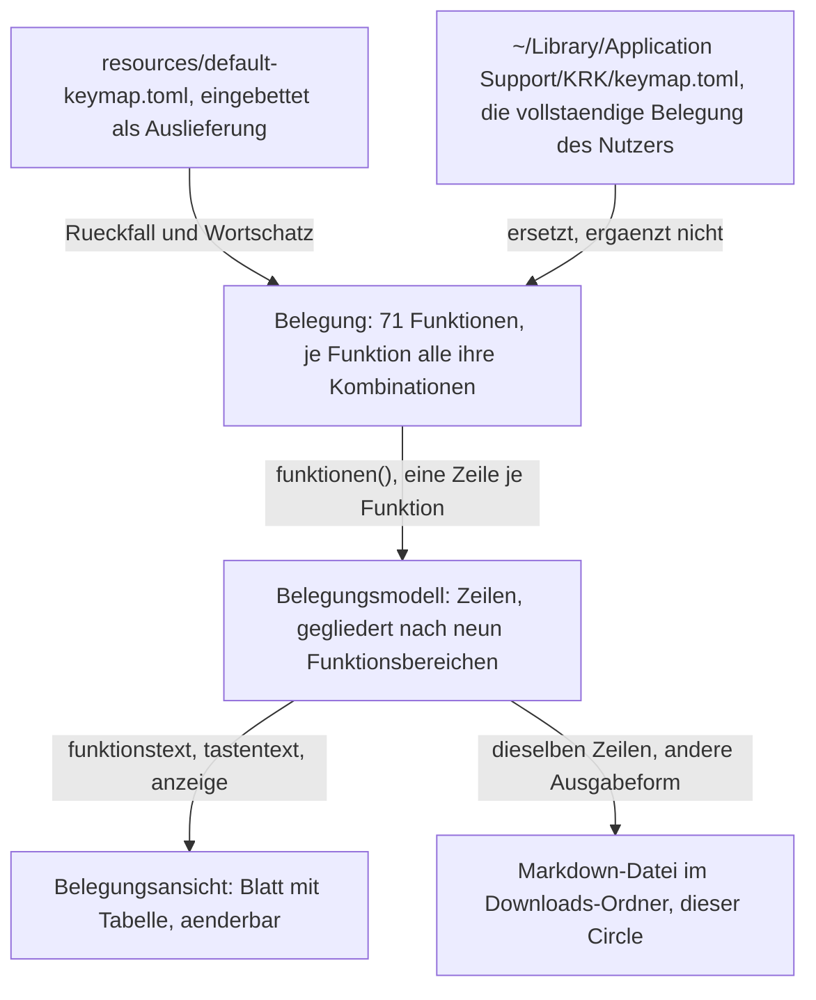

# Die geltende Tastenbelegung als Markdown-Datei im Downloads-Ordner

---
**Domain:** code
**Status:** anticipated
**Filed by:** shaper (anticipated-circle mode)
**Active spec/plan:** (none yet)
**Active session history:** (none yet)

---

## Directive

KRK schreibt die Tastenbelegung, die im Augenblick des Aufrufs gilt, als Markdown-Datei in den Downloads-Ordner des Nutzers. Die Ausgabe führt jede Funktion mit ihren Kombinationen und zeigt dabei die Änderungen des Nutzers an der Auslieferungsbelegung genauso wie die Auslieferungsbelegung selbst. Sie entsteht aus derselben Belegung, aus der die Belegungsansicht ihre Zeilen bezieht, und stellt keine zweite Aufbereitung daneben. Was der Nutzer danach mit der Datei tut, ob drucken, versionieren oder weitergeben, gehört ihm; ein fertiges Druckbild sagt KRK nicht zu.

## Grounding snapshot

Vorläufig. Ein vorgesehener Circle trägt noch keine erhobene Grundlage; dieser Abschnitt hält fest, was am 260809-2040 aus dem Dateibestand geprüft war, und wird bei der Aktivierung ersetzt.

### Woher das Vorhaben kommt und was der Nutzer dabei angenommen hat

Der Nutzer hat am 260809-2035 die Form entschieden: **Markdown in den Downloads-Ordner**, nicht PDF über den Druckdialog. Die Begründung, die er angenommen hat, nennt vier Punkte: die Ausgabe ist billig zu bauen, sie ist von Hand lesbar, sie ist versionierbar, und er kann selbst ein PDF daraus machen. Der Preis dafür steht in der Directive: KRK sagt kein fertiges Druckbild zu. Ein Druckbild darf später danebentreten, siehe `### Was später danebentreten darf`.

### Der Kern des Vorhabens ist eine zweite Ausgabe an einer bestehenden Struktur

Die Belegungsansicht aus C3 der Runde 1 zeigt dieselben Daten am Bildschirm. Was dieser Circle baut, ist eine zweite Ausgabeform derselben Aufbereitung und keine zweite Aufbereitung.

### Was auf der Platte liegt und wiederverwendet wird

Am Code geprüft am 260809-2040.

**Die Belegung führt jede Funktion genau einmal, mit allen ihren Kombinationen.** `crates/krk-core/src/tasten/belegung.rs` trägt `Belegung { funktionen: Vec<Funktion> }` und `Funktion { kennung, name, tasten, reserviert_fuer, gehalten_von }`. `Belegung::funktionen()` liefert sie in der Reihenfolge der Datei. Die Ein-Zeilen-Regel der Belegungsansicht ist damit keine Rechenleistung der Ansicht, sondern die Gestalt der Belegung selbst; eine Ausgabe erbt sie kostenlos.

**Die geltende Belegung ist zur Laufzeit genau ein Wert.** `keymap.toml` hält die **vollständige** Belegung des Nutzers und nicht seine Abweichungen; wer die Datei löscht, bekommt beim nächsten Start die Auslieferungsbelegung. `belegung::fuer_den_betrieb()` (`belegung.rs:1037`) baut den Wert beim Start, `belegung::laden()` liest ihn. Die Formulierung des Entwurfs, die Ausgabe zeige die Belegung "einschließlich der Änderungen des Nutzers", verlangt damit keinen Vergleich zweier Stände: der eine Wert ist bereits der Stand nach den Änderungen.

**Die Gliederung nach Funktionsbereichen steht an genau einer Stelle.** `crates/krk-ui/src/belegungsmodell.rs` trägt `Funktionsbereich` mit neun Werten (Dateilisting, Dateioperationen, Tabs, Vorschau, Leiste und Fokus, Fenster, Anwendung, Textbefehle, Editor), die Zuordnung `bereich()` und darin die vollständige Fallunterscheidung `bereich_des_kommandos()` ohne Auffangzweig. Innerhalb eines Bereichs bleibt die Reihenfolge der Datei erhalten. `CLAUDE.md` führt diese Fallunterscheidung als eine der drei, die ein neues Kommando anhalten, bevor es eingeordnet ist.

**Die Beschriftung einer Kombination hat eine einzige Quelle.** `anzeige()` (`belegungsmodell.rs:517`) setzt auf die `Display`-Form der `Kombination` nur große Teilanfänge: `shift+cmd+k` wird zu `Shift+Cmd+K`, `f3` zu `F3`. Die Namen kommen aus `parser::TASTEN`. Eine Ausgabe, die eine eigene Übersetzungsliste danebenstellte, wäre die zweite Namensliste, die der Plan der Runde 1 ausschließt.

**Das Modell ist frei von AppKit.** `belegungsmodell.rs` liegt in `krk-ui`, benutzt aber keine AppKit-Schnittstelle; allein `appkit/belegungsansicht.rs` zeigt an. Eine Ausgabefunktion kann daneben stehen und ohne Fenster geprüft werden.

**Zahlen des Auslieferungszustands, nachgezählt und nicht übernommen.** `resources/default-keymap.toml` führt 71 Funktionen mit zusammen 79 Kombinationen. Sechs davon stellt das Hauptmenü zu (`gehalten_von = "menue"`) und haben deshalb nie ein Kommando; 65 tragen eines (`Kommando::KENNUNGEN`). Ab Werk hat **keine** Funktion eine leere Tastenliste, und `reserviert_fuer` steht in keinem Eintrag mehr. Beides kann der Nutzer erzeugen: wer eine Kombination entfernt, hat die Funktion unbelegt gemacht, und wer eine Funktion in seiner Datei nicht nennt, bekommt sie unbelegt zurück. Die Ausgabe trifft also auf unbelegte Funktionen, auch wenn die Auslieferung keine kennt.

**Wie KRK Fehler meldet, ist entschieden.** Die Statuszeile trägt fünf Ränge nach dem Alter der Aussage; der Datensatz ist `circles/260802-0842-krk-mac-dateimanager-editor-git/decisions/260803-2025_i_wie-zeigt-krk-dem-nutzer-fehler.md`. Eine Ausgabe, die gelingt oder scheitert, reiht sich dort ein und baut keine zweite Meldeform.

**Atomares Schreiben gibt es schon.** `crates/krk-core/src/ablage/atomar.rs` schreibt erst vollständig in eine Nachbardatei und benennt dann um. Ob die Ausgabe das braucht, entscheidet der Planner; danebenbauen muss er es nicht.

### Befund zum Downloads-Ordner

Die Frage des Auftrags war, ob ein Schreiben nach `~/Downloads` für KRK eine neue Art von Zugriff ist. **Sie ist am Code beantwortet, und die Antwort ist im Wesentlichen nein.**

**KRK schreibt heute schon außerhalb seiner Ablage.** Die Dateioperationen aus C4 legen an, kopieren, verschieben und benennen um, und zwar in jedem Ordner, den der Nutzer anzeigt (`crates/krk-core/src/operation/anlegen.rs`, `crates/krk-core/src/verzeichnis/sys.rs`). Der eingebaute Editor sichert in die Datei, die er hält (`crates/krk-ui/src/editormodell.rs:715` über `krk_core::text::datei::sichern`). Zeigt ein Dateifenster den Downloads-Ordner, schreibt KRK schon heute dorthin.

**Die Rückfrage des Systems ist am Bündel vorbereitet.** `resources/Info.plist` trägt fünf Texte für den Mechanismus für Transparenz, Zustimmung und Kontrolle, darunter `NSDownloadsFolderUsageDescription`. KRK wird außerhalb der App-Sandbox ausgeliefert, weil C9 der Runde 1 Zugriff auf jeden lokalen Pfad verlangt; der Zugriff auf die geschützten Ordner läuft über diese Rückfragen am signierten Bündel.

**Neu ist eine Kleinigkeit, und sie hat einen benannten Platz.** Bisher schreibt KRK nur dorthin, wohin der Nutzer navigiert ist. Diese Ausgabe wählt den Zielordner selbst und muss ihn deshalb erst auflösen. `pfade::benutzerverzeichnis()` (`crates/krk-core/src/ablage/pfade.rs:71`) ist ausdrücklich "die eine Stelle im Kern", die nach dem Benutzerverzeichnis fragt, und hat heute zwei Aufrufer. Ein dritter gehört dorthin und nicht daneben.

`speculation:` Ob die Rückfrage des Systems bei einem Schreibvorgang erscheint, den KRK selbst anstößt, und wie ein abgelehnter Zugriff aussieht, ist in diesem Projekt nicht gemessen. Geprüft sind der Schlüssel in der Bündelbeschreibung und die Auslieferung außerhalb der Sandbox; das Laufzeitverhalten ist es nicht. Der Aktivierungs-Spec sollte einen Prüflauf am gebauten Bündel dafür vorsehen.

### Was die laufende Editor-Runde an der Belegung gerade ändert

Der aktive Circle `260807-2116-eingebauter-editor-mit-textmarken` ist **keine** Abhängigkeit, berührt aber genau die Struktur, aus der diese Ausgabe schöpft. Zwei Änderungen sind für den Zuschnitt erheblich.

**Die Belegung ist um dreizehn Funktionen gewachsen.** Der neunte Funktionsbereich, `Editor`, und zwölf Kommandos von `Bearbeiten` bis `EditorAlleErsetzen` sind mit ihr entstanden. Eine Ausgabe darf deshalb keine Zahl fest verdrahten, weder die 71 Funktionen noch die 79 Kombinationen noch die neun Bereiche; sie zählt, was die Belegung führt.

**Der Nachschlag geht seit dem 260809 für Buchstaben und Ziffern über das gemeldete Zeichen, für alles übrige weiter über den virtuellen Tastencode** (`crates/krk-core/src/tasten/parser.rs`, Nutzerentscheid vom 260808-0155 in `circles/260807-2116-eingebauter-editor-mit-textmarken/decisions/260808-0140_i_die-y-tasten-liegen-auf-einer-deutschen-tastatur-unter-anderen-buchstaben.md`). Beide Arten stehen nebeneinander in derselben Belegung, und die Ausgabe muss beide zeigen. Für die Beschriftung ändert sich dabei nichts: `anzeige()` schreibt `F3` wie `Cmd+Y`, und die zweite Nachschlagart ist genau der Grund, warum `Cmd+Y` künftig auf jeder Tastaturbelegung unter der Aufschrift Y liegt. Ob die Ausgabe diesen Unterschied benennt oder ihn nur abbildet, ist eine Frage für den Aktivierungs-Spec.

### Was zu klären ist, bevor ein Plan entsteht

Fünf Fragen liegen als Datensätze im `decisions/` dieses Circles, alle mit dem Marker `_o_`. Keine ist geraten; jede führt ihre Möglichkeiten und, wo der Shaper eine hat, seine Empfehlung.

- `decisions/260809-2040_o_wie-wird-die-ausgabe-der-belegung-ausgeloest.md` — Kommando in der Belegung, Menüeintrag, oder beides.
- `decisions/260809-2040_o_wie-heisst-die-ausgabedatei-und-was-geschieht-bei-einer-vorhandenen.md` — fester Name mit Überschreiben, Zeitstempel im Namen, oder Zählersuffix.
- `decisions/260809-2040_o_was-steht-in-der-ausgabe-und-wonach-ist-sie-gegliedert.md` — Umfang und Ordnung des Inhalts.
- `decisions/260809-2040_o_gehoert-der-wirkungsbereich-in-die-ausgabe.md` — ob die Ausgabe zeigt, wo ein Befehl wirkt.
- `decisions/260809-2040_o_welche-belegung-schreibt-die-ausgabe-bei-offener-belegungsansicht.md` — die geltende oder die noch nicht gesicherte Arbeitskopie. Hängt an der ersten Frage.

### Was später danebentreten darf

**Ein fertiges Druckbild ist ausdrücklich nicht ausgeschlossen.** Der Nutzer hat am 260809-2035 gegen PDF über den Druckdialog entschieden, nicht gegen ein Druckbild überhaupt. Ein späteres Vorhaben, das die Belegung über den Druckdialog auf Papier oder in ein PDF bringt, setzt auf derselben Aufbereitung auf, aus der diese Ausgabe schöpft. Es gehört nicht in diese Directive und ist kein Grund, den Zuschnitt hier größer zu machen.

## Dependencies

Dieser Circle hängt an `260802-0842-krk-mac-dateimanager-editor-git`, dem beschränkt abgeschlossenen Circle der Runde 1 (`_b_`, geschlossen am 260807-1035). Aus ihm stammen die Belegungsmaschine, die Auslieferungsbelegung, die Belegungsansicht aus C3 mit ihrer Gliederung nach Funktionsbereichen und die Ablage unter `~/Library/Application Support/KRK/`. Weil ein terminaler Circle keine Arbeit mehr aufnimmt, steht die Bindung hier statt dort.

Der aktive Circle `260807-2116-eingebauter-editor-mit-textmarken` ist **keine** Abhängigkeit. Er erweitert die Belegung gerade um dreizehn Funktionen und hat den Nachschlag für Buchstaben und Ziffern von Tastencode auf Zeichen umgestellt; beides steht oben im Grounding, weil die Ausgabe beides zeigen muss. Eine Reihenfolge zwischen beiden Circles ist damit nicht erzwungen. Wer diesen Circle nach dem Editor aktiviert, findet mehr Funktionen vor, aber dieselbe Struktur.

## Turn log

(noch keiner)
