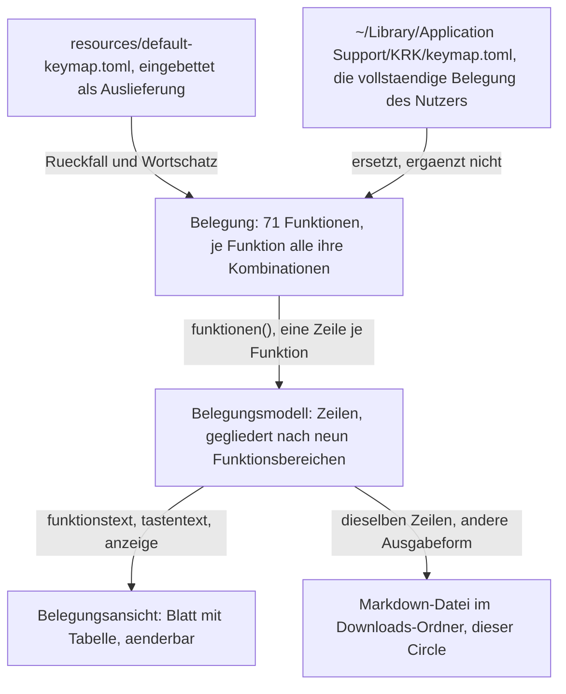

# Die geltende Tastenbelegung als Markdown-Datei im Downloads-Ordner

---
**Domain:** code
**Status:** anticipated
**Filed by:** shaper (anticipated-circle mode)
**Active spec/plan:** circles/260809-2040-tastenbelegung-als-markdown-in-downloads/planning/260811-0753_*_spec-tastenbelegung-als-markdown-in-downloads.md (Abnahmekriterien) und circles/260809-2040-tastenbelegung-als-markdown-in-downloads/planning/260811-0838_*_plan-tastenbelegung-als-markdown-in-downloads.md (Ausführungsstand)
**Active session history:** circles/260809-2040-tastenbelegung-als-markdown-in-downloads/history/260811-0107-orchestrator-session.md

---

## Directive

KRK schreibt die Tastenbelegung, die im Augenblick des Aufrufs gilt, als Markdown-Datei in den Downloads-Ordner des Nutzers. Die Ausgabe führt jede Funktion mit ihren Kombinationen und zeigt dabei die Änderungen des Nutzers an der Auslieferungsbelegung genauso wie die Auslieferungsbelegung selbst. Sie entsteht aus derselben Belegung, aus der die Belegungsansicht ihre Zeilen bezieht, und stellt keine zweite Aufbereitung daneben. Was der Nutzer danach mit der Datei tut, ob drucken, versionieren oder weitergeben, gehört ihm; ein fertiges Druckbild sagt KRK nicht zu.

## Grounding snapshot

Vorläufig. Ein vorgesehener Circle trägt noch keine erhobene Grundlage; dieser Abschnitt hält fest, was am 260809-2040 aus dem Dateibestand geprüft war, und wird bei der Aktivierung ersetzt.

### Woher das Vorhaben kommt und was der Nutzer dabei angenommen hat

Der Nutzer hat am 260809-2035 die Form entschieden: **Markdown in den Downloads-Ordner**, nicht PDF über den Druckdialog. Die Begründung, die er angenommen hat, nennt vier Punkte: die Ausgabe ist billig zu bauen, sie ist von Hand lesbar, sie ist versionierbar, und er kann selbst ein PDF daraus machen. Der Preis dafür steht in der Directive: KRK sagt kein fertiges Druckbild zu. Ein Druckbild darf später danebentreten, siehe `### Was später danebentreten darf`.

### Der Kern des Vorhabens ist eine zweite Ausgabe an einer bestehenden Struktur

Die Belegungsansicht aus C3 der Runde 1 zeigt dieselben Daten am Bildschirm. Was dieser Circle baut, ist eine zweite Ausgabeform derselben Aufbereitung und keine zweite Aufbereitung.

### Was auf der Platte liegt und wiederverwendet wird

Am Code geprüft am 260809-2040.

**Die Belegung führt jede Funktion genau einmal, mit allen ihren Kombinationen.** `crates/krk-core/src/tasten/belegung.rs` trägt `Belegung { funktionen: Vec<Funktion> }` und `Funktion { kennung, name, tasten, reserviert_fuer, gehalten_von }`. `Belegung::funktionen()` liefert sie in der Reihenfolge der Datei. Die Ein-Zeilen-Regel der Belegungsansicht ist damit keine Rechenleistung der Ansicht, sondern die Gestalt der Belegung selbst; eine Ausgabe erbt sie kostenlos.

**Die geltende Belegung ist zur Laufzeit genau ein Wert.** `keymap.toml` hält die **vollständige** Belegung des Nutzers und nicht seine Abweichungen; wer die Datei löscht, bekommt beim nächsten Start die Auslieferungsbelegung. `belegung::fuer_den_betrieb()` (`belegung.rs:1037`) baut den Wert beim Start, `belegung::laden()` liest ihn. Die Formulierung des Entwurfs, die Ausgabe zeige die Belegung "einschließlich der Änderungen des Nutzers", verlangt damit keinen Vergleich zweier Stände: der eine Wert ist bereits der Stand nach den Änderungen.

**Die Gliederung nach Funktionsbereichen steht an genau einer Stelle.** `crates/krk-ui/src/belegungsmodell.rs` trägt `Funktionsbereich` mit neun Werten (Dateilisting, Dateioperationen, Tabs, Vorschau, Leiste und Fokus, Fenster, Anwendung, Textbefehle, Editor), die Zuordnung `bereich()` und darin die vollständige Fallunterscheidung `bereich_des_kommandos()` ohne Auffangzweig. Innerhalb eines Bereichs bleibt die Reihenfolge der Datei erhalten. `CLAUDE.md` führt diese Fallunterscheidung als eine der drei, die ein neues Kommando anhalten, bevor es eingeordnet ist.

**Die Beschriftung einer Kombination hat eine einzige Quelle.** `anzeige()` (`belegungsmodell.rs:517`) setzt auf die `Display`-Form der `Kombination` nur große Teilanfänge: `shift+cmd+k` wird zu `Shift+Cmd+K`, `f3` zu `F3`. Die Namen kommen aus `parser::TASTEN`. Eine Ausgabe, die eine eigene Übersetzungsliste danebenstellte, wäre die zweite Namensliste, die der Plan der Runde 1 ausschließt.

**Das Modell ist frei von AppKit.** `belegungsmodell.rs` liegt in `krk-ui`, benutzt aber keine AppKit-Schnittstelle; allein `appkit/belegungsansicht.rs` zeigt an. Eine Ausgabefunktion kann daneben stehen und ohne Fenster geprüft werden.

**Zahlen des Auslieferungszustands, nachgezählt und nicht übernommen.** `resources/default-keymap.toml` führt 71 Funktionen mit zusammen 79 Kombinationen. Sechs davon stellt das Hauptmenü zu (`gehalten_von = "menue"`) und haben deshalb nie ein Kommando; 65 tragen eines (`Kommando::KENNUNGEN`). Ab Werk hat **keine** Funktion eine leere Tastenliste, und `reserviert_fuer` steht in keinem Eintrag mehr. Beides kann der Nutzer erzeugen: wer eine Kombination entfernt, hat die Funktion unbelegt gemacht, und wer eine Funktion in seiner Datei nicht nennt, bekommt sie unbelegt zurück. Die Ausgabe trifft also auf unbelegte Funktionen, auch wenn die Auslieferung keine kennt.

**Wie KRK Fehler meldet, ist entschieden.** Die Statuszeile trägt fünf Ränge nach dem Alter der Aussage; der Datensatz ist `circles/260802-0842-krk-mac-dateimanager-editor-git/decisions/260803-2025_*_wie-zeigt-krk-dem-nutzer-fehler.md`. Eine Ausgabe, die gelingt oder scheitert, reiht sich dort ein und baut keine zweite Meldeform.

**Atomares Schreiben gibt es schon.** `crates/krk-core/src/ablage/atomar.rs` schreibt erst vollständig in eine Nachbardatei und benennt dann um. Ob die Ausgabe das braucht, entscheidet der Planner; danebenbauen muss er es nicht.

### Befund zum Downloads-Ordner

Die Frage des Auftrags war, ob ein Schreiben nach `~/Downloads` für KRK eine neue Art von Zugriff ist. **Sie ist am Code beantwortet, und die Antwort ist im Wesentlichen nein.**

**KRK schreibt heute schon außerhalb seiner Ablage.** Die Dateioperationen aus C4 legen an, kopieren, verschieben und benennen um, und zwar in jedem Ordner, den der Nutzer anzeigt (`crates/krk-core/src/operation/anlegen.rs`, `crates/krk-core/src/verzeichnis/sys.rs`). Der eingebaute Editor sichert in die Datei, die er hält (`crates/krk-ui/src/editormodell.rs:715` über `krk_core::text::datei::sichern`). Zeigt ein Dateifenster den Downloads-Ordner, schreibt KRK schon heute dorthin.

**Die Rückfrage des Systems ist am Bündel vorbereitet.** `resources/Info.plist` trägt fünf Texte für den Mechanismus für Transparenz, Zustimmung und Kontrolle, darunter `NSDownloadsFolderUsageDescription`. KRK wird außerhalb der App-Sandbox ausgeliefert, weil C9 der Runde 1 Zugriff auf jeden lokalen Pfad verlangt; der Zugriff auf die geschützten Ordner läuft über diese Rückfragen am signierten Bündel.

**Neu ist eine Kleinigkeit, und sie hat einen benannten Platz.** Bisher schreibt KRK nur dorthin, wohin der Nutzer navigiert ist. Diese Ausgabe wählt den Zielordner selbst und muss ihn deshalb erst auflösen. `pfade::benutzerverzeichnis()` (`crates/krk-core/src/ablage/pfade.rs:71`) ist ausdrücklich "die eine Stelle im Kern", die nach dem Benutzerverzeichnis fragt, und hat heute zwei Aufrufer. Ein dritter gehört dorthin und nicht daneben.

`speculation:` Ob die Rückfrage des Systems bei einem Schreibvorgang erscheint, den KRK selbst anstößt, und wie ein abgelehnter Zugriff aussieht, ist in diesem Projekt nicht gemessen. Geprüft sind der Schlüssel in der Bündelbeschreibung und die Auslieferung außerhalb der Sandbox; das Laufzeitverhalten ist es nicht. Der Aktivierungs-Spec sollte einen Prüflauf am gebauten Bündel dafür vorsehen.

### Was die laufende Editor-Runde an der Belegung gerade ändert

Der aktive Circle `260807-2116-eingebauter-editor-mit-textmarken` ist **keine** Abhängigkeit, berührt aber genau die Struktur, aus der diese Ausgabe schöpft. Zwei Änderungen sind für den Zuschnitt erheblich.

**Die Belegung ist um dreizehn Funktionen gewachsen.** Der neunte Funktionsbereich, `Editor`, und zwölf Kommandos von `Bearbeiten` bis `EditorAlleErsetzen` sind mit ihr entstanden. Eine Ausgabe darf deshalb keine Zahl fest verdrahten, weder die 71 Funktionen noch die 79 Kombinationen noch die neun Bereiche; sie zählt, was die Belegung führt.

**Der Nachschlag geht seit dem 260809 für Buchstaben und Ziffern über das gemeldete Zeichen, für alles übrige weiter über den virtuellen Tastencode** (`crates/krk-core/src/tasten/parser.rs`, Nutzerentscheid vom 260808-0155 in `circles/260807-2116-eingebauter-editor-mit-textmarken/decisions/260808-0140_*_die-y-tasten-liegen-auf-einer-deutschen-tastatur-unter-anderen-buchstaben.md`). Beide Arten stehen nebeneinander in derselben Belegung, und die Ausgabe muss beide zeigen. Für die Beschriftung ändert sich dabei nichts: `anzeige()` schreibt `F3` wie `Cmd+Y`, und die zweite Nachschlagart ist genau der Grund, warum `Cmd+Y` künftig auf jeder Tastaturbelegung unter der Aufschrift Y liegt. Ob die Ausgabe diesen Unterschied benennt oder ihn nur abbildet, ist eine Frage für den Aktivierungs-Spec.

### Was zu klären ist, bevor ein Plan entsteht

Fünf Fragen liegen als Datensätze im `decisions/` dieses Circles, alle mit dem Marker `_o_`. Keine ist geraten; jede führt ihre Möglichkeiten und, wo der Shaper eine hat, seine Empfehlung.

- `decisions/260809-2040_*_wie-wird-die-ausgabe-der-belegung-ausgeloest.md` — Kommando in der Belegung, Menüeintrag, oder beides.
- `decisions/260809-2040_*_wie-heisst-die-ausgabedatei-und-was-geschieht-bei-einer-vorhandenen.md` — fester Name mit Überschreiben, Zeitstempel im Namen, oder Zählersuffix.
- `decisions/260809-2040_*_was-steht-in-der-ausgabe-und-wonach-ist-sie-gegliedert.md` — Umfang und Ordnung des Inhalts.
- `decisions/260809-2040_*_gehoert-der-wirkungsbereich-in-die-ausgabe.md` — ob die Ausgabe zeigt, wo ein Befehl wirkt.
- `decisions/260809-2040_*_welche-belegung-schreibt-die-ausgabe-bei-offener-belegungsansicht.md` — die geltende oder die noch nicht gesicherte Arbeitskopie. Hängt an der ersten Frage.

### Was später danebentreten darf

**Ein fertiges Druckbild ist ausdrücklich nicht ausgeschlossen.** Der Nutzer hat am 260809-2035 gegen PDF über den Druckdialog entschieden, nicht gegen ein Druckbild überhaupt. Ein späteres Vorhaben, das die Belegung über den Druckdialog auf Papier oder in ein PDF bringt, setzt auf derselben Aufbereitung auf, aus der diese Ausgabe schöpft. Es gehört nicht in diese Directive und ist kein Grund, den Zuschnitt hier größer zu machen.

## Dependencies

Dieser Circle hängt an `260802-0842-krk-mac-dateimanager-editor-git`, dem beschränkt abgeschlossenen Circle der Runde 1 (`_b_`, geschlossen am 260807-1035). Aus ihm stammen die Belegungsmaschine, die Auslieferungsbelegung, die Belegungsansicht aus C3 mit ihrer Gliederung nach Funktionsbereichen und die Ablage unter `~/Library/Application Support/KRK/`. Weil ein terminaler Circle keine Arbeit mehr aufnimmt, steht die Bindung hier statt dort.

Der aktive Circle `260807-2116-eingebauter-editor-mit-textmarken` ist **keine** Abhängigkeit. Er erweitert die Belegung gerade um dreizehn Funktionen und hat den Nachschlag für Buchstaben und Ziffern von Tastencode auf Zeichen umgestellt; beides steht oben im Grounding, weil die Ausgabe beides zeigen muss. Eine Reihenfolge zwischen beiden Circles ist damit nicht erzwungen. Wer diesen Circle nach dem Editor aktiviert, findet mehr Funktionen vor, aber dieselbe Struktur.

## Turn log

- Turn 1 (Sitzung 260811-0107): Commits `e43f21a..83e056e`; Coherence-Spruch `ok`; Sitzungsbericht: `circles/260809-2040-tastenbelegung-als-markdown-in-downloads/history/260811-0107-orchestrator-session.md`

Der Turn hat die Planschritte S1 bis S3 gebaut; KRK schreibt die geltende Belegung seither als `KRK-Tastenbelegung.md` in den Downloads-Ordner. Sein Ertrag ist die Messung aus S1: sie hat eine Annahme des Specs **widerlegt**, bevor diese als falsche Zusicherung in die erzeugte Datei geriet. `NSTableView` beantwortet `selectAll:` selbst, und deshalb bleibt die Zelle für „Alles auswählen" leer, statt „Textfelder und Editor" zu behaupten. S4, der Abnahmelauf am gebauten Bündel, ist am 260811-1215 vom Nutzer gestrichen worden; die 41 Abnahmekriterien des Specs bleiben damit sämtlich offen.

## Parent grounding stale

**Festgestellt am:** 260810-1439
**Playmaker-Lauf:** 260810-1439-playmaker-direct-dispatch
**Beschränkt abgeschlossenes Kind:** `260807-2116-eingebauter-editor-mit-textmarken`, geschlossen am 260810-1445

Die Editor-Runde, deren Änderungen an der Belegung dieser Circle in seinem Grounding
führt, ist geschlossen. Der Abschnitt `### Was die laufende Editor-Runde an der Belegung
gerade ändert` beschreibt sie als laufend, und zwei Zeilen nennen sie ausdrücklich aktiv:

> Zeile 77: „Der aktive Circle `260807-2116-eingebauter-editor-mit-textmarken` ist **keine**
> Abhängigkeit, berührt aber genau die Struktur, aus der diese Ausgabe schöpft."

> Zeile 101: „Der aktive Circle `260807-2116-eingebauter-editor-mit-textmarken` ist
> **keine** Abhängigkeit. Er erweitert die Belegung gerade um dreizehn Funktionen [...]"

Der Vermerk hält die Aktivierung nicht auf. Er hält drei Punkte für die Klärungsrunde
fest, und der wichtigste ist ein Vorteil und kein Mangel.

### 1. Die Grundlage steht jetzt still, und die drei Zahlen sind nachgeprüft

Das Grounding warnte davor, eine der drei bewegten Zahlen fest zu verdrahten, weil die
Editor-Runde sie noch bewegte. Sie bewegt sie nicht mehr. Am 260810-1439 nachgezählt:
`resources/default-keymap.toml` trägt 71 Blöcke `[[funktion]]`, und
`crates/krk-ui/src/belegungsmodell.rs:73` führt `Funktionsbereich` mit dem neunten Wert
`Editor`. Beide Zahlen des Grounding-Abschnitts halten also am gebauten Stand.

Die Warnung selbst bleibt richtig. Sie stützt sich nicht auf das Wachstum dieser einen
Runde, sondern darauf, dass jede spätere Runde die Belegung erweitern kann; die Ausgabe
zählt, was die Belegung führt.

### 2. Die Beschränkung des Abschlusses reicht nicht in diesen Circle

Der Abschluss der Editor-Runde ist aus zwei Gründen beschränkt: der Abnahmelauf über die
110 Kriterien ihres Specs verlangt KRK im Vordergrund und ist Nutzerarbeit, und zwei
Restdefekte hängen an der Frage, ob `krk-ui` ein Bibliotheksziel bekommt
(`circles/260807-2116-eingebauter-editor-mit-textmarken/decisions/260810-1044_*_ziehen-die-vier-instanzproben-in-ein-pruefziel-ohne-libtest-harness-um.md`).

Keiner der beiden trifft diese Ausgabe. Sie führt keine Zeitzusage, also erbt sie keinen
offenen Messstand, und sie setzt auf `belegungsmodell.rs` auf, das ohne AppKit auskommt und
damit ohne die Probenfrage prüfbar ist. `inference:` Sollte die Bibliotheksziel-Frage
später mit ja beantwortet werden, berührt sie jede Datei der Kiste `krk-ui` und damit auch
eine dort neu angelegte Ausgabefunktion; das ist eine Reihenfolgefrage für den
Aktivierungs-Spec und keine Abhängigkeit.

### 3. Ein offener Defekt sitzt in einem Datensatz dieses Circles

`shared/issues/260810-0805_*_ein-verweis-nennt-den-falschen-circle-und-die-zustellerregel-liegt-woanders.md`
hält fest, dass
`decisions/260809-2040_*_wie-wird-die-ausgabe-der-belegung-ausgeloest.md:7` die
Zustellerregel im Circle der Editor-Runde zitiert, während der Datensatz im Circle der
Runde 1 liegt. Der Defekt bittet darum, alle fünf Datensätze dieses Circles zu prüfen, weil
nur einer geprüft ist. Das ist eine kleine Vorarbeit zur Klärungsrunde, kein Hindernis.

Der Playmaker berichtigt keine Zitate und ändert keinen Defekt.

## Activation proposal

**Vorgeschlagen am:** 260810-1439
**Playmaker-Lauf:** 260810-1439-playmaker-direct-dispatch
**Domain-Gewichtung:** code

Dieser Circle ist der empfohlene nächste Kandidat, und die Empfehlung steht auf dem
Dateibestand und nicht auf einer Nutzerwahl. Eine Wahl über die Reihenfolge liegt nach dem
Abschluss der Editor-Runde nicht vor: die festgehaltene Wahl vom 260807-1930
(`shared/history/260807-1930-uebergabe-an-die-editor-runde.md`) hat den Editor gegen den
Web-Betrachter gestellt, der Editor hat sie gewonnen und ist geschlossen. Dieser Circle
entstand erst am 260809-2040 und stand in jenem Vergleich nicht zur Wahl. Eine Aussage über
ein Feld aus zwei Elementen ordnet kein Feld aus drei, und ihr Sieger hat das Feld
verlassen.

**Die Gewichtung `code` zählt in die andere Richtung, und der Playmaker unterschlägt es
nicht.** Sie bevorzugt vorgesehene Circles mit wenigen unbeantworteten Fragen. Nach diesem
Maß liegt der Web-Betrachter vorn, mit einem zitierten offenen Entscheidungsdatensatz gegen
fünf hier. Alle fünf liegen in `decisions/` dieses Circles und tragen `_o_`, geprüft am
260810-1439.

Der Zählwert misst hier die falsche Größe. Die fünf Datensätze sind die eigenen
Aktivierungsfragen dieses Circles, jede mit Möglichkeiten und einer Empfehlung des Shapers,
und jede aus dem Dateibestand beantwortbar: wie die Ausgabe ausgelöst wird, wie die Datei
heißt, was in ihr steht, ob der Wirkungsbereich mitkommt, und welche Belegung bei offener
Belegungsansicht gilt. Sie brauchen eine Klärungsrunde mit dem Nutzer und keine
Untersuchung. Der eine Datensatz des Web-Betrachters ist von anderer Art: die
Verfügbarkeitsprüfung für macOS-26-Schnittstellen ist eine ungemessene technische Frage,
und derselbe Circle hält in seinem Grounding fest, dass das Mittel der Darstellung von
Web-Inhalt offen ist und „in eine eigene Untersuchung vor dem Plan" gehört. Ein Zählwert von
eins verdeckt dort mehr ungeöffnete Arbeit als ein Zählwert von fünf hier.

**Die geerbten Bauteile liegen auf der Platte, am Code geprüft.** Die Belegung führt jede
Funktion genau einmal mit allen ihren Kombinationen (`crates/krk-core/src/tasten/belegung.rs`,
`Belegung::funktionen()`), die Gliederung nach neun Funktionsbereichen steht an einer Stelle
(`crates/krk-ui/src/belegungsmodell.rs:73`, `Funktionsbereich` samt dem Wert `Editor`), die
Beschriftung einer Kombination hat eine einzige Quelle (`belegungsmodell.rs:517`,
`anzeige()`), und `resources/default-keymap.toml` trägt 71 Blöcke `[[funktion]]`. Das Modul
`belegungsmodell.rs` spricht keine AppKit-Schnittstelle an; eine Ausgabefunktion daneben ist
ohne Fenster prüfbar.

**Die Grundlage dieses Circles ist einen Tag alt und kennt den Stand nach dem Editor.** Sie
wurde am 260809-2040 geschrieben, während die Editor-Runde lief, und rechnet deren
Änderungen ein: dreizehn neue Funktionen, der neunte Funktionsbereich, und der Nachschlag
für Buchstaben und Ziffern über das gemeldete Zeichen statt über den Tastencode. Die
Grundlage des Web-Betrachters stammt vom 260804 und beschreibt das Vorschaufenster so, wie
die Runde 1 es hinterließ; die Editor-Runde hat genau diese Fläche zu einem von fünf
Fokusbereichen gemacht, ihr Zeilennummern gegeben und den Editor sie zeitlich verdrängen
lassen. Sie trägt außerdem drei ins Leere laufende Pfadzitate und einen Vermerk
`## Parent grounding stale` vom 260807-1042.

**Der Zuschnitt ist der kleinere von beiden.** Diese Runde baut eine zweite Ausgabeform an
einer bestehenden Aufbereitung. Der Web-Betrachter hebt einen ausdrücklichen Ausschluss der
Runde 1 auf („Integrierter Browser zum Navigieren von Websites") und überholt dabei ein
abgenommenes Abnahmekriterium der Fähigkeit C10.

**Was gegen eine sofortige Aktivierung spricht, in absteigender Schärfe.**

Die einzige Abhängigkeit `260802-0842-krk-mac-dateimanager-editor-git` ist beschränkt
abgeschlossen (`_b_`) und nicht kohärent (`_c_`). Nach der Rangheuristik zählt allein `_c_`
als erfüllte Vorbedingung, also trägt dieser Circle das Kennzeichen. Inhaltlich trägt es
hier wenig: aus der Runde 1 stammen die Belegungsmaschine, die Auslieferungsbelegung und die
Belegungsansicht, und die Beschränkung jener Runde betrifft ihre Zeitzusagen, die diese
Ausgabe nicht berührt. Der Web-Betrachter trägt dasselbe Kennzeichen, und dort reicht die
Beschränkung über seine dritte offene Frage nachweislich hinein.

Nicht gemessen ist, ob macOS bei einem Schreibvorgang nach `~/Downloads`, den KRK selbst
anstößt, eine Rückfrage zeigt und wie ein abgelehnter Zugriff aussieht. Der Grounding-Abschnitt
führt den Punkt als `speculation:` und verlangt einen Prüflauf am gebauten Bündel im
Aktivierungs-Spec. Das ist die einzige echte Unbekannte dieses Circles.

Der Defekt aus Punkt 3 des Vermerks `## Parent grounding stale` sitzt in einem der fünf
Entscheidungsdatensätze und sollte vor der Klärungsrunde berichtigt sein, damit der Nutzer
einem Verweis folgen kann, der trägt.

Der Playmaker benennt Kandidaten, er aktiviert sie nicht. Die Umbenennung des Datensatzes
von `_a_circle.md` auf `_t_circle.md` und das Schreiben von `.active-circle` bleiben beim
Nutzer über `/fusion:next` oder beim Orchestrator.

## Closure note

**Beschränkter Abschluss am 260811-1415.** Der Marker geht auf `_b_`, wie bei den Runden 1 und 2,
und aus demselben Grund.

**Was gebaut ist.** KRK schreibt die geltende Tastenbelegung als Markdown nach
`~/Downloads/KRK-Tastenbelegung.md`, ausgelöst über einen Menüeintrag ohne Tastenkürzel unter
„KRK". Die Datei trägt drei Spalten, gegliedert nach den neun Funktionsbereichen, nur die
belegten Funktionen, und die Schreibweise der Kombinationen kommt aus `anzeige()` — keine zweite
Aufbereitung, wie die Directive es verlangt. Die drei Planschritte S1 bis S3 tragen `[DONE]`, der
Plan steht auf `_c_`, der Bau ist grün.

**Warum der Abschluss beschränkt ist.** Der Abnahmelauf S4 ist am 260811-1215 vom Nutzer
gestrichen worden. Die 41 Abnahmekriterien des Specs stehen damit sämtlich auf `- [ ]`, und der
Spec bleibt auf `_o_`. Der Grund ist derselbe, der schon die Runden 1 und 2 beschränkt hat: der
Lauf verlangt KRK im Vordergrund und ist Nutzerarbeit, die kein Agent leisten kann
(`circles/260802-0842-krk-mac-dateimanager-editor-git/decisions/260806-1303_*_wie-kommt-krk-fuer-den-abnahmelauf-in-den-vordergrund.md`).

**Was das heißt, ungeschönt:** niemand hat KRK die Datei je schreiben sehen. „Gebaut" ist die
richtige Aussage über diese Runde, „abgenommen" nicht.

**Der Bounded-Closure-Artefakt — was diese Runde gelernt hat und die Directive nicht hergab.**

Die Runde hat einen Fehler verhindert, bevor er entstand. Der Spec hat eine Vermutung als
Vermutung gekennzeichnet („Textfelder und Editor" für die sechs vom Menü zugestellten
Textbefehle) und ihre Prüfung zum Abnahmekriterium gemacht. Schritt S1 hat sie am
Objective-C-Laufzeitsystem gemessen — ohne Instanz, ohne Hauptfaden, ohne Vordergrund — und sie
**widerlegt**: `NSTableView` beantwortet `selectAll:` aus einer eigenen Methode, und die
Lesezeichenleiste ist eine. Ohne dieses Kriterium stünde heute eine falsche Angabe in der
erzeugten Datei. Der Befund ist als `issues/260811-0930_*_…` festgehalten und von drei Proben
gehalten.

Daneben ein Fund, der nicht den Code betrifft, sondern eine Zusage an den Nutzer: der Text zu
`NSDownloadsFolderUsageDescription` nannte das Schreiben nicht. Eine TCC-Zusage gilt **je Paar
aus Programm und Dienst**, nicht je Vorgang, und KRK löst die Rückfrage schon beim Anzeigen des
Downloads-Ordners aus. Der Satz beschaffte damit Zustimmung für eine Handlung, die er nicht
nannte.

**Und ein Verfahrensbefund, der über diese Runde hinausreicht:** dreimal in dieser Sitzung stand
eine Zusicherung im Text stärker da als im Code, und jedes Mal hat erst die Durchsicht sie
zurückgezogen. Der Spec hat für diese Fehlerform inzwischen eine Gewohnheit — `inference:`
kennzeichnen und die Prüfung zum Kriterium machen —, aber keinen Mechanismus.

**Was offen bleibt:** ein zurückgestellter Defekt (`issues/260811-0955_*_…`, die Ungleichheit
zwischen `bereich` und `wirkung`, vom Nutzer so gewählt) und eine offene Frage
(`decisions/260811-1230_*_…`, ob ein Kommentar den Rang der Statuszeile als Zahl nennen soll).
Die Abnahmeanleitung `planning/260811-1130_*_abnahmeanleitung-*.md` bleibt auf `_o_` und ist die
Grundlage, falls der Lauf später automatisiert wird.

**Sitzungshistorie:** `circles/260809-2040-tastenbelegung-als-markdown-in-downloads/history/260811-0107-orchestrator-session.md`
**Abgleich:** `circles/260809-2040-tastenbelegung-als-markdown-in-downloads/history/260811-1403-reconciliation.md`
