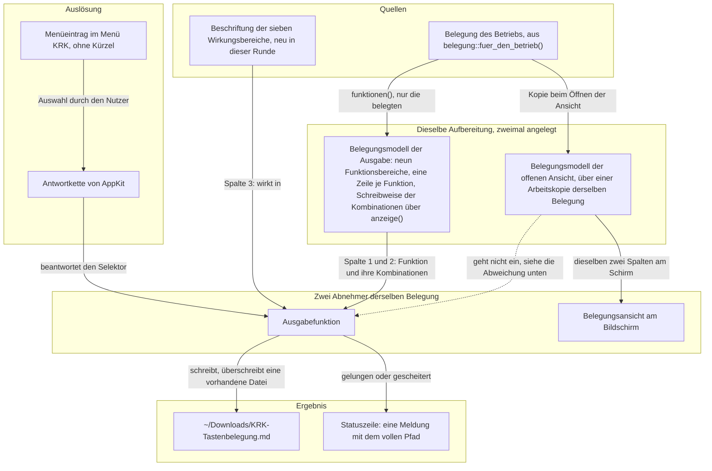

# Spec: Die geltende Tastenbelegung als Markdown-Datei im Downloads-Ordner (Runde 3)

**Datum:** 2026-08-11
**Status:** Entwurf, wartet auf die Abnahme des Nutzers
**Circle:** `circles/260809-2040-tastenbelegung-als-markdown-in-downloads`
**Quelle:** Circle-Directive im Datensatz `_*_circle.md`, Abschnitt `## Directive`. Dazu zwölf Festlegungen des Nutzers: die fünf Antworten vom 260811-0110, die in den Datensätzen unter `decisions/` mit einer `Answered:`-Zeile stehen, und die sieben Antworten vom 260811-0115, die die Klärungsrunde `history/260811-0446-shaper-klaerungsrunde-tastenbelegung-ausgabe.md` gestellt hat.

> **Diese Runde ist klein, und der Spec hält sie klein.** Vier Fähigkeiten, ein neuer Menüeintrag, eine neue Beschriftungsliste, keine neue Zeile in `resources/default-keymap.toml`. Was daran über eine Formsache hinausgeht, sind zwei Punkte, und beide stehen unten unter `## Was die Abnahme mitentscheidet`: eine Ableitung des Shapers, deren Prüfung vor dem Bau dieser Spec erzwungen hat und die dabei gebrochen ist, und ein Preis, den der Nutzer gegen die Empfehlung des Shapers angenommen hat.

## Wie dieser Spec auf Datensätze verweist

Wie in den beiden Specs davor: ein Verweis auf einen Datensatz trägt an der Stelle des Zustandsmarkers eine Sternstelle. `decisions/260809-2040_*_gehoert-der-wirkungsbereich-in-die-ausgabe.md` bleibt damit richtig, wenn der Datensatz von beantwortet nach umgesetzt wandert. Wo der Marker eine Aussage über den Stand ist und nicht Teil eines Pfades, steht er ausgeschrieben.

## Directive dieser Runde

Nach dieser Runde schreibt KRK die Tastenbelegung, die im Augenblick des Aufrufs gilt, als Markdown-Datei in den Downloads-Ordner des Nutzers. Ausgelöst wird sie über einen Eintrag im Hauptmenü, der kein Tastenkürzel trägt. Die Datei führt jede belegte Funktion mit ihren Kombinationen und mit der Angabe, wo der Befehl wirkt, gegliedert nach denselben neun Funktionsbereichen, nach denen die Belegungsansicht am Bildschirm gegliedert ist.

Die Ausgabe entsteht aus derselben Belegung, aus der die Belegungsansicht ihre Zeilen bezieht, und stellt keine zweite Aufbereitung daneben. Was der Nutzer danach mit der Datei tut, ob drucken, versionieren oder weitergeben, gehört ihm; ein fertiges Druckbild sagt KRK nicht zu.

## Aufbau dieser Runde

Die Bezeichner C1 bis C4 verweisen auf die Fähigkeiten weiter unten. Sie zählen für diese Runde neu von eins an; wo dieser Spec eine Fähigkeit einer früheren Runde meint, schreibt er es aus, etwa "C3 der Runde 1".

### Woher die Ausgabe ihre Daten nimmt, und woher nicht

Zwei Wege führen zu drei Spalten, und ein dritter Weg führt ausdrücklich nirgendwohin. Das Bild zeigt beides, weil die Antwort auf die fünfte Nutzerfrage genau an der gestrichelten Kante hängt:

Die gestrichelte Kante ist die einzige des Bildes, die keine Wirkung überträgt, und sie steht trotzdem darin. Ohne sie wäre nicht zu sehen, dass es einen zweiten Stand der Belegung gibt und dass die Ausgabe ihn übergeht.

## Fähigkeiten

### C1: Der Auslöser ist ein Menüeintrag ohne Tastenkürzel

**Beschreibung:** Der Nutzer löst die Ausgabe über einen Eintrag im Hauptmenü aus. Der Eintrag trägt kein Tastenkürzel, und die Belegung wächst durch ihn nicht. Er ist auch dann erreichbar, wenn die Belegungsansicht als Blatt vor dem Fenster steht.

**Abnahmekriterien:**
- [ ] Das Hauptmenü trägt einen Eintrag, der die Ausgabe auslöst. Ein Klick darauf schreibt die Datei nach C2 und meldet das Ergebnis nach C4.
- [ ] Der Eintrag trägt kein Tastenkürzel. Rechts von seinem Titel steht nichts.
- [ ] `resources/default-keymap.toml` bekommt keinen neuen Eintrag. Die Zahl der geführten Funktionen bleibt, wo sie vor dieser Runde stand, und die Konflikterkennung aus C3 der Runde 1 hat nichts Neues zu prüfen.
- [ ] Die Ausgabe bekommt kein Kommando. Die Aufzählung `Kommando` in `crates/krk-core/src/tasten/belegung.rs` wächst durch diese Runde nicht, und damit auch nicht `Kommando::wirkungsbereich` und nicht `bereich_des_kommandos` in `crates/krk-ui/src/belegungsmodell.rs`.
- [ ] Der Eintrag ist auswählbar, während die Belegungsansicht als Blatt steht, und schreibt dann die Datei nach der Regel aus C3. Ist er es nicht, gilt der Fall der Abweichung unten als nicht erreichbar, und das ist am gebauten Bündel zu prüfen und nicht anzunehmen.
- [ ] Der Eintrag ist auch dann auswählbar, wenn kein Dateifenster den Fokus hält. Die Ausgabe hängt an keinem Bereich und an keinem Fokus.

**Getroffene Festlegungen:**
- **Der Nutzer hat am 260811-0110 den Menüweg gewählt, ausdrücklich ohne Kürzel** (`decisions/260809-2040_*_wie-wird-die-ausgabe-der-belegung-ausgeloest.md`). Die Zusatzwahl "ohne Kürzel" ist nicht beiläufig: ein Kürzel wäre durch die umgesetzte Entscheidung der Runde 1 `circles/260802-0842-krk-mac-dateimanager-editor-git/decisions/260805-0000_*_menuekuerzel-in-die-konflikterkennung-oder-daneben.md` zwingend ein Belegungseintrag mit `gehalten_von = "menue"` geworden. Ein Kürzel hätte damit die Bauform verändert und nicht nur die Bequemlichkeit.
- **Der Preis ist benannt und angenommen.** KRKs erste Maxime ist die Steuerung über die Tastatur, und diese eine Funktion ist die Ausnahme davon. Sie liegt dafür auch nicht im Arbeitsfluss.
- **Die Bauform steht bereits.** `ohne_kuerzel` (`crates/krk-ui/src/appkit/menue.rs:335`) legt einen Menübefehl ohne Tastenentsprechung an. Sie ist der richtige Weg und nicht der Ausweichzweig: `befehl()` in derselben Datei fällt auf `ohne_kuerzel` zurück, wenn es eine Kennung in der Belegung nicht findet, und meldet dabei einen Programmfehler auf der Standardfehlerausgabe. Ein Eintrag, der bewusst keine Kennung hat, ruft `ohne_kuerzel` unmittelbar auf. Am Code geprüft am 260811-0446.
- **Der Eintrag gehört unter den Menütitel "KRK", und das ist eine Vorbelegung des Specs und keine Antwort des Nutzers.** Das Hauptmenü führt heute drei Untermenüs (`menue.rs:195-277`): KRK trägt das Beenden, Bearbeiten die sechs Textbefehle, Fenster die beiden Fensterbefehle. Die Ausgabe ist eine Handlung der Anwendung an ihren eigenen Daten und gehört damit zu KRK; unter Bearbeiten stünde sie zwischen sechs Befehlen, die AppKit ausführt und nicht KRK. Wer die Vorbelegung umstößt, ändert eine Stelle in `hauptmenue`.
- **Der Titel des Eintrags lautet "Tastenbelegung als Markdown sichern", ebenfalls als Vorbelegung.** Er nennt die Handlung und die Form, und er trägt keine Auslassungspunkte, weil er unmittelbar wirkt und keinen Dialog öffnet. Wer ihn ändert, ändert eine Zeichenkette.

### C2: Ort, Name und das Überschreiben

**Beschreibung:** Die Datei heißt `KRK-Tastenbelegung.md` und liegt im Downloads-Ordner des Nutzers. Der Name ist fest. Ein zweiter Aufruf überschreibt die Datei des ersten, ohne zu fragen.

**Abnahmekriterien:**
- [ ] Der geschriebene Pfad ist der Downloads-Ordner des Nutzers, und die Datei darin heißt genau `KRK-Tastenbelegung.md`. Weder der Ordner noch der Name sind einstellbar.
- [ ] Das Benutzerverzeichnis wird über `pfade::benutzerverzeichnis()` (`crates/krk-core/src/ablage/pfade.rs:71`) aufgelöst und nicht über einen zweiten Weg daneben. Die Funktion ist die eine Stelle im Kern, die nach dem Benutzerverzeichnis fragt, und bekommt mit dieser Runde ihren dritten Aufrufer.
- [ ] Ein zweiter Aufruf überschreibt eine vorhandene Datei desselben Namens. Nach dem Aufruf liegt genau eine Datei dieses Namens im Ordner, und ihr Inhalt ist der des zweiten Aufrufs.
- [ ] Die Datei wird auch dann überschrieben, wenn sie nicht von KRK stammt. Eine Rückfrage entsteht nicht, und ein Zähler im Namen entsteht nicht.
- [ ] Fehlt der Downloads-Ordner, entsteht keine Datei, und der Grund steht in der Statuszeile nach C4. KRK legt den Ordner nicht an.
- [ ] Wird der Zugriff auf den Ordner vom System abgelehnt, entsteht keine Datei, und der Grund steht in der Statuszeile nach C4. Eine halb geschriebene Datei bleibt in keinem Fall zurück.
- [ ] Am gebauten und signierten Bündel ist geprüft, ob macOS bei diesem Schreibvorgang eine Rückfrage nach dem Mechanismus für Transparenz, Zustimmung und Kontrolle zeigt, und wie ein abgelehnter Zugriff aussieht. `resources/Info.plist` trägt dafür den Schlüssel `NSDownloadsFolderUsageDescription`. Der Prüflauf ist Teil der Abnahme und nicht des Plans.
- [ ] Lehnt der Nutzer die Rückfrage des Systems ab, verhält sich KRK wie bei einem abgelehnten Zugriff: keine Datei, ein Grund in der Statuszeile, kein Absturz und keine stumme Rückkehr.

**Getroffene Festlegungen:**
- **Der Nutzer hat am 260811-0110 den festen Namen mit Überschreiben gewählt** (`decisions/260809-2040_*_wie-heisst-die-ausgabedatei-und-was-geschieht-bei-einer-vorhandenen.md`) und am 260811-0115 den konkreten Namen `KRK-Tastenbelegung.md` nachgereicht. Der Datensatz hatte den Namen ausdrücklich offen gelassen und ihn dem Spec überwiesen.
- **Der Preis steht dabei und ist angenommen:** ein zweiter Aufruf zerstört kommentarlos, was vorher unter diesem Namen lag, auch wenn es nicht von KRK stammte. Der Downloads-Ordner gehört dem Nutzer, und KRK ist dort nicht der einzige Schreiber; das unterscheidet ihn von der Ablage unter `~/Library/Application Support/KRK/`, wo KRK seine vier Dateien selbst benannt hat und allein beschreibt.
- **Der Gegenwert ist der stabile Pfad.** Er bedient genau den Grund, aus dem der Nutzer am 260809-2035 Markdown gewählt hat, nämlich die Versionierbarkeit: ein Git-Repository will denselben Dateinamen wiedersehen.
- **Neu an diesem Schreibvorgang ist allein, dass KRK den Zielordner selbst wählt.** KRK schreibt heute schon außerhalb seiner Ablage: die Dateioperationen aus C4 der Runde 1 legen an, kopieren und verschieben in jedem angezeigten Ordner, und der Editor sichert in die Datei, die er hält. Bisher aber immer dorthin, wohin der Nutzer navigiert ist. Am Code geprüft am 260809-2040.

### C3: Der Inhalt der Datei

**Beschreibung:** Die Datei trägt eine Überschrift und darunter die neun Funktionsbereiche als Abschnitte, in derselben Reihenfolge wie die Belegungsansicht am Bildschirm. Jeder Abschnitt führt seine belegten Funktionen in einer Tabelle mit drei Spalten: die Funktion, ihre Kombinationen, und wo der Befehl wirkt. Geschrieben wird die Belegung des Betriebs und nicht die Arbeitskopie einer offenen Belegungsansicht.

**Die dritte Spalte ist die einzige, deren Zellen aus verschiedenen Quellen stammen**, und eine von ihnen bleibt leer. Die Tabelle unter den Abnahmekriterien führt jeden Fall mit seiner Quelle; die leere Zelle ist darin ein Ergebnis und kein Versäumnis.

**Abnahmekriterien:**

*Kopf und Gliederung*
- [ ] Die Datei beginnt mit genau einer Überschrift. Ein Erzeugungszeitpunkt steht nicht darin, eine Versionsangabe steht nicht darin, und ein erklärender Vorspann steht nicht darin.
- [ ] Unter der Überschrift folgen die Funktionsbereiche als Abschnitte, in der Reihenfolge von `Funktionsbereich::ALLE` (`crates/krk-ui/src/belegungsmodell.rs`). Die Abschnittsüberschrift ist der Text aus `Funktionsbereich::name()` und keine zweite Namensliste daneben.
- [ ] Innerhalb eines Abschnitts stehen die Funktionen in der Reihenfolge, in der die Belegung sie führt, also in der Reihenfolge der Datei. Eine eigene Sortierung entsteht nicht.
- [ ] Ein Funktionsbereich, dessen Funktionen sämtlich unbelegt sind, erscheint nicht mit einer leeren Tabelle. Entweder entfällt sein Abschnitt, oder er nennt in einem Satz, dass keine seiner Funktionen belegt ist; beides ist zulässig, eine leere Tabelle nicht.
- [ ] Die Ausgabe verdrahtet keine Zahl fest: weder die Zahl der Funktionen noch die der Kombinationen noch die der Funktionsbereiche. Sie zählt, was die Belegung führt. Eine spätere Runde, die die Belegung erweitert, ändert die Ausgabe nicht.

*Umfang*
- [ ] Die Datei führt ausschließlich Funktionen, die mindestens eine Kombination tragen. Eine Funktion ohne Kombination erscheint nicht, auch nicht mit leerer Zelle.
- [ ] Bei unveränderter Auslieferungsbelegung erscheint jede geführte Funktion, weil ab Werk keine unbelegt ist. Entfernt der Nutzer eine Kombination in seiner `keymap.toml` oder nennt er eine Funktion dort nicht, fällt sie aus der Datei.

*Die drei Spalten*
- [ ] Jede Zeile trägt drei Spalten: den Namen der Funktion, ihre Kombinationen, und wo der Befehl wirkt.
- [ ] Eine Funktion mit mehreren Kombinationen steht in **einer** Zeile und führt alle ihre Kombinationen darin. Die Ein-Zeilen-Regel aus C3 der Runde 1 gilt in der Datei wie am Schirm.
- [ ] Die Schreibweise einer Kombination kommt aus `anzeige()` (`crates/krk-ui/src/belegungsmodell.rs:530`), also `Shift+Cmd+K` und `F3`. Eine eigene Übersetzungsliste entsteht nicht; sie wäre die zweite Aufbereitung, die die Directive ausschließt.
- [ ] Wo die dritte Spalte etwas trägt, ist es eine ausgeschriebene Beschriftung und kein Kurzname aus dem Programmtext. Eine Legende, die Kurznamen erklärt, entsteht nicht, weil es keine Kurznamen gibt.
- [ ] Die sieben Wirkungsbereiche tragen die Beschriftungen aus der Tabelle unten. `Tabbereich` steht als "Dateifenster und Vorschau" in der Datei, `Navigator` als "Dateifenster, Leiste und Vorschau", `Ueberall` als "überall".
- [ ] Die sechs vom Hauptmenü zugestellten Textbefehle tragen die Zellen aus der Tabelle unten, **je Befehl einzeln entschieden und nicht als Gruppe**: `text_ausschneiden`, `text_kopieren` und `text_einfuegen` tragen "Textfelder und Editor", `text_alles_auswaehlen` bleibt leer, `text_rueckgaengig` und `text_wiederholen` tragen "Editor". Keiner der sechs hat ein Kommando und damit einen Wirkungsbereich; jede der drei Zellen kommt aus einer eigenen Quelle. Eine einheitliche Beschriftung über alle sechs ist unzulässig: für `text_alles_auswaehlen` ist sie widerlegt, und für `text_rueckgaengig` und `text_wiederholen` wäre ihre Hälfte "Textfelder" unbelegt.
- [ ] Gibt eine von Hand geschriebene `keymap.toml` einer Funktion **mit** Kommando einen Zusteller, greift keine der Quellen aus der Tabelle, und die Zelle sagt genau das. Sie bleibt dabei **nicht** leer: die leere Zelle ist in dieser Datei an `text_alles_auswaehlen` vergeben, und "hier ist nichts entschieden" darf nicht mit "hier hat niemand nachgesehen" in derselben Zelle zusammenfallen. Der Wortlaut "(von KRK nicht eingeordnet)" ist eine Vorbelegung des Specs. Ob dieser Fall besser ganz verschwindet, indem die Ausgabe dieselbe Frage stellt wie die Gliederung, ist offen und hier nicht entschieden (`issues/260811-0955_*_der-auffangzweig-in-wirkung-ist-erreichbar-bereich-und-wirkung-fragen-nicht-dasselbe.md`).
- [ ] **Für jeden der sechs Textbefehle ist im Baum auffindbar, woher seine Zelle kommt.** Die Messung am Laufzeitsystem von Objective-C, im Plan der Schritt S1 und damit der erste Bauschritt dieser Runde, liegt als Probe im Baum und schlägt fehl, sobald sich eine der gemessenen Antworten ändert. Ihre vollständige Tabelle steht in `issues/260811-0930_*_die-ableitung-textfelder-und-editor-bricht-fuer-alles-auswaehlen-die-leiste-beantwortet-selectall-selbst.md`, die Antwort auf das, was die Messung offen ließ, in `decisions/260811-1010_*_was-traegt-die-dritte-spalte-bei-rueckgaengig-und-wiederholen.md`. Die Zellen der geschriebenen Datei stimmen mit beiden Datensätzen überein.

*Welcher Stand geschrieben wird*
- [ ] Geschrieben wird die Belegung des Betriebs, also der Wert, den `belegung::fuer_den_betrieb()` hält. Die Arbeitskopie einer offenen Belegungsansicht geht nicht ein.
- [ ] Wird die Ausgabe bei offener Belegungsansicht ausgelöst, enthält die Datei den gesicherten Stand. Eine noch nicht gesicherte Zuweisung des Nutzers steht nicht darin, und sie steht auch dann nicht darin, wenn der Nutzer die Ansicht anschließend über das Sichern verlässt.

*Form der Datei*
- [ ] Die Datei ist gültiges Markdown und lässt sich mit einem gewöhnlichen Betrachter lesen. Sie ist zugleich von Hand lesbar, so wie die vier Ablagedateien aus C7 und C11 der Runde 1.
- [ ] Die Datei ist in UTF-8 geschrieben, ohne Bytefolgenmarke am Anfang, mit `\n` als Zeilenende. Das ist dieselbe Form, die der Editor aus C4 der Runde 2 beim Sichern schreibt.

**Die Zellen der dritten Spalte, und woher jede kommt:**

| Fall | Zelle in der Datei | Quelle der Aussage |
|---|---|---|
| `Dateifenster` | Dateifenster | Vorbelegung des Specs |
| `Leiste` | Lesezeichen- und Geräteleiste | Vorbelegung des Specs |
| `Vorschau` | Vorschau | Vorbelegung des Specs |
| `Editor` | Editor | Vorbelegung des Specs |
| `Tabbereich` | Dateifenster und Vorschau | Nutzerantwort vom 260811-0115 |
| `Navigator` | Dateifenster, Leiste und Vorschau | Nutzerantwort vom 260811-0115 |
| `Ueberall` | überall | Nutzerantwort vom 260811-0115 |
| `text_ausschneiden`, `text_kopieren`, `text_einfuegen` | Textfelder und Editor | am 260811-0930 gemessen, zuzüglich eines `inference:`-Schrittes über den Feldeditor |
| `text_alles_auswaehlen` | (bleibt leer) | dieselbe Messung hat die Ableitung des Specs für diesen einen widerlegt |
| `text_rueckgaengig`, `text_wiederholen` | Editor | Nutzerentscheid vom 260811-0935, weil die Messung hier nichts entscheiden konnte |
| eine Funktion mit Kommando, der eine `keymap.toml` von Hand einen Zusteller gibt | (von KRK nicht eingeordnet) | keine der obigen Quellen greift; die Zelle sagt das, statt es zu verschweigen |

Die ersten sieben Zeilen sind die Beschriftungen der Wirkungsbereiche. Drei davon hat der Nutzer selbst genannt, nämlich die drei, die als Kurzname unverständlich sind; die vier übrigen sind Vorbelegungen des Specs und tragen den Namen, den der Modulkopf von `belegung.rs` ihnen ohnehin gibt. Wer eine davon ändert, ändert eine Zeichenkette in einer Fallunterscheidung.

Die vier Zeilen darunter sind die Zellen ohne Wirkungsbereich, und sie sind der Grund, aus dem diese Tabelle nicht mehr "Die sieben Beschriftungen" heißt. Was die Runde hier gelernt hat, steht in den Festlegungen gleich darunter.

**Getroffene Festlegungen:**
- **Der Nutzer hat am 260811-0110 die Gliederung nach Funktionsbereich gewählt und den Umfang auf die belegten Funktionen beschränkt** (`decisions/260809-2040_*_was-steht-in-der-ausgabe-und-wonach-ist-sie-gegliedert.md`). Beim Umfang ist er der Empfehlung des Datensatzes nicht gefolgt; der Preis steht dort und lautet: eine Funktion, die der Nutzer versehentlich unbelegt gemacht hat, verschwindet aus der Datei, statt darin als unbelegt zu erscheinen.
- **Die dritte Spalte ist eine Wahl gegen die Empfehlung des Datensatzes und gegen die Bildschirmansicht** (`decisions/260809-2040_*_gehoert-der-wirkungsbereich-in-die-ausgabe.md`). Die Belegungsansicht trägt zwei Spalten, die Datei bekommt drei. Der Gegenwert ist, dass die Datei die einzige Stelle in KRK wird, an der der stumme Fokusvorbehalt überhaupt erklärt wird: wer `Cmd+Backspace` im Editor drückt und nichts geschieht, hat sonst keinen Weg, den Grund zu erfahren, außer im Quelltext nachzusehen.
- **Ordnung und Spaltensatz laufen damit auseinander, und das ist gesehen.** Die Ordnung folgt dem Schirm, der Spaltensatz geht darüber hinaus. Beide Antworten sind gefallen, nachdem die Spannung ausgesprochen war.
- **Ob die Belegungsansicht die Spalte ebenfalls bekommen soll, ist hier nicht entschieden und liegt außerhalb dieser Directive.** Sie sagt eine Ausgabedatei zu und keine Änderung der Ansicht. Wer es will, führt es als eigenen Vorschlag.
- **Die einheitliche Zelle "Textfelder und Editor" über alle sechs Textbefehle ist geprüft und gebrochen.** Der Spec hat sie am 260811-0753 als Ableitung des Shapers gekennzeichnet und ihre Prüfung zur ersten Arbeit am Bau gemacht. Die Prüfung ist am 260811-0930 gefahren: `AnyClass::responds_to` gegen die sechs Klassen, die in KRK einen Ersthelfer stellen können, ohne Instanz und ohne Hauptfaden. Sie hat die Ableitung in drei Teile zerlegt, und die Tabelle oben trägt seither drei Zellen statt einer.
- **Gebrochen hat sie an `NSTableView`.** `text_alles_auswaehlen` liegt auf `selectAll:`, und `NSTableView` beantwortet diesen Selektor aus einer eigenen Methode. Die Lesezeichen- und Geräteleiste ist eine `NSTableView`, also ist der Menüeintrag auch dort erreichbar, und "Textfelder und Editor" wäre für diesen einen der sechs eine falsche Zusicherung gewesen. Die Zelle bleibt deshalb leer. Was die Messung ausdrücklich **nicht** entschieden hat: ob der dort erreichbare Eintrag auch etwas bewirkt. Das braucht eine Instanz und damit den Hauptfaden, und wer die Zelle füllen will, misst das zuerst (`issues/260811-0930_*_die-ableitung-textfelder-und-editor-bricht-fuer-alles-auswaehlen-die-leiste-beantwortet-selectall-selbst.md`).
- **Für `text_rueckgaengig` und `text_wiederholen` hat die Messung nichts entschieden, und der Nutzer hat entschieden.** Beide Selektoren stehen an `NSWindow` und nicht an der Textklasse; `responds_to` liefert für einen weitergeleiteten Selektor `false`, und dieses `false` belegt nicht, dass im Editor niemand antwortet. Der Nutzer hat am 260811-0935 "Editor" gewählt, schmaler als die ursprüngliche Ableitung und am Code belegt durch `setAllowsUndo(true)` (`crates/krk-ui/src/appkit/editor.rs:3376`). Über Textfelder behauptet die Zelle damit nichts (`decisions/260811-1010_*_was-traegt-die-dritte-spalte-bei-rueckgaengig-und-wiederholen.md`).
- **Bestätigt ist die Zelle der drei Zwischenablage-Befehle, und die Hälfte "Textfelder" darin ist erschlossen.** Gemessen ist eine Aussage über Klassen: `cut:`, `copy:` und `paste:` hängen an `NSText`, und `NSTextField` beantwortet keinen von ihnen. Der Schritt von dort zu "Textfelder" beruht darauf, dass der Feldeditor eines `NSTextField` eine `NSTextView` ist und `NSText` mitbringt. `inference:` Das ist eine zugesagte Eigenschaft von AppKit, aber `responds_to` hat sie nicht geprüft, weil es keine Instanz anlegt.
- **Der Wert dieser Runde liegt an dieser Stelle in der Kennzeichnung und nicht im Ergebnis.** Der Spec hat eine Vermutung als Vermutung ausgewiesen und ihre Prüfung erzwungen, bevor sie als Zusicherung in eine Datei geriet. Ohne diese Kennzeichnung stünde heute in einer von KRK geschriebenen Datei, `Cmd+A` wirke in Textfeldern und im Editor, während der Befehl in der Lesezeichenleiste ebenso erreichbar ist.
- **Der gesicherte Stand ist eine Wahl mit einem Preis, den der Nutzer angenommen hat** (`decisions/260809-2040_*_welche-belegung-schreibt-die-ausgabe-bei-offener-belegungsansicht.md`). Der Abschnitt `## Die Abweichung bei offener Belegungsansicht` unten schreibt ihn aus.
- **Kein Zeitstempel im Kopf, entschieden am 260811-0115.** Eine Datei ohne Zeitstempel ist zwischen zwei Läufen byteweise vergleichbar; wer sie versioniert, bekommt einen leeren Diff, wenn sich an der Belegung nichts geändert hat. Ein Zeitstempel hätte bei jedem Lauf eine Änderung erzeugt, die keine ist.

### C4: Die Meldung nach dem Aufruf

**Beschreibung:** Nach jedem Aufruf sagt KRK in der Statuszeile, was geschehen ist. Bei Erfolg nennt die Meldung den vollen Pfad der geschriebenen Datei. Es ist dieselbe Meldung, ob die Datei neu entstanden ist oder eine vorhandene ersetzt hat.

**Abnahmekriterien:**
- [ ] Nach einem gelungenen Aufruf steht in der Statuszeile eine Meldung, die den vollen Pfad der geschriebenen Datei nennt, in der Form "Tastenbelegung geschrieben: ~/Downloads/KRK-Tastenbelegung.md".
- [ ] Es ist **eine** Meldung für beide Fälle. Ob die Datei neu entstanden ist oder eine vorhandene ersetzt hat, unterscheidet die Meldung nicht.
- [ ] Ein gescheiterter Aufruf meldet seinen Grund und unterscheidet dabei mindestens den fehlenden Ordner vom abgelehnten Zugriff. Kommentarlos nichts zu tun ist in keinem Fall zulässig.
- [ ] Die Meldung geht in die Statuszeile aus C1 der Runde 1 und reiht sich in deren fünf Ränge ein. Ein Blatt, eine Systemmitteilung oder eine zweite Meldefläche entsteht nicht.
- [ ] Wird die Ausgabe bei offener Belegungsansicht ausgelöst, erscheint keine zusätzliche Meldung darüber, dass der gesicherte Stand geschrieben wurde. Die gewöhnliche Erfolgsmeldung erscheint auch dann.
- [ ] Am gebauten Bündel ist geprüft, ob die Meldung sichtbar ist, während die Belegungsansicht als Blatt steht. Verdeckt das Blatt die Statuszeile, ist der Nutzer nach einem Aufruf aus dieser Lage ohne jede Rückmeldung, und das ist vor der Abnahme zu berichten statt hinzunehmen.

**Getroffene Festlegungen:**
- **Der Wortlaut mit vollem Pfad ist die Nutzerantwort vom 260811-0115.** Die Alternative war eine Meldung ohne Pfad; der Pfad gewinnt, weil er beim ersten Aufruf zeigt, wohin KRK geschrieben hat, und weil er das Überschreiben einer fremden Datei sofort sichtbar macht, ohne dass eine zweite Meldung dafür nötig wäre.
- **Kein Hinweis auf das Überschreiben, entschieden am 260811-0115.** Zwei Meldungen für dieselbe Handlung wären zwei Fälle mit zwei Formulierungen für einen Vorgang, dessen Ergebnis in beiden Fällen dasselbe ist: unter dem genannten Pfad liegt jetzt die aktuelle Belegung.
- **Der Meldeweg ist entschieden und nicht neu.** Die Statuszeile trägt fünf Ränge nach dem Alter der Aussage; der Datensatz ist `circles/260802-0842-krk-mac-dateimanager-editor-git/decisions/260803-2025_*_wie-zeigt-krk-dem-nutzer-fehler.md`. Gesetzt wird die Meldung über `Anwendungsdelegierter::antwort_zeigen` (`crates/krk-ui/src/appkit/anwendung.rs:3296`), gelöscht zu Beginn der nächsten Kommandoausführung. Eine Uhr hängt nicht daran: die Antwort gilt bis zum nächsten Befehl.

## Die Abweichung bei offener Belegungsansicht, und ihr Preis

**Der Nutzer hat am 260811-0115 gegen die Empfehlung des Shapers entschieden, und der Spec glättet das nicht.** Empfohlen war ein Hinweis in der Erfolgsmeldung. Der Nutzer will ihn nicht.

Der Fall im Einzelnen: die Belegungsansicht steht als Blatt vor dem Fenster, der Nutzer hat darin drei Tasten umbelegt, aber die Ansicht noch nicht über das Sichern verlassen. Löst er jetzt die Ausgabe aus, bekommt er eine Datei **ohne** diese drei Zuweisungen. Die Datei widerspricht damit sichtbar dem, was auf dem Schirm steht, und **KRK sagt es ihm nicht.** Die Erfolgsmeldung, die er sieht, ist dieselbe wie in jeder anderen Lage.

Drei Eigenschaften begrenzen den Schaden, und sie sind der Grund, aus dem die Wahl vertretbar ist:

Die Abweichung besteht nur bis zum Sichern. Wer die Ansicht über das Sichern verlässt und die Ausgabe erneut auslöst, bekommt eine Datei, die stimmt.

Sie entsteht allein durch eine eigene Handlung des Nutzers. Wer die Belegungsansicht nicht geöffnet hat, kann sie nicht erleben, und wer sie geöffnet hat, weiß, dass er dort gerade etwas ändert.

Sie geht in die vorsichtigere Richtung. Die Datei sagt zu, was KRK gerade wirklich tut, und nicht, was der Nutzer vorhat. Eine Datei, die eine Umbelegung zusagt, die der Nutzer anschließend mit `esc` verwirft, wäre die schlechtere der beiden Überraschungen.

**Was den Fall ganz auflösen würde, ist nicht der Hinweis, sondern die Unerreichbarkeit.** Wäre der Menüeintrag bei stehendem Blatt nicht auswählbar, träte die Abweichung nie ein. Ob das so ist, ist ungemessen: das Blatt ist dokumentmodal (`crates/krk-ui/src/appkit/blaetter/mod.rs:508`), eine eigene `validateMenuItem`-Überschreibung gibt es im Baum nicht, und `inference:` ein dokumentmodales Blatt lässt die Menüleiste bedienbar. Das fünfte Abnahmekriterium von C1 verlangt die Prüfung am gebauten Bündel. Fällt sie so aus, dass der Eintrag gesperrt ist, ist dieser ganze Abschnitt gegenstandslos, und der Spec sagt es dann in einem Nachtrag.

## Die neue vollständige Fallunterscheidung, und welche bestehenden unberührt bleiben

**Eine neue Fallunterscheidung ohne Auffangzweig kommt hinzu: die Beschriftung der sieben Wirkungsbereiche.** `Wirkungsbereich` (`crates/krk-core/src/tasten/belegung.rs:171`) trägt heute keinen `impl`-Block mit einer Namensfunktion; die Aufzählung ist die einzige der beiden Gliederungen ohne Beschriftungen. Die Beschriftungen gehören in dieselbe Bauform, die `Funktionsbereich::name()` (`crates/krk-ui/src/belegungsmodell.rs`) vormacht: eine `match`-Fallunterscheidung über alle Werte, ohne `_`-Zweig. Ein achter Wert hält dann den Bau an und erzwingt eine bewusste Beschriftung, statt still auf einen Rückfalltext zu laufen. Eine Tabelle mit Rückfall wäre die falsche Form und ist ausgeschlossen.

**Keine der vier bestehenden vollständigen Fallunterscheidungen wächst.** `CLAUDE.md` führt sie unter "Was man nicht sieht": `Kommando::wirkungsbereich` und `bereich_des_kommandos` wachsen mit jedem neuen Kommando, `schiebt_auffrischung_auf` mit jeder neuen Operationsart, dazu die Aufzählungen `Wirkungsbereich`, `Kommando`, `Bereich` und `Fokus`. Diese Runde bringt kein Kommando mit, keine Operationsart, keinen sechsten Fensterbereich und keinen fünften Wirkungsbereich. Der Grund steht in C1: der Auslöser ist ein Menüeintrag ohne Kürzel, und ein solcher Eintrag trägt kein Kommando.

**`resources/default-keymap.toml` wächst ebenfalls nicht.** Die Zahl der geführten Funktionen bleibt, wo sie steht, und die Konflikterkennung aus C3 der Runde 1 hat nichts Neues zu prüfen. Diese Runde ist damit die erste seit der Runde 1, die die Belegung überhaupt nicht anfasst, und sie schöpft trotzdem vollständig aus ihr.

## Verhältnis zu den zehn Zeitzusagen aus C8 der Runde 1

**Diese Runde setzt keine eigene Zeitzusage, und sie berührt keine der zehn bestehenden.** Der zweite Teil ist hier begründet und nicht behauptet, weil die Runde 2 an derselben Stelle drei Zusagen als berührt benennen musste.

Der Sockel steht: der Abnahmelauf vom 260810 (`messungen/260810-1918-alle-zusagen.txt`) hält alle zehn Zusagen in allen fünf Runden. Gegen diesen gemessenen Stand ist zu prüfen, was die Runde anfasst.

**Acht der zehn Zusagen liegen auf Wegen, die diese Runde nicht anfasst.** L2, L3, L6 und L10 messen das Lesen und Sortieren eines Verzeichnisses; die Ausgabe liest kein Verzeichnis und fasst weder den Verzeichnisleser noch den Sortierschlüssel an. L5 misst den Wechsel des Tabs und des aktiven Dateifensters; die Ausgabe hat keine Tabs und ändert den Fokus nicht. L7 misst die Vorschau einer Textdatei; die Vorschaufläche wird nicht angefasst. L8 misst den Fortschritt einer Stapeloperation; die Ausgabe geht nicht durch die Operationsmaschine, sie schreibt eine einzelne kleine Datei.

**L1 und L9 messen den Weg vom Tastendruck zum Zeichendurchgang, und genau diesen Weg fasst diese Runde nicht an.** Beide hängen am Ereignisabgriff und an der Zuleitung vom Tastendruck zum Kommando. Die Ausgabe kommt über die Antwortkette von AppKit und nicht über den Abgriff; sie fügt der Nachschlagtabelle keine Zeile hinzu, weil sie in der Belegung nicht vorkommt. Das ist der eigentliche Gewinn der Antwort "Menüeintrag ohne Kürzel" für die Messstrecke: der heißeste Pfad des Programms bleibt unberührt.

**L4 ist der einzige Berührungspunkt, und er ist beziffert.** L4 misst den Prozessstart bis zur bedienbaren Prüfsitzung. Das Hauptmenü wird beim Start einmal aufgebaut (`hauptmenue` in `crates/krk-ui/src/appkit/menue.rs:195`), und diese Runde hängt dort einen zehnten `NSMenuItem` ein. Der Lauf vom 260810 misst L4 mit einem 95. Perzentil zwischen 350 und 414 ms gegen eine Zusage von 1000 ms; ein zusätzlicher Menüeintrag, der weder eine Datei liest noch eine Belegung nachschlägt, liegt um Größenordnungen unter diesem Abstand. **Die Zusage ist damit nicht berührt im Sinne einer Neubewertung**, und der Berührungspunkt steht hier, damit eine spätere Messrunde ihn nicht suchen muss.

**Zwei Kriterien treten an die Stelle einer elften Zahl** und sind Teil der Abnahme dieser Runde:

- [ ] Keine der zehn Zahlen aus C8 der Runde 1 wird durch diese Runde geändert, gelockert oder umgedeutet.
- [ ] Der Aufruf der Ausgabe hält die Oberfläche nicht sichtbar an. Nach dem Auslösen des Menüeintrags ist die Anwendung sofort wieder bedienbar; die Auswahl bewegt sich, ein Tabwechsel geschieht.

Das zweite Kriterium trägt keine Zahl, weil die Runde keine Messstrecke fährt. Es prüft, was ein Nutzer sieht, und nicht, was ein Zähler meldet.

## Randbedingungen

- **Die Technologiewahl bindet unverändert:** Rust mit AppKit über `objc2`, außerhalb der App-Sandbox, Mindest-Zielsystem macOS 15 bei Unterstützung bis macOS 26 (`circles/260802-0842-krk-mac-dateimanager-editor-git/decisions/260802-1134_*_sprache-und-ui-werkzeugkasten.md`).
- **`objc2` führt keine Verfügbarkeitsangaben mit sich.** Wer eine Methode anspricht, die nach macOS 15 hinzugekommen ist, bekommt keine Warnung, sondern einen Absturz auf dem Referenzgerät. Diese Runde spricht mit `NSMenuItem` eine Klasse an, die seit macOS 10.0 besteht; der Plan nennt die Untergrenze trotzdem im Modulkopf, wie jedes AppKit-Modul dieses Projekts es tut.
- **Die Ausgabe entsteht aus derselben Belegung wie die Bildschirmansicht.** Eine zweite Aufbereitung entsteht nicht: keine zweite Gruppierung, keine zweite Übersetzungsliste für Tastennamen, keine zweite Zählung der Funktionen.
- **Die Statuszeile bleibt die eine Meldefläche.** Was die Ausgabe zu melden hat, reiht sich in ihre fünf Ränge ein.
- **`krk-core` und `krk-ui` tragen `#![deny(unsafe_code)]`.** Die Ausnahme steht in zwei Dateien und soll nicht wachsen.
- **Die geschriebene Datei ist ein Ergebnis und keine Ablagedatei.** Sie steht nicht neben `bookmarks.toml`, `session.toml`, `settings.toml` und `keymap.toml`, KRK liest sie nie wieder ein, und ihr Fehlen ändert an KRKs Verhalten nichts.
- **Kein neuer Nutzerentscheid ist offen.** Die fünf Datensätze unter `decisions/` tragen alle den Marker beantwortet und je eine `Answered:`-Zeile; die sieben Fragen der Klärungsrunde sind am 260811-0115 beantwortet.

## Ausdrücklich außerhalb dieser Runde

- **Ein fertiges Druckbild.** Der Nutzer hat am 260809-2035 gegen PDF über den Druckdialog entschieden, nicht gegen ein Druckbild überhaupt. Ein späteres Vorhaben, das die Belegung über den Druckdialog auf Papier oder in ein PDF bringt, setzt auf derselben Aufbereitung auf. Es gehört nicht in diese Directive.
- **Eine zweite Tabelle nach Taste sortiert.** Sie beantwortet die Frage "was macht diese Taste" und wäre das Nachschlagewerk zur Ordnung dieser Runde. Sie braucht eine Ordnung über Kombinationen, die es im Projekt heute nicht gibt, und sie bricht die Ein-Zeilen-Regel, weil eine Funktion mit zwei Kombinationen zweimal stünde. Der Datensatz zum Inhalt führt sie als naheliegendste spätere Erweiterung.
- **Die dritte Spalte in der Belegungsansicht am Bildschirm.** Sie wäre der andere Weg, die Abweichung zwischen Datei und Schirm aufzulösen. Die Directive sagt eine Ausgabedatei zu und keine Änderung der Ansicht.
- **Unbelegte Funktionen in der Datei.** Der Nutzer hat den Umfang am 260811-0110 auf die belegten beschränkt. Wer sie später doch führen will, ändert ein Abnahmekriterium von C3 und keine Struktur.
- **Ein Tastenkürzel für die Ausgabe.** Es wäre nach der umgesetzten Entscheidung der Runde 1 zwingend ein Belegungseintrag mit `gehalten_von = "menue"` und damit eine andere Bauform als die gewählte. Wer es später will, öffnet die Frage neu und nicht nur die Belegung.
- **Ein einstellbarer Zielordner oder Dateiname.** Ort und Name sind fest. Eine Einstellung dafür bräuchte einen Eintrag in `settings.toml`, eine Prüfung des eingestellten Pfades und eine Regel für einen ungültigen; niemand hat sie verlangt.
- **Die Git-Anbindung und die KI-Anbindung.** Sie liegen außerhalb jeder bisher gefahrenen Runde.
- **Der Abnahmelauf über die 110 Kriterien der Runde 2.** Er verlangt KRK im Vordergrund, ist Nutzerarbeit und hält diese Runde nicht auf.
- **Die Frage nach einem Bibliotheksziel für `krk-ui`.** `circles/260807-2116-eingebauter-editor-mit-textmarken/decisions/260810-1044_*_ziehen-die-vier-instanzproben-in-ein-pruefziel-ohne-libtest-harness-um.md` bedeutet einen Umbau der ganzen Kiste. `inference:` Wird sie später mit ja beantwortet, berührt sie jede Datei von `krk-ui` und damit auch eine dort neu angelegte Ausgabefunktion; das ist eine Reihenfolgefrage und keine Abhängigkeit.

## Offen für den Planner

Diese Punkte entscheidet der Planner beim Entwurf; der Spec sagt zu ihnen nichts zu.

- Wo die Beschriftung der sieben Wirkungsbereiche wohnt. `Wirkungsbereich` liegt in `krk-core`, `Funktionsbereich::name()` in `krk-ui`; welche der beiden Kisten die Beschriftungen trägt, entscheidet der Planner. Zugesagt ist allein die Bauform: eine vollständige Fallunterscheidung ohne Auffangzweig.
- Wo die Ausgabefunktion wohnt und wie viel von ihr ohne AppKit prüfbar ist. `belegungsmodell.rs` spricht keine AppKit-Schnittstelle an; eine Ausgabefunktion daneben wäre ohne Fenster prüfbar, und das ist ein Vorteil, den der Planner heben oder liegen lassen kann.
- Ob die Datei atomar geschrieben wird. `crates/krk-core/src/ablage/atomar.rs` schreibt erst vollständig in eine Nachbardatei und benennt dann um. Ob eine Ergebnisdatei im Downloads-Ordner das braucht, ist eine Abwägung; danebenbauen muss der Planner nichts.
- Ob das Schreiben auf dem Hauptfaden geschieht oder auf einem Arbeitsfaden. Zugesagt ist das zweite Kriterium unter `## Verhältnis zu den zehn Zeitzusagen`, nämlich dass die Oberfläche nicht sichtbar anhält, und nicht der Weg dorthin.
- Welche Markdown-Form die Tabelle trägt und wie die Kombinationen einer Funktion in einer Zelle getrennt werden.
- An welcher Stelle der Antwortkette die Ausgabe beantwortet wird, und ob der Menüeintrag ein Ziel bekommt oder es der Kette überlässt, wie die neun bestehenden Einträge es tun.
- Wie die Meldung aus C4 die Statuszeile erreicht, wenn kein Dateifenster den Fokus hält. `antwort_zeigen` nimmt eine Seite entgegen, und die Statuszeile steht zweimal im Fenster.
- Wie der Pfad in der Meldung geschrieben wird, mit der Tilde für das Benutzerverzeichnis oder vollständig ausgeschrieben. Der Nutzer hat die Form mit Tilde genannt; ob KRK sie erzeugt oder den vollen Pfad zeigt, ist eine Kleinigkeit der Darstellung.

## Beantwortete Nutzerentscheidungen

Zwölf Festlegungen tragen diesen Spec. Fünf stehen als Datensätze unter `decisions/`, alle mit dem Marker beantwortet und je einer `Answered:`-Zeile. Sieben stammen aus der Klärungsrunde vom 260811-0115 und stehen allein hier.

| Frage | Antwort | Wirkt auf |
|---|---|---|
| Wie wird die Ausgabe ausgelöst? | Ein Eintrag im Hauptmenü, ohne Tastenkürzel. Kein Eintrag in der Belegung. | C1 |
| Wie heißt die Datei, und was geschieht bei einer vorhandenen? | Fester Name, eine vorhandene wird überschrieben. | C2 |
| Was steht in der Ausgabe, und wonach ist sie gegliedert? | Nur die belegten Funktionen, gegliedert nach Funktionsbereich wie am Schirm. | C3 |
| Gehört der Wirkungsbereich in die Ausgabe? | Ja, als dritte Spalte je Funktion. | C3 |
| Welche Belegung gilt bei offener Belegungsansicht? | Der gesicherte Stand, nicht die Arbeitskopie. | C3, `## Die Abweichung` |
| Wie heißt die Datei konkret? | `KRK-Tastenbelegung.md` | C2 |
| Trägt der Kopf einen Zeitstempel? | Nein, nur eine Überschrift. Auch keine Versionsangabe. | C3 |
| Wie ist die dritte Spalte beschriftet? | Ausgeschrieben, ohne Legende. | C3 |
| Was steht dort bei den sechs Textbefehlen? | "Textfelder und Editor", unter Vorbehalt der Prüfung. | C3 |
| Wie lautet die Erfolgsmeldung? | Mit vollem Pfad: "Tastenbelegung geschrieben: ~/Downloads/KRK-Tastenbelegung.md". | C4 |
| Wird das Überschreiben gemeldet? | Nein, eine Meldung für beide Fälle. | C4 |
| Wird der gesicherte Stand bei offener Ansicht gemeldet? | Nein. | C4, `## Die Abweichung` |

## Was die Abnahme mitentscheidet

Ein Punkt gehört noch zur Abnahme dieses Specs und ist keine der zwölf Antworten oben. Ein zweiter stand hier bis zum 260811-0930 und ist seitdem gemessen; er bleibt stehen, weil die Art seiner Erledigung zur Abnahme gehört. Dazu kommen sechs Vorbelegungen, die der Nutzer am Gate umstoßen kann.

**Eine Ableitung des Shapers, deren Prüfung dieser Spec erzwungen hat, und die dabei gebrochen ist.** Die Beschriftung "Textfelder und Editor" für die sechs vom Menü zugestellten Textbefehle stand auf einer Ableitung und nicht auf einer Messung, und der Spec hat sie als solche gekennzeichnet. Der Shaper hatte sie aus dem Aufbau der Antwortkette geschlossen: die sechs Einträge tragen die Standardselektoren `undo:`, `redo:`, `cut:`, `copy:`, `paste:` und `selectAll:` und bekommen kein Ziel gesetzt (`crates/krk-ui/src/appkit/menue.rs:210-254`), also beantwortet sie, wer den Ersthelfer hält und den Selektor kennt.

**Der Verdachtsfall war benannt, und er hat sich bestätigt.** `text_alles_auswaehlen` liegt auf `selectAll:`, und die Lesezeichen- und Geräteleiste ist eine `NSTableView` (`crates/krk-ui/src/appkit/leiste.rs:3`). Die Messung vom 260811-0930 hat gezeigt, dass `NSTableView` diesen Selektor aus einer eigenen Methode beantwortet; die einheitliche Zelle wäre für diesen einen der sechs eine falsche Zusicherung gewesen. Sie bleibt deshalb leer. Zwei weitere der sechs konnte dieselbe Prüfung nicht entscheiden, und für sie hat der Nutzer am 260811-0935 entschieden. C3 führt daher drei Zellen statt einer, dazu eine vierte für den Fall, den KRK nicht einordnen kann.

Der Grund, aus dem dieser Punkt hier stehen bleibt: die Durchsicht der vorigen Sitzung hat genau diese Fehlerform zweimal gefunden (`shared/issues/260810-1751_*_zwei-zusicherungen-ueber-den-auswahlversuch-halten-so-nicht-wie-sie-geschrieben-sind.md`). Eine Zusicherung, die im Text stärker ist als im Code, ist teurer als eine fehlende, weil niemand sie nachprüft. Der Spec hat diesmal die schwächere Stelle selbst ausgewiesen, statt sie einer späteren Durchsicht zu überlassen, und die Prüfung hat seine Ableitung für drei der sechs nicht bestätigt. Was davon in der Abnahme bleibt, ist das letzte Abnahmekriterium der dritten Spalte in C3: es verlangt keine Prüfung mehr, sondern dass ihr Nachweis im Baum auffindbar ist und die Zellen der Datei zu ihm passen.

**Ein Preis, den der Nutzer gegen die Empfehlung des Shapers angenommen hat.** Bei offener Belegungsansicht bekommt der Nutzer eine Datei, die dem Schirm widerspricht, ohne es zu erfahren. Der Abschnitt `## Die Abweichung bei offener Belegungsansicht` schreibt den Fall aus. Wer die Wahl umstößt, ändert das fünfte Abnahmekriterium von C4 und nichts sonst.

**Sechs Vorbelegungen des Specs, jede eine Zeichenkette oder eine Zeile.** Der Menütitel "Tastenbelegung als Markdown sichern" und die Einordnung unter den Menütitel "KRK" (C1), dazu die vier Beschriftungen für `Dateifenster`, `Leiste`, `Vorschau` und `Editor` (C3). Der Nutzer hat drei der sieben Beschriftungen selbst genannt, nämlich die drei, die als Kurzname unverständlich sind; die vier übrigen tragen den Namen aus dem Modulkopf von `belegung.rs`.

## Abgleich mit der Circle-Directive

Die Directive nennt sechs Bestandteile, und jeder ist in diesem Spec einer Fähigkeit zugeordnet: die Markdown-Datei im Downloads-Ordner (C2), die Belegung, die im Augenblick des Aufrufs gilt (C3), jede Funktion mit ihren Kombinationen (C3), die Änderungen des Nutzers wie die Auslieferungsbelegung selbst (C3), dieselbe Belegung wie die Belegungsansicht ohne zweite Aufbereitung daneben (C3 und die Randbedingungen), und der ausdrückliche Verzicht auf ein fertiges Druckbild (`## Ausdrücklich außerhalb dieser Runde`).

**Ein Bestandteil ist gegenüber der Directive geschärft und nicht geändert.** Die Directive sagt, die Ausgabe führe "jede Funktion". Der Nutzer hat den Umfang am 260811-0110 auf die belegten Funktionen beschränkt. Das ist keine Abweichung von der Directive, sondern die Antwort auf eine Frage, die sie offen ließ: eine unbelegte Funktion trägt keine Kombination, und die Directive verspricht Funktionen "mit ihren Kombinationen".

**Ein Bestandteil ist über die Directive hinausgewachsen.** Die dritte Spalte mit dem Wirkungsbereich steht in der Directive nicht. Sie ist die Antwort auf eine der fünf Aktivierungsfragen dieses Circles und vom Nutzer am 260811-0110 ausdrücklich gewählt, nachdem die Spannung zur Bildschirmansicht benannt war. Die Directive bleibt unverändert; wer den Datensatz später liest, findet die Begründung in `decisions/260809-2040_*_gehoert-der-wirkungsbereich-in-die-ausgabe.md`.
