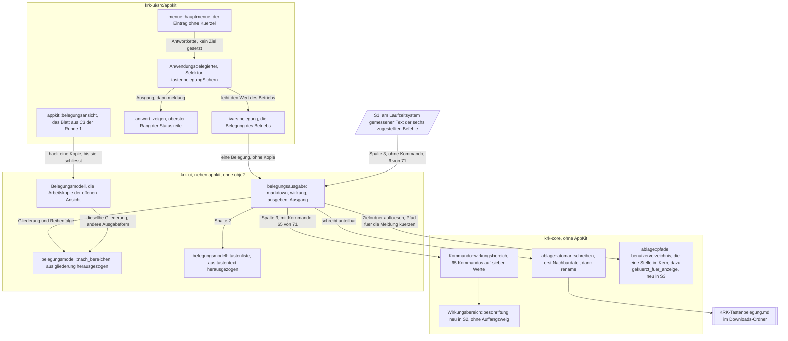
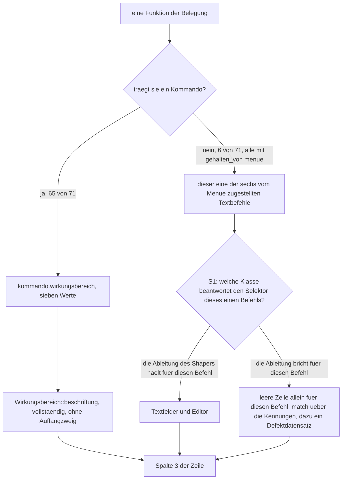
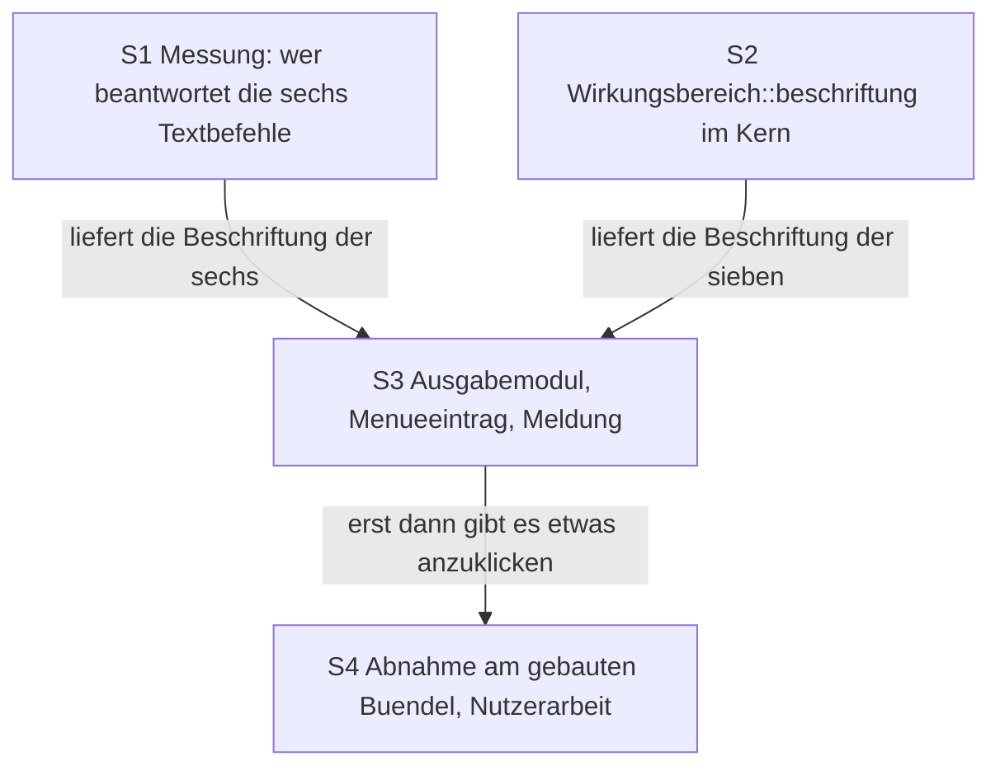

# Umsetzungsplan: Die geltende Tastenbelegung als Markdown-Datei im Downloads-Ordner (Runde 3)

**Datum:** 2026-08-11, 08:38
**Status:** Complete — S1 bis S3 tragen `[DONE]` und sind am 260811-1403 einzeln gegen den Baum gelesen, S4 ist vom Nutzer am 260811-1215 gestrichen. Kein Schritt steht mehr offen. Der Abgleich steht unten unter `## Reconciliation Log`.
**Abnahme des Plans:** Vom Nutzer abgenommen am 260811-0900, mit zwei Auflagen, die am 260811-0905 nachgezogen sind: die Pfadfrage ist mit Tilde entschieden und in S3 eingearbeitet, und zwei Diagrammbefunde der Bewertung `reviews/260811-0853-conceptrev-plan-*.md` sind berichtigt. Bereit zur Umsetzung.
**Spec:** `circles/260809-2040-tastenbelegung-als-markdown-in-downloads/planning/260811-0753_*_spec-tastenbelegung-als-markdown-in-downloads.md`, vier Fähigkeiten C1 bis C4 mit 38 Abnahmekriterien, dazu zwei unter `## Verhältnis zu den zehn Zeitzusagen aus C8 der Runde 1`; vom Nutzer am 260811 abgenommen
**Bindende Entscheidungsdatensätze:** die sechs `_a_`-Datensätze unter `decisions/` dieses Circles, darunter seit dem 260811-0900 `260811-0838_a_schreibt-krk-einen-pfad-fuer-den-nutzer-je-gekuerzt.md`; dazu aus der Runde 1 `circles/260802-0842-krk-mac-dateimanager-editor-git/decisions/260805-0000_*_menuekuerzel-in-die-konflikterkennung-oder-daneben.md` (ein Kürzel wäre zwingend ein Belegungseintrag), `.../260803-2025_*_wie-zeigt-krk-dem-nutzer-fehler.md` (die Statuszeile mit ihren Rängen) und `.../260802-1134_*_sprache-und-ui-werkzeugkasten.md` (Rust mit AppKit über `objc2`)
**Ausführender Agent:** `coder`, für jeden Schritt. Die Begründung steht unten im Abschnitt "Warum jeder Schritt coder trägt".

**Decidability:** Die tragende Frage dieser Runde lautet: **wo wirkt eine Funktion, und ist diese Angabe für jede der geführten Funktionen aus den Eingaben entscheidbar, die die Ausgabe hat?** Die Antwort zerfällt in zwei Teile, und der Plan trennt sie, statt sie zu mitteln. Für 65 der 71 Funktionen ist sie **entscheidbar ohne Näherung**: sie tragen ein `Kommando`, `Kommando::wirkungsbereich` (`crates/krk-core/src/tasten/belegung.rs:530`) ist eine totale Funktion darüber, und die Beschriftung ihrer sieben Werte ist eine zweite totale Funktion, deren Vollständigkeit der Übersetzer erzwingt. Für die übrigen sechs, die vom Hauptmenü zugestellten Textbefehle, ist sie **aus der Belegung nicht entscheidbar**: sie tragen kein Kommando und damit keinen Wirkungsbereich, und wo sie wirken, entscheidet zur Laufzeit die Antwortkette von AppKit, in die die Belegung keine Eingabe hat. Eine Näherung, etwa die Beschriftung aus der Zugehörigkeit zum Menü "Bearbeiten" abzuleiten, wäre genau die Sorte Zusicherung, die im Text stärker ist als im Code. **Der Mechanismus wechselt deshalb für diese sechs**: statt aus der Belegung abzuleiten, misst S1 am Objective-C-Laufzeitsystem, welche Klassen die sechs Selektoren beantworten, und die Beschriftung steht danach als gemessener Wert im Programmtext, von einer Probe gehalten. Wo die Messung keine Antwort gibt, bleibt die Zelle leer; eine leere Zelle ist eine ehrliche Auskunft, eine falsche ist es nicht.

---

## Wie dieser Plan auf Datensätze verweist

Dieselbe Regel wie in den beiden Plänen davor: ein Verweis trägt an der Stelle des Zustandsmarkers eine Sternstelle. `decisions/260809-2040_*_gehoert-der-wirkungsbereich-in-die-ausgabe.md` bleibt damit richtig, wenn der Datensatz von beantwortet nach umgesetzt wandert. Ausgenommen sind die Verweise im Kopf oben, wo der Marker eine Aussage über den Stand ist.

## Directive

Nach dieser Runde schreibt KRK die Tastenbelegung, die im Augenblick des Aufrufs gilt, als Markdown-Datei nach `~/Downloads/KRK-Tastenbelegung.md`. Ausgelöst wird sie über einen Eintrag im Hauptmenü ohne Tastenkürzel. Die Datei führt jede belegte Funktion mit ihren Kombinationen und mit der Angabe, wo der Befehl wirkt, gegliedert nach denselben neun Funktionsbereichen wie die Belegungsansicht am Bildschirm. Der Wortlaut steht im Circle-Datensatz `_t_circle.md`, Abschnitt `## Directive`; der Spec zerlegt ihn in vier Fähigkeiten. Dieser Plan wiederholt ihn nicht, sondern baut ihn.

## Ausgangslage

Der Spec hat den Bestand vor dem Entwurf am Code aufgenommen, und dieser Plan hat ihn ein zweites Mal aufgenommen. Acht Befunde ändern oder schärfen den Zuschnitt gegenüber dem, was der Spec annehmen konnte, und stehen deshalb hier oben statt verstreut in den Schritten. Zwei davon nehmen Arbeit weg, drei legen den Schnitt der Schritte fest, drei beantworten je eine Frage, die der Spec dem Planner überlassen hat.

### Befund 1: Die Belegung des Betriebs ist ein Wert im Delegierten und nicht der Rückgabewert von `fuer_den_betrieb()`

Der Spec formuliert das Kriterium als "der Wert, den `belegung::fuer_den_betrieb()` hält". Am Code hält diese Funktion gar nichts: sie **baut** einen Wert und wird genau einmal aufgerufen, beim Start (`crates/krk-ui/src/appkit/anwendung.rs:4574`). Gehalten wird der Wert danach in `AnwendungsIvars::belegung` (`anwendung.rs:332`), und beim Verlassen der Belegungsansicht wird er durch die Arbeitskopie ersetzt (`anwendung.rs:2203`).

**Die Ausgabe leiht sich deshalb die Belegung aus den Ivars und ruft `fuer_den_betrieb()` nicht ein zweites Mal.** Ein zweiter Aufruf läse `keymap.toml` erneut von der Platte, wäre ein zweiter Ladeweg neben dem einen, und er antwortete in einem Fall nachweislich falsch: scheitert das Sichern beim Verlassen der Ansicht, gilt die neue Belegung im Programm, während die Datei die alte trägt. KRK sagt es dem Nutzer in diesem Fall ausdrücklich ("die Belegung gilt, liess sich aber nicht sichern", `anwendung.rs:2195`). Eine Ausgabe, die dann die Datei läse, widerspräche der Meldung, die derselbe Vorgang eine Sekunde vorher gezeigt hat.

### Befund 2: Der gesicherte Stand fällt bei offener Belegungsansicht ohne einen einzigen Zweig an

Die Belegungsansicht arbeitet auf einer **Kopie**: `Belegungsmodell::neu(self.ivars().belegung.borrow().clone())` (`anwendung.rs:2159`). Solange sie offen ist, bleibt der Wert in den Ivars unberührt, und die Übernahme geschieht in einer einzigen Zeile beim Verlassen. Die Ausgabe liest die Ivars, also liest sie den gesicherten Stand, und zwar ohne zu fragen, ob ein Blatt steht.

Das ist der billigste Weg, den die Nutzerantwort vom 260811-0110 nehmen konnte. Er kostet keine Abfrage, keinen Zustand und keine Sonderregel, und er kann nicht auseinanderlaufen, weil es nichts gibt, was mitlaufen müsste. Der Abschnitt `## Die Abweichung bei offener Belegungsansicht` des Specs beschreibt damit eine Eigenschaft des Aufbaus und nicht eine Entscheidung im Code.

### Befund 3: Sechs von 71 Funktionen tragen kein Kommando, und es sind genau die sechs mit einem Zusteller

Die Zahlen sind nachgezählt und nicht übernommen. `resources/default-keymap.toml` führt 71 Blöcke `[[funktion]]`; `Kommando::KENNUNGEN` (`crates/krk-core/src/tasten/belegung.rs:417`) führt 65 Paare; die Datei trägt sechs Zeilen `gehalten_von = "menue"`, und zwei Kommentare halten für `beenden` und die beiden Fensterbefehle ausdrücklich fest, warum sie kein `gehalten_von` tragen. Die sechs ohne Kommando sind damit dieselben sechs mit Zusteller, und `bereich` (`crates/krk-ui/src/belegungsmodell.rs:150-158`) zählt sie an einer dritten Stelle namentlich auf.

**Daraus folgt die Gestalt der dritten Spalte.** Sie fragt zuerst nach dem Kommando; findet sie eines, ist die Antwort die Beschriftung seines Wirkungsbereichs. Findet sie keines, greift der Zweig der zugestellten Textbefehle. Die Fallunterscheidung ist damit überschneidungsfrei und vollständig, ohne die Liste der sechs ein viertes Mal zu schreiben. Was sie braucht, ist eine Zusicherung, dass "ohne Kommando" und "zugestellt" wirklich dieselbe Menge sind, und die schreibt S3 als Probe gegen die Auslieferungsbelegung, nach dem Vorbild von `jede_kennung_hat_einen_funktionsbereich`.

### Befund 4: `Wirkungsbereich` trägt heute keinen `impl`-Block, und die Beschriftungen gehören in den Kern

`Wirkungsbereich` (`belegung.rs:171`) ist die einzige der beiden Gliederungen ohne Beschriftungen; `Funktionsbereich::name()` (`belegungsmodell.rs:117`) macht die Bauform vor. Der Spec überlässt dem Planner, welche Kiste die neue Beschriftung trägt.

**Sie gehört zu ihrer Aufzählung, also nach `krk-core`.** Drei Gründe, und der dritte ist der tragende. Erstens folgt es dem Vorbild: `Funktionsbereich::name()` steht im `impl`-Block seiner Aufzählung, `Datei::dateiname()` (`crates/krk-core/src/ablage/pfade.rs:51`) ebenso. Zweitens trägt `krk-core` bereits deutschen Text für den Nutzer, wörtlich weitergereicht bis in die Belegungsansicht (`belegung.rs:1082`, `konflikt.rs` über `Belegungsfehler::Konflikt`); die Beschriftungen sind nichts Neues in dieser Kiste. Drittens hält die vollständige Fallunterscheidung dort, wo ein achter Wert entstünde: wer `Wirkungsbereich` erweitert, sieht den Übersetzerfehler in derselben Datei, in der er gerade arbeitet, und nicht erst in einer anderen Kiste.

Eine Tabelle mit Rückfall ist ausgeschlossen, so wie der Spec es verlangt. Der `match` bekommt keinen `_`-Zweig.

### Befund 5: Der Menüeintrag geht an keiner Sperre vorbei, weil keine für ihn gilt

`CLAUDE.md` warnt unter "Was man nicht sieht" vor genau der Verwechslung, die hier naheläge: KRK hält Tastenbefehle an **zwei** Stellen an, und beide fragen etwas anderes. Der Fokusvorbehalt in `appkit/ereignisse.rs` fragt, wem die Taste gehört; `Anwendungsdelegierter::kommando_ausfuehren` fragt über `blatt_steht`, welcher **Befehl** bei stehendem Blatt zulässig ist. Beide sitzen auf dem Weg vom Tastendruck zum `Kommando`.

Ein Menüeintrag ohne Kürzel geht diesen Weg nicht. Er trägt kein Kommando, erzeugt keinen Tastendruck und erreicht den Delegierten über die Antwortkette. Daraus fallen zwei Abnahmekriterien von C1 ohne Bau an: der Eintrag ist auch ohne Fokus in einem Dateifenster auswählbar, weil die Kette bei `NSApplication` und ihrem Delegierten endet, und er ist bei stehendem Blatt nicht durch KRKs eigene Sperre gehindert. Ob AppKit ihn bei stehendem Blatt sperrt, ist eine andere Frage, ungemessen, und sie steht in S4.

**Umgekehrt gilt: es wird auch keine Sperre gebaut.** Der Spec verlangt in C1 ausdrücklich, dass der Eintrag bei stehender Belegungsansicht wirkt und dann den gesicherten Stand schreibt. Wer ihn aus Gründen der Gleichförmigkeit an `blatt_steht` hängte, bräche das Kriterium.

### Befund 6: Ein Modul ohne Aufrufer macht `make check` rot, und das bestimmt den Schnitt der Schritte

`krk-ui` hat kein Bibliotheksziel (`crates/krk-ui/Cargo.toml`, allein `[[bin]] name = "krk"`). Eine `pub`-Funktion in einem Modul dieser Kiste ist damit nicht öffentlich, sondern unerreichbar, sobald kein Aufrufer im Binärziel sie nennt. `make lint` fährt `clippy --workspace --all-targets -- -D warnings` (`Makefile:45`), und `dead_code` ist eine Warnung.

**Das Ausgabemodul und sein Auslöser gehören deshalb in denselben Schritt.** Ein Zuschnitt, der erst das Modul baut und dann den Menüeintrag, ließe den Arbeitsbereich zwischen beiden rot stehen, und die Regel aus dem Plan der Runde 2 verbietet das ausdrücklich: die vier Abnahmekommandos sind nach `CLAUDE.md` die Abnahme des Projekts, und ein Schritt, nach dem sie scheitern, ist nicht abgenommen. S3 ist dadurch der größte Schritt dieser Runde; er ist es aus einem benannten Grund und nicht aus Bequemlichkeit.

### Befund 7: Das atomare Schreiben ist im Projekt der eine Schreibweg, und der Editor geht ihn schon

Der Spec stellt es als Abwägung dar. Am Code ist es eine Präzedenz: `krk_core::text::datei::sichern` (`crates/krk-core/src/text/datei.rs:544-546`) schreibt den Stand des Editors über `ablage::atomar::schreiben`, und der Doc-Kommentar nennt den Grund, aus dem er es tut ("ein zweiter Schreibweg im Programm entsteht nicht"). Die vier Ablagedateien gehen denselben Weg.

**Die Ausgabe geht ihn auch.** Sie gewinnt dabei genau das, was C2 im letzten Kriterium seiner Fehlerfälle verlangt: eine halb geschriebene Datei bleibt in keinem Fall zurück. `Nachbardatei` räumt sich in `Drop` ab, wenn das Umbenennen ausbleibt, und ein Absturz vor dem Umbenennen lässt die alte Datei stehen. Der Preis ist eine kurzlebige Nachbardatei `KRK-Tastenbelegung.md.neu` im Downloads-Ordner; sie trägt einen festen Namen ohne Laufnummer, sodass ein Absturz höchstens eine einzige liegenlässt, und der nächste Aufruf überschreibt sie.

Die Form der Datei fällt daraus mit an: geschrieben wird ein Rust-`String` in UTF-8, ohne Bytefolgenmarke, mit `\n` als Zeilenende. Das ist dieselbe Form, die der Editor beim Sichern schreibt, und C3 verlangt genau sie.

### Befund 8: Der Fehlerfall ist am Ergebnis des Schreibens entscheidbar und braucht keine Vorabprüfung

C4 verlangt, mindestens den fehlenden Ordner vom abgelehnten Zugriff zu unterscheiden. Die naheliegende Bauform wäre eine Prüfung des Zielordners vor dem Schreiben. Sie wäre die falsche: zwischen Prüfung und Schreiben liegt ein Fenster, in dem sich die Antwort ändern kann, und dieses Projekt hat die Lehre bereits gezogen. Der Modulkopf zur Typprüfung vor dem Öffnen einer Textdatei hält sie fest, und `CLAUDE.md` führt sie unter "Was man nicht sieht": die Frage steht am Deskriptor und nicht am Pfad.

**Der Fall wird deshalb am Rückgabewert unterschieden.** `fs::File::create` in `atomar::vorbereiten` liefert für einen fehlenden Ordner `io::ErrorKind::NotFound` und für einen verwehrten Zugriff `io::ErrorKind::PermissionDenied`. `inference:` Ein vom Mechanismus für Transparenz, Zustimmung und Kontrolle abgelehnter Zugriff kommt als `EPERM` und damit ebenfalls als `PermissionDenied` an; die Gegenprobe am gebauten Bündel steht in S4. Beide Fälle sind damit aus einer entschiedenen Größe abgelesen und nicht aus einer vorhergesagten.

## Antworten auf die acht Punkte, die der Spec dem Planner überlässt

### Frage 1: Wo die Beschriftung der sieben Wirkungsbereiche wohnt

**In `krk-core`, als `impl Wirkungsbereich { pub const fn beschriftung(self) -> &'static str }`.** Die Begründung steht in Befund 4. Die sieben Texte sind die aus der Tabelle des Specs, vier davon Vorbelegungen des Specs und drei Nutzerantworten vom 260811-0115.

### Frage 2: Wo die Ausgabefunktion wohnt und wie viel von ihr ohne AppKit prüfbar ist

**In `crates/krk-ui/src/belegungsausgabe.rs`, neben `appkit` und nicht darin.** Das Modul nennt keine `objc2`-Kiste und ist damit vollständig ohne Fenster prüfbar: die Markdown-Erzeugung, die Auflösung des Zielpfades, das Schreiben, die Fallunterscheidung über den Ausgang und die Meldungstexte. Der Rest, also der Menüeintrag und die Methode am Delegierten, ist zwei kurze Stücke unter `appkit/`.

Der Anteil, der ohne AppKit prüfbar ist, ist damit hoch, und das Modul erbt die Bauform der zehn Module, die schon neben `appkit` liegen. `crates/krk-ui/src/main.rs` nennt sie im Modulkopf einzeln auf; die Zahl "Zehn Module" dort wird zu elf, und der neue Satz beschreibt, was `belegungsausgabe` hält.

### Frage 3: Ob die Datei atomar geschrieben wird

**Ja, über `krk_core::ablage::atomar::schreiben`.** Befund 7.

### Frage 4: Ob das Schreiben auf dem Hauptfaden geschieht

**Auf dem Hauptfaden, synchron.** Die Datei umfasst bei der Auslieferungsbelegung rund sechs Kilobyte: 71 Zeilen mit drei Zellen, neun Abschnittsüberschriften und ein Kopf. Der Vergleichsfall im selben Programm ist das Sichern des Editors, das über denselben atomaren Weg samt `sync_all` läuft, Dateien bis 16 MB annimmt und synchron aus einem Befehl heraus aufgerufen wird (`anwendung.rs:3665`). Die Ausgabe liegt um drei Größenordnungen darunter.

Ein Arbeitsfaden brächte den Rückweg mit, den er sonst nicht braucht: die Meldung aus C4 gehört in die Statuszeile, und die Statuszeile gehört dem Hauptfaden. Das zweite Kriterium unter `## Verhältnis zu den zehn Zeitzusagen` sagt zu, dass die Oberfläche nicht sichtbar anhält, und nicht, dass nichts auf dem Hauptfaden geschieht. Wer die Zusage später messen will, misst sie an S4.

### Frage 5: Welche Markdown-Form die Tabelle trägt

**Eine Pipe-Tabelle mit drei Spalten je Abschnitt.** Kopfzeile `| Funktion | Kombinationen | Wirkt in |`, darunter die Trennzeile, darunter je Funktion eine Zeile. Die Kombinationen einer Funktion stehen in einer Zelle, getrennt durch Komma und Leerzeichen, also genau so, wie die Belegungsansicht sie am Schirm setzt. Der Trenner wird nicht abgeschrieben, sondern geteilt: S3 zieht die Zeile aus `Belegungsmodell::tastentext` in eine freie Funktion `tastenliste(&Funktion) -> String` heraus, und beide Ausgabeformen rufen sie.

**Jede Zelle maskiert das Zeichen `|`.** Der Name einer Funktion kommt aus der Belegungsdatei und damit möglicherweise aus der `keymap.toml` des Nutzers (`Eintrag { id, name, tasten, … }`, `belegung.rs:1173`). Ein Name mit einem senkrechten Strich zerbräche die Tabelle. Die Maskierung ist eine Zeile und eine Probe.

Der Kopf lautet `# Tastenbelegung von KRK`, die Abschnitte tragen `## ` und den Text aus `Funktionsbereich::name()`. Beides sind Vorbelegungen dieses Plans; wer sie umstößt, ändert eine Zeichenkette.

**Ein Abschnitt, dessen Funktionen sämtlich unbelegt sind, entfällt.** C3 lässt beide Wege zu, und der Wegfall ist der einfachere: er braucht keinen zweiten Satz und keine zweite Form der Ausgabe.

**Die erste Spalte trägt den blossen Namen der Funktion**, also `Funktion::name()` und nicht den angereicherten Text der Bildschirmansicht. Die Ansicht hängt dort "(Kürzel des Menüs)" an, damit ihre beiden Cmd+A-Zeilen unterscheidbar bleiben; in der Datei leisten das der Abschnitt und die dritte Spalte, und die Namen der Auslieferungsbelegung sind ohnehin eindeutig, was `eine_zeile_je_funktion` festhält.

### Frage 6: An welcher Stelle der Antwortkette die Ausgabe beantwortet wird

**Am Anwendungsdelegierten, mit eigenem Selektor `tastenbelegungSichern:`, ohne gesetztes Ziel am Menüeintrag.** Das ist die Bauform der drei Einträge, die der Delegierte heute beantwortet, und ihr Modulkopf begründet sie: ein fest gesetztes Ziel umginge die Kette und ließe den Eintrag auch dann aktiv, wenn niemand ihn beantworten kann. Hier trifft die Begründung sogar doppelt zu, weil der Eintrag ohne offenes Fenster erreichbar bleiben soll.

Der Eintrag steht unter dem Menütitel "KRK", hinter "KRK beenden" wäre er falsch herum; er kommt **vor** das Beenden, getrennt durch einen Trenner, weil das Beenden auf dem Mac unten steht. Titel: "Tastenbelegung als Markdown sichern", ohne Auslassungspunkte. Beides sind die Vorbelegungen des Specs; die Reihenfolge im Untermenü ist die Zugabe dieses Plans.

Angelegt wird er über `ohne_kuerzel` (`crates/krk-ui/src/appkit/menue.rs:335`) und nicht über `befehl`. `befehl` schlägt eine Kennung in der Belegung nach und fällt auf `ohne_kuerzel` zurück, wenn es keine findet, wobei es einen Programmfehler meldet. Ein Eintrag, der bewusst keine Kennung hat, ruft `ohne_kuerzel` unmittelbar.

### Frage 7: Wie die Meldung die Statuszeile erreicht, wenn kein Dateifenster den Fokus hält

**Über `antwort_zeigen(self.ivars().modell.borrow().aktiv(), &text)`.** Das aktive Dateifenster ist keine Frage nach dem Fokus, sondern ein Wert des Fenstermodells (`Fenstermodell::aktiv`, `crates/krk-ui/src/fenstermodell.rs:318`), und das Modell hält ihn immer auf einem sichtbaren Bereich. Denselben Weg geht `belegungsansicht_verlassen`, wenn es das gescheiterte Sichern meldet (`anwendung.rs:2211-2213`). Ein zweiter Weg entsteht nicht.

`antwort_zeigen` setzt den obersten Rang der Statuszeile, und er gilt bis zum nächsten Befehl. Eine Uhr hängt nicht daran, und das ist hier erwünscht: der Nutzer soll den Pfad lesen können, nachdem er das Menü losgelassen hat.

### Frage 8: Wie der Pfad in der Meldung geschrieben wird

**Mit Tilde. Die Erfolgsmeldung lautet "Tastenbelegung geschrieben: ~/Downloads/KRK-Tastenbelegung.md".** Entschieden vom Nutzer am 260811-0900, **gegen die Empfehlung dieses Plans**. Der Datensatz `decisions/260811-0838_*_schreibt-krk-einen-pfad-fuer-den-nutzer-je-gekuerzt.md` trägt die Frage, die drei Möglichkeiten, die Empfehlung und die Antwort samt ihren Folgen; dieser Abschnitt wiederholt ihn nicht, sondern baut ihn.

Die Empfehlung lautete auf den ausgeschriebenen Pfad, und ihr Grund bleibt richtig: der Fenstertitel aus C11 der Runde 2 kürzt ausdrücklich nicht, und sein Modulkopf schreibt es aus ("Kein Ersetzen des Benutzerordners durch eine Tilde", auf Verlangen des Nutzers vom 260809 nach dem absoluten Pfad, `crates/krk-ui/src/fenstertitel.rs:37-40`). **KRK trägt nach dieser Runde zwei Formen für denselben Pfad an zwei Flächen desselben Fensters**: der Titelbalken schreibt aus, die Statuszeile kürzt. Die Ungleichheit ist gesehen und angenommen, und der Entscheidungsdatensatz hält sie fest, damit die nächste Fläche, die einen Pfad meldet, die Frage nicht von vorn stellt.

**`crates/krk-ui/src/fenstertitel.rs` wird von dieser Runde nicht angefasst.** Möglichkeit 3, beide Flächen zu kürzen, ist nicht gewählt worden; sie höbe eine Nutzerentscheidung vom 260809 auf und läge außerhalb der Directive. Die Datei steht in S3 auf der Verbotsseite.

Die Antwort kostet mehr als eine Zeichenkette. Drei Punkte gehören dazu, und S3 zieht sie nach.

**a) Eine eigene reine Funktion, und sie wohnt im Kern.** `pub fn gekuerzt_fuer_anzeige(pfad: &Path, benutzerverzeichnis: Option<&Path>) -> String` in `crates/krk-core/src/ablage/pfade.rs`, unmittelbar neben `benutzerverzeichnis()`. Drei Gründe, und die Erwägung ist dieselbe wie bei der Beschriftung der Wirkungsbereiche in Befund 4. Erstens gehört die Funktion zu ihrem Gegenstand: `pfade.rs` ist nach seinem eigenen Modulkopf "die einzige Stelle im Kern", die nach dem Benutzerverzeichnis fragt, und eine Kürzung, die genau dieses Verzeichnis abzieht, gehört neben die Frage und nicht in ein Modul, das nach der Tastenbelegung heißt. Zweitens ist die Funktion rein und spricht keine `objc2`-Kiste an, also kann sie nicht unter `appkit/` liegen. Drittens, und das ist der tragende Grund: `krk-ui` hat kein Bibliotheksziel. Eine Kürzung in `belegungsausgabe.rs` wäre für jede spätere Fläche, die einen Pfad meldet, unerreichbar, und die zweite Fläche schriebe sie ab. Im Kern ist sie einmal da.

Das Benutzerverzeichnis kommt **als Argument** herein und wird nicht in der Funktion erfragt. Damit ist sie ohne Zugriff auf das echte Benutzerverzeichnis prüfbar, und das ist derselbe Grund, aus dem `Ablageort` sich auf einen beliebigen Ordner setzen lässt; sein Modulkopf nennt ihn ausdrücklich keine Testhintertür, sondern die Bedingung der Prüfbarkeit.

**b) Die Regel für einen Pfad außerhalb des Benutzerverzeichnisses: er wird ausgeschrieben, unverändert.** In dieser Runde kann der Fall nicht eintreten, weil das Ziel fest der Downloads-Ordner ist. Gebaut gehört die Regel trotzdem jetzt: eine Funktion, die einen Fall nicht kennt, beantwortet ihn beim ersten Auftreten falsch, und der erste Auftritt wäre die Runde, die den Zielordner einstellbar macht. Die Funktion ist deshalb total und kennt vier Fälle:

  - Der Pfad liegt unter dem Benutzerverzeichnis: `~/` und der Rest.
  - Der Pfad **ist** das Benutzerverzeichnis: `~`.
  - Der Pfad liegt nicht darunter: ausgeschrieben, Zeichen für Zeichen der Eingabe.
  - Es wird kein Benutzerverzeichnis übergeben: ausgeschrieben. Kein Fehler und kein `Option` im Rückgabewert: ein Pfad ohne etwas zu kürzen ist kein Scheitern, sondern ein Pfad.

  **Der Vergleich läuft über `Path::strip_prefix` und nicht über eine Zeichenkette.** `strip_prefix` vergleicht Pfadbestandteile; ein Vergleich auf Bytes machte aus `/Users/kai-alt/Downloads` gegen das Benutzerverzeichnis `/Users/kai` die Antwort `~-alt/Downloads`. Dieser Fall steht als eigene Zusicherung in der Probe.

  Ausgeschrieben wird über `display()`, also in derselben Form, die `fenstertitel::titel` für den Titelbalken erzeugt (`fenstertitel.rs:82`). Die beiden Flächen unterscheiden sich damit in genau einer Sache, der Kürzung, und in keiner zweiten.

**c) Gekürzt wird jeder Pfad, den `Ausgang::meldung` schreibt**, nicht allein der der Erfolgsmeldung. Eine Form je Meldung wäre die dritte Form im selben Programm.

## Aufbau

### Wo die Ausgabe im Programm wohnt

Drei Kanten tragen die Aussagen, um die es dieser Runde geht. `IV` liefert die Belegung ohne Kopie, weshalb eine offene Belegungsansicht die Ausgabe nicht erreicht; `GLI` hat zwei Abnehmer, weshalb es die Gliederung genau einmal gibt; und die dritte Spalte hat **zwei** Lieferanten, `KMD` für die 65 und `MESS` für die sechs. `MESS` steht außerhalb der drei Kisten, weil sein Wert nicht aus einer von ihnen kommt: er wird an S1 am Objective-C-Laufzeitsystem gemessen und liegt danach als fester Text in `wirkung`. Das ist der Mechanismuswechsel, den die `Decidability:`-Zeile oben nennt, hier als Aufbau gezeichnet.

### Die dritte Spalte, als Fallunterscheidung gelesen

Die Fallunterscheidung ist überschneidungsfrei, weil eine Funktion entweder ein Kommando trägt oder nicht, und vollständig, weil beide Zweige eine Antwort liefern. Die Zusicherung, dass der rechte Zweig genau die sechs zugestellten trifft, ist keine Behauptung des Plans, sondern eine Probe in S3.

**Das Bild wird je Funktion einmal gelesen, und im rechten Zweig auch die zweite Entscheidung.** `P` steht über einem einzelnen Befehl und nicht über der Gruppe: bricht die Ableitung für einen der sechs, bleibt allein dessen Zelle leer, und die übrigen fünf tragen weiter "Textfelder und Editor". Genau das ist die `match`-Verzweigung über die Kennungen, die S3 b) für diesen Fall vorsieht. Ein Alles-oder-nichts stünde weder im Bau noch hier.

`P` ist dabei die einzige Entscheidung des Bildes, die nicht beim Erzeugen der Datei fällt: S1 misst sie einmal, und danach steht ihr Ausgang als fester Text im Programm. Das vorangestellte "S1:" in der Beschriftung sagt es.

### Die Abhängigkeit der Schritte

S1 und S2 sind voneinander unabhängig und können in beliebiger Reihenfolge oder nebeneinander laufen. S3 braucht beide, weil beide Zweige der dritten Spalte ihren Text von dort bekommen.

### Warum jeder Schritt `coder` trägt

Alle vier Schritte gehen an `coder`, und keiner fasst eine Datei an, die einem `ontocoder` gehörte. Diese Runde ändert `resources/default-keymap.toml` ausdrücklich nicht, und die einzige `.toml`-Datei, die überhaupt im Blick ist, wäre `crates/krk-ui/Cargo.toml`, die keine neue Abhängigkeit bekommt. Der Rest ist Rust.

Der Grund gilt hier wie in der Runde 2: die Belegungsdatei ist Programmtext in einer anderen Schreibweise, über `include_str!` eingebunden und durch Proben an die Aufzählung `Kommando` gebunden. Sie wird in dieser Runde nicht angefasst, und ihr Unverändertbleiben ist selbst ein Abnahmekriterium.

### Was die Dateiliste eines Schrittes zusagt

Dieselbe Regel wie in den beiden Plänen davor, mit einer Verschärfung, die dieses Projekt teuer gelernt hat. Die Liste ist eine Lese- und Begründungsliste; jeder Eintrag trägt einen Vermerk, warum der Schritt die Datei braucht: `(neu)`, `(erweitert)`, `(lesend)`. Eine bei der Umsetzung zusätzlich gefundene Datei ist kein Defekt und gehört in den Sitzungsbericht.

Bindend bleibt die Verbotsseite, und sie ist in dieser Runde ungewöhnlich scharf: **nennt ein Schritt eine Datei, die er nicht ändern darf, ist eine Änderung daran ein Defekt mit eigenem Datensatz.** Für `resources/default-keymap.toml` und für die Aufzählung `Kommando` sagt C1 es als Abnahmekriterium zu.

Dazu die Grenze zum Modul `appkit`: jeder Schritt, der AppKit, `objc2` oder Objective-C berührt, nennt dafür eine Datei unter `crates/krk-ui/src/appkit/`; was daneben liegt, hält Modell und Rechnung und nennt keine `objc2`-Kiste. In dieser Runde trifft es S1 und S3, und in S3 verläuft die Grenze mitten durch den Schritt.

---

## Implementierungsschritte

Jeder Schritt nennt seinen Ausführer, seine Dateien, seine Änderungen, seine Abhängigkeiten und ein Abnahmekriterium, das an einem Diff oder an einem Kommando prüfbar ist. **Schritte, deren Abnahme am laufenden Bündel hängt, tragen den Vermerk `Nutzerarbeit`**; kein Agent kann sie abnehmen, weil KRK dafür im Vordergrund stehen muss (`CLAUDE.md`, Abschnitt "Was man nicht sieht, wenn man es nicht weiß").

Die Prüfkommandos lauten `make check`, ersatzweise `make build`, `make test`, `make lint`. Wer `cargo` unmittelbar ruft, stellt `export PATH="$HOME/.cargo/bin:$PATH"` voran: `cargo` liegt auf diesem Gerät nicht auf dem Standard-PATH.

### 1. [DONE] Wer die sechs zugestellten Textbefehle wirklich beantwortet

- Ausführender: `coder`
- Dateien: `crates/krk-ui/src/appkit/menue.rs` (erweitert: eine neue Probe im `#[cfg(test)]`-Modul, dazu der Modulkopf, falls die Messung ihn widerlegt), `crates/krk-ui/src/appkit/leiste.rs` (lesend: die `NSTableView` der Leiste und ihre Auswahleinstellung), `crates/krk-ui/src/appkit/tabelle.rs` (lesend: die Tabellen der Dateifenster), `crates/krk-ui/src/appkit/belegungsansicht.rs` (lesend: die dritte Tabelle des Programms), `crates/krk-ui/src/appkit/editor.rs` (lesend: die Textfläche und `allowsUndo`), `crates/krk-ui/src/appkit/vorschau.rs` (lesend: die Textanzeige der Vorschau, `setSelectable(false)`)
- Änderungen: **Kein Verhalten ändert sich. Der Schritt misst und schreibt das Ergebnis auf.**

  Gemessen wird am Objective-C-Laufzeitsystem, nicht am laufenden Bündel und nicht am Vordergrund. `AnyClass::responds_to` (`objc2` 0.6.4) beantwortet, ob Instanzen einer Klasse einen Selektor beantworten, arbeitet allein in der Laufzeit, braucht keine Instanz, keinen Hauptfaden und kein Fenster, und ist sichere Rust-Schnittstelle. Die Probe fragt für die sechs Selektoren `cut:`, `copy:`, `paste:`, `selectAll:`, `undo:` und `redo:` die Klassen ab, die in KRK einen Ersthelfer stellen können: `NSTableView` (Leiste und beide Dateifenster), `NSTextView` (Editor und der Feldeditor eines Textfeldes), `NSTextField` (die Blätter), `NSScrollView`, `NSWindow` und `NSApplication`.

  **Der benannte Verdachtsfall steht in der Probe als eigene Zusicherung.** `text_alles_auswaehlen` liegt auf `selectAll:`, und die Leiste ist eine `NSTableView`. Der Weg dorthin ist der, den der Spec beschreibt: mit Fokus in der Leiste weist der stumme Fokusvorbehalt das Kommando `alle_markieren` ab, der Tastendruck geht unverändert an AppKit, und von dort erreicht er den Menüeintrag und die Antwortkette. Im Dateifenster kommt er nie so weit, weil `alle_markieren` dort wirkt und den Druck verbraucht.

  **Die Frage hat zwei Hälften, und die zweite ist am Baum schon beantwortet.** Die erste lautet: beantwortet `NSTableView` den Selektor? Die misst die Probe. Die zweite lautet: hätte die Antwort eine sichtbare Wirkung? Die Tabelle der Leiste setzt `setAllowsMultipleSelection(false)` (`crates/krk-ui/src/appkit/leiste.rs:542`), ebenso die Tabelle der Belegungsansicht (`belegungsansicht.rs:393`); die Tabellen der Dateifenster setzen die Eigenschaft nicht und tragen damit die Vorgabe von `NSTableView`. `inference:` `selectAll:` an einer Tabelle ohne Mehrfachauswahl wählt nichts aus. Trifft das zu, ist der Eintrag in der Leiste zwar bedienbar, aber wirkungslos, und "Textfelder und Editor" bleibt als Aussage darüber, wo der Befehl **wirkt**, richtig. Der Schritt entscheidet das an der Messung und nicht an diesem Absatz; er hält nur fest, dass ein beantworteter Selektor allein die Zelle noch nicht widerlegt.

  **Was die Messung nicht entscheidet, sagt der Schritt ausdrücklich.** `responds_to` liefert für einen Selektor, den eine Klasse über Weiterleitung statt über eine eigene Methode beantwortet, `false`; die Dokumentation der Schnittstelle nennt genau diesen Fall. Für `undo:` und `redo:` ist das der zu erwartende Ausgang, weil der Rückgängigverwalter über die Kette erreicht wird und nicht über die Textklasse selbst. Ein `false` an dieser Stelle ist deshalb **kein** Beleg dafür, dass niemand antwortet, und darf nicht als solcher gelesen werden. Der Schritt trägt für diese beiden Selektoren zusammen, was der Baum schon weiss: der Modulkopf von `menue.rs:55-63` hält fest, dass die `NSTextView` des Editors ihren Verwalter mitbringt und ihn benutzt, sobald `allowsUndo` gesetzt ist, und dass genau das in `appkit/editor.rs` geschieht.

  **Das Ergebnis ist ein Wert und keine Meinung**, und es geht auf drei Wege: als Probe in `menue.rs`, die von jetzt an mitläuft; als Satz im Sitzungsbericht des Schrittes, der je Selektor nennt, welche Klasse antwortet; und, falls die Ableitung des Shapers für einen der sechs bricht, als Defektdatensatz unter `issues/` dieses Circles, den S3 beim Schreiben der Zelle zitiert. Bricht sie, wird der Modulkopf von `menue.rs` mitgezogen, denn er behauptet dann dasselbe wie der Spec.
- Abhängigkeiten: keine
- Abnahmekriterium: `make check` ist grün. Die neue Probe in `crates/krk-ui/src/appkit/menue.rs` nennt für jeden der sechs Selektoren, welche der geprüften Klassen ihn beantwortet, und schlägt fehl, sobald sich die Antwort ändert. Der Sitzungsbericht trägt die sechs Antworten ausgeschrieben und beantwortet die eine Frage, auf die es ankommt: gilt "Textfelder und Editor" für alle sechs, oder für welchen nicht. Das ist das Abnahmekriterium von C3, das die Prüfung vor dem Schreiben der Spalte verlangt.

### 2. [DONE] Die Beschriftung der sieben Wirkungsbereiche

- Ausführender: `coder`
- Dateien: `crates/krk-core/src/tasten/belegung.rs` (erweitert: ein `impl`-Block an `Wirkungsbereich`, dazu zwei Sätze im Modulkopf), `crates/krk-core/tests/belegung.rs` (erweitert: die Probe)
- Änderungen: `Wirkungsbereich` bekommt `pub const fn beschriftung(self) -> &'static str` als vollständige Fallunterscheidung **ohne `_`-Zweig**, nach dem Vorbild von `Funktionsbereich::name()`. Die sieben Texte stehen im Spec unter `## Die sieben Beschriftungen` und lauten: `Dateifenster` als "Dateifenster", `Leiste` als "Lesezeichen- und Geräteleiste", `Vorschau` als "Vorschau", `Editor` als "Editor", `Tabbereich` als "Dateifenster und Vorschau", `Navigator` als "Dateifenster, Leiste und Vorschau", `Ueberall` als "überall".

  Der Doc-Kommentar der Funktion nennt zwei Dinge: dass die Beschriftung für den Nutzer bestimmt ist und nicht für den Programmtext, und dass ein achter Wert der Aufzählung hier eine Zeile braucht, bevor er übersetzt. Der Modulkopf bekommt den Verweis auf die zweite Verwendung der Aufzählung, damit ein späterer Leser sie nicht nur als Fokusvorbehalt kennt.

  **Kein bestehender Zweig ändert sich, und die Aufzählung wächst nicht.** Die sieben Werte bleiben sieben.
- Abhängigkeiten: keine
- Abnahmekriterium: `make check` ist grün; `cargo build -p krk-core` übersetzt, was belegt, dass die Fallunterscheidung vollständig ist. Eine Probe in `crates/krk-core/tests/belegung.rs` hält für alle sieben Werte den erwarteten Text fest und stellt sicher, dass keine zwei Werte dieselbe Beschriftung tragen; eine doppelte Beschriftung wäre eine Spalte, die zwei verschiedene Regeln gleich benennt. `grep -c '_ =>' ` über den neuen Block liefert 0.

### 3. [DONE] Das Ausgabemodul, der Menüeintrag und die Meldung

- Ausführender: `coder`
- Dateien: `crates/krk-ui/src/belegungsausgabe.rs` (neu: das ganze Modul samt Prüfmodul), `crates/krk-ui/src/main.rs` (erweitert: `mod belegungsausgabe;` und der Modulkopf, der zehn Module aufzählt und künftig elf nennt), `crates/krk-ui/src/belegungsmodell.rs` (erweitert: `nach_bereichen` aus `gliederung` und `tastenliste` aus `tastentext` herausgezogen, beide `pub`), `crates/krk-core/src/ablage/pfade.rs` (erweitert: `gekuerzt_fuer_anzeige` neben `benutzerverzeichnis`, dazu zwei Sätze im Modulkopf), `crates/krk-core/tests/ablage.rs` (erweitert: die Probe der Kürzung mit ihren fünf Fällen), `crates/krk-ui/src/appkit/menue.rs` (erweitert: der Eintrag unter "KRK" samt Trenner, dazu der Modulkopf), `crates/krk-ui/src/appkit/anwendung.rs` (erweitert: der Selektor `tastenbelegungSichern:` im `define_class!`-Block und die Ausführung daneben), `crates/krk-ui/src/pruefordner.rs` (lesend: der Prüfordner der Kiste, für die Proben des Schreibens), `crates/krk-ui/src/fenstertitel.rs` (lesend, **nicht anfassen**: der Titelbalken schreibt den Pfad weiter aus, siehe Frage 8 und das Abnahmekriterium), `resources/default-keymap.toml` (**nicht anfassen**, siehe das Abnahmekriterium), `crates/krk-core/src/tasten/belegung.rs` (**nicht anfassen**, dieselbe Zusage für die Aufzählung `Kommando`)
- Änderungen: Der Schritt hat vier Teile, und sie gehören aus dem Grund in Befund 6 in einen Schritt. Die Kürzung des Pfades aus Frage 8 hängt an Teil b) und ist dort mit aufgeführt.

  **a) Zwei Stücke aus `belegungsmodell.rs` werden teilbar.** `gliederung` enthält heute die Gruppierung nach Funktionsbereich; sie wird zu `pub fn nach_bereichen(belegung: &Belegung) -> Vec<(Funktionsbereich, Vec<usize>)>` und liefert je Bereich die Stellen seiner Funktionen in der Reihenfolge der Datei. `gliederung` baut seine Zeilen danach aus diesem Ergebnis, und der Abbruch bei einer Funktion ohne Bereich wandert mit. Ebenso wird die Zeile aus `tastentext` zu `pub fn tastenliste(funktion: &Funktion) -> String`, und `tastentext` ruft sie. Beide Änderungen sind Umzüge ohne Verhaltensänderung; die bestehenden Proben des Moduls decken sie ab.

  **b) `belegungsausgabe.rs` entsteht.** Vier Stücke, drei davon nach außen sichtbar, keines spricht AppKit an:
  - `pub fn markdown(belegung: &Belegung) -> String` erzeugt die Datei. Eine Überschrift, danach je besetztem Funktionsbereich ein Abschnitt mit Pipe-Tabelle. Aufgenommen wird eine Funktion nur, wenn sie mindestens eine Kombination trägt; ein Abschnitt ohne solche Funktion entfällt ganz. Keine Zahl wird verdrahtet, weder die der Funktionen noch die der Bereiche: gezählt wird, was die Belegung führt. Der Text endet mit `\n`.
  - `fn wirkung(kennung: &str) -> &'static str` liefert die dritte Spalte, nach der Fallunterscheidung aus dem zweiten Schaubild: mit Kommando die Beschriftung seines Wirkungsbereichs, ohne Kommando den Text für die zugestellten Textbefehle, den S1 bestimmt hat. Bricht die Ableitung nach S1 für einen einzelnen der sechs, trägt dieser Zweig eine `match`-Verzweigung über die Kennungen mit einer leeren Zeichenkette für den betroffenen Befehl und einem Kommentar, der den Defektdatensatz aus S1 nennt.
  - `pub enum Ausgang` mit fünf Werten: `Geschrieben(PathBuf)`, `KeinBenutzerverzeichnis`, `OrdnerFehlt(PathBuf)`, `ZugriffAbgelehnt(PathBuf)`, `Fehlgeschlagen(PathBuf, String)`. Dazu `pub fn meldung(&self) -> String` als vollständige Fallunterscheidung ohne Auffangzweig. Die Erfolgsmeldung lautet "Tastenbelegung geschrieben: " und danach der Pfad, und sie ist **eine** Meldung für die neu entstandene wie für die ersetzte Datei. **Jeden Pfad, den `meldung` schreibt, schickt sie zuvor durch `krk_core::ablage::pfade::gekuerzt_fuer_anzeige`**, mit `benutzerverzeichnis()` als zweitem Argument; die vier Meldungen mit Pfad tragen ihn damit in einer Form und nicht in zweien. Am Ziel dieser Runde lautet die Erfolgsmeldung "Tastenbelegung geschrieben: ~/Downloads/KRK-Tastenbelegung.md".
  - `pub fn ausgeben(belegung: &Belegung) -> Ausgang` setzt es zusammen: Benutzerverzeichnis über `krk_core::ablage::pfade::benutzerverzeichnis`, daran `Downloads/KRK-Tastenbelegung.md`, schreiben über `krk_core::ablage::atomar::schreiben`, und die Fehlerart aus `io::ErrorKind` in den Ausgang übersetzen. Eine Vorabprüfung des Ordners findet nicht statt, siehe Befund 8. Der Ordner wird nicht angelegt. **Der Ausgang trägt den ungekürzten Pfad**; gekürzt wird erst beim Melden. Ein Wert, der einen Pfad hält, hält ihn brauchbar, nicht hübsch.

  **Dazu ein Stück im Kern, und nur dieses eine.** `crates/krk-core/src/ablage/pfade.rs` bekommt `pub fn gekuerzt_fuer_anzeige(pfad: &Path, benutzerverzeichnis: Option<&Path>) -> String` neben `benutzerverzeichnis()`. Wo sie wohnt, warum dort, welche vier Fälle sie kennt und warum der Vergleich über `Path::strip_prefix` und nicht über eine Zeichenkette läuft, steht ausgeführt unter Frage 8; hier gilt allein, dass sie zu diesem Schritt gehört und mit ihm geprüft wird. Der Modulkopf bekommt zwei Sätze: dass die Kürzung KRKs Form für Meldungen ist, und dass der Fenstertitel sie bewusst nicht benutzt, mit dem Verweis auf den Entscheidungsdatensatz vom 260811-0900.

  **c) Der Menüeintrag.** In `hauptmenue` bekommt das Untermenü "KRK" den Eintrag "Tastenbelegung als Markdown sichern" über `ohne_kuerzel` mit `sel!(tastenbelegungSichern:)`, davor stehend, getrennt durch `NSMenuItem::separatorItem` vom Beenden. Kein Ziel wird gesetzt. Der Modulkopf des Moduls nennt den neuen Eintrag und den Grund, aus dem er als einziger nicht über `befehl` entsteht: er trägt bewusst keine Kennung in der Belegung, und der Rückfallzweig von `befehl` meldet dafür einen Programmfehler.

  **d) Der Delegierte.** Im `define_class!`-Block entsteht `#[unsafe(method(tastenbelegungSichern:))] fn tastenbelegung_sichern(&self, _absender: Option<&AnyObject>)`, nach dem Muster der drei bestehenden Menüaktionen samt ihres `SAFETY`-Vermerks über die Signatur. Sie ruft eine gewöhnliche Methode daneben, und die tut drei Dinge: die Belegung aus `self.ivars().belegung.borrow()` leihen, `belegungsausgabe::ausgeben` rufen, und das Ergebnis über `self.antwort_zeigen(self.ivars().modell.borrow().aktiv(), &ausgang.meldung())` in die Statuszeile stellen. Der Doc-Kommentar hält fest, warum hier keine Blattabfrage steht: der Eintrag soll nach C1 auch bei stehender Belegungsansicht wirken, und `blatt_steht` gilt für Kommandos, die dieser Eintrag nicht ist.

  Die Untergrenze der angesprochenen AppKit-Klassen steht im Modulkopf, wie es jedes AppKit-Modul dieses Projekts hält. Neu angesprochen wird allein `NSMenuItem::separatorItem`, und `NSMenuItem` besteht seit macOS 10.0; `objc2` führt keine Verfügbarkeitsangaben mit sich, und der Übersetzer hält die Untergrenze deshalb nicht.
- Abhängigkeiten: S1 (der Text für die sechs zugestellten Befehle), S2 (die Beschriftung der sieben Wirkungsbereiche)
- Abnahmekriterium: `make check` ist grün. Die Proben in `belegungsausgabe.rs` decken ab, dass
  1. jede Funktion der Auslieferungsbelegung mit mindestens einer Kombination in der Ausgabe steht und keine ohne;
  2. eine Funktion mit zwei Kombinationen in **einer** Zeile steht und beide führt, getrennt durch Komma und Leerzeichen;
  3. die Abschnitte in der Reihenfolge von `Funktionsbereich::ALLE` stehen und ihre Überschrift der Text aus `Funktionsbereich::name()` ist;
  4. innerhalb eines Abschnitts die Reihenfolge der Belegungsdatei erhalten bleibt;
  5. eine Belegung, in der ein ganzer Bereich unbelegt ist, keinen Abschnitt mit leerer Tabelle erzeugt;
  6. jede Kennung der Auslieferungsbelegung ohne Kommando `gehalten_von() == Some("menue")` trägt, womit die Fallunterscheidung der dritten Spalte vollständig ist;
  7. ein Name mit dem Zeichen `|` die Tabelle nicht zerbricht;
  8. der Kopf keinen Zeitstempel und keine Versionsangabe trägt und zwei Läufe über dieselbe Belegung byteweise gleiche Ausgaben liefern;
  9. das Schreiben in einen Prüfordner eine vorhandene Datei desselben Namens ersetzt und danach genau eine Datei dieses Namens dort liegt;
  10. ein fehlender Zielordner `Ausgang::OrdnerFehlt` und ein Ordner ohne Schreibrecht `Ausgang::ZugriffAbgelehnt` ergibt, jeweils ohne dass eine Datei entsteht, und dass die beiden Meldungen sich unterscheiden;
  11. die Erfolgsmeldung zu `Geschrieben` mit dem Benutzerverzeichnis als zweitem Argument wörtlich "Tastenbelegung geschrieben: ~/Downloads/KRK-Tastenbelegung.md" lautet, also mit Tilde, und dass auch die drei Meldungen mit Pfad aus den Fehlerfällen ihren Pfad in derselben Form tragen.

  Dazu eine Probe in `crates/krk-core/tests/ablage.rs` über `gekuerzt_fuer_anzeige` mit fünf Fällen: ein Pfad unter dem Benutzerverzeichnis wird gekürzt; der Pfad, der das Benutzerverzeichnis selbst ist, wird zu `~`; ein Pfad außerhalb wird ausgeschrieben; ohne übergebenes Benutzerverzeichnis wird ausgeschrieben; und `/Users/kai-alt/Downloads` gegen das Benutzerverzeichnis `/Users/kai` wird ausgeschrieben und **nicht** zu `~-alt/Downloads`. Der fünfte Fall ist der, den ein Vergleich auf Zeichenketten statt auf Pfadbestandteilen falsch beantwortet.

  Dazu am Diff und an der Ablage: `git diff --stat` nennt weder `resources/default-keymap.toml` noch `crates/krk-ui/src/fenstertitel.rs`, und `grep -c '^\[\[funktion\]\]' resources/default-keymap.toml` liefert unverändert 71. `Kommando::KENNUNGEN` führt unverändert 65 Paare. `make menue` gibt eine Zeile mehr aus, `eintrag="Tastenbelegung als Markdown sichern"` mit `kombination=(keines)` und `selektor=tastenbelegungSichern:`, dazu die Trennerzeile; der Aufruf braucht ein gebautes Bündel, aber kein Fenster und keinen Vordergrund und ist damit von einem Agenten abnehmbar. **Dass der Klick die Datei schreibt, prüft S4 und ist `Nutzerarbeit`.**

### 4. [GESTRICHEN] Abnahme am gebauten Bündel

> **Vom Nutzer am 260811-1215 gestrichen.** Der Schritt wird nicht gefahren.
>
> **Was das kostet, ungeschönt:** die 41 Abnahmekriterien des Specs bleiben sämtlich auf `- [ ]`.
> Vier Fragen, die allein am laufenden Bündel zu beantworten sind, bleiben unbeantwortet — sie
> stehen unten unverändert und sind der Grund, aus dem dieser Schritt existierte. Der Circle kann
> damit nicht als kohärent abgeschlossen werden; „gebaut" ist die richtige Aussage über diese
> Runde und „abgenommen" nicht. Es ist dieselbe Lage wie bei der Runde 2, die aus demselben
> Grund als beschränkter Abschluss geschlossen hat.
>
> **Was an die Stelle tritt:** die Frage, wie sich ein solcher Lauf automatisieren lässt, statt
> ihn jedes Mal von Hand zu fahren. Die Abnahmeanleitung
> `planning/260811-1130_*_abnahmeanleitung-tastenbelegung-als-markdown.md` bleibt als Grundlage
> dafür stehen — sie führt zu jedem Kriterium Handlung, Beobachtungsort und Bestehensbedingung,
> und ein Teil davon ist schon heute ohne Oberfläche prüfbar (`make menue`, die erzeugte Datei).
> Die offene Frage dazu ist
> `circles/260802-0842-krk-mac-dateimanager-editor-git/decisions/260806-1303_*_wie-kommt-krk-fuer-den-abnahmelauf-in-den-vordergrund.md`.

- Ausführender: die Messung ist **`Nutzerarbeit`**; `coder` schreibt danach den Bericht und zieht den Spec nach, falls die zweite Messung es verlangt
- Dateien: `messungen/` (neu: ein Bericht der Abnahme, Dateiname nach dem Muster der bestehenden Berichte), `fusion-workbench/circles/260809-2040-tastenbelegung-als-markdown-in-downloads/planning/260811-0753_*_spec-*.md` (erweitert: allein der Nachtrag, den der Spec selbst vorsieht, falls die Sperrfrage mit ja ausgeht)
- Änderungen: Kein Programmteil ändert sich. Vier Größen sind am gebauten und signierten Bündel zu messen, und keine davon ist aus dem Baum entscheidbar. Der Grund steht in `CLAUDE.md`: aus dem Hintergrund gestartet weist die Wirkungsbereichs-Prüfung fokusgebundene Befehle ab, und kein Agent kann KRK in den Vordergrund holen.

  1. **Zeigt macOS beim ersten Schreiben eine Rückfrage nach dem Mechanismus für Transparenz, Zustimmung und Kontrolle, und wie sieht ein abgelehnter Zugriff aus?** `resources/Info.plist:178` trägt `NSDownloadsFolderUsageDescription`. Lehnt der Nutzer ab, ist zu prüfen, dass keine Datei entsteht, der Grund in der Statuszeile steht, und die Meldung die des abgelehnten Zugriffs ist und nicht die des fehlenden Ordners. Das prüft zugleich die Annahme aus Befund 8.
  2. **Ist der Menüeintrag auswählbar, während die Belegungsansicht als Blatt steht?** Das Blatt ist dokumentmodal (`crates/krk-ui/src/appkit/blaetter/mod.rs:508`), eine eigene `validateMenuItem:`-Überschreibung gibt es im Baum nicht, und `inference:` ein dokumentmodales Blatt lässt die Menüleiste bedienbar. Ist der Eintrag gesperrt, ist die Abweichung aus dem Spec nicht erreichbar, und der Spec bekommt den Nachtrag, den er sich selbst vorbehält. Ist er auswählbar, ist zusätzlich zu prüfen, dass die geschriebene Datei den gesicherten Stand trägt und nicht die Zuweisungen, die im Blatt noch offen sind.
  3. **Ist die Meldung sichtbar, während das Blatt steht?** Verdeckt das Blatt die Statuszeile, ist der Nutzer nach einem Aufruf aus dieser Lage ohne jede Rückmeldung. C4 verlangt, das vor der Abnahme zu berichten statt hinzunehmen.
  4. **Hält der Aufruf die Oberfläche sichtbar an?** Nach dem Auslösen bewegt sich die Auswahl, ein Tabwechsel geschieht. Das ist das zweite der beiden Kriterien, die in dieser Runde an die Stelle einer elften Zeitzusage treten.
- Abhängigkeiten: S3
- Abnahmekriterium: Ein Bericht unter `messungen/` hält die vier Antworten fest, jede mit dem Weg, auf dem sie gemessen wurde. Die 38 Abnahmekriterien des Specs sind danach entweder eingelöst oder mit Grund als offen benannt. Fällt Frage 2 so aus, dass der Eintrag gesperrt ist, trägt der Spec den Nachtrag und der Abschnitt `## Die Abweichung bei offener Belegungsansicht` ist gegenstandslos.

---

## Teststrategie

**Der Schwerpunkt liegt neben `appkit`, und das ist keine Bequemlichkeit, sondern der Grund für den Schnitt.** `belegungsausgabe.rs` spricht keine AppKit-Schnittstelle an, also lässt sich alles, was die Datei ausmacht, ohne Fenster und ohne Hauptfaden prüfen: der Inhalt, die Reihenfolge, die drei Spalten, das Überschreiben und die beiden Fehlerfälle. Das ist der Vorteil, den der Spec dem Planner zum Heben angeboten hat, und dieser Plan hebt ihn vollständig.

Die Proben liegen in `#[cfg(test)]`-Modulen neben dem Code, weil `krk-ui` kein Bibliotheksziel hat und eine Datei unter `crates/krk-ui/tests/` nichts aus der Kiste erreichte. Für das Schreiben nehmen sie `crates/krk-ui/src/pruefordner.rs`, den bestehenden Prüfordner dieser Kiste; eine vierte Fassung entsteht nicht, und der offene Defekt über die zwölf Fassungen im Baum wächst durch diese Runde nicht.

Keine Probe legt eine Datei im echten Downloads-Ordner an. Die Proben rufen die Schreibfunktion mit einem Zielordner, den sie selbst halten; `ausgeben` mit dem echten Benutzerverzeichnis wird nur an S4 ausgeführt, von Hand.

Drei Zusicherungen laufen von jetzt an dauerhaft mit und fangen je einen Fehler, den dieses Projekt schon einmal gemacht hat: die Probe aus S1 fängt eine Zusicherung, die im Text stärker wird als im Code; die Vollständigkeitsprobe aus S3 fängt eine Funktion, die weder Kommando noch Zusteller trägt; und die beiden Übersetzerprüfungen ohne Auffangzweig fangen einen achten Wirkungsbereich und ein 66. Kommando.

## Risiken und Gegenmaßnahmen

| Risiko | Gegenmaßnahme |
|---|---|
| Die Ableitung "Textfelder und Editor" bricht für `selectAll:`, und die Zelle sagt etwas Falsches zu | S1 misst vor S3. Bricht sie, bleibt die Zelle leer, und ein Defektdatensatz nennt den Befund. Eine berichtigte Beschriftung wäre eine neue Vorbelegung und gehört an das Gate, nicht in den stillen Bau. |
| `responds_to` liefert für `undo:` und `redo:` `false`, und der Schritt liest es als "niemand antwortet" | S1 nennt die Einschränkung ausdrücklich und trägt für diese beiden Selektoren den Befund aus dem Modulkopf von `menue.rs` bei. Ein `false` allein entscheidet nichts. |
| Die Ausgabe liest `keymap.toml` neu und widerspricht damit dem, was gilt | Befund 1. Die Belegung kommt aus `ivars().belegung`, und S3 nennt die Stelle. Ein Aufruf von `fuer_den_betrieb()` in `belegungsausgabe.rs` ist ein Defekt. |
| Das Modul entsteht ohne Aufrufer, `make check` steht rot, und der nächste Schritt beginnt auf rotem Grund | Befund 6. Modul und Auslöser stehen in einem Schritt. |
| Der Menüeintrag bekommt versehentlich ein Kürzel, und die Belegung wächst doch | S3 legt ihn über `ohne_kuerzel` an, nicht über `befehl`. Das Abnahmekriterium prüft `kombination=(keines)` an `make menue` und die unveränderte Zahl der Funktionen in `resources/default-keymap.toml`. |
| Eine Nachbardatei `KRK-Tastenbelegung.md.neu` bleibt nach einem Absturz im Downloads-Ordner liegen | Der Name ist fest abgeleitet und trägt keine Laufnummer; höchstens eine bleibt liegen, und der nächste Aufruf überschreibt sie. Der Preis ist benannt und kleiner als eine halb geschriebene Ausgabe. |
| Die Kürzung beantwortet einen Pfad außerhalb des Benutzerverzeichnisses falsch, sobald der Zielordner einstellbar wird | Die Regel wird jetzt gebaut und nicht später: außerhalb wird ausgeschrieben. Die Probe in `crates/krk-core/tests/ablage.rs` hält alle fünf Fälle fest, den Fall `/Users/kai-alt` gegen `/Users/kai` eingeschlossen, und der Vergleich läuft über `Path::strip_prefix` statt über eine Zeichenkette. |
| KRK trägt zwei Formen für denselben Pfad: der Titelbalken schreibt aus, die Statuszeile kürzt | Gesehen und vom Nutzer am 260811-0900 angenommen, gegen die Empfehlung dieses Plans. Der Entscheidungsdatensatz hält die Ungleichheit und ihre Folge für die nächste Fläche fest. `crates/krk-ui/src/fenstertitel.rs` wird nicht angefasst; eine Angleichung ist eine eigene Entscheidung für beide Flächen. |
| Der Menüeintrag ist bei stehendem Blatt auswählbar, aber die Meldung dazu ist verdeckt | S4, dritte Messung. Der Fall ist zu berichten, nicht hinzunehmen; die Behebung wäre eine eigene Runde und liegt außerhalb dieser Directive. |

## Was diese Runde ausdrücklich nicht anfasst

Die Liste steht im Spec unter `## Ausdrücklich außerhalb dieser Runde` und wird hier nicht wiederholt. Drei Punkte gehören trotzdem hierher, weil sie im Bau in Reichweite liegen.

**Die Belegungsansicht bekommt keine dritte Spalte.** Sie wäre der andere Weg, die Abweichung zwischen Datei und Schirm aufzulösen, und die Bauteile lägen nach S2 bereit. Die Directive sagt eine Ausgabedatei zu und keine Änderung der Ansicht.

**Die zehn Zeitzusagen aus C8 der Runde 1 bleiben unangetastet.** Diese Runde setzt keine eigene Zahl und ändert keine der zehn. Der einzige Berührungspunkt ist L4, der Prozessstart: das Hauptmenü bekommt einen zehnten Eintrag, der weder eine Datei liest noch eine Belegung nachschlägt. Der Lauf vom 260810 misst L4 mit einem 95. Perzentil zwischen 350 und 414 ms gegen eine Zusage von 1000 ms.

**`resources/default-keymap.toml` bleibt bei 71 Funktionen.** Diese Runde ist die erste seit der Runde 1, die die Belegung überhaupt nicht anfasst, und sie schöpft trotzdem vollständig aus ihr.

## Welcher Schritt welches Abnahmekriterium bedient

Die Kriterien stehen in der Reihenfolge des Specs, mit einem Kurzzitat statt einer Nummer, damit die Zählung dieses Plans nicht neben der des Specs steht.

| Fähigkeit | Kriterium, verkürzt | Schritt |
|---|---|---|
| C1 | Eintrag im Hauptmenü löst die Ausgabe aus | S3, Sicht an S4 |
| C1 | Kein Tastenkürzel, rechts vom Titel steht nichts | S3 |
| C1 | `default-keymap.toml` bekommt keinen Eintrag | S3 (Verbotsseite) |
| C1 | Die Aufzählung `Kommando` wächst nicht | S3 (Verbotsseite) |
| C1 | Auswählbar bei stehender Belegungsansicht | S4 |
| C1 | Auswählbar ohne Fokus in einem Dateifenster | S3 (Bauform), S4 (Sicht) |
| C2 | Downloads-Ordner, Name `KRK-Tastenbelegung.md`, beides fest | S3 |
| C2 | Auflösung über `pfade::benutzerverzeichnis()` | S3 |
| C2 | Ein zweiter Aufruf überschreibt | S3 |
| C2 | Auch eine fremde Datei wird überschrieben, ohne Rückfrage | S3 |
| C2 | Fehlender Ordner: keine Datei, Grund in der Statuszeile | S3 |
| C2 | Abgelehnter Zugriff: keine Datei, keine halbe Datei | S3, Bestätigung an S4 |
| C2 | Rückfrage des Systems am Bündel geprüft | S4 |
| C2 | Abgelehnte Rückfrage verhält sich wie abgelehnter Zugriff | S4 |
| C3 | Genau eine Überschrift, kein Zeitstempel, kein Vorspann | S3 |
| C3 | Abschnitte in der Reihenfolge von `Funktionsbereich::ALLE` | S3 |
| C3 | Innerhalb eines Abschnitts die Reihenfolge der Datei | S3 |
| C3 | Kein Abschnitt mit leerer Tabelle | S3 |
| C3 | Keine verdrahtete Zahl | S3 |
| C3 | Nur Funktionen mit mindestens einer Kombination | S3 |
| C3 | Ab Werk erscheint jede Funktion | S3 |
| C3 | Drei Spalten je Zeile | S3 |
| C3 | Mehrere Kombinationen in einer Zeile | S3 |
| C3 | Schreibweise aus `anzeige()` | S3 |
| C3 | Ausgeschriebene Beschriftung, keine Legende | S2, S3 |
| C3 | Die sieben Wirkungsbereiche tragen die genannten Beschriftungen | S2 |
| C3 | Die sechs Textbefehle tragen "Textfelder und Editor" | S1, S3 |
| C3 | Vor dem Schreiben ist für jeden der sechs geprüft, wer antwortet | S1 |
| C3 | Geschrieben wird die Belegung des Betriebs | S3 (Befund 1 und 2) |
| C3 | Bei offener Ansicht steht der gesicherte Stand in der Datei | S3, Bestätigung an S4 |
| C3 | Gültiges Markdown, von Hand lesbar | S3 |
| C3 | UTF-8, ohne Bytefolgenmarke, `\n` als Zeilenende | S3 (Befund 7) |
| C4 | Erfolgsmeldung mit vollem Pfad | S3 |
| C4 | Eine Meldung für beide Fälle | S3 |
| C4 | Gescheiterter Aufruf trennt fehlenden Ordner vom abgelehnten Zugriff | S3 (Befund 8) |
| C4 | Die Meldung geht in die Statuszeile und ihre Ränge | S3 |
| C4 | Keine zusätzliche Meldung über den gesicherten Stand | S3 |
| C4 | Sichtbarkeit der Meldung bei stehendem Blatt | S4 |
| Zeitzusagen | Keine der zehn Zahlen wird geändert oder umgedeutet | S3 (Verbotsseite), S4 |
| Zeitzusagen | Der Aufruf hält die Oberfläche nicht sichtbar an | S4 |

## Angelegte Datensätze

- `decisions/260811-0838_*_schreibt-krk-einen-pfad-fuer-den-nutzer-je-gekuerzt.md` — am 260811-0900 beantwortet, Möglichkeit 2 mit Tilde, gegen die Empfehlung. S3 zieht sie nach, siehe Frage 8.
- `issues/` — S1 legt einen Defektdatensatz an, falls die Messung die Ableitung des Shapers für einen der sechs Textbefehle bricht.

## Offene Fragen

- [x] Schreibt KRK einen Pfad für den Nutzer je gekürzt? **Am 260811-0900 beantwortet: mit Tilde**, gegen die Empfehlung dieses Plans. Der Datensatz `decisions/260811-0838_*_schreibt-krk-einen-pfad-fuer-den-nutzer-je-gekuerzt.md` trägt die Antwort und ihre Folgen; Frage 8 baut sie, S3 zieht sie nach. Der Fenstertitel bleibt unberührt, und die Ungleichheit zwischen beiden Flächen ist angenommen.
- [ ] Sechs Vorbelegungen des Specs stehen weiterhin am Gate: der Menütitel, die Einordnung unter "KRK" und die vier Beschriftungen für `Dateifenster`, `Leiste`, `Vorschau` und `Editor`. Dieser Plan legt zwei eigene daneben: die Überschrift der Datei ("Tastenbelegung von KRK") und die Stellung des Eintrags **vor** dem Beenden. Jede davon ist eine Zeichenkette oder eine Zeile.

## Reconciliation Log

**Datum:** 260811-1403
**Abgleich:** `history/260811-1403-reconciliation.md`
**Umfang:** die drei gebauten Schritte einzeln gegen den Baum, dazu die acht geschlossenen und
den einen zurückgestellten Defektdatensatz dieses Circles und die sieben beantworteten
Entscheidungen.

### Die drei Schritte, am Baum belegt

**S1 — die Messung am Objective-C-Laufzeitsystem.** Gebaut. `crates/krk-ui/src/appkit/menue.rs`
trägt die Messung über `AnyClass::responds_to` (`:770`, `:776`, `:845`, `:881`, `:886`) in drei
Proben und im Modulkopf (`:91`, `:127`) die Einschränkung, dass ein `false` bei einem
weitergeleiteten Selektor nichts belegt. Der Sitzungsbericht, den das Abnahmekriterium verlangt,
steht als Abschnitt `## Turn 1` in `history/260811-0107-orchestrator-session.md`, mit der Tabelle
je Selektor.

**S2 — die Beschriftung der sieben Wirkungsbereiche.** Gebaut.
`crates/krk-core/src/tasten/belegung.rs:269` trägt
`pub const fn beschriftung(self) -> &'static str` als vollständige Fallunterscheidung; ein
`_`-Zweig steht nicht darin. Der Modulkopf nennt die zweite Verwendung (`:110`), die Probe in
`crates/krk-core/tests/belegung.rs` hält die sieben Texte und ihre Verschiedenheit fest
(`keine_zwei_wirkungsbereiche_teilen_sich_eine_beschriftung`).

**S3 — Ausgabemodul, Menüeintrag, Meldung.** Gebaut, alle vier Teile.
`crates/krk-ui/src/belegungsausgabe.rs` steht mit 1065 Zeilen und ist in
`crates/krk-ui/src/main.rs:45` als `mod belegungsausgabe;` eingehängt;
`belegungsmodell::nach_bereichen` (`:512`) und `belegungsmodell::tastenliste` (`:550`) sind
herausgezogen; `krk_core::ablage::pfade::gekuerzt_fuer_anzeige` (`pfade.rs:124`) steht neben
`benutzerverzeichnis`; der Menüeintrag steht in `appkit/menue.rs:288` über `ohne_kuerzel` mit
`sel!(tastenbelegungSichern:)` und einem Trenner davor; der Selektor am Delegierten steht in
`appkit/anwendung.rs:544` und ruft `tastenbelegung_sichern` (`:2255`).

**Die Verbotsseite von S3 hält.** `git diff --stat e43f21a~1..caf6375 --
resources/default-keymap.toml crates/krk-ui/src/fenstertitel.rs` liefert eine leere Ausgabe:
keine der beiden Dateien ist angefasst. `grep -c '^\[\[funktion\]\]' resources/default-keymap.toml`
liefert unverändert 71.

**S4 ist gestrichen und nicht vergessen.** Der Schritt trägt den Vermerk `[GESTRICHEN]` samt
Preis. Damit stehen die 41 Abnahmekriterien des Specs sämtlich auf `- [ ]`; der Abgleich hat sie
nicht abgehakt und darf es nicht.

### Was der Abgleich als Abweichung gefunden hat

**Die Zahl im Kopf dieses Plans ist stehengeblieben.** Die Zeile `**Spec:**` oben nennt "38
Abnahmekriterien, dazu zwei", also 40. Der Spec führt heute 41 (`grep -c '^- \[ \]'`), weil die
Berichtigung von C3 am 260811-1038 aus der einheitlichen Aussage über die sechs Textbefehle eine
Dreiteilung gemacht hat. Der gestrichene Schritt S4 nennt weiter unten in demselben Plan bereits
die 41. Die Kopfzeile ist damit die einzige Stelle im Plan, die noch die alte Zahl trägt; sie
bleibt hier unverändert stehen, weil ein Abgleich Zustandsmarker berichtigt und keine
Beschreibungen umschreibt.

**Zwei Zeilenangaben sind durch spätere Einfügungen verrutscht.** Befund 2 nennt die Arbeitskopie
der Belegungsansicht bei `anwendung.rs:2159`; sie steht heute in Zeile 2174. Das Abnahmekriterium
von S3 nennt `belegungsmodell.rs:530` für `anzeige()`, die Zeile stimmt. Kein Defekt, nur Drift
nach dem Zuwachs in `anwendung.rs`.

**Eine Datei außerhalb dieses Plans ist im Commit `ffb702c` mitgeändert worden.**
`crates/krk-bench/src/messen.rs` hat 80 Zeilen bekommen, und keiner der vier Planschritte nennt
sie. Es ist keine unbemerkte Änderung: sie behebt den gemeinsamen Defekt
`shared/issues/260810-1925_*_eine-probe-schreibt-ins-echte-temporaerverzeichnis-…`, der jetzt
geschlossen ist, und die Commit-Nachricht schreibt sie aus. Festgehalten, weil `CLAUDE.md` diesen
Zustand noch als bestehend beschreibt, siehe den Abgleich.
