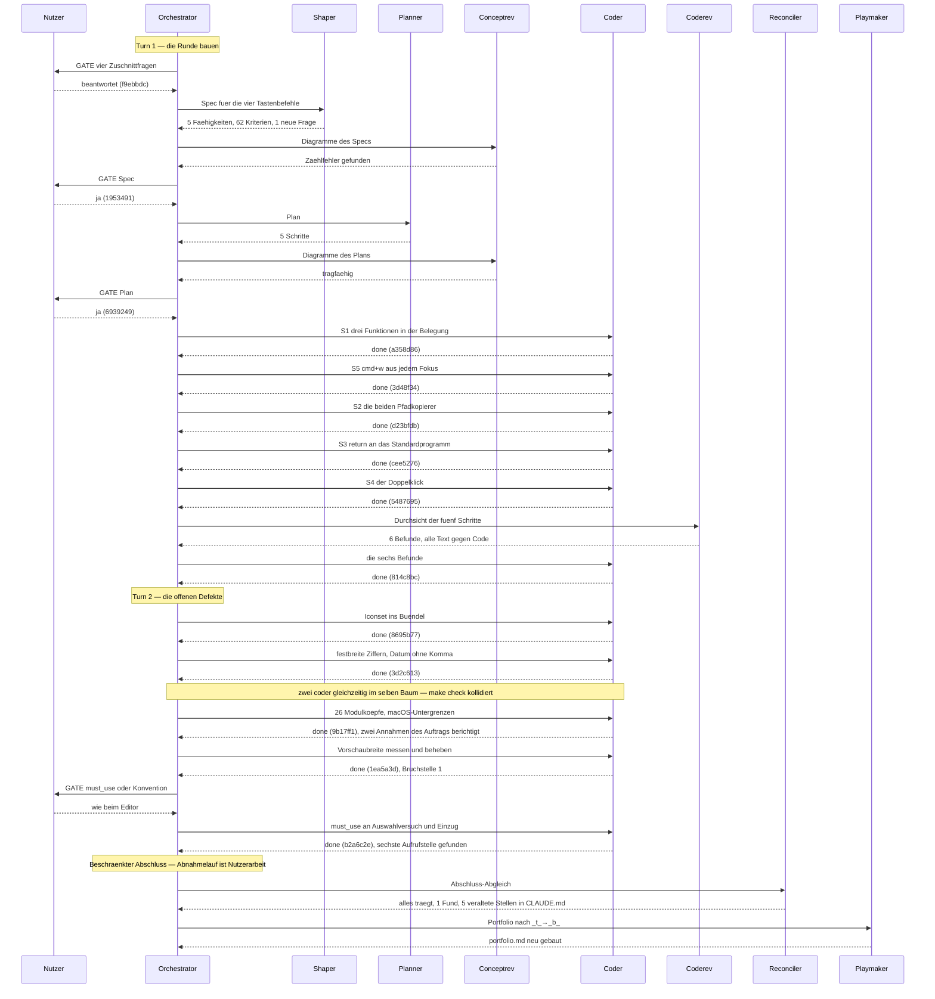

# Orchestrator Session — 260811-1454

**Directive:** Nach dieser Runde legt KRK auf Tastendruck zwei Sorten von Pfaden in die
Zwischenablage — den des angezeigten Ordners im aktiven Dateifenster und den des betroffenen
Eintrags. Eine Datei geht per Doppelklick und per Tastenkombination an das Standardprogramm des
Systems, und Cmd+W schließt den aktiven Tab auch dann, wenn der Fokus nicht in einem Bereich mit
Tabs steht. Alle vier Befehle laufen über die vorhandene Kommando-Maschinerie und über keine
zweite daneben.
**Mode:** plan (Spec → Plan → fünf Schritte), danach `issues` für die offenen Defekte
**Status:** Bounded Closure: der Abnahmelauf verlangt KRK im Vordergrund und ist Nutzerarbeit

## Setup

Gelaufen als `/fusion:setup` nach der Aktivierung des Circles über `/fusion:next`.

- Layout-Prüfung vor v4: `OLD=0`. Keine Migration nötig.
- Setup-Marke geschrieben, Plugin-Version 7.2.0. Monitor neu kopiert.
- Nebenläufigkeit: `none`, frische Marke geschrieben.
- Keine `agentstate.yaml` — frischer Start, keine unterbrochene Sitzung.
- Stilprofile, Plane-Vorlage und `fusion-guard.json` waren vorhanden.

## Aufgelöste Pfade

`fusion-paths orchestrator`, Exit 0. Der Circle ist aktiv, also zeigen alle `OUT_*` hinein und
jedes `SCAN_*` deckt Circle und gemeinsamen Speicher ab:

```
CIRCLE=circles/260811-1257-vier-tastenbefehle-pfade-kopieren-oeffnen
OUT_PLAN / OUT_HISTORY / OUT_ISSUE / OUT_DECISION → circles/260811-1257-…/{planning,history,issues,decisions}
SCAN_* → circles/260811-1257-…/<art> und shared/<art>
```

## Momentaufnahme

**Git:** HEAD `55a4afa`.

**Bereich (Domain): `code`.** `bin/fusion-count-sources` zählt mit `git ls-files` 115 Codedateien
gegen 11 Datendateien.

**Arbeitsschlange:** keine am Wurzelort. Die vorige ist am 260811-1420 als abgearbeitet
zurückgezogen worden (`shared/planning/260811-1420_c_abgearbeitete-warteschlange-…`). Phase 1 baut
eine neue.

**Offene Arbeit:**

| Art | Zahl |
|---|---|
| Offene Defekte (Circle + gemeinsam) | 7 |
| Offene Pläne oder Specs | 0 |
| Offene Fragen im Circle | 4 |
| Offene Fragen gemeinsam | 2 |

Die vier Fragen des Circles sind **Zuschnittfragen an den Nutzer** und keine Untersuchungen. Sie
kommen vor jeder Planung: wie weit Cmd+W reichen soll, was der Pfadkopierer bei stehender
Markierung kopiert, was ein Doppelklick auf einen Ordner tut, und welche vier Kombinationen ab
Werk gelten.

Die sieben offenen Defekte gehören keinem dieser Punkte auf: fünf betreffen fusion selbst
(Aufgabenereignisse, Durchsichtsdokument, Circle-Kopffelder, `portfolio.md`-Erzeugung, die
Warteschlangen-Prüfung), zwei betreffen KRK (die `must_use`-Frage am `Auswahlversuch`, die
Vorschaubreite beim Navigieren — letztere gehört sachlich zum vorgesehenen Statusleisten-Circle).

**Wächter:** `haltActive: false`.

**Circles:** 1 aktiv, 2 vorgesehen, 3 beschränkt abgeschlossen.

**Häufig geänderte Dateien:** `crates/krk-ui/src/appkit/anwendung.rs` (147) und
`crates/krk-ui/src/appkit/editor.rs` (137) führen die Rangliste. Die erste ist für diese Runde
einschlägig — die vier Befehle hängen am Anwendungsdelegierten.

## Ein Befund des playmaker, der diese Runde unmittelbar betrifft

Der Portfolio-Lauf vom 260811-1415 hat festgehalten: **die Markierung fällt heute mit jedem
Lesevorgang**, weil sie eine Menge von Eintragsindizes ist. Der Pfadkopierer für den „betroffenen
Eintrag" setzt genau darauf auf, und die Frage `260811-1258_o_was-kopiert-der-pfadkopierer-bei-stehender-markierung.md`
hängt daran. Das gehört vor der Antwort geprüft und nicht angenommen.

## Verlauf

- 260811-1454 — Setup abgeschlossen. Vier Nutzerfragen stehen vor der Planung.

## Drei Defektdatensätze über fusion sind gelöscht, weil übertragen

Am 260811-1950 auf Weisung des Nutzers: die drei Befunde über das fusion-Plugin sind in dessen
eigenen Arbeitsbereich übertragen und hier gelöscht.

| Gelöscht | Gegenstand |
|---|---|
| `260811-0932_o_die-circle-aktivierung-zieht-die-kopffelder-des-datensatzes-nicht-nach.md` | Beim `_a_`→`_t_` bleiben `Status:`, `Active spec/plan:` und `Active session history:` stehen; niemandes Prompt beauftragt sie |
| `260811-1425_o_die-pruefung-der-warteschlange-liest-einen-circle-pfad-aus-der-prosa-ihrer-kopfzeile.md` | „Reading a queue" nimmt den ersten `circles/`-Treffer der Zeile, auch aus einem Nebensatz, und meldete `STALE` für eine Warteschlange, die keinen Circle nennt |
| `260810-1730_o_die-erzeugung-von-portfolio-md-schreibt-den-zustandsmarker-aus-und-macht-jede-handkorrektur-zunichte.md` | Weder die Vorlage noch die Anweisung des `playmaker` verlangen die Sternform; jede Handkorrektur an `portfolio.md` ist ein Aufschub |

**Die Wahl war Löschen und nicht Schließen**, und der Unterschied ist folgenreich genug, um ihn
festzuhalten. Ein geschlossener Datensatz bliebe hier auffindbar und zeigte auf den Ort der
Behebung; ein gelöschter tut das nicht. Wer in diesem Projekt später auf dieselbe Lage stößt —
etwa auf ein Kopffeld, das dem Marker widerspricht —, findet im Arbeitsbereich keinen Hinweis
darauf, dass der Befund schon erhoben und weitergegeben wurde.

**Der volle Text der drei bleibt in der Git-Historie** und ist über
`git log --diff-filter=D --name-only` oder `git show <commit>^:<pfad>` erreichbar; dieser
Abschnitt nennt die drei Dateinamen, damit die Suche danach möglich ist.

**Zwei weitere Datensätze betreffen fusion und sind ausdrücklich geblieben**, weil sie eine
andere Sorte sind: `shared/issues/260810-1907_*_die-durchsicht-von-turn-2-hat-kein-durchsichtsdokument-hinterlassen.md`
und `shared/issues/260810-1945_*_der-orchestrator-hat-in-drei-turns-keine-aufgabenereignisse-emittiert.md`
sind Befunde über das **Verhalten des Orchestrators in dieser Sitzung** und keine Fehler im
Prompt-Text des Plugins. Sie halten fest, was hier geschehen ist, und gehören deshalb hierher.
Wer sie ebenfalls für übertragbar hält, sagt es.

## Coherence

<!-- RECONCILER-OWNED -->

**Verdict:** bounded-closure-proposed

**Edges:**
- Artifact↔Grounding: 5 Planschritte und 12 Defektbehebungen einzeln gegen den Baum gelesen, alle
  tragen; `make check` grün (795 Proben, 0 gescheitert, 0 Warnungen unter `-D warnings`); 0 offene
  Durchsichtsbefunde im Circle. Zwei Abweichungen Plan-gegen-Baum, beide begründet und unschädlich
  (`nichts_betroffen` ist zu drei Funktionen geworden, `mit_standardprogramm_oeffnen` ohne
  Rückgabewert); eine halb gelaufene Behebung nachgezogen
  (`issues/260811-1648_c_fuenf-entscheidungsdatensaetze-…`); fünf veraltete Stellen in `CLAUDE.md`,
  ungeändert gemeldet. Belege: `history/260811-2157-reconciliation.md`.
- Artifact↔Directive: die Commits bewegen sich auf die Directive zu, keiner von ihr weg. Von 16
  Commits (`55a4afa..HEAD`) bauen 8 die Directive selbst (`a358d86`, `3d48f34`, `d23bfdb`,
  `cee5276`, `5487695`, `814c8bc`, plus `1953491` und `6939249` als Spec und Plan), 5 schließen
  Defekte aus dem gemeinsamen Speicher, die mit der Directive nichts zu tun haben (`8695b77`,
  `3d2c613`, `9b17ff1`, `1ea5a3d`, `b2a6c2e`), und 3 sind Arbeitsbereich-Buchführung (`f9ebbdc`,
  `873b768`, `95c2abe`). Die fünf Nebenarbeiten sind bewusst aufgenommen und einzeln geprüft; sie
  stehen im Ereignisprotokoll allerdings hinter dem letzten `turn_end` ohne eigene Turn-Grenze
  (`shared/issues/260811-2157_o_fuenf-commits-stehen-hinter-dem-letzten-turn-ende-…`).
- Grounding↔Directive: 7 aktive Entscheidungsdatensätze des Circles, alle mit der Directive
  vereinbar, keiner im Widerspruch; sämtlich von beantwortet auf umgesetzt gezogen, jeder mit
  Commit und Fundstelle. In den anderen Speichern kein Datensatz, der dieser Directive
  widerspricht. Ein Datensatz eines vorgesehenen Circles ist durch diese Runde gegenstandslos
  geworden und auf beantwortet gezogen
  (`circles/260811-1304-…/decisions/260811-1305_*_wird-der-vorschaubreiten-defekt-in-dieser-runde-behoben.md`).

**Rebalance recommendation:** accept Bounded Closure

Der Grund steht nicht in einer Drift, sondern in einer Grenze: die Runde ist gebaut, und alle 62
Abnahmekriterien des Specs stehen offen, weil der Abnahmelauf KRK im Vordergrund verlangt und damit
Nutzerarbeit ist. 23 der 62 trägt der Baum bereits, 39 kann nur ein Mensch am gebauten Bündel sehen.
Für einen Agenten ist dieser Teil der Directive definitiv unerreichbar — dieselbe Lage, in der die
Runden 1 bis 3 als beschränkter Abschluss geschlossen worden sind.

## Budget

| Größe | Zahl |
|---|---|
| Turns | 2 |
| Planschritte erledigt | 5 von 5 |
| Defekte geschlossen | 12 |
| Defekte offen geblieben | 3 |
| Fragen beantwortet (`_o_`→`_a_`) | 8 |
| Fragen umgesetzt (`_a_`→`_i_`) | 7 |
| Fragen neu gestellt | 1 (`shared/decisions/260811-2050_o_…`) |
| Commits | 16 |
| Nutzergates | 9 |

## Turn-Protokoll

### Turn 1 — die Runde bauen (260811-1454 bis 260811-1735)

Zuschnitt, Spec, Plan und die fünf Planschritte. Vier Nutzerfragen standen vor der Planung, alle
vier beantwortet; eine fünfte fiel dem `shaper` beim Schreiben des Specs auf (`return` öffnet alle
betroffenen Einträge, nicht nur den unter der Auswahl) und ist ausgewiesen worden, statt als
Zusage durchzugehen. Die Durchsicht hat sechs Befunde geliefert, alle an derselben Kante — Text,
der mehr zusagt, als der Code trägt. Commits `f9ebbdc` bis `814c8bc`.

**Zwei Tickets sind mitten im Turn dazugekommen** und in denselben Turn gefallen: festbreite
Ziffern in Listen und Leiste samt Datum ohne Komma, und das Iconset im Bündel.

**Ein Fehler des Orchestrators gehört hierher:** zwei Rust-`coder` liefen gleichzeitig im selben
Baum. Beide Änderungen waren für sich richtig, aber die Wegwerfdatei des einen hielt `make check`
des anderen an. Die Lehre steht ohne Zahl da: nie zwei `coder` gleichzeitig in denselben Baum.

Coherence: nicht gefahren (der Turn endete ohne Gate).

### Turn 2 — die offenen Defekte (260811-1735 bis 260811-2200)

Fünf Defekte aus dem gemeinsamen Speicher, keiner davon aus dieser Directive. Commits `8695b77`
bis `b2a6c2e`.

- **Die Untergrenzen in den Modulköpfen** (`9b17ff1`) — 26 Köpfe nachgetragen, Deckung jetzt 31 von
  33. Der Datensatz behauptete 7 bestehende Angaben; **5 waren es**, und **4 davon falsch**. Keine
  Klasse im Baum liegt über macOS 15.
- **Die Vorschaubreite** (`1ea5a3d`) — die Messung stand hinter dem Nachzug der Aufteilung statt
  davor. C7 war an dieser Stelle nur erfüllt, wenn zwischen Ziehen und Beenden kein Tastenbefehl lag.
- **Die Konvention am `Auswahlversuch`** (`b2a6c2e`) — `#[must_use]`, und das Attribut fand sofort
  eine sechste Aufrufstelle, die kein Datensatz führte.

**Zwei Annahmen des Orchestrators haben nicht getragen** und sind vom `coder` berichtigt statt
befolgt worden: die objc2-Bindung führt keine `API_AVAILABLE`-Angaben, und
`/System/Library/Frameworks/AppKit.framework/Headers` gibt es auf diesem Gerät nicht. Beides
unabhängig nachgeprüft, beides zutreffend.

Coherence: `bounded-closure-proposed`, siehe oben.

## Verbleibende Arbeit

| Gegenstand | Warum offen |
|---|---|
| Abnahmelauf, 62 Kriterien | Verlangt KRK im Vordergrund — Nutzerarbeit. 23 trägt der Baum, 39 kann nur ein Mensch sehen |
| `shared/issues/260810-1945`, `260810-1907`, `260811-2157` | Befunde über das Verhalten des Orchestrators, kein KRK-Code |
| `circles/260811-1304-…/issues/260811-1732` | Zuschnitt-Erweiterung für einen vorgesehenen Circle |
| `shared/decisions/260811-2050_o_…` | Wird die Untergrenzen-Angabe prüfbar gemacht — drei Stufen liegen vor |
| `CLAUDE.md`, fünf veraltete Stellen | Vom Abgleich benannt, nicht geändert. Zwei ganze Runden fehlen der Datei |

## Commits

| Kennung | Betreff |
|---|---|
| `f9ebbdc` | docs(workbench): vier Fragen des Circles beantwortet, dazu ein Ticket fuer das Iconset |
| `1953491` | docs(spec): fuenf Faehigkeiten und 62 Kriterien fuer die vier Tastenbefehle |
| `6939249` | docs(plan): fuenf Schritte fuer die vier Tastenbefehle, abgenommen |
| `a358d86` | feat(keymap): drei neue Funktionen in der Belegung, an vier Stellen nachgetragen |
| `873b768` | chore(assets): das Iconset kommt in den Baum |
| `3d48f34` | feat(ui): cmd+w schliesst den aktiven Tab aus jedem Fokus |
| `d23bfdb` | feat(ui): die beiden Pfadkopierer, und die Zwischenablage wird zum ersten Mal Ziel |
| `cee5276` | feat(ui): return gibt die betroffenen Eintraege an das Standardprogramm |
| `5487695` | feat(ui): der Doppelklick verzweigt, die Taste nicht |
| `814c8bc` | fix(ui): sechs Durchsichtsbefunde behoben, alle an der Kante Text neben Code |
| `95c2abe` | chore(workbench): drei Defektdatensaetze ueber fusion geloescht, weil uebertragen |
| `8695b77` | feat(bundle): KRK traegt sein Symbol |
| `3d2c613` | fix(ui): festbreite Ziffern in Liste und Leiste, und das Datum ohne Komma |
| `9b17ff1` | docs(appkit): 26 Modulkoepfe nennen die macOS-Untergrenze ihrer Klassen |
| `1ea5a3d` | fix(ui): die gezogene Breite ueberlebt jetzt den naechsten Tastenbefehl |
| `b2a6c2e` | refactor(ui): der Uebersetzer erzwingt, was bis heute in zwei Kommentaren stand |

## Sitzungsverlauf

**Das Ereignisprotokoll deckt diese Sitzung nicht.** Es führt für den ganzen Lauf einen
`turn_start` und einen `turn_end` und kein einziges `task_start`/`task_done`; die Turn-Grenze
zwischen Bauen und Defektarbeit fehlt ebenso wie die fünf Commits dahinter. Das Diagramm unten ist
deshalb **aus den Commits und dieser Historie gebaut, nicht aus dem Protokoll** — und das ist
selbst der Befund, den `shared/issues/260810-1945` und `260811-2157` festhalten.


