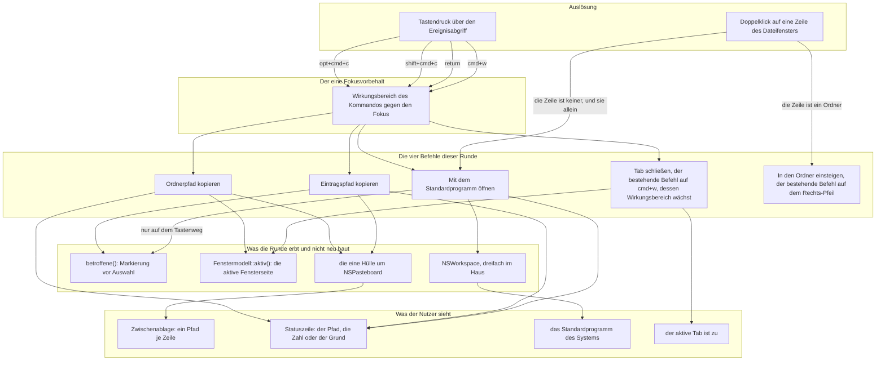

# Spec: Vier Tastenbefehle für Pfade, das Öffnen und Cmd+W (Runde 4)

**Datum:** 2026-08-11
**Status:** Vom Nutzer abgenommen am 260811-1610, mit einer Auflage, die am 260811-1614 nachgezogen ist: zwei fehlende Kanten im Diagramm, die Kennzeichnung von Cmd+W als bestehende Belegung, und ein Zählfehler bei den Abnehmern von `betroffene()`. Zwei vorbelegte Punkte sind dabei zu Antworten geworden (`decisions/260811-1552_*` und `decisions/260811-1612_*`). Der Marker bleibt `_o_`, bis die Abnahmekriterien eingelöst sind.
**Circle:** `circles/260811-1257-vier-tastenbefehle-pfade-kopieren-oeffnen`
**Quelle:** Circle-Directive im Datensatz `_t_circle.md`, Abschnitt `## Directive`. Dazu die vier Nutzerantworten vom 260811-1505 und die zwei vom 260811-1610, die in den Datensätzen unter `decisions/` mit einer `Answered:`-Zeile stehen, und die Festlegung vom 260811-1250 zu den Menükürzeln.

## Wie dieser Spec auf Datensätze verweist

Wie in den drei Specs davor: ein Verweis auf einen Datensatz trägt an der Stelle des Zustandsmarkers eine Sternstelle. `decisions/260811-1258_*_was-kopiert-der-pfadkopierer-bei-stehender-markierung.md` bleibt damit richtig, wenn der Datensatz von beantwortet nach umgesetzt wandert. Wo der Marker eine Aussage über den Stand ist und nicht Teil eines Pfades, steht er ausgeschrieben.

## Directive dieser Runde

Nach dieser Runde legt KRK auf Tastendruck zwei Sorten von Pfaden in die Zwischenablage: den des angezeigten Ordners im aktiven Dateifenster und den des betroffenen Eintrags, gleich ob Datei oder Ordner. Ein Eintrag geht per Tastendruck an das Standardprogramm des Systems, und ein Doppelklick tut dasselbe für eine Datei, während er auf einem Ordner in ihn einsteigt. Cmd+W schließt den aktiven Tab auch dann, wenn der Fokus nicht in einem Bereich mit Tabs steht.

Die Zwischenablage ist damit zum ersten Mal auch Ziel und nicht mehr nur Quelle. Alle vier Befehle laufen über die vorhandene Kommando-Maschinerie und über keine zweite daneben.

## Aufbau dieser Runde

Die Bezeichner C1 bis C5 verweisen auf die Fähigkeiten weiter unten. Sie zählen für diese Runde neu von eins an; wo dieser Spec eine Fähigkeit einer früheren Runde meint, schreibt er es aus, etwa "C4 der Runde 1".

Vier Befehle, drei neue Kombinationen, kein neues Fenster und kein neues Blatt. Das Bild zeigt, was die Runde baut und was sie erbt; die vier Kästen unter "Was die Runde erbt" sind der Grund, aus dem sie klein ist.

Die einzige Kante, die von der Maus ausgeht und nicht am Fokusvorbehalt vorbeikommt, ist die zum Einstieg: ein Doppelklick liegt an der Tabelle an und fragt nicht nach dem Fokus, weil er ihn mitbringt. Beide Doppelklick-Kanten münden in Befehle, die es unabhängig von ihm gibt; eine zweite Umsetzung des Öffnens entsteht dadurch nicht.

Zwei Wege führen in `K3`, und sie unterscheiden sich nicht nur im Fokusvorbehalt, sondern auch darin, worauf sie wirken. Die Taste fragt `betroffene()`, deshalb die beschriftete Kante von `K3` dorthin; der Doppelklick fragt nichts, sondern nimmt die angeklickte Zeile, deshalb die Beschriftung an seiner Kante. Es bleibt **eine** Umsetzung des Öffnens mit zwei Zugängen, und der Unterschied liegt allein in der Menge, die sie übergeben.

## Fähigkeiten

### C1: Der Pfad des angezeigten Ordners in der Zwischenablage

**Beschreibung:** Ein Tastendruck legt den Pfad des Ordners, den das aktive Dateifenster gerade zeigt, als Text in die Zwischenablage. Markierung und Auswahl gehen nicht ein; der Befehl fragt nach dem Ordner und nicht nach dem, was darin steht.

**Abnahmekriterien:**
- [ ] `opt+cmd+c` legt den Pfad des im sichtbaren Tab des aktiven Dateifensters angezeigten Ordners in die Zwischenablage, in genau einer Zeile.
- [ ] Der Pfad ist absolut und ausgeschrieben. Eine Tilde für das Benutzerverzeichnis steht nicht darin, und ein abschließender Schrägstrich steht nur beim Wurzelverzeichnis darin, weil dessen Pfad aus ihm besteht.
- [ ] Gemeint ist das **aktive** Dateifenster (`Fenstermodell::aktiv()`, `crates/krk-ui/src/fenstermodell.rs:318`), nicht die andere Fensterseite und nicht ein verdeckter Tab.
- [ ] Das Ergebnis ist dasselbe, ob nichts markiert ist oder dreißig Einträge markiert sind. Der Befehl liest die Markierung nicht.
- [ ] Nach dem Aufruf steht in der Statuszeile eine Meldung, die den kopierten Pfad nennt.
- [ ] Die Zwischenablage trägt danach Text und keinen Dateiverweis. Ein Einfügen in ein Terminal oder in ein Textfeld ergibt den Pfad; ein Einfügen im Finder legt keine Datei ab.
- [ ] Der Befehl wirkt allein mit dem Fokus in einem Dateifenster. In der Leiste, in der Vorschau und im Editor tut `opt+cmd+c` nichts und meldet nichts, wie jeder abgewiesene Befehl.
- [ ] Ein Ordner, der zwischen dem Lesen und dem Tastendruck verschwunden ist, wird trotzdem kopiert. Der Befehl fragt das Dateisystem nicht; er kopiert, was auf dem Schirm steht.
- [ ] Ein zweiter Aufruf ersetzt den Inhalt der Zwischenablage. Angehängt wird nichts.

**Getroffene Festlegungen:**
- **Die Kombination `opt+cmd+c` ist die Nutzerantwort vom 260811-1505** (`decisions/260811-1300_*_welche-vier-kombinationen-gelten-ab-werk.md`). Der Preis steht im Datensatz und ist angenommen: der Finder legt auf dieselbe Kombination "Pfadname kopieren" und meint damit den Eintrag, nicht den Ordner. Wer beides nebeneinander benutzt, vertauscht die beiden leicht.
- **Nur Text und kein Dateiverweis ist die Nutzerantwort vom 260811-1610** (`decisions/260811-1552_*_welche-sorten-legt-der-pfadkopierer-in-die-zwischenablage.md`). Der Spec hatte diese Möglichkeit als Vorbelegung getragen; sie ist jetzt entschieden, und der Grund steht in einem Satz im Datensatz: ein Einfügen, das im Finder eine Datei und in einem Textfeld einen Pfad ergibt, wären zwei Bedeutungen desselben Befehls, und die zweite sieht der Nutzer erst, nachdem sie eingetreten ist. Ein `cmd+v` im Finder schreibt damit den Pfad als Text und legt keine Datei ab.
- **Die Statuszeile ist der Meldeweg, und er ist nicht neu.** Sie trägt fünf Ränge nach dem Alter der Aussage; der Datensatz ist `circles/260802-0842-krk-mac-dateimanager-editor-git/decisions/260803-2025_*_wie-zeigt-krk-dem-nutzer-fehler.md`. Gesetzt wird die Meldung über `befehlsantwort_zeigen` (`crates/krk-ui/src/appkit/tabelle.rs:1483`), gelöscht zu Beginn der nächsten Kommandoausführung.

### C2: Der Pfad des betroffenen Eintrags in der Zwischenablage

**Beschreibung:** Ein Tastendruck legt die Pfade der betroffenen Einträge als Text in die Zwischenablage, einen je Zeile, in Sichtreihenfolge. Was "betroffen" heißt, entscheidet dieselbe Regel wie bei den vier Dateioperationen aus C4 der Runde 1: die Markierung hat den Vorrang, sonst gilt der Eintrag unter der Auswahl.

**Abnahmekriterien:**
- [ ] `shift+cmd+c` legt die Pfade der betroffenen Einträge in die Zwischenablage, einen je Zeile, in Sichtreihenfolge.
- [ ] "Betroffen" ist genau das Ergebnis von `betroffene()` (`crates/krk-ui/src/kommandos/operationen.rs:157`), abgerufen über `betroffene_eintraege()` (`crates/krk-ui/src/appkit/tabelle.rs:808`). Eine zweite Regel daneben entsteht nicht, und der Befehl ist der fünfte Abnehmer der bestehenden. Der Öffner aus C3 ist ihr sechster; diese Runde legt zwei dazu, nicht einen.
- [ ] Stehen Markierungen, kommen deren Pfade in die Zwischenablage, und der Eintrag unter der Auswahl kommt nur dann dazu, wenn er selbst markiert ist.
- [ ] Steht keine Markierung, kommt der Pfad unter der Auswahl, in einer Zeile.
- [ ] Ausgeblendete Einträge kommen in keinem Fall vor. Gezählt werden allein die sichtbaren, wie es die geerbte Regel tut.
- [ ] Ordner und Dateien werden gleich behandelt. Eine symbolische Verknüpfung liefert ihren eigenen Pfad und nicht den ihres Ziels, weil der Verzeichnisleser ihr nicht folgt.
- [ ] Die Pfade sind absolut und ausgeschrieben, in derselben Form wie in C1.
- [ ] Die Zeilen sind durch ein `\n` getrennt. Nach der letzten Zeile steht kein weiterer Zeilenumbruch.
- [ ] Nach dem Aufruf steht in der Statuszeile eine Meldung: bei einer Zeile der kopierte Pfad, bei mehreren die Zahl der kopierten Pfade.
- [ ] Eine Rückfrage entsteht in keinem Fall, auch nicht bei dreißig markierten Einträgen. Der Befehl zerstört nichts.
- [ ] Ist der Ordner leer und steht damit weder eine Markierung noch eine Auswahl, bleibt die Zwischenablage unverändert, und die Statuszeile sagt, dass nichts zu kopieren war. Kommentarlos nichts zu tun ist nicht zulässig.
- [ ] Die Zwischenablage trägt Text und keinen Dateiverweis, wie in C1.
- [ ] Der Befehl wirkt allein mit dem Fokus in einem Dateifenster.

**Getroffene Festlegungen:**
- **Der Nutzer hat am 260811-1505 gewählt, dass der Pfadkopierer `betroffene()` erbt**, samt der Rückmeldung in der Statuszeile (`decisions/260811-1258_*_was-kopiert-der-pfadkopierer-bei-stehender-markierung.md`). Damit gilt für ihn dieselbe Regel wie für Kopieren, Verschieben, Papierkorb und endgültiges Löschen.
- **Der Preis steht im Datensatz und ist angenommen:** der Nutzer sieht der Zwischenablage nicht an, wie viele Zeilen er erzeugt hat. Die Rückmeldung ist die Antwort darauf, und sie ist der Grund, aus dem keine Rückfrage nötig ist.
- **Die Markierung ist flüchtig, und dieser Spec entscheidet, was das hier heißt.** Der Abschnitt `## Die Flüchtigkeit der Markierung` unten schreibt den Fall aus und legt fest, dass der Kopierer die Markierung nimmt, wie er sie vorfindet.
- **Die Kombination `shift+cmd+c` ist die Nutzerantwort vom 260811-1505.** Sie ist die Kombination, die ForkLift für "Pfad kopieren" verwendet. `cmd+c` bleibt unangetastet.

### C3: Mit dem Standardprogramm öffnen, per Taste und per Doppelklick

**Beschreibung:** Ein Tastendruck gibt die betroffenen Einträge an das Standardprogramm des Systems. Die Taste verzweigt nicht: auch ein Ordner geht damit an das System und öffnet sich im Finder. Der Doppelklick verzweigt: auf einem Ordner steigt er in ihn ein, auf allem übrigen gibt er ihn an das System.

**Abnahmekriterien:**

*Die Taste*
- [ ] `return` gibt die betroffenen Einträge an das Standardprogramm des Systems. Betroffen heißt dasselbe wie in C2.
- [ ] Ein Ordner geht dabei ebenfalls an das System und öffnet sich im Finder. Die Taste prüft den Typ des Eintrags nicht.
- [ ] Sind mehrere Einträge markiert, werden alle geöffnet, und die Statuszeile nennt ihre Zahl. Bei einem einzigen nennt sie seinen Namen.
- [ ] Nimmt das System einen Eintrag nicht an, steht der Grund in der Statuszeile. Kommentarlos nichts zu tun ist nicht zulässig.
- [ ] Der Befehl wirkt allein mit dem Fokus in einem Dateifenster.
- [ ] Der Rechts-Pfeil bleibt unverändert der Einstieg in einen Ordner und löst auf einer Datei weiterhin nichts aus (`auswahl_oeffnen`, `crates/krk-ui/src/appkit/tabelle.rs:955`).

*Der Doppelklick*
- [ ] Ein Doppelklick auf einen Ordner steigt in ihn ein und tut damit dasselbe wie der Rechts-Pfeil.
- [ ] Ein Doppelklick auf jede andere Zeile gibt sie an das Standardprogramm.
- [ ] Der Doppelklick wirkt auf die **angeklickte** Zeile und nicht auf die Markierung. Sind dreißig Einträge markiert und der Nutzer klickt doppelt auf einen davon, öffnet sich dieser eine.
- [ ] Ein Doppelklick unterhalb der letzten Zeile, also auf die leere Fläche der Liste, tut nichts.
- [ ] Ein einfacher Klick verhält sich unverändert: er wählt die Zeile aus und macht das Dateifenster zum aktiven.
- [ ] Der Doppelklick öffnet dieselbe Umsetzung des Öffnens wie die Taste. Ein zweiter Aufruf von `NSWorkspace` daneben entsteht nicht.
- [ ] Der Doppelklick bekommt keinen Eintrag in `resources/default-keymap.toml` und kein Kommando. Er ist keine Tastenbelegung, und die Konflikterkennung aus C3 der Runde 1 sieht ihn nicht.
- [ ] Die Leiste und die Vorschau bekommen keine Doppelklick-Behandlung. Die Änderung liegt allein an der Tabelle des Dateifensters.

*Eine symbolische Verknüpfung*
- [ ] Eine symbolische Verknüpfung auf einen Ordner gilt als "kein Ordner" und geht damit an das System, per Taste wie per Doppelklick. Der Verzeichnisleser meldet die Verknüpfung selbst und nicht das, worauf sie zeigt (`Typ::Verknuepfung`, `crates/krk-core/src/verzeichnis/eintrag.rs:24`), und der Einstieg über den Rechts-Pfeil folgt ihr aus demselben Grund schon heute nicht. KRK folgt der Verknüpfung also nicht; das System tut es.

*Was `return` sonst noch tut, und weiter tun muss*
- [ ] Bei stehendem Blatt löst `return` weiterhin die Vorgabeschaltfläche des Blattes aus. Der Blattsperre-Zweig weist das Kommando ab, und der Tastendruck läuft unverändert an AppKit weiter, wie jeder abgewiesene.
- [ ] Im Editor und in jedem Textfeld schreibt `return` weiterhin einen Zeilenumbruch beziehungsweise schließt die Eingabe ab. Der Ereignisabgriff reicht die Taste dort an AppKit weiter, bevor er nachschlägt.
- [ ] Der Kommentar in `crates/krk-ui/src/appkit/blaetter/mod.rs:222-227` ist umgeschrieben. Er sagt heute zu, dass `resources/default-keymap.toml` die Eingabetaste nicht belegt; nach dieser Runde belegt sie sie.

**Getroffene Festlegungen:**
- **Der Nutzer hat am 260811-1505 die verzweigende Maus und die nicht verzweigende Taste gewählt** (`decisions/260811-1259_*_was-tut-ein-doppelklick-auf-einen-ordner.md`). Damit hat er beide Wege: den Einstieg mit der Maus, wie ein Doppelklick auf dem Mac gelesen wird, und das Öffnen eines Ordners im Finder über die Taste.
- **`return` als Kombination ist die Nutzerantwort vom 260811-1505.** Die Eingabetaste ist seit C2 der Runde 1 ausdrücklich freigehalten worden, und sie bekommt jetzt die Handlung, für die Nutzer sie aus dem Norton Commander und aus dem Finder erwarten.
- **Dass die Taste alle betroffenen Einträge öffnet, ist die Nutzerantwort vom 260811-1610** (`decisions/260811-1612_*_oeffnet-return-alle-betroffenen-eintraege-oder-nur-den-unter-der-auswahl.md`). Der Spec hatte es als Vorbelegung getragen, weil es aus der Antwort auf `decisions/260811-1258_*` folgt: dieselbe Regel für alle Befehle, die auf Einträge wirken. `betroffene()` gilt damit ohne Ausnahme, und Finder und ForkLift öffnen bei mehrfacher Auswahl ebenfalls alle. **Nicht entschieden ist damit**, ob KRK bei einer großen Zahl betroffener Einträge nachfragt, bevor es öffnet; der Datensatz hält das ausdrücklich fest, und diese Runde sagt dazu nichts zu.
- **`NSWorkspace` ist dreifach im Haus, und die Vorlage ist `im_browser_oeffnen`** (`crates/krk-ui/src/appkit/zwischenablage.rs:133`). Von den drei Stellen ist sie die einzige, die einen Ort ohne benannte Anwendung an das System übergibt, und genau das heißt "Standardprogramm". `appkit/terminal.rs` ist die Gegenvorlage: es löst über eine Bündelkennung eine **bestimmte** Anwendung auf, und ein Standardprogramm ist keine bestimmte. `appkit/volumes.rs` beobachtet nur und öffnet nichts. Eine neue Systemabhängigkeit entsteht in keinem Fall.

### C4: Cmd+W schließt den aktiven Tab aus jedem Fokus

**Beschreibung:** Cmd+W wirkt zusätzlich mit dem Fokus in der Leiste und im Editor und schließt dort den aktiven Tab der aktiven Fensterseite. Mit dem Fokus in einem Dateifenster oder in der Vorschau bleibt es bei dem, was heute geschieht. Die Blattsperre bleibt unberührt.

**Abnahmekriterien:**
- [ ] Mit dem Fokus in der Lesezeichen- und Geräteleiste schließt `cmd+w` den aktiven Tab des aktiven Dateifensters.
- [ ] Mit dem Fokus im eingebauten Editor tut `cmd+w` dasselbe. Der Editor bleibt dabei offen und behält seinen Stand; `cmd+w` schließt nicht die Datei des Editors, und ein vierter Anlass der Nachfrage aus C4 der Editor-Runde entsteht nicht.
- [ ] Mit dem Fokus in einem Dateifenster schließt `cmd+w` dessen aktiven Tab, wie heute.
- [ ] Mit dem Fokus in der Vorschau schließt `cmd+w` deren aktiven Tab, wie heute. Die Zuordnung "der Bereich vor dem Nutzer" aus C6 der Runde 1 bleibt für diese beiden Bereiche gültig.
- [ ] Ist der geschlossene Tab der letzte seines Bereichs, geschieht, was heute geschieht: er zeigt danach den Standardordner, statt zu verschwinden (`Tabliste::schliessen`, `crates/krk-ui/src/tabs.rs:443`).
- [ ] Bei stehendem Blatt kommt `cmd+w` nicht durch. Es schließt kein Blatt, und `esc` bleibt der einzige Weg, ein Blatt abzubrechen.
- [ ] `waehrend_blatt_erlaubt` (`crates/krk-ui/src/kommandos/operationen.rs:208`) bleibt die Ein-Zeilen-Regel, die sie ist. Ein zweiter erlaubter Befehl kommt nicht hinzu.
- [ ] `cmd+w` bleibt auf `tab_schliessen`, `shift+cmd+w` bleibt auf `fenster_schliessen`. Keine der beiden Kombinationen wird umbelegt, und keine neue kommt für diese Fähigkeit hinzu.
- [ ] Steht die Schreibmarke in einem Textfeld, etwa bei der Umbenennung an Ort und Stelle, behält `cmd+w` seine AppKit-Bedeutung, weil der Ereignisabgriff den Tastendruck dort weiterreicht, bevor er nachschlägt. Am gebauten Bündel ist zu prüfen, was AppKit daraufhin tut; dass es das Fenster schließt, ist nicht zu erwarten, weil kein Menüeintrag diese Kombination trägt, und es ist auch nicht gemessen.
- [ ] Die vier Tabbefehle sind danach keine Gruppe mehr. `Kommando::TabSchliessen` steht in `Kommando::wirkungsbereich` allein und nicht mehr im Zweig mit `TabNeu`, `TabNaechster` und `TabVoriger`, und der Grund steht als Kommentar daneben.

**Getroffene Festlegungen:**
- **Der Nutzer hat am 260811-1505 Möglichkeit 1 gewählt, also allein die Fokuslücke** (`decisions/260811-1257_*_wie-weit-soll-cmd-w-reichen.md`). Die Blattsperre ist damit ausdrücklich als Regel bestätigt und nicht als Lücke. Sie war in der Editor-Runde schon einmal fälschlich für einen Defekt gehalten worden.
- **Der Preis steht dabei und ist angenommen:** in der Belegungsansicht bleibt `cmd+w` wirkungslos, und das war eine der beiden Beobachtungen, aus denen der Entwurf entstanden ist. Die Belegungsansicht ist ein Blatt und kein Fenster.
- **Der Wirkungsbereich `Ueberall` für `TabSchliessen` ist eine Vorbelegung dieses Specs.** Vier der sieben Werte scheiden aus, weil sie einen einzelnen Bereich verlangen; `Tabbereich` ist der heutige und deckt Leiste und Editor nicht; `Navigator` schließt gerade den Editor aus, den der Nutzer ausdrücklich einschließt. Bleibt `Ueberall`, und ein achter Wert wäre die Aufzählung von "überall" unter einem zweiten Namen. Zugesagt ist das Verhalten in den fünf Abnahmekriterien darüber; wer es mit einem anderen Wert erreicht, hat den Spec erfüllt.
- **Die Verzweigung nach dem Fokus ist neu und gehört zum Befehl, nicht neben ihn.** Heute reicht `bereichskommando` (`crates/krk-ui/src/appkit/anwendung.rs:2120`) jedes Kommando an den Bereich mit dem Fokus weiter, und die Leiste führt `TabSchliessen` nicht aus, während der Editor gar nichts zugestellt bekommt. Der Befehl braucht deshalb für diese beiden Fälle eine Adresse, und sie ist in beiden dieselbe: die aktive Fensterseite. Wo diese Verzweigung wohnt, entscheidet der Planner; dass es **eine** ist und keine zwei, sagt dieser Spec zu.

### C5: Drei neue Funktionen in der Belegung, an vier Stellen nachgetragen

**Beschreibung:** Die drei neuen Befehle wachsen in denselben vier vollständigen Fallunterscheidungen, die jede bisherige Runde gewachsen sind. Keine davon hat einen Auffangzweig, der Übersetzer nennt die Stellen also von selbst. Cmd+W bekommt keine neue Zeile: es ist ein bestehender Befehl mit einem weiteren Wirkungsbereich.

**Die drei Funktionen, und welche Stelle welchen Wert bekommt:**

| Kennung in der Belegung | Kombination | `Kommando` | `Kommando::wirkungsbereich` | `bereich_des_kommandos` |
|---|---|---|---|---|
| `ordnerpfad_kopieren` | `opt+cmd+c` | `OrdnerpfadKopieren` | `Dateifenster` | `Dateioperationen` |
| `eintragspfad_kopieren` | `shift+cmd+c` | `EintragspfadKopieren` | `Dateifenster` | `Dateioperationen` |
| `mit_standardprogramm_oeffnen` | `return` | `MitStandardprogrammOeffnen` | `Dateifenster` | `Dateioperationen` |
| `tab_schliessen` (bestehend) | `cmd+w`, unverändert | `TabSchliessen`, bestehend | `Tabbereich` wird zu `Ueberall` | `Tabs`, unverändert |

**Abnahmekriterien:**
- [ ] `resources/default-keymap.toml` führt danach 74 Funktionen mit zusammen 82 Kombinationen. Die Zeile im Kopf der Datei, die heute 71 und 79 nennt, ist mitgezogen.
- [ ] Die Aufzählung `Kommando` (`crates/krk-core/src/tasten/belegung.rs`) trägt danach 68 Varianten statt 65.
- [ ] Jede der drei neuen Varianten hat eine Zeile in `Kommando::wirkungsbereich`, eine in `Kommando::kennung` und eine in `bereich_des_kommandos` (`crates/krk-ui/src/belegungsmodell.rs:166`). Keine dieser Fallunterscheidungen bekommt einen `_`-Zweig.
- [ ] Der Wirkungsbereich `Dateifenster` gilt für alle drei. Sie brauchen den angezeigten Ordner oder die Einträge darin, und beides gibt es nur mit dem Fokus dort.
- [ ] Die Aufzählung `Wirkungsbereich` wächst nicht. Sie trägt danach dieselben sieben Werte wie heute, und `Wirkungsbereich::beschriftung` bleibt unverändert.
- [ ] Die Konflikterkennung aus C3 der Runde 1 meldet für `return`, `shift+cmd+c` und `opt+cmd+c` keinen Konflikt, weder gegen eine andere Funktion noch gegen ein Menükürzel.
- [ ] `cmd+c` und `cmd+v` bleiben unverändert `text_kopieren` und `text_einfuegen` mit `gehalten_von = "menue"`.
- [ ] Die drei Funktionen erscheinen in der Belegungsansicht unter "Dateioperationen", mit ihrer Beschriftung und ihrer Kombination.
- [ ] Die Tastenbelegung als Markdown aus der Runde 3 führt die drei Funktionen ohne Zutun, mit der Beschriftung "Dateifenster" in der dritten Spalte. Die Ausgabe verdrahtet keine Zahl fest, also ist an ihr nichts zu ändern.
- [ ] Der Nutzer kann jede der drei in der Belegungsansicht umbelegen und in seiner `keymap.toml` überschreiben. Keine der drei Kombinationen ist fest verdrahtet.

**Getroffene Festlegungen:**
- **Drei neue Kombinationen und nicht vier.** Der Nutzer hat das am 260811-1505 ausdrücklich festgehalten (`decisions/260811-1300_*_welche-vier-kombinationen-gelten-ab-werk.md`): Cmd+W ist eine Erweiterung des Wirkungsbereichs einer bestehenden Belegung.
- **Die Kennungen, die Beschriftungen und die Namen der `Kommando`-Varianten sind Vorbelegungen dieses Specs.** Vorgeschlagen sind als Beschriftungen "Pfad des angezeigten Ordners kopieren", "Pfad des Eintrags kopieren" und "Mit dem Standardprogramm öffnen". Wer eine davon ändert, ändert eine Zeichenkette.
- **Der Funktionsbereich `Dateioperationen` für alle drei ist ebenfalls eine Vorbelegung, und sie folgt einer Regel.** Diese Gliederung fragt nach der Gegend der Anwendung, nicht nach dem Mechanismus. Ein Befehl, der einen Eintrag oder den Ordner an etwas außerhalb der Liste übergibt, steht dort, wo der Terminal-Befehl aus C11 der Runde 1 steht. `Dateilisting` trägt Bewegung, Markierung und Sortierung; keiner der drei tut davon etwas.
- **`Dateifenster` als Wirkungsbereich hat eine Folge, die genannt gehört:** mit dem Fokus im Editor kopiert `shift+cmd+c` keinen Pfad und tut nichts. Das ist beabsichtigt. Der Editor hält eine Datei, und deren Pfad steht im Fenstertitel; ein zweiter Kopierbefehl dafür wäre eine eigene Funktion und gehört nicht in diese Runde.

## Die Flüchtigkeit der Markierung, und was dieser Spec darüber festlegt

**Der Kopierer nimmt die Markierung, wie er sie vorfindet. Diese Runde macht sie nicht dauerhaft.** Der Datensatz `decisions/260811-1258_*` hat die Frage ausdrücklich offen gelassen und dem Spec überwiesen; hier ist sie entschieden.

**Der Befund ist am Code nachgemessen und nicht übernommen.** `Ordnermodell::ersatz_einloesen` (`crates/krk-core/src/verzeichnis/modell.rs:174-183`) leert `markiert` und `auswahl` in derselben Zeilengruppe, und zwar beim Einlösen des vorgemerkten Ersatzes, also mit dem ersten gelieferten Stapel eines Lesevorgangs und nicht schon bei seinem Beginn. Die Probe `die_markierung_faellt_mit_dem_ersatz_und_nicht_frueher` (dieselbe Datei, Zeile 609) hält beides fest. Die Auswahl kommt danach über ihren **Namen** zurück (`Tabinhalt::wunschauswahl`), die Markierung hat keinen solchen Weg: sie ist eine Menge von Eintragsindizes, und ein Index über einen Lesevorgang hinweg zeigte danach auf einen beliebigen anderen Eintrag.

**Ein Lesevorgang hat drei Auslöser, und nur einer davon ist eine Navigation.** `ordner_neu_lesen` (`crates/krk-ui/src/auffrischung.rs`) ist der eine Auffrischungspfad, und er wird von einem FSEvents-Rückruf und vom Abschluss einer eigenen Dateioperation gerufen. Eine fremde Änderung im angezeigten Ordner lässt die Markierung damit fallen, ohne dass der Nutzer etwas getan hätte. Das ist der Fall, der zählt; ein Ordnerwechsel, der die Markierung mitnimmt, überrascht niemanden.

**Warum diese Runde ihn trotzdem nicht schließt, in absteigender Schärfe.**

Die Frage ist bereits gestellt und liegt als offener Datensatz der Runde 1: `circles/260802-0842-krk-mac-dateimanager-editor-git/decisions/260807-0020_*_soll-die-markierung-eine-auffrischung-ueberleben.md`, gestellt vom Coder am 260807, mit drei Möglichkeiten und ohne Empfehlung. Sie hier zu beantworten hieße, sie für alle sechs Abnehmer der Markierung zu beantworten — die vier Dateioperationen, den Pfadkopierer und den Öffner —, und das ist mehr, als diese Directive zusagt.

Die Antwort kostet Zeit auf einer gemessenen Strecke. Die Markierung über die Namen zu tragen heißt, bei 100.000 markierten Einträgen 100.000 Zeichenketten zu kopieren und nachzuschlagen, und zwar innerhalb der Spanne, die L3 (400 ms) und L10 (4000 ms) messen. Diese Runde fährt keine Messstrecke; sie kann eine solche Änderung nicht abnehmen.

Der Schaden ist begrenzt und nicht still. Fällt die Markierung, kopiert `shift+cmd+c` den Pfad unter der Auswahl, und die Rückmeldung nennt genau diesen einen Pfad statt einer Zahl. Der Nutzer sieht am Ergebnis, was geschehen ist, bevor er einfügt.

**Was diese Runde an dem offenen Datensatz ändert, ist sein Gewicht und nicht sein Stand.** Bisher hatte die Markierung vier Abnehmer, und alle vier fragen vor der Wirkung nach: die Löschrückfrage nennt die Zahl, bevor etwas geschieht. Der Pfadkopierer ist der erste Abnehmer ohne Rückfrage; er wirkt sofort, und die Rückmeldung kommt danach. Wer den Datensatz der Runde 1 später beantwortet, hat dieses Argument dazu. Dieser Spec ändert den Datensatz nicht, er zitiert ihn.

## Zwei schriftliche Zusicherungen, die diese Runde bricht

Beide stehen als Kommentar im Programmtext, beide sind heute wahr, und beide sind nach dieser Runde falsch. Sie gehören mit derselben Änderung umgeschrieben, in der sie brechen; ein Kommentar, der die Lage von gestern zusagt, ist teurer als keiner, weil niemand ihn nachprüft.

**Die Zwischenablage ist nicht mehr reine Quelle.** Der Modulkopf von `crates/krk-ui/src/appkit/zwischenablage.rs` sagt in zwei Sätzen zu: "KRK schreibt die Zwischenablage in keinem Fall. In dieser Datei steht kein Aufruf, der das könnte; `setString:forType:` und `writeObjects:` kommen nicht vor." Nach C1 und C2 kommt einer von beiden vor. Der Kopf ist mitzuziehen, und das Bild darin, das heute nur Lesewege zeigt, mit ihm. Eine zweite Hülle um `NSPasteboard` daneben wäre der Fehler, den diese Datei ausdrücklich vermeidet.

**Die Eingabetaste ist nicht mehr unbelegt.** `crates/krk-ui/src/appkit/blaetter/mod.rs:222-227` sagt über die Tastenkürzel der Blattschaltflächen zu: "Sie kollidieren mit nichts: `resources/default-keymap.toml` belegt weder die Eingabetaste noch eine ihrer Kombinationen, der Ereignisabgriff findet nichts und reicht den Tastendruck an AppKit weiter." Nach C3 belegt die Datei die Eingabetaste. Das Verhalten bleibt richtig, weil die Blattsperre das Kommando abweist und der Tastendruck danach weiterläuft; die Begründung ist aber eine andere geworden, und der Kommentar nennt heute die alte. Ein Abnahmekriterium in C3 verlangt beides: die Schaltfläche muss weiter auslösen, und der Kommentar muss sagen, warum.

## Verhältnis zu den zehn Zeitzusagen aus C8 der Runde 1

**Diese Runde setzt keine eigene Zeitzusage, und sie berührt zwei der zehn bestehenden an einer bezifferbaren Stelle.** Der Sockel steht: der Abnahmelauf vom 260810 (`messungen/260810-1918-alle-zusagen.txt`) hält alle zehn Zusagen in allen fünf Runden.

**Acht der zehn liegen auf Wegen, die diese Runde nicht anfasst.** L2, L3, L6 und L10 messen das Lesen und Sortieren eines Verzeichnisses; kein Befehl dieser Runde liest ein Verzeichnis, und weder der Verzeichnisleser noch der Sortierschlüssel werden angefasst. L4 misst den Prozessstart; das Hauptmenü wächst nicht, weil keine der drei Funktionen ein Menükürzel trägt, und die Belegung wird beim Start ohnehin vollständig eingelesen. L5 misst den Tabwechsel; C4 ändert das Schließen und nicht das Wechseln. L7 misst die Vorschau; sie wird nicht angefasst. L8 misst den Fortschritt einer Stapeloperation; keiner der Befehle geht durch die Operationsmaschine.

**L1 und L9 messen den Weg vom Tastendruck bis zum Ende des Zeichendurchgangs, und diesen Weg fasst die Runde an.** Der Nachschlag in der Belegung ist eine lineare Suche über die geführten Funktionen und ihre Kombinationen (`Belegung::nachschlag`, `crates/krk-core/src/tasten/belegung.rs:866`). Sie läuft bei jedem Tastendruck, und diese Runde verlängert sie von 71 auf 74 Einträge, also um gut vier Prozent einer Schleife über einen zusammenhängenden Speicherbereich. Der Fokusvorbehalt bekommt keinen zusätzlichen Zweig.

**Die Größenordnung entscheidet, und sie ist genannt statt behauptet.** L1 misst ein 95. Perzentil zwischen 14,3 und 16,6 ms bei 100 Prozent der Eingaben im nächsten Bild. L9, die knappste der zehn, misst in ihrer schlechtesten Runde 70 Prozent gegen eine Zusage von 65 Prozent und einen Höchstwert von 1,26 Bildlängen gegen eine Obergrenze von zwei. Drei zusätzliche Vergleiche je Tastendruck liegen um Größenordnungen unter diesem Abstand. **Die beiden Zusagen sind damit nicht berührt im Sinne einer Neubewertung**, und der Berührungspunkt steht hier, damit eine spätere Messrunde ihn nicht suchen muss. Für L9 gilt daneben unverändert, was der Datensatz `shared/issues/260807-1748_*` festhält: ihre Verschlechterung seit dem 260805 ist ungemessen und wird nicht weiter verfolgt.

**Zwei Kriterien treten an die Stelle einer elften Zahl** und sind Teil der Abnahme dieser Runde:

- [ ] Keine der zehn Zahlen aus C8 der Runde 1 wird durch diese Runde geändert, gelockert oder umgedeutet.
- [ ] Keiner der vier Befehle hält die Oberfläche sichtbar an. Nach `shift+cmd+c` auf dreißig markierten Einträgen und nach `return` auf ebenso vielen ist die Anwendung sofort wieder bedienbar; die Auswahl bewegt sich, ein Tabwechsel geschieht.

Das zweite Kriterium trägt keine Zahl, weil die Runde keine Messstrecke fährt. Es prüft, was ein Nutzer sieht, und nicht, was ein Zähler meldet.

## Der Abnahmelauf, und warum diese Runde nicht an ihm hängt

**Der Abnahmelauf über die Zeitzusagen ist in dieser Runde nicht vorgesehen.** Er verlangt KRK im Vordergrund, ist damit Nutzerarbeit, und die Frage dazu ist unverändert offen (`circles/260802-0842-krk-mac-dateimanager-editor-git/decisions/260806-1303_*_wie-kommt-krk-fuer-den-abnahmelauf-in-den-vordergrund.md`).

Die Abnahmekriterien dieses Specs sind trotzdem prüfbar, und keines von ihnen verlangt eine Messstrecke. Sie prüfen, was in der Zwischenablage steht, was in der Statuszeile steht, welche Anwendung sich öffnet, welcher Tab zu ist und welche Zeile in welcher Datei steht. Zwei Kriterien verlangen ausdrücklich eine Prüfung am gebauten Bündel, und beide sind mit der Maus und der Tastatur in einer Minute zu erledigen: das Verhalten von `cmd+w` in einem Textfeld (C4) und die Vorgabeschaltfläche eines Blattes auf `return` (C3).

## Randbedingungen

- **Die Technologiewahl bindet unverändert:** Rust mit AppKit über `objc2`, außerhalb der App-Sandbox, Mindest-Zielsystem macOS 15 bei Unterstützung bis macOS 26 (`circles/260802-0842-krk-mac-dateimanager-editor-git/decisions/260802-1134_*_sprache-und-ui-werkzeugkasten.md`).
- **`objc2` führt keine Verfügbarkeitsangaben mit sich.** Diese Runde spricht `NSPasteboard`, `NSWorkspace` und `NSTableView` an, alle drei seit langem im System; der Plan nennt die Untergrenze trotzdem im Modulkopf, wie jedes AppKit-Modul dieses Projekts es tut.
- **Eine Hülle je Frage, und keine zweite daneben.** Die Zwischenablage hat eine Hülle, `NSWorkspace` ist über drei Module im Haus, und die Regel "worauf wirkt dieser Befehl" steht einmal in `betroffene()`. Diese Runde fügt keiner der drei eine Parallele hinzu.
- **Die Statuszeile bleibt die eine Meldefläche.** Was die vier Befehle zu melden haben, reiht sich in ihre fünf Ränge ein. Ein Blatt, eine Systemmitteilung oder eine zweite Meldefläche entsteht nicht.
- **`krk-core` und `krk-ui` tragen `#![deny(unsafe_code)]`.** Die Ausnahme steht in zwei Dateien und soll nicht wachsen.
- **Der Ereignisabgriff bleibt unberührt.** Er fragt nach der Nämlichkeit des Ersthelfers und nicht nach seiner Klasse; diese Runde baut keine zweite bedienbare Textfläche und meldet deshalb nichts dort an.
- **Kein Nutzerentscheid dieser Runde ist offen.** Alle sechs Datensätze unter `decisions/` tragen den Marker beantwortet und je eine `Answered:`-Zeile: die vier Fragen vom 260811-1257, dazu die Sorten in der Zwischenablage (`260811-1552_*`) und die Wirkungsmenge von `return` (`260811-1612_*`), beide vom Nutzer am 260811-1610 beantwortet.

## Ausdrücklich außerhalb dieser Runde

- **Die Markierung über einen Lesevorgang hinweg zu tragen.** Der Abschnitt `## Die Flüchtigkeit der Markierung` schreibt aus, warum. Der Ort der Frage ist `circles/260802-0842-krk-mac-dateimanager-editor-git/decisions/260807-0020_*_soll-die-markierung-eine-auffrischung-ueberleben.md`.
- **Cmd+W durch die Blattsperre.** Der Nutzer hat am 260811-1505 dagegen entschieden. `esc` bleibt der Weg, ein Blatt abzubrechen.
- **Cmd+W als "Datei im Editor schließen".** Die dritte Möglichkeit des Datensatzes `260811-1257_*` ist nicht gewählt worden. Eine Taste mit zwei Bedeutungen je nach Fokus wäre neue Verhaltensfläche und keine geschlossene Lücke.
- **`cmd+c` für den Eintragspfad.** Die dritte Möglichkeit des Datensatzes `260811-1300_*` ist nicht gewählt worden, weil ungemessen ist, ob der Fokusvorbehalt `cmd+c` so sauber vom Kopieren in Textfeldern und im Editor trennt, wie er es bei `cmd+a` tut. Wer es später will, misst zuerst; die Vorlage ist der Schritt S1 der Runde 3.
- **Einen Pfad aus dem Editor oder aus der Vorschau kopieren.** Beide zeigen eine Datei, und beide haben ihren Pfad im Fenstertitel. Ein Kopierbefehl dafür wäre eine eigene Funktion mit einem eigenen Wirkungsbereich; niemand hat sie verlangt.
- **Eine Datei mit einer **bestimmten** Anwendung öffnen.** "Öffnen mit" ist ein Menü und nicht ein Tastendruck. `appkit/terminal.rs` zeigt, was es kostet, eine Anwendung zu benennen; diese Runde übergibt an das Standardprogramm und wählt nicht aus.
- **Ein Ziehen und Ablegen von Einträgen.** Die Zwischenablage zu beschreiben ist nicht dasselbe wie ein Ablegeziel zu sein, und diese Runde baut kein Ablegeziel.
- **Die Statusleiste mit Bereichsschaltern und die proportionale Neuaufteilung.** Dafür ist ein eigener Circle angelegt (`circles/260811-1304-statusleiste-mit-bereichsschaltern`).
- **Der Abnahmelauf über die Zeitzusagen und über die 110 Kriterien der Runde 2.** Beide sind Nutzerarbeit und halten diese Runde nicht auf.
- **Die Frage nach einem Bibliotheksziel für `krk-ui`.** `circles/260807-2116-eingebauter-editor-mit-textmarken/decisions/260810-1044_*` bedeutet einen Umbau der ganzen Kiste und ist eine Reihenfolgefrage, keine Abhängigkeit.

## Offen für den Planner

Diese Punkte entscheidet der Planner beim Entwurf; der Spec sagt zu ihnen nichts zu.

- Wo die Schreibseite der Zwischenablage wohnt. Zugesagt ist allein, dass es **eine** Hülle um `NSPasteboard` bleibt und der Modulkopf mitgezogen wird.
- Wo das Öffnen mit dem Standardprogramm wohnt. Beide bestehenden Hüllen begründen ihren Zuschnitt in ihrem Modulkopf mit der Frage, die sie beantworten; ein drittes Modul und ein Zusatz zu einem bestehenden sind beide vertretbar, und der Planner wählt.
- Welcher `NSWorkspace`-Aufruf für mehrere Einträge genommen wird, und ob er sie einzeln oder in einem Aufruf übergibt.
- Wo die Verzweigung des Doppelklicks wohnt und über welchen Mechanismus die Tabelle ihn meldet. Zugesagt ist, dass sie auf die angeklickte Zeile wirkt und dass sie keine zweite Umsetzung des Öffnens anlegt.
- Wo die Verzweigung von `cmd+w` nach dem Fokus wohnt. Zugesagt ist, dass es eine ist.
- Wie viel der drei Befehle ohne AppKit prüfbar ist. `kommandos/operationen.rs` spricht keine AppKit-Schnittstelle an, und die Zusammenstellung mehrerer Pfade zu einem Text ist reines Rust.
- Wie die Meldungen der Statuszeile im Wortlaut heißen. Der Spec sagt, was darin vorkommt, und nicht, wie es formuliert ist.
- Ob und wie der Fall "das System hat den Eintrag nicht angenommen" vom Fall "es gibt kein Standardprogramm dafür" unterschieden wird. Zugesagt ist eine Meldung, nicht ihre Zerlegung.

## Beantwortete Nutzerentscheidungen

| Frage | Antwort | Wirkt auf |
|---|---|---|
| Wie weit soll Cmd+W reichen? | Nur die Fokuslücke. Die Blattsperre bleibt unberührt. | C4 |
| Was kopiert der Pfadkopierer bei stehender Markierung? | `betroffene()` erben, ein Pfad je Zeile, dazu eine Rückmeldung in der Statuszeile. | C2 |
| Was tut ein Doppelklick auf einen Ordner? | Er steigt ein. Die Taste verzweigt nicht und gibt immer ans System. | C3 |
| Welche Kombinationen gelten ab Werk? | `return` öffnen, `shift+cmd+c` Eintragspfad, `opt+cmd+c` Ordnerpfad. Drei, nicht vier. | C1, C2, C3, C5 |
| Bleiben die Menükürzel, wie sie sind? | Ja. `cmd+w` bleibt auf dem Tab, `shift+cmd+w` auf dem Fenster (Festlegung vom 260811-1250). | C4, C5 |
| Welche Sorten legt der Pfadkopierer in die Zwischenablage? | Nur Text. Kein Dateiverweis daneben (Antwort vom 260811-1610). | C1, C2 |
| Öffnet `return` alle betroffenen Einträge oder nur den unter der Auswahl? | Alle betroffenen. `betroffene()` gilt ohne Ausnahme (Antwort vom 260811-1610). | C3 |

## Was die Abnahme mitentscheidet

**Zwei Fragen, die dieser Spec selbst aufgeworfen hat, sind seit dem 260811-1610 beantwortet und stehen hier nicht mehr zur Wahl.** Die Kopierbefehle legen nur Text ab und keinen Dateiverweis (`decisions/260811-1552_*_welche-sorten-legt-der-pfadkopierer-in-die-zwischenablage.md`), und `return` öffnet alle betroffenen Einträge und nicht nur den unter der Auswahl (`decisions/260811-1612_*_oeffnet-return-alle-betroffenen-eintraege-oder-nur-den-unter-der-auswahl.md`). Beide Antworten folgen der Vorbelegung des Specs; kein Abnahmekriterium hat sich dadurch geändert. Die Begründungen stehen bei C1 und bei C3.

**Eine Vorbelegung zum Wirkungsbereich von Cmd+W.** `Ueberall` ist der einzige der sieben Werte, der das vom Nutzer bestellte Verhalten trägt, ohne einen achten zu verlangen. Die Begründung steht bei C4. Zugesagt ist das Verhalten, nicht der Wert.

**Sieben Vorbelegungen, jede eine Zeichenkette oder eine Zeile.** Die drei Kennungen in der Belegung, die drei Beschriftungen in der Belegungsansicht, und der Funktionsbereich "Dateioperationen" für alle drei. Wer eine ändert, ändert eine Zeile in C5.

## Abgleich mit der Circle-Directive

Die Directive nennt sechs Bestandteile, und jeder ist einer Fähigkeit zugeordnet: der Pfad des angezeigten Ordners (C1), der Pfad des betroffenen Eintrags gleich ob Datei oder Ordner (C2), das Öffnen per Doppelklick und per Tastenkombination (C3), Cmd+W ohne Tabbereich-Fokus (C4), die Zwischenablage als Ziel statt nur als Quelle (C1, C2 und der Abschnitt über die zwei gebrochenen Zusicherungen), und die eine Kommando-Maschinerie ohne zweite daneben (C5).

**Ein Bestandteil ist gegenüber der Directive geschärft und nicht geändert.** Die Directive sagt "je eine Zeile in `resources/default-keymap.toml`, ein Wert in `Kommando`, je eine Zeile in `Kommando::wirkungsbereich` und in `bereich_des_kommandos`" für alle vier Befehle. Es sind drei und nicht vier: Cmd+W bekommt keine neue Zeile, weil es eine bestehende Funktion mit einem weiteren Wirkungsbereich ist. Der Nutzer hat das am 260811-1505 ausdrücklich festgehalten.

**Ein Bestandteil ist über die Directive hinausgewachsen.** Die Rückmeldung in der Statuszeile steht in der Directive nicht. Sie ist Teil der Antwort auf `decisions/260811-1258_*` und der Grund, aus dem der Kopierer ohne Rückfrage auskommt.
