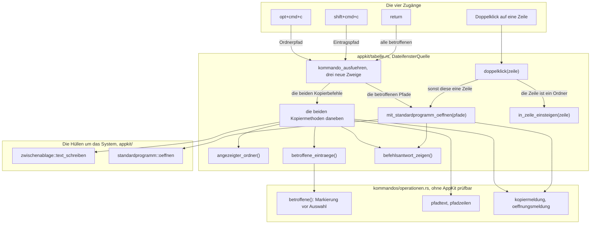
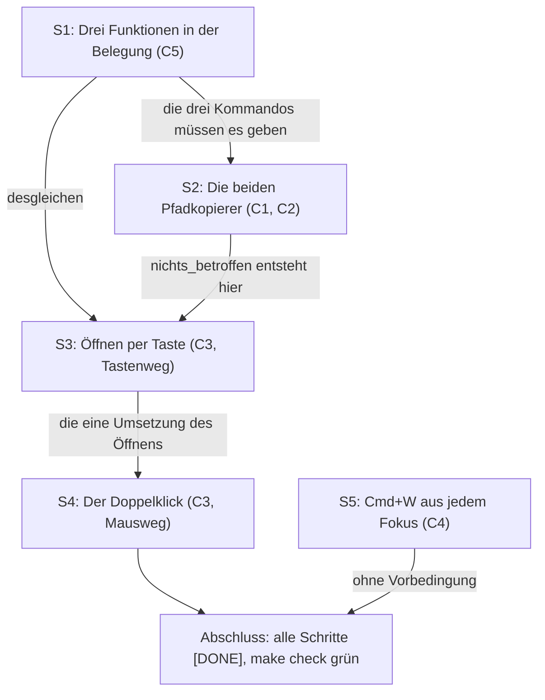

# Umsetzungsplan: Vier Tastenbefehle für Pfade, das Öffnen und Cmd+W (Runde 4)

**Datum:** 2026-08-11, 16:48
**Status:** Vom Nutzer abgenommen am 260811-1710, mit einer Auflage, die am 260811-1721 nachgezogen ist: die fehlende Kante `S2 → S3` im Schrittgraphen samt der Prosastellen, die sie nennen, und sechs Datenflusskanten des Aufbaubildes, die eine vom Plan ausgeschlossene Abhängigkeit behaupteten. Die Frage nach einer Nachfrage vor dem Öffnen vieler Einträge ist mit `decisions/260811-1648_*` beantwortet: keine Nachfrage. Bereit zur Umsetzung.
**Spec:** `circles/260811-1257-vier-tastenbefehle-pfade-kopieren-oeffnen/planning/260811-1552_o_spec-vier-tastenbefehle-pfade-kopieren-oeffnen.md`, fünf Fähigkeiten C1 bis C5 mit 60 Abnahmekriterien, dazu zwei unter `## Verhältnis zu den zehn Zeitzusagen aus C8 der Runde 1`; vom Nutzer am 260811-1610 abgenommen, Diagramm am 260811-1614 nachgezogen
**Bindende Entscheidungsdatensätze:** die sieben `_a_`-Datensätze unter `decisions/` dieses Circles, der siebte seit der Nutzerantwort vom 260811-1710 gegen eine Schwelle vor dem Öffnen; dazu aus der Runde 1 `circles/260802-0842-krk-mac-dateimanager-editor-git/decisions/260803-2025_*_wie-zeigt-krk-dem-nutzer-fehler.md` (die Statuszeile mit ihren fünf Rängen), `.../260805-0000_*_menuekuerzel-in-die-konflikterkennung-oder-daneben.md` (ein Menükürzel wäre zwingend ein Belegungseintrag), `.../260805-0713_*_ist-eine-kombination-bei-zwei-zustellern-ein-konflikt.md` und `.../260802-1134_*_sprache-und-ui-werkzeugkasten.md` (Rust mit AppKit über `objc2`, Untergrenze macOS 15)
**Ausführender Agent:** `coder`, für jeden der fünf Schritte. Die Begründung steht unten unter `## Warum jeder Schritt coder trägt`.

**Decidability:** Die tragende Frage dieser Runde lautet: **worauf wirkt ein Befehl, und ist diese Menge aus den Eingaben entscheidbar, die der Befehl hat?** Sie ist entscheidbar, und zwar ohne eine neue Regel. Die Menge liefert `betroffene()` (`crates/krk-ui/src/kommandos/operationen.rs:157`) aus dem Modell des sichtbaren Tabs, also aus einem Wert, der im Speicher steht; ob der Befehl hier überhaupt wirkt, beantwortet `fokus::wirkt` aus dem Wirkungsbereich und dem Fokus (`crates/krk-ui/src/kommandos/fokus.rs:329`); welche Zeile ein Doppelklick meint, beantwortet `clickedRow` aus dem Ereignis selbst. Keine dieser drei Antworten wird geschätzt.

**Eine benachbarte Frage ist dagegen nicht entscheidbar, und der Plan wechselt für sie den Mechanismus.** "Hat das System den Eintrag wirklich geöffnet" kann KRK nicht beantworten: `NSWorkspace` meldet synchron allein, ob es die Adresse **angenommen** hat, und ob das aufgelöste Programm danach startet, erfährt der Aufrufer nur über einen Rückruf auf einer beliebigen Schlange, den dieses Projekt in `appkit/terminal.rs:29-41` aus benannten Gründen leer lässt. Gefragt wird deshalb die kleinere, entscheidbare Frage: hat das System die Adresse angenommen. Die Meldung in der Statuszeile ist entsprechend formuliert und sagt nicht "geöffnet", wo sie "angenommen" meint. Aus demselben Grund trennt diese Runde den Fall "es gibt kein Standardprogramm" nicht vom Fall "das System hat abgelehnt": beide kommen als dasselbe `false` an, und eine Trennung wäre eine Vermutung mit zwei Texten.

---

## Wie dieser Plan auf Datensätze verweist

Dieselbe Regel wie in den drei Plänen davor: ein Verweis trägt an der Stelle des Zustandsmarkers eine Sternstelle. `decisions/260811-1258_*_was-kopiert-der-pfadkopierer-bei-stehender-markierung.md` bleibt damit richtig, wenn der Datensatz von beantwortet nach umgesetzt wandert. Ausgenommen sind die Verweise im Kopf oben, wo der Marker eine Aussage über den Stand ist.

## Directive

Nach dieser Runde legt KRK auf Tastendruck zwei Sorten von Pfaden in die Zwischenablage: den des angezeigten Ordners im aktiven Dateifenster und den der betroffenen Einträge. Ein Tastendruck gibt die betroffenen Einträge an das Standardprogramm des Systems, ein Doppelklick tut dasselbe für alles, was kein Ordner ist, und steigt in einen Ordner ein. Cmd+W schließt den aktiven Tab auch dann, wenn der Fokus nicht in einem Bereich mit Tabs steht. Der Wortlaut steht im Circle-Datensatz `_t_circle.md`, Abschnitt `## Directive`; der Spec zerlegt ihn in fünf Fähigkeiten. Dieser Plan wiederholt ihn nicht, sondern baut ihn.

## Ausgangslage

Der Spec hat den Bestand vor dem Entwurf am Code aufgenommen, dieser Plan hat ihn ein zweites Mal aufgenommen. Elf Befunde bestimmen den Zuschnitt der Schritte oder beantworten eine Frage, die der Spec dem Planner überlassen hat. Drei davon nehmen der Runde Arbeit ab, drei legen den Schnitt fest, und drei nennen eine Datei, die der Spec nicht führt.

### Befund 1: Alle drei neuen Befehle kommen ohne einen einzigen Zweig im Anwendungsdelegierten aus

Die naheliegende Bauform wäre die des Terminal-Befehls: ein Zweig in `Anwendungsdelegierter::kommando_ausfuehren` (`crates/krk-ui/src/appkit/anwendung.rs:2022`) und eine Methode daneben (`anwendung.rs:1252`). Sie wäre hier die falsche. Der Terminal-Befehl steht dort, weil er die Bündelkennung aus den Einstellungen braucht, und die hängt am Delegierten. Die drei Befehle dieser Runde brauchen nichts, was der Delegierte hält: den angezeigten Ordner liefert `angezeigter_ordner()` (`crates/krk-ui/src/appkit/tabelle.rs:469`), die betroffenen Einträge `betroffene_eintraege()` (`tabelle.rs:808`), und die Meldung setzt `befehlsantwort_zeigen()` (`tabelle.rs:1483`) — alle drei an der `DateifensterQuelle` selbst.

**Sie gehören deshalb in `DateifensterQuelle::kommando_ausfuehren` (`tabelle.rs:766-801`) und erreichen es über den bestehenden Weg.** Der Wirkungsbereich `Dateifenster` führt sie durch `fokus::wirkt` und danach durch `bereichskommando` (`anwendung.rs:2120`) an die aktive Fensterseite, also genau an das Dateifenster, dessen Ordner und dessen Einträge sie meinen. Das Abnahmekriterium von C1, das ausdrücklich `Fenstermodell::aktiv()` nennt, ist damit ohne eine eigene Zeile erfüllt: `bereichskommando` liest denselben Wert (`anwendung.rs:2151`).

Der Gewinn ist nicht Bequemlichkeit, sondern Nähe. Die drei Befehle stehen dann in derselben Datei wie die Regel, auf der sie arbeiten, und die 4662 Zeilen des Delegierten wachsen um keine Zeile. Der einzige Zweig, den diese Runde dort anlegt, gehört Cmd+W, und der gehört dorthin, weil er über die Bereiche hinweg entscheidet.

### Befund 2: Ein `pub` ohne Aufrufer macht `make check` rot, und das bestimmt den Schnitt der Schritte

`krk-ui` hat kein Bibliotheksziel (`crates/krk-ui/Cargo.toml`, allein `[[bin]] name = "krk"`). Eine `pub`-Funktion in einem Modul dieser Kiste ist damit nicht öffentlich, sondern unerreichbar, sobald kein Aufrufer im Binärziel sie nennt; `dead_code` ist eine Warnung, und `make lint` fährt `clippy --workspace --all-targets -- -D warnings`.

**Eine Hülle und ihr erster Aufrufer gehören deshalb in denselben Schritt.** Das gilt für `zwischenablage::text_schreiben` mit den beiden Kopierbefehlen (S2) und für `standardprogramm::oeffnen` mit dem Öffner (S3). Ein Zuschnitt, der erst die Hülle baute und dann den Befehl, ließe den Arbeitsbaum dazwischen rot stehen, und ein Schritt, nach dem die vier Abnahmekommandos scheitern, ist nicht abgenommen.

### Befund 3: Die zwei Zahlen im Kopf der Belegungsdatei sind von einer Probe gehalten

`die_zwei_zahlen_im_kopf_der_auslieferungsbelegung_stimmen_noch` (`crates/krk-core/src/tasten/belegung.rs:1281`) liest die Zahlen aus der Zeile, die mit `# Ausgeliefert sind` beginnt, und zählt die Datei dagegen. Wer drei Funktionen einträgt und die Zeile stehen lässt, bekommt einen roten Lauf mit einer Meldung, die genau sagt, was zu tun ist. Die Zeile steht heute in `resources/default-keymap.toml:33` und nennt 71 Funktionen mit 79 Kombinationen; nach dieser Runde sind es 74 mit 82.

Zwei weitere Zusicherungen derselben Sorte sind **nicht** von einer Probe gehalten und deshalb Handarbeit: die Länge im Typ von `Kommando::KENNUNGEN` (`belegung.rs:462`, heute `[(Kommando, &'static str); 65]`, künftig 68) hält der Übersetzer, und die vier Kommentarstellen in `crates/krk-ui/src/belegungsausgabe.rs`, die 71 Funktionen und 65 Kommandos nennen (Zeilen 45, 49, 256 und 677), hält niemand. Sie stehen in S1.

### Befund 4: Der Spec nennt zwei gebrochene Zusicherungen, im Baum sind es fünf

Der Spec führt den Modulkopf von `crates/krk-ui/src/appkit/zwischenablage.rs:42-44` und den Kommentar in `crates/krk-ui/src/appkit/blaetter/mod.rs:225-227`. Drei weitere Stellen sagen nach dieser Runde etwas Falsches zu, und alle drei sind am Baum gelesen:

1. **`resources/default-keymap.toml:52-56.** "Zwei Kombinationen bleiben ab Werk ausdrücklich frei und stehen deshalb in keiner Tastenliste: Umschalt+Entf und die Eingabetaste." Nach C3 steht die Eingabetaste in einer Tastenliste. Der Absatz gehört umgeschrieben, und zwar mit dem Verweis auf die Nutzerantwort vom 260811-1505, die sie belegt.
2. **`resources/default-keymap.toml:149-151.** "Dieselben vier Tabbefehle bedienen nach C6 auch die Tabs des Vorschaufensters; sie wirken auf den Bereich, der den Eingabefokus hat." Für `tab_schliessen` gilt der zweite Halbsatz nach C4 nicht mehr.
3. **`crates/krk-ui/src/appkit/tabelle.rs:1496-1502.** Der Doc-Kommentar von `befehlsantwort_loeschen` nennt sich "die einzige Löschregel dieses Feldes, gerufen von `Anwendungsdelegierter::kommando_ausfuehren` vor jedem Befehl". Der Doppelklick bekommt in S4 einen zweiten Aufruf; die Begründung dafür steht in Befund 9.

Dieselbe Prüfung ist für die Aussage "der Wert der vier Tabbefehle" nötig, die an mehreren Stellen steht. Gemessen falsch werden davon `belegung.rs:206` (Doc von `Wirkungsbereich::Tabbereich`), `belegung.rs:564-574` (Doc von `Kommando::wirkungsbereich`) und `belegung.rs:648-654` (der Kommentar am Zweig). Richtig bleiben die Stellen, die sagen, dass alle vier Tabbefehle die Vorschau-Tabs bedienen, denn das tun sie weiterhin: `vorschau.rs:48-52`, `vorschau.rs:314`, `anwendung.rs:2123` und `belegungsmodell.rs:80`. S5 nennt die Prüfung als Arbeit und nicht als Vermutung.

### Befund 5: `Auswahl` liefert bereits volle Pfade, und zwar in Sichtreihenfolge

`operationen::Auswahl` (`operationen.rs:129-150`) trägt `pfade: Vec<PathBuf>` und daneben die Zahl der Ordner. `betroffene()` füllt sie über `ordner.join(&eintrag.name)` in der Reihenfolge der sichtbaren Zeilen (`operationen.rs:157-186`). Der Pfadkopierer und der Öffner brauchen deshalb keine eigene Pfadarithmetik und keine zweite Schleife über das Modell; sie nehmen `auswahl.pfade` und geben es weiter. Fünf Abnahmekriterien von C2 (Vorrang der Markierung, Pfad unter der Auswahl, ausgeblendete Einträge, Sichtreihenfolge, Gleichbehandlung von Ordner und Datei) fallen damit als geerbte Eigenschaften an und nicht als neuer Code.

### Befund 6: Der angezeigte Ordner kann einen abschließenden Schrägstrich tragen

C1 sagt zu: "ein abschließender Schrägstrich steht nur beim Wurzelverzeichnis darin". Der Baum hält das heute nicht. `pfadeingabe::pruefen` übernimmt den eingegebenen Text wörtlich in den Ordner des Tabs (`crates/krk-ui/src/kommandos/pfadeingabe.rs:77-80`), und `krk_core::zwischenablage::deuten` tut dasselbe für einen aus der Zwischenablage gesprungenen Pfad (`crates/krk-core/src/zwischenablage.rs:68-69`). Wer `shift+cmd+g` drückt und `/Users/kai/` eingibt, hat danach einen Tab, dessen Ordner auf einen Schrägstrich endet; `Path::display` gibt ihn unverändert aus.

**Die Form entsteht deshalb dort, wo sie zugesagt ist, und nicht an der Quelle.** `pfadtext` in `kommandos/operationen.rs` schneidet abschließende Trenner ab und lässt die Wurzel unangetastet; beide Kopierbefehle gehen durch diese eine Funktion. Der Weg über die Quelle wäre der teurere und der falsche: er änderte die Identität des angezeigten Ordners, an der `gleicher_ordner` (`pfadeingabe.rs:105`), die Dateisystembeobachtung und die Lesezeichen hängen, und er löste ein Formproblem an einer Stelle, die keine Form zusagt.

Nicht aufgelöst wird der Pfad. `canonicalize()` kommt nicht vor: C1 verlangt ausdrücklich, dass ein zwischenzeitlich verschwundener Ordner trotzdem kopiert wird, und ein Aufruf, der das Dateisystem fragt, bräche dieses Kriterium und die Zusage "der Befehl kopiert, was auf dem Schirm steht".

### Befund 7: Die Tilde entsteht nur in einer Anzeigenfunktion, und der Kopierer ruft sie nicht

`ablage::pfade::gekuerzt_fuer_anzeige` (`crates/krk-core/src/ablage/pfade.rs:123`) ist die eine Stelle, die aus dem Benutzerverzeichnis eine Tilde macht; sie bedient seit der Runde 3 die Meldungen der Belegungsausgabe. Sonst führt KRK Pfade ausgeschrieben, und `pfadeingabe::pruefen` weist einen relativen Pfad ab (`pfadeingabe.rs:53-55`), womit ein eingegebenes `~/…` überhaupt nicht in einen Tab gelangt. Das Abnahmekriterium "eine Tilde steht nicht darin" ist damit erfüllt, sofern der neue Code diese Funktion nicht ruft. Der Plan verbietet den Aufruf ausdrücklich, und zwar auch für die Meldung in der Statuszeile: gemeldet wird der Pfad in genau der Form, in der er in der Zwischenablage steht, sonst zeigte die Zeile etwas anderes an, als der Nutzer gleich einfügt.

### Befund 8: Eine Probe darf die allgemeine Zwischenablage nicht beschreiben

`NSPasteboard::generalPasteboard()` ist die Zwischenablage des angemeldeten Nutzers. Eine Probe, die `text_schreiben` aufriefe, überschriebe bei jedem `make check` das, was der Entwickler gerade kopiert hat. Das ist kein theoretischer Preis, sondern ein Datenverlust auf einem Weg, den niemand erwartet.

**Die Schreibhülle bekommt deshalb keine Probe, und der Modulkopf sagt, warum.** Geprüft wird stattdessen alles, was ohne AppKit prüfbar ist: der zusammengesetzte Text, die Form der Pfade und die Meldungen. Das ist die Antwort auf den sechsten Punkt, den der Spec dem Planner überlässt, und sie ist zugleich die Grenze: dass `setString:forType:` den Text wirklich ablegt, prüft der Nutzer am gebauten Bündel mit einem Einfügen.

### Befund 9: Der Doppelklick trifft auf eine Löschregel, die nur Kommandos kennt

Die Antwort auf den vorigen Befehl steht im obersten Rang der Statuszeile und wird von `kommando_ausfuehren` vor jedem Befehl gelöscht (`anwendung.rs:2009-2011`). Ein Doppelklick ist kein Kommando und liefe an dieser Regel vorbei: Wer `shift+cmd+c` drückt, "7 Pfade kopiert" liest und danach in einen Ordner hineinklickt, sähe die alte Antwort über dem neuen Ordner stehen.

**Der Doppelklick löscht die Antwort deshalb an seinem einen Eingang**, und der Doc-Kommentar von `befehlsantwort_loeschen` nennt danach seine zwei Aufrufer statt seines einen. Das ist keine zweite Regel, sondern dieselbe: was KRK auf die letzte Handlung des Nutzers geantwortet hat, gilt bis zu seiner nächsten.

### Befund 10: `setTarget:` an einer `NSTableView` ist die eine Stelle, an der ein Haltering entstehen könnte

Die Tabelle gehört der `DateifensterQuelle` (`tabelle.rs:1922`, das Feld `tabelle` in den Ivars), der Delegierte hält die Quelle stark (`DelegiertenIvars.quelle`, `tabelle.rs:1631`). Ein **starker** Verweis von der Tabelle auf den Delegierten schlösse damit den Ring Quelle → Tabelle → Ziel → Delegierter → Quelle, und keines der drei Objekte fiele je.

`inference:` `NSTableView` führt `target` wie `dataSource` und `delegate` als schwache Eigenschaft, und dann entsteht kein Ring. Der bestehende `SAFETY`-Block in `tabelle.rs:1924-1933` belegt genau diese Eigenschaft für die beiden anderen Felder und nennt dafür die erzeugte Zeile der Bindung. **S4 belegt sie für `target` auf demselben Weg oder baut den Umweg**, der ohne sie nötig wäre: ein kleines Zielobjekt, das die Quelle als `objc2::rc::Weak` hält, nach dem Vorbild des Rückrufs der Tableiste (`tabelle.rs:1942-1948`). Der Schritt hängt an dieser Frage nicht, er beantwortet sie.

### Befund 11: Fünf Belegstellen der Runde 3 zeigen, dass drei neue Funktionen ohne Zutun in der Ausgabe erscheinen

Die Tastenbelegung als Markdown zählt, was die Belegung führt, und verdrahtet keine Zahl (`belegungsausgabe.rs`, `markdown`). Die dritte Spalte liest `Kommando::wirkungsbereich().beschriftung()` ab (`belegungsausgabe.rs:262`). Drei neue Funktionen mit Wirkungsbereich `Dateifenster` erscheinen deshalb mit der Beschriftung "Dateifenster", ohne dass an der Ausgabe etwas zu ändern wäre. Das Abnahmekriterium von C5 ist damit am Bau erfüllt; was bleibt, sind die vier Kommentarstellen aus Befund 3, die eine Zahl nennen.

## Antworten auf die acht Punkte, die der Spec dem Planner überlässt

### Frage 1: Wo die Schreibseite der Zwischenablage wohnt

**In `crates/krk-ui/src/appkit/zwischenablage.rs`, als `pub fn text_schreiben(text: &str) -> bool`.** Der Spec sagt zu, dass es eine Hülle um `NSPasteboard` bleibt; die Datei ist diese Hülle, und ihr Modulkopf nennt als ihre Frage "was steht in der Zwischenablage, und wohin geht KRK damit". Die Frage wird um eine Richtung breiter und bleibt eine.

Der Rumpf ist drei Zeilen: `clearContents()`, dann `setString_forType` mit `NSPasteboardTypeString`. Der Aufruf von `clearContents` ist keine Vorsichtsmaßnahme, sondern Bedingung: ohne ihn nimmt `setString:forType:` den Text nicht an. Er ist zugleich das Abnahmekriterium von C1, dass ein zweiter Aufruf den Inhalt ersetzt und nichts anhängt.

### Frage 2: Wo das Öffnen mit dem Standardprogramm wohnt

**In einem neuen Modul `crates/krk-ui/src/appkit/standardprogramm.rs`.** Beide bestehenden Hüllen begründen ihren Zuschnitt mit der Frage, die sie beantworten, und keine der beiden Fragen ist diese. `zwischenablage.rs` beantwortet, was in der Zwischenablage steht; ein Öffnen, das die Zwischenablage nicht anfasst, gäbe ihr eine zweite. `terminal.rs` beantwortet, wie eine **benannte** Anwendung einen Ordner bekommt, und ein Standardprogramm ist keine benannte; sein Modulkopf sagt genau das über sich selbst (`terminal.rs:9-16`). Ein drittes Modul folgt derselben Regel wie das zweite, statt sie zu verletzen.

Der Modulkopf nennt drei Dinge: die eine Frage, die Abgrenzung gegen die beiden Nachbarn, und die Untergrenze der angesprochenen Klassen. `NSWorkspace`, `NSURL` und `NSString` stehen seit macOS 10.0 zur Verfügung, `openURL:` ebenso; das Bündel zielt auf 15.0. Die Nennung ist die Gegenmaßnahme dagegen, dass `objc2` keine Verfügbarkeitsangaben mitführt, und `appkit/menue.rs:135-146` macht die Form vor.

### Frage 3: Welcher `NSWorkspace`-Aufruf, und ob er die Einträge einzeln übergibt

**`NSWorkspace::openURL:` je Eintrag, in einer Schleife des Aufrufers.** Drei Gründe. Erstens ist es derselbe Aufruf, den `im_browser_oeffnen` (`zwischenablage.rs:133`) seit der Runde 1 benutzt, also der einzige der drei `NSWorkspace`-Berührungen im Haus, der einen Ort ohne benannte Anwendung übergibt. Zweitens liefert er synchron ein `bool` und beantwortet damit die eine Frage, die überhaupt entscheidbar ist: hat das System die Adresse angenommen. Drittens ist er je Eintrag verschieden zu beantworten — fünf markierte Dateien können zu fünf verschiedenen Programmen gehören, und eine Sammelübergabe an ein einzelnes Programm wäre genau das "Öffnen mit", das der Spec ausschließt.

Die Hülle nimmt deshalb einen Pfad und nicht eine Liste: `pub fn oeffnen(pfad: &Path) -> bool`. Die Mehrzahl gehört dem Aufrufer, der ohnehin zählen muss, was gescheitert ist.

### Frage 4: Wo die Verzweigung des Doppelklicks wohnt und wie die Tabelle ihn meldet

**Über `setDoubleAction:` am Delegierten, verzweigt in `DateifensterQuelle::doppelklick(zeile)`.** Der Delegierte trägt bereits eine eigene Aktionsmethode (`umbenennungBeendet:`, `tabelle.rs:1669-1672`); die zweite steht daneben und reicht wie die erste an die Quelle weiter. `NSTableView` liefert die angeklickte Zeile über `clickedRow`, und damit ist das Abnahmekriterium "wirkt auf die angeklickte Zeile und nicht auf die Markierung" aus einer entschiedenen Größe abgelesen. Ein `clickedRow` von −1 ist der Klick unterhalb der letzten Zeile und führt zu nichts.

**Eine zweite Umsetzung des Öffnens entsteht nicht, und eine zweite des Einstiegs auch nicht.** Der Einstieg in einen Ordner wird aus `auswahl_oeffnen` (`tabelle.rs:955-970`) als `in_zeile_einsteigen(zeile) -> bool` herausgezogen; `auswahl_oeffnen` ruft es mit `selectedRow`, der Doppelklick mit `clickedRow`. Liefert es `false`, war die Zeile kein Ordner, und der Doppelklick übergibt genau diesen einen Pfad an `mit_standardprogramm_oeffnen`, dieselbe Methode, die `return` mit der ganzen Menge aus `betroffene()` ruft. Damit gilt, was der Spec zusagt: eine Umsetzung, zwei Zugänge, und der Unterschied liegt allein in der Menge, die sie übergeben.

### Frage 5: Wo die Verzweigung von Cmd+W nach dem Fokus wohnt

**In einer Funktion `Anwendungsdelegierter::tab_schliessen(fokus)`, gerufen aus einem einzigen neuen Zweig in `kommando_ausfuehren`.** Sie hat zwei Ausgänge und ist über die fünf Fokuswerte vollständig und überschneidungsfrei:

- `Fokus::Dateifenster` und `Fokus::Vorschau` gehen an `bereichskommando`, also an den Bereich vor dem Nutzer. Das ist die Zuordnung aus C6 der Runde 1, und C4 sagt ausdrücklich zu, dass sie für diese beiden gültig bleibt.
- `Fokus::Leiste`, `Fokus::Editor` und `Fokus::Anderswo` gehen an den sichtbaren Tab der aktiven Fensterseite. Für die ersten beiden ist das die bestellte Lücke; `Anderswo` steht bei ihnen, weil es kein Bereich mit Tabs ist und "der Bereich vor dem Nutzer" dort keine Antwort hat, während die aktive Fensterseite immer eine ist.

Der Wert `Anderswo` ist dabei nach Lage der Dinge nicht erreichbar: ein stehendes Blatt hält das Kommando schon vorher an (`anwendung.rs:1986`), und mit der Schreibmarke in einem Textfeld reicht der Ereignisabgriff den Tastendruck an AppKit weiter, bevor er nachschlägt. Der Zweig steht trotzdem ausgeschrieben, weil eine Fallunterscheidung, die einen Fall nicht kennt, ihn beim ersten Auftreten falsch beantwortet.

### Frage 6: Wie viel der drei Befehle ohne AppKit prüfbar ist

**Der ganze Textteil, und er wandert dafür nach `crates/krk-ui/src/kommandos/operationen.rs`.** Das Verzeichnis `kommandos` nennt keine `objc2`-Kiste, und `terminalordner_fehlt` (`operationen.rs:726`) und `kein_terminal` (`operationen.rs:751`) machen vor, dass die Meldungstexte eines Befehls dort wohnen. Fünf kleine Funktionen kommen dazu:

| Funktion | Antwort |
|---|---|
| `pfadtext(&Path) -> String` | ein Pfad ausgeschrieben, ohne abschließenden Trenner außer bei der Wurzel |
| `pfadzeilen(&[PathBuf]) -> String` | ein Pfad je Zeile, durch `\n` getrennt, ohne Schlusszeilenumbruch |
| `kopiermeldung(&[PathBuf]) -> String` | bei einem Pfad dieser Pfad, bei mehreren ihre Zahl |
| `oeffnungsmeldung(&[PathBuf], &[PathBuf]) -> String` | was angenommen wurde und was nicht; bei einem Eintrag sein **Name**, bei mehreren ihre Zahl |
| `nichts_betroffen() -> String` | der Text für den leeren Ordner, gemeinsam für beide Befehle |

Nicht prüfbar bleiben drei Berührungen mit dem System: das Schreiben in die Zwischenablage, die Übergabe an `NSWorkspace` und die Zustellung des Doppelklicks. Alle drei sind wenige Zeilen und stehen unter `appkit/`.

### Frage 7: Wie die Meldungen der Statuszeile lauten

Vorgeschlagen, und jede eine Zeichenkette, die zu ändern eine Zeile kostet:

| Anlass | Text |
|---|---|
| ein Pfad kopiert | `Pfad kopiert: /Users/kai/Projekte` |
| mehrere Pfade kopiert | `7 Pfade kopiert` |
| nichts markiert und nichts ausgewählt | `nichts zu kopieren: der Ordner ist leer` |
| die Zwischenablage nimmt nicht an | `die Zwischenablage hat den Pfad nicht angenommen` |
| ein Eintrag angenommen | `an das System übergeben: Bericht.pdf` |
| mehrere angenommen | `7 Einträge an das System übergeben` |
| einer abgewiesen | `das System hat Bericht.pdf nicht angenommen` |
| mehrere abgewiesen | `das System hat 3 von 7 Einträgen nicht angenommen` |
| nichts zu öffnen | `nichts zu öffnen: der Ordner ist leer` |

Die Formulierung "an das System übergeben" statt "geöffnet" ist keine Umständlichkeit, sondern die Zeile aus dem Kopf dieses Plans: KRK weiß, dass die Adresse angenommen wurde, und nicht, dass ein Programm sie zeigt.

### Frage 8: Ob "nicht angenommen" von "kein Standardprogramm" getrennt wird

**Nein.** `openURL:` liefert `false` für beide Lagen und nennt keinen Grund. Eine Trennung müsste raten, welche der beiden vorlag, und der Spec verlangt eine Meldung und nicht ihre Zerlegung. Der Text nennt deshalb den Eintrag und die Tatsache, nicht die Ursache.

## Aufbau

Das erste Bild zeigt, wo die neuen Teile wohnen und wer wen ruft. **Jede Kante ist ein Aufruf und keine ein Datenfluss**: sie zeigt vom Rufer auf den Gerufenen, und Rufer ist überall die `DateifensterQuelle`. Vier Zugänge münden deshalb in die Quelle, und die Quelle ruft von dort aus die beiden Hüllen um das System und die Schicht ohne AppKit, in der Text und Meldung entstehen. Die drei Knoten dieser Schicht tragen keine ausgehende Kante, und damit steht die Zusage aus Frage 6 als Struktur im Bild: `kommandos/` ruft nichts unter `appkit/`.

Das zweite Bild zeigt die Reihenfolge der Schritte. Vier Kanten tragen eine echte Abhängigkeit: S1 legt die drei Kommandos an, ohne die weder S2 noch S3 einen Zweig hat; S2 legt `nichts_betroffen` an, das S3 bei leerer Menge ruft; S3 legt die eine Umsetzung des Öffnens an, die S4 mit der angeklickten Zeile ruft. S5 hängt an keinem der vier anderen Schritte und kann zu jedem Zeitpunkt der Runde laufen; im Bild steht es deshalb neben der Kette S1 bis S4 statt in ihr.

Die Kante `S2 --> AB` aus der vorigen Fassung ist mit `S2 --> S3` weggefallen: S2 erreicht den Abschluss seither über S3 und S4, und eine zusätzliche Abkürzung dorthin sagte nichts, was der Graph nicht schon trägt.

## Implementierungsschritte

Jeder Schritt nennt seinen Ausführer, jede Datei, die er anfasst, seine Änderungen, seine Abhängigkeiten und ein Abnahmekriterium, das an einem Diff oder an einem Kommando prüfbar ist. **Jeder der fünf Schritte baut für sich und ist für sich prüfbar**; nach jedem sind die vier Abnahmekommandos grün.

Die Prüfkommandos lauten `make check`, ersatzweise `make build`, `make test`, `make lint`, `make fmt`. Wer `cargo` unmittelbar ruft, stellt `export PATH="$HOME/.cargo/bin:$PATH"` voran: `cargo` liegt auf diesem Gerät nicht auf dem Standard-PATH.

Eine Datei, die ein Schritt **lesend** nennt, wird nicht geändert; eine mit dem Vermerk **nicht anfassen** trägt eine Zusage, die der Schritt einhält.

### 1. [DONE] Drei Funktionen in der Belegung, an vier Stellen nachgetragen

- Ausführender: `coder`
- Dateien:
  - `resources/default-keymap.toml` (erweitert: drei Blöcke `[[funktion]]` in einem eigenen Abschnitt, die Zahlen in Zeile 33 von 71 auf 74 und von 79 auf 82)
  - `crates/krk-core/src/tasten/belegung.rs` (erweitert: drei Varianten in `Kommando` hinter `TerminalOeffnen`, drei Paare in `KENNUNGEN` samt Länge 65 → 68 in der Signatur bei Zeile 462, drei Namen im Zweig `Wirkungsbereich::Dateifenster` bei Zeile 690)
  - `crates/krk-ui/src/belegungsmodell.rs` (erweitert: drei Namen im Zweig `Funktionsbereich::Dateioperationen` bei Zeile 203)
  - `crates/krk-ui/src/belegungsausgabe.rs` (erweitert: die vier Kommentarstellen mit den Zahlen 71 und 65 in den Zeilen 45, 49, 256 und 677)
  - `crates/krk-core/tests/belegung.rs` (lesend: `jede_kennung_der_kommandos_steht_in_der_auslieferungsbelegung` und `jedes_kommando_traegt_genau_einen_wirkungsbereich` laufen unverändert mit)
  - `crates/krk-ui/src/appkit/menue.rs` (**nicht anfassen**: keine der drei Funktionen bekommt ein Menükürzel, damit das Hauptmenü nicht wächst)
- Änderungen: Die drei Einträge der Auslieferungsbelegung lauten `ordnerpfad_kopieren` auf `opt+cmd+c` mit dem Namen "Pfad des angezeigten Ordners kopieren", `eintragspfad_kopieren` auf `shift+cmd+c` mit "Pfad des Eintrags kopieren" und `mit_standardprogramm_oeffnen` auf `return` mit "Mit dem Standardprogramm öffnen". Keiner trägt `reserviert_fuer` oder `gehalten_von`. Sie stehen unter einer eigenen Abschnittsüberschrift nach dem Vorbild des C11-Blocks (`resources/default-keymap.toml:455-460`); der Kommentar nennt die Nutzerantwort vom 260811-1505 und, für `shift+cmd+c`, das Vorbild ForkLift sowie, für `opt+cmd+c`, den angenommenen Preis, dass der Finder dieselbe Kombination auf den Eintrag statt auf den Ordner legt.

  Die Varianten heißen `OrdnerpfadKopieren`, `EintragspfadKopieren` und `MitStandardprogrammOeffnen`. Alle drei tragen `Wirkungsbereich::Dateifenster` und `Funktionsbereich::Dateioperationen`; beide Zweige bekommen je drei Zeilen und keinen `_`-Zweig. Der Doc-Kommentar jeder Variante nennt die Fähigkeit, aus der sie stammt, wie es die 65 bestehenden tun.

  **Die drei Befehle tun nach diesem Schritt noch nichts.** Das ist gewollt und übersetzt: `DateifensterQuelle::kommando_ausfuehren` (`tabelle.rs:798`) hat einen Auffangzweig, der ein nicht behandeltes Kommando mit `false` beantwortet, und der Tastendruck läuft dann unverändert an AppKit weiter, wie bei jeder unbelegten Taste. Die Aufzählung `Wirkungsbereich` wächst nicht.
- Abhängigkeiten: keine
- Abnahmekriterium: `make check` ist grün. `die_zwei_zahlen_im_kopf_der_auslieferungsbelegung_stimmen_noch` läuft durch, was belegt, dass Kopf und Datei 74 Funktionen und 82 Kombinationen führen. `jede_kennung_der_kommandos_steht_in_der_auslieferungsbelegung` läuft durch, was die Brücke zwischen den drei neuen Varianten und den drei neuen Einträgen belegt. `make tasten` meldet für `return`, `shift+cmd+c` und `opt+cmd+c` keinen Konflikt. Die Belegungsansicht führt die drei unter "Dateioperationen"; `grep -c '_ =>'` über die beiden geänderten Fallunterscheidungen liefert 0.

### 2. [DONE] Die beiden Pfadkopierer und die Schreibseite der Zwischenablage

- Ausführender: `coder`
- Dateien:
  - `crates/krk-ui/src/appkit/zwischenablage.rs` (erweitert: `text_schreiben`; umgeschrieben: der Modulkopf, das Bild in den Zeilen 4-9 und die Zusicherung in den Zeilen 42-44; neu im Kopf: die Untergrenze der angesprochenen Klassen)
  - `crates/krk-ui/src/kommandos/operationen.rs` (erweitert: `pfadtext`, `pfadzeilen`, `kopiermeldung`, `nichts_betroffen`, dazu ihre Proben im `#[cfg(test)]`-Modul ab Zeile 759)
  - `crates/krk-ui/src/appkit/tabelle.rs` (erweitert: zwei Zweige in `kommando_ausfuehren` bei Zeile 766 und zwei private Methoden daneben)
  - `crates/krk-core/src/ablage/pfade.rs` (**nicht anfassen**: `gekuerzt_fuer_anzeige` wird von diesem Weg nicht gerufen, siehe Befund 7)
  - `crates/krk-ui/src/kommandos/pfadeingabe.rs` (lesend: die Quelle des abschließenden Schrägstrichs, Befund 6)
- Änderungen: **a) Die Hülle.** `pub fn text_schreiben(text: &str) -> bool` ruft `NSPasteboard::generalPasteboard()`, danach `clearContents()` und `setString_forType` mit `NSPasteboardTypeString`. Der Rückgabewert ist die Antwort des Systems. Der Modulkopf wird an drei Stellen nachgezogen: das Bild bekommt den Schreibweg, die beiden Sätze über "KRK schreibt die Zwischenablage in keinem Fall" werden durch die Lage nach dieser Runde ersetzt, und ein neuer Abschnitt nennt die Untergrenze (`NSPasteboard` seit macOS 10.0, `clearContents` und `setString:forType:` seit 10.6, Ziel des Bündels ist 15.0). Der neue Text sagt auch, was weiterhin **nicht** geschrieben wird: kein Dateiverweis, kein `writeObjects:`, entschieden am 260811-1610 (`decisions/260811-1552_*_welche-sorten-legt-der-pfadkopierer-in-die-zwischenablage.md`), und er nennt den Grund aus Befund 8, aus dem die Funktion keine Probe trägt.

  **b) Die Textseite, ohne AppKit.** `pfadtext` gibt einen Pfad über `display()` aus und schneidet abschließende Trenner ab, außer der Pfad besteht aus einem. `pfadzeilen` setzt mehrere über `\n` zusammen, ohne Schlusszeilenumbruch. `kopiermeldung` nennt bei einem Pfad diesen Pfad und bei mehreren ihre Zahl. `nichts_betroffen` liefert den Text für den leeren Ordner. Die Proben decken ab: die Wurzel bleibt `/`, ein Pfad mit abschließendem Schrägstrich verliert ihn, ein Pfad ohne behält seine Form, eine Zeile trägt keinen Umbruch am Ende, drei Zeilen tragen zwei Umbrüche, und die Meldung wechselt bei zwei Pfaden von Pfad auf Zahl.

  **c) Die beiden Befehle.** `Kommando::OrdnerpfadKopieren` nimmt `angezeigter_ordner()`, gibt `pfadtext` an `text_schreiben` und meldet. `Kommando::EintragspfadKopieren` nimmt `betroffene_eintraege()`; ist die Menge leer, bleibt die Zwischenablage unberührt und die Statuszeile trägt `nichts_betroffen()`, sonst geht `pfadzeilen` an `text_schreiben` und `kopiermeldung` in die Zeile. Nimmt die Zwischenablage den Text nicht an, sagt die Meldung das. Beide Zweige laufen in den bestehenden Rückgabewert `true`, denn der Befehl war zuständig, auch wenn er nur etwas zu melden hatte.
- Abhängigkeiten: S1
- Abnahmekriterium: `make check` ist grün. Die neuen Proben in `operationen.rs` halten die sechs Fälle aus b) fest. `grep -n "setString\|writeObjects\|clearContents" crates/krk-ui/src/appkit/zwischenablage.rs` findet `setString` und `clearContents` und **nicht** `writeObjects`. `grep -rn "gekuerzt_fuer_anzeige" crates/krk-ui/src/appkit/tabelle.rs crates/krk-ui/src/kommandos/operationen.rs` liefert nichts. Der Modulkopf von `zwischenablage.rs` enthält den Satz über das Schreiben nicht mehr. Was am gebauten Bündel zu sehen ist, steht unten unter `## Was am gebauten Bündel zu prüfen ist`.

### 3. [DONE] Öffnen mit dem Standardprogramm auf der Eingabetaste

- Ausführender: `coder`
- Dateien:
  - `crates/krk-ui/src/appkit/standardprogramm.rs` (**neu**: das ganze Modul, rund 40 Zeilen samt Kopf)
  - `crates/krk-ui/src/appkit/mod.rs` (erweitert: `mod standardprogramm;`)
  - `crates/krk-ui/src/kommandos/operationen.rs` (erweitert: `oeffnungsmeldung` samt Proben)
  - `crates/krk-ui/src/appkit/tabelle.rs` (erweitert: ein Zweig in `kommando_ausfuehren` und die Methode `mit_standardprogramm_oeffnen(&self, pfade: &[PathBuf]) -> bool`)
  - `crates/krk-ui/src/appkit/blaetter/mod.rs` (umgeschrieben: die Zusicherung in den Zeilen 225-227)
  - `resources/default-keymap.toml` (umgeschrieben: der Absatz in den Zeilen 52-56 über die frei bleibende Eingabetaste, Befund 4)
  - `crates/krk-ui/src/appkit/terminal.rs` (lesend: die Vorlage für Zuschnitt und Kopf einer Systemhülle)
  - `crates/krk-ui/src/appkit/ereignisse.rs` (**nicht anfassen**: der Ereignisabgriff bleibt unberührt, es entsteht keine zweite bedienbare Textfläche)
  - `crates/krk-ui/src/kommandos/operationen.rs`, Funktion `waehrend_blatt_erlaubt` bei Zeile 208 (**nicht anfassen**: sie bleibt die Ein-Zeilen-Regel, und `return` kommt bei stehendem Blatt nicht durch)
- Änderungen: **a) Die Hülle.** `pub fn oeffnen(pfad: &Path) -> bool` baut ein `NSURL::fileURLWithPath` und ruft `NSWorkspace::sharedWorkspace().openURL(&url)`. Der Modulkopf trägt das Bild des Weges, die Abgrenzung gegen `zwischenablage.rs` und `terminal.rs` mit je einem Satz, die Untergrenze der drei Klassen und den Satz aus dem Kopf dieses Plans darüber, was `true` bedeutet und was nicht.

  **b) Die Meldung.** `oeffnungsmeldung(uebergeben, abgewiesen)` nennt bei einem angenommenen Eintrag seinen **Namen**, bei mehreren ihre Zahl, und hängt den abgewiesenen Teil an, sofern es einen gibt. Der Name kommt aus `file_name()`; fehlt er, steht der Pfad. Die Proben halten vier Fälle fest: einer angenommen, mehrere angenommen, einer abgewiesen, ein Teil abgewiesen.

  **c) Der Befehl.** `mit_standardprogramm_oeffnen` ist die eine Umsetzung: bei leerer Menge meldet sie `nichts_betroffen()` und tut sonst nichts; andernfalls ruft sie `standardprogramm::oeffnen` für jeden Pfad, sammelt die abgewiesenen und setzt die Meldung. Der Zweig in `kommando_ausfuehren` gibt ihr `betroffene_eintraege().pfade`. Der Typ des Eintrags wird nicht geprüft: die Taste verzweigt nicht, und ein Ordner geht damit an das System und öffnet sich im Finder.

  **d) Die zwei Kommentare.** In `blaetter/mod.rs` tritt an die Stelle von "`resources/default-keymap.toml` belegt weder die Eingabetaste noch eine ihrer Kombinationen" die Begründung, die nach dieser Runde trägt: die Datei belegt die Eingabetaste seit dem 260811, das Verhalten der Vorgabeschaltfläche bleibt trotzdem richtig, weil `kommando_ausfuehren` bei stehendem Blatt jeden Befehl außer dem Abbruch abweist und der Tastendruck danach unverändert an AppKit weiterläuft. In `default-keymap.toml` bleibt Umschalt+Entf als einzige ab Werk frei gehaltene Kombination stehen; der Satz über die Eingabetaste wird zur Geschichte ihrer Belegung.
- Abhängigkeiten: S1 und S2. S1 legt die drei Kommandos an, ohne die dieser Schritt keinen Zweig hat. S2 legt `nichts_betroffen` an, und `mit_standardprogramm_oeffnen` ruft es bei leerer Menge; im Baum gibt es die Funktion heute nicht. Eine Reihenfolge, die S3 vor S2 zieht, endet deshalb mit einem roten `make check` und verletzt die Zusage über den Schritten.
- Abnahmekriterium: `make check` ist grün. `grep -rn "NSWorkspace" crates/krk-ui/src` findet vier Stellen: `volumes.rs`, `terminal.rs`, `zwischenablage.rs` und das neue Modul. Die Proben zu `oeffnungsmeldung` halten die vier Fälle fest. Weder `blaetter/mod.rs` noch der Kopf von `default-keymap.toml` behauptet noch, die Eingabetaste sei unbelegt. `waehrend_blatt_erlaubt` ist unverändert eine Zeile. Was am gebauten Bündel zu prüfen ist, steht unten.

### 4. [DONE] Der Doppelklick auf eine Zeile des Dateifensters

- Ausführender: `coder`
- Dateien:
  - `crates/krk-ui/src/appkit/tabelle.rs` (erweitert: `setTarget:` und `setDoubleAction:` in `Dateifenster::bauen` bei Zeile 1892 samt `SAFETY`-Begründung; eine Aktionsmethode `doppelklick:` im `define_class!`-Block des Delegierten bei Zeile 1662; `DateifensterQuelle::doppelklick(zeile)`; `in_zeile_einsteigen(zeile) -> bool`, aus `auswahl_oeffnen` bei Zeile 955 herausgezogen; umgeschrieben: der Doc-Kommentar von `befehlsantwort_loeschen` bei Zeile 1496)
  - `crates/krk-ui/src/appkit/leiste.rs` (**nicht anfassen**: die Leiste bekommt keine Doppelklick-Behandlung)
  - `crates/krk-ui/src/appkit/vorschau.rs` (**nicht anfassen**: dasselbe für die Vorschau)
  - `resources/default-keymap.toml` (**nicht anfassen**: der Doppelklick ist keine Tastenbelegung und bekommt keinen Eintrag)
  - `crates/krk-core/src/tasten/belegung.rs` (**nicht anfassen**: die Aufzählung `Kommando` wächst in diesem Schritt nicht)
- Änderungen: **a) Die Zustellung.** `Dateifenster::bauen` setzt Ziel und Doppelklick-Aktion auf den Delegierten, unmittelbar neben der bestehenden Zuweisung von Datenquelle und Delegiertem. Der `SAFETY`-Block daneben beantwortet die Frage aus Befund 10 und zitiert dafür die erzeugte Zeile der Bindung, so wie der bestehende Block es für `dataSource` und `delegate` tut. Ergibt die Prüfung, dass `target` **nicht** schwach geführt wird, tritt ein kleines Zielobjekt dazwischen, das die Quelle als `objc2::rc::Weak` hält; der Ring bleibt in beiden Fällen offen, und welcher Fall vorlag, steht im Kommentar.

  **b) Die Verzweigung.** `doppelklick(zeile)` löscht zuerst die Antwort auf den vorigen Befehl (Befund 9), verwirft eine Zeile kleiner als null und ruft dann `in_zeile_einsteigen`. Liefert es `true`, war die Zeile ein Ordner und der Einstieg ist geschehen. Liefert es `false`, holt die Methode den Pfad genau dieser Zeile und übergibt ihn als einelementige Menge an `mit_standardprogramm_oeffnen`. Eine symbolische Verknüpfung ist nach `Typ::Verknuepfung` (`crates/krk-core/src/verzeichnis/eintrag.rs:24`) kein Ordner und geht damit an das System, ohne dass es dafür einen eigenen Zweig bräuchte.

  **c) Der gemeinsame Absteiger.** `in_zeile_einsteigen(zeile)` trägt den Rumpf, der heute in `auswahl_oeffnen` steht: Eintrag holen, auf `ist_ordner()` prüfen, `ordner_lesen` rufen, und melden, ob es ein Ordner war. `auswahl_oeffnen` ruft es mit `selectedRow` und bleibt damit unverändert das, was es ist: der Einstieg auf dem Rechts-Pfeil, der auf einer Datei nichts auslöst.
- Abhängigkeiten: S3, weil `mit_standardprogramm_oeffnen` dort entsteht
- Abnahmekriterium: `make check` ist grün. `grep -n "setDoubleAction\|clickedRow" crates/krk-ui/src/appkit/tabelle.rs` findet je eine Stelle, `grep -rn "setDoubleAction" crates/krk-ui/src/appkit/leiste.rs crates/krk-ui/src/appkit/vorschau.rs` findet keine. `resources/default-keymap.toml` führt unverändert 74 Funktionen, die Aufzählung `Kommando` unverändert 68 Varianten. Der Rumpf des Einstiegs steht genau einmal im Baum, und `NSWorkspace::openURL` wird von genau einer Methode dieser Datei gerufen. Was am gebauten Bündel zu prüfen ist, steht unten.

### 5. [DONE] Cmd+W schließt den aktiven Tab aus jedem Fokus

- Ausführender: `coder`
- Dateien:
  - `crates/krk-core/src/tasten/belegung.rs` (geändert: `Kommando::TabSchliessen` bekommt in `wirkungsbereich` einen eigenen Zweig mit `Wirkungsbereich::Ueberall` und dem Grund als Kommentar; nachgezogen: der Doc-Kommentar von `Wirkungsbereich::Tabbereich` bei Zeile 206, die Übersicht der sechs Gruppen bei Zeile 564-574 und der Kommentar am Tab-Zweig bei Zeile 648)
  - `crates/krk-ui/src/appkit/anwendung.rs` (erweitert: ein Zweig `Kommando::TabSchliessen` in `kommando_ausfuehren` vor dem Auffangzweig bei Zeile 2097 und die Methode `tab_schliessen(fokus)` daneben)
  - `crates/krk-ui/src/kommandos/fokus.rs` (geändert: die Probe `ein_tabbefehl_wirkt_in_beiden_bereichen_mit_tabs` bei Zeile 452-476, die heute für alle vier Tabbefehle `Tabbereich` zusichert; nachgezogen: der Doc-Kommentar bei Zeile 84-87, sofern er den Wirkungsbereich aller vier nennt)
  - `resources/default-keymap.toml` (umgeschrieben: der Abschnittskommentar in den Zeilen 149-151; **nicht anfassen**: die Kombinationen selbst, `cmd+w` bleibt auf `tab_schliessen` und `shift+cmd+w` auf `fenster_schliessen`)
  - `crates/krk-ui/src/belegungsmodell.rs` (**nicht anfassen**: `TabSchliessen` bleibt im Funktionsbereich `Tabs`; der Funktionsbereich fragt nach der Gegend der Anwendung und nicht nach dem Fokus)
  - `crates/krk-ui/src/appkit/vorschau.rs` (lesend: `kommando_ausfuehren` bei Zeile 320 führt weiterhin alle vier Tabbefehle auf den Vorschau-Tabs aus)
  - `crates/krk-ui/src/appkit/belegungsansicht.rs` (**nicht anfassen**: die Belegungsansicht ist ein Blatt, und Cmd+W bleibt dort wirkungslos)
  - `crates/krk-ui/src/kommandos/operationen.rs`, `waehrend_blatt_erlaubt` (**nicht anfassen**: kein zweiter erlaubter Befehl)
- Änderungen: `TabSchliessen` verlässt den Zweig der vier Tabbefehle und bekommt `Wirkungsbereich::Ueberall`. Der Kommentar daneben nennt den Grund in zwei Sätzen: der Befehl schließt einen Tab und setzt deshalb keinen Bereich mit Tabs im Fokus voraus, sondern eine aktive Fensterseite, und die gibt es immer. Er nennt außerdem die Nutzerantwort vom 260811-1505 und den angenommenen Preis, dass Cmd+W bei stehendem Blatt weiterhin nicht durchkommt.

  `tab_schliessen(fokus)` ist die eine Verzweigung aus Frage 5. Für `Dateifenster` und `Vorschau` reicht sie an `bereichskommando` weiter, für `Leiste`, `Editor` und `Anderswo` ruft sie `tab_schliessen()` an der Quelle der aktiven Fensterseite. Der Editor wird dabei nicht angefasst: er behält seine Datei und seinen Stand, und ein vierter Anlass der Nachfrage aus C4 der Editor-Runde entsteht nicht.

  **Drei Kommentarstellen und eine Probe behaupten heute etwas, das danach falsch wäre.** Sie sind in den Dateien oben einzeln benannt. Wer sie sucht, findet sie über `grep -rn "vier Tabbefehle" crates resources` und `grep -rn "Tabbereich" crates`; zu ändern sind allein die Stellen, die den **Wirkungsbereich** aller vier behaupten, nicht die, die sagen, dass alle vier die Vorschau-Tabs bedienen — das tun sie weiterhin.
- Abhängigkeiten: keine
- Abnahmekriterium: `make check` ist grün. `Kommando::TabSchliessen.wirkungsbereich()` liefert `Wirkungsbereich::Ueberall`, und die geänderte Probe in `fokus.rs` sichert das für die verbliebenen drei Tabbefehle und für `TabSchliessen` getrennt zu. Die Aufzählung `Wirkungsbereich` trägt unverändert sieben Werte, `Wirkungsbereich::beschriftung` ist unverändert. `resources/default-keymap.toml` führt unverändert 74 Funktionen mit 82 Kombinationen; `cmd+w` steht unverändert bei `tab_schliessen`. `waehrend_blatt_erlaubt` ist unverändert eine Zeile. Was am gebauten Bündel zu prüfen ist, steht unten.

## Warum jeder Schritt coder trägt

Alle fünf Schritte ändern Rust-Quelltext, seine Proben oder Kommentare darin. Der einzige Grenzfall ist `resources/default-keymap.toml`: es ist eine TOML-Datei und läge damit dem Wortlaut nach bei `ontocoder`. Es gehört trotzdem zu `coder`, und der Grund ist die Bindung an den Übersetzer. Jede Zeile dieser Datei hat ihr Gegenstück in `Kommando::KENNUNGEN`, eine Probe hält beide zusammen, und wer eine Kennung einträgt, ohne die Aufzählung zu erweitern, bekommt einen roten Lauf. Die Datei ist damit nicht Datenbestand, sondern Quelltext in einem anderen Format, und sie in einen eigenen Schritt zu schneiden hieße, einen Schritt zu bauen, nach dem `make check` rot steht. Die drei Pläne davor haben sie aus demselben Grund bei `coder` geführt.

## Teststrategie

**Der Anteil ohne AppKit ist der größte, und er wächst mit dieser Runde.** Neu geprüft werden ohne Fenster: die Form eines Pfades samt Wurzel und abschließendem Trenner, die Zusammensetzung mehrerer Pfade zu einem Text, die drei Meldungen der Kopierbefehle und die vier des Öffners. Sie stehen im `#[cfg(test)]`-Modul von `crates/krk-ui/src/kommandos/operationen.rs`, neben den Proben zu `terminalordner_fehlt`, und brauchen weder Ordner noch Hauptfaden.

**Von den Proben mit Fenster kommt keine dazu.** Der Grund steht in Befund 8 für die Zwischenablage und gilt sinngemäß für `NSWorkspace`: eine Probe, die ein Programm startet, ist keine Probe. Der Doppelklick ließe sich an einer `NSTextView`-Instanz nicht prüfen, ohne den Hauptfaden zu behaupten, wie es die vier bestehenden Instanzproben tun; jene tragen dafür einen offenen Defekt (`circles/260807-2116-eingebauter-editor-mit-textmarken/issues/260810-1001_*_die-neuen-proben-behaupten-den-hauptfaden-den-libtest-ihnen-nicht-gibt.md`), und diese Runde vermehrt sie nicht.

**Vier bestehende Proben tragen die Runde mit und werden nicht angefasst**, außer der einen in S5: `jede_kennung_der_kommandos_steht_in_der_auslieferungsbelegung`, `die_zwei_zahlen_im_kopf_der_auslieferungsbelegung_stimmen_noch`, `jedes_kommando_traegt_genau_einen_wirkungsbereich` und `jede_kennung_hat_einen_funktionsbereich`. Zusammen decken sie ab, dass die drei neuen Funktionen an allen vier Stellen vollständig eingetragen sind. Der `Pruefordner` der Kiste (`crates/krk-ui/src/pruefordner.rs`) wird nicht gebraucht: keine der neuen Proben legt eine Datei an.

## Risiken und Gegenmaßnahmen

| Risiko | Gegenmaßnahme |
|---|---|
| Eine Probe schreibt in die Zwischenablage des Nutzers und wirft weg, was er kopiert hatte | Befund 8. `text_schreiben` bekommt keine Probe, und der Modulkopf nennt den Grund. Das Abnahmekriterium von S2 prüft den Text und nicht die Ablage. |
| Der Doppelklick schließt einen Haltering und keines der drei Objekte fällt je | Befund 10. S4 belegt die Eigenschaft an der erzeugten Zeile der Bindung oder legt das schwach haltende Zielobjekt dazwischen. Beide Wege stehen im Schritt. |
| Der kopierte Ordnerpfad endet auf einem Schrägstrich, und das Abnahmekriterium von C1 bricht | Befund 6. `pfadtext` ist die eine Stelle, die die Form herstellt, und ihre Probe hält die Wurzel und den Schrägstrich getrennt fest. |
| Der Kopierer meldet einen gekürzten Pfad, während er einen ausgeschriebenen ablegt | Befund 7. Der Aufruf von `gekuerzt_fuer_anzeige` ist auf diesem Weg verboten, und das Abnahmekriterium von S2 sucht ihn mit `grep`. |
| Eine der fünf gebrochenen Zusicherungen bleibt stehen und sagt die Lage von gestern zu | Befund 4 führt alle fünf mit Datei und Zeile, und jede steht in der Dateiliste des Schrittes, der sie bricht. |
| `return` erreicht die Vorgabeschaltfläche eines Blattes nicht mehr | Die Blattsperre steht **vor** dem Fokusvorbehalt (`anwendung.rs:1986`) und weist jeden Befehl außer dem Abbruch ab; ein abgewiesener Tastendruck läuft unverändert an AppKit weiter. S3 fasst `waehrend_blatt_erlaubt` nicht an. Die Gegenprobe am Bündel steht unten. |
| Cmd+W schließt mit dem Fokus im Editor die Datei statt des Tabs | S5 ruft `tab_schliessen()` an der Quelle des Dateifensters und fasst den Editor nicht an. Der Nutzer hat die dritte Möglichkeit des Datensatzes `260811-1257_*` ausdrücklich nicht gewählt. |
| Ein Befehl öffnet dreißig Programme auf einmal, und der Nutzer wollte einen Eintrag | Der Preis ist im Datensatz `260811-1612_*` benannt und vom Nutzer angenommen. Die Frage nach einer Schwelle ist seit dem 260811-1710 entschieden, und zwar gegen eine: **keine Nachfrage**, eine Regel statt einer ungemessenen Zahl (`decisions/260811-1648_*_fragt-krk-nach-bevor-return-viele-eintraege-oeffnet.md`). Dieser Plan baut damit keine Schwelle und lässt auch keine offen. |
| Die vier Kommentarstellen in `belegungsausgabe.rs` bleiben bei 71 und 65 stehen | S1 führt alle vier mit Zeilennummer in seiner Dateiliste. Sie halten keinen Bau an, und genau deshalb stehen sie dort namentlich. |

## Was am gebauten Bündel zu prüfen ist, und was keinem Schritt gehört

**Der Abnahmelauf über die zehn Zeitzusagen ist in dieser Runde nicht vorgesehen**, und der Abschluss dieser Runde hängt nicht an ihm. Er verlangt KRK im Vordergrund, ist damit Nutzerarbeit, und die Frage dazu ist unverändert offen (`circles/260802-0842-krk-mac-dateimanager-editor-git/decisions/260806-1303_*_wie-kommt-krk-fuer-den-abnahmelauf-in-den-vordergrund.md`).

Sieben Abnahmekriterien lassen sich allein an der laufenden Anwendung sehen. Sie sind **keinem Schritt zugeordnet**, weil kein Agent sie fahren kann, und keiner der fünf Schritte gilt als offen, solange sie ungeprüft sind:

1. Ein `cmd+v` in einem Terminal oder Textfeld ergibt den kopierten Pfad; ein `cmd+v` im Finder legt keine Datei ab, sondern schreibt den Pfad als Text (C1).
2. Die Statuszeile zeigt nach jedem der vier Befehle die vorgesehene Meldung, im obersten ihrer fünf Ränge (C1, C2, C3).
3. `return` löst bei stehendem Blatt die Vorgabeschaltfläche aus (C3).
4. `return` schreibt im Editor und in einem Textfeld weiterhin einen Zeilenumbruch beziehungsweise schließt die Eingabe ab (C3).
5. Ein Doppelklick verhält sich in den fünf Lagen aus C3 wie beschrieben, der einfache Klick unverändert.
6. Cmd+W schließt mit dem Fokus in der Leiste und im Editor den Tab des aktiven Dateifensters, und mit der Schreibmarke in einem Textfeld behält es seine AppKit-Bedeutung; was AppKit dort tut, ist ungemessen und wird an dieser Stelle zum ersten Mal gesehen (C4).
7. Keiner der vier Befehle hält die Oberfläche sichtbar an, auch nicht bei dreißig markierten Einträgen (Kriterium unter `## Verhältnis zu den zehn Zeitzusagen`).

Eine Abnahmeanleitung nach dem Vorbild der Runde 3 (`circles/260809-2040-tastenbelegung-als-markdown-in-downloads/planning/260811-1130_*_abnahmeanleitung-tastenbelegung-als-markdown.md`) ist der geeignete Ort für diese sieben Punkte. Sie ist kein Planschritt, sondern ein Planungsartefakt, und sie entsteht sinnvollerweise, wenn S5 steht.

## Was diese Runde ausdrücklich nicht anfasst

- **Die Markierung über einen Lesevorgang hinweg zu tragen.** Der Befund ist gemessen und im Spec unter `## Die Flüchtigkeit der Markierung` ausgeschrieben: `Ordnermodell::ersatz_einloesen` (`crates/krk-core/src/verzeichnis/modell.rs:174-183`) leert `markiert` und `auswahl` in derselben Zeilengruppe. Der Kopierer nimmt die Markierung, wie er sie vorfindet. Die Frage liegt seit dem 260807 als offener Datensatz der Runde 1 (`circles/260802-0842-krk-mac-dateimanager-editor-git/decisions/260807-0020_*_soll-die-markierung-eine-auffrischung-ueberleben.md`), und sie hier zu beantworten hieße, sie für alle sechs Abnehmer zu beantworten.
- **Die Statuszeile, die Blätter und die Operationsmaschine.** Keiner der vier Befehle geht durch sie, keiner zeigt ein Blatt, keiner stellt eine Rückfrage.
- **`cmd+c` für den Eintragspfad.** Die dritte Möglichkeit des Datensatzes `260811-1300_*` ist nicht gewählt worden, und die Messung, die sie voraussetzte, ist nicht gefahren.
- **Der Ereignisabgriff.** Er bleibt unberührt; diese Runde baut keine zweite bedienbare Textfläche und meldet deshalb nichts an.
- **Das Hauptmenü.** Keine der drei Funktionen trägt ein Menükürzel, und `menue.rs` bekommt keinen Eintrag.
- **Die zehn Zeitzusagen aus C8 der Runde 1.** Keine Zahl wird geändert, gelockert oder umgedeutet. Der einzige bezifferbare Berührungspunkt ist der Nachschlag in der Belegung, der von 71 auf 74 Einträge wächst; der Spec rechnet ihn unter `## Verhältnis zu den zehn Zeitzusagen` gegen den gemessenen Abstand von L1 und L9 und kommt zu keiner Neubewertung.

## Welcher Schritt welches Abnahmekriterium bedient

Die 62 Kriterien des Specs, in seiner Reihenfolge. "Bündel" heißt: am laufenden Bündel zu sehen, keinem Schritt zugeordnet, siehe den Abschnitt darüber. "Verbotsseite" heißt: der Schritt erfüllt das Kriterium, indem er etwas **nicht** tut, und sein Abnahmekriterium prüft es.

| Fähigkeit | Kriterium, verkürzt | Schritt |
|---|---|---|
| C1 | `opt+cmd+c` legt den Ordnerpfad in einer Zeile ab | S2 |
| C1 | absolut und ausgeschrieben, keine Tilde, Schrägstrich nur bei der Wurzel | S2 (Befunde 6 und 7) |
| C1 | gemeint ist das aktive Dateifenster | S2 (über `bereichskommando`, Befund 1) |
| C1 | das Ergebnis hängt nicht an der Markierung | S2 |
| C1 | die Statuszeile nennt den kopierten Pfad | S2, Sicht am Bündel |
| C1 | Text und kein Dateiverweis | S2, Sicht am Bündel |
| C1 | wirkt allein mit dem Fokus im Dateifenster | S1 (Wirkungsbereich), S2 |
| C1 | ein verschwundener Ordner wird trotzdem kopiert | S2 (kein `canonicalize`) |
| C1 | ein zweiter Aufruf ersetzt den Inhalt | S2 (`clearContents`) |
| C2 | `shift+cmd+c`, ein Pfad je Zeile, in Sichtreihenfolge | S2 |
| C2 | genau das Ergebnis von `betroffene()`, ihr fünfter Abnehmer | S2 (Befund 5) |
| C2 | bei Markierung deren Pfade | S2 (geerbt) |
| C2 | ohne Markierung der Pfad unter der Auswahl | S2 (geerbt) |
| C2 | ausgeblendete Einträge kommen nicht vor | S2 (geerbt) |
| C2 | Ordner und Dateien gleich, Verknüpfung liefert ihren eigenen Pfad | S2 (geerbt) |
| C2 | dieselbe Pfadform wie in C1 | S2 |
| C2 | `\n` als Trenner, kein Schlusszeilenumbruch | S2 |
| C2 | Statuszeile: ein Pfad oder die Zahl | S2 |
| C2 | keine Rückfrage, in keinem Fall | S2 (Verbotsseite) |
| C2 | leerer Ordner: Zwischenablage unverändert, Meldung | S2 |
| C2 | Text und kein Dateiverweis | S2 |
| C2 | wirkt allein mit dem Fokus im Dateifenster | S1, S2 |
| C3 | `return` gibt die betroffenen Einträge an das System | S3 |
| C3 | ein Ordner geht ebenfalls an das System | S3 (kein Typtest) |
| C3 | mehrere: die Zahl; einer: sein Name | S3 |
| C3 | nicht angenommen: der Grund steht in der Statuszeile | S3 |
| C3 | wirkt allein mit dem Fokus im Dateifenster | S1, S3 |
| C3 | der Rechts-Pfeil bleibt unverändert | S4 (der Absteiger wird geteilt, nicht geändert) |
| C3 | Doppelklick auf einen Ordner steigt ein | S4, Sicht am Bündel |
| C3 | Doppelklick auf jede andere Zeile öffnet | S4, Sicht am Bündel |
| C3 | er wirkt auf die angeklickte Zeile | S4 (`clickedRow`) |
| C3 | unterhalb der letzten Zeile geschieht nichts | S4 |
| C3 | der einfache Klick verhält sich unverändert | S4 (Verbotsseite), Sicht am Bündel |
| C3 | dieselbe Umsetzung wie die Taste | S4 |
| C3 | kein Belegungseintrag, kein Kommando | S4 (Verbotsseite) |
| C3 | Leiste und Vorschau bekommen keine Behandlung | S4 (Verbotsseite) |
| C3 | eine Verknüpfung auf einen Ordner geht an das System | S3 und S4 |
| C3 | `return` löst bei stehendem Blatt die Vorgabeschaltfläche aus | Bündel; S3 fasst die Sperre nicht an |
| C3 | `return` schreibt im Editor und im Textfeld weiter | Bündel; S3 fasst den Abgriff nicht an |
| C3 | der Kommentar in `blaetter/mod.rs` ist umgeschrieben | S3 |
| C4 | Fokus in der Leiste: der Tab des aktiven Dateifensters | S5, Sicht am Bündel |
| C4 | Fokus im Editor: dasselbe, der Editor bleibt offen | S5, Sicht am Bündel |
| C4 | Fokus im Dateifenster: wie heute | S5 |
| C4 | Fokus in der Vorschau: wie heute | S5 |
| C4 | der letzte Tab zeigt danach den Standardordner | S5 (geerbt) |
| C4 | bei stehendem Blatt kommt Cmd+W nicht durch | S5 (Verbotsseite) |
| C4 | `waehrend_blatt_erlaubt` bleibt die Ein-Zeilen-Regel | S5 (Verbotsseite) |
| C4 | `cmd+w` und `shift+cmd+w` bleiben, wo sie sind | S1 und S5 (Verbotsseite) |
| C4 | im Textfeld behält Cmd+W seine AppKit-Bedeutung | Bündel |
| C4 | `TabSchliessen` steht allein, mit dem Grund als Kommentar | S5 |
| C5 | 74 Funktionen mit 82 Kombinationen, Kopfzeile mitgezogen | S1 |
| C5 | 68 Varianten in `Kommando` | S1 |
| C5 | je eine Zeile in `wirkungsbereich`, `kennung`, `bereich_des_kommandos`, kein `_`-Zweig | S1 |
| C5 | `Dateifenster` für alle drei | S1 |
| C5 | `Wirkungsbereich` wächst nicht, `beschriftung` unverändert | S1 (Verbotsseite) |
| C5 | die Konflikterkennung meldet für die drei nichts | S1 |
| C5 | `cmd+c` und `cmd+v` bleiben unverändert | S1 (Verbotsseite) |
| C5 | die drei erscheinen in der Belegungsansicht unter "Dateioperationen" | S1 |
| C5 | die Markdown-Ausgabe führt sie ohne Zutun | S1 (Befund 11) |
| C5 | jede der drei ist umbelegbar | S1 (keine feste Verdrahtung) |
| Zeitzusagen | keine der zehn Zahlen wird geändert oder umgedeutet | alle fünf Schritte (Verbotsseite) |
| Zeitzusagen | kein Befehl hält die Oberfläche sichtbar an | Bündel |

## Angelegte Datensätze

Beim Schreiben dieses Plans sind drei Datensätze entstanden. Keiner von ihnen hält einen Schritt auf.

- `decisions/260811-1648_*_fragt-krk-nach-bevor-return-viele-eintraege-oeffnet.md` — die Frage, die der Datensatz `260811-1612_*` ausdrücklich offen gelassen hat, als eigener Datensatz, damit sie im Bestand auffindbar ist. **Der Nutzer hat sie am 260811-1710 beantwortet:** keine Nachfrage, `return` übergibt ohne Zwischenschritt. Der Datensatz steht seither auf beantwortet, und er bindet diese Runde, weil sie damit die entschiedene Lage baut und nicht eine offene Frage umgeht.
- `issues/260811-1648_o_fuenf-entscheidungsdatensaetze-tragen-im-rumpf-noch-den-stand-offen.md` — fünf der sechs Datensätze dieses Circles tragen im Kopf `**Status:** open`, während ihr Dateiname und ihre `Answered:`-Zeile "beantwortet" sagen.
- `fusion-workbench/shared/issues/260811-1648_o_die-untergrenzen-angabe-im-modulkopf-steht-in-sieben-von-32-appkit-modulen.md` — `CLAUDE.md` führt die Angabe der macOS-Untergrenze im Modulkopf als Gewohnheit jedes AppKit-Moduls; gezählt am 260811 tragen sie sieben von 32.

## Offene Fragen

- [ ] Trägt `NSTableView` die Eigenschaft `target` schwach? S4 beantwortet es an der erzeugten Zeile der Bindung; beide Ausgänge sind im Schritt vorgesehen, also hält die Frage nichts auf.
