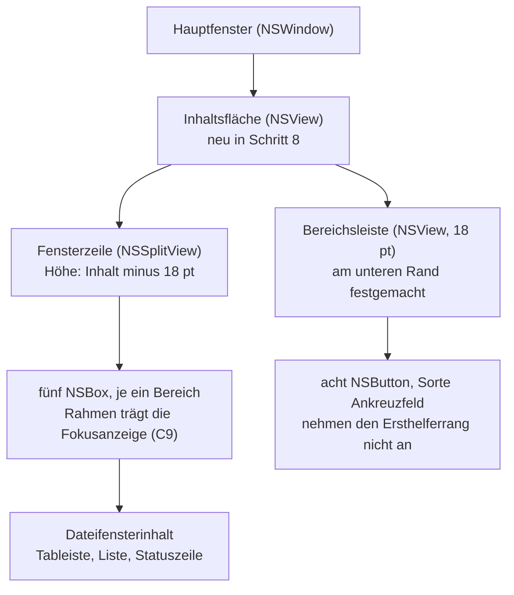
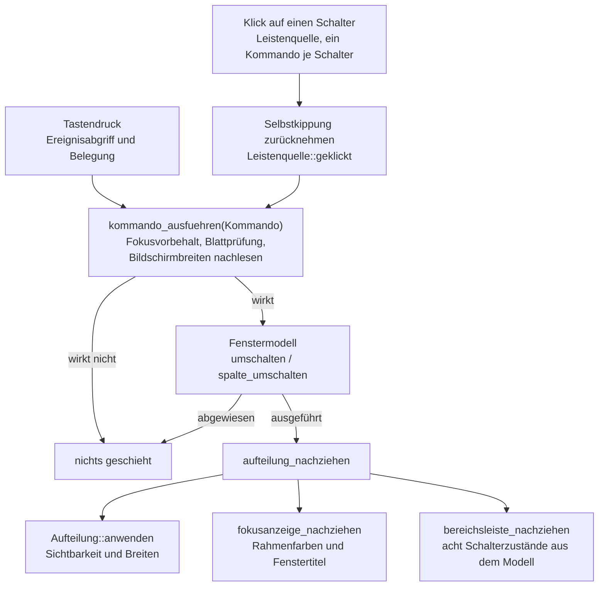
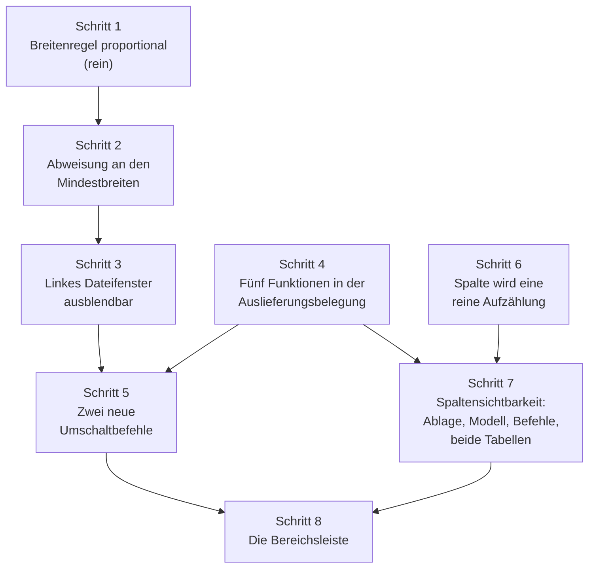

# Implementierungsplan: die Bereichsleiste und die proportionale Breitenregel

**Date:** 2026-08-12
**Status:** Complete
**Spec:** keiner. Geplant aus dem Circle-Datensatz `_t_circle.md` und den elf Datensätzen unter `decisions/` dieses Circles; die Fähigkeiten stehen deshalb in diesem Plan (Abschnitt `## Fähigkeiten und Abnahmekriterien`) und nicht in einem eigenen Dokument.
**Decidability:** Die tragende Frage lautet: **passt die Menge der sichtbaren Bereiche noch in die Fensterzeile?** Sie ist entscheidbar, sobald die Rechenvorschrift die Geometrie der Zeile als Eingabe bekommt, nämlich die Gesamtbreite und die Breite einer Trennlinie; aus ihnen und den Mindestbreiten folgt die Antwort ohne Schätzung. Heute hat `Fenstermodell::umschalten` diese Eingabe nicht, und deshalb ändert der Plan den **Mechanismus** und nicht die Genauigkeit: die Geometrie wird als Wert übergeben (`Zeilenmass`), statt aus der zuletzt ausgelegten Breite erschlossen zu werden. Eine zweite Frage liegt daneben und ist ebenso entscheidbar, aber an anderer Stelle: **hält der Editor eine Datei?** Sie beantwortet der Editorbereich und nicht das Fenstermodell, das von Dateien nichts weiß; die Prüfung steht deshalb beim Anwendungsdelegierten, wie sie es für `fokus_editor` schon tut. Nicht entscheidbar wäre die Frage nach der Fensterbreite aus dem Modell heraus, und genau darum wird sie dort nicht gestellt.

---

## Directive

KRK bekommt am unteren Fensterrand eine Leiste über die volle Breite. Sie trägt acht Schalter: fünf für die Bereiche der Fensterzeile (Lesezeichenleiste, linkes Dateifenster, rechtes Dateifenster, Vorschau, Editor) und drei für die Spalten der Dateilisten (Größe, Datum, Typ). Jeder Schalter zeigt, ob sein Gegenstand steht, und schaltet ihn per Mausklick um; die fünf Bereichsschalter sind daneben über die Tastatur erreichbar. Jede Änderung der Sichtbarkeit teilt die Fensterzeile proportional neu auf: zwei Bereiche im Verhältnis 2:1 stehen nach dem Einblenden eines dritten weiterhin in diesem Verhältnis.

**Der Satz der Directive über den Rückfall der Vorschaubreite ist gegenstandslos.** Der Defekt ist am 260811-2130 in der Runde 4 behoben worden (Commit `1ea5a3d`, `bildschirmbreiten_uebernehmen` am Kopf von `kommando_ausfuehren`). Die proportionale Regel entsteht damit auf einer Grundlage, die die Ziehbewegung des Nutzers hält.

**Die Leiste heißt `Bereichsleiste` und nicht Statusleiste.** Die beiden Statuszeilen an den Füßen der Dateifenster bleiben, wo sie sind, und behalten alle fünf Ränge; C1 der Runde 1 wird nicht angefasst.

---

## Fähigkeiten und Abnahmekriterien

Jedes Kriterium trägt, wie es nachzuweisen ist. **(Probe)** heißt: eine Prüfung im Baum weist es nach, ein Agent kann es abnehmen. **(Bündel)** heißt: es ist am laufenden `KRK.app` im Vordergrund zu sehen, und das ist Nutzerarbeit (siehe `## Abnahme am laufenden Bündel`).

### C1: Die Bereichsleiste als eigene Fläche

1. Am unteren Fensterrand steht über die volle Fensterbreite eine Leiste von 18 Punkten Höhe, dieselbe Höhe wie eine Statuszeile. **(Bündel)**
2. Die Leiste trägt ausschließlich Schalter und keine Meldung. Die beiden Statuszeilen an den Füßen der Dateifenster stehen unverändert darüber und tragen weiterhin alle fünf Ränge. **(Bündel)**
3. Die Fensterzeile verliert genau die Höhe der Leiste. Die Mindesthöhe des Fensters wächst um denselben Betrag, damit die Bereiche darüber ihre bisherige Mindesthöhe behalten. **(Probe** für die Konstante, **Bündel** für den Augenschein**)**
4. Die Leiste bekommt nie den Eingabefokus. Kein Schalter nimmt den Ersthelferrang an, auch bei eingeschalteter vollständiger Tastaturbedienung nicht; der Fokusrahmen aus C9 bleibt beim Bereich, in dem er stand. **(Bündel)**

### C2: Die fünf Bereichsschalter

1. Die Leiste führt fünf Schalter, je einen für Lesezeichenleiste, linkes Dateifenster, rechtes Dateifenster, Vorschau und Editor. Jeder zeigt an, ob sein Bereich steht. **(Bündel)**
2. Ein Klick schaltet den Bereich um. Der Weg führt durch dieselbe Funktion wie der Tastenbefehl; es gibt keinen zweiten Weg an den Prüfungen vorbei. **(Probe** für die Zuordnung Schalter zu Kommando, **Bündel** für den Klick**)**
3. Wird der Editor eingeschaltet, springt der Vorschauschalter im selben Moment auf aus, und umgekehrt. Der gegenseitige Ausschluss bleibt allein in `Bereich::teilt_flaeche_mit`. **(Probe** für das Modell, **Bündel** für die beiden Schalter**)**
4. Ein Klick, der abgewiesen wird, lässt den Schalter in seinen alten Zustand zurückspringen. Abgewiesen wird ein Klick in drei Fällen: er würde das letzte sichtbare Dateifenster ausblenden, er würde die Summe der Mindestbreiten über die verfügbare Breite heben, oder er soll den Editor zeigen, der keine Datei hält. **(Bündel)**
5. Keine Abweisung erzeugt eine Meldung. C7 der Runde 1 verlangt das für den bestehenden Fall ausdrücklich, und zwei verschiedene Antworten auf zwei unmögliche Sichtbarkeitsanforderungen wären eine Fallunterscheidung ohne Grund. **(Bündel)**
6. Die Schalter wirken aus jedem Fokus. Ihre Kommandos tragen `Wirkungsbereich::Ueberall`; ein Klick mit der Schreibmarke im Editor wirkt wie einer mit dem Fokus in der Dateiliste. **(Probe)**

### C3: Die drei Spaltenschalter

1. Die Leiste führt drei Schalter für die Spalten Größe, Datum und Typ. Die Spalte Name trägt keinen: eine Dateiliste ohne sie zeigt nichts, was den Eintrag benennt. **(Bündel)**
2. Ein Spaltenschalter wirkt auf **beide** Dateilisten zugleich. **(Bündel)**
3. Das Wegschalten einer Spalte ändert die Sortierung nicht. Wer nach Größe sortiert und die Spalte Größe wegschaltet, sieht dieselbe Reihenfolge wie zuvor. **(Probe** für das Modell, **Bündel** für die Anzeige**)**
4. Ein Spaltenschalter ändert die Aufteilung der Fensterzeile nicht. Die Breiten der Bereiche stehen vorher und nachher gleich. **(Bündel)**
5. Die drei Spaltenbefehle stehen in der Belegungsansicht, tragen ab Werk aber keine Kombination. In der Markdown-Ausgabe der Runde 3 stehen sie **nicht**, weil jene nur belegte Funktionen aufnimmt (Nutzerentscheid vom 260811-0110). Korrigiert am 260812-0735; der ursprüngliche Wortlaut sagte die Ausgabe zu und stand damit gegen einen bestehenden Entscheid. Wer eine will, weist sie in der Belegungsansicht zu oder trägt sie in `default-keymap.toml` ein. **(Probe)**

### C4: Die proportionale Breitenregel

1. Jeder sichtbare Bereich bekommt einen Anteil an der Fensterzeile, der sich aus dem Verhältnis der gespeicherten Breiten aller sichtbaren Bereiche ergibt. Ein Bereich ohne gespeicherte Breite geht mit seiner Anfangsbreite in dieses Verhältnis ein. **(Probe)**
2. Zwei Bereiche im Verhältnis 2:1 stehen nach dem Einblenden eines dritten weiterhin im Verhältnis 2:1, gleich welche drei Bereiche es sind. Die Festlegung vom 260808, nach der die Lesezeichenleiste dem Editor nicht weicht, gilt nicht mehr. **(Probe)**
3. Die Mindestbreite eines Bereichs gewinnt gegen seinen Anteil. Wird ein Bereich durch die Verhältnisrechnung unter sein Mindestmaß gedrückt, bekommt er sein Mindestmaß, und die übrigen teilen den Rest weiter im Verhältnis ihrer Wünsche. **(Probe)**
4. Passt die Summe der Mindestbreiten der sichtbaren Bereiche nicht mehr in die Zeile, schrumpfen alle mit demselben Faktor unter ihr Mindestmaß. Dieser Fall entsteht nicht durch einen Schalter, denn der wird abgewiesen (C2.4), sondern allein dadurch, dass der Nutzer das Fenster schmaler zieht. **(Probe)** Der Zweig ist eine offene Frage, siehe `## Offene Fragen`.
5. Die Summe der fünf ausgegebenen Breiten ist in jedem Fall genau die verfügbare Breite. **(Probe)**
6. Ein ausgeblendeter Bereich bekommt die Breite 0 und behält seine gespeicherte Breite unangetastet. **(Probe)**
7. Das Vergrößern des Fensters ändert keine gespeicherte Breite. Der Nachzug rechnet die gemessenen Breiten auf die gespeicherte Summe zurück, bevor er sie übernimmt. **(Probe)**
8. Das Wiedereinblenden eines Bereichs stellt seinen Anteil wieder her. Hat sich an der übrigen Aufteilung nichts geändert, ist es dieselbe Punktzahl wie vor dem Ausblenden. Das ist das dritte Abnahmekriterium von C7 der Runde 1, in der neuen Währung gelesen. **(Probe)**
9. Die beiden Breitenbefehle aus C7 verschieben die Trennlinie weiterhin um genau einen Schritt von 40 Punkten. **(Probe)**

### C5: Das linke Dateifenster ist ausblendbar

1. Das linke Dateifenster lässt sich ausblenden und wieder einblenden, solange das rechte steht. **(Probe** für das Modell, **Bündel** für die Ansicht**)**
2. Ein Befehl, der das **letzte** sichtbare Dateifenster ausblenden würde, wird ohne Meldung verworfen, gleich welches der beiden es ist. Die Regel heißt danach "eines bleibt" und nicht "das linke ist besonders". **(Probe)**
3. War das ausgeblendete Dateifenster das aktive, wandert die Aktivität auf das andere. **(Probe)**
4. Eine von Hand geschriebene `session.toml`, die beide Dateifenster ausblendet, führt beim Start zu einem sichtbaren linken Dateifenster. **(Probe)**
5. Eine `session.toml` aus der Zeit vor dieser Runde bleibt lesbar; das fehlende Feld bedeutet "sichtbar". **(Probe)**

### C6: Die neuen Tastenbefehle

1. Es gibt einen Umschaltbefehl für den Editor und einen für das linke Dateifenster, beide mit einer ausgelieferten Kombination und beide mit `Wirkungsbereich::Ueberall`. **(Probe)**
2. Der Umschaltbefehl für den Editor blendet ihn aus, ohne seine Datei freizugeben und ohne die Nachfrage aus C4 der Editor-Runde. Er ist damit etwas anderes als `editor_schliessen`, das die Datei aufgibt und nachfragt; beide bleiben nebeneinander bestehen. **(Probe** für die Wege, **Bündel** für die Nachfrage**)**
3. Hält der Editor keine Datei, wird der Umschaltbefehl ohne Meldung verworfen. Dieselbe Bedingung, die `fokus_editor` schon trägt. **(Bündel)** Die Frage dazu ist offen, siehe `## Offene Fragen`.
4. Jede der fünf neuen Funktionen steht in `resources/default-keymap.toml`, und die beiden Zählwerte im Kopf der Datei stimmen mit ihrem Inhalt überein. **(Probe)**

### C7: Was der Neustart überlebt

1. Die Sichtbarkeit des linken Dateifensters überlebt Beenden und Neustart. **(Probe)**
2. Die Sichtbarkeit der drei Spalten überlebt Beenden und Neustart; ab Werk stehen alle drei. **(Probe)**
3. `session.toml` bleibt von Hand les- und schreibbar. Die Breiten stehen weiterhin als Punktzahlen darin, nicht als Anteile. **(Probe)**
4. Eine `session.toml` ohne die neuen Felder gilt nicht als beschädigt und nimmt die Vorgabewerte an. **(Probe)**

---

## Ausgangslage

Der Grounding-Abschnitt des Circle-Datensatzes ist am 260811-1304 am Baum erhoben worden und trägt weiter. Nachgemessen am 260812-0415, mit vier Ergänzungen, die für den Zuschnitt der Schritte tragen.

**Die Breitenregel steht an einer Stelle.** `bereichsbreiten(verfuegbar, breiten, sichtbar)` (`crates/krk-ui/src/fenstermodell.rs:609`) ist reines Rust ohne AppKit; `crates/krk-ui/src/appkit/aufteilung.rs:503` (`auslegen`) setzt um, was dort herauskommt, und rechnet dabei die Breite der Trennlinien heraus. Zwölf Prüfungen im selben Modul messen die Regel ohne Fenster.

**Die Aufteilung liest die Sichtbarkeit aus den Ansichten und nicht aus dem Modell.** `steht_im` (`aufteilung.rs:425`) ist die eine Stelle dafür, und `Aufteilung::anwenden` schreibt den Wunsch des Modells vorher hinein. Beide Wege in die Aufteilung ergeben deshalb dasselbe Bild.

**Der Nachzug der gemessenen Breiten trägt heute eine Sonderregel.** `Fenstermodell::breiten_uebernehmen` (`:519`) lässt die beiden Dateifenster unangetastet, solange nur eines von ihnen sichtbar ist. Der Grund ist eine Messung vom 260804: das sichtbare Dateifenster trägt den Platz des ausgeblendeten mit, und diese Zahl als seinen Wunsch zu übernehmen kostete das andere seine Breite. **Unter einer Anteilsregel gilt derselbe Fehler für jedes Paar von Bereichen und nicht mehr nur für die beiden Dateifenster**, weil jedes Ausblenden alle übrigen aufbläht. Die Sonderregel ist damit zu wenig, und der Plan ersetzt sie durch eine allgemeine Rückrechnung (Schritt 1).

**Die Fensterinhaltsfläche ist heute die Fensterzeile selbst.** `fenster::hauptfenster` (`fenster.rs:259`) setzt die `NSSplitView` unmittelbar als `contentView`, und es ist die eine Stelle im Baum, die die Inhaltsansicht des Fensters setzt (`fenster.rs:290`). Eine Leiste am Fensterfuß braucht deshalb eine Trägerfläche, in der Fensterzeile und Leiste übereinanderliegen, so wie `dateifensterinhalt` (`aufteilung.rs:369`) Tableiste, Liste und Statuszeile eines Dateifensters übereinanderlegt.

**Die Spalten sind heute eine Aufzählung in `appkit/tabelle.rs`.** `Spalte` (`:179`) ist privat und trägt vier Werte; drei ihrer Methoden nennen AppKit-Typen (`kennung` liefert `&NSString`, `titel` ebenso, `ausrichtung` liefert `NSTextAlignment`). Ein Modell, das die Sichtbarkeit der Spalten hält, kann diese Aufzählung von `fenstermodell.rs` aus nicht ansprechen, ohne die Zusage "keine Zeile AppKit" zu verletzen. Der Plan zieht deshalb den reinen Teil der Aufzählung in ein eigenes Modul (Schritt 6).

**Zwei Zahlen, an denen die Runde hängt.** `MINDESTGROESSE` (`fenster.rs:116`) steht auf 780 mal 300 Punkten. Der größte zugleich mögliche Satz an Mindestbreiten ist 920 (Lesezeichen 120, beide Dateifenster je 240, Editor 320; Vorschau und Editor schließen sich aus). Zwischen 780 und 920 Punkten Fensterbreite passt er nicht, und der Kommentar an der Konstante sagt selbst, dass die Zahl seit der Editor-Runde nicht nachgezogen ist.

### Wie die Bereichsleiste in den bestehenden Aufbau kommt



### Der eine Weg vom Eingang bis zur Anzeige



Der Zwischenschritt auf dem Klickweg trägt eine Fähigkeit und keine Bequemlichkeit: ein Ankreuzfeld kippt seinen Zustand selbst, bevor seine Aktion läuft. `Leistenquelle::geklickt` nimmt diese eine fremde Schreibung sofort zurück, noch bevor das Kommando gemeldet ist; danach ist das Modell wieder die einzige Quelle jedes Schalterzustands, und ein abgewiesener Klick hat nichts hinterlassen, das zurückspringen müsste (C2.4). **Korrigiert am 260812-0745**; der ursprüngliche Wortlaut ließ den Klick nach dem Kommando *in jedem Fall* nachziehen, und nach einem angenommenen Klick lief der Nachzug damit zweimal (`issues/260812-0727_c_der-nachzug-der-bereichsleiste-laeuft-nach-einem-angenommenen-klick-zweimal.md`). Auf jedem Weg zieht jetzt genau `bereichsleiste_nachziehen` nach, und genau einmal.

---

## Vorgehen

Der Plan folgt der Abhängigkeit und nicht der Sichtbarkeit. Die Breitenregel ist die Wurzel: sie ist reines Rust, ohne Fenster prüfbar, und alles andere setzt darauf auf. **Sechs der acht Schritte sind vollständig ohne KRK im Vordergrund abzunehmen**, und das ist in diesem Projekt der Unterschied zwischen einer Abnahme durch einen Agenten und einer durch den Nutzer. Erst die letzten beiden Schritte brauchen den Augenschein am laufenden Bündel, und auch sie tragen Prüfungen für ihre reinen Anteile.

Die Reihenfolge vermeidet daneben, dieselbe Funktion zweimal anzufassen. `Fenstermodell::umschalten` bekommt in Schritt 2 seinen neuen Parameter und in Schritt 3 seine neuen Zweige; umgekehrt wären die Zweige zweimal zu schreiben. Ebenso steht die Belegungsdatei (Schritt 4) **vor** den Kommandos, die sie nennen: die Prüfung `jede_kennung_der_kommandos_steht_in_der_auslieferungsbelegung` liefe sonst für die Dauer eines Schrittes rot, und `make check` fährt `clippy` mit `-D warnings`, also hält jeder Zwischenstand die Abnahme an, der etwas Unbenutztes einführt.



---

## Implementierungsschritte

1. [DONE] **Die Breitenregel wird proportional**
   - Executor: `coder`
   - Files: `crates/krk-ui/src/fenstermodell.rs`, `crates/krk-ui/src/appkit/aufteilung.rs`
   - Changes:
     - Neuer Typ `Zeilenmass { gesamt: f64, trennerbreite: f64 }` in `fenstermodell.rs`, mit `verfuegbar(&self, anzahl_sichtbar: usize) -> f64`. **Die Rechnung "n sichtbare Bereiche brauchen n minus eine Trennlinie" steht danach an einer Stelle** und nicht mehr in `auslegen`.
     - `bereichsbreiten(mass: Zeilenmass, breiten: &Breiten, sichtbar: &Sichtbarkeit) -> [f64; 5]` wird neu gefasst. Der Rechenweg, ausgeschrieben, damit er nicht geraten wird:
       1. Die sichtbaren Bereiche sammeln; ist keiner sichtbar, `[0.0; 5]` liefern.
       2. `verfuegbar = mass.verfuegbar(anzahl)`, `mindestsumme = Summe der Mindestbreiten der sichtbaren`.
       3. Ist `verfuegbar < mindestsumme`: jeder sichtbare Bereich bekommt `mindestbreite * (verfuegbar / mindestsumme)`. Zweiter Zweig, fertig.
       4. Sonst Wasserstandsrechnung: der Wunsch eines Bereichs ist seine gespeicherte Breite, ersatzweise seine Anfangsbreite, mindestens 1.0. Verteile den Rest im Verhältnis der Wünsche der noch offenen Bereiche. Fällt dabei ein Bereich unter seine Mindestbreite, setze ihn auf sein Mindestmaß, ziehe es vom Rest ab, nimm ihn aus den offenen und rechne erneut. Die Schleife endet nach höchstens so vielen Durchgängen, wie es sichtbare Bereiche gibt, weil die Menge der offenen in jedem Durchgang echt kleiner wird; Schritt 3 stellt sicher, dass der Rest für die verbliebenen Mindestbreiten immer reicht.
       5. Die Summe der fünf Werte ist in beiden Zweigen genau `verfuegbar`.
     - `Fenstermodell::breiten_uebernehmen` verliert seine Sonderregel für die beiden Dateifenster und bekommt eine Rückrechnung: `faktor = Summe der gespeicherten Breiten der sichtbaren / Summe der gemessenen Breiten der sichtbaren`, dann `breite_setzen(b, gemessen[b] * faktor)` für jeden sichtbaren Bereich. Ausgeblendete Bereiche bleiben unangetastet. Ist eine der beiden Summen nicht positiv, geschieht nichts. **Damit ist der Fall aus dem Defekt vom 260804 nicht mehr ein Sonderfall, sondern ein Ergebnis der Regel**, und ein bloßes Vergrößern des Fensters ändert keine gespeicherte Zahl mehr.
     - Der Dokumentationskommentar an `bereichsbreiten` wird neu geschrieben. Die Sätze über die Reihenfolge von `Bereich::ALLE` als Zusage und über die Festlegung vom 260808 fallen ersatzlos; an ihre Stelle tritt die Anteilsregel mit den zwei Zweigen. Ein Kommentar, der das Gegenteil des Codes sagt, ist in diesem Baum schon einmal teuer geworden.
     - `aufteilung.rs`: `auslegen` reicht `Zeilenmass { gesamt: teiler.frame().size.width, trennerbreite: teiler.dividerThickness() }` weiter und rechnet die Trennlinien nicht mehr selbst heraus. Die Schleife, die die Rahmen setzt, bleibt unverändert.
     - Die zwölf Prüfungen zur Breitenregel werden nachgezogen. Zwei ändern ihre Aussage: `die_leiste_weicht_dem_editor_nicht` wird zu `die_leiste_schrumpft_mit_dem_editor` und schreibt die neuen Zahlen aus; `am_engen_fenster_gewinnt_das_mindestmass_der_dateifenster` misst danach die Wasserstandsrechnung. Vier kommen dazu: das Verhältnis 2:1 bleibt beim Einblenden eines dritten Bereichs erhalten, die Summe ist immer die verfügbare Breite, der zweite Zweig unter der Mindestsumme, und das Vergrößern des Fensters lässt die gespeicherten Breiten stehen.
   - Aufzählungen: keine der vier vollständigen Aufzählungen wächst. Der Übersetzer hält an den Aufrufern von `bereichsbreiten` an, also an `auslegen` und an jeder Prüfung, die die alte Signatur nennt.
   - Abnahme: `make check`. Kein Vordergrund.
   - Dependencies: keine.

2. [DONE] **Die zweite Abweisung: die Mindestbreiten müssen hineinpassen**
   - Executor: `coder`
   - Files: `crates/krk-ui/src/fenstermodell.rs`, `crates/krk-ui/src/appkit/aufteilung.rs`, `crates/krk-ui/src/appkit/anwendung.rs`
   - Changes:
     - `Fenstermodell::umschalten(&mut self, bereich: Bereich, mass: Zeilenmass) -> bool` bekommt neben der bestehenden Abweisung eine zweite: würde die Summe der Mindestbreiten der **nach** dem Umschalten sichtbaren Bereiche die dann verfügbare Breite übersteigen, geschieht nichts und die Funktion liefert `false`. Die Anzahl der dann sichtbaren Bereiche kennt allein das Modell, weil der gegenseitige Ausschluss die Zahl gleich lassen kann; deshalb rechnet das Modell und nicht der Aufrufer.
     - Die Abweisung greift nur beim **Einschalten**. Ein Ausschaltbefehl kann die Summe nicht vergrößern.
     - `Fenstermodell::einblenden` reicht das Maß durch, weil es durch `umschalten` geht.
     - `Aufteilung::zeilenmass(&self) -> Zeilenmass` liefert Gesamtbreite und Trennlinienbreite der `NSSplitView`. Damit gibt es weiterhin eine Stelle, an der diese beiden Zahlen aus AppKit kommen.
     - `Anwendungsdelegierter::bereich_umschalten` und `bereich_einblenden` holen das Maß dort und reichen es weiter. Steht die Aufteilung noch nicht (der Aufbau), geschieht nichts, wie bisher.
     - Prüfungen: bei 780 Punkten Fensterbreite wird das Einschalten des Editors neben Lesezeichenleiste und beiden Dateifenstern abgewiesen; bei 1280 nicht. Eine zweite hält fest, dass ein Ausschaltbefehl nie an dieser Bedingung scheitert.
   - Aufzählungen: keine wächst. Der Übersetzer hält an jedem Aufrufer von `umschalten` und `einblenden` an, also an vier Stellen in `anwendung.rs` und an rund fünfzehn Prüfungen in `fenstermodell.rs` und `kommandos/fokus.rs`.
   - Abnahme: `make check`. Kein Vordergrund.
   - Dependencies: Schritt 1 (`Zeilenmass`).

3. [DONE] **Das linke Dateifenster wird ausblendbar**
   - Executor: `coder`
   - Files: `crates/krk-core/src/ablage/sitzung.rs`, `crates/krk-ui/src/fenstermodell.rs`, `crates/krk-ui/src/appkit/aufteilung.rs`, `crates/krk-core/tests/ablage.rs`
   - Changes:
     - `Sichtbarkeit` (`sitzung.rs:211`) bekommt als erstes Feld `erstes_dateifenster: bool`, in `Default` auf `true`. Eine ältere `session.toml` bleibt lesbar, weil die Struktur `#[serde(default)]` trägt. Der Kommentar an der Struktur, der die fehlende Angabe begründet, wird umgeschrieben; er sagt sonst das Gegenteil des Codes.
     - `sichtbar_in` (`fenstermodell.rs:233`) verliert `Bereich::Links => true` und liest das neue Feld.
     - `sichtbar_setzen` (`:358`) verliert den leeren Zweig `Bereich::Links => {}`.
     - `Fenstermodell::umschalten`: die beiden Dateifenster gehen durch denselben Zweig. Die Abweisung lautet danach "das letzte sichtbare Dateifenster bleibt" und wird über `Bereich::seite` beantwortet, nicht über einen genannten Bereich. War das ausgeblendete das aktive, wandert die Aktivität auf das andere; das steht heute nur für rechts da.
     - `Fenstermodell::aus_sitzung` bekommt eine dritte hergestellte Zusicherung: sind beide Dateifenster ausgeblendet, wird das linke sichtbar gesetzt. Die beiden bestehenden Zusicherungen bleiben, und die Reihenfolge zählt: erst die Dateifenster, dann das aktive.
     - `aufteilung.rs`: `sichtbar_im` (`:438`) liest das neue Feld statt `true` zu liefern, `gemessene_sichtbarkeit` (`:471`) trägt das fünfte Feld über `steht_im(teiler, Bereich::Links)`.
     - Der Modulkopf von `fenstermodell.rs`, Abschnitt "Was das linke Dateifenster von den anderen unterscheidet", wird ersetzt: es unterscheidet sich nicht mehr, und die Regel heißt "eines bleibt".
     - Prüfungen: `das_letzte_dateifenster_laesst_sich_nicht_ausblenden` prüft beide Richtungen; dazu die Wanderung der Aktivität, die dritte Zusicherung aus `aus_sitzung`, und in `crates/krk-core/tests/ablage.rs` der Rundlauf des neuen Feldes samt einer `session.toml` ohne es.
   - Aufzählungen: keine der vier wächst; `Bereich` bekommt keine Variante dazu. Der Übersetzer hält an den vier vollständigen Fallunterscheidungen über `Bereich` an, die das Feld lesen oder schreiben: `sichtbar_in`, `sichtbar_setzen`, `aufteilung::sichtbar_im` und `gemessene_sichtbarkeit`.
   - Abnahme: `make check`. Kein Vordergrund. Am laufenden Bündel sichtbar wird die Fähigkeit erst mit Schritt 5 oder 8, weil bis dahin kein Weg zu ihr führt.
   - Dependencies: Schritt 2.

4. [DONE] **Fünf neue Funktionen in der Auslieferungsbelegung**
   - Executor: `ontocoder`
   - Files: `resources/default-keymap.toml`
   - Changes:
     - Fünf `[[funktion]]`-Blöcke, jeder mit `id`, `name` und `tasten`:
       - `erstes_fenster_umschalten`, "Linkes Dateifenster ein- und ausblenden", `tasten = ["opt+cmd+left"]`, im Block C7 neben `zweites_fenster_umschalten`.
       - `editor_umschalten`, "Editor ein- und ausblenden", `tasten = ["opt+cmd+b"]`, im Editor-Block neben `editor_schliessen`.
       - `spalte_groesse_umschalten`, "Spalte Größe ein- und ausblenden", `tasten = []`.
       - `spalte_datum_umschalten`, "Spalte Änderungsdatum ein- und ausblenden", `tasten = []`.
       - `spalte_typ_umschalten`, "Spalte Typ ein- und ausblenden", `tasten = []`.
     - `zweites_fenster_umschalten` bekommt `opt+cmd+right` als zweite Kombination, damit die beiden Dateifenster dasselbe Muster tragen.
     - Die Zeile im Dateikopf, die mit `# Ausgeliefert sind` beginnt, wird von 74 Funktionen und 82 Kombinationen auf **79 Funktionen und 85 Kombinationen** gesetzt. Die Prüfung `die_zwei_zahlen_im_kopf_der_auslieferungsbelegung_stimmen_noch` liest genau diese Zeile.
     - Je Eintrag ein Kommentar mit der Begründung der Kombination, wie es die Datei durchgehend hält. Für die drei Spalteneinträge der Satz, warum sie ab Werk unbelegt sind, mit Verweis auf den Datensatz `decisions/260812-0306_a_bekommen-die-spaltenschalter-tastenbefehle.md`. **Nicht `reserviert_fuer` verwenden**: das Feld heißt "benannt, aber einer späteren Runde vorbehalten", und diese drei Funktionen gibt es ab Schritt 7 wirklich.
   - Aufzählungen: keine. Für die Dauer eines Schrittes tragen die fünf Einträge kein Kommando; das ist der dokumentierte Zustand "belegt, aber noch nicht gebaut", und `Funktion::kommando` liefert dafür `None`.
   - Abnahme: `make check`, insbesondere die beiden Prüfungen in `crates/krk-core/src/tasten/belegung.rs`. Kein Vordergrund.
   - Dependencies: keine.
   - Anmerkung: die gewählten Kombinationen sind eine Empfehlung und eine Nutzerfrage; siehe `## Offene Fragen` und den Datensatz `decisions/260812-0415_a_welche-kombinationen-bekommen-die-beiden-neuen-umschalter.md`. Eine andere Antwort kostet in diesem Schritt je eine Zeile. **Am 260812-0430 beantwortet: die Empfehlung wird übernommen**, der Schritt setzt sie unverändert um.
   - Befund bei der Ausführung: `make check` läuft nach diesem Schritt **nicht** durch, und das ist kein Fehlschlag des Schrittes. Grün sind die beiden hier genannten Prüfungen in `crates/krk-core/src/tasten/belegung.rs`. Rot sind achtundzwanzig Proben in `krk-ui`, die den vom Plan benannten Zwischenstand messen (fünf Kennungen ohne Kommando, aufgelöst durch die Schritte 5 und 7), und drei weitere, die **kein** Schritt dieses Plans wieder grün macht; sie stehen in `issues/260812-0533_o_drei-proben-stehen-gegen-die-neuen-belegungseintraege-und-keine-gehoert-zu-einem-planschritt.md` samt Vorschlag.

5. [DONE] **Zwei neue Umschaltbefehle: Editor und linkes Dateifenster**
   - Executor: `coder`
   - Files: `crates/krk-core/src/tasten/belegung.rs`, `crates/krk-ui/src/belegungsmodell.rs`, `crates/krk-ui/src/appkit/anwendung.rs`
   - Changes:
     - `Kommando` bekommt `ErstesFensterUmschalten` und `EditorUmschalten`, jeweils mit Dokumentationskommentar.
     - `Kommando::KENNUNGEN` wächst von 68 auf 70 Einträge. **Die Feldbreite steht in der Typangabe**, der Übersetzer hält also an, bis beide Einträge stehen.
     - `Kommando::wirkungsbereich`: beide in den Zweig `Wirkungsbereich::Ueberall`, zu den drei bestehenden Umschaltbefehlen. Die Aufzählung `Wirkungsbereich` selbst wächst **nicht**, und das ist tragend: ein Schalter in der Leiste muss aus jedem Fokus wirken, sonst wäre ein Klick mit der Schreibmarke im Editor abgewiesen.
     - `belegungsmodell::bereich_des_kommandos`: `ErstesFensterUmschalten` zu `Funktionsbereich::Fenster` (zu `ZweitesFensterUmschalten`), `EditorUmschalten` zu `Funktionsbereich::Editor`.
     - `Anwendungsdelegierter::kommando_ausfuehren` bekommt zwei Zweige: `ErstesFensterUmschalten => self.bereich_umschalten(Bereich::Links)` und `EditorUmschalten => self.editor_umschalten()`.
     - `editor_umschalten` ist neu und kurz: ist der Editor sichtbar, `bereich_umschalten(Bereich::Editor)`; ist er es nicht, dasselbe, aber nur, wenn der Editorbereich eine Datei hält. Die Bedingung steht hier und nicht im Fenstermodell, aus demselben Grund, aus dem `fokus_editor_holen` sie hier trägt: das Fenstermodell weiß von Dateien nichts.
     - **`editor_schliessen` bleibt unverändert.** Es gibt die Datei frei und löst die Nachfrage aus C4 der Editor-Runde aus; der neue Befehl blendet aus und behält den Stand. Beide Dokumentationskommentare nennen den Unterschied und verweisen aufeinander, sonst hält man den einen für eine Dublette des anderen.
     - Prüfungen: die beiden neuen Kennungen und ihre Wirkungsbereiche laufen über die bestehenden Prüfungen in `crates/krk-core/tests/belegung.rs` mit. Dazu eine Prüfung in `belegungsmodell.rs`, dass beide Befehle in ihrem Funktionsbereich stehen.
   - Aufzählungen: **`Kommando` wächst um zwei** (68 auf 70 Kennungen). Der Übersetzer hält an drei Stellen an: `Kommando::KENNUNGEN` (Feldbreite), `Kommando::wirkungsbereich` (vollständig ohne Auffangzweig) und `belegungsmodell::bereich_des_kommandos` (ebenso). `Wirkungsbereich`, `Bereich` und `Fokus` bleiben unverändert.
   - Abnahme: `make check`. Kein Vordergrund für die Prüfungen; die Wirkung der beiden Tasten sieht man am Bündel.
   - Dependencies: Schritt 3 (ohne das fünfte Feld in `Sichtbarkeit` tut `bereich_umschalten(Bereich::Links)` nichts), Schritt 4 (ohne die Belegungseinträge scheitert die Kennungsprüfung).
   - Befund bei der Ausführung: `make check` läuft auch nach diesem Schritt **nicht** durch (Exit 2), und der Grund ist derselbe wie nach Schritt 4: die Belegungsdatei führt seit Schritt 4 fünf Kennungen ohne Kommando, dieser Schritt baut zwei davon, die drei Spaltenschalter bekommen ihre erst in Schritt 7. Grün sind `cargo build`, `cargo fmt --check` und `cargo clippy -- -D warnings`; grün ist daneben `krk-core` vollständig, einschließlich der beiden Proben, die Schritt 4 rot zurückgelassen hatte. Rot bleiben 28 Proben im Binärziel `krk`, und jede einzelne nennt `spalte_groesse_umschalten`; keine nennt `erstes_fenster_umschalten` oder `editor_umschalten`. Der Datensatz dazu ist `issues/260812-0548_o_make-check-bleibt-auch-nach-schritt-5-rot-die-drei-spaltenkennungen-warten-auf-schritt-7.md`; er schlägt daneben vor, die Abnahme der Schritte 4, 5 und 6 im Plan nachzuziehen, weil `make check` für keinen der drei erreichbar ist.
   - Nachtrag bei der Ausführung: die drei Proben aus `issues/260812-0533_*` sind mit diesem Schritt nachgezogen (Streichung der Zählprobe, benannte Ausnahme für die drei Spaltenkennungen, der letzte `assert_eq!` der Ausgabeprobe). Dazu kam eine vierte, die dieser Schritt selbst verschiebt: `der_bereich_editor_fuehrt_die_zwoelf_befehle_der_runde` heißt jetzt `der_bereich_editor_fuehrt_genau_die_befehle_des_editors` und führt dreizehn, weil `editor_umschalten` unter "Editor" tritt.

6. [DONE] **`Spalte` wird eine reine Aufzählung**
   - Executor: `coder`
   - Files: neu `crates/krk-ui/src/spalten.rs`, `crates/krk-ui/src/main.rs`, `crates/krk-ui/src/appkit/tabelle.rs`
   - Changes:
     - Ein mechanischer Umzug ohne Verhaltensänderung. `pub enum Spalte` mit `ALLE`, `beschreibbar` und einer neuen `beschriftung(self) -> &'static str` zieht nach `crates/krk-ui/src/spalten.rs`; `mod spalten;` kommt in `main.rs`.
     - Was AppKit-Typen nennt, bleibt in `tabelle.rs` und wird zur freien Funktion über `Spalte`: `kennung(spalte) -> &'static NSString`, `titel(spalte) -> &'static NSString`, `breiten(spalte) -> (f64, f64)`, `ausrichtung(spalte) -> NSTextAlignment`, `aus_kennung(&NSString) -> Option<Spalte>`. Dasselbe Muster wie `aufteilung::sichtbar_im` und `aufteilung::rahmenfarbe`, die schon heute freie Funktionen über eine Aufzählung aus einem anderen Modul sind.
     - `titel` wird aus `beschriftung` abgeleitet, wo beide denselben Text tragen. Für `Spalte::Geaendert` gehen sie auseinander, und das ist gewollt: die Spaltenüberschrift bleibt "Änderungsdatum", der Schalter in der 18 Punkte hohen Leiste heißt "Datum", wie der Nutzer ihn genannt hat.
     - Die beiden bestehenden Prüfungen am Ende von `tabelle.rs` ziehen mit um oder bleiben, je nachdem, ob sie AppKit nennen.
   - Aufzählungen: keine der vier. `Spalte` selbst ist eine fünfte vollständige Aufzählung dieses Projekts, die keinen Auffangzweig trägt; sie behält alle vier Werte.
   - Abnahme: `make check`. Kein Vordergrund. Der Schritt ändert kein Verhalten, und das ist seine Zusage.
   - Befund bei der Ausführung: `make check` ist für diesen Schritt nicht erreichbar, aus demselben Grund wie für die Schritte 4 und 5 (`issues/260812-0548_o_…`); die Abnahme lief deshalb als `cargo build --workspace`, `cargo fmt --all --check`, `cargo clippy --workspace --all-targets -- -D warnings` und `cargo test -p krk-core` — alle vier Exit 0. `cargo test -p krk-ui` steht unverändert bei 28 Fehlschlägen, alle mit `spalte_groesse_umschalten` in der Meldung; keiner nennt `Spalte`, `spalten.rs` oder `tabelle.rs`. **Eine Abweichung vom Plan:** `titel` liefert `Retained<NSString>` statt `&'static NSString`. Beides zugleich ging nicht — `ns_string!` verlangt ein Literal an Ort und Stelle, und damit stünden die drei aus `beschriftung` übernommenen Texte ein zweites Mal da. Die Ableitung wiegt schwerer als die Lebensdauer; einziger Aufrufer ist `spaltenkopf`, achtmal beim Aufbau.
   - Dependencies: keine.

7. [DONE] **Spaltensichtbarkeit: Ablage, Modell, drei Befehle, beide Tabellen**
   - Executor: `coder`
   - Files: `crates/krk-core/src/ablage/sitzung.rs`, `crates/krk-ui/src/fenstermodell.rs`, `crates/krk-core/src/tasten/belegung.rs`, `crates/krk-ui/src/belegungsmodell.rs`, `crates/krk-ui/src/appkit/tabelle.rs`, `crates/krk-ui/src/appkit/anwendung.rs`, `crates/krk-core/tests/ablage.rs`
   - Changes:
     - `Spaltensichtbarkeit { groesse: bool, geaendert: bool, typ: bool }` in `sitzung.rs`, `Default` dreimal `true`, `#[serde(default)]`. Als Feld `spalten` in `Sitzung`, **vor** `fenster`: TOML verlangt, dass eine Tabelle vor der Tabellenfolge steht, sonst scheitert das Schreiben. Der Kommentar nennt, warum die Spalte Name kein Feld hat, und grenzt es gegen die Lücke ab, die Schritt 3 gerade beseitigt: dort gab es einen Wert, der wechseln kann und nur nicht gespeichert wurde; hier gibt es keinen Schalter und damit keinen Wert.
     - `fenstermodell.rs`: `spalte_sichtbar_in(&Spaltensichtbarkeit, Spalte) -> bool` als freie Funktion neben `sichtbar_in`, vollständig, mit `Spalte::Name => true`. `Fenstermodell` hält `spalten: Spaltensichtbarkeit`, gibt sie über `spaltensichtbarkeit()` heraus, nimmt sie in `aus_sitzung` an, schreibt sie in `sitzung()` und trägt `#[must_use] pub fn spalte_umschalten(&mut self, spalte: Spalte) -> bool`, das für `Spalte::Name` `false` liefert und sonst das Feld kippt. Der Rückgabewert bekommt `#[must_use]`, weil sein stilles Fallenlassen unbemerkt bliebe; das ist die Regel dieses Projekts seit dem 260811-2140.
     - `Kommando` bekommt `SpalteGroesseUmschalten`, `SpalteDatumUmschalten`, `SpalteTypUmschalten`; `KENNUNGEN` wächst von 70 auf 73. `wirkungsbereich`: alle drei `Ueberall`, mit der Begründung, dass sie beide Listen zugleich betreffen und kein Dateifenster im Fokus voraussetzen. `bereich_des_kommandos`: alle drei zu `Funktionsbereich::Dateilisting`, wo `versteckte_umschalten` schon steht.
     - `anwendung.rs`: drei Zweige in `kommando_ausfuehren`, die über eine gemeinsame Funktion `spalte_umschalten(Spalte)` gehen. Sie ändert das Modell und ruft danach `spaltenanzeige_nachziehen`.
     - `spaltenanzeige_nachziehen` setzt für beide Dateifenster und jede schaltbare Spalte `NSTableColumn::setHidden`. Der Aufbau der Oberfläche ruft sie einmal, damit die geladene Sitzung ankommt. `NSTableColumn.hidden` steht seit macOS 10.5 (am SDK nachgelesen, `NSTableColumn.h:80`); das Bündel zielt auf 15.0.
     - `Dateifenster` in `tabelle.rs` bekommt dafür eine Methode, die eine Spalte über ihre Kennung findet und versteckt. Eine ausgeblendete Spalte bleibt in `tableColumns` und in `numberOfColumns`; die Sortierung wird nicht angefasst, und das ist das Kriterium C3.3.
     - Prüfungen: `spalte_umschalten` und `spalte_sichtbar_in` ohne Fenster; der Rundlauf durch `session.toml` in `crates/krk-core/tests/ablage.rs`, einschließlich einer Datei ohne den Abschnitt `[spalten]`; und eine Prüfung, dass das Umschalten der Sortierspalte die Sortierung des Tabs nicht ändert.
   - Aufzählungen: **`Kommando` wächst um drei** (70 auf 73). Der Übersetzer hält wieder an `KENNUNGEN`, `wirkungsbereich` und `bereich_des_kommandos` an. `Wirkungsbereich`, `Bereich` und `Fokus` bleiben unverändert. `Spalte` bekommt mit `spalte_sichtbar_in` eine zweite vollständige Fallunterscheidung.
   - Abnahme: `make check`. Kein Vordergrund für die Prüfungen; dass die Spalten wirklich verschwinden, sieht man am Bündel.
   - Dependencies: Schritt 4 (Belegungseinträge), Schritt 6 (reine Aufzählung `Spalte`).
   - **Erledigt am 260812-0618, `make check` Exit 0.** Der Schritt hat den Baum wieder grün gemacht: die 28 Proben, die seit Schritt 4 an `belegungsmodell::bereich` scheiterten, laufen mit den drei Kommandos wieder. Zwei weitere Proben fielen dabei an, beide aus derselben Wurzel wie die drei aus `issues/260812-0533_*` — eine Auslieferungsbelegung darf seit dem 260812 eine Funktion ohne Kombination führen: `jedes_gebaute_kommando_haengt_an_seiner_ausgelieferten_taste` (`crates/krk-core/tests/belegung.rs`) verlangte von jedem gebauten Kommando eine Kombination, und `innerhalb_eines_abschnitts_bleibt_die_reihenfolge_der_datei` (`crates/krk-ui/src/belegungsausgabe.rs`) verglich die Markdown-Ausgabe mit **allen** Funktionen statt mit den belegten. Die Liste `OHNE_KOMBINATION_AB_WERK` steht dafür jetzt am Kopf von `tests/belegung.rs` statt in einem Prüfrumpf; zwei Proben lesen sie. Drei Nachträge außerhalb der Änderungsliste sind mitgelaufen: die Feldreihenfolge in `Sichtbarkeit` (`erstes_dateifenster` steht jetzt hinter `lesezeichen`, also in der Reihenfolge der Fensterzeile), Punkt 4 des Datensatzes `issues/260812-0533_*` (neun Prosastellen tragen jetzt 79 und 73 statt 74 und 68, beide Zahlen nachgezählt), und der Abschluss von `issues/260812-0548_*`.

8. [DONE] **Die Bereichsleiste: Fläche, acht Schalter, Nachzug**
   - Executor: `coder`
   - Files: neu `crates/krk-ui/src/appkit/bereichsleiste.rs`, `crates/krk-ui/src/appkit/mod.rs`, `crates/krk-ui/src/appkit/fenster.rs`, `crates/krk-ui/src/appkit/anwendung.rs`, `crates/krk-ui/src/fenstermodell.rs`
   - Changes:
     - `fenstermodell.rs`: `Bereich::beschriftung(self) -> &'static str` als fünfte vollständige Fallunterscheidung über `Bereich`, mit den kurzen Namen "Lesezeichen", "Links", "Rechts", "Vorschau", "Editor", und `Bereich::langname` für den Hinweistext, der beim Verweilen erscheint.
     - Neues Modul `bereichsleiste.rs` mit `pub const HOEHE: f64 = statuszeile::HOEHE;` und einem Kommentar, warum es dieselbe Zahl ist: eine Zeile in der kleinen Systemschrift. Eine zweite 18 daneben wäre eine zweite Wahrheit.
     - `Bereichsleiste::bauen(mtm)` legt eine `NSView` an und darin acht Schalter über `NSButton::checkboxWithTitle_target_action` (seit macOS 10.12), fünf aus `Bereich::ALLE` und drei aus den schaltbaren Werten von `Spalte::ALLE`. Der Erzeuger ist in `objc2` `unsafe` und braucht denselben SAFETY-Kommentar wie die beiden Schaltflächen in `belegungsansicht.rs`: die Quelle beantwortet die genannten Selektoren, und `NSControl` hält ihr Ziel schwach, also hält der Anwendungsdelegierte sie fest. Jeder Schalter bekommt `setControlSize(NSControlSize::Small)`, die kleine Systemschrift, `setToolTip` mit dem langen Namen und **`setRefusesFirstResponder(true)`**.
     - Die Wahl des Bedienelements ist am Baum begründet: `belegungsansicht.rs` baut heute zwei `NSButton` über `buttonWithTitle_target_action`, also über dieselbe Familie bequemer Erzeuger; ein Ankreuzfeld ist deren zweistufiges Geschwister und zeigt seinen Zustand von sich aus. Ein `NSSegmentedControl` wäre kompakter, führte aber einen im Baum unbekannten Bedienelementtyp ein und stellte die acht Schalter über eine Segmentnummer statt über eine gehaltene Ansicht je Bereich zu; die Feldbreiten `[Retained<NSButton>; 5]` und `[Retained<NSButton>; 3]` sind dasselbe Muster wie `Aufteilung::rahmen: [Retained<NSBox>; 5]` und halten den Bau an, wenn ein sechster Bereich dazukommt.
     - Der Modulkopf trägt den Abschnitt `# Ab welchem macOS die angesprochenen Klassen stehen`, wie fast jede Datei unter `appkit/`. Anzugeben sind: `NSView`, `NSButton`, `NSControl`, `NSFont` und `NSColor` seit 10.0, ebenso `refusesFirstResponder`, `controlSize` und `toolTip`, die im SDK-Kopf keine Verfügbarkeitsangabe tragen; `checkboxWithTitle:target:action:` seit 10.12 (`NSButton.h:59`), die höchste Untergrenze dieser Datei. Das Bündel zielt auf 15.0.
     - Eine Klasse `Leistenquelle` über `define_class!` trägt zwei Aktionen, `bereichGedrueckt:` und `spalteGedrueckt:`. Der Absender nennt sich über seine `tag`, und die ist der Index in `Bereich::ALLE` beziehungsweise in `Spalte::ALLE`; damit entsteht keine zweite Aufzählung neben den beiden bestehenden. Die Quelle hält einen Melder `Box<dyn Fn(Kommando)>`, den der Anwendungsdelegierte beim Aufbau einträgt und der ihn **schwach** hält, wie die fünf anderen Melder dieses Projekts.
     - Welches Kommando ein Schalter sendet, steht in der Aufbautabelle der Leiste, je Schalter eine Zeile. Der Anwendungsdelegierte bekommt damit einen Eingang und keine achtfache Fallunterscheidung.
     - `fenster.rs`: neue freie Funktion `fensterinhalt(mtm, fensterzeile: &NSView, leiste: &NSView) -> Retained<NSView>`, die beide übereinanderlegt; die Leiste am unteren Rand mit `ViewWidthSizable | ViewMaxYMargin`, wie es die Statuszeile hält, die Fensterzeile darüber mit `ViewWidthSizable | ViewHeightSizable`. `hauptfenster` behält seine Signatur und bekommt das Ergebnis.
     - `MINDESTGROESSE` (`fenster.rs:116`) steigt in der **Höhe** von 300 auf 318 Punkte, damit die Bereiche über der Leiste ihre bisherige Mindesthöhe behalten. Der Kommentar nennt den Grund. Die Breite von 780 bleibt unverändert; dazu die offene Frage unten.
     - `anwendung.rs`: die Leiste wird gebaut, festgehalten und ihr Melder eingetragen. `bereichsleiste_nachziehen` schreibt die acht Schalterzustände aus dem Modell, gerufen aus `aufteilung_nachziehen` und nur von dort. Den abgewiesenen Klick trägt nicht ein zweiter Ruf, sondern `Leistenquelle::geklickt`, das die Selbstkippung des Ankreuzfelds zurücknimmt (korrigiert am 260812-0745, siehe die Anmerkung unter `### Der eine Weg vom Eingang bis zur Anzeige`).
     - **Der Nachzug schreibt nur Schalterzustände.** Er ruft weder `anwenden` noch `setHidden` und fasst den Ersthelfer nicht an, aus demselben Grund, aus dem `fokusanzeige_nachziehen` es nicht tut: eine ausgeblendete Ansicht, die den Ersthelferrang hält, lässt AppKit den Rang neu vergeben und die Meldung ein zweites Mal auslösen.
     - Prüfungen ohne Fenster: `Bereich::beschriftung` ist für alle fünf verschieden und nicht leer; die Aufbautabelle nennt für jeden der acht Schalter genau ein Kommando, und alle acht tragen `Wirkungsbereich::Ueberall`. Prüfungen mit einer Ansicht stehen als `#[cfg(test)]`-Modul neben dem Code, nicht unter `tests/`: `krk-ui` hat kein Bibliotheksziel.
   - Aufzählungen: keine der vier wächst. **`Fokus` bekommt ausdrücklich keinen sechsten Wert**; die Begründung steht unten unter `## Warum die Leiste keinen sechsten Fokuswert bekommt`. `Bereich` bekommt mit `beschriftung` und `langname` zwei weitere vollständige Fallunterscheidungen, die ein sechster Bereich anhalten würde.
   - Abnahme: `make check` für die Prüfungen, danach der Augenschein am laufenden Bündel (C1.1, C1.2, C1.4, C2.1 bis C2.5, C3.1, C3.2, C3.4).
   - Dependencies: Schritt 5 und Schritt 7 (alle acht Kommandos müssen es geben).
   - **Erledigt am 260812-0712, `make check` Exit 0 und `make bundle` Exit 0.** Drei Abweichungen von der Änderungsliste, alle drei am SDK nachgelesen statt aus dem Plan übernommen. **Erstens:** `controlSize` trägt sehr wohl eine Verfügbarkeitsangabe, nämlich `API_AVAILABLE(macos(10.10))` an `NSControl.h:32`; der Plan führt sie unter denen „ohne eigene Angabe". Der Modulkopf nennt sie deshalb als zweite Untergrenze neben `checkboxWithTitle:target:action:` (10.12, `NSButton.h:59`), die die höchste bleibt. **Zweitens:** `NSColor` steht nicht im Modulkopf, weil die Leiste keine Farbe setzt — die Schalter zeichnen sich selbst. **Drittens:** die Aufbautabelle ist keine Feldtabelle, sondern zwei vollständige Fallunterscheidungen (`kommando_des_bereichs`, `kommando_der_spalte`); eine Tabelle mit fünf Zeilen hielte den Bau bei einem sechsten Bereich nicht an, ein `match` tut es. Die Stelle eines Spaltenschalters (`spaltenfach`) wird aus derselben Fallunterscheidung gerechnet, statt als dritte Aufzählung dazustehen. **Keine Probe mit einer Ansicht ist entstanden**, und das ist eine Wahl: die vier bestehenden Instanzproben behaupten den Hauptfaden über `MainThreadMarker::new_unchecked`, den `libtest` ihnen nicht gibt (`issues/260810-1001_*`, als Lage angenommen), und die Frage nach einem Prüfziel dafür ist zurückgestellt (`decisions/260810-1044_*`). Eine fünfte Stelle derselben Bauart vergrößerte den Umbau, den diese Frage später kostet. Die fünf neuen Proben in `bereichsleiste.rs` und die eine in `fenstermodell.rs` kommen ohne Fenster aus.

---

## Warum die Leiste keinen sechsten Fokuswert bekommt

**Die Antwort ist am Baum entscheidbar und keine Nutzerfrage.** Sie hängt an einer Zeile in `Anwendungsdelegierter::ersthelferbereich` (`anwendung.rs`): der Durchgang läuft über `Bereich::ALLE` und fragt `isDescendantOf:` gegen die Wurzelansicht jedes Bereichs; wer in keinem der fünf Teilbäume liegt, fällt auf `Fokus::Dateifenster` zurück. Die Bereichsleiste liegt in keinem der fünf, denn sie ist keine Unteransicht der `NSSplitView`, sondern ihre Schwester unter der neuen Inhaltsfläche.

Daraus folgen zwei Wege, und nur einer ist tragbar.

**Nähme ein Schalter den Ersthelferrang an**, antwortete `fokus()` weiterhin `Dateifenster`, während die Tasten beim Schalter ankämen. Der Fokusrahmen aus C9 zeigte auf ein Dateifenster, die Leertaste bediente den Schalter, und jeder Befehl mit `Wirkungsbereich::Dateifenster` liefe gegen eine Liste, die den Fokus nicht hat. Das ist kein Absturz, sondern eine falsche Auskunft, und die ist teurer.

**Der Plan schließt den Fall deshalb aus, statt ihn zu behandeln:** jeder Schalter trägt `setRefusesFirstResponder(true)`, und damit liefert `acceptsFirstResponder` auch bei eingeschalteter vollständiger Tastaturbedienung `false`. Der Ersthelfer verlässt die fünf Bereiche nicht, `ersthelferbereich` bleibt vollständig, und keiner der vier Aufzählungen fehlt eine Zeile.

Ein sechster Fokuswert kostete dagegen: eine Zeile in `bereich_mit_fokus`, eine in `Fokus::ALLE`, eine sechste Spalte in der Tafel aus sieben Wirkungsbereichen, sechzig statt fünfzig Paare in `die_fuenfzig_paare_der_rahmenrolle_gehen_auf`, und eine Antwort auf die Frage, welchen Bereich `in_bereich` auf ihn abbildet, wo es keinen gibt. Für eine Leiste, in der es nichts zu fokussieren gibt, ist das Aufwand ohne Gegenwert.

`inference:` Dass `refusesFirstResponder` den Rang bei eingeschalteter vollständiger Tastaturbedienung verlässlich verhindert, steht in der Dokumentation von `NSControl` und ist in diesem Baum nicht gemessen. Kriterium C1.4 misst es am laufenden Bündel; misslingt es, ist der Rückfall nicht ein sechster Fokuswert, sondern eine Ansicht, die `acceptsFirstResponder` selbst mit `false` beantwortet.

---

## Datenstrukturen

| Struktur | Ort | Was sie trägt |
|---|---|---|
| `Zeilenmass` | `krk-ui/src/fenstermodell.rs` | `gesamt: f64`, `trennerbreite: f64`. Die eine Stelle, die "n sichtbare Bereiche brauchen n minus eine Trennlinie" rechnet. |
| `Sichtbarkeit` (erweitert) | `krk-core/src/ablage/sitzung.rs:211` | fünftes Feld `erstes_dateifenster: bool`, Vorgabe `true`. |
| `Spaltensichtbarkeit` | `krk-core/src/ablage/sitzung.rs` | `groesse`, `geaendert`, `typ`, je `bool`, Vorgabe `true`. Als `Sitzung::spalten` vor `fenster`. |
| `Spalte` (umgezogen) | neu `krk-ui/src/spalten.rs` | die vier Spalten, ohne AppKit. |
| `Bereichsleiste` | neu `krk-ui/src/appkit/bereichsleiste.rs` | die Fläche, `[Retained<NSButton>; 5]` und `[Retained<NSButton>; 3]`, die Quelle mit ihrem Melder. |

**Wie `session.toml` danach aussieht**, an den neuen Stellen:

```toml
[sichtbar]
erstes_dateifenster = true
zweites_dateifenster = true
lesezeichen = true
vorschau = true
editor = false

[spalten]
groesse = true
geaendert = true
typ = true
```

Die Breiten bleiben Punktzahlen. Die Anteile entstehen beim Rechnen aus dem Verhältnis der Punktzahlen der sichtbaren Bereiche; auf der Platte entsteht keine zweite Währung.

---

## Änderungen an Befehlen und Belegung

| Kennung | Name | Kombination ab Werk | Wirkungsbereich | Funktionsbereich |
|---|---|---|---|---|
| `erstes_fenster_umschalten` | Linkes Dateifenster ein- und ausblenden | `opt+cmd+left` | überall | Fenster |
| `zweites_fenster_umschalten` | unverändert | `opt+cmd+d`, neu auch `opt+cmd+right` | überall | Fenster |
| `editor_umschalten` | Editor ein- und ausblenden | `opt+cmd+b` | überall | Editor |
| `spalte_groesse_umschalten` | Spalte Größe ein- und ausblenden | keine | überall | Dateilisting |
| `spalte_datum_umschalten` | Spalte Änderungsdatum ein- und ausblenden | keine | überall | Dateilisting |
| `spalte_typ_umschalten` | Spalte Typ ein- und ausblenden | keine | überall | Dateilisting |

`Kommando::KENNUNGEN` wächst damit von 68 auf 73, in zwei Schritten. Die Auslieferungsbelegung wächst von 74 auf 79 Funktionen und von 82 auf 85 Kombinationen.

**Eine Kennung wird nicht umbenannt.** `zweites_fenster_umschalten` heißt nach dieser Runde inhaltlich "das rechte", und der schönere Name wäre `rechtes_fenster_umschalten`. Er kostete jede `keymap.toml` eines Nutzers: eine Datei, die eine unbekannte Kennung nennt, wird als Ganzes mit `Belegungsfehler::UnbekannteFunktion` abgewiesen, und der Nutzer stünde ohne seine Belegung da.

---

## Prüfstrategie

**Der Anteil, den ein Agent abnehmen kann, ist der Zuschnitt dieses Plans und nicht sein Nebenprodukt.** Sechs der acht Schritte enden mit `make check` und brauchen kein Fenster.

- **Die Breitenregel** trägt nach Schritt 1 sechzehn Prüfungen in `fenstermodell.rs`, zwölf davon nachgezogen und vier neu. Die vier neuen prüfen die Aussagen, die es vorher nicht gab: das Verhältnis 2:1 über drei beliebige Bereiche, die Summe gleich der verfügbaren Breite, den Zweig unter der Mindestsumme, und das Vergrößern des Fensters ohne Änderung der gespeicherten Breiten.
- **Die Abweisungen** sind reine Modellprüfungen: 780 gegen 1280 Punkte Fensterbreite, Einschalten gegen Ausschalten, letztes Dateifenster links wie rechts.
- **Die Ablage** bekommt drei Prüfungen in `crates/krk-core/tests/ablage.rs`, nach dem Vorbild von `eine_sitzung_ohne_die_editorfelder_bleibt_lesbar`: der Rundlauf der beiden neuen Felder, eine Datei ohne sie, und eine Datei, die beide Dateifenster ausblendet.
- **Die Belegung** prüft sich selbst: `jede_kennung_der_kommandos_steht_in_der_auslieferungsbelegung` und `die_zwei_zahlen_im_kopf_der_auslieferungsbelegung_stimmen_noch` halten die Schritte 4, 5 und 7 zusammen.
- **Die Leiste** prüft ohne Fenster, was ohne Fenster prüfbar ist: die Beschriftungen, die Zuordnung Schalter zu Kommando, und dass alle acht Kommandos `Ueberall` tragen. Was eine Ansicht braucht, steht als `#[cfg(test)]`-Modul neben dem Code; `krk-ui` hat kein Bibliotheksziel, und eine Datei unter `crates/krk-ui/tests/` erreichte nichts davon.

---

## Risiken und Gegenmaßnahmen

| Risiko | Gegenmaßnahme |
|---|---|
| Die gedeckelte Breite eines Bereichs wird beim nächsten Nachlesen sein neuer Wunsch, und beim Vergrößern des Fensters kehrt er nicht auf seine alte Zahl zurück. | Benannt und angenommen. Übernommen wird, was der Nutzer sieht; die Alternative wäre eine Sonderregel "nicht übernehmen, solange ein Bereich am Mindestmaß steht", also genau das Dickicht, das `critical-stance.md` §2 ausschließt. |
| Der erste Anteil eines nie sichtbaren Bereichs hängt an der Fensterbreite im Augenblick des ersten Aufgehens. | Bereits im Datensatz `260811-1305_a_welchen-anteil-bekommt-ein-bereich-der-noch-nie-sichtbar-war.md` benannt und dort als klein bewertet. Der Plan ändert daran nichts. |
| Acht Schalter passen bei 780 Punkten Fensterbreite nicht mehr nebeneinander. | Überschlagen liegen die acht Ankreuzfelder mit ihren kurzen Beschriftungen bei rund 540 Punkten. `speculation:` gerechnet und nicht gemessen; Kriterium C1.1 misst es am Bündel. Reicht es nicht, ist die Antwort ein kürzerer Text und kein zweites Bedienelement. |
| Der Nachzug schreibt acht Schalterzustände nach jedem ausgeführten Befehl und kostet damit Zeichenarbeit auf dem Weg, den L1 misst. | Dieselbe Größenordnung wie `rahmen_setzen`, das schon heute fünf Rahmenfarben je Befehl schreibt. Der nächste Abnahmelauf misst es; eine Schreibvermeidung "nur bei Änderung" wäre eine Fallunterscheidung, die die bestehende Stelle bewusst nicht trägt. |
| Die Leiste nimmt der Fensterzeile 18 Punkte Höhe, und L9 aus C8 liegt auf dem gemessenen Weg. | Nennung als Kriterium des nächsten Abnahmelaufs, **ohne neue Zahl**. Die Richtung der Wirkung ist eine kleinere Zeichenfläche, also eher weniger Arbeit je Bild; `inference:`, nicht gemessen. |
| `editor_umschalten` und `editor_schliessen` liegen nah beieinander und sind zu verwechseln. | Beide Dokumentationskommentare nennen den Unterschied und verweisen aufeinander. Die Belegungsansicht führt beide Namen ausgeschrieben. |
| Die Aufzählungen `Spalte` (Anzeige) und `Schluessel` (Sortierung) nennen dieselben vier Dinge, und nichts hält sie zusammen. | Nicht Gegenstand dieser Runde. Abgelegt als `issues/260812-0415_o_die-spalten-und-die-sortierschluessel-sind-zwei-aufzaehlungen-derselben-vier-dinge.md`. |
| Ein Zwischenstand zwischen Schritt 4 und Schritt 5 trägt fünf Funktionen ohne Kommando; zwei davon mit einer Kombination, die nichts tut. | Dauert genau einen Schritt und ist der in der Belegungsdatei dokumentierte Zustand "belegt, aber noch nicht gebaut". |

---

## Offene Fragen

Drei Wahlpunkte binden über diesen Plan hinaus und liegen deshalb als eigene Datensätze in `decisions/` dieses Circles, nicht in diesem Abschnitt. Keiner hält die Ausführung auf: der Plan setzt jeweils die Empfehlung um, und eine andere Antwort kostet, was der Datensatz benennt.

- [ ] **Welche Kombinationen bekommen die beiden neuen Umschalter, und was wird aus `opt+cmd+e`?** `decisions/260812-0415_o_welche-kombinationen-bekommen-die-beiden-neuen-umschalter.md`. Der Plan setzt `opt+cmd+left` und `opt+cmd+b` und lässt `editor_schliessen` auf `opt+cmd+e`. Kosten einer Umkehr: je eine Zeile in Schritt 4.
- [ ] **Was tut der Editorschalter, wenn der Editor keine Datei hält?** `decisions/260812-0415_o_was-tut-der-editorschalter-ohne-datei-im-editor.md`. Der Plan weist ihn ohne Meldung ab, wie es `fokus_editor` schon tut. Kosten einer Umkehr: der Rumpf von `editor_umschalten` in Schritt 5.
- [ ] **Was geschieht, wenn der Nutzer das Fenster unter die Summe der Mindestbreiten zieht?** `decisions/260812-0415_o_was-geschieht-wenn-das-fenster-unter-die-summe-der-mindestbreiten-faellt.md`. Der Plan lässt alle sichtbaren Bereiche mit demselben Faktor schrumpfen. Der Datensatz führt daneben die Möglichkeit, `MINDESTGROESSE` in der Breite auf 940 zu heben; sie machte die eben beantwortete sechste Frage dieses Circles gegenstandslos und ist deshalb eine Nutzerentscheidung und keine Planentscheidung.

Diese vierte Frage bleibt in diesem Abschnitt, weil sie allein diesen Plan betrifft:

- [ ] Trägt `zweites_fenster_umschalten` künftig zwei Kombinationen (`opt+cmd+d` und `opt+cmd+right`) oder bleibt es bei einer? Der Plan trägt zwei ein, damit beide Dateifenster dasselbe Muster haben. Die Frage hängt an der ersten oben und wird mit ihr beantwortet.

---

## Abnahme am laufenden Bündel (Nutzerarbeit)

**Kein Agent kann diesen Teil fahren.** Der Grund ist eine Eigenschaft dieses Projekts und keine Lücke dieses Plans: aus dem Hintergrund gestartet weist die Wirkungsbereichsprüfung jeden fokusgebundenen Befehl ab, und die Messstrecke meldet `NICHT_IM_VORDERGRUND` statt Zahlen. Die offene Frage dazu ist `circles/260802-0842-krk-mac-dateimanager-editor-git/decisions/260806-1303_*_wie-kommt-krk-fuer-den-abnahmelauf-in-den-vordergrund.md`.

Nach Schritt 8 sind am laufenden `KRK.app` zu prüfen: C1.1, C1.2, C1.4, C2.1 bis C2.5, C3.1, C3.2, C3.4, C5.1 und C6.3. Die Liste ist der Bündel-Anteil der Abnahmekriterien oben und keine zweite Aufstellung daneben.

**Für den nächsten Abnahmelauf der zehn Zeitzusagen aus C8** gilt: die Leiste nimmt der Fensterzeile 18 Punkte Höhe, und L9 misst den Anteil der Eingaben, deren Zeichendurchgang im nächsten Bild liegt, während eine Kopie läuft. Der Lauf ist zu wiederholen, und L9 ist das Kriterium, auf das dabei zu sehen ist. **Dieser Plan setzt keine neue Zahl und fasst keine der zehn an.** Die Zusage steht bei 65 Prozent, und der Nutzer hat am 260810-2140 "erst messen" gewählt; weitere Läufe an verschiedenen Tagen sind der Auslöser, der die Frage nach einer Anhebung wieder aufmacht.
