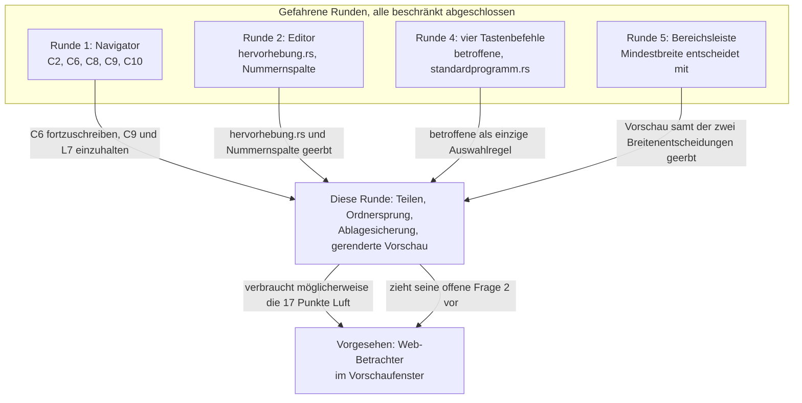

# KRK teilt Dateien, springt zum Ordner der angezeigten Datei, hält seine Ablage über ein Update und zeigt Markdown gerendert

---
**Domain:** code
**Status:** active
**Filed by:** shaper (anticipated-circle mode)
**Active spec/plan:** circles/260812-1000-teilen-ordnersprung-ablage-sichern-vorschau-rendern/planning/260812-1145_p_teilen-ordnersprung-ablage-sichern-vorschau-rendern.md
**Active session history:** circles/260812-1000-teilen-ordnersprung-ablage-sichern-vorschau-rendern/history/260812-1055-orchestrator-session.md

---

## Directive

KRK gibt nach dieser Runde vier Dinge her, die es heute nicht hat. Erstens **teilt es Dateien** über die Freigabedienste des Systems, also auch über AirDrop, und zwar über einen Tastenbefehl und über ein Kontextmenü auf der rechten Maustaste. Das Teilen wirkt in der Dateiliste auf den betroffenen Einträgen nach der Regel der Runde 4 und in Editor und Vorschau auf der Datei, die dort angezeigt wird; das neue Kontextmenü trägt zunächst genau diesen einen Eintrag. Zweitens **springt ein Tastenbefehl in den Ordner der angezeigten Datei**: das aktive der beiden Dateifenster zeigt danach den Ordner, in dem die Datei liegt, die die Vorschau oder der Editor gerade hält. Beide Befehle teilen sich den Begriff „die angezeigte Datei", und sie tun es über einen Mechanismus und nicht über zwei. Drittens **legt KRK eine beschädigte Ablagedatei zur Seite, statt sie zu überschreiben**, und das gilt für alle vier Dateien unter `~/Library/Application Support/KRK/` und nicht allein für die Lesezeichen; dazu tritt die Probe, dass eine `bookmarks.toml` in alter Form von der heutigen Fassung gelesen wird und die Lesezeichen den Lesevorgang überstehen. Viertens **zeigt die Vorschau Markdown vollständig gerendert**, mit verschwundenen Auszeichnungszeichen und ohne jede Web-Ansicht, und **Quelltext eingefärbt über die vorhandene `hervorhebung.rs` samt `syntect`**. Der Text erscheint dabei sofort und die Farben kurz danach, damit die Zusage L7 aus C8 der Runde 1 unangetastet bleibt; hervorgehoben wird jede Datei, unabhängig von ihrer Größe. **Fünftens zieht die Statuszeile über die volle Fensterbreite und lässt sich nach rechts blättern.** Heute sitzt sie je Dateifenster und ist damit für die meisten Meldungen zu schmal; künftig gibt es eine statt zweier, und wo die Herkunft einer Meldung nicht ohnehin klar ist, nennt sie ihr Dateifenster im Text. Diese fünfte Fähigkeit ist am 260812-1105 auf Vorgabe des Nutzers hinzugekommen, nachdem er die Enge beim Beantworten der Meldungsfrage benannt hat. Sie überholt eine Entscheidung der Runde 5, die genau diesen Umbau als eigene Runde vertagt hatte, und sie fasst damit C1 der Runde 1 an — eine abgenommene Fähigkeit. Der Preis ist benannt und angenommen: die Rangfolge in `statuszeile::zeile` wird neu gefasst, und die Zuordnung des Vorgangsfortschritts zu seinem Dateifenster wird von einer räumlichen zu einer sprachlichen.

Diese Runde setzt keine elfte Zeitzusage und fasst keine der zehn an.

## Grounding snapshot

Vorläufig, wie es einem vorgesehenen Circle zusteht. Erhoben am Baum am 260812-1000, Stand `6b6ea3c` und die unversionierten Änderungen darüber. Bei der Aktivierung wird der Abschnitt ersetzt.

### Woher das Vorhaben kommt

Der Nutzer hat am 260812-0930 vier Wünsche im Wortlaut gestellt: Teilen per Tastenkombination und rechter Maustaste, ein Befehl, der den Ordner der angezeigten Datei im aktiven Dateifenster öffnet, die Zusicherung, dass die Lesezeichen ein Update der Anwendung in `/Programme` überstehen, und eine gerenderte Markdown-Vorschau mit formatiertem Quelltext. Er hat entschieden, alle vier in einer Runde zu fahren, nachdem ihm vorgelegt worden war, dass der vierte Wunsch die offene Frage 2 des vorgesehenen Circles `260804-0933-eingebauter-web-betrachter-im-vorschaufenster` anschneidet und die Dreiteilung der Anzeige aus C6 der Runde 1 zweimal angefasst wird.

### Die vier Festlegungen des Nutzers

Sie sind Festlegung und nicht Möglichkeit. Der Plan hat sie umzusetzen und nicht neu zu erwägen.

**A. Markdown wird voll gerendert, ohne Web-Ansicht.** Die Auszeichnungszeichen verschwinden: `# Überschrift` erscheint als große Zeile ohne Doppelkreuz, `[Text](Ziel)` als Verweis ohne Klammern. Möglich ist das, weil die Vorschau nicht bearbeitbar ist. Der Grund, aus dem der Nutzer diese Lesart am 260808-0155 für den Editor abgelehnt hat, greift hier nicht: dort stand die Rückrechnung von der Darstellung auf den Quelltext im Weg, und die ist bei Markdown nicht eindeutig (`circles/260807-2116-eingebauter-editor-mit-textmarken/decisions/260808-0140_*_was-heisst-gerendert-bei-markdown-wenn-zugleich-bearbeitet-wird.md`, Möglichkeit 2 gegen Möglichkeit 1). Eine Vorschau, in der niemand tippt, braucht keine Rückrechnung. Der Preis ist benannt und angenommen: dieselbe Markdown-Datei sieht im Editor anders aus als in der Vorschau, und es entsteht ein zweites Mittel neben `hervorhebung.rs`. Quelltext dagegen läuft in jedem Fall über das vorhandene `hervorhebung.rs` samt `syntect`, nicht über etwas Neues. Eine Web-Ansicht ist ausdrücklich abgelehnt.

**B. Der Text erscheint sofort, die Farben kommen kurz danach nach.** L7 misst „Vorschau des ausgewählten Eintrags sichtbar" mit 100 ms im 95. Perzentil (`crates/krk-bench/src/messen.rs:1109-1113`). Sichtbar ist der Text, sobald er steht; die Zusage bleibt damit unangetastet, ohne dass jemand sie neu messen müsste. Hervorgehoben wird immer, unabhängig von der Dateigröße. Der Preis ist das sichtbare Nachziehen der Farben. Eine kleinere Hervorhebungsgrenze ist abgelehnt, weil sie eine versteckte Kante wäre; ein Neumessen von L7 ebenfalls, weil das Projekt mit gesenkten Zusagen an L9 schlechte Erfahrung gemacht hat und Messen ohnehin Nutzerarbeit ist.

**C. Teilen wirkt in der Dateiliste, im Editor und in der Vorschau.** In der Dateiliste auf den betroffenen Einträgen nach der Regel aus der Runde 4, in Editor und Vorschau auf der angezeigten Datei. Der Grund für diese Wahl ist der geteilte Begriff: „die angezeigte Datei" trägt zugleich den zweiten Wunsch, und ein Mechanismus für beide ist billiger und haltbarer als zwei nebeneinander. Das neue Kontextmenü trägt zunächst genau einen Eintrag; was sonst hineingehört, ist ausdrücklich einer späteren Runde vorbehalten.

**D. Eine beschädigte Ablagedatei wird zur Seite gelegt statt überschrieben.** Für alle vier Dateien unter `~/Library/Application Support/KRK/` und nicht nur für die Lesezeichen. Dazu die Probe, dass eine `bookmarks.toml` in alter Form von der heutigen Fassung gelesen wird und die Lesezeichen es überstehen.

### Wunsch 1, Teilen: ganz neu, ohne jeden Anknüpfungspunkt

`NSSharingServicePicker` kommt im Baum nicht vor. Ein `menuForEvent:` gibt es an keiner Stelle unter `crates/krk-ui/src/appkit/`, und damit hat keine Ansicht dieses Programms heute ein eigenes Kontextmenü. Das Kontextmenü, das der Editor zeigt, ist AppKits eigenes an der `NSTextView` und gehört KRK nicht.

Was steht und wiederverwendet gehört:

- `crates/krk-ui/src/kommandos/operationen.rs:162`, `betroffene`, ist die eine Stelle, die die Regel „Markierung hat Vorrang, sonst der Eintrag unter der Auswahl" trägt. Sie liefert die Pfade in Sichtreihenfolge. Das Teilen in der Dateiliste fragt hier und führt keine zweite Auswahlregel ein.
- `crates/krk-ui/src/appkit/standardprogramm.rs` ist die Vorlage für den Zuschnitt: ein Modul je Frage, eine sichere Hülle je Aufruf, und was die Hülle verlässt, ist ein gewöhnlicher Rust-Wert. Sein Modulkopf begründet auch, warum es kein Zusatz zu `zwischenablage.rs` oder `terminal.rs` geworden ist. Dieselbe Erwägung trägt für das Teilen.
- `crates/krk-ui/src/appkit/tabelle.rs` hält die `NSTableView` des Dateifensters mit ihren zwei Objective-C-Klassen, `crates/krk-ui/src/appkit/vorschau.rs` die Inhaltsfläche der Vorschau, `crates/krk-ui/src/appkit/editor.rs` die Textfläche des Editors. Das sind die drei Orte, an denen ein Kontextmenü hängen müsste.

### Wunsch 2, Ordnersprung: es gibt ihn nicht, und er ist einfacher als gedacht

Die Auslieferungsbelegung führt `ordner_anlegen`, `ordner_aufwaerts` und `ordnerpfad_kopieren`. Nichts davon springt zum Ordner der angezeigten Datei.

**„Die angezeigte Datei" ist in KRK eindeutig und braucht keine Fokusregel.** Vorschau und Editor teilen sich ihre Fläche zeitlich und nicht räumlich: `Bereich::teilt_flaeche_mit` (`crates/krk-ui/src/fenstermodell.rs:191`) verbindet die beiden gegenseitig, wird einer sichtbar, geht der andere. Höchstens einer von beiden zeigt also etwas, und der Befehl muss nicht fragen, wo der Fokus steht. Die Probe `der_ausschluss_ist_gegenseitig` (`:2445`) hält die Symmetrie fest.

Die beiden Quellen des Pfades stehen bereit: `Vorschaumodell::aktiver_pfad` (`crates/krk-ui/src/vorschaumodell.rs:434`) liefert `Option<PathBuf>`, `Editormodell::pfad` (`crates/krk-ui/src/editormodell.rs:621`) liefert `Option<&Path>`. Beide sind schon `Option`, weil ein Vorschau-Tab auch Text aus der Zwischenablage halten kann und der Editor auch gar keine Datei.

**Der Weg in den Zielordner ist bereits gebaut, samt der Auswahl darin.** `Dateifenster::ordner_lesen(pfad, auswahl)` (`crates/krk-ui/src/appkit/tabelle.rs:628`) reicht an `Tabliste::ordner_setzen` (`crates/krk-ui/src/tabs.rs:508`) durch, und der zweite Parameter ist genau der Name des Eintrags, auf den die Auswahl springen soll, sobald gelesen ist. Der Aufstieg aus C2 nennt dort den verlassenen Ordner, der Sprung aus C10 die in der Zwischenablage genannte Datei. Getragen wird beides von derselben `wunschauswahl`, die auch die Sitzungswiederherstellung benutzt: der Name überlebt einen noch laufenden Lesevorgang, eine Zeilennummer nicht. Der Hintergrund dazu steht in `CLAUDE.md` unter „Ein Lesevorgang leert sein Ordnermodell nicht vorab". Der Ordnersprung ist damit im Kern ein weiterer Aufrufer dieses Weges und kein neuer Mechanismus.

### Wunsch 3, Ablage: zum größten Teil schon erfüllt, aber am falschen Punkt gesucht

**Die Lesezeichen liegen nicht im Bündel.** `crates/krk-core/src/ablage/pfade.rs:79` setzt den Ablageordner auf `~/Library/Application Support/KRK/`, `bookmarks.toml` ist einer von vier Namen darin (`:70`). KRK läuft außerhalb der App-Sandbox. Die Abnahmeprobe `der_ablageordner_liegt_unter_application_support` (`crates/krk-core/tests/ablage.rs:159`) nagelt Ort und alle vier Dateinamen bereits fest. Ein Austausch von `KRK.app` in `/Programme` erreicht diese Dateien nicht.

**Der echte Verlustweg ist ein anderer, und er ist der Grund für Festlegung D.** `Ablage::laden` (`crates/krk-core/src/ablage/mod.rs:220-260`) scheitert nie: eine nicht lesbare oder syntaktisch kaputte Datei führt zum Auslieferungszustand und zu einer `Ersetzung`, die die Datei benennt. Der Modulkopf hält ausdrücklich fest, dass die Datei auf der Platte dabei stehen bleibt und „erst beim nächsten gewöhnlichen Schreibvorgang" überschrieben wird (`:88-93`). Genau dieser nächste Schreibvorgang ist der Schaden: eine künftige Fassung von KRK, die die alte Datei nicht mehr versteht, liest sie als beschädigt, arbeitet auf dem leeren Auslieferungszustand weiter und schreibt ihn beim Beenden über die Lesezeichen des Nutzers. Eine Sicherungskopie gibt es nicht; `crates/krk-core/src/ablage/atomar.rs` schreibt in eine Nachbardatei `<name>.neu` und benennt um, und diese Nachbardatei ist ausdrücklich niemandes Leseziel (`:24-30`).

Der Meldeweg steht schon: `Grund` (`:83`) unterscheidet nicht lesbar, beschädigt und nicht anlegbar, `melden` (`:156`) macht daraus einen Satz und gibt ihn zurück, statt ihn zu schreiben. Die Aufrufrichtung bleibt von oben nach unten; der Kern gibt nichts aus. Eine zur Seite gelegte Datei erweitert diesen Satz und baut keinen zweiten Meldeweg.

### Wunsch 4, Vorschau: heute reiner Text, und die Dreiteilung wird zweimal angefasst

Die Vorschau kennt drei Ausgänge (C6): Text bis 1 MB und Markdown als reiner Inhalt, die gängigen Bildformate bis 64 MB als Bild, alles Übrige einschließlich Ordner als Metadaten. Der Modulkopf sagt es in `crates/krk-ui/src/vorschaumodell.rs:29`, die Grenzen stehen als `TEXTGRENZE` (`:117`) und `BILDGRENZE` (`:129`). Der Träger ist `Inhalt::Text(String)` (`:190`), eine nackte Zeichenkette ohne jedes Merkmal, und die Ansicht setzt sie mit `setString` an eine `NSTextView`, die weder bearbeitbar noch auswählbar ist (`crates/krk-ui/src/appkit/vorschau.rs:462`, `:574-575`).

**Zweimal angefasst heißt: der Ausgang „reiner Inhalt" zerfällt.** Markdown geht künftig einen eigenen Weg, Quelltext einen zweiten, einfacher Text bleibt, wo er ist. Ob daraus eine Vierteilung oder eine Dreiteilung mit einer Unterscheidung darin wird, ist eine Frage des Plans; dass C6 als abgenommene Fähigkeit der Runde 1 fortgeschrieben werden muss, ist keine.

Der Editor hat seine Formatansicht seit der Runde 2. `crates/krk-ui/src/hervorhebung.rs` führt die Kiste **einmal** über den Text und bedient daraus zwei Verbraucher: Einfärbungen als vorübergehende Merkmale des Layoutverwalters, Auszeichnungen als Merkmale des Textspeichers. Der Schnitt zwischen beiden ist nicht „Farbe gegen Rest", sondern „wirkt auf die Auslegung oder nicht", und er stammt aus dem Kopf von AppKit selbst (`NSLayoutManager.h:351`, zitiert im Modulkopf). Das Modul rechnet den vorigen Durchgang fort statt ihn zu wiederholen: je Zeile ein `Zerlegerstand` als Haltepunkt, Wiedereinstieg am letzten Haltepunkt vor der ersten Abweichung. `Dateityp::von_pfad` (`crates/krk-ui/src/editormodell.rs:323`) kennt vier Markdown-Endungen. Keine Zeile AppKit steht in `hervorhebung.rs`, und das ist die Eigenschaft, an der eine zweite Verwendung durch die Vorschau hängt.

Die Nummernspalte ist der Punkt, an dem gerendertes Markdown auf eine Zusage der Runde 2 trifft. `crates/krk-ui/src/appkit/nummernspalte.rs` ist **eine** Klasse für Editor und Vorschau, und ob sie in der Vorschau steht, entscheidet allein `Vorschaumodell::zeigt_dateitext` (`crates/krk-ui/src/vorschaumodell.rs:451`), eine vollständige Fallunterscheidung ohne Auffangzweig. Sobald Markdown gerendert erscheint, stimmen Anzeigezeile und Dateizeile nicht mehr überein.

### Was am laufenden Bündel bleibt, und damit Nutzerarbeit ist

Alle fünf gefahrenen Runden sind aus diesem einen Grund beschränkt abgeschlossen: der Abnahmelauf verlangt KRK im Vordergrund, und kein Agent kann ihn fahren (`circles/260802-0842-krk-mac-dateimanager-editor-git/decisions/260806-1303_*_wie-kommt-krk-fuer-den-abnahmelauf-in-den-vordergrund.md`). Der Schnitt dieser Runde ist deshalb so zu legen, dass möglichst viel ohne Vordergrund prüfbar ist. Was ohne Bündel geht und was nicht, lässt sich heute schon trennen:

| Ohne laufendes Bündel prüfbar | Nur am laufenden Bündel im Vordergrund |
|---|---|
| Die Menge der betroffenen Einträge beim Teilen, über `betroffene` | Dass der Freigabedialog aufgeht und AirDrop darin steht |
| Der Zielordner und der vorzumerkende Name beim Ordnersprung, als reine Rechnung über `aktiver_pfad`, `pfad` und `ordner_setzen` | Dass das aktive Dateifenster danach wirklich den Ordner zeigt und die Zeile ausgewählt ist |
| Das Zur-Seite-Legen samt Namenswahl und Kollisionsfall, an einem Prüfordner im Kern | Dass die Meldung in der Statuszeile ankommt |
| Die Zerlegung von Markdown in Auszeichnungen und die Merkmale, die daraus folgen, als reine Rechnung neben `hervorhebung.rs` | Dass das Ergebnis in der Vorschaufläche so aussieht, wie es soll, und dass die Farben sichtbar nachziehen |

Die zweite Spalte ist die zu erwartende Beschränkung. Die erste ist der Teil, den der Plan groß machen sollte.

**Ein zusätzlicher Prüfhemmschuh gilt für alles, was in `krk-ui` an AppKit hängt:** die Kiste hat kein Bibliotheksziel, nur das Binärziel `krk`. Eine Datei unter `crates/krk-ui/tests/` erreicht nichts aus `krk-ui`, ob `pub` oder nicht. Proben der Oberfläche stehen deshalb in `#[cfg(test)]`-Modulen neben dem Code, und die, die eine `NSTextView` bauen, behaupten den Hauptfaden über `MainThreadMarker::new_unchecked`. Die Frage nach einem Prüfziel ohne `libtest`-Harness ist zurückgestellt und bedeutet einen Umbau der ganzen Kiste (`circles/260807-2116-eingebauter-editor-mit-textmarken/decisions/260810-1044_*_ziehen-die-vier-instanzproben-in-ein-pruefziel-ohne-libtest-harness-um.md`). Diese Runde erbt die Lage unverändert.

### Die Aufzählungen, die der Bau anhält

Vier vollständige Fallunterscheidungen ohne Auffangzweig halten in diesem Projekt den Bau an, sobald eine Variante hinzukommt. Am 260812-1000 nachgezählt: `Kommando` (`crates/krk-core/src/tasten/belegung.rs:546`) trägt 73 Kennungen, `Wirkungsbereich` (dieselbe Datei) sieben Werte, `Bereich` (`crates/krk-ui/src/fenstermodell.rs`) fünf, `Fokus` (`crates/krk-ui/src/kommandos/fokus.rs:75`) fünf. Diese Runde legt mindestens zwei Kommandos an, und jedes braucht eine Zeile in `Kommando::wirkungsbereich` (`:681`) und in `bereich_des_kommandos` (`crates/krk-ui/src/belegungsmodell.rs:166`).

Daneben zerfällt mit Wunsch 4 die Fallunterscheidung `Vorschaumodell::zeigt_dateitext` in ihrer heutigen Form, und `Inhalt` (`crates/krk-ui/src/vorschaumodell.rs:182`, fünf Varianten) bekommt vermutlich eine sechste. Der Übersetzer nennt die nachzuziehenden Stellen genauer als jede Aufstellung hier.

**Freie Tastenkombinationen sind knapp.** Die Auslieferungsbelegung `resources/default-keymap.toml` führt 79 Funktionen mit 85 Kombinationen. Welche die beiden neuen Befehle bekommen, ist die erste der offenen Fragen unten.

### Die offenen Fragen liegen in `decisions/`

Dreizehn Fragen sind beim Lesen des Baums aufgekommen und liegen je einzeln als offener Datensatz in `decisions/` dieses Circles. Sie tragen ihre Möglichkeiten samt der Folgen, die jede am Code auslöst. Keine hält die Anlage dieses Circles auf; alle binden seine Aktivierung.

| Datensatz | Wozu |
|---|---|
| `260812-1000_*_welche-tastenkombinationen-bekommen-die-zwei-neuen-befehle.md` | Wünsche 1 und 2 |
| `260812-1000_*_teilt-krk-auch-ordner-oder-nur-dateien.md` | Wunsch 1 |
| `260812-1000_*_an-welchen-drei-flaechen-haengt-das-neue-kontextmenue.md` | Wunsch 1 |
| `260812-1000_*_oeffnet-der-ordnersprung-einen-neuen-tab-oder-wechselt-er-den-aktiven.md` | Wunsch 2 |
| `260812-1000_*_wird-die-datei-im-zielordner-ausgewaehlt.md` | Wunsch 2 |
| `260812-1000_*_was-tut-der-ordnersprung-wenn-es-keinen-zielordner-gibt.md` | Wunsch 2 |
| `260812-1000_*_wie-heisst-die-zur-seite-gelegte-ablagedatei-und-was-geschieht-beim-zweiten-mal.md` | Wunsch 3 |
| `260812-1000_*_wie-erfaehrt-der-nutzer-dass-eine-ablagedatei-zur-seite-gelegt-wurde.md` | Wunsch 3 |
| `260812-1000_*_welchen-umfang-von-markdown-rendert-die-vorschau.md` | Wunsch 4 |
| `260812-1000_*_was-tut-die-nummernspalte-bei-gerendertem-markdown.md` | Wunsch 4 |
| `260812-1000_*_was-tut-ein-link-im-gerenderten-markdown-und-bleibt-die-vorschau-unauswaehlbar.md` | Wunsch 4 |
| `260812-1000_*_zeigt-die-vorschau-lokale-html-dateien-gerendert.md` | Wunsch 4, Web-Betrachter |
| `260812-1000_*_braucht-die-vorschau-mit-gerendertem-markdown-mehr-mindestbreite.md` | Wunsch 4, Runde 5, Web-Betrachter |

### Was dieser Circle nicht festlegt

Womit die Vorschau Markdown zerlegt, ist offen und gehört dem Plan. Der Circle legt keine Kiste fest und schließt keine aus, mit einer Ausnahme: die Web-Ansicht ist nicht das Mittel, weil der Nutzer sie ausdrücklich abgelehnt hat. Falls eine fremde Kiste hinzukommt, braucht sie in der Wurzel-`Cargo.toml` den Satz, warum sie eingebunden ist, wie jede fremde Kiste dieses Projekts; und `syntect` und `two-face` stehen dort ohne ihre Vorgabemerkmale, weil deren Vorgabesatz eine Bibliothek in C hereinzöge und die Bauvoraussetzungen änderte.

Ebenso offen bleibt, wie die Farben nachgeliefert werden. Festgelegt ist die Wirkung aus Festlegung B, nämlich Text sofort und Farben kurz danach, nicht der Weg dorthin.

## Dependencies

Die beiden Kanten nach rechts sind der Grund, aus dem die Reihenfolge der beiden Circles nicht beliebig ist. Alle übrigen laufen aus abgeschlossenen Runden herein; ein Zyklus besteht nicht.

Drei Circles binden dieses Vorhaben unmittelbar, und die Richtung der Bindung ist bei jedem eine andere.

**`260807-2116-eingebauter-editor-mit-textmarken` (Runde 2, beschränkt abgeschlossen).** Diese Runde erbt von ihr und ändert an ihr nichts. Sie erbt `crates/krk-ui/src/hervorhebung.rs` als das eine Mittel für Quelltext, den `Dateityp` mit seinen vier Markdown-Endungen, die Nummernspalte als eine Klasse für zwei Flächen, und `Editormodell::pfad` als eine der beiden Quellen der angezeigten Datei. Sie berührt daneben die Nutzerantwort vom 260808-0155 zur Markdown-Frage (`circles/260807-2116-eingebauter-editor-mit-textmarken/decisions/260808-0140_*_was-heisst-gerendert-bei-markdown-wenn-zugleich-bearbeitet-wird.md`), ohne sie aufzuheben: jene Antwort gilt dem Editor, in dem bearbeitet wird, diese Runde der Vorschau, in der nicht bearbeitet wird. Der Preis, dieselbe Datei an zwei Stellen verschieden zu sehen, ist in Festlegung A ausdrücklich angenommen.

**`260811-1304-statusleiste-mit-bereichsschaltern` (Runde 5, beschränkt abgeschlossen).** Diese Runde erbt die Vorschau in dem Zustand, den die Runde 5 hinterlassen hat, und erbt damit deren wichtigste Einzelfolge. Die Mindestbreite der Vorschau von 160 Punkten (`crates/krk-ui/src/fenstermodell.rs:213`) war bis zur Runde 5 eine Zahl, die allein beim Ziehen der Trennlinie galt. Seither entscheidet sie zweierlei: ob die Vorschau überhaupt aufgeht, weil `Fenstermodell::umschalten` einen Einschaltbefehl stumm abweist, dessen Bereichssatz nicht mehr in die Fensterzeile passt, und wer beim Schrumpfen weicht, weil `bereichsbreiten` einen Bereich unter seinem Mindestmaß aus der Verteilung nimmt. Bei der Fensterbreite von 780 Punkten aus `MINDESTGROESSE` bleibt der Vorschau eine Obergrenze von rund 177 Punkten, gerechnet und nicht gemessen. Gerendertes Markdown mit Überschriften und eingerückten Listen ist der erste Vorschauinhalt, für den 160 Punkte knapp werden könnten; die Frage liegt als eigener Datensatz vor. Aus der Abschlussnotiz der Runde 5 trägt daneben die Bitte an die Nachfolger, L9 nachzumessen, weil die Bereichsleiste der Fensterzeile 18 Punkte Höhe nimmt. Diese Runde setzt keine neue Zahl und misst nichts nach; sie hält den Punkt nur fest, damit er nicht verlorengeht.

**`260804-0933-eingebauter-web-betrachter-im-vorschaufenster` (vorgesehen, noch nicht gefahren).** Hier läuft die Bindung **von diesem Circle zu jenem** und nicht umgekehrt: jener Circle hat heute keine Kante hierher, und wer seinen Abschnitt `## Dependencies` liest, sieht die Beziehung nicht. Diese Runde nimmt ihm zwei Dinge vorweg.

*Erstens seine offene Frage 2, „Zeigt der Betrachter auch lokale HTML-Dateien?"* Jene Frage ist gestellt, weil eine `.html`-Datei heute unter Text fällt und als Quelltext erscheint, und weil ein gerendertes HTML die Dreiteilung aus C6 änderte. Diese Runde ändert die Dreiteilung ohnehin, für Markdown. Damit steht die Frage hier zur Entscheidung an, bevor der Web-Betrachter sie stellen kann; ob diese Runde sie beantwortet oder ausdrücklich stehen lässt, liegt als eigener Datensatz vor (`decisions/260812-1000_*_zeigt-die-vorschau-lokale-html-dateien-gerendert.md`).

*Zweitens den Platz in der Vorschaufläche.* Der Betrachter hat nach der Rechnung der Runde 5 oberhalb der heutigen 160 Punkte rund 17 Punkte Luft, und die Zahl gehört dem Bereich und nicht dem Tab, gilt also für jeden Vorschau-Tab mit. Hebt diese Runde die Mindestbreite für gerendertes Markdown an, verbraucht sie diese Luft, und der Web-Betrachter findet sie nicht mehr vor. Wer den Datensatz `decisions/260812-1000_*_braucht-die-vorschau-mit-gerendertem-markdown-mehr-mindestbreite.md` beantwortet, entscheidet damit auch über jenen Circle.

Was diese Runde ihm **nicht** vorwegnimmt: sie zeigt keinen Web-Inhalt, öffnet keine Adresse, ändert `zwischenablage_springen` nicht und rührt die Grenze aus C9 nicht an. Eine Web-Ansicht ist in Festlegung A ausdrücklich abgelehnt.

**Zwei weitere Runden binden, ohne dass diese von ihnen abhinge.** Die Runde 1 (`260802-0842-krk-mac-dateimanager-editor-git`) hält die Fähigkeiten, die diese Runde fortschreibt: C6 mit der Dreiteilung der Anzeige, C9 mit der Grenze auf lokale Laufwerke, C10 mit der Zwischenablage als Quelle, C2 mit dem Aufstieg, der `ordner_setzen` samt Auswahlnamen bereits benutzt, und C8 mit den zehn Zeitzusagen, von denen L7 hier berührt und nicht angetastet wird. Die Runde 4 (`260811-1257-vier-tastenbefehle-pfade-kopieren-oeffnen`) hält `betroffene` als die eine Auswahlregel und `standardprogramm.rs` als die Vorlage für den Zuschnitt einer Systemhülle. Beide sind beschränkt abgeschlossen; ihre Speicher binden weiter.

**Nicht abhängig, aber bindend:** die projektweit offene Frage, ob die Angabe der macOS-Untergrenze prüfbar gemacht wird (`shared/decisions/260811-2050_*_wird-die-untergrenzen-angabe-pruefbar-gemacht.md`). Jede neue Datei unter `crates/krk-ui/src/appkit/` braucht den Abschnitt `# Ab welchem macOS die angesprochenen Klassen stehen` im Modulkopf, und für `NSSharingServicePicker` ist die Angabe von Hand zu erheben. `objc2` führt keine Verfügbarkeitsangaben mit sich; der Übersetzer hält die Untergrenze nicht, und ein Fehlgriff endet als Absturz auf dem Referenzgerät.

## Turn log

- Turn 1 (Sitzung 260812-1055): Commits 4d4402d..d6eff4b, fuenf davon in diesem Turn (755571a, 95b2dfa, 8bc84ce, 90b60d8, d6eff4b); Planschritte 1 bis 6 auf [DONE], sechs von elf. Coherence-Urteil: ok (Nutzerentscheid am Turn-Ende, weitermachen). Durchsichten: reviews/260812-1526-ontorev-belegungsdatei-ordner-der-datei-und-teilen.md und reviews/260812-1529-coderev-turn-1-der-runde-6.md, Bereich 4d4402d..d6eff4b, acht Defekte abgelegt, einer geschlossen. Grundlage: acht Entscheidungen umgesetzt, eine neue Frage offen. Sitzungsprotokoll: history/260812-1055-orchestrator-session.md

- Turn 2 (Sitzung 260812-1055): Commits 34ab5b5..94a81bd, neun davon in diesem Turn; Planschritte 7 bis 11 auf [DONE], damit alle elf, und der Plan auf _c_. Coherence-Urteil: siehe Turn-Ende. Durchsicht: reviews/260812-1805-coderev-turn-2-der-runde-6.md, Bereich 34ab5b5..05797d7, zehn Defekte abgelegt. Grundlage: der Nutzer hat waehrend des Turns C5.10 ueberholt (Kurzhinweis statt Blaettern), der Datensatz 260812-1105 steht auf _s_, 260812-1809_*_ traegt die neue Antwort. Schritt 11 ist damit zurueckzunehmen. Sitzungsprotokoll: history/260812-1055-orchestrator-session.md

- Turn 3 (Sitzung 260812-1055): Commits 94a81bd..f401dcc, vier davon in diesem Turn (a9e1149, 23e7311, df4ec00, f401dcc). Ein Reparatur-Turn ohne Planschritte: der Inhaltsverlust der Markdown-Zerlegung, die Listen ohne Merkzeichen und Tiefe, die Statuszeile mit dem ausgeblendeten Dateifenster, und die Ruecknahme von Schritt 11 zugunsten eines Kurzhinweises. Coherence-Urteil: ok. Durchsicht: reviews/260812-1920-coderev-turn-3-der-runde-6.md, Bereich 94a81bd..df4ec00, sechs Defekte, darunter eine Verschlechterung dieses Turns. Grundlage: der Umfang der Vorschau ist um verschachtelte Listen erweitert (260812-1000 auf _s_, 260812-1851 auf _i_), der Kurzhinweis umgesetzt (260812-1809 auf _i_). Sitzungsprotokoll: history/260812-1055-orchestrator-session.md

- Turn 4 (Sitzung 260812-1055): Commits f401dcc..1e4e01f, drei davon in diesem Turn (c6bf13d, c35f8b1, 1e4e01f). Reparatur-Turn: die lose Liste, die Deckung im Container, und die Buchfuehrung (Sternform in den Rueckverweisen, doppelte Fuehrung derselben Restarbeit). Coherence-Urteil: ok. Durchsicht: reviews/260812-2019-coderev-turn-4-der-runde-6.md, Bereich f401dcc..c35f8b1, sechs Defekte, darunter erneut eine Verschlechterung dieses Turns: das Merkzeichen liegt im Bereich des ersten Kindes. Der Nutzer hat entschieden, das Turn-Budget zu erhoehen und reparieren zu lassen. Sitzungsprotokoll: history/260812-1055-orchestrator-session.md

## Activation proposal

**Vorgeschlagen am:** 260812-1027
**Playmaker-Lauf:** 260812-1027-playmaker-direct-dispatch
**Domain-Gewichtung:** code
**Vorgeschlagener Aktivierungszeitpunkt:** nach einer Klärungsrunde über die dreizehn abgelegten
Fragen, ohne vorgelagerte Untersuchung

Dieser Circle ist der empfohlene nächste Kandidat, und zum ersten Mal in diesem Projekt steht
hinter der Empfehlung ein Vergleich statt eines Einzelstücks. Seit dem Lauf vom 260812-0816 ist
das Feld der vorgesehenen Circles von einem auf zwei gewachsen. Der zweite Kandidat ist
`260804-0933-eingebauter-web-betrachter-im-vorschaufenster`, und er steht auf Rang 2.

**Die Rangfolge widerspricht der wörtlichen Zählung der Domänenheuristik, und der Grund liegt an
der Zählung.** Die Gewichtung `code` bevorzugt Kandidaten mit wenigen offenen
Entscheidungsdatensätzen im Grounding. Dieser Circle zitiert dreizehn eigene offene Fragen, der
Web-Betrachter drei. Die dreizehn sind jedoch Vorarbeit und keine Schuld: der Shaper-Lauf vom
260812-1000 hat jede Frage einzeln abgelegt, mit ihren Möglichkeiten und den Folgen, die jede am
Code auslöst. Der Web-Betrachter trägt seine offenen Punkte als Prosa im Abschnitt
`## Grounding snapshot`, drei aus dem Anlage-Lauf und einen vierten, den der Lauf vom 260812-0816
hinzugefügt hat; kein einziger liegt als Datensatz vor. Gezählt wird damit die Ablagedisziplin und
nicht die Reife. Wer der Zahl folgt, belohnt den Kandidaten, der seine Fragen nicht aufgeschrieben
hat.

**Die Festlegungen des Nutzers stehen, und sie stehen im Wortlaut.** Vier Antworten vom
260812-0930 sind als Festlegung übernommen, mit der ausdrücklichen Anweisung, nicht erneut zu
fragen (`shared/history/260812-1000-shaper-teilen-ordnersprung-ablage-sichern-vorschau-rendern.md`).
Der Zuschnitt der Runde ist damit entschieden, bevor die Aktivierung beginnt. Beim Web-Betrachter
ist die erste seiner offenen Fragen, welche Quellen eine Adresse setzen dürfen, genau die Frage
nach dem Zuschnitt: sie entscheidet, ob KRK einen Betrachter oder einen Browser bekommt.

**Was diese Runde erbt, liegt auf der Platte, am 260812-1027 nachgelesen.** Die Auswahlregel
`betroffene` steht in `crates/krk-ui/src/kommandos/operationen.rs:162` und ist die eine Stelle, an
der „Markierung hat Vorrang, sonst der Eintrag unter der Auswahl" hängt. Der Weg in den Zielordner
samt vorzumerkendem Namen steht als `Dateifenster::ordner_lesen` und `Tabliste::ordner_setzen` und
hat mit dem Aufstieg aus C2 und dem Sprung aus C10 bereits zwei Aufrufer. `hervorhebung.rs` führt
`syntect` einmal über den Text und trägt keine Zeile AppKit, was die zweite Verwendung durch die
Vorschau überhaupt möglich macht. Die Ablage liegt außerhalb des Bündels, und die Abnahmeprobe
`der_ablageordner_liegt_unter_application_support` nagelt Ort und Dateinamen fest.

**Offen ist ein Mittel und ein Neuland.** Womit die Vorschau Markdown zerlegt, legt der Circle
nicht fest, und die Frage gehört dem Plan. Das Teilen hat keinen Anknüpfungspunkt:
`NSSharingServicePicker` kommt im Baum nicht vor, und ein `menuForEvent:` steht an keiner Stelle
unter `crates/krk-ui/src/appkit/` (geprüft am 260812-1027 über den ganzen Baum unter `crates/`).
KRK hat heute kein eigenes Kontextmenü. Beides ist Planarbeit und keine vorgelagerte Untersuchung.
Beim Web-Betrachter ist der Unterschied genau umgekehrt: sein Datensatz verlangt selbst „eine
eigene Untersuchung vor dem Plan" für das Mittel der Darstellung, und eine Untersuchung ist teurer
als eine Klärungsrunde.

**Die Reihenfolge der beiden Circles ist nicht beliebig, und der Datensatz sagt selbst, warum.**
Der Abschnitt `## Dependencies` führt zwei Kanten zum Web-Betrachter. Diese Runde zieht dessen
offene Frage 2 vor, ob lokale HTML-Dateien gerendert erscheinen, weil sie die Dreiteilung der
Anzeige aus C6 für Markdown ohnehin anfasst. Und sie entscheidet mit
`decisions/260812-1000_*_braucht-die-vorschau-mit-gerendertem-markdown-mehr-mindestbreite.md` über
die rund 17 Punkte Luft, die dem Web-Betrachter oberhalb der heutigen 160 Punkte bleiben; die
Mindestbreite gehört dem Bereich und nicht dem Tab, gilt also für jeden Vorschau-Tab mit. Läuft
der Web-Betrachter zuerst, entscheidet er beide Fragen ohne den Markdown-Zusammenhang, in dem sie
entstehen. Läuft diese Runde zuerst, findet er sie entschieden vor.

**Zur Abhängigkeitslage, die in diesem Projekt nichts unterscheidet.** Alle vier Circle-Abhängig-
keiten dieses Datensatzes sind beschränkt abgeschlossen (`_b_`) und keine kohärent (`_c_`), also
trägt er nach der Rangheuristik das Kennzeichen der unerfüllten Vorbedingung. Dasselbe Kennzeichen
trägt jeder denkbare Kandidat dieses Projekts, weil alle fünf gefahrenen Runden aus demselben
Grund beschränkt sind: der Abnahmelauf verlangt KRK im Vordergrund und ist Nutzerarbeit
(`circles/260802-0842-krk-mac-dateimanager-editor-git/decisions/260806-1303_*_wie-kommt-krk-fuer-den-abnahmelauf-in-den-vordergrund.md`).
Als Befund gegen diesen Kandidaten gelesen wäre es falsch. Inhaltlich bindet die Beschränkung hier
schwächer als beim Web-Betrachter: dessen dritte offene Frage leitet eine mögliche elfte Zeitzusage
aus den zehn bestehenden ab, deren Belegstand offen ist, während diese Runde ausdrücklich keine
neue Zusage setzt und keine der zehn anfasst.

**Was vor der Aktivierung zu tun bleibt.** Die dreizehn Fragen in `decisions/` sind die erste
Arbeit der Klärungsrunde. Vier davon binden über den Circle hinaus, und zwei davon entscheiden
zugleich über den Web-Betrachter. Der Shaper im portfolio-activation-Modus arbeitet sie mit dem
Nutzer durch, bevor ein Plan entsteht.

Der Playmaker benennt Kandidaten, er aktiviert sie nicht. Die Umbenennung des Datensatzes von
`_a_circle.md` auf `_t_circle.md` und das Schreiben von `.active-circle` bleiben beim Nutzer über
`/fusion:next` oder beim Orchestrator.
