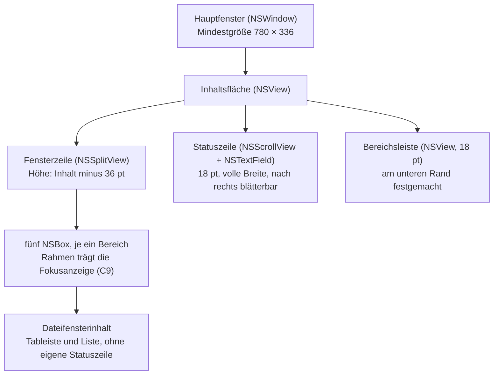
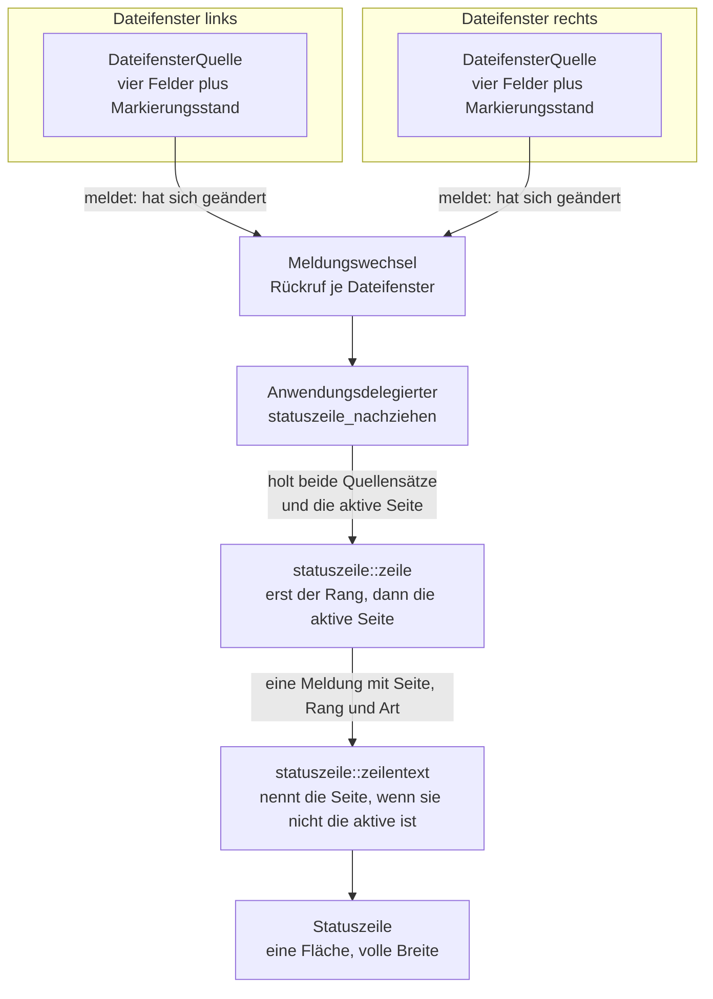
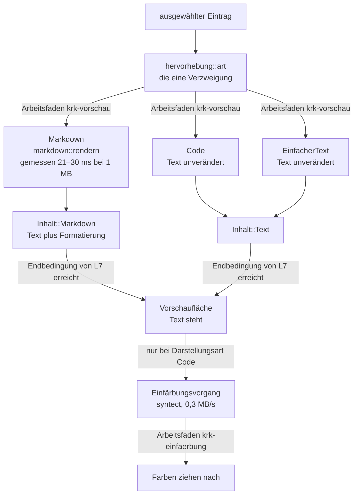
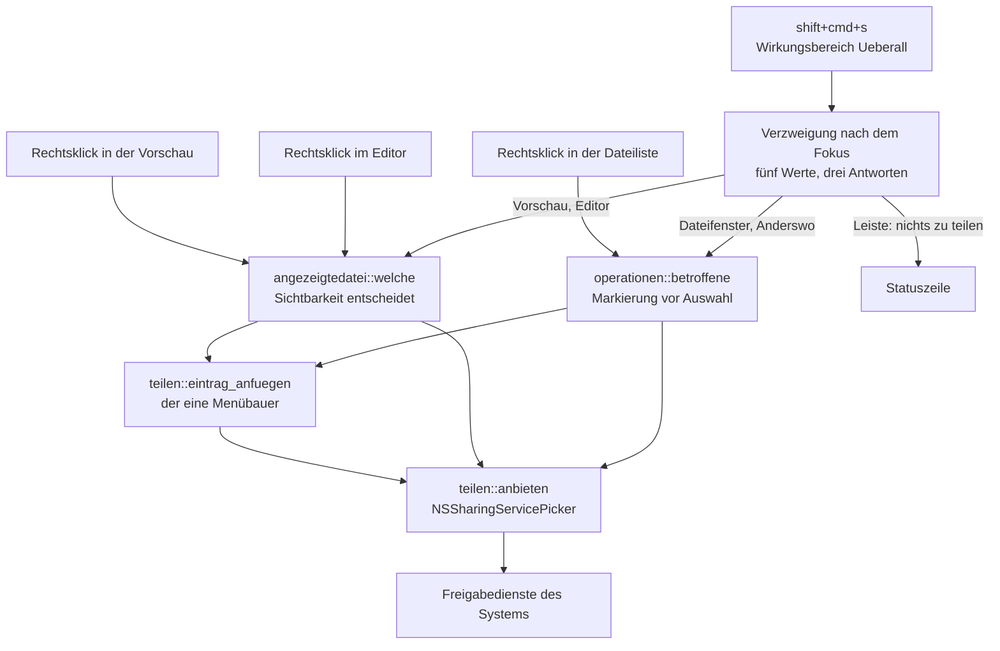
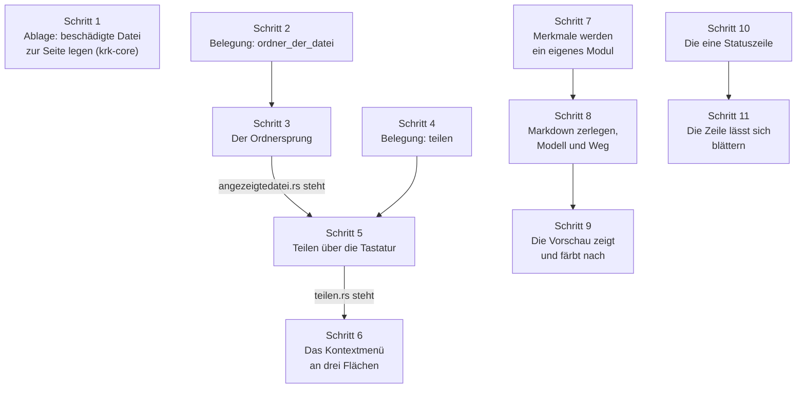

# Implementierungsplan: Teilen, Ordnersprung, Ablagesicherung, gerenderte Vorschau, eine Statuszeile

**Date:** 2026-08-12
**Status:** Draft
**Spec:** keiner. Geplant aus dem Circle-Datensatz `_t_circle.md` und den vierzehn Datensätzen unter `decisions/` dieses Circles, sämtlich am 260812-1105 beantwortet; die Fähigkeiten stehen deshalb in diesem Plan (Abschnitt `## Fähigkeiten und Abnahmekriterien`) und nicht in einem eigenen Dokument.
**Decidability:** Die tragende Frage dieser Runde lautet: **welche von bis zu zehn Meldungen steht in der einen Statuszeile?** Sie ist heute nicht entscheidbar, und zwar nicht aus Ungenauigkeit, sondern weil der Mechanismus die Eingaben nicht hat: `statuszeile::zeile` sieht fünf Quellen **eines** Dateifensters und wird zweimal aufgerufen, einmal je Zeile. Der Plan ändert deshalb den **Mechanismus** und nicht die Genauigkeit: die Funktion bekommt die Quellen **beider** Dateifenster und die aktive Seite als Wert und entscheidet danach über eine zweistellige Ordnung, erst der Rang, dann die aktive Seite. Über einer endlichen Menge von zehn Paaren ist diese Ordnung vollständig und überschneidungsfrei; ein Gleichstand ist ausgeschlossen, weil zwei Meldungen desselben Ranges immer verschiedenen Seiten gehören. Zwei weitere Fragen liegen daneben und sind an anderer Stelle entscheidbar. **„Welche Datei ist die angezeigte?"** ist aus der Frage „wer hält eine Datei?" nicht zu beantworten — Vorschau und Editor können beide eine halten, weil ein verdrängter Editor seinen Stand behält —, wohl aber aus der Frage „wer ist **sichtbar**, und was zeigt der?"; `Bereich::teilt_flaeche_mit` sagt zu, dass höchstens einer von beiden sichtbar ist, und damit hat die Frage genau eine Antwort. **„Welche Zeichen einer Markdown-Datei erscheinen und welche nicht?"** wäre aus den Wortartennamen von `syntect` nur zu schätzen: welche Zeichen als `punctuation.definition.*` gelten, ist eine Eigenschaft fremder Sprachdefinitionen und keine Zusage an KRK. Der Plan stellt die Frage deshalb an einen CommonMark-Zerleger mit Quellversätzen und macht die Fallunterscheidung total, indem alles außerhalb des gewählten Umfangs als **sein Quelltext** erscheint.

---

## Directive

KRK bekommt fünf Dinge, die es heute nicht hat. Es **teilt Einträge** über die Freigabedienste des Systems, per `shift+cmd+s` und per Kontextmenü auf der rechten Maustaste, in der Dateiliste wie im Editor und in der Vorschau. Ein Tastenbefehl **springt in den Ordner der angezeigten Datei**, `opt+cmd+o`, und stellt die Auswahl auf diese Datei. Eine **beschädigte Ablagedatei wird zur Seite gelegt** statt überschrieben, für alle vier Dateien unter `~/Library/Application Support/KRK/`. Die **Vorschau zeigt Markdown gerendert** und färbt Quelltext über die vorhandene `hervorhebung.rs` ein. Und die **Statuszeile zieht über die volle Fensterbreite**, eine statt zweier, nach rechts blätterbar.

**Die fünfte Fähigkeit fasst C1 der Runde 1 an, und das ist der Preis der Runde.** Der Nutzer hat ihn am 260812-1105 ausdrücklich angenommen: die Rangfolge in `statuszeile::zeile` wird neu gefasst, und die Zuordnung des Vorgangsfortschritts zu seinem Dateifenster wird von einer räumlichen zu einer sprachlichen. Sie steht danach im Satz statt in der Lage der Zeile.

**Diese Runde setzt keine elfte Zeitzusage und fasst keine der zehn an.** Zwei liegen auf ihrem Weg und werden am Ende dieses Plans als Gegenstände des nächsten Abnahmelaufs benannt, ohne dass eine Zahl sich ändert.

---

## Fähigkeiten und Abnahmekriterien

Jedes Kriterium trägt, wie es nachzuweisen ist. **(Probe)** heißt: eine Prüfung im Baum weist es nach, ein Agent kann es abnehmen. **(Bündel)** heißt: es ist am laufenden `KRK.app` im Vordergrund zu sehen, und das ist Nutzerarbeit (siehe `## Abnahme am laufenden Bündel`).

### C1: Teilen über die Freigabedienste des Systems

1. `shift+cmd+s` öffnet den Freigabedialog des Systems für die betroffenen Einträge. Der Dialog trägt, was das System für diese Einträge kennt, AirDrop eingeschlossen. **(Bündel)**
2. Worauf der Befehl wirkt, entscheidet der Fokus, und die Fallunterscheidung ist über alle fünf Fokuswerte vollständig: in einem Dateifenster und bei `Fokus::Anderswo` die betroffenen Einträge des aktiven Dateifensters nach der Regel der Runde 4, in der Vorschau und im Editor die angezeigte Datei, in der Lesezeichenleiste nichts. **(Probe)**
3. Die betroffenen Einträge kommen aus `kommandos::operationen::betroffene` und aus keiner zweiten Auswahlregel: die Markierung hat Vorrang, sonst gilt der Eintrag unter der Auswahl, gezählt werden allein die sichtbaren in Sichtreihenfolge. Teilen wird damit der siebte Abnehmer dieser einen Funktion. **(Probe)**
4. Ordner werden mitgereicht. KRK prüft den Typ eines Eintrags nicht und beschränkt die Menge nicht auf Dateien; was ein Dienst mit einem Ordner kann, entscheidet der Dienst. **(Probe** für die übergebene Menge, **Bündel** für das Ergebnis**)**
5. Ist die Menge leer, bleibt der Dialog aus und die Statuszeile sagt es. Wortlos nichts zu tun ist nach C2 der Runde 1 nicht zulässig. **(Probe** für den Satz, **Bündel** für die Zeile**)**
6. Ein Rechtsklick zeigt an allen drei Flächen ein Kontextmenü mit genau einem eigenen Eintrag, dem Teilen. Im Editor tritt er neben das, was AppKit der `NSTextView` von sich aus gibt, und nimmt nichts davon weg. **(Bündel)**
7. **Das Menü wird an genau einer Stelle gebaut.** Die drei Flächen beantworten allein, welche Einträge betroffen sind; sie bauen kein Menü. Drei Menübauer nebeneinander wären die Wiederholung, die dieses Projekt an `nummernspalte.rs` und `tableiste.rs` bereits zweimal vermieden hat. **(Probe** über die Zahl der Aufrufer, **Bündel** für das Bild**)**
8. Es gibt weiterhin genau **eine** Hülle um `NSPasteboard`. Das Teilen legt nichts in die Zwischenablage und rührt `appkit/zwischenablage.rs` nicht an. **(Probe)**

### C2: Der Sprung in den Ordner der angezeigten Datei

1. `opt+cmd+o` zeigt im aktiven Dateifenster den Ordner, in dem die angezeigte Datei liegt, mit der Auswahl auf dieser Datei. **(Probe** für Zielordner und vorgemerkten Namen, **Bündel** für die Anzeige**)**
2. Der Befehl wechselt den Ordner des **aktiven Tabs** und öffnet keinen neuen. Die Navigation dieses Programms behält damit ihre eine Regel. **(Probe)**
3. „Die angezeigte Datei" ist eine reine Rechnung über vier Eingaben: ob die Vorschau sichtbar ist und welchen Pfad sie hält, ob der Editor sichtbar ist und welchen Pfad er hält. Die Fallunterscheidung ist vollständig und überschneidungsfrei, weil `Bereich::teilt_flaeche_mit` höchstens einen der beiden sichtbar sein lässt. **(Probe)**
4. **Derselbe Begriff trägt C1 und C2.** Es gibt eine Stelle, die „die angezeigte Datei" beantwortet, und beide Befehle fragen sie. **(Probe** über die Zahl der Aufrufer**)**
5. Gibt es keine angezeigte Datei, meldet die Statuszeile es vom Ergebnis her und nicht von der Ursache: „keine angezeigte Datei, zu der gesprungen werden könnte". Der Satz stimmt auch für den Nutzer, der den Editor abgeschaltet hat. **(Probe** für den Satz, **Bündel** für die Zeile**)**
6. Steht der Ordner und ist die Datei darin verschwunden, wird **gesprungen** und nicht abgebrochen. Der Ordner erscheint, die Auswahl bleibt dort, wo ein Lesevorgang sie ohne Wunschnamen lässt. **(Probe)**
7. Der Sprung geht durch `Dateifenster::ordner_lesen(pfad, auswahl)` und wird deren dritter Aufrufer neben dem Aufstieg aus C2 der Runde 1 und dem Sprung aus der Zwischenablage aus C10. Ein zweiter Navigationsweg entsteht nicht. **(Probe)**
8. Der Befehl wirkt aus jedem Fokus (`Wirkungsbereich::Ueberall`). Seine Quelle hängt nicht am Fokus, und sein Ziel, das aktive Dateifenster, gibt es immer. **(Probe)**

### C3: Eine beschädigte Ablagedatei wird zur Seite gelegt

1. Liest sich eine der vier Dateien unter `~/Library/Application Support/KRK/` nicht als gültiges TOML, legt KRK ihren Inhalt unter einem festen Namen daneben, bevor der Auslieferungszustand einspringt. Der Name leitet sich aus `Datei::dateiname()` ab; eine zweite Namensliste entsteht nicht. **(Probe)**
2. **Steht die Sicherung schon da, bleibt sie unangetastet.** Was zählt, ist die **erste** zur Seite gelegte Fassung, nicht die letzte. Eine durchnummerierte Reihe entsteht nicht. **(Probe)**
3. Die Regel gilt für alle vier Dateien gleich, weil alle vier durch `Ablage::laden` gehen. `keymap.toml`, `bookmarks.toml`, `session.toml` und `settings.toml` haben dort keinen eigenen Zweig. **(Probe)**
4. **Die Originaldatei bleibt liegen.** Sie wird kopiert und nicht verschoben. Der Grund steht seit Schritt 10 der Runde 1 im Kopf von `ablage/mod.rs`: `keymap.toml` ist von Hand änderbar, und ein Tippfehler darin darf die Arbeit des Nutzers nicht löschen. **(Probe)**
5. Eine **fehlende** Datei wird nicht zur Seite gelegt und meldet nichts. Sie ist der erste Start. Ebenso wenig eine Datei, die dasteht und sich nicht lesen lässt: von ihr gibt es keinen Inhalt zu sichern. **(Probe)**
6. Das Zur-Seite-Legen geht durch `atomar::schreiben` und legt keinen zweiten Schreibweg an. **(Probe)**
7. Die Meldung sagt zuerst, was der Nutzer tun kann, und danach, was geschehen ist, und sie nennt **beide** Pfade. Sie geht weiter über `melden` als Rückgabewert; der Kern gibt nichts aus. **(Probe)**
8. Vier Lagen sind zu unterscheiden und werden unterschieden: nichts zur Seite gelegt, neu gesichert, eine Sicherung stand schon da, das Zur-Seite-Legen ist selbst gescheitert. Jede trägt ihren eigenen Satz; eine Meldung, die eine Datei verspricht, die nicht existiert, entsteht nicht. **(Probe)**
9. Eine `bookmarks.toml` in der Form vor dieser Runde wird von der heutigen Fassung gelesen, und die Lesezeichen überstehen den Lesevorgang. **(Probe)**
10. Die Meldung erscheint beim Start in der Statuszeile. Ein Blatt entsteht nicht. **(Bündel)**

### C4: Die Vorschau rendert Markdown und färbt Quelltext ein

1. Eine Markdown-Datei erscheint gerendert: die Auszeichnungszeichen sind verschwunden, `# Überschrift` steht als große fette Zeile ohne Doppelkreuz, `[Text](Ziel)` als eingefärbter Verweis ohne Klammern. **(Probe** für den gerenderten Text und die Stellen, **Bündel** für das Bild**)**
2. Der Umfang ist der Grundumfang: Überschriften der Stufen 1 bis 6, Listen, Verweise, Quelltextblöcke und Quelltext in der Zeile, Betonung und starke Betonung. Zitatblöcke bekommen den Einzug der Listen, weil ihr Merkzeichen sonst spurlos verschwände. **(Probe)**
3. **Alles außerhalb dieses Umfangs erscheint als der Quelltext, der dasteht.** Das gilt für Bilder, für eingebettetes HTML und für Trennlinien; die Regel ist eine und nicht eine je Fall. **(Probe)**
4. **Tabellen erscheinen als Quelltextraster.** Die Zeilen bleiben Zeilen, und die Zwischenräume bleiben stehen, so dass die Spalten sich untereinander lesen lassen. **(Probe)**
5. **Keine Web-Ansicht.** Weder `WKWebView` noch `NSAttributedString`-Auszeichnung aus Markdown noch ein anderer Weg über eine Darstellungsschicht des Systems. Die Prüfung zählt den Klassennamen im Baum. **(Probe)**
6. **Eingebettete Bilder werden nicht geladen.** Die Vorschau liest beim Anzeigen einer Textdatei keine zweite Datei. **(Probe)**
7. Ein Verweis bekommt Farbe und Unterstreichung, aber **keinen** Zeigefinger-Mauszeiger und keine Klickwirkung. **(Bündel)**
8. Die Vorschaufläche bleibt nicht auswählbar. Die Tastenbedienung der Vorschau-Tabs aus C1 der Runde 2 bleibt damit unangetastet. **(Probe** für die beiden Schalter, **Bündel** für die Tabbefehle**)**
9. Die Zeilennummernspalte steht bei gerendertem Markdown **nicht**; neben dem gerenderten Text steht keine Zahl. `nummernspalte.rs` bleibt unverändert, und `Vorschaumodell::zeigt_dateitext` bleibt die eine Stelle, die es entscheidet. **(Probe)**
10. Quelltext erscheint eingefärbt, über `hervorhebung.rs` und `syntect`. Ein zweites Einfärbungsmittel entsteht nicht. **(Probe)**
11. **Der Text erscheint sofort, die Farben ziehen sichtbar nach.** `Vorschaumodell::laedt_noch` wartet nicht auf die Einfärbung; der Einfärbungsvorgang wohnt in der Ansicht und nicht im Modell. Ohne diese Trennung wartete die Endbedingung von L7 auf `syntect`. **(Probe** über den Ort des Vorgangs, **Bündel** für das Nachziehen**)**
12. Eingefärbt wird **jede** Datei, unabhängig von ihrer Größe. Eine zweite Größengrenze neben `TEXTGRENZE` entsteht nicht. **(Probe)**
13. Lokale HTML-Dateien bleiben Quelltext und werden nicht gerendert. Sie sehen nach dieser Runde besser aus als vorher, weil `syntect` HTML einfärbt. **(Probe)**
14. Die Mindestbreite der Vorschau bleibt bei 160 Punkten. Diese Runde ändert die Zahl nicht. **(Probe)**
15. Die drei Wege der Anzeige entscheidet **eine** vorhandene Stelle, `hervorhebung::art`: Markdown wird gerendert, was die Kiste als Sprache kennt wird eingefärbt, alles Übrige bleibt schlichter Text. Eine zweite Endungsliste entsteht nicht. **(Probe)**

### C5: Eine Statuszeile über die volle Fensterbreite

1. Am Fensterfuß steht **eine** Statuszeile über die volle Fensterbreite. Die beiden Zeilen an den Füßen der Dateifenster gibt es nicht mehr. **(Probe** für den Aufbau, **Bündel** für das Bild**)**
2. Die Zeile liegt **über** der Bereichsleiste der Runde 5 und unter der Fensterzeile. Die Leiste behält den unteren Rand; die Lesereihenfolge ist Inhalt, Meldung, Schalter. **(Bündel)**
3. Die Mindesthöhe des Fensters wächst um genau die Höhe einer Statuszeile, damit die drei Bereiche ohne eigene Statuszeile — Lesezeichenleiste, Vorschau und Editor — ihre bisherige Mindesthöhe behalten. **(Probe** für die Konstante**)**
4. Die Dateiliste verliert keine Höhe. Was die Fensterzeile an die neue Zeile abgibt, gewinnt jedes Dateifenster zurück, weil seine eigene Zeile entfällt. **(Probe** über die Rechnung, **Bündel** für den Augenschein**)**
5. **Die fünf Ränge aus C1 der Runde 1 bleiben unverändert** und behalten ihre Reihenfolge: Befehlsantwort, Vorgangsanzeige, Fenstermeldung, Tabmeldung, Markierungsstand. **(Probe)**
6. **Haben beide Dateifenster etwas zu sagen, entscheidet zuerst der Rang und danach die aktive Seite.** Eine Meldung des inaktiven Dateifensters vom Rang 3 steht damit über einer Markierungszahl des aktiven vom Rang 5; zwei laufende Vorgänge derselben Stufe entscheidet die aktive Seite. Die Ordnung ist über alle zehn Paare vollständig und überschneidungsfrei. **(Probe)**
7. **Verdrängt wird nichts gelöscht.** Jede der acht Quellen mit eigenem Feld behält ihre eine Löschregel; die verdrängte Aussage erscheint, sobald alles über ihr gefallen ist. Das ist die Zusage der Runde 1, auf zehn Quellen fortgeschrieben. **(Probe)**
8. **Die Meldung nennt ihr Dateifenster genau dann im Text, wenn sie nicht vom aktiven kommt.** Steht nur ein Dateifenster, ist es das aktive, und kein Satz trägt einen Zusatz. **(Probe)**
9. Es gibt weiterhin genau **eine** Meldefläche. KRK gibt keine Meldung über die Standardfehlerausgabe; C1 der Runde 1 bleibt in diesem Punkt eingelöst. **(Probe)**
10. Die Zeile lässt sich nach rechts blättern, so dass eine lange Meldung vollständig zu lesen ist. **(Bündel)**
11. Die Zeile nimmt den Ersthelferrang nicht an. Der Fokusrahmen aus C9 bleibt beim Bereich, in dem er stand, und `ersthelferbereich` gibt weiter dieselbe Auskunft. **(Bündel)**
12. `Fokus` bekommt keinen sechsten Wert. Die Zeile ist kein Bereich der Fensterzeile, sondern deren Schwester unter der Inhaltsfläche, wie die Bereichsleiste. **(Probe)**

### C6: Was der Bau erzwingt

1. `Kommando` wächst von 73 auf 75 Kennungen. `Wirkungsbereich`, `Bereich` und `Fokus` wachsen **nicht**, und das ist ein Ergebnis und kein Zufall: diese Runde legt keinen neuen Bereich an, kein neues Fokusziel und keine neue Art von Wirkungsbereich. **(Probe)**
2. Beide neuen Funktionen stehen in `resources/default-keymap.toml`, und die Zählzeile im Kopf der Datei trägt danach 81 Funktionen mit zusammen 87 Kombinationen. **(Probe)**
3. `shift+cmd+s` und `opt+cmd+o` sind vorher unbelegt; keine bestehende Kombination wechselt ihren Besitzer. **(Probe)**
4. Jede neue Datei unter `crates/krk-ui/src/appkit/` trägt im Modulkopf den Abschnitt `# Ab welchem macOS die angesprochenen Klassen stehen`, und jede dort genannte Zahl ist am SDK nachgelesen. **(Probe** über die Deckung, Augenschein für die Richtigkeit**)**
5. `#![deny(unsafe_code)]` bleibt an allen drei Kistenwurzeln; die Ausnahme bleibt auf `krk-core/src/verzeichnis/sys.rs` und `krk-ui/src/appkit/mod.rs` beschränkt. **(Probe)**
6. Es gibt weiterhin genau **drei** Prüfordner-Fassungen. **(Probe)**
7. Jede neu eingebundene fremde Kiste trägt in der Wurzel-`Cargo.toml` den Satz, warum sie eingebunden ist, und `Cargo.lock` führt danach kein `cc` und außer `windows-sys` kein `-sys`-Paket. **(Probe)**

---

## Ausgangslage

Der Grounding-Abschnitt des Circle-Datensatzes ist am 260812-1000 am Baum erhoben worden und trägt weiter. Nachgemessen am 260812-1145, mit sieben Ergänzungen, die für den Zuschnitt der Schritte tragen.

**Die Statuszeile hat heute genau einen Schreiber je Dateifenster, und der wandert.** `DateifensterQuelle::meldung_anzeigen` (`crates/krk-ui/src/appkit/tabelle.rs:1604`) liest vier Felder aus den Ivars, rechnet den fünften Rang und übergibt alles an `statuszeile::zeile`; die Zeile selbst hängt als `Statuszeile` in denselben Ivars (`:300`) und wird von `aufteilung::dateifensterinhalt` (`:486-491`) an den Fuß des Dateifensters gelegt. Der Umzug in das Fenster verschiebt damit **den Halter und den Schreiber**, nicht die Quellen: die vier Felder und ihre je eine Löschregel bleiben, wo sie sind, und das ist die Voraussetzung dafür, dass Kriterium C5.7 hält.

**Die Fensterinhaltsfläche trägt seit der Runde 5 zwei Ansichten übereinander.** `fenster::fensterinhalt` (`crates/krk-ui/src/appkit/fenster.rs:290`) legt die Bereichsleiste an den unteren Rand und die Fensterzeile darüber; `MINDESTGROESSE` (`:134`) steht auf `780.0 × (300.0 + bereichsleiste::HOEHE)`, also 780 × 318. Eine dritte Ansicht dazwischen ist derselbe Handgriff ein zweites Mal, und die Höhenrechnung ist dieselbe: die Fensterzeile bekommt, was übrig bleibt.

**Die Höhe der Dateiliste bleibt dabei gleich, und das lässt sich ausrechnen.** Heute misst die Liste `H − 18 (Bereichsleiste) − Tableiste − 18 (eigene Statuszeile)`. Danach misst sie `H − 18 (Bereichsleiste) − 18 (Statuszeile) − Tableiste`. Das ist derselbe Ausdruck. Die drei Bereiche ohne eigene Statuszeile verlieren dagegen 18 Punkte, und genau deshalb steigt `MINDESTGROESSE.height` um denselben Betrag auf 336 — dieselbe Begründung, die die Runde 5 für den Schritt von 300 auf 318 gegeben hat.

**Die Auswahlregel der Runde 4 steht an einer Stelle und hat heute sechs Abnehmer.** `kommandos::operationen::betroffene` (`crates/krk-ui/src/kommandos/operationen.rs:162`) ist reines Rust ohne AppKit; `Dateifenster::betroffene_eintraege` (`tabelle.rs:845`) leiht das Tabmodell aus und ruft sie. Das Teilen wird der siebte Abnehmer und führt keine zweite Regel ein.

**Der Weg in einen Ordner samt Auswahl darin ist gebaut und hat heute zwei Aufrufer.** `Dateifenster::ordner_lesen(pfad, auswahl)` (`tabelle.rs:629`) reicht an `Tabliste::ordner_setzen` durch; der zweite Parameter ist der Name des Eintrags, auf den die Auswahl springt, sobald gelesen ist. Der Ordnersprung wird der dritte Aufrufer, und mehr ist an ihm nicht zu bauen.

**Alle vier Ablagedateien gehen durch eine Ladefunktion.** `Ablage::laden` (`crates/krk-core/src/ablage/mod.rs:222`) liest, versucht `toml::from_str` und liefert bei einem Fehler den Auslieferungszustand samt `Ersetzung`; `belegung::laden` (`tasten/belegung.rs:1219`) und `einstellungen::laden` (`ablage/einstellungen.rs:150`) gehen beide durch sie hindurch, die Sitzung und die Lesezeichen ruft der Anwendungsdelegierte unmittelbar (`anwendung.rs:970`, `:1078`). Die Sicherung gehört deshalb in `Ablage::laden` und an keine vierte Stelle.

**`hervorhebung::art` teilt eine Datei schon heute in genau die drei Wege, die diese Runde braucht.** Die Funktion (`crates/krk-ui/src/hervorhebung.rs:400`) liefert `Markdown` für die vier Markdown-Endungen aus `Dateityp::von_pfad`, `Code`, wenn die Kiste eine Sprache für den Pfad kennt, und sonst `EinfacherText`. Die Vorschau bekommt damit ihre Verzweigung geschenkt und legt keine zweite Endungsliste an. Die Sprachdefinitionen zu laden kostet einmalig 2,9 ms, gemessen am 260810 und im Modulkopf festgehalten; die Vorschau löst das Laden künftig beim ersten Quelltext auf ihrem Arbeitsfaden aus, nicht auf dem Hauptfaden.

**Die Umsetzung einer Formatierung in AppKit-Merkmale steht heute im Editor und nirgends sonst.** `Editorbereich::formatierung_anwenden` (`crates/krk-ui/src/appkit/editor.rs:3009`) setzt die Auszeichnungen als Merkmale des Textspeichers und die Einfärbungen als vorübergehende Merkmale des Layoutverwalters; der Schnitt zwischen beiden stammt aus `NSLayoutManager.h:351` und ist im Kopf von `hervorhebung.rs` zitiert. Die Vorschau braucht dieselbe Umsetzung. Sie ein zweites Mal zu schreiben wäre zwei Wahrheiten darüber, wie eine Überschrift aussieht; der Plan zieht sie deshalb in ein eigenes Modul (Schritt 7), so wie die Runde 5 `Spalte` in ein eigenes Modul gezogen hat.

### Womit die Vorschau Markdown zerlegt, und warum nicht mit den drei naheliegenden Mitteln

Der Circle hält diese Frage ausdrücklich offen und übergibt sie dem Plan. Wir haben drei Mittel geprüft und empfehlen das dritte.

**Apples eigenes Mittel reicht nicht, und der Grund ist messbar am Kopf des Systems.** `NSAttributedString` kann Markdown seit macOS 12 lesen (`NSAttributedString.h:203`, `initWithMarkdown:options:baseURL:error:`); die Untergrenze läge damit unter dem Bauziel 15.0. Drei Eigenschaften sprechen dagegen, und jede einzelne genügt. Erstens gibt die Schnittstelle keine Darstellung, sondern Absichten: Blockelemente kommen als `NSPresentationIntent`, Zeichenauszeichnungen als `NSInlinePresentationIntent` (`:97-111`), und die Übersetzung in Schriftgröße, Schriftschnitt und Einzug bleibt bei KRK — der teure Teil wird also nicht abgenommen. Zweitens zieht der volle Umfang aufeinanderfolgende Leerzeichen zu einem zusammen; das sagt die Beschreibung des dritten Umfangswertes ausdrücklich (`:147`, „do not interpret multiple consecutive instances of whitespace as a single separator space"), und damit fiele genau das Quelltextraster in sich zusammen, das der Nutzer am 260812-1105 für Tabellen festgelegt hat. Drittens ist das Ergebnis ein Objective-C-Objekt; die Zerlegung wanderte damit unter `appkit/` und wäre ohne Fenster nicht mehr prüfbar. Das widerspricht dem Zuschnitt, den `hervorhebung.rs` mit „Keine Zeile AppKit" hält.

**`hervorhebung.rs` um eine Ausblendliste zu erweitern wäre der Weg der geringsten Zutat und scheitert an zwei Stellen.** Er läge nahe: das Modul findet Markdown-Überschriften, Listen, Verweise und Quelltext bereits, und die Auszeichnungszeichen tragen in den Sprachdefinitionen von Sublime Text eigene Wortarten. Nur ist `syntect` mit **0,3 MB/s** gemessen (Modulkopf, 260810); der gerenderte Text stünde bei einer Markdown-Datei an der Grenze von 1 MB erst nach rund 3,3 Sekunden, und Festlegung B verlangt ihn sofort. Dazu kommt eine Frage der Verlässlichkeit: welche Zeichen als `punctuation.definition.*` gelten, entscheiden fremde Sprachdefinitionen, die mit `two-face` nachgezogen werden. Eine falsche Farbe ist ein Schönheitsfehler; ein fälschlich ausgeblendetes Zeichen ist eine falsche Auskunft über den Inhalt einer Datei. Diese Abhängigkeit wollen wir nicht eingehen.

**Wir empfehlen `pulldown-cmark`, ohne Vorgabemerkmale.** Die Kiste ist ein CommonMark-Zerleger in reinem Rust und liefert über `into_offset_iter` zu jedem Ereignis den Quellbereich, aus dem es stammt. Vier Befunde, alle am 260812 auf diesem Gerät erhoben und nicht übernommen:

- **Der Bauabdruck ist klein.** `--no-default-features` löst auf `bitflags 2.13.1`, `memchr 2.8.3` und `unicase 2.9.0` auf. Die ersten beiden stehen in genau diesen Fassungen bereits in `Cargo.lock`; neu sind damit zwei Einträge, `pulldown-cmark` selbst und `unicase`.
- **Kein C-Code.** Keine der beiden neuen Kisten führt eine `.c`- oder `.h`-Datei. `pulldown-cmark` hat ein `build.rs`, dessen Rumpf ohne das Merkmal `gen-tests` zu nichts übersetzt; `gen-tests` ist kein Vorgabemerkmal.
- **Die Mindestfassung passt.** `rust-version = "1.71.1"`, das Projekt fährt 1.97.1; `cargo add` hat unter der Beschränkung „latest Rust 1.97.1 compatible versions" aufgelöst.
- **Die Geschwindigkeit trägt L7.** Über eine aus einem realistischen Muster auf 1,05 MB vervielfachte Markdown-Datei, `--release`, drei Läufe: 29,8 ms, 22,1 ms, 20,9 ms, also 34 bis 48 MB/s. Das ist rund das Hundertfache von `syntect` und liegt an der Grenze `TEXTGRENZE` mit deutlichem Abstand unter den 100 ms, die L7 zusagt. Der Wert ist auf diesem Gerät gemessen; ob das Referenzgerät ihn hält, sagt erst der Abnahmelauf.

Ein vierter Befund gehört dazu, weil er eine Festlegung des Nutzers ohne eigenen Aufwand einlöst: **ohne das Merkmal für Tabellen bleibt eine Tabelle stehen, wie sie dasteht.** Am Muster gemessen liefert die Kiste für die drei Tabellenzeilen drei `Text`-Ereignisse mit den Zeichen `| Spalte A | Spalte B |`, `|----------|----------|` und `| 1        | 2        |`, getrennt durch weiche Umbrüche; die Zwischenräume bleiben erhalten. Das Quelltextraster aus dem Datensatz vom 260812-1105 entsteht damit von selbst und nicht über eine Sonderregel.

### Wie das Fenster danach aufgebaut ist

### Wer die eine Zeile bekommt

### Die drei Wege der Vorschau, und was auf welchem Faden läuft

Der Schnitt zwischen den beiden Fäden ist das tragende Stück dieses Bildes. Was **vor** der Endbedingung von L7 liegt, gehört in das Modell und zählt in `Vorschaumodell::laedt_noch`; was **danach** liegt, gehört in die Ansicht und zählt dort nicht. Ein Einfärbungsvorgang im Modell ließe L7 auf `syntect` warten und machte aus 100 ms bei 1 MB rund 3,3 Sekunden.

### Wie ein Eintrag an die Freigabedienste kommt

---

## Vorgehen

Der Plan folgt der Abhängigkeit und maximiert, was ohne KRK im Vordergrund abzunehmen ist. **Sechs der elf Schritte sind vollständig ohne laufendes Bündel abzunehmen**, und in diesem Projekt ist das der Unterschied zwischen einer Abnahme durch einen Agenten und einer durch den Nutzer; alle fünf gefahrenen Runden sind aus genau diesem Grund beschränkt abgeschlossen. Die Ablagesicherung steht deshalb vorn: sie ist reines `krk-core`, ohne AppKit, und ihre zehn Kriterien sind bis auf eines Proben.

**Zwei Schritte lassen den Baum für die Dauer genau eines Schrittes rot, und das ist gewollt und benannt.** Ein Eintrag in `resources/default-keymap.toml` ohne zugehöriges `Kommando` lässt `belegungsmodell::bereich` `None` liefern, und daran scheitern die Proben der Belegungsansicht in `krk-ui`. Umgekehrt scheitert `jedes_gebaute_kommando_haengt_an_seiner_ausgelieferten_taste` in `krk-core`, wenn das Kommando vor seinem Eintrag steht. Beide Reihenfolgen sind für einen Schritt rot, weil die Datei dem `ontocoder` gehört und die Aufzählung dem `coder`; einen Schnitt ohne rotes Zwischenfenster gibt es nicht. Die Runde 5 hat diesen Zustand über drei Schritte gehalten und dafür zwei Defektdatensätze bezahlt. Dieser Plan legt jeden Belegungsschritt **unmittelbar vor** seinen Kommandoschritt und hält das Fenster damit auf genau einen Schritt; die Abnahme des Belegungsschrittes ist ausdrücklich nicht `make check`, sondern der Teilsatz, der grün sein muss.

Die Reihenfolge vermeidet daneben, dieselbe Funktion zweimal anzufassen. `formatierung_anwenden` zieht in Schritt 7 um und bekommt in Schritt 8 zwei neue Auszeichnungen; umgekehrt wäre der Umzug zweimal zu schreiben. Ebenso steht die Zerlegung von Markdown samt Modell (Schritt 8) vor der Anzeige (Schritt 9): das Modell ist ohne Fenster prüfbar, die Anzeige nicht.

Schritt 1 hängt an nichts, Schritt 7 hängt an nichts, Schritt 10 hängt an nichts. Ein Zyklus besteht nicht.

---

## Implementierungsschritte

1. [DONE] **Eine beschädigte Ablagedatei wird zur Seite gelegt**
   - Executor: `coder`
   - Files: `crates/krk-core/src/ablage/atomar.rs`, `crates/krk-core/src/ablage/mod.rs`, `crates/krk-core/tests/ablage.rs`
   - Changes:
     - `atomar.rs` bekommt `pub const BESCHAEDIGTENDUNG: &str = "beschaedigt";` und `pub fn beiseitepfad(ziel: &Path) -> io::Result<PathBuf>`, gebaut wie `nachbarpfad` daneben. **Beide in einer Datei, weil sie dieselbe Frage entgegengesetzt beantworten:** `nachbarpfad` trägt ausdrücklich keine Laufnummer, damit der nächste Schreibvorgang sie überschreibt, weil sie niemand liest; `beiseitepfad` trägt ebenso keine, aber aus dem umgekehrten Grund — sie wird gelesen, und die **erste** Fassung ist die wertvolle. Der Kommentar an `nachbarpfad` bekommt einen Satz, der auf den Nachbarn verweist, sonst liest man dieselbe Begründung zweimal und hält sie für dieselbe Regel.
     - `mod.rs`: neue Aufzählung `Beiseite` mit vier Werten, vollständig und ohne Auffangzweig — `Nicht`, `Gesichert(PathBuf)`, `SchonVorhanden(PathBuf)`, `Gescheitert(String)`. `Ersetzung` bekommt das Feld `beiseite: Beiseite`.
     - `Ablage::laden`: **nur** im Zweig `Grund::Beschaedigt` wird zur Seite gelegt, und die Reihenfolge ist ausgeschrieben, damit sie nicht geraten wird: (1) `beiseitepfad` bilden; (2) `try_exists` fragen — steht die Datei da, `Beiseite::SchonVorhanden`; (3) sonst `atomar::schreiben(&beiseite, &text)` mit dem bereits gelesenen Text, Erfolg `Beiseite::Gesichert`, Fehler `Beiseite::Gescheitert`. `Grund::NichtLesbar` und `Grund::NichtAnlegbar` bekommen `Beiseite::Nicht`, und der Kommentar sagt, warum: von einer Datei, die sich nicht lesen ließ, gibt es keinen Inhalt zu sichern, und eine fehlende Datei ist der erste Start.
     - **Der Text wird kopiert und die Datei nicht verschoben.** Ein `rename` wäre kürzer und ist falsch: der Kopf von `mod.rs` sagt seit Schritt 10 der Runde 1 zu, dass eine beschädigte Datei liegen bleibt, weil `keymap.toml` von Hand änderbar ist und ein Tippfehler darin die Arbeit des Nutzers nicht löschen darf. Ein Verschieben nähme dem Nutzer die Datei unter der Hand weg, an der er gerade tippt.
     - Das Wettrennen zwischen `try_exists` und `schreiben` ist benannt und nicht erreichbar: der Vorgang läuft einmal je Start in einem Prozess. Ein `File::create_new` daneben wäre der zweite Schreibweg, den der Datensatz vom 260812-1105 ausschließt.
     - `impl fmt::Display for Ersetzung` wird neu gefasst und trägt die vollständige Fallunterscheidung über `Beiseite`. Der Satz sagt zuerst, was der Nutzer tun kann: „Die bisherige Fassung liegt unter `<beiseite>`; `<datei>` ist beschädigt und wird durch den Auslieferungszustand ersetzt: `<Einzelheit>`." Für `SchonVorhanden` nennt er dieselbe Datei mit dem Zusatz, dass sie von einem früheren Start stammt; für `Gescheitert` sagt er, dass nichts gesichert werden konnte, und nennt den Grund; für `Nicht` bleibt der heutige Satz Wort für Wort stehen.
     - Die Pfadform bleibt `display()` und wird **nicht** auf `gekuerzt_fuer_anzeige` umgestellt. Das ist eine eigene Frage, sie steht im Datensatz vom 260811-0838, und eine Angleichung im Vorbeigehen ist keine Entscheidung.
     - Proben in `crates/krk-core/tests/ablage.rs`: das Zur-Seite-Legen für jede der vier Dateien über `Datei::ALLE`; die zweite Beschädigung lässt die erste Sicherung unangetastet; eine fehlende Datei legt nichts an; eine nicht lesbare legt nichts an; der abgeleitete Name ist genau `<dateiname>.beschaedigt` und wird von `Ablageort::datei` nicht als Ablagedatei geführt; die Meldung nennt in jeder der vier Lagen beide beteiligten Pfade und bleibt einzeilig. Dazu die Probe aus Festlegung D: eine `bookmarks.toml` in der Form vor dieser Runde wird gelesen, gilt nicht als beschädigt, und die Lesezeichen stehen danach vollständig da.
   - Aufzählungen: keine der vier vollständigen Aufzählungen des Projekts wächst. `Beiseite` ist eine neue vollständige Fallunterscheidung ohne Auffangzweig; der Übersetzer hält an jeder Stelle an, die `Ersetzung` baut oder auseinandernimmt.
   - macOS: keine neue Klasse, keine Berührung mit AppKit.
   - Abnahme: `make check`. Kein Vordergrund. Neun der zehn Kriterien von C3 sind damit abgenommen; offen bleibt C3.10, die Meldung am laufenden Bündel.
   - Dependencies: keine.

2. [DONE] **Die Auslieferungsbelegung kennt `ordner_der_datei`**
   - Executor: `ontocoder`
   - Files: `resources/default-keymap.toml`
   - Changes:
     - Ein `[[funktion]]`-Block mit `id = "ordner_der_datei"`, `name = "Ordner der angezeigten Datei zeigen"`, `tasten = ["opt+cmd+o"]`, eingeordnet in den Block der Navigationsbefehle neben `ordner_aufwaerts`.
     - Der Kommentar begründet die Kombination, wie die Datei es durchgehend hält: die `opt+cmd`-Reihe trägt in diesem Programm das, was einen Ordner herstellt oder liefert, und `opt+cmd+c` kopiert unmittelbar daneben den Pfad desselben Ordners. `opt+cmd+o` ist ab Werk frei; nachgezählt am 260812, die Datei nennt es in keiner Tastenliste.
     - Die Zeile im Dateikopf, die mit `# Ausgeliefert sind` beginnt, geht von 79 Funktionen und 85 Kombinationen auf **80 Funktionen und 86 Kombinationen**. Die Probe `die_zwei_zahlen_im_kopf_der_auslieferungsbelegung_stimmen_noch` liest genau diese Zeile.
     - **Nicht `reserviert_fuer` verwenden.** Das Feld heißt „benannt, aber einer späteren Runde vorbehalten", und diese Funktion gibt es mit dem nächsten Schritt wirklich.
   - Aufzählungen: keine.
   - Abnahme: **nicht `make check`.** Grün sein müssen `cargo build --workspace`, `cargo fmt --all --check`, `cargo clippy --workspace --all-targets -- -D warnings` und `cargo test -p krk-core`. Rot ist `cargo test -p krk-ui`, und zwar an `jede_kennung_hat_einen_funktionsbereich` und an den Proben der Belegungsansicht und der Markdown-Ausgabe, die über alle Kennungen laufen; jede Fehlermeldung nennt `ordner_der_datei`. Schritt 3 macht sie wieder grün. Kein Vordergrund.
   - Dependencies: keine.

3. [DONE] **Der Sprung in den Ordner der angezeigten Datei**
   - Executor: `coder`
   - Files: neu `crates/krk-ui/src/angezeigtedatei.rs`, `crates/krk-ui/src/main.rs`, `crates/krk-core/src/tasten/belegung.rs`, `crates/krk-ui/src/belegungsmodell.rs`, `crates/krk-ui/src/appkit/anwendung.rs`
   - Changes:
     - **`angezeigtedatei.rs` ist reines Rust ohne AppKit**, wie `fenstertitel.rs` daneben, und trägt eine Funktion: `pub fn welche(vorschau_sichtbar: bool, vorschau_pfad: Option<PathBuf>, editor_sichtbar: bool, editor_pfad: Option<PathBuf>) -> Option<PathBuf>`. Sie liefert den Pfad der Vorschau, wenn die Vorschau sichtbar ist und einen hält, sonst den des Editors, wenn der Editor sichtbar ist und einen hält, sonst `None`. Der Doc-Kommentar schreibt aus, warum die **Sichtbarkeit** und nicht das Halten entscheidet: ein verdrängter Editor behält seinen Stand, also können beide einen Pfad halten; sichtbar ist nach `Bereich::teilt_flaeche_mit` höchstens einer. Ohne diesen Satz baut der nächste Leser die Abfrage auf `haelt_datei` um und bekommt zwei Antworten auf eine Frage.
     - `Kommando` bekommt `OrdnerDerDatei` mit Doc-Kommentar; `Kommando::KENNUNGEN` wächst von 73 auf 74 Einträge. Die Feldbreite steht in der Typangabe, der Übersetzer hält also an, bis der Eintrag steht.
     - `Kommando::wirkungsbereich`: `OrdnerDerDatei` in den Zweig `Wirkungsbereich::Ueberall`, mit Begründung am Zweig. Die Quelle des Befehls hängt nicht am Fokus — das ist die Aussage von `angezeigtedatei::welche` —, und sein Ziel, das aktive Dateifenster, gibt es immer. Dieselbe Erwägung, die `TabSchliessen` seit C4 der Runde 4 dort stehen lässt.
     - `belegungsmodell::bereich_des_kommandos`: `OrdnerDerDatei` zu `Funktionsbereich::Dateilisting`, neben `ordner_aufwaerts` und `zwischenablage_springen`. Diese Gliederung fragt nach der Gegend der Anwendung, und der Befehl bewegt eine Dateiliste.
     - `anwendung.rs`: ein Zweig in `kommando_ausfuehren` auf eine neue Funktion `ordner_der_datei_zeigen`. Sie sammelt die vier Eingaben — die Sichtbarkeit aus dem Fenstermodell, die beiden Pfade aus `Vorschaufenster::angezeigter_pfad` und `Editorbereich::pfad` —, ruft `angezeigtedatei::welche` und verzweigt über zwei Fälle: kein Pfad, dann `antwort_zeigen(aktiv, "keine angezeigte Datei, zu der gesprungen werden könnte")`; ein Pfad, dann `ordner_lesen(elternteil, Some(dateiname))` am aktiven Dateifenster.
     - **Ein Pfad ohne Elternteil bricht nicht ab.** `Path::parent` liefert für die Wurzel `None`; dann wird die Wurzel selbst gelesen, denn der Ordner der Datei `/x` ist `/`. Der Fall ist eine Zeile und keine Meldung.
     - **Ob die Datei im Zielordner noch steht, wird nicht geprüft.** Der Wunschname geht an `ordner_setzen`; findet der Lesevorgang ihn nicht, bleibt die Auswahl, wo sie ohne Wunschnamen bliebe. Das ist Fall 3 des Datensatzes vom 260812-1105, und eine Prüfung davor wäre ein zweiter Zugriff auf die Platte für eine Frage, die der Lesevorgang ohnehin beantwortet.
     - Proben: `angezeigtedatei::welche` über alle acht Kombinationen der vier Eingaben, mit der ausdrücklichen Probe, dass ein unsichtbarer Editor mit gehaltener Datei **nicht** gewinnt, wenn die Vorschau sichtbar ist und nichts hält; die beiden Kennungen und Wirkungsbereiche laufen über die bestehenden Proben in `crates/krk-core/tests/belegung.rs` mit; dazu eine Probe in `belegungsmodell.rs`, dass der Befehl in seinem Funktionsbereich steht.
   - Aufzählungen: **`Kommando` wächst um eins** (73 auf 74). Der Übersetzer hält an drei Stellen an: `Kommando::KENNUNGEN` wegen der Feldbreite, `Kommando::wirkungsbereich` und `belegungsmodell::bereich_des_kommandos`, beide vollständig ohne Auffangzweig. `Wirkungsbereich`, `Bereich` und `Fokus` bleiben unverändert.
   - macOS: keine neue Klasse. `angezeigtedatei.rs` liegt nicht unter `appkit/` und braucht deshalb den Untergrenzenabschnitt nicht.
   - Abnahme: `make check`, Exit 0. Kein Vordergrund für die Proben; dass das Dateifenster danach wirklich den Ordner zeigt, sieht man am Bündel (C2.1, zweite Hälfte).
   - Dependencies: Schritt 2.

4. [DONE] **Die Auslieferungsbelegung kennt `teilen`**
   - Executor: `ontocoder`
   - Files: `resources/default-keymap.toml`
   - Changes:
     - Ein `[[funktion]]`-Block mit `id = "teilen"`, `name = "Teilen"`, `tasten = ["shift+cmd+s"]`, eingeordnet neben `eintragspfad_kopieren`, das auf `shift+cmd+c` liegt.
     - Der Kommentar begründet die Kombination **und den angenommenen Konflikt**: die `shift+cmd`-Reihe trägt, was auf die betroffenen Einträge wirkt; `shift+cmd+s` heißt auf dem Mac üblicherweise „Sichern unter", und der Editor belegt `cmd+s` mit „Sichern". „Sichern unter" gibt es in KRK nirgends und ist in keiner Runde vorgesehen, weil der Editor eine geöffnete Datei sichert und keine unter neuem Namen anlegt. Der Nutzer hat den Konflikt am 260812-1105 vorgelegt bekommen und angenommen; `shift+cmd+f` war die Ausweichmöglichkeit und ist nicht gewählt worden. Der Datensatz gehört in den Kommentar.
     - Die Zählzeile geht von 80 Funktionen und 86 Kombinationen auf **81 Funktionen und 87 Kombinationen**.
   - Aufzählungen: keine.
   - Abnahme: **nicht `make check`**, aus demselben Grund und mit demselben Teilsatz wie in Schritt 2; jede rote Meldung nennt `teilen`. Schritt 5 macht sie wieder grün. Kein Vordergrund.
   - Dependencies: keine.

5. [DONE] **Teilen über die Tastatur**
   - Executor: `coder`
   - Files: neu `crates/krk-ui/src/appkit/teilen.rs`, `crates/krk-ui/src/appkit/mod.rs`, `crates/krk-core/src/tasten/belegung.rs`, `crates/krk-ui/src/belegungsmodell.rs`, `crates/krk-ui/src/kommandos/operationen.rs`, `crates/krk-ui/src/appkit/anwendung.rs`
   - Changes:
     - **`appkit/teilen.rs` ist die eine Berührung mit den Freigabediensten**, im Zuschnitt von `appkit/standardprogramm.rs`: ein Modul je Frage, eine sichere Hülle je Aufruf, und was die Hülle verlässt, ist ein gewöhnlicher Rust-Wert. Der Modulkopf begründet, warum es kein Zusatz zu `zwischenablage.rs` ist: das Teilen legt nichts in die Zwischenablage, und es gibt weiterhin genau eine Hülle um `NSPasteboard`.
     - `pub fn anbieten(pfade: &[PathBuf], flaeche: &NSView, rechteck: NSRect) -> bool` baut ein `NSArray` aus `NSURL::fileURLWithPath:` je Pfad, erzeugt den `NSSharingServicePicker` über `initWithItems:` und ruft `showRelativeToRect:ofView:preferredEdge:` mit `NSRectEdge::MinY`. Bei leerer Liste geschieht nichts und die Funktion liefert `false`; die Meldung dazu gehört dem Aufrufer.
     - **Der Picker wird festgehalten, solange er offen ist.** Das Modul hält ihn in einem `RefCell<Option<Retained<NSSharingServicePicker>>>` auf Modulebene je Verwender; ein `Retained`, das am Ende von `anbieten` fällt, nähme dem offenen Dialog seinen Besitzer. Der Kommentar sagt es, weil der Fehler still wäre.
     - `pub fn eintrag_anfuegen(menue: &NSMenu, pfade: &[PathBuf], mtm: MainThreadMarker)` ist der **eine Menübauer**: bei leerer Liste geschieht nichts; sonst wird über `NSSharingServicePicker::standardShareMenuItem` ein Eintrag geholt und, wenn das Menü schon Einträge trägt, mit einem Trenner davor an den Anfang gesetzt. `standardShareMenuItem` steht seit macOS 13.0 (`NSSharingService.h:281`); das Bündel zielt auf 15.0. Die Zusammenfassung „ein Menü, ein Bauer, drei Flächen" steht im Modulkopf.
     - **Keine Probe an der Hülle**, und das ist Absicht, aus demselben Grund wie bei `standardprogramm.rs` und `zwischenablage::text_schreiben`: ein Aufruf öffnet einen Systemdialog, und eine Probe, die ihn auslöste, öffnete bei jedem `make check` ein Fenster, das niemand bestellt hat. Geprüft wird, was ohne AppKit prüfbar ist: die Menge der betroffenen Einträge und die Meldungstexte.
     - `Kommando` bekommt `Teilen`; `KENNUNGEN` wächst von 74 auf 75. `wirkungsbereich`: `Ueberall`, mit Begründung — der Befehl muss aus jedem Fokus wirken, weil er in drei Bereichen etwas bedeutet, und **welcher** Fokus es ist, entscheidet nicht ob, sondern worauf. `bereich_des_kommandos`: `Funktionsbereich::Dateioperationen`, neben `mit_standardprogramm_oeffnen` und `eintragspfad_kopieren`; ein Befehl, der einen Eintrag an etwas außerhalb der Liste übergibt, steht dort, wo der Terminal-Befehl steht.
     - `kommandos/operationen.rs` bekommt `pub fn nichts_zu_teilen() -> String`, neben `nichts_zu_kopieren` und `nichts_zu_oeffnen`. Ein eigenes Modul für diese Sätze wäre nach dem Modulkopf jener Datei ein sechstes; es entsteht nicht.
     - `anwendung.rs`: ein Zweig in `kommando_ausfuehren` auf `teilen()`. Die Funktion verzweigt über den Fokuswert, den `kommando_ausfuehren` bereits ermittelt hat — **keine zweite Fokusabfrage**, derselbe Wert als Adresse, wie ihn `bereichskommando` und `tab_schliessen` schon benutzen. Die Fallunterscheidung ist über alle fünf Werte vollständig: `Fokus::Dateifenster` und `Fokus::Anderswo` nehmen `betroffene_eintraege` des aktiven Dateifensters und ankern auf dessen Tabelle; `Fokus::Vorschau` und `Fokus::Editor` nehmen `angezeigtedatei::welche` und ankern auf der Fläche des sichtbaren der beiden; `Fokus::Leiste` meldet `nichts_zu_teilen()`.
     - **Der Anker ist die Ansicht des Bereichs, der den Fokus hat, und ihr `bounds`.** Eine Zeile oder eine Schreibmarke als Anker zu nehmen wäre eine zweite Regel je Bereich; die eine Regel ist statthaft und am Bündel zu beurteilen.
     - Proben: die Fokusverzweigung als reine Tafel über die fünf Werte, so wie `fokus::wirkt` sie schon führt; `nichts_zu_teilen` einzeilig; die neue Kennung und ihr Wirkungsbereich laufen über die bestehenden Proben mit.
   - Aufzählungen: **`Kommando` wächst um eins** (74 auf 75), Halt an denselben drei Stellen wie in Schritt 3. `Fokus` wächst nicht, bekommt aber eine weitere vollständige Fallunterscheidung.
   - macOS: `NSSharingServicePicker` steht seit 10.8 (`NSSharingService.h:253`), ebenso `initWithItems:` (`:261`) und `showRelativeToRect:ofView:preferredEdge:` (`:271`, ohne eigene Angabe). `standardShareMenuItem` steht seit **13.0** (`:281`) und ist die höchste Untergrenze dieser Datei. `NSURL`, `NSArray`, `NSMenu`, `NSMenuItem` und `NSRectEdge` tragen keine eigene Angabe und stehen damit seit 10.0. Das Bündel zielt auf 15.0; keine Berührung braucht eine Verfügbarkeitsprüfung zur Laufzeit. Alle Zahlen sind am SDK gelesen und nicht übernommen.
   - Abnahme: `make check`, Exit 0. Dass der Dialog aufgeht und AirDrop darin steht, sieht man am Bündel (C1.1).
   - Dependencies: Schritt 3 (`angezeigtedatei.rs`), Schritt 4 (Belegungseintrag).

6. [DONE] **Das Kontextmenü an den drei Flächen**
   - Executor: `coder`
   - Files: `crates/krk-ui/src/appkit/tabelle.rs`, `crates/krk-ui/src/appkit/editor.rs`, `crates/krk-ui/src/appkit/vorschau.rs`, `crates/krk-ui/src/appkit/teilen.rs`
   - Changes:
     - **Zwei Anschlussarten, ein Bauer**, und der Unterschied ist nicht Geschmack, sondern die Bauart der Fläche. Eine `NSTextView` baut ihr Kontextmenü selbst und bietet dafür einen Delegiertenhaken an; eine Tabelle und eine Bildansicht bauen keines und nehmen das Menü der Ansicht.
     - **Editor und Vorschau** über `NSTextViewDelegate::textView:menu:forEvent:atIndex:` (`NSTextView.h:628`, seit macOS 10.5). Die Methode bekommt das Menü, das AppKit gebaut hat, und gibt es verändert zurück; damit tritt KRKs Eintrag **neben** das, was AppKit gibt, statt es zu ersetzen. `Editorbereich` ist bereits der `NSTextViewDelegate` seiner Textfläche (`editor.rs:1415`) und bekommt die Methode dazu; `Vorschaufenster` wird der Delegierte seiner Textfläche und bekommt dieselbe. Beide rufen `teilen::eintrag_anfuegen` mit der angezeigten Datei.
     - **Dateiliste und die Bildansicht der Vorschau** über `setMenu:` und `NSMenuDelegate::menuNeedsUpdate:`. `DateifensterQuelle` und `Vorschaufenster` werden je der Delegierte ihres Menüs; `menuNeedsUpdate:` leert das Menü und ruft denselben Bauer. Das Menü wird bei **jedem** Rechtsklick neu gebaut, weil die betroffenen Einträge sich zwischen zwei Klicks ändern.
     - **Der Rechtsklick bewegt in dieser Fassung weder die Auswahl noch die Markierung.** Das Menü wirkt auf `betroffene`, also auf dieselbe Menge wie jeder Tastenbefehl. Der Preis ist benannt: ein Rechtsklick auf eine Zeile, die weder markiert noch ausgewählt ist, teilt etwas anderes als das, worauf der Zeiger steht. Der Finder verhält sich anders. Die Frage liegt als Datensatz vor (`decisions/260812-1145_o_bewegt-ein-rechtsklick-in-der-dateiliste-die-auswahl.md`) und ist eine Nutzerfrage; eine andere Antwort kostet in diesem Schritt wenige Zeilen. Solange sie offen ist, gilt die Regel ohne Ausnahme, weil eine zweite Auswahlregel teurer wäre als die Überraschung.
     - **Welche Ansicht in der Vorschau das Menü trägt, ist am Bündel zu beantworten.** Ein Rechtsklick landet dort je nach Inhalt auf der Textfläche, auf der Bildansicht oder auf der Inhaltsfläche. Der Schritt hängt es an **alle drei** an, statt auf die Antwortkette zu setzen: ob eine Ansicht mit leerem Menü die rechte Maustaste an ihre Übergeordnete weiterreicht, ist eine Zusage von AppKit, die wir nicht gelesen haben, und eine Fläche ohne Menü wäre der stille Fehlschlag, den C1.6 ausschließt.
     - Proben: dass es genau **einen** Aufrufer von `NSSharingServicePicker` und genau **einen** Menübauer gibt, über eine Zählprobe auf den Baum, wie sie das Projekt für die Kistengrenze von `hervorhebung.rs` schon führt.
   - Aufzählungen: keine der vier wächst.
   - macOS: `NSTextViewDelegate::textView:menu:forEvent:atIndex:` seit 10.5 (`NSTextView.h:628`, die einzige Angabe dieser Berührung). `NSMenuDelegate` und `menuNeedsUpdate:` tragen im Kopf keine eigene Angabe (`NSMenu.h:269-271`) und stehen damit seit 10.0, ebenso die Eigenschaft `menu` an `NSResponder` (`NSResponder.h:111`) und `NSMenu::removeAllItems`. Das Bündel zielt auf 15.0. Die Modulköpfe der drei berührten Dateien werden um die neuen Berührungen ergänzt; die Deckung von 31 der 33 Dateien darf dabei nicht sinken.
   - Abnahme: `make check` für die Zählproben. Die vier Kriterien C1.1, C1.4 (zweite Hälfte), C1.5 (zweite Hälfte) und C1.6 sind am Bündel zu sehen.
   - Dependencies: Schritt 5.

7. [DONE] **Die Umsetzung einer Formatierung wird ein eigenes Modul**
   - Executor: `coder`
   - Files: neu `crates/krk-ui/src/appkit/textmerkmale.rs`, `crates/krk-ui/src/appkit/mod.rs`, `crates/krk-ui/src/appkit/editor.rs`
   - Changes:
     - Ein mechanischer Umzug ohne Verhaltensänderung, im Muster von Schritt 6 der Runde 5. Nach `textmerkmale.rs` ziehen: `UEBERSCHRIFTSFAKTOREN`, `LESEZUSCHLAG`, `schriftmerkmal`, `einzugsmerkmal`, `feste_schrift`, `nsfarbe` und der Rumpf von `formatierung_anwenden`, der zu `pub fn anwenden(text: &NSTextView, formatierung: &Formatierung, art: Darstellungsart, ansicht: Ansicht) -> bool` wird, samt `pub fn zuruecksetzen(...)` aus `merkmale_zuruecksetzen`.
     - **Der Gürtel bleibt in der umgezogenen Funktion**: stimmt die Länge des Textspeichers nicht mit `Formatierung::laenge` überein, geschieht nichts. Der Rückgabewert sagt, ob gesetzt wurde, und trägt `#[must_use]`, weil sein stilles Fallenlassen unbemerkt bliebe — die Regel dieses Projekts seit dem 260811-2140.
     - `Editorbereich::formatierung_anwenden` bleibt als Methode stehen und wird zu drei Zeilen: Ausleihe beenden, `textmerkmale::anwenden` rufen, `nummernspalte_nachziehen`. Der Kommentar über die zwei Listen und zwei Orte zieht mit um; er begründet den Schnitt, nicht den Aufrufer.
     - Der Modulkopf von `textmerkmale.rs` nennt beide Verbraucher und sagt, warum es einer ist: eine Überschrift sieht im Editor und in der Vorschau gleich aus, und zwei Umsetzungen wären zwei Wahrheiten darüber. Dieselbe Erwägung, die `nummernspalte.rs` eine Klasse für zwei Flächen sein lässt.
     - Die Proben aus `editor.rs`, die die Umsetzung messen, ziehen mit um oder bleiben, je nachdem, ob sie den Editor oder das Merkmal prüfen.
   - Aufzählungen: keine wächst. Der Übersetzer hält an jedem Aufrufer der umgezogenen Stücke an.
   - macOS: keine neue Klasse; die Angaben zu `NSTextStorage`, `NSLayoutManager`, `NSFont`, `NSColor` und `NSMutableParagraphStyle` ziehen aus dem Kopf von `editor.rs` in den neuen Kopf um und werden dabei am SDK gegengelesen.
   - Abnahme: `make check`, Exit 0. Der Schritt ändert kein Verhalten, und das ist seine Zusage.
   - Dependencies: keine.

8. **Markdown wird zerlegt, und das Vorschaumodell kennt den dritten Weg**
   - Executor: `coder`
   - Files: `Cargo.toml`, `crates/krk-ui/Cargo.toml`, neu `crates/krk-ui/src/markdown.rs`, `crates/krk-ui/src/main.rs`, `crates/krk-ui/src/hervorhebung.rs`, `crates/krk-ui/src/vorschaumodell.rs`, `crates/krk-ui/src/appkit/vorschau.rs`
   - Changes:
     - **Die Kiste.** `pulldown-cmark = { version = "0.13", default-features = false }` in die Wurzel-`Cargo.toml`, mit dem Satz, warum sie eingebunden ist, wie ihn jede fremde Kiste dieses Projekts trägt: die Vorschau soll Markdown gerendert zeigen, eine Web-Ansicht ist ausgeschlossen, Apples eigenes Mittel zieht Zwischenräume zusammen und liefert Absichten statt einer Darstellung, und der vorhandene Weg über `syntect` ist mit 0,3 MB/s zu langsam für einen Text, der sofort dastehen soll. Dazu die vier erhobenen Zahlen: drei Abhängigkeiten, davon zwei bereits im Baum; kein C-Code; Mindestfassung 1.71.1; 21 bis 30 ms für 1,05 MB auf diesem Gerät. `default-features = false` lässt `html`, `getopts` und `pulldown-cmark-escape` weg, die KRK nicht nennt. **Das Merkmal für Tabellen bleibt aus**, und das ist keine Sparsamkeit, sondern die Umsetzung des Nutzerentscheids: ohne es bleibt eine Tabelle als Quelltextraster stehen.
     - **`markdown.rs` ist reines Rust ohne AppKit**, wie `hervorhebung.rs` daneben, und liefert `pub struct Gerendert { pub text: String, pub formatierung: Formatierung }`. Die `Formatierung` ist die vorhandene aus `hervorhebung.rs`; damit gibt es **eine** Umsetzung in AppKit-Merkmale (Schritt 7) und nicht zwei.
     - **Die Regel der Zerlegung, ausgeschrieben, damit sie nicht geraten wird.** Über `Parser::new_ext(quelle, Options::empty()).into_offset_iter()` läuft ein Durchgang. Für jedes Ereignis des gewählten Umfangs werden die Zeichen in den Ausgabetext geschrieben und die Stelle vermerkt: `Heading` als `Auszeichnung::Ueberschrift { stufe }`, `List`/`Item` und `BlockQuote` als `Auszeichnung::Listenzeile`, `CodeBlock` und `Code` als `Auszeichnung::FesteSchrift`, `Emphasis` als `Auszeichnung::Betonung`, `Strong` als `Auszeichnung::StarkeBetonung`, `Link` als `Einfaerbung` mit Farbe und Unterstreichung. `SoftBreak` und `HardBreak` werden zu `\n`; das ist die Zeile, an der das Quelltextraster einer Tabelle hängt. **Für jedes andere Blockereignis wird der Quellbereich wörtlich ausgegeben und bis zu seinem Ende übersprungen**: eingebettetes HTML, Bilder und Trennlinien erscheinen damit als der Text, der dasteht. Das ist die eine Auffangregel, und sie macht die Fallunterscheidung total.
     - **Die Stellen sind UTF-16-Einheiten**, wie in `hervorhebung.rs`, und werden im Durchgang mitgezählt statt in einem zweiten danach. `Formatierung::laenge` ist die UTF-16-Länge des Ausgabetextes und trägt denselben Gürtel gegen einen Programmabbruch.
     - `hervorhebung.rs`: `Auszeichnung` bekommt `Betonung` und `StarkeBetonung`. Die Aufzählung ist vollständig ohne Auffangzweig, der Übersetzer hält also an `textmerkmale::anwenden` an und erzwingt die Umsetzung (kursiv beziehungsweise fett in der Grundgröße). Dazu `pub fn linkfarbe(tafel: Tafel) -> Farbe`, ein Nachschlag auf die Wortart `markup.underline.link` in derselben Tafel; damit kommen **alle** Farben dieses Programms weiterhin aus einer Quelle, und Hell und Dunkel folgen dem System wie bisher.
     - `vorschaumodell.rs`: `Inhalt` bekommt `Markdown(Box<Gerendert>)` als sechsten Wert. `laden()` verzweigt nach dem Lesen über `hervorhebung::art(Some(pfad), Dateityp::von_pfad(pfad))`: `Markdown` geht durch `markdown::rendern`, `Code` und `EinfacherText` bleiben `Inhalt::Text`. **Die Verzweigung steht an der einen vorhandenen Stelle** und legt keine zweite Endungsliste an. Das Rendern läuft auf dem Arbeitsfaden `krk-vorschau`, also vor der Endbedingung von L7 und nicht auf dem Hauptfaden.
     - `Vorschaumodell::zeigt_dateitext` ist vollständig ohne Auffangzweig und hält den Bau an; `Inhalt::Markdown` liefert `false`. Neben gerendertem Markdown steht damit keine Zahl, `nummernspalte.rs` bleibt unverändert, und der Doc-Kommentar bekommt den Satz, warum: Zahlen neben gerendertem Text zählten etwas anderes, als daneben steht.
     - `appkit/vorschau.rs` bekommt in diesem Schritt **nur so viel, wie der Übersetzer verlangt**: der `match` über `Inhalt` in `anzeigen` bekommt einen Zweig, der den gerenderten Text setzt. Die Auszeichnungen folgen im nächsten Schritt; bis dahin ist der Text gerendert und ohne Merkmale, und das ist ein vollständiger, übersetzbarer Zwischenstand.
     - Proben in `markdown.rs`, sämtlich ohne Fenster: die Auszeichnungszeichen einer Überschrift, einer Betonung, einer starken Betonung, eines Quelltextblocks und eines Verweises verschwinden; der Verweistext bleibt und die Adresse verschwindet; eine Tabelle steht Zeile für Zeile mit ihren Zwischenräumen im Ausgabetext; ein Bild erscheint als sein Quelltext; eingebettetes HTML erscheint als sein Quelltext; eine Trennlinie erscheint als ihre Zeichen; jede Stelle der Formatierung liegt innerhalb von `laenge`; die Stellen sind in UTF-16 gerechnet, geprüft an einem Text mit Umlauten und einem Emoji. Dazu in `vorschaumodell.rs` die Probe, dass eine `.md`-Datei als `Inhalt::Markdown` und eine `.rs`-Datei als `Inhalt::Text` ankommt, und dass eine `.html`-Datei `Inhalt::Text` bleibt.
   - Aufzählungen: **`Inhalt` wächst von fünf auf sechs Werte** und ist eine vollständige Fallunterscheidung ohne Auffangzweig; der Übersetzer hält an `zeigt_dateitext` und an `vorschau::anzeigen` an. **`Auszeichnung` wächst von drei auf fünf Werte**; der Übersetzer hält an `textmerkmale::anwenden` an. Keine der vier vom Circle benannten Aufzählungen wächst.
   - macOS: keine neue Klasse.
   - Abnahme: `make check`, Exit 0, samt `cargo tree` als Beleg, dass `Cargo.lock` weiterhin kein `cc` und außer `windows-sys` kein `-sys`-Paket führt. Kein Vordergrund.
   - Dependencies: Schritt 7 (`textmerkmale.rs` muss die zwei neuen Auszeichnungen aufnehmen können, ohne dass `editor.rs` ein zweites Mal aufgemacht wird).

9. **Die Vorschau zeigt die Auszeichnungen und färbt Quelltext nach**
   - Executor: `coder`
   - Files: `crates/krk-ui/src/appkit/vorschau.rs`
   - Changes:
     - Der Zweig für `Inhalt::Markdown` setzt den Text und ruft danach `textmerkmale::anwenden` mit der mitgelieferten `Formatierung`. Es gibt keine zweite Umsetzung neben der des Editors.
     - **Der Einfärbungsvorgang wohnt in der Ansicht und nicht im Modell.** `VorschaufensterIvars` bekommt `einfaerbung: RefCell<Option<Einfaerbungsvorgang>>` und `einfaerbungsstand: RefCell<Option<Einfaerbungsstand>>`, im Zuschnitt von `EditorIvars`. Angefordert wird genau dann, wenn der aktive Tab `Inhalt::Text` mit einem Pfad zeigt und `hervorhebung::art` dafür `Darstellungsart::Code` liefert; für `EinfacherText` gäbe es nichts einzufärben, für `Markdown` ist der Weg ein anderer.
     - **`Vorschaumodell::laedt_noch` bleibt unberührt.** Es beantwortet weiter „wartet ein Tab auf seinen Text", und daran hängt die Endbedingung von L7. Ein Einfärbungsvorgang im Modell ließe L7 auf `syntect` warten; das ist die Zusage, an der Festlegung B hängt, und der Modulkopf schreibt sie aus.
     - Der vorhandene `LADETAKT`-Zeitgeber räumt künftig **beide** Kanäle leer und endet, wenn weder ein Tab lädt noch eine Einfärbung läuft. Ein zweiter Zeitgeber daneben entsteht nicht.
     - Ein Tabwechsel oder ein neuer Inhalt lässt einen laufenden Einfärbungsvorgang fallen; der Empfänger fällt mit, und das `send` des überholten Fadens scheitert still. Dieselbe Bauart wie im Editor, ohne Anfragenummer.
     - Der Wechsel des Erscheinungsbildes zieht die Tafel nach und fordert neu an, wie `erscheinung_nachziehen` es im Editor tut. Ohne das bliebe die Vorschau nach einem Wechsel auf Dunkel in den Farben von Hell stehen.
     - **Die Textfläche bleibt nicht auswählbar und nicht bearbeitbar.** `setSelectable(false)` und `setEditable(false)` bleiben, wo sie stehen; die Merkmale werden über Textspeicher und Layoutverwalter gesetzt und brauchen keine Auswahl.
     - **Ein Verweis bekommt keine Klickwirkung und keinen Zeigefinger.** Das Merkmal `NSLinkAttributeName` wird ausdrücklich **nicht** gesetzt; Farbe und Unterstreichung kommen als vorübergehende Merkmale, und die tragen keine Wirkung. Der Kommentar sagt, warum: welche Quellen eine Adresse setzen dürfen, ist die erste offene Frage des Web-Betrachter-Circles, und sie hier nebenbei zu beantworten nähme jenem Circle seine Klärungsrunde.
     - Proben, soweit ohne Fenster möglich: dass die Anforderungsbedingung genau `Darstellungsart::Code` ist, als reine Fallunterscheidung; dass `laedt_noch` von der Einfärbung nichts weiß, über die Modulgrenze.
   - Aufzählungen: keine wächst.
   - macOS: die Berührungen mit `NSTextStorage` und `NSLayoutManager` kommen über `textmerkmale.rs` und werden im Kopf von `vorschau.rs` ergänzt, mit den am SDK gelesenen Zahlen.
   - Abnahme: `make check` für die Proben; die Kriterien C4.1 (zweite Hälfte), C4.7, C4.8 (zweite Hälfte) und C4.11 (zweite Hälfte) sind am Bündel zu sehen.
   - Dependencies: Schritt 8.

10. **Die eine Statuszeile über die volle Fensterbreite**
    - Executor: `coder`
    - Files: `crates/krk-ui/src/appkit/statuszeile.rs`, `crates/krk-ui/src/appkit/tabelle.rs`, `crates/krk-ui/src/appkit/aufteilung.rs`, `crates/krk-ui/src/appkit/fenster.rs`, `crates/krk-ui/src/appkit/anwendung.rs`
    - Changes:
      - **Die Rangfolge wird über beide Dateifenster gefasst, und sie bleibt eine.** `statuszeile.rs` bekommt `pub struct Quellen { befehlsantwort: Option<String>, vorgangsanzeige: Option<String>, fenstermeldung: Option<String>, tabmeldung: Option<String>, markierungsstand: Option<String> }` und `pub enum Rang { Befehlsantwort, Vorgangsanzeige, Fenstermeldung, Tabmeldung, Markierungsstand }` mit `Rang::ALLE` in genau der Reihenfolge der Runde 1. `pub fn zeile(links: &Quellen, rechts: &Quellen, aktiv: Fensterseite) -> Option<Meldung<'_>>` läuft über `Rang::ALLE` und fragt je Rang zuerst die aktive, dann die andere Seite. **Die zweistellige Ordnung steht damit in der Schleifenreihenfolge und nicht in einer Vergleichsfunktion**; sie ist über die zehn Paare vollständig und überschneidungsfrei, weil zwei Meldungen desselben Ranges immer verschiedenen Seiten gehören.
      - `pub struct Meldung<'a> { pub seite: Fensterseite, pub rang: Rang, pub text: &'a str, pub art: Art }`; `Art` fällt weiterhin mit dem Rang und wird aus ihm gerechnet statt gesetzt.
      - `pub fn zeilentext(meldung: &Meldung<'_>, aktiv: Fensterseite) -> String` stellt den Namen des Dateifensters voran, **genau dann, wenn die Meldung nicht von der aktiven Seite kommt**. Steht nur ein Dateifenster, ist es das aktive, und kein Satz trägt einen Zusatz; die Regel deckt den Fall ohne eigenen Zweig ab. Die beiden Namen stehen als vollständige Fallunterscheidung über `Fensterseite` in dieser Datei, weil Anzeigetexte in die Oberfläche gehören und nicht in den Kern.
      - Der Doc-Kommentar an `zeile` wird neu geschrieben. Die fünf Ränge und ihre Begründung bleiben Wort für Wort; dazu kommt die zweite Stelle der Ordnung mit ihrem Preis, ausdrücklich benannt: **laufen in beiden Dateifenstern zugleich Vorgänge, ist nur der des aktiven zu sehen.** Das ist neu gegenüber zwei Zeilen und der angenommene Preis der Zusammenlegung.
      - `Statuszeile` verliert die Autogröße, die sie an den Fuß eines Dateifensters band, und wird über die volle Fensterbreite gelegt. `HOEHE` und `EINZUG` bleiben; `bereichsleiste::HOEHE` liest weiter dieselbe Konstante, und eine zweite 18 entsteht nicht.
      - `tabelle.rs`: `QuelleIvars` verliert das Feld `statuszeile`; `Dateifenster::statuszeile_sicht` entfällt. `meldung_anzeigen` heißt danach `meldung_gewechselt` und ruft einen neuen wahlfreien Rückruf `meldungswechsel`, im Zuschnitt der vier vorhandenen Rückrufe dieser Datei (`aktivierung`, `ordnerwechsel`, `auswahlmelder`, `umbenennung`) und aus demselben Grund wahlfrei: die Quelle kommt vor dem Anwendungsdelegierten zur Welt. Dazu `pub fn meldungsquellen(&self) -> Quellen`, das die vier Felder abschreibt und den fünften Rang rechnet. Die vier Felder und ihre je eine Löschregel bleiben unverändert; das ist die Voraussetzung von C5.7.
      - `aufteilung.rs`: `dateifensterinhalt` legt nur noch Tableiste und Liste übereinander, und die Liste beginnt bei `0.0` statt bei `statuszeile::HOEHE`. Die drei Autogrößen bleiben in ihrer Aufgabe.
      - `fenster.rs`: `fensterinhalt` bekommt die Statuszeile als dritte Ansicht, zwischen Bereichsleiste und Fensterzeile. Die Leiste behält den unteren Rand und ihre Autogröße; die Zeile hängt mit `ViewWidthSizable | ViewMaxYMargin` darüber; die Fensterzeile nimmt, was übrig bleibt. `MINDESTGROESSE` wird zu `NSSize::new(780.0, 300.0 + bereichsleiste::HOEHE + statuszeile::HOEHE)`, also 780 × 336, **als Summe und nicht als neu gewählte Zahl**; der Kommentar rechnet vor, dass die Dateiliste dabei keine Höhe verliert und die drei Bereiche ohne eigene Zeile genau diese 18 Punkte zurückbekommen.
      - `anwendung.rs`: die Ivars halten die eine `Statuszeile`; `statuszeile_nachziehen` ist der **eine Schreiber**. Es holt beide Quellensätze und die aktive Seite, ruft `statuszeile::zeile` und `zeilentext` und schreibt. Beide Dateifenster bekommen beim Aufbau ihren Rückruf; ein Aufruf beim Aufbau selbst sorgt dafür, dass eine Startmeldung ankommt. `bereichsleiste_nachziehen` bleibt daneben stehen und wird nicht damit verschmolzen: die Leiste zeigt Schalterzustände, die Zeile zeigt Meldungen, und ein gemeinsamer Nachzug hätte zwei Anlässe in einer Funktion.
      - `Dateifenster::vorgang_sichtbar` behält seine Bedeutung — das Feld steht — und **L8 wird nicht neu geschnitten**. Dass eine Vorgangsanzeige von einer Befehlsantwort verdeckt sein könnte, ist in der Messstrecke nicht erreichbar: `kommando_ausfuehren` räumt die Befehlsantworten beider Seiten vor jedem Befehl weg, und die Vorgangsanzeige entsteht danach.
      - Proben: die zehn Paare der Ordnung, mindestens die vier Fälle, an denen sie sich entscheidet — gleicher Rang auf beiden Seiten, höherer Rang auf der inaktiven Seite, Meldung nur auf der inaktiven Seite, keine Meldung; dass die verdrängte Aussage nach dem Wegfall der überlegenen erscheint; dass der Namenszusatz genau bei der inaktiven Seite steht; dass die acht bestehenden Proben aus `statuszeile.rs` in der neuen Form dieselben Aussagen treffen. Dazu die Rechnung an `MINDESTGROESSE` als Zusicherung beim Übersetzen.
    - Aufzählungen: keine der vier wächst. `Rang` ist eine neue vollständige Fallunterscheidung; `Fokus` bekommt **keinen** sechsten Wert, weil die Zeile kein Bereich der Fensterzeile ist, sondern deren Schwester unter der Inhaltsfläche — dasselbe Argument, das die Runde 5 für die Bereichsleiste geführt hat.
    - macOS: keine neue Klasse. Die Angaben im Kopf von `statuszeile.rs` bleiben und werden um die veränderte Autogröße ergänzt.
    - Abnahme: `make check`, Exit 0. Die Kriterien C5.1 (zweite Hälfte), C5.2, C5.4 (zweite Hälfte), C5.10 und C5.11 sind am Bündel zu sehen.
    - Dependencies: keine. Der Schritt lässt sich vor oder nach den Schritten 1 bis 9 fahren; er steht hier hinten, weil er das größte Risiko trägt.

11. **Die Zeile lässt sich nach rechts blättern**
    - Executor: `coder`
    - Files: `crates/krk-ui/src/appkit/statuszeile.rs`, `crates/krk-ui/src/appkit/fenster.rs`
    - Changes:
      - `Statuszeile` hält künftig eine `NSScrollView` mit dem `NSTextField` als Dokumentansicht. `setHasHorizontalScroller(true)`, `setHasVerticalScroller(false)`, `setAutohidesScrollers(true)`, `setDrawsBackground(false)`, `setBorderType(NSBorderType::NoBorder)`. Die Höhe bleibt `HOEHE`; `sicht()` liefert die Rolle statt des Feldes.
      - `zeigen` setzt den Text, ruft `sizeToFit` am Feld und setzt dessen Breite auf das Größere von Textbreite und Breite der Bildlaufansicht. Ohne diesen Schritt hätte die Dokumentansicht die Breite der Rolle, und es gäbe nichts zu blättern. `setMaximumNumberOfLines(1)` bleibt: eine Meldung bleibt einzeilig und wird lang statt hoch.
      - Nach jedem neuen Text wird an den Anfang gescrollt. Eine neue Meldung, die in der Mitte anfängt, wäre keine Meldung.
      - **Der Ersthelferrang bleibt draußen.** Das Feld entsteht weiter über `labelWithString:`, ist also weder bearbeitbar noch auswählbar, und die Bildlaufansicht nimmt den Rang von sich aus nicht an. Dass das bei eingeschalteter vollständiger Tastaturbedienung hält, ist am Bündel zu prüfen; die Abschlussnotiz der Runde 5 hat für die Schalter der Bereichsleiste dieselbe Frage hinterlassen, und sie ist dort noch offen.
      - Der Modulkopf bekommt einen Abschnitt, warum die Zeile blättert und nicht kürzt: die Meldungen dieser Runde nennen Pfade, und ein abgeschnittener Pfad ist keine Auskunft. Dazu der benannte Preis: mit dem Zeiger über der Zeile bewegt ein Zweifingerstrich die Zeile und nicht die Liste darunter.
    - Aufzählungen: keine.
    - macOS: `NSScrollView` steht seit 10.0; `borderType` (`NSScrollView.h:51`), `drawsBackground` (`:53`), `hasHorizontalScroller` (`:55`) und `autohidesScrollers` (`:58`) tragen im Kopf keine eigene Angabe und stehen damit ebenfalls seit 10.0. `NSBorderType` und `sizeToFit` an `NSControl` tragen keine Angabe. Das Bündel zielt auf 15.0. Alle Zahlen am SDK gelesen.
    - Abnahme: `make check`. C5.10 und C5.11 sind am Bündel zu sehen.
    - Dependencies: Schritt 10.

---

## Datenstrukturen

| Typ | Ort | Wozu |
|---|---|---|
| `Beiseite` (4 Werte, ohne Auffangzweig) | `krk-core/src/ablage/mod.rs` | Was mit der beschädigten Datei geschehen ist; trägt den Satz der Meldung |
| `Ersetzung.beiseite` | dieselbe Datei | Das neue Feld; `Ersetzung` bleibt der eine Wert, den `laden` zurückgibt |
| `angezeigtedatei::welche` | `krk-ui/src/angezeigtedatei.rs` | Die eine Antwort auf „welche Datei ist die angezeigte", rein und ohne Fenster prüfbar |
| `Gerendert { text, formatierung }` | `krk-ui/src/markdown.rs` | Der gerenderte Text und seine Stellen; die `Formatierung` ist die vorhandene |
| `Inhalt::Markdown` (6. Wert) | `krk-ui/src/vorschaumodell.rs` | Der dritte Weg der Vorschau |
| `Auszeichnung::Betonung`, `::StarkeBetonung` | `krk-ui/src/hervorhebung.rs` | Kursiv und fett; die Aufzählung bleibt vollständig ohne Auffangzweig |
| `Quellen`, `Rang`, `Meldung` | `krk-ui/src/appkit/statuszeile.rs` | Die fünf Quellen eines Dateifensters, die fünf Ränge, die gewonnene Meldung |
| `Kommando::OrdnerDerDatei`, `::Teilen` | `krk-core/src/tasten/belegung.rs` | 73 auf 75 Kennungen |

Was **nicht** entsteht: keine zweite Hülle um `NSPasteboard`, keine vierte Prüfordner-Fassung, kein zweiter Schreibweg neben `atomar::schreiben`, keine zweite Auswahlregel neben `betroffene`, keine zweite Endungsliste neben `Dateityp::von_pfad` und `hervorhebung::art`, keine zweite Umsetzung einer `Formatierung` in AppKit-Merkmale, keine zweite Meldefläche.

---

## Prüfstrategie

Die Runde legt ihren Schwerpunkt bewusst auf das, was ohne Fenster zu messen ist, weil das der Teil ist, den ein Agent abnehmen kann.

**Reine Rechnung, ohne AppKit, in `krk-core`:** das Zur-Seite-Legen samt Namenswahl, Kollisionsfall und den vier Lagen der Meldung; die alte `bookmarks.toml`; die beiden neuen Kennungen und ihre Wirkungsbereiche über die bestehenden Proben in `crates/krk-core/tests/belegung.rs`.

**Reine Rechnung, ohne AppKit, in `krk-ui`:** `angezeigtedatei::welche` über alle acht Eingabekombinationen; die Zerlegung von Markdown in Text und Stellen, mit den elf benannten Proben; die Verzweigung des Vorschaumodells über die drei Darstellungsarten; die Rangfolge der Statuszeile über beide Dateifenster; die Fokusverzweigung des Teilens; die Meldungstexte.

**In `#[cfg(test)]`-Modulen neben dem Code**, weil `krk-ui` kein Bibliotheksziel hat: alles, was eine Ansicht anfasst. **Diese Runde baut keine neue Probe, die den Hauptfaden über `MainThreadMarker::new_unchecked` behauptet.** Die vier vorhandenen bleiben, wo sie sind; die Bauart ist als Lage angenommen (`circles/260807-2116-eingebauter-editor-mit-textmarken/decisions/260810-1044_*_ziehen-die-vier-instanzproben-in-ein-pruefziel-ohne-libtest-harness-um.md`) und soll sich nicht ohne Not vermehren. Wo eine Aussage nur an einer Instanz zu prüfen wäre, steht sie stattdessen als Kriterium am Bündel.

**Zählproben auf den Baum**, wie sie das Projekt für die Kistengrenze von `hervorhebung.rs` schon führt: genau ein Aufrufer von `NSSharingServicePicker`, genau ein Menübauer, keine Web-Ansicht, genau eine `NSPasteboard`-Hülle, genau drei Prüfordner-Fassungen.

Der Abnahmebefehl bleibt `make check`: Bau, Proben, `fmt` und `clippy` mit `-D warnings` in einem Zug. Für die beiden Belegungsschritte ist er nicht erreichbar, und der jeweilige Schritt nennt den Teilsatz, der grün sein muss.

---

## Abnahme am laufenden Bündel

Diese Kriterien sind nur am laufenden `KRK.app` im Vordergrund zu sehen. Kein Agent kann sie abnehmen; die Frage dazu ist seit dem 260806-1303 offen (`circles/260802-0842-krk-mac-dateimanager-editor-git/decisions/260806-1303_*_wie-kommt-krk-fuer-den-abnahmelauf-in-den-vordergrund.md`).

| Kriterium | Was zu sehen ist |
|---|---|
| C1.1 | `shift+cmd+s` öffnet den Freigabedialog, und AirDrop steht darin |
| C1.4, C1.5 | ein Ordner geht durch; bei leerer Menge bleibt der Dialog aus und die Zeile sagt es |
| C1.6, C1.7 | das Kontextmenü erscheint an allen drei Flächen, im Editor neben AppKits eigenen Einträgen |
| C2.1 | das aktive Dateifenster zeigt danach den Ordner, und die Zeile der Datei ist ausgewählt |
| C2.5 | der Satz steht in der Zeile |
| C3.10 | die Meldung über eine zur Seite gelegte Ablagedatei kommt beim Start an |
| C4.1, C4.7 | das gerenderte Markdown sieht aus, wie es soll; ein Verweis ist farbig und ohne Zeigefinger |
| C4.11 | der Text steht sofort, die Farben ziehen sichtbar nach |
| C4.14 | ob 160 Punkte für gerendertes Markdown genügen — der Beobachtungspunkt aus dem Datensatz vom 260812-1105 |
| C5.1, C5.2, C5.4 | eine Zeile über die volle Breite, über der Bereichsleiste, ohne Höhenverlust der Liste |
| C5.10, C5.11 | die Zeile blättert nach rechts und nimmt den Ersthelferrang nicht an |

**Zwei der zehn Zeitzusagen aus C8 der Runde 1 liegen auf dem Weg dieser Runde. Diese Runde setzt keine neue Zahl und fasst keine der zehn an.** Sie gehören in den nächsten Abnahmelauf:

- **L7**, „Vorschau des ausgewählten Eintrags sichtbar", 100 ms im 95. Perzentil. Der Prüfordner der Messstrecke führt `.md`- und `.rs`-Dateien (`crates/krk-bench/src/fixture.rs:86`), die Zerlegung von Markdown liegt damit unmittelbar auf dem gemessenen Weg. Auf diesem Gerät kostet sie 21 bis 30 ms für 1,05 MB; die Prüfdateien sind wenige Kilobyte groß, und die Sprachdefinitionen einmal zu laden kostet 2,9 ms. Ob das Referenzgerät die Zusage hält, sagt der Lauf.
- **L9**, der Anteil der Dateiliste im ersten Bild, 65 Prozent. Die Zusammenlegung der Statuszeilen nimmt der Fensterzeile 18 Punkte und gibt jedem Dateifenster 18 zurück; die Höhe der Liste bleibt nach der Rechnung gleich. Die Abschlussnotiz der Runde 5 hat L9 ohnehin zum Nachmessen aufgegeben, weil die Bereichsleiste der Fensterzeile 18 Punkte genommen hat. Der Auslöser, der die Frage nach der Zahl 65 wieder aufmacht, sind weitere Abnahmeläufe an verschiedenen Tagen (`shared/decisions/260810-2132_*`, zurückgestellt).

---

## Risiken und Gegenmaßnahmen

| Risiko | Gegenmaßnahme |
|---|---|
| **Die Zusammenlegung der Statuszeilen fasst C1 der Runde 1 an, eine abgenommene Fähigkeit.** Ein Fehler darin trifft jede Meldung des Programms. | Die fünf Ränge bleiben Wort für Wort; nur eine zweite Stelle der Ordnung kommt hinzu. Die Regel bleibt eine reine Funktion ohne AppKit und behält ihre acht Proben; vier neue messen die neue Stelle. Der Schritt steht hinten, damit er auf einem Baum aufsetzt, der sonst grün ist. |
| **`showRelativeToRect:ofView:preferredEdge:` ist im Kopf des Systems mit „must be called on mouseDown" versehen** (`NSSharingService.h:269`), und der Tastenweg hat keinen Mausklick. | Der Kopf sagt nicht, was bei einem anderen Auslöser geschieht; gemessen ist es nicht. C1.1 ist deshalb ein Kriterium am Bündel und keine Zusage im Baum. Bleibt der Dialog aus, ist der Rückfallweg der Menüeintrag über `standardShareMenuItem`, den Schritt 6 ohnehin baut, an einem Menü, das der Tastenbefehl aufklappt. |
| **Wo in der Vorschau das Kontextmenü hängen muss, ist ohne Fenster nicht zu entscheiden.** Ein Rechtsklick landet je nach Inhalt auf drei verschiedenen Ansichten. | Der Schritt hängt es an alle drei, statt auf die Antwortkette zu setzen. Der Preis ist ein Menü, das dreimal angemeldet ist; der Gegenpreis wäre eine Fläche, auf der die rechte Maustaste stillschweigend nichts tut. |
| **Die Zerlegung von Markdown liegt auf dem gemessenen Weg von L7.** | Sie läuft auf dem vorhandenen Arbeitsfaden und nicht auf dem Hauptfaden, und sie ist mit 21 bis 30 ms bei 1,05 MB gemessen, also mit deutlichem Abstand unter 100 ms. Die teure Einfärbung liegt ausdrücklich **hinter** der Endbedingung von L7, und `laedt_noch` weiß von ihr nichts. |
| **Eine fremde Kiste kommt hinzu, und dieses Projekt hat für fremde Kisten eine hohe Schwelle.** | Drei Abhängigkeiten, davon zwei bereits in `Cargo.lock` und in genau denselben Fassungen; kein C-Code; kein `build.rs`-Rumpf ohne das abgeschaltete Merkmal; Mindestfassung 1.71.1 gegen 1.97.1 im Projekt. Die Begründung samt Zahlen steht in der Wurzel-`Cargo.toml`, wie bei jeder fremden Kiste dieses Projekts. |
| **Der Rechtsklick in der Dateiliste wirkt auf etwas anderes als auf die Zeile unter dem Zeiger.** Der Finder verhält sich anders, und das überrascht. | Die Frage ist als Datensatz abgelegt und dem Nutzer vorzulegen. Bis zu einer Antwort gilt die eine Regel aus der Runde 4 ohne Ausnahme; eine andere Antwort kostet in Schritt 6 wenige Zeilen. |
| **Der Umzug von `formatierung_anwenden` fasst eine 5 574 Zeilen lange Datei an.** | Der Schritt ändert kein Verhalten, und das ist seine Zusage; er steht allein und wird an `make check` gemessen. Dasselbe Muster hat die Runde 5 mit `Spalte` gefahren. |
| **Zwei Schritte lassen `cargo test -p krk-ui` rot.** | Das Fenster ist auf je einen Schritt begrenzt, der Teilsatz, der grün sein muss, ist je Schritt benannt, und der auflösende Schritt folgt unmittelbar. Die Runde 5 hat dieselbe Lage über drei Schritte gehalten und dafür zwei Defektdatensätze bezahlt; das ist der Grund für den engeren Schnitt. |
| **Die Mindesthöhe des Fensters steigt zum zweiten Mal in zwei Runden**, von 318 auf 336 Punkte. | Die Zahl ist eine Summe und keine Wahl: 300 aus der Runde 1, 18 für die Bereichsleiste, 18 für die Statuszeile. Der Kommentar an der Konstanten rechnet vor, dass die Dateiliste dabei nichts verliert. Wer sie senken will, senkt eine der drei Zahlen und nicht die Summe. |

---

## Offene Fragen

- [ ] **Bewegt ein Rechtsklick in der Dateiliste die Auswahl auf die angeklickte Zeile?** Abgelegt als `decisions/260812-1145_o_bewegt-ein-rechtsklick-in-der-dateiliste-die-auswahl.md`. Sie hält Schritt 6 nicht auf; ohne Antwort gilt die Regel der Runde 4 unverändert.
- [ ] **Heißt „die Nummernspalte bleibt leer" ausgeblendet oder sichtbar ohne Zahlen?** Der Plan liest es als ausgeblendet, weil das die geteilte Klasse nicht anfasst und `zeigt_dateitext` die eine Stelle bleibt (C4.9). Eine andere Lesart kostet eine Zeile in `vorschau.rs` und eine in `nummernspalte.rs`.
- [ ] **Genügen 160 Punkte Mindestbreite für gerendertes Markdown?** Der Datensatz vom 260812-1105 hat die Zahl bewusst stehen lassen und den Auslöser benannt: ein Lauf am laufenden Bündel. Er steht als C4.14 unter den Beobachtungspunkten.
- [ ] **Ob `refusesFirstResponder` und eine nicht auswählbare Bildlaufansicht den Ersthelferrang bei eingeschalteter vollständiger Tastaturbedienung wirklich fernhalten**, ist seit der Abschlussnotiz der Runde 5 offen und betrifft jetzt auch die Statuszeile (C5.11).

---

## Was dieser Plan ausdrücklich nicht tut

Er setzt keine elfte Zeitzusage und fasst keine der zehn an. Er ändert die Mindestbreite der Vorschau nicht. Er zeigt keinen Web-Inhalt, öffnet keine Adresse und rührt die Grenze aus C9 der Runde 1 nicht an. Er beantwortet die erste offene Frage des Web-Betrachter-Circles nicht, welche Quellen eine Adresse setzen dürfen; ein Verweis in der Vorschau bekommt deshalb Farbe und keine Wirkung. Er lädt keine eingebetteten Bilder. Er richtet Tabellen nicht aus. Er baut kein Blatt beim Start. Und er vermehrt die Proben nicht, die den Hauptfaden über `MainThreadMarker::new_unchecked` behaupten.
