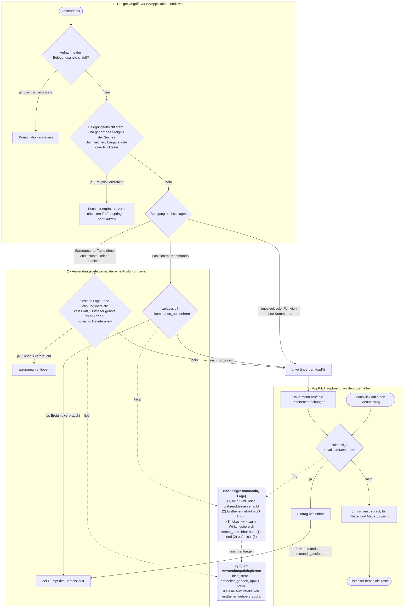
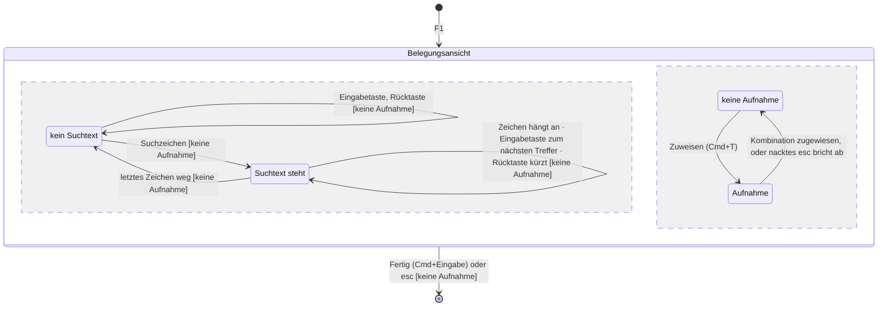
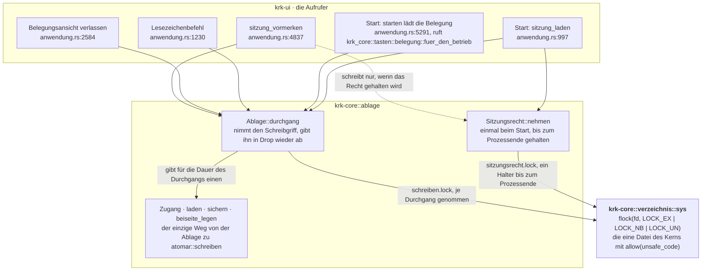
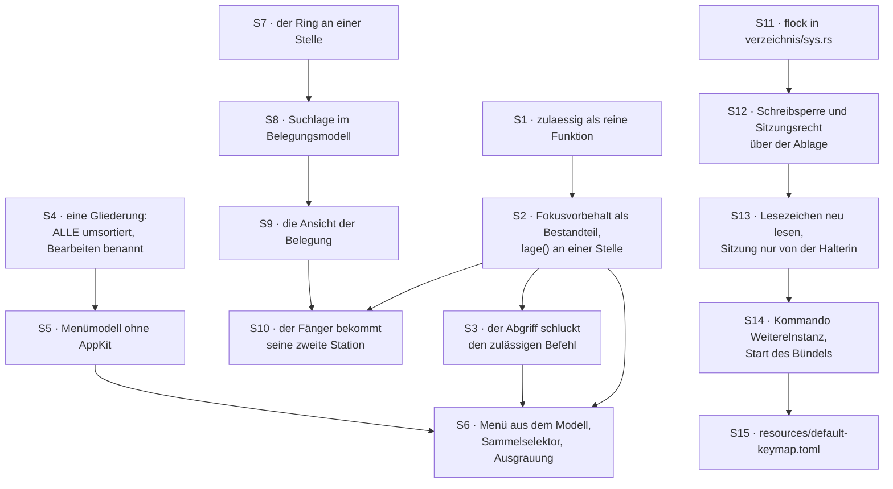

# Implementierungsplan: Suche in der Belegungsansicht, vollständiges Menü, weitere Instanz

**Date:** 2026-08-13
**Status:** Draft
**Überarbeitet:** 260813-0233, nach der dritten Diagrammprüfung; siehe den Nachtrag am Ende
**Spec:** `shared/planning/260813-0053_o_spec-suche-in-der-belegung-vollstaendiges-menue-zweite-instanz.md` (Fassung nach dem Nachzug vom 260813-0130)
**Diagrammprüfungen:** `reviews/260813-0109-conceptrev-…` (Spruch `tangled`) und `reviews/260813-0144-conceptrev-…` (Spruch `acceptable`), beide zum Spec; `reviews/260813-0220-conceptrev-…` (Spruch `acceptable`) zu diesem Plan. Alle drei sind gelesen; was die ersten zwei mitgeben, steht unter `## Was aus den zwei Diagrammprüfungen in diesen Plan eingegangen ist`, was die dritte geändert hat, im Nachtrag vom 260813-0233 am Ende.
**Ausführende:** `coder` für Rust und den Makefile, `ontocoder` für `resources/default-keymap.toml`
**Decidability:** Die tragende Frage der Runde lautet „Darf dieser Befehl an dieser Stelle gerade wirken?", und sie ist aus den Eingaben entscheidbar, die der Mechanismus im Augenblick des Fragens hat: `NSWindow::attachedSheet` am Hauptfenster, der Ersthelfer des Schlüsselfensters samt der Nämlichkeitsfrage nach der Textfläche des Editors, `ersthelferbereich()` und der Wirkungsbereich aus der Belegung. Alle vier werden gelesen, keiner wird vorhergesagt, und weil Abgriff und Ausgrauung dieselbe reine Funktion rufen, können ihre Antworten nicht auseinanderlaufen. Die zweite tragende Frage, „welche gespeicherte Sitzung gehört diesem Prozess", ist aus den Eingaben eines Prozesses **nicht** entscheidbar: ein Prozess trägt über einen Neustart hinweg keine Nämlichkeit, und jede Näherung darüber wäre eine geratene Antwort. Der Mechanismus wechselt deshalb, statt zu nähern. Gefragt wird „hält dieser Prozess das Sitzungsrecht", und das ist an einem gehaltenen `flock`-Griff abzulesen.

---

## Directive

Nach dieser Runde ist jeder Befehl von KRK auf drei Wegen erreichbar statt auf einem: über seine Taste, über das Hauptmenü und, für die Belegungsansicht, über eine Suche, die mit dem ersten getippten Zeichen anspringt. Dazu startet ein Tastenbefehl eine weitere Instanz von KRK, die sich Lesezeichen und Tastenbelegung mit der ersten teilt, ohne dass eine von beiden die Arbeit der anderen überschreibt. Die vollständige Formulierung steht im Spec; sie wird hier nicht wiederholt.

Diese Runde setzt keine elfte Zeitzusage und fasst keine der zehn an.

---

## Der Entwurf in vier Bildern

### Wie ein Tastendruck nach dieser Runde läuft

Das Bild zeigt drei Dinge, die der Plan tragen muss: die Zulässigkeitsfrage als **eine** Funktion mit zwei Frägern, die `Lage` als **eine** Erhebung, aus der auch der Sprungmarkenzweig seine Antwort nimmt, und den Mausklick als zweiten Benutzer des Menüs.

Der Nachschlag hat drei Ausgänge und nicht zwei. Der mittlere ist die Sprungmarke aus C2 der Runde 1, und er ist der Grund, aus dem der Fokusvorbehalt nicht ersatzlos in die Zulässigkeitsregel wandern darf: `ersthelfer_gehoert_appkit` steht heute als früher Ausstieg vor dem Nachschlag und schützt damit beide Ausgänge zugleich (`crates/krk-ui/src/appkit/ereignisse.rs:487-490`). Eine Regel, die nur der Kommandozweig stellt, ließe den Sprungmarkenzweig ohne Antwort, und ein Zeichen liefe während einer Umbenennung in den Suchpuffer der Dateiliste.

**Der Plan versorgt beide Zweige aus derselben Erhebung, statt die Frage ein zweites Mal zu stellen.** Der Abgriff fragt nach dieser Runde überhaupt nicht mehr nach dem Ersthelfer. Er reicht beide Ausgänge unverändert an die Senke, und die Senke sammelt einmal je Eingabe die `Lage`. Der Kommandozweig gibt sie an `zulaessig`; der Zeichenzweig liest aus ihr die drei Werte, die er ohnehin braucht. Zwei davon holt er sich heute schon selbst: `eingabe_ausfuehren` fragt in seinem Zweig `Eingabe::Zeichen` bereits `blatt_steht()` und `fokus()` (`crates/krk-ui/src/appkit/anwendung.rs:2064-2088`), und allein der dritte Wert kommt hinzu. `ersthelfer_gehoert_appkit` behält damit genau **eine** Aufrufstelle, nämlich `lage()`.

Der Mausklick führt in dasselbe `kommando_ausfuehren` und stellt die Frage damit ein zweites Mal. Das Bild zeichnet die Kante auf den Rumpf, um keinen Ring zu behaupten; im Code läuft sie über die Raute `A1`. Die zweite Antwort kann von der ersten nicht abweichen, weil `A1` und `A2` dieselbe Funktion auf derselben `Lage` fragen, und genau das ist der Grund, aus dem die beiden nicht zwei Funktionen sein dürfen.

Die vierte Zeile des Regelknotens ist gegenüber dem Spec-Bild geschärft. Die benannte Liste hebt (1) und (2) auf, den dritten Bestandteil nicht; heute fällt der Unterschied nicht an, weil `beenden` und `fenster_schliessen` beide `Wirkungsbereich::Ueberall` tragen (`crates/krk-core/src/tasten/belegung.rs:738-752`), und mit einem dritten Eintrag auf der Liste fiele er an.

### Wie die Belegungsansicht bedient wird

Die fünf Wächter `[keine Aufnahme]` sind der Vorrang aus C1.15, und sie stehen hier, weil zwei nebenläufige Regionen jedes Ereignis sonst an beide zustellen. Vier stehen an den Übergängen der Suchregion, der fünfte am Ausgang der Ansicht: ein nacktes `esc` bricht die Aufnahme ab und verlässt nicht. Ohne sie behauptete der Automat, ein Suchzeichen lande während einer Aufnahme im Suchtext, und ein nacktes `esc` verlasse die Ansicht statt die Aufnahme abzubrechen. Der Spec sagt in seinen Kriterien das Gegenteil, das Flussdiagramm daneben zeichnet es richtig, und der Code baut es als zwei hintereinandergeschaltete Stationen im Fänger. Der Plan setzt die Kriterien um, nicht das Bild aus dem Spec.

### Wo die beiden Sperren wohnen

Der Kasten führt Aufrufer und keine Erklärungen, und jeder der fünf steht mit seiner Zeile in `krk-ui` da. `belegung::fuer_den_betrieb` selbst liegt in `crates/krk-core/src/tasten/belegung.rs:1310` und öffnet dort seine eigene `Ablage`; im Bild steht die Stelle, die es ruft.

Zwei Sperren, zwei Dateien, zwei Lebensdauern, und beide über denselben Fremdaufruf. `flock` ist unter den Mitteln, die dieser Baum kennt, das einzige, das C3.13 erfüllt: der Kern gibt die Sperre beim Prozessende von sich aus frei, auch nach einem `SIGKILL`. Eine Marke im Dateisystem über `OpenOptions::create_new` oder über `renamex_np` mit `RENAME_EXCL` überlebt den Absturz und sperrte danach jede weitere Instanz für immer aus dem Sitzungsschreiben aus; beide Mittel liegen im Baum bereit (`crates/krk-core/src/operation/anlegen.rs:32-36` und `crates/krk-core/src/verzeichnis/sys.rs:668`) und reichen für diese eine Anforderung trotzdem nicht.

`Zugang` steht zwischen den Aufrufern und `atomar::schreiben`, damit „es gibt keinen Schreibweg an der Sperre vorbei" eine Eigenschaft der Typen wird und keine Verabredung in Kommentaren. Die zwei Schreibwege über `atomar::schreiben`, die **nicht** in den Ablageordner gehen, bleiben unberührt: die Markdown-Ausgabe nach `~/Downloads` (`crates/krk-ui/src/belegungsausgabe.rs:456`) und das Sichern der Editordatei (`crates/krk-core/src/text/datei.rs:545`).

### Die Abhängigkeiten der fünfzehn Schritte

Vier Stränge, und je zwei berühren einander an höchstens einem Punkt. Der Strang um die Zulässigkeitsfrage (S1 bis S3) trifft den Menüstrang in S6 und den Suchstrang in S10, weil Menü und Suche beide am selben Ereignisabgriff hängen; Menü und Suche berühren einander nicht. Der Strang um die weitere Instanz (S11 bis S15) hat zu keinem der drei anderen eine Kante, und genau deshalb ist er die Naht, an der die Runde sich teilen ließe.

Unabhängig sind die Stränge in ihrer Reihenfolge und nicht in ihren Dateien. `crates/krk-ui/src/belegungsmodell.rs` wird von S4, S8 und S14 angefasst, in drei verschiedenen Funktionen; eine Reihenfolge erzwingt das nicht, wohl aber die Aufmerksamkeit dessen, der die drei Schritte nacheinander schreibt.

---

## Ausgangslage, am 260813 am Baum nachgelesen

Der Spec trägt die vollständige Ausgangslage. Sieben Befunde stehen hier, weil sie den Zuschnitt der Schritte tragen und im Spec nicht oder anders stehen.

**Der Ereignisabgriff steigt heute vor dem Nachschlag aus, und deshalb schützt eine Frage zwei Zweige.** `behandeln` ruft `ersthelfer_gehoert_appkit` in Zeile 487 und gibt bei `true` sofort `false` zurück (`crates/krk-ui/src/appkit/ereignisse.rs:488-490`). Erst danach kommt `belegung.nachschlag`, und dessen drei Zweige stehen in `:498-513`. Wer den frühen Ausstieg in die Zulässigkeitsregel verlegt, muss den Sprungmarkenzweig eigens versorgen.

**Kein Menüeintrag trägt heute ein Kommando.** `representedObject` kommt im ganzen Baum nicht vor, `setTag` genau einmal und dort an einem `NSButton` (`crates/krk-ui/src/appkit/bereichsleiste.rs:479`), und `roher_befehl` setzt kein Ziel (`crates/krk-ui/src/appkit/menue.rs:443-463`). Die drei heutigen Einträge, deren Funktion ein Kommando trägt, gehen über eigene Selektoren am Anwendungsdelegierten und damit **an** `kommando_ausfuehren` **vorbei**. C2.14 schließt genau diese Lücke.

**`validateMenuItem:` gibt es im Baum nicht**, ebensowenig `autoenablesItems` oder ein `setEnabled` an einem Menüeintrag. Die automatische Freigabe von `NSMenu` steht damit auf ihrem Vorgabewert, und AppKit graut heute allein danach aus, wer den Selektor beantwortet. Für den Plan ist das die günstige Lage: die Ausgrauung wird **abgefragt** und nicht **gesetzt**, sie braucht deshalb keinen Beobachter am Fokus, und die Regel aus `CLAUDE.md`, dass jede an den Fokus gehängte Anzeige durch `makeFirstResponder:` in `appkit/fenster.rs` gehen muss, greift hier nicht. Wer sie trotzdem anwendete, baute einen zweiten Beobachter für eine Anzeige, die AppKit von sich aus im richtigen Augenblick erfragt.

**`Kommando::KENNUNGEN` ist die Liste, die es für den Träger am Menüeintrag braucht.** Sie steht als `[(Kommando, &'static str); 75]` in `crates/krk-core/src/tasten/belegung.rs:564-661`, jedes Kommando genau einmal, und die Probe `jedes_kommando_traegt_genau_einen_wirkungsbereich` (`crates/krk-core/tests/belegung.rs:1410`) hält das fest. Ihr Index ist damit eine im Prozess stabile Zahl je Kommando und taugt als `tag`.

**`Funktionsbereich::ALLE` steht in der falschen Reihenfolge für eine Menüleiste.** „Anwendung" liegt an siebter, „Fenster" an sechster Stelle (`crates/krk-ui/src/belegungsmodell.rs:104-114`), und macOS ersetzt den Titel des ersten Obermenüs durch den Namen aus der `Info.plist`. Dazu heißt `Funktionsbereich::Textbefehle` in der Anzeige „Textbefehle", während die Randbedingung des Menüdatensatzes ein Obermenü namens „Bearbeiten" verlangt. C2.3 fordert beides zugleich, und die heutige Gliederung erfüllt es nicht. Der Datensatz dazu ist `decisions/260813-0159_o_darf-das-menue-die-eine-gliederung-umsortieren-und-umbenennen.md`; die Runde fährt auf seiner Empfehlung.

**Die Ablage wird je Start zweimal geöffnet, und die erste Öffnung liegt vor `NSApplication`.** `belegung::fuer_den_betrieb` (`crates/krk-core/src/tasten/belegung.rs:1310-1311`) legt eine eigene `Ablage` an, liest `keymap.toml` und wirft sie wieder weg; die bleibende entsteht in `sitzung_laden` (`crates/krk-ui/src/appkit/anwendung.rs:997`). Beide schreiben: schon `Ablage::laden` legt eine beschädigte Datei über `atomar::schreiben` beiseite (`crates/krk-core/src/ablage/mod.rs:399`). Die Schreibsperre muss deshalb das Laden mit umfassen, und die zwei `Ablage`-Werte dürfen nie zugleich leben.

**Die Begründung an `beiseite_legen` fällt mit der zweiten Instanz weg.** `crates/krk-core/src/ablage/mod.rs:394-397` erklärt das Wettrennen zwischen `try_exists` und `schreiben` für unerreichbar, „weil der Vorgang einmal je Start in einem Prozess läuft". Mit zwei Prozessen stimmt der Satz nicht mehr. Die Schreibsperre über dem Ordner deckt den Fall ab; der Absatz braucht eine neue Begründung und keine neue Bauart.

---

## Der Entwurf

### Eine Frage, eine Funktion, zwei Frager, eine Lage

Die Zulässigkeit wird eine reine Funktion in `crates/krk-ui/src/kommandos/`, dem Verzeichnis, das nach seinem eigenen Modulkopf keine Zeile AppKit enthält. Sie nimmt ein `Kommando` und eine `Lage` aus drei Wahrheitswerten und einem `Fokus`, und sie ist damit ohne Fenster prüfbar. Die Tafel aus C2.5 hat sieben Wirkungsbereiche mal fünf Fokuswerte mal zwei Blattstände mal zwei Ersthelferbefunde, also 140 Fälle, und sie läuft in `cargo test --workspace` durch.

Die zwei Frager von `zulaessig` sind der Abgriff über `kommando_ausfuehren` und die Ausgrauung über `validateMenuItem:`. Ein dritter Abnehmer nimmt nicht die Regel, sondern ihre Eingaben: der Zweig `Eingabe::Zeichen` von `eingabe_ausfuehren` liest aus derselben `Lage`, weil ein getipptes Zeichen kein `Kommando` ist und keinen Wirkungsbereich trägt. Drei Abnehmer der `Lage`, zwei Aufrufer von `zulaessig`, eine Aufrufstelle von `ersthelfer_gehoert_appkit`.

`lage()` am Delegierten ist die eine Stelle, die die drei Eingaben erhebt. Für jeden Tastendruck, der heute schon bis zur Senke läuft, bleibt es bei drei Abfragen: `kommando_ausfuehren` liest heute `blatt_steht()` und `fokus()`, der Zeichenzweig ebenfalls, und den Ersthelfer liest heute der Abgriff.

**Einen Fall verteuert die Änderung, und er ist nicht der seltenste.** Ein Tastendruck in ein Textfeld kostet heute eine Abfrage, weil der frühe Ausstieg ihn vor dem Nachschlag abweist; nach der Runde kostet er drei, dazu den Nachschlag in der Belegung. Betroffen ist das Tippen während einer Umbenennung und in der Pfadeingabe. Eine Kombination, die die Belegung nicht kennt, kostet umgekehrt eine Abfrage weniger. Drei Eigenschaftsabfragen und ein Nachschlag in einer Tabelle sind gegen das Budget eines Tastendrucks klein; gemessen ist das an diesem Baum nicht, und L1 steht ohnehin auf der Abnahmeliste am Bündel. `inference:`

### Der Menüeintrag trägt sein Kommando im `tag`

Sechsundsiebzig Selektoren wären sechsundsiebzig Methoden am Delegierten, jede mit derselben zwei Zeilen langen Rumpf. Ein Sammelselektor `krkKommando:` mit dem Index aus `Kommando::KENNUNGEN` im `tag` kostet eine Methode und braucht keine Wrapperklasse um ein Rust-Enum, wie `representedObject` sie verlangte. Der Rückweg ist `Kommando::KENNUNGEN.get(tag)`.

Der Vorgabewert eines `tag` ist Null, und Null ist ein gültiger Index. `validateMenuItem:` fragt deshalb zuerst nach der Aktion des Eintrags und liest den `tag` nur, wenn sie `krkKommando:` ist. Für jeden anderen Eintrag antwortet die Methode mit `true` und überlässt AppKit seine gewohnte Entscheidung. Damit tragen die sechs Textbefehle (C2.8) und der Eintrag „Tastenbelegung als Markdown sichern" (C2.9) unverändert das Verhalten, das sie heute haben, und ihre Ausgrauung kommt weiterhin aus der Antwortkette.

### Das Menü entsteht aus einem Modell ohne AppKit

`crates/krk-ui/src/menuemodell.rs` rechnet aus der `Belegung` die Leiste aus: je Funktionsbereich ein Obermenü in der Reihenfolge von `Funktionsbereich::ALLE`, darin je Funktion ein Eintrag mit Beschriftung, Kennung, erster Kombination und, wo vorhanden, dem Kommando. Die sechs Textbefehle bekommen ihren AppKit-Selektor aus einer benannten Tabelle mit sechs Zeilen, die die heutige Verdrahtung in `hauptmenue` ablöst und nicht neben ihr steht. Der Eintrag für die Markdown-Ausgabe und der Trenner darüber sind zwei benannte Zusätze im Anwendungsmenü.

Das Modell trägt die Kriterien C2.1 bis C2.4 und C2.9 als gewöhnliche Prüfungen, ohne Bündel und ohne Hauptfaden. `menue.rs` behält seine eine Stelle, die ein `NSMenuItem` anlegt, und seine eine Übersetzung zwischen Kombination und AppKit-Paar; es wird von einem Baumeister zu einem Umsetzer.

### Die Suche rechnet im Modell und zeigt in der Ansicht

Die Trefferrechnung gehört nach `belegungsmodell.rs`, wo `funktionstext` und `tastentext` schon stehen: dieselben zwei Zeichenketten, die die Ansicht zeigt, sind die, über die gesucht wird. Ein neuer Typ hält den Suchtext, die Liste der Trefferzeilen und die Stelle darin.

Der Ring dieser Suche ist derselbe wie der der Editorsuche, und er soll an einer Stelle bleiben. `krk_core::text::suche` rechnet ihn heute in `umlaufen` und benutzt ihn dreimal über Trefferbereiche in Bytes (`crates/krk-core/src/text/suche.rs:101-127`). Der Plan öffnet ihn für eine zweite Einheit, aufsteigend sortierte Zeilennummern, statt eine zweite Ringregel danebenzustellen.

### Zwei Sperren, ein Fremdaufruf, eine Datei

`flock` kommt in `crates/krk-core/src/verzeichnis/sys.rs`, und zwar nicht, obwohl die Datei unter `verzeichnis/` liegt, sondern weil ihr Modulkopf genau diese Spannung für `fcntl` schon einmal ausgeschrieben und angenommen hat (`sys.rs:30-39`). Sie ist die eine Datei des Kerns mit `#![allow(unsafe_code)]`, und eine zweite entsteht nicht. C4.5 des Spec ist damit erfüllt, ohne dass eine neue Ausnahme anfällt.

Der Preis steht dagegen im selben Modulkopf: die Zahl „vier Schnittstellen, acht Funktionen" steht wörtlich an drei Stellen im Baum und im Diagramm des Modulkopfs. Sie wird zu fünf und neun, und alle vier Stellen gehören in denselben Schritt.

---

## Implementierungsschritte

Jeder Schritt nennt, welche der vier gewachsenen Aufzählungen er anfasst und wo der Übersetzer anhält, welche Empfehlung eines offenen Datensatzes er voraussetzt, und wie er abgenommen wird. **(Probe)** heißt: `cargo test --workspace` weist es nach. **(Bündel)** heißt: es ist am laufenden `KRK.app` im Vordergrund zu sehen und damit Nutzerarbeit.

### S1: [DONE] Die Zulässigkeitsfrage als reine Funktion

- **Executor:** `coder`
- **Dateien:** `crates/krk-ui/src/kommandos/zulaessigkeit.rs` (neu), `crates/krk-ui/src/kommandos/mod.rs`
- **Änderungen:** Ein Typ `Lage` mit den vier Eingaben `blatt_steht: bool`, `ersthelfer_gehoert_appkit: bool`, `fokus: Fokus` und, für die Prüfung, `Copy`. Eine Funktion `zulaessig(kommando: Kommando, lage: Lage) -> bool`, die `(immer_erreichbar(kommando) || (kein_blatt_oder_erlaubt && !lage.ersthelfer_gehoert_appkit)) && fokus::wirkt(kommando.wirkungsbereich(), lage.fokus)` rechnet. Eine Funktion `immer_erreichbar(kommando: Kommando) -> bool`, die genau `Kommando::Beenden` und `Kommando::FensterSchliessen` bejaht; sie ist bewusst **keine** vollständige Fallunterscheidung, denn die Liste soll nicht mit jedem neuen Kommando wachsen, sondern nur mit einem genannten Grund. Der Doc-Kommentar nennt beide Herleitungen: den dritten Bestandteil aus dem Gegenbeispiel der Umbenennung in der Liste, die Ausnahmeliste aus „kein Verlust gegenüber heute". Die Modulzeile in `kommandos/mod.rs` beschreibt das neue Modul in derselben Form wie die fünf vorhandenen und stellt es vor `fokus`, weil die Regel die erste Frage jedes Befehls wird.
- **Änderungen an `operationen::waehrend_blatt_erlaubt`:** keine. Die Funktion bleibt, wo sie ist, und wird von `zulaessig` gerufen. Eine zweite Fassung der Blattregel entsteht nicht.
- **Aufzählung:** keine wächst. Der Übersetzer hält nirgends an; der Schritt fügt hinzu und ändert nichts.
- **Setzt voraus:** die Empfehlung von `shared/decisions/260813-0053_o_schluckt-der-abgriff-den-zulaessigen-befehl-oder-den-ausgefuehrten.md` (Möglichkeit 1), soweit sie die drei Bestandteile und die Ausnahmeliste betrifft.
- **Abnahme (Probe):** die Tafel aus 140 Fällen, gebaut aus `Wirkungsbereich`, `Fokus::ALLE` und den vier Kombinationen aus Blattstand und Ersthelferbefund, in der Form der vorhandenen Tafel in `kommandos/fokus.rs`. Dazu je eine benannte Prüfung für die vier Fälle, an denen die Runde hängt: mit dem Fokus im Editor ist ein Befehl des Dateifensters unzulässig; beim Umbenennen in der Liste ebenso, obwohl kein Blatt steht und `fokus()` `Dateifenster` liefert; `beenden` und `fenster_schliessen` sind in beiden Lagen zulässig; ein Befehl auf der Ausnahmeliste mit einem anderen Wirkungsbereich als `Ueberall` wäre es nicht. Der Schritt läuft vollständig grün.
- **Abhängigkeiten:** keine.

### S2: [DONE] Der Fokusvorbehalt wird Bestandteil der Regel, und die Lage entsteht an einer Stelle

- **Executor:** `coder`
- **Dateien:** `crates/krk-ui/src/appkit/ereignisse.rs`, `crates/krk-ui/src/appkit/anwendung.rs`, `crates/krk-ui/src/quellbaum.rs` (neu, nur unter `cfg(test)`), `crates/krk-ui/src/main.rs`, `crates/krk-ui/src/appkit/teilen.rs`
- **Änderungen:** `ersthelfer_gehoert_appkit` wird `pub(crate)` und behält seine Signatur samt dem Abschluss `ist_editorflaeche`, damit `ereignisse.rs` den Editor weiterhin nicht kennt; ihr Doc-Kommentar bekommt den Satz, dass sie ab hier ihre eine Aufrufstelle in `lage()` hat. In `behandeln` fällt der frühe Ausstieg in `:487-490` **ersatzlos** weg: der Abgriff fragt nach dem Ersthelfer gar nicht mehr, sondern reicht `Nachschlag::Funktion` und `Nachschlag::Sprungmarke` unverändert an die Senke. `Nachschlag::Unbelegt` bleibt, wie er ist.
  Am Delegierten entsteht `lage()`, das `blatt_steht()`, `ereignisse::ersthelfer_gehoert_appkit(mtm, &|r| self.ist_editorflaeche(r))` und `fokus()` zu einer `Lage` zusammenfasst. `kommando_ausfuehren` ersetzt seine zwei getrennten Vorbehalte in `:2120` und `:2132` durch einen Aufruf von `zulaessig`. Der Zweig `Eingabe::Zeichen` von `eingabe_ausfuehren` (`:2064-2088`) ersetzt seine eigenen zwei Abfragen durch dieselbe `Lage` und bekommt den dritten Wert dazu: er tippt nur, wenn kein Blatt steht, der Ersthelfer nicht AppKit gehört und der Fokus im Dateifenster liegt. Der Fokuswert, den die Rümpfe weiter unten als Adresse brauchen (`tab_schliessen`, `teilen`, `bereichskommando`), kommt aus derselben `Lage` und wird nicht ein zweites Mal erfragt.
  `Tastenabgriff::einrichten` verliert damit seinen Parameter `ist_editorflaeche`, und `abgriff_aufsetzen` (`anwendung.rs:1735-1757`) eine seiner drei schwachen Referenzen. Der Modulkopf von `ereignisse.rs` beschreibt den Fokusvorbehalt danach nicht mehr als Station des Abgriffs, sondern als Bestandteil (2) der Regel am Delegierten.
  **`sprungmarke_tippen` bleibt unverändert.** Es liefert `false`, wenn der Kern das Zeichen nicht in den Puffer nimmt (`crates/krk-ui/src/appkit/tabelle.rs:1134-1147`), und das ist keine Ausnahme von der Regel aus S3, sondern ihre Anwendung: ein Zeichen, das keine Sprungmarke ist, war nie zulässig und gehört AppKit.
- **Verhalten:** unverändert gegenüber heute, in allen drei Ausgängen des Nachschlags. Bei `Funktion` weist statt des frühen Ausstiegs jetzt Bestandteil (2) ab, und zwar bevor `befehlsantwort_loeschen` und `bildschirmbreiten_uebernehmen` laufen. Bei `Sprungmarke` weist derselbe Wert im Zeichenzweig ab, und die Senke liefert `false`, also läuft das Ereignis wie bisher an AppKit weiter und das Textfeld tippt es. Bei `Unbelegt` ändert sich nichts. Das Bild im Modulkopf (`:26-33`) zeigt den dritten Ausgang schon und muss ihn behalten.
- **Eine sichtbare Nebenwirkung, und zwar nur im Protokollmodus.** `protokollieren` steht heute hinter dem frühen Ausstieg; ein Tastendruck in ein Textfeld erscheint deshalb in `--tasten-protokoll` nicht. Ohne den Ausstieg erscheint er. Der Modus gibt danach wieder, was der Abgriff sieht, und das ist die richtigere Auskunft; der Satz gehört in den Doc-Kommentar des Modus.
- **Aufzählung:** keine wächst. Der Übersetzer hält an der geänderten Signatur von `kommando_ausfuehren` nicht an, weil sie gleich bleibt; er hält an der um einen Parameter gekürzten Signatur von `Tastenabgriff::einrichten` an, und zwar an ihrer einen Aufrufstelle `anwendung.rs:1740`.
- **Setzt voraus:** dieselbe Empfehlung wie S1.
- **Abnahme (Probe):** `cargo test --workspace`, `cargo clippy --workspace --all-targets`, `cargo fmt --all --check` laufen grün. Dazu zwei Zählproben über den Quellbaum, in der Bauform von `es_gibt_genau_einen_menuebauer` (`crates/krk-ui/src/appkit/teilen.rs:446-470`), also mit zusammengesetzten Nadeln, damit die Probe sich nicht selbst zählt:
  1. **Die Frage nach dem Ersthelfer steht an genau einer Stelle.** `fn ersthelfer_gehoert_appkit` kommt im Baum genau einmal vor, und `isKindOfClass(` steht in genau einer Datei, `appkit/ereignisse.rs`. Gezählt werden für die zweite Nadel Dateien und nicht Fundstellen: heute sind es drei Zeilen, eine je Textklasse (`:549-551`), und eine vierte Textklasse in derselben Funktion ist eine zulässige Änderung.
  2. **Die erste Hälfte von C2.16.** `fn zulaessig` kommt im Baum genau einmal vor. C2.16 sagt zwei Dinge, „die Zulässigkeitsfrage steht an genau einer Stelle" und „beide Frager rufen sie"; die erste Hälfte ist eine Zählung über Erklärungen und fällt hier an, die zweite ist die Zählung der Aufrufer und fällt mit S6 an, weil `validateMenuItem:` erst dort entsteht.
  **Der Quellbaumleser bekommt einen Ort.** `quelldateien` und `einsammeln` stehen heute im Prüfmodul von `crates/krk-ui/src/appkit/teilen.rs:374-412` und sind dort privat. Diese Runde braucht sie in mindestens drei weiteren Prüfmodulen (S2, S6, S10). Der Schritt zieht die beiden Funktionen nach `crates/krk-ui/src/quellbaum.rs`, angemeldet als `#[cfg(test)] mod quellbaum;` in `main.rs` und `pub(crate)` erreichbar; die zwei Zählproben in `teilen.rs` bleiben inhaltlich unangetastet und rufen den Leser von dort. Eine zweite Fassung des Lesers entstünde sonst dreimal, und der Plan spart an dieser Runde gerade solche zweiten Fassungen ein.
  **Keine Zählung der Aufrufstellen von `ersthelfer_gehoert_appkit`.** Die Begründung steht unten im Abschnitt vom 260813-0233. **(Bündel)** bleibt der Nachweis, dass sich am Verhalten nichts geändert hat; er fällt in die Abnahme von C2.6 am Ende der Runde.
- **Abhängigkeiten:** S1.

### S3: [DONE] Der Abgriff schluckt den zulässigen und nicht mehr den ausgeführten Befehl

- **Executor:** `coder`
- **Dateien:** `crates/krk-ui/src/appkit/anwendung.rs`, `crates/krk-ui/src/appkit/ereignisse.rs`
- **Änderungen:** `kommando_ausfuehren` liefert ab hier zurück, ob der Befehl zulässig **war**, und nicht mehr, ob sein Rumpf etwas getan hat. Die zwei Nachwirkungen `aufteilung_nachziehen` und `sitzung_vormerken` bleiben am Ergebnis des Rumpfes hängen; der Rumpfwert bekommt dafür einen eigenen Namen und wird nicht mehr zurückgegeben. Die Doc-Kommentare an `kommando_ausfuehren`, an `Tastenabgriff::einrichten` und der Absatz „Geschluckt wird nur, was auch ausgeführt wurde" im Modulkopf von `ereignisse.rs` (`:137-142`) werden auf die neue Regel umgeschrieben, samt dem Grund: solange das Menü kein Kürzel trug, war „ausgeführt" die richtige Grenze; sobald es alle trägt, ist es „zulässig", weil sonst derselbe Befehl über den Umweg Menü ein zweites Mal liefe.
- **Der Preis wird gezählt und nicht behauptet.** Der Datensatz verlangt eine Aufzählung der Befehle, die zulässig `false` liefern können. Sie ist aus dem `match` in `kommando_ausfuehren` und aus `bereichskommando` abzulesen; der Schritt schreibt sie in die Commit-Message und prüft für jeden, ob sein Tastendruck heute an AppKit überhaupt etwas erreicht. Findet sich einer, der etwas erreicht, hält der Schritt an und meldet ihn, statt die Regel trotzdem zu setzen.
- **Aufzählung:** keine wächst.
- **Setzt voraus:** die Empfehlung von `shared/decisions/260813-0053_o_schluckt-der-abgriff-den-zulaessigen-befehl-oder-den-ausgefuehrten.md` (Möglichkeit 1), diesmal in ihrem Kern.
- **Abnahme (Probe):** `cargo test --workspace` grün; die Aufzählung der wirkungslos-zulässigen Befehle liegt in der Commit-Message. **(Bündel):** C2.15, dass ein Befehl auf einen Tastendruck hin höchstens einmal läuft.
- **Abhängigkeiten:** S2.

### S4: [DONE] Eine Gliederung für drei Abnehmer

- **Executor:** `coder`
- **Dateien:** `crates/krk-ui/src/belegungsmodell.rs`
- **Änderungen:** `Funktionsbereich::ALLE` bekommt `Anwendung` an die erste und `Fenster` an die letzte Stelle; die neue Folge lautet Anwendung, Dateilisting, Dateioperationen, Tabs, Vorschau, Leiste und Fokus, Editor, Bearbeiten, Fenster. `Funktionsbereich::Textbefehle::name()` liefert „Bearbeiten" statt „Textbefehle". Der Doc-Kommentar der Aufzählung sagt, warum die Reihenfolge jetzt eine Mac-Menüleiste beschreibt und dass Belegungsansicht und Markdown-Ausgabe ihr folgen.
- **Aufzählung:** `Funktionsbereich` wächst **nicht**; nur die Reihenfolge in `ALLE` und ein Anzeigename ändern sich. Der Übersetzer hält nirgends an, und genau das ist der Grund für die Probe unten: eine falsche Reihenfolge fällt sonst niemandem auf.
- **Setzt voraus:** die Empfehlung von `decisions/260813-0159_o_darf-das-menue-die-eine-gliederung-umsortieren-und-umbenennen.md` (Möglichkeit 1).
- **Abnahme (Probe):** eine neue Prüfung hält fest, dass `ALLE` mit `Anwendung` beginnt und mit `Fenster` endet und dass `Textbefehle::name()` „Bearbeiten" liefert, jeweils mit dem Grund im Doc-Kommentar. Vorhandene Prüfungen, die die alte Reihenfolge festhalten, werden gesucht und nachgezogen; die Markdown-Ausgabe der Runde 3 hat Prüfungen über ihre Abschnittsfolge, und die gehören in denselben Schritt.
- **Abhängigkeiten:** keine.

### S5: [DONE] Das Menümodell, ohne AppKit prüfbar

- **Executor:** `coder`
- **Dateien:** `crates/krk-ui/src/menuemodell.rs` (neu), `crates/krk-ui/src/main.rs`
- **Änderungen:** Eine reine Funktion `aufbau(belegung: &Belegung) -> Vec<Obermenue>`, gebaut über `belegungsmodell::nach_bereichen` und damit dessen dritter Abnehmer. Ein `Obermenue` trägt den Titel aus `Funktionsbereich::name()` und seine Einträge; ein `Eintrag` ist entweder ein Befehl mit Beschriftung, Kennung, erster Kombination und `Option<Kommando>`, ein Textbefehl mit seinem AppKit-Selektornamen, ein benannter Sonderposten oder ein Trenner. Die Zuordnung der sechs Textbefehlskennungen zu ihren Selektoren steht als benannte Tabelle mit sechs Zeilen an dieser einen Stelle; sie löst die heutige Verdrahtung in `hauptmenue` ab. Der Sonderposten „Tastenbelegung als Markdown sichern" samt Trenner steht im Anwendungsmenü über dem Beenden.
- **Aufzählung:** keine wächst.
- **Setzt voraus:** die Empfehlung von `shared/decisions/260813-0053_o_wie-viele-obermenues-traegt-die-menueleiste-fuer-81-funktionen.md` (Möglichkeit 1: neun Obermenüs) und die Empfehlung aus S4.
- **Abnahme (Probe):** C2.1, dass die Zahl der Befehlseinträge gegen `Belegung::funktionen()` aufgeht und keine Funktion zweimal vorkommt; C2.2 über die Zahl der Aufrufer von `nach_bereichen`, die auf drei steigt; C2.3 über Reihenfolge und Titel der neun Obermenüs; C2.4, dass eine Funktion mit mehreren Kombinationen die erste zeigt und eine ohne keine; C2.9 über Ort und Kürzellosigkeit des Markdown-Eintrags. Alle fünf laufen ohne AppKit und ohne Hauptfaden.
- **Abhängigkeiten:** S4.

### S6: [DONE] Das Menü baut aus dem Modell, trägt sein Kommando im `tag` und graut aus

- **Executor:** `coder`
- **Dateien:** `crates/krk-ui/src/appkit/menue.rs`, `crates/krk-ui/src/appkit/anwendung.rs`
- **Änderungen:** `hauptmenue` setzt `menuemodell::aufbau` in `NSMenu` und `NSMenuItem` um; `roher_befehl` bleibt die eine Stelle, die ein `NSMenuItem` anlegt, und `appkit_paar` die eine Übersetzung. Ein Befehlseintrag mit Kommando bekommt den Selektor `krkKommando:` und im `tag` seinen Index aus `Kommando::KENNUNGEN`; ein Textbefehl behält seinen AppKit-Selektor; das Ziel bleibt überall `nil`, wie heute. Am Anwendungsdelegierten entstehen zwei Methoden im `define_class!`-Block: `krkKommando:` liest den `tag` des Absenders, holt das Kommando aus `KENNUNGEN` und ruft `kommando_ausfuehren`, also den einen Ausführungsweg (C2.14); `validateMenuItem:` prüft zuerst die Aktion des Eintrags, antwortet für jede fremde Aktion `true` und beantwortet `krkKommando:` über `zulaessig(kommando, self.lage())`. Die drei eigenen Selektoren `beenden:`, `fensterEinblenden:` und `fensterSchliessen:` verschwinden zugunsten des Sammelselektors, damit die drei Einträge nicht länger an `kommando_ausfuehren` vorbeilaufen; der Grund, aus dem `beenden:` als eigener Selektor entstand, nämlich die Zweitform „Quit and Keep Windows" auf Opt+Cmd+Q, bleibt gewahrt, weil auch der Sammelselektor kein `terminate:` ist. Dieser Punkt ist am Bündel nachzusehen und steht unten in der Abnahmeliste.
- **Warum dieser Schritt nicht geteilt wird:** ein Menü, das alle 82 Einträge mit ihren Kürzeln trägt, aber noch nicht ausgraut, führte mit dem Fokus im Editor einen Auf-Pfeil in der Dateiliste aus. Zwischen zwei getrennten Schritten stünde der Baum also in einem Zustand, den C7 der Editor-Runde ausdrücklich ausschließt. Die Ausgrauung ist keine Politur, die nachkommen darf.
- **Aufzählung:** keine wächst. Der Übersetzer hält an der neuen Methode nicht an; er hält an, wenn `menuemodell` einen Eintragstyp führt, den die Umsetzung nicht behandelt, denn dieser `match` bekommt keinen Auffangzweig.
- **Setzt voraus:** die Empfehlungen aus S1, S3 und S5.
- **Abnahme (Probe):** C2.10 als Zählung über den Baum: genau eine Stelle legt ein `NSMenuItem` an, nämlich `roher_befehl`, und genau eine Funktion übersetzt eine Kombination in das AppKit-Paar, nämlich `appkit_paar`. Die zwei Hüllen `befehl` und `ohne_kuerzel` bleiben als Hüllen bestehen und zählen nicht als zweite Stelle. C2.11 über die zwei Bauaufrufe von `hauptmenue`; C2.14 über die Zahl der Aufrufer von `kommando_ausfuehren`; C2.16 über die zwei Aufrufer von `zulaessig`; C2.17 als Umkehrprobe über dieselbe Tafel aus 140 Fällen: für jeden Fall, in dem der Abgriff weiterreicht, ist der zugehörige Eintrag ausgegraut oder steht auf der Ausnahmeliste. C2.12 und C2.13 laufen über `cargo run -p krk-ui --bin krk -- --menue-protokoll`, das nach `finishLaunching` ausgibt und ohne Fenster zurückkehrt (`crates/krk-ui/src/appkit/anwendung.rs:5304-5321`). **Kein `make menue`**: das Ziel hängt an `bundle` und überschriebe das beglaubigte Bündel unter `target/KRK.app`. **(Bündel):** C2.6, C2.7, C2.18 und C2.19, dazu die Gegenprobe, dass Opt+Cmd+Q keine Zweitform „Quit and Keep Windows" bekommt.
- **Abhängigkeiten:** S3, S5.

### S7: [DONE] Der Ring bleibt an einer Stelle

- **Executor:** `coder`
- **Dateien:** `crates/krk-core/src/text/suche.rs`
- **Änderungen:** `umlaufen` rechnet heute im Ring der Trefferliste und wird dreimal über Trefferbereiche in Bytes gerufen. Der Schritt macht die Rechnung von der Einheit unabhängig: sie nimmt die Länge der Liste und die gesuchte Stelle statt der Liste selbst. Daneben entstehen `erster_ab_stelle(stellen: &[usize], ab: usize)` und `naechster_stelle(stellen: &[usize], ab: usize)` über aufsteigend sortierte Zeilennummern, die dieselbe Ringrechnung benutzen. `erster_ab`, `naechster` und `voriger` bleiben in Signatur und Verhalten unverändert und rufen sie mit.
- **Aufzählung:** keine wächst.
- **Setzt voraus:** nichts.
- **Abnahme (Probe):** die vorhandenen Prüfungen zu `erster_ab`, `naechster` und `voriger` laufen unverändert grün, denn ihr Verhalten ändert sich nicht. Dazu die vier Randfälle der neuen Funktionen: leere Liste, Stelle vor der ersten, Stelle auf der letzten, Umlauf hinter der letzten.
- **Abhängigkeiten:** keine.

### S8: [DONE] Die Suchlage im Belegungsmodell

- **Executor:** `coder`
- **Dateien:** `crates/krk-ui/src/belegungsmodell.rs`
- **Änderungen:** Ein Typ `Suchlage` mit dem Suchtext, den Trefferzeilen und der Stelle darin. Er bekommt: `zeichen_anhaengen(char)`, `letztes_zeichen_weg()`, `naechster_treffer()`, `zielzeile() -> Option<usize>` und `meldung() -> String`. Die Trefferrechnung läuft über die Zeilen der Gliederung, fragt je Zeile `funktionstext` und `tastentext` und vergleicht als Teilzeichenfolge ohne Rücksicht auf Groß- und Kleinschreibung (C1.3 bis C1.5). Überschriftszeilen sind nie Treffer, weil `waehlbare_zeile` sie ohnehin ausschließt (C1.6). Die Aufnahmeregel für ein Zeichen ist `krk_core::verzeichnis::sprungmarke::traegt_ein_dateiname`; eine zweite Zeichenregel entsteht nicht (C1.2). Bei leerem Suchtext liefern `naechster_treffer` und `letztes_zeichen_weg` nichts (C1.8, C1.17). Der Suchtext hat keine Pause und keinen Zeitgeber (C1.12).
- **Aufzählung:** keine wächst.
- **Setzt voraus:** nichts.
- **Abnahme (Probe):** C1.2 bis C1.8, C1.12 und C1.17 als gewöhnliche Prüfungen über eine Belegung ohne Fenster. Namentlich: „datum" findet „Spalte Datum umschalten"; ein Suchtext mit Leerzeichen findet einen mehrwortigen Namen; ein Steuerzeichen und ein Zeichen aus dem Bereich U+F700 bis U+F8FF werden abgewiesen; hinter dem letzten Treffer geht es beim ersten weiter; die Kennung einer Funktion ist kein Treffer.
- **Abhängigkeiten:** S7.

### S9: [DONE] Die Belegungsansicht zeigt die Suche und gibt zwei Tasten ab

- **Executor:** `coder`
- **Dateien:** `crates/krk-ui/src/appkit/belegungsansicht.rs`
- **Änderungen:** Die Tabelle bekommt `setAllowsTypeSelect(false)`, damit die eingebaute Tippauswahl von `NSTableView` neben der neuen Suche keine zweite Suche mit zweiten Regeln führt (C1.11). Die `Belegungsquelle` hält eine `Suchlage` und bekommt drei öffentliche Wege für den Fänger: ein Zeichen aufnehmen, das letzte Zeichen wegnehmen, zum nächsten Treffer gehen. Alle drei schreiben über das vorhandene `melden` in die vorhandene Meldungszeile und setzen die Auswahl über den vorhandenen Weg mit `waehlbare_zeile` und `scrollRowToVisible` (C1.9, C1.10). Die Schaltfläche „Zuweisen" zieht von der Leertaste auf Cmd+T um, „Fertig" von `Taste::Eingabe` auf `Taste::EingabeMitBefehl`; „Auslieferungszustand" bleibt auf Cmd+R. Die Erläuterungszeile des Blattes nennt danach alle drei Kürzel und die Suche (C1.16).
- **Kommentar mitlesen:** der Absatz an `Blatt::mit_schaltflaechen` (`crates/krk-ui/src/appkit/blaetter/mod.rs:401-404`) nennt eine Variante `Taste::Keine`, die die Aufzählung nicht führt. Der Defekt ist gemeldet (`issues/260813-0201_o_ein-kommentar-in-blaetter-mod-rs-nennt-eine-taste-variante-die-es-nicht-gibt.md`) und gehört nicht in diesen Schritt; wer die Zeile ändert, liest ihn und lässt ihn stehen.
- **Aufzählung:** keine wächst.
- **Setzt voraus:** die Empfehlung von `shared/decisions/260813-0053_o_welche-tasten-behalten-die-schaltflaechen-der-belegungsansicht-wenn-jedes-zeichen-sucht.md` (Möglichkeit 1).
- **Abnahme (Probe):** C1.11 über den gesetzten Schalter; C1.16 über die drei Kürzel, gelesen an den Werten und nicht an Zeichenketten im Prüfcode. **(Bündel):** die springende Auswahl, die Meldungszeile und die Bedienung der drei Schaltflächen.
- **Abhängigkeiten:** S8.

### S10: [DONE] Der Fänger bekommt seine zweite Station

- **Executor:** `coder`
- **Dateien:** `crates/krk-ui/src/appkit/ereignisse.rs`, `crates/krk-ui/src/appkit/anwendung.rs`
- **Änderungen:** Der Fänger bekommt das getippte Zeichen dazu: seine Signatur wird `Fn(Tastendruck, Option<char>) -> bool`. Der Grund gehört in den Doc-Kommentar: `Tastendruck::zeichen` ist bereits durch `parser::zeichen_als_kennung` gegangen und trägt nur ASCII-Kleinbuchstaben und Ziffern (`crates/krk-core/src/tasten/mod.rs:68-73`), kann also kein Leerzeichen und keinen Umlaut führen, und die Suche braucht genau die, die ein Funktionsname trägt. Der Abgriff reicht `getipptes_zeichen(ereignis)` mit, dieselbe Quelle, aus der die Sprungmarke schon schöpft. `tastendruck_fangen` am Delegierten wird zu zwei hintereinandergeschalteten Stationen: läuft die Aufnahme, nimmt sie auf und das Ereignis ist verbraucht; sonst, und nur wenn die Belegungsansicht steht, prüft die zweite Station auf ein Suchzeichen, auf die Eingabetaste und auf die Rücktaste und gibt sie an die `Belegungsquelle`. Der Vorrang der Aufnahme ist die Reihenfolge dieser zwei Stationen und keine dritte Regel; `esc`, die Pfeiltasten und jede Kombination mit Zusatztaste fallen durch beide Stationen und laufen weiter wie bisher.
- **Der Fänger steht vor der Zulässigkeitsfrage, und das bleibt so.** Während die Belegungsansicht steht, hält die Tabelle den Ersthelferrang, und ein Textfeld gibt es in diesem Blatt nicht; die Suche braucht deshalb keine Frage nach dem Ersthelfer. Die zweite Station fragt trotzdem zuerst, ob die Belegungsansicht steht, sonst liefe jedes getippte Zeichen der ganzen Anwendung in ihren Suchtext. Aus S2 übernimmt sie nichts als die Reihenfolge: der Fänger sieht das Ereignis vor dem Nachschlag, und die `Lage` entsteht erst dahinter in der Senke.
- **Aufzählung:** keine wächst. Der Übersetzer hält an der geänderten Fänger-Signatur an, und zwar an genau zwei Stellen: dem Abschluss in `abgriff_aufsetzen` (`crates/krk-ui/src/appkit/anwendung.rs:1744-1747`) und der Prüfung des Abgriffs, falls eine ihn baut.
- **Setzt voraus:** die Empfehlung aus S9.
- **Abnahme (Probe):** C1.14 über die Zahl der `keyDown:`-Überschreibungen im Baum, die null bleibt; C1.15 als Fallunterscheidung über die zwei Stationen; C1.13, dass `esc` keine dritte Bedeutung bekommt. **(Bündel):** C1.1 mit der springenden Auswahl und das Verlassen über `esc`.
- **Abhängigkeiten:** S2, S9.

### S11: [DONE] `flock` in der einen Datei des Kerns mit `allow(unsafe_code)`

- **Executor:** `coder`
- **Dateien:** `crates/krk-core/src/verzeichnis/sys.rs`, `crates/krk-core/src/lib.rs`, `crates/krk-core/src/verzeichnis/mod.rs`
- **Änderungen:** Ein vierter `unsafe extern "C"`-Block mit `flock(fd: c_int, operation: c_int) -> c_int`, die drei Konstanten `LOCK_EX = 2`, `LOCK_NB = 4` und `LOCK_UN = 8`, und eine öffentliche Hülle nach dem Muster von `blockierend_stellen`, die einen `&File` über `AsRawFd` nimmt und `io::Result<()>` liefert. Die Hülle unterscheidet den erwarteten Fehlschlag `EWOULDBLOCK` von jedem anderen, damit `LOCK_NB` eine benannte Antwort statt eines Fehlers hat. Die Zahl „vier Schnittstellen, acht Funktionen" wird zu fünf und neun, und zwar an allen vier Stellen, die sie führen: `sys.rs:19-28`, das Diagramm in `sys.rs:10-17`, `crates/krk-core/src/lib.rs:12` und `crates/krk-core/src/verzeichnis/mod.rs`.
- **Warum kein Umzug:** der Modulkopf von `sys.rs` schreibt die Spannung zwischen dem Namen `verzeichnis::sys` und der Rolle „Systemschicht des Kerns" für `fcntl` schon aus und nimmt sie ausdrücklich an (`sys.rs:30-39`). Eine zweite Datei mit `#![allow(unsafe_code)]` entstünde sonst, und C4.5 wäre gebrochen; ein Umzug der Datei verschöbe jede Fundstelle, ohne eine Zeile besser zu machen.
- **Aufzählung:** keine der vier gewachsenen Aufzählungen. Die Liste der Fremdaufrufe wächst, und sie hält den Bau nicht an; die vier Zählstellen sind von Hand nachzuziehen, und deshalb stehen sie hier einzeln.
- **Setzt voraus:** die Empfehlung von `shared/decisions/260813-0053_o_was-teilen-sich-zwei-instanzen-an-der-ablage-und-wer-schreibt-die-sitzung.md` (Möglichkeit 1).
- **Abnahme (Probe):** C4.5 über die Liste der Dateien mit `#![allow(unsafe_code)]`, die bei zwei bleibt; eine Prüfung, die zwei Griffe auf dieselbe Datei aus **einem** Prozess über zwei Deskriptoren nimmt und den zweiten mit `LOCK_NB` scheitern sieht.
- **Abhängigkeiten:** keine.

### S12: [DONE] Schreibsperre und Sitzungsrecht über der Ablage

- **Executor:** `coder`
- **Dateien:** `crates/krk-core/src/ablage/sperre.rs` (neu), `crates/krk-core/src/ablage/mod.rs`, `crates/krk-core/src/ablage/atomar.rs`, `crates/krk-core/src/ablage/sitzung.rs`, `crates/krk-core/tests/ablage.rs`
- **Änderungen:** Zwei Typen mit zwei Lebensdauern. `Schreibgriff` trägt `#[must_use]`, wird über `flock(LOCK_EX)` genommen und in `Drop` über `LOCK_UN` abgegeben; ein fallengelassener Griff gäbe die Sperre sofort wieder ab und ließe den Durchgang ungeschützt, und genau das ist der Grund für die Annotation (C4.8). `Sitzungsrecht` trägt `#[must_use]`, wird beim Start einmal über `flock(LOCK_EX | LOCK_NB)` versucht und bis zum Ende des Prozesses gehalten; scheitert der Versuch, liefert er ein benanntes „ohne Recht" und keinen Fehler, und ein zweiter Versuch findet nicht statt (C3.11). Beide liegen auf je einer eigenen Datei im Ablageordner, `schreiben.lock` und `sitzungsrecht.lock`; die Sperre gilt dem Ordner und nicht der einzelnen Datei (C3.7).
  `Ablage` hält den Deskriptor der Schreibsperre für ihre Lebensdauer offen und bekommt `durchgang<T>(|zugang| …) -> T`. `laden`, `sichern` und `beiseite_legen` wandern von `Ablage` auf `Zugang`, sodass es keinen Weg von der Ablage zu `atomar::schreiben` gibt, der nicht durch die Sperre geht. `atomar::schreiben` selbst bleibt unverändert und frei, weil zwei Schreiber außerhalb des Ablageordners es benutzen; die Grenze zieht `Zugang` und nicht `atomar`.
  Der Kommentar an `beiseite_legen` (`mod.rs:394-397`) bekommt seine neue Begründung: das Wettrennen zwischen `try_exists` und `schreiben` ist nicht mehr deshalb unerreichbar, weil es nur einen Prozess gibt, sondern weil der ganze Durchgang unter der Schreibsperre läuft.
- **Zwei Regeln, die der Übersetzer nicht hält und die deshalb im Doc-Kommentar stehen:** ein `Zugang` ist ein Blatt und wird nicht geschachtelt, denn ein zweiter `LOCK_EX` auf demselben Deskriptor blockierte nicht, sondern ließe den inneren `Drop` die äußere Sperre abgeben. Und die zwei `Ablage`-Werte eines Starts dürfen nie zugleich leben, denn zwei Deskriptoren desselben Prozesses auf dieselbe Datei blockieren einander; heute ist das erfüllt, weil `belegung::fuer_den_betrieb` seine Ablage verwirft, bevor `sitzung_laden` die bleibende öffnet.
  Eine Verklemmung zwischen den beiden Sperren gibt es nicht: das Sitzungsrecht wird einmal beim Start genommen und nie, während ein Schreibgriff gehalten wird. Die Reihenfolge ist damit fest und ohne Ring.
- **Aufzählung:** keine der vier wächst. Der Übersetzer hält an jeder Aufrufstelle von `Ablage::laden` und `Ablage::sichern` an, weil die Methoden umziehen. Das Aufrufbild oben zeigt die fünf Benutzer von `Ablage::durchgang` und ist eine andere Aufstellung; die Aufrufstellen der zwei Methoden sind am 260813 am Baum nachgezählt und stehen hier einzeln, drei im Kern und drei in der Oberfläche:
  `crates/krk-core/src/ablage/einstellungen.rs:150`, `crates/krk-core/src/tasten/belegung.rs:1191`, `crates/krk-core/src/tasten/belegung.rs:1280`, `crates/krk-ui/src/appkit/anwendung.rs:983`, `crates/krk-ui/src/appkit/anwendung.rs:1007`, `crates/krk-ui/src/appkit/anwendung.rs:1230`.
  Dazu `Ablage::beiseite_legen`, das `mod.rs:399` kistenintern ruft, die Prüfungen unter `crates/krk-core/tests/`, und über die geänderte Signatur des `Sitzungsschreiber` auch `messmodus.rs:301-315`, das sich einen eigenen baut.
- **Setzt voraus:** dieselbe Empfehlung wie S11.
- **Abnahme (Probe):** C3.7 und C3.13 mit zwei Prozessen, nach dem Muster von `crates/krk-core/tests/ablage.rs:1606-1706`: die Elternprobe legt einen `Pruefordner` an, setzt darauf einen `Ablageort::an(…)` und startet die Kindproben über `std::env::current_exe()` mit dem Ordner in einer Umgebungsvariablen. Geprüft wird, dass genau eines von zwei Kindern das Sitzungsrecht bekommt, dass das andere eine benannte Abweisung bekommt und nicht hängt, und dass nach einem `std::process::abort()` des Halters das nächste Kind das Recht bekommt. **Der Prüfordner ist nicht `~/Library/Caches/krk-messplatz` und nicht das echte Benutzerverzeichnis**; er trägt Prozesskennung und Laufnummer und räumt sich in `Drop` selbst auf. Eine vierte Prüfordner-Fassung entsteht nicht (C4.6). Dazu C3.14 über die Zahl der Absprachen, die bei zwei bleibt, und C4.8 über die zwei `#[must_use]`.
- **Abhängigkeiten:** S11.

### S13: [DONE] Lesezeichen unter der Sperre neu lesen, und die Sitzung schreibt nur ihre Halterin

- **Executor:** `coder`
- **Dateien:** `crates/krk-ui/src/appkit/anwendung.rs`, `crates/krk-core/src/ablage/sitzung.rs`, `crates/krk-ui/src/messmodus.rs`
- **Änderungen:** `lesezeichen_sichern` (`anwendung.rs:1230`) wird von einem Blindschreiben zu einem Durchgang: unter der Schreibsperre wird `bookmarks.toml` frisch von der Platte gelesen, die eine Änderung darauf angewandt und das Ergebnis geschrieben. Die vier Befehle geben dafür ihre Änderung als Vorgang weiter statt als fertige Liste; die Listenrechnung selbst liegt schon ohne Datei in `crates/krk-core/src/ablage/lesezeichen.rs:279-337` und wird von dort gerufen. Läge das Lesen außerhalb der Sperre, wäre die verlorene Änderung nur seltener und nicht fort (C3.8).
  Das Sitzungsrecht wird in `sitzung_laden` genommen und in den Ivars gehalten. `sitzung_vormerken` und der Weg über `applicationWillTerminate:` schreiben nur, wenn es gehalten wird; wer es nicht bekam, sagt es einmal beim Start über den vorhandenen Meldungsvektor, der in `anwendung.rs:931-942` in die Statuszeile läuft (C3.9, C3.10).
- **Abweichung vom Schrittext, in der Ausführung entschieden:** die vier Befehle nennen ihr Ziel als **Eintrag** und nicht als Stelle. Der Schrittext verweist für die Listenrechnung auf `lesezeichen.rs:279-337`, und jene vier Funktionen nehmen eine Stelle entgegen; eine Stelle ist aber eine Zahl in der Liste, die der Nutzer eben gesehen hat, und in der frisch gelesenen kann dort ein anderes Lesezeichen stehen. Wer nach der Stelle umbenennt oder löscht, trifft dann das falsche, und das ist ein schlimmerer Ausgang als die verlorene Änderung, gegen die C3.8 gebaut ist. Die neue `Aenderung` trägt deshalb das Lesezeichen selbst; `Lesezeichenliste::anwenden` sucht dessen Stelle in der frisch gelesenen Liste und ruft danach genau die vier Rechnungen aus `279-337`. Eine zweite Listenrechnung entsteht nicht, und der dritte Ausgang `Verschwunden` sagt dem Nutzer, dass die andere Instanz seinen Eintrag gelöscht hat.
- **Aufzählung:** keine wächst.
- **Setzt voraus:** dieselbe Empfehlung wie S11.
- **Abnahme (Probe):** C3.8 mit zwei Prozessen, nach demselben Muster wie S12: das eine Kind legt ein Lesezeichen an, das andere danach ein zweites, und beide überleben. C3.9 und C3.11 als gewöhnliche Prüfungen über den Sitzungsschreiber, dem das Recht fehlt. **(Bündel):** die Zeile in der Statuszeile beim Start der zweiten Instanz.
- **Abhängigkeiten:** S12.

### S14: [DONE] Der Befehl „Weitere Instanz starten"

- **Executor:** `coder`
- **Dateien:** `crates/krk-ui/src/appkit/weitereinstanz.rs` (neu), `crates/krk-ui/src/appkit/mod.rs`, `crates/krk-core/src/tasten/belegung.rs`, `crates/krk-ui/src/belegungsmodell.rs`, `crates/krk-ui/src/appkit/anwendung.rs`
- **Änderungen:** Ein neues Modul unter `appkit/` mit einer Funktion, die den Ort des eigenen Bündels über `NSBundle::mainBundle().bundleURL()` bestimmt, prüft, ob er auf `.app` endet, und es über `NSWorkspace::openApplicationAtURL_configuration_completionHandler` mit `NSWorkspaceOpenConfiguration::setCreatesNewApplicationInstance(true)` ein zweites Mal startet. Ohne dieses Merkmal aktiviert LaunchServices die laufende Instanz, statt eine zweite zu starten. Läuft KRK nicht aus einem Bündel, meldet die Funktion es und startet nichts (C3.5, C3.6). `NSBundle` wird im ganzen Baum bisher nirgends angesprochen; das Modul ist die eine Stelle, die den eigenen Bündelort bestimmt, so wie `terminal.rs:76` die eine Stelle ist, die eine fremde Bündelkennung auflöst.
  Der Modulkopf trägt den Abschnitt `# Ab welchem macOS die angesprochenen Klassen stehen`, **am SDK gegengelesen** und nicht abgeschrieben: `NSBundle` und `mainBundle` seit 10.0, `bundleURL` seit 10.6, `NSWorkspaceOpenConfiguration` und `openApplicationAtURL:configuration:completionHandler:` seit 10.15. Die Deckung steigt damit von 34 auf 35 von 37 Dateien unter `crates/krk-ui/src/appkit/`, das Unterverzeichnis `blaetter/` mitgezählt.
  Dazu die vier Pflichtstellen eines neuen Kommandos: `Kommando::WeitereInstanz`, eine Zeile in `Kommando::KENNUNGEN` mit der Kennung `weitere_instanz`, eine Zeile in `Kommando::wirkungsbereich` mit `Wirkungsbereich::Ueberall` (C3.3) und eine in `belegungsmodell::bereich_des_kommandos` mit `Funktionsbereich::Anwendung`, weil der Befehl die Anwendung als ganze betrifft und nicht ein Fenster.
- **Was der Übersetzer nicht sagt:** das `match` in `kommando_ausfuehren` hat einen Auffangzweig `andere => self.bereichskommando(fokus, andere)`. Ein neues Kommando ohne eigenen Zweig fällt dort stillschweigend hindurch und tut nichts. Der Zweig gehört ausdrücklich dazu.
- **Aufzählung:** `Kommando` wächst von 75 auf 76. Der Übersetzer hält an drei Stellen an: an der Längenangabe von `Kommando::KENNUNGEN` (`crates/krk-core/src/tasten/belegung.rs:564`), an `Kommando::wirkungsbereich` (`:712-913`) und an `belegungsmodell::bereich_des_kommandos` (`:166-307`). `Wirkungsbereich`, `Bereich`, `Fokus` und `Funktionsbereich` wachsen nicht (C4.1).
- **Setzt voraus:** die Empfehlung aus S11 bis S13; ohne die beiden Sperren richtete eine zweite Instanz an der Ablage genau den Schaden an, den der Spec beschreibt.
- **Abnahme (Probe):** **`cargo test --workspace` läuft nach diesem Schritt mit roten Proben, die alle dieselbe Ursache haben**: die Auslieferungsbelegung kennt die Funktion `weitere_instanz` noch nicht. **Das ist planmäßig**, S15 macht sie grün; jeder Fehlschlag mit einer anderen Ursache ist es nicht.

  **Es sind drei und nicht eine, und die Eins im Plan war falsch gezählt.** Am 260813 am Baum nachgezählt und einzeln gelesen:
  `jedes_gebaute_kommando_haengt_an_seiner_ausgelieferten_taste` (`crates/krk-core/tests/belegung.rs`),
  `tasten::belegung::tests::jede_kennung_der_kommandos_steht_in_der_auslieferungsbelegung` (`crates/krk-core/src/tasten/belegung.rs`) und
  `belegungsausgabe::tests::die_dritte_spalte_haelt_die_vier_begruendungslagen_auseinander` (`crates/krk-ui/src/belegungsausgabe.rs`, meldet 75 gegen 76).
  Nachgewiesen ist die gemeinsame Ursache und nicht nur behauptet: mit einem vorläufig eingetragenen `[[funktion]]`-Block für `weitere_instanz` und der berichtigten Zählzeile läuft `cargo test --workspace` vollständig grün (Exit 0, 0 Fehlschläge über alle 19 Ziele). Der Eintrag ist danach zurückgenommen worden; `resources/default-keymap.toml` steht unverändert und gehört S15. Dazu C3.5 über die Herkunft des Pfades, C3.6 über den Satz beim Lauf ohne Bündel, C4.4 über die Deckung der Untergrenzenangabe. **(Bündel):** C3.1, dass eine zweite Instanz mit eigenem Fenster nach vorn kommt.
- **Abhängigkeiten:** S13.

### S15: Die Kombination in der Auslieferungsbelegung

- **Executor:** `ontocoder`
- **Dateien:** `resources/default-keymap.toml`
- **Änderungen:** Ein `[[funktion]]`-Block mit `id = "weitere_instanz"`, `name = "Weitere Instanz starten"` und `tasten = ["opt+cmd+n"]`, eingeordnet im Abschnitt zu C3, in dem `belegung_ansehen` und `beenden` stehen. Ein Kommentar darunter sagt, warum `cmd+n` bei „Fenster einblenden" bleibt: dessen Aufgabe, das geschlossene Fenster zurückzuholen, gibt es unverändert weiter, und diese Runde führt keine zweiten Fenster ein, auf die sich die Umbenennungszusage aus C7 der Runde 1 bezieht. Die Zählzeile im Kopf (`resources/default-keymap.toml:34`) geht von „81 Funktionen mit zusammen 87 Kombinationen" auf „82 Funktionen mit zusammen 88 Kombinationen".
- **Kein Rust in diesem Schritt.** Der zugehörige Rust-Anteil steht vollständig in S14; ein gemischter Schritt liefe gegen die Aufgabenteilung dieses Projekts.
- **Aufzählung:** keine Rust-Aufzählung. Der Übersetzer hält nirgends an; geprüft wird zur Laufzeit der Proben.
- **Setzt voraus:** die Empfehlung aus S14 zur Kennung und zur Kombination. `opt+cmd+n` ist am 260813 am Baum als frei nachgewiesen: `cmd+n` trägt `fenster_einblenden` (`:489`), `shift+cmd+n` trägt `ordner_anlegen` (`:128`), `ctrl+cmd+n` trägt `datei_anlegen` (`:370`), und unter `opt+cmd+` steht kein `n`.
- **Abnahme (Probe):** `cargo test --workspace` läuft nach diesem Schritt **wieder vollständig grün**; die eine planmäßig rote Probe aus S14 ist es, die grün wird. Dazu `die_zwei_zahlen_im_kopf_der_auslieferungsbelegung_stimmen_noch` (`crates/krk-core/src/tasten/belegung.rs:1513`), die die Zählzeile gegen die Datei hält, und `jede_funktion_traegt_genau_eine_zeile_und_eine_reservierte_keine_taste`. C4.2 und C4.3 fallen damit an.
- **Abhängigkeiten:** S14.

---

## Datenstrukturen

Sechs neue Typen, jeder mit einem Satz dazu, warum er einer ist.

| Typ | Ort | Wozu |
|---|---|---|
| `Lage` | `krk-ui/src/kommandos/zulaessigkeit.rs` | Die vier Eingaben der Zulässigkeitsfrage an einer Stelle, damit die Frage rein bleibt und die Tafel aus 140 Fällen sie stellen kann. |
| `Obermenue` und `Eintrag` | `krk-ui/src/menuemodell.rs` | Die Menüleiste als Wert, ohne AppKit prüfbar. `Eintrag` ist eine vollständige Fallunterscheidung ohne Auffangzweig; eine neue Sorte hält den Bau in der Umsetzung an. |
| `Suchlage` | `krk-ui/src/belegungsmodell.rs` | Suchtext, Trefferzeilen und Stelle darin, ohne AppKit. |
| `Schreibgriff` | `krk-core/src/ablage/sperre.rs` | Der kurzlebige wechselseitige Ausschluss über dem Ablageordner. `#[must_use]`, gibt in `Drop` ab. |
| `Sitzungsrecht` | `krk-core/src/ablage/sperre.rs` | Das langlebige Merkmal, wer die Sitzung schreibt. `#[must_use]`, wird bis zum Prozessende gehalten. |
| `Zugang` | `krk-core/src/ablage/mod.rs` | Der eine Weg von der Ablage zu `atomar::schreiben`, und er ist nur unter einem `Schreibgriff` zu bekommen. |

## Änderungen an Signaturen

| Was | Vorher | Nachher | Grund |
|---|---|---|---|
| Fänger des Abgriffs | `Fn(Tastendruck) -> bool` | `Fn(Tastendruck, Option<char>) -> bool` | `Tastendruck::zeichen` trägt nur ASCII-Kleinbuchstaben und Ziffern und kann kein Leerzeichen führen. |
| `kommando_ausfuehren` | liefert „hat gewirkt" | liefert „war zulässig" | Sonst liefe ein zulässiger, wirkungsloser Befehl über den Umweg Menü ein zweites Mal. |
| `ersthelfer_gehoert_appkit` | privat | `pub(crate)` | Die eine Aufrufstelle wandert vom Abgriff an den Delegierten, nach `lage()`. |
| `Tastenabgriff::einrichten` | mit `ist_editorflaeche` | ohne | Der Abgriff fragt nicht mehr nach dem Ersthelfer; der Abschluss und eine schwache Referenz in `abgriff_aufsetzen` fallen weg. |
| `Ablage::laden`, `sichern`, `beiseite_legen` | an `Ablage` | an `Zugang` | Kein Schreibweg an der Sperre vorbei, und zwar als Eigenschaft der Typen. |
| `Sitzungsschreiber::vormerken`, `abgleichen`, `beenden` | ohne Zugang | mit `&Zugang` | Dieselbe Grenze, für den vierten Schreiber. |

## Prüfstrategie

Der Zuschnitt folgt der Lage, dass `krk-ui` kein Bibliotheksziel hat: eine Datei unter `crates/krk-ui/tests/` erreicht nichts aus `krk-ui`, ob `pub` oder nicht. Prüfungen der Oberfläche stehen deshalb in `#[cfg(test)]`-Modulen neben dem Code, und Prüfungen, die eine `NSTextView` bauen, brauchen den Hauptfaden, den `libtest` nicht hergibt.

**Der Plan schiebt so viel wie möglich aus AppKit heraus, und das ist der eigentliche Gewinn der drei neuen Modelle.** Die Zulässigkeitsfrage, das Menümodell und die Suchlage sind reine Rechnungen; sie tragen zusammen die Kriterien C1.2 bis C1.8, C1.12, C1.17, C2.1 bis C2.4, C2.9 und C2.16 als gewöhnliche Prüfungen ohne Fenster und ohne Hauptfaden. Keine dieser Prüfungen braucht die Behauptung `MainThreadMarker::new_unchecked`, und der offene Zustand aus `issues/260810-1001` wächst durch diese Runde nicht.

Was am Fenster hängt, verteilt sich auf drei Arten:

- **Zählproben über den Baum** für die Zusagen „genau eine Stelle". Zwei Sorten, und die Unterscheidung ist nicht kosmetisch. Gezählt wird erstens, wie oft eine Sache **erklärt** wird: `fn ersthelfer_gehoert_appkit` einmal, `fn zulaessig` einmal, `isKindOfClass(` in einer Datei, `roher_befehl` und `appkit_paar` je einmal, `keyDown:`-Überschreibungen keinmal, Prüfordner-Fassungen dreimal, Dateien mit `#![allow(unsafe_code)]` zweimal. Gezählt wird zweitens, wie viele Stellen eine Sache **rufen**, und das nur dort, wo ein Kriterium die Zahl selbst zusagt: die zwei Aufrufer von `zulaessig` aus C2.16 und die Aufrufer von `kommando_ausfuehren` aus C2.14.
  Eine Erklärungszählung hält, was sie verspricht: eine zweite Fassung derselben Sache lässt sie rot werden. Eine Aufruferzählung tut das nicht; sie wird rot, wenn ein weiterer berechtigter Frager hinzukommt. Sie steht deshalb nur da, wo der Spec die Zahl zusagt, und nirgends als Stellvertreter für „es gibt keinen Doppelbau". Alle Proben dieser Art nehmen die Bauform von `es_gibt_genau_einen_menuebauer` (`crates/krk-ui/src/appkit/teilen.rs:446-470`) und dessen Quellbaumleser, der dafür nach S2 einen gemeinsamen Ort bekommt.
- **Zwei-Prozess-Proben** für die beiden Sperren, nach dem Muster in `crates/krk-core/tests/ablage.rs:1606-1706`, das schon eine Kindprobe über `std::env::current_exe()` startet und ihren Absturz auswertet.
- **Der Abnahmelauf am Bündel** für alles, was zu sehen ist. Er ist Nutzerarbeit, und die Runde schließt darum voraussichtlich als beschränkter Abschluss wie ihre sechs Vorgängerinnen.

### Die Abnahmeliste für den Lauf am Bündel

| Gegenstand | Woher |
|---|---|
| Die fünf Fälle der Ausgrauung: `up` und `return` im Editor, `up` und `down` beim Umbenennen in der Liste, `delete` in einem Textfeld, `space` in beiden Textlagen | C2.6 |
| Während eines Blattes ist alles grau außer dem Abbruch und den zwei Befehlen der Ausnahmeliste; steht die Schreibmarke im Textfeld eines Blattes, auch der Abbruch | C2.7 |
| Cmd+Q und Shift+Cmd+W wirken während einer Umbenennung und während eines Blattes weiter | C2.18 |
| Ein ausgegrauter Eintrag ist auch mit der Maus nicht bedienbar | C2.19 |
| Opt+Cmd+Q bekommt keine Zweitform „Quit and Keep Windows" | S6, Folge des Wegfalls von `beenden:` |
| Die Suche springt beim ersten Zeichen, die Meldungszeile zeigt Suchtext, Trefferzahl und Stelle | C1.1, C1.9, C1.10 |
| Cmd+T weist zu, Cmd+Eingabe schließt, `esc` verlässt und sichert | C1.13, C1.16 |
| Eine zweite Instanz startet mit eigenem Fenster und sagt in der Statuszeile, dass sie die Sitzung nicht schreibt | C3.1, C3.10 |
| **L4, der Kaltstart bis zur bedienbaren Oberfläche** | C8 der Runde 1 |
| L1 und L9, weil das Menü achtmal so viele Einträge trägt und eine Herleitung keine Messung ist | C8 der Runde 1 |

**L4 ist die einzige der zehn Zeitzusagen, bei der diese Runde messbar Arbeit hinzufügt.** Das Menü entsteht auf dem Startpfad, vor `applicationDidFinishLaunching`, und statt zehn Einträgen entstehen künftig zweiundachtzig, jeder mit einem Nachschlag in der Belegung und einer Übersetzung seiner Kombination. Dazu kommt das Sitzungsrecht, ein Systemaufruf beim Öffnen der Ablage. Beides ist klein, und keines ist gemessen; die Runde behauptet deshalb nicht, dass L4 hält, sondern benennt L4 als Gegenstand des nächsten Laufs. Keine der zehn Zahlen wird angefasst, und eine elfte entsteht nicht.

---

## Risiken und Gegenmaßnahmen

| Risiko | Gegenmaßnahme |
|---|---|
| Der Fokusvorbehalt wandert in die Zulässigkeitsregel, und der Sprungmarkenzweig bleibt ohne Antwort. Ein Zeichen liefe während einer Umbenennung in die Sprungmarke der Dateiliste, derselbe Defekt in klein, den die Runde für die Kommandos gerade behebt. | S2 versorgt beide Zweige aus derselben `Lage`, statt eine zweite Frage zu bauen; das erste Bild dieses Plans zeigt den dritten Ausgang des Nachschlags, den das Spec-Bild nicht zeigt. Der Zeichenzweig von `eingabe_ausfuehren` fragt heute schon zwei der drei Werte ab, und die Zusammenfassung in `lage()` macht das Vergessen des dritten zu einer Änderung an einer Zeile statt an einem ganzen Zweig. Die Zählprobe hält fest, dass die Frage nach dem Ersthelfer im Baum genau einmal erklärt ist. |
| Ein Menüeintrag mit einem Kürzel **ohne** Befehlstaste nimmt dem Ersthelfer die Taste womöglich nicht weg. Die Annahme ist am eigenen Baum nur für Kombinationen **mit** Befehlstaste belegt. | Das Risiko ist einseitig, und S6 hält es so: trifft die Herleitung zu, verhindert die Ausgrauung den Schaden; trifft sie nicht zu, kostet die Ausgrauung nur den Mausklick, und C2.19 nennt diesen Preis ohnehin. Weil Menüaufbau und Ausgrauung ein Schritt sind, gibt es keinen Zwischenstand, in dem die Kürzel ohne die Ausgrauung stehen. Am Bündel zeigt es sich in der Abnahme der fünf Fälle von C2.6. |
| Die Ausgrauung hängt an `validateMenuItem:`, und AppKit ruft es vielleicht nicht vor jeder Tastenentsprechung. | `NSMenu` steht auf seiner vorgegebenen automatischen Freigabe, und `--menue-protokoll` ruft `update()` je Untermenü schon heute (`menue.rs:622-633`). C2.17 prüft die Regel über die Tafel und nicht über AppKit; ob AppKit sie im richtigen Augenblick erfragt, entscheidet der Lauf am Bündel. `inference:` bis dahin. |
| Zwei `Ablage`-Werte eines Prozesses halten Deskriptoren auf dieselbe Sperrdatei und blockieren einander. | Die Lebensdauern sind heute schon getrennt: `belegung::fuer_den_betrieb` verwirft seine Ablage, bevor `sitzung_laden` die bleibende öffnet. S12 schreibt die Regel in den Doc-Kommentar und prüft sie mit einer Probe, die zwei Griffe aus einem Prozess nimmt. |
| Ein geschachtelter `Zugang` gäbe die äußere Sperre im inneren `Drop` ab. | `Zugang` ist ein Blatt, und der Doc-Kommentar sagt es. Der Übersetzer hält das nicht; die Zählprobe über die Aufrufer von `durchgang` macht eine Schachtelung sichtbar. |
| Der Umbau der Lesezeichen auf einen Lesen-Ändern-Schreiben-Durchgang fasst vier Befehle an, die heute auf der Liste der Leiste arbeiten. | Die Listenrechnung liegt schon ohne Datei in `krk-core/src/ablage/lesezeichen.rs:279-337` und wird von dort gerufen; S13 verschiebt den Ort des Lesens und nicht die Rechnung. |
| S14 lässt eine Probe planmäßig rot zurück, und ein Abbruch der Runde zwischen S14 und S15 hinterließe einen roten Baum. | Die zwei Schritte stehen unmittelbar hintereinander, S15 ist eine einzige Datei mit zwei Änderungen, und die Abnahme von S14 nennt die eine rote Probe namentlich. Die umgekehrte Reihenfolge wäre teurer: eine Kennung in der Belegungsdatei, die `Kommando::KENNUNGEN` nicht führt, macht die eingebettete Auslieferungsbelegung ungültig und färbt fast jede Probe des Kerns rot. |
| `Funktionsbereich::ALLE` umzusortieren ändert zwei Oberflächen, die der Spec nicht nennt. | Der Datensatz `decisions/260813-0159_o_darf-das-menue-die-eine-gliederung-umsortieren-und-umbenennen.md` legt die Frage vor; die Runde fährt auf seiner Empfehlung, und S4 ist ein eigener Schritt, damit eine andere Antwort genau einen Schritt umwirft. |
| Ein Entwicklungsbau überschreibt das beglaubigte Bündel unter `target/KRK.app`. | Kein Schritt dieses Plans ruft `make bundle`, `make menue`, `make run`, `make durchstich` oder `cargo xtask bundle`. `cargo build`, `cargo test` und `cargo run` schreiben nicht dorthin; der offene Defekt `shared/issues/260813-0026_o_bundle-und-release-schreiben-an-denselben-ort-…` beschreibt die Lage. |

---

## Was aus den zwei Diagrammprüfungen in diesen Plan eingegangen ist

Die zweite Prüfung nennt zwei Dinge ausdrücklich für die Planung, und beide sind umgesetzt.

**Die Sprungmarke.** Der Nachschlag hat im Code drei Ausgänge und im Spec-Bild zwei (`crates/krk-ui/src/appkit/ereignisse.rs:498-513`). Der fehlende ist `Nachschlag::Sprungmarke`, und er ist der gefährliche: wer den Plan aus dem Bild schriebe, baute `zulaessig` mit zwei Aufrufern und ließe die Wache vor dem Sprungmarkenpuffer fallen. Das erste Bild dieses Plans zeigt den dritten Ausgang, und S2 versorgt ihn. **Wie es ihn versorgt, hat die dritte Diagrammprüfung geändert**; der Abschnitt vom 260813-0233 am Ende dieses Plans sagt, wie und warum.

**Die Wächter im Zustandsautomaten.** Zwei nebenläufige Regionen stellen jedes Ereignis an beide zu, und ohne Wächter behauptet der Automat, ein Suchzeichen lande während der Aufnahme im Suchtext. C1.15 sagt das Gegenteil, und das Flussdiagramm daneben zeichnet es richtig. Der zweite Automat dieses Plans trägt vier Wächter `[keine Aufnahme]`, und S10 setzt sie als zwei hintereinandergeschaltete Stationen im Fänger um, nicht als zwei unabhängige Regionen.

Die drei geringeren Befunde der zweiten Prüfung sind ebenfalls eingegangen: der Mausklick steht als zweite Quelle am Menü, weil er der einzige Weg ist, auf dem ein freigegebener Eintrag etwas bedeutet, und weil er zugleich C2.19 ins Bild bringt; die vierte Zeile des Regelknotens sagt jetzt, dass die Ausnahmeliste die Bestandteile (1) und (2) aufhebt und (3) nicht; die Kante von der Ausführung trägt eine Beschriftung.

---

## Offene Fragen

Fünf Datensätze binden diese Runde, vier davon vom Shaper am 260813-0053 angelegt und einer von diesem Plan. Der Nutzer hat die Runde als autonom beauftragt; sie fährt bis zu einer Antwort auf den fünf Empfehlungen, und jeder Schritt sagt oben, welche er voraussetzt.

- [ ] Welche Tasten behalten die Schaltflächen der Belegungsansicht? `shared/decisions/260813-0053_o_welche-tasten-behalten-die-schaltflaechen-der-belegungsansicht-wenn-jedes-zeichen-sucht.md`, Empfehlung Möglichkeit 1. Betrifft S9.
- [ ] Wie viele Obermenüs trägt die Menüleiste? `shared/decisions/260813-0053_o_wie-viele-obermenues-traegt-die-menueleiste-fuer-81-funktionen.md`, Empfehlung Möglichkeit 1. Betrifft S5 und S6.
- [ ] Was teilen sich zwei Instanzen an der Ablage? `shared/decisions/260813-0053_o_was-teilen-sich-zwei-instanzen-an-der-ablage-und-wer-schreibt-die-sitzung.md`, Empfehlung Möglichkeit 1. Betrifft S11 bis S14.
- [ ] Schluckt der Abgriff den zulässigen oder den ausgeführten Befehl? `shared/decisions/260813-0053_o_schluckt-der-abgriff-den-zulaessigen-befehl-oder-den-ausgefuehrten.md`, Empfehlung Möglichkeit 1. Betrifft S1 bis S3 und S6.
- [ ] Darf das Menü die eine Gliederung umsortieren und einen Bereich umbenennen? `decisions/260813-0159_o_darf-das-menue-die-eine-gliederung-umsortieren-und-umbenennen.md`, Empfehlung Möglichkeit 1. Betrifft S4, und über S4 auch S5 und S6.

Zwei Fragen sind während der Planung entschieden worden, weil sie sich ableiten ließen, und sie stehen hier, damit eine andere Antwort auffindbar bleibt.

- **Der Menüeintrag trägt sein Kommando im `tag` und nicht in `representedObject`.** Aus `Kommando::KENNUNGEN`, das jedes Kommando genau einmal führt und dessen Index damit im Prozess stabil ist, und daraus, dass `representedObject` eine Wrapperklasse um ein Rust-Enum verlangte, die der Baum sonst nirgends braucht.
- **Der neue Befehl gehört zu `Funktionsbereich::Anwendung`.** Aus dem Doc-Kommentar jenes Bereichs, der die Anwendung als ganze führt; `Fenster` wäre falsch, weil die Runde keine zweiten Fenster einführt.

Ein Defekt ist während der Planung aufgefallen und gemeldet: `issues/260813-0201_o_ein-kommentar-in-blaetter-mod-rs-nennt-eine-taste-variante-die-es-nicht-gibt.md`. Er gehört nicht in diese Runde; S9 fasst die Stelle an und lässt ihn stehen.

---

## Nicht Gegenstand dieses Plans

Der Spec grenzt acht Dinge ab, und alle acht bleiben abgegrenzt. Drei Punkte kommen aus der Planung dazu.

- **Kein Bündelbau, kein Vordergrundlauf, keine Messung.** Unter `target/KRK.app` liegt ein beglaubigtes Bündel, das der Nutzer braucht.
- **Kein Umzug von `verzeichnis/sys.rs`.** Der Modulkopf hat die Namensspannung für `fcntl` schon angenommen; ein Umzug verschöbe jede Fundstelle, ohne eine Zeile besser zu machen.
- **Kein Nachziehen der veralteten Zahlen in `CLAUDE.md`.** Die Datei nennt 68 Varianten für `Kommando` und 33 Dateien unter `appkit/`; beide Befunde haben eigene offene Datensätze (`shared/issues/260812-2253_o_claude-md-nennt-fuer-kommando-68-varianten-der-baum-traegt-75.md` und `260812-1438_o_claude-md-nennt-31-von-33-dateien-…`), und diese Runde verschiebt beide Zahlen erneut. Das Nachziehen gehört an den Schluss der Runde und nicht in einen ihrer Schritte.

---

## Nachtrag vom 260813-0233: was die dritte Diagrammprüfung geändert hat

Die dritte Prüfung (`reviews/260813-0220-conceptrev-plan-suche-in-der-belegung-vollstaendiges-menue-weitere-instanz.md`, Spruch `acceptable`) nennt einen Befund, der vor die Ausführung gehört, und fünf, die mitlaufen dürfen. Alle sechs sind abgearbeitet, keiner ist zurückgewiesen. Der erste hat mehr geändert als eine Zahl.

### Die Zählprobe in S2 war falsch, und die Zahl war nicht ihr eigentlicher Fehler

**Die Zahl drei war falsch, und der Plan hat sie an drei Stellen als prüfbare Zusage geführt**: in der Abnahme von S2, in der ersten Zeile der Risikotabelle und in der Aufschrift des Knotens `ERSTH` im ersten Bild. Am Baum nachgezählt hat `ersthelfer_gehoert_appkit` heute genau eine Aufrufstelle, `crates/krk-ui/src/appkit/ereignisse.rs:488`, dazu die Erklärung ab `:536`. Nach dem Entwurf, den S2 und S6 zusammen beschrieben, wären es zwei geworden: die Wache in `behandeln` und `lage()` am Delegierten. `kommando_ausfuehren` und `validateMenuItem:` rufen beide `self.lage()` und teilen sich damit eine Stelle. C2.16 verlangt die Drei nicht; sie war ein Zusatz dieses Plans, entstanden aus einer richtigen Beobachtung auf der logischen Ebene, die auf der Ebene der Aufrufstellen nicht gilt.

**Auf zwei gesetzt worden ist die Probe trotzdem nicht.** Eine Zählung von Aufrufstellen beantwortet die Frage nicht, für die sie dastand. Zugesagt ist, dass es eine Zulässigkeitsfrage gibt und keinen zweiten Bau derselben Frage. Gegen diese Zusage ist eine Aufruferzahl in beide Richtungen blind. Schreibt jemand an anderer Stelle im Baum eine eigene Prüfung auf `NSTextView`, `NSTextField` und `NSText`, also genau den Doppelbau, bleibt die Zahl der Aufrufer der alten Funktion unverändert und die Probe grün. Kommt umgekehrt ein weiterer berechtigter Frager hinzu, wird sie rot, und der billigste Weg zurück ins Grüne ist dann, einen Frager zu streichen. Eine Probe, deren günstigste Reparatur das Entfernen einer Prüfung ist, taugt weniger als gar keine.

**Die direkte Frage lautet, wie oft im Baum entschieden wird, ob der Ersthelfer seine AppKit-Bedeutung behält, und sie ist zählbar.** Der Baum liefert die Bauform dafür selbst. `es_gibt_genau_einen_menuebauer` (`crates/krk-ui/src/appkit/teilen.rs:446-470`) zählt nicht Aufrufer, sondern Erklärungen, mit zusammengesetzten Nadeln, damit die Probe sich nicht selbst mitzählt. S2 nimmt diese Form: `fn ersthelfer_gehoert_appkit` kommt im Baum genau einmal vor, und `isKindOfClass(` steht in genau einer Datei. Heute sind das drei Zeilen, eine je Textklasse (`ereignisse.rs:549-551`); gezählt werden deshalb Dateien und nicht Fundstellen, denn eine vierte Textklasse in derselben Funktion ist eine zulässige Änderung und kein Doppelbau.

**Der Baum hat sich dabei nie anders verhalten als jetzt beschrieben.** Am 260813 tragen genau drei Prüfungen eine Lesung des Quellbaums: die zwei in `teilen.rs` und `das_vorschaumodell_weiss_von_der_einfaerbung_nichts` (`crates/krk-ui/src/appkit/vorschau.rs:1240-1263`). Alle drei zählen Erklärungen, Dateien oder das Vorkommen eines Namens, und keine zählt Aufrufer. Die Drei in S2 war der Ausreißer und nicht die Regel, von der sie abwich.

Die Prüfstrategie trennt die zwei Sorten von Zählproben jetzt ausdrücklich. Erklärungszählungen halten, was sie versprechen. Aufruferzählungen stehen nur noch dort, wo ein Kriterium die Zahl selbst zusagt, nämlich bei den zwei Aufrufern von `zulaessig` aus C2.16 und bei `kommando_ausfuehren` aus C2.14. Von C2.16 fällt dabei auf, dass es zwei Hälften hat, „die Zulässigkeitsfrage steht an genau einer Stelle" und „beide Frager rufen sie"; der Plan hatte nur die zweite geprüft. Die erste ist jetzt in S2 nachgetragen.

### Der Entwurf hat sich dabei geändert, und zwar zum Einfacheren

**Der Abgriff fragt nach dieser Runde überhaupt nicht mehr nach dem Ersthelfer.** Die alte Fassung von S2 nahm den frühen Ausstieg aus `behandeln` heraus und setzte an seine Stelle eine ausdrückliche Wache im Zweig `Nachschlag::Sprungmarke`. Zwei Stellen also, die dieselbe Frage stellen, in einer Runde, deren Zweck es ist, zweite Stellen einzusparen. Die neue Fassung reicht beide Ausgänge des Nachschlags unverändert an die Senke und lässt die Senke einmal je Eingabe die `Lage` erheben.

Der Zeichenzweig von `eingabe_ausfuehren` (`crates/krk-ui/src/appkit/anwendung.rs:2064-2088`) ist für diese Fassung schon fast gebaut: er fragt heute `blatt_steht()` und `fokus()` und braucht allein den dritten Wert dazu. Nachgerechnet über alle drei Ausgänge des Nachschlags bleibt das Verhalten gleich.

Der Preis ist nachgerechnet und nicht behauptet. Ein Tastendruck, der bis zur Senke läuft, kostet drei Eigenschaftsabfragen wie heute. Ein Tastendruck in ein Textfeld kostet drei statt einer, weil der frühe Ausstieg wegfällt, dazu einen Nachschlag in der Belegung; das trifft das Tippen während einer Umbenennung und in der Pfadeingabe. Eine unbelegte Kombination kostet eine Abfrage weniger. Die Größenordnung spricht gegen jede Bedeutung für L1, gemessen ist sie nicht, und L1 steht auf der Abnahmeliste am Bündel. `inference:`

Drei Dinge fallen dabei weg. `Tastenabgriff::einrichten` verliert den Parameter `ist_editorflaeche`, `abgriff_aufsetzen` eine seiner drei schwachen Referenzen, und `ereignisse.rs` bekommt den Editor nicht länger hereingereicht. Der Modulkopf jener Datei und `CLAUDE.md` sagen beide, dass sie den Editor nicht kennen soll; nach dieser Änderung stimmt der Satz ohne Einschränkung. Übrig bleibt für `ersthelfer_gehoert_appkit` genau eine Aufrufstelle, `lage()`, womit die Erklärungszählung und die Aufruferzählung dasselbe Ergebnis liefern und die Zusage keinen Stellvertreter mehr braucht.

**Was die Änderung nicht leistet, gehört dazu.** Ob AppKit `validateMenuItem:` im richtigen Augenblick erfragt, entscheidet weiterhin der Lauf am Bündel; daran ändert sich nichts. Und die Möglichkeit, den dritten Wert im Zeichenzweig zu vergessen, ist nicht verschwunden, sondern kleiner geworden: sie ist jetzt eine Zeile in einer Bedingung und kein eigener Zweig an anderer Stelle. Die Aussage über die Zahl der Abfragen je Tastendruck ist am Baum abgezählt und nicht am laufenden Bündel gemessen; ihre Bedeutung für L1 ist eine Größenordnungsschätzung. `inference:`

### Die fünf übrigen Befunde

| Befund der Prüfung | Was geändert wurde |
|---|---|
| 2 · `belegung::fuer_den_betrieb` steht im Kasten `krk-ui`, liegt aber in `crates/krk-core/src/tasten/belegung.rs:1310` | Alle fünf Knoten des Kastens tragen jetzt ihre Aufrufstelle in `krk-ui` mit Zeilennummer; für die Belegung ist das `anwendung.rs:5291` in `starten`. Der zweideutige Knoten heißt jetzt `sitzung_vormerken` mit `anwendung.rs:4837` und meint damit die Methode am Delegierten, nicht den Typ im Kern. |
| 2b · S12 verweist für die Aufrufstellen von `Ablage::laden` und `Ablage::sichern` auf „die fünf Stellen aus dem Aufrufbild" | Am Baum nachgezählt stimmt der Verweis nicht: das Bild zeigt die fünf Benutzer von `Ablage::durchgang`, die Aufrufstellen der zwei Methoden sind sechs und eine andere Menge. S12 führt sie jetzt einzeln mit Pfad und Zeile auf und verweist nicht mehr auf das Bild. |
| 3 · Die Bedingung von `SUF` ist enger als S10 | Der Knoten fragt jetzt nach Suchzeichen, Eingabetaste und Rücktaste und deckt damit dieselben drei Fälle ab wie der Zustandsautomat daneben und wie S10. |
| 4 · Der Regelknoten wird im Bild vom Abgriff gefragt, im Code von der Senke | Die Raute `A1` ist aus dem Kasten des Abgriffs in einen eigenen Kasten „Anwendungsdelegierter" gewandert, zusammen mit der Raute des Zeichenzweigs. Die zwei Aufrufer von `zulaessig` aus C2.16 sind damit als die zwei Rauten `A1` und `A2` ablesbar, eine in `kommando_ausfuehren` und eine in `validateMenuItem:`. |
| 5 · Die Prosa zählt vier Wächter, der Automat trägt fünf | Fünf, und der Satz nennt jetzt beide Sorten: vier in der Suchregion, einer am Ausgang für das nackte `esc`. |
| 6 · „Vier Stränge, die einander nur an einer Stelle berühren" | Der Satz nennt jetzt die zwei Berührungspunkte S6 und S10 und sagt, dass der Strang der weiteren Instanz zu keinem anderen eine Kante hat. Dazu die Einschränkung, die der Graph nicht zeigt: `crates/krk-ui/src/belegungsmodell.rs` wird von S4, S8 und S14 angefasst, in drei verschiedenen Funktionen. |

### Drei Punkte, die aus dem Nachlesen am Baum kamen und nicht aus der Prüfung

- **Der Protokollmodus zeigt nach S2 mehr als heute.** `protokollieren` steht hinter dem frühen Ausstieg; ohne den Ausstieg erscheint auch ein Tastendruck in ein Textfeld in `--tasten-protokoll`. Der Modus gibt danach wieder, was der Abgriff sieht, und der Satz gehört in seinen Doc-Kommentar.
- **Der Quellbaumleser der Zählproben braucht einen Ort.** `quelldateien` und `einsammeln` sind heute privat im Prüfmodul von `teilen.rs`; die Runde braucht sie in mindestens drei weiteren Prüfmodulen. S2 zieht sie in ein gemeinsames `#[cfg(test)]`-Modul um, statt sie dreimal abzuschreiben.
- **`sprungmarke_tippen` bleibt, wie es ist.** Es liefert `false`, wenn der Kern das Zeichen nicht in den Puffer nimmt (`crates/krk-ui/src/appkit/tabelle.rs:1134-1147`). Unter der Regel aus S3 ist das keine Ausnahme, sondern ihre Anwendung: ein Zeichen, das keine Sprungmarke ist, war nie zulässig.

### Was nicht geändert wurde

Der Plan behält Namen, Ort und Marker. Der Abschnitt `## Was aus den zwei Diagrammprüfungen in diesen Plan eingegangen ist` bleibt als Aufzeichnung des damaligen Standes stehen; er trägt nur einen Verweis auf diesen Nachtrag. Die offene Frage zur Menügliederung (`decisions/260813-0159_o_darf-das-menue-die-eine-gliederung-umsortieren-und-umbenennen.md`) bleibt offen, und die fünf Datensätze unter `## Offene Fragen` sind unverändert. Die Zeile **Decidability** im Kopf gilt weiter: die tragende Frage wird aus gelesenen Eingaben beantwortet, und nach dieser Änderung liest sie ein Mechanismus statt zweier.
