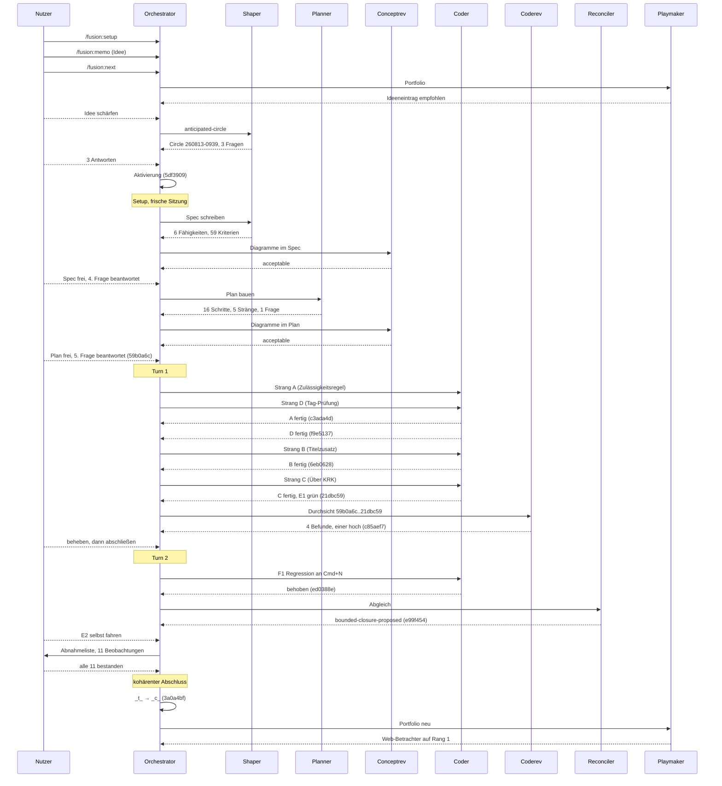

# Orchestrator-Sitzung — 260813-1006

**Directive:** Die Titelleiste von KRK trägt links einen eigenen Bereich mit Namen und Version (`KRK 0.1.0`), der absolute Pfad bleibt mittig und ungekürzt. Verbindlich wird die Zahl durch semantische Versionstags: Git-Tag `v<version>` je Auslieferung, ein Abschnitt in README.md über die Stufen, Abbruch in `cargo xtask release` ohne passenden Tag auf HEAD. Den Tag setzt der Nutzer.
**Modus:** (Phase 0 offen)
**Status:** Läuft

## Aufnahme beim Start

| Größe | Wert |
|---|---|
| Aktiver Circle | 260813-0939-titelleiste-fuehrt-version-und-semantische-tags (aktiviert 10:0x über /fusion:next) |
| git HEAD | 9d5fcfa |
| Turn-Budget | 5 |
| Erkannte Domäne | code |
| Offene Fragen im Circle | 3 (Über-KRK-Menüeintrag, wer setzt v0.1.0, Tag auf HEAD oder sauberer Baum) |
| Offene Fragen shared | 7 |
| Offene Defekte | 0 im Circle, 9 in shared |
| Offene Pläne | 0 im Circle, 1 in shared |
| Guard | haltActive: false |
| Arbeitswarteschlange | keine tasklist.md |

## Vorlauf dieser Sitzung

Die vorige Sitzung (shared/history/260813-0807-orchestrator-session.md) hat Setup gefahren, den Backlog-Eintrag 260813-0822 angelegt, den playmaker zweimal laufen lassen und über /fusion:direct diesen Circle anlegen lassen. Sie hat keinen Turn gefahren und keinen Commit gesetzt.

## Drei Fragen beantwortet (Nutzer, 260813-1010)

**Über-KRK-Eintrag im Anwendungsmenü: ja, Möglichkeit 2** — der Standard-Über-Dialog von AppKit. Ein Menüeintrag ohne Kürzel öffnet das Systemfenster, das Name, Version und Symbol aus der `Info.plist` des Bündels liest. Damit bleibt die Zahl einquellig, der Eintrag bleibt ein Sonderposten wie die Markdown-Ausgabe der Runde 3, und `Kommando` wächst nicht. Ein eigenes Über-Fenster ist verworfen.

**Erster Tag `v0.1.0`: Möglichkeit 1** — der Nutzer setzt ihn auf den Commit, der diese Runde schließt. Der Abschnitt in `README.md` sagt dazu, dass `v0.1.0` den ersten getaggten Stand benennt und keine Weitergabe. Damit ist die neue Prüfung in ihrer eigenen Runde einmal am grünen Fall gefahren und nicht nur am Abbruch. Rückwirkende Tags für die sieben geschlossenen Runden sind verworfen.

**Prüftiefe von `cargo xtask release`: Möglichkeit 2, beschränkt auf verfolgte Dateien** — der Lauf bricht ab, wenn HEAD keinen zur `Cargo.toml` passenden Tag trägt, und ebenso, wenn `git status` Änderungen an verfolgten Dateien meldet. Unbeachtete Dateien bleiben außen vor. `cargo xtask bundle` und `make check` bleiben unangetastet.

## Spec-Tor und die vierte Frage (Nutzer, 260813-1055)

**Spec freigegeben.** `planning/260813-1037_o_spec-titelleiste-fuehrt-version-und-semantische-tags.md`, sechs Fähigkeiten mit 59 Abnahmekriterien. Der conceptrev hat beide Diagramme gerendert und mit `acceptable` bewertet (0 Zyklen, kein Gott-Knoten, kein freistehender Knoten); die drei mittleren Befunde betreffen Beschriftungen und sind an Ort und Stelle zu beheben. Bericht: `reviews/260813-1049-conceptrev-spec-titelleiste-fuehrt-version-und-semantische-tags.md`.

**Blinder Fleck hinter dem Über-Dialog: Möglichkeit 2** — die Runde schließt die Lücke einmal und allgemein. Die Zulässigkeitsregel (`zulaessigkeit::zulaessig`, seit der Runde 7 eine reine Funktion mit drei Fragern) bekommt die zusätzliche Frage, ob das Schlüsselfenster KRKs Hauptfenster oder ein daran hängendes Blatt ist; ist es keines von beidem, wirkt kein Befehl. Der offene Defekt zum Freigabedialog der Runde 6 fällt damit mit weg. Der Nutzer nimmt die Abnahme in den ungemessenen Lagen auf sich.

## Die fünfte Frage: die Ausnahmeliste (Nutzer, 260813-1125)

**Möglichkeit 1** — die Ausnahmeliste `immer_erreichbar` hebt auch die neue Schlüsselfensterfrage auf. `beenden` und `fenster_schliessen` kommen weiter durch, solange der Über-Dialog oder der Freigabewähler vorn steht. Der Grund ist die ausgeschriebene Randbedingung des Spec, kein Verlust gegenüber heute: Cmd+Q beendet KRK heute auch vor dem Freigabewähler der Runde 6. Die Ausnahmeliste behält damit eine Bedeutung, die in einen Satz passt — sie hebt jede Sperre auf, die nach der Lage fragt, und keine, die nach dem Wirkungsbereich fragt. Cmd+W auf `tab_schliessen` steht nicht auf der Liste und bleibt vor einem fremden Schlüsselfenster gesperrt.

## Turn 1 — Bilanz

Vier Stränge gebaut, sechs Commits, davon vier am Baum. 15 von 16 Planschritten stehen auf `[DONE]`; offen bleibt allein E2, die Abnahme am Bündel.

| Strang | Commit | Inhalt |
|---|---|---|
| A | `c3ada4d` | Die Zulässigkeitsregel fragt nach dem Schlüsselfenster; Tafel von 140 auf 280 Fälle |
| D | `f9e5137` | Tag-Prüfung als Station 1, README nennt die Versionsstufen; xtask von 49 auf 60 Proben |
| B | `6eb0628` | Titelzusatz-Modul, Titel auf leere Zeichenkette, Modulliste von 27 auf 28 |
| C | `21dbc59` | Über-KRK-Eintrag als Sonderposten ohne Kürzel; E1 mit erfüllt |

`make check` exit 0 nach jedem Strang und am Ende über den ganzen Baum.

**Die Durchsicht hat einen hohen Befund gefunden, und er hält die Runde auf.** `fenster_einblenden` (Cmd+N) ist nach `Shift+Cmd+W` nicht mehr erreichbar: die neue Schlüsselfensterbedingung faltet „fremdes Fenster vorn" und „gar kein Fenster" zu demselben Wert, und der Befehl steht nicht auf der Ausnahmeliste, obwohl er der Rückweg aus genau dieser Lage ist. Das bricht die Randbedingung „kein Verlust gegenüber heute" und C7 der Runde 1. Datensatz: `issues/260813-1258_o_fenster-einblenden-ist-nach-dem-schliessen-des-fensters-nicht-mehr-erreichbar.md`.

Drei weitere Befunde der Durchsicht sind niedrig, dazu vier aus dem Bau. Acht offene Defekte im Circle insgesamt.

**Die vier Abweichungen der Bauer vom Planwortlaut sind einzeln geprüft und alle vier richtig.** Der Tagvergleich auf Zeilengleichheit deckt `v0.1.0-rc1` korrekt nicht, gesetzt ist `NSLayoutAttribute::Left` und nicht `Leading`, und neun von zehn SDK-Angaben im Modulkopf stimmen wörtlich samt Zeilennummer.

**Coherence, drei Kanten.** Artifact↔Grounding: 8 Defekte gefiltert, einer davon hoch. Artifact↔Directive: die Commits bewegen sich auf die Directive zu, alle sechs Fähigkeiten des Spec sind gebaut. Grounding↔Directive: 5 beantwortete Entscheide berührt, keiner im Widerspruch. Aggregat: `review-needed` wegen des hohen Befunds.

---

## Coherence

<!-- RECONCILER-OWNED -->

**Verdict:** bounded-closure-proposed

**Edges:**

- Artifact↔Grounding: 15 von 16 Planschritten ausgeführt und einzeln gegen den Baum gelesen, dazu eine siebzehnte Aufgabe (`F1`, Commit `ed0388e`), die in keinem Planschritt steht. 59 Abnahmekriterien nach ihrem Nachweisweg sortiert: **48 sind allein am Baum nachweisbar und alle 48 halten**, 7 zur einen Hälfte am Bündel, 3 allein am Bündel, 1 reine Nutzerarbeit. `make check` beim Abgleich wiederholt, exit 0 (`cargo test --workspace` 1025 Proben, `clippy --all-targets -- -D warnings`, `fmt --check`). Alle Zahlen aus C6 einzeln nachgezählt statt aus Prosa übernommen: `Kommando` 76, `Wirkungsbereich` 7, `Bereich` 5, `Fokus` 5, `Funktionsbereich` 9, Belegung 82 Funktionen mit 88 Kombinationen. Der eine geschlossene Defekt hält an allen vier Stellen, die seine `Resolved:`-Zeile nennt. **Drei Abweichungen:** neun Kriterien tragen **(Probe)** und haben keine (C2.8, C2.10, C4.1–C4.7); zwei Zahlen aus dem Plan sind falsch in Doc-Kommentare gewandert (fünf statt sechs `fokus`-Aufrufer, `PLATZHALTER` als `pub(crate)` statt `pub`); und eine Gegenmaßnahme der Risikotafel ist nicht gefahren und nicht als Verzicht vermerkt. **Der Querschnitt, den die Durchsicht gemeldet hat, ist grösser als ihre sechs Stellen:** zwei weitere stehen in `crates/krk-ui/src/kommandos/zulaessigkeit.rs` selbst, also in der einen Datei, die Schritt A1 nennt — die Erklärung „ein Schritt zählt seine Dateien abschliessend auf" greift für sie nicht, und die vorgeschlagene Abhilfe deckt sie nicht ab. Dazu vier weitere in `anwendung.rs` und `titelzusatz.rs` und der Spec selbst, dessen Stationsbild sechs zählt, wo der Baum sieben trägt. Offene Defekte: 17 im Circle (7 aus der Runde, 10 aus diesem Abgleich), 72 über alle Speicher. **Kante ist auffällig.**

- Artifact↔Directive: **Die acht Commits aus `9d5fcfa..HEAD` laufen sämtlich auf die Directive zu, keiner quer und keiner von ihr weg.** Die vier Stränge liegen einzeln im Baum: die Zulässigkeitsregel in `c3ada4d`, die Tag-Prüfung und der README-Abschnitt in `f9e5137`, die Titelleiste in `6eb0628`, der Über-Eintrag in `21dbc59`. Die zwei davor (`5df3909`, `59b0a6c`) tragen Circle, Spec und Plan, die zwei danach (`c85aef7`, `ed0388e`) Durchsicht und Behebung des einen hohen Befunds. Die Zusage „keine elfte Zeitzusage, keine der zehn angefasst" hält, ebenso „keine der vier vollständigen Aufzählungen wächst". **Die Directive hat eine zweite Hälfte, die kein Agent erreichen kann.** Sie sagt „semantische Versionstags decken die Zahl", und der Baum trägt bis heute keinen einzigen Tag: `git tag -l` ist leer. Den Tag setzt der Nutzer, so hat er es am 260813-1010 entschieden, und dieselbe Grenze trägt jedes mit **(Bündel)** gekennzeichnete Kriterium. Kante ist nicht auffällig, aber nur zur Hälfte prüfbar.

- Grounding↔Directive: 5 Entscheidungsdatensätze im Circle, alle fünf beantwortet, **vier mit diesem Abgleich auf `_i_` gezogen** und je mit Commit und Fundstelle belegt. Keiner widerspricht der Directive. **Der fünfte kann von keinem Agenten weitergezogen werden:** `260813-0939_a_wer-setzt-den-ersten-tag-v0-1-0-und-wann.md` ist beantwortet und nicht realisiert, weil seine Realisierung ein Git-Tag ist, den der Nutzer setzt — dieselbe Sperre, die die zweite Hälfte der Directive trägt. **Zwei der vier `_i_`-Datensätze tragen eine Aussage, die der Bau widerlegt hat**, und beide Berichtigungen stehen aus: der Entscheid zum Über-Dialog nennt `F5` und `delete` als Beispiele, die schon vorher nicht durchkamen, und er sagt, der Freigabedialog-Defekt der Runde 6 falle mit weg, obwohl der Wähler kein Fenster ist. Die Antworten selbst sind davon unberührt; deshalb steht der Marker. Über alle Speicher: 19 offene Fragen. **Die eine, die alles trägt, ist seit der Runde 1 offen:** `circles/260802-0842-krk-mac-dateimanager-editor-git/decisions/260806-1303_*_wie-kommt-krk-fuer-den-abnahmelauf-in-den-vordergrund.md`. Kante ist nicht auffällig.

**Rebalance recommendation:** accept Bounded Closure

**Begründung.** Die Directive ist gebaut und nicht abgenommen, und der Grund ist strukturell und nicht diesmalig. Elf der 59 Kriterien haben einen Anteil, den nur ein Mensch am laufenden Bündel sehen kann, eines ist reine Nutzerarbeit, und der erste Tag `v0.1.0` gehört nach dem Entscheid vom 260813-1010 auf den Abschlusscommit dieser Runde — also auf einen Commit, den es zum Zeitpunkt des Bauens nicht gab. Der Abnahmelauf verlangt KRK im Vordergrund; die Frage danach steht seit der Runde 1 offen. Alle sieben Vorgängerinnen sind aus diesem Grund beschränkt geschlossen; die achte schliesst so wie sie. „Gebaut" ist die richtige Aussage über diese Runde, „abgenommen" nicht.

Die auffällige Kante ist damit nicht abgetan. Sie ist Arbeit für die nächste Runde und steht als Datensätze: siebzehn offene Defekte im Circle, davon zehn aus diesem Abgleich, und ein Querschnitt, dessen Erklärung nachweislich zu eng ist. Wäre die Directive erreichbar, hiesse die Empfehlung nach der Rangfolge **revise Artifact** — Grounding und Directive tragen beide, die Arbeit ist die auffällige.

**Was der Nutzer beim Abschluss zusätzlich tut**, und was kein Agent für ihn tun kann: die Beobachtungsliste aus Planschritt E2 fahren, darunter die eine Beobachtung, an der der Freigabedialog-Defekt der Runde 6 hängt (Shift+Cmd+S öffnen, dabei Cmd+W drücken), und `v0.1.0` auf den Commit setzen, der die Runde schliesst. Danach lässt sich der grüne Fall der neuen Prüfung einmal an einem echten Lauf sehen.

**Abgleich:** `circles/260813-0939-titelleiste-fuehrt-version-und-semantische-tags/history/260813-1345-reconciliation.md`

---

# Abschlussbericht

**Status:** Vollständig. Der Circle ist als kohärenter Abschluss (`_c_`) geschlossen.

## Budget

| Größe | Zahl |
|---|---|
| Turns | 2 |
| Aufgaben erledigt | 17 von 17 |
| Aufgaben übersprungen oder zurückgestellt | 0 |
| Defekte gefiltert | 19 |
| Defekte geschlossen | 2 |
| Fragen beantwortet (`_o_`→`_a_`) | 1 |
| Fragen umgesetzt (`_a_`→`_i_`) | 4 |
| Commits | 10 |
| Agentenfehler | 0 |
| Nutzer-Tore | 7 |

Die vier Datensatzzahlen sind aus den Speichern gelesen, nicht mitgezählt: Anker `9d5fcfa`, Sitzungsbeginn `260813-1006`, über `shared/` und den Circle der achten Runde.

## Per-Turn-Log

### Turn 1
- Versucht: A1-A3, B1-B3, C1-C3, D1-D5, E1
- Erledigt: alle 15
- Commits: `c3ada4d`, `f9e5137`, `6eb0628`, `21dbc59`
- Durchsicht: 4 Befunde, einer hoch
- Circuit Breaker: OK
- Coherence: review-needed

### Turn 2
- Versucht: F1 (Regression), E2 (Nutzerarbeit)
- Erledigt: beide
- Commits: `ed0388e`, `c85aef7`, `e99f454`, `3a0a4bf`
- Durchsicht: keine weitere
- Circuit Breaker: OK
- Coherence: kohärent nach der Abnahme

## Durchsichtsdeckung

**Bereich:** `9d5fcfa..3a0a4bf` — 10 Commits
**Gedeckt durch:** `reviews/260813-1258-coderev-turn-1-titelleiste-version-und-tags.md`, Bereich `59b0a6c..21dbc59` (4 Commits)
**Nicht gedeckt:** `5df3909`, `59b0a6c` (reine Werkbank-Commits: Spec, Plan, Entscheide); `ed0388e`, `c85aef7`, `e99f454`, `3a0a4bf` (die Behebung aus Turn 2 und drei Werkbank-Commits)
**Unbrauchbar für die Deckung:** die beiden Diagrammdurchsichten tragen keine `**Reviewed-range:**`-Zeile
**Übernommene nicht geöffnete Dateien:** keine verzeichnet

Die Behebung `ed0388e` ist von keiner Durchsicht geöffnet worden. Sie ist am laufenden Bündel abgenommen (Beobachtung 5), nicht durchgesehen.

## Verbleibende Arbeit

- **Beim Nutzer:** `git tag v0.1.0 3a0a4bf`. Damit ist C3.15 erfüllt und der Entscheid `260813-0939_a_wer-setzt-den-ersten-tag-v0-1-0-und-wann.md` geht auf umgesetzt.
- 16 offene Defekte im Circle, keiner am Verhalten der Anwendung.
- Ein neuer Defekt im gemeinsamen Speicher: `shared/issues/260813-1515_o_die-auslieferungspruefung-schlaegt-nach-jeder-agentensitzung-an-weil-vier-werkbankdateien-verfolgt-sind.md`.

## Commits

| Hash | Was |
|---|---|
| `5df3909` | Circle aktiviert, drei Fragen beantwortet |
| `59b0a6c` | Spec und Plan, zwei weitere Fragen beantwortet |
| `c3ada4d` | Zulässigkeitsregel fragt nach dem Schlüsselfenster (A1-A3) |
| `f9e5137` | Tag-Prüfung als Station 1, README-Abschnitt (D1-D5) |
| `6eb0628` | Titelleiste trägt links Namen und Version (B1-B3) |
| `21dbc59` | Über-KRK-Eintrag, E1 grün (C1-C3) |
| `c85aef7` | Durchsicht von Turn 1 |
| `ed0388e` | Cmd+N holt das Fenster zurück (F1) |
| `e99f454` | Abgleich, vier Entscheide umgesetzt |
| `3a0a4bf` | Abschluss, kohärent |

## Sitzungsablauf

