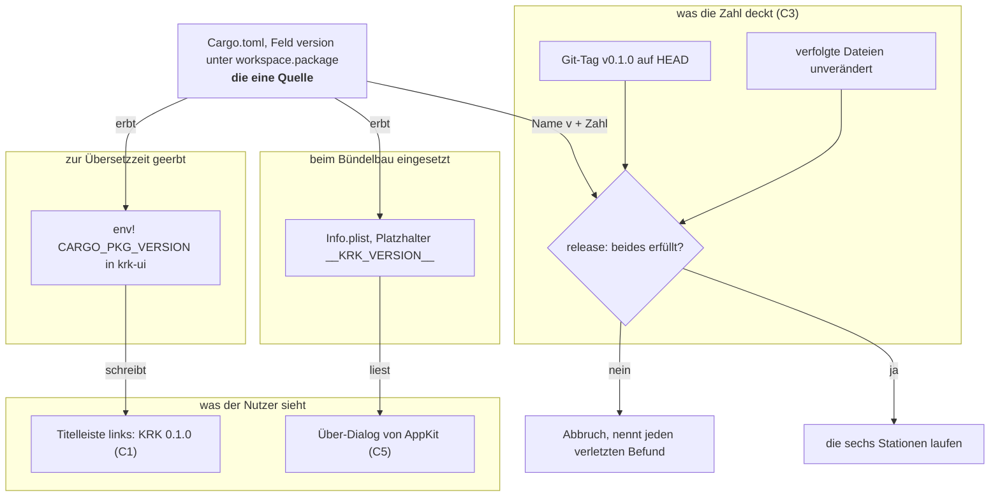
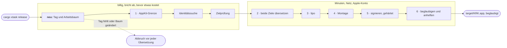

# Spec: Die Titelleiste führt Namen und Version, semantische Versionstags decken die Zahl

**Date:** 2026-08-13
**Status:** Entwurf
**Source:** Backlog-Eintrag des Nutzers vom 260813-0822, geschlossen mit der Anlage des Circles, und die Directive im Circle-Datensatz `circles/260813-0939-titelleiste-fuehrt-version-und-semantische-tags/_*_circle.md`
**Circle:** `circles/260813-0939-titelleiste-fuehrt-version-und-semantische-tags/`, aktiv seit 260813-1006
**Grundlage erhoben:** 260813-1037, am Baum unter `crates/`, `xtask/`, `resources/` und an `git`
**Sieben Fragen sind beantwortet:** vier in der Klärungsrunde vom 260813-0939 (Grounding-Aufnahme des Circle-Datensatzes), drei am 260813-1010 an den Datensätzen in `decisions/` dieses Circles, alle drei nach der Empfehlung des Datensatzes. Dieser Spec stellt keine davon erneut.

---

## Directive

Nach dieser Runde sagt KRK selbst, welche Fassung es ist, und die Zahl ist gedeckt. Die Titelleiste trägt links einen eigenen Bereich mit `KRK 0.1.0`; der absolute Pfad bleibt mittig und ungekürzt, wie C11 der Runde 2 es zusagt. Dieselbe Zahl steht im Standard-Über-Dialog von AppKit, den ein Eintrag ohne Kürzel im Anwendungsmenü öffnet. Verbindlich wird sie durch semantische Versionstags: jede Auslieferung bekommt einen Git-Tag `v<version>`, ein Abschnitt in `README.md` sagt, wann Major, Minor oder Patch steigt, und `cargo xtask release` bricht ab, solange HEAD keinen passenden Tag trägt oder eine verfolgte Datei geändert ist. Den Tag setzt der Nutzer, nie das Werkzeug.

Diese Runde setzt keine elfte Zeitzusage und fasst keine der zehn an.

---

## Wie diese Runde geschnitten ist, und warum so

**Sechs Fähigkeiten, eine Klammer, eine benannte Naht.**

Die Klammer ist die eine Zahl. Sie wohnt heute an einer Stelle und wird an keiner gezeigt; nach dieser Runde zeigt sie sich an zwei Stellen und wird an einer geprüft. Alle sechs Fähigkeiten hängen an derselben Quelle, und der Zuschnitt hält sie zusammen, damit keine zweite Zusammensetzung von Name und Version entsteht.

Die Naht liegt zwischen Anzeige und Deckung. C1, C2 und C5 fassen `crates/krk-ui/` an, C3 und C4 fassen `xtask/` und `README.md` an; die beiden Hälften teilen genau eine Datei, nämlich die `Cargo.toml`, und dort nicht einmal eine Zeile, die sich ändert. Wird die Runde lang, lässt sich die Tag-Hälfte als eigene Runde herauslösen, und der Preis dafür ist eine Zeile in der Reihenfolge der Arbeit. Der Nutzer hat die Kopplung im Backlog-Eintrag ausdrücklich bestellt, mit der Begründung, eine angezeigte Version ohne verbindliche Festlegung sei eine Zahl ohne Deckung.

**Die dritte Antwort der Klärungsrunde schwächt diese Begründung ab, und das gehört hierher statt in eine Fußnote.** Ohne Kennzeichnung des Arbeitsstands zeigt jeder Bau aus einem geänderten Baum dieselbe Zahl wie das ausgelieferte Bündel. Die Tags decken die Zahl deshalb an der Auslieferung und nicht an jedem Bau. Der Spec macht das an zwei Stellen sichtbar, statt es stehen zu lassen: die Prüfung aus C3 verlangt zusätzlich einen unveränderten Arbeitsbaum, womit wenigstens für ausgelieferte Bündel Zahl und Stand zusammenfallen, und der Abschnitt in C4 schreibt die verbleibende Lücke in die `README.md`.

---

## Ausgangslage, am 260813 am Baum erhoben

Sieben Feststellungen tragen den Zuschnitt. Zwei davon widersprechen dem, was man ohne sie annehmen würde.

**Der Name steht heute nur bis zum ersten Pfad in der Titelleiste.** `crates/krk-ui/src/appkit/fenster.rs:436` setzt den Titel beim Aufbau einmal auf `KRK`; `Anwendungsdelegierter::titel_nachziehen` (`appkit/anwendung.rs:3673`) überschreibt ihn beim ersten Fokus-, Ordner-, Tab- oder Dateiwechsel mit dem Pfad aus `krk-ui/src/fenstertitel.rs`. Danach steht der Name nirgends mehr auf dem Schirm. Einen Titelleisten-Zusatz gibt es nicht: `NSTitlebarAccessoryViewController` kommt unter `crates/` nicht vor, und `fenster.rs` baut das Fenster mit den vier gewöhnlichen Stilmarken.

**Die Version liegt zur Übersetzzeit schon an, ohne neuen Bauschritt.** `[workspace.package] version = "0.1.0"` in der Wurzel-`Cargo.toml`, geerbt über `version.workspace = true`, auch von `krk-ui`. `env!("CARGO_PKG_VERSION")` liefert sie damit in `krk-ui` ohne jede Vorkehrung; heute liest die Kiste sie nicht, `krk-bench` und `xtask` tun es an fünf Stellen. `resources/Info.plist` trägt bei `CFBundleShortVersionString` allein den Platzhalter `__KRK_VERSION__`, den `cargo xtask bundle` beim Kopieren ersetzt und ohne den es abbricht.

**Tags gibt es keine.** `git tag -l` liefert in diesem Baum nichts, bei sieben geschlossenen Runden. Der erste Tag entsteht nach dem Entscheid vom 260813-1010 auf dem Commit, der diese Runde schließt, und der Nutzer setzt ihn.

**`xtask` ruft heute kein `git`.** Gezählt über `Command::new` in allen fünf Dateien unter `xtask/src/`: aufgerufen werden `iconutil`, `cargo`, `codesign`, `security`, `rustup`, `lipo`, `ditto` und `xcrun`. Die Tag-Prüfung ist der erste Aufruf von `git` und zugleich die erste Stelle, an der das Bauwerkzeug den Zustand des Arbeitsbaums befragt.

**Der Auslieferungsweg steht und ist sechs Stationen lang.** `cargo xtask release` prüft die AppKit-Grenze, sucht die Signaturidentität, prüft die Ziele, übersetzt beide Mac-Ziele, fügt sie mit `lipo` zusammen, montiert dasselbe Bündel wie `bundle`, signiert mit gehärteter Laufzeitumgebung und beglaubigt über `notarytool` und `stapler`. Die drei ersten Schritte sind billig, ab der Übersetzung kostet der Weg Minuten und ab der Beglaubigung ein Apple-Konto.

**Der verfolgte Arbeitsbaum dieses Verzeichnisses ist in einer laufenden Sitzung nie sauber, und zwar allein wegen der Workbench.** Am 260813-1037 gemessen: `git status --porcelain --untracked-files=no` meldet sieben Einträge, alle sieben unter `fusion-workbench/`, darunter `orchestrator-events.jsonl` und `orchestrator-live.md`, die jede Sitzung fortschreibt. Unter `crates/`, `xtask/` und `resources/` steht nichts. Die Prüfung aus Antwort 3 wird also während einer Sitzung regelmäßig anschlagen, und der Grund liegt nie im Programmtext. Was daraus folgt, steht unter „Abgeleitet und nicht gefragt".

**Unter `target/KRK.app` liegt ein beglaubigtes Bündel.** Am 260813-1037 geprüft: `xcrun stapler validate` meldet ein angeheftetes Ticket. Jeder gewöhnliche Entwicklungsbau überschreibt es, weil `bundle` und `release` denselben Ort beschreiben; der offene Defekt `shared/issues/260813-0026_*_bundle-und-release-schreiben-an-denselben-ort-und-ein-entwicklungsbau-zerstoert-das-beglaubigte-buendel.md` beschreibt die Lage. Was das für diese Runde bedeutet, steht in einem eigenen Abschnitt weiter unten.

---

## Die eine Zahl und ihre Abnehmer

Nach dieser Runde hat die Zahl aus der `Cargo.toml` drei Abnehmer statt einen, und einen Prüfer. Das Bild zeigt, dass keiner der drei Wege einen zweiten Ursprung hat.

**Der Über-Dialog liest die Zahl aus dem Bündel und nicht aus dem Programmtext, und darin liegt der Grund, warum er billig ist.** `cargo xtask bundle` setzt sie beim Kopieren in die `Info.plist`; AppKit liest sie von dort. Eine zweite Zusammensetzung von Name und Version entsteht damit an keiner Stelle. Der Preis ist eine benannte Asymmetrie: außerhalb eines Bündels, also beim Entwicklungslauf über `cargo run`, findet Foundation keine Bündelbeschreibung, und der Dialog zeigt dort nichts oder den Prozessnamen. Die Titelleiste zeigt die Zahl auch dann, weil sie einübersetzt ist.

## Der Auslieferungsweg nach dieser Runde

**Die neue Station steht vorn, und das ist eine Zusage und keine Bequemlichkeit.** Ein Abbruch wegen eines fehlenden Tags kostet sonst zwei Übersetzungsläufe im Profil `release`, und der Nutzer erführe erst nach Minuten von einem Befund, der in Millisekunden feststeht. An welcher Stelle unter den billigen Prüfungen sie genau sitzt, gehört dem Plan; dass keine teure vor ihr liegt, gehört hierher.

---

## Fähigkeiten und Abnahmekriterien

Jedes Kriterium trägt, wie es nachzuweisen ist. **(Probe)** heißt: eine Prüfung im Baum weist es nach, ein Agent kann es abnehmen. **(Bündel)** heißt: es ist am laufenden `KRK.app` im Vordergrund zu sehen, und das ist Nutzerarbeit. **(Nutzerarbeit)** heißt: es ist überhaupt keine Prüfung, sondern eine Handlung des Nutzers.

### C1: Namen und Version links in der Titelleiste

**Beschreibung:** Die Titelleiste des Hauptfensters trägt links einen eigenen Bereich, der `KRK 0.1.0` zeigt. Er steht neben dem Pfad und nicht in ihm, ändert sich nie und lässt sich nicht bedienen.

**Abnahmekriterien:**
1. Die Titelleiste trägt links einen eigenen Bereich mit dem Text `KRK 0.1.0`: der Name, ein Leerzeichen, die Versionszahl. Keine spitzen Klammern, keine runden Klammern, kein Zusatz davor oder dahinter. **(Probe** für den Text, **Bündel** für die Lage**)**
2. Die Zahl kommt aus `[workspace.package] version` der `Cargo.toml`, geerbt über `version.workspace = true` und gelesen über `env!("CARGO_PKG_VERSION")`. Sie steht nirgends als Zeichenkette im Programmtext, und es entsteht kein Bauschritt, der sie erzeugt oder einsetzt. **(Probe)**
3. Der Text ändert sich zur Laufzeit nie. Weder Fokus noch Ordner, Tab, Datei oder Blatt schreiben ihn um. **(Probe)**
4. Ein Bau aus einem geänderten Baum zeigt dieselbe Zahl wie ein ausgeliefertes Bündel. Kein `-dev`, keine Commit-Kennung, kein Bauzeitpunkt. **(Probe)**
5. Der Bereich steht **neben** dem Titel und nicht darin. `setTitle` bekommt weiterhin genau das, was `fenstertitel::titel` liefert, und die Funktion bleibt unverändert. **(Probe** über den Aufrufer und über die Funktion**)**
6. Der Bereich nimmt den Ersthelferrang nicht an, und ein Klick darauf löst nichts aus. Er trägt keinen Tastenbefehl. **(Probe** für den Rang, **Bündel** für den Klick**)**
7. Er wird kein sechster Bereich der Fensterzeile. `Bereich` bleibt bei fünf Werten, `Fokus` bei fünf, und `fokusanzeige_nachziehen` schreibt weiter genau fünf Rahmenfarben und den Fenstertitel und sonst nichts. **(Probe)**
8. Die Mindestgröße des Fensterinhalts wächst nicht. `MINDESTGROESSE` in `appkit/fenster.rs` bleibt, was sie ist. **(Probe)**
9. Wird die Titelleiste zu schmal für alles, entscheidet macOS, was es zeigt. KRK kürzt weder den Namen noch die Version noch den Pfad. **(Probe** für das Fehlen jeder Kürzung im Programmtext, **Bündel** für das Bild**)**
10. Wird das Fenster geschlossen und über „Fenster einblenden" zurückgeholt, steht der Bereich wieder da. **(Bündel)**
11. Der Bereich zeigt sich in jedem Erscheinungsbild lesbar und folgt der Systemfarbe für sekundären Text; er setzt keine eigene Farbe. **(Probe** für die verwendete Systemfarbe, **Bündel** für hell und dunkel**)**

**Getroffene Festlegungen:**
- **Ein eigener Bereich und kein Namenszusatz im Titelstring.** Antwort 1 der Klärungsrunde vom 260813-0939. Ein Name im Titel fräße Breite, und macOS kürzte bei schmalem Fenster den Pfad, den KRK absichtlich nicht kürzt.
- **Kein Arbeitsstand im Titel.** Antwort 3 derselben Runde.
- **Die Schreibweise `KRK 0.1.0` mit der tatsächlichen Zahl des Baums.** Antwort 4. Die spitzen Klammern im Entwurf des Nutzers waren Platzhalter-Notation.

### C2: C11 der Runde 2, fortgeschrieben

**Beschreibung:** C11 der Runde 2 ist die einzige bestehende Zusage über die Titelleiste. Der neue Bereich steht nicht neben ihr, sondern schreibt sie fort. Nach dieser Runde lauten ihre elf Abnahmekriterien wie hier; zwei sind geändert, neun stehen wörtlich wie im Spec `circles/260807-2116-eingebauter-editor-mit-textmarken/planning/260807-2147_*_spec-eingebauter-editor-mit-textmarken.md`, Abschnitt `### C11: Der volle Pfad im Fenstertitel`.

**Abnahmekriterien:**
1. **Geändert.** Der Fenstertitel trägt einen absoluten Pfad und keinen Namen der Anwendung. Name und Version stehen seit dieser Runde im eigenen Bereich links daneben; was `setTitle` bekommt, ist unverändert allein das Ergebnis von `fenstertitel::titel`. **(Probe)**
2. Steht der Fokus in einem der beiden Dateifenster, zeigt der Titel den Pfad des dort angezeigten Ordners. **(Probe)**
3. Steht der Fokus im Editor und hält der Editor eine Datei, zeigt der Titel deren vollen Pfad, auch dann, wenn das aktive Dateifenster einen anderen Ordner zeigt. **(Probe)**
4. Steht der Fokus in der Vorschau und zeigt sie eine Datei, steht deren voller Pfad im Titel. **(Probe)**
5. Steht der Fokus in der Lesezeichenleiste, zeigt der Titel den Ordner des aktiven Dateifensters. **(Probe)**
6. Hält der Bereich mit dem Fokus nichts, was einen Pfad hat, zeigt der Titel den Ordner des aktiven Dateifensters. Betroffen sind ein Editor ohne Datei und eine Vorschau, die den Inhalt der Zwischenablage oder nichts zeigt. **(Probe)**
7. Ist der Editor nicht offen, kommt seine zuletzt gehaltene Datei im Titel nicht vor. **(Probe)**
8. Steht ein Blatt am Fenster, bleibt der Titel stehen, wie er davor stand. Der Bereich aus C1 steht ohnehin still, weil sein Text sich nie ändert. **(Probe)**
9. **Geändert.** Der Pfad steht ungekürzt. KRK kürzt den Benutzerordner nicht auf eine Tilde und lässt keine Zwischenordner aus; was der Titelbalken nicht fasst, kürzt macOS selbst. Seit dieser Runde beginnt macOS damit früher, weil der linke Bereich Breite aus derselben Leiste nimmt. Die Zusage bleibt gehalten, denn sie schließt das Kürzen durch KRK aus und nicht das durch macOS. **(Probe** für das Fehlen jeder Kürzung, **Bündel** für das Bild bei schmalem Fenster**)**
10. Der Titel zieht nach, sobald sich der genannte Pfad ändert: bei einem Ordnerwechsel, einem Tabwechsel, einem Dateiwechsel im Editor und einem Fokuswechsel. Eine Bewegung der Auswahl innerhalb eines Ordners ändert ihn nicht. **(Probe)**
11. Zeigt ein Dateifenster einen Ordner, den es nicht mehr gibt, steht dieser Pfad weiter im Titel. Der Titel gibt wieder, was auf dem Schirm steht, und prüft nicht nach. **(Probe)**

**Getroffene Festlegungen:**
- **C11 wird fortgeschrieben und nicht ergänzt.** Zwei Zusagen über dieselbe Titelleiste, eine aus der Runde 2 und eine aus dieser, wären zwei Wahrheiten über eine Fläche. Wer künftig wissen will, was der Titel zusagt, liest diese elf Kriterien.
- **Kriterium 9 wird gehalten und nicht abgeschwächt.** Der Wortlaut der Runde 2 unterscheidet schon zwischen dem Kürzen durch KRK, das verboten ist, und dem durch macOS, das hingenommen wird. Der neue Bereich verschiebt allein, ab welcher Fensterbreite das zweite eintritt.

### C3: Semantische Versionstags und die Prüfung in `cargo xtask release`

**Beschreibung:** Jede Auslieferung bekommt einen Git-Tag `v<version>`. `cargo xtask release` weigert sich zu bauen, solange HEAD keinen passenden Tag trägt oder eine verfolgte Datei des Verzeichnisses geändert ist. Den Tag setzt der Nutzer.

**Abnahmekriterien:**
1. `cargo xtask release` bricht ab, wenn auf HEAD kein Tag mit dem Namen `v<version>` steht, wobei `<version>` die Zahl aus `[workspace.package]` ist. **(Probe)**
2. Trägt HEAD mehrere Tags, genügt es, dass einer davon passt. **(Probe)**
3. Annotierte und leichte Tags gelten gleich. Gefragt ist, welcher Name auf HEAD steht, und nicht, wie er entstanden ist. **(Probe)**
4. `cargo xtask release` bricht ebenso ab, wenn eine verfolgte Datei geändert ist. Vorgemerkte und nicht vorgemerkte Änderungen zählen gleich, gelöschte verfolgte Dateien zählen mit. **(Probe)**
5. Unbeachtete Dateien zählen nicht. Ein Bauergebnis, eine Notiz oder ein Messbericht, der nie eingetragen wurde, hält die Auslieferung nicht auf. **(Probe)**
6. Gezählt wird das ganze Verzeichnis und keine Auswahl von Pfaden. Es entsteht keine Liste der bauwirksamen Ordner. **(Probe** über das Fehlen einer solchen Liste**)**
7. Treffen beide Befunde zu, nennt der Abbruch beide in einer Meldung. Der Nutzer räumt nicht erst den Baum auf, um danach vom fehlenden Tag zu erfahren. **(Probe)**
8. Die Meldung nennt drei Dinge: welche Bedingung verletzt ist, welche Version die `Cargo.toml` führt, und was zu tun ist. Sie nennt kein `git`-Kommando mit `--force` und keinen Weg, die Prüfung zu umgehen. **(Probe)**
9. Die Prüfung läuft vor der ersten Übersetzung. Kein Abbruch dieser Art kostet einen Übersetzungslauf. **(Probe** über die Reihenfolge der Stationen**)**
10. Das Werkzeug erzeugt unter keinen Umständen einen Tag und schreibt nichts in das Verzeichnis. Es liest. **(Probe)**
11. Liegt kein Git-Verzeichnis vor, bricht `release` mit einer Meldung ab, die genau das sagt. Es baut nicht ersatzweise durch. **(Probe)**
12. `cargo xtask bundle` fragt weder nach einem Tag noch nach dem Arbeitsbaum, und `make check` bleibt unverändert. Die tägliche Arbeit hängt nicht an der neuen Prüfung. **(Probe)**
13. `xtask` ruft `git` an genau einer Stelle. Ein zweiter Aufrufer entsteht nicht. **(Probe** über die Zahl der Aufrufer**)**
14. Der Vergleich selbst ist eine reine Funktion über drei Eingaben: die Version, die Liste der Tags auf HEAD und die Liste der geänderten verfolgten Dateien. Sie ist ohne Prozessaufruf und ohne Git-Verzeichnis prüfbar, und der grüne Fall wird an ihr abgenommen. **(Probe)**
15. Der erste Tag `v0.1.0` steht auf dem Commit, der diese Runde schließt. **(Nutzerarbeit)**

**Getroffene Festlegungen:**
- **Regel plus Prüfung bei der Auslieferung, und das Werkzeug erzeugt den Tag nicht.** Antwort 2 der Klärungsrunde vom 260813-0939.
- **Passender Tag auf HEAD und unveränderter Arbeitsbaum, beschränkt auf verfolgte Dateien.** Nutzerentscheid vom 260813-1010, `decisions/260813-0939_*_reicht-ein-tag-auf-head-oder-muss-der-arbeitsbaum-sauber-sein.md`, Möglichkeit 2. Der Grund für die Strenge steht dort: eine Auslieferung ist selten, dauert Minuten und geht an andere Geräte, und der Preis eines Abbruchs ist ein `git stash` oder ein Commit.
- **Der Nutzer setzt `v0.1.0` auf den Abschlusscommit dieser Runde.** Nutzerentscheid vom 260813-1010, `decisions/260813-0939_*_wer-setzt-den-ersten-tag-v0-1-0-und-wann.md`, Möglichkeit 1. Rückwirkende Tags für die sieben geschlossenen Runden sind verworfen.

### C4: Der Abschnitt über die Versionsstufen in `README.md`

**Beschreibung:** `README.md` bekommt einen eigenen Abschnitt, der sagt, wann Major, Minor und Patch steigen, wer den Tag setzt und was `release` prüft. Der bestehende Abschnitt „Versionspflege" bleibt die eine Stelle, die sagt, wo die Zahl wohnt.

**Abnahmekriterien:**
1. `README.md` trägt einen eigenen Abschnitt über die Versionsstufen. **(Probe** für sein Dasein und für die genannten Bestandteile**)**
2. Der Abschnitt sagt, wann jede der drei Stufen steigt, und benennt dafür KRKs eigene Flächen: die Tastenbelegung samt der Bedeutung ihrer Befehle, die Dateien unter `~/Library/Application Support/KRK/`, das Mindest-Zielsystem und die Befehle des Bauwerkzeugs. Der Vorschlag steht unter „Abgeleitet und nicht gefragt" und ist am Spec-Tor überstimmbar. **(Probe)**
3. Er sagt, dass jede Auslieferung einen Tag `v<version>` bekommt und dass der Nutzer ihn setzt. Das Werkzeug erzeugt keinen. **(Probe)**
4. Er sagt, dass `v0.1.0` den ersten getaggten Stand benennt und keine Weitergabe. **(Probe)**
5. Er sagt, was `release` prüft, und ebenso, was es nicht prüft: unbeachtete Dateien bleiben außen vor, und ein Bau ohne Tag bleibt über `cargo xtask bundle` jederzeit möglich. **(Probe)**
6. Er sagt, dass die angezeigte Zahl an jedem Bau dieselbe ist und die Deckung durch den Tag deshalb an der Auslieferung hängt und nicht an jedem Bau. Das ist die Lücke aus Antwort 3, ausgeschrieben statt verschwiegen. **(Probe)**
7. Der bestehende Abschnitt „Versionspflege" bleibt die eine Stelle, die sagt, wo die Zahl wohnt und wie sie in die `Info.plist` kommt. Der neue Abschnitt verweist darauf, statt es zu wiederholen. **(Probe** über die Zahl der Stellen, die die Herkunft der Zahl beschreiben**)**

### C5: Der Eintrag „Über KRK" im Anwendungsmenü

**Beschreibung:** Das Anwendungsmenü führt ganz oben einen Eintrag „Über KRK", der den Standard-Über-Dialog von AppKit öffnet. Er trägt kein Kürzel und bleibt damit ein Sonderposten wie die Markdown-Ausgabe der Runde 3.

**Abnahmekriterien:**
1. Das Anwendungsmenü führt „Über KRK" als ersten Eintrag, gefolgt von einem Trenner. Die Mac-Gewohnheit setzt ihn nach oben, so wie sie das Beenden nach unten setzt. **(Probe** über `--menue-protokoll`, **Bündel** für das Bild**)**
2. Der Eintrag trägt kein Kürzel und steht nicht in `resources/default-keymap.toml`. Er ist ein `Eintrag::Sonderposten`, wie die Markdown-Ausgabe. **(Probe)**
3. Er öffnet das Systemfenster von AppKit. KRK baut keine eigene Fläche und setzt keine eigenen Inhalte hinein. **(Probe** über den Selektor, **Bündel** für das Fenster**)**
4. Was der Dialog zeigt, liest AppKit aus der `Info.plist` des Bündels. Eine zweite Zusammensetzung von Name und Version entsteht nicht, und die `Info.plist` bezieht die Zahl weiter über den Platzhalter aus der `Cargo.toml`. **(Probe** über die Zahl der Stellen, die Name und Version zusammensetzen**)**
5. Läuft KRK nicht aus einem Bündel, etwa beim Entwicklungslauf über `cargo run`, zeigt der Dialog, was Foundation ohne Bündelbeschreibung findet. KRK setzt dort nichts nach. **(Bündel)**
6. Solange der Dialog steht, wirkt kein Tastenbefehl von KRK auf das Fenster dahinter. Der Über-Dialog ist kein Blatt, und `blatt_steht` sieht ihn nicht; dieses Kriterium hängt an der offenen Frage `decisions/260813-1037_*_wirken-krks-tastenbefehle-weiter-waehrend-der-ueber-dialog-steht.md` und fällt mit ihrer Möglichkeit 1 weg. **(Bündel)**
7. Die Belegung wächst nicht: keine neue Funktion, keine neue Kombination, kein neues `Kommando`. **(Probe)**

**Getroffene Festlegungen:**
- **Der Standard-Über-Dialog von AppKit, Menüeintrag ohne Kürzel.** Nutzerentscheid vom 260813-1010, `decisions/260813-0939_*_bekommt-krk-einen-eintrag-ueber-krk-im-anwendungsmenue.md`, Möglichkeit 2. Ein eigenes Über-Fenster ist verworfen; ein Kürzel wäre nach dem Entscheid vom 260805-0000 zwingend ein Belegungseintrag geworden und hätte die Bauform geändert.

### C6: Was der Bau erzwingt

**Beschreibung:** Was diese Runde an den vollständigen Fallunterscheidungen und an den Projektregeln auslöst, und was sie ausdrücklich nicht auslöst.

**Abnahmekriterien:**
1. `Kommando` bleibt bei 76 Kennungen. `Wirkungsbereich` bleibt bei sieben Werten, `Bereich` bei fünf, `Fokus` bei fünf, `Funktionsbereich` bei neun. Das ist ein Ergebnis und kein Zufall: diese Runde legt keinen Befehl an, keinen Bereich, kein Fokusziel und keinen zehnten Funktionsbereich. **(Probe)**
2. `resources/default-keymap.toml` bleibt bei 82 Funktionen mit zusammen 88 Kombinationen, und die Zählzeile im Kopf der Datei bleibt richtig. **(Probe)**
3. Die Menüleiste trägt danach zwei Sonderposten und zwei Trenner. Die Probe `die_leiste_traegt_genau_einen_zusatz` in `crates/krk-ui/src/menuemodell.rs` erwartet heute zwei Zusätze und erwartet danach vier; ihr Name ist dann falsch und wird mitgeändert. **(Probe)**
4. Jede neue Datei unter `crates/krk-ui/src/appkit/` trägt im Modulkopf den Abschnitt `# Ab welchem macOS die angesprochenen Klassen stehen`, und jede dort genannte Zahl ist am SDK nachgelesen. Die Modulliste in `appkit/mod.rs` wächst von 27 auf 28 Namen. **(Probe** über die Deckung, Augenschein für die Richtigkeit**)**
5. `#![deny(unsafe_code)]` bleibt an allen drei Kistenwurzeln, und es kommt keine dritte Datei mit `#![allow(unsafe_code)]` hinzu. **(Probe** über die Liste der Ausnahmen**)**
6. Es wird keine fremde Kiste eingebunden. `Cargo.lock` führt danach unverändert kein `cc` und außer `windows-sys` kein `-sys`-Paket. **(Probe)**
7. Ein Rückgabewert, dessen stilles Fallenlassen unbemerkt bliebe, trägt `#[must_use]`. Betroffen ist mindestens das Ergebnis der Tag-Prüfung. **(Probe)**
8. Es gibt weiterhin genau drei Prüfordner-Fassungen, eine je Kiste. **(Probe)**

---

## Verhältnis zu den zehn Zeitzusagen aus C8 der Runde 1

**Diese Runde setzt keine elfte Zusage und ändert keine der zehn Zahlen.** Eine liegt auf ihrem Weg.

**L4 ist die einzige, bei der diese Runde messbar Arbeit hinzufügt.** Der Kaltstart bis zur bedienbaren Oberfläche hat 1000 ms, und beide neuen Anzeigen entstehen auf diesem Weg: der Bereich der Titelleiste beim Aufbau des Fensters, der Menüeintrag beim Bau des Hauptmenüs, das nach der Runde 7 ohnehin zweiundachtzig Einträge trägt. Ein Bereich mit einem stehenden Text und ein Eintrag ohne Kürzel sind klein, gemessen ist keines von beidem. Die Runde behauptet deshalb nicht, dass L4 hält, sondern benennt L4 als Gegenstand des nächsten Abnahmelaufs.

**Keine der übrigen neun liegt auf dem Weg.** L1 und L9 zählen Tastendrücke im Dateifenster; der neue Bereich schreibt nichts während eines Tastendrucks, und der Über-Dialog ist während einer Messreihe nicht offen. Die Tag-Prüfung läuft in `xtask` und nie in `KRK.app`.

Der vierte Gegenstand aus dem Spec der Runde 2, die Geschwindigkeit der Syntaxhervorhebung, ist von dieser Runde nicht berührt und bleibt offen.

---

## Der offene Defekt am Auslieferungsort bleibt ausdrücklich draußen

**Entscheidung: `shared/issues/260813-0026_*_bundle-und-release-schreiben-an-denselben-ort-und-ein-entwicklungsbau-zerstoert-das-beglaubigte-buendel.md` wird nicht in diese Runde hereingeholt.**

Der Defekt gehört in dieselbe Gegend. `cargo xtask bundle` und `cargo xtask release` legen beide `target/KRK.app` an, und jeder gewöhnliche Entwicklungsbau überschreibt ein beglaubigtes Bündel; über `bundle` hängen `run`, `run-terminal`, `tasten`, `menue`, `durchstich` und `frisch`. Die Tag-Prüfung setzt an denselben Weg. Der Playmaker hat den Punkt zweimal genannt, und der Circle-Datensatz führt den Defekt selbst unter `## Dependencies`.

**Der Grund für das Draußenbleiben ist nicht der Umfang, sondern die Frage.** Diese Runde beantwortet, ob der Stand benannt ist, aus dem ein Bündel gebaut wird. Der Defekt beantwortet, wo das Bündel liegt und wer es überschreiben darf. Das sind zwei Fragen, und die zweite hat drei Zuschnitte mit verschiedenen Kosten: getrennte Orte, die einen Pfad ändern, den `README.md`, das `Makefile` und die Messstrecke nennen; eine Weigerung von `bundle`, die einen `stapler`-Aufruf je Bau kostet; oder eine bloße Warnung, gegen die dieses Projekt am 260812 einen Beleg gesammelt hat. Welcher es wird, hat der Nutzer nicht entschieden, und diese Runde hat ihre sieben Fragen beantwortet. Sie ohne Entscheid zu bauen hieße, für den Nutzer zu wählen.

**Was das Draußenbleiben kostet, gehört dazu.** Der Defekt ist keine Kleinigkeit neben dieser Runde, sondern ihr Gegenstück: die Prüfung sagt beim Bau, dass das Bündel einen benannten Stand trägt, und der nächste `make run` macht aus demselben Bündel ein unbenanntes am selben Ort, mit derselben Versionszahl im Namen und in der Anzeige. Wer nach dieser Runde ein Bündel weitergibt, prüft es vorher weiter selbst, und die Hilfe aus dem Defektdatensatz gilt unverändert: `ditto target/KRK.app ~/Desktop/KRK.app` vor dem nächsten Entwicklungsbau.

**Der zweite offene Defekt am selben Weg bleibt ebenfalls draußen.** `shared/issues/260812-1628_*_der-buendelbau-nennt-die-signaturidentitaet-aber-nicht-was-sie-fuer-die-weitergabe-bedeutet.md` verlangt, dass `bundle` sagt, was seine Signatur für die Weitergabe bedeutet. Das ist eine Meldung an `bundle`, und Antwort 2 der Klärungsrunde hält `bundle` ausdrücklich unangetastet.

---

## Randbedingungen

- **Kein `make bundle` und kein `cargo xtask bundle` während der Runde.** Unter `target/KRK.app` liegt ein beglaubigtes Bündel, am 260813-1037 mit `xcrun stapler validate` geprüft. Dieselbe Randbedingung trug schon die Runde 7.
- **Der grüne Fall der Tag-Prüfung wird an der reinen Funktion abgenommen und nicht an einem vollen Auslieferungslauf.** Ein solcher Lauf verlangt zwei Übersetzungen im Profil `release`, ein Apple-Konto und einen Netzgang, und der erste Tag steht erst auf dem Abschlusscommit dieser Runde. Kriterium C3.14 verlangt die Funktion deshalb ohne Prozessaufruf prüfbar.
- **Die Zulässigkeitsregel bleibt an einer Stelle.** Seit der Runde 7 steht sie als reine Funktion mit drei Fragern. Was die offene Frage zum Über-Dialog auch entscheidet, eine zweite Fassung daneben entsteht nicht.
- **Die Aufrufrichtung bleibt von oben nach unten.** Der Kern gibt Werte zurück und schreibt auf keinen Kanal.
- **`objc2` führt keine Verfügbarkeitsangaben mit sich.** Jede Klasse, die das neue Modul anspricht, ist am SDK gegen macOS 15 nachgelesen. Die offene Frage, ob diese Angabe prüfbar gemacht wird, ist `shared/decisions/260811-2050_*_wird-die-untergrenzen-angabe-pruefbar-gemacht.md` und bleibt offen.
- **Kein Verlust gegenüber heute.** Diese Runde fügt Anzeigen und eine Prüfung hinzu und nimmt keinen Weg weg. `cargo xtask bundle` bleibt der Bau ohne jede Vorbedingung.
- **Der Abnahmelauf am Bündel ist Nutzerarbeit.** Jedes mit **(Bündel)** gekennzeichnete Kriterium bleibt bis dahin unabgenommen, und die Runde schließt darum voraussichtlich als beschränkter Abschluss wie ihre sieben Vorgängerinnen.

---

## Nicht Gegenstand dieser Runde

- **Der Auslieferungsort von `bundle` und `release`.** Eigener Abschnitt oben, mit Begründung und mit dem benannten Preis.
- **Die Meldung von `bundle` über die Bedeutung seiner Signaturidentität.** Offener Defekt `shared/issues/260812-1628_*_…`; `bundle` bleibt unangetastet.
- **Eine Kennzeichnung des Arbeitsstands in der Anzeige.** Kein `-dev`, keine Commit-Kennung, kein Bauzeitpunkt. Antwort 3 der Klärungsrunde. Wer den Deckungsanspruch später auf jeden Bau ausdehnen will, braucht genau diesen Zusatz.
- **Rückwirkende Tags für die sieben geschlossenen Runden.** Verworfen im Entscheid vom 260813-1010: alle sieben liefen auf derselben Version, es gäbe sieben Marken für eine Zahl oder sieben erfundene Zahlen.
- **Ein Anheben auf 1.0.0.** Die Version bleibt in dieser Runde bei 0.1.0.
- **Ein eigenes Über-Fenster von KRK.** Verworfen im Entscheid vom 260813-1010.
- **Ein Tag, den das Werkzeug selbst erzeugt.** Verworfen in Antwort 2 der Klärungsrunde.
- **Ein Änderungsprotokoll.** Ein `CHANGELOG.md` wäre eine zweite Stelle neben den Circle-Datensätzen und dem Git-Verlauf, und niemand hat es verlangt.
- **Ein Kommando, das die Version anhebt.** Die Zahl wird von Hand in der `Cargo.toml` gesetzt, wie `README.md` es heute beschreibt.
- **Ein Stellvertretersymbol in der Titelleiste.** Der Spec der Runde 2 lässt es unter C11 zu und verlangt es nicht; diese Runde nimmt es nicht auf, weil der linke Bereich bereits Breite kostet.
- **Eine Änderung an den zehn Zeitzusagen.**

---

## Offen für den Planner

- **Womit der linke Bereich gebaut wird.** `NSTitlebarAccessoryViewController` mit führender Anordnung ist der naheliegende Weg und kommt im Baum bisher nicht vor. Welche Klasse es wird und wie der Bereich am Fenster hängt, entscheidet der Plan; C1.5 bis C1.8 binden das Ergebnis, nicht das Mittel.
- **An welcher Stelle unter den billigen Prüfungen die Tag-Prüfung sitzt.** C3.9 verlangt nur, dass keine teure Station vor ihr liegt.
- **Wie `git` gerufen wird und wo die Antwort in eine reine Funktion übergeht.** C3.13 verlangt genau einen Aufrufer, C3.14 die Trennung zwischen Aufruf und Vergleich. Die Aufteilung gehört dem Plan.
- **Wie der Über-Eintrag seinen Selektor trägt.** `orderFrontStandardAboutPanel:` beantwortet die Antwortkette bei `NSApplication`; der Doc-Kommentar an `Eintrag::Sonderposten` sagt heute, der Selektor stehe am Anwendungsdelegierten. Entweder der Eintrag folgt dem, oder der Kommentar wird mitgeändert. Zwei Lesarten desselben Feldes sind es nicht.
- **Wie die Probe für den geänderten Arbeitsbaum aussieht.** Sie braucht ein Git-Verzeichnis oder eine Eingabe, die eines vortäuscht. Der Messplatz liegt unter `~/Library/Caches/krk-messplatz` und nicht unter `/tmp`.
- **Der genaue Wortlaut der Abbruchmeldung.** C3.8 sagt, was darin stehen muss.

---

## Offene Nutzerentscheidungen

Eine Frage ist gestellt und nicht beantwortet. Sie trägt Möglichkeiten, Kosten und eine Empfehlung, und die Runde fährt bis zur Antwort auf der Empfehlung.

| Datensatz | Frage | Empfehlung, auf der die Runde fährt |
|---|---|---|
| `decisions/260813-1037_*_wirken-krks-tastenbefehle-weiter-waehrend-der-ueber-dialog-steht.md` | Wirken KRKs Tastenbefehle weiter, während der Über-Dialog vorn steht? | Die Runde schließt die Lücke einmal und allgemein: kein Befehl wirkt, solange das Schlüsselfenster weder das Hauptfenster noch ein daran hängendes Blatt ist. |

Die Antwort trägt das Kriterium C5.6 und ändert keinen Zuschnitt. Mit Möglichkeit 1 des Datensatzes fällt C5.6 ersatzlos weg, und die Runde trägt einen zweiten Fall des offenen Defekts `circles/260812-1000-teilen-ordnersprung-ablage-sichern-vorschau-rendern/issues/260812-1529_*_die-blattregel-sieht-den-freigabedialog-nicht.md` ein. Mit Möglichkeit 2 fällt jener Defekt weg, und die Abnahme dafür ist Nutzerarbeit. Mit Möglichkeit 3 fällt C5 als ganze Fähigkeit weg.

---

## Abgeleitet und nicht gefragt

Diese Festlegungen stehen ohne Rückfrage im Spec, weil sie sich aus dem Baum, aus `CLAUDE.md` oder aus einem vorhandenen Datensatz ergeben. Wer sie ändern will, ändert die Ableitung mit.

**Die Prüfung des Arbeitsbaums zählt das ganze Verzeichnis und keine Auswahl von Pfaden** (C3.6). Eine Liste der bauwirksamen Ordner wäre eine Aufzählung, die jemand pflegen muss, und dieses Projekt hat die Begründung dagegen schon geschrieben: `GRENZWURZEL` in `xtask/src/release.rs` geht bewusst über das Kistenverzeichnis statt über eine Liste von Bäumen, weil eine Liste zu ergänzen die zweite Art ist, eine Prüfung im Vorbeigehen zu verlieren. Dieselbe Erwägung gilt hier.

**Der Preis dieser Ableitung ist benannt und trifft in jeder Sitzung.** Am 260813-1037 gemessen: der verfolgte Baum trägt sieben Änderungen, alle unter `fusion-workbench/`, keine unter `crates/`, `xtask/` oder `resources/`. Eine Auslieferung aus einer laufenden Sitzung heraus verlangt also erst einen Commit der Workbench. Das ist kein Fehler der Prüfung, sondern die Bedeutung von „ausgeliefert wird ein eingetragener Stand", und der Preis eines Commits ist gering gegenüber dem Preis eines Bündels, dessen Zahl den falschen Stand benennt.

**Der grüne Fall braucht keinen neuen Unterbefehl.** Ein `cargo xtask` mit einer Nur-Prüfen-Marke wäre eine zweite Fläche für eine Frage, die `git tag --points-at HEAD` und `git status` schon beantworten. Abgenommen wird der grüne Fall an der reinen Funktion aus C3.14.

**Der Vorschlag für die Versionsstufen** (C4.2). Major steigt, wenn KRK etwas hergibt, worauf sich der Nutzer eingerichtet hat: die Bedeutung eines Tastenbefehls ändert sich, eine Datei unter `~/Library/Application Support/KRK/` wird nicht mehr gelesen, wie sie geschrieben wurde, oder das Mindest-Zielsystem steigt. Minor steigt bei jeder neuen Fähigkeit, also bei jeder Runde, die eine bringt. Patch steigt bei Behebungen ohne neue Fähigkeit. Die Zuordnung folgt der üblichen Lesart der semantischen Versionierung, angewandt auf eine Anwendung statt auf eine Bibliothek; die Stelle des Vertrags nehmen die Flächen ein, die der Nutzer sieht und speichert. Am Spec-Tor überstimmbar, ohne dass eine andere Festlegung dieses Spec fiele: die Zuordnung steht in einem Abschnitt der `README.md` und in keinem Programmtext.

**„Über KRK" steht ganz oben im Anwendungsmenü, mit einem Trenner darunter** (C5.1). Dieselbe Gewohnheit, die das Beenden nach unten setzt, und das Menümodell begründet die untere Stellung bereits an der Konstanten `BEENDEN`. Ein Über-Eintrag in der Mitte wäre an keinem Mac zu finden.

**Der Bereich der Titelleiste bekommt keine eigene Farbe** (C1.11). KRK setzt an keiner Anzeige eine feste Farbe, wo eine Systemfarbe die Rolle trägt; `rahmenfarbe` in `appkit/aufteilung.rs` setzt jede Rolle in eine Systemfarbe um, statt Werte zu schreiben.

**C11 wird fortgeschrieben statt ergänzt** (C2). Der Circle-Datensatz nennt die zwei berührten Kriterien; der Auftrag an diesen Spec verlangt die elf im Wortlaut nach dieser Runde. Zwei Zusagen über eine Fläche wären zwei Wahrheiten.

---

## Prüfvorbehalt

Zwei Aussagen dieses Spec sind erschlossen und nicht gemessen, und beide sind gekennzeichnet, wo sie stehen.

**Ob der Über-Dialog KRKs Befehle durchlässt, ist am Baum nicht zu entscheiden.** `blatt_steht` fragt `NSWindow::attachedSheet` und sieht ein freistehendes Panel nicht; `ersthelfer_gehoert_appkit` fragt, ob der Ersthelfer des Schlüsselfensters eine Textklasse ist, und welchen Ersthelfer AppKit im Über-Panel einsetzt, steht nirgends fest. Der Ausgang kann in beide Richtungen fallen. Der Datensatz zur offenen Frage schreibt das aus.

**Dass eine führende Titelleisten-Ergänzung die Mindestgröße des Fensters nicht anhebt, ist erschlossen** (C1.8). `setContentMinSize` bindet den Inhalt und nicht die Titelleiste. Gemessen ist es nicht, und das Kriterium steht deshalb als Kriterium da und nicht als Feststellung.

---

## Reconciliation Log

**Abgleich:** 260813-1345, `reconciler`, Domäne `code`
**Stand:** `ed0388e`, Sitzungsspanne `9d5fcfa..HEAD`
**Bericht:** `circles/260813-0939-titelleiste-fuehrt-version-und-semantische-tags/history/260813-1345-reconciliation.md`

**Der Marker bleibt `_o_`.** Die sechs Fähigkeiten sind gebaut, die Abnahme ist es nicht: elf der
59 Kriterien haben einen Anteil, den nur ein Mensch am laufenden Bündel sehen kann, und eines
ist reine Nutzerarbeit. Dieser Spec bleibt das Dokument, gegen das E2 abgenommen wird.

### Die 59 Kriterien, nach ihrem Nachweisweg sortiert

| Sorte | Zahl | Welche |
|---|---|---|
| Allein am Baum nachweisbar | 48 | C1.2–C1.5, C1.7, C1.8; C2.1–C2.8, C2.10, C2.11; C3.1–C3.14; C4.1–C4.7; C5.2, C5.4, C5.7; C6.1–C6.8 |
| Zur einen Hälfte am Baum, zur anderen nur am Bündel | 7 | C1.1, C1.6, C1.9, C1.11; C2.9; C5.1, C5.3 |
| Allein am laufenden Bündel | 3 | C1.10, C5.5, C5.6 |
| Nutzerarbeit, keine Prüfung | 1 | C3.15 |

**Alle 48 der ersten Sorte sind beim Abgleich einzeln gegen den Baum gelesen und halten.** Neun
davon tragen die Kennzeichnung **(Probe)** und haben keine benannte Probe: C2.8, C2.10 und die
sieben von C4. Sie sind von Hand nachgelesen, nicht maschinell abgenommen; abgelegt als
`issues/260813-1345_o_neun-abnahmekriterien-tragen-probe-und-haben-keine.md`.

**Die zehn Kriterien mit einem Bündelanteil und C3.15 stehen als Beobachtungen in Planschritt
E2** und sind Nutzerarbeit, weil der Abnahmelauf KRK im Vordergrund verlangt. Das ist dieselbe
Grenze, an der die Runden 1 bis 7 beschränkt geschlossen haben.

### Zwei Stellen dieses Spec sind vom Bau überholt

**Das Stationsbild zählt sechs, der Baum trägt sieben.** Der Abschnitt „Der Auslieferungsweg nach
dieser Runde" führt `S0` ohne Zahl und `1 · AppKit-Grenze` bis `6 · beglaubigen und anheften`,
und die Prosa sagt zweimal „sechs Stationen". Schritt D3 des Plans hat auf sieben durchgehend
numerierte Stationen und drei benannte Vorläufe festgelegt, und der Baum trägt das an allen drei
vorgesehenen Stellen (`xtask/src/release.rs:3`, `xtask/src/main.rs:40`, `README.md:217`).

**Die drei Diagrammbefunde B1, B2 und B6 sind nie behoben worden**, obwohl Prüfbericht und
Sitzungsprotokoll sie als „an Ort und Stelle zu beheben" führen. Beides zusammen abgelegt als
`issues/260813-1345_o_die-diagrammbefunde-am-spec-sind-nie-behoben-worden-und-das-stationsbild-zeigt-jetzt-sechs-wo-der-baum-sieben-traegt.md`.

### Was der Spec richtig vorausgesehen hat

Der Abschnitt „Der offene Defekt am Auslieferungsort bleibt ausdrücklich draussen" hat gehalten:
`shared/issues/260813-0026_*_bundle-und-release-schreiben-an-denselben-ort-…` ist nicht
hereingeholt worden, und `target/KRK.app` ist über die ganze Runde unberührt geblieben. Der Preis
ist einmal angefallen: die Risiko-Gegenmaßnahme zu `bundle::VERSION` verlangte einen
`cargo xtask release`, und der Ausführer hat aus genau diesem Grund darauf verzichtet.

Ebenso gehalten: die Runde hat keine elfte Zeitzusage gesetzt und keine der zehn angefasst, und
sie hat keine der vier vollständigen Aufzählungen wachsen lassen. Beim Abgleich nachgezählt:
`Kommando` 76, `Wirkungsbereich` 7, `Bereich` 5, `Fokus` 5, `Funktionsbereich` 9,
`resources/default-keymap.toml` 82 Funktionen mit 88 Kombinationen.
