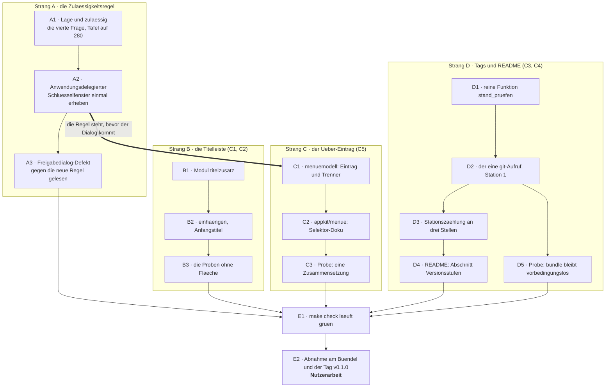
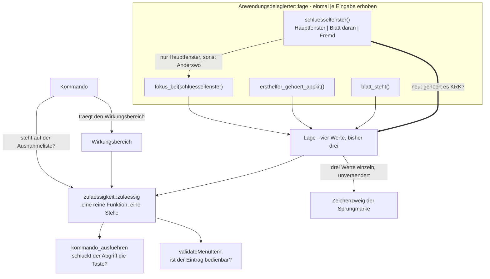

# Implementation Plan: Die Titelleiste führt Namen und Version, semantische Versionstags decken die Zahl

**Date:** 2026-08-13
**Status:** Draft
**Spec:** `circles/260813-0939-titelleiste-fuehrt-version-und-semantische-tags/planning/260813-1037_o_spec-titelleiste-fuehrt-version-und-semantische-tags.md`
**Circle:** `circles/260813-0939-titelleiste-fuehrt-version-und-semantische-tags/`
**Grundlage erhoben:** 260813-1110, am Baum unter `crates/`, `xtask/`, `resources/`, `README.md`, am SDK und an `~/.cargo/registry`
**Decidability:** Zwei Fragen tragen diesen Plan, und sie fallen verschieden aus. Die Tag-Hälfte fragt „ist der Stand, aus dem gebaut wird, benannt?" — entscheidbar aus dem, was `git tag --points-at HEAD` und `git status --porcelain --untracked-files=no` über den Augenblick melden; die Prüfung misst einen Zustand und sagt nichts voraus, und der Vergleich ist eine reine Funktion über drei Zeichenketten. Die Anzeige-Hälfte fragt „steht vor dem Hauptfenster etwas, hinter dem kein Befehl wirken darf?" — entscheidbar für jedes **Fenster**, weil `NSApplication::keyWindow` die Antwort ausliefert, und **nicht** entscheidbar für eine Verfolgungsschleife wie den Freigabewähler aus der Runde 6, die kein Fenster ist und im Schlüsselfenster keine Spur hinterlässt. Der Plan ändert dafür nicht die Näherung, sondern benennt die Grenze: Schritt A1 beantwortet die Fensterfrage vollständig, Schritt A3 hält fest, dass der Wähler ausserhalb ihrer Reichweite liegt, und Strang E trägt die eine Beobachtung, die den Fall entscheidet. Wer die Wählerfrage später mechanisch beantworten will, ändert das Mittel und nicht die Bedingung: gefragt wäre dann nicht das Schlüsselfenster, sondern der Halt in `teilen.rs`, und der weiss heute nicht, wann sein Dialog zugeht.

---

## Directive

Die Titelleiste trägt links einen eigenen Bereich mit `KRK 0.1.0`, der Pfad bleibt mittig und ungekürzt. Dieselbe Zahl steht im Standard-Über-Dialog von AppKit, den ein Eintrag ohne Kürzel im Anwendungsmenü öffnet. Verbindlich wird sie durch semantische Versionstags: `cargo xtask release` bricht ab, solange HEAD keinen Tag `v<version>` trägt oder eine verfolgte Datei geändert ist, und ein Abschnitt in `README.md` sagt, wann welche Stufe steigt. Den Tag setzt der Nutzer.

Der Spec schreibt das in sechs Fähigkeiten C1 bis C6 mit 59 Abnahmekriterien aus. Dieser Plan wiederholt sie nicht; jeder Schritt nennt die Kriterien, die er erfüllt.

**Vier Entscheide binden**, alle vier beantwortet: der Über-Eintrag als Standard-Dialog ohne Kürzel, der Tag auf HEAD **und** ein unveränderter verfolgter Baum, `v0.1.0` auf dem Abschlusscommit dieser Runde, und — nach dem Spec entstanden — die Schliessung der Zulässigkeitslücke einmal und allgemein.

---

## Was der Bau vorfindet

Sieben Feststellungen, am 260813-1110 erhoben. Vier davon widersprechen dem, was Spec oder Entscheid annehmen.

**Die Zulässigkeitsregel hat zwei Frager und nicht drei.** `zulaessigkeit::zulaessig` (`crates/krk-ui/src/kommandos/zulaessigkeit.rs:113`) wird von genau zwei Stellen gerufen, dem Kommandozweig `Anwendungsdelegierter::kommando_ausfuehren` (`anwendung.rs:2600`) und der Ausgrauung `validateMenuItem:` (`anwendung.rs:741`); die Probe `beide_frager_rufen_die_eine_regel` (`zulaessigkeit.rs:204`) hält die Zahl auf 2. Drei Abnehmer hat die Stufe darunter, `Anwendungsdelegierter::lage` (`anwendung.rs:2558`): die beiden Frager und der Zeichenzweig, der die Felder einzeln liest statt die Regel zu rufen.

**Die Lücke, die der vierte Entscheid schliesst, ist enger als er sie beschreibt.** `Anwendungsdelegierter::fokus` (`anwendung.rs:4043`) fragt schon heute als erstes, ob das Schlüsselfenster das Hauptfenster ist, und antwortet sonst `Fokus::Anderswo`. Damit weist der dritte Bestandteil der Regel vor einem fremden Fenster bereits jeden Befehl ab, dessen Wirkungsbereich ein Bereich ist. Durch kommen genau die Befehle mit `Wirkungsbereich::Ueberall`, denn für diesen sagt `fokus::wirkt` auch bei `Anderswo` ja: **vierundzwanzig der sechsundsiebzig Kommandos**, darunter `tab_schliessen`, `ordner_der_datei`, `teilen` und `belegung_ansehen`. Der Entscheid nennt stattdessen `F5` und `delete`, und beide tragen `Wirkungsbereich::Dateifenster` und kommen heute schon nicht durch. Der Befund liegt als `issues/260813-1110_o_der-entscheid-zum-ueber-dialog-nennt-zwei-befehle-die-heute-schon-nicht-durchkommen.md`.

**Der Freigabewähler ist kein Fenster.** `teilen.rs:222` zeigt ihn über `showRelativeToRect_ofView_preferredEdge`, also als Verfolgungsschleife an einer Ansicht. Bleibt das Hauptfenster dabei das Schlüsselfenster, sperrt die neue Bedingung dort nichts, und der Vorteilssatz des Entscheids trifft nicht zu. Befund: `issues/260813-1110_o_die-schluesselfensterfrage-erreicht-den-freigabewaehler-nicht-weil-er-kein-fenster-ist.md`.

**Der Auslieferungsweg trägt sechs numerierte Stationen und drei unnumerierte Vorläufe.** Die Numerierung 1 bis 6 steht wörtlich an drei Stellen: `xtask/src/release.rs:3-33` (Modulkopf), `xtask/src/main.rs:40-46` (Hilfetext) und `README.md:216-246`. Die drei Vorläufe — `bundle::vorbereiten()` (`release.rs:91`), `sign::bestimmen_fuer_release()` (`:93`) und `ziele_pruefen()` (`:101`) — laufen früh und gehören einer späteren Station. Der billige Vorlauf endet mit Zeile 101, die erste Übersetzung beginnt in Zeile 104. Genau diese Vermischung ist der mittlere Befund B3 des Diagrammprüfers.

**`xtask` ruft heute kein `git` und bringt keine einzige Abhängigkeit mit.** Zwölf `Command::new`-Stellen rufen acht Programme; Systemwerkzeuge mit absolutem Pfad, die Werkzeuge der Rust-Kette mit blossem Namen. Eine gemeinsame Hülle gibt es nicht, wohl aber eine programmspezifische Vorlage: `security_fragen` (`sign.rs:269`). `xtask/Cargo.toml` führt einen leeren `[dependencies]`-Abschnitt.

**Die Version liegt in `xtask` schon an genau einer Stelle:** `const VERSION: &str = env!("CARGO_PKG_VERSION")` (`bundle.rs:42`), modulprivat, benutzt in `version_einsetzen` (`:279`) und in einer Meldung (`:236`). Für die neue Prüfung genügt es, sie wie `PLATZHALTER` (`:39`) auf `pub(crate)` zu heben. Ein Parser für die `Cargo.toml` entsteht nicht.

**Für den Titelleisten-Zusatz ist alles da und nichts neu einzubinden.** `objc2-app-kit 0.3.2` führt `NSTitlebarAccessoryViewController` samt `layoutAttribute`/`setLayoutAttribute` und `NSWindow::addTitlebarAccessoryViewController`; alle drei nötigen Merkmale (`NSTitlebarAccessoryViewController`, `NSViewController`, `NSLayoutConstraint`) stehen im Vorgabesatz der Kiste, also ändert sich weder `Cargo.toml` noch `Cargo.lock`. Am SDK nachgelesen: die Klasse und die Methode stehen seit macOS 10.10.

---

## Zuschnitt: vier Stränge, eine Naht, eine Vorbedingung



**Strang A ist die Vorbedingung von Strang C und von nichts sonst.** Der Über-Eintrag stellt eine Fläche auf, hinter der heute vierundzwanzig Befehle wirken. Die Regel muss vorher stehen, sonst legt die Runde die Lücke an, die sie schliessen soll. Zwischen A und B, zwischen B und C und zwischen A, B, C und D gibt es keine Abhängigkeit; die drei ersten Stränge fassen `crates/krk-ui/` an, der vierte `xtask/` und `README.md`, und die einzige gemeinsame Datei ist die `Cargo.toml`, an der sich keine Zeile ändert.

**Kein Schritt fällt an `ontocoder`.** Der Dispatch nennt beide Ausführer; der Plan braucht den zweiten nicht, und das ist ein Ergebnis: `resources/default-keymap.toml` bleibt bei 82 Funktionen (C6.2), `resources/Info.plist` bleibt unverändert (C5.4 verlangt gerade, dass sie die Zahl weiter über den Platzhalter bezieht), und `Cargo.toml` bekommt weder eine Kiste noch ein Merkmal (C6.6). `README.md` beschreibt das Bauen und Signieren, ist damit Dokumentation über Code und gehört nach der Routing-Regel zu `coder`.

---

## Die Zulässigkeitsregel nach dieser Runde



**Die vierte Frage steht neben den beiden ersten und nicht über ihnen.** `zulaessig` liest danach so:

```rust
pub fn zulaessig(kommando: Kommando, lage: Lage) -> bool {
    let kein_blatt_oder_erlaubt =
        !lage.blatt_steht || operationen::waehrend_blatt_erlaubt(kommando);
    let durchgelassen = immer_erreichbar(kommando)
        || (lage.schluesselfenster_gehoert_krk
            && kein_blatt_oder_erlaubt
            && !lage.ersthelfer_gehoert_appkit);

    durchgelassen && fokus::wirkt(kommando.wirkungsbereich(), lage.fokus)
}
```

Die Blattlage kommt damit weiter durch, und zwar ohne einen Sonderfall: ein anhängendes Blatt **ist** das Schlüsselfenster, also antwortet `schluesselfenster_gehoert_krk` mit `true`, und `waehrend_blatt_erlaubt` entscheidet wie bisher allein. Der Abbruch aus dem Blatt heraus bleibt erreichbar.

**Dass `immer_erreichbar` auch die vierte Bedingung aufhebt, ist eine Wahl und keine Ableitung.** Der Wortlaut des Entscheids sagt „wirkt kein Befehl", und unter der Fassung oben wirken `beenden` und `fenster_schliessen` doch. Der Grund ist die Randbedingung „kein Verlust gegenüber heute": vor dem Freigabewähler beendet Cmd+Q heute die Anwendung, und die strenge Lesart nähme diesen Weg weg. Die Frage steht als `decisions/260813-1110_o_hebt-die-ausnahmeliste-auch-die-neue-schluesselfensterfrage-auf.md`, der Plan fährt bis zur Antwort auf der Empfehlung.

**Der Zeichenzweig bleibt unverändert, und das ist geprüft und nicht vergessen.** Er weist ein Zeichen ab, sobald ein Blatt steht oder der Ersthelfer AppKit gehört, und für jeden Fokus ausser `Dateifenster` liefert er ohnehin `false`. Vor einem fremden Schlüsselfenster antwortet `fokus` schon heute `Anderswo`, also greift dieser Ausgang. Eine vierte Bedingung dort wäre eine zweite Fassung derselben Sperre.

---

## Die sieben Stationen von `cargo xtask release`

Der Diagrammprüfer hat am Spec beanstandet, dass neun Kästen sechs Stationen tragen und C3.9 „über die Reihenfolge der Stationen" abgenommen wird. **Dieser Plan legt die Reihenfolge fest: sieben durchgehend numerierte Stationen, dazu drei benannte Vorläufe, die zu einer späteren Station gehören.**

```mermaid
flowchart LR
    START(["cargo xtask release"])
    subgraph BILLIG["billig · bricht ab, bevor eine Uebersetzung laeuft"]
        direction TB
        S1["1 · Tag und Arbeitsbaum <b>neu</b>"]
        V1["Vorlauf a · bundle::vorbereiten<br/>liefert die Vorlage fuer Station 5"]
        S2["2 · AppKit-Grenze"]
        V2["Vorlauf b · Identitaetssuche<br/>liefert die Identitaet fuer Station 6"]
        V3["Vorlauf c · Zielpruefung<br/>Voraussetzung von Station 3"]
    end
    subgraph TEUER["teuer · Minuten, Netz, Apple-Konto"]
        direction TB
        S3["3 · beide Ziele uebersetzen"]
        S4["4 · lipo"]
        S5["5 · Montage"]
        S6["6 · signieren, gehaertet"]
        S7["7 · beglaubigen und anheften"]
    end
    START --> S1
    S1 --> V1
    V1 --> S2
    S2 --> V2
    V2 --> V3
    V3 --> S3
    S3 --> S4
    S4 --> S5
    S5 --> S6
    S6 --> S7
    S7 --> FERTIG(["target/KRK.app, beglaubigt"])
    S1 -.->|"Tag fehlt oder Baum geaendert"| AB(["Abbruch, beide Befunde in einer Meldung"])
```



Die Numerierung ist damit lückenlos, die drei Vorläufe tragen einen Buchstaben statt einer Zahl und nennen die Station, der sie zuarbeiten. Was sich an den Zahlen ändert: die bisherige Station 1 wird 2, aus 2 wird 3, und so fort bis 7. Was gleich bleibt: die Reihenfolge im Quelltext ausser dem einen neuen Aufruf ganz vorn.

**Die neue Station steht vor `bundle::vorbereiten` und nicht dahinter.** Sie braucht nichts aus der Vorbereitung: die Sollversion steht als Konstante in `bundle::VERSION`, das Arbeitsverzeichnis liefert `bundle::wurzel()`. Sie ist die billigste des Weges und die, die am häufigsten anschlägt, denn der Baum trägt heute keinen einzigen Tag.

---

## Implementation Steps

### Strang A — Die Zulässigkeitsregel schliesst die Lücke

**A1. [DONE] Die vierte Frage in `Lage` und in `zulaessig`**
- Executor: `coder`
- Files: `crates/krk-ui/src/kommandos/zulaessigkeit.rs`
- Erfüllt: C5.6 (erste Hälfte), Entscheid `decisions/260813-1037_a_wirken-krks-tastenbefehle-weiter-waehrend-der-ueber-dialog-steht.md`
- Dependencies: keine
- Changes:
  - `Lage` bekommt ein viertes Feld `pub schluesselfenster_gehoert_krk: bool` mit Doc-Kommentar: ob das Schlüsselfenster KRKs Hauptfenster oder ein daran hängendes Blatt ist. Der Kommentar sagt ausdrücklich, dass ein anhängendes Blatt hier `true` meldet, weil es selbst das Schlüsselfenster ist.
  - `zulaessig` bekommt die Bedingung wie im Abschnitt oben, innerhalb des `durchgelassen`-Ausdrucks.
  - Der Modulkopf wird von „Die drei Bestandteile" auf vier gezogen, die Grafik darin bekommt die vierte Eingabe, und der Abschnitt über die Ausnahmeliste sagt, welche drei Bestandteile sie aufhebt und welchen nicht.
  - Die Tafel `die_tafel_aus_hundertvierzig_faellen_geht_auf` wird zur Tafel aus 280 Fällen: das Viertel wird ein Achtel, `viertel` bekommt eine dritte Wahrheitsspalte, und mit `schluesselfenster_gehoert_krk == false` steht in allen sieben Zeilen `ALLES_ABGEWIESEN`. Name und Doc-Kommentar der Probe ziehen mit.
  - `die_ausnahmeliste_kommt_durch_blatt_und_textfeld` und `die_ausnahmeliste_hebt_den_fokusvorbehalt_nicht_auf` bekommen den vierten Wert in ihre Schleifen; die erste hält damit fest, dass `beenden` auch vor einem fremden Schlüsselfenster durchkommt.
  - **Eine neue Probe für den Kern des Entscheids:** vor einem fremden Schlüsselfenster ist ein Befehl mit `Wirkungsbereich::Ueberall`, der nicht auf der Ausnahmeliste steht, abgewiesen. Der Stellvertreter dafür ist `Kommando::LeisteUmschalten`; ohne diese Probe zeigte keine der bestehenden den Unterschied zwischen alter und neuer Regel, weil er allein in der Zeile `Ueberall` anfällt.

**A2. [DONE] Der Anwendungsdelegierte erhebt das Schlüsselfenster einmal**
- Executor: `coder`
- Files: `crates/krk-ui/src/appkit/anwendung.rs`
- Erfüllt: C5.6 (zweite Hälfte)
- Dependencies: A1
- Changes:
  - Ein privates `enum Schluesselfenster { Hauptfenster, BlattAmHauptfenster, Fremd }` und eine Methode `schluesselfenster(&self) -> Schluesselfenster`. Sie liest `NSApplication::keyWindow` einmal und vergleicht über `isEqual:` gegen das Hauptfenster und gegen dessen `attachedSheet`.
  - `fokus` wird in `fokus_bei(&self, schluesselfenster: Schluesselfenster) -> Fokus` aufgeteilt; `fokus` bleibt als Hülle für seine fünf übrigen Aufrufer (`anwendung.rs:1112`, `:1657`, `:3346`, `:4702`, `:5166`) und ruft `self.fokus_bei(self.schluesselfenster())`.
  - `lage` erhebt `schluesselfenster()` **einmal** und reicht den Wert an `fokus_bei` weiter. Zwei Erhebungen desselben Augenblicks sind hier ausdrücklich ausgeschlossen, aus demselben Grund, den der Doc-Kommentar an `lage` schon führt.
  - `blatt_steht` bleibt eine eigene Frage und wird nicht in `schluesselfenster` aufgelöst. Die beiden Werte sind unabhängig: steht ein Blatt und öffnet der Nutzer den Über-Dialog, ist `blatt_steht` wahr und das Schlüsselfenster fremd. Der Doc-Kommentar sagt das.
  - Der Doc-Kommentar an `lage` zieht von drei auf vier Werte nach, und der Modulkopf-Abschnitt über die zwei Stellen mit zwei verschiedenen Fragen bekommt die dritte Frage genannt.
  - Der Abschnitt `# Ab welchem macOS die angesprochenen Klassen stehen` bleibt richtig: `keyWindow`, `attachedSheet` und `isEqual:` stehen alle drei schon darin.

**A3. [DONE] Der Freigabedialog-Defekt der Runde 6, gegen die neue Regel gelesen**
- Executor: `coder`
- Files: `fusion-workbench/circles/260812-1000-teilen-ordnersprung-ablage-sichern-vorschau-rendern/issues/260812-1529_o_die-blattregel-sieht-den-freigabedialog-nicht.md`
- Erfüllt: die zweite Hälfte des Entscheids vom 260813-1055
- Dependencies: A2
- Changes:
  - Dem Datensatz wird ein Abschnitt angehängt, der festhält, was die neue Regel für ihn leistet und was nicht: sie schliesst jedes fremde **Fenster** und erreicht eine Verfolgungsschleife nicht, weil der Wähler über `showRelativeToRect:` erscheint und im Schlüsselfenster keine Spur hinterlässt.
  - **Der Datensatz wird in diesem Schritt nicht geschlossen.** Die Beobachtung, die er selbst verlangt, steht in Strang E: Wähler über Shift+Cmd+S öffnen, währenddessen Cmd+W drücken. Geschieht nichts, ist er beantwortet und wird mit dem Ergebnis geschlossen; schliesst sich der Tab, bleibt er offen und trägt danach einen benannten, gemessenen Befund statt einer Vermutung.
  - Die Begründung dafür steht als eigener Befund: `issues/260813-1110_o_die-schluesselfensterfrage-erreicht-den-freigabewaehler-nicht-weil-er-kein-fenster-ist.md`.

### Strang B — Namen und Version links in der Titelleiste

**B1. Das neue Modul `appkit/titelzusatz.rs`**
- Executor: `coder`
- Files: `crates/krk-ui/src/appkit/titelzusatz.rs` (neu), `crates/krk-ui/src/appkit/mod.rs`
- Erfüllt: C1.1, C1.2, C1.4, C1.11, C6.4, C6.6
- Dependencies: keine
- Changes:
  - `pub fn beschriftung() -> String` setzt `KRK` und `env!("CARGO_PKG_VERSION")` mit einem Leerzeichen zusammen. Eine reine Funktion, ohne AppKit, und die einzige Stelle im Baum, die Name und Version zusammensetzt.
  - `pub fn bauen(mtm: MainThreadMarker) -> Retained<NSTitlebarAccessoryViewController>` baut das Beschriftungsfeld über `NSTextField::labelWithString`, setzt `systemFontOfSize(smallSystemFontSize())` und `secondaryLabelColor` — dieselbe Bauform wie `appkit/statuszeile.rs:498-503` —, legt es in einen Träger mit waagerechtem Rand und setzt `layoutAttribute` auf `NSLayoutAttribute::Left`.
  - **`NSLayoutAttribute::Leading` darf es nicht sein.** Der Kopf des Systems (`NSTitlebarAccessoryViewController.h:23`) lässt allein `Bottom`, `Right` und `Left` zu und sagt: „All other values are currently invalid and will assert." Ein `Leading` bricht zur Laufzeit ab, und der Übersetzer sagt dazu nichts.
  - Modulkopf mit dem Abschnitt `# Ab welchem macOS die angesprochenen Klassen stehen`: `NSTitlebarAccessoryViewController` und `NSWindow::addTitlebarAccessoryViewController:` seit 10.10 (am SDK nachgelesen), `NSTextField::labelWithString:` seit 10.12, `secondaryLabelColor` seit 10.10, `NSViewController::setView:` seit 10.5. Höchste Untergrenze der Datei: 10.12.
  - Anmeldung in `appkit/mod.rs`: die Modulliste wächst von 27 auf 28 Namen. **Die Prosazahl im Modulkopf steht schon heute falsch** — dort steht „Sechsundzwanzig Module" bei 27 tatsächlichen — und wird mit derselben Änderung berichtigt. Der neue Name kommt in die Übersichtsgrafik und in die Modulbeschreibungen darunter.
  - Kein Eintrag in `Cargo.toml`: `NSTitlebarAccessoryViewController`, `NSViewController` und `NSLayoutConstraint` stehen alle drei im Vorgabesatz von `objc2-app-kit 0.3.2`.

**B2. Einhängen ins Fenster, und der Anfangstitel**
- Executor: `coder`
- Files: `crates/krk-ui/src/appkit/fenster.rs`, `crates/krk-ui/src/appkit/anwendung.rs`, `crates/krk-ui/src/fenstertitel.rs`
- Erfüllt: C1.5, C1.9, C1.10, C2.1, C2.9
- Dependencies: B1
- Changes:
  - `fenster::hauptfenster` hängt den Zusatz nach `setContentMinSize` über `addTitlebarAccessoryViewController` ein. Der Aufbau bleibt an einer Stelle; ein zweiter Einhängepunkt entstünde sonst neben ihm.
  - **`fenster.rs:436` setzt den Titel nicht mehr auf `KRK`, sondern auf die leere Zeichenkette.** Der Name steht ab jetzt im Zusatz, und ein Titel `KRK` daneben zeigte den Namen zweimal, bis der erste Fokuswechsel ihn überschreibt. Die leere Zeichenkette steht ausdrücklich da, statt die Zeile zu streichen: ein Fenster ohne `setTitle` trägt den Vorgabetitel von AppKit, und den will hier niemand sehen.
  - Der Kommentar in `Anwendungsdelegierter::oberflaeche_aufbauen` (`anwendung.rs:1107-1111`) sagt heute, `appkit::fenster` setze den Titel „einmal auf den Namen der Anwendung"; er wird mitgeändert.
  - Der Modulkopf von `fenster.rs` bekommt `addTitlebarAccessoryViewController:` (seit 10.10) in seinen Verfügbarkeitsabschnitt.
  - `fenstertitel::titel` bleibt Zeile für Zeile unverändert. Der Modulkopf bekommt einen Satz, dass C11 der Runde 2 seit dieser Runde fortgeschrieben ist und die elf Kriterien im Spec dieser Runde stehen.
  - Kein Eingriff in `fokusanzeige_nachziehen`: es schreibt weiter genau die fünf Rahmenfarben und den Fenstertitel (C1.7).

**B3. Die Proben, die ohne Fläche auskommen**
- Executor: `coder`
- Files: `crates/krk-ui/src/appkit/titelzusatz.rs` (Prüfmodul), `crates/krk-ui/src/appkit/mod.rs` (Prüfmodul oder bestehende Zählprobe)
- Erfüllt: C1.1, C1.2, C1.3, C1.6, C1.7, C1.8
- Dependencies: B2
- Changes:
  - `beschriftung()` liefert `KRK ` gefolgt von `env!("CARGO_PKG_VERSION")`, ohne Klammern und ohne Zusatz (C1.1).
  - Die Versionszahl steht in keiner `.rs`-Datei als Zeichenkette. Die Probe liest `env!("CARGO_PKG_VERSION")` zur Prüfzeit und sucht den Wert über `quellbaum::quelldateien()` (C1.2). Die Nadel wird nicht literal geschrieben, sondern aus dem Makro genommen, also findet die Probe sich nicht selbst.
  - Der Text ändert sich nie: das Modul ruft `setStringValue` genau einmal und hat keine Funktion, die die Beschriftung nachschreibt (C1.3). Eine Zählprobe über `quelldateien()`, mit einer Nadel aus `concat!`.
  - Der Zusatz nimmt den Ersthelferrang nicht an: das Modul baut das Feld über `labelWithString:` und ruft weder `setEditable` noch `setSelectable` (C1.6). Der Doc-Kommentar der Probe benennt ihre Blindheit — sie liest den Quelltext und nicht das Verhalten einer Instanz; das Bild dazu gehört in die Abnahme am Bündel.
  - `Bereich::ALLE` bleibt bei fünf, `Fokus::ALLE` bei fünf (C1.7); beide Feldbreiten halten den Bau ohnehin an.
  - `MINDESTGROESSE` in `fenster.rs` bleibt, was sie ist (C1.8); die bestehende `const _: () = assert!(MINDESTGROESSE.height == 336.0, …)` trägt das schon und wird nicht angefasst.

### Strang C — Der Eintrag „Über KRK"

**C1. Der Sonderposten und sein Trenner im Menümodell**
- Executor: `coder`
- Files: `crates/krk-ui/src/menuemodell.rs`
- Erfüllt: C5.1, C5.2, C5.7, C6.1, C6.2, C6.3
- Dependencies: A2
- Changes:
  - Zwei Konstanten neben den beiden der Markdown-Ausgabe: `UEBER_BESCHRIFTUNG: &str = "Über KRK"` und `UEBER_SELEKTOR: &CStr = c"orderFrontStandardAboutPanel:"`.
  - Eine Funktion `ueber_eintrag_einfuegen`, die den Sonderposten und einen Trenner **an den Anfang** des Anwendungsmenüs stellt, so wie `markdownausgabe_einfuegen` seine beiden über `beenden` stellt. Gerufen wird sie in `aufbau` in demselben `if bereich == Funktionsbereich::Anwendung`-Zweig, vor dem bestehenden Ruf.
  - Der Doc-Kommentar an `Eintrag::Sonderposten` (`menuemodell.rs:188`) sagt heute „Der Selektor am Anwendungsdelegierten". Das trägt der neue Eintrag nicht: `orderFrontStandardAboutPanel:` steht an `NSApplication`, und die Antwortkette erreicht `NSApplication` vor dem Delegierten. Die Zeile wird auf „der Selektor, den die Antwortkette beantwortet" geweitet. Zwei Lesarten desselben Feldes entstehen nicht — das ist der Punkt, den der Spec unter „Offen für den Planner" nennt.
  - Vier weitere Prosastellen behaupten heute das Gegenteil des Neuen und gehören in denselben Schritt: `menuemodell.rs:57-60` („Es gibt genau einen"), `:80-81` („genau einen Trenner").
  - Die Probe `die_leiste_traegt_genau_einen_zusatz` (`menuemodell.rs:751`) erwartet danach vier statt zwei. Ihr Name wird mitgeändert; ihr eigener Doc-Kommentar sagt, was dann zu tun ist („wächst sie, gehört der neue Zusatz hier genannt").
  - Eine neue Probe: „Über KRK" steht als **erster** Eintrag des Anwendungsmenüs, unmittelbar gefolgt von einem Trenner. Sie prüft die Stelle relativ, wie `der_markdown_eintrag_steht_ueber_dem_beenden` es tut, und nicht über einen festen Index.
  - Nichts wächst sonst: kein `Kommando` (bleibt bei 76), kein `Wirkungsbereich` (7), kein `Funktionsbereich` (9), kein Eintrag in `resources/default-keymap.toml` (82 Funktionen, 88 Kombinationen). Das folgt daraus, dass der Eintrag kein Kürzel trägt.

**C2. Der Selektor läuft über die Antwortkette, und das steht auch so da**
- Executor: `coder`
- Files: `crates/krk-ui/src/appkit/menue.rs`
- Erfüllt: C5.3
- Dependencies: C1
- Changes:
  - Kein Programmtext ändert sich. Der Sonderposten-Zweig in `umsetzen` (`menue.rs:389-397`) trägt über `Sel::register` jeden Selektornamen, und `roher_befehl` setzt bewusst kein Ziel, damit die Antwortkette entscheidet. KRK baut keine eigene Fläche und implementiert keine Methode dafür.
  - Zwei Prosastellen ziehen nach: `menue.rs:20-21` („`tastenbelegungSichern:` erreichen den Anwendungsdelegierten, an dem die Kette endet") und `:46-48` („Ein Eintrag trägt bewusst gar keine Kennung, und er ist der einzige").
  - **Kein zweiter Zweig in `validateMenuItem:`.** Die Methode antwortet für jede fremde Aktion `true`, und der Über-Eintrag fällt in genau diesen Zweig — wie der Markdown-Sonderposten heute. Er bleibt damit auch bei stehendem Blatt bedienbar. Das ist die bestehende Regel und keine neue Ausnahme; ein eigener Zweig wäre die erste Sonderbehandlung eines einzelnen Eintrags an dieser Stelle. Die Folge steht im Abschnitt „Abgeleitet und nicht gefragt" unten.

**C3. Eine Zusammensetzung von Name und Version, nachgezählt**
- Executor: `coder`
- Files: `crates/krk-ui/src/appkit/titelzusatz.rs` (Prüfmodul)
- Erfüllt: C5.4
- Dependencies: B1, C1
- Changes:
  - Eine Zählprobe über `quellbaum::quelldateien()`: genau eine Stelle im Baum setzt Name und Version zusammen, nämlich `titelzusatz::beschriftung`. Der Über-Dialog liest beides aus `resources/Info.plist`, und die bezieht die Zahl weiter über den Platzhalter aus der `Cargo.toml`.
  - Der Doc-Kommentar hält fest, was der Dialog tatsächlich zeigt und was nicht: `CFBundleName` ist `KRK`, `CFBundleShortVersionString` wird zur Bauzeit ersetzt, und `CFBundleVersion` steht auf `1`. Der Dialog schreibt daraus seine eigene Zeile, die nicht Zeichen für Zeichen `KRK 0.1.0` lautet. Gleich ist die **Zahl** und ihre Quelle, nicht die Schreibweise; C5.4 verlangt genau das.

### Strang D — Die Tag-Prüfung und der Abschnitt in `README.md`

**D1. [DONE] Die reine Vergleichsfunktion**
- Executor: `coder`
- Files: `xtask/src/release.rs`
- Erfüllt: C3.1, C3.2, C3.3, C3.4, C3.5, C3.7, C3.8, C3.14, C6.7
- Dependencies: keine
- Changes:
  - `fn stand_pruefen(version: &str, tags_auf_head: &str, geaenderte: &str) -> Result<(), String>`. Drei Zeichenketten hinein, `Ok(())` im grünen Fall, sonst die fertige Abbruchmeldung. Kein Prozessaufruf, kein Dateizugriff, kein Git-Verzeichnis.
  - Der Tagvergleich läuft über die Zeilen von `tags_auf_head` und sucht `v` gefolgt von der Version. Trägt HEAD mehrere Tags, genügt einer (C3.2); ob ein Tag annotiert oder leicht ist, steht in dieser Ausgabe nicht und ist damit auch nicht zu unterscheiden (C3.3).
  - Der Baumvergleich zählt jede nichtleere Zeile von `geaenderte`. `git status --porcelain --untracked-files=no` meldet vorgemerkte und nicht vorgemerkte Änderungen gleich und führt gelöschte verfolgte Dateien mit (C3.4); unbeachtete Dateien stehen wegen der Marke gar nicht erst darin (C3.5).
  - Treffen beide Befunde zu, nennt **eine** Meldung beide (C3.7). Sie sagt, welche Bedingung verletzt ist, welche Version die `Cargo.toml` führt und was zu tun ist (C3.8), und sie nennt kein `git`-Kommando mit `--force` und keinen Weg vorbei. Der Stil folgt den beiden Vorlagen im Baum: Befund im Indikativ, dann die Folge, dann die Abhilfe als kopierbares Kommando, Schlusssatz in der Art von „Es entsteht kein Auslieferungspaket." Ohne Umlaute, wie jede Meldung in `xtask`.
  - **Zu C6.7:** der Rückgabetyp ist `Result`, und `Result` trägt `#[must_use]` schon in der Standardbibliothek. Ein stilles Fallenlassen hält den Bau unter `-D warnings` an, also trägt die Prüfung die Zusage strukturell. Ein zweites, eigenes `#[must_use]` daneben wäre Rauschen; der Doc-Kommentar sagt das in einem Satz, damit die nächste Erhebung nicht nach dem Attribut sucht.
  - Proben nach dem Muster von `sign.rs:391-448`: `const`-Zeichenketten mit wörtlicher Git-Ausgabe, gegen die Funktion gefahren. Abgedeckt werden der grüne Fall, ein fehlender Tag, ein passender Tag unter mehreren, ein geänderter Baum, eine gelöschte verfolgte Datei, beide Befunde zugleich, und die drei Bestandteile der Meldung.
  - Keine dieser Proben braucht ein Verzeichnis. Das ist Absicht: `xtask` trägt in `release.rs:719` schon eine `Wegwerfwurzel`, und eine zweite anzulegen wäre ein Doppelbau. Warum diese Fassung in der Zählung „genau drei Prüfordner-Fassungen" gar nicht vorkommt, steht als `issues/260813-1110_o_eine-vierte-wegwerfordner-fassung-steht-in-xtask-und-die-probe-liest-die-kiste-nicht.md` und ist nicht Gegenstand dieser Runde.

**D2. [DONE] Der eine `git`-Aufruf und die neue Station 1**
- Executor: `coder`
- Files: `xtask/src/release.rs`, `xtask/src/bundle.rs`
- Erfüllt: C3.9, C3.10, C3.11, C3.13
- Dependencies: D1
- Changes:
  - `fn git_fragen(wurzel: &Path, argumente: &[&str]) -> Result<String, Abbruch>` nach dem Muster von `security_fragen` (`sign.rs:269`): `Command::new("/usr/bin/git")`, `.current_dir(wurzel)`, `.output()`, Startfehler und Rückgabewert ungleich null je als `Abbruch::Lauf`. Der absolute Pfad folgt der Schreibweise, die der Baum für Systemwerkzeuge führt.
  - **Genau ein `Command::new` mit `git` im ganzen Baum** (C3.13). Eine Zählprobe hält die Zahl auf eins, mit einer Nadel aus `concat!`, weil die Probe in der Datei steht, die sie liest.
  - `fn auslieferungsstand_pruefen(wurzel: &Path) -> Result<(), Abbruch>` als Station 1. Sie fragt in dieser Reihenfolge:
    1. `git rev-parse --git-dir` — schlägt der Aufruf fehl, liegt kein Git-Verzeichnis vor, und der Abbruch sagt genau das (C3.11). Die Frage steht getrennt, damit die Antwort nicht am Wortlaut einer Fehlermeldung hängt.
    2. `git tag --points-at HEAD`
    3. `git status --porcelain --untracked-files=no`
    4. `stand_pruefen(bundle::VERSION, &tags, &status)`, das Ergebnis in `Abbruch::Lauf` gehüllt.
  - Alle drei Aufrufe lesen. Es entsteht kein `git tag`, kein `git add`, kein Schreibzugriff (C3.10). Eine Probe stellt die drei Argumentlisten als Konstanten dar und prüft, dass keine davon einen schreibenden Unterbefehl führt.
  - Kein Pfadfilter an `git status` (C3.6). Die Begründung dafür ist die, die `GRENZWURZEL` (`release.rs:52-74`) schon trägt: eine Liste der bauwirksamen Ordner müsste jemand pflegen, und sie zu ergänzen zu vergessen ist die zweite Art, eine Prüfung im Vorbeigehen zu verlieren.
  - `bundle::VERSION` (`bundle.rs:42`) wird `pub(crate)`, wie `bundle::PLATZHALTER` (`:39`) es schon ist. Eine zweite Quelle der Versionszahl entsteht nicht.
  - `release::ausfuehren` ruft die neue Station als erste Zeile nach der Argumentprüfung, also vor `bundle::vorbereiten()`. Sie braucht daraus nichts: die Wurzel liefert `bundle::wurzel()`, die Version die Konstante.
  - **Eine Probe über die Reihenfolge** (C3.9): sie liest `release.rs` über `include_str!("release.rs")`, sucht die Stelle des Rufs von `auslieferungsstand_pruefen` und die des ersten `bundle::uebersetzen` in `ausfuehren` und verlangt, dass die erste vor der zweiten steht. Ihr Doc-Kommentar benennt die Blindheit: sie liest die Textreihenfolge und nicht den Ablauf, und was sie hält, ist die eine Zusage, dass kein Abbruch dieser Art einen Übersetzungslauf kostet.

**D3. [DONE] Die Stationszählung an ihren drei Stellen**
- Executor: `coder`
- Files: `xtask/src/release.rs`, `xtask/src/main.rs`, `README.md`
- Erfüllt: C3.9 (Lesbarkeit der Reihenfolge), Befund B3 des Diagrammprüfers
- Dependencies: D2
- Changes:
  - Der Modulkopf von `release.rs` (`:3-33`) führt danach **sieben** numerierte Stationen in der Reihenfolge des Abschnitts „Die sieben Stationen" oben. Die drei Vorläufe stehen als `Vorlauf a` bis `Vorlauf c` mit der Station, der sie zuarbeiten, und nicht mehr ungenannt zwischen den Zahlen.
  - Der Hilfetext in `main.rs:39-52` nennt die neue Vorprüfung und sagt, dass der Nutzer den Tag setzt und das Werkzeug ihn nie erzeugt.
  - `README.md:216-246` bekommt die siebengliedrige Liste; `:248` („Die sechste Station hat zwei äussere Voraussetzungen") wird zur siebten.
  - Die Zahl steht danach an denselben drei Stellen wie heute und an keiner vierten. Ein Nachziehen an einer und nicht an allen wäre der Zustand, den der Diagrammprüfer beanstandet hat.

**D4. [DONE] Der Abschnitt über die Versionsstufen in `README.md`**
- Executor: `coder`
- Files: `README.md`
- Erfüllt: C4.1 bis C4.7
- Dependencies: D3
- Changes:
  - Ein Unterabschnitt `### Versionsstufen` unter `## Versionspflege` (ab `README.md:273`), nicht ein eigener Hauptabschnitt. „Versionspflege" beantwortet heute, wo die Zahl wohnt und wie sie ins Bündel kommt; welche Zahl wann steigt, ist die Nachbarfrage und hat dort ihren Ort. Die Gliederung folgt damit `## Signierung` mit seinen drei Unterabschnitten.
  - Der Abschnitt sagt, wann jede der drei Stufen steigt, und benennt dafür KRKs eigene Flächen: die Tastenbelegung samt der Bedeutung ihrer Befehle, die Dateien unter `~/Library/Application Support/KRK/`, das Mindest-Zielsystem und die Befehle des Bauwerkzeugs (C4.2). Der Vorschlag steht im Spec unter „Abgeleitet und nicht gefragt".
  - Er sagt, dass jede Auslieferung einen Tag `v<version>` bekommt und der Nutzer ihn setzt (C4.3); dass `v0.1.0` den ersten getaggten Stand benennt und keine Weitergabe (C4.4); was `release` prüft und was nicht — unbeachtete Dateien bleiben aussen vor, und `cargo xtask bundle` baut jederzeit ohne Tag (C4.5); und dass die angezeigte Zahl an jedem Bau dieselbe ist, die Deckung durch den Tag also an der Auslieferung hängt und nicht an jedem Bau (C4.6).
  - **`README.md:281-283` wird berichtigt.** Dort steht heute: „Eine neue Version wird also allein in der `Cargo.toml` gesetzt. Nachzuführen ist nichts." Mit der neuen Prüfung ist ein Tag nachzuführen, und der Satz wird falsch. Er ist der stärkste Berührungspunkt der Runde im ganzen Dokument.
  - Der bestehende Abschnitt bleibt die eine Stelle, die die Herkunft der Zahl beschreibt; der neue verweist darauf, statt sie zu wiederholen (C4.7).

**D5. [DONE] `bundle` und `make check` bleiben ohne Vorbedingung**
- Executor: `coder`
- Files: `xtask/src/release.rs` (Prüfmodul)
- Erfüllt: C3.12
- Dependencies: D2
- Changes:
  - Eine Zählprobe: der Ruf von `auslieferungsstand_pruefen` steht genau einmal im Baum, und die Datei, in der er steht, ist `release.rs`. `bundle.rs` fragt weder nach einem Tag noch nach dem Arbeitsbaum.
  - Das `Makefile` bleibt unberührt. Die Prüfung liegt in `xtask` und wirkt durch `make release` hindurch; eine Marke zum Überspringen wäre die Umgehung, gegen die dort seit dem 260813 eine ausgeschriebene Begründung steht.
  - Sieben Ziele hängen an `bundle` (`run`, `run-terminal`, `tasten`, `menue`, `durchstich`, `frisch`, `signatur`), und keines von ihnen bekommt eine neue Vorbedingung.

### Strang E — Abnahme

**E1. `make check` läuft grün**
- Executor: `coder`
- Files: keine
- Erfüllt: jede mit **(Probe)** gekennzeichnete Zusage
- Dependencies: A3, B3, C3, D4, D5
- Changes:
  - `make check` fährt `cargo build --workspace`, `cargo test --workspace`, `cargo clippy --workspace --all-targets` und `cargo fmt --all --check` in einem Zug. Der Weg über das `Makefile` ist der richtige: `cargo` liegt auf diesem Gerät nicht auf dem Standard-PATH.
  - **`clippy` ist hier die eigentliche Prüfung und nicht `build`.** `unused_must_use` ist erst unter `-D warnings` ein Fehler; `cargo build` und `cargo test` laufen ohne ihn grün.
  - Kein `make bundle` und kein `cargo xtask bundle` während der Runde. Unter `target/KRK.app` liegt ein beglaubigtes Bündel, und jeder Entwicklungsbau überschreibt es. Dieselbe Randbedingung trug schon die Runde 7.

**E2. Die Abnahme am Bündel und der erste Tag**
- Executor: `coder` (bereitet vor und schreibt auf), die Beobachtungen selbst sind **Nutzerarbeit**
- Files: `fusion-workbench/circles/260813-0939-titelleiste-fuehrt-version-und-semantische-tags/history/`, der Defektdatensatz aus A3
- Erfüllt: C1.1 (Lage), C1.6 (Klick), C1.9 (Bild), C1.10, C1.11 (hell und dunkel), C2.9 (Bild), C3.15, C5.1 (Bild), C5.3 (Fenster), C5.5, C5.6
- Dependencies: E1
- Changes:
  - Die Liste der Beobachtungen wird geschrieben und dem Nutzer vorgelegt, statt dass ein Agent sie zu fahren versucht. Der Abnahmelauf verlangt KRK im Vordergrund.
  - Enthalten sind: das Bild der Titelleiste in hell und dunkel und bei schmalem Fenster; der Klick auf den Zusatz; Fenster schliessen und über „Fenster einblenden" zurückholen; „Über KRK" im Menü und der Dialog, den es öffnet; ein Tastendruck, während der Dialog steht; `cargo run` ohne Bündel und was der Dialog dort zeigt.
  - **Die eine Beobachtung, an der der Defekt aus A3 hängt:** Freigabewähler über Shift+Cmd+S öffnen und, während er steht, Cmd+W drücken. Schliesst sich der Tab, bleibt der Defekt offen und trägt danach einen gemessenen Befund; geschieht nichts, wird er mit dem Ergebnis geschlossen.
  - Der Nutzer setzt `v0.1.0` auf den Commit, der die Runde schliesst (C3.15). Danach lässt sich der grüne Fall der neuen Prüfung an einem echten Lauf sehen; abgenommen ist er ohnehin schon an der reinen Funktion aus D1.

---

## Data Structures

Drei neue Typen, alle klein, keiner öffentlich über seine Kiste hinaus.

| Typ | Wohnort | Wozu |
|---|---|---|
| `Lage.schluesselfenster_gehoert_krk: bool` | `crates/krk-ui/src/kommandos/zulaessigkeit.rs` | die vierte Eingabe der Zulässigkeitsfrage |
| `enum Schluesselfenster { Hauptfenster, BlattAmHauptfenster, Fremd }` | `crates/krk-ui/src/appkit/anwendung.rs`, privat | die eine Erhebung, aus der `fokus_bei` und das Feld darüber beide lesen |
| `fn stand_pruefen(&str, &str, &str) -> Result<(), String>` | `xtask/src/release.rs` | der reine Vergleich der Tag-Prüfung |

`Lage` bleibt `Copy` und wächst um ein Byte. Die Tafel reicht den Wert danach 280-mal durch statt 140-mal.

**Warum `Schluesselfenster` drei Werte hat und nicht zwei.** `fokus_bei` braucht die Unterscheidung zwischen `Hauptfenster` und `BlattAmHauptfenster`: steht ein Blatt, muss der Fokus `Anderswo` sein, sonst wirkte hinter dem Blatt ein Befehl des Dateifensters. Die Zulässigkeitsfrage braucht sie nicht und faltet die beiden zu `true`. Ein `bool` an der Erhebung zwänge `fokus_bei`, die Frage ein zweites Mal zu stellen.

---

## API Changes

Keine. `xtask` bekommt keinen Unterbefehl und keine Marke; eine Nur-Prüfen-Marke wäre eine zweite Fläche für eine Frage, die `git tag --points-at HEAD` und `git status` schon beantworten. KRK bekommt keinen Tastenbefehl und keine neue Kennung. Die einzige Sichtbarkeitsänderung ist `bundle::VERSION` von privat auf `pub(crate)`.

---

## Testing Strategy

**Was eine Probe abnimmt und was nicht**, ist die Trennlinie des ganzen Plans.

Reine Funktionen tragen die Last: `titelzusatz::beschriftung` für den angezeigten Text, `zulaessigkeit::zulaessig` für die Regel samt der Tafel aus 280 Fällen, `stand_pruefen` für den Tagvergleich samt Meldung, `menuemodell::aufbau` für die Stellung des Über-Eintrags. Keine davon braucht ein Fenster, ein Bündel oder ein Git-Verzeichnis.

Zählproben am Quellbaum tragen die Zusagen über den **Baum**, die an keinem Rückgabewert abzulesen sind: eine Zusammensetzung von Name und Version, ein `git`-Aufrufer, eine Stelle, die die Zulässigkeitsregel erklärt, zwei Frager, die sie rufen. Sie laufen über `krk_ui::quellbaum::quelldateien()` beziehungsweise, in `xtask`, über `include_str!` auf die eigene Datei. Jede neue trägt ihre Nadel aus `concat!` und benennt ihre Blindheit im Doc-Kommentar; die Bauanleitung dafür steht im Modulkopf von `crates/krk-ui/src/quellbaum.rs`.

Der Übersetzer trägt die vollständigen Fallunterscheidungen: die Feldbreiten `[(Wirkungsbereich, Kommando); 7]`, `[Fokus; 5]`, `[Bereich; 5]` und `[(Kommando, &str); 76]` halten den Bau an, sobald eine Aufzählung wächst. Diese Runde lässt keine wachsen, und das ist ein Ergebnis und kein Zufall.

**Ausserhalb jeder Probe bleiben zwei Sorten Aussage.** Erstens jedes Bild: die Lage des Zusatzes, sein Aussehen in hell und dunkel, das Fenster des Über-Dialogs. Zweitens jedes Verhalten von AppKit, das KRK nicht bestimmt: welchen Ersthelfer das Über-Panel führt, ob der lokale Abgriff während einer Verfolgungsschleife gerufen wird. Beide gehören in E2 und sind Nutzerarbeit.

Der grüne Fall der Tag-Prüfung wird nicht an einem Auslieferungslauf abgenommen. Ein solcher Lauf verlangt zwei Übersetzungen im Profil `release`, ein Apple-Konto und einen Netzgang, und der erste Tag steht erst auf dem Abschlusscommit.

---

## Risks & Mitigations

| Risiko | Gegenmassnahme |
|---|---|
| `NSLayoutAttribute::Leading` statt `Left` bricht zur Laufzeit ab, und der Übersetzer sagt nichts | Schritt B1 nennt die zulässigen drei Werte und die Zeile im Kopf des Systems, die es sagt |
| Der Über-Dialog lässt Befehle durch, weil sein Ersthelfer kein Textfeld ist | Genau dagegen steht Strang A. Die neue Bedingung fragt nicht mehr nach dem Ersthelfer eines fremden Fensters, sondern danach, ob das Fenster KRK gehört |
| Die neue Bedingung sperrt den Abbruch aus einem Blatt aus | Ein anhängendes Blatt ist das Schlüsselfenster und meldet `true`. Die Tafel aus 280 Fällen und `waehrend_eines_blattes_kommt_allein_der_abbruch_und_die_ausnahmeliste_durch` halten es fest |
| Der Freigabewähler bleibt ungedeckt, und der Defekt der Runde 6 wird trotzdem geschlossen | Schritt A3 schliesst ihn nicht. Die Beobachtung steht in E2, und der Befund liegt als eigener Datensatz |
| Die Stationszählung wird an einer der drei Stellen nachgezogen und an den anderen nicht | Schritt D3 fasst alle drei in einem Schritt an und nennt sie einzeln |
| `bundle::VERSION` veraltet gegenüber der `Cargo.toml` | `inference:` Cargo übersetzt `xtask` neu, sobald das Manifest sich ändert. Ungemessen in diesem Baum; D2 misst es einmal, indem es die Version probeweise anhebt, `cargo xtask release` fährt und die Meldung liest |
| Der Anfangstitel `KRK` zeigt den Namen zweimal, bis der erste Fokuswechsel kommt | Schritt B2 setzt ihn auf die leere Zeichenkette und ändert den Kommentar mit, der die alte Zusage trägt |
| Eine Probe der Tag-Prüfung legt eine fünfte Wegwerfordner-Fassung an | D1 kommt ohne Verzeichnis aus. Falls doch eines nötig wird, ist die vorhandene `Wegwerfwurzel` (`release.rs:719`) zu nehmen |
| Der Bau hält an einer Zahl an, die diese Runde nicht angefasst hat | Die vier Aufzählungen bleiben bei 76, 7, 5 und 5, `Funktionsbereich` bei 9, die Belegung bei 82 Funktionen und 88 Kombinationen. Am 260813-1110 nachgezählt, nicht aus Prosa übernommen |

---

## Abgeleitet und nicht gefragt

Vier Festlegungen stehen ohne Rückfrage in diesem Plan, weil sie sich aus dem Baum oder aus einer bestehenden Regel ergeben. Wer eine ändern will, ändert die Ableitung mit.

**Die neue Station steht ganz vorn, vor `bundle::vorbereiten`.** Sie braucht nichts aus der Vorbereitung, sie ist die billigste des Weges, und sie schlägt am häufigsten an, weil der Baum heute keinen Tag trägt. C3.9 verlangt nur, dass keine teure Station vor ihr liegt; die Stelle ganz vorn ist die, die auch beim Lesen die Zusage trägt.

**Die drei Vorläufe bekommen Buchstaben und keine Zahlen.** Sie laufen früh und gehören einer späteren Station: `bundle::vorbereiten` der Montage, die Identitätssuche dem Signieren, die Zielprüfung dem Übersetzen. Ihnen eigene Zahlen zu geben hiesse, die Stationsliste von sechs auf zehn zu ziehen und drei Aussagen über Voraussetzungen als Arbeitsschritte auszugeben.

**`validateMenuItem:` bekommt keinen Zweig für den Über-Eintrag.** Die Methode antwortet für jede fremde Aktion `true`, und der Markdown-Sonderposten lebt seit der Runde 3 damit. Ein eigener Zweig wäre die erste Sonderbehandlung eines einzelnen Eintrags an dieser Stelle. Die Folge gehört dazu und ist benannt: steht ein Blatt und ruft der Nutzer trotzdem „Über KRK", nimmt das Panel den Schlüsselrang, und dann weist die neue Regel jeden Befehl ausser der Ausnahmeliste ab — auch den Abbruch, der das Blatt schliessen würde. Der Weg heraus ist, das Panel zuerst zu schliessen.

**Der Über-Dialog zeigt nicht Zeichen für Zeichen `KRK 0.1.0`.** Er setzt seine Zeile aus `CFBundleName`, `CFBundleShortVersionString` und `CFBundleVersion` (heute `1`) selbst zusammen. Gleich sind die Zahl und ihre Quelle, und genau das verlangt C5.4. Die `Info.plist` wird deshalb nicht angefasst.

---

## Open Questions

- [ ] **Hebt `immer_erreichbar` auch die neue Schlüsselfensterfrage auf?** `decisions/260813-1110_o_hebt-die-ausnahmeliste-auch-die-neue-schluesselfensterfrage-auf.md`. Der Plan fährt auf der Empfehlung (ja, sie hebt sie auf), damit Cmd+Q vor einem fremden Fenster weiter beendet. Die strenge Lesart des Entscheids sagt das Gegenteil, und der Unterschied ist eine Zeile in `zulaessig` und eine Spalte in der Tafel. Blockiert keinen Schritt; wird die Antwort die andere, ändert sich A1 und sonst nichts.
- [ ] **Bleibt der Defekt zum Freigabedialog der Runde 6 offen?** Er hängt an der einen Beobachtung in E2 und nicht an einer Entscheidung. Der Plan schliesst ihn nicht im Voraus; die Begründung liegt als `issues/260813-1110_o_die-schluesselfensterfrage-erreicht-den-freigabewaehler-nicht-weil-er-kein-fenster-ist.md`.
- [ ] **Wird der Abschnitt `## Question` des Entscheids zum Über-Dialog berichtigt?** Er nennt zwei Befehle als Beispiel, die heute schon nicht durchkommen. `issues/260813-1110_o_der-entscheid-zum-ueber-dialog-nennt-zwei-befehle-die-heute-schon-nicht-durchkommen.md`. Die Antwort des Entscheids bleibt davon unberührt.
