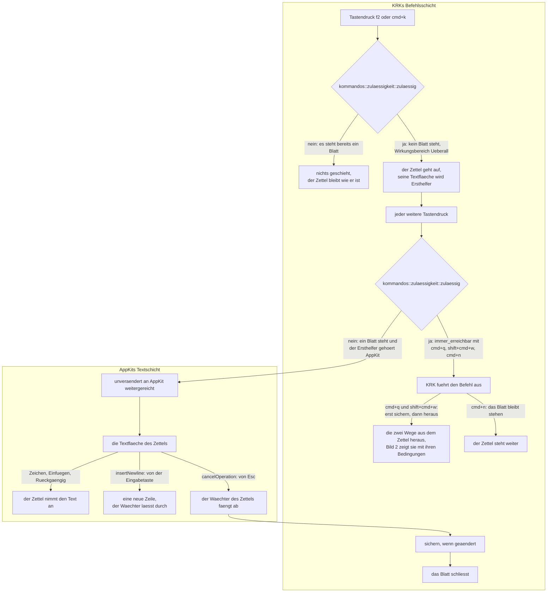
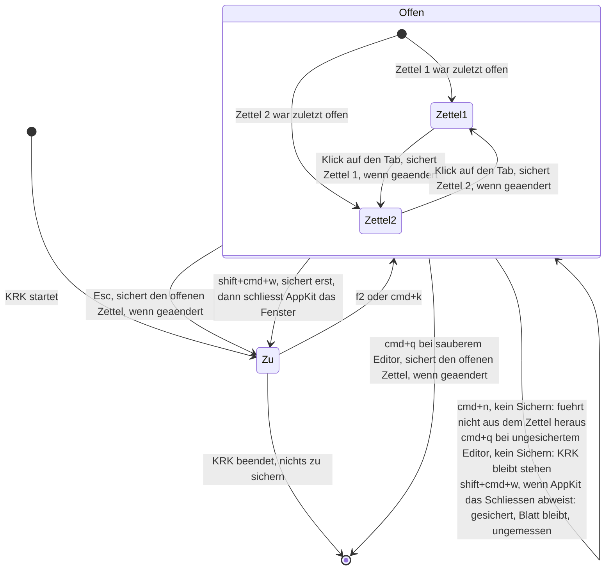

# Spec: Ein Notizzettel als Blatt am Hauptfenster, zwei Zettel, sichert sich selbst

**Date:** 2026-08-13
**Status:** Entwurf
**Source:** Backlog-Eintrag des Nutzers vom 260813-2033, mit der Anlage des Circles geschlossen, und die Directive im Circle-Datensatz `circles/260813-2332-notizzettel-als-blatt-mit-zwei-zetteln/_*_circle.md`
**Circle:** `circles/260813-2332-notizzettel-als-blatt-mit-zwei-zetteln/`, aktiv seit 260813-2341
**Grundlage erhoben:** 260813-2348, am Baum unter `crates/` und `resources/`
**Sieben Fragen sind beantwortet**, in zwei Klärungsrunden vor der Anlage des Circles; sie stehen vollständig in der Grounding-Aufnahme des Circle-Datensatzes. Dieser Spec stellt keine davon erneut.
**Nachgezogen am 260814-0628**, nach der Diagrammprüfung `reviews/260814-0000-conceptrev-spec-notizzettel-als-blatt-mit-zwei-zetteln.md` (Spruch `acceptable`, fünf Befunde) und den drei Nutzerantworten vom 260814-0005. Was sich gegenüber der Fassung vom 260813-2348 geändert hat, steht am Ende unter „Was der Nachtrag vom 260814 geändert hat".

---

## Directive

KRK trägt nach dieser Runde einen Notizzettel. `f2` und `cmd+k` holen ihn als Blatt an das Hauptfenster; er führt zwei Zettel als anklickbare Tabs, und offen ist immer der zuletzt geöffnete, auch über einen Neustart hinweg. Die Fläche nimmt Tippen, Einfügen und Rückgängig an und sonst nichts. `Esc` schließt das Blatt. Gesichert wird ohne Zutun des Nutzers an vier Punkten: beim Wechsel zwischen den Zetteln, beim Schließen des Blattes mit `Esc`, beim Schließen des Fensters mit `shift+cmd+w` und beim Beenden von KRK. Jeder Zettel liegt als eigene Datei im Ablageordner.

Diese Runde setzt keine elfte Zeitzusage und fasst keine der zehn an. Sie fasst auch die Zulässigkeitsregel der achten Runde nicht an.

---

## Wie diese Runde geschnitten ist, und warum so

**Fünf Fähigkeiten und eine Klammer.** Die Klammer ist die Blattform. Sie ist vom Nutzer entschieden, und aus ihr folgen der Umfang der Fläche, der Weg heraus, das Verhalten der Tasten und die Zeit, die der Zettel zum Erscheinen braucht. Wer eine der fünf Fähigkeiten später erweitert, prüft zuerst, ob die Blattform sie noch trägt.

Die Naht liegt zwischen Oberfläche und Ablage. C1 bis C3 fassen `crates/krk-ui/` an, C4 und C5 fassen `crates/krk-core/src/ablage/` an, und die beiden Hälften teilen genau eine Frage, nämlich wann gesichert wird. Getrennt fahren lassen sie sich trotzdem nicht: ein Zettel, der nichts sichert, ist kein Zettel, sondern ein Feld, das beim Schließen leerläuft.

**Der Zuschnitt ist klein, und das ist die Absicht des Nutzers und nicht ein Rest.** Antwort 4 verlangt die nackte Fläche, und der Grund dafür steht in der Grounding-Aufnahme: der volle Editor öffnet für Suche und Zeilennummer eigene Blätter, und ein Blatt über einem Blatt geht in AppKit nicht. Umfang und Form hängen aneinander. Wer dem Zettel eine Suche gibt, hat ihn damit aus dem Blatt herausgezwungen.

---

## Ausgangslage, am 260813-2348 am Baum erhoben

Achtzehn Feststellungen tragen den Zuschnitt. Fünf davon widersprechen dem, was man ohne sie annehmen würde, und sie stehen zuerst.

**Der Ersthelfervorbehalt zeigt für den Zettel in die andere Richtung als für den Editor.** `CLAUDE.md` warnt, wer eine zweite bedienbare Textfläche baue, melde sie in `ersthelfer_gehoert_appkit` (`crates/krk-ui/src/appkit/ereignisse.rs`) an, sonst gehörten ihre Tasten AppKit. Für die Fläche im Blatt ist genau das erwünscht: sie **soll** die Tasten bekommen, sonst tippt niemand hinein. Die Fläche des Zettels wird dort **nicht** angemeldet. Seit der Runde 7 hat die Regel genau eine Aufrufstelle, `Anwendungsdelegierter::lage`, und die Ausnahme für den Editor läuft über die Objektgleichheit und nicht über die Klasse; eine Ausnahme für den Zettel entsteht an keiner Stelle.

**Dass `Esc` den Zettel schließt, hängt an eben dieser Nichtanmeldung, und nicht an der Ausnahmeliste.** `zulaessig` (`crates/krk-ui/src/kommandos/zulaessigkeit.rs:172`) lässt einen Befehl bei stehendem Blatt nur durch, wenn `waehrend_blatt_erlaubt` ihn nennt **und** der Ersthelfer nicht AppKit gehört. `waehrend_blatt_erlaubt` (`crates/krk-ui/src/kommandos/operationen.rs:266`) nennt genau `Kommando::Abbrechen`, und `Esc` liegt ab Werk darauf. Solange die Textfläche des Zettels den Ersthelferrang hält, gehört sie AppKit, der zweite Bestandteil sagt nein, und der Tastendruck geht unverändert an das Blatt. `immer_erreichbar` führt genau drei Befehle, `Beenden`, `FensterSchliessen` und `FensterEinblenden`; `Abbrechen` steht nicht darauf und kann den Vorbehalt deshalb nicht aufheben.

**Daraus folgt eine Bedingung, die kein Abnahmekriterium ohne sie einlöst: der Schreibfokus muss nach jedem Tabklick in die Textfläche zurück.** Hält ein anderes Bedienelement des Blattes den Ersthelferrang, etwa der Tabschalter unter aktivierter vollständiger Tastaturbedienung, dann gehört der Ersthelfer nicht AppKit, `Abbrechen` wird zulässig, KRK schluckt die Taste, und der Zettel bleibt stehen. C2 sagt den Rücksprung deshalb ausdrücklich zu.

**Drei Befehle erreichen KRK, während der Zettel steht, und die Fassung dieses Spec vom 260813 hatte sie in keinem ihrer beiden Bilder.** `zulaessig` rechnet `immer_erreichbar(kommando) || (…)`, die Ausnahmeliste steht also als erster Operand und kurzschließt sowohl `blatt_steht` als auch `ersthelfer_gehoert_appkit` (`crates/krk-ui/src/kommandos/zulaessigkeit.rs:176-180`). Sie führt `Beenden`, `FensterSchliessen` und `FensterEinblenden`, alle drei mit `Wirkungsbereich::Ueberall`, und `wirkt(Ueberall, _)` liefert unbesehen `true`. Belegt sind damit `cmd+q`, `shift+cmd+w` und `cmd+n`. **Zwei der drei führen aus dem Zettel heraus und sichern nach Antwort 1 vom 260814**, der dritte nicht: `cmd+n` ruft `makeKeyAndOrderFront` und `activate` (`crates/krk-ui/src/appkit/anwendung.rs:3484-3490`), das Blatt bleibt stehen, und es gibt nichts zu sichern.

**`cmd+q` beendet KRK bei stehendem Blatt nicht in jedem Fall, und der Baum schreibt den Grund selbst aus.** `beenden_erlauben` (`crates/krk-ui/src/appkit/anwendung.rs:5372-5384`) liefert `TerminateNow`, solange der Editor keinen ungesicherten Stand hält, und `TerminateCancel`, wenn er einen hält und ein Blatt steht; der Kopf der Funktion begründet es damit, dass zwei Fragen zugleich zu stellen und die erste unbeantwortet abzuräumen falsch wäre. Für den Zettel folgt daraus eine Bedingung am Sicherungsmoment „Beenden". Verloren geht im abgewiesenen Fall nichts: KRK bleibt stehen, der Zettel steht weiter, und dem Nutzer bleibt jeder der vier Wege heraus.

**Neun Blätter stehen im Baum**, unter `crates/krk-ui/src/appkit/blaetter/`, mit der gemeinsamen Hülle in `blaetter/mod.rs`. Deren Modulkopf nennt den Grund für eine Hülle statt neun eigener Aufbauten selbst. Der Zettel wird das zehnte.

**Der `Eingabewaechter` der neun bestehenden Blätter fängt zwei Befehle ab**, `insertNewline:` und `cancelOperation:`, und beendet damit das Blatt. Er ist als `NSControlTextEditingDelegate` an Textfeldern angebracht. Für den Zettel gilt davon die Hälfte: `Esc` schließt, die Eingabetaste setzt eine neue Zeile. Das ist der erste Unterschied des zehnten Blattes zu den neun und die Stelle, an der ein unbesehenes Nachbauen der Hülle den Zettel unbrauchbar machte.

**Ein Blatt braucht auf dem Referenzgerät 354 bis 403 ms, bis macOS es angehängt hat, gleich was darin steht.** Gemessen am 260804 und im Spec der Runde 1 unter der Festlegung zu L8 ausgeschrieben; KRK selbst legt das Blatt in 152 bis 154 ms an. Der Zettel erbt diese Spanne. Was daraus folgt, steht unten unter dem Verhältnis zu den zehn Zeitzusagen.

**`Datei::ALLE` ist `[Datei; 4]`** (`crates/krk-core/src/ablage/pfade.rs:60`), und alle vier sind TOML-Dateien, die über `Zugang::laden` und `Zugang::sichern` laufen. Elf Fundstellen in `crates/krk-core/tests/ablage.rs` gehen über die Aufzählung, mehrere davon in der Form eines TOML-Rundlaufs über jede Datei. Der Zettel bringt Text und kein TOML mit; wie die zwei neuen Dateien zu der Aufzählung stehen, gehört dem Planer, dass sie den Bau anhalten, gehört hierher.

**Die Probe `nur_benannte_dateien_erreichen_das_atomare_schreiben`** (`crates/krk-core/tests/baum.rs:178`) zählt genau fünf Quelldateien auf, die `atomar::schreiben` erreichen dürfen, jede mit geschriebener Begründung. Eine sechste schreibende Datei ist dort einzutragen, oder das Schreiben läuft über eine der fünf.

**`Zugang::beiseite_legen` hat heute genau einen Aufrufer**, `Zugang::laden` (`crates/krk-core/src/ablage/mod.rs:447`), und ist privat. Erreicht wird die Stelle allein über die vier TOML-Dateien, und zwar im Zweig `Grund::Beschaedigt`. Der Zettel trägt Text und kein TOML, geht also nicht über `Zugang::laden`; mit der Antwort vom 260814 wird er der **zweite** Aufrufer. Die Fünf in der Zeile darüber gehört einer anderen Aufzählung und nicht dieser.

**Über dem Ablageordner stehen genau zwei Absprachen**, der kurzlebige `Schreibgriff` und das langlebige `Sitzungsrecht` (`crates/krk-core/src/ablage/sperre.rs`), und die Probe `ueber_der_ablage_stehen_genau_zwei_absprachen` hält die Zahl fest. Der Schreibgriff verhindert eine halb geschriebene und eine vermischte Datei. Er verhindert kein Überschreiben.

**`Sitzung`** (`crates/krk-core/src/ablage/sitzung.rs:321`) trägt die aktive Fensterseite, die Tabs beider Dateifenster, die Auswahl, die Breiten, die Sichtbarkeit der Bereiche, die Spalten und den Pfad der Editordatei. Jede Struktur darin trägt `#[serde(default)]`; ein neues Feld macht eine ältere `session.toml` nicht ungültig. Der `Sitzungsschreiber` läuft im Takt von zwei Sekunden.

**Das Hauptmenü entsteht seit der Runde 7 aus der Belegung.** `menuemodell::aufbau` fragt `belegungsmodell::nach_bereichen` und keine eigene Ordnung; je besetztem `Funktionsbereich` entsteht ein Obermenü. Ein neuer Befehl mit Kürzel bekommt seinen Menüeintrag deshalb ohne eine Zeile im Menübauer, und seine Ausgrauung bezieht er aus derselben `zulaessig`, die den Tastendruck beurteilt.

**`resources/default-keymap.toml` führt 82 Funktionen**, und `f2` und `cmd+k` kommen darin am 260813-2348 nicht vor. Belegt ist `shift+cmd+k`, der zweite Weg zum Kopieren neben `f5`. Beide gewählten Kombinationen sind damit frei.

**Die sieben Automatiken der Textfläche schaltet `textflaeche_bauen`** (`crates/krk-ui/src/appkit/editor.rs:3105`) ab, mit genau einem Aufrufer und einer Aufstellung von 36 geführten Einstellungen daneben. **Keine Probe im Baum hält den Bau an, wenn eine zweite bearbeitbare Textfläche sie nicht abschaltet.** Diese Stelle schweigt, wo `Datei::ALLE` und die Baumprobe reden.

**Zwei `NSTextView` gibt es heute**, die des Editors mit `setEditable(true)` und die der Vorschau mit `setEditable(false)` und `setSelectable(false)`. Der Zettel wird die dritte und die zweite bearbeitbare.

**`Bereich` (`crates/krk-ui/src/fenstermodell.rs:103`) trägt fünf Werte und `Fokus` (`crates/krk-ui/src/kommandos/fokus.rs:75`) ebenfalls fünf.** Ein Blatt ist keiner von beiden und wird auch keiner: der Zettel ist kein sechster Bereich der Fensterzeile, und der Fokus im Blatt ist derselbe Fall wie bei den neun bestehenden.

---

## Der Weg der Tasten, und warum `Esc` den Zettel schließt

**Die Nichtanmeldung in `ersthelfer_gehoert_appkit` ist die Kante, an der dieses Bild hängt.** Sie ist der Grund, aus dem der untere Zweig an `Z2` „nein" lautet, und damit zugleich der Grund, aus dem der Zettel Tasten annimmt und aus dem `Esc` ihn schließt. Eine Anmeldung dort kehrte beide Wirkungen um.

**Der obere Zweig an `Z2` ist die Öffnung, und ohne ihn wäre das Bild falsch.** `immer_erreichbar` kurzschließt beide Bestandteile, an denen der untere Zweig hängt, und lässt `cmd+q`, `shift+cmd+w` und `cmd+n` an KRK durch. Die Fassung dieses Spec vom 260813 zeichnete allein den unteren Zweig und behauptete damit, jeder weitere Tastendruck gehe an AppKit; Bild 2 zeichnete zugleich einen Übergang, den nur der obere Zweig herstellt. Die Diagrammprüfung vom 260814-0000 hat den Widerspruch als Befund N2 aufgenommen, und die Zeichnung trägt ihn jetzt.

**Die zwei Teilgraphen tragen die These des Bildes.** Der Schnitt zwischen KRKs Befehlsschicht und AppKits Textschicht ist der Gegenstand, um den es geht, und die einzige Kante, die von der unteren Schicht in die obere zurückläuft, ist die vom Wächter zum Sichern: der Wächter ist AppKits Delegierter, das Sichern ist KRKs Sache.

**Das Bild hört auf, wo seine Frage aufhört.** Es zeigt, wohin ein Tastendruck geht, und nicht, was aus jedem Weg wird. Für `cmd+q` und `shift+cmd+w` endet es deshalb an einem Knoten, der auf Bild 2 verweist: beide sichern, aber ihre Bedingungen gehören zum Lebenslauf des Zettels und nicht zum Weg der Taste.

## Die vier Sicherungsmomente

**Die zwei Zettel stehen als Teilzustand und nicht nebeneinander, und das spart nicht Platz, sondern sagt etwas.** Welcher Zettel offen ist, entscheidet nur den Tabwechsel; die vier Wege heraus und die zwei Befehle, die den Zettel stehen lassen, wirken auf beide gleich. Die Fassung vom 260813 zeichnete jede dieser Kanten doppelt und brachte damit die Frage „welcher Zettel" mit der Frage „was sichert wann" in ein Bild.

**Einen fünften Sicherungsmoment gibt es nicht.** Kein Takt, kein Sichern beim Verlust des Vordergrunds, kein Sichern nach einer Ruhezeit. Antwort 5 vom 260813 nennt drei Momente, Antwort 1 vom 260814 trägt den vierten nach, und der Preis dafür steht unter C4.

**Die Kante zurück in den offenen Zettel trägt drei Fälle, die die Fassung vom 260813 nicht hatte.** Sie stehen an einer Kante und nicht an dreien, weil Mermaid mehrere Übergänge eines Zustands auf sich selbst zu einem zusammenzieht und die übrigen stillschweigend fallen lässt; am 260814-0636 an `@mermaid-js/mermaid-cli` 11.16.0 gemessen. `cmd+n` sichert nicht, weil es aus dem Zettel nicht herausführt. `cmd+q` sichert nicht, wenn `beenden_erlauben` das Beenden abweist, weil der Editor einen ungesicherten Stand hält. Und `shift+cmd+w` sichert in beiden Richtungen, gleich ob AppKit das Schließen des Fensters mit anhängendem Blatt annimmt oder abweist; welche der beiden Kanten das laufende Bündel geht, ist im Baum nicht gemessen und steht unten beim Planer.

**„sichert, wenn geändert" steht an jeder Kante und nicht in der Überschrift.** C4 sagt zu, dass ein Sichern ohne Änderung unterbleibt, und C2 sagt dasselbe für den Wechsel auf den bereits offenen Tab. Eine Kante, die unbedingt „sichert" sagt, ließe daraus eine Zahl von Schreibvorgängen ablesen, die der Spec nicht zusagt (Befund N4 der Diagrammprüfung).

---

## Fähigkeiten

Die Abnahmekriterien jeder Fähigkeit stehen in zwei Listen. Die erste ist am Baum nachweisbar, also mit `cargo test --workspace` oder durch Lesen des Baums, und ein Agent kann sie fahren. Die zweite verlangt KRK im Vordergrund und ist Nutzerarbeit; kein Agent kann sie fahren, und der Grund steht in `CLAUDE.md`.

### C1: Der Zettel kommt auf zwei Wegen, und `Esc` ist der Weg zurück

**Beschreibung:** Der Nutzer drückt `f2` oder `cmd+k`, und der Notizzettel fährt als Blatt am Hauptfenster herunter, gleich in welchem der fünf Bereiche der Fokus gerade steht. `Esc` schließt ihn wieder. Solange er steht, wirkt von KRKs Befehlen allein die Ausnahmeliste `immer_erreichbar` mit `cmd+q`, `shift+cmd+w` und `cmd+n`; `f2` und `cmd+k` wirken nicht.

**Abnahmekriterien, am Baum nachweisbar:**
- [ ] `resources/default-keymap.toml` führt eine Funktion für den Notizzettel mit den beiden Kombinationen `f2` und `cmd+k` in einer Zeile. Eine zweite Funktion daneben entsteht nicht.
- [ ] Keine der 82 bestehenden Funktionen verliert eine Kombination, und keine Kombination steht danach zweimal.
- [ ] `waehrend_blatt_erlaubt` nennt nach dieser Runde dieselbe eine Ausnahme wie davor. Eine Probe hält fest, dass der Notizzettelbefehl **nicht** darin steht.
- [ ] `immer_erreichbar` führt nach dieser Runde dieselben drei Befehle wie davor.
- [ ] Der Zettel sichert, bevor `fenster_schliessen` `performClose:` am Hauptfenster ruft. Der Weg von `Kommando::FensterSchliessen` führt bei stehendem Zettel durch dieselbe eine Erklärung der Sicherungsmomente aus C4, und eine Probe hält die Reihenfolge fest.
- [ ] `Kommando::FensterEinblenden` sichert den Zettel **nicht**. Eine Probe hält diese Gegenrichtung fest, damit aus „zwei der drei Befehle sichern" nicht stillschweigend „alle drei" wird.
- [ ] `zulaessig` liefert für den Notizzettelbefehl bei stehendem Blatt `false`, und für `Kommando::Abbrechen` bei stehendem Blatt und einem Ersthelfer, der AppKit gehört, ebenfalls `false`. Beides ohne Fenster prüfbar über die bestehende Falltafel.
- [ ] Der Befehl trägt einen Wirkungsbereich, unter dem er aus jedem der fünf Fokuswerte wirkt.
- [ ] Die Belegungsansicht führt genau eine Zeile für den Notizzettel, und in ihr stehen beide Kombinationen.
- [ ] Die Markdown-Ausgabe der Tastenbelegung führt dieselbe eine Zeile.
- [ ] Die Menüleiste trägt einen Eintrag für den Notizzettel, und er entsteht ohne eine neue Zeile im Menübauer.

**Abnahmekriterien, nur am laufenden Bündel prüfbar (Nutzerarbeit):**
- [ ] `f2` öffnet den Zettel, und `cmd+k` öffnet denselben Zettel. Beides aus jedem der fünf Bereiche heraus, den Editor eingeschlossen.
- [ ] Steht der Zettel, schließt `Esc` ihn. Der zweite Druck auf `f2` schließt ihn nicht und tut nichts.
- [ ] Steht der Zettel, wirkt von KRKs Befehlen keiner außer den drei aus `immer_erreichbar`: die Auswahl im Dateifenster bewegt sich nicht, kein Tab wechselt, kein Ordner wechselt.
- [ ] Text tippen, `shift+cmd+w` drücken, das Fenster mit `cmd+n` zurückholen, `f2`: der getippte Text steht da.
- [ ] Text tippen, `cmd+n` drücken: der Zettel steht weiter, und der getippte Text steht unverändert darin.
- [ ] Der Menüeintrag für den Notizzettel ist ausgegraut, solange der Zettel steht.
- [ ] Nach dem Schließen des Zettels stehen der Fokusrahmen und der Fenstertitel so wie vor dem Öffnen.
- [ ] Läuft eine Dateioperation und steht der Zettel, bricht `Esc` die Operation nicht ab, sondern schließt den Zettel. Der zweite Druck auf `Esc` bricht die Operation ab.

**Getroffene Festlegungen:**
- **Der Zettel schließt nicht mit der Taste, mit der er kommt.** Das folgt aus `waehrend_blatt_erlaubt` und ist keine Lücke. Ein Eintrag für den Notizzettelbefehl dort hübe die Regel auf, die diese Runde ausdrücklich stehen lässt.
- **Der Wechsel zwischen den Zetteln braucht dort ebenfalls keinen Eintrag**, weil die Tabs angeklickt und nicht getastet werden. C2 sagt es aus.
- **Das Abnahmekriterium zur laufenden Dateioperation ist eine Folge und keine Wahl.** Solange der Zettel steht und seine Textfläche den Ersthelferrang hält, erreicht `Esc` den Abbruchbefehl nicht. Der laufenden Operation geschieht dabei nichts; sie läuft weiter, und ihre Statuszeile nennt den Abbruch unverändert.
- **Die Menüzeile ist kein Zusatzaufwand, sondern eine Folge der Runde 7.** Der Eintrag entsteht aus der Belegung, und seine Ausgrauung kommt aus derselben Regel wie die Beurteilung des Tastendrucks.
- **`shift+cmd+w` sichert, und die Ausnahmeliste bleibt dabei unangetastet.** Der Nutzer hat es am 260814-0005 entschieden, und der Grund ist die Logik der drei anderen Momente: kein Weg aus dem Zettel heraus verliert Text. `fenster_schliessen` steht seit dem Entscheid `circles/260813-0939-titelleiste-fuehrt-version-und-semantische-tags/decisions/260813-1110_i_hebt-die-ausnahmeliste-auch-die-neue-schluesselfensterfrage-auf.md` ausdrücklich auf `immer_erreichbar`, und dieser Entscheid wird nicht gekippt. Der Zettel ändert nichts an der Zulässigkeit des Befehls; er hängt sich an dessen Ausführungsweg.
- **`cmd+n` sichert nicht, und das ist keine Lücke in der Zusage.** Die Zusage lautet, dass kein Weg aus dem Zettel heraus Text verliert. `cmd+n` führt nicht heraus: es holt das Fenster nach vorn, das Blatt bleibt stehen, und der getippte Text steht weiter in der Fläche. Ein Sichern dort wäre ein fünfter Moment ohne Anlass.

### C2: Zwei Zettel als anklickbare Tabs, und der zuletzt offene kommt wieder

**Beschreibung:** Das Blatt führt zwei Zettel. Ein Klick auf den anderen Tab wechselt, sichert dabei den verlassenen Zettel und gibt den Schreibfokus zurück an die Textfläche. Welcher Zettel zuletzt offen war, überdauert das Schließen des Blattes und den Neustart von KRK.

**Abnahmekriterien, am Baum nachweisbar:**
- [ ] Das Blatt führt genau zwei Zettel. Eine dritte Wahl gibt es an keiner Stelle.
- [ ] `Sitzung` trägt ein Feld für den zuletzt offenen Zettel, und eine ältere `session.toml` ohne dieses Feld bleibt lesbar und ergibt den ersten Zettel.
- [ ] Der Zustandsübergang beim Tabwechsel sichert den verlassenen Zettel, und zwar ohne Fenster prüfbar am Modell.
- [ ] Ein Wechsel auf den bereits offenen Tab schreibt nichts.

**Abnahmekriterien, nur am laufenden Bündel prüfbar (Nutzerarbeit):**
- [ ] Beide Tabs sind mit der Maus anklickbar und beschriftet, und der offene Tab ist als solcher zu erkennen.
- [ ] Nach einem Tabklick nimmt die Textfläche sofort Tippen an, ohne dass der Nutzer hineinklicken muss, und `Esc` schließt weiterhin.
- [ ] Text in Zettel 1, Wechsel auf Zettel 2, Wechsel zurück: der Text aus Zettel 1 steht unverändert da.
- [ ] Zettel 2 offen lassen, KRK beenden, KRK starten, `f2`: Zettel 2 ist offen.
- [ ] Zettel 2 offen lassen, das Blatt mit `Esc` schließen, `f2` erneut: Zettel 2 ist offen.

**Getroffene Festlegungen:**
- **Der Rücksprung des Schreibfokus in die Textfläche ist zugesagt und nicht dem Zufall überlassen.** Er trägt zwei Zusagen zugleich: den zweiten Punkt dieser Liste und das Schließen mit `Esc` aus C1. Die Herleitung steht oben in der Ausgangslage.
- **Die Vorgabe des Shapers zum Ort des Sitzungszustands wird bestätigt.** Welcher Zettel zuletzt offen war, gehört als Feld in `Sitzung` (`crates/krk-core/src/ablage/sitzung.rs`). Der Grund ist der Vergleich mit den Alternativen: eine eigene dritte Zetteldatei für eine einzige Zahl brauchte einen weiteren Eintrag in der Ablageaufzählung, einen weiteren Schreibweg und eine weitere Zeile in der Baumprobe, und sie beantwortete dieselbe Frage, die `Sitzung` für Fenster, Tabs, Auswahl, Breiten und die Editordatei bereits beantwortet. `settings.toml` scheidet aus, weil KRK sie im Betrieb nicht schreibt. Eine Marke im Text eines Zettels scheidet aus, weil der Zettel dem Nutzer gehört. Der Planer darf die Vorgabe verwerfen, aber nicht stillschweigend: eine andere Wahl braucht ihre eigene Begründung im Plan.
- **Zwei Folgen der Bestätigung sind benannt und angenommen.** Erstens schreibt die Sitzung nur die Instanz, die das `Sitzungsrecht` hält; laufen zwei Instanzen, merkt sich KRK die Zettelwahl der zweiten nicht. Zweitens trägt der Zwei-Sekunden-Takt des `Sitzungsschreiber` die Merkung mit. **Das widerspricht der Absage an den Takt aus Antwort 5 nicht:** der Takt trägt die Zahl, welcher Zettel offen war, und nie den Text des Zettels. Wer die Merkung nach einem Absturz zwei Sekunden alt vorfindet, hat den Text ohnehin verloren, und die Zahl ist der kleinere Teil des Verlusts.
- **Die Beschriftung der Tabs ist vorbelegt und nicht gefragt.** Vorbelegung ist eine schlichte Nummerierung. Der Nutzer kann sie am Spec-Gate ändern; benannte Zettel wären eine eigene Fähigkeit mit eigener Eingabe und stehen unten außerhalb dieser Runde.

### C3: Die Textfläche nimmt Text an und sonst nichts

**Beschreibung:** Der Zettel nimmt Tippen, Einfügen aus der Zwischenablage, Ausschneiden, Kopieren, Auswählen und Rückgängig an. Die Eingabetaste setzt eine neue Zeile. Suchen, Ersetzen, Zeilennummern, Syntaxhervorhebung und Textmarken gibt es im Zettel nicht.

**Abnahmekriterien, am Baum nachweisbar:**
- [ ] Die Textfläche des Zettels ist in `ersthelfer_gehoert_appkit` **nicht** als Ausnahme angemeldet. Eine Probe hält fest, dass die Regel nach dieser Runde genau eine Ausnahme kennt, nämlich die Textfläche des Editors.
- [ ] Der Modulkopf der neuen Datei schreibt aus, warum die Anmeldung hier unterbleibt, und verweist auf die entgegenlautende Warnung in `CLAUDE.md`.
- [ ] Die sieben Automatiken sind an der Textfläche des Zettels abgeschaltet, und zwar so nachgewiesen, wie sie am Editor nachgewiesen sind: an einer gebauten Fläche gemessen, nicht der Dokumentation entnommen.
- [ ] Der Wächter des Zettels fängt `cancelOperation:` ab und `insertNewline:` **nicht**. Eine Probe hält beide Hälften fest.
- [ ] Im Zettel gibt es keinen Aufruf der Suche, des Ersetzens, der Zeilennummernspalte und der Syntaxhervorhebung.

**Abnahmekriterien, nur am laufenden Bündel prüfbar (Nutzerarbeit):**
- [ ] Getippte Zeichen erscheinen im Zettel. Die Eingabetaste setzt eine neue Zeile und schließt das Blatt nicht.
- [ ] `cmd+v` fügt den Inhalt der Zwischenablage ein, `cmd+x`, `cmd+c`, `cmd+a` und `cmd+z` wirken in der Fläche.
- [ ] Was der Nutzer tippt und einfügt, steht Zeichen für Zeichen im Zettel: keine typografischen Anführungszeichen, keine Gedankenstriche, keine Textersetzung, keine Rechtschreibkorrektur, kein eingefügtes oder fortgenommenes Leerzeichen, keine Wortvorhersage, keine Formelergänzung.
- [ ] Der Zettel zeigt keine Zeilennummern, keine Einfärbung nach Dateityp und keine Textmarken.
- [ ] Der Zettel ist in beiden Erscheinungsbildern des Systems lesbar.

**Getroffene Festlegungen:**
- **Die sieben Automatiken sind abgeschaltet, und das ist eine Vorbelegung nach der bestehenden Ordnung.** Die Frage ist im Projekt einmal beantwortet, am Editor, mit einer Aufstellung von 36 geführten Einstellungen. Ein Zettel hält Pfade und Ausschnitte aus Code; typografische Anführungszeichen darin sind derselbe Schaden wie in einer Datei. Eine zweite Antwort daneben wäre die zweite Wahrheit über dieselbe Frage.
- **Diese Zusage ist die einzige der Runde, für die der Baum heute nicht von selbst redet.** `Datei::ALLE` und die Baumprobe halten den Bau an; eine bearbeitbare Textfläche ohne abgeschaltete Automatiken übersetzt anstandslos. Das erste und das dritte Kriterium der ersten Liste schließen die Lücke und sind deshalb Bestandteil der Abnahme und nicht des Plans.
- **Rückgängig läuft über die Rückgängigverwaltung von AppKit, ohne Budget in Bytes.** Der Rückgängigstapel des Editors trägt eines, weil er Dateien bis 16 MB hält. Der Zettel hält, was der Nutzer hineinschreibt, und die obere Grenze dafür ist seit dem 260814 dieselbe Zahl: `EDITORGRENZE`, gesetzt in C5. Ein Budget am Rückgängigstapel folgt daraus nicht, denn die Grenze fängt die fremde Datei ab und nicht das Tippen.
- **Der Rückgängigverlauf endet mit dem Blatt.** Nach dem Schließen und erneuten Öffnen nimmt Rückgängig den vorigen Stand nicht zurück. Eine Runde, die das zusagt, müsste den Verlauf über die Sitzung tragen.

### C4: Gesichert wird an vier Punkten, ohne Zutun des Nutzers

**Beschreibung:** KRK schreibt den Zettel beim Wechsel zwischen den beiden Zetteln, beim Schließen des Blattes mit `Esc`, beim Schließen des Fensters mit `shift+cmd+w` und beim Beenden der Anwendung. Der Nutzer sichert nie selbst und wird nie gefragt.

**Abnahmekriterien, am Baum nachweisbar:**
- [ ] Die vier Momente sind an genau einer Stelle erklärt und werden von vier Aufrufern angesprochen. Eine zweite Erklärung daneben entsteht nicht.
- [ ] Der vierte Aufrufer ist der Weg von `Kommando::FensterSchliessen`, und er sichert **vor** `performClose:`. Eine Probe hält die Reihenfolge fest.
- [ ] Weist `beenden_erlauben` das Beenden ab, weil der Editor einen ungesicherten Stand hält und ein Blatt steht, sichert der Zettel nicht. Der Moment „Beenden" hängt an `applicationWillTerminate:` und damit an der erteilten Zustimmung, nicht am Tastendruck.
- [ ] Es gibt keinen Befehl zum Sichern des Zettels, keinen Menüeintrag dafür und keine Kombination in der Belegung.
- [ ] Der Zwei-Sekunden-Takt des `Sitzungsschreiber` trägt den Text des Zettels nicht. Eine Probe hält fest, dass der Text an keiner Stelle in die `session.toml` gerät.
- [ ] Das Schreiben läuft über `atomar::schreiben` und unter dem `Schreibgriff`, wie jedes andere Schreiben im Ablageordner. Ein zweiter Schreibweg entsteht nicht.
- [ ] Ist der Text des Zettels derselbe, der beim Öffnen gelesen wurde, schreibt KRK nicht.
- [ ] Eine gescheiterte Sicherung, etwa wegen fehlenden Schreibrechts, wirft den Stand nicht weg und meldet den Grund.

**Abnahmekriterien, nur am laufenden Bündel prüfbar (Nutzerarbeit):**
- [ ] Text tippen, mit `Esc` schließen, KRK beenden, KRK starten, `f2`: der Text steht da.
- [ ] Text tippen, auf den anderen Zettel wechseln, KRK ohne weiteres Schließen beenden: beide Zettel stehen beim nächsten Start so da, wie sie verlassen wurden.
- [ ] Text tippen und KRK bei stehendem Zettel beenden: der Text steht beim nächsten Start da, sofern der Editor keinen ungesicherten Stand hält. Hält er einen, beendet KRK sich nicht, und der Zettel steht weiter.
- [ ] Eine gescheiterte Sicherung meldet ihren Grund an einer Stelle, an der der Nutzer sie sieht.

**Getroffene Festlegungen:**
- **Der Preis ist angenommen und benannt: bei einem Absturz ist alles fort, was seit dem Öffnen des Zettels getippt wurde.** Der Nutzer hat den Zwei-Sekunden-Takt für den Text am 260813 ausdrücklich verworfen. Das ist keine Lücke der Spezifikation, sondern eine Zusage, die diese Runde nicht macht. Ein erzwungenes Beenden über `SIGKILL` zählt wie ein Absturz; die vier Momente sind ordentliche Wege und keine Signalbehandlung.
- **Der vierte Moment folgt aus den drei anderen und nicht aus einer neuen Überlegung.** Antwort 1 vom 260814-0005 nennt den Grund: kein Weg aus dem Zettel heraus verliert Text. `shift+cmd+w` war bis dahin der eine Weg heraus, an dem der Zettel geschwiegen hätte, und zwar weil `fenster_schliessen` auf der Ausnahmeliste steht und den Blattstand deshalb nicht abwartet.
- **Der Moment „Beenden" trägt seit dem 260814 eine ausgeschriebene Bedingung.** `beenden_erlauben` weist das Beenden bei stehendem Blatt ab, sobald der Editor einen ungesicherten Stand hält, und dann läuft `applicationWillTerminate:` nicht. Verloren geht dabei nichts: KRK bleibt stehen, und der Zettel steht mit seinem Text weiter da.
- **Der zweite Preis ist ebenfalls angenommen: laufen zwei Instanzen von KRK und bearbeiten beide denselben Zettel, gewinnt die zuletzt schließende.** Der Schreibgriff verhindert eine vermischte Datei, kein Überschreiben. Der Nutzer hat diese Gefahr mit Antwort 7 in Kauf genommen. Der Fall bleibt offen und ist nicht übersehen; er steht hier, damit die nächste Runde ihn nicht als neuen Befund entdeckt.
- **Der Zettel liest seine Datei bei jedem Öffnen neu.** Das kostet nichts und mildert den zweiten Preis an der einzigen Stelle, an der es ohne eine dritte Absprache über dem Ablageordner geht: wer nach dem Sichern der anderen Instanz öffnet, sieht deren Stand und überschreibt ihn nicht ungesehen. Zugesagt ist damit nichts über gleichzeitig offene Zettel.
- **Ein Sichern ohne Änderung unterbleibt.** Es spart nicht Rechenzeit, sondern das Nehmen des Schreibgriffs und eine Ersetzung der Datei bei jedem Blick auf einen Zettel, den niemand angefasst hat.

### C5: Zwei Dateien im Ablageordner, und zwei Stellen, die dabei den Bau anhalten

**Beschreibung:** Jeder Zettel liegt als eigene Datei unter `~/Library/Application Support/KRK/`. Der Inhalt der Datei ist der Text des Zettels, ohne umgebendes Format. Kann KRK eine Zetteldatei nicht als Text annehmen, legt es ihren Inhalt beiseite und arbeitet mit einem leeren Zettel weiter.

**Abnahmekriterien, am Baum nachweisbar:**
- [ ] Der Ablageordner führt nach dieser Runde sechs Dateien: die vier bestehenden und eine je Zettel. Die Namen der zwei neuen folgen der englischsprachigen Form der vier bestehenden.
- [ ] Die Aufzählung der Ablagedateien führt die zwei neuen mit. Eine Ablagedatei, die in keiner Aufzählung steht, gibt es nach dieser Runde so wenig wie davor.
- [ ] Die Probe `nur_benannte_dateien_erreichen_das_atomare_schreiben` nennt jede Quelldatei, die nach dieser Runde `atomar::schreiben` erreicht, mit geschriebener Begründung.
- [ ] Über dem Ablageordner stehen weiterhin genau zwei Absprachen. Die Probe `ueber_der_ablage_stehen_genau_zwei_absprachen` bleibt grün, ohne angepasst zu werden.
- [ ] Der Inhalt einer Zetteldatei ist der Text des Zettels: kein TOML, kein Kopf, keine Bytefolgenmarke.
- [ ] Fehlt eine Zetteldatei, ist der Zettel leer, und KRK meldet keinen Fehler.
- [ ] Eine Zetteldatei, die keine gültige UTF-8-Folge trägt, führt zu einem leeren Zettel, und ihr Inhalt liegt danach unter dem Beiseitepfad. Steht dort schon eine ältere Fassung, bleibt sie unangetastet.
- [ ] Eine Zetteldatei über `EDITORGRENZE` wird nicht geladen und geht denselben Weg beiseite. Der Baum führt `EDITORGRENZE` nach dieser Runde weiterhin an genau einer Stelle (`crates/krk-core/src/text/datei.rs:153`); eine zweite Zahl für dieselbe Sache entsteht nicht.
- [ ] Das Beiseitelegen läuft über `Zugang::beiseite_legen` und über keinen daneben gebauten zweiten Weg. Die Funktion bekommt damit ihren zweiten Aufrufer.
- [ ] Der Zettel öffnet seine Datei über dieselbe Hülle `ohne_warten_oeffnen`, die Editor und Vorschau benutzen, und prüft Art und Größe am offenen Deskriptor. Ein dritter Weg an das Dateisystem entsteht nicht.
- [ ] Der Nutzer erfährt vom Beiseitelegen über denselben Meldeweg, den `Ersetzung` heute für `keymap.toml` und `settings.toml` geht.

**Abnahmekriterien, nur am laufenden Bündel prüfbar (Nutzerarbeit):**
- [ ] Nach dem ersten Sichern liegen die Dateien im Ablageordner und lassen sich in einem beliebigen Textprogramm öffnen und lesen.
- [ ] Eine von außen geänderte Zetteldatei zeigt sich beim nächsten Öffnen des Zettels mit ihrem neuen Inhalt.
- [ ] Eine Zetteldatei von außen mit einer ungültigen Bytefolge füllen, KRK starten, `f2`: der Zettel ist leer, die alte Fassung liegt unter dem Beiseitepfad, und eine Meldung nennt sie.
- [ ] Danach in den leeren Zettel tippen und mit `Esc` schließen: die beiseitegelegte Fassung bleibt unangetastet.

**Getroffene Festlegungen:**
- **Der Nutzer hat zwei einzelne Dateien gewählt und ausdrücklich keine gemeinsame.** Aus dieser Wahl folgt die Form des Inhalts: eine Datei je Zettel ist nur dann eine Verbesserung gegenüber einer gemeinsamen, wenn sie für sich lesbar ist. Ein TOML-Rahmen um den Text nähme genau das zurück und brächte daneben die Frage nach der Behandlung von Sonderzeichen mit, die eine Textdatei nicht kennt.
- **Damit trennen sich die zwei neuen Dateien von den vier bestehenden**, die alle TOML tragen und über `Zugang::laden` und `Zugang::sichern` laufen. Ob die Aufzählung `Datei` um zwei Varianten wächst oder die Zettel daneben stehen, entscheidet der Planer; er entscheidet damit zugleich, was mit den elf Fundstellen in `crates/krk-core/tests/ablage.rs` geschieht, die heute über `Datei::ALLE` einen TOML-Rundlauf fahren.
- **Die unlesbare Zetteldatei ist entschieden und keine offene Frage mehr.** Der Nutzer hat am 260814-0005 Möglichkeit 3 des Datensatzes `decisions/260813-2348_a_was-tut-der-zettel-mit-einer-zetteldatei-die-er-nicht-lesen-kann.md` gewählt, mit `EDITORGRENZE` als oberer Schranke. Die beiden verworfenen Möglichkeiten stehen dort mit ihren Kosten; der Grund, der die Wahl trägt, gehört hierher: Möglichkeit 1 wäre der einzige Weg in diesem Programm, auf dem ein bloßer Blick auf einen Zettel eine Datei vernichtet, und Möglichkeit 2 verlöre Text, den der Nutzer gerade erst getippt hat.
- **Die Wahl ist keine neue Erfindung, sondern die bestehende Antwort dieses Projekts auf dieselbe Frage.** `keymap.toml` und `settings.toml` sind von Hand änderbar, und ein Tippfehler darin nimmt dem Nutzer die Datei nicht weg: `Zugang::beiseite_legen` kopiert den gelesenen Text an den Beiseitepfad und tastet eine dort schon liegende ältere Fassung nicht an. Der Zettel bekommt damit keinen zweiten Zustand, keine dauerhafte Sperre und keine Ausnahme im Sicherungsweg.
- **Der Preis ist benannt: `beiseite_legen` bekommt einen zweiten Aufrufer, und der Zettel läuft über `Zugang` statt an ihm vorbei.** Der Datensatz vom 260813-2348 spricht an dieser Stelle von einem „sechsten Aufrufer"; das war eine Fehlzählung des Shapers und ist hier berichtigt. `beiseite_legen` hat heute genau einen Aufrufer, `Zugang::laden` (`crates/krk-core/src/ablage/mod.rs:447`). Die Fünf gehört der Probe `nur_benannte_dateien_erreichen_das_atomare_schreiben` mit ihren fünf Quelldateien, und diese Zahl wächst nur dann, wenn der Zettel außerhalb von `krk-core/src/ablage/mod.rs` schreibt.
- **Die Grenze ist `EDITORGRENZE` und keine eigene Zahl.** 16 MB sind für einen Notizzettel weit bemessen, und das ist der Punkt: die Grenze soll den Fall abfangen, in dem eine fremde Datei unter dem Namen eines Zettels liegt, und nicht den Nutzer beim Schreiben begrenzen. Eine zweite Zahl daneben wäre die zweite Wahrheit über dieselbe Frage, und der Editor hat sie schon beantwortet.

---

## Verhältnis zu den zehn Zeitzusagen aus C8 der Runde 1

**Diese Runde setzt keine eigene Zeitzusage. Eine elfte Zahl entsteht nicht, und keine der zehn wird angefasst.** Die Begründung ist dieselbe wie in den Runden 2 bis 4 und hat hier einen zusätzlichen, sachlichen Grund.

Der bekannte Grund zuerst. Eine Zeitzusage ist nur dann eine Zusage, wenn sie abgenommen wird, und der Abnahmelauf verlangt KRK im Vordergrund und ist damit Nutzerarbeit. Eine Zahl, die diese Runde nicht messen kann, wäre ein Wunsch.

**Der sachliche Grund ist neu und gehört ausgeschrieben: der Zettel kann eine Zeitzusage der Größenordnung, die dieses Projekt kennt, nicht halten, und das liegt nicht an KRK.** Ein Blatt braucht auf dem Referenzgerät 354 bis 403 ms, bis macOS es angehängt hat, gleich was darin steht; KRK legt es in 152 bis 154 ms an. Vom Tastendruck bis zum sichtbaren Zettel vergeht damit rund eine halbe Sekunde. Genau diese Messung hat die Runde 1 dazu gebracht, den Fortschritt einer Dateioperation aus dem Blatt in die Statuszeile zu verlegen, weil L8 200 ms zusagt. **Der Nutzer hat die Blattform in Kenntnis der Alternativen gewählt**, und der Preis dieser Wahl ist die Erscheinungszeit. Wer sie später nicht mehr hinnehmen will, ändert die Form und nicht eine Zahl.

**Was an die Stelle einer Zahl tritt, sind zwei ohne Messstrecke prüfbare Kriterien.** Sie sind Bestandteil der Abnahme dieser Runde:

- [ ] Keine der zehn Zahlen aus C8 der Runde 1 wird durch diese Runde geändert, gelockert oder umgedeutet.
- [ ] Der Zettel liest und schreibt seine Datei auf dem Hauptfaden, und die obere Schranke dafür ist `EDITORGRENZE` mit 16 MB. Eine Datei darüber wird nicht geladen, sondern beiseitegelegt (C5). Dieses Kriterium trägt damit eine Zahl, die schon im Baum steht, und keine neue.

**Wo diese Runde einen gemessenen Weg berührt, sagt der Spec es, damit eine spätere Messrunde weiß, wo sie hinsehen muss.** Zwei Zusagen sind betroffen, beide leicht. **L4** misst den Kaltstart bis zur bedienbaren Oberfläche; die Sitzung bekommt ein Feld dazu, und die Zetteldateien werden beim Start **nicht** gelesen, sondern erst beim ersten Öffnen des Zettels. **L1** misst die Spanne vom Tastendruck bis zum Zeichendurchgang im Dateifenster; die Belegung wächst um eine Funktion, und der Nachschlag im Ereignisabgriff läuft über dieselbe Tabelle wie bisher.

**Der vierte Gegenstand der späteren Messrunde bleibt, was er ist.** Die Geschwindigkeit der Syntaxhervorhebung aus C3 der Runde 2 ist auf dem Referenzgerät ungemessen. Der Zettel trägt keine Hervorhebung und rührt diesen Gegenstand nicht an.

---

## Die vollständigen Fallunterscheidungen, und welche diese Runde berührt

`CLAUDE.md` nennt vier gewachsene Aufzählungen, von denen jede den Bau anhält, wenn eine Stelle fehlt. Diese Runde berührt eine davon und drei nicht.

**`Kommando` (`crates/krk-core/src/tasten/belegung.rs`) wächst um eine Variante**, den Notizzettelbefehl. Mit ihr sind zwei vollständige Fallunterscheidungen ohne Auffangzweig nachzuziehen: `Kommando::wirkungsbereich` in derselben Datei und `bereich` in `crates/krk-ui/src/belegungsmodell.rs`. Beide halten den Bau an, bis der neue Befehl seinen Wirkungsbereich und seinen Funktionsbereich genannt hat.

**`Wirkungsbereich` wächst nicht.** Der Zettel öffnet aus jedem Fokus, und dafür steht ein Wert bereit.

**`Bereich` und `Fokus` wachsen nicht.** Der Zettel ist kein sechster Bereich der Fensterzeile und kein sechster Fokuswert. Ein Blatt ist beides nicht, und der Fokus im Zettel ist derselbe Fall wie in den neun bestehenden Blättern.

**Der Funktionsbereich ist vorbelegt und nicht gefragt.** Vorbelegung ist der bestehende Bereich für die Anwendung als ganze, in dem heute die Belegungsansicht und das Beenden stehen. Ein eigener Funktionsbereich für den Zettel erzeugte ein Obermenü mit einem einzigen Eintrag. Der Nutzer kann das am Spec-Gate ändern.

**Zwei weitere Stellen halten den Bau an und stehen nicht in dieser Aufstellung**, weil sie keine Fallunterscheidung sind: die Aufzählung der Ablagedateien und die Baumprobe zum atomaren Schreiben. Beide sind in C5 mit ihrem Kriterium versehen.

---

## Rahmenbedingungen

- **Die Zulässigkeitsregel der achten Runde bleibt unangetastet.** `zulaessigkeit::zulaessig` behält seine vier Bestandteile, `waehrend_blatt_erlaubt` seine eine Ausnahme, `immer_erreichbar` seine drei Einträge.
- **Der Zettel sagt für jeden der drei durchkommenden Befehle, was er tut.** `cmd+q` und `shift+cmd+w` sichern, `cmd+n` nicht. Die Zusage hängt am Ausführungsweg der Befehle und nicht an der Zulässigkeitsregel; wer sie über einen Eintrag in `immer_erreichbar` oder `waehrend_blatt_erlaubt` herstellen wollte, änderte die Regel und verließe damit diesen Spec.
- **Es entsteht keine zweite Hülle für Blätter.** Der Zettel benutzt die gemeinsame Hülle aus `blaetter/mod.rs`, deren Modulkopf den Grund dafür selbst nennt. Wo der Zettel von den neun abweicht, ist die Abweichung benannt und begründet, und zwar an der einen Stelle, an der sie steht.
- **Es entsteht keine dritte Absprache über dem Ablageordner** und kein zweiter Schreibweg neben `atomar::schreiben`.
- **Der offene Datensatz zu `Esc` im Editor ist vor dem Bau zu lesen.** `circles/260813-0100-suche-in-der-belegung-vollstaendiges-menue-weitere-instanz/decisions/260813-0320_*_esc-im-editor-erreicht-heute-die-textflaeche-und-wird-nach-s3-geschluckt.md` betrifft `Esc` mit dem Fokus im Editor und nicht in einem Blatt. Er bindet diese Runde nicht, ist aber die einzige Stelle im Baum, an der `Esc` schon einmal zwei Empfänger hatte.
- **Die Kombinationen `f2` und `cmd+k` sind am 260813-2348 frei.** Die Belegung wächst mit jeder Runde; ob sie es beim Bau noch sind, prüft der Plan erneut.
- **Prosa deutsch, Bezeichner englisch**, wie im ganzen Projekt.

---

## Ausdrücklich außerhalb dieser Runde

- Mehr als zwei Zettel, und benannte Zettel statt nummerierter.
- Suchen, Ersetzen, Zeilennummern, Syntaxhervorhebung und Textmarken im Zettel.
- Ein Zettel als eigenes Fenster oder als sechster Bereich der Fensterzeile.
- Eine Änderung an `waehrend_blatt_erlaubt`, an `immer_erreichbar` oder an `zulaessigkeit::zulaessig`.
- Eine Auflösung der Überschreibgefahr zwischen zwei Instanzen, gleich in welcher Form.
- Eine Absturzsicherung für den Zettel, ein Sicherungstakt, ein Sichern beim Verlust des Vordergrunds.
- Ein Rückgängigverlauf, der das Schließen des Blattes überdauert.
- Ein Befehl, ein Menüeintrag oder eine Schaltfläche zum Sichern von Hand.
- Ein Weg vom Zettel in den Editor oder umgekehrt, etwa das Öffnen des Zettels als Datei.
- Eine Zeitzusage für die Erscheinungszeit des Blattes.
- Eine Auflösung des Falls, dass `cmd+q` bei stehendem Zettel und ungesichertem Editor abgewiesen wird. KRK bleibt dabei stehen und verliert nichts; wer dem Nutzer an dieser Stelle eine Meldung geben will, öffnet eine eigene Runde.
- Ein Sichern des Zettels an `cmd+n` oder an einem anderen Befehl, der nicht aus dem Zettel herausführt.

---

## Offen für den Planer

- Welche Textfläche der Zettel bekommt und wie viel er sich mit dem Editor teilt. `textflaeche_bauen` ist heute privat und auf den Editor zugeschnitten.
- Ob die Aufzählung `Datei` um zwei Varianten wächst oder die Zettel daneben stehen, und was daraus für die elf Fundstellen in `crates/krk-core/tests/ablage.rs` folgt.
- Wie der Wächter des Zettels gebaut ist: als eigene Art neben dem `Eingabewaechter` oder als dessen Erweiterung. Die Fläche ist eine `NSTextView` und kein `NSTextField`, und der bestehende Wächter ist ein `NSControlTextEditingDelegate`.
- Womit die zwei Tabs gebaut sind, und wie der Schreibfokus nach dem Klick zurückkommt.
- Wo das Modell des Zettels liegt, in `krk-core` oder in `krk-ui`, und wie viel aus `krk_core::text` es braucht.
- Die Maße des Blattes und die Größe der Fläche.
- Die Dateinamen der zwei Zettel im Einzelnen.
- Wo der vierte Sicherungsmoment am Weg von `Kommando::FensterSchliessen` einhakt, und ob das Blatt vor `performClose:` abgeräumt wird.
- Was AppKit mit `performClose:` an einem Fenster mit anhängendem Blatt tut. Im Baum ist es nicht gemessen, und die Diagrammprüfung hat es als Vermutung gekennzeichnet. Der Plan misst es, bevor er die Reihenfolge festlegt; die Zusage „erst sichern" hält in beiden Ausgängen.
- Wie der Zettel seine Datei liest und wie er den unlesbaren Fall an `beiseite_legen` reicht. Die Hülle `ohne_warten_oeffnen` hat heute zwei Aufrufer, `beiseite_legen` ist privat, und beide Stellen liegen in `krk-core`.
- Über welchen Weg die Meldung zum beiseitegelegten Zettel den Nutzer erreicht. Ein Blatt hat keine Statuszeile, und der Zettel öffnet sich erst auf Tastendruck.
- Die Reihenfolge der Arbeit und die Aufteilung in Schritte.

---

## Offene Nutzerfragen

**Keine.** Die eine Frage dieses Spec ist am 260814-0005 beantwortet: `decisions/260813-2348_a_was-tut-der-zettel-mit-einer-zetteldatei-die-er-nicht-lesen-kann.md`, Möglichkeit 3 mit `EDITORGRENZE` als Grenze. Die Antwort steht als Zusage in C5 und ist Bestandteil der Abnahme.

---

## Was der Nachtrag vom 260814 geändert hat

Drei Nutzerantworten vom 260814-0005 und fünf Befunde der Diagrammprüfung vom 260814-0000 sind eingearbeitet. Die sieben beantworteten Klärungsfragen, die Ausnahmeliste `immer_erreichbar` und die Zulässigkeitsregel der achten Runde sind dabei unangetastet geblieben.

**Ein vierter Sicherungsmoment ist dazugekommen.** `shift+cmd+w` sichert den Zettel, bevor das Fenster schließt. Betroffen sind die Directive, die Überschrift und das Bild der Sicherungsmomente, C1 mit zwei neuen Kriterien je Liste und zwei neuen Festlegungen, und C4 mit seiner Überschrift, zwei neuen Kriterien und zwei neuen Festlegungen. Drei bestehende Kriterien sind umformuliert, weil sie „kein anderer Befehl wirkt" sagten, wo drei Befehle wirken.

**Der unlesbare Zettel ist von der offenen Frage zur Zusage geworden.** C5 trägt sie mit fünf am Baum nachweisbaren und zwei am laufenden Bündel prüfbaren Kriterien: beiseitelegen über `Zugang::beiseite_legen`, `EDITORGRENZE` als obere Schranke, Lesen über `ohne_warten_oeffnen` am offenen Deskriptor, Melden über den bestehenden Weg von `Ersetzung`. Der Abschnitt zu den zehn Zeitzusagen bekommt damit die Zahl, die seinem zweiten Kriterium bisher fehlte.

**Die beiden Bilder widersprechen sich nicht mehr.** Der schwerere Befund der Prüfung war kein Zeichenfehler: Bild 1 behauptete, jeder weitere Tastendruck gehe unverändert an AppKit, während Bild 2 den Übergang „KRK beendet, sichert Zettel 1" zeichnete, also genau `cmd+q`. Bild 1 trägt jetzt beide Zweige an beiden Entscheidungsrauten und die zwei Teilgraphen, die seine These sichtbar machen. Bild 2 führt die zwei Zettel als Teilzustand, trägt die vier Wege heraus, die drei Fälle, in denen der Zettel stehen bleibt, und an jeder sichernden Kante die Bedingung „wenn geändert". Beide Bilder sind am 260814-0636 mit `@mermaid-js/mermaid-cli` 11.16.0 nach SVG gerendert, und jede Beschriftung ist im Ergebnis nachgezählt.

**Drei Feststellungen sind in der Ausgangslage dazugekommen**, alle drei am Baum erhoben und keine aus der Prosa übernommen: die drei Befehle der Ausnahmeliste mit ihrem Weg durch `zulaessig`, der Vorbehalt in `beenden_erlauben`, der `cmd+q` bei ungesichertem Editor abweist, und die Zahl der heutigen Aufrufer von `beiseite_legen`.

**Eine Zahl ist berichtigt.** Der Datensatz zum unlesbaren Zettel nennt einen „sechsten Aufrufer von `beiseite_legen`". Die Funktion hat heute genau einen Aufrufer; der Zettel wird der zweite. Die Berichtigung steht in C5 und in der Ausgangslage, der Datensatz selbst bleibt als Aufzeichnung seines Standes stehen.

**Was nicht geändert wurde und warum.** Die Prüfung hält fest, dass dieselbe unvollständig gezeichnete Fallunterscheidung zum dritten Mal auftrat und die zwei früheren Beanstandungen nie behoben wurden. Der Befund an diesem Spec ist mit diesem Nachtrag behoben. Das Muster dahinter ist kein Mangel dieses Dokuments und steht deshalb als eigener Datensatz: `issues/260814-0628_o_diagrammbefunde-haben-keinen-eigentuemer-und-bleiben-deshalb-liegen.md`.

**Die Directive im Circle-Datensatz ist nicht mitgezogen worden**, weil der Shaper sie außerhalb des Aktivierungsmodus nicht schreiben darf. Sie nennt weiter drei Sicherungsmomente, und der Datensatz `issues/260814-0637_o_die-directive-im-circle-datensatz-nennt-drei-sicherungsmomente-der-spec-vier.md` hält die Abweichung mit ihren zwei Stellen fest. Verbindlich für den Plan ist bis dahin dieser Spec.
