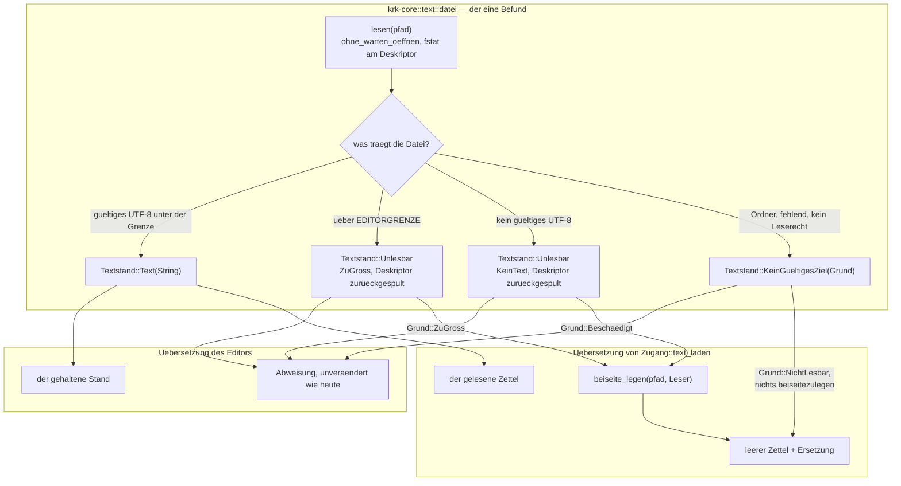
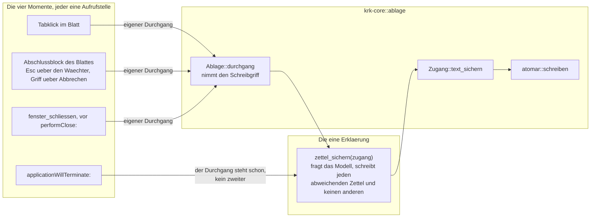
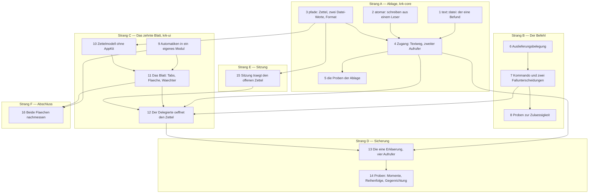

# Implementation Plan: Ein Notizzettel als Blatt am Hauptfenster, zwei Zettel, sichert sich selbst

**Date:** 2026-08-14
**Status:** Complete
**Spec:** `circles/260813-2332-notizzettel-als-blatt-mit-zwei-zetteln/planning/260813-2348_o_spec-notizzettel-als-blatt-mit-zwei-zetteln.md` (Fassung vom 260814-0925, mit dem Nachtrag an C4)
**Nachgezogen am 260814-0941**, an sechs Stellen und nur an C4 entlang: die Schritte 10 bis 14, der Kasten `zettel_sichern` im Bild der Sicherungsmomente und die Risikozeile zu zwei Instanzen. Anlass sind die zwei Defektdatensätze `issues/260814-0908_*` (hoch) und `issues/260814-0909_*` (mittel) aus der Durchsicht von Turn 1 und der Nachtrag des Spec an C4 vom 260814-0925: der getippte Stand gewinnt, und jeder Sicherungsmoment schreibt jeden abweichenden Zettel. Die Reihenfolge der Arbeit, die Zulässigkeitsregel der achten Runde und der eine `durchgang` beim Beenden sind dabei unangetastet geblieben; die fünf niedrigen Befunde der Durchsicht sind nicht Gegenstand dieses Nachtrags und bleiben offen.
**Circle:** `circles/260813-2332-notizzettel-als-blatt-mit-zwei-zetteln/`
**Bindender Entscheid:** `decisions/260813-2348_a_was-tut-der-zettel-mit-einer-zetteldatei-die-er-nicht-lesen-kann.md` — Möglichkeit 3, `EDITORGRENZE` als Grenze
**Grundlage erhoben:** 260814-0656, am Baum unter `crates/` und `resources/`

**Decidability:** Die tragende Frage lautet an jedem der vier Sicherungsmomente: *schreiben oder nicht, und in welche Datei?* Sie ist aus den Eingaben entscheidbar, die der Mechanismus zur Hand hat — dem beim Öffnen gelesenen Text, dem Stand der Textfläche und dem offenen Zettel. Alle drei liegen im selben Augenblick vor, keine wird vorhergesagt. **Eine zweite Frage ist im Baum nicht entscheidbar, und der Plan nimmt sie deshalb aus dem tragenden Weg heraus:** was AppKit mit `performClose:` an einem Fenster mit anhängendem Blatt tut, ist ungemessen. Der Plan sagt die Reihenfolge nicht nach einer Vermutung an, sondern macht das Sichern unbedingt und vorgängig; damit hält die Zusage „kein Weg aus dem Zettel heraus verliert Text" in beiden Ausgängen, und die Messung entscheidet nichts mehr, sondern trägt nur noch nach, welche der zwei gezeichneten Kanten das laufende Bündel geht. Wer die Messung führt und wie, steht unten unter „Nutzerarbeit".

---

## Directive

Der Plan setzt den Spec um, und der Spec ist die verbindliche Fassung. Die Directive im Circle-Datensatz nennt weiter drei Sicherungsmomente; die Abweichung hält `issues/260814-0637_o_die-directive-im-circle-datensatz-nennt-drei-sicherungsmomente-der-spec-vier.md` fest, und ihre Behebung gehört dem Shaper und nicht diesem Plan.

Fünf Fähigkeiten, zwei Kisten, sechs Stränge. Die Naht liegt dort, wo der Spec sie zieht: C1 bis C3 fassen `crates/krk-ui/` an, C4 und C5 fassen `crates/krk-core/src/ablage/` an, und die eine Frage, die beide Hälften teilen, ist der Zeitpunkt des Sicherns.

---

## Ausgangslage: was der Plan am Baum vorgefunden hat

Der Spec erhebt achtzehn Feststellungen. Sie werden hier nicht wiederholt. Was folgt, sind elf weitere, die der Plan selbst erhoben hat und die den Zuschnitt der Schritte tragen. Fünf davon widersprechen dem, was der Spec offengelassen oder als Vermutung markiert hat.

**`Zugang::beiseite_legen` kann den Zettel in seiner heutigen Form nicht annehmen, und das ist keine Kleinigkeit.** Die Methode nimmt `inhalt: &str` (`crates/krk-core/src/ablage/mod.rs:452`) und reicht ihn an `atomar::schreiben`, das ebenfalls `&str` nimmt (`crates/krk-core/src/ablage/atomar.rs:146`). Beide unlesbaren Fälle des Zettels tragen aber keinen `&str`: eine ungültige UTF-8-Folge ist definitionsgemäß keiner, und eine Datei über `EDITORGRENZE` darf gar nicht erst in den Speicher gelesen werden — das zweite Kriterium im Abschnitt zu den zehn Zeitzusagen sagt genau diese Schranke zu. Der Plan weitet deshalb beide Signaturen auf einen Leser (`&mut impl Read`) statt eine Zeichenkette. Eine zweite Schreibfunktion daneben wäre der zweite Schreibweg, den der Datensatz vom 260812-1105 ausschließt.

**`text::datei::oeffnen` beantwortet die Frage des Zettels bereits vollständig, wirft aber genau das weg, was das Beiseitelegen braucht.** Der Ablauf in `crates/krk-core/src/text/datei.rs:316-367` ist Zeile für Zeile das, was C5 verlangt: `ohne_warten_oeffnen`, `metadata()` am offenen Deskriptor, Typprüfung, `EDITORGRENZE`, `from_utf8`. Er liefert nur `Result<String, Abweisung>`, und `Abweisung` trägt weder die Bytes noch den Deskriptor. Ein zweiter Leser daneben in `ablage/mod.rs` wäre die zweite Wahrheit über die Frage „ist das eine Textdatei, die KRK annimmt". Der Plan zerlegt `oeffnen` deshalb in einen Befund und dessen Übersetzung; der Editor sieht davon nichts.

**Die elf Fundstellen von `Datei::ALLE` sind nicht elf, sondern sieben, und sie zerfallen in zwei Sorten.** Gezählt am 260814: `crates/krk-core/tests/ablage.rs` an den Zeilen 216, 306, 382, 893, 1030, 1034, 1073. Vier davon (382, 893, 1030/1034) fahren einen TOML-Rundlauf und meinen die vier bestehenden Dateien; drei (216, 306, 1073) fragen nach Pfad, Name und Nichtanlage und meinen jede Ablagedatei. Der Plan trennt die beiden Sorten nicht über eine zweite, von Hand gepflegte Liste, sondern über eine abgeleitete Frage `Datei::format()`. Eine Liste neben `ALLE` könnte auseinanderlaufen, eine vollständige Fallunterscheidung kann es nicht.

**Der Bau hält bei einem neuen `Kommando` nicht überall an, und die eine Stelle, an der er es nicht tut, ist die wichtigste.** Das `match` in `Anwendungsdelegierter::kommando_ausfuehren` endet mit `andere => self.bereichskommando(fokus, andere)` (`crates/krk-ui/src/appkit/anwendung.rs:2874`), und der Kommentar zwei Zeilen darüber sagt es selbst: ein neues Kommando ohne eigenen Zweig fiele dort stillschweigend hindurch und täte nichts. Angehalten wird an `Kommando::wirkungsbereich` (`crates/krk-core/src/tasten/belegung.rs:715`) und an `bereich_des_kommandos` (`crates/krk-ui/src/belegungsmodell.rs:226`). Der Zweig in `kommando_ausfuehren` steht deshalb als eigener Schritt und nicht als Nebensache.

**Eine Funktion, die die `keymap.toml` des Nutzers nicht nennt, tritt unbelegt hinzu.** `Belegung::bauen` (`crates/krk-core/src/tasten/belegung.rs:1252-1267`) setzt `tasten: Vec::new()`, und der Kommentar nennt den Grund: der Nutzer soll eine Funktion, die er gelöscht hat, wiederfinden. Die Folge trifft diese Runde unmittelbar: wer seit der Runde 7 einmal eine Taste umbelegt hat, hat eine `keymap.toml` auf der Platte, und für ihn kommt der Notizzettel ohne `f2` und ohne `cmd+k` an. Das ist keine Eigenschaft dieser Runde, sondern jeder Runde seit der siebten; der Defekt dazu ist gefilt (siehe „Gefilte Datensätze").

**`Datei::ALLE` bleibt bei sechs Einträgen und wächst nicht auf acht.** `Zettel` wird eine eigene Aufzählung mit zwei Werten, und `Datei::Zettel(Zettel)` trägt sie als Nutzlast. Damit ist „das Blatt führt genau zwei Zettel" (erstes Kriterium von C2) eine Aussage über einen Typ und nicht über eine Zeile Code. Vorbild ist `Fensterseite` in `crates/krk-core/src/ablage/sitzung.rs:48`, dessen Modulkommentar dieselbe Erwägung ausschreibt: „eine Seite statt einer Zahl, damit ein Index nicht versehentlich zu drei Fenstern wird".

**Der Anwendungsdelegierte hält bereits einen Blattgriff, und der Abbruchbefehl bedient ihn.** `offenes_blatt: RefCell<Option<Blattgriff>>` (`crates/krk-ui/src/appkit/anwendung.rs:601`), und `abbrechen` nimmt ihn mit `take()` heraus und schließt das Blatt (`:3886`). Der Zettel trägt sich dort ein wie die fünf Blätter, die es heute schon tun. Wichtig ist die Folge für die Sicherung: beide Wege heraus, die Escape-Taste über den Wächter und ein Abbruch über den Griff, laufen in **denselben** Abschlussblock von `Blatt::zeigen_mit_wahl`. Das Sichern hängt deshalb am Abschlussblock und nicht am Wächter.

**Beim Beenden darf der Zettel keinen eigenen Durchgang durch die Ablage nehmen.** `applicationWillTerminate:` (`:819-846`) läuft heute in genau einem `unter_der_sperre`, und der Kommentar darin nennt den Defekt, der aus zweien entstanden war: `issues/260813-0540_*_beim-beenden-laufen-zwei-durchgaenge-und-der-kommentar-nennt-einen.md`. `Ablage::durchgang` ist daneben ausdrücklich nicht schachtelbar. Der vierte Sicherungsmoment nimmt deshalb den `Zugang` entgegen, den der Rumpf schon hat, und die drei anderen Momente öffnen je einen eigenen.

**Die Textfläche des Editors lässt sich nicht als ganze wiederverwenden.** `textflaeche_bauen` (`crates/krk-ui/src/appkit/editor.rs:3105-3213`) hängt am Ende `Nummernspalte::einhaengen` an, und C3 schließt Zeilennummern im Zettel aus. Wiederverwendbar ist der mittlere Teil: die neun Zeilen, die die Automatiken abschalten, samt der gehüteten Setzerfrage `setzen_falls_vorhanden`. Sie ziehen in ein eigenes Modul, und beide Flächen rufen es.

**Der Wächter des Zettels kann nicht der `Eingabewaechter` sein, und der Grund ist nicht nur die Eingabetaste.** Der bestehende Wächter ist ein `NSControlTextEditingDelegate` und beantwortet `control:textView:doCommandBySelector:` (`crates/krk-ui/src/appkit/blaetter/mod.rs:174`); diese Methode ruft der Feldeditor eines `NSControl`. Eine freistehende `NSTextView` hat keinen und ruft `textView:doCommandBySelector:` an ihrem `NSTextViewDelegate` (in `objc2-app-kit` 0.3.2 vorhanden, `NSTextView.rs:2063`). Es sind zwei verschiedene Protokolle mit zwei verschiedenen Signaturen. Dazu kommt die halbe Regel: `Esc` schließt, die Eingabetaste setzt eine Zeile. Ein Schalter am bestehenden Wächter wären zwei Wahrheiten darüber, was die Eingabetaste in einem Blatt tut — genau das, was sein Modulkopf ausdrücklich vermeidet.

**Das Hauptmenü und die Belegungsansicht brauchen keine Zeile.** `menuemodell::aufbau` (`crates/krk-ui/src/menuemodell.rs:234`) baut jedes Obermenü aus `belegungsmodell::nach_bereichen`, und die Belegungsansicht wie die Markdown-Ausgabe gehen über dieselbe Quelle. Ein neuer Eintrag in `resources/default-keymap.toml` mit einem Funktionsbereich aus `bereich_des_kommandos` erscheint an allen drei Flächen von selbst. Am 260814 nachgesehen: `f2` und `cmd+k` sind unbelegt, die Datei führt 82 Funktionen mit 88 Kombinationen, belegt ist allein `shift+cmd+k`.

---

## Approach

Der Plan folgt einer Regel: **jede Frage bekommt genau eine Stelle, und die vorhandene Stelle hat den Vorrang vor einer neuen.** Fünf Stellen entstehen oder wachsen, und mehr nicht.

1. **Was ist eine Textdatei, die KRK annimmt?** Steht heute in `text::datei::oeffnen` und wird zu einem Befund, den Editor und Zettel verschieden übersetzen.
2. **Wie kommt etwas atomar auf die Platte?** Steht in `atomar::schreiben` und nimmt künftig einen Leser statt einer Zeichenkette.
3. **Welche Dateien liegen im Ablageordner, und welches Format tragen sie?** Steht in `Datei` und wächst um zwei Werte und eine Frage.
4. **Wann sichert der Zettel?** Eine neue Stelle am Anwendungsdelegierten mit vier Aufrufern.
5. **Welche Automatiken sind an einer bearbeitbaren Textfläche abgeschaltet?** Zieht aus `editor.rs` in ein eigenes Modul und bedient danach zwei Flächen.

Was **nicht** entsteht: keine zweite Blatthülle, keine dritte Absprache über dem Ablageordner, kein zweiter Schreibweg, kein sechster Bereich, kein sechster Fokuswert, keine Änderung an `waehrend_blatt_erlaubt`, an `immer_erreichbar` oder an `zulaessigkeit::zulaessig`.

### Der Leseweg einer Zetteldatei

Vier Ausgänge, überschneidungsfrei und vollständig; der Übersetzer hält an beiden Übersetzungen an, wenn ein fünfter dazukommt. Der fehlende Fall „die Datei gibt es nicht" ist bewusst kein eigener Ausgang: er kommt als `KeinGueltigesZiel` herein, und `text_laden` macht daraus einen leeren Zettel ohne Meldung, wie `Zugang::laden` es heute für eine fehlende TOML-Datei tut. Der Zettel liest seine Datei bei jedem Öffnen neu, also gibt es keinen Startpfad daneben.

### Die vier Sicherungsmomente und ihre eine Erklärung

**Der Kasten sagt seit dem 260814-0941 „jeden abweichenden Zettel" und nicht mehr „nur bei Aenderung".** Die Bedingung war richtig und zu wenig: sie ließ offen, wie viele Zettel ein Moment schreibt, und der Bau von Turn 1 hat daraus „höchstens einen" gemacht (`issues/260814-0909_*`). Was unverändert gilt: ein Zettel, der seiner Datei gleicht, wird nicht geschrieben.

Die vierte Kante läuft am Durchgang vorbei und nicht daran vorbei am Schreibgriff: `applicationWillTerminate:` hält ihn bereits, und ein zweiter Durchgang wäre der Defekt vom 260813-0540 ein zweites Mal. `Kommando::FensterEinblenden` steht in keinem der vier Kästen; das ist die Gegenrichtung, die Schritt 14 festhält.

### Die Reihenfolge der Arbeit

Die Stränge A, B und der Schritt 9 laufen unabhängig voneinander und können in beliebiger Reihenfolge gefahren werden. Der Engpass ist Schritt 12: er hängt an vier Vorgängern aus drei Strängen.

---

## Implementation Steps

Jeder Schritt endet grün: `make check` fährt Bau, Proben, `clippy` und `fmt` in einem Zug, und `clippy` ist die eigentliche Prüfung. Kein Schritt lässt den Baum rot zurück.

### Strang A — Ablage: zwei Zetteldateien, ein Leseweg, ein Schreibweg

1. [DONE] **`text::datei` liefert den einen Befund über eine Textdatei**
   - Executor: `coder`
   - Files: `crates/krk-core/src/text/datei.rs`
   - Changes: Neu `pub enum Textstand { Text(String), Unlesbar { datei: File, grund: Unlesbarkeit }, KeinGueltigesZiel(String) }` und `pub enum Unlesbarkeit { ZuGross(u64), KeinText }`, beide vollständig und ohne Auffangzweig. Neu `pub fn lesen(pfad: &Path) -> Textstand` mit dem heutigen Rumpf von `oeffnen`: `sys::ohne_warten_oeffnen`, `metadata()` am offenen Deskriptor, Typprüfung, `EDITORGRENZE`, `read_to_end` mit `take(EDITORGRENZE + 1)`, `einlesen`. Vor jeder Rückkehr mit `Unlesbar` wird der Deskriptor über `Seek::rewind` an den Anfang gestellt — im Fall „zwischen `fstat` und `read` gewachsen" ist er sonst nicht dort, und der Aufrufer kopiert dann einen Rumpf. `oeffnen(pfad) -> Result<String, Abweisung>` bleibt in Signatur und Rückgabewerten Zeichen für Zeichen, was es heute ist, und wird zur Übersetzung des Befundes in `Abweisung`. `EDITORGRENZE` bleibt an genau einer Stelle stehen.
   - Dependencies: keine
   - Abnahmekriterium: C5 — „Der Zettel öffnet seine Datei über dieselbe Hülle `ohne_warten_oeffnen`, die Editor und Vorschau benutzen, und prüft Art und Größe am offenen Deskriptor. Ein dritter Weg an das Dateisystem entsteht nicht." Dazu C5 — „`EDITORGRENZE` steht weiterhin an genau einer Stelle."
   - Prüfung: Die bestehenden Proben zu `oeffnen` in `crates/krk-core/tests/` bleiben unverändert grün; eine neue Probe fährt `lesen` gegen alle vier Ausgänge und prüft im `Unlesbar`-Fall, dass der Deskriptor am Anfang steht.

2. [DONE] **`atomar` schreibt aus einem Leser statt aus einer Zeichenkette**
   - Executor: `coder`
   - Files: `crates/krk-core/src/ablage/atomar.rs`, `crates/krk-core/src/ablage/mod.rs`, `crates/krk-core/src/ablage/einstellungen.rs`, `crates/krk-core/src/text/datei.rs`, `crates/krk-ui/src/belegungsausgabe.rs`, `crates/krk-core/tests/ablage.rs`
   - Changes: `vorbereiten(ziel: &Path, quelle: &mut impl Read)` und `schreiben(ziel: &Path, quelle: &mut impl Read)`; der Rumpf ersetzt `write_all(inhalt.as_bytes())` durch `io::copy(quelle, &mut datei)`, `sync_all` und das zweistufige Umbenennen bleiben unangetastet. Die fünf bestehenden Aufrufstellen schreiben `&mut text.as_bytes()`. Der Modulkopf bekommt einen Absatz: warum ein Leser und keine Zeichenkette — eine beiseitezulegende Datei trägt Bytes, die definitionsgemäß kein `&str` sind, und eine Datei über der Grenze darf nicht in den Speicher.
   - Dependencies: keine
   - Abnahmekriterium: C4 — „Das Schreiben läuft über `atomar::schreiben` und unter dem `Schreibgriff`, wie jedes andere Schreiben im Ablageordner. Ein zweiter Schreibweg entsteht nicht."
   - Prüfung: `crates/krk-core/tests/baum.rs::nur_benannte_dateien_erreichen_das_atomare_schreiben` bleibt bei denselben fünf Dateien; die Liste wird nicht angefasst.

3. [DONE] **`pfade` führt die zwei Zettel, und ein `Format` trennt TOML von Text**
   - Executor: `coder`
   - Files: `crates/krk-core/src/ablage/pfade.rs`
   - Changes: Neu `pub enum Zettel { Erster, Zweiter }` mit `ALLE: [Zettel; 2]`, `index()`, `andere()`, abgeleitet `Debug, Clone, Copy, PartialEq, Eq, Hash, Default, Serialize, Deserialize` und `#[serde(rename_all = "lowercase")]` — Bauform und Begründung wörtlich nach `Fensterseite`. `Datei` bekommt die Variante `Zettel(Zettel)`; `Datei::ALLE` wird `[Datei; 6]` mit den zwei Zetteln am Ende; `dateiname()` liefert `note-1.txt` und `note-2.txt`. Neu `pub enum Format { Toml, Text }` und `pub const fn Datei::format(self) -> Format`, vollständig ohne Auffangzweig. Der Modulkopf sagt „sechs Dateien in zwei Formaten" statt „vier Dateien" und schreibt aus, warum die Zettel kein TOML tragen: eine Datei je Zettel ist nur dann eine Verbesserung gegenüber einer gemeinsamen, wenn sie für sich lesbar ist.
   - Dependencies: keine
   - Abnahmekriterium: C5 — „Der Ablageordner führt nach dieser Runde sechs Dateien … Die Namen der zwei neuen folgen der englischsprachigen Form der vier bestehenden." Und: „Die Aufzählung der Ablagedateien führt die zwei neuen mit." C2 — „Das Blatt führt genau zwei Zettel. Eine dritte Wahl gibt es an keiner Stelle."
   - Hinweis für den Ausführer: Die Namen `note-1.txt` und `note-2.txt` sind die Wahl des Planers und am Gate änderbar. Die vier bestehenden Namen sind einwortig und kleingeschrieben; ein Bindestrich mit Ziffer ist die knappste Form, zwei Dateien derselben Art zu unterscheiden.

4. [DONE] **`Zugang` bekommt den Textweg, und `beiseite_legen` seinen zweiten Aufrufer**
   - Executor: `coder`
   - Files: `crates/krk-core/src/ablage/mod.rs`
   - Changes: `beiseite_legen(&self, datei: &Path, quelle: &mut impl Read) -> Beiseite` — die Signatur weitet sich, die drei Regeln bleiben Wort für Wort stehen (kopieren statt verschieben, eine dastehende Sicherung bleibt unangetastet, der Weg ist `atomar::schreiben`). `Zugang::laden` ruft sie mit `&mut text.as_bytes()`. `Grund` bekommt die vierte Variante `ZuGross { groesse: u64 }`; `beschreibung()` und `einzelheit()` sind vollständige Fallunterscheidungen und halten den Bau an, bis beide sie nennen. Neu `pub fn Zugang::text_laden(&self, welche: Datei) -> Geladen<String>`: es prüft `welche.format() == Format::Text`, ruft `crate::text::datei::lesen` und übersetzt die vier Ausgänge nach dem Bild oben. Neu `pub fn Zugang::text_sichern(&self, welche: Datei, text: &str) -> io::Result<()>` über `atomar::schreiben`. `laden` und `sichern` bekommen die Gegenprobe `Format::Toml`; beide Prüfungen stehen als `debug_assert!`, damit eine Fehlverdrahtung im Prüfbau laut wird, statt TOML in einen Zettel zu schreiben. Der Modulkopf zieht nach: sechs Dateien, zwei Formate, und die Beiseiteregel gilt jetzt auch für „zu groß".
   - Dependencies: 1, 2, 3
   - Abnahmekriterium: C5 — „Das Beiseitelegen läuft über `Zugang::beiseite_legen` und über keinen daneben gebauten zweiten Weg. Die Funktion bekommt damit ihren zweiten Aufrufer." Und: „Der Nutzer erfährt vom Beiseitelegen über denselben Meldeweg, den `Ersetzung` heute für `keymap.toml` und `settings.toml` geht." C4 — „Eine gescheiterte Sicherung wirft den Stand nicht weg und meldet den Grund."

5. [DONE] **Die Proben der Ablage folgen der Trennung nach Format**
   - Executor: `coder`
   - Files: `crates/krk-core/tests/ablage.rs`, `crates/krk-core/tests/baum.rs`
   - Changes: Die vier TOML-Rundläufe (`ablage.rs:382`, `:893`, `:1030`, `:1034`) laufen über `Datei::ALLE.into_iter().filter(|d| d.format() == Format::Toml)`; `vier_ersetzungen` heißt danach, was es tut. Die drei Fragen nach Pfad, Name und Nichtanlage (`:216`, `:306`, `:1073`) bleiben auf `Datei::ALLE` und decken damit die zwei Zettel mit; die erwartete Namensliste an `:216` wächst um zwei. Neue Proben für den Zettel: fehlende Datei ergibt leeren Zettel ohne Meldung; ungültige UTF-8-Folge ergibt leeren Zettel, eine Sicherung unter dem Beiseitepfad und eine Meldung, die sie nennt; eine zweite ungültige Fassung lässt die erste Sicherung unangetastet; eine Datei über `EDITORGRENZE` wird nicht geladen und geht denselben Weg; ein Rundlauf schreibt Text und liest ihn unverändert zurück. Der Kommentar in `baum.rs` sagt „vier Schreiber hinter einem `Zugang`" statt „drei"; die Liste der fünf Dateien bleibt.
   - Dependencies: 4
   - Abnahmekriterium: C5 — die Kriterien zu fehlender Datei, ungültiger Bytefolge, Größe, Beiseitepfad und Namensableitung. Und: „Über dem Ablageordner stehen weiterhin genau zwei Absprachen. Die Probe `ueber_der_ablage_stehen_genau_zwei_absprachen` bleibt grün, ohne angepasst zu werden."

### Strang B — Der Befehl: zwei Wege, eine Zeile, ein Menüeintrag

6. [DONE] **Die Auslieferungsbelegung führt den Notizzettel**
   - Executor: `ontocoder`
   - Files: `resources/default-keymap.toml`
   - Changes: Ein `[[funktion]]`-Block mit `id = "notizzettel"`, `name = "Notizzettel anzeigen"`, `tasten = ["f2", "cmd+k"]`, mit einem Kommentar, der die zwei Wege begründet (Norton-Reihe, Nutzerentscheid vom 260802-1409: zwei Wege ab Werk auf dieselbe Funktion, eine Zeile in der Belegungsansicht). Der Block steht im Abschnitt der Anwendung, zwischen `belegung_ansehen` und `weitere_instanz` — die Reihenfolge der Blöcke ist die Reihenfolge im Menü, und der Dateikopf sagt es selbst. Die Zeile „Ausgeliefert sind 82 Funktionen mit zusammen 88 Kombinationen" wird auf 83 und 90 nachgezogen.
   - Dependencies: keine
   - Abnahmekriterium: C1 — „`resources/default-keymap.toml` führt eine Funktion für den Notizzettel mit den beiden Kombinationen `f2` und `cmd+k` in einer Zeile. Eine zweite Funktion daneben entsteht nicht." Und: „Keine der 82 bestehenden Funktionen verliert eine Kombination, und keine Kombination steht danach zweimal."
   - Hinweis für den Ausführer: Vor dem Eintrag noch einmal prüfen, ob `f2` und `cmd+k` frei sind — am 260814-0656 waren sie es, belegt ist allein `shift+cmd+k`. Die Probe `die_zwei_zahlen_im_kopf_der_auslieferungsbelegung_stimmen_noch` fällt sonst, und sie meint dann den Dateikopf und nicht sich selbst. Nach diesem Schritt allein ist der Baum grün: eine Funktion ohne Kommando ist ein zulässiger Zwischenstand, den der Dateikopf ausdrücklich kennt.

7. [DONE] **`Kommando::Notizzettel` und die zwei vollständigen Fallunterscheidungen**
   - Executor: `coder`
   - Files: `crates/krk-core/src/tasten/belegung.rs`, `crates/krk-ui/src/belegungsmodell.rs`
   - Changes: Neue Variante `Kommando::Notizzettel`; `KENNUNGEN` wächst von 76 auf 77 Paare mit `(Kommando::Notizzettel, "notizzettel")`; `Kommando::wirkungsbereich` ordnet sie zu `Wirkungsbereich::Ueberall` im Zweig „das Fenster als ganzes", mit einem Kommentar, der den Grund nennt: der Zettel öffnet aus jedem der fünf Bereiche, und ein Wirkungsbereich, der einen davon verlangte, schnitte die anderen vier ab. `bereich_des_kommandos` ordnet sie zu `Funktionsbereich::Anwendung`, neben `BelegungAnsehen`, `Beenden` und `WeitereInstanz`; der Kommentar sagt, warum kein eigener Funktionsbereich entsteht — er ergäbe ein Obermenü mit einem einzigen Eintrag.
   - Dependencies: 6
   - Abnahmekriterium: C1 — „Der Befehl trägt einen Wirkungsbereich, unter dem er aus jedem der fünf Fokuswerte wirkt." „Die Belegungsansicht führt genau eine Zeile für den Notizzettel, und in ihr stehen beide Kombinationen." „Die Markdown-Ausgabe der Tastenbelegung führt dieselbe eine Zeile." „Die Menüleiste trägt einen Eintrag für den Notizzettel, und er entsteht ohne eine neue Zeile im Menübauer."
   - Prüfung: `jede_kennung_der_kommandos_steht_in_der_auslieferungsbelegung` deckt Kennung und Rückweg ab. Weder `belegungsansicht.rs` noch `belegungsausgabe.rs` noch `menuemodell.rs` werden angefasst; dass die drei Flächen die Zeile trotzdem führen, ist die Zusage dieses Schrittes.

8. [DONE] **Proben: die Zulässigkeitsregel bleibt, wie sie ist**
   - Executor: `coder`
   - Files: `crates/krk-ui/src/kommandos/zulaessigkeit.rs`, `crates/krk-ui/src/kommandos/operationen.rs`
   - Changes: In `zulaessigkeit.rs` unter `mod tests` zwei Proben neben der Falltafel: `zulaessig(Kommando::Notizzettel, …)` liefert `false`, sobald ein Blatt steht, und `zulaessig(Kommando::Abbrechen, …)` liefert `false`, sobald ein Blatt steht **und** der Ersthelfer AppKit gehört — die zweite ist die Herleitung, aus der `Esc` den Zettel überhaupt schließt, und sie steht heute schon als `im_textfeld_eines_blattes_ist_auch_der_abbruch_abgewiesen` da; sie bekommt einen Verweis auf den Zettel in ihrem Doc-Kommentar. Eine Probe hält fest, dass `immer_erreichbar` nach dieser Runde dieselben drei Befehle führt. In `operationen.rs` eine Probe, dass `waehrend_blatt_erlaubt` genau `Abbrechen` nennt und den Notizzettelbefehl ausdrücklich **nicht**.
   - Dependencies: 7
   - Abnahmekriterium: C1 — Kriterien 3, 4 und 7 der ersten Liste. Rahmenbedingung des Spec: „`zulaessigkeit::zulaessig` behält seine vier Bestandteile, `waehrend_blatt_erlaubt` seine eine Ausnahme, `immer_erreichbar` seine drei Einträge."

### Strang C — Das zehnte Blatt

9. [DONE] **Die Abschaltung der Automatiken zieht in ein eigenes Modul**
   - Executor: `coder`
   - Files: neu `crates/krk-ui/src/appkit/textautomatik.rs`, geändert `crates/krk-ui/src/appkit/mod.rs`, `crates/krk-ui/src/appkit/editor.rs`
   - Changes: Das neue Modul trägt `pub(crate) fn automatiken_abschalten(text: &NSTextView)` mit den neun heutigen Zeilen aus `textflaeche_bauen` (`setRichText(false)`, die vier tippenden, `setSmartInsertDeleteEnabled`, die zwei ohne booleschen Schalter, `setWritingToolsBehavior`, die Angebotsfläche über den gehüteten Weg) samt allen ihren Begründungen, dazu `setzen_falls_vorhanden` und `setzername`. `textflaeche_bauen` ruft es und behält alles Editorspezifische: Bildlaufansicht, Rückgängig, der Zugriff auf `layoutManager`, die Schrift, die Nummernspalte. Der Modulkopf des neuen Moduls sagt, warum die Frage einmal steht und zwei Flächen bedient, und trägt den Abschnitt „Ab welchem macOS die angesprochenen Klassen stehen" für die Setzer, die aus `editor.rs` mitziehen. Das Prüfmodul in `editor.rs` bezieht `setzername` künftig von dort.
   - Dependencies: keine
   - Abnahmekriterium: Vorbereitung für C3 — „Die sieben Automatiken sind an der Textfläche des Zettels abgeschaltet." Die Messung selbst ist Schritt 16.
   - Prüfung: Alle sechs bestehenden Proben zu `EINSTELLUNGEN` bleiben unverändert grün. Wird an dieser Stelle eine Zeile verloren, fällt `die_abgeschalteten_stehen_an_der_gebauten_flaeche_auf_aus`.

10. [DONE] **Das Zettelmodell ohne AppKit**
    - Executor: `coder`
    - Files: neu `crates/krk-ui/src/zettelmodell.rs`, geändert `crates/krk-ui/src/main.rs`
    - Changes: `Zettelmodell` hält den offenen `Zettel`, je Zettel den beim Öffnen gelesenen Stand und den gehaltenen Stand. Methoden: `offener(&self) -> Zettel`; `oeffnen(&mut self, zettel: Zettel, gelesen: String) -> &str`; `bearbeiten(&mut self, stand: String) -> bool` mit `#[must_use]` und dem Doc-Kommentar, den die Projektregel verlangt — ein stilles Fallenlassen bliebe unbemerkt, so entschieden am 260811-2140; `wechseln(&mut self, ziel: Zettel) -> Wechsel`, wobei `Wechsel` eine vollständige Aufzählung ohne Auffangzweig ist und den Fall „derselbe Zettel, nichts zu tun" von „gewechselt, der verlassene ist zu sichern" und „gewechselt, nichts zu sichern" trennt; `zu_sichern(&self) -> impl Iterator<Item = (Zettel, &str)>`; `etwas_zu_sichern(&self) -> bool`; `gesichert(&mut self, zettel: Zettel)`. Ein `#[cfg(test)] mod tests` daneben, ohne Fenster und ohne `MainThreadMarker`.
    - Changes, nachgezogen am 260814-0941: **`oeffnen` trägt die Regel „der getippte Stand gewinnt".** Weicht der Zettel von seiner Datei ab, bleibt sein gehaltener Text stehen und `gelesen` wird verworfen; nur wo nichts abweicht, wird das Gelesene beides. Der Rückgabewert ist der Text, der danach in der Fläche zu stehen hat, und er trägt `#[must_use]` aus demselben Grund wie `bearbeiten`: wer ihn fallenließe, setzte das Gelesene in die Fläche und hätte damit genau den Verlust wieder, den die Regel verhindert. **`zu_sichern` liefert jeden abweichenden Zettel und nicht mehr nur den ersten**, als Aufzählung statt als `Option`; `etwas_zu_sichern` ist daraus abgeleitet und nicht daneben gebaut, weil eine zweite Aufzählung der Stände von der ersten abweichen könnte.
    - Dependencies: 3
    - Abnahmekriterium: C2 — „Der Zustandsübergang beim Tabwechsel sichert den verlassenen Zettel, und zwar ohne Fenster prüfbar am Modell." „Ein Wechsel auf den bereits offenen Tab schreibt nichts." C4 — „Ist der Text des Zettels derselbe, der beim Öffnen gelesen wurde, schreibt KRK nicht." „Jeder Sicherungsmoment schreibt **jeden** abweichenden Zettel und nicht nur den ersten. Weichen beide ab, gehen in einem Moment beide auf die Platte." „Das Öffnen des Zettels setzt den gehaltenen Text eines abweichenden Zettels nicht zurück. Den Inhalt seiner Datei bekommt nur ein Zettel, der nichts Ungesichertes hält; für den abweichenden wird der gelesene Stand verworfen."

11. [DONE] **Das Blatt: zwei Tabs, eine Textfläche, ein eigener Wächter**
    - Executor: `coder`
    - Files: neu `crates/krk-ui/src/appkit/blaetter/zettel.rs`, geändert `crates/krk-ui/src/appkit/blaetter/mod.rs` (nur die Modulanmeldung und die Zahl neun im Modulkopf)
    - Changes: `Zettelwaechter` als `define_class!` über `NSObject` mit `NSTextViewDelegate`; die eine beantwortete Methode ist `textView:doCommandBySelector:`, sie übernimmt `cancelOperation:` und **nicht** `insertNewline:`. Die Beigabe ist ein `NSView` mit einem `NSSegmentedControl` über zwei Segmenten („Zettel 1", „Zettel 2") und einer `NSScrollView` mit einer bearbeitbaren `NSTextView` darunter. Die Fläche ruft `textautomatik::automatiken_abschalten`, setzt `setEditable(true)`, `setSelectable(true)`, `setAllowsUndo(true)` und keine Nummernspalte, keine Hervorhebung, keine Suche. `zeigen(…)` baut über `Blatt::mit_schaltflaechen` mit einer Schaltfläche, setzt Beigabe und Ersthelfer und gibt den `Blattgriff` zurück; der Abschlussblock ist die eine Stelle, an der das Schließen des Blattes ankommt, gleich ob es über den Wächter, über die Schaltfläche oder über den Griff kam. Der Tabklick sichert über den Rückruf, tauscht den Text der Fläche und ruft danach `makeFirstResponder` auf die Textfläche zurück. **Der neue Text kommt aus dem gehaltenen Stand des Zielzettels und nicht aus dessen Datei** (nachgezogen am 260814-0941): das Blatt setzt in die Fläche, was der Rückruf liefert, und der Rückruf liefert, was `Zettelmodell::oeffnen` herausgibt. Weicht der Zielzettel ab, ist das sein getippter Text; C4 sagt es seit dem 260814-0925 ausdrücklich zu, und ein Wechsel, der die Datei in die Fläche setzte, wäre derselbe Verlust wie ein Neuöffnen. Der Modulkopf trägt drei Absätze: warum die Fläche in `ersthelfer_gehoert_appkit` **nicht** angemeldet wird, mit ausdrücklichem Verweis auf die entgegenlautende Warnung in `CLAUDE.md`; warum der Wächter nur die halbe Regel des `Eingabewaechter` trägt und ein eigener Typ ist und kein Schalter am bestehenden; und „Ab welchem macOS die angesprochenen Klassen stehen" für `NSSegmentedControl`, `NSScrollView`, `NSTextView` und `NSTextViewDelegate`.
    - Dependencies: 9, 10
    - Abnahmekriterium: C3 — „Die Textfläche des Zettels ist in `ersthelfer_gehoert_appkit` **nicht** als Ausnahme angemeldet." „Der Modulkopf der neuen Datei schreibt aus, warum die Anmeldung hier unterbleibt." „Der Wächter des Zettels fängt `cancelOperation:` ab und `insertNewline:` **nicht**. Eine Probe hält beide Hälften fest." „Im Zettel gibt es keinen Aufruf der Suche, des Ersetzens, der Zeilennummernspalte und der Syntaxhervorhebung." C2 — die Zusage des Rücksprungs in die Textfläche.
    - Prüfung: Eine Probe fährt den Wächter an einem `Sel` und prüft beide Hälften; eine Zählprobe über `krk_ui::quellbaum::quelldateien` hält fest, dass `zettel.rs` weder `Nummernspalte` noch `hervorhebung` noch `suche` nennt.

12. [DONE] **Der Delegierte hält den Zettel und öffnet ihn**
    - Executor: `coder`
    - Files: `crates/krk-ui/src/appkit/anwendung.rs`
    - Changes: `AnwendungsIvars` bekommt `zettel: RefCell<Zettelmodell>`; der Blattgriff geht in das bestehende `offenes_blatt`, damit ein Abbruch über den Griff denselben Weg nimmt wie jedes andere Blatt. Neu `notizzettel_zeigen(&self) -> bool`: es liest die Datei des offenen Zettels über `unter_der_sperre(|z| z.text_laden(…))` frisch ein, stellt eine etwaige `Ersetzung` über `melden` und `antwort_zeigen` in die Statuszeile, füllt das Modell und zeigt das Blatt. Ein eigener Zweig `Kommando::Notizzettel => self.notizzettel_zeigen()` in `kommando_ausfuehren`, mit einem Kommentar in der Form der Nachbarzweige: er steht hier und nicht bei `bereichskommando`, weil er `Wirkungsbereich::Ueberall` trägt und der Zettel keinem Bereich gehört.
    - Dependencies: 4, 7, 11, 15
    - Abnahmekriterium: C1 — der Zettel kommt auf beiden Wegen aus jedem der fünf Bereiche. C4 — der Zettel liest seine Datei bei jedem Öffnen neu, **und wo er etwas Ungesichertes hält, wird das Gelesene verworfen**: „Das Öffnen des Zettels setzt den gehaltenen Text eines abweichenden Zettels nicht zurück." (Der Satz „Der Zettel liest seine Datei bei jedem Öffnen neu" stand hier bis zum 260814-0941 unbeschränkt; der Nachtrag zu C4 vom 260814-0925 hat ihn eingeschränkt. Gelesen wird weiter bei jedem Öffnen — was aus dem Gelesenen wird, entscheidet seither das Modell.) C5 — „Der Nutzer erfährt vom Beiseitelegen über denselben Meldeweg, den `Ersetzung` heute geht."
    - Changes, nachgezogen am 260814-0941: `notizzettel_zeigen` setzt in die Fläche, was `Zettelmodell::oeffnen` zurückgibt, und nicht den gelesenen Text; dasselbe gilt für `zettel_wechseln`. Beide Doc-Kommentare schreiben aus, warum.
    - Hinweis für den Ausführer: Der Zweig ist Pflicht und nicht Kür. Das `match` endet mit `andere => self.bereichskommando(fokus, andere)`; ohne eigenen Zweig fiele der Befehl stillschweigend hindurch und täte nichts, und der Übersetzer sagt dazu kein Wort.

### Strang D — Die vier Sicherungsmomente

13. [DONE] **Die eine Erklärung und ihre vier Aufrufer**
    - Executor: `coder`
    - Files: `crates/krk-ui/src/appkit/anwendung.rs`
    - Changes: Neu `zettel_sichern(&self, zugang: &Zugang<'_>) -> Option<String>` — die eine Stelle, an der erklärt ist, was Sichern für den Zettel heißt: das Modell fragen, bei fehlender Änderung nichts tun, sonst `text_sichern` und dem Modell den neuen Ausgangsstand melden; der Rückgabewert ist der Satz für die Statuszeile, falls das Schreiben scheiterte. **Die eine Erklärung läuft über beide Zettel** (nachgezogen am 260814-0941): sie fragt `zu_sichern` nach jedem abweichenden und schreibt jeden einzeln, statt beim ersten zu enden. Ein Fehlschlag bricht die Schleife nicht ab, denn er sagt über den anderen Zettel nichts; in der Statuszeile steht der erste Grund, weil die Zeile einen Satz trägt und zwei Fehlschläge dasselbe Hindernis haben. Der Doc-Kommentar trägt die Zusage aus C4 samt ihrem Anlass (`issues/260814-0909_*`) und nennt den vierten Moment als den, für den sie keine Bequemlichkeit ist. Vier Aufrufstellen: der Tabklick im Rückruf aus Schritt 11, der Abschlussblock des Blattes, `fenster_schliessen` **vor** `performClose(None)`, und `wird_beendet` innerhalb des bestehenden `unter_der_sperre`-Rumpfes neben dem Sitzungsschreiber. Die ersten drei nehmen je einen eigenen Durchgang über `unter_der_sperre`; der vierte nimmt keinen, weil der Rumpf ihn schon hält. Der Doc-Kommentar an `zettel_sichern` zählt die vier Momente auf und nennt zu jedem, warum er einer ist — und nennt `Kommando::FensterEinblenden` ausdrücklich als den Befehl, der durchkommt und trotzdem keiner ist, weil er nicht aus dem Zettel herausführt. `fenster_schliessen` räumt das Blatt **nicht** ab; die Begründung steht als Kommentar dort und wiederholt die Decidability-Zeile im Kurzen.
    - Dependencies: 4, 12
    - Abnahmekriterium: C4 — „Die vier Momente sind an genau einer Stelle erklärt und werden von vier Aufrufern angesprochen. Eine zweite Erklärung daneben entsteht nicht." „Der vierte Aufrufer ist der Weg von `Kommando::FensterSchliessen`, und er sichert **vor** `performClose:`." „Weist `beenden_erlauben` das Beenden ab, … sichert der Zettel nicht." C1 — „Der Zettel sichert, bevor `fenster_schliessen` `performClose:` ruft."
    - Hinweis für den Ausführer: Kein zweiter `durchgang` in `applicationWillTerminate:`. Der Kommentar dort nennt den Defekt, der aus zweien entstand; er wird nicht ein zweites Mal gebaut. Der Moment „Beenden" hängt an `applicationWillTerminate:` und nicht am Tastendruck — damit fällt die Bedingung aus C4 von selbst, ohne dass sie irgendwo abgefragt würde.
    - Hinweis für den Ausführer, nachgezogen am 260814-0941: Das `let _ =` beim Beenden braucht seinen geschriebenen Grund, und zwar beide Hälften. Erstens: eine Statuszeile gibt es dort nicht mehr, an der der Satz ankäme. Zweitens, und das ist die Hälfte, die bis dahin fehlte: dass der Nutzer von einem Fehlschlag an dieser Stelle nichts erfährt, ist der benannte und angenommene Preis aus C4. Der Spec bindet die Meldezusage ausdrücklich an die drei Momente, nach denen KRK weiterläuft, und führt die Alternative unter „Ausdrücklich außerhalb dieser Runde"; sie wird hier nicht gebaut. Derselbe Kommentar sagt, warum dieser Moment jeden abweichenden Zettel schreiben muss: nach ihm läuft nichts mehr, das den zweiten nachholte.

14. [DONE] **Proben: die vier Momente, die Reihenfolge, die Gegenrichtung**
    - Executor: `coder`
    - Files: `crates/krk-ui/src/appkit/anwendung.rs` (unter `mod tests`), `crates/krk-core/tests/ablage.rs`, dazu seit dem 260814-0941 `crates/krk-ui/src/zettelmodell.rs`
    - Changes, nachgezogen am 260814-0941: **Drei Proben am Modell kommen hinzu**, und sie stehen im Prüfmodul von `zettelmodell.rs`, weil beide Kriterien im Spec „ohne Fenster am Modell prüfbar" sagen und die Regel dort steht. Erstens: das Öffnen setzt den abweichenden Stand nicht zurück — der Zettel behält seinen getippten Text und bleibt zu sichern. Zweitens die Gegenprobe dazu: ein sauberer Zettel bekommt den neuen Dateiinhalt, sonst wäre das Neulesen nicht eingeschränkt, sondern gestrichen. Drittens: weichen beide Zettel ab, nennt `zu_sichern` beide, in der Reihenfolge von `Zettel::ALLE`. Die gescheiterte Sicherung bilden alle drei dadurch ab, dass `gesichert` gerade **nicht** gerufen wird.
    - Changes: Vier Zählproben über `krk_ui::quellbaum::quelldateien`, in der Bauform der bestehenden Zählproben, mit zusammengesetzten Nadeln, weil die Datei in dem Baum liegt, den sie liest. Erstens: `zettel_sichern` ist genau einmal erklärt. Zweitens: genau vier Stellen sprechen es an. Drittens: im Rumpf von `fenster_schliessen` steht die Nadel des Sicherns **vor** der von `performClose`. Viertens: im Rumpf von `fenster_zeigen` steht keine Sicherungsnadel. Dazu in `ablage.rs` eine Probe, dass der geschriebene Text einer `session.toml` den Text eines Zettels an keiner Stelle trägt. Jeder Doc-Kommentar sagt, was seine Nadel **nicht** sieht — die dritte etwa sieht ein Sichern nicht, das in eine später gerufene Hilfsfunktion gewandert ist.
    - Dependencies: 13
    - Abnahmekriterium: C1 — „Eine Probe hält die Reihenfolge fest." „`Kommando::FensterEinblenden` sichert den Zettel **nicht**. Eine Probe hält diese Gegenrichtung fest." C4 — „Der Zwei-Sekunden-Takt des `Sitzungsschreiber` trägt den Text des Zettels nicht. Eine Probe hält fest, dass der Text an keiner Stelle in die `session.toml` gerät." „Es gibt keinen Befehl zum Sichern des Zettels, keinen Menüeintrag dafür und keine Kombination in der Belegung." Seit dem 260814-0941 dazu die zwei Kriterien aus dem Nachtrag zu C4: „Jeder Sicherungsmoment schreibt **jeden** abweichenden Zettel und nicht nur den ersten." „Das Öffnen des Zettels setzt den gehaltenen Text eines abweichenden Zettels nicht zurück." Beide stehen im Spec mit dem Zusatz „ohne Fenster am Modell prüfbar", und genau dort werden sie geprüft.

### Strang E — Die Sitzung

15. [DONE] **`Sitzung` trägt, welcher Zettel zuletzt offen war**
    - Executor: `coder`
    - Files: `crates/krk-core/src/ablage/sitzung.rs`, `crates/krk-ui/src/fenstermodell.rs`, `crates/krk-ui/src/appkit/anwendung.rs`
    - Changes: `Sitzung` bekommt `pub zettel: Zettel`, und zwar **vor** den drei Tabellen und vor `fenster` — TOML verlangt, dass die Werte einer Tabelle vor ihren Untertabellen stehen, und die Datei sagt es an zwei Feldern bereits selbst. `Sitzung::default()` setzt den ersten Zettel. `Fenstermodell::sitzung` nimmt den Wert als Parameter entgegen, `sitzung_bauen` liest ihn aus dem Zettelmodell, und der Aufbau der Oberfläche setzt ihn aus der geladenen Sitzung in das Zettelmodell.
    - Dependencies: 3
    - Abnahmekriterium: C2 — „`Sitzung` trägt ein Feld für den zuletzt offenen Zettel, und eine ältere `session.toml` ohne dieses Feld bleibt lesbar und ergibt den ersten Zettel."
    - Hinweis für den Ausführer: Die Zetteldateien werden beim Start **nicht** gelesen. Der Spec sagt das unter dem Verhältnis zu L4 ausdrücklich zu; gelesen wird erst beim ersten Öffnen des Zettels, und das ist Schritt 12.

### Strang F — Abschluss

16. [DONE] **Die Abschaltung der Automatiken an beiden Flächen nachmessen**
    - Executor: `coder`
    - Files: `crates/krk-ui/src/appkit/editor.rs` (unter `mod tests`)
    - Changes: `die_abgeschalteten_stehen_an_der_gebauten_flaeche_auf_aus` misst künftig an zwei gebauten Flächen statt an einer: der des Editors und der des Zettels. Der Zeuge, die frisch erzeugte `NSTextView`, bleibt derselbe. Der Doc-Kommentar sagt, warum die Aussage jetzt „jede bearbeitbare Fläche in KRK" lautet und warum die Aufzählung `EINSTELLUNGEN` nicht doppelt geführt wird.
    - Dependencies: 9, 11
    - Abnahmekriterium: C3 — „Die sieben Automatiken sind an der Textfläche des Zettels abgeschaltet, und zwar so nachgewiesen, wie sie am Editor nachgewiesen sind: an einer gebauten Fläche gemessen, nicht der Dokumentation entnommen."
    - Hinweis für den Ausführer: Die Probe läuft über `an_einer_flaeche` und damit über `MainThreadMarker::new_unchecked`. Das ist die bekannte Notlüge dieses Baums (`issues/260810-1001_*`, Datensatz `decisions/260810-1044_*`); sie wird hier benutzt und nicht neu erfunden, und der Zettel bringt keine weitere hinzu.

---

## Data Structures

Neu oder gewachsen, alle in vollständigen Fallunterscheidungen ohne Auffangzweig:

| Typ | Ort | Werte | Was der Übersetzer anhält |
|---|---|---|---|
| `Zettel` | `krk-core/src/ablage/pfade.rs` | `Erster`, `Zweiter` | jede Verzweigung über den Zettel |
| `Datei` | dieselbe Datei | wächst um `Zettel(Zettel)`, `ALLE: [Datei; 6]` | `dateiname()`, `format()` |
| `Format` | dieselbe Datei | `Toml`, `Text` | `Datei::format()` |
| `Grund` | `krk-core/src/ablage/mod.rs` | wächst um `ZuGross { groesse }` | `beschreibung()`, `einzelheit()` |
| `Textstand` | `krk-core/src/text/datei.rs` | `Text`, `Unlesbar`, `KeinGueltigesZiel` | beide Übersetzungen |
| `Unlesbarkeit` | dieselbe Datei | `ZuGross(u64)`, `KeinText` | beide Übersetzungen |
| `Wechsel` | `krk-ui/src/zettelmodell.rs` | `Derselbe`, `GewechseltUngeaendert`, `GewechseltZuSichern` | der Rückruf des Tabklicks |
| `Zettelmodell` | dieselbe Datei | Struktur | — |
| `Zettelwaechter` | `krk-ui/src/appkit/blaetter/zettel.rs` | Objective-C-Klasse | — |

Vier Aufzählungen wachsen **nicht**, und das ist eine Zusage des Spec: `Wirkungsbereich` (der Zettel nimmt `Ueberall`), `Bereich`, `Fokus` und `Funktionsbereich` (der Zettel nimmt `Anwendung`). `Kommando` wächst um eine Variante von 76 auf 77.

## API Changes

Geänderte Signaturen in `krk-core`, jede mit ihrem Grund:

| Vorher | Nachher | Grund |
|---|---|---|
| `atomar::vorbereiten(&Path, &str)` | `atomar::vorbereiten(&Path, &mut impl Read)` | eine beiseitezulegende Datei trägt Bytes, die kein `&str` sind |
| `atomar::schreiben(&Path, &str)` | `atomar::schreiben(&Path, &mut impl Read)` | dasselbe; ein zweiter Schreibweg ist ausgeschlossen |
| `Zugang::beiseite_legen(&Path, &str)` | `Zugang::beiseite_legen(&Path, &mut impl Read)` | dasselbe; die drei Regeln bleiben Wort für Wort |
| `Fenstermodell::sitzung(fenster, editor)` | `… (fenster, editor, zettel)` | das neue Sitzungsfeld |
| — | `Zugang::text_laden(Datei) -> Geladen<String>` | der Leseweg des Zettels |
| — | `Zugang::text_sichern(Datei, &str)` | der Schreibweg des Zettels |
| — | `text::datei::lesen(&Path) -> Textstand` | der eine Befund, zwei Übersetzungen |

`text::datei::oeffnen` behält Signatur und Rückgabewerte unverändert. Der Editor sieht von diesem Plan keine geänderte Schnittstelle.

## Testing Strategy

Drei Sorten, wie sie das Projekt führt.

**Am Modell, ohne Fenster.** Das Zettelmodell trägt sein eigenes Prüfmodul: Wechsel, Änderungserkennung, „derselbe Tab schreibt nichts". Die Zulässigkeitsfrage wird über die bestehende Falltafel gestellt, die 280 Fälle ohne Fenster durchgeht.

**Am Baum, über `quelldateien`.** Vier Zählproben zum Sicherungsweg (Schritt 14) und eine zu den ausgeschlossenen Fähigkeiten im Zettel (Schritt 11). Jede sagt in ihrem Doc-Kommentar, was ihre Nadel nicht sieht; der Kopf von `crates/krk-core/tests/baum.rs` erklärt, warum keine Nadel restlos dicht ist.

**An einer gebauten Fläche.** Die Automatiken werden gemessen und nicht behauptet (Schritt 16), und der Wächter wird an einem `Sel` gefahren (Schritt 11).

Was diese drei Sorten **nicht** decken, steht in der zweiten Kriterienliste jeder Fähigkeit im Spec und unten unter „Nutzerarbeit". Der Plan ergänzt sie um nichts und streicht nichts.

## Risks & Mitigations

| Risiko | Minderung |
|---|---|
| Wer eine `keymap.toml` auf der Platte hat, bekommt den Notizzettel **unbelegt**: `Belegung::bauen` fügt eine dort fehlende Funktion ohne Tasten hinzu. Die Abnahme „`f2` öffnet den Zettel" scheitert dann auf dem Gerät des Nutzers, obwohl der Code stimmt. | Der Defekt ist gefilt (`shared/issues/260814-0656_o_…`). Für die Abnahme dieser Runde: `~/Library/Application Support/KRK/keymap.toml` vor dem Lauf zur Seite legen, oder `f2` in der Belegungsansicht von Hand zuweisen. Beides steht unter „Nutzerarbeit". |
| `atomar::schreiben` ändert seine Signatur, und fünf Dateien rufen es. | Der Übersetzer nennt jede Stelle; die Änderung je Stelle ist `&text` → `&mut text.as_bytes()`. Die Baumprobe `nur_benannte_dateien_erreichen_das_atomare_schreiben` hält fest, dass keine sechste dazukommt. |
| `Datei::ALLE` wächst, und sieben Fundstellen in `tests/ablage.rs` hängen daran. Vier davon meinen TOML und würden mit einem Zettel darin falsch rot. | Schritt 5 trennt sie über `Datei::format()`, also über eine abgeleitete Frage statt über eine zweite Liste. Eine Liste könnte auseinanderlaufen, eine vollständige Fallunterscheidung nicht. |
| Hält nach einem Tabklick der Tabschalter den Ersthelferrang — etwa unter eingeschalteter vollständiger Tastaturbedienung —, wird `Abbrechen` zulässig, KRK schluckt `Esc`, und der Zettel bleibt stehen. | Schritt 11 setzt den Ersthelfer im Rückruf des Tabklicks ausdrücklich auf die Textfläche zurück. Die Zusage steht in C2 und ist ein Abnahmekriterium der zweiten Liste; sie ist nur am laufenden Bündel zu sehen. |
| `fokusanzeige_nachziehen` kehrt bei stehendem Blatt früh zurück. Steht das Blatt beim `becomeKeyWindow` des Hauptfensters noch, bliebe der Fokusrahmen falsch. | Die neun bestehenden Blätter gehen denselben Weg und zeigen das Verhalten nicht; kein zusätzlicher Aufruf wird gebaut. Das Kriterium „Nach dem Schließen stehen Fokusrahmen und Fenstertitel so wie vor dem Öffnen" ist genau die Gegenprobe und steht in der Nutzerliste von C1. |
| Ein zweiter Durchgang durch die Ablage beim Beenden verklemmte den Schreibgriff. | Schritt 13 legt den vierten Aufrufer in den bestehenden Rumpf. Der Kommentar in `applicationWillTerminate:` nennt den Defekt vom 260813-0540, der aus zwei Durchgängen entstand. |
| Laufen zwei Instanzen von KRK, gewinnt die zuletzt schließende, und der Stand der anderen ist fort. | Vom Nutzer mit Antwort 7 in Kauf genommen und im Spec unter C4 als benannter Preis geführt. Die Minderung ist seit dem Nachtrag vom 260814-0925 eingeschränkt und am 260814-0941 hier nachgetragen: der Zettel liest bei jedem Öffnen neu, aber das Gelesene gilt nur, wo er nichts Ungesichertes hält. Wer einen abweichenden Zettel öffnet, sieht den Stand der anderen Instanz nicht — und das ist der kleinere von zwei Verlusten, weil die andere Instanz ihren Text auf der Platte hat und dieser Nutzer seinen sonst nirgends hätte. |
| Stürzt KRK bei stehendem Zettel ab, ist alles fort, was seit dem Öffnen getippt wurde. | Vom Nutzer am 260813 ausdrücklich gewählt: kein Takt für den Text. Keine Minderung, und das ist die Zusage, die diese Runde nicht macht. |
| Eine dritte bearbeitbare Textfläche einer späteren Runde könnte `automatiken_abschalten` vergessen, ohne dass der Bau etwas sagt. | Der Spec nennt diese Lücke und schließt sie über zwei Abnahmekriterien statt über den Bau. Ob daraus ein bauanhaltender Mechanismus wird, ist eine Frage über diese Runde hinaus und als Datensatz gefilt (`decisions/260814-0656_o_…`). |

---

## Nutzerarbeit: was kein Agent fahren kann

Der Abnahmelauf verlangt KRK im Vordergrund; der Grund steht in `CLAUDE.md`. Diese Runde hat drei Posten für den Nutzer.

**Erstens die zweiten Kriterienlisten.** Jede der fünf Fähigkeiten führt sie im Spec; sie werden hier nicht wiederholt und nicht gekürzt.

**Zweitens: was AppKit mit `performClose:` an einem Fenster mit anhängendem Blatt tut.** Im Baum ist es nicht gemessen, die Diagrammprüfung hat es als Vermutung gekennzeichnet, und der Plan macht die Zusage von der Antwort unabhängig. Gemessen wird trotzdem, damit die nächste Runde nicht denselben Vermerk noch einmal schreibt. Der Lauf, in dieser Reihenfolge:

1. `make bundle`, dann KRK aus einem Terminalfenster **im Vordergrund** starten.
2. `f2` drücken, ein Zeichen in den Zettel tippen.
3. `shift+cmd+w` drücken.
4. Notieren, welche der zwei Kanten das Bündel geht: schließt das Fenster und nimmt das Blatt mit, oder bleibt beides stehen und das System gibt einen Ton?
5. `cmd+n`, dann `f2`: steht das getippte Zeichen da? Diese Antwort muss in **beiden** Ausgängen „ja" lauten; sie ist die eigentliche Zusage.
6. Ergebnis nach `messungen/YYMMDD-HHMM-performclose-mit-blatt.txt`, mit Gerät, Systemfassung und beiden Beobachtungen.

Fällt Punkt 5 negativ aus, ist das ein Defekt an Schritt 13 und keine Eigenschaft von AppKit.

**Drittens die eigene `keymap.toml`.** Liegt eine unter `~/Library/Application Support/KRK/`, kommt der Notizzettel dort ohne Tasten an. Vor dem Abnahmelauf entweder die Datei zur Seite legen — KRK legt sie beim nächsten Sichern neu an — oder `f2` und `cmd+k` in der Belegungsansicht von Hand zuweisen. Der Defekt dahinter betrifft jede Runde seit der siebten und ist gefilt.

---

## Gefilte Datensätze

Zwei Datensätze sind bei der Planung entstanden und stehen als eigene Dateien, nicht in diesem Plan:

- `shared/issues/260814-0656_o_eine-neue-funktion-kommt-bei-jedem-nutzer-mit-eigener-keymap-unbelegt-an.md` — der Defekt, der jede Runde seit der siebten betrifft. Er steht im gemeinsamen Speicher und nicht im Circle, weil er nicht aus dieser Directive entstanden ist, sondern hier nur aufgefallen ist.
- `circles/260813-2332-notizzettel-als-blatt-mit-zwei-zetteln/decisions/260814-0656_o_wird-die-abschaltung-der-textautomatiken-bauanhaltend.md` — die Frage, ob der Baum künftig anhält, wenn eine bearbeitbare Textfläche die Automatiken nicht abschaltet.

## Open Questions

- [x] Die Dateinamen `note-1.txt` und `note-2.txt` sind die Wahl des Planers (Schritt 3). **Am Plan-Tor 260814-0715 vom Nutzer angenommen** (Sitzungsprotokoll, Abschnitt „Plan-Tor"); am Baum gebaut in `crates/krk-core/src/ablage/pfade.rs:162-163`. Der Nutzer kann sie am Gate ändern; sie folgen der einwortigen Kleinschreibung der vier bestehenden und trennen die zwei Zettel über die knappste Form, die es gibt.
- [x] Die Tabbeschriftungen „Zettel 1" und „Zettel 2" sind die schlichte Nummerierung, die der Spec als Vorbelegung nennt. **Am Plan-Tor 260814-0715 vom Nutzer angenommen**; am Baum gebaut in `crates/krk-ui/src/appkit/blaetter/zettel.rs` (Probe `jeder_zettel_traegt_eine_beschriftung`, `:536`). Am Gate änderbar; benannte Zettel wären eine eigene Fähigkeit und stehen ausdrücklich außerhalb dieser Runde.
- [ ] Ob die Abschaltung der Textautomatiken bauanhaltend wird, ist offen und bindet Arbeit über diese Runde hinaus: `circles/260813-2332-notizzettel-als-blatt-mit-zwei-zetteln/decisions/260814-0656_o_wird-die-abschaltung-der-textautomatiken-bauanhaltend.md`. Sie hält keinen Schritt dieses Plans auf.
- [ ] Der Defekt zur unbelegten Funktion bei eigener `keymap.toml` hält keinen Schritt auf, wohl aber die Abnahme am Gerät des Nutzers: `shared/issues/260814-0656_o_eine-neue-funktion-kommt-bei-jedem-nutzer-mit-eigener-keymap-unbelegt-an.md`.

---

## Reconciliation Log

**260814-1002, reconciler, Domäne `code`.** Stand `79dab20`, Sitzungsspanne `6d05bef..HEAD`, sieben Commits. Kein `make bundle`, kein `cargo xtask`; `target/KRK.app` ist unberührt geblieben.

**Alle sechzehn Schritte halten, jeder einzeln gegen die Dateien und Zeilen gelesen, die er selbst nennt.** `make check` beim Abgleich wiederholt: Rückgabewert 0, alle vier grün. Der Status steht damit auf `Complete` und der Dateimarker auf `_c_`; ausstehend ist allein Nutzerarbeit, und die ist kein Planschritt.

| Strang | Schritte | Belege am Baum |
|---|---|---|
| A — Ablage | 1–5 | `text::datei::lesen` mit `Textstand`/`Unlesbarkeit` und `rewind` (`krk-core/src/text/datei.rs:411`, `:270`, `:294`, `:473`); `oeffnen` als Übersetzung, Signatur unverändert (`:494`); `atomar::vorbereiten`/`schreiben` auf `&mut impl Read` mit `io::copy` (`ablage/atomar.rs:153`, `:167`, `:156`); `Zettel`, `Datei::ALLE: [Datei; 6]`, `note-1.txt`/`note-2.txt`, `Format` (`ablage/pfade.rs:62`, `:142`, `:162`, `:97`, `:174`); `text_laden`/`text_sichern` mit `debug_assert_eq!` auf `Format` und `Grund::ZuGross` (`ablage/mod.rs:564`, `:622`, `:188`); `beiseite_legen` mit zwei Aufrufern (`:664`, gerufen `:499` und `:596`); TOML-Rundläufe hinter `format() == Format::Toml` (`tests/ablage.rs:105`), sechs neue Zettelproben (`:1353`–`:1567`) |
| B — Der Befehl | 6–8 | 83 `[[funktion]]`-Blöcke, `notizzettel` mit `f2` und `cmd+k` in einer Zeile, Kopfzahlen auf 83/90 (`resources/default-keymap.toml:34`, `:914`); `Kommando::Notizzettel`, `KENNUNGEN` auf 77, `Wirkungsbereich::Ueberall` (`krk-core/src/tasten/belegung.rs:573`, `:579`, `:782`), `Funktionsbereich::Anwendung` (`krk-ui/src/belegungsmodell.rs:345`); vier Proben (`zulaessigkeit.rs:668`, `:699`, `operationen.rs` `waehrend_eines_blattes_bleibt_es_bei_dem_einen_abbruch`) |
| C — Das zehnte Blatt | 9–12 | `textautomatik::automatiken_abschalten` mit zwei Aufrufern (`appkit/textautomatik.rs:111`, gerufen `editor.rs:3124` und `blaetter/zettel.rs:470`); `Zettelmodell` mit `Wechsel`, `zu_sichern`, `etwas_zu_sichern` (`krk-ui/src/zettelmodell.rs:60`, `:95`, `:248`, `:262`); `Zettelwaechter` als `NSTextViewDelegate`, `uebernimmt` nimmt `cancelOperation:` und nicht `insertNewline:` (`blaetter/zettel.rs:191`, `:313`); `notizzettel_zeigen` und der eigene Zweig in `kommando_ausfuehren` (`appkit/anwendung.rs:3296`, `:2914`) |
| D — Sicherung | 13–14 | `zettel_sichern` genau einmal erklärt (`anwendung.rs:3492`) und von genau vier Stellen gerufen (`:884`, `:3408`, `:3595`, `:3947`); `performClose` steht in `fenster_schliessen` hinter dem Sichern (`:3947` vor `:3949`); vier Zählproben (`:6649`, `:6675`, `:6700`, `:6727`) und `die_geschriebene_sitzung_traegt_den_text_eines_zettels_an_keiner_stelle` (`tests/ablage.rs:1353`) |
| E — Sitzung | 15 | `Sitzung::zettel` vor den drei Tabellen (`krk-core/src/ablage/sitzung.rs:361`); `eine_sitzung_ohne_das_zettelfeld_bleibt_lesbar` (`tests/ablage.rs:1384`) |
| F — Abschluss | 16 | `die_abgeschalteten_stehen_an_der_gebauten_flaeche_auf_aus` misst an zwei gebauten Flächen gegen einen Zeugen (`appkit/editor.rs:4873`, `:4885`–`:4887`) |

**Die zwei Punkte, die den Abgleich eigens beauftragt haben, halten beide.**

- **In `applicationWillTerminate:` steht genau ein Durchgang.** `wird_beendet` (`anwendung.rs:842`) trägt ein `unter_der_sperre`, und der vierte Sicherungsmoment liegt darin, neben dem Sitzungsschreiber (`:884`). Der Kommentar zum Defekt `260813-0540` steht unverändert darüber (`:845`–`:851`). Nachgezählt und nicht übernommen.
- **Die drei Zulässigkeitsregeln sind außerhalb der Prüfmodule Byte für Byte unverändert.** `krk-ui/src/kommandos/zulaessigkeit.rs` und `.../operationen.rs` sind gegen `6d05bef` verglichen, jeweils bis zum `#[cfg(test)]` abgeschnitten: 10 718 zu 10 718 und 43 895 zu 43 895 Zeichen, identisch. Geändert sind allein Prüfmodul und Doc-Kommentare.

**Zwei Stellen sind mit dem Nachtrag vom 260814-0941 nicht mitgezogen worden**, beide ohne Widerspruch zum Spec und beide als Datensatz abgelegt (`issues/260814-1002_o_zwei-stellen-des-plans-sind-mit-dem-nachtrag-vom-0941-nicht-mitgezogen-worden.md`): die `**Decidability:**`-Zeile zählt als dritte Eingabe „den offenen Zettel", seit dem Nachtrag ist es der gehaltene Stand **beider** Zettel; und `## Testing Strategy` führt für das Zettelmodell drei Gegenstände auf und kennt den vierten nicht, die Regel „der getippte Stand gewinnt" mit ihren drei Proben.

**Eine im Schritt 11 zugesagte Zählprobe ist nicht gebaut** (`issues/260814-1002_o_zwei-in-c3-zugesagte-proben-stehen-nicht-im-baum.md`). Die Sache selbst hält: `blaetter/zettel.rs` ruft weder Nummernspalte noch Hervorhebung noch Suche, und keine davon steht in seinen `use`-Zeilen.

**260814-1247, reconciler, zweiter Abgleich, Stand `a6098d9`.** Der Status bleibt `Complete` und
der Marker `_c_`. Nachgesehen ist, was sich seit dem 260814-1002 an diesem Plan geändert haben
müsste, und das sind zwei Stellen.

**Die Fassungszeile im Kopf ist überholt.** Sie nennt den Spec „Fassung vom 260814-0925, mit dem
Nachtrag an C4"; es gibt seit `a6098d9` einen dritten Nachtrag vom 260814-1010 an C5. Die drei
Kriterien daraus sind gebaut, aber nicht über einen Planschritt, sondern über die Behebung des
Defekts `issues/260814-0910_c_` in Turn 3. Abgelegt als
`issues/260814-1247_o_der-plan-nennt-als-spec-fassung-die-vom-0925-…`.

**„Nutzerarbeit" Punkt 2 ist gefahren und nicht festgehalten.** Der Nutzer hat den Lauf am
260814-1115 als Beobachtung 9 der Abnahmeliste gefahren. Punkt 5 der dortigen Reihenfolge — das
getippte Zeichen steht nach `cmd+n` und `f2` wieder da — ist bestanden, und das ist die Zusage;
sie ist zugleich das Abnahmekriterium C1, viertes der zweiten Liste. Punkt 4, welche der zwei
Kanten das Bündel geht, ist nicht notiert worden, und die Datei
`messungen/YYMMDD-HHMM-performclose-mit-blatt.txt` aus Punkt 6 ist nicht entstanden. **Kein
Abnahmekriterium des Spec bleibt dadurch unerfüllt** — die Messung war schon im Plan von der
Zusage entkoppelt („die Messung entscheidet nichts mehr"), und sie steht in keiner der fünf
Kriterienlisten. Was fehlt, ist die Auskunft über AppKits Verhalten für eine spätere Runde am
Schließweg.

`make check` beim zweiten Abgleich wiederholt: Rückgabewert 0, „alle vier gruen".
