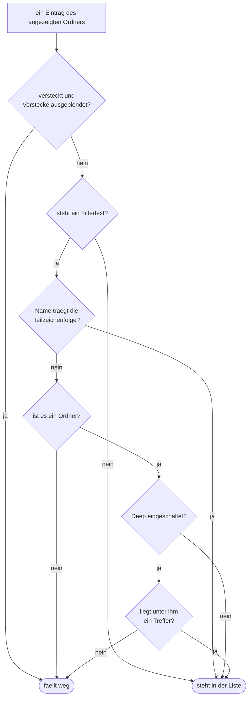
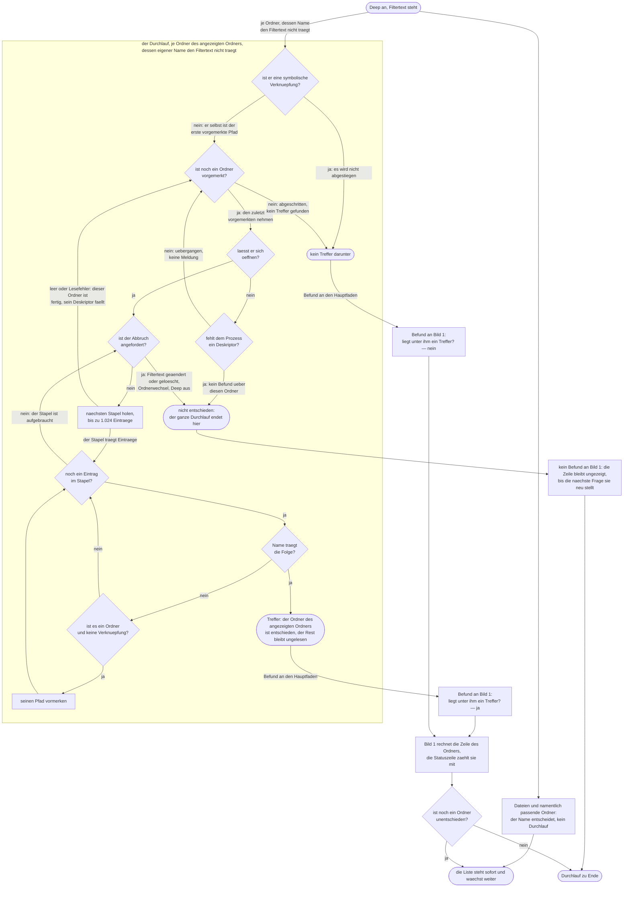
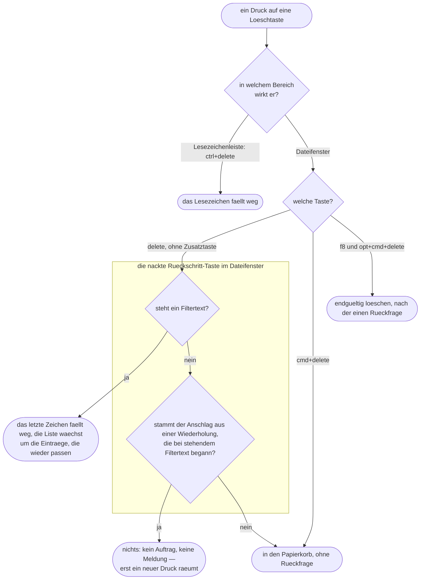

# Spec: Tippen filtert die Dateiliste, flach und als gefilterter Ordnerbaum

**Date:** 2026-08-14
**Status:** Entwurf
**Source:** Der Entwurf des Nutzers vom 260814-1520 und seine Berichtigungen vom 260814-1610, festgehalten in der Directive des Circle-Datensatzes `circles/260814-1551-tippen-filtert-dateiliste-flach-und-tief/_t_circle.md`
**Circle:** `circles/260814-1551-tippen-filtert-dateiliste-flach-und-tief/`, aktiv seit 260814-1551
**Grundlage erhoben:** 260814-1830, am Baum auf dem Stand `43dfe90`, unter `crates/` und `resources/`
**Nachgebessert:** 260814-1852, nach der Bewertung `reviews/260814-1840-conceptrev-tippen-filtert-dateiliste-flach-und-tief.md` und nach der Antwort des Nutzers auf die Rückschritt-Taste vom 260814-1845
**Nachgebessert:** 260814-1950, nach der zweiten Bewertung `reviews/260814-1938-conceptrev-tippen-filtert-dateiliste-flach-und-tief.md` und nach der Antwort des Nutzers auf die Tastenwiederholung vom 260814-1910
**Nachgebessert:** 260815-0246, auf fünf Defektdatensätze aus Turn 1 und Turn 2. Das zweite Bild ist neu gezeichnet, weil der Umbau des Durchlaufs (`195791a`) die Rückkehr aus dem Abstieg abgeschafft hat; C1.11, C3.8, C3.10, C3.13, C5.5 und C6.10 sind an den Baum gezogen, C2.14 und C3.15 sind neu. **In allen fünf Fällen hat der Baum recht behalten und der Spec nicht.**

**Sieben Fragen sind beantwortet**, fünf davon am 260814-1610, eine am 260814-1845 und eine am 260814-1910; sie liegen als Datensätze unter `decisions/` dieses Circles und werden hier nicht erneut gestellt. **Vier sind offen**; keine hält einen Planschritt auf, jede bindet die Umsetzung. Nachzuzählen bleibt es am Dateibestand und nicht an diesem Satz: `ls decisions/*_a_*.md` und `ls decisions/*_o_*.md`.

---

## Directive

Wer im Dateifenster Buchstaben ohne Zusatztaste tippt, verkürzt damit die Liste auf die Einträge, deren Name die getippte Folge an irgendeiner Stelle trägt. Der Filtertext gehört dem Tab und steht, bis der Nutzer ihn löscht. Ein Ankreuzfeld „Deep" in der Bereichsleiste dehnt den Filter auf den Unterbaum aus: sichtbar bleibt dann jeder Ordner, unter dem irgendwo ein Treffer liegt, und der Nutzer steigt wie gewohnt in ihn hinein, wo dieselbe Regel erneut gilt. Die Liste wächst während des Durchlaufs, die eine Statuszeile zählt mit, und `Esc` beendet beides, indem es den Filtertext löscht.

Diese Runde setzt keine elfte Zeitzusage und fasst keine der zehn aus C8 der Runde 1 an.

---

## Zwei Aussagen der Directive sind überholt, und der Spec ersetzt sie

Der Circle-Datensatz trägt am 260814-1830 noch die Fassung vom 260814-1551. Der Nutzer hat sie am 260814-1610 an zwei Stellen berichtigt, und beide Berichtigungen sind für den Zuschnitt dieser Runde tragend. Der Spec führt die berichtigte Fassung; wer beide Dokumente nebeneinander liest, nimmt diesen Abschnitt als Vorrangregel.

**Erstens: die tiefe Ansicht ist keine flache Trefferliste, sondern ein gefilterter Ordnerbaum.** Der Datensatz sagt heute, die Treffer stünden in einer flachen Liste und jeder nenne seinen Unterordner. Das gilt nicht mehr. Der Nutzer wörtlich: „User kann normal hinnavigieren, nur die Pfade, die Treffer erhalten, werden nicht ausgefiltert." Auf Nachfrage mit einem durchgerechneten Beispiel bestätigt. Ein Ordner bleibt sichtbar, solange irgendwo unter ihm ein Treffer liegt; der Nutzer steigt hinein, und auf jeder Ebene gilt dieselbe Regel.

```text
Filter "aaa", Deep an. Im Baum liegt genau ein Treffer: projekt/src/bbbaaaccc.rs

  angezeigt in projekt/ :   src/          Ordner, enthaelt tiefer einen Treffer
                            [ doc/  faellt weg, kein Treffer darunter ]

  hineingehen in src/  :    bbbaaaccc.rs  Treffer
                            [ alles andere faellt weg ]
```

Was daraus folgt, ist billiger und nicht teurer als die abgelöste Fassung. `Eintrag` braucht kein Pfadfeld mehr, denn jede gezeigte Zeile liegt im angezeigten Ordner; `kommandos::operationen::betroffene` baut ihre Pfade weiter als `ordner.join(&eintrag.name)` und bleibt unverändert. Die Frage, wie der Nutzer von einem tiefen Treffer in dessen Ordner kommt, löst sich mit dem Modell auf, und `angezeigtedatei::welche` bekommt keine dritte Quelle.

**Der Nutzer hat die aufklappbare Variante nach der Kostenfrage fallen gelassen, und das steht hier, damit es später niemand für ein Versehen hält.** Ein Baum-Widget entsteht nicht. `crates/krk-ui/src/appkit/tabelle.rs` bleibt eine flache `NSTableView` mit ihren vier Spalten und zeigt weiterhin genau eine Ebene. Der gefilterte Ordnerbaum ist ein Baum in dem Sinn, dass der Nutzer ihn abschreitet, und nicht in dem, dass er ihn aufgeklappt sähe.

**Zweitens: „Deep" ist ein Ankreuzfeld und trägt keine Tastenkombination.** Der Nutzer hat es dreimal gesagt: ein Kästchen mit der Aufschrift „Deep", in der Bereichsleiste neben dem Kästchen „Typ". Die drei Kombinationen, die ihm vorgelegt wurden, waren eine Fehlvorlage; die Richtigstellung steht in `decisions/260814-1552_a_welche-tastenkombination-schaltet-die-tiefe-suche.md`. Der Baum trägt das Muster bereits: `spalte_typ_umschalten` führt `tasten = []` (`resources/default-keymap.toml:381-383`) und ist über sein Kästchen und das Hauptmenü erreichbar. Die Aufschrift lautet „Deep" und nicht „Tief"; der Nutzer hat den Namen zweimal so geschrieben.

Die vierte Antwort der ersten Klärungsrunde, „flach sichtbar, tief gefiltert", gilt in dieser Lesart weiter und ist genauer zu fassen: bei tiefer Suche fallen die Ordner **ohne Treffer darunter** weg, nicht alle Ordner.

---

## Was diese Runde am Spec der Runde 1 ändert

Das sechste Abnahmekriterium von C2 der Runde 1 wird **ersetzt und nicht ergänzt** (`circles/260802-0842-krk-mac-dateimanager-editor-git/planning/260802-1036_c_spec-navigator-geruest.md`). Es lautet heute:

> Tippt der Nutzer Buchstaben ohne Zusatztaste, springt die Auswahl auf den ersten Eintrag, dessen Name so beginnt. Nach einer Pause beginnt die Eingabe von vorn.

Nach dieser Runde lautet es:

> Tippt der Nutzer Buchstaben ohne Zusatztaste, verkürzt sich die Liste auf die Einträge, deren Name die getippte Folge an irgendeiner Stelle trägt. Der Filtertext steht, bis der Nutzer ihn löscht.

**Was der Nutzer dadurch verliert, ist benannt und angenommen.** Wer heute `d` tippt, um zum ersten Eintrag mit `d` zu springen, sieht künftig statt eines Sprungs eine auf die `d`-Einträge verkürzte Liste. Der Sprung ist danach auf keinem Weg mehr zu haben, weder als Vorbelegung noch als zweiter Modus; der Nutzer hat die Ersetzung am 260814 ausdrücklich so gewählt. Drei Dinge fallen mit ihm:

- **Die Auswahl bleibt stehen, wo sie stand**, statt zum nächsten Treffer zu springen. Was der Nutzer sucht, findet er nicht mehr über die Bewegung der Auswahl, sondern über das Verschwinden alles Übrigen.
- **Der Bestand ist nach dem Tippen nicht mehr vollständig zu sehen.** Ein Sprung ließ die Liste stehen; ein Filter nimmt sie weg und gibt sie erst mit `Esc` zurück.
- **Die Sekundenregel fällt weg, und an ihre Stelle tritt eine Handlung des Nutzers.** `Sprungmarke::tippen` fing nach einer Sekunde Pause von vorn an; ein stehender Filtertext tut das nicht. Die Nachsicht gegenüber einem Vertipper geht damit nicht verloren, sondern wechselt den Weg: die nackte Rückschritt-Taste nimmt das letzte Zeichen zurück, solange ein Filtertext steht. Was der Nutzer verliert, ist nicht die Rücknahme, sondern ihre Selbsttätigkeit — sie geschieht nicht mehr von allein.

**Die Rücknahme hängt an einer Taste, die heute Dateien wegräumt, und deshalb steht sie hier und nicht in einer Fußnote.** `delete` trägt im Dateifenster „In den Papierkorb räumen" (`resources/default-keymap.toml:156-158`, zusammen mit `cmd+delete`), und das Räumen läuft ohne Rückfrage: `Anwendungsdelegierter::in_den_papierkorb` stellt den Auftrag unmittelbar, anders als das endgültige Löschen, das eine Bestätigung zeigt. Ohne eine Fallunterscheidung räumte also ein Nutzer, der einen Vertipper im Filter berichtigen will, Dateien weg. Die Regel lautet deshalb: **steht ein Filtertext, nimmt die nackte Rückschritt-Taste ein Zeichen davon zurück und erreicht das Räumen nicht; steht keiner, wirkt sie unverändert.** `cmd+delete` räumt in jeder Lage, damit der Weg zum Papierkorb auch bei stehendem Filter offen bleibt. Der Preis ist benannt und angenommen: eine Taste, deren Bedeutung vom Zustand abhängt, ist in diesem Baum bisher die Ausnahme. Nutzerentscheid vom 260814-1845, `decisions/260814-1830_a_wie-nimmt-der-nutzer-ein-einzelnes-zeichen-des-filters-zurueck.md`, Möglichkeit 2; die Empfehlung des Datensatzes ist damit verworfen.

Ein neues Kürzel und ein neues Bedienelement für den Einstieg in den Filter entstehen dabei nicht: das Tippen selbst ist der Einstieg, so wie es heute der Einstieg in die Sprungmarke ist. Die Regel aus C2 der Runde 1, dass eine freie Taste ohne Zusatztaste im Dateifenster durchfällt, bleibt unverändert; sie führt nur an ein anderes Ziel.

**Eine Funktion des abgelösten Moduls fällt nicht mit.** `krk_core::verzeichnis::sprungmarke::traegt_ein_dateiname` entscheidet auch in der Tippsuche der Belegungsansicht aus der Runde 7, welche Zeichen aufgenommen werden (`crates/krk-ui/src/belegungsmodell.rs:72` und `:669-670`). Die Zeichenregel bleibt eine einzige. Ersetzt wird die Wirkung der Sprungmarke, nicht ihre Zeichenprüfung.

---

## Ausgangslage, am 260814-1830 am Baum erhoben

Elf Feststellungen tragen den Zuschnitt. Drei davon widersprechen dem, was man ohne sie annähme.

**Der Filtermechanismus ist vorhanden und trägt heute einen einzigen Prüfschritt.** `Ordnermodell` baut seine Sichtreihenfolge in `anhaengen` und in `sicht_neu_aufbauen` auf, und der einzige Filter darin ist `verstecke_ausblenden` (`crates/krk-core/src/verzeichnis/modell.rs:195-206` und `:427-442`). Ein Namensfilter ist an dieser Stelle ein Prüfschritt mehr und keine zweite Sicht daneben.

**Der Filter wohnt heute im falschen Stockwerk.** `Sprungmarke` liegt in den Ivars der Tabellenansicht (`crates/krk-ui/src/appkit/tabelle.rs:363`) und gehört damit dem Dateifenster, nicht dem Tab; ihr eigener Modulkopf schreibt das aus. Der Filter soll nach der Directive dem Tab gehören, und `Tabinhalt` (`crates/krk-ui/src/tabs.rs`) führt heute Ordner, Modell, Lesevorgang, Wunschauswahl, Bildlauf, Meldung und ein Gelesen-Kennzeichen, aber keinen Suchtext. Der Umzug ist eine der beiden Stellen, an denen diese Runde eine bestehende Zuordnung ändert.

**Der Vergleich ist im Baum schon einmal geschrieben.** `Belegungsmodell::zeile_traegt` (`crates/krk-ui/src/belegungsmodell.rs:536-541`) vergleicht als Teilzeichenfolge über `to_lowercase` und `contains`, mit der Umschreibung einmal je Suche statt einmal je Zeile. Genau dieser Vergleich ist die Antwort des Nutzers für den Dateifilter. Er faltet keine Umlaute: `apfel` findet `Äpfel` nicht.

**Der Lesevorgang trägt die laufende Anzeige schon.** Ein Arbeitsfaden schickt Stapel zu 1.024 Einträgen an den Hauptfaden, der Kanal hat die Kapazität eines Stapels, und daraus folgt der Abbruch innerhalb von zwei Stapeln (`crates/krk-core/src/verzeichnis/leser.rs:1-56`). Der erste Stapel trägt heute die Zusage L2. Der Durchlauf über den Unterbaum ist auf dieser Bauart zu bauen und nicht neben ihr.

**Der Lesevorgang leert sein Ordnermodell nicht vorab**, sondern ersetzt es mit dem ersten gelieferten Stapel (`Ordnermodell::lesevorgang_beginnen`, mit dem Auffangfall in `abschliessen`). Wer in dieser Spanne den Bestand befragt, sieht den vorigen Ordner. Für eine Statuszeile, die während eines Durchlaufs eine Zahl anzeigt, ist das die Stelle, an der die Zahl falsch werden kann.

**Die Bereichsleiste trägt acht Ankreuzfelder, alle fensterweit.** Fünf für die Bereiche der Fensterzeile, drei für die schaltbaren Spalten (`crates/krk-ui/src/appkit/bereichsleiste.rs:1-49`). Die drei Spaltenschalter liegen in `Spaltensichtbarkeit` am `Fenstermodell` (`crates/krk-ui/src/fenstermodell.rs:374` und `:590-598`) und gelten für beide Dateifenster zugleich. „Deep" wäre das neunte Feld, der erste Zuwachs seit der Runde 5 und das erste Feld, dessen Gegenstand einem einzelnen Tab gehören könnte. Jeder Schalter trägt `setRefusesFirstResponder(true)`, weil `Fokus` sonst eine falsche Auskunft gäbe.

**Die Statuszeile ist eine und hat fünf Ränge.** `Rang` (`crates/krk-ui/src/appkit/statuszeile.rs:203-247`) zählt Befehlsantwort, Vorgangsanzeige, Fenstermeldung, Tabmeldung und Markierungsstand, in dieser Rangfolge, als vollständige Fallunterscheidung ohne Auffangzweig. Der Modulkopf sagt ausdrücklich, dass die Zeile heute weder den Lesefortschritt noch die Zahl der Einträge trägt und beides „in einer späteren Runde in dieselbe Zeile und nicht in eine zweite daneben" käme. Diese Runde ist jene spätere Runde. Ein sechster Rang hält den Bau an und erzwingt die Antwort darauf, wo er einzuordnen ist.

**Die Markierung besteht auch dort, wo der Nutzer sie nicht sieht, wirkt aber nicht.** `Ordnermodell::markierungsstand` zählt über alle Einträge (`modell.rs:357-374`), `alle_markieren` und `markierung_umkehren` wirken auf die sichtbaren, `markierung_aufheben` auf alle. `betroffene` dagegen läuft allein über die sichtbaren Zeilen, mit der ausgeschriebenen Begründung: „eine Markierung, die der Nutzer beim Drücken der Taste nicht vor sich hatte, gehört nicht in den Auftrag" (`kommandos/operationen.rs:160-193`). Ein Filter macht diesen bisher seltenen Fall zum Regelfall. Das Stapelumbenennen braucht dafür keine eigene Regel: es holt seine Namen aus derselben Auswahl und prüft Kollisionen gegen `alle_namen`, das über den vollen Bestand läuft.

**Das Räumen in den Papierkorb läuft ohne Rückfrage.** `Anwendungsdelegierter::in_den_papierkorb` stellt den Auftrag unmittelbar (`crates/krk-ui/src/appkit/anwendung.rs:4274-4276`); allein das endgültige Löschen zeigt eine Bestätigung über `loeschbestaetigung::zeigen`. Ein Tastendruck, der versehentlich dorthin gerät, ist damit sofort wirksam. Das trägt die Fallunterscheidung der Rückschritt-Taste aus C1 und ist der Grund, warum sie ein eigenes Abnahmekriterium für die gefährliche Richtung bekommt.

**Die Belegung führt am 260814 83 Einträge, `Kommando` 77 Varianten.** Gezählt mit `grep -c '^\[\[funktion\]\]' resources/default-keymap.toml` und über `awk '/^pub enum Kommando/,/^}/'`. Der Befehl für „Deep" ist die 78. Variante und der 84. Eintrag. Unter den Rückschritt-Kombinationen ist allein `shift+delete` frei; `delete` und `cmd+delete` tragen `in_papierkorb`, `opt+cmd+delete` trägt `endgueltig_loeschen`, `ctrl+delete` das Löschen in der Lesezeichenleiste.

**Nichts im Baum liest heute, ob ein Tastendruck aus einer Wiederholung stammt.** `isARepeat` kommt an einer einzigen Stelle vor, und dort wird es geschrieben und nicht gelesen: `ereignis_senden` baut die synthetischen Tastendrücke des Messmodus mit `false` (`crates/krk-ui/src/appkit/ereignisse.rs:471-481`). Daraus folgt zweierlei. Erstens räumt ein gehaltener Rückschritt heute wiederholt, und C1.16 sagt zu, dass sich daran nichts ändert — die Grenze aus C1.18 darf deshalb nicht an der Wiederholung allein hängen, sondern nur an einer Wiederholung, die bei stehendem Filtertext begann (C1.20). Zweitens kann der Messmodus den Wiederholungszweig nicht fahren, denn seine Ereignisse melden sich nie als Wiederholung; die Abnahme von C1.18 und C1.20 am Bündel bleibt Nutzerarbeit.

---

## Wie eine Zeile entsteht

Das Bild zeigt die eine Entscheidung, die diese Runde einführt: ob ein Eintrag des angezeigten Ordners auf dem Schirm steht. Es gilt auf jeder Ebene gleich, und es gibt keine zweite Rechnung daneben.



**Zwei Zweige tragen die Aussagen, die diese Runde von der abgelösten Fassung trennen.** Der Zweig `Deep aus` bei einem Ordner geht nach `steht in der Liste`: bei flacher Suche bleiben alle Ordner stehen, damit die Navigation bei stehendem Filter nicht abbricht. Der Zweig `Deep an` fragt nach einem Treffer darunter, und nur dieser eine Zweig kostet einen Durchlauf. Alles andere entscheidet der Name allein, ohne dass irgendetwas gelesen würde.

**Die Frage `liegt unter ihm ein Treffer?` beantwortet nicht dieses Bild, sondern das nächste, und zwar nach beiden Seiten:** mit dem Befund `Treffer` und mit dem Befund `kein Treffer darunter`. Ohne den zweiten hinge der Zweig `nein` in der Luft, und genau das war der tragende Befund der Bewertung vom 260814-1840.

**Dieses Bild entscheidet die Sichtbarkeit, und kein zweites daneben.** Der Durchlauf liefert eine einzige Größe, nämlich die Antwort auf `liegt unter ihm ein Treffer?`, und er wird nur gefragt, wenn `Name trägt die Teilzeichenfolge?` zuvor mit nein geantwortet hat. Für einen Ordner, dessen eigener Name den Filtertext trägt, steht die Zeile damit schon hier fest: er steht in der Liste, gleichgültig was unter ihm liegt, und der Durchlauf läuft für ihn nicht (C2.5, C2.8, C3.14). Die zweite Bewertung hat an dieser Naht den einen substanziellen Widerspruch gefunden — das zweite Bild sprach ein Urteil über die Sichtbarkeit aus, das ihm nicht zusteht, und C3.13 schrieb es als Kriterium fest. Beide sind mit dieser Nachbesserung auf die Aussage zurückgenommen, die dem Durchlauf zusteht.

**Für „Ordner" gibt es einen Schnitt und nicht zwei, und er steht hier.** Die ersten beiden Bilder fragen `ist es ein Ordner?`; die Verknüpfungsregel wohnt allein im Durchlauf. Für eine symbolische Verknüpfung auf einen Ordner antwortet dieser Knoten mit ja, denn der Nutzer navigiert in sie hinein. Der Durchlauf steigt nicht in sie hinab und meldet deshalb `kein Treffer darunter`. Bei ausgeschaltetem „Deep" bleibt sie sichtbar wie jeder Ordner (C1.6), bei eingeschaltetem nur, wenn ihr eigener Name den Filtertext trägt (C2.13, C3.9).

## Der Durchlauf und was ihn beendet

Das zweite Bild zeigt den einen Zweig aus dem ersten, der etwas kostet. Es entscheidet ihn nach beiden Seiten und lässt ihn auf einem dritten Weg unentschieden. Es trägt drei Wiederholungen, und jede ist gewollt: das Weiterrücken über die Einträge eines Stapels, das Nachladen des nächsten Stapels und das Aufnehmen des nächsten vorgemerkten Ordners. Ein Bild ohne die dritte müsste die Tiefe als Zahl vorwegnehmen, die es nicht gibt. **Wie viele Fäden der Durchlauf benutzt, sagt das Bild nicht**; das entscheidet der Planner, und der Abschnitt `## Offen für den Planner` führt die Frage.

**Zwei Grenzen dieses Bildes tragen die Nachbesserung vom 260814-1950, und beide sind Aussagen über seine Zuständigkeit.** Die Eintrittskante trägt die Bedingung, unter der das erste Bild überhaupt fragt: der Durchlauf läuft je Ordner, dessen eigener Name den Filtertext **nicht** trägt. Und die Knoten, die er verlässt, sprechen einen Befund aus und kein Urteil über die Sichtbarkeit: zwei von ihnen beantworten die Frage `liegt unter ihm ein Treffer?` des ersten Bildes mit ja oder mit nein, der dritte beantwortet sie gar nicht. Die Zeile rechnet danach das erste Bild aus Name und Befund zusammen. Ohne diese beiden Grenzen sagte das Bild für jeden Ordner, dessen Name passt und unter dem nichts liegt, das Gegenteil des ersten.



**Der erste Treffer entscheidet den Ordner des angezeigten Ordners, gleich in welcher Tiefe er liegt, und der Rest unter ihm bleibt ungelesen.** Der Befund wartet nicht, bis die tieferen Ebenen abgeschritten sind; er beendet den Durchlauf für diesen Ordner sofort, und die noch vorgemerkten Pfade fallen ungelesen weg. Nur der negative Befund muss warten, denn er steht erst fest, wenn kein Pfad mehr vorgemerkt ist. Das ist der Grund, warum der gefilterte Ordnerbaum billiger ist als die abgelöste flache Trefferliste und nicht teurer: jene musste den ganzen Unterbaum lesen, um vollständig zu sein, dieser hört je Ordner beim ersten Fund auf. Der Preis steht in C4: die Statuszeile kann während eines Durchlaufs nicht sagen, wie viele Treffer unter einem Ordner liegen, denn sie sind nicht gezählt. Sie zählt entschiedene Zeilen und keine Treffer.

**Jeder Ordner wird auf genau eine von zwei Arten entschieden, der negative Befund hat drei Quellen, und daneben steht ein vierter Ausgang ohne Befund.** `kein Treffer darunter` entsteht, wenn der Ordner abgearbeitet ist und nichts trug, wenn er sich aus einem Grund am Pfad nicht öffnen ließ (C3.10) und wenn er eine symbolische Verknüpfung ist (C3.9). Dieser Befund bedient den Zweig `liegt unter ihm ein Treffer? — nein` des ersten Bildes, entscheidet C2.6 und sagt der Statuszeile, dass die Zahl für diesen Ordner steht. Ohne ihn setzen sich die ersten beiden Bilder nicht zusammen.

**Der vierte Ausgang heißt `nicht entschieden` und trägt gar keinen Befund an das erste Bild.** Er hat zwei Ursachen, und beide liegen außerhalb des Ordners, über den gefragt wird: der Abbruch und ein Mangel an Deskriptoren des Prozesses (C3.15). Beide beenden den ganzen Durchlauf und nicht nur den laufenden Auftrag, und beide lassen die Zeile des Ordners so stehen, wie sie steht, bis die nächste Frage sie neu stellt. Ein Ordner ohne Befund ist dabei ebenso wenig zu sehen wie einer mit dem negativen Befund; der Unterschied liegt nicht im Bild der Liste, sondern in der Dauer. Ein negativer Befund gilt, bis der Nutzer die Frage ändert; ein ausgebliebener wird bei der nächsten Gelegenheit neu gestellt.

**Der Abbruch hängt an der Stapelgrenze und nicht am Vormerken.** Beides sind eigene Knoten, weil es zwei Vorgänge sind: „seinen Pfad vormerken" kommt in einem Ordner mit fünfzigtausend gewöhnlichen Einträgen kein einziges Mal vor, „nächsten Stapel holen" kommt dort neunundvierzigmal vor. Die Frage nach dem Abbruch steht deshalb unmittelbar vor dem Stapel; damit gilt die Zusage aus C3.4 für jede Gestalt eines Baumes und nicht nur für flache mit vielen Unterordnern.

**Ein Kreis des Bildes trägt die Abbruchfrage nicht**, nämlich der über `fehlt dem Prozess ein Deskriptor? — nein`. Ein Ordner, der sich nicht öffnen lässt, hält keinen Stapel und passiert deshalb keine Stapelgrenze; er kostet einen Öffnungsversuch und nichts weiter. Über eine Kette solcher Ordner ist die Zusage aus C3.4 der Sache nach leer und nicht verletzt. Das steht hier, weil ein Leser, der C3.4 gegen das Bild prüft, sonst genau diesen Kreis findet und für eine Lücke hält.

**Die Verknüpfungsregel wohnt in diesem Bild und nur hier, und sie steht an zwei Knoten.** Der Auftrag selbst wird an `ist er eine symbolische Verknüpfung?` geprüft und ist damit als `kein Treffer darunter` entschieden, ohne geöffnet zu werden. Eine tiefer liegende Verknüpfung fällt an `ist es ein Ordner und keine Verknüpfung?` heraus und wird gar nicht erst vorgemerkt; ihr Name ist einen Knoten davor geprüft worden wie jeder andere, eine Verknüpfung mit passendem Namen ist also ein Treffer. Daraus folgt, dass der Durchlauf ohne eine mitgeführte Menge besuchter Ordner endet, und das ist die tragende Eigenschaft der Antwort vom 260814-1610.

**Die Rückkehr aus dem Abstieg gibt es nicht mehr, und das Bild ist damit billiger geworden.** Bis zum 260815 hielt der Durchlauf einen offenen Leser je Ebene und las den übergeordneten Ordner nach der Rückkehr weiter. Dieser Bau erzeugte seinen eigenen Deskriptormangel und ist mit der Behebung des Defekts `issues/260815-0211_c_ein-deskriptormangel-des-prozesses-wird-zu-einem-dauerhaften-kein-treffer-darunter.md` weggefallen (`195791a`). Ein Ordner wird jetzt ganz gelesen, seine Unterordner wandern dabei als Pfad auf einen Stapel, und der nächste wird erst geöffnet, wenn der laufende zu Ende ist.

Ein Zähler, der einfache Kreise aufzählt, findet deshalb **fünf** und nicht mehr sieben, nachgerechnet am 260815-0246 über alle **zweiundzwanzig Knoten und einunddreißig Kanten**:

| Kreis | Was er wiederholt |
|---|---|
| `noch ein Eintrag im Stapel?` → `Name trägt die Folge?` → `ist es ein Ordner und keine Verknüpfung?` → zurück | ein Eintrag, der weder Treffer noch Ordner ist |
| derselbe Weg, mit `seinen Pfad vormerken` dazwischen | ein Unterordner, der für später vorgemerkt wird |
| `ist der Abbruch angefordert?` → `nächsten Stapel holen` → `noch ein Eintrag im Stapel?` → zurück | der nächste Stapel desselben Ordners; in diesem Kreis liegt die Abbruchgrenze aus C3.4 |
| `ist noch ein Ordner vorgemerkt?` → `lässt er sich öffnen?` → `ist der Abbruch angefordert?` → `nächsten Stapel holen` → zurück | der nächste vorgemerkte Ordner, nachdem der laufende zu Ende gelesen ist |
| `ist noch ein Ordner vorgemerkt?` → `lässt er sich öffnen?` → `fehlt dem Prozess ein Deskriptor?` → zurück | der nächste vorgemerkte Ordner, nachdem der laufende sich nicht öffnen ließ |

Zwei Kreise laufen über die Einträge eines Stapels, einer über die Stapel eines Ordners, zwei über die vorgemerkten Ordner. Kein Kreis läuft mehr über einen zweiten offenen Leser, und daran hängt die Zusage aus C3.8: der Durchlauf hält zu jedem Zeitpunkt genau einen Verzeichnisdeskriptor. Jeder der fünf Kreise hat einen Ausgang, und jeder Knoten des Bildes erreicht einen Endpunkt. Der Zweig `START → SOFORT → LISTE` berührt den Durchlauf nicht und endet deshalb auch nicht mit ihm — das ist C3.2.

## Die Rückschritt-Taste und was sie erreicht

Das dritte Bild zeigt die eine Fallunterscheidung dieser Runde, deren falscher Zweig Dateien wegräumt. Es steht hier, weil die Regel zehn Abnahmekriterien trägt — C1.14 bis C1.20 und C6.9 bis C6.11 —, vom Zustand abhängt und in keiner Übersicht der Anwendung zu sehen ist (C1.19): der Nutzer lernt sie am laufenden Bündel, und wer sie baut, hat nichts als den Text. Die zweite Bewertung hat das Fehlen dieses Bildes eigens angemerkt, und sie hat recht behalten — beim Zeichnen sind zwei Fehler aufgefallen, die im Text standen.

**Der erste war ein Widerspruch zwischen zwei Kriterien.** C6.10 sagte, die Fallunterscheidung hänge allein daran, ob ein Filtertext steht. Aus dieser einen Größe ist C1.18 nicht zu entscheiden: wer drei Zeichen tippt und die Taste hält, hat nach dem dritten Anschlag keinen Filtertext mehr, und der vierte träfe auf die alte Bedeutung. Es sind zwei Größen, und die zweite steht bereit — AppKit meldet an jedem Tastenereignis, ob es aus einer Wiederholung stammt. C6.10 nennt sie jetzt.

**Der zweite war eine Lücke, die niemand vorgelegt hatte.** Die zweite Größe darf nicht „stammt der Anschlag aus einer Wiederholung" lauten, sondern muss lauten „stammt er aus einer Wiederholung, die bei stehendem Filtertext begann". Ohne den Zusatz hörte auch ein gehaltener Rückschritt ohne jeden Filtertext nach dem ersten Anschlag auf zu räumen, und das änderte das heutige Verhalten, das C1.16 ausdrücklich unangetastet lässt. Der Baum liest heute nichts über Wiederholungen (siehe die elfte Feststellung der Ausgangslage), also ist jede Wirkung dieser Größe neu und keine bestehende. Das neue Kriterium C1.20 hält die Grenze fest.



**Das Bild ist ein Entscheidungsbaum ohne Kreis, mit zehn Knoten und zehn Kanten.** Eine Quelle, fünf Senken, größter Ausgangsgrad 3 an `welche Taste?`, größter Eingangsgrad 2 am Papierkorb, kein Knoten ohne Weg zu einem Ende. Nachgerechnet am 260814-1950. Vier Wege führen durch den Unterbaum, und jeder trägt seine eigenen Kriterien:

| Weg durch das Bild | Was der Nutzer tut | Kriterien |
|---|---|---|
| `delete` → Filtertext steht → Zeichen fällt weg | einen Vertipper berichtigen | C1.14, C1.15, C6.9 |
| `delete` → kein Filtertext → keine Wiederholung → Papierkorb | eine Datei wegräumen | C1.16 |
| `delete` → kein Filtertext → Wiederholung nach stehendem Filtertext → nichts | die Taste zu lange halten | C1.18 |
| `delete` → kein Filtertext → Wiederholung ohne je stehenden Filtertext → Papierkorb | mehrere Dateien am Stück wegräumen | C1.20 |

**Die drei übrigen Löschwege sind eingezeichnet, damit sichtbar bleibt, dass die Regel sie nicht berührt** (C6.11). `cmd+delete` erreicht den Papierkorb an der Fallunterscheidung vorbei und hält den Weg dorthin in jeder Lage offen (C1.17). `f8` und `opt+cmd+delete` löschen endgültig und zeigen dabei die eine Rückfrage, die dieses Projekt kennt. `ctrl+delete` wirkt in der Lesezeichenleiste, also in einem anderen Wirkungsbereich; es steht im Bild als abgehende Kante des ersten Knotens und nicht im Unterbaum.

---

## Fähigkeiten und Abnahmekriterien

Jedes Kriterium trägt, wie es nachzuweisen ist. **(Probe)** heißt: eine Prüfung im Baum weist es nach, ein Agent kann es abnehmen. **(Bündel)** heißt: es ist am laufenden `KRK.app` im Vordergrund zu sehen, und das ist Nutzerarbeit; jedes Bündelkriterium nennt die Beobachtung, mit der es abgenommen wird. Ein Kriterium mit beiden Kennzeichnungen hat eine Hälfte, die eine Probe deckt, und eine, die sie nicht deckt.

**Am 260814-1950 sind es 75 Kriterien.** 65 tragen allein **(Probe)**, zwei allein **(Bündel)**, acht beides; zehn haben damit einen Bündelanteil und sind Nutzerarbeit. Die Aufteilung über die sechs Fähigkeiten: C1 zwanzig, C2 dreizehn, C3 vierzehn, C4 zehn, C5 sieben, C6 elf. Diese Zahlen laufen dem Dokument hinterher, sobald jemand ein Kriterium hinzufügt; nachzuzählen sind sie an der Datei und nicht an diesem Absatz.

Die Runde 9 ist mit 21 ihrer 29 Bündelkriterien ohne Beleg geschlossen (`circles/260813-2332-notizzettel-als-blatt-mit-zwei-zetteln/_b_circle.md:95`), weil ihr Spec diese Kennzeichnung nicht führte. Die Runde 8 hat sie geführt und ihre elf Beobachtungen mit Bündelanteil sämtlich abgenommen (`circles/260813-0939-titelleiste-fuehrt-version-und-semantische-tags/_c_circle.md:163`); sie ist die bislang einzige Runde, die kohärent schließt. Das ist der Grund, warum die Kennzeichnung hier steht.

### C1: Tippen filtert die sichtbare Liste des Tabs

**Beschreibung:** Ein getipptes Zeichen ohne Zusatztaste verkürzt die Liste des sichtbaren Tabs auf die Einträge, deren Name die getippte Folge an irgendeiner Stelle trägt. Der Filtertext gehört dem Tab, steht bis der Nutzer ihn löscht, und ist in der Statuszeile zu lesen, solange er steht. Ordner bleiben dabei sichtbar, damit die Navigation nicht abbricht. Solange ein Filtertext steht, nimmt die nackte Rückschritt-Taste sein letztes Zeichen zurück und räumt nichts in den Papierkorb; eine Wiederholung, die bei stehendem Filtertext begann, trägt nicht über diese Grenze.

**Abnahmekriterien:**
1. Ein Zeichen ohne Zusatztaste, das keiner Funktion gehört, hängt im Dateifenster an den Filtertext des sichtbaren Tabs an. Die Auswahl springt nicht. **(Probe)**
2. Der Filter nimmt jeden Eintrag, dessen Name die getippte Folge an irgendeiner Stelle trägt, ohne Rücksicht auf Groß- und Kleinschreibung: `aaa` findet `bbbaaaccc.rs`. **(Probe)**
3. Der Vergleich faltet keine Umlaute und keine Akzente: `apfel` findet `Äpfel` nicht. Es ist derselbe Vergleich, den `Belegungsmodell::zeile_traegt` führt, und die Umschreibung läuft einmal je Suche und nicht einmal je Zeile. **(Probe)**
4. Welche Zeichen der Filter aufnimmt, entscheidet weiterhin `krk_core::verzeichnis::sprungmarke::traegt_ein_dateiname`. Eine zweite Zeichenregel entsteht nicht, und die Tippsuche der Belegungsansicht aus der Runde 7 liest unverändert dieselbe Funktion. **(Probe** über beide Aufrufer**)**
5. Der Filtertext läuft nicht ab. Es gibt keinen Zeitgeber und keine Pause, nach der die Eingabe von vorn begänne. **(Probe** über das Fehlen jeder Zeitmessung im Filter**)**
6. Ist „Deep" aus, bleibt jeder Ordner sichtbar, auch wenn sein Name den Filtertext nicht trägt. Gefiltert werden bei flacher Suche allein die Dateien. **(Probe)**
7. `Esc` löscht den Filtertext. Es tut das an der Stelle, an der es heute nichts mehr zu tun findet, also nach dem Schließen eines stehenden Blattes und nach dem Abbruch einer laufenden Dateioperation. Diese Reihenfolge hängt an `decisions/260814-1830_o_an-welcher-stelle-der-bedeutungen-von-esc-steht-der-filtertext.md` und ändert sich mit einer anderen Antwort. **(Probe** für die Reihenfolge, **Bündel** für den Tastendruck — **Beobachtung:** einen Filtertext tippen, F5 auf eine große Datei auslösen, während des Kopierens `Esc` drücken; der Kopiervorgang bricht ab und der Filtertext steht noch**)**
8. Der Filtertext gehört dem Tab. Ein Tabwechsel zeigt den Filtertext des anderen Tabs, und ein Tab ohne Filtertext zeigt seinen vollen Bestand. **(Probe)**
9. Der Filtertext übersteht jeden Ordnerwechsel, gleich ob „Deep“ an oder aus ist. Der Aufstieg zählt wie der Einstieg. Kein Ordnerwechsel und keine Auffrischung löscht ihn. Der Nutzer nimmt ihn mit `Esc` weg oder Zeichen für Zeichen mit der Rückschritt-Taste; daneben fällt er mit dem Tab, der ihn hält, und mit der Sitzung. Diese Aufzählung ist bewusst nicht abschließend als „nur zwei Tastenwege“ formuliert: der Baum kennt drei weitere Wege, das Schließen des letzten Tabs, den Auswurf eines Datenträgers unter einem verdeckten Tab und den Neustart (`shared/issues/260815-1047_o_c1-9-und-der-doc-kommentar-nennen-zwei-loeschwege-des-filtertextes-der-baum-hat-fuenf.md`). **(Probe)** — Nutzerentscheid vom 260815-0955, `decisions/260814-1830_a_bleibt-der-filtertext-bei-einem-ordnerwechsel-stehen-wenn-deep-aus-ist.md`, Möglichkeit 2. Bis dahin las dieses Kriterium „ist „Deep“ aus, leert ein Ordnerwechsel den Filtertext“; berichtigt auf einen Bugreport hin, der das Leeren als Fehlverhalten meldete.
10. Der eingeschaltete Filter der Tiefe ist dabei keine Ausnahme mehr, sondern ein Fall von C1.9. Er stand bis zum 260815 eigens da, weil das Modell der tiefen Ansicht ohne den überlebenden Filtertext auf jeder Ebene seinen Gegenstand verlöre; seit der einen Regel aus C1.9 trägt ihn dieselbe Zeile wie den flachen Fall. **(Probe** — dieselbe wie C1.9, zusätzlich mit eingeschaltetem Kennzeichen gefahren**)**
11. Fällt die Zeile weg, auf der die Auswahl stand, geht die Auswahl auf die erste sichtbare Zeile. Ist keine Zeile sichtbar, gibt es keine Auswahl, und ein Befehl, der eine bräuchte, stellt keinen Auftrag. **Er schweigt dabei nicht:** jeder Operationsbefehl antwortet seit der Runde 1 auf eine leere Auswahl mit „es ist nichts ausgewählt" (`Anwendungsdelegierter::auftrag_stellen`), und diese Runde ändert daran nichts — sie macht den bisher seltenen Fall zum Regelfall. Dieses Kriterium gilt für das Tippen und für das Zurücknehmen eines Zeichens; für das Umschalten von „Deep" gilt C2.14. **(Probe** für die Auswahl und für das Ausbleiben des Auftrags; die Meldung selbst ist unverändertes Verhalten der Runde 1 und trägt keine eigene Probe dieser Runde**)**
12. Die Sprungmarke fällt vollständig weg. `erste_zeile_mit` und `Sprungmarke::tippen` haben danach keinen Aufrufer mehr, und die Konstante `PAUSE` steht nirgends mehr. Die Zeichenprüfung `traegt_ein_dateiname` bleibt und wechselt gegebenenfalls das Modul. **(Probe** über die Zahl der Aufrufer**)**
13. Es entsteht kein neues Kürzel und kein neues Bedienelement für den Einstieg in den Filter. Das Tippen selbst ist der Einstieg. **(Probe** über das Fehlen eines Einstiegsbefehls in `resources/default-keymap.toml`**)**
14. Steht ein Filtertext, nimmt die nackte Rückschritt-Taste sein letztes Zeichen zurück, und die Liste wächst um die Einträge, die damit wieder passen. Es ist dieselbe Handlung, die die Tippsuche der Belegungsansicht aus der Runde 7 über `letztes_zeichen_weg` bedient. **(Probe)**
15. **Steht ein Filtertext, erreicht die nackte Rückschritt-Taste `in_papierkorb` nicht.** Es entsteht kein Auftrag der Art `InDenPapierkorb`, und kein Eintrag wird geräumt. Dieses Kriterium steht eigens da, weil es die gefährliche Richtung der Fallunterscheidung ist: `delete` trägt heute „In den Papierkorb räumen" und das Räumen läuft ohne Rückfrage. **(Probe** für die Regel, **Bündel** für den Tastendruck — **Beobachtung:** in einem Prüfordner eine entbehrliche Datei auswählen, drei Zeichen tippen und dreimal die Rückschritt-Taste drücken; der Filtertext verschwindet Zeichen für Zeichen, und die Datei liegt danach noch da**)**
16. Steht kein Filtertext, wirkt die nackte Rückschritt-Taste unverändert und räumt in den Papierkorb. An ihrer bisherigen Bedeutung ändert diese Runde nichts. **(Probe)**
17. `cmd+delete` räumt in jeder Lage in den Papierkorb, auch bei stehendem Filtertext. Der Weg zum Papierkorb ist damit nie versperrt. **(Probe** für die Regel, **Bündel** für den Tastendruck — **Beobachtung:** einen Filtertext tippen, einen Treffer auswählen und `cmd+delete` drücken; die Datei geht in den Papierkorb, der Filtertext steht weiter**)**
18. Ein gehaltener Rückschritt, der den Filtertext leert, räumt nicht weiter: die Tastenwiederholung endet an dieser Grenze, und erst ein neuer Druck erreicht den Papierkorb. Nutzerentscheid vom 260814-1910, `decisions/260814-1852_a_raeumt-ein-gehaltener-rueckschritt-weiter-wenn-der-filtertext-leer-wird.md`, Möglichkeit 2. **(Probe** für die Regel, **Bündel** für den Tastendruck — **Beobachtung:** eine entbehrliche Datei auswählen, drei Zeichen tippen und die Rückschritt-Taste gedrückt halten; der Filtertext leert sich, und die Datei liegt danach noch da**)**
19. Die Belegungsansicht, das Hauptmenü und die Markdown-Ausgabe führen für die Rückschritt-Taste weiter genau einen Eintrag, „In den Papierkorb räumen". Die Rücknahme eines Zeichens ist keine zweite Funktion und bekommt keine eigene Zeile. **(Probe)**
20. Eine Tastenwiederholung, die **ohne** Filtertext begonnen hat, räumt weiter in den Papierkorb, so oft sie wiederholt. Die Grenze aus C1.18 gilt allein für eine Wiederholung, die bei stehendem Filtertext begann; ohne diese Unterscheidung änderte diese Runde das Verhalten, das C1.16 unangetastet lässt. Der Baum liest heute nichts über Wiederholungen, also ist jede Wirkung dieser Größe neu. **(Probe** für die Regel, **Bündel** für den Tastendruck — **Beobachtung:** ohne Filtertext in einem Prüfordner mit mehreren entbehrlichen Dateien die Rückschritt-Taste gedrückt halten; es wandert mehr als eine Datei in den Papierkorb**)**

**Getroffene Festlegungen:**
- **Teilzeichenfolge statt Namensanfang.** Nutzerentscheid vom 260814-1610, `decisions/260814-1552_a_passt-der-filter-auf-den-namensanfang-oder-auf-jede-stelle-des-namens.md`, Möglichkeit 2. Wörtlich: „In jedem Fall muss die Suche Substrings suchen."
- **Keine Sortierung nach Passgenauigkeit.** Die vom Nutzer über C2 der Runde 1 eingestellte Sortierung bleibt die Ordnung der Liste. Möglichkeit 3 jenes Datensatzes ist damit verworfen.
- **Die nackte Rückschritt-Taste nimmt ein Zeichen zurück, solange ein Filtertext steht.** Nutzerentscheid vom 260814-1845, `decisions/260814-1830_a_wie-nimmt-der-nutzer-ein-einzelnes-zeichen-des-filters-zurueck.md`, Möglichkeit 2; die Empfehlung des Datensatzes („in dieser Runde gar nicht") ist verworfen. Steht kein Filtertext, wirkt die Taste wie bisher, und `cmd+delete` räumt in jeder Lage. Die Fallunterscheidung ist sicherheitsrelevant und keine Bequemlichkeit: ohne sie räumte die Berichtigung eines Vertippers Dateien weg.

### C2: Das Ankreuzfeld „Deep" und der gefilterte Ordnerbaum

**Beschreibung:** Ein neuntes Ankreuzfeld in der Bereichsleiste, neben „Typ", dehnt den stehenden Filter auf den Unterbaum aus. Sichtbar bleibt dann jeder Ordner, dessen Name passt oder unter dem irgendwo ein Treffer liegt; jeder andere fällt weg. Der Nutzer steigt wie gewohnt in die gezeigten Ordner ein, und auf jeder Ebene gilt dieselbe Regel.

**Abnahmekriterien:**
1. Die Bereichsleiste trägt ein neuntes Ankreuzfeld mit der Aufschrift `Deep`, rechts neben `Typ`. Die Aufschrift ist englisch und wird nicht übersetzt. **(Probe** für Dasein und Aufschrift, **Bündel** für die Lage — **Beobachtung:** die Leiste am Fensterfuß zeigt neun Kästchen, `Deep` steht rechts von `Typ` und die Leiste bleibt bei ihren 18 Punkten Höhe**)**
2. Der Schalter trägt `setRefusesFirstResponder(true)` wie die acht vorhandenen. `Fokus` bekommt keinen sechsten Wert. **(Probe)**
3. Der Schalter schickt bei einem Klick ein Kommando los und hält keinen Stand. `Leistenquelle::geklickt` nimmt seine Selbstkippung zurück, und `Bereichsleiste::zustaende_setzen` bleibt der eine Schreiber des angezeigten Standes. Ein zweiter Weg an den Prüfungen vorbei entsteht nicht. **(Probe)**
4. Steht kein Filtertext, ändert „Deep" nichts an der Liste. Der Befehl kommt durch, kippt den Schalter und meldet nichts. Über die Zulässigkeit entscheidet der Wirkungsbereich und nicht, ob der Befehl etwas findet. **(Probe)**
5. Steht ein Filtertext und ist „Deep" an, zeigt die Liste des angezeigten Ordners genau zweierlei: jede Datei, deren Name den Filtertext trägt, und jeden Ordner, dessen Name ihn trägt oder unter dem irgendwo ein Treffer liegt. **(Probe)**
6. Jeder andere Eintrag fällt weg. Ein Ordner, unter dem kein Treffer liegt und dessen Name nicht passt, ist nicht zu sehen. **(Probe)**
7. Steigt der Nutzer in einen gezeigten Ordner ein, gilt dieselbe Regel dort erneut. Es gibt keine zweite Darstellung, keine Trefferliste über mehrere Ebenen und keine Zeile, die einen anderen Ordner als den angezeigten nennt. **(Probe)**
8. Ein Ordner, der allein über seinen Namen passt und unter dem kein Treffer liegt, führt beim Einstieg auf eine leere Liste. Das ist kein Fehler, und die Statuszeile sagt `0 von N`. **(Probe)**
9. `crates/krk-ui/src/appkit/tabelle.rs` bleibt eine flache `NSTableView` mit ihren vier Spalten. Es entsteht keine `NSOutlineView`, kein Aufklappzeichen, keine zweite Tabellenklasse und keine fünfte Spalte. **(Probe)**
10. `Eintrag` bekommt kein Pfadfeld. Jede gezeigte Zeile liegt im angezeigten Ordner, und `kommandos::operationen::betroffene` baut ihre Pfade weiter als `ordner.join(&eintrag.name)`, unverändert. **(Probe)**
11. `angezeigtedatei::welche` bekommt keine dritte Quelle und bleibt die eine Rechnung für den Begriff „die angezeigte Datei". Der Ordnersprung `OrdnerDerDatei` aus der Runde 6 bleibt unangetastet. **(Probe)**
12. Die eingestellte Sortierung bleibt die Ordnung der Liste, und Ordner stehen weiter vorn. Es entsteht keine Ordnung nach Passgenauigkeit. **(Probe)**
13. Eine symbolische Verknüpfung auf einen Ordner ist bei eingeschaltetem „Deep" nur dann zu sehen, wenn ihr eigener Name den Filtertext trägt. Trägt er ihn, entscheidet der Name allein und der Durchlauf läuft für sie nicht (C3.14); trägt er ihn nicht, läuft er, steigt nicht in sie hinab und meldet „kein Treffer darunter". Ist „Deep" aus, bleibt sie sichtbar wie jeder Ordner (C1.6). Die ersten beiden Bilder fragen dafür dasselbe, `ist es ein Ordner?`, und die Verknüpfungsregel wohnt allein im Durchlauf. **(Probe)**
14. **Das Umschalten von „Deep" rückt die Auswahl nicht nach, und C1.11 gilt dafür nicht.** Steht ein Filtertext und schaltet der Nutzer „Deep" ein, fällt jeder Ordner aus der Sicht, dessen Name den Filtertext nicht trägt, und kommt zurück, sobald sein Befund eintrifft. Stand die Auswahl auf einem solchen Ordner, bleibt sie am Eintrag stehen und ist wieder zu sehen, sobald der Durchlauf ihn als Treffer meldet. In der Spanne dazwischen ist keine Zeile ausgewählt, und ein Befehl, der eine Auswahl braucht, findet keine und meldet „es ist nichts ausgewählt" (C1.11). **Der Preis ist benannt und angenommen:** die Ersatzzeile aus C1.11 würde die Auswahl auf die erste sichtbare Zeile setzen und damit den Platz des Nutzers dauerhaft verlieren, obwohl der Eintrag gleich darauf wiederkommt. Das Wegfallen beim Tippen ist endgültig, das Wegfallen beim Umschalten ist vorübergehend, und deshalb sind es zwei Regeln und nicht eine. **(Probe** über das Modell: der Eintrag bleibt gemerkt, während seine Zeile fehlt**)**

**Getroffene Festlegungen:**
- **Ein Ankreuzfeld und keine Tastenkombination.** Nutzerentscheid vom 260814-1610, `decisions/260814-1552_a_welche-tastenkombination-schaltet-die-tiefe-suche.md`. `shift+cmd+f`, `opt+cmd+f`, `ctrl+cmd+f` und der nackte Tabulator bleiben frei.
- **Gefilterter Ordnerbaum statt flacher Trefferliste.** Nutzerentscheid vom 260814-1610, `decisions/260814-1552_a_wie-kommt-der-nutzer-von-einem-tiefen-treffer-in-dessen-ordner.md`. Die aufklappbare Variante hat der Nutzer nach der Kostenfrage fallen gelassen.
- **Die Aufschrift lautet „Deep".** Der Nutzer hat den Namen zweimal so geschrieben. „Tief" steht in der Directive und ist nicht die Aufschrift.
- **Ob der Schalter je Tab oder je Fenster gilt, ist offen.** `decisions/260814-1830_o_gilt-das-ankreuzfeld-deep-je-tab-oder-je-fenster.md`; der Spec fährt bis zu einer Antwort auf „je Tab".

### C3: Der Durchlauf über den Unterbaum

**Beschreibung:** Der Durchlauf entscheidet je Ordner des angezeigten Ordners, dessen eigener Name den Filtertext nicht trägt, ob unter ihm ein Treffer liegt. Er läuft auf einem eigenen Faden, liefert seine Befunde gestückelt, hört je Ordner beim ersten Treffer auf und lässt sich anhalten. Er hat keine Tiefengrenze und keinen Deckel auf die Trefferzahl, und er steigt nicht in symbolische Verknüpfungen hinab.

**Abnahmekriterien:**
1. Der Durchlauf läuft nicht auf dem Hauptfaden und liefert gestückelt an ihn, auf derselben Bauart wie der vorhandene Lesevorgang: Stapel zu 1.024 Einträgen, Kanäle mit der Kapazität eines Stapels. Eine zweite Lesemechanik entsteht nicht. **Wie viele Fäden und Kanäle es sind, sagt dieser Spec nicht**; das entscheidet der Planner, und kein Kriterium hängt an der Zahl. **(Probe)**
2. Die Dateien des angezeigten Ordners und die Ordner, deren eigener Name den Filtertext trägt, stehen sofort und warten nicht auf den Durchlauf. Über sie entscheidet ihr Name allein. **(Probe)**
3. Ein Ordner, dessen eigener Name den Filtertext nicht trägt, erscheint, sobald der erste Treffer unter ihm gefunden ist. Der Durchlauf hört für diesen Ordner damit auf und liest den Rest unter ihm nicht. **(Probe)**
4. Der Abbruch greift innerhalb von zwei Stapeln, wie beim vorhandenen Lesevorgang, und er wird an der Stapelgrenze geprüft und nicht beim Absteigen. Ein Ordner mit vielen gewöhnlichen Einträgen und ohne einen einzigen Unterordner ist davon nicht ausgenommen. **(Probe** mit einem Prüfordner ohne Unterordner**)**
5. `Esc` beendet einen laufenden Durchlauf, indem es den Filtertext löscht; ohne Filtertext hat der Durchlauf keinen Gegenstand. Ein eigener Rang für das Anhalten entsteht nicht. **(Probe)**
6. Ein weiteres getipptes Zeichen bricht den laufenden Durchlauf ab und stößt einen neuen an. Je Tab läuft nie mehr als einer. **(Probe)**
7. Ein Ordnerwechsel und das Ausschalten von „Deep" brechen den Durchlauf ab. **(Probe)**
8. Es gibt keine Tiefengrenze und keinen Deckel auf die Trefferzahl. **Die Tiefe eines Baumes ist auch dann keine Grenze, wenn KRK unter der Deskriptorgrenze läuft, die ein aus dem Finder gestartetes Bündel bekommt**: der Durchlauf hält zu jedem Zeitpunkt genau einen Verzeichnisdeskriptor, gleich wie tief der Baum ist. Ohne diese Eigenschaft wäre die Zusage an einem Baum von zweihundert Ebenen keine, denn der Prozess bekäme vorher keinen Deskriptor mehr. **(Probe** über das Fehlen einer Grenze und einer Zählung gegen eine Grenze, und über einen Treffer zweihundert Ebenen tief unter einer auf 64 Deskriptoren abgesenkten Grenze**)**
9. Der Durchlauf steigt nicht in symbolische Verknüpfungen hinab. Eine Verknüpfung erscheint als Treffer, wenn ihr Name passt, und wird nicht geöffnet. Für einen Ordner, der eine symbolische Verknüpfung ist, lautet der Befund „kein Treffer darunter" und nicht „unentschieden". Damit endet jeder Durchlauf ohne einen mitgeführten Zustand über besuchte Ordner. **(Probe)**
10. Ein Ordner, den der Durchlauf nicht öffnen kann, gilt als „kein Treffer darunter", hält den Durchlauf nicht an und erzeugt keine Meldung. **Gemeint ist ein Grund, der am Pfad liegt** — fehlende Rechte, ein Pfad, den es nicht mehr gibt, ein Eintrag, der kein Verzeichnis ist. Ein Mangel an Deskriptoren liegt nicht am Pfad, sondern am Prozess, und ist von C3.15 geregelt. **(Probe)**
11. Während der Durchlauf läuft, wächst die Liste, und die Anzeige springt dabei nicht. Die Auswahl bleibt auf dem Eintrag, auf dem sie stand, solange es ihn noch gibt. **(Bündel** — **Beobachtung:** in einem Ordner mit mehreren tausend Einträgen unter dem Benutzerordner „Deep" einschalten und einen Filtertext tippen; die Zeilen kommen nach und nach dazu, der Bildlauf bleibt stehen, und die Auswahl wandert nicht**)**
12. Der Durchlauf hält KRK nicht an. Tastenbefehle, Bildlauf, der Wechsel in einen anderen Tab und der Wechsel in ein anderes Dateifenster wirken weiter. **(Bündel** — **Beobachtung:** während eines Durchlaufs über einen großen Baum mit den Pfeiltasten durch die Liste gehen und mit dem Tabbefehl in einen anderen Tab wechseln; beides antwortet ohne Verzug**)**
13. Der Durchlauf entscheidet jeden Ordner, den er zu Ende bringt, mit einem von zwei Befunden, und der negative entsteht auf drei Wegen: der Ordner ist abgearbeitet und trug keinen Treffer, er ließ sich aus einem Grund am Pfad nicht öffnen (C3.10), oder er ist eine symbolische Verknüpfung (C3.9). **„Kein Treffer darunter" ist von „noch nicht entschieden" unterschieden, und der zweite Fall hat zwei Ursachen: den Abbruch und einen Deskriptormangel des Prozesses (C3.15).** Beide melden gar nichts, statt den Ordner negativ zu entscheiden. Der Befund beendet den Durchlauf für diesen Ordner und beantwortet damit die Frage `liegt unter ihm ein Treffer?` des ersten Bildes mit nein; **über die Sichtbarkeit entscheidet er nicht.** Sie ergibt sich im ersten Bild aus Name und Befund zusammen, und ein Ordner, für den der Durchlauf läuft, trägt den Filtertext in seinem Namen nicht — er fällt also weg (C2.6). **(Probe** über alle drei Wege**)**
14. Für einen Ordner, dessen eigener Name den Filtertext trägt, läuft kein Durchlauf. Seine Sichtbarkeit steht mit dem Namen fest (C2.5, C2.8, C2.13), und ein Befund über seinen Unterbaum änderte sie nicht. **(Probe** über die Zahl der angestoßenen Durchläufe: ein Prüfordner, dessen sämtliche Unterordner den Filtertext im Namen tragen, liest keinen Unterbaum**)**
15. **Ein Mangel an Deskriptoren ist kein Befund über einen Ordner.** Kann der Durchlauf einen Ordner nicht öffnen, weil der Prozess keinen Deskriptor mehr frei hat (`EMFILE`, `ENFILE`), meldet er für ihn nichts, statt „kein Treffer darunter" zu melden, und beendet sich; die noch offenen Aufträge bleiben ebenfalls unentschieden. Der Grund ist die Dauer: derselbe Aufruf auf denselben Pfad kann gleich darauf gelingen, und ein negativer Befund nähme die Zeile dauerhaft und ohne Meldung aus der Liste, während ein ausgebliebener Befund bei der nächsten Frage — ein weiteres Zeichen, ein Umschalten, ein Ordnerwechsel — neu gestellt wird. **(Probe** für die Trennung von „am Pfad" und „am Prozess"; **am 260815 ist von diesem Kriterium allein die Rückrichtung gemessen**, nämlich dass der Durchlauf keinen eigenen Mangel erzeugt (C3.8). Dass ein von außen herbeigeführter Mangel zu keinem Befund führt, hat noch keine Probe**)**

**Getroffene Festlegungen:**
- **Verknüpfungen werden nicht verfolgt.** Nutzerentscheid vom 260814-1610, `decisions/260814-1552_a_steigt-die-tiefe-suche-in-symbolische-verknuepfungen-hinab.md`, Möglichkeit 1. Der Durchlauf endet damit ohne eine mitgeführte Menge besuchter Ordner, und jede Datei erscheint höchstens einmal.
- **Der erste Treffer entscheidet einen Ordner.** Abgeleitet aus dem gewählten Modell und nicht gefragt; die Folge für die Statuszeile steht in C4.

### C4: Die eine Statuszeile trägt den Filter

**Beschreibung:** Die Statuszeile bekommt einen sechsten Rang. Er nennt den stehenden Filtertext, die Zahl der gezeigten gegen die Zahl der vorhandenen Einträge des angezeigten Ordners und, wo es zutrifft, wie viele Markierungen der Filter gerade ausblendet. Er steht über dem Markierungsstand. Es bleibt bei einer Statuszeile.

**Abnahmekriterien:**
1. `Rang` bekommt einen sechsten Wert, und er steht in `Rang::ALLE` über dem Markierungsstand und unter der Tabmeldung. **(Probe)** — hängt an `decisions/260814-1552_o_wo-steht-die-filterzahl-in-der-rangfolge-der-einen-statuszeile.md`
2. `Rang::art` gibt für den neuen Rang `Art::Vorgang`. Eine Filterzahl ist kein Fehler und wird nicht rot. Die Art wird weiterhin aus dem Rang gerechnet und nicht gesetzt. **(Probe)**
3. Steht ein Filtertext, nennt die Zeile drei Dinge: den Filtertext selbst, die Zahl der gezeigten Zeilen und die Zahl der Einträge, die der angezeigte Ordner hat. **(Probe)**
4. Blendet der Filter markierte Einträge aus, nennt die Zeile daneben, wie viele Markierungen gerade nicht wirken. Ohne ausgeblendete Markierung steht dieser Teil nicht da. **(Probe)**
5. Läuft ein Durchlauf, zählt die Zahl der gezeigten Zeilen mit, während sie wächst. **(Probe** für die Rechnung, **Bündel** für das Mitzählen — **Beobachtung:** in einem großen Baum einen Filtertext tippen und die Zeile beim Zählen zusehen; die linke Zahl steigt, die rechte steht**)**
6. Die Zeile zählt entschiedene Zeilen und keine Treffer. Sie sagt nicht, wie viele Treffer unter einem Ordner liegen, denn der Durchlauf hört beim ersten auf. **(Probe** über das Fehlen einer Trefferzählung**)**
7. Solange der Lesevorgang des Ordners läuft und noch keinen Stapel geliefert hat, nennt die Zeile keine Zahl aus dem vorigen Ordner. **(Probe)**
8. Steht kein Filtertext, meldet der sechste Rang nichts, und die Zeile verhält sich wie heute. **(Probe)**
9. Es bleibt bei einer Statuszeile. Es entsteht keine zweite Anzeige, weder in der Tableiste noch im Fenstertitel noch neben der Zeile. **(Probe** über die Zahl der Anzeigen**)**
10. `Rang::ALLE` trägt sechs Werte in der Rangfolge, `zeile` läuft weiter ohne eine zweite Vorschrift über dieses Feld, und die Fallunterscheidung bleibt vollständig und ohne Auffangzweig. **(Probe)**

**Getroffene Festlegungen:**
- **Über dem Markierungsstand, nicht darunter.** Empfehlung des offenen Datensatzes, auf der dieser Spec fährt. Eine verkürzte Liste ist die Auskunft, ohne die der Nutzer das Fehlen eines Eintrags für einen Defekt hält; sie wiegt schwerer als eine Zahl, die er durch Hinsehen abschätzen kann. Fällt die Antwort anders aus, ändert sich Kriterium 1 und sonst nichts.
- **Der Filtertext steht in derselben Zeile wie die Zahl.** Ohne eine Stelle, an der der stehende Filtertext zu lesen ist, wäre eine verkürzte Liste ohne erkennbaren Grund verkürzt. Die Runde 6 hat zugesagt, dass Lesefortschritt und Einträgezahl in dieselbe Zeile kommen und nicht in eine zweite daneben; der Filtertext geht denselben Weg.

### C5: Der Befehl für „Deep" in Belegung, Hauptmenü und Belegungsansicht

**Beschreibung:** Der Schalter schickt ein Kommando los wie die acht vorhandenen, und dieses Kommando ist über das Hauptmenü erreichbar und in der Belegungsansicht zu sehen. Ausgeliefert wird keine Tastenkombination; der Nutzer kann eine vergeben.

**Abnahmekriterien:**
1. Für das Ankreuzfeld „Deep" bekommt `Kommando` genau eine Variante; sie ist am 260814 die 78. Ob die Rücknahme eines Zeichens eine weitere braucht oder ein Zweig im vorhandenen Befehl bleibt, entscheidet der Planner; sichtbar wird sie in keinem Fall (C1.19). **(Probe)**
2. `resources/default-keymap.toml` bekommt genau einen Eintrag mit `tasten = []`, nach dem Muster von `spalte_typ_umschalten`. Er ist am 260814 der 84. **(Probe)**
3. `Kommando::wirkungsbereich` und `bereich_des_kommandos` bekommen je eine Zeile. Beide Fallunterscheidungen bleiben vollständig und ohne Auffangzweig. **(Probe)**
4. Das vollständige Hauptmenü aus der Runde 7 führt den Befehl. **(Probe** über `--menue-protokoll`, **Bündel** für das Bild — **Beobachtung:** das Menü öffnen und den Eintrag ohne Kürzel dort sehen, wo die drei Spaltenschalter stehen**)**
5. Die Belegungsansicht führt ihn. In der Markdown-Ausgabe der Runde 3 steht er nicht, solange er ab Werk keine Kombination trägt; weist der Nutzer ihm eine zu, findet er ihn danach auch dort. Das ist dieselbe Aussage, die der Kopfkommentar von `resources/default-keymap.toml` seit dem 260812 über die drei Spaltenschalter macht, und sie folgt aus dem Nutzerentscheid vom 260811-0110 über den Umfang der Ausgabe. **(Probe** über `--tasten-protokoll` und über die Ausgabe, in beiden Richtungen**)**
6. Der Befehl bekommt einen eigenen Zweig in `kommando_ausfuehren` und fällt nicht still durch den Auffangzweig auf `bereichskommando`. **(Probe)**
7. Der Nutzer kann ihm eine Kombination geben, wie jeder Funktion. Ausgeliefert wird keine. **(Probe)**

### C6: Markierung und Dateioperationen unter dem Filter

**Beschreibung:** Eine Operation fasst nur an, was sichtbar ist. Die bestehende Regel bleibt unverändert; was hinzukommt, ist die Auskunft in der Statuszeile. Eine ausgeblendete Markierung besteht fort und wirkt nicht. Daneben hält ein stehender Filtertext die nackte Rückschritt-Taste vom Räumen ab, und die übrigen Löschwege bleiben unberührt.

**Abnahmekriterien:**
1. `kommandos::operationen::betroffene` bleibt unverändert und läuft weiter allein über die sichtbaren Zeilen. Eine zweite Auswahlregel entsteht nicht. **(Probe)**
2. Eine Markierung, die der Filter ausblendet, besteht fort und wirkt nicht. Wird der Filtertext gelöscht, wirkt sie wieder. **(Probe)**
3. `markierung_aufheben` hebt weiter jede Markierung auf, auch die ausgeblendete. Die Aussage „jede Markierung aufheben" heißt weiter jede. **(Probe)**
4. `alle_markieren` und `markierung_umkehren` wirken weiter auf die sichtbaren Einträge, unter einem Filter also auf die Treffer. **(Probe)**
5. `Ordnermodell::markierungsstand` zählt weiter über alle gelesenen Einträge, auch die ausgeblendeten. **(Probe)**
6. Der Filter hebt keine Markierung auf und blendet keinen markierten Eintrag entgegen der Filterregel ein. **(Probe)**
7. Das Stapelumbenennen holt seine Namen aus derselben Auswahl und prüft Kollisionen weiter gegen `alle_namen`, das über den vollen Bestand läuft. Es bekommt keine eigene Regel. **(Probe)**
8. Was für den Filter gilt, gilt unverändert für das Ein- und Ausblenden versteckter Dateien. Es entstehen keine zwei Regeln für denselben Vorgang, sondern ein zweiter Prüfschritt in derselben Sicht. **(Probe)**
9. Bei stehendem Filtertext stellt die nackte Rückschritt-Taste keinen Auftrag der Art `InDenPapierkorb`. Weder eine Auswahl noch eine Markierung wird dabei angefasst, und `betroffene` wird für diesen Tastendruck nicht befragt. **(Probe)**
10. Die Fallunterscheidung hängt an zwei Größen und an keiner dritten: ob ein Filtertext steht, und ob der Anschlag aus einer Tastenwiederholung stammt, die bei stehendem Filtertext begann (C1.18, C1.20). Sie hängt **nicht** daran, ob der Filtertext Treffer hat, ob eine Auswahl besteht oder ob „Deep" an ist. Ein Filtertext ohne Treffer schützt genauso wie einer mit Treffern. Das dritte Bild zeigt beide Größen und die vier Wege, die sie aufspannen. **Die zweite Größe steht in der Umsetzung als zwei Wahrheitswerte da**, weil ein einzelnes Tastenereignis nur den Wiederholungsbefund trägt und nicht seinen Anfang; die Regel hat deshalb drei Parameter und die Fallunterscheidung zwei Größen. Wer statt dessen eine Regel über zwei Wahrheitswerte baute, verlöre genau die Unterscheidung, die C1.20 von C1.18 trennt. **(Probe)**
11. Die übrigen Löschwege bleiben unberührt: `cmd+delete` räumt, `f8` und `opt+cmd+delete` löschen endgültig nach ihrer einen Rückfrage, und das Löschen in der Lesezeichenleiste über `ctrl+delete` ist nicht betroffen, denn die Regel gilt im Dateifenster. Das dritte Bild zeichnet alle drei als Wege ein, die den Unterbaum der Fallunterscheidung nicht berühren. **(Probe)**

**Getroffene Festlegungen:**
- **Die bestehende Regel bleibt, und die Statuszeile sagt es.** Nutzerentscheid vom 260814-1610, `decisions/260814-1552_a_was-geschieht-mit-einer-markierung-die-der-filter-ausblendet.md`, Möglichkeit 2. Verworfen sind das Aufheben der Markierung bei jeder Filteränderung und das Freistellen markierter Einträge vom Filter.

---

## Verhältnis zu den zehn Zeitzusagen aus C8 der Runde 1

**Diese Runde setzt keine elfte Zusage und fasst keine der zehn an.** Nachzuzählen bleibt es mit `grep -oE '"L[0-9]+"' crates/krk-bench/src/messen.rs | sort -u`; die Menge ist nach dieser Runde dieselbe wie davor.

Der Grund ist nicht Nachlässigkeit, sondern die Beschaffenheit des Gegenstands. Eine Zusage braucht eine Messstrecke, und eine Messstrecke braucht einen Baum, dessen Gestalt bekannt und wiederherstellbar ist. Die Dauer eines Durchlaufs hängt an der Zahl der Ordner, an ihrer Tiefe, an der Verteilung der Treffer über den Baum und daran, wie früh der erste Treffer je Ordner liegt; der Prüfordner-Erzeuger aus `krk-bench` kennt keine dieser vier Größen. Eine Zahl ohne Messstrecke wäre ein Wunsch, und dieses Projekt hat in neun Runden keine gesetzt.

An die Stelle einer Zusage treten drei ohne Messstrecke prüfbare Kriterien, und sie stehen in C3: der Abbruch greift innerhalb von zwei Stapeln (C3.4), die Liste wächst während des Durchlaufs (C3.11), und der Durchlauf hält KRK nicht an (C3.12). Zwei davon sind Bündelkriterien und tragen ihre Beobachtung.

**Zwei Zusagen sind zu beobachten, ohne dass sie diese Runde binden.** L2 hängt am ersten Stapel des Lesevorgangs, und der Filter setzt einen Prüfschritt in `anhaengen`, also in den Weg jedes Stapels. L3 und L10 hängen am Sortierschlüssel, der einmal beim Lesen entsteht und die Kollation als Bytefolge trägt; der Filter darf ihn nicht in einen paarweisen Vergleich zurückfallen lassen. Beide gehören in den nächsten Abnahmelauf und sind kein Gegenstand dieses Specs.

**Der Abnahmelauf der zehn Zusagen liegt am 260814 vier Tage zurück und vor fünf gefahrenen Runden.** Er ist zuletzt am 260810 gefahren, und alle zehn hielten (`messungen/260810-1918-alle-zusagen.txt`). Die Runden 5 bis 9 sind gegen ihn nicht gemessen, und diese Runde wird die sechste sein. Das ist ein bestehender Zustand des Projekts und keine Folge dieser Runde; er steht hier, weil ein Spec, der eine Zusage nicht anfasst, leicht so gelesen wird, als sei sie geprüft.

## Randbedingungen

- Es bleibt bei **einer** Statuszeile und **einer** Auswahlregel. Beide sind durch die Runde 6 gegen einen ernstgemeinten Gegenvorschlag verteidigt worden.
- Es bleibt bei **einer** Zeichenregel, `traegt_ein_dateiname`, mit ihren zwei Nutzern.
- Es bleibt bei **einer** Rechnung für den Begriff „die angezeigte Datei", `angezeigtedatei::welche`.
- Der Sortierschlüssel entsteht weiter einmal beim Lesen und trägt die Kollation als Bytefolge.
- Jede neu angesprochene AppKit-Klasse braucht den Abschnitt `# Ab welchem macOS die angesprochenen Klassen stehen` im Modulkopf. `objc2` führt keine Verfügbarkeitsangaben mit, und der Übersetzer hält die Untergrenze macOS 15 deshalb nicht.
- Ein Rückgabewert, dessen stilles Fallenlassen unbemerkt bliebe, bekommt `#[must_use]`.
- Die vier gewachsenen Aufzählungen bleiben vollständig und ohne Auffangzweig. Wer eine erweitert, baut und liest die Fehlerliste des Übersetzers.
- `krk-ui` hat kein Bibliotheksziel. Proben der Oberfläche stehen in `#[cfg(test)]`-Modulen neben dem Code; eine Datei unter `crates/krk-ui/tests/` erreicht nichts aus der Kiste.
- Der Messplatz liegt unter `~/Library/Caches/krk-messplatz`. Prüfordner kommen aus der Fassung der jeweiligen Kiste; eine vierte entsteht nicht.

## Nicht Gegenstand dieser Runde

- **Der Defekt, dass eine Verknüpfung auf einen Ordner sich nicht betreten lässt** (`shared/issues/260814-1612_o_eine-verknuepfung-auf-einen-ordner-laesst-sich-nicht-betreten.md`). Der Nutzer hat ihn neben der Arbeit an diesem Circle gemeldet, und er ist ausdrücklich **nicht** in diese Runde zu ziehen. Er widerspricht C3.9 nicht: der Durchlauf folgt keiner Verknüpfung, und der Nutzer soll sie von Hand betreten können. Der Defekt hängt an `Eintrag::ist_ordner`, das mehrere Aufrufer mit verschiedenen Fragen hat, und an der Sortierung nach Typ; wer ihn nebenbei behebt, ändert sichtbares Verhalten außerhalb dieses Specs.
- **Suchen und Ersetzen über mehrere Dateien.** Seit dem 260802 ein eigenes Vorhaben und außerhalb jeder bisher gefahrenen Runde.
- **Ein Baum-Widget.** Keine `NSOutlineView`, kein Aufklappen, keine zweite Tabellenklasse. Der Nutzer hat die Variante nach der Kostenfrage fallen gelassen.
- **Ein Suchfeld.** KRK bekommt kein Eingabefeld für den Filter. Das Tippen ist der Einstieg, und der Filtertext steht in der Statuszeile.
- **Eine Trefferzählung über den Unterbaum.** Der Durchlauf hört je Ordner beim ersten Treffer auf; eine Zahl „wie viele Treffer liegen unter diesem Ordner" gibt es nicht und wäre teurer als der ganze Rest.
- **Eine Tiefengrenze und ein Deckel auf die Trefferzahl.** Vom Nutzer ausgeschlossen.
- **Ein Verfolgen symbolischer Verknüpfungen im Durchlauf.** Vom Nutzer ausgeschlossen.
- **Eine elfte Zeitzusage.** Siehe den Abschnitt darüber.
- **Der Filter in der Vorschau, im Editor und in der Lesezeichenleiste.** Diese Runde betrifft das Dateifenster.

## Offen für den Planner

- **Wo der Filtertext wohnt.** Er gehört dem Tab; ob das ein Feld an `Tabinhalt` ist oder ein Feld am `Ordnermodell`, entscheidet der Planner. Die Ausgangslage nennt den heutigen Ort der Sprungmarke, weil der Umzug eine Zuordnung ändert und nicht bloß ein Feld hinzufügt.
- **Wo der Prüfschritt des Filters sitzt.** `anhaengen` und `sicht_neu_aufbauen` bauen die Sichtreihenfolge; ein Namensfilter ist dort ein Prüfschritt mehr. Ob der Filtertext dafür in das `Ordnermodell` gereicht oder die Sicht von außen gerechnet wird, entscheidet der Planner.
- **Wie der Durchlauf gebaut ist.** Ein Faden je Tab oder ein Faden je Ordner, ein Kanal oder mehrere, wie die Befunde zugeordnet werden. Der Spec verlangt allein die Bauart des vorhandenen Lesevorgangs und keine zweite Mechanik daneben. Weder das zweite Bild noch C3.1 nehmen die Zahl vorweg; beide sagen nur, dass der Durchlauf nicht auf dem Hauptfaden läuft und gestückelt liefert.
- **Wo die Fallunterscheidung der Rückschritt-Taste beantwortet wird.** Die Runde 7 hat mit `crates/krk-ui/src/kommandos/zulaessigkeit.rs` die Stelle gebaut, an der eine solche Frage einmal beantwortet und von zwei Fragern gelesen wird; ob die Regel dorthin gehört oder in den Zweig des Befehls, entscheidet der Planner. Der Spec verlangt allein, dass es eine Stelle ist und nicht zwei.
- **Woher die zweite Größe der Fallunterscheidung kommt und wo sie gehalten wird.** `isARepeat` steht an jedem Tastenereignis; die Frage aus C1.18 und C1.20 lautet aber, ob die Wiederholung bei stehendem Filtertext begann, und das ist ein Bit mehr, als das Ereignis mitbringt. Ob es an der Fallunterscheidung, am Tab oder am Ereignisabgriff gehalten wird, entscheidet der Planner; der Spec verlangt allein, dass es eine Größe ist und kein Zeitgeber (C1.5).
- **Ob und wie der Durchlauf `Schwungleser` benutzt.** Die Hülle steht in `krk-core/src/verzeichnis/sys.rs`.
- **Wie die Statuszeile ihren Text zusammensetzt** und aus welchen Quellen der neue Rang seine drei Bestandteile bekommt.
- **Der Name der neuen `Kommando`-Variante, der Kennung in `default-keymap.toml` und des Menüeintrags.** Die Aufschrift des Kästchens ist mit „Deep" gesetzt; die Kennung ist es nicht.
- **Wo der Schalterzustand in der Bereichsleiste gehalten wird**, sobald die offene Frage nach seinem Gültigkeitsbereich beantwortet ist.
- **Die Reihenfolge der Arbeit** und ob die flache Hälfte (C1, C6) vor der tiefen (C2 bis C5) fertig wird.

## Offene Nutzerentscheidungen

Vier Fragen sind offen. Keine hält einen Planschritt auf, jede bindet die Umsetzung. Der Spec fährt bei allen vier auf der Empfehlung des jeweiligen Datensatzes und nennt an jedem betroffenen Kriterium, was sich mit einer anderen Antwort ändert. **Es waren fünf.** Die fünfte, die Tastenwiederholung, hat der Nutzer am 260814-1910 beantwortet; ihr Datensatz trägt seither `_a_`, und sie steht in dieser Tabelle nicht mehr. Verbindlich ist der Dateibestand: `ls decisions/*_o_*.md`.

| Frage | Datensatz | Spec fährt auf | Betrifft |
|---|---|---|---|
| Wo steht die Filterzahl in der Rangfolge der einen Statuszeile? | `decisions/260814-1552_o_wo-steht-die-filterzahl-…` | über dem Markierungsstand | C4.1 |
| Bleibt der Filtertext bei einem Ordnerwechsel stehen, wenn „Deep“ aus ist? | `decisions/260814-1830_a_bleibt-der-filtertext-…` | ja, er steht (Nutzerentscheid 260815-0955, Möglichkeit 2: eine Regel für beide Zustände) | C1.9 |
| Gilt das Ankreuzfeld „Deep" je Tab oder je Fenster? | `decisions/260814-1830_o_gilt-das-ankreuzfeld-deep-…` | je Tab | C2, C3.7 |
| An welcher Stelle der Bedeutungen von `Esc` steht der Filtertext? | `decisions/260814-1830_o_an-welcher-stelle-…` | zuletzt, nach Blatt und laufender Operation | C1.7, C3.5 |

**Die vierte weicht von einer Vorbelegung ab, der der Nutzer nicht widersprochen hat, und das gehört an den Anfang und nicht in eine Fußnote.** Die Directive sagt, `Esc` nehme „zuerst" den Filtertext zurück. Wir lesen das als Vorrang vor der Bedeutungslosigkeit einer freien Taste und nicht als Vorrang vor dem Abbruch eines laufenden Kopiervorgangs; diese Lesart ist eine Erschließung und keine Aussage des Nutzers. Der Datensatz legt sie ihm vor.

## Abgeleitet und nicht gefragt

Neun Festlegungen sind aus dem gewählten Modell abgeleitet und dem Nutzer nicht vorgelegt worden. Jede ist am Spec-Tor überstimmbar. **Die letzten beiden sind am 260815-0246 dazugekommen**, aus zwei Defektdatensätzen der Durchsicht.

- **Ein Ordner passt, wenn sein eigener Name passt oder ein Treffer unter ihm liegt** (C2.5). Die Alternative wäre, nur den Inhalt zu befragen; dann verschwände bei Filter „src" ausgerechnet der Ordner `src`, dessen Name der Nutzer gerade getippt hat. Daraus folgt die Zuständigkeitsgrenze zwischen den ersten beiden Bildern: der Name entscheidet zuerst, und der Durchlauf wird nur gefragt, wenn der Name nichts hergibt (C3.14). Die zweite Bewertung vom 260814-1938 hat den Widerspruch gefunden, der entstand, als das zweite Bild diese Grenze überschritt.
- **Ein Ordner, der allein über seinen Namen passt, führt auf eine leere Liste** (C2.8). Die Regel gilt auf jeder Ebene gleich, und das ist ihr Wert. Die Alternative wäre, in einem namentlich getroffenen Ordner den vollen Bestand zu zeigen; dann hinge das Verhalten davon ab, wie der Nutzer in den Ordner gekommen ist, und die Liste sagte nicht mehr, was sie zeigt.
- **Die Auswahl geht auf die erste sichtbare Zeile, wenn ihre Zeile wegfällt** (C1.11). Es ist das Verhalten, das der Nutzer heute beim Ausblenden versteckter Dateien sieht.
- **`Esc` schaltet „Deep" nicht ab.** Es löscht den Filtertext, und der Schalter bleibt stehen. Ein Schalter, den eine Taste unbemerkt umlegt, wäre eine zweite Quelle für seinen Stand.
- **Eine symbolische Verknüpfung auf einen Ordner ist ein Ordner für die Sichtbarkeit und keiner für den Durchlauf** (C2.13). Die ersten beiden Bilder fragen deshalb dasselbe, `ist es ein Ordner?`, und die Verknüpfungsregel wohnt allein im Durchlauf, der für sie „kein Treffer darunter" meldet. Die Alternative wäre, sie schon bei der Sichtbarkeit auszunehmen; dann verschwände sie auch bei ausgeschaltetem „Deep", und C1.6 deckte sie nicht mehr.
- **Die Grenze der Tastenwiederholung gilt nur für eine Wiederholung, die bei stehendem Filtertext begann** (C1.20). Der Nutzer hat am 260814-1910 entschieden, dass die Wiederholung nicht über die Grenze trägt; die Rückfrage, was mit einer Wiederholung geschieht, die nie einen Filtertext gesehen hat, ist ihm nicht vorgelegt worden. Wir lesen C1.16 als bindend: ohne Filtertext ändert diese Runde nichts, und das schließt das Halten der Taste ein. Die Alternative wäre, jede Wiederholung anzuhalten; dann verlöre der Nutzer eine Bedienung, die er heute hat, und die Runde änderte etwas, das sie nicht anfassen wollte.
- **Die Rücknahme eines Zeichens ist keine zweite Funktion der Rückschritt-Taste** (C1.19). Belegungsansicht, Hauptmenü und Markdown-Ausgabe führen für `delete` weiter einen Eintrag. Die Alternative wäre eine zweite Zeile für dieselbe Taste; die drei Ansichten zeigen je Befehl eine Bedeutung, und eine zweite passte dort nicht hinein. Der Preis ist benannt: die Fallunterscheidung steht damit in keiner Übersicht, und der Nutzer lernt sie am laufenden Bündel.
- **Das Umschalten von „Deep" rückt die Auswahl nicht nach** (C2.14). Die Alternative wäre, C1.11 auch auf den Schalter anzuwenden; dann spränge die Auswahl im Augenblick des Klicks auf die erste sichtbare Zeile und käme nicht zurück, wenn der Ordner Sekundenbruchteile später als Treffer gemeldet wird. Der Preis der gewählten Richtung ist eine Spanne ohne sichtbare Auswahl, in der ein Operationsbefehl „es ist nichts ausgewählt" meldet.
- **Ein Deskriptormangel lässt einen Ordner unentschieden, statt ihn negativ zu entscheiden** (C3.15). Die Alternative wäre, jedes gescheiterte Öffnen gleich zu behandeln; dann verschwände eine Zeile dauerhaft und ohne Meldung, weil der Prozess in einem Augenblick keinen Deskriptor frei hatte. Genau das war der Defekt `issues/260815-0211_c_ein-deskriptormangel-des-prozesses-wird-zu-einem-dauerhaften-kein-treffer-darunter.md`.

## Prüfvorbehalt

Die Ausgangslage ist am 260814-1830 auf dem Stand `43dfe90` am Baum erhoben, und jede Zeilennummer darin ist an der genannten Datei gelesen. Am 260814-1950 steht HEAD auf `7149869`; die drei Commits dazwischen berühren `crates/` und `resources/` nicht, geprüft mit `git diff --stat 43dfe90..HEAD`. Die Zählungen sind bei dieser Gelegenheit am Baum nachgezählt und stimmen: 83 Einträge in der Belegung, 77 `Kommando`-Varianten, fünf Ränge der Statuszeile, acht Ankreuzfelder der Bereichsleiste, `STAPELGROESSE = 1024`. Zwei Aussagen dieses Specs sind Erschließungen und keine Messungen, und sie sind so gekennzeichnet, weil ein Plan, der sie für geprüft hält, an der falschen Stelle spart:

- **Dass der gefilterte Ordnerbaum billiger ist als die abgelöste flache Trefferliste**, folgt daraus, dass der Durchlauf je Ordner beim ersten Treffer aufhört. Gemessen ist es nicht, und für einen Baum ohne jeden Treffer gilt es nicht: dort liest der Durchlauf alles, wie die flache Liste es getan hätte.
- **Dass der Filter L2 nicht bricht**, ist nicht gemessen. Der Prüfschritt sitzt im Weg jedes Stapels, und die Zusage hängt am ersten. Der nächste Abnahmelauf beantwortet es.

## Reconciliation Log

- 260815-0246 — Nachgebessert auf fünf Defektdatensätze, alle vom Typ „der Spec sagt etwas anderes als der Baum". In allen fünf hat der Baum recht behalten, und keine Zeile Code ist dabei geändert worden. Erstens das zweite Bild: der Umbau des Durchlaufs (`195791a`, Behebung von `issues/260815-0211_c_ein-deskriptormangel-…`) hat die Kante „zurück zum übergeordneten Ordner" abgeschafft, und mit ihr fallen der Knoten „in ihn absteigen" und vier der sieben Kreise. Das Bild ist neu gezeichnet und trägt jetzt zweiundzwanzig Knoten, einunddreißig Kanten und fünf Kreise, dazu die Frage nach dem Abbruch als eigenen Knoten und einen vierten Ausgang „nicht entschieden". Zweitens C1.11: „meldet nichts" ist an den Baum gezogen, der seit der Runde 1 „es ist nichts ausgewählt" meldet. Drittens das neue C2.14: die Ersatzzeile aus C1.11 gilt für das Tippen und nicht für das Umschalten von „Deep", und diese Ungleichheit ist jetzt eine Entscheidung mit Begründung. Viertens C5.5: die Markdown-Ausgabe führt eine ab Werk unbelegte Funktion nicht, und das Kriterium sagt es jetzt. Fünftens C6.10: der Halbsatz über die drei Wahrheitswerte der Signatur steht dabei. Dazu C3.8, C3.10 und C3.13 nachgezogen und C3.15 als neues Kriterium für den Deskriptormangel. **Die Zahl der Abnahmekriterien steigt damit von 75 auf 77**, die Zahl der Bündelkriterien bleibt bei zehn.
- 260814-1830 — Spec erstellt. Fünf beantwortete Entscheidungsdatensätze eingearbeitet, vier neue offene Fragen abgelegt, die Directive an den zwei vom Nutzer berichtigten Stellen fortgeschrieben.
- 260814-1950 — Nachgebessert auf die zweite Bewertung `reviews/260814-1938-conceptrev-tippen-filtert-dateiliste-flach-und-tief.md` (Urteil `tangled`, ein substanzieller Befund) und auf die Antwort des Nutzers zur Tastenwiederholung vom 260814-1910. Erstens die Zuständigkeitsgrenze zwischen den ersten beiden Bildern: das zweite Bild trägt jetzt die Bedingung an der Eintrittskante und spricht an seinen Ausgängen einen Befund statt eines Urteils über die Sichtbarkeit aus; C3.13 verliert den Halbsatz, der dagegen stand, und C2.13, C3.2, C3.3 sowie die Beschreibung von C3 sind mitgezogen. Zweitens ein drittes Bild für die Rückschritt-Taste, aus dem zwei Berichtigungen folgen: C6.10 nennt beide Eingangsgrößen statt „allein" der einen, und das neue C1.20 hält fest, dass die Grenze nur für eine Wiederholung gilt, die bei stehendem Filtertext begann. Dazu C3.14 als neues Kriterium, eine elfte Feststellung zur Ausgangslage, die berichtigte Herleitung der sieben Kreise, die auf vier zurückgeführte Tabelle der offenen Fragen und die am Baum nachgezählten Zahlen im Prüfvorbehalt.
- 260814-1852 — Nachgebessert auf zwei Anlässe. Erstens die Bewertung `reviews/260814-1840-conceptrev-tippen-filtert-dateiliste-flach-und-tief.md` (Urteil `tangled`): das zweite Bild ist neu gezeichnet und trägt jetzt den negativen Befund, einen eigenen Stapelknoten für die Abbruchgrenze, einen Fehlschlagzweig für C3.10 und für „Ordner" denselben Schnitt wie das erste Bild; die Aussage über die Zahl der Fäden ist aus dem Bild genommen, und die Kreiszählung der Prosa ist berichtigt. Das erste Bild bleibt unverändert. Zweitens der Nutzerentscheid vom 260814-1845 zur Rückschritt-Taste: elf Abnahmekriterien hinzugefügt (C1.14 bis C1.19, C2.13, C3.13, C6.9 bis C6.11), die Verlustzeile über die Sekundenregel berichtigt, eine zehnte Feststellung zur Ausgangslage aufgenommen und ein neuer offener Datensatz zur Tastenwiederholung abgelegt.
