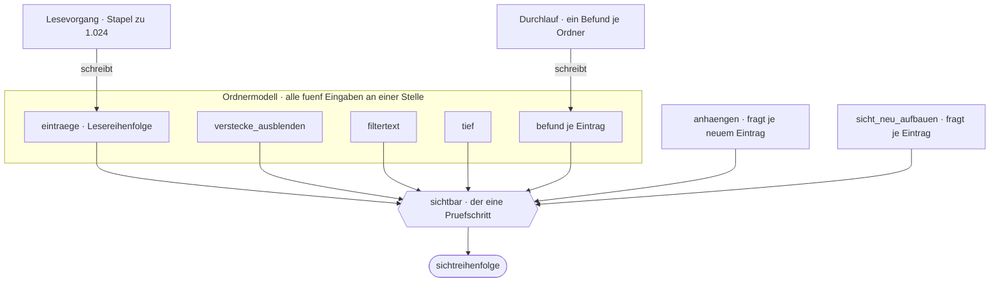
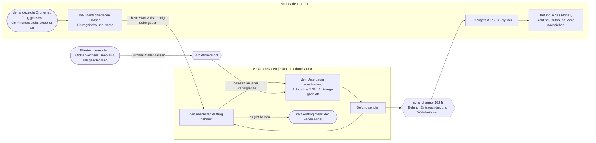
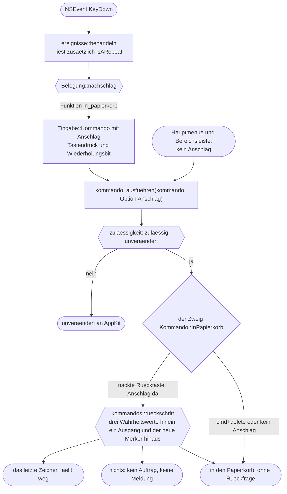
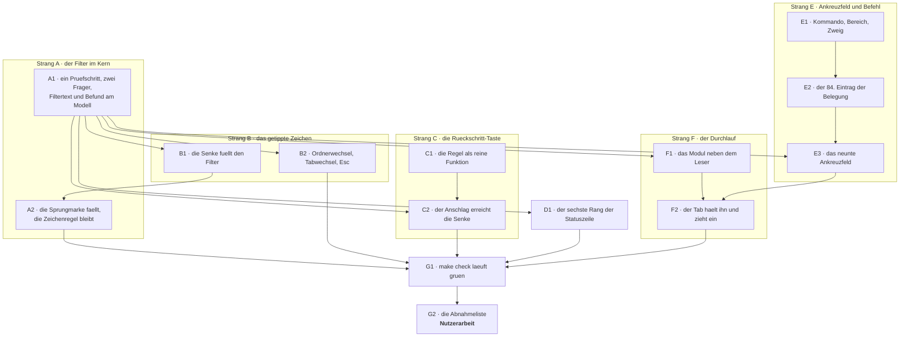

# Implementation Plan: Tippen filtert die Dateiliste, flach und als gefilterter Ordnerbaum

**Date:** 2026-08-14
**Status:** Entwurf
**Spec:** `circles/260814-1551-tippen-filtert-dateiliste-flach-und-tief/planning/260814-1830_o_spec-tippen-filtert-dateiliste-flach-und-tief.md`, vom Nutzer am 260814-2000 freigegeben
**Circle:** `circles/260814-1551-tippen-filtert-dateiliste-flach-und-tief/`, aktiv seit 260814-1551
**Grundlage erhoben:** 260814-2102, am Baum auf dem Stand `6cd122c`, unter `crates/` und `resources/`
**Decidability:** Die tragende Frage dieses Entwurfs lautet: *Was bedeutet ein Druck auf die Rückschritt-Taste — ein Zeichen zurück oder eine Datei in den Papierkorb?* Aus den Eingaben der bestehenden Zulässigkeitsregel ist sie **nicht** entscheidbar, und das ist ein Befund am Baum und keine Vermutung. `resources/default-keymap.toml:156-158` legt `delete` und `cmd+delete` auf dieselbe Funktion `in_papierkorb`; beide Tastendrücke werden im Nachschlag zu demselben `Kommando::InPapierkorb`, bevor irgendjemand fragen kann. `zulaessigkeit::zulaessig(kommando, lage)` bekommt genau dieses Kommando und die vier Lagewerte, also nichts, woran die zwei Wege sich unterscheiden ließen, und derselbe Frager ist die Ausgrauung des Hauptmenüs, die überhaupt keinen Tastendruck hat. Eine Antwort dort träfe beide Wege zugleich und graute den Menüeintrag aus, was C1.19 und C6.11 ausdrücklich ausschließen. Der Plan ändert deshalb nicht die Näherung, sondern das Mittel: er stellt die Frage dort, wo der Tastendruck noch bekannt ist, nämlich im Ausführungszweig hinter der unveränderten Zulässigkeitsregel, und trägt den Anschlag bis dorthin mit. Damit wird die Frage entscheidbar, und die zweite Größe aus C1.18 und C1.20 fällt an derselben Stelle an. Die übrigen Fragen dieses Plans sind aus dem entscheidbar, was der Mechanismus ohnehin hat: die Sichtbarkeit einer Zeile aus Name, Versteckt-Kennzeichen und Befund, der Befund aus dem, was der Durchlauf gelesen hat, und die Zahl der Statuszeile aus dem Modell des sichtbaren Tabs.

---

## Directive

Wer im Dateifenster Buchstaben ohne Zusatztaste tippt, verkürzt die Liste auf die Einträge, deren Name die getippte Folge an irgendeiner Stelle trägt. Der Filtertext gehört dem Tab und steht, bis der Nutzer ihn löscht. Ein Ankreuzfeld „Deep" in der Bereichsleiste dehnt den Filter auf den Unterbaum aus; sichtbar bleibt dann jeder Ordner, unter dem irgendwo ein Treffer liegt. Die Liste wächst während des Durchlaufs, die eine Statuszeile zählt mit, und `Esc` beendet beides, indem es den Filtertext löscht.

Der Spec schreibt das in sechs Fähigkeiten C1 bis C6 mit 75 Abnahmekriterien aus. Dieser Plan wiederholt sie nicht; jeder Schritt nennt die Kriterien, die er erfüllt. Zehn Kriterien haben einen Bündelanteil und sind Nutzerarbeit; Strang G trägt sie.

**Sieben Entscheide binden**, alle beantwortet: Teilzeichenfolge statt Namensanfang, kein Verfolgen symbolischer Verknüpfungen, die bestehende Auswahlregel bleibt, ein Ankreuzfeld statt einer Tastenkombination, der gefilterte Ordnerbaum statt einer flachen Trefferliste, die Rückschritt-Taste nimmt ein Zeichen zurück, und die Tastenwiederholung trägt nicht über die Grenze. **Vier Fragen sind offen**, keine hält einen Schritt auf; der Plan fährt bei allen vier auf derselben Empfehlung wie der Spec und nennt an jedem betroffenen Schritt, was sich mit einer anderen Antwort ändert.

---

## Was der Bau vorfindet

Neun Feststellungen, am 260814-2102 am Baum erhoben. Vier davon entscheiden den Entwurf.

**Der Prüfschritt für die Sichtbarkeit steht heute zweimal da, wörtlich gleich.** `Ordnermodell::anhaengen` prüft `!(self.verstecke_ausblenden && eintrag.versteckt)` (`crates/krk-core/src/verzeichnis/modell.rs:199`), `sicht_neu_aufbauen` prüft `!(ausblenden && eintrag.versteckt)` (`:437`). Zwei Fassungen derselben Regel an zwei Stellen, heute noch harmlos, weil die Regel eine Zeile lang ist. Ein zweiter Prüfschritt daneben machte daraus zwei Fassungen einer dreiteiligen Regel, und C6.8 verlangt ausdrücklich das Gegenteil. Der Filter ist deshalb der Anlass, den einen Prüfschritt zu ziehen, den es hätte geben sollen.

**Die Markierung liegt schon in der Form da, die der Befund braucht.** `markiert: Vec<bool>` läuft parallel zu `eintraege` und nicht zur Sichtreihenfolge, und die Begründung im Modulkopf trägt für den Befund wörtlich gleich: er hängt am Eintragsindex und übersteht damit jedes Umsortieren. Ein zweiter Behälter mit einer zweiten Bauart entsteht nicht; der Befund ist der dritte parallele Vektor neben `eintraege` und `markiert`.

**Der Lesevorgang liefert das Muster für den Durchlauf vollständig.** `Lesevorgang::starten` startet einen benannten Faden, gibt einen `Receiver` heraus, hält ein `Arc<AtomicBool>` für den Abbruch und setzt es in `Drop`; der Faden prüft das Kennzeichen zwischen zwei Stapeln und endet spätestens, wenn sein Empfänger verschwunden ist (`crates/krk-core/src/verzeichnis/leser.rs:100-160`, `:227-239`). Der Durchlauf baut daneben nichts Neues, sondern dieselbe Hülle ein zweites Mal, mit einem anderen Rumpf.

**Die Senke sieht das Kommando und nicht den Tastendruck.** `Eingabe::Kommando(Kommando)` (`crates/krk-ui/src/appkit/ereignisse.rs:239-247`) trägt allein das nachgeschlagene Kommando; `behandeln` hat den `Tastendruck` in der Hand und gibt ihn nicht weiter (`:503-553`). Genau das ist die Lücke aus der Decidability-Zeile, und sie ist mit einem Feld an dieser Aufzählung geschlossen.

**Nichts im Baum liest heute, ob ein Tastendruck aus einer Wiederholung stammt.** `isARepeat` kommt an einer einzigen Stelle vor, und dort wird es geschrieben: `ereignis_senden` baut die synthetischen Ereignisse des Messmodus mit `false` (`ereignisse.rs:471-481`). Der Messmodus kann den Wiederholungszweig deshalb nicht fahren, und die Abnahme von C1.18 und C1.20 am Bündel bleibt Nutzerarbeit. Das ist die elfte Feststellung des Spec, am Baum bestätigt.

**Die Bereichsleiste führt zwei Schaltergruppen und keine dritte.** `bereichsschalter: [Retained<NSButton>; 5]` nach `Bereich::ALLE`, `spaltenschalter: [Retained<NSButton>; 3]` nach `Spalte::ALLE`, dazu zwei Selektoren `bereichGedrueckt:` und `spalteGedrueckt:` und zwei Aufbautabellen `kommando_des_bereichs` und `kommando_der_spalte` (`crates/krk-ui/src/appkit/bereichsleiste.rs:126-159`, `:316-328`). „Deep" gehört in keine der beiden Gruppen: es schaltet weder eine Fläche des Fensters noch eine Spalte, sondern die Suche eines Tabs. Es wird deshalb ein einzelnes Feld und keine dritte Sammlung, und der Nachzug bekommt ein drittes Argument.

**Der Nachzug der Leiste kennt heute nur fensterweite Größen.** `bereichsleiste_nachziehen` holt Sichtbarkeit und Spaltensichtbarkeit aus dem Fenstermodell und ruft `zustaende_setzen` (`crates/krk-ui/src/appkit/anwendung.rs:4080-4089`). Ein Schalter, der je Tab gilt, hängt daneben am aktiven Dateifenster und an dessen sichtbarem Tab; er bekommt damit drei Anlässe, die die acht vorhandenen nicht haben. Der Preis steht bei Schritt E3 und fällt weg, wenn die offene Frage nach dem Gültigkeitsbereich auf „je Fenster" ausgeht.

**Ein neues Kommando kostet sieben Stellen, und der Übersetzer nennt fünf davon.** Variante in `Kommando`, Zeile in `Kommando::KENNUNGEN` samt Feldbreite `77 → 78` (`crates/krk-core/src/tasten/belegung.rs:579`), Zweig in `Kommando::wirkungsbereich`, Zweig in `belegungsmodell::bereich_des_kommandos` (`crates/krk-ui/src/belegungsmodell.rs:264`), Zweig in `kommando_ausfuehren`, Eintrag in `resources/default-keymap.toml`, Eintrag in der Aufbautabelle der Leiste. Hauptmenü, Belegungsansicht und Markdown-Ausgabe ziehen von selbst nach: alle drei rechnen aus der Belegung (`menuemodell::aufbau` über `belegungsmodell::nach_bereichen`), und keine von ihnen führt eine eigene Liste.

**`krk-ui` hat kein Bibliotheksziel.** `crates/krk-ui/Cargo.toml` führt allein `[[bin]] name = "krk"`. Jede Probe dieser Runde, die etwas aus `krk-ui` anspricht, steht deshalb in einem `#[cfg(test)]`-Modul neben dem Code; nur die Proben über `krk-core` gehören unter `crates/krk-core/tests/`.

---

## Wo der Filter wohnt und wer ihn liest

Das erste Bild beantwortet die beiden ersten Fragen aus `## Offen für den Planner`: wo der Filtertext wohnt und wo sein Prüfschritt sitzt. Beide Antworten sind dieselbe: am `Ordnermodell`, neben dem Kennzeichen für die versteckten Einträge, das dort seit der Runde 1 wohnt und dieselbe Art Größe ist.

**Der hohe Eingangsgrad an `sichtbar` ist die Aussage des Entwurfs und kein Gott-Knoten.** Sieben Kanten laufen hinein, eine hinaus: fünf sind die Eingaben der Regel aus dem ersten Bild des Spec, zwei sind ihre beiden Frager. Ein Knoten mit Ausgangsgrad 1 kann keiner sein; ein Gott-Knoten ist der, der auf alles zeigt, und das tut hier keiner. Die Alternative wäre, die Regel in `anhaengen` und in `sicht_neu_aufbauen` je einmal zu schreiben, und das ist genau der Zustand, den die erste Feststellung als vorhandenen Mangel benennt.

**Der Filtertext gehört dem Tab, und zwar über den Besitz und nicht über eine zweite Kopie.** `Tabinhalt` hält sein `Ordnermodell`; ein Feld am Modell gehört damit dem Tab, ohne dass irgendwo ein zweiter Wert desselben Namens stünde. Ein Feld an `Tabinhalt` daneben hieße, den Text bei jedem Neuaufbau der Sicht hineinzureichen, also zwei Wohnorte für eine Größe. Die Zusage aus C1.8, dass ein Tabwechsel den Filtertext des anderen Tabs zeigt, fällt damit ohne eigene Regel an: die Ansicht zeigt, was das Modell des sichtbaren Tabs führt.

**Was der Filtertext über einen Ordnerwechsel hinweg trägt, geht denselben Weg wie Sortierung und Verstecke.** `Tabliste::ordner_setzen` baut heute einen frischen `Tabinhalt` und trägt zwei Werte hinüber (`crates/krk-ui/src/tabs.rs:508-520`); Filtertext und Deep-Kennzeichen werden der dritte und vierte, mit einer Bedingung: bei ausgeschaltetem „Deep" fällt der Filtertext weg (C1.9), bei eingeschaltetem übersteht er den Wechsel (C1.10). Ein zweiter Mechanismus entsteht nicht.

**In die Sitzung wird nichts davon geschrieben.** Weder `krk_core::ablage::Tab` noch die `session.toml` bekommen ein Feld. Der Grund steht im Datensatz zur offenen Frage: der Schalter hängt an einem Filtertext, den die Sitzung selbst nicht behält, und ein wiederhergestelltes „Deep" ohne Filtertext wäre ein Zustand, den nichts anzeigt und der nichts tut.

---

## Der Durchlauf: ein Faden je Tab, ein Kanal je Tab

Das zweite Bild beantwortet die Frage, die der Spec ausdrücklich offen lässt und die das dritte Bild des Spec bewusst nicht vorwegnimmt. **Ein Arbeitsfaden je Tab und ein Kanal je Tab**, nicht einer je Ordner.

**Warum ein Faden je Tab und nicht einer je Ordner.** Ein angezeigter Ordner mit zweihundert Unterordnern erzeugte in der zweiten Bauart zweihundert Fäden und zweihundert Kanäle, und C3.6 („Je Tab läuft nie mehr als einer") bräuchte dann eine Lesart, in der „einer" Durchläufe zählt und keine Fäden. Mit einem Faden je Tab zählt der Satz Fäden, Kanäle und Durchläufe zugleich und braucht keine Lesart. Der Preis ist benannt: die Ordner werden nacheinander entschieden, und ein Ordner mit einem großen Unterbaum ohne Treffer verzögert die nach ihm. Kein Kriterium sagt eine Reihenfolge oder eine Frist je Ordner zu; C3.11 verlangt, dass die Liste wächst, und C3.12, dass KRK antwortet, und beides hält, weil der Hauptfaden nie wartet.

**Warum der Durchlauf erst nach dem Lesevorgang beginnt.** Die Liste der unentschiedenen Ordner steht erst fest, wenn der angezeigte Ordner fertig gelesen ist; ein früher gestarteter Durchlauf müsste während seiner Laufzeit Aufträge nachgereicht bekommen, also einen zweiten Kanal in die Gegenrichtung und einen Wachstumsfall führen. Der Anlass wird deshalb an `Einzug::fertig` gehängt, dieselbe Meldung, an der heute die Sortierung und der gemerkte Bildlauf hängen. Der Preis ist eine Verzögerung von der Länge des Lesevorgangs, auf dem Ordner mit 100.000 Einträgen rund 800 ms nach der gemessenen Zahl aus `tabelle.rs`. **inference:** für kleinere Ordner liegt sie unter einem Takt und ist nicht zu sehen; gemessen ist das nicht.

**Warum der Kanal 1.024 Befunde tief ist.** Der Lesevorgang hält seinen Kanal auf einem Stapel, und die Begründung dort ist der Speicher: ein tieferer Kanal hielte den Bestand eines Ordners mit 100.000 Einträgen ein zweites Mal. Ein Befund ist ein Eintragsindex und ein Wahrheitswert, also acht Byte statt eines Stapels von Einträgen; dieselbe Zahl 1.024 kostet hier acht Kilobyte. Sie ist dieselbe Bauart mit derselben Zahl und einer anderen Einheit, und die Einheit ist der Grund: mit der Tiefe 1 blockierte der Arbeitsfaden nach jedem einzelnen Befund bis zum nächsten Takt, also bis zu 16 ms je entschiedenem Ordner, und ein Ordner mit zweihundert flach liegenden Treffern brauchte drei Sekunden für eine Arbeit von Millisekunden. **Die Abbruchzusage aus C3.4 hängt nicht an der Kanaltiefe, sondern an der Schleife im Arbeitsfaden**, die das Abbruchkennzeichen an jeder Stapelgrenze liest — genau dort, wo `lesen_und_senden` es heute liest (`leser.rs:227-239`).

**Der Abbruch hat zwei Wege, und beide sind die des Lesevorgangs.** Das Kennzeichen wird gesetzt, wenn der `Durchlauf` fällt, und der Arbeitsfaden liest es je Stapel; und wenn der Empfänger mit ihm fällt, scheitert das nächste `send`. Ein Ordner ohne Unterordner ist davon nicht ausgenommen, weil die Prüfung an der Stapelgrenze steht und nicht am Absteigen (C3.4).

---

## Wo die Fallunterscheidung der Rückschritt-Taste fällt

Das dritte Bild beantwortet die zweite Frage, die der Entscheidungsdatensatz `260814-1830_a_wie-nimmt-der-nutzer-ein-einzelnes-zeichen-des-filters-zurueck.md` ausdrücklich dem Planner überlässt. Es zeigt nicht, **was** die Regel entscheidet — das tut das dritte Bild des Spec —, sondern **wo** sie steht und woran das hängt.

**Die Regel steht hinter der Zulässigkeitsfrage und nicht in ihr.** Das ist der tragende Entwurfsschritt, und er löst drei Dinge auf einmal. Erstens bleibt `zulaessigkeit.rs` unangetastet, und die Tafel aus 280 Fällen behält ihre Bedeutung. Zweitens bekommt der Menüeintrag „In den Papierkorb räumen" die Antwort nicht ab: er läuft über denselben `kommando_ausfuehren`, aber ohne Anschlag, und ein fehlender Anschlag heißt „es gab keinen Tastendruck, also keine Rücknahme" (C1.19, C6.11). Drittens deckt die vorhandene Regel genau die Lagen ab, in denen die Rücknahme unerwünscht wäre: beim Umbenennen in der Liste hält der Feldeditor den Ersthelferrang, `zulaessig` sagt nein, und die Taste geht unverändert an AppKit, wo sie ein Zeichen im Textfeld löscht. Kein Zweig, keine Ausnahme, keine zweite Sperre.

**Die zweite Größe wird an derselben Stelle gehalten wie die Regel gestellt wird.** `isARepeat` sagt, ob dieser Anschlag aus einer Wiederholung stammt; die Frage aus C1.18 lautet aber, ob die Wiederholung **bei stehendem Filtertext begann**, und das ist ein Bit mehr. Es wohnt als `Cell<bool>` beim Anwendungsdelegierten, neben dem Tastenabgriff, und nicht am Tab: eine Tastenwiederholung gehört keinem Tab und keinem Dateifenster, denn ein Tabwechsel braucht einen anderen Tastendruck, und der beendet die Wiederholung. Je Tab gehalten wäre dasselbe Faktum N-mal da.

**Die Regel ist eine reine Funktion über drei Wahrheitswerte, und ihre Tafel hat acht Zeilen.** Sie bekommt „steht ein Filtertext", „ist dieser Anschlag eine Wiederholung" und den Merker, und sie liefert einen der drei Ausgänge samt dem neuen Merker. Damit ist sie ohne Fenster prüfbar, in derselben Form wie `zulaessigkeit::zulaessig` und `fokus::wirkt`, und die Fallunterscheidung ist überschneidungsfrei und vollständig:

| Filtertext steht | Wiederholung | Merker | Ausgang | Merker danach |
|---|---|---|---|---|
| ja | gleichgültig | gleichgültig | Zeichen zurück | ja |
| nein | nein | gleichgültig | Papierkorb | nein |
| nein | ja | ja | nichts | ja |
| nein | ja | nein | Papierkorb | nein |

Die vier Zeilen decken alle acht Wahrheitskombinationen ab; die drei mit „gleichgültig" fassen je zwei oder vier zusammen. Die Tafel der Probe schreibt alle acht aus, aus demselben Grund, aus dem die Tafel in `zulaessigkeit.rs` ausgeschrieben und nicht gerechnet dasteht.

**Der Merker wird daneben von jeder anderen Eingabe zurückgesetzt.** Das ist eine Zeile in der Senke und kostet nichts, und sie nimmt eine Annahme aus der Rechnung: dass AppKit `isARepeat` nur für aufeinanderfolgende Drücke derselben Taste setzt. **inference:** so verhält sich die Tastenwiederholung des Systems, gemessen ist es in diesem Baum nicht. Mit der Rücksetzzeile trägt die Regel auch dann, wenn die Annahme falsch ist.

---

## Die Reihenfolge der Arbeit

Sieben Stränge. Die flache Hälfte steht vor der tiefen, und das ist die Antwort auf die letzte Frage aus `## Offen für den Planner`: der Durchlauf braucht den Filter, der Filter braucht den Durchlauf nicht.

**A1 ist die Vorbedingung von fünf Strängen und der einzige Schritt, den alle brauchen.** Er legt den einen Prüfschritt und die vier Felder an, aus denen alles Weitere liest. Danach laufen B, C, D und E ohne Berührung nebeneinander: B und C fassen `appkit/anwendung.rs` an, D `appkit/statuszeile.rs`, E die Belegung und `appkit/bereichsleiste.rs`.

**B1 steht vor A2 und nicht umgekehrt.** `Sprungmarke::tippen` und `erste_zeile_mit` haben genau einen Aufrufer, `DateifensterQuelle::sprungmarke_tippen` (`crates/krk-ui/src/appkit/tabelle.rs:398-411`). Erst wenn der Filter an seiner Stelle steht, ist der Aufrufer weg und die Sprungmarke wirklich ohne Aufrufer; die andere Reihenfolge nähme dem Nutzer für die Dauer eines Schritts jedes Tippen weg.

**E2 folgt auf E1, obwohl die Belegungsdatei Daten trägt und nicht Code.** Die Routing-Regel gibt für ein Paar aus Code- und Datenänderung den Code den Vortritt, und hier ist die Reihenfolge auch sachlich richtig: die Belegungsdatei nennt eine Kennung, die `Kommando::KENNUNGEN` erst tragen muss. **Beide Schritte müssen in einem Zug landen.** `crates/krk-core/tests/belegung.rs` hält Kommandos und Belegungseinträge aneinander; nach E1 allein ist der Baum rot, und das ist erwartet und kein Befund.

---

## Implementation Steps

### Strang A — der Filter im Kern

**A1. [DONE] Ein Prüfschritt, zwei Frager, und vier neue Felder am Ordnermodell**
- Executor: `coder`
- Files: `crates/krk-core/src/verzeichnis/modell.rs`, `crates/krk-core/tests/verzeichnis.rs`
- Erfüllt: C1.2, C1.3, C1.5, C1.6, C1.11, C2.5, C2.6, C2.10, C2.12, C2.13 (Sichtbarkeitshälfte), C3.14, C6.1 bis C6.8
- Dependencies: keine
- Changes:
  - `Ordnermodell` bekommt vier Felder: `filtertext: String`, `filter_klein: String` (die einmal je Suche kleingeschriebene Fassung), `tief: bool` und `befund: Vec<Befund>` parallel zu `eintraege`, in derselben Bauart und aus demselben Grund wie `markiert`.
  - `Befund` ist eine Aufzählung mit drei Werten, `Unentschieden`, `Treffer`, `KeinTreffer`, und ohne Auffangzweig. Sie steht neben `Markierungsstand` in derselben Datei.
  - **Der eine Prüfschritt** entsteht als `fn sichtbar(&self, index: usize) -> bool` und trägt das erste Bild des Spec Zweig für Zweig: versteckt und ausgeblendet, dann kein Filtertext, dann Name trägt die Teilzeichenfolge, dann Ordner, dann `tief`, dann der Befund. `anhaengen` und `sicht_neu_aufbauen` rufen ihn; die beiden heutigen Fassungen der Versteckt-Regel fallen mit.
  - **Der Vergleich ist derselbe wie in `Belegungsmodell::zeile_traegt`:** `name.to_lowercase().contains(&filter_klein)`, mit der Umschreibung des Suchtexts einmal je Suche und nicht einmal je Zeile (C1.3). Er faltet keine Umlaute, und die Probe hält das ausdrücklich fest: `apfel` findet `Äpfel` nicht.
  - **Der Sortierschlüssel wird nicht angefasst.** Er entsteht weiter einmal beim Lesen und trägt die Kollation als Bytefolge; der Filter ist ein Prüfschritt vor dem Sortieren und kein Vergleich (Randbedingung des Spec, L3 und L10).
  - Setzer: `filtertext_setzen`, `zeichen_anhaengen`, `letztes_zeichen_weg`, `filter_leeren`, `tief_setzen`, `befund_setzen(index, befund)`. Jeder baut die Sicht neu auf, wie `verstecke_ausblenden_setzen` es tut. `letztes_zeichen_weg` bekommt `#[must_use]` und liefert, ob etwas wegzunehmen war — dieselbe Form wie `Suchlage::letztes_zeichen_weg` (`crates/krk-ui/src/belegungsmodell.rs:694`), und der stille Verlust des Werts wäre unbemerkt.
  - `befund_zuruecksetzen` füllt den Vektor mit `Unentschieden`; gerufen bei jeder Änderung des Filtertexts und beim Einschalten von „Deep".
  - **Die Markierung ändert sich nicht.** `markierungsstand` zählt weiter über alle Einträge, `alle_markieren` und `markierung_umkehren` wirken weiter auf die sichtbaren, `markierung_aufheben` auf alle (C6.2 bis C6.6). Der Filter hebt keine Markierung auf; er ändert allein, welche Einträge sichtbar sind.
  - **Die Auswahl beim Wegfallen ihrer Zeile** (C1.11): `auswahl_zeile` liefert schon heute `None` für einen ausgeblendeten Eintrag, und die Ansicht setzt die Auswahl in Schritt B1 auf die erste sichtbare Zeile. Der gemerkte Eintragsindex bleibt stehen, wie beim Ausblenden versteckter Dateien.
  - Proben in `crates/krk-core/tests/verzeichnis.rs`: Teilzeichenfolge an jeder Stelle, Groß- und Kleinschreibung, keine Umlautfaltung, Ordner bleiben bei flacher Suche sichtbar, Ordner ohne Treffer fallen bei tiefer Suche weg, ein namentlich passender Ordner steht auch ohne Treffer darunter, die Markierung besteht unter dem Filter fort und wirkt wieder, wenn er fällt.

**A2. Die Sprungmarke fällt, die Zeichenregel bleibt**
- Executor: `coder`
- Files: `crates/krk-core/src/verzeichnis/sprungmarke.rs` (umbenannt zu `filter.rs`), `crates/krk-core/src/verzeichnis/mod.rs`, `crates/krk-core/tests/navigation.rs`, `crates/krk-ui/src/belegungsmodell.rs`
- Erfüllt: C1.4, C1.5, C1.12
- Dependencies: B1
- Changes:
  - `Sprungmarke`, `Sprungmarke::tippen`, `PAUSE`, `erste_zeile_mit` und die zwei Konstanten der Zeitmessung fallen. Danach steht im ganzen Baum kein `Instant` und keine `Duration` mehr im Weg eines getippten Zeichens (C1.5, geprüft über das Fehlen jeder Zeitmessung).
  - `traegt_ein_dateiname` bleibt unverändert und zieht mit der Datei um; sie behält ihre zwei Aufrufer, den Filter und die Tippsuche der Belegungsansicht aus der Runde 7 (C1.4). Der `use`-Pfad in `crates/krk-ui/src/belegungsmodell.rs:72` zieht nach.
  - Das Modul heißt danach `filter` und trägt neben der Zeichenregel den Vergleich als reine Funktion, damit die eine Zeichenregel und der eine Vergleich in einer Datei stehen und nicht in zweien.
  - `verzeichnis/mod.rs` zieht `pub mod`, `pub use` und das Bild im Modulkopf nach.
  - `crates/krk-core/tests/navigation.rs` verliert seinen Sprungmarken-Abschnitt und behält den Aufstieg. Die Proben zur Zeichenregel ziehen mit.
  - **Der Modulkopf von `appkit/tabelle.rs` und `Nachschlag::Sprungmarke`.** Der Name der Nachschlagart bleibt, was er ist: er benennt „eine Taste ohne Zusatztaste, die keiner Funktion gehört", und das trifft nach dieser Runde weiter zu. Ihn umzubenennen kostete `crates/krk-core/tests/belegung.rs` an fünf Stellen und änderte nichts am Verhalten; die Prosa der beiden Modulköpfe wird stattdessen richtiggestellt.

### Strang B — das getippte Zeichen erreicht den Filter

**B1. [DONE] Die Senke füllt den Filter des sichtbaren Tabs**
- Executor: `coder`
- Files: `crates/krk-ui/src/appkit/tabelle.rs`, `crates/krk-ui/src/appkit/anwendung.rs`
- Erfüllt: C1.1, C1.8, C1.13, C2.7
- Dependencies: A1
- Changes:
  - `DateifensterQuelle::sprungmarke_tippen` wird zu `filterzeichen_tippen` und schreibt in das `Ordnermodell` des sichtbaren Tabs statt in eine Sprungmarke der Ansicht. Der Rückgabewert bleibt, was er war: ob KRK das Zeichen verbraucht hat.
  - Der Ivar `sprungmarke: RefCell<Sprungmarke>` fällt ersatzlos. Die drei Stellen, die ihn heute zurücksetzen (`nach_lesebeginn`, `tab_gewechselt`, `umsortiert`), verlieren je eine Zeile; was an ihre Stelle tritt, steht in B2.
  - Nach jeder Änderung des Filtertexts: `reloadData`, dann `auswahl_anzeigen`, dann die Auswahl auf die erste sichtbare Zeile setzen, falls die bisherige weggefallen ist (C1.11). Ist keine Zeile sichtbar, bleibt die Auswahl leer, und ein Befehl, der eine bräuchte, tut nichts und meldet nichts — das ist bestehendes Verhalten von `betroffene` und braucht keine Zeile.
  - Der Zeichenzweig in `Anwendungsdelegierter::eingabe_ausfuehren` bleibt in seiner Form und ändert allein den Namen der gerufenen Methode. Der Fokusvorbehalt aus dem Defekt `260809-1648` bleibt unverändert stehen.
  - **Kein neues Kürzel und kein neues Bedienelement** (C1.13): der Nachschlag fällt für eine unbelegte Taste ohne Zusatztaste weiter auf denselben Zweig, und `resources/default-keymap.toml` bekommt keinen Einstiegsbefehl.
  - Proben in einem `#[cfg(test)]`-Modul neben dem Code, soweit sie ohne `NSTableView` auskommen; die Rechnung „welche Zeile bekommt die Auswahl, wenn ihre weggefallen ist" wird dafür als reine Funktion nach `crate::kommandos::navigation` gezogen, wo `zielzeile` schon steht.

**B2. [DONE] Ordnerwechsel, Tabwechsel und `Esc`**
- **Der Tabwechsel hat wie vorhergesagt keine Zeile gekostet.** `tab_gewechselt` ist unberührt; der Filtertext steht am `Ordnermodell` des Tabs, und die Ansicht zeigt nach dem Wechsel den des neuen (C1.8). `Tabliste::aktiven_neu_lesen` ebenso: der Tab bleibt seit `5f2e45d` stehen, also bleibt sein Filtertext stehen.
- **Genau die drei genannten Dateien sind angefasst.** `crates/krk-ui/src/appkit/tabelle.rs` trägt den Rumpf des dritten `Esc`-Rangs als `DateifensterQuelle::filter_leeren`, weil der Filtertext des sichtbaren Tabs vom Anwendungsdelegierten aus nur über diesen Weg erreichbar ist — derselbe Zugriffsweg wie bei C2 und E1.
- **Die Probenhälfte von C1.7 ist offen geblieben**, und der Datensatz dazu ist `issues/260815-0020_o_c1-7-verlangt-eine-probe-fuer-die-reihenfolge-von-esc-und-b2-hat-keinen-ort-dafuer.md`: die Rangfolge hängt an drei Ivars des Anwendungsdelegierten, und eine reine Funktion darüber wäre ein siebter Typ, den die `## Data Structures` dieses Plans nicht führt. C1.8, C1.9 und C1.10 sind als fünf Proben in `crates/krk-ui/src/tabs.rs` abgenommen, C3.5 ist am Code abzulesen.
- **Eine zweite Stelle baut denselben frischen `Tabinhalt` und ist nicht mitgezogen:** `Tabliste::verdeckten_tab_setzen`, der Weg des Datenträgerauswurfs. Datensatz: `issues/260815-0020_o_verdeckten-tab-setzen-baut-denselben-frischen-tabinhalt-und-traegt-zwei-von-vier-werten-hinueber.md`.
- `make check` läuft grün (Exit 0).
- Executor: `coder`
- Files: `crates/krk-ui/src/tabs.rs`, `crates/krk-ui/src/appkit/tabelle.rs`, `crates/krk-ui/src/appkit/anwendung.rs`
- Erfüllt: C1.7, C1.8, C1.9, C1.10, C3.5
- Dependencies: A1
- Changes:
  - `Tabliste::ordner_setzen` trägt Filtertext und Deep-Kennzeichen in den neuen `Tabinhalt` hinüber, neben Sortierung und Verstecke. Bei ausgeschaltetem „Deep" wird der Filtertext dabei geleert (C1.9), bei eingeschaltetem übernommen (C1.10). Der Aufstieg geht durch dieselbe Stelle und zählt deshalb wie der Einstieg, ohne eigene Zeile.
  - **Hängt an `decisions/260814-1830_o_bleibt-der-filtertext-bei-einem-ordnerwechsel-stehen-wenn-deep-aus-ist.md`.** Fällt die Antwort auf „stehen lassen", entfällt die Bedingung und die Zeile wird kürzer; sonst ändert sich nichts.
  - `Tabliste::aktiven_neu_lesen` lässt den Filtertext stehen: eine Auffrischung wechselt den Ordner nicht.
  - Der Tabwechsel setzt nichts zurück. Der Filtertext gehört dem Tab, und die Ansicht zeigt nach `tab_gewechselt` den des neuen Tabs (C1.8) — das fällt ohne Zeile an, weil das Modell ihn führt.
  - `Esc` bekommt seine Stelle in `Anwendungsdelegierter::abbrechen`, **hinter** dem Schließen eines stehenden Blattes und hinter dem Abbruch einer laufenden Dateioperation, an der Stelle, an der die Taste heute nichts mehr zu tun findet (C1.7). Ein eigener Rang für das Anhalten des Durchlaufs entsteht nicht: ohne Filtertext hat der Durchlauf keinen Gegenstand (C3.5).
  - **Hängt an `decisions/260814-1830_o_an-welcher-stelle-der-bedeutungen-von-esc-steht-der-filtertext.md`.** Eine andere Antwort verschiebt die Zeile innerhalb derselben Funktion und ändert sonst nichts.
  - **`Esc` schaltet „Deep" nicht ab.** Der Schalter bleibt stehen; ein Schalter, den eine Taste unbemerkt umlegt, wäre eine zweite Quelle für seinen Stand.

### Strang C — die Rückschritt-Taste

**C1. [DONE] Die Regel als reine Funktion**
- Executor: `coder`
- Files: `crates/krk-ui/src/kommandos/rueckschritt.rs` (neu), `crates/krk-ui/src/kommandos/mod.rs`
- Erfüllt: C6.10
- Dependencies: keine
- Changes:
  - Ein neues Modul neben `zulaessigkeit.rs`, in derselben Bauart: **keine Zeile AppKit**, eine reine Funktion, eine ausgeschriebene Tafel in den Proben.
  - `pub enum Rueckschritt { ZeichenZurueck, Nichts, InDenPapierkorb }` und `#[must_use] pub fn rueckschritt(filtertext_steht: bool, wiederholung: bool, merker: bool) -> (Rueckschritt, bool)`. Der zweite Rückgabewert ist der Merker danach.
  - Der Rumpf ist die Tafel aus dem Abschnitt `## Wo die Fallunterscheidung der Rückschritt-Taste fällt`, als vollständige Fallunterscheidung ohne Auffangzweig.
  - Der Modulkopf schreibt die drei Größen aus und **nennt ausdrücklich die drei, an denen die Regel nicht hängt** (C6.10): ob der Filtertext Treffer hat, ob eine Auswahl besteht, ob „Deep" an ist.
  - Proben: alle acht Wahrheitskombinationen ausgeschrieben, dazu die vier Wege aus der Tabelle des Spec einzeln mit ihrer Begründung.

**C2. [DONE] Der Anschlag erreicht die Senke, und der eine Zweig ruft die Regel**
- **Eine dritte Datei ist angefasst**, `crates/krk-ui/src/appkit/tabelle.rs`: aus den zwei genannten Dateien ist der Filtertext des sichtbaren Tabs nicht erreichbar. Derselbe Zugriffsweg wie bei E1. Datensatz: `issues/260814-2357_o_c2-nennt-zwei-dateien-der-weg-an-den-filtertext-des-tabs-fuehrt-durch-eine-dritte.md`.
- **Das `expect(dead_code)` an der Regel ist gefallen**, wie C1 es vorgesehen hatte; `crates/krk-ui/src/kommandos/rueckschritt.rs` ist damit die vierte angefasste Datei und trägt jetzt auch die Zählprobe. `make check` läuft grün (Exit 0).
- Executor: `coder`
- Files: `crates/krk-ui/src/appkit/ereignisse.rs`, `crates/krk-ui/src/appkit/anwendung.rs`
- Erfüllt: C1.14, C1.15, C1.16, C1.17, C1.18, C1.19, C1.20, C6.9, C6.11
- Dependencies: A1, C1
- Changes:
  - `ereignisse::Anschlag` ist eine neue kleine Struktur aus `Tastendruck` und `wiederholung: bool`. **`Tastendruck` selbst wird nicht angefasst:** er ist der Nachschlagschlüssel, trägt `Hash` und `Ord`, und ein Wiederholungsbit darin änderte, was „zwei Ereignisse ergeben denselben Tastendruck" heißt.
  - `Eingabe::Kommando` trägt neben dem Kommando den `Anschlag`. `behandeln` liest `ereignis.isARepeat()` und legt ihn bei; das ist die erste Lesestelle dieses Werts im Baum, und der Modulkopf sagt es.
  - `Anwendungsdelegierter::kommando_ausfuehren` bekommt ein zweites Argument `Option<Anschlag>`. Drei Aufrufstellen: die Senke reicht den Anschlag durch, der Menüeintrag und der Melder der Bereichsleiste geben `None`. **`None` ist die Aussage „es gab keinen Tastendruck"** und damit die Antwort auf C1.19 und C6.11 in der Signatur statt in einem Zweig.
  - Der Zweig `Kommando::InPapierkorb` fragt zuerst, ob der Anschlag die nackte Rückschritt-Taste war: `druck.maske.ist_leer() && druck.code == code_von_pflicht("delete")`. Trifft das nicht zu, geht es unverändert in den Papierkorb — das deckt `cmd+delete` (C1.17) und den Menüweg.
  - Trifft es zu, ruft der Zweig `rueckschritt` mit „steht ein Filtertext" aus dem Modell des sichtbaren Tabs des aktiven Dateifensters, mit dem Wiederholungsbit des Anschlags und mit dem Merker. `ZeichenZurueck` ruft `letztes_zeichen_weg` und zieht die Ansicht nach, `Nichts` tut nichts, `InDenPapierkorb` ruft `self.in_den_papierkorb()` wie bisher.
  - **`betroffene` wird für die beiden ersten Ausgänge nicht befragt**, und weder Auswahl noch Markierung werden angefasst (C6.9).
  - Der Merker ist ein `Cell<bool>` in den Ivars des Anwendungsdelegierten. Er wird von `rueckschritt` fortgeschrieben und von jeder anderen Eingabe zurückgesetzt — eine Zeile am Kopf von `eingabe_ausfuehren`, die den Fall abdeckt, in dem AppKit sich anders verhält als angenommen.
  - **`f8` und `opt+cmd+delete` sind nicht betroffen**, denn sie tragen `Kommando::EndgueltigLoeschen`; `ctrl+delete` wirkt in der Lesezeichenleiste und geht durch `Leistenquelle::kommando_ausfuehren` (C6.11). Keiner der drei Wege bekommt eine Zeile.
  - Proben: die drei Ausgänge über die reine Funktion aus C1 sind dort schon abgenommen; hier kommt eine Probe dazu, die zählt, dass `rueckschritt` genau einen Aufrufer hat, in der Form von `beide_frager_rufen_die_eine_regel` und über `crate::quellbaum::aufrufstellen`.

### Strang D — die Statuszeile

**D1. [DONE] Der sechste Rang**
- Executor: `coder`
- Files: `crates/krk-ui/src/appkit/statuszeile.rs`, `crates/krk-ui/src/appkit/tabelle.rs`, `crates/krk-ui/src/appkit/anwendung.rs`
- Erfüllt: C4.1 bis C4.10
- Dependencies: A1
- Changes:
  - `Rang` bekommt den Wert `Filterstand`, `Rang::ALLE` wächst auf sechs, und er steht **zwischen `Tabmeldung` und `Markierungsstand`** (C4.1). `Rang::art` gibt `Art::Vorgang`: eine Filterzahl ist kein Fehler und wird nicht rot (C4.2). Beide Fallunterscheidungen bleiben vollständig und ohne Auffangzweig (C4.10).
  - **Hängt an `decisions/260814-1552_o_wo-steht-die-filterzahl-in-der-rangfolge-der-einen-statuszeile.md`.** Eine andere Antwort verschiebt eine Zeile in `Rang::ALLE` und ändert sonst nichts.
  - `Quellen` bekommt ein sechstes Feld, `Quellen::text` einen sechsten Zweig.
  - **Der neue Rang hat wie der Markierungsstand kein eigenes Feld am Dateifenster**, sondern wird bei jedem Schreiben der Zeile aus dem Modell des sichtbaren Tabs gerechnet. Dieselbe Begründung wie dort: ein gesetzter und gelöschter Wert hätte eine zweite Löschregel, und der Filterstand ist ein Zustand und kein Ereignis.
  - Der Text nennt drei Dinge (C4.3): den Filtertext, die Zahl der gezeigten Zeilen und die Zahl der Einträge des angezeigten Ordners. Blendet der Filter markierte Einträge aus, kommt ein vierter Teil dazu, und ohne ausgeblendete Markierung steht er nicht da (C4.4). Ohne Filtertext meldet der Rang nichts (C4.8).
  - **C4.7 fällt an einer vorhandenen Frage an.** `Ordnermodell::ersetzt_beim_naechsten_stapel()` ist wahr, solange ein begonnener Lesevorgang noch nichts geliefert hat und noch Zeilen des vorigen stehen; genau dann meldet der Rang nichts. Eine eigene Rechnung daneben wäre eine zweite Wahrheit über denselben Zustand.
  - Die Zahl der gezeigten Zeilen ist `zeilenzahl()` und zählt damit während eines Durchlaufs von selbst mit (C4.5). **Gezählt werden entschiedene Zeilen und keine Treffer** (C4.6); eine Trefferzählung gibt es nicht, weil der Durchlauf je Ordner beim ersten Fund aufhört.
  - Es bleibt bei einer Statuszeile (C4.9): weder Tableiste noch Fenstertitel bekommen eine Anzeige.
  - Proben: `zeile` und `zeilentext` sind reines Rust ohne AppKit und werden dort geprüft, in der Form der vorhandenen Proben.

### Strang E — das Ankreuzfeld und der Befehl

**E1. [DONE] Kommando, Wirkungsbereich, Bereich, Ausführungszweig**
- **Abnahme steht noch aus, und zwar bis E2.** Die Änderungen sind gemacht; `make check` steht auf `Error 2`, weil `jede_kennung_der_kommandos_steht_in_der_auslieferungsbelegung` die neue Kennung in `resources/default-keymap.toml` noch nicht findet. Bau, `cargo fmt --all --check` und `cargo clippy --workspace --all-targets -- -D warnings` laufen sauber. Datensatz: `issues/260814-2303_o_e1-und-e2-teilen-eine-zusicherung-die-eine-probe-haelt-und-lassen-den-baum-dazwischen-rot.md`.
- **Eine vierte Datei ist angefasst**, `crates/krk-ui/src/appkit/tabelle.rs`: aus den drei genannten Dateien ist das Tabmodell nicht erreichbar. Datensatz: `issues/260814-2303_o_e1-und-e3-nennen-drei-dateien-der-weg-an-das-tabmodell-fuehrt-durch-eine-vierte.md`.
- Executor: `coder`
- Files: `crates/krk-core/src/tasten/belegung.rs`, `crates/krk-ui/src/belegungsmodell.rs`, `crates/krk-ui/src/appkit/anwendung.rs`
- Erfüllt: C5.1, C5.3, C5.6
- Dependencies: keine
- Changes:
  - `Kommando::TiefeSucheUmschalten` als 78. Variante, Kennung `tiefe_suche_umschalten`. Die Aufschrift des Kästchens ist mit „Deep" gesetzt, die Kennung ist es nicht; sie folgt der Schreibweise der 77 vorhandenen, die durchweg deutsch und mit Unterstrichen sind.
  - `Kommando::KENNUNGEN` wächst auf 78, und die Feldbreite in der Typangabe zieht mit.
  - `Kommando::wirkungsbereich`: der neue Befehl bekommt `Wirkungsbereich::Ueberall`, wie die acht vorhandenen Schalter der Leiste. Ein engerer Bereich wiese den Klick genau dann ab, wenn der Nutzer ihn braucht (dieselbe Begründung wie bei `jeder_schalter_wirkt_aus_jedem_fokus`).
  - `belegungsmodell::bereich_des_kommandos` bekommt eine Zeile; der Befehl gehört in denselben Funktionsbereich wie die drei Spaltenschalter, damit er im Hauptmenü dort steht, wo der Nutzer ihn sucht (C5.4).
  - `kommando_ausfuehren` bekommt einen **eigenen Zweig** und fällt nicht still durch den Auffangzweig auf `bereichskommando` (C5.6). Der Zweig kippt das Kennzeichen am Modell des sichtbaren Tabs des aktiven Dateifensters.
  - **Nur eine neue Variante** (C5.1). Die Rücknahme eines Zeichens bekommt keine: sie ist ein Zweig im vorhandenen Befehl, entschieden in Schritt C2, und sichtbar wird sie in keinem Fall (C1.19).
  - Steht kein Filtertext, kommt der Befehl durch, kippt den Schalter und meldet nichts (C2.4). Über die Zulässigkeit entscheidet der Wirkungsbereich und nicht, ob der Befehl etwas findet.

**E2. Der 84. Eintrag der Belegung**
- Executor: `ontocoder`
- Files: `resources/default-keymap.toml`
- Erfüllt: C5.2, C5.5, C5.7
- Dependencies: E1
- Changes:
  - Ein `[[funktion]]`-Eintrag mit `id = "tiefe_suche_umschalten"`, einem deutschen Namen für Menü und Belegungsansicht und `tasten = []`, nach dem Muster von `spalte_typ_umschalten` (`resources/default-keymap.toml:380-383`). Er steht unmittelbar hinter den drei Spaltenschaltern, damit die Reihenfolge der Datei die Reihenfolge im Menü bleibt.
  - **`tasten = []` ist die Umsetzung des Nutzerentscheids** vom 260814-1610: ausgeliefert wird keine Kombination, und der Nutzer kann jederzeit eine vergeben (C5.7). `shift+cmd+f`, `opt+cmd+f`, `ctrl+cmd+f` und der nackte Tabulator bleiben frei.
  - Die Datei wächst damit von 83 auf 84 Funktionen (C5.2).
  - Belegungsansicht und Markdown-Ausgabe führen den Eintrag danach von selbst (C5.5): beide rechnen aus der Belegung und führen keine eigene Liste.
  - **Kein Kommentar über die Zahl der Einträge** wird in die Datei geschrieben. Zahlen, die eine andere Datei ändert, sind in diesem Projekt viermal in vier Tagen falsch geworden.

**E3. [DONE] Das neunte Ankreuzfeld**
- **Abgenommen mit `make check` — Exit 0**, alle vier Kommandos grün. Drei neue Proben in
  `bereichsleiste.rs` (`die_leiste_traegt_neun_schalter`,
  `der_neunte_schalter_heisst_deep_und_steht_rechts_von_typ`,
  `der_neunte_schalter_gibt_fokus_keinen_sechsten_wert`), eine in
  `crates/krk-core/tests/verzeichnis.rs` (`ohne_filtertext_aendert_die_tiefe_suche_nichts`).
- **Sieben Dateien statt zwei**, aus drei Gründen: der Zugriffsweg an das Tabmodell
  (`tabelle.rs`, neuer Leser `tiefe_suche_steht`), die Zahl „acht Schalter" in Prosa
  außerhalb der Leiste (`appkit/mod.rs`, `spalten.rs`, `fenstermodell.rs`) und die
  Kernhälfte von C2.4 (`krk-core/tests/verzeichnis.rs`). Datensatz:
  `issues/260814-2357_o_c2-nennt-zwei-dateien-…`, Nachtrag vom 260815 zu E3.
- **Eine neue Aufrufstelle statt drei.** `ordnerwechsel_melden` deckt Tabwechsel und
  Ordnerwechsel zusammen ab; der Wechsel des aktiven Dateifensters läuft auf beiden
  Wegen schon durch `aufteilung_nachziehen`.
- Executor: `coder`
- Files: `crates/krk-ui/src/appkit/bereichsleiste.rs`, `crates/krk-ui/src/appkit/anwendung.rs`
- Erfüllt: C2.1, C2.2, C2.3, C2.4
- Dependencies: A1, E2
- Changes:
  - `Bereichsleiste` bekommt ein einzelnes Feld `tiefenschalter: Retained<NSButton>` und **keine dritte Sammlung**: „Deep" ist kein Bereich und keine Spalte, sondern ein einzelner Schalter, und eine Aufzählung mit einem Wert wäre eine Aufzählung zu viel.
  - Ein dritter Selektor `tiefeGedrueckt:` an `Leistenquelle`, in derselben Form wie die beiden vorhandenen: erst `selbstkippung_zuruecknehmen`, dann melden (C2.3). Die `tag` braucht er nicht, weil es nur einen gibt.
  - Der Schalter steht rechts neben `Typ`, mit `GRUPPENABSTAND` davor, weil er eine dritte Gruppe ist. Aufschrift `Deep`, englisch und nicht übersetzt (C2.1). `setRefusesFirstResponder(true)` wie die acht vorhandenen; `Fokus` bekommt keinen sechsten Wert (C2.2).
  - `zustaende_setzen` bekommt ein drittes Argument `tief: bool` und bleibt der eine Schreiber jedes angezeigten Stands.
  - `bereichsleiste_nachziehen` holt den Wert aus dem Modell des sichtbaren Tabs des aktiven Dateifensters und bekommt **drei neue Anlässe**: der Tabwechsel, der Wechsel des aktiven Dateifensters und der Ordnerwechsel. Alle drei rufen heute schon `aufteilung_nachziehen` oder `statuszeile_nachziehen`; der Nachzug der Leiste tritt daneben und nicht hinein, aus demselben Grund, aus dem die Statuszeile neben ihm steht.
  - **Hängt an `decisions/260814-1830_o_gilt-das-ankreuzfeld-deep-je-tab-oder-je-fenster.md`.** Fällt die Antwort auf „je Fenster", fallen die drei neuen Anlässe weg, das Kennzeichen zieht in das Fenstermodell neben `Spaltensichtbarkeit`, und der Ausführungszweig aus E1 schreibt dorthin. Der Rest dieses Schritts bleibt gleich.
  - Der Modulkopf bekommt seine Untergrenzenangabe nachgetragen: `checkboxWithTitle:target:action:` seit 10.12 bleibt die höchste dieser Datei, denn eine neue Klasse wird nicht angesprochen. Die Zahl „acht Ankreuzfelder" im Modulkopf wird zu neun.

### Strang F — der Durchlauf

**F1. Der Durchlauf als eigenes Modul neben dem Leser**
- Executor: `coder`
- Files: `crates/krk-core/src/verzeichnis/durchlauf.rs` (neu), `crates/krk-core/src/verzeichnis/mod.rs`, `crates/krk-core/tests/verzeichnis.rs`
- Erfüllt: C3.1, C3.4, C3.8, C3.9, C3.10, C3.13
- Dependencies: A1
- Changes:
  - `Durchlauf` in der Bauart von `Lesevorgang`: `starten(auftraege: Vec<Auftrag>, ordner: PathBuf, filter_klein: String, generation: u64)`, `befunde() -> &Receiver<Befundmeldung>`, `abbrechen()`, `Drop` setzt das Abbruchkennzeichen. Der Faden heißt `krk-durchlauf-<n>`.
  - `Auftrag { index: u32, name: String }`, `Befundmeldung { index: u32, treffer: bool }`. Der Kanal ist ein `sync_channel(STAPELGROESSE)`; die Begründung für die Einheit steht im Abschnitt `## Der Durchlauf`.
  - Der Rumpf schreitet den Unterbaum eines Auftrags ab, in der Reihenfolge des zweiten Bildes des Spec: keine symbolische Verknüpfung, öffnen, Stapel holen, Name prüfen, absteigen. **Gelesen wird über `Schwungleser`**, dieselbe Hülle, die `leser::lesen` und `lesen_und_senden` benutzen; eine zweite Lesemechanik entsteht nicht (C3.1).
  - **Der erste Treffer beendet den Auftrag**, in welcher Tiefe er auch liegt; der Rest unter ihm bleibt ungelesen (C3.3, dessen sichtbare Hälfte in F2 anfällt).
  - **Der negative Befund hat drei Quellen** und ist von „noch nicht entschieden" unterschieden (C3.13): abgearbeitet ohne Treffer, nicht zu öffnen (C3.10), symbolische Verknüpfung (C3.9). Keine von ihnen hält den Durchlauf an oder erzeugt eine Meldung.
  - **Kein mitgeführter Zustand über besuchte Ordner** (C3.9): weil in keine Verknüpfung abgestiegen wird, kann kein Ordner zweimal erreicht werden.
  - **Das Abbruchkennzeichen wird an jeder Stapelgrenze gelesen und nicht beim Absteigen** (C3.4). Ein Ordner mit fünfzigtausend gewöhnlichen Einträgen und ohne einen einzigen Unterordner passiert die Grenze neunundvierzigmal.
  - **Keine Tiefengrenze und kein Deckel** (C3.8): im Modul steht keine Konstante für eine Tiefe und keine Zählung gegen eine Grenze. Der Abstieg läuft über einen eigenen Stapel und nicht über die Rekursion des Fadens, damit ein tiefer Baum den Fadenstapel nicht sprengt.
  - Proben unter `crates/krk-core/tests/verzeichnis.rs`, mit `Pruefordner` aus `crates/krk-core/tests/gemeinsam/mod.rs` — der Fassung dieser Kiste, keine vierte: ein Treffer tief unten wird gefunden, ein Ordner ohne Treffer meldet den negativen Befund, ein nicht lesbarer Ordner ebenso, eine Verknüpfung auf einen Ordner mit einem Treffer darunter meldet „kein Treffer", ein Prüfordner ohne Unterordner mit mehr als 2.048 Einträgen bricht innerhalb von zwei Stapeln ab.

**F2. Der Tab hält den Durchlauf, zieht die Befunde ein und bricht ihn ab**
- Executor: `coder`
- Files: `crates/krk-ui/src/tabs.rs`, `crates/krk-ui/src/appkit/tabelle.rs`
- Erfüllt: C2.5 bis C2.9, C2.11, C2.13, C3.2, C3.3, C3.6, C3.7, C3.11, C3.12, C3.14
- Dependencies: E3, F1
- Changes:
  - `Tabinhalt` bekommt `durchlauf: Option<Durchlauf>` neben `lesevorgang`. Höchstens einer je Tab (C3.6).
  - `Tabliste::einziehen` räumt neben dem Lesekanal auch den Befundkanal leer und meldet über `Einzug` ein fünftes Feld, ob Befunde eingetroffen sind. `Einzug` behält sein `#[must_use]`.
  - Der Anlass zum Start: `Einzug::fertig` am sichtbaren Tab, ein stehender Filtertext und eingeschaltetes „Deep". Die Auftragsliste ist die Liste der Ordner des angezeigten Ordners, **deren eigener Name den Filtertext nicht trägt** (C3.14). Für einen namentlich passenden Ordner läuft kein Durchlauf; seine Sichtbarkeit steht mit dem Namen fest.
  - **Dateien und namentlich passende Ordner stehen sofort** und warten nicht (C3.2). Das fällt ohne Zeile an: der Prüfschritt aus A1 entscheidet sie am Namen, und der Durchlauf wird für sie nicht gefragt.
  - Ein eingetroffener Befund geht über `befund_setzen` in das Modell, das die Sicht neu aufbaut; die Zeile erscheint (C3.3), und die Statuszeile zählt mit (C4.5).
  - **Die Anzeige springt dabei nicht** (C3.11): der Einzugstakt ruft `noteNumberOfRowsChanged` beziehungsweise `reloadData` und danach `auswahl_anzeigen`, wie er es für die Stapel des Lesevorgangs tut; die Auswahl hängt am Eintragsindex und wandert mit.
  - Abbruch: jede Änderung des Filtertexts (C3.6), jeder Ordnerwechsel, das Ausschalten von „Deep" (C3.7), das Schließen des Tabs und `Tabliste::abbrechen`. Jedes Mal fällt der `Durchlauf` und mit ihm sein Empfänger, und der Befundvektor wird zurückgesetzt.
  - **Ein Tabwechsel bricht nicht ab.** Ein verdeckter Tab füllt sich still weiter, wie er es beim Lesevorgang tut; kein Kriterium verlangt etwas anderes, und ein Abbruch beim Wegwechseln nähme dem Nutzer die Arbeit weg, die er beim Zurückwechseln gerade bräuchte.
  - **`Eintrag` bekommt kein Pfadfeld** (C2.10), `betroffene` bleibt unverändert (C6.1), `angezeigtedatei::welche` bekommt keine dritte Quelle (C2.11), `appkit/tabelle.rs` bleibt eine flache `NSTableView` mit vier Spalten (C2.9). Alle vier fallen ohne Zeile an und werden von Proben gehalten, die zählen statt zu behaupten.
  - **Der Einstieg in einen namentlich passenden Ordner ohne Treffer führt auf eine leere Liste** (C2.8). Das ist kein Fehler und braucht keinen Zweig: die Regel gilt auf jeder Ebene gleich, und die Statuszeile sagt `0 von N`.
  - Proben, soweit ohne `NSTableView` möglich, in `#[cfg(test)]`-Modulen neben `tabs.rs`; die Zusammensetzung der Auftragsliste wird dafür als reine Funktion über das `Ordnermodell` geschrieben und dort geprüft, samt der Zählung aus C3.14 („ein Prüfordner, dessen sämtliche Unterordner den Filtertext im Namen tragen, liest keinen Unterbaum").

### Strang G — Abnahme

**G1. `make check` läuft grün**
- Executor: `coder`
- Files: keine
- Erfüllt: jede mit **(Probe)** gekennzeichnete Zusage
- Dependencies: A2, B2, C2, D1, F2
- Changes:
  - `make check` fährt `cargo build --workspace`, `cargo test --workspace`, `cargo clippy --workspace --all-targets` und `cargo fmt --all --check` in einem Zug. Der Weg über das `Makefile` ist der richtige: `cargo` liegt auf diesem Gerät nicht auf dem Standard-PATH, sondern unter `$HOME/.cargo/bin`.
  - **`clippy` ist hier die eigentliche Prüfung und nicht `build`.** `unused_must_use` ist erst unter `-D warnings` ein Fehler; die drei neuen `#[must_use]`-Werte dieser Runde laufen unter `cargo build` und `cargo test` allein grün durch.
  - Kein `make bundle` und kein `cargo xtask bundle` während der Runde außer dem einen Bau für G2. Unter `target/KRK.app` liegt das ausgelieferte Bündel `v0.3.0`, und jeder Entwicklungsbau überschreibt es; es wird vor G2 gesichert, wie die Runde 8 es getan hat.

**G2. Die Abnahmeliste am laufenden Bündel**
- Executor: `coder` (bereitet vor und schreibt auf), die Beobachtungen selbst sind **Nutzerarbeit**
- Files: `fusion-workbench/circles/260814-1551-tippen-filtert-dateiliste-flach-und-tief/history/`
- Erfüllt: die Bündelanteile von C1.7, C1.15, C1.17, C1.18, C1.20, C2.1, C3.11, C3.12, C4.5, C5.4
- Dependencies: G1
- Changes:
  - **Die Liste trägt je Kriterium seine Kennzeichnung und je Bündelkriterium seine Beobachtung.** Das ist die eine Sache, an der die Runde 9 gescheitert ist und die Runde 8 gehalten hat; der Spec führt beides schon, und diese Liste schreibt es ab, statt es neu zu erfinden.
  - Sie nennt getrennt: wie viele der 75 Kriterien allein am Baum abgenommen sind, welche zehn einen Bündelanteil haben, und je Bündelkriterium die Beobachtung aus dem Spec wörtlich.
  - **Zwei Beobachtungen sind die gefährlichen und stehen zuerst.** C1.15 und C1.18 prüfen die Richtung, in der ein Fehler Dateien wegräumt; beide laufen in einem Prüfordner mit entbehrlichen Dateien und nicht in einem Ordner des Nutzers.
  - **C1.18 und C1.20 kann der Messmodus nicht fahren.** Seine synthetischen Ereignisse melden sich nie als Wiederholung (`ereignisse.rs:471-481`); die beiden Beobachtungen sind ausschließlich am gehaltenen Finger zu machen.
  - Die Liste wird geschrieben und dem Nutzer vorgelegt, statt dass ein Agent sie zu fahren versucht. Der Abnahmelauf verlangt KRK im Vordergrund; aus dem Hintergrund gestartet weist die Wirkungsbereichs-Prüfung jeden fokusgebundenen Befehl ab.

---

## Data Structures

Sechs neue Typen, alle klein, keiner öffentlich über seine Kiste hinaus außer den beiden im Kern.

| Typ | Wo | Was er trägt |
|---|---|---|
| `Befund` | `krk-core/src/verzeichnis/modell.rs` | `Unentschieden`, `Treffer`, `KeinTreffer`; drei Werte ohne Auffangzweig |
| `Durchlauf` | `krk-core/src/verzeichnis/durchlauf.rs` | Abbruchkennzeichen, Empfänger, Fadenmerkzeichen; die Hülle von `Lesevorgang` ein zweites Mal |
| `Auftrag` | dieselbe Datei | Eintragsindex und Name eines zu entscheidenden Ordners |
| `Befundmeldung` | dieselbe Datei | Eintragsindex und Wahrheitswert, acht Byte |
| `Rueckschritt` | `krk-ui/src/kommandos/rueckschritt.rs` | `ZeichenZurueck`, `Nichts`, `InDenPapierkorb` |
| `Anschlag` | `krk-ui/src/appkit/ereignisse.rs` | `Tastendruck` und Wiederholungsbit |

Vier bestehende Typen wachsen: `Ordnermodell` um vier Felder, `Rang` um einen Wert, `Quellen` um ein Feld, `Einzug` um ein Feld. Ein bestehender Typ verschwindet: `Sprungmarke`.

**`Eintrag` bleibt 88 Byte groß.** Die Probe `der_eintrag_bleibt_so_gross_wie_bisher` hält die Zahl, und diese Runde fügt kein Feld hinzu: der Befund liegt neben den Einträgen und nicht in ihnen, aus demselben Grund wie die Markierung.

## API Changes

Vier Signaturen ändern sich, alle innerhalb einer Kiste.

- `Anwendungsdelegierter::kommando_ausfuehren(kommando)` → `(kommando, anschlag: Option<Anschlag>)`. Drei Aufrufstellen; zwei geben `None`.
- `Eingabe::Kommando(Kommando)` → `Eingabe::Kommando { kommando, anschlag }`.
- `Bereichsleiste::zustaende_setzen(sichtbar, spalten)` → `(sichtbar, spalten, tief)`.
- `DateifensterQuelle::sprungmarke_tippen(zeichen)` → `filterzeichen_tippen(zeichen)`, gleiche Form, anderer Name und anderes Ziel.

`Tastendruck`, `Lage`, `zulaessigkeit::zulaessig`, `fokus::wirkt`, `kommandos::operationen::betroffene` und `angezeigtedatei::welche` bleiben unverändert. Das ist keine Nebenbemerkung: fünf Abnahmekriterien sagen genau das zu.

## Testing Strategy

**Der Schwerpunkt liegt auf reinen Funktionen, weil `krk-ui` kein Bibliotheksziel hat.** Was ohne Fenster entschieden werden kann, wird ohne Fenster entschieden und dort geprüft: der Prüfschritt der Sichtbarkeit (A1, im Kern), der Durchlauf (F1, im Kern), die Regel der Rückschritt-Taste (C1, in `kommandos/`), die Zusammensetzung der Auftragsliste (F2, als reine Funktion), die Auswahl und der Text der Statuszeile (D1, in `statuszeile.rs` ohne AppKit).

**Vier Zählproben halten die Zusagen, die von einer abwesenden Sache handeln.** Sie sind in diesem Baum die übliche Form und laufen über `crate::quellbaum`: dass `erste_zeile_mit` und `Sprungmarke::tippen` keinen Aufrufer mehr haben und `PAUSE` nirgends steht (C1.12), dass `traegt_ein_dateiname` genau zwei Aufrufer behält (C1.4), dass `rueckschritt` genau einen Aufrufer hat (C6.10), dass es genau eine Statuszeile gibt (C4.9).

**Der Prüfordner kommt aus der Fassung der jeweiligen Kiste.** `crates/krk-core/tests/gemeinsam/mod.rs` für die Proben des Kerns, `crates/krk-ui/src/pruefordner.rs` für die der Oberfläche. Eine vierte Fassung entsteht nicht.

**Diese Runde misst keine Zeitzusage und fasst keine der zehn aus C8 an.** `crates/krk-bench/src/messen.rs` wird nicht angefasst; nachzuzählen mit `grep -oE '"L[0-9]+"' crates/krk-bench/src/messen.rs | sort -u`, und die Menge ist nach dieser Runde dieselbe wie davor.

## Risks & Mitigations

| Risiko | Gegenmaßnahme |
|---|---|
| Die nackte Rückschritt-Taste räumt einen Eintrag weg, während der Nutzer einen Vertipper berichtigt | Die Regel steht als reine Funktion mit einer ausgeschriebenen Tafel über acht Fälle (C1); die Probe C6.9 hält fest, dass `betroffene` für diesen Tastendruck nicht befragt wird; die Abnahme läuft in einem Prüfordner mit entbehrlichen Dateien |
| Der Prüfschritt sitzt im Weg jedes Stapels und die Zusage L2 hängt am ersten | Der Vergleich ist eine Teilzeichenfolge über den Namen, ohne Umschreibung je Zeile; der Sortierschlüssel wird nicht angefasst. **Gemessen ist es nicht**, und der nächste Abnahmelauf beantwortet es — der Spec führt es unter `## Prüfvorbehalt` als Erschließung |
| Der Durchlauf hält den Hauptfaden auf | Ein eigener Faden, ein Kanal mit 1.024 Plätzen, der Hauptfaden liest allein mit `try_iter` im vorhandenen Einzugstakt. C3.12 ist als Bündelbeobachtung eigens abzunehmen |
| Ein tiefer Baum sprengt den Fadenstapel | Der Abstieg läuft über einen eigenen Stapel im Rumpf und nicht über die Rekursion des Fadens (F1) |
| Ein neues Kommando bleibt an einer der sieben Stellen liegen | Fünf davon sind vollständige Fallunterscheidungen ohne Auffangzweig und halten den Bau an; die sechste ist die Feldbreite von `KENNUNGEN`; die siebte ist die Belegungsdatei, und `crates/krk-core/tests/belegung.rs` hält sie gegen die Kommandos |
| `bereichsleiste_nachziehen` vergisst einen der drei neuen Anlässe, und der Schalter zeigt den Stand eines anderen Tabs | Die drei Anlässe stehen in E3 ausgeschrieben; eine andere Antwort auf die offene Frage nach dem Gültigkeitsbereich lässt sie ersatzlos wegfallen |
| Der Merker der Tastenwiederholung bleibt stehen und hält den Papierkorb dauerhaft auf | Er wird von jeder anderen Eingabe zurückgesetzt, unabhängig davon, wie AppKit `isARepeat` setzt |
| Die Abnahmeliste verliert die Kennzeichnung je Kriterium, wie in der Runde 9 | G2 nennt es als erste Zeile seiner Changes; der Spec führt beides bereits und die Liste schreibt es ab |

## Open Questions

Vier offene Nutzerentscheidungen binden die Umsetzung, keine hält einen Schritt auf. Der Plan fährt bei allen vier auf derselben Empfehlung wie der Spec, und jeder betroffene Schritt nennt, was sich mit einer anderen Antwort ändert.

- [ ] Wo steht die Filterzahl in der Rangfolge der einen Statuszeile? — `decisions/260814-1552_o_wo-steht-die-filterzahl-in-der-rangfolge-der-einen-statuszeile.md`, betrifft D1
- [ ] Bleibt der Filtertext bei einem Ordnerwechsel stehen, wenn „Deep" aus ist? — `decisions/260814-1830_o_bleibt-der-filtertext-bei-einem-ordnerwechsel-stehen-wenn-deep-aus-ist.md`, betrifft B2
- [ ] Gilt das Ankreuzfeld „Deep" je Tab oder je Fenster? — `decisions/260814-1830_o_gilt-das-ankreuzfeld-deep-je-tab-oder-je-fenster.md`, betrifft E3 und F2
- [ ] An welcher Stelle der Bedeutungen von `Esc` steht der Filtertext? — `decisions/260814-1830_o_an-welcher-stelle-der-bedeutungen-von-esc-steht-der-filtertext.md`, betrifft B2

Zwei Fragen sind mit diesem Plan beantwortet und liegen als Datensätze im Circle:

- [x] Wie viele Fäden und Kanäle benutzt der Durchlauf? — `decisions/260814-2102_a_wie-viele-faeden-und-kanaele-benutzt-der-durchlauf-ueber-den-unterbaum.md`
- [x] Gehört die Fallunterscheidung der Rückschritt-Taste in `kommandos/zulaessigkeit.rs`? — `decisions/260814-2102_a_gehoert-die-fallunterscheidung-der-rueckschritt-taste-in-die-zulaessigkeitsregel.md`

Ein Defekt ist beim Erheben der Grundlage aufgefallen und liegt im Circle: `issues/260814-2102_o_der-pruefschritt-fuer-die-sichtbarkeit-steht-im-ordnermodell-zweimal-wortgleich-da.md`. Schritt A1 behebt ihn nebenbei; der Datensatz besteht, weil der Zustand vor dieser Runde entstanden ist und ohne sie fortbestünde.
