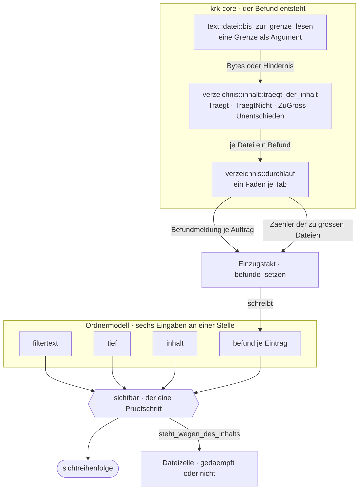
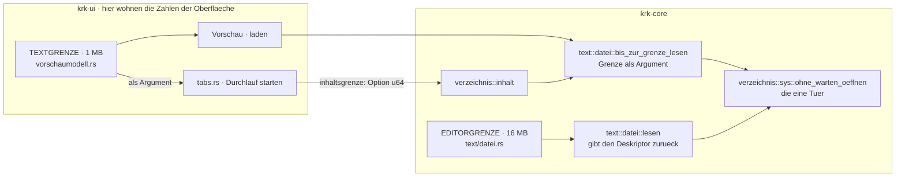
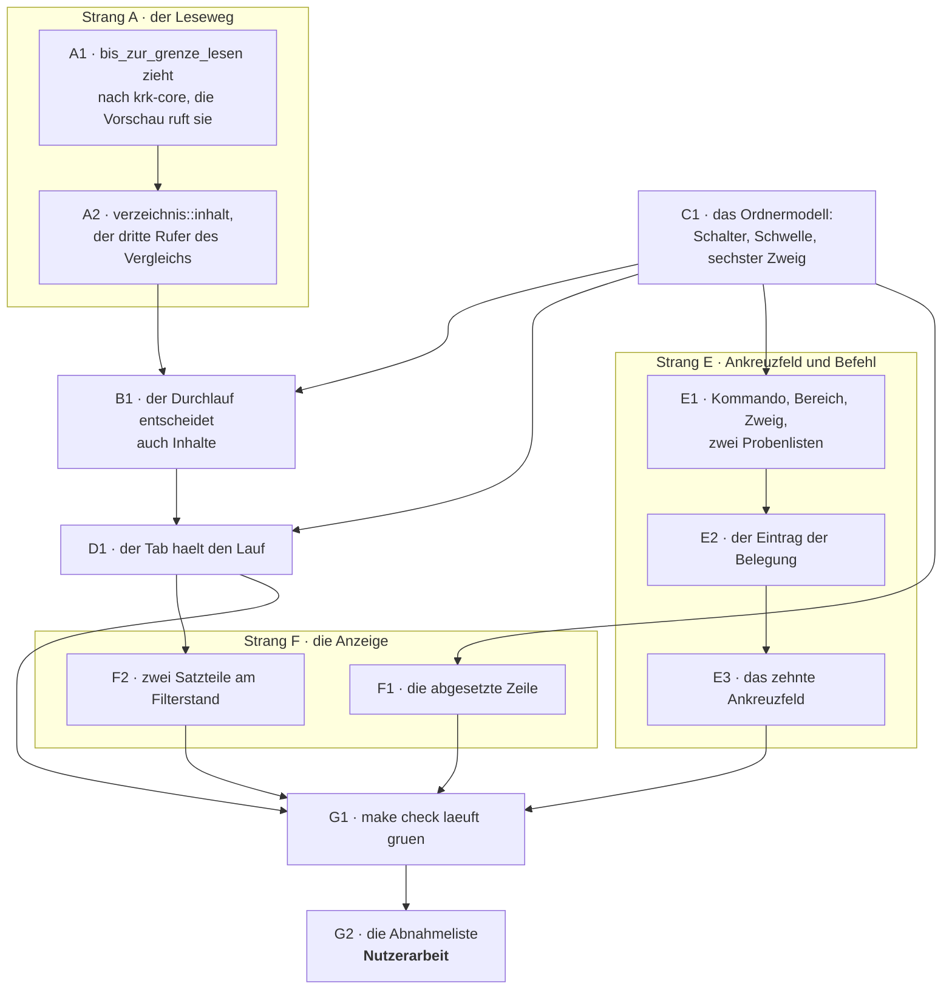

# Implementation Plan: Der Filter der Dateiliste berücksichtigt den Inhalt, geschaltet über „Content"

**Date:** 2026-08-16
**Status:** Draft
**Spec:** `shared/planning/260816-1310_o_spec-inhaltsfilter-der-dateiliste.md` — sechs Fähigkeiten, 57 Abnahmekriterien. Er bleibt im gemeinsamen Speicher; dieser Circle nimmt ihn über sein Feld `Active spec/plan:` an.
**Circle:** `circles/260816-1321-inhaltsfilter-mit-ankreuzfeld-content/`, aktiv seit 260816-1330
**Grundlage erhoben:** 260816-1359, am Baum auf dem Stand `eae7b1c`, unter `crates/` und `resources/`
**Decidability:** Die tragende Frage lautet: *Trägt diese Datei die getippte Zeichenfolge?* Sie zerfällt in zwei, und die beiden sind verschieden weit entscheidbar. Die erste, „enthält der gelesene Text die Folge", ist aus den Eingaben des Mechanismus entscheidbar: die Bytes liegen vor, und der Vergleich ist derselbe, der schon über Namen entscheidet. Die zweite, „ist diese Datei überhaupt Text", beantwortet dieser Baum an genau einer Stelle, nämlich mit `String::from_utf8` über die gelesenen Bytes; eine Endungsliste schließt `crates/krk-core/src/text/datei.rs` ausdrücklich aus, und sie wäre auch die falsche Antwort, weil eine Endung nichts über den Inhalt aussagt. Entscheidbar ist die zweite Frage damit **nur für die Bytes, die der Mechanismus wirklich liest**. Für eine Datei über 1 MB beschafft er die Eingabe absichtlich nicht, und dort wird nicht genähert: sie gilt nicht als Nichttreffer, sondern zählt in einen eigenen Satzteil der Statuszeile, der sagt, wie viele Dateien ungelesen blieben. Der Mechanismus wechselt an dieser Stelle die Frage — von „trifft die große Datei zu" auf „wie viele habe ich nicht angesehen" —, und die zweite ist aus dem entscheidbar, was er ohnehin zählt. Dieselbe Form trägt der Deskriptormangel: `EMFILE` und `ENFILE` sind ein Zustand des Prozesses und kein Befund über die Datei, und der Auftrag bleibt unentschieden, statt negativ entschieden zu werden. Das ist der Mechanismus, den die Runde 10 für den Unterbaum aufgestellt hat, hier auf die einzelne Datei angewandt.

---

## Directive

Wer im Dateifenster tippt, filtert die Liste nach Namen. Steht zusätzlich das Ankreuzfeld „Content" der Bereichsleiste und ist der Filtertext lang genug — drei Zeichen ohne „Deep", fünf mit —, bleibt eine Datei auch dann stehen, wenn ihr Text die Folge trägt. Gelesen wird allein, was KRK als Text annimmt, höchstens bis zur 1-MB-Grenze der Vorschau, und nur bei Dateien, deren Name die Folge nicht schon trägt. Bei eingeschalteter tiefer Suche gilt dasselbe für den ganzen Unterbaum. Eine Zeile, die allein wegen ihres Inhalts steht, wird gedämpft geschrieben, und die eine Statuszeile sagt, dass gelesen wird und wie viele Dateien wegen ihrer Größe ungelesen blieben.

Der Spec schreibt das in sechs Fähigkeiten C1 bis C6 mit 57 Abnahmekriterien aus. Dieser Plan wiederholt sie nicht; jeder Schritt nennt die Kriterien, die er erfüllt, und woran seine Erfüllung abzulesen ist.

**Vier Entscheide binden, alle beantwortet:** die Staffelung 5/3 Zeichen, die 1 MB der Vorschau als Größengrenze, keine elfte Zeitzusage, der Satzteil in der Statuszeile samt Größenhinweis und die abgesetzte Darstellung. Zwei davon hinterlassen je eine Bauentscheidung, und dieser Plan trifft beide; sie stehen als Datensätze im Circle und nicht in diesem Dokument (`decisions/260816-1359_a_welche-aussage-schreibt-die-dateizelle-…`, `decisions/260816-1359_a_in-welcher-reihenfolge-stehen-die-satzteile-…`).

**Eine Frage ist offen und hält keinen Schritt auf:** der Spec verlangt in C4.5, dass ein Tabwechsel den Durchlauf beendet, die Runde 10 hat das Gegenteil gebaut und begründet. Der Datensatz `decisions/260816-1359_o_beendet-ein-tabwechsel-den-durchlauf-…` trägt die Frage; der Plan fährt auf der dort empfohlenen Vorbelegung und nennt an Schritt D1, was sich bei einer anderen Antwort ändert.

---

## Was der Bau vorfindet

Sieben Feststellungen, am 260816-1359 am Baum erhoben. Vier davon entscheiden den Entwurf.

**Der Durchlauf der Runde 10 ist bereits die Vorrichtung, die der Inhaltsfilter braucht.** Ein Arbeitsfaden je Tab, ein Kanal, ein Abbruchkennzeichen als `Arc<AtomicBool>`, `Drop` setzt es und wartet nicht, je Auftrag genau eine `Befundmeldung`, und ein `Befund` mit drei Werten, in dem `Unentschieden` etwas anderes heißt als `KeinTreffer` (`crates/krk-core/src/verzeichnis/durchlauf.rs`, `modell.rs:130-144`). Der Inhaltsfilter stellt dieselbe Art Frage an dieselbe Art Gegenstand: eine Auskunft von der Platte, die nebenläufig entsteht, einen Eintragsindex trägt und die Sicht neu aufbauen lässt. **Er bekommt deshalb keine zweite Maschine daneben, sondern eine zweite Auftragsart in der vorhandenen.**

**Die Größengrenze wird gehalten und nicht vorhergesagt, und der Baum kann das schon.** `bis_zur_grenze_lesen` in `crates/krk-ui/src/vorschaumodell.rs:678-690` öffnet über `ohne_warten_oeffnen`, fragt den Deskriptor mit `metadata()`, weist alles ab, was keine gewöhnliche Datei ist, und liest `grenze + 1` Bytes, damit eine zwischen `fstat` und `read` gewachsene Datei die Zusage nicht bricht. Genau das verlangen C1.7 und C1.8. **Die Funktion ist privat und liegt in `krk-ui`**, also dort, wo der Inhaltsfilter sie nicht erreicht; sie zieht nach `krk-core` um, statt ein zweites Mal geschrieben zu werden.

**Der Ausführungszweig eines neuen Kommandos ist nicht übersetzerpflichtig.** `Anwendungsdelegierter::kommando_ausfuehren` (`crates/krk-ui/src/appkit/anwendung.rs:2938-2942`) endet in einem Auffangzweig über `bereichskommando`; ein Kommando ohne eigenen Zweig tut still nichts, und der Bau bleibt grün. Der Kommentar an `:2920-2937` warnt davor. Von den Stellen, die ein neues Ankreuzfeld-Kommando anfassen muss, hält der Übersetzer zwei an (`Kommando::wirkungsbereich`, `bereich_des_kommandos`), drei fangen Proben (die Belegungsdatei, die Zahlen im Kopf der Belegungsdatei, die Liste der Funktionen ohne Kombination), und **eine fängt nichts**: dieser Zweig.

**Die Tabelle kommt ohne Beobachter der Erscheinung aus, und das gilt es nicht zu verlieren.** `crates/krk-ui/src/appkit/tabelle.rs:2808-2820` schreibt in jedem Zeichendurchgang Farbe und Schrift der Zelle: `systemOrangeColor` und Fettschrift bei Markierung, sonst `labelColor` und gewöhnliche Schrift. Beide sind dynamische Systemfarben, und AppKit löst sie beim Wechsel der Farbtafel selbst neu auf; `viewDidChangeEffectiveAppearance` gibt es im Baum nur in Vorschau und Editor, die eine selbst gerechnete Tafel führen. **Jede Dämpfung, die keine dynamische `NSColor` ist, brächte einen Beobachter mit, den die Tabelle heute nicht hat.** `secondaryLabelColor` und `tertiaryLabelColor` sind welche; C5.3 fällt damit ohne eine Zeile an.

**Die Statuszeile hat für die Kürzung schon eine Antwort.** Das Feld ist einzeilig und bricht nicht um, AppKit kürzt am rechten Rand, und `kurzhinweis_nachziehen` misst nach jedem Setzen über `sizeToFit`, ob gekürzt wurde, und hängt den vollen Satz als Kurzhinweis an (`crates/krk-ui/src/appkit/statuszeile.rs:668-671`, `:689-695`). Der als Gegengrund benannte abreißende Satz ist damit kein neues Problem und braucht keine neue Vorrichtung. Die Lücke daneben besteht und bleibt: gemessen wird beim Setzen des Texts, nicht bei einer Fensteränderung.

**Der Filterstand hat kein Feld, er wird gerechnet.** `filterstand_text` ist eine reine Funktion über `Filterstand` (`statuszeile.rs:369-386`, `:314-335`), gefüllt von `DateifensterQuelle::gerechnete_raenge` (`tabelle.rs:2317-2338`) bei jedem Schreiben der Zeile. Zwei Felder mehr an `Filterstand` kosten deshalb keine Lösch- oder Setzregel, und der neue Satz ist ohne Fenster prüfbar.

**Die Prüfordner der Messstrecke sind dünnbesetzt.** Je Datei 512 echte Bytes, der Rest ein Loch (`crates/krk-bench/src/fixture.rs:42`). Ein Inhaltsdurchlauf darauf misst das Lesen von Löchern. Diese Runde baut deshalb keine Messstrecke; sie benennt den vierten Prüfordner als Gegenstand einer späteren Messrunde, wie der Spec es tut.

---

## Wo der Inhaltsbefund entsteht und wie er in die Liste kommt

Das erste Bild beantwortet die zweite Frage aus `## Offen für den Planner`: wie ein Inhaltsbefund an das Ordnermodell kommt. Die Antwort ist **derselbe Weg**, den der Unterbaumbefund schon geht.



**`sichtbar` bekommt eine sechste Eingabe und keinen zweiten Prüfschritt daneben.** Das Bild des Spec ist Zweig für Zweig derselbe, den `Ordnermodell::sichtbar` heute trägt (`crates/krk-core/src/verzeichnis/modell.rs:540-587`); die zwei neuen Zweige hängen an dem Ausgang, der heute für eine gewöhnliche Datei `false` liefert. Der Eingangsgrad ist die Aussage des Entwurfs und kein Gott-Knoten: der Knoten hat zwei Ausgänge, und ein Knoten mit zwei Ausgängen kann keiner sein.

**Die Kante von `sichtbar` zur Zelle ist dieselbe Regel und nicht eine zweite.** Ob eine Zeile gedämpft steht, ist genau die Frage, die der Prüfschritt im Dateizweig schon beantwortet. Sie bekommt deshalb einen Namen, `Ordnermodell::steht_wegen_des_inhalts`, und zwei Frager: den Prüfschritt und die Zelle. Das ist die Form, die `name_traegt_den_filter` seit der Runde 10 hat, und sie ist der Grund, aus dem die Kurzschlussregel nicht zweimal dasteht.

---

## Ein Leseweg, zwei Grenzen, drei Leser

Das zweite Bild beantwortet die dritte Frage aus `## Offen für den Planner`: wie die 1 MB an den Leseweg kommt. **`krk-core` bekommt die Zahl nicht**; sie reist als Argument von der Stelle herein, an der sie wohnt.



**Drei Leser, eine Tür, und kein dritter Weg (C6.5, C6.6).** `ohne_warten_oeffnen` bleibt die einzige Stelle, die einen Pfad anfasst; alles danach fragt den Deskriptor. Der Editor behält seinen eigenen Rumpf, und der Grund gehört dazu: `text::datei::lesen` gibt den offenen, zurückgespulten Deskriptor zurück, damit der Aufrufer den Inhalt beiseitelegen kann, und die neue Hülle gibt ihn nicht zurück. Ihn dorthin umzubauen kostete die Zusage des Notizzettels und der Sicherungsform und leistete für diese Runde nichts.

**Die Vorschau verliert ihre private Fassung und ruft die gemeinsame.** Das ist keine Zugabe, sondern die Bedingung dafür, dass C6.5 zutrifft: bliebe ihre Fassung stehen, stünden nach dieser Runde drei Rümpfe für das begrenzte Lesen im Baum statt zweier. Der Rumpf zieht unverändert um.

**`Option<u64>` trägt zwei Aussagen in einem Wert.** `None` heißt „der Inhalt zählt bei diesem Lauf nicht", `Some(n)` heißt „er zählt, und n ist die Grenze". Zwei getrennte Argumente wären zwei Gelegenheiten, sie widersprüchlich zu setzen.

---

## Wo die Schwelle geprüft wird und was sie sonst noch entscheidet

Die vierte Frage aus `## Offen für den Planner` verlangt allein, dass die Schwelle eine Regel ist und an jeder Bewertung dieselbe Antwort gibt. Sie wird deshalb **eine Funktion mit einem Rufer**:

```
filter::inhaltsschwelle(tief) -> usize          // 5 bei tief, sonst 3
Ordnermodell::inhalt_wirkt() -> bool            // inhalt && zeichenzahl >= inhaltsschwelle(tief)
```

`inhalt_wirkt` hat vier Frager, und alle vier stellen dieselbe Frage: der Prüfschritt (steht diese Datei?), die Auftragsliste (bekommt diese Datei einen Auftrag?), `durchlauf_nachziehen_an` (läuft überhaupt etwas?) und die Statuszeile (ist der Lesehinweis fällig?). Ein zweiter Rechenweg an einer dieser Stellen wäre die Ausnahme, die C2.10 gerade ausschließt.

**Gezählt werden Zeichen und keine Bytes**, also `chars().count()`. Ein getipptes `äöü` sind drei Zeichen und sechs Bytes, und die Staffelung spricht von Zeichen.

**Die Schwelle wird bei jeder Bewertung neu gefragt und nicht beim Start gemerkt.** Daraus folgt der Fall, den der Spec benennt: wer bei vier Zeichen ohne „Deep" Inhaltstreffer vor sich hat und „Deep" einschaltet, verliert sie, weil die Schwelle auf fünf steigt. Ein fünftes Zeichen holt sie zurück. Eine Ausnahme für den Umschaltmoment wäre ein Sonderfall ohne Gegenstück.

---

## Die vier Auftragslagen, ausgeschrieben

Der Durchlauf bekommt eine zweite Auftragsart. Welcher Eintrag welchen Auftrag bekommt, entscheidet eine Tafel über den Typ des Eintrags und die zwei Schalter; sie ist überschneidungsfrei und vollständig, weil `Typ` drei Werte hat und der Schnitt „Ordner oder Verknüpfung" derselbe ist, den `sichtbar` zieht.

| Eintrag | Name trägt die Folge | Deep | Content wirkt | Auftrag |
|---|---|---|---|---|
| beliebig | ja | beliebig | beliebig | keiner, die Zeile steht am Namen |
| Ordner oder Verknüpfung | nein | aus | beliebig | keiner, der Ordner steht immer |
| Ordner oder Verknüpfung | nein | an | beliebig | `Unterbaum` |
| gewöhnliche Datei | nein | beliebig | nein | keiner, die Zeile fällt weg |
| gewöhnliche Datei | nein | beliebig | ja | `Inhalt` |

**Der Unterbaumauftrag wird bei gesetztem „Content" inhaltsempfindlich, und zwar über dieselbe `inhaltsgrenze`.** Im Unterbaum gilt derselbe Kurzschluss: trägt der Name eines Kandidaten die Folge, entscheidet er den Ordner sofort und sein Inhalt bleibt ungelesen (C3.4). Trägt er sie nicht und ist er eine gewöhnliche Datei, wird er gelesen. In eine symbolische Verknüpfung wird weder abgestiegen noch hineingelesen (C3.7); sie trägt zum Befund nichts bei, und das bleibt genau die Regel, die der Durchlauf schon hat.

**Die Abbruchgrenze bekommt eine zweite Stelle, und es bleibt dieselbe Regel.** Sie steht heute vor dem Holen des nächsten Stapels, weil ein Stapel die kleinste nicht unterbrochene Einheit war. Der Inhaltsfilter fügt eine kleinere ein, die eine gelesene Datei, und die Regel lautet unverändert „vor jeder Einheit, die dauern kann". Ohne die zweite Stelle läse ein Ordner mit tausend Dateien in einem Stapel tausend Dateien durch, bevor der Abbruch greift, und C4.7 fiele. Beim Absteigen wird weiterhin **nicht** geprüft, und der Grund im Modulkopf gilt unverändert.

---

## Die Reihenfolge der Arbeit

Sieben Stränge. Der Leseweg steht vor dem Durchlauf, der Durchlauf vor dem Tab, und die Anzeige zuletzt.



**C1 ist die Vorbedingung von vier Strängen.** Es legt den Schalter, die Schwelle und die eine Regel `steht_wegen_des_inhalts` an, aus denen der Durchlauf, der Tab, der Befehl und die Zelle lesen. Es steht neben A1 und A2 und nicht hinter ihnen: der Prüfschritt braucht den Leseweg nicht, er braucht nur den Befund.

**A1 steht vor A2**, weil A2 die Hülle ruft, die A1 nach `krk-core` zieht. Die andere Reihenfolge schriebe sie zweimal.

**E2 folgt auf E1, obwohl die Belegungsdatei Daten trägt.** Die Routing-Regel gibt dem Code den Vortritt, und hier ist die Reihenfolge auch sachlich richtig: die Belegungsdatei nennt eine Kennung, die `Kommando::KENNUNGEN` erst tragen muss. **Beide Schritte müssen in einem Zug landen** — `crates/krk-core/src/tasten/belegung.rs:1605` hält Kommandos und Belegungseinträge aneinander, und nach E1 allein ist der Baum rot. Das ist erwartet und kein Befund.

**Kein Schritt braucht `analyst`.** Diese Runde erzeugt keinen strategischen Datensatz: die zwei Bauentscheidungen sind vom Planer getroffen und liegen als Datensätze im Circle, die offene Frage liegt beim Nutzer, und alles Übrige ist Code und eine Datendatei. Ein künstlicher Analyseschritt hätte keinen Gegenstand.

---

## Implementation Steps

### Strang A — der Leseweg

**A1. [DONE] Die begrenzte Lesehülle zieht nach `krk-core`, die Vorschau ruft sie**
- Executor: `coder`
- Files: `crates/krk-core/src/text/datei.rs`, `crates/krk-ui/src/vorschaumodell.rs`, `crates/krk-core/tests/text.rs`
- Erfüllt: C6.5, C6.6 (Hälfte), C1.8 (Bauartteil)
- Dependencies: keine
- Changes:
  - `pub fn bis_zur_grenze_lesen(pfad: &Path, grenze: u64) -> Result<Vec<u8>, Lesehindernis>` entsteht in `text/datei.rs`, neben `lesen` und `EDITORGRENZE`. Der Rumpf ist der heutige aus `vorschaumodell.rs:678-690`, unverändert: öffnen über `ohne_warten_oeffnen`, `metadata()` am Deskriptor, `take(grenze + 1)`, und die Prüfung danach, ob das eine Byte zuviel angekommen ist.
  - `pub enum Lesehindernis { ZuGross, KeineDatei, Deskriptormangel, Fehler }` — vier Werte, überschneidungsfrei und vollständig, ohne Auffangzweig. `Deskriptormangel` wird hier und nicht beim Aufrufer getrennt, weil allein diese Stelle den `io::Error` in der Hand hat; die Regel dafür ist die vorhandene `verzeichnis::sys::ist_deskriptormangel`.
  - `vorschaumodell::bis_zur_grenze_lesen` fällt ersatzlos. Ihr Aufrufer (`:622`) ruft die neue Hülle und bildet jedes `Err` auf `None` ab — genau das heutige Verhalten. `TEXTGRENZE` bleibt, wo es steht.
  - **`text::datei::lesen` wird nicht angefasst.** Es gibt den offenen, zurückgespulten Deskriptor zurück, den die neue Hülle nicht führt; ein Umbau kostete die Zusagen des Notizzettels und der Sicherungsform. Der Doc-Kommentar der neuen Hülle nennt den Unterschied, damit die zweite Fassung nicht als Versehen gelesen wird.
- Abzulesen an: `cargo test --workspace` grün, dazu Proben in `crates/krk-core/tests/text.rs`, die je einen der vier Hindernisfälle an einem Prüfordner herstellen — eine Datei über der Grenze, ein Ordner, eine Datei ohne Leserecht, eine benannte Röhre ohne Schreiber (die zurückkehrt und nicht hängt). Der Deskriptormangel wird hier nicht geprüft; er hängt an C3.6 und steht bei B1.
- Am Diff abzulesen: `vorschaumodell.rs` verliert eine Funktion und gewinnt einen `use`; im Baum steht danach genau ein Rumpf, der `take(grenze + 1)` schreibt.

**A2. [DONE] `verzeichnis::inhalt` — die eine Antwort auf „trägt diese Datei die Folge"**
- Executor: `coder`
- Files: `crates/krk-core/src/verzeichnis/inhalt.rs` (neu), `crates/krk-core/src/verzeichnis/mod.rs`, `crates/krk-core/tests/verzeichnis.rs`
- Erfüllt: C1.4, C1.5, C1.6, C6.1, C6.3, C6.7, C6.8, C6.9
- Dependencies: A1
- Changes:
  - `pub fn traegt_der_inhalt(pfad: &Path, filter_klein: &str, grenze: u64) -> Inhaltsbefund` und `pub enum Inhaltsbefund { Traegt, TraegtNicht, ZuGross, Unentschieden }` — vier Werte, ohne Auffangzweig, in Entsprechung zu den vier Hindernissen aus A1.
  - Die Abbildung steht vollständig und ist die ganze Datei: `Ok(bytes)` geht durch `String::from_utf8`; gelingt es, entscheidet `traegt_die_folge(&text, filter_klein)`, misslingt es, ist die Datei kein Text und der Befund `TraegtNicht`. `Err(ZuGross)` wird `ZuGross`, `Err(KeineDatei)` und `Err(Fehler)` werden `TraegtNicht`, `Err(Deskriptormangel)` wird `Unentschieden`.
  - **Gelesen wird die ganze Datei und nicht streifenweise**, und der Grund gehört in den Modulkopf: „ist das Text" beantwortet dieser Baum mit `String::from_utf8` über die gelesenen Bytes. Streifenweise müsste die Frage je Streifen beantwortet werden, und eine Datei, die erst bei Byte 900.000 ungültig wird, hätte aus ihren ersten Streifen schon Treffer gemeldet — C1.6 verlangt, dass sie gar nicht steht. Die Streifen änderten damit nicht nur die Suche, sondern die Typfrage.
  - **Kein Abbruchkennzeichen in dieser Datei.** Sie beantwortet eine Frage über eine Datei und weiß nichts von Fäden; der Abbruch steht beim Durchlauf, und eine gelesene Datei ist die kleinste nicht unterbrochene Einheit (C4.7).
  - `verzeichnis/mod.rs` bekommt `pub mod inhalt;` und den Wiederausfuhr; das Bild im Modulkopf zieht nach.
  - **Die Zählprobe wird bewusst nachgezogen** (C6.3): `die_zeichenregel_und_der_vergleich_stehen_je_einmal_und_haben_je_zwei_rufer` (`crates/krk-core/tests/verzeichnis.rs:1790`) erwartet für `traegt_die_folge` heute die zwei Dateien `durchlauf.rs` und `modell.rs`. Sie erwartet danach **drei**, mit `verzeichnis/inhalt.rs` an alphabetisch erster Stelle. Die Zahl steigt, weil ein dritter Rufer entsteht, und der entsteht in einer eigenen Datei, weil „lies eine Datei und vergleiche ihren Text" eine andere Aufgabe ist als „schreite ein Verzeichnis ab"; ihn in `durchlauf.rs` zu schreiben ließe die Zahl bei zwei und mischte zwei Zuständigkeiten. Die Probe behält ihre namentliche Liste und ihre Meldung; sie wird **nicht** durch eine bloße Zahl ersetzt. Der Name der Probe nennt „zwei Rufer" und wird mitgezogen.
  - Die Zeichenregel `traegt_ein_dateiname` behält ihre zwei Rufer, und die Probe bleibt dort bei zwei (C6.4). Der Inhaltsfilter ändert nicht, welche Zeichen in den Filtertext kommen.
  - `im_filter_steht_keine_zeitmessung` (`:1718`) bekommt zwei Dateien mehr, `krk-core/src/text/datei.rs` und `krk-core/src/verzeichnis/inhalt.rs` (C6.8). Beide sind heute frei von `Instant`, `Duration` und `::now(` — geprüft am 260816. **`verzeichnis/sys.rs` tritt der Liste nicht bei**, obwohl der Filter darüber öffnet: die Datei führt `Duration` viermal zur Umrechnung der Änderungszeit, und die Nadel kann Umrechnung nicht von Messung trennen. Der Befund ist als Defekt abgelegt (`issues/260816-1359_o_die-probe-gegen-zeitmessung-im-filter-erreicht-zwei-dateien-des-filterwegs-nicht.md`) und gehört nicht in diese Runde.
- Abzulesen an: `cargo test --workspace` grün. Proben im Prüfmodul von `inhalt.rs`, jede an einem Prüfordner: eine Textdatei mit der Folge (`Traegt`), eine ohne (`TraegtNicht`), eine mit ungültigem UTF-8 (`TraegtNicht`), eine über der Grenze (`ZuGross`), eine benannte Röhre (`TraegtNicht`, und die Probe kehrt zurück), eine Datei ohne Leserecht (`TraegtNicht`). Dazu die Nebeneinanderprobe aus C6.9: derselbe Text einmal als Name und einmal als Inhalt, beide Antworten gleich, über eine Reihe von Zeichenfolgen mit Umlauten und gemischter Schreibung. Und C1.5: die Folge steht in den letzten Bytes vor der Grenze und wird gefunden.
- Am Diff abzulesen: `grep -rn 'traegt_die_folge' crates --include='*.rs'` nennt genau vier Dateien, `filter.rs` als Heimat und die drei Rufer.

### Strang B — der Durchlauf

**B1. [DONE] Der Durchlauf entscheidet auch Inhalte**
- Executor: `coder`
- Files: `crates/krk-core/src/verzeichnis/durchlauf.rs`, `crates/krk-core/src/verzeichnis/mod.rs`, `crates/krk-core/tests/verzeichnis.rs`
- Erfüllt: C1.1, C1.9, C1.10, C1.11, C3.1, C3.3, C3.4, C3.5, C3.6, C3.7, C4.1, C4.2, C4.6, C4.7
- Dependencies: A2, C1
- Changes:
  - `Auftrag` bekommt ein Feld `art: Auftragsart` mit `pub enum Auftragsart { Unterbaum, Inhalt }` — zwei Werte, ohne Auffangzweig. Der Eintragsindex und der Name bleiben, wie sie sind.
  - `Durchlauf::starten` bekommt ein Argument `inhaltsgrenze: Option<u64>`. `None` heißt „der Inhalt zählt bei diesem Lauf nicht", `Some(n)` heißt „er zählt, und `n` ist die Grenze". Ein Lauf mit `None` verhält sich in jeder Hinsicht wie der heutige.
  - `Durchlauf` hält ein zweites geteiltes Kennzeichen neben dem Abbruch: `Arc<AtomicU64>` für die Zahl der wegen ihrer Größe ungelesenen Dateien, gelesen über `Durchlauf::zu_gross()`. **Es ist kein zweiter Kanal, sondern ein Zustand des Laufs**, und es steht dort, wo der Lauf seinen anderen Zustand schon hält. Über den Kanal geht weiter genau eine `Befundmeldung` je Auftrag; deren Bedeutung ändert sich nicht.
  - `durchlauffaden` verzweigt nach `auftrag.art`. `Unterbaum` geht wie heute in `unterbaum_entscheiden`, jetzt mit der `inhaltsgrenze`. `Inhalt` prüft zuerst das Abbruchkennzeichen, ruft dann `inhalt::traegt_der_inhalt` und bildet ab: `Traegt` → `treffer: true`; `TraegtNicht` → `treffer: false`; `ZuGross` → `treffer: false` und der Zähler steigt; `Unentschieden` → der Faden endet ohne Meldung, wie bei `None` heute.
  - `unterbaum_entscheiden` bekommt die `inhaltsgrenze` und liest in der Kandidatenschleife eine gewöhnliche Datei, deren Name die Folge nicht trägt, wenn eine Grenze da ist. Die Fallunterscheidung über `kandidat.typ` bleibt vollständig: `Ordner` wird vorgemerkt, `Datei` wird bei gesetzter Grenze gelesen, `Verknuepfung` trägt nichts bei. Ein `Traegt` entscheidet den Ordner sofort; ein `Unentschieden` liefert `None` und beendet den Durchlauf, wie der Deskriptormangel es heute tut.
  - **Die Abbruchgrenze bekommt eine zweite Stelle**, vor jedem Lesen einer Datei, in der Schleife wie im flachen Zweig. Der Modulkopf schreibt die Regel neu aus: geprüft wird vor jeder Einheit, die dauern kann, und das sind seit dieser Runde zwei, der nächste Stapel und die nächste Datei. Beim Absteigen wird weiterhin nicht geprüft, und die Begründung dafür bleibt wörtlich stehen.
  - **Ein Deskriptor mehr, und nur einer** (C3.5): `traegt_der_inhalt` öffnet, liest und gibt frei, bevor der nächste Kandidat drankommt. Der Durchlauf hält damit während eines Lesens einen Verzeichnisdeskriptor und einen Dateideskriptor, gleich wie tief der Baum ist. Der Modulkopf sagt das.
  - Der Modulkopf bekommt das erweiterte Bild und den Satz, dass `Befundmeldung` weiterhin eine je Auftrag ist.
- Abzulesen an: `cargo test --workspace` grün, mit Proben in `crates/krk-core/tests/verzeichnis.rs` an einem Prüfordner: ein flacher Inhaltsauftrag, der trifft; einer, der nicht trifft; ein Unterbaum, unter dem allein ein Inhaltstreffer liegt (C3.1); einer, in dem ein Namenstreffer vor einem Inhaltstreffer liegt und die Datei ungelesen bleibt (C3.4, geprüft an einer Datei ohne Leserecht, deren Name passt); ein Unterbaum mit einer Verknüpfung auf eine passende Datei, die nichts beiträgt (C3.7); ein Lauf mit `inhaltsgrenze: None`, der sich verhält wie vor dieser Runde.
- **C3.6 braucht eine Kindprobe.** Der Deskriptormangel wird unter `ulimit -n 64` in einem Kindprozess gemessen und nicht in der geerbten Grenze der Sitzung; `crates/krk-core/tests/` führt diese Form seit der Runde 10, und die neue Probe schreibt sie ab. Ohne den Kindprozess behauptet die Zusage sich selbst.
- **C4.7 ist an einer Probe nicht vollständig abzulesen.** Dass der Abbruch spätestens nach einer gelesenen Datei greift, ist am Diff zu lesen — die Prüfung steht vor dem Lesen — und am laufenden Bündel zu beobachten. Eine Probe kann die Spanne messen, aber nicht ohne eine Uhr, und in diesem Weg steht keine.
- Am Diff abzulesen: `unterbaum_entscheiden` trägt genau zwei `abbruch.load`, und `Befundmeldung` hat unverändert zwei Felder.

### Strang C — das Ordnermodell

**C1. [DONE] Schalter, Schwelle und der sechste Zweig des einen Prüfschritts**
- Executor: `coder`
- Files: `crates/krk-core/src/verzeichnis/modell.rs`, `crates/krk-core/src/verzeichnis/filter.rs`, `crates/krk-core/tests/verzeichnis.rs`
- Erfüllt: C1.1, C1.2, C1.3, C1.10, C2.6, C2.9, C2.10, C5.4, C5.5
- Dependencies: keine
- Changes:
  - `filter.rs` bekommt die dritte Regel: `pub fn inhaltsschwelle(tief: bool) -> usize` mit 5 und 3, samt der Herleitung aus dem Spec im Doc-Kommentar (ein tiefer Filter liest um Größenordnungen mehr Dateien, und zwei Zeichen bezeichnen wenig). Der Modulkopf sagt danach „die drei Regeln des Filters". Die Datei bleibt die Heimat und fällt aus der Zählprobe wie bisher.
  - `Ordnermodell` bekommt ein Feld `inhalt: bool`, anfangs `false`, mit `inhalt()` und `inhalt_setzen(bool)`. Der Setzer folgt `tief_setzen` Zeile für Zeile: beim **Einschalten** fallen die Befunde auf `Unentschieden` zurück, danach wird die Sicht neu aufgebaut. Beim Ausschalten bleibt der Vektor stehen, weil ihn dann für Dateien niemand liest.
  - `pub fn inhalt_wirkt(&self) -> bool` — `self.inhalt && self.filtertext.chars().count() >= filter::inhaltsschwelle(self.tief)`. Die eine Stelle, an der die Schwelle geprüft wird.
  - **Der Prüfschritt bekommt zwei Zweige und keinen zweiten Prüfschritt daneben.** Der Ausgang, der heute für eine gewöhnliche Datei `false` liefert, wird zu `return self.inhalt_entscheidet(index as u32)`. Die Zweigfolge davor bleibt unverändert: versteckt, Filtertext, Name, Ordner-oder-Verknüpfung, `tief`, Befund.
  - `fn inhalt_entscheidet(&self, i: u32) -> bool` — der Rumpf der Regel, unter den Vorbedingungen des Prüfschritts (ein Filtertext steht, der Name trägt ihn nicht, der Eintrag ist eine gewöhnliche Datei): `self.inhalt_wirkt() && matches!(self.befund(i), Befund::Treffer)`.
  - `pub fn steht_wegen_des_inhalts(&self, i: u32) -> bool` — dieselbe Regel mit allen Vorbedingungen davor, für die Zelle: kein Eintrag außerhalb des Bestands, kein Ordner und keine Verknüpfung (C5.5), ein stehender Filtertext, kein Namenstreffer, dann `inhalt_entscheidet`. **Zwei Eingänge, ein Rumpf**, und der Grund gehört in den Doc-Kommentar: die Zelle stellt die Frage ohne Vorbedingungen, der Prüfschritt hat sie schon beantwortet, und `name_traegt_den_filter` kostet je Aufruf eine Umschreibung des Namens — sie im Prüfschritt ein zweites Mal zu stellen wäre bei 100.000 Einträgen 100.000 Umschreibungen je Neuaufbau.
  - **`Befund` bekommt keine vierte Variante.** Die drei Werte tragen für eine Datei dasselbe wie für einen Ordner: `Unentschieden` heißt „noch nicht gelesen" und die Zeile steht nicht (C1.10), `KeinTreffer` heißt „gelesen, nichts drin", `Treffer` heißt „drin". Ein vierter Wert für „zu groß" wäre ein dritter Trefferzustand; zu groß ist kein Treffer, und die Zahl der ungelesenen Dateien steht in der Statuszeile und nicht an der Zeile.
  - Der Modulkopf zieht nach: das Bild der Zweige, der Satz über die Zahl der Eingaben, und die Erklärung, dass die Kurzschlussregel die beiden Treffergründe überschneidungsfrei macht (C5.4).
- Abzulesen an: `cargo test --workspace` grün, mit Proben in `crates/krk-core/tests/verzeichnis.rs`, alle ohne Platte, weil sie den Befund von Hand setzen: eine Datei mit `Befund::Treffer` steht bei drei Zeichen und gesetztem `inhalt`, bei zwei Zeichen nicht (C1.1, C1.2); dieselbe Datei steht bei gesetztem `tief` erst ab fünf Zeichen (C2.10); ohne Filtertext ändert `inhalt_setzen` nichts an der Sicht (C2.6); das Ausschalten nimmt die Zeile weg, ohne den Befundvektor anzufassen (C2.9); eine Datei, deren Name passt, steht ohne jeden Befund (C1.3, Sichtbarkeitshälfte); `steht_wegen_des_inhalts` antwortet für einen Ordner mit `false` (C5.5) und für einen Namenstreffer mit `false` (C5.4).
- Am Diff abzulesen: `sichtbar` hat weiterhin genau zwei Rufer, und `inhaltsschwelle` genau einen.

### Strang D — der Tab

**D1. [DONE] Der Tab hält den Lauf, seine Aufträge und die Zahl der ungelesenen Dateien**
- Executor: `coder`
- Files: `crates/krk-ui/src/tabs.rs`
- Erfüllt: C1.12, C2.3, C2.4, C2.5, C3.2, C3.8, C4.4, C4.5, C4.6
- Dependencies: B1, C1
- Changes:
  - `auftraege(modell)` baut beide Auftragsarten nach der Tafel aus `## Die vier Auftragslagen, ausgeschrieben`. Der Filter `!name_traegt_den_filter` bleibt an derselben Stelle und gilt für beide Arten; das ist der Kurzschluss, und er steht weiter am Eingang und nicht als Sonderfall an einem Ausgang. Der Doc-Kommentar sagt danach „zwei Bedingungen und eine Tafel" statt „zwei Bedingungen und keine dritte".
  - `durchlauf_nachziehen_an`: die Sperre `!tab.modell.tief()` wird zu `!tab.modell.tief() && !tab.modell.inhalt_wirkt()`. Alles andere bleibt: kein Bestand, kein Lauf; kein Auftrag, kein Faden (C3.8).
  - `Durchlauf::starten` bekommt `tab.modell.inhalt_wirkt().then_some(crate::vorschaumodell::TEXTGRENZE)`. **Das ist die eine Stelle, an der die 1 MB in den Kern reisen**, und sie liegt in `krk-ui`, wo die Zahl wohnt. `krk-core` bekommt keinen Bezug auf `krk-ui` (C1.7).
  - `Tabinhalt` bekommt ein Feld `zu_gross: u64`. `lesen_starten` und `durchlauf_nachziehen_an` setzen es auf null, wenn ein Lauf fällt oder beginnt; `befunde_einziehen` schreibt bei jedem Takt den Zählerstand des Laufs hinein, auch beim Takt, der den geschlossenen Kanal sieht. **Damit steht die Zahl auch nach dem Ende des Laufs** — sonst sähe der Nutzer sie bei einem kleinen Ordner nie, und der Größenhinweis wäre wirkungslos.
  - `ordner_setzen` trägt `inhalt` über den Ordnerwechsel, als fünfte Übertragung neben Sortierung, Verstecken, `tief` und Filtertext, unbedingt und ohne Zweig (C1.12, C2.4). Der Doc-Kommentar zieht nach.
  - **Ein Tabwechsel beendet den Durchlauf des verlassenen Tabs** (C4.5). `Tabliste::waehlen` ruft dafür `durchlauf_nachziehen_an` auf der verlassenen Stelle; die Regel selbst steht weiter in dieser einen Methode, und hier fällt kein Zweig an. Der Kommentar der Runde 10, der das Gegenteil begründet, wird ersetzt und nicht bloß gelöscht: er nennt danach den Datensatz und den Grund.
  - **Nichts geht in die Sitzung** (C2.5). `krk_core::ablage::Tab` bekommt kein Feld; ein wiederhergestelltes „Content" ohne Filtertext wäre ein Zustand, den nichts anzeigt und der nichts tut — dieselbe Begründung, die für „Deep" schon gilt.
- **Wenn der offene Datensatz anders ausgeht:** bei Möglichkeit 3 fällt der Ruf in `waehlen` ersatzlos weg und C4.5 wird um den Tabwechsel gekürzt; bei Möglichkeit 2 bekommt er eine Bedingung auf `inhalt_wirkt()`, und der Plan trüge dann zwei Regeln statt einer. Kein anderer Schritt ändert sich.
- Abzulesen an: `cargo test --workspace` grün, mit Proben im `#[cfg(test)]`-Modul von `tabs.rs`, in der Form, die dort seit der Runde 10 steht: die Auftragsliste trägt bei gesetztem `inhalt` und drei Zeichen einen Inhaltsauftrag je passender Datei und keinen für die Datei, deren Name schon trägt; bei vier Zeichen und `tief` trägt sie keinen Inhaltsauftrag (C3.2); nach `ordner_setzen` steht `inhalt` noch (C2.4); ein Tabwechsel lässt `arbeitet_noch` des verlassenen Tabs fallen (C4.5).
- Am laufenden Bündel abzulesen: C1.12 — in einen Ordner wechseln, während „Content" steht und der Filtertext lang genug ist, und beobachten, dass die Liste sofort zu wachsen beginnt.

### Strang E — das Ankreuzfeld und der Befehl

**E1. Das Kommando, die zwei Fallunterscheidungen und die zwei Probenlisten**
- Executor: `coder`
- Files: `crates/krk-core/src/tasten/belegung.rs`, `crates/krk-ui/src/belegungsmodell.rs`, `crates/krk-ui/src/appkit/anwendung.rs`, `crates/krk-ui/src/appkit/tabelle.rs`, `crates/krk-core/tests/belegung.rs`, `crates/krk-ui/src/belegungsausgabe.rs`
- Erfüllt: C2.7 (Kommandohälfte), C2.8, C2.9
- Dependencies: C1
- Changes:
  - `Kommando::InhaltssucheUmschalten` entsteht neben `Kommando::TiefeSucheUmschalten` (`belegung.rs:421`), mit der Kennung `inhaltssuche_umschalten` in `Kommando::KENNUNGEN` (`:654`). **Die Feldbreite steigt von 78 auf 79** (`:624`); der Übersetzer nennt sie.
  - `Kommando::wirkungsbereich`: die Variante tritt dem Zweig `Wirkungsbereich::Ueberall` bei, neben `TiefeSucheUmschalten` (`:822`). **Vollständige Fallunterscheidung, der Übersetzer hält den Bau an.** Die Aufzählung `Wirkungsbereich` behält ihre sieben Werte; ein achter entsteht nicht.
  - `belegungsmodell::bereich_des_kommandos`: die Variante tritt dem Zweig `Funktionsbereich::Dateilisting` bei (`:271`). **Ebenfalls übersetzerpflichtig.**
  - `Anwendungsdelegierter::kommando_ausfuehren` bekommt einen eigenen Zweig neben dem von `TiefeSucheUmschalten` (`anwendung.rs:2938`). **Diese Stelle hält der Übersetzer nicht an** — der `match` endet in einem Auffangzweig über `bereichskommando`, und ein Kommando ohne Zweig tut still nichts. Sie ist deshalb hier namentlich genannt und steht als eigene Zeile in der Abnahmeliste.
  - `Dateifenster`/`DateifensterQuelle` bekommen `inhaltssuche_umschalten` und `inhaltssuche_steht`, Zeile für Zeile nach `tiefe_suche_umschalten` (`tabelle.rs:2016`) und `tiefe_suche_steht` (`:2052`): Ausleihe, `inhalt_setzen(!inhalt)`, dann `durchlauf_nachziehen`, `umsortiert`, `meldung_gewechselt`. Beide fragen und schreiben am **aktiven** Dateifenster, nicht am fokussierten, wie ihre Vorbilder.
  - `crates/krk-core/tests/belegung.rs:132`: `OHNE_KOMBINATION_AB_WERK` wächst von vier auf fünf Einträge und nimmt `inhaltssuche_umschalten` auf. Der Doc-Kommentar dort verlangt ausdrücklich, den Datensatz mitzunennen; genannt wird die Nutzerantwort vom 260814-1610 zu „Deep", der diese Runde folgt.
  - `crates/krk-ui/src/belegungsausgabe.rs:583-588`: dieselbe Liste steht dort ein zweites Mal als Literal und wächst ebenfalls auf fünf. Die Doppelung ist bekannt und offen (`circles/260814-1551-…/decisions/260814-2326_o_wird-die-liste-der-funktionen-ohne-kombination-an-einer-stelle-gefuehrt.md`); diese Runde behebt sie nicht, sondern trägt nach und bestätigt damit den Datensatz.
  - **Hauptmenü, Belegungsansicht und Markdown-Ausgabe ziehen von selbst nach.** Alle drei rechnen aus der Belegung und führen keine eigene Liste; die Markdown-Ausgabe lässt eine Funktion ohne Kombination von selbst heraus (C2.8).
  - **`Fokus` bekommt keinen sechsten Wert, und `zulaessigkeit.rs` keine Zeile.** Die Zulässigkeit fragt den `Wirkungsbereich` und keine Tafel je Kommando; `Ueberall` ist damit beantwortet. Ein Schalter der Bereichsleiste darf den Ersthelferrang nicht nehmen, und deshalb entsteht dort auch kein Fokuswert (C2.2, Modellhälfte).
  - **`schiebt_auffrischung_auf` wird nicht angefasst.** Die Fallunterscheidung dort läuft über die Operationsart der Dateioperationen; diese Runde bringt keine neue Operationsart mit, sondern ein Kommando. Die Stelle ist hier genannt, damit ihr Ausbleiben eine Feststellung ist und kein Vergessen.
- Abzulesen an: `cargo build --workspace` hält an, bis beide übersetzerpflichtigen Zweige stehen; danach `cargo test --workspace` **rot**, bis E2 gelandet ist, weil `jede_kennung_der_kommandos_steht_in_der_auslieferungsbelegung` (`belegung.rs:1605`) den Belegungseintrag verlangt. Das ist erwartet.
- Am Diff abzulesen: der Zweig in `kommando_ausfuehren` steht da. Das ist die einzige der sechs Stellen, für die weder Übersetzer noch Probe bürgt.

**E2. Der Eintrag der Belegung**
- Executor: `ontocoder`
- Files: `resources/default-keymap.toml`
- Erfüllt: C2.7
- Dependencies: E1
- Changes:
  - Ein `[[funktion]]`-Block neben dem von `tiefe_suche_umschalten` (`:405-408`), mit `id = "inhaltssuche_umschalten"`, einem deutschen Namen und `tasten = []` — **leere Tastenliste und nicht `reserviert_fuer`**, genau wie „Deep". Der Kommentarblock darüber schreibt aus, warum: der Nutzerentscheid vom 260814-1610 hat das für den ersten Schalter dieser Art so entschieden, und ein zweiter derselben Art folgt derselben Form, statt eine der frei gehaltenen Kombinationen zu belegen. Wer eine Taste dafür will, weist sie in der Belegungsansicht zu.
  - Die Zahlen im Kopf der Datei (`:34`) steigen von 84 auf 85 Funktionen; die Zahl der Kombinationen bleibt bei 90.
- Abzulesen an: `cargo test --workspace` grün — `jede_kennung_der_kommandos_steht_in_der_auslieferungsbelegung` und `die_zwei_zahlen_im_kopf_der_auslieferungsbelegung_stimmen_noch` sind die zwei Proben, die genau diesen Schritt abnehmen, und `jede_funktion_der_belegung_steht_genau_einmal_im_menue` nimmt C2.8 ab.
- Am laufenden Bündel abzulesen: `make tasten` gibt die Markdown-Ausgabe aus, und `inhaltssuche_umschalten` steht **nicht** darin; `make menue` gibt das Hauptmenü aus, und der Eintrag steht darin, im selben Bereich wie „Tiefe Suche ein- und ausschalten".

**E3. Das zehnte Ankreuzfeld**
- Executor: `coder`
- Files: `crates/krk-ui/src/appkit/bereichsleiste.rs`, `crates/krk-ui/src/appkit/anwendung.rs`
- Erfüllt: C2.1, C2.2, C2.3
- Dependencies: E2
- Changes:
  - `const KOMMANDO_DES_INHALTS` und `const AUFSCHRIFT_DES_INHALTS: &str = "Content"` neben ihren Vorbildern (`:191`, `:200`). Die Aufschrift ist englisch wie „Deep", die Kennung deutsch wie alle.
  - Ein Feld `inhaltsschalter: Retained<NSButton>` neben `tiefenschalter` (`:388`), gebaut über `schalter_bauen` mit einem eigenen Selektor `inhaltGedrueckt:` und ohne `tag`, weil es der einzige Sender ist. `schalter_bauen` setzt `setRefusesFirstResponder(true)` für jeden Schalter in einer Zeile (`:577`); C2.2 fällt damit ohne eigene Zeile an, und `Fokus::ALLE` bleibt bei fünf Werten.
  - Eingehängt **neben** „Deep" mit `ABSTAND` und nicht mit `GRUPPENABSTAND`: die beiden gehören zusammen, sie schalten beide die Suche des sichtbaren Tabs. Die Reihenfolge auf dem Schirm ist die der `einhaengen`-Aufrufe; „Content" kommt zuletzt.
  - `zustaende_setzen` bekommt ein viertes Argument und eine Zeile `zustand_setzen(&self.inhaltsschalter, inhalt)` (`:510-532`).
  - `Anwendungsdelegierter::bereichsleiste_nachziehen` (`anwendung.rs:4210-4231`) holt den Stand über `inhaltssuche_steht` und reicht ihn durch. **Die drei Anlässe des Nachzugs bleiben dieselben**, die „Deep" seit der Runde 10 hat; einer davon ist der Ordner- und Tabwechsel, und damit ist C2.3 erfüllt, ohne dass ein vierter Anlass entsteht.
  - Die Proben und Doc-Zahlen der Datei ziehen nach: `die_leiste_traegt_neun_schalter` wird zehn, `der_neunte_schalter_heisst_deep_und_steht_rechts_von_typ` bekommt einen Nachbarn und einen neuen Namen, `alle_schalter()` nimmt den Eintrag auf, und die sieben Doc-Stellen, die „neun" sagen, sagen danach „zehn". `jeder_schalter_nennt_genau_ein_eigenes_kommando` und `jeder_schalter_wirkt_aus_jedem_fokus` halten von selbst.
- Abzulesen an: `cargo test --workspace` grün, mit den fünf Proben der Datei als Abnahme.
- Am laufenden Bündel abzulesen: C2.1 — das Feld steht mit der Aufschrift „Content" rechts von „Deep". C2.2 — ein Klick darauf verschiebt die Fokusanzeige nicht. C2.3 — bei zwei Tabs mit verschiedenem Stand zieht die Leiste beim Wechsel nach. C2.5 — nach einem Neustart steht es aus.

### Strang F — die Anzeige

**F1. Die abgesetzte Zeile**
- Executor: `coder`
- Files: `crates/krk-ui/src/appkit/tabelle.rs`
- Erfüllt: C5.1, C5.2, C5.3, C5.4, C5.5
- Dependencies: C1
- Changes:
  - `DateifensterQuelle` bekommt `zeile_steht_wegen_des_inhalts(zeile)` neben `zeile_markiert` (`:2185-2192`), in derselben Bauart: Zeile zu Eintragsindex, dann die Frage an das Modell. Die Regel selbst wird nicht nachgebaut; sie steht in `Ordnermodell::steht_wegen_des_inhalts`.
  - Die eine Stelle, die Farbe und Schrift schreibt (`:2808-2820`), bekommt eine dreiwertige Farbwahl statt der zweiwertigen. **Die Markierung schreibt, die Dämpfung weicht**, und die Reihenfolge steht ausgeschrieben: markiert → `systemOrangeColor` und Fettschrift; sonst Inhaltstreffer → `secondaryLabelColor` und gewöhnliche Schrift; sonst → `labelColor` und gewöhnliche Schrift. Die Begründung steht im Datensatz `decisions/260816-1359_a_welche-aussage-schreibt-die-dateizelle-…` und im Kommentar darüber, nicht in diesem Plan.
  - **Die Schriftwahl bleibt zweiwertig.** Fett gehört der Markierung; die Dämpfung trägt keine eigene Schrift. Zwei Kennzeichen für die Markierung sind seit der Runde 1 Absicht (Farbe und Fettung, für Farbfehlsichtige); ein drittes Kennzeichen für die Dämpfung wäre der dritte Zustand, den C5.4 ausschließt.
  - **`secondaryLabelColor` ist eine dynamische Systemfarbe**, wie die beiden vorhandenen. C5.3 fällt damit ohne Beobachter der Erscheinung an, und die Tabelle bekommt keinen — die zwei, die es im Baum gibt, gehören Vorschau und Editor und rechnen eine eigene Farbtafel.
  - **Die Auswahl bleibt AppKit überlassen** (C5.2, Auswahlhälfte). KRK schreibt keine Auswahlfarbe und fängt hier auch nicht damit an; eine ausgewählte Zeile bleibt blau unterlegt, gleich welche Textfarbe sie trägt.
  - **Die Namensspalte bekommt kein Zeichen.** `ORDNERZEICHEN` bleibt das einzige Zeichen, das die Anzeigeform anhängt, und `die_anzeigeform_hat_genau_zwei_leser` (`:3839`) bleibt unberührt. Das ist Möglichkeit 2 des Nutzerdatensatzes, und sie ist nicht gewählt worden.
- Abzulesen an: `cargo test --workspace` grün. Die Farbwahl selbst ist in `krk-ui` nicht ohne Fenster prüfbar; prüfbar ist die Regel dahinter, und die steht in `krk-core` und wird von C1 abgenommen. Am Diff abzulesen: `tabelle.rs` trägt danach drei `NSColor`-Fundstellen und nicht zwei, und die Schriftwahl hat unverändert zwei Zweige.
- **Am laufenden Bündel abzunehmen, und das ist Nutzerarbeit:** C5.1 (ein Inhaltstreffer ist von einem Namenstreffer unterscheidbar), C5.2 (eine markierte Inhaltstrefferzeile bleibt orange und fett, eine ausgewählte bleibt blau unterlegt) und C5.3 (beide Farbtafeln, mit einem Wechsel im laufenden Betrieb).

**F2. Zwei Satzteile am Filterstand**
- Executor: `coder`
- Files: `crates/krk-ui/src/appkit/statuszeile.rs`, `crates/krk-ui/src/appkit/tabelle.rs`
- Erfüllt: C4.8, C4.9, C4.10
- Dependencies: D1
- Changes:
  - `Filterstand` bekommt zwei Felder: `liest_inhalt: bool` und `zu_gross: u64`.
  - `filterstand_text` setzt den Satz in der Reihenfolge Kern, Lesehinweis, Größenhinweis, Markierungshinweis zusammen. Der Lesehinweis lautet `, Inhalt wird gelesen`; der Größenhinweis hat einen Singularzweig wie der Markierungshinweis daneben: `, eine Datei zu groß` gegen `, 12 Dateien zu groß`, mit `zahl()` für den Tausenderpunkt. Die Begründung der Reihenfolge steht im Datensatz `decisions/260816-1359_a_in-welcher-reihenfolge-stehen-die-satzteile-…`.
  - `DateifensterQuelle::gerechnete_raenge` füllt die zwei Felder aus dem sichtbaren Tab: `liest_inhalt` ist wahr, wenn ein Durchlauf läuft **und** `inhalt_wirkt()` gilt; `zu_gross` ist das Feld, das D1 am Tab führt. **Die zweite Bedingung ist nötig**, weil ein reiner Namensdurchlauf keinen Lesehinweis bekommt: bei ausgeschaltetem „Content" ist der Satz danach zeichengleich mit dem von heute.
  - **Kein siebter Rang, keine neue Farbregel.** `Rang::ALLE` und `Rang::art` bleiben unverändert, der Filterstand bleibt `Art::Vorgang` und damit nicht rot (C4.10). Es bleibt bei einer Statuszeile (C4.9).
  - **Keine neue Kürzungsvorrichtung.** AppKit kürzt am rechten Rand, und `kurzhinweis_nachziehen` hängt den vollen Satz als Kurzhinweis an, wenn gekürzt wurde. Die Lücke daneben — gemessen wird beim Setzen des Texts, nicht bei einer Fensteränderung — besteht seit der Runde 6, ist dort benannt und wird hier weder behoben noch verschlimmert.
- Abzulesen an: `cargo test --workspace` grün, mit Proben neben den fünf vorhandenen in `statuszeile.rs`: der Satz nennt beide neuen Teile in der festgelegten Reihenfolge; ohne Lesehinweis und ohne Größenhinweis ist er zeichengleich mit dem heutigen; der Singularzweig greift bei genau einer Datei; `jeder_der_sechs_raenge_hat_genau_ein_feld` und `ueber_alle_zwoelf_bewerber_gewinnt_genau_eine_aussage` bleiben unberührt.
- Am laufenden Bündel abzulesen: C4.8 — die Zeile lässt während eines Inhaltsdurchlaufs über einen großen Unterbaum erkennen, dass gelesen wird, und der Zusatz vergeht mit dem Lauf.

### Strang G — Abnahme

**G1. `make check` läuft grün**
- Executor: `coder`
- Files: keine über die vorigen Schritte hinaus
- Erfüllt: die probengestützte Hälfte aller sechs Fähigkeiten
- Dependencies: D1, E3, F1, F2
- Changes:
  - `make check` fährt `cargo build --workspace`, `cargo test --workspace`, `cargo clippy --workspace --all-targets` und `cargo fmt --all --check` in einem Zug. Alle vier grün, Exit 0.
  - **`cargo` liegt nicht auf dem Standard-PATH.** `make check` setzt ihn selbst; wer `cargo` tippt, stellt `export PATH="$HOME/.cargo/bin:$PATH"` voran.
  - **`make check` darf nicht gleichzeitig mit einem Messlauf fahren.** `Messplanwaechter::neu` räumt beim Anlegen jede fremde `krk-messplan-*.toml` im Temporärverzeichnis ab, und eine Probe ruft `plan_schreiben`. Diese Runde fährt keinen Messlauf, also greift der Fall nicht; er steht hier, damit er nicht bei der Abnahme überrascht.
  - **`unused_must_use` fängt der Bau erst unter `-D warnings`.** `cargo build` und `cargo test` allein laufen grün, wenn ein `#[must_use]`-Wert stillschweigend fällt; `make check` fährt clippy und fängt es. `Durchlauf`-nahe Rückgabewerte (`durchlauf_nachziehen`) tragen es bereits.
- Abzulesen an: `make check`, Exit 0, alle vier Kommandos ohne Ausgabe außer den Zusammenfassungen.

**G2. Die Abnahmeliste am Bündel — Nutzerarbeit**
- Executor: `coder` (schreibt die Liste; **das Fahren ist Nutzerarbeit**)
- Files: `messungen/260816-abnahme-inhaltsfilter.md` (neu)
- Erfüllt: die Bündelhälfte von C1, C2, C3, C4, C5 und die zwei Kriterien aus `## Verhältnis zu den zehn Zeitzusagen aus C8 der Runde 1`
- Dependencies: G1
- Changes:
  - Eine Liste mit **einer Zeile je Abnahmekriterium**, gekennzeichnet nach der Art des Belegs: was `make check` schon abgenommen hat, was ein weggeworfenes Programm auf dem Hauptfaden belegen kann, und was der Nutzer am laufenden Bündel von Hand prüft. Die Kennzeichnung je Kriterium ist verlangt; die Runde 9 hat sie verloren, und der Spec führt beide Spalten schon.
  - Der Prüfordner für den Lauf wird in derselben Datei beschrieben und nicht mündlich verabredet: eine Textdatei mit der Folge im Namen, eine mit der Folge nur im Inhalt, eine mit ungültigem UTF-8, eine über 1 MB, eine ohne Leserecht mit passendem Namen, eine benannte Röhre ohne Schreiber, eine Verknüpfung auf eine passende Datei, und ein Unterbaum mit einem Inhaltstreffer in der dritten Ebene.
  - **Die zwei Kriterien ohne Messstrecke stehen als eigene Zeilen:** während des Lesens bleiben beide Dateifenster, die Lesezeichenleiste und die Bereichsleiste bedienbar, die Auswahl bewegt sich, ein Tabwechsel geschieht, und die Anwendung hält nicht an; und keine der zehn Zahlen aus C8 wird geändert, gelockert oder umgedeutet. Die zweite ist am Diff abzulesen: `grep -oE '"L[0-9]+"' crates/krk-bench/src/messen.rs | sort -u` liefert dieselben zehn wie vorher.
  - **Der Abnahmelauf der zehn Zeitzusagen ist nicht Gegenstand dieser Runde.** Er verlangt KRK im Vordergrund und ist Nutzerarbeit; der letzte vollständige Lauf ist vom 260810, und sechs Runden liegen dazwischen.
- Abzulesen an: die Liste liegt vor und trägt je Kriterium eine Kennzeichnung. Ob die Kriterien halten, sagt der Lauf, und den fährt der Nutzer.

---

## Data Structures

| Typ | Wo | Was er trägt |
|---|---|---|
| `Lesehindernis` | `krk-core/src/text/datei.rs` | `ZuGross`, `KeineDatei`, `Deskriptormangel`, `Fehler`; vier Werte ohne Auffangzweig |
| `Inhaltsbefund` | `krk-core/src/verzeichnis/inhalt.rs` | `Traegt`, `TraegtNicht`, `ZuGross`, `Unentschieden`; die Antwort über eine Datei |
| `Auftragsart` | `krk-core/src/verzeichnis/durchlauf.rs` | `Unterbaum`, `Inhalt`; zwei Werte, Feld an `Auftrag` |
| `Befund` | `krk-core/src/verzeichnis/modell.rs` | **unverändert** drei Werte; gilt für eine Datei wie für einen Ordner |
| `Befundmeldung` | `krk-core/src/verzeichnis/durchlauf.rs` | **unverändert** Eintragsindex und Wahrheitswert, eine je Auftrag |
| `Filterstand` | `krk-ui/src/appkit/statuszeile.rs` | zwei Felder mehr: `liest_inhalt: bool`, `zu_gross: u64` |

**Keine neue Aufzählung hält den Bau an, die es nicht soll.** `Wirkungsbereich` bleibt bei sieben Werten, `Bereich` bei fünf, `Fokus` bei fünf; `Kommando` wächst um eins, und die Zahl steht in dieser Datei nicht — sie wächst mit fast jeder Runde und ist mit `awk '/^pub enum Kommando/,/^}/' crates/krk-core/src/tasten/belegung.rs` zu zählen.

---

## API Changes

| Was | Vorher | Nachher |
|---|---|---|
| `Durchlauf::starten` | `(auftraege, ordner, filter_klein, generation)` | `(auftraege, ordner, filter_klein, inhaltsgrenze: Option<u64>, generation)` |
| `Durchlauf::zu_gross` | — | `-> u64`, der Zählerstand des Laufs |
| `Ordnermodell` | `tief`, `tief_setzen` | dazu `inhalt`, `inhalt_setzen`, `inhalt_wirkt`, `steht_wegen_des_inhalts` |
| `filter` | zwei Regeln | dazu `inhaltsschwelle(tief) -> usize` |
| `text::datei` | `lesen`, `oeffnen` | dazu `bis_zur_grenze_lesen(pfad, grenze)` |
| `vorschaumodell::bis_zur_grenze_lesen` | private Funktion | entfällt; der Aufrufer ruft die Fassung aus `krk-core` |
| `Bereichsleiste::zustaende_setzen` | `(sichtbar, spalten, tief)` | `(sichtbar, spalten, tief, inhalt)` |
| `statuszeile::filterstand_text` | Signatur unverändert | `Filterstand` trägt zwei Felder mehr |

---

## Testing Strategy

Drei Arten von Beleg, und der Plan trennt sie an jedem Schritt.

**Was `make check` belegt.** Die ganze Regelseite: der Vergleich und seine drei Rufer, die Schwelle, der Prüfschritt mit seinen zwei neuen Zweigen, die Auftragsliste, die vier Hindernisse des Lesewegs, die vier Befunde über eine Datei, der Satz der Statuszeile, das Kommando samt Belegung und Menü, und die zehn Schalter der Bereichsleiste. Proben über `krk-core` stehen unter `crates/krk-core/tests/`; Proben, die etwas aus `krk-ui` ansprechen, stehen in `#[cfg(test)]`-Modulen neben dem Code, **weil `krk-ui` kein Bibliotheksziel hat** und eine Datei unter `crates/krk-ui/tests/` eine eigene Kiste wäre.

**Was ein weggeworfenes Programm auf dem Hauptfaden belegt.** Eines: C3.6, der Deskriptormangel. Er wird in einer Kindprobe unter `ulimit -n 64` gemessen, weil `cargo test` sonst die angehobene Grenze der Sitzung erbt und die Zusage sich selbst behauptete. Die Form steht seit der Runde 10 in `crates/krk-core/tests/` und wird abgeschrieben.

**Was der Nutzer von Hand prüft.** Alles, was ein Fenster im Vordergrund braucht: die drei Kriterien von C5 (die abgesetzte Zeile, ihr Verhältnis zu Auswahl und Markierung, beide Farbtafeln), C2.1 bis C2.5 am Ankreuzfeld, C3.9 und die zwei Kriterien ohne Messstrecke (die Anwendung bleibt bedienbar), C4.8 (der Lesehinweis entsteht und vergeht), C1.12 (der Ordnerwechsel liest sofort weiter), und C4.7 als Beobachtung, dass ein getipptes Zeichen nicht auf den vorigen Lauf wartet. **Kein Agent kann das fahren.** Der Grund ist derselbe, aus dem der Abnahmelauf der zehn Zusagen Nutzerarbeit ist: aus dem Hintergrund gestartet weist die Wirkungsbereichs-Prüfung jeden fokusgebundenen Befehl ab.

**Was diese Runde ausdrücklich nicht misst.** Die Dauer eines Inhaltsdurchlaufs. Es entsteht keine elfte Zeitzusage, und der Grund steht im Spec und im Datensatz: die vorhandene Messstrecke liest dünnbesetzte Prüfordner, in denen je Datei 512 echte Bytes stehen. Der Inhaltsdurchlauf ist damit der fünfte Gegenstand für eine spätere Messrunde, und was er dafür braucht, ist ein vierter Prüfordner mit echten Bytes.

---

## Risks & Mitigations

| Risiko | Gegenmaßnahme |
|---|---|
| Der Zweig in `kommando_ausfuehren` bleibt liegen, der Bau ist grün, und das Ankreuzfeld tut nichts | Von den sechs Stellen des neuen Kommandos ist diese die einzige, für die weder Übersetzer noch Probe bürgt. Sie steht in E1 namentlich und bekommt eine eigene Zeile in der Abnahmeliste aus G2 |
| Ein Inhaltsdurchlauf über einen großen Unterbaum macht die Anwendung zäh | Der Lauf steht auf einem eigenen Faden, der Hauptfaden liest allein im vorhandenen Einzugstakt mit `try_recv`, und der Abbruch wartet nicht. **Gemessen ist es nicht**, und das ist die bewusste Wahl dieser Runde; die zwei Kriterien ohne Messstrecke sind am Bündel abzunehmen |
| Der Vergleich schreibt je gelesener Datei bis zu 1 MB Text klein und legt ihn zweit an | Der Preis ist bekannt und angenommen: C6.1 und C6.9 verlangen **denselben** Vergleich wie am Namen, und ein billigerer wäre die zweite Antwort auf dieselbe Frage. Der Filtertext wird weiterhin einmal je Suche kleingeschrieben und nicht einmal je Datei (C6.2). Als Gegenstand der späteren Messrunde benannt |
| Der Abbruch greift erst nach 1 MB, und ein getipptes Zeichen wartet darauf | Die Größengrenze **ist** die obere Schranke der Abbruchspanne, und das ist ein Grund für die 1 MB und nicht bloß ihre Folge. Die Prüfung steht vor jedem Lesen; ohne die zweite Prüfstelle wären es tausend Dateien je Stapel statt einer |
| Ein verdeckter Tab liest Dateien, die niemand sieht | Der Tabwechsel beendet den Lauf (D1). Die Regel folgt der Empfehlung des offenen Datensatzes; geht er anders aus, ändert sich genau ein Ruf |
| Die Dämpfung nimmt einer markierten Zeile ihre Markierung, und eine Dateioperation trifft das Falsche | Die Markierung schreibt, die Dämpfung weicht (F1, Datensatz). **Der Verlust ist benannt:** innerhalb der markierten Einträge ist ein Inhaltstreffer nicht von einem Namenstreffer zu unterscheiden, und C5.1 trägt dort nicht |
| Eine neue Farbe braucht einen Beobachter der Erscheinung, den die Tabelle nicht hat | `secondaryLabelColor` ist eine dynamische Systemfarbe wie die zwei vorhandenen. Eine vierte Farbe, die keine ist, wäre die zu begründende |
| Die Größenzahl verschwindet, sobald der Lauf endet, und der Nutzer sieht sie bei kleinen Ordnern nie | Der Einzugstakt schreibt den Zählerstand bei jedem Takt in den Tab, auch beim Takt, der den geschlossenen Kanal sieht (D1) |
| Der längere Satz reißt im schmalen Fenster ab, und der Größenhinweis geht unbemerkt verloren | AppKit kürzt am rechten Rand, und `kurzhinweis_nachziehen` hängt den vollen Satz als Kurzhinweis an. **Die Lücke bleibt:** gemessen wird beim Setzen des Texts und nicht bei einer Fensteränderung, also veraltet der Hinweis nach einem Verkleinern des Fensters. Seit der Runde 6 benannt, von dieser Runde nicht verschlimmert |
| Der Umzug von `bis_zur_grenze_lesen` fasst den Leseweg der Vorschau an, der die Zusage L7 trägt | Der Rumpf zieht unverändert um, Zeile für Zeile, und der Aufrufer bildet jedes `Err` auf `None` ab wie bisher. Gemessen ist es nicht; L7 ist seit dem 260810 nicht nachgemessen, und das gilt für die fünf Runden davor genauso |
| Eine Probe der Bereichsleiste oder der Belegung bleibt bei ihrer alten Zahl stehen | Fünf Probenstellen und zwei Zahlenlisten sind in E1 bis E3 namentlich genannt; jede hält den Lauf an, wenn sie nicht nachgezogen wird |

---

## Open Questions

- [ ] `circles/260816-1321-inhaltsfilter-mit-ankreuzfeld-content/decisions/260816-1359_o_beendet-ein-tabwechsel-den-durchlauf-des-verlassenen-tabs-jetzt-wo-er-dateien-liest.md` — der Spec verlangt in C4.5 den Abbruch beim Tabwechsel, die Runde 10 hat das Gegenteil gebaut und begründet. Der Plan fährt auf der Empfehlung (eine Regel für jeden Durchlauf); betroffen ist allein D1.
- [ ] `circles/260814-1551-tippen-filtert-dateiliste-flach-und-tief/decisions/260814-1830_o_gilt-das-ankreuzfeld-deep-je-tab-oder-je-fenster.md` — steht offen, obwohl der Baum die Frage für „Deep" faktisch mit „je Tab" beantwortet hat. „Content" folgt derselben Antwort. Fiele sie auf „je Fenster", zöge sie beide Schalter mit.
- [ ] `circles/260814-1551-tippen-filtert-dateiliste-flach-und-tief/decisions/260814-1552_o_wo-steht-die-filterzahl-in-der-rangfolge-der-einen-statuszeile.md` — steht offen, während die Rangfolge gebaut ist. Der Filterstand liegt auf Rang 5 von 6, und vier Ränge über ihm verdrängen ihn samt der zwei neuen Satzteile.
- [ ] `circles/260814-1551-tippen-filtert-dateiliste-flach-und-tief/decisions/260814-2326_o_wird-die-liste-der-funktionen-ohne-kombination-an-einer-stelle-gefuehrt.md` — E1 trägt die neue Kennung in beide Listen nach und bestätigt damit die Doppelung, statt sie zu beheben.
- [ ] `shared/decisions/260811-2050_o_wird-die-untergrenzen-angabe-pruefbar-gemacht.md` — die neue Datei `crates/krk-ui/src/appkit/bereichsleiste.rs` ist nicht neu, aber E3 fasst sie an; ihr Abschnitt über die macOS-Untergrenzen der angesprochenen Klassen ist beim Hinzufügen des Schalters zu prüfen. `NSButton` und `setRefusesFirstResponder` liegen weit unter macOS 15 und ändern nichts an der Angabe.
