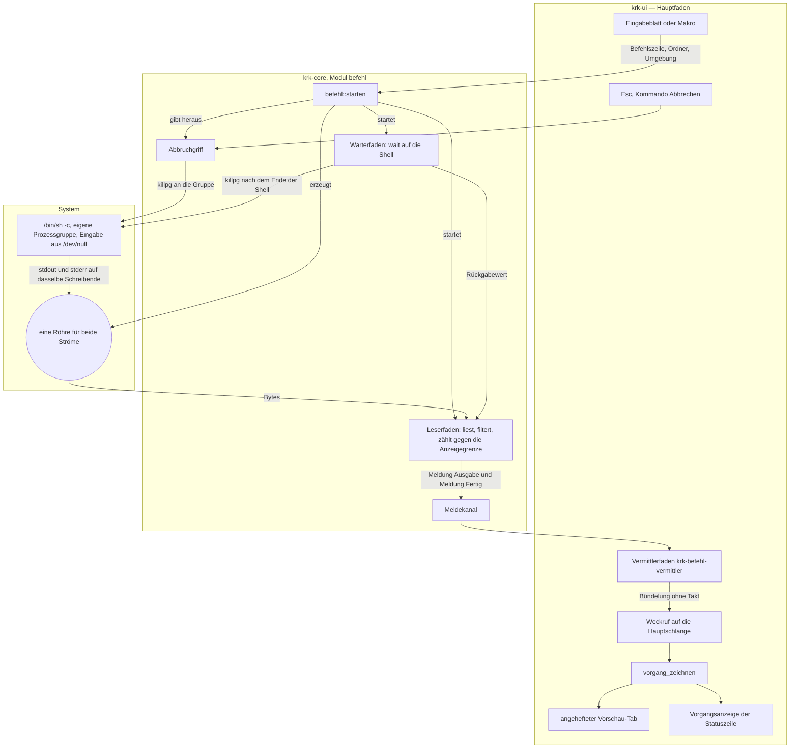
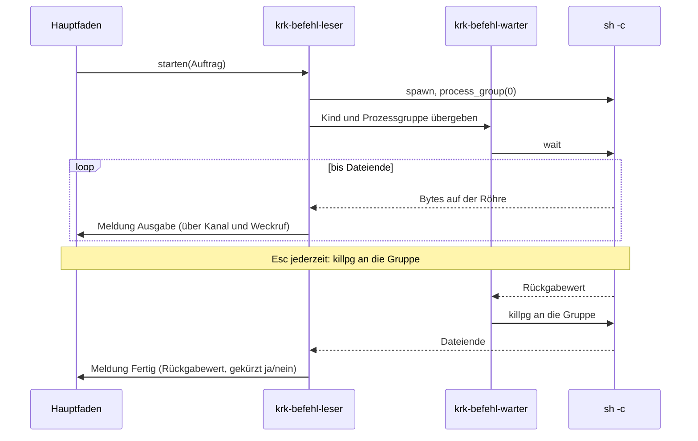

# Implementierungsplan: Befehle absetzen und Makros speichern

**Datum:** 2026-08-16
**Status:** Entwurf
**Spec:** `shared/planning/260816-2240_o_spec-befehle-absetzen-und-makros-speichern.md`, abgenommen vom Nutzer am 260816-2250
**Circle:** `circles/260816-2255-befehle-absetzen-und-makros-speichern`
**Baumstand:** `627b5f4`, Version 0.5.0, gelesen am 260816
**Decidability:** Die tragende Frage dieses Plans ist nicht, was ein Befehl anfassen wird, sondern **wann ein Lauf zu Ende ist**. Aus dem Dateiende der Röhre ist sie nicht entscheidbar: ein abgehängter Enkelprozess hält sein Schreibende offen, und KRK kann das von einem langsamen Befehl nicht unterscheiden. Entschieden wird deshalb die andere Frage, ob die Shell geendet hat; `waitpid` beantwortet sie aus dem, was der Mechanismus ohnehin hält. Der Wechsel des Mechanismus besteht darin, dass der Lauf mit der Shell endet und dasselbe Signal an die Prozessgruppe, das der Abbruch schickt, danach die übrigen Schreibenden schließt — ein Mechanismus mit zwei Auslösern statt einer Näherung. Die Trennung, die der Spec nennt, hält daneben unverändert: was ein Befehl anfasst, sagt KRK nicht voraus, und wie ein Wert vollständig angeführt wird, beantwortet C2.6.

## Directive

Wer in KRK einen Befehl absetzen will, öffnet ein Blatt, tippt ihn und sieht seine Ausgabe fortlaufend in einem angehefteten Vorschau-Tab, während die Statuszeile den laufenden Vorgang trägt und `Esc` ihn abbricht. Häufig gebrauchte Befehle stehen als benannte Vorlagen in einer von Hand gepflegten Makrodatei; gestartet werden sie aus einer Liste oder über einen von neun Plätzen der Tastenbelegung.

Der Spec führt 54 Abnahmekriterien über vier Fähigkeiten und ist die bindende Fassung. Dieser Plan wiederholt ihn nicht, sondern sagt, welche Stelle im Baum welches Kriterium trägt.

## Stand des Baums

Der Baum trägt beide Hälften des Vorhabens und keine Stelle beide zusammen. Das ist der Befund der Beratung `shared/consult/260815-1354-befehlslauf-und-makros-in-krk.md`, und das Nachlesen am 260816 bestätigt ihn Zeile für Zeile.

**Der Lauf** hat seine Vorlage in `crates/krk-ui/src/kommandos/operationen.rs`. Die Kette steht vollständig: ein Arbeitsfaden meldet über einen Kanal, der Vermittlerfaden `vermitteln` (`crates/krk-ui/src/appkit/anwendung.rs:6515`) füllt einen geteilten Zustand und setzt über `Buendelung::melden` einen Weckruf auf die Hauptschlange ab, worauf `Anwendungsdelegierter::vorgang_zeichnen` den Stand liest und zeichnet. Die Reihenfolge dieser drei Schritte ist bindend und im Modulkopf von `operationen.rs` begründet.

**Die Anzeige** hat ihre Vorlage in `Vorschaumodell::zwischenablage_anzeigen` (`crates/krk-ui/src/vorschaumodell.rs:434`). Sie setzt Titel und Inhalt im aktiven Tab und lässt den Pfad leer; eine eigene Tab-Sorte entsteht dabei nicht.

**Der Unterprozess fehlt ganz.** `std::process::Command` steht im ganzen Baum allein in Prüfdateien. `crates/krk-core/src/verzeichnis/sys.rs` ist das eine Modul in `krk-core` mit `allow(unsafe_code)`; sein Modulkopf zählt fünf Schnittstellen und neun gebundene Funktionen, und dieselbe Zeile steht wortgleich in `crates/krk-core/src/lib.rs` und in `crates/krk-core/src/verzeichnis/mod.rs`.

**Die Aufzählungen sind nachgezählt und nicht übernommen.** `Kommando` trägt am 260816 genau 79 Varianten (`awk '/^pub enum Kommando/,/^}/' crates/krk-core/src/tasten/belegung.rs`), `Kommando::KENNUNGEN` ebenso viele Paare, `Funktionsbereich::ALLE` neun Werte, `Datei::ALLE` sechs. Die Zahlen aus C4.7 und C4.11 gehen damit auf: 79 plus 13 sind 92, und 85 ausgelieferte Funktionen plus 13 sind 98.

**Die Zulässigkeitsfrage steht an einer Stelle** (`crates/krk-ui/src/kommandos/zulaessigkeit.rs`) und hat zwei Frager, den Ereignisabgriff und die Ausgrauung des Hauptmenüs. Zwei Zählproben halten beides fest, und beide bleiben in dieser Runde grün.

**Das Hauptmenü entsteht aus der einen Gliederung.** `menuemodell::aufbau` fragt `belegungsmodell::nach_bereichen` und baut je besetztem `Funktionsbereich` ein Obermenü. Ein zehnter Funktionsbereich bringt sein Obermenü damit von selbst mit; C4.6 verlangt genau das und keine zweite Tabelle.

## Ansatz

Vier Bündel in der Reihenfolge der Fähigkeiten. Nach Bündel A allein ist das Vorhaben brauchbar: ein Befehl läuft, seine Ausgabe erscheint, `Esc` bricht ab. Die Bündel B bis D setzen darauf auf und nehmen nichts davon zurück.

Drei Entwurfsentscheidungen tragen den ganzen Plan und stehen deshalb vorn.

### Ein Fach für einen Vorgang, zwei Füllungen

C1.15 sagt zu: es läuft genau ein Vorgang, gleich welcher Art. Diese Zusage ist nur dann aus einer Stelle entscheidbar, wenn es auch nur eine Stelle gibt, die sie hält. `AnwendungsIvars` führt heute `vorgang: RefCell<Option<Vorgang>>`, und ein zweites Fach daneben wären zwei Wahrheiten über die Frage „läuft etwas". `Vorgang` bekommt deshalb eine Nutzlast:

```rust
struct Vorgang { seite: Fensterseite, begonnen: Instant, inhalt: Vorgangsinhalt }
enum Vorgangsinhalt { Datei(Dateivorgang), Befehl(Befehlsvorgang) }
```

Damit ist „genau ein Vorgang" eine Aussage über einen Typ und nicht über die Aufmerksamkeit des nächsten Lesers, in derselben Bauform, in der `Zettel` die Zusage „genau zwei Zettel" trägt. Der Umbau kostet wenig: sieben Stellen in `anwendung.rs` fassen das Feld an, nachgezählt am 260816.

### Eine Maschinerie, zwei Füllungen

Der Spec verlangt den Vermittlerfaden als Vorlage und keine zweite Maschinerie daneben. Geteilt bleibt alles, was die Maschinerie ausmacht: die `Buendelung` ohne Takt, `hauptfaden_wecken`, die bindende Reihenfolge aus `gezeichnet`, Lesen und Zeichnen, und der eine Einstiegspunkt `vorgang_zeichnen` auf dem Hauptfaden. Verschieden ist allein die Übersetzung der Meldungen in den Anzeigestand, und die ist je Art verschieden, weil die Meldungen es sind.

`Vorgangszustand` wird dafür über seinen Anzeigestand und seinen Abbruchgriff verallgemeinert, statt ein zweiter Typ mit denselben drei Feldern danebenzustehen:

```rust
pub trait Abbrechbar { fn abbrechen(&self); }
pub struct Vorgangszustand<A: Abbrechbar, S> { pub buendelung: Buendelung, abbruch: A, stand: Mutex<S> }
```

### Ein Zieltab statt einer zweiten Tab-Sorte

Die Regel des Modulkopfs von `vorschaumodell.rs` lautet heute: jede Quelle schreibt in den aktiven Tab und in keinen anderen. Sie wird umformuliert und nicht gebrochen: **jede Quelle schreibt in den Tab, den `zieltab` nennt.** `zieltab` ist der aktive Tab, solange er nicht angeheftet ist, sonst der nächste nicht angeheftete, sonst ein neuer. Eine Funktion, drei Aufrufer, und die Tabelle unter `## Welcher Tab die Ausgabe nimmt` des Specs fällt aus ihr heraus, statt danebenzustehen.

## Der Weg vom Tastendruck zur Ausgabe, als Mechanismus

Der Spec zeichnet diesen Weg aus der Sicht des Nutzers. Das Bild hier zeichnet ihn aus der Sicht der Fäden, weil dort die Bauarbeit liegt.



Zwei Kanten laufen gegen die Richtung, und beide sind derselbe Rückweg: das Signal an die Prozessgruppe. Es ist kein Kreis im Entwurf, sondern der Griff des Nutzers an einen fremden Prozess, und er hat zwei Auslöser statt eines. Der zweite, das Ende der Shell, ist die Antwort auf die Frage im Plankopf; der Datensatz dazu ist `decisions/260816-2307_o_stirbt-die-prozessgruppe-auch-am-normalen-ende-des-laufs.md`.

**Warum eine Röhre und nicht zwei.** C1.5 sagt zu, dass beide Ausgabeströme in der Reihenfolge ihres Eintreffens erscheinen. Mit zwei Röhren und zwei Lesern ist diese Reihenfolge nicht herstellbar: die beiden Leser sehen ihre Stapel unabhängig, und welcher zuerst durchkommt, entscheidet der Kern des Systems. Bekommen `stdout` und `stderr` dasselbe Schreibende, entsteht die Reihenfolge dort, wo sie hingehört, nämlich im Kern, und KRK liest sie nur ab. Ein Leser, ein Filterstand, keine Zusammenführung.

**Die eine Falle dabei ist benannt, bevor sie zuschlägt:** KRK muss seine eigene Kopie des Schreibendes nach dem Start fallen lassen. Bleibt sie stehen, kommt nie ein Dateiende, und der Lauf endete allein über den Warter.

## Wie die zwei Fäden sich die zwei Wartezeiten teilen



Zwei Fäden je Lauf, und der Grund ist, dass es zwei blockierende Wartezeiten gibt: die auf der Röhre und die auf dem Kind. Keine darf die andere aufhalten. Ein Faden mit einer Abfrageschleife wäre der dritte Lebenszyklus neben Messlauf und Anwendung, den dieses Projekt an drei Stellen ausdrücklich vermeidet.

**Ein Rest bleibt und wird nicht verschwiegen.** `inference:` Zwischen dem Einsammeln des Kindes durch `wait` und dem Signal an die Gruppe liegt ein Fenster, in dem das System die Prozesskennung neu vergeben könnte; das Signal träfe dann eine fremde Gruppe. Das Fenster ist wenige Mikrosekunden breit, und eine Neuvergabe verlangt den Umlauf des ganzen Kennungsraums. Der Rest ist angenommen und gehört in den Modulkopf, statt später als Befund aufzutauchen.

## Implementierungsschritte

Zweiundzwanzig Schritte in fünf Bündeln. Jeder Schritt nennt genau einen Ausführenden.

```mermaid
flowchart LR
    subgraph BA["Bündel A — C1: der Lauf, Brauchbarkeitsschwelle"]
        direction TB
        A1["A1 killpg"] --> A3["A3 befehl::starten"]
        A2["A2 Farbfilter"] --> A3
        A3 --> A6["A6 Vorgangszustand verallgemeinert"]
        A4["A4 PATH der Anmeldeshell"] --> A8
        A5["A5 Anheftung im Vorschaumodell"] --> A8
        A6 --> A7["A7 ein Fach, zwei Füllungen"]
        A7 --> A8["A8 Blatt, Kommando, Vermittler"]
        A8 --> A9["A9 keymap: befehl_absetzen"]
    end
    subgraph BB["Bündel B — C2: die Makroablage"]
        direction TB
        B1["B1 siebte Ablagedatei"] --> B2["B2 Makros laden und neu einlesen"]
        B2 --> B3["B3 default-macros.toml"]
        B2 --> B4["B4 Anführen und Einsetzen"]
    end
    subgraph BC["Bündel C — C3: Auswahl und Nachfrage"]
        direction TB
        C1["C1 Blatt Makroliste"] --> C2["C2 Blatt Argumente"]
        C2 --> C3["C3 drei Kommandos"]
        C3 --> C4["C4 keymap: drei Einträge"]
    end
    subgraph BD["Bündel D — C4: neun Plätze"]
        direction TB
        D1["D1 neun Kommandos"] --> D2["D2 fünfter Bestandteil der Zulässigkeit"]
        D2 --> D3["D3 Zuleitung Platz zu Makro"]
        D3 --> D4["D4 keymap: neun Plätze, Kopfzahl 98"]
    end
    A9 --> B1
    B3 --> C1
    B4 --> C1
    C4 --> D1
    D4 --> E1["E1 Abnahme im Baum"]
```



### Bündel A — C1: ein Befehl läuft und seine Ausgabe erscheint

1. **A1 — `killpg(2)` als sechste Schnittstelle**
   - Ausführender: coder
   - Dateien: `crates/krk-core/src/verzeichnis/sys.rs`, `crates/krk-core/src/lib.rs`, `crates/krk-core/src/verzeichnis/mod.rs`
   - Änderungen: `killpg` in einem `unsafe extern "C"`-Block binden und als sichere Hülle `pub fn gruppe_beenden(gruppe: i32) -> io::Result<()>` herausgeben, die `SIGKILL` schickt und `ESRCH` als Erfolg wertet, weil eine schon tote Gruppe kein Fehler ist. Der Modulkopf von `sys.rs` bekommt seine Zeile im Bild der Schnittstellen und wird von fünf Schnittstellen und neun gebundenen Funktionen auf **sechs und zehn** gestellt. Dieselbe Zahl steht wortgleich in `lib.rs` und in `verzeichnis/mod.rs`; beide ziehen mit. Der Modulkopf sagt daneben, warum `killpg` hierher gehört, obwohl es weder liest noch schreibt: es ist nach `flock(2)` die zweite Schnittstelle dieser Art, und die Ausnahme `allow(unsafe_code)` bleibt auf ein Modul beschränkt.
   - Warum `SIGKILL` und nicht erst `SIGTERM`: eine zweistufige Beendigung braucht eine Frist, und eine Frist braucht einen Zeitgeber. C1.10 sagt unbedingt zu, dass nach dem Abbruch kein Kindprozess mehr lebt; ein Signal, das sich abfangen lässt, trägt diese Zusage nicht. Der Preis ist benannt: ein abgebrochener Befehl bekommt keine Gelegenheit aufzuräumen.
   - Abhängigkeiten: keine

2. **A2 — Der Filter für die Steuerfolgen, als reine Funktion**
   - Ausführender: coder
   - Dateien: `crates/krk-core/src/befehl/filter.rs` (neu), `crates/krk-core/src/lib.rs`, `crates/krk-core/tests/befehl.rs` (neu)
   - Änderungen: `pub fn filtern(stand: Filterstand, roh: &[u8]) -> (String, Filterstand)`. Der `Filterstand` trägt zwei Reste über die Stapelgrenze: eine angefangene Steuerfolge und eine angefangene UTF-8-Folge. Entfernt werden die CSI-Folgen (`ESC [` bis zu einem Endzeichen von `@` bis `~`), die OSC-Folgen (`ESC ]` bis `BEL` oder `ESC \`) und die zweizeichigen `ESC`-Folgen; alles Übrige bleibt unangetastet. **Rein im Sinne des Specs**, weil der Zustand als Wert hinein- und hinausgeht statt in einem Feld zu wohnen; dieselbe Bauform trägt `Zerlegerstand` in `crates/krk-ui/src/hervorhebung.rs`.
   - Proben, C1.13 einzeln: `\033[31mrot\033[0m` wird zu `rot`; eine Folge, die zwischen zwei Stapel fällt, wird trotzdem ganz entfernt; ein Zeichen jenseits von ASCII, das zwischen zwei Stapel fällt, kommt heil an; ein Text ohne Steuerfolgen geht unverändert durch.
   - **Was der Filter ausdrücklich nicht tut:** er entfernt keinen Wagenrücklauf. Ein Fortschrittsbalken, der sich über `\r` selbst überschreibt, erscheint deshalb als eine lange Zeile. Das ist keine Farbfolge, und eine zweite Regel dafür stünde in keinem Abnahmekriterium.
   - Abhängigkeiten: keine

3. **A3 — Der Lauf: `krk_core::befehl::starten`**
   - Ausführender: coder
   - Dateien: `crates/krk-core/src/befehl/mod.rs` (neu), `crates/krk-core/src/lib.rs`, `crates/krk-core/tests/befehl.rs`
   - Änderungen: die Maschinerie nach dem Vorbild von `krk_core::operation::starten`. `Auftrag { zeile: String, ordner: PathBuf, umgebung: Umgebung, anzeigegrenze: u64 }`; `starten(auftrag) -> Lauf` mit `Lauf::meldungen()`, `Lauf::abbruchgriff()` und `Lauf::warten()`, damit der Vermittlerfaden auf `krk-ui`-Seite dieselbe Form vorfindet wie bei den Dateioperationen. `Meldung` trägt `Ausgabe(String)` und `Fertig(Bericht)`; `Bericht { abschluss, gekuerzt: bool, bytes: u64 }`; `Abschluss` ist eine vollständige Fallunterscheidung ohne Auffangzweig über `Beendet { rueckgabewert: i32 }`, `DurchSignal { nummer: i32 }`, `Abgebrochen` und `NichtGestartet(String)`.
   - Der Start: `Command::new("/bin/sh").arg("-c").arg(zeile).current_dir(ordner)` (C1.2, C1.3), `stdin(Stdio::null())` (C1.11), `env_clear` nicht, sondern gezielt `PATH` aus der Umgebung, `NO_COLOR=1` und `TERM=dumb` gesetzt (C1.12), `process_group(0)` aus `std::os::unix::process::CommandExt` (stabil seit Rust 1.64, der Baum fährt 1.97.1). **Damit braucht das Setzen der Prozessgruppe keine siebte Schnittstelle**; die offene Frage des Specs dazu ist hier beantwortet.
   - Die Röhre: `std::io::pipe()`, das Schreibende an `stdout` und an `stderr` desselben Kindes, die eigene Kopie unmittelbar nach dem Start fallen gelassen. Begründung im Modulkopf, siehe oben.
   - Der Abbruchgriff: `Abbruchgriff` hält `Arc<Mutex<Abbruchstand>>` mit dem Kennzeichen und der Prozessgruppe. `abbrechen` setzt das Kennzeichen und schickt, falls die Gruppe schon eingetragen ist, das Signal; der Leserfaden trägt die Gruppe unter derselben Sperre ein und schickt das Signal selbst, falls das Kennzeichen inzwischen steht. **Kein Wettlauf und keine Feinheit über Speicherordnungen:** die Sperre wird zweimal je Lauf angefasst.
   - Der Leserfaden `krk-befehl-leser` liest in einen Puffer von 8 KiB, gibt jeden Stapel durch `filtern`, zählt die durchgereichten Bytes gegen `auftrag.anzeigegrenze` und hört jenseits davon auf zu senden, liest aber weiter bis zum Dateiende (C1.8). Der Warterfaden `krk-befehl-warter` ruft `wait`, schickt danach das Signal an die Gruppe und reicht den Rückgabewert an den Leser (`decisions/260816-2307_o_stirbt-die-prozessgruppe-…`).
   - Proben in `crates/krk-core/tests/befehl.rs`, jede gegen ein Abnahmekriterium: Namensausdehnung und Verkettung (C1.2), das Arbeitsverzeichnis (C1.3), die Reihenfolge der beiden Ströme (C1.5), der Rückgabewert (C1.6), die leere Standardeingabe (C1.11), `NO_COLOR` in der Umgebung (C1.12), das Ende der Prozessgruppe nach dem Abbruch (C1.10, nachgeprüft über eine Merkdatei, die ein überlebender Enkel schriebe), die Kürzung an einer kleinen Anzeigegrenze und der vollständige Lauf darüber hinaus (C1.8), und das Ende eines Laufs, dessen Enkel abgehängt wurde.
   - Abhängigkeiten: Schritt A1, Schritt A2

4. **A4 — Der `PATH` der Anmeldeshell, nebenher erfragt**
   - Ausführender: coder
   - Dateien: `crates/krk-core/src/befehl/umgebung.rs` (neu), `crates/krk-core/tests/befehl.rs`
   - Änderungen: `Umgebungsabfrage::starten()` legt beim Programmstart einen Faden `krk-pfadabfrage` an, der `$SHELL -l -c 'printf %s "$PATH"'` fährt und das Ergebnis über einen Kanal der Tiefe 1 schickt. Fehlt `$SHELL`, gilt `/bin/zsh`, die Vorgabeshell von macOS. `Umgebungsabfrage::umgebung(&self) -> Umgebung` wartet höchstens `PFADFRIST` (1 s) und liefert danach die Umgebung des eigenen Prozesses; welche der beiden es war, sagt der Rückgabewert mit, damit die Statuszeile es benennen kann. Nach der ersten Antwort wird sie festgehalten und jeder weitere Aufruf ist eine Ablesung (C1.16, C1.17).
   - Der Fenster­aufbau wartet auf nichts: der Faden startet und wird nicht abgewartet. Damit bleibt L4 unberührt, wie der Spec es unter seinen zwei prüfbaren Kriterien verlangt.
   - Welche Shell den Lauf selbst fährt, ist entschieden und begründet in `decisions/260816-2307_o_welche-shell-faehrt-den-lauf-und-woher-kommt-ihr-pfad.md`, Möglichkeit 1.
   - Abhängigkeiten: keine

5. **A5 — Die Anheftung im Vorschaumodell**
   - Ausführender: coder
   - Dateien: `crates/krk-ui/src/vorschaumodell.rs`, `crates/krk-ui/src/appkit/vorschau.rs`
   - Änderungen: `Vorschautab` bekommt `angeheftet: bool`. Neu ist `fn zieltab(&mut self) -> usize` nach der Regel oben; `datei_anzeigen`, `zwischenablage_anzeigen` und das neue `befehlsausgabe_anzeigen(&mut self, titel: &str, text: String)` gehen sämtlich darüber, statt `self.aktiv` zu lesen. `befehlsausgabe_anzeigen` heftet seinen Tab an, setzt den Titel auf den abgesetzten Befehl und den Pfad auf `None` (C1.18). Der Modulkopf wird an der einen Stelle umformuliert, an der die Regel steht, und behält seine Form; die Tabelle des Specs kommt als Begründung dazu, samt der Zusage, dass es höchstens einen angehefteten Tab gibt und er dem Befehlslauf gehört.
   - `schliessen()` braucht keine Zeile: die Marke fällt mit dem Tab, und beim letzten Tab setzt `Vorschautab::leer()` sie zurück. Ein Befehl zum Lösen entsteht nicht.
   - In `appkit/vorschau.rs` kommt `befehlsausgabe_anzeigen` als Durchreiche dazu, nach dem Muster von `zwischenablage_anzeigen` (Modell ändern, dann `anzeigen`), und der Bildlauf wird nach jedem Schreiben an das Ende gezogen (C1.7).
   - Proben ohne AppKit im `#[cfg(test)]`-Modul der Datei: die Datei schreibt in den nächsten nicht angehefteten Tab, wenn der aktive angeheftet ist; ein zweiter Lauf ersetzt den Inhalt des angehefteten Tabs; ein Wechsel der Auswahl im Dateifenster überschreibt die Ausgabe nicht; `zeigt_dateitext` bleibt für die Befehlsausgabe falsch, weil ihr Tab keinen Pfad trägt.
   - Abhängigkeiten: keine

6. **A6 — `Vorgangszustand` über Anzeigestand und Abbruchgriff verallgemeinert**
   - Ausführender: coder
   - Dateien: `crates/krk-ui/src/kommandos/operationen.rs`, `crates/krk-ui/src/kommandos/befehl.rs` (neu), `crates/krk-ui/src/kommandos/mod.rs`
   - Änderungen: `Abbrechbar` als Merkmal mit einer Methode; `krk_core::operation::Abbruchgriff` und `krk_core::befehl::Abbruchgriff` setzen es um. `Vorgangszustand<A, S>` wie oben, `Buendelung` unverändert. Zwei Typabkürzungen halten die Namen kurz. Der Modulkopf von `operationen.rs` sagt in einem Absatz, was hier geteilt ist und was nicht: geteilt ist die Maschinerie, verschieden ist die Übersetzung der Meldungen, und das ist kein Versehen, sondern der Unterschied zwischen den Meldungen selbst.
   - `kommandos/befehl.rs` nimmt `Befehlsstand` (der aufgelaufene Text, die Byte-Zahl, das Kennzeichen der Kürzung, der Abschlussbericht) und die Texte des Nutzers auf: die Vorgangszeile mit dem Namen des Befehls oder des Makros, der Byte-Zahl und dem Abbruchhinweis, den Abschlusstext nach C1.6 und C1.8, die Abweisung nach C1.15 und die Sätze für „nichts ausgewählt" nach dem Muster von `nichts_zu_kopieren`. Ein eigenes Modul und kein Anhang an `operationen.rs`: jene Datei beschreibt nach ihrem eigenen Kopf den Ablauf der Dateioperationen, und ein Befehlslauf ist keine.
   - Der Verzug bis zum Erscheinen der Vorgangszeile ist `operationen::ANZEIGEVERZUG` und keine zweite Zahl. Ein Befehl, der in weniger als 150 ms fertig ist, lässt damit keine Zeile aufblitzen, genau wie eine kleine Kopie.
   - Abhängigkeiten: Schritt A3

7. **A7 — Ein Fach für einen Vorgang, zwei Füllungen**
   - Ausführender: coder
   - Dateien: `crates/krk-ui/src/appkit/anwendung.rs`
   - Änderungen: `Vorgang` und `Vorgangsinhalt` wie oben. Die sieben Stellen ziehen nach: `aufgeschobene_ordner` (Zeile 2515, der Befehlszweig schiebt nichts auf und liefert eine leere Liste), `abbrechen` (Zeile 4591, der zweite Rang trifft beide Arten), `vorgang_laeuft_schon` (Zeile 4988, die Meldung nennt die laufende Art), `auftrag_starten` (Zeile 5006), `vorgang_zeichnen` (Zeile 5071, der eine Einstiegspunkt mit einer Fallunterscheidung), `vorgang_beenden` (Zeile 5181) und die Messmodus-Zeile `vorgang_laeuft` (Zeile 6427, unverändert wahr für beide Arten).
   - `vorgang_laeuft_schon` bekommt seinen zweiten Rufer und trägt damit C1.15 in beide Richtungen: ein Befehl während einer Kopie und eine Kopie während eines Befehls werden beide abgewiesen, aus derselben Stelle.
   - Abhängigkeiten: Schritt A6

8. **A8 — Das Eingabeblatt, das erste Kommando und der Vermittlerfaden**
   - Ausführender: coder
   - Dateien: `crates/krk-ui/src/appkit/blaetter/befehlseingabe.rs` (neu), `crates/krk-ui/src/appkit/blaetter/mod.rs`, `crates/krk-core/src/tasten/belegung.rs`, `crates/krk-ui/src/belegungsmodell.rs`, `crates/krk-ui/src/appkit/anwendung.rs`
   - Änderungen: `befehlseingabe.rs` nach dem Vorbild von `pfadeingabe.rs`, ein breites Feld ohne Prüfung des Inhalts; C2.9 verlangt ausdrücklich, dass der Text ungeprüft bleibt. Der Modulkopf trägt den Abschnitt `# Ab welchem macOS die angesprochenen Klassen stehen`, wie jede Datei unter `appkit/` außer den zwei begründeten Ausnahmen. Der Kopf von `blaetter/mod.rs` zählt danach elf Blätter statt zehn.
   - `Kommando::BefehlAbsetzen` als achtzigste Variante, mit ihrer Zeile in `Kommando::KENNUNGEN` (`befehl_absetzen`), in `Kommando::wirkungsbereich` (`Ueberall`, Begründung nach dem Vorbild von `Kommando::Abbrechen`) und in `bereich_des_kommandos`. **`Funktionsbereich::Makros` entsteht schon hier** als zehnter Wert mit diesem einen Mitglied, damit jeder Zwischenstand des Plans ein stimmiges Hauptmenü hat; die zwölf weiteren Einträge kommen in den Bündeln C und D dazu.
   - Der Vermittlerfaden `befehl_vermitteln` neben `vermitteln`: dieselbe Schleife mit derselben Bündelung und demselben Weckruf, mit der Übersetzung der zwei Befehlsmeldungen. Gestartet wird er in `befehl_starten`, das seinerseits `vorgang_laeuft_schon` fragt, die Umgebung aus Schritt A4 holt, `vorschaumodell::TEXTGRENZE` als Anzeigegrenze mitgibt und den Vorgang in das eine Fach legt.
   - Abhängigkeiten: Schritt A5, Schritt A7

9. **A9 — Die Belegungsdatei nimmt `befehl_absetzen` auf**
   - Ausführender: ontocoder
   - Dateien: `resources/default-keymap.toml`
   - Änderungen: ein Block `[[funktion]]` mit `id = "befehl_absetzen"`, `name = "Befehl absetzen"` und **leerer Tastenliste**, nicht mit `reserviert_fuer`; die Begründung folgt dem Vorbild der drei Spaltenschalter und der zwei Schalter „Deep" und „Content", und der Kommentar nennt sie. Der Block eröffnet einen neuen Abschnitt am Ende der Datei, weil die Reihenfolge der Blöcke die Reihenfolge im Menü ist. Die Zahl im Dateikopf geht von 85 auf 86 Funktionen bei unveränderten 90 Kombinationen.
   - Abhängigkeiten: Schritt A8

**Nach Bündel A ist die Runde brauchbar.** Ein Befehl läuft im angezeigten Ordner, seine Ausgabe erscheint fortlaufend im angehefteten Vorschau-Tab, die Statuszeile trägt den Vorgang, `Esc` bricht ab. Achtzehn der vierundfünfzig Abnahmekriterien sind damit abnehmbar.

### Bündel B — C2: die Makros stehen in der siebten Ablagedatei

10. **B1 — Die siebte Ablagedatei**
    - Ausführender: coder
    - Dateien: `crates/krk-core/src/ablage/pfade.rs`, `crates/krk-core/src/ablage/mod.rs`, `crates/krk-core/tests/ablage.rs`
    - Änderungen: `Datei::Makros` mit `dateiname` `macros.toml` und `format` `Toml`. `Datei::ALLE` wächst von sechs auf sieben. Die vollständige Fallunterscheidung in `Datei::format` hält den Bau an, bis die Zeile steht, und genau darauf zählt C2.1. Jede Prosastelle, die heute sechs Ablagedateien nennt, nennt danach sieben: die zwei Modulköpfe von `pfade.rs` und `ablage/mod.rs` sowie vier Doc-Kommentare in `pfade.rs`. Die Rundläufe in `crates/krk-core/tests/ablage.rs` gehen über `Datei::ALLE` und ziehen von selbst mit.
    - **Nicht mitgezogen** werden die drei Stellen, die „vier Dateien" sagen: `Zugang::laden` und `Zugang::sichern` meinen wirklich die vier TOML-Dateien. Die drei Stellen zu `Ablage::pfad`, die es fälschlich sagen, sind als `shared/issues/260816-2307_o_der-doc-kommentar-von-ablage-pfad-nennt-vier-dateien-…` festgehalten; wer sie hier mitnimmt, hat den Befund erledigt.
    - Abhängigkeiten: Schritt A9

11. **B2 — Makros laden, neu einlesen und prüfen**
    - Ausführender: coder
    - Dateien: `crates/krk-core/src/ablage/makros.rs` (neu), `crates/krk-core/src/ablage/mod.rs`, `crates/krk-core/tests/ablage.rs`
    - Änderungen: `Makros`, `Makro { name, befehl, platz: Option<Makroplatz>, argumente: Vec<Argument> }` und `Argument { name, beschriftung }`, gelesen über eine `Makrodatei` mit `deny_unknown_fields`, wie `Einstellungsdatei` daneben. Bewusst **ohne `Serialize`**, aus demselben Grund wie dort: ein Serialisierungsweg wäre der zweite Weg zu dieser Datei, und er schriebe sie ohne ihre Kommentare (C2.3).
    - **Zwei Leser, zwei Zusagen, und der Unterschied ist der Zweck.** `laden(zugang)` ist der Weg beim Start: Anlage aus der eingebetteten Auslieferungsfassung, falls die Datei fehlt (C2.2), und im Fall einer beschädigten Datei der gewöhnliche Weg über `Zugang::laden`, also Auslieferungsmakros, Beiseitelegen nach `atomar::beiseitepfad` und eine Meldung, die die Datei `macros.toml.beschaedigt` benennt (C2.13). `neu_einlesen(zugang) -> Result<Makros, String>` ist der Weg des Befehls: er liest und zerlegt und **schreibt unter keinen Umständen**; scheitert er, bekommt der Aufrufer den Fehlertext mit Zeilenangabe und behält seinen bisherigen Satz (C2.12).
    - Über das Zerlegen hinaus prüft `Makros::aus_datei` zwei Dinge, und beide sind Fehler der Datei im Sinne von C2.12 und C2.13: zwei Einträge auf demselben Platz (C4.3) und ein freies Argument, dessen Name einer der vier Platzhalter ist. Der zweite Fall ist die einzige Stelle, an der der Einsetzung eine Zweideutigkeit entstehen könnte, und er wird beim Lesen entschieden statt beim Einsetzen geraten.
    - Abhängigkeiten: Schritt B1

12. **B3 — Die kommentierte Auslieferungsfassung**
    - Ausführender: ontocoder
    - Dateien: `resources/default-macros.toml` (neu)
    - Änderungen: die Datei, die beim ersten Start wörtlich entsteht. Ihre Kommentare sind ihr Zweck (C2.2) und erklären: die vier Platzhalter `{ordner}`, `{anderer_ordner}`, `{auswahl}` und `{eintrag}` mit je einem Satz; die Anführungsregel und warum jede andere geschweifte Klammer stehen bleibt, mit `awk '{print $1}'` als Beispiel (C2.10); die Erklärung freier Argumente über `[[makro.argument]]` mit `name` und `beschriftung`; das Feld `platz` mit seinen Werten 1 bis 9 und dem Hinweis, dass jeder Platz höchstens einmal vorkommt; und dass KRK diese Datei nie schreibt. Dazu drei bis vier lauffähige Beispielmakros aus den Beispielen des Nutzers: Dateien nach Muster auflisten, ein Skript mit einem freien Argument rufen, ein `git`-Befehl.
    - Abhängigkeiten: Schritt B2

13. **B4 — Anführen und Einsetzen**
    - Ausführender: coder
    - Dateien: `crates/krk-core/src/befehl/einsetzung.rs` (neu), `crates/krk-core/tests/befehl.rs`
    - Änderungen: `pub fn anfuehren(wert: &str) -> String` setzt den Wert in einfache Anführungszeichen und ersetzt jedes Anführungszeichen im Wert durch die vierzeichige Folge, die den Abschnitt schließt, ein geschütztes Anführungszeichen setzt und wieder öffnet. **Nicht die Verdopplung**, die C2.6 im Wortlaut beschreibt: sie besteht den Nachweis nicht, den dasselbe Kriterium verlangt, und der Widerspruch ist als `issues/260816-2307_o_c2-6-beschreibt-das-verdoppeln-…` festgehalten und am 260816 an der Shell nachgemessen.
    - `pub fn einsetzen(vorlage: &str, werte: &Werte) -> Result<String, Fehlender>` ersetzt genau die benannten Platzhalter und lässt jede andere geschweifte Klammer stehen (C2.10). Mehrere ausgewählte Einträge werden zu mehreren, je einzeln angeführten Werten mit einem Leerzeichen dazwischen (C2.7). Verlangt die Vorlage `{auswahl}` oder `{eintrag}` und ist nichts da, liefert die Funktion `Fehlender`, und der Aufrufer schreibt den Satz nach dem Muster von `nichts_zu_kopieren` in die Statuszeile (C2.8). Ein leer gelassenes freies Argument ist ein leerer Wert und kein Fehler (C3.8).
    - Proben, C2.6 einzeln nachgestellt: ein Name mit Leerzeichen, mit Anführungszeichen, mit Dollarzeichen, mit Rückwärtsstrich und mit Zeilenumbruch kommt bei `printf '%s\n'` als genau ein Wert an. Die Probe fährt dafür einen echten Lauf über Schritt A3, damit sie die Shell prüft und nicht die eigene Vorstellung von ihr.
    - Abhängigkeiten: Schritt A3, Schritt B2

### Bündel C — C3: ein Makro wird aus der Liste gewählt und gestartet

14. **C1 — Das Blatt mit der Makroliste**
    - Ausführender: coder
    - Dateien: `crates/krk-ui/src/appkit/blaetter/makroliste.rs` (neu), `crates/krk-ui/src/appkit/blaetter/mod.rs`
    - Änderungen: ein Blatt mit einer `NSTableView` in einer `NSScrollView`, zwei Spalten für Name und Befehlstext, nach dem Vorbild von `appkit/belegungsansicht.rs` und deutlich kleiner als jenes: keine Aufnahme, keine Suche, keine Gruppenzeilen. Die Pfeiltasten bewegen die Auswahl, die Eingabetaste liegt auf der Schaltfläche „Starten", `Esc` schließt über denselben Griff wie jede andere Rückfrage (C3.1, C3.2). Ist die Liste leer, steht statt der Tabelle ein Satz, der den Befehl „Makrodatei im Editor öffnen" als Weg dorthin nennt (C3.3). Modulkopf mit dem Abschnitt zu den Untergrenzen; `blaetter/mod.rs` zählt danach zwölf Blätter.
    - Abhängigkeiten: Schritt B3, Schritt B4

15. **C2 — Das Blatt für die freien Argumente**
    - Ausführender: coder
    - Dateien: `crates/krk-ui/src/appkit/blaetter/argumente.rs` (neu), `crates/krk-ui/src/appkit/blaetter/mod.rs`
    - Änderungen: ein Blatt mit einem Feld je erklärtem Argument, mit dessen Beschriftung davor, nach dem Vorbild von `blaetter/stapelumbenennen.rs` mit seinen vier Feldern und seinem einen Wächter. Die Überschrift nennt den Namen des Makros, damit die Frage für sich steht (C3.5). `Esc` bricht ab, ohne etwas zu starten (C3.6). Modulkopf mit dem Abschnitt zu den Untergrenzen; `blaetter/mod.rs` zählt danach dreizehn Blätter.
    - Abhängigkeiten: Schritt C1

16. **C3 — Die drei Makrobefehle und ihre Zuleitung**
    - Ausführender: coder
    - Dateien: `crates/krk-core/src/tasten/belegung.rs`, `crates/krk-ui/src/belegungsmodell.rs`, `crates/krk-ui/src/appkit/anwendung.rs`, `crates/krk-ui/src/kommandos/befehl.rs`
    - Änderungen: `Kommando::Makros`, `Kommando::MakrodateiOeffnen` und `Kommando::MakrosNeuEinlesen` als Varianten 81 bis 83, je mit ihrer Zeile in `KENNUNGEN`, in `wirkungsbereich` (`Ueberall`) und in `bereich_des_kommandos` (`Funktionsbereich::Makros`). `AnwendungsIvars` bekommt `makros: RefCell<Makros>`, gefüllt beim Start über `ablage::makros::laden`; eine Meldung aus dem Laden geht in die Statuszeile wie bei jeder anderen Ablagedatei.
    - `Kommando::MakrodateiOeffnen` legt die Datei zuerst an, falls sie fehlt, und öffnet sie danach über `editor_oeffnen_lassen` mit `Oeffnungsherkunft::Befehl` (C2.11); ein dritter Wert jener Aufzählung entsteht nicht. `Kommando::MakrosNeuEinlesen` ruft `neu_einlesen`, ersetzt den Satz nur im Erfolgsfall und meldet sonst den Fehler mit Zeilenangabe (C2.12).
    - Der Weg von einem gewählten Makro zum Lauf steht **einmal** da und wird in Bündel D vom Tastenplatz mitbenutzt: Vorlage holen, Werte aus dem aktiven Dateifenster und dem der anderen Seite sammeln, bei erklärten Argumenten das Blatt aus Schritt C2 zeigen, einsetzen, `befehl_starten` rufen (C3.9). Die Statuszeile und der Tabtitel tragen dabei den Namen des Makros statt der Befehlszeile (C3.10).
    - Abhängigkeiten: Schritt C2

17. **C4 — Die Belegungsdatei nimmt die drei Befehle auf**
    - Ausführender: ontocoder
    - Dateien: `resources/default-keymap.toml`
    - Änderungen: drei Blöcke mit leeren Tastenlisten im Abschnitt aus Schritt A9, in der Reihenfolge, in der sie im Menü stehen sollen: „Makros", „Makrodatei im Editor öffnen", „Makros neu einlesen". Kopfzahl von 86 auf 89 Funktionen, 90 Kombinationen unverändert.
    - Abhängigkeiten: Schritt C3

### Bündel D — C4: neun Plätze und ein zehntes Obermenü

18. **D1 — Die neun Makroplätze als Kommandos**
    - Ausführender: coder
    - Dateien: `crates/krk-core/src/tasten/belegung.rs`, `crates/krk-core/tests/belegung.rs`
    - Änderungen: `Kommando::Makro1` bis `Kommando::Makro9` als Varianten 84 bis 92, je mit ihrer Zeile in `KENNUNGEN` (`makro_1` bis `makro_9`) und in `wirkungsbereich` (`Ueberall`). Dazu `Kommando::makroplatz(self) -> Option<Makroplatz>` als vollständige Fallunterscheidung ohne Auffangzweig: ein neues Kommando hält den Bau an und erzwingt die Antwort auf die Frage, ob es einen Makroplatz braucht. `Makroplatz` ist ein eigener Typ mit neun Werten und keine Zahl, aus demselben Grund, aus dem `Zettel` ein Typ ist: „neun ist eine gesetzte Obergrenze" wird damit eine Aussage über einen Typ. Die Probe in `crates/krk-core/tests/belegung.rs`, die die Zahl der Kommandos gegen die Zahl der Kennungen hält, nennt danach 92.
    - Abhängigkeiten: Schritt C4

19. **D2 — Der fünfte Bestandteil der Zulässigkeitsfrage**
    - Ausführender: coder
    - Dateien: `crates/krk-ui/src/kommandos/zulaessigkeit.rs`, `crates/krk-ui/src/appkit/anwendung.rs`
    - Änderungen: `Lage` bekommt ein fünftes Feld `makroplaetze: Makroplaetze`, eine `Copy`-Bitmaske über die neun Plätze. `zulaessig` bekommt seinen fünften Bestandteil, und er ist **keine Sonderbehandlung eines einzelnen Kommandos**, sondern eine Regel über eine Frage, die jedes Kommando stellen kann: verlangt der Befehl einen Makroplatz, so muss der Platz ein Makro tragen. Für jedes Kommando ohne Platz ist der Bestandteil erfüllt, und `Kommando::makroplatz` beantwortet das aus dem Kern. Der Modulkopf zählt danach fünf Bestandteile und sagt, warum der fünfte neben (3) steht und nicht neben (1), (2) und (4): er fragt nach dem Befehl und nicht nach der Lage, also hebt ihn die Ausnahmeliste `immer_erreichbar` nicht auf.
    - `Anwendungsdelegierter::lage` füllt das Feld aus `ivars().makros`. Damit bekommen beide Frager dieselbe Antwort, und C4.4 hält aus derselben Stelle für die Ausgrauung des Menüeintrags und für den Tastendruck.
    - Die Tafel aus 280 Fällen bleibt bei 280: keiner der sieben Stellvertreter braucht einen Platz, der fünfte Bestandteil ist für sie erfüllt, und `jeder_stellvertreter_traegt_den_bereich_den_er_vertritt` bekommt eine dritte Zusicherung, die genau das festhält. Daneben eine eigene kleine Probe für den fünften Bestandteil: derselbe Platz mit und ohne hinterlegtes Makro, in einer Lage ohne jedes andere Hindernis.
    - Abhängigkeiten: Schritt D1

20. **D3 — Die Zuleitung vom Platz zum Makro**
    - Ausführender: coder
    - Dateien: `crates/krk-ui/src/belegungsmodell.rs`, `crates/krk-ui/src/appkit/anwendung.rs`
    - Änderungen: die neun Kommandos bekommen ihre Zeile in `bereich_des_kommandos` (`Funktionsbereich::Makros`), mit einem Kommentar, der sagt, warum sie neben den vier Befehlen stehen und nicht bei den Dateioperationen. Im Delegierten führt der Platz über `Kommando::makroplatz` zum Makro und von dort in **denselben** Weg wie die Auswahl aus der Liste (Schritt C3); ein zweiter Startweg entsteht nicht. Ein Platz ohne Makro erreicht diesen Weg gar nicht, weil die Zulässigkeit ihn schon abgewiesen hat (C4.4, C4.9). Nach „Makros neu einlesen" wirkt eine geänderte Zuordnung sofort, weil `lage` bei jeder Frage neu liest (C4.10).
    - Abhängigkeiten: Schritt D2

21. **D4 — Die Belegungsdatei nimmt die neun Plätze auf**
    - Ausführender: ontocoder
    - Dateien: `resources/default-keymap.toml`
    - Änderungen: neun Blöcke `makro_1` bis `makro_9` mit den Namen „Makro 1" bis „Makro 9" und leeren Tastenlisten. Der Kommentar davor sagt dreierlei: dass der Name des Platzes statisch ist und der Name des hinterlegten Makros in der Auswahlliste und in der Statuszeile steht, nicht in der Belegungsansicht (C4.2); dass die Zuordnung von Platz zu Makro in `macros.toml` steht (C4.3); und dass alle neun aus der Markdown-Ausgabe der Runde 3 herausfallen, weil diese nur Funktionen mit Kombination führt (C4.8). Die Kopfzahl geht auf **98 Funktionen bei unverändert 90 Kombinationen** (C4.11).
    - Abhängigkeiten: Schritt D3

### Bündel E — Abnahme im Baum

22. **E1 — Die vier Abnahmekommandos und die Zählproben**
    - Ausführender: coder
    - Dateien: der ganze Arbeitsbereich
    - Änderungen: `make check` grün, also `cargo build --workspace`, `cargo test --workspace`, `cargo clippy --workspace --all-targets` und `cargo fmt --all --check`. **`cargo` liegt auf diesem Gerät nicht auf dem Standard-PATH**; jeder Aufruf braucht den vollen Pfad unter `$HOME/.cargo/bin` oder ein vorangestelltes `export PATH="$HOME/.cargo/bin:$PATH"`. Das `Makefile` nimmt genau das ab. Zusätzlich `cargo clippy` unter `-D warnings`, weil `unused_must_use` erst dort ein Fehler ist und dieses Projekt `#[must_use]` als Regel führt: jeder neue Rückgabewert, dessen stilles Fallenlassen unbemerkt bliebe, bekommt das Attribut.
    - Die Zählproben aus `crate::quellbaum` nachziehen, soweit sie sich bewegt haben, und zwar an der Wurzel und nicht an der Zahl: `die_zulaessigkeitsregel_ist_genau_einmal_erklaert` und `beide_frager_rufen_die_eine_regel` bleiben unverändert bei einer Erklärung und zwei Rufern.
    - Der Abnahmelauf der zehn Zeitzusagen ist **nicht** Teil dieses Schritts. Er verlangt KRK im Vordergrund und ist Nutzerarbeit; die Runde schließt deshalb voraussichtlich beschränkt, wie zehn der elf Runden vor ihr.
    - Abhängigkeiten: Schritt D4

## Datenstrukturen

| Typ | Ort | Wofür |
|---|---|---|
| `befehl::Auftrag` | `krk-core/src/befehl/mod.rs` | Befehlszeile, Ordner, Umgebung, Anzeigegrenze |
| `befehl::Lauf`, `befehl::Abbruchgriff` | `krk-core/src/befehl/mod.rs` | Griff an den laufenden Unterprozess, Form wie bei `operation::Lauf` |
| `befehl::Meldung`, `befehl::Bericht`, `befehl::Abschluss` | `krk-core/src/befehl/mod.rs` | was der Leserfaden meldet |
| `befehl::Filterstand` | `krk-core/src/befehl/filter.rs` | die zwei Reste über die Stapelgrenze |
| `befehl::Umgebung`, `befehl::Umgebungsabfrage` | `krk-core/src/befehl/umgebung.rs` | der `PATH` der Anmeldeshell, einmal erfragt |
| `ablage::Makros`, `Makro`, `Argument`, `Makroplatz` | `krk-core/src/ablage/makros.rs` | die siebte Ablagedatei als Wert |
| `Datei::Makros` | `krk-core/src/ablage/pfade.rs` | siebter Wert der Ablageaufzählung |
| `Kommando::BefehlAbsetzen` … `Makro9` | `krk-core/src/tasten/belegung.rs` | dreizehn neue Varianten, 79 auf 92 |
| `Funktionsbereich::Makros` | `krk-ui/src/belegungsmodell.rs` | zehnter Wert, trägt das zehnte Obermenü |
| `Vorgangsinhalt` | `krk-ui/src/appkit/anwendung.rs` | ein Fach, zwei Füllungen |
| `Abbrechbar`, `Vorgangszustand<A, S>` | `krk-ui/src/kommandos/operationen.rs` | eine Maschinerie, zwei Füllungen |
| `Befehlsstand` | `krk-ui/src/kommandos/befehl.rs` | was der Hauptfaden vom Lauf anzeigt |
| `Vorschautab::angeheftet` | `krk-ui/src/vorschaumodell.rs` | höchstens einer, und er gehört dem Befehlslauf |
| `Lage::makroplaetze` | `krk-ui/src/kommandos/zulaessigkeit.rs` | fünfter Bestandteil, eine Frage, zwei Frager |

## Das Format der Makrodatei

```toml
# Ein Eintrag je Makro. KRK schreibt diese Datei nie.
[[makro]]
name = "Rust-Dateien zählen"
befehl = "ls *.rs | wc -l"

[[makro]]
name = "Im Baum ersetzen"
befehl = "./ersetze.sh {muster} {ersatz} {ordner}"
platz = 1
  [[makro.argument]]
  name = "muster"
  beschriftung = "Suchmuster"
  [[makro.argument]]
  name = "ersatz"
  beschriftung = "Ersetzen durch"
```

Die Feldnamen sind deutsch, wie `tasten`, `reserviert_fuer` und `gehalten_von` in `resources/default-keymap.toml`. Die vier Platzhalter heißen `{ordner}`, `{anderer_ordner}`, `{auswahl}` und `{eintrag}`; ein freies Argument steht unter seinem eigenen Namen in denselben Klammern. Ein Argument, das wie einer der vier Platzhalter heißt, ist ein Fehler der Datei und wird beim Lesen abgewiesen, statt beim Einsetzen geraten zu werden.

## Was der Übersetzer einfordert

Der Bau nennt die Stellen genauer als jede Aufstellung. Die folgenden sind gelesen und nicht geraten:

- `Kommando::wirkungsbereich` (`krk-core/src/tasten/belegung.rs`) und `bereich_des_kommandos` (`krk-ui/src/belegungsmodell.rs`): je dreizehn Zeilen.
- `Kommando::KENNUNGEN`: dreizehn Paare, die Feldbreite steht in der Typangabe und geht von 79 auf 92.
- `Datei::format` und `Datei::dateiname` (`krk-core/src/ablage/pfade.rs`): je eine Zeile, `Datei::ALLE` von sechs auf sieben.
- `Funktionsbereich::name` und `Funktionsbereich::ALLE` (`krk-ui/src/belegungsmodell.rs`): je eine Zeile, die Feldbreite von neun auf zehn.
- Neu und selbst gebaut: `Kommando::makroplatz` als vollständige Fallunterscheidung, damit ein späteres Kommando die Frage nach einem Makroplatz nicht stillschweigend mit „nein" beantwortet bekommt.
- Unberührt bleiben `Bereich` (`fenstermodell.rs`, fünf Werte), `Fokus` (`kommandos/fokus.rs`, fünf Werte), `Wirkungsbereich` (sieben Werte), `Inhalt` (`vorschaumodell.rs`, sechs Werte) und `schiebt_auffrischung_auf` (`auffrischung.rs`). Die Befehlsausgabe ist ein `Inhalt::Text` ohne Pfad, wie der Text aus der Zwischenablage; ein Befehlslauf ist keine Operationsart und schiebt keine Auffrischung auf.

## Prüfstrategie

**Wo die Proben stehen, entscheidet die Kiste.** `krk-ui` hat kein Bibliotheksziel, sondern allein das Binärziel `krk`; eine Datei unter `crates/krk-ui/tests/` wäre eine eigene Kiste und erreichte nichts aus `krk-ui`. Alles Prüfbare der Oberfläche steht deshalb in `#[cfg(test)]`-Modulen neben dem Code, und alles Prüfbare des Kerns in `crates/krk-core/tests/`.

Daraus folgt der Zuschnitt dieses Plans mehr als aus jeder Geschmacksfrage: **der Lauf, der Filter, das Anführen, das Einsetzen und die Makrodatei wohnen in `krk-core`**, weil sie dort eine gewöhnliche Abnahmeprobe bekommen. Zwei neue Prüfdateien kommen dazu, `crates/krk-core/tests/befehl.rs` für die Fähigkeit C1 samt Filter und Einsetzung, und die vorhandene `crates/krk-core/tests/ablage.rs` nimmt die siebte Datei über ihre bestehenden Rundläufe auf.

Prüfordner nimmt jede Probe aus der Fassung ihrer eigenen Kiste: `crates/krk-core/tests/gemeinsam/mod.rs` im Kern. Eine vierte Fassung entsteht nicht.

**Was am laufenden Bündel abzunehmen bleibt** und von keiner Probe getragen wird: die fortlaufende Anzeige (C1.4), der Bildlauf an das Ende (C1.7), die Ränge der Statuszeile (C1.14), die Bedienbarkeit der übrigen Bereiche während eines Laufs, das Aussehen der drei Blätter, die Ausgrauung im Hauptmenü (C4.4, erste Hälfte) und die Reihenfolge der Einträge im zehnten Obermenü (C4.6).

## Risiken und Gegenmaßnahmen

| Risiko | Gegenmaßnahme |
|---|---|
| Das Dateiende der Röhre kommt nie, weil ein abgehängter Enkel sein Schreibende offen hält. Der Vorgang gälte als laufend, und C1.15 sperrte jeden weiteren Befehl. | Der Lauf endet mit der Shell, nicht mit der Röhre. Der Warterfaden schickt nach `wait` dasselbe Signal an die Gruppe, das der Abbruch schickt. Entscheidung und Preis in `decisions/260816-2307_o_stirbt-die-prozessgruppe-…`. |
| KRK behält seine eigene Kopie des Schreibendes und wartet danach für immer auf ein Dateiende, das es selbst verhindert. | Die Kopie wird unmittelbar nach dem Start fallen gelassen; der Modulkopf nennt die Falle, und eine Probe fährt einen Lauf, der schnell endet. |
| Das Signal trifft eine neu vergebene Prozessgruppe, weil zwischen `wait` und `killpg` ein Fenster liegt. | Angenommener Rest, im Modulkopf benannt, `inference:` wenige Mikrosekunden breit und nur nach dem Umlauf des Kennungsraums erreichbar. |
| Die Verdopplung des Anführungszeichens aus C2.6 wird wörtlich umgesetzt und verliert das Zeichen still. Ein Dateiname mit Anführungszeichen käme falsch an. | Schritt B4 setzt die Regel um, die den Nachweis desselben Kriteriums besteht; der Widerspruch ist als Defekt festgehalten und an der Shell nachgemessen. |
| Die Erweiterung der Kommando-Aufzählung um dreizehn Varianten altert die Messreihe vom 260810, wie es `9a47c4a` in der Runde 1 belegt getan hat. | Nicht abwendbar und nicht kleingeredet. Der Spec führt es unter `## Verhältnis zu den zehn Zeitzusagen`; diese Runde setzt keine elfte Zahl und ändert keine der zehn. Der Befehlslauf kommt auf die Liste der späteren Messrunde. |
| Der Umbau von `Vorgang` auf ein Fach mit zwei Füllungen greift in eine Datei mit 7027 Zeilen. | Sieben Stellen fassen das Feld an, am 260816 gezählt und in Schritt A7 einzeln mit Zeilennummer genannt. Der Umbau steht vor dem ersten Befehlslauf und nicht danach, damit kein Zwischenstand zwei Fächer trägt. |
| Ein zsh-Makro läuft unter `/bin/sh` nicht. | Benannt und entschieden, mit Begründung und Gegenmöglichkeit, in `decisions/260816-2307_o_welche-shell-faehrt-den-lauf-…`. Die kommentierte Auslieferungsfassung schreibt es dem Nutzer hin. |
| Eine neue Datei unter `appkit/` vergisst den Abschnitt `# Ab welchem macOS die angesprochenen Klassen stehen`, und der Übersetzer hält die Untergrenze nicht. | Drei neue Blätter kommen dazu, und jeder der drei Schritte nennt den Abschnitt ausdrücklich. Die Gegenmaßnahme bleibt eine Gewohnheit; ob sie prüfbar wird, ist offen (`shared/decisions/260811-2050_*`). |

## Offene Fragen

- [ ] **Welche Shell fährt den Lauf?** Der Plan folgt Möglichkeit 1 und schließt den Datensatz nicht: `circles/260816-2255-befehle-absetzen-und-makros-speichern/decisions/260816-2307_o_welche-shell-faehrt-den-lauf-und-woher-kommt-ihr-pfad.md`.
- [ ] **Stirbt die Prozessgruppe auch am normalen Ende?** Der Plan folgt Möglichkeit 1 und schließt den Datensatz nicht: `circles/260816-2255-befehle-absetzen-und-makros-speichern/decisions/260816-2307_o_stirbt-die-prozessgruppe-auch-am-normalen-ende-des-laufs.md`. Die Grenze gehört in den Spec-Abschnitt `## Was der Befehlslauf nicht kann`, sobald der Nutzer sie bestätigt hat.
- [ ] **Der Wortlaut von C2.6** ist zu berichtigen; der Nachweis bleibt: `circles/260816-2255-befehle-absetzen-und-makros-speichern/issues/260816-2307_o_c2-6-beschreibt-das-verdoppeln-des-anfuehrungszeichens-die-shell-verliert-es-dabei.md`.
- [ ] **Wie viele Obermenüs trägt die Menüleiste?** Diese Runde baut das zehnte und folgt damit der Empfehlung von `shared/decisions/260813-0053_o_wie-viele-obermenues-traegt-die-menueleiste-fuer-81-funktionen.md`, ohne den Datensatz zu schließen. Wer ihn später anders beantwortet, ordnet auch dieses Obermenü neu ein.
- [ ] **An welcher Stelle der Bedeutungen von `Esc` steht der Filtertext?** Unberührt. Ein Befehlslauf ist ein laufender Vorgang und fällt in den zweiten Rang; ein vierter entsteht nicht (`circles/260814-1551-tippen-filtert-dateiliste-flach-und-tief/decisions/260814-1830_o_…`).
