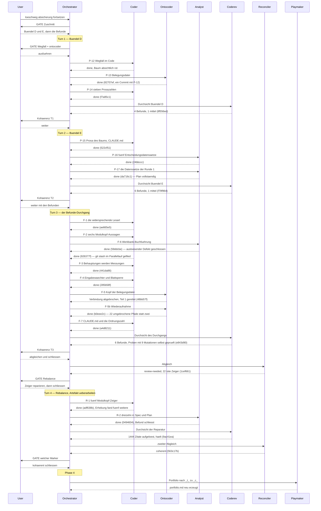

# Orchestrator Session — 260817-2131

**Directive:** Continue the delete-path round: build plan bundles D and E to completion, then work the open review findings as far as the Turn budget carries.
**Mode:** plan
**Status:** Complete

## Setup snapshot

Taken at 260817-2131 against tree state `cdde9da`.

| Item | Value |
|---|---|
| Workbench | `/Users/k1/Projects/productive/krk/fusion-workbench` |
| Active Circle | `260817-0833-jeder-loeschweg-mit-rueckfrage-und-nur-noch-papierkorb` |
| git HEAD at start | `cdde9da` |
| Turn budget | 12 (`fusion.json`, no loader diagnostics) |
| Detected domain | `code` (145 source files, 11 data files, counted by `git ls-files`) |
| Open or in-progress defects | 17 in the Circle, 28 in `shared/` |
| Open plans | 1 in the Circle, 4 specs in `shared/planning/` |
| Open decisions | 0 in the Circle, 8 in `shared/decisions/` |
| Circles | 1 active, 1 anticipated, 10 bounded, 1 closed-coherent, 1 deferred |
| Interrupted session | none — no `agentstate.yaml` on disk |
| Legacy halt flag | absent |
| Permission file | already carries `defaultMode: bypassPermissions`; Setup asked nothing |
| Circle hint | printed: 1 anticipated and 1 active Circle |

The active Circle has run three Turns across two sessions. Bundles A, B and C of its plan
are built; bundles D and E remain open, so the permanent-delete command is still in the
program. The plan is
`circles/260817-0833-jeder-loeschweg-mit-rueckfrage-und-nur-noch-papierkorb/planning/260817-0856_o_plan-absicherung-jedes-loeschwegs.md`.

## Budget

Every record count below is read off the stores at write time, not tallied across Turns.
Commits and Turns are read off git and the event log. Three hand-kept figures were
contradicted by measurement during this session, which is why none of these is one.

| Metric | Count |
|--------|-------|
| Turns | 4 |
| Tasks resolved | 15 (6 plan steps, 9 finding batches) |
| Tasks skipped/deferred | 0 |
| Issues created | 28 |
| Issues resolved | 33 |
| Decisions answered (`_o_`→`_a_`) | 4 filed as open; none moved to answered this session |
| Decisions implemented (`_a_`→`_i_`) | 4 |
| Decisions superseded (`_i_`→`_s_`) | 1 |
| Commits | 21 |
| Agent errors | 1 (connection lost mid-run; its completed half was salvaged) |
| Human gates hit | 6 |

`Issues resolved` (33) exceeds `Issues created` (28) because the session also closed
findings filed by earlier sessions, the triggering defect of the round among them.

## Review coverage

**Range:** `cdde9da..HEAD` — 21 commits
**Covered by:**
- `reviews/260817-2243-coderev-bundle-d-the-removal.md` — range `cdde9da..f7a85c1`, covers 2, not-opened none
- `reviews/260818-0024-coderev-bundle-e-the-prose-and-the-records.md` — range `f7a85c1..da716c1`, covers 4, not-opened none
- `reviews/260818-0410-coderev-bundle-f-die-messungen-und-der-waechter.md` — range `f79f964..a4d8211`, covers 8, not-opened none
- `reviews/260818-0754-coderev-zeigerreparatur-buendel-g.md` — range `1cef661..0494604`, covers 2, not-opened none

**Not covered:** five commits, named rather than counted:
- `f79f964` docs(workbench): die Durchsicht des Buendels E und ihre sechs Datensaetze
- `e843d90` docs(workbench): die Durchsicht des Befunde-Durchgangs und ihre sechs Datensaetze
- `1cef661` docs(workbench): der Abgleich zum Sitzungsende und der Plan auf geschlossen
- `9ac41ea` docs(workbench): die Durchsicht der Zeigerreparatur und ihre zwei Datensaetze
- `563c17b` docs(workbench): der zweite Abgleich, und das Verdikt dreht auf kohaerent

Each of the five was measured with `git show --name-only`: **none touches a file outside
`fusion-workbench/`**. They are the filing commits of the reviews and reconciliations
themselves. No line of code or data in this session went unreviewed.

**Carried out-of-scope files:** none. Every review declared `not-opened=none`.

## Remaining Work

- Seven open findings in the Circle, all from the last two reviews, two of them Medium,
  none a release blocker.
- Four open decision records raised by this round, all awaiting the user.
- The acceptance run of the ten time promises from C8 has not been driven since 260810,
  now seven rounds back. It requires KRK in the foreground and is user work.

## Portfolio update

The playmaker regenerated `portfolio.md` after the `_t_`→`_c_` transition. Its log is
`shared/history/260818-1018-playmaker-orchestrator-phase4.md`.

It recommends `circles/260804-0933-eingebauter-web-betrachter-im-vorschaufenster` as the
next round, the only anticipated Circle, and names three things that stand before its
activation: a study of the rendering means, a clarification round over three questions,
and one line of its Grounding that has to be corrected.

It also named a candidate it deliberately did **not** rank: the deferred round
`circles/260816-2255-befehle-absetzen-und-makros-speichern`. A deferred Circle is not a
ranking candidate, but this one carries a finished spec of 54 criteria and a finished plan
of 22 steps and is nothing but "not got to yet". The playmaker reports that staying silent
about it would have pre-decided the choice.

**On the ranking heuristic.** It weighted `_b_` and `_c_` alike, because `CLAUDE.md`
states that in this project the marker reports the user's availability rather than the
round's maturity. It additionally blocked the converse: this round carries `_c_` without
an acceptance run, and it is credited nowhere as "accepted by the user". Both statements
are written into the portfolio so the next run does not have to derive them again.

Twelve warnings, the first of which is that distinction. Others worth naming here:
`CLAUDE.md` lists ten rounds where the store holds twelve and names `v0.4.1` where
`Cargo.toml` carries `0.5.1`; three acceptance runs are outstanding, all user work; and
HEAD carries no tag, 21 commits past `v0.5.1`, eleven of them at the code.

## Session Flow

## Coherence

<!-- RECONCILER-OWNED -->

**Zweiter Durchgang, 260818-0807, nach dem Rebalance-Gate.** Der erste Durchgang (260818-0712)
meldete `review-needed` und flaggte die Kante Artefakt↔Grundlage mit drei Driftpunkten: 22 tote
Zeiger in lebendem Text, 43 von 428 Abschlussvermerken in einer Form, die keine
`^Resolved:`-Suche findet, und drei von 16 Commits ohne `commit`-Ereignis. Der Nutzer wählte
„Artefakt überarbeiten" und benannte die Zeigerreparatur; Turn 4 hat sie gefahren. Dieser Befund
ersetzt den ersten.

**Verdict:** coherent

**Edges:**
- Artifact↔Grounding: 17 von 17 Planschritten stehen weiter am Baum, `make check` Exit 0 im zweiten Lauf (der erste fiel an der seit dem 260816 aufgenommenen Wettrennprobe aus, `shared/issues/260816-0055_*_…`, offen und nicht von dieser Runde verursacht). **Driftpunkt 1 ist behoben und unabhängig nachgemessen:** eigene Auflösung über 205 lebende Dateien und 1465 Zitate nach Zeitstempel **und** Namensteil findet unter `crates/`, `xtask/`, `resources/`, im Plan, im Spec und im Circle-Datensatz keinen toten Zeiger mehr; die vier Stellen, an denen der Marker die Aussage ist (`plan:553`–`:556`, `plan:585`, `_t_circle.md:7`), stehen unbeschädigt. Die Driftpunkte 2 und 3 stehen unverändert (43 von jetzt 429; vier von jetzt 20 Commits ohne Ereignis) und flaggen die Kante nicht: keiner macht eine Aussage in einer Verfolgungsdatei unwahr, sie machen eine Suche blind und ein Protokoll lückenhaft. Beide sind gefilt und haben einen Eigentümer. Getragen werden daneben sieben offene Befunde im Circle (zwei mittel, keiner ein Auslieferungshindernis) und drei neue Datensätze dieses Durchgangs. Belege: `history/260818-0807-reconciliation.md`.
- Artifact↔Directive: alle 20 Commits in `cdde9da..9ac41ea` bewegen sich auf die Directive zu, keiner quer, keiner davon weg. `82707ef` nimmt `Kommando::EndgueltigLoeschen`, `Art::EndgueltigLoeschen` und den Belegungseintrag heraus; `f7a85c1`, `522cf51`, `24bbccc` und `da716c1` ziehen Prosa, Datensätze und `CLAUDE.md` nach; acht Commits des Turns 3 schließen 30 Befunde, darunter den auslösenden Defekt der Runde und mit `285b58f` einen zweiten Datenverlustweg, den der Spec nicht kannte. Die drei Commits des Turns 4 (`adf638b`, `0494604`, `9ac41ea`) sind keine Nebenarbeit: die Directive steht auf fünf Entscheidungsdatensätzen, und ein Zitat, das ins Leere zeigt, macht die Grundlage vom lebenden Text aus unerreichbar.
- Grounding↔Directive: vier Entscheidungsdatensätze hat diese Sitzung angelegt, alle offen, alle vier lösen vollständig auf (14 Zitate, 0 tot) und keiner widerspricht der Directive — drei verschärfen oder verfeinern sie (`260818-0249`, `260818-0250`, `260818-0512`), einer betrifft die Schreibweise von Werkbank-Zitaten und berührt sie nicht (`shared/decisions/260818-0201_*_…`). Über alle Speicher stehen 29 offene Entscheidungen; die eine, die dieser Runde widersprach, ist seit `24bbccc` überholt (`shared/decisions/260802-0842_*_loeschen-papierkorb-oder-endgueltig.md`, `_s_`, mit Grund und Nachfolger). Die Runde schließt mit drei eigenen offenen Fragen, was hier festgehalten und nicht geflaggt wird.

**Rebalance recommendation:** none

**Zwei Anmerkungen, nicht Teil des Verdikts.**

Der Abnahmelauf der zehn Zeitzusagen aus C8 bleibt aus dem Verdikt heraus, wie im ersten
Durchgang und aus demselben Grund: die Directive dieser Runde sagt über die zehn Zusagen nichts,
und unerreichbar ist die Abnahme durch den Nutzer, nicht die Directive. Der Lauf verlangt KRK im
Vordergrund und ist Nutzerarbeit (`CLAUDE.md`, „Was man nicht sieht"); zuletzt am 260810
gefahren, sechs Runden zurück. Das ist die Bedingung, unter der zehn der elf bisher gefahrenen
Runden beschränkt geschlossen haben (`ls circles/*/_b_circle.md`). Wo diese Runde landet,
entscheidet der Abschluss.

Zwei Nacharbeiten liegen beim Orchestrator, der die Dateien besitzt, und beide gehören an den
Abschluss: der Turn-Log-Eintrag zu Turn 4 nennt zehn weitere gestellte Zeiger, gestellt sind
sechzehn (`issues/260818-0807_*_der-turn-log-nennt-zehn-weitere-zeiger-…`); und
`shared/planning/260817-0536_*_spec-absicherung-jedes-loeschwegs.md` ist inhaltlich erfüllt,
bleibt aber auf `_o_`, weil das maschinell gelesene Kopffeld `**Active spec/plan:**` in
`_t_circle.md:7` seinen Pfad wörtlich mit dem Buchstaben führt. Wer den Spec umbenennt, ohne
dieselbe Zeile nachzuziehen, wiederholt Schritt 16.
