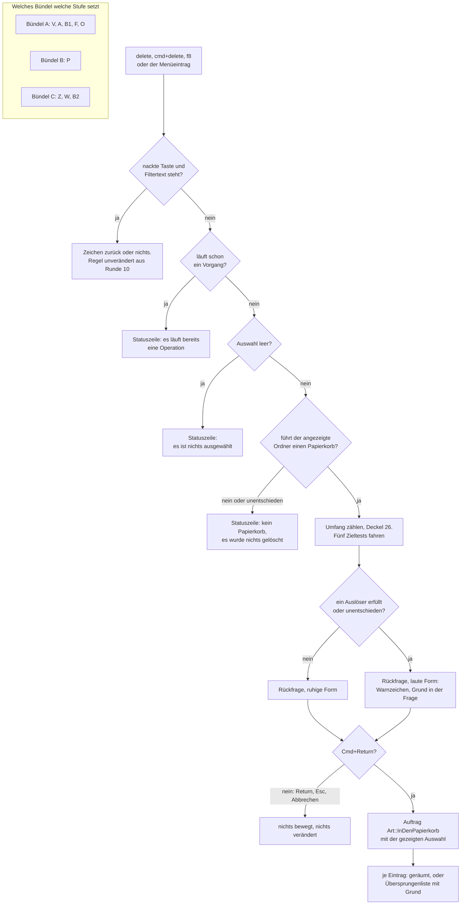
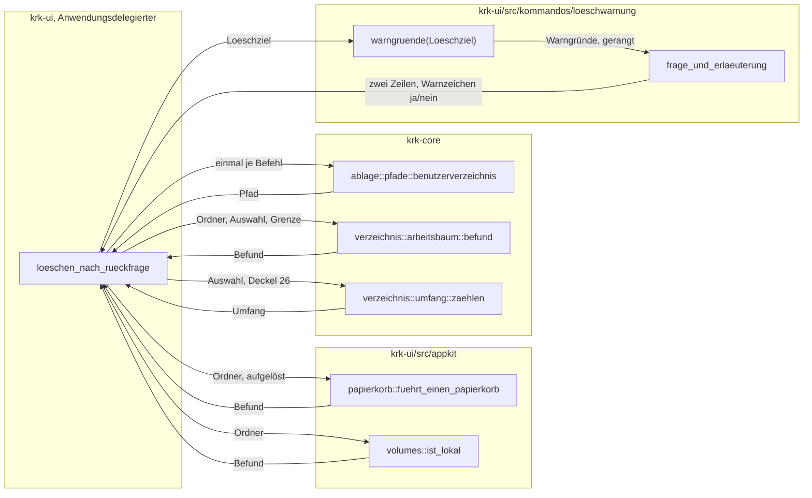
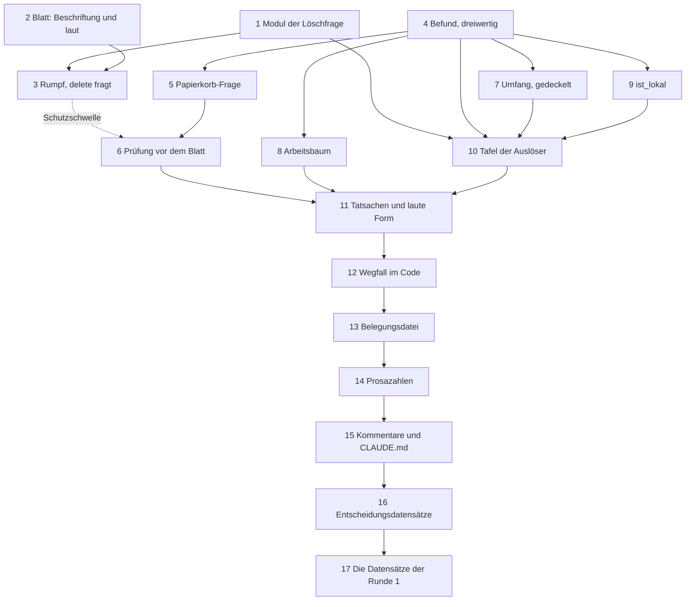

# Implementation Plan: Jeder Löschweg fragt nach, und es gibt nur noch den Papierkorb

**Date:** 2026-08-17
**Status:** In Progress — Bündel A ist gebaut, die Schritte 1 bis 3 tragen `[DONE]` und sind am 260817-1129 einzeln gegen den Baum gelesen. Die Schritte 4 bis 17 stehen offen; der Nutzer hat die Sitzung nach Turn 1 beendet, der Circle bleibt aktiv. Der Beleg steht unten unter `## Reconciliation Log`.
**Spec:** `shared/planning/260817-0536_o_spec-absicherung-jedes-loeschwegs.md`, nachgezogene Fassung vom 260817
**Circle:** `circles/260817-0833-jeder-loeschweg-mit-rueckfrage-und-nur-noch-papierkorb`
**Baumstand:** `984d31a`, gelesen am 260817-0850
**Decidability:** Die tragende Frage ist nicht, welche Ziele ungewöhnlich sind, sondern ob KRK **vor** dem Beginn des Vorgangs weiß, dass ein Ziel keinen Papierkorb führt. Sie ist entscheidbar, und zwar ohne Näherung: `NSFileManager.URLForDirectory:NSTrashDirectory inDomain:NSUserDomainMask appropriateForURL:<Ordner> create:NO error:` fragt dieselbe Instanz, die `trashItemAtURL:` gleich beantworten wird, nach demselben Datenträger, und sie scheitert genau dann, wenn es dort keinen Papierkorb gibt. Der Mechanismus sagt keinen künftigen Systemaufruf voraus, er lässt die zuständige Stelle die Frage beantworten. Ein Rest bleibt und ist benannt: ein einzelner Eintrag kann trotz bestandener Prüfung scheitern, etwa weil unter dem angezeigten Ordner ein Einhängepunkt eines anderen Datenträgers liegt. Dieser Rest wird **nachträglich entschieden** und nicht vorhergesagt, nämlich am Ergebnis des einzelnen Eintrags, und sein Ausgang ist „übersprungen mit Grund" und nie „endgültig gelöscht". Die zweite Frage der Runde, welche Ziele ungewöhnlich sind, ist in zwei ihrer vier Klassen nachweislich unentscheidbar; der Spec hat dort bereits den Mechanismus gewechselt statt zu nähern, indem er benannte Orte prüft statt der Klasse „Clouddrive" und das eingehängte Netzlaufwerk prüft statt „geshartes Verzeichnis". Beide Wechsel sind vom Nutzer angenommen, und „unentschieden gilt als laut" fängt den Rest.

## Directive

KRK kennt nach dieser Runde genau einen Löschweg, und er führt in den Papierkorb des Systems. Jeder Datei- und Ordner-Löschvorgang fragt vorher genau einmal nach, mit „Abbrechen" vorbelegt; wo das Ziel ungewöhnlich oder der Umfang groß ist, trägt dieselbe Rückfrage ein Warnzeichen und nennt den Grund in ihrer ersten Zeile. Ein Ziel ohne Papierkorb wird nicht gelöscht, sondern gemeldet. Der Befehl zum endgültigen Löschen fällt aus der Anwendung, aus der Belegung und aus dem Menü.

Der Spec ist abgenommen und bindend. Dieser Plan verhandelt keine seiner elf Nutzerantworten neu; er beantwortet die acht Punkte seines Abschnitts `## Offen für den Planner` und schneidet die Arbeit so zu, dass der Schutz vor einem zweiten Schadensfall so früh wie möglich steht.

## Current State

**Der Baum trägt heute zwei Löschwege, und der ungesicherte ist der alltägliche.** `Kommando::InPapierkorb` (`delete`, `cmd+delete`) läuft über `Anwendungsdelegierter::in_den_papierkorb` unmittelbar in `auftrag_stellen(Art::InDenPapierkorb)`, ohne jede Rückfrage. `Kommando::EndgueltigLoeschen` (`f8`, `opt+cmd+delete`) geht über `Anwendungsdelegierter::endgueltig_loeschen`, zeigt das Blatt aus `appkit/blaetter/loeschbestaetigung.rs` mit vorbelegtem „Abbrechen" und stellt den Auftrag erst nach der Bestätigung. Das Blatt hat genau einen Aufrufer, und sein Rumpf ist die Vorlage für alles, was diese Runde baut.

**Der Umfang des Wegfalls ist nachgezählt und stimmt mit dem Spec überein.** Über `crates/` liefert `grep -rn "EndgueltigLoeschen" --include="*.rs"` zwanzig Zeilen in elf Dateien. Drei davon stehen in Doc-Kommentaren (`kommandos/rueckschritt.rs:78`, `appkit/ereignisse.rs:307`, `appkit/anwendung.rs:4466`) und halten den Bau nicht an. Es bleiben siebzehn Nennungen in neun Dateien, und das ist genau die Tabelle unter C5 des Specs. Sie ist geprüft und nicht übernommen.

**Was der Übersetzer nicht einfordert und der Spec ebenfalls nicht nennt, sind fünf weitere Stellen.** Sie fallen erst im Probenlauf oder gar nicht auf:

| Stelle | Was dort steht | Wann es auffällt |
|---|---|---|
| `krk-ui/src/belegungsmodell.rs:953` | `assert!(belegung.funktion("endgueltig_loeschen").is_some())` | rote Probe |
| `krk-ui/src/belegungsmodell.rs:1186-1191` | die Probe über eine vergebene Kombination nimmt `f8` und erwartet den Namen `endgueltig_loeschen` in der Meldung | rote Probe |
| `resources/default-keymap.toml:34` | „Ausgeliefert sind 85 Funktionen mit zusammen 90 Kombinationen" | gar nicht |
| `resources/default-keymap.toml:11-12` | der Kopf nennt `260802-0842_*_loeschen-papierkorb-oder-endgueltig.md` als bindend | gar nicht |
| `belegungsausgabe.rs:45,48,56,256,730,731` und `appkit/menue.rs:128,867` | sechs Prosazahlen über 85, 84 und 79 Funktionen | gar nicht |

Die Zahl 79 in `Kommando::KENNUNGEN: [(Kommando, &'static str); 79]` hält der Übersetzer; die Prosazahlen daneben hält niemand. `belegungsausgabe.rs:758` prüft immerhin `mit_kommando == Kommando::KENNUNGEN.len()` und deckt damit die Beziehung ab, nicht aber die ausgeschriebenen Zahlen im Kommentar.

**Das Gerüst für die neuen Prüfungen steht schon, und es wird erweitert statt verdoppelt.** `appkit/papierkorb.rs` ist die eine Hülle um den Papierkorb des Systems. `appkit/volumes.rs` ist die eine Stelle, die `NSURL`-Ressourcenwerte über Datenträger abfragt, und benutzt `resourceValuesForKeys_error` bereits. `krk_core::ablage::pfade::benutzerverzeichnis` ist die eine Stelle, die nach dem Benutzerverzeichnis fragt. `verzeichnis::sys::Schwungleser` liest ein Verzeichnis schwungweise über einen Systemaufruf, `verzeichnis::sys::ist_deskriptormangel` trennt „unentschieden" vom negativen Befund. `kommandos::rueckschritt` ist die Bauform für eine reine Regel mit ausgeschriebener Tafel und einer Aufruferzählung.

**Eine Eigenschaft des heutigen Weges ist ein Defekt und wird in dieser Runde mitbehoben.** `endgueltig_loeschen` rechnet die Auswahl für die Frage, und `auftrag_stellen` liest sie nach der Bestätigung ein **zweites** Mal über `betroffene_eintraege()`. Zwischen beiden Lesungen kann eine Auffrischung laufen: `auffrischung::schiebt_auffrischung_auf` schiebt allein beim Stapel-Umbenennen auf, ein stehendes Blatt hält FSEvents nicht an, und ein fremdes Programm kann den Ordner in dieser Spanne ändern. KRK löschte dann etwas anderes, als es gefragt hat. Das ist genau die Klasse von Fehler, gegen die diese Runde gebaut wird, und der bestätigte Auftrag trägt deshalb künftig die **gezeigte** Auswahl.

## Approach

### Der eine Löschweg und die vier Stufen davor

Der Weg ist eine Kette, und jedes Bündel dieses Plans setzt genau eine Stufe hinein. Das ist der Grund, aus dem der Zuschnitt keine Umbauten zwischen den Bündeln erzwingt: die Reihenfolge der Stufen steht von Anfang an fest, und was fehlt, fehlt am Ende der Kette und nicht in ihrer Mitte.



### Wer welche Tatsache beschafft, und warum jede genau einen Frager hat

Die Auslöserprüfung ist eine reine Funktion nach dem Vorbild von `kommandos::rueckschritt`: sie bekommt Tatsachen und liefert das Urteil. Die Tatsachen beschafft der Anwendungsdelegierte, jede aus genau einer Quelle. Die Aufteilung folgt der Kistengrenze und nicht der Bequemlichkeit: was AppKit braucht, steht unter `appkit/`; was am Dateisystem entschieden wird, steht in `krk-core` und ist dort ohne Fenster prüfbar.



Sechs Antworten der Auslöserprüfung, und drei Entwurfsentscheidungen tragen sie:

- **Das Benutzerverzeichnis hat weiterhin genau einen Frager.** Die Auslöser 1, 2 und 4 und die Grenze des Aufwärtsgangs aus Auslöser 5 brauchen es. Der Delegierte fragt `krk_core::ablage::pfade::benutzerverzeichnis` einmal je Löschbefehl, löst den Pfad einmal auf und reicht ihn an beide Stellen weiter. Dieselbe Bauform trägt `pfade::gekuerzt_fuer_anzeige` schon heute, und ihr Doc-Kommentar begründet sie: das Verzeichnis kommt als Argument herein, damit die Funktion ohne Zugriff auf das echte prüfbar ist.
- **Ein dreiwertiger Befund statt dreier eigener Aufzählungen.** `Ja`, `Nein`, `Unentschieden` beantworten drei verschiedene Fragen an drei verschiedenen Stellen, und alle drei brauchen die dritte Antwort, weil „unentschieden gilt als laut" sonst nicht auszudrücken wäre. Der Baum trennt „unentschieden" vom negativen Befund seit der Runde 10 schon einmal, in `verzeichnis::sys::ist_deskriptormangel`; ein gemeinsamer Typ ist die Verallgemeinerung davon und keine neue Idee.
- **Die Rangfolge ist die Deklarationsreihenfolge der Aufzählung.** `Warngrund` steht in der Ordnung, die der Spec unter C3 festlegt, und leitet `Ord` ab. Damit gibt es keine zweite Liste, die gegen die Aufzählung auseinanderlaufen könnte, und ein neuer Auslöser bekommt seinen Rang, indem er an die richtige Stelle geschrieben wird.

### Die acht offenen Punkte des Specs, beantwortet

**Womit KRK die Frage nach dem Papierkorb beantwortet.** Über `NSFileManager.URLForDirectory:inDomain:appropriateForURL:create:error:` mit `NSTrashDirectory`, `NSUserDomainMask`, dem aufgelösten Ordner als `appropriateForURL:` und `create: NO`. Kein Probelauf, keine versuchsweise geräumte Datei; die Antwort ist der Ort, den `trashItemAtURL:` gleich benutzen würde, oder ein Fehler. Die Verfügbarkeiten sind am 260817 gegen die Kopfdateien des lokalen SDK gelesen und nicht erschlossen: `URLForDirectory:…` trägt `API_AVAILABLE(macos(10.6))` in `NSFileManager.h:127`, `NSTrashDirectory` trägt `macos(10.8)` in `NSPathUtilities.h:88`, `NSUserDomainMask` trägt gar keine Angabe und steht damit seit 10.0. Keine liegt über 15.0. `NSURLVolumeSupportsTrashKey` wäre die naheliegende Alternative und **existiert in diesem SDK nicht**; die Bindung `objc2-foundation 0.3.2` führt sie ebenfalls nicht.

**Womit KRK ein Netzlaufwerk erkennt.** Über den Ressourcenwert `NSURLVolumeIsLocalKey` am `NSURL` des Ordners, `API_AVAILABLE(macos(10.7))` in `NSURL.h:338`. Die Prüfung zieht in `appkit/volumes.rs` ein, das genau diese Sorte Frage schon stellt und `resourceValuesForKeys_error` bereits benutzt. Die selbsttätige Auffrischung aus C9 der Runde 1 wird **kein** zweiter Abnehmer: sie ist auf lokale Dateisysteme zugesagt und unterscheidet heute nicht, und ihr diese Unterscheidung beizubringen wäre eine Verhaltensänderung an einem Mechanismus, den diese Runde nicht anfasst. Die neue Funktion steht dort zur Verfügung, wenn eine spätere Runde die Zusage einlösen will.

**Wo die Zählung des Unterbaums läuft.** In einem neuen Modul `krk-core/src/verzeichnis/umfang.rs`, neben `durchlauf` und nicht darin. `durchlauf` ist eine nebenläufige Maschine mit Arbeitsfaden, Kanal und Abbruchkennzeichen, die je Auftrag genau einen Befund über einen Treffer liefert; eine gedeckelte Zählung ist eine andere Frage mit einem anderen Lebenslauf, und sie in dieselbe Maschine zu legen gäbe ihr einen zweiten Zweck. Übernommen wird die **Disziplin** und nicht der Aufbau: ein Ordner wird ganz gelesen, seine Unterordner wandern als Pfad auf einen Stapel, und zu jedem Zeitpunkt steht genau ein Verzeichnisdeskriptor offen.

Die Zählung läuft auf dem Hauptfaden, und die Schranke ist beweisbar. Jeder Abstieg kostet mindestens einen Zähler, weil der Unterordner selbst mitzählt; bei einem Deckel von 26 werden also höchstens 26 Verzeichnisse geöffnet, und die Tiefe der Rekursion ist durch dieselbe Zahl begrenzt. Gelesen wird über `Schwungleser` und nicht über `verzeichnis::lesen`: `lesen` liest ein Verzeichnis **vollständig** in einen Vektor, und ein Ordner mit einer Million Einträgen hielte damit den Hauptfaden auf, gleich wie klein der Deckel ist. Ein Schwung ist ein Systemaufruf über einen Puffer von 256 KB; die Zählung bricht nach dem ersten Schwung ab, sobald der Deckel erreicht ist. Damit kostet sie höchstens 26 Paare aus `open` und `getattrlistbulk`.

**Wo die Auslöserprüfung als reine Funktion wohnt.** In `krk-ui/src/kommandos/loeschwarnung.rs`, ohne AppKit, mit ausgeschriebener Tafel und einer Aufruferzählung nach dem Vorbild von `rueckschritt.rs`. Dasselbe Modul trägt die drei Texte des einen Löschwegs: die Frage, die Erläuterung und die Meldung über ein Ziel ohne Papierkorb. Sie stehen zusammen, weil sie eine Sache sind; sie auf `operationen.rs` und hierher zu verteilen hieße, den Wortlaut einer Rückfrage an zwei Orten zu pflegen.

**Wie der Aufwärtsgang der Git-Prüfung läuft.** Als eigenes Modul `krk-core/src/verzeichnis/arbeitsbaum.rs` mit drei Funktionen. `liegt_in_arbeitsbaum` geht vom aufgelösten Ordner aufwärts über `verzeichnis::aufwaerts` und bricht beim ersten Treffer ab; die Grenze ist das Benutzerverzeichnis oder die Wurzel, je nachdem, was zuerst erreicht ist. `traegt_arbeitsbaum` prüft einen einzelnen Pfad auf einen unmittelbaren Eintrag `.git`. `befund` setzt beide zusammen: zuerst der Aufwärtsgang, und **nur wenn er `Nein` sagt**, die Schleife über die ausgewählten Einträge, ebenfalls mit Abbruch beim ersten Treffer. Damit kostet die Prüfung im häufigen Fall gar keinen zusätzlichen Zugriff, und im seltenen einen `stat` je ausgewähltem Eintrag. Gemerkt wird nichts: die Frage wird je Löschbefehl genau einmal gestellt, und ein Speicher über die Dauer eines Vorgangs hätte keinen zweiten Frager. Eine Anbindung an Git entsteht nicht; geprüft wird die Anwesenheit des Eintrags, nicht sein Inhalt.

**Die drei Frager nach dem Benutzerverzeichnis.** Beantwortet oben: einer bleibt es, und der Wert reist als Argument.

**Wie der Fragetext entsteht.** `operationen::loeschfrage` wird nicht erweitert, sondern fällt mit dem endgültigen Löschen weg. An seine Stelle tritt `loeschwarnung::frage_und_erlaeuterung`, und weil danach genau eine Löschfrage existiert, gibt es genau eine Stelle, die sie baut. Die Zähltexte `zahl` und `ordner_text` aus `operationen.rs` bleiben, wo sie sind, und werden `pub(super)`; sie sind allgemeine Zahlwörter und keine Löschtexte.

**Die Reihenfolge der Planschritte.** Der Aufbau der Rückfrage geht dem Wegfall voran, und das ist die einzige Stelle, an der dieser Plan gegen die naheliegende Reihenfolge entscheidet. Die Begründung steht unten unter „Die Schutzschwelle".

### Die Schutzschwelle: nach welchem Bündel der Nutzer geschützt ist

**Nach Bündel A, dem dritten Schritt dieses Plans.** Der Spec rechnet unter `## Was die Prüfungen beim Vorfall vom 260817 geleistet hätten` nach, dass die unbedingte Rückfrage die Last trägt: verhindert hätte den Vorfall, dass überhaupt ein Blatt erscheint und „Abbrechen" darin vorbelegt ist. Alles Weitere ist Verfeinerung. Bündel A baut genau das und sonst nichts.

Der Preis dieser Reihenfolge ist klein und benannt. Solange Bündel D nicht gelaufen ist, führt KRK zwei Löschbefehle, die **beide** durch dasselbe Blatt gehen; sie unterscheiden sich in zwei Zeichenketten und in der Auftragsart. Es entsteht keine zweite Rückfragemechanik, weil Bündel A den gemeinsamen Rumpf zuerst herauszieht und beide Befehle ihn rufen. Wäre der Wegfall vorangegangen, stünde derselbe Rumpf am Ende genauso da, und der Nutzer wäre bis dahin ungeschützt geblieben. Bei einem Schaden, der auf zwei Geräten aufgetreten ist, ist das die falsche Reihenfolge.

## Implementation Steps

Fünf Bündel, siebzehn Schritte. Jeder Schritt nennt genau einen Executor.

### Bündel A — Die unbedingte Rückfrage

1. **[DONE] Das Modul der Löschfrage anlegen, mit der ruhigen Form**
   - Executor: `coder`
   - Files: `crates/krk-ui/src/kommandos/loeschwarnung.rs` (neu), `crates/krk-ui/src/kommandos/mod.rs`, `crates/krk-ui/src/kommandos/operationen.rs`
   - Changes: Neues Modul ohne eine `use objc2`-Zeile, wie das ganze Verzeichnis. Es trägt zunächst `frage_und_erlaeuterung(auswahl: &Auswahl, ordner: &Path) -> (String, String)` in der ruhigen Form. Die Frage lautet bei einem Eintrag „Diesen Eintrag in den Papierkorb räumen?" und sonst „Diese N Einträge in den Papierkorb räumen?". Die Erläuterung nennt den vollen Pfad des Ordners, **ungekürzt**, und die Zahl der Ordner gesondert, falls welche darunter sind; `pfade::gekuerzt_fuer_anzeige` wird hier ausdrücklich nicht benutzt, und der Modulkopf sagt warum. `operationen::zahl` und `operationen::ordner_text` werden `pub(super)` und hier wiederverwendet. Der Modulkopf nennt den Gegenstand des Moduls und trägt die Aufruferzusage vor. Proben: Einzahl, Mehrzahl, Pfad in der Erläuterung, Ordnerzahl gesondert.
   - Dependencies: keine
   - Anmerkung zur Ausführung (260817): **Die Sichtbarkeit von `zahl` und `ordner_text` bleibt `pub(crate)`.** Der Plan liest sie als privat; am Baum `984d31a` sind sie bereits `pub(crate)`, und `zahl` hat mit `crate::appkit::statuszeile` (Zeile 177) einen Aufrufer außerhalb von `kommandos`. `pub(super)` übersetzte dort nicht und verlangte eine vierte Datei. Die Wiederverwendung, die der Schritt will, steht ohne jede Änderung; beide Doc-Kommentare nennen den neuen Aufrufer, und der von `zahl` schreibt aus, warum die enge Form nicht geht. Der Pfad entsteht über `operationen::pfadtext`, das die Nicht-Kürzung schon einmal begründet hat, statt über einen zweiten Formatierer. Bis Schritt 3 den Aufrufer setzt, trägt `frage_und_erlaeuterung` `#[cfg_attr(not(test), expect(dead_code, …))]` nach dem Vorbild aus `rueckschritt.rs`; ohne die Zeile hält `-D warnings` den Bau an, und Schritt 3 muss sie entfernen, weil die Erwartung dann unerfüllt wird.

2. **[DONE] Die Schaltflächenbeschriftung des Blattes wird zum Argument**
   - Executor: `coder`
   - Files: `crates/krk-ui/src/appkit/blaetter/loeschbestaetigung.rs`
   - Changes: `zeigen` nimmt die Beschriftung der zweiten Schaltfläche und einen Wahrheitswert `laut` entgegen; `als_warnung` wird nur noch bei `laut` gerufen. Die erste Schaltfläche bleibt „Abbrechen" mit `Taste::Eingabe`, die zweite behält `Taste::EingabeMitBefehl`, und die Reihenfolge ändert sich nicht. Der Modulkopf wird umgeschrieben: sein Gegenstand ist ab jetzt die eine Rückfrage vor dem Räumen in den Papierkorb, in ruhiger und in lauter Form, und die Begründung für die Vorbelegung auf „Abbrechen" bleibt wörtlich stehen, weil sie unverändert gilt.
   - Dependencies: keine
   - Anmerkung zur Ausführung (260817): Die beiden neuen Argumente stehen zwischen `erlaeuterung` und `fertig`, damit der Abschluss letztes Argument bleibt. **Eine Zeile in `appkit/anwendung.rs` ist mitgezogen**: der einzige heutige Aufrufer, `endgueltig_loeschen` (4537), reicht jetzt `"Endgültig löschen"` und `true` durch und verhält sich unverändert; sonst ist dort nichts angefasst. Der Verweis am Ende des Modulkopfs zeigt auf den Datensatz dieser Runde statt auf den von 260802, den sie überholt. Der Hinweissatz „Zum Löschen Cmd+Return" ist unverändert geblieben, weil der Plan zu ihm nichts sagt; er trifft nach Schritt 3 nicht mehr ganz, was die zweite Schaltfläche tut.

3. **[DONE] Der gemeinsame Rumpf, und `delete` fragt**
   - Executor: `coder`
   - Files: `crates/krk-ui/src/appkit/anwendung.rs`
   - Changes: Neuer Rumpf `loeschen_nach_rueckfrage(&self, art: Art, frage: &str, erlaeuterung: &str, schaltflaeche: &str, laut: bool) -> bool`. Er prüft in dieser Reihenfolge: läuft schon ein Vorgang (`vorgang_laeuft_schon`, **vor** dem Blatt statt danach), ist die Auswahl leer, dann Blatt, dann bei Bestätigung der Auftrag. Neuer `loeschauftrag_stellen(&self, art, auswahl, quellordner)`, der die **gezeigte** Auswahl an `auftrag_starten` reicht statt `betroffene_eintraege()` ein zweites Mal zu lesen; die Begründung dafür steht oben unter „Current State" und gehört als Absatz an die neue Funktion. `in_den_papierkorb` ruft den neuen Rumpf mit `Art::InDenPapierkorb`, der Schaltfläche „In den Papierkorb räumen" und `laut = false`. `endgueltig_loeschen` ruft denselben Rumpf mit seinen bisherigen Texten und `laut = true` und behält damit sein Verhalten unverändert bis Bündel D. Der Doc-Kommentar von `in_den_papierkorb` verliert den Satz „Sofort und ohne Rueckfrage" und den Verweis auf den überholten Entscheidungsdatensatz.
   - Dependencies: 1, 2
   - Anmerkung zur Ausführung (260817): Die Signatur steht wörtlich so da, wie der Plan sie nennt, und daraus folgt eine Stelle, die der Plan nicht bespricht: **die Texte kommen fertig herein, also liest der Aufrufer die Auswahl für sie ein eigenes Mal.** `in_den_papierkorb` ruft `betroffene_eintraege()` für `frage_und_erlaeuterung`, und `loeschen_nach_rueckfrage` ruft es danach für seine beiden Prüfungen und für den Auftrag. Beide Lesungen liegen im selben Durchgang der Ereignisschleife, zwischen ihnen kann keine Auffrischung laufen, und der behobene Defekt ist damit trotzdem behoben: er hing an der Lesung **nach** dem Blatt, und die gibt es nicht mehr. Schritt 11 zieht das Bauen der Texte ohnehin in den Rumpf und nimmt die zweite Lesung mit; ein Umbau der Signatur vorab hätte sie zweimal geändert. **`endgueltig_loeschen` verhält sich in zwei Punkten doch anders**, beide zu seinen Gunsten und beide vom Plan verlangt: der laufende Vorgang wird vor dem Blatt gemeldet statt nach der Bestätigung, und der bestätigte Auftrag trägt die gezeigte Auswahl. `loeschauftrag_stellen` liefert nichts zurück, weil der Plan für es keinen Rückgabewert nennt und im Rückruf des Blattes niemand mehr eine Antwort abnimmt. **Der Hinweissatz des Blattes ist mitgezogen** und lautet jetzt „Return und Esc brechen ab. Zum Bestätigen Cmd+Return.“; der Grund steht im Modulkopf von `loeschbestaetigung.rs`, und die Beobachtung aus Schritt 2 ist damit erledigt.

**Nach Schritt 3 ist der Nutzer gegen einen zweiten Vorfall geschützt.** `make check` läuft an dieser Stelle grün, und der Stand ist auslieferbar.

### Bündel B — Kein Löschen ohne Papierkorb

4. [DONE] **Der dreiwertige Befund**
   - Executor: `coder`
   - Files: `crates/krk-core/src/verzeichnis/befund.rs` (neu), `crates/krk-core/src/verzeichnis/mod.rs`
   - Changes: `pub enum Befund { Ja, Nein, Unentschieden }` mit `ist_warnwuerdig()` („nicht `Nein`") und einer dreiwertigen Oder-Verknüpfung `oder(self, andere) -> Befund` samt ausgeschriebener Tafel über alle neun Kombinationen. Der Modulkopf erklärt, warum die dritte Antwort nötig ist, und verweist auf `sys::ist_deskriptormangel` als den Fall, in dem der Baum die Unterscheidung schon einmal gebraucht hat. Re-Export als `krk_core::verzeichnis::Befund`.
   - Dependencies: keine
   - Anmerkung zur Ausführung (260817): **Der Typ heißt seit dem Befund `260817-1419` nicht mehr `Befund`, sondern `Loeschzielbefund`, und das Modul heißt `loeschzielbefund` statt `befund`.** Unter `krk_core::verzeichnis` stand mit `modell::Befund` aus der Runde 10 ein zweiter dreiwertiger Typ desselben Namens. Umbenannt wurde der neue: der ältere steht in der Mitte einer gewachsenen Benennung (`Befundmeldung`, `Inhaltsbefund`, `Ordnermodell::befund`, `befunde_setzen`, `befund_zuruecksetzen`) und trägt 48 Stellen im Code gegen 25 hier. Die Begründung der Wahl und der verworfenen Namen steht im Modulkopf von `crates/krk-core/src/verzeichnis/loeschzielbefund.rs`. **Die Schritte 7 bis 11 lesen deshalb `Loeschzielbefund`, wo sie `Befund` schreiben**; die Datenstrukturen und die API-Tabelle unten führen den neuen Namen schon. **Eine Stelle entscheidet der Schritt 8 neu:** die API-Tabelle nennt dort eine Funktion `arbeitsbaum::befund`, und eine Funktion dieses Namens, die einen `Loeschzielbefund` liefert, stünde neben `Ordnermodell::befund`, das einen `modell::Befund` liefert — dieselbe Verwechslung eine Ebene tiefer. Der Ausführende benennt sie nach ihrer Frage (etwa `liegt_in_arbeitsbaum` allein oder `traegt_der_ast_einen_arbeitsbaum`) statt nach ihrem Rückgabetyp.

5. [DONE] **Die Frage nach dem Papierkorb**
   - Executor: `coder`
   - Files: `crates/krk-ui/src/appkit/papierkorb.rs`
   - Changes: `#[must_use] pub fn fuehrt_einen_papierkorb(ordner: &Path) -> Befund` über `NSFileManager::defaultManager().URLForDirectory_inDomain_appropriateForURL_create_error(NSSearchPathDirectory::TrashDirectory, NSSearchPathDomainMask::UserDomainMask, Some(&url), false)`. Erfolg heißt `Ja`, ein Fehler heißt `Nein`, ein Pfad ohne gültiges UTF-8 heißt `Unentschieden`. `#[must_use]` mit ausgeschriebenem Grund: wer den Wert fallen lässt, löscht auf einem Ziel ohne Papierkorb. Der Modulkopf wird auf den erweiterten Gegenstand gezogen (die eine Hülle um den Papierkorb des Systems, Räumen **und** Vorprüfung) und sein Abschnitt `# Ab welchem macOS die angesprochenen Klassen stehen` bekommt die drei neuen Berührungen mit ihren geprüften Zahlen: `URLForDirectory:…` seit 10.6, `NSTrashDirectory` seit 10.8, `NSUserDomainMask` ohne Angabe und damit seit 10.0.
   - Dependencies: 4

6. [DONE] **Die Prüfung vor dem Blatt**
   - Executor: `coder`
   - Files: `crates/krk-ui/src/appkit/anwendung.rs`, `crates/krk-ui/src/kommandos/loeschwarnung.rs`
   - Changes: `loeschen_nach_rueckfrage` löst den angezeigten Ordner einmal über `std::fs::canonicalize` auf und fragt `papierkorb::fuehrt_einen_papierkorb`. Bei `Nein` und bei `Unentschieden` erscheint kein Blatt, es entsteht kein Auftrag, und die Statuszeile trägt den Text aus der neuen Funktion `loeschwarnung::ohne_papierkorb()`. Er nennt den Befund und den Ausweg: das Ziel führt keinen Papierkorb, es wurde nichts gelöscht, im Finder löschen. Ein nicht auflösbarer Ordnerpfad zählt als `Unentschieden` und löscht damit ebenfalls nicht.
   - Dependencies: 3, 5

### Bündel C — Die laute Form

7. [DONE] **Die gedeckelte Zählung des Unterbaums**
   - Executor: `coder`
   - Files: `crates/krk-core/src/verzeichnis/umfang.rs` (neu), `crates/krk-core/src/verzeichnis/mod.rs`
   - Changes: `pub const SCHWELLE: u32 = 25;` und `pub enum Umfang { Genau(u32), MehrAls(u32), Unentschieden }`, dazu `#[must_use] pub fn zaehlen(auswahl: &[PathBuf]) -> Umfang`. Gezählt wird jeder ausgewählte Eintrag als eins und jeder Eintrag unterhalb eines ausgewählten Ordners rekursiv; der Deckel ist `SCHWELLE + 1` und steht nicht als zweite Zahl da. Verknüpfungen zählen eins und werden nicht verfolgt, also entscheidet `Typ` aus dem gelesenen Eintrag und `symlink_metadata` an der obersten Ebene. Gelesen wird über `sys::Schwungleser` und nicht über `verzeichnis::lesen`; die Begründung gehört in den Modulkopf. Ein Fehlschlag beim Öffnen liefert `Unentschieden`, wenn `sys::ist_deskriptormangel` ihn als Deskriptormangel einordnet, und zählt sonst als ein Eintrag ohne Abstieg. Der Modulkopf schreibt die Schranke aus: jeder Abstieg kostet mindestens einen Zähler, also höchstens 26 geöffnete Verzeichnisse und höchstens 26 Ebenen Rekursion. Proben über `Pruefordner`: flacher Ordner unter der Schwelle, genau 25, genau 26, tiefe Kette, Verknüpfung auf einen großen Baum.
   - Dependencies: 4

8. [DONE] **Der Arbeitsbaum, aufwärts und in der Auswahl**
   - Executor: `coder`
   - Files: `crates/krk-core/src/verzeichnis/arbeitsbaum.rs` (neu), `crates/krk-core/src/verzeichnis/mod.rs`
   - Changes: Drei Funktionen wie oben unter „Approach" beschrieben, alle drei `#[must_use]`. Der Aufwärtsgang läuft über `verzeichnis::aufwaerts` und endet am mitgegebenen Benutzerverzeichnis oder an der Wurzel. Ein Zugriff, der weder „da" noch „nicht da" beantwortet, liefert `Unentschieden`; `symlink_metadata` unterscheidet das über `ErrorKind::NotFound`. Der Modulkopf sagt, dass keine Anbindung an Git entsteht und dass die Grenze allein die Kosten begrenzt, weil ein Pfad oberhalb des Benutzerverzeichnisses schon über den ersten Auslöser laut wird. Proben über `Pruefordner`: Arbeitsbaum am Ordner selbst, zwei Ebenen darüber, keiner im ganzen Ast, ausgewählter Unterordner als Wurzel, Abbruch beim ersten Treffer.
   - Dependencies: 4

9. [DONE] **Ist der Datenträger lokal**
   - Executor: `coder`
   - Files: `crates/krk-ui/src/appkit/volumes.rs`
   - Changes: `#[must_use] pub fn ist_lokal(pfad: &Path) -> Loeschzielbefund` über `resourceValuesForKeys_error` mit `NSURLVolumeIsLocalKey`. Ein fehlender oder nicht lesbarer Wert heißt `Unentschieden`, nicht `Ja`. Der Modulkopf nimmt die dritte Frage auf, die das Modul jetzt beantwortet, und der Abschnitt über die Untergrenzen bekommt `NSURLVolumeIsLocalKey` seit 10.7, geprüft in `NSURL.h:338`.
   - Dependencies: 4

10. **Die Tafel der sechs Auslöser**
    - Executor: `coder`
    - Files: `crates/krk-ui/src/kommandos/loeschwarnung.rs`
    - Changes: `pub enum Warngrund` mit sieben Werten in der Rangfolge des Specs (`Unentscheidbar`, `Netzlaufwerk`, `Cloudort`, `AusserhalbBenutzerordner`, `ImBenutzerordner`, `Arbeitsbaum`, `Umfang`), `Ord` abgeleitet, `wortlaut()` je Wert. `pub struct Loeschziel` mit den fünf Feldern `ordner: Option<PathBuf>`, `benutzerverzeichnis: Option<PathBuf>`, `netzlaufwerk: Befund`, `arbeitsbaum: Befund`, `umfang: Umfang`. `#[must_use] pub fn warngruende(ziel: &Loeschziel) -> Vec<Warngrund>`, sortiert, erster Eintrag ist der genannte Grund. Die Auslöser 1, 2 und 4 rechnet die Funktion selbst aus den beiden Pfaden; die Cloud-Orte sind `~/Library/CloudStorage` und `~/Library/Mobile Documents`, jeweils samt allem darunter. `Unentscheidbar` steht in der Liste, sobald einer der fünf Eingänge nicht beantwortet ist. `frage_und_erlaeuterung` bekommt die Warngründe als Argument, setzt den Wortlaut des ersten in die Frage und führt die übrigen in der Erläuterung auf. Die Tafel steht im Doc-Kommentar ausgeschrieben, und die Proben schreiben die Fälle einzeln aus statt sie zu rechnen; dieselbe Bauform wie in `rueckschritt.rs`. Dazu eine Aufruferzählung über `crate::quellbaum`, die `warngruende` bei genau einem Aufrufer festhält.
    - Dependencies: 1, 4, 7, 9

11. **Die Tatsachen beschaffen und das Blatt laut machen**
    - Executor: `coder`
    - Files: `crates/krk-ui/src/appkit/anwendung.rs`
    - Changes: `loeschen_nach_rueckfrage` fragt `benutzerverzeichnis()` einmal, löst es auf, baut das `Loeschziel` aus den fünf Quellen und ruft `warngruende`. Ist die Liste leer, bleibt das Blatt ruhig; sonst ist es laut. Der Wahrheitswert `laut` und die beiden Texte gehen unverändert an `loeschbestaetigung::zeigen`. Die Reihenfolge im Rumpf ist die des ersten Bildes und steht als Kommentar daneben, weil der Papierkorbtest vor der Rückfrage zu stehen hat.
    - Dependencies: 6, 8, 10

### Bündel D — Der Wegfall des endgültigen Löschens

12. **Die beiden Aufzählungswerte und alles, was daran hängt, fallen**
    - Executor: `coder`
    - Files: `crates/krk-core/src/operation/auftrag.rs`, `crates/krk-core/src/operation/mod.rs`, `crates/krk-core/src/operation/loeschen.rs`, `crates/krk-core/src/tasten/belegung.rs`, `crates/krk-core/tests/belegung.rs`, `crates/krk-core/tests/operation.rs`, `crates/krk-ui/src/belegungsmodell.rs`, `crates/krk-ui/src/auffrischung.rs`, `crates/krk-ui/src/kommandos/fokus.rs`, `crates/krk-ui/src/kommandos/operationen.rs`, `crates/krk-ui/src/appkit/anwendung.rs`
    - Changes: `Kommando::EndgueltigLoeschen` und `Art::EndgueltigLoeschen` fallen mit allen siebzehn Nennungen, die der Übersetzer einfordert. `Kommando::KENNUNGEN` sinkt von 79 auf 78, und die Zahl steht im Typ. `krk_core::operation::loeschen::endgueltig_loeschen` verliert seinen einzigen Aufrufer und fällt mit seiner Probe in `tests/operation.rs`; **`baum_entfernen` bleibt und behält seine zwei Aufrufer**, das Ersetzen eines Ziels und das Verschieben über eine Datenträgergrenze. `Auftrag::endgueltig_loeschen` und `Anwendungsdelegierter::endgueltig_loeschen` fallen; `operationen::loeschfrage` fällt mit seiner Probe, weil `loeschwarnung::frage_und_erlaeuterung` an seiner Stelle steht. Dazu die drei Stellen, die der Übersetzer **nicht** nennt und die als rote Probe auffallen: `belegungsmodell.rs:953` verliert die Zusicherung über `endgueltig_loeschen`, und die Probe `eine_vergebene_kombination_meldet_die_andere_funktion` nimmt statt `f8` eine noch vergebene Kombination und erwartet deren Funktionsnamen. **Neu**: eine Probe, die eine Nutzerbelegung mit der Kennung `endgueltig_loeschen` gegen den neuen Wortschatz baut und `Belegungsfehler::UnbekannteFunktion` erwartet; sie belegt die Antwort des Nutzers zur gespeicherten `keymap.toml`, statt sie zu behaupten.
    - Dependencies: 11

13. **Die Belegungsdatei**
    - Executor: `ontocoder`
    - Files: `resources/default-keymap.toml`
    - Changes: Der Eintrag `endgueltig_loeschen` fällt ganz; `opt+cmd+delete` bleibt damit unbelegt und wird nicht neu vergeben. Die Zeile `tasten` von `in_papierkorb` lautet danach `["delete", "cmd+delete", "f8"]`. Im Kopf der Datei: die Zahl „85 Funktionen mit zusammen 90 Kombinationen" wird zu 84 Funktionen mit 89 Kombinationen (eine Funktion und zwei Kombinationen fallen, eine Kombination wandert), und die Nennung von `shared/decisions/260802-0842_*_loeschen-papierkorb-oder-endgueltig.md` als bindender Datensatz wird durch `shared/decisions/260817-0536_*_wie-wird-jeder-loeschweg-abgesichert-und-faellt-das-endgueltige-loeschen-weg.md` ersetzt. Menü, Belegungsansicht und Markdown-Ausgabe folgen dieser Datei und brauchen keinen eigenen Schritt.
    - Dependencies: 12

**Die Schritte 12 und 13 sind ein Commit.** Zwischen ihnen ist der Baum rot, und zwar in beiden möglichen Reihenfolgen: `Belegung::auslieferung()` prüft die Datei nicht gegen `Kommando`, aber `krk-core/tests/belegung.rs::jedes_gebaute_kommando_haengt_an_seiner_ausgelieferten_taste` und `belegungsausgabe.rs:758` tun es. `make check` läuft erst nach Schritt 13.

14. **Die Prosazahlen, die niemand hält**
    - Executor: `coder`
    - Files: `crates/krk-ui/src/belegungsausgabe.rs`, `crates/krk-ui/src/appkit/menue.rs`
    - Changes: Acht ausgeschriebene Zahlen über die Zahl der Funktionen und der Funktionen mit Kommando werden nachgezogen: `belegungsausgabe.rs` in den Zeilen 45, 48, 56, 256, 730 und 731, `appkit/menue.rs` in den Zeilen 128 und 867. Gezählt wird gegen den Baum nach Schritt 13 und nicht gegen die Zahlen in diesem Plan; die Rechnung „85 minus 1" ist eine Erwartung, `Kommando::KENNUNGEN.len()` und die Zahl der Einträge in der Belegungsdatei sind die Messung.
    - Dependencies: 13

### Bündel E — Die überholte Festlegung nachziehen (C6)

15. **Die Kommentare im Baum und `CLAUDE.md`**
    - Executor: `coder`
    - Files: der Baum nach `grep -rniE "endgueltig|endgültig" --include="*.rs" crates`, dazu `/Users/k1/Projects/productive/krk/CLAUDE.md`
    - Changes: Am 260817 liefert die Suche 79 Zeilen in 21 Dateien, davon 20 Zeilen mit dem Aufzählungswert selbst; es bleiben rund sechzig Zeilen Kommentar- und Modulkopfprosa über zwanzig Dateien. Der Spec nennt an dieser Stelle 46 Nennungen über zwanzig Dateien und zählt damit enger, vermutlich die Nennungen der Funktion und nicht jedes Vorkommen des Wortes. **Keine der beiden Zahlen ist das Abnahmekriterium**; verbindlich ist die Suche zum Zeitpunkt der Ausführung, denn die Schritte 12 bis 14 haben einen Teil davon schon mitgenommen. Namentlich zu prüfen sind: der Modulkopf von `krk-core/src/operation/loeschen.rs` (er nennt zwei Wege und die überholte Nutzerantwort), `crates/krk-ui/src/kommandos/rueckschritt.rs` (sein Modulkopf begründet die Regel damit, dass das Räumen ohne Rückfrage laufe, und nennt `f8` und `opt+cmd+delete` als eigene Löschwege), `crates/krk-ui/src/appkit/blaetter/mod.rs` (die Aufzählung der Blätter), der Doc-Kommentar von `Blatt::als_warnung`, `crates/krk-ui/src/appkit/hinweis.rs:75`, `crates/krk-ui/src/appkit/ereignisse.rs:307` und `crates/krk-core/src/operation/auftrag.rs`. **Die Rückschritt-Regel selbst bleibt unverändert**; sie unterscheidet danach zwischen „ein Zeichen zurück" und „die Rückfrage zeigen" statt zwischen „ein Zeichen zurück" und „ohne Rückfrage räumen", und das ist eine mildere Fallunterscheidung, die sicherheitsrelevant bleibt. In `CLAUDE.md` betrifft es den Absatz in Zeile 139, der dieselbe überholte Aussage trägt; der Absatz darunter über `kommandos/zulaessigkeit.rs` bleibt richtig und wird nicht angefasst.
    - Dependencies: 14

16. **Die Entscheidungsdatensätze**
    - Executor: `analyst`
    - Files: `fusion-workbench/shared/decisions/260802-0842_i_loeschen-papierkorb-oder-endgueltig.md`, die vier Datensätze `fusion-workbench/shared/decisions/260817-0536_a_*.md`
    - Changes: Der überholte Datensatz bekommt `Superseded by: shared/decisions/260817-0536_a_wie-wird-jeder-loeschweg-abgesichert-und-faellt-das-endgueltige-loeschen-weg.md` mit Grund und wandert von `_i_` auf `_s_`; das ist die eine erlaubte Bewegung zwischen zwei Endzuständen. Die vier beantworteten Datensätze bekommen ihre Zeile `Implemented:` und wandern auf `_i_`, jeder mit dem Schritt, der ihn realisiert (Tabelle unten). Gezählt wird gegen den Baum: der Datensatz wandert erst, wenn sein Schritt festgeschrieben ist.
    - Dependencies: 15

17. **Die beiden Datensätze der Runde 1**
    - Executor: `analyst`
    - Files: `fusion-workbench/circles/260802-0842-krk-mac-dateimanager-editor-git/_b_circle.md`, `fusion-workbench/circles/260802-0842-krk-mac-dateimanager-editor-git/planning/260802-1036_c_spec-navigator-geruest.md`
    - Changes: Der Abschnitt `## Directive` des Circle-Datensatzes verliert seinen Schlusssatz über das endgültige Löschen und bekommt den neuen Stand, mit einem Nachtrag, der die Änderung als solche kenntlich macht; die Runde 1 hat ihre eigenen Directive-Korrekturen dreimal so behandelt, und ihre Chronik am Dokumentende zeigt die Form. **Zwei Stellen mehr als der Spec nennt**, beide im selben Datensatz: die Aufzählung `Beantwortet am 260802-1105, eingearbeitet in den Spec` nennt den Löschentscheid im Präsens als geltend, und der Absatz `*Später überholt, Stand 260802-1735:*` schließt mit einem Verweis auf denselben Datensatz als maßgeblich. Der erste ist nachzuziehen, der zweite bekommt einen zweiten Nachtragssatz, weil er einen datierten Stand aufzeichnet. Im Spec der Runde 1 sind es die neun Zeilen, die der Spec dieser Runde einzeln nennt (170, 187, 194, 215, 216, 230, 261, 263, 264, 266, 275, 276, 283), **und drei weitere**: die Kürzel-Tabelle verliert eine Zeile, also stimmen „die sechs Zeilen der Kürzel-Tabelle" in Zeile 220, „die sechs Cmd-Kürzeln der Tabelle oben" in Zeile 222 und „die sechs Funktionen der Norton-Reihe" in Zeile 205 nicht mehr in dieser Form. Die Chronik am Dokumentende bleibt im Wortlaut stehen. Der Spec dieser Runde nennt den Pfad des Runde-1-Specs einmal mit dem Marker `_o_`; die Datei trägt `_c_`, und der richtige Pfad ist der oben genannte.
   - Anmerkung zur Zuweisung: der `analyst` ist auf Projektdateien lesend und schreibt sonst in den Analyse- und den Entscheidungsspeicher. Dieser Schritt trägt Nachträge in zwei bestehende Werkbank-Datensätze ein, also Überholungsvermerke und keine Code- oder Datenänderung. Hält seine Lesehaltung ihn davon ab, gehört der Schritt an das Nutzergate und nicht an einen anderen Executor: `coder` und `ontocoder` haben in normativen Werkbank-Datensätzen nichts zu suchen.
    - Dependencies: 16

### Welcher Schritt welchen Entscheidungsdatensatz realisiert

| Datensatz (`shared/decisions/260817-0536_a_…`) | Realisiert durch | Marker wandert in |
|---|---|---|
| `…wie-wird-jeder-loeschweg-abgesichert-und-faellt-das-endgueltige-loeschen-weg.md` | 3 (Rückfrage), 6 (kein Löschen ohne Papierkorb), 11 (laute Form), 12 und 13 (Wegfall) | Schritt 16 |
| `…sieht-die-git-pruefung-nur-den-ordner-selbst-oder-auch-aufwaerts.md` | 8, 10, 11 | Schritt 16 |
| `…bekommt-f8-den-papierkorb-nachdem-das-endgueltige-loeschen-weggefallen-ist.md` | 13, mit 12 als Voraussetzung | Schritt 16 |
| `…was-geschieht-mit-einer-gespeicherten-keymap-die-die-entfallene-funktion-fuehrt.md` | kein bauender Schritt; die Antwort ist „bleibt wie heute". Realisiert ist sie durch die neue Probe in Schritt 12, die das unveränderte Verhalten am neuen Wortschatz misst statt es zu behaupten | Schritt 16 |

Der überholte Datensatz `shared/decisions/260802-0842_i_loeschen-papierkorb-oder-endgueltig.md` wandert in Schritt 16 von `_i_` auf `_s_`.

### Die Abhängigkeiten als Graph



## Data Structures

```rust
// krk-core/src/verzeichnis/loeschzielbefund.rs
pub enum Loeschzielbefund { Ja, Nein, Unentschieden }

// krk-core/src/verzeichnis/umfang.rs
pub const SCHWELLE: u32 = 25;
pub enum Umfang { Genau(u32), MehrAls(u32), Unentschieden }

// krk-ui/src/kommandos/loeschwarnung.rs — Reihenfolge ist die Rangfolge
pub enum Warngrund {
    Unentscheidbar,
    Netzlaufwerk,
    Cloudort,
    AusserhalbBenutzerordner,
    ImBenutzerordner,
    Arbeitsbaum,
    Umfang,
}

pub struct Loeschziel {
    pub ordner: Option<PathBuf>,              // aufgelöst; None heißt nicht auflösbar
    pub benutzerverzeichnis: Option<PathBuf>, // aufgelöst
    pub netzlaufwerk: Loeschzielbefund,
    pub arbeitsbaum: Loeschzielbefund,
    pub umfang: Umfang,
}
```

`Auswahl` in `kommandos::operationen` bleibt unverändert. Sie trägt die Pfade und die Zahl der Ordner, und beides genügt: die Zählung fragt `symlink_metadata` an der obersten Ebene selbst, weil sie ohnehin zwischen Ordner, Datei und Verknüpfung unterscheiden muss und die Auswahl diese Auskunft je Eintrag nicht führt.

## API Changes

| Neu oder geändert | Wo | Was |
|---|---|---|
| `Loeschzielbefund` | `krk_core::verzeichnis` | dreiwertige Antwort, mit `oder` und `ist_warnwuerdig` |
| `umfang::zaehlen`, `Umfang`, `SCHWELLE` | `krk_core::verzeichnis` | gedeckelte Zählung eines Unterbaums |
| `arbeitsbaum::befund`, `liegt_in_arbeitsbaum`, `traegt_arbeitsbaum` | `krk_core::verzeichnis` | Aufwärtsgang und Einzelprüfung auf `.git` |
| `papierkorb::fuehrt_einen_papierkorb` | `krk-ui/src/appkit` | Vorprüfung ohne Probelauf |
| `volumes::ist_lokal` | `krk-ui/src/appkit` | Netzlaufwerk-Erkennung |
| `loeschwarnung::{Warngrund, Loeschziel, warngruende, frage_und_erlaeuterung, ohne_papierkorb}` | `krk-ui/src/kommandos` | die Tafel und die drei Texte |
| `loeschbestaetigung::zeigen` | `krk-ui/src/appkit/blaetter` | zwei Argumente mehr: Beschriftung der zweiten Schaltfläche, `laut` |
| `operationen::{zahl, ordner_text}` | `krk-ui/src/kommandos` | von privat auf `pub(super)` |
| entfällt: `Kommando::EndgueltigLoeschen`, `Art::EndgueltigLoeschen`, `Auftrag::endgueltig_loeschen`, `loeschen::endgueltig_loeschen`, `operationen::loeschfrage` | beide Kisten | Bündel D |

## Testing Strategy

**Was ohne Fenster prüfbar ist, wird ohne Fenster geprüft.** Die Tafel der Auslöser, die dreiwertige Verknüpfung und die Texte sind reine Funktionen und bekommen ausgeschriebene Proben; die Erwartungen stehen als Werte da und werden nicht gerechnet, aus demselben Grund wie in `rueckschritt.rs` und `zulaessigkeit.rs`. Die Zählung und der Aufwärtsgang bekommen Proben über `Pruefordner` in `krk-core`, mit echten Bäumen: unter der Schwelle, genau 25, genau 26, eine Kette aus dreißig einstufigen Ordnern, eine Verknüpfung auf einen großen Baum, ein `.git` am Ordner selbst und zwei Ebenen darüber.

**Zwei Zählproben halten die Zusagen über den Baum.** `warngruende` bekommt eine Aufruferzählung mit genau einem Aufrufer, nach dem Vorbild von `die_regel_hat_genau_einen_aufrufer`. Nach Bündel D hält `grep -rn "EndgueltigLoeschen" crates` keinen Treffer mehr; das ist ein Abnahmekriterium des Specs und kein Probenziel, aber der Schritt endet mit dem Lauf.

**Was Fenster braucht, bleibt bei der Bauform der Kiste.** `krk-ui` hat kein Bibliotheksziel, also stehen die Proben in `#[cfg(test)]`-Modulen neben dem Code, und Proben, die eine `NSTextView` bauen, gibt es hier nicht. Das Blatt selbst ist am Ende nur mit der Hand zu prüfen; die Abnahmekriterien zu C2 und C3, die die Vorbelegung der Schaltfläche und das Warnzeichen betreffen, gehören deshalb in den Abnahmelauf des Nutzers und nicht in eine Probe.

**Der Abnahmelauf der zehn Zeitzusagen wird nicht gefahren.** Der Spec rechnet nach, dass keine der zehn berührt ist, und die Zuordnung ist gegen die Kennungen in `crates/krk-bench/src/messen.rs` gelesen. Am 260817 nachgeprüft: keine Messstrecke in `krk-bench` nennt einen Löschbefehl. Diese Runde setzt keine elfte Zahl.

**Der Bau ist die eigentliche Prüfung, und `-D warnings` gehört dazu.** `unused_must_use` ist erst unter `-D warnings` ein Fehler, und fünf der neuen Funktionen tragen `#[must_use]`. `make check` fährt die vier Abnahmekommandos in einem Zug; `cargo` liegt auf diesem Gerät nicht auf dem Standard-PATH, jeder unmittelbare Aufruf braucht `export PATH="$HOME/.cargo/bin:$PATH"`.

## Risks & Mitigations

| Risiko | Gegenmaßnahme |
|---|---|
| Die Zählung hält den Hauptfaden auf, weil ein Ordner Hunderttausende Einträge trägt | Gelesen wird über `Schwungleser` und nicht über `verzeichnis::lesen`; die Zählung bricht nach dem ersten Schwung ab, sobald der Deckel erreicht ist. Der Modulkopf schreibt die Schranke aus, und die Probe über eine dreißigstufige Kette misst sie |
| Die laute Form wird zum Normalfall und stumpft ab | Vom Nutzer gesehen und angenommen, mit Begründung im Spec unter C3 und im Datensatz zur Git-Reichweite. Dieser Plan setzt sie um und nimmt sie nicht zurück. Ob sie sich im Gebrauch bestätigt, ist eine Beobachtung für eine spätere Runde |
| Ein Ziel führt einen Papierkorb, das Räumen scheitert trotzdem an einem einzelnen Eintrag | Der Eintrag erscheint mit seinem Grund in der Übersprungenliste; `loeschen::in_den_papierkorb` tut das heute schon über `steuerung.ueberspringen`, und `OhnePapierkorb` im Kern scheitert weiterhin, statt endgültig zu löschen. KRK fällt auf keinem Weg auf ein endgültiges Löschen zurück |
| Zwischen Schritt 12 und 13 ist der Baum rot, und jemand hält an | Die beiden Schritte sind ein Commit, und der Plan sagt es an der Stelle. `make check` läuft erst nach Schritt 13 |
| Der Wegfall trifft `baum_entfernen` und schafft damit das Kopieren und das Verschieben ab | Im Spec und in Schritt 12 ausdrücklich ausgenommen. Die Zusage „kein Weg zum unwiederbringlichen Löschen" gilt den Befehlen und nicht dieser Funktion; sie behält ihre zwei Aufrufer |
| Eine angesprochene Methode ist jünger als macOS 15, und der Übersetzer sagt nichts | Alle vier neuen Berührungen sind am 260817 gegen die Kopfdateien des lokalen SDK gelesen und liegen zwischen 10.0 und 10.8. Die Zahlen stehen in den Modulköpfen, wie es in jeder Datei unter `appkit/` außer zweien steht |
| Die Auswahl ändert sich zwischen Frage und Ausführung, und KRK löscht etwas anderes als gefragt | Schritt 3 reicht die gezeigte Auswahl an den Auftrag durch, statt sie ein zweites Mal zu lesen. Das behebt zugleich den bestehenden Defekt am heutigen endgültigen Löschweg |
| Die Prosazahlen über 85 und 79 Funktionen veralten wieder | Schritt 14 zählt gegen den Baum und nicht gegen diesen Plan. Der Baum hat diese Sorte Zahl mehrfach altern lassen; `CLAUDE.md` führt dafür eigene Befunde |

## Open Questions

- [ ] Keine, die diesen Plan aufhält. Der Abschnitt `## Ausstehende Nutzerentscheidungen` des Specs ist leer, und die acht Punkte seines Abschnitts `## Offen für den Planner` sind oben beantwortet.
- [ ] Zwei Beobachtungen für eine spätere Runde, beide vom Nutzer schon als Folge angenommen und deshalb hier ohne eigenen Datensatz: ob die laute Form im eigenen Quellbaum ihre Unterscheidungskraft behält, und ob `opt+cmd+delete` unbelegt bleibt.

## Reconciliation Log

### 260817-1129 (reconciler, Baumstand `a8b4bf8`)

**Drei von siebzehn Schritten sind gebaut, und alle drei halten am Baum.** Jede Behauptung
einzeln gelesen, nicht aus dem Sitzungsprotokoll übernommen:

| Schritt | Behauptung | Beleg am Baum |
|---|---|---|
| 1 `[DONE]` | `kommandos/loeschwarnung.rs` trägt `frage_und_erlaeuterung` in ruhiger Form | Datei steht, `frage_und_erlaeuterung` an `loeschwarnung.rs:86`, fünf Proben in `#[cfg(test)]` ab `:127`; `pub mod loeschwarnung` in `kommandos/mod.rs:66`; Commit `664a0fd` |
| 2 `[DONE]` | `loeschbestaetigung::zeigen` nimmt Beschriftung und `laut` entgegen, `als_warnung` nur bei `laut` | Signatur `loeschbestaetigung.rs:89-97` trägt `schaltflaeche: &str` und `laut: bool`; `if laut { blatt.als_warnung(); }` an `:109-110`; Commit `375d07c` |
| 3 `[DONE]` | Gemeinsamer Rumpf, `delete` fragt, Doc-Kommentar nachgezogen | `loeschen_nach_rueckfrage` an `anwendung.rs:4606`, `loeschauftrag_stellen` an `:4684`, `in_den_papierkorb` an `:4454` ruft beides mit `laut = false`; der Satz „Sofort und ohne Rueckfrage" steht nur noch als datierter Rückblick (`:4437-4439`), nicht mehr als Aussage über das heutige Verhalten; Commit `472eb81` |

**Die Anmerkung zur Ausführung an Schritt 1 stimmt ebenfalls.** `zahl` und `ordner_text` sind
`pub(crate)` geblieben statt `pub(super)` zu werden; `expect(dead_code)` ist mit dem Aufrufer
aus Schritt 3 gefallen und steht nur noch als Erklärung im Modulkopf (`loeschwarnung.rs:56`).

**Die Schritte 4 bis 17 sind unangetastet.** Gegenprobe am Baum, damit „offen" belegt ist und
nicht behauptet: `verzeichnis/befund.rs`, `verzeichnis/umfang.rs` und
`verzeichnis/arbeitsbaum.rs` gibt es nicht (4, 7, 8); `fuehrt_einen_papierkorb`, `ist_lokal`,
`Warngrund` und `Loeschziel` liefern über `crates/` keinen Treffer (5, 9, 10);
`EndgueltigLoeschen` steht mit zwanzig Nennungen im Baum (12); `resources/default-keymap.toml`
führt `endgueltig_loeschen` unverändert mit `["f8", "opt+cmd+delete"]`, und `in_papierkorb`
trägt weiter `["delete", "cmd+delete"]` (13).

**`cargo test --workspace` läuft grün**, 98 Proben in `krk-core`, keine fehlgeschlagene über
den ganzen Arbeitsbereich. Die Schutzschwelle nach Schritt 3 ist damit auch am Prüflauf
belegt und nicht nur an der Durchsicht.

**Sieben Befunde der Durchsicht stehen offen, und keiner ist inzwischen behoben.** Alle sieben
sind am 260817-1129 an ihrer zitierten Stelle nachgelesen und stehen unverändert; die
Einzelnachweise stehen in den Datensätzen unter `issues/` dieses Circles.

**Der Marker des Dateinamens bleibt `_o_`.** Die Konvention kennt `_p_` für „ein Agent
arbeitet daran", dieses Projekt hat für Pläne aber durchgehend `_o_` bis `_c_` gefahren und
keinen Plan je auf `_p_` gesetzt. Eine Umbenennung zöge daneben die Zeile
`**Active spec/plan:**` des Circle-Datensatzes und den Eintrag in `agentstate.yaml` nach sich,
und beide gehören dem Orchestrator. Geändert ist deshalb allein das Kopffeld `**Status:**`.
