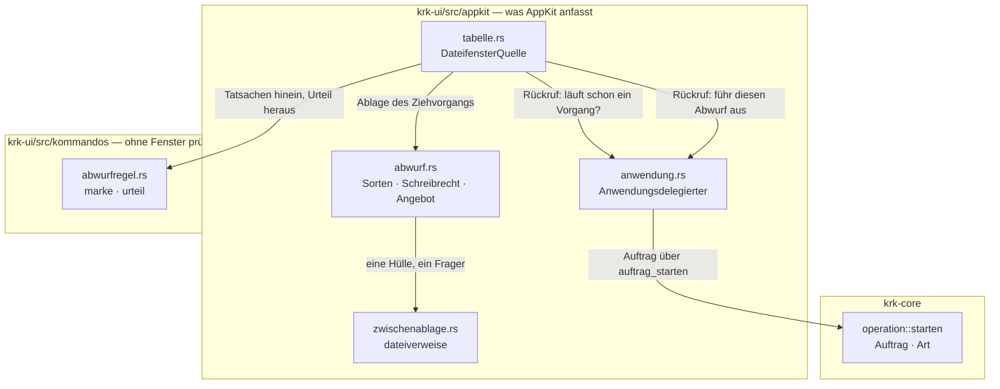
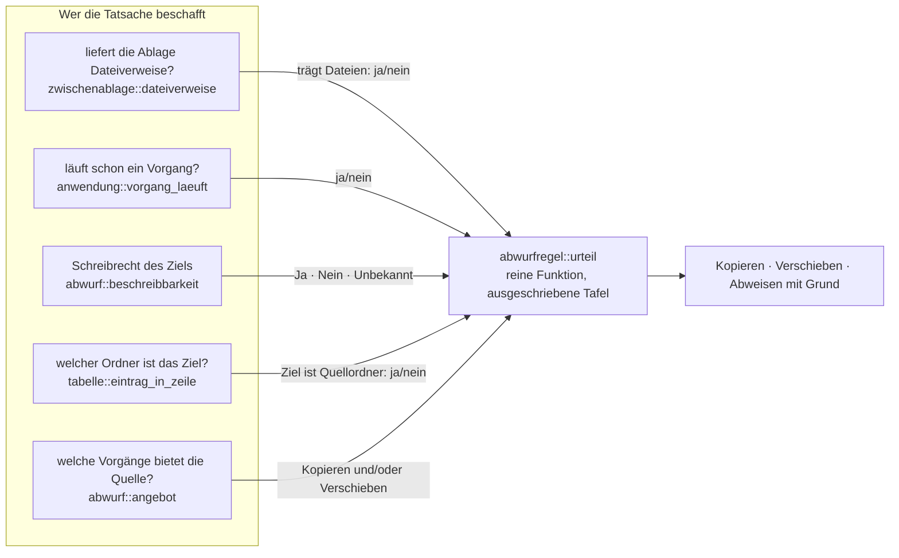
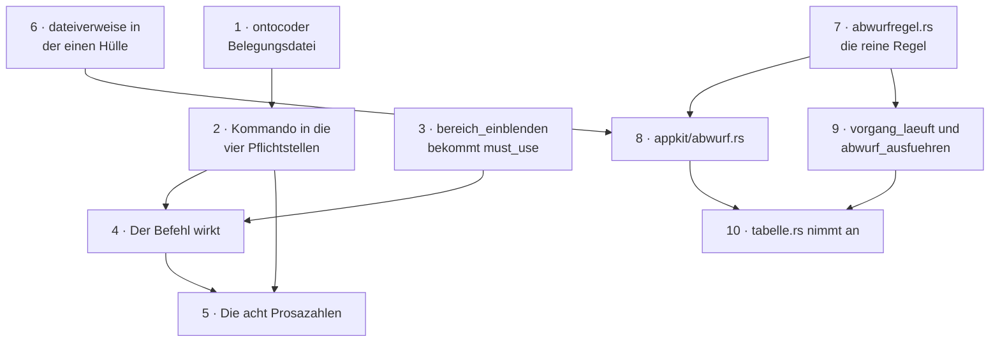

# Implementation Plan: Das andere Dateifenster nachziehen, und Dateien aus fremden Anwendungen abwerfen

**Date:** 2026-08-18
**Status:** Draft
**Spec:** `shared/planning/260818-1510_*_spec-verzeichnis-angleichen-und-abwurf-aus-fremden-apps.md`, abgenommen am Spec-Gate. Dieser Plan verhandelt keine seiner Nutzerantworten neu.
**Circle:** `circles/260818-1615-ordner-angleichen-und-abwurf-aus-fremden-apps`
**Baumstand:** `b47355e`, gelesen am 260818-1620. Gegenüber dem Stand `8d5baf6`, gegen den der Spec geschrieben ist, hat sich am Code nichts geändert: `git diff --stat 8d5baf6..HEAD` liefert acht Dateien, alle unter `fusion-workbench/`. Jede Zahl des Specs gilt deshalb unverändert.
**Decidability:** Die tragende Frage des Abwurfs ist **nicht**, ob er gelingen wird. Das ist aus den Eingaben eines Ziehvorgangs nicht zu entscheiden: eine Quelle kann zwischen Loslassen und Zugriff verschwinden, ein Schreibrecht sich ändern, ein Datenträger volllaufen. Die Frage, die dieser Plan stellt, ist die entscheidbare daneben — **hält KRK in diesem Augenblick einen gemessenen Grund, gar nicht erst anzufangen?** Sie zerfällt in vier Teilfragen, und jede wird von der Stelle beantwortet, die sie beantworten kann: die Ablage des Ziehvorgangs liefert Dateiverweise oder keine (`readObjectsForClasses:options:`), der Anwendungsdelegierte weiß, ob ein Vorgang läuft (`ivars().vorgang`), der Ressourcenwert `NSURLIsWritableKey` antwortet nach dem EUID, also nach der Kennung, die gleich schreiben wird, und der Vergleich zweier Pfade ist ein Vergleich zweier Pfade. Keine davon sagt einen künftigen Systemaufruf voraus. **Der Rest wird nachträglich entschieden und nicht vorhergesagt**: er erscheint als übersprungener Eintrag mit seinem Grund in der Abschlussliste des Vorgangs, auf demselben Weg, den F5 und F6 heute gehen. Ein Wechsel des Mechanismus ist deshalb nicht nötig — nötig war der Wechsel der **Frage**, und der Spec hat ihn unter C6 schon vollzogen, indem er die vierte Lage ausdrücklich aus der Vorabprüfung herausnimmt. Für die zweite tragende Frage der Runde, „Kopieren oder Verschieben", hat der Entscheidungsdatensatz `shared/decisions/260818-1453_*_welche-zusatztaste-macht-aus-einem-abwurf-ein-verschieben.md` denselben Wechsel bereits vollzogen: KRK hört auf, aus Zusatztasten zu schließen, und liest die Menge ab, die das System ihm reicht. Ein Rest bleibt und ist benannt: ein gemessenes Schreibrecht kann zwischen der Messung und dem Schreiben veralten. Sein Ausgang ist „übersprungen mit Grund" und nie ein stiller Teilerfolg.

## Directive

KRK stellt nach dieser Runde das andere Dateifenster auf einen Tastendruck hin auf den Ordner des aktiven, und es nimmt Dateien und Ordner entgegen, die eine fremde Anwendung in eine seiner Dateilisten wirft. Der Abwurf landet in dem Ordner, den der Zeiger beim Loslassen benennt: über einer Ordnerzeile in diesem Ordner, sonst in dem, den die Liste zeigt. Kopiert wird in der Vorgabe, verschoben mit `cmd`; welcher der beiden Vorgänge gilt, beantwortet das System und nicht KRK. Was KRK nicht ausführen kann, weist es schon während des Ziehens ab, damit der Zeiger es vor dem Loslassen zeigt.

Dieser Plan beantwortet die neun Punkte aus `## Offen für den Planner` und schneidet die Arbeit so zu, dass Bau und Proben nach **jedem einzelnen** Schritt grün stehen.

## Current State

**Der Baum kennt kein Ziehen, in keine Richtung.** Über `crates/` haben `registerForDraggedTypes:`, `NSDraggingInfo`, `draggingEntered:`, `draggingUpdated:`, `validateDrop:`, `acceptDrop:`, `beginDraggingSessionWithItems:event:source:` und `NSFilePromiseReceiver` zusammen null Fundstellen. Es gibt keine halbfertige Annahme, an die anzuschließen wäre. Der Abwurf ist neue AppKit-Fläche und keine Erweiterung.

**Die Datenquelle weiß nicht, welches Dateifenster sie ist, und das ist der eine Punkt, den der Spec nicht sehen konnte.** `QuelleIvars` (`crates/krk-ui/src/appkit/tabelle.rs:427-579`) trägt sechzehn Felder und darunter kein `Fensterseite` und kein `Bereich`. `tabelle.rs` nennt `Anwendungsdelegierter` in sieben Zeilen, und alle sieben sind Doc-Kommentare; die Datei fasst `NSApplication` nirgends an. Die Richtung ist streng einseitig: der Delegierte hält die Dateifenster, die Dateifenster kennen ihn nicht.

Der eine Weg nach draußen sind **fünf eingehängte Rückrufe** in den Ivars — `aktivierung` (`:464`), `ordnerwechsel` (`:475`), `auswahlmelder` (`:486`), `umbenennung` (`:495`), `meldungswechsel` (`:447`). Alle fünf hängt `Anwendungsdelegierter::oberflaeche_aufbauen` in einer Schleife über `Fensterseite::ALLE` ein (`anwendung.rs:1154-1228`) und fängt die Seite dabei in der Hülle; jede Hülle hält den Delegierten **schwach** (`objc2::rc::Weak::from_retained`), damit der Ring Delegierter → Dateifenster → Quelle → Rückruf → Delegierter an der letzten Kante offen bleibt. Der Doc-Kommentar an `umbenennung` (`:489-494`) sagt den Grund für diese Bauform ausdrücklich: „die Auffrischung muss **beide** Dateifenster erreichen, was von hier aus nicht geht". Der Abwurf braucht genau denselben Weg, und er bekommt ihn in derselben Form. **Ein sechster und ein siebter Rückruf sind hier keine Erfindung, sondern die vorhandene Bauform.**

**Die Operationsmaschine hat heute zwei Eingänge und bekommt einen dritten.** `auftrag_stellen` (`anwendung.rs:5302`) nimmt seine Quellen aus `betroffene_eintraege()` des **aktiven** Dateifensters und passt deshalb nicht: ein Abwurf bringt fremde Pfade und ein Ziel, das nicht das aktive Dateifenster sein muss. `auftrag_starten` (`:5368`) nimmt einen fertigen `Auftrag` und hat heute drei Rufer (`:4913`, `:5171`, `:5331`); es prüft **nicht** auf einen laufenden Vorgang, das tut jeweils der Rufer. `Auftrag::kopieren` und `Auftrag::verschieben` (`crates/krk-core/src/operation/auftrag.rs:88`, `:93`) füllen beide `Default`-Felder und sind der saubere Einstieg, den `auftrag_stellen` heute mit einem Strukturliteral umgeht.

**Die Frage nach dem laufenden Vorgang schreibt heute eine Meldung, und das verträgt sich nicht mit einem Ziehvorgang.** `vorgang_laeuft_schon` (`anwendung.rs:5348`) liest `ivars().vorgang` **und** ruft `antwort_zeigen`; sein Doc-Kommentar hält fest: „Beide Wege in die Operationsmaschine fragen hier … eine zweite Prüferei wären zwei Antworten auf dieselbe Frage." Ein Abwurf fragt in `validateDrop:`, und das ruft AppKit bei jeder Zeigerbewegung. Wer die heutige Funktion dort ruft, schreibt die Statuszeile mehrmals je Sekunde voll. Der Ausweg ist nicht eine zweite Prüfung, sondern **dieselbe Prüfung ohne ihre Nebenwirkung**: die Frage zieht als `vorgang_laeuft` heraus, und `vorgang_laeuft_schon` wird ihr einziger meldender Rufer.

**`Fenstermodell::einblenden` liefert `false` in zwei Lagen, sein AppKit-Mantel in drei.** Der Spec und der Circle-Datensatz nennen die zwei am Modell: der Bereich stand schon da (`fenstermodell.rs:736-738`), und die Mindestbreiten passen nicht (`:653-655`). `Anwendungsdelegierter::bereich_einblenden` (`anwendung.rs:3862`) legt eine dritte darüber: `zeilenmass()` liefert `None`, solange die Aufteilung nicht steht (`:3878`). Für einen Tastenbefehl kann sie nicht eintreten — die Aufteilung steht seit `oberflaeche_aufbauen`, und vorher erreicht kein Tastendruck den Delegierten —, aber der Plan nennt sie, statt sie zu übergehen. **Der Mantel trägt heute kein `#[must_use]`**, obwohl das Modell darunter eines mit ausgeschriebener Falle trägt, und einer seiner zwei Rufer (`anwendung.rs:1516`) lässt den Wert als nackte Anweisung fallen. Nach der Regel dieses Projekts gehört das Attribut dorthin; dieser Plan setzt es, weil C2 vollständig davon abhängt, dass der Wert gelesen wird.

**Ein neues Kommando hat drei Pflichtstellen und nicht zwei, und die dritte hält niemand.** `Kommando::wirkungsbereich` (`belegung.rs:799`) und `bereich_des_kommandos` (`belegungsmodell.rs:227`) sind vollständige Fallunterscheidungen ohne Auffangzweig und halten den Bau an. Der Ausführungszweig in `Anwendungsdelegierter::kommando_ausfuehren` (`anwendung.rs:2896`) endet dagegen auf `andere => self.bereichskommando(fokus, andere)` (`:2983`), und `Tabelle::kommando_ausfuehren` (`tabelle.rs:1025`) auf `_ => return false` (`:1061`). Ein Kommando ohne eigenen Zweig übersetzt, besteht jede Probe, steht mit Namen und Kombination im Hauptmenü und tut nichts. Der Baum warnt an der richtigen Stelle (`anwendung.rs:3050-3053`), `CLAUDE.md` nicht; der Befund dazu ist `shared/issues/260818-1635_*_claude-md-nennt-zwei-nachzuziehende-stellen-je-kommando-die-dritte-haelt-kein-uebersetzer.md`.

**Was der Baum an Bauformen schon mitbringt und was diese Runde wiederverwendet:**

| Vorhandene Stelle | Was sie beisteuert |
|---|---|
| `kommandos/rueckschritt.rs` | die Bauform der reinen Regel: ausgeschriebene Tafel im Doc-Kommentar, dieselbe Tafel als `match` ohne Auffangzweig, dieselbe Tafel ein drittes Mal als Probenfeld, dazu eine Aufruferzählung über `crate::quellbaum` |
| `appkit/volumes.rs:268` `liegt_auf_netzlaufwerk` | die Bauform der Ressourcenwert-Abfrage: frischer `NSURL` je Aufruf, `resourceValuesForKeys_error`, ein fehlender Wert heißt nicht „ja" |
| `appkit/zwischenablage.rs` | die **eine** Hülle um `NSPasteboard`, mit vier Funktionen für vier Fragen an demselben Gegenstand |
| `tabelle.rs:1575` `eintrag_in_zeile` | die **eine** Stelle, die auf diesem Weg aus einer Zeilennummer einen Pfad macht |
| `tabelle.rs:2786-2796` | die Bauform der dünnen Protokollmethode: der Rumpf steht daneben, weil `define_class!` ihn einengt, und ein Kommentar sagt warum |
| `anwendung.rs:5669` `antwort_zeigen` | die Meldung an ein **benanntes** Dateifenster; die Signatur nimmt die Seite schon heute entgegen |
| `appkit/editor.rs:4717` `an_einer_flaeche` | die Notlüge über den Hauptfaden, samt ihrer gemessenen Grenze |

**Die Bindungen liegen alle vor:** `objc2-app-kit 0.3.2` führt `registerForDraggedTypes:` (`NSView.rs:1412`), das Protokoll `NSDraggingInfo` mit `draggingSourceOperationMask` und `draggingPasteboard` (`NSDragging.rs:142-169`), `NSDragOperation` als Bitmenge (`:14-38`), `NSTableViewDropOperation::{On, Above}` (`NSTableView.rs:16-22`), `setDropRow:dropOperation:` (`:750`) und die beiden optionalen Datenquellenmethoden (`:1677`, `:1694`); `NSFilePromiseReceiver::readableDraggedTypes` steht in `NSFilePromiseReceiver.rs:28`, `readObjectsForClasses:options:` und `NSPasteboardURLReadingFileURLsOnlyKey` in `NSPasteboard.rs:371`, `:302`. Am 260818 in `~/.cargo/registry` gelesen. Keine Merkmalszeile in `Cargo.toml` ändert sich.

## Approach

### Drei Schichten, und jede beantwortet eine Sorte Frage



`DateifensterQuelle` zeigt auf vier Nachbarn, und das ist kein Gottobjekt, sondern die Stelle, an der die Fäden zusammenlaufen müssen: sie ist die einzige, die zugleich das Tabmodell, die Tabelle und die Statuszeile ihres Dateifensters erreicht. Was sie **nicht** tut, ist entscheiden — das Urteil kommt aus `abwurfregel`, die Tatsachen aus `abwurf` und `zwischenablage`, die Ausführung aus dem Delegierten. Ein Kreis steht nicht im Graphen, und die Kante nach `krk-core` läuft in eine Richtung.

### Wer welche Tatsache beschafft, und warum jede genau einen Frager hat



Drei Entwurfsentscheidungen tragen dieses Bild:

- **Die Frage nach dem laufenden Vorgang behält genau eine Antwortstelle.** `vorgang_laeuft_schon` teilt sich in die Frage (`vorgang_laeuft`, ohne Nebenwirkung) und ihren meldenden Mantel; die zwei heutigen Rufer bleiben am Mantel, der Abwurf nimmt die Frage. Das ist **keine** zweite Prüfung, sondern dieselbe ohne die Meldung, die während eines Ziehvorgangs nicht geschrieben werden darf. Der Doc-Kommentar an `vorgang_laeuft_schon` wandert an `vorgang_laeuft` mit und nennt dort den dritten Weg.
- **Das Urteil steht als reine Funktion und nicht als Bedingungskette im Annahmezweig.** Der Grund ist der von `rueckschritt.rs` (`:30-32`): dort wäre sie an keiner Probe zu fassen. Alle Kriterien aus C4, C5 und C6, die kein Ziehen brauchen, werden damit von `cargo test` gehalten statt von der Hand des Nutzers.
- **Die Ablage des Ziehvorgangs erreicht die eine Hülle über einen Parameter und nicht über eine zweite Hülle.** `lesen()` und `inhalt_lesen()` bleiben unangetastet: sie beantworten „was steht in **der** Zwischenablage", eine Frage mit einem Gegenstand und ohne Parameter. `dateiverweise(ablage)` beantwortet „welche Dateien trägt **diese** Ablage" — eine andere Frage, deshalb eine eigene Funktion, und sie nimmt die Ablage entgegen, weil ein Ziehvorgang seine eigene mitbringt. Vier Funktionen für vier Fragen an demselben Gegenstand, wie die Datei es seit der Runde 4 hält.

### Die neun offenen Punkte des Specs, beantwortet

**1. Wo die Ziehannahme wohnt — zur Hälfte erzwungen, zur Hälfte gewählt.**

Erzwungen: `validateDrop:` und `acceptDrop:` sind Methoden von `NSTableViewDataSource`, und `DateifensterQuelle` erklärt dieses Protokoll bereits (`tabelle.rs:604`). `objc2`s `define_class!` ist **eine** Makroauswertung; ein Protokollrumpf lässt sich nicht auf zwei Dateien verteilen. Die beiden Methoden stehen deshalb zwingend im vorhandenen `unsafe impl NSTableViewDataSource for DateifensterQuelle`-Block in `tabelle.rs`. Ein eigenes Modul kann sie nicht aufnehmen.

Gewählt: ihre **Rümpfe** stehen daneben, in `impl DateifensterQuelle`, nach der Bauform, die dieselbe Datei bei `ansicht_fuer_zelle` (`:2786-2796`) schon begründet. Und die Tatsachen, die AppKit liefert und die kein Dateifenster braucht — die Sortenliste, das Schreibrecht, die angebotene Menge —, ziehen in ein neues Modul `crates/krk-ui/src/appkit/abwurf.rs`. Zwei Gründe: `tabelle.rs` trägt heute 4065 Zeilen, und der Abschnitt `# Ab welchem macOS die angesprochenen Klassen stehen` des neuen Moduls kann die acht Berührungen dieser Runde geschlossen führen, statt sie in die schon fünfzig Zeilen lange Liste von `tabelle.rs` einzustreuen. Das neue Modul erbt `#![allow(unsafe_code)]` aus `appkit/mod.rs:1`; eine dritte Ausnahme entsteht nicht.

**2. Wie die Regel aus C5 ohne AppKit prüfbar wird.**

In `crates/krk-ui/src/kommandos/abwurfregel.rs`, ohne eine `use objc2`-Zeile, wie das ganze Verzeichnis. Die Umsetzung von `NSDragOperation` in zwei Wahrheitswerte geschieht **einmal**, in `abwurf::angebot`, und danach ist die Regel reines Rust:

| `bietet_kopieren` | `bietet_verschieben` | Ausgang | die Lage, die dazu führt |
|---|---|---|---|
| ja | ja | Kopieren | der Nutzer hält nichts oder `shift` |
| ja | nein | Kopieren | der Nutzer hält `opt` |
| nein | ja | Verschieben | der Nutzer hält `cmd` |
| nein | nein | Abweisen (kein Vorgang im Angebot) | die Quelle bietet weder das eine noch das andere |

Vier Zeilen, vier Kombinationen, kein Auffangzweig. Die vierte Spalte steht im Doc-Kommentar und **nicht** im Code: KRK liest keine Taste, und eine Fallunterscheidung nach Tasten stünde damit an einer Stelle, an der sie nichts entscheidet. Sie steht dort, weil der Leser die Tabelle des Specs wiederfinden können muss.

**3. Womit KRK das Schreibrecht eines Ordners feststellt — über `NSURLIsWritableKey`, und ausdrücklich nicht in `verzeichnis/sys.rs`.**

Der Spec lässt offen, ob die Prüfung in den Kern zieht. Sie zieht nicht, und vier Gründe tragen das, der erste allein:

1. **`access(2)` fragt nach der falschen Kennung.** Es prüft nach der **realen** Benutzerkennung — dafür ist es da, für setuid-Programme. `NSURLIsWritableKey` antwortet nach dem EUID, also nach derjenigen, die gleich schreiben wird; der Kopf sagt es wörtlich: „true if this process (as determined by EUID) can write to the resource" (`NSURL.h:247`, `API_AVAILABLE(macos(10.7))`, am SDK gelesen). Bei KRK fallen beide heute zusammen. Der Punkt ist nicht die Differenz, sondern dass die eine Schnittstelle die Frage stellt, die gemeint ist, und die andere eine benachbarte.
2. **`verzeichnis/sys.rs` zählt seine Schnittstellen, und die Zahl steht dreimal.** Der Modulkopf sagt „die **fünf** Schnittstellen … und die **neun** Funktionen" (`sys.rs:1-2`), und die Zeile über die eine Ausnahme steht wortgleich in `lib.rs` und in `verzeichnis/mod.rs`. Eine sechste Schnittstelle heißt: ein neuer `extern "C"`-Block, zwei Konstanten, drei Dateien im Gleichschritt — für eine Funktion mit einem einzigen Rufer, der in AppKit-Land sitzt.
3. **Der Baum hat die Prüfung am Pfad schon einmal abgeschafft.** Der Doc-Kommentar von `ohne_warten_oeffnen` (`sys.rs:759-774`) schreibt die Bauform aus, gegen die diese Datei gebaut ist: erst öffnen, dann am **Deskriptor** fragen, „weil nur noch **ein** Aufruf den Namen anfasst". Eine `access(2)`-Prüfung am Pfad wäre die Wiedereinführung genau der Reihenfolge, die dort abgeschafft wurde.
4. **`resourceValuesForKeys_error` steht schon zweimal im Baum** (`volumes.rs:198`, `:280`). Wiederverwenden vor Bauen.

Verworfen ist auch der billige Weg ohne `unsafe`, `std::fs::metadata(pfad)?.permissions().readonly()`: `readonly()` ist wahr nur, wenn **kein** Schreibbit gesetzt ist, sagt also nichts darüber, ob *dieser* Benutzer schreiben darf, und kennt keine ACL.

Die Funktion heißt `abwurf::beschreibbarkeit(&Path) -> Schreibrecht` und liefert `Ja`, `Nein` oder `Unbekannt`. **Sie baut ihren `NSURL` bei jedem Aufruf frisch**, wie `liegt_auf_netzlaufwerk` es tut, und der Grund gehört an die Stelle: `NSURL` merkt sich Ressourcenwerte, und ein über mehrere Zeigerbewegungen wiederverwendeter `NSURL` lieferte die Antwort von vorhin.

Was `Unbekannt` bedeutet, ist eine Festlegung dieses Plans und kein Ableitungsergebnis: **es lässt durch.** Die Begründung und die verworfenen Wege stehen im Datensatz `decisions/260818-1633_*_gilt-ein-unentscheidbares-schreibrecht-beim-abwurf-als-erlaubnis-oder-als-abweisung.md`; umstoßbar am Plan-Gate.

**4. Wie die Ablage des Ziehvorgangs die eine Hülle erreicht.**

Über eine fünfte Funktion in `zwischenablage.rs`:

```rust
pub fn dateiverweise(ablage: &NSPasteboard) -> Vec<PathBuf>
```

gebaut auf `readObjectsForClasses_options` mit `[NSURL::class()]` und der Möglichkeit `NSPasteboardURLReadingFileURLsOnlyKey: true`. **Warum nicht `stringForType`, wie die vier vorhandenen Funktionen:** ein Abwurf trägt mehrere Einträge, und `stringForType:` liefert je Sorte genau eine Zeichenkette für die ganze Ablage. Genau das ist der Grund, aus dem die neue Funktion eine ist und keine Umschreibung einer alten.

Dieselbe Funktion beantwortet C7, und sie tut es **ohne** eine Zusagedatei als solche einzuordnen: liefert eine nichtleere Ablage keine Dateiverweise, dann trägt sie keine Datei auf dem Datenträger, und genau das sagt die Meldung des Specs („dass die Quelle keine Datei auf dem Datenträger liefert"). KRK misst, statt zu diagnostizieren; eine Fallunterscheidung „Zusage oder nicht" wäre eine Behauptung über eine fremde Anwendung, die aus dieser Ablage nicht zu belegen ist. Damit die Frage überhaupt gestellt werden kann, meldet die Tabelle die Zusagesorten **mit** an — `NSFilePromiseReceiver::readableDraggedTypes()` liefert die Liste —, denn eine nicht angemeldete Sorte erreicht die Ansicht nie und KRK bekäme keine Gelegenheit, etwas zu sagen. `NSFilePromiseReceiver` wird angemeldet und nie gerufen; das ist die ganze Berührung.

**5. Wie der Abwurf in die Operationsmaschine kommt.**

Als **dritter Rufer von `auftrag_starten`**, über einen neuen Rumpf `Anwendungsdelegierter::abwurf_ausfuehren(seite, ziel, quellen, art)`, der `Auftrag::kopieren`/`Auftrag::verschieben` baut und weiterreicht. `auftrag_stellen` bleibt unangetastet — es ist an die Auswahl des aktiven Dateifensters gebunden und wäre für fremde Pfade umzuschreiben.

Die Zusage des Specs, die Prüfung auf einen laufenden Vorgang nicht zweimal zu beantworten, hält so: **sie wird genau einmal gestellt, in `validateDrop:`, über `vorgang_laeuft`.** `acceptDrop:` fragt nicht nach, weil AppKit es nur ruft, wenn `validateDrop:` einen Vorgang zurückgegeben hat, und `auftrag_starten` fragt von sich aus ohnehin nicht. Der Rumpf `abwurf_ausfuehren` fragt ebenfalls nicht; sein Doc-Kommentar schreibt aus, warum, und nennt die Stelle, die gefragt hat.

**6. Wie der Befehl aus C1 den Zielordner setzt.**

`self.dateifenster(aktiv.andere()).quelle().ordner_lesen(&ordner, None)`. Das ist der **vierte** Rufer von `ordner_lesen` und der erste, der eine andere Seite als `aktiv` nennt; sein Doc-Kommentar (`tabelle.rs:844`) zählt seine Rufer auf und bekommt den neuen dazu. Die Zusage jener Funktion trägt C1 unverändert: sie wechselt den Ordner des **sichtbaren** Tabs und legt keinen neuen an.

**Eine gemeinsame Stelle für „das andere Dateifenster" entsteht nicht.** `anwendung.rs:4431` ist heute der einzige Ort im Delegierten, der `.andere()` ruft; mit dieser Runde sind es zwei. Ein Helfer `anderes_dateifenster() -> &Dateifenster` läge nahe und wäre falsch: der neue Befehl braucht die **Seite** selbst weiter, für `Bereich::von_seite(ziel)` in C2, und ein Helfer, der das Dateifenster liefert, wirft genau den Wert weg, den der neue Rufer braucht. Zwei Vorkommen einer Zweischritt-Wendung sind keine Doppelung, die eine Abstraktion verdient.

**Der Vergleich „steht schon dort" läuft über die angezeigten Pfade, ohne Auflösung.** `std::fs::canonicalize` auf beiden Seiten kostete zwei Systemaufrufe je Tastendruck und brächte einen eigenen Fehlerausgang. Was ohne Auflösung durchrutscht, ist der Fall „derselbe Ordner unter zwei Pfaden", und sein Ausgang ist ein Lesevorgang, der denselben Inhalt noch einmal liest — folgenlos. Der Rest der Regel fällt auf die harmlose Seite, und das steht als Satz an der Stelle.

**7. Wie der Befehl aus C2 einblendet.**

Die Sichtbarkeit wird **vor** dem Einblenden gefragt, über `self.ivars().modell.borrow().sichtbar(bereich)` — `Fenstermodell::sichtbar` ist `pub` und hat im Delegierten schon neun Rufer. Erst danach ruft der Befehl `bereich_einblenden`, und der Rückgabewert kann dann nur noch die Abweisung an den Mindestbreiten bedeuten. Die dritte Bedeutung des Mantels (`zeilenmass()` ist `None`) kann für einen Tastenbefehl nicht eintreten, weil die Aufteilung seit `oberflaeche_aufbauen` steht; der Satz gehört trotzdem an die Stelle, damit der nächste Leser nicht wieder zwei zählt, wo drei stehen.

Damit der Wert überhaupt gelesen **werden muss**, bekommt `bereich_einblenden` das `#[must_use]`, das sein Modell darunter längst trägt. Der eine Rufer, der ihn heute fallen lässt (`anwendung.rs:1516`), bekommt `let _ =`; das heißt in diesem Projekt überall dasselbe, „ich brauche den Wert nicht", und dort ist es zutreffend.

**8. Wo die Proben stehen.**

In `#[cfg(test)]`-Modulen neben dem Code, denn `krk-ui` hat kein Bibliotheksziel. **Und keine Probe dieser Runde baut eine `NSTableView`.** Das ist eine Wahl und keine Auslassung: `an_einer_flaeche` (`appkit/editor.rs:4717`) trägt seine Notlüge über den Hauptfaden nur so weit, wie sie gemessen ist — „kein Fenster, keine Zeichnung, keine Ereignisschlange, kein Ersthelfer" —, und ein Ziehvorgang ist Ereignisschlange. Ein `NSDraggingInfo` läßt sich ohne Ziehsitzung ohnehin nicht bauen. Der Zuschnitt dieses Plans zieht deshalb alles, was ohne Fenster zu entscheiden ist, in `abwurfregel` hinein: die Marke, das Urteil und die Wahl zwischen Kopieren und Verschieben. Was übrig bleibt und Fenster braucht, gehört in die Nutzerarbeit und steht dort einzeln.

**9. Die Reihenfolge der Planschritte.**

Der Befehl zuerst, der Abwurf danach. Drei Gründe:

- Der Befehl bringt die Erweiterung der gewachsenen Aufzählung mit. Sie berührt vier Dateien in zwei Kisten und ist die einzige Änderung dieser Runde, die den Bau an einer Stelle anhalten kann, an die niemand gedacht hat. Sie steht am Anfang, wo sie allein steht.
- Der Befehl ist klein, endet in einem lieferbaren Stand und ist danach für den Nutzer abnehmbar, während der Abwurf noch entsteht.
- Die beiden Bündel teilen sich `tabelle.rs`, und der Befehl fasst dort nur einen Doc-Kommentar an. Eine Verzahnung entsteht nicht.

**Innerhalb des ersten Bündels geht die Belegungsdatei dem Code voran**, und das ist gegen die naheliegende Reihenfolge entschieden. Der Grund ist gemessen: `belegungsausgabe.rs:755` prüft `mit_kommando == Kommando::KENNUNGEN.len()`, und `belegung.rs:1636` prüft, dass jede Kennung der Aufzählung in der Auslieferungsbelegung steht. Wer den Code zuerst schreibt, lässt beide Proben rot, bis die Datei nachzieht — der Bau bliebe grün, `cargo test` nicht. Umgekehrt ist der Zwischenstand unauffällig: eine Funktion in der Belegungsdatei, zu der es kein `Kommando` gibt, ist ein gültiger Zustand des Modells (`Funktion::kommando` liefert `None`, `belegung.rs:1098`), und der Baum führt heute schon sechs solcher Funktionen. Beide Schritte gehen trotzdem in **einen** Commit; getrennt ausgeliefert stünde ein Menüeintrag ohne Wirkung im Menü.

### Was der Übersetzer einfordert, und was er nicht einfordert

Am 260818 gegen `b47355e` gezählt, jede `match`-Fundstelle über `Kommando` klammerbalanciert auf einen Auffangzweig geprüft.

**Der Übersetzer hält es (4 Stellen):**

| Stelle | Was dazukommt |
|---|---|
| `crates/krk-core/src/tasten/belegung.rs:353` | die Variante `OrdnerAngleichen`, hinter `OrdnerDerDatei` und vor `Pfadeingabe`. Heute 78 Varianten |
| `crates/krk-core/src/tasten/belegung.rs:647` | `KENNUNGEN`: die Länge `78` → `79`, dazu `(Kommando::OrdnerAngleichen, "ordner_angleichen")` |
| `crates/krk-core/src/tasten/belegung.rs:1031` | eine Zeile im letzten Arm, `Wirkungsbereich::Dateifenster` |
| `crates/krk-ui/src/belegungsmodell.rs:276` | eine Zeile im Arm `Funktionsbereich::Dateilisting` |

**Eine Probe hält es (2 Stellen):**

| Stelle | Welche Probe |
|---|---|
| `resources/default-keymap.toml`, neuer `[[funktion]]`-Block | `belegungsausgabe.rs:755`, `belegung.rs:1636` |
| `resources/default-keymap.toml:34`, „84 Funktionen … 89 Kombinationen" → 85/90 | `belegung.rs:1677` `die_zwei_zahlen_im_kopf_der_auslieferungsbelegung_stimmen_noch` liest die Zeile und zählt selbst nach |

**Nichts hält es (9 Stellen) — die eigentliche Gefahrenfläche:**

| Stelle | Was geschieht, wenn sie fehlt |
|---|---|
| `crates/krk-ui/src/appkit/anwendung.rs`, Ausführungszweig vor `andere =>` (`:2983`) | der Befehl steht im Menü, trägt seine Kombination und tut nichts |
| `belegungsausgabe.rs:45`, `:48`, `:56`, `:256`, `:730-731` | fünf Prosazahlen über 84 und 78 veralten still |
| `appkit/menue.rs:128`, `:799`, `:867` | drei weitere ebenso |

**Was ohne Arbeit nachzieht:** der Hauptmenüeintrag, die Zeile der Belegungsansicht, die Markdown-Ausgabe und die Umbelegbarkeit. Alle vier entstehen aus `resources/default-keymap.toml` und `bereich_des_kommandos`; `menuemodell::aufbau` (`:234`) führt keine eigene Liste.

**Der Abwurf bringt keine neue Auftragsart.** Er mündet in `Art::Kopieren` oder `Art::Verschieben`; `schiebt_auffrischung_auf` (`crates/krk-ui/src/auffrischung.rs`) bekommt keine Zeile.

**`Wirkungsbereich::Dateifenster` steht auf der anderen Seite einer Linie als `ordner_der_datei`, und das ist kein Widerspruch.** Der Doc-Kommentar an `belegung.rs:965-981` begründet, warum der Ordnersprung `Ueberall` trägt: „seine Quelle hängt nicht am Fokus, und sein Ziel gibt es immer" — er wird aus Vorschau und Editor heraus gedrückt, also aus Bereichen, die keine Dateifenster sind, und mit `Dateifenster` wäre er genau dort abgewiesen, wo er am meisten taugt. `ordner_angleichen` liegt umgekehrt: seine Quelle **ist** der angezeigte Ordner eines Dateifensters, und außerhalb eines Dateifensters hat er keinen Gegenstand. Der Spec setzt `Dateifenster`, und der Grund trägt.

### Drei Berichtigungen, gemessen und nicht übernommen

- **Der Spec sagt unter C3, `shared/issues/260815-1047_*_die-bedingung-der-moeglichkeit-2-…` bleibe offen. Am Bestand trägt der Datensatz `_d_`**, ist also als Lage angenommen und nicht offen. An der Sache ändert das nichts: der Zustand am Code besteht fort, und diese Runde macht ihn weder besser noch schlimmer. Der Circle-Datensatz führt den Befund bereits unter „Ein gemessener Abweichungspunkt"; ein zweiter Datensatz darüber entsteht nicht.
- **Der Spec verortet die Warnung über Pfadprüfung und späteren Zugriff im Modulkopf von `verzeichnis/sys.rs`. Dort steht sie nicht.** Sie steht im Doc-Kommentar von `ohne_warten_oeffnen` (`sys.rs:759-774`) und ist dort als Wettlauffenster formuliert, nicht als „zwei verschiedene Fragen". Der Modulkopf beginnt mit der Zählung der fünf Schnittstellen. Die Sache stimmt, der Ort nicht; dieser Plan zitiert den richtigen.
- **Der Circle-Datensatz zählt sieben offene Punkte, der Spec führt neun.** Der Datensatz zieht die Punkte 6 und 7 zusammen und lässt die Reihenfolge der Planschritte als Frage weg. Dieser Plan beantwortet die neun des Specs, weil der Spec die bindende Fassung ist.

## Implementation Steps

Zwei Bündel, zehn Schritte. Jeder Schritt nennt genau einen Executor. **Nach jedem einzelnen Schritt laufen `cargo build --workspace` und `cargo test --workspace` grün**; wo zwei Schritte trotzdem in einen Commit gehören, sagt der Plan es an der Stelle.

**Kein Schritt gehört dem `analyst`.** Die Runde bringt keinen strategischen Datensatz hervor: die eine Entscheidung, die sie aufwirft, ist als `_o_`-Datensatz gefilt und gehört dem Nutzer, und alles Übrige ist Rust und AppKit. Der eine Schritt für den `ontocoder` ist die Belegungsdatei, die Daten trägt und keine Bauwerkskonfiguration.

### Bündel A — Der Befehl (C1 bis C3)

1. **[DONE] Die Funktion in die Belegungsdatei**
   - Executor: `ontocoder`
   - Files: `resources/default-keymap.toml`
   - Changes: Neuer `[[funktion]]`-Block im Abschnitt `# ── C2: Navigation in der Liste ──`, unmittelbar hinter `ordner_der_datei` (endet `:277`) und vor `pfadeingabe` (`:279`); die Stellung im Abschnitt bestimmt die Stellung im Hauptmenü, die Gruppe kommt aus `bereich_des_kommandos`. `id = "ordner_angleichen"`, `name = "Anderes Dateifenster auf diesen Ordner stellen"`, `tasten = ["opt+cmd+s"]`, kein `gehalten_von`, kein `reserviert_fuer`. Der Begründungskommentar der `opt+cmd`-Reihe (`:266-272`) zählt seine Mitglieder von Hand auf und bekommt `opt+cmd+s` dazu, mit dem Satz, warum der Befehl in die Reihe gehört: er liefert einen Ordner an das andere Dateifenster. Dazu die Feststellung, dass `opt+cmd+s` ab Werk frei ist, am 260818 gegen alle `tasten`-Zeilen der Datei nachgezählt — die zehn belegten `opt+cmd`-Kombinationen sind `b c d e g l left n o right`. Die Kopfzeile `:34` wird von „84 Funktionen mit zusammen 89 Kombinationen" auf 85 und 90 gesetzt. **Eine Stelle ist zu lesen und zu entscheiden, nicht blind zu ändern:** `:354` nennt „39 frei gewählte Kombinationen"; steht das als Zitat eines Datensatzes der Runde 1 da, bleibt es stehen, steht es als lebende Aussage über die ausgelieferte Datei da, wird es 40. Die Entscheidung gehört an die Stelle und in den Commit-Text.
   - Dependencies: keine
   - Abnahme: `cargo test --workspace`. Der Zwischenstand ist gültig: eine Funktion ohne `Kommando` ist ein bekannter Zustand des Modells, und `belegungsausgabe.rs:755` zählt weiterhin 78 gegen 78.

2. **[DONE] Das Kommando in die vier Pflichtstellen**
   - Executor: `coder`
   - Files: `crates/krk-core/src/tasten/belegung.rs`, `crates/krk-ui/src/belegungsmodell.rs`
   - Changes: Variante `OrdnerAngleichen` mit Doc-Kommentar hinter `OrdnerDerDatei` (`:353`). `KENNUNGEN`: Länge `78` → `79` (`:647`), Eintrag `(Kommando::OrdnerAngleichen, "ordner_angleichen")` an gleicher thematischer Stelle. `Kommando::wirkungsbereich`: in den letzten Arm, `Wirkungsbereich::Dateifenster` (`:1031`); der Absatz darüber, warum dieser Befehl auf der anderen Seite der Linie steht als `ordner_der_datei`, steht oben unter „Was der Übersetzer einfordert" und gehört als Kommentar an die Zeile. `bereich_des_kommandos`: in den Arm `Funktionsbereich::Dateilisting` (`:276`), zu Aufstieg und Zwischenablagesprung, mit demselben Grund, den der Kommentar dort schon führt („alle setzen den Ordner, den eine Dateiliste zeigt"). Dazu eine Probe nach dem Vorbild von `belegungsmodell.rs:1379` `der_ordnersprung_steht_unter_dateilisting`: `bereich("ordner_angleichen") == Some(Funktionsbereich::Dateilisting)` und die Funktion trägt ab Werk eine nichtleere Tastenliste. **`NEUE_KENNUNGEN` (`belegungsmodell.rs:1409`) wird nicht erweitert** — die Liste ist der Runde 2 zugeschnitten, im Namen und im Doc-Kommentar.
   - Dependencies: 1. **Die Schritte 1 und 2 sind ein Commit.**
   - Abnahme: `make check`. Der Befehl steht danach im Menü und in der Belegungsansicht und **tut nichts**; das ist der erwartete Zwischenstand und der Grund für Schritt 4.

3. **[DONE] `bereich_einblenden` bekommt das `#[must_use]` seines Modells**
   - Executor: `coder`
   - Files: `crates/krk-ui/src/appkit/anwendung.rs`
   - Changes: `#[must_use = "…"]` an `bereich_einblenden` (`:3862`), mit ausgeschriebenem Grund in der Bauform von `Fenstermodell::einblenden` (`fenstermodell.rs:734`) und um die dritte Bedeutung erweitert, die allein der Mantel hinzufügt: `zeilenmass()` liefert `None`, solange die Aufteilung nicht steht. Der eine Rufer, der den Wert heute als nackte Anweisung fallen lässt (`:1516`, `zwischenablage_ansehen`), bekommt `let _ =`; der zweite (`:2010`, `fokus_holen`) liest ihn schon. Der Doc-Kommentar nennt die drei Lagen einzeln und sagt, welche davon eine Abweisung ist.
   - Dependencies: keine
   - Anmerkung: Der Schritt steht getrennt, weil er allein für sich richtig ist und weil `-D warnings` ihn sofort misst: `unused_must_use` ist erst dort ein Fehler, `cargo build` allein liefe auch mit dem vergessenen `let _ =` grün.

4. **[DONE] Der Befehl wirkt: einblenden, vergleichen, stellen**
   - Executor: `coder`
   - Files: `crates/krk-ui/src/appkit/anwendung.rs`, `crates/krk-ui/src/appkit/tabelle.rs`
   - Changes: Zweig `Kommando::OrdnerAngleichen => self.ordner_angleichen(),` in `kommando_ausfuehren` (`:2896`), **vor** dem Auffangzweig `:2983`, in der Bauform von `Kommando::OrdnerDerDatei` (`:3068`). Neuer Rumpf `ordner_angleichen(&self) -> bool` in dieser Reihenfolge: `aktiv` lesen, `ziel = aktiv.andere()`, den angezeigten Ordner beider Seiten holen; sind sie gleich, `antwort_zeigen(aktiv, …)` mit „das andere Dateifenster zeigt diesen Ordner bereits" und `true` zurück, ohne zu lesen und ohne einzublenden; sonst `bereich = Bereich::von_seite(ziel)`, `sichtbar` am Modell fragen, und nur wenn es verneint, `bereich_einblenden` rufen und bei `false` mit „das Fenster ist zu schmal; es wurde nichts eingeblendet und nichts gestellt" abbrechen; danach `self.dateifenster(ziel).quelle().ordner_lesen(&ordner, None)`. Der Fokus wird nicht angefasst, `aktiv_setzen` nicht gerufen, kein Bereich ausgeblendet. Der Doc-Kommentar trägt drei Sätze, die je eine Falle benennen: warum die Sichtbarkeit **vor** dem Einblenden gefragt wird, warum die Pfade ohne `canonicalize` verglichen werden, und warum die Meldung an das auslösende und nicht an das Zieldateifenster geht. In `tabelle.rs` bekommt der Doc-Kommentar von `ordner_lesen` (`:844`) seinen vierten Rufer genannt, mit dem Zusatz, dass er der erste mit einer anderen Seite als `aktiv` ist.
   - Dependencies: 2, 3
   - Abnahme: `make check`. Danach sind C1, C2 und C3 gebaut; was von ihnen nur mit der Hand zu prüfen ist, steht unten unter „Nutzerarbeit".

5. **[DONE] Die acht Prosazahlen nachziehen**
   - Executor: `coder`
   - Files: `crates/krk-ui/src/belegungsausgabe.rs`, `crates/krk-ui/src/appkit/menue.rs`
   - Changes: `84` → `85` und `78` → `79` an acht Stellen: `belegungsausgabe.rs:45`, `:48`, `:56`, `:256`, `:730-731` und `menue.rs:128`, `:799`, `:867`. **Gezählt wird gegen den Baum und nicht gegen diesen Plan**: die Zahlen gelten für `b47355e`, und wer den Schritt später fährt, erhebt sie neu. Nicht anzufassen sind `belegungsansicht.rs:665` und `:738` — das sind Maße in Punkten, keine Zählungen.
   - Dependencies: 2
   - Anmerkung: Diese Zahlen hält weder der Übersetzer noch eine Probe. Dass sie in diesem Baum wiederholt veraltet sind, führt `CLAUDE.md` mit eigenen Befunden; dieser Schritt behebt den heutigen Stand und nicht die Ursache.

**Nach Schritt 5 ist Bündel A vollständig, `make check` grün, und der Stand auslieferbar.**

### Bündel B — Der Abwurf (C4 bis C7)

6. **[DONE] Die eine Hülle liest die Ablage eines Ziehvorgangs**
   - Executor: `coder`
   - Files: `crates/krk-ui/src/appkit/zwischenablage.rs`
   - Changes: `pub fn dateiverweise(ablage: &NSPasteboard) -> Vec<PathBuf>` über `readObjectsForClasses_options` mit `[NSURL::class()]` und `{NSPasteboardURLReadingFileURLsOnlyKey: NSNumber::new_bool(true)}`; jeder gelieferte `NSURL` gibt seinen `path` her, ein Eintrag ohne Pfad fällt weg. Ein leeres Ergebnis ist kein Fehler, sondern die Antwort „diese Ablage trägt keine Datei auf dem Datenträger". Der Modulkopf wird auf den erweiterten Gegenstand gezogen: die Hülle beantwortet ab jetzt vier Fragen an zwei Ablagen, und der neue Absatz sagt in zwei Sätzen, warum `lesen()` **nicht** einen Parameter bekommt (eine Frage mit einem Gegenstand) und warum `stringForType:` hier nicht trägt (ein Abwurf hat mehrere Einträge). Der Abschnitt `# Ab welchem macOS die angesprochenen Klassen stehen` bekommt `readObjectsForClasses:options:` seit 10.6 (`NSPasteboard.h:190`), `NSPasteboardURLReadingFileURLsOnlyKey` und `NSPasteboardTypeFileURL` seit 10.13 (`NSPasteboard.h:39`). Bis Schritt 8 den Rufer setzt, trägt die Funktion `#[cfg_attr(not(test), expect(dead_code, …))]` nach dem Vorbild aus `rueckschritt.rs`; ohne die Zeile hält `-D warnings` den Bau an, und Schritt 8 muss sie entfernen, weil die Erwartung dann unerfüllt wird. Proben: eine `NSPasteboard` mit einem eigenen Namen anlegen, zwei Datei-`NSURL` hineinschreiben, beide Pfade zurücklesen; eine leere Ablage liefert einen leeren Vektor. **`generalPasteboard` wird dabei nicht angefasst**, aus demselben Grund, aus dem `text_schreiben` keine Probe trägt: sie würfe weg, was der Entwickler gerade kopiert hat.
   - Dependencies: keine

7. **[DONE] Die reine Regel: Marke, Schreibrecht, Urteil**
   - Executor: `coder`
   - Files: `crates/krk-ui/src/kommandos/abwurfregel.rs` (neu), `crates/krk-ui/src/kommandos/mod.rs`
   - Changes: Neues Modul ohne eine `use objc2`-Zeile. Es trägt `Abwurfmarke`, `Schreibrecht`, `Abwurfgrund`, `Abwurfurteil`, `Abwurflage` und zwei reine Funktionen (die Formen stehen unten unter `## Data Structures`). `marke(auf_die_zeile, typ_der_zeile)` setzt die Tabelle aus C4 um, `urteil(&Abwurflage)` die Reihenfolge aus C6 und die Tafel aus C5; beide ohne Auffangzweig, beide mit der Tafel dreifach — im Doc-Kommentar, als `match`, und ein drittes Mal als Probenfeld, weil eine gerechnete Erwartung die Umsetzung ein zweites Mal wäre. Der Modulkopf folgt `rueckschritt.rs` und trägt insbesondere dessen Abschnitt `# Woran die Regel nicht hängt`: sie liest keine Zusatztaste (der Grund steht im tragenden Datensatz), sie kennt keinen `NSDragOperation` (die Umsetzung geschieht einmal in `abwurf::angebot`), und sie fragt nicht, **warum** eine Ablage keine Dateien liefert (KRK misst, statt eine fremde Anwendung einzuordnen). Ein eigener Abschnitt hält fest, dass `Schreibrecht::Unbekannt` durchlässt, mit Verweis auf den Datensatz `decisions/260818-1633_*_gilt-ein-unentscheidbares-schreibrecht-…`. Zwei Aufruferzählungen über `crate::quellbaum` nach dem Vorbild von `die_regel_hat_genau_einen_aufrufer`, die bis Schritt 10 **null** erwarten und dort auf eins gesetzt werden — eine Probe, die schon eins erwartete, wäre rot, eine mit „höchstens eins" für immer grün. Beide Funktionen tragen `#[must_use]` mit ausgeschriebenem Grund und bis Schritt 10 dasselbe `expect(dead_code)` wie in Schritt 6.
   - Dependencies: keine

8. **[DONE] Was AppKit über einen Ziehvorgang und einen Ordner sagt**
   - Executor: `coder`
   - Files: `crates/krk-ui/src/appkit/abwurf.rs` (neu), `crates/krk-ui/src/appkit/mod.rs`
   - Changes: Neues Modul mit drei Funktionen. `sorten(mtm) -> Retained<NSArray<NSPasteboardType>>` liefert die anzumeldende Liste: `NSPasteboardTypeFileURL` und die Sorten aus `NSFilePromiseReceiver::readableDraggedTypes()`; der Doc-Kommentar sagt, warum die Zusagesorten angemeldet werden, obwohl KRK sie abweist — eine nicht angemeldete Sorte erreicht die Ansicht nie, und KRK bekäme keine Gelegenheit, etwas zu sagen. `beschreibbarkeit(&Path) -> Schreibrecht` über `resourceValuesForKeys_error` mit `NSURLIsWritableKey`, mit `#[must_use]` und ausgeschriebenem Grund — wer den Wert fallen lässt, schreibt in einen Ordner, der es verweigert —, frischer `NSURL` je Aufruf, mit dem Satz über die Zwischenspeicherung von Ressourcenwerten an der Stelle; ein Pfad ohne gültiges UTF-8, ein Fehler und ein fehlender Wert liefern alle drei `Unbekannt`, nicht `Nein`. `angebot(&ProtocolObject<dyn NSDraggingInfo>) -> (bool, bool)` liest `draggingSourceOperationMask` und prüft zweimal `contains`; das ist die **eine** Umsetzung von `NSDragOperation` in die Sprache der Regel, und der Doc-Kommentar sagt es. Dazu die Rückrichtung, `zeiger(Abwurfurteil) -> NSDragOperation`, damit auch sie einmal dasteht. Modulkopf mit dem Abschnitt `# Ab welchem macOS die angesprochenen Klassen stehen`: `NSDraggingInfo` und `NSDragOperation` seit 10.0 (`NSDragging.h:69-79`), `NSURLIsWritableKey` seit 10.7 (`NSURL.h:247`), `NSFilePromiseReceiver.readableDraggedTypes` seit 10.12 (`NSFilePromiseReceiver.h:23`), `NSPasteboardTypeFileURL` seit 10.13 — jede Zahl am SDK gelesen, keine über 15.0. Das Modul erbt `#![allow(unsafe_code)]` aus `appkit/mod.rs:1`; eine dritte Ausnahme entsteht nicht. Der `expect(dead_code)`-Vermerk aus Schritt 6 fällt hier, weil `dateiverweise` seinen Rufer bekommt.
   - Dependencies: 6, 7

9. **[DONE] Die Frage nach dem laufenden Vorgang verliert ihre Nebenwirkung, und die Maschine bekommt ihren dritten Eingang**
   - Executor: `coder`
   - Files: `crates/krk-ui/src/appkit/anwendung.rs`
   - Changes: `vorgang_laeuft(&self) -> Option<Art>` liest `ivars().vorgang` und meldet nichts; `vorgang_laeuft_schon(seite) -> bool` (`:5348`) wird ihr Rufer und behält Verhalten und Meldung unverändert. Der Doc-Kommentar wandert an die neue Funktion und sagt dort, dass es weiterhin **eine** Antwortstelle gibt und dass der dritte Weg — der Abwurf — sie ohne die Meldung nimmt, weil `validateDrop:` bei jeder Zeigerbewegung läuft. Neuer Rumpf `abwurf_ausfuehren(&self, seite: Fensterseite, ziel: PathBuf, quellen: Vec<PathBuf>, art: Abwurfvorgang)`, der über `Auftrag::kopieren` bzw. `Auftrag::verschieben` (`auftrag.rs:88`, `:93`) baut — nicht über ein Strukturliteral — und `auftrag_starten(seite, auftrag, ziel, quellen.len())` ruft. Sein Doc-Kommentar schreibt aus, dass er **nicht** nach dem laufenden Vorgang fragt, und nennt die Stelle, die gefragt hat. Bis Schritt 10 trägt er `expect(dead_code)`.
   - Dependencies: 7

10. **Die Tabelle nimmt an**
    - Executor: `coder`
    - Files: `crates/krk-ui/src/appkit/tabelle.rs`, `crates/krk-ui/src/appkit/anwendung.rs`
    - Changes: Fünf zusammengehörige Teile, in dieser Reihenfolge zu bauen.
      **(a) Anmeldung.** In `Dateifenster::bauen`, unmittelbar hinter dem `setDataSource`/`setDelegate`-Block (`:3557-3558`) und vor dem Doppelklick (`:3600`): `tabelle.registerForDraggedTypes(&abwurf::sorten(mtm))`, in einem eigenen `unsafe`-Block mit eigenem SAFETY-Satz, wie die Datei es hält. `leiste.rs:562` bleibt unangetastet — die Leiste nimmt keinen Abwurf an, und weil die beiden Tabellen keine Zeile Code teilen, verlangt das keine Abwehr, sondern nur das Unterlassen.
      **(b) Drei neue Ivars in `QuelleIvars`.** `vorgang_laeuft: RefCell<Option<Box<dyn Fn() -> bool>>>` und `abwurf: RefCell<Option<Box<dyn Fn(PathBuf, Vec<PathBuf>, Abwurfvorgang)>>>`, beide mit Setzer nach dem Vorbild von `aktivierung_setzen` (`:699`); dazu `gemeldeter_abwurfgrund: Cell<Option<Abwurfgrund>>`. Der dritte ist keine zweite Wahrheit über irgendetwas, sondern die Entdopplung der Meldung: C7 verlangt, dass sie nicht bei jeder Zeigerbewegung neu geschrieben wird, und geschrieben wird deshalb nur, wenn der Grund sich gegenüber dem gemerkten ändert. Der Doc-Kommentar nennt den Rest, der dabei bleibt: die Meldung steht nach dem Verlassen der Liste weiter da und fällt erst mit der nächsten Befehlsantwort — das ist die Räumregel des Rangs 1 und keine Ausnahme für den Abwurf.
      **(c) Die zwei Protokollmethoden** im vorhandenen `unsafe impl NSTableViewDataSource for DateifensterQuelle` (`:604`), je mit `// SAFETY:`-Zeile, je ein Einzeiler auf einen Rumpf daneben — die Bauform von `ansicht_fuer_zelle` (`:2786-2796`), samt dem Kommentar, warum der Rumpf nicht im Makro steht.
      **(d) Die zwei Rümpfe in `impl DateifensterQuelle`.** `abwurf_pruefen` sammelt: die Marke über `abwurfregel::marke` aus der vorgeschlagenen Zeile, dem `NSTableViewDropOperation` und dem `Typ` aus `eintrag_in_zeile` (`:1575`) — eine zweite Stelle, die aus einer Zeilennummer einen Pfad macht, entsteht nicht; daraus den Zielordner (Ordnerzeile: dieser Ordner, sonst `angezeigter_ordner()`); die Quellen über `abwurf`/`zwischenablage`; das Schreibrecht; das Angebot; den laufenden Vorgang über den Rückruf. Danach `abwurfregel::urteil`, dann `setDropRow_dropOperation` nach der Marke (`-1` mit `On` für die ganze Liste, sonst die Zeile mit `On`), dann die Meldung nach der Entdopplungsregel, dann `abwurf::zeiger`. `abwurf_annehmen` bestimmt Ziel und Quellen noch einmal — beides billig und ohne Zustand — und feuert den Abwurfrückruf. **Die Ausleihe des Tabmodells endet in jeder dieser Zeilen vor dem ersten Objective-C-Aufruf**; das ist die Regel des Modulkopfs (`:70-76`), und ein `borrow()`, das eine AppKit-Zeile überlebte, wäre der Absturz, gegen den sie geschrieben ist.
      **(e) Das Einhängen** in `Anwendungsdelegierter::oberflaeche_aufbauen` (`anwendung.rs:1154-1228`), in derselben Schleife und in derselben Form wie die fünf vorhandenen Rückrufe: `seite` in die Hülle gefangen, der Delegierte **schwach** gehalten. Der eine Rückruf ruft `vorgang_laeuft().is_some()`, der andere `abwurf_ausfuehren(seite, …)`. Die Statuszeile des Ziels ergibt sich damit von selbst: `auftrag_starten` bekommt jene Seite, und der Fortschritt erscheint in dem Dateifenster, über dem der Zeiger stand, auch wenn es nicht das aktive ist.
      Der Modulkopf von `tabelle.rs` bekommt die neuen Berührungen in seinen Untergrenzen-Abschnitt (`:90-141`): `registerForDraggedTypes:` seit 10.0 (`NSView.h:488`), `NSDraggingInfo`, `NSTableViewDropOperation` und `setDropRow:dropOperation:` ohne Verfügbarkeitsangabe im Kopf und damit seit 10.0, `tableView:validateDrop:…` und `tableView:acceptDrop:…` ebenso. Die drei `expect(dead_code)`-Vermerke aus den Schritten 6, 7 und 9 fallen, und die zwei Aufruferzählungen aus Schritt 7 gehen von null auf eins.
    - Dependencies: 8, 9
    - Abnahme: `make check`. Danach sind C4 bis C7 gebaut; ihre Abnahmekriterien sind sämtlich Nutzerarbeit und stehen unten.

### Die Abhängigkeiten als Graph



Die zwei Bündel hängen nicht aneinander, und das ist die Aussage des Graphen und kein Fehler: sie berühren verschiedene Dateien, mit `tabelle.rs` als einziger gemeinsamer, und dort fasst Bündel A nur einen Doc-Kommentar an. Wer Bündel B zuerst fahren wollte, könnte es; die gewählte Reihenfolge steht oben unter Punkt 9 begründet.

### Welcher Schritt welchen Datensatz realisiert

| Datensatz | Schritt |
|---|---|
| `shared/decisions/260818-1453_*_welche-zusatztaste-macht-aus-einem-abwurf-ein-verschieben.md` (`_a_`) | 7 und 8 — die Regel liest die angebotene Menge, die Umsetzung steht an einer Stelle. Nach dem Commit von Schritt 10 auf `_i_` |
| `decisions/260818-1633_*_gilt-ein-unentscheidbares-schreibrecht-…` (`_o_`) | ungelöst; Schritt 7 setzt die empfohlene Antwort um und nennt den Datensatz am Ort |
| `shared/issues/260814-0656_*_eine-neue-funktion-kommt-bei-jedem-nutzer-mit-eigener-keymap-unbelegt-an.md` (`_o_`) | von keinem Schritt behoben; die Runde läuft erneut in seine Wirkung, siehe „Nutzerarbeit" |

## Data Structures

```rust
// krk-ui/src/kommandos/abwurfregel.rs — ohne eine use-objc2-Zeile

/// Welche der zwei Marken aus C4 gilt.
pub enum Abwurfmarke {
    /// Die Ordnerzeile ist hervorgehoben; das Ziel ist dieser Ordner.
    Zeile,
    /// Die ganze Liste ist umrandet; das Ziel ist der angezeigte Ordner.
    Liste,
}

/// Was KRK ueber das Schreibrecht des Ziels **gemessen** hat.
///
/// Drei Werte, weil `Unbekannt` und `Nein` verschieden behandelt werden:
/// `Nein` weist ab, `Unbekannt` laesst durch.
pub enum Schreibrecht { Ja, Nein, Unbekannt }

/// Warum ein Abwurf abgewiesen wird. Nur `KeineDatei` traegt eine Meldung.
pub enum Abwurfgrund {
    KeineDatei,
    VorgangLaeuft,
    NichtBeschreibbar,
    SelberOrdner,
    KeinAngebot,
}

pub enum Abwurfvorgang { Kopieren, Verschieben }

pub enum Abwurfurteil {
    Ausfuehren(Abwurfvorgang),
    Abweisen(Abwurfgrund),
}

/// Die fuenf Tatsachen, die die Regel braucht, und keine sechste.
pub struct Abwurflage {
    pub traegt_dateien: bool,
    pub vorgang_laeuft: bool,
    pub schreibrecht: Schreibrecht,
    pub ziel_ist_quellordner: bool,
    pub bietet_kopieren: bool,
    pub bietet_verschieben: bool,
}

#[must_use] pub fn marke(auf_die_zeile: bool, typ_der_zeile: Option<Typ>) -> Abwurfmarke;
#[must_use] pub fn urteil(lage: &Abwurflage) -> Abwurfurteil;
```

**Die Tafel von `marke`** — `typ_der_zeile` ist `None`, wenn die vorgeschlagene Zeile keinen Eintrag benennt (die leere Fläche unter der letzten Zeile):

| `auf_die_zeile` | `typ_der_zeile` | Marke | Zeile aus C4 |
|---|---|---|---|
| ja | `Some(Typ::Ordner)` | `Zeile` | über einer Ordnerzeile |
| ja | `Some(Typ::Datei)` | `Liste` | über einer Dateizeile |
| ja | `Some(Typ::Verknuepfung)` | `Liste` | über einer Verknüpfungszeile |
| ja | `None` | `Liste` | ein Index außerhalb der Liste |
| nein | gleichgültig | `Liste` | zwischen zwei Zeilen oder unter der letzten |

Fünf Zeilen über acht Kombinationen, ohne Auffangzweig; `Typ` ist geschlossen, also hält der Übersetzer die Vollständigkeit. **Eine Verknüpfung auf einen Ordner wird nicht verfolgt** — `verweisziel::bestimmen` steht ausdrücklich nicht in dieser Tafel, weil eine Verknüpfung in der Liste sie selbst ist und was hinter ihr liegt ihr nicht gehört; das ist die Festlegung des Specs unter C4 und dieselbe, die die Löschrunde für die Zählung des Umfangs getroffen hat.

**Die Tafel von `urteil`** — die ersten vier Zeilen sind die Reihenfolge aus C6, die letzte verzweigt in die Tafel aus C5:

| `traegt_dateien` | `vorgang_laeuft` | `schreibrecht` | `ziel_ist_quellordner` | Ausgang |
|---|---|---|---|---|
| nein | gleichgültig | gleichgültig | gleichgültig | `Abweisen(KeineDatei)` |
| ja | ja | gleichgültig | gleichgültig | `Abweisen(VorgangLaeuft)` |
| ja | nein | `Nein` | gleichgültig | `Abweisen(NichtBeschreibbar)` |
| ja | nein | `Ja` oder `Unbekannt` | ja | `Abweisen(SelberOrdner)` |
| ja | nein | `Ja` oder `Unbekannt` | nein | die Tafel aus C5, oben unter „Approach" |

Fünf Arme über 24 Kombinationen der vier ersten Größen, kein Auffangzweig, `Ja` und `Unbekannt` in derselben Zeile ausgeschrieben statt zusammengefasst — damit ein vierter Wert von `Schreibrecht` den Bau anhielte.

```rust
// krk-ui/src/appkit/tabelle.rs — drei neue Felder in QuelleIvars
vorgang_laeuft: RefCell<Option<Box<dyn Fn() -> bool>>>,
abwurf: RefCell<Option<Box<dyn Fn(PathBuf, Vec<PathBuf>, Abwurfvorgang)>>>,
gemeldeter_abwurfgrund: Cell<Option<Abwurfgrund>>,
```

`Auswahl`, `Auftrag`, `Art`, `Konfliktregel` und `Uebertragungsart` bleiben unverändert. Der Abwurf baut seinen `Auftrag` über die vorhandenen Erzeuger und bringt keine Auftragsart mit.

## API Changes

| Neu oder geändert | Wo | Was |
|---|---|---|
| `Kommando::OrdnerAngleichen` | `krk_core::tasten` | die 79. Variante; `KENNUNGEN` wächst von 78 auf 79 |
| `abwurfregel::{Abwurfmarke, Schreibrecht, Abwurfgrund, Abwurfvorgang, Abwurfurteil, Abwurflage, marke, urteil}` | `krk-ui/src/kommandos` | die zwei Tafeln und ihre Typen, ohne AppKit |
| `abwurf::{sorten, beschreibbarkeit, angebot, zeiger}` | `krk-ui/src/appkit` | was AppKit über einen Ziehvorgang und einen Ordner sagt |
| `zwischenablage::dateiverweise` | `krk-ui/src/appkit` | fünfte Funktion der einen Hülle; die erste, die eine Ablage entgegennimmt |
| `Anwendungsdelegierter::vorgang_laeuft` | `krk-ui/src/appkit` | die Frage ohne die Meldung. `vorgang_laeuft_schon` wird ihr Rufer und bleibt sonst gleich |
| `Anwendungsdelegierter::abwurf_ausfuehren` | `krk-ui/src/appkit` | der dritte Rufer von `auftrag_starten` |
| `Anwendungsdelegierter::ordner_angleichen` | `krk-ui/src/appkit` | C1 bis C3 |
| `Anwendungsdelegierter::bereich_einblenden` | `krk-ui/src/appkit` | bekommt `#[must_use]`; ein Rufer bekommt `let _ =` |
| `DateifensterQuelle::{vorgang_laeuft_setzen, abwurf_setzen}` | `krk-ui/src/appkit` | der sechste und siebte Rückruf, in der Form der fünf vorhandenen |
| `DateifensterQuelle`: `tableView:validateDrop:…`, `tableView:acceptDrop:…` | `krk-ui/src/appkit` | zwei Methoden im vorhandenen `NSTableViewDataSource`-Block |
| `ordner_lesen` | `krk-ui/src/appkit` | unverändert; nur der Doc-Kommentar bekommt seinen vierten Rufer |

## Testing Strategy

**Was ohne Fenster prüfbar ist, wird ohne Fenster geprüft.** Die zwei Tafeln in `abwurfregel` sind reine Funktionen und bekommen ausgeschriebene Probenfelder — acht Zeilen für `marke`, die vollständige Aufzählung für `urteil` —, und die Erwartungen stehen als Werte da und werden nicht gerechnet, aus demselben Grund wie in `rueckschritt.rs` und `zulaessigkeit.rs`. Damit hält `cargo test` die Kriterien aus C4 (welches Ziel gilt), C5 (welcher Vorgang folgt aus welchem Angebot) und C6 (welche Lage weist ab in welcher Reihenfolge), also den Teil dieser Runde, der überhaupt ohne Maus zu messen ist.

**Zwei Aufruferzählungen halten die Zusagen über den Baum.** `marke` und `urteil` bekommen je eine nach dem Vorbild von `die_regel_hat_genau_einen_aufrufer`, mit `concat!` für die Nadel und dem eigenen Pfad als `zuhause`. Ein zweiter Rufer wäre ein zweites Abwurfziel oder ein zweites Urteil, und beides ist genau der Zustand, den diese Runde vermeidet. Was eine Aufruferzählung leistet und was nicht, steht in `crate::quellbaum`, und die Probe sagt ihre blinde Stelle in ihrem eigenen Doc-Kommentar.

**`dateiverweise` bekommt echte Proben an einer eigenen Ablage**, angelegt über `NSPasteboard` mit einem eigenen Namen, nicht an `generalPasteboard`. Zwei Datei-`NSURL` hinein, beide Pfade heraus; eine leere Ablage liefert einen leeren Vektor. Damit ist die Entscheidung „trägt Dateien oder nicht", an der C7 hängt, gemessen und nicht behauptet.

**`beschreibbarkeit` bekommt Proben über `crate::pruefordner`**, der Fassung dieser Kiste: ein frisch angelegter Ordner liefert `Ja`, derselbe Ordner nach `set_permissions` auf `0o500` liefert `Nein`, ein Pfad, den es nicht gibt, liefert `Unbekannt`. Die Probe stellt die Rechte in ihrem eigenen Ablauf wieder her, damit `Drop` den Ordner abräumen kann.

**Keine Probe dieser Runde baut eine `NSTableView` oder ein `NSDraggingInfo`.** Der Grund steht oben unter Punkt 8 der offenen Fragen und ist die gemessene Grenze von `an_einer_flaeche`. Was am gebauten Bündel zu messen bleibt, steht vollständig unter „Nutzerarbeit"; kein Abnahmekriterium dieses Plans behauptet eine Probe, die es nicht gibt.

**Der Bau ist die eigentliche Prüfung, und `-D warnings` gehört dazu.** `unused_must_use` ist erst unter `-D warnings` ein Fehler, und diese Runde setzt vier neue `#[must_use]` und ein `let _ =`. `make check` fährt die vier Abnahmekommandos in einem Zug. **`cargo` liegt auf diesem Gerät nicht auf dem Standard-PATH**; jeder unmittelbare Aufruf braucht `export PATH="$HOME/.cargo/bin:$PATH"`. **Neben einem `make check` darf kein Messlauf stehen**: `Messplanwaechter::neu` räumt beim Anlegen jede fremde `krk-messplan-*.toml` im Temporärverzeichnis ab, und die Probe `der_messplan_traegt_die_pruefsitzung_…` ruft `plan_schreiben`.

**Der Abnahmelauf der zehn Zeitzusagen wird nicht gefahren.** Der Spec ordnet sie einzeln gegen die Kennungen in `crates/krk-bench/src/messen.rs` zu; kein Ziehvorgang und kein Ordnerwechsel im anderen Dateifenster kommt darin vor. Diese Runde setzt keine elfte Zahl. An ihre Stelle treten die zwei ohne Messstrecke prüfbaren Kriterien des Specs, und beide stehen unten als Nutzerarbeit.

## Nutzerarbeit

Was kein Agent messen kann, mit dem Grund je Fall. Es ist zu fahren, nachdem `cargo xtask bundle` gelaufen ist und **KRK im Vordergrund** steht.

**Vor dem Lauf, sonst misst er nichts:** wer seit der Runde 7 einmal eine Taste in der Belegungsansicht zugewiesen hat, hat eine `keymap.toml` unter `~/Library/Application Support/KRK/`, und für ihn kommt `ordner_angleichen` **ohne** seine Kombination an (`shared/issues/260814-0656_*_eine-neue-funktion-kommt-bei-jedem-nutzer-mit-eigener-keymap-unbelegt-an.md`, offen). Der Handgriff ist derselbe wie in der Runde 9: die eigene `keymap.toml` vor dem Lauf zur Seite legen, oder `opt+cmd+s` in der Belegungsansicht von Hand zuweisen. Ohne ihn schlägt jedes Kriterium zu C1 und C2 fehl, obwohl der Code stimmt.

| Woher | Was zu prüfen ist | Warum kein Agent |
|---|---|---|
| C1, letztes Kriterium | `opt+cmd+s` löst außerhalb eines Dateifensters nichts aus, und der Menüeintrag ist dort ausgegraut | der Wirkungsbereich setzt das Schlüsselfenster im Vordergrund voraus |
| C2, zweites und drittes Kriterium | am schmalen Fenster bleibt das andere Dateifenster ausgeblendet **und** auf seinem alten Ordner, und die Statuszeile nennt den Grund | das Fenster ist dafür an seiner Breite zu ziehen |
| C4, alle elf Kriterien | die zwei Ziele, die zwei Marken, mehrere Einträge, ein ganzer Ordner, das nicht aktive Dateifenster, die Leiste, die Konfliktrückfrage, Fortschritt und Abbruch | jedes verlangt einen Ziehvorgang aus einer zweiten Anwendung |
| C5, alle neun Kriterien | die sechs Tastenlagen, das Pluszeichen, die Übereinstimmung von Zeiger und Wirkung, eine Quelle, die nur Kopieren anbietet | dito, und die Zusatztasten wirken nur an einer echten Ziehsitzung |
| C6, alle fünf Kriterien | die drei frühen Abweisungen am Zeiger, die verschwundene Quelle in der Abschlussliste, kein halb ausgeführter Vorgang | dito |
| C7, alle fünf Kriterien | ein Mail-Anhang und ein Bild aus „Fotos" werden abgewiesen und gemeldet, im Zielordner entsteht nichts, eine gewöhnliche Datei kommt weiterhin an | dito, und die Zusagesorte entsteht nur in einer echten Anwendung |
| Spec, `## Verhältnis zu den zehn Zeitzusagen` | der Befehl zeigt im anderen Dateifenster die erste Bildschirmseite vor dem Rest | die zwei Kriterien an der Stelle einer elften Zahl |
| dito | die Liste bleibt während eines stehenden Ziehvorgangs bildlauffähig und die Anwendung antwortet auf fremde Tastendrücke | dito |

## Risks & Mitigations

| Risiko | Gegenmaßnahme |
|---|---|
| Der Ausführungszweig wird vergessen; der Befehl steht im Menü und tut nichts | Schritt 4 ist ein eigener Schritt und nennt die Zeile, vor der er steht. Der Baum warnt an derselben Stelle (`anwendung.rs:3050-3053`); dass `CLAUDE.md` es nicht tut, ist als Befund gefilt |
| `validateDrop:` läuft bei jeder Zeigerbewegung und schreibt die Statuszeile voll | Zwei Vorkehrungen: `vorgang_laeuft` verliert die Meldung (Schritt 9), und die eine Meldung, die C7 verlangt, wird über `gemeldeter_abwurfgrund` entdoppelt (Schritt 10) |
| Ein `borrow()` des Tabmodells überlebt einen Objective-C-Aufruf, und `reloadData` tritt wieder ein | Die Regel steht im Modulkopf von `tabelle.rs:70-76` und wird in Schritt 10 wörtlich zitiert. Sie ist die Bedingung, unter der der Abwurfrumpf gebaut wird, und nicht eine Politur danach |
| Ein `NSURL` liefert ein zwischengespeichertes Schreibrecht von vorhin | `beschreibbarkeit` baut den `NSURL` bei jedem Aufruf frisch, wie `liegt_auf_netzlaufwerk` es tut. Der Satz steht an der Funktion |
| Ein gemessenes Schreibrecht veraltet zwischen der Messung und dem Schreiben | Benannt in der `Decidability`-Zeile und angenommen. Der Ausgang ist „übersprungen mit Grund" in der Abschlussliste, nicht ein stiller Teilerfolg; ein zweiter Weg dafür entsteht nicht |
| Eine angesprochene Methode ist jünger als macOS 15, und der Übersetzer sagt nichts | Alle acht Berührungen sind am SDK gelesen und liegen zwischen 10.0 und 10.13. Die Zahlen gehen in die Untergrenzen-Abschnitte von `tabelle.rs`, `zwischenablage.rs` und dem neuen `abwurf.rs` |
| Der Rückruf hält den Delegierten stark, und der Ring schließt sich | Beide neuen Rückrufe werden in derselben Schleife und in derselben Form eingehängt wie die fünf vorhandenen, mit `Weak::from_retained`. Schritt 10 (e) nennt es |
| `opt+cmd+s` kommt beim Nutzer unbelegt an, und der Abnahmelauf misst nichts | Steht als erster Absatz unter „Nutzerarbeit", mit dem Handgriff. Der zugrunde liegende Defekt ist offen und wird von dieser Runde nicht behoben |
| Der Spec setzt „steht schon dort" vor „ist sichtbar"; ein ausgeblendetes Dateifenster mit demselben Ordner bleibt ausgeblendet | Als Beobachtung unter „Open Questions" ausgeschrieben, umstoßbar am Plan-Gate. Schritt 4 baut die Reihenfolge des Specs |
| Die acht Prosazahlen veralten wieder | Schritt 5 zählt gegen den Baum und nicht gegen diesen Plan. Der Baum hat diese Sorte Zahl mehrfach altern lassen; `CLAUDE.md` führt dafür eigene Befunde |
| `NSFilePromiseReceiver::readableDraggedTypes()` liefert auf diesem System eine leere Liste, und eine Zusagedatei erreicht KRK nie | Dann bleibt der Zeiger auf dem Verbotszeichen des Systems und KRK sagt nichts — genau die Lage, die C7 vermeiden will. Am gebauten Bündel zu messen; steht als erstes Kriterium der C7-Zeile in der Nutzerarbeit und ist der Fall, bei dem der Nutzer den Befund melden soll |

## Open Questions

- [ ] **Gilt ein unentscheidbares Schreibrecht als Erlaubnis oder als Abweisung?** Der Plan geht auf „Erlaubnis" und schreibt es in die Tafel von `urteil` aus. Der Datensatz mit den drei Möglichkeiten, ihren Kosten und der Empfehlung ist `decisions/260818-1633_*_gilt-ein-unentscheidbares-schreibrecht-beim-abwurf-als-erlaubnis-oder-als-abweisung.md`. Umstoßbar am Plan-Gate; die Umstellung kostet eine Zeile in der Tafel und eine in den Proben.
- [ ] **Bleibt die Reihenfolge des Specs unter C1 und C2?** Der Ablaufplan des Specs fragt „steht das andere Dateifenster schon auf diesem Ordner?" **vor** „ist es sichtbar?". Die Folge: ein **ausgeblendetes** Dateifenster, dessen sichtbarer Tab denselben Ordner führt, bleibt ausgeblendet, und der Nutzer bekommt die Meldung „steht schon dort" statt das Dateifenster zu sehen. Der Spec ist abgenommen und Schritt 4 baut ihn so; die Beobachtung steht hier, weil sie am Gate leichter umzustoßen ist als nach dem Bau.
- [ ] **Ist `resources/default-keymap.toml:354` ein Zitat oder eine lebende Aussage?** Die Zeile nennt „39 frei gewählte Kombinationen". Mit `opt+cmd+s` wären es 40, sofern der Satz die ausgelieferte Datei beschreibt; zitiert er einen Datensatz der Runde 1, bleibt er stehen. Schritt 1 entscheidet es an der Stelle und schreibt die Entscheidung in den Commit-Text.
- [ ] **Die Runde bringt die erste Schreibrechtsprüfung und meldet ihre Abweisung stumm, während der Doppelklick auf einen Ordner ohne Leserecht wortlos in eine leere Liste wechselt.** Die Ungleichheit der beiden Wege ist als `shared/decisions/260815-1749_*_meldet-der-doppelklick-auf-einen-ordner-ohne-leserecht-oder-schweigt-er-wie-heute.md` offen und wird von dieser Runde weder behoben noch verschlimmert. Sie ist hier genannt, weil die Runde die Frage zum zweiten Mal berührt und ein dritter Weg mit einer dritten Antwort das Modell endgültig zerfasern ließe.
