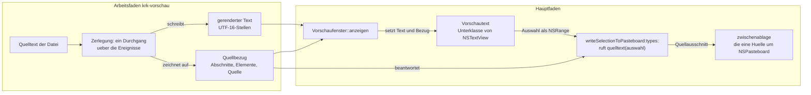
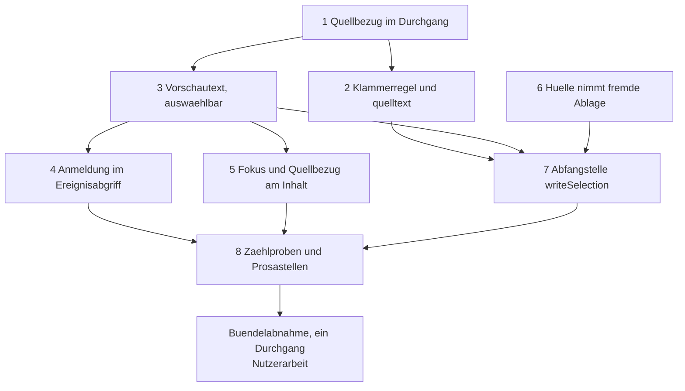

# Implementation Plan: Auswahl und Kopieren in der Vorschau

**Date:** 2026-08-19
**Status:** Draft
**Spec:** `fusion-workbench/shared/planning/260819-2216_*_spec-auswahl-und-kopieren-in-der-vorschau.md`, vom Nutzer am 260819-2228 abgenommen. Er bleibt im gemeinsamen Speicher, weil er vor diesem Circle entstanden ist (Herkunftsregel).
**Circle:** `circles/260819-2230-auswahl-und-kopieren-in-der-vorschau`
**Grundlage erhoben:** 260819-2245, am Baum auf dem Stand `fce0b6f`, unter `crates/` und `resources/`
**Decidability:** Die tragende Frage lautet: aus welcher Stelle der Quelle stammt eine Stelle des gerenderten Textes, und wie weit reicht die Auszeichnung, die eine Auswahl berührt? Sie ist aus den Eingaben des Mechanismus entscheidbar, und zwar **an der einen Stelle, an der der Text entsteht**. `pulldown_cmark::OffsetIter` liefert zu jedem Ereignis den Quellbereich in Bytes (`crates/krk-ui/src/markdown.rs:205`), also weiß der Durchgang zu jedem Zeichen, das er schreibt, welche Bytes es hervorgebracht haben und in welchem Element es steht. Der Plan zeichnet diese Auskunft im Durchgang auf, statt sie hinterher aus dem fertigen Text zu erraten; eine Rückrechnung aus dem gerenderten Text allein wäre nicht entscheidbar, weil `**` und `# ` dort nicht mehr stehen. **Eine Frage bleibt am Baum unentscheidbar und wird deshalb nicht vorhergesagt, sondern gemessen:** ob die eine Überschreibung `writeSelectionToPasteboard:types:` wirklich jeden Ausgabeweg von AppKit trägt. Das ist eine Aussage über ein fremdes Rahmenwerk; sie steht unten unter `## Risks & Mitigations` als Erschließung, wird am laufenden Bündel abgenommen, und der bindende Datensatz nennt für den Fall des Fehlschlags bereits seine Möglichkeit 2.

---

## Directive

Die Vorschau lässt ihren Text auswählen und kopieren; bei gerendertem Markdown geht der Quelltext mit seinen Auszeichnungszeichen in die Zwischenablage. Der Spec formuliert sie aus, dieser Plan wiederholt sie nicht.

**Sieben Entscheidungsdatensätze binden diesen Plan**, alle am 260819-2242 beantwortet und alle unter `shared/decisions/260819-2216_a_*.md`. Sie werden hier nicht neu verhandelt; welcher Schritt welchen realisiert, steht unten unter `## Welcher Schritt welchen Datensatz realisiert`.

---

## Current State

**Die Vorschaufläche ist längst eine `NSTextView`, und zwei Zeilen schalten die Auswahl ab** (`crates/krk-ui/src/appkit/vorschau.rs:1120-1121`). Der Eingriff nimmt einen der beiden Schalter zurück und fügt keine Ansicht hinzu. Die neun Feststellungen des Specs unter `## Ausgangslage` sind am 260819-2245 gegen `fce0b6f` nachgelesen und stimmen; die vier, die diesen Plan unmittelbar tragen, stehen hier mit der Zeile, an der wir sie gelesen haben.

**Der Durchgang des Renderns hält die Quellbereiche schon in der Hand und wirft sie weg.** `rendern` läuft über `Parser::new_ext(quelle, Options::empty()).into_offset_iter()` und bekommt zu jedem Ereignis das Paar aus Ereignis und Quellbereich (`markdown.rs:205-206`); `Gerendert` behält davon nichts und trägt allein `text` und `formatierung` (`markdown.rs:187-193`). Der Aufbau selbst liegt in `Zerlegung`, und dort gibt es genau drei Stellen, die Zeichen schreiben und den UTF-16-Zähler `stelle` fortschreiben: `absetzen` für die Abstände zwischen den Blöcken (`:625`), `merkzeichen_einloesen` für die Merkzeichen der Listenpunkte (`:681`) und `schreiben` für allen übrigen Text (`:652`). Alles, was diese Runde an Abbildung braucht, entsteht an diesen drei Stellen.

**Die Deckung der Quelle ist bereits über Quellbereiche gebaut und nicht über Ereignisarten.** `Zerlegung::gelesen` ist der Stand, bis zu dem die Quelle abgetragen ist (`markdown.rs:588`), und die drei Sätze der Deckung im Modulkopf hängen daran. Der Plan baut die Kachelung auf genau diesen Stand auf, statt einen zweiten Zähler danebenzustellen. Die eine benannte Lücke bleibt die des Vorspanns eines Containers: `luecke_bis` setzt `self.gelesen = bis` und schreibt nichts, solange im Element noch kein Byte gelesen wurde (`markdown.rs:743-747`). Für die Anzeige ist das richtig, für das Kopieren dreht sich das Vorzeichen — die Kachelung hält diese Bytes deshalb fest, ohne dass die Anzeige sich ändert.

**Die Anmeldung im Ereignisabgriff nimmt heute einen Abschluss für eine Fläche entgegen.** `ersthelfer_gehoert_appkit(mtm, ist_editorflaeche)` fragt zuerst die Nämlichkeit und danach die drei Textklassen (`crates/krk-ui/src/appkit/ereignisse.rs:685-701`); der Abschluss wird an genau einer Stelle gebildet, in `Anwendungsdelegierter::lage` (`crates/krk-ui/src/appkit/anwendung.rs:2855-2858`), und beantwortet wird er von `ist_editorflaeche` über `isEqual` (`anwendung.rs:2374-2379`). Ohne eine zweite Anmeldung verlöre KRK mit dem Fokus in der Vorschau jeden Tastenbefehl, weil `zulaessig` `!lage.ersthelfer_gehoert_appkit` als einen von vier Bestandteilen verlangt (`crates/krk-ui/src/kommandos/zulaessigkeit.rs:179`).

**Kopieren ist kein Befehl von KRK.** `text_kopieren` steht in `resources/default-keymap.toml:964-968` mit `gehalten_von = "menue"`, der Menüeintrag trägt Ziel `nil` und den Selektor `copy:` (`crates/krk-ui/src/menuemodell.rs:140`), und die Antwortkette entscheidet, wer ihn beantwortet. Die Belegung wächst in dieser Runde deshalb nicht.

---

## Approach

**Ein Wert, zwei Regeln, eine Abfangstelle.** Der Durchgang, der rendert, legt neben Text und Formatierung einen dritten Wert an: den **Quellbezug**. Er trägt die Quelle, eine lückenlose Kachelung zwischen gerendertem Text und Quelltext und die Quellbereiche der Elemente. Aus ihm beantwortet eine reine Funktion die eine Frage, die die Oberfläche stellt: zu dieser Auswahl gehört dieser Quelltext. Die Oberfläche rechnet nichts und fängt das Kopieren an genau einer Stelle ab, der Überschreibung von `writeSelectionToPasteboard:types:` in einer Unterklasse der Textanzeige.

### Die Gestalt der Abbildung: eine Kachelung, die beide Seiten lückenlos deckt

Die Abbildung ist eine Folge von **Abschnitten**. Jeder trägt einen Bereich im gerenderten Text (UTF-16-Einheiten), einen Bereich in der Quelle (Bytes) und die Art seines Zustandekommens. Zwei Zusagen machen sie total im Sinne von C2.6, und beide sind maschinell nachzumessen:

- Die Quellbereiche der Abschnitte reihen sich lückenlos und überschneidungsfrei über `0..quelle.len()`.
- Die Textbereiche der Abschnitte reihen sich ebenso über `0..formatierung.laenge`.

Damit hat jede Stelle des gerenderten Textes genau eine Antwort, und jedes Byte der Quelle genau einen Ort. Ein Auffangzweig „keine Antwort" entsteht nicht; die Zeichen, die KRK selbst erzeugt, tragen einen leeren Quellbereich und steuern zum Ausschnitt nichts bei.

Die Art eines Abschnitts ist eine vollständige und überschneidungsfreie Fallunterscheidung über die Frage, welche Seite maßgeblich ist:

| Art | Was sie sagt | Woher sie kommt | Was eine Auswahl mitten darin bedeutet |
|---|---|---|---|
| `Woertlich` | Text und Quellausschnitt sind Zeichen für Zeichen dieselben | `Event::Text` innerhalb eines Absatzes, `woertlich` | die Stelle rechnet sich genau um |
| `Ersetzt` | die Quelle hat diesen Text hervorgebracht, ohne ihm zu gleichen; auch der Fall „hat gar keinen Text hervorgebracht" | eine Entität wie `&amp;`, eine Lücke ohne Umgebungszeichen, der Vorspann eines Containers | der Abschnitt fährt ganz mit |
| `Erzeugt` | KRK hat diese Zeichen gesetzt, die Quelle kennt sie nicht | `absetzen`, `merkzeichen_einloesen` | trägt zum Ausschnitt nichts bei |

**Die Umrechnung zwischen UTF-16-Einheiten und Bytes steht an einer Stelle**, nämlich in dem Schritt, der eine Auswahlgrenze innerhalb eines `Woertlich`-Abschnitts auf ein Byte abbildet (C2.7). Für die beiden anderen Arten gibt es nichts umzurechnen: `Ersetzt` rundet auf die Ränder des Abschnitts, `Erzeugt` steuert nichts bei.

### Die Klammerregel: was an den Rändern einer Auswahl mitfährt

Die Kachelung allein liefert an den Rändern kaputtes Markdown, und der bindende Datensatz `shared/decisions/260819-2216_a_welche-auszeichnungszeichen-fahren-an-den-raendern-der-auswahl-mit.md` beantwortet das mit Möglichkeit b: eine berührte Auszeichnung fährt ganz mit. Der Plan setzt sie als **Fixpunkt über die Quellelemente** um.

Jedes Element, das der Durchgang öffnet, hinterlässt seinen Quellbereich und einen Wahrheitswert, die **Klammer**: sie ist wahr, wenn der Quellbereich des Elements Bytes trägt, die in seinem gerenderten Bereich nicht erscheinen. Eine Überschrift trägt eine Klammer (`# `), eine starke Betonung trägt zwei (`**`), ein Verweis trägt `[` und `](Ziel)`, ein Listenpunkt trägt sein Merkzeichen. Ein gewöhnlicher Absatz trägt keine.

Die Regel lautet dann in einem Satz:

> Erweitere den Quellausschnitt so lange auf die Hülle mit dem ganzen Quellbereich jedes Elements, das eine Klammer trägt, das der Ausschnitt schneidet und das er nicht ganz enthält, bis er sich nicht mehr ändert.

Sie ist entscheidbar, vollständig und endet: der Ausschnitt wächst allein und ist durch die Länge der Quelle beschränkt. Ohne die Bedingung „trägt eine Klammer" wäre sie die verworfene Möglichkeit 3 des Datensatzes, denn ein Absatz würde jede Auswahl darin auf sich selbst aufblähen. Mit ihr liefert das Beispiel des Datensatzes genau die dort zugesagte Antwort: aus der Auswahl `fetter Text mit Verweis` wird `**fetter** Text mit [Verweis](https://example.com)`.

**C2.8 fällt aus derselben Regel heraus und braucht keine Sonderregel.** Bei einer Auswahl über den ganzen Text ist jedes Element ganz enthalten, und die Bytes an den Rändern der Datei — ein Merkzeichen am Dateianfang, ein abschließender Zeilenumbruch — kommen über die Kachelung mit: ein Abschnitt ohne Textzeichen liegt an einer Textstelle und fährt mit, wenn diese Stelle **im geschlossenen Auswahlintervall** liegt. Diese Halbregel ist nicht angeflickt, sondern erzwungen. Ein halboffener leerer Bereich schneidet nichts, also wäre ein solcher Abschnitt sonst niemals erreichbar, und dann fielen sowohl das Merkzeichen am Dateianfang als auch der letzte Zeilenumbruch heraus.

### Wo der Quellbezug lebt und wie teuer er ist

`Gerendert` bekommt ein drittes Feld `quellbezug: Arc<Quellbezug>`. Drei Gründe sprechen dafür und gegen einen eigenen Wert neben `Inhalt::Markdown`:

- Der Quellbezug gehört zu genau diesem gerenderten Text. Als Feld kann er von ihm nicht getrennt werden; als Nachbarwert in der Aufzählung könnten Text und Abbildung auseinanderlaufen.
- C2.13 verlangt, dass die Abbildung auf der Seite des Textes liegt und nicht auf der der Einfärbung. Als Feld von `Gerendert` liegt sie dort wörtlich.
- Der `Arc` löst das Klonproblem, das der Spec benennt. `Inhalt` wird bei jedem Neuzeichnen des aktiven Tabs geklont (`crates/krk-ui/src/vorschaumodell.rs:211-219`); ein zweiter Textspeicher bis zur Vorschaugrenze von 1 MB im Klon wäre teuer, ein Zählerschritt ist es nicht. Es ist derselbe Griff, den die Bilddaten seit der Runde 1 tun (`vorschaumodell.rs:225-238`), und `Arc` statt `Rc`, weil der Arbeitsfaden `krk-vorschau` den Wert baut und durch einen Kanal schickt.

Die `Box` um `Gerendert` bleibt, wo sie steht: sie hält die Aufzählung schmal, der `Arc` hält den Klon billig, und die beiden Muster stehen im Baum nebeneinander, weil sie zwei verschiedene Kosten abwehren.

### Der Weg einer Auswahl in die Zwischenablage



Der linke Kasten ist die vorhandene Bauart um einen Ausgang erweitert. Der rechte trägt allein den Weg der Auswahl; für rohen Text, eingefärbten Quelltext, Metadaten, einen Hinweis und den Text aus der Zwischenablage liegt kein Quellbezug bei, und die Überschreibung reicht an die Oberklasse weiter.

---

## Was der Übersetzer einfordert, und was er nicht einfordert

Am 260819-2245 gegen `fce0b6f` erhoben. Die Runde legt **kein** Kommando an, also fällt die gefährlichste Fläche des Projekts — der Ausführungszweig in `Anwendungsdelegierter::kommando_ausfuehren` und `Tabelle::kommando_ausfuehren`, der auf einen Auffangzweig endet — für diese Runde weg. Das ist der Hauptgrund, warum der Schnitt hier anders aussieht als in der Runde 13.

**Der Übersetzer hält es (5 Stellen):**

| Stelle | Was geschieht |
|---|---|
| `crates/krk-ui/src/markdown.rs:187-193` | das dritte Feld an `Gerendert`; jeder Bau eines `Gerendert` im Baum wird genannt |
| `crates/krk-ui/src/markdown.rs:652` | die neue Signatur von `Zerlegung::schreiben`; jeder der sechs Rufer wird genannt |
| `crates/krk-ui/src/appkit/vorschau.rs:294` | der Typwechsel des Merkpostens `text` von `NSTextView` auf `Vorschautext` |
| `crates/krk-ui/src/appkit/anwendung.rs:2374` | die Umbenennung von `ist_editorflaeche`; die eine Aufrufstelle wird genannt |
| `crates/krk-ui/src/appkit/ereignisse.rs:687` | der Parametername des Abschlusses, sobald er umbenannt wird |

**Eine Probe hält es (6 Stellen):**

| Stelle | Welche Probe |
|---|---|
| die Kachelung über beide Seiten | die neue Kachelungsprobe aus Schritt 1, über einen Satz Markdown-Beispiele |
| die Klammerregel an Überschrift, Verweis, Betonung, Listenpunkt | die neuen Proben aus Schritt 2 |
| die Zahl der Anmeldungen im Ereignisabgriff | die erweiterte Zählprobe aus Schritt 8 (C1.7) |
| die Zahl der Hüllen um `NSPasteboard` | die neue Zählprobe aus Schritt 8 (C2.10, C4.7) |
| die Zahl der Abfangstellen für das Kopieren | die neue Zählprobe aus Schritt 8 (C2.12) |
| die Zahl der Menübauer | die vorhandene Probe `es_gibt_genau_einen_menuebauer` in `appkit/teilen.rs` (C3.4), unverändert |

**Nichts hält es (4 Stellen) — die eigentliche Gefahrenfläche:**

| Stelle | Was geschieht, wenn sie fehlt |
|---|---|
| `crates/krk-ui/src/appkit/ereignisse.rs:141-147` | der Modulkopf sagt weiter „die eine Ausnahme ist die Textfläche des Editors" und „eine Liste von Ausnahmen entsteht nirgends"; beides ist danach falsch |
| `crates/krk-ui/src/appkit/vorschau.rs:104-108` | der Modulkopf sagt weiter „die Textanzeige ist dafür nicht auswählbar" und nennt den Grund, den diese Runde entkräftet |
| `crates/krk-ui/src/appkit/menue.rs:18` | der Modulkopf zählt auf, wen `copy:` erreicht, und nennt die Vorschaufläche nicht |
| `crates/krk-ui/src/appkit/vorschau.rs:1093-1099` | der Doc-Kommentar von `textanzeige` sagt „die beiden Schalter bleiben, wo sie stehen", und beruft sich dafür auf C4.8 der Runde 6, das diese Runde ersetzt |

**Was ohne Arbeit nachzieht:** der Fokusrahmen, der Fenstertitel, die Zeilennummernspalte und die vier Tabbefehle. Der Fokusrahmen und der Titel hängen an `Anwendungsdelegierter::fokusanzeige_nachziehen`, das über `bereich_des_ersthelfers` fragt, und das läuft über `isDescendantOf:` (`anwendung.rs:5606-5618`); eine Textanzeige, die den Rang nimmt, liegt weiter im Teilbaum der Vorschau. Die Nummernspalte entscheidet allein `Vorschaumodell::zeigt_dateitext`. Die Tabbefehle wirken weiter, sobald die Fläche angemeldet ist.

---

## Implementation Steps

Vier Bündel, acht Schritte. Jeder Schritt nennt genau einen Executor. **Nach jedem einzelnen Schritt laufen `cargo build --workspace`, `cargo test --workspace`, `cargo clippy --workspace --all-targets` und `cargo fmt --all --check` grün**; `cargo` liegt nicht auf dem Standard-PATH, `make check` fährt die vier in einem Zug.

**Alle acht Schritte gehören dem `coder`, und das ist ein Ergebnis und kein Versehen.** Für den `ontocoder` gibt es nichts: C1.14 und C4.2 sagen ausdrücklich zu, dass die Belegungsdatei keinen Eintrag bekommt, und C4.6 schließt eine neue fremde Kiste aus, also ändert sich weder `resources/default-keymap.toml` noch die Wurzel-`Cargo.toml`. Für den `analyst` gibt es ebenfalls nichts: die Runde bringt keinen strategischen Datensatz hervor. Die sieben Fragen, die sie aufwirft, sind vom Nutzer beantwortet, bevor dieser Plan entstand; die Markerwanderung danach ist Buchführung und keine Analyse, und sie steht unten unter `## Welcher Schritt welchen Datensatz realisiert`.

### Bündel A — Die Abbildung, ohne AppKit (C2.3 bis C2.9)

1. [DONE] **Der Quellbezug entsteht im Durchgang, der rendert**
   - Executor: `coder`
   - Files: `crates/krk-ui/src/markdown.rs`
   - Changes: `Quellbezug` mit `quelle: String`, `abschnitte: Vec<Abschnitt>` und `elemente: Vec<Quellelement>`; die Formen stehen unten unter `## Data Structures`. `Gerendert` bekommt `quellbezug: Arc<Quellbezug>`. `Zerlegung` bekommt die Liste der Abschnitte und der Elemente und schreibt sie an den drei vorhandenen Schreibstellen fort: `absetzen` und `merkzeichen_einloesen` legen einen `Erzeugt`-Abschnitt mit leerem Quellbereich an der Lesestelle an; `schreiben` bekommt den Quellstand als zweiten Parameter (`bis: usize`) und legt einen Abschnitt `gelesen..bis` an, dessen Art `Woertlich` ist, wenn `quelle[gelesen..bis]` dem geschriebenen Stück gleicht, und sonst `Ersetzt`. Für die erzeugten Zeichen tritt eine zweite Methode `erzeugen(&mut self, stueck: &str)` daneben, statt den Quellstand als `Option` zu führen: zwei Namen für zwei Domänen, und keine Fallunterscheidung im Rumpf. **Quelltext, den der Durchgang abträgt, ohne etwas zu schreiben, bekommt ebenfalls einen Abschnitt** — der Vorspann eines Containers in `luecke_bis` (`:743-747`) und jede Stelle, an der `gelesen_bis` vorrückt, ohne dass Zeichen geflossen sind. Ohne diese Abschnitte hätte die Kachelung Löcher auf der Quellseite, und C2.8 fiele an den Rändern der Datei aus. Die Elemente entstehen in `oeffnen` und werden in `schliessen` fertiggestellt; die Klammer ist wahr, wenn der Quellbereich des Elements Bytes trägt, die in seinem gerenderten Bereich nicht erscheinen. Die Abschnittsart wird über ein `match` und nicht über `matches!` gelesen, nach dem Vorbild von `Inhaltsart::deckt_luecken` (`:519-524`) und aus demselben Grund: eine vierte Variante soll den Bau anhalten und nicht still durchlaufen. Der Modulkopf bekommt einen Abschnitt `# Der Quellbezug: die zweite Auskunft desselben Durchgangs`, der die beiden Kachelzusagen ausschreibt und sagt, warum die Abbildung hier und nicht in einem zweiten Durchgang entsteht (C2.4). **Proben:** die Kachelungsprobe über einen Satz von mindestens acht Beispielen — Absatz, Überschrift, starke Betonung, Verweis, Liste mit zwei Ebenen, Zitatblock, Quelltextblock, Verweisdefinition —, die für jedes prüft, dass die Quellbereiche der Abschnitte lückenlos `0..quelle.len()` decken und die Textbereiche lückenlos `0..formatierung.laenge`; eine Probe, dass ein Text mit Umlauten und einem Emoji die Umrechnung an beiden Enden richtig trifft; eine Probe, dass die Elemente einer Überschrift, einer starken Betonung, eines Verweises und eines Listenpunkts eine Klammer tragen und die eines gewöhnlichen Absatzes keine. `Quellbezug` und seine Felder tragen `#[must_use]`, wo ein stilles Fallenlassen unbemerkt bliebe.
   - Dependencies: keine

2. [DONE] **Die Klammerregel: aus einer Auswahl wird ein Quellausschnitt**
   - Executor: `coder`
   - Files: `crates/krk-ui/src/markdown.rs`
   - Changes: `Quellbezug::quelltext(&self, auswahl: Range<usize>) -> &str` als einziger öffentlicher Zugang, dazu die reine Funktion, die den Ausschnitt rechnet. Der Rechenweg hat zwei Stufen und keine dritte. Erstens die Hülle über die berührten Abschnitte: ein Abschnitt mit nichtleerem Textbereich fährt mit, wenn sein Textbereich die Auswahl schneidet; ein Abschnitt mit leerem Textbereich fährt mit, wenn seine Textstelle im **geschlossenen** Auswahlintervall liegt. Innerhalb eines `Woertlich`-Abschnitts wird die Auswahlgrenze auf das Byte umgerechnet, und diese Umrechnung steht an genau einer Stelle im Modul (C2.7); bei `Ersetzt` rundet sie auf die Ränder des Abschnitts, bei `Erzeugt` trägt er nichts bei. Zweitens der Fixpunkt über die Elemente mit Klammer, wie oben unter `## Approach` formuliert. Der Doc-Kommentar schreibt aus, warum die Bedingung „trägt eine Klammer" nötig ist: ohne sie wäre die Regel die vom Nutzer nicht gewählte Möglichkeit 3 des Datensatzes, weil ein Absatz jede Auswahl darin auf sich selbst aufblähte. Ein zweiter Absatz schreibt aus, warum das geschlossene Intervall für leere Textbereiche keine Ausnahme ist, sondern die einzige Lesart, unter der ein solcher Abschnitt überhaupt erreichbar ist. **Proben:** das Beispiel des Datensatzes wörtlich, also `Ein **fetter** Text mit [Verweis](https://example.com) darin.` mit der Auswahl `fetter Text mit Verweis`, Erwartung `**fetter** Text mit [Verweis](https://example.com)`; eine Auswahl innerhalb einer Überschrift liefert `# Überschrift`; eine Auswahl innerhalb eines Verweistextes liefert den ganzen Verweis mit Adresse; eine Auswahl innerhalb eines langen Absatzes liefert **nicht** den ganzen Absatz, sondern die markierten Zeichen — das ist die Probe, die Möglichkeit 3 ausschließt; die Auswahl über alles liefert die Quelle byteweise vollständig, geprüft an einer Datei, die mit einem Listenpunkt beginnt und mit einem Zeilenumbruch endet (C2.8); eine Auswahl über ein verschachteltes Element, also drei Buchstaben in `**fett *und kursiv* zugleich**`, liefert das äußere Element ganz und braucht dafür keine zweite Regel; eine Auswahl in einem Text mit Umlauten und einem Emoji trifft die Bytegrenzen (C2.7). `quelltext` trägt `#[must_use]`.
   - Dependencies: Schritt 1

### Bündel B — Die Fläche nimmt eine Auswahl an (C1)

3. **Die Textanzeige der Vorschau wird eine eigene Klasse und auswählbar**
   - Executor: `coder`
   - Files: `crates/krk-ui/src/appkit/vorschau.rs`
   - Changes: `Vorschautext` als Unterklasse von `NSTextView` über `define_class!`, nach dem Vorbild von `Inhaltsflaeche` in derselben Datei (`:232-271`), mit `#[thread_kind = MainThreadOnly]` und einem Merkposten `RefCell<Option<Arc<Quellbezug>>>`. Die Erzeugung läuft über `msg_send![super(this), initWithFrame: rahmen]`, wie bei `Inhaltsflaeche::neu` (`:276-282`). Dazu zwei Methoden ohne Objective-C-Berührung: `quellbezug_setzen(&self, bezug: Option<Arc<Quellbezug>>)` und `quellbezug(&self) -> Option<Arc<Quellbezug>>`. In dieser Runde trägt die Klasse **noch keine Überschreibung**; sie kommt in Schritt 7, und der Schnitt hält die Schritte einzeln grün. `textanzeige` (`:1109-1136`) baut sie statt einer nackten `NSTextView` und setzt `setSelectable(true)`; **`setEditable(false)` bleibt unverändert stehen** (C1.4). Der Merkposten `VorschaufensterIvars::text` wechselt den Typ auf `Retained<Vorschautext>`; alle Berührungen innerhalb der Datei laufen über die Ableitung auf `NSTextView` weiter, `Nummernspalte::einhaengen` und `textmerkmale::anwenden` eingeschlossen. Der Doc-Kommentar von `textanzeige` und der Abschnitt des Modulkopfs, der die Nichtauswählbarkeit begründet (`:104-108`), werden auf den neuen Stand gezogen, mit dem ausdrücklichen Hinweis, dass C4.8 der Runde 6 **ersetzt und nicht ergänzt** ist und dass `setEditable(false)` aus einem anderen Grund stehen bleibt als der gefallene Schalter. Der Abschnitt `# Ab welchem macOS die angesprochenen Klassen stehen` bekommt jede in dieser Runde neu angesprochene Klasse und Methode mit der am SDK gelesenen Zahl (C4.4); `objc2` führt keine Verfügbarkeitsangaben mit, und der Übersetzer hält die Untergrenze macOS 15 nicht. **Proben:** eine Zählprobe über `crate::quellbaum`, dass `setSelectable(false)` im Baum nicht mehr vorkommt und `setEditable(false)` weiterhin genau an den bekannten Stellen steht. Eine Probe, die eine Instanz baut, entsteht **nicht**: `krk-ui` hat kein Bibliotheksziel, und eine Probe, die den Hauptfaden über `MainThreadMarker::new_unchecked` behauptet, ist der bekannte Defekt `issues/260810-1001_*_die-neuen-proben-behaupten-den-hauptfaden-den-libtest-ihnen-nicht-gibt.md`; die sichtbare Hälfte von C1.1 steht deshalb als Bündelkriterium.
   - Dependencies: Schritt 1

4. **Die Anmeldung im Ereignisabgriff: aus einer Fläche werden zwei**
   - Executor: `coder`
   - Files: `crates/krk-ui/src/appkit/anwendung.rs`, `crates/krk-ui/src/appkit/ereignisse.rs`, `crates/krk-ui/src/appkit/vorschau.rs`
   - Changes: `Vorschaufenster::textflaeche(&self) -> &NSTextView` als Zugang, wortgleich zu `Editorbereich::textflaeche` (`appkit/editor.rs:1590`). `Anwendungsdelegierter::ist_editorflaeche` wird zu `ist_eigene_textflaeche` und fragt zwei `isEqual`-Vergleiche in einer Funktion, den gegen die Textfläche des Editors und den gegen die der Vorschau. **Der Abschluss bleibt einer, der Parameter bleibt einer, und die Liste entsteht beim Delegierten und nicht im Abgriff.** Das ist der Kern der Antwort auf den vierten offenen Punkt des Specs: `appkit/ereignisse.rs` kennt weder den Editor noch die Vorschau und soll beide nicht kennenlernen; es kennt allein die Frage, die jemand anders beantwortet. Der Parametername in `ersthelfer_gehoert_appkit` (`:687`) zieht mit, `ist_eigene_textflaeche`. Der Modulkopf von `ereignisse.rs` wird an drei Stellen berichtigt: aus „die eine Ausnahme ist die Textfläche des Editors" wird „die Ausnahmen sind die eigenen Textflächen von KRK", der Satz „eine Liste von Ausnahmen entsteht nirgends" wird ersetzt durch die genauere Aussage, dass die Menge beim Delegierten steht und in dieser Datei keine entsteht, und der Absatz, der die Nämlichkeit gegen die Art begründet, bleibt wörtlich stehen, weil er unverändert trägt. Der Doc-Kommentar an `ist_eigene_textflaeche` nennt beide Flächen einzeln und schreibt aus, warum die Fläche eines Blattes weiterhin **nicht** angemeldet wird: dort ist es erwünscht, dass die Tasten AppKit gehören, sonst schlösse `Esc` den Notizzettel nicht mehr (`appkit/blaetter/zettel.rs`, Modulkopf). **Proben:** die vorhandene Probe `die_frage_nach_dem_ersthelfer_steht_an_genau_einer_stelle` (`ereignisse.rs:923`) läuft unverändert weiter und muss grün bleiben; eine Probe, dass `zulaessig` für `Kommando::TabWechselnVor` und die drei anderen Tabbefehle mit `ersthelfer_gehoert_appkit == false` und `Fokus::Vorschau` wahr liefert (C1.6, Probenhälfte); eine Probe, dass `AuswahlHoch` und `AuswahlRunter` unter derselben Lage zulässig bleiben (C1.10, Probenhälfte für die Zulässigkeit).
   - Dependencies: Schritt 3

5. **Der Fokus zeigt auf die Textanzeige, und der Quellbezug kommt mit dem Inhalt**
   - Executor: `coder`
   - Files: `crates/krk-ui/src/appkit/vorschau.rs`
   - Changes: `Vorschaufenster::fokusansicht` (`:583-585`) beantwortet ab jetzt die Frage „welche der beiden Anzeigen steht": steht die Bildlaufansicht, ist es die Textanzeige, sonst die Inhaltsfläche. Die Fallunterscheidung ist vollständig und überschneidungsfrei, weil genau eine der beiden Anzeigen sichtbar ist; sie steht **innerhalb** der einen Zuordnung und legt keine zweite daneben (C1.8). Der Grund für den Zweig gehört in den Doc-Kommentar: `Anwendungsdelegierter::fokusansicht` liefert die Ansicht nicht nur als Ersthelfer, sondern seit C1 der Runde 6 auch als **Anker** für den Freigabedialog (`anwendung.rs:2165-2172`), und eine ausgeblendete Ansicht taugt für keines von beidem. Zeigt die Vorschau ein Bild, bleibt es beim heutigen Verhalten. `Vorschaufenster::text_zeigen` (`:803-810`) setzt den Quellbezug der Fläche auf `None`, an derselben Stelle, an der es die Merkmale des vorigen Inhalts zurücknimmt; der Markdown-Zweig von `anzeigen` (`:755-758`) setzt ihn danach, an derselben Stelle, an der er die Formatierung anwendet. Damit hat das Setzen genau einen Ort und das Löschen genau einen, und die Symmetrie ist die vorhandene zwischen `textmerkmale::zuruecksetzen` und `formatierung_anwenden`. **Daraus fällt C1.13 heraus**: jeder Inhaltswechsel läuft über `text_zeigen`, also fällt der Quellbezug mit ihm, und der Textspeicher wird ganz ersetzt, also lässt AppKit die sichtbare Auswahl fallen. **Proben:** eine Zählprobe über `crate::quellbaum`, dass `quellbezug_setzen` im Baum genau zweimal gerufen wird, einmal mit `None` in `text_zeigen` und einmal mit `Some` im Markdown-Zweig; eine Zählprobe, dass `fn fokusansicht` in `vorschau.rs` genau einmal steht (C1.8, Probenhälfte).
   - Dependencies: Schritt 3

### Bündel C — Der eine Ausgabeweg (C2.10 bis C2.13, C3)

6. [DONE] **Die eine Hülle um `NSPasteboard` nimmt eine fremde Ablage entgegen**
   - Executor: `coder`
   - Files: `crates/krk-ui/src/appkit/zwischenablage.rs`
   - Changes: `pub fn text_auf_ablage_schreiben(ablage: &NSPasteboard, text: &str) -> bool` trägt ab jetzt den Rumpf, den `text_schreiben` (`:238-242`) bisher trug; `text_schreiben` reicht `NSPasteboard::generalPasteboard()` hinein und bleibt für die beiden Pfadkopierer aus C1 und C2 der Runde 4 unverändert im Verhalten. Es ist derselbe Griff, den `dateiverweise(ablage: &NSPasteboard)` seit der Runde 13 tut (`:291`), und aus demselben Grund: die Hülle beantwortet die Frage nach der Zwischenablage, und ob es die des Nutzers oder die eines Vorgangs ist, entscheidet der Rufer. `setString_forType` steht danach weiterhin an genau einer Stelle im Baum. Der Modulkopf wird um die neue Richtung ergänzt, in demselben Aufbau, den er für die vier bisherigen Fragen führt. Bis Schritt 7 den Rufer setzt, trägt die neue Funktion `#[cfg_attr(not(test), expect(dead_code, …))]` nach dem Vorbild aus `kommandos/rueckschritt.rs`; ohne die Zeile hält `-D warnings` den Bau an, und Schritt 7 nimmt sie wieder heraus, weil die Erwartung dann unerfüllt wäre. **Proben:** eine eigene `NSPasteboard` mit eigenem Namen anlegen, einen Text hineinschreiben, ihn zurücklesen. `generalPasteboard` wird dabei nicht angefasst, aus dem Grund, den der Modulkopf für `text_schreiben` schon führt: eine solche Probe würfe weg, was der Entwickler gerade kopiert hat.
   - Dependencies: keine

7. **Die eine Abfangstelle: `writeSelectionToPasteboard:types:`**
   - Executor: `coder`
   - Files: `crates/krk-ui/src/appkit/vorschau.rs`
   - Changes: `Vorschautext` bekommt die Überschreibung. Sie liest den Merkposten; liegt kein Quellbezug bei, reicht sie unverändert an die Oberklasse weiter, und die fünf übrigen Inhalte legen Zeichen für Zeichen ab, was markiert war (C2.1). Liegt einer bei, nimmt sie `selectedRange()`, dessen Werte bereits UTF-16-Einheiten sind und damit genau die Koordinaten des Quellbezugs, ruft `quelltext(auswahl)` und legt das Ergebnis über `zwischenablage::text_auf_ablage_schreiben` ab. **Diese eine Methode ist der Grund, warum die Runde eine Unterklasse braucht**: sie ist die Stelle, an der AppKit `copy:`, den Menüeintrag, den Eintrag des Kontextmenüs, die Dienste des Systems und das Ziehen einer Auswahl zusammenführt, und ein Delegiertenweg oder ein Abfangen vor der Antwortkette erreichte nur einen Teil davon. Der Doc-Kommentar schreibt aus, was daran Erschließung ist und was gemessen: dass die Methode der gemeinsame Ausgang aller fünf Wege ist, steht in Apples Beschreibung, ist an diesem Baum aber nicht gemessen und wird am Bündel abgenommen. Der Abschnitt `# Ab welchem macOS die angesprochenen Klassen stehen` bekommt `writeSelectionToPasteboard:types:`, `selectedRange`, `NSPasteboard` und `NSPasteboardType` mit den am SDK gelesenen Zahlen. Der Modulkopf von `appkit/menue.rs` (`:18`) wird an der Aufzählung berichtigt, wen `copy:` erreicht: die Textfläche des Editors, der Feldeditor eines Textfeldes und ab jetzt die Textanzeige der Vorschau. `textView:menu:forEvent:atIndex:` (`:405-415`) bleibt **unangetastet** (C3.2); sobald die Fläche auswählbar ist, trägt AppKits Menü seine eigenen Einträge, und der Teilen-Eintrag steht daneben, wie er es im Editor tut. **Proben:** die vorhandene Probe `es_gibt_genau_einen_menuebauer` in `appkit/teilen.rs` bleibt grün (C3.4); eine Zählprobe, dass `writeSelectionToPasteboard` im Baum genau einmal vorkommt (C2.12).
   - Dependencies: Schritt 2, Schritt 3, Schritt 6

### Bündel D — Die Zählproben und die abgelösten Zusagen

8. **Was nur zusammen zu zählen ist, und die vier Prosastellen**
   - Executor: `coder`
   - Files: `crates/krk-ui/src/appkit/ereignisse.rs`, `crates/krk-ui/src/appkit/vorschau.rs`, `crates/krk-ui/src/appkit/zwischenablage.rs`
   - Changes: Die Zählproben, die erst stehen können, wenn alles gebaut ist, alle über `crate::quellbaum` nach dem Vorbild von `die_frage_nach_dem_ersthelfer_steht_an_genau_einer_stelle` (`ereignisse.rs:923`) und mit zusammengesetzten Nadeln, damit keine sich selbst findet. Erstens: `fn ist_eigene_textflaeche` steht genau einmal im Baum, und die Datei, die es trägt, ist `krk-ui/src/appkit/anwendung.rs` (C1.7). Zweitens: `setString_forType` und `generalPasteboard` stehen zusammen in genau einer Datei, `krk-ui/src/appkit/zwischenablage.rs` (C2.10, C4.7). Drittens: `writeSelectionToPasteboard` steht genau einmal (C2.12). **Für die drei Prüfordner-Fassungen entsteht keine neue Probe**: `genau_drei_pruefordner_fassungen_stehen_im_baum` (`crates/krk-core/tests/baum.rs:114`) misst sie seit der Runde 1, und die zweite Hälfte von C4.7 ist damit ohne eine Zeile eingelöst; der Schritt prüft nur nach, dass sie grün bleibt. Dazu die vier Prosastellen aus der Tabelle oben unter `## Was der Übersetzer einfordert`, soweit die Schritte 3, 4 und 7 sie nicht schon mitgezogen haben; dieser Schritt ist das Netz darunter und nicht der erste Ort. **Kein Datensatz des Arbeitsspeichers wird hier umbenannt**; das steht unten unter `## Welcher Schritt welchen Datensatz realisiert` und gehört dem Abschluss der Runde.
   - Dependencies: Schritt 4, Schritt 5, Schritt 7

### Die Abhängigkeiten als Graph



Die Schritte 1 und 6 haben keine Vorbedingung und können nebeneinander laufen. Der Graph hat keinen Kreis, und die Bündelabnahme hängt an genau einem Knoten: der Nutzer fährt sie in einem Durchgang, nachdem alles gebaut ist.

---

## Data Structures

Alle drei Typen wohnen in `crates/krk-ui/src/markdown.rs`, neben `Gerendert` und `Zerlegung`. **Sie wandern nicht nach `krk-core`**, obwohl sie kein AppKit berühren, und der Grund ist C2.5: die Abbildung entsteht in dem Durchgang, der rendert, und ihre Proben sollen dort stehen, wo die Proben des Renderns stehen. Sie sind ohne Fenster prüfbar, weil `cargo test` die Prüfmodule des Binärziels mitbaut; dass `krk-ui` kein Bibliotheksziel hat, trifft allein die Dateien unter `crates/krk-ui/tests/`.

```rust
/// Woher jede Stelle des gerenderten Textes stammt (C2 der Runde 14).
pub struct Quellbezug {
    /// Die Quelle, aus der gerendert wurde. Sie wird nicht ein zweites Mal
    /// von der Platte gelesen, sondern ist die Eingabe des Durchgangs (C2.3).
    quelle: String,
    /// Die Kachelung. Ihre Quellbereiche decken `0..quelle.len()` lueckenlos
    /// und ueberschneidungsfrei, ihre Textbereiche `0..laenge` ebenso (C2.6).
    abschnitte: Vec<Abschnitt>,
    /// Die Elemente, die der Durchgang geoeffnet hat, in der Reihenfolge des
    /// Oeffnens. Traeger der Klammerregel (C2.9).
    elemente: Vec<Quellelement>,
}

/// Eine Kachel: ein Stueck gerenderter Text und die Bytes, aus denen es kam.
struct Abschnitt {
    /// Der Bereich im gerenderten Text, in UTF-16-Einheiten. Darf leer sein:
    /// dann traegt die Quelle Zeichen, die die Anzeige weglaesst.
    text: Range<usize>,
    /// Der Bereich in der Quelle, in Bytes. Darf leer sein: dann hat KRK die
    /// Zeichen erzeugt, und der leere Bereich ist ihre Verankerung.
    quelle: Range<usize>,
    art: Abschnittsart,
}

/// Welche Seite eines Abschnitts massgeblich ist.
///
/// Gelesen wird ueber ein `match` und nicht ueber `matches!`, wie bei
/// `Inhaltsart::deckt_luecken`: eine vierte Variante soll den Bau anhalten.
enum Abschnittsart {
    /// Text und Quellausschnitt sind Zeichen fuer Zeichen dieselben. Eine
    /// Auswahlgrenze darin rechnet sich genau auf ein Byte um.
    Woertlich,
    /// Die Quelle hat diesen Text hervorgebracht, ohne ihm zu gleichen — der
    /// leere Text eingeschlossen. Eine Auswahlgrenze darin rundet auf die
    /// Raender des Abschnitts.
    Ersetzt,
    /// KRK hat diese Zeichen gesetzt; die Quelle kennt sie nicht. Sie tragen
    /// zum Ausschnitt nichts bei, und einen Auffangzweig „keine Antwort" gibt
    /// es deshalb nicht (C2.6).
    Erzeugt,
}

/// Ein Element der Quelle und die Frage, ob es Auszeichnungszeichen traegt.
struct Quellelement {
    /// Sein Bereich in der Quelle, in Bytes.
    quelle: Range<usize>,
    /// Ob sein Quellbereich Bytes traegt, die in seinem gerenderten Bereich
    /// nicht erscheinen. Wahr fuer Ueberschrift, Betonung, Verweis,
    /// Listenpunkt und Zitat; falsch fuer einen gewoehnlichen Absatz.
    klammer: bool,
}
```

`Gerendert` bekommt das dritte Feld:

```rust
pub struct Gerendert {
    pub text: String,
    pub formatierung: Formatierung,
    /// Der Quellbezug, geteilt statt kopiert. `Inhalt` wird bei jedem
    /// Neuzeichnen des aktiven Tabs geklont; ein zweiter Textspeicher bis zur
    /// Vorschaugrenze von 1 MB im Klon waere teuer, ein Zaehlerschritt ist es
    /// nicht. `Arc` und nicht `Rc`, weil der Arbeitsfaden ihn baut und durch
    /// einen Kanal schickt — derselbe Grund wie bei den Bilddaten.
    pub quellbezug: Arc<Quellbezug>,
}
```

---

## API Changes

| Was | Vorher | Nachher | Warum |
|---|---|---|---|
| `Quellbezug::quelltext` | — | `pub fn quelltext(&self, auswahl: Range<usize>) -> &str` | der einzige öffentliche Zugang; die Oberfläche rechnet nichts |
| `Zerlegung::schreiben` | `fn schreiben(&mut self, stueck: &str)` | `fn schreiben(&mut self, stueck: &str, bis: usize)` | der Quellstand muss an die Schreibstelle, sonst entsteht die Kachel ohne Herkunft |
| `Zerlegung::erzeugen` | — | `fn erzeugen(&mut self, stueck: &str)` | zwei Namen für zwei Domänen statt einer Fallunterscheidung im Rumpf |
| `Anwendungsdelegierter::ist_editorflaeche` | `fn ist_editorflaeche(&self, …) -> bool` | `fn ist_eigene_textflaeche(&self, …) -> bool` | die Frage gilt ab jetzt zwei Flächen; der alte Name wäre die erste Stelle, an der ein Leser die zweite übersieht |
| `Vorschaufenster::textflaeche` | — | `pub fn textflaeche(&self) -> &NSTextView` | der Delegierte braucht die Fläche für den Nämlichkeitsvergleich; wortgleich zum Editor |
| `zwischenablage::text_auf_ablage_schreiben` | — | `pub fn text_auf_ablage_schreiben(ablage: &NSPasteboard, text: &str) -> bool` | die eine Hülle trägt ab jetzt auch die Ablage eines Ausgabewegs; `text_schreiben` bleibt und reicht die allgemeine hinein |
| `Vorschautext` | — | Unterklasse von `NSTextView` mit `writeSelectionToPasteboard:types:` | die eine Stelle, an der AppKit alle Ausgabewege zusammenführt |

**Kein Zuwachs bei den vier gewachsenen Aufzählungen** (C4.1). `Kommando`, `Wirkungsbereich`, `Bereich` und `Fokus` bleiben unberührt, weil die Runde keinen Befehl anlegt, keinen Bereich und kein Fokusziel. **Keine neue fremde Kiste** (C4.6): `pulldown-cmark` liefert die Quellbereiche bereits.

---

## Testing Strategy

**Der Schwerpunkt liegt auf der Abbildung, weil sie die einzige Rechnung der Runde ist.** Alles Übrige ist Verdrahtung, und Verdrahtung weist man am laufenden Bündel nach oder gar nicht.

- **Kachelungsproben (C2.6).** Über einen Satz von mindestens acht Markdown-Beispielen wird beidseitig geprüft, dass die Abschnitte lückenlos und überschneidungsfrei decken. Diese Probe ist der eigentliche Beweis der Totalität; sie ist billiger und schärfer als jede Aufzählung von Fällen, und sie fängt genau den Fehler, den ein neuer Ereignisfall der Kiste einschleppte.
- **Klammerproben (C2.2, C2.8, C2.9).** Sieben Fälle, aufgezählt in Schritt 2, darunter der eine, der die verworfene Möglichkeit 3 ausschließt: eine Auswahl mitten in einem langen Absatz liefert nicht den Absatz.
- **Umrechnungsproben (C2.7).** Ein Text mit Umlauten und einem Emoji, an beiden Enden einer Auswahl geprüft.
- **Zulässigkeitsproben (C1.6, C1.10).** Auf der vorhandenen `Lage` gerechnet, ohne Fenster, wie die Proben in `kommandos/zulaessigkeit.rs` es tun.
- **Zählproben (C1.7, C1.8, C2.10, C2.12, C3.4, C4.7).** Über `crate::quellbaum`, mit zusammengesetzten Nadeln. Der Kopf jenes Moduls sagt, was eine solche Probe nicht entscheidet: ob dieselbe Sache in einer dritten Schreibweise noch einmal gebaut ist, sieht keine Suche im Quelltext.
- **Was keine Probe bekommt und warum.** Keine neue Probe baut eine `NSTextView` oder behauptet den Hauptfaden. `krk-ui` hat kein Bibliotheksziel, und der Griff `MainThreadMarker::new_unchecked` ist der bekannte Defekt `issues/260810-1001_*`; das Prüfmodul von `vorschau.rs` sagt heute ausdrücklich, dass es keine solche Probe baut, und dabei bleibt es. Was daran hängt, steht unten unter `## Nutzerarbeit`.

---

## Nutzerarbeit

**15 der 39 Abnahmekriterien tragen einen Bündelanteil und sind am laufenden `KRK.app` im Vordergrund abzunehmen.** Kein Agent kann das fahren: aus dem Hintergrund gestartet weist die Wirkungsbereichs-Prüfung jeden fokusgebundenen Befehl ab. Der Lauf ist zu fahren, nachdem alle acht Schritte stehen und `cargo xtask bundle` gelaufen ist; die Schritte sind so geschnitten, dass er **ein** Durchgang ist und nicht über die Runde verstreut.

Ein Vorbereitungshandgriff geht ihm voraus. Die Runde legt keine Funktion an, also greift der bekannte Defekt einer eigenen `keymap.toml` diesmal **nicht**; nachzusehen bleibt allein, dass die Tastenbelegung für den Fokusbefehl der Vorschau und die vier Tabbefehle steht, wozu `make tasten` den gebauten Stand ausgibt.

| Woher | Was zu prüfen ist | Warum kein Agent |
|---|---|---|
| C1.1 | eine Textdatei zeigen, mit gedrückter Maustaste über drei Zeilen ziehen; die Zeichen erscheinen hinterlegt | die Markierung ist eine Anzeige und kein Rückgabewert |
| C1.2 | zwei der sechs Inhalte auswählen, etwa die Metadaten eines Ordners und gerendertes Markdown | dito |
| C1.6 | in die Vorschau klicken, `ctrl+tab` und `ctrl+shift+tab` drücken; der aktive Vorschau-Tab wechselt | der Wirkungsbereich setzt das Schlüsselfenster im Vordergrund voraus |
| C1.8 | den Fokusbefehl für die Vorschau drücken, `cmd+a` und `cmd+c`, den Inhalt der Zwischenablage prüfen | dito |
| C1.9 | aus dem Dateifenster in den Text der Vorschau klicken; der Rahmen wandert, der Titel zeigt den Pfad | der Rahmen ist eine Farbe an einem `NSBox` |
| C1.10 | mit dem Fokus in der Vorschau Pfeil hoch und runter drücken; weder die Schreibmarke noch die Auswahl im Dateifenster bewegt sich | der Verbrauch des Tastendrucks ist nur am laufenden Abgriff zu sehen |
| C1.11 | eine lange Textdatei zeigen, hineinklicken, Bild-ab drücken; der Text blättert | **Erschließung des Specs, nicht gemessen**: ob AppKit die vier Tasten in einer nicht bearbeitbaren, auswählbaren Textansicht zum Blättern nutzt, ist nachzusehen |
| C1.12 | in die Vorschau klicken, `cmd+a`; der Text ist ganz hinterlegt, die Markierung im Dateifenster unverändert | dito |
| C2.1 | in einer `.rs`-Datei drei Zeilen markieren, `cmd+c`, in ein Textfeld einfügen; es steht dasselbe da | der Weg läuft durch die Antwortkette von AppKit |
| C2.2 | eine `.md`-Datei mit Überschrift und Verweis zeigen, den Absatz markieren, kopieren, einfügen; die Auszeichnungszeichen stehen da | dito |
| C2.11 | ohne Auswahl das Menü „Bearbeiten" öffnen; „Kopieren" ist grau | die Ausgrauung kommt aus der Antwortkette |
| C2.12 | zwei Wege prüfen, den Menüeintrag und das Kontextmenü, und dazu die beiden erschlossenen: eine Auswahl mit der Maus in einen Editor ziehen, und einen Dienst des Systems auf sie anwenden | **der tragende Vorbehalt der Runde**, siehe `## Risks & Mitigations` |
| C3.1 | eine Stelle markieren, rechtsklicken; das Menü trägt AppKits Einträge | ein Kontextmenü entsteht erst beim Klick |
| C3.2 | im selben Menü steht der Teilen-Eintrag daneben | dito |
| C3.3 | in gerendertem Markdown eine Überschrift markieren, über das Kontextmenü kopieren, einfügen; die Doppelkreuze stehen da | dito |
| C4.4 | die Zahlen im Abschnitt `# Ab welchem macOS die angesprochenen Klassen stehen` gegen das SDK lesen | Augenschein für die Richtigkeit; die Deckung selbst deckt eine Probe |

**Ein Abnahmelauf gegen die zehn Zeitzusagen aus C8 der Runde 1 gehört nicht dazu.** Der Nutzer hat am 260819-2242 entschieden, dass diese Runde keinen schuldet (`shared/decisions/260819-2216_a_schuldet-diese-runde-einen-abnahmelauf-gegen-die-zusage-l7.md`); an seine Stelle treten die zwei ohne Messstrecke prüfbaren Kriterien C2.4 und C2.13 und die Aufnahme von L7 in die Gegenstände der späteren Messrunde.

---

## Risks & Mitigations

| Risiko | Gegenmaßnahme |
|---|---|
| **Die Überschreibung trägt nicht alle Ausgabewege.** Dass `copy:`, der Menüeintrag, das Kontextmenü, die Dienste und das Ziehen alle durch `writeSelectionToPasteboard:types:` laufen, ist eine Erschließung aus Apples Beschreibung und an diesem Baum nicht gemessen. | C2.12 nimmt zwei Wege am Bündel ab, und die Nutzerarbeit oben nennt die beiden erschlossenen ausdrücklich mit. Trägt die eine Stelle sie nicht, ist der Befund als Defekt zu filen und die Frage geht an den Nutzer zurück: der bindende Datensatz `260819-2216_a_gilt-die-quelltextzusage-…` nennt seine Möglichkeit 2 („nur die Zwischenablage") und benennt genau diesen Vorbehalt in seiner Empfehlung. **Kein zweiter Entwurf wird jetzt vorsorglich gebaut.** |
| **`clearContents` auf einer fremden Ablage nimmt weg, was AppKit dort schon abgelegt hat.** Für die allgemeine Zwischenablage ist das gewollt, für die Ablage eines Ziehvorgangs möglicherweise nicht. | Schritt 7 legt genau die eine Sorte `NSPasteboardTypeString` an, wie es der Nutzerentscheid vom 260811-1610 für jede Ablage dieses Programms vorgibt. Am Bündel ist beim Ziehen nachzusehen, ob das Ziel den Text annimmt; wenn nicht, gehört der Befund in denselben Datensatz wie das Risiko darüber. |
| **Die Kachelung setzt voraus, dass der Lesestand monoton wächst.** `gelesen_bis` nimmt heute das Maximum (`markdown.rs:699-701`), was einen Ruf mit einem kleineren Wert zulässt. | Die Kachelungsprobe aus Schritt 1 misst genau diese Zusage über acht Beispiele. Fällt sie rot, ist das ein echter Befund über den Durchgang und kein Fehler des Plans; behoben wird dann die Wurzel und nicht die Erwartung der Probe, wie bei der Zählprobe der Runde 10. |
| **Der Klon je Neuzeichnen wird teurer als gedacht.** Die Abschnittsliste wächst mit der Zahl der Ereignisse und kann bei 1 MB Markdown groß werden. | Sie liegt im `Arc` und wird beim Klon nicht kopiert. Gerechnet wird sie einmal je Lesevorgang auf dem Arbeitsfaden `krk-vorschau`, also innerhalb der Endbedingung von L7, deren Budget 100 ms beträgt und deren Durchgang heute 19 bis 30 ms für 1,05 MB kostet. **Gemessen ist der Zuwachs nicht**, weil es die Abbildung noch nicht gibt; der Spec sagt das an derselben Stelle. |
| **Die Textanzeige nimmt den Rang, und ein Klick daneben nimmt ihn wieder weg.** Wer auf die Inhaltsfläche neben dem Text klickt, hat den Rang dort, und `cmd+c` tut nichts. | Das ist das heutige Verhalten und keine Verschlechterung: heute nimmt die Inhaltsfläche jeden Klick. C1.9 verlangt allein, dass Rahmen und Titel nachziehen, und das tun sie über `isDescendantOf:` in beiden Fällen. |
| **Der Vorspann eines Containers bleibt in der Anzeige eine Lücke.** Die offene Frage `circles/260812-1000-…/decisions/260812-2002_*_bleibt-der-vorspann-…` ist von dieser Runde nicht beantwortet. | Die Kachelung hält diese Bytes ab jetzt fest, also fährt der Vorspann beim Kopieren mit, während die Anzeige ihn weiter weglässt. Das ist genau die Vorzeichenumkehr, die der Spec beschreibt, und es ändert die offene Frage nicht: sie handelt von der Anzeige. Ihr Boden hat sich verschoben, und wer sie später beantwortet, findet in der Kachelung bereits die Auskunft, welche Bytes betroffen sind. |

---

## Open Questions

- [ ] Keine, die diesen Plan aufhält. Die drei Fragen, die der Spec als offen führte, sind seit dem 260819-2242 beantwortet; alle sieben Datensätze tragen den Marker „beantwortet" (`_a_`), nachzuzählen mit `ls fusion-workbench/shared/decisions/260819-2216_*.md`.
- [ ] Der Plan wirft keine neue Nutzerfrage auf. Die sieben Punkte, die der Spec dem Planner überließ, sind oben entschieden: der Quellbezug wohnt als Feld an `Gerendert` in einem `Arc`, die Abbildung ist eine beidseitig lückenlose Kachelung mit einer Fixpunktregel über die Elemente mit Klammer, das Kopieren wird in `writeSelectionToPasteboard:types:` einer Unterklasse abgefangen, die Anmeldung bleibt ein Abschluss mit zwei Vergleichen beim Delegierten, `fokusansicht` liefert die Textanzeige, solange sie steht, die Zeilennummernspalte bleibt unberührt, und die Reihenfolge steht im Graphen oben. Keine dieser Entscheidungen bindet Arbeit über diese Runde hinaus, also entsteht keine als Datensatz.
- [ ] **Ein Vorbehalt bleibt und ist kein offener Punkt, sondern eine Messung:** ob die eine Abfangstelle alle Ausgabewege trägt. Er steht in der Risikotabelle mit seinem Weg für den Fall des Fehlschlags.

---

## Welcher Schritt welchen Datensatz realisiert

Die Markerwanderung gehört dem Abschluss der Runde und keinem Schritt; sie steht hier, damit der Orchestrator sie am Tor sieht.

| Datensatz | Marker heute | Marker danach | Realisiert durch |
|---|---|---|---|
| `shared/decisions/260819-2216_a_wird-die-vorschauflaeche-auswaehlbar-und-was-genau-laesst-sich-auswaehlen.md` | beantwortet | umgesetzt | Schritte 3 und 5 |
| `shared/decisions/260819-2216_a_was-landet-beim-gerenderten-markdown-in-der-zwischenablage.md` | beantwortet | umgesetzt | Schritte 1, 2 und 7 |
| `shared/decisions/260819-2216_a_welche-auszeichnungszeichen-fahren-an-den-raendern-der-auswahl-mit.md` | beantwortet | umgesetzt | Schritt 2 |
| `shared/decisions/260819-2216_a_gilt-die-quelltextzusage-auch-fuer-das-ziehen-einer-auswahl-und-die-dienste.md` | beantwortet | umgesetzt | Schritte 6 und 7, **erst nach der Bündelabnahme von C2.12** |
| `shared/decisions/260819-2216_a_welches-kontextmenue-zeigt-die-auswaehlbare-vorschau.md` | beantwortet | umgesetzt | Schritt 3; C3 kostet keine Zeile, sobald die Fläche auswählbar ist |
| `shared/decisions/260819-2216_a_was-tun-pfeil-hoch-und-runter-in-der-auswaehlbaren-vorschau.md` | beantwortet | umgesetzt | Schritt 4 |
| `shared/decisions/260819-2216_a_schuldet-diese-runde-einen-abnahmelauf-gegen-die-zusage-l7.md` | beantwortet | umgesetzt | kein Schritt; die Antwort lautet „kein Lauf", eingelöst durch C2.4 und C2.13 |
| `circles/260812-1000-…/decisions/260812-1000_*_was-tut-ein-link-im-gerenderten-markdown-und-bleibt-die-vorschau-unauswaehlbar.md` | beantwortet | **überholt** | Schritt 3. **Überholt wird allein die zweite Frage**, ob die Fläche unauswählbar bleibt. Die erste, was ein Verweis im gerenderten Markdown tut, gilt unverändert weiter, und der überholende Datensatz nennt diese Trennung ausdrücklich, damit die Umbenennung nicht als Widerruf der Link-Antwort gelesen wird. |

**Der Plan der Runde 6 wird nicht angefasst, und das ist eine Entscheidung dieses Plans.** Seine Zeile 68 trägt das achte Abnahmekriterium von C4, seine Zeile 417 die Umsetzungszusage dazu; beide sind vom Spec dieser Runde ausdrücklich ersetzt, und der Spec ist damit das ersetzende Werkzeug. Der alte Plan bleibt die Aufzeichnung dessen, was jene Runde zugesagt und gebaut hat. Wer die Zeilen dort umschriebe, nähme dem Vergleich der beiden Runden seinen Gegenstand: die Kostenliste des Specs unter `## Was diese Runde an der Runde 6 ändert` ist nur lesbar, solange die abgelöste Zusage im Wortlaut noch irgendwo steht. Der Marker jenes Plans bleibt unverändert.

---

## Reconciliation Log

Noch kein Eintrag. Die Schritte tragen ihren Stand inline, wie es `fusion-workbench-conventions.md` vorgibt.
