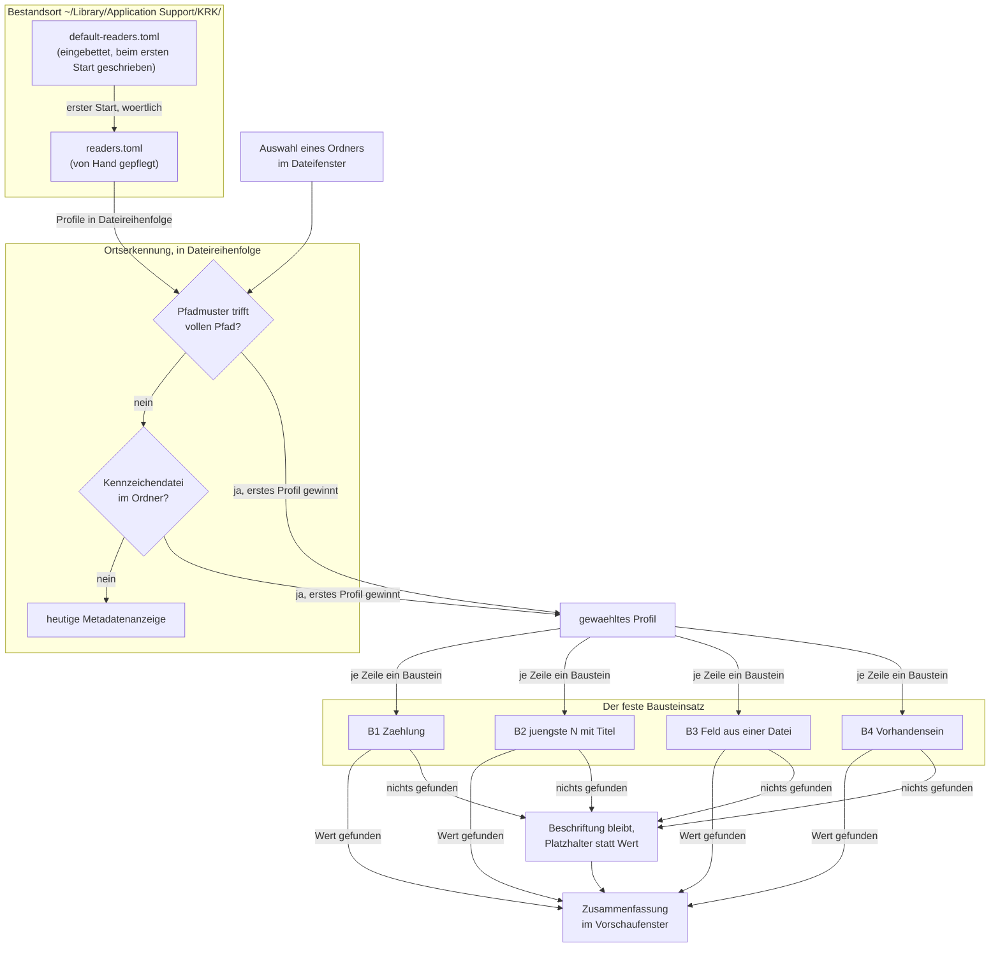

# Spec: Das Vorschaufenster zeigt für erkannte Orte eine Profil-Zusammenfassung statt der Metadaten

**Date:** 2026-08-24
**Status:** Vom Nutzer am 260824-0625 freigegeben, A1 bis A7 eingeschlossen; in Umsetzung. Vier Kriterien sind am 260824-1224 berichtigt, drei weitere und die Festlegung A7 am 260824-1505; C6.5 und die Festlegung A5 am 260824-1722; jede Berichtigung steht bei ihrem Kriterium.
**Source:** Der Backlogeintrag `shared/backlog/260823-2136_*_readerconventions-profile-fuer-dateizugriff.md` und die Directive des Circle-Datensatzes `circles/260823-2208-vorschau-zeigt-profil-zusammenfassung-statt-metadaten/_t_circle.md`
**Circle:** `circles/260823-2208-vorschau-zeigt-profil-zusammenfassung-statt-metadaten/`, aktiv seit 260824-0530
**Grundlage erhoben:** 260824-0541, 260824-0600 und 260824-0613, am Baum auf dem Stand `278a008` und am Bestand dieser Werkbank

**Acht Fragen sind beantwortet** und liegen als Datensätze unter `decisions/` dieses Circles; sie werden hier nicht erneut gestellt, sondern in `## Die acht Antworten, aus denen dieser Spec gebaut ist` einzeln zitiert. **Ein Defektdatensatz stand bei der Abfassung offen** und ist mit Schritt 13 des Plans geschlossen: `issues/260824-0600_*_der-entscheidungsdatensatz-zum-regulaeren-ausdruck-sagt-der-baum-fuehre-keine-solche-kiste-er-fuehrt-eine.md`. Er hat keinen Planschritt aufgehalten; die berichtigte Kostenlage steht unten in `## Ausgangslage`. *(Am 260824-1224 nachgezogen.)*

---

## Directive

Nach dieser Runde beantwortet das Vorschaufenster die Frage, was an einem Ort liegt, ohne dass der Nutzer ihn betritt. Eine von Hand gepflegte `readers.toml` im Bestandsort unter `~/Library/Application Support/KRK/` trägt Profile. Ein Profil erkennt seinen Ort über ein Pfadmuster oder über eine Kennzeichendatei darin, wobei das Pfadmuster vorgeht, und beschreibt aus einem festen Satz von vier Bausteinen die Zusammenfassung, die dort erscheint: Zählungen, die jüngsten Titel eines Speichers, ein aus einer Datei gezogenes Feld, das Vorhandensein einer Datei. Greift kein Profil, bleibt die heutige Metadatenanzeige unverändert stehen. Der Beispielfall ist die fusion-workbench, deren Bestand an Circles, Entscheidungen, Defekten und Verläufen damit im Vorschaufenster lesbar wird, ohne dass ein Kommando läuft.

Diese Runde setzt keine elfte Zeitzusage und fasst keine der zehn aus C8 der Runde 1 an.

---

## Verhältnis zur Zeitzusage L7

Die Zusammenfassung fällt in die Endbedingung von L7, das für einen ausgewählten Eintrag 100 ms zusagt: „Vorschau einer Textdatei bis 1 MB sichtbar, sonst die Metadaten" (Spec der Runde 1, `circles/260802-0842-krk-mac-dateimanager-editor-git/planning/260802-1036_*_spec-navigator-geruest.md`, Abschnitt C8). Die Metadatenanzeige eines Ordners liegt heute in diesem „sonst"; eine Zusammenfassung, die Dateien liest, arbeitet damit innerhalb einer bestehenden Zusage und nicht daneben.

**Der Spec setzt dafür ein abzählbares Kriterium und keine Zeitmessung**, und das ist eine bewusste Wahl mit einem benannten Grund: der Abnahmelauf der zehn Zusagen verlangt KRK im Vordergrund und ist damit Nutzerarbeit, die kein Agent fahren kann. Ein Zeitkriterium wäre in dieser Runde behauptet und nicht geprüft. Abgezählt werden stattdessen die Verzeichnisleseläufe und die Dateiöffnungen je Zusammenfassung; die Zahlen stehen in C6. Diese Form folgt der Runde 2, die für ihr Verhältnis zu C8 dieselbe Wahl getroffen hat.

L7 steht seit dem 260819-2242 ohnehin auf den Gegenständen der späteren Messrunde (`shared/decisions/260819-2216_*_schuldet-diese-runde-einen-abnahmelauf-gegen-die-zusage-l7.md`). Diese Runde nimmt es nicht herunter und legt Arbeit in seine Endbedingung nach; sie schuldet damit denselben späteren Lauf wie die Runde 14.

---

## Ausgangslage, am 260824 erhoben

Neun Feststellungen tragen den Zuschnitt. Vier davon widersprechen dem, was man ohne sie annähme, und zwei berichtigen eine frühere Erhebung dieser Runde.

**Die Anzeige, die ersetzt wird, ist die Metadatenanzeige eines Ordners.** `krk-ui/src/vorschaumodell.rs` führt `Inhalt` als vollständige Fallunterscheidung ohne Auffangzweig; `laden` gibt für jeden Eintrag, der keine gewöhnliche Datei ist, `Inhalt::Metadaten` zurück, und ein Ordner endet dort immer. Ob die Zusammenfassung ein weiterer Wert von `Inhalt` wird oder eine Nutzlast des vorhandenen, entscheidet der Plan.

**Der Bestandsort trägt sechs Dateien, und die siebte hält den Bau an drei Stellen an.** `krk-core/src/ablage/pfade.rs` führt `Datei::ALLE` mit sechs Einträgen, dazu `Datei::dateiname`, `Datei::format` und `Datei::leerbefund` als vollständige Fallunterscheidungen ohne Auffangzweig. `readers.toml` wird an jeder dieser Stellen die siebte, und der Übersetzer fordert alle ein.

**Der Weg für eine von Hand gepflegte Ablagedatei existiert und wird nicht zweimal gebaut.** `krk-core/src/ablage/einstellungen.rs` bindet `resources/default-settings.toml` über `include_str!` als `AUSLIEFERUNGSTEXT` ein, `anlegen_falls_fehlt` schreibt sie beim ersten Start wörtlich über `atomar::schreiben` und fasst die Nutzerdatei danach nie wieder an, damit ihre Kommentarzeilen stehen bleiben. `resources/default-readers.toml` nimmt genau diesen Weg.

**Der Fehlerweg steht ebenfalls und ist vollständig.** `Geladen<T>` trägt eine `Option<Ersetzung>`, `Grund` unterscheidet `NichtLesbar`, `Beschaedigt`, `NichtAnlegbar` und `ZuGross`, und `krk-ui/src/appkit/anwendung.rs` sammelt die Meldungen beim Start in die Statuszeile. Das ist die Aufteilung vom 260804-0830: die laufenden Fehler trägt die Statuszeile, genau ein Fehler bricht über das modale Hinweisfenster ab.

**Die Lesemaschinerie steht.** `krk-core/src/verzeichnis/durchlauf.rs` läuft über einen Unterbaum und hält dabei einen Verzeichnisdeskriptor, gleich wie tief der Baum ist; `krk_core::text::datei::bis_zur_grenze_lesen` öffnet über einen Deskriptor mit `O_NONBLOCK`, prüft den Typ am offenen Deskriptor und gibt ihn vor dem nächsten Kandidaten frei. Zählungen und Titel gehören auf diesen Weg und nicht auf einen zweiten daneben.

**`Eintrag` trägt den Änderungszeitpunkt bereits** (`krk-core/src/verzeichnis/eintrag.rs`, Feld `geaendert`). Das Sortieren nach Änderungsdatum kostet damit keinen zusätzlichen Systemaufruf; die Kosten des Bausteins „jüngste N mit Titel" beschränken sich auf die N Dateiöffnungen.

**Die Ausdruckskiste steht schon im Bündel, und die frühere Kostenangabe dieser Runde war falsch.** `cargo tree -p krk-ui -e normal` zeigt `syntect` → `fancy-regex` 0.16.2 → `regex-automata` 0.4.18 → `aho-corasick` 1.1.5 und `memchr` 2.8.3, dazu `regex-syntax` 0.8.11; die Wurzel-`Cargo.toml` zählt dieselben Pakete in ihrer Begründung zu `syntect` namentlich auf. `regex` 1.x setzt auf genau diese vier Pakete auf und wäre damit ein einziges neues Paket. Der Entscheidungsdatensatz vom 260824-0541 beziffert die Kosten zu hoch; der Defekt dazu ist `issues/260824-0600_o_…-er-fuehrt-eine.md`. Die Wahl des Nutzers kehrt sich dadurch nicht um, sie wird billiger.

**Die Zusage über fremden C-Code hält.** `Cargo.lock` führt am 260824-0600 kein `cc` und außer `windows-sys` kein `-sys`-Paket, bei 97 Paketen insgesamt. Auch `regex` brächte keinen C-Code herein. Jede fremde Kiste dieses Projekts trägt ihre Begründung in der Wurzel-`Cargo.toml`, und eine Aufnahme in dieser Runde muss beides halten.

**Kein Defektdatensatz trägt eine Markdown-Überschrift.** Das Dateiformat für Defekte schreibt eine nackte Titelzeile ohne `#` vor; Entscheidungs-, Verlaufs-, Analyse- und Planungsdatensätze beginnen sämtlich mit `# `. Gezählt am 260824-0613: 82 Dateien in `shared/issues/`, davon 54 offen; 157 im größten Speicher eines Circles (`circles/260802-0842-…/issues/`), 118 im größten gemeinsamen (`shared/history/`); 18 Circle-Verzeichnisse. Diese Messung ist der Grund, warum der Titel die erste nicht leere Zeile ist und nicht die erste Überschriftenzeile.

---

## Die acht Antworten, aus denen dieser Spec gebaut ist

Verbindlich sind die Datensätze und nicht diese Tabelle; sie ist ein Verweisregister. Alle acht stehen auf `_a_`, also beantwortet und noch nicht in Code umgesetzt.

| Frage | Antwort | Datensatz unter `decisions/` |
|---|---|---|
| Gilt ein Profil auch für einzelne Dateien? | Nur Ordner | `260823-2208_a_gilt-ein-profil-nur-fuer-ordner-oder-auch-fuer-einzelne-dateien.md` |
| Liefert KRK ein fusion-Profil mit? | Mitgeliefert und wirksam, über `include_str!` wie `settings.toml` | `260823-2208_a_liefert-krk-ein-fertiges-fusion-workbench-profil-mit.md` |
| Wie zieht der Baustein ein Feld aus einer Datei? | Regulärer Ausdruck mit Fanggruppe | `260824-0541_a_wie-zieht-der-baustein-ein-feld-aus-einer-datei-und-traegt-er-auch-einen-abschnitt.md` |
| Was heißt „die jüngsten zehn"? | Sortiert nach Änderungsdatum | `260824-0541_a_was-heisst-die-juengsten-zehn-und-was-ist-ihr-titel.md` |
| Was zeigt ein Baustein, der ins Leere greift? | Die Zeile steht mit einem Platzhalter | `260824-0541_a_was-zeigt-die-zusammenfassung-wenn-ein-baustein-ins-leere-greift.md` |
| Was ist der Titel? | Die erste nicht leere Zeile | `260824-0600_a_der-titel-aus-der-ueberschriftenzeile-erreicht-keinen-einzigen-defektdatensatz.md` |
| Welche Form hat das Pfadmuster? | Regulärer Ausdruck auf dem vollen Pfad | `260824-0600_a_welche-form-hat-das-pfadmuster-und-welche-die-kennzeichendatei.md` |
| Woher kommt die Sitzungsinfo? | Aus `orchestrator-live.md` | `260824-0600_a_woher-nimmt-die-wurzelzusammenfassung-ihre-sitzungsinfo.md` |

**Zwei der acht sind zusammen zu lesen, und der Spec sagt es hier, damit die Berichtigung nicht verlorengeht.** Der Nutzer hat am 260824-0555 zur Frage nach den jüngsten zehn die Möglichkeit 2 gewählt, also Sortierung nach Änderungsdatum **und** Titel aus der Überschriftenzeile. Die Messung am Bestand hat danach ergeben, dass die Überschriftenzeile keinen einzigen Defektdatensatz erreicht. Der Nutzer hat die Titelhälfte am 260824-0610 berichtigt: **maßgeblich für den Titel ist `260824-0600_a_der-titel-aus-der-ueberschriftenzeile-…`, maßgeblich für die Sortierung bleibt `260824-0541_a_was-heisst-die-juengsten-zehn-…`.** Der ältere Datensatz trägt diesen Nachtrag in seiner zweiten `Answered`-Zeile. Wer nur einen der beiden liest, baut den falschen Titel.

---

## Abgeleitete Festlegungen, am Spec-Tor überstimmbar

Sieben Festlegungen sind aus den acht Antworten und aus der Messung abgeleitet und nicht einzeln vom Nutzer bestätigt. Sie stehen hier sichtbar beisammen, damit sie am Tor noch fallen können; jede ist unten in ein Abnahmekriterium übersetzt.

**A1: Welches Profil gewinnt, wenn mehrere passen.** Das erste in der Datei, und zwar zuerst unter den Pfadmustertreffern, danach unter den Kennzeichendateitreffern. Das buchstabiert die Vorrangregel des Nutzers vom 260823 vollständig und überschneidungsfrei aus. *Aus der Klärungsrunde vom 260824-0541.*

**A2: Die Zählung läuft flach über einen Ordner** und nicht über seinen Unterbaum. Alle sechs skizzierten Zusammenfassungen kommen mit einer Ebene aus. *Aus der Klärungsrunde vom 260824-0541.*

**A3: Die Zusammenfassung entsteht beim Auswählen**, so wie die Metadaten heute, und nicht im Voraus und nicht auf einem Beobachter. *Aus der Klärungsrunde vom 260824-0541.*

**A4: Die Zusammenfassung trägt eine Obergrenze gelesener Einträge**, nach dem Vorbild der zwei Grenzen, die die Vorschau schon führt. *Aus der Klärungsrunde vom 260824-0541.*

**A5: Die Obergrenze liegt bei 2.000 Einträgen je Verzeichnisleselauf.** Der größte Speicher dieser Werkbank trägt 157 Einträge, der größte gemeinsame 118; eine Grenze bei 2.000 kappt keine Zählung des Beispielfalls und lässt Raum für das Zehnfache. Über der Grenze zeigt eine Zählung „über 2.000" statt einer Zahl. *Aus der Messung vom 260824-0600.* *(A5 nennt „über 2.000" als den anzuzeigenden Satz; gebaut ist ein anderer. Der Wortlaut bleibt stehen, die Berichtigung steht unter der Kriterienliste von C6.)*

**A6: Die Kopfzeile der Zusammenfassung trägt Name und vollen Pfad des Ordners**, so wie die Metadatenanzeige heute. Ohne sie sähe der Nutzer eine Liste von Zahlen, ohne zu wissen, worüber. Diese eine Auskunft der Metadaten überlebt also die Ersetzung; die übrigen Metadatenzeilen fallen weg.

**A7: Der Zustand eines Circles wird über den Baustein „Vorhandensein" ausgedrückt**, mit je einer Zeile für vorgesehen, aktiv und geschlossen. Der Zustand steht im Dateinamen des Circle-Datensatzes und in keinem Feld darin, und der feste Bausteinsatz kennt keinen Baustein, der einen Dateinamen liefert. Drei Zeilen sind der Preis dafür, dass die Runde keinen fünften Baustein aufnimmt. **Das ist die schwächste der sieben Festlegungen**, und wer sie kippt, kippt entweder den Zustand aus der Zusammenfassung des einzelnen Circles oder den festen Bausteinsatz. *(A7 nennt drei Zeilen; der Nutzer hat am 260824-1505 eine vierte beschlossen. Der Wortlaut bleibt stehen, die Berichtigung steht unter der Kriterienliste von C5.)*

---

## Wie die Zusammenfassung entsteht



---

## Capabilities

### C1: Die Definitionsdatei `readers.toml`

**Description:** KRK legt beim ersten Start eine `readers.toml` im Bestandsort an, wörtlich aus einer mitgelieferten Auslieferungsfassung, und fasst sie danach nie wieder an. Der Nutzer pflegt sie von Hand. Sie ist die siebte Ablagedatei und geht denselben Weg wie `settings.toml`.

**Acceptance criteria:**
- [ ] C1.1 Nach einem ersten Start in einem leeren Bestandsort liegt `~/Library/Application Support/KRK/readers.toml` da, und ihr Inhalt ist Byte für Byte der von `resources/default-readers.toml`, Kommentarzeilen eingeschlossen.
- [ ] C1.2 Ein zweiter Start ändert eine vorhandene `readers.toml` an keinem Byte, auch dann nicht, wenn der Nutzer sie geleert oder verändert hat.
- [ ] C1.3 `readers.toml` steht in `Datei::ALLE` und trägt in `Datei::dateiname`, `Datei::format` und `Datei::leerbefund` je einen eigenen Zweig. `Datei::ALLE` führt danach sieben Einträge.
- [ ] C1.4 `Datei::format` liefert für `readers.toml` das TOML-Format, `Datei::leerbefund` liefert `Leerbefund::Vorgabe`. Die Begründung dafür steht am Zweig: die Datei wird von Hand gepflegt, und wer sie bis auf ihre Kommentare leerräumt, meint „keine Profile" und keinen Schaden.
- [ ] C1.5 Eine `readers.toml` ohne einen einzigen obersten Schlüssel führt zu keiner Meldung, zu keiner Beiseitelegung und zu keinem Profil. Jeder Ordner zeigt dann die heutige Metadatenanzeige.
- [ ] C1.6 Eine `readers.toml`, die dasteht und sich nicht lesen lässt, ergibt `Grund::NichtLesbar`; eine, die kein gültiges TOML oder nicht die erwartete Gestalt trägt, ergibt `Grund::Beschaedigt`. Beide Fälle nehmen den vorhandenen Weg: die Datei wird beiseitegelegt, die Meldung erscheint beim Start in der Statuszeile, und KRK arbeitet ohne Profile weiter.
- [ ] C1.7 Fehlt die Datei und lässt sie sich nicht anlegen, ergibt das `Grund::NichtAnlegbar` mit einer Meldung in der Statuszeile. Kein Fall dieser Runde öffnet das modale Hinweisfenster.
- [ ] C1.8 In keinem der Fälle C1.5 bis C1.7 bricht KRK ab, und in keinem verliert der Nutzer eine andere Ablagedatei.

**Decisions made:**
- Eigene `readers.toml` statt eines Abschnitts in `settings.toml`: Nutzerentscheid vom 260823.
- TOML statt YAML, und `readers.toml` statt des Entwurfsnamens `krk-rc.yaml`: Nutzerentscheid vom 260823.
- Mitgeliefert und beim ersten Start wirksam: Nutzerentscheid vom 260824-0530, `decisions/260823-2208_a_liefert-krk-ein-fertiges-fusion-workbench-profil-mit.md`.
- `Leerbefund::Vorgabe` für die leere Datei: abgeleitet aus der Vorlage `settings.toml`, die als von Hand gepflegte Datei denselben Wert trägt.

---

### C2: Die Ortserkennung, mit ausgeschriebenem Vorrang

**Description:** Wählt der Nutzer einen Ordner aus, sucht KRK dafür ein Profil. Ein Profil nennt ein Pfadmuster, eine Kennzeichendatei oder beides. Beide sind reguläre Ausdrücke: das Pfadmuster läuft gegen den vollen Pfad des Ordners, die Kennzeichendatei gegen die Namen der Einträge darin. Trifft kein Profil, bleibt die heutige Metadatenanzeige stehen.

**Die Regel, vollständig ausgeschrieben:**

1. KRK geht die Profile in der Reihenfolge der Datei durch und prüft je Profil allein das Pfadmuster gegen den vollen Pfad des ausgewählten Ordners. Das erste Profil mit Treffer gewinnt, und die Suche endet.
2. Hat kein Pfadmuster getroffen, geht KRK die Profile ein zweites Mal in derselben Reihenfolge durch und prüft je Profil allein die Kennzeichendatei gegen die Namen der Einträge im ausgewählten Ordner. Das erste Profil mit Treffer gewinnt, und die Suche endet.
3. Hat auch das nicht getroffen, zeigt die Vorschau die heutige Metadatenanzeige. Das ist derselbe Zweig, den sie heute ohnehin nimmt; es entsteht kein zweiter daneben.

**Acceptance criteria:**
- [ ] C2.1 Ein Profil mit dem Pfadmuster `fusion-workbench/shared/analyses$` wird für den Ordner `…/krk/fusion-workbench/shared/analyses` gewählt und für `…/krk/fusion-workbench/shared/history` nicht.
- [ ] C2.2 Stehen zwei Profile mit passendem Pfadmuster in der Datei, gewinnt das obere. Vertauscht der Nutzer die beiden Blöcke, gewinnt das andere.
- [ ] C2.3 Trifft in einer Datei ein Pfadmuster eines **späteren** Profils und eine Kennzeichendatei eines **früheren**, gewinnt das spätere Profil. Das Pfadmuster geht der Kennzeichendatei vor, unabhängig von der Reihenfolge in der Datei.
- [ ] C2.4 Ein Profil, dessen Kennzeichendatei `^_._circle\.md$` lautet, wird für jedes der 18 Circle-Verzeichnisse dieser Werkbank gewählt, gleich welchen Zustandsmarker der Datensatz darin trägt, sofern kein Pfadmuster vorher getroffen hat.
- [ ] C2.5 Ein Ordner, für den weder ein Pfadmuster noch eine Kennzeichendatei trifft, zeigt die Metadatenanzeige mit Name, vollem Pfad, Größe, Änderungsdatum, Rechten und Typ, unverändert gegenüber dem Stand vor dieser Runde.
- [ ] C2.6 Eine Datei zeigt in jedem Fall das, was sie vor dieser Runde zeigte: Text bis 1 MB, Bild bis 64 MB, sonst Metadaten. Kein Profil greift auf eine Datei, auch dann nicht, wenn ihr Pfad ein Pfadmuster erfüllt.
- [ ] C2.7 Ein Pfadmuster, das sich nicht übersetzen lässt, schaltet nur sein eigenes Profil ab und keines der übrigen. Die Meldung darüber erscheint in der Statuszeile.
- [ ] C2.8 Ein Muster aus der `readers.toml` kann die Vorschau nicht anhalten. Geprüft wird mit einem Ausdruck, der bei rückverfolgender Auswertung exponentiell läuft, etwa `(a+)+$` gegen eine Zeichenkette aus vierzig `a` und einem `b`: die Zusammenfassung erscheint, und das Fenster bleibt bedienbar.

**Decisions made:**
- Pfadmuster und Kennzeichendatei sind reguläre Ausdrücke, das Pfadmuster läuft auf dem vollen Pfad: Nutzerentscheid vom 260824-0610, `decisions/260824-0600_a_welche-form-hat-das-pfadmuster-und-welche-die-kennzeichendatei.md`, Möglichkeit 1. Damit trägt die Datei eine Mustersprache und nicht zwei.
- Das Pfadmuster geht der Kennzeichendatei vor, ohne Treffer bleibt die Metadatenanzeige: Nutzerentscheid vom 260823.
- Erstes passendes Profil in der Datei gewinnt: Festlegung A1.

---

### C3: Der Bausteinsatz, vier Bausteine und kein fünfter

**Description:** Eine Profilzeile besteht aus einer Beschriftung und genau einem Baustein. Der Satz ist fest: der Nutzer wählt aus vier Bausteinen und schreibt keine Ausdruckssprache über sie. Jeder Baustein nennt einen Ort relativ zum erkannten Ordner, und drei von vieren nennen zusätzlich einen regulären Ausdruck.

**B1 — Zählung.** Nennt einen Unterordner (voreingestellt der erkannte Ordner selbst) und wahlweise einen Ausdruck auf dem Eintragsnamen. Der Wert ist die Zahl der Einträge, deren Name den Ausdruck erfüllt. Die Zählung läuft flach über eine Ebene.

**B2 — Die jüngsten N mit Titel.** Nennt einen Unterordner, wahlweise einen Ausdruck auf dem Eintragsnamen und eine Zahl N. Der Wert ist eine Liste der N Einträge mit dem jüngsten Änderungsdatum, jeder mit seinem Titel. Der Titel ist die erste nicht leere Zeile der Datei; führende `#` und die Leerzeichen dahinter fallen weg. Eine vollständig leere Datei zeigt ihren Dateinamen.

**B3 — Ein Feld aus einer Datei.** Nennt eine Datei über einen Ausdruck auf dem Dateinamen und einen zweiten Ausdruck mit genau einer Fanggruppe. Der Wert ist die Fanggruppe des ersten Treffers im Inhalt.

**B4 — Vorhandensein.** Nennt einen Unterordner und einen Ausdruck auf dem Eintragsnamen. Der Wert ist „ja" oder „nein".

**Acceptance criteria:**
- [ ] C3.1 B1 über `shared/issues` mit dem Ausdruck `_o_` liefert am Bestand dieser Werkbank die Zahl 54; ohne Ausdruck liefert es 82. Beide sind mit `ls | wc -l` und dem entsprechenden Muster nachzuzählen.
- [ ] C3.2 B1 zählt flach. Über `circles` liefert es 18 und nicht die Zahl aller Dateien unter `circles/`.
- [ ] C3.3 B2 über `shared/history` mit N=10 liefert zehn Zeilen, und ihre Reihenfolge ist die des Änderungsdatums, absteigend. Die Reihenfolge ändert sich, wenn der Nutzer eine ältere Datei anfasst.
- [ ] C3.4 B2 über einem Defektspeicher liefert für jede der zehn Zeilen einen Satz und keinen Dateinamen, obwohl kein Defektdatensatz mit `#` beginnt.
- [ ] C3.5 B2 über einem Entscheidungsspeicher liefert für jede Zeile den Titel ohne das führende `#` und ohne die Leerzeichen dahinter.
- [ ] C3.6 B2 über einer vollständig leeren Datei liefert deren Dateinamen.
- [ ] C3.7 B3 auf `.fusion-setup` mit dem Ausdruck `"plugin_version":"([^"]*)"` liefert die Fassungsnummer, die auch `cat .fusion-setup` zeigt. Dieselbe Datei mit `"setup_at":"([^"]*)"` liefert das Setup-Datum, und mit `"setup_pwd":"[^"]*/([^"/]+)"` den Projektnamen.
- [ ] C3.8 B3 auf `.active-circle` mit dem Ausdruck `^([^\n]+)` liefert den Namen des aktiven Circles. *(Der Ausdruck ist am 260824-1224 berichtigt; die Berichtigung steht unter dieser Liste.)*
- [ ] C3.9 B3 auf einem Circle-Datensatz zieht die Directive: der Ausdruck greift den Absatz hinter der Überschrift `## Directive`, und der Wert ist der Absatz und nicht seine erste Zeile. Ein Ausdruck, der die Überschriftenzeile mit `^` verankert, trägt dafür die Angabe `m`. *(Der Satz über die Angabe `m` ist am 260824-1224 nachgetragen; die Berichtigung steht unter dieser Liste.)*
- [ ] C3.10 B3 mit einem Ausdruck, der mehr als eine Fanggruppe trägt, wird abgewiesen: die Zeile setzt ihren Platzhalter, und die Meldung erscheint in der Statuszeile.
- [ ] C3.11 B4 über `planning` mit dem Ausdruck `_._spec-` liefert „ja" für einen Circle mit Spec und „nein" für einen ohne.
- [ ] C3.12 Jeder der vier Bausteine, der nichts findet, lässt seine Beschriftung stehen und setzt an die Stelle des Wertes ein Zeichen für „nicht gefunden". Die übrigen Zeilen der Zusammenfassung bleiben unberührt.
- [ ] C3.13 Ein Baustein, dessen Ortsangabe aus dem erkannten Ordner herausführt, wird abgewiesen und setzt seinen Platzhalter. Eine Zusammenfassung liest nie außerhalb des Ordners, den sie beschreibt.
- [ ] C3.14 Gelesen wird über die Hüllen in `krk_core::text::datei`, die sämtlich durch `krk_core::verzeichnis::sys::ohne_warten_oeffnen` gehen und den Typ am offenen Deskriptor prüfen, und über die vorhandene Verzeichnismaschinerie. Ein zweiter Leseweg entsteht nicht; nachzuweisen daran, dass keine neue Stelle im Baum eine Datei über ihren Pfad statt über den Deskriptor öffnet. *(Die erste Hälfte ist am 260824-1224 berichtigt; sie nannte `bis_zur_grenze_lesen` namentlich. Die Berichtigung steht unter dieser Liste.)*

**Berichtigung 260824-1224 zu C3.8 und C3.9: zwei Ausdrücke, die nie treffen konnten.** Die Kiste `regex`, die der Plan gewählt hat, verankert `^` und `$` ohne die Angabe `m` an Anfang und Ende der **ganzen Eingabe** und nicht an denen einer Zeile. Der Feldbaustein ist der einzige der vier, der gegen einen Dateiinhalt läuft; nur seine Ausdrücke sind davon betroffen, die Kennzeichen- und Pfadmuster laufen gegen einen Eintragsnamen oder einen Pfad und damit gegen eine einzige Zeile ohne Zeilenende.

Zwei der sechs Ausdrücke, die C3.7 bis C3.9 und C5.1 bis C5.6 verlangen, konnten deshalb nie treffen: `^(.+)$` auf `.active-circle`, weil die Datei nach dem Namen auf ein Zeilenende endet, das `.` ohne die Angabe `s` nicht deckt und das `$` ohne die Angabe `m` nicht überspringt; und `(?s)^## Directive\s*\n+(.+?)\n\n` auf dem Circle-Datensatz, weil die Überschrift dort nicht am Dateianfang steht. Die übrigen vier treffen und sind unverändert.

**Nachgemessen am 260824-1224 an den echten Dateien dieser Werkbank**, in einem Wegwerfprogramm gegen `regex` 1.13.1 außerhalb des Baumes: `^(.+)$` gegen `.active-circle` liefert keinen Treffer, `^([^\n]+)` und `(?m)^(.+)$` liefern beide den Namen des aktiven Circles. Das alte Directive-Muster trifft **null** der achtzehn Circle-Datensätze, das berichtigte `(?sm)^## Directive\s*\n+(.+?)\n\n` trifft **alle achtzehn**. Die vier unberührten Ausdrücke sind im selben Lauf gegen `.fusion-setup` und `orchestrator-live.md` gehalten worden und liefern, was C3.7 und C5.1 ihnen zuschreiben.

Der Befund ist `issues/260824-1124_*_zwei-feldmuster-der-auslieferungsfassung-verankern-mit-dach-und-koennen-nie-treffen.md`; Schritt 7 des Plans trägt die berichtigten Ausdrücke.

**Berichtigung 260824-1224 zu C3.14: der genannte Leseweg ist nicht der gebaute.** Die erste Hälfte lautete „Gelesen wird über `krk_core::text::datei::bis_zur_grenze_lesen`". Diese Funktion **weist** eine Datei über der Grenze ab, statt sie anzulesen, und C6.6 verlangt das Anlesen: „Der Titel und das Feld entstehen aus diesen Bytes." Beide Kriterien waren in ihrem Wortlaut nicht zugleich erfüllbar. Schritt 4 hat deshalb `krk_core::text::datei::anlesen` gebaut, und Schritt 6 ruft es; `bis_zur_grenze_lesen` hat in der Zusammenfassung keinen Rufer mehr. C3.14 nennt jetzt die Zusage statt der Funktion. **Die zweite Hälfte ist unverändert und bleibt der Nachweis:** `anlesen` geht durch dieselbe eine Tür `verzeichnis::sys::ohne_warten_oeffnen` und prüft den Typ am `fstat` des offenen Deskriptors. Der Befund ist `issues/260824-1014_*_c3-14-nennt-bis-zur-grenze-lesen-als-den-leseweg-und-schritt-4-hat-anlesen-gebaut.md`.

**Diese drei Berichtigungen ändern zwei Abnahmekriterien inhaltlich** (C3.8 und C3.14) und tragen an einem dritten (C3.9) einen Satz nach. Der Nutzer hat den Spec am 260824-0625 freigegeben; die Berichtigungen stehen ausdrücklich hier und nicht anstelle des ursprünglichen Wortlauts, damit er sie einzeln prüfen kann.

**Decisions made:**
- Fester Bausteinsatz ohne eigene Ausdruckssprache über den Bausteinen: Nutzerentscheid vom 260823.
- Der Feldbaustein ist ein regulärer Ausdruck mit Fanggruppe: Nutzerentscheid vom 260824-0555, `decisions/260824-0541_a_wie-zieht-der-baustein-ein-feld-aus-einer-datei-…`. Er trägt damit alle vier Zugriffsformen der Werkbank, JSON eingeschlossen.
- Sortiert wird nach Änderungsdatum: Nutzerentscheid vom 260824-0555.
- Der Titel ist die erste nicht leere Zeile: Nutzerentscheid vom 260824-0610, `decisions/260824-0600_a_der-titel-aus-der-ueberschriftenzeile-…`, Möglichkeit 1. Diese Antwort berichtigt die Titelhälfte der Antwort vom 260824-0555; die Sortierung bleibt.
- Ein Baustein ohne Wert setzt einen sichtbaren Platzhalter: Nutzerentscheid vom 260824-0555.
- Flache Zählung: Festlegung A2.

---

### C4: Die Zusammenfassung im Vorschaufenster

**Description:** Für einen erkannten Ordner zeigt das Vorschaufenster die Zeilen des Profils statt der Metadatenzeilen. Die Zusammenfassung entsteht beim Auswählen, so wie die Metadaten heute.

**Acceptance criteria:**
- [ ] C4.1 Wählt der Nutzer einen erkannten Ordner aus, erscheint dessen Zusammenfassung ohne weiteres Zutun im aktiven Tab des Vorschaufensters.
- [ ] C4.2 Die Kopfzeile trägt Name und vollen Pfad des Ordners. Die übrigen Metadatenzeilen erscheinen nicht.
- [ ] C4.3 Jede Profilzeile erscheint in der Reihenfolge der Datei. Ein Wert auf einer Zeile steht hinter seiner Beschriftung; ein Wert, der mehr als eine Zeile trägt, steht eingerückt unter ihr, und der Baustein „jüngste N" tut das immer, als Block aus bis zu N eingerückten Zeilen. *(Am 260824-1224 berichtigt; die Berichtigung steht unter dieser Liste.)*
- [ ] C4.4 Wechselt der Nutzer auf einen anderen Tab des Vorschaufensters und zurück, steht die Zusammenfassung unverändert. Sie folgt derselben Regel wie jeder andere Inhalt: jede Quelle schreibt in den aktiven Tab und in keinen anderen.
- [ ] C4.5 Ändert der Nutzer die `readers.toml`, während KRK läuft, zeigt die Vorschau weiter die Profile des Startzeitpunkts. Ein Neustart übernimmt die geänderte Datei. Ein Beobachter auf der Datei entsteht in dieser Runde nicht.
- [ ] C4.6 Der Text der Zusammenfassung ist auswählbar und kopierbar, wie die Vorschaufläche seit der Runde 14; kopiert wird der angezeigte Text.
- [ ] C4.7 Die Zusammenfassung entsteht beim Auswählen und nicht im Voraus. Ein Ordner, den der Nutzer nie auswählt, löst keinen Verzeichnisleselauf und keine Dateiöffnung aus.

**Berichtigung 260824-1224 zu C4.3: „eine Zeile" war enger als C3.9.** Der ursprüngliche Wortlaut lautete: „Jede Profilzeile erscheint als eine Zeile aus Beschriftung und Wert, in der Reihenfolge der Datei. Der Baustein „jüngste N" erscheint als Block aus bis zu N Zeilen unter seiner Beschriftung." Damit war genau **ein** Baustein genannt, der mehr als eine Zeile belegen darf. C3.9 verlangt aber vom Feldbaustein ausdrücklich den Absatz und nicht seine erste Zeile, und ein Directive-Absatz dieser Werkbank steht auf bis zu vier Zeilen: von achtzehn Circle-Datensätzen trägt einer seine Directive mehrzeilig. Ein Feldwert kann also mehrzeilig sein, und C4.3 sagte in ihrem Wortlaut, dass er es nicht ist.

`Zusammenfassung::als_text` löst das mit einer überschneidungsfreien und vollständigen Unterscheidung: der Titelbaustein steht immer unter seiner Beschriftung, jeder andere Wert genau dann, wenn er selbst mehr als eine Zeile trägt. Die Alternative wäre gewesen, den Absatz hinter die Beschriftung zu setzen und seine Folgezeilen am linken Rand stehen zu lassen; dort liefe er in die Beschriftung der nächsten Zeile hinein, und der Nutzer sähe zwei Angaben als eine. C4.3 sagt jetzt, was die Anzeige tut. **Das ändert ein Abnahmekriterium inhaltlich** und ist kein Bauauftrag: der Bau ist entschieden und geprüft. Der Befund ist `issues/260824-1124_*_c4-3-sagt-eine-zeile-je-profilzeile-und-c3-9-verlangt-einen-absatz.md`.

**Decisions made:**
- Kopfzeile mit Name und vollem Pfad: Festlegung A6.
- Die Zusammenfassung entsteht beim Auswählen: Festlegung A3.
- Kein Beobachter auf `readers.toml`: abgeleitet aus der Vorlage `settings.toml`, die KRK ebenfalls nur beim Start liest.

---

### C5: Das mitgelieferte fusion-workbench-Profil, sechs Zusammenfassungen

**Description:** `resources/default-readers.toml` trägt die Profile für die sechs Orte, die der Backlogeintrag skizziert hat. Nach einem ersten Start wirken sie ohne eine Zeile Handarbeit. Die Datei trägt daneben Kommentarzeilen, die den Bausteinsatz an einem kurzen Beispiel erklären.

**So sieht ein Profil aus.** Die Form ist beispielhaft; welche Schlüsselnamen die Datei trägt, entscheidet der Plan.

```toml
[[profil]]
name = "fusion-Werkbank: ein Speicher"
pfad = 'fusion-workbench/(shared|circles/[^/]+)/(analyses|backlog|consult|history|planning|reviews)$'

  [[profil.zeile]]
  beschriftung = "Datensätze"
  zaehlung = { }

  [[profil.zeile]]
  beschriftung = "Die jüngsten zehn"
  juengste = { anzahl = 10 }
```

**Acceptance criteria:**
- [ ] C5.1 **Wurzel der Werkbank.** Für `…/fusion-workbench` erscheinen sieben Zeilen: Projektname, Setup-Datum und Fassung des Plugins aus `.fusion-setup`, der aktive Circle aus `.active-circle`, die Sitzungsinfo aus `orchestrator-live.md`, die Zahl der Circle-Verzeichnisse und die Zahl der offenen Defekte im gemeinsamen Speicher. Am Bestand vom 260824-0613 nennt sie den Namen `krk`, den aktiven Circle `260823-2208-vorschau-zeigt-profil-zusammenfassung-statt-metadaten`, 18 Circles und 54 offene Defekte.
- [ ] C5.2 **Ein gemeinsamer Speicher.** Für `shared/analyses`, `shared/backlog`, `shared/consult`, `shared/history`, `shared/planning` und `shared/reviews` erscheinen die Zahl der Datensätze und die zehn jüngsten Titel. Für `shared/history` ist die Zahl 118. *(Am 260824-1505 berichtigt; die Berichtigung steht unter dieser Liste.)*
- [ ] C5.3 **Derselbe Speicher im Circle.** Für `circles/<name>/analyses` und die übrigen fünf erscheint dieselbe Zusammenfassung wie in C5.2, aus demselben Profil und nicht aus einem zweiten daneben. *(Am 260824-1505 berichtigt; die Berichtigung steht unter dieser Liste.)*
- [ ] C5.4 **Defektspeicher.** Für `shared/issues` und `circles/<name>/issues` erscheinen die Zahl der offenen, die Zahl der geschlossenen und die zehn jüngsten Titel. Für `shared/issues` sind es 54 offene von 82.
- [ ] C5.5 **Das Circle-Verzeichnis.** Für `circles` erscheint die Zahl der Circles, am 260824-0613 also 18.
- [ ] C5.6 **Ein einzelner Circle.** Für `circles/260823-2208-vorschau-…` erscheinen Name, Zustand, die aus dem Circle-Datensatz gezogene Directive, ob ein Spec und ob ein Plan vorliegt, die Zahl der Entscheidungsdatensätze und die zehn jüngsten Verlaufstitel. Der Zustand steht als drei Zeilen, eine je Marker: vorgesehen, aktiv, geschlossen. *(Am 260824-1505 berichtigt; die Berichtigung steht unter dieser Liste.)*
- [ ] C5.7 Das Profil des einzelnen Circles wird über die Kennzeichendatei `^_._circle\.md$` gewählt und trifft damit jedes der 18 Circle-Verzeichnisse, unabhängig von seinem Namen.
- [ ] C5.8 Die Zeile „Sitzungsinfo" hängt an einer Zeilenform von `orchestrator-live.md`, die fusion ändern kann. Ändert fusion sie, greift dieser eine Baustein ins Leere und setzt seinen Platzhalter, während die sechs übrigen Zeilen der Wurzelzusammenfassung weiter stimmen. **Das ist der angenommene Preis dieser Wahl und kein Defekt.** Geprüft wird, indem man `orchestrator-live.md` unter einen anderen Namen legt: die Zeile zeigt ihren Platzhalter, die übrigen sechs bleiben.
- [ ] C5.9 Das mitgelieferte Profil greift nur in einer fusion-Werkbank. In einem beliebigen anderen Ordner trifft kein Pfadmuster und keine Kennzeichendatei, und die Vorschau zeigt die heutige Metadatenanzeige.
- [ ] C5.10 Die Auslieferungsfassung trägt Kommentarzeilen, die alle vier Bausteine benennen und je einen an einem Beispiel zeigen. Eine Probe hält, dass jeder der vier Bausteinnamen in der Datei vorkommt, nach dem Vorbild der Proben über `AUSLIEFERUNGSTEXT` in `einstellungen.rs`.

**Berichtigung 260824-1505 zu C5.2 und C5.3: drei Speicher blieben ohne Profil.** Das Pfadmuster zählt sechs Namen auf, und `decisions`, `memos` und `investigations` stehen nicht darunter. Gemessen am 260824-1313 mit der fertigen `resources/default-readers.toml` gegen den Bestand dieser Werkbank: 78 Ordner treffen das Speicherprofil, 19 den Defektspeicher, **21 keines von beiden** — `shared/decisions`, `shared/investigations`, `shared/memos` und die achtzehn `decisions`-Ordner der Runden. Der Speicher, den `CLAUDE.md` als „bindende Grundlage" führt, war damit der einzige, den die Vorschau nicht zusammenfasst. Der Nutzer hat am 260824-1505 die Möglichkeit 2 gewählt: **aus sechs Alternativen des Pfadmusters werden neun**, und die drei Namen zeigen Zahl und jüngste zehn wie die übrigen Speicher. C5.2 und C5.3 nennen damit neun Speicher statt sechs; die Zahl 118 für `shared/history` ist unberührt. **Der Preis ist gemessen und beträgt null:** betroffen ist die Erkennung und kein Baustein, es entsteht kein neues Profil und keine Zeile mehr in einem vorhandenen, und die Grenzen aus C6 bleiben, wie sie sind. Der Datensatz ist `decisions/260824-1313_a_deckt-das-speicherprofil-auch-decisions-memos-und-investigations-ab.md`; gebaut wird die Änderung in Schritt 14 des Plans.

**Berichtigung 260824-1505 zu C5.6: der Zustand steht als vier Zeilen und nicht als drei.** Der ursprüngliche Wortlaut lautet: „Der Zustand steht als drei Zeilen, eine je Marker: vorgesehen, aktiv, geschlossen." Das Markervokabular der Werkbank kennt aber sechs Zustände, und drei Zeilen decken vier davon ab, wenn die dritte `_c_` und `_b_` zusammenfasst. Eine überholte (`_s_`) oder zurückgestellte (`_d_`) Runde antwortet auf alle drei mit „nein" und sähe damit aus wie eine Runde, über deren Zustand die Werkbank nichts sagt. **Am Bestand betrifft das heute zwei der achtzehn Circle-Verzeichnisse**, `260804-0933-eingebauter-web-betrachter-im-vorschaufenster` und `260816-2255-befehle-absetzen-und-makros-speichern`, beide `_d_`, nachgezählt am 260824-1508; kein Circle-Datensatz trägt heute `_a_` oder `_s_`. Der Nutzer hat am 260824-1505 die Möglichkeit 2 gewählt: eine vierte Zustandszeile „Abgelegt", ein Vorhandensein auf `^_[sd]_circle\.md$`. Damit fällt jeder der sechs Marker in genau eine Zeile. **Das weicht von der Festlegung A7 ab**, die drei Zeilen nennt; A7 bleibt im Wortlaut stehen und trägt einen Verweis hierher. Der feste Bausteinsatz bleibt bei vier Bausteinen: eine vierte Zeile ist kein fünfter Baustein, und A7s tragende Hälfte bleibt gewahrt. **Der Preis ist gemessen und beträgt null** — ein Vorhandensein mit `muster` und ohne `ordner` prüft die Liste des ohnehin gelesenen Ordners, also kein zusätzlicher Verzeichnisleselauf und keine Dateiöffnung; das Rundenprofil bleibt bei elf von vierundzwanzig Öffnungen, und C6.7 ist unberührt. Der Datensatz ist `decisions/260824-0634_a_bekommt-das-circle-profil-eine-vierte-zustandszeile-fuer-die-abgelegten-runden.md`; gebaut wird die Änderung in Schritt 14 des Plans.

**Diese zwei Berichtigungen ändern drei freigegebene Abnahmekriterien inhaltlich** (C5.2, C5.3 und C5.6) und weichen an einer Stelle von einer bestätigten Festlegung ab (A7). Sie stehen deshalb hier und nicht anstelle des ursprünglichen Wortlauts, in derselben Form wie die vier Berichtigungen vom 260824-1224: der freigegebene Wortlaut ist der Beleg dafür, was der Nutzer am Tor bestätigt hat.

**Decisions made:**
- Die Sitzungsinfo kommt aus `orchestrator-live.md`: Nutzerentscheid vom 260824-0610, `decisions/260824-0600_a_woher-nimmt-die-wurzelzusammenfassung-ihre-sitzungsinfo.md`, Möglichkeit 1. Gewählt gegen `agentstate.yaml`, das in dieser Werkbank nicht existiert und in `.gitignore` geführt ist.
- Der Zustand eines Circles über drei Vorhandensein-Zeilen: Festlegung A7.

---

### C6: Abzählbare Grenzen

**Description:** Eine Zusammenfassung arbeitet innerhalb einer festen Zahl von Verzeichnisleseläufen und Dateiöffnungen. Die Grenzen sind abzählbar und ohne den Abnahmelauf im Vordergrund zu prüfen; sie treten an die Stelle einer Zeitmessung gegen L7.

**Acceptance criteria:**
- [ ] C6.1 Ein Baustein löst höchstens einen Verzeichnisleselauf aus. Der Feldbaustein löst keinen **eigenen** aus, solange seine Datei in einem Ordner liegt, der ohnehin gelesen wird; der erkannte Ordner ist immer einer davon. Für die fünf mitgelieferten Profile gilt das durchweg; allgemein gilt es nicht, denn ein Feldbaustein, der seine Datei in einem Unterordner benennt, kostet genau einen Leselauf. *(Am 260824-1224 berichtigt; die Berichtigung steht unter dieser Liste.)*
- [ ] C6.2 Der Baustein „jüngste N" öffnet höchstens N Dateien, der Feldbaustein höchstens eine, die Zählung und das Vorhandensein keine.
- [ ] C6.3 N ist höchstens 10. Ein Profil, das eine größere Zahl nennt, wird auf 10 gekappt.
- [ ] C6.4 Eine Zusammenfassung löst höchstens 12 Verzeichnisleseläufe und höchstens 24 Dateiöffnungen aus. Erreicht ein Profil eine der beiden Grenzen, setzen die übrigen Bausteine ihren Platzhalter.
- [ ] C6.5 Ein Verzeichnisleselauf liest höchstens 2.000 Einträge. Eine Zählung, die die Grenze erreicht, zeigt „über 2.000" statt einer Zahl. *(Am 260824-1722 berichtigt; die Berichtigung steht unter dieser Liste.)*
- [ ] C6.6 Eine Datei wird höchstens bis 64 KB gelesen. Der Titel und das Feld entstehen aus diesen Bytes; was dahinter steht, wird nicht gelesen.
- [ ] C6.7 Das größte mitgelieferte Profil, das des einzelnen Circles, bleibt in der Messung unter allen Grenzen aus C6.4: es löst höchstens 7 Verzeichnisleseläufe und höchstens 11 Dateiöffnungen aus.
- [ ] C6.8 Die Zahlen aus C6.1 bis C6.7 sind durch Proben belegt, die ohne Fenster laufen, und nicht durch eine Zeitmessung. Die Proben zählen die Aufrufe und nicht die Millisekunden.
- [ ] C6.9 Der offene Deskriptorhaushalt bleibt, wie er ist: eine Zusammenfassung hält zu keinem Zeitpunkt mehr als einen Verzeichnisdeskriptor und einen Dateideskriptor zugleich.

**Berichtigung 260824-1224 zu C6.1: „Der Feldbaustein löst keinen aus" war in dieser Allgemeinheit falsch.** Der Satz stand gegen die Form des Bausteins aus C3: „Nennt eine Datei über einen Ausdruck auf dem Dateinamen." Ein Ausdruck auf dem Dateinamen lässt sich nur gegen Namen halten, die jemand zuvor aufgezählt hat, und wer eine Datei über ein Muster benennt, liest damit das Verzeichnis, in dem sie liegt. Der Fall ist nicht ausgedacht: C5.6 verlangt die Directive aus dem Circle-Datensatz, und dessen Name trägt den Zustandsmarker, den ein fester Dateiname nicht erreicht.

Der Plan löst den Widerspruch, ohne ein Kriterium fallen zu lassen: er liest den erkannten Ordner höchstens einmal je Zusammenfassung und lässt jeden Baustein, der ihn nennt, diese eine Lesung benutzen. Für die fünf mitgelieferten Profile fällt damit kein eigener Leselauf des Feldbausteins an. Für einen Feldbaustein in einem Unterordner fällt genau einer an, und dafür war der ursprüngliche Satz falsch. Die Zahlen aus C6.7 sind unberührt: fünf Verzeichnisleseläufe und elf Dateiöffnungen am größten mitgelieferten Profil, gegen die dort zugesagten höchstens sieben und höchstens elf. **Das ändert ein Abnahmekriterium inhaltlich.** Der Befund ist `issues/260824-0634_*_c6-1-sagt-der-feldbaustein-lese-kein-verzeichnis-seine-form-aus-c3-verlangt-es.md`.

**Berichtigung 260824-1722 zu C6.5: der zugesagte Satz konnte falsch sein, der gebaute kann es nicht.** Der ursprüngliche Wortlaut des zweiten Satzes lautet: „Eine Zählung, die die Grenze erreicht, zeigt „über 2.000" statt einer Zahl." Gebaut ist `mindestens {Treffer} (Lesung bei {HOECHSTENS_EINTRAEGE} Einträgen abgebrochen)` (`crates/krk-core/src/leseprofil/mod.rs`, `Wert::als_text`). **Die gebaute Fassung ist die richtige, und C6.5 zieht nach.** Der Grund ist die Wahrheit der Aussage: eine Zählung trägt nach C3 ein Muster, zählt also gefiltert, und für einen Speicher mit 2.101 Datensätzen, von denen genau einer offen ist, hieße der zugesagte Satz „über 2.000 offene Defekte". Gemessen am 260824-1214 hat genau das dort gestanden, wo die Anzeige heute „mindestens 1" sagt. Die Grenze aus der Konstanten zu bilden ist damit nur für die ungefilterte Zählung richtig, und der Wortlaut von C6.5 hat diesen Fall für den einzigen gehalten.

**„mindestens" und nicht „über", und die Zeile nennt den Abbruch ausdrücklich.** „Über 1" behauptet echt mehr als einen; getroffen hat aber genau einer innerhalb der gelesenen Einträge, und ob hinter dem Abbruch ein zweiter steht, ist unentschieden. Die zweite Hälfte des Satzes trägt die Auskunft, die C6.5 mit „statt einer Zahl" eigentlich meinte: dass hier etwas weggelassen wurde. Sie ist nötig, weil eine bloße Zahl das bei kleinen Werten nicht mehr transportiert. Bei „über 2000" errät der Nutzer den Abbruch noch, weil die Zahl der Grenze gleicht; bei „über 1" nicht mehr. **Die Zusage aus Schritt 6 des Plans bleibt dabei gewahrt**, dass die Grenze aus der Konstanten kommt und nicht ein zweites Mal im Text steht: `HOECHSTENS_EINTRAEGE` steht im Format und keine geschriebene 2.000 daneben.

**Der Punkt in „2.000" ist kein Rest.** Der Spec schreibt die Zahl in deutscher Prosa mit Punkt, die Anzeige schreibt `2000` ohne. So schreibt KRK jede Zahl, die es zeigt; `vorschaumodell::zu_gross_text` setzt seine Megabyte genauso. Ein Tausenderpunkt allein an dieser einen Stelle wäre die Abweichung und nicht die Angleichung.

**Das ändert ein freigegebenes Abnahmekriterium inhaltlich** und ist kein Bauauftrag: der Bau ist entschieden, geprüft und durch die Probe `der_text_setzt_einzeilige_werte_hinter_und_mehrzeilige_unter_die_beschriftung` an einer kleinen Zahl belegt. Die Berichtigung steht deshalb hier und nicht anstelle des ursprünglichen Wortlauts, in derselben Form wie die zu C6.1: der freigegebene Wortlaut ist der Beleg dafür, was der Nutzer am Tor bestätigt hat. Die Befunde sind `issues/260824-1215_*_die-abgeschnittene-zaehlung-zeigt-ueber-treffer-und-c6-5-verlangt-ueber-2000.md` für den Bau und `issues/260824-1651_*_c6-5-a5-und-planschritt-6-sagen-weiter-ueber-2-000-und-kein-offener-datensatz-traegt-es.md` für diese Buchführung. Die Festlegung A5 bleibt im Wortlaut stehen und trägt einen Verweis hierher.

**Decisions made:**
- Abzählbares Kriterium statt Zeitmessung: abgeleitet aus der Lage, dass der Abnahmelauf KRK im Vordergrund verlangt und damit Nutzerarbeit ist. Form nach dem Vorbild der Runde 2.
- Obergrenze gelesener Einträge bei 2.000: Festlegung A5.
- Grenzen 12 und 24 je Zusammenfassung, N höchstens 10, 64 KB je Datei: abgeleitet aus dem größten mitgelieferten Profil, das mit 7 und 11 unter der Hälfte bleibt.

---

## Constraints

Sechs Bedingungen binden jede Umsetzung dieses Specs, und keine davon ist in dieser Runde verhandelbar.

**Die vollständigen Fallunterscheidungen bleiben vollständig.** `Inhalt` in `vorschaumodell.rs`, `Datei::format` und `Datei::leerbefund` in `pfade.rs` und `Grund` in `ablage/mod.rs` haben keinen Auffangzweig. Wer sie erweitert, ordnet jede Stelle bewusst ein; der Übersetzer nennt sie.

**Gelesen wird über den Deskriptor und nicht über den Pfad.** Die Hüllen in `krk_core::text::datei` öffnen über `verzeichnis::sys::ohne_warten_oeffnen` mit `O_NONBLOCK`, prüfen den Typ am offenen Deskriptor und geben ihn frei, bevor der nächste Kandidat drankommt. Ein zweiter Öffnungsweg entsteht nicht, und eine Liste offener Dateien entsteht nicht. *(Am 260824-1224 berichtigt: hier stand `bis_zur_grenze_lesen` als der eine Weg. Die Bedingung selbst ist unverändert; sie bindet jetzt die Hüllen statt einer von ihnen, aus dem Grund, der bei C3.14 steht.)*

**Der Fehlerweg ist der vorhandene.** Die laufenden Fehler trägt die Statuszeile, genau ein Fehler bricht über das modale Hinweisfenster ab. Diese Runde fügt keinen zweiten Weg hinzu und öffnet kein Blatt.

**Die Auslieferungsfassung wird einmal geschrieben und danach nicht mehr angefasst.** Das ist der Weg von `settings.toml`, und die Kommentarzeilen der Nutzerdatei hängen daran.

**Eine fremde Kiste trägt ihre Begründung in der Wurzel-`Cargo.toml`**, und `Cargo.lock` führt auf dem Bauziel weiterhin kein `cc` und außer `windows-sys` kein `-sys`-Paket. Wer eine Ausdruckskiste aufnimmt, hält beides und schreibt die Begründung an dieselbe Stelle wie die übrigen.

**Ein Rückgabewert, dessen stilles Fallenlassen unbemerkt bliebe, bekommt `#[must_use]`.** Das gilt auch für die neuen Bausteine, deren Wert die Anzeige trägt.

---

## Out of Scope

Sechs Dinge liegen ausdrücklich außerhalb dieser Runde. Sie sind benannt, damit später niemand ihr Fehlen für ein Versehen hält.

**Sprungziele.** Ein Profil beschreibt eine Anzeige und kein Ziel. Aus keiner Zeile der Zusammenfassung führt ein Klick oder eine Taste in einen Ordner oder in eine Datei.

**Spalten in der Dateiliste.** Die Dateiliste behält ihre vier Spalten und ihre drei Schalter. Kein Profil fügt eine Spalte hinzu und keines beschriftet eine um.

**Filtervorgaben.** Ein Profil setzt keinen Filtertext, kein Ankreuzfeld „Deep" und kein Ankreuzfeld „Content". Der Filter der Runden 10 und 11 bleibt in der Hand des Nutzers.

**Das Absetzen von Befehlen.** Kein Baustein ruft ein Programm auf, und `readers.toml` trägt keine Kommandozeile. Alles, was ein Profil tut, ist Lesen im Arbeitsfaden der Vorschau.

**Profile für einzelne Dateien.** Ein Profil gilt für Ordner. Eine Datei behält die Dreiteilung aus C6 der Runde 1: Text bis 1 MB, Bild bis 64 MB, sonst Metadaten. Nutzerentscheid vom 260824-0530.

**Die erste Hälfte des Backlogeintrags.** „Welche Orte welche Leseoperationen erfordern" bleibt offen. Der Eintrag `shared/backlog/260823-2136_o_readerconventions-profile-fuer-dateizugriff.md` ist deshalb nicht als übernommen geschlossen: eine Schließung nähme diese Hälfte ungelesen mit.

---

## Open for Planner

Sieben technische Fragen entscheidet der Plan und nicht dieser Spec.

- Ob die Zusammenfassung ein weiterer Wert von `Inhalt` wird oder eine Nutzlast des vorhandenen `Inhalt::Metadaten`.
- Welche Kiste die regulären Ausdrücke trägt. Der Spec verlangt allein, dass ein Ausdruck aus der `readers.toml` die Vorschau nicht anhalten kann (C2.8); welche Kiste diese Zusage einlöst und ob sie eine Aufnahme kostet, entscheidet der Plan. Die berichtigte Kostenlage steht in `## Ausgangslage`.
- Welche Schlüsselnamen `readers.toml` trägt und wie ein Baustein in TOML geschrieben wird. Die Form in C5 ist beispielhaft.
- In welchem Modul die Profile wohnen, und ob das Auswerten in `krk-core` oder in `krk-ui` liegt.
- Wie die Zusammenfassung an die Vorschaufläche kommt und wie C4.6, die Auswählbarkeit, dabei erhalten bleibt.
- Ob eine Datei, die zwei Bausteine desselben Profils lesen, einmal oder zweimal geöffnet wird. Die Grenze aus C6.4 gilt für die tatsächliche Zahl der Öffnungen.
- Wie die drei Zustandszeilen aus C5.6 in der Auslieferungsfassung stehen, wenn Festlegung A7 am Tor hält.

---

## User Decisions Pending

- [x] Die sieben abgeleiteten Festlegungen A1 bis A7 hat der Nutzer am 260824-0625 am Spec-Tor bestätigt. Sie stehen in `## Abgeleitete Festlegungen` beisammen; A7 war die schwächste und ist mitbestätigt. *(Am 260824-1224 nachgezogen: die Zeile stand noch in ihrer Fassung von vor dem Tor.)*
- [x] Der Defektdatensatz `issues/260824-0600_*_…-er-fuehrt-eine.md` ist mit Schritt 13 des Plans geschlossen; die berichtigte Kostenangabe steht im Datensatz `decisions/260824-0541_a_wie-zieht-der-baustein-…`. *(Am 260824-1224 nachgezogen.)*
- [ ] Der Backlogeintrag `shared/backlog/260823-2136_o_readerconventions-profile-fuer-dateizugriff.md` bleibt offen und trägt weiter seine erste Hälfte.
