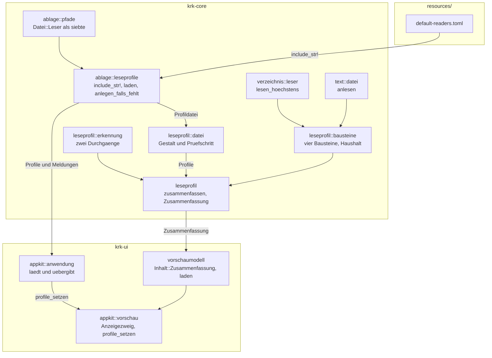
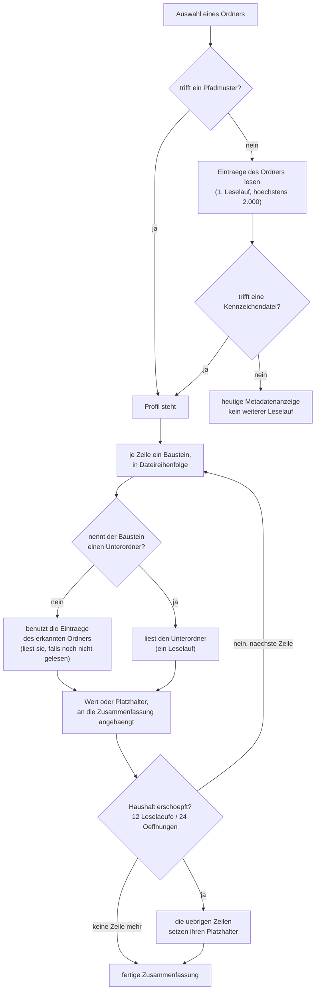
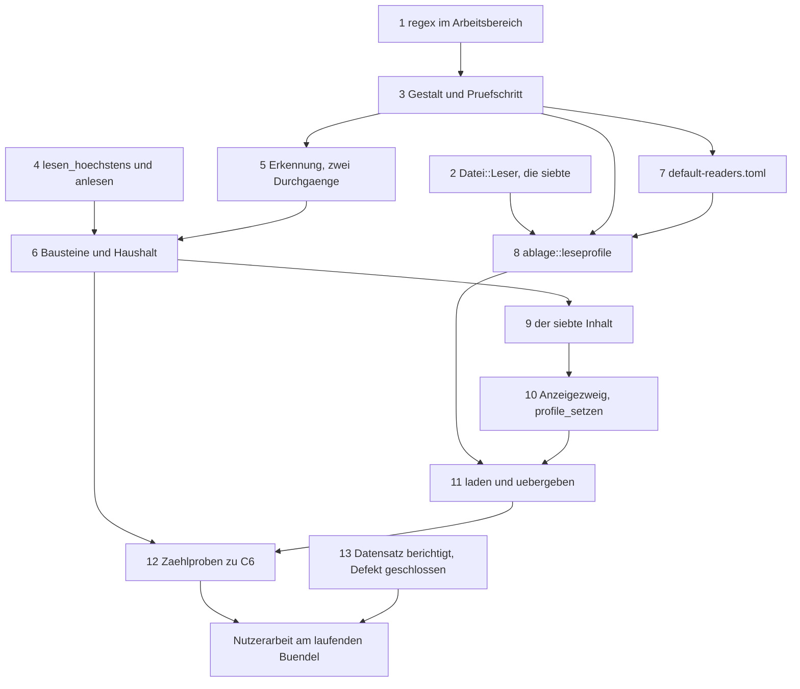

# Implementation Plan: Das Vorschaufenster zeigt für erkannte Orte eine Profil-Zusammenfassung statt der Metadaten

**Date:** 2026-08-24
**Status:** In Umsetzung. Die Schritte 1 bis 6 und 13 stehen auf `[DONE]`, die Schritte 7 bis 12 sind offen. *(Am 260824-1224 nachgezogen; die Zeile stand noch auf „Entwurf, wartet am Tor".)*
**Spec:** `circles/260823-2208-vorschau-zeigt-profil-zusammenfassung-statt-metadaten/planning/260824-0613_o_spec-vorschau-zeigt-profil-zusammenfassung-statt-metadaten.md`, vom Nutzer am 260824-0625 freigegeben, A1 bis A7 eingeschlossen
**Circle:** `circles/260823-2208-vorschau-zeigt-profil-zusammenfassung-statt-metadaten`
**Grundlage erhoben:** 260824-0634, am Baum auf dem Stand `278a008` unter `crates/` und `resources/`, und am Bestand dieser Werkbank
**Decidability:** Die tragende Frage lautet: **kann ein Ausdruck, den der Nutzer in seine `readers.toml` schreibt, die Vorschau anhalten?** Aus dem Text des Ausdrucks allein ist sie **nicht** entscheidbar. Eine rückverfolgende Auswertung braucht für manche Muster exponentiell viele Schritte in der Länge der Eingabe, und welche Muster das sind, steht nicht im Muster; C2.8 führt mit `(a+)+$` genau das Standardbeispiel dafür an. Der Plan nähert die Frage deshalb nicht an, sondern **wechselt den Mechanismus**: die Ausdrücke laufen über die Kiste `regex`, die mit endlichen Automaten arbeitet und deren Laufzeit linear in der Länge der Eingabe ist, gleich welches Muster dasteht. Die Zusage aus C2.8 ist damit eine Eigenschaft der Auswertungsmaschine und keine Vorhersage über ein Muster. **Eine zweite Frage stand vor derselben Wahl** und ist genauso beantwortet: ob die Ortsangabe eines Bausteins aus dem erkannten Ordner herausführt (C3.13). Aus dem Text der Angabe ist das nicht entscheidbar, weil eine Verknüpfung im Weg liegen kann, die der Text nicht nennt. Der Plan prüft deshalb nicht den Text allein, sondern vergleicht den **aufgelösten** Pfad mit dem aufgelösten erkannten Ordner; die textliche Prüfung bleibt daneben stehen, weil sie beim Laden greift und keine Systemaufrufe kostet.

---

## Directive

Das Vorschaufenster beantwortet nach dieser Runde die Frage, was an einem Ort liegt, ohne dass der Nutzer ihn betritt. Der Spec formuliert sie aus, dieser Plan wiederholt sie nicht.

**Acht Entscheidungsdatensätze binden diesen Plan**, alle unter `decisions/` dieses Circles und alle auf `_a_`. Sie werden hier nicht neu verhandelt; welcher Schritt welchen realisiert, steht unten unter `## Welcher Schritt welchen Datensatz realisiert`. Dazu kommen die sieben abgeleiteten Festlegungen A1 bis A7, die der Nutzer am Spec-Tor bestätigt hat.

---

## Current State

Der Spec erhebt die Ausgangslage in neun Feststellungen und belegt jede am Baum. Dieser Abschnitt wiederholt sie nicht, sondern trägt nach, was für den Zuschnitt der Schritte zusätzlich nachgesehen wurde.

**Der Weg vom Pfad zu den Bytes hat heute zwei Fragen und braucht eine dritte.** `krk_core::verzeichnis::sys::ohne_warten_oeffnen` ist die eine Tür, und zwei Funktionen in `crates/krk-core/src/text/datei.rs` gehen hindurch: `lesen` beantwortet „ist das eine Textdatei für den Editor", `bis_zur_grenze_lesen` beantwortet „gib mir die Bytes, aber höchstens so viele". Die zweite weist eine Datei über der Grenze **ab**, statt sie anzulesen (`datei.rs:605-637`, Zweig `angaben.len() > grenze`). C6.6 verlangt aber das Anlesen: „Der Titel und das Feld entstehen aus diesen Bytes". Der Unterschied ist am Bestand belegt und nicht ausgedacht: `circles/260804-0933-eingebauter-web-betrachter-im-vorschaufenster/_d_circle.md` ist **119.614 Bytes** groß und damit über der Grenze von 64 KB, während seine Überschrift `## Directive` bei Byte 222 steht. Mit der abweisenden Fassung zeigte gerade dieser Circle keine Directive.

**Der Verzeichnisleser kennt keine Obergrenze.** `krk_core::verzeichnis::leser::lesen` liest ein Verzeichnis auf dem aufrufenden Faden vollständig ein (`leser.rs:162-176`) und hält dabei genau einen Deskriptor über `sys::Schwungleser`. Die Grenze aus A5 braucht eine Fassung mit Deckel; eine zweite Lesemechanik daneben braucht sie nicht.

**Eine von Hand lesbare Auswahl in TOML steht im Baum und ist abgenommen.** `krk_core::ablage::lesezeichen::Ziel` ist eine unmarkierte Auswahl (`#[serde(untagged)]`) und wird über `#[serde(flatten)]` in `Lesezeichen` eingebettet, damit `bookmarks.toml` ohne Sortenkennung auskommt. Der Vorbehalt dazu steht am Typ ausgeschrieben, und die Abnahme ist die Rundreise `ablage.rs::eine_rundreise_ueber_beide_sorten_liefert_dieselbe_datei`. Dass `toml` die Verbindung aus `flatten` und `untagged` trägt, ist an diesem Baum damit **gemessen** und nicht angenommen. Die Bausteinzeile dieser Runde nimmt genau diese Form.

**Zwei Proben zählen die Ablagedateien und werden von einer siebten rot.** `krk-core/tests/baum.rs::nur_benannte_dateien_erreichen_das_atomare_schreiben` führt die fünf Dateien des Baums auf, die `atomar::schreiben` überhaupt erreichen können; ein sechster Schreiber lässt sie fehlschlagen. `krk-core/tests/ablage.rs:250` vergleicht die Namen aus `Datei::ALLE` gegen eine ausgeschriebene Liste von sechs. Beide sind Absicht und kein Hindernis: sie erzwingen die bewusste Einordnung, die der Übersetzer an dieser Stelle nicht erzwingen kann.

**Der Ausgabeweg der Vorschau trägt die Auswählbarkeit schon.** `Vorschaufenster::text_zeigen` (`appkit/vorschau.rs:1105`) setzt den Text in die `Vorschautext`-Fläche und nimmt dabei den Quellbezug zurück; ohne Quellbezug reicht `auswahl_ablegen` unverändert an die Oberklasse weiter, und was markiert war, geht Zeichen für Zeichen heraus. C4.6 fällt damit aus dem vorhandenen Weg heraus, sobald die Zusammenfassung über `text_zeigen` läuft.

**Der Messmodus lädt die Ablage nicht.** `Anwendungsdelegierter::sitzung_laden` (`appkit/anwendung.rs:1378-1459`) kehrt für drei der vier Messaufgaben zurück, bevor `einstellungen::laden` gerufen wird. In diesen Läufen entsteht heute keine `settings.toml`, und es entstünde auch keine `readers.toml`. Die Folge ist benannt und keine Abweichung: im Messmodus greift kein Profil, und ein Ordner zeigt seine Metadaten.

---

## Approach

### Die sieben Antworten auf `## Open for Planner`

| Frage des Specs | Antwort dieses Plans | Wo sie steht |
|---|---|---|
| Weiterer Wert von `Inhalt` oder Nutzlast des vorhandenen? | Ein **siebter Wert** `Inhalt::Zusammenfassung` | `### Warum ein siebter Wert` |
| Welche Kiste trägt die Ausdrücke? | `regex` 1.x, in `krk-core` | `### Die Kiste und der Grund` |
| Welche Schlüsselnamen trägt `readers.toml`? | `[[profil]]` mit `name`, `pfad`, `kennzeichen`; `[[profil.zeile]]` mit `beschriftung` und genau einem Bausteintisch | `### Die Gestalt der Datei` |
| Wo wohnen die Profile, wo läuft die Auswertung? | Beides in `krk-core`, Modul `leseprofil/`; die Ablagehälfte in `ablage/leseprofile.rs` | `### Wo die Profile wohnen` |
| Wie kommt die Zusammenfassung an die Fläche, und wie bleibt C4.6? | Über `Zusammenfassung::als_text` und `text_zeigen`, also über den vorhandenen Weg | `### Der Weg an die Fläche` |
| Eine Datei einmal oder zweimal geöffnet? | **Zweimal.** Je Baustein eine Öffnung, gezählt wird die tatsächliche | `### Der Haushalt` |
| Wie stehen die drei Zustandszeilen in der Auslieferungsfassung? | Als drei Vorhandensein-Bausteine auf `^_a_circle\.md$`, `^_t_circle\.md$` und `^_[cb]_circle\.md$` | `### Die fünf mitgelieferten Profile` |

### Warum ein siebter Wert

`Inhalt` in `krk-ui/src/vorschaumodell.rs` trägt heute sechs Werte, und der Doc-Kommentar von `zeigt_dateitext` sagt bereits, was ein siebter auslösen soll: „ein siebter Inhalt hält den Bau an und erzwingt die Antwort auf die Frage, ob neben ihm Zeilennummern stehen" (`:487`). Die Zusammenfassung ist dieser siebte Wert.

Die Nutzlastform scheidet an einer Messung aus, nicht an einem Geschmack. Nach A6 überlebt von den sechs Metadatenzeilen genau die Kopfzeile, und die fünf übrigen fallen weg. Eine `Inhalt::Metadaten`-Variante, die eine `Option<Zusammenfassung>` mitführt, trüge damit in jedem erkannten Fall fünf Angaben, die niemand anzeigt. Das ist kein Wert mit Nutzlast, sondern ein Wert, der zwei Fälle in einem Feld führt und die Fallunterscheidung an die Ansicht weiterreicht, statt sie am Typ zu treffen.

Der Übersetzer nennt beim Erweitern drei Stellen, und alle drei brauchen eine Antwort: `zeigt_dateitext` antwortet mit `false` (die Zahlen zählten die Zeilen der Zusammenfassung und nicht die einer Datei), `appkit/vorschau.rs::anzeigen` bekommt den Anzeigezweig, `appkit/vorschau.rs::einzufaerben` antwortet mit `None` (eine Zusammenfassung ist kein Quelltext).

### Die Kiste und der Grund

Die Ausdrücke laufen über `regex` 1.x, und die Wahl ist die Antwort auf die Zeile `**Decidability:**` im Kopf: `regex` gibt eine Laufzeitzusage, die vom Muster unabhängig ist, und C2.8 verlangt genau eine solche Zusage.

Die naheliegende Sparfassung ist `fancy-regex`, das über `syntect` bereits als gewöhnliche Abhängigkeit von `krk-ui` im Baum steht. Sie scheidet an derselben Frage aus: `fancy-regex` wertet rückverfolgend aus und kappt die Arbeit über eine Schrittgrenze. Eine Schrittgrenze ist eine Näherung an die Frage „läuft dieses Muster in vertretbarer Zeit", und der Spec verlangt keine Näherung, sondern die Zusage. Dazu kommt, dass `fancy-regex` heute Abhängigkeit von `krk-ui` ist und nicht von `krk-core`; eine unmittelbare Nennung mit Begründung in der Wurzel-`Cargo.toml` kostet sie in jedem Fall.

Der Preis von `regex` ist klein und belegt. Die vier Pakete, auf denen die Kiste aufsetzt, stehen bereits im Baum: `regex-automata` 0.4.18, `regex-syntax` 0.8.11, `aho-corasick` 1.1.5 und `memchr` 2.8.3, sämtlich über `fancy-regex`, sämtlich in der Begründung zu `syntect` in der Wurzel-`Cargo.toml` namentlich aufgezählt. `regex` selbst ist damit ein einziges neues Paket. Kein C-Code kommt herein. Schritt 1 misst beides nach, statt es zu übernehmen.

### Wo die Profile wohnen

Die Auswertung liegt in `krk-core` und nicht in `krk-ui`, und der Grund ist C6.8: die Grenzen sollen durch Proben belegt sein, „die ohne Fenster laufen". `krk-ui` hat kein Bibliotheksziel, also erreicht eine Probe unter `crates/krk-ui/tests/` nichts aus dieser Kiste; im Kern erreicht sie alles. Dazu kommt, dass die Lesemaschinerie, die eine Zusammenfassung braucht, im Kern steht und dort bleiben soll.



Die Abhängigkeiten laufen in eine Richtung: `resources` nach `krk-core` nach `krk-ui`, und innerhalb des Kerns von der Ablage über das Profilmodell in die Auswertung. Ein Kreis entsteht nicht, und `krk-core` nennt `krk-ui` an keiner Stelle.

Die Ablagehälfte steht in `ablage/leseprofile.rs` und nicht im neuen Modul, weil sie die Vorlage `ablage/einstellungen.rs` Zeile für Zeile nimmt: eingebettete Auslieferungsfassung, Anlage beim ersten Start, danach kein Schreibvorgang mehr. Die Ablage ist nach ihrem eigenen Modulkopf die Schicht, die Pfad, Format und Fehlerbehandlung kennt und den Inhalt nicht; das Profilmodell kennt den Inhalt und nicht den Pfad.

### Die Gestalt der Datei

Ein Profil ist ein Tisch in einer Feldliste, eine Zeile ein Tisch in einer Feldliste darin. Der Baustein ist eine **unmarkierte Auswahl**, eingebettet über `#[serde(flatten)]`; genau die Form, die `bookmarks.toml` seit der Runde 2 trägt und deren Tragfähigkeit an diesem Baum durch eine Rundreise abgenommen ist.

```toml
[[profil]]
name = "fusion-Werkbank: ein Speicher"
pfad = 'fusion-workbench/(shared|circles/[^/]+)/(analyses|backlog|consult|history|planning|reviews)$'

  [[profil.zeile]]
  beschriftung = "Datensätze"
  zaehlung = { muster = '\.md$' }

  [[profil.zeile]]
  beschriftung = "Die jüngsten zehn"
  juengste = { muster = '\.md$', anzahl = 10 }
```

Ein Profil trägt `name` (nur für Meldungen), und `pfad` oder `kennzeichen` oder beides. Eine Zeile trägt `beschriftung` und genau einen der vier Tische `zaehlung`, `juengste`, `feld`, `vorhandensein`. Die Bausteintische tragen:

| Tisch | `ordner` | `muster` | `datei` | `feldmuster` | `anzahl` |
|---|---|---|---|---|---|
| `zaehlung` | wahlfrei | wahlfrei | | | |
| `juengste` | wahlfrei | wahlfrei | | | Pflicht |
| `feld` | wahlfrei | | Pflicht | Pflicht | |
| `vorhandensein` | wahlfrei | Pflicht | | | |

`ordner` fehlt in allen fünf mitgelieferten Profilen bis auf die Zeilen des Circle-Profils; ohne Angabe ist der erkannte Ordner gemeint. `deny_unknown_fields` steht an `Profildatei` und an jedem der vier Bausteintische, aber nicht an der Zeile: `flatten` und `deny_unknown_fields` schließen einander aus, und `Lesezeichenliste` trifft dieselbe Wahl aus demselben Grund. Ein Tippfehler **innerhalb** eines Bausteins wird damit gemeldet, ein zusätzlicher Schlüssel neben der Beschriftung nicht.

### Die Erkennung und das Lesen des erkannten Ordners

C2 schreibt zwei Durchgänge vor: erst alle Pfadmuster in Dateireihenfolge, danach alle Kennzeichendateien in derselben Reihenfolge. Der erste Durchgang kostet keinen Systemaufruf, der zweite braucht die Namen der Einträge.

**Der erkannte Ordner wird höchstens einmal je Zusammenfassung gelesen, und erst, wenn ihn jemand braucht.** Das ist die eine Regel, aus der die Zahlen aus C6.7 fallen, und sie ist kein Zwischenspeicher über beliebige Pfade, sondern ein einziger benannter Wert: die Einträge des Ordners, über den die Zusammenfassung spricht. Wer ihn braucht, sind drei: der zweite Erkennungsdurchgang, jeder Baustein ohne `ordner`-Angabe und der Feldbaustein, der seine Datei über ein Namensmuster sucht.



**Der eine Kreis im Graphen ist der Durchgang über die Zeilen des Profils** und keine Rückwärtskante in der Architektur: `Z` bis `H` ist die Schleife, die je Zeile einmal läuft, und der Haushalt ist ihre Abbruchbedingung. Sie endet in jedem Fall, weil ein Profil endlich viele Zeilen hat und der Haushalt nur fällt.

Die Fallunterscheidung „nennt der Baustein einen Unterordner" ist überschneidungsfrei und vollständig, weil C3.13 keine dritte Möglichkeit zulässt: eine Ortsangabe ist entweder leer oder ein relativer Unterordner, und alles andere wird abgewiesen.

**Der Preis dieser Bauart ist benannt.** Ein Ordner, für den kein Pfadmuster trifft, kostet einen Verzeichnisleselauf, auch wenn danach kein Profil greift. Er entsteht nicht neben der Erkennung, sondern in ihr: eine Kennzeichendatei lässt sich nur gegen Namen halten, die jemand aufgezählt hat. Der Lauf läuft auf dem Arbeitsfaden `krk-vorschau` und nicht auf dem Hauptfaden.

### Der Haushalt

Ein `Haushalt` zählt mit, was eine Zusammenfassung verbraucht, und die Zahlen stehen an einer Stelle:

| Grenze | Wert | Kriterium |
|---|---|---|
| Verzeichnisleseläufe je Zusammenfassung | 12 | C6.4 |
| Dateiöffnungen je Zusammenfassung | 24 | C6.4 |
| Einträge je Verzeichnisleselauf | 2.000 | C6.5, A5 |
| Bytes je Datei | 64 KB | C6.6 |
| N des Bausteins „jüngste N" | 10 | C6.3 |

Verbraucht wird in Dateireihenfolge. Ist eine der beiden ersten Grenzen erreicht, setzen die übrigen Bausteine ihren Platzhalter. Der Erkennungslauf zählt gegen die zwölf, denn er ist ein Leselauf dieser Zusammenfassung.

**Eine Datei, die zwei Bausteine desselben Profils lesen, wird zweimal geöffnet.** Das ist die Antwort auf die sechste Frage des Specs, und sie ist eine Wahl gegen einen Zwischenspeicher. Der Grund ist die Nachprüfbarkeit: die Zahl der Öffnungen soll aus dem Profil ablesbar sein, also eine Öffnung je Feldbaustein und N je Baustein „jüngste N". Gemessen am größten mitgelieferten Profil kostet das elf von vierundzwanzig, an der Wurzelzusammenfassung fünf. Ein Zwischenspeicher spart dort zwei Öffnungen und kostet dafür eine Zahl, die vom Inhalt der Profile abhängt.

**Beim Verzeichnis ist die Antwort eine andere, und der Unterschied hat einen Grund.** Der erkannte Ordner wird ohnehin gelesen, weil die Erkennung ihn braucht; ihn ein zweites Mal zu lesen, ersparte niemandem etwas und kostete drei bis vier der zwölf Leseläufe. Die Asymmetrie ist damit keine Ausnahme, sondern die Folge davon, dass ein Leselauf einen Rufer außerhalb der Bausteine hat und eine Dateiöffnung nicht.

### Was eine unvollständige Lesung sagen darf

Ein Verzeichnisleselauf, der die Grenze von 2.000 Einträgen erreicht, liefert eine Teilauskunft. Der Plan wendet darauf **eine** Regel an, dreimal: **es wird nur gesagt, was die Teillesung entscheidet.**

- Die Zählung zeigt `über 2.000` statt einer Zahl. Sie kann sagen, dass es mehr sind.
- Das Vorhandensein zeigt `ja`, wenn es einen Treffer gefunden hat, und seinen Platzhalter, wenn es keinen gefunden hat. Ein Nichtfund in einer Teilliste ist kein Nichtvorhandensein.
- Die jüngsten N zeigen ihren Platzhalter. Die jüngsten zehn einer Teilliste sind nicht die jüngsten zehn.

Der Rückgriff auf den Platzhalter statt auf eine negative Antwort ist derselbe, den `verzeichnis::sys::ist_deskriptormangel` seit der Runde 10 im Durchlauf trägt: ein Mangel von außen lässt den Auftrag unentschieden, statt ihn negativ zu entscheiden. Der Defekt, der die andere Lesart gefunden hat, ist `260815-0211`.

### Was ein Name entscheidet und was eine Datei

Zwei Bausteine sehen auf Namen, zwei lesen Dateien, und daran hängt der Umgang mit Verknüpfungen:

- **Zählung und Vorhandensein** sehen auf die Namen aller Einträge, gleich welchen Typs. Eine Verknüpfung zählt mit, denn sie steht im Ordner.
- **Jüngste N und Feld** lesen Dateien und nehmen dafür allein Einträge vom Typ `Typ::Datei`. Eine Verknüpfung wird übergangen, aus demselben Grund, aus dem der Durchlauf nicht in sie absteigt: sie führt aus dem Ordner heraus, den die Zusammenfassung beschreibt.

### Der Weg an die Fläche

`Zusammenfassung::als_text` ist eine reine Funktion in `krk-core` und liefert den anzuzeigenden Text. `appkit/vorschau.rs::anzeigen` bekommt genau einen neuen Zweig, und der ruft `text_zeigen`. Damit fällt C4.6 aus dem vorhandenen Weg heraus: `text_zeigen` nimmt den Quellbezug zurück, also reicht `Vorschautext::auswahl_ablegen` an die Oberklasse weiter, und was markiert war, geht Zeichen für Zeichen in die Zwischenablage. Ein zweiter Ausgabeweg entsteht nicht, und die eine Abfangstelle bleibt eine.

Der Wert wandert **strukturiert** durch `Inhalt` und wird erst in der Ansicht zu Text. Die Abnahmekriterien C3.1 bis C3.12 prüfen Werte und keine Zeilenumbrüche; gegen eine fertige Zeichenkette wären sie brüchig, gegen `Wert::Zahl(54)` sind sie genau.

Der Platzhalter ist `--`. Er ist nicht neu erfunden: die Metadatenanzeige schreibt ihn seit der Runde 1 in die Größenzeile eines Ordners, und er heißt dort schon „darüber ist nichts zu sagen".

### Wann eine fehlerhafte `readers.toml` auffällt

**Jede Prüfung an der Datei läuft beim Laden, und jede Meldung erscheint einmal beim Start.** Das gilt für das nicht übersetzbare Pfadmuster aus C2.7 ebenso wie für den Feldausdruck mit mehr als einer Fanggruppe aus C3.10 und für die textliche Hälfte von C3.13. Alle drei sind Aussagen über die Datei und nicht über den angezeigten Ort, also fallen sie dort an, wo die Datei gelesen wird.

Daraus folgt ein Zuschnitt, der die Auswertung schlank hält: die Auswertung kennt keinen Meldungskanal. Sie liefert Werte und Platzhalter, und die Statuszeile hört von ihr nichts. Ein abgewiesenes Profil steht nach dem Laden nicht mehr in der Liste; eine abgewiesene Zeile steht darin und trägt keinen Baustein, also zeigt sie ihre Beschriftung und den Platzhalter, jedes Mal.

Die Meldungen gehen denselben Weg wie die der Einstellungen: `sitzung_laden` sammelt sie in `Vec<String>`, und `oberflaeche_aufbauen` stellt sie in die Statuszeile. Ein modales Hinweisfenster öffnet diese Runde nicht.

### Die fünf mitgelieferten Profile

Sechs Orte, fünf Profile: die zwölf Speicherordner aus C5.2 und C5.3 fallen in eines.

| Profil | Erkennung | Zeilen |
|---|---|---|
| Wurzel der Werkbank | Kennzeichen `^\.fusion-setup$` | drei Feldbausteine auf `.fusion-setup`, je einer auf `.active-circle` und `orchestrator-live.md`, zwei Zählungen auf `circles` und `shared/issues` |
| Ein Speicher | Pfad `fusion-workbench/(shared\|circles/[^/]+)/(analyses\|backlog\|consult\|history\|planning\|reviews)$` | Zählung, jüngste zehn |
| Defektspeicher | Pfad `fusion-workbench/(shared\|circles/[^/]+)/issues$` | zwei Zählungen (offen, geschlossen), jüngste zehn |
| Das Circle-Verzeichnis | Pfad `fusion-workbench/circles$` | eine Zählung |
| Ein einzelner Circle | Kennzeichen `^_._circle\.md$` | drei Vorhandensein für den Zustand, Feld für die Directive, zwei Vorhandensein für Spec und Plan, Zählung der Entscheidungen, jüngste zehn Verläufe |

**Die Wurzel wird über eine Kennzeichendatei erkannt und nicht über ihren Namen**, und das ist die Antwort auf C5.9. Ein Pfadmuster `fusion-workbench$` träfe jeden Ordner dieses Namens, auch einen leeren; `.fusion-setup` steht in einer eingerichteten Werkbank und sonst nirgends.

**Der einzelne Circle fällt in den zweiten Durchgang und kann dort nicht überholt werden.** Kein Pfadmuster der Datei trifft ein Circle-Verzeichnis: das Speichermuster verlangt hinter dem Circle-Namen einen Speichernamen, und `fusion-workbench/circles$` endet vor ihm. C2.3 und C5.7 fallen damit aus der Reihenfolge der zwei Durchgänge und brauchen keine Sonderregel.

**Die drei Zustandszeilen sind die aus A7**, also `^_a_circle\.md$`, `^_t_circle\.md$` und `^_[cb]_circle\.md$`. Sie decken vier der sechs Marker des Vokabulars. Eine überholte (`_s_`) oder zurückgestellte (`_d_`) Runde antwortet auf alle drei mit „nein", und dieser Werkbank betrifft das heute genau ein Verzeichnis. Der Datensatz dazu steht unter `## Open Questions`; er hält keinen Schritt auf.

**Die Zahlen des Haushalts, an den zwei größten Profilen gerechnet:**

| Profil | Verzeichnisleseläufe | Dateiöffnungen | Zusage |
|---|---|---|---|
| Ein einzelner Circle | 5 (Circle-Ordner, `planning` zweimal, `decisions`, `history`) | 11 (Circle-Datensatz, zehn Verläufe) | C6.7: höchstens 7 und höchstens 11 |
| Wurzel der Werkbank | 3 (Wurzel, `circles`, `shared/issues`) | 5 (`.fusion-setup` dreimal, `.active-circle`, `orchestrator-live.md`) | C6.4: höchstens 12 und höchstens 24 |

---

## Was der Übersetzer einfordert, und was er nicht einfordert

| Stelle | Wer hält sie | Was geschieht, wenn sie fehlt |
|---|---|---|
| `Datei::ALLE` von 6 auf 7 | Übersetzer | Die Feldlänge stimmt nicht, der Bau hält an |
| `Datei::dateiname`, `Datei::format`, `Datei::leerbefund` | Übersetzer | Drei nicht erschöpfende `match`, der Bau hält an |
| `Vorschaumodell::zeigt_dateitext` | Übersetzer | Nicht erschöpfender `match` über `Inhalt` |
| `appkit/vorschau.rs::anzeigen` | Übersetzer | Nicht erschöpfender `match` über `Inhalt` |
| `appkit/vorschau.rs::einzufaerben` | Übersetzer | Nicht erschöpfender `match` über `Inhalt` |
| `tests/baum.rs::nur_benannte_dateien_erreichen_das_atomare_schreiben` | Probe | Rot, sobald `ablage/leseprofile.rs` das atomare Schreiben erreicht |
| `tests/ablage.rs:250`, die Namensliste | Probe | Rot, sobald `Datei::ALLE` sieben Namen liefert |
| Die abzählbaren Grenzen aus C6 | **nichts** | Schritt 12 baut die Zählproben; ohne ihn ist C6 behauptet |
| Die Prosastellen in `CLAUDE.md` | **nichts** | Zwei Aussagen veralten, siehe `## Risks & Mitigations` |

**Der Abschnitt `# Ab welchem macOS die angesprochenen Klassen stehen` bekommt in dieser Runde keinen Eintrag**, und das ist nachgesehen und nicht übergangen: unter `crates/krk-ui/src/appkit/` entsteht keine neue Datei, und keine der berührten Stellen spricht eine Klasse oder Methode an, die dort nicht schon steht. `profile_setzen` fasst kein Objective-C an, und der neue Anzeigezweig ruft `text_zeigen`.

---

## Implementation Steps

Fünf Bündel, dreizehn Schritte. Jeder Schritt nennt genau einen Executor. **Nach jedem einzelnen Schritt laufen `cargo build --workspace`, `cargo test --workspace`, `cargo clippy --workspace --all-targets` und `cargo fmt --all --check` grün**; `cargo` liegt unter `$HOME/.cargo/bin` und nicht auf dem Standard-PATH, `make check` fährt die vier in einem Zug.

**Die Bezeichner sind deutsch, wie im ganzen Baum.** `CLAUDE.md` verlangt für Bezeichner „die üblichen englischen Konventionen", und gemeint sind damit die Schreibweisen (`snake_case`, `CamelCase`) und nicht die Sprache der Wörter: der Baum führt `Vorschaumodell`, `Durchlauf`, `Eintrag`, `Ablage`. Ein englisch benannter Typ neben ihnen wäre der Bruch und nicht die Regel.

**Elf der dreizehn Schritte gehören dem `coder`, einer dem `ontocoder`, einer dem `analyst`.** Für den `ontocoder` gibt es genau eine Arbeit, die Auslieferungsfassung `resources/default-readers.toml`: sie trägt Daten und keine Bauanweisung, anders als die Wurzel-`Cargo.toml`, die zum `coder` geht. Für den `analyst` gibt es ebenfalls genau eine, die Berichtigung eines Entscheidungsdatensatzes und der Schluss eines Defekts; beides sind Schreibarbeiten im Entscheidungs- und Defektspeicher der Werkbank und weder Code noch strukturierte Daten.

### Bündel A — Die Ablage nimmt eine siebte Datei auf

1. [DONE] **Die Ausdruckskiste kommt in den Arbeitsbereich, und ihr Preis wird gemessen**
   - Executor: `coder`
   - Files: `Cargo.toml`, `crates/krk-core/Cargo.toml`
   - Changes: `regex = "1"` unter `[workspace.dependencies]`, mit einer Begründung in der Form der übrigen Einträge dieser Datei. Die Begründung nennt vier Dinge: dass C2.8 eine Laufzeitzusage verlangt, die vom Muster unabhängig ist, und dass endliche Automaten sie geben und eine rückverfolgende Auswertung nicht; dass `fancy-regex` über `syntect` zwar schon dasteht, aber rückverfolgend arbeitet und seine Arbeit über eine Schrittgrenze kappt, also die Frage annähert statt sie zu beantworten; dass keine bestehende Abhängigkeit einen Mustervergleich leistet (`icu_collator` sortiert, `toml` zerlegt, `pulldown-cmark` rendert Markdown); und was mitkommt, gezählt und nicht geschätzt. `krk-core/Cargo.toml` nennt die Kiste unmittelbar, mit dem Satz, dass die Auswertung im Kern liegt, weil C6.8 Proben ohne Fenster verlangt und `krk-ui` kein Bibliotheksziel hat. **Gemessen wird in diesem Schritt und in keinem späteren**: `cargo tree -p krk-core -e normal` und der Vergleich von `Cargo.lock` vor und nach der Aufnahme, mit den drei Aussagen, die die Wurzel-`Cargo.toml` für jede fremde Kiste führt: wie viele Einträge dazukommen, welche davon auf dem Bauziel ankommen, und dass weder `cc` noch ein `-sys`-Paket außer `windows-sys` hinzukommt. Weichen die gemessenen Zahlen von der Erwartung „ein einziges neues Paket" ab, steht die gemessene Zahl in der Begründung und nicht die erwartete.
   - Dependencies: keine

2. [DONE] **`readers.toml` wird die siebte Ablagedatei**
   - Executor: `coder`
   - Files: `crates/krk-core/src/ablage/pfade.rs`, `crates/krk-core/tests/ablage.rs`
   - Changes: `Datei::Leser` als siebter Wert, mit `Datei::ALLE` von `[Datei; 6]` auf `[Datei; 7]`. Der neue Wert steht **hinter** `Datei::Einstellungen` und vor den zwei Zetteln, weil `ALLE` nach ihrem Doc-Kommentar erst die TOML-Dateien und danach die Zettel führt. `dateiname` liefert `"readers.toml"`, `format` liefert `Format::Toml`, `leerbefund` liefert `Leerbefund::Vorgabe`. Die Begründung für `Vorgabe` steht am Zweig und ist die aus C1.4: die Datei wird von Hand gepflegt, und wer sie bis auf ihre Kommentare leerräumt, meint „keine Profile" und keinen Schaden; damit steht sie neben `settings.toml` und `keymap.toml` und nicht neben `bookmarks.toml`. Der Modulkopf von `pfade.rs` zieht mit: aus „sechs Ablagedateien" wird sieben, und der Satz über die zwei Formate nennt jetzt fünf TOML-Dateien und zwei Zettel. In `tests/ablage.rs` wächst die ausgeschriebene Namensliste (`:250`) um `"readers.toml"` an der passenden Stelle; die Rundläufe über `toml_dateien()` und `Datei::ALLE` ziehen von selbst mit, weil sie über die Aufzählung laufen und keine zweite Liste führen.
   - Dependencies: keine

### Bündel B — Das Profilmodell, ohne Fenster

3. [DONE] **Die Gestalt der Datei und der Prüfschritt dahinter**
   - Executor: `coder`
   - Files: `crates/krk-core/src/leseprofil/mod.rs`, `crates/krk-core/src/leseprofil/datei.rs`, `crates/krk-core/src/lib.rs`, `crates/krk-core/tests/leseprofil.rs` (die Testdatei ist am 260824-1042 vom `coder` nachgetragen; die ursprüngliche Zeile nannte sie nicht, obwohl der Schritt Proben ausdrücklich verlangt — derselbe Befund wie bei Schritt 4, `issues/260824-0955_*_die-files-zeile-eines-planschritts-nennt-die-quelldateien-und-nicht-die-testdateien.md`)
   - Changes: Das neue Modul `leseprofil` mit den Werttypen aus `## Data Structures` (`Profile`, `Profil`, `Zeile`, `Baustein`, `Ortsangabe`, `Zusammenfassung`, `Zusammenfassungszeile`, `Wert`, `Haushalt`) und in `datei.rs` die Gestalt der TOML-Datei (`Profildatei`, `Profilblock`, `Zeilendatei`, `Bausteindatei` als unmarkierte Auswahl über `#[serde(untagged)]`, eingebettet über `#[serde(flatten)]`) samt dem Prüfschritt `pruefen(Profildatei) -> (Profile, Vec<String>)`. Der Prüfschritt übersetzt die Ausdrücke einmal und behält die übersetzten Fassungen; er ist die eine Stelle, an der ein Muster zu einem `Regex` wird. Er weist ab und meldet: ein Profil, dessen `pfad` oder `kennzeichen` sich nicht übersetzen lässt, fällt ganz weg und **nur** es (C2.7); ein Profil, das weder `pfad` noch `kennzeichen` nennt, fällt weg, weil es nie treffen könnte; eine Zeile, deren `feldmuster` nicht genau eine Fanggruppe trägt, behält ihre Beschriftung und verliert ihren Baustein (C3.10); dasselbe gilt für eine Zeile, deren `ordner` absolut ist, ein leeres Stück trägt, `.` oder `..` enthält (C3.13, textliche Hälfte). `anzahl` über 10 wird auf 10 gekappt und nicht abgewiesen (C6.3). **Ein fünfter Fall steht seit dem 260824-1224 hier und ist beim Bau des Schrittes aufgefallen, nicht bei seiner Planung:** ein Muster **innerhalb** eines Bausteins, also `muster` in `zaehlung`, `juengste` und `vorhandensein` oder `datei` in `feld`, das sich nicht übersetzen lässt. `Regex::new` liefert für jedes der fünf Muster ein `Result`, und die zwei anderen Möglichkeiten sind in diesem Projekt ausgeschlossen: ein `unwrap` brächte KRK an einer von Hand gepflegten Datei zum Absturz, ein stilles Fallenlassen verstößt gegen „No silent failures" aus `CLAUDE.md`. **Er ist als Zeilenabweisung eingeordnet**, also mit derselben Reichweite wie C3.10 und die textliche Hälfte von C3.13, und der Grund ist der Unterschied, den die vier Fälle darüber selbst ziehen: ein Profil, das seinen Ort nicht erkennt, ist nicht halb brauchbar, sondern gar nicht, während eine Zeile ohne Baustein mit ihrer Beschriftung und dem Platzhalter dasteht und die übrigen Zeilen weiter stimmen (C3.12). Ein unübersetzbares `muster` in einer Zählung sagt nichts über die Erkennung des Profils aus; es kostet eine Zeile und nicht sechs. **Die fünf Fälle sind damit Beispiele einer Regel und keine abgeschlossene Liste:** Muster im Erkennungsteil kosten das Profil, Muster und Ortsangaben in einer Zeile kosten die Zeile. Kein Abnahmekriterium ist betroffen; C2.7 spricht vom Pfadmuster, C3.10 vom Feldmuster, und keines der sechsundfünfzig sagt etwas über ein `muster` in einer Zählung. Der Befund ist `issues/260824-1042_*_schritt-3-zaehlt-vier-abweisungen-auf-ein-unuebersetzbares-muster-in-einem-baustein-ist-eine-fuenfte.md`; die Einordnung steht im Modulkopf von `datei.rs` unter „Was abgewiesen wird, und wie weit". Jede Meldung nennt den Profilnamen, die Beschriftung der Zeile und den Grund. Der Modulkopf schreibt die drei Dinge aus, die ein späterer Leser sonst neu herleiten muss: warum die Auswertung im Kern liegt und nicht in `krk-ui`, warum die Bausteinauswahl unmarkiert ist und wo ihre Vorlage steht (`ablage::lesezeichen::Ziel`, samt dem Vorbehalt zu `flatten` und der Rundreise, die ihn abnimmt), und warum jede Prüfung beim Laden läuft und nicht beim Anzeigen. `lib.rs` bekommt `pub mod leseprofil;` und im Modulkopf einen Satz zur neuen Schicht. Jeder Rückgabewert, dessen stilles Fallenlassen unbemerkt bliebe, trägt `#[must_use]`; für `pruefen` gilt das ausdrücklich, weil die zweite Hälfte des Paares die Meldungen sind. **Proben:** eine Rundreise über alle vier Bausteine, also eine Datei mit je einer Zeile jeder Sorte einlesen und die geprüfte Fassung gegen die erwarteten Werte halten, nach dem Vorbild von `eine_rundreise_ueber_beide_sorten_liefert_dieselbe_datei`; je eine Probe für die Abweisungen, die jeweils prüft, dass genau das abgewiesene Stück fehlt und der Rest steht (vier bei der Planung, seit dem 260824-1224 fünf); eine Probe, dass `anzahl = 25` zu 10 wird; eine Probe, dass eine Datei ohne einen einzigen `[[profil]]`-Block zu `Profile` ohne Einträge und ohne Meldung wird (C1.5).
   - Dependencies: Schritt 1

4. [DONE] **Zwei Lesewege bekommen ihren Deckel, und keiner kommt hinzu**
   - Executor: `coder`
   - Files: `crates/krk-core/src/verzeichnis/leser.rs`, `crates/krk-core/src/text/datei.rs`, `crates/krk-core/tests/verzeichnis.rs`, `crates/krk-core/tests/text.rs` (die zwei Testdateien sind am 260824-0952 vom Nutzer nachgetragen; die ursprüngliche Zeile nannte sie nicht, und der Defekt darüber ist `issues/260824-0955_*_die-files-zeile-eines-planschritts-nennt-die-quelldateien-und-nicht-die-testdateien.md`)
   - Changes: In `leser.rs` tritt `lesen_hoechstens(pfad: &Path, hoechstens: usize) -> io::Result<Lesestand>` neben `lesen`, wobei `Lesestand` die Einträge und das Kennzeichen `abgeschnitten` trägt. `lesen` behält seine Signatur und seinen Rumpf **nicht**: es wird zu `lesen_hoechstens(pfad, usize::MAX)` und verliert damit jede eigene Leserschleife. Der Deckel greift innerhalb des Abschlusses, den `naechster_schwung` ruft, also wird kein Schwung mehr geholt, sobald die Zahl erreicht ist. Der Doc-Kommentar sagt, dass die Zahl von außen kommt und warum: die 2.000 aus A5 gehören der Zusammenfassung und nicht dem Leser, genauso wie die Grenzen der Vorschau nicht in `bis_zur_grenze_lesen` wohnen. In `text/datei.rs` tritt `anlesen(pfad: &Path, hoechstens: u64) -> Result<Vec<u8>, Lesehindernis>` neben `lesen` und `bis_zur_grenze_lesen`: dieselbe Tür `sys::ohne_warten_oeffnen`, derselbe `fstat` am offenen Deskriptor, dieselbe Typprüfung, und danach `take(hoechstens)`. Der eine Unterschied zu `bis_zur_grenze_lesen` steht im Doc-Kommentar und ist die dritte Frage an derselben Tür: „gib mir die ersten N Bytes und sage nichts über das, was dahinter steht", gegenüber „gib mir die Bytes, aber höchstens so viele, sonst gar nichts". `Lesehindernis::ZuGross` kann `anlesen` deshalb nicht liefern. Warum die dritte Fassung nötig ist, steht mit ihrer Messung dabei: C6.6 verlangt, dass der Titel aus den gelesenen Bytes entsteht, und der größte Circle-Datensatz dieser Werkbank ist 119.614 Bytes groß bei einer Grenze von 64 KB. **Proben:** `lesen_hoechstens` über einen Prüfordner mit 5 Einträgen und dem Deckel 3 liefert 3 Einträge und `abgeschnitten == true`; mit dem Deckel 5 liefert es 5 und `abgeschnitten == false`; `lesen` liefert für denselben Ordner dasselbe wie `lesen_hoechstens(usize::MAX)`. `anlesen` über eine Datei von 100 Bytes mit der Grenze 10 liefert 10 Bytes und keinen Fehler, während `bis_zur_grenze_lesen` mit derselben Grenze `ZuGross` liefert; `anlesen` auf eine benannte Röhre liefert `KeineDatei` und wartet nicht, und `anlesen` auf einen Ordner liefert `KeineDatei`.
   - Dependencies: keine

5. [DONE] **Die Erkennung, in zwei Durchgängen und ohne dritten**
   - Executor: `coder`
   - Files: `crates/krk-core/src/leseprofil/erkennung.rs`, `crates/krk-core/src/leseprofil/mod.rs` (die Anmeldung `pub mod erkennung;` und ein Satz im Modulkopf), `crates/krk-core/tests/leseprofil.rs` (die sieben Proben zu C2) — die zwei Nachträge stammen vom `coder` am 260824-1101; die ursprüngliche Zeile nannte allein die neue Quelldatei, obwohl der Schritt Proben ausdrücklich verlangt und ein neues Modul sich anmelden muss. Derselbe Befund wie bei den Schritten 2, 3 und 4, `issues/260824-0955_*_die-files-zeile-eines-planschritts-nennt-die-quelldateien-und-nicht-die-testdateien.md`
   - Changes: `erkennen(profile: &Profile, voller_pfad: &Path, eintraege: &dyn Fn() -> Option<&[Eintrag]>) -> Option<&Profil>`, also die Regel aus C2 in ihrer ausgeschriebenen Form: erst alle Profile in Dateireihenfolge gegen das Pfadmuster auf dem vollen Pfad, danach alle Profile in derselben Reihenfolge gegen die Kennzeichendatei auf den Namen der Einträge. Die Einträge kommen als Abschluss herein und nicht als Feld, damit der zweite Durchgang die Lesung auslöst und der erste nicht; das ist die Bauart, aus der die Zahlen aus C6.7 fallen. Der Doc-Kommentar schreibt aus, warum die Reihenfolge der zwei Durchgänge und die Reihenfolge in der Datei zwei verschiedene Regeln sind (A1) und warum C2.3 daraus folgt statt danebenzustehen. **Proben:** die Kriterien C2.1 bis C2.4 einzeln, gegen einen von Hand gebauten `Profile`-Wert und ohne Dateisystem, soweit sie ohne auskommen: das Pfadmuster `fusion-workbench/shared/analyses$` trifft den einen Pfad und den anderen nicht; von zwei passenden Pfadmustern gewinnt das obere, und nach dem Vertauschen der Blöcke das andere; ein späteres Pfadmuster schlägt ein früheres Kennzeichen; das Kennzeichen `^_._circle\.md$` trifft bei jedem der sechs Marker. Dazu eine Probe, dass der erste Durchgang den Abschluss nicht ruft, wenn ein Pfadmuster trifft.
   - Dependencies: Schritt 3

6. [DONE] **Die vier Bausteine, der Haushalt und die Regel über die Teillesung**
   - Executor: `coder`
   - Files: `crates/krk-core/src/leseprofil/bausteine.rs`, `crates/krk-core/src/leseprofil/mod.rs`, `crates/krk-core/tests/leseprofil.rs` (die Testdatei ist am 260824-1136 vom `coder` nachgetragen; die ursprüngliche Zeile nannte sie nicht, obwohl der Schritt dreizehn Proben ausdrücklich verlangt — derselbe Befund wie bei den Schritten 2, 3, 4 und 5, `issues/260824-0955_*_die-files-zeile-eines-planschritts-nennt-die-quelldateien-und-nicht-die-testdateien.md`)
   - Changes: Die Auswertung der vier Bausteine und der Einstieg `zusammenfassen(profile: &Profile, ordner: &Path) -> Option<Zusammenfassung>`. Der Einstieg löst den Ordner einmal über `std::fs::canonicalize` auf, liest ihn höchstens einmal und erst auf Verlangen, ruft `erkennen`, und geht danach die Zeilen des gewählten Profils in Dateireihenfolge durch. Je Zeile: die Ortsangabe auflösen und gegen den aufgelösten erkannten Ordner halten (C3.13, aufgelöste Hälfte, siehe die Zeile `**Decidability:**` im Kopf); den Haushalt fragen; den Baustein rechnen. Die vier Bausteine: `zaehlung` zählt die Namen, die das Muster erfüllen, oder alle, wenn keines dasteht; `juengste` sortiert die Einträge vom Typ `Typ::Datei` absteigend nach `geaendert`, bei gleichem Zeitpunkt aufsteigend nach `name`, damit die Reihenfolge bestimmt ist, nimmt die ersten N und liest je Datei den Titel über `text::datei::anlesen` mit 64 KB; `feld` sucht den ersten Eintrag vom Typ `Typ::Datei`, dessen Name `datei` erfüllt, liest ihn ebenso an und gibt die erste Fanggruppe des ersten Treffers von `feldmuster`; `vorhandensein` antwortet, ob ein Name das Muster erfüllt. Der **Titel** ist die erste nicht leere Zeile, ein führendes `#` und die Leerzeichen dahinter fallen weg; eine vollständig leere, eine nicht lesbare und eine nicht als UTF-8 lesbare Datei liefern den Dateinamen. Die Regel über die Teillesung steht an genau einer Stelle als Kommentar und wird dreimal angewandt, wie oben unter `## Approach` ausgeschrieben. `Haushalt` trägt die fünf Zahlen aus derselben Tabelle als Konstanten und ist die eine Stelle, an der sie stehen; die Sätze der Anzeige (`über 2.000`) entstehen aus der Konstante und nicht aus einer zweiten Zahl im Text, nach dem Vorbild von `vorschaumodell::zu_gross_text`. `Zusammenfassung::als_text` liefert die Anzeige: `Name:` und `Pfad:` als Kopfzeilen wie in `metadaten_text`, danach je Zeile `Beschriftung: Wert`, und für `Wert::Titel` die Beschriftung mit Doppelpunkt und darunter bis zu N eingerückte Zeilen (C4.3). `#[must_use]` an `zusammenfassen`, an `als_text` und an jedem Bausteinrechner. **Proben:** C3.1 bis C3.13 gegen einen Prüfordner mit einem von Hand gebauten Bestand bekannter Gestalt, also nicht gegen die echte Werkbank, deren Zahlen sich mit jeder Sitzung ändern; darunter C3.2 (flach und nicht tief), C3.4 (ein Datensatz ohne `#` liefert trotzdem einen Satz), C3.5 (`#` und die Leerzeichen fallen weg), C3.6 (leere Datei liefert den Dateinamen), C3.9 (das Feldmuster greift einen Absatz über mehrere Zeilen), C3.12 (Beschriftung bleibt, Wert wird zum Platzhalter, die übrigen Zeilen bleiben unberührt), C3.13 in beiden Hälften, für die aufgelöste mit einer Verknüpfung im Prüfordner, die aus ihm herausführt. Dazu die drei Proben zur Teillesung: eine Zählung über der Grenze liefert `Wert::UeberGrenze`, ein Vorhandensein ohne Treffer über der Grenze liefert den Platzhalter und mit Treffer `ja`, die jüngsten N über der Grenze liefern den Platzhalter.
   - Dependencies: Schritt 3, Schritt 4, Schritt 5

### Bündel C — Die Auslieferungsfassung und ihr Weg in den Bestandsort

7. **Die Auslieferungsfassung mit fünf Profilen und ihren Kommentarzeilen**
   - Executor: `ontocoder`
   - Files: `resources/default-readers.toml`
   - Changes: Die fünf Profile aus der Tabelle unter `### Die fünf mitgelieferten Profile`, in der Reihenfolge Wurzel, Speicher, Defektspeicher, Circle-Verzeichnis, einzelner Circle. Die Ausdrücke im Einzelnen: die Wurzel über das Kennzeichen `^\.fusion-setup$` mit den Feldmustern `"setup_pwd":"[^"]*/([^"/]+)"`, `"setup_at":"([^"]*)"`, `"plugin_version":"([^"]*)"` auf `^\.fusion-setup$`, `^([^\n]+)` auf `^\.active-circle$` und `(?s)## Current\n\s*(.+?)\n` auf `^orchestrator-live\.md$`, dazu zwei Zählungen auf `circles` (ohne Muster) und `shared/issues` (`_o_.*\.md$`). Der Speicher und der Defektspeicher über die Pfadmuster aus der Tabelle, mit `\.md$` als Zählmuster und `anzahl = 10`. Der einzelne Circle über das Kennzeichen `^_._circle\.md$`, mit den drei Zustandszeilen `^_a_circle\.md$`, `^_t_circle\.md$`, `^_[cb]_circle\.md$`, dem Feldmuster `(?sm)^## Directive\s*\n+(.+?)\n\n` auf `^_._circle\.md$`, zwei Vorhandensein auf `ordner = "planning"` mit `_._spec-` und `_._plan-`, einer Zählung auf `ordner = "decisions"` mit `\.md$` und den jüngsten zehn auf `ordner = "history"`. **Die Datei ist zur Hälfte Kommentar**, wie `resources/default-settings.toml` es ist: ein Kopf, der sagt, wofür die Datei da ist, dass KRK sie nach dem ersten Start nie wieder anfasst und dass sie von Hand gepflegt wird; ein Abschnitt, der **alle vier Bausteinnamen** nennt und je einen an einem kurzen Beispiel zeigt (C5.10); ein Abschnitt über die Vorrangregel aus C2, ausgeschrieben in ihren drei Schritten; und die Zahlen des Haushalts mit dem Satz, dass eine Zeile über der Grenze ihren Platzhalter zeigt. Die deutschen Umlaute stehen als Umlaute; die Datei ist Prosa für den Nutzer, kein Bezeichner. Jedes Muster steht in einfachen Anführungszeichen, also als literale Zeichenkette in TOML, damit die Rückstriche nicht zu maskieren sind. **Der Bausteinabschnitt trägt daneben den Satz zur Verankerung:** ein Feldmuster läuft über den ganzen Dateiinhalt, und wer eine Zeile verankern will, schreibt `(?m)`.

     **Berichtigung 260824-1224.** Zwei der hier vorgeschriebenen Ausdrücke standen in einer Fassung, die nie treffen konnte, und sind oben schon berichtigt: `^(.+)$` auf `.active-circle` ist `^([^\n]+)` geworden, und `(?s)^## Directive\s*\n+(.+?)\n\n` auf dem Circle-Datensatz hat die Angabe `m` bekommen. `regex` verankert `^` und `$` ohne die Angabe `m` an Anfang und Ende der ganzen Eingabe und nicht an denen einer Zeile; der Feldbaustein ist der einzige der vier, der gegen einen Dateiinhalt läuft, und nur seine Ausdrücke sind betroffen. Nachgemessen am 260824-1224 an den echten Dateien dieser Werkbank: das alte Directive-Muster trifft null der achtzehn Circle-Datensätze, das berichtigte alle achtzehn; `^(.+)$` gegen `.active-circle` liefert keinen Treffer, `^([^\n]+)` liefert den Namen. Die vier übrigen Ausdrücke sind im selben Lauf gehalten worden und unverändert richtig. Der Befund ist `issues/260824-1124_*_zwei-feldmuster-der-auslieferungsfassung-verankern-mit-dach-und-koennen-nie-treffen.md`, die berichtigten Kriterien sind C3.8 und C3.9 des Specs.
   - Dependencies: Schritt 3

8. **Die Ablagehälfte, nach der Vorlage der Einstellungen**
   - Executor: `coder`
   - Files: `crates/krk-core/src/ablage/leseprofile.rs`, `crates/krk-core/src/ablage/mod.rs`, `crates/krk-core/tests/baum.rs`, `crates/krk-core/tests/ablage.rs` (die letzte ist am 260824-1224 vom `analyst` nachgetragen: die Proben zu C1.1, C1.2 und C1.5 bis C1.8 brauchen einen Prüfordner, und den führt `krk-core` allein unter `tests/gemeinsam/mod.rs`, erreichbar nur aus `tests/`; dieselbe Datei zieht nach dem Defekt `issues/260824-0940_*_readers-toml-faellt-beim-zip-der-beiseitelegeprobe-still-heraus.md` ohnehin nach. Die zwei Proben über den `AUSLIEFERUNGSTEXT` brauchen keinen Prüfordner und stehen wie ihre Vorlage in `ablage/einstellungen.rs` im `#[cfg(test)]`-Modul neben dem Code. Derselbe Befund wie bei den Schritten 2 bis 6, `issues/260824-0955_*_die-files-zeile-eines-planschritts-nennt-die-quelldateien-und-nicht-die-testdateien.md`)
   - Changes: `AUSLIEFERUNGSTEXT` über `include_str!("../../../../resources/default-readers.toml")`, `laden(zugang: &Zugang<'_>) -> (Geladen<Profile>, Vec<String>)` und `anlegen_falls_fehlt`, jeweils in der Form von `ablage/einstellungen.rs` und mit demselben Fehlerweg: eine fehlende Datei ist der erste Start und keine Meldung wert, eine nicht anlegbare ergibt `Grund::NichtAnlegbar` (C1.7), eine nicht lesbare `Grund::NichtLesbar` und eine unlesbare oder falsch gestaltete `Grund::Beschaedigt` mit Beiseitelegen (C1.6). Alle vier kommen aus `Zugang::laden` und aus `anlegen_falls_fehlt`; ein eigener Zweig entsteht für keinen. Die zweite Hälfte des Rückgabepaares sind die Meldungen aus `leseprofil::datei::pruefen`, die nicht in eine `Ersetzung` gehören: sie sagen etwas über ein einzelnes Profil und nicht über die Datei. Der Modulkopf schreibt aus, warum die geprüfte Fassung woanders wohnt als die gelesene: die Ablage kennt Pfad, Format und Fehlerbehandlung, das Profilmodell kennt den Inhalt. `ablage/mod.rs` bekommt `pub mod leseprofile;` und den Wiederausfuhrsatz, und sein Modulkopf zieht von vier TOML-Dateien auf fünf. In `tests/baum.rs` wächst die Liste in `nur_benannte_dateien_erreichen_das_atomare_schreiben` um `krk-core/src/ablage/leseprofile.rs`, an der alphabetisch richtigen Stelle, mit einem Kommentar in der Form der vorhandenen: „Die Anlage von `readers.toml`, unter einem Durchgang." **Proben:** C1.1 und C1.2 gegen einen Prüfordner, also erster Start legt die Datei Byte für Byte gleich der Auslieferungsfassung an, zweiter Start ändert eine vorhandene und eine geleerte an keinem Byte; C1.5 bis C1.8 je einzeln; die Probe nach dem Vorbild von `die_auslieferungsfassung_traegt_ihre_kommentare`, die hält, dass jeder der vier Bausteinnamen im `AUSLIEFERUNGSTEXT` vorkommt (C5.10); eine Probe, dass die eingebettete Fassung sich ohne Meldung prüfen lässt, also dass KRK keine Auslieferungsfassung mitliefert, die ihre eigene Prüfung nicht besteht.
   - Dependencies: Schritt 2, Schritt 3, Schritt 7

### Bündel D — Die Anzeige

9. **Der siebte Inhalt, und der Arbeitsfaden bekommt die Profile mit**
   - Executor: `coder`
   - Files: `crates/krk-ui/src/vorschaumodell.rs`
   - Changes: `Inhalt::Zusammenfassung(krk_core::leseprofil::Zusammenfassung)` als siebter Wert, mit einem Doc-Kommentar, der sagt, dass er die Metadaten eines **erkannten** Ordners ersetzt und dass die Kopfzeile aus A6 in ihm steckt. `zeigt_dateitext` bekommt den Zweig und antwortet `false`, mit dem Grund am Zweig: die Zahlen zählten die Zeilen der Zusammenfassung, und daneben steht keine Datei mit diesen Zeilen. `Ladevorgang::starten` und `Vorschaumodell::datei_anzeigen` nehmen zusätzlich `profile: Arc<Profile>` entgegen und reichen es an `laden` weiter; ein `Arc` und keine Kopie, aus demselben Grund, aus dem `Inhalt::Bild` seine Bytes teilt. In `laden` tritt der Zusammenfassungszweig **vor** den Rückgabezweig für Ordner und Verknüpfungen: ist der Eintrag kein `Typ::Datei` und liefert `krk_core::leseprofil::zusammenfassen` ein Ergebnis, entsteht `Inhalt::Zusammenfassung`, sonst bleibt es bei `Inhalt::Metadaten`. Damit greift kein Profil auf eine Datei (C2.6), und ohne Treffer bleibt es beim heutigen Zweig und nicht bei einem zweiten daneben (C2.5). Der Modulkopf bekommt einen Abschnitt, der die Zusammenfassung in die Dreiteilung aus C6 einordnet und sagt, dass sie auf demselben Arbeitsfaden entsteht wie das Lesen einer Textdatei und aus demselben Grund. **Proben:** C2.5 und C2.6 gegen einen Prüfordner, also ein Ordner ohne Treffer liefert `Inhalt::Metadaten` mit allen sechs Angaben, und eine Datei, deren Pfad ein Pfadmuster erfüllt, liefert weiter Text, Bild oder Metadaten; ein Ordner mit Treffer liefert `Inhalt::Zusammenfassung`; C4.7, also dass `zusammenfassen` für einen nicht ausgewählten Ordner nicht gerufen wird, geprüft daran, dass `laden` der einzige Rufer ist und `laden` nur aus dem Arbeitsfaden gerufen wird.
   - Dependencies: Schritt 6

10. **Der Anzeigezweig und der eine Weg, auf dem die Profile hereinkommen**
    - Executor: `coder`
    - Files: `crates/krk-ui/src/appkit/vorschau.rs`
    - Changes: `anzeigen` bekommt den Zweig `Inhalt::Zusammenfassung(z) => self.text_zeigen(&z.als_text())`; mehr geschieht dort nicht, und C4.6 fällt daraus heraus, weil `text_zeigen` den Quellbezug zurücknimmt und `auswahl_ablegen` damit an die Oberklasse durchreicht. `einzufaerben` bekommt den Zweig und antwortet `None`, mit dem Grund am Zweig: eine Zusammenfassung ist kein Quelltext, und `syntect` hätte an ihr nichts zu färben. `VorschaufensterIvars` bekommt `profile: OnceCell<Arc<Profile>>` und `Vorschaufenster::profile_setzen` als den einen Schreiber; `datei_anzeigen` reicht `self.ivars().profile.get().cloned().unwrap_or_default()` an das Modell weiter. `None` heißt „keine Profile" und ist kein Fehlerfall: im Messmodus wird die Ablage nicht gelesen, und dann zeigt ein Ordner seine Metadaten. Der Doc-Kommentar an `profile_setzen` nennt seinen einen Rufer und sagt, warum die Profile hier und nicht im Modell wohnen: das Modell hält, was ein Tab zeigt, und die Profile sind Bestand der Anwendung. Der Modulkopf bekommt drei Sätze zur Zusammenfassung: dass sie über denselben `text_zeigen`-Weg läuft wie Metadaten und Hinweise, dass sie keine Nummernspalte trägt, und dass ihre Auswählbarkeit aus der Runde 14 unverändert weitergilt. **Proben:** eine Zählprobe über `crate::quellbaum`, dass `profile_setzen` im Baum genau einmal gerufen wird; eine Probe zu `einzufaerben`, dass eine Zusammenfassung `None` liefert, nach dem Vorbild der vorhandenen `eingefaerbt_wird_genau_darstellungsart_code`.
    - Dependencies: Schritt 9

11. **Die Anwendung lädt die Profile im selben Durchgang und übergibt sie**
    - Executor: `coder`
    - Files: `crates/krk-ui/src/appkit/anwendung.rs`
    - Changes: In `sitzung_laden` liest der eine Durchgang, der heute Sitzung und Einstellungen liest, zusätzlich die Profile über `ablage::leseprofile::laden`. Ein zweiter Durchgang entsteht nicht; der Grund steht dort schon im Kommentar und gilt unverändert. Die Ersetzungsmeldung und die Prüfmeldungen wandern in dasselbe `Vec<String>`, das `oberflaeche_aufbauen` in die Statuszeile stellt (C1.6, C1.7, C2.7, C3.10). Die geprüften Profile gehen in ein neues Merkfeld `profile: RefCell<Arc<Profile>>` der `AnwendungsIvars`, und nach dem Aufbau der Oberfläche ruft `oberflaeche_aufbauen` einmal `vorschau.profile_setzen(...)`, an derselben Stelle, an der die übrigen Bereiche in ihre Merkfelder gehen. Im Messmodus ändert sich nichts: `sitzung_laden` kehrt für drei der vier Aufgaben vorher zurück, also bleibt das Feld leer, und `profile_setzen` überträgt einen leeren Profilsatz. Diese Folge steht als Satz im Doc-Kommentar von `sitzung_laden`, damit sie nicht als Versehen gelesen wird. **Proben:** eine Zählprobe über `crate::quellbaum`, dass `leseprofile::laden` im Baum genau einmal gerufen wird und in `anwendung.rs`; die sichtbaren Hälften von C4.1 bis C4.5 gehen in `## Nutzerarbeit`.
    - Dependencies: Schritt 8, Schritt 10

### Bündel E — Die abzählbaren Grenzen und die Buchführung

12. **Die Zählproben: C6 wird belegt statt behauptet**
    - Executor: `coder`
    - Files: `crates/krk-core/src/leseprofil/bausteine.rs`, `crates/krk-core/tests/leseprofil.rs`
    - Changes: Die Proben, die die neun Kriterien aus C6 abzählen. Gezählt werden Aufrufe und keine Millisekunden (C6.8). Der Zähler wohnt im `Haushalt` und ist ohnehin da; die Proben lesen ihn nach dem Lauf aus, statt eine zweite Zählstelle danebenzustellen. Im Einzelnen: ein Baustein löst höchstens einen Leselauf aus und ein Feldbaustein auf eine Datei im erkannten Ordner keinen (C6.1, in der Fassung, die der Defekt `issues/260824-0634_o_…` nennt); die Zahl der Öffnungen je Bausteinsorte (C6.2); `anzahl = 25` wird zu 10 (C6.3); ein Profil mit dreizehn Zählbausteinen erreicht die Grenze, und die übrigen Zeilen tragen den Platzhalter (C6.4); ein Prüfordner mit 2.001 Einträgen liefert `Wert::UeberGrenze` (C6.5); eine Datei von 100 KB wird bis 64 KB gelesen, geprüft an einem Feldmuster, das nur hinter der Grenze trifft und deshalb den Platzhalter liefert (C6.6); die zwei größten mitgelieferten Profile bleiben unter 7 Leseläufen und 11 Öffnungen, geprüft gegen die **eingebettete** Auslieferungsfassung und einen Prüfordner in der Gestalt einer Werkbank (C6.7); ein Lauf hält nie mehr als einen Verzeichnis- und einen Dateideskriptor zugleich, geprüft in einer Kindprobe unter `ulimit -n 24` nach dem Vorbild der Deskriptorproben aus der Runde 10 (C6.9). Dazu die Probe zu C2.8: das Muster `(a+)+$` gegen vierzig `a` und ein `b`, mit der Zusage, dass der Aufruf zurückkehrt; sie belegt die Hälfte der Zusage, die ohne Fenster zu belegen ist, und die andere steht in `## Nutzerarbeit`.
    - Dependencies: Schritt 6, Schritt 11

13. [DONE] **Die falsche Kostenangabe wird berichtigt und der Defekt geschlossen**
    - Executor: `analyst`
    - Files: `circles/260823-2208-vorschau-zeigt-profil-zusammenfassung-statt-metadaten/decisions/260824-0541_a_wie-zieht-der-baustein-ein-feld-aus-einer-datei-und-traegt-er-auch-einen-abschnitt.md`, `circles/260823-2208-vorschau-zeigt-profil-zusammenfassung-statt-metadaten/issues/260824-0600_o_der-entscheidungsdatensatz-zum-regulaeren-ausdruck-sagt-der-baum-fuehre-keine-solche-kiste-er-fuehrt-eine.md`
    - Changes: In den Entscheidungsdatensatz kommt hinter den Abschnitt `## Options` ein Absatz `**Berichtigung 260824:**`, der die falsche Angabe benennt und die gemessene daneben stellt: der Baum führt über `syntect` bereits `fancy-regex` 0.16.2 samt `regex-automata`, `regex-syntax`, `aho-corasick` und `memchr`, nachgezählt mit `cargo tree -p krk-ui -e normal`, und die Wurzel-`Cargo.toml` zählt dieselben Pakete in ihrer Begründung zu `syntect` namentlich auf. Der Absatz sagt dazu, dass die Wahl des Nutzers dadurch nicht kippt, sondern billiger wird, und nennt die Kiste, für die der Plan sich entschieden hat, samt dem Grund aus der Zeile `**Decidability:**`. **Der Wortlaut der Cons-Aufzählung bleibt stehen** und wird nicht überschrieben: er ist der Beleg dafür, auf welcher Grundlage der Nutzer am 260824-0555 gewählt hat, und ein stilles Umschreiben nähme diese Auskunft weg. Der Marker des Datensatzes bewegt sich nicht; er steht auf `_a_` und geht erst mit der Umsetzung auf `_i_`. Der Defektdatensatz bekommt die Zeile `Resolved: die Kostenangabe ist im Datensatz berichtigt; die Wahl vom 260824-0555 bleibt bestehen` und wird auf `_c_` umbenannt.
    - Dependencies: keine

### Die Abhängigkeiten als Graph



Die Schritte 1, 2, 4 und 13 haben keine Vorbedingung und können nebeneinander laufen. Der Graph hat keinen Kreis. Die Nutzerarbeit hängt an zwei Knoten, weil sie erst ansteht, wenn gebaut **und** die Buchführung geschlossen ist.

---

## Where this Circle stops

Neun Bedingungen, jede mit ja oder nein zu beantworten.

- Alle sechsundfünfzig Abnahmekriterien aus C1 bis C6 des Specs sind eingelöst, und jedes ist entweder durch eine Probe belegt oder steht unter `## Nutzerarbeit`.
- Die dreizehn Schritte oben stehen auf `[DONE]`, und jede behauptete Erledigung ist einzeln gegen den Baum gelesen; der Abgleich liegt unter `history/` dieses Circles.
- `cargo build --workspace`, `cargo test --workspace`, `cargo clippy --workspace --all-targets` und `cargo fmt --all --check` laufen grün.
- Der Defektdatensatz `issues/260824-0600_o_…` ist geschlossen, und die berichtigte Kostenangabe steht im Datensatz `decisions/260824-0541_a_wie-zieht-der-baustein-…`.
- Der Defektdatensatz `issues/260824-0634_*_c6-1-sagt-der-feldbaustein-…` ist geschlossen, oder der Nutzer hat ihn ausdrücklich stehen lassen. *(Am 260824-1224 geschlossen; der Wortlaut von C6.1 ist berichtigt und dem Nutzer vorzulegen.)*
- Der Entscheidungsdatensatz `decisions/260824-0634_o_bekommt-das-circle-profil-eine-vierte-zustandszeile-…` ist beantwortet oder zurückgestellt.
- Die acht Datensätze dieses Circles, die heute auf `_a_` stehen, stehen auf `_i_`, jeder mit seiner Umsetzungszeile.
- **Ein Abnahmelauf gegen die zehn Zeitzusagen aus C8 der Runde 1 ist keine Vorbedingung dieser Runde.** Die Runde setzt keine elfte Zusage und fasst keine der zehn an; an ihre Stelle treten die abzählbaren Grenzen aus C6, die ohne Fenster belegt sind. Die Runde schuldet damit denselben späteren Lauf wie die Runde 14, und L7 bleibt auf den Gegenständen der späteren Messrunde.
- **Ohne die Nutzerarbeit unten schließt die Runde beschränkt (`_b_`) und nicht kohärent.** Die Sichtprüfung am laufenden Bündel verlangt KRK im Vordergrund und ist damit Nutzerarbeit, die kein Agent fahren kann.

**Vorbedingung einer Auslieferung, falls dieser Runde eine folgt:** die Durchsicht dieser Runde ist bestanden, **bevor** der Tag gesetzt wird. Der bindende Datensatz ist `shared/decisions/260817-1613_*`; er ist aus dem Fall entstanden, dass v10.0.0 ohne die bestandene Durchsicht getaggt und geschoben wurde und erst ein nachträglicher Abgleich es bemerkt hat.

---

## Nutzerarbeit

Sieben Kriterien verlangen KRK im Vordergrund und werden am laufenden Bündel abgenommen. Sie stehen hier beisammen, damit sie am Ende der Runde in einem Durchgang zu fahren sind und nicht einzeln gesucht werden müssen.

1. **C4.1**: Ein erkannter Ordner im Dateifenster füllt den aktiven Vorschau-Tab ohne weiteres Zutun.
2. **C4.2 und C4.3**: Die Kopfzeile trägt Name und vollen Pfad, die übrigen Metadatenzeilen fehlen, jede Profilzeile steht als Beschriftung und Wert in der Reihenfolge der Datei, und die jüngsten zehn stehen als Block darunter.
3. **C4.4**: Ein Wechsel auf einen anderen Vorschau-Tab und zurück lässt die Zusammenfassung unverändert stehen.
4. **C4.5**: Eine Änderung an `readers.toml` bei laufendem KRK wirkt nicht; ein Neustart übernimmt sie.
5. **C4.6**: Der Text der Zusammenfassung lässt sich mit der Maus markieren und mit `cmd+c` kopieren, und in der Zwischenablage steht der angezeigte Text.
6. **C2.8, sichtbare Hälfte**: Mit einem Profil, dessen Muster `(a+)+$` lautet, erscheint die Zusammenfassung und das Fenster bleibt bedienbar.
7. **C5.1 bis C5.7 an der echten Werkbank**: Die sechs Orte zeigen, was der Spec ihnen zuschreibt. Die Zahlen werden im Sitzungsverlauf festgehalten und **nicht** als Probe geschrieben: 54 offene Defekte und 82 Datensätze in `shared/issues`, 118 in `shared/history`, 18 Circle-Verzeichnisse sind Stände vom 260824 und ändern sich mit jeder Sitzung. Die Proben laufen deshalb gegen einen Prüfordner bekannter Gestalt.

---

## Data Structures

Alle Typen wohnen in `krk-core`, bis auf den siebten Wert von `Inhalt`.

```rust
// krk-core/src/leseprofil/mod.rs

/// Die geprueften Profile in der Reihenfolge der Datei.
pub struct Profile { profile: Vec<Profil> }

pub struct Profil {
    name: String,
    pfad: Option<Regex>,
    kennzeichen: Option<Regex>,
    zeilen: Vec<Zeile>,
}

pub struct Zeile {
    beschriftung: String,
    /// `None` heisst: beim Laden abgewiesen. Die Zeile zeigt ihre
    /// Beschriftung und immer den Platzhalter.
    baustein: Option<Baustein>,
}

/// Vier Werte, vollstaendig und ohne Auffangzweig. A7 haelt die Zahl fest.
pub enum Baustein {
    Zaehlung      { ort: Ortsangabe, muster: Option<Regex> },
    Juengste      { ort: Ortsangabe, muster: Option<Regex>, anzahl: u8 },
    Feld          { ort: Ortsangabe, datei: Regex, feldmuster: Regex },
    Vorhandensein { ort: Ortsangabe, muster: Regex },
}

/// Leer heisst: der erkannte Ordner selbst. Sonst eine Folge gewoehnlicher
/// Namensbestandteile, beim Laden geprueft und beim Auswerten aufgeloest.
pub struct Ortsangabe { teile: Vec<String> }

pub struct Zusammenfassung {
    name: String,
    pfad: PathBuf,
    zeilen: Vec<Zusammenfassungszeile>,
}

pub struct Zusammenfassungszeile { beschriftung: String, wert: Wert }

/// Sechs Werte, vollstaendig und ohne Auffangzweig.
pub enum Wert {
    Zahl(u64),
    /// Die Lesung hat die Grenze erreicht; der Satz entsteht aus der
    /// Konstanten und nicht aus einer zweiten Zahl im Text.
    UeberGrenze(u64),
    Vorhanden(bool),
    Text(String),
    /// Bis zu N Titel, in der Reihenfolge des Aenderungsdatums.
    Titel(Vec<String>),
    /// Der Platzhalter aus C3.12.
    Nicht,
}

/// Die fuenf Zahlen aus C6 stehen hier und nirgends sonst.
pub struct Haushalt {
    leselaeufe: u32,   // gegen HOECHSTENS_LESELAEUFE = 12
    oeffnungen: u32,   // gegen HOECHSTENS_OEFFNUNGEN = 24
}
```

```rust
// krk-core/src/verzeichnis/leser.rs

/// Was ein gedeckelter Lesevorgang geliefert hat.
pub struct Lesestand {
    pub eintraege: Vec<Eintrag>,
    /// Wahr, wenn der Deckel erreicht wurde. Dann sagt die Liste nichts
    /// darueber, was nicht in ihr steht.
    pub abgeschnitten: bool,
}
```

```rust
// krk-ui/src/vorschaumodell.rs

pub enum Inhalt {
    Leer,
    Text(String),
    Markdown(Box<Gerendert>),
    Bild { daten: Arc<Vec<u8>>, metadaten: Option<Metadaten> },
    Metadaten(Metadaten),
    Hinweis(String),
    /// Neu: die Zusammenfassung eines erkannten Ordners.
    Zusammenfassung(krk_core::leseprofil::Zusammenfassung),
}
```

---

## API Changes

| Stelle | Vorher | Nachher |
|---|---|---|
| `krk_core::ablage::Datei` | sechs Werte, `ALLE: [Datei; 6]` | sieben Werte, `ALLE: [Datei; 7]` |
| `krk_core::verzeichnis::leser::lesen` | eigene Leserschleife | Rumpf ist `lesen_hoechstens(pfad, usize::MAX)`, Signatur unverändert |
| `krk_core::verzeichnis::leser` | — | `lesen_hoechstens`, `Lesestand` kommen hinzu |
| `krk_core::text::datei` | `lesen`, `bis_zur_grenze_lesen` | zusätzlich `anlesen`, dieselbe Tür |
| `krk_core::leseprofil` | — | neues Modul: `zusammenfassen`, `Profile`, `Zusammenfassung` und die Typen oben |
| `krk_core::ablage::leseprofile` | — | neues Modul: `AUSLIEFERUNGSTEXT`, `laden`, `anlegen_falls_fehlt` |
| `Vorschaumodell::datei_anzeigen` | `(&mut self, pfad, tafel)` | `(&mut self, pfad, tafel, profile: Arc<Profile>)` |
| `Vorschaufenster` | — | `profile_setzen` kommt hinzu, ein Rufer |
| `Inhalt` | sechs Werte | sieben Werte |

Keine öffentliche Signatur wird entfernt, und keine ändert stillschweigend ihre Bedeutung. `lesen` behält Signatur und Verhalten und verliert allein seinen eigenen Rumpf.

---

## Testing Strategy

**Alles, was ohne Fenster zu prüfen ist, wird ohne Fenster geprüft.** Das ist keine Vorliebe, sondern die Bedingung aus C6.8 und der Grund, aus dem die Auswertung in `krk-core` liegt.

- **Reine Rechnung**, gegen von Hand gebaute Werte und ohne Dateisystem: die Erkennung in ihren zwei Durchgängen (C2.1 bis C2.4), der Prüfschritt und seine vier Abweisungen (C2.7, C3.10, C3.13 textlich, C6.3), die Titelregel (C3.4 bis C3.6), `als_text` (C4.3).
- **Gegen einen Prüfordner**, gebaut über `crates/krk-core/tests/gemeinsam/mod.rs`: die Bausteine an einem Bestand bekannter Gestalt (C3.1 bis C3.13), die Anlage und die vier Fehlerwege der Ablagedatei (C1.1 bis C1.8), die Grenzen (C6.1 bis C6.7). **Eine vierte Prüfordner-Fassung entsteht nicht**; `krk-core/tests/baum.rs::genau_drei_pruefordner_fassungen_stehen_im_baum` misst das seit der Runde 1 und muss grün bleiben.
- **In einer Kindprobe unter `ulimit -n 24`**: der Deskriptorhaushalt aus C6.9. Ohne die Kindprobe erbt `cargo test` die angehobene Grenze der Sitzung, und die Zusage wäre behauptet statt gemessen.
- **Zählproben über den Quellbaum**, nach dem Vorbild von `die_frage_nach_dem_ersthelfer_steht_an_genau_einer_stelle`: `profile_setzen` hat einen Rufer, `leseprofile::laden` hat einen Rufer.
- **Am laufenden Bündel**: die sieben Punkte aus `## Nutzerarbeit`.

**Wo eine Probe hingehört, folgt aus der Kiste, in der ihr Gegenstand liegt** — nachgetragen am 260824-1224, weil die Regel im Plan nirgends stand und die `Files:`-Zeilen der Schritte 2 bis 6 deshalb fünfmal nachgezogen werden mussten. Für `krk-core` heißt sie: eine Probe, die einen Prüfordner braucht, steht unter `crates/krk-core/tests/<modul>.rs` und nie im Quellbaum, denn den Prüfordner führt die Kiste allein unter `tests/gemeinsam/mod.rs`, und eine vierte Fassung daneben macht `tests/baum.rs::genau_drei_pruefordner_fassungen_stehen_im_baum` rot. Eine Probe ohne Prüfordner steht im `#[cfg(test)]`-Modul neben dem Code, wie die zwei über den `AUSLIEFERUNGSTEXT` in `ablage/einstellungen.rs`. Für `krk-ui` steht jede Probe neben dem Code, weil die Kiste kein Bibliotheksziel hat und eine Datei unter `tests/` dort nichts erreicht. **Die `Files:`-Zeile eines Schrittes nennt deshalb auch die Testdatei, in der seine Proben stehen werden**, und nicht nur die Quelldateien: der Executor liest sie als seinen Arbeitsbereich.

**Die noch offenen Schritte sind am 260824-1224 einzeln daraufhin durchgesehen.** Schritt 8 trug die Lücke und ist nachgezogen (`crates/krk-core/tests/ablage.rs`). Die Schritte 9, 10 und 11 liegen in `krk-ui`, wo die Probe ohnehin neben dem Code steht und die Lücke nicht entstehen kann. Schritt 12 nennt `crates/krk-core/tests/leseprofil.rs` bereits, die Kindprobe zu C6.9 eingeschlossen. Schritt 7 verlangt keine Probe: er schreibt eine Datei unter `resources/`, und ihre Abnahme führt Schritt 8. Der Befund ist `issues/260824-0955_*_die-files-zeile-eines-planschritts-nennt-die-quelldateien-und-nicht-die-testdateien.md`.

**Die Zahlen dieser Werkbank stehen in keiner Probe.** 54 offene Defekte, 82 Datensätze, 118 Verläufe und 18 Circle-Verzeichnisse sind Stände vom 260824 und ändern sich mit jeder Sitzung; eine Probe darauf wäre morgen rot, ohne dass jemand etwas kaputtgemacht hätte. Sie werden bei der Abnahme einmal am echten Bestand nachgezählt und im Sitzungsverlauf festgehalten.

---

## Risks & Mitigations

| Risiko | Gegenmaßnahme |
|---|---|
| `#[serde(flatten)]` über einer unmarkierten Auswahl mit vier Varianten trägt in `toml` nicht so weit wie über einer mit zwei. `inference:` Die Vorlage `Lesezeichen`/`Ziel` ist an diesem Baum abgenommen, aber mit zwei Varianten und nicht mit vier. | Die Rundreise aus Schritt 3 nimmt alle vier Bausteine ab und ist damit die erste Probe, die läuft. Fällt sie, ist der Ausweg benannt und nicht zu suchen: die Zeile bekommt ein Feld `baustein = "zaehlung"` als ausgeschriebene Sortenkennung und einen von Hand geschriebenen Prüfschritt, der genau eine Bausteinangabe fordert. Der Preis wäre eine Zeile mehr je Profilzeile in der Datei und `deny_unknown_fields` auch dort. |
| Jeder ausgewählte Ordner, für den kein Pfadmuster trifft, kostet einen Verzeichnisleselauf, den es vor dieser Runde nicht gab. Er fällt innerhalb der Endbedingung von L7 an. | Der Lauf läuft auf dem Arbeitsfaden `krk-vorschau` und nicht auf dem Hauptfaden, ist auf 2.000 Einträge gedeckelt und geht über dieselbe Hülle wie die Dateiliste. Der Preis ist benannt und steht in `## Approach`; gemessen ist er nicht, und die spätere Messrunde bekommt ihn zusammen mit L7. |
| `CLAUDE.md` trägt zwei Aussagen, die diese Runde veralten lässt: „Die Hülle hat zwei Aufrufer" (`:146`) wird zu dreien, und die Aufzählung dessen, was KRK sich merkt (`:120`), nennt die Profile nicht. | Beides ist Arbeit des Kurators und gehört nicht in einen Schritt dieses Plans. Die zwei Stellen stehen hier mit ihrer Zeilennummer, damit die Abschlusspflege sie nicht suchen muss. |
| Das mitgelieferte Profil trägt die Ablagekonventionen von fusion und veraltet, wenn fusion sie ändert. | Der Nutzer hat den Preis am 260824-0530 angenommen. Ein veralteter Baustein greift ins Leere und setzt seinen Platzhalter, während die übrigen Zeilen weiter stimmen; C5.8 nimmt genau diesen Fall für die Sitzungsinfo ausdrücklich als angenommenen Preis an. |
| Im Messmodus greift kein Profil, weil `sitzung_laden` vorher zurückkehrt. Eine spätere Messung, die einen Ordner misst, misst damit die Metadaten und nicht die Zusammenfassung. | Die Folge steht als Satz im Doc-Kommentar von `sitzung_laden`, damit sie nicht als Versehen gelesen wird. Sie ändert nichts an den zehn Zusagen: keine von ihnen misst einen Ordner. |
| Die Zahl 11 aus C6.7 wird vom größten mitgelieferten Profil genau erreicht und nicht unterschritten. Eine elfte Zeile mit einer Dateiöffnung bräche sie. | Die Probe aus Schritt 12 misst gegen die eingebettete Auslieferungsfassung. Wer das Profil erweitert, wird von ihr angehalten, bevor der Bau grün wird. |

---

## Open Questions

- [ ] **Die vierte Zustandszeile des Circle-Profils.** A7 nennt drei Zeilen, das Markervokabular kennt sechs Zustände, und eine überholte oder zurückgestellte Runde antwortet dreimal mit „nein". In dieser Werkbank betrifft das heute genau ein Verzeichnis. Der Datensatz ist `decisions/260824-0634_o_bekommt-das-circle-profil-eine-vierte-zustandszeile-fuer-die-abgelegten-runden.md`; er hält keinen Schritt auf, weil der Plan die drei Zeilen aus A7 baut und eine vierte zwei Zeilen TOML kostet.
- [x] **Der Wortlaut von C6.1.** Erledigt am 260824-1224: der Spec trägt die genaue Fassung, und der Defektdatensatz `issues/260824-0634_*_c6-1-sagt-der-feldbaustein-lese-kein-verzeichnis-seine-form-aus-c3-verlangt-es.md` ist geschlossen. Der zweite Satz lautete „Der Feldbaustein löst keinen aus" und galt nur, solange die Datei des Feldbausteins in einem Ordner liegt, der ohnehin gelesen wird; er sagt das jetzt. Für die fünf mitgelieferten Profile gilt er durchweg, allgemein nicht. **Der Nutzer bekommt die Änderung am Kriterium vorgelegt**, weil sie den Wortlaut eines freigegebenen Abnahmekriteriums ändert.
- [ ] **Ob `regex` die richtige Kiste ist**, entscheidet der Nutzer am Tor mit. Der Plan hält den Grund für nachvollziehbar und die Kosten für gemessen, aber die Aufnahme einer fremden Kiste ist in diesem Projekt eine Entscheidung und keine Nebensache. Die Alternative wäre `fancy-regex` mit einer Schrittgrenze, und ihr Preis ist eine Näherung an die Frage aus C2.8 statt einer Antwort darauf.

---

## Welcher Schritt welchen Datensatz realisiert

| Datensatz unter `decisions/` dieses Circles | Realisiert in |
|---|---|
| `260823-2208_a_gilt-ein-profil-nur-fuer-ordner-oder-auch-fuer-einzelne-dateien` | Schritt 9 (der Zusammenfassungszweig steht vor dem Ordnerzweig und greift auf keine Datei) |
| `260823-2208_a_liefert-krk-ein-fertiges-fusion-workbench-profil-mit` | Schritt 7 und Schritt 8 |
| `260824-0541_a_wie-zieht-der-baustein-ein-feld-aus-einer-datei-…` | Schritt 1, Schritt 3 und Schritt 6; die Kostenangabe berichtigt Schritt 13 |
| `260824-0541_a_was-heisst-die-juengsten-zehn-und-was-ist-ihr-titel` (Sortierhälfte) | Schritt 6 |
| `260824-0541_a_was-zeigt-die-zusammenfassung-wenn-ein-baustein-ins-leere-greift` | Schritt 6 (`Wert::Nicht`) und Schritt 3 (die abgewiesene Zeile) |
| `260824-0600_a_der-titel-aus-der-ueberschriftenzeile-…` (Titelhälfte) | Schritt 6 |
| `260824-0600_a_welche-form-hat-das-pfadmuster-und-welche-die-kennzeichendatei` | Schritt 3 und Schritt 5 |
| `260824-0600_a_woher-nimmt-die-wurzelzusammenfassung-ihre-sitzungsinfo` | Schritt 7 |

Die acht Marker wandern von `_a_` auf `_i_`, wenn die zugehörigen Schritte auf `[DONE]` stehen und der Abgleich gegen den Baum gelaufen ist. Das ist Buchführung des Rundenabschlusses und kein eigener Schritt.
