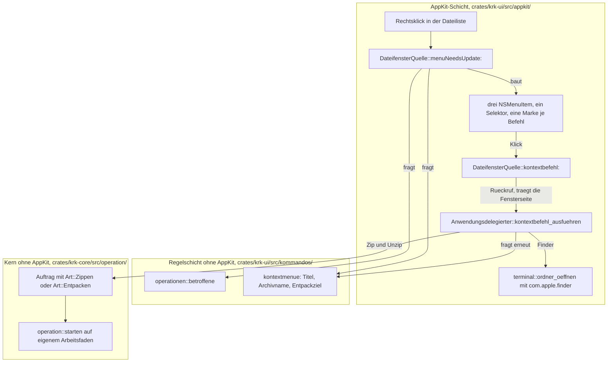
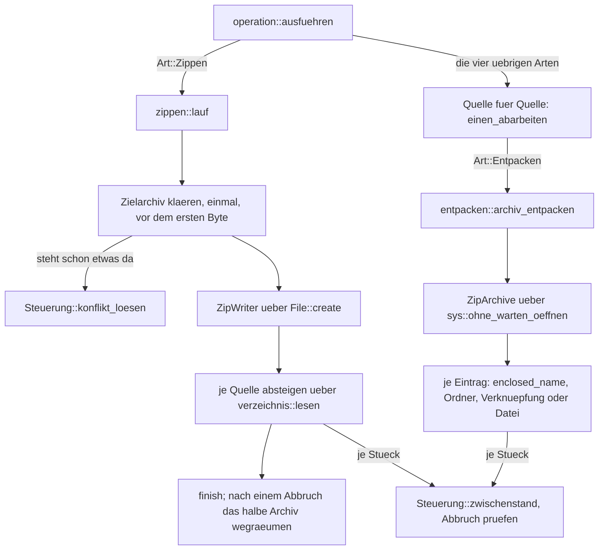
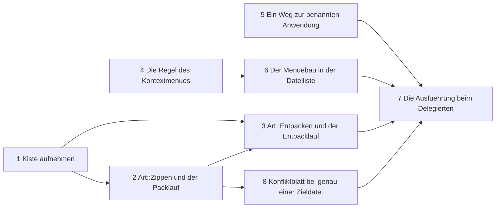

# Implementation Plan: Das Kontextmenü trägt Zip, Unzip und Finder neben dem Teilen

**Date:** 2026-08-25
**Status:** Draft
**Spec:** keiner. Geplant gegen die Directive und den Grounding-Schnappschuss des Circle-Datensatzes `circles/260825-0711-kontextmenue-traegt-zip-unzip-finder/_t_circle.md`.
**Decidability:** Die tragende Frage lautet: **welches Archiv meint der Nutzer, wenn er Unzip wählt, und was packt Zip?** Beides ist aus den Eingaben entscheidbar, die der Mechanismus zum Zeitpunkt des Rechtsklicks hat, nämlich den betroffenen Einträgen aus `operationen::betroffene` und der sichtbaren Zeilenliste des `Ordnermodell`. Kein Dateisystemzugriff, keine Vorhersage. **Der Plan sagt insbesondere nicht voraus, ob eine Datei sich als Archiv öffnen lässt** — diese Frage wäre aus dem Namen nicht entscheidbar. Er bietet den Eintrag unabhängig davon an, versucht das Öffnen im Vorgang und meldet das Scheitern in der Statuszeile. Damit steht an der Stelle, an der die Frage entschieden werden kann, eine Entscheidung, und an der Stelle, an der sie es nicht kann, eine Meldung statt einer Vermutung.

## Directive

Das Kontextmenü der Dateiliste trägt vier Einträge statt einem: neben dem Teilen über die Freigabedienste des Systems stehen Zip, Unzip und Finder. Der Wortlaut steht im Abschnitt `## Directive` des Circle-Datensatzes und wird hier nicht wiederholt.

Sechs Punkte hat der Nutzer bereits entschieden, und dieser Plan verhandelt keinen davon neu: Zip wirkt auf die betroffenen Einträge nach `kommandos::operationen::betroffene`, das Archiv entsteht im angezeigten Ordner, alle drei Befehle sind allein über das Kontextmenü erreichbar, ein Namenskonflikt stellt dieselbe Rückfrage wie das Kopieren, Unzip legt den Inhalt in einen neuen Ordner im angezeigten Ordner, und der Archivname kommt bei mehreren markierten Einträgen vom angezeigten Ordner und bei einem einzelnen von diesem. Dazu zwei unwidersprochene Vorgaben: beide Vorgänge laufen über die bestehende Vorgangsanzeige mit Fortschritt und Abbruch, und wo ein Befehl nichts vorfindet, meldet er es in der Statuszeile.

## Current State

Der Baum trägt an jeder Stelle, an der diese Runde ansetzt, bereits einen Mechanismus. Der Plan baut deshalb wenig Neues und schließt viel an.

**Das Kontextmenü hat genau eine Anschlussstelle.** Es entsteht leer in `crates/krk-ui/src/appkit/tabelle.rs:4420` und wird bei jedem Rechtsklick über `menuNeedsUpdate:` (`tabelle.rs:1051`) neu befüllt. Der Rumpf hat heute drei Zeilen: die Auswahl nachrücken, die betroffenen Einträge holen, `teilen::eintrag_anfuegen` rufen. `eintrag_anfuegen` fügt seinen Eintrag mit `insertItem_atIndex(…, 0)` **vorn** ein und setzt einen Trenner davor, sobald das Menü schon etwas trägt. Wer drei Einträge anhängt, bevor er ihn ruft, bekommt damit von selbst die Form „Teilen, Trenner, Zip, Unzip, Finder".

**Die Zählproben in `teilen.rs` sperren zwei Nadeln und nicht das Anhängen.** `allein_diese_datei_baut_den_freigabewaehler` zählt Dateien mit `NSSharingServicePicker::`, `es_gibt_genau_einen_menuebauer` zählt Fundstellen von `fn eintrag_anfuegen` und `.standardShareMenuItem(`. Drei eigene `NSMenuItem` daneben lassen beide grün, und das ist richtig so: jene Proben halten fest, dass der **Freigabeeintrag** einen Bauer hat, nicht dass ein Menü nur einen Eintrag trägt.

**Die Vorgangsmaschine ist der Bauplan, in den Zip und Unzip sich einfügen.** `krk_core::operation::starten` legt einen Arbeitsfaden an, `Steuerung` meldet über einen Kanal und liest ein `AtomicBool` für den Abbruch, `Auftrag` trägt Quellen, Art, Konfliktregel und Übertragungsart. Die Aufzählung `Art` hat vier Werte und keinen Auffangzweig; der Übersetzer nennt beim Erweitern genau fünf Stellen, die nachzuziehen sind. Vier davon sind gemessen und stehen unter „Was der Übersetzer einfordert" weiter unten.

**Die Konfliktmaschinerie ist vollständig und für den Zip-Fall zu breit.** `Steuerung::konflikt_loesen` (`fortschritt.rs:354`) schickt `Meldung::Konflikt` mit einem Antwortkanal an den Hauptfaden, `Anwendungsdelegierter::konflikt_fragen` (`anwendung.rs:6135`) zeigt das Blatt aus `blaetter/konflikt.rs`, und dessen vier Schaltflächen tragen ihre Tasten über die Felder `Taste` und `Wirkung`. Welche Schaltfläche die Eingabetaste bekommt, rechnet `blaetter::bestaetigungsstelle` aus dem Feld `Taste`; welche die Escape-Taste bekommt, rechnet `blaetter::abbruchstelle` aus dem Feld `Wirkung`. Beide sind reine Funktionen mit einer Tafel als Probe.

**Für die Kürzung des Blattes gibt es schon einen Präzedenzfall im Baum.** Die Löschbestätigung legt die Eingabetaste auf „Abbrechen" (`loeschbestaetigung.rs:111`) und lässt die Escape-Taste über `Blattgriff::abbrechen` und den Abbruchbefehl dorthin fallen; ein `NSButton` trägt genau eine Tastenentsprechung, und dieser Weg ist die Antwort darauf. Möglichkeit 2 des Datensatzes zum Konfliktblatt braucht damit keinen neuen Mechanismus, sondern nur eine zweite Schaltflächenliste.

**Für Finder steht die Hülle fertig da.** `appkit/terminal::ordner_oeffnen(kennung, ordner)` löst eine Bündelkennung über `NSWorkspace::URLForApplicationWithBundleIdentifier:` auf und öffnet den Ordner darin. Ihr eigener Kopf nennt sie „die eine Stelle des Programms, die eine Bündelkennung in einen Anwendungsort auflöst", und `standardprogramm.rs` beschreibt sie von außen als die Antwort darauf, „wie eine **benannte** Anwendung einen Ordner bekommt". Der Finder ist eine benannte Anwendung mit der Kennung `com.apple.finder`. Eine zweite Hülle daneben wäre der Doppelbau, den beide Modulköpfe ausdrücklich vermeiden.

**Für Zip und Unzip gibt es keinen Vorläufer.** Weder `krk-core` noch `krk-ui` führt eine Archivkiste, und `terminal.rs` hält fest, dass dieses Vorhaben bis heute keinen Unterprozess startet.

**Der Rückruf von der Dateiliste zum Anwendungsdelegierten ist ein eingeführtes Muster.** Die Runde 13 hat es für den Abwurf gebaut: `DateifensterQuelle` hält getippte Rückrufe (`Abwurfmelder`, `Vorgangsfrage`), die der Delegierte je Fensterseite setzt und die ihn **schwach** halten (`anwendung.rs:1306-1333`). Die Ausführung liegt beim Delegierten, weil die Operationsmaschine dort hängt.

## Approach

Der Plan folgt einem Grundsatz: **jede der vier neuen Fragen bekommt genau eine Stelle, und keine davon ist neu erfunden, wo der Baum sie schon trägt.**

Die vier Fragen und ihre Stellen:

| Frage | Stelle | Prüfbar ohne AppKit |
|---|---|---|
| Was trägt das Kontextmenü, und worauf wirkt jeder Eintrag? | `crates/krk-ui/src/kommandos/kontextmenue.rs`, neu | ja |
| Wie packt und entpackt KRK? | `crates/krk-core/src/operation/zippen.rs` und `entpacken.rs`, neu | ja |
| Wie kommt ein Klick auf einen Eintrag zur Ausführung? | `menuNeedsUpdate:` in `tabelle.rs`, ein Selektor, ein Rückruf zum Delegierten | nein, AppKit |
| Wie öffnet KRK den Finder? | `appkit/terminal::ordner_oeffnen`, unverändert | nein, AppKit |

**Zip und Unzip werden zwei weitere Werte von `Art` und keine zweite Maschine.** Damit erben sie Fortschritt, Abbruch, Konfliktrückfrage, Abschlussliste und die Zusage L9 (kein Dateisystemzugriff auf dem Hauptfaden), ohne dass eine Zeile davon zweimal dasteht. Der Preis ist eine Verzweigung, die es heute nicht gibt, und sie ist unten unter „Data Structures" ausgeschrieben.

**Für das Packen kommt eine fremde Kiste in den Baum, und zwar `zip` mit `flate2`.** Die Begründung samt Messungen steht unten unter „Die Kiste und der Grund". Der Gegenentwurf, ein Systemwerkzeug über einen Unterprozess, scheitert an drei Zusagen dieser Runde: Fortschritt je Eintrag, Abbruch zwischen zwei Einträgen und eine Fehlermeldung, die nicht über die Standardfehlerausgabe kommt.

**Die drei Einträge sind immer da und immer bedienbar.** Sie werden nicht ausgegraut und nicht weggelassen, wenn sie nichts vorfinden; stattdessen meldet der Befehl es in der Statuszeile. Das ist die Vorgabe der Directive, und es erspart eine zweite Zulässigkeitsmaschine neben `kommandos::zulaessigkeit`, die für das Hauptmenü gebaut ist und für ein Kontextmenü nicht greift.

### Der Weg eines Kontextmenü-Befehls



`KTX` wird zweimal gefragt, beim Bauen und beim Ausführen, und das ist Absicht statt Nachlässigkeit. Der Eintrag steht auch dann da, wenn er nichts vorfindet; die Auskunft, **was** er vorfindet, gehört deshalb in den Augenblick der Ausführung und nicht in den des Bauens. Eine zweite Regel entsteht dabei nicht, weil beide dieselbe Funktion rufen.

### Der Lauf im Kern



**Zip steht als einziges neben der Quelle-für-Quelle-Schleife, und dafür gibt es einen sachlichen Grund.** Vier der fünf Arten haben je Quelle ein eigenes Ziel; Zip hat ein Ziel für den ganzen Lauf, und das Ziel wird einmal geöffnet und einmal geschlossen. Wer die Schleife beibehielte, müsste den Schreiber als Zustand durch `einen_abarbeiten` fädeln, wo vier der fünf Arten ihn nicht ansehen. Die Verzweigung in `ausfuehren` bleibt vollständig und ohne Auffangzweig; ein sechster Wert von `Art` bricht dort den Bau ab.

### Die Kiste und der Grund

Der Bau nimmt die Kiste `zip` und nicht ein Systemwerkzeug. Drei Wege standen zur Wahl.

**Ein Unterprozess auf `ditto(1)` oder `zip(1)` scheidet aus.** Er meldet keinen Fortschritt je Eintrag, sein Abbruch wäre ein Signal an einen fremden Prozess statt ein `AtomicBool` zwischen zwei Einträgen, und seinen Fehler schreibt er auf die Standardfehlerausgabe, die C1 der Runde 1 als Kanal an den Nutzer ausschließt. Er wäre zudem der erste Unterprozess dieses Vorhabens, mit den Fragen, wer ihn abholt und was der Hauptfaden solange tut; `appkit/terminal.rs` führt genau diese drei Gründe schon einmal auf und hat sich deshalb gegen `open -a` entschieden. Fiele die Wahl trotzdem auf ein Systemwerkzeug, bände der offene Datensatz `shared/decisions/260821-1221_*_ruft-xtask-ein-fremdes-werkzeug-ueber-den-suchpfad-*` den Plan; so bleibt er unberührt.

**Ein eigener Zip-Schreiber in `krk-core` scheidet ebenfalls aus.** Ohne Kompression wäre er machbar und lieferte Archive, die kein Nutzer erwartet; mit Kompression brauchte er eine Deflate-Umsetzung, und die steht mit `flate2` bereits im Baum, aber nicht als Archivformat.

**Was `zip` mitbringt, ist gezählt und nicht geschätzt.** Am 260825 auf diesem Gerät erhoben, mit `cargo add` in einem Wegwerf-Workspace, `cargo tree -e normal,build` und dem Vergleich der beiden `Cargo.lock`:

- **Zwei neue Pakete**, `zip 8.6.0` und `typed-path 0.12.3`. Alles Übrige, worauf `zip` aufsetzt, steht bereits in KRKs `Cargo.lock`, und zwar in denselben Fassungen: `flate2 1.1.9`, `miniz_oxide 0.8.9`, `adler2 2.0.1`, `simd-adler32 0.3.10`, `cfg-if 1.0.4`, `memchr 2.8.3`, `indexmap 2.14.0`, `hashbrown 0.17.1` und `equivalent 1.0.2`. Sie kommen über `syntect` und `toml` schon herein. `crc32fast` steigt von 1.5.0 auf 1.5.1, also eine Fehlerbehebungsstufe.
- **Weder `cc` noch ein `-sys`-Paket kommt hinzu.** `cargo tree -e normal,build` über den Prüf-Workspace findet keinen solchen Namen. Die Zusage aus der Technologiewahl hält: die Bauvoraussetzungen ändern sich nicht.
- **Die Merkmalswahl ist die Bedingung der Einbindung und keine Sparsamkeit.** Der Vorgabesatz von `zip` zieht `bzip2`, `zstd` und `lzma` herein, und die beiden ersten bringen C-Code mit. `default-features = false` mit dem einen Merkmal `deflate-flate2` lässt genau das Deflate-Verfahren übrig, das jedes Zip-Werkzeug liest.
- **`flate2` muss unmittelbar danebenstehen, und das ist gemessen.** `zip` schaltet `flate2` **ohne** dessen Vorgabemerkmale ein; allein damit übersetzt `flate2` nicht und meldet „No compression backend selected". Ein Eintrag `flate2` mit seinen Vorgabemerkmalen in derselben Kiste stellt das reine Rust-Verfahren `miniz_oxide` ein, das ohnehin schon im Baum steht. Wer sich auf die Merkmalsvereinigung über den Workspace verließe, bekäme einen Baum, in dem `cargo build --workspace` grün ist und `cargo test -p krk-core` rot.
- **Die Mindestfassung passt.** `zip` verlangt Rust 1.88, `typed-path` 1.65; das Projekt fährt 1.97.1.
- **Die Geschwindigkeit ist auf diesem Gerät gemessen und nicht auf dem Referenzgerät.** Acht Megabyte kaum verdichtbarer Zufallsdaten kosten im Profil `release` 212 ms, also rund 38 MB/s; acht Megabyte gut verdichtbarer Daten kosten 15 ms. `speculation:` Ob das Referenzgerät von 2018 dieselbe Größenordnung hält, ist ungemessen. Keine der zehn Zeitzusagen aus C8 spricht über das Packen, also hängt an der Zahl keine Zusage; sie steht hier, damit die spätere Messrunde einen Ausgangswert hat.

Die Kiste geht in **`krk-core`** und nicht in `krk-ui`. Der Grund ist derselbe, aus dem `regex` dort steht: `krk-ui` hat kein Bibliotheksziel, eine Datei unter `crates/krk-ui/tests/` erreicht also nichts aus jener Kiste, und die Proben über Packen und Entpacken brauchen einen selbstabräumenden Prüfordner, den `crates/krk-core/tests/gemeinsam/mod.rs` bereitstellt.

### Was der Übersetzer einfordert, und was er nicht einfordert

Zwei neue Werte von `Art` halten den Bau an fünf Stellen an. Alle fünf sind am Baumstand `428fbc4` erhoben:

| Stelle | Datei | Was einzutragen ist |
|---|---|---|
| `einen_abarbeiten` | `krk-core/src/operation/mod.rs:176` | der Zweig für `Entpacken`; `Zippen` erreicht ihn nicht |
| `Auftrag::zielordner` | `krk-core/src/operation/auftrag.rs:145` | beide neuen Werte |
| `ueberschrift` | `krk-ui/src/kommandos/operationen.rs:429` | die zwei Wörter der Vorgangsanzeige |
| `schiebt_auffrischung_auf` | `krk-ui/src/auffrischung.rs:331` | beide auf `false` |
| `Vorgang::ordner` | `krk-ui/src/appkit/anwendung.rs:485` | beide ohne zusätzlichen Ordner |

Dazu die Wahl der Auswahl nach dem Abschluss in `vorgang_beenden` (`anwendung.rs:6257`), die ebenfalls vollständig ist.

**Was der Übersetzer nicht hält, ist die eigentliche Falle dieser Runde.** `CLAUDE.md` beschreibt sie für Tastenbefehle: ein Kommando ohne eigenen Zweig im Ausführungspfad übersetzt, besteht jede Probe, steht im Menü und tut nichts. Hier ist die Entsprechung ein `NSMenuItem`, dessen Selektor nirgends ankommt. **Der Plan schließt sie durch Bauweise und nicht durch Sorgfalt:** die drei Einträge tragen **einen** Selektor und unterscheiden sich in der Marke (`NSMenuItem::setTag`), die Marke wird über eine reine Funktion in den Wert `Kontextbefehl` zurückgelesen, und die Ausführung verzweigt über diesen Wert vollständig und ohne Auffangzweig. Ein vierter Wert bricht damit den Bau ab, statt still nichts zu tun.

## Implementation Steps

**Alle Schritte gehen an `coder`.** Der aktive Ausführersatz nennt daneben `ontocoder` und `analyst`; keiner der beiden hat hier etwas zu tun. Die einzigen berührten `.toml`-Dateien sind `Cargo.toml` und `crates/krk-core/Cargo.toml`, also Baumanifeste und damit nach der Zuordnungstabelle Sache von `coder`; `resources/default-keymap.toml` bleibt unberührt, weil kein Befehl dieser Runde eine Tastenkombination bekommt. Ein strategisches Erzeugnis fällt nicht an: die vier Entscheidungen liegen als Datensätze vor, und die Gegenüberstellung der drei Packwege ist in diesem Plan gemessen abgelegt, statt sie in einem zweiten Bericht zu wiederholen.



1. **Die Kiste `zip` aufnehmen und begründen**
   - Executor: `coder`
   - Files: `Cargo.toml`, `crates/krk-core/Cargo.toml`
   - Changes: In `[workspace.dependencies]` zwei Einträge anlegen: `zip = { version = "8.6", default-features = false, features = ["deflate-flate2"] }` und `flate2 = "1"`. Beide bekommen die ausführliche Begründung, die jede fremde Kiste dieses Projekts an dieser Stelle trägt; der Text übernimmt die sechs gemessenen Aussagen aus dem Abschnitt „Die Kiste und der Grund" wörtlich, samt Datum und Gerät, und misst sie nicht neu. In `crates/krk-core/Cargo.toml` beide unter `[dependencies]` mit `workspace = true` eintragen, dazu je einen kurzen Satz, warum sie im Kern und nicht in `krk-ui` stehen. **`flate2` bekommt dabei ausdrücklich den Satz, dass es nicht überflüssig ist**, sondern das Rust-Verfahren einstellt, das `zip` selbst abschaltet; ohne diesen Satz fällt der Eintrag beim nächsten Aufräumen als scheinbar unbenutzt weg.
   - Dependencies: keine
   - Abnahme: `make check` läuft grün, `cargo tree --workspace -e normal,build` nennt weder `cc` noch einen `-sys`-Namen außer `windows-sys`.

2. **`Art::Zippen` und der Packlauf**
   - Executor: `coder`
   - Files: `crates/krk-core/src/operation/auftrag.rs`, `crates/krk-core/src/operation/mod.rs`, `crates/krk-core/src/operation/zippen.rs` (neu), `crates/krk-core/tests/operation.rs`, `crates/krk-ui/src/kommandos/operationen.rs`, `crates/krk-ui/src/auffrischung.rs`, `crates/krk-ui/src/appkit/anwendung.rs`
   - Changes: `Art` bekommt den Wert `Zippen { ziel: PathBuf }`, wobei `ziel` der volle Pfad des Archivs ist und nicht ein Ordner; `Auftrag::zippen(quellen, ziel)` als Erzeuger neben den vier vorhandenen; `zielordner()` liefert für `Zippen` `None`, weil das Ziel eine Datei ist. `ausfuehren` in `mod.rs` verzweigt neu über die Art, vollständig und ohne Auffangzweig: `Zippen` geht an `zippen::lauf`, die übrigen Werte an die bestehende Quelle-für-Quelle-Schleife, die dafür in eine eigene Funktion wandert. Das neue Modul `zippen.rs` trägt den Lauf: Zielarchiv klären (einmal, über `steuerung.konflikt_loesen`, bevor ein Byte geschrieben wird, mit vollständiger Behandlung aller vier `Konfliktantwort`-Werte), `ZipWriter` über `File::create` anlegen, je Quelle über `verzeichnis::lesen` absteigen wie `kopieren::ordner` es tut, je Eintrag `steuerung.eintrag_fertig` und je gelesenem Stück `steuerung.zwischenstand` melden, zwischen zwei Einträgen und innerhalb einer großen Datei den Abbruch prüfen, am Ende `finish()`. **Gelesen wird über `krk_core::verzeichnis::sys::ohne_warten_oeffnen`** und nicht über `File::open`: sonst blockiert das Packen an einer benannten Röhre im Ordner. **Einer Verknüpfung wird nicht gefolgt**, sie wird als Verknüpfung abgelegt (`unix_permissions(0o120777)`, Inhalt ist das Verweisziel); die Begründung steht wörtlich schon in `kopieren.rs`, nämlich dass ein Verweis auf sich selbst den Lauf sonst nicht enden ließe. Nach einem Abbruch oder einem Schreibfehler wird das halbe Archiv weggeräumt, mit derselben Begründung, die `kopieren::datei` für die halbe Kopie ausschreibt. Die vier vom Übersetzer genannten Stellen in `krk-ui` bekommen ihren Eintrag: Überschrift „Packen", kein Auffrischungsaufschub, kein zusätzlicher Ordner, keine Auswahl nach dem Abschluss.
   - Dependencies: Schritt 1
   - Abnahme: Proben in `crates/krk-core/tests/operation.rs` über den Prüfordner aus `tests/gemeinsam/mod.rs`, gefahren über den öffentlichen Weg `operation::starten`.

3. **`Art::Entpacken` und der Entpacklauf**
   - Executor: `coder`
   - Files: `crates/krk-core/src/operation/auftrag.rs`, `crates/krk-core/src/operation/mod.rs`, `crates/krk-core/src/operation/entpacken.rs` (neu), `crates/krk-core/tests/operation.rs`, `crates/krk-ui/src/kommandos/operationen.rs`, `crates/krk-ui/src/auffrischung.rs`, `crates/krk-ui/src/appkit/anwendung.rs`
   - Changes: `Art::Entpacken { ziel: PathBuf }`, wobei `ziel` der neue Ordner ist und `quellen` genau ein Archiv trägt. Anders als Zip läuft Entpacken **innerhalb** der Quelle-für-Quelle-Schleife, weil es je Quelle ein eigenes Ziel hat; `einen_abarbeiten` bekommt seinen Zweig. Das neue Modul `entpacken.rs`: Zielordner klären nach der Antwort auf den Datensatz `260825-0711_*_was-tut-unzip-wenn-der-zielordner-schon-dasteht` (siehe „Open Questions"), Archiv über `sys::ohne_warten_oeffnen` öffnen und an `ZipArchive::new` geben, Zielordner anlegen, je Eintrag prüfen: `enclosed_name()` liefert `None` für einen Eintrag, der aus dem Zielordner herausführte, und der wird übersprungen und in der Abschlussliste genannt; ein Ordnereintrag wird angelegt, eine Verknüpfung als Verknüpfung, eine Datei stückweise geschrieben mit Zwischenstand und Abbruchprüfung. **Nach einem Abbruch bleibt stehen, was schon entpackt ist**, wie bei einer abgebrochenen Kopie; die halbe Datei, an der der Abbruch traf, wird weggeräumt. Ein Archiv, das sich nicht öffnen lässt, wird übersprungen und mit dem Wortlaut der Kiste in der Abschlussliste genannt. Die vier Stellen in `krk-ui` bekommen ihren fünften Eintrag: Überschrift „Entpacken", sonst wie oben.
   - Dependencies: Schritt 1, Schritt 2 (die Verzweigung in `ausfuehren` entsteht dort)
   - Abnahme: Proben in `crates/krk-core/tests/operation.rs`, darunter eine, die ein von Hand gebautes Archiv mit einem Eintrag `../draussen.txt` entpackt und belegt, dass nichts außerhalb des Zielordners entsteht.

4. **Die Regel des Kontextmenüs, ohne AppKit**
   - Executor: `coder`
   - Files: `crates/krk-ui/src/kommandos/kontextmenue.rs` (neu), `crates/krk-ui/src/kommandos/mod.rs`, `crates/krk-ui/src/kommandos/operationen.rs`
   - Changes: Das neue Modul beantwortet genau eine Frage, nämlich was das Kontextmenü der Dateiliste trägt und worauf jeder Eintrag wirkt. Es enthält: die Aufzählung `Kontextbefehl` mit drei Werten, ihrer Tafel `ALLE`, ihrem Titel und der Umrechnung in eine Menümarke und zurück; `ist_zipname(name)` als die **eine** Regel, woran ein Archiv erkannt wird, nach der Antwort auf den Datensatz `260825-0711_*_woran-erkennt-unzip-dass-eine-datei-ein-zip-ist`; `archivname(betroffen, ordner)` nach der Antwort auf den Datensatz `260825-0711_*_wie-heisst-das-archiv-einer-einzelnen-datei-mit-endung`, gebildet über `krk_core::operation::namen_teilen` statt über eine zweite Trennung von Stamm und Endung; `ordnername_zum_archiv(archiv)` als die Umkehrung dazu; und `entpackziel(modell, betroffen, ordner)`, das nach der Antwort auf den Datensatz `260825-0727_*_nimmt-unzip-die-betroffenen-eintraege-oder-allein-die-ausgewaehlte-zeile` entscheidet, welches Archiv gemeint ist. Die Suche nach dem einen Archiv des Ordners läuft über `modell.zeilen()`, also über die **sichtbaren** Zeilen, aus demselben Grund, aus dem `betroffene` nur sichtbare Einträge zählt: eine Markierung oder ein Fund, den der Nutzer beim Klicken nicht vor sich hatte, gehört nicht in den Auftrag. In `operationen.rs` kommen die Sätze der Statuszeile dazu, neben ihre Geschwister am Fuß der Datei: `nichts_zu_packen()` als dritter Eingang von `nichts_betroffen`, dazu je ein Satz für „kein Archiv gefunden", „mehr als ein Archiv" und „der Finder ist nicht erreichbar". Außerdem `erzeugt_genau_ein_ziel(art)` als reine, vollständige Rechnung über `Art`, die Schritt 8 braucht.
   - Dependencies: Schritt 2 (für `Art` in `erzeugt_genau_ein_ziel`)
   - Abnahme: `#[cfg(test)]`-Proben neben dem Code, nach dem Vorbild von `kommandos/rueckschritt.rs`. Darunter eine Tafel über alle drei `Kontextbefehl`-Werte und ein Rundweg Marke → Wert → Marke.

5. **Ein Weg zur benannten Anwendung, für Terminal und Finder**
   - Executor: `coder`
   - Files: `crates/krk-ui/src/appkit/terminal.rs`, `crates/krk-ui/src/appkit/standardprogramm.rs`, `crates/krk-ui/src/kommandos/operationen.rs`, `crates/krk-ui/src/appkit/anwendung.rs`
   - Changes: `terminal::ordner_oeffnen` bleibt unverändert und bekommt einen zweiten Aufrufer. Der Modulkopf wird nachgezogen: er sagt heute „die eine Beruehrung mit dem System, die C11 braucht" und muss sagen, dass er die Frage „wie kommt ein Ordner an eine über ihre Bündelkennung benannte Anwendung" beantwortet und dass zwei Wege sie stellen. `operationen::terminalordner_fehlt` wird zu `operationen::ordner_fehlt` umbenannt; ihr Rumpf ist bereits allgemein, ihre Texte nennen das Terminal nicht, und ein Finder-Aufruf, der eine Funktion mit „terminal" im Namen ruft, wäre genau die Doppelbenennung, die dieses Projekt sonst vermeidet. Die vier Fundstellen des alten Namens ziehen mit, `standardprogramm.rs` und `terminal.rs` eingeschlossen. `kein_terminal(kennung)` bleibt, wie es ist, weil sein Text auf `settings.toml` zeigt; für den Finder kommt der eigene Satz aus Schritt 4 zum Einsatz.
   - Dependencies: Schritt 4 (der Finder-Satz entsteht dort)
   - Abnahme: `make check`; das Verhalten des Terminal-Befehls ändert sich nicht.

6. **Der Menübau in der Dateiliste**
   - Executor: `coder`
   - Files: `crates/krk-ui/src/appkit/tabelle.rs`
   - Changes: `menuNeedsUpdate:` baut nach dem Leeren zuerst die drei eigenen Einträge und ruft **danach** `teilen::eintrag_anfuegen`; die Reihenfolge trägt die Form des Menüs, weil jener Bauer vorn einfügt und seinen Trenner nur setzt, wenn schon etwas dasteht. Jeder der drei Einträge bekommt Titel und Marke aus `kontextmenue::Kontextbefehl`, als Ziel die Quelle selbst und als Handlung **einen** Selektor `kontextbefehl:`. `DateifensterQuelle` bekommt die Methode dazu: sie liest `sender.tag()`, rechnet über `Kontextbefehl::von_marke` zurück und ruft den neuen Rückruf. Der Rückruf ist ein getippter Halter nach dem Vorbild von `Abwurfmelder` und `Vorgangsfrage`, also `pub type Kontextmelder = Box<dyn Fn(Kontextbefehl)>` mit einem Setzer und einer Zelle in `QuelleIvars`. Der Modulkopf bekommt seinen Nachtrag im Abschnitt „Ab welchem macOS die angesprochenen Klassen stehen": `NSMenuItem::initWithTitle:action:keyEquivalent:`, `setTarget:`, `setAction:` und `setTag:` sind zu belegen.
   - Dependencies: Schritt 4
   - Abnahme: `make check`. Dass die vier Einträge in dieser Reihenfolge erscheinen, sieht der Nutzer am gebauten Bündel; eine Probe, die ein `NSMenu` baute, verlangte den Hauptfaden, den `libtest` nicht hergibt.

7. **Die Ausführung beim Anwendungsdelegierten**
   - Executor: `coder`
   - Files: `crates/krk-ui/src/appkit/anwendung.rs`
   - Changes: Beim Aufbau der Oberfläche wird je Fensterseite ein `Kontextmelder` gesetzt, der den Delegierten **schwach** hält und die Seite mitführt, genau wie die sechs Rückrufe daneben. `kontextbefehl_ausfuehren(seite, befehl)` verzweigt vollständig und ohne Auffangzweig über `Kontextbefehl`. Der Zip-Zweig fragt `vorgang_laeuft_schon(seite)` und wird damit der vierte Weg, der den meldenden Mantel nimmt; er holt die betroffenen Einträge, meldet bei leerer Menge `nichts_zu_packen()`, bildet über `kontextmenue::archivname` den Zielpfad im angezeigten Ordner und ruft `auftrag_starten` mit `Auftrag::zippen`. Der Unzip-Zweig fragt dieselbe Frage, ruft `kontextmenue::entpackziel`, meldet die beiden Fehlbefunde in der Statuszeile und startet sonst `Auftrag::entpacken`. Der Finder-Zweig prüft über `operationen::ordner_fehlt`, ruft `terminal::ordner_oeffnen("com.apple.finder", &ordner)` und meldet die Antwort. Der Doc-Kommentar von `vorgang_laeuft` sagt heute „Vier Wege fragen, und sie teilen sich in drei und einen"; er wird auf fünf und vier zu einem gestellt. Ebenso zählt der Kopf von `auftrag_starten` seine Rufer und bekommt den fünften.
   - Dependencies: Schritte 3, 5, 6, 8
   - Abnahme: `make check`; das Verhalten am Bündel gehört in den Abnahmelauf des Nutzers.

8. **Das Konfliktblatt bei genau einer Zieldatei**
   - Executor: `coder`
   - Files: `crates/krk-ui/src/appkit/blaetter/konflikt.rs`, `crates/krk-ui/src/appkit/anwendung.rs`
   - Changes: Nach der Antwort auf den Datensatz `260825-0711_*_welche-antworten-bietet-das-konfliktblatt-bei-genau-einer-zieldatei`. Fällt sie auf Möglichkeit 2, bekommt `konflikt::zeigen` einen weiteren Übergabewert, nämlich ob der Vorgang genau eine Zieldatei erzeugt; die Antwort darauf liefert `operationen::erzeugt_genau_ein_ziel(art)` aus Schritt 4, gefragt in `konflikt_fragen`. Bei genau einer Zieldatei baut das Blatt drei Schaltflächen — Überschreiben auf `Taste::EingabeMitBefehl`, Umbenennen auf `Taste::EingabeMitWahl`, Abbrechen auf `Taste::Eingabe` mit `Wirkung::Liegenlassen` — und zeigt das Ankreuzfeld „für alle weiteren" nicht. Ein neuer Mechanismus entsteht dabei nicht: `bestaetigungsstelle` und `abbruchstelle` rechnen beide auf „Abbrechen", die Escape-Taste erreicht es über `Blattgriff::abbrechen` und den Abbruchbefehl, und die Löschbestätigung fährt dieselbe Form seit der Runde 12. Die Erläuterung des Blattes wird für diesen Fall umgeschrieben, weil sie heute „Return überspringt" sagt. Die Rückrechnung von der Schaltflächenstelle auf `Konfliktantwort` bekommt eine zweite Tafel, und beide Tafeln bekommen je eine Probe.
   - Dependencies: Schritte 2 und 4
   - Abnahme: `make check`, dazu eine Probe über die Tafel „Stelle → Antwort" in beiden Gestalten.

## Where this Circle stops

Die Runde ist fertig, wenn jede der folgenden Bedingungen mit Ja beantwortet ist.

- Das Kontextmenü der Dateiliste zeigt bei einem Rechtsklick vier Einträge: Teilen, dann Zip, Unzip und Finder.
- Zip auf einem einzelnen Eintrag erzeugt im angezeigten Ordner ein Archiv, das ein anderes Zip-Werkzeug öffnen kann, und Zip auf mehreren markierten Einträgen erzeugt eines mit dem Namen des angezeigten Ordners.
- Unzip auf einem im Ordner liegenden Archiv erzeugt im angezeigten Ordner einen Ordner mit dem entpackten Inhalt.
- Ein Zip über einen Ordnerbaum, der lange genug läuft, zeigt in der Statuszeile den Fortschritt, und `Esc` bricht ihn ab; das halbe Archiv bleibt danach nicht liegen.
- Ein Zip auf einen belegten Archivnamen stellt die Rückfrage in der Gestalt, die der Nutzer im Datensatz zum Konfliktblatt gewählt hat.
- Jeder der drei Befehle meldet in der Statuszeile, wenn er nichts vorfindet, und keiner tut wortlos nichts.
- Finder öffnet den angezeigten Ordner im Finder.
- `make check` läuft über den ganzen Workspace grün.
- `cargo tree --workspace -e normal,build` nennt weder `cc` noch einen `-sys`-Namen außer `windows-sys`.
- Die vier offenen Entscheidungen dieses Circles tragen eine Antwort in ihrer Zeile `Answered:`, und der fünfte Datensatz `260825-0727` ebenfalls.

**Zwei Bedingungen kann kein Agent prüfen, und beide sind Nutzerarbeit.** Die ersten sieben verlangen KRK im Vordergrund; aus dem Hintergrund gestartet weist die Wirkungsbereichs-Prüfung fokusgebundene Befehle ab. Kein Planschritt weist diesen Lauf einem Agenten zu.

**Diese Runde setzt keine elfte Zeitzusage und misst keine der zehn.** Der letzte vollständige Abnahmelauf bleibt `messungen/260810-1918-alle-zusagen.txt`. Ein Tag vor dieser Runde ist keine Vorbedingung; wer einen setzt, tut es nach dem Weg aus `README.md` und nicht als Teil dieses Plans.

## Data Structures

**`krk_core::operation::Art` wächst von vier auf sechs Werte:**

```rust
/// Die betroffenen Einträge in ein Archiv packen.
Zippen {
    /// Der volle Pfad des Archivs, nicht sein Ordner. Ein Lauf erzeugt
    /// genau eine Zieldatei, und sie steht damit hier vollständig da.
    ziel: PathBuf,
},
/// Ein Archiv in den genannten, neuen Ordner entpacken.
Entpacken {
    /// Der Zielordner. Er entsteht mit dem Lauf.
    ziel: PathBuf,
},
```

`zielordner()` liefert für beide `None`: bei `Zippen`, weil das Ziel eine Datei ist und keine Ablage für weitere Einträge; bei `Entpacken`, weil der Ordner mit dem Lauf entsteht und nicht schon dasteht wie der Zielordner einer Kopie. Beide Antworten gehören in den Doc-Kommentar, weil `None` sonst wie ein vergessener Fall aussieht.

**`krk_ui::kommandos::kontextmenue::Kontextbefehl`, drei Werte, ohne Auffangzweig:**

```rust
pub enum Kontextbefehl { Zippen, Entpacken, ImFinderZeigen }
```

Der Freigabeeintrag steht **nicht** darin, und das ist der Zuschnitt und keine Auslassung: er kommt als `standardShareMenuItem` vom System, trägt dessen Ziel und dessen Handlung, und KRK führt ihn nicht aus. Die Aufzählung beschreibt, was KRK selbst ausführt.

**Der Befund von Unzip als eigene Aufzählung**, damit der Aufrufer nicht aus einem `Option<PathBuf>` raten muss, welcher der beiden Fehlbefunde vorlag:

```rust
pub enum Entpackbefund {
    /// Genau ein Archiv, hier ist es.
    Archiv(PathBuf),
    /// Weder unter den betroffenen Einträgen noch im Ordner steht eines.
    Keines,
    /// Der Ordner trägt mehr als eines, und die Auswahl zeigt auf keines.
    Mehrere,
}
```

## API Changes

Neu und öffentlich in `krk-core`:

- `operation::Auftrag::zippen(quellen: Vec<PathBuf>, ziel: impl Into<PathBuf>) -> Auftrag`
- `operation::Auftrag::entpacken(archiv: impl Into<PathBuf>, ziel: impl Into<PathBuf>) -> Auftrag`
- zwei weitere Werte von `operation::Art`

Neu in `krk-ui`:

- das Modul `kommandos::kontextmenue` mit `Kontextbefehl`, `Entpackbefund`, `ist_zipname`, `archivname`, `ordnername_zum_archiv`, `entpackziel`
- `kommandos::operationen::nichts_zu_packen`, `kein_archiv`, `mehrere_archive`, `kein_finder` und `erzeugt_genau_ein_ziel`
- `appkit::tabelle::Kontextmelder` samt Setzer an `DateifensterQuelle`
- der Selektor `kontextbefehl:` an `DateifensterQuelle`

Umbenannt:

- `kommandos::operationen::terminalordner_fehlt` → `ordner_fehlt`, mit vier mitziehenden Fundstellen

Unverändert und wiederverwendet: `operationen::betroffene`, `operationen::rechtsklick_zielzeile`, `teilen::eintrag_anfuegen`, `terminal::ordner_oeffnen`, `operation::starten`, `Steuerung::konflikt_loesen`, `verzeichnis::lesen`, `verzeichnis::sys::ohne_warten_oeffnen`, `operation::namen_teilen`, `operation::freier_name`, `blaetter::bestaetigungsstelle`, `blaetter::abbruchstelle`, `Blattgriff::abbrechen`.

## Testing Strategy

**Der Kern trägt die Last, weil er ohne Fenster prüfbar ist.** In `crates/krk-core/tests/operation.rs`, über den Prüfordner aus `tests/gemeinsam/mod.rs` und den öffentlichen Weg `operation::starten`:

- ein Rundweg: einen Ordnerbaum packen, das Archiv entpacken, Namen, Inhalte und Verknüpfungen gegen das Original halten
- eine Verknüpfung wird als Verknüpfung abgelegt und nicht als ihr Ziel; eine Verknüpfung, die auf ihren eigenen Ordner zeigt, lässt den Lauf enden
- ein belegter Archivname löst die Konfliktfrage aus, und zwar **einmal** und **vor** dem ersten geschriebenen Byte
- ein Abbruch während des Packens hinterlässt kein halbes Archiv
- ein Abbruch während des Entpackens hinterlässt, was schon entpackt ist, und keine halbe Datei
- ein von Hand gebautes Archiv mit einem Eintrag `../draussen.txt` erzeugt nichts außerhalb des Zielordners und nennt den Eintrag in der Abschlussliste
- eine Datei, die auf `.zip` endet und keine ist, wird übersprungen und mit Grund genannt

**Die Regeln in `krk-ui` prüfen sich neben ihrem Code**, weil jene Kiste kein Bibliotheksziel hat:

- eine Tafel über alle drei `Kontextbefehl`-Werte, von Hand geschrieben und nicht aus der Rechnung abgeleitet, nach dem Vorbild von `teilen::TAFEL`
- der Rundweg Marke → Wert → Marke über `Kontextbefehl::ALLE`
- `archivname` über die vier Lagen: ein Ordner, eine Datei mit Endung, eine Datei ohne Endung, mehrere markierte Einträge
- `entpackziel` über die Lagen aus dem Datensatz `260825-0727`, darunter der Ordner mit zwei Archiven
- `erzeugt_genau_ein_ziel` als Tafel über alle sechs Werte von `Art`
- die Tafel „Stelle → `Konfliktantwort`" in beiden Gestalten des Blattes

**Was keine Probe abnimmt**, und es gehört genannt: dass das Menü die vier Einträge in dieser Reihenfolge zeigt, dass der Klick ankommt und dass der Finder aufgeht. Eine Probe, die ein `NSMenu` baute oder `NSWorkspace` riefe, verlangte den Hauptfaden, den `libtest` nicht hergibt, oder öffnete bei jedem `make check` ein Fenster, das niemand bestellt hat. Beides ist im Baum schon einmal entschieden, für `standardprogramm::oeffnen` und für `teilen::anbieten`. Der Nutzer sieht es am gebauten Bündel.

## Risks & Mitigations

| Risiko | Gegenmaßnahme |
|---|---|
| Ein Menüeintrag steht da und tut nichts, und keine Probe merkt es. | Ein Selektor für alle drei Einträge, die Unterscheidung über die Marke, und die Ausführung verzweigt vollständig über `Kontextbefehl`. Ein vierter Wert bricht den Bau ab. |
| Das Packen blockiert an einer benannten Röhre im Ordner. | Gelesen wird über `sys::ohne_warten_oeffnen`, also mit `O_NONBLOCK` und der Typprüfung am offenen Deskriptor. |
| Ein Archiv aus fremder Quelle schreibt beim Entpacken außerhalb des Zielordners. | `ZipFile::enclosed_name()` liefert für einen solchen Eintrag `None`; der Eintrag wird übersprungen und in der Abschlussliste genannt. Eine Probe belegt es. |
| `flate2` sieht wie ein unbenutzter Eintrag aus und fällt beim nächsten Aufräumen weg; danach übersetzt `cargo test -p krk-core` nicht mehr. | Der Begründungstext in der Wurzel-`Cargo.toml` sagt ausdrücklich, dass `zip` das Verfahren abschaltet und dieser Eintrag es wieder einstellt, mit dem Wortlaut der Fehlermeldung. |
| Das Packen bricht die Zusage L9, weil es auf dem Hauptfaden liefe. | Es läuft nicht auf dem Hauptfaden: `operation::starten` legt für jede Art einen Arbeitsfaden an, und Zip ist eine Art wie jede andere. |
| Eine große Datei lässt sich nicht abbrechen, weil der Abbruch erst zwischen zwei Einträgen geprüft wird. | Die Prüfung steht in der Stückschleife innerhalb einer Datei und nicht nur zwischen zwei Einträgen, wie `kopieren::datei` es über seinen Melde-Rückruf tut. |
| Der Archivname und der Ordnername beim Entpacken laufen auseinander, sodass ein Rundweg nicht zum Ausgangsnamen zurückführt. | Beide Rechnungen stehen in einem Modul nebeneinander, beide über `namen_teilen`, und eine Probe fährt den Rundweg über die vier Namensgestalten. Der Zusammenhang hängt an der Antwort auf den Namens-Datensatz; siehe „Open Questions". |
| Das Umbenennen von `terminalordner_fehlt` bricht den Terminal-Befehl. | Der Rumpf bleibt Zeile für Zeile derselbe, und `make check` deckt die vier Fundstellen ab, weil ein übersehener Name nicht übersetzt. |

## Open Questions

Vier Datensätze liegen offen in `circles/260825-0711-kontextmenue-traegt-zip-unzip-finder/decisions/` und binden diesen Plan. Zu jedem steht hier, ob der Plan der Empfehlung folgt und an welchem Schritt die Antwort gebraucht wird. **Entschieden werden sie vom Nutzer am Abnahmegate, nicht von diesem Plan.**

- [ ] `260825-0711_*_woran-erkennt-unzip-dass-eine-datei-ein-zip-ist` — **Der Plan folgt der Empfehlung (Möglichkeit 1, die Endung ohne Rücksicht auf die Schreibung).** Gebraucht in **Schritt 4**, wo `ist_zipname` entsteht. Die Antwort ist dort örtlich: sie ändert den Rumpf einer Funktion und sonst nichts. Der Zusatz, den die Empfehlung offenlässt, ist im Plan schon abgedeckt: eine falsch benannte Datei scheitert beim Öffnen im Vorgang und wird mit Grund in der Abschlussliste genannt, statt still nichts zu tun. Möglichkeit 3 wäre danach ein Nachtrag an derselben Stelle.

- [ ] `260825-0711_*_wie-heisst-das-archiv-einer-einzelnen-datei-mit-endung` — **Der Plan folgt der Empfehlung (Möglichkeit 1, Endung anhängen).** Gebraucht in **Schritt 4**, wo `archivname` und `ordnername_zum_archiv` entstehen. **Eine Folge nennt der Datensatz nicht, und sie ist tragend:** allein Möglichkeit 1 macht das Paar umkehrbar. Aus `bericht.txt` wird `bericht.txt.zip` und daraus wieder der Ordner `bericht.txt`; unter Möglichkeit 2 wird aus `bericht.txt` das Archiv `bericht.zip` und daraus der Ordner `bericht`, und der Ursprungsname ist verloren. Da beide Befehle im selben Menü stehen, sieht der Nutzer den Verlust unmittelbar.

- [ ] `260825-0711_*_welche-antworten-bietet-das-konfliktblatt-bei-genau-einer-zieldatei` — **Der Plan folgt der Empfehlung (Möglichkeit 2, drei Antworten, Eingabetaste auf Abbrechen).** Gebraucht in **Schritt 8**. Zwei Prüfungen sind gefahren und stützen sie: die Form ist im Baum schon einmal gebaut, nämlich in der Löschbestätigung, die die Eingabetaste auf „Abbrechen" legt und die Escape-Taste über `Blattgriff::abbrechen` erreicht; und die Fallunterscheidung hängt an keiner neuen Angabe, weil `Art` selbst sagt, ob ein Lauf genau eine Zieldatei erzeugt. Der im Contra genannte Preis, „eine zweite Gestalt, die eine eigene Probe braucht", bleibt und ist als Probe in der Prüfstrategie eingeplant.

- [ ] `260825-0711_*_was-tut-unzip-wenn-der-zielordner-schon-dasteht` — **Der Plan folgt der Empfehlung (Möglichkeit 1, danebenlegen ohne Rückfrage), mit einem Vorbehalt.** Gebraucht in **Schritt 3**, im Kopf von `entpacken`. Die Antwort ist dort örtlich: sie ändert die Klärung des Zielordners und keine weitere Zeile. **Der Vorbehalt betrifft den Namen des zweiten Ordners.** Der Datensatz schreibt „`Projekte 2`", und dieses Vorhaben hat für „einen freien Namen daneben" bereits eine Regel, nämlich `operation::freier_name`; die liefert „Projekte Kopie" und „Projekte Kopie 2". Wer `Projekte 2` will, bekommt eine zweite Regel für freie Namen in den Baum. Der Plan schlägt vor, `freier_name` zu nehmen und den Datensatz bei der Beantwortung entsprechend zu lesen.

Dazu ein fünfter Datensatz, den dieser Plan selbst angelegt hat:

- [ ] `260825-0727_*_nimmt-unzip-die-betroffenen-eintraege-oder-allein-die-ausgewaehlte-zeile` — die Directive beschreibt Unzips Wirkungsbereich anders als Zips, und bei stehender Markierung fallen die beiden auseinander. Gebraucht in **Schritt 4**, in `entpackziel`. Empfohlen ist Möglichkeit 1, also dieselbe Regel `betroffene` wie bei Zip, mit einer Meldung, wenn mehr als ein Eintrag betroffen ist.

Zwei Fragen bleiben planintern und brauchen keinen eigenen Datensatz, weil sie nichts über diesen Plan hinaus binden:

- [ ] **Steht die Auswahl nach einem Zip auf dem neuen Archiv und nach einem Unzip auf dem neuen Ordner?** Der Plan lässt sie in Schritt 2 und 3 unangetastet, weil die Directive es nicht verlangt. Jeder andere Weg im Baum, der etwas anlegt, setzt die Auswahl darauf (`anlegen`, das Stapel-Umbenennen), und der Name des Ergebnisses steht im Auftrag. Wer es will, sagt es beim Gate; es kostet zwei Zeilen in `vorgang_beenden`.
- [ ] **Bekommt `appkit/terminal.rs` einen Namen, der zu seinen zwei Aufrufern passt?** Der Plan benennt die Datei **nicht** um, obwohl ihr Name nach Schritt 5 zu eng ist. Grund: `CLAUDE.md` nennt sie beim Pfad, und `CLAUDE.md` gehört dem `curator` und nicht dem `coder`; eine Umbenennung im Code hinterließe dort einen toten Zeiger. Ein späterer Aufräumlauf kann beides zusammen machen.

Ein Defekt ist beim Erkunden aufgefallen und liegt als `shared/issues/260825-0727_*_claude-md-nennt-zwei-aufrufer-von-ohne-warten-oeffnen-der-baum-traegt-drei.md`. Er hält den Plan nicht auf und wird durch Schritt 2 größer, weil das Packen einen vierten Aufrufer hinzufügt.
