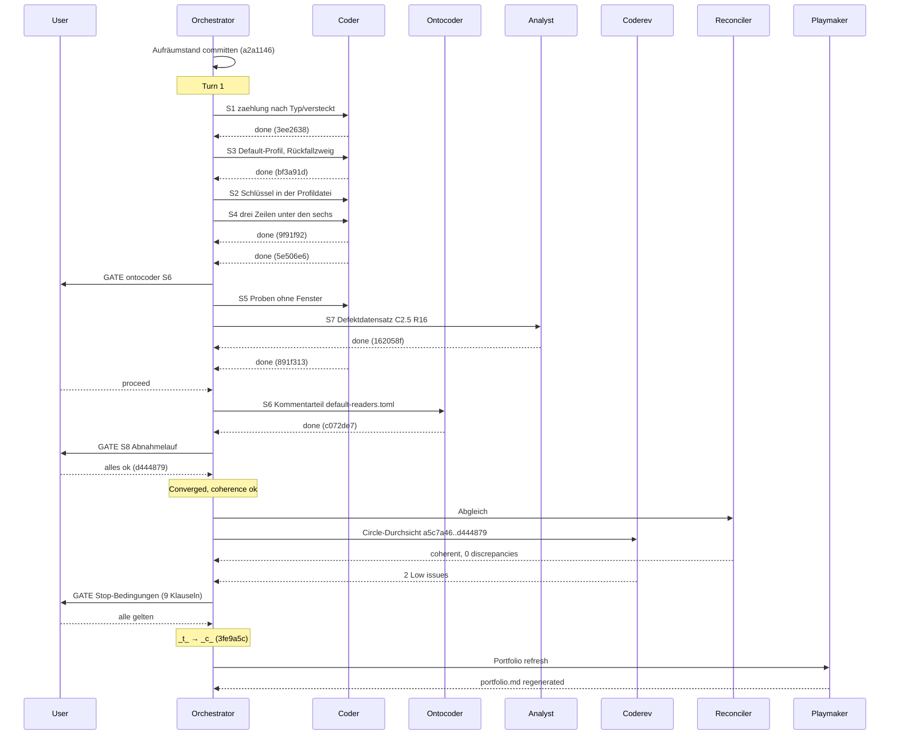

# Orchestrator Session — 260827-1635

**Directive:** die uncommitteten Dateien des vorigen Aufräumlaufs committen, dann die Runde 19 fahren (Plan `planning/260827-1322_o_plan-vorschau-zaehlt-ordnerinhalt-im-default-profil.md`)
**Mode:** plan
**Status:** Complete — Runde 19 kohärent geschlossen (`_c_`)
**Circle:** 260827-0310-vorschau-zaehlt-ordnerinhalt-im-default-profil (aktiv, Claim auf Checkout 6c11b1f2)

## Snapshot bei Sitzungsbeginn

- HEAD: a5c7a46
- Turn-Budget: 12 (`bin/fusion-turn-budget`, keine Diagnosen)
- Domain: code — code_files=161, data_files=12, counted_by=git-ls-files
- Circles: 12 b, 5 c, 2 d, 1 t, 0 a — kein /fusion:next-Hinweis, da keine vorgesehenen Circles
- Offene Defekte: Circle 0, shared 203
- Offene Entscheidungen: 42 über alle Speicher, 1 im Circle
- Arbeitsbaum: 20 uncommittete Pfade aus dem Aufräumlauf 260827-1534 (Archiv, Abgleich, Spec/Plan/Sitzungsdatei, activity-log)
- Sitzungsmarker: none → geschrieben; keine fremden Checkouts (7 Tage)
- Stilprofile: alle case1-equal; Setup-Marker unverändert (10.19.0)

## Budget

| Metric | Count |
|--------|-------|
| Turns | 1 |
| Tasks resolved | 8 |
| Tasks skipped/deferred | 0 |
| Issues created (by reviewers) | 3 (`records anchor=a5c7a46 start=260827-1635`: `filed issue` 3 — 1 planmäßig S7, 2 aus der Durchsicht) |
| Issues resolved | 0 |
| Decisions answered (`_o_`→`_a_`) | 0 |
| Decisions implemented (`_a_`→`_i_`) | 2 |
| Commits | 11 (`git rev-list a5c7a46..HEAD`, einschließlich Abschluss und Haushalt) |
| Agent errors | 0 |
| Human gates hit | 3 (S6 Ontocoder, S8 Abnahmelauf, Stop-Bedingungen) |

## Per-Turn Log

### Turn 1
- Tasks attempted: S1, S3, S2, S4, S7, S5, S6, S8
- Tasks completed: alle acht
- Commits: 3ee2638, bf3a91d, 9f91f92, 5e506e6, 162058f, 891f313, c072de7, d444879
- Review findings: 2 Low (Circle-Durchsicht am Abschluss)
- Circuit breaker status: OK
- Coherence: ok

## Coherence
<!-- RECONCILER-OWNED -->

**Verdict:** coherent

**Edges:**
- Artifact↔Grounding: 8 claims verified / 0 drift items / 0 open coderev+ontorev issues — alle acht Planschritte gegen den Baum belegt (`planning/260827-1322_c_plan-…md`, Reconciliation Log 260827-1907), `make check` grün mit 1660 Proben; der eine offene Defekt des Circles (`issues/260827-1710_o_…`) ist ein Befund über den Spec der Runde 16, vom Plan als offen vorgesehen und kein Drift.
- Artifact↔Directive: commits move toward the stated Directive — `a2a1146` committet den Aufräumstand (erster Satz der Directive); `3ee2638`, `bf3a91d`, `9f91f92`, `5e506e6`, `891f313`, `c072de7` bauen die Schritte 1 bis 6 des Plans 260827-1322, `162058f` bucht Schritt 7, `d444879` hält den Nutzerlauf aus Schritt 8 fest; kein Commit außerhalb des Plans.
- Grounding↔Directive: 3 active decisions consistent / 0 potentially conflicting — im Circle die zwei umgesetzten (`260827-0311_i_…zaehlung-nach-typ-und-versteckt`, `260827-0311_i_…ueber-der-eintragsschranke`) und die offene zum Messmodus (`260827-1322_o_…`, der Bau folgt ihrer Möglichkeit 1 ohne Ausnahme, wie der Plan es vorsieht); unter `shared/decisions/` berühren `260815-1749_o_` (Ordner ohne Leserecht), `260826-1225_o_` (Schreibweise) und `260819-2216_a_` (Abnahmelauf gegen L7) die Runde, und der Plan legt seine Arbeit in jedem Fall innerhalb der offenen Frage ab (`## Open Questions`), keine steht gegen die Directive.

**Rebalance recommendation:** none

## Review coverage

**Range:** `a5c7a46..3fe9a5c` — 10 commits (plus der Haushalts-Commit nach diesem Bericht)
**Covered by:** `reviews/260827-1911-coderev-durchsicht-runde-19-default-profil-zaehlzeilen.md`, `**Reviewed-range:** a5c7a46..d444879`, covers=9, not-opened=none
**Not covered:** `3fe9a5c chore(workbench): die Runde 19 schliesst kohaerent` — reiner Workbench-Commit, dazu der Haushalts-Commit dieses Berichts
**Carried out-of-scope files:** none

## Remaining Work

- `issues/260827-1911_o_drei-saetze-im-kommentarteil-der-auslieferungsfassung-…` (Low, Ontocoder) — Folgerunde
- `issues/260827-1911_o_erkennung-rs-sagt-none-heisse-die-heutige-metadatenanzeige-…` (Low, Coder) — Folgerunde
- `issues/260827-1710_o_c2-5-der-runde-16-…` — offen, Schließung gehört dem Nutzer nach dem Abnahmelauf der Runde 16
- `decisions/260827-1322_o_faellt-das-default-profil-auch-im-messmodus-an-…` — offene Nutzerfrage, keine Vorbedingung

## Commits

| Hash | Message | Task |
|------|---------|------|
| a2a1146 | chore(workbench): der Aufraeumlauf 260827-1534 und der Abgleich der Runde 19 | housekeeping |
| 3ee2638 | feat(leseprofil): zaehlung trennt nach Typ und beziffert die versteckten | S1 |
| bf3a91d | feat(leseprofil): das eingebaute Default-Profil und der Rueckfallzweig | S3 |
| 9f91f92 | feat(leseprofil): die zwei Schluessel typ und versteckt in der Profildatei | S2 |
| 5e506e6 | feat(vorschau): die drei Zaehlzeilen treten unter die sechs Metadatenangaben | S4 |
| 162058f | docs(workbench): die Beruehrung von C2.5 der Runde 16 ist als Defekt gebucht | S7 |
| 891f313 | test(leseprofil): die Proben, die die Zusagen der Runde 19 ohne Fenster halten | S5 |
| c072de7 | docs(leseprofil): der Kommentarteil nennt typ, versteckt und das Default-Profil | S6 |
| d444879 | docs(workbench): der Abnahmelauf der Runde 19 ist gefahren | S8 |
| 3fe9a5c | chore(workbench): die Runde 19 schliesst kohaerent | closure |

## Portfolio update

Playmaker-Lauf `shared/history/260827-1927-playmaker-orchestrator-phase4.md`; `portfolio.md` neu erzeugt. Kein vorgesehener, kein aktiver Circle; keine Bounded-Closure-Propagation. Backlog-Eintrag `shared/backlog/260827-1925_p_vorschau-rendert-pdf-und-bilder.md` gerankt (auf `_p_`); Empfehlung: `/fusion:direct` darauf, verengt auf PDF (Bilder zeigt die Vorschau seit Runde 1).

## Session Flow

