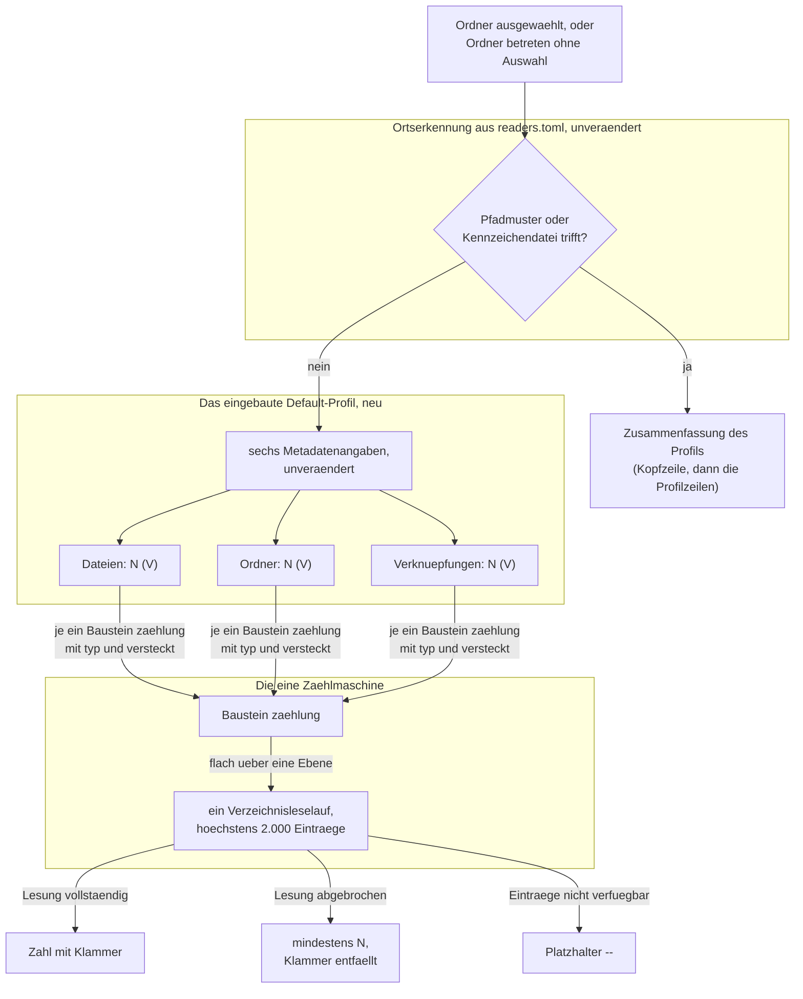

# Spec: Die Vorschau zählt den Inhalt eines Ordners in einem eingebauten Default-Profil

**Date:** 2026-08-27
**Status:** Complete — vom Nutzer am 260827 freigegeben (A1 bis A7 ohne Einspruch, `gate_response` 2026-08-27T11:12:58), gebaut in `3ee2638..c072de7` und vom Nutzer am 260827 abgenommen (`d444879`); Abgleich `history/260827-1907-reconciliation.md`
**Activated from Circle:** 260827-0310-vorschau-zaehlt-ordnerinhalt-im-default-profil
**Source:** Die Directive des Circle-Datensatzes `_t_circle.md`, vom Nutzer am 260827 festgelegt und in dieser Runde nicht mehr verhandelbar, dazu die vier Festlegungen desselben Tages und die zwei Entscheidungsdatensätze vom 260827-0629.

---

## Directive

Die Vorschau beschreibt einen Ordner, den kein Leseprofil aus `readers.toml` erkennt, nicht mehr allein mit seinen sechs Metadatenangaben. Unter ihnen stehen drei Zählzeilen: die Zahl der Dateien, die der Ordner und die der Verknüpfungen darin, jede mit der Zahl der versteckten in Klammern. Geliefert werden sie von einem Default-Leseprofil, das in KRK eingebaut ist und in keiner Ablagedatei steht; der Nutzer kann es weder anpassen noch abschalten. Gezählt wird immer der ganze Ordner, gleich wie der Schalter für die versteckten Einträge steht.

Diese Runde setzt keine elfte Zeitzusage und fasst keine der zehn aus C8 der Runde 1 an.

---

## Verhältnis zu den zehn Zeitzusagen aus C8 der Runde 1

**Die drei Zählzeilen fallen in die Endbedingung von L7, und diese Runde bringt keine Messstrecke mit, die sie prüfen könnte.** L7 sagt für einen ausgewählten Eintrag 100 ms zu: „Vorschau einer Textdatei bis 1 MB sichtbar, sonst die Metadaten" (Spec der Runde 1, `circles/260802-0842-krk-mac-dateimanager-editor-git/planning/260802-1036_*_spec-navigator-geruest.md`, Abschnitt C8). Die Metadatenanzeige eines Ordners liegt in diesem „sonst". Drei Zeilen, die einen Verzeichnisleselauf kosten, arbeiten damit innerhalb einer bestehenden Zusage und nicht daneben.

**Was das für diese Runde heißt, steht in drei Sätzen, und keiner davon ist ein Vorbehalt für später.**

Erstens: eine eigene Zahl entsteht nicht. Eine Zeitzusage ist nur dann eine Zusage, wenn sie abgenommen wird, und der Abnahmelauf verlangt KRK im Vordergrund. Er ist damit Nutzerarbeit, die kein Agent leisten kann (`circles/260802-0842-krk-mac-dateimanager-editor-git/decisions/260806-1303_*_wie-kommt-krk-fuer-den-abnahmelauf-in-den-vordergrund.md`, offen). Eine elfte Zahl wäre in dieser Runde behauptet und nicht geprüft.

Zweitens: an die Stelle einer Zeitmessung treten abzählbare Grenzen. Sie stehen in C4 und zählen Verzeichnisleseläufe, Dateiöffnungen und offene Deskriptoren. Diese Form stammt aus der Runde 2 und ist von der Runde 16 für dieselbe Fläche schon einmal gefahren worden.

Drittens: L7 kommt auf die Gegenstände der späteren Messrunde zurück, und diese Runde nimmt es nicht herunter. Es steht seit dem 260819-2242 ohnehin dort (`shared/decisions/260819-2216_*_schuldet-diese-runde-einen-abnahmelauf-gegen-die-zusage-l7.md`), und die Runde 16 hat Arbeit in seine Endbedingung nachgelegt, ohne sie zu messen. Diese Runde legt weitere nach und schuldet denselben Lauf.

**Die Arbeit der Vorschau ist gegen L7 bis heute überhaupt ungemessen, und der Datensatz dazu bindet auch diese Runde.** `circles/260823-2208-vorschau-zeigt-profil-zusammenfassung-statt-metadaten/decisions/260824-1900_*_wie-wird-die-arbeit-dieser-runde-jemals-gegen-l7-gemessen-die-messstrecke-sieht-sie-nicht.md` ist offen: die Messstrecke sieht die Vorschau nicht. Daneben liegt der offene Defekt `shared/issues/260825-1922_*_eine-auffrischung-stoesst-die-vorschau-mit-an-und-die-kosten-sind-ungemessen.md`. Beide hält diese Runde nicht auf, und beide werden von ihr auch nicht kleiner.

**Zwei Kriterien treten an die Stelle einer Zahl, und sie sind Teil der Abnahme dieser Runde:**

- [ ] Während die drei Zählzeilen für einen sehr großen Ordner entstehen, bleiben beide Dateifenster und die Lesezeichenleiste bedienbar. Die Auswahl bewegt sich, ein Tabwechsel geschieht, und die Anwendung hält nicht an. Dieselbe Zusage, die die Vorschau aus C6 der Runde 1 über ihren Arbeitsfaden hält.
- [ ] Keine der zehn Zahlen aus C8 der Runde 1 wird durch diese Runde geändert, gelockert oder umgedeutet. Nachzuzählen mit `grep -oE '"L[0-9]+"' crates/krk-bench/src/messen.rs | sort -u`, das vor und nach dieser Runde dieselbe Menge liefert.

---

## Die Zusage C2.5 der Runde 16 ist berührt und der Sache nach gewahrt

**C2.5 sagt zu, dass ein Ordner ohne Profiltreffer alle sechs Metadatenangaben zeigt, und genau das tut er nach dieser Runde weiterhin.** Der Wortlaut lautet: „Ein Ordner, für den weder ein Pfadmuster noch eine Kennzeichendatei trifft, zeigt die Metadatenanzeige mit Name, vollem Pfad, Größe, Änderungsdatum, Rechten und Typ, unverändert gegenüber dem Stand vor dieser Runde." Die tragende Hälfte ist die Aufzählung der sechs Angaben, und die Festlegung 1 des Nutzers vom 260827 hält sie ausdrücklich: die Zählzeilen treten **unter** die sechs und ersetzen sie nicht.

**Die zweite Hälfte des Wortlauts, das Wort „unverändert", trägt für die Anzeige als Ganzes nach dieser Runde nicht mehr.** Die sechs Zeilen sind unverändert, die Anzeige darüber hinaus nicht: sie wächst um drei Zeilen. Das ist der beabsichtigte Zweck dieser Runde und kein Defekt, und der Spec schreibt es hier aus, damit später niemand den Widerspruch für einen Befund hält.

**Der Spec der Runde 16 wird dabei nicht angefasst.** Sein Marker steht auf offen, seine Kriterien warten auf den Abnahmelauf des Nutzers, und ein fremder Spec ist nicht der Ort, an dem diese Runde ihre Wirkung einträgt. Wie die Buchführung darüber aussieht, steht unter `## Open for Planner`.

**Zwei weitere Zusagen der Runde 16 bleiben unberührt und werden von den Kriterien unten gehalten.** C2.6 sagt, dass kein Profil auf eine Datei greift; das Default-Profil greift ebenso wenig (C1.6). C4.2 sagt, dass die Zusammenfassung eines **erkannten** Ordners die übrigen Metadatenzeilen verdrängt; für Profile aus `readers.toml` gilt das unverändert (C1.2), und die Festlegung 1 des Nutzers spricht ausdrücklich allein vom Default-Profil.

---

## Braucht diese Runde ein neues Kommando?

**Nein. Diese Runde legt kein Kommando an, und keine der drei Pflichtstellen eines Kommandos wird angefasst.**

Der Grund liegt am Auslöser: die drei Zählzeilen haben keinen. Sie entstehen dort, wo heute die Metadatenanzeige entsteht, nämlich beim Auswählen einer Zeile im Dateifenster und beim Betreten eines Ordners ohne Auswahl. Beide Wege sind gebaut und tragen ihre eigenen Auslöser seit der Runde 1 und der Runde 18. Eine Taste, ein Menüeintrag oder ein Kontextmenüeintrag käme zu einer Anzeige hinzu, die niemand einschaltet, weil sie ohnehin dasteht.

Damit bleiben unberührt:

- **`Kommando::KENNUNGEN`** (`crates/krk-core/src/tasten/belegung.rs`), die programmweite Kommandoliste. Kein Eintrag kommt hinzu. Die Probe `jede_variante_von_kommando_steht_genau_einmal_in_kennungen` (`crates/krk-core/tests/belegung.rs`) prüft dieselbe Menge wie vorher.
- **`Kommando::wirkungsbereich`** und die Aufzählung `Wirkungsbereich` (dieselbe Datei). Keine Zeile kommt hinzu, kein achter Wirkungsbereich entsteht.
- **`bereich_des_kommandos`** (`crates/krk-ui/src/belegungsmodell.rs`). Keine Zeile kommt hinzu.
- **`resources/default-keymap.toml`** und damit `make tasten` und `make menue`. Die Ausgabe beider ist vor und nach dieser Runde dieselbe.
- **Die Aufzählung `Kontextbefehl`** (`crates/krk-ui/src/kommandos/kontextmenue.rs`). Kein fünfter Wert. Das Kontextmenü der Dateiliste behält seine vier Einträge.

**Ein Kommando wird gelesen und nicht geschrieben, und zwar genau eines.** `versteckte_umschalten` (`shift+cmd+h`, „Versteckte Dateien ein- und ausblenden") entscheidet, was die Dateiliste zeigt. Die Festlegung 4 des Nutzers sagt, dass die drei Zählzeilen ihm nicht folgen. Der Leseweg der Leseprofile kennt den Schalter ohnehin nicht, weshalb die Unabhängigkeit der billigere und nicht der teurere Weg ist; C2.7 hält sie als Kriterium.

---

## Wie die drei Zählzeilen entstehen

Die Zusammenfassung eines erkannten Ordners und die drei Zählzeilen benutzen denselben Baustein. Ein zweiter Zählweg entsteht nicht; das ist die Antwort des Nutzers vom 260827-0629 auf `decisions/260827-0311_*_bekommen-die-profile-aus-readers-toml-die-zaehlung-nach-typ-und-versteckt.md`, Möglichkeit 1.

---

## Abgeleitete Festlegungen, am Spec-Tor überstimmbar

Die vier Festlegungen des Nutzers vom 260827 und die zwei Antworten vom 260827-0629 lassen sieben Fragen offen, die zu klein für eine eigene Runde am Nutzer sind und zu groß, um sie dem Planner zu überlassen. Der Spec beantwortet sie hier. Jede Antwort ist am Spec-Tor überstimmbar, und die Kriterien unten ziehen dann nach.

**A1 — Die Beschriftungen lauten „Dateien", „Ordner" und „Verknüpfungen", in dieser Reihenfolge.** Die Directive nennt sie in dieser Folge. Sie spricht von „Unterordnern"; die Beschriftung heißt trotzdem „Ordner", weil die Zeile darüber „Typ" heißt und die drei Beschriftungen dieselben drei Werte benennen, die `Typ` im Kern trägt.

**A2 — Die Klammer steht immer, auch bei null versteckten.** „Dateien: 42 (0)" statt „Dateien: 42". Eine Klammer, die nur manchmal dasteht, ließe den Nutzer raten, ob sie fehlt oder ob nichts versteckt ist.

**A3 — Alle drei Zeilen stehen immer, auch bei null.** Ein leerer Ordner zeigt dreimal „0 (0)". Eine Zeile, die bei null verschwindet, verschiebt die übrigen und macht die Anzeige zwischen zwei Ordnern unvergleichbar.

**A4 — Das Default-Profil greift für Ordner und nicht für Verknüpfungen.** Die Directive spricht von einem Ordner. Eine Verknüpfung behält die sechs Metadatenangaben allein, so wie heute. Die Runde 16 hat den Zusammenfassungszweig für alles gebaut, was keine Datei ist, also auch für Verknüpfungen; das Default-Profil ist enger als er, und der Unterschied ist gewollt. Er hängt an dem offenen Defekt `shared/issues/260814-1612_*_eine-verknuepfung-auf-einen-ordner-laesst-sich-nicht-betreten.md`: solange KRK eine Verknüpfung auf einen Ordner nicht betritt, beschriebe eine Zählung über ihr Ziel etwas, das der Nutzer von hier aus nicht erreicht.

**A5 — Der Typ eines Eintrags ist der, den der Leser meldet, ohne der Verknüpfung zu folgen.** Eine Verknüpfung auf einen Ordner zählt als Verknüpfung und nicht als Ordner. `Typ::Datei` nimmt daneben ausdrücklich auch Gerätedatei, Fifo und Socket auf (`crates/krk-core/src/verzeichnis/eintrag.rs`); die Zeile „Dateien" zählt sie mit. Eine vierte Zeile für sie entsteht nicht, weil die Directive drei nennt und der Kern drei Typen kennt.

**A6 — Die zwei neuen Kriterien des Bausteins heißen `typ` und `versteckt`, und `versteckt` trägt in dieser Runde genau den einen Wert, der die Klammer setzt.** Ein Filter über die versteckten Einträge, der sie aus einer Zählung heraushielte, kommt nicht dazu; niemand hat ihn verlangt, und die Runde 18 hat aus demselben Grund einen fünften Baustein verworfen. Ohne beide Schlüssel zählt `zaehlung` wie vor dieser Runde.

**A7 — Ein Ordner, dessen Einträge nicht zur Verfügung stehen, zeigt in allen drei Zeilen den Platzhalter.** Er folgt der Festlegung der Runde 16 für einen Baustein, der ins Leere greift (`circles/260823-2208-vorschau-zeigt-profil-zusammenfassung-statt-metadaten/decisions/260824-0541_*_was-zeigt-die-zusammenfassung-wenn-ein-baustein-ins-leere-greift.md`). Ob ein Ordner ohne Leserecht sich überhaupt meldet, ist offen (`shared/decisions/260815-1749_*_meldet-der-doppelklick-auf-einen-ordner-ohne-leserecht-oder-schweigt-er-wie-heute.md`) und wird von dieser Runde nicht beantwortet.

---

## Capabilities

### C1: Das eingebaute Default-Leseprofil

**Description:** Für einen Ordner, den kein Profil aus `readers.toml` erkennt, greift ein Leseprofil, das in KRK eingebaut ist. Es steht in keinem Block der Profildatei, es lässt sich weder anpassen noch abschalten, und es tritt an genau die Stelle, an der heute die Metadatenanzeige allein steht. Was es liefert, sind die drei Zählzeilen aus C2.

**Acceptance criteria:**
- [ ] C1.1 Ein Ordner, für den weder ein Pfadmuster noch eine Kennzeichendatei aus `readers.toml` trifft, zeigt die sechs Metadatenangaben und darunter die drei Zählzeilen. Zu prüfen an einem beliebigen Ordner außerhalb der Werkbank, etwa `~/Documents`.
- [ ] C1.2 Ein Ordner, für den ein Profil aus `readers.toml` trifft, zeigt dessen Zusammenfassung, wie vor dieser Runde, und keine Zählzeile. Zu prüfen an `fusion-workbench/shared/issues`, das eines der zwölf mitgelieferten Profile trifft.
- [ ] C1.3 Weder `readers.toml` noch die Auslieferungsfassung `resources/default-readers.toml` trägt einen `[[profil]]`-Block für das Default-Profil. Wer die Nutzerdatei bis auf den letzten Block leert und KRK neu startet, sieht die drei Zählzeilen für jeden Ordner unverändert.
- [ ] C1.4 Eine beschädigte `readers.toml`, die KRK beiseitelegt, nimmt das Default-Profil nicht mit. Der Ordner zeigt die drei Zählzeilen, und die Meldung über die beschädigte Datei steht wie bisher beim Start in der Statuszeile.
- [ ] C1.5 Kein Schlüssel in `readers.toml`, kein Eintrag in `settings.toml` und kein Tastenbefehl schaltet das Default-Profil ab oder ändert seine drei Zeilen.
- [ ] C1.6 Eine Datei zeigt, was sie vor dieser Runde zeigte: Text bis 1 MB, Bild bis 64 MB, sonst Metadaten. Das Default-Profil greift auf keine Datei, so wenig wie ein Profil aus `readers.toml` (C2.6 der Runde 16).
- [ ] C1.7 Eine Verknüpfung zeigt die sechs Metadatenangaben ohne Zählzeilen, auch wenn sie auf einen Ordner zeigt (Festlegung A4).
- [ ] C1.8 Ohne angewählte Zeile beschreibt die Vorschau den angezeigten Ordner, und die drei Zählzeilen tragen ihn. Betritt der Nutzer einen Unterordner, ändern sich die drei Zahlen ohne sein weiteres Zutun.
- [ ] C1.9 Der Programmstart und der Tabwechsel erreichen die Regel aus C1.8 weiterhin nicht, und diese Runde behebt das nicht. Der offene Defekt ist `shared/issues/260825-1922_*_der-programmstart-und-der-tabwechsel-erreichen-die-neue-vorschauregel-nicht.md`; wer nach dem Start ohne Auswahl in die Vorschau sieht, findet dort weder Metadaten noch Zählzeilen.

---

### C2: Die drei Zählzeilen unter den sechs Metadatenangaben

**Description:** Unter die sechs Metadatenangaben treten drei Zeilen: die Zahl der Dateien, der Ordner und der Verknüpfungen im beschriebenen Ordner, jede mit der Zahl der versteckten in Klammern. Gezählt wird flach über eine Ebene und immer der ganze Ordner.

**Acceptance criteria:**
- [ ] C2.1 Die drei Zeilen tragen die Beschriftungen „Dateien", „Ordner" und „Verknüpfungen", in dieser Reihenfolge, und stehen unter der Zeile „Typ" (Festlegung A1).
- [ ] C2.2 Alle sechs Metadatenangaben stehen unverändert darüber, in der Reihenfolge Name, Pfad, Größe, Geändert, Rechte, Typ. Die Größe eines Ordners bleibt `--`, dieselbe Antwort wie in der Größenspalte aus C1 der Runde 1.
- [ ] C2.3 „Dateien: 42 (3)" heißt 42 Dateien insgesamt, davon 3 versteckt. Die Zahl vor der Klammer schließt die in der Klammer ein. Nachzuzählen an einem Prüfordner mit bekanntem Bestand: die Summe der drei Zahlen vor den Klammern ist die Zahl aller Einträge.
- [ ] C2.4 Die Klammer steht auch bei null versteckten: ein Ordner ohne versteckten Eintrag zeigt „Dateien: 42 (0)" (Festlegung A2).
- [ ] C2.5 Ein leerer Ordner zeigt alle drei Zeilen mit „0 (0)" (Festlegung A3).
- [ ] C2.6 Versteckt ist ein Eintrag, dessen Name mit einem Punkt beginnt, und ebenso einer, den das Dateisystem über sein Flag `UF_HIDDEN` als versteckt kennzeichnet. Beide Wege zählen gleich. Zu prüfen an einem Ordner, in dem eine Datei über `chflags hidden` versteckt ist und keinen Punkt im Namen trägt.
- [ ] C2.7 Die Zahlen folgen dem Schalter „Versteckte Dateien ein- und ausblenden" (`shift+cmd+h`) nicht. Ein Ordner mit 42 Dateien, davon 3 versteckt, zeigt „Dateien: 42 (3)", gleich wie der Schalter steht, und die Zahlen ändern sich beim Umschalten nicht. Die Dateiliste daneben ändert sich dabei wie bisher.
- [ ] C2.8 Gezählt wird flach über eine Ebene, nicht über den Unterbaum (Festlegung A2 der Runde 16, C3.2). Ein Ordner, der selbst keine Datei trägt und zwei Unterordner mit zusammen hundert Dateien hat, zeigt „Dateien: 0 (0)" und „Ordner: 2 (0)".
- [ ] C2.9 Eine Verknüpfung zählt als Verknüpfung, auch wenn sie auf einen Ordner oder auf eine Datei zeigt. Der Leser folgt ihr nicht (Festlegung A5).
- [ ] C2.10 Ein Ordner mit mehr als 2.000 Einträgen zeigt in jeder der drei Zeilen den Satz „mindestens N (Lesung bei 2000 Einträgen abgebrochen)", wobei N die Zahl der Treffer innerhalb der gelesenen Einträge ist. Die Klammer mit den versteckten entfällt in dieser Lage ganz. Der Wortlaut ist der, den `Wert::als_text` heute schon für eine abgebrochene Zählung setzt; ein zweiter Satz daneben entsteht nicht.
- [ ] C2.11 Ein Ordner, dessen Einträge nicht zur Verfügung stehen, zeigt in allen drei Zeilen den Platzhalter `--`. Die drei Beschriftungen bleiben stehen, und die sechs Metadatenangaben darüber ebenfalls (Festlegung A7).
- [ ] C2.12 Die drei Zeilen erscheinen im aktiven Tab des Vorschaufensters und in keinem anderen. Ein Tabwechsel hin und zurück lässt sie unverändert stehen, wie jede andere Vorschauquelle (C4.4 der Runde 16).

---

### C3: Der Baustein `zaehlung` bekommt zwei freiwillige Kriterien

**Description:** Die Trennung nach Typ und die Bezifferung der versteckten Einträge werden Kriterien des vorhandenen Bausteins `zaehlung`. Das Default-Profil benutzt dieselbe Maschine wie jedes Profil aus `readers.toml`, und ein Profil, das der Nutzer selbst schreibt, kann dieselben Zeilen beschreiben, die er in der Vorschau sieht. Ein zweiter Zählweg entsteht nicht.

**Acceptance criteria:**
- [ ] C3.1 `zaehlung` nimmt neben `ordner` und `muster` die zwei freiwilligen Schlüssel `typ` und `versteckt` entgegen.
- [ ] C3.2 `typ` trägt einen der drei Werte, die `Typ` im Kern kennt: Datei, Ordner, Verknüpfung. Ohne den Schlüssel zählt `zaehlung` Einträge jeden Typs, wie vor dieser Runde.
- [ ] C3.3 `versteckt` setzt die Klammer mit der Zahl der versteckten Einträge. Ohne den Schlüssel liefert `zaehlung` eine Zahl ohne Klammer, wie vor dieser Runde (Festlegung A6).
- [ ] C3.4 Keine Zeile der zwölf mitgelieferten Profile ändert ihre Ausgabe. Nachzuweisen daran, dass keiner der zwei neuen Schlüssel in einem `[[profil.zeile]]`-Block der Auslieferungsfassung steht. Der Kommentarteil derselben Datei nennt sie sehr wohl (C3.9); ein Zählweg, der die Kommentarzeilen mitliest, misst deshalb falsch.
- [ ] C3.5 Ein Profil in `readers.toml`, das für seinen erkannten Ordner eine Zeile mit `typ` für Dateien und dem `versteckt`-Schlüssel schreibt, liefert dieselbe Zeile, die das Default-Profil als „Dateien" zeigt. Zu prüfen an einem Ordner, für den der Nutzer ein solches Profil anlegt: die Zahl vor der Klammer und die in der Klammer stimmen mit denen überein, die derselbe Ordner ohne das Profil gezeigt hätte.
- [ ] C3.6 Ein unbekannter Wert für `typ` oder `versteckt` wird abgewiesen, mit derselben Reichweite, die die Profildatei für einen falschen Wert in einem Bausteintisch ohnehin nennt: die ganze Datei fällt weg, KRK arbeitet ohne jedes Profil weiter, und die Meldung beim Start nennt den Schlüssel.
- [ ] C3.7 Im Baum steht genau ein Zählweg über einen Ordnerbestand nach Typ und nach versteckt. Nachzuweisen daran, dass keine zweite Stelle die Einträge eines Ordners nach `Typ` und `Eintrag::versteckt` gruppiert.
- [ ] C3.8 Der Bausteinsatz bleibt bei vier Bausteinen. Ein fünfter entsteht nicht (Festlegung A7 der Runde 16). Die Stellen, die die Vollständigkeit der Aufzählung `Baustein` halten, bleiben dieselben; wie viele es sind, zählt der Plan nach, statt die Zahl aus einer Prosastelle zu übernehmen.
- [ ] C3.9 Die Auslieferungsfassung `resources/default-readers.toml` beschreibt die zwei neuen Schlüssel im Kommentarteil, an derselben Stelle, an der sie heute `ordner` und `muster` beschreibt. Ein Nutzer, der allein diese Datei liest, erfährt daraus, welche Werte die zwei Schlüssel tragen und was ohne sie gilt.
- [ ] C3.10 Der Kommentarteil sagt daneben, dass das Default-Profil in KRK eingebaut ist, in keinem Block dieser Datei steht und sich weder anpassen noch abschalten lässt. Ein Nutzer, der die drei Zählzeilen sieht und ihren Block sucht, findet an der Stelle die Auskunft statt des Blocks.

---

### C4: Abzählbare Grenzen

**Description:** Die drei Zählzeilen arbeiten innerhalb einer festen Zahl von Verzeichnisleseläufen, Dateiöffnungen und offenen Deskriptoren. Die Grenzen sind ohne den Abnahmelauf im Vordergrund zu prüfen und treten an die Stelle einer Zeitmessung gegen L7.

**Acceptance criteria:**
- [ ] C4.1 Die drei Zählzeilen kosten zusammen höchstens einen Verzeichnisleselauf und null Dateiöffnungen.
- [ ] C4.2 Wo die Ortserkennung den Ordner ohnehin gelesen hat, um eine Kennzeichendatei zu prüfen, fällt kein zweiter Leselauf an. Die drei Zeilen benutzen dieselbe Lesung, so wie ein Baustein der Runde 16 die Lesung des erkannten Ordners benutzt.
- [ ] C4.3 Zu keinem Zeitpunkt hält die Auskunft mehr als einen Verzeichnisdeskriptor und keinen einzigen Dateideskriptor.
- [ ] C4.4 Ein Leselauf liest höchstens 2.000 Einträge. Die Schranke bleibt, wo sie steht, und die Zählung bekommt keine eigene, höhere daneben.
- [ ] C4.5 Die Zahlen aus C4.1 bis C4.4 sind durch Proben belegt, die ohne Fenster laufen und Aufrufe zählen, nicht Millisekunden. Kein Kriterium dieser Runde hängt am Abnahmelauf im Vordergrund.
- [ ] C4.6 Die Zählung läuft auf dem Arbeitsfaden der Vorschau und nicht auf dem Hauptfaden. Während sie für einen sehr großen Ordner läuft, bleiben beide Dateifenster und die Lesezeichenleiste bedienbar.
- [ ] C4.7 Der Ordner wird über die vorhandene Verzeichnismaschinerie gelesen. Ein zweiter Leseweg entsteht nicht, und keine neue Stelle im Baum öffnet ein Verzeichnis an seinem Pfad statt am Deskriptor (C3.14 der Runde 16).

---

## Constraints

Sechs Bedingungen binden jede Umsetzung dieses Specs, und keine ist in dieser Runde verhandelbar.

1. **Die vier Festlegungen des Nutzers vom 260827 stehen fest.** Die Zählzeilen treten unter die sechs Metadatenangaben und ersetzen sie nicht; das Default-Profil ist eingebaut, steht in keiner Ablagedatei und ist weder anpassbar noch abschaltbar; „42 (3)" heißt 42 insgesamt, davon 3 versteckt, und die Verknüpfungen bekommen eine eigene dritte Zeile; die Zahlen folgen dem Schalter für die versteckten Einträge nicht.

2. **Die zwei Antworten vom 260827-0629 stehen fest.** Der Baustein `zaehlung` bekommt zwei freiwillige Kriterien, und das Default-Profil benutzt dieselbe Maschine (`decisions/260827-0311_*_bekommen-die-profile-aus-readers-toml-die-zaehlung-nach-typ-und-versteckt.md`, Möglichkeit 1). Ein Ordner über der Eintragsschranke bekommt in jeder der drei Zeilen den „mindestens"-Satz, und die Klammer entfällt dort (`decisions/260827-0311_*_was-sagen-die-zaehlzeilen-fuer-einen-ordner-ueber-der-eintragsschranke.md`, Möglichkeit 1).

3. **Die Zählung läuft flach über eine Ebene.** Festlegung A2 der Runde 16, ausgeschrieben im Doc-Kommentar von `Baustein::Zaehlung` und als C3.2 abgenommen. Eine tiefe Zählung stünde gegen sie.

4. **Der Rückfallweg bleibt einer.** `leseprofil::erkennung::erkennen` ist die eine Stelle, an der beantwortet wird, welches Profil ein Ordner bekommt. Das Default-Profil tritt neben sie und nicht in sie hinein; ein zweiter Erkennungslauf entsteht nicht.

5. **Der Haushalt der Zusammenfassung bleibt, wie er ist.** Zwölf Verzeichnisleseläufe, vierundzwanzig Dateiöffnungen, zweitausend Einträge je Lauf, vierundsechzig Kilobyte je Datei. Keine dieser vier Zahlen wird für diese Runde angehoben.

6. **Der Deskriptorhaushalt bleibt, wie er ist.** Die Deskriptortabelle teilen sich Editor, Vorschau, Vorgänge und beide Dateilisten. Ein Leselauf, der einen Deskriptor über seinen Aufruf hinaus offen hielte, baute den Defekt wieder ein, den die Durchsicht der Runde 10 gefunden hat.

---

## Out of Scope

**Eine elfte Zeitzusage.** Die Begründung steht unter `## Verhältnis zu den zehn Zeitzusagen aus C8 der Runde 1`. Sie kommt zurück, sobald die Vorschau überhaupt eine Messstelle hat.

**Eine Messstrecke für die Vorschau.** Der offene Datensatz `circles/260823-2208-vorschau-zeigt-profil-zusammenfassung-statt-metadaten/decisions/260824-1900_*_wie-wird-die-arbeit-dieser-runde-jemals-gegen-l7-gemessen-die-messstrecke-sieht-sie-nicht.md` bindet diese Runde und wird von ihr nicht beantwortet.

**Ein Filter über die versteckten Einträge.** `versteckt` beziffert sie und hält sie nicht heraus. Ein Profil, das allein die sichtbaren Dateien zählen will, kann das nach dieser Runde nicht (Festlegung A6).

**Eine vierte Zählzeile.** Gerätedatei, Fifo und Socket zählen als Datei mit, weil `Typ` sie dort führt. Eine eigene Zeile für sie verlangt niemand.

**Zählzeilen für eine Verknüpfung.** Festlegung A4. Solange der offene Defekt `shared/issues/260814-1612_*_eine-verknuepfung-auf-einen-ordner-laesst-sich-nicht-betreten.md` steht, beschriebe eine Zählung über das Ziel einen Ort, den KRK von hier aus nicht betritt.

**Zählzeilen für einen erkannten Ordner.** Ein Profil aus `readers.toml` verdrängt die Metadatenanzeige wie bisher. Wer die drei Zeilen dort haben will, schreibt sie sich als Profilzeilen; C3.5 sagt zu, dass er es kann.

**Der Programmstart und der Tabwechsel.** Beide erreichen die Vorschauregel für den angezeigten Ordner nicht. Der Defekt ist offen und gehört nicht dieser Runde; C1.9 hält den Zustand als Kriterium fest, damit die Abnahme ihn nicht für einen neuen Fehler hält.

**Eine tiefe Zählung über den Unterbaum.** Constraint 3.

**Ein neues Kommando, ein neuer Kontextmenüeintrag, eine neue Mausgeste.** Die Begründung steht unter `## Braucht diese Runde ein neues Kommando?`.

**Die Behebung der beiden offenen Defekte am Leseweg.** `shared/issues/260826-1223_*_lesen-trennt-den-deskriptormangel-nicht-obwohl-beide-nachbarlesewege-es-tun-und-die-trennung-tragend-heisst.md` erbt jeder neue Rufer, und `shared/issues/260825-1953_*_ein-platzhalterlauf-oeffnet-bis-zu-zweitausend-verzeichnisse-und-die-eintragsschranke-faengt-das-nicht.md` hängt an der Ortsangabe mit Platzhalter. Diese Runde verbreitert weder den einen noch den anderen und schließt keinen von beiden.

---

## Open for Planner

Technische Entscheidungen, die der Planner beim Bau trifft:

- **Wo das Default-Profil im Baum wohnt** und in welcher Gestalt: als fester Datenwert neben `erkennen`, als dritter Zweig in der Verzweigung des Vorschaumodells, oder als eigene Struktur daneben. Der Spec sagt allein, dass es kein Block in `readers.toml` ist und dieselbe Zählmaschine benutzt.
- **Wo die drei Zeilen an die sechs Metadatenangaben treten.** Heute entsteht der Metadatentext in der Ansicht (`crates/krk-ui/src/appkit/vorschau.rs`), die Zusammenfassung im Kern (`krk_core::leseprofil::zusammenfassen`). Die Zählzeilen brauchen beides zugleich, und welche der zwei Stellen sie zusammenführt, entscheidet der Plan.
- **Welche Gestalt der Wert einer Zählung mit Klammer im Kern hat.** Der Spec verlangt die Anzeige „42 (3)" und sagt nichts darüber, ob `Wert` dafür eine Variante bekommt, ob die Klammer beim Formatieren entsteht oder ob ein anderer Weg sie trägt. Die Fallunterscheidung in `Wert::als_text` ist heute vollständig und ohne Auffangzweig; sie soll es bleiben.
- **Wie die drei Zeilen sich den einen Leselauf teilen.** C4.1 sagt einen Lauf zu, C4.2 sagt zu, dass er derselbe ist wie der der Erkennung, wo einer angefallen ist. Welcher Weg das trägt, entscheidet der Plan.
- **Die Schreibweise der zwei neuen TOML-Werte.** Der Spec nennt die Schlüssel `typ` und `versteckt` und die drei Typwerte der Sache nach. Ob sie `verknuepfung` oder anders geschrieben werden, hängt an der offenen Frage `shared/decisions/260826-1225_*_welche-schreibweise-gilt-fuer-nutzersichtbare-deutsche-meldungen-umlaut-oder-umschrift.md` und ist dort und nicht hier zu beantworten.
- **Wie die Berührung von C2.5 der Runde 16 gebucht wird.** Nach dieser Runde trifft das Wort „unverändert" in jenem Kriterium für die Anzeige als Ganzes nicht mehr zu, während seine sechs Angaben stehen bleiben. Der Plan trägt einen Schritt, der das dort einträgt, wo dieses Projekt solche Berührungen einträgt: als Defektdatensatz gegen den Spec der Runde 16, nicht als Änderung an seinem freigegebenen Wortlaut.

---

## User Decisions Pending

- [ ] Die sieben abgeleiteten Festlegungen A1 bis A7. Sie sind am Spec-Tor überstimmbar; ohne Einspruch gelten sie mit der Freigabe dieses Specs.
- [ ] Ob ein Ordner ohne Leserecht sich meldet oder wie heute schweigt (`shared/decisions/260815-1749_*_meldet-der-doppelklick-auf-einen-ordner-ohne-leserecht-oder-schweigt-er-wie-heute.md`, offen). Die Antwort ändert, was der Nutzer statt der drei Platzhalter sieht; C2.11 hält bis dahin den heutigen Zustand fest.
- [ ] Wie die Arbeit der Vorschau jemals gegen L7 gemessen wird (`circles/260823-2208-vorschau-zeigt-profil-zusammenfassung-statt-metadaten/decisions/260824-1900_*_wie-wird-die-arbeit-dieser-runde-jemals-gegen-l7-gemessen-die-messstrecke-sieht-sie-nicht.md`, offen). Diese Runde legt die dritte Arbeit in dieselbe ungemessene Endbedingung.

---

## Zur Zählung der Abnahmekriterien

Der Spec führt **40** Abnahmekriterien, und keines ist abgehakt. Je Fähigkeit nachgezählt am 260827-0646: C1 neun, C2 zwölf, C3 zehn, C4 sieben, zusammen 38, dazu die zwei aus `## Verhältnis zu den zehn Zeitzusagen aus C8 der Runde 1`.

**Die Datei trägt 43 Kästchen und nicht 40.** Die drei übrigen stehen unter `## User Decisions Pending` und sind offene Nutzerfragen, keine Abnahmekriterien. Wer über `- \[ \]` zählt, bekommt 43 und muss die drei abziehen.

Ein Zählweg, der die Überschrift nur auf `### C` setzt, misst falsch: er schlägt die zwei Kriterien aus dem Zeitzusagen-Abschnitt der letzten Fähigkeit zu. Die Falle hat in der Runde 2 schon einmal zugeschlagen (`circles/260807-2116-eingebauter-editor-mit-textmarken/issues/260810-0359_*_die-erweiterungsnotiz-zaehlt-elf-abnahmekriterien-fuer-c11-gebaut-sind-dreizehn.md`).

---

## Reconciliation Log

**260827-1532, reconciler:** Die Statuszeile stand auf „Draft, wartet auf das Spec-Tor des Nutzers", das Tor ist aber am 260827 durchlaufen: `orchestrator-events.jsonl` trägt `gate_hit` „Spec-Freigabe" und `gate_response` „proceed: Spec freigegeben, A1 bis A7 ohne Einspruch" (2026-08-27T11:12:58), und der Planner-Dispatch nennt den Spec freigegeben (`history/260827-1322-planner-vorschau-zaehlt-ordnerinhalt-im-default-profil.md`, Kopf). Die Zeile ist berichtigt. Keines der 40 Kriterien ist gebaut: `git diff eced324..HEAD -- crates/ xtask/ resources/` ist leer, der Dateimarker bleibt `_o_`.

**260827-1907, reconciler:** Gebaut und abgenommen. Die vier Fähigkeiten stehen im Baum (`3ee2638`, `bf3a91d`, `9f91f92`, `5e506e6`, `891f313`, `c072de7`), die Proben ohne Fenster laufen in `make check` grün, und der Nutzer hat den Abnahmelauf am Bündel auf `c072de7` gefahren (`d444879`). Die Zuordnung der vierzig Kriterien zu Stellen im Baum steht im Plan `260827-1322_c_plan-…md`, Schritte 1 bis 8, und im Abgleich dort. Dateimarker `_o_` → `_c_`.
