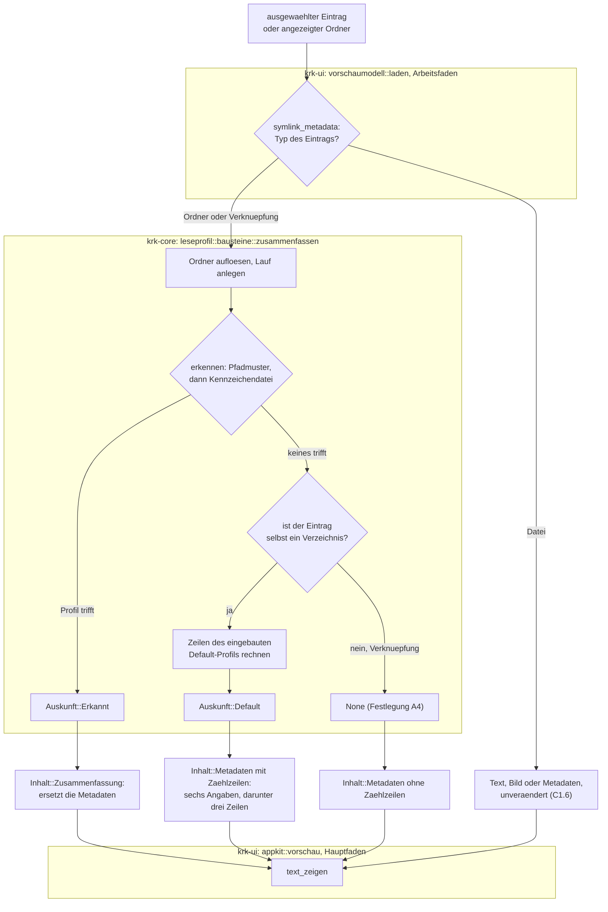
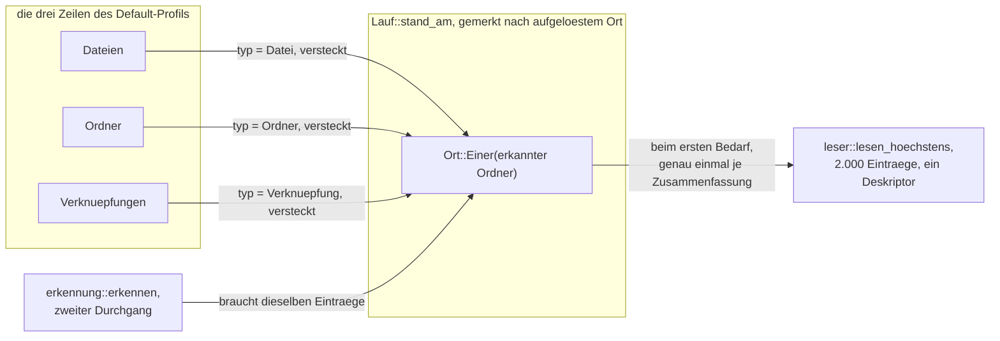
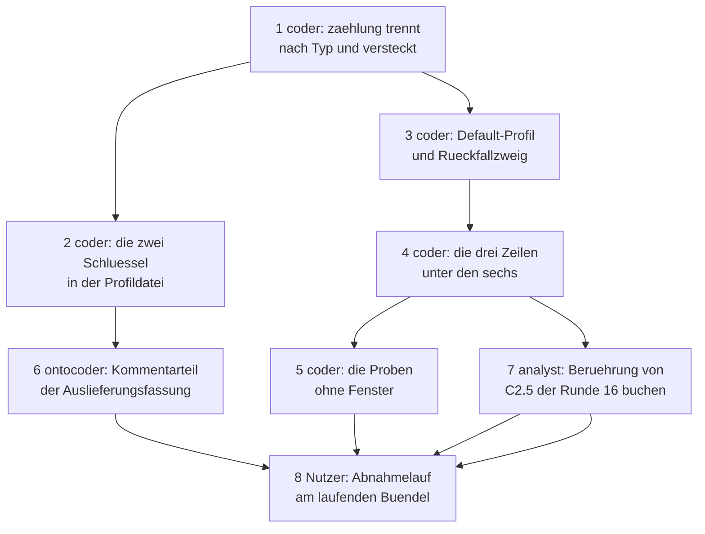

# Implementierungsplan: Die Vorschau zählt den Ordnerinhalt im eingebauten Default-Profil

**Date:** 2026-08-27
**Status:** Draft
**Spec:** `circles/260827-0310-vorschau-zaehlt-ordnerinhalt-im-default-profil/planning/260827-0646_*_spec-vorschau-zaehlt-ordnerinhalt-im-default-profil.md`, vom Nutzer am 260827 freigegeben, einschließlich der sieben abgeleiteten Festlegungen A1 bis A7
**Decidability:** Die tragende Frage lautet: *Bekommt dieser Ordner die drei Zählzeilen, und wie viele Einträge jeden Typs trägt er?* Ihre erste Hälfte ist aus den Eingaben entscheidbar, die der Mechanismus hat — `symlink_metadata` am ausgewählten Pfad sagt, ob der Eintrag selbst ein Verzeichnis ist, und `leseprofil::erkennung::erkennen` sagt, ob ein Profil aus `readers.toml` getroffen hat. Ihre zweite Hälfte ist es innerhalb der Eintragsschranke von 2.000 und **jenseits davon nicht**: hinter dem Abbruch der Lesung kann beliebig viel stehen, und keine Zahl der Teillesung entscheidet den Bestand. Der Plan nähert sie dort nicht an, sondern wechselt die Aussage: `Wert::UeberGrenze` sagt „mindestens N (Lesung bei 2000 Einträgen abgebrochen)" und lässt die Klammer mit den versteckten ganz weg. Das ist die Antwort des Nutzers vom 260827-0629 und zugleich die Hausregel der Runde 16, dass nur gesagt wird, was die Teillesung entscheidet.

---

## Directive

Die Vorschau beschreibt einen Ordner, den kein Leseprofil aus `readers.toml` erkennt, nicht mehr allein mit seinen sechs Metadatenangaben. Unter ihnen stehen drei Zählzeilen für Dateien, Ordner und Verknüpfungen, jede mit der Zahl der versteckten in Klammern, geliefert von einem in KRK eingebauten Default-Profil. Der Spec schreibt die Fähigkeiten C1 bis C4 mit vierzig Abnahmekriterien aus; dieser Plan wiederholt sie nicht, sondern ordnet jedem Kriterium eine Stelle im Baum zu.

Zwei Entscheidungen des Nutzers vom 260827-0629 binden den Bau und sind hier nicht mehr zu verhandeln. Der Baustein `zaehlung` bekommt zwei freiwillige Kriterien, und das Default-Profil benutzt dieselbe Zählmaschine; ein Ordner über der Eintragsschranke bekommt in jeder der drei Zeilen den „mindestens"-Satz, und die Klammer entfällt dort.

---

## Current State

**Das Leseprofil-Werk der Runde 16 trägt alles, was diese Runde braucht, bis auf zwei Unterscheidungen.** `leseprofil::bausteine::zusammenfassen_gezaehlt` löst den ausgewählten Ordner auf, prüft am aufgelösten Pfad, dass es ein Verzeichnis ist, legt einen `Lauf` an und ruft `erkennung::erkennen`. Greift ein Profil, rechnet der Lauf dessen Zeilen und liefert eine `Zusammenfassung` samt verbrauchtem `Haushalt`; greift keines, liefert die Funktion `None`, und die Vorschau bleibt bei ihrer Metadatenanzeige. Genau in dieses `None` tritt das Default-Profil.

**Der Baustein `Baustein::Zaehlung` zählt heute Einträge, deren Name ein Muster erfüllt, und sieht dabei auf Namen jeden Typs.** Er trennt weder nach `Typ` noch nach `Eintrag::versteckt`, obwohl beide Größen am gelesenen Eintrag bereitliegen: `Typ` (`crates/krk-core/src/verzeichnis/eintrag.rs`) trägt genau die drei Werte Ordner, Datei und Verknüpfung, und `versteckt` setzt `Eintrag::aus_roh` aus dem führenden Punkt **oder** dem Systemkennzeichen `UF_HIDDEN`. Die zweite Hälfte von C2.6 kostet damit keine eigene Arbeit.

**Der Lauf merkt jede Lesung nach ihrem aufgelösten Ort.** `Lauf::stand_am` gibt jedem weiteren Rufer denselben `Lesestand` zurück, und der Erkennungsdurchgang über die Kennzeichendateien geht durch dieselbe Merkstelle. Drei Zeilen mit derselben Ortsangabe teilen sich deshalb eine Lesung, ohne dass dafür etwas gebaut werden müsste; das ist die Antwort auf C4.1 und C4.2 und sie steht bereits im Baum.

**Die sechs Metadatenangaben entstehen in der Ansicht und die Zusammenfassung im Kern.** `Vorschau::metadaten_text` (`crates/krk-ui/src/appkit/vorschau.rs`) baut Name, Pfad, Größe, Geändert, Rechte und Typ und braucht dafür `NSByteCountFormatter` und `NSDateFormatter`, die von `krk-core` aus nicht erreichbar sind. `Zusammenfassung::als_text` baut die Profilzeilen und ist ausdrücklich die eine Stelle, an der aus Werten Zeilen werden. Die drei Zählzeilen brauchen beide Hälften zugleich.

**Die Regel „ohne Auswahl der angezeigte Ordner" steht und liefert C1.8 kostenlos.** `tabelle::zu_beschreiben` entscheidet, was die Vorschau beschreibt, und der Weg von dort über `vorschau_fuellen` bis `Vorschaumodell::datei_anzeigen` ist unverändert. Der Programmstart und der Tabwechsel erreichen diese Regel nicht; der offene Defekt dazu bleibt offen und C1.9 hält den Zustand fest.

---

## Approach

Der Plan setzt an vier Nähten an, die alle schon da sind, und legt keine fünfte daneben.

**Erstens wächst der vorhandene Baustein statt eines zweiten Zählwegs.** `Baustein::Zaehlung` bekommt die zwei Felder `typ` und `versteckt`, `zaehlen` wertet sie in demselben einen Durchgang über die Einträge aus, und `Wert` bekommt seinen siebten Wert für eine Zahl mit Klammer. Damit ist die Antwort des Nutzers auf `decisions/260827-0311_*_bekommen-die-profile-aus-readers-toml-die-zaehlung-nach-typ-und-versteckt.md` gebaut, und C3.7 ist nicht durch eine Probe erkauft, sondern durch die Bauart.

**Zweitens tritt das Default-Profil als fester Wert neben `erkennen` und nicht in es hinein.** Es ist ein gewöhnliches `Profil` mit drei Zeilen, in Rust gebaut statt aus TOML gelesen, und es wird erst gefragt, wenn beide Erkennungsdurchgänge leer ausgegangen sind. Der Rückfallweg bleibt damit einer, wie Constraint 4 des Specs verlangt.

**Drittens sagt der Kern dem Rufer, welche der zwei Auskünfte er bekommen hat.** Ein erkanntes Profil ersetzt die Metadatenanzeige, das Default-Profil tritt unter sie, und dieser Unterschied gehört nicht in eine Prosastelle, sondern in den Rückgabetyp: eine Aufzählung `Auskunft` mit zwei Werten, vollständig und ohne Auffangzweig.

**Viertens führt die Ansicht die beiden Hälften zusammen**, weil sie die einzige Stelle ist, an der beide zugleich vorliegen. Die sechs Zeilen bleiben, wo sie sind, und darunter setzt `metadaten_text` den Text der drei Zählzeilen. Aus `Zusammenfassung::als_text` wird dafür die Zeilenhälfte als eigene Funktion herausgezogen, damit es bei **einer** Stelle bleibt, an der aus Werten Zeilen werden, und nicht bei zweien.



Die Zählmaschine darunter bleibt die eine, die es seit der Runde 16 gibt: alle drei Zeilen tragen `Ortsangabe::wurzel`, lösen damit auf denselben `Ort::Einer` auf und finden ihn nach der ersten Lesung in der Merkstelle des Laufs.



---

## Die sechs Entscheidungen aus `## Open for Planner`

### 1. Wo das Default-Profil wohnt und in welcher Gestalt

**Es ist ein fester `Profil`-Wert in einem eigenen Modul `crates/krk-core/src/leseprofil/defaultprofil.rs`, und es wird in `bausteine::zusammenfassen_gezaehlt` gefragt, nachdem `erkennen` leer zurückgekommen ist.** Von den drei Gestalten, die der Spec nennt, ist das die erste.

Der Grund gegen den dritten Zweig im Vorschaumodell steht im Grounding des Circle-Datensatzes und in der Antwort des Nutzers vom 260827-0629: das Default-Profil benutzt dieselbe Zählmaschine, und die wohnt im Kern. Ein Zweig in `krk-ui` müsste `lesen_hoechstens` über die Kistengrenze rufen und seinen Haushalt dort führen, wo keine Probe ohne Fenster ihn nachzählen kann; der Modulkopf von `leseprofil` schreibt genau diese Begründung schon für die Runde 16 aus, und C4.5 verlangt Proben ohne Fenster.

Der Grund für ein eigenes Modul statt einer Ergänzung in `mod.rs` ist die Begründungslast. Das Default-Profil braucht einen Kopf, der sagt, warum es kein Block in `readers.toml` ist, warum es nicht anpassbar ist und warum seine drei Beschriftungen dort und nicht in der Ansicht stehen. In `mod.rs`, das die geprüften Werte des Werks hält, stünde diese Erklärung neben Typdefinitionen, zu denen sie nicht gehört.

**Gebaut wird es über eine `std::sync::LazyLock<Profil>`.** `Ortsangabe::wurzel` legt einen `Vec` an und ist deshalb nicht in einem `const` erreichbar; ein `LazyLock` gibt den Wert als `&'static Profil` heraus, den `erkennen` als Rückgabetyp ohnehin liefert. Die drei Zeilen tragen kein einziges Muster, also enthält der Wert keinen regulären Ausdruck und kostet beim ersten Zugriff nichts, was der Rede wert wäre.

### 2. Wo die drei Zeilen an die sechs Metadatenangaben treten

**In der Ansicht, in `Vorschau::metadaten_text`, und die Werte kommen strukturiert aus dem Kern dorthin.**

Die Wahl ist nicht frei: die sechs Zeilen lassen sich im Kern nicht bauen, weil Größe und Änderungsdatum über `NSByteCountFormatter` und `NSDateFormatter` entstehen und `krk-core` AppKit nicht kennt. Die drei Zählzeilen lassen sich in der Ansicht nicht bauen, weil ihre Werte einen Verzeichnisleselauf und den Haushalt des Laufs brauchen. Die Ansicht ist damit die einzige der beiden Stellen, an der beide Hälften zugleich vorliegen.

Damit dabei keine zweite Formatierungsstelle entsteht, wird aus `Zusammenfassung::als_text` die Zeilenhälfte herausgezogen:

- `pub fn zeilen_als_text(zeilen: &[Zusammenfassungszeile]) -> String` ist die eine Stelle, an der aus Werten Zeilen werden. Sie liefert je Zeile einen führenden Zeilenumbruch und für eine leere Folge die leere Zeichenkette.
- `Zusammenfassung::als_text` ist danach die Kopfzeile aus Name und Pfad plus dieser Aufruf und hat keine eigene Formatierungslogik mehr.
- `metadaten_text` hängt denselben Aufruf an seine sechs Zeilen an.

Die Regel, wann ein Wert unter seine Beschriftung rutscht, wandert mit und bleibt an einer Stelle. Für die drei Zählzeilen greift sie nie, denn keiner ihrer Werte trägt einen Zeilenumbruch.

**Der Transport bis dorthin ist ein zweiter Wert an `Inhalt::Metadaten`.** Aus `Inhalt::Metadaten(Metadaten)` wird `Inhalt::Metadaten { metadaten: Metadaten, zaehlzeilen: Vec<Zusammenfassungszeile> }`; eine leere Folge heißt „keine Zählzeilen". Ein achter Wert der Aufzählung `Inhalt` wäre der teurere Weg und der schlechtere: er zwänge jede vollständige Fallunterscheidung über `Inhalt` — die Zeilennummernfrage, die Einfärbungsfrage, die Anzeige — eine Frage zu beantworten, deren Antwort ausnahmslos „wie bei den Metadaten" lautet. Eine Verzweigung, die überall dieselbe Antwort gibt, ist keine Unterscheidung, sondern eine Verdopplung. Der Unterschied besteht an genau einer Stelle, nämlich beim Bauen des Textes, und dort steht er als vollständige Zweiteilung über die leere und die nicht leere Folge.

### 3. Welche Gestalt der Wert einer Zählung mit Klammer im Kern hat

**`Wert` bekommt seinen siebten Wert:**

```rust
/// Eine Zahl und die Zahl der versteckten Eintraege darunter, in Klammern.
ZahlMitVersteckten {
    /// Alle getroffenen Eintraege, die versteckten eingeschlossen.
    zahl: u64,
    /// Wie viele davon versteckt sind.
    versteckt: u64,
},
```

`Wert::als_text` bekommt dafür einen siebten Zweig, `format!("{zahl} ({versteckt})")`, und bleibt vollständig ohne Auffangzweig. Der Doc-Kommentar an `Wert` sagt heute schon, dass ein siebter Wert die Anzeige anhält und die Antwort erzwingt, wie er dasteht; die Aufzählung ist für genau diese Erweiterung gebaut.

Zwei Gegenentwürfe fallen weg, und aus je einem Grund. **`Wert::Zahl` um ein `Option`-Feld zu erweitern** verschöbe die Fallunterscheidung aus der Aufzählung in den einen Zweig hinein und nähme jeder bestehenden Probe und jedem bestehenden Rufer die Form, ohne dass sich für sie etwas geändert hätte: C3.3 sagt ausdrücklich, dass eine Zählung ohne den Schlüssel weiterhin eine Zahl ohne Klammer liefert, und das ist unverändert `Wert::Zahl`. **Die Klammer beim Zählen in einen `Wert::Text` zu schreiben** verlöre die Struktur, die der Doc-Kommentar an `Zusammenfassung` als tragend beschreibt: die Abnahmekriterien prüfen Werte und keine Zeichenketten, und `Wert::Text` heißt in diesem Werk „ein Feld aus einer Datei oder ein Änderungsdatum" und nicht „irgendein fertiger Text".

**`Wert::UeberGrenze` bleibt unverändert und trägt den Fall über der Schranke allein.** `zaehlen` liefert ihn, sobald der Lesestand abgeschnitten ist, gleich ob der `versteckt`-Schlüssel steht. Damit entfällt die Klammer dort von selbst, ohne dass es eine zweite Regel bräuchte — die Antwort des Nutzers vom 260827-0629 ist keine Zeile im Code, sondern die Reihenfolge der zwei Zweige.

### 4. Wie die drei Zeilen sich den einen Leselauf teilen

**Sie brauchen dafür nichts Neues; die Merkstelle des Laufs leistet es bereits.** Alle drei Zeilen des Default-Profils tragen `ordner`-los, also `Ortsangabe::wurzel`. `Lauf::ort_aufloesen` macht daraus dreimal denselben `Ort::Einer(wurzel)`, und `Lauf::stand_am` sucht diesen Ort in seiner Liste, bevor es liest. Die erste Zeile bezahlt einen Leselauf, die zweite und die dritte bekommen den gemerkten `Lesestand`.

C4.2 fällt aus derselben Bauart. Der zweite Erkennungsdurchgang holt sich die Einträge über den Abschluss `|| lauf.eintraege()`, und der geht über `Lauf::stand` auf dieselbe Merkstelle. Hat ein Profil eine Kennzeichendatei genannt und damit den Ordner gelesen, findet das Default-Profil den Stand vor und liest nicht ein zweites Mal. Hat kein Profil eine genannt, wird überhaupt erst gelesen, wenn die erste Zählzeile den Ort braucht.

Was der Plan hier tut, ist deshalb allein: den Rückfallzweig **innerhalb** desselben `Lauf` laufen zu lassen und nicht daneben. Ein zweiter Lauf für das Default-Profil wäre die einzige Bauart, die C4.2 brechen könnte, und er entsteht nicht.

### 5. Die Schreibweise der zwei neuen TOML-Werte

**Die Schlüssel heißen `typ` und `versteckt`; `typ` trägt einen der drei Werte `datei`, `ordner` und `verknuepfung` in Umschrift, `versteckt` ist ein Wahrheitswert.**

Die offene Frage `shared/decisions/260826-1225_*_welche-schreibweise-gilt-fuer-nutzersichtbare-deutsche-meldungen-umlaut-oder-umschrift.md` hält diese Wahl nicht auf, denn sie fragt nach etwas anderem. Ihr Gegenstand ist nutzersichtbare **Prosa**, also die Sätze der Statuszeile; ihre eigene empfohlene Naht lautet „liest das ein Mensch oder ein Übersetzer". Ein Schlüsselwort in `readers.toml` liest der Deserialisierer, und `CLAUDE.md` ordnet maschinenlesbare Artefakte ausdrücklich nicht der Prosaregel zu. Der Baum entscheidet die Frage für diese Datei außerdem schon: `zaehlung`, `juengste`, `vorhandensein`, `beschriftung`, `kennzeichen` und die zwei Werte von `zeigt` stehen sämtlich in Umschrift, und ein `verknüpfung` mit Umlaut daneben wäre die erste Ausnahme in einer sonst durchgehaltenen Datei.

**Die drei Beschriftungen der Zählzeilen fallen auf die andere Seite derselben Naht und tragen Umlaute:** „Dateien", „Ordner" und „Verknüpfungen". Sie stehen in derselben Anzeige wie „Größe" und „Geändert", die die Umlaute heute schon tragen. Die Naht ist damit an jeder der fünf neuen Zeichenketten entscheidbar und läuft nicht mitten durch die Anzeige.

**`versteckt` wird ein `bool` und kein benannter Wert.** Für `zeigt` hat die Runde 18 einen benannten Wert gewählt, weil es zwei sinnvolle Anzeigen gibt und ein dritter denkbar ist. Hier gibt es nach Festlegung A6 genau eine Wirkung, nämlich die Klammer, und ein Filter über die versteckten Einträge ist ausdrücklich aus dem Umfang genommen. `versteckt = true` sagt einem Nutzer ohne Nachschlagen, was es tut; ein einwertiges `versteckt = "beziffern"` sagt es ihm nicht. Fehlt der Schlüssel oder steht er auf `false`, zählt `zaehlung` wie vor dieser Runde.

C3.6 ist von beiden Formen gehalten, und aus derselben Quelle: `serde` weist einen Wert ab, den es nicht gibt, die ganze Datei fällt weg, und die Meldung nennt den Schlüssel. Für `typ` liefert das die Aufzählung `Typdatei` mit `#[serde(rename_all = "lowercase")]`, gebaut nach dem Vorbild von `Anzeigedatei`; für `versteckt` liefert es die Typprüfung des Wahrheitswerts.

### 6. Wie die Berührung von C2.5 der Runde 16 gebucht wird

**Als Defektdatensatz in `issues/` dieses Circles, und nicht als Änderung am freigegebenen Wortlaut jenes Specs.** Der Spec dieser Runde schreibt die Buchungsform vor; die Herkunftsregel entscheidet den Ort. Die Feststellung entsteht aus dieser Directive, also gehört sie in den Speicher dieser Runde, und der Spec der Runde 16 wird durch Zitat erreicht und nicht durch eine Kopie.

Der Datensatz hält genau eine Aussage: nach dieser Runde trifft das Wort „unverändert" in C2.5 der Runde 16 für die Anzeige als Ganzes nicht mehr zu, während die Aufzählung der sechs Angaben, die die tragende Hälfte des Kriteriums ist, unverändert gilt. Er ist damit ein Befund über einen Text und nicht über Code, und er wird als offen abgelegt, weil der Abnahmelauf jener Runde noch aussteht und niemand außer dem Nutzer ihn schließen kann.

---

## Implementation Steps

Jeder Schritt nennt genau einen Executor. Schritt 8 ist der einzige, der außerhalb der Executor-Menge steht: der Abnahmelauf am laufenden Bündel verlangt KRK im Vordergrund und ist damit Nutzerarbeit, die kein Agent leisten kann (`circles/260802-0842-krk-mac-dateimanager-editor-git/decisions/260806-1303_*_wie-kommt-krk-fuer-den-abnahmelauf-in-den-vordergrund.md`, offen). Der Dispatch dieses Plans weist ihn ausdrücklich als Nutzerschritt an.

1. **Der Baustein `zaehlung` trennt nach Typ und beziffert die versteckten** [DONE]
   - Executor: `coder`
   - Files: `crates/krk-core/src/leseprofil/mod.rs`, `crates/krk-core/src/leseprofil/bausteine.rs`
   - Changes: `Baustein::Zaehlung` bekommt die zwei Felder `typ: Option<Typ>` und `versteckt: bool`; `mod.rs` holt `crate::verzeichnis::Typ` in den Geltungsbereich. `Wert` bekommt den siebten Wert `ZahlMitVersteckten { zahl: u64, versteckt: u64 }` samt Doc-Kommentar, der sagt, was die Zahl vor der Klammer einschließt (C2.3), und `Wert::als_text` seinen siebten Zweig `"{zahl} ({versteckt})"`, weiterhin ohne Auffangzweig. `zaehlen` nimmt die zwei Kriterien entgegen und läuft in **einem** Durchgang über die Einträge: eine private Funktion beantwortet, ob ein Eintrag hineinfällt (Muster **und** Typ), und der Durchgang führt zwei Zähler, den der Treffer und den der versteckten unter ihnen. Ist der Lesestand abgeschnitten, liefert `zaehlen` `Wert::UeberGrenze` mit der Zahl der Treffer innerhalb der gelesenen Einträge, gleich wie `versteckt` steht (C2.10). Ohne `versteckt` bleibt es bei `Wert::Zahl` (C3.3). `Lauf::rechnen` bindet die zwei neuen Felder und reicht sie durch; der Übersetzer verlangt das und die Stelle bleibt dieselbe. Der Modulkopf von `bausteine.rs` zieht seinen Abschnitt „Was ein Name entscheidet und was eine Datei" nach: die Zählung sieht weiterhin auf Namen jeden Typs, kann jetzt aber auf einen Typ eingeschränkt werden, und sie folgt dabei dem Typ, den der Leser meldet, ohne einer Verknüpfung zu folgen (C2.9, Festlegung A5).
   - Kriterien: C2.3, C2.4, C2.5, C2.8, C2.9, C2.10, C3.3, C3.7
   - Dependencies: keine

2. **Die zwei Schlüssel in der Gestalt der Profildatei**
   - Executor: `coder`
   - Files: `crates/krk-core/src/leseprofil/datei.rs`
   - Changes: `Zaehlungsdatei` bekommt `typ: Option<Typdatei>` und `versteckt: Option<bool>`; `deny_unknown_fields` bleibt stehen. Die neue Aufzählung `Typdatei` mit den Werten `Datei`, `Ordner` und `Verknuepfung` trägt `#[serde(rename_all = "lowercase")]` und einen Doc-Kommentar nach dem Vorbild von `Anzeigedatei`, der sagt, warum sie neben `Typ` steht und dass ein Wert, den es nicht gibt, die ganze Datei kostet. Eine Zuordnungsfunktion `typ(Option<Typdatei>) -> Option<Typ>` ist vollständig ohne Auffangzweig; ein vierter Wert von `Typ` hält den Bau dort an. `baustein_pruefen` reicht beide Angaben in den Baustein durch, `versteckt` über `unwrap_or(false)`. Der Modulkopf zieht seine Aufstellung der drei Reichweiten nach: ein unbekannter Wert für `typ` und ein Nicht-Wahrheitswert für `versteckt` fallen in die weiteste, wie `zeigt` seit der Runde 18.
   - Kriterien: C3.1, C3.2, C3.6
   - Dependencies: Schritt 1

3. **Das eingebaute Default-Profil und der Rückfallzweig im Kern** [DONE]
   - Executor: `coder`
   - Files: `crates/krk-core/src/leseprofil/defaultprofil.rs` (neu), `crates/krk-core/src/leseprofil/mod.rs`, `crates/krk-core/src/leseprofil/bausteine.rs`
   - Changes: Das neue Modul hält eine `std::sync::LazyLock<Profil>` und einen Zugang `defaultprofil() -> &'static Profil`. Das Profil trägt keinen Namen zur Erkennung — es erkennt nichts, sondern tritt ein, wo nichts erkannt wurde — und genau drei Zeilen mit den Beschriftungen „Dateien", „Ordner" und „Verknüpfungen" in dieser Reihenfolge (Festlegung A1), jede ein `Baustein::Zaehlung` mit `ort: Ortsangabe::wurzel()`, `muster: None`, dem jeweiligen `typ` und `versteckt: true`. Sein Modulkopf schreibt aus, warum es kein Block in `readers.toml` ist, warum es sich nicht abschalten lässt und warum seine Beschriftungen hier und nicht in der Ansicht stehen. In `mod.rs` entsteht die Aufzählung `Auskunft` mit den zwei Werten `Erkannt(Zusammenfassung)` und `Default(Vec<Zusammenfassungszeile>)`, vollständig und ohne Auffangzweig, und die freie Funktion `zeilen_als_text(&[Zusammenfassungszeile]) -> String` mit `#[must_use]`; `Zusammenfassung::als_text` besteht danach aus der Kopfzeile und diesem Aufruf. In `bausteine.rs` liefern `zusammenfassen` und `zusammenfassen_gezaehlt` eine `Auskunft` statt einer `Zusammenfassung`; das Rechnen der Profilzeilen wird als eine private Funktion herausgezogen und von beiden Zweigen gerufen, damit es bei einer Maschine bleibt. Kommt `erkennen` leer zurück, prüft eine private Funktion mit `std::fs::symlink_metadata` am **ausgewählten** Pfad, ob der Eintrag selbst ein Verzeichnis ist; ist er es nicht, liefert die Funktion `None` und eine Verknüpfung behält ihre sechs Metadatenangaben allein (Festlegung A4, C1.7). Der Aufruf kostet einen Systemaufruf und fällt allein auf dem Rückfallweg an; die Zusage steht im Kern und nicht am Zweig eines Rufers, aus demselben Grund, den der Doc-Kommentar von `zusammenfassen_gezaehlt` für C2.6 der Runde 16 nennt. Der Modulkopf von `leseprofil` zieht sein Ablaufbild nach.
   - Kriterien: C1.1, C1.2, C1.3, C1.4, C1.5, C1.7, C2.1, C2.11, C2.7, C3.5, C4.1, C4.2, C4.3, C4.4, C4.7
   - Dependencies: Schritt 1

4. **Die drei Zeilen treten unter die sechs Metadatenangaben**
   - Executor: `coder`
   - Files: `crates/krk-ui/src/vorschaumodell.rs`, `crates/krk-ui/src/appkit/vorschau.rs`, `crates/krk-ui/src/appkit/anwendung.rs`
   - Changes: `Inhalt::Metadaten` wird zum Strukturwert `{ metadaten: Metadaten, zaehlzeilen: Vec<Zusammenfassungszeile> }`; alle Musterstellen im Modul und in den Proben ziehen mit. `laden` verzweigt im Zweig „kein Dateityp" vollständig über die drei Ausgänge des Kerns: `Auskunft::Erkannt` wird zu `Inhalt::Zusammenfassung`, `Auskunft::Default` zu `Inhalt::Metadaten` mit den drei Zeilen, und `None` zu `Inhalt::Metadaten` mit leerer Folge. Die drei übrigen Erzeuger von `Inhalt::Metadaten` im Dateizweig übergeben die leere Folge; eine Datei bekommt keine Zählzeile (C1.6). `Vorschau::metadaten_text` nimmt die Zeilen entgegen und hängt `zeilen_als_text` an seine sechs Zeilen an, hinter „Typ" (C2.1, C2.2). Der Modulkopf von `vorschaumodell` zieht seinen Abschnitt „Die Zusammenfassung ist der vierte Weg" nach: es sind jetzt zwei Antworten für einen Ordner ohne Profiltreffer, und die eine ersetzt die Metadaten, während die andere unter sie tritt. Der Doc-Kommentar von `Anwendungsdelegierter::sitzung_laden` (`anwendung.rs`) wird berichtigt: sein Satz, im Messmodus bleibe der Profilsatz leer und deshalb messe keine der zehn Zeitzusagen an einer Zusammenfassung, trägt ab dieser Runde nicht mehr, weil das Default-Profil nicht aus der Ablage kommt. Der berichtigte Text nennt den Datensatz aus `## Open Questions`.
   - Kriterien: C1.6, C1.8, C2.1, C2.2, C2.12, C4.6
   - Dependencies: Schritt 3

5. **Die Proben, die die Zusagen ohne Fenster halten**
   - Executor: `coder`
   - Files: `crates/krk-core/tests/leseprofil.rs`, `crates/krk-core/tests/baum.rs`, `crates/krk-core/src/ablage/leseprofile.rs`, `crates/krk-ui/src/vorschaumodell.rs`, `crates/krk-ui/src/appkit/vorschau.rs`
   - Changes: In `tests/leseprofil.rs` kommen die Proben für die Zählkriterien dazu. Ein Prüfordner mit bekanntem Bestand aus Dateien, Unterordnern und Verknüpfungen, davon je einige versteckt, belegt C2.3, C2.4, C2.8 und C2.9; ein leerer Ordner belegt C2.5; ein Eintrag, den `Pruefordner::verstecken` über `chflags hidden` kennzeichnet und der keinen Punkt im Namen trägt, belegt die zweite Hälfte von C2.6. Ein Ordner über der Eintragsschranke belegt C2.10, einer ohne Leserecht C2.11. Die Rundreise über die vier Bausteine nimmt die zwei neuen Schlüssel auf; eine Probe hält C3.6, indem sie einen unbekannten `typ`-Wert und einen Nicht-Wahrheitswert für `versteckt` durch dieselbe Lesung schickt und die ganze Datei fallen sieht. C3.5 belegt eine Probe, die für denselben Prüfordner die Zeile eines selbstgeschriebenen Profils gegen die Zeile des Default-Profils hält. Die Haushaltsproben decken C4.1 bis C4.4: für einen Ordner ohne jedes Profil steht ein Leselauf und null Öffnungen, und für einen Ordner, dessen Erkennungsdurchgang die Kennzeichendateien geprüft und den Ordner damit schon gelesen hat, ebenfalls **ein** Leselauf und nicht zwei. Die vorhandene Deskriptorprobe im Kindprozess wird auf den Rückfallweg ausgedehnt (C4.3). In `tests/baum.rs` kommt die Zählprobe zu C3.7 dazu: genau drei Dateien unter `crates/*/src` führen in ihren Code-Zeilen sowohl `.versteckt` als auch eine Frage nach dem `Typ`, nämlich `verzeichnis/eintrag.rs`, wo das Kennzeichen entsteht, `verzeichnis/modell.rs`, wo der Schalter es liest, und `leseprofil/bausteine.rs`, wo gezählt wird; die Probe nennt die drei beim Namen, wie es `genau_zwei_dateien_oeffnen_die_regel_deny_unsafe_code` tut, und ihr Doc-Kommentar sagt, was eine Nadel nicht sehen kann. Eine zweite Probe dort hält die strukturelle Hälfte von C2.7: unter `crates/krk-core/src/leseprofil/` steht keine Code-Zeile, die den Ausblendeschalter des Ordnermodells erreicht. Im Prüfmodul von `ablage/leseprofile.rs` kommt die Probe zu C3.4 dazu: keine Nicht-Kommentarzeile der Auslieferungsfassung nennt `typ =` oder `versteckt =`, und die Zahl der mitgelieferten Profile bleibt zwölf. Die Proben in `krk-ui` ziehen die neue Gestalt von `Inhalt::Metadaten` nach und belegen, dass ein Ordner mit leerem Profilsatz drei Zählzeilen unter seinen sechs Angaben zeigt und eine Verknüpfung keine.
   - Kriterien: C1.2, C1.3, C1.4, C1.5, C1.6, C1.7, C2.3, C2.4, C2.5, C2.6, C2.7, C2.8, C2.9, C2.10, C2.11, C3.1, C3.2, C3.3, C3.4, C3.5, C3.6, C3.7, C3.8, C4.1, C4.2, C4.3, C4.4, C4.5, C4.7, sowie das zweite Kriterium aus dem Zeitzusagen-Abschnitt
   - Dependencies: Schritt 4

6. **Der Kommentarteil der Auslieferungsfassung**
   - Executor: `ontocoder`
   - Files: `resources/default-readers.toml`
   - Changes: Der Abschnitt „Die vier Bausteine" beschreibt bei `zaehlung` die zwei neuen Schlüssel an derselben Stelle, an der er heute `ordner` und `muster` beschreibt: welche drei Werte `typ` trägt, dass ohne ihn jeder Typ zählt, dass `versteckt = true` die Klammer setzt und ohne den Schlüssel keine dasteht, und dass die Klammer über der Eintragsschranke ganz entfällt (C3.9). Ein eigener kurzer Abschnitt sagt, dass das Default-Profil in KRK eingebaut ist, in keinem Block dieser Datei steht und sich weder anpassen noch abschalten lässt, und dass ein Nutzer, der die drei Zählzeilen selbst beschreiben will, dafür ein eigenes Profil mit denselben Schlüsseln schreibt (C3.10). Kein `[[profil]]`- und kein `[[profil.zeile]]`-Block wird angefasst; die zwölf mitgelieferten Profile ändern ihre Ausgabe nicht (C3.4).
   - Kriterien: C3.4, C3.9, C3.10
   - Dependencies: Schritt 2

7. **Die Berührung von C2.5 der Runde 16 buchen**
   - Executor: `analyst`
   - Files: ein neuer Defektdatensatz in `circles/260827-0310-vorschau-zaehlt-ordnerinhalt-im-default-profil/issues/`, Marker `_o_`
   - Changes: Der Datensatz hält fest, dass C2.5 im Spec der Runde 16 zwei Aussagen trägt und dass die zweite nach dieser Runde nicht mehr zutrifft. Die Aufzählung der sechs Metadatenangaben gilt unverändert, und die Zählzeilen treten unter sie; das Wort „unverändert" bezieht sich im Wortlaut jedoch auf die Anzeige als Ganzes, und die wächst um drei Zeilen. Der Datensatz zitiert den Spec der Runde 16 mit vollem Dateinamen und gesterntem Marker, nennt den Spec dieser Runde als Ursache und sagt ausdrücklich, dass der fremde Spec nicht angefasst wird. Er bleibt offen, weil der Abnahmelauf jener Runde aussteht und die Schließung dem Nutzer gehört.
   - Kriterien: keines unmittelbar; er erfüllt die sechste Anweisung aus `## Open for Planner` des Specs
   - Dependencies: Schritt 4

8. **Der Abnahmelauf am laufenden Bündel**
   - Executor: Nutzer (kein Agent; siehe die Vorbemerkung zu dieser Liste)
   - Files: keine; geprüft wird am gebauten `target/KRK.app`
   - Changes: `cargo xtask bundle` bauen und KRK aus einem Terminalfenster im Vordergrund starten. Zu prüfen sind die Kriterien, die eine laufende Oberfläche verlangen: die drei Zählzeilen an einem Ordner ohne Profiltreffer wie `~/Documents` (C1.1), die unveränderte Zusammenfassung an `fusion-workbench/shared/issues` (C1.2), die Zählzeilen nach dem Leeren der Nutzerdatei bis auf den letzten Block und einem Neustart (C1.3), dieselben nach einer absichtlich beschädigten `readers.toml` samt Meldung in der Statuszeile (C1.4), eine Verknüpfung auf einen Ordner ohne Zählzeilen (C1.7), die mitwandernden Zahlen beim Betreten eines Unterordners ohne Auswahl (C1.8), der unveränderte Zustand beim Programmstart und beim Tabwechsel (C1.9), die unveränderten Zahlen beim Umschalten mit `shift+cmd+h` (C2.7), das Stehenbleiben der Zeilen über einen Tabwechsel hin und zurück (C2.12) und die Bedienbarkeit beider Dateifenster und der Lesezeichenleiste, während die Zeilen für einen sehr großen Ordner entstehen (C4.6 und das erste Kriterium aus dem Zeitzusagen-Abschnitt).
   - Kriterien: C1.1, C1.2, C1.3, C1.4, C1.7, C1.8, C1.9, C2.6, C2.7, C2.12, C4.6, sowie das erste Kriterium aus dem Zeitzusagen-Abschnitt
   - Dependencies: Schritte 5, 6, 7



---

## Where this Circle stops

- Alle acht Schritte dieses Plans stehen auf `[DONE]`, und jede behauptete Erledigung ist einzeln gegen den Baum gelesen; der Abgleich liegt unter `history/` dieses Circles.
- `make check` läuft grün, also `cargo build --workspace`, `cargo test --workspace`, `cargo clippy --workspace --all-targets` und `cargo fmt --all --check`.
- Jedes der vierzig Abnahmekriterien des Specs hat eine benannte Stelle im Baum oder im Abnahmelauf, und keines steht ohne Zuordnung da.
- `grep -oE '"L[0-9]+"' crates/krk-bench/src/messen.rs | sort -u` liefert vor und nach dieser Runde dieselbe Menge; es entsteht keine elfte Zeitzusage und keine der zehn wird angefasst.
- Der Defektdatensatz zu C2.5 der Runde 16 steht in `issues/` dieses Circles und zitiert den fremden Spec, ohne ihn zu ändern.
- Die zwei beantworteten Entscheidungsdatensätze dieses Circles tragen eine `Implemented:`-Zeile mit Commit und sind auf `_i_` umbenannt.
- Der Datensatz zum Messmodus aus `## Open Questions` ist abgelegt und dem Nutzer vorgelegt; seine Antwort ist **keine** Vorbedingung für den Abschluss dieser Runde.
- Die Runde schließt **beschränkt** (`_b_`), solange der Nutzer den Abnahmelauf aus Schritt 8 nicht gefahren hat, und kohärent (`_c_`) erst danach. Kein Agent kann diesen Lauf fahren.
- Eine Auslieferung ist keine Vorbedingung dieser Runde. Wird eine gefahren, geht ihr die Durchsicht der Runde voraus und nicht umgekehrt, und `cargo xtask release` bricht ohne passenden Tag auf HEAD von selbst ab.

---

## Data Structures

**Im Kern, `crates/krk-core/src/leseprofil/`:**

```rust
// mod.rs — der Baustein waechst um zwei Kriterien
Zaehlung {
    ort: Ortsangabe,
    muster: Option<Regex>,
    /// Nur Eintraege dieses Typs; ohne die Angabe alle (C3.2).
    typ: Option<Typ>,
    /// Ob die Klammer mit der Zahl der versteckten dasteht (C3.3).
    versteckt: bool,
}

// mod.rs — der siebte Wert
ZahlMitVersteckten { zahl: u64, versteckt: u64 }

// mod.rs — was eine Zusammenfassung ueber sich sagt
pub enum Auskunft {
    Erkannt(Zusammenfassung),
    Default(Vec<Zusammenfassungszeile>),
}

// mod.rs — die eine Stelle, an der aus Werten Zeilen werden
pub fn zeilen_als_text(zeilen: &[Zusammenfassungszeile]) -> String;

// datei.rs — der Wert des Schluessels `typ`, wie er in der Datei steht
#[serde(rename_all = "lowercase")]
pub enum Typdatei { Datei, Ordner, Verknuepfung }

// defaultprofil.rs — das eingebaute Profil
pub fn defaultprofil() -> &'static Profil;
```

**In der Oberfläche, `crates/krk-ui/src/vorschaumodell.rs`:**

```rust
Metadaten {
    metadaten: Metadaten,
    /// Die drei Zeilen des eingebauten Default-Profils, oder keine.
    zaehlzeilen: Vec<Zusammenfassungszeile>,
}
```

---

## API Changes

`zusammenfassen` und `zusammenfassen_gezaehlt` liefern statt `Zusammenfassung` eine `Auskunft`. Beide sind `pub` in `krk-core` und haben im ausgelieferten Programm genau einen Rufer, `vorschaumodell::laden`; daneben rufen die Proben in `crates/krk-core/tests/leseprofil.rs` sie. `krk-bench` und `xtask` sprechen `leseprofil` nicht an, geprüft am 260827 mit einem Durchgang über beide Kisten. Die Zusage aus C4.7 der Runde 16, dass es in `crates/krk-ui` genau einen Rufer gibt, bleibt unberührt, und die Zählprobe dazu bleibt, wie sie ist.

`Zusammenfassung::als_text` behält Signatur und Ausgabe. Sie verliert allein ihren Rumpf an `zeilen_als_text` und ist danach die Kopfzeile plus diesen Aufruf.

---

## Testing Strategy

**Der Schwerpunkt liegt auf den Proben ohne Fenster, weil C4.5 es verlangt und weil `krk-ui` kein Bibliotheksziel hat.** Was im Kern steht, erreicht eine Probe unter `crates/krk-core/tests/` vollständig; was in `krk-ui` steht, erreicht allein ein `#[cfg(test)]`-Modul neben dem Code. Die Zählmaschine, das Default-Profil und der Haushalt liegen deshalb sämtlich im Kern, und die Proben in `krk-ui` beschränken sich auf die Frage, ob `laden` die drei Ausgänge des Kerns richtig in `Inhalt`-Werte übersetzt.

**Gezählt werden Aufrufe und keine Millisekunden.** `zusammenfassen_gezaehlt` gibt den verbrauchten `Haushalt` heraus, und die Proben lesen ihn ab, statt selbst mitzuzählen; das ist die Bauart, die die Runde 16 für C6.8 gewählt hat, und sie trägt C4.5 unverändert. Zwei Fälle sind auseinanderzuhalten und beide zu messen: ein leerer Profilsatz, bei dem die erste Zählzeile den einen Leselauf bezahlt, und ein Profilsatz mit Kennzeichendateien, die nicht treffen, bei dem der Erkennungsdurchgang ihn bezahlt und die drei Zeilen ihn geschenkt bekommen. Beide müssen auf einen Leselauf und null Öffnungen kommen.

**Der Deskriptorhaushalt wird im Kindprozess unter `ulimit -n` gemessen und nicht in der Sitzung.** `cargo test` erbt sonst die angehobene Grenze und die Zusage wäre behauptet statt geprüft; die vorhandene Probe mit `kind_mit_deskriptorgrenze` liefert die Form und wird auf den Rückfallweg ausgedehnt.

**Zwei Zusagen sind strukturell zu halten und nicht am Verhalten.** C3.7 verlangt, dass genau eine Stelle im Baum einen Ordnerbestand nach Typ und versteckt gruppiert, und C2.7 verlangt, dass die Zahlen dem Ausblendeschalter nicht folgen. Beide werden mit einer Zählprobe in `tests/baum.rs` gehalten, die Code-Zeilen von Kommentarzeilen trennt und ihre Dateien beim Namen nennt. Der Doc-Kommentar jeder der beiden sagt, was ihre Nadel nicht sehen kann; das ist die Gewohnheit jener Datei und keine Einschränkung, die dieser Plan neu einführt.

**Zur Vollständigkeit der Aufzählung `Baustein`, die C3.8 unangetastet verlangt.** Am 260827 halten sie **zehn** Stellen, und diese Runde ändert keine davon: die Aufzählung `Baustein` in `leseprofil/mod.rs`; die vollständige Fallunterscheidung in `Lauf::rechnen`; die Spiegelaufzählung `Bausteindatei`, die Struktur `Zeilendatei` mit ihren vier Feldern, deren Zerlegung in `Zeilendatei::zerlegen`, die Namensliste `BAUSTEINNAMEN` und die Fallunterscheidung in `baustein_pruefen`, alle fünf in `leseprofil/datei.rs`; die Probe `die_auslieferungsfassung_nennt_jeden_bausteinnamen` in `ablage/leseprofile.rs`; die Rundreise `eine_rundreise_ueber_alle_vier_bausteine_liefert_die_erwarteten_werte` in `tests/leseprofil.rs`; und der Abschnitt „Die vier Bausteine" im Kommentarteil von `resources/default-readers.toml`. Drei davon hält der Übersetzer, zwei eine Probe, drei sind Definitionen und zwei sind Prosa. Die Schritte 1 und 2 erweitern zwei dieser Stellen um Felder, legen aber keinen fünften Baustein an und keine elfte Stelle daneben; Festlegung A7 der Runde 16 bleibt unangetastet.

**Was aus dieser Zählung folgt und im Bau zu erwarten ist:** die Musterstelle `Baustein::Zaehlung { ort, muster }` in `Lauf::rechnen` und dieselbe in `tests/leseprofil.rs` halten den Bau an, sobald Schritt 1 die zwei Felder anlegt. Das ist der Mechanismus, den dieses Projekt an solchen Stellen bewusst führt, und keine Panne.

---

## Risks & Mitigations

| Risiko | Gegenmaßnahme |
|---|---|
| Der Messmodus umgeht das Default-Profil nicht, weil es nicht aus der Ablage kommt. L7 misst ab dieser Runde für jeden ausgewählten Unterordner des Prüfordners einen Verzeichnisleselauf mit, und die Läufe vom 260810 sind damit nicht mehr eins zu eins vergleichbar. | Der Datensatz in `## Open Questions` legt die Frage dem Nutzer vor, mit beiden Folgen. Schritt 4 berichtigt den Doc-Kommentar, der heute das Gegenteil behauptet, damit der Baum keine falsche Aussage trägt. Die Zahl selbst wird nicht angefasst: der gelesene Unterordner des Prüfordners ist leer, und die zehn Zahlen bleiben, wie sie stehen. |
| `Inhalt::Metadaten` wird zum Strukturwert, und jede Musterstelle im Modul und in den Proben zieht mit. Wer eine übersieht, merkt es erst beim Bauen. | Der Übersetzer hält jede einzelne; die Umstellung ist mechanisch und `make check` fängt sie vollständig. Ein Auffangzweig entsteht an keiner der Stellen. |
| Ein zusätzlicher `symlink_metadata`-Aufruf auf dem Rückfallweg. | Er fällt allein an, wenn kein Profil getroffen hat, kostet keinen Leselauf und keine Dateiöffnung und geht deshalb in keinen der vier Haushaltswerte ein. Constraint 5 des Specs ist gewahrt. |
| Die drei Zählzeilen laufen auf dem Arbeitsfaden der Vorschau, und der kennt keinen Abbruch: schnelles Durchtippen erzeugt je Ordner einen Faden, der ihn ganz liest. | Die Eintragsschranke von 2.000 begrenzt jeden dieser Läufe, und die Schranke bleibt, wo sie steht (C4.4). Der offene Defekt `shared/issues/260825-1922_*_eine-auffrischung-stoesst-die-vorschau-mit-an-und-die-kosten-sind-ungemessen.md` bleibt offen und wird von dieser Runde nicht größer. |
| `CLAUDE.md` sagt zum Stand der Vorschau schon für die Runde 18 nichts (`shared/issues/260826-0149_*_claude-md-sagt-nichts-ueber-die-fuenf-neuerungen-der-runde-18-an-der-vorschau.md`), und diese Runde legt eine weitere Neuerung darauf. | Der Abgleich der drei normativen Flächen gehört dem Kurator und läuft am Nutzertor von `/fusion:cleanup`; dieser Plan trägt dafür keinen Schritt, weil `curator` nicht in der Executor-Menge steht. Der bestehende Defekt bleibt offen und nennt nach dieser Runde eine Neuerung mehr. |
| Die Auslieferungsfassung wird beim ersten Start wörtlich kopiert und danach nie wieder angefasst; wer KRK schon gestartet hat, liest die neuen Kommentarzeilen aus Schritt 6 nie. | Das trifft die Erklärung und nicht die Wirkung: die drei Zählzeilen erscheinen bei ihm trotzdem, weil das Default-Profil eingebaut ist und keine Datei braucht. Genau das ist der Grund, aus dem der Nutzer es als eingebaut bestimmt hat. |

---

## Open Questions

- [ ] **Fällt das Default-Profil auch im Messmodus an, und was misst L7 danach?** Der Datensatz `circles/260827-0310-vorschau-zaehlt-ordnerinhalt-im-default-profil/decisions/260827-1322_o_faellt-das-default-profil-auch-im-messmodus-an-und-was-misst-l7-danach.md` legt die Frage mit beiden Folgen vor. Sie hält diesen Plan nicht auf: gebaut wird ohne Ausnahme für den Messmodus, weil der Spec keine nennt und eine Ausnahme ein Mechanismus wäre, den kein Abnahmekriterium verlangt.
- [ ] **Meldet sich ein Ordner ohne Leserecht, oder schweigt er wie heute?** `shared/decisions/260815-1749_*_meldet-der-doppelklick-auf-einen-ordner-ohne-leserecht-oder-schweigt-er-wie-heute.md`, offen. Die Antwort ändert, was der Nutzer statt der drei Platzhalter sieht; C2.11 hält bis dahin den heutigen Zustand fest, und dieser Plan baut ihn.
- [ ] **Wie wird die Arbeit der Vorschau jemals gegen L7 gemessen?** `circles/260823-2208-vorschau-zeigt-profil-zusammenfassung-statt-metadaten/decisions/260824-1900_*_wie-wird-die-arbeit-dieser-runde-jemals-gegen-l7-gemessen-die-messstrecke-sieht-sie-nicht.md`, offen. Diese Runde legt die dritte Arbeit in dieselbe ungemessene Endbedingung und beantwortet die Frage nicht.
- [ ] **Welche Schreibweise gilt für nutzersichtbare deutsche Meldungen?** `shared/decisions/260826-1225_*_welche-schreibweise-gilt-fuer-nutzersichtbare-deutsche-meldungen-umlaut-oder-umschrift.md`, offen. Der Plan entscheidet sie nicht, sondern legt seine fünf neuen Zeichenketten nach der Naht ab, die der Datensatz selbst empfiehlt: die drei Beschriftungen mit Umlauten, die drei TOML-Werte in Umschrift. Fällt die Antwort später auf Umschrift überall, ziehen die drei Beschriftungen mit den übrigen nutzersichtbaren Zeichenketten desselben Durchgangs nach.

---

## Reconciliation Log

**260827-1532, reconciler:** Kein Schritt begonnen, alle acht ohne Marker, und das stimmt mit dem Baum überein: `git diff eced324..HEAD -- crates/ xtask/ resources/` ist leer, seit der Aktivierung ist kein Code angefasst. `**Status:** Draft` und der Dateimarker `_o_` sind korrekt. Die fünf Ortsangaben der Grundlage sind stichprobenhaft gegen den Baum gelesen und halten: `erkennen` (`crates/krk-core/src/leseprofil/erkennung.rs:99`), die drei Haushaltszahlen (`crates/krk-core/src/leseprofil/mod.rs:111,121,138`), `Typ` (`crates/krk-core/src/verzeichnis/eintrag.rs:16-25`), `lesen_hoechstens` (`crates/krk-core/src/verzeichnis/leser.rs:234`), `zu_beschreiben` (`crates/krk-ui/src/appkit/tabelle.rs:488`).
