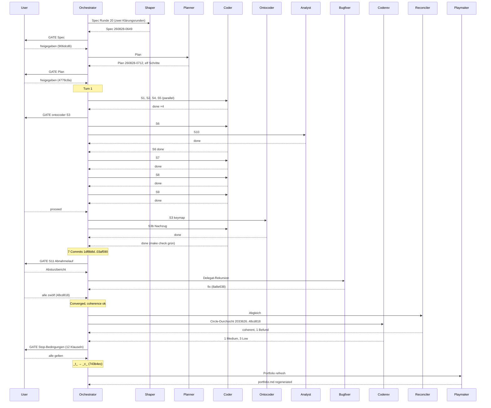

# Orchestrator Session — 260828-0035

**Directive:** die aktive Runde 20 fahren — Circle `circles/260827-2028-vorschau-rendert-pdf-als-betrachter`: die Vorschau rendert PDF als Betrachter (Zoom, Seitensprung, Seitenzähler, Textauswahl mit Cmd+C, Grenze 64 MB); der Datensatz `_t_circle.md` trägt die Directive, Spec und Plan fehlen noch
**Mode:** custom → Phase 0b (Shaping, Planung)
**Status:** Complete — Runde 20 kohärent geschlossen (`_c_`)
**Circle:** 260827-2028-vorschau-rendert-pdf-als-betrachter (aktiviert 260828-0035 über /fusion:next, Claim auf Checkout 6c11b1f2)

## Snapshot bei Sitzungsbeginn

- HEAD: 2033626; Turn-Budget 12; Domain code (161/12, git-ls-files — aus der Vorsitzung, unveränderter Baum)
- Circles:   12 b    6 c    2 d    1 t 
- Offene Defekte: Circle 0, shared 203; Runde 19 hinterlässt 3 offene unter ihrem Circle
- Offene Entscheidungen im Circle: 1 (Tasten für Zoom und Seitensprung)
- Spec/Plan: keine — Phase 0b nötig
- Arbeitsbaum: uncommittet sind die Aktivierung, das Portfolio, der neue Circle und der Backlog-Abschluss (aus /fusion:direct und /fusion:next)

## Budget

| Metric | Count |
|--------|-------|
| Turns | 1 (Phase 0b davor: Spec und Plan) |
| Tasks resolved | 11 |
| Tasks skipped/deferred | 0 |
| Issues created (by reviewers) | 7 (`records anchor=2033626 start=260828-0035`: 2 planmäßig/Planner, 1 Abgleich, 4 Durchsicht) |
| Issues resolved | 2 (`260826-1302`, `260826-1423`) |
| Decisions answered (`_o_`→`_a_`) | 1 (Tasten des Betrachters) |
| Decisions implemented (`_a_`→`_i_`) | 1 (dieselbe; `Implemented: 2aee690, 22b8442, 5ff1ee4`) |
| Decisions filed | 2 (US-Belegung `cmd+plus`; Dateizwischenablage im Circle 21) |
| Commits | 14 (`git rev-list 2033626..HEAD`, mit Abschluss und Haushalt) |
| Agent errors | 1 (Absturz im ersten Abnahmelauf, Bugfixer erfolgreich `8a8e638`) |
| Human gates hit | 5 (Spec, Plan, S3 Ontocoder, S11 Abnahmelauf, Stop-Bedingungen) |

## Per-Turn Log

### Turn 1
- Tasks attempted: S1, S2, S4, S5 (parallel), S3+S3b, S6, S7, S8, S9, S10, S11
- Tasks completed: alle elf
- Commits: 1df8b8d, 2aee690, 22b8442, ae349d1, 9d2e457, 5ff1ee4, 03af590, 8a8e638 (Bugfix), 48cd818
- Review findings: 1 Medium (Kurator), 3 Low (Circle-Durchsicht am Abschluss)
- Circuit breaker status: OK
- Coherence: ok

## Coherence
<!-- RECONCILER-OWNED -->

**Verdict:** coherent

**Edges:**
- Artifact↔Grounding: 11 claims verified / 0 drift items / 0 open coderev+ontorev issues — jeder Planschritt gegen `1df8b8d`…`48cd818` gelesen, `make check` grün auf `48cd818`; einzige Abweichung vom Planwortlaut (Delegat als eigene Klasse, `8a8e638`) ist im Modulkopf begründet und kein Drift.
- Artifact↔Directive: commits move toward the stated Directive — `1df8b8d`, `2aee690`, `22b8442` (die drei Zoomtasten), `ae349d1`, `9d2e457`, `5ff1ee4` (Betrachter, Rolle, Seitenzähler, Kopieren über die eine Hülle, Rückfall auf Metadaten), `8a8e638` (Absturz beim Zoom behoben), `03af590`/`48cd818` (Buchung, Abnahme); kein orthogonaler Commit seit `2033626`.
- Grounding↔Directive: 1 active decision consistent (`decisions/260827-2028_i_welche-tasten-…`, jetzt umgesetzt) / 0 potentially conflicting; die offene `decisions/260828-0712_o_…` (US-Belegung) ist der Directive nicht entgegen, sie grenzt C3.2 ein und ist im Plan als keine Vorbedingung geführt.

**Rebalance recommendation:** none

## Review coverage

**Range:** `2033626..743b4ec` — 13 commits (plus der Haushalts-Commit nach diesem Bericht)
**Covered by:** `reviews/260828-1046-coderev-durchsicht-runde-20-pdf-betrachter.md`, `**Reviewed-range:** 2033626..48cd818`, covers=12, not-opened=none
**Not covered:** `743b4ec chore(workbench): die Runde 20 schliesst kohaerent, und die Runde 21 steht als Circle` — reiner Workbench-Commit; dazu der Haushalts-Commit dieses Berichts
**Carried out-of-scope files:** none

## Remaining Work

Alles unter `circles/260827-2028-vorschau-rendert-pdf-als-betrachter/`, sofern nicht anders genannt:
- `issues/260828-1046_o_claude-md-nennt-sieben-werte-fuer-wirkungsbereich-…` (Medium, Kurator: `/fusion:cleanup --only claude-md`)
- `issues/260828-1046_o_dokument-setzen-merkt-nur-den-erfolg-…` (Low, Coder)
- `issues/260828-1046_o_die-regel-nur-http-und-https-steht-…-je-einmal` (Low, Coder)
- `issues/260828-1046_o_der-variantenleser-steht-in-krk-ui-zweimal-…` (Low, Coder)
- `issues/260828-1044_o_fuenf-history-dateien-…-zeitstempel-…` (Abgleichsbefund: Sub-Agenten stempeln ihre History-Dateien falsch)
- `issues/260828-0744_o_c6-der-runde-1-…` — Schließung gehört dem Nutzer
- `issues/260828-0712_o_der-spec-nennt-make-tasten-…` — Spec-Prosa, nicht angefasst
- `decisions/260828-0712_o_wie-erreicht-eine-us-tastaturbelegung-cmd-plus-…` — Nutzerfrage
- `circles/260828-1041-dateilistenfilter-nimmt-eingaben-per-paste/` — vorgesehen, vom Playmaker zur Aktivierung empfohlen

## Commits

| Hash | Message | Task |
|------|---------|------|
| f58794c | chore(workbench): die Runde 20 steht als Circle und ist aktiviert | activation |
| 906dcd6 | docs(workbench): der Spec der Runde 20 ist geschaerft und freigegeben | spec |
| 4778c8a | docs(workbench): der Plan der Runde 20 ist freigegeben und steht auf _p_ | plan |
| 1df8b8d | feat(tasten): das Tastenalphabet traegt plus und minus | S1 |
| 2aee690 | feat(tasten): Wirkungsbereich::Vorschau kommt zurueck, mit den drei Zoombefehlen | S2, S3b |
| 22b8442 | feat(resources): die Auslieferungsbelegung traegt cmd+plus, cmd+minus und cmd+0 | S3 |
| ae349d1 | build(deps): objc2-pdf-kit 0.3.2 ohne Vorgabemerkmale | S4 |
| 9d2e457 | feat(vorschau): Inhalt::Pdf ist der vierte Weg des Vorschaumodells | S5 |
| 5ff1ee4 | feat(vorschau): der PDF-Betrachter als dritte Flaeche, mit Seitenzaehler und Zoombefehlen | S6–S9 |
| 03af590 | docs(workbench): die Runde 20 traegt ihre zehn Schritte im Plan und den Defekt zu C6 der Runde 1 | S10 |
| 8a8e638 | fix(vorschau): der PDF-Betrachter ist nicht mehr sein eigener Delegierter | bugfix |
| 48cd818 | docs(workbench): der Abnahmelauf der Runde 20 ist gefahren, alle elf Schritte stehen | S11 |
| 743b4ec | chore(workbench): die Runde 20 schliesst kohaerent, und die Runde 21 steht als Circle | closure |

## Portfolio update

Playmaker-Lauf `shared/history/260828-1053-playmaker-orchestrator-phase4.md`; `portfolio.md` neu erzeugt: 1 vorgesehen, 0 aktiv, 7 kohärent, 12 beschränkt, 2 zurückgestellt. Keine Bounded-Closure-Propagation. Empfehlung: `260828-1041-dateilistenfilter-nimmt-eingaben-per-paste` aktivieren. Zwei gebaute Backlog-Einträge zum vierten Mal als `close` vorgeschlagen — Bestätigung beim nächsten `/fusion:next` ohne Argument.

## Session Flow

