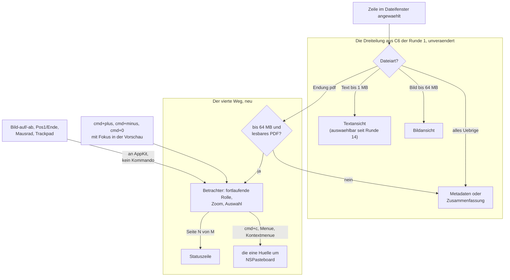

# Spec: Die Vorschau rendert PDF als Betrachter mit Zoom, Blättern und Seitenzähler

**Date:** 2026-08-28
**Status:** freigegeben am 260828 (Spec-Tor, A1 bis A10 ohne Einspruch), Planung läuft
**Activated from Circle:** 260827-2028-vorschau-rendert-pdf-als-betrachter
**Source:** Die Directive des Circle-Datensatzes `_t_circle.md`, vom Nutzer am 260827-2028 festgelegt (vier Antworten der Klärungsrunde von `/fusion:direct`), dazu die drei Antworten der Klärungsrunde vom 260828-0044, wörtlich „1b, 2a, 3a", und der Entscheidungsdatensatz `decisions/260827-2028_*_welche-tasten-bekommen-zoom-und-seitensprung-des-pdf-betrachters.md`, der mit der ersten dieser drei Antworten beantwortet ist.

---

## Directive

Wer im Dateifenster eine PDF-Datei anwählt, sieht sie im Vorschaufenster als fortlaufende Rolle ihrer Seiten und nicht mehr als Metadatenzeilen. Der Betrachter lässt sich mit `cmd+plus` vergrößern, mit `cmd+minus` verkleinern und mit `cmd+0` auf die Ausgangsgröße zurückstellen; gesprungen wird durch Blättern, und die Statuszeile am Fensterfuß nennt die aktuelle Seite und die Seitenzahl. Text auf einer Seite lässt sich mit der Maus markieren und mit `cmd+c` kopieren, über dieselbe eine Hülle um die Zwischenablage wie jedes andere Kopieren in KRK. Für die Größe gilt dieselbe Grenze wie für Bilder, 64 MB; eine größere, eine beschädigte oder eine verschlüsselte PDF-Datei fällt auf die Metadaten zurück. Die übrigen Wege der Vorschau bleiben unverändert.

Diese Runde setzt keine elfte Zeitzusage und fasst keine der zehn aus C8 der Runde 1 an.

---

## Verhältnis zu den zehn Zeitzusagen aus C8 der Runde 1

**Die Vorschau hat keine Messstelle, und das Rendern eines PDF liegt außerhalb jeder gemessenen Strecke.** L7 misst die Vorschau einer Textdatei (`a/datei-2`, `crates/krk-ui/src/messmodus.rs`); ein PDF wird auf dieser Strecke nie ausgewählt. Die Frage, wie Arbeit an der Vorschau überhaupt gegen L7 gemessen wird, ist offen (`circles/260823-2208-vorschau-zeigt-profil-zusammenfassung-statt-metadaten/decisions/260824-1900_*_wie-wird-die-arbeit-dieser-runde-jemals-gegen-l7-gemessen-die-messstrecke-sieht-sie-nicht.md`) und bindet diese Runde; sie wird hier nicht beantwortet. Eine elfte Zusage für das Rendern wäre ein Wunsch, denn kein Agent kann den Abnahmelauf im Vordergrund fahren.

**Eine Zusage dieser Runde ist ohne Messstrecke prüfbar, und L1 bekommt eine Prüfung ohne Zahl.** Der Rückfall über der Grenze kostet keinen Leselauf: die Größe wird vor dem Lesen aus `stat(2)` genommen, wie beim Bild seit dem 260806 (`vorschaumodell.rs`, `laden`). Daneben steht eine Zusage, die diese Runde neu eingeht: das Rendern eines PDF darf den Programmstart nicht verlängern. Ob eine Systembibliothek für PDF beim Start oder erst beim ersten PDF geladen wird, entscheidet der Planner; was der Spec verlangt, steht in den zwei Kriterien:

- [ ] Z1 Für eine PDF-Datei über 64 MB liest die Vorschau keinen Inhalt. Nachzuweisen mit einer Probe ohne Fenster, die die Leseaufrufe zählt und nicht Millisekunden misst: eine Datei von 65 MB mit der Endung `.pdf` erreicht `bis_zur_grenze_lesen` und wird mit `stat(2)` allein abgewiesen.
- [ ] Z2 Solange kein PDF angezeigt wird, entsteht kein Objekt des Betrachters und keine Seite wird gerendert. Nachzuweisen daran, dass der Weg zum Betrachter allein aus dem PDF-Zweig der Anzeige erreicht wird; der Programmstart, die Textvorschau und die Bildvorschau rufen ihn nicht.

---

## Warum diese Runde drei Kommandos anlegt und kein Blatt

Der Nutzer hat am 260828-0044 die Möglichkeit 2 des Entscheidungsdatensatzes gewählt, verengt auf drei Befehle: `cmd+plus` vergrößern, `cmd+minus` verkleinern, `cmd+0` Ausgangsgröße. Kein Sprungblatt, kein Ziffernpuffer, keine Blätterbefehle mit eigener Taste. Gesprungen wird durch Blättern: Bild-auf und Bild-ab, Pos1 und Ende, Mausrad und Trackpad. Diese vier Tasten tragen `Wirkungsbereich::Dateifenster`, sind mit dem Fokus in der Vorschau unzulässig und laufen deshalb an AppKit weiter (`archive/*/shared/decisions/260819-2216_*_was-tun-pfeil-hoch-und-runter-in-der-auswaehlbaren-vorschau.md`, der Absatz über die Ungleichheit); im Betrachter blättern sie damit, ohne dass ein Kommando entsteht. Die Vorlage für den Zuschnitt ist die Runde 6 (`circles/260812-1000-teilen-ordnersprung-ablage-sichern-vorschau-rendern/decisions/260812-1000_*_welche-tastenkombinationen-bekommen-die-zwei-neuen-befehle.md`).

**Damit fällt der Befund zu `opt+cmd+g` weg.** Die Kombination ist an „Zum Inhalt der Zwischenablage springen" vergeben (`resources/default-keymap.toml`, `zwischenablage_springen`); ein Sprungblatt hätte eine andere Taste gebraucht. Ohne Blatt gibt es nichts zu belegen.

**Drei Kommandos heißt drei Pflichtstellen je Kommando plus der Ausführungszweig.** Jedes braucht eine Zeile in `Kommando::wirkungsbereich`, in `Kommando::KENNUNGEN` und in `bereich_des_kommandos`, dazu einen eigenen Zweig bei der Ausführung, sonst steht es im Hauptmenü und tut nichts (CLAUDE.md, „Etliche Fallunterscheidungen"). Die Probe `jede_variante_von_kommando_steht_genau_einmal_in_kennungen` hält die zweite Stelle; den Ausführungszweig hält nichts als das Kriterium C3.8 unten.

**Ein Wirkungsbereich „nur Vorschau" existiert seit dem 260823 nicht mehr.** `Wirkungsbereich` trägt sieben Werte (`crates/krk-core/src/tasten/belegung.rs`, nachgezählt am 260828: `Dateifenster`, `Leiste`, `Dateibereiche`, `Editor`, `Tabbereich`, `Navigator`, `Ueberall`), und der Wert `Vorschau` ist mit dem Rundweg gefallen, weil er keinen Träger mehr hatte. Die drei Zoombefehle sind drei Träger. Ob sie den Wert zurückholen oder anders allein in der Vorschau wirken, ist Planerfrage; was der Spec verlangt, ist die Wirkung (C3.5) und die Auskunft in der dritten Spalte der Tastenbelegung (C3.6).

**Der Konflikttest kennt keine Bereiche.** Zwei Funktionen mit derselben Kombination und demselben Zusteller sind ein Konflikt, gleich in welchem Bereich sie wirken (`belegung.rs`, „Der Zusteller, und was er für den Konflikt bedeutet"). Die drei Kombinationen müssen deshalb in der ganzen Belegung frei sein. Geprüft am 260828: `cmd+0` trägt keine Funktion; `cmd+plus` und `cmd+minus` können heute keine tragen, weil `+` und `-` nicht im Tastenalphabet stehen (nächster Absatz).

**`+` und `-` stehen nicht im Tastenalphabet, und der Grund dafür trifft sie nicht.** `parser::TASTEN` benennt Funktionstasten, Pfeilblock, Sondertasten, Buchstaben und Ziffern und schließt die Satzzeichen ausdrücklich aus, weil ein Tastencode eine **Stelle** benennt und die Beschriftung dieser Stelle je Tastaturbelegung auseinanderläuft. Buchstaben und Ziffern werden dagegen über das **Zeichen** nachgeschlagen (`Tastenkennung::Zeichen`), und genau deshalb wirkt `cmd+c` auf jeder Belegung an der beschrifteten Stelle. `+` und `-` gehören in die zweite Sorte: gefragt wird nach dem Zeichen, das die Taste erzeugt, und die Stelle spielt keine Rolle. Das Alphabet wächst damit um zwei Namen, `plus` und `minus`; wie der Parser sie trägt, ist Planerfrage (C3.1 bis C3.3 sagen, was gilt).

---

## Wie der Betrachter in die Vorschau tritt

Die Verzweigung nach Dateiart bleibt die eine Stelle `laden` in `vorschaumodell.rs`; der Betrachter ist ein weiterer Wert von `Inhalt` neben `Text`, `Markdown`, `Bild` und `Metadaten`, und die Ansicht (`appkit/vorschau.rs`) bekommt zu ihren zwei Ansichten eine dritte in derselben Fläche.

---

## Abgeleitete Festlegungen, am Spec-Tor überstimmbar

Die vier Antworten vom 260827-2028 und die drei vom 260828-0044 lassen zehn Fragen offen, die zu klein für eine Klärungsrunde am Nutzer sind und zu groß, um sie dem Planner zu überlassen. Der Spec beantwortet sie nach dem bestehenden Muster. Jede Antwort ist am Spec-Tor überstimmbar, und die Kriterien unten ziehen dann nach.

**A1 — Die Ausgangsgröße passt die Seitenbreite in die Breite des Vorschaufensters ein.** `cmd+0` stellt sie her, und sie gilt beim ersten Anzeigen jeder PDF-Datei. Wird das Vorschaufenster breiter oder schmaler, folgt die Ausgangsgröße mit, solange der Nutzer nicht gezoomt hat. Der Grund: die Vorschau ist die schmale Fläche, und eine Seite in tatsächlicher Größe zeigte dort meist nur ihre linke Hälfte.

**A2 — Zoom hat eine Schrittweite, eine Untergrenze und eine Obergrenze, und alle drei setzt der Planner.** Der Spec verlangt allein, dass jeder Schritt sichtbar ist, dass die Grenzen erreicht werden und dass ein weiterer Anschlag an der Grenze nichts ändert und keine Meldung auslöst.

**A3 — Der Zoom gilt je angezeigter Datei und wird nicht gemerkt.** Ein Wechsel auf eine andere Datei und zurück zeigt das PDF wieder in der Ausgangsgröße. Nichts davon wird in einer Ablagedatei gehalten; `Datei::ALLE` (`crates/krk-core/src/ablage/pfade.rs`) wächst nicht.

**A4 — Trackpad-Zoom mit zwei Fingern vergrößert und verkleinert ebenfalls.** Ein Betrachter, der die Geste abwiese, während Bild- und Kartenansichten auf demselben Gerät sie annehmen, wäre die Ausnahme. Die drei Kommandos bleiben der Tastenweg, die Geste der zweite; beide wirken auf dieselbe Größe.

**A5 — Der Seitenzähler in der Statuszeile lautet „Seite N von M".** Die aktuelle Seite ist die, die im Ausschnitt am meisten Fläche einnimmt; steht eine Seite allein im Ausschnitt, ist sie es. Der Zähler steht, solange das Vorschaufenster ein PDF zeigt, folgt jedem Blättern, und verschwindet, sobald die Vorschau etwas anderes zeigt. In der Rangfolge der Statuszeile steht er unter dem Filterstand und über dem Markierungsstand: ein stehender Filtertext ist eine Eingabe des Nutzers, die er sehen muss; die Markierung im Dateifenster ist eine Auskunft desselben Ranges wie die Seite. Ob das ein siebter Rang wird oder in einen bestehenden fällt, entscheidet der Planner (`## Open for Planner`).

**A6 — Mit dem Fokus in der Vorschau, aber ohne angezeigtes PDF, werden die drei Zoombefehle entgegengenommen und tun nichts.** Dieselbe Regel wie für Pfeil hoch und Pfeil runter in der Textvorschau seit dem 260819: geschluckt wird, was zulässig war. Keine Meldung, kein Zoom der Textansicht. Die Zulässigkeit hängt am Fokus und nicht am Inhalt, damit `zulaessigkeit.rs` keine zweite Frage bekommt.

**A7 — `cmd+a` markiert den Text aller Seiten.** Mit dem Fokus in der Vorschau ist `alle_markieren` (`Wirkungsbereich::Dateifenster`) unzulässig und läuft an AppKit weiter, so wie heute in der Textansicht; der Betrachter beantwortet es mit der Auswahl des ganzen Dokuments.

**A8 — Ein Klick auf einen Verweis im PDF öffnet das Ziel im Systembrowser.** Der Nutzer hat am 260821-2202 entschieden, dass KRK Web-Inhalt nicht selbst anzeigt, sondern an den Systembrowser abgibt (`shared/decisions/260821-2202_*_zeigt-krk-web-inhalt-selbst-an-oder-gibt-er-ihn-an-den-systembrowser-ab.md`, Möglichkeit 2). Ein Verweis auf eine Seite innerhalb derselben Datei blättert dorthin. **Damit weicht der Betrachter von der Markdown-Vorschau ab**, deren Verweise seit der Runde 6 Farbe, aber keine Klickwirkung tragen, weil jene Frage damals offen war (`appkit/vorschau.rs`, Modulkopf). Die Markdown-Vorschau nachzuziehen ist kein Gegenstand dieser Runde; wer die Ungleichheit auflösen will, filet sie als Backlogeintrag.

**A9 — Ein verschlüsseltes PDF fällt auf die Metadaten, ohne nach einem Kennwort zu fragen.** Ebenso ein beschädigtes und eines über 64 MB. Alle drei Fälle enden in derselben Anzeige wie ein nicht dekodierbares Bild, und die Vorschau fragt nicht, welcher es war. Ein Kennwortblatt wäre eine vierte Eingabefläche mit eigener Ersthelferfrage; niemand hat es verlangt.

**A10 — Die Endung entscheidet, und zwar `pdf` ohne Rücksicht auf Groß- und Kleinschreibung.** Dieselbe Regel wie `ist_bildpfad` für die zehn Bildendungen. Eine Datei mit dieser Endung, die kein PDF ist, fällt über A9 auf die Metadaten; eine PDF-Datei ohne die Endung bleibt, was sie heute ist, nämlich Metadaten. Die Vorschau liest keine Magic Bytes, so wenig wie beim Bild.

---

## Capabilities

### C1: Der vierte Weg der Vorschau

**Description:** Eine PDF-Datei erscheint im Vorschaufenster als fortlaufende Rolle ihrer Seiten, vom Anfang der ersten bis zum Ende der letzten, mit derselben Bedienung durch Blättern wie ein langer Text. Die drei vorhandenen Wege und die Zusammenfassung bleiben, wie sie sind.

**Acceptance criteria:**
- [ ] C1.1 Wer im Dateifenster eine Datei mit der Endung `.pdf` anwählt, sieht im Vorschaufenster ihre erste Seite oben und kann durch alle Seiten blättern, ohne dass ein zweiter Anschlag oder Klick nötig ist. Zu prüfen an einer mehrseitigen PDF-Datei, etwa einer Rechnung oder einem Handbuch.
- [ ] C1.2 Die Seiten stehen als fortlaufende Rolle untereinander, mit einem sichtbaren Abstand zwischen zwei Seiten; am Seitenende erscheint der Anfang der nächsten Seite im selben Ausschnitt (Antwort 2a vom 260828-0044). Es gibt keine Einzelseitenansicht.
- [ ] C1.3 Bild-auf und Bild-ab blättern um einen Ausschnitt, Pos1 springt an den Anfang der ersten und Ende an das Ende der letzten Seite; Mausrad und Trackpad rollen fortlaufend. Keine dieser Tasten ist ein Kommando von KRK; `resources/default-keymap.toml` trägt für das Blättern im Betrachter keinen Eintrag, und `make tasten` gibt vor und nach dieser Runde für `pageup`, `pagedown`, `home` und `end` dieselben Zeilen aus.
- [ ] C1.4 Pfeil hoch und Pfeil runter sind mit dem Fokus in der Vorschau wirkungslos, wie in der Textvorschau (Antwort 3a vom 260828-0044): der Tastendruck wird verbraucht, im Betrachter geschieht nichts, und die Auswahl im Dateifenster bewegt sich nicht.
- [ ] C1.5 Die Endung entscheidet ohne Rücksicht auf Groß- und Kleinschreibung: `Bericht.PDF` wird wie `bericht.pdf` angezeigt (Festlegung A10).
- [ ] C1.6 Eine Textdatei zeigt, was sie vor dieser Runde zeigte, ein Bild ebenso, ein Ordner seine Zusammenfassung oder die Metadaten mit den drei Zählzeilen der Runde 19. Zu prüfen an je einer Datei jeder Art nach dem Anzeigen eines PDF.
- [ ] C1.7 Ein Tabwechsel der Vorschau hin und zurück zeigt das PDF unverändert, wie jede andere Vorschauquelle (C4.4 der Runde 16); der Seitenzähler kommt mit dem Tab zurück.
- [ ] C1.8 Während eine große PDF-Datei geladen wird, bleiben beide Dateifenster und die Lesezeichenleiste bedienbar: das Lesen läuft auf dem Arbeitsfaden der Vorschau wie bei Text und Bild.
- [ ] C1.9 Der Programmstart und der Tabwechsel des Dateifensters erreichen die Vorschauregel für den angezeigten Ordner weiterhin nicht, und diese Runde behebt das nicht. Der offene Defekt ist `issues/260825-1922_*_der-programmstart-und-der-tabwechsel-erreichen-die-neue-vorschauregel-nicht.md`; er betrifft Ordner und nicht Dateien, und ein angewähltes PDF zeigt sich nach dem Start wie jede angewählte Datei.

---

### C2: Die Größengrenze und der Rückfall

**Description:** Für PDF gilt dieselbe Grenze wie für Bilder, 64 MB. Eine größere Datei wird nicht gelesen; eine, die kein lesbares PDF ist, fällt auf die Metadaten zurück. Beides ohne Meldung und ohne zweites Lesen.

**Acceptance criteria:**
- [ ] C2.1 Eine PDF-Datei über 64 MB zeigt die Metadatenanzeige mit Name, Pfad, Größe, Änderungsdatum, Rechten und Typ, so wie ein Bild über der Grenze. Die Grenze ist `BILDGRENZE` und keine zweite Zahl daneben; nachzuweisen daran, dass im Baum genau eine Konstante 64 MB für die Vorschau trägt.
- [ ] C2.2 Über der Grenze wird kein Byte gelesen (Z1).
- [ ] C2.3 Eine Datei mit der Endung `.pdf`, die kein PDF ist, etwa eine umbenannte Textdatei, zeigt die Metadaten. Keine Fehlermeldung in der Statuszeile, kein leeres Vorschaufenster.
- [ ] C2.4 Ein verschlüsseltes PDF, das zum Öffnen ein Kennwort verlangt, zeigt die Metadaten; kein Blatt fragt nach dem Kennwort (Festlegung A9). Zu prüfen an einer mit Kennwort gesicherten PDF-Datei.
- [ ] C2.5 Ein beschädigtes PDF, etwa eine bei der Hälfte abgeschnittene Datei, zeigt die Metadaten und bringt KRK nicht zum Absturz.
- [ ] C2.6 Der Rückfall auf die Metadaten braucht kein zweites Lesen der Datei: die Metadaten reisen mit dem Inhalt mit, wie bei `Inhalt::Bild`.
- [ ] C2.7 Die Datei wird höchstens einmal geöffnet und über `bis_zur_grenze_lesen` gelesen; kein neuer Rufer der Hülle `ohne_warten_oeffnen` entsteht, und die Zahl ihrer Rufer bleibt die, die `grep -rn 'ohne_warten_oeffnen(' crates/krk-core/src` vor dieser Runde zeigt.

---

### C3: Drei Zoombefehle in der Tastenbelegung

**Description:** `cmd+plus` vergrößert, `cmd+minus` verkleinert, `cmd+0` stellt die Ausgangsgröße her. Die drei sind Kommandos wie jedes andere, stehen in `resources/default-keymap.toml`, im Hauptmenü und in der Ausgabe von `make tasten`, und wirken allein mit dem Fokus im Vorschaufenster (Antwort 1b vom 260828-0044).

**Acceptance criteria:**
- [ ] C3.1 Mit dem Fokus in der Vorschau und einem angezeigten PDF vergrößert `cmd+plus` die Seiten sichtbar, `cmd+minus` verkleinert sie, `cmd+0` stellt die Ausgangsgröße her (Festlegung A1). Zu prüfen auf dem Referenzgerät mit deutscher Tastatur: `cmd` mit der Taste, die `+` erzeugt.
- [ ] C3.2 Die Kombinationen werden über das Zeichen nachgeschlagen und nicht über die Stelle: auf einer deutschen und einer US-amerikanischen Tastaturbelegung wirkt jeweils die Taste, deren Beschriftung `+` beziehungsweise `-` ist. Die Probe dazu läuft ohne Fenster über `Kombination::lesen` und `Taste::kennung`.
- [ ] C3.3 `resources/default-keymap.toml` schreibt die drei als `cmd+plus`, `cmd+minus` und `cmd+0`; der Kommentar im Kopf der Datei, der die Tastennamen aufzählt, nennt `plus` und `minus` und sagt, dass sie über das Zeichen gefunden werden. Ein Nutzer, der `cmd+plus` in seiner `keymap.toml` auf eine andere Funktion legt, bekommt die Konfliktmeldung mit beiden Funktionsnamen, wie bei jeder anderen Kombination.
- [ ] C3.4 Kein anderer Eintrag der ausgelieferten Belegung trägt eine der drei Kombinationen; `Belegung::bauen` meldet für die ausgelieferte Datei keinen Konflikt.
- [ ] C3.5 Mit dem Fokus im Dateifenster, in der Leiste oder im Editor tun die drei Kombinationen nichts, und die drei Menüeinträge sind dort ausgegraut. Die Schriftgröße von Editor und Textvorschau ändert sich nicht (die offene Frage `circles/260812-1000-teilen-ordnersprung-ablage-sichern-vorschau-rendern/decisions/260812-1707_*_bleibt-die-vorschau-bei-der-kleinen-systemschriftgroesse-oder-waechst-sie-auf-die-des-editors.md` bleibt unberührt).
- [ ] C3.6 Die Tastenbelegung als Markdown (`make tasten`) führt die drei Befehle mit einer dritten Spalte, die den Nutzer auf das Vorschaufenster verweist, und keine der vorhandenen Zeilen ändert ihre dritte Spalte.
- [ ] C3.7 Mit dem Fokus in der Vorschau, aber ohne angezeigtes PDF, werden die drei Befehle entgegengenommen und tun nichts; keine Meldung (Festlegung A6).
- [ ] C3.8 Jeder der drei Befehle hat einen eigenen Ausführungszweig. Nachzuweisen daran, dass keiner von ihnen im Auffangzweig von `Anwendungsdelegierter::kommando_ausfuehren` oder `Tabelle::kommando_ausfuehren` landet; eine Probe, die die drei Zweige zählt, gilt als Nachweis.
- [ ] C3.9 Der Zoom hat eine Ober- und eine Untergrenze; an der Grenze ändert ein weiterer Anschlag nichts und löst keine Meldung aus (Festlegung A2).
- [ ] C3.10 Der Zoom gilt je angezeigter Datei: eine andere Datei und zurück zeigt das PDF in der Ausgangsgröße. Keine Ablagedatei hält ihn (Festlegung A3).
- [ ] C3.11 Die Zwei-Finger-Geste des Trackpads vergrößert und verkleinert dieselbe Größe wie die Tasten (Festlegung A4). Zu prüfen am Trackpad des Referenzgeräts.
- [ ] C3.12 Ein Verkleinern des Vorschaufensters, solange der Nutzer nicht gezoomt hat, passt die Seitenbreite neu ein (Festlegung A1).

---

### C4: Der Seitenzähler in der Statuszeile

**Description:** Solange das Vorschaufenster ein PDF zeigt, nennt die Statuszeile die aktuelle Seite und die Seitenzahl. Das ist die einzige Seitenauskunft; ein Sprungblatt gibt es nicht.

**Acceptance criteria:**
- [ ] C4.1 Beim Anzeigen eines PDF zeigt die Statuszeile „Seite 1 von M", wobei M die Seitenzahl der Datei ist (Festlegung A5). Zu prüfen an einer Datei mit bekannter Seitenzahl.
- [ ] C4.2 Beim Blättern folgt die Zahl: wer bis zum Ende blättert, sieht „Seite M von M". Gleich, ob mit Tasten, Mausrad oder Trackpad geblättert wird.
- [ ] C4.3 Die aktuelle Seite ist die, die im Ausschnitt am meisten Fläche einnimmt (Festlegung A5). Bei einer Seite, die den Ausschnitt ganz füllt, ist sie es.
- [ ] C4.4 Zeigt die Vorschau danach eine Textdatei, ein Bild oder einen Ordner, verschwindet der Seitenzähler ohne Rest; die Statuszeile zeigt, was sie vor dieser Runde für diese Quelle zeigte.
- [ ] C4.5 Ein stehender Filtertext im Dateifenster verdrängt den Seitenzähler; fällt der Filter, kommt er zurück (Festlegung A5).
- [ ] C4.6 Eine laufende Dateioperation, eine Befehlsantwort und eine Fenstermeldung stehen über dem Seitenzähler, wie über jeder anderen Auskunft der Zeile; die Rangfolge `Rang::ALLE` bleibt eine vollständige Fallunterscheidung ohne Auffangzweig.
- [ ] C4.7 Der Zähler gehört zum aktiven Tab der Vorschau: ein Tab mit einem PDF und einer mit einem Text wechseln den Zähler mit dem Tab.

---

### C5: Auswahl und Kopieren im Betrachter

**Description:** Text auf einer Seite lässt sich mit der Maus markieren und mit `cmd+c`, dem Menüeintrag „Kopieren" und dem Kontextmenü in die Zwischenablage legen. Der Weg ist die eine Hülle um `NSPasteboard`; eine zweite entsteht nicht.

**Acceptance criteria:**
- [ ] C5.1 Ziehen mit der Maus über eine Seite markiert den Text darunter sichtbar, über Zeilen- und Seitengrenzen hinweg.
- [ ] C5.2 `cmd+c` legt den markierten Text als reinen Text in die Zwischenablage; ein Einfügen in TextEdit zeigt ihn. Der Weg geht über `text_auf_ablage_schreiben` in `appkit/zwischenablage.rs` und nicht über einen eigenen Schreibzugriff des Betrachters auf `NSPasteboard`. Nachzuweisen daran, dass `NSPasteboard` im Baum weiterhin allein in dieser einen Datei angesprochen wird.
- [ ] C5.3 Der Menüeintrag „Kopieren" im Hauptmenü und der Eintrag im Kontextmenü der Vorschau legen denselben Text ab wie `cmd+c`; die Abfangstelle des Betrachters ist eine und bedient alle Wege, wie `Vorschautext::auswahl_ablegen` es für die Textansicht tut (C2.12 der Runde 14).
- [ ] C5.4 `cmd+a` markiert den Text aller Seiten (Festlegung A7), und `cmd+c` danach kopiert ihn ganz.
- [ ] C5.5 Ohne Markierung tut `cmd+c` nichts und legt nichts ab; die Zwischenablage behält ihren vorigen Inhalt.
- [ ] C5.6 Ein Klick in den Betrachter setzt den Fokus in die Vorschau: der Fokusrahmen wandert dorthin, der Fenstertitel trägt den Pfad der Datei, und die vier Tabbefehle bedienen die Vorschau-Tabs, wie bei der Textansicht seit der Runde 14.
- [ ] C5.7 Ein Klick auf einen Verweis im PDF öffnet das Ziel im Systembrowser; ein Verweis auf eine Seite derselben Datei blättert dorthin (Festlegung A8).
- [ ] C5.8 Das Kontextmenü der Vorschau trägt am Betrachter denselben Eintrag „Teilen" wie an den zwei vorhandenen Ansichten, und `teilen::eintrag_anfuegen` bleibt die eine Stelle, die ihn setzt.

---

## Constraints

Sieben Bedingungen binden jede Umsetzung dieses Specs, und keine ist in dieser Runde verhandelbar.

1. **Die vier Antworten vom 260827-2028 und die drei vom 260828-0044 stehen fest.** Die Runde ist auf PDF verengt; der Betrachter hat Zoom und Seitenzähler; die Grenze sind 64 MB; Text ist markierbar und kopierbar; die Tasten sind `cmd+plus`, `cmd+minus` und `cmd+0` und sonst keine; die Seiten stehen als fortlaufende Rolle; Pfeil hoch und runter bleiben wirkungslos.

2. **Die drei Pflichtstellen jedes Kommandos und der Ausführungszweig.** `Kommando::wirkungsbereich`, `Kommando::KENNUNGEN`, `bereich_des_kommandos` und je ein eigener Zweig bei der Ausführung. Ein Befehl im Auffangzweig ist ein Defekt (C3.8).

3. **Eine Hülle um `NSPasteboard`.** `appkit/zwischenablage.rs` bleibt die einzige Datei, die die Klasse anspricht. Der Betrachter fängt sein Kopieren ab und reicht den Text dorthin, wie die Textansicht seit der Runde 14.

4. **Kein C-Code im Bau.** `Cargo.lock` führt kein `cc` und außer `windows-sys` kein `-sys`-Paket (CLAUDE.md, „Projektstand"). Eine Kiste, die einen PDF-Renderer in C hereinzöge, ist ausgeschlossen. Was auf dem Gerät steht, ist die PDF-Bibliothek des Systems; ob und welche `objc2`-Kiste sie anspricht, ist Planerfrage, und die Begründung steht wie bei jeder fremden Kiste in der Wurzel-`Cargo.toml`.

5. **Die Untergrenze macOS 15.** Jede neue Datei unter `crates/krk-ui/src/appkit/` trägt den Abschnitt `# Ab welchem macOS die angesprochenen Klassen stehen`, und jede angesprochene Klasse steht ab macOS 15 oder früher.

6. **Der Fokusvorbehalt bleibt eine Regel.** Die Zulässigkeit der drei Befehle wird in `kommandos/zulaessigkeit.rs` aus dem Fokus beantwortet und nicht aus dem Inhalt der Vorschau (Festlegung A6). Der Ereignisabgriff (`appkit/ereignisse.rs`) lernt den Betrachter nicht kennen; welche Flächen KRK gehören, entscheidet `Anwendungsdelegierter::ist_eigene_textflaeche`, und ob der Betrachter dort angemeldet wird, hängt daran, ob er einer der drei Textklassen von AppKit angehört (CLAUDE.md, „Der Ereignisabgriff fragt nach der Nämlichkeit"). Ist er keine, ist die Anmeldung gegenstandslos; ist er eine, wird er angemeldet, weil er ein Bereich der Fensterzeile ist und kein Blatt.

7. **Die Zählangaben zu `Inhalt` ziehen nach.** Ein weiterer Wert von `Inhalt` macht die zwei Zählangaben in `vorschaumodell.rs` erneut falsch (`issues/260826-1423_*_zwei-zaehlangaben-zu-inhalt-in-vorschaumodell-rs-sind-seit-der-runde-16-um-eins-falsch.md`); wer den Wert einfügt, zieht sie im selben Schritt nach oder ersetzt die Zahl durch das Kommando, das sie zählt.

---

## Out of Scope

**Ein Sprungblatt „Gehe zu Seite" und getippte Ziffern als Sprung.** Antwort 1b; die Möglichkeiten 1 und 3 des Entscheidungsdatensatzes sind abgelehnt.

**Eigene Blätterbefehle mit Taste.** Bild-auf, Bild-ab, Pos1 und Ende laufen an AppKit und blättern dort; ein Kommando `seite_vor` entsteht nicht.

**Eine Einzelseitenansicht, eine Doppelseitenansicht, eine Miniaturenleiste.** Antwort 2a nennt die fortlaufende Rolle; weitere Anzeigearten verlangt niemand.

**Pfeil hoch und Pfeil runter im Betrachter.** Antwort 3a; die Ungleichheit zu den vier Blättertasten bleibt, wie sie seit dem 260819 in der Textvorschau steht.

**Ein Kennwortblatt für verschlüsselte PDF-Dateien.** Festlegung A9.

**Suche im PDF, Anmerkungen, Formulare, Drucken, Drehen.** Nichts davon nennt die Directive.

**Bilder in JPG und PNG.** Seit der Runde 1 gebaut (`BILDENDUNGEN`); ein Defekt daran ist ein Defektdatensatz.

**PDF aus der Zwischenablage (C10 der Runde 1).** Die Grenze und der Betrachter gelten auf dem Dateiweg; was `shift+f3` für ein PDF in der Zwischenablage zeigt, bleibt, was es heute ist.

**Der Editor für PDF.** Der Rundweg `editor_rundweg` öffnet die angezeigte Datei im Editor; für ein PDF gilt, was heute für ein Bild gilt, und diese Runde ändert es nicht.

**Die Verweise der Markdown-Vorschau.** Festlegung A8 nennt die Ungleichheit; auflösen tut sie diese Runde nicht.

**Eine elfte Zeitzusage und eine Messstrecke für die Vorschau.** Der Abschnitt `## Verhältnis zu den zehn Zeitzusagen aus C8 der Runde 1`.

**Die Behebung der drei geerbten Defekte an der Vorschau.** `issues/260825-1922_*_der-programmstart-…`, `issues/260825-1922_*_eine-auffrischung-stoesst-die-vorschau-mit-an-…` und `issues/260826-1423_*_zwei-zaehlangaben-…` stehen offen; Constraint 7 verlangt allein, dass der dritte nicht um eins schlechter wird.

---

## Open for Planner

Technische Entscheidungen, die der Planner beim Bau trifft:

- **Welche Klasse den Betrachter trägt** und welche `objc2`-Kiste sie anspricht, unter Constraint 4 und 5. Die Systembibliothek für PDF steht auf jedem macOS 15; eine Kiste ohne Vorgabemerkmale, mit Begründung in der Wurzel-`Cargo.toml`.
- **Ob die Bibliothek beim Start oder beim ersten PDF geladen wird** (Z2). Eine beim Start eingebundene Systembibliothek verlängert den Programmstart um ihre Ladezeit; ob das L1 berührt, ist auf dem Referenzgerät ungemessen, und der Plan nennt in seiner Risikotabelle, wie er es hält.
- **Wie das Tastenalphabet um `plus` und `minus` wächst.** `parser::TASTEN` trägt eine feste Länge und eine Probe, die die Sorten trennt; welchen Wert `Tastenkennung::Zeichen` für die zwei bekommt und wie die Zeichenprüfung der Probe (`is_ascii_alphanumeric`) erweitert wird, entscheidet der Plan.
- **Ob `Wirkungsbereich` den Wert `Vorschau` zurückbekommt** oder die drei Befehle anders allein in der Vorschau wirken. Die Aufzählung ist eine der vier, die das Projekt schmal hält; mit drei Trägern ist ein achter Wert begründbar, und die Beschriftung für `make tasten` (C3.6) hängt daran. CLAUDE.md nennt für `Wirkungsbereich` sieben Werte und zieht nach, wenn es acht werden.
- **Ob der Seitenzähler ein siebter Rang der Statuszeile wird oder in einen bestehenden fällt.** Festlegung A5 nennt seinen Platz in der Rangfolge; `Rang::ALLE` ist eine vollständige Fallunterscheidung, und ein siebter Wert hält den Bau an, bis jede Stelle nachgezogen ist.
- **Wo die Abfangstelle des Kopierens am Betrachter liegt.** Die Textansicht überschreibt `writeSelectionToPasteboard:types:`; welcher Selektor am Betrachter alle Wege bündelt, sagt seine Klasse, und der Spec verlangt nur, dass es eine Stelle ist (C5.3).
- **Wie der Betrachter den Fokus meldet** (C5.6). Der Bereich wird über den Ansichtsbaum entschieden, und der Betrachter liegt im Teilbaum der Vorschau; ob er selbst Ersthelfer wird oder eine Unteransicht, sagt seine Klasse.
- **Schrittweite und Grenzen des Zooms** (Festlegung A2).
- **Ob der Betrachter das Dokument aus den gelesenen Bytes oder aus dem Deskriptor baut.** C2.7 verlangt höchstens ein Öffnen über die vorhandene Hülle; wie die Bytes zur Bibliothek kommen, entscheidet der Plan.
- **Wie der Plan die Berührung von C6 der Runde 1 bucht.** Der Modulkopf von `vorschaumodell.rs` nennt eine Dreiteilung; nach dieser Runde sind es vier Wege. Der Plan trägt einen Schritt, der den Modulkopf nachzieht, und bucht die Berührung des Specs der Runde 1 als Defektdatensatz gegen jenen Spec und nicht als Änderung seines Wortlauts, wie die Runde 19 es für C2.5 der Runde 16 getan hat.

---

## User Decisions Pending

- [ ] Die zehn abgeleiteten Festlegungen A1 bis A10. Sie sind am Spec-Tor überstimmbar; ohne Einspruch gelten sie mit der Freigabe dieses Specs.
- [ ] Wie die Arbeit der Vorschau jemals gegen L7 gemessen wird (`circles/260823-2208-vorschau-zeigt-profil-zusammenfassung-statt-metadaten/decisions/260824-1900_*_wie-wird-die-arbeit-dieser-runde-jemals-gegen-l7-gemessen-die-messstrecke-sieht-sie-nicht.md`, offen). Diese Runde legt die vierte Arbeit in dieselbe ungemessene Fläche.
- [ ] Ob die Vorschau bei der kleinen Systemschriftgröße bleibt (`circles/260812-1000-teilen-ordnersprung-ablage-sichern-vorschau-rendern/decisions/260812-1707_*_…`, offen). Berührt den Betrachter nicht, wird aber von `cmd+plus` und `cmd+minus` nahegelegt: wer die Frage später mit einem Zoom der Textansicht beantwortet, findet die Tasten vergeben und den Konflikttest ohne Bereiche.

---

## Zur Zählung der Abnahmekriterien

Der Spec führt **45** Abnahmekriterien, und keines ist abgehakt. Je Fähigkeit nachgezählt am 260828-0649: C1 neun, C2 sieben, C3 zwölf, C4 sieben, C5 acht, zusammen 43, dazu die zwei aus `## Verhältnis zu den zehn Zeitzusagen aus C8 der Runde 1` (Z1, Z2).

**Die Datei trägt 48 Kästchen und nicht 45.** Die drei übrigen stehen unter `## User Decisions Pending` und sind offene Nutzerfragen, keine Abnahmekriterien. Wer über `- \[ \]` zählt, bekommt 48 und muss die drei abziehen.

**Der Abnahmelauf am Bündel ist Nutzerarbeit**, wie in jeder Runde dieses Projekts; die Kriterien, die eine Probe ohne Fenster halten kann (Z1, Z2, C2.1, C2.2, C2.7, C3.2, C3.3, C3.4, C3.8, C4.6, C5.2), nennen die Probe. Die Runde schließt voraussichtlich als beschränkter Abschluss.
