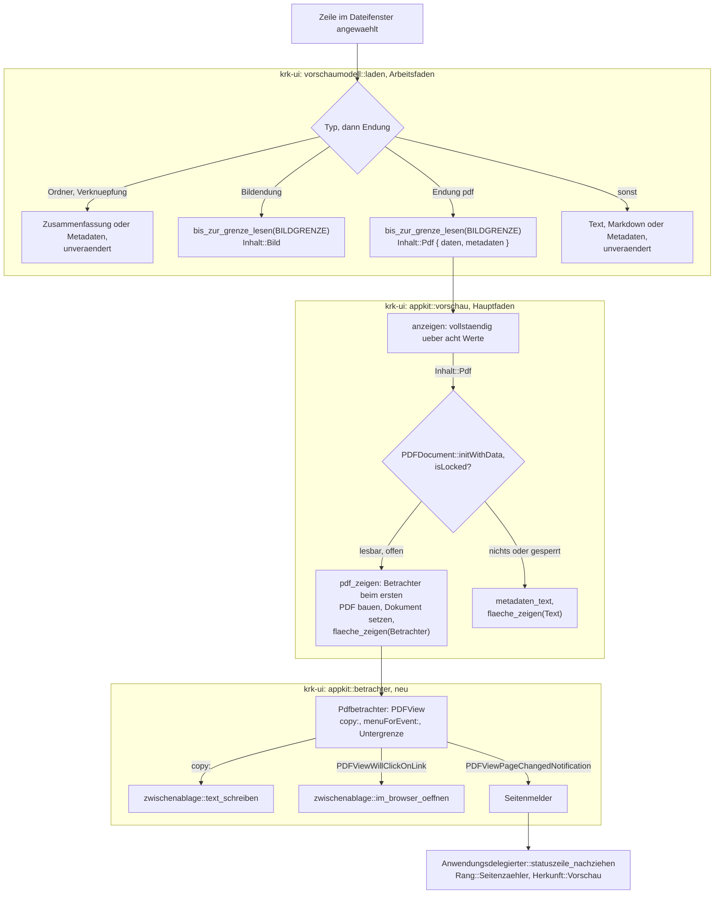
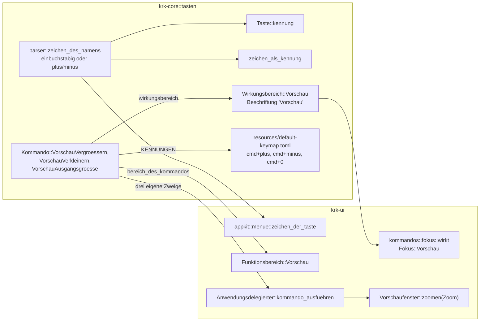
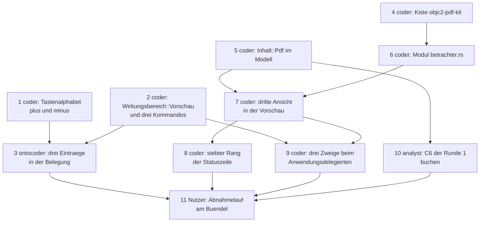

# Implementierungsplan: Die Vorschau rendert PDF als Betrachter mit Zoom, Blättern und Seitenzähler

**Date:** 2026-08-28
**Status:** freigegeben am 260828 (Plan-Tor), Bau läuft
**Spec:** `circles/260827-2028-vorschau-rendert-pdf-als-betrachter/planning/260828-0649_*_spec-vorschau-rendert-pdf-als-betrachter.md`, vom Nutzer am 260828 freigegeben, A1 bis A10 ohne Einspruch
**Decidability:** Die tragende Frage lautet: *Ist die angewählte Datei ein anzeigbares PDF, welche Seite steht im Ausschnitt, und welche Taste trägt die Beschriftung `+`?* Die ersten zwei Drittel sind aus den Eingaben entscheidbar, die der Mechanismus hat. Ob die Datei angezeigt wird, entscheidet die Endung am Pfad (Festlegung A10), `stat(2)` gegen `BILDGRENZE` vor jedem Lesen, und danach die PDF-Bibliothek des Systems am gelesenen Inhalt: `PDFDocument::initWithData` liefert für Beschädigtes nichts, und `isLocked` sagt, ob ein Kennwort fehlt; drei Antworten, ein Rückfall. Welche Seite im Ausschnitt steht, beantwortet `PDFView::currentPage` aus dem sichtbaren Rechteck, das die Ansicht selbst hält, und meldet jeden Wechsel als `PDFViewPageChangedNotification`. Das letzte Drittel ist es **nicht**: der Ereignisabgriff liest das Zeichen einer Taste ohne Zusatztasten (`crates/krk-ui/src/appkit/ereignisse.rs:742-745`), und auf einer US-amerikanischen Belegung trägt keine Taste ohne Zusatztaste ein `+`. Der Plan nähert das nicht an. Er baut die Regel, die der Abgriff entscheiden kann, nämlich „die Taste, die ohne Zusatztaste ein `+` meldet", und legt den Wechsel des Mechanismus dem Nutzer als Datensatz vor (`decisions/260828-0712_*_wie-erreicht-eine-us-tastaturbelegung-cmd-plus-wenn-das-pluszeichen-dort-die-umschalttaste-braucht.md`); C3.2 hält damit bis zur Antwort für die deutsche Belegung des Referenzgeräts und für den Zehnerblock, und für die US-Hälfte nicht.

---

## Directive

Wer im Dateifenster eine PDF-Datei anwählt, sieht sie im Vorschaufenster als fortlaufende Rolle ihrer Seiten; `cmd+plus`, `cmd+minus` und `cmd+0` verändern die Größe, die Statuszeile nennt „Seite N von M", Text auf der Seite ist markierbar und geht über die eine Hülle um die Zwischenablage nach draußen, und über 64 MB, bei Beschädigung oder bei einem Kennwort fällt die Anzeige auf die Metadaten. Der Spec schreibt fünf Fähigkeiten mit 45 Abnahmekriterien aus; dieser Plan wiederholt sie nicht, sondern ordnet jedem Kriterium eine Stelle im Baum oder im Abnahmelauf zu.

Drei Antworten des Nutzers vom 260828-0044 binden den Bau und sind nicht mehr zu verhandeln: drei Kommandos und kein Blatt, die fortlaufende Rolle, und Pfeil hoch und runter bleiben wirkungslos.

---

## Current State

**Die Vorschau hat drei Wege und zwei Ansichten, und PDF fällt auf den dritten Weg.** `laden` (`crates/krk-ui/src/vorschaumodell.rs:711`) verzweigt über `ist_bildpfad` (`:807`) und liest über `bis_zur_grenze_lesen` mit `BILDGRENZE` (`:764`); `pdf` steht in keiner Endungsliste, und die Datei kommt als `Inhalt::Metadaten` heraus. `Inhalt` (`:244-330`) trägt sieben Werte; `Inhalt::Bild` führt die Metadaten mit, damit `bild_zeigen` (`crates/krk-ui/src/appkit/vorschau.rs:1350`) bei einer nicht dekodierbaren Datei ohne zweites Lesen auf sie zurückfällt. Die Ansicht hält eine Textrolle und eine Bildansicht und schaltet die zwei Schalter in `text_zeigen` (`:1191-1192`) und `bild_zeigen` (`:1356-1357`) gegenläufig; `fokusansicht` (`:863-869`) fragt die Sichtbarkeit der Textrolle, um die fokussierbare Fläche zu nennen.

**Die Tastentabelle kennt genau zwei Sorten, und `+` gehört heute keiner an.** `Taste::kennung` (`crates/krk-core/src/tasten/parser.rs:193-198`) macht aus einem einbuchstabigen Namen ein `Tastenkennung::Zeichen` und aus jedem anderen einen `Tastenkennung::Code`; `zeichen_als_kennung` (`:393-396`) lässt allein ASCII-Buchstaben und Ziffern als Kennung zu. Die Probe `jede_taste_traegt_genau_eine_kennung_und_keine_zwei_dieselbe` (`:660`) verlangt für jede Zeichentaste, dass ihr Name ihr Zeichen ist. Das Hauptmenü bildet sein Kürzel in `zeichen_der_taste` (`crates/krk-ui/src/appkit/menue.rs:610-641`) mit einer **eigenen** Fassung derselben Einbuchstabenregel.

**`Wirkungsbereich` trägt sieben Werte, und `Vorschau` ist am 260823 gefallen** (`crates/krk-core/src/tasten/belegung.rs:213-298`), weil sein einziger Träger zum Rundweg wurde. Ein achter Wert verlangt Zeilen in `Wirkungsbereich::beschriftung` (`:322-332`), `fokus::wirkt` (`crates/krk-ui/src/kommandos/fokus.rs:343-368`) und in der Tafel `die_tafel_aus_sieben_wirkungsbereichen_und_fuenf_fokuswerten_geht_auf` (`fokus.rs:396`); die drei Beschriftungsproben in `crates/krk-core/tests/belegung.rs:1935-2030` laufen dagegen über das Feld `SIEBEN_BESCHRIFTUNGEN` und sähen ihn nicht, und genau das ist der offene Defekt `shared/issues/260826-1302_*_ein-achter-wirkungsbereich-uebersetzt-ohne-eintrag-im-beschriftungsfeld-der-doc-kommentar-sagt-das-gegenteil.md`.

**Die Statuszeile hat sechs Ränge, und jeder gehört einem Dateifenster.** `Rang::ALLE` (`crates/krk-ui/src/appkit/statuszeile.rs:236-242`) ist die Rangfolge; `Quellen` (`:275-290`) ist „was ein Dateifenster der Zeile anzubieten hat", und `zeile` (`:587-617`) läuft je Rang über die zwei Seiten und fragt `sichtbar_in` gegen den Bereich der Seite. `Meldung` (`:462-472`) trägt eine `Fensterseite`, und `zeilentext` (`:642-647`) stellt den Namen des Dateifensters voran, wenn es nicht das aktive ist. Ein Seitenzähler kommt aus dem Vorschaufenster und aus keiner Seite; die Bauart kennt diese Herkunft nicht.

**Der Ausführungszweig des Anwendungsdelegierten endet auf einen Auffangzweig** (`crates/krk-ui/src/appkit/anwendung.rs:3412`, `andere => self.bereichskommando(fokus, andere)`), und `Vorschaufenster::kommando_ausfuehren` (`vorschau.rs:998-1017`) führt allein die vier Tabbefehle aus. Ein Zoombefehl ohne eigenen Zweig übersetzte, stünde im Menü und täte nichts; C3.8 verlangt den eigenen Zweig.

**Die Kopierstelle der Vorschau ist eine Überschreibung an einer `NSTextView`** (`Vorschautext::auswahl_ablegen`, `vorschau.rs:462-476`), und `text_auf_ablage_schreiben` (`crates/krk-ui/src/appkit/zwischenablage.rs:259-262`) ist die eine Schreibstelle; `text_schreiben` (`:270-272`) reicht ihr die Zwischenablage des Nutzers hinein. Der Systembrowser wird an genau einer Stelle geöffnet, `im_browser_oeffnen` (`:285-290`).

**Die Bibliothek des Systems für PDF hat eine `objc2`-Kiste, und sie liegt noch nicht im Baum.** `objc2-pdf-kit` 0.3.2 (crates.io, geprüft am 260828) gehört zur Generation von `objc2-app-kit` 0.3.2 aus `Cargo.lock:367-369`, hat `build = false`, keinen `build.rs` und hängt allein an `objc2`, `objc2-foundation`, `objc2-app-kit`, `objc2-core-foundation` und wahlweise `objc2-core-graphics` und `bitflags`; jede Klasse ist ein eigenes Merkmal, und die Vorgabemerkmale ziehen sämtliche Anmerkungs- und Formularklassen mit herein.

---

## Approach

Der Plan setzt an fünf Nähten an, die es schon gibt, und legt eine sechste neu: ein Modul für die Betrachterklasse, weil AppKit sie als eigenständiges Objekt führt und `appkit/mod.rs` genau so schneidet.

**Erstens tritt der Betrachter als vierter Weg in `laden` und als achter Wert von `Inhalt`.** `Inhalt::Pdf { daten: Arc<Vec<u8>>, metadaten: Metadaten }` ist gebaut wie `Inhalt::Bild`: die Bytes reisen geteilt, die Metadaten fahren für den Rückfall mit. Die Grenze ist `BILDGRENZE`, die Prüfung vor dem Lesen ist `stat(2)` in `bis_zur_grenze_lesen`, und ein neuer Rufer von `ohne_warten_oeffnen` entsteht nicht (C2.1, C2.2, C2.7). Gedeutet wird auf dem Hauptfaden in der Ansicht, so wie `NSImage::initWithData` heute: `PDFDocument::initWithData` und `isLocked` beantworten „beschädigt" und „verschlüsselt", und beide enden in `metadaten_text` (A9, C2.3 bis C2.6).

**Zweitens bekommt die Anzeigefläche eine dritte Ansicht und einen einzigen Schalter.** Statt zweier gegenläufiger `setHidden`-Paare entsteht die Aufzählung `Flaeche { Text, Bild, Betrachter }` mit der einen Funktion `flaeche_zeigen`, vollständig und ohne Auffangzweig; `text_zeigen`, `bild_zeigen` und das neue `pdf_zeigen` rufen sie. Der Betrachter entsteht erst beim ersten PDF (`OnceCell`), damit Z2 aus der Bauart folgt und nicht aus einer Probe.

**Drittens wächst das Tastenalphabet um zwei benannte Zeichen, mit einer Regel statt zweier.** Die Zuordnung von Name auf Zeichen wird zu einer Funktion `zeichen_des_namens` im Kern, die die Einbuchstabenregel und die zwei Namen `plus` und `minus` trägt; `Taste::kennung`, `zeichen_als_kennung` und `menue::zeichen_der_taste` fragen sie, und die eigene Fassung im Menü fällt. Die zwei Tasten tragen als Stelle den Zehnerblock, weil das die einzige Stelle ist, die auf jeder Belegung dasselbe Zeichen meldet; nachgeschlagen wird über das Zeichen.

**Viertens kommt `Wirkungsbereich::Vorschau` zurück, mit drei Trägern und mit der Probe, die den Defekt `260826-1302` schließt.** Die drei Kommandos bekommen ihre drei Pflichtstellen und je einen eigenen Zweig im Anwendungsdelegierten, nicht im Auffangzweig; die Beschriftung „Vorschau" ist die dritte Spalte von C3.6.

**Fünftens bekommt die Statuszeile einen siebten Rang mit einer zweiten Herkunft.** `Rang::Seitenzaehler` steht zwischen Filterstand und Markierungsstand (A5), und `Meldung` trägt statt einer `Fensterseite` eine `Herkunft { Dateifenster(Fensterseite), Vorschau }`, damit `zeilentext` weiterhin genau dann einen Namen voranstellt, wenn ein nicht aktives Dateifenster spricht. Der Zähler kommt als `Option<String>` aus dem Vorschaufenster, ist `None` ohne angezeigtes PDF, und wird über einen Melder nachgezogen, den `PDFViewPageChangedNotification` auslöst.





---

## Die zehn Entscheidungen aus `## Open for Planner`

### 1. Welche Klasse den Betrachter trägt und welche Kiste sie anspricht

**`PDFView` aus dem Systemrahmen PDFKit, über die Kiste `objc2-pdf-kit` 0.3.2, ohne Vorgabemerkmale und mit genau den Merkmalen, die der Betrachter nennt.** Die Alternative, die Klasse über `objc2::class!("PDFView")` und `msg_send!` ohne Kiste anzusprechen und PDFKit wie CoreServices in `fsevents.rs:180` mit einem `#[link]`-Block zu binden, kostete jede Typangabe an jedem Aufruf und machte aus zwölf gebundenen Methoden zwölf handgeschriebene Selektoren mit selbst behaupteten Signaturen. Die Kiste ist derselben Bauart wie `objc2-app-kit`: erzeugte Bindungen, kein `build.rs`, kein C, `build = false` in ihrer `Cargo.toml`. Constraint 4 hält sie damit; die Stop-Bedingung unten zählt `cc` in `Cargo.lock` nach.

Die Merkmale sind `std`, `objc2-app-kit`, `objc2-core-foundation`, `PDFView`, `PDFDocument`, `PDFPage` und `PDFSelection`. `objc2-core-foundation` ist nötig, weil `scaleFactor`, `minScaleFactor` und `maxScaleFactor` einen `CGFloat` tragen und die Kiste diese Methoden hinter dem Merkmal versteckt; `krk-ui` führt die Kiste ohnehin. `objc2-core-graphics` bleibt aus: es wird keine Seite selbst gezeichnet. Die Begründung steht wie bei jeder fremden Kiste an der Versionsangabe in der Wurzel-`Cargo.toml`, nach dem Muster von `objc2-quartz-core` (`Cargo.toml:249-258`).

**Folge für den Baum:** vier neue Zeilen in `Cargo.lock` (`objc2-pdf-kit` und keine weitere Kiste, weil alle Abhängigkeiten schon liegen; `bitflags` liegt schon), ein neues Modul `appkit/betrachter.rs` mit Untergrenzen-Abschnitt, in dem PDFKit seit macOS 10.4 steht und die jüngsten angesprochenen Stücke (`displayDirection`, `pageBreakMargins`, `scaleFactorForSizeToFit`, `minScaleFactor`, `maxScaleFactor`) seit 10.13; alle Angaben liest der Coder am SDK nach und schreibt sie aus, wie die Gewohnheit des Verzeichnisses es verlangt.

### 2. Ob die Bibliothek beim Start oder beim ersten PDF geladen wird

**Beim Start, und die Objekte beim ersten PDF.** Die Kiste bindet PDFKit als Framework an das Binärprogramm; `dyld` bildet es beim Programmstart ab, wie `AppKit` und `QuartzCore` heute. Ein Laden beim ersten PDF hieße `dlopen` von Hand und eine Kiste ohne `#[link]`, also genau die Entscheidung 1 ablehnt. Was Z2 verlangt, ist davon unabhängig und wird gehalten: kein `PDFView` und kein `PDFDocument` entsteht, bevor `anzeigen` zum ersten Mal `Inhalt::Pdf` sieht; der Betrachter wohnt in einer `OnceCell` und wird in `pdf_zeigen` gebaut, nirgends sonst.

**Was das kostet und wie der Plan es hält:** ob das zusätzliche Framework L1 auf dem Referenzgerät berührt, ist ungemessen. PDFKit liegt im gemeinsamen Cache des Systems, und `AppKit` lädt es auf vielen Wegen ohnehin nach (`inference:` `NSTextView` und die Dienste sprechen PDFKit für Drucken und Vorschau an; nicht nachgelesen). Die Risikotabelle nennt den Lauf, der die Zahl liefert: der nächste Abnahmelauf der zehn Zusagen aus C8, den diese Runde nicht fährt.

### 3. Wie das Tastenalphabet um `plus` und `minus` wächst

**Mit einer Zuordnungsfunktion `zeichen_des_namens(name: &str) -> Option<char>` in `parser.rs`, die die Einbuchstabenregel und die zwei Namen trägt, und zwei Tabelleneinträgen mit dem Zehnerblock als Stelle.**

`Taste::kennung` fragt die Funktion statt der Namenslänge; ein Name, dem sie ein Zeichen zuordnet, ist eine Zeichentaste, jeder andere eine Stellentaste. `zeichen_als_kennung` lässt ein gemeldetes Zeichen dann zu, wenn irgendein Name der Tabelle es trägt; für Buchstaben und Ziffern ist das die heutige Antwort, für `+` und `-` die neue. `menue::zeichen_der_taste` verliert seine eigene Einbuchstabenregel (`menue.rs:612-615`) und ruft `taste.zeichen()`; dass beide Fassungen dieselbe Regel sind, behauptet der Modulkopf des Parsers heute schon (`parser.rs:189-192`), und nach diesem Schritt ist es eine Fassung. `Tastendruck::zeichen` (`crates/krk-core/src/tasten/mod.rs:68-73`) und sein Doc-Kommentar ziehen nach: „ein ASCII-Kleinbuchstabe, eine ASCII-Ziffer, `+` oder `-`".

**Warum der Zehnerblock als Stelle.** Ein Eintrag von `TASTEN` trägt einen Code, und `Tastendruck::neu` (`mod.rs:85-91`) leitet aus dem Code das Zeichen ab, für die selbst gebauten Ereignisse der Messstrecke. `kVK_ANSI_KeypadPlus` und `kVK_ANSI_KeypadMinus` sind die zwei Stellen, die auf **jeder** Belegung `+` und `-` melden; die Stelle rechts neben `ü` heißt auf der US-Belegung `]`. Die Codes kommen als `Herkunft::Dokumentiert` aus `Events.h` des SDK, wie die übrigen; der Coder liest sie dort nach und schreibt den Namen aus. Der Satz im Kopf von `TASTEN`, der den Zehnerblock ausschließt (`parser.rs:236-242`), wird um die zwei Ausnahmen und ihren Grund ergänzt.

**Was die Probe `jede_taste_traegt_genau_eine_kennung_und_keine_zwei_dieselbe` verlangt** (`parser.rs:660-690`): heute `taste.name == zeichen.to_string()` und `is_ascii_alphanumeric`. Beides wird durch die Frage an `zeichen_des_namens` ersetzt, und eine neue Probe hält fest, dass `+` und `-` über das Zeichen und `pageup` weiterhin über die Stelle gefunden werden (C3.2, deutsche Hälfte). `die_tabelle_deckt_die_ganze_schreibweise_ab` bekommt die zwei Namen dazu. `TASTEN` wächst auf 63.

**Was der Mechanismus nicht entscheiden kann, und wo es liegt.** Der Abgriff liest das Zeichen ohne Zusatztasten. Auf der deutschen Belegung ist die beschriftete Taste damit getroffen (C3.1); auf der US-Belegung liegt `+` auf `shift+=`, und der Abgriff sieht ein `=`. Der Datensatz `decisions/260828-0712_*_wie-erreicht-eine-us-tastaturbelegung-cmd-plus-wenn-das-pluszeichen-dort-die-umschalttaste-braucht.md` legt drei Möglichkeiten mit ihren Folgen vor; der Plan baut die erste. Ohne Antwort ist C3.2 zur Hälfte gehalten, und die Risikotabelle sagt es.

### 4. Ob `Wirkungsbereich` den Wert `Vorschau` zurückbekommt

**Ja, als achter Wert, Beschriftung „Vorschau".** Die drei Zoombefehle wirken allein im Vorschaufenster (Antwort 1b), und kein vorhandener Wert sagt das: `Dateibereiche` schließt Dateifenster und Editor ein, `Tabbereich` das Dateifenster, `Navigator` Dateifenster und Leiste. Die Alternative, die drei mit `Ueberall` durchzulassen und im Ausführungszweig nach dem Fokus zu fragen, wäre die „Abfrage je Aufrufstelle", die der Modulkopf von `belegung.rs:118-121` ausdrücklich ausschließt, und sie graute den Menüeintrag nicht aus (C3.5 verlangt es). Der Wert hatte bis zum 260823 genau diese Bedeutung und ist mit dem Verlust seines einzigen Trägers gefallen; mit drei Trägern kommt er zurück, und der Doc-Kommentar an `Dateibereiche` (`belegung.rs:235-238`) verliert dabei den Satz, ein Wert für die Vorschau allein hätte keinen Träger.

**Folgen, die der Übersetzer einfordert:** `beschriftung` (`belegung.rs:322-332`), `fokus::wirkt` (`fokus.rs:343-368`; Antwort `fokus == Fokus::Vorschau`), die Tafel in `fokus.rs:396-418` (acht Zeilen statt sieben, Feldbreite in der Typangabe). **Folgen, die er nicht einfordert, und die dieser Plan deshalb ausschreibt:** die drei Beschriftungsproben in `crates/krk-core/tests/belegung.rs:1935-2030` laufen über `SIEBEN_BESCHRIFTUNGEN` und sähen den achten Wert nicht (`shared/issues/260826-1302_*`). Der Schritt baut, was jener Datensatz als Richtung nennt: die Varianten werden mit `varianten_der_aufzaehlung("krk-core/src/tasten/belegung.rs", "Wirkungsbereich")` (`crates/krk-core/tests/gemeinsam/mod.rs:411`) aus dem Quelltext gelesen und gegen das Feld gehalten, so dass ein Wert ohne Feldzeile rot wird; der Halbsatz „und damit im Feld" im Doc-Kommentar von `stelle_in_den_sieben` fällt. Der Datensatz wird damit im selben Commit geschlossen. **CLAUDE.md** nennt für `Wirkungsbereich` sieben Werte und ist nach diesem Schritt falsch; der Abgleich der normativen Flächen gehört dem Kurator am Tor von `/fusion:cleanup`, und dieser Plan trägt dafür keinen Schritt, weil `curator` nicht in der Executor-Menge steht. Die Risikotabelle nennt es.

### 5. Ob der Seitenzähler ein siebter Rang wird oder in einen bestehenden fällt

**Ein siebter Rang, `Rang::Seitenzaehler`, zwischen `Filterstand` und `Markierungsstand`, und mit einer zweiten Herkunft.**

In einen bestehenden Rang fiele er nur, wenn ein Dateifenster ihn trüge, denn `Quellen` ist „was ein Dateifenster der Zeile anzubieten hat" (`statuszeile.rs:275`). Der Seitenzähler kommt aus dem Vorschaufenster, das zu keiner Seite gehört; ihn in die `Quellen` der aktiven Seite zu schreiben, wäre eine Lüge über seine Herkunft, die `zeilentext` beim nächsten Seitenwechsel als „linkes Dateifenster: Seite 3 von 9" ausspräche. Also:

- `Rang::ALLE` wird `[Rang; 7]`, und die Reihenfolge ist die aus A5. `Rang::art(Seitenzaehler)` ist `Art::Vorgang`: eine Seitenzahl ist kein Fehler und wird nicht rot (C4.6).
- `Rang::herkunft(self) -> Herkunftsart { Dateifenster, Vorschau }` sagt, wer einen Rang trägt; vollständig, ohne Auffangzweig. `Quellen::text` bleibt vollständig über `Rang` und antwortet für `Seitenzaehler` mit `None`, mit dem Kommentar, dass kein Dateifenster diesen Rang trägt und `zeile` ihn beim Vorschaufenster holt.
- `Meldung::seite: Fensterseite` wird zu `Meldung::herkunft: Herkunft { Dateifenster(Fensterseite), Vorschau }`. `zeilentext` stellt den Namen genau dann voran, wenn die Herkunft ein nicht aktives Dateifenster ist; die Regel bleibt eine.
- `zeile` bekommt einen fünften Parameter `vorschau: Option<&str>` und fragt für einen Vorschau-Rang `sichtbar_in(sichtbar, Bereich::Vorschau)` mit derselben Funktion wie für die Seiten: eine ausgeblendete Vorschau bewirbt sich nicht, wie ein ausgeblendetes Dateifenster (C4.4 folgt daraus mit).
- Der Text „Seite N von M" entsteht in `seitenzaehler_text(aktuell: usize, gesamt: usize) -> String` neben `filterstand_text` (`statuszeile.rs:423`), aus demselben Grund, der dort steht: er gehört zu keiner Fähigkeit außer der Zeile selbst; jede Zahl geht durch `zahl`.
- `Anwendungsdelegierter::statuszeile_nachziehen` (`anwendung.rs:5006-5049`) holt `self.vorschau().seitenzaehler()` als vierte Eingabe. Nachgezogen wird sie von einem Seitenmelder, den das Vorschaufenster bei `PDFViewPageChangedNotification`, bei jedem `anzeigen` und bei jedem Tabwechsel ruft (C4.2, C4.7); der Melder wird in `oberflaeche_aufbauen` gesetzt, nach dem Muster von `Hauptfenster::melder_setzen` (`fenster.rs:268`), und hält den Delegierten schwach.

Die Proben `assert_eq!(Rang::ALLE.len(), 6, "kein siebter Rang")` (`statuszeile.rs:1059`, `:1311`) halten heute genau das Gegenteil fest und werden auf sieben umgeschrieben; sie sind die Stelle, an der der Coder die Einordnung bewusst trifft, und keine Panne.

### 6. Wo die Abfangstelle des Kopierens am Betrachter liegt

**An der Überschreibung von `copy:` in der Unterklasse `Pdfbetrachter: PDFView`.** `PDFView` beantwortet `copy:` selbst und legt dabei seine Auswahl ab; jede der Wege aus C5.2 und C5.3 endet dort: `cmd+c` über den Menüeintrag mit Ziel `nil`, der Eintrag „Kopieren" des Hauptmenüs, und der Eintrag im eigenen Kontextmenü von `PDFView`, das seinen Kopierbefehl an den Ersthelfer schickt (`inference:` aus dem Verhalten von Vorschau.app und der Bindung `PDFView::copy(sender)`; am Bündel abzunehmen wie die fünf Wege der Runde 14). Die Überschreibung liest `currentSelection()?.string()`, tut bei leerer oder fehlender Auswahl nichts (C5.5) und reicht den Text sonst an `zwischenablage::text_schreiben` (`zwischenablage.rs:270`), das schon heute die Zwischenablage des Nutzers an die eine Schreibstelle reicht. Das neue Modul nennt `NSPasteboard` nicht.

`writeSelectionToPasteboard:types:` kommt nicht in Frage: die Methode gehört `NSTextView`, und `PDFView` ist keine. Die Zählprobe `die_abfangstelle_steht_im_baum_genau_einmal` (`vorschau.rs:2019`) bleibt deshalb unverändert wahr und bekommt ein Geschwister für `copy:` im neuen Modul.

**Ein Ziehen der Auswahl aus dem Betrachter heraus geht nicht über diese Stelle** und legt ab, was PDFKit ablegt. C5 nennt das Ziehen nicht; der Plan ändert daran nichts und sagt es, damit der Abnahmelauf es nicht als Defekt liest.

### 7. Wie der Betrachter den Fokus meldet

**Über den Ansichtsbaum, wie heute, und ohne Anmeldung bei `ist_eigene_textflaeche`.** `bereich_des_ersthelfers` (`anwendung.rs:6003-6016`) fragt `isDescendantOf:` gegen die Wurzel jedes Bereichs; ein `PDFView` im Teilbaum der Inhaltsfläche und jede seiner inneren Ansichten liegt damit in `Bereich::Vorschau`, und `Fokus::Vorschau` tritt ein, sobald ein Klick den Rang dorthin setzt (C5.6). `ist_eigene_textflaeche` (`anwendung.rs:2594-2606`) bleibt bei zwei Flächen: Constraint 6 knüpft die Anmeldung daran, ob die Fläche einer der drei Textklassen von AppKit angehört, und `PDFView` ist eine `NSView` (`PDFView.h`, am SDK nachzulesen; die Kiste bindet `PDFView: NSView`). Welche innere Ansicht PDFKit zum Ersthelfer macht, ist privat und nicht zugesagt; `inference:` es ist keine `NSTextView`, weil PDFKit seine Seiten selbst zeichnet und keinen Textspeicher aufspannt. Trifft die Erschließung nicht, gehören mit dem Fokus im Betrachter alle Tasten AppKit, und der Abnahmelauf zeigt es an C3.1 und C1.4 als erstes; die Gegenmaßnahme stünde dann in `ist_eigene_textflaeche` als dritter Vergleich über `isDescendantOf:` gegen den Betrachter und nicht in `ereignisse.rs`. Die Risikotabelle trägt das.

`Vorschaufenster::fokusansicht` (`vorschau.rs:863-869`) wird dreiwertig: die Textanzeige, der Betrachter oder die Inhaltsfläche, je nachdem, welche `Flaeche` steht. `fokus_vorschau` (`shift+cmd+y`) und der Anker des Teilens (`anwendung.rs:3789-3792`) gehen damit auf die richtige Fläche. Die Probe `die_zuordnung_auf_eine_ansicht_steht_in_der_vorschau_genau_einmal` (`vorschau.rs:2100`) zieht mit.

### 8. Schrittweite und Grenzen des Zooms

**Die Schrittweite ist die von PDFKit über `zoomIn:` und `zoomOut:`, die Grenzen sind zwei Konstanten im neuen Modul: `ZOOM_MIN = 0.25` und `ZOOM_MAX = 8.0`, gesetzt über `setMinScaleFactor` und `setMaxScaleFactor`.** `canZoomIn` und `canZoomOut` antworten an der Grenze `false`, und `zoomen` tut dann nichts und meldet nichts (C3.9, A2). Eine eigene Schrittweite über `setScaleFactor` wäre eine zweite Zoomregel neben der der Trackpad-Geste, die PDFKit selbst führt (A4, C3.11); mit `zoomIn:` teilen sich Taste und Geste dieselbe Maschine. Welchen Faktor PDFKit je Schritt nimmt, steht in keinem Kopf des SDK (`inference:` rund √2; am Bündel zu sehen, und A2 verlangt allein, dass jeder Schritt sichtbar ist).

**Die Ausgangsgröße ist `setAutoScales(true)`** (A1, C3.1, C3.12): PDFKit passt die Seite in die Breite ein und folgt einer Größenänderung der Ansicht, solange der Schalter steht; ein `zoomIn:` nimmt ihn zurück (`inference:` aus der Beschreibung von `autoScales` im SDK; nachzulesen). `cmd+0` setzt ihn wieder. Beim Setzen eines neuen Dokuments steht er, weil der Betrachter bei jedem `pdf_zeigen` `setAutoScales(true)` ruft; damit folgt A3 aus der Bauart: ein anderes Dokument kommt in Ausgangsgröße, und `Datei::ALLE` wächst nicht.

**Was ein Tabwechsel bewahrt, und was nicht.** Es gibt einen Betrachter und ein Dokument. `pdf_zeigen` merkt sich, welche Bytes (`Arc::ptr_eq`) das Dokument trägt, und setzt es nicht neu, wenn dieselben Bytes wiederkommen; ein Tabwechsel auf einen Text und zurück zeigt das PDF dann samt Zoom und Ausschnitt unverändert (C1.7). Liegt zwischen den zwei Anzeigen ein **anderes** PDF, wird das Dokument aus den Bytes neu gedeutet und kommt in Ausgangsgröße; C1.7 verlangt „unverändert" für Inhalt und Seitenzähler, und beides gilt, während Zoom und Ausschnitt in diesem Fall nicht überleben. Das ist dieselbe Grenze, die die Textanzeige heute hat: `text_zeigen` setzt den Text bei jedem Wechsel neu und verliert dabei den Bildlauf. Ein Dokument je Tab zu halten, wäre die andere Bauart; A3 sagt ausdrücklich, dass der Zoom nicht gemerkt wird, und dieser Plan geht nicht weiter als A3.

### 9. Ob der Betrachter das Dokument aus den gelesenen Bytes oder aus dem Deskriptor baut

**Aus den gelesenen Bytes, über `PDFDocument::initWithData` auf dem Hauptfaden.** Der Weg vom Pfad zu den Bytes ist `bis_zur_grenze_lesen`, und C2.7 verlangt, dass es bei ihm bleibt; ein `PDFDocument::initWithURL` öffnete die Datei ein zweites Mal, an der Hülle vorbei und ohne Grenze, und läse eine benannte Röhre wieder blockierend (`vorschaumodell.rs:145-152`). Die Bytes reisen als `Arc<Vec<u8>>` wie beim Bild, und `NSData::with_bytes` legt sie für PDFKit an. Gedeutet wird in der Ansicht und nicht auf dem Arbeitsfaden: ein `PDFDocument` ist ein AppKit-Wert, der den Kanal nicht überschreiten darf, und `vorschaumodell.rs` bleibt ohne `objc2`-Zeile. Das Deuten kostet auf dem Hauptfaden das Lesen der Querverweistabelle; die Seiten zeichnet PDFKit auf eigenen Fäden. Das ist dieselbe Verteilung wie beim Bild, und L7 fragt ohnehin `laedt_noch` und nicht das Zeichnen.

### 10. Wie der Plan die Berührung von C6 der Runde 1 bucht

**Als Defektdatensatz in `issues/` dieses Circles, wie die Runde 19 es für C2.5 der Runde 16 getan hat, und mit einem Coder-Schritt, der den Modulkopf von `vorschaumodell.rs` nachzieht.** Der Abschnitt `# Die Dreiteilung der Anzeige (C6)` (`vorschaumodell.rs:28-35`) sagt nach dieser Runde vier Wege auf eine Datei und behält seinen Namen, weil C6 der Runde 1 so heißt; der Absatz darunter erklärt, dass der vierte Weg ein Betrachter ist und der dritte unverändert alles Übrige trägt. Der Datensatz hält eine Aussage: die Dreiteilung aus C6 der Runde 1 ist seit dieser Runde eine Vierteilung, das Wort im Spec der Runde 1 trifft für die Anzeige als Ganzes nicht mehr zu, und der fremde Spec wird nicht angefasst. Er bleibt offen, weil die Schließung dem Nutzer gehört.

---

## Implementation Steps

Jeder Schritt nennt genau einen Executor. Schritt 11 ist der einzige außerhalb der Executor-Menge: der Abnahmelauf am laufenden Bündel verlangt KRK im Vordergrund und ist Nutzerarbeit (`circles/260802-0842-krk-mac-dateimanager-editor-git/decisions/260806-1303_*_wie-kommt-krk-fuer-den-abnahmelauf-in-den-vordergrund.md`, offen).

1. **Das Tastenalphabet trägt `plus` und `minus`**
   - Executor: `coder`
   - Files: `crates/krk-core/src/tasten/parser.rs`, `crates/krk-core/src/tasten/mod.rs`, `crates/krk-ui/src/appkit/menue.rs`
   - Changes: In `parser.rs` entsteht `pub const fn zeichen_des_namens(name: &str) -> Option<char>`: ein einbuchstabiger Name aus ASCII-Kleinbuchstabe oder Ziffer ist sein eigenes Zeichen, `plus` ist `+`, `minus` ist `-`, jeder andere Name hat keines. `Taste::kennung` (`:193-198`) fragt sie statt der Namenslänge; `zeichen_als_kennung` (`:393-396`) lässt ein Zeichen genau dann zu, wenn ein Name der Tabelle es trägt, also Buchstaben, Ziffern, `+` und `-`, weiterhin kleingeschrieben. `TASTEN` wächst um `dokumentiert("plus", <kVK_ANSI_KeypadPlus>, "kVK_ANSI_KeypadPlus")` und `dokumentiert("minus", <kVK_ANSI_KeypadMinus>, "kVK_ANSI_KeypadMinus")`, die Codes am SDK (`HIToolbox/Events.h`) nachgelesen; die Feldbreite steigt auf 63. Der Kopf von `TASTEN` (`:236-242`) benennt die zwei Zehnerblock-Stellen als Ausnahme mit Grund; der Modulkopf (`:11-13`, `:19-48`) sagt „Buchstaben, Ziffern und die zwei Zeichentasten". Die Probe `jede_taste_traegt_genau_eine_kennung_und_keine_zwei_dieselbe` (`:660-690`) prüft gegen `zeichen_des_namens` statt gegen `taste.name == zeichen.to_string()` und `is_ascii_alphanumeric`; `die_tabelle_deckt_die_ganze_schreibweise_ab` nennt die zwei Namen; eine neue Probe belegt C3.2 (deutsche Hälfte): `Kombination::lesen("cmd+plus")` und `Kombination::aus_tastendruck` für einen Tastendruck mit gemeldetem `+` und beliebigem Code treffen dieselbe Taste, und `pageup` wird weiterhin über die Stelle gefunden. `Tastendruck::zeichen` und sein Doc-Kommentar (`mod.rs:68-73`) zählen die zwei Zeichen mit. In `menue.rs` verliert `zeichen_der_taste` (`:610-641`) die Einbuchstabenregel und ruft `taste.zeichen()`; die Funktionstasten und Sondertasten bleiben, wie sie sind.
   - Kriterien: C3.2 (deutsche Belegung und Zehnerblock; die US-Hälfte hängt am Datensatz `260828-0712`), C3.3 (Hälfte: die Namen sind lesbar)
   - Dependencies: keine

2. **`Wirkungsbereich::Vorschau` und die drei Kommandos**
   - Executor: `coder`
   - Files: `crates/krk-core/src/tasten/belegung.rs`, `crates/krk-core/tests/belegung.rs`, `crates/krk-ui/src/belegungsmodell.rs`, `crates/krk-ui/src/kommandos/fokus.rs`, `crates/krk-ui/src/kommandos/zulaessigkeit.rs`
   - Changes: `Wirkungsbereich` bekommt den achten Wert `Vorschau` („wirkt nur, wenn der Fokus im Vorschaufenster steht; die drei Zoombefehle der Runde 20; bis zum 260823 stand er hier mit einem Träger") mit Beschriftung `"Vorschau"` in `beschriftung`; der Doc-Kommentar an `Dateibereiche` (`:235-238`) und der an der Aufzählung (`:170-200`, „Sieben Werte") ziehen nach. `Kommando` bekommt `VorschauVergroessern`, `VorschauVerkleinern` und `VorschauAusgangsgroesse` mit Doc-Kommentaren, die A1, A2 und A6 nennen; `KENNUNGEN` wächst auf 82 mit `vorschau_vergroessern`, `vorschau_verkleinern`, `vorschau_ausgangsgroesse`; `wirkungsbereich` gibt den dreien `Wirkungsbereich::Vorschau`. In `belegungsmodell.rs` treten die drei bei `Funktionsbereich::Vorschau` (`:328-330`). `fokus::wirkt` bekommt `Wirkungsbereich::Vorschau => fokus == Fokus::Vorschau`; die Tafel (`fokus.rs:396-418`) wächst auf acht Zeilen und der Probenname auf „acht". In `tests/belegung.rs` werden die drei Beschriftungsproben (`:1935-2030`) über die Varianten geführt, wie der Defekt `shared/issues/260826-1302_*` es vorzeichnet: `varianten_der_aufzaehlung("krk-core/src/tasten/belegung.rs", "Wirkungsbereich")` liefert die Namen, jede muss im Feld (jetzt `ACHT_BESCHRIFTUNGEN`) genau einmal stehen, und der Halbsatz „und damit im Feld" fällt; der Datensatz wird mit `Resolved:` geschlossen. Eine neue Probe hält fest, dass die drei Kommandos `Wirkungsbereich::Vorschau` tragen und `die_drei_faelle_aus_c5` unberührt bleibt. In `zulaessigkeit.rs` kommen zwei Proben dazu: mit `Fokus::Vorschau` sind die drei zulässig, mit `Fokus::Dateifenster`, `Leiste` und `Editor` nicht (C3.5, C3.7, Probenhälfte).
   - Kriterien: C3.5, C3.6 (Beschriftung), C3.7 (Zulässigkeit), Constraint 2 (drei Pflichtstellen)
   - Dependencies: keine

3. **Die drei Einträge in der Auslieferungsbelegung**
   - Executor: `ontocoder`
   - Files: `resources/default-keymap.toml`
   - Changes: Ein neuer kommentierter Block „Runde 20: der PDF-Betrachter" hinter dem Block von `zwischenablage_springen` (`:668-672`, Ende des C10-Abschnitts) mit drei `[[funktion]]`-Einträgen: `vorschau_vergroessern` / „Vorschau vergrößern" / `["cmd+plus"]`, `vorschau_verkleinern` / „Vorschau verkleinern" / `["cmd+minus"]`, `vorschau_ausgangsgroesse` / „Vorschau in Ausgangsgröße" / `["cmd+0"]`; der Kommentar nennt Antwort 1b, sagt, dass Bild-auf, Bild-ab, Pos1 und Ende keine Einträge bekommen, weil sie unzulässig an AppKit laufen und dort blättern (C1.3), und dass `plus` und `minus` über das Zeichen gefunden werden. Die Zeile „Tastennamen:" im Kopf (`:70-71`) nennt `plus` und `minus` mit dem Zusatz „über das Zeichen, nicht über die Stelle" (C3.3); die Zeile „Ausgeliefert sind 85 Funktionen mit zusammen 90 Kombinationen" (`:34`) wird zu 88 und 93. Kein vorhandener Eintrag ändert sich; die drei Kombinationen sind frei (`cmd+0` trägt heute keine Funktion, `cmd+1` bis `cmd+4` liegen bei der Sortierung, `:362-380`).
   - Kriterien: C1.3 (Belegungshälfte), C3.3, C3.4
   - Dependencies: Schritte 1, 2

4. **Die Kiste `objc2-pdf-kit` mit Begründung**
   - Executor: `coder`
   - Files: `Cargo.toml`, `crates/krk-ui/Cargo.toml`, `Cargo.lock`
   - Changes: In der Wurzel-`Cargo.toml` hinter `objc2-quartz-core` (`:255-258`): `objc2-pdf-kit = { version = "0.3", default-features = false, features = ["std", "objc2-app-kit", "objc2-core-foundation", "PDFView", "PDFDocument", "PDFPage", "PDFSelection"] }` mit einem Kommentar nach dem Muster der Nachbarn: PDFKit ist die PDF-Bibliothek des Systems und steht auf jedem macOS 15; die Vorgabemerkmale zögen alle Anmerkungs-, Formular- und Miniaturenklassen herein, von denen KRK keine nennt; `objc2-core-foundation` ist nötig, weil die Zoomfaktoren `CGFloat` tragen; `objc2-core-graphics` bleibt aus, weil keine Seite selbst gezeichnet wird; die Kiste hat `build = false` und keinen C-Code. In `crates/krk-ui/Cargo.toml` `objc2-pdf-kit = { workspace = true }` mit dem Hinweis, dass `appkit/betrachter.rs` den Typnamen `PDFView` schreibt. Nach `cargo build --workspace` führt `Cargo.lock` `objc2-pdf-kit 0.3.2`, kein `cc` und außer `windows-sys` kein `-sys`-Paket (Constraint 4); der Coder prüft es mit `grep -n 'name = "cc"\|-sys"' Cargo.lock`.
   - Kriterien: Constraint 4
   - Dependencies: keine

5. **Der vierte Weg im Modell: `Inhalt::Pdf`**
   - Executor: `coder`
   - Files: `crates/krk-ui/src/vorschaumodell.rs`
   - Changes: `Inhalt` bekommt den achten Wert `Pdf { daten: Arc<Vec<u8>>, metadaten: Metadaten }` mit einem Doc-Kommentar nach dem Vorbild von `Bild` (`:268-284`): geteilt und nicht kopiert, die Metadaten fahren für den Rückfall mit, gedeutet wird in der Ansicht, und `metadaten` ist kein `Option`, weil ein PDF allein vom Dateiweg kommt (C10 bleibt aus, Out of Scope). Neben `BILDENDUNGEN` (`:217-219`) entsteht `const PDFENDUNG: &str = "pdf"`, und aus `ist_bildpfad` (`:807-811`) wird die Endungsentnahme als `fn endung_klein(pfad) -> Option<String>` herausgezogen, die `ist_bildpfad` und das neue `ist_pdfpfad` rufen; Groß- und Kleinschreibung fällt dabei an einer Stelle (C1.5, A10). `laden` bekommt zwischen dem Bild- und dem Textzweig einen dritten Zweig: `bis_zur_grenze_lesen(pfad, BILDGRENZE)` → `Inhalt::Pdf`, `Err(_)` → `Inhalt::Metadaten` mit leerer Zeilenfolge (C2.1, C2.2, C2.7); der Kommentar sagt, dass dieselbe Grenze und dieselbe Hülle gelten und keine zweite Zahl entsteht. `zeigt_dateitext` (`:587-602`) bekommt den Zweig `Inhalt::Pdf { .. } => false` (keine Nummernspalte). Der Modulkopf zieht nach: der Abschnitt `# Die Dreiteilung der Anzeige (C6)` (`:28-35`) sagt, dass eine Datei seit der Runde 20 vier Wege hat und der Betrachter der vierte ist; die Zeile in `# Die Zusammenfassung ist der vierte Weg` (`:63`) wird zu „ein weiterer Weg", damit die Zählung nicht zweimal steht. Die zwei falschen Zählangaben (`:584` „ein siebter Inhalt", `:1222` „alle sechs Werte") werden durch Sätze ohne Zahl ersetzt, wie der Defekt `shared/issues/260826-1423_*_zwei-zaehlangaben-zu-inhalt-in-vorschaumodell-rs-sind-seit-der-runde-16-um-eins-falsch.md` es als Weg nennt; der Datensatz wird mit `Resolved:` geschlossen (Constraint 7). Proben im Prüfmodul: eine `.pdf`-Datei mit `set_len(BILDGRENZE + 1)` fällt auf die Metadaten und wird nicht gelesen, nach dem Vorbild von `ein_bild_ueber_der_grenze_faellt_auf_die_metadaten` (`:1080-1093`) und mit Verweis auf die Kernprobe `eine_datei_ueber_der_grenze_wird_abgewiesen_ohne_gelesen_zu_werden` (`crates/krk-core/tests/text.rs:648`), die das Nichtlesen an der Hülle misst (Z1); `Bericht.PDF` und `bericht.pdf` liefern beide `Inhalt::Pdf` (C1.5); eine umbenannte Textdatei mit Endung `.pdf` liefert `Inhalt::Pdf` mit den Bytes, denn die Deutung liegt in der Ansicht (C2.3, Modellhälfte); die Probe `allein_der_text_einer_datei_traegt_zeilennummern` (`:1247`) nimmt den achten Wert auf.
   - Kriterien: Z1, C1.5, C1.6 (Modellhälfte), C2.1, C2.2, C2.6, C2.7, Constraint 7
   - Dependencies: keine

6. **Das Modul `appkit/betrachter.rs`: die Klasse `Pdfbetrachter`**
   - Executor: `coder`
   - Files: `crates/krk-ui/src/appkit/betrachter.rs` (neu), `crates/krk-ui/src/appkit/mod.rs`
   - Changes: `define_class!` einer Unterklasse `Pdfbetrachter` von `PDFView`, `MainThreadOnly`, mit `ivars` aus einem schwachen Rückverweis auf das `Vorschaufenster` (Muster `Inhaltsflaeche`, `vorschau.rs:291-376`) und einem `RefCell<Option<Arc<Vec<u8>>>>` als Merkposten, welche Bytes das gesetzte Dokument trägt. Vier Überschreibungen und eine Delegiertenmethode: `copy:` nach Entscheidung 6 (leere Auswahl tut nichts; sonst `zwischenablage::text_schreiben`; der Rückgabewert von `text_schreiben` wird mit `let _ =` fallen gelassen wie an den übrigen Stellen, oder gemeldet, wenn eine Statuszeilenmeldung dafür naheliegt, was der Coder mit Begründung entscheidet); `menuForEvent:` ruft `super` und hängt über `teilen::eintrag_anfuegen` den Teilen-Eintrag mit `Vorschaufenster::teilbare_pfade` an (C5.8; die Weitergabe an `super` behält PDFKits eigene Einträge, wie die Runde 14 es für die Textanzeige gewählt hat); `acceptsFirstResponder` bleibt bei der Oberklasse. Als `PDFViewDelegate` beantwortet die Klasse `PDFViewWillClickOnLink:withURL:` mit `zwischenablage::im_browser_oeffnen(url.absoluteString())` (A8, C5.7; Verweise innerhalb der Datei behandelt PDFKit vor dieser Methode selbst). Zwei `pub` Funktionen mit `#[must_use]`, wo ein Rückgabewert stillschweigend fallen könnte: `dokument_setzen(&self, daten: &Arc<Vec<u8>>) -> Deutung` mit der Aufzählung `Deutung { Gesetzt, Beschaedigt, Gesperrt }`, vollständig und ohne Auffangzweig, die `PDFDocument::initWithData` und `isLocked` fragt, bei `Arc::ptr_eq` mit dem Merkposten nichts neu setzt, und bei `Gesetzt` `setDisplayMode(SinglePageContinuous)`, `setDisplayDirection(Vertical)`, `setDisplaysPageBreaks(true)`, `setMinScaleFactor(ZOOM_MIN)`, `setMaxScaleFactor(ZOOM_MAX)`, `setAutoScales(true)` und `setDelegate` ruft (C1.1, C1.2, A1, A2); `zoomen(&self, zoom: Zoom) -> bool` über `Zoom { Groesser, Kleiner, Ausgangsgroesse }`, das `canZoomIn`/`zoomIn:`, `canZoomOut`/`zoomOut:` und `setAutoScales(true)` ruft und an der Grenze `false` liefert (C3.9). Dazu `seitenstand(&self) -> Option<(usize, usize)>` aus `currentPage`, `indexForPage` und `pageCount` (A5, C4.1, C4.3), und die Anmeldung von `PDFViewPageChangedNotification` an `NSNotificationCenter::defaultCenter` mit einem Selektor, der den Rückverweis lädt und `Vorschaufenster::seiten_melden` ruft, nach dem Muster in `nummernspalte.rs:275-297`; die Abmeldung steht, wo jene Datei sie hat. Der Modulkopf trägt den Abschnitt `# Ab welchem macOS die angesprochenen Klassen stehen` mit jeder angesprochenen Klasse, Methode, Aufzählung und Benachrichtigung samt Zeile im SDK-Kopf, nach dem Muster von `vorschau.rs:167-240`; erwartet werden 10.4 für PDFKit und 10.13 als höchste Angabe (`displayDirection`, `pageBreakMargins`, `scaleFactorForSizeToFit`, `minScaleFactor`, `maxScaleFactor`), nachgelesen und nicht übernommen. Die Konstanten `ZOOM_MIN = 0.25` und `ZOOM_MAX = 8.0` stehen mit Begründung im Kopf. `appkit/mod.rs` meldet `mod betrachter;` an und schreibt „Einunddreißig Module" (`:10`) und die Skizze darunter nach. Proben ohne Fenster im Prüfmodul: `Zoom` und `Deutung` sind vollständig (Zählprobe über `varianten`); eine Quellbaumprobe hält fest, dass `NSPasteboard` in `betrachter.rs` nicht vorkommt und `copy:` dort genau einmal überschrieben ist (C5.2, Baumhälfte).
   - Kriterien: C1.1, C1.2 (Bauart), C3.9, C5.2 (Baumhälfte), C5.7, C5.8, Constraint 3, Constraint 5
   - Dependencies: Schritt 4

7. **Die dritte Ansicht in der Vorschau**
   - Executor: `coder`
   - Files: `crates/krk-ui/src/appkit/vorschau.rs`
   - Changes: `VorschaufensterIvars` bekommt `betrachter: OnceCell<Retained<Pdfbetrachter>>` und `seitenmelder: RefCell<Option<Box<dyn Fn()>>>`. Die Aufzählung `Flaeche { Text, Bild, Betrachter }` und die eine Funktion `flaeche_zeigen(&self, flaeche: Flaeche)` setzen die drei `setHidden`; `text_zeigen` (`:1186-1193`) und `bild_zeigen` (`:1350-1370`) rufen sie statt ihrer zwei Schalterpaare, und das neue `pdf_zeigen(&self, daten: &Arc<Vec<u8>>, metadaten: &Metadaten)` baut den Betrachter beim ersten Aufruf in die Inhaltsfläche (Z2), ruft `dokument_setzen` und verzweigt vollständig über `Deutung`: `Gesetzt` → `flaeche_zeigen(Betrachter)`, `Beschaedigt` und `Gesperrt` → `text_zeigen(metadaten_text(metadaten, &[]))` (A9, C2.3 bis C2.6). `anzeigen` (`:1066-1150`) bekommt den Zweig `Inhalt::Pdf { daten, metadaten } => self.pdf_zeigen(&daten, &metadaten)`; `einzufaerben` (`:1478-1497`) den Zweig `Inhalt::Pdf { .. } => None`. `fokusansicht` (`:863-869`) wird dreiwertig über `Flaeche`; `Flaeche` wird dafür als Merkposten in einer `Cell` geführt statt aus `isHidden` gelesen. Ein `pub fn zoomen(&self, zoom: Zoom) -> bool` reicht an den Betrachter durch und liefert ohne Betrachter oder ohne gezeigtes PDF `false` (C3.7: entgegengenommen, nichts getan, keine Meldung); `pub fn seitenzaehler(&self) -> Option<String>` liefert `seitenzaehler_text` aus `seitenstand`, sobald `Flaeche::Betrachter` steht, sonst `None` (C4.4); `pub fn seitenmelder_setzen` und `fn seiten_melden` rufen den Melder, und `anzeigen` sowie `tab_waehlen` rufen `seiten_melden` am Ende (C4.2, C4.7). Der Modulkopf zieht seine Skizze (`:4-13`), den Abschnitt über die Abfangstelle (`:150-160`) und den Untergrenzen-Abschnitt nach (die Vorschau selbst spricht keine PDFKit-Klasse an; die Angaben stehen im Kopf von `betrachter.rs`). Proben: `die_zwei_schalter_stehen_je_an_genau_einer_stelle_und_dort` (`:1874`) wird zur Probe, dass `setHidden` in dieser Datei allein in `flaeche_zeigen` steht; `die_zuordnung_auf_eine_ansicht_steht_in_der_vorschau_genau_einmal` (`:2100`) nimmt die dritte Fläche auf; `eingefaerbt_wird_genau_darstellungsart_code` (`:1598`) nimmt `Inhalt::Pdf` in die Fallunterscheidung auf; eine Quellbaumprobe hält fest, dass `Pdfbetrachter::` in `vorschau.rs` allein in `pdf_zeigen` gebaut wird (Z2).
   - Kriterien: Z2, C1.1, C1.2, C1.6, C1.7, C1.8 (das Lesen bleibt auf dem Arbeitsfaden), C2.3, C2.4, C2.5, C2.6, C3.7, C3.10, C4.4, C5.6
   - Dependencies: Schritte 5, 6

8. **Der siebte Rang der Statuszeile**
   - Executor: `coder`
   - Files: `crates/krk-ui/src/appkit/statuszeile.rs`, `crates/krk-ui/src/appkit/anwendung.rs`
   - Changes: Nach Entscheidung 5: `Rang::Seitenzaehler` zwischen `Filterstand` und `Markierungsstand` in der Aufzählung und in `ALLE` (`[Rang; 7]`), `art` liefert `Vorgang`; neue Aufzählung `Herkunftsart { Dateifenster, Vorschau }` mit `Rang::herkunft`, vollständig; `Quellen::text` antwortet für `Seitenzaehler` mit `None` und sagt im Kommentar, warum; `Meldung.seite` wird `Meldung.herkunft: Herkunft { Dateifenster(Fensterseite), Vorschau }`; `zeile` bekommt `vorschau: Option<&str>` und fragt für einen Vorschau-Rang `sichtbar_in(sichtbar, Bereich::Vorschau)`; `zeilentext` stellt den Namen genau dann voran, wenn `Herkunft::Dateifenster(seite)` mit `seite != aktiv`; `pub fn seitenzaehler_text(aktuell: usize, gesamt: usize) -> String` liefert „Seite N von M" über `zahl` (C4.1). Der Doc-Kommentar von `Rang` („Die sechs Raenge", `:203-206`), von `zeile` („zwoelf Quellen", `:475`) und von `Meldung` (`:459`) und die Skizze im Modulkopf ziehen nach; die Zahl der Bewerber wird als „zwei je Dateifenster-Rang und einer für den Vorschau-Rang" ausgeschrieben und nicht als Zahl. Proben: die zwei `assert_eq!(Rang::ALLE.len(), 6)` (`:1059`, `:1311`) werden zu sieben mit der Reihenfolge Filterstand < Seitenzaehler < Markierungsstand; ein stehender Filtertext verdrängt den Zähler und lässt ihn nach dem Fallen zurück (C4.5); eine Vorgangsanzeige, eine Befehlsantwort und eine Fenstermeldung stehen über ihm (C4.6); der Zähler trägt keinen Seitennamen, auch wenn das rechte Dateifenster aktiv ist; bei ausgeblendeter Vorschau bewirbt er sich nicht; `seitenzaehler_text(1, 9)` ist „Seite 1 von 9" und `seitenzaehler_text(1200, 3400)` trägt Tausenderpunkte. In `anwendung.rs` holt `statuszeile_nachziehen` (`:5006-5049`) `self.ivars().vorschau.get().and_then(|v| v.seitenzaehler())` als fünfte Eingabe; `oberflaeche_aufbauen` setzt den Seitenmelder mit einem schwachen Griff auf den Delegierten, der `statuszeile_nachziehen` ruft, nach dem Muster von `fenster.melder_setzen`.
   - Kriterien: C4.1, C4.2, C4.3 (Bauart; die Flächenregel ist PDFKits `currentPage`), C4.4, C4.5, C4.6, C4.7
   - Dependencies: Schritt 7

9. **Die drei Ausführungszweige beim Anwendungsdelegierten**
   - Executor: `coder`
   - Files: `crates/krk-ui/src/appkit/anwendung.rs`
   - Changes: `kommando_ausfuehren` (`:3131-3418`) bekommt vor dem Auffangzweig drei eigene Zweige: `Kommando::VorschauVergroessern => self.vorschau().zoomen(Zoom::Groesser)`, `VorschauVerkleinern => … Zoom::Kleiner`, `VorschauAusgangsgroesse => … Zoom::Ausgangsgroesse`, mit dem Kommentar, dass sie nicht über `bereichskommando` gehen, weil C3.8 den eigenen Zweig verlangt und `Vorschaufenster::kommando_ausfuehren` allein die Tabbefehle führt. Ein `false` aus `zoomen` heißt wie überall in diesem `match`: kein Nachzug der Aufteilung, keine vorgemerkte Sitzung; der Tastendruck ist verbraucht, weil er zulässig war (A6, C3.7). Eine Quellbaumprobe im Prüfmodul von `anwendung.rs` oder in `zulaessigkeit.rs` (wo `quelldateien` schon gerufen wird) zählt, dass jede der drei Kennungen als `Kommando::… =>` in `kommando_ausfuehren` von `anwendung.rs` genau einmal steht und in `tabelle.rs` gar nicht (C3.8).
   - Kriterien: C3.1 (Bauart), C3.7, C3.8, C3.10
   - Dependencies: Schritte 2, 7

10. **Die Berührung von C6 der Runde 1 buchen**
    - Executor: `analyst`
    - Files: ein neuer Defektdatensatz in `circles/260827-2028-vorschau-rendert-pdf-als-betrachter/issues/`, Marker `_o_`
    - Changes: Der Datensatz hält fest, dass C6 der Runde 1 (`circles/260802-0842-krk-mac-dateimanager-editor-git/planning/260802-1036_*_spec-navigator-geruest.md`) eine Dreiteilung der Vorschau zusagt und die Anzeige seit dieser Runde für eine Datei vier Wege hat; die drei Wege der Runde 1 gelten unverändert, und der vierte tritt neben sie. Er zitiert den fremden Spec mit vollem Dateinamen und gesterntem Marker, nennt den Spec dieser Runde als Ursache und den Modulkopf von `vorschaumodell.rs` als die Stelle, die Schritt 5 nachgezogen hat, und sagt ausdrücklich, dass der fremde Spec nicht angefasst wird. Er bleibt offen, weil die Schließung dem Nutzer gehört.
    - Kriterien: keines unmittelbar; er erfüllt die zehnte Anweisung aus `## Open for Planner`
    - Dependencies: Schritt 5

11. **Der Abnahmelauf am laufenden Bündel**
    - Executor: Nutzer (kein Agent; siehe die Vorbemerkung zu dieser Liste)
    - Files: keine; geprüft wird am gebauten `target/KRK.app`
    - Changes: `cargo xtask bundle` bauen und KRK aus einem Terminalfenster im Vordergrund starten. Zu prüfen sind die Kriterien, die eine laufende Oberfläche verlangen, an einer mehrseitigen PDF-Datei, einer mit Kennwort, einer abgeschnittenen und einer umbenannten Textdatei mit Endung `.pdf`: die Rolle und das Blättern mit Bild-auf, Bild-ab, Pos1, Ende, Mausrad und Trackpad (C1.1 bis C1.4), Groß- und Kleinschreibung der Endung (C1.5), Text, Bild und Ordner nach einem PDF (C1.6), der Tabwechsel hin und zurück (C1.7), die Bedienbarkeit während des Ladens einer großen Datei (C1.8), der unveränderte Programmstart (C1.9), die drei Rückfälle ohne Meldung und ohne Absturz (C2.3 bis C2.5), die Zoomtasten mit deutscher Belegung, ihre Grenzen, die Ausgangsgröße nach einem Dateiwechsel, die Trackpad-Geste und das Nachziehen beim Verkleinern des Fensters (C3.1, C3.9 bis C3.12), die ausgegrauten Menüeinträge mit dem Fokus anderswo (C3.5), die Zeile „Seite N von M" beim Anzeigen, Blättern, Filtern und Tabwechsel (C4.1 bis C4.5, C4.7), das Markieren über Seitengrenzen, `cmd+c`, der Menüeintrag, das Kontextmenü, `cmd+a` und das leere Kopieren (C5.1 bis C5.5), der Fokusrahmen und der Fenstertitel nach einem Klick in den Betrachter (C5.6), ein Verweis nach draußen und einer innerhalb der Datei (C5.7), der Teilen-Eintrag im Kontextmenü des Betrachters (C5.8). Für C3.6 sichert der Nutzer die Belegung über den Menüeintrag „Tastenbelegung als Markdown sichern" und liest die drei Zeilen mit der dritten Spalte „Vorschau" in `~/Downloads/KRK-Tastenbelegung.md`; `make tasten` ist dafür nicht das Erzeugnis (`issues/260828-0712_*_der-spec-nennt-make-tasten-fuer-die-markdown-ausgabe-der-belegung-die-aus-dem-menue-kommt.md`).
    - Kriterien: C1.1 bis C1.9, C2.3, C2.4, C2.5, C3.1, C3.5, C3.6, C3.9 bis C3.12, C4.1 bis C4.5, C4.7, C5.1 bis C5.8
    - Dependencies: Schritte 3, 8, 9, 10



Die Schritte 1, 2, 4 und 5 haben keine Vorbedingung und können nebeneinander laufen; 3 wartet auf 1 und 2, 6 auf 4, 7 auf 5 und 6, 8 und 9 auf 7 (9 auch auf 2), 10 auf 5, und 11 auf alles.

---

## Where this Circle stops

- Alle elf Schritte dieses Plans stehen auf `[DONE]`, und jede behauptete Erledigung ist einzeln gegen den Baum gelesen; der Abgleich liegt unter `history/` dieses Circles.
- `make check` läuft grün, also `cargo build --workspace`, `cargo test --workspace`, `cargo clippy --workspace --all-targets` und `cargo fmt --all --check`.
- Jedes der 45 Abnahmekriterien des Specs hat eine benannte Stelle in einem Schritt oder im Abnahmelauf, und keines steht ohne Zuordnung da; C3.2 trägt seine US-Hälfte als offene Frage und nicht als Erledigung.
- `grep -n 'name = "cc"\|-sys"' Cargo.lock` liefert nach dieser Runde dieselben Zeilen wie davor, also allein `windows-sys`.
- `grep -rn 'ohne_warten_oeffnen(' crates/krk-core/src` liefert nach dieser Runde dieselben Rufer wie davor (C2.7).
- `grep -oE '"L[0-9]+"' crates/krk-bench/src/messen.rs | sort -u` liefert vor und nach dieser Runde dieselbe Menge; es entsteht keine elfte Zeitzusage und keine der zehn wird angefasst.
- Jede Datei unter `crates/krk-ui/src/appkit/` außer `koordinaten.rs` und `mod.rs` trägt den Abschnitt `# Ab welchem macOS die angesprochenen Klassen stehen`, `betrachter.rs` eingeschlossen, und keine genannte Untergrenze liegt über macOS 15.
- Die zwei Defektdatensätze `shared/issues/260826-1302_*` und `shared/issues/260826-1423_*` tragen eine `Resolved:`-Zeile und stehen auf `_c_`; der Datensatz zu C6 der Runde 1 steht in `issues/` dieses Circles und zitiert den fremden Spec, ohne ihn zu ändern.
- Der beantwortete Entscheidungsdatensatz `decisions/260827-2028_a_welche-tasten-…` trägt eine `Implemented:`-Zeile mit Commit und steht auf `_i_`.
- Der Datensatz `decisions/260828-0712_o_wie-erreicht-eine-us-tastaturbelegung-cmd-plus-…` ist dem Nutzer vorgelegt; seine Antwort ist **keine** Vorbedingung für den Abschluss dieser Runde, und ohne Antwort schließt die Runde mit der deutschen Hälfte von C3.2.
- Die Runde schließt **beschränkt** (`_b_`), solange der Nutzer den Abnahmelauf aus Schritt 11 nicht gefahren hat, und kohärent (`_c_`) erst danach. Kein Agent kann diesen Lauf fahren.
- Eine Auslieferung ist keine Vorbedingung dieser Runde. Wird eine gefahren, geht ihr die Durchsicht der Runde voraus und nicht umgekehrt, und `cargo xtask release` bricht ohne passenden Tag auf HEAD von selbst ab.

---

## Data Structures

**Im Kern, `crates/krk-core/src/tasten/`:**

```rust
// parser.rs — die eine Zuordnung von Name auf Zeichen
pub const fn zeichen_des_namens(name: &str) -> Option<char>;

// belegung.rs — der achte Wert
pub enum Wirkungsbereich { …, Vorschau, … }

// belegung.rs — die drei Kommandos
VorschauVergroessern, VorschauVerkleinern, VorschauAusgangsgroesse
pub const KENNUNGEN: [(Kommando, &'static str); 82]
```

**In der Oberfläche, `crates/krk-ui/src/`:**

```rust
// vorschaumodell.rs — der achte Wert
Pdf { daten: Arc<Vec<u8>>, metadaten: Metadaten }

// appkit/betrachter.rs
pub struct Pdfbetrachter;                       // Unterklasse von PDFView
pub enum Zoom { Groesser, Kleiner, Ausgangsgroesse }
pub enum Deutung { Gesetzt, Beschaedigt, Gesperrt }
const ZOOM_MIN: f64 = 0.25;
const ZOOM_MAX: f64 = 8.0;

// appkit/vorschau.rs
enum Flaeche { Text, Bild, Betrachter }
fn flaeche_zeigen(&self, flaeche: Flaeche);
pub fn zoomen(&self, zoom: Zoom) -> bool;
pub fn seitenzaehler(&self) -> Option<String>;

// appkit/statuszeile.rs
pub enum Rang { …, Filterstand, Seitenzaehler, Markierungsstand }
pub const ALLE: [Rang; 7];
pub enum Herkunftsart { Dateifenster, Vorschau }
pub enum Herkunft { Dateifenster(Fensterseite), Vorschau }
pub fn seitenzaehler_text(aktuell: usize, gesamt: usize) -> String;
```

---

## API Changes

`statuszeile::zeile` bekommt einen fünften Parameter `vorschau: Option<&str>`; der eine Rufer im ausgelieferten Programm ist `Anwendungsdelegierter::statuszeile_nachziehen`, daneben rufen die Proben in `statuszeile.rs`. `Meldung.seite` wird zu `Meldung.herkunft`; `zeilentext` liest das neue Feld, und die Proben, die `meldung.seite` prüfen, ziehen mit.

`Taste::kennung`, `zeichen_als_kennung` und `Kombination::aus_tastendruck` behalten Signatur und Verhalten für alle 61 bisherigen Tasten; neu ist allein, dass `+` und `-` als Zeichen zugelassen sind.

`Vorschaufenster::fokusansicht` behält seine Signatur und antwortet in einem dritten Fall mit dem Betrachter.

---

## Testing Strategy

**Der Schwerpunkt liegt auf den Proben ohne Fenster, weil `krk-ui` kein Bibliotheksziel hat und der Betrachter ein AppKit-Objekt ist, das `libtest` nicht bauen kann.** Alles, was am Betrachter ohne Fenster zu sagen ist, wird deshalb als Aussage über den Baum gehalten: dass `NSPasteboard` im neuen Modul nicht vorkommt und `copy:` dort genau einmal überschrieben ist (C5.2), dass `Pdfbetrachter::` in `vorschau.rs` allein in `pdf_zeigen` gebaut wird (Z2), dass `setHidden` in `vorschau.rs` allein in `flaeche_zeigen` steht, und dass die drei Kennungen als eigene Zweige in `kommando_ausfuehren` von `anwendung.rs` stehen und in `tabelle.rs` nicht (C3.8). Die Quellbaumproben lesen über `quellbaum::quelldateien` (`crates/krk-ui/src/quellbaum.rs:95`) und trennen Code- von Kommentarzeilen, wie die vorhandenen.

**Was der Kern ohne Fenster vollständig hält:** das Tastenalphabet (C3.2, deutsche Hälfte, über `Kombination::lesen` und `Kombination::aus_tastendruck`), die Konfliktfreiheit der Auslieferungsbelegung (C3.4, über `Belegung::bauen` an der eingebundenen Datei, wie heute), die drei Pflichtstellen (die Probe `jede_variante_von_kommando_steht_genau_einmal_in_kennungen` hält `KENNUNGEN`, der Übersetzer die zwei übrigen), die acht Beschriftungen samt der neuen Variantenprobe, die den Defekt `260826-1302` schließt, die Tafel aus acht Wirkungsbereichen und fünf Fokuswerten, die Zulässigkeit der drei Befehle je Fokus (C3.5, C3.7), die Größengrenze (Z1, C2.1, C2.2, im Prüfmodul des Modells mit `set_len`, gestützt auf `eine_datei_ueber_der_grenze_wird_abgewiesen_ohne_gelesen_zu_werden` im Kern), die Endungsregel (C1.5) und die Rangfolge samt Verdrängung und Herkunft (C4.5, C4.6).

**Was allein am Bündel zu sehen ist, sagt Schritt 11.** Dazu gehören alle Zusagen, die an PDFKit hängen: ob `copy:` wirklich jeden der Wege trägt, ob `currentPage` die Seite mit der meisten Fläche nennt, ob `zoomIn:` den Schalter `autoScales` zurücknimmt, ob die Trackpad-Geste dieselbe Größe bewegt, und ob der innere Ersthelfer des Betrachters keine `NSTextView` ist. Jede dieser Erschließungen steht im Plan als `inference:` und in der Risikotabelle mit ihrer Gegenmaßnahme.

**Zur Vollständigkeit der Aufzählungen, die diese Runde anfasst.** Am 260828 nachgezählt hält der Übersetzer für `Inhalt` die Fallunterscheidungen in `zeigt_dateitext`, `anzeigen` und `einzufaerben`; für `Wirkungsbereich` die in `beschriftung`, `fokus::wirkt` und der Tafel; für `Rang` die in `art`, `Quellen::text` und dem Probenhelfer `nur`; für `Kommando` die in `wirkungsbereich` und `bereich_des_kommandos`. Die drei Beschriftungsproben und `KENNUNGEN` hält keine davon, und die zwei Zählangaben in `vorschaumodell.rs` hält nichts; die Schritte 2 und 5 sind die, die diese Lücken ausdrücklich bedienen. Was im Bau zu erwarten ist: nach Schritt 5 halten `anzeigen` und `einzufaerben` in `vorschau.rs` den Bau an, bis Schritt 7 sie nachzieht; nach Schritt 2 halten `fokus::wirkt` und die Tafel an, bis derselbe Schritt sie nachzieht. Das ist der Mechanismus, den dieses Projekt an solchen Stellen bewusst führt, und keine Panne.

---

## Risks & Mitigations

| Risiko | Gegenmaßnahme |
|---|---|
| `cmd+plus` ist auf einer US-Belegung über den Abgriff nicht erreichbar, und C3.2 sagt es zu. | Der Datensatz `decisions/260828-0712_*_wie-erreicht-eine-us-tastaturbelegung-cmd-plus-…` legt drei Möglichkeiten mit Folgen vor; der Plan baut die erste, und die Runde schließt ohne die US-Hälfte, bis der Nutzer anders entscheidet. Das Referenzgerät ist deutsch, und der Abnahmelauf prüft C3.1 dort. |
| Der innere Ersthelfer von `PDFView` ist eine `NSTextView`, und mit dem Fokus im Betrachter gehören alle Tasten AppKit. | `inference:` er ist keine. Der Abnahmelauf zeigt es an C3.1 und C1.4 als erstes. Träfe es zu, bekäme `ist_eigene_textflaeche` einen dritten Vergleich über `isDescendantOf:` gegen den Betrachter, mit derselben Begründung, mit der die Runde 14 die Textanzeige angemeldet hat; `ereignisse.rs` bliebe unberührt. |
| PDFKit wird beim Programmstart abgebildet, und L1 ist dafür ungemessen. | Diese Runde fährt die zehn Zusagen nicht; der nächste Abnahmelauf aus C8 liefert die Zahl. Bis dahin bleibt die Aussage: gebaut, gegen L1 nicht gemessen, wie jede Runde seit dem 260810 (CLAUDE.md, „Projektstand"). |
| `currentPage` von PDFKit folgt einer anderen Regel als „die Seite mit der meisten Fläche" aus A5. | Am Bündel an C4.3 zu sehen. Weicht sie ab, ist die Wahl: die Festlegung A5 auf PDFKits Regel umstellen, oder `seitenstand` aus `visiblePages` und den Schnittflächen selbst rechnen; beides ist ein Zweizeiler an einer Stelle und keine zweite Maschine. |
| Ein Tabwechsel über ein anderes PDF hinweg verliert Zoom und Ausschnitt, weil es einen Betrachter und ein Dokument gibt. | Entscheidung 8 schreibt es aus; A3 verlangt keinen gemerkten Zoom, und C1.7 ist für Inhalt und Zähler gehalten. Wer mehr will, entscheidet es als neue Frage und nicht als Defekt. |
| `Rang::ALLE` wächst, und zwei Proben behaupten heute ausdrücklich „kein siebter Rang". | Die Proben sind die Stelle, an der der Coder die Einordnung bewusst trifft; Schritt 8 nennt beide Zeilen. |
| `CLAUDE.md` nennt für `Wirkungsbereich` sieben Werte, für die eigenen Textflächen zwei, und für die Vorschau nichts aus den Runden 18 bis 20. | Der Abgleich der drei normativen Flächen gehört dem Kurator am Tor von `/fusion:cleanup`; dieser Plan trägt dafür keinen Schritt, weil `curator` nicht in der Executor-Menge steht. Der Defekt `shared/issues/260826-0149_*_claude-md-sagt-nichts-ueber-die-fuenf-neuerungen-der-runde-18-an-der-vorschau.md` bleibt offen und nennt nach dieser Runde eine Neuerung mehr. |
| Das Deuten eines großen PDF auf dem Hauptfaden dauert, und L7 sieht es nicht. | Gedeutet wird die Querverweistabelle, gezeichnet auf PDFKits Fäden; die 64 MB sind die Obergrenze. Die offene Frage, wie Arbeit an der Vorschau je gegen L7 gemessen wird, bindet auch diese Runde und wird hier nicht beantwortet (`## Open Questions`). |
| Die Auffrischung stößt die Vorschau mit an, und ein PDF im angezeigten Ordner wird bei jedem FSEvents-Lauf neu gelesen und neu gedeutet. | Der geerbte Defekt `shared/issues/260825-1922_*_eine-auffrischung-stoesst-die-vorschau-mit-an-und-die-kosten-sind-ungemessen.md` bleibt offen; der Merkposten über `Arc::ptr_eq` in `dokument_setzen` verhindert das zweite Deuten nur, wenn dieselben Bytes wiederkommen, und nach einem Neulesen sind es andere. Die Runde macht den Defekt nicht kleiner und nicht größer als für jede andere Datei. |
| Die Kiste zieht über `objc2-app-kit` Merkmale ein, die `krk-ui` heute nicht nennt (`NSPrintOperation`, `NSAnimation`). | Es sind Merkmale derselben Kiste, die schon im Baum liegt, und keine neue Kiste; `cargo tree -e features` zeigt sie nach Schritt 4, und die Wurzel-`Cargo.toml` nennt den Preis an der Versionsangabe. |

---

## Open Questions

- [ ] **Wie erreicht eine US-Tastaturbelegung `cmd+plus`?** `decisions/260828-0712_o_wie-erreicht-eine-us-tastaturbelegung-cmd-plus-wenn-das-pluszeichen-dort-die-umschalttaste-braucht.md`, in diesem Circle. Sie hält den Plan nicht auf: gebaut wird Möglichkeit 1, und die Antwort ändert höchstens Schritt 1 um eine zweite Lesung im Abgriff.
- [ ] **Wie wird die Arbeit der Vorschau jemals gegen L7 gemessen?** `circles/260823-2208-vorschau-zeigt-profil-zusammenfassung-statt-metadaten/decisions/260824-1900_*_wie-wird-die-arbeit-dieser-runde-jemals-gegen-l7-gemessen-die-messstrecke-sieht-sie-nicht.md`, offen. Diese Runde legt die vierte Arbeit in dieselbe ungemessene Endbedingung und beantwortet die Frage nicht.
- [ ] **Bleibt die Vorschau bei der kleinen Systemschriftgröße?** `circles/260812-1000-teilen-ordnersprung-ablage-sichern-vorschau-rendern/decisions/260812-1707_*_bleibt-die-vorschau-bei-der-kleinen-systemschriftgroesse-oder-waechst-sie-auf-die-des-editors.md`, offen. Der Plan berührt sie nicht; wer sie später mit einem Zoom der Textansicht beantwortet, findet `cmd+plus` und `cmd+minus` mit `Wirkungsbereich::Vorschau` vergeben und den Konflikttest ohne Bereiche, und braucht dann einen Zweig in `zoomen` für `Flaeche::Text` statt neuer Tasten.
- [ ] **Der Spec nennt `make tasten` für die Markdown-Ausgabe.** `issues/260828-0712_o_der-spec-nennt-make-tasten-fuer-die-markdown-ausgabe-der-belegung-die-aus-dem-menue-kommt.md`; kein Planschritt hängt daran, Schritt 11 nennt das richtige Erzeugnis.
- [ ] **Die drei geerbten Defekte an der Vorschau** (`shared/issues/260825-1922_*_der-programmstart-…`, `shared/issues/260825-1922_*_eine-auffrischung-…`, `shared/issues/260826-1423_*_zwei-zaehlangaben-…`): der dritte wird in Schritt 5 geschlossen, die zwei ersten bleiben offen und werden von dieser Runde weder kleiner noch größer (C1.9).
